# 王兴饭否动态合集（2007–2020年12月）

> 来源：88万字，王兴饭否动态合集，2007年-2020年12月.pdf

---

## 简介

王兴饭否电子书（图文版）

（2020-03-01 导出）

[https://fanfou.com/wangxing](https://fanfou.com/wangxing)

版权归原作者所有，未经授权请勿商用

---

### 1

这是人们会说起的一年，这是人们会说起的一年，这是人们说起就沉默的一年。老人看着年轻人死去。傻瓜看着聪明人死去。大地不再生产，它吞噬。天空不下雨，只下铁。作者 / [德国] 布莱希特，1940

*2020-03-01 02:15 · 手机上网*

---

### 2

惊讶的发现，空想socialism的代表作《乌托邦》竟然发表于1516年！

比马丁路德发起的宗教改革还早一年！

*2020-03-01 01:22 · 手机上网*

---

### 3

如果这段子出自《动物庄园》的话，那么翻译不太准确，奥威尔用的词是「平等」而非「公平」。转@ 阿尔法迦楼 世界是公平的，但有些人比其他人更公平…… 转@ 王兴 「做生意是要有本钱的，借钱是要还的，投资是要承担风险的，做坏事是要付出代价的」。是这样吗？

*2020-02-29 17:13 · 手机上网 转自王兴*

---

### 4

「做生意是要有本钱的，借钱是要还的，投资是要承担风险的，做坏事是要付出代价的」。是这样吗？

*2020-02-29 16:59 · 手机上网*

---

### 5

张文宏的导师是翁心华教授（03年时上海SARS医疗救治专家组的组长）；翁的导师是华山感染科的创始人戴自英教授；戴是英国牛津大学毕业的，他的导师是青霉素的发明者之一，他回来把抗菌药物的治疗，把抗病毒的治疗整个理念带进来了…这么多年来，华山感染科始终保持非常强大的一个自我成长的动力。

*2020-02-29 16:14 · 手机上网*

---

### 6

张文宏：随着对这个疾病认识的加深，我们其实就应该把这个病直接叫“2019年冠状病毒病”。它不仅仅是个肺炎，因为很多病人并没有肺炎的表现。没有肺炎的表现，你就不能叫它肺炎，实际上就是一个冠状病毒感染…它的损害也不单单是一个肺的损害，它还有心脏的损害，还有多脏体的损害…

*2020-02-29 16:03 · 手机上网*

---

### 7

一波三折，现在到哪儿了？

*2020-02-29 15:00 · 手机上网*

---

### 8

转@ 屋大喵 蒸馏技术中国一直都有，炼丹用，没有元以前用于酿酒的任何证据。海昏侯的那套和酒窖有联系，但用于酿酒的证据链条也不强。转@ hufey 海昏侯墓中出土了蒸馏设备，不过也许是独立发明但是在中国失传了 RT @ 王兴 有种说法是：蒙古人西征之后，汇聚天下工匠，把阿拉伯的香水蒸馏技

*2020-02-29 14:53 · 手机上网 转自hufey*

---

### 9

有种说法是：蒙古人西征之后，汇聚天下工匠，把阿拉伯的香水蒸馏技术带到元大都，之后才有了高度数白酒。转@ 屋大喵 古代没有蒸馏酿酒技术，酿酒过程卫生条件也不严密，混入杂菌，色泽偏绿。古诗词常用「绿酒」。此为古语。 转@ 陈闯. 灯红好理解，酒绿就没有见过。

*2020-02-29 14:08 · 手机上网 转自陈闯.*

---

### 10

太阳底下无新事。这句话也对也不对。

*2020-02-29 13:49 · 手机上网*

---

### 11

转@ heavenblue

*2020-02-28 12:21 · 手机上网 转自heavenblue*

---

### 12

寸头不行吧？转@ gravity0 未来应发明一种机器，先用静电作用把洗完吹干后的头发全部立起来。再用激光将其切割。每种发型的每根头发长度都存入电脑模板，剃头瞬间完成。

*2020-02-27 23:58 · 手机上网 转自gravity0*

---

### 13

中国认为自己有56个民族，印尼认为自己有600多个。

*2020-02-27 23:51 · 手机上网*

---

### 14

转@ BlackLotus 查了一下出自《椤严经》，世尊列出了第五种鬼：“贪忆为罪，是人罪毕，遇衰成形，名为疠鬼。”转@ 王兴 「同心驱疠鬼，众志筑长城」，莫言老师就是有文化，用了一个我从没见过的疠字，多处凸起，容易联想到冠状病毒-_-!

*2020-02-26 15:33 · 手机上网 转自王兴*

---

### 15

把中医问题类比别国的宗教问题处理或许是个思路。

*2020-02-26 14:47 · 手机上网*

---

### 16

中医观。

*2020-02-26 14:01 · 手机上网*

---

### 17

全球预期寿命降半岁左右？

*2020-02-26 13:11 · 手机上网*

---

### 18

转@ OwlLite 古代石刻的字体笔画都偏直、有棱有角 手写的则便圆，这跟书写工具有关。 一些字母的 大小写差异 也是如此导致的， 大写石刻用，小写手写用

*2020-02-26 12:40 · 手机上网 转自OwlLite*

---

### 19

作为名词时，epidemic 一般译成「传染病」，pandemic 似乎一般译成「大流行病」…

*2020-02-26 12:15 · 手机上网*

---

### 20

史上最大的镰刀（之一）。

*2020-02-26 10:26 · 手机上网*

---

### 21

转@ 王金牙 原来“老克勒”来自于“color ”，因为爱打扮、追求生活品质的老男人生活丰富多彩。第一次知道出处，学习了。

*2020-02-26 10:19 · 手机上网 转自王金牙*

---

### 22

到目前为止我吃到的最接近入口即化的叉烧。

*2020-02-25 22:27 · 手机上网*

---

### 23

1662年郑成功收复台湾时打败的就是荷兰东印度公司（全世界第一家股份公司和第一家上市公司）的军队。

*2020-02-24 19:38 · 手机上网*

---

### 24

英文里表示（肉的）鲜味用 umami 这个词，是1979年才从日文引入的。

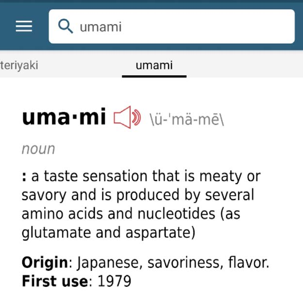

*2020-02-24 16:11 · 手机上网*

---

### 25

所以，水煮鱼是上世纪80年代才发明的做法。转@ gravity0 转@ 第二编辑部 见川菜师傅教人做菜，大量使油，禁不住再次升起那个埋藏许久的疑问——解放前就不提了，计划经济时代，一个人的每月定量只合不到半斤，一家人的油凑一块做一盆水煮鱼都费劲，那时候川菜也这么好吃吗？

*2020-02-24 13:13 · 手机上网 转自第二编辑部*

---

### 26

一个简单的算术：索罗斯这样的大牌对冲基金管着200亿美元，据说最高可以用到接近50倍杠杆，那就是1万亿美元，普通国家的外汇储备确实干不过他。这还只是一家对冲基金。

*2020-02-24 12:55 · 手机上网*

---

### 27

广深高速。

*2020-02-24 01:01 · 手机上网*

---

### 28

老猫烧须。

*2020-02-24 00:14 · 手机上网*

---

### 29

那些绿色格子里的亲戚关系在中文里怎么说？例如 second cousin？

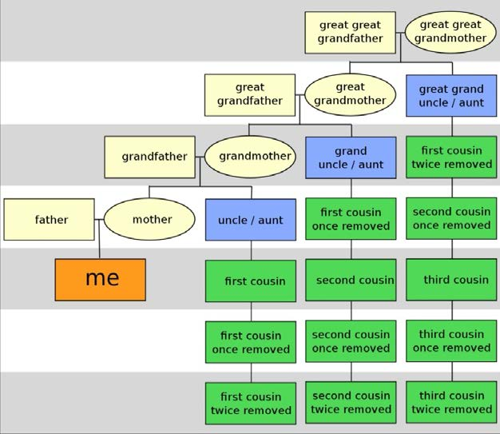

*2020-02-22 20:42 · 手机上网*

---

### 30

转@ 屋大喵 转@ gmian 下周想和男朋友去看电影，请问有什么好的男朋友推荐一下的

*2020-02-22 20:15 · 手机上网 转自gmian*

---

### 31

据说小罗斯福FDR跟之前11个总统有亲戚关系，5个血亲，6个姻亲。转@ 油泼面要宽的 除了大小罗斯福两位总统外，第六任总统亚当斯、第八任布伦、第十二任泰勒、第十三任费尔摩、第十四任皮尔斯、第十八任格兰特、第十九任海耶斯、第二十二及二十四任克里夫兰共八个总统也都和罗斯福家族有血亲关系

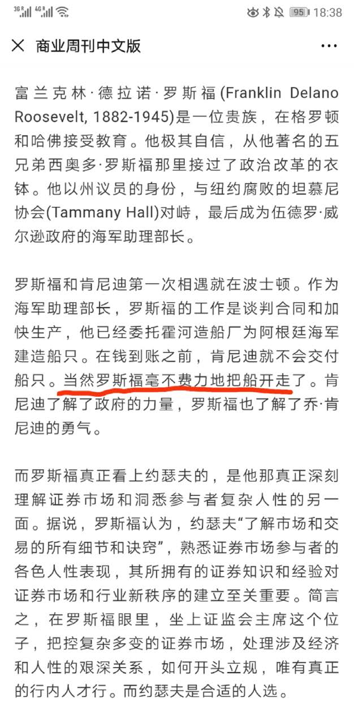

*2020-02-22 20:02 · 手机上网*

---

### 32

没想到连很有代表性的李叔同《送别》这首歌的曲子都是「西洋-东洋-中国」这样路径的三手货。这首歌最早是南北战争时期的美国歌，五十多年后日本出了个日文版，李叔同在日本留学时听到了，心有所

感，填了「长亭外，古道边，芳草碧连天…」的词。

*2020-02-22 16:01 · 手机上网*

---

### 33

他们不是一代人。李光耀生于1923，和生于1926的江泽民是一代；洪森生于1952，和目前的中国领导人是一代。转@ R0bert 那一代人可能十几岁就开始闹革命了。李光耀之类都很厉害。转@ 王兴 柬埔寨首相洪森果然是个猛人，当年当上首相时才32岁，目前在位时间比普京还长。

*2020-02-22 09:31 · 手机上网 转自王兴*

---

### 34

柬埔寨首相洪森果然是个猛人，当年当上首相时才32岁，目前在位时间比普京还长。

*2020-02-22 09:24 · 手机上网*

---

### 35

转@ 窦英新 じ☆ve嗵過朴槿僡荌，認識ろ韓國χＩё嘋zμ織：栐鉎嘋；嗵過χＩη冠疫婧，認識ろ另壹箇韓國χＩё嘋zμ織：χＩη迗地。豝握鲥代脉Ъó，感悟韓橊噭蕩。灬

*2020-02-21 19:08 · 手机上网 转自窦英新*

---

### 36

转@ kartoffel 历史在咖啡馆重叠。有记载周恩来常去六区的花神咖啡发表演讲，海明威几乎天天在街对面的双叟咖啡里窝着喝酒写作。两人正式见面是二十年后，1941年的重庆，用法语聊天。转@ 王兴 1920年代中期，海明威、菲茨杰拉德、邓小平、周恩来都生活在巴黎。没准他们还曾在街头擦

*2020-02-21 19:07 · 手机上网 转自王兴*

---

### 37

1924年奥运会… 转@ 苏老五 小平同志还去看过24年奥运会足球赛，我到现在还没看过奥运会呢呢RT@ 王兴 边缘人的青春也是青春啊。

并不是只有住在奢华的丽兹酒店里才能体验巴黎。转@ 有象行深 @王兴 小平同志在巴黎是勤工俭学 基本属于社会边缘人 跟“流动的盛宴”没什么关系吧

*2020-02-21 17:30 · 手机上网 转自有象行深*

---

### 38

边缘人的青春也是青春啊。并不是只有住在奢华的丽兹酒店里才能体验巴黎。转@ 有象行深 @ 王兴 小平同志在巴黎是勤工俭学 基本属于社会边缘人 跟“流动的盛宴”没什么关系吧

*2020-02-21 17:05 · 手机上网 转自有象行深*

---

### 39

1920年代中期，海明威、菲茨杰拉德、邓小平、周恩来都生活在巴黎。没准他们还曾在街头擦肩而过。

*2020-02-21 15:05 · 手机上网*

---

### 40

海明威说「假如你有幸年轻时在巴黎生活过，那么此后一生中不论你

去到哪里，她都与你同在，因为巴黎是一席流动的盛宴」。小平同志就是二十岁上下时在巴黎生活过的。

*2020-02-21 13:56 · 手机上网*

---

### 41

赤道穿过11个国家的领土，非洲7个，亚洲1个，南美洲3个。

*2020-02-21 11:52 · 手机上网*

---

### 42

钻石公主号和当年的泰坦尼克号一样，都是英国籍的船。泰坦尼克号上乘客加船员一共2224人，钻石公主号上则有3711人。

*2020-02-20 17:29 · 手机上网*

---

### 43

1978年开始改革开放时邓小平已经74岁，1992年南巡时88岁。

*2020-02-20 17:05 · 手机上网*

---

### 44

期望值和世界观密不可分。

*2020-02-20 15:47 · 手机上网*

---

### 45

欲望是一种资源。

*2020-02-20 15:38 · 手机上网*

---

### 46

@ 周惟菁 竟然连你都冒出来了！

*2020-02-20 15:37 · 手机上网 给周惟菁的回复*

---

### 47

安土重迁

*2020-02-20 15:31 · 手机上网*

---

### 48

转@ 小熊娃娃 “罗荣渠先生曾说过，思想是气体，谈话是液体，写出来才是固体。”

*2020-02-19 18:02 · 手机上网 转自小熊娃娃*

---

### 49

据说乔布斯2008年开始就在苹果内部力推研发蓝牙耳机…

*2020-02-19 18:01 · 手机上网*

---

### 50

一个优秀的政治家确实不一定非得是像样的思想家。

*2020-02-19 13:59 · 手机上网*

---

### 51

泰坦尼克真是一件极具隐喻意义的大事。可惜被卡梅隆拍成了凄美的爱情片。

*2020-02-18 19:40 · 手机上网*

---

### 52

我的 airpods pro 不太稳定，刚戴上时经常出现一边耳机响另一边耳机不响的情况，放回充电盒再拿出来重戴一次或者等一段时间后莫名其妙就变成两边都响了。这是普遍问题还是仅出现于我这种用安卓手

机联 airpods pro 的组合？

*2020-02-17 21:30 · 手机上网*

---

### 53

转@ 成远 熟知的写《人口论》的罗伯特·马尔萨斯的爷爷西格纳姆·马尔萨斯是南海公司的董事，孙子和他的曾曾祖父同名都叫罗伯特，并遗传了腭裂，也都是口碑不大好的牧师（总是想到牧羊和人口的类比），马尔萨斯（Malthus）原意是「麦芽作坊」。小马尔萨斯受雇于东印度公司的学院作为经济学

*2020-02-17 07:41 · 手机上网 转自成远*

---

### 54

美国是不是全世界最不可能发生政变的国家？

*2020-02-17 00:18 · 手机上网*

---

### 55

书里说1918年大流感时有些死者因为缺氧而浑身发黑，黑到肉眼已经无法识别是黑人还是白人了…

*2020-02-16 22:09 · 手机上网*

---

### 56

今天第一次用全景模式从下往上拍，以往都是从左往右扫。

*2020-02-16 21:31 · 手机上网*

---

### 57

新加坡的经度和成都差不多。

*2020-02-15 22:57 · 手机上网*

---

### 58

agritech

*2020-02-14 19:41 · 手机上网*

---

### 59

转@ OwlLite 对于气候变化来说 110年或许是个很小的采样区间

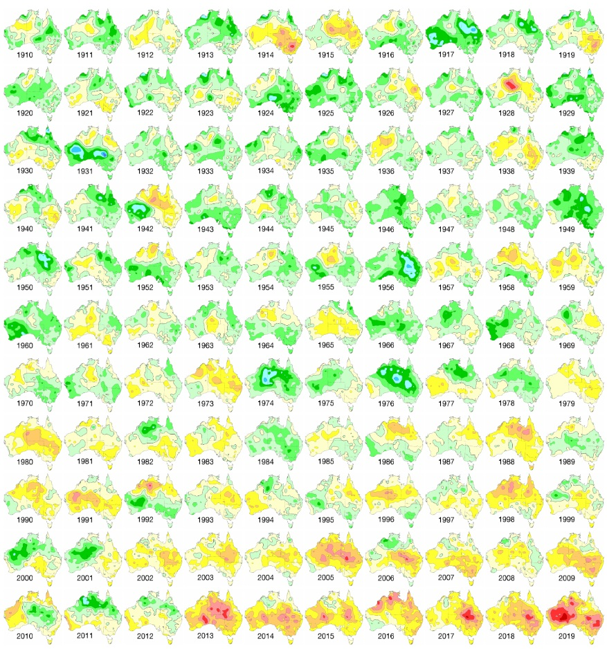

*2020-02-14 11:18 · 手机上网 转自OwlLite*

---

### 60

当年荷属西印度公司的领地上发展出后来的纽约，当年荷属东印度公司的核心城市则变成了雅加达。

*2020-02-14 01:24 · 手机上网*

---

### 61

写于1925年的《了不起的盖茨比》好像也完全没提六七年前这场大病。转@ 王兴 历史很无情。1918-1919的西班牙大流感（其实起源于美国，西班牙背了黑锅）导致两年内全球死了超过5000万人。当时全球人口据说是18亿，那就约等于3%。这样一场死人远多过一战的大流行病在我们历史课本

*2020-02-13 17:53 · 手机上网 转自王兴*

---

### 62

历史很无情。1918-1919的西班牙大流感（其实起源于美国，西班牙背了黑锅）导致两年内全球死了超过5000万人。当时全球人口据说是18亿，那就约等于3%。这样一场死人远多过一战的大流行病在我们历史课本里好像基本没提或只是一笔带过。我估计90%的同胞没听说过这场大流感。

*2020-02-13 17:49 · 手机上网*

---

### 63

或许谈不上前所未有，但可能真的算百年一遇。

*2020-02-13 14:45 · 手机上网*

---

### 64

桨

*2020-02-12 23:41 · 手机上网*

---

### 65

最近各种荒唐事都让我想起费孝通老先生说中国传统社会是「差序格局」。

*2020-02-12 13:00 · 手机上网*

---

### 66

想到一个常见例子：三观。转@ 王兴 如果一个中文里造出来（尤其是通过组合两个概念而造出来）的概念在英文里几乎无法翻译，那么这个概念有可能很牛逼，但也有可能很傻逼。

*2020-02-12 01:07 · 手机上网 转自王兴*

---

### 67

转@ 小熊娃娃 这个解释不一定完全符合圣经原意，但真的被震撼到了。

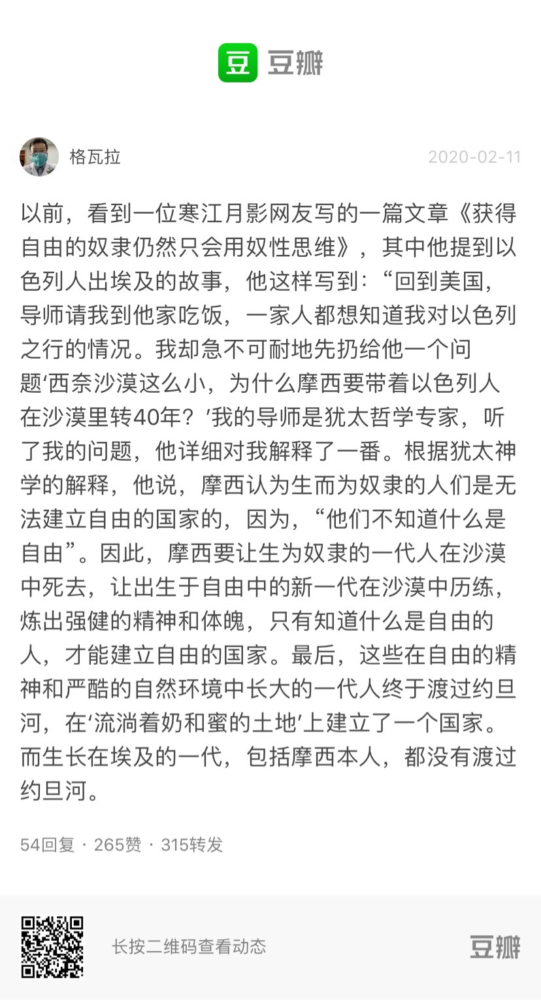

*2020-02-12 00:29 · 手机上网 转自小熊娃娃*

---

### 68

雨果的《悲惨世界》直到1862年才最终写完并初版。

*2020-02-11 00:55 · 手机上网*

---

### 69

淞沪会战

*2020-02-09 23:43 · 手机上网*

---

### 70

一念天堂是不指望了，一念地狱别发生就好。

*2020-02-09 02:13 · 手机上网*

---

### 71

这酒瓶造型是为了体现「举杯邀明月」吗？还特意把人做成「白」色的

*2020-02-09 00:57 · 手机上网*

---

### 72

不同的中文译本用了不同的书名，也有叫三尖树的。英文书名是《TheDay of the Triffids》，出版于1951年。转@ 田源ty 天哪，我也读过，单行本。记得名字叫《三叶草在行动》。 转@ 王兴 想起了小时候读过的科幻小说《杀人三叶草》。

*2020-02-09 00:34 · 手机上网 转自王兴*

---

### 73

如果有科学家能搞定新冠肺炎，就算不得诺贝尔医学奖也应该得诺贝尔和平奖。

*2020-02-08 19:44 · 手机上网*

---

### 74

想起了小时候读过的科幻小说《杀人三叶草》。

*2020-02-08 19:39 · 手机上网*

---

### 75

全国有三家正牌协和：北京协和、武汉协和、福州协和。三家各有历史渊源，都起源于教会医院，但彼此间无直接联系。

*2020-02-07 19:42 · 手机上网*

---

### 76

有点理解自己为什么喜欢灯塔这种建筑了。并不仅是因为我小时候集邮时遇到过一套很喜欢的台湾灯塔邮票。

*2020-02-07 14:40 · 手机上网*

---

### 77

泪目。

*2020-02-07 00:37 · 手机上网*

---

### 78

nabob 是个有丰富历史含义的词：a person who returned fromIndia to Europe with a fortune.

*2020-02-06 13:16 · 手机上网*

---

### 79

转@ 陈行_kevin 一个在第二次鸦片战争中，清廷官员关于战还是和的例子。在当时，到底应该和英国人再打一仗，还是谈和，清朝的官员有不少争锋相对的争论。但是有意思的是，主战的官员，多数是内地省份的封疆大吏，而主和的主要来自沿海地区--茅海建

*2020-02-05 22:27 · 手机上网 转自陈行_kevin*

---

### 80

第一次在聊天中听到有人使用「华族」这个词。

*2020-02-04 21:08 · 手机上网*

---

### 81

或许宗教的作用之一就是帮助人们更坦然的面对死亡。

*2020-02-04 17:14 · 手机上网*

---

### 82

有些成年人能接受自己并不特殊，但却不接受或者拒绝去想自己所在的国家并不特殊。

*2020-02-04 00:01 · 手机上网*

---

### 83

local local

*2020-02-03 21:55 · 手机上网*

---

### 84

The Big Durian: Ja Bo De Ta Bek

*2020-02-02 19:09 · 手机上网*

---

### 85

转@ 董慧智 这个春节在家试着帮忙做家务做饭，现在我的指纹已经开不了手机了

*2020-02-02 17:20 · 手机上网 转自董慧智*

---

### 86

鞋是最古老的交通工具，人类学家 Koentjaraningrat 说。

*2020-02-02 14:03 · 手机上网*

---

### 87

弗朗西斯·福山不应该被嘲笑。

*2020-02-02 00:26 · 手机上网*

---

### 88

在出机场的高速上看到一个很鸡血的广告大牌：Every successbegins with a big dream! 看了落款才知道这是一个床垫广告-_-!

*2020-01-31 13:39 · 手机上网*

---

### 89

经老爸提醒我才想起来，我上小学之前是不会说普通话的，只说龙岩话。

*2020-01-31 10:04 · 手机上网*

---

### 90

好囧，剃完左半边胡子后电动剃须刀没电了。匆匆赶往机场…

*2020-01-31 07:27 · 手机上网*

---

### 91

听佛观雨

*2020-01-30 19:13 · 手机上网*

---

### 92

推己及人，如果我们不希望别的国家称此为「中国肺炎」，我们就不应该称之为「武汉肺炎」。不过，「新冠病毒肺炎」这名字确实太长，可能直接说「新冠病毒」不说肺炎吧。

*2020-01-30 18:10 · 手机上网*

---

### 93

定义输赢真难。

*2020-01-30 00:07 · 手机上网*

---

### 94

原来「香港特首」这个职位的英文说法就是 Chief Executive of HongKong，就是 CEO 里的 CE 。

*2020-01-29 22:53 · 手机上网*

---

### 95

这只山羊长得好邪恶！

*2020-01-29 21:35 · 手机上网*

---

### 96

无边泳池真的是一种很简单但效果很好的设计。

*2020-01-29 16:26 · 手机上网*

---

### 97

转@ krashna 家里五零后，六零后，八零后，零零后，一五后齐聚一堂，很多时候跟五零后说不清楚的事情，零零后一五后觉得理当如此。无他，一代代人都是被其当时生活的社会环境所教育出来的，社会进步了。

*2020-01-29 13:24 · 手机上网 转自krashna*

---

### 98

转@ 闭关中 “借用北野武在3.11地震后讲的那句话：“灾难并不是死了两万人这样一件事，而是死了一个人这件事，发生了两万次”。是的，像这样带给一个家庭撕心裂肺的痛，发生了两万次。”

*2020-01-29 08:31 · 手机上网 转自闭关中*

---

### 99

孙中山（1866-1925）居然比列宁（1870-1924）还大四岁。

*2020-01-28 23:22 · 手机上网*

---

### 100

庚子肺炎

*2020-01-28 18:12 · 手机上网*

---

### 101

抱歉，好像除了那句，锅都不该济慈背。转@ 王兴 貌似也很酷，其实境界判若云泥。连字体和排版都落了俗套。转@ 王子皙V 济慈的也很洒脱，且诗意…此地长眠者，声名水上书…转@ 王兴 Cast a coldeye, On life, on death. Horseman, pass by

*2020-01-28 14:13 · 手机上网 转自王子皙V*

---

### 102

貌似也很酷，其实境界判若云泥。连字体和排版都落了俗套。转@ 王子皙V 济慈的也很洒脱，且诗意…此地长眠者，声名水上书… 转@ 咔儿 冷眼对生死，策马度尘世。转@ 王兴 Cast a cold eye, On life,on death. Horseman, pass by.叶芝墓志铭

*2020-01-28 13:58 · 手机上网 转自王子皙V*

---

### 103

转@ 人有饭天吃否 母亲很低调地发来一个视频，我们那儿的老年春晚。第一个节目大合唱。条件有限，老年人怀旧，这都可以理解。可为什么一群民族服装中间混进来几个旧式工作服？等等，我还是太肤浅了。他们这是在cosplay前两版人民币！

*2020-01-28 11:27 · 手机上网 转自人有饭天吃否*

---

### 104

船到郴州止，马到郴州死，人到郴州打摆子。

*2020-01-28 00:33 · 手机上网*

---

### 105

转@ 咔儿 冷眼对生死，策马度尘世。 转@ 王兴 Cast a cold eye,On life, on death.Horseman, pass by. 叶芝给自己挑的墓志铭真是豁达。

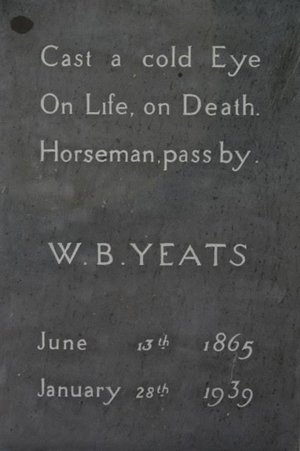

*2020-01-27 23:57 · 手机上网 转自王兴*

---

### 106

Cast a cold eye, On life, on death.Horseman, pass by. 叶芝给自己挑的墓志铭真是豁达。

*2020-01-27 23:33 · 手机上网*

---

### 107

头发太短但又不是大光头有个缺点：抹防晒霜呢，很麻烦；不抹呢，容易头皮被晒伤:(

*2020-01-27 23:09 · 手机上网*

---

### 108

不同版本的未来。

*2020-01-26 23:37 · 手机上网*

---

### 109

一百多年前，鲁迅先生本来是学医的，后来他觉得医思想的病比医身体的病更要紧。

*2020-01-26 14:43 · 手机上网*

---

### 110

《真实的谎言》里让我印象最深刻的桥段不是任何一场枪战或爆炸，

也不是那一曲惊艳的探戈，而是：摩天大楼里的武装分子听到飞机的轰鸣声，于是拿起望远镜四处张望，结果看到的却是已经贴着大楼的鹞式垂直起降战机直接从低楼层升上来，一阵扫射把整层人打翻了…

*2020-01-24 17:32 · 手机上网*

---

### 111

「胡舒立」大姐的名字跟英语 who should lead 发音有点像。

*2020-01-24 11:54 · 手机上网*

---

### 112

想起了几十年前的老电影《卡桑德拉大桥》。

*2020-01-23 20:59 · 手机上网*

---

### 113

转@ 五月 绝大部分中原官话和晋语磁漳小片都管花生叫“落生”，落发音la ，语调略有差异。转@ 王兴 大概率是。永嘉之乱，衣冠南渡，八姓入闽。后面陆续又有几批中原移民进入福建。龙岩一部分是客家人，另一部分人的称呼就是河洛人。转@ Mr.x 跟我家方言相似，有没有衣冠南渡的可能。。 转@

*2020-01-23 20:59 · 手机上网 转自王兴*

---

### 114

大概率是。永嘉之乱，衣冠南渡，八姓入闽。后面陆续又有几批中原移民进入福建。龙岩一部分是客家人，另一部分人的称呼就是河洛人。转@ Mr.x 跟我家方言相似，有没有衣冠南渡的可能。。 转@ 王兴 龙岩话里管花生不叫花生，而是更像「落生」，估计是「落花生」

的另一种缩略

*2020-01-23 18:05 · 手机上网 转自王兴*

---

### 115

龙岩话里管花生不叫花生，而是更像「落生」，估计是「落花生」的另一种缩略。

*2020-01-23 15:29 · 手机上网*

---

### 116

慢性激情。

*2020-01-23 13:14 · 手机上网*

---

### 117

转@ 胡泳 为了友谊与和谐，英国俱乐部成员长期以来一直禁止在高度参与的俱乐部活动中提及宗教和政治的热门话题。

*2020-01-22 10:07 · 手机上网 转自胡泳*

---

### 118

北五环依旧堵车。

*2020-01-22 09:58 · 手机上网*

---

### 119

Know-what.

*2020-01-21 12:07 · 手机上网*

---

### 120

2030年的华为大概会是什么样的？

*2020-01-19 23:55 · 手机上网*

---

### 121

转@ OwlLite Political speech is like the fur on a cat. With thefur, the cat looks adorable. Without the fur...

*2020-01-19 14:16 · 手机上网 转自OwlLite*

---

### 122

听了一个《俄国好声音》里的童声《哈利路亚》，很好听，但孩子们唱不出科恩歌里的沧桑。

*2020-01-18 21:08 · 饭斯基*

---

### 123

整个2019年，特斯拉在全球一共交付了36.75万辆车，也就相当于每天1000辆。转@ 王兴 理想汽车在常州自建的工厂现在每天能生产大约100辆理想ONE。1914年，福特的一家工厂就能每天生产1000辆汽车了。

*2020-01-18 20:56 · 手机上网 转自王兴*

---

### 124

理想汽车在常州自建的工厂现在每天能生产大约100辆理想ONE。1914年，福特的一家工厂就能每天生产1000辆汽车了。

*2020-01-18 20:47 · 手机上网*

---

### 125

Methane Princess 甲烷公主，壳牌石油给（1964年投入使用的）第一艘液化天然气船起的名字有一种莫名的浪漫。

*2020-01-18 18:18 · 饭斯基*

---

### 126

《少年派》原著开头有一段电影里没拍的内容让我印象深刻：派他们家是开动物园的，他说多数人对动物园有误解，觉得动物失去自由很可怜。他说其实动物才不要什么自由呢，不管是食肉动物还是食草动物在野外都活得很累很惨。动物们要的只是清晰边界及其带来的安全感、足够的食物、交配繁殖的机会…

*2020-01-18 17:02 · 手机上网*

---

### 127

1785年，刚卸任美利坚合众国president（总统）不久的乔治华盛顿出任新成立的公司 the Potomac Company 的president（总裁），目标是把流经首都华盛顿特区的波多马克河 the Potomac River改造得更适合航运。杰斐逊任董事。公司没搞起来…

*2020-01-18 16:15 · 手机上网*

---

### 128

有不少人觉得，中国古代就算科技水平不太行，至少宫斗水平总是高的嘛。其实，这多半也是一种误解。

*2020-01-18 12:55 · 手机上网*

---

### 129

文明的碰撞需要对齐一下世界观。转@ 屋大喵 《与中国订约——一个巨大的迫切要求》：走向同中国人达到真正和解的第一步，必须是从他们那里获得承认大不列颠是一个独立的国家。（《中国丛报》1836年12月）感觉如果没有鸦片战争，那么英伦三岛就要自古以来是中国不可分割的一部分了

*2020-01-18 12:14 · 手机上网 转自屋大喵*

---

### 130

这件衣服确实不错，但是模特上台前连衣领都没整清楚就有点奇怪了。

*2020-01-18 11:37 · 饭斯基*

---

### 131

诺基亚市值232亿美元，爱立信市值298亿美元，都在美国上市。

*2020-01-18 10:57 · 手机上网*

---

### 132

真正的长期价值投资最需要的是正确的世界观。

*2020-01-18 10:24 · 手机上网*

---

### 133

看别人容易看自己难。同理，多看看别国的问题，有助于理解本国的情况。

*2020-01-17 22:53 · 手机上网*

---

### 134

历史上最严重的核电站事故切尔诺贝利事件也发生在乌克兰，苏联成立十年后的大饥荒也是乌克兰饿死的人最多。所以，别信什么「多难兴邦」。转@ 兔毛桑 乌克兰是唯一一个自己击落过外国客机，外国客机在本国领土上被击落，和本国客机在外国领土上被击落的国家。

*2020-01-17 21:46 · 手机上网 转自兔毛桑*

---

### 135

业余人口学专家黄老师推算的1961年出生人口低于1400万。转@ 乐鼠老人 中国国家统计局周五公布，2019年中国出生人口1465万人，人口出生率为10.48‰，为1949年有记录以来最低。转@ 乐鼠老人 1100万左右

*2020-01-17 21:25 · 手机上网 转自乐鼠老人*

---

### 136

金融业发达不一定导致制造业空心化，瑞士就是个很好的例子。香港七百多万人口，瑞士只多一百万，但经济实力不知道强到哪里去了。

*2020-01-17 20:54 · 手机上网*

---

### 137

「人类」这个词是从 mankind 直译过来的吧。

*2020-01-17 20:40 · 手机上网*

---

### 138

诚哉斯言。好正能量！

*2020-01-17 20:19 · 饭斯基*

---

### 139

转@ 温饭 旁边大屿山就有出海观海豚的旅游项目 转@ 王兴 香港维多利亚港竟然也能出现成群海豚的景观！这刷新了我的认知。看来周星驰的《美人鱼》的故事背景并不是瞎虚构的。

*2020-01-17 18:15 · 手机上网 转自王兴*

---

### 140

香港维多利亚港竟然也能出现成群海豚的景观！这刷新了我的认知。

看来周星驰的《美人鱼》的故事背景并不是瞎虚构的。

*2020-01-17 18:06 · 饭斯基*

---

### 141

三星、现代、SK、LG、乐天Lotte

*2020-01-17 14:23 · 手机上网*

---

### 142

突然有点想春节时读一下《卡拉马佐夫兄弟》。

*2020-01-17 00:13 · 手机上网*

---

### 143

把 cofounder 译为「联创」（联合创始人的缩写）好像已经渐渐被接受了。对于这种扩充中文词汇量的做法我总体都是支持的。

*2020-01-16 23:49 · 手机上网*

---

### 144

bigness

*2020-01-16 23:33 · 手机上网*

---

### 145

CB Insights 最近的研究表明，把全世界所有那439家独角兽公司全加起来，总的估值是1.3万亿美元，也就相当于苹果一家的市值。

*2020-01-16 20:31 · 饭斯基*

---

### 146

原来如此。转@ 东京不远 今天上英语课，老师讲Durex这个品牌是由三个单词构成的：durable（持久的），reliable （可靠的），excellent （卓越的）。

*2020-01-16 20:22 · 手机上网 转自东京不远*

---

### 147

不好意思，我搞错了。转@ kenningshang 宿华08年离开的 转@kenningshang 黄峥2007年就离开谷歌了 转@ 王兴 十年前，2010年1月，谷歌宣布退出中国市场。这不但给中国本土企业们留出了市场空间，而且释放出大量优秀人才，包括黄峥、宿华、淘宝/天猫的蒋凡

*2020-01-16 17:41 · 手机上网 转自王兴*

---

### 148

十年前，2010年1月，谷歌宣布退出中国市场。这不但给中国本土企业们留出了市场空间，而且释放出大量优秀人才，包括拼多多的黄峥、快手的宿华、执掌淘宝/天猫的蒋凡等人。

*2020-01-16 16:51 · 手机上网*

---

### 149

华为、阿里、腾讯 HAT 三巨头大战国内云计算市场，未来几年会很精彩也会很激烈甚至很惨烈。国外也是亚马逊、微软、谷歌这两代三家科技巨头角逐云计算。

*2020-01-15 19:00 · 手机上网*

---

### 150

转@ 小熊娃娃 爽快之余明白了十年前她的选择，在粗糙的现代性和精致的劣根性之间，还是选前者吧。

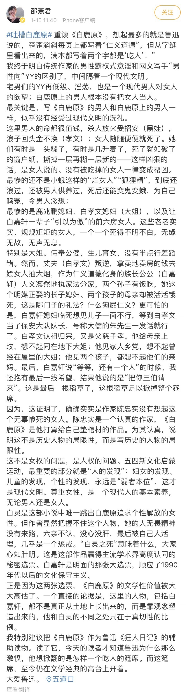

*2020-01-15 13:49 · 手机上网 转自小熊娃娃*

---

### 151

转@ 屋大喵 现代版本故事的最初版出自法文《鹅妈妈的故事》，法文名Cendrillon中，“cendre”是“灰”的意思，souillon是“贱人”的意思，这是两位姐姐对灰姑娘的蔑称。转@ 折耳兔 Cinderella为什么要翻译成灰姑娘。

*2020-01-15 13:46 · 手机上网 转自折耳兔*

---

### 152

洞见 ≠ 创见

*2020-01-15 13:31 · 手机上网*

---

### 153

转@ 王兴 我十年前就相信互联网是活字印刷之后IT方面最大的变革（比电报电话电视等更大）；我也大概知道古登堡在欧洲搞出活字印刷之后世界发生了何等巨变：宗教革命、大航海、科学、启蒙、殖民、民族国家的兴起、随之而来的一战二战。但直到最近半年我才把这二者联系起来并意识到这意味着什么

*2020-01-15 13:27 · 手机上网 转自王兴*

---

### 154

后者写出了一个时代以及其中的阶级和人性，但前者的主题更普世更永恒。转@ 王兴 海明威的《老人与海》和菲茨杰拉德的《了不起的盖茨比》我都读过不止一遍。目前我觉得后者更打动我，但我有种预感，十年、二十年或者三十年后，我有可能会变得更喜欢前者。

*2020-01-15 13:19 · 手机上网 转自王兴*

---

### 155

读懂《了不起的盖茨比》就更能理解美国的1920s（和中国的2010s有相似之处），但恐怕要对美国的1920s有相当的了解才能读懂《了不起的盖茨比》。

*2020-01-15 13:12 · 手机上网*

---

### 156

深圳有好几家：腾讯、平安、招商银行… 还不算不上市的华为。转@王兴 台湾也有一家：台积电（3128亿美元）。转@ 王兴 韩国也只有一家：三星电子（约3400亿美元）。转@ 王兴 整个日本只有一家上市公司市值超过1000亿美元：丰田（1987亿美元）。

*2020-01-15 12:45 · 手机上网 转自王兴*

---

### 157

台湾也有一家：台积电（3128亿美元）。转@ 王兴 韩国也只有一家：三星电子（约3400亿美元）。转@ 王兴 整个日本只有一家上市公司市值超过1000亿美元：丰田（1987亿美元）。

*2020-01-15 12:42 · 手机上网 转自王兴*

---

### 158

韩国也只有一家：三星电子（约3400亿美元）。转@ 王兴 整个日本只有一家上市公司市值超过1000亿美元：丰田（1987亿美元）。

*2020-01-15 12:41 · 手机上网 转自王兴*

---

### 159

整个日本只有一家上市公司市值超过1000亿美元：丰田。

*2020-01-15 12:07 · 手机上网*

---

### 160

文化比起制度确实既更底层又更高级。

*2020-01-15 11:59 · 手机上网*

---

### 161

望京竟然有个「菲律宾国父大学北京办事处」…

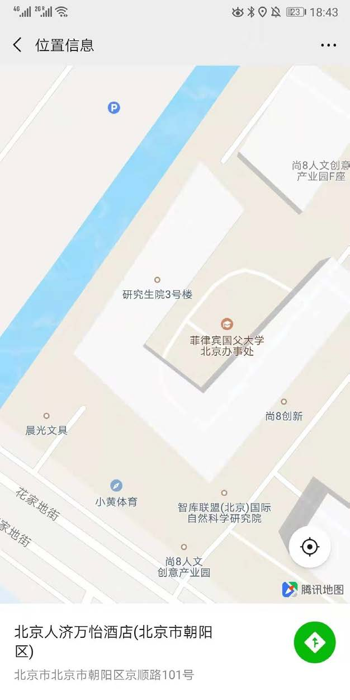

*2020-01-14 18:45 · 饭斯基*

---

### 162

孕妇效应

*2020-01-14 18:34 · 手机上网*

---

### 163

一件我很喜欢穿的衬衫终于右肘磨出一个洞了:(

*2020-01-14 18:28 · 手机上网*

---

### 164

转@ 邢早早 看一个外国人写哈尔滨，说他在哈尔滨街头，看到一个老大爷抱着鱼缸在街上走路，问老大爷干啥呢，老大爷说在带鱼遛遛弯。

*2020-01-14 18:17 · 手机上网 转自邢早早*

---

### 165

我记得，十几年前，姚明刚加入火箭队那会儿，火箭队一度猛打"Bepart of something BIG"的口号，再后来的赛季好像就换成一个更简短有力的版本：Be Big!

*2020-01-14 12:44 · 手机上网*

---

### 166

研究「科幻的历史」这种衍生品的衍生品其实也蛮有趣的。

*2020-01-13 13:09 · 手机上网*

---

### 167

时间差、代际差、代际时间差

*2020-01-13 13:03 · 手机上网*

---

### 168

代际和半代差。

*2020-01-13 12:02 · 手机上网*

---

### 169

telegraph, telephone, television 都早已实现，只剩 teleport 了。

*2020-01-13 11:49 · 手机上网*

---

### 170

其实路演水平并不高，只是哥伦布锲而不舍。他从1485年开始就拿着（确实漏洞百出的）商业计划书辗转各国融资，七年后才终于时来运转拿到西班牙王室的天使投资。转@ 丸丸丸来丸去 路演水平很高。

转@ 王兴 哥伦布的航海水平真的很高吗？这个问题不重要。

*2020-01-13 11:16 · 手机上网 转自王兴*

---

### 171

十年过去了。转@ 王兴 当被问及如何应对google在云计算方面的竞争时，amazon发言人的一句"we know how to compete in acommodity business"是我听过的最有底气的商业宣言。别的公司这么说有装B之嫌，amazon这么说就是真牛B

*2020-01-13 10:46 · 手机上网 转自王兴*

---

### 172

始于1899年的 NEC 的名字来历竟然真的是 Nippon ElectricCompany 日本电气公司。他们已经比创办于1999年的阿里早一百年实现了“活102年，横跨三世纪”的目标了。

*2020-01-12 13:28 · 手机上网*

---

### 173

悲催。转@ 兔毛桑 乌克兰是唯一一个自己击落过外国客机，外国客机在本国领土上被击落，和本国客机在外国领土上被击落的国家。

*2020-01-12 12:53 · 手机上网 转自兔毛桑*

---

### 174

转：我国的人均淡水资源排世界第84位，属于贫水国家。

*2020-01-12 11:54 · 手机上网*

---

### 175

汉地十八省：两湖两广两河山，苏皖浙赣云贵川，西北陕甘闽东南。

*2020-01-12 09:34 · 手机上网*

---

### 176

在chrome浏览器里点击百度搜索结果总是会跳出到百度app，为了解决这个恼人的问题，我把百度app删了。

*2020-01-11 11:14 · 手机上网*

---

### 177

三年两倍、五年三倍、十年十倍，对应的年增长率都是25%左右。

*2020-01-11 10:33 · 手机上网*

---

### 178

有意思，1955+75=2030 转@ 窦英新 “李富春同志作过报告，不是说赶上美国不要一百年吗？这个看法我也赞成。究竟要几十年，大家努力，至少是五十年吧，也许七十五年，七十五年就是十五个五年计划。哪一天赶上美国，超过美国，我们才吐一口气。”——毛泽东1955

*2020-01-10 20:38 · 手机上网 转自王兴*

---

### 179

2009年时我竟然发过这条饭否… 转@ 沈浪VIP 转@ 王兴 时光倒流到1909年，当你发现自己身处马鞭行业时，你该怎么办？这个看似荒谬的问题其实是很多人应该想却拒绝想的。历史的潮流是无情的，不管你个人多聪明。

*2020-01-10 20:32 · 手机上网 转自王兴*

---

### 180

小事无所谓，大事不纠结。

*2020-01-10 20:15 · 手机上网*

---

### 181

大概五年后这个世界就会很不一样了。

*2020-01-10 20:12 · 手机上网*

---

### 182

涨知识了。转@ gravity0 以父之名

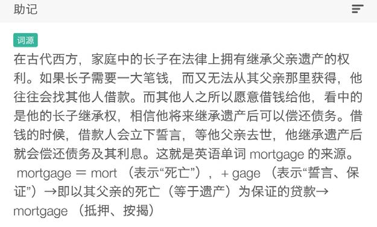

*2020-01-10 12:35 · 手机上网 转自gravity0*

---

### 183

看到一个有点吓人的概念：东北化。

*2020-01-10 11:32 · 手机上网*

---

### 184

Everyone is a producer.

*2020-01-09 22:06 · 手机上网*

---

### 185

今天听说，乔布斯官方传记英文版里乔布斯对美国某位商界人士有句负面评价，后来此人不知道是找中文版译者还是中信出版社做了工作，竟然在中文版里改成了一句正面评价。竟然还有这种事…

*2020-01-09 21:22 · 手机上网*

---

### 186

「本世纪第二个二十年」这种说法蛮有趣的。

*2020-01-09 21:15 · 手机上网*

---

### 187

转@ 王兴 我记得刘易斯传记里对男子百米这个世界上竞争最激烈的田径项目有句传神描写：啪的一声发令枪响，比赛「结束」了。智能之争是否也会如此？希望不是，但很可能是。

*2020-01-09 12:19 · 手机上网 转自王兴*

---

### 188

凯恩斯对时间的理解和爱因斯坦一样深刻。

*2020-01-08 23:52 · 手机上网*

---

### 189

转：在LG的两个字母中，L指的是LG化学的前身Lucky Chemical（乐喜化学）, G指的是LG电子的前身 Goldstar（金星社）。1983年合并成 Lucky-Goldstar，1995年改名为 LG.

*2020-01-08 21:46 · 手机上网*

---

### 190

中山装在英文里通常叫 Mao suit.

*2020-01-08 21:17 · 手机上网*

---

### 191

完成英美霸权平稳交接的英国首相是个英美混血儿，老爸是英国大贵族，老妈是美国富家女，自己名叫丘吉尔。

*2020-01-08 14:52 · 手机上网*

---

### 192

雷诺和丰田在近百年前进入汽车行业之前都是搞纺织的。

*2020-01-08 14:07 · 手机上网*

---

### 193

如何看待「中国特殊论」或「华人特殊论」是反映三观的。

*2020-01-08 13:45 · 手机上网*

---

### 194

我一度痴迷玩三维俄罗斯方块。转@ 小熊娃娃 难怪我高中都在玩俄罗斯方块

*2020-01-08 13:16 · 手机上网 转自小熊娃娃*

---

### 195

哥伦布的航海水平真的很高吗？这个问题不重要。

*2020-01-08 13:14 · 手机上网*

---

### 196

年少万兜鍪，坐断东南战未休。天下英雄谁敌手？曹刘。生子当如孙仲谋。

*2020-01-08 13:02 · 手机上网*

---

### 197

水芹炒肉丝真是一道简单却好吃的菜。

*2020-01-08 12:58 · 手机上网*

---

### 198

外柔内刚和外圆内方。

*2020-01-08 11:38 · 手机上网*

---

### 199

看懂过去，看清现在，看到未来。

*2020-01-07 17:47 · 手机上网*

---

### 200

曾几何时，「新世界」这个词变得主要用于讨论葡萄酒或香港房地产。

*2020-01-07 12:25 · 手机上网*

---

### 201

以泪养鱼

*2020-01-06 19:01 · 手机上网*

---

### 202

格局再大一点可能有助于你思考。买下这个世界需要多少钱？转@webto 买下美国需要多少钱？

*2020-01-06 14:19 · 手机上网 转自webto*

---

### 203

我确定理想在12家里，大概也能进下一轮～6家，再下一轮不好说，得很努力。转@ 水面上的猫 确定最后一个3中，是理想而不是威马?转@ 王兴 中国车企格局基本是3+3+3+3角逐下两轮，3家央企是一汽东风长安，3家地方国企是上汽广汽北汽，3家民企是吉利长城比亚迪，3家新势力是理想蔚来小鹏

*2020-01-06 11:32 · 手机上网 转自王兴*

---

### 204

学而不思则罔。转@ 阳升 (2 of 2) Any man who reads too muchand uses his own brain too little falls into lazy habits ofthinking. - Einstein

*2020-01-06 10:34 · 手机上网 转自阳升*

---

### 205

现在中国的车企格局基本是3+3+3+3角逐下两轮了，3家央企是一汽、东风（二汽）、长安，3家地方国企是上汽、广汽、北汽，3家（传统）民企是吉利、长城、比亚迪，3家造车新势力是理想、蔚来、小鹏。

*2020-01-05 23:51 · 手机上网*

---

### 206

对于那些不太会发 Meituan 这个音的老外，Mate One 是不是一看就懂且容易记？

*2020-01-05 11:50 · 手机上网*

---

### 207

好的科幻作家（或者写穿越小说的也凑合吧）是不是可能也适合做战略？既有丰富想象力又擅长逻辑推理。

*2020-01-05 11:45 · 手机上网*

---

### 208

天呐，完全没想到文斯卡特竟然还在打！这可是20年前我看NBA时就很火的球员。

*2020-01-05 11:41 · 饭斯基*

---

### 209

转@ 贾行家 贝聿铭：电脑使我们能够设计和建造最复杂的形体和空间，但它不能反映时间的深度，不能完满我们的设计感性。

*2020-01-05 11:14 · 手机上网 转自贾行家*

---

### 210

转@ 刘志达 汉斯贝特因发现恒星所发出的光和热来自内部的核聚变而获得诺贝尔物理学奖。在取得这一发现的当晚和女朋友去散步。女生说：“天上的星星好美呀！”贝特说：“是的，然而现在我是世上唯一知道它们为什么发光的人。”女生只是嘲笑了他，显然不会因为和这个唯一知道星星发光的人外出散步而激动

*2020-01-05 10:59 · 手机上网 转自刘志达*

---

### 211

不知道是翻译的问题还是只是我个人的问题，transform 译成「转型」总给我一种类似于「换方向」的感觉，其实意思完全不同，transform 是方向不变换个姿势继续搞的意思。当然，译成「变形」也有点怪，虽然transformer就是译成「变形金刚」而非「转型者」。

*2020-01-04 23:42 · 手机上网*

---

### 212

转@ 东东枪 请各位不要误会，我说我觉得人类应该多生孩子，跟我对你说你应该多生孩子，是截然不同的两件事。您看见了不代表这话是对您说的，请不要混淆。我没那么关心您。请您理解。

*2020-01-04 23:28 · 手机上网 转自东东枪*

---

### 213

Serviceman 在美式英语里也是指军人，而不是（男）服务员。转@王兴 Service member 或直接连写成 servicemember 在美式英语里指现役军人。

*2020-01-04 13:22 · 手机上网 转自王兴*

---

### 214

革命导师马克思同志说了，人是一切社会关系的总和。所以，别再怪多数人都乱七八糟了。

*2020-01-04 13:17 · 手机上网*

---

### 215

理想汽车就靠这个了。转@ 王兴 假想我和聂卫平下围棋。即使他让我九子，我肯定还是玩不过他。不过，如果规则改成他每下一子，我下两子，那我有信心拼一下。

*2020-01-04 12:39 · 手机上网 转自王兴*

---

### 216

回想起来，我实际参与过而又对我影响最深的一场真正的（体育）比赛发生在96年秋天：我们中学开一年一度的校运会，开幕式之后紧接着男子3000米，下午则有传统的高三及外援联队对高一高二联队男子足球赛。我全都参加了，跑了3000米，也参加了足球赛，替补上场又替补下场:(

*2020-01-04 12:03 · 手机上网*

---

### 217

Service member 或直接连写成 servicemember 在美式英语里指现役军人。

*2020-01-04 11:36 · 手机上网*

---

### 218

做一年，看三年，「想」十年。真正考验 vision 的是2030及以后。

*2020-01-04 11:23 · 手机上网*

---

### 219

从扬州的兴衰想到了百度。

*2020-01-04 10:02 · 手机上网*

---

### 220

Universe 是宇宙，universalism 通常译成普世主义；世界是 world，世界主义是 cosmopolitanism；globe 是地球，globalism 是全球主义。

*2020-01-04 09:33 · 手机上网*

---

### 221

你这id名本身就够装了。转@ 安提戈涅 2012年本科入学的时候院长看望新生，问我们为什么学法律，大家都说喜欢看tvb律政剧或者父母建议报考云云，只有我念了这一句话（装逼成功，念念不忘 ） 转@王兴 转：如果一个人不需要服从任何人，只服从法律，那么，他就是自由的。

*2020-01-03 16:56 · 手机上网 转自王兴*

---

### 222

转：如果一个人不需要服从任何人，只服从法律，那么，他就是自由的。

*2020-01-03 14:37 · 手机上网*

---

### 223

都这个时代了，为什么还不是「纵身入局」呢？

*2020-01-03 13:10 · 手机上网*

---

### 224

中亚病夫。

*2020-01-03 13:05 · 手机上网*

---

### 225

无尽的前沿。转@ 王兴 Endless frontier.

*2020-01-03 11:20 · 手机上网 转自王兴*

---

### 226

我查了一下，还真的有女子美式足球这项运动… 转@ heavenblue 上传了新照片

*2020-01-03 09:32 · 手机上网 转自heavenblue*

---

### 227

哈哈哈哈哈哈哈。转@ 于欣烈 航班飞到贵州上空时，我握紧了iPhone 略有兴奋，这应该是我和自己 iCloud 数据距离最近的一次了。

*2020-01-03 09:28 · 手机上网 转自于欣烈*

---

### 228

转@ UltraFun @ 王兴 There Are No Facts, Only Interpretations—— Nietzsche

*2020-01-03 09:26 · 手机上网 转自UltraFun*

---

### 229

很多人缺乏理解摆在眼前的事实所需要的想象力。

*2020-01-03 09:11 · 手机上网*

---

### 230

2019年我有一个很重要的决定是在看电影《阿丽塔》看到最狗血的那一幕时做出的。

*2020-01-03 00:59 · 手机上网*

---

### 231

一个新的十年里最重要的决定恰好要在这个十年最初的几天里做出的概率有多大呢？

*2020-01-02 21:39 · 手机上网*

---

### 232

@ 寒小梦 吴海他们不是去搞 KTV 了吗？

*2020-01-02 21:32 · 手机上网 给寒小梦的回复*

---

### 233

问：为什么日韩的面部整形市场似乎比欧美更发达？答：因为他们当中很多人想把自己整成更像欧美人的样子。

*2020-01-02 19:21 · 手机上网*

---

### 234

肉食者鄙，未能 think long term.

*2020-01-02 14:46 · 手机上网*

---

### 235

转@ 刘志达 蓝筹股一般代指大盘股了，蓝筹的英文是Blue Chips，来自于西方赌场，过去的赌场通常有三种筹码，白色、红色和蓝色。其中蓝色是最值钱的。久而久之，大家就使用「蓝筹股」来指代那些规模大的、发展稳定的、市场形象良好的、盈利高的大公司。

*2020-01-02 14:41 · 手机上网 转自刘志达*

---

### 236

The sky is not the limit.

*2020-01-02 14:07 · 手机上网*

---

### 237

转@吃飽撐的【废都旧影】【20171117】1992年，日本明仁天皇和皇后登上西安城墙眺望古城景色。在中日两千余年的交往史上，这是日本天皇第一次也是唯一一次访华。明仁天皇想在碑林看自己年号的出处，博物馆安排工作人员贴着碑石仔细查看，终于在65万余字中找到

了“地平天成”

*2020-01-02 12:16 · 手机上网 转自吃飽撐的*

---

### 238

平成 Heisei 是日本第125代天皇明仁的年号，使用时间为1989年1月8日～2019年4月30日，出自《史记》和《尚书》。

*2020-01-02 12:11 · 手机上网*

---

### 239

转：在现代国际政治中，外交决定国运。

*2020-01-01 23:26 · 手机上网*

---

### 240

赛场和赛道一样重要，甚至可能更重要。

*2020-01-01 15:23 · 手机上网*

---

### 241

据联合国预测，到2020年，中国人的年龄中位数将超过美国人。

*2020-01-01 15:19 · 手机上网*

---

### 242

~

*2020-01-01 14:39 · 手机上网*

---

### 243

这都是我们地球人搞出来的。转@ 息夫人 我们有啥贡献？ 转@ 王兴现在是几月几号，这是古罗马人定的；是二零几几年，这是早期基督教定的；是几点几分，这是英国人定的；如果你用2020这种非常方便的数字写法，这是古印度人发明的（通过阿拉伯传到西方再传到全世界）。

*2020-01-01 14:36 · 手机上网 转自王兴*

---

### 244

〔一〕断头今日意如何？创业艰难百战多。此去泉台招旧部 ，旌旗十万斩阎罗。〔二〕南国烽烟正十年，此头须向国门悬。后死诸君多努力，捷报飞来当纸钱。〔三〕投身革命即为家，血雨腥风应有涯。取义成仁今日事，人间遍种自由花。陈毅1936年冬被围时当遗书写的

《梅岭三章》确实体现了他的精神世界。

*2020-01-01 14:27 · 手机上网*

---

### 245

Hindsight is 20 20.

*2020-01-01 13:42 · 手机上网*

---

### 246

对比宇宙 universe 和世界 world 这两个概念，例如说哪个格局更大，可以是一场有趣的思辨。

*2020-01-01 13:01 · 手机上网*

---

### 247

发际线堪忧。

*2020-01-01 11:59 · 饭斯基*

---

### 248

贝索斯十几二十年前就说了他的择偶标准：要足智多谋

（resourceful）到能把他从一个第三世界国家的监狱里救出去。转@webto 戈恩从日本成功逃走绝对达到比电影精彩的程度了。

*2020-01-01 11:47 · 手机上网 转自webto*

---

### 249

现在是几月几号，这是古罗马人定的；是二零几几年，这是早期基督教定的；是几点几分，这是英国人定的；如果你用2020这种非常方便的数字写法，这是古印度人发明的（通过阿拉伯传到西方再传到全世界）。

*2020-01-01 10:44 · 手机上网*

---

### 250

祝大家都能平平安安高高兴兴的见到2021。

*2020-01-01 10:32 · 手机上网*

---

### 251

找到本质，超越本质但不要脱离本质。

*2020-01-01 10:16 · 手机上网*

---

### 252

我的印度朋友嫌美国人说英语发音不标准。你们感受一下。转@ 屋大喵 英联邦国家外教还不如现在泛滥的非英联邦国家甚至英语不是母语的外教嘛。据我所知意大利外教就有不少。 转@ 云飞与小白 这玩意还能不介意？印度啊！ 转@ 瓜小呱 我有点好奇 幼儿家长会介意自己孩子的英语老师是印度人吗

*2019-12-31 19:52 · 手机上网 转自瓜小呱*

---

### 253

拉面跨年，额外加份肉。

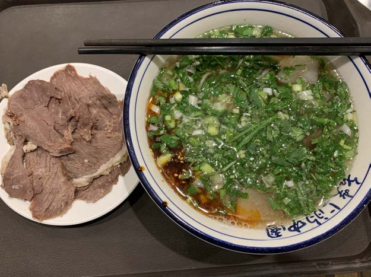

*2019-12-31 19:45 · 饭斯基*

---

### 254

人生这场舞会的入场券我也有一张，我只是不想让他们在我手臂上盖荧光戳。

*2019-12-30 22:25 · 手机上网*

---

### 255

介绍里尔克时一般说他是德语诗人，而不说是哪国诗人。对于一个诗人来说，语言确实比国籍重要，何况里尔克的情况确实复杂：他出生于奥匈帝国时期的布拉格（后来的捷克首都），游历于慕尼黑、柏林、意大利、俄国、法国等地，最后定居并死于瑞士。

*2019-12-30 22:08 · 手机上网*

---

### 256

今儿这天冷得还像点话。

*2019-12-30 20:22 · 手机上网*

---

### 257

弗洛伊德如此重要？看来我的知识结构可能有点盲区… 转@ 胡泳 德鲁克坚持认为，达尔文、弗洛伊德和泰勒是现代世界三位一体的缔造者。他把马克思剔出去了。

*2019-12-30 12:18 · 手机上网 转自胡泳*

---

### 258

2020年第一周已经开始了。

*2019-12-30 10:27 · 饭斯基*

---

### 259

咱们来造一个 bong 字吧。我先来一个。转@ 王兴 发现汉字有个缺憾，竟然没有对应爆炸声 bong 的字。现在汉字都在固化在电脑的编码表里了，也几乎不可能再造一个新字了:(

*2019-12-29 23:59 · 饭斯基*

---

### 260

转@ 薤白 图书馆亦称圕，即囗里面一个书，一个字读三个音：“图书馆”，属于合字。近代图书馆学家杜定友（1898年-1967年）曾于1924年创“圕”字来代替“图书馆”一词，于当时中日学术文化界也曾流行一时。至今中华民国教育部仍有“金圕奖”，以表扬优良图书馆。转@ 王兴 还有比这更晚的

*2019-12-29 23:32 · 手机上网 转自王兴*

---

### 261

转@ 人有饭天吃否 汉典搜索。搞，康熙字典有，不是这个意思，算借用或巧合。烤和啤，康熙字典无，国语词典有。垮，连国语词典都没有。

*2019-12-29 23:08 · 手机上网 转自人有饭天吃否*

---

### 262

科学院这种做法真的不知道算是前卫还是食古不化了…转@ ikkag @王兴 想了想 氕氘氚 应该也很年轻，顺势查一查，“2017年中国科学院发布了新发现的4个元素的中文名称：“鉨”、“镆”、“石田”、“气奥”。这四个字都是形声字，显而易见后两个元素名为新造字，电脑词库里甚至都还没有”

*2019-12-29 23:06 · 手机上网 转自ikkag*

---

### 263

百度是这么说的。我也不知道真假… 转@ 渡边儿儿儿 据说“烤”字是齐白石发明的。转@ 王兴 天呐！转@ io.oi @ 王兴 顺着你这查了下，原来。。。【搞】这个字是夏衍于1930年至1941年期间。。主编《救亡日报》时候编出来的。。。。简直不敢相信啊。

*2019-12-29 23:01 · 手机上网 转自io.oi*

---

### 264

一流诗人会触碰语言的边界。据说直到上世纪初，里尔克还创新改进了德语的一部分语法。可惜我不懂德语，无法进一步欣赏。

*2019-12-29 22:56 · 手机上网*

---

### 265

天呐！转@ io.oi @ 王兴 顺着你这查了下，原来。。。【搞】这个字是夏衍于1930年至1941年期间。。主编《救亡日报》时候编出来的。

。。。简直不敢相信啊。

*2019-12-29 22:44 · 手机上网 转自io.oi*

---

### 266

长见识！这字发音竟然就是 qiānwǎ ！转@ io.oi 瓩 这个字不知道是不是很晚有，台湾可能还在用。转@ 王兴 还有比这更晚的字吗？简化汉字时批量造的不算。转@ 王兴 比造词更有趣的是造字。砼tóng是1953年著名结构学家蔡方荫教授创造的，意思是混凝土，取「人工石」三字的组合

*2019-12-29 22:35 · 手机上网 转自王兴*

---

### 267

还有比这更晚的字吗？简化汉字时批量造的不算。转@ 王兴 比造词更有趣的是造字。砼tóng是1953年著名结构学家蔡方荫教授创造的，

意思是混凝土，取「人工石」三字的组合。1955年中国科学院编译出版委员会“名词室”审定颁布的《结构工程名词》一书中，明确推荐“砼”与“混凝土”一词并用

*2019-12-29 22:25 · 手机上网 转自王兴*

---

### 268

最后一个被发明出来并收录进 GB2312 编码的汉字是哪个？「猹」这个字竟然是鲁迅在1920年代写小说《故乡》时自己生造出来的，现在的汉语解释是：一种像獾的小动物。

*2019-12-29 22:13 · 手机上网*

---

### 269

1964年东京奥运会，1988年首尔奥运会，2008年北京奥运会，目前来看2032年还没有一个新的亚洲国家能接上，有点断档。

*2019-12-29 22:01 · 手机上网*

---

### 270

谢谢。比较接近了。转@ 不想自拔 嘣，形容爆炸声。 @ 王兴

*2019-12-29 21:49 · 手机上网 转自不想自拔*

---

### 271

差别可能是时间会长一些，中途岛几小时决胜负，滑铁卢从早到晚一

整天，斯大林格勒从夏天打到冬天，而未来国家间围绕某个行业或公司能较量好几年。转@ 王兴 在传统的战争中，关键性的战役通常用战斗发生的地名来命名，例如滑铁卢、中途岛、斯大林格勒。将来，可能是用某个行业或某个公司的名字来命名

*2019-12-29 21:47 · 手机上网 转自王兴*

---

### 272

发现汉字有个缺憾，竟然没有对应爆炸声 bong 的字。现在汉字都在固化在电脑的编码表里了，也几乎不可能再造一个新字了:(

*2019-12-29 21:42 · 手机上网*

---

### 273

有一种观点是未来的超智能存在看我们智人会像我们看猴子，另一种观点认为更像我们看蚂蚁，今天接触到一种脑洞更大的比喻：像我们看植物。

*2019-12-29 16:38 · 手机上网*

---

### 274

Antidisestablishmentarianism 这词我20年前背单词时就知道了，当时只是觉得好玩，作为最长的（还有点用的）英文单词记下来。现在才大概知道这个词的历史背景和含义。其实类似意思可以不仅适用于十九世纪的英国。

*2019-12-29 16:24 · 手机上网*

---

### 275

Nationalism 是「民族主义」，Statism 才是「国家主义」，Patriotism 则是「爱国主义」。

*2019-12-29 16:02 · 手机上网*

---

### 276

年纪越大，空气越稀薄。

*2019-12-29 13:55 · 手机上网*

---

### 277

好歹也算是折腾一百多年后在世界观的主辅上有点认知迭代吧，慢是慢了点，方向大概还是对的。转@ 王兴 「有中国特色的社会主义」

和「中学为体、西学为用」在表达上调了个个儿。

*2019-12-29 13:31 · 手机上网 转自王兴*

---

### 278

「不忘初心、牢记使命」这说法很有意思，「初心」这概念来源于佛教，「使命」这概念来源于基督教。

*2019-12-29 13:12 · 手机上网*

---

### 279

花姐的《狂浪》还蛮好听的。

*2019-12-29 13:06 · 手机上网*

---

### 280

「刚需」这个词来源于西方经济学里的概念 inelastic demand，但是在日常英语中很少使用。

*2019-12-29 12:57 · 手机上网*

---

### 281

中国在经历了奇迹般的四十年经济增长后，人均GDP刚到1万美元；日本所谓「失落」三十年后，人均GDP仍超四万美元。转@ 王兴 30年前的今天，1989年12月29日，日本股市泡沫达到了有史以来的巅峰，日经225指数38957点，过了元旦就开始转头向下，一泄30年，目前23838点。

*2019-12-29 12:27 · 手机上网 转自王兴*

---

### 282

是不是有许多人把「不忘初心」理解为「不忘初衷」了？

*2019-12-29 12:11 · 手机上网*

---

### 283

30年前的今天，1989年12月29日，日本股市泡沫达到了有史以来的巅峰，日经225指数38957点。过了元旦就开始转头向下，一泄30年。日经225指数目前是23838点。

*2019-12-29 08:38 · 手机上网*

---

### 284

数字世界里新大陆上的印第安人。

*2019-12-28 18:20 · 手机上网*

---

### 285

亚里士多德确实厉害。

*2019-12-27 23:54 · 手机上网*

---

### 286

把观察的时间拉长到40年或以上就很容易理解并不是每个国家或社会都总是「以经济建设为中心」。

*2019-12-27 21:56 · 手机上网*

---

### 287

解哥德巴赫猜想又是另一种难。转@ 王兴 修长城和造原子弹都很难，但属于两种不同的难。

*2019-12-27 16:14 · 手机上网 转自王兴*

---

### 288

修长城和造原子弹都很难，但属于两种不同的难。

*2019-12-27 16:10 · 手机上网*

---

### 289

据说自动驾驶难就难在没有天才搞不定，光有天才也搞不定，还得有大钱大平台。

*2019-12-27 15:23 · 手机上网*

---

### 290

终于不用纠结「城镇化」英文怎么说了，以后就是正常的「城市化」

了。

*2019-12-26 23:30 · 手机上网*

---

### 291

时代的洪流能否冲破文化的牢笼？

*2019-12-26 21:42 · 手机上网*

---

### 292

迪伦至少有一点比科恩强，他女友Joan Baez(后来一度是乔布斯女友）写给他的歌"Diamonds and Rust"比科恩女友Joni Mitchell写给他的歌“Rainy Night House”或“A Case of You”强太多了。

*2019-12-26 18:21 · 手机上网*

---

### 293

拜托换点更吉利的说法-_-! 狼来了的寓言的结尾是狼真的来了… 转@webto 我现在对中国崩溃论和公知的态度，属于「狼来了PTSD」hhhh

*2019-12-26 17:10 · 手机上网 转自webto*

---

### 294

杜撰一题：在老婆数加孩子数加股票数总和不超过6的约束条件下，如何分配可以最大化你的幸福？转@ 陈行_kevin 什么是幸福? 一个老婆，两个孩子，三支股票。一个资深投资者说

*2019-12-26 17:04 · 手机上网 转自陈行_kevin*

---

### 295

卖东西 vs 卖服务。东西和服务这两个词倒是很对仗。

*2019-12-25 17:49 · 手机上网*

---

### 296

转自朋友圈：人是绝不能闲下来的。闲久了，稍微努力一下就以为是拼命。

*2019-12-25 17:02 · 手机上网*

---

### 297

再间化。转@ 王兴 Reintermediate!

*2019-12-25 13:13 · 手机上网 转自王兴*

---

### 298

段子手 punster

*2019-12-25 11:27 · 手机上网*

---

### 299

拍脑袋拍成脑震荡。

*2019-12-25 11:08 · 手机上网*

---

### 300

实验

*2019-12-24 22:32 · 手机上网*

---

### 301

The Chinese Establishment 是一个有趣但不好讨论的概念。

*2019-12-24 11:35 · 手机上网*

---

### 302

法国市值最高的公司是奢侈品集团 LVMH，2082亿欧元（2309亿美元）。英国市值最高的公司是汇丰银行 HSBC，1575亿美元。转@ 王兴 德国市值最高的企业不是奔驰、宝马或大众，也不是西门子，而是企业软件公司 SAP，市值1635亿美元。

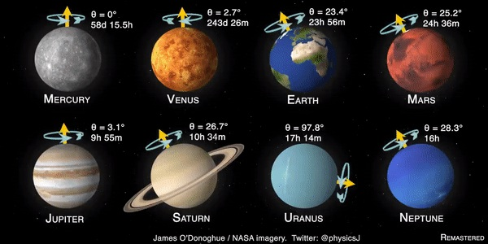

*2019-12-24 09:27 · 手机上网 转自王兴*

---

### 303

此图不错。火星确实跟地球好像。转@ 贾行家 这样啊。转@ 无聊图5号机 .

*2019-12-24 00:03 · 手机上网 转自无聊图5号机*

---

### 304

我估计多数人猜不到欧洲市值最高的公司是哪家。瑞士的雀巢，市值约3100亿美元。

*2019-12-23 20:39 · 手机上网*

---

### 305

像光一样自由。

*2019-12-23 18:27 · 手机上网*

---

### 306

没有那么惨。维基百科说拜伦也是着凉-放血-发烧-放血折腾几轮搞死的，享年36岁。转@ 人有饭天吃否 被人一脚蹬进鳄鱼池里的是他吧。 转@ 雪磨坊 拜伦，“我是从不游泳的，不到万不得已我也不恋爱。”

*2019-12-23 15:09 · 手机上网 转自雪磨坊*

---

### 307

当一本厚厚的台历只剩下这薄薄的几页。

*2019-12-23 14:57 · 饭斯基*

---

### 308

里尔克说：So we are grasped by what we cannot grasp.

*2019-12-22 23:58 · 手机上网*

---

### 309

我还没有尝试过背着坐的过山车，不知道会带来什么样的体验。

*2019-12-22 14:21 · 手机上网*

---

### 310

如果弗里德曼是对的，川普并不是美国一个新的五十年周期的开启者，甚至不是这个旧周期的终结者，而是这个旧周期里倒数第二或第三任总统。

*2019-12-22 14:10 · 手机上网*

---

### 311

巴菲特的一生真是天时地利人和三者全占了，只有第三者和个人努力有关系。

*2019-12-22 13:26 · 手机上网*

---

### 312

思而不学则殆。

*2019-12-22 13:04 · 手机上网*

---

### 313

摸着石头过不了大河，更别说航海了。

*2019-12-22 12:54 · 手机上网*

---

### 314

家和万事兴，国安百姓勤。

*2019-12-22 11:16 · 手机上网*

---

### 315

911带来的喘息机会对中国很重要，对俄国更重要。

*2019-12-22 11:06 · 手机上网*

---

### 316

这种三维十字架有没有专门的英文说法？

*2019-12-21 22:20 · 饭斯基*

---

### 317

It is the mark of an educated mind to be able to entertain athought without accepting it. -Aristotle

*2019-12-21 22:10 · 手机上网*

---

### 318

10在汉字里是十，在罗马数字里是X，十和X长得很像，只是转了四十五度。这应该不完全是巧合。

*2019-12-21 21:17 · 手机上网*

---

### 319

华盛顿死得好可怜，卸任总统两年后，67岁时冬天着凉喉咙发炎，那时医生们只会放血，第一次就放了一品脱（473毫升），后面继续放血，累计约五品脱（2.4升），两天后死了。赛先生还是挺重要的-_-!

转@ 王兴 华盛顿当年如果想称帝，是不是大概率和袁世凯一样结

局？

*2019-12-21 13:32 · 手机上网 转自王兴*

---

### 320

更可能的原因是华盛顿十几岁时得过天花导致的。转@ 王兴 华盛顿自己一辈子没生过小孩（有一说是骑马太多导致的），娶了一个有钱寡妇，她带过来的一子一女也年纪轻轻十几二十岁就死了，在独立战争结束之前。转@ 王兴 华盛顿当年如果想称帝，是不是大概率和袁世凯一样结局？

*2019-12-21 13:17 · 手机上网 转自王兴*

---

### 321

华盛顿自己一辈子没生过小孩（有一说是骑马太多导致的），娶了一个有钱寡妇，她带过来的一子一女也年纪轻轻十几二十岁就死了，在独立战争结束之前。转@ 王兴 华盛顿当年如果想称帝，是不是大概率和袁世凯一样结局？

*2019-12-21 13:05 · 手机上网 转自王兴*

---

### 322

再早一百年或许可以，但是到了十八世纪末的北美洲已经不可能了。

洛克、孟德斯鸠、卢梭、伏尔泰这些思想家及其思想已经出现了。转@ 吃飽撐的 窃以为不会。华盛顿那个时代，世界各地区人民都无法想象一个没有国王的国家是怎么运行的…转@ 王兴 华盛顿当年如果想称帝，是不是大概率和袁世凯一样结局？

*2019-12-21 12:48 · 手机上网 转自王兴*

---

### 323

华盛顿当年如果想称帝，是不是大概率和袁世凯一样结局？

*2019-12-21 12:38 · 手机上网*

---

### 324

法律（law）或法制（rule by law）中国历史上很早就有，但是法治（rule of law）一直没有。转@ 温饭 可能因为法律一直都有，HK法官最初也用大清律例去审判华人 转@ 王兴 一百年前的新文化运动为什么提倡拥护德先生（democracy）和赛先生却没提骆先生

*2019-12-21 10:56 · 手机上网 转自王兴*

---

### 325

在科恩的歌词里看到我工作中常用的词 groceries :)

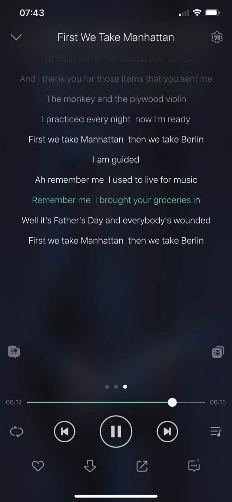

*2019-12-21 07:45 · 饭斯基*

---

### 326

Spirits vs. Souls. 转@ 王兴 终于有点理解我对迪伦和科恩的不同感受了。迪伦或许唱出了伟大的时代精神，科恩唱的却是从古到今一个个挣扎的灵魂。

*2019-12-21 07:39 · 手机上网 转自王兴*

---

### 327

终于有点理解我对迪伦和科恩的不同感受了。迪伦或许唱出了伟大的时代精神，科恩唱的却是从古到今一个个挣扎的灵魂。

*2019-12-21 07:35 · 手机上网*

---

### 328

难道陈独秀他们和你一样没搞清「法制」和「法治」的区别？转@ 杨曜睿 提倡拥护哪一个骆先生呢？清朝的？民国的？60年代的？90年代的？30年后的？转@ 王兴 一百年前的新文化运动为什么提倡拥护德先生（democracy）和赛先生（science）却没提骆先生（rule oflaw）

*2019-12-21 07:04 · 手机上网 转自王兴*

---

### 329

一百年前的新文化运动为什么提倡拥护德先生（democracy）和赛先生（science）却没提骆先生（rule of law）呢？

*2019-12-21 06:39 · 手机上网*

---

### 330

历史的扳道工。

*2019-12-21 06:23 · 手机上网*

---

### 331

微巨头。

*2019-12-20 17:45 · 手机上网*

---

### 332

日本料理里的“天妇罗”（用海产或蔬菜裹上淀粉浆油炸）是来自葡萄牙语 Tempura（意为‘调味’）的音译。

*2019-12-20 12:56 · 手机上网*

---

### 333

转@ 王兴 “诗人是最早的系统思考者，”他说，“他们观察最复杂的环境，然后把复杂性消减到他们可以理解的程度。”

*2019-12-20 04:17 · 手机上网 转自王兴*

---

### 334

这个id真的很不健康。转@ 淫蕩海星不吃早餐 村長想必又喝多了 转@ 王兴 一条没有尽头的路，一棵长不大的树。

*2019-12-20 03:56 · 手机上网 转自王兴*

---

### 335

刀枪blue。转@ 王兴 银瓶乍破水浆迸，铁骑突出刀枪鸣。转@ 春秋有佛 直到膨胀成宇宙。转@ 王兴 直到未来水世界。转@ 观棋不语杨森僧 直到成为一朵水母。 转@ 王兴 多喝水，一直喝，直到你成为水做的。

*2019-12-20 03:51 · 手机上网 转自王兴*

---

### 336

银瓶乍破水浆迸，铁骑突出刀枪鸣。转@ 春秋有佛 直到膨胀成宇宙。转@ 王兴 直到未来水世界。转@ 观棋不语杨森僧 直到成为一朵水母。 转@ 王兴 多喝水，一直喝，直到你成为水做的。

*2019-12-20 03:47 · 手机上网 转自王兴*

---

### 337

1997年上映的《007之明日帝国》就是以南中国海意外发生军事冲突为背景。当然，电影里无敌大帅哥007可以一边搞定事情一边搞定女主角，希望现实里我们也能如此幸运。

*2019-12-20 03:43 · 饭斯基*

---

### 338

直到未来水世界。转@ 观棋不语杨森僧 直到成为一朵水母。 转@ 王兴 多喝水，一直喝，直到你成为水做的。

*2019-12-20 03:38 · 手机上网 转自王兴*

---

### 339

多喝水，一直喝，直到你成为水做的。

*2019-12-20 03:32 · 手机上网*

---

### 340

为什么我的手机在放这首歌？

*2019-12-20 03:24 · 手机上网*

---

### 341

一条没有尽头的路，一棵长不大的树。

*2019-12-20 03:21 · 手机上网*

---

### 342

如果你能每秒眨眼24次，世界会更像一部电影吗？

*2019-12-20 03:17 · 手机上网*

---

### 343

来吧，无声的呐喊！转@ 老河童 感觉嗓子要失声

*2019-12-20 03:11 · 饭斯基*

---

### 344

冲冠一怒为红颜，三桂过后尽开颜。转@ 王兴 冲冠一怒为红颜，三军过后尽开颜。转@ 王兴 一入候门深似海，一江春水向东流。转@王兴 一鸣惊人，一笑倾城。转@ 王兴 字节跳动/抖音的创始人叫张一鸣，快手的创始人叫程一笑。

*2019-12-20 03:05 · 手机上网 转自王兴*

---

### 345

冲冠一怒为红颜，三军过后尽开颜。转@ 王兴 一入候门深似海，一江春水向东流。转@ 王兴 一鸣惊人，一笑倾城。转@ 王兴 字节跳动/抖音的创始人叫张一鸣，快手的创始人叫程一笑。

*2019-12-20 02:59 · 手机上网 转自王兴*

---

### 346

麦克卢汉云：the medium is the message. 转@ 东东枪 应该把造纸

加上。毛笔是工具的创新，造纸是媒介的创新，隶变是内容的创新，宋体是技术的创新。 转@ 东东枪 毛笔，隶变，宋体。三次伟大创新。

*2019-12-20 02:51 · 手机上网 转自东东枪*

---

### 347

开始编剧吧。转@ 洋鸟消夏录 停飞退伍而一蹶不振的飞行员父亲；

开始神秘拥有高档百货购物卡的母亲；与邻居家哥哥在阳台上互相玩对方的下体，在大人经过时谎称在尿尿；故意在电子词典上查找有性意味的单词，然后跑去问自己喜欢的女孩。转@ 王兴 有适合改编成电影的内容吗？转@ 洋鸟消夏录 和朋友们趴

*2019-12-20 02:49 · 手机上网 转自洋鸟消夏录*

---

### 348

我还以为是东莞一姐-_-!转@ 小春. 莞尔一笑，女孩子叫不是挺好听的。RT@ 王兴 您有几个女朋友？转@ 小春. 我有个女朋友名字叫莞一，这么一看以后有大为啊RT@ 王兴 一入候门深似海，一江春水向东流。转@ 王兴 一鸣惊人，一笑倾城。转@ 王兴 抖音的创始人叫张一鸣，快手的创始人叫程一笑

*2019-12-20 02:43 · 手机上网 转自王兴*

---

### 349

bilibili, akulaku.

*2019-12-20 02:39 · 手机上网*

---

### 350

excuse me? 您有几个女朋友？转@ 小春. 我有个女朋友名字叫莞一，这么一看以后有大为啊RT@ 王兴 一入候门深似海，一江春水向东流。转@ 王兴 一鸣惊人，一笑倾城。转@ 王兴 字节跳动/抖音的创始人叫张一鸣，快手的创始人叫程一笑。

*2019-12-20 02:37 · 手机上网 转自王兴*

---

### 351

道生一，一生二，二生三，三生万物。天生万物以养人，人无一物可报天。转@ 王兴 一入候门深似海，一江春水向东流。转@ 王兴 一鸣惊人，一笑倾城。转@ 王兴 字节跳动/抖音的创始人叫张一鸣，快手的创始人叫程一笑。

*2019-12-20 02:30 · 手机上网 转自王兴*

---

### 352

一入候门深似海，一江春水向东流。转@ 王兴 一鸣惊人，一笑倾城。转@ 王兴 字节跳动/抖音的创始人叫张一鸣，快手的创始人叫程一笑。

*2019-12-20 02:23 · 手机上网 转自王兴*

---

### 353

一鸣惊人，一笑倾城。转@ 王兴 字节跳动/抖音的创始人叫张一鸣，快手的创始人叫程一笑。

*2019-12-20 02:19 · 手机上网 转自王兴*

---

### 354

有适合改编成电影的内容吗？转@ 洋鸟消夏录 和朋友们趴在沙发上大声朗读他们 2013 年所写的日记。

*2019-12-20 02:13 · 手机上网 转自洋鸟消夏录*

---

### 355

调戏全世界是调节自我的一种方式。

*2019-12-20 02:11 · 手机上网*

---

### 356

你怎么这么笨？当然是快手、快看、快钱。转@ 松枝聪子 先问王老板三快是哪三快？ 转@ 王兴 一下只火了一下，一笑笑到了最后。转@ 之宴 @ 王兴 快手公司名字“一笑科技”，秒拍公司名字“一下科技”

*2019-12-20 02:02 · 手机上网 转自之宴*

---

### 357

汉语程序。不知道该喊牛逼还是傻逼。

*2019-12-20 01:50 · 饭斯基*

---

### 358

我只能憋一首打油诗：日成进斗金，润之品万酩，马克思春心，胡言我志明。转@ Hilters @ 王兴 @ 三皮可可 村长即兴来一首吧。

*2019-12-20 01:42 · 手机上网 转自Hilters*

---

### 359

但美元依然在C位。转@ 王兴 此书封面说明：人民币比日元更横一点。转@ 王兴 时不时有人送我各种书，多数我都没空看，但是这一本我打算读一下。

*2019-12-20 01:20 · 手机上网 转自王兴*

---

### 360

别提了，这两句也是赵翼写的。你不觉得也很土吗？转@ 三皮可可江山代有才人出，各领风骚数百年转@ 王兴 哦，作者是赵翼。我大学时隔壁班也有人叫这个名字，那年的四川理科状元。不知道他爸为何给他起这个名字。转@ 王兴 「国家不幸诗家幸，赋到沧桑句便工。」清朝人为什么只能写得这么土？

*2019-12-20 01:13 · 手机上网 转自王兴*

---

### 361

此书封面说明：人民币比日元更横一点。转@ 王兴 时不时有人送我各种书，多数我都没空看，但是这一本我打算读一下。

*2019-12-20 01:09 · 手机上网 转自王兴*

---

### 362

哦，作者是赵翼。我大学时隔壁班也有人叫这个名字，那年的四川理科状元。不知道他爸为何给他起这个名字。转@ 王兴 「国家不幸诗家幸，赋到沧桑句便工。」清朝人为什么只能写得这么土？汉语是不是已经衰落好几百年了？

*2019-12-20 01:05 · 手机上网 转自王兴*

---

### 363

请跟「我住长江头，君住长江尾。日日思君不见君，共饮长江水」比一比。转@ 野原小葵 “背灯和月就花阴，已是十年踪迹十年心”清朝人写爱情闺怨还行 转@ 王兴 「国家不幸诗家幸，赋到沧桑句便工。」

清朝人为什么只能写得这么土？汉语是不是已经衰落好几百年了？

*2019-12-20 01:00 · 手机上网 转自王兴*

---

### 364

因为垃圾，所以有资格。转@ 小熊娃娃 没有几百年，几十年是有。

民国时期还有很好的现代汉语，现在也有一点点吧。但我个人觉得在垃圾语文教育体系下长出来的当代人除非自己有极好的汉语环境，就

不是很有资格说这个话…转@ 王兴 「国家不幸诗家幸，赋到沧桑句便工。」汉语是不是已经衰落好几百年了？

*2019-12-20 00:58 · 手机上网 转自王兴*

---

### 365

中国历史上有哪个朝代商人的地位还比较高吗？商朝应该还可以吧。

*2019-12-20 00:55 · 手机上网*

---

### 366

「国家不幸诗家幸，赋到沧桑句便工。」清朝人为什么只能写得这么土？汉语是不是已经衰落好几百年了？

*2019-12-20 00:46 · 手机上网*

---

### 367

一下只火了一下，一笑笑到了最后。转@ 之宴 @ 王兴 快手公司名字“一笑科技”，秒拍公司名字“一下科技”

*2019-12-20 00:38 · 手机上网 转自之宴*

---

### 368

文学家是个土鳖概念，英文里没这个说法。转@ 菅原舜水 文学家 转@ 王兴 诗人是一种更天然更高尚的存在，他不是某某家。

*2019-12-20 00:34 · 手机上网 转自王兴*

---

### 369

不好意思，搞反了，商人是打败了夏之后建立商朝。转@ 王兴 他们打败了周人，建立了商朝。转@ Hikaruru 商人呢 转@ 王兴 诗人是一种更天然更高尚的存在，他不是某某家。

*2019-12-20 00:32 · 手机上网 转自王兴*

---

### 370

他们打败了周人，建立了商朝。转@ Hikaruru 商人呢 转@ 王兴 诗人是一种更天然更高尚的存在，他不是某某家。

*2019-12-20 00:27 · 手机上网 转自王兴*

---

### 371

名字里都是历史。印度尼西亚这片地方原本不叫这名字，欧洲殖民者来了之后，掌控印度的英国人想叫她印度群岛（印度尼西亚Indonesia 的词源是希腊语里的印度群岛），荷兰人想叫她马来群岛。很显然，英国人赢了。

*2019-12-20 00:19 · 手机上网*

---

### 372

诗人是一种更天然更高尚的存在，他不是某某家。

*2019-12-20 00:15 · 手机上网*

---

### 373

艺术家和科学家都揭示了另一种可能。

*2019-12-20 00:10 · 手机上网*

---

### 374

字节跳动/抖音的创始人叫张一鸣，快手的创始人叫程一笑。

*2019-12-20 00:02 · 手机上网*

---

### 375

还是不如 the endless frontier 这个说法。Vannevar Bush 确实是高山仰止。转@ 王兴 the infinite end.

*2019-12-19 23:35 · 手机上网 转自王兴*

---

### 376

苹果不是再造了一个奢侈品品牌，而是再造了一个奢侈品行业。

*2019-12-19 23:03 · 手机上网*

---

### 377

转@ 钟良 读历史是为了知道自己所在的时代是什么样的

*2019-12-19 22:21 · 手机上网 转自钟良*

---

### 378

Chinese Chinese.

*2019-12-19 22:04 · 手机上网*

---

### 379

天机不可泄露。手机也最好不要。

*2019-12-19 17:33 · 手机上网*

---

### 380

1914-1918年间的一战之前的一次大范围战争是1803-1815的拿破仑战争，那回也席卷欧洲各国并波及美洲，已经独立三十年的美国的总统府就是那时被英军放火烧了，后来重修时刷成白色。那回没被命名为世界大战估计是因为还没有发达的大众媒体。「世界大战」是《时代》周刊提出的概念。

*2019-12-19 17:06 · 手机上网*

---

### 381

科幻小说或描写未来的虚构作品里通常怎么称呼下一场大战？WorldWar Three? The final war? 还是最最简单的 the war?

*2019-12-19 16:43 · 手机上网*

---

### 382

时不时有人送我各种书，多数我都没空看，但是这一本我打算读一下。

*2019-12-19 16:35 · 饭斯基*

---

### 383

转@ 张涛. Hennes & Mauritz 的简写。Hennes是瑞典语 “她的”的意思,是H&M最早的名字,后来它兼并了一家专门做男装叫Mauritz 的店,就叫Hennes & Mauritz了。转@ 王兴 瑞典服装品牌 H&M 并不是Human & Machine 的缩

*2019-12-19 14:55 · 手机上网 转自王兴*

---

### 384

不了，谢谢。我对日进斗金并没什么兴趣。转@ 上天猫就够了 王老板我有个日进斗金的项目，要不要考虑考虑？转@ 王兴 瑞典服装品牌 H&M 并不是 Human & Machine 的缩写。

*2019-12-19 13:35 · 手机上网 转自王兴*

---

### 385

2020年会是又一个并购大年吗？未必有这么快。

*2019-12-19 13:06 · 手机上网*

---

### 386

瑞典服装品牌 H&M 并不是 Human & Machine 的缩写。

*2019-12-19 12:48 · 饭斯基*

---

### 387

福特曾是一家那么伟大的划时代的企业。从情感上我很希望未来十年他还能保持独立。转@ 阳升 FCA PSA 五五合并，成为世界第四大汽车制造商

*2019-12-18 23:50 · 手机上网 转自阳升*

---

### 388

有意思。查了一下，这是日本快递公司黑猫宅急便的创始人。转@ 屋大喵 看小仓昌男的发家史，成本会计，而不是任何其他具体的运输技术，是现代运输业最革命性的技术。

*2019-12-18 22:52 · 手机上网 转自屋大喵*

---

### 389

有些 CEO 是主演，有些 CEO 是导演，有些 CEO 是制片人，也有些CEO 是化妆师。

*2019-12-18 22:16 · 手机上网*

---

### 390

“清朝海军学校教《左传》，日本海军学校教《舰队运动指南》 | 短史记”，这标题真的好狠-_-!

*2019-12-18 14:03 · 手机上网*

---

### 391

资管的最高境界是帮上帝管钱。

*2019-12-18 11:47 · 手机上网*

---

### 392

多谢补充。转@ 草水人 Transnational RT@ 王兴 national,multinational, international, supernational.

*2019-12-18 11:34 · 手机上网 转自王兴*

---

### 393

national, multinational, international, supernational.

*2019-12-18 09:33 · 手机上网*

---

### 394

爱不释脚。

*2019-12-17 23:54 · 手机上网*

---

### 395

已经打了四年明牌了。

*2019-12-17 01:25 · 手机上网*

---

### 396

转@ 王兴 一流企业定义一个行业，超一流企业定义一个时代。

*2019-12-17 01:07 · 饭斯基*

---

### 397

wong 可能是 黄 也可能是 王，例如王家卫 Wong Kar Wai。转@szweig wong 黄 ng 吴 转@ 王兴 把「熊」这个姓拼成 xung 倒是有点意思。

*2019-12-16 22:35 · 手机上网 转自王兴*

---

### 398

把「熊」这个姓拼成 xung 倒是有点意思。

*2019-12-16 22:15 · 手机上网*

---

### 399

转@ 梨能 ➡ 猕猴桃➡ 桃➡ 。打 要三个字，打 只要一个字。这套系统本来就是为了少打字，指代271的时候 /271更严谨，但 更常用 转@ 蓬鹏 桃 是哪家 不是 吗 转@ 王兴 转@ 梨能00后口中是 啦，简称缩写已经emoji化拼音化 转@ 王兴 鉴于三大长视

*2019-12-15 15:42 · 手机上网 转自王兴*

---

### 400

二战之后，全世界独立国家的数量是在持续增加的，光1990年之后因为苏联和南斯拉夫解体等原因就增加了三十几个，现在总数大约200。

*2019-12-15 15:40 · 手机上网*

---

### 401

转@ 梨能 00后口中是 啦，简称缩写已经emoji化拼音化 转@王兴 鉴于三大长视频网站（腾讯视频、爱奇艺、优酷）始终没有一个稳定公认的缩写，各家都想把自己名字放在第一位，我建议就用「爱优腾」吧，至少有个「哎呦疼」的谐音，好记一点。

*2019-12-15 14:53 · 手机上网 转自王兴*

---

### 402

鉴于三大长视频网站（腾讯视频、爱奇艺、优酷）始终没有一个稳定公认的缩写，各家都想把自己名字放在第一位，我建议就用「爱优腾」吧，至少有个「哎呦疼」的谐音，好记一点。

*2019-12-15 14:41 · 手机上网*

---

### 403

Indo-Pacific 印太更是海洋视角的概念，原本是生物学领域在用，2011年后开始比较多的出现在地缘政治里。

*2019-12-15 12:58 · 手机上网*

---

### 404

从陆地视角换到海洋视角就容易理解了，指的就是太平洋西岸。转@王兴 Asia-Pacific 亚太是个有趣的复合概念，指的既不是最广义的整个亚洲加上整个太平洋沿岸（包括智利等南美国家），也不是最狭义的亚洲沿太平洋的部分，而是通常包括东亚、东南亚、南亚以及大洋洲。

*2019-12-15 12:44 · 手机上网 转自王兴*

---

### 405

Asia-Pacific 亚太是个有趣的复合概念，指的既不是最广义的整个亚洲加上整个太平洋沿岸（包括智利等南美国家），也不是最狭义的亚洲沿太平洋的部分，而是通常包括东亚、东南亚、南亚（印度等跟太平洋不沾边的国家）以及大洋洲。

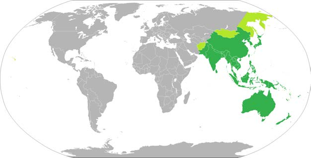

*2019-12-15 12:24 · 手机上网*

---

### 406

李白如果生活在有 LSD 的时代是不是能更上一层楼？

*2019-12-15 01:53 · 手机上网*

---

### 407

转@ black.parade 有God bless，运不是很需要考量。转@ gravity01905 东乡平八郎："皇国兴废在此一战，望诸君奉死效命"。1805 纳尔逊：“英格兰希望各位官兵恪尽职守”。 转@ 王兴 不知道「国运」的英文是啥，可能他们不需要吧。

*2019-12-15 00:51 · 手机上网 转自王兴*

---

### 408

另一种 P2P: Path to Profitability.

*2019-12-15 00:41 · 手机上网*

---

### 409

不知道「国运」的英文是啥，可能他们不需要吧。

*2019-12-15 00:05 · 手机上网*

---

### 410

夫国大而政小者，国从其政；国小而政大者，国益大。-《管子·霸言》

*2019-12-14 18:51 · 手机上网*

---

### 411

时隔百年，汉语终于又迎来了一个难得的有条件也有必要创新的窗口期。是否能充分把握住，不好说。诸君请努力。

*2019-12-14 15:00 · 手机上网*

---

### 412

这份商业计划书让我想到「陈年龙井」。

*2019-12-14 11:36 · 手机上网*

---

### 413

他有一张饱经风霜但却童稚未消的脸。

*2019-12-14 09:24 · 手机上网*

---

### 414

书依然还没读-_-! 先把最近上映的电影《决战中途岛》看了。电影片头设计和这本书的封面很像：MIDWAY 这几个字母大写、大红。一句

话影评：这是两个国家意志的碰撞，是一个国家对另一个国家实力的碾压。转@ 王兴 九十几岁的老前辈送了我一本他五十年代读过的书。

*2019-12-13 23:07 · 手机上网 转自王兴*

---

### 415

从今晚月亮的形状来看，我很可能得了散光。

*2019-12-13 20:23 · 手机上网*

---

### 416

地球上所有的黄金都来自外太空。恒星在孤独的走完自己亿万年的生命旅程后爆炸成超新星的过程中会产生一些金元素。这些金子再随着陨石落到地球上。

*2019-12-13 20:15 · 手机上网*

---

### 417

前两天有幸见到一个前辈大牛，终于理解了历史上美洲对人类文明的意义，从而也理解了未来火星对人类的重要性。

*2019-12-13 19:36 · 手机上网*

---

### 418

遭受了一整天正面和负面的冲击之后，我很需要一块滋滋滋的大牛排。

*2019-12-13 18:40 · 手机上网*

---

### 419

中国有XX政法大学，日本有法政大学。

*2019-12-13 16:14 · 手机上网*

---

### 420

当代中国没有出现人类历史上最大的城市其实是件奇怪的事。

*2019-12-13 13:01 · 手机上网*

---

### 421

化干戈为玉帛。

*2019-12-13 12:53 · 手机上网*

---

### 422

你知道那家电商为了刷 GMV 有多夸张吗？卖黄金！而且还是 B2B ！

*2019-12-12 23:53 · 手机上网*

---

### 423

一流企业定义一个行业，超一流企业定义一个时代。

*2019-12-12 23:37 · 手机上网*

---

### 424

Mobility 这个英文单词很需要一个更好的中文翻译。

*2019-12-12 23:30 · 手机上网*

---

### 425

市值 1330 亿美元的半导体公司 Nvidia 的 CEO Jensen Huang 黃仁勳 也是华人。他于1963年生于台南，也是随父母移居美国，在俄勒冈州立大学和斯坦福读了电子工程，在 LSI 和 AMD 工作过，于1993年创办 Nvidia。

*2019-12-12 13:03 · 手机上网*

---

### 426

市值 1268 亿美元的半导体公司博通 Broadcom 的 CEO Tan HockEng 陳福陽 也是华人，1951年生于马来西亚槟城，也是在 MIT 读了工科，后来又读了哈佛 MBA，做过投资，管过财务，后来通过一系列公司合并于2015年出任博通 CEO。

*2019-12-12 12:55 · 手机上网*

---

### 427

历史上取得过最大成就的小聪明是什么？

*2019-12-12 12:47 · 手机上网*

---

### 428

AMD 的市值竟然涨到461亿美元了！现任 CEO 是华人 Lisa Su，她于1969年出生在台南，3岁随父母去美国，花了8年在 MIT 从本科读到博士毕业，在德州仪器、IBM、Freescale 工作多年后，2012年加入AMD，2014年升任CEO。

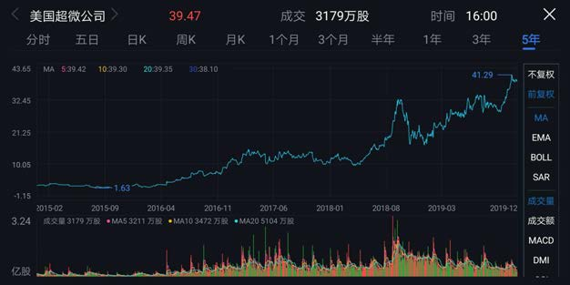

*2019-12-12 12:42 · 手机上网*

---

### 429

时代的虎口。

*2019-12-12 11:54 · 手机上网*

---

### 430

从1945年二战结束到1985年签订《广场协议》，美国和日本的蜜月期也正好是40年。

*2019-12-11 22:51 · 手机上网*

---

### 431

Chinese American 是华裔美国人；American Chinese 是美籍华人。

*2019-12-11 11:34 · 手机上网*

---

### 432

人是很复杂的。所以，不要以为你真懂自己。

*2019-12-10 22:33 · 手机上网*

---

### 433

竟然不提拿破仑… 转@ 陈燃 网易云热评“我听这首歌的时候，每次都能看到：吊死在煤山上的崇祯；天安门上挥手的毛泽东，下面是疯狂的红卫兵；带着无数荣誉离开巴萨的瓜迪奥拉，诺坎普全场唱出这首他最爱的歌，挥手告别的背影。”转@ 王兴 Coldplay 的《Viva LaVida》

*2019-12-09 22:04 · 手机上网 转自王兴*

---

### 434

更准确的说，是各种心境下。转@ 王兴 Coldplay 的《Viva LaVida》不但曲子好听，而且歌词尤其适合创业者们在不同场景下反复体会。

*2019-12-09 21:51 · 手机上网 转自王兴*

---

### 435

Coldplay 的《Viva La Vida》不但曲子好听，而且歌词尤其适合创业者们在不同场景下反复体会。

*2019-12-09 21:49 · 饭斯基*

---

### 436

要与时俱进嘛。社会在发展，消费者的需求在增多。我通常会再加四字「娱教医金」。转@ 贾行家 “衣食住行”之“行”是孙中山加上去的。

*2019-12-09 18:32 · 手机上网 转自贾行家*

---

### 437

the infinite end.

*2019-12-09 16:21 · 手机上网*

---

### 438

转@ 刘志达 中国的《共产党宣言》是从日文版转译的，取自1904年幸德秋水和堺利彦合译的英文版《共产党宣言》。「共产党」一词的汉字也是幸德秋水两位选定的，朱执信是直接将日文中的汉字照搬了过来。

*2019-12-09 00:27 · 手机上网 转自刘志达*

---

### 439

转@ 悲伤的采购 就是IT部门所说的"业务"，不限社会功能领域 转@王兴 英文里的 business 是比中文里狭义甚至广义的「商业」都含义更广的一个概念，不然就不好理解近百年前美国总统柯立芝的名言：The business of America is business.

*2019-12-08 17:54 · 手机上网 转自王兴*

---

### 440

商业狭义指「士农工商」里的商，广义指「农工商」，business 则连「士」都包括。转@ 王兴 business 是比狭义甚至广义的「商业」都含义更广的一个概念，不然就不好理解近百年前美国总统柯立芝的名言：The business of America is business.

*2019-12-08 17:22 · 手机上网 转自王兴*

---

### 441

英文里的 business 是比中文里狭义甚至广义的「商业」都含义更广的一个概念，不然就不好理解近百年前美国总统柯立芝的名言：Thebusiness of America is business.

*2019-12-08 16:54 · 手机上网*

---

### 442

Ernst Engel，1821-1896，提出「恩格尔系数」的德国统计学家和经济学家；Friedrich Engels，1820－1895，恩格斯，德国思想家和革命导师。

*2019-12-07 14:53 · 手机上网*

---

### 443

转@ 小熊娃娃 刹帝利完全主导的社会的很可怕，婆罗门完全主导的社会也蛮可怕。但如果是吠舍主导的社会就完犊子了。短短几天内再次和辨喜尊者心有灵犀……

*2019-12-06 22:49 · 手机上网 转自小熊娃娃*

---

### 444

爱因斯坦这样的物理学家可能认为时间只是一种顽固而持久的幻觉，考核 IRR 的基金经理们可不能这么想。

*2019-12-06 17:39 · 手机上网*

---

### 445

一个朋友坚定看好比特币，他认为只有一个风险：如果中本聪还活着，并且哪天真的跳出来（通过移动那已沉寂十年的一大堆比特币）验明正身，那比特币就有可能被毁。蛮有道理，令我想起《基督耶稣的最后诱惑》里最后的桥段。「死」了的耶稣和中本聪更有意义。

*2019-12-06 16:10 · 手机上网*

---

### 446

中国科学院大学简称「国科大」，University of Chinese Academyof Sciences (UCAS)，在北京；中国科学技术大学简称「中科大」University of Science and Technology of China (USTC)，在合肥。

*2019-12-06 15:35 · 手机上网*

---

### 447

大牛你好，我们这里有一套业务系统做得特别棒，用 VB 开发的，打磨十几年了，你能帮我们迅速 SaaS 化一下吗？

*2019-12-06 15:16 · 手机上网*

---

### 448

转@ 黄靖昀 中国早期受文明古国印度影响比较大，很多生活习惯以及词汇经由新疆传入中原，日语对近代中国的词汇更是无所不在，主要体现在对西方近代词汇的转译上，拉丁文是一种僵尸语，学不学影响不大了。转@ 王兴 为了更好的掌握今天的中文，有必要了解英文，还需要懂一点日文，如果会拉丁文估计就更

*2019-12-06 15:13 · 手机上网 转自王兴*

---

### 449

孔总一级棒！转@ 康心 这种话孔子总就说过了，“邦有道，贫且贱焉，耻也；邦无道，富且贵焉，耻也。”转@ 王兴 有些时代，无财便是德。

*2019-12-06 13:12 · 手机上网 转自王兴*

---

### 450

为了更好的掌握今天的中文，有必要了解英文，还需要懂一点日文，如果会拉丁文估计就更好了。

*2019-12-06 12:36 · 手机上网*

---

### 451

其实，多数改革其内容本身并不高深，基本只是常识，难的是共识。

*2019-12-06 12:02 · 手机上网*

---

### 452

DEC（Digital Equipment Corporation）这公司名比起IBM（International Business Machines Corporation）确实格局低了一层，明显在蹭风口。

*2019-12-06 11:55 · 手机上网*

---

### 453

欧洲是博物馆，非洲是动物园。

*2019-12-05 17:18 · 手机上网*

---

### 454

想了一下，我好像不认识什么越南人。

*2019-12-05 16:43 · 手机上网*

---

### 455

虽然看起来差不太多，但冬天穿薄毛袜的脚感还是明显好于棉袜。我估计原因是：再精梳的工艺也只能使棉纤维变得更光滑，但无法像毛那样在承受压力而非拉力时也有一点弹性。

*2019-12-05 15:47 · 手机上网*

---

### 456

转：对 GDP 的历史估计显示，在冷战期间，苏联的经济规模从未超过美国经济的44%。

*2019-12-04 22:32 · 手机上网*

---

### 457

为打造一家可掌控约20%全球份额的造船业巨无霸公司，韩国计划将负债累累的现代重工业(Hyundai Heavy Industries Co.)与大宇造船海洋(Daewoo Shipbuilding & Marine Engineering Co.)合并。该交易需得到日本等国批准。

*2019-12-04 21:13 · 手机上网*

---

### 458

deal maker & market maker

*2019-12-04 18:33 · 手机上网*

---

### 459

世界像一条受伤了的尺蠖，仍在一拱一拱前行。

*2019-12-04 09:33 · 手机上网*

---

### 460

听懂行的朋友说，安卓大约一亿行代码，其中内核约一千万行。

*2019-12-03 14:13 · 手机上网*

---

### 461

比利时连八国联军都没混进去，竟然也在天津有租界。转@ 蒋天正2019-11-30 11月 … 2.去天津溜达4天，震惊天津有9个租界，住在法租界小洋楼，有大量的葡萄和天鹅图腾，去了张爱玲常去的起士林，溥仪的静园仿佛置身《末代皇帝》中，文绣从这个宅子跑走的。喜欢天津。

*2019-12-02 14:35 · 手机上网 转自蒋天正*

---

### 462

广州车展上，宝马的入门车型落地价已经下探至20万内，奥迪的入门车型更是报出14.69万元的裸车价。

*2019-12-02 12:00 · 手机上网*

---

### 463

「护城河」这个概念本来就是为「守财奴」发明的。

*2019-12-02 11:21 · 手机上网*

---

### 464

全世界主要的半导体生产能力都在西太平洋。

*2019-12-02 11:04 · 手机上网*

---

### 465

transpose

*2019-12-02 10:41 · 手机上网*

---

### 466

中船集团（全称中国船舶工业集团有限公司）与中船重工（全称中国船舶重工集团有限公司）俗称「南北船」，1999年由原船舶工业总公司拆分而成，2019年合并成立中国船舶集团有限公司，成为全球最大的造船企业。

*2019-12-02 09:18 · 手机上网*

---

### 467

「基民盟」是德国的主要政党，是「基督教民主联盟」的简称。

*2019-12-01 16:03 · 手机上网*

---

### 468

德国是两次世界大战都打输了的唯一国家，意大利和日本皆是一胜一负，其他主要国家（包括中国）都是两战两胜，至少表面上如此。

*2019-12-01 15:55 · 手机上网*

---

### 469

读欧亚集团创始人最近在东京的演讲稿时突然想起前几年的《布达佩斯大饭店》，越发觉得这部电影可贵。愿我们都在接下来几十年里比王国维和茨威格更有韧性。

*2019-12-01 14:27 · 手机上网*

---

### 470

Director 这个词的含义太丰富了：导演、董事、总监… 以至于我有点纳闷为什么「（乐队）指挥」的英文不是 director 而是 conductor。

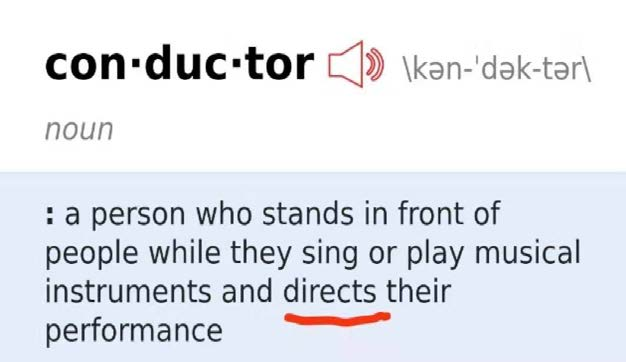

*2019-12-01 10:01 · 饭斯基*

---

### 471

导演可能是最需要管理技能的艺术家。

*2019-12-01 09:52 · 手机上网*

---

### 472

四川宜宾五粮液机场将于12月5日正式通航。

*2019-12-01 09:50 · 手机上网*

---

### 473

一刹那把另一刹那抛弃了。-里尔克

*2019-12-01 09:41 · 手机上网*

---

### 474

「亚洲」是个很不实用的概念，毕竟这个概念最早是希腊人用来称呼他们东边的地方，从土耳其/小亚细亚开始一直往东。

*2019-12-01 00:04 · 手机上网*

---

### 475

wow，又宕机了… 转@ 柚子胡椒 Line和雅虎日本合并那天，Yahoo说自己的价值是让用户びっくり，而LINE的价值基准是让用户情不自禁WOW。合并后要成为最强的One Team。在LINE上班的男朋友表示在社内听过太多次WOW的slogan了。RT@ 王兴 中国最大互联网公司

*2019-11-30 22:42 · 手机上网 转自王兴*

---

### 476

中国最大互联网公司的最大股东是个韩裔日本人，他正忙着把他旗下的美国品牌日本分部和韩国最大互联网公司拥有的日本最大即时通信公司合并，以打造一个更大的平台来对抗美国（或许还有中国）互联网巨头。转@ 王兴 CJKV 才是真正的打断骨头连着筋的。

*2019-11-30 20:06 · 手机上网 转自王兴*

---

### 477

西班牙文字母表有27个字母，比英文多了个 Ñ 。

*2019-11-30 14:24 · 手机上网*

---

### 478

聊天时一个人说「中国什么时候会出世界一流的投资人吗」？另一个人说「你为什么不问会不会出一流作家或一流哲学家呢」？稍微沉默片刻之后，他俩一致认为还是前者希望更大一点。

*2019-11-29 23:07 · 手机上网*

---

### 479

（业余）专家说：「少子化」其实是一个日语词汇，到现在甚至都没有对应的英语词汇。

*2019-11-29 17:46 · 手机上网*

---

### 480

投资人最烦遇到那种以为自己是王家卫的。转@ 王兴 每个 CEO 都是导演。

*2019-11-29 17:37 · 手机上网 转自王兴*

---

### 481

每个 CEO 都是导演。

*2019-11-29 17:20 · 手机上网*

---

### 482

这件马甲里竟然自带一个开瓶器。

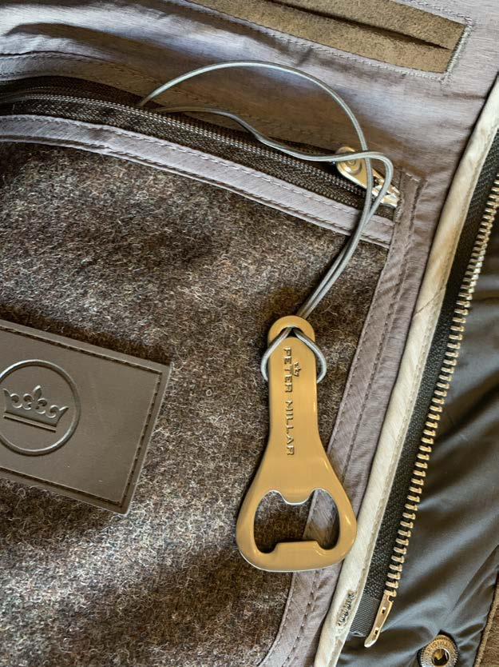

*2019-11-29 16:59 · 饭斯基*

---

### 483

没想到十五年后竟然又听人说起 meetup 。

*2019-11-28 23:26 · 手机上网*

---

### 484

为什么人只有一个灵魂？

*2019-11-27 15:06 · 手机上网*

---

### 485

未来的常识。

*2019-11-27 14:12 · 手机上网*

---

### 486

市值500亿的公司 A 和市值200亿的公司 B 合并，合并后的主体 A+B的市值应是700亿；市值500亿的 A （不发新股）收购市值200亿的B，收购完成后 A+B 的市值应该仍是500亿。

*2019-11-26 23:54 · 手机上网*

---

### 487

文字的发明把人类引入了歧途。

*2019-11-25 23:50 · 手机上网*

---

### 488

刮目相看，洗耳恭听。

*2019-11-25 18:41 · 手机上网*

---

### 489

brandless brands

*2019-11-25 18:33 · 手机上网*

---

### 490

科学降火:-) 转@ gravity0 又收到一箱无核蜜橘。从前这东西吃多了流鼻血，人们说叫“上火”。现在我知道自己糖吃多了就会流鼻血，补充点维生素 B 就好。

*2019-11-25 14:48 · 手机上网 转自gravity0*

---

### 491

Creative Destruction 是比 Disruptive Innovation 历史更久、含义更广的一个概念。

*2019-11-25 14:19 · 手机上网*

---

### 492

「教皇？他有几个师？」斯大林如此直白的对丘吉尔表达对教皇的不屑，这说明他其实并不相信信仰的力量。

*2019-11-25 13:26 · 手机上网*

---

### 493

似乎想明白索尼和松下的一个差别了。

*2019-11-25 13:17 · 手机上网*

---

### 494

查了一下，韩国最大的互联网公司 Naver 目前市值约25万亿韩元，相当于213亿美元。

*2019-11-25 10:46 · 饭斯基*

---

### 495

中日韩三国的 GDP 加起来和美国一样大。

*2019-11-24 23:30 · 手机上网*

---

### 496

微博经济学家

*2019-11-24 14:35 · 手机上网*

---

### 497

这家新荣记的鱼缸水温有点低。

*2019-11-24 14:25 · 饭斯基*

---

### 498

想想办法…转@ 洋鸟消夏录 半夜读海利根施塔特遗书，忽然想注册一个账号，四十岁的男人，今年刚养狗不久。看样子住得挺北，最近不是下雪了么，晚上遛狗就很挣扎，甚至有点后悔养狗。发东西基本是遛狗沿途，偶尔也发照片，还有路上听的音乐。用户名是最难想的但也想好了，万事俱备才发现饭否停止注册了

*2019-11-24 11:14 · 手机上网 转自洋鸟消夏录*

---

### 499

fashionista 时髦的人

*2019-11-24 10:58 · 手机上网*

---

### 500

理想是闹钟，敲碎你的黄金梦；理想是肥皂，洗濯你的自私心。理想既是一种获得，又是一种牺牲。——流沙河（1931-2019）

*2019-11-24 10:50 · 手机上网*

---

### 501

转@ 刘志达 Pornhub隶属于世界流媒体巨头MindGeek ，好 geek的名字

*2019-11-23 22:51 · 手机上网 转自刘志达*

---

### 502

英国东印度公司 1600-1874

*2019-11-23 22:31 · 手机上网*

---

### 503

没想到超过300米的高楼竟然这么少，而且竟然是如此的城市分布。

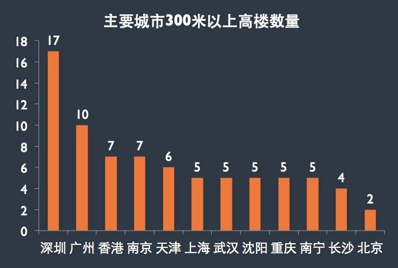

*2019-11-23 08:29 · 手机上网*

---

### 504

航天是个技术密集、资金密集且管理密集的行业。

*2019-11-22 20:55 · 手机上网*

---

### 505

虽然大概了解国外的支付手续费比国内高很多，但是听说巴西刷信用卡收7%时，我还是深深的震惊了。

*2019-11-22 17:49 · 手机上网*

---

### 506

why my

*2019-11-22 15:22 · 手机上网*

---

### 507

IBM 的前身 CTR 于1911年成立，1924年改名为 InternationalBusiness Machines（国际商用机器）。这个名字其实蕴含着「让天下没有难做的生意」这层意思。

*2019-11-21 19:18 · 手机上网*

---

### 508

迪斯尼这品牌营销真是太厉害了。转@ 沧黛_ 在迪士尼听见一个妈妈跟她儿子说 ：我们现在在地球上最快乐的地方 别让我扇你

*2019-11-21 12:27 · 手机上网 转自沧黛_*

---

### 509

有哪个真的大国真的不是帝国吗？

*2019-11-21 08:50 · 手机上网*

---

### 510

想要那种立体编织、一次成型、完全无接缝的衣服。

*2019-11-20 21:49 · 手机上网*

---

### 511

两个很年轻的巴西小伙子从斯坦福本科辍学创办的金融科技公司目前大约有四百员工，分布在四个城市：旧金山，因为这里是科技创业中心；纽约，金融中心；盐湖城，由于宗教/文化原因这里出好销售而且成本相对低；温哥华，他们从巴西招的程序员有时候申请不到美国签证，就先安排到温哥华。

*2019-11-20 19:31 · 手机上网*

---

### 512

火炮发明后，护城河就退出了历史舞台，成为一个投资术语。

*2019-11-20 18:11 · 手机上网*

---

### 513

比较凯末尔和毛更有意义。转@ 王兴 凯末尔确实比丘吉尔更强。

*2019-11-20 18:08 · 手机上网 转自王兴*

---

### 514

奥斯曼帝国比满清最大的劣势可能就是离欧洲更近，地理位置更重要。

*2019-11-20 18:01 · 手机上网*

---

### 515

要不是有人提醒，我完全不记得07年我有过这样的想法。转@ 王兴@ 狂风 多年不看中国足球，但我常常告诫自己，在自己的岗位上，不能像中国国家队那么窝囊！

*2019-11-20 17:17 · 手机上网 转自王兴*

---

### 516

都是命。都是基因。

*2019-11-20 14:51 · 手机上网*

---

### 517

Does anyone have any questions for my answers? -基辛格

*2019-11-20 14:47 · 手机上网*

---

### 518

火炮发明后，护城河就退出历史舞台了。

*2019-11-20 12:16 · 手机上网*

---

### 519

因真理，得自由，以服务（Freedom Through Truth For Service），燕京大学1937-1945年的校训好棒。

*2019-11-20 12:04 · 手机上网*

---

### 520

上个月雅虎日本的公司名改为 Z Holdings 时，我觉得怪怪的，后来才知道此名有所指：1905年日俄对马海战，日本海军大将东乡平八郎模仿特拉法尔加海战中的英军统帅纳尔逊，在旗舰上挂出四色 Z 旗，意为「皇国兴废，在此一战」。后来偷袭珍珠港和中途岛海战中日军也挂了 Z 旗

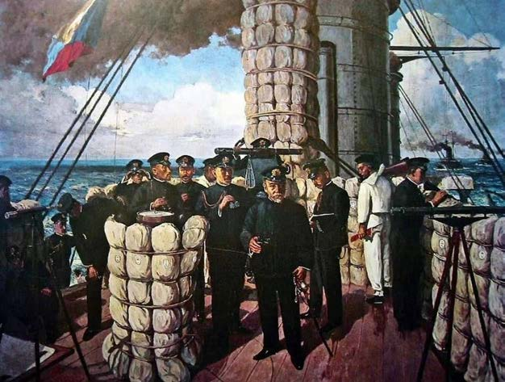

*2019-11-19 08:48 · 饭斯基*

---

### 521

Softbank Group 绝对控股 Softbank Corp, Softbank Corp 和韩国Naver 各持有一半 Z Holdings, Z Holdings 拥有并运营雅虎日本和LINE。

*2019-11-19 08:28 · 手机上网*

---

### 522

看天气、接地气、聚人气。转@ 王兴 天气、地气、人气。

*2019-11-18 22:50 · 手机上网 转自王兴*

---

### 523

重听 beyond，依然那么阳光。

*2019-11-18 18:30 · 手机上网*

---

### 524

同时具备极强同理心和极弱同情心的人可以在很多领域大展拳脚，但不好说是福是祸。

*2019-11-18 18:11 · 手机上网*

---

### 525

「总干部部部长」这个岗位真是诘屈聱牙。

*2019-11-18 17:55 · 手机上网*

---

### 526

天气、地气、人气。

*2019-11-18 17:30 · 手机上网*

---

### 527

:( 转@ OwlLite 魏于全院士，樊代明院士，曹雪涛院士，王红阳院士，马丁院士 哪个不是实锤之后继续升官发财 劣币驱逐良币

*2019-11-18 16:05 · 手机上网 转自OwlLite*

---

### 528

Why 这个重要且常用的概念在汉语里为什么没有发展出一个简单而响亮的单字来表示？

*2019-11-18 12:23 · 手机上网*

---

### 529

HIBI

*2019-11-17 23:56 · 手机上网*

---

### 530

接地气而不俗，上档次而不飘。

*2019-11-17 12:13 · 手机上网*

---

### 531

中文创业圈里动不动就拉出来用的「极致」这个词在英文里怎么说？

我咋一想觉得挺陌生的，superlative？

*2019-11-17 00:48 · 手机上网*

---

### 532

我还不曾在雪地里骑过马。

*2019-11-16 23:40 · 手机上网*

---

### 533

经济问题确实比商业问题复杂太多了。

*2019-11-16 23:00 · 手机上网*

---

### 534

竟然是音译… 转@ 萨姆森撕 在厂里打暑假工时听到的，line长。 转@ 王兴 第一次听说「拉长」这个岗位。

*2019-11-16 16:35 · 手机上网 转自王兴*

---

### 535

第一次听说「拉长」这个岗位。

*2019-11-16 16:02 · 手机上网*

---

### 536

food security 是比 food safety 更底层的问题。

*2019-11-16 12:43 · 手机上网*

---

### 537

同样是 Raffles，指商业综合体时叫「来福士」广场，指酒店时叫「莱佛士」。

*2019-11-16 10:04 · 手机上网*

---

### 538

40年的风口。

*2019-11-16 09:45 · 手机上网*

---

### 539

生活在匆和忙之间。

*2019-11-16 08:36 · 手机上网*

---

### 540

转@ 龙须酥.log disney plus + hulu + espn 一共才13刀？对不起netflix，我给你两周时间调价

*2019-11-15 13:14 · 手机上网 转自龙须酥.log*

---

### 541

如果我们赢了，在西德队消失的时候，它是历史上最伟大的球队之一。先生们，命运就在你们手里。」看看贝肯鲍尔在1990年世界杯前给队员的演讲。那一届德国果然夺冠。

*2019-11-15 12:19 · 手机上网*

---

### 542

诸位，一年前,就在我们与威尔士的生死决战之前，柏林墙倒塌了。你们每天几个小时的守在电视前，想知道我们国家未来的命运。6天之后，我们击败对手，出现在世界杯赛场上。现在，一年之后，我们将是最后一届西德队，德国即将统一，我们现在踢的是西德队历史上最后的几场比赛，如果我们赢了，

*2019-11-15 12:16 · 手机上网*

---

### 543

转自叙利亚朋友：可能是叙利亚全国人民很罕见的一个开心的时刻…这些球员都非常不容易，基本上没有正常训练的条件，主场都需要在它国举办，大部分球员为了维持生存，平时都在不同岗位工作，有的是出租车司机，有的是保安，甚至还有人是公务员，出国比赛需要请假。他们每个月平均收入不到100美元…

*2019-11-15 12:05 · 手机上网*

---

### 544

星际荣耀，听起来像不像一款山寨游戏的名字？据说是一家还蛮有实力的民营发火箭的公司。

*2019-11-15 08:11 · 手机上网*

---

### 545

不控球也可以控场。

*2019-11-15 08:06 · 手机上网*

---

### 546

「我就不信了，咱们全国14亿人，难道还找不出11个会踢球的？」「您还真别说，不尊重科学，没有好的制度，还真就搞不定。」

*2019-11-15 07:41 · 手机上网*

---

### 547

国足输给叙利亚或许是件好事，给我们提了个醒。

*2019-11-15 00:59 · 手机上网*

---

### 548

大致算了一下，这三位的年龄应该只相差一两岁。转@ 王兴 百胜中国（肯德基、必胜客、小肥羊、黄记煌等品牌的母公司）、麦当劳中国（公司名为金拱门）、星巴克中国这三家的 CEO 都是女性。

*2019-11-14 23:34 · 手机上网 转自王兴*

---

### 549

百胜中国（肯德基、必胜客、小肥羊、黄记煌等品牌的母公司）、麦当劳中国（公司名为金拱门）、星巴克中国这三家的 CEO 都是女性。

*2019-11-14 23:17 · 手机上网*

---

### 550

一碗忠诚的拉面，一曲孤独的赞歌。

*2019-11-14 19:59 · 手机上网*

---

### 551

三家公司各自选取的名字后两个字也能说明一些问题。转@ 王兴 抱歉，我对家电行业不熟，多谢提醒，这张对比图更合理一些。转@ 王兴 前两名和第三名的距离已经这么远了。

*2019-11-14 11:36 · 手机上网 转自王兴*

---

### 552

抱歉，我对家电行业不熟，多谢提醒，这张对比图更合理一些。转@王兴 前两名和第三名的距离已经这么远了。

*2019-11-14 11:31 · 饭斯基*

---

### 553

前两名和第三名的距离已经这么远了。

*2019-11-14 11:10 · 饭斯基*

---

### 554

CJKV 才是真正的打断骨头连着筋的。

*2019-11-14 10:31 · 手机上网*

---

### 555

智能新能源车是日本顶级企业丰田真正的大坎。转@ 王兴 再加两关，是否经历过政权更替和重大战争。转@ 王兴 是否经历过主营业务的变迁、是否换过CEO、是否有能力在不同国家/语言/文化环境下开展业务、是否经历过几个大的经济周期，这些都是企业的坎，但也是99.99%的企业确实不需要考虑的

*2019-11-13 23:18 · 手机上网 转自王兴*

---

### 556

听航空业的朋友说，国际航班飞越一个中间国，即使完全没落过地，也需要给这个国家交钱。乍一听这简直是比收高速过路费还更无本万利的生意，但实际上飞机进入领空确实要和地面塔台有通信，确实是会产生成本的。

*2019-11-13 22:56 · 手机上网*

---

### 557

索尼的前身是1946年成立的东京通信工业株式会社。1958年，盛田昭夫感觉公司全名过于冗长，有碍国际化发展，于是就和井深大翻阅字典找寻新名称，最终决定改名为 SONY 。

*2019-11-13 22:50 · 手机上网*

---

### 558

转@ 刘志达 现代水泥（水化硅酸钙）的制备需要维持反应温度在1500 到 1600 摄氏度很长一段时间，因为需要把黏土烧成氧化硅；古罗马是唯一发明了水泥的古文明，原因是因为地理，罗马以南有大量现成的火山灰，火山灰+生石灰就可以生成水泥，建于125年的万神殿能矗立至今就是混凝土的力

*2019-11-13 14:13 · 手机上网 转自刘志达*

---

### 559

造国产神车「五菱宏光」的柳州公司后来出了个升级的自主品牌「宝骏」，含义特别朴实：宝马他哥。

*2019-11-13 13:53 · 手机上网*

---

### 560

跟一个业界大腕聊天时问他某些人为什么会坚持要去折腾某些事，他：「举个例子吧，你要是去黄鹤楼，导游一定会一开始就告诉你这楼最早是孙权建的」。我：「呃，我还真不知道黄鹤楼是孙权建的，提到黄鹤楼我最先想到的是崔颢和李白」。

*2019-11-13 13:13 · 手机上网*

---

### 561

转：今年前十个月韩国（造船业）新接订单额159.7亿美元，保持全球第一。中国以136.7亿美元居次，随后是意大利和日本。

*2019-11-13 08:42 · 手机上网*

---

### 562

这个拍摄角度我第一次见。把陆家嘴拍出了岛的感觉。

*2019-11-12 23:56 · 饭斯基*

---

### 563

望京有个「付小姐在成都」。

*2019-11-12 21:50 · 手机上网*

---

### 564

假使所有的指挥官在他认为他的处境已经毫无希望时就马上投降，那么就不会有人赢得战争。甚至于在绝对无希望的环境中，也常常可能死里求活的。-（二战时期德国元帅）曼施坦因

*2019-11-12 12:53 · 手机上网*

---

### 565

凯末尔确实比丘吉尔更强。

*2019-11-12 11:52 · 手机上网*

---

### 566

-_-! 转@ 左潇 美国健康险及最大医院医疗集团-凯撒医疗CEO 昨晚因心梗去世 享年60岁。 嗯，关机回家睡觉。

*2019-11-12 00:38 · 手机上网 转自左潇*

---

### 567

「一代人做一代人的事」通常用来指不要期望值过高，希望一下子跨越式发展，但这句话可以有另一个意思，每代人得把自己这代人该干的事干了，别往后拖，不然就像爬一条底部已经点燃了的绳梯，爬慢了很危险…

*2019-11-11 20:37 · 手机上网*

---

### 568

成都和重庆的竞争早在两千多年前就存在了，蜀国和巴国。公元前316年两边斗起来时秦国趁虚而入，把两家都灭了，然后大量移民，大力发展，作为后方根据地，近百年后才有秦灭六国、一统天下。

*2019-11-11 20:16 · 手机上网*

---

### 569

比「社会责任感」更立体的是「历史责任感」。

*2019-11-10 23:42 · 手机上网*

---

### 570

苏联解体之后，戈尔巴乔夫给我留下最深刻印象的是十二年前那次拍奢侈品广告：身边放了个 LV 旅行包坐在豪车后座从柏林墙遗址旁开过… 转@ 王兴 柏林墙倒掉30年了。戈尔巴乔夫还活着，今年88岁。

他的三个前任都是年纪大了直接死在任上。

*2019-11-10 20:41 · 饭斯基*

---

### 571

柏林墙倒掉30年了。戈尔巴乔夫还活着，今年88岁。他的三个前任都是年纪大了直接死在任上。

*2019-11-10 09:08 · 手机上网*

---

### 572

有一类理想是关于希望世界是什么样的，而不只是自己怎样。转@ 周露inn 陈丹青：「年轻时，想买大房子，开好车，有迷人的伴侣。这些都是很好的想法，但要搞清楚，这是欲望不是理想。」十几岁时读到的这句话，一直警醒我到现在。也因此一直能分清，谁是完全被欲望野心虚荣驱使

*2019-11-09 18:45 · 手机上网 转自周露inn*

---

### 573

转@ 周露inn 陈丹青：「年轻时，想买大房子，开好车，有迷人的伴侣。这些都是很好的想法，但要搞清楚，这是欲望不是理想。」十几岁时读到的这句话，一直警醒我到现在。也因此一直能分清，谁是完全被欲望野心虚荣驱使，谁又是有理想、破边界、做事情的人。永远选择和后者站在一起。

*2019-11-09 17:23 · 手机上网 转自周露inn*

---

### 574

果然是同一个文化圈的。转@ 拧巴人儿 越南大妈也这样啊哈哈哈哈哈

*2019-11-09 09:53 · 手机上网 转自拧巴人儿*

---

### 575

如果板块漂移速度比现在快一百万倍，国际政治会变得更加有趣。

*2019-11-08 12:32 · 手机上网*

---

### 576

简单回想了一下，在我的本专业里给我留下最深刻印象的教材作者是Andrew Tanenbaum, John Hennessy & David Patterson.

*2019-11-07 21:11 · 手机上网*

---

### 577

转@ 锟斤拷 香港一般叫“用家” 转@ 王兴 转@ bridged 在计算机网络尚未普及的早年，我们曾经翻译成“使用者”。也有翻译成“使用权人”。“用户”一词可能来自windows 3.0中文版的官方翻译吧。 转@ 王兴user 这个词为什么被译成「用户」而非「用者」呢？

*2019-11-07 18:33 · 手机上网 转自王兴*

---

### 578

转@ bridged 在计算机网络尚未普及的早年，我们曾经翻译成“使用者”。也有翻译成“使用权人” 。“用户”一词可能来自windows 3.0中文版的官方翻译吧。 转@ 王兴 user 这个词为什么被译成「用户」而非「用者」呢？

*2019-11-07 16:55 · 手机上网 转自王兴*

---

### 579

user 这个词为什么被译成「用户」而非「用者」呢？

*2019-11-07 12:52 · 手机上网*

---

### 580

不要被过去的自己绑架。

*2019-11-06 22:26 · 手机上网*

---

### 581

转自李伯重教授：工业革命这个词，是革命导师恩格斯第一个提出来的，但是他提出来后，并没有被怎么认可。后来英国历史学家汤因比于1884年出版《工业革命讲演集》，才使得此名词被普遍接受。

*2019-11-05 13:06 · 手机上网*

---

### 582

ZF 这家德国公司的中文名是：采埃孚。

*2019-11-04 23:46 · 手机上网*

---

### 583

「你这一招已经用老了」，逍遥子闻言不禁一怔，十年了，第一次有人敢这么说他的「不老长春功」。他忍不住仔细打量起这个骨骼清奇的黄姓少年。

*2019-11-04 23:27 · 手机上网*

---

### 584

因为「智造」这种说法暗含着不自信和贬低，「制造」丢人吗？不丢人！造得不好才丢人。转@ 王兴 我不喜欢「XX智造」这种说法。

*2019-11-04 23:04 · 手机上网 转自王兴*

---

### 585

我不喜欢「XX智造」这种说法。

*2019-11-04 22:49 · 手机上网*

---

### 586

当我偶尔特别特别想吃肉的时候，顺德生煎鸡是一道很合适的菜。

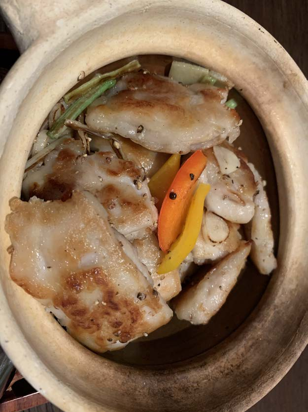

*2019-11-04 19:42 · 饭斯基*

---

### 587

转@ gravity0 广播（broadcast）一词的由来，没干过农活的人不会想到播种。

*2019-11-04 10:58 · 手机上网 转自gravity0*

---

### 588

据说「杨」姓在澳门的拼法是 ieong，首字母大写后是 Ieong，很容易误认为 leong，「梁」姓在香港的拼法（之一）。

*2019-11-04 00:09 · 手机上网*

---

### 589

如果不是一战期间德国老牌制药企业的美国部分被美国政府没收，导致后来分裂成德国默克和美国默克（在中国叫默沙东），今天市值最高的德国企业很可能会是默克。转@ 王兴 德国市值最高的企业不是奔驰、宝马或大众，也不是西门子，而是企业软件公司 SAP，市值1635亿美元。

*2019-11-03 21:25 · 手机上网 转自王兴*

---

### 590

德国市值最高的企业不是奔驰、宝马或大众，也不是西门子，而是企业软件公司 SAP，市值1635亿美元。

*2019-11-03 21:07 · 手机上网*

---

### 591

转@ 刘志达 accuracy 「准确度」与 precision 「精密度」之间的区别

*2019-11-03 17:21 · 手机上网 转自刘志达*

---

### 592

转@ realazy 今天在一个环境保育相对好的地儿活动，发现很多鸟粪，很好奇为何大都是白色的。科普了一下，才知道白色部分根本是鸟的尿尿！中间非白色部分才是便便。

*2019-11-03 16:05 · 手机上网 转自realazy*

---

### 593

我喜欢《Better Man》这首歌有部分原因是 Robbie Williams 在我常听的这个演唱会版本的末尾有段即兴讲话谈到对他已去世祖母的感谢和怀念。这让我想起我已逝的祖母。

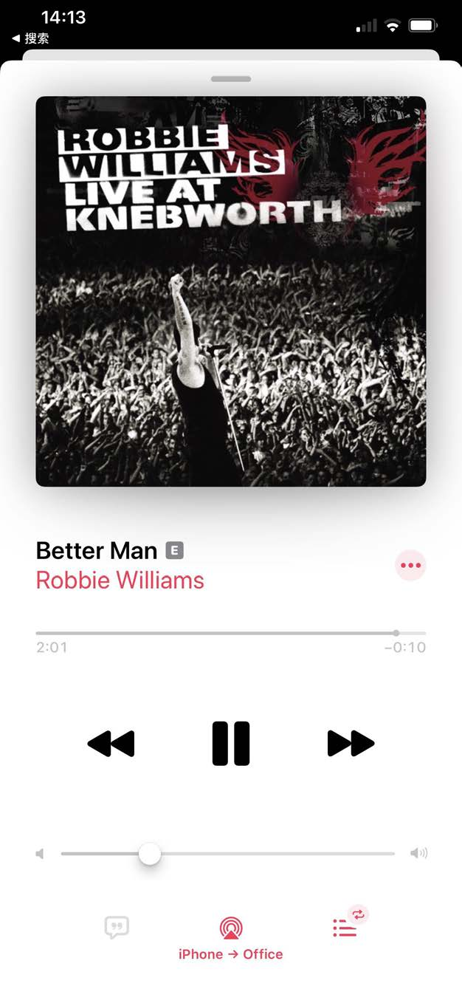

*2019-11-03 14:18 · 饭斯基*

---

### 594

没想到我一夜之间成为谷歌硬件的用户了。闻谷歌收购 fitbit 有感。

*2019-11-03 12:26 · 手机上网*

---

### 595

转：［台积电董事长］刘德音表示，今年全球半导体是逆风的一年，估计全球半导体产值将比去年衰退约12%。

*2019-11-03 11:09 · 手机上网*

---

### 596

一位风险投资家的业余追求。

*2019-11-02 23:26 · 饭斯基*

---

### 597

这么说来，特斯拉和比亚迪都是2003年开始做电动车。转：为了完成将比亚迪电池装进比亚迪汽车的梦想，早在2003年比亚迪汽车成立之初，比亚迪便同步成立了新能源汽车研发部门，比亚迪的首款纯电动车和第一款燃油版车同步开发。

*2019-11-01 17:42 · 手机上网*

---

### 598

说「江浙沪」而非「苏浙沪」，「北上（广深）」而非「京沪」，这

算是不可阻挡的通俗化吧。

*2019-11-01 16:20 · 手机上网*

---

### 599

想起一件事，我在初中时上过一门《学习方法》课。教材好像就是我们学校的数学老师任勇编的。

*2019-10-31 21:11 · 手机上网*

---

### 600

Chanel的花呢外套确实有极高的辨识度，跟 DVF 裹身裙有一拼。

*2019-10-31 20:12 · 手机上网*

---

### 601

别着急翘尾巴。中国人均 GDP 至今依然低于全球人均。

*2019-10-31 17:54 · 手机上网*

---

### 602

「民工」这个概念在英文里意译为 migrant worker.

*2019-10-31 16:52 · 手机上网*

---

### 603

别对北欧的气候有误解。挪威首都奥斯陆冬天比北京更暖和。转@ 汐汐汐汐汐汐 先记一下，挪威那么冷、为什么电动车卖的好？ @转@王兴 特斯拉今年第三季度的前四大市场依次是：美国（31.3亿美元）、中国（6.69亿美元）、荷兰和挪威。

*2019-10-31 13:17 · 手机上网 转自王兴*

---

### 604

转@ 刘志达 广东广西的「广」是怎么来的呢？为了收拢岭南地区的人心，汉武帝颁布圣旨中有「初开粤地，宜广布恩信」这句话，之后汉王朝以这句话命名了岭南中部的一个新县城：广信县。从此以后，人们就把广信县以东称作广东，以西称作广西。

*2019-10-31 11:54 · 手机上网 转自刘志达*

---

### 605

热情推荐一下「青萍」温度计！非常有追求且靠谱的@ peter 和@ 杜斌beta 老师做的！声明：我投资了一点点，但这并不是我推荐的主要原因。转@ 茶水后卫 这是啥牌子温度计？还带蓝牙啊转@ 王兴 屋里这温度… 难怪我觉得有点冷。

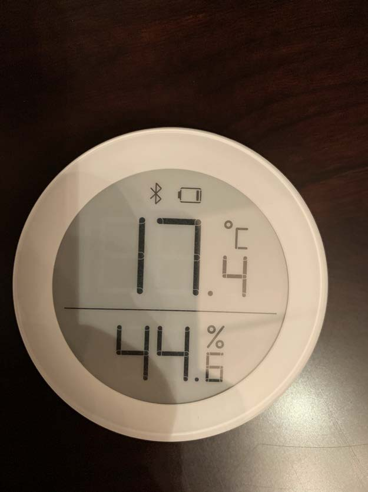

*2019-10-31 09:52 · 手机上网 转自王兴*

---

### 606

转：刚才常修泽把“开放”放在改革的前面，我历来深表赞同，我们主要得益于开放。我们改革的很多思想都是因为开放才带来的，我们老祖宗没告诉我们这些，包括莫干山会议提出的双轨制以及许多有价值的思路，所有这些都是从对外开放来的。马克思主义那一轨也是从西方来的，也不是我们自己的东西。

*2019-10-31 08:31 · 手机上网*

---

### 607

所以，诸君请多多造词吧。比造爱还更有趣呢。转@ 刘志达 最近关于语言的另一个感触是，中文在描述事物的颗粒度明显不如英语，没查到中文和英文的形容词各共有多少个，但感觉英语的形容词比中文多至少一个量级

*2019-10-31 08:23 · 手机上网 转自刘志达*

---

### 608

1917年十月革命后建立的政权名字好长啊：俄罗斯苏维埃联邦社会主义共和国。

*2019-10-31 08:16 · 手机上网*

---

### 609

屋里这温度… 难怪我觉得有点冷。

*2019-10-30 21:57 · 饭斯基*

---

### 610

如果一个中文里造出来（尤其是通过组合两个概念而造出来）的概念在英文里几乎无法翻译，那么这个概念有可能很牛逼，但也有可能很傻逼。

*2019-10-30 18:50 · 手机上网*

---

### 611

转：近年来芯片工厂的成本每四年翻一番，芯片制造商戏称为“摩尔第二定律”，因此能够制造高端芯片的晶圆厂的数量在减少。

*2019-10-30 14:50 · 手机上网*

---

### 612

观 Q3 国内手机出货量有感：待到秋来九月八，我花开后百花杀。冲天香阵透长安，满城尽带黄金甲。

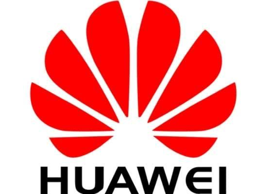

*2019-10-30 14:27 · 饭斯基*

---

### 613

转@ 纯椰子粉 野鸡会跑，会飞，还会游泳，常常因为速度过快，撞树而死。 转@ 臬兀 小时候被外婆家的大鹅追着咬，我爬到猪圈围墙上等着外婆来救我，童年阴影。 转@ 爽.. 大鹅，还会打架「@ 王兴好像确实没有哪种动物既跑得快又能飞还会游泳。」

*2019-10-30 10:53 · 手机上网 转自王兴*

---

### 614

转@ OwlLite 商业活动在媒体时代变得越来越像戏剧一样，有剧本、舞台、演员、宣发、特效和后期。商业活动也呈现出一定的“流量明星”特征

*2019-10-30 10:20 · 手机上网 转自OwlLite*

---

### 615

好像确实没有哪种动物既跑得快又能飞还会游泳。

*2019-10-30 09:42 · 手机上网*

---

### 616

特斯拉今年第三季度的前四大市场依次是：美国（31.3亿美元）、中国（6.69亿美元）、荷兰和挪威。

*2019-10-30 08:30 · 手机上网*

---

### 617

Who cares 确实是比 So what 还更好的一个问题。Valentine 老爷子厉害！

*2019-10-29 12:44 · 手机上网*

---

### 618

这段子高级。转@ 叶滨 十多年前在三里屯一个盗版音像店，两个（看起来像是）伊朗人在专心找碟，旁边的店员窃窃私语说这两人应该是“西亚”的，然后我听到两个伊朗人用英语很惊讶的问彼此：店员怎么看出来我们是“什叶”派的？转@ 王兴 转：在伊朗有一条民族信仰鄙

视链，具体是：什叶派的波斯人>

*2019-10-28 18:35 · 手机上网 转自王兴*

---

### 619

仫 mù 。另外还有个仡佬族，读音为[gē lǎo zú]。转@ realazy 惭愧，今天才知道「仫佬族」的「仫」怎么读。

*2019-10-28 00:19 · 手机上网 转自realazy*

---

### 620

转@ meantobe 第十六次全国国民阅读调查报告显示，2018年我国成年国民人均纸质图书阅读量为4.67本，与2017年的4.66本基本持平。

转@ 王兴 中国过去一年读完至少四本书的人（学生读教科书不算数）有没有1000万？

*2019-10-27 13:05 · 手机上网 转自王兴*

---

### 621

转：在伊朗有一条民族信仰鄙视链，具体是：什叶派的波斯人>什叶派的阿塞拜疆人>什叶派的库尔德人>什叶派的阿拉伯人>逊尼派的阿拉伯人>逊尼派的库尔德人>逊尼派的俾路支人和土库曼人>无神论者。

*2019-10-27 09:07 · 手机上网*

---

### 622

当然算。正儿八经出版过的就算，不管是纸质书还是电子书。转@ 陈海怪 小说算么 哈哈哈哈 转@ 王兴 中国过去一年读完至少四本书的人（学生读教科书不算数）有没有1000万？

*2019-10-26 20:34 · 手机上网 转自王兴*

---

### 623

中国过去一年读完至少四本书的人（学生读教科书不算数）有没有1000万？

*2019-10-26 20:28 · 手机上网*

---

### 624

中原和草原合起来才是中国。

*2019-10-26 18:34 · 手机上网*

---

### 625

钱是一种场。

*2019-10-26 17:47 · 手机上网*

---

### 626

据说清华校友创造了中国半导体产业的半壁江山。其中，清华电子系85级又占了近一半。

*2019-10-26 16:56 · 手机上网*

---

### 627

A state is a human community that (successfully) claims themonopoly of the legitimate use of physical force within a giventerritory. -韦伯

*2019-10-26 13:49 · 手机上网*

---

### 628

一到冬天就特别理解为什么诸多古文明都崇拜太阳神。

*2019-10-26 10:39 · 手机上网*

---

### 629

洗手间里贴马赛克很常见，但金属马赛克我还是头一次遇到。

*2019-10-25 16:34 · 饭斯基*

---

### 630

根据国家统计局的数据，2018年我国商品房销售面积约17亿平方米，对应的销售额约15万亿元，平均房价约8700多元/平米。

*2019-10-25 15:58 · 手机上网*

---

### 631

我喜欢今天这灰云压城的景色。

*2019-10-24 15:00 · 手机上网*

---

### 632

转@ 肖思妮 有一本书《师从天才》就是讲的科研界的师承关系。搞科研的值得看看。转@ 王兴 在多数领域，师承都很重要。有多大比例的诺贝尔奖得主（和平奖除外）的导师也是诺奖得主？

*2019-10-24 12:07 · 手机上网 转自王兴*

---

### 633

锚和引擎。

*2019-10-24 10:37 · 手机上网*

---

### 634

去了趟西二西三环之间，路上耗费大量时间，简直要暴躁起来了。

*2019-10-23 21:36 · 手机上网*

---

### 635

长见识… 转@ 刘江总编 “同济”二字是从德语“Deutsch”（意为“德意志、德语”）在上海话的谐音而来

*2019-10-23 19:12 · 手机上网 转自刘江总编*

---

### 636

「有中国特色的社会主义」和「中学为体、西学为用」在表达上调了

个个儿。

*2019-10-23 15:03 · 手机上网*

---

### 637

终于把一年前爱尔兰裔投行家送我的这本书读完了。书名起得很大:The Silk Roads: A New History of the World。一家之言，或许有些偏颇，但是对我来说有启发。开卷有益。

*2019-10-23 00:26 · 饭斯基*

---

### 638

我认识两个网名叫「南瓜」的创业者，但不认识叫「冬瓜」或「西瓜」的。

*2019-10-22 13:33 · 手机上网*

---

### 639

不理解共产党就不理解新中国。

*2019-10-22 12:58 · 手机上网*

---

### 640

终于抽空看了马云和马斯克那场著名尬聊（的视频节选），确实雷人。

*2019-10-22 11:50 · 手机上网*

---

### 641

老爸竟然抢在我之前就体验了新开张的大兴机场。

*2019-10-21 17:32 · 手机上网*

---

### 642

上海洋气，北京大气，深圳有朝气。转@ 王兴 上海真是比北京洋气太多了。

*2019-10-21 10:03 · 手机上网 转自王兴*

---

### 643

上海真是比北京洋气太多了。

*2019-10-21 09:25 · 手机上网*

---

### 644

又是一年乌镇夜。

*2019-10-20 23:50 · 饭斯基*

---

### 645

叫醒装睡的人才是本事。

*2019-10-20 23:48 · 手机上网*

---

### 646

时间，既是一个常量，又是一个变量，还是一个函数。

*2019-10-20 23:39 · 手机上网*

---

### 647

乌镇这个匾和清华校训「厚德载物」只差一个字。

*2019-10-20 21:11 · 饭斯基*

---

### 648

你可能误解了。我认为上海是有历史有底蕴的城市。转@ 小波是条狗你这让上海如何是好。 转@ 王兴 一个城市，没历史多半没底蕴，但不是历史越长越有底蕴。

*2019-10-20 19:12 · 手机上网 转自王兴*

---

### 649

没想到拜伦和中国一些考试成绩很好但却假装很不刻苦的学生有点像。

*2019-10-20 16:03 · 饭斯基*

---

### 650

一个城市，没历史多半没底蕴，但不是历史越长越有底蕴。

*2019-10-20 11:27 · 手机上网*

---

### 651

问一个做文化产业的土豪朋友：你去过中亚吗？答：去过吉尔吉斯斯坦。我诧异的问：你去那里干什么？他略微迟疑了一下说：我…去凭吊一下李白出生地。

*2019-10-20 11:16 · 手机上网*

---

### 652

全世界人口密度最高的一平方公里内有多少人？

*2019-10-19 16:42 · 手机上网*

---

### 653

确实有些地方把 stakeholder 译成「干系人」，但我还是觉得「持份者」更好，和 shareholder 持股者 对应。

*2019-10-18 16:46 · 手机上网*

---

### 654

Stakeholder 这个概念正变得越来越重要，涵盖股东、员工、客户、供应商、合作伙伴乃至监管部门和大众等。Shareholder 通常译成「股东/持股者」，但 stakeholder 似乎还没有一个简洁的翻译，「利益相关者」太长了。和网友们讨论了一下，建议译成「持份者」。

*2019-10-18 16:27 · 手机上网*

---

### 655

一百多年前，美国新泽西州的首府 Trenton 市在 Delaware 河上一座桥上挂出了非常霸气的标语："Trenton Makes, The World Takes.” 今天最有底气说这句话的或许是中国的大湾区。

*2019-10-17 18:58 · 手机上网*

---

### 656

取消农村之后，深圳的农民们就不再种田，改为种房子了。

*2019-10-17 15:20 · 手机上网*

---

### 657

早饭剥鸡蛋时，想到时局，想起《格列佛游记》里的小头党和大头党…

*2019-10-17 08:52 · 手机上网*

---

### 658

我对这个党完全不了解，但觉得这个名字很体现价值观。转@ 阳升各个党的名字也有意思，土耳其的党名叫正义与发展党，简称正发党。

*2019-10-17 01:06 · 手机上网 转自阳升*

---

### 659

转@ 洋鸟消夏录 昨天决定只休息，找了一个有林间露天温水泳池的spa。到了才发现那是一个 naked pool，不过昨天恰好是每星期必须着泳装的那天。出来时天黑了，我层层裹得很足，从头到脚带着桑拿房里热气腾腾，出来那一阵冷热交替的肤感很熟悉，五六岁时冬天跟妈妈去公共浴室之后回家路

*2019-10-16 21:12 · 手机上网 转自洋鸟消夏录*

---

### 660

「一个人的命运，当然要靠自我奋斗，但也要考虑到历史的进程」，把「人」换成「公司」或「国家」似乎也说得通。

*2019-10-16 21:00 · 手机上网*

---

### 661

十年前的我。转@ 王兴 少年时代的我总以为会有某一天我突然觉得自己长大了，现在我估计永远不会有这么一天。

*2019-10-16 20:43 · 手机上网 转自王兴*

---

### 662

河南，湖南，江南，岭南，海南。

*2019-10-16 20:11 · 手机上网*

---

### 663

挺有意义的。加油！转@ 柒小斤 加油。转@ 夜傻笑 希望自己在做的是一件有意义的事，在GZ范围内统一强奸案件的接案、检查流程，最大化规范操作，确保证据保存的合法有效，还有不对受害人造成更大的伤害。

*2019-10-16 17:59 · 手机上网 转自夜傻笑*

---

### 664

不要因为别人没兴趣说服你而觉得受到侮辱。

*2019-10-16 14:16 · 手机上网*

---

### 665

台积电的市值（2614亿美元）已经超过英特尔（2346亿美元）了。转@ 王兴 越来越有一种感觉，张忠谋老先生才是那一代华人企业家的标杆。转@ 王兴 我见过的半导体行业的人，好像没有一个不服台积电和张忠谋老先生的。服！

*2019-10-16 01:05 · 手机上网 转自王兴*

---

### 666

吃火锅时常见的黄喉是猪或牛的大血管，一般是主动脉。

*2019-10-15 23:49 · 手机上网*

---

### 667

按我的理解，上海只能算有河，广州有山河（南沙才有海），杭州和南京都是有山河湖没有海。转@ 王兴 山河湖海兼备的城市有哪几个？

*2019-10-15 19:22 · 手机上网 转自王兴*

---

### 668

山河湖海兼备的城市有哪几个？

*2019-10-15 18:38 · 手机上网*

---

### 669

更难的是创造一种新语法。转@ 王兴 比造一个字或一个词更稀罕的是发明一种标点。

*2019-10-15 15:34 · 手机上网 转自王兴*

---

### 670

核心和本质并不同义。

*2019-10-15 15:32 · 手机上网*

---

### 671

历史是文化的一部分。

*2019-10-15 00:26 · 手机上网*

---

### 672

大光头我见过很多，但是亮到能反光的还是第一次见，我估计是专门打过镜面蜡了。

*2019-10-14 09:47 · 手机上网*

---

### 673

最近养成一个新习惯，碰到老外名字时，不管再长再怪再难念，也努

力试着发音一下。不练怎么能会呢。

*2019-10-13 15:02 · 手机上网*

---

### 674

杜甫夸李白的「白也诗无敌，飘然思不群」里的「思不群」和苹果的think different 到底是不是同一个意思，这既取决于如何理解 thinkdifferent，也取决于如何理解「思不群」。

*2019-10-13 13:30 · 手机上网*

---

### 675

改革开放是中国过去四十年最重要的事，也是全球化浪潮的一部分。

*2019-10-13 13:20 · 手机上网*

---

### 676

彼得原理不仅适用于个人，也可类推到组织。

*2019-10-12 17:41 · 手机上网*

---

### 677

终于有人在2小时以内跑完马拉松了。1:59:40。

*2019-10-12 16:27 · 手机上网*

---

### 678

转：拳击比赛为什么要分重量级和轻量级，就是要公平，而不是平等。

*2019-10-12 15:00 · 手机上网*

---

### 679

转@ 张亮 1980 年代香港流行音乐的崛起，很大程度上来自于文化的融合，主要是翻唱海外音乐。忘了谁说过，文化融合就像海水里的暖流寒流交汇处，鱼最多。但超越了八零年代歌手们的王菲是文化融合

之上的产物：学其神，舍其形。另一重境界。

*2019-10-12 12:25 · 手机上网 转自张亮*

---

### 680

有“川藏第一桥”之称的雅康高速泸定大渡河大桥。

*2019-10-12 09:52 · 手机上网*

---

### 681

没想到在北京吃到了一次味道很正宗的家乡小吃：龙岩的曹溪清汤粉。粉很Q，汤很正，料很足。

*2019-10-11 13:49 · 手机上网*

---

### 682

“我是探索在一条道路上的普通人，这条道路的目的是在物质建设之外，使人们获得自由、尊严和幸福。诗人写作的目的是改变人和世界的关系，首先就是改变词语和事物之间的关系。” -阿拉伯诗人阿多尼斯

*2019-10-10 18:48 · 手机上网*

---

### 683

峰峦如聚，波涛如怒。

*2019-10-10 16:52 · 手机上网*

---

### 684

霍去病只活到23岁，病死的。

*2019-10-10 11:49 · 手机上网*

---

### 685

牛人就是这么自信！锂电池研究现在才获诺贝尔奖好像确实有点晚。

*2019-10-10 01:18 · 饭斯基*

---

### 686

在多数领域，师承都很重要。有多大比例的诺贝尔奖得主（和平奖除外）的导师也是诺奖得主？

*2019-10-10 01:04 · 手机上网*

---

### 687

转自WeLens：有记者问[因为对锂电池的研究而拿到今年诺贝尔化学奖的日本学者]吉野彰：“您做这个研究是为了造福人类，还是为了赚钱？”吉野彰说，都不是，他做研究只是因为有“好奇心”。

*2019-10-10 01:02 · 手机上网*

---

### 688

我人生中第一次多半也是最后一次书面回答「你是谁？你从哪里来？

你要到哪里去？」是1997年8月底我从龙岩去清华入学时在南平转火车那个晚上住一个很传统的招待所时填住宿单。

*2019-10-10 00:46 · 手机上网*

---

### 689

转自果壳：[今年诺贝尔化学奖得主之一 John Goodenough 在芝加

哥大学物理系]选了Zener当导师，Zener的开场白：“现在你有两个问题。第一个问题是找到一个问题。第二个问题是把它解决掉。祝好运。”于是他选了凝聚态材料，这辈子再没离开过。

*2019-10-10 00:29 · 手机上网*

---

### 690

遛狗时狗绕着主人前前后后跑来跑去是正常的，但路还是主人走出来的。

*2019-10-09 16:14 · 手机上网*

---

### 691

转：当“泰坦尼克号”开始下沉、锅炉爆炸的时候，二副莱托勒被气浪顶到海面，得以幸存。后来，在接受审讯时，莱托勒这样回答为何弃船而逃的讯问：“我从来没有离开船，是船离开了我。”

*2019-10-09 14:57 · 手机上网*

---

### 692

在网上查了一下，毛主席一辈子出过两次国，分别是1949年12月和1957年11月访问苏联。

*2019-10-08 21:30 · 手机上网*

---

### 693

当年山本五十六有更好的选择吗？

*2019-10-08 11:32 · 手机上网*

---

### 694

国庆假期后第一天的清晨，首都机场人山人海。

*2019-10-08 06:55 · 手机上网*

---

### 695

养儿方知父母恩。

*2019-10-07 19:22 · 手机上网*

---

### 696

陈启宗先生在这个时候出来讲这么一番话，不容易。

*2019-10-06 05:39 · 手机上网*

---

### 697

八年前，一早醒来在手机上看到乔布斯去世的消息时，我在台北长荣桂冠酒店的床上。

*2019-10-06 04:49 · 手机上网*

---

### 698

你需要我帮你写点东西宣传一下吗？转@ 陈行_kevin 朋友说他认识了一个KTV小妹，在重庆供了五套房，每个月只休两天。遇到这个妹子，白居易会说些什么?

*2019-10-05 19:52 · 手机上网 转自陈行_kevin*

---

### 699

moraine 冰碛（qì）：冰川堆积作用过程中所挟带和搬运的碎屑构成的堆积物，又称冰川沉积物。

*2019-10-05 04:08 · 手机上网*

---

### 700

问一个朋友：瑞士好像没什么自然资源？答曰：我们有很多水。

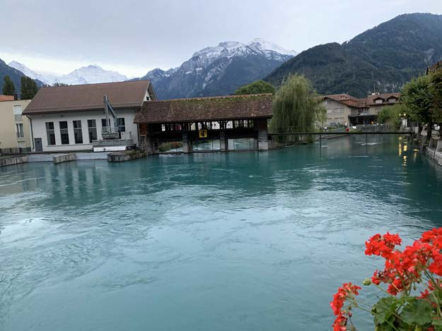

*2019-10-04 02:37 · 饭斯基*

---

### 701

转@ webto mark 转@ 胖胖的肚子.奇怪的蹶蹶 国旗的作图法

*2019-10-03 15:31 · 手机上网 转自胖胖的肚子.奇怪的蹶蹶*

---

### 702

第一次见到酒店里有食肉植物猪笼草。

*2019-10-03 05:18 · 饭斯基*

---

### 703

钯 bǎ ：金属元素，符号 Pd（palladium）。银白色，和金银铂一样是一种贵金属，但主要不用于做首饰装饰而是用于工业。化学性质不活泼，能大量吸附氢气，可用作催化剂，也用来制特种合金等。

*2019-10-02 13:54 · 手机上网*

---

### 704

来自印尼华裔创业者的祝福。

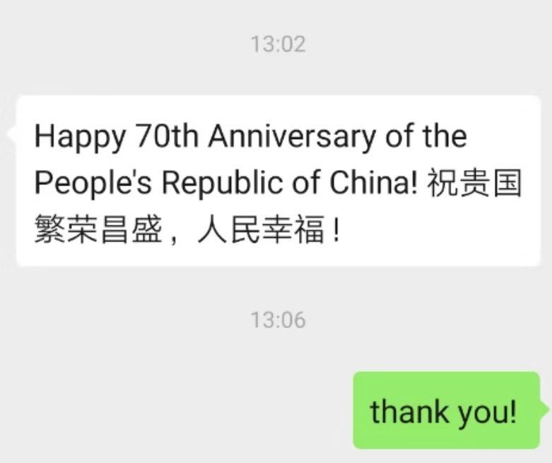

*2019-10-01 19:10 · 饭斯基*

---

### 705

「誓干惊天动地事，甘做隐姓埋名人」，中国工程院院士、隐姓埋名几十年的核潜艇总设计师黄旭华先生在国家勋章颁奖仪式上说。

*2019-10-01 18:20 · 手机上网*

---

### 706

1689年跟俄国签订《尼布楚条约》时，清朝用「中国」而非「清」这个概念代表自己。不知道当时清廷是否知道欧洲于1648年建立的威斯特伐利亚体系。转@ quux 一直以来不确定清朝西方如何指称中国，刚才看了南京条约原文，用的是 China 或 Empire of China

*2019-10-01 14:00 · 手机上网 转自王兴*

---

### 707

元朝末年朱元璋于1367年在应天府（今南京）出兵北伐时所颁布的檄文《朱元璋奉天讨元北伐檄文》里除了用到中土、中原、中国、华夏、中华等概念，还有不太常用的「中夏」。

*2019-10-01 11:50 · 手机上网*

---

### 708

希望有媒体能好好科普一下中华、人民、共和国这三个概念的故事。

*2019-10-01 11:12 · 手机上网*

---

### 709

朱镕基其实只当了5年总理，1998年3月至2003年3月。

*2019-10-01 10:43 · 手机上网*

---

### 710

转：诗人最主要的天赋是爱，爱他的祖国，爱他的人民。--闻一多（清华闻亭石刻）

*2019-10-01 10:29 · 手机上网*

---

### 711

转@ Marskay 日本Canon照相机以“观音”命名。它的名字就是“观音”的日语发音Kwanon（现代作Kannon）的西方化变奏（英语人对Kwa这类音通常觉得难发音），最初logo是千手观音。镜头以“迦叶”命名，叫Kasyapa。佳能相机广告语”凡有所相，皆是虚妄”。#没用的

*2019-10-01 10:00 · 手机上网 转自Marskay*

---

### 712

不，长城的实用功能之一是高速公路。转@ 东东枪 昨天在长城上，忽然想：长城这玩意儿，可能主要是起个震慑作用。这丛山峻岭的，不修它，敌人的队伍、骑兵也难逾越。可这墙太厉害了。它展示的是极强大的人力、物力、组织能力、技术能力，也宣示了一种无比坚强的意志。倘有番邦小丑一时鬼迷心窍前来犯边

*2019-09-30 18:25 · 手机上网 转自东东枪*

---

### 713

第一次遇到一个姓 Bigger 的人。

*2019-09-30 18:17 · 手机上网*

---

### 714

转@ 琦殿 在其他国家的时候是有很多人主动「调情式」搭讪，但这不过是一种男性对女性的，在自己国土上对异国游客的，居高临下的文化傲慢罢了，是尊重吗，一点都不。换个徐锦江来你们看看？

*2019-09-30 00:53 · 手机上网 转自琦殿*

---

### 715

经济学家对经济问题的观点还可以听一下，对商业问题的看法就算了。

*2019-09-29 15:09 · 手机上网*

---

### 716

99.99%的人不知道现代社会里的钱是怎么「印」出来的。

*2019-09-28 17:26 · 手机上网*

---

### 717

转：1978-2018的四十年间，中国经济年均增速超过9.5%，对全球经济增长的贡献超过30%。

*2019-09-28 14:10 · 手机上网*

---

### 718

困得双眼无法对焦。

*2019-09-26 23:58 · 手机上网*

---

### 719

越来越有一种感觉，张忠谋老先生才是那一代华人企业家的标杆。转@ 王兴 我见过的半导体行业的人，好像没有一个不服台积电和张忠谋老先生的。服！

*2019-09-26 13:32 · 手机上网 转自王兴*

---

### 720

人和人「平等」这条价值观，好像是两千年前基督教率先提出来的。

*2019-09-26 10:07 · 手机上网*

---

### 721

惭愧，我也曾经过静安寺，但没有看出印度元素来。

*2019-09-26 09:48 · 饭斯基*

---

### 722

回头来看，苏联以那样的禀赋条件似乎一度能和美国争霸世界，其实是很不可思议的。

*2019-09-26 09:29 · 手机上网*

---

### 723

北京大兴国际机场投入使用了。距离我们办公室68公里。

*2019-09-25 13:26 · 手机上网*

---

### 724

iStink

*2019-09-24 14:37 · 手机上网*

---

### 725

为何 QUEEN 要全大写？

*2019-09-24 14:25 · 饭斯基*

---

### 726

褪 undress

*2019-09-24 14:22 · 手机上网*

---

### 727

只要一醒来，梦就如潮水般退去。

*2019-09-24 13:50 · 手机上网*

---

### 728

相逢的人会再相逢，至少商业上如此。亚马逊21年前就想收购 netflix…

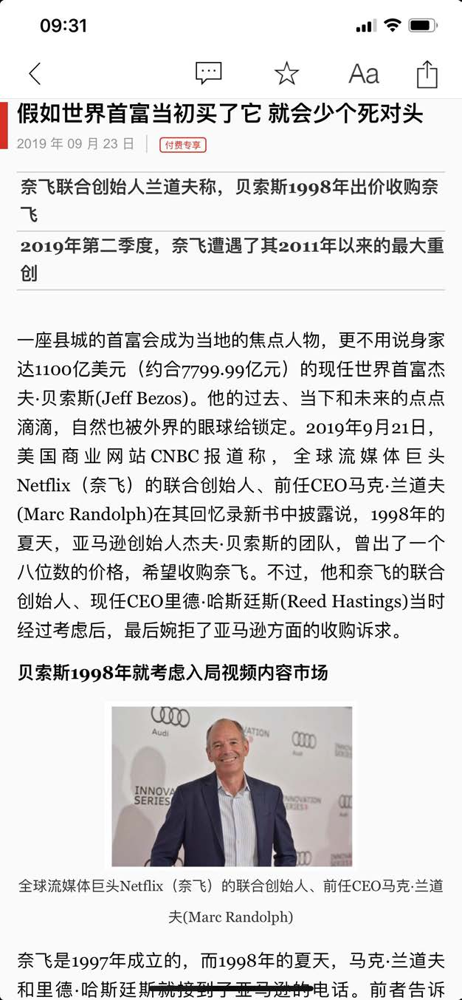

*2019-09-24 09:32 · 饭斯基*

---

### 729

newspaper vs. viewspaper

*2019-09-23 12:44 · 手机上网*

---

### 730

实在是接受不了美国人民这种节日审美-_-！密集物恐惧症者慎入！

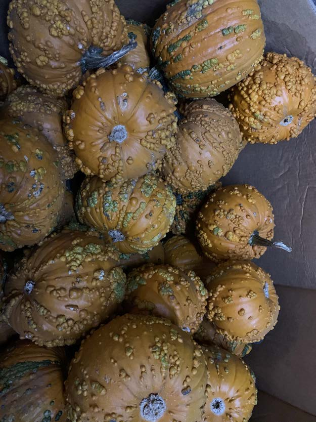

*2019-09-23 12:31 · 饭斯基*

---

### 731

第一次吃 Shake Shack 汉堡，还不错，但没有那么惊艳。

*2019-09-22 18:27 · 手机上网*

---

### 732

至少他们的 MV 品质还是挺高的。转@ 王兴 第一次听 Macklemore的歌。

*2019-09-22 08:43 · 手机上网 转自王兴*

---

### 733

第一次听 Macklemore 的歌。

*2019-09-21 11:53 · 手机上网*

---

### 734

转@ 钟良 有没有著名数学问题被业余爱好者解决过？坦率地讲，没

有——这就是对这个问题最简单的回答，也是最不具有误导性的回答。—-Timothy Gowers

*2019-09-21 00:16 · 手机上网 转自钟良*

---

### 735

警惕「科技义和团」。

*2019-09-20 23:51 · 手机上网*

---

### 736

我通常这么跟老外介绍 Meituan 这个名字，美 means "beautiful"，团 means "together"，beautiful together.

*2019-09-20 23:09 · 手机上网*

---

### 737

严格说来，「机场」对应的是 airfield，airport 对应的是「空港」。

我猜想，航空刚起步时，美国也只有简陋的 airfield，这时概念被引入中国译成「机场」；后来国外从 airfield 发展到 airport 了，国内虽然也有「空港」的概念，但是并没有大规模替代。

*2019-09-20 07:42 · 手机上网*

---

### 738

第一次注意到有些飞机的小桌板是带磁性的，好处就是刀叉不容易掉到地上去。

*2019-09-19 23:40 · 手机上网*

---

### 739

谢谢。转@ Lifbrasir 在蓝牙中 点击AirPods后面的感叹号可以设置动作 转@ 王兴 AirPods 竟然可以轻点两下来开启播放或向前跳一首歌。配合 siri 使用我还没掌握。

*2019-09-19 11:02 · 手机上网 转自王兴*

---

### 740

黑得好狠。转@ 拧巴人儿 非死不可这个公司真是， 假装不作恶都装的那么敷衍。

*2019-09-19 10:58 · 手机上网 转自拧巴人儿*

---

### 741

AirPods 竟然可以轻点两下来开启播放或向前跳一首歌。配合 siri 使用我还没掌握。

*2019-09-19 10:27 · 手机上网*

---

### 742

再一次尝试 AirPods.

*2019-09-19 10:06 · 手机上网*

---

### 743

此刻，美国五大科技公司的市值排名和它们公司成立的先后顺序正好一样。

*2019-09-17 21:44 · 饭斯基*

---

### 744

开会午餐间歇时和同事一起听了一遍周杰伦的新歌《说好不哭》。

*2019-09-17 12:32 · 手机上网*

---

### 745

时隔二十年，我又一次坐火车从龙岩来北京，但现在比当年快多了，G322 只要10小时34分。

*2019-09-16 01:16 · 手机上网*

---

### 746

转@ frodo 这是一个长久的错误印象，高铁降速不是因为温州事故。

降速是11年时任铁道部盛部长的决策，到11年6月底就全面降速了，而温州事故是11年7.23发生。转@ 王兴 什么时候高铁能恢复到因温州事故而降速前的高速？我觉得那将是社会进步的一个重要标志。

*2019-09-15 12:45 · 手机上网 转自王兴*

---

### 747

什么时候高铁能恢复到因温州事故而降速前的高速？我觉得那将是社会进步的一个重要标志。

*2019-09-15 11:08 · 手机上网*

---

### 748

今天去看望了85岁的外婆。她生了我妈这辈4个人，到我这一辈是5个人，再下一辈目前已有10人，可能还会增加。计划生育留下了明显的印记。遗憾的是，再下一辈没有人会龙岩话，而外婆不会普通话，所以他们无法用语言交流:(

*2019-09-14 20:52 · 手机上网*

---

### 749

昨天特意看了下我们家墓地周边的五六块墓地，不同姓氏，但墓碑上刻的都是二十到二十三世不等。估计当年是一批先民相约一起来开拓龙岩。转@ 王兴 赶回老家中秋扫墓。祭拜了二十、二十一、二十二、二十三世先祖。我是二十五世。

*2019-09-14 10:22 · 手机上网 转自王兴*

---

### 750

赶回老家中秋扫墓。祭拜了二十、二十一、二十二、二十三世先祖。

我是二十五世。

*2019-09-13 20:43 · 手机上网*

---

### 751

C罗这发型和柒牌的 logo 真是完美匹配！

*2019-09-13 15:06 · 饭斯基*

---

### 752

转@ 胡泳 塞缪尔·约翰逊（Samuel Johnson）在他的寓言《拉塞拉斯》（1759）中写道：“真相就是，没有人能专注于当下：回忆和预期几乎充斥了每时每刻。”

*2019-09-13 11:39 · 手机上网 转自胡泳*

---

### 753

转：隋朝人侯白在历史上没留下太多记载，主要以不正经出名。有一天杨素问他：如果你掉进一个几百尺深的大坑，你会怎么办？侯白说这事容易，我拿根针，在脑袋上扎个洞，把里面的水放出来，我顺着水就浮上来了。杨素问：你脑袋里怎么会有那么多水？侯白答：如果脑袋里没那么多水，我怎么会掉进那么大个坑

*2019-09-13 07:41 · 手机上网*

---

### 754

转@ 王兴 转：视觉艺术心理学家鲁道夫·阿恩海姆曾谈到：“光线，几乎是人的感观所能得到的一种最辉煌、最壮观的经验。”

*2019-09-12 18:20 · 手机上网 转自王兴*

---

### 755

抬头有蓝天、白云、乌云和雪山，由远及近是墨绿的雪松林和正次第变黄的白桦、褐色的山坡和青色的草甸上点缀着各色牛羊马群，低头是碧蓝的河水，湍急处泛着白色浪花。这就是秋日下午行驶在喀纳斯河谷里的盘山路上的所见。还有，拐过急弯后阳光突然直射眼睛产生

的彩色眩晕。转@ 王兴 盘旋在五颜六色当中

*2019-09-12 18:16 · 手机上网 转自王兴*

---

### 756

盘旋在五颜六色当中。

*2019-09-12 17:41 · 手机上网*

---

### 757

《西伯利亚理发师》里流放地的小木屋。

*2019-09-11 20:07 · 饭斯基*

---

### 758

转@ 王兴 随着年龄增长，我越来越认同，教师节更大的意义不仅在于提醒人们表达对老师们的谢意，而在于激励更多人在工作生活中成为「老师」去帮助身边的人。此所谓pay it forward.

*2019-09-10 12:11 · 手机上网 转自王兴*

---

### 759

不经意间回想起来，韩寒的《飞驰人生》这部电影给我的感觉跟Beyond 的一些歌有点像。

*2019-09-09 21:51 · 手机上网*

---

### 760

连霍高速，编号 G30，从江苏的连云港到新疆跟哈萨克斯坦交界的霍尔果斯口岸，全长4395公里。

*2019-09-09 20:03 · 手机上网*

---

### 761

华为和台积电都成立于1987年。

*2019-09-08 14:33 · 手机上网*

---

### 762

我在清华上完《音乐赏析》这门必修课后，曾经试图选修一门名字似乎是高级音乐赏析的课。第一节课是在蒙民伟音乐楼里上的，老师坐在钢琴边上，前面坐一排学生，总共才六七个。那堂课的内容我基本

都忘了，只记得老师大力鼓励我们要学会看交响乐总谱。我意识到差距确实有点大，默默的把这门课退掉了。

*2019-09-08 01:16 · 手机上网*

---

### 763

转@ 降落练习 琴弦振动规律就是用偏微分方程解决的啊。在没发明微积分之前，作曲家们一直没搞懂为什么有些音合奏起来就会和谐悦耳，而有一些音就不行。 转@ 王兴 我听过一个说法，数学太差当不了作曲家，至少在莫扎特那个年代是这样。那么高等数学对作曲也有帮助吗？

*2019-09-07 23:02 · 手机上网 转自王兴*

---

### 764

转@ 细丝药丸 音乐的乐理全部可以用数学来解释 从古希腊到现代都一样 更有Mathematics and Computation in Music这种书 转@ 王兴 我听过一个说法，数学太差当不了作曲家，至少在莫扎特那个年代是这样。那么高等数学对作曲也有帮助吗？

*2019-09-07 20:07 · 手机上网 转自王兴*

---

### 765

我听过一个说法，数学太差当不了作曲家，至少在莫扎特那个年代是这样。那么高等数学对作曲也有帮助吗？

*2019-09-07 19:29 · 手机上网*

---

### 766

哈哈哈哈哈哈哈！转@ 路上有惊慌 以前我在出版社有个投稿人是地方书画协会的，精心写了一幅毛笔字送给我，我一直没打开看，当然也没有通过他的稿子，后来离开出版社，把他的字带回家，打开一看，写的是“慧眼识珠”四个大字！

*2019-09-07 16:19 · 手机上网 转自路上有惊慌*

---

### 767

如果空调等科技发明得早一点，英国王室会考虑迁都印度吗？大英帝国和整个世界的历史会有多大变化？

*2019-09-07 14:13 · 手机上网*

---

### 768

回想起来，古龙的小说很多时候在探讨理性和感性的平衡。

*2019-09-07 13:04 · 手机上网*

---

### 769

适当的炫技是必要的。摩西、耶稣、穆罕默德都干过。

*2019-09-06 00:37 · 手机上网*

---

### 770

只要有一架钢琴伴奏，一对男女对唱《歌剧魅影》主题曲确实是音乐酒吧里快速拉升气氛同时提升逼格的有效办法。雅俗共赏。

*2019-09-06 00:32 · 手机上网*

---

### 771

日本有个互联网巨头，在中国不太为人所知，Recruit，市值 484 亿美元。据说他们不在日本国内做什么投入，赚的钱都拿去投到海外市

场。

*2019-09-05 13:54 · 手机上网*

---

### 772

学到一个新概念：出圈。

*2019-09-05 12:01 · 手机上网*

---

### 773

这不是50年前的单向历。

*2019-09-05 10:59 · 饭斯基*

---

### 774

半导体之所以厉害就是因为它能变来变去，在某种条件下呈现某种特性，在另一种条件下迅速呈现出另一种特性。

*2019-09-05 02:08 · 手机上网*

---

### 775

大脑壳山！深圳这地名好有喜感:)

*2019-09-04 17:01 · 手机上网*

---

### 776

但我估计孙正义可能也就是这么一说，不见得真有系统思考。从一些访谈来推测，他说要搞300年是为了比日本历史上最牛逼的德川幕府还更牛逼，德川幕府搞了两百多年。转@ 衣公子的剑 孙正义 转@ 王兴有点好奇什么样的人能思考百年问题

*2019-09-04 12:49 · 手机上网 转自王兴*

---

### 777

孙正义确实在创业早期就提出要做三百年企业。阿里的102年愿景我估计是马云见了孙之后受启发，觉得创办于1999年的阿里可以讨个巧，搞102年就能横跨三世纪。后来也从软银融了大钱的陈一舟更务实，只提要做30年企业。转@ 衣公子的剑 孙正义 转@ 王兴 有点好奇什么样的人能思考百年问题

*2019-09-04 12:45 · 手机上网 转自王兴*

---

### 778

有点好奇什么样的人真的能思考百年问题。

*2019-09-04 11:50 · 手机上网*

---

### 779

转@ realazy 听女儿说蜗牛有两万颗牙齿

*2019-09-03 18:49 · 手机上网 转自realazy*

---

### 780

有些公司有垂直整合能力，多数公司没有。有些国家有，多数没有。

*2019-09-03 18:46 · 手机上网*

---

### 781

我觉得《铁血丹心》这首歌很耐听，但我不清楚有几分是因为歌本身，又有几分是因为当年那版《射雕英雄传》港剧。

*2019-09-02 22:11 · 手机上网*

---

### 782

今晚骑了美团单车:)

*2019-09-02 01:24 · 手机上网*

---

### 783

光线传媒出品并发行的《哪吒之魔童降世》目前累计票房46.76亿，已经超过《流浪地球》成为中国史上票房第二高的电影，仅次于《战狼2》的56.83亿。

*2019-08-31 23:34 · 手机上网*

---

### 784

开完一整天会的感觉不是累，而是乏。

*2019-08-31 23:26 · 手机上网*

---

### 785

什么？竟然还有中学生国际哲学奥林匹克竞赛？我以前只知道有数、理、化、生物和计算机的奥赛。

*2019-08-31 02:07 · 手机上网*

---

### 786

我见过的半导体行业的人，好像没有一个不服台积电和张忠谋老先生的。服！

*2019-08-30 16:01 · 手机上网*

---

### 787

MMT：Modern Monetary Theory，现代货币理论。

*2019-08-30 15:58 · 手机上网*

---

### 788

@ 王蕊 拜托，你都不在华为多少年了？

*2019-08-30 15:33 · 手机上网 给王蕊的回复*

---

### 789

美满电子科技？Marvell 的中文名真是雷到我了！

*2019-08-30 11:49 · 手机上网*

---

### 790

F：他们投资了一家特别特别传统的工业企业，一点也不性感，但是回报很好。我：多传统？F：把空气分离成氧气和氮气，然后卖给不同的客户。

*2019-08-30 11:33 · 手机上网*

---

### 791

见了一个阅人无数的大佬，他说杰克韦尔奇确实是他见过的学习速度最快的企业家。但是他依然认为通用电气的衰落主要是因为杰克韦尔奇选错了接班人而不是一个更深层次的问题，这一点没有说服我。

*2019-08-29 16:21 · 手机上网*

---

### 792

今天的云让北京变成了一个更立体的城市。

*2019-08-29 12:59 · 手机上网*

---

### 793

听说了一个我回国后就没联系过的外国友人的不幸消息:( 想起十六七年前的场景，在宾州小镇上很老很老的房子里，他那很老很老的祖母跟我们讲：当时我正在地里刨土豆，忽然钟声大作，全村人都聚过去，我们被告知，第一次世界大战结束了，我们（美国）赢了…

*2019-08-28 20:27 · 手机上网*

---

### 794

@ gravity0 有个细节错误：颠地（Lancelot Dent）是另一个鸦片商人，跟麦赞臣（James Matheson）合伙开怡和洋行的是渣甸（William Jardine）。

*2019-08-28 19:31 · 手机上网 给gravity0的回复*

---

### 795

竟然收到一个邀请问我要不要去符拉迪沃斯托克（海参崴）参加一个经济论坛。虽然我对那个地方还蛮感兴趣的，但是实在走不开，只好作罢。

*2019-08-28 19:20 · 手机上网*

---

### 796

另外，如果联想起「驻场乐队」，也不是什么坏事:) 转@ 王兴 同

理，EIR (Entrepreneur in Residence) 译成「驻场企业家」比「入驻企业家」更好，后者用动词修饰名词，可能被误解为动宾，用动宾修饰名词就没有歧义了。转@ 王兴 managing partner

*2019-08-28 15:50 · 手机上网 转自王兴*

---

### 797

同理，EIR (Entrepreneur in Residence) 译成「驻场企业家」比「入驻企业家」更好，后者用动词修饰名词，可能被误解为动宾，用动宾修饰名词就没有歧义了。转@ 王兴 managing partner 我认为译成「主管合伙人」比「管理合伙人」略好一点

*2019-08-28 15:45 · 手机上网 转自王兴*

---

### 798

很有洞察力！转@ 啊町_ 除了人以外的动物胖起来都是可爱的~ 转@王兴 多肉了解一下。转@ 反社会小猫咪 植物 不会发胖 转@ 王兴如果可以选择且必须选择，你更愿意当植物还是动物？

*2019-08-28 15:32 · 手机上网 转自王兴*

---

### 799

多肉了解一下。转@ 反社会小猫咪 植物 不会发胖 转@ 王兴 如果可以选择且必须选择，你更愿意当植物还是动物？

*2019-08-28 15:23 · 手机上网 转自王兴*

---

### 800

多谢！问题前半部分的三分之一已解决:) @ 黄阿狗 为了感谢饭否，我可以送你二十棵树种。转@ 王兴 有点焦虑。今年要回一次龙岩，但是红杉的树种和种植点都还没着落。转@ 王兴 微信上找读了林学博士的同学咨询了一下，世界上最大的树种北美红杉在中国已经可以合法栽培了。下次回龙岩我去种上几棵

*2019-08-28 14:31 · 手机上网 转自王兴*

---

### 801

有点焦虑。今年要回一次龙岩，但是北美红杉的树种和种植点都还没着落。转@ 王兴 微信上找读了林学博士的同学咨询了一下，世界上最大的树种北美红杉在中国已经有引种历史，可以合法栽培了。太好了，下次回龙岩我找地方去种上几棵。这树可以长很高很高，但就是长得慢。

*2019-08-28 11:59 · 手机上网 转自王兴*

---

### 802

如果可以选择且必须选择，你更愿意当植物还是动物？

*2019-08-28 11:45 · 手机上网*

---

### 803

看出三词之同很有意义，理解三词之异也很有价值。@ 刘志达 小马过河/刻舟求剑/守株待兔都可以等价于 归因错误/归因错误/归因错误转@ 王兴 非常同意。互联网公司还应该复习守株待兔。转@ webto人长大了就觉得自己啥都懂了，小时候看的寓言故事都忘了，最常见的案例是小马过河和刻舟求剑

*2019-08-28 11:25 · 手机上网 转自webto*

---

### 804

非常同意。这俩寓言我都时常想起。互联网公司们还应该复习守株待兔。转@ webto 人长大了就觉得自己啥都懂了，小时候看的寓言故事都忘了，最常见的案例是小马过河和刻舟求剑。

*2019-08-28 11:12 · 手机上网 转自webto*

---

### 805

现在是联接过去和未来的平台。

*2019-08-28 11:10 · 手机上网*

---

### 806

又查了一下，十六世纪时西方人最初是选择在香港屯门建贸易站，后来跟明朝军队发生冲突被赶走了… 然后才有了澳门。转@ 王兴 按说澳门应该风水比香港还更好吧？要不然十六世纪葡萄牙人来中国时为什么选珠江口西岸的澳门而非珠江口东岸的香港？当时他们如果想占香港肯定也能占下来吧，反正都是小荒岛。

*2019-08-27 22:48 · 手机上网 转自王兴*

---

### 807

「行业决定论」和「地理决定论」一样充满争议。每个人可以各自解读。

*2019-08-27 14:09 · 手机上网*

---

### 808

其他四家阿里都入股甚至是控股了，只有韵达还是完全独立的。转@王兴 我有一种感觉，韵达可能会是四通一达桐庐系快递里最后的大赢家。在一个服务如此同质化的行业里，韵达这个独树一帜的名字明显优于申通、中通、圆通、百世汇通。

*2019-08-27 10:06 · 手机上网 转自王兴*

---

### 809

我有一种感觉，韵达可能会是四通一达桐庐系快递里最后的大赢家。

在一个服务如此同质化的行业里，韵达这个独树一帜的名字明显优于申通、中通、圆通、百世汇通。

*2019-08-27 10:00 · 手机上网*

---

### 810

转@ 平衡. 关注很久，定位清晰，特别针对我等二胎家庭。价格公道…… 转@ 王兴 多谢专业人士言简意赅的肯定！转@ 余建约 理想ONE，值得买。

*2019-08-27 09:07 · 手机上网 转自余建约*

---

### 811

「让子弹飞一会儿」确实是神来之笔。

*2019-08-26 23:24 · 手机上网*

---

### 812

刚知道除了币圈和链圈还有矿圈，而且很有行业自豪感：我们跟那些币圈和链圈的不一样，我们是实体经济；芯片、矿机、拉电搞矿场，这都是实打实的…

*2019-08-26 22:30 · 手机上网*

---

### 813

多谢专业人士言简意赅的肯定！转@ 余建约 理想ONE，值得买。

*2019-08-26 22:10 · 手机上网 转自余建约*

---

### 814

转@ 胡泳 查尔斯·泰勒认为，正是日常生活的神圣化使得现代公共领域得以产生

*2019-08-26 22:05 · 手机上网 转自胡泳*

---

### 815

约了人在酒店里的餐厅吃饭。我下车进酒店大门时，迎宾员大叔一边帮我拉开门一边笑呵呵的对我说了一句：我晚上也送美团外卖…

*2019-08-26 18:56 · 手机上网*

---

### 816

转@ 贾行家 这可有点儿装傻。哈尔滨人都直道：老铁这词，也用于“安达”“麻吉”之类意思，但是一般语境下还是指姘头。 转@ 人有饭天吃否 「【老铁】指非常好的朋友。」——《哈尔滨方言词典》1997年12月第1版

*2019-08-26 18:52 · 手机上网 转自人有饭天吃否*

---

### 817

1600年英国东印度公司、1602年荷兰东印度公司、1616年丹麦东印度公司、1628年葡萄牙东印度公司、1664年法国东印度公司、1731年瑞典东印度公司相继成立。当年的风口…

*2019-08-26 12:30 · 手机上网*

---

### 818

转@ bridged 把路透的标题，BBC的图片，CNN的行文洗稿后放在一起，配上华尔街（和谐）日报整理的表格，溶于一炉，最后攒成一篇自媒体爆款文章《亚马逊大火连烧三月，西方媒体不闻不问》。这就是中文网络内容产业

*2019-08-25 17:37 · 手机上网 转自bridged*

---

### 819

四五年前，我曾经问一个金融业前辈，中国的利率为什么不市场化？

他只是很确信的告诉我，不会市场化，但是没解释为什么。后来，我终于慢慢理解了。

*2019-08-25 15:21 · 手机上网*

---

### 820

华为要求员工不把深圳和东莞那块儿叫「总部」，要叫「机关」。

*2019-08-25 15:16 · 手机上网*

---

### 821

转@ MsKaren_Q @ 王兴 东南亚的这个词的概念源起在安德森的自传椰壳碗外的人生里有具体描述。主要是由于美国接管了英国的殖民地而沿袭的，按安德森的看法，他认为越南在文化上与中国更接近，应分在东亚组里。

*2019-08-25 14:38 · 手机上网 转自MsKaren_Q*

---

### 822

SAARC 南亚区域合作联盟（South Asian Association For RegionalCooperation）包含八个国家：印度、巴基斯坦、斯里兰卡、孟加拉、不丹、马尔代夫、尼泊尔、阿富汗。

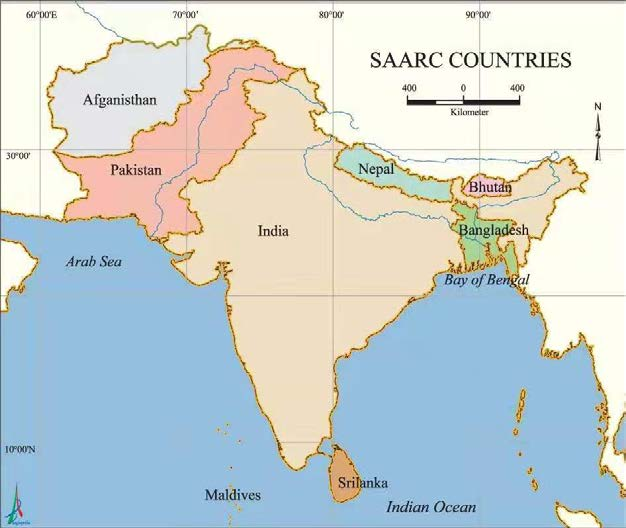

*2019-08-24 23:47 · 饭斯基*

---

### 823

这个展览很棒，百来件真迹，既有毕加索12岁时画的令人惊叹的素描，也有他91岁时的自画像。毕加索天才的一生很好的诠释了「既往不恋，纵情向前」！

*2019-08-24 22:56 · 饭斯基*

---

### 824

听说宝马出了一款比 X5 还大一号的 X7 SUV，我有点好奇。

*2019-08-24 07:58 · 手机上网*

---

### 825

网购都算中国的发明？说这种话的人听说过亚马逊吗？毫不客气的说，发明这种说法的人不是蠢就是坏。转@ 阳升 新四大发明——高铁、网购、移动支付、共享单车，说是大发明有点名不副实，但要说它们是新基础设施，则十分恰当 转@ 阳升 刘二海的“新基础设施”的提法还是挺有意思的。

*2019-08-23 23:25 · 手机上网 转自阳升*

---

### 826

缅甸算东南亚而非南亚。

*2019-08-23 16:27 · 手机上网*

---

### 827

瑞士朋友说他们那只有700万人口的国家喜欢动不动就来个全民公投，例如，不久前一项公投的内容是公牛的角该不该去掉…

*2019-08-22 21:53 · 手机上网*

---

### 828

怎么查？转@ 阿瓦 代查饭否。。。。懂了。这生意都他妈有人做。

*2019-08-22 17:32 · 手机上网 转自阿瓦*

---

### 829

安谋控股？没想到就是 ARM 这家公司的中文名吧:)

*2019-08-22 11:05 · 手机上网*

---

### 830

深圳到长沙最快的高铁竟然只要2个多小时！

*2019-08-22 10:33 · 饭斯基*

---

### 831

酱紫。转@ 奔跑啊linlin 对这事产生好奇本身就说明您没抑郁症迹象RT@ 王兴 我并没有任何会得抑郁症的迹象，我只是对这事产生了一点点好奇。

*2019-08-21 16:22 · 手机上网 转自王兴*

---

### 832

我并没有任何会得抑郁症的迹象，我只是对这事产生了一点点好奇。

*2019-08-21 16:17 · 手机上网*

---

### 833

改个名字就是创新。

*2019-08-20 22:00 · 手机上网*

---

### 834

转@ 刘志达 全球廉价服饰每年的流行款式其实都是在抄袭位于顶端的时尚，时尚界的顶端引领着潮流，普通人认为自己的衣着远离这些顶端，但事实上，早被这些顶端所决定。我们的思想观念何尝不是如此呢？

*2019-08-19 20:02 · 手机上网 转自刘志达*

---

### 835

认识了一个很神的做 FA 的年轻人，他说他熟读《红楼梦》和《卡拉马佐夫兄弟》，以此观创业者，八九不离十。

*2019-08-18 19:34 · 手机上网*

---

### 836

转@ 小熊娃娃 今天证实了人家真是有过人之处，能量大大的。 转@小熊娃娃 这段时间和一些老翻译家打交道，发现他们无一例外的学风严谨、为人和善，八十多岁了还很硬朗。一开始想了另一种解释，今天再一想，三十年代出生一辈子做学者又能活到现在的，本命必有过人之处……

*2019-08-18 14:43 · 手机上网 转自小熊娃娃*

---

### 837

说实话，不加奶的话，Nespresso 胶囊咖啡机不换胶囊冲出来的第二道甚至第三道都比第一道咖啡更符合我的口味，可能现在我只能欣赏那种淡淡的咖啡。

*2019-08-18 12:56 · 手机上网*

---

### 838

iPhone 是第一台由有操作系统能力的公司做出来的手机。刚想到这个角度。

*2019-08-18 08:56 · 手机上网*

---

### 839

转@ 杨曜睿 早上感觉没睡够，头脑不清晰，吃了36mg利他林。自从去印度学冥想后，一年多没吃对症ADHD的药物了。结果今天玩狼人杀，大杀四方，逻辑严密又清晰，盘狼坑神准。。唉，之前打过一个多月的狼人杀，所得的经验对胜负的帮助，远远不如一粒药物带来记忆力和思考能力的提升带来的帮助大。

*2019-08-18 08:46 · 手机上网 转自杨曜睿*

---

### 840

西门子的半导体业务分拆出来成了英飞凌，菲利普拆出来恩智浦NXP，摩托罗拉拆出来飞思卡尔 Freescale，现代拆出来海力士

Hynix。好多大的工业集团最后都把自己的半导体业务分拆独立了，三星是个例外。

*2019-08-18 08:32 · 手机上网*

---

### 841

讨论中国社会的文明程度时，请别忘了我们中国人真的吃饱肚子还没几年。是的，我就是我们家族历史上第一代没有饿过肚子的。我爸他们在六十年代初是真的饿过的。随便翻翻莫言的《丰乳肥臀》或类似题材的书，你就能理解长时间的饥饿可以怎样的改变一个人。马斯洛不是瞎编的。

*2019-08-17 21:49 · 手机上网*

---

### 842

一个创业的朋友说，七零后八零后很多人被“think different andchange the world”所激励，但九零后尤其是九五后更主流的态度是「道理我都懂，但 who TM cares?」 这让我想起日本相隔不到十年的两代漫画《海贼王》和《银魂》里的价值观天差地别。

*2019-08-17 18:41 · 手机上网*

---

### 843

时间和时间是不平等的。

*2019-08-17 10:36 · 手机上网*

---

### 844

很多人误以为中国在1980年实行一胎化之前，人口增长过快。但实际上，从1950年到1980年，中国的人口增长在发展中国家中几乎是垫底的。在1950年全球人口最多的30个国家里，中国的人口增长幅度要慢于阿根廷之外的所有发展中国家。-梁建章

*2019-08-17 08:46 · 手机上网*

---

### 845

贵圈真乱！转@ 寒小梦 宁可她和周冬雨。。转@ 咕咕咕Y 转@ 阿沢转@ 卢兹 多好啊 转@ 嘿呦姜子芽 窦靖童：前任继父的前任是我现任 ps(觉得很扯 不敢相信 )

*2019-08-16 19:07 · 手机上网 转自嘿呦姜子芽*

---

### 846

听说我是知乎第18个用户。

*2019-08-16 18:22 · 手机上网*

---

### 847

哈哈，这译名不错。是不是受了上海洛公馆的启发？转@ 人有饭天吃否 洛公蚝。转@ 王兴 美国竟然有一道牡蛎做的菜 OystersRockefeller 用洛克菲勒命名，其实这道菜的起源和他本人没啥关系，只是因为当时他是美国首富。

*2019-08-16 14:31 · 手机上网 转自王兴*

---

### 848

转@ Drunk_Marty 1、古时珠江西岸比东岸繁荣。2、17世纪以前香港一带还是海中孤岛孤山，没有围沙田，没有平地。 转@ Thallium 香港缺乏淡水。转@ 王兴 虽然大航海在我最爱的游戏里能排进前几

名，但这个细节我真没印象。转@ 酮替芬 大航海时代里只有澳门没有香港 转@ 王兴

*2019-08-16 09:37 · 手机上网 转自王兴*

---

### 849

美国竟然有一道牡蛎做的菜 Oysters Rockefeller 用洛克菲勒命名，其实这道菜的起源和他本人没啥关系，只是因为当时他是美国首富。

*2019-08-16 09:23 · 饭斯基*

---

### 850

转@ 一年改名12次 除了自然条件，还要补充的是据说当时的大英帝国掌握了现代测量技术 转@ 一年改名12次 其实是地球自转惹的祸，北半球南北流向的河，泥沙都是堆积在西海岸，东边的香港是天然深水港，珠海、澳门输在了起跑线 。转@ 王兴 转@ 望穿春氷 开始是澳门地理条件更优越，风小浪平。据

*2019-08-16 09:00 · 手机上网 转自王兴*

---

### 851

今天才知道，荷兰人原本是想靠武力把葡萄牙人先占了的澳门抢过去，没想到打输了，只好退而求其次去占了澎湖和台湾，三四十年后又被郑成功打跑了。西班牙人更衰，原本占了台湾北部的基隆和淡水，经营十多年后被荷兰人打败了，只好退回菲律宾。

*2019-08-15 21:28 · 手机上网*

---

### 852

转@ 拧巴人儿 哈哈哈哈哈哈 转@ 猪小丫 嗯 转@ 妄想饭友收藏夹# 亚洲唯美丧图分享 #

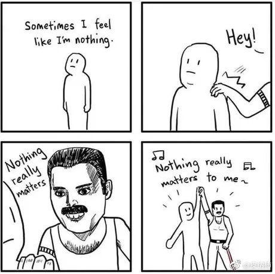

*2019-08-15 21:17 · 手机上网 转自妄想饭友收藏夹*

---

### 853

转@ 望穿春氷 开始是澳门地理条件更优越，风小浪平。据说是后来珠江西岸淤积，不利于近现代大船巨轮和进出港口，所以香港登场了。转@ 王兴 按说澳门应该风水比香港还更好吧？要不然十六世纪葡萄牙人来中国时为什么选珠江口西岸的澳门而非珠江口东岸的香港？当时他们如果想占香港肯定也能占下来吧，反

*2019-08-15 20:57 · 手机上网 转自王兴*

---

### 854

虽然大航海在我最爱的游戏里能排进前几名，但这个细节我真没印象。转@ 酮替芬 大航海时代里只有澳门没有香港 转@ 王兴 按说澳门应该风水比香港还更好吧？要不然十六世纪葡萄牙人来中国时为什么选珠江口西岸的澳门而非珠江口东岸的香港？当时他们如果想占香港肯定也能占下来吧，反正都是小荒岛。

*2019-08-15 20:55 · 手机上网 转自王兴*

---

### 855

按说澳门应该风水比香港还更好吧？要不然十六世纪葡萄牙人来中国时为什么选珠江口西岸的澳门而非珠江口东岸的香港？当时他们如果想占香港肯定也能占下来吧，反正都是小荒岛。

*2019-08-15 19:00 · 手机上网*

---

### 856

网易的市值超过了百度，拼多多的市值超过了小米。

*2019-08-15 16:21 · 饭斯基*

---

### 857

金融，既是空间上的调动，也是时间上的腾挪。转@ 王兴 比「牺牲哪个人」或「牺牲哪个群体」更残酷的问题是「牺牲哪代人」？

*2019-08-15 16:02 · 手机上网 转自王兴*

---

### 858

不争（尤其是在社交媒体上）。-《道德经》

*2019-08-15 14:14 · 手机上网*

---

### 859

在清华你经常会听到一句话：“祖国终将选择那些选择了祖国的人”。

-《如何在人生的马拉松中跑好清华这一程》，电机系教授于歆杰在清华2019级本科生开学典礼上的发言

*2019-08-15 13:42 · 手机上网*

---

### 860

现有的一批公司里链家是最适合搞区块链的，至少名字上占优。

*2019-08-15 13:25 · 手机上网*

---

### 861

昨天下午那杯瑞幸无糖冰咖啡的口感显著超越我的预期。味道是可感知的。

*2019-08-15 12:25 · 手机上网*

---

### 862

微软真是一家神奇的公司，市值全世界第一，却不像第二到第五名那样有反垄断的风险。

*2019-08-14 23:56 · 手机上网*

---

### 863

转@ 张亮 转@ 群众演员 转@ 深蓝. 今天碰到一个50多岁的保洁阿姨带着她老伴来销卡，卡里只有80多块，她说老伴身体不好，说不定哪天就没了，趁他还活着赶紧把钱取出来，钱虽然不多但是也可以用来买几日菜……

*2019-08-13 23:24 · 手机上网 转自深蓝.*

---

### 864

弱将手下无强兵。

*2019-08-13 18:07 · 手机上网*

---

### 865

认识了一个大牌投资公司里蛮不错的年轻人，他说将来如果出来创业，他会同时注册三个实体：第一个拍电影，第二个搞社区，第三个才是做投资。不要阿猫阿狗之类的案子都投，只投那些将来值得拍成电影的公司。

*2019-08-12 23:29 · 手机上网*

---

### 866

据说，「世」是个很形象的字，一横三竖，原意就是三十年，一代人。

*2019-08-12 17:03 · 饭斯基*

---

### 867

蜜桃成熟时。转@ 吃飽撐的 中午酷暑难耐，吃个桃子放松一下……

*2019-08-12 16:16 · 手机上网 转自吃飽撐的*

---

### 868

是的，福建第一条出省铁路鹰厦线直到1958年1月才正式通车，战备目的很明确，8月就开启了金门炮战，一直打到79年和美国正式建交才停。转@ 唉哟喂. 火车通车也是… 转@ 王兴 了解一点地理和历史就会明白，福建可以说是中国在东南沿海的「边疆」，开发很晚，至今森林覆盖率全国第一。

*2019-08-11 23:46 · 手机上网 转自王兴*

---

### 869

转@ 小熊娃娃 万万没想到这个夏天吃到的最好吃的桃子、杏、芒果，都是在南法随便买的或者酒店送的，沙拉也超好吃，切身体会了什么叫农业发达。一到西班牙水果就差不少……

*2019-08-11 23:37 · 手机上网 转自小熊娃娃*

---

### 870

是徐庄软件园那个吗？我看了一下卫星图，没看出张字。转@ 泡菜肉丸子 苏宁总部的大楼，俯瞰就是张近东的张字 转@ 王兴 一个脑洞很大的朋友说，你不觉得华为的 logo 就是任正非的「非」字吗？

*2019-08-11 23:35 · 手机上网 转自王兴*

---

### 871

了解一点地理和历史就会明白，福建可以说是中国在东南沿海的「边疆」，开发很晚，至今森林覆盖率全国第一。

*2019-08-11 16:24 · 手机上网*

---

### 872

因为双手拎着四大桶农夫山泉，所以尝试用下巴尖关灯，颇有难度，但最终目标达成。

*2019-08-11 15:57 · 手机上网*

---

### 873

从长度来看，至少有三种较长的周期，中的是人一辈子可以经历若干轮的，长的是人一辈子大概正好经历一轮，超长的是人一辈子只能经历一个完整周期中的某个片断。

*2019-08-11 15:20 · 手机上网*

---

### 874

转@ webto 注水的世界纪录啊 ：吉尼斯世界纪录提到这个机场是世界上最大的机场，总面积为780平方公里（比巴林大）。然而，官方网站公布的实际机场面积为3675公顷（9080英亩），即36.75平方公里。它的确提到总面积为77,600公顷（192,000英亩），但包括整个房产

*2019-08-11 14:26 · 手机上网 转自webto*

---

### 875

全世界最大的机场是沙特的法赫德国王国际机场，占地面积780平方公里，比整个新加坡还大。转@ 王兴 浦东机场占地面积约40平方公里，比整个澳门大。转@ 王兴 澳门33平方公里，香港岛80，曼哈顿87，北京五环内706，新加坡719，香港1106，北京市1.64万

*2019-08-11 14:07 · 手机上网 转自王兴*

---

### 876

浦东机场占地面积约40平方公里，比整个澳门大。转@ 王兴 澳门33平方公里，香港岛80，曼哈顿87，北京五环内706，新加坡719，香港1106，北京市1.64万。转@ 王兴 澳门的面积是摩纳哥的16倍。

*2019-08-11 13:49 · 手机上网 转自王兴*

---

### 877

澳门33平方公里，香港岛80，曼哈顿87，北京五环内706，新加坡719，香港1106，北京市1.64万。转@ 王兴 澳门的面积是摩纳哥的16倍。

*2019-08-11 13:19 · 手机上网 转自王兴*

---

### 878

最牛逼的商业决策不能算小账，考虑投入产出比时不能受限于局部的所谓理性，因为它最后不仅影响你这个公司能赚多少钱，而且影响你这个国家的钱能值多少钱。

*2019-08-11 12:47 · 手机上网*

---

### 879

这荷兰外交官好厉害！转@ 猪小宝 都说学中文难，人家高罗佩不仅会说中文，还会用中文写小说，写的还是古代背景的侦探小说，像模像样毫不出戏，一手捧红了狄仁杰这个大侦探形象。更狠的是人家是向咱们的古典小说致敬，里面的大量古诗词什么的都是他自己写的。

最狠的是全书的线描插画也是他自己画的…

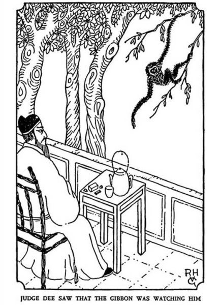

*2019-08-11 10:01 · 手机上网 转自猪小宝*

---

### 880

拳王阿里真是金句王：I hated every minute of training, but I said,'Don't quit. Suffer now and live the rest of your life as achampion.'

*2019-08-10 17:58 · 手机上网*

---

### 881

「大屁股烤虾」这菜名不错。

*2019-08-10 17:40 · 手机上网*

---

### 882

不，我的意思就是希望，该用 expectation 时候我不会用 hope。转@ 刘志达 感觉「期望」比希望更准确些，有时间期限的希望 转@ 王兴 金融不仅是关于信任，更是关于希望。

*2019-08-10 11:13 · 手机上网 转自王兴*

---

### 883

企业家精神的本质是不顾当前掌握的资源而去追求机会。所以，光有企业家精神做不成企业。转：Entrepreneurship is the pursuit ofopportunity without regard to resources currently controlled

*2019-08-10 11:07 · 手机上网 转自王兴*

---

### 884

SWIFT 这个用于国际银行间清结算的组织竟然是由欧洲人主导、总部设在比利时的，难怪美国第一大行摩根大通要推出基于区块链的 JPMCoin 来抢这个银行间清结算生意，而且看起来在监管上不会受阻。

*2019-08-10 08:58 · 手机上网*

---

### 885

意法半导体（欧洲最大的半导体公司）的总部既不在意大利，也不在法国，而在瑞士的日内瓦。

*2019-08-10 08:47 · 手机上网*

---

### 886

瑞士最有价值的品牌既不是任何一个名表，也不是任何一个金融机构，而是雀巢。

*2019-08-10 08:37 · 手机上网*

---

### 887

金融不仅是关于信任，更是关于希望。

*2019-08-09 23:26 · 手机上网*

---

### 888

谢谢。转@ 贫乳娘大胃王 https://b23.tv/av3169140/p1 这个更好听转@ 王兴 有没有二胡演奏的《Viva La Vida》？

*2019-08-09 19:48 · 手机上网 转自王兴*

---

### 889

有没有二胡演奏的《Viva La Vida》？

*2019-08-09 19:35 · 手机上网*

---

### 890

想起有一次跟老家是西安的朋友吃饭，好像是聊到《妖猫传》，我夸西安城墙保存得真好，身为考古学家之子的他苦笑着说：其实唐代城墙不长这样，现在我们看到的西安城墙是80年代按照类似北京城那样的明清城墙修复的。

*2019-08-09 17:28 · 手机上网*

---

### 891

虽然是很简单的家常菜，但做好了就是很好吃呀，不过是用猪肉（那种香嫩的里脊丝）还是牛肉（必须用中国黄牛肉，外国牛不行）。转@ 寒小梦 这个餐厅大姐，热爱一切炒肉丝，今天是茭白炒肉丝，前天是辣炒牛肉丝，每周最少两次肉丝炒X

*2019-08-09 12:48 · 手机上网 转自寒小梦*

---

### 892

一直觉得哪吒这名字很奇怪，原来是从梵文译过来的… 转：哪吒 （那吒）， 是梵文Nalakūvara或 Nalakūbala 的音译简称，全称为那罗鸠婆、那罗鸠钵罗、那吒俱伐罗等。哪吒在中国，早在北凉时代（397439年）就出现了。

*2019-08-09 12:25 · 饭斯基*

---

### 893

相比欧洲几个发达国家，美国在可物理感知的很多细节上都可以用粗砺来形容，但这是由美国的宏大以及持续变化的特性所决定的。相反，美国那不可见的核心是高度精致的，state-of-the-art.

*2019-08-09 00:59 · 手机上网*

---

### 894

确实不错。转@ 饭士 【@ 广阔的宇宙V ： 好厉害的Coser 】

*2019-08-08 11:42 · 手机上网 转自饭士*

---

### 895

中国历史和区块链的原理有点像，每个朝代给前朝修史，就像生成一个新的区块。要想篡改也并非绝对不可能，但必须掌握超过50%的算力。

*2019-08-08 11:39 · 手机上网*

---

### 896

转@ quux 美好时光

*2019-08-08 09:20 · 手机上网 转自quux*

---

### 897

过去二十年，全中国的房地产就像是个比上交所大很多很多倍的证券交易所，每个城市都是一只股票，在某个城市买了一套房就相当于入股了这只股票。那些房地产开发商就相当于大大小小的投行。

*2019-08-07 15:36 · 手机上网*

---

### 898

@ 刘志达 看来你虽然在美团呆过，但是依然有些误解。美团的业务决策自始至终是独立于阿里的。

*2019-08-07 12:53 · 手机上网 给刘志达的回复*

---

### 899

福建有几个民系，比较有名的是闽南为主的福佬人（河洛人）和闽西为主的客家人。通常说的福建人主要是指福佬人。福佬人和（粤东的）潮汕人在地理上相连，文化也很接近，一脉相承。

*2019-08-07 12:02 · 手机上网*

---

### 900

转@ Rena518 某先森处于职业艰难时期，压力极大，拼尽全力。但他说，现在我做的工作是我从大一开始就梦寐以求的工作。那就好。 转@ 王兴 转@ 乐鼠老人 和身边的95后聊天，他们不约而同地提到未来希望能实现两点：财务自由、做自己喜欢的事。我问他们，什么是你们喜欢的事？然后就冷场了。

*2019-08-06 23:27 · 手机上网 转自乐鼠老人*

---

### 901

转@ 乐鼠老人 和身边的95后聊天，他们不约而同地提到未来希望能实现两点：财务自由、做自己喜欢的事。我问他们，什么是你们喜欢的事？然后就冷场了。

*2019-08-06 22:54 · 手机上网 转自乐鼠老人*

---

### 902

地下钱庄，信用社，银行，发钞行，货币局，央行，美联储。

*2019-08-06 21:02 · 手机上网*

---

### 903

Service 这个单词的含义包罗万象，并不是中文里「服务」这个概念就能完全对应的。例如说，呃，第10条。

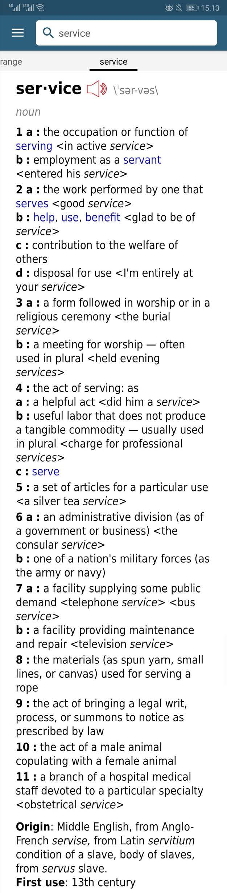

*2019-08-06 15:16 · 饭斯基*

---

### 904

转@ 刘志达 很有意思的一张图，信息是结构化的数据，知识是逻辑化的信息，智慧是可执行的知识

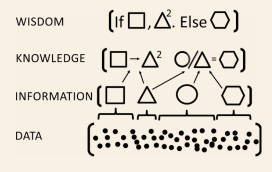

*2019-08-06 12:33 · 手机上网 转自刘志达*

---

### 905

公务员的公务二字对应的是美国人说的 public service，但是给人的感觉很不同。

*2019-08-06 11:32 · 手机上网*

---

### 906

后者的总价值大一些吧，因为一张一元的钞票比一张一百元的钞票更小更轻。转@ 郭家二少爷 做为一个数学盲。。。我承认这个问题难

倒我了。。。当然，虽然选了也没毛线的用。。。

*2019-08-05 21:47 · 手机上网 转自郭家二少爷*

---

### 907

1903年6月，福特汽车公司成立；12月，莱特兄弟首次成功飞行。

*2019-08-05 15:38 · 手机上网*

---

### 908

Bing 搜索也不能用了。

*2019-08-05 13:55 · 手机上网*

---

### 909

也许在不久的将来，世界首富既不是盖茨也不是贝索斯，也不是任何一个科技公司的创始人，而是 LV 的老板阿尔诺 Bernard Arnault，他在1984年杀进奢侈品行业，然后就一路买买买奢侈品品牌，并鼓励全世界（尤其是东亚）消费者不断买买买奢侈品…

*2019-08-05 13:29 · 手机上网*

---

### 910

-_-! 转@ 陈行_kevin 见一个商业产品经理，观点令人印象深刻。他说特别感谢俞军和小龙，把整个互联网的产品经理都带歪了。在追求体验的屠龙术之路越走越偏。帮自己提前清扫了对手。

*2019-08-05 13:19 · 手机上网 转自陈行_kevin*

---

### 911

哥伦布是个了不起的航海家，但他的全部壮举都基于前人提出的一个新观念：大地是个球体，而不是像原来以为的那样是浮在茫茫大海中的一块平地，大海的四周也没有坠向无边地狱的巨型瀑布。

*2019-08-05 00:43 · 手机上网*

---

### 912

因为长春有一汽？北京最大的国企是北汽，上海最大的国企是上汽，广州最大的国企是广汽… 转@ webto 长春竟然比哈尔滨和石家庄高，济南竟然比郑州低。转@ 阳升 以GDP论，青岛是我国北方第三大城市，仅次于北京和天津。

*2019-08-04 21:18 · 手机上网 转自阳升*

---

### 913

突然想起十几年前我在美国读书时接触过的宾夕法尼亚州的那些Amish 阿米什人。他们的追求是过传统生活，依然赶马车，不开汽

车，也不用电脑。估计现在也不用智能手机吧。

*2019-08-04 01:34 · 手机上网*

---

### 914

今天一大早我正做着一个跟区块链有关的梦就被无情的闹钟叫醒了 :(开了一整天会，看今晚还梦不梦。

*2019-08-04 01:18 · 手机上网*

---

### 915

看了好几遍才意识到，中间画面抖了一下时就是在开炮扫射。转@猪小宝 A10 攻击机的第一视角。电视剧主角在这样的扫射下一路狂奔是不可能的，炮弹比音速还快，正确的拍法是主角什么都没听到呢，没有任何反应，突然人就没了……

*2019-08-03 19:30 · 手机上网 转自猪小宝*

---

### 916

到底有没人在下一盘很大的棋？这是个世界观问题。

*2019-08-03 13:44 · 手机上网*

---

### 917

转@ 猪小宝 A10 攻击机的第一视角。电视剧主角在这样的扫射下一路狂奔是不可能的，炮弹比音速还快，正确的拍法是主角什么都没听

到呢，没有任何反应，突然人就没了……

*2019-08-03 08:41 · 手机上网 转自猪小宝*

---

### 918

转@ yippee. ？？？？我明明今年看的这本书…我真的有看过吗？就是那本“老天你下吊操死我吧”那本啊……「@ zigzagy 转@ 王兴 余华竟然还写过这么一句。」

*2019-08-03 00:53 · 手机上网 转自王兴*

---

### 919

余华竟然还写过这么一句。

*2019-08-03 00:14 · 饭斯基*

---

### 920

西南政法大学在重庆，西南财经大学在成都；中南财经政法大学在武汉，中南大学在长沙。这说明这两块区域都不是单中心。

*2019-08-02 18:37 · 手机上网*

---

### 921

转@ 玩的服 来看个可怕的数据：招商银行 2018 年金葵花及以上客户236 万户，占总户数不到 2%，占总资产比例 80.98%，人均 230万；其中私人银行73000 户，资产占 30%，人均 2800 万。金葵花以下 1.2 亿户，占 98%，资产占比不到20%，人均

*2019-08-02 00:32 · 手机上网 转自玩的服*

---

### 922

大二或大三时，我读过半本《货币银行学》，可惜内容现在全忘了，是在清华图书馆的哪个阅读室里读的我却记得。真是记忆弄人:-(

*2019-08-01 23:20 · 手机上网*

---

### 923

谈区块链的人多如牛毛，真懂区块链的人屈指可数。

*2019-08-01 22:53 · 手机上网*

---

### 924

www.newglobaltechgroup.com

*2019-08-01 17:13 · 手机上网*

---

### 925

「好人若不团结，必被坏人一一消灭」，这条基本原则不仅适用于以个人为单位，也适用于以国家为单位。

*2019-08-01 14:14 · 手机上网*

---

### 926

智能手机其实是真正的个人电脑。

*2019-08-01 13:24 · 手机上网*

---

### 927

查了一下维基百科，KPMG 是一堆老牌机构经过一系列合并于1987年形成的。K 源于荷兰，P 源于英国，M 源于美国，G 源于德国。转@王兴 毕马威 KPMG 竟然是个荷兰品牌。当然，现在是很全球化的专业服务机构了。

*2019-08-01 11:15 · 手机上网 转自王兴*

---

### 928

毕马威 KPMG 竟然是个荷兰品牌。当然，现在是很全球化的专业服务机构了。

*2019-08-01 10:05 · 手机上网*

---

### 929

只有观念才能战胜观念，学者的使命是纠正错误观念。-哈耶克

*2019-07-31 23:32 · 手机上网*

---

### 930

新能源汽车事关德国国运。转@ YoungSinatra 德国统一欧洲应该有机会 转@ 王兴 现在还有独立汽车公司的国家有德国、美国、日本、法国、意大利、韩国、中国和印度。估计还得减。

*2019-07-31 22:31 · 手机上网 转自王兴*

---

### 931

现在还有独立汽车公司的国家有德国、美国、日本、法国、意大利、韩国、中国和印度。估计还得减。

*2019-07-31 21:39 · 手机上网*

---

### 932

一个朋友说他在欧洲一个研讨会上发言时提到 entrepreneurship（企业家精神），下来后有人善意的提醒他，entrepreneurship 在英国被认为是一个 dirty word。

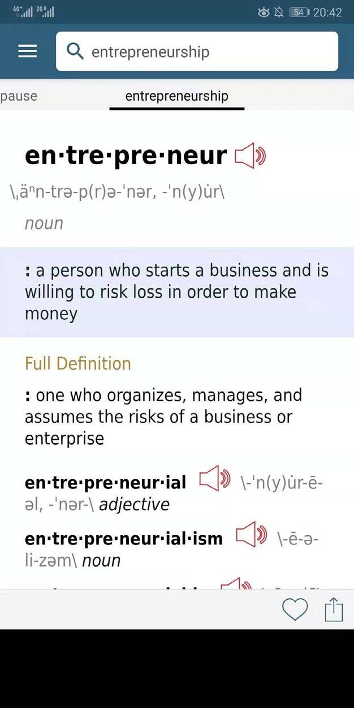

*2019-07-31 20:45 · 饭斯基*

---

### 933

今天搞懂了一个大的商业逻辑，也更理解「国运」这个词了。

*2019-07-31 14:59 · 手机上网*

---

### 934

那种最庞大的金融机器一旦开动起来就几乎不可能平稳停下来，不管是基于战争的金融，还是基于土地的金融。

*2019-07-31 14:37 · 手机上网*

---

### 935

澳门的面积是摩纳哥的16倍。

*2019-07-31 12:21 · 手机上网*

---

### 936

美国有两家电动车企业，一家是大家熟知的 Tesla Motors（后来名称简化为 Tesla 了），另一家竟然叫 Nikola Motors。都是为了向Nikola Tesla 这个商业上很不成功的天才发明家致敬。

*2019-07-31 10:21 · 手机上网*

---

### 937

@ 陈智宏 荷马史诗和中华文明有什么关系？

*2019-07-30 18:14 · 手机上网 给陈智宏的回复*

---

### 938

不过，据考证，那个很棒的故事框架并不是起源于阿拉伯地区，也不是波斯，而是源于印度。转@ 王兴 中华文明里好像还没有哪个民间故事/文学作品有《一千零一夜》那样的跨文化影响力。

*2019-07-30 13:54 · 手机上网 转自王兴*

---

### 939

中华文明里好像还没有哪个民间故事/文学作品有《一千零一夜》那样的跨文化影响力。

*2019-07-30 13:41 · 手机上网*

---

### 940

英文里说 IN the world，中文里却说世界「上」，似乎有点片面。

*2019-07-30 13:06 · 手机上网*

---

### 941

相比于「技工贸」，柳传志老先生当年主张的「贸工技」路线并没有错。事实上，华为正是沿着这条路线发展起来的，从早期代理程控交换机到自己造程控交换机再逐步深入各方面的研发乃至于自己做芯片和操作系统。也就是说，关键是从贸到工之后没有停，真的搞了技。

*2019-07-30 12:36 · 手机上网*

---

### 942

大（多）和小（少）是最基础的不对称。

*2019-07-30 11:14 · 手机上网*

---

### 943

忙着工作懒得吃饭的时候会想，人为什么要会饿呢？享受美食的时候会想，人为什么要会饱呢？还有，人为什么要会胖呢？

*2019-07-29 21:01 · 手机上网*

---

### 944

重大决策常常是既显然又困难。

*2019-07-29 16:27 · 手机上网*

---

### 945

光大的创始人是王光英，此人是刘少奇最后一任夫人王光美的哥哥，曾任全国人大副委员长。转@ 王兴 中信成立于1979年，是借了改革开放的契机。光大是1983年5月成立于香港，是借了香港回归的契机（1982年9月，英国首相撒切尔夫人访华，邓小平和她会谈时关于香港问题表了态）。

*2019-07-29 11:24 · 手机上网 转自王兴*

---

### 946

中信成立于1979年，是借了改革开放的契机。光大是1983年5月成立于香港，是借了香港回归的契机（1982年9月，英国首相撒切尔夫人访华，邓小平和她会谈时关于香港问题表了态）。

*2019-07-29 11:06 · 手机上网*

---

### 947

听说全国已建成280亿平米住房。

*2019-07-29 09:29 · 手机上网*

---

### 948

It's a pause, not peace.

*2019-07-28 12:49 · 手机上网*

---

### 949

最后的疯狂常常特别的疯狂。

*2019-07-28 12:40 · 手机上网*

---

### 950

VC朋友嘲笑阿三油嘴滑舌，说他们的印度同事汇报工作时说某被投公司业绩 degrow 了多少多少，被美国老板及时喝止：decline 就decline，不要说 degrow! 我起初跟着笑了，后来想到「负增长」这个词，笑容变得有点僵硬…

*2019-07-28 11:58 · 手机上网*

---

### 951

转@ webto hhhh 转@ 熊猫姐 画的真好「@ hao小子 想看我的大肌肉吗」

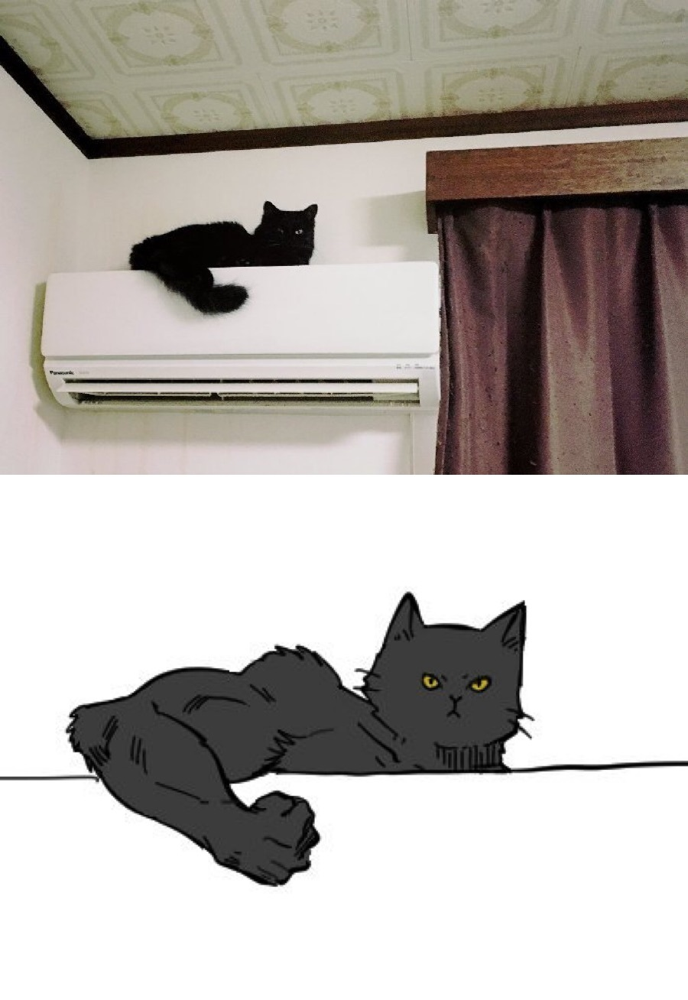

*2019-07-28 10:13 · 手机上网 转自hao小子*

---

### 952

建行成立于1954年10月1日，背景是：我国开始发展国民经济的第一个五年计划（1953-57年），以苏联帮助设计的156项重点工程为中心的大规模经济建设在全国陆续展开，为管理好巨额建设资金，建设银行应运而生。

*2019-07-28 10:06 · 手机上网*

---

### 953

多数人都对钱有很深的误解。

*2019-07-28 09:09 · 手机上网*

---

### 954

更悲催的是讨论几个基点时还用得上小数点… 转@ 王兴 低毛利业务的一个特征是讨论时会用到基点这个单位。

*2019-07-27 20:22 · 手机上网 转自王兴*

---

### 955

武夷岩茶有很多好听的名字。

*2019-07-27 19:06 · 饭斯基*

---

### 956

刘宇昆在把刘慈欣的《三体》译成英文时把「智子」已成为sophon。

这个翻译很棒。

*2019-07-27 11:09 · 手机上网*

---

### 957

看过很多电影不代表你能当导演，但是有哪个好导演没有看过超多电影吗？

*2019-07-27 10:39 · 手机上网*

---

### 958

低毛利业务的一个特征是讨论时会用到基点这个单位。

*2019-07-27 10:07 · 手机上网*

---

### 959

清汤一定要清。看起来清澈见底，入口却滋味丰富，这才是一碗好清汤。

*2019-07-26 12:46 · 手机上网*

---

### 960

仔细咀嚼品味了一颗煎熟了的胡椒。

*2019-07-26 12:38 · 手机上网*

---

### 961

转@ HolyBreeze 想起我院教授当年个个看不起宁德时代，纷纷劝自己学生不要跳火坑的场景了…「@ 王兴 一个有幸早年投资了宁德时代的朋友说他当年第一次走进创始人曾毓群那狭小的办公室就被震了一下，只见墙上五个大字「赌性更坚强」！他说当时他心想这果然是福建人，调侃说「你为什么不挂爱

*2019-07-26 11:47 · 手机上网 转自王兴*

---

### 962

一个有幸早年投资了宁德时代的朋友说他当年第一次走进创始人曾毓群那狭小的办公室就被震了一下，只见墙上五个大字「赌性更坚强」！他说当时他心想这果然是福建人，调侃说「你为什么不挂爱拼才会赢呢」。曾正色道：光拼是不够的，那是体力活；赌才是脑力活。

*2019-07-26 11:26 · 手机上网*

---

### 963

第一次听一个老朋友讲他的家族故事：他父亲是少数在柏林城里熬过整个纳粹统治时期并在战后成功从苏占区逃往美国的犹太人之一，重要原因是他那很有先见之明的祖父之前在靴底里藏了很多金币和钻石。最后一颗钻石现在镶在他哥给他嫂子的结婚戒指上。# 论硬通货的价值 #

*2019-07-25 21:39 · 手机上网*

---

### 964

货币比爱情还更有欺骗性，一个经济学博士对我说。

*2019-07-24 23:57 · 手机上网*

---

### 965

自己没读完的长文不转发给别人，这是一种基本礼仪。

*2019-07-24 23:31 · 手机上网*

---

### 966

8年多前的事了。转@ 王兴 一个初次见面的北大教授推荐我读≪民国时期的土匪≫。

*2019-07-24 13:50 · 手机上网 转自王兴*

---

### 967

「历史」这个概念确实是伟大的发明。

*2019-07-24 12:08 · 手机上网*

---

### 968

转@ 郭家二少爷 转@ 记痕 加州大学伯克利分校的教授BrianHarvey在课堂上向他的学生解释为什么不要作弊，不是因为“作弊会对别的学生不公平”，也不是因为“作弊会败坏学校的风气”，而是作弊最终会把你困在一个自己不擅长也不喜欢的职业，困住你真正的人生追求...

*2019-07-24 10:40 · 手机上网 转自记痕*

---

### 969

转@ gravity0 路上顶着酷暑修路的工人一个个都上了点年纪。想起几年前建筑包工头朋友就说过，他的工人都四五十岁，年轻人不干这个。

*2019-07-24 10:39 · 手机上网 转自gravity0*

---

### 970

好机会的一个重要特征是她往往会带来更多更好的机会。

*2019-07-23 23:58 · 手机上网*

---

### 971

转@ 刘志达 大学在大连，所以我在对日软件外包公司实习过，日本的高端软件工程师都去做游戏了，有挑战工资高，90年代任天堂索尼世嘉红遍全球，日本软件工程师的匠人精神体现在20kb大小的马里奥里面，至于其他软件直接由日本工程师写好伪代码直接发到大连的外包公司 转@ 王兴 有自尊的匠人都不

*2019-07-23 15:50 · 手机上网 转自王兴*

---

### 972

@ 九日雨田 谢谢你对美团的贡献！祝好！

*2019-07-23 00:16 · 手机上网 给九日雨田的回复*

---

### 973

有自尊的匠人都不愿把win95这种bug成堆的软件推向市场吧。转@webto 不太同意，我觉得导致他们做不好的根本原因是制造业方法论的巨大成功。匠人精神反而是九十年代日本还有点好软件的正面原因。转@ 王兴 在科技行业颇有成就的朋友说了个有趣的观点：日本的匠人文化导致他们做不好软件

*2019-07-22 14:18 · 手机上网 转自王兴*

---

### 974

有的时候也未必是有意要牺牲，但因为种种原因总之就是一代人被耽误了，一样残酷，很遗憾。转@ 王兴 比「牺牲哪个人」或「牺牲哪个群体」更残酷的问题是「牺牲哪代人」？

*2019-07-21 22:50 · 手机上网 转自王兴*

---

### 975

台积电确实是家伟大的公司，极大的解放了生产力。

*2019-07-21 21:59 · 手机上网*

---

### 976

台湾当年想进存储芯片市场跟三星争，累计亏了300亿美元，被团灭。

转@ 王兴 有些行业的门票是1亿美元，有些行业则是10亿美元，100亿美元门票的行业也能数出几个，1000亿美元门票的我还看不清，或许半导体是？毕竟，全世界所有上市公司里市值达到1000亿美元的总共也就才100家。

*2019-07-21 21:57 · 手机上网 转自王兴*

---

### 977

光脚穿乐福鞋真的不如穿了船袜舒服。

*2019-07-21 21:52 · 手机上网*

---

### 978

转@ webto 不太同意，我觉得导致他们做不好的根本原因是制造业方法论的巨大成功。匠人精神反而是九十年代日本还有点好软件的正面原因。转@ 王兴 一个在科技行业颇有成就的朋友说了个有趣的观点：日本的匠人文化导致他们做不好软件。

*2019-07-21 21:51 · 手机上网 转自王兴*

---

### 979

转@ 织鞋贩履 美女从来都是经济形势的风向标 我去年见过的区块链公司的BD每一个都完爆港姐 转@ 王兴 关于香港为何不景气而矛盾爆发的各种政经分析我都觉得挺有道理的，我现在唯一纳闷的就是：为什么近几年连港姐颜值都一落千丈？难道这也和 GDP 绝对值或 GDP增速正相关？

*2019-07-21 21:43 · 手机上网 转自王兴*

---

### 980

一个在科技行业颇有成就的朋友说了个有趣的观点：日本的匠人文化导致他们做不好软件。

*2019-07-21 21:41 · 手机上网*

---

### 981

关于香港为何不景气而矛盾爆发的各种政经分析我都觉得挺有道理的，我现在唯一纳闷的就是：为什么近几年连港姐颜值都一落千丈？

难道这也和 GDP 绝对值或 GDP 增速正相关？

*2019-07-21 17:29 · 手机上网*

---

### 982

转@ webto 机遇这个东西就是可遇而不可求的，毕竟是机遇而不是机求

*2019-07-21 16:57 · 手机上网 转自webto*

---

### 983

转@ 阿阿阿阿阿阿呆 学术界：概念的确立值得发表，概念的使用不值得，但是概念的具象化却值得。转@ 王兴 是否以成败论英雄应该拆开来说。在全球范围内首创某种观念或模式的，不管最后做没做成，我认为都是有相当大贡献的。相反，在某

*2019-07-21 16:11 · 手机上网 转自王兴*

---

### 984

Patsy 是我目前找到的最对应「韭菜」的英文单词。有种说法：Ifafter ten minutes at the poker table you still do not know whothe patsy is—you are the patsy.

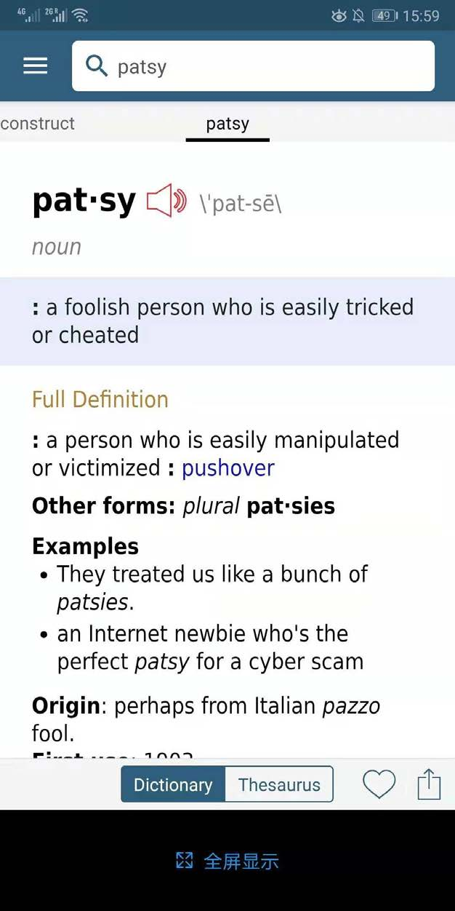

*2019-07-21 16:03 · 饭斯基*

---

### 985

是否以成败论英雄应该拆开来说。在全球范围内首创某种观念或模式的，不管最后做没做成，我认为都是有相当大贡献的。相反，在某个国家/市场率先引入某个模式，这个动作本身贡献不大，在这个市场把

这个模式最终做成的才能算有贡献。

*2019-07-21 15:07 · 手机上网*

---

### 986

不愧是老狐狸。但再强的外交也只是术啊。转@ 刘志达 「外交家绝不允许自己是获得胜利喜悦的人」- 梅特涅（Metternich）

*2019-07-21 13:20 · 手机上网 转自刘志达*

---

### 987

「勤劳、善良、勇敢」是不是中华民族的传统美德咱们另说，「重视教育」肯定是我国传统。

*2019-07-21 13:08 · 手机上网*

---

### 988

苏联解体后俄罗斯私有化进程中的竞争伴随着大量智力和暴力。

*2019-07-20 00:44 · 手机上网*

---

### 989

重资产。

*2019-07-19 21:43 · 手机上网*

---

### 990

可以对比「中学为体，西学为用」。转@ 王兴 「有中国特色的社会主义」真的是很高明的提法。

*2019-07-19 14:22 · 手机上网 转自王兴*

---

### 991

谁会成为动力电池行业的 ASML 阿斯麦尔？

*2019-07-18 22:00 · 手机上网*

---

### 992

金融和宗教有一点相似之处，关键就是人家信不信你。

*2019-07-18 18:02 · 手机上网*

---

### 993

好像既有说「清华北大」也有说「北大清华」，但是「清北复交」这个说法出现的频率远高于「北清复交」。

*2019-07-18 10:52 · 手机上网*

---

### 994

心慌有很多原因，有的很难解决，有的却很容易，例如说，饿。

*2019-07-17 19:07 · 手机上网*

---

### 995

转@ 屋大喵 一个12寸的晶圆厂，到7纳米，10万片一个月的时候，这个工厂的投入，至少要180亿美元。转@ 王兴 有些行业的门票是1亿美元，有些行业则是10亿美元，100亿美元门票的行业也能数出几个，1000亿美元门票的我还看不清，或许半导体是？

*2019-07-17 13:37 · 手机上网 转自王兴*

---

### 996

我的发际线越来越像 Meituan 首字母的形状了…

*2019-07-17 09:03 · 饭斯基*

---

### 997

西班牙文的拼写是像拼音那样清晰稳定的，即使完全不懂一段西班牙文的意思，你也可以准确的读出来。这和英文很不同。

*2019-07-16 23:02 · 手机上网*

---

### 998

转@ 刘志达 一神论的宗教以造就寄生的僧侣阶层为代价，买来社会的凝聚力；民族主义以创造寄生的军队为代价，买来权力；资本主义以寄生金融家为代价，买来效率。

*2019-07-16 22:31 · 手机上网 转自刘志达*

---

### 999

美国众议院史上最年轻众议员奥卡西奥-科尔特斯（AlexandriaOcasio-Cortez）今年只有29岁，出生于纽约布朗克斯区，是波多黎各移民后裔。

*2019-07-16 22:10 · 手机上网*

---

### 1000

转：截止2019年第一季度，中国银行业总资产超过了270万亿元，跃居世界第一位。

*2019-07-16 22:00 · 手机上网*

---

### 1001

「透」是个少儿不宜的动词，在网络用语里。

*2019-07-16 19:55 · 手机上网*

---

### 1002

「有中国特色的社会主义」真的是很高明的提法。

*2019-07-16 19:13 · 手机上网*

---

### 1003

新的一周开始了。

*2019-07-15 00:21 · 手机上网*

---

### 1004

苏轼写「老夫聊发少年狂」时才38岁-_-!

*2019-07-14 17:33 · 手机上网*

---

### 1005

惊到我了！转@ 铁锈 据说秦皇的大一统是cosplay大流士一世…定期从外国趸，烂透了再趸。转@ 杲i杲 从山大的经验来看，本朝并没有排他真理 转@ 王光明 蛤。转@ 乱穿臭袜子 刘德乐是敲打本朝吧 转@ 小熊娃娃 可拉倒吧，啥时候吸收外来精神了，没有排他性真理是因为自己搞不出来…

*2019-07-13 23:58 · 手机上网 转自王兴*

---

### 1006

一个刚去过墨西哥和古巴的朋友眉飞色舞的向我推荐：旅游一定要去拉美！这些地方才丰富多彩，美国太乏味了！相比起来，美国就像黑白电视，拉美才是彩色电视！

*2019-07-13 20:52 · 手机上网*

---

### 1007

转@ 小熊娃娃 民族自豪感本来就是YY的，和事实无关，比如中国对世界文明就没自己以为的那么大贡献。世界上大部分民族也确实没这么多戏（看了很多国家诗歌的我还是有点发言权的）。转@ 王兴 我有点好奇，那些其祖先实在是谈不上对人类文明有多大贡献的民族是如何构建民族自豪感的？或者，根本就不操

*2019-07-13 01:25 · 手机上网 转自王兴*

---

### 1008

转@ 胡泳 按照吉登斯的概括, 现代性乃是对传统社会的超越, 是一种17 世纪以后逐渐出现的崭新的社会秩序和制度形式, 由四种“制度性秩序”构成, 即资本主义、工业主义、行政监视机制和垄断军事暴力的民族国家。

*2019-07-13 00:55 · 手机上网 转自胡泳*

---

### 1009

我这辈子拿过的最像大块蓝宝石的东西就是初三那年暑假我在家里三楼卫生间里捣鼓出来的那块硫酸铜晶体。

*2019-07-13 00:50 · 手机上网*

---

### 1010

Frontiersman.

*2019-07-13 00:20 · 手机上网*

---

### 1011

我有点好奇，那些其祖先实在是谈不上对人类文明有多大贡献的民族是如何构建民族自豪感的？或者，根本就不操心这事？

*2019-07-13 00:15 · 手机上网*

---

### 1012

转@ 悉达多 蒋氏行动轨迹：上海、南京、武汉、重庆。 转@ 王兴长江边上的四大城市：重庆、武汉、南京、上海。

*2019-07-13 00:13 · 手机上网 转自王兴*

---

### 1013

The phantom of the opera(ting system) is there - inside mymind.

*2019-07-13 00:11 · 手机上网*

---

### 1014

case 不如 aces 酷啊，两个单词的含义完全不在一个量级。转@ 余建约 @ 王兴 目前比较常见的拼写是C.A.S.E

*2019-07-12 23:34 · 手机上网 转自余建约*

---

### 1015

@ 余建约 天哪，你竟然也在饭否上。失敬失敬。

*2019-07-12 23:29 · 手机上网 给余建约的回复*

---

### 1016

终于有点理解东北文化问题的根源了。

*2019-07-12 18:00 · 手机上网*

---

### 1017

ACES: Autonomous, Connected, Electric, & Shared

*2019-07-12 17:23 · 手机上网*

---

### 1018

在乔布斯1997年重返苹果之前，乔纳森·伊夫Jonathan Ive 已经在苹果干了5年；在乔布斯2011年去世之后，伊夫又在苹果继续干了近8年。

*2019-07-12 15:54 · 手机上网*

---

### 1019

「合久必分，分久必合」是一种理解，「合就是分，分就是合」是另一种理解。

*2019-07-12 15:36 · 手机上网*

---

### 1020

现代经济中的很多组成部分其实历史都不长，投资公司尤其如此。凯雷感觉上是个历史悠久的老品牌，其实也是1987年才成立的，比我还小8岁。倒是红杉比我大7岁，1972年成立的。

*2019-07-12 12:45 · 手机上网*

---

### 1021

转@ 刘志达 1830年，北欧和北美人民过着前所未有的富裕生活。整整一代人，首次享受到了10年以上的和平岁月，新颖的发明、发现和技术，“technology”，也就是技术这个词，就是这一年刚刚造出来的

*2019-07-12 12:43 · 手机上网 转自刘志达*

---

### 1022

听到一个冲击世界观的观点：2050年左右，人类将迎来全球人口拐点，也就是说，全世界的人会越来越少而不是越来越多。我们多数人都可以活到那一天。

*2019-07-12 10:46 · 手机上网*

---

### 1023

门票的意思是「花多少钱才能进去」，不是指营收规模。转@ 王兴有些行业的门票是1亿美元，有些行业则是10亿美元，100亿美元门票的行业也能数出几个，1000亿美元门票的我还看不清，或许半导体是？

毕竟，全世界所有上市公司里市值达到1000亿美元的总共也就才100家。

*2019-07-12 10:42 · 手机上网 转自王兴*

---

### 1024

有些行业的门票是1亿美元，有些行业则是10亿美元，100亿美元门票的行业也能数出几个，1000亿美元门票的我还看不清，或许半导体是？

毕竟，全世界所有上市公司里市值达到1000亿美元的总共也就才100家。

*2019-07-12 09:56 · 手机上网*

---

### 1025

转@ 王兴 突然意识到，可能一个社会也是这样的。转@ 王兴 我一直以为人是慢慢变老的，其实不是，人是一瞬间变老的。——村上春树

*2019-07-11 23:54 · 手机上网 转自王兴*

---

### 1026

中国精神的本质是开放吸收所有外来精神的精华而不主张自己有排他性真理。封锁排斥外来的节日、习俗、器物、制度和思想是与中国精神背道而驰。-刘德乐

*2019-07-11 22:45 · 手机上网*

---

### 1027

传教士是殖民历史中不可忽视的部分。

*2019-07-11 22:06 · 手机上网*

---

### 1028

好像即使是很高规格的中餐也不像西餐那样铺雪白的桌布。为什么？

*2019-07-11 15:40 · 手机上网*

---

### 1029

转@ 张亮 他们俩表现出的身心健康还是偏外在，内在想什么大家也不那么了解？ 转@ 路上有惊慌 李安和村上春树带来的启示是，正常地、身心健康地生活也可以搞文艺，而且能做到世界顶级。

*2019-07-11 15:32 · 手机上网 转自路上有惊慌*

---

### 1030

感觉时间从我身边呼啸而过。

*2019-07-10 18:53 · 手机上网*

---

### 1031

长江边上的四大城市：重庆、武汉、南京、上海。

*2019-07-10 10:15 · 手机上网*

---

### 1032

突然想起17年前我读研究生时学的讲并行计算的 Amdahl's law，道理其实很简单，但即使是对我今天的工作也很有借鉴意义。

*2019-07-10 08:41 · 手机上网*

---

### 1033

天哪，不知道这条消息怎么会被挖出来。我完全不记得我2007年就找人探讨过5G了-_-!

*2019-07-09 23:17 · 饭斯基*

---

### 1034

好像没有哪个文明宣称是自己发明了货币，因为这似乎是每个文明都会搞出来的东西。

*2019-07-09 18:24 · 手机上网*

---

### 1035

科恩的很多歌词都像是在写一封信，写给情人，写给情敌，写给同志，写给上帝…

*2019-07-08 18:19 · 手机上网*

---

### 1036

DVF 裹身裙真的是很经典的设计。

*2019-07-08 18:15 · 手机上网*

---

### 1037

朝五晚九都不够。

*2019-07-08 17:52 · 手机上网*

---

### 1038

马尔萨斯真是简单而深刻。

*2019-07-08 08:20 · 手机上网*

---

### 1039

转@ 刘志达 你能想到的类比越多，你的判断就会越准确；你能想到的类比越遥远，你出的主意就会越有创造性。

*2019-07-07 17:30 · 手机上网 转自刘志达*

---

### 1040

最好的思想碰撞不像摔跤，更不像拳击，而像美式橄榄球。

*2019-07-06 17:17 · 手机上网*

---

### 1041

人可以闭上眼睛，却无法关闭耳朵。

*2019-07-06 16:54 · 手机上网*

---

### 1042

老子比孔子年长大约20岁。

*2019-07-06 13:26 · 手机上网*

---

### 1043

转@ 阮一鸣 到极客时间开了一门 Elasticsesrch 的课。上线一周多一点。居然卖掉了 10000 多份。虽然会被苹果抽走30%，不过当今互联网还是应该感谢乔布斯，移动终端，应用分发，加上移动支付，很多当年的假设才有成为现实的可能

*2019-07-06 11:54 · 手机上网 转自阮一鸣*

---

### 1044

在北京，由中组部任免校领导的高校有七所：清华、北大、人大、北师大、中国农大、北航、北理工。

*2019-07-06 05:25 · 手机上网*

---

### 1045

转@ 刘志达 夏皮罗总结说，整个西方文明的思想建立在两个支柱之上。一个支柱来自耶路撒冷，也就是犹太教和基督教。另一个支柱来于雅典，也就是古希腊的先贤们的思想。耶路撒冷提供意义，意义带来人生的目的。雅典提供理性，理性带来达到人生目的的能力。

*2019-07-05 22:53 · 手机上网 转自刘志达*

---

### 1046

我的高中隔壁班同学创起业来比我一根筋得多… 转@ 陈智宏 沿着设想的方向开发了11年，觉得时间太长的时候， 我就想埃德蒙先生在基督山被关押了14年， 所以，我还有三年。

*2019-07-05 16:46 · 手机上网 转自陈智宏*

---

### 1047

最霸气的券商名字莫过于「银河证券」吧？在有人成功注册到「宇宙证券」之前。

*2019-07-05 16:11 · 手机上网*

---

### 1048

从大一统程度来说，欧洲 < 印度 < 美国 < 中国。

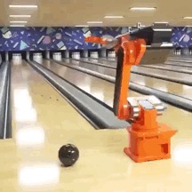

*2019-07-05 13:24 · 手机上网*

---

### 1049

就像AlphaGo一样，人工智能确实能突破常规限制脑洞大开，为什么保龄球一定要丢到轨道上滑过去？直接算好轨迹大点力气从空中飞过去把瓶子全砸倒不也挺好吗？转@ szweig 瓶子的感受一定不太好。

*2019-07-05 12:08 · 手机上网 转自szweig*

---

### 1050

阿里的创业实际上是1999年春节前后就开始了，后面主要是挑个有象征意义的日子来纪念。转@ 钟永健 9月10日，阿里巴巴公司20周年。

*2019-07-05 11:05 · 手机上网 转自钟永健*

---

### 1051

我看了好几遍都看不清球的轨迹… 转@ szweig 瓶子的感受一定不太好。

*2019-07-05 11:03 · 手机上网 转自szweig*

---

### 1052

如果哪天人和人之间能传脑电波了，那我们到底是传已经编码成语言的脑电波还是传未经编码的更底层的信号呢？如果是后者，大家的协议能统一吗？

*2019-07-04 12:19 · 手机上网*

---

### 1053

从华尔街日报上那篇很长的艾科卡讣告来看，他可能确实是亨利福特和（通用汽车的）斯隆之后、马斯克之前美国汽车业最大牌的人物。

*2019-07-04 10:26 · 手机上网*

---

### 1054

三十年前的明星 CEO 艾科卡于94岁高龄去世了。我小时候读过他的自传，当时的商业畅销书，大概是讲他如何在福特和克莱斯勒这美国三大汽车公司的两大里纵横江湖。但他具体讲了什么，我现在已经一点印象都没有了-_-! 刚才读了一下讣告，他是1946年大学刚毕业加入福特的，这个时间点很好。

*2019-07-04 09:45 · 手机上网*

---

### 1055

一大早又读到嘉能可，想起半年前有个朋友跟我说：当时我们投的一个互联网公司不知道哪根筋搭错了，突然想跨界做大宗商品期货。股东们怎么劝都不听。后来我找机会带他们见了一下嘉能可，让他们看看能做这种生意的人都长什么样。回来后就老实多了。

*2019-07-04 08:58 · 手机上网*

---

### 1056

是什么在阻止国际游资像1997年亚洲金融风暴期间那样对港币发起一次攻击？

*2019-07-04 08:32 · 手机上网*

---

### 1057

和一个龙岩老乡聊天，当我表示他疑似发音不准导致我误解了他前一句话里某个词时，这位老兄正色道：「请注意，我可是当年高考语文147分的。」后来发现确实是我搞错了。

*2019-07-04 07:24 · 手机上网*

---

### 1058

转@ 小青. 上大学的时候我问过他，如果给他和目前收入一样多的钱，让他不用工作，会接受吗？他像看傻子一样震惊地看着我：“那当然不工作了。”那是我第一次确认，我和我的父亲不是一路人了。突然给我一千万，我也还是会做一样的工作，读一样的书，和一样的人做朋友，参加一样的读书会和志愿者活动的

*2019-07-03 21:02 · 手机上网 转自小青.*

---

### 1059

信心很足却仓位很小是毫无意义的。-索罗斯

*2019-07-03 20:05 · 手机上网*

---

### 1060

这五个要素中，直觉是最难理解的。转@ 王兴 转@ 柒小斤 创见五要素：聪明、博学、直觉、运气、勇气。by：艾西莫夫

*2019-07-03 12:27 · 手机上网 转自柒小斤*

---

### 1061

宝格丽酒店大堂里的各式免费水果软糖全没了！差评！

*2019-07-03 10:02 · 手机上网*

---

### 1062

母题

*2019-07-02 20:04 · 手机上网*

---

### 1063

转@ 柒小斤 创见五要素：聪明、博学、直觉、运气、勇气。by：艾西莫夫

*2019-07-02 18:53 · 手机上网 转自柒小斤*

---

### 1064

Service of services.

*2019-07-02 18:41 · 手机上网*

---

### 1065

有种说法是两个民主国家之间不可能发生大的战争，我对此将信将疑。如果说两个有基本靠谱的股市和股指的国家之间不太可能长期打仗，我或许更容易相信。

*2019-07-01 16:21 · 手机上网*

---

### 1066

1453, 1492, 1517, 1620, 1776

*2019-07-01 15:15 · 手机上网*

---

### 1067

初心还是很重要的。转变：（四行仓库八百壮士的指挥官）谢晋元是中山大学的高材生，本是一介书生。可是，1925年省港大罢工时，谢晋元亲眼目睹了英军残忍枪杀中国百姓。第二天，他就脱了校服投笔

从戎，跑去黄埔军校参军。

*2019-07-01 14:15 · 手机上网*

---

### 1068

转@ 今天一一 @ 王兴 libra的十二分之一在拉丁语里叫uncia，后来意大利语称为onza，就是现在盎司的单位oz。当然lb和oz表示的具体重量早和古代不一样了。现在的一个ounce是一个pound的十六分之一。

*2019-06-30 19:08 · 手机上网 转自今天一一*

---

### 1069

王濬楼船下益州，金陵王气黯然收。

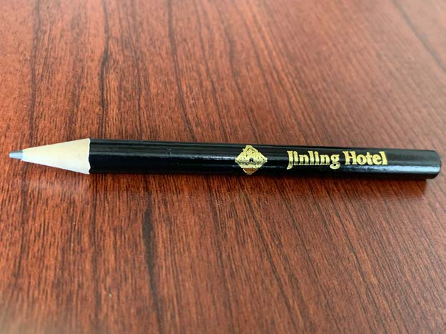

*2019-06-30 13:49 · 饭斯基*

---

### 1070

转@ 多多小姐 也是举大阪全民之力在办了，黑道不上班，红灯区全部歇业，最繁忙的路段也不行车了，提前东奥演习了。「@ 秋日抹抹茶 RT@ 王兴 据说这次大阪 G20 峰会只花了日本政府263万人民币的预算。我觉得这很好的体现了有钱但依然「勤俭」的优秀价值观。

这才是文明的体现，一点儿也不丢

*2019-06-30 08:51 · 手机上网 转自王兴*

---

### 1071

国内对新的这批造车企业称呼很不统一更不优雅，互联网造车、造车新势力等等，建议英文就叫 new automakers.

*2019-06-30 08:25 · 手机上网*

---

### 1072

确实不错。转@ heavenblue 转@ 徒有实名 好喜欢小姐姐的这款包包

*2019-06-30 08:25 · 手机上网 转自徒有实名*

---

### 1073

转@ 罗永告可爱多 233 转@ 大哪吒 @ 王兴 @ 小区停电了 大阪府、大阪市一共预算是51.38亿日元，外务省是339.8亿，警察厅是124.2亿，消防厅9.5亿，厚生劳动省是11亿，总共花费535.88亿日元，约合人民币34亿元。

*2019-06-30 08:17 · 手机上网 转自大哪吒*

---

### 1074

转@ 小区停电了 你被三流自媒体骗了，建议看下前天财新的报道，大阪预算约为3.28亿元。263万还不够三万警察盒饭钱。转@ 王兴 据说这次大阪 G20 峰会只花了日本政府263万人民币的预算。我觉得这很好的体现了有钱但依然「勤俭」的优秀价值观。这才是文明的体

现，一点儿也不丢人，真的。

*2019-06-30 08:05 · 手机上网 转自王兴*

---

### 1075

1980年的莫斯科奥运会（以及之前几届）都让主办国亏了老本，1984年洛杉矶奥运会却净赚2.5亿美金，并开启了现代奥运会的商业运作机制。有点商业头脑还是很重要的。我又想起：郑和航海是亏钱的，所以亏了7次就实在是搞不动了；哥伦布航海是赚钱的，于是…

*2019-06-30 08:04 · 手机上网*

---

### 1076

据说这次大阪 G20 峰会只花了日本政府263万人民币的预算。我觉得这很好的体现了有钱但依然「勤俭」的优秀价值观。这才是文明的体现，一点儿也不丢人，真的。

*2019-06-30 07:37 · 手机上网*

---

### 1077

英文里有对应年（year），十年（decade），百年（century）和千年（millenium）的词，但没有「万年」这个词。

*2019-06-30 07:28 · 手机上网*

---

### 1078

Last day of the first half of the last year of the second decadein the first century in a new millenium. Life as usual.

*2019-06-30 07:13 · 手机上网*

---

### 1079

Libra 是古罗马的基本重量单位，约等于0.329千克。英文里重量单位「磅」的缩写 lb 就源于对 libra 的缩写。原来如此啊。

*2019-06-30 06:25 · 手机上网*

---

### 1080

更具体一点：当一个公司的盈利变多时，她给社会创造的价值是在变大还是变小？转@ 王兴 一个公司为社会创造的价值和这个公司的盈利之间到底是什么关系？

*2019-06-29 23:48 · 手机上网 转自王兴*

---

### 1081

一个公司为社会创造的价值和这个公司的盈利之间到底是什么关系？

*2019-06-29 23:40 · 手机上网*

---

### 1082

事非经过不知难。

*2019-06-29 23:35 · 手机上网*

---

### 1083

数字身份和数字货币可能是全民基本收入 Universal Basic Income 的基础设施。

*2019-06-29 13:52 · 手机上网*

---

### 1084

零售是一种服务。

*2019-06-28 18:28 · 手机上网*

---

### 1085

我很有兴趣看哪家美国大银行率先支持 Libra。我猜不会是四大商业银行之一，更可能是高盛。

*2019-06-28 17:18 · 手机上网*

---

### 1086

明年就是五月花号400周年了。

*2019-06-28 09:27 · 手机上网*

---

### 1087

转@ 刘志达 「如果你从未错过航班，你在机场待的时间太长了」- 乔治·斯蒂格勒 （George Stigler）的名言，他是1982年的诺贝尔奖得主。

*2019-06-28 08:18 · 手机上网 转自刘志达*

---

### 1088

凡是会在聊天时正确使用「羁绊」并正确发音的人，我都觉得至少算半个文化人了。

*2019-06-27 12:29 · 手机上网*

---

### 1089

看了一下官方网站，Libra 还没有正式中文名。我建议就叫「天平币」。请注意，是天平而不是天秤 chèng。秤这个字没有 píng 这个音。 Libra 天平原意就是两边臂长相等的测重仪器。秤也是测重仪器，但是不一定两边臂长相等，就像我小时候用过的那种中国秤子。

*2019-06-27 02:43 · 饭斯基*

---

### 1090

consumer internet vs. consumer electronics.

*2019-06-27 01:04 · 手机上网*

---

### 1091

软件里的奢侈品。软件里的爱马仕。

*2019-06-27 00:29 · 手机上网*

---

### 1092

边上一桌那个穿大花衣服的姑娘站起来走向中间的时候，我还问人「这是谁啊？」，「我也不知道」。简单说了几句话之后，她走到钢琴前面。最开始几个音就把我惊到了，哇，真是 Alicia Keys，《Empire State of Mind》这曲子太有特点了。她唱起来真是中气十足，不服不行。

*2019-06-26 16:00 · 饭斯基*

---

### 1093

管理，既是通过团队拿结果，也是帮助下属出业绩。

*2019-06-26 15:40 · 手机上网*

---

### 1094

相比 cloud computing 这个热词，personal computing 这个几十年前的热词已经几乎被遗忘。

*2019-06-26 01:33 · 手机上网*

---

### 1095

遇到一个姓 von Furstenberg 的人，她跟我解释说这个德国姓氏的原意是「山上的王子」。这个古老家族的传统职业是：雇佣兵…

*2019-06-25 07:27 · 手机上网*

---

### 1096

2007年 iPhone 面世前，乔布斯担心美国的无线运营商搞得不够好，网速太差，会影响划时代产品 iPhone 的综合体验，一度想收购或控股一家运营商。高盛帮忙评估了一下，告诉他：哥们，你的想法不错，但你们不够有钱。

*2019-06-24 17:02 · 手机上网*

---

### 1097

回想我小时候读过的趣味数学书，康托尔的如何把无穷大分成一层无穷大、二层无穷大、三层无穷大的论述给我留下了深刻印象，有助于我后来建立分层的思考习惯。

*2019-06-24 15:52 · 手机上网*

---

### 1098

13是第一个比12大的素数。

*2019-06-24 14:59 · 手机上网*

---

### 1099

一代人的问题可能需要几代人才能解决。

*2019-06-24 14:53 · 手机上网*

---

### 1100

在微信里遇到一篇关于哈贝马斯的长文，努力试图读完，未遂。

*2019-06-24 14:50 · 手机上网*

---

### 1101

中餐在世界美食里大概是什么位置？我最近发现这是个好问题，很能反映一个人的三观。

*2019-06-24 10:05 · 手机上网*

---

### 1102

What's Chineseness? 转@ 王兴 中国性 Chineseness

*2019-06-24 09:57 · 手机上网 转自王兴*

---

### 1103

刚才随手做了件好事，夸奖 uber 司机他车里放的音乐很好听。他说是葡萄牙的。

*2019-06-24 09:50 · 手机上网*

---

### 1104

茨威格同志，请不要轻易暴露自己。转@ szweig 哦，记下了。转@王兴 如果茨威格要写新版《人类群星闪耀时》，2016年秋孙正义初次见沙特王子 MBS 那一个小时的会可以作为备选。

*2019-06-24 09:46 · 手机上网 转自王兴*

---

### 1105

神学 theology 研究的是神，以及神和世界的关系。

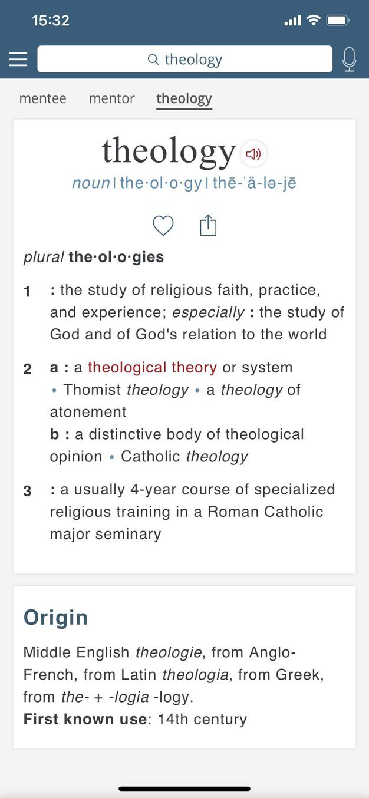

*2019-06-24 06:34 · 饭斯基*

---

### 1106

如果茨威格要写新版《人类群星闪耀时》，2016年秋孙正义初次见沙特王子 MBS 那一个小时的会可以作为备选。

*2019-06-24 04:29 · 手机上网*

---

### 1107

转@ 琦殿 伦敦真好啊，一百次回到国王车站，一百次有居民正在路边钢琴任意弹奏，身边围绕着跳舞的朋友。

*2019-06-24 02:08 · 手机上网 转自琦殿*

---

### 1108

「赚钱」这个说法让人感觉像是零和游戏，你赚我的，我赚尼的；

make money 听起来却有正和的感觉，毕竟是「造钱」嘛。

*2019-06-24 02:06 · 手机上网*

---

### 1109

这酒店太不佛系了，逼得我每天都杀生。

*2019-06-23 14:58 · 手机上网*

---

### 1110

见了一个近20年没见的师兄。感慨万千。

*2019-06-23 14:46 · 手机上网*

---

### 1111

讨论 libra 背后的技术实现好不好就像讨论美元钞票的印刷技术精细不精细。

*2019-06-22 09:56 · 手机上网*

---

### 1112

在这场巨变中，如果把中本聪比作马克思，那小扎就相当于列宁吧。

确实是天才的设计。

*2019-06-22 09:47 · 手机上网*

---

### 1113

转@ quux 英语里也是，passion 语出圣经，指受难，后来引申为激情 RT@ 冰蓝色水狐 “拉丁语中，‘激情’的意思就是‘受苦’。如果你热爱一样东西，却不感到痛苦，那就不是激情。”

*2019-06-22 06:13 · 手机上网 转自冰蓝色水狐*

---

### 1114

还有 open xxx. 转@ 王兴 大xx，深xx，新xx，快xx，小xx，微xx

*2019-06-22 06:06 · 手机上网 转自王兴*

---

### 1115

@ 刘志达 软银在自动驾驶方面投了 cruise，nuro，以及 uber 拆分出来的自动驾驶公司。

*2019-06-22 02:50 · 手机上网 给刘志达的回复*

---

### 1116

转@ 刘志达 站在基因进化的角度，「创造就是重组」

*2019-06-21 14:37 · 手机上网 转自刘志达*

---

### 1117

孙正义是个 think different 的经典例子。

*2019-06-21 08:53 · 手机上网*

---

### 1118

中国历史上，有人出去「取经」，没有人出去「传教」。

*2019-06-21 07:26 · 手机上网*

---

### 1119

毕达哥拉斯的三种平均数。这张图太厉害了！

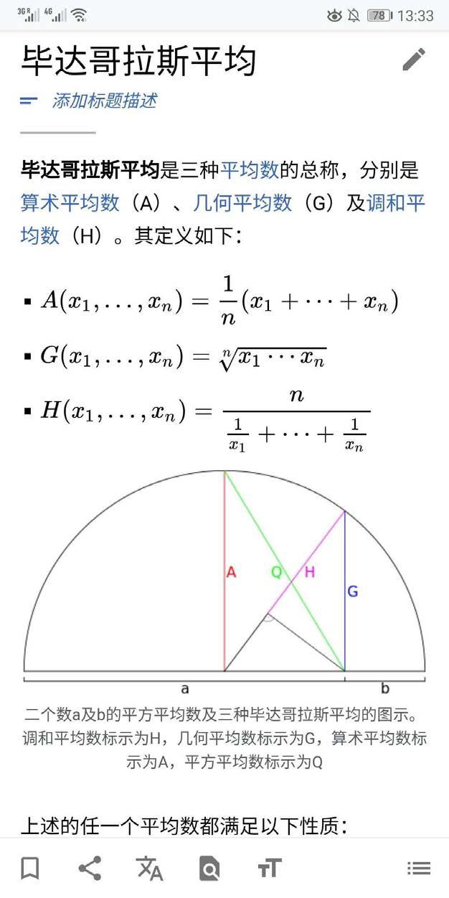

*2019-06-21 04:36 · 饭斯基*

---

### 1120

庞氏骗子。

*2019-06-21 03:35 · 手机上网*

---

### 1121

百亿和千亿之间有两种分界线：一种是百亿加千亿除以二等于550亿，另一种是百亿乘千亿再开平方等于316亿。

*2019-06-21 03:31 · 手机上网*

---

### 1122

英语里把估值十亿美元（1 billion）以上的公司叫 unicorn 独角兽，后来又把百亿美元（10 billion）以上的叫 decacorn 十角兽。按这逻辑，微软这样万亿美元的岂不是要叫千角兽？不行，密集物恐惧症要发作了-_-!

*2019-06-21 03:26 · 手机上网*

---

### 1123

在官方话语体系里，「境内外」和「国内外」有不同的明确定义，香港是境外但是属于国内。

*2019-06-21 03:18 · 手机上网*

---

### 1124

端起一杯刚做好的咖啡时连打两个喷嚏是一种悲剧。不要问我怎么知道的。

*2019-06-21 02:22 · 手机上网*

---

### 1125

比躺枪更惨的是躺炮吧。

*2019-06-21 01:53 · 手机上网*

---

### 1126

刚注意到 facebook 的图标换成了一种更亮的蓝色。

*2019-06-21 01:48 · 手机上网*

---

### 1127

Facebook 推 Libra 的策略很清晰，柿子捡软的捏，先把全球200个国家中的弱国的货币系统逐步替代掉，碰到极少数强国当然是该低头就低头，该合谋就合谋。

*2019-06-20 08:11 · 手机上网*

---

### 1128

哈哈哈哈哈哈哈！转@ 阳升 乍一看去很正常，但仔细看的话……

*2019-06-20 05:53 · 手机上网 转自阳升*

---

### 1129

战略是一种高级的思考活动，人类以外的其他动物只有战术没有战略。

*2019-06-20 05:34 · 手机上网*

---

### 1130

刚知道「三姑六婆」具体是指道姑、尼姑、卦姑、牙婆（介绍人口买卖而从中牟利）、媒婆、师婆（即巫婆）、虔婆（即老鸨）、药婆、稳婆（即接生婆），讲的是古代中国民间女性的几种职业。

*2019-06-19 09:48 · 手机上网*

---

### 1131

转@ 刘志达 「Tribe of Mentors」里面有一个好问题， 「你当做礼物送给别人次数最多的书是哪一本？哪本书对你的人生影响最为深刻？」

*2019-06-18 14:09 · 手机上网 转自刘志达*

---

### 1132

The frontiers are my prison.

*2019-06-18 08:28 · 饭斯基*

---

### 1133

十年前。转@ 王兴 下午见了一个朋友，他热爱的行业正在被互联网所摧毁。我想起小时候看过的安徒生童话：国王举办“最不可思议”的竞赛，最终获奖的不是那个造出最不可思议的神奇机械的能工巧匠，而是站出来把这个神奇机械一锤砸得稀巴烂的莽汉。这个悲剧寓言给我当时幼小的心灵留下了难以磨灭的印象。

*2019-06-17 20:29 · 手机上网 转自王兴*

---

### 1134

转@ 左潇 阿里底线果然真的低。阿里达摩院医疗大脑花费数亿元没研发出来，试用完鄙厂的产品，提出可以合作、付费甚至投资，但必须要全部代码都署到阿里云，鄙厂拒绝，对方劝说：你要意识到，盯着你的不仅有强盗，还有各种小偷啊。 相反，之前以底线最低著称的平安，和我们合作都没提啥过分要求。

*2019-06-17 20:19 · 手机上网 转自左潇*

---

### 1135

I followed the old gentleman till he turned into a quiet street,and then accosted him, with respect for the Church written...绝对是垃圾邮件标题的新高度！

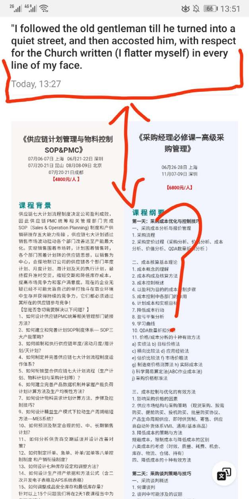

*2019-06-16 13:58 · 饭斯基*

---

### 1136

可以说是时代局限性，也可以说是阶级局限性，还可以说是文化局限性或历史局限性。转@ 王兴 曾国藩在术上非常强，但是他没有vision，至少没有关于国家和社会的 vision。

*2019-06-16 12:30 · 手机上网 转自王兴*

---

### 1137

转@ 孙威 由于不需要背负深度思考的压力、也不需要对思考结果负责任、且简单整合他人的信息或者只做启发式思考对大脑更加友好，导致“宽思考”对每个人都有强烈的吸引力，会经常将人从深度思考中引开，经常注意一下自己的思考延展方向是避免掉入过度宽思考陷阱的好方法。

*2019-06-16 11:40 · 手机上网 转自孙威*

---

### 1138

曾国藩在术上非常强，但是他没有 vision，至少没有关于国家和社会的 vision。

*2019-06-16 11:15 · 手机上网*

---

### 1139

Technologization

*2019-06-16 01:44 · 手机上网*

---

### 1140

今晚还听说了关于茅台历史的一些故事，颠覆了我的认知。

*2019-06-15 00:03 · 手机上网*

---

### 1141

转@ 叶小开 因为伏特加是不用放在口腔里面品的，去俄罗斯当地人告诉我要直接倒进胃里感受它的纯净与热辣就够了。转@ 王兴 今晚听说，中国人原本喝酒是不干杯的，干杯这风气是几十年前从苏俄那里学来的，老毛子喝伏特加才是一口闷。

*2019-06-15 00:00 · 手机上网 转自王兴*

---

### 1142

今晚听说，中国人原本喝酒是不干杯的，干杯这风气是几十年前从苏俄那里学来的，老毛子喝伏特加才是一口闷。

*2019-06-14 23:45 · 手机上网*

---

### 1143

转@ 鲍耶 有搞工程的朋友说，是因为借了太多两优贷款搞基建，比如埃肯直流等，还不上，就用芝麻抵债，后面的项目估计会少很多。

转@ 王兴 我前阵子还听说现在我们吃的麻油（香油）很大一部分是埃塞俄比亚的芝麻磨出来的。转@ 阳升 听说尼罗河的小龙虾 已经沿着一带一路来到了中国人的餐桌上

*2019-06-14 17:06 · 手机上网 转自阳升*

---

### 1144

最一流的创业路径注定是前无古人后无来者的。

*2019-06-14 14:58 · 手机上网*

---

### 1145

我前阵子还听说现在我们吃的麻油（香油）很大一部分是埃塞俄比亚的芝麻磨出来的。转@ 阳升 听说尼罗河的小龙虾 已经沿着一带一路来到了中国人的餐桌上

*2019-06-14 14:57 · 手机上网 转自阳升*

---

### 1146

我喜欢 worker 这个词。

*2019-06-14 12:06 · 手机上网*

---

### 1147

世界主义 cosmopolitanism

*2019-06-14 11:51 · 手机上网*

---

### 1148

南非三大城市里，开普敦的菜有印尼风味，因为最早的荷兰殖民者从更早的荷兰殖民地印尼移了很多人过来；东海岸的德班有印度风味，一方面因为本身靠近印度洋，另一方面因为是英国人开拓的；约翰内斯堡则有葡萄牙风味，因为最早淘金建城时很多北部葡萄牙殖民地的人南下来这里做餐饮。

*2019-06-14 11:32 · 手机上网*

---

### 1149

荷兰人就像是欧洲的福建人，一个南非白人告诉我。

*2019-06-14 11:22 · 手机上网*

---

### 1150

「深度伪视频」比「深度假视频」好。转@ 肉肉肉爷 深度伪视频 转@ 王兴 就叫深度假视频吧。转@ 王兴 deepfake video 这个新概念中文怎么说？就是最近出现的利用深度学习等技术实现视频里的人脸无缝替换甚至是完全无中生有但是完全能以假乱真的那种视频？就叫「深假视频」？

*2019-06-13 21:58 · 手机上网 转自王兴*

---

### 1151

生活在漩涡边缘。

*2019-06-13 15:15 · 手机上网*

---

### 1152

转@ 胡泳 阿伦特曾有过这样的溢美之词：“马克思生活在一个大变动的时代，他的伟大在于指出并把握了变化中的核心。”

*2019-06-13 09:15 · 手机上网 转自胡泳*

---

### 1153

1875年古河市兵卫创办古河集团 Furukawa Group，起家业务是铜矿；1884年在横滨创办古河电气；1923年古河电气和西门子合资成立富士电机 Fuji Electric；1935年富士电机分拆出富士通（信机）Fujitsu；1972年富士通分拆出发那科FANUC。

*2019-06-13 00:56 · 手机上网*

---

### 1154

转@ PaworishGrdn 不过富士通的fuji也不是富士山的意思 而是 古河电机 与 西门子 的 缩写 转@ 王兴 日本工业机器人公司发那科是1958年在富士通内部成立，1972年分拆出来的。FANUC 这个名字就是Fuji Automatic NUmerical Cont

*2019-06-13 00:30 · 手机上网 转自王兴*

---

### 1155

回想起来，从小到大参观过的工厂都给我留下深刻印象，不管是小时

候看过的钢铁厂、自动卷烟厂、铅锌选矿厂、风动厂（生产仿AK47自动步枪和自行车）、水泥厂，还是大学时参观的联想北方制造厂、大连造船厂，或是后来看的海尔、奇瑞、美的、富士康手机生产线、华为手机生产线、钢管厂…

*2019-06-13 00:23 · 手机上网*

---

### 1156

日本工业机器人公司发那科是1958年在富士通内部成立，1972年分拆出来的。FANUC 这个名字就是 Fuji Automatic NUmerical Control的缩写。

*2019-06-13 00:12 · 手机上网*

---

### 1157

美。转@ quux 格陵兰居然有城镇

*2019-06-12 22:53 · 手机上网 转自quux*

---

### 1158

「滚石」确实是个极棒的意象。

*2019-06-12 17:46 · 手机上网*

---

### 1159

就叫「深度假视频」吧。转@ 王兴 deepfake video 这个新概念中文怎么说？就是最近出现的利用深度学习等技术实现视频里的人脸无缝替换甚至是完全无中生有但是完全能以假乱真的那种视频？就叫「深假视频」？

*2019-06-12 11:20 · 手机上网 转自王兴*

---

### 1160

换头只是我说的前者，还有更厉害的后者。转@ 青瓜三滚 换头视频转@ 王兴 deepfake video 这个新概念中文怎么说？就是最近出现的利用深度学习等技术实现视频里的人脸无缝替换甚至是完全无中生有但是完全能以假乱真的那种视频？就叫「深假视频」？

*2019-06-12 11:15 · 手机上网 转自王兴*

---

### 1161

deepfake video 这个新概念中文怎么说？就是最近出现的利用深度学习等技术实现视频里的人脸无缝替换甚至是完全无中生有但是完全能以假乱真的那种视频？就叫「深假视频」？

*2019-06-12 11:12 · 手机上网*

---

### 1162

转@ 刘志达 林毅夫、张军等学者正确地指出，消费本身不能够拉动经济增长。经济增长的本质含义是一个经济体生产可能性边界的扩张，而消费是对这个经济体生产出来的产出的消耗，与下一期该经济体能否拥有更大的产出无关；唯有投资，亦即人均资本存量的提升，才有可能扩张该经济体的生产可能性边界。

*2019-06-11 18:26 · 手机上网 转自刘志达*

---

### 1163

李嘉诚先生是在1950年夏天创办长江塑胶厂的。真是完美的赶上了国运大周期啊。

*2019-06-11 16:58 · 手机上网*

---

### 1164

国际社会主要矛盾已经转化为发展中国家人民日益增长的美好生活需要和全球经济不平衡不充分的发展之间的矛盾。

*2019-06-11 13:54 · 手机上网*

---

### 1165

一份好的干炒牛河是要撒一些芝麻的。

*2019-06-11 12:47 · 手机上网*

---

### 1166

目前共有156家中国公司在美国主板上市，总市值约1.2万亿美元。

*2019-06-11 11:49 · 手机上网*

---

### 1167

对！转@ 亚里士多圆 最后一幅应该是gallop吧…转@ 王兴 区分得好精细的动词。转@ jacky 上传了新照片

*2019-06-11 10:32 · 手机上网 转自jacky*

---

### 1168

区分得好精细的动词。转@ jacky 上传了新照片

*2019-06-11 09:39 · 手机上网 转自jacky*

---

### 1169

经典力学不适合解决热力学问题。

*2019-06-10 09:41 · 手机上网*

---

### 1170

人口、土地、资金、技术、创新

*2019-06-09 23:19 · 手机上网*

---

### 1171

转@ 左潇 写这个文章的人一定是只做了尼日利亚（不出意外70%业务来自尼日利亚东南部） 和乌干达，顶多加上小部分肯尼亚、埃塞。

远不是真正的非洲市场。文末和改革开放之初的中国不可类比的原因是，非洲没有过思想文明，殖民奴役或跨国公司的压榨才是最正确高效的选择。转@ 无聊图5号机 .

*2019-06-09 19:58 · 手机上网 转自无聊图5号机*

---

### 1172

@ 何意难平 假的。我从来没用过那种微信头像。

*2019-06-09 18:52 · 手机上网 给何意难平的回复*

---

### 1173

脸基尼，哈哈哈。转@ 文静王 以前甭管多热多晒，我都不涂防晒霜不遮挡，爱咋咋地不带怕的。现在虽然还是不涂防晒霜，但恨不得给

自己蒙个脸基尼再出门。

*2019-06-09 14:35 · 手机上网 转自文静王*

---

### 1174

这只是战术思想。转@ 郭家二少爷 国家的强盛和公司的发展都一样，资源只是一方面，新思想才是根本。另外德国军装真是帅到没朋友…转@ 郭家二少爷 德国从一战战败国只用了21年就变成了横扫欧洲，这中间，新思想起了很大作用，比如这位闪击战之父，坦克战和装甲战的倡导者，帝国之鹰海因茨·古德里安

*2019-06-09 13:21 · 手机上网 转自郭家二少爷*

---

### 1175

有创意。转@ 琦殿 小男孩告诉我，他爸爸的葬礼是放热气球，两个热气球，爸爸的骨灰放在里面，气球升到空中，在某个高度会爆炸，骨灰不会落到地面，爸爸和世界在一起了。

*2019-06-09 13:01 · 手机上网 转自琦殿*

---

### 1176

转@ 无聊图5号机 .

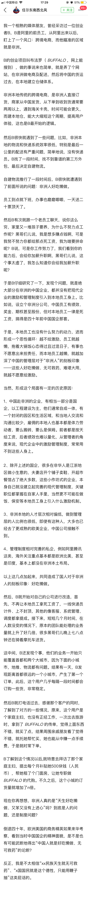

*2019-06-09 12:56 · 手机上网 转自无聊图5号机*

---

### 1177

organized chaos.

*2019-06-08 22:48 · 手机上网*

---

### 1178

在邓小平的诸多功绩中，于1990年底开通股市很可能是至今其重要性仍被大大低估的一件。

*2019-06-08 21:37 · 手机上网*

---

### 1179

「我们已经在伊甸园外，所以就别强求完美了。」

*2019-06-08 17:04 · 手机上网*

---

### 1180

多年以后，当人们书写中美贸易摩擦的历史时，会把哪年算作开端？

2018还是2019？

*2019-06-07 23:57 · 手机上网*

---

### 1181

L先生说，读了《新约》还应该读《旧约》，就像了读了《大学》之后还应该读《中庸》，不然可能出现格局很大但是境界上不去的情况。

*2019-06-07 11:44 · 手机上网*

---

### 1182

转@ 陈行_kevin 当年本科五十五个数学基地班的同学，只剩下三个人还在搞pure math了作为数学系的毕业生，深刻明白在这种情况下聊中美的基础数学差距毫无意义

*2019-06-07 11:41 · 手机上网 转自陈行_kevin*

---

### 1183

孙宇晨或许可以提醒人们重新思考一下「不管黑猫白猫，抓住老鼠就是好猫」这句话。

*2019-06-06 15:51 · 手机上网*

---

### 1184

强行伟大。

*2019-06-06 11:39 · 手机上网*

---

### 1185

十年前听说4万亿时真心觉得是个天文数字。最近听说广州白云机场光第四第五跑道的征地拆迁安置就要花1100多亿，修建还要再花900多亿，合起来扩建两条跑道要花2000多亿。

*2019-06-05 23:07 · 手机上网*

---

### 1186

1997年的春末夏初，奶奶想去悉尼看望叔叔。那时我已经确定保送清华，不需要准备高考了，所以就计划陪奶奶一起去，结果澳大利亚使馆竟然说我有移民倾向而拒签。这让我觉得很不可理喻：我怎么可能放着国内好好的清华不读而去澳洲打黑工呢？当我脑子进水了吗？也太看不起人了吧。

*2019-06-05 21:33 · 手机上网*

---

### 1187

转@ 小熊娃娃 现有人类智慧的巅峰早在公元前500年左右的轴心时代就达到了，后面的人文领域并没有超越，要么是深化和细化，要么是不相信然后瞎搞。其他领域，也无非是跟上智慧和跟不上两种。人类现在和未来过得如何，不取决于科学技术，那是太衍生的产物，而是智慧和心理是否与物质生活匹配。

*2019-06-05 17:24 · 手机上网 转自王兴*

---

### 1188

这口气有点大… 人文领域全世界满打满算也就五六千年顶天了吧。转@ 小熊娃娃 人文领域表示百年还是千年根本就不叫事 转@ 王兴 非自然科学领域，我相信有人在思考未来百年问题，但是真的有人在思考未来千年问题吗？

*2019-06-05 16:39 · 手机上网 转自王兴*

---

### 1189

非自然科学领域，我相信有人在思考未来百年问题，但是真的有人在思考未来千年问题吗？

*2019-06-05 15:57 · 手机上网*

---

### 1190

转@ quux 冇 RT@ 兰睿 hhhhhhh转@ 飯小默 有貓嗎

*2019-06-04 22:50 · 手机上网 转自飯小默*

---

### 1191

最糟糕的情况是，既不高雅，又不接地气。

*2019-06-04 15:13 · 手机上网*

---

### 1192

转@ 刘志达 塔塔科维尔说：“战术是当你有棋可走时知道如何走棋。

战略是当你无棋可走时知道如何走棋。”

*2019-06-04 13:55 · 手机上网 转自刘志达*

---

### 1193

美元本身也是一种产品，而且市场竞争力很强。

*2019-06-04 11:09 · 手机上网*

---

### 1194

黎明即起。长途奔袭。

*2019-06-04 07:10 · 手机上网*

---

### 1195

拉黑整个世界。

*2019-06-04 01:11 · 手机上网*

---

### 1196

看到一幅值得琢磨的画。

*2019-06-04 00:07 · 饭斯基*

---

### 1197

从 Mate7 之后，我的安卓主力机就一直是华为了。之前 HTC、三星、OPPO 和 nexus 都用过。刚查了一下，Mate7 是2014年9月发布的，这么说来，我成为华为手机的用户已经四年多了，但我还一直没用华为的云服务。

*2019-06-03 09:17 · 手机上网*

---

### 1198

宋朝从来没有统治过北京这片地儿。

*2019-06-02 23:49 · 手机上网*

---

### 1199

转@ 嘎子哥 “布雷顿森林体系”建立了美元与黄金挂钩的固定汇率制，布雷顿森林体系解体后，美元与黄金脱钩，把“US dollar ”称作“美金”就不合适了。在日常生活中，我会避免使用“美金”称呼“USdollar ”，并且把同样这么做的人当做相对专业的人。

*2019-06-02 22:32 · 手机上网 转自嘎子哥*

---

### 1200

遇到一个与时俱进的新单词：deep-like

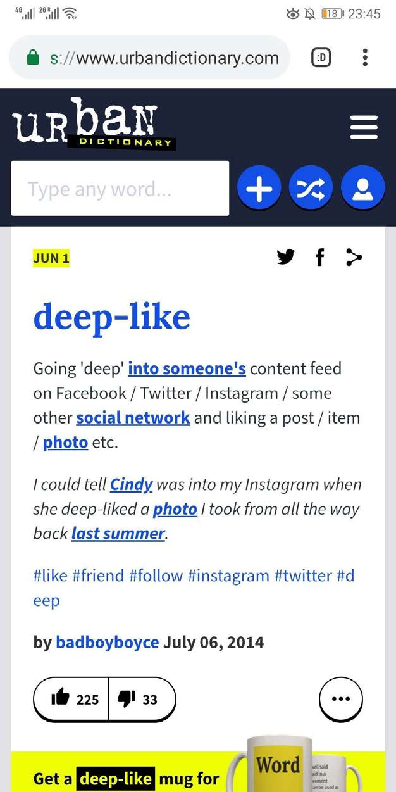

*2019-06-01 23:47 · 饭斯基*

---

### 1201

任总的故事很多，最令我泪崩的是：据说他母亲直到本世纪初意外离世前一直省吃俭用，因为她觉得儿子之前事业不顺，她攒下钱，没准将来华为遇到困难时能帮上点忙。转@ 张困 真的，我刚刚看了任正

非的我的父亲母亲，任总妈妈唤他非非… 转@ 王兴 只要父母还在世，你不管多大年纪了都还是个孩子。

*2019-06-01 23:33 · 手机上网 转自王兴*

---

### 1202

转@ 阳升 再宽泛一点：只要能想象父母如何看待自己，就都还是孩子 转@ 王兴 我所能想到的对儿童最宽泛的定义是：只要父母还在世，你不管多大年纪了都还是个孩子。

*2019-06-01 19:56 · 手机上网 转自王兴*

---

### 1203

Rise of the Rest.

*2019-06-01 15:16 · 手机上网*

---

### 1204

烈酒行业和科技行业正好相反，可以标榜不变，永远不变。

*2019-06-01 12:57 · 饭斯基*

---

### 1205

我所能想到的对儿童最宽泛的定义是：只要父母还在世，你不管多大

年纪了都还是个孩子。

*2019-06-01 12:53 · 手机上网*

---

### 1206

吸取教训，昨晚吃面时加了一把（5串）羊肉串，感觉好多了。转@王兴 我晚上8点多明明吃了一大碗（加了一小碟酱牛肉）的毛细兰州拉面！连汤都喝得精光！现在竟然又饿了！一直坐着跟人喝茶聊天有这么消耗能量吗？我这是什么体质!:-(

*2019-06-01 09:00 · 手机上网 转自王兴*

---

### 1207

有朋友送书的时候最好问清楚。别不好意思，不然稀里糊涂就读了可能不值当。

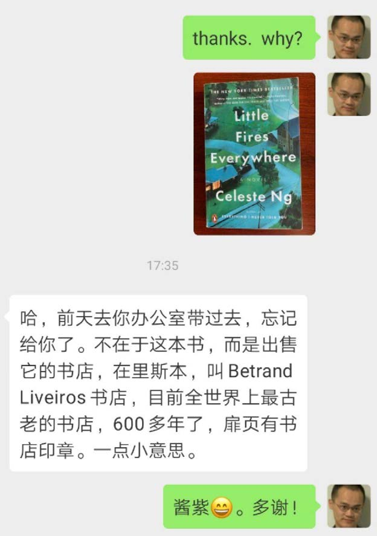

*2019-05-31 23:51 · 饭斯基*

---

### 1208

国产特斯拉 Model 3 今天发布定价了，起价32万8，和理想one的定价一模一样。不知道是否纯属巧合。

*2019-05-31 22:38 · 手机上网*

---

### 1209

据统计，公元1500年时欧洲大概有500个政治单元，到1900年时已经整合为25个国家了。

*2019-05-31 22:36 · 手机上网*

---

### 1210

军训时当然这么说。但你真以为枪只是用来打靶的吗？转@DennyHai 拿枪第一条就是严禁枪口对人，不管上没上膛…… 转@ 冬茶 兴酱在陈述事实 嗯… 转@ ikkag 村长在说啥 转@ 王兴 我还从来不曾拿着上了膛的枪指过人，或者被指着过。

*2019-05-31 22:34 · 手机上网 转自王兴*

---

### 1211

我还从来不曾拿着上了膛的枪指过人，或者被指着过。

*2019-05-31 22:20 · 手机上网*

---

### 1212

莱昂纳多•科恩的歌里，你第二喜欢的是哪首？

*2019-05-31 21:36 · 手机上网*

---

### 1213

这是在地理上践行「以客户为中心」，再鸟不拉屎也去。79年才搬回西雅图附近。转@ 王兴 1975年微软成立时并不在盖茨老家西雅图附近，而是在新墨西哥州的阿尔伯克基（相当于兰州）。选那里是因为微软创业的契机是给MITS于74年推出的微机Altari 8800做配套软件，所以当然要贴过去

*2019-05-31 17:02 · 手机上网 转自王兴*

---

### 1214

1975年微软成立时并不在盖茨老家西雅图附近，而是在新墨西哥州的阿尔伯克基（相当于兰州）。选那里是因为微软创业的契机是给 MITS这家公司于74年推出的微机 Altari 8800 做配套软件，所以当然要贴过去。而 MITS 在那里是因为创始人之前在附近的军方武器实验室工作。

*2019-05-31 16:58 · 手机上网*

---

### 1215

理解奢侈品的现象及其原理有助于理解社会，而且是个不可或缺的视角。

*2019-05-31 13:03 · 手机上网*

---

### 1216

转@ 王球球的春天 若干年前，朋友励志成为一名战地女记者，终于通过单位考试可以派驻到叙利亚。母亲以死相逼，摄影师男友带着她的照片去了那个地方。连续两天，她都找我咨询如何将阿*卤面快速拓展100家加盟商。

*2019-05-31 00:31 · 手机上网 转自王球球的春天*

---

### 1217

Gone with the wave.

*2019-05-30 23:53 · 手机上网*

---

### 1218

又一眨眼，十年过去了，40有余的我不喜欢牛逼这个词。转@ 王兴15岁时，我觉得谭嗣同特牛逼；30岁时，我明白有很多事其实比引颈就戮更困难也更牛逼。

*2019-05-30 23:52 · 手机上网 转自王兴*

---

### 1219

听过这么多版本的《Hallelujah》，还是科恩本人唱得最好，最像是在吟诗。

*2019-05-30 21:40 · 手机上网*

---

### 1220

想起前阵子碰到一个八十几岁了经历过大风大浪的美国老头，他说他理想的死法是105岁时因为强奸而被绞死。

*2019-05-30 21:29 · 手机上网*

---

### 1221

Fascinating 这个词应该译成「扣人心弦」。

*2019-05-30 21:11 · 手机上网*

---

### 1222

科恩给《Hallelujah》写过很多版歌词，不同的版本有几小节不同，其他大部分相同，而且还有个共同点：都美得很高级。

*2019-05-30 21:08 · 饭斯基*

---

### 1223

前阵子碰到一个中央党校博士毕业后来下海的上一辈企业家，他说：马克思恩格斯只给出了无产阶级执政的愿景，但没有指明战略，是靠议会选举还是靠武装革命？列宁说是后者，这是个重要判断。转@ 王兴 列宁主义是什么？

*2019-05-30 13:37 · 手机上网 转自王兴*

---

### 1224

别的因素不提，南昌至少还是有历史有文化的，出过千古名篇《滕王阁序》。转@ 王兴 南昌可能是存在感最低的省会城市。我感觉只有南宁有一拼。

*2019-05-30 12:51 · 手机上网 转自王兴*

---

### 1225

对不起，我错了，应该是石家庄，不但整个城市是铁路出现后才兴起，而且直到1968年才成为河北省会的。据说导火索是文革武斗时省政府一派打不过驻扎在原省会保定的军队派于是决定迁走…转@ 王兴南昌可能是存在感最低的省会城市。我感觉只有南宁有一拼。

*2019-05-30 12:39 · 手机上网 转自王兴*

---

### 1226

法律是金融的基础。这是句大白话，却几乎令人绝望。

*2019-05-29 22:01 · 手机上网*

---

### 1227

有幸听一个亲历97年港币保卫战的老银行家讲了讲当年的故事。和我原来理解的很不一样…

*2019-05-29 20:02 · 手机上网*

---

### 1228

中华人民共和国，怀璧其罪美帝说。围追堵截技穷日，翻江倒海科技锁。

*2019-05-29 13:14 · 手机上网*

---

### 1229

转@ 徐梧 人类能呼吸多久或眼睛能观看多久，这些东西就存在多久。——莎士比亚谈自己的诗作

*2019-05-29 12:55 · 手机上网 转自徐梧*

---

### 1230

超强的表达能力无疑是一种天赋。超强的感受能力则既是天赋又是诅咒。不仅限于艺术家。转@ 王兴 "He feels everything, poorVincent. He feels too much."

*2019-05-29 12:48 · 手机上网 转自王兴*

---

### 1231

治大国如烹小鲜。

*2019-05-29 12:44 · 手机上网*

---

### 1232

你拥有帆船吗？不，没有人可以真的拥有帆船，它们属于大海和风。

*2019-05-29 07:15 · 手机上网*

---

### 1233

我晚上8点多明明吃了一大碗（加了一小碟酱牛肉）的毛细兰州拉面！

连汤都喝得精光！现在竟然又饿了！一直坐着跟人喝茶聊天有这么消耗能量吗？我这是什么体质!:-(

*2019-05-28 01:59 · 手机上网*

---

### 1234

这四个都是犹太人。转@ 阳升 好些知名企业家也是东欧的 转@ 阳升美国这个国家多伟大，布热津斯基、基辛格、奥尔布赖特、索罗斯……

都是东欧人，但是在美国担任这么高的职务，对美国这个国家做这么大的贡献，这就是美国开放的结果。- 任正非

*2019-05-28 01:49 · 手机上网 转自阳升*

---

### 1235

我已经懒到一定地步了，决定开始把「消息」当做动词来用，例如说，「到时候我消息你」。

*2019-05-27 21:28 · 手机上网*

---

### 1236

《To be a better man》这首歌竟然有中文版！开头第一句男声之稚嫩完全出乎我的意料。

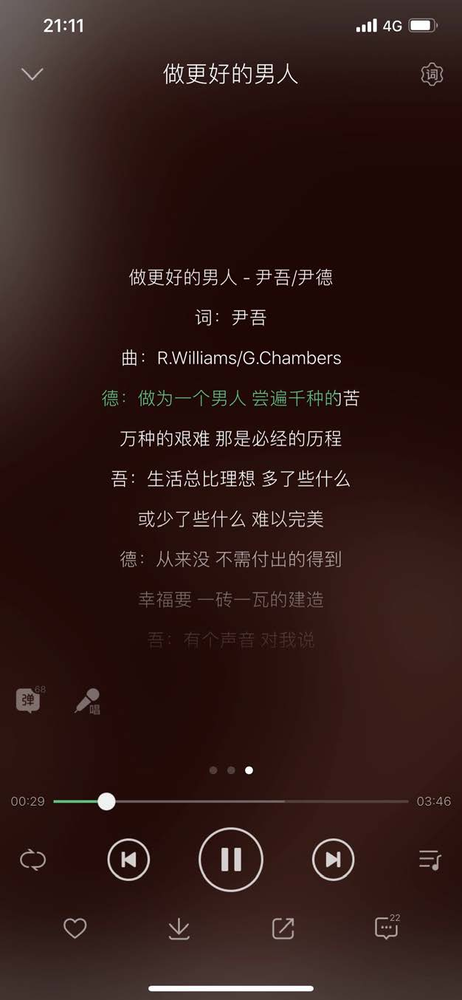

*2019-05-27 21:15 · 饭斯基*

---

### 1237

转：说得清的只是理，行得通的才是道。

*2019-05-27 15:32 · 手机上网*

---

### 1238

我你他

*2019-05-27 15:24 · 手机上网*

---

### 1239

决定找一个没听过的版本的《Hallelujah》来听。

*2019-05-26 22:46 · 手机上网*

---

### 1240

阿列克谢耶维奇总能写出惊人的细节：很长一段时间，我都抗拒写切尔诺贝利。我不知道该怎么写，用什么工具，从哪入手… 我记得一个老出租车司机因为鸽子撞上挡风玻璃而绝望地叫骂：“一天撞死两三只。报纸上却说情况都在掌控之下。”和阿富汗一样，切尔诺贝利把我们造就成了自由的人。

*2019-05-26 20:48 · 手机上网*

---

### 1241

那时在阿富汗，一个年轻人教训我：“你是个女人，你懂什么战争？你以为成千上万的人是怎么死的，和书里和电影里一样？昨天我朋友被杀了，他脑袋中枪，然后还跑了几米，想去接住被打出来的脑子……”七年后，同样是这个人，已经成了一个成功的商人，喜欢四处讲阿富汗的故事。-阿列克谢耶维奇

*2019-05-26 20:41 · 手机上网*

---

### 1242

如果再没有人发明一个更好的词，new cold war （新冷战）这个概念估计就会逐渐流行了。毕竟，讲不清楚某个概念的时候就说「新XX」总是最省力的。

*2019-05-26 20:18 · 饭斯基*

---

### 1243

鲁迅先生则说：所谓悲剧就是把美好的东西打碎给人看。转@ 王兴亚里士多德的定义：A tragedy is the story of a good man with aflaw that comes to an unjustified bad end.

*2019-05-26 18:01 · 手机上网 转自王兴*

---

### 1244

@ 苏小虎 欢迎。

*2019-05-26 09:57 · 手机上网 给苏小虎的回复*

---

### 1245

荒芜的心情。荒唐的人生。荒谬的世界。只有时间，是无尽的荒原。

万物于其间，荒草般生死不息。

*2019-05-26 04:27 · 手机上网*

---

### 1246

丘吉尔曾说「能看到更远的过去，才能看到更远的未来」；站在2019试图理解未来，我觉得看过去40年、过去70年甚至过去100年都已经不够了，得看到过去180年乃至更长…

*2019-05-25 14:14 · 手机上网*

---

### 1247

幸好有股市存在，就像皇帝的新衣里的那个小孩，而且几乎不可能被砍头。

*2019-05-25 11:47 · 手机上网*

---

### 1248

历史确实是翻篇了。具体什么时候翻的不知道，但肯定是翻了。

*2019-05-25 07:13 · 手机上网*

---

### 1249

转@ 阳升 看了下是一周内7人，今年总共是8人。 转@ 王兴 转@sorrowhill @ 王兴 这个有点标题党。死亡7人是今年珠峰上总的死亡人数。而不是这次堵塞导致了7人死亡

*2019-05-25 00:59 · 手机上网 转自sorrowhill*

---

### 1250

转@ sorrowhill @ 王兴 这个有点标题党。死亡7人是今年珠峰上总的死亡人数。而不是这次堵塞导致了7人死亡

*2019-05-24 22:26 · 手机上网 转自sorrowhill*

---

### 1251

我觉得排队很傻，但没想到能这么傻。

*2019-05-24 21:27 · 饭斯基*

---

### 1252

转@ 王兴 时间就像洪流，我们的小船快飘到尼亚加拉瀑布口了。

*2019-05-23 21:17 · 手机上网 转自王兴*

---

### 1253

猫确实是一种独特的生物。

*2019-05-23 19:58 · 手机上网*

---

### 1254

这回请务必押对！真的拜托了！转@ 王兴 这回我算是懂了 Historydoesn't repeat itself but it often rhymes:( 转@ 王兴 在清华上《中国革命史》时一个老师对中国近代史的概括：主动封闭->被迫开放->被迫封闭->主动开放

*2019-05-22 21:04 · 手机上网 转自王兴*

---

### 1255

久违的I95。

*2019-05-22 20:34 · 手机上网*

---

### 1256

至少量上不是。参观丘吉尔的出生地（他们家族传承了三百年的布伦海姆宫）时，我留意看了一下长图书馆厅的书架上摆了什么，好像整面墙的精装书的书脊上都印着：Paliamentary Debates. 转@ 孙威 这个世界上目前留存的最完整写的最好的会议纪要是不是《联邦党人文集》？

*2019-05-22 14:33 · 手机上网 转自孙威*

---

### 1257

其中微软、万事达和adobe这三家千亿美元的ceo毕业于印度同一所中学。转@ 蒙大拿的小偷 刚看到一图 转@ 王兴 诺基亚总部在芬兰，跟印度没啥必然联系。你能想象一个中国大公司的CEO是印度人吗？

转@ rinex20 为啥用竟然 转@ 王兴 诺基亚现任CEO竟然是个印度人

*2019-05-22 14:03 · 手机上网 转自蒙大拿的小偷*

---

### 1258

诺基亚总部在芬兰，跟印度没啥必然联系。你能想象一个中国大公司的 CEO 是印度人吗？转@ rinex20 为啥用竟然 转@ 王兴 诺基亚现在市值286亿美元，现任 CEO 竟然是个印度人：Rajeev Suri 拉吉夫•苏里。

*2019-05-22 13:56 · 手机上网 转自王兴*

---

### 1259

诺基亚现在市值286亿美元，现任 CEO 竟然是个印度人：RajeevSuri 拉吉夫•苏里。

*2019-05-22 13:52 · 手机上网*

---

### 1260

受过良好教育的美国人一般会承认越战确实是打输了，但韩战是平手。

*2019-05-22 00:46 · 手机上网*

---

### 1261

在传统的战争中，关键性的战役通常用战斗发生的地名来命名，例如滑铁卢、中途岛、斯大林格勒。将来，可能是用某个行业或者就是某个公司的名字来命名。

*2019-05-21 03:37 · 手机上网*

---

### 1262

这回我算是懂了 History doesn't repeat itself but it often rhymes:(转@ 王兴 @ daisytje 你这么说令我想在清华上《中国革命史》时一个老师对中国近代史的概括：主动封闭->被迫开放->被迫封闭->主动开放

*2019-05-21 03:26 · 手机上网 转自王兴*

---

### 1263

转@ Bing每日壁紙 圣伊莱亚斯国家公园中的铜河三角洲，阿拉斯加(© Frans Lanting/plainpicture)

*2019-05-21 01:10 · 手机上网 转自Bing每日壁紙*

---

### 1264

1910年底，考虑到当时紧张的国际局势，钢铁大王卡耐基捐资成立了Carnegie Endowment for International Peace 卡耐基国际和平研究

院，试图做点什么。三年多年后，第一次世界大战还是爆发了。但是一百多年后，这个机构还是国际顶级智库之一。

*2019-05-21 00:01 · 手机上网*

---

### 1265

Russia doesn't care about the world, but it cares about its placein the world.

*2019-05-20 22:59 · 手机上网*

---

### 1266

难以名状。

*2019-05-20 20:16 · 手机上网*

---

### 1267

1865年，美国打完南北战争，退下来的大批军人正好去修联接东西海岸的太平洋铁路。1869年，铁路修成，美国成为巨大的统一市场。铁路大亨中有一个名叫斯坦福，在1885年为了纪念自己早逝的独子而捐资建了所大学。斯坦福大学1891年开始招生，第一届学生中就有人后来当上美国总统：胡佛。

*2019-05-19 15:04 · 手机上网*

---

### 1268

Corporate China.

*2019-05-19 14:09 · 手机上网*

---

### 1269

是时候用 HAT 代替 BAT 了。华为是中国当之无愧首屈一指的高科技企业。转@ 王兴 为什么媒体还没有广泛使用 HAT （Huawei,Ali,Tencent）这样的称呼代替 BAT，科技企业已经各种跨界了

*2019-05-19 09:25 · 手机上网 转自王兴*

---

### 1270

更加理解一百多年前李中堂的不容易了。

*2019-05-18 11:03 · 手机上网*

---

### 1271

这不是一场 trade war，是 power war 。

*2019-05-18 10:31 · 手机上网*

---

### 1272

所有试图把爱迪生当年的对手、疯狂的发明家特斯拉和现在特斯拉汽车的 CEO 马斯克的气质联系起来的人都应该了解一个基本的历史事实：特斯拉汽车的名字根本不是马斯克起的，马斯克不是特斯拉的创始人，而是早期投资人和第四任 CEO。

*2019-05-18 09:00 · 手机上网*

---

### 1273

作为一个没干本行的清华电子工程系的学生，我必须向华为海思半导体的同仁们表示深深的敬意。

*2019-05-17 19:19 · 手机上网*

---

### 1274

姑娘，你为什么蹲在马桶边上？

*2019-05-17 14:53 · 饭斯基*

---

### 1275

早餐菜单里看到「奄列」，我有点懵，想想才反应过来就是煎蛋卷omelette 的音译。

*2019-05-17 07:52 · 手机上网*

---

### 1276

最近一个季度，阿里收入935亿人民币，同比增长51%，净利201亿，增长42%，市值4604亿美元；腾讯收入855亿人民币，增长16%，净利209亿，增长14%，市值4536亿美元。

*2019-05-16 08:51 · 手机上网*

---

### 1277

这回撑的时间更长了，人类在进步。转@ 王兴 从1929年经济危机开始到1939年第二次世界大战全面爆发，间隔了十年。

*2019-05-15 13:49 · 手机上网 转自王兴*

---

### 1278

摩尔定律并不准确，但的确是极有洞见的信息革命的底层规律。前几次科技革命时有人提出类似的底层洞察吗？

*2019-05-15 12:49 · 手机上网*

---

### 1279

如果我没记错的话，我上一次去华盛顿还是去看乔丹代表奇才队打他的老冤家犹他爵士队。那场比赛乔丹表现不错，得分超过40。真是恍若隔世啊。

*2019-05-15 00:00 · 手机上网*

---

### 1280

李明顺的提法确实颇有道理，从 Made in China 到 Created byChinese，从「中国制造」到「华人创造」，这里用的概念是华人而不是中国人。

*2019-05-14 23:15 · 手机上网*

---

### 1281

转：成色优良的银子，在铸造过程中，银水凝固时会出现细密的纹路。明清人把优质白银称为“纹银”，就是这个原因… 为了方便价值判断，清代官方将含银量935.374‰的白银规定为“纹银”。

*2019-05-13 14:00 · 手机上网*

---

### 1282

如果希望感受到被这个世界更温柔的对待，以我的经验，最有效的办法是买一双高品质的羊毛袜。

*2019-05-13 13:31 · 手机上网*

---

### 1283

现在回头看，过去十几年我在初看时最低估了的电影是《战马》。转@ 杨曜睿 想起周星驰作词作曲的“无敌是多么 多么寂寞” 。《美人鱼》其实也挺有趣的，几年后可能人们会发现，这也是部当时被低估的电影。转@ 王兴 转@ 刘志达 「要谨慎选择你的竞争对手，因为最后很可能你们会变得很像。」

*2019-05-13 13:15 · 手机上网 转自刘志达*

---

### 1284

转@ 刘志达 「要谨慎选择你的竞争对手，因为最后很可能你们会变得很像。」

*2019-05-12 12:50 · 手机上网 转自刘志达*

---

### 1285

转@ 王兴 年少时我相信一些「卓越人士在关键时刻挺身而出，力排众议，力挽狂澜」之类的说法，后来多了解了一点历史，转而相信：真正的历史大事件来临时，后来被载入历史的人根本都不用去抢，更大的可能性是只是没躲，或者，没躲开……

*2019-05-11 13:09 · 手机上网 转自王兴*

---

### 1286

转@ 喵小菇 这三家都是ASML的股东 转@ waoho 三家分别代表了半导体逻辑，存储，制造的最高水平，然而他们三家都离不开ASML转@ 王兴 半导体行业代表当今制造业的最高水平，高过航天。代表半导体行业最高水平的有三家公司：英特尔、三星、台积电。

*2019-05-11 12:27 · 手机上网 转自王兴*

---

### 1287

Travis Kalanick（简称TK）既不是最初提出 uber 这个点子的人（那是Garret Camp），也不是 uber 的首任 CEO（那是 RyanGraves），但确实是靠他像疯狗一样各种搞搞搞才把 uber 搞成今天这样的巨无霸，当然，也搞出很多问题来。

*2019-05-11 10:37 · 手机上网*

---

### 1288

太霸气了… 转@ gravity0 凯特琳娜是老爹带大的，性格刚猛。刺客信条二的玩家对这个片段大概还有印象，她在城头掀起裙子对城下绑架她子女的敌人喊话：你们尽管杀，老娘还能生。

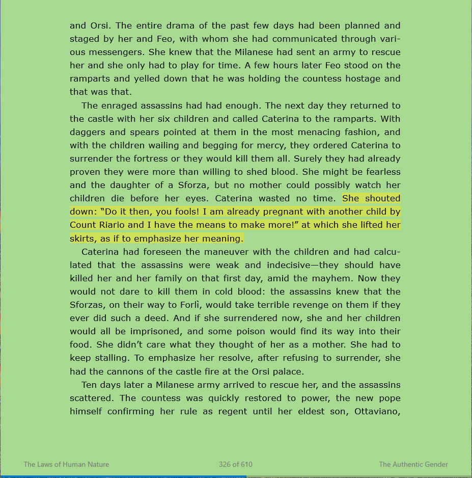

*2019-05-10 21:30 · 手机上网 转自gravity0*

---

### 1289

每当想到 karma 这个概念除了译成「因果报应」还可以译成「业」，我就对「创业者」这个词觉得有点发毛…

*2019-05-10 17:18 · 手机上网*

---

### 1290

集成电路比我大二十岁。转@ 王兴 互联网比我大十岁。

*2019-05-10 13:15 · 手机上网 转自王兴*

---

### 1291

接触到一个（对我来说的）新概念：白嫖粉。

*2019-05-09 16:55 · 手机上网*

---

### 1292

韩国半导体厂商海力士 Hynix 的前身是现代集团旗下的现代电子，2001才改名，而且 Hynix 这个名字就是从现代 Hyundai 中取了开头字母hy 和从电子 Electronics 中取了结尾字母 nics 拼成 Hynics再变形成 Hynix 。

*2019-05-08 13:11 · 手机上网*

---

### 1293

「但是，只有在印度国内我们才这样，到了美国或英国我们就很守规矩了…」转@ 王兴 「签完合同，真正的谈判才开始，对我们印度人来说」，印度朋友告诉我。

*2019-05-07 22:38 · 手机上网 转自王兴*

---

### 1294

「签完合同，真正的谈判才开始，对我们印度人来说」，印度朋友告诉我。

*2019-05-07 21:47 · 手机上网*

---

### 1295

问一个号称了解情况的朋友，deepmind 也做自动驾驶吗？答曰：这么偏应用的科技我们不搞，我们有很多更严肃更有深度的课题。我顿时就觉得自己弱爆了…

*2019-05-06 21:53 · 手机上网*

---

### 1296

大家很快就要进入比拼自己用的第一个 linux 内核版本号的阶段了吗？;-)转@ 陈亮 @ 孙威 @ 潘 @ Choicky 最早接触的是slackware。

*2019-05-06 21:44 · 手机上网 转自陈亮*

---

### 1297

这可能是史上首次 O2O 军事行动：哈马斯对以色列搞网络攻击，以色列的回应方式是空袭…

*2019-05-06 18:48 · 手机上网*

---

### 1298

转@ 潘 the best way to learn is to learn from the best

*2019-05-06 15:26 · 手机上网 转自潘*

---

### 1299

朝着成为废人的方向又迈出了坚实的一步：刚才在 gmail 里回复英文邮件时，发现谷歌的人工智能推荐的整句整句英文真的写得挺合适的，直接用就可以了…

*2019-05-06 14:42 · 手机上网*

---

### 1300

互联网比我大十岁。

*2019-05-06 14:15 · 手机上网*

---

### 1301

美国国务院政策规划主任斯金纳在谈中国问题时说了一句「非我族类，其心必异」。这话从黑人大姐嘴里说出来显得尤其魔幻！

*2019-05-06 12:29 · 手机上网*

---

### 1302

笋干烧肉真是太好吃了！

*2019-05-06 12:12 · 手机上网*

---

### 1303

给我这个世界上最诚实的人写的六行字，我一定能从中找到足够的理由来绞死他。—黎塞留

*2019-05-05 17:45 · 网页*

---

### 1304

转@ 刘奔奔 韩语的汽车就是“自动车” 자동차 自行车是“自转车” 자전거 RT@ 王兴 bicycle 被译成「自行车」真是很不合适，反而是汽车的英文 automotive 直译过来是「自行车」。转@ 王兴 其实 bicycle最准确的翻译既不是「单车」也不是「自行车」，而是「两轮

*2019-05-05 15:41 · 手机上网 转自王兴*

---

### 1305

转@ 柚璃璃 日本分别是「自転車」和「自動車」，自转和自动，听起来就比较形象了。RT@ 王兴 bicycle 被译成「自行车」真是很不合适，反而是汽车的英文 automotive 直译过来是「自行车」。转@ 王兴 其实 bicycle 最准确的翻译既不是「单车」也不是「自行车」，而是「

*2019-05-05 15:41 · 手机上网 转自王兴*

---

### 1306

bicycle 被译成「自行车」真是很不合适，反而是汽车的英文automotive 直译过来是「自行车」。转@ 王兴 其实 bicycle 最准确的翻译既不是「单车」也不是「自行车」，而是「两轮车」。与之对应的是 unicycle 独轮车。

*2019-05-05 15:23 · 手机上网 转自王兴*

---

### 1307

Figure out what works and do it. 芒格说他深受李光耀这句话影响。

*2019-05-05 13:17 · 手机上网*

---

### 1308

因为没有一个字代表世界，所以郭台铭最近对未来世界格局的判断One World, Two Systems 就没法有类似「一国两制」这么简洁的表达。转@ 王兴 中文里竟然没有一个字代表「世界」。中国和美国的关系可以简称中美关系，中国和俄罗斯的关系可以简称中俄关系，但是中国和世界

*2019-05-05 12:57 · 手机上网 转自王兴*

---

### 1309

元明清也都不到300年。所以，如果把西汉东汉分开算，几乎可以说宋朝是中国历史上最长寿的一个朝代。当然，秦始皇以前的那些上古时期不算数。转@ 王兴 没想到宋朝竟然寿命比唐朝还长。宋朝：1279 960 = 319年。唐朝：907 - 618 = 289年。

*2019-05-04 00:14 · 手机上网 转自王兴*

---

### 1310

没想到宋朝竟然寿命比唐朝还长。宋朝：1279 -960 = 319年。唐朝：907 - 618 = 289年。

*2019-05-04 00:07 · 手机上网*

---

### 1311

谁说艺术已经死了？转@ 王兴 转：1996年，瑞典登山家 GoranKropp 从瑞典的家里骑自行车到达珠峰大本营，然后单人、无氧登顶珠峰，下山后又骑车回到瑞典。

*2019-05-03 22:44 · 手机上网 转自王兴*

---

### 1312

Deepmind 很可能是比 google 更伟大的一家公司。

*2019-05-03 22:37 · 手机上网*

---

### 1313

霸气！这大概可以算是现实中最可能让我联想到星战的场景。

*2019-05-03 21:49 · 饭斯基*

---

### 1314

一流的产品经理判断需求不是靠用户调研，而是「观世音」。

*2019-05-03 12:32 · 饭斯基*

---

### 1315

创业不能蛮干，要等「大势至」。

*2019-05-03 12:27 · 饭斯基*

---

### 1316

诸天当中，他的香火应该是最旺的吧。

*2019-05-03 11:44 · 饭斯基*

---

### 1317

转@ 我叫浪里白条 这几天搭顺风车时认识了一位北体大的击剑老师，我问她王海滨在做什么，这种巅峰后远离聚光灯的人生，会不会跟失落？老师说不会，专业运动员，尤其是能达到那种高度的运动员，心理上也会特别强大，不管遇到啥挫折都能面对。转@ 王兴 随着年纪和阅历的增长，我越来越能理解，体育运动

*2019-05-02 21:12 · 手机上网 转自王兴*

---

### 1318

2022

*2019-05-02 09:37 · 手机上网*

---

### 1319

所以，真正的下一代人机交互界面必须是眼镜，而不是智能音箱。转@ 王兴 转：视觉艺术心理学家鲁道夫·阿恩海姆曾谈到：“光线，几乎是人的感观所能得到的一种最辉煌、最壮观的经验。”

*2019-05-02 00:09 · 手机上网 转自王兴*

---

### 1320

随着年纪和阅历的增长，我越来越能理解，体育运动对一个人性格最重要的锤炼并不在于让你学会为了获胜拼尽全力，而是教你如何在拼尽全力但依然失败时能坦然面对。

*2019-05-01 22:01 · 网页*

---

### 1321

妈妈说这道梅菜扣肉里的梅菜是她用自己种的菜制作的，蒸完了晒，晒完了蒸，至少要四遍之后梅菜才会香。

*2019-05-01 18:49 · 手机上网*

---

### 1322

一辆棕红色玛莎拉蒂从我身边缓缓开过，声音大得像拖拉机。

*2019-05-01 16:58 · 手机上网*

---

### 1323

姐姐17年前硕士论文研究的课题现在终于逐渐商用了。

*2019-05-01 15:24 · 手机上网*

---

### 1324

转@ 寒小梦 冷知识，命名“曹操专车”是因为曹操的小名叫吉利，而曹操专车是吉利控股集团下的，和“说曹操曹操到”这句话没有关系，这只是后来网友们附会的。

*2019-05-01 15:09 · 手机上网 转自寒小梦*

---

### 1325

接近于一百多年前义和团时期:-( 转@ webto 这条新闻看得人生气：http://fan.fo/aCoVu

*2019-04-30 21:14 · 手机上网 转自webto*

---

### 1326

到目前为止，我见过最欢乐的微信公众号是：哈哈哈哈哈哈哈。

*2019-04-30 18:02 · 手机上网*

---

### 1327

这部电影我竟然看过，但只记得郑伊健扮帅… 转@ 徐梧 华英雄电影里，反派boss跟华英雄师父打，输了，师父说，你输是因为你还有牵挂。于是反派回去杀掉妻儿自毁双目。没了牵挂后和华英雄决斗，又输了，华英雄说，你输是因为你没有爱。转@ 王兴 极度渴望成功的人并不多，愿付非凡代价的就更少了

*2019-04-30 14:09 · 手机上网 转自王兴*

---

### 1328

我第一次接触「万亿」这个单位好像确实是因为十年前的4万亿。后来就用得越来越多了。

*2019-04-30 13:17 · 手机上网*

---

### 1329

俄国大文豪普希金也有黑人血统，他曾祖父是黑奴。普希金很自豪自己有黑人血统。转@ 张亮 有说法说写寓言的伊索可能是埃塞尔比亚人（而非希腊人），那他其实是个黑人？

*2019-04-30 12:57 · 手机上网 转自张亮*

---

### 1330

前辈对我说：公司上完市，你们就应该踏踏实实专心做业务，着眼长期，不要太关注短期股价波动。股市是个类似赌博的游戏，你们这些公司不是开赌场的，也不是庄家，连来玩牌的人都不是，你们只是玩家手里的牌。

*2019-04-30 12:27 · 网页*

---

### 1331

今天北京的天气真是好得不像话。难得窗户大开，难得有风，被风刮跑了几张纸，我才意识到「镇纸」这玩意儿确实有存在的必要。

*2019-04-30 11:00 · 手机上网*

---

### 1332

今年真是美国科技公司上市大年啊，Airbnb 和 WeWork 也都有 IPO时间表了。

*2019-04-30 09:03 · 手机上网*

---

### 1333

想起一个创业者给我讲他的经历：十几年前我在国企纪委工作。那时纪委还不像后来那么风光。有一次，我参与双规单位大领导之一。单独负责守夜时，领导指着我的鼻子骂：「小X，我没事的，你信不信我出去就整死你。」三个月后，我离职创业了…

*2019-04-29 18:50 · 手机上网*

---

### 1334

前辈还提到，美国的法律体系总体是「无罪推定」，只有两个领域是例外：税和证券监管。

*2019-04-29 17:14 · 手机上网*

---

### 1335

偶遇国内最资深的创业创投前辈之一，聊天时他说：在生活中我其实是一个非常保守的人，举个例子，我至今都不买电动车，包括特斯拉。

*2019-04-29 17:12 · 手机上网*

---

### 1336

转@ 王兴 2003年8月美国哥伦比亚航天飞机失事的调查报告发布后，纽约时报那篇文章的具体内容我已记不得了，但是标题让我过目难忘：Failure is Always an Option.

*2019-04-29 14:58 · 手机上网 转自王兴*

---

### 1337

像遛狗一样遛自己。

*2019-04-28 23:59 · 手机上网*

---

### 1338

转@ webto BBC这个报道说美国人家养+动物园里的老虎数量，是全球野生老虎数量的两倍。。。据说相当一部分的来源是盗猎。

*2019-04-27 14:13 · 手机上网 转自webto*

---

### 1339

范思哲这个品牌的创始人 Gianni Versace 竟然是50岁时在迈阿密海滩上被枪杀的。

*2019-04-27 12:18 · 手机上网*

---

### 1340

转@ 王球球的春天 我跟同事说，XX确实是个有人格魅力的企业家，做人有原则，做事有章法，也是难得能在这个低毛利行业里赚这么多钱的。他说，就是老拖款，那年大年三十，欠一个菜贩子80万，菜贩子喝农药自杀了

*2019-04-27 00:11 · 手机上网 转自王球球的春天*

---

### 1341

转@ 路上有惊慌 监狱就是犯罪分子的商学院。

*2019-04-26 20:55 · 手机上网 转自路上有惊慌*

---

### 1342

Begun the war has, from New Zealand to Sri Lanka to morecorners, between religions and civilizations, against the innocentand armless...

*2019-04-26 15:28 · 饭斯基*

---

### 1343

转@ 多多大观人 好诗！ 转@ 生猛女性 风很大 雨很大 你很大 我的叫声也很大。——晚安

*2019-04-26 09:42 · 手机上网 转自生猛女性*

---

### 1344

乌兹别克斯坦，人口三千多万，民族超过140个。

*2019-04-26 00:54 · 手机上网*

---

### 1345

今天吃到一种新水果：树葡萄。味道还不错，据说原产南美，后来福建等地皆有种植。友情提醒：密集物恐惧症者请不要去搜索此物长在树干上时的图片。

*2019-04-24 15:07 · 饭斯基*

---

### 1346

搬起泰山砸自己的脚。

*2019-04-24 00:54 · 手机上网*

---

### 1347

除了参加了12场晋升答辩会，今天还有一点小小的收获：一天之内吃到了黑莓 blackberry 和桑椹 mulberry 这两种有点相似的黑色浆果，进一步学会了如何区分。最主要的区别是桑椹一般带梗，另外，桑椹的果粒小很多，风味更丰富，坏处是桑椹汁容易把手指和指甲缝染黑，看起来很脏…

*2019-04-22 21:55 · 手机上网*

---

### 1348

转@ Leonard0 @ 王兴 能把血管堵住的大分子需要多大？这么大怎么吸收的？早上头痛应该是身体分解酒精导致脑组织轻微脱水，早上补水后恢复原体积挤压脑硬壳，所以头痛。

*2019-04-22 15:21 · 手机上网 转自Leonard0*

---

### 1349

一条很简短但是实用的人生智慧：乍暖还寒时候，头发别剃太短，真的很冷><!

*2019-04-22 10:12 · 手机上网*

---

### 1350

转：2%和3%的差别不是一个百分点，是50%。

*2019-04-22 00:29 · 手机上网*

---

### 1351

听一个懂行的朋友说：酒精会让人头晕但不会让人头痛；有些酒喝了会所谓上头或第二天依旧难受是因为酒里含有各种杂醇等大分子，这些大分子进入脑袋后，会把一些细小的血管堵住，从而导致头痛。白酒陈化几年后会口感更好，更不上头，就是等这些大分子慢慢分解掉。

*2019-04-21 22:49 · 手机上网*

---

### 1352

刚才在电梯里见到了我至今见过的仔裤膝盖破洞破得最壮观的姑娘。

*2019-04-21 14:38 · 手机上网*

---

### 1353

我只去过布拉格一次，但斯美塔那的曲子《伏尔塔瓦河》已在我耳边流淌千百遍。

*2019-04-21 10:51 · 手机上网*

---

### 1354

纳米比亚这个国家竟然是1990年才从南非独立出来的。

*2019-04-20 11:28 · 手机上网*

---

### 1355

animalistic

*2019-04-20 09:44 · 手机上网*

---

### 1356

出发。好久没有这么晚去面试了。

*2019-04-19 22:51 · 手机上网*

---

### 1357

转@ 卡妮娅洼 我一直不太喜欢鲤鱼，因为不止一次看到一条鲤鱼死了其他鲤鱼来吃。我猜鱼类都如此，只是因为鲤鱼被养得很多所以见到了……反正我不喜欢……我现在在一个巨大的鱼缸旁边开会，我旁边有很多超大的鲤鱼在吃死掉的一条超大的鲤鱼，想哭……

*2019-04-19 20:44 · 手机上网 转自卡妮娅洼*

---

### 1358

转@ 徐梧 前人种树，后人乘凉，社会才能进步。

*2019-04-19 15:32 · 手机上网 转自徐梧*

---

### 1359

公司管理估计也是类似的道理。看似突然爆出来的问题，实际上可能已经积累了很多年。转@ 王兴 又一件衬衫突然腋下裂了个大口子…

*2019-04-18 19:02 · 手机上网 转自王兴*

---

### 1360

又一件衬衫突然腋下裂了个大口子…

*2019-04-18 18:52 · 手机上网*

---

### 1361

有一个常识常常被忽略：做投资最重要的是什么？要有钱。

*2019-04-18 16:55 · 手机上网*

---

### 1362

我其实蛮好奇一个问题：中国第一代互联网大佬哪个会先真的退休？

何时，以何种方式？陈天桥先生除外。

*2019-04-18 13:10 · 手机上网*

---

### 1363

很美。但是有事实性错误，把日地距离说小了一万倍。转@ 郭家二少爷 转@ 丁當 转@ 飯否小字报 转@ lunatico 今天看到第一句美丽的话 良久，他开口：“在夜里，我们看得比白天更远。” “白天只能看到一万五千公里外的太阳，夜里却能看到百万光年外的星系。”

*2019-04-18 13:04 · 手机上网 转自lunatico*

---

### 1364

煲仔饭真是极不健康但是极美味啊！

*2019-04-18 12:49 · 手机上网*

---

### 1365

《闽西日报》说龙岩获批的（离市区近很多的）新机场的选址。以天朝的基建能力，真是削峰填谷摧枯拉朽全不在话下啊。可惜预计要到2026年才能建成。

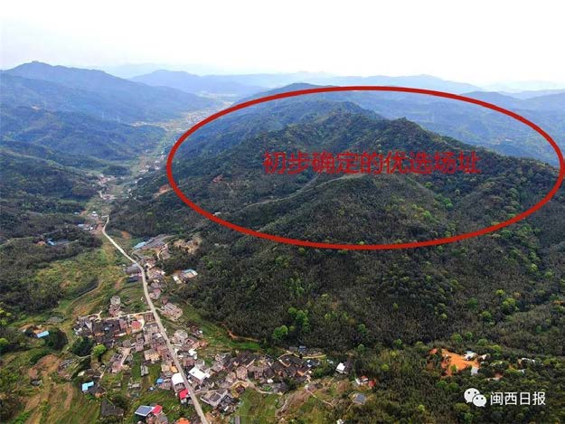

*2019-04-17 22:50 · 饭斯基*

---

### 1366

国营互联网大厂。

*2019-04-17 13:43 · 手机上网*

---

### 1367

听到一种有趣的观点：战略这东西吧，存在错的战略，但是不存在所谓对的战略。

*2019-04-17 13:41 · 手机上网*

---

### 1368

「为了爱你，我要跟时间决斗，把你接上比青春更永久的枝头」。在朋友圈看到的，莎士比亚写的。All in war with Time for love ofyou. As he takes from you, I engraft you new.

*2019-04-16 18:16 · 手机上网*

---

### 1369

转@ 琦殿 在Tate Britain看到梵高的《Prisoners Exercising》，被镇住。

*2019-04-16 16:51 · 手机上网 转自琦殿*

---

### 1370

有时想起来会觉得有点不可思议，「她」这个字被刘半农先生发明出来也就刚刚一百年。

*2019-04-15 23:39 · 饭斯基*

---

### 1371

开会被提醒写东西时不要用高级词汇，想起了我认得的最长的英文单词：antidisestablishmentarianism

*2019-04-15 19:07 · 手机上网*

---

### 1372

因为我们花很多时间用语言思考，所以我们需要花很多时间来思考语言。

*2019-04-15 15:57 · 手机上网*

---

### 1373

时间是最仁慈的，她包容一切；时间也是最无情的，她吞噬一切。

*2019-04-15 15:37 · 手机上网*

---

### 1374

Here you are. Here I stand.

*2019-04-15 14:20 · 手机上网*

---

### 1375

赞！转@ Jun.Stone @ 王兴 大概职业道德，也有狭义和广义之分！

*2019-04-15 14:15 · 手机上网 转自Jun.Stone*

---

### 1376

喝完了一饼白茶。

*2019-04-15 13:08 · 手机上网*

---

### 1377

僧推月下人。

*2019-04-14 12:39 · 手机上网*

---

### 1378

Let it be. Help it be. Make it be.

*2019-04-14 12:24 · 手机上网*

---

### 1379

人艰不拆… 转@ 油泼面要宽的 被兼容的心头灵犀

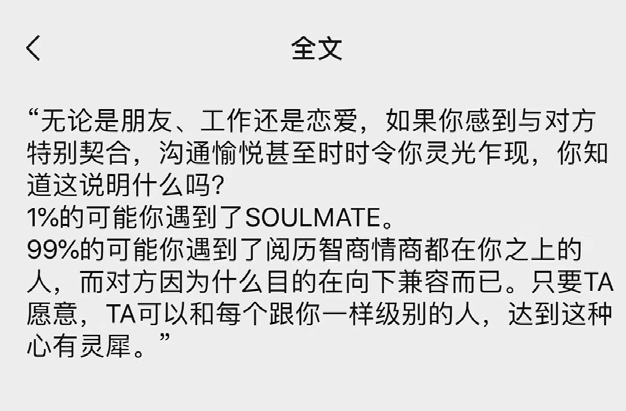

*2019-04-13 13:55 · 手机上网 转自油泼面要宽的*

---

### 1380

When you change the way you see the world, you change theworld you see. - Satya Nadella

*2019-04-13 12:47 · 手机上网*

---

### 1381

产品、商品、货品

*2019-04-12 21:45 · 手机上网*

---

### 1382

转@ 王兴 转：读书如同打仗，经典就是绕不开的据点。

*2019-04-12 15:27 · 手机上网 转自王兴*

---

### 1383

零件和部件。

*2019-04-12 13:16 · 手机上网*

---

### 1384

北大有一点比清华强，从远处看时校徽的识别度高很多。

*2019-04-12 13:02 · 手机上网*

---

### 1385

剪不断，理还乱，portfolio，别是一番滋味在心头。

*2019-04-11 15:09 · 手机上网*

---

### 1386

Deep Learning & Deep Thinking

*2019-04-11 12:50 · 手机上网*

---

### 1387

我意识到，一个人整个职业生涯里真正能培养的下属的数量，就算比这个数量多，也多不了太多。转@ 王兴 我的导师说他的导师一生培养了28个博士，而他自己一生培养了30个博士，没拿到博士学位的学生就更多了，我是其中之一。

*2019-04-10 16:02 · 手机上网 转自王兴*

---

### 1388

多年以前，遇到这首诗时，爸爸考我为什么鲤鱼上滩。我猜是为了好玩，爸爸说，这是一种生殖行为，雄鲤鱼到浅滩来射精，雌鲤鱼来排卵，体外受精… 转@ 王兴 「兰溪小馆」这餐厅名字颇为雅致，应该有道菜是鲤鱼吧？不然真是辜负了「兰溪三日桃花雨，半夜鲤鱼来上滩」这么美的唐诗。

*2019-04-10 15:36 · 手机上网 转自王兴*

---

### 1389

「兰溪小馆」这餐厅名字颇为雅致，应该有道招牌菜是鲤鱼吧？不然真是辜负了「兰溪三日桃花雨，半夜鲤鱼来上滩」这么美的唐诗。

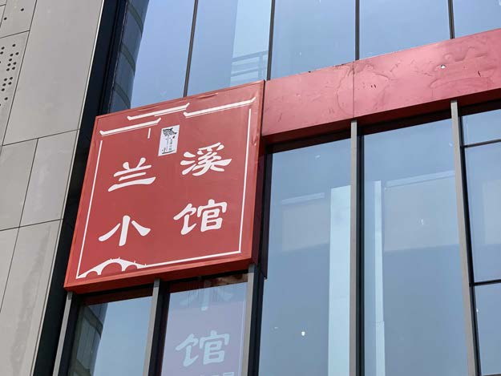

*2019-04-10 14:42 · 饭斯基*

---

### 1390

㚻

*2019-04-10 14:29 · 手机上网*

---

### 1391

牛！转@ 拧巴人儿 纽约还有一个国立数学博物馆…哎呀真是让人不寒而栗……

*2019-04-10 09:52 · 手机上网 转自拧巴人儿*

---

### 1392

自以为是天选之子容易遭雷劈。

*2019-04-09 20:37 · 手机上网*

---

### 1393

我的导师说，他的导师 Jack Dennis 教授今年86岁了，依然坚持自己动手编程。

*2019-04-09 15:06 · 手机上网*

---

### 1394

爸爸清明假期来北京时从龙岩带了三种笋：大笋、甜笋和苦笋，所以这几天我都有口福了:)

*2019-04-09 13:40 · 手机上网*

---

### 1395

「把丫的宇宙崩个口子」，硅谷老炮儿乔布斯老师年轻时的雄心壮志"make a dent in the universe"用北京话是不是该这么说？

*2019-04-09 13:33 · 手机上网*

---

### 1396

一想事就先给自己划一道 possible 的线，还是不够irreverent. 转@王兴 瞥见陈一舟老兄的li nkedin签名档：Think with the mostundisciplined, irreverent and original manner possible

*2019-04-09 10:59 · 手机上网 转自王兴*

---

### 1397

百度百科错了。转@ 寒小梦 百度百科说是庚子赔款。转@ 王兴 协和不是靠庚子退款修的，是洛克菲勒家族捐的。转@ gravity0 磨洋工这词的起源，据说是一百年前庚子退款修协和医学院。工程质量要求高，砖缝要磨平，主楼十四座高层工程量大，由于是洋人的工程所以叫洋工。这词变成磨蹭怠工的意思

*2019-04-08 23:33 · 手机上网 转自gravity0*

---

### 1398

不对吧。协和不是靠庚子退款修的，是洛克菲勒家族捐的。转@gravity0 “磨洋工”这词的起源，据说是一百年前庚子退款修协和医学院。工程质量要求高，砖缝要磨平了，主楼十四座高层工程量大，由于是洋人的工程所以叫洋工。这词变成磨蹭怠工的意思，那是后话。

*2019-04-08 23:26 · 手机上网 转自gravity0*

---

### 1399

听懂行的朋友说了，才知道手机厂商的正确分类方式：苹果、三星、华为是第一梯队，这三家都用自家的芯片；OPPO、vivo、小米是第二梯队，用高通或联发科的芯片；其他。

*2019-04-08 22:27 · 手机上网*

---

### 1400

不经意间瞥见陈一舟老兄的 li nkedin 签名档：Think with the mostundisciplined, irreverent and original manner possible.

*2019-04-08 17:27 · 手机上网*

---

### 1401

「财富自由」在中国根本就是个伪概念，「财务独立」还勉强说得过去。

*2019-04-08 14:38 · 手机上网*

---

### 1402

库尔德人缺一个领袖和一个出海口。

*2019-04-08 13:22 · 手机上网*

---

### 1403

叙利亚朋友说他最近两次回去分别是2011年8月和2018年底。令他惊讶的是，后一次比前一次看到的大马士革还更繁荣，好酒店好餐厅都超级难订。内战打了好几年，半个国家打烂了，几百万人逃难去了别的国家，但是剩下来的人大比例聚集在首都大马士革，反而催生出一种异样的繁荣。

*2019-04-08 11:37 · 手机上网*

---

### 1404

在中国做地产的人是在开得忽快忽慢的压路机前弯腰捡金币。

*2019-04-08 11:05 · 手机上网*

---

### 1405

如果真的「每天前进30公里」，那一辈子大概能前进一百万公里。

*2019-04-08 00:39 · 手机上网*

---

### 1406

先要学会和自己分享感受。

*2019-04-08 00:30 · 手机上网*

---

### 1407

长期来看，阳光和雨水是比石油更有价值的天然禀赋，对一个国家来说。石油挖完就没了，阳光和雨水天天有，年年有。

*2019-04-07 09:26 · 手机上网*

---

### 1408

是否接受别人的世界观可以和自己不同，这是两种不同的世界观。

*2019-04-06 22:58 · 手机上网*

---

### 1409

选择参与一个行业时，最好对这个行业的「按闹分配值」有个大概的了解。

*2019-04-06 18:12 · 手机上网*

---

### 1410

转@ 胡泳 纳博科夫：摇篮在深渊上方摇着，而常识告诉我们，我们的生存只不过是两个永恒的黑暗之间瞬息即逝的一线光明。尽管这两者是同卵双生，但是人在看他出生前的深渊时总是比看他要去的前方的那个深渊要平静得多。

*2019-04-06 11:32 · 手机上网 转自胡泳*

---

### 1411

爸爸说龙岩话的俚语比「垂涎三尺」还更生动：流涎拴得公狗牢。

*2019-04-06 11:31 · 手机上网*

---

### 1412

今天 Bing 国际版的每日一图是我家乡龙岩的樱花茶园

*2019-04-05 23:01 · 饭斯基*

---

### 1413

金钱分裂症。

*2019-04-05 21:22 · 手机上网*

---

### 1414

转@ webto 认识我的人听说我想做猫罐头都用一种关爱智障的眼神看着我。。。为数不多眼神正常的就一起做了

*2019-04-04 23:11 · 手机上网 转自webto*

---

### 1415

又想了想，应该不算基本功。转@ 王兴 看 NBA 的人都懂，垃圾话(Trash Talking)也是球员的技能之一。算不算基本功不好说。

*2019-04-04 20:13 · 手机上网 转自王兴*

---

### 1416

要是有科技能革睡觉的命，那真是不得了。

*2019-04-04 18:29 · 手机上网*

---

### 1417

大堂里的这个悟空像很威猛，气质更像《悟空传》里的悟空，而不像《西游记》电视剧里的悟空，更不是《七龙珠》里的悟空。美中不足的是，从站在地面的视角看，这么高的雕像显得上身过短，下身过长，不太协调。难怪当年米开朗琪罗雕大卫像时要有意把上身放大，老师傅就是想得周到。

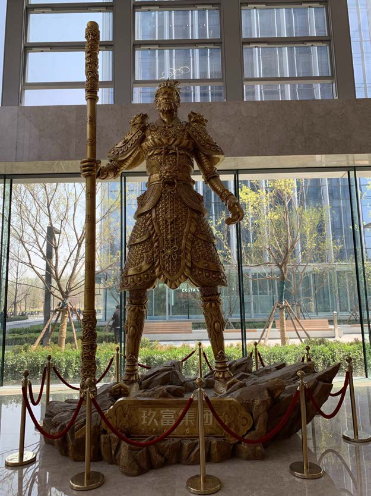

*2019-04-04 17:35 · 饭斯基*

---

### 1418

看 NBA 的人都懂，垃圾话(Trash Talking)也是球员的技能之一。算不算基本功不好说。

*2019-04-04 11:28 · 手机上网*

---

### 1419

海伦走了进来，她的美丽令老人们肃然起敬。转@ 王兴 海伦走了进来，她的美丽使老人们肃然起敬。

*2019-04-04 11:02 · 手机上网 转自王兴*

---

### 1420

转@ 小熊娃娃 古代没有计算机的时候手排星盘也太费劲了，印度还必看倍律盘……我斗胆猜一下，中国古代数学不发达很大一个原因是算命的时候用不到，模拟宇宙模型的时候用象法就够了……

*2019-04-04 09:34 · 手机上网 转自小熊娃娃*

---

### 1421

张三：时间会改变一切。少年：包括这句话吗？

*2019-04-03 20:19 · 手机上网*

---

### 1422

海伦走了进来，她的美丽使老人们肃然起敬。

*2019-04-03 19:39 · 手机上网*

---

### 1423

这版单向历的字体和排版太糙了。我忍不住每次都要抱怨一下。

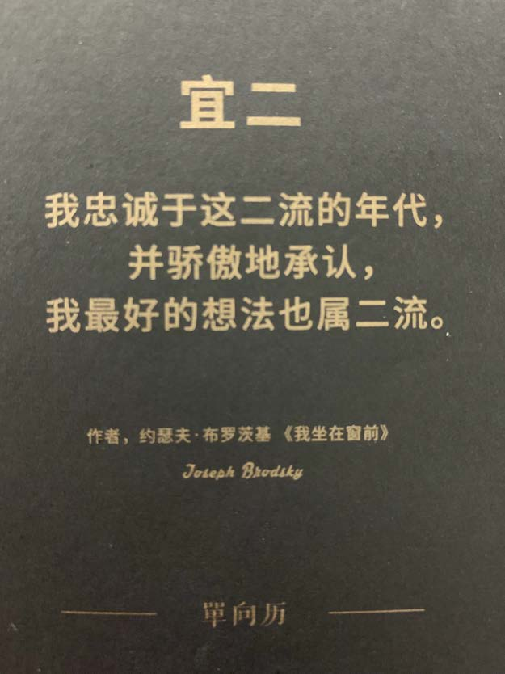

*2019-04-03 19:31 · 饭斯基*

---

### 1424

转@ 阳升 一个领域为什么老有跨界成功的案例？因为界画错了呗。

*2019-04-03 17:57 · 网页 转自阳升*

---

### 1425

接下来几年，看拼多多的黄峥和淘宝/天猫的蒋凡这两个都非常聪明的人较量，应该会很精彩。蒋凡要是能赢这一仗，那就是当之无愧的阿里 CEO 接班人，如果他有兴趣干的话。

*2019-04-03 17:50 · 网页*

---

### 1426

VNOS

*2019-04-03 10:40 · 手机上网*

---

### 1427

春天是捂不住的。

*2019-04-03 07:54 · 手机上网*

---

### 1428

转@ 胡泳 《虚构与想象》：我们最好还是抛弃那种将现实与虚构二者对立起来的旧观点，以一种“三元合一”（a tried）的观点来代替二元对立的理论。我们所说的“三元”是指现实、虚构和想象。

*2019-04-02 12:52 · 手机上网 转自胡泳*

---

### 1429

高老师说文革时他在清华，无线电系刚毕业，因为喊「打倒XXX，YYY万岁」这句口号时喊错人名顺序而被隔离审查两个月，自杀未遂，随后发配到黑龙江勃利县呆了四年。看我似乎不太明白勃利是个什么苦难地方，他补充：宋徽宗宋钦宗被金人掳走后就是关押在隔壁的依兰县，最后死在那里…

*2019-04-01 22:48 · 手机上网*

---

### 1430

转@ 带三个表 钱穆十岁时，体操老师钱伯圭问他：“听说你能读《三国演义》?”钱穆答：“读过。”钱伯圭说：“这种书以后不要再读。此书一开首就有天下合久必分，分久必合，一治一乱之类的话，这是中国历史走错了路，故有此态。如今欧洲英法各国，合了便不再分，治了便不再乱，以后应该向他们学习。

*2019-04-01 21:27 · 手机上网 转自带三个表*

---

### 1431

在我的家乡福建龙岩，有些树是春天落叶，而不是秋天落叶。

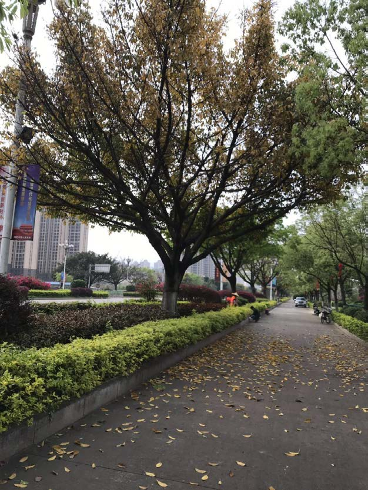

*2019-04-01 15:37 · 饭斯基*

---

### 1432

我读本科时有幸在清华（以及隔壁的北大）听过不少大牛的讲座，包括诺奖得主、国家政要、商界巨头等，其中对我影响最大的是2000年前后哈贝马斯那次来访。在清华法学院，讲堂挤得水泄不通，但我挤进去了。我从中学到一个重要道理：不要浪费时间去听那些你根本不懂的东西，不管对方名声多大。

*2019-04-01 14:14 · 网页*

---

### 1433

英文名叫 Sumitomo Mitsui Financial Group，中文名却叫「三井住友金融集团」，三井和住友的顺序颠倒了一下。这里有什么典故吗？

*2019-04-01 13:59 · 网页*

---

### 1434

G-SIFI

*2019-04-01 13:43 · 网页*

---

### 1435

这消息还是挺劲爆的：贝索斯的安全顾问查出沙特窃取了贝索斯手机

里的私人信息。不同领域里的狠角色终于跨界杠上了。

*2019-04-01 01:25 · 手机上网*

---

### 1436

我错了。我不应该在不确定这条朋友圈里提到的「黄片」是不是一种茶时打开百度搜这个词…

*2019-04-01 00:24 · 饭斯基*

---

### 1437

ACM 的最高奖是图灵奖。IEEE 有个对应的冯诺依曼奖章，但是知名度小好多。

*2019-03-31 20:28 · 手机上网*

---

### 1438

我的导师说他的导师一生培养了28个博士，而他自己一生培养了30个博士，没拿到博士学位的学生就更多了，我是其中之一。

*2019-03-31 16:36 · 手机上网*

---

### 1439

一万个钟理论。

*2019-03-31 10:48 · 手机上网*

---

### 1440

在来北京读大学之前，我没有出过福建省。在去美国读研究生之前，我也没有出过国。是家里的书、学校图书馆的书、市图书馆的书、同学们借给我的书、爸爸奶奶订的报纸杂志、电脑以及互联网让我看到了更大的世界。

*2019-03-30 20:27 · 网页*

---

### 1441

94年六任，平均每任15.7年。我回国创业也超过15年了。这么一想，好像也很正常。转@ 王兴 故宫博物院成立于1925年，至今只有六任院长。

*2019-03-30 20:23 · 网页 转自王兴*

---

### 1442

是改革开放的40年改变了大到国家民族小到我个人的命运。转@ 王兴严格说来，我原本连小镇青年都算不上，而是一个村民。1979年2月出

生时，我在行政区划上隶属于福建省龙岩地区龙岩县曹溪乡水塘村。

曹溪乡的中心不是我们村，而是曹溪村。后来，曹溪乡变成了曹溪镇；再后来，龙岩县变成了龙岩市

*2019-03-30 20:16 · 网页 转自王兴*

---

### 1443

严格说来，我原本连小镇青年都算不上，而是一个村民。1979年2月出生时，我在行政区划上隶属于福建省龙岩地区龙岩县曹溪乡水塘村。

曹溪乡的中心不是我们村，而是曹溪村。后来，曹溪乡变成了曹溪镇；再后来，龙岩县变成了县级龙岩市；再后来，撤消龙岩地区设龙岩（地级）市，县级龙岩市改为新罗区。

*2019-03-30 20:14 · 网页*

---

### 1444

知我者谓我心忧，不知我者谓我何求。-《诗经 · 王风 · 黍离》

*2019-03-30 19:52 · 网页*

---

### 1445

转@ 王兴 今年是俄国十月革命100周年。据说在发动革命的前一天晚上，革命者们都很焦虑，列宁忍不住问「托洛斯基同志，明天如果不成功，我们怎么办？」「列宁同志，我考虑的是，明天如果成功了，我们怎么办？」

*2019-03-30 19:36 · 手机上网 转自王兴*

---

### 1446

去年五一去约旦时在尼波山（传说中摩西最后遥望迦南地的地方）顶上偶遇的英国投资人昨天突然出现在我办公室。本来我是约了另一个人，没想到他也混着一起来了。

*2019-03-30 19:07 · 手机上网*

---

### 1447

艺术是用来帮你理解生活的，也是用来帮你忍受生活。

*2019-03-30 18:49 · 手机上网*

---

### 1448

大小悬殊的两种蓝莓。

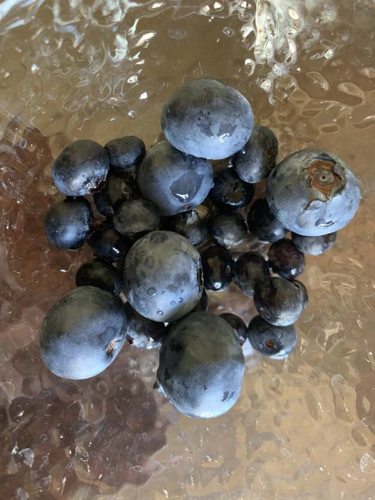

*2019-03-30 18:40 · 饭斯基*

---

### 1449

桃花又开了，今年白驼山的沙尘暴大吗？

*2019-03-30 12:13 · 手机上网*

---

### 1450

好长的反射弧。转@ 黄宾 @ 东东枪 大概十年前了，参加了你组织的“小朋友聊天会”，铅笔社李老师分享了对毒品开放会抑制需求的看法。那时我颇觉新奇，半信半疑。后来又听了茅于轼老师关于经济适用房不装厕所抑制腐败的建言。想了这些年，我觉的，他们说的都还是些善良的糊涂话吧。

*2019-03-30 12:05 · 手机上网 转自黄宾*

---

### 1451

转@ 洋鸟消夏录 带我认识过电影之真之美的作者，在她离世的这天我在拍电影，这胜过我能献上的任何悼念。

*2019-03-30 10:05 · 手机上网 转自洋鸟消夏录*

---

### 1452

会画画的人是不是有更强的 vision 能力？

*2019-03-30 09:28 · 手机上网*

---

### 1453

词玩年。

*2019-03-29 21:26 · 手机上网*

---

### 1454

「保守主义」是一个非常难以厘清的概念。

*2019-03-29 21:13 · 手机上网*

---

### 1455

Intellectual Playboy.

*2019-03-29 11:50 · 手机上网*

---

### 1456

这张华为锁屏照片让我联想到《静静的顿河》。

*2019-03-28 16:31 · 饭斯基*

---

### 1457

一条拉链的品质好不好，拉起来的手感当然很重要，发出的声音也应该考虑进去。

*2019-03-28 16:06 · 手机上网*

---

### 1458

目无全牛。

*2019-03-28 10:38 · 手机上网*

---

### 1459

把中国和世界的关系理解成中外关系是我一向不认可的世界观。转@王兴 两种世界观。

*2019-03-28 09:03 · 手机上网 转自王兴*

---

### 1460

中文里竟然没有一个字代表「世界」。中国和美国的关系可以简称中美关系，中国和俄罗斯的关系可以简称中俄关系，但是中国和世界的关系如何简称？

*2019-03-28 08:45 · 手机上网*

---

### 1461

转@ 宝宝vs坦克 CEO生快。26岁的时候你就感叹过了，还说人家乔布斯26岁都有私生子了，所以，你就继续，给世界输出一个你定义你的人生吧转@ 左潇 “我再也不是神童了”—《钢铁侠》Elon Musk30岁的生日感言 。 我想此刻感谢30年来从未敢懈怠过的自己，让我看到未来无限

*2019-03-27 22:51 · 手机上网 转自左潇*

---

### 1462

转@ 王兴 You have achieved excellence as a leader whenpeople will follow you everywhere if only out of curiosity. 鲍威尔对领导力的这个解读真牛。

*2019-03-27 07:33 · 手机上网 转自王兴*

---

### 1463

问：30年之后，或者说，2046之后，香港会朝什么方向发展？答：首先，我认为港币会继续存在…

*2019-03-26 23:10 · 手机上网*

---

### 1464

遇到一个专业词汇：屠体。

*2019-03-25 17:41 · 手机上网*

---

### 1465

叶公好龙或许是个笑话，屠龙之技可不是。

*2019-03-24 13:59 · 手机上网*

---

### 1466

哦，我不知道这小伙也用过饭否。转@ 阿瓦 现在的饭否上还能找到李诞的账号吗？

*2019-03-24 13:07 · 手机上网 转自阿瓦*

---

### 1467

小到企业，大到经济，都是人财事的组合。所以，人口流动、资本流动、产业转移都和外汇汇率长期相关。

*2019-03-24 13:03 · 手机上网*

---

### 1468

终于搞明白了，去哪儿先后出来了两拨人，一拨做了环球悦旅会，另一拨做了旅悦集团。难怪我之前老是旅悦/悦旅记不清:(

*2019-03-24 12:53 · 手机上网*

---

### 1469

1865年南北战争结束后美国经济开始蓬勃发展。1911年美国最高法院判决洛克菲勒于1870年创办的标准石油公司违反反托拉斯法，勒令拆分为34家公司。其间一共46年。

*2019-03-23 23:28 · 手机上网*

---

### 1470

看到一张名片的英文那面写着 Ambassador，中文这面则是「特命全权大使」。

*2019-03-23 19:55 · 手机上网*

---

### 1471

「时代楷模」这个词用得很精准。

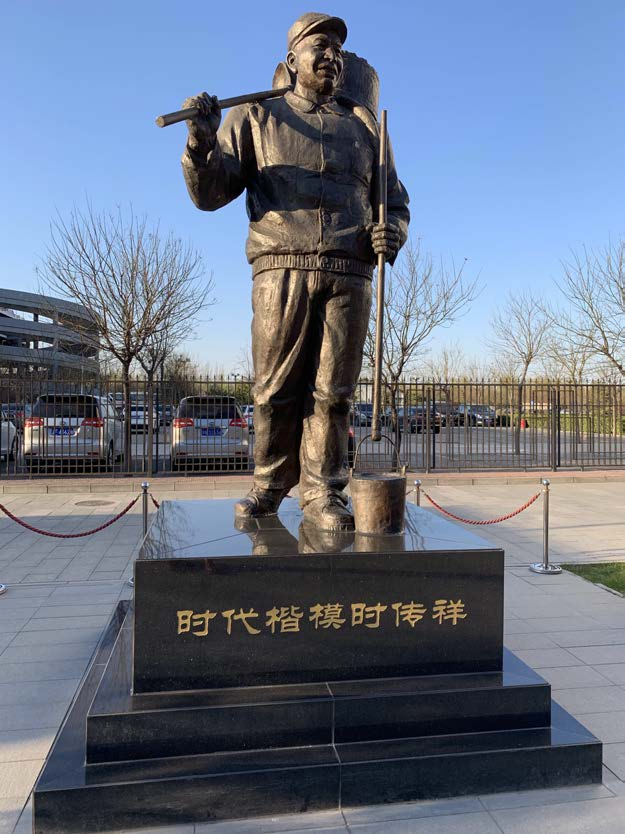

*2019-03-23 17:21 · 饭斯基*

---

### 1472

安永的全球总部在伦敦，在印度的员工最多。

*2019-03-23 09:22 · 手机上网*

---

### 1473

终于把买了有一年的 HomePod 接上电了。

*2019-03-22 22:20 · 手机上网*

---

### 1474

转@ peter 使我有洛阳负郭田二顷，吾岂能佩六国相印乎？转@ 王兴我猜，但凡有选择，多数女人并不希望成为女强人；不仅如此，但凡有选择，多数男人也并不希望成为所谓强人。

*2019-03-22 21:11 · 手机上网 转自王兴*

---

### 1475

在洗手间墙上看到天都峰，想起了2000年夏天我和室友在黄山的疯狂举动。

*2019-03-22 21:07 · 饭斯基*

---

### 1476

每见一次陈先生，对他的敬佩就多一分。转@ 王兴 七年前陈老先生说的这句话确实让我印象深刻，时不时想起。转@ 王兴 Respect isearned, not demanded.

*2019-03-22 21:03 · 手机上网 转自王兴*

---

### 1477

故宫博物院成立于1925年，至今只有六任院长。

*2019-03-22 19:33 · 手机上网*

---

### 1478

你最近一次运动是什么时候？连续狂打呵欠狂伸懒腰算吗？

*2019-03-22 18:04 · 手机上网*

---

### 1479

《奉献》的歌词里奉献的对象依次是爱人、朋友、小孩、爹娘，没有主或祖国。

*2019-03-22 17:58 · 手机上网*

---

### 1480

《奉献》我最早是小时候听苏芮的版本，所以当这首歌在《飞驰人生》接近片尾时作为主题曲响起，我觉得特别亲切。不知道比我和韩寒年轻一辈的人听这首歌是什么感觉。这歌很适合 Joan Baez 用那种充满浩然正气的嗓音唱出来。

*2019-03-22 17:44 · 手机上网*

---

### 1481

我猜，但凡有选择，多数女人并不希望成为女强人；不仅如此，但凡有选择，多数男人也并不希望成为所谓强人。

*2019-03-22 17:18 · 手机上网*

---

### 1482

在时间轴上弹钢琴。

*2019-03-22 12:34 · 手机上网*

---

### 1483

What do you sell? Words.

*2019-03-21 19:51 · 手机上网*

---

### 1484

令人震惊的是，visionary 这个概念竟然没有一个简洁的中文翻译。也许和中国没有相应的宗教传统有关系。

*2019-03-21 16:49 · 手机上网*

---

### 1485

用一个12年没联系过的手机号加了一个人的微信。

*2019-03-21 15:13 · 手机上网*

---

### 1486

Come on. 转@ 王兴 超喜欢这张照片。

*2019-03-21 11:21 · 手机上网 转自王兴*

---

### 1487

转@ 胡泳 MIT从创立之初就拒绝接受美国大学对外授予“荣誉学位”的传统，并坚持至今，成为美国仅有的两所拒绝这一传统的大学，另一所是弗吉尼亚大学。这一传统是罗杰斯任教时订立的。“随便授予荣誉学位是对知识和学习最大的嘲讽和无意义的跟风。”罗杰斯说。

*2019-03-20 23:30 · 手机上网 转自胡泳*

---

### 1488

Relentless or irrelevant, sooner or later.

*2019-03-20 15:29 · 手机上网*

---

### 1489

中国互联网行业已经有好几个「百亿战场」（每年要烧掉超过一百亿人民币），目测短期还不会出现「千亿战场」。

*2019-03-20 15:26 · 手机上网*

---

### 1490

如果把 spirit 改为更常见的 soul，一下子就没有那种浪的感觉了。转@ 王兴 I love your body and your spirit and your clothes. 这么平静而风流的歌词只有科恩写得出来。

*2019-03-20 15:16 · 手机上网 转自王兴*

---

### 1491

我以前只知道奔驰宝马针对的市场算是 premium 而非 luxury，今天被一个专家教育了，说法拉利也是如此。

*2019-03-20 13:23 · 手机上网*

---

### 1492

I love your body and your spirit and your clothes. 这么平静而风流的歌词只有科恩写得出来。

*2019-03-20 09:56 · 手机上网*

---

### 1493

即使同是江湖上名声很大的投资人，相互之间格局大小的差别还是巨大的。就像同是诺贝尔物理奖得主，段位也可以差很多级。

*2019-03-20 09:46 · 手机上网*

---

### 1494

第三波。

*2019-03-19 20:15 · 手机上网*

---

### 1495

隐形护城河。

*2019-03-19 12:17 · 手机上网*

---

### 1496

波士顿婆罗门。

*2019-03-19 00:41 · 手机上网*

---

### 1497

这个世界不应该如现在这样有两百多个独立国家，因为根本不可能找出两百个能胜任货币发行的团队。

*2019-03-18 22:25 · 手机上网*

---

### 1498

《西伯利亚理发师》这部电影的野心就是想拍出这种特别的气质吧。

只能算部分成功。转@ 胡泳 丘特切夫：理智无法了解俄罗斯，普遍的尺度难以丈量；她有一种特别的气质——对于俄罗斯你只有信仰。

*2019-03-18 14:45 · 手机上网 转自胡泳*

---

### 1499

我觉得，在商业里，conviction 这个词可以翻译为「定见」。

*2019-03-18 13:35 · 手机上网*

---

### 1500

好莱坞既是风向标，也是追星族。几十年下来，好莱坞电影里的热门异国街景从曾经的东京换到最近十来年的香港再到现在《阿丽塔》里的印度都市。

*2019-03-17 13:33 · 手机上网*

---

### 1501

《阿丽塔》里的服饰和街景设计真是令我叹为观止。前无古人。

*2019-03-17 12:38 · 手机上网*

---

### 1502

绝大多数人既低估了稳定的货币供应的重要性（高于稳定的电力供应，仅次于稳定的空气供应），也低估了保持稳定的货币供应的难度，尤其是在一个快速发展的经济体里。

*2019-03-17 12:20 · 手机上网*

---

### 1503

人们渴望秩序，所以美元屹立不倒。

*2019-03-17 11:48 · 手机上网*

---

### 1504

第一次碰到有投资人跟我说：我前几年之所以没有投你，就是因为你是福建人，我在之前的投资生涯里被福建人骗过两次，而且他们还都是看起来特别诚恳的那种…

*2019-03-16 19:19 · 手机上网*

---

### 1505

大把省份到不了，不说东北了，连云南都不行。转@ 弥城 地图上看湖北去国内任何省份理论上都最多只需要穿越两个省，果然九省通衢……

*2019-03-16 12:00 · 手机上网 转自弥城*

---

### 1506

每个人内心深处都渴望被点燃。

*2019-03-15 23:31 · 手机上网*

---

### 1507

凯恩斯飞龙在天。

*2019-03-15 12:52 · 手机上网*

---

### 1508

昨晚梦得好辛苦。

*2019-03-15 08:17 · 手机上网*

---

### 1509

是的，例如那个先锋戏剧《等待戈多》的名字里到底是「戈多」还是「多戈」，对我来说很难记，但是英文名 Godot 就好记很多。转@阳升 外国的人名，应当直接记忆外文名。音译的中文名字没有意义。

*2019-03-14 16:33 · 手机上网 转自阳升*

---

### 1510

转@ 文静王 有时候，发自内心的想揪住一个人的衣领，用近乎亲吻的距离问一问，为什么。

*2019-03-13 23:20 · 手机上网 转自文静王*

---

### 1511

不知道是这个版本有点特别还是 Weezer 的《Buddy Holly》就是这样，歌一开头就从高潮切入，没有任何预热，蛮少见的。

*2019-03-13 21:36 · 饭斯基*

---

### 1512

转：1928年，为纪念孙中山先生逝世三周年，国民政府举行了植树仪式，并将其逝世的那天，即3月12日定为植树节。1979年，在邓小平的提议下，第五届全国人大常委会第六次会议决定将每年3月12日设定为我国的植树节。

*2019-03-13 17:21 · 手机上网*

---

### 1513

钱和集装箱在原理上有共通之处。

*2019-03-12 23:04 · 手机上网*

---

### 1514

转@ OwlofMinerva 现有的汽车减排策略都增加了油耗 并大大缩减了发动机寿命。 从全局来看并非最优选择，但是这个道理无法向公众解释。

*2019-03-12 22:24 · 手机上网 转自OwlofMinerva*

---

### 1515

Knowing the game and willing to play.

*2019-03-11 23:40 · 手机上网*

---

### 1516

空客A380比波音737大这么多，真是不比不知道。

*2019-03-11 00:55 · 手机上网*

---

### 1517

青花郎自来熟的贴着茅台打「中国两大酱香白酒之一」的广告，虽然有点占茅台便宜之嫌，但估计还是有效的。但是，在青花郎的视频广告之后紧接着再来一个红花郎的广告，这就彻底把我搞晕了，对品牌塑造绝对是弊大于利。

*2019-03-10 11:30 · 手机上网*

---

### 1518

跟一个前辈吃饭，他问我老家哪里，我答「福建龙岩」，他说：哦，我知道那里。四十年前我在中山大学读书时去龙岩考察过。你们龙岩人不错，吃苦耐劳。

*2019-03-09 14:34 · 手机上网*

---

### 1519

这幅故宫不错。

*2019-03-09 10:53 · 饭斯基*

---

### 1520

AI 和 IoT 都是好东西大东西，但 AIoT 强行把两个热词拼起来，总让我觉得是个山寨感很强逻辑性很差的英文缩写。

*2019-03-08 15:32 · 手机上网*

---

### 1521

在 EMS 电子专业制造服务领域，除了大名鼎鼎的富士康，还有两家大公司，名字出奇的相似，一家叫伟创力（Flextronics，后来名字简化为 Flex 了），另一家叫纬创 Wistron 。

*2019-03-08 09:54 · 手机上网*

---

### 1522

不懈

*2019-03-08 09:44 · 手机上网*

---

### 1523

听说康德的《纯粹理性批判》现在的中译本已经不错了。

*2019-03-07 21:32 · 手机上网*

---

### 1524

在宣布起诉美国政府违宪之羁，华为这个宣传的配图还是很讲究的：罗马万神殿光柱里的一只和平鸽。这确实是「生死看淡，不服就干」。

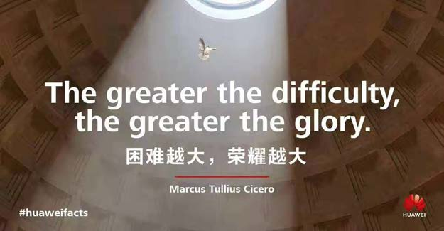

*2019-03-07 14:06 · 饭斯基*

---

### 1525

沈炜生于72年。转@ 王兴 OPPO 的陈明永也是1969年生的；vivo 的沈炜没查到，网上有说法是稍微年轻一点，但应该也差不多，毕竟1995年段永平离开小霸王去创办步步高时带走的几个人中就既有陈明永也有沈炜了。转@ 王兴 华为手机的负责人余承东和雷军同年，都是1969年出生的。

*2019-03-06 18:56 · 手机上网 转自王兴*

---

### 1526

广州是一座比北京更历史悠久的城市。

*2019-03-06 16:31 · 手机上网*

---

### 1527

你可以和历史拉锯，但时间川流不息。

*2019-03-06 14:04 · 手机上网*

---

### 1528

转@ Meng.Z 转@ 单向历 3月6日，宜生机。

*2019-03-06 13:36 · 手机上网 转自单向历*

---

### 1529

OPPO 的陈明永也是1969年生的；vivo 的沈炜没查到，网上有说法是稍微年轻一点，但应该也差不多，毕竟1995年段永平离开小霸王去创办步步高时带走的几个人中就既有陈明永也有沈炜了。转@ 王兴 华为手机的负责人余承东和雷军同年，都是1969年出生的。

*2019-03-06 13:14 · 手机上网 转自王兴*

---

### 1530

既要善于坚持，也要敢于胜利。

*2019-03-06 11:58 · 手机上网*

---

### 1531

微光

*2019-03-06 00:00 · 手机上网*

---

### 1532

转@ 徐梧 Under pressure,you don’t rise to the occasion,you sink

to the level of your training.That’s why we train so hard.

*2019-03-04 17:58 · 手机上网 转自徐梧*

---

### 1533

不知不觉中，美团上线已经9年了。最近一年重新理解、更加理解「要做有积累的事」了。Eat Better, Live Better 这个使命很难，但是值得长期努力。

*2019-03-04 13:22 · 手机上网*

---

### 1534

@ webto 那个先例我听过，但我觉得差了四五百年的不是一回事。我好奇的是，在哥伦布之前几十年里有其他人尝试过吗？

*2019-03-03 17:30 · 手机上网 给webto的回复*

---

### 1535

在向西航行以寻找新航线这件事上，哥伦布是第一个成功的人，但他是第一个尝试的人吗？在他之前，有人尝试过但是最终失败了吗？

*2019-03-03 17:12 · 手机上网*

---

### 1536

我小时候，信息比现在匮乏得多，一本书就可以给我的世界带来不小的影响，一盒磁带和一张唱片也是如此。如果那时候我有机会见到一流的画作、演出或建筑，或许我的人生又会不同。

*2019-03-03 13:57 · 手机上网*

---

### 1537

越来越觉得说「三」观是一种懒于思考的表现。取决于哲学偏好的差异，说「一」观或者「二」观，我觉得都还能接受。转@ 王兴 这两天开始思考一个问题，三观是不是本质上只有一观，即世界观？

*2019-03-03 13:38 · 手机上网 转自王兴*

---

### 1538

公元751年，唐朝军队在中亚的怛罗斯与一路向东的阿拉伯军队发生遭遇战，唐军战败。四年后，粟特人安禄山发动了安史之乱。

*2019-03-03 12:50 · 手机上网*

---

### 1539

转@ 胡泳 伍启元：“中国总逃不出‘模仿’的工作。例如张君劢不过想做中国的柏格森，胡适不过想做中国的杜威……”道出了中国近代思想界随西而动，以西方观念为武器相互竞争的特点。

*2019-03-02 21:08 · 手机上网 转自胡泳*

---

### 1540

时间的形状。

*2019-03-02 08:28 · 手机上网*

---

### 1541

转@ 胡泳 赫拉克利特说：“无人能两次涉过同一条河。”而怀特海更是进一步指出：“无一思考者能两次思考（同一物）。”

*2019-03-01 22:33 · 手机上网 转自胡泳*

---

### 1542

venture decisions.

*2019-03-01 22:31 · 手机上网*

---

### 1543

锚

*2019-03-01 18:53 · 手机上网*

---

### 1544

转：2018年首都国际机场旅客吞吐量首次突破1亿人次，成为中国第一个年旅客吞吐量过亿人次的机场，也是继美国亚特兰大机场后，全球第二个年旅客量吞吐量过亿人次的机场。

*2019-02-28 21:42 · 手机上网*

---

### 1545

今年这本单向历的字体和排版水平有点低于预期。

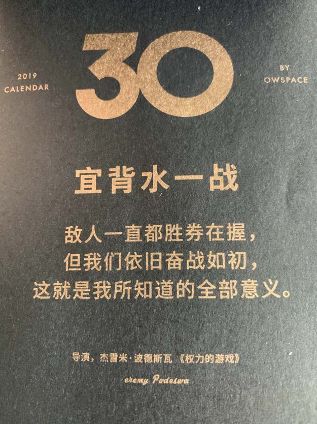

*2019-02-28 15:27 · 饭斯基*

---

### 1546

Never be too cerebral to celebrate.

*2019-02-27 12:18 · 手机上网*

---

### 1547

昨天晚饭时另一个同事的科普也差点惊翻整桌人：三文鱼肉是红色的

是因为野生三文鱼吃了很多野生磷虾之类的天然食物，现在市面上多数三文鱼是人工饲养的，肉本来应该是灰白色的，饲养者特意在饲料里添加专门的成分来使饲养的三文鱼肉色呈现类似野生三文鱼那样的红色…

*2019-02-27 12:05 · 手机上网*

---

### 1548

晚饭时被同事的科普惊到了：帝王蟹严格来说不是一种螃蟹，螃蟹有八条腿，帝王蟹只有六条腿。

*2019-02-26 19:19 · 手机上网*

---

### 1549

稍微琢磨了一下 hindsight, insight, foresight, vision 这四个词，尤其是后两者的关系。

*2019-02-26 01:22 · 手机上网*

---

### 1550

一种很不好但还挺常见的状态是「心虚但却不虚心」。

*2019-02-24 22:27 · 手机上网*

---

### 1551

不经博弈，难有共识。

*2019-02-24 10:32 · 手机上网*

---

### 1552

罗马不是一天建成的，得两周。中国房地产商两周时间开发的房产面积相当于罗马整个城市。

*2019-02-23 10:18 · 手机上网*

---

### 1553

美国的精英教育还是比较注重公平和多元化的。斯坦福至今每年招的新生里还有30%是家族里第一代大学生。

*2019-02-22 12:50 · 手机上网*

---

### 1554

当我们仰望星空的时候，每一分每一秒，都有大量的星星在经历过亿万年的生命后正在永久的熄灭。

*2019-02-21 21:03 · 手机上网*

---

### 1555

今天北京这天，走在户外，真的觉得要开春了。

*2019-02-21 09:54 · 手机上网*

---

### 1556

转：视觉艺术心理学家鲁道夫·阿恩海姆曾谈到：“光线，几乎是人的感观所能得到的一种最辉煌、最壮观的经验。”

*2019-02-20 20:40 · 手机上网*

---

### 1557

截至2018年12月，世界石油生产国中排名第一的是美国，第二是俄罗斯，第三才是沙特。

*2019-02-20 11:33 · 手机上网*

---

### 1558

转：1979年2月19日，广播里出现了一个新词：「万元户」，当时《人民日报》报道广东中山的黄新文时发明了这个词，它很快成为新闻中的高频词。

*2019-02-19 07:45 · 手机上网*

---

### 1559

Code, as in Hammurabi's Code.

*2019-02-18 17:36 · 手机上网*

---

### 1560

差点忘了五年前的今天我转发过欧盟之父的这句话:( 转@ 王兴"Nothing is possible without man, nothing is lasting withoutinstitution" -Jean Monnet

*2019-02-18 15:59 · 手机上网 转自王兴*

---

### 1561

生日，与其说是一种人体现象，不如说是一种天体现象。

*2019-02-18 15:53 · 手机上网*

---

### 1562

institution, constitution, prostitution.

*2019-02-18 14:28 · 手机上网*

---

### 1563

转@ 禅茶一味9527 讨论岳不群，不要忽略了他完美符合这两点，甚至超过东方不败。转@ 王兴 真的「极度渴望成功」的人其实并不多，符合后半句「愿付非凡代价」的就更少了。

*2019-02-18 14:27 · 手机上网 转自王兴*

---

### 1564

转@ 饭而不否 当年的革命、改革能成功，就是组织起了这部分人。

转@ 王兴 真的「极度渴望成功」的人其实并不多，符合后半句「愿付非凡代价」的就更少了。

*2019-02-18 12:17 · 手机上网 转自王兴*

---

### 1565

真的「极度渴望成功」的人其实并不多，符合后半句「愿付非凡代价」的就更少了。

*2019-02-18 11:30 · 手机上网*

---

### 1566

未来的历史

*2019-02-16 10:59 · 手机上网*

---

### 1567

我和胡老师过去五年大概互相邀约了超过十次始终没对上时间，今天终于见成了。

*2019-02-15 22:51 · 手机上网*

---

### 1568

三百年前苏格兰人 Andrew Fletcher 就说了：Let me make thesongs of a nation, and I care not who makes its laws.

*2019-02-15 00:28 · 手机上网*

---

### 1569

看完出来，不知怎的想起：世味年来薄似纱，谁令骑马客京华… 素衣莫起风尘叹，犹及清明可到家。转@ 王兴 我觉得《新喜剧之王》还不错，是一部体现时代精神的作品。可惜那个时代已经过去了…

*2019-02-13 23:30 · 手机上网 转自王兴*

---

### 1570

我觉得《新喜剧之王》还不错，是一部体现时代精神的作品。可惜那个时代已经过去了…

*2019-02-13 23:20 · 手机上网*

---

### 1571

misinformation vs. disinformation

*2019-02-13 16:34 · 手机上网*

---

### 1572

smartphone.

*2019-02-13 11:44 · 手机上网*

---

### 1573

Fascism, Nazism, Hitlerism.

*2019-02-11 17:06 · 手机上网*

---

### 1574

转@ OwlofMinerva 文化依附只是经济依附的表象， 经济弱 社科弱

*2019-02-11 12:47 · 手机上网 转自OwlofMinerva*

---

### 1575

转@ Bing每日壁紙 一只参加威斯敏斯特犬业俱乐部狗展的可蒙犬，纽约 (© Mike Segar/Reuters)

*2019-02-11 12:45 · 手机上网 转自Bing每日壁紙*

---

### 1576

爸爸说我的家乡福建省龙岩市新罗区的人均 GDP 接近1.6万美元。

*2019-02-10 16:12 · 手机上网*

---

### 1577

我读过《射雕英雄传》，但是完全不记得里面讲到郭靖参与攻克撒马尔罕城:( 或许是因为那时我对中亚历史几乎一无所知，所以对地名不

敏感。

*2019-02-10 00:43 · 手机上网*

---

### 1578

1848

*2019-02-10 00:28 · 手机上网*

---

### 1579

爸爸说他大约五十个初中同班同学中有七八个已经过世。

*2019-02-08 13:48 · 手机上网*

---

### 1580

看了一下2017年的统计数据，美国家庭年收入（包括工资收入和投资收益等）的中位数是$61,822；达到43.4万美元就进入全美 top 1%了，这对硅谷运气好一点的双职工家庭来说并不是太难。

*2019-02-07 00:59 · 手机上网*

---

### 1581

转@ 徐梧 今天看了流浪地球，想起三年前和郭帆导演的交流，他说拍中国科幻片，最难的不是技术问题，首先是语境问题，同样一只飞碟，掉到美国，大家觉得没问题，掉到中国，大家就会觉得很怪异，这个问题得认真考虑。我半信半疑，那会儿他的前一个作品还是《同桌的你》…

*2019-02-06 22:06 · 手机上网 转自徐梧*

---

### 1582

没想到 EF 英孚教育是一家瑞典公司。

*2019-02-06 16:21 · 手机上网*

---

### 1583

《疯狂的外星人》这部电影我是一定会去看的，因为我有幸在三年多前有一次跟宁浩吃饭时听他绘声绘色的讲过这部片的构思。宁浩很有才华，我很有兴趣看看一个好构思最后落地成什么样。

*2019-02-05 17:18 · 手机上网*

---

### 1584

大疆的产品确实在不停进步。

*2019-02-05 09:13 · 手机上网*

---

### 1585

注意到日常汉语中似乎有个小小的不精确的地方：如果 borrower 对应「借款人」，lender 对应「贷款人」，那么口语中说的「缺钱了，我要去申请一笔贷款」其实应该是「我要去申请一笔借款」。

*2019-02-03 16:41 · 网页*

---

### 1586

hopelessly wishful.

*2019-02-03 14:55 · 手机上网*

---

### 1587

终于知道段永平系的手机品牌为什么都是四字英文字母：OPPO,vivo。因为没法更简单更极致了，中国法律规定少于四个字母的英文无法申请商标保护，例如 NBA。

*2019-02-03 14:50 · 手机上网*

---

### 1588

转@ 反作用力 毛主席去安源 转@ 铁果铁锤 上学时候一个老师给我们看了一张毛的画，画里毛的手里拿了一把旧伞，让我们记一把旧伞=1893。 转@ 王兴 转@ Cocojamboo 28岁时我党成立，又过28年成立，又陪伴 28年去世~转@ 王兴 我以前一直记不住毛泽

*2019-02-03 12:28 · 手机上网 转自王兴*

---

### 1589

转@ Cocojamboo 28岁时我党成立，又过28年 成立，又陪伴28年去世~转@ 王兴 我以前一直记不住毛泽东生于1893年，直到后来搞明白了：1911年辛亥革命爆发时，毛泽东正好18岁。

*2019-02-02 22:15 · 手机上网 转自王兴*

---

### 1590

AT 之间本来就不存在教皇子午线。

*2019-02-02 16:07 · 手机上网*

---

### 1591

《事情正在起变化》原来是1957年5月毛泽东发起反右运动时写的一篇文章的标题，现在成了自媒体标题党很爱用的套路。毛主席不愧是语言大师。

*2019-02-02 15:50 · 手机上网*

---

### 1592

更准确的说是没有正确区分 investment banker 和 investor 这俩概念。转@ 王兴 我意识到许多人，包括大量财经记者，似乎并不明白「投资银行」和「投资公司」这两个概念之间的区别。

*2019-02-02 14:00 · 手机上网 转自王兴*

---

### 1593

我意识到许多人，包括大量财经记者，似乎并不明白「投资银行」和「投资公司」这两个概念之间的区别。

*2019-02-02 13:11 · 手机上网*

---

### 1594

好像日语里把公司挂牌上市叫做「上场」。

*2019-02-02 13:01 · 手机上网*

---

### 1595

开复老师新出版的《AI Superpowers: China, Silicon Valley, and theNew World Order》在国外真是大火。我最近碰到的几乎每个老外都主动跟我提起这本书。

*2019-02-02 00:35 · 手机上网*

---

### 1596

我的 iPhone 怎么会把「仿佛」打成「彷佛」… 转@ 王兴 在车里听歌听到《Someone Like You》时，我喜欢特意把音量调大，彷佛Adele 就在我耳边大吼。

*2019-02-01 20:50 · 手机上网 转自王兴*

---

### 1597

在车里听歌听到《Someone Like You》时，我喜欢特意把音量调大，彷佛 Adele 就在我耳边大吼。

*2019-02-01 20:45 · 手机上网*

---

### 1598

转@ 大黄同学NEO @ 王兴 当年奔4时代Intel陷入超长流水线和高频低能的误区。被amd按在地上摩擦。就是以色列实验室，拿出了14级流水线的酷睿方案，打了翻身仗。

*2019-02-01 20:32 · 手机上网 转自大黄同学NEO*

---

### 1599

接触到一个新概念「抖M」，这是英文日文中文结合的产物。

*2019-02-01 10:24 · 手机上网*

---

### 1600

连《一无所有》都没有。

*2019-01-31 12:05 · 手机上网*

---

### 1601

转：去年戊戌，今年务实。

*2019-01-31 11:46 · 手机上网*

---

### 1602

英特尔竟然在以色列有1.3万名员工。这国家总共还不到900万人。

*2019-01-30 14:37 · 手机上网*

---

### 1603

香港扎钢筋的建筑工人现在日薪3000港币。是的，日薪。

*2019-01-30 00:28 · 手机上网*

---

### 1604

一个脑洞很大的朋友说，你不觉得华为的 logo 就是任正非的「非」

字吗？

*2019-01-29 19:13 · 饭斯基*

---

### 1605

占山为王，立地成佛。

*2019-01-29 15:01 · 手机上网*

---

### 1606

网络小说里有写「迁都乌鲁木齐」这种题材的吗？

*2019-01-28 13:39 · 手机上网*

---

### 1607

「常识」这个概念可能来自于英文 common sense，但是从英文字面意思来看，也有一点「共识」的味道。

*2019-01-28 11:43 · 手机上网*

---

### 1608

F.I.A.S.C.O.

*2019-01-27 23:18 · 手机上网*

---

### 1609

亚里士多德的定义：A tragedy is the story of a good man with aflaw that comes to an unjustified bad end.

*2019-01-26 16:04 · 手机上网*

---

### 1610

感受时代的脉搏。试图预判心肌梗塞。

*2019-01-26 15:57 · 手机上网*

---

### 1611

「弓」确实是个象形字。

*2019-01-26 15:55 · 手机上网*

---

### 1612

数字化和数据化。

*2019-01-26 14:46 · 手机上网*

---

### 1613

世界和宇宙这两个词本来都是由一个表示时间的字和一个表示空间的字组成的，后来不知怎的就变成主要仅指空间了。转@ webto 「时空」真是一个很好的表述。

*2019-01-26 14:44 · 手机上网 转自webto*

---

### 1614

男足主教练、证监会主席、央视春晚总导演据说是中国最难做的三个工作，可以用人力资源的杨三角理论分析一下。

*2019-01-26 14:26 · 手机上网*

---

### 1615

请一个现在管着几百亿美元、立志将来要管超过一万亿美元、证明中国人不输犹太人的朋友在望京凯悦酒店的藏悦中餐厅吃了个简单的午饭，用了美团的优惠，人均168元。结完账从餐厅门口走到酒店门口那几十米路上，路过的三个服务员都跟我微笑问好，最后门童边拉开大门边跟我说「你好，王总」。什么情况！

*2019-01-26 13:24 · 饭斯基*

---

### 1616

戈兰高地的红酒，是以色列的朋友送的，不是叙利亚的朋友送的。

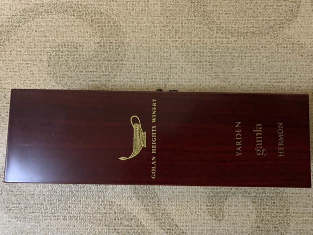

*2019-01-26 09:11 · 饭斯基*

---

### 1617

你可以失去各种东西，但你无法失去未来，因为你并不拥有它。

*2019-01-25 10:27 · 手机上网*

---

### 1618

道生一，一生二，「二生三」，三生万物。

*2019-01-25 01:04 · 手机上网*

---

### 1619

崩盘和泡沫是金融创新不可避免的结果。不仅是在美国，在全球任何国家都是如此。我们所能做的就是为这些泡沫和崩盘做好准备，以尽可能减少它们带来的危害。-罗闻全

*2019-01-24 17:07 · 手机上网*

---

### 1620

满手都是汗。

*2019-01-24 16:17 · 手机上网*

---

### 1621

头条/抖音抓住了 facebook 干了而腾讯没干和谷歌干了而百度没干的机会。

*2019-01-24 13:00 · 手机上网*

---

### 1622

生活中不可忍受的部分。

*2019-01-24 00:04 · 手机上网*

---

### 1623

南昌可能是存在感最低的省会城市。我感觉只有南宁有一拼。

*2019-01-23 17:12 · 手机上网*

---

### 1624

据 Sensor Tower 商店情报统计，2018 年全年，全球移动用户在App Store 和 Google Play 的 App 和游戏上花费了 713 亿美元，主要用于应用内购买、订阅以及付费 App 的购买。相较于 2017 年的581 亿美元同比增长 22.7％。

*2019-01-23 10:38 · 手机上网*

---

### 1625

又在听肖斯塔科维奇的《第二圆舞曲》。

*2019-01-23 02:28 · 手机上网*

---

### 1626

再次想起。转@ 王兴 时隔多年，夜深人静，再悟「真传一句话，假传万卷书」。谢程兄。

*2019-01-22 14:11 · 手机上网 转自王兴*

---

### 1627

从1950到1980年，中国人口虽然从5.4亿增长到了9.8亿，但这个增长幅度却是同期主要发展中国家中最慢的。在1950年全球人口最多的30个国家里，除了阿根廷，其他所有发展中国家同期人口增长都快于中国。而中国这期间的增长很大程度上还是得益于人均寿命从40岁增长到66岁。-黄文政

*2019-01-22 09:11 · 手机上网*

---

### 1628

人不能太贪心。

*2019-01-21 18:31 · 手机上网*

---

### 1629

管理学里的彼得原理不但适用于公司也适用于政府:(

*2019-01-18 13:20 · 手机上网*

---

### 1630

一转眼就快到能说「30年前我读过一本书…」的年纪了-_-!

*2019-01-17 19:02 · 手机上网*

---

### 1631

@ 观棋不语杨森僧 多谢反馈！我们在努力改进。

*2019-01-17 01:30 · 手机上网 给观棋不语杨森僧的回复*

---

### 1632

昨天之后，人们对创业的人或许会多一份同情。

*2019-01-16 16:40 · 手机上网*

---

### 1633

又大又持久

*2019-01-15 19:48 · 手机上网*

---

### 1634

手机是个有巨大带动作用的行业。汽车被称为「民用工业之王」，手机就算还没有完全取而代之，也至少已经是「民用电子工业之王」

了。

*2019-01-14 22:02 · 手机上网*

---

### 1635

嗯，5G 主要不是给手机用的。转@ webto 今年下半年开始，所有手机厂商会空前一致的告诉你5G是个好东西，手机一定要有。其实没有也不会怎么样，2021年再用也不算晚。

*2019-01-14 20:20 · 手机上网 转自webto*

---

### 1636

以前一直低估了「男怕入错行」这句老话。

*2019-01-13 22:57 · 手机上网*

---

### 1637

中国性 Chineseness

*2019-01-12 20:48 · 手机上网*

---

### 1638

美国总统分两种：以往住的房子比白宫更大的，以往住的房子比白宫更小的。

*2019-01-12 17:14 · 手机上网*

---

### 1639

谢谢。转@ 莉莎酱 不是，星巴克特别爱投放社交媒体。 转@ 王兴星巴克在中国是不是从来没做过什么广告？

*2019-01-12 15:17 · 手机上网 转自王兴*

---

### 1640

星巴克在中国是不是从来没做过什么广告？

*2019-01-12 15:06 · 手机上网*

---

### 1641

很想今年去一次新疆。

*2019-01-12 00:12 · 手机上网*

---

### 1642

这个观点有意思。这可能是比马克思论述的资本主义会导致周期性经济危机还要更长周期的一个问题。转@ OwlofMinerva 生育率大幅下降 是一个典型的 “资本过渡剥削导致社会总需求不足” 问题。 资本主义总是愿意出卖自己的绞索

*2019-01-11 15:16 · 手机上网 转自OwlofMinerva*

---

### 1643

「百时美施贵宝」这么长的名字竟然是美国制药公司 Bristol-MyersSquibb 的正式中文名。

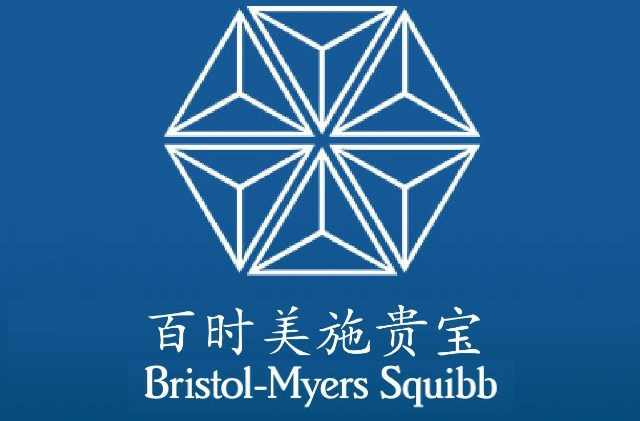

*2019-01-11 10:48 · 手机上网*

---

### 1644

北宋婉约派词人柳永竟然是福建人。

*2019-01-10 18:50 · 手机上网*

---

### 1645

深圳老了之后会是什么样？

*2019-01-10 17:17 · iPhone版*

---

### 1646

转@ 路上有惊慌 我有个朋友在看守所呆过八个月，他原本一直是学霸，到了看守所发现整个衡量体系变了，变成谁犯的罪重谁是老大，罪犯们会暗中打听并炫耀自己的罪行，贩毒最多的人令人肃然起敬，公车小偷位于罪犯底层……

*2019-01-10 14:30 · 手机上网 转自路上有惊慌*

---

### 1647

问一个还比较懂行的朋友，全球范围内长期来看自动驾驶你最看好哪家公司？答：三五年内哪家都没戏，长期来看，如果一定要挑一家公司，我选华为…

*2019-01-10 14:24 · 手机上网*

---

### 1648

一个朋友解释为什么可口可乐是个伟大的品牌：可口可乐以非常低廉的价格提供了这个类别里最好的产品。身价数百亿的巴菲特跟普通人喝的是一样的可乐，并不存在什么精品可乐、高端可乐。相比之下，巴菲特喝的红酒估计就不一般了。

*2019-01-10 09:53 · 手机上网*

---

### 1649

business connoisseur.

*2019-01-10 00:54 · 手机上网*

---

### 1650

喜茶的「多肉葡萄」非常棒！

*2019-01-09 21:08 · 手机上网*

---

### 1651

"娣卞湷娆㈣繋鎮

*2019-01-09 13:45 · 手机上网*

---

### 1652

又开了一整天述职会，激辩中话题有时会从工作发散到华为 vs 亚马逊，中国 vs 美国，等等。一个同事说他听说新东方早年开会时经常发散到苏格拉底（柏拉图？）vs 黑格尔，顿时觉得我们还是段位太低了…

*2019-01-08 00:10 · 手机上网*

---

### 1653

中国白酒也玩这种很玄的描述。

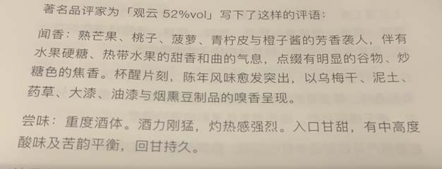

*2019-01-06 00:13 · 饭斯基*

---

### 1654

碎钞机。

*2019-01-05 12:34 · 手机上网*

---

### 1655

我一直觉得「卑诗省」是个很有诗意的翻译，但一开始不知道怎么来的，后来才明白：British Columbia 缩写成 BC，BC 音译成「卑诗」。转@ 王兴 大陆通常把加拿大的 British Columbia 直译成「英属哥伦比亚」，香港那里则译成「卑诗省」。

*2019-01-04 22:54 · 手机上网 转自王兴*

---

### 1656

拉丁语在中国，到现在还买不到一本比较好的拉汉字典。拉丁语那么重要，那么多概念都从拉丁语中来的。中国人要查询一个单词，只有我编的比较小的那本词典，而在日本有四五本比较厚的、比较有分量的拉丁语日本辞典。中国在学习外语方面下的功夫远远不够，很多人没有办法读文献的原文。-雷立柏 Leeb

*2019-01-04 22:23 · 手机上网*

---

### 1657

我从来没有追求过桌面整洁，我只是希望桌上的书不要堆得高度超过我的下巴。

*2019-01-04 20:15 · 手机上网*

---

### 1658

民粹的基础是恐惧。

*2019-01-04 16:44 · 手机上网*

---

### 1659

转@ 陈不知 航天科技和航天科工差别很大的，科技是卫星火箭，科工是雷达导弹，来自前航天科技员工 转@ 王兴 百来家央企里，既有一家「中国化工集团有限公司」，又有一家「中国化学工程集团有限公司」；既有一家「中国航天科技集团有限公司」，又有一家「中国航天科工集团有限公司」…

*2019-01-03 10:26 · 手机上网 转自王兴*

---

### 1660

百来家央企里，既有一家「中国化工集团有限公司」，又有一家「中国化学工程集团有限公司」；既有一家「中国航天科技集团有限公司」，又有一家「中国航天科工集团有限公司」…

*2019-01-03 09:29 · 网页*

---

### 1661

全球政府和有自我意识的强人工智能，哪一个会先到来？

*2019-01-02 22:19 · 手机上网*

---

### 1662

转：中国是世界上最大的烟草消费和生产国。中国每年的烟草消费量相当于排名第2-29位的所有国家烟草消费量的总和。

*2019-01-02 20:24 · 手机上网*

---

### 1663

新年，换了一个新的同心杯用于在办公室喝茶。

*2019-01-02 14:44 · 手机上网*

---

### 1664

生活需要一点仪式感。

*2019-01-02 09:01 · 手机上网*

---

### 1665

命运感。

*2019-01-01 00:48 · 手机上网*

---

### 1666

外债也只是更大范围的分配问题。转@ 王兴 内债只是分配问题。

*2018-12-31 22:34 · 手机上网 转自王兴*

---

### 1667

哪个世界不是千疮百孔？

*2018-12-31 22:32 · 手机上网*

---

### 1668

今晚跟老爸聊天时我提及相关领域美国几十年前出的一本书里的框架，他听完饶有兴趣的问我这本书有没有中文译本，我一脸愕然：爸，这本书我是小时候在您的书架上翻到过，有了印象，后来才又读了英文版…

*2018-12-30 23:46 · 手机上网*

---

### 1669

老爸说七十年代末期茅台一瓶8块钱，那时临时工一个月赚大概20块，转正为二级工后每月赚37块。

*2018-12-30 23:32 · 手机上网*

---

### 1670

我认出风暴而激动如大海。-里尔克

*2018-12-29 16:16 · 手机上网*

---

### 1671

要有工匠精神，更要有科学精神。

*2018-12-29 10:53 · 手机上网*

---

### 1672

听朋友说，「妖」字的本义并不是妖魔鬼怪, 而是「妩媚的女子」。

「夭」是「人头不正」（也就是今天所说的歪着头卖萌）。「笑」的下面也有「夭」（像竹子左右摇摆一样的大笑）。

*2018-12-27 21:37 · 手机上网*

---

### 1673

转@ tihu 其实每天上班时，都能看见这城市里盘踞这两头洪荒巨兽，一头是霾兽，此刻正裹挟着冰雨和灰烬在窗外肆虐;另一头是灰犀牛，它正在缓慢而坚定地抬起头颅，那座刺破地平线的通天塔不过是它的犀角而已。

*2018-12-27 12:17 · 手机上网 转自tihu*

---

### 1674

restaurateur 餐馆老板

*2018-12-27 00:06 · 手机上网*

---

### 1675

准确的说，Radisson 是丽筠，Radisson Blu 才是丽笙。转@ March.

原来Radisson就是丽笙 转@ 王兴 形状傻兮兮的建筑并不是我国的专利。这家丽笙酒店位于德国法兰克福。不过现在这品牌算是上海国企锦江集团旗下了。

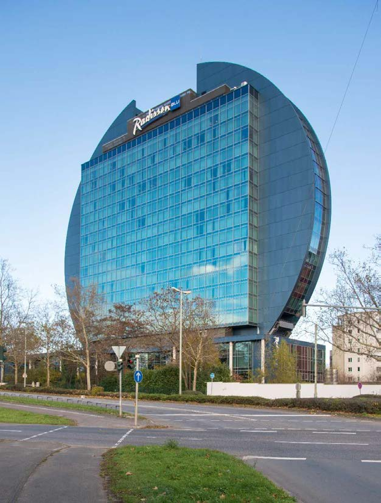

*2018-12-26 20:00 · 手机上网 转自王兴*

---

### 1676

形状傻兮兮的建筑并不是我国的专利。这家丽笙酒店位于德国法兰克福。不过现在这品牌算是上海国企锦江集团旗下了。

*2018-12-26 12:56 · 手机上网*

---

### 1677

State and Market.

*2018-12-26 10:09 · 手机上网*

---

### 1678

古罗马最持久的成就不在于通过空间上的征服而建立起环地中海的帝国，而在于时间上的征服——与基督教联手建立了公元纪年，定义了我们所使用的时间，使得今天成为2018年12月25日。

*2018-12-25 23:41 · 手机上网*

---

### 1679

法国不愧是有革命传统的国家。各国国歌里少有像《马赛曲》这样让人容易热血沸腾的。

*2018-12-24 21:04 · 手机上网*

---

### 1680

「先有鸡还是先有蛋」这个问题并不是那么无聊，如果把它理解为「到底是需求创造供给，还是供给创造需求」。

*2018-12-24 11:54 · 手机上网*

---

### 1681

退潮时可以去水边卖泳裤。

*2018-12-24 11:02 · 手机上网*

---

### 1682

1453年率军攻占君士坦丁堡、灭掉屹立千年的拜占庭帝国时，奥斯曼土耳其苏丹穆罕默德二世才21岁出头，也就是现在大学快毕业的年龄。

*2018-12-24 01:10 · 手机上网*

---

### 1683

或是海浪拍在沙滩上溅起的，泡沫。转@ 王兴 我们不是大海，我们连海浪都不是，我们只是海滩上被反复冲刷的一粒粒沙子。

*2018-12-24 00:02 · 手机上网 转自王兴*

---

### 1684

日剧《东京爱情故事》诞生于1991年，日本经济泡沫的顶点。

*2018-12-23 23:56 · 手机上网*

---

### 1685

据说 The Hyderabad Public School 有7个全尺寸足球场。国内连大学都没有这么好的设施吧。反正我知道清华没有。转@ 王兴 惊闻微软 CEO 纳德拉和（市值超过一千亿美元的）Adobe 现任 CEO 是同一个中学毕业的。那个印度中学出了六个美国上市公司 CEO

*2018-12-23 21:46 · 手机上网 转自王兴*

---

### 1686

我们不是大海，我们连海浪都不是，我们只是海滩上被反复冲刷的一粒粒沙子。

*2018-12-23 17:39 · 手机上网*

---

### 1687

这个世界有点老了。

*2018-12-23 12:32 · 手机上网*

---

### 1688

人类文明的下半场。

*2018-12-22 23:58 · 手机上网*

---

### 1689

突然觉得，如果在每一门主要语言方面都有一个以那门语言为母语且知识渊博且和我沟通顺畅的朋友，那将是多么幸福啊！

*2018-12-22 23:49 · 手机上网*

---

### 1690

“How about every minute”? 回想起来，这是 Michael Moritz 给我印象最深的一句话。

*2018-12-22 23:40 · 手机上网*

---

### 1691

techlash 是个由 tech + backlash 合成的新词，我觉得译成「科技后冲」比较合适。

*2018-12-22 23:33 · 手机上网*

---

### 1692

惊闻微软 CEO 纳德拉和（市值超过一千亿美元的）Adobe 现任CEO 是同一个中学毕业的。那个印度中学出了六个美国上市公司CEO。

*2018-12-22 23:16 · 手机上网*

---

### 1693

为了能够活得不太费力，我们选择了对生活中许多奇怪的事不加思考的接受。为什么一年分12个月，有的月有30天，有的月有31天，而且两者分布不太规律，还有的月一会儿28天一会儿29天？搞明白这些问题所需要的天文地理历史政治知识超过了99.9%的人愿意付出的努力。

*2018-12-22 15:54 · 手机上网*

---

### 1694

沙特和阿布扎比这两大金主都明确反对之后，孙正义是否依然有胆且有钱去重金押注 WeWork？这是对这位坂本龙马崇拜者的巨大考验。

拭目以待。

*2018-12-22 15:45 · 手机上网*

---

### 1695

分类很重要，分层更重要。

*2018-12-22 15:37 · 手机上网*

---

### 1696

完全自主研发原子弹应该确实是很难很难的。连海森堡这样的顶级物理学家都没能帮德国造出来。只有美国的曼哈顿计划是真的自己造出来了，后来苏联学美国，中国学苏联。

*2018-12-21 22:59 · 手机上网*

---

### 1697

Zappos创始人谢家华有个著名观点「对一个德扑常客来说，其实每天晚上做得最重要的决定不是出了哪张牌，而是你刚刚进场的时候选择坐哪张牌桌」。比这还更重要的一层是选择（或生在）哪个赌场，正如巴菲特的例子。

*2018-12-20 23:45 · 手机上网*

---

### 1698

如果要选互联网行业年度照片，我会推荐这张。

*2018-12-20 22:22 · 手机上网*

---

### 1699

转@ 洋鸟消夏录 为回避尴尬对话，走去大书柜里瞎抽一本书假装看。抽着一本《李清照全集》，看完发现原来她算上残章也就一共不到五十首词。

*2018-12-20 21:30 · 手机上网 转自洋鸟消夏录*

---

### 1700

又一轮科技革命之后，谁来写一本《A New Theory of Employment,Interest and Money》?

*2018-12-20 21:07 · 手机上网*

---

### 1701

经历过大萧条之后，凯恩斯在1936年出了一本名字霸气侧漏的书《就业、利息和货币通论》”The General Theory of Employment,Interest and Money”. 这名字简直跟牛顿的《自然科学的数学原理》

有一拼。

*2018-12-20 20:59 · 手机上网*

---

### 1702

很有可能，爱并不是被误解最多的概念，钱才是。一个无比古老的概念在不变的名字下已经被一次又一次刷新和堆叠。

*2018-12-20 20:49 · 手机上网*

---

### 1703

据冥想入定过的朋友说，有过那种体验才会更理解《道德经》里写的东西。

*2018-12-20 14:33 · 手机上网*

---

### 1704

转@ 愈之_之_之之 @ 王兴 于是抄着抄着一些概念就开始发生英美法系说法和大陆法系说法的混用，比如经常混用甚至被认为是两个不同法律的版权法和著作权法是同一个概念，只是前者引用英美，后者来自德国。转@ 王兴 转@ 沉隰 当年法学院的老师就说三流老师抄台

湾，二流老师抄日本，一流大佬直接抄德

*2018-12-19 19:28 · 手机上网 转自王兴*

---

### 1705

转@ 沉隰 当年法学院的老师就说三流老师抄台湾，二流老师抄日本，一流大佬直接抄德国，于是程序法的咖们发现民法德国化了，那我们就去抄美国吧，于是司法界总算开始讲程序正义了！ 转@ 王兴转@ 愈之_之_之之 更细节来讲，明治维新成功后一批国人赴日学习法律，后又积极介绍日本法律回来推动晚清

*2018-12-19 18:14 · 手机上网 转自王兴*

---

### 1706

转@ 愈之_之_之之 更细节来讲，明治维新成功后一批国人赴日学习法律，后又积极介绍日本法律回来推动晚清修律，而日本法律是从德国引进的。@ 王兴 律师朋友说：各国法律分英美普通法系和大陆法系，大陆法系又分偏左的法国派和偏右的德国派，中华民国的法律体系主要受德国影响，进而延续到中华人民共

*2018-12-19 17:38 · 手机上网 转自王兴*

---

### 1707

律师朋友说：各国法律分英美普通法系和大陆法系，大陆法系又分偏左的法国派和偏右的德国派，中华民国的法律体系主要受德国影响，进而延续到中华人民共和国的法律体系。

*2018-12-19 17:07 · 手机上网*

---

### 1708

同温层效应。

*2018-12-19 14:52 · 手机上网*

---

### 1709

任何一个国家的资源禀赋都不是全世界资源禀赋的等比缩微版，所以在这种意义上都是不平衡的。

*2018-12-19 10:05 · 手机上网*

---

### 1710

把习近平同志今天在庆祝改革开放40周年大会上的讲话全文读了一遍。

*2018-12-18 23:26 · 手机上网*

---

### 1711

摩尔老先生1965年提出摩尔定律，1968年创办英特尔。

*2018-12-18 21:54 · 手机上网*

---

### 1712

If the result is a trade war, treat it like other wars — fight towin.-Andy Grove, 2010

*2018-12-18 21:50 · 手机上网*

---

### 1713

「你去设计一款 CPU，然后把 Linux 移植过去」，我在清华电子系读大四下学期时，分配给我的本科毕设导师丢给我这个课题。

*2018-12-18 10:07 · 手机上网*

---

### 1714

转@ 饭而不否 名字，是最短的诗。

*2018-12-17 23:45 · 手机上网 转自饭而不否*

---

### 1715

折断了一支铅笔。

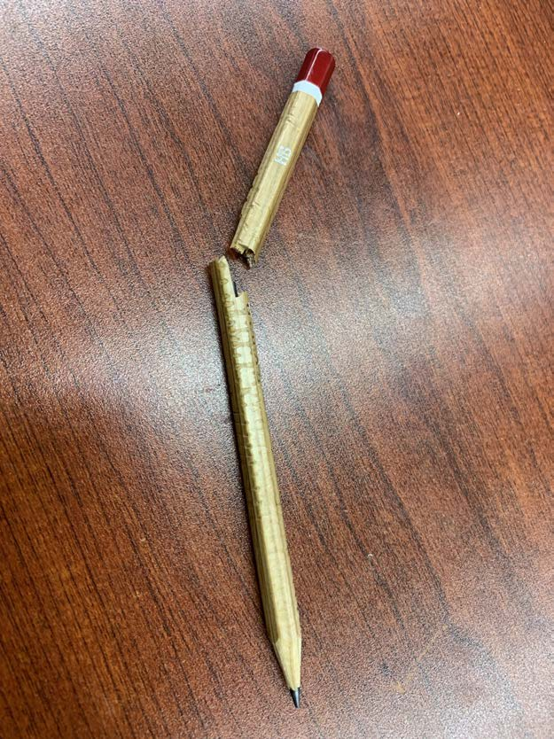

*2018-12-17 20:57 · 饭斯基*

---

### 1716

转@ 小熊娃娃 这个事为什么极其蠢呢……因为所有宗教的创始人，都没有说过自己是神：佛陀是觉者，佛教并不认为他是神；耶稣的神格地位是后来封的；老子也是很晚才变成太上老君；伊斯兰教里穆罕默德只是先知。凡是活人说自己是神或能和神沟通的，都是邪教骗子。

瞧瞧普及正经宗教知识多重要？神秘领域是

*2018-12-17 01:14 · 手机上网 转自小熊娃娃*

---

### 1717

行业、产业、工业对应同一个英文单词：industry.

*2018-12-16 17:13 · 手机上网*

---

### 1718

生活一去不复返。宜珍惜。

*2018-12-16 10:02 · 手机上网*

---

### 1719

Capital goes where it's welcome and stays where it's welltreated. —Walter Wriston

*2018-12-15 17:12 · 手机上网*

---

### 1720

英国最顶尖的大学被称为G5：牛津、剑桥、Imperial CollegeLondon（帝国理工学院）、The London School of Economics（伦敦政治经济学院）、University College London（伦敦大学学院）。

*2018-12-15 13:31 · 手机上网*

---

### 1721

内债只是分配问题。

*2018-12-15 09:08 · 手机上网*

---

### 1722

「烧钱」这个概念显然是纸币时代的残留。

*2018-12-14 21:57 · 手机上网*

---

### 1723

英国和美国各有一家名叫 Prudential 的保险公司，都很大，英国那家中文名叫「保诚」，美国那家叫「保德信」。

*2018-12-14 21:00 · 手机上网*

---

### 1724

@ 王蕊 难得你还有兴趣思考这个问题。我觉得最主要的原因是绝大多数人只加好友不删好友，好友多到一定程度就觉得杂乱了，于是慢慢就放弃了。

*2018-12-13 23:14 · 手机上网 给王蕊的回复*

---

### 1725

「赢」这么一个重要而常用的字，当年竟然没被简化掉。

*2018-12-13 15:10 · 手机上网*

---

### 1726

战争像是一种不禁止使用兴奋剂的体育比赛。

*2018-12-13 13:09 · 手机上网*

---

### 1727

我还没有经历过大风大浪。我说的是真的大海上比船还要高的那种浪。

*2018-12-12 22:52 · 手机上网*

---

### 1728

风险投资行业里，比普通合伙人 partner更高一级的头衔是managing partner，我认为译成「主管合伙人」比「管理合伙人」略好一点。

*2018-12-12 19:09 · 手机上网*

---

### 1729

满心欢喜，满腹惆怅，我们的老祖宗似乎认为不同部位管不同情绪。

*2018-12-12 19:06 · 手机上网*

---

### 1730

浙江那里竟然有一家很小很新的民营银行抢注到了「国民银行」这个名称。估计以前别人都不敢想吧。

*2018-12-12 16:39 · 手机上网*

---

### 1731

请不要把买不起新款 iPhone 称为「消费降级」。

*2018-12-12 12:49 · 手机上网*

---

### 1732

0007名叫香港金融集团，到这里就有个断崖式的下跌，市值只有38.4亿港币。

*2018-12-12 12:13 · 手机上网*

---

### 1733

港交所编号最靠前的股票：0001长和（原和记黄埔，李嘉诚旗下），0002中电控股（新鸿基郭家），0003香港中华煤气（李兆基旗下），0004九龙仓（包玉刚女婿吴光正执掌的地产），0005汇丰，0006电能实业（原香港电灯，李嘉诚旗下）。这些都历史悠久，市值大几百亿港币以上。

*2018-12-12 12:12 · 手机上网*

---

### 1734

阿布辛贝神庙深处的那一缕阳光。

*2018-12-12 10:24 · 手机上网*

---

### 1735

文明就是层层包装后的动物本能。好的文明对动物本能就跟治水一样，宜疏不宜堵。

*2018-12-11 23:46 · 手机上网*

---

### 1736

原来「中关村壹号」根本就不在中关村，而是在北京非常西北角的北清路那里。

*2018-12-11 21:05 · 饭斯基*

---

### 1737

合成生物学真是逆天啊。

*2018-12-11 15:14 · 手机上网*

---

### 1738

有些时候，一代人的问题只能等这代人老了死了才能解决。

*2018-12-11 13:33 · 手机上网*

---

### 1739

今年是改革开放四十周年，也是第一批互联网公司成立二十周年，这么来看，互联网确实不算很新了。

*2018-12-10 22:58 · 手机上网*

---

### 1740

什么？北京竟然都有鳄鱼养殖场？

*2018-12-10 21:48 · 手机上网*

---

### 1741

「度小满」是个蛮独特的名字。

*2018-12-10 15:14 · 手机上网*

---

### 1742

把 engine 译成「引擎」兼顾了音义，还不错。

*2018-12-10 13:19 · 手机上网*

---

### 1743

麦道夫这种庞氏骗局是几乎无解的，防不胜防，大概率每过几十年就会来那么一下。

*2018-12-10 13:11 · 手机上网*

---

### 1744

全世界用凯恩斯主义搞了几十年时间腾挪之后，逐步进入空间腾挪阶段了。

*2018-12-09 16:41 · 手机上网*

---

### 1745

我的朋友圈里有不少人转《刚刚，史上最大造假案曝光：金字塔竟是上世纪用混凝土浇出来的？！》这种乱七八糟的文章…

*2018-12-09 16:35 · 手机上网*

---

### 1746

当光谱变成了光环...

*2018-12-09 16:28 · 手机上网*

---

### 1747

有比较才有鉴别。贝雷帽远没有棒球帽那么简单省事。

*2018-12-09 14:20 · 手机上网*

---

### 1748

老马识途。转@ 王兴 小马过河。

*2018-12-09 13:10 · 手机上网 转自王兴*

---

### 1749

我还蛮喜欢马鞭草的香味。

*2018-12-08 23:48 · 手机上网*

---

### 1750

《少年去游荡》是许飞另一首还不错的歌，在《父亲写的散文诗》之外。

*2018-12-08 17:07 · 手机上网*

---

### 1751

喝了一杯同事送的巨甜的奶茶。

*2018-12-08 10:55 · 手机上网*

---

### 1752

今天是日本偷袭珍珠港的纪念日。当年日本人对着美国太平洋舰队的基地一顿狂轰滥炸，最后美国人一共损失了几艘军舰？两艘。航空母舰本来就不在港内，其他有些船虽然被击沉，但是很快就打捞起来修好继续用了。

*2018-12-07 22:19 · 手机上网*

---

### 1753

龙岩的「坑」比我印象中还更多。

*2018-12-07 21:55 · 饭斯基*

---

### 1754

「XX渡」确实是容易让人产生联想的地名，难怪金庸要用风陵渡。相比之下，「X坑」大概是我家乡龙岩那样的山坳里才会见到的地名。

*2018-12-07 21:42 · 手机上网*

---

### 1755

楼船夜雪瓜洲渡，铁马秋风大散关。

*2018-12-07 21:27 · 手机上网*

---

### 1756

我好像没在北京见过扶桑花。

*2018-12-07 18:27 · 手机上网*

---

### 1757

将近一年过去了，今天的天气又很适合穿切尔西靴子。现在我有了，而且今天穿了:) 转@ 王兴 这种天气真的很适合穿一双切尔西短靴，可惜我并没有。

*2018-12-07 16:15 · 手机上网 转自王兴*

---

### 1758

北极光创投的朋友说他们05年起步时和美国风投 NEA 交流很多，有次联谊，每个人要用三句话介绍自己。对面的老头说：1、我年轻时研究物理，得了个诺贝尔奖；2、后来我转行搞投资，创办了美国最大的风险投资公司 NEA；现在我七十多了，但还是全世界飞来飞去跟最酷的年轻人和公司打交道。

*2018-12-07 13:26 · 手机上网*

---

### 1759

阿根廷最南端的莫雷诺冰川

*2018-12-07 13:04 · 饭斯基*

---

### 1760

转@ 王兴 再三考虑之后，我觉得good这个词可以去掉。转@ 王兴Never waste a good recession. -Moritz

*2018-12-07 11:52 · 手机上网 转自王兴*

---

### 1761

还是城市化吧。

*2018-12-07 11:17 · 手机上网*

---

### 1762

把海洋视为坦途而非屏障大概是海洋文明跟大陆文明最大的区别。我常常想起一个朋友说的：帆船是这个世界上最浪漫最自由的交通工具。只要你掌握了帆船的操作方式，理论上你可以从这个港口出发，去往世界上任何沿海的地方。

*2018-12-06 20:43 · 手机上网*

---

### 1763

真的以人为本的话，经济里的消费和投资似乎不可分。

*2018-12-06 19:32 · 手机上网*

---

### 1764

凯恩斯主义可能确实是合法的能持续几十年的庞氏骗局。更长期来看呢？凯恩斯先生已经爽快的回答了：长期来看我们都是死人。

*2018-12-06 19:29 · 手机上网*

---

### 1765

讨论个人时，income 是「收入」；讨论公司时，income 是「利润」，revenue 才是「收入」。

*2018-12-06 19:25 · 手机上网*

---

### 1766

转@ 秋樱桃 一直有一个想法，天气预报的应用每天应该有一个提示：今天比昨天低多少度或高多少度

*2018-12-06 18:15 · 手机上网 转自秋樱桃*

---

### 1767

转@ 饭而不否 电商的格局难道真的变了？刚才在路边要快递小哥的电话，他问我是不是做微商的，而不是问我是不是做淘宝的。

*2018-12-06 17:06 · 手机上网 转自饭而不否*

---

### 1768

「站队」的英文翻译是 take sides，而且表达得更加残酷，站队可能还有多队，选边一般就是只有两边了。

*2018-12-06 16:53 · 手机上网*

---

### 1769

有点硌(gè)手。这个字我平时口头说过，但是好像从来没有写过或输入过。

*2018-12-06 16:28 · 手机上网*

---

### 1770

有的时候，不要太在乎一城一池，即使你只有一个城池。

*2018-12-06 16:02 · 手机上网*

---

### 1771

据说华为今年营收超过1000亿美元，将成为全球第三个达成这一成就的电子设备厂商。另外两个是苹果和三星。索尼好像没到过（刚查了一下，最近几年徘徊在700亿美元上下）。

*2018-12-06 15:10 · 手机上网*

---

### 1772

not young any more, still too simple, sometimes naive.

*2018-12-06 14:08 · 手机上网*

---

### 1773

其实也不远，成都往西一点，贡嘎山下就有海螺沟冰川。转@ 王兴我还没看过冰川。

*2018-12-05 23:29 · 手机上网 转自王兴*

---

### 1774

我还没看过冰川。

*2018-12-05 23:25 · 手机上网*

---

### 1775

转@ 刘志达 在燧发枪火帽枪时代，踢正步是为了配合排队枪毙阵型使用，因为武器射程和精度太差，只能靠队列排枪，金属定装弹出现，单兵卧倒才成为技能 转@ 王兴 卧倒是比踢正步更有实用价值的技能，对战士来说。

*2018-12-05 23:06 · 手机上网 转自王兴*

---

### 1776

「像阿里巴巴这样的独角兽企业」,和说这种话的人得换一种聊法。

*2018-12-05 13:46 · 手机上网*

---

### 1777

存在双赢的战争吗？

*2018-12-05 11:12 · 手机上网*

---

### 1778

卧倒是比踢正步更有实用价值的技能，对战士来说。

*2018-12-04 20:49 · 手机上网*

---

### 1779

-_-! 转@ gravity0 百年前的大流感，死亡人数超过一战。因当时各参战国直到战后仍没有放松媒体管制，只有中立国西班牙在大肆报道，让人感觉西班牙疫情特别严重。于是叫作“西班牙流感”。

*2018-12-04 19:41 · 手机上网 转自gravity0*

---

### 1780

「今天是第5个国家宪法日。宪法是国家的根本法。尊崇宪法、学习宪法、遵守宪法、维护宪法、运用宪法，是我们的共同责任！司法部、全国普法办」，移动版群发短信比联通版多了「学习宪法」这四个字。

*2018-12-04 12:58 · 手机上网*

---

### 1781

物理世界里几乎没有「彻底删除」。

*2018-12-04 01:43 · 手机上网*

---

### 1782

很多行业是高度稳定的，至少先发者有巨大的优势。现在全世界最大的两家酒店管理公司，万豪和希尔顿，都是在1929年大萧条之前成立的，已有接近百年历史。

*2018-12-03 15:33 · 手机上网*

---

### 1783

转：战争很容易开始，但是很难结束。

*2018-12-03 00:47 · 手机上网*

---

### 1784

不好意思，是我搞错了，那白色的一团团棉花不是植物学意义上的花，是棉花这种植物开完花后结出来的果实棉铃里面的棉籽上的长纤维。棉花于宋末元初从原产地印度和阿拉伯经海陆两路传入中国。转@ 王兴 经过花店时看到干花区里一株株棉花，我才想起来，棉花确实是花。

*2018-12-02 13:50 · 手机上网 转自王兴*

---

### 1785

四通一达几大民营快递里还是「圆通」这个名字最适合当法号。

*2018-12-02 13:22 · 手机上网*

---

### 1786

转@ piang 蔡康永已经老成赵忠祥了

*2018-12-02 12:14 · 手机上网 转自piang*

---

### 1787

有的概念像一颗钉子，有的概念像一把锯子。

*2018-12-02 10:37 · 手机上网*

---

### 1788

英语正在欧洲大陆变得越来越普及，尤其是在小国的大城市里。

*2018-12-02 10:06 · 手机上网*

---

### 1789

我去过的多数国家或城市的当地名菜确实不如北京烤鸭。

*2018-12-02 10:03 · 手机上网*

---

### 1790

G20 里有南非但没有尼日利亚，再过几年就越发不合理了吧。

*2018-12-02 09:51 · 手机上网*

---

### 1791

在澳洲土生土长的堂弟利用大三寒假来北京实习。他来了快一个星期，我终于回到北京跟他吃了一顿饭。

*2018-12-01 22:26 · 手机上网*

---

### 1792

终于暂时区分清楚段永基（四通集团董事长）和段永朝（财讯传媒集团首席战略官）了。

*2018-12-01 17:11 · 手机上网*

---

### 1793

拉宾诺维奇

*2018-12-01 17:04 · 手机上网*

---

### 1794

仔细想想「被动」这个词的字面意思，觉得蛮搞笑的。比英文 react还更被动。

*2018-12-01 16:44 · 手机上网*

---

### 1795

人活在历史中，历史也活在人身上。

*2018-12-01 16:38 · 手机上网*

---

### 1796

华为加荣耀今年能占到中国市场手机销量的30%，目标是接下来几年至少搞到40%。苹果的10%份额估计会基本稳定。

*2018-12-01 13:29 · 手机上网*

---

### 1797

在某种意义上，technology 是 gravity 的反义词。

*2018-12-01 12:49 · 手机上网*

---

### 1798

这么多年过去了，真功夫依然是我的机场快餐首选。

*2018-12-01 12:41 · 手机上网*

---

### 1799

为什么媒体还没有广泛使用 HAT （Huawei, Ali,Tencent）这样的称呼代替 BAT，科技企业已经各种跨界了，华为云是阿里云最有力的竞争对手，华为手机自带的安卓市场也是腾讯应用宝的强力对手。

*2018-12-01 12:04 · 手机上网*

---

### 1800

转@ 深圳阿当 华为园区的，还有冲之路，居里夫人路，隆平路，张衡路。转@ 王兴 深圳有条「稼先路」，应该是纪念两弹元勋邓稼先先生吧。

*2018-11-30 22:37 · 手机上网 转自王兴*

---

### 1801

深圳有条「稼先路」，应该是纪念两弹元勋邓稼先先生吧。

*2018-11-30 22:10 · 手机上网*

---

### 1802

华为手机的负责人余承东和雷军同年，都是1969年出生的。

*2018-11-30 18:05 · 手机上网*

---

### 1803

参观了华为高端手机的生产线。对华为的手机更有信心了。

*2018-11-30 17:45 · 手机上网*

---

### 1804

只能部分同意。不能忽视二战的影响。转@ 东东枪 “今年怎么死了那么多名人？”我猜，问一个十几岁的年轻人，人家是不会有这感受的。

那些人大多数他不认识，那些讣闻与悼念也传不到他的视野里。不是这一年的问题，就是你我老了，以后每一年可能都是这样了，到时候了。

*2018-11-30 13:30 · 手机上网 转自东东枪*

---

### 1805

李嘉诚正好比马云大一辈，李的长子李泽钜和马云都是1964年出生的。

*2018-11-30 13:17 · 手机上网*

---

### 1806

格瓦拉学跳广场舞

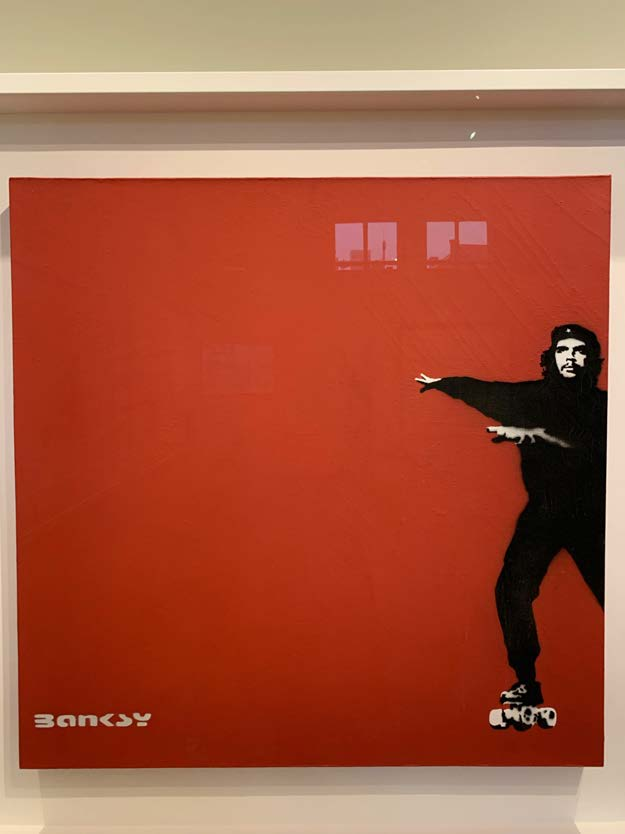

*2018-11-30 00:49 · 饭斯基*

---

### 1807

一阶惯性和二阶惯性。

*2018-11-29 18:19 · 手机上网*

---

### 1808

巴黎岛

*2018-11-28 22:53 · 手机上网*

---

### 1809

经过花店时看到干花区里一株株棉花，我才想起来，棉花确实是花。

*2018-11-28 01:14 · 手机上网*

---

### 1810

现在各行各业都科技了，FinTech, Food Tech, EdTech, AgTech...

*2018-11-27 19:05 · 手机上网*

---

### 1811

耶稣的外婆叫 Anne，外公叫 Joachim。

*2018-11-27 18:11 · 手机上网*

---

### 1812

成立于1902年总部位于英国伦敦的英美烟草集团（British AmericanTobacco,简称BAT)是世界上第二大的烟草上市企业。作为世界领先的国际性烟草企业，该集团的业务遍及全球180多个市场，在64个国家拥有80多家工厂，有24个烟叶种植项目以及21家烟叶复烤厂…

*2018-11-27 15:07 · 手机上网*

---

### 1813

英荷壳牌，英美烟草。

*2018-11-27 15:04 · 手机上网*

---

### 1814

「无党派人士」和「群众」还有区别。

*2018-11-26 23:47 · 手机上网*

---

### 1815

上头、上脑、上心

*2018-11-26 16:19 · 手机上网*

---

### 1816

共识是一个非常有趣的概念。

*2018-11-26 12:28 · 手机上网*

---

### 1817

转@ TurboPat 敢问从微信保存一张图到系统相册再打开淘宝就能打开商品链接是什么原理？ 转@ 王兴 转@ Thresh 我可以很负责任地说没这回事。转@ 王兴 转@ 饭而不否 淘宝的app妥妥地偷看用户相册了，我上周第一次去箭馆，拍了几张照片。淘宝现在就开始给我推荐起弓箭来了。

*2018-11-26 12:09 · 手机上网 转自饭而不否*

---

### 1818

转@ Thresh 我可以很负责任地说没这回事。转@ 王兴 转@ 饭而不否 淘宝的app妥妥地偷看用户相册了，我上周第一次去箭馆，拍了几张照片。淘宝现在就开始给我推荐起弓箭来了。

*2018-11-26 12:06 · 手机上网 转自饭而不否*

---

### 1819

把人民日报发的《关于改革开放杰出贡献拟表彰对象的公示》里的百人名单及简介读了一遍。

*2018-11-26 11:52 · 手机上网*

---

### 1820

A股、港股和美股有不同的价值观。

*2018-11-26 11:00 · 手机上网*

---

### 1821

转@ 饭而不否 淘宝的app妥妥地偷看用户相册了，我上周第一次去箭馆，拍了几张照片。淘宝现在就开始给我推荐起弓箭来了。

*2018-11-25 21:27 · 手机上网 转自饭而不否*

---

### 1822

好简洁，颇有古风。转@ 我不是女飛人 闽南语 “未放屎先呼狗” 一个意思 地道闽南俗语 转@ 王兴 听到一个东北俚语：你这属于，屎还没

拉出来，先把狗叫来了。

*2018-11-25 21:25 · 手机上网 转自王兴*

---

### 1823

四季的起名与“展现四季变幻之美”无关，只是创始人夏普的一位朋友觉得自己住过最好的酒店是慕尼黑的Vier Jahreszeiten酒店，德翻英刚好是Four Seasons. 转@ 王兴 我之前从没意识到。转@ 瑞秋Rachel四季的logo真的有四季哎

*2018-11-25 18:26 · 手机上网 转自瑞秋Rachel*

---

### 1824

不说别的，一个没excel的国家是竞争不过一个有excel的国家的。转@王兴 回头看，美苏冷战的胜负其实毫无悬念，我不能想象一个没有英特尔的国家能赢一个有英特尔的国家，当然，前提是双方都有大量坦克和核弹。从现在往未来看二三十年也一样，关键还是科技。

*2018-11-25 17:46 · 手机上网 转自王兴*

---

### 1825

那些很厉害的年轻人，和那些有很厉害背景的年轻人。

*2018-11-25 17:41 · 手机上网*

---

### 1826

听到一个东北俚语：你这属于，屎还没拉出来，先把狗叫来了。

*2018-11-25 15:03 · 手机上网*

---

### 1827

没文化真的不行啊。很多地方我去过，但是并没有看到那里最精华的部分，也没有真正理解:(

*2018-11-25 11:54 · 手机上网*

---

### 1828

原来这俩名字还有关系啊。转：（奥斯曼帝国皇帝）苏莱曼（Suleiman）是阿拉伯语“平定者”的英文表达，对应的英文名字恰恰是“所罗门” （Solomon)。

*2018-11-25 11:45 · 手机上网*

---

### 1829

转@ 王兴 回头看，美苏冷战的胜负其实毫无悬念，我不能想象一个没有英特尔的国家能赢一个有英特尔的国家，当然，前提是双方都有大量坦克和核弹。从现在往未来看二三十年也一样，关键还是科技。

*2018-11-24 23:45 · 手机上网 转自王兴*

---

### 1830

从1809年到1917年革命，芬兰都是沙俄帝国的一部分。

*2018-11-24 23:34 · 手机上网*

---

### 1831

刚意识到 Moleskin 这个笔记本牌子就是鼹鼠(mole)皮(skin)的连写。

我以往看过无数次，但愣是没跳出这个盲区-_-!

*2018-11-24 22:00 · 手机上网*

---

### 1832

如何看待义和团是一个三观问题。

*2018-11-24 21:18 · 手机上网*

---

### 1833

竟然有一本书叫《世界是椭圆的》，副题是“未来国际秩序展望”。

*2018-11-24 11:30 · 手机上网*

---

### 1834

第一次认真读 A 股上市公司年报。

*2018-11-24 11:03 · 手机上网*

---

### 1835

Unilever 这么一个英国荷兰双总部的公司把自己的中文名起成“联合利华”，真是厉害。

*2018-11-24 10:53 · 手机上网*

---

### 1836

@ 王蕊 你竟然冒泡了……

*2018-11-23 23:28 · 手机上网 给王蕊的回复*

---

### 1837

做新业务不等于创新。

*2018-11-23 19:52 · 手机上网*

---

### 1838

长链条业务更需要管理。转@ 王兴 最近看了一些东西，思考一些问题，越发觉得科斯真是天才的经济学家。最近几十年IT技术给社会带来的很多变化都可以用他的理论来分析。

*2018-11-23 10:31 · 手机上网 转自王兴*

---

### 1839

think in english.

*2018-11-22 23:59 · 手机上网*

---

### 1840

直营 vs 加盟；自营 vs Marketplace.

*2018-11-22 21:36 · 手机上网*

---

### 1841

快递桐庐帮的兴起是一个绝好的「天时、地利、人和」的商业案例。

*2018-11-22 18:53 · 手机上网*

---

### 1842

kide 这个英文单词为什么不存在？浪费了一个这么简短而又发音响亮的字母组合。

*2018-11-22 16:09 · 手机上网*

---

### 1843

Services are pending. 英文讣告里的常见说法。

*2018-11-22 14:55 · 手机上网*

---

### 1844

对过往成功的片面总结是非常有害的。

*2018-11-22 11:37 · 手机上网*

---

### 1845

well read, well traveled.

*2018-11-21 23:07 · 手机上网*

---

### 1846

「蠢」这个字为什么长这样？

*2018-11-21 19:21 · 手机上网*

---

### 1847

高仓健也是艺名，原名小田刚一。@ 王兴 好莱坞里，玛丽莲梦露这个最女性的名字和约翰韦恩这个最男性的名字都是凭空改出来的。

*2018-11-21 17:57 · 手机上网 转自王兴*

---

### 1848

我发现部分上海人民喜欢像港片里那样称呼自己为「X生」。北京好像没这习惯。

*2018-11-21 17:06 · 手机上网*

---

### 1849

土耳其竟然有一艘航空母舰。

*2018-11-21 14:56 · 手机上网*

---

### 1850

一出差就摩拜用得多了。

*2018-11-20 13:05 · 手机上网*

---

### 1851

ai/ei在拼音和英语里的发音正好相反，国人容易搞错。也就是说，英语里 ei 发「唉」ai 的音，例如 Calvin Klein；而英语里 ai 发「诶」ei 的音，如 daisy或 Baillie Gifford.

*2018-11-18 20:12 · 手机上网*

---

### 1852

惭愧，我刚刚才知道 bit 这个词是由 binary digit 两个词混合而成。

转@ 喆桑 投香农一票，第一个正式使用bit这个单位的人，信息科学的牛顿。转@ 王兴 图灵和香农谁更牛逼？

*2018-11-18 20:05 · 手机上网 转自王兴*

---

### 1853

转@ 嘉贺 Mountbatten Pink #997A8D 转@ 饭而不否 二战以前，粉色被认为是血液稀释的颜色，是男性的象征，英国有一个将军还给自己的舰队发明了专属粉色涂装，叫蒙巴顿粉 转@ 王兴 哦？这我倒是不知道。转@ 姜伯约 记得粉红色有一段历史时期是钢铁直男的颜色。转@ cin

*2018-11-18 18:43 · 手机上网 转自王兴*

---

### 1854

《比利林恩的中场战事》小说一开头有个细节让我印象深刻（不记得李安的电影里有没有表现）：小伙子因为在万里之外的伊拉克战场浴血奋战而被当做英雄送回国在感恩节的橄榄球大赛上亮相。他就出生在达拉斯以西八十英里的地方，但是他从小到大别说进过城里这个德州体育场，他连见都没见过。

*2018-11-18 18:41 · 手机上网*

---

### 1855

图灵和香农谁更牛逼？

*2018-11-18 18:15 · 手机上网*

---

### 1856

转@ 北新大苦茶 不完全是这样的，19世纪末20世纪初欧洲那边认为蓝色是最为女性的颜色，因为圣母玛利亚的衣着都是蓝色的，粉色是比较浅一点的红色，红色代表力量（男性），所以粉色代表男孩。后来广告商洗脑把颜色对调了@ 王兴 哦？这我倒是不知道。转@ 姜伯约 记得粉红色有一段历史时期是钢铁直

*2018-11-18 18:04 · 手机上网 转自北新大苦茶*

---

### 1857

据说宇宙在膨胀。每年百分之几？

*2018-11-18 17:56 · 手机上网*

---

### 1858

哦？这我倒是不知道。转@ 姜伯约 记得粉红色有一段历史时期是钢铁直男的颜色。转@ cineraria 可爱?我以为那种叫很骚… 转@ 王兴刚才看到一个男子穿着很接近肉色的浅粉红色袜子，这实在是有点超出我的接受范围了，我顶多只能接受男的穿那种很可爱的饱和度较高的粉红色袜子

*2018-11-18 17:30 · 手机上网 转自王兴*

---

### 1859

今年密集去世了一批文艺人士，但那批八九十岁的商业大亨都还很坚挺。

*2018-11-18 17:24 · 手机上网*

---

### 1860

刚才看到一个男子穿着很接近肉色的浅粉红色袜子，这实在是有点超出我的接受范围了，我顶多只能接受男的穿那种很可爱的饱和度较高的粉红色袜子。

*2018-11-18 17:11 · 手机上网*

---

### 1861

大前天，爸爸从龙岩来北京；前天，姐姐去重庆出差完回到北京；昨天，姐姐全家其他人从加州过来；今天，我出差离开北京。也许成年人的世界就是这样，聚散离合，聚少离多。

*2018-11-18 16:07 · 手机上网*

---

### 1862

喜欢波光粼粼的北京。

*2018-11-18 15:55 · 手机上网*

---

### 1863

做一家手机公司确实比做一家 PC 公司难，要求的组织能力高得多得多。

*2018-11-18 15:38 · 手机上网*

---

### 1864

说自己是一家科技公司仿佛很高大上，说自己是一家 IT 公司顿时就矮了一截，其实现在99.9%的所谓科技公司都没有 InformationTechnology 之外的任何 technology。

*2018-11-18 15:29 · 手机上网*

---

### 1865

不知怎的，开着会，突然想起来我很多很多年没玩过跳山羊了。

*2018-11-18 10:48 · 手机上网*

---

### 1866

李教授说，有人对计算机科学领域几大国际顶级会议的论文做了一个分析，发现当年的最佳论文和十年后回头看影响力最大的论文之间重合度很低。

*2018-11-17 21:40 · 手机上网*

---

### 1867

听说荷兰的公司法/证券法支持一种巧妙的设计：持股超过五年的股东的每股投票权是普通股东的五倍；持股超过十年的股东的每股投票权是普通股东的十倍。

*2018-11-17 14:07 · 手机上网*

---

### 1868

快手确实能感动人。

*2018-11-17 11:19 · 手机上网*

---

### 1869

转@ quux 千克要改为用普朗克常数定义了。因为我们相信普朗克常数是常数，所以千克可以认为不再是基本单位，而是被秒定义了。向自然单位制又走近了一步。上一步是1983年用秒和光速定义米。抛弃千克原器在理论上从来都不是问题，决定今天这一步的是技术进步造出了实用的设备

*2018-11-17 08:57 · 手机上网 转自quux*

---

### 1870

姐姐说韩国同事跟她讲二三十年前韩国半导体发展的关键时期里政府给了多大的支持，不但给三星等企业大量资金，而且给特殊政策：本来韩国男生都要服兵役，但是成绩好又愿意去干半导体的可以免服兵

役。

*2018-11-16 22:57 · 手机上网*

---

### 1871

01年我刚到美国时，同一批出国的有两个同济毕业的，他们聊天时提到，上海某座获得很多荣誉的跨黄浦江大桥其实并不是真的国内自己设计的，而是从加拿大找了座地质条件类似的桥的图纸，然后把用钢量加了一倍… 现在不会再有这种事了，咱们国家造桥修路的能力已经一流。十几年可以进步很多。

*2018-11-16 21:05 · 手机上网*

---

### 1872

腾讯云产事业群 CSIG

*2018-11-16 17:37 · 手机上网*

---

### 1873

努力争取双赢，但必须建立起在双输竞争中胜出的能力。

*2018-11-16 16:58 · 手机上网*

---

### 1874

什么能力最重要？快乐。

*2018-11-16 16:37 · 手机上网*

---

### 1875

如果知道80年后地球就会毁灭，你的生活会有什么变化吗？

*2018-11-16 16:36 · 手机上网*

---

### 1876

为什么我国没有像前苏联那样创作出大量社会主义段子？

*2018-11-16 16:35 · 手机上网*

---

### 1877

「汇率已经越来越成为一个纯金融现象」，这个论断有意思。

*2018-11-16 15:49 · 手机上网*

---

### 1878

转@ arche 携程和美团同时抢，美团最后都能刷到，携程就...呵呵，从没成功过转@ 王兴 转@ 阿拉丁神傘 美团抢票真的不错，最近几次包括春节十一都成功了。转@ 王兴 转@ 加了个薪 试过美团抢票，成功了。转@ 王兴 欢迎试试用美团抢票。我们负责高铁抢票的的同事号称他们做得业界领先。转@

*2018-11-16 15:47 · 手机上网 转自寒小梦*

---

### 1879

转@ 阿拉丁神傘 美团抢票真的不错，最近几次包括春节十一都成功了。转@ 王兴 转@ 加了个薪 试过美团抢票，成功了。转@ 王兴 欢迎试试用美团抢票。我们负责高铁抢票的的同事号称他们做得业界领先。转@ 寒小梦 分别用高铁管家和携程抢票，同样加10块钱，谁抢到以后就用谁。

*2018-11-16 15:30 · 手机上网 转自寒小梦*

---

### 1880

转@ 加了个薪 试过美团抢票，成功了。转@ 王兴 欢迎试试用美团抢

票。我们负责高铁抢票的的同事号称他们做得业界领先。转@ 寒小梦分别用高铁管家和携程抢票，同样加10块钱，谁抢到以后就用谁。

*2018-11-16 15:14 · 手机上网 转自寒小梦*

---

### 1881

欢迎试试用美团抢票。我们负责高铁抢票的的同事号称他们做得业界领先。转@ 寒小梦 分别用高铁管家和携程抢票，同样加10块钱，谁抢到以后就用谁。

*2018-11-16 15:11 · 手机上网 转自寒小梦*

---

### 1882

「钓鱼台」是我认为最适合做本土高端酒店的品牌，有文化有历史，名字也好听。可惜被拿去跟 MGM 美高梅合作了。这个合作伙伴选得有点奇怪，美高梅不算酒店里的一线吧。

*2018-11-16 12:37 · 手机上网*

---

### 1883

有人系统的研究过不同体育项目里运气在胜负中所占的比重吗？

*2018-11-16 12:29 · 手机上网*

---

### 1884

转@ 寒小梦 膳魔师千万别买天猫旗舰店的，原来买过一个那个橡皮胶的味道久久不能挥发。跟日本带回来的完全不能比，做工也很差，后面就退了，托朋友从日本带了一个象印回来。

*2018-11-16 12:19 · 手机上网 转自寒小梦*

---

### 1885

龙井确实不经放，现在喝就没春天那么鲜了。

*2018-11-16 12:16 · 手机上网*

---

### 1886

集体的耐心

*2018-11-16 09:19 · 手机上网*

---

### 1887

1988年是个大年。这年前后出生的人在大学毕业时正赶上智能手机的普及和移动互联网的兴起。

*2018-11-16 00:08 · 手机上网*

---

### 1888

历史上研发原子弹失败的好像都是炸不响，没听说过没控制好把自己炸死的。

*2018-11-15 21:23 · 手机上网*

---

### 1889

啊，澳洲不是最不讲究的吗？转@ szweig 我简直humble 转@ 中年洛璃空 我错了（

*2018-11-15 21:19 · 手机上网 转自中年洛璃空*

---

### 1890

产权表面上是人和物的关系，本质上是人和人的关系。

*2018-11-15 21:15 · 手机上网*

---

### 1891

重要而艰难的决定。

*2018-11-15 19:34 · 手机上网*

---

### 1892

和一个得过两次普利策奖的人胡侃了一个多小时。

*2018-11-15 19:25 · 手机上网*

---

### 1893

毛发还是很重要的。

*2018-11-15 19:21 · 手机上网*

---

### 1894

@ 寒小梦 因为多数人是右撇子，射击瞄准用右眼？

*2018-11-15 17:32 · 手机上网 给寒小梦的回复*

---

### 1895

挑战者红利

*2018-11-15 17:31 · 手机上网*

---

### 1896

两大自媒体平台（微信公众号和今日头条）都是2012年8月推出的。

*2018-11-15 16:56 · 手机上网*

---

### 1897

转@ 杜斌beta 框架注定是扭曲的，不完整的，需要被不断修正。

——索罗斯

*2018-11-15 16:43 · 手机上网 转自杜斌beta*

---

### 1898

转@ 杜斌beta 文化是偏见的集合。——索罗斯

*2018-11-15 16:43 · 手机上网 转自杜斌beta*

---

### 1899

胡志明（1890年生）竟然比毛泽东（1893年生）还大三岁。

*2018-11-15 12:48 · 手机上网*

---

### 1900

苏州河原本有个名字叫吴淞江。早年西方殖民者来了上海之后发现这条河可以通到当时的商业中心苏州，就叫它苏州河了。

*2018-11-15 10:55 · 手机上网*

---

### 1901

阿里昨晚收盘价$150.44，2014年9月上市时发行价是$68，四年多一点，2.2倍，算下来平均每年增值21.4%，刚好跑赢巴菲特几十年来的历史记录（据说是20%出头）。不容易啊，再往下就更难了，如果往未来十年看想保持这种增值速度就近乎不可能了。

*2018-11-15 10:17 · 手机上网*

---

### 1902

这个时代不但缺真正的诗人，连自以为是诗人的人都缺。

*2018-11-14 20:15 · 手机上网*

---

### 1903

当你把生活女神搞得筋疲力竭时，命运女神就快出场了。

*2018-11-14 19:01 · 手机上网*

---

### 1904

大市场 + 大变革

*2018-11-14 17:27 · 手机上网*

---

### 1905

简直是不知道怎么跟身在美帝的朋友聊天。我要不要拍一张窗外的景象发过去？

*2018-11-14 15:15 · 饭斯基*

---

### 1906

转@ 寒小梦 综合管理类公务员职级层次分为四等十二级：一级巡视员、二级巡视员、一级调研员、二级调研员、三级调研员、四级调研员、一级主任科员、二级主任科员、三级主任科员、四级主任科员、一级科员、二级科员。

*2018-11-14 12:56 · 手机上网 转自寒小梦*

---

### 1907

一个活着的人是可以承受近乎一切的。

*2018-11-13 18:39 · 手机上网*

---

### 1908

没有什么可以代替睡眠。

*2018-11-13 18:07 · 手机上网*

---

### 1909

乂 yì，有一个意思是「治理」。

*2018-11-13 15:26 · 手机上网*

---

### 1910

地狱是什么？我以为它是「由于不能再爱而受到的痛苦」。——陀思妥耶夫斯基《卡拉马佐夫兄弟》

*2018-11-13 15:01 · 手机上网*

---

### 1911

第一次世界大战是一个硬邦邦的存在，你可以从各种角度观察它。

*2018-11-13 12:58 · 手机上网*

---

### 1912

转：思=田+心。在古文字中，“思”字的上半部分并不是“田”，而是“囟”（xìn）。新生儿的头顶有一块软骨，就像一条缝一样，可以开合，被称之为“囟门”。在古代，很多字里用“囟”表示“大脑”，“脑”字的右边部分就是是“囟”。所以，好的“思”指的就是“脑”和“心”合作产生的结果。

*2018-11-13 10:37 · 手机上网*

---

### 1913

中国最有钱的城市：

*2018-11-13 00:06 · 手机上网*

---

### 1914

半导体行业代表当今制造业的最高水平，高过航天。代表半导体行业最高水平的有三家公司：英特尔、三星、台积电。

*2018-11-12 23:54 · 手机上网*

---

### 1915

在不同场合分别认识了母女俩。

*2018-11-12 21:44 · 手机上网*

---

### 1916

大佬跟我说：我发家是靠十几年前做房地产，我之所以后来没有成为一个真正的地产商是因为我毕竟是清华毕业的，还是有点科技情结。

*2018-11-12 18:45 · 手机上网*

---

### 1917

苹果自己没生产线，交给富士康一家代工。华为自己有两条线，另外还有20多家代工厂。OPPO 和 VIVO 都靠自己的工厂生产。小米自己没有生产线，有多家代工厂。

*2018-11-12 16:57 · 手机上网*

---

### 1918

富力地产的英文名 R&F 非常简单直接，就是富和力：Rich & Force.

*2018-11-12 00:41 · 手机上网*

---

### 1919

原来王家卫的《2046》是因为1997年香港回归加上50年不变的承诺啊。

*2018-11-11 23:33 · 手机上网*

---

### 1920

北京新机场预计将在明年国庆前投入使用。剩不到一年时间了，真是喜忧参半。

*2018-11-11 22:20 · 手机上网*

---

### 1921

台积电是毫无疑问的高科技公司，但是它实现突破不是靠科技创新而是靠商业模式创新。

*2018-11-11 21:02 · 手机上网*

---

### 1922

转@ OwlofMinerva 不工作能挣更多钱，但是工作是与社会交流的最高效方式，所以我选择工作

*2018-11-11 18:09 · 手机上网 转自OwlofMinerva*

---

### 1923

machine gun vs. machine learning

*2018-11-11 17:34 · 手机上网*

---

### 1924

今天喝一喝六大茶类里平时最少喝的黄茶。

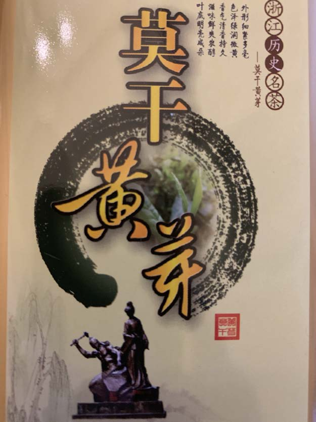

*2018-11-11 16:51 · 饭斯基*

---

### 1925

不理解房地产就理解不了中国。

*2018-11-11 16:08 · 手机上网*

---

### 1926

三星起家的业务是卖大米。

*2018-11-11 14:43 · 手机上网*

---

### 1927

一个餐厅的包间叫「紫光阁」，我总觉得不是特别妥当。

*2018-11-11 12:36 · 手机上网*

---

### 1928

姐姐回国出差。晚饭时她说很庆幸十五年前自己放弃读博士而去工作了。当时导师给她的课题是「一万伏的碳化硅」，十五年过去了，全世界的半导体公司至今也没搞出这么高电压的功率器件。

*2018-11-10 22:11 · 手机上网*

---

### 1929

双十一马上就要到了，我心理压力很大。2014年8月，在第一次世界大

战爆发一百周年之际，我开始读那本关于一战的书《八月炮火》；明天，11月11日，就是英联邦国家的一战结束纪念日。今年是一战结束一百周年。四年多，一次世界大战都打完了，这本书我还没读完-_-!

*2018-11-10 21:36 · 手机上网*

---

### 1930

汽车是奔驰发明的，但是让汽车变成大众消费品的是福特。在人类文明史册里，福特的位置应该高于奔驰。通用汽车、丰田、大众这最近三任全球汽车销量冠军的位置要再低一些。

*2018-11-10 19:04 · 手机上网*

---

### 1931

当今世界，正在经历一场更大范围、更深层次的科技革命和产业变革。-习近平

*2018-11-10 16:32 · 手机上网*

---

### 1932

只要有源源不断的钱，任何人都可以抄底成功。

*2018-11-10 16:26 · 手机上网*

---

### 1933

听到一个可能不靠谱的说法，扎克伯格2013年才从塞班手机换用iPhone.

*2018-11-10 16:23 · 手机上网*

---

### 1934

转@ webto 亚马逊的平台上买不到Google和Apple的智能音箱/电视盒子类产品，不给上架，但是因为亚马逊不算垄断在线零售市场，所以也不会被反垄断法查。# 竞争对手的用处 #

*2018-11-10 16:22 · 手机上网 转自webto*

---

### 1935

如果2014年 whatsapp 不卖给 facebook，后来互联网格局会怎样？

*2018-11-10 15:26 · 手机上网*

---

### 1936

转@ 寒小梦 少女心

*2018-11-10 13:59 · 手机上网 转自寒小梦*

---

### 1937

拼错了，是 Nordstrom. 转@ 王兴 Norsdtrom 的西装袜很令我失望。本来我以为袜子是需要品质但不需要品牌的典型，觉得买个高端百货店的自有品牌就行了，没想到他们家的袜子如此粗糙，脚趾头附近的缝线存在感前所未有的强:(

*2018-11-09 15:24 · 手机上网 转自王兴*

---

### 1938

Norsdtrom 的西装袜很令我失望。本来我以为袜子是需要品质但不需要品牌的典型，觉得买个高端百货店的自有品牌就行了，没想到他们家的袜子如此粗糙，脚趾头附近的缝线存在感前所未有的强:(

*2018-11-09 15:16 · 手机上网*

---

### 1939

SWIFT: Society for Worldwide Interbank FinancialTelecommunication

*2018-11-09 14:52 · 手机上网*

---

### 1940

「拼多多其实是低端版天猫」，行家一句话就说出了重点。

*2018-11-09 10:29 · 手机上网*

---

### 1941

刚听说 jack slow fuck 这说法。转@ gravity0 一战结束把奥匈和奥斯曼两个大帝国拆了。转@ 景景景 昨天去听了个庆祝捷克斯洛伐克

独立一百周年的音乐会life out of death 转@ gravity0 Steam上这两天的减价理由是庆祝波兰重获独立一百周年

*2018-11-08 23:37 · 手机上网 转自景景景*

---

### 1942

又一次，走贵宾通道，坐经济舱。

*2018-11-08 23:34 · 手机上网*

---

### 1943

惊讶的发现，英语里没有对应「养老」的词。

*2018-11-08 19:37 · 手机上网*

---

### 1944

richard 是刘强东的音译？你脑洞真大！转@ 本科僧 @ 王兴 dick王卫 richard刘强东都屌，算是人如其名了。值得一提的是，richard可能是刘强东的音译。

*2018-11-08 19:37 · 手机上网 转自本科僧*

---

### 1945

原来人名 liz 是 elizabeth 的简称啊。这种从中间抽取简称的例子不太常见，但总比 dick 是 richard 的简称更容易理解一点。

*2018-11-08 19:17 · 手机上网*

---

### 1946

这位国际友人的中文名太有文化了！

*2018-11-08 15:59 · 饭斯基*

---

### 1947

哦，雷军好像没有英文名。转@ 王兴 第一代互联网企业家都有英文名：jack, pony, robin, charles, william, richard...

*2018-11-08 15:46 · 手机上网 转自王兴*

---

### 1948

第一代互联网企业家都有英文名：jack, pony, robin, charles,william, richard...

*2018-11-08 15:37 · 手机上网*

---

### 1949

Minister of Cyberspace Administration of China, 这个官方翻译很霸气。

*2018-11-08 15:12 · 手机上网*

---

### 1950

人可以分成两类：蹲过茅坑的和没蹲过的。也可以分成另外两类：用过抽水马桶的和没用过的。

*2018-11-08 14:35 · 手机上网*

---

### 1951

给老外起中文名好像有些约定俗成的方法，例如 Stephen Xxx 一般译成 X思文。

*2018-11-07 12:24 · 手机上网*

---

### 1952

Dior 这季衣服挺拉风。

*2018-11-07 11:24 · 饭斯基*

---

### 1953

@ 柒小斤 摩拜怎么了？

*2018-11-07 10:58 · 手机上网 给柒小斤的回复*

---

### 1954

欧洲主要国家里只有英国把首都放在港口城市，法国、德国、意大利、西班牙、俄罗斯、波兰的首都都是内陆城市，倒是南欧的葡萄牙和北欧诸国的首都是港口。

*2018-11-06 11:44 · 手机上网*

---

### 1955

这是一首每句歌词不嵌一个成语作者就不舒服的歌。

*2018-11-05 22:37 · 饭斯基*

---

### 1956

全中国的房子大概值300~400万亿人民币。

*2018-11-05 14:17 · 手机上网*

---

### 1957

除了是大盘鸡的发源地以外，新疆沙湾这个地名又在另一个完全不同的语境里被我碰到了。

*2018-11-05 12:23 · 手机上网*

---

### 1958

洛克菲勒基金会于1917年开始捐建北京协和医学院，开办医预科，附属医院为北京协和医院，志在「建成亚洲最好的医学中心」。一百年过去了，经历了日军侵华、国共内战、政权更替、大跃进和文革等等，协和依然在中国医学界的金字塔尖。

*2018-11-05 08:44 · 手机上网*

---

### 1959

中华人民共和国第一届全国人民代表大会任期从1954年9月至1959年4月，代表人数一千二百多，一共举行了五次会议。其中第一次会议于1954年9月15日开幕，会上通过了中华人民共和国宪法。

*2018-11-04 23:32 · 手机上网*

---

### 1960

钱确实非常接近于一种宗教。

*2018-11-04 22:15 · 手机上网*

---

### 1961

大炼钢铁和炮击金门都发生在1958年。这篇文章里描述的大炼钢铁场景和我爸爸讲过的他小时候所见的相符，龙岩许多几百年树龄的大树就这样白白烧掉了，真是令人心痛。

*2018-11-04 22:03 · 手机上网*

---

### 1962

伊朗信什叶派而非逊尼派和越南放弃汉字转用字母是一样的逻辑。

*2018-11-04 21:28 · 手机上网*

---

### 1963

「我九十年代初从北京电影学院毕业，后来电影行业很快就不行了，所以我就沦落为一个地产商...」在饭桌上这么自我介绍也蛮酷的。

*2018-11-04 19:58 · 手机上网*

---

### 1964

袜子顶端的破洞分两种，第一种是洞还小，脚趾头没有明显感觉，可以考虑在不需要脱鞋的场合继续穿，但遗憾的是，第一种情况通常很快就会发展成第二种情况，洞大到能明显感觉到，此时应该果断抛弃这只袜子，否则洞的存在会提醒你脚趾头的存在，而脚趾头是不应该有存在感的。

*2018-11-04 18:25 · 手机上网*

---

### 1965

QQ 音乐刚给我弹了条消息，推荐一个新版本的《viva la vida》，是coldplay 在布宜诺斯艾利斯的现场。

*2018-11-04 18:05 · 手机上网*

---

### 1966

那不是第一流的厨师。反馈不直接很难持续提高。转@ 工藤腐竹饭@ 王兴 所以大刘说过即使是名厨，也有很多人会煮不会吃。

*2018-11-04 17:28 · 手机上网 转自工藤腐竹饭*

---

### 1967

大闸蟹和北京烤鸭都是需要一点点学习和练习才会真正享受的美食。

*2018-11-04 17:13 · 手机上网*

---

### 1968

转@ 阳升 草算了一下，按 5 万一平方米的房子价格，一本实体书的占地成本大概 50 块。

*2018-11-04 16:13 · 手机上网 转自阳升*

---

### 1969

北京冬奥会的时间是2022年2月。

*2018-11-04 15:28 · 手机上网*

---

### 1970

你无法捡起影子。

*2018-11-04 14:34 · 手机上网*

---

### 1971

百度地图 iPhone 版的北京卫星图是新的，iPad 版的卫星图却是旧的。为啥不更新呢？

*2018-11-04 11:00 · 手机上网*

---

### 1972

转@ 东东枪 试着翻译了一下。

*2018-11-04 08:18 · 手机上网 转自东东枪*

---

### 1973

转@ 洋鸟消夏录 昨天的化妆师很好玩。她问我几岁了，我说二十多呗，她说看着比这小。我说那你呢，她说九十多，我说看着也比这小。她快问快答似的问了我一串没头没脑的问题，你结婚了吗？你的外孙叫什么？告诉我一个你情人的名字吧？你下一次旅行会去哪里？

你觉得你是彩虹里的哪个颜色？

*2018-11-04 08:13 · 手机上网 转自洋鸟消夏录*

---

### 1974

我国古代建筑技术不如古罗马也是一个因素。角斗士斗一场的成本很高，要观众多才能摊薄成本，要想观众多就得建那种能装上万人的大剧院，就像现在罗马城里那个古迹。转@ 王兴 中国古代没有类似古罗马那样的「角斗士」体系，因为中国的统治者不需要（用这种血腥的娱乐来）讨好民众。

*2018-11-03 22:11 · 手机上网 转自王兴*

---

### 1975

中国古代没有类似古罗马那样的「角斗士」体系，因为中国的统治者

不需要（用这种血腥的娱乐来）讨好民众。

*2018-11-03 21:56 · 手机上网*

---

### 1976

上海有包玉刚学校，北京东三环有邓小平题写店名的「兆龙饭店」

（包兆龙是包玉刚的父亲）。转@ 寒小梦 今年是包玉刚与赵安中百年诞辰，这个城市处处都有宁波帮的身影。

*2018-11-03 18:53 · 手机上网 转自寒小梦*

---

### 1977

晚餐吃了很大的一块牛排，咀嚼时想起了杰克伦敦的《一块牛排》。

*2018-11-03 18:46 · 手机上网*

---

### 1978

肥牛、小肥羊、肥猪，同样都是肥，给人的印象很不同...

*2018-11-03 13:08 · 手机上网*

---

### 1979

来京出差的同事说望京的速8一度卖到1200块一晚，我彻底震惊了。

*2018-11-02 17:44 · 手机上网*

---

### 1980

我以前只知道 O2O 有 online-to-offline 和 offline-to-online 两种说法，今天遇到一个人跟我一通忽悠，说还有 offline-to-offline 这个流派，我深深的为自己的想象力贫瘠而感到羞愧。

*2018-11-02 14:03 · 手机上网*

---

### 1981

不就免费联个网嘛，把网络说得好严肃哦。

*2018-11-02 10:03 · 饭斯基*

---

### 1982

萝卜青菜，各有所爱。转@ 老于爱可乐 玩了一天，找不到感觉…排斥这种需要复杂思考的游戏 转@ 能鞥 说的我也想玩了 转@ 王兴 我小时候最爱的游戏《文明》有两种「赢」的方式，一种是灭掉其他文明统一地球，另一种是率先成功发射飞往半人马座的宇宙飞船。两种打法在游戏的前90%是看不出差别的

*2018-11-02 09:24 · 手机上网 转自王兴*

---

### 1983

我小时候最爱的游戏《文明》有两种「赢」的方式，一种是灭掉其他文明统一地球，另一种是率先成功发射飞往半人马座的宇宙飞船。两种打法在游戏的前90%是看不出差别的。

*2018-11-02 09:12 · 手机上网*

---

### 1984

刚知道厚披萨和薄披萨要用不同的面粉做。

*2018-11-02 08:52 · 手机上网*

---

### 1985

如果建国后早早就有了股市，文革时指数会掉到多低...

*2018-11-02 07:33 · 手机上网*

---

### 1986

马云真正的退休不在于卸任CEO，也不在于卸任董事局主席。按《财新》的报道，阿里董事会的多数席位由阿里合伙人任命；阿里现有的三四十名合伙人由一个五人组成的合伙委员会来选举；马云和蔡崇信俩是这五人中的「连续性成员」，也就是说他俩没有任期限制，什么时候想退才退。

*2018-11-01 11:48 · 手机上网*

---

### 1987

美国的互联网像欧洲，中国的互联网有点像美国，其他新兴市场更像美国。转@ 王兴 当年竟然连瑞典都在北美有过殖民地，就在费城附近，就叫 New Sweden 。

*2018-11-01 11:05 · 手机上网 转自王兴*

---

### 1988

北京没有阿玛尼酒店吧？转@ viviyo 朝阳公园的阿玛尼酒店也很不错转@ 王兴 orz，亮马桥那家宝格丽是安藤忠雄设计的！那家整体感觉还不错，大堂有免费软糖也很合我意。转@ 西湖的小犀 那试试安藤忠雄设计的宝格丽酒店「@ 王兴 望京一直缺好酒店，所以前段时间望京凯悦开业后，我还特意

*2018-11-01 07:43 · 手机上网 转自王兴*

---

### 1989

你开玩笑吧？读完四大名著的人肯定小于3%。转@ 欧尼酱想 90后没读过 最多读过四大名著转@ 王兴 95后的人真的还读金庸吗？

*2018-11-01 07:36 · 手机上网 转自王兴*

---

### 1990

95后的人真的还读金庸吗？

*2018-10-31 23:39 · 手机上网*

---

### 1991

orz，亮马桥那家宝格丽是安藤忠雄设计的！那家整体感觉还不错，大堂有免费软糖也很合我意。转@ 西湖的小犀 那试试安藤忠雄设计的宝格丽酒店「@ 王兴 望京一直缺好酒店，所以前段时间望京凯悦开业后，我还特意抽空过去转了转，有点失望，感觉整个定位就定错了...

今天听说是隈研吾设计的

*2018-10-31 23:38 · 手机上网 转自王兴*

---

### 1992

转@ 洋鸟消夏录 爬到那个高耸的废弃烟囱顶上，一条腿在烟囱里，一条腿跨坐在外，心里一万个后悔不该同意冒这个险，这个镜头根本就不值得冒这个险。一边听导演洗脑我没事没事，心里哆哆嗦嗦在复读机一句话，我还没有拍长片，我不能死。

*2018-10-31 23:08 · 手机上网 转自洋鸟消夏录*

---

### 1993

望京一直缺好酒店，所以前段时间望京凯悦开业后，我还特意抽空过去转了转，有点失望，感觉整个定位就定错了，做成了那种土地很不值钱的郊区度假酒店的样子，各部分都傻大傻大的... 今天听说是隈研吾设计的...

*2018-10-31 21:26 · 手机上网*

---

### 1994

「在阴暗的树下，在激流的水边，逝去的六月和七月，在无人的山间，你们的身体还挣扎着想要回返，而无名的野花已在头上开满。」

《森林之魅·祭歌》，从西南联大投笔从戎参加中国入缅远征军的穆旦写撤退时穿越野人山的惨相。

*2018-10-31 12:55 · 手机上网*

---

### 1995

喝茶比起喝酒对温度的要求更高，像锅气一样稍纵即逝。咖啡我了解得不多，但既然是热饮，估计会更接近于茶。

*2018-10-31 11:53 · 手机上网*

---

### 1996

转@ 饭而不否 今天是比特币白皮书发布十周年。

*2018-10-31 10:26 · 手机上网 转自饭而不否*

---

### 1997

转@ 饭而不否 目前最强

*2018-10-31 10:09 · 手机上网 转自饭而不否*

---

### 1998

耶稣 : 穆罕默德 ≈ 亚马逊 : 阿里巴巴

*2018-10-30 09:56 · 手机上网*

---

### 1999

转@ 寒小梦 新的网上税务系统把大家都坑了，国税局几百家地税没报税的企业。我找税管员签字，正好有个电话问怎么操作这个系统，税管让我帮忙解答一下。。。他们自己内部也不知道这个系统是怎么回事

*2018-10-29 13:29 · 手机上网 转自寒小梦*

---

### 2000

经济基础决定上层建筑，去任何一个国家前先查一查这个国家人均GDP 多少就大概明白各方面该有什么期望值了。

*2018-10-29 10:57 · 手机上网*

---

### 2001

用「惠而不费」这种成语对福建人真是一种挑战。

*2018-10-29 10:00 · 手机上网*

---

### 2002

A股竟然有这么多白酒上市企业。我要是领导，估计也会看了火大，靠白酒能强国吗？

*2018-10-29 09:45 · 饭斯基*

---

### 2003

转@ gravity0 加拿大、英国、德国、日本、南非、菲律宾、澳大利亚、新西兰。地区人口分布不均是常态。

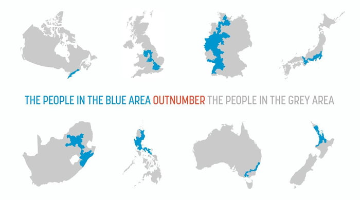

*2018-10-29 08:22 · 手机上网 转自gravity0*

---

### 2004

惊闻 IBM 用340亿美元收购了 Red Hat。

*2018-10-29 08:17 · 手机上网*

---

### 2005

orz，龙岩居然有个「太古广场」，好山寨啊。

*2018-10-28 10:39 · 手机上网*

---

### 2006

说实话，我用卫洗丽马桶时只用喷水冲屁屁的功能，几乎从来不用热风吹干的功能，因为我试过一两次，实在是不知道什么时候吹干了没有...

*2018-10-28 10:24 · 手机上网*

---

### 2007

「居延海」这个地名好酷。

*2018-10-28 10:02 · 手机上网*

---

### 2008

当年竟然连瑞典都在北美有过殖民地，就在费城附近，就叫 NewSweden 。

*2018-10-27 22:09 · 手机上网*

---

### 2009

除了石油，沙特还出产别的。

*2018-10-27 21:58 · 饭斯基*

---

### 2010

每当看到秋天色彩斑驳的树林，我都特别容易想起《西伯利亚理发师》这部电影。

*2018-10-27 15:38 · 手机上网*

---

### 2011

老美起名叫 Xxx Yyy III 其实也挺装的，但中文翻译成「Xxx Yyy 三

世」就更装了。昨晚见了个某某四世...

*2018-10-26 15:44 · 手机上网*

---

### 2012

转@ 寒小梦 Bug比女朋友好找

*2018-10-26 13:16 · 手机上网 转自寒小梦*

---

### 2013

零售就是搬东西。-某京东投资人

*2018-10-26 13:15 · 手机上网*

---

### 2014

掷一个要旋转好几年的骰子。

*2018-10-26 13:13 · 手机上网*

---

### 2015

未经证实。转@ 王兴 “资本家会刺激工人阶级大量借贷消费越来越贵的商品，房屋和新技术，这将促使他们背负越来越大的债务，直到这些债务无法偿还并导致银行破产，随后政府将对银行进行国有化，从而最终走向共产主义之路。” － 卡尔 马克思 《资本论》1867年. 童玮亮

*2018-10-25 12:18 · 手机上网 转自王兴*

---

### 2016

古代的「食」字确实可以对应 food，例如「一箪食，一瓢饮，在陋巷，人不堪其忧，回也不改其乐」。转@ 王兴 突然发现，常用的中文里竟然没有一个单字表达 food 这个最常见的概念，而是用「食物」这个词。

*2018-10-25 11:40 · 手机上网 转自王兴*

---

### 2017

1992年，索尼发明了锂离子电池。

*2018-10-24 18:53 · 手机上网*

---

### 2018

又获赠两本书。看起来应该是好书，但是真的读不过来啊，每本都是差不多500页正文加200页附录:(

*2018-10-24 18:33 · 饭斯基*

---

### 2019

有一点背疼就导致一整天都不好。

*2018-10-24 17:25 · 手机上网*

---

### 2020

转：《2017年度国有资产管理情况的综合报告》当日提请十三届全国人大常委会第六次会议审议。根据报告，2017年，全国国有企业资产总额183.5万亿元，负债总额118.5万亿元，国有资本及权益总额50.3万亿元。全国国有企业境外总资产16.7万亿元。

*2018-10-24 14:22 · 手机上网*

---

### 2021

日出东方

*2018-10-23 00:04 · 饭斯基*

---

### 2022

肉搏一整天。

*2018-10-21 21:12 · 手机上网*

---

### 2023

广州环城高速全长60公里，接近于北京的四环（65公里）；广州绕城高速全长195公里，接近于北京的六环（188公里）。

*2018-10-20 16:25 · 手机上网*

---

### 2024

转：我国肉类消费量约人均60公斤，是世界平均数的两倍，已经达到较高的水平。从结构来看，以消费猪肉为主，人均牛羊肉消费还远低于世界平均水平，但却存在牛肉供应偏紧的局面，2017年牛肉消费量缺口高达97万吨。随着居民生活水平的提高和饮食结构的改变，未来牛羊肉的缺口将进一步扩大。

*2018-10-19 18:19 · 手机上网*

---

### 2025

说实话，iPhone XS Max 的手感明显不如华为 Mate 10，更厚，更重，电池续航又没更长。

*2018-10-18 14:23 · 手机上网*

---

### 2026

转@ 阿瓦 对梦的回忆 视觉是最容易重现的 其次是听觉和触觉 味觉和嗅觉最差 哪怕是在梦中 梦见一个巨大的垃圾场 也问不到臭味

*2018-10-18 14:21 · 手机上网 转自阿瓦*

---

### 2027

天哪，好久没关注，搜狐的市值竟然跌到6.8亿美元了！

*2018-10-18 08:37 · 手机上网*

---

### 2028

查了一下 GaWC 城市排名，开罗是 beta+ ，这我可以理解，但沙特

首都利雅得反而是更高一级的 alpha-，这不太合理吧？

*2018-10-18 08:22 · 手机上网*

---

### 2029

新加坡航空刚开了全世界最长的直飞航班，新加坡飞纽约，接近19小时，16700km。

*2018-10-18 00:21 · 手机上网*

---

### 2030

渣打银行和《经济学人》还是同一个苏格兰人创办的，这也挺神奇的。转@ 20180226 @ 王兴 突然感触了一下，清朝不在了渣打银行还在，哈哈

*2018-10-17 18:48 · 手机上网 转自20180226*

---

### 2031

广东还是牛逼，现在三大房地产企业（恒大、万科、碧桂园）都是广东的。

*2018-10-17 15:12 · 手机上网*

---

### 2032

有品味！转@ 陈耿钊 日餐馆的味增汤，就像粤菜馆的花生米，代表这个餐馆的出品。

*2018-10-17 12:56 · 手机上网 转自陈耿钊*

---

### 2033

今天重阳，A股不休市，港股休市。

*2018-10-17 10:58 · 手机上网*

---

### 2034

转@ 洋鸟消夏录 从厨房出来，我悄悄说我不喜欢喝牛奶，撒丁岛男孩说他也不喜欢，只有早餐吃 cereal 时才会加。我们不约而同问vegan 男孩他用什么泡 cereal，他冷漠回答，“啤酒”。

*2018-10-17 10:40 · 手机上网 转自洋鸟消夏录*

---

### 2035

见到一个新名词：命主。

*2018-10-17 00:27 · 手机上网*

---

### 2036

左宗棠为了平叛收复新疆而通过胡雪岩向汇丰和渣打银行借钱，读到这个故事真是让人感触万千。

*2018-10-16 22:00 · 手机上网*

---

### 2037

不愧是自恋王啊！

*2018-10-16 15:57 · 饭斯基*

---

### 2038

Talk long term.

*2018-10-16 15:50 · 手机上网*

---

### 2039

转：2017年，他们（保罗艾伦的超大游艇兼科考船）找到曾经担负运送广岛原子弹任务的重巡洋舰印第安纳波利斯号。（这艘船当年运完原子弹之后返程过程中被日本击沉）

*2018-10-16 14:20 · 手机上网*

---

### 2040

跟一个传统企业的人交流，发现他的分法不是互联网企业和非互联网企业，而是「你们互联网企业」和「我们实体企业」-_-!

*2018-10-16 13:52 · 手机上网*

---

### 2041

看了一下地图，菲律宾其实真的很近。马尼拉和海口、台北组成一个等边三角形，广州飞马尼拉和广州飞上海都是2小时25分。

*2018-10-16 13:20 · 手机上网*

---

### 2042

EECS（电子工程和计算机科学）是 MIT 的绝对第一大系，40%的学生。

*2018-10-16 13:04 · 手机上网*

---

### 2043

备份一下，这是德累斯顿圣母教堂。

*2018-10-16 00:26 · 手机上网*

---

### 2044

一泊两日，三顿火锅。办完事，走人。

*2018-10-15 21:46 · 手机上网*

---

### 2045

机缘巧合，今天又到访了一处我在华为手机屏保照片集里看过且印象深刻的建筑：重庆嘉陵江北岸龙脊山顶上的鸿恩阁。上一回是德国德累斯顿那座在二战大轰炸中被炸毁但后来重修的圣母教堂。那两张图片当时第一次出现在我手机上时都把我惊艳到了。

*2018-10-15 21:35 · 饭斯基*

---

### 2046

一个很年长的大型信息系统架构师跟我说：我是有很强的流程意识的，因为我以前是做化工的...

*2018-10-14 21:54 · 手机上网*

---

### 2047

把 Westminster 不译成威斯敏斯特而是译成「西敏寺」，这和把Starbucks 译成「星巴克」类似，音译意译结合。

*2018-10-14 14:25 · 手机上网*

---

### 2048

吃火锅是门手艺，是门学问，一块毛肚烫得恰到好处和煮老了那口感真是差别大了去了。

*2018-10-14 14:02 · 手机上网*

---

### 2049

刚才过安检时排我前面的是个穿短裤的小伙子，腿毛很长，但动作很娘。

*2018-10-14 08:33 · 手机上网*

---

### 2050

最近几个月出差很多，但都是拖箱子的。今天终于又要来一次「一个背包，一泊两日，新城市」的旅行了。

*2018-10-14 08:16 · 手机上网*

---

### 2051

还得继续努力...

*2018-10-12 18:46 · 手机上网*

---

### 2052

雀巢 nestle 这个名字的来历竟然是创始人 henri nestle 的姓，这是我始料未及的。不过 nestle 这个词的原意确实是雀巢。

*2018-10-11 04:51 · 手机上网*

---

### 2053

欧亚非都可以搭配东南西北中，美洲则只有南北中。

*2018-10-11 01:24 · 手机上网*

---

### 2054

orz，查了一下维基才知道，《台湾时报》的前身《东台日报》是我奶奶的大哥于1946年在花莲创办的。转@ 王兴 台湾光复时，福建各县去对口接收。福州接收台北，龙岩接收花莲。听长辈说的，未经考证。

*2018-10-09 23:41 · 手机上网*

---

### 2055

有什么东西是不稀缺的吗？欲望。

*2018-10-09 21:10 · 手机上网*

---

### 2056

爸爸说新中国第一个高尔夫球场是84年在广东中山建的，他当年去过那里，当然不是去打球，而是想去卖点花卉苗木赚点钱，因为他当时在龙岩开了个苗圃。他从龙岩坐车去中山，晕车得厉害，一路上吐了很多次，后来简直是连胆汁都要吐出来了。生意还是没做成。

*2018-10-09 20:08 · 手机上网*

---

### 2057

严肃考虑一个问题：以后去发展中国家旅行时，给小费是不是就不要给美元了，改成给人民币？

*2018-10-08 21:04 · 手机上网*

---

### 2058

转@ 洋鸟消夏录 拍片使人贫穷，拍片使人失家。九月是每年租约满租的时节。于是十月一到，学校里一半的人都睡在另一半人的沙发上。

*2018-10-07 05:26 · 手机上网 转自洋鸟消夏录*

---

### 2059

学了一个新词「奔现」：网络流行词，指在网络上认识的两个人由虚拟走向现实发展。大概也可以算是一种 O2O 吧。

*2018-10-07 04:44 · 手机上网*

---

### 2060

转@ 杜斌beta 「洄瀾」，是花蓮的舊稱。顧名思義，意即「水流回轉的波瀾」。由於外海港灣黑潮暖流由南北上碰到突出的海岸，出現水流回轉，因此這一帶被稱為「洄瀾」、「回瀾」，後來再轉成閩南語諧音的「花蓮」。

*2018-10-06 22:19 · 手机上网 转自杜斌beta*

---

### 2061

建筑物的尖顶上树一个十字架代表基督教，树一个新月代表伊斯兰教，树一个大卫六芒星代表犹太教，树一个红五星我觉得是代表苏俄。那有什么标志能代表中华文明？

*2018-10-06 00:23 · 手机上网*

---

### 2062

约146米高的胡夫大金字塔从公元前2560年建成后就一直是全球最高建筑，直到公元1311年被英国林肯的圣玛丽大教堂超过。圣玛丽大教堂直到1549年才失去这个称号，不是因为有新楼建得更高，而是它自己的尖塔塌了;)

*2018-10-05 23:59 · 手机上网*

---

### 2063

新奥尔良有个外号叫 the big easy, 我觉得这个外号也很适合广州，够大够生活。

*2018-10-05 23:47 · 手机上网*

---

### 2064

突然理解了，方尖碑 obelisk 可能就是低配版的金字塔，保留顶上那个象征太阳光线的放射状的尖顶，但是下面大幅缩窄以节省材料和占地面积。

*2018-10-05 16:13 · 手机上网*

---

### 2065

把 pyramid 译成「金字塔」既不属于音译，也不属于意译，算是形译吧。

*2018-10-04 15:37 · 手机上网*

---

### 2066

再过多少年我国的钞票上会不印政治领袖而是像很多发达国家那样印科学家、艺术家、思想家？二十年？三十年？

*2018-10-03 18:42 · 手机上网*

---

### 2067

鹅銮鼻这个奇怪的地名我是因为小时候集邮碰到那套台湾灯塔系列邮票而认识的。

*2018-10-02 22:26 · 手机上网*

---

### 2068

如果用海南黄花梨复刻一把 Herman Miller Aeron 人体工学椅，应该蛮好玩的。

*2018-10-02 14:28 · 手机上网*

---

### 2069

清朝确实品味不行。

*2018-10-02 13:10 · 手机上网*

---

### 2070

香港、新加坡和伦敦竟然都没有 Park Hyatt 柏悦酒店。这个品牌到底是什么经营思路？

*2018-10-01 20:39 · 手机上网*

---

### 2071

全世界年销量大于100万并且零部件大于1万个的产品只有一个：汽车，所以被称为工业之王。

*2018-10-01 11:07 · 手机上网*

---

### 2072

听说海淀区纳税最多的企业不是小米，也不是百度，而是福田汽车。

*2018-10-01 11:05 · 手机上网*

---

### 2073

听说苹果最新这一版 iPhone 里没有三星或高通产的零件。牛！

*2018-10-01 07:40 · 手机上网*

---

### 2074

语言是民族性的一部分。

*2018-09-30 23:58 · 手机上网*

---

### 2075

想念广州酒家的糯米鸡。

*2018-09-30 22:31 · 手机上网*

---

### 2076

转@ 鹿路路路路 粤语的博大精深这脏话方面体现得相当到位，国语JB一词对应粤语有5种表达，CNM的替换词从媳妇儿到星星，也很是多样 RT@ 王兴 转@ 老爷轻点儿 东莞有他的雕像，下书其阵前豪言：“屌那妈，顶硬上！”，后来有关部门觉得不妥，抠掉了 转@ 王兴袁崇焕竟然是东莞人。

*2018-09-30 20:43 · 手机上网 转自王兴*

---

### 2077

转@ 老爷轻点儿 东莞有他的雕像，下书其阵前豪言：“屌那妈，顶硬上！”，后来有关部门觉得不妥，抠掉了 转@ 王兴 袁崇焕竟然是东莞人。

*2018-09-30 17:17 · 手机上网 转自王兴*

---

### 2078

袁崇焕竟然是东莞人。

*2018-09-30 16:50 · 手机上网*

---

### 2079

今晚见了一个老同学，冲天炮发型看起来很有青春活力，只可惜他的发际线并不比我的更争气。

*2018-09-30 01:29 · 手机上网*

---

### 2080

空姐问我：您要鸡肉饭还是螺蛳粉？我听了大喜过望，这航班太接地气了，连这么重口的（柳州）螺蛳粉都有，来来来！端上来我就傻眼了，原来是意式螺蛳粉，而且是做得特别差的那种！

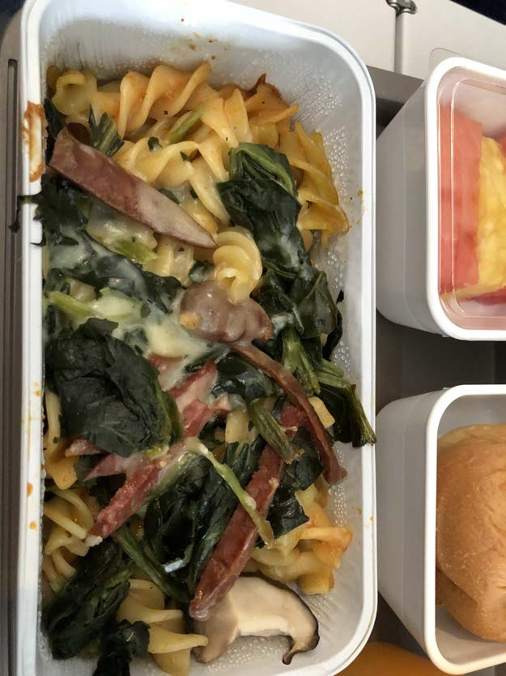

*2018-09-29 18:16 · 饭斯基*

---

### 2081

我现在所能想到的历史最悠久的中国品牌竟然是1828年一个苏格兰人在广州创立的：屈臣氏。

*2018-09-29 14:09 · 手机上网*

---

### 2082

在盘点已经成为世界冠军的中国企业时，除了华为之外，不应该忘记腾讯，腾讯（加上腾讯控股的国外游戏开发商）实际上已经成为全世界最大的游戏公司。阿里和亚马逊谁是更厉害的电商公司还略有些争议。

*2018-09-29 13:44 · 手机上网*

---

### 2083

华为手机的通讯录真是完爆 iPhone.

*2018-09-29 12:49 · 手机上网*

---

### 2084

转：VC is not an investment business, it is a returns business.

*2018-09-29 00:15 · 网页*

---

### 2085

「植物猎人」感觉是个不错的职业。

*2018-09-28 13:27 · 手机上网*

---

### 2086

牛排一定要趁热吃。

*2018-09-28 12:44 · 手机上网*

---

### 2087

好莱坞里，玛丽莲梦露这个最女性的名字和约翰韦恩这个最男性的名字都是凭空改出来的。

*2018-09-28 11:06 · 手机上网*

---

### 2088

艺人这种竞争极其惨烈的行业，更是必须绝对「以客户为中心」，叫什么名容易红就改什么名，爹妈姓什么根本不重要。中外都如此。

*2018-09-28 11:02 · 手机上网*

---

### 2089

请朋友帮我约国内某著名投资人。听说这位老兄至今不用微信，我肃然起敬。

*2018-09-28 10:56 · 手机上网*

---

### 2090

一大堆艺人名叫很没有区分度的名字，张xy或张yx，为啥都姓张？

*2018-09-28 10:51 · 手机上网*

---

### 2091

说了好多年要去看一次钱塘江大潮，今年的又错过了:(

*2018-09-28 10:47 · 手机上网*

---

### 2092

张首席

*2018-09-28 08:18 · 手机上网*

---

### 2093

和朋友聊天，听说许小年教授有个研究结论：大陆法系的国家的股票市场都搞得不太好:(

*2018-09-27 21:13 · 手机上网*

---

### 2094

「负能量」这个词好像英语里不这么用。

*2018-09-27 18:14 · 手机上网*

---

### 2095

「财联社9月27日讯，中国证监会副主席方星海：中国股市不缺资金，缺的是长期资金。」说得太对了。

*2018-09-27 16:56 · 手机上网*

---

### 2096

「理财」和「财富管理」听起来很不一样，其实都是 wealthmanagement 的翻译吧。

*2018-09-27 11:34 · 手机上网*

---

### 2097

因为澳门的存在，葡萄牙跟中国多了一重关系；巴西本来就是讲葡萄

牙语，国内局势不好时有些人就会去葡萄牙；因为有西班牙这个共同的敌人，所以历史上葡萄牙和英国一直关系很好。葡萄牙受中东难民冲击也最小，一是因为远二是因为穷。转@ 王兴 低估里斯本了。

*2018-09-26 23:03 · 手机上网 转自王兴*

---

### 2098

看到一个缩写「纽伦港」，指纽约、伦敦、香港这三大国际金融中心。

*2018-09-26 21:00 · 手机上网*

---

### 2099

转@ KellanWang @ 王兴 一下子让我想起了这句话："The fartherbackward you can look, the farther forward you're likely tosee."Winston Churchill

*2018-09-26 14:26 · 手机上网 转自KellanWang*

---

### 2100

「广州湾」和广州没关系，是湛江市（或其附近海面）的旧称，曾经是法国租借地（殖民地）。

*2018-09-26 13:18 · 手机上网*

---

### 2101

转@ lushnis 87 版红楼梦的字幕书法特别漂亮，出自书法家李纯博之手。

*2018-09-26 13:10 · 手机上网 转自lushnis*

---

### 2102

转@ 那个人他好像一条狗啊 I meant u「@ 王兴 转@ imvenj 也可以组成 u name it （啥都有）。 转@ 王兴 meituan 这七个字母重新排列组合一下就变成 uni 和 me ta 。」

*2018-09-26 08:45 · 手机上网 转自王兴*

---

### 2103

好邪恶啊，像虫卵！转@ Bing每日壁紙 圣科尼利厄斯教堂内的艺术装置'The Eclipse' ，美国纽约市总督岛 (© Timothy Schenck/JacobHashimoto Studio)

*2018-09-26 01:02 · 手机上网 转自Bing每日壁紙*

---

### 2104

从实用角度出发，知道 hong kong 的老外比知道 guangdong 的多。转@ 王兴 「粤港澳大湾区」的英文名是 Guangdong-HongKong-Macao Greater Bay Area? 太长了，不容易火。不如就叫Hong Kong Bay Area 或其他

*2018-09-26 00:42 · 手机上网 转自王兴*

---

### 2105

「粤港澳大湾区」的英文名是 Guangdong-Hong Kong-MacaoGreater Bay Area? 太长了，不容易火。不如就叫 Hong Kong BayArea 或其他类似短一点的名字，虽然不够准确，但是至少方便使用。

*2018-09-26 00:36 · 手机上网*

---

### 2106

倾盆大雨中的耶路撒冷应该是特别难得的体验。

*2018-09-25 23:40 · 手机上网*

---

### 2107

如果要再细分，最好是那种胜负偶然性偏大一点点的项目。例如，足球的偶然性就比篮球大。转@ 王兴 所有体育运动都锻炼人，多回合的有肢体接触的对抗性团体运动可能最锻炼人。

*2018-09-25 23:17 · 手机上网 转自王兴*

---

### 2108

转@ 醋溜小肉段儿 我：原来西语有个专门形容雨水落在干燥的土壤时产生的潮湿清香的泥土味儿的词。petricor.petra是“石头”，Icor是流

过希腊神话中众神之脉的液体,不是血而是雨。味道好闻词也美不解风情的同事：不就是放线菌产生的土臭素吗

*2018-09-25 22:26 · 手机上网 转自醋溜小肉段儿*

---

### 2109

也不合适。中文「风衣」对应的是 trench coat，也就是 burberry 的招牌产品。直译是战壕外套-_-!转@ 杜斌beta 风衣 。RT@ webto总不能叫破风衣嘛 ♂ 转@ 王兴 「防风衣」这个中文翻译远没有windbreaker 这个英文词酷。

*2018-09-25 22:15 · 手机上网 转自王兴*

---

### 2110

「防风衣」这个中文翻译远没有 windbreaker 这个英文词酷。

*2018-09-25 20:10 · 手机上网*

---

### 2111

所有体育运动都锻炼人，多回合的有肢体接触的对抗性团体运动可能最锻炼人。

*2018-09-25 19:30 · 手机上网*

---

### 2112

转@ imvenj 也可以组成 u name it （啥都有）。 转@ 王兴meituan 这七个字母重新排列组合一下就变成 uni 和 me ta 。

*2018-09-25 19:10 · 手机上网 转自王兴*

---

### 2113

meituan 这七个字母重新排列组合一下就变成 uni 和 me ta 。

*2018-09-25 14:39 · 手机上网*

---

### 2114

当提到 think long term 时，多数人默认指向未来，其实过去也值得看。

*2018-09-25 14:09 · 手机上网*

---

### 2115

中国共产党的一大是1921年开的，中国国民党的一大是1924年开的。

*2018-09-24 16:12 · 手机上网*

---

### 2116

我们都是宇宙的囚徒。-《江湖儿女》

*2018-09-24 01:31 · 手机上网*

---

### 2117

转@ 钱得乐 大家纷纷转向非衬线字体logo是因为考虑在更低分辨率的屏显上获得尽可能清晰的效果。转@ 王兴 可能是这个原因，但我依然给这设计打分很低。转@ 工藤腐竹饭 @ 王兴 我认为是设计师选定了上下两种字体的大小比例，然后放london长度不够就加了england上去，追求的是视觉的

*2018-09-24 01:03 · 手机上网 转自工藤腐竹饭*

---

### 2118

可能是这个原因，但我依然给这设计打分很低。转@ 工藤腐竹饭 @王兴 我认为是设计师选定了上下两种字体的大小比例，然后放london

长度不够就加了england上去，追求的是视觉的整洁为主

*2018-09-23 20:28 · 手机上网 转自工藤腐竹饭*

---

### 2119

转@ 王兴 苹果的首席设计师jonathan ive曾在纽卡斯尔理工大学就读工业设计专业。当时的老师克莱夫对他的评价是，“他是我遇到的最勤奋的学生。一般学生在毕业项目上只会做6个模型，而他做了100个。”

*2018-09-23 20:17 · 手机上网 转自王兴*

---

### 2120

Burberry 这新 logo 太不自信了， London 后面还跟一个 England是生怕有人不知道伦敦在哪里？

*2018-09-23 20:12 · 手机上网*

---

### 2121

转@ 瑞秋Rachel 学习了-berg～

*2018-09-23 19:40 · 手机上网 转自瑞秋Rachel*

---

### 2122

第一大英语国家不是英国，是美国；第一大西班牙语国家不是西班牙，是墨西哥；第一大葡萄牙语国家不是葡萄牙，是巴西。这算是成功还是失败？

*2018-09-23 18:44 · 手机上网*

---

### 2123

也得靠翻译家、科学家以及一切爱思考的人。转@ 单纯的中东局势所以得靠诗人 转@ 王兴 所以需要不断思考，对语言进行创新。转@东东枪 如果只用现成的语言思考，那语料的丰富程度就决定了思想的丰富程度。大多数人用100到200个四字成语就可以回答世界上的所有问题，对一切社会现象给出评判

*2018-09-23 17:32 · 手机上网 转自东东枪*

---

### 2124

所以需要不断思考，对语言进行创新。转@ 东东枪 如果只用现成的语言思考，那语料的丰富程度就决定了思想的丰富程度。大多数人用100到200个四字成语就可以回答世界上的所有问题，对一切社会现象给出评判，他们不会有超出这些成语的观点。语言的懒惰就是思想的

懒惰。

*2018-09-23 17:18 · 手机上网 转自东东枪*

---

### 2125

九十几岁的老前辈送了我一本他五十年代读过的书。

*2018-09-23 12:19 · 饭斯基*

---

### 2126

转@ 萧萧滚滚 情怀把心挂在左边，意志把心踏在脚下，或说埋在心底。//@ 王兴 :转@ 左潇 家国情怀，国家意志转@ 王兴 「家国」比「国家」听起来更有情怀。

*2018-09-23 12:16 · 手机上网 转自王兴*

---

### 2127

转@ 左潇 家国情怀，国家意志转@ 王兴 「家国」比「国家」听起来更有情怀。

*2018-09-23 11:40 · 手机上网 转自王兴*

---

### 2128

「家国」比「国家」听起来更有情怀。

*2018-09-23 11:37 · 手机上网*

---

### 2129

同事太尽职了，已经提前把台历撕到下一个工作日。可是没想到我放假期间也来办公室。

*2018-09-23 11:21 · 饭斯基*

---

### 2130

转@ 乐鼠老人 “But here we are, so fuck you!” 宣言式的获奖感言

*2018-09-22 23:10 · 手机上网 转自乐鼠老人*

---

### 2131

@ POPOEVER 体积问题已经注意到，我们同事已经在努力解决。多谢提醒！

*2018-09-22 00:14 · 手机上网 给POPOEVER的回复*

---

### 2132

每年盈利两百多亿的水电！那得是三峡了吧？转@ veronica2865 我家里有人是水电厂的，整个发电业务盈利一年有两百多亿，至于价格我就不知道了。转@ 寒小梦 我看了他们财务报告中的价格，308.52~~转@ 零界 国网电价是国家定的，发电侧定价还没了解过，回头找朋友问下

*2018-09-21 18:00 · 手机上网 转自寒小梦*

---

### 2133

转@ 方山仙人 不能，公募随时可以存取，人性决定了追涨杀跌，散户不会赚钱。唯一的办法是强制老百姓存长期的养老金，就是社保和类似美国的401k转@ 王兴 Mutual fund 不应该简单直译为「共同基金」，国内已经有对应的概念「公募基金」了。公募基金是不是能成为调和私营经济和公有经济

*2018-09-21 17:11 · 手机上网 转自王兴*

---

### 2134

Mutual fund 不应该简单直译为「共同基金」，国内已经有对应的概念「公募基金」了。公募基金是不是能成为调和私营经济和公有经济的一种机制呢？

*2018-09-21 16:55 · 手机上网*

---

### 2135

转@ 寒小梦 电厂的同学说，他们1000度电卖300多块钱，他们就是农民 ，国家电网是二道贩子；最后他们是亏损企业，国家电网是500强前几名。。。

*2018-09-21 16:51 · 手机上网 转自寒小梦*

---

### 2136

资本家也分有敬业精神的和没有敬业精神的。

*2018-09-21 15:58 · 手机上网*

---

### 2137

「我不祝你一帆风顺，我祝你乘风破浪。」

*2018-09-21 03:36 · 手机上网*

---

### 2138

@ 陈星 多谢

*2018-09-20 19:28 · 手机上网 给陈星的回复*

---

### 2139

好棋手通常都知道并接受自己同时也是更大棋局里的棋子。

*2018-09-20 17:04 · 手机上网*

---

### 2140

@ 小NaNaN 多谢支持:)

*2018-09-20 15:26 · 手机上网 给小NaNaN的回复*

---

### 2141

海德公园附近的这座纪念碑应该很有年头了，因为碑文里不说 WorldWar One，而是说 the Great War，估计是在一战二战之间建的，那时可怜的人们还不知道有一场 Greater War 即将来临。另，fell 这个词用得太有格调了！

*2018-09-20 00:15 · 饭斯基*

---

### 2142

太惊人了！转@ 寒小梦 F1也就这速度了。 转@ Leijona 这什么腿 转@ 猪小宝 又有新的自行车世界纪录了…这姑娘蹬自行车蹬到了 294公里每小时的速度……

*2018-09-19 23:13 · 手机上网 转自猪小宝*

---

### 2143

原来这 logo 是这意思啊。我之前从没意识到。转@ 瑞秋Rachel 四季的logo真的有四季哎，好有❤ # RandomThoughts #

*2018-09-19 20:11 · 手机上网 转自瑞秋Rachel*

---

### 2144

建设比见证更重要。

*2018-09-19 13:43 · 手机上网*

---

### 2145

转@ 饭而不否 八卦的词义演变，据说是当年香港gossip杂志有露点照片时就拿个八卦小图案在那个“点”上 。久而久之八卦就成为了gossip的代名词。我以为，“八卦”在道教语境和娱乐语境下的共通之处是：飞星断事。

*2018-09-19 12:46 · 手机上网 转自饭而不否*

---

### 2146

每个艺术家的作品首先是他自己。

*2018-09-19 11:54 · 手机上网*

---

### 2147

转@ LSherry 《时间的故事》转@ 王兴 「时间」这个词在中文里最早何时出现？这类问题你们一般怎么查？

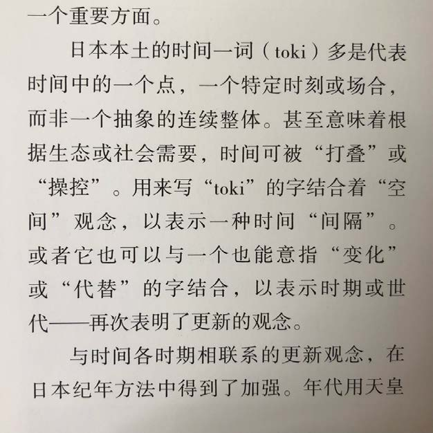

*2018-09-18 22:40 · 手机上网 转自LSherry*

---

### 2148

一个杯子的内胆摔坏了，另一个杯子的外层杯体摔坏了，正好拼起来继续用。

*2018-09-18 22:22 · 饭斯基*

---

### 2149

真是从日语来的。转@ FTS. http://fan.fo/f4bCM 直接 Google 加上"Etymology" 就好 (转@ 王兴 「时间」这个词在中文里最早何时出现？这类问题你们一般怎么查？

*2018-09-17 23:28 · 手机上网 转自王兴*

---

### 2150

这个时间跟现在的意思不同。转@ szweig 随便查了一下，“时间”连在一起用古代就有了，截图里是金代（肯定不会是最初）。所以说不是从日本舶来的双音词。再有，查来历可以用《辞源》，一本辞书，多有考据。 @ 王兴

*2018-09-17 23:26 · 手机上网 转自szweig*

---

### 2151

转@ quux 宋词元曲中有出现，但意思不同，表示一时之间或者现在的意思。我们现在用的表示哲学意义上时间的这个词可能输入自日语，见于1881年《哲学字汇》。方法就是查字典，中文一本汉语一本日语就够了 RT@ 王兴 「时间」这个词在中文里最早何时出现？这类问题你们一般怎么查？

*2018-09-17 23:17 · 手机上网 转自王兴*

---

### 2152

对。现在我真的不知道怎么查。转@ 拧巴人儿 @ 王兴 你的問題是一個linguistic question嗎？也就是說時間，以我們現在理解的含義，什麼時候第一次用在中文中？我會從四庫全書開始。

*2018-09-17 23:13 · 手机上网 转自拧巴人儿*

---

### 2153

「时间」这个词在中文里最早何时出现？这类问题你们一般怎么查？

*2018-09-17 22:58 · 手机上网*

---

### 2154

敢想、肯干、会算账。

*2018-09-17 20:54 · 手机上网*

---

### 2155

A股一直起不来是因为中国没有建立类似美国401K的养老金投资体系。

这个判断听起来跨度有点大，想想似乎还蛮有道理，至少比新股发行该是审批制还是注册制更触及核心。

*2018-09-16 14:28 · 手机上网*

---

### 2156

提到「温水煮青蛙」时，人们的关注点通常在青蛙身上，而非煮青蛙的人。

*2018-09-16 08:10 · 手机上网*

---

### 2157

卢旺达的区号是 +250

*2018-09-15 23:57 · 手机上网*

---

### 2158

后来成为摩根斯坦利董事长的 Dick Fisher 在60年代就自学了FORTRAN 和 COBOL 编程！他本科是在普林斯顿学历史和哲学...

*2018-09-15 22:31 · 手机上网*

---

### 2159

转@ 198Q 凌晨一点北京起飞，当地时间凌晨五点巴黎降落也是。 转@ 王兴 凌晨2点半从纽约起飞，凌晨四点多落地北京。这种航班特别不耽误事。

*2018-09-15 22:28 · 手机上网 转自王兴*

---

### 2160

当一部分人做出了一些无法归类的东西交给社会，这些没有被知识化、概念化的东西都可以归为当代艺术。-徐冰

*2018-09-15 19:28 · 手机上网*

---

### 2161

转@ 小世界. 大摩会说我们研究人员很多是真实存在的，而高盛肯定是说他们最差的员工会被派去做美国财政部长。 转@ 王兴 问了大摩的一个高管：你觉得大摩和高盛有什么区别？你觉得高盛的人会怎么回答这个问题？

*2018-09-15 19:12 · 手机上网 转自王兴*

---

### 2162

问了大摩的一个高管：你觉得大摩和高盛有什么区别？你觉得高盛的人会怎么回答这个问题？

*2018-09-15 17:43 · 手机上网*

---

### 2163

凌晨2点半从纽约起飞，凌晨四点多落地北京。这种航班特别不耽误事。

*2018-09-15 04:37 · 手机上网*

---

### 2164

裤子上有个洞不稀奇，光溜溜的腿上贴一圈布我倒是第一次见。

*2018-09-14 05:37 · 手机上网*

---

### 2165

到帝国大厦拜访一个老人家，本来是为了请教餐饮相关的事，结果交流中得知他们同时也是杜蕾斯的幕后老板。

*2018-09-14 05:28 · 手机上网*

---

### 2166

almost done deal. 转@ 王兴 希望接下来九天不要爆发战争或其他大的黑天鹅事件。

*2018-09-14 01:18 · 手机上网 转自王兴*

---

### 2167

犹太年5779年开始了。

*2018-09-13 19:48 · 手机上网*

---

### 2168

为什么没有「市场主义」这个词？是因为「市场」这个概念不够重要

还是因为太过基础而重要了？

*2018-09-12 19:17 · 手机上网*

---

### 2169

转@ 饭而不否 昨天参加一个金融领域的区块链会议，有一句话堵在嗓子眼了，又被我咽了回去——比特币的政治属性，要远大于金融属性。

*2018-09-12 19:12 · 手机上网 转自饭而不否*

---

### 2170

奇长无比的排插。

*2018-09-12 09:59 · 饭斯基*

---

### 2171

转@ 拧巴人儿 鄭成功他爸，還有個名字叫Nicholas IquanGaspard。 矮馬，老洋氣了……

*2018-09-12 09:02 · 手机上网 转自拧巴人儿*

---

### 2172

转@ 恩卡 @ 王兴 你们的股东sequoia有所有的元音，而且是英语中最短的有所有五个元音字母的单词

*2018-09-12 06:50 · 手机上网 转自恩卡*

---

### 2173

见到了我到目前为止见过的长得最像米开朗琪罗的大卫像的脸庞。确实是个犹太人。连姓都是 Israel.

*2018-09-12 06:50 · 手机上网*

---

### 2174

一大早经过第五大道上的纽约公共图书馆，想起小时候我在中山路上的龙岩市图书馆度过了大量愉快时光。不知道我当时的纸质借阅记录是否还存在。

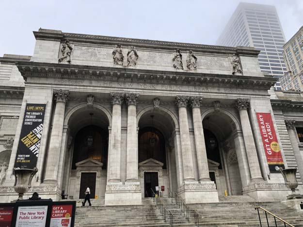

*2018-09-11 20:07 · 手机上网*

---

### 2175

转@ 王兴 每年的今天我都要对自己重复一遍我的高中数学老师任勇在告别时说的话：敬业是最好的尊师。

*2018-09-10 22:43 · 手机上网 转自王兴*

---

### 2176

这个跨度有点大... 转@ chandler_bin 说明美团是攻？转@ 王兴meituan 这个词里有五个元音字母中的四个，唯独缺了一个 o.

*2018-09-10 21:28 · 手机上网 转自王兴*

---

### 2177

奶奶一辈子没有来过美国。本来2003年她要来美国参加姐姐的硕士毕业典礼，但是签证官以我们全家（那时我已经在美国读书，我爸我妈我奶奶一起申请赴美签证）都要一起来、有移民倾向为由把他们仨都据了。2006年底姐姐婚礼前两个月奶奶就脑溢血了:(

*2018-09-10 05:09 · 手机上网*

---

### 2178

meituan 这个词里有五个元音字母中的四个，唯独缺了一个 o.

*2018-09-10 04:19 · 手机上网*

---

### 2179

波士顿已经算是美国最有历史感的城市了，但是公园的典雅程度还是跟伦敦完全没法比。

*2018-09-10 02:48 · 手机上网*

---

### 2180

转@ 桃大郎 我觉着是中文版里把 moments 叫朋友圈 转@ 乱耳朵转@ 王兴 转@ Evol 我猜是抄袭了Path。 转@ 王兴 微信英文版里把「朋友圈」叫做 Moments。考虑到最初朋友圈鼓励发照片而不鼓励发文字（甚至有意隐藏了单独发文字的操作），我猜想这个译法可能受了当年柯达

*2018-09-08 14:02 · 手机上网 转自王兴*

---

### 2181

转@ Evol 我猜是抄袭了Path。 转@ 王兴 微信英文版里把「朋友圈」叫做 Moments。考虑到最初朋友圈鼓励发照片而不鼓励发文字（甚至有意隐藏了单独发文字的操作），我猜想这个译法可能受了当年柯达口号 Share moments, share life 的影响。

*2018-09-08 13:37 · 手机上网 转自王兴*

---

### 2182

微信英文版里把「朋友圈」叫做 Moments。考虑到最初朋友圈鼓励发照片而不鼓励发文字（甚至有意隐藏了单独发文字的操作），我猜想这个译法可能受了当年柯达口号 Share moments, share life 的影响。

*2018-09-08 13:11 · 手机上网*

---

### 2183

好吧，就算有 African Chinese 这种概念，但和 African American的含义完全不同。转@ allentranks @ 王兴 African Chinese 不是非洲华裔吗？我认识的一个在南非出生的华人，他就是。。

*2018-09-08 13:02 · 手机上网 转自allentranks*

---

### 2184

美国和中国有不同的定义国家的方式，所以，有 African American，但很难想象有 African Chinese 这种概念。

*2018-09-08 12:57 · 手机上网*

---

### 2185

在小黄瓜隔壁开了个会。

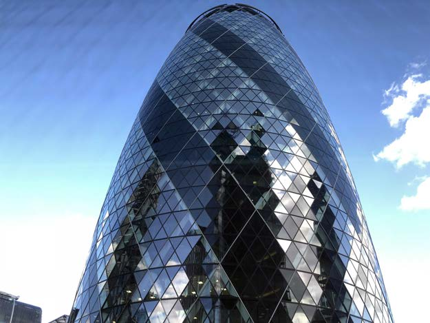

*2018-09-08 04:08 · 饭斯基*

---

### 2186

这楼看起来真像是工厂，然而是个金融机构。

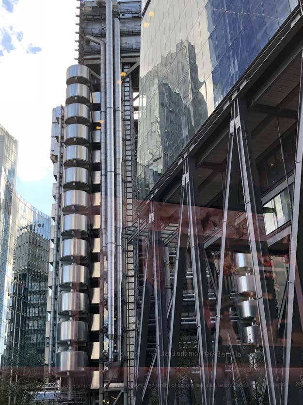

*2018-09-08 04:06 · 手机上网*

---

### 2187

我看过单扣的蒙克鞋，也看过双扣的，今天第一次看到有人穿三扣的，丑爆了！

*2018-09-08 03:42 · 手机上网*

---

### 2188

居然有个老外的姓叫 iamthongthong

*2018-09-07 21:00 · 手机上网*

---

### 2189

从防御角度来说，应该是先有城墙后有护城河吧。

*2018-09-07 14:25 · iPhone版*

---

### 2190

转@ 小熊娃娃 之前就发现身为中国人，大陆思维太重，在很多事情上缺乏海洋思维。今天发现还有一种地球思维，刚刚看到《海鸥食堂》里说“芬兰是最接近日本的欧洲国家”，实在是惊呆了……

*2018-09-06 23:52 · 手机上网 转自小熊娃娃*

---

### 2191

压力太大了！老爸动不动就一大早在家庭群里发刚刚晨跑2000米或晨泳1000米后双手叉腰以显示老当益壮的照片...

*2018-09-06 23:47 · 手机上网*

---

### 2192

我的登机箱 + 双肩包 + 西装外套 = 虎背熊腰翘屁股

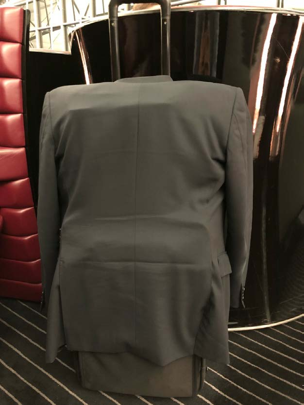

*2018-09-06 22:31 · 猫饭*

---

### 2193

第一次见到 dyson 的干手机。

*2018-09-06 15:05 · 猫饭*

---

### 2194

品牌是一种共识。

*2018-09-06 10:57 · iPhone版*

---

### 2195

在巴菲特的故事里听说了无数次 See’s Candies 时思糖果，今天第一次吃。

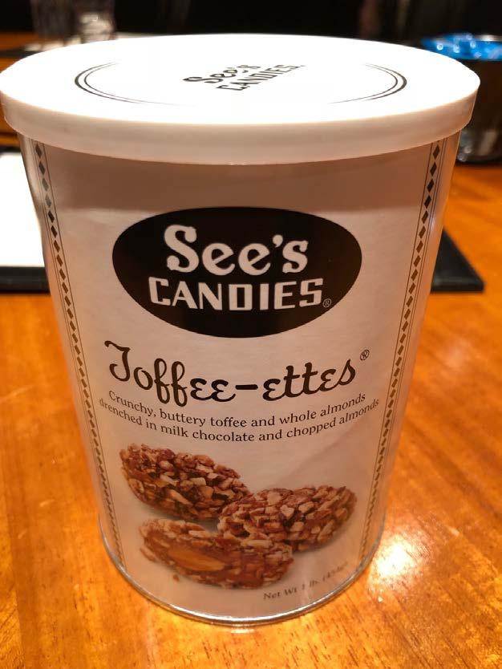

*2018-09-05 21:31 · 猫饭*

---

### 2196

@ 吕雪松 orz, 没想到你还潜伏在饭否上。

*2018-09-05 00:34 · 手机上网 给吕雪松的回复*

---

### 2197

知己知彼还不够，还得知道彼有多知己。

*2018-09-04 20:38 · iPhone版*

---

### 2198

希望接下来九天不要爆发战争或其他大的黑天鹅事件。

*2018-09-04 09:44 · iPhone版*

---

### 2199

简直是魔幻... 转@ 左潇 塞拉利昂750万人口，全国只有130个医生，2个儿科医生。埃博拉病毒来袭时去世了60名医生。他们医生的最高水平达不到成都普通三甲医生。以至于我在当地已被应邀给多位达官显贵看病（如国家副总统及塞拉利昂李嘉诚），我施以常见病诊断及话聊大法。

*2018-09-04 00:47 · 手机上网 转自左潇*

---

### 2200

「绿鞋」是一种常见的用于上市的超售-稳市机制。之所以叫这个名字是因为这种机制最早用于1919年一家名叫「绿鞋」的公司上市时。这家公司后来卖给了著名的鞋公司 wolverine worldwide.

*2018-09-03 22:10 · iPhone版*

---

### 2201

仿佛悬空的楼。

*2018-09-03 13:59 · 猫饭*

---

### 2202

一个头脑很灵光的做投资的新加坡朋友说，07年第一代 iPhone 发售时，他正好在美国，果断入手两部。一部自己用了，另一部不拆包，放起来了，现在可以卖到5000美金了。

*2018-09-03 13:39 · iPhone版*

---

### 2203

上海是两个国际顶级金融机构的诞生地，汇丰银行 HSBC 和保险公司美国国际集团 AIG。可惜都不是华人创办的。

*2018-09-02 21:52 · iPhone版*

---

### 2204

据说直到90年代中期，汇丰银行内部还分四个等级：苏格兰人 > 英格兰人 > 印度人 > 华人。

*2018-09-02 21:43 · iPhone版*

---

### 2205

《帝国时代 Age of Empires》和《文明 Civilization》这两款游戏名字的意境真是判若云泥。

*2018-09-02 11:40 · iPhone版*

---

### 2206

和一个77岁老人握手时觉得他的手非常强壮有力。

*2018-09-02 09:35 · iPhone版*

---

### 2207

一晃就九月了。

*2018-09-01 12:05 · iPhone版*

---

### 2208

经济发展的基本单位是城市而非国家。-雅各布斯

*2018-09-01 09:13 · iPhone版*

---

### 2209

《阿甘正传》里丹中尉那样的美国军事世家确实存在，近日出殡的参议院麦凯恩就是个例子。他的祖父和父亲都是海军上将；他本人作为海军飞行员，在越战执行战斗任务，被俘并拘禁了长达五年半时间；

现在，他的两个儿子，一个在海军，一个在海军陆战队。

*2018-08-31 16:49 · 手机上网*

---

### 2210

微软好像是 T7 集团里唯一不搞支付的公司。

*2018-08-31 16:12 · 手机上网*

---

### 2211

刚知道作者Thomas Sowell是黑人。转@ 王兴 《Ethnic America: AHistory》（译成《美国种族简史》）是一本好书，写得通俗易懂，条理清晰，读起来如行云流水，不仅有助于了解美国历史，也有助于了解人性。如果有一本类似水准的写中国各族／各地人的书，我一定看

*2018-08-31 15:57 · 手机上网 转自王兴*

---

### 2212

当年 YC 设定的 7% 这个比例很有讲究。最近觉得 85% 也是。

*2018-08-31 08:41 · iPhone版*

---

### 2213

说明投胎投对国家很重要。转@ 阳升 需要一点想象力——阿根廷：1000 阿根廷比索 vs US Dollar

*2018-08-30 23:50 · 手机上网 转自阳升*

---

### 2214

今晚第一次碰到这种光会英语不太够的饭局：两个科特迪瓦人，一个塞内加尔人，官方语言都是法语；两个华裔上过INSEAD商学院，也会点法语；还有一个华人姑娘不知怎的英法德语都会；所以一大部分聊天是用法语进行，我完全听不懂，幸好还有个印度人和两个日本人也不会法语。

*2018-08-30 23:26 · 手机上网*

---

### 2215

有什么歌让你们曾经专门搜索各个版本来听？我先贡献几个：科恩的hallelujah, gloomy sunday, diamonds and rust, viva la vida, manof la mancha

*2018-08-30 18:12 · iPhone版*

---

### 2216

十几年前有一帮做SP业务的人最后赚了很多钱，不是靠SP业务本身，而是在很费劲的做SP时意识到腾讯有多么得天独厚的优势，于是在04年腾讯上市时果断买入。更有甚者，在腾讯还没上市时想买腾讯股票

买不到，就去公开市场上买腾讯大股东南非公司 naspers 的股票，一样赚得盆满钵满。

*2018-08-30 15:08 · iPhone版*

---

### 2217

《至暗时刻》这部电影里导演有意忽略、可能希望观众也不要太较真的一个问题是：丘吉尔觉得自己在为什么而战？

*2018-08-29 23:45 · 手机上网*

---

### 2218

转@ 金融界人贩子 唱首歌，晚安朋友。 http://fan.fo/aLvnh

*2018-08-29 23:42 · 手机上网 转自金融界人贩子*

---

### 2219

现在清华一年竟然招8310个研究生。记得97年我入学时每年本科只招两千多人。

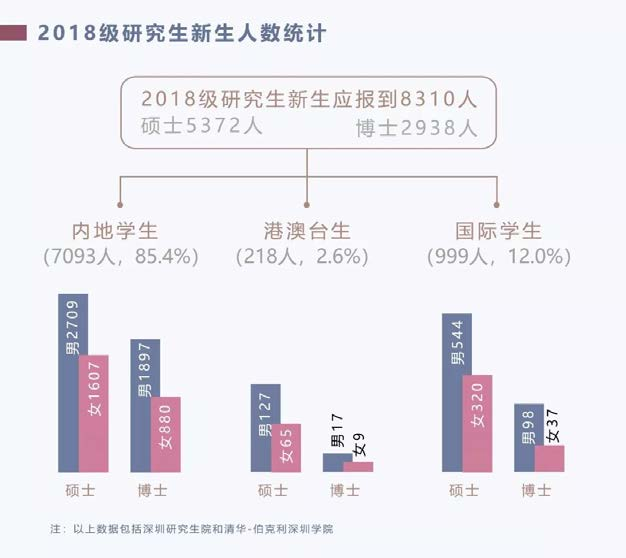

*2018-08-29 16:58 · 手机上网*

---

### 2220

我现在觉得，要买到一双合脚的乐福鞋比买到一双合脚的牛津鞋更难。

*2018-08-29 14:23 · 手机上网*

---

### 2221

转@ 左潇 飞了30小时，来塞拉利昂首都弗里敦，用我们的AI系统给他们培训医生，因为签证特殊，竟然第一次踏上非洲大陆，是坐船上岸。一种郑和／哥伦布的即视感。

*2018-08-29 14:16 · 手机上网 转自左潇*

---

### 2222

从第二个释义来看，capitalist 这个词除了「资本家」，还有一个意思

是「资本主义者」，即「相信资本主义的人」，和社会主义者/共产主义者对应。所以，理论上存在穷得叮当响的 capitalist.

*2018-08-29 10:58 · 手机上网*

---

### 2223

在香港，Queen’s Road 才是皇后大道。

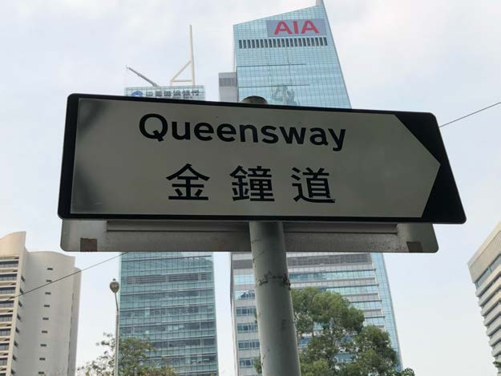

*2018-08-29 00:48 · 猫饭*

---

### 2224

看到一个有趣的词组：entrepreneurial capitalism

*2018-08-28 12:00 · iPhone版*

---

### 2225

转@ gravity0 皮肤越来越不经晒，有自身原因，但我也怀疑是不是太阳越来越狠了。维基词条 Global_dimming 说由于大气中气溶胶的变化，上世纪末三十年地表阳光暗淡了 4%，但在最新十年又明亮了 4%

*2018-08-28 11:25 · 手机上网 转自gravity0*

---

### 2226

听爸爸说，我曾祖父那一辈堂兄弟中有三个人下南洋：我曾祖父去了印尼的棉兰，三十年后病重回国，在家乡去世；另一个去了马来西亚的槟城，在那里落叶生根；还有一个不知所踪，不知道是客死他乡还是葬身鱼腹了。

*2018-08-28 00:52 · 手机上网*

---

### 2227

从妈妈那里听到一句很有历史感的龙岩话成语「叫别人家儿子去过番」。因为以前下南洋是凶多吉少的事情，所以这句话的意思是指怂恿别人去冒险，但自己不承担任何责任。

*2018-08-28 00:20 · iPhone版*

---

### 2228

刚才爸爸说要睡前看点书，问我有没有《旧制度与大革命》，我惊了…

*2018-08-28 00:13 · iPhone版*

---

### 2229

爸爸说，因为龙岩地处山区，几十年前交通不发达的时候，卖牛肉丸的店里熬汤不是放墨鱼干来调味，而是用蜥蜴干。

*2018-08-27 21:35 · 手机上网*

---

### 2230

历史也是一种伟大的发明。转@ 王兴 钱是一种极其伟大的发明。比钱更伟大的发明是时间。

*2018-08-27 15:30 · 手机上网 转自王兴*

---

### 2231

白天竟然在办公室看到一只小壁虎。

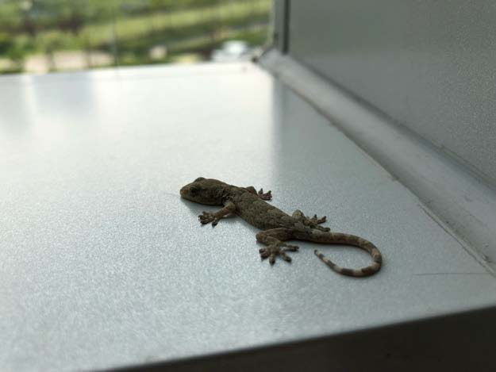

*2018-08-27 15:10 · 猫饭*

---

### 2232

查了一下，果然，整个苏联时期是没有股票交易所的，因为和计划经济的理念从根本上冲突。上海证券交易所也是1990年底才成立。转@王兴 资本市场是市场经济的极致表现。

*2018-08-26 14:04 · 手机上网 转自王兴*

---

### 2233

特意瞥了一眼，确实是人字拖。转@ 小小小奶瓶 太懂了2333还有黑色人字拖 转@ 王兴 真正休闲而热闹的周末小饭馆很适合出现这种扎马尾、下身超短牛仔裤、上身半紧身灰背心、看得出明显激凸的姑娘/少妇。

*2018-08-25 16:05 · 手机上网 转自王兴*

---

### 2234

一不小心吃超了，身上的510港币不够买单，仅有的一张卡是汇丰的，支持银联和香港EPOS，但这俩都不受餐厅支持。餐厅支持的visa和万事达卡我没带。手机也不行。小妹支招：出门右转再右转有家711，随便买点啥，用EPOS刷卡买单时要求cash back，相当于ATM取现。搞定。

*2018-08-25 16:04 · 手机上网*

---

### 2235

太夸张了。看来我的童年真是算很幸福了。转@ 叶滨 “十年一觉电影梦”里李安说从小接受的“日式本省教育”，体罚的尺度非常惊人。不知

道日本现在的教育是什么样子。

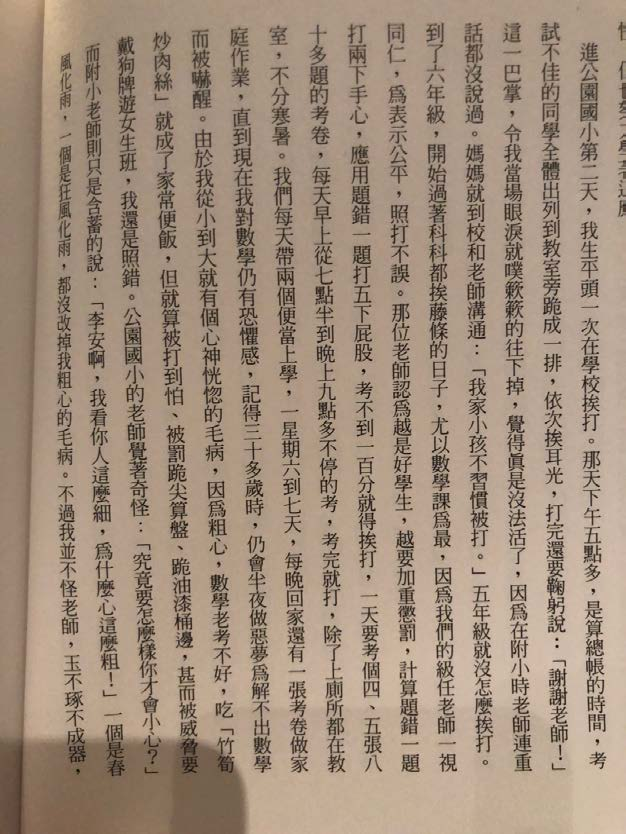

*2018-08-25 15:14 · 手机上网 转自叶滨*

---

### 2236

真正休闲而热闹的周末小饭馆很适合出现这种扎马尾、下身超短牛仔裤、上身半紧身灰背心、看得出明显激凸的姑娘/少妇。

*2018-08-25 15:02 · 手机上网*

---

### 2237

美国是个很平等的社会，至少曾经是。一百五十年前，等欧洲某些国家还把小麦磨成十八个不同等级的面粉供给不同的阶层时，美国制定了面粉质量的统一标准。

*2018-08-25 14:57 · iPhone版*

---

### 2238

比在餐厅里挂一幅价值不菲的名画更高级的是说这幅画不是买来的，而是画家画了送给厨师的。

*2018-08-25 14:47 · iPhone版*

---

### 2239

坐在意式小馆的吧台上吃了顿午饭，目睹了他们做千层面 lasagna 和

意大利饺子 ravioli 的过程。好像也不是很复杂嘛。

*2018-08-25 14:30 · iPhone版*

---

### 2240

做 pasta 和 pizza 的面是来自不同品种的小麦。

*2018-08-25 14:21 · iPhone版*

---

### 2241

真正的好餐厅拥有定义某道菜的能力，让你将来在别的餐厅吃到这道菜时都会想起她。

*2018-08-25 14:18 · iPhone版*

---

### 2242

应该有餐厅配乐师这种工作吗？还是说顶级厨师应该有能力根据自己的品位选择合适的音乐？

*2018-08-25 14:15 · iPhone版*

---

### 2243

想起我吃过一顿超有格调的意大利餐。主厨出来介绍其中一道菜时说：大家想到意大利菜时总想到番茄和番茄酱。但是，哥伦布发现新大陆之前意大利是没有番茄的。今天你们在这道菜里吃到的酸味不是来自番茄，而是来自我们餐厅附近一种土生土长的未成熟的小苹果，这是我考证的结果。

*2018-08-25 13:59 · iPhone版*

---

### 2244

真正的行家给你推荐某个餐厅时是会同时推荐几道菜的。或者，至少这么做会显得更专业。

*2018-08-25 13:46 · iPhone版*

---

### 2245

转@ 猫先生 琺琅.大食國傳入.明景泰年間盛行.故又名景泰藍. 转@viviyo 英文的cloisonne来源于 法语 cloisonné enamel 转@ 王兴 刚知道景泰蓝不是所谓中国传统工艺，而是西方传过来的…

*2018-08-25 13:35 · 手机上网 转自王兴*

---

### 2246

听说日本的很多餐馆高度专业分工，做拉面的就只做拉面，想吃乌冬面请去别家。有些意大利小馆也是这样，只卖 pasta，连 pizza 都不卖。

*2018-08-25 13:26 · 手机上网*

---

### 2247

转@ 留一段空白 兰州牛肉面离开甘肃不好吃 离开兰州味道还是一样的转@ 王兴 那不勒斯来的朋友坚称离了那不勒斯当地的水就做不出那种正宗味道的披萨，跟兰州拉面的说法有点像。

*2018-08-25 13:13 · 手机上网 转自王兴*

---

### 2248

那不勒斯来的朋友坚称离了那不勒斯当地的水就做不出那种正宗味道的披萨，跟兰州拉面的说法有点像。

*2018-08-25 12:50 · iPhone版*

---

### 2249

刚知道景泰蓝不是所谓中国传统工艺，而是西方传过来的…

*2018-08-25 11:19 · iPhone版*

---

### 2250

转：Nobody queues for a flat rollercoaster.

*2018-08-25 09:32 · iPhone版*

---

### 2251

毛爷爷和富兰克林跃出各自的百元大钞…

*2018-08-25 01:42 · 猫饭*

---

### 2252

以前从没注意到 river 和 driver 的相似性。

*2018-08-24 23:29 · iPhone版*

---

### 2253

6年过去了，前两天出关时，工作人员拿着我的证件多看了几秒，还给我时顺便问了句「你是美团老总吗」，我礼貌性的笑一笑，心里一沉，预感到自己的生活质量将进一步下降。转@ 王兴 刚才在机场过海关时，那个年轻的工作人员翻了翻我的证件，冷不丁问了我一句：“人人网卖得可惜吗”？太雷人了-_-！

*2018-08-23 23:37 · 手机上网 转自王兴*

---

### 2254

传说中的瑞士银行 UBS 的历史最早可以追溯到1862年，我知道的最老的中国企业招商局是1872年成立的。起步差得也不是很远嘛。

*2018-08-23 23:28 · iPhone版*

---

### 2255

有创意。转@ 美嘉.rar 笑死我了。

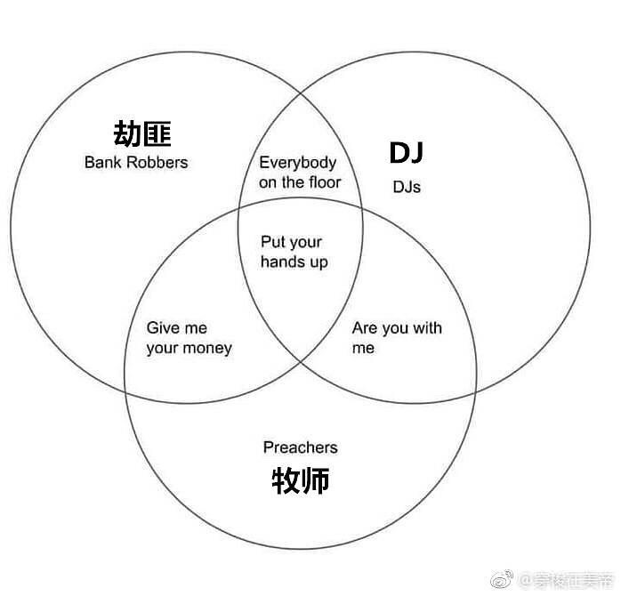

*2018-08-23 23:23 · 手机上网 转自美嘉.rar*

---

### 2256

转@ Carrey. 写诗 转@ 王兴 孤独可以分享吗？

*2018-08-22 23:33 · 手机上网 转自王兴*

---

### 2257

这是什么产品的广告？

*2018-08-22 17:31 · 猫饭*

---

### 2258

孤独可以分享吗？

*2018-08-22 16:44 · iPhone版*

---

### 2259

不不不，清华每天广播的原话是「为祖国健康工作五十年」。这就是清华的风格，不乱打鸡血。转@ 瑞秋Rachel 哈哈 为祖国健康奋斗五十年 转@ CeciliaSS 想到了昨天看到的这张图 转@ 瑞秋Rachel 今天被人说回归了战斗状态，吃饭都要分kpi，哈哈哈，没办法，谁让我爱工作

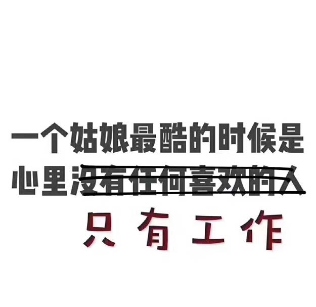

*2018-08-22 12:40 · 手机上网 转自CeciliaSS*

---

### 2260

就喜欢和这种能让我觉得自己既孤陋寡闻又脑子转得不够快的人聊天。关键是人家体力也比我好，这个点聊完了他还有下一个会等着马上开始…

*2018-08-21 01:51 · iPhone版*

---

### 2261

我常常不觉得艺术能解决什么问题，但是它可以让你得以面对这个问题。-雕塑家向京

*2018-08-20 10:36 · iPhone版*

---

### 2262

怀疑是人生的一部分。

*2018-08-19 22:22 · 手机上网*

---

### 2263

大刘的角度很有趣：区块链/加密货币是一个在科幻小说里都没出现过

的东西，不像登月之类的事情凡尔纳早就写过。

*2018-08-19 21:39 · 手机上网*

---

### 2264

如果一直没有中年危机怎么办？人生是不是就不完整了？

*2018-08-19 21:16 · iPhone版*

---

### 2265

荡了一小会儿秋千。

*2018-08-19 19:07 · 手机上网*

---

### 2266

全球最大的烈酒巨头帝亚吉欧是在1997年由大都会和健力士 Guinness合并形成的。当时的品牌顾问创造了一个新名词 Diageo 作为公司的新名字。前半段词根在拉丁语中是“日子”的意思，后半段词根在希腊语中为“地球”的意思，寓意每天为全球提供快感。

*2018-08-19 17:02 · 手机上网*

---

### 2267

美国四大之一的富国银行的两位创始人 Wells & Fargo 同时也是美国运通的创始人。他俩先在纽约州创办了运通，当运通的其他股东反对把公司业务拓展到遥远的加州之后，他俩又在加州另外成立了富国。

运通和富国都是靠运货起家，后来都转成金融服务。

*2018-08-19 08:52 · iPhone版*

---

### 2268

伟大的电影作品总是能让人不经意间想起她的某个场景，例如我今早醒来后想到的《七武士》。

*2018-08-19 08:11 · iPhone版*

---

### 2269

经常性有效表达

*2018-08-18 22:47 · 手机上网*

---

### 2270

这个简单的事实已经震撼我两个多月了。美国当年西部拓荒的那帮人真是太牛逼了。转@ 王兴 从波士顿到旧金山竟然要飞六个半小时，跟北京到新加坡一样长。

*2018-08-18 22:44 · 手机上网 转自王兴*

---

### 2271

寻租理论创始人 Tullock 图洛克教授在1975年那篇文章《TheTransitional Gains Trap》里举的例子正是出租车牌照！

*2018-08-18 22:23 · iPhone版*

---

### 2272

这是一场真正的秋雨。

*2018-08-18 10:17 · iPhone版*

---

### 2273

工地上的人生智慧：那时我的任务是给浇筑完的混凝土表面洒水，以促使它们凝固得更好。工地上到处散落着拆下来的混凝土模板，有些板子上还有朝上的钉子。我每次落脚前已经非常小心甄别了，但依然

被钉子扎了:( 老师傅教育我：别费劲去看板子上有没有钉子，只要你坚持不踩板子，就不会踩到钉子。

*2018-08-17 20:06 · 手机上网*

---

### 2274

送走访客，收拾一桌一次性纸杯时发现其中一个隐约有红唇印。

*2018-08-17 17:36 · 手机上网*

---

### 2275

现在回想起来，初一初二之间那个暑假去建筑工地当小工的经历还是给我留下了很多印象。

*2018-08-17 15:58 · 手机上网*

---

### 2276

传统上说消费、投资、出口是拉动经济增长的三驾马车，现在开始鼓励生育算是消费还是投资？反正不是出口。

*2018-08-17 12:17 · iPhone版*

---

### 2277

「薄荷四国」这种错误说法太搞笑了。翻译者搞混了 mint 这个单词的两个含义，把 Mexico, Indonesia, Nigeria and Turkey 这四个新兴经济体合称 MINT 是取「造币厂」而非「薄荷」之意，所以应该是「造币四国」，紧随BRIC 「金砖四国」之后

*2018-08-17 11:25 · iPhone版*

---

### 2278

obstreperous

*2018-08-16 21:39 · iPhone版*

---

### 2279

桥牌协会荣誉主席

*2018-08-16 20:50 · iPhone版*

---

### 2280

钱和宗教，哪个历史更悠久？

*2018-08-16 18:06 · iPhone版*

---

### 2281

「已经94岁的媒体大亨雷石东中风后，就靠着手里的iPad与人交流了，里面有三个他自己的录音：yes、no和fuxk you。」大亨果然有好有个性。

*2018-08-16 18:00 · iPhone版*

---

### 2282

转@ Jiulong2 聂鲁达在瓦尔帕莱索生活过很长的时间。他在这座城市有好几座别墅，每一座里面都收集了各种东西，甚至有一个火车头。

转@ 王兴 Valparaiso 曾经是一个很重要而繁荣的海港，被称为「小旧金山」；从大西洋穿过麦哲伦海峡进入太平洋的很多船只会在此停靠。后来巴拿马运

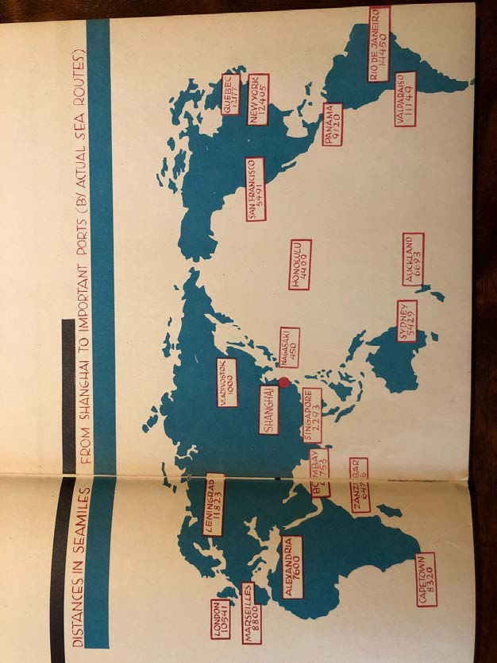

*2018-08-16 17:55 · 手机上网 转自王兴*

---

### 2283

理想是个危险的词。

*2018-08-16 17:54 · iPhone版*

---

### 2284

转@ 张泽走走走 腾讯的实时视频已经能做到实时丰胸了，只是因为一个小bug没有上线，就是妹子跳跃的时候胸会忽大忽小。

*2018-08-16 16:38 · 手机上网 转自张泽走走走*

---

### 2285

低估里斯本了。

*2018-08-16 16:36 · 手机上网*

---

### 2286

我的生活匆忙得系安全带时都经常因为动作太快太猛而卡住……

*2018-08-16 12:28 · iPhone版*

---

### 2287

大同小异，殊途同归

*2018-08-16 12:21 · iPhone版*

---

### 2288

工友

*2018-08-16 09:38 · 手机上网*

---

### 2289

「苹果手机」是比 iPhone 更接地气的叫法。

*2018-08-16 09:13 · iPhone版*

---

### 2290

今天开会喝了喜茶、连咖啡、瑞幸各一杯，茶包两个（或是三个？）

*2018-08-15 22:30 · 手机上网*

---

### 2291

Valparaiso 曾经是一个很重要而繁荣的海港，被称为「小旧金山」；

从大西洋穿过麦哲伦海峡进入太平洋的很多船只会在此停靠。后来巴拿马运河开通了… 转@ 王兴 老地图上有一个我不认识的港口：智利的 Valparaíso

*2018-08-15 00:01 · 手机上网 转自王兴*

---

### 2292

突然觉得自己离这个世界远了一点。

*2018-08-14 23:30 · 手机上网*

---

### 2293

restless

*2018-08-14 23:26 · 手机上网*

---

### 2294

「可怜无定河边骨，犹是春闺梦里人」，想到某些荒唐的事和那些天真或是贪婪的投资人。

*2018-08-13 19:38 · 手机上网*

---

### 2295

资本市场是市场经济的极致表现。

*2018-08-13 14:41 · iPhone版*

---

### 2296

转@ 乐鼠老人 2017年各级民政部门和婚姻登记机构共依法办理结婚登记1063.1万对，比上年下降7.0%；依法办理离婚手续的共有437.4万对，比上年增长5.2%。离婚率已连续16年持续上升；结婚率则从2014年开始下降。

*2018-08-12 23:28 · 手机上网 转自乐鼠老人*

---

### 2297

时至今日，伦敦依然是世界航运中心。

*2018-08-12 19:41 · iPhone版*

---

### 2298

老地图上有一个我不认识的港口：智利的 Valparaíso

*2018-08-12 16:35 · 猫饭*

---

### 2299

不知道为什么，龙门的英文翻译 dragon gate 给我的感觉和龙门这个词很不同

*2018-08-12 16:03 · iPhone版*

---

### 2300

不能理解时间，就不能理解时间的价值。

*2018-08-11 15:24 · iPhone版*

---

### 2301

心智成熟，心态年轻。

*2018-08-11 08:58 · 网页*

---

### 2302

辛亥革命爆发时，孙中山正在美国丹佛为革命募资。

*2018-08-10 11:19 · iPhone版*

---

### 2303

现在汉语里好像都直接用「万亿」做单位，不太用「兆」这个概念了。可能跟「兆」有时代表「万亿」有时代表「百万」有关系。但日

语里好像继续用「兆」代表「万亿」？

*2018-08-10 09:29 · iPhone版*

---

### 2304

解决债务问题的一种方法是干掉债主。这在微观和宏观上都很可怕。

*2018-08-10 09:08 · iPhone版*

---

### 2305

常见的人口红利、渠道红利等概念里红利的反义词是什么？

*2018-08-09 12:07 · iPhone版*

---

### 2306

建于公元前五百年的拜火教方塔 Ka'ba-ye Zartosht (Cube ofZoroaster)是一座很简单但却给我留下极其深刻印象的建筑，很适合画素描。图片来自维基。

*2018-08-09 10:28 · 猫饭*

---

### 2307

@ 潘欣 伦敦和西雅图也是到处在建楼。连爱丁堡都是。

*2018-08-08 12:41 · 手机上网 给潘欣的回复*

---

### 2308

别说芯片了，先保证粮食和能源。

*2018-08-08 12:03 · iPhone版*

---

### 2309

中国铁塔今天在港交所上市，运营的站址规模约190万，总租户数约278万户（复用率并不高嘛）。

*2018-08-08 10:48 · iPhone版*

---

### 2310

都说今年是改革开放40周年，这事有个具体日期具体事件作为标志吗？1978年5月11日评论员文章《实践是检验真理的唯一标准》在《光明日报》上发表？12月18日十一届三中全会召开？

*2018-08-08 09:57 · iPhone版*

---

### 2311

钱是一种极其伟大的发明。比钱更伟大的发明是时间。

*2018-08-08 09:31 · iPhone版*

---

### 2312

人均寿命延长真是带来全新的社会问题。本来每代人隔二十几岁，新一代人读完书开始工作时正是上一代人开始考虑退休的时候。现在这节奏乱了。

*2018-08-08 09:28 · iPhone版*

---

### 2313

我突然觉得中国本土的奢侈品值得关注。现在大家都在嚷嚷要提升国产产品的品质，如果连可以近乎不计成本的奢侈品的品质都做不上去，那就真是水平问题，不是成本问题了。

*2018-08-07 01:08 · iPhone版*

---

### 2314

Hispanic America 是 Latin America 的一个子集，指拉丁美洲中讲西班牙语的那些地方，其实最主要的例外就是讲葡萄牙语的巴西，可偏偏巴西是拉丁美洲最大的经济体。

*2018-08-07 00:52 · iPhone版*

---

### 2315

资本不是生产力，是生产关系。

*2018-08-06 23:15 · iPhone版*

---

### 2316

学会了，只要是女性，只要年龄不是太离谱，称呼都不叫「小姐」也不叫「大姐」，而是「小姐姐」。

*2018-08-06 22:39 · iPhone版*

---

### 2317

注意到一件事：中文里没有产生对应 billionaire 的概念；millionaire倒是有被译成「百万富翁」，但是在币值和房价变动如此之快的情况下，百万富翁这概念已经意义不大。

*2018-08-06 22:19 · iPhone版*

---

### 2318

依稀记得飞机上想到一点东西要发饭否，没网，没发，现在已经忘了。

*2018-08-06 18:40 · iPhone版*

---

### 2319

香港投行里的香港本地年轻人越来越少，据说其中一个原因是：香港年轻人英文不够好…

*2018-08-06 03:32 · iPhone版*

---

### 2320

非对称性。

*2018-08-05 13:09 · iPhone版*

---

### 2321

听到一阵风铃声。

*2018-08-05 10:35 · iPhone版*

---

### 2322

看到曼哈顿这新楼，想起了我妈多年前第一次去完香港回来后的比喻「香港的楼细细高高的，像筷子一样」。

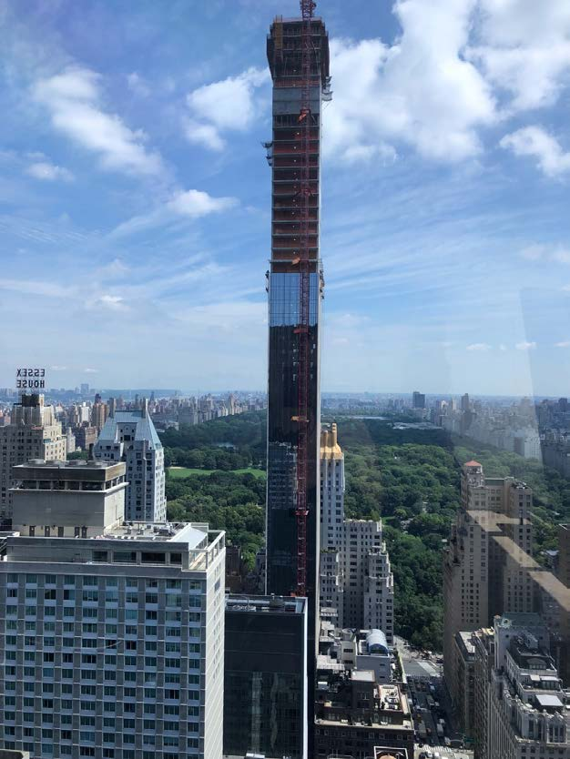

*2018-08-04 13:59 · 猫饭*

---

### 2323

「什么叫早期投资？就是投很少钱就能改变世界。」不愧是做了20年早期投资的人，这个总结让人印象深刻。

*2018-08-04 12:54 · iPhone版*

---

### 2324

专家说，美国的韭菜五十年前就被割完了。

*2018-08-04 06:44 · iPhone版*

---

### 2325

听说美国有40%的食物是被浪费掉的。

*2018-08-04 05:32 · iPhone版*

---

### 2326

头一次遇到西餐能把鱼做得如此之嫩。

*2018-08-03 12:18 · iPhone版*

---

### 2327

"We bank those people" 第一次听到这么把 bank 当动词用，还蛮好玩的。

*2018-08-02 09:06 · iPhone版*

---

### 2328

这个段子不错。转@ yunfeifengqi @ 王兴 可以是金属的，记忆金属就更好了。当年一战的时候，美国妇女捐出的旧胸罩，抽出里面的钢丝，重新熔了，造了两艘驱逐舰。想想，什么是同仇敌忾。在这样的军舰上战斗的男人们是何等的豪情！

*2018-08-02 09:01 · 手机上网 转自yunfeifengqi*

---

### 2329

彰显自己是老牌公司的一种有效方式是在公司楼下大厅里立个金光闪闪的雕像，下面写着：献给我们公司在第一次和第二次世界大战中牺牲的同事们。

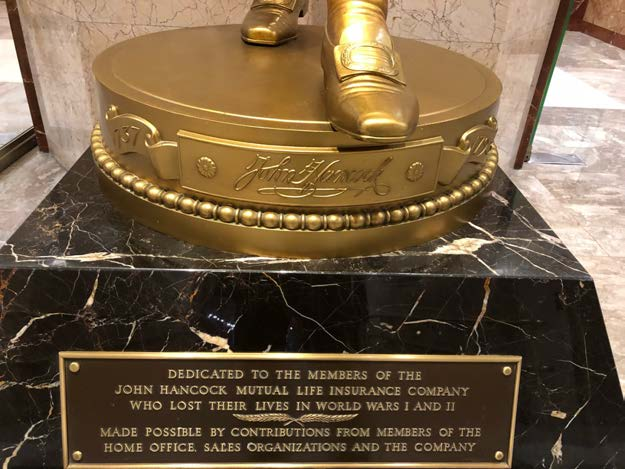

*2018-08-02 04:33 · 猫饭*

---

### 2330

我们中国人是多么含蓄而不直接啊。英文里怒了就直接说 fuck you，中文里一般不说「操你」而是说「操你妈」！

*2018-08-02 04:16 · 手机上网*

---

### 2331

爱尔兰人的民族自豪感还是比较强的。

*2018-08-02 04:13 · 手机上网*

---

### 2332

我读到《麦田守望者》时已经过了青春期，已经过了最适合读这小说的年纪，但是正好和塞林格写这小说时的年纪差不多。

*2018-08-01 12:56 · iPhone版*

---

### 2333

我今天一整天的工作或许和塞林格干的事儿有些相似之处：把同一个故事一遍一遍的讲，反反复复的改，不停的打磨。我唯一不确定的是，他到后来会不会有想吐的感觉。

*2018-08-01 12:52 · iPhone版*

---

### 2334

资本市场确实是资本主义重要而高级的组成部分。

*2018-08-01 12:40 · iPhone版*

---

### 2335

是不是长得像中国人？其实是北欧人。

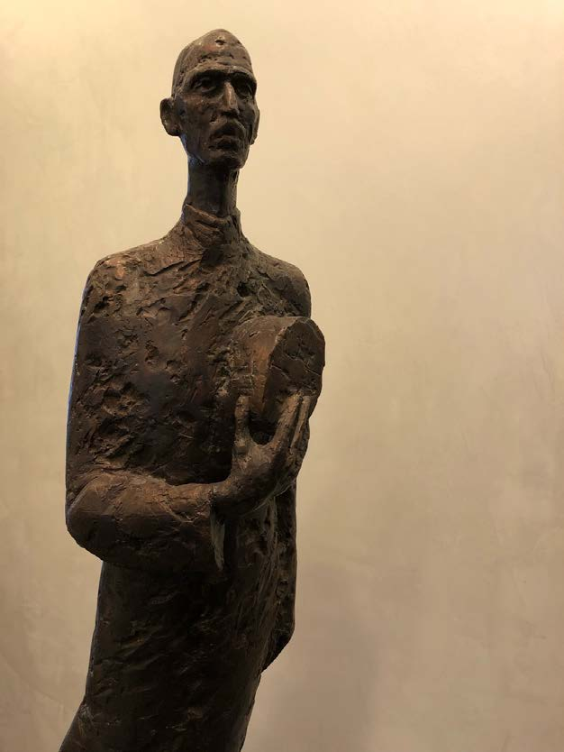

*2018-08-01 05:19 · 猫饭*

---

### 2336

有趣的地址

*2018-08-01 03:45 · 猫饭*

---

### 2337

你们吃可颂是用手拿还是用叉子？

*2018-07-31 19:40 · 手机上网*

---

### 2338

起床。去探索世界的另一部分。

*2018-07-31 19:03 · iPhone版*

---

### 2339

我以前一直误以为标题是《The Story of a Broken Heart》 。还是塞林格厉害。我仿佛能看到他那种「就知道你会搞错」的小小的得意。转@ 王兴 清晨六点在曼哈顿醒来，把塞林格出道时的作品《TheHeart of a Broken Story》读了一遍。戏真多。

*2018-07-31 18:52 · 手机上网 转自王兴*

---

### 2340

清晨六点在曼哈顿醒来，把塞林格出道时的作品《The Heart of aBroken Story》读了一遍。戏真多。

*2018-07-31 18:46 · iPhone版*

---

### 2341

转@ 胡泳 在耶拿讲稿中黑格尔把爱解释为在他人中认出自己的那种认识。

*2018-07-31 09:48 · 手机上网 转自胡泳*

---

### 2342

又见法罗群岛。

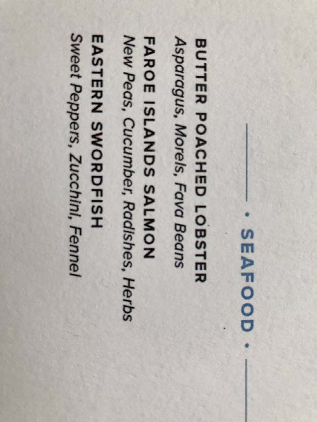

*2018-07-31 07:06 · 猫饭*

---

### 2343

听到一个新概念：tech left，科技左翼/科技左派

*2018-07-31 03:56 · iPhone版*

---

### 2344

totally backless & strapless bras? 没肩带我可以理解，连背后的带子也不需要？那有点厉害了。

*2018-07-31 03:45 · 猫饭*

---

### 2345

孤独让有些人更坚强，让另一些人更脆弱。

*2018-07-30 22:53 · iPhone版*

---

### 2346

宗教都需要圣徒吗？

*2018-07-30 18:55 · iPhone版*

---

### 2347

cosmopolitan nationalist

*2018-07-30 06:07 · iPhone版*

---

### 2348

我给《邪不压正》这电影打7分，其中一分是给「邪不压正」这个很有内涵的名字，还有一分是给片中那个「邪不压正」的桥段。

*2018-07-29 21:06 · iPhone版*

---

### 2349

「制度」这词其实不容易翻译，如果简单的译成 system，那又和「系统」（这个词本身就是 system 这个英文单词的音译）没有区分开。

我查了一下，四个自信里「制度自信」的官方译法是 confidence inpolitical system.

*2018-07-29 20:07 · iPhone版*

---

### 2350

一堆人质疑拼多多却不质疑淘宝（是如何起家的），这已经说明我们这个社会是多么健忘:(

*2018-07-29 19:26 · iPhone版*

---

### 2351

「你在哪里做工？」在伦敦希斯罗机场排长队时我后面的新加坡大妈主动跟我攀谈。「北京」，于是我们展开了愉快的聊天。新加坡人管中文叫「华文」。她说在她读书的那个年代，父母一般送女生读华文

学校，送男生读英文学校，因为对就业更有利。

*2018-07-29 19:16 · iPhone版*

---

### 2352

出差开会时穿的西装皮鞋和我常戴的棒球帽确实不搭，但是礼帽实在是太难打理了。

*2018-07-29 18:55 · iPhone版*

---

### 2353

哈哈。转@ 卢旺 传统的“凤为雄，凰为雌”的说法也还在继续流传，因此凤就陷入了性别错乱的尴尬境地，跟龙在一起的时候是雌性，跟凰一起的时候却变成了雄性…… 转@ 王兴 龙的形象绝大部分是雄性的，以至于我现在闭上眼睛不太能想出一条雌性的龙是什么样子。

*2018-07-28 16:02 · 手机上网 转自王兴*

---

### 2354

制度遗产还是很有价值的，香港有潜力成为粤港澳大湾区的曼哈顿。

*2018-07-28 14:27 · iPhone版*

---

### 2355

意大利人真能聊。

*2018-07-28 05:53 · iPhone版*

---

### 2356

龙的形象绝大部分是雄性的，以至于我现在闭上眼睛不太能想出一条雌性的龙是什么样子。

*2018-07-26 17:44 · iPhone版*

---

### 2357

要不是运气好遇到老司机，这回就真的误了机。

*2018-07-25 23:07 · iPhone版*

---

### 2358

突然发现，常用的中文里竟然没有一个单字表达 food 这个最常见的概念，而是用「食物」这个词。

*2018-07-25 18:54 · iPhone版*

---

### 2359

画一只勺子比我预计的更难。

*2018-07-25 12:13 · iPhone版*

---

### 2360

转@ 王兴 Every nation has the government it deserves. 很刺耳的一句话，但是很在理。把这句话里 government 换成 企业 也一样说得通。

*2018-07-24 18:10 · 手机上网 转自王兴*

---

### 2361

转@ krashna 弗里德里克大帝在军装的袖子上缝上一排没什么用的纽扣，目的在于阻止士兵用袖子擦鼻涕。——原来如此( )

*2018-07-23 21:38 · 手机上网 转自krashna*

---

### 2362

多想想为什么。

*2018-07-23 01:17 · iPhone版*

---

### 2363

一个大数：所有行业全算上，全世界大概有100家公司的价值超过$100B。

*2018-07-22 08:35 · iPhone版*

---

### 2364

我们常用的「阿拉伯数字」其实最早是印度人发明的，而且是纵横四海的犹太商人从印度带给阿拉伯君主然后再传到西方进而普及全球的。

*2018-07-19 14:23 · iPhone版*

---

### 2365

当下和永恒。

*2018-07-19 12:22 · iPhone版*

---

### 2366

「到现场」既是价值观也是方法论。

*2018-07-19 11:56 · iPhone版*

---

### 2367

鸡也常见白血病？真是隔行如隔山。

*2018-07-18 20:37 · iPhone版*

---

### 2368

依稀记得，凌晨六点不到，被窗外罕见的狂风暴雨吵醒。

*2018-07-17 08:57 · iPhone版*

---

### 2369

cosmopolitan除了是形容词，还可以是名词：a person who haslived in and knows about many different parts of the world.

*2018-07-16 00:39 · iPhone版*

---

### 2370

《邪不压正》是一部合格的爆米花电影，至少能让我从头看到尾不开小差，但是没有达到我对姜文的预期。十分制里打7分吧。可能最大的问题是在电影中看不出姜文有什么 idea.

*2018-07-14 23:38 · iPhone版*

---

### 2371

我和大城市铁岭擦肩而过。陌生来电一概不接。

*2018-07-14 16:59 · 手机上网*

---

### 2372

「做生意是要有本钱的，借钱是要还的，投资是要承担风险的，做坏事是要付出代价的」，刘鹤同志关于金融风险防范的这四句大白话总结得真好。

*2018-07-14 11:51 · 网页*

---

### 2373

我以前只知道西游记里一路的妖精分为有背景的和没背景的。今天看了一个帖子才知道有背景的还分为道家背景的和佛家背景的...

*2018-07-14 11:07 · iPhone版*

---

### 2374

cookie jar

*2018-07-13 23:58 · iPhone版*

---

### 2375

听到一个新概念：replatforming

*2018-07-12 16:52 · iPhone版*

---

### 2376

死亡才是一盏长明的灯。

*2018-07-12 08:16 · iPhone版*

---

### 2377

换一泡新茶。

*2018-07-11 22:01 · iPhone版*

---

### 2378

我们终将改变潮水的方向？是的，只需要等待。

*2018-07-11 20:33 · 手机上网*

---

### 2379

想起我在清华读书时，教《中国革命史》的朱老师把近代以来的中国简单划分成几个阶段：主动封闭、被迫开放、被迫封闭、主动开放...

*2018-07-11 13:14 · iPhone版*

---

### 2380

转@ 王兴 「大多数人以为战争是由拼搏组成的，其实不是，是由等待和煎熬组成的…」说这话的大哥当年参加过中越战争，后来创过业，现在做投资。

*2018-07-11 12:13 · 手机上网 转自王兴*

---

### 2381

转：根据前瞻产业研究院2017年发布的数据显示，瓶装水六巨头依次为农夫山泉、华润怡宝、康师傅、百岁山、娃哈哈、冰露。

*2018-07-11 11:06 · iPhone版*

---

### 2382

@ 叶滨 推荐试一下「美团跑腿」，美团app里就可用。已是同类服务中规模最大的。

*2018-07-10 16:12 · 手机上网 给叶滨的回复*

---

### 2383

经过长安街那么多次，第一次注意到内蒙古大厦，就在东方广场东南侧，中间隔着长安街。充分说明我当年吃各省驻京办时没去过这家。

*2018-07-10 09:25 · 手机上网*

---

### 2384

习得的品味。

*2018-07-10 08:57 · iPhone版*

---

### 2385

这是漫步黄泉路时适合听的音乐。

*2018-07-09 19:41 · iPhone版*

---

### 2386

有个新同事名叫「X垚鑫」，他自我介绍说「我五行缺土缺金...」 嗯，懂了，补得挺彻底的。

*2018-07-09 16:58 · iPhone版*

---

### 2387

转@ 金融界人贩子 贝肯鲍尔在自传里提到过这么一件事，他名满天下后曾经志得意满地参加一个社交活动，会场上有个人问他是谁，他说是贝肯鲍尔。对方惊讶地表示，真的咩，你穿上长裤，还真不容易认。贝肯鲍尔说，我当时一下子意识到，会踢球和会混社会，差太远了。

*2018-07-08 16:07 · 手机上网 转自金融界人贩子*

---

### 2388

搞了一百年，美国人一罚中兴，我们才意识到，还是缺赛先生。

*2018-07-08 13:47 · iPhone版*

---

### 2389

听到一个对巴黎街头女人的有趣评价：effortlessly beautiful.

*2018-07-08 11:07 · iPhone版*

---

### 2390

中国共产党从成立到夺取全国政权花了28年。联想已经有34年历史，华为30年，连腾讯都20年了。

*2018-07-07 17:31 · iPhone版*

---

### 2391

同学，你把人人网的功过对错跟我联系起来我还勉强能接受，问人人贷是不是也是我搞的就有点过了吧？

*2018-07-07 15:39 · iPhone版*

---

### 2392

再过一年就十年了。

*2018-07-07 01:37 · iPhone版*

---

### 2393

《银河系漫游指南》这书的细节我已经记不清了，只记得那彻骨的孤独。

*2018-07-06 21:47 · iPhone版*

---

### 2394

不好意思，错怪德国人了。转@ 少女二十六 转@ 青猴 1934年 转@那.谁 说错了，是抗战胜利后国军起的名…转@ 那.谁 但是这是解放后才起的名字……转@ 草原英雄小姐妹 转@ 王兴 青岛的沙滩名大概是沿用了德国殖民者的命名风格，清晰但无趣：第一海水浴场、第二海水浴场、第三海水浴场...

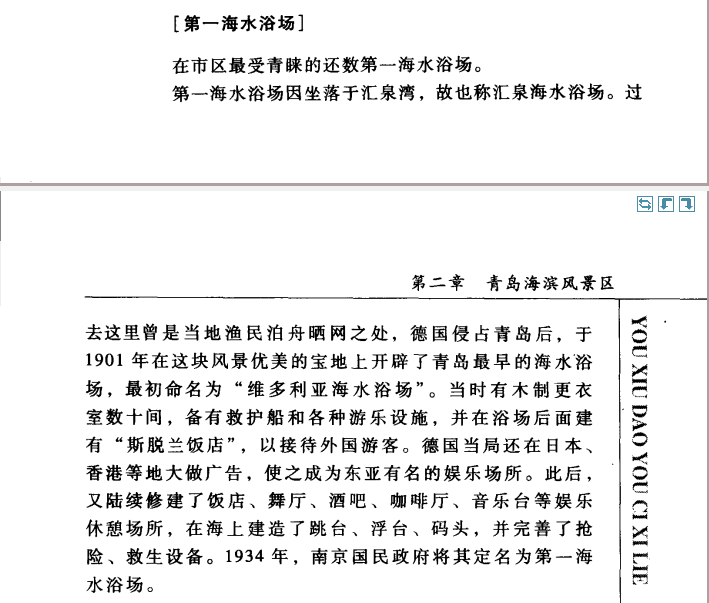

*2018-07-06 09:46 · 手机上网 转自青猴*

---

### 2395

青岛的沙滩名大概是沿用了德国殖民者的命名风格，清晰但无趣：第一海水浴场、第二海水浴场、第三海水浴场...

*2018-07-06 08:53 · iPhone版*

---

### 2396

刚知道「洞庭碧螺春」这茶跟洞庭湖没关系，而是产自苏州太湖洞庭山碧螺峰。

*2018-07-05 20:52 · iPhone版*

---

### 2397

美国国庆日真是充满传奇花絮：杰斐逊起草的《独立宣言》发表于1776年7月4日。五十年后，1826年7月4日，参与宣言签字、后来政见水火不容、分别成为美国第二第三任总统的亚当斯和杰斐逊在同一天去世，只隔几个小时，享年90和83岁。

*2018-07-05 14:29 · iPhone版*

---

### 2398

澳大利亚的银行也有「四大」之说: NAB, CBA, ANZ澳新, Westpac.

转@ 王兴 按一级资本计算，全球十大银行的前四名是中国的四大行工建中农，五到八名是美国的四大行（摩根大通、美国银行、富国、花旗），第九是日本的三菱UFJ，第十是英国的汇丰。第十的规模大概是第一的一半

*2018-07-05 11:54 · 手机上网 转自王兴*

---

### 2399

《应该带多少条内裤去环游世界？》，这标题不错。

*2018-07-05 10:39 · iPhone版*

---

### 2400

按一级资本计算，全球十大银行的前四名是中国的四大行工建中农，五到八名是美国的四大行（摩根大通、美国银行、富国、花旗），第九是日本的三菱UFJ，第十是英国的汇丰。第十的规模大概是第一的一半。

*2018-07-04 08:02 · 手机上网*

---

### 2401

真的很烦那种没有中文简历只有英文简历偏偏简历上的英文又漏洞百出的人。

*2018-07-04 00:09 · iPhone版*

---

### 2402

全中国有多少人有本科或以上学历？答案肯定出乎绝大多数人的意料，不到4%。

*2018-07-03 08:46 · iPhone版*

---

### 2403

卡夫卡的气质和那个喜欢穿貂的王尔德真是天壤之别。我的意思是，两个人都很有气质，但截然不同。

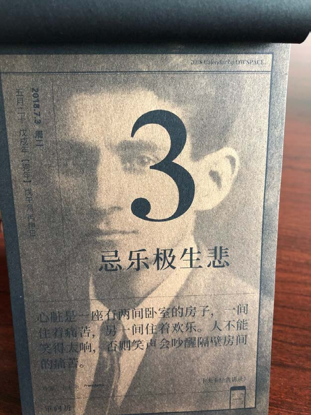

*2018-07-02 13:19 · 猫饭*

---

### 2404

茄子做得好是真好吃。

*2018-07-02 13:06 · 手机上网*

---

### 2405

我也见过这种说法，但我更愿意把1983年成立的光大和1979年成立的中信归为一拨。我列的这四家都是历史比中华人民共和国还长的。转

@ 我是秀才 一说不是中银是光大。转@ 王兴 香港四大老中资：招商局、华润、中银、港中旅。

*2018-07-02 09:59 · 手机上网 转自王兴*

---

### 2406

香港四大老中资：招商局、华润、中银、港中旅。

*2018-07-01 14:39 · iPhone版*

---

### 2407

前几天的感觉不是错觉，我的脸上已经开始脱皮:-( 看来平时北京的空气把我保护得太好了，一场加州海边的户外午餐会就足以把我晒伤...

转@ 王兴 第一次有这种体验：满天是云、看不到阳光，但是紫外线强到脸部有明显感觉。

*2018-07-01 06:34 · 手机上网 转自王兴*

---

### 2408

钢铁和水泥毫无疑问都是实业，但钢筋水泥混凝土组成的房子却通常不被认为是实业，因为房地产有太强的金融属性。确实，钢筋水泥等物料成本在房子售价里只是很小很小的比例。

*2018-06-29 08:50 · iPhone版*

---

### 2409

房地产算不算实业？这是个有趣的问题。很少有什么东西比钢筋水泥混凝土组成的房子更结实，但房地产通常不被认为是实业。突然意识到我不太清楚「实业」这词在英语里怎么说。

*2018-06-29 08:41 · iPhone版*

---

### 2410

转@ 王兴 房地产泡沫对国民经济的巨大伤害实际上并不在于泡沫破灭之后房价下跌导致的资产价格（或与之相对的所谓国民财富）的巨大缩水，而是在于泡沫破灭之前房价虚高导致的社会资源的巨大错配:(

*2018-06-29 06:42 · 手机上网 转自王兴*

---

### 2411

Holocaust, 纳粹屠犹。

*2018-06-29 05:59 · iPhone版*

---

### 2412

超越性

*2018-06-28 16:27 · iPhone版*

---

### 2413

多谢配图。转@ 阳升 转@ 王兴 前几天看到「通用电气一百多年来第一次被踢出道琼斯指数」的新闻后，逐渐意识到更根本的问题可能是：通用电气这家公司到底是干什么的？我知道 GE 是以爱迪生的灯泡业务起家，但现在我能想起的 GE 业务只有飞机发动机，也不清楚到底算不算主营业务

*2018-06-28 15:44 · 手机上网 转自阳升*

---

### 2414

前几天看到「通用电气一百多年来第一次被踢出道琼斯指数」的新闻后，逐渐意识到更根本的问题可能是：通用电气这家公司到底是干什么的？我知道 GE 是以爱迪生的灯泡业务起家，但现在我能想起的GE 业务只有飞机发动机，也不清楚到底算不算主营业务。韦尔奇最初的本行是化工，这业务现在已经没

*2018-06-28 15:20 · iPhone版*

---

### 2415

收到一个贝尔金无线充电座，用 iPhone X 试了一下，初体验还可以。

*2018-06-28 00:21 · iPhone版*

---

### 2416

和一个朋友聊天，他说他去参加了霍金的葬礼。英国人对霍金还是非常认可的，将其安葬在威斯敏斯特，而且是牛顿和达尔文中间的位置。

*2018-06-26 21:43 · 手机上网*

---

### 2417

第一次有这种体验：满天是云、看不到阳光，但是紫外线强到脸部有明显感觉。

*2018-06-26 13:14 · iPhone版*

---

### 2418

如果从西雅图往南飞，一定要记得坐左侧靠窗位置。雪山很美。

*2018-06-25 23:53 · 猫饭*

---

### 2419

所以，季羡林当年接受采访时说得很对，好大学得靠钱堆出来。这269亿应该理解为很大部分的产出是科研成果，如果只是用于教育的话，那每个学生每年花近百万… 转@ 王兴 清华大学2018年的预算是269亿。

*2018-06-25 22:42 · 手机上网 转自王兴*

---

### 2420

汝皆水手，航于双洋。大千世界，与汝心房。另，英文版最后一句的is 应该省掉。转@ 王兴 everyone is a sailor / voyaging in twinoceans / one is the world / the other his heart.

*2018-06-25 21:31 · 手机上网 转自王兴*

---

### 2421

听经历过空中加油的人说，那体验很不好，时间长达几十分钟，而且飞机跟在加油机后面，被气流干扰得很震很晕。

*2018-06-25 10:25 · iPhone版*

---

### 2422

清华大学2018年的预算是269亿。

*2018-06-24 16:06 · iPhone版*

---

### 2423

everyone is a sailor / voyaging in twin oceans / one is theworld / the other is his heart.

*2018-06-23 12:57 · iPhone版*

---

### 2424

要说夏夜消暑，确实什么茶都不如一杯凉凉的白葡萄酒。

*2018-06-21 22:24 · iPhone版*

---

### 2425

突然想起来我很久没荡过秋千了，荡得很高很高的那种。

*2018-06-21 21:52 · 手机上网*

---

### 2426

散步时在脑中搜寻了一下，没找到和夏至相关的歌，倒是想起刘若英在《后来》里唱到「十七岁的仲夏」，但也不是一回事。转@ 王兴又是一年夏至。白天再长，也有太阳下山之时。

*2018-06-21 21:49 · 手机上网 转自王兴*

---

### 2427

又是一年夏至。白天再长，也有太阳下山之时。

*2018-06-21 20:49 · iPhone版*

---

### 2428

Twin Oceans

*2018-06-21 16:49 · iPhone版*

---

### 2429

土耳其强人埃尔多安的竞选视频宣传片让我没法不想起当年的纳粹电影《意志的胜利》。

*2018-06-21 13:18 · iPhone版*

---

### 2430

王强老师说「一流的书就像炸药，蕴含着摧毁一切的力量，然后还给你更好的自己。」可是，也有摧毁却无法重建的风险吧…

*2018-06-21 12:10 · iPhone版*

---

### 2431

最好的小说像特洛伊木马，以一个普通故事的面目潜入你的意识，然后，屠城。

*2018-06-21 01:23 · iPhone版*

---

### 2432

互联网改变了人们生活的方方面面，包括孤独。

*2018-06-20 22:36 · 手机上网*

---

### 2433

人归根到底是需要交流的，和人交流，或和神交流。

*2018-06-20 13:55 · iPhone版*

---

### 2434

决定在飞机上重读一部意大利小说。

*2018-06-19 23:01 · iPhone版*

---

### 2435

据说 Uber 当年搞中国业务时，创始人 TK 把香港尖沙咀最尖的那个角上的洲际酒店顶楼两层的总统套房长租了一年。维多利亚港对面的中环美景尽收眼底。一年只住几十天。真是花钱不心疼啊。

*2018-06-19 02:43 · 手机上网*

---

### 2436

因为童年的经历，我对山茶花有特殊的感情。

*2018-06-16 19:03 · iPhone版*

---

### 2437

"The integrity, the courage, the money and the power to do theright things"，在飞机上把电影《The Post》看了。

*2018-06-10 06:48 · iPhone版*

---

### 2438

荔枝拿铁？科技巨头总部的口味也比较创新。

*2018-06-09 05:07 · 猫饭*

---

### 2439

转@ 洋鸟消夏录 RT@ 蟾宫 “什么是语言？列车，同时又是道路、旅程和抵达。”——阿多尼斯

*2018-06-08 05:26 · 手机上网 转自蟾宫*

---

### 2440

从波士顿到旧金山竟然要飞六个半小时，跟北京到新加坡一样长。

*2018-06-07 16:55 · iPhone版*

---

### 2441

开眼界。转@ 寒小梦 居然还有贫下中农协会。。

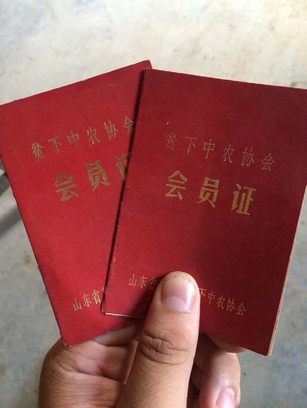

*2018-06-07 02:04 · 手机上网 转自寒小梦*

---

### 2442

纽约和旧金山的路就直接按1街、2街、3街来命名;波士顿讲究一点，按ABCDE来命名：arlington, berkeley, clarendon, dartmouth, exeter...

*2018-06-07 00:06 · iPhone版*

---

### 2443

谢谢。继续努力。转@ 不宜红粉 算了算，吃过好几家平价（人均消费排名倒数那种）米其林和黑珍珠餐厅，集中在香港广州顺德。其实感觉有些米其林（香港翻译成米芝莲）推荐并不是非常好吃，但是黑

珍珠到目前为止真的没有让我失望过。一个好馆子能让一个地方增色不少。感谢美团大众点评，感谢村长@ 王兴

*2018-06-03 22:47 · 手机上网 转自不宜红粉*

---

### 2444

这是啥？莫非就是传说中的微商组织？

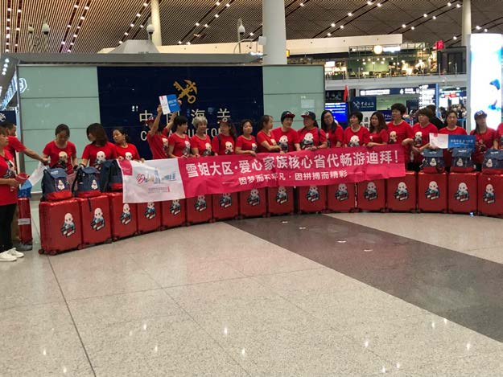

*2018-06-03 20:43 · 猫饭*

---

### 2445

以前也多次配合摄影师拍过照，但还是第一次被要求拍背影。听到正背后传来一阵咔嚓咔嚓，突然想起电影《卡廷惨案》……

*2018-06-03 17:54 · iPhone版*

---

### 2446

华南，华北；美东，美西。

*2018-06-02 12:09 · 手机上网*

---

### 2447

不到两年时间，中国前十大互联网公司的门槛从100亿美元上升到300亿了。

*2018-06-02 02:57 · 手机上网*

---

### 2448

在首都机场看到广告。查了一下，七处是：故宫、天坛、颐和园、长城、大运河、周口店北京猿人遗址、明清皇家陵寝（十三陵）。

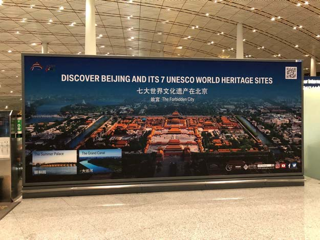

*2018-06-02 02:49 · 猫饭*

---

### 2449

问：你搞了一辆奔驰 G 级越野车整天在城市里跑，到底什么感觉？

答：嗯…… 有个额外的好处，这车震得实在是厉害，我坐车时都没法看手机。

*2018-06-01 21:21 · iPhone版*

---

### 2450

助产士、入殓师，这是跟人打交道的工作的两端。

*2018-05-31 14:32 · 手机上网*

---

### 2451

雪厂街这翻译不错。

*2018-05-31 13:39 · 猫饭*

---

### 2452

这个「大」字真是承前启后。

*2018-05-31 12:10 · 猫饭*

---

### 2453

从整个经济体系的角度来看，所有成本都是人力成本。

*2018-05-31 00:07 · iPhone版*

---

### 2454

A：你是愿意跪着把钱挣了，还是想坚持站着把钱挣了？B：别跟我扯这个了，我们这行得跑着才能把钱挣了。

*2018-05-31 00:05 · iPhone版*

---

### 2455

听说，北京飞香港，有个航班是凌晨三点多起飞，六点多降落，真是太拼了。

*2018-05-30 00:29 · iPhone版*

---

### 2456

当命运女神把水晶球从左手换到右手的时候。

*2018-05-29 01:00 · 手机上网*

---

### 2457

据说亚马逊还有一点与众不同，最高管理层没黑人，没华人，没印度人，连拉丁裔都没有，清一色传统白人。

*2018-05-28 20:11 · 手机上网*

---

### 2458

看到一个可爱的头像。

*2018-05-28 20:09 · 手机上网*

---

### 2459

久违的味道。多年之后又含了一口念慈庵。

*2018-05-28 00:22 · iPhone版*

---

### 2460

9:00-23:30，10+1个会。

*2018-05-27 23:46 · iPhone版*

---

### 2461

「和小真理相对的当然是谬误，可是和伟大的真理相对的仍然是伟大的真理」，物理学家波尔的这个说法不但适用于量子力学和爱因斯坦的论战，也一样适用于以哈耶克为代表的奥地利学派和凯恩斯主义的分歧。

*2018-05-27 16:22 · iPhone版*

---

### 2462

知难而退是聪明人的做法。

*2018-05-26 23:59 · 手机上网*

---

### 2463

读中文书的速度完全不是读英文书可以比拟的。

*2018-05-26 00:16 · iPhone版*

---

### 2464

看到这张图莫名其妙的想起《银河系漫游者指南》。

*2018-05-25 15:10 · 手机上网*

---

### 2465

据说日本现在有500座空寺庙。年轻人本来就少，也不愿意接，老一代走了就空了。

*2018-05-25 14:24 · iPhone版*

---

### 2466

netflix 继续一路上涨，昨天突破1500亿美元，市值超过迪斯尼和comcast 了，在行业内登顶。转@ 王兴 刚发现 paypal 已经是千亿美元公司了，市值1008亿。netflix 也非常接近了，954亿。priceline932亿。

*2018-05-25 10:51 · 手机上网 转自王兴*

---

### 2467

上一个名片夹在春节期间弄丢了。新的这个用了几个月，我一直不太满意，今天总算找到原因了：这个名片夹被设计为在装得很满时才有形，但那并不是我平常想要的状态。

*2018-05-24 23:50 · 手机上网*

---

### 2468

能活下来的零售都需要了解并利用国民性，成功的零售比较完整的反映国民性，更牛逼的零售则进一步塑造国民性。

*2018-05-24 17:11 · iPhone版*

---

### 2469

皇家盖浇饭。

*2018-05-24 17:08 · iPhone版*

---

### 2470

囧，搞混了。那么，我把卢卡斯排在这二人之上。转@ 藤椒 可是星球大战不是乔治卢卡斯导演的么 转@ 王兴 很长一段时间里，我觉得卡梅隆是比斯皮尔伯格更牛的导演。最近越来越觉得我原先低估了《星球大战》的经典程度。卡梅隆没有哪部电影在题材和宏观结构上达到了这个高度。

*2018-05-24 00:21 · 网页 转自王兴*

---

### 2471

很长一段时间里，我觉得卡梅隆是比斯皮尔伯格更牛的导演。最近越来越觉得我原先低估了《星球大战》的经典程度。卡梅隆没有哪部电影在题材和宏观结构上达到了这个高度。

*2018-05-24 00:07 · 网页*

---

### 2472

博士大牛豪爽的说「你要问全球排名？那谦虚点说，我们算第二的话，没人敢说自己是第一」，紧接着又补了一句「按英文的说法就是，second to none」。

*2018-05-23 21:39 · iPhone版*

---

### 2473

前辈说三十几年前他考大学时本来要去清华，后来上海交大的招生老师让校长把他叫到办公室，展示了一张由黑白照片拼接成的美国尼米兹级航母的照片，跟他说，来我们这儿吧，将来干这个。他就去了。

再后来他转行了，但现在中国航母的总设计师确实是他当年的同学。

*2018-05-23 16:07 · 手机上网*

---

### 2474

又开了一个9小时的会。

*2018-05-23 02:00 · iPhone版*

---

### 2475

世界变了，世界观就得跟着变。

*2018-05-22 15:50 · iPhone版*

---

### 2476

欧洲、亚洲、非洲这些概念有时挺有误导性的。按这种划分，《几何原本》诞生于非洲，因为欧几里得老先生是在今天属于埃及的亚历山大港完成了这些伟大的创作工作。

*2018-05-22 15:11 · iPhone版*

---

### 2477

又起风了。

*2018-05-22 15:06 · iPhone版*

---

### 2478

亚美尼亚教会有一句格言：有意识的死亡就是永生。

*2018-05-22 11:53 · 手机上网*

---

### 2479

登录了一次 ebay，被其原始难用和多年不思进取彻底震惊了。

*2018-05-22 00:02 · iPhone版*

---

### 2480

为什么体育项目里有「撑杆跳高」而没有「撑杆跳远」？

*2018-05-21 20:43 · iPhone版*

---

### 2481

尝试了把普洱生茶和福鼎白茶拼在一起泡，感觉还不错。

*2018-05-21 14:35 · 网页*

---

### 2482

博尔赫斯总是逼格爆表。

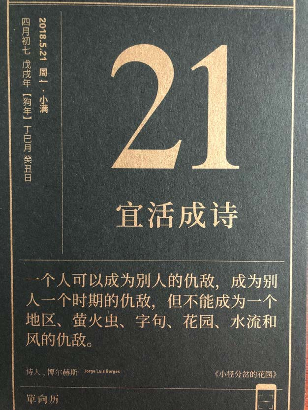

*2018-05-21 14:20 · 猫饭*

---

### 2483

在清朝程鸿益的《河口竹枝词》中偶遇我日常工作中所熟悉的名词「小票」：狮江妇女趁新茶，鬓影衣香笑语哗。齐问庄客分小票，春葱纤剔冻雷芽。

*2018-05-21 11:18 · iPhone版*

---

### 2484

不管用筷子还是叉子，勺子是共通的。

*2018-05-20 13:33 · iPhone版*

---

### 2485

今年的黄金分割点已经过去了。

*2018-05-20 11:10 · iPhone版*

---

### 2486

又到了布谷鸟彻夜啼叫的季节。

*2018-05-20 00:05 · 手机上网*

---

### 2487

转@ gravity0 犹太人为什么肤色白黄黑都有？他们为什么规定母亲是犹太人孩子就是犹太人，随母不随父？一个颠沛流离饱受欺凌的民族经历了什么，想想就知道了。

*2018-05-19 19:48 · 手机上网 转自gravity0*

---

### 2488

有一种茶叫「雀舌」。这名字很讨巧，给人「物以稀为贵」的暗示。

*2018-05-19 18:49 · iPhone版*

---

### 2489

现在觉得，如果面积允许，单人卫生间也还是在马桶之外单设小便池更好。

*2018-05-19 18:08 · iPhone版*

---

### 2490

人不会永远年轻，但永远有人年轻。这是某些商业模式成立的基础。

*2018-05-19 16:54 · iPhone版*

---

### 2491

在朋友圈里看到，山西大同竟然有这么漂亮的建筑。

*2018-05-18 22:58 · 手机上网*

---

### 2492

又想起奥威尔的《Shooting An Elephant》。

*2018-05-18 22:42 · iPhone版*

---

### 2493

其实就是「真善美」的展开。转@ 王兴 转：思想活动有三个方面——第一个方面关于“真相”，这是哲学、科学和宗教所在的领域；第二个方面是“何谓正确”，这是政治和法律所在的领域；第三个方面是“品味”，这是艺术所在的领域。

*2018-05-18 22:03 · 手机上网 转自王兴*

---

### 2494

劳斯莱斯都出 SUV 了…

*2018-05-18 21:55 · 手机上网*

---

### 2495

转：思想活动有三个方面——第一个方面关于“真相”，这是哲学、科学和宗教所在的领域；第二个方面是“何谓正确”，这是政治和法律所在的领域；第三个方面是“品味”，这是艺术所在的领域。

*2018-05-18 21:30 · iPhone版*

---

### 2496

Ideas invade everything.

*2018-05-18 21:28 · iPhone版*

---

### 2497

没看过报道，但是同希望。转@ 柒小斤 看了一点陈粒的报道，我觉得她未来几年应该能写出更好的作品来，希望。

*2018-05-18 19:05 · 手机上网 转自柒小斤*

---

### 2498

在酒店大堂跟人谈完事情，起身走人，从茶几上拿起两部手机，左右手各一，边走边插进裤子前兜里，那一瞬间觉得自己像个双枪牛仔。

*2018-05-18 18:30 · iPhone版*

---

### 2499

中文有「帮」和「助」，英文有 help 和 assist.

*2018-05-18 13:14 · iPhone版*

---

### 2500

川普深谙「指鹿为马」之道。

*2018-05-18 11:11 · iPhone版*

---

### 2501

今早喝的茶是「武夷水仙」。感觉一般。

*2018-05-18 11:02 · iPhone版*

---

### 2502

今天听说，全国每年就诊人数最多的医院不是协和或华西之类的，而是广东省中医院。想想似乎也有点道理，不抽血不拍片不开刀不住院，望闻问切，抓药走人，确实容易人流量比较大。

*2018-05-18 00:26 · iPhone版*

---

### 2503

我特别佩服那些开两截拖斗车还倒车入库倒得很精准的司机。

*2018-05-17 23:58 · iPhone版*

---

### 2504

人生在世，有谁不疑惑，有谁不痛苦，有谁不煎熬？这正是宗教这个牛逼的产品类别号称要帮用户解决的问题。

*2018-05-17 18:08 · 手机上网*

---

### 2505

今晚复盘了一些重大失误，想起了我在清华读大四时去紫竹院香格里拉酒店参加贝尔实验室组织的某个大型周年纪念活动时听一个美国华裔光纤专家在大会上讲当年美日光通信竞争时日本犯的一些错。

*2018-05-17 02:17 · iPhone版*

---

### 2506

钱袋是钱包的前辈吗？

*2018-05-17 02:08 · iPhone版*

---

### 2507

人穷志短。是短，不是小。老祖宗总结得很明确。

*2018-05-16 18:43 · 手机上网*

---

### 2508

有趣的八卦。转@ gravity0 马大胡子送给达尔文的资本论至死没拆封，郑也夫猜是他不懂德文。据达尔文儿子弗朗西斯回忆，老爸读过不少德文科技书。 http://friendsofdarwin.com/... // 每天只能工作两三个小时的人肯定知道哪些书不值得读。

*2018-05-16 11:21 · 手机上网 转自gravity0*

---

### 2509

我现在听《阿里山的姑娘》这歌时都会时不时想起电影《赛德克巴莱》。

*2018-05-16 09:03 · iPhone版*

---

### 2510

或许可以重看一遍《大话西游》了。

*2018-05-15 23:12 · iPhone版*

---

### 2511

转@ 舍身冬阳 列宁主义主要是指，认为共产主义可以在单独的一个或几个国家先实现。列宁建党原则是指，党员必须同时是党员和党内某个具体组织（如支部）的成员，而不能单是党员，这加强了对党员的组织力。转@ 王兴 列宁主义是什么？

*2018-05-15 13:38 · 手机上网 转自王兴*

---

### 2512

西安的大雁塔为什么是个重要景点？用通俗易懂的话来说，大雁塔就是唐僧取经回来后的藏经阁，皇上给建的。

*2018-05-15 11:21 · 手机上网*

---

### 2513

转@ 下划线和小数点 明年这个时候我就是在中美加德英都接受过高等及高等以上教育的人了，哇...

*2018-05-15 11:09 · 手机上网 转自下划线和小数点*

---

### 2514

转@ 胡泳 人是追求意义的动物，然而意义主要是指产生焦虑。

*2018-05-15 08:50 · 手机上网 转自胡泳*

---

### 2515

写《忏悔录》的圣奥古斯丁竟然是个北非人。

*2018-05-15 01:04 · 手机上网*

---

### 2516

普华永道评的所谓全球30个机遇之城，即区域中心城市。

*2018-05-14 23:35 · 手机上网*

---

### 2517

午饭后继续开会有点困，吃了一颗杨梅，精神了。

*2018-05-14 14:45 · iPhone版*

---

### 2518

亚马逊 kindle 阅读器的中文名是「金读」。

*2018-05-14 12:02 · iPhone版*

---

### 2519

平台模式到了平台期。

*2018-05-13 15:12 · iPhone版*

---

### 2520

有一种游览古迹的方式叫按当导游的标准来要求自己。

*2018-05-13 14:31 · iPhone版*

---

### 2521

转@ 拧巴人儿 列宁主义对马克思主义最大的”贡献“就是提出了一套组织方法，把党作为组织的最高中心。是一种集权形式。转@ gravity0十几年前第一次听李敖说到这个词，大意是一套组织方法，他说国民党也是列宁主义政党。 转@ 王兴 列宁主义是什么？

*2018-05-13 12:17 · 手机上网 转自王兴*

---

### 2522

列宁主义是什么？

*2018-05-13 11:20 · iPhone版*

---

### 2523

物伤其类

*2018-05-13 10:14 · 手机上网*

---

### 2524

转：全世界都在努力生产美元能够购买的商品，而美国则负责生产美元。

*2018-05-13 09:56 · 手机上网*

---

### 2525

antagonistic pleiotropy

*2018-05-13 09:17 · iPhone版*

---

### 2526

有一类市场叫「狗粮市场」：狗粮是给狗吃的，但来买的不是狗。

*2018-05-12 20:07 · iPhone版*

---

### 2527

在思考「有什么一部电影把一本书变火的例子？」这个问题时，我第一个想到的是《喜剧之王》和《演员的自我修养》……

*2018-05-12 19:58 · iPhone版*

---

### 2528

「在印度国内，几乎没有人能采访到阿米尔·汗。但在中国，他接受了一个又一个探班和采访。」这就叫敬业和结果导向，全方位的。

*2018-05-12 19:43 · iPhone版*

---

### 2529

primary modality

*2018-05-12 19:30 · iPhone版*

---

### 2530

最大的问题。

*2018-05-12 19:16 · 手机上网*

---

### 2531

飞灰不昏

*2018-05-12 13:23 · 手机上网*

---

### 2532

当生于1926年的英国女王伊丽莎白二世终于宣布自己的退休计划后，生于1925年的马来西亚政坛老手马哈蒂尔突然复出并赢得了本国大选。这才是真正的超长待机！

*2018-05-12 02:16 · iPhone版*

---

### 2533

刚知道西安到北京的高铁最快只要四个半小时。早知道就坐高铁回京了。

*2018-05-11 22:34 · 手机上网*

---

### 2534

西安咸阳机场里的 sleepbox，一小时50元，一晚240。

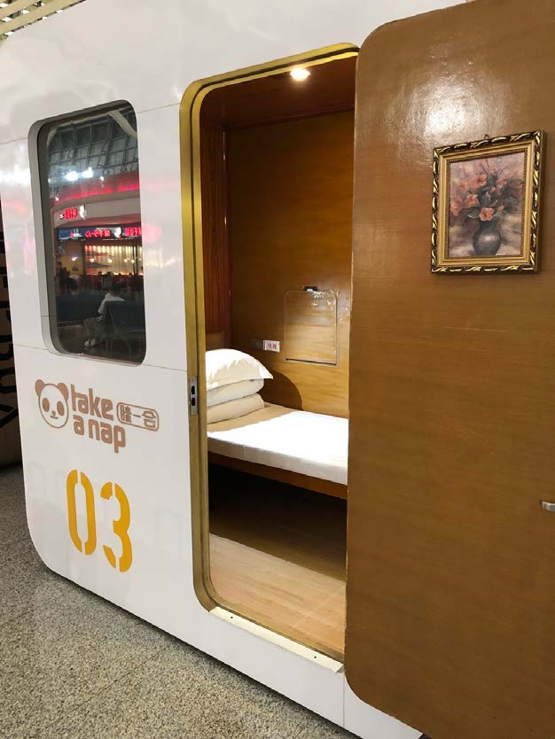

*2018-05-11 21:32 · 猫饭*

---

### 2535

这是我第二次来大雁塔。上一次是十七年前。那次看到了什么、看懂了什么，我现在已经完全没印象了。

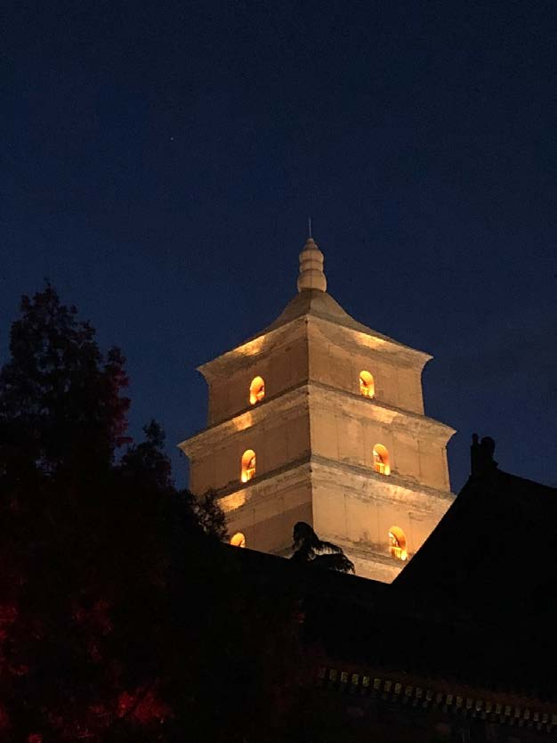

*2018-05-11 20:38 · 猫饭*

---

### 2536

「长安」这个城市名寓意着美好的愿望，可惜事与愿违。

*2018-05-11 19:15 · 手机上网*

---

### 2537

国内多数景点意境最好的时刻就是关门前人都已经走光了的时候。今天我好像是最后一个离园的游客。

*2018-05-11 18:59 · 猫饭*

---

### 2538

讲解录音里说玄奘同志圆寂后，唐高宗说「朕失国宝，国失栋梁」。

与此有关？但总感觉说「民族脊梁」感觉怪怪的。转@ 青瓜三滚 考虑到赵朴初同志的身份和大雁塔广场立的雕像，肯定是说的玄奘了 转@ 王兴 赵朴初同志在这儿题「民族脊梁」四个大字是什么意思？

*2018-05-11 18:57 · 手机上网 转自王兴*

---

### 2539

赵朴初同志在这儿题「民族脊梁」四个大字是什么意思？

*2018-05-11 18:42 · 猫饭*

---

### 2540

这角度拍起来很没立体感。

*2018-05-11 18:34 · 猫饭*

---

### 2541

原来这《般若波罗蜜多心经》是玄奘法师译的啊。

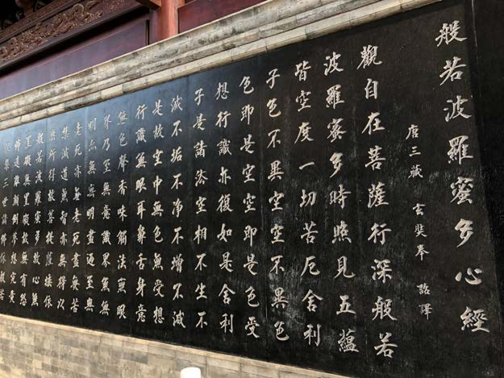

*2018-05-11 17:58 · 猫饭*

---

### 2542

大雁塔原本是玄奘取经回来后仿印度建筑形式而建。现在门洞里加的铝合金玻璃看起来有点别扭。

*2018-05-11 17:45 · 猫饭*

---

### 2543

廉价的赞美不如中肯的批评。

*2018-05-11 15:50 · 手机上网*

---

### 2544

这次开会的酒店好奇怪：房间里有双洗手盆挺常见，但是有双淋浴位我还是第一次遇到。

*2018-05-11 12:56 · 猫饭*

---

### 2545

印度人的印度 vs. 印度教的印度，马来西亚人的马来西亚 vs. 马来人的马来亚。好复杂……

*2018-05-11 12:42 · 手机上网*

---

### 2546

转@ 撒闵呢 小胖子凭借这个片获得那年的奥斯卡最佳男配奖 转@ 王兴 《Moneyball》这部电影里给我最深刻印象的场景和比赛无关，和那个传奇教练也无关，而是和那个耶鲁小胖子助理有关。

*2018-05-11 12:29 · 手机上网 转自王兴*

---

### 2547

《Moneyball》这部电影里给我最深刻印象的场景和比赛无关，和那个传奇教练也无关，而是和那个耶鲁小胖子助理有关。

*2018-05-11 12:14 · iPhone版*

---

### 2548

整个互联网的历史就是一部 O2O 的历史，各行各业逐步从 offline 到online。

*2018-05-11 10:26 · 手机上网*

---

### 2549

第三次世界大战爆发时，你觉得自己会是通过什么方式获知这个信息？

*2018-05-11 02:18 · iPhone版*

---

### 2550

饭局上被科普了一下，看女团的主力人群其实不是男性，而是怀有少女心的轻熟女。她们看男团主要看脸，看女团主要看如何撕逼。

*2018-05-10 21:07 · iPhone版*

---

### 2551

mobile payment 是「移动支付」还是「手机支付」？我以前没想过这个问题。

*2018-05-10 17:44 · iPhone版*

---

### 2552

当大会配备了语音识别和实时汉译英的大屏幕后，看不同发言者的语音识别率和翻译准确率成了一件有趣的事。

*2018-05-10 15:06 · iPhone版*

---

### 2553

转@ backspacer 1950年世界人口25亿，2015年是72亿，地球也变拥挤了很多 转@ 王兴 转：1950年全球20个最大城市的人口规模均值为500万，2015年前20大城市人口平均规模已上升到1859万。

*2018-05-10 13:59 · 手机上网 转自王兴*

---

### 2554

这家网红咖啡不区分「的」和「得」。

*2018-05-10 12:40 · 手机上网*

---

### 2555

转：1950年全球20个最大城市的人口规模均值为500万，2015年前20大城市人口平均规模已上升到1859万。

*2018-05-10 01:21 · iPhone版*

---

### 2556

看到一篇文章想起一段往事：2006年上半年我为校内网融资，去拜访一个知名投资人。他问「这事是跟百度QQ一个量级的事，还是小一个量级？」我答「SNS如果做好了是比百度QQ再大一个量级的事。」他愣了一下，或许觉得我有点不知天高地厚。然后就没有然后了。

*2018-05-10 01:02 · iPhone版*

---

### 2557

大xx，深xx，新xx，快xx，小xx，微xx

*2018-05-09 17:47 · iPhone版*

---

### 2558

机场安检员是不是可以每天零距离接触最多人的工作？

*2018-05-09 17:15 · iPhone版*

---

### 2559

CK推这个真能成功吗？

*2018-05-09 17:12 · 猫饭*

---

### 2560

讨论来讨论去，可能 underdog 还真就是直译成「下狗」就好。

*2018-05-09 17:03 · iPhone版*

---

### 2561

转：都说要把车当作移动空间来打造，但是绝大部分车连个垃圾桶的设计都没有。

*2018-05-08 23:05 · iPhone版*

---

### 2562

保存语言文字对保存文化有多重要确实是个可以商榷的事。现在古希腊古罗马这些文化经典基本上都是从希腊文/拉丁文译成阿拉伯文后过了很多年再从阿拉伯版本译回去的，似乎大家也觉得挺好。

*2018-05-08 15:39 · 手机上网*

---

### 2563

前段时间我面试人，接过名片后我随口问：这名字和材料上不一样啊？他回答「我日常要接触很多客户和政府部门，我的本名有点生僻，我怕对方不好念不好记，于是名片上改了个名。」这种要性得加分啊！转@ 董慧智 有个客户姓这个字，拿到名片我只能问她:你有英文名吗？ 转@ 王兴 昝 zǎn

*2018-05-08 15:23 · 手机上网 转自王兴*

---

### 2564

为什么后来要把「的地得」都统一成「的」字，我不太理解，所以打算继续区分使用这三个字。

*2018-05-08 15:18 · iPhone版*

---

### 2565

「卫道士」不幸成了一个贬义词。

*2018-05-08 14:14 · iPhone版*

---

### 2566

转@ 豆芽炒豆卜 在设拉子喝了一款[奶茶],完全是用鲜奶扔茶叶进去煮，香浓的一天不用吃饭，简单粗暴。我想起正宗的港式奶茶，要用不同品质和价格的茶叶按比例搭配，一种出味，一种出色，一种出香，才能调出一杯香浓的奶茶。

*2018-05-08 14:05 · 手机上网 转自豆芽炒豆卜*

---

### 2567

美国既要求中兴遵循美国法律，又要求中国政府不能要求美国航空公司尊重中国法律。

*2018-05-08 13:54 · 手机上网*

---

### 2568

CR5 ＝ 85.8%

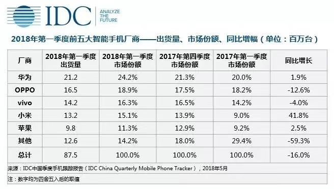

*2018-05-08 13:46 · 手机上网*

---

### 2569

khomeini, khamenei, rafsanjani, ahmadinejad, velayati

*2018-05-08 12:46 · iPhone版*

---

### 2570

吉利市值2000亿，比亚迪1500亿，长城1000亿，长安500亿，这基本上就是国产自主品牌汽车的头部玩家了。

*2018-05-08 11:51 · iPhone版*

---

### 2571

据说伊朗派到叙利亚参战的部队里很多士兵并不是伊朗本土人，而是阿富汗人。伊朗境内有不少避难过来的阿富汗黑户。伊朗政府跟他们说，每家出一个男丁，去叙利亚参战，服役期满回来了或者战死回不来了，全家都给伊朗合法身份。

*2018-05-07 21:38 · iPhone版*

---

### 2572

甘地的一生是传奇的一生，死也死得传奇：某种意义上缔造了当代印度这个国家的他没有死在反抗英国殖民的路上，而是在印度从大英帝国独立出来后被嫌他不够「印度」的印度教极端分子当众刺杀。

*2018-05-07 14:55 · 手机上网*

---

### 2573

昝 zǎn

*2018-05-07 11:37 · iPhone版*

---

### 2574

查了一下，果然如饭否网友所提醒，历史上波斯和伊朗两个概念不是完全一回事，大致相当于英格兰和大不列颠的关系。转@ 王兴 至今依然觉得「波斯」这个名字比「伊朗」好。

*2018-05-06 18:19 · 手机上网 转自王兴*

---

### 2575

这本书的版式别出心裁。

*2018-05-06 16:08 · 猫饭*

---

### 2576

读错「鸿鹄」真的不奇怪，如果不是中学课本里恰好有这篇文章，我很可能也不会念。鸿字平时还有用，鹄字我在别处几乎就没见过。转@ 王兴 我可以接受一个大学校长读错「鸿鹄」，但不能接受一个大学校长说「…质疑并不能创造价值」。没有质疑哪来科学进步？这是三观问题。

*2018-05-06 13:21 · 手机上网 转自王兴*

---

### 2577

incumbent 在位者

*2018-05-06 13:15 · 手机上网*

---

### 2578

我可以接受一个大学校长读错「鸿鹄」，但不能接受一个大学校长说「…质疑并不能创造价值」。没有质疑哪来科学进步？这是三观问题。

*2018-05-06 12:53 · 手机上网*

---

### 2579

至今依然觉得「波斯」这个名字比「伊朗」好。

*2018-05-06 01:09 · iPhone版*

---

### 2580

叙利亚打了七八年内战，原本2200万人口中，据说有500万已逃离这个国家，另外有近800万人还在境内，但流离失所。死亡人数接近100万。真是挺惨的。

*2018-05-05 20:21 · iPhone版*

---

### 2581

过去十天经过十二个机场。

*2018-05-05 09:30 · iPhone版*

---

### 2582

埋在沙里的烤全羊。

*2018-05-04 05:47 · 猫饭*

---

### 2583

frontier market 是比 emerging market 更低一级的市场。

*2018-05-03 04:04 · iPhone版*

---

### 2584

像准备画一幅印象派画作那样久久凝视此景。

*2018-05-03 02:52 · iPhone版*

---

### 2585

海风吹得远处的城市灯火如星星般闪烁。

*2018-05-03 00:41 · iPhone版*

---

### 2586

据说，最好的羊肉并不产自水草丰茂的草原，而是来自戈壁滩或沙漠。在那里，羊要跑老远才能找到一些野生骆驼刺（一种低矮而生命力顽强的灌木）当食物。

*2018-05-03 00:26 · iPhone版*

---

### 2587

人是不能选择自己的命运的。这是命运的定义决定的。

*2018-05-02 05:23 · iPhone版*

---

### 2588

转@ 郭家二少爷 转@ 无聊图3号机 上传了新照片

*2018-05-02 00:34 · 手机上网 转自无聊图3号机*

---

### 2589

想象力是最唾手可得的娱乐工具。刚才航班飞越阿拉伯沙漠时，望着机窗外广袤的荒野，我仿佛看见一千年前萨拉丁率众和十字军在此浴血奋战的大场面。

*2018-04-30 19:05 · iPhone版*

---

### 2590

Amazigh 竟然是一种语言的名字（北非柏柏尔人的语言），我看第一眼时还以为是 Amazing 拼错了呢。

*2018-04-30 18:59 · iPhone版*

---

### 2591

大部分陆地都不适合人类生存。

*2018-04-30 15:56 · iPhone版*

---

### 2592

异乡的雨。

*2018-04-29 22:22 · iPhone版*

---

### 2593

「采风」这个词听起来就很棒。

*2018-04-29 17:35 · iPhone版*

---

### 2594

崩坏的过程也正是建设的过程。

*2018-04-28 17:38 · iPhone版*

---

### 2595

一二三四线城市的划分长期困扰我，最近觉得比较有实用意义的做法是区分2a和2b：2a比2b强，但是2b的人不会批量迁往2a；三线的人会批量迁往二线，不管是2a还是2b。

*2018-04-28 17:36 · iPhone版*

---

### 2596

橙子树不光可以长橙子，在很多地方也是美观的绿化树种。

*2018-04-28 13:13 · 手机上网*

---

### 2597

今天打了超过一百个哈欠。

*2018-04-27 22:57 · iPhone版*

---

### 2598

看来真是这样，只要是有点文化历史的地方就都觉得自己的美食很拿得出手。一个在中国生活了十八年的叙利亚人坚持认为叙利亚的美食花样不输中国菜。

*2018-04-26 21:32 · iPhone版*

---

### 2599

谷歌著名的所谓「20%自由时间」，我最初也觉得令人向往，后来了解了真相后觉得是虚伪的，又过了三四年我觉得是狠毒的。

*2018-04-26 19:19 · iPhone版*

---

### 2600

2007年，全球城市人口首次超过农村人口。

*2018-04-26 17:37 · iPhone版*

---

### 2601

美国的威慑力还真是无处不在。

*2018-04-26 13:47 · iPhone版*

---

### 2602

转@ 叶滨 国有基金的老大跟我讲述了募资的过程，原来总理想推进点儿事也不容易啊

*2018-04-26 10:46 · 手机上网 转自叶滨*

---

### 2603

钥匙这东西在人类文明进程中算是昙花一现。

*2018-04-26 03:41 · 手机上网*

---

### 2604

痴迷于具象的东西。

*2018-04-26 03:05 · 手机上网*

---

### 2605

「衣不如新，人不如旧」这句话我一直搞不懂是什么逻辑，后来听说有个古代版本是「衣不厌新，人不厌故」，那还比较说得通。

*2018-04-25 13:05 · 手机上网*

---

### 2606

转@ 下划线和小数点 搞 movie night, 发现请来的物理/数学系同学没有白人，然后现在有点儿不敢请哲学系的同学来，因为都是白人...

*2018-04-25 12:31 · 手机上网 转自下划线和小数点*

---

### 2607

雨中的黄山也很棒，当真是万瀑齐飞。转@ Dreamer. 曾经爬华山时伴着迷蒙细雨，到了西峰拨云见夕阳，透过这些云雾，真真是觉得应有仙神。 转@ 王兴 我喜欢山，尤其是云雾缭绕的雨后青山。 转@王兴 我喜欢山，尤其是云雾缭绕的青山。

*2018-04-25 12:28 · 手机上网 转自Dreamer.*

---

### 2608

我喜欢山，尤其是云雾缭绕的雨后青山。 转@ 王兴 我喜欢山，尤其是云雾缭绕的青山。

*2018-04-25 11:46 · 手机上网 转自王兴*

---

### 2609

除了衣食住行，其实「生老病死」也是巨大无比的产业。仅以「生」

为例，起先是传统的母婴行业，现在代孕逐渐兴起，将来可能就到人造子宫了，或许也就是二三十年的事？其实二三十年也就是一眨眼，中国互联网的历史已经超过二十年。

*2018-04-25 11:42 · iPhone版*

---

### 2610

转@ 潘乱 依靠非核心能力赚钱，会损害企业的核心能力。

*2018-04-25 09:30 · 手机上网 转自潘乱*

---

### 2611

97年正式形成的八国集团 G8（Group of Eight）是指八大工业国：美、英、德、法、日本、意大利、加拿大及最后加入的俄罗斯。G8 和1900年八国联军那八国只差了一个，奥匈帝国打输第一次世界大战后失去很多领土并被肢解为奥地利和匈牙利，退出了强国行列，加拿大补进来。

*2018-04-24 14:17 · 手机上网*

---

### 2612

我也喜欢水，尤其是夹杂着黄土和新鲜树枝乃至树干的滚滚春洪。

*2018-04-24 12:39 · iPhone版*

---

### 2613

我喜欢山，尤其是云雾缭绕的青山。

*2018-04-24 12:22 · 手机上网*

---

### 2614

长见识。转@ 阳升 & 林奈 转@ 阳升 原来如此，这么说来达尔文，孟德尔，蔡司，奔驰的名字都是同一个。

*2018-04-24 11:42 · 手机上网 转自阳升*

---

### 2615

老领导回忆他在2000年启动一个政府项目时跟大家说：超越是不容易的，今年是八国联军侵华100周年，100年过去了，那八个国家都还是强国，除了奥匈帝国变成奥地利算是下去了一些...

*2018-04-24 11:27 · iPhone版*

---

### 2616

今晚听到的金句：勤奋有个前提，体力够好。

*2018-04-24 00:23 · iPhone版*

---

### 2617

知乎新发布的那个四分半钟的视频广告装逼不太成功。

*2018-04-23 21:55 · iPhone版*

---

### 2618

不知道为什么，我好像一直都不喜欢「干货」这个词。

*2018-04-23 20:04 · iPhone版*

---

### 2619

「要戒毒，到则徐」，这个广告牌惊到我了。

*2018-04-23 18:59 · iPhone版*

---

### 2620

领导真会说话：广东的茶是「柴米油盐酱醋茶」的茶，福建的茶是「琴棋书画诗酒茶」的茶。

*2018-04-23 12:09 · iPhone版*

---

### 2621

芯片和操作系统做不起来，本质问题还是：只靠中国自己，市场不够大，钱不够多。转@ 王兴 两种世界观。

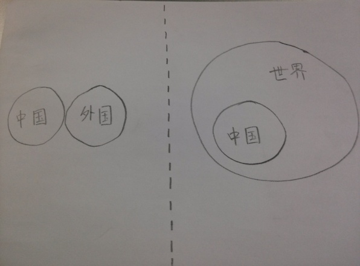

*2018-04-23 00:55 · 手机上网 转自王兴*

---

### 2622

说到诺贝尔奖和盖茨的价值对比，想起教授有次聊到，若以牛顿爱因斯坦这两位绕不过去的大神为级别a，往下依次是 b 开创一个学科；c开创一个领域；d 一个学科创造性发现；e 一个领域重要发现。bcde都能得诺奖。得奖者里甚至还有少数：f 科研成果不怎么重要，但有运作本事...

*2018-04-23 00:18 · 手机上网*

---

### 2623

我和大我两岁半的亲姐姐，一样的幼儿园/小学/中学，一样的大学而且一样的系（清华电子系），一样去美国读博（这回学校不同），一样只拿了硕士学位，之后的人生道路开始分叉：她去硅谷加入公司做芯片，我回国创业搞互联网。「回国创业做芯片」这条路当年恐怕是走不通的。

*2018-04-22 23:43 · 手机上网*

---

### 2624

整整20年前，98年上半年，我在清华大一下学期，清华第一届创业计划大赛配套的系列讲座之一，刚发布搜狐（那时还写成sohoo，模仿yahoo）的师兄张朝阳回校演讲，提问环节上有人站起来，不是提问而是表明立场：清华应该培养学术人才，为了一个诺贝尔奖得主我愿意放弃100个比尔盖茨。

*2018-04-22 20:50 · 手机上网*

---

### 2625

是，但毕竟隔了一段距离，不像其他三处就在角上。而且，那家希尔顿看起来设施很老旧，管理得也很一般。转@ generallee 东北角再往北一点有希尔顿「@ 王兴 三环东北角的亮马桥真是五星级酒店密度极高：西北角是威斯汀，西南角是昆仑和宝格丽，东南角是凯宾斯基和四季，只有东北角空缺。」

*2018-04-21 17:55 · 手机上网 转自王兴*

---

### 2626

现在华为恐怕比中兴还更紧张吧。转@ 王兴 人生就像一场迎着枪林弹雨的冲锋，你并不知道什么时候哪颗子弹就会突然将你或身边的人撂倒。

*2018-04-21 16:35 · 手机上网 转自王兴*

---

### 2627

一阵春雨一阵忙，一树梨花压海棠。

*2018-04-21 16:21 · iPhone版*

---

### 2628

三环上看到一辆 SUV 外型很拉风，仔细一看原来是吉利旗下的独立高端品牌：领克 LYNK&CO。

*2018-04-21 16:21 · iPhone版*

---

### 2629

三环东北角的亮马桥真是五星级酒店密度极高：西北角是威斯汀，西南角是昆仑和宝格丽，东南角是凯宾斯基和四季，只有东北角空缺。

*2018-04-21 16:17 · 手机上网*

---

### 2630

朗廷酒店 the langham 前两年把它的副牌朗豪 langham place 改名为康得思 cordis 了。

*2018-04-20 23:53 · iPhone版*

---

### 2631

稍纵即逝。十年后再见。

*2018-04-19 23:43 · iPhone版*

---

### 2632

有点焦虑，再过半年，第一次世界大战结束就100周年了。2014年夏天，一战开始100周年时我开始读一本关于一战的书，现在还没读完:(

*2018-04-18 23:33 · iPhone版*

---

### 2633

一杯星巴克拿铁，两杯喜茶的「红柚满杯」，四个茶包。

*2018-04-18 22:57 · iPhone版*

---

### 2634

今天开会 review 产品时不由自主的想起这句话：“He realized thenthat history is a wave that moves through time slightly fasterthan we do.”

*2018-04-18 22:52 · iPhone版*

---

### 2635

这衣服为什么不会掉下来？脖子周围有一条透明带？

*2018-04-18 22:37 · 猫饭*

---

### 2636

转@ dylanhong 转@ 王兴 @ 申音 我当然不至于偏激到不看记者写的东西，只是觉得@ Elliot 把新闻说成“历史时钟的秒针”是个很有趣的比喻。

*2018-04-18 20:57 · 手机上网 转自王兴*

---

### 2637

今天开会时吃到了我吃过的最甜美的菠萝蜜。

*2018-04-18 17:48 · 猫饭*

---

### 2638

这个说法或许更客观：整个世界都是棋盘，每个人都既是棋手也是棋子。转@ 王兴 转一条对叙利亚现状的无情评价：一流国家当棋手，二流国家当棋子，三流国家当棋盘…

*2018-04-18 13:51 · 手机上网 转自王兴*

---

### 2639

两杯咖啡，两杯水果茶，两泡茶，一条黄瓜。

*2018-04-17 18:14 · iPhone版*

---

### 2640

教母

*2018-04-17 13:21 · iPhone版*

---

### 2641

两杯咖啡，四个茶包。

*2018-04-16 21:24 · iPhone版*

---

### 2642

转@ webto 妈的果然回龙观菜市场才是王道啊！半个大哈密瓜五块

钱，这特么在东京的话是肯定吃不起的

*2018-04-16 18:16 · 手机上网 转自webto*

---

### 2643

心情很惆怅。我很喜欢的一家腊味煲仔外卖（连砂锅一起送来的那种）这回的出品质量显著下降，直接影响我下午继续开会的状态。

*2018-04-16 13:48 · iPhone版*

---

### 2644

南甜北咸，东酸西辣。

*2018-04-16 01:36 · 手机上网*

---

### 2645

兄弟登山，各自努力。

*2018-04-15 22:31 · iPhone版*

---

### 2646

走在阳光下，走在春风里，走在杨絮中。

*2018-04-15 10:40 · iPhone版*

---

### 2647

日俄战争时中国就是棋盘。转@ 阳升 历史上有没有谁把棋手玩成棋子或者棋盘的，或者棋盘玩成棋子或者棋手的 转@ 王兴 转一条对叙利亚现状的无情评价：一流国家当棋手，二流国家当棋子，三流国家当棋盘…

*2018-04-14 20:39 · 手机上网 转自王兴*

---

### 2648

转一条对叙利亚现状的无情评价：一流国家当棋手，二流国家当棋子，三流国家当棋盘…

*2018-04-14 16:48 · iPhone版*

---

### 2649

一个城市的空中如果有风筝，就变得可爱一点了；如果有鸽群，那就更棒了；如果还有呼啸的鸽哨，那就简直能让人安宁下来；如果还时不时有老鹰在盘旋，那我对天空就没有更多的要求了。

*2018-04-14 11:53 · 手机上网*

---

### 2650

这五条作为对企业管理者的要求也很好。转@ 王兴 清华从2017年起全面推行大类招生培养和管理，纳入本科招生的所有专业将整合为16大类。《清华大学章程》描述的人才培养目标是：健全人格、宽厚基础、创新思维、全球视野和社会责任感。

*2018-04-14 11:44 · 手机上网 转自王兴*

---

### 2651

转@ 左潇 最近问6个投资人，如何看待Waston产品无法落地，都怪罪给国内渠道合作伙伴“落地能力差”，但如果认真一点，别信新闻稿，会发现美国也没有落地。似乎没有人怀疑产品本身的问题？进而怀疑技术的问题？终极叩问：用所谓“认知计算”解决医疗问题可能本身就是错的。但毕竟投了40亿美金

*2018-04-13 13:09 · 手机上网 转自左潇*

---

### 2652

谢谢。转@ OwlofMinerva 茶中的鞣质会刺激胃酸分泌， 伤害胃壁；

茶泡得越久鞣质溶出越多。尽量避免饭前喝茶、避免喝浓茶 @ 王兴绿茶真是伤胃。今年我大概也就喝了十次龙井，胃已经有感觉了。

*2018-04-13 09:55 · 手机上网 转自王兴*

---

### 2653

绿茶真是伤胃。今年我大概也就喝了十次龙井，胃已经有感觉了。

*2018-04-13 08:59 · iPhone版*

---

### 2654

转@ 王兴 安迪－格鲁夫说得很对，一个经理和一个家庭主妇一样，活是永远干不完的。

*2018-04-12 23:25 · 手机上网 转自王兴*

---

### 2655

多谢！转@ 张亮 这个时代信息传递效率大幅提升了，但如果大家不在乎来龙去脉和事实真相，只追逐爆点，最后谁还愿意当真诚的人呢？如果每个人都必须担心被误解和被断章取义，这其实是全社会级的沟通成本和资源浪费。

*2018-04-12 13:50 · 手机上网 转自张亮*

---

### 2656

转@ 王兴 《比利林恩》里有句台词：If a bullet's going to getyou, it has already been fired.

*2018-04-12 12:46 · 手机上网 转自王兴*

---

### 2657

现在很多媒体太不严谨，老把一些我没说过的话塞我嘴里:( 我没说过「美团上市要翻三倍」，这么无脑的话像是我的风格吗？我说过的是，如果美团三年后没有涨三倍，那我会觉得自己的工作做得很失败。

*2018-04-12 10:45 · iPhone版*

---

### 2658

听说苹果的智能音箱出师不利，如果明年要出的 VR/AR 产品也不能让人眼前一亮…… 那就只能继续做一家稳稳赚钱的公司了。

*2018-04-12 10:34 · iPhone版*

---

### 2659

转@ 王金牙儿 贵国黑心医美新动向：开一个网络主播公司，美名曰招主播，“顺利上岗底薪过万”，骗一堆文化程度不高的女孩报名，经纪人和培训老师反复诱导你需要去整形，“你这条件整完能出来”。到医美现场，整形顾问出方案，十万左右。钱不够吧？此时有贷款的出现，一月一个点利，签字画押，至此，骗

*2018-04-12 09:59 · 手机上网 转自王金牙儿*

---

### 2660

想象自己将一罐红牛一饮而尽，然后拉开了真实的车门。

*2018-04-11 15:26 · iPhone版*

---

### 2661

思考一下好奇心、好胜心和平常心三者的关系。

*2018-04-11 15:04 · 手机上网*

---

### 2662

转@ 下划线和小数点 我在马桶上坐着。男友：我可以照个照片吗？

实在太美了，像文艺复兴时期的油画。// 我可能找到真爱了……

*2018-04-11 12:37 · 手机上网 转自下划线和小数点*

---

### 2663

小扎真有意思！# mademyday # 转@ gravity0 评论里有人说带个坐垫去接受质询是个很聪明的主意，这样可以在低椅高台之间看上去不那么矬。

*2018-04-11 12:34 · 手机上网 转自gravity0*

---

### 2664

《了不起的盖茨比》是伟大的小说，值得每过二三十年就拍一遍电影。

*2018-04-11 10:19 · 手机上网*

---

### 2665

这酒店大堂的挂饰拼错了吧？还是我太不理解当代艺术？

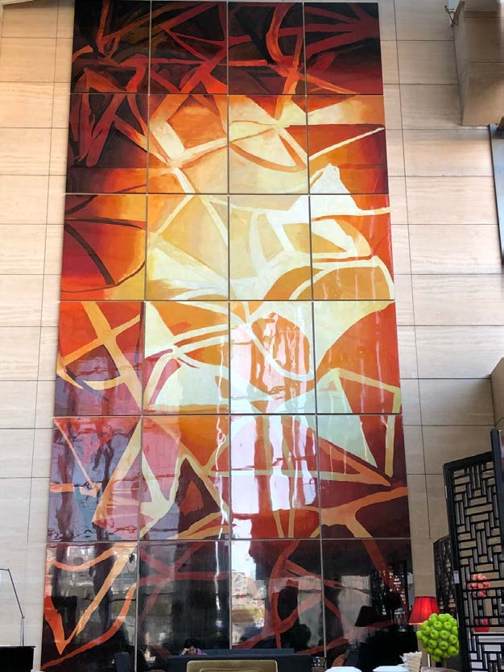

*2018-04-11 09:25 · 猫饭*

---

### 2666

《哈利路亚》这歌冷天听比热天听更合适，例如今夜。

*2018-04-11 01:07 · iPhone版*

---

### 2667

跟一个同事讲大致同一个东西，换着法子讲了两年多，似乎终于有点开窍了。

*2018-04-11 01:01 · iPhone版*

---

### 2668

是小恒水饺吧？转@ 东东枪 点外卖，饺子店的筷子包装上印着“吃饺子是件时尚的事”。错了。感觉不能靠说服改变。

*2018-04-10 15:15 · 手机上网 转自东东枪*

---

### 2669

科恩的《哈利路亚》第一句歌词里的 Secret Chord 应该可以成为一个不错的情趣用品的品牌。

*2018-04-10 15:02 · 手机上网*

---

### 2670

请勿以讹传讹。安吉白茶虽然名字里有白茶二字，但是属于绿茶，不是白茶。真正的白茶以闽北的福鼎白茶为代表，和绿茶的工艺完全不同，是加工步骤最少的茶类。转@ Librarian @ 王兴 白茶也是绿茶

*2018-04-10 15:00 · 手机上网 转自Librarian*

---

### 2671

转@ 努尔哈欠 我都不睡觉了我还在乎健康吗？

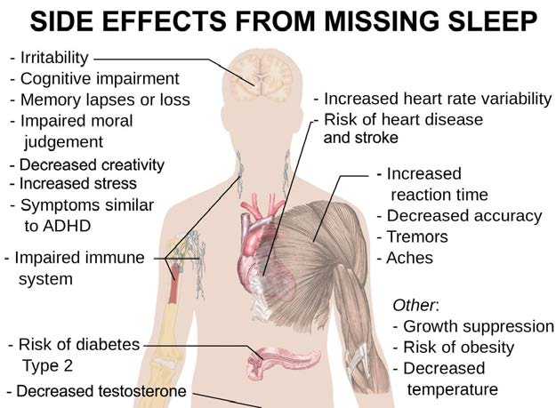

*2018-04-10 14:15 · 手机上网 转自努尔哈欠*

---

### 2672

你也不要走动。咱们叫个美团外卖，不但有盒饭，还有橘子等各式水果。转@ blog图党 前不見古人後不見來者，你站在科技與人文的十字路口，不要走動，我去買幾個橘子。@ 王兴 转@ 孙岩 前不见古人后不见来者，陈子昂原来是在天宁寺塔附近的幽州台作的这首诗。顿时觉得我家周遭也蛮有文化气息的

*2018-04-10 13:41 · 手机上网 转自孙岩*

---

### 2673

这些天吃了很多顿汉堡。

*2018-04-10 12:54 · 手机上网*

---

### 2674

「温水煮青蛙」不稀奇，「温水煮蛤蟆」我还真是第一次听到。必须服气东北人。

*2018-04-10 01:31 · iPhone版*

---

### 2675

转@ 孙岩 前不见古人后不见来者，陈子昂原来是在天宁寺塔附近的幽州台作的这首诗。顿时觉得我家周遭也蛮有文化气息的。

*2018-04-09 19:53 · 手机上网 转自孙岩*

---

### 2676

转@ Dominique_ 资金是资源的子集。转@ 王兴 交易是交换的子

集。

*2018-04-09 16:38 · 手机上网 转自王兴*

---

### 2677

交易是交换的子集。

*2018-04-09 13:05 · iPhone版*

---

### 2678

有的蓝莓，虽然个大，但是淡然无味。

*2018-04-08 17:24 · iPhone版*

---

### 2679

龙井虽然好喝，但毕竟是绿茶，恐怕还是有点伤胃。白茶靠谱。

*2018-04-08 12:49 · iPhone版*

---

### 2680

今天散步，走了一条从没走过的路。

*2018-04-07 11:58 · 手机上网*

---

### 2681

Genoa 是意大利城市热那亚，Geneva 是瑞士城市日内瓦。

*2018-04-07 07:31 · iPhone版*

---

### 2682

突然想起多年前@ flypig 同学开的私厨「十榛法菜」。后来有挺长一段时间我们家自己做酸奶用的都是那个台湾大厨给的菌种。

*2018-04-06 19:15 · iPhone版*

---

### 2683

一个购物中心有两家星巴克几乎总是一场灾难。

*2018-04-06 17:30 · iPhone版*

---

### 2684

人口超过2000万的墨西哥城是西半球人口最多的城市，竟然海拔高达2240米，比昆明还高（滇池海拔1886米）。

*2018-04-05 23:33 · iPhone版*

---

### 2685

抬手不打笑脸人。

*2018-04-05 18:06 · 手机上网*

---

### 2686

跟一个在发展中国家开拓业务的朋友聊天。我问：那里是不是枪支泛滥？答曰：怎么可能呢？枪太贵了，多数人买不起。不过有些人有仿真枪，你也不敢赌是不是真的…

*2018-04-05 17:05 · 手机上网*

---

### 2687

转@ 听雨 所谓「初心」的原意并不是「最初的心」，而是指一颗愿意接纳的未满的心、谦虚的心。 转@ 王兴 「愿」字由「原心」二字组成，和所谓「初心」是何关系？

*2018-04-05 15:09 · 手机上网 转自王兴*

---

### 2688

「愿」字由「原心」二字组成，和所谓「初心」是何关系？

*2018-04-05 14:36 · 手机上网*

---

### 2689

放手。放心。

*2018-04-05 14:21 · iPhone版*

---

### 2690

重温陆游的《临安春雨初霁》「世味年来薄似纱，谁令骑马客京华？

小楼一夜听春雨，深巷明朝卖杏花。矮纸斜行闲作草，晴窗细乳戏分茶。素衣莫起风尘叹，犹及清明可到家。」近千年过去了，人们不骑马改骑车了，闲下来不写字改玩手机了，但很多感觉其实都没变。

*2018-04-05 13:27 · 手机上网*

---

### 2691

转@ 阳升 词语是人类社会的化石 转@ 阳升 本质上任何词语都是属于过去的

*2018-04-05 11:28 · 手机上网 转自阳升*

---

### 2692

其实 bicycle 最准确的翻译既不是「单车」也不是「自行车」，而是「两轮车」。与之对应的是 unicycle 独轮车。

*2018-04-05 11:21 · 手机上网*

---

### 2693

生活在沙漠里的人很难体会「一江春水向东流」那种充满生命力的感觉吧？

*2018-04-05 11:10 · 手机上网*

---

### 2694

建筑系毕业的设计师对我说：设计自行车不像设计一栋楼而更像设计一座桥，功能是外露的，需要非常诚实的表达。

*2018-04-05 00:21 · iPhone版*

---

### 2695

一个接一个的会连开了13个小时，还剩今天最后一个。间隔时间里抽空给自己把了30秒钟的脉，37下，有点快:(

*2018-04-04 22:06 · 手机上网*

---

### 2696

摩拜是少有的真正的中国原创，是难得的有设计感的品牌，有着巨大的社会价值，将和美团一起开创更辉煌的未来。

*2018-04-04 02:56 · 手机上网*

---

### 2697

很多人缺乏理解日常生活所需要的想象力。

*2018-04-04 02:46 · iPhone版*

---

### 2698

四王抬棺震撼我的是价值观，也许不是哥伦布在世时西班牙的价值观，但这座雕塑今天屹立在塞维利亚大教堂里至少代表了后世的价值观：真正的荣誉属于开拓者！转@ 王兴 四王抬棺这座雕塑并未给我留下深刻的视觉印象，但依然让我印象深刻。

*2018-04-04 00:40 · 手机上网 转自王兴*

---

### 2699

这种小雨天，适合沿着河边在柳树下散步。

*2018-04-03 16:01 · 手机上网*

---

### 2700

阿里会继续运营多久百度外卖？

*2018-04-02 18:48 · 手机上网*

---

### 2701

差别只是命名上一个叫微，一个叫短。「迷你」这词好像不太受待见。转@ gravity0 博客进化到一百四十字之后过了十年，视频进化到十五秒。事后看来一切是那么显而易见顺理成章。

*2018-04-02 16:38 · 手机上网 转自gravity0*

---

### 2702

四王抬棺这座雕塑并未给我留下的深刻的视觉印象，但依然让我印象深刻。

*2018-04-02 14:11 · iPhone版*

---

### 2703

孙中山同志最大的遗留之物（legacy）可能是在时尚领域：中山装。

*2018-04-02 13:24 · iPhone版*

---

### 2704

转@ szweig |: 人到哪都会累死，但要累得有质感。 @ szweig

*2018-04-02 13:07 · 手机上网 转自szweig*

---

### 2705

好导师的价值不是帮你解决问题，而是帮你选择合适的问题。转@ 王兴 谷歌创始人佩奇在斯坦福读博时自己选的课题就是自动驾驶，导师苦口婆心劝他，那个真的太难了，你搞不出来的，还是先搞点简单的吧，例如网页搜索… 佩奇听了劝，在搜索方面想出个好想法，无奈自己数学不够好，于是找了数学更好的布林

*2018-04-02 12:35 · 手机上网 转自王兴*

---

### 2706

确实是喝龙井的季节了。可惜今天北京雾霾有点大，配不上一杯好龙井。

*2018-04-02 12:23 · iPhone版*

---

### 2707

一段业界轶事：谷歌创始人佩奇在斯坦福读博时自己选的课题就是自动驾驶，导师苦口婆心劝他，那个真的太难了，你搞不出来的，还是先搞点简单的吧，例如网页搜索… 佩奇听了劝，在搜索方面想出个好想法，无奈自己数学不够好，于是找了不太有想法但是数学更好的同学布林一起搞。

*2018-04-01 21:20 · iPhone版*

---

### 2708

注意到一件小事：汉语里有「美元」和「美分」，但是只有「欧元」

而没有「欧分」。

*2018-04-01 17:37 · 手机上网*

---

### 2709

转@ 王兴 转@ 饭友经典语录 转：我人生第一次采访是98年在花园饭店，因《红色恋人》访张国荣。鼓足勇气举手问：你会为爱而死吗？全场哄笑。我脸刷地红了。哥哥说：你问得好，但电影是电影，人生是人生。群访结束，他特地走到我身边说：不要在乎他们的笑声，你问了今天最好的那个问题。——@ 金娜

*2018-04-01 14:38 · 手机上网 转自饭友经典语录*

---

### 2710

转@ 寒小梦 我们村党支部，永远都是突然通知你明天早上开会，真当每个人都这么闲待在老家山里，随叫随到，我爸为了选票不让我迁党关系。。

*2018-04-01 10:35 · 手机上网 转自寒小梦*

---

### 2711

有意思。我从来没想到「两性繁殖」这种解释。转@ 卢泓言 道生一一生二二生三分别是三种机制。无中生有，自我复制，两性繁殖。二生四只是重复了一生二。提问：孤阴不生独阳不长，阴阳是自我复制出来的吗？转@ 王兴 为什么不是「道生一，一生二，二生四」呢？

*2018-04-01 10:35 · 手机上网 转自王兴*

---

### 2712

一跃而起。

*2018-04-01 08:25 · 手机上网*

---

### 2713

大陆通常把加拿大的 British Columbia 直译成「英属哥伦比亚」，香港那里则译成「卑诗省」。

*2018-03-31 22:24 · iPhone版*

---

### 2714

李商隐那首《无题》里，「春蚕到死丝方尽，蜡炬成灰泪始干」这两句最为有名，但我却觉得前两句「相见时难别亦难，东风无力百花残」的后半段才是更高水平的想象力。

*2018-03-31 21:10 · iPhone版*

---

### 2715

feed 是一个蛮诡异的词。互联网从业者可能知道 feed 的一个含义，知道头条、百度和其他一些公司在打信息流之战，未必关心 feed 的另一个含义：饲料。新希望之类的饲料公司的主营业务就是：animalfeed.

*2018-03-31 19:42 · iPhone版*

---

### 2716

转：日本以“起业家”来称谓创业者，而以“企业家”来指称企业的经营者，当然，广义的企业家也可以包括起业家。

*2018-03-31 14:52 · iPhone版*

---

### 2717

十二个词二十四个字的社会主义核心价值观。

*2018-03-30 21:44 · 猫饭*

---

### 2718

前几天另一家中国互联网公司庆祝了成立20周年：联众。转@ 王兴网易果然是中国互联网公司里第一个庆祝20周年的。

*2018-03-30 16:30 · 手机上网 转自王兴*

---

### 2719

教父听起来高大上，义父差一点，干爹就很俗了。其实意思差不太多。

*2018-03-30 13:27 · iPhone版*

---

### 2720

除了 product manager，还应该有 product strategist.

*2018-03-30 13:23 · iPhone版*

---

### 2721

一百多年前我国知识分子匆促引入西方概念或日本二手货时给我们这些后辈挖了不少坑……

*2018-03-30 13:02 · iPhone版*

---

### 2722

「上士闻道，勤而行之；中士闻道，若存若亡；下士闻道，大笑之。

不笑不足以为道。」老子真是太牛逼了！

*2018-03-30 12:44 · iPhone版*

---

### 2723

如果有简单易用的四维表达系统就更好了。转@ 王兴 可惜纸笔是二维的，缺乏一个好的三维表达系统严重制约了思考和沟通。

*2018-03-30 12:35 · 手机上网 转自王兴*

---

### 2724

好高深的问题！我只知道我能量不足的时候处理信息的能力会显著下降;-) 转@ 卢泓言 @ 王兴 信息，能量，物質。能量和物質的關係愛因斯坦給出公式了。核武器也把轉換機制弄出來了。信息和能量的關係和轉換機制呢？

*2018-03-30 09:58 · 手机上网 转自卢泓言*

---

### 2725

「彩云追月」这词好美。

*2018-03-30 09:48 · iPhone版*

---

### 2726

Telegram 总部据说在迪拜。

*2018-03-30 08:21 · iPhone版*

---

### 2727

QQ 音乐给我推送了陈粒的新歌《花开》。我没听出感觉来。

*2018-03-29 22:44 · iPhone版*

---

### 2728

突然心血来潮，把庞麦郎的《我的滑板鞋》找出来听了听。

*2018-03-29 22:34 · iPhone版*

---

### 2729

意大利人名 Xxx de Yyy 表示是来自 Yyy 家族 的 Xxx（类似于德国人名 Xxx von Yyy）；Xxx da Yyy则表示此人不属于某个显赫家族，而是来自 Yyy 这个地方的 Xxx，例如达芬奇 Leonardo da Vinci.

*2018-03-29 21:38 · 手机上网*

---

### 2730

1848年，三藩附近发现金矿，很多华人过去。1851年，墨尔本也发现金矿。华人于是称三藩为「旧金山」，一直流传到现在。转@ 王兴是墨尔本把三藩从「金山」变成「旧金山」的。

*2018-03-29 21:25 · 手机上网 转自王兴*

---

### 2731

一个在伦敦和纽约各花一半时间的投行老外说，伦敦毫无疑问比纽约更 cosmopolitan，纽约还是太 american-centric，像他这样的人在纽约就是 italian american，还是american，在伦敦则简简单单就是italian.

*2018-03-29 21:16 · iPhone版*

---

### 2732

转@ 郭家二少爷 这应该是一个干销售的人抽过的烟头路旁散落的烟灰比较完整，应该是蹲着抽的，而且当时无风；略微出现的咬痕，充分体现了抽烟的人的不安，说明这行压力很大。烟灰由完整到零散，

能看出抽烟的人心情的焦虑。22块一包的利群，没有抽完就舍得扔掉，只有一个原因，

*2018-03-29 19:38 · 手机上网 转自郭家二少爷*

---

### 2733

开了一天的会，要坐着歇一会儿才有力气吃饭。

*2018-03-29 19:32 · 手机上网*

---

### 2734

转@ qinyf 忽然明白了意大利风的斯特拉迪瓦里 Stradivari 提琴家族的声音中的内核 core 是什么意思。第一次听到这个说法是在B站看

NHK一个纪录片时，当时不明觉厉。前阵子买琴时，试的第二把琴就是仿这个风格，声音里有个坚实的圆柱体。现在想想，就是这个core。不过不

*2018-03-29 15:10 · 手机上网 转自qinyf*

---

### 2735

内衣系！转@ 雅可饼 做个参考。 转@ 王兴 丝袜或女性内衣设计师应该是个有趣的工作。一般是男的干还是女的干？

*2018-03-29 15:08 · 手机上网 转自雅可饼*

---

### 2736

丝袜或女性内衣设计师应该是个有趣的工作。一般是男的干还是女的干？

*2018-03-29 13:52 · 手机上网*

---

### 2737

大概就是难上加难，苦上加苦的关系吧…… 转@ 卢泓言 @ 王兴 多業務，低毛利，長鏈條，三者的次序有什麼講究？關係如何？

*2018-03-29 13:48 · 手机上网 转自卢泓言*

---

### 2738

转@ 杲i杲 中国的太极鱼大约是出现在宋朝的，道德经里就没有相关的概念 转@ 飯否小字报 转@ 王兴 被小小打击了一下。但「求真」

总是好的。

*2018-03-29 09:58 · 手机上网 转自王兴*

---

### 2739

此处宜用过去时。@ 张亮 退出记者界已经快十年了。转@ 潘乱 张亮是优秀记者

*2018-03-29 09:57 · 手机上网 转自潘乱*

---

### 2740

被小小打击了一下。但「求真」总是好的。

*2018-03-28 17:55 · 猫饭*

---

### 2741

十年前的随想。没有想到后来 alphago 是靠另一种速度取胜。转@王兴 假想我和聂卫平下围棋。即使他让我九子，我肯定还是玩不过他。不过，如果规则改成他每下一子，我下两子，那我有信心拼一下。

*2018-03-28 17:46 · 手机上网 转自王兴*

---

### 2742

上周公司大会上嘉宾讲中国零售的历史和未来时有个有趣的观点：可以参考一下百年前的中国革命，最后是留学欧美的人和土老冒结合起来，打败了留日的人。

*2018-03-28 16:57 · iPhone版*

---

### 2743

「中国特色社会主义进入新时代，我国社会主要矛盾已经转化为人民日益增长的美好生活需要和不平衡不充分的发展之间的矛盾」，是不

平衡，不是不均衡，很精妙。

*2018-03-28 16:19 · iPhone版*

---

### 2744

成家犹如针挑土，败家好似水推沙。-《增广贤文》

*2018-03-28 15:43 · iPhone版*

---

### 2745

好诗都是要守正出奇的。或者说，合格的诗都要守正出奇。

*2018-03-28 15:39 · iPhone版*

---

### 2746

脂肪太多不行，太少也不行。

*2018-03-28 12:05 · 手机上网*

---

### 2747

转@ 熊阿姨 早上看新闻，大批斑海豹聚集在辽宁盘锦的辽河入海口，会一直持续到5月。清明节高铁到锦州，先去义县看奉国寺，再去盘锦看斑海豹，看鸟，应该很不错。

*2018-03-28 10:51 · 手机上网 转自熊阿姨*

---

### 2748

转@ Frankiiee 当年贝鲁斯科尼形容默克尔用的这词 转@ 赵赵赵老师 和外教聊天，聊到了ugly girl，外教说你不能用ugly这个词，这是个非常严重的词，very insulting。我说那你们都说啥？他说我们一般都用unfuckable。我说你这个明显更过分啊！

*2018-03-27 19:15 · 手机上网 转自赵赵赵老师*

---

### 2749

长见识… 转@ code6 德语不区别女朋友与女性朋友，具体情况区分。

*2018-03-27 19:14 · 手机上网 转自code6*

---

### 2750

偶数奇数的概念是因为「二」的存在而产生，是「除以二余零」和「除以二余一」的缩写。但是我们并没有给「除以三余零」「除以三余一」「除以三余二」创造专门的概念。转@ 王兴 二确实是一个和三有根本不同的数字。

*2018-03-27 15:50 · 手机上网 转自王兴*

---

### 2751

Sun Microsystems 和 Micros 是两家不同的公司，都被 Oracle 收购了。转@ 王兴 Microsoft 是一家软件公司；Micros 是另一家软件公司，前几年被 Oracle 收购了。

*2018-03-27 15:20 · 手机上网 转自王兴*

---

### 2752

滴滴好像一贯喜欢这种「以资本为中心」的玩法。美团还是要继续坚持「以客户为中心」。转@ 瑞秋Rachel 是的，之前有听说滴滴想通过软银把uber收了…转@ 王兴 听说孙正义大帝在努力促成 Uber 和滴滴的全球合并。越来越好玩了。

*2018-03-27 13:59 · 手机上网 转自王兴*

---

### 2753

听说孙正义大帝在努力促成 Uber 和滴滴的全球合并。越来越好玩了。

*2018-03-27 13:17 · iPhone版*

---

### 2754

「中国特色社会主义进入新时代，我国社会主要矛盾已经转化为人民日益增长的美好生活需要和不平衡不充分的发展之间的矛盾」，不平衡排在不充分前面。

*2018-03-27 13:10 · iPhone版*

---

### 2755

说「大家都是聪明人」常常是错的，说「大家都不傻」正确的概率就高很多了。

*2018-03-27 12:52 · 手机上网*

---

### 2756

@ 贾行家 好吧。都不容易。谢谢。

*2018-03-27 12:51 · 手机上网 给贾行家的回复*

---

### 2757

@ 贾行家 请教一下，天才和大才的区别是什么？除了多了一横。

*2018-03-27 12:40 · 手机上网 给贾行家的回复*

---

### 2758

转@ gravity0 统计显示近年整容手术增加，据说部分原因是自拍时鼻子显得大，自己越看越不顺眼。其实自拍杆或者算法修图就能纠正。

*2018-03-27 11:35 · 手机上网 转自gravity0*

---

### 2759

Microsoft 是一家软件公司，；Micros 是另一家软件公司，前几年被Oracle 收购了。

*2018-03-27 11:18 · iPhone版*

---

### 2760

谷歌是个大号版的百度。

*2018-03-27 11:04 · iPhone版*

---

### 2761

昨晚做了一个复杂的梦，还跟业务相关-_-!

*2018-03-27 08:51 · iPhone版*

---

### 2762

导致日本经济后来长期停滞不前的标志性事件是85年在美国胁迫下签署了《广场协议》。我刚知道这协议并不是在哪个广场签的，而是在曼哈顿的广场酒店 Plaza Hotel 签的。真正牛逼的酒店就是有这样的历史事件来提升品牌价值。如果有某款著名鸡尾酒是在这个酒店发明的，那就更有故事可说了。

*2018-03-26 22:24 · iPhone版*

---

### 2763

做实事 + 讲故事

*2018-03-26 22:01 · iPhone版*

---

### 2764

三观影响一切。转@ 四龙 而有一批对地球未来悲观的人，生怕近视眼影响自己的废土生存能力，争先恐后地去做了激光矫正手术。转@王兴 我不去做激光矫正近视的手术有很大程度上是因为：反正再过几年我们多数人都会整天戴着 AR 眼镜，而技术进展到再下一阶段可以做到无眼镜 AR 可能要好些年。

*2018-03-26 17:38 · 手机上网 转自王兴*

---

### 2765

我不去做激光矫正近视的手术有很大程度上是因为：反正再过几年我们多数人都会整天戴着 AR 眼镜，而技术进展到再下一阶段可以做到无眼镜 AR 可能要好些年。

*2018-03-26 17:24 · iPhone版*

---

### 2766

谢谢啊。转@ 飯否小字报 转@ 世界这么大 为啥苹果的就叫刘海儿，而程序猿的就是秃顶呢。

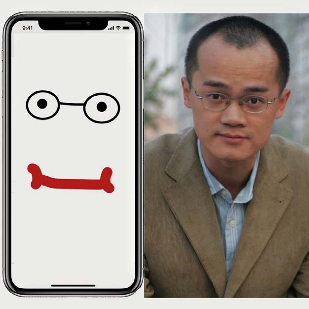

*2018-03-26 15:00 · 手机上网 转自世界这么大*

---

### 2767

第一次发现北京的自助餐厅有中东菜，例如鹰嘴豆泥 hummus.

*2018-03-26 12:52 · 猫饭*

---

### 2768

绵阳是四川 GDP 第二大的城市，但是只有第一名成都的 1/6 不到。

*2018-03-25 17:07 · iPhone版*

---

### 2769

（唐）三彩、五彩（缤纷）、七彩，都是奇数。

*2018-03-25 16:12 · iPhone版*

---

### 2770

好接地气的会场。不但有茶叶，连枸杞都有！

*2018-03-25 13:44 · 猫饭*

---

### 2771

Or, you have to start before it ceases to be impossible. 转@ 王兴 You have to start before it becomes possible.

*2018-03-25 09:18 · 手机上网 转自王兴*

---

### 2772

You have to start before it becomes possible.

*2018-03-25 08:41 · 手机上网*

---

### 2773

这是不给缺免睡基因的人活路啊… 转@ krashna 认同。所以才如此这般每天四点醒来阅读（捂脸哭）转@ 东东枪 认知与思考的广度深度，基本上是阅读的广度深度决定的。恨自己读书太少，追不上了。

*2018-03-25 08:34 · 手机上网 转自东东枪*

---

### 2774

我有段时间常去丽都的一个西餐厅，就在四得公园门口，中文名叫「园景」，英文名叫 Parkside。我以前以为这个英文名就是公园旁边的意思，今天才意识到起名者还玩了另一个文字游戏，隔壁的四得公园的英文是 Si De Park.

*2018-03-24 21:26 · iPhone版*

---

### 2775

理想主义和唯心主义在英文里是同一个词：idealism.

*2018-03-24 19:02 · 手机上网*

---

### 2776

二确实是一个和三有根本不同的数字。

*2018-03-24 18:58 · 手机上网*

---

### 2777

另一首新裤子佳作的歌名结构出奇的相似：《没有你的旅途没有意义》转@ 王兴 新裤子的歌除了《没有理想的人不伤心》还有哪些比

较好？

*2018-03-24 18:48 · 手机上网 转自王兴*

---

### 2778

又听到布谷鸟的叫声。又一个春天。

*2018-03-24 18:25 · iPhone版*

---

### 2779

刚数了一下，26个英文字母里，大写字母左右对称的有11个。

*2018-03-24 13:17 · 手机上网*

---

### 2780

我好像还没操纵过挖掘机。应该找机会试试。

*2018-03-23 18:58 · iPhone版*

---

### 2781

What's a trillion dollar question?

*2018-03-23 13:24 · iPhone版*

---

### 2782

看到一个新成语：叠床架屋。比喻重复累赘。

*2018-03-23 12:46 · iPhone版*

---

### 2783

ACM 发的 Hennessy & Patterson 获奖公告里提到：现在每年全球大概生产160亿个微处理器。

*2018-03-22 21:00 · 网页*

---

### 2784

Hennessy & Patterson 因为 RISC 得了这届图灵奖。16年前我读研究生时计算机体系结构课用的就是这两位大神合著的教材。前者是斯坦福前校长/谷歌董事，后者是伯克利退休教授/谷歌研究员。现在图灵奖也是靠谷歌提供财务支持。这就是一流公司的所作所为。

*2018-03-22 20:53 · 网页*

---

### 2785

稍微调整一下：战略是现实和理想的结合。伟大的战略是极端的现实主义和极端的理想主义结合的产物。转@ 王兴 战略是现实主义和理想主义结合的产物。伟大的战略是极端的现实主义和极端的理想主义结合的产物。

*2018-03-22 19:53 · 手机上网 转自王兴*

---

### 2786

我能说是你自己有错误的期望值吗？转@ 掌门最伟大 配个图，顺便骂句百度傻X 转@ 王兴 "first class business in a first class way"也许今天摩根斯坦利的人已经不再讲究这个，但老摩根当年的工作信条让我过目不忘。

*2018-03-22 18:55 · 手机上网 转自掌门最伟大*

---

### 2787

中国尊这北京第一高楼真是一个突兀的存在。

*2018-03-22 18:24 · iPhone版*

---

### 2788

"first class business in a first class way" 也许今天摩根斯坦利的人已经不再讲究这个，但老摩根当年的工作信条让我过目不忘。

*2018-03-22 17:37 · iPhone版*

---

### 2789

对北京来说，伦敦比纽约更近，直飞分别是11.5和13.5小时。

*2018-03-22 16:36 · iPhone版*

---

### 2790

突然想到，我脑海中没有长白山的样子，我知道富士山、乞力马扎罗、珠穆朗玛、冈仁波齐长什么样子，但是想到长白山只想到天池，并没有山的形状。

*2018-03-22 10:39 · 手机上网*

---

### 2791

netflix 也发布了自己的专属字体： netflix sans ，据说每年能省下几百万美元的字体授权费。转@ 王兴 杰出的品牌，有专属的颜色、形状、字体和声音。

*2018-03-22 10:26 · 手机上网*

---

### 2792

逐渐觉得，英国就是一个放大版的全球版的香港。

*2018-03-22 00:50 · iPhone版*

---

### 2793

战略是现实主义和理想主义结合的产物。伟大的战略是极端的现实主义和极端的理想主义结合的产物。

*2018-03-21 20:39 · 手机上网*

---

### 2794

装逼犯终结者。

*2018-03-21 12:20 · 手机上网*

---

### 2795

这是吃笋的季节。

*2018-03-21 12:19 · 手机上网*

---

### 2796

一直有同感。我觉得叫宾馆好。转@ 贾行家 早听商务人士讲，为何要叫酒店不再叫旅馆宾馆，大意是发展不同功能更完备住着更yuzuo之意。后来看文字学家举过这个例子：什么乱七八糟的，就是没脑子的人给翻译坏了。

*2018-03-21 10:34 · 手机上网 转自贾行家*

---

### 2797

亚马逊的市值首次超过谷歌。贝索斯24年前亲手创办的公司终于超过20年前他天使投资的公司了。

*2018-03-21 02:12 · 手机上网*

---

### 2798

你的子弹其实屈指可数。

*2018-03-19 16:28 · iPhone版*

---

### 2799

美国几大报纸的名字一个比一个小，《纽约时报》、《华盛顿邮报》

甚至就《华尔街日报》，曾经发行量很大的《USA Today》现在渐渐下来了。倒是法国大报叫《世界报》。英国人不谈空间谈时间，《Times》《金融时报》。中国直接就上《环球时报》…

*2018-03-19 09:00 · iPhone版*

---

### 2800

喜来登收购了瑞吉，后来喜达屋收购了喜来登，再后来万豪收购了喜达屋。

*2018-03-18 23:50 · iPhone版*

---

### 2801

CJKV 里的老幺终于逐渐崭露头角。

*2018-03-18 22:41 · iPhone版*

---

### 2802

科技殖民主义。

*2018-03-18 21:38 · iPhone版*

---

### 2803

转：1996年，瑞典登山家 Goran Kropp 从瑞典的家里骑自行车到达珠峰大本营，然后单人、无氧登顶珠峰，下山后又骑车回到瑞典。

*2018-03-18 20:59 · iPhone版*

---

### 2804

听说高盛全球有三万五员工，其中一万四在印度的班加罗尔。

*2018-03-18 19:46 · iPhone版*

---

### 2805

我们确实迎来了一个告别的时代。

*2018-03-18 15:08 · iPhone版*

---

### 2806

转@ OwlofMinerva L4级无人驾驶，按照现有技术的架构是不具有理论上实现的可能性的。至少还需要一次比深度学习更大的技术革命。

现有技术能把L3级无人驾驶解决的比较好，探索性的解决部分L4问题。宣传“全自动驾驶”这类自创、模糊概念（让大众以为是L5级无人驾驶）的是别有用心。

*2018-03-18 13:06 · 手机上网 转自OwlofMinerva*

---

### 2807

好有喜感的「二月二，龙抬头」。

*2018-03-18 12:23 · 手机上网*

---

### 2808

快到结尾时雪终于出场了。转@ 王兴 《2017年北京的冬天》

*2018-03-17 15:57 · 手机上网 转自王兴*

---

### 2809

这个问题这么表述确实厉害。转：牛顿当年思考的问题之一是：苹果会掉到地上，月亮是不是也正在掉到地上？

*2018-03-15 19:41 · iPhone版*

---

### 2810

鲧筑城以卫君，造廓以守民，此城廓之始也。-《吴越春秋》

*2018-03-14 23:51 · iPhone版*

---

### 2811

四年前我和二十个人在莫干山初次见面。每个班要起个名字。在师兄酒后背了圆周率一百位后，我们班决定取名 Pi。我说：i like pi. justlike our friendship, it will go on forever but never repeat itself.

*2018-03-14 23:12 · 手机上网*

---

### 2812

不办会怎么样？有些人会嫌麻烦就不办了吧？

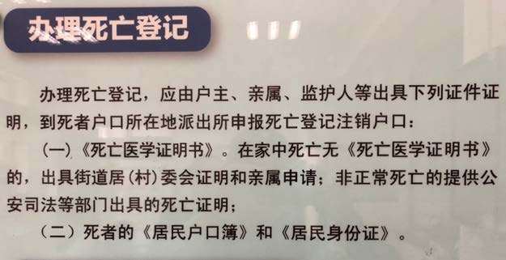

*2018-03-14 14:10 · 猫饭*

---

### 2813

霍金的主要科学成就到底是啥？

*2018-03-14 12:44 · iPhone版*

---

### 2814

转@ 东东枪 他只要能说出爱你的什么，他爱的就不是你，他爱的是那个“什么”。——金文声当年如是说。

*2018-03-13 09:29 · 手机上网 转自东东枪*

---

### 2815

补撕台历时才发现赫本真是傲娇得可以。

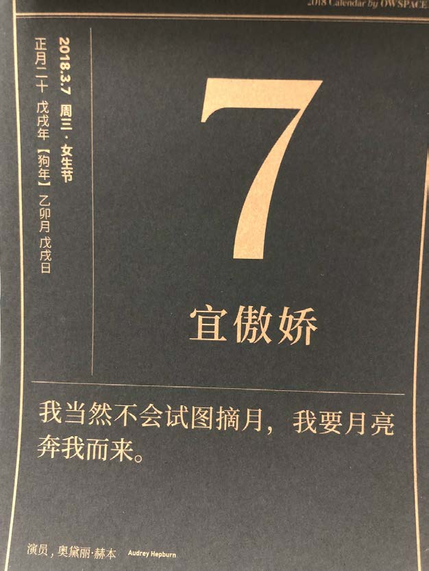

*2018-03-12 16:30 · 猫饭*

---

### 2816

一大早，突然想再近距离看一次佛拉明戈舞，喜欢那狭小舞台上近乎声嘶力竭的激情四射。

*2018-03-12 07:33 · iPhone版*

---

### 2817

转@ 阳升 Religion keeps the poor from killing the rich. Napoleon Bonaparte

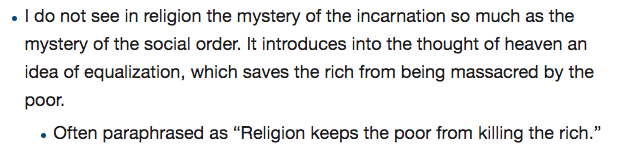

*2018-03-12 07:10 · 手机上网 转自阳升*

---

### 2818

亚马逊何时会开始回购自己的股票？

*2018-03-12 06:40 · iPhone版*

---

### 2819

把起床闹钟的音效设成嘹亮的晨号应该蛮有趣的。

*2018-03-12 06:20 · iPhone版*

---

### 2820

自古华山一条路，条条大路通罗马。

*2018-03-12 06:02 · iPhone版*

---

### 2821

嫦娥奔月是奔哪个环形山去了？

*2018-03-12 05:43 · iPhone版*

---

### 2822

想到一个有趣的问题：如果要给诺贝尔增设一个奖项，你建议加什么？

*2018-03-11 16:10 · 手机上网*

---

### 2823

西门庆还真是个蛮独特的人物，同时出现在《水浒记》和《金瓶梅》

这两部伟大作品里。

*2018-03-11 16:09 · 手机上网*

---

### 2824

我还蛮期待 AR 的。应该会是生产力的又一次巨大提升，不输搜索引擎。

*2018-03-11 16:03 · 手机上网*

---

### 2825

迄今为止，有八九百人得过诺贝尔奖。那种得奖者为团体的就不算了。

*2018-03-11 15:52 · 手机上网*

---

### 2826

美＝羊+大≈¥+夫

*2018-03-11 15:15 · iPhone版*

---

### 2827

想起来一件事，十三年前我一度打算读一下托马斯曼的《魔山》，至今没有进展。

*2018-03-10 22:49 · iPhone版*

---

### 2828

The Bridge on the River Kwai

*2018-03-10 21:21 · iPhone版*

---

### 2829

巨国效应

*2018-03-10 19:48 · iPhone版*

---

### 2830

2011年可以算是整个中国历史的下半场的开始。有史以来第一次，中国不再多数人是农民了，城镇化率突破50%。请不要误解为我对农民有任何恶意，我是农民（企业家）的儿子，我本人在上大学之前也是

农业户口，城镇化和非城镇化是两种根本不同的社会形态，影响社会的方方面面，包括所谓民族性。

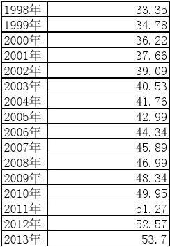

*2018-03-10 12:24 · 手机上网*

---

### 2831

在有这条裤子之前，我真的不知道裤子还能这么皱。

*2018-03-10 09:43 · iPhone版*

---

### 2832

昨晚做了一个很复杂的梦。

*2018-03-10 09:05 · iPhone版*

---

### 2833

真的有人自称是撸猫资本CEO。

*2018-03-09 21:48 · iPhone版*

---

### 2834

或者是为了躲开另一个更大的… 转@ 王兴 年少时我相信一些「卓越人士在关键时刻挺身而出，力排众议，力挽狂澜」之类的说法，后来多了解了一点历史，转而相信：真正的历史大事件来临时，后来被载入历史的人根本都不用去抢，更大的可能性是只是没躲，或者，没躲开……

*2018-03-09 18:17 · 手机上网 转自王兴*

---

### 2835

BATJXNTMDWK

*2018-03-09 17:47 · iPhone版*

---

### 2836

除了 B2C 和 C2C ，还有一种模式叫 VC2C，就是拿了风险投资的钱来补贴消费者，短期会很热闹，但长期有很大风险会一地鸡毛。VC2C

和 2VC 既有关联又有差别。

*2018-03-09 14:34 · iPhone版*

---

### 2837

@ 阳升 不矛盾。你说的是本专科。我看的数据说的是本科。

*2018-03-09 12:29 · 手机上网 给阳升的回复*

---

### 2838

即使在高校扩招这么多年后，据说中国劳动力人口中大学本科毕业生的比例依旧不到10%。相比之下，美国劳动力人口中大学本科毕业生的比例超过30%。

*2018-03-09 12:18 · iPhone版*

---

### 2839

教授认为孟德尔比达尔文更聪明，论据一是孟德尔从头开创了遗传学，而达尔文是在前人基础上改进了进化论；论据二是资料表明（年轻十几岁的）孟德尔做的实验和统计工作达尔文更早就做过了，类似的数据摆在面前，达尔文没看出意义来，孟德尔看出来了。

*2018-03-09 12:00 · iPhone版*

---

### 2840

虽然或快或慢，但全球化的大趋势是不可逆的，因为科学本身是全球化的，并没有人关注谁在中国或俄国第一个提出相对论，只有在全球第一个提出相对论的爱因斯坦是真正有贡献的。

*2018-03-09 11:54 · iPhone版*

---

### 2841

转：（诺贝尔经济学奖得主）阿罗是大牛，一共培养了12个博士，其中5个也拿了诺贝尔奖，还有几个好像也该拿。

*2018-03-09 01:39 · iPhone版*

---

### 2842

几个科学家凑在一起，虽然在各自领域都有不小成就，但因为领域不同，不好判断谁更聪明，争执不下，最后决定靠打牌来决胜负。

*2018-03-08 21:37 · iPhone版*

---

### 2843

克里希那穆提，嗯，我说的不是那个印度心灵导师，而是印度最大电商网站 flipkart 目前的 CEO Kalyan Krishnamurthy。

*2018-03-08 16:38 · 手机上网*

---

### 2844

印度的改革开放始于1991年。中国的始于1978年。

*2018-03-08 13:57 · iPhone版*

---

### 2845

什么梗？好歹我也算是写过php的。转@ imvenj 王老板居然不知道PHP 的梗吗。 「@ 王兴 被我司某些同学雷到了。话说 php 早已不是我司主力编程语言了吧。」

*2018-03-07 18:26 · 手机上网 转自王兴*

---

### 2846

被我司某些同学雷到了。话说 php 早已不是我司主力编程语言了吧。

*2018-03-07 18:10 · 猫饭*

---

### 2847

微软的董事会真是厉害，竟然能挑中 Satya Nadella 这样一个能够中兴微软的神人，而且还是个来自印度的第一代移民。

*2018-03-07 17:52 · iPhone版*

---

### 2848

20年前 IE vs. Netscape 的浏览器大战在当时被认为是天大的事，现在回头看也就那么回事。经得起时间冲刷的事少之又少。

*2018-03-07 17:43 · iPhone版*

---

### 2849

熟普是对老生普的模仿，就像人造革是对真皮的模仿。转@ 矛盾wen上次学到了一个小知识，什么是好的熟普 - 喝起来像老的生普。

*2018-03-07 13:59 · 手机上网 转自矛盾wen*

---

### 2850

¯\_(ツ)_/¯

*2018-03-07 12:03 · 网页*

---

### 2851

后悔上学时有几门课没好好学了。

*2018-03-07 11:12 · iPhone版*

---

### 2852

看起来很魔幻。

*2018-03-07 09:33 · 猫饭*

---

### 2853

Booking Holdings (原 Priceline Group）市值也突破千亿美元了。

*2018-03-06 23:18 · iPhone版*

---

### 2854

我当然知道香港不是一个国家而是我国一个特别行政区。对我来说，旅行的意义在于体验不同的语言、文化、货币、景观… 所以我把香港单列，用了「外加」。转@ 王兴 转念一想，其实也还好，我30岁生日前只到过中国美国外加香港。转@ 王兴 按照我过去几年的正常节奏，40岁前恐怕去不了40个国家。

*2018-03-06 12:49 · 手机上网 转自王兴*

---

### 2855

转念一想，其实也还好，我30岁生日前只到过中国美国外加香港。转@ 王兴 按照我过去几年的正常节奏，40岁前恐怕去不了40个国家。

*2018-03-06 12:32 · 手机上网 转自王兴*

---

### 2856

越南竟然位列净进口第二名，仅次于美国。转@ webto 虽然我国钢铁出口占产量比例很低，但是因为巨大的产量基数（占全球总产量的一半），仍然是遥遥领先的第一大钢铁出口国。

*2018-03-06 11:38 · 手机上网 转自webto*

---

### 2857

一个词解释几乎所有变革，包括区块链。转@ 王兴 Reintermediate!

*2018-03-06 09:40 · 手机上网 转自王兴*

---

### 2858

欧路词典里对 duty / obligation / responsibility 的区分。

*2018-03-06 09:09 · 手机上网*

---

### 2859

生活是无可逃避的，是 duty 。

*2018-03-06 09:05 · 手机上网*

---

### 2860

转@ 木子 马来西亚真的超级爱建超高层的！如果只看我们公司经手过的 现在在建的有一栋～做过方案后来没下文的有一栋～做了方案但是十年内不会建的还有一栋～RT@ 王兴 更新一下，大雅加达地区人口超过三千万，多过北京，多过马来西亚全国。转@ 王兴 马来西亚首都吉隆坡（就是有经常在电影里出现的

*2018-03-06 09:04 · 手机上网 转自王兴*

---

### 2861

“再过20年，如果篮球依然是我一生里最大的成就，那么我就失败了。

”——（刚拿了奥斯卡奖的）科比。不管他最后是否真能做到，有这个想法就让我第一次觉得科比不是连给乔丹提鞋都不配的了。

*2018-03-06 07:25 · iPhone版*

---

### 2862

更新一下，大雅加达地区人口超过三千万，多过北京，多过马来西亚全国。转@ 王兴 马来西亚首都吉隆坡（就是有经常在电影里出现的双子塔的那个城市）只有150万人口，印尼首都雅加达（我不知道有什么地标）则有超过1000万人口！

*2018-03-06 00:13 · 手机上网 转自王兴*

---

### 2863

「看起来傻精傻精的」真是一个有趣的描述。

*2018-03-05 21:15 · iPhone版*

---

### 2864

duty 比 responsibility 帅多了。

*2018-03-05 17:48 · iPhone版*

---

### 2865

虽然波特教授自己开公司开倒闭了，但他的理论框架还是不错的。

*2018-03-05 16:59 · iPhone版*

---

### 2866

不知不觉中苹果自己的 notes 功能已经如此强大，比 evernote 完全不差。做工具真是不好混啊。

*2018-03-05 13:28 · iPhone版*

---

### 2867

转@ webto 「非洲已经出现第二个人口过亿的国家，埃塞俄比亚（1亿），而第一名尼日利亚的人口现在已经接近1.9亿。」

*2018-03-05 00:51 · 手机上网 转自webto*

---

### 2868

听说武夷岩茶从最普通到最上品依次能喝出草香、花香、果香、木香。

*2018-03-04 19:57 · iPhone版*

---

### 2869

我知道有些牌子很贵，但是在店里看到一顶棒球帽标价9400元还是震惊了。

*2018-03-04 18:50 · iPhone版*

---

### 2870

美团上线8年了。谢谢大家。我们会继续努力。

*2018-03-04 09:38 · 手机上网*

---

### 2871

亚马逊的市值已经比较稳定的高于微软了，似乎离谷歌也不远了。

*2018-03-03 18:51 · 猫饭*

---

### 2872

飞船发射过程中放背景音乐吗？宇航员可以自己提前点歌吗？

*2018-03-03 18:48 · iPhone版*

---

### 2873

Scientific Games 这家公司是做什么游戏的？这是美国第二大彩票服务提供商。哦。

*2018-03-03 18:33 · iPhone版*

---

### 2874

一个在印度耕耘十几年的中国朋友认为，印度人口肯定已经突破14亿，甚至有可能多达16亿。印度前几年开始推行的要收集每个人指纹和虹膜信息的身份系统 Aadhaar 里已经有11亿人了，而且这还不是唯一受认可的必用不可的身份认证系统，应该还有不少印度人没录进去。

*2018-03-03 14:50 · iPhone版*

---

### 2875

理性、感性和任性。

*2018-03-03 12:48 · iPhone版*

---

### 2876

又碰到一个人误说成「卫丽洗」，不知道 washlet 这个由来确实很容

易记混。不用这个商标词很难指代这个东西，只能说「智能马桶盖」。智能？-_-! 转@ 王兴 原来卫洗丽是 washlet 的音译啊。但是这个词是 toto 公司的商标。

*2018-03-02 18:41 · 手机上网 转自王兴*

---

### 2877

一个美国基金经理说：Brian Chesky（airbnb创始人）跟我是发小，他的性格从我们小时候打冰球时就可以看出来，他个子小，但是敢无所畏惧的跟大块头们冲撞。

*2018-03-02 18:34 · iPhone版*

---

### 2878

听说香港大亨今年90岁了，还坚持当公司一把手。重点是，他还不是公司里年纪最大的人……

*2018-03-02 15:18 · iPhone版*

---

### 2879

印度的人均 GDP 不到中国的四分之一，水泥价格却是中国的三倍，那搞起基建来确实很吃力。

*2018-03-01 16:33 · iPhone版*

---

### 2880

爸爸说去年中国水泥总销量23亿吨，印度水泥总销量2.7亿吨。两国人口差不多，这就是建设水平的差别。印度的水泥平均价格是中国的三倍。

*2018-03-01 15:11 · iPhone版*

---

### 2881

印度的国徽就是三头狮子。 转@ 撒闵呢 狮子怎么成印度的意象了呢转@ 王兴 用 Make 而非 Made 表达的意思不一样。

*2018-03-01 14:45 · 手机上网 转自王兴*

---

### 2882

用 Make 而非 Made 表达的意思不一样。

*2018-03-01 14:38 · 猫饭*

---

### 2883

「吃苦记苦」这说法有意思。转@ Kgramme 因为亚马逊吃苦记苦……

转@ 王兴 一个印度创业者告诉我，他认为亚马逊在印度市场比中国公司和印度公司都更好的借鉴了中国公司在中国市场的成功经验！

*2018-03-01 12:38 · 手机上网 转自王兴*

---

### 2884

全世界发行量最大的英语报纸是《印度时报》The Times of India, 始于1838年。

*2018-03-01 03:36 · iPhone版*

---

### 2885

中国一共有14个陆上邻国，其中只有2个还没和中国谈定边境线：印度和（印度控制的）不丹。

*2018-03-01 01:19 · iPhone版*

---

### 2886

妈蛋，轻敌了。印度小辣椒。

*2018-03-01 00:09 · iPhone版*

---

### 2887

转@ 张亮 我把糖称之为「最廉价的必须奢侈品」。糖也是一种安慰剂。当糖短缺时，价格甚至可以涨至如黄金或钻石般贵重。—— 郭鹤年这句话厉害。正确的定义自己所在的行业总是创业者最重要的工作。

*2018-02-28 22:47 · 手机上网 转自张亮*

---

### 2888

-_- 转@ 孙岩 我们的词语的来源很多都是莫名其妙的，比如「缓和」

来自于左传一书中名字叫缓、和的两个医生，医治晋平公、晋景公，把这个医生的名字连在一起，取其可以使病人平和舒缓之意。

*2018-02-28 22:46 · 手机上网 转自孙岩*

---

### 2889

一个从创业转投资又转回创业的朋友在微信上对我说：我从印度回来，就对老毛黑转粉了，中国的大国崛起的基础。

*2018-02-28 11:10 · iPhone版*

---

### 2890

印度大城市里的年轻人也是多数买不起房的。

*2018-02-27 20:18 · iPhone版*

---

### 2891

people dumb and rich, come here quickly.

*2018-02-27 18:17 · 手机上网*

---

### 2892

有些文化特色强烈的概念真的不容易翻译成别的语言，例如「磨洋工」。

*2018-02-27 16:00 · iPhone版*

---

### 2893

今天见了一个学哲学的互联网创业者，确实跟学计算机或商科的相比在思路和风格上有明显区别。

*2018-02-27 02:41 · iPhone版*

---

### 2894

没有什么外部力量可以阻止印度的崛起。这几天在这里，我时不时会想起（出生在印度的）奥威尔以白人殖民者在缅甸殖民地为主题写的《Shooting An Elephant》，那里面的隐喻给我留下深刻印象。

*2018-02-27 02:39 · iPhone版*

---

### 2895

一个印度创业者告诉我，他认为亚马逊在印度市场比中国公司和印度公司都更好的借鉴了中国公司在中国市场的成功经验！

*2018-02-26 19:18 · iPhone版*

---

### 2896

听说新德里和北京之间并不是每天都有直航航班，我惊了。

*2018-02-26 12:08 · iPhone版*

---

### 2897

虽然食材不是来自传说中的阿拉伯海，但新德里的海鲜餐厅 Sana-dige 还是相当棒的！

*2018-02-26 01:23 · iPhone版*

---

### 2898

市场研究公司New World Wealth最新的报告显示，全球最富有的15座城市一共有价值24万亿美元的财富，这相当于全球财富总和的11%。

*2018-02-24 18:13 · 手机上网*

---

### 2899

在班加罗尔机场吃了顿肯德基。确实是一样的味道。

*2018-02-24 16:39 · iPhone版*

---

### 2900

「大亨看上了一个空姐，跟她说，别干了，跟我混吧。空姐：不行，我就喜欢在这家航空公司干。大亨：那我把这公司买了吧。空姐：不行，这是国营的。大亨：那我把印度政府买了吧。空姐：还是不行，你来晚了，印度政府已经被 Reliance 集团买了。」这段子不错。

*2018-02-24 00:34 · iPhone版*

---

### 2901

导游：大家知道我们国家的温州商人因为吃苦耐劳和精于算计，所以遍布世界各地。但是，在印度却很少，为什么？因为印度的小商贩比温州人更吃苦耐劳和精于算计，他们自己去中国进货。

*2018-02-23 12:17 · iPhone版*

---

### 2902

有道理。城市也是一个重要维度，而且更天然。。转@ 杨曜睿 印度？ 不过感受国家的人均GDP，不如感受城市的人均GDP，除非是小国家。。。转@ 王兴 从人均 GDP 4万多美元的国家切换到人均2千的国家。明天白天好好感受一下。

*2018-02-23 10:20 · 手机上网 转自王兴*

---

### 2903

从人均 GDP 4万多美元的国家切换到人均2千的国家。明天白天好好感受一下。

*2018-02-23 03:22 · iPhone版*

---

### 2904

在新加坡转机。转入工作状态。

*2018-02-22 20:10 · iPhone版*

---

### 2905

全球化时代里人的迁徙还是挺快的。我奶奶一共有七个孙子孙女，分布在龙岩、厦门、北京、西雅图、Palo Alto、悉尼这六个城市。

*2018-02-21 21:49 · iPhone版*

---

### 2906

魔图！转@ madmonkey 你这还是三围，这个才是四维。透视超出想象力。转@ 郭家二少爷 死神永生里，四维碎片经过拜占庭那一章，迪奥伦娜说，那些地方对她来说都是打开的，是因为这个时候是多维的。而低维对于多维而言，是类似于打开状态的。然后她说那里宽大无比，这里太窄了，透

*2018-02-21 17:55 · 手机上网 转自madmonkey*

---

### 2907

抱歉，又搞错了。longking是我家乡另一家A股上市公司龙净环保。

lonking才是龙工。转@ 王兴 竟然在奥克兰市中心的建筑工地上看到我家乡生产的挖掘机：LONGKING 就是「龙工」，龙岩工程机械厂的缩写。

*2018-02-21 17:45 · 手机上网 转自王兴*

---

### 2908

竟然在奥克兰市中心的建筑工地上看到我家乡生产的挖掘机：LONGKING 就是「龙工」，龙岩工程机械厂的缩写。

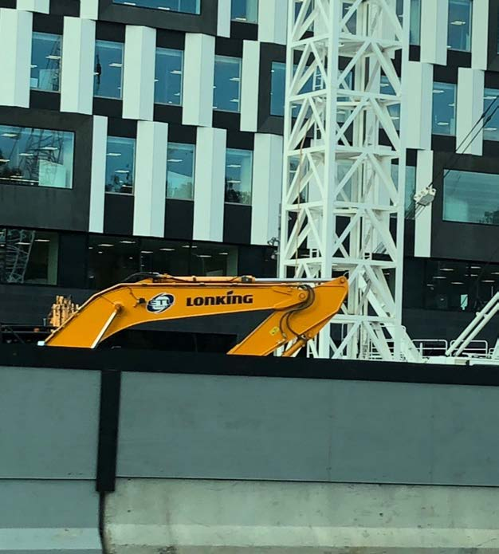

*2018-02-21 14:05 · 猫饭*

---

### 2909

高通一边拒绝博通提出的1210亿美元的收购要约，一边对 NXP 恩智浦发出400亿美元的收购要约。

*2018-02-20 21:07 · iPhone版*

---

### 2910

金麟 - Golden Unicorn - 黄金独角兽

*2018-02-20 18:18 · 猫饭*

---

### 2911

波利尼西亚大三角我已经去过两个角了（夏威夷和新西兰），剩下的那个角（复活节岛）是纯旅游目的地，估计一时半会儿不会去了。

*2018-02-20 10:15 · iPhone版*

---

### 2912

伦敦、北京、旧金山构成另一个等边三角形，两两间直飞都是十一个小时多一些。

*2018-02-20 10:07 · 手机上网*

---

### 2913

抱歉，奥克兰是新西兰最大城市，不是首都。当年为了防止南岛独立出去，特意把首都从北岛北端的奥克兰移到北岛南端、和南岛近在咫尺的惠灵顿，类似中国的「天子守国门」思路。转@ 王兴 新西兰首都奥克兰、北京、旧金山差不多构成一个等比三角形，两两间直飞都是十二三个小时

*2018-02-20 10:04 · 手机上网 转自王兴*

---

### 2914

新西兰首都奥克兰、北京、旧金山差不多构成一个等比三角形，两两间直飞都是十二三个小时。

*2018-02-20 09:51 · iPhone版*

---

### 2915

抱歉，这才是正确拼法：转@ March. vaterland 转@ 王兴 英语说motherland 母国，德语说 vatherland 父国，汉语不说父母这一辈而是说祖国。

*2018-02-20 02:48 · 手机上网 转自王兴*

---

### 2916

转@ 胡泳 尼采说，“最伟大的行动是思想”，“世界围绕着新价值观的发明者旋转，默默地旋转。”尼采就是这样一个发明者，我们现在依然在围绕着他旋转，虽然转起来吱吱作响，不很滑顺。

*2018-02-19 11:07 · 手机上网 转自胡泳*

---

### 2917

英语说 motherland 母国，德语说 vatherland 父国，汉语不说父母这一辈而是说祖国。

*2018-02-19 11:06 · iPhone版*

---

### 2918

Our Story, 这是每一个品牌的网站上应有的一部分。

*2018-02-18 20:58 · iPhone版*

---

### 2919

听歌时想一想怎么给这歌拍段 mv 或者什么电影桥段适合用这歌当背景音乐是蛮好玩的事。

*2018-02-18 19:48 · iPhone版*

---

### 2920

39岁生日可能比40岁生日更催人，前者会让你觉得只剩一年就满40了，似乎该做点什么；后者则是一眼就看到50岁了……

*2018-02-18 19:16 · iPhone版*

---

### 2921

我离真正的牛仔又接近了一小步，因为今天收到一个礼物：一条皮鞭。真正的澳大利亚 bushman 用的7英尺长的牛皮编织的那种。

*2018-02-18 17:19 · iPhone版*

---

### 2922

问：这城市大吗？的士司机：你买五毛钱瓜子，能在市中心嗑两个来回吧。

*2018-02-18 11:57 · iPhone版*

---

### 2923

或许只有在彼得潘和他的朋友们的世界里，人才可以永远不生病，永远不变老，只是偶尔不开心。

*2018-02-18 11:05 · iPhone版*

---

### 2924

「改变世界」之类的字样总是比较容易吸引注意力。但这个 top 10 不清楚是什么逻辑，感觉有点山寨。

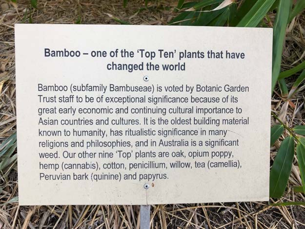

*2018-02-16 13:06 · 猫饭*

---

### 2925

成功在悉尼骑了一次摩拜。体验还挺顺，跟国内一样，打开摩拜app扫码就开锁了，我现在都不清楚到底骑一次多少钱……

*2018-02-16 11:41 · iPhone版*

---

### 2926

转@ 小熊娃娃 我说大家可讨点口彩吧，别老戊戌戊戌的，往前算到石敬瑭割让幽云十六州也没见戊戌年有啥好事来着……来自一个戊戌日柱的忠告。

*2018-02-16 00:32 · 手机上网 转自小熊娃娃*

---

### 2927

戊戌变法两甲子了。

*2018-02-16 00:08 · iPhone版*

---

### 2928

转：1870年德国地理学家李希霍芬(Richthofen，Ferdinand von)到洛阳考察后，在有关著作中首次提出从洛阳到撒马尔罕(今属乌兹别克斯坦)有一条古老的商路，将其命名为“丝绸之路”。

*2018-02-15 22:43 · iPhone版*

---

### 2929

八九年不见，堂妹已经出落得亭亭玉立。要跟她找到共同话题实在是太难了，还是读商科的堂弟好聊一些。

*2018-02-15 20:59 · iPhone版*

---

### 2930

telegram 是不是第一个有相当大影响力但是说不清楚属于哪个国家的商业机构？

*2018-02-14 21:08 · iPhone版*

---

### 2931

有些细分概念在不同语言里很难精准对应，例如凤、凰、鸾我估计在

英语里都是说 phoenix 就完事了。

*2018-02-14 18:15 · iPhone版*

---

### 2932

小叔叔1990年放弃在国内读到一半的研究生移民澳洲，老爸1992年在家乡开建他的第一家水泥厂。两个兄弟此后的人生道路差别是个人选择不同，也是国运不同。

*2018-02-14 15:27 · iPhone版*

---

### 2933

澳大利亚前总理陆克文退休后去牛津大学读博，研究课题是……习近平世界观！

*2018-02-14 14:13 · iPhone版*

---

### 2934

转@ szweig 袭人太祸害人了。 转@ 鹤归 根据统计 我们班读不下去红楼梦的 一半都在宝玉初试云雨情那一章后卡住了（

*2018-02-13 13:38 · 手机上网 转自鹤归*

---

### 2935

模模糊糊觉得，美国电影中出现的各种现役和退役军人形象里，最有男子气概的军衔是 colonel 上校。

*2018-02-13 13:36 · 手机上网*

---

### 2936

转@ 大米来 转@ 黄薄码 转@ 潘乱 产品的根本在于逻辑。没有人一下子就能有正确的逻辑。逻辑一定是在反复的锤炼中得到的。 写作是最锻炼逻辑的。写作会强迫自己收集素材，整理思想，选择合理的表达。写作可以获得更广泛、更持久的反馈，比口头的交流更加帮助逻辑的形成。 不仅要多读，一定要多写。

*2018-02-13 13:14 · 手机上网 转自潘乱*

---

### 2937

二战中，苏联是把德国打到投降之后才和日本开战的。只有同时拥有大西洋和太平洋当护城河的美国才有底气同时对德国和日本作战。所以，必须佩服美国建国后第一个百年的国策：必须从大西洋沿岸一路西扩到太平洋沿岸。

*2018-02-13 13:10 · iPhone版*

---

### 2938

看到语言的创伤。

*2018-02-13 12:55 · iPhone版*

---

### 2939

在一上午会和一下午会之间决定趁着吃午饭的空给自己来点精神按摩。该听什么音乐呢？

*2018-02-13 12:54 · iPhone版*

---

### 2940

问了一些专业人士，英语里确实没有「割韭菜」这么生动而意味深长的表达方式。

*2018-02-12 17:26 · iPhone版*

---

### 2941

当我给一个男人画像时，我希望人们感觉到这个男人汩汩流过的一生。

*2018-02-12 14:12 · 猫饭*

---

### 2942

想起指环王系列里有一部叫《五军之战》。

*2018-02-12 13:50 · iPhone版*

---

### 2943

为什么中国股市里散户这么多而美国股市以机构投资者为主？因为过去几十年美国的机构投资者已经基本把散户消灭干净了。

*2018-02-12 12:20 · 手机上网*

---

### 2944

我也养过蚕。因为同学们都一窝蜂的养蚕，桑叶竞争太激烈，所以我只好自己动手解决上游供应链问题，在院子里种了棵桑树。转@ 热的蜂蜜柚子茶 我养过蚕宝宝。包纸里放衣服口袋。 转@ 是一个蒸蛋 我养过蝌蚪。。转@ 王兴 我养过青蛙。真的那种。小时候。

*2018-02-12 10:35 · 手机上网 转自王兴*

---

### 2945

「一个作家光有内在的生命力是不够的，诗歌流的是血，小说流的是汗，要有一个好身体，才可承受长期伏案写作的考验。」干啥不需要好体力呢？

*2018-02-12 10:02 · iPhone版*

---

### 2946

我养过青蛙。真的那种。小时候。

*2018-02-12 09:21 · iPhone版*

---

### 2947

今年是改革开放40周年。纪念的高潮会是什么形式？

*2018-02-12 01:37 · iPhone版*

---

### 2948

也许是发际线后退到一定地步了，终于不被说像是一群大学生创业了，而像是「一群清华青年教师」……

*2018-02-12 01:02 · iPhone版*

---

### 2949

不少人把「焙」字错念成 péi，其实正确读音是 bèi，和这个汉字对应的英文 bake 发音非常相似，以至于我不确定这只是纯属巧合还是有什么内在逻辑。

*2018-02-11 22:48 · iPhone版*

---

### 2950

藏之硬盘，留待后人。转@ 熊阿姨 好的， 折磨我半年的那篇调查稿，写到5.4版，改了4次刊期，九九八十难全过完了，在马上下厂印刷前，被顶头领导撤掉了。

*2018-02-11 17:38 · 手机上网 转自熊阿姨*

---

### 2951

「城阙辅三秦，风烟望五津。与君离别意，同是宦游人。海内存知己，天涯若比邻。无为在歧路，儿女共沾巾。」重温王勃写的《送杜少府之任蜀州》。唐朝时被派去四川，估计跟现在外派巴西感觉差不多吧。

*2018-02-11 17:32 · iPhone版*

---

### 2952

中国人计票时通常画「正」字，老外画什么？四竖一横？

*2018-02-11 17:15 · iPhone版*

---

### 2953

琤 chēng

*2018-02-11 16:59 · iPhone版*

---

### 2954

下一线和上前线。

*2018-02-11 16:23 · iPhone版*

---

### 2955

诗人需要和数学家一样精确，只不过不用数字表达。

*2018-02-11 14:59 · iPhone版*

---

### 2956

转@ Bouguereau 有意思 转@ 张亮 http://t.cn/RR5D7Wg 转@ 王兴 十二生肖里为什么没有猫呢？其他常见动物都有了。

*2018-02-11 14:43 · 网页 转自Bouguereau*

---

### 2957

转@ 木有药师 十二生肖成型的时候（战国到东汉），猫还没有传入中国/广为驯养。转@ 王兴 十二生肖里为什么没有猫呢？其他常见动物都有了。

*2018-02-11 14:30 · 手机上网 转自王兴*

---

### 2958

十二生肖里为什么没有猫呢？其他常见动物都有了。

*2018-02-11 14:18 · iPhone版*

---

### 2959

老爸还真是勤俭持家，过两天从龙岩来北京跟我们团聚没有选择从很自然的厦门高崎机场（离家150公里，票价1700元）飞，而是从我不曾想过的泉州晋江机场（离家200公里，票价600元）走。

*2018-02-11 12:29 · 手机上网*

---

### 2960

「带路党」这个词真生动。

*2018-02-11 12:19 · 手机上网*

---

### 2961

华为手机自带滚动截屏功能。iPhone上怎么办？

*2018-02-10 18:36 · iPhone版*

---

### 2962

横波和纵波。

*2018-02-10 18:25 · iPhone版*

---

### 2963

宁在直中取，不向曲中求。-姜子牙

*2018-02-10 17:35 · iPhone版*

---

### 2964

比天子更大的是天。

*2018-02-10 17:17 · iPhone版*

---

### 2965

这个新领域在很长一段时间里会被称呼为 Smart EV「智能电动车」。

*2018-02-10 16:52 · 手机上网*

---

### 2966

迎合和引领。

*2018-02-10 16:43 · 手机上网*

---

### 2967

转@ 阳升 毛岸英和毛岸青都出生在湘雅医院，仅差一岁 转@ 阳升湘雅医院也是湖南和雅礼协会联合创建的 转@ 阳升 晕倒，在无数次听到雅礼中学的名字之后，刚知道它是耶鲁的音译：“雅礼协会:美国耶鲁大学民间团体。‘雅礼’之名既来自《论语·叙而》‘子所雅言，诗书执礼’，又是‘Yale（耶鲁

*2018-02-10 16:38 · 手机上网 转自阳升*

---

### 2968

菊花茶是只有菊花没有茶叶的，茉莉花茶里是有茶叶的。

*2018-02-10 15:20 · iPhone版*

---

### 2969

是的，大演出时骨折了都感觉不到，下场后才发现，这种事我相信。

转@ 小豆沙 也不止体育运动，舞台经验也是。转@ 王兴 越来越觉得，体育不但锻炼人的生理爆发力，而且锻炼心理爆发力。跟肌肉是否强壮无关，而是踏入赛场那一瞬间的感觉，各种激素分泌，迅速进入全身热血沸腾但是大脑异常冷静的状态。

*2018-02-09 15:32 · 手机上网 转自王兴*

---

### 2970

也包括。我猜任何项目的高手都这样。转@ quux 广场舞？转@ 王兴越来越觉得，体育不但锻炼人的生理爆发力，而且锻炼心理爆发力。

跟肌肉是否强壮无关，而是踏入赛场那一瞬间的感觉，各种激素分泌，迅速进入全身热血沸腾但是大脑异常冷静的状态。

*2018-02-09 15:12 · 手机上网 转自王兴*

---

### 2971

越来越觉得，体育不但锻炼人的生理爆发力，而且锻炼心理爆发力。

跟肌肉是否强壮无关，而是踏入赛场那一瞬间的感觉，各种激素分泌，迅速进入全身热血沸腾但是大脑异常冷静的状态。

*2018-02-09 15:08 · 手机上网*

---

### 2972

对哦，似乎只有闽南语/粤语歌才有这种直接打鸡血的内容？北方/中原文化觉得太土了？转@ jing129 看到龙精虎猛不由哼起《男儿当自强》转@ 王兴 说「有一颗冠军的心」感觉就洋气好多，但少了那种龙精虎猛的感觉。转@ 王兴 如果提议把「爱拼才会赢」加入公司价值观是不是会被同事们轰出去？

*2018-02-09 15:02 · 手机上网 转自王兴*

---

### 2973

如果走了狗屎运收到一个一万亿美元的红包，你愿意花现价7872亿美元全资收购苹果吗？我想了想，不愿意。

*2018-02-09 14:48 · 手机上网*

---

### 2974

类似的意思，说「有一颗冠军的心」感觉就洋气好多，但少了那种龙精虎猛的感觉。转@ 王兴 如果提议把「爱拼才会赢」加入公司价值观是不是会被同事们轰出去？

*2018-02-09 14:28 · 手机上网 转自王兴*

---

### 2975

说实话，我以前都没正儿八经看过那首《爱拼才会赢》闽南语歌的歌词。刚刚看了一下，蛮正能量的嘛。转@ 王兴 如果提议把「爱拼才会赢」加入公司价值观是不是会被同事们轰出去？

*2018-02-09 14:26 · 手机上网 转自王兴*

---

### 2976

这华为手机自带的百度拼音输入法有点诡异，刚才我想输入「创投界」，出来的第一选项竟然是「床头姐」……

*2018-02-09 14:15 · iPhone版*

---

### 2977

如果提议把「爱拼才会赢」加入公司价值观是不是会被同事们轰出去？

*2018-02-09 14:09 · iPhone版*

---

### 2978

在中国创投界颇有影响力的「深创投」的前身为1999年8月成立的深圳市创新科技投资有限公司。基本同期，上海创业投资有限公司于1999年4月正式获得工商营业执照。两边都是政府主导起步的，后来只跑出来一家。

*2018-02-09 14:06 · iPhone版*

---

### 2979

我依旧看好贝索斯搞航天。做零售是比造火箭更难的事。转@ 阳升Bezos 要给自己找个位置有点困难了 转@ 阳升 当今世界上有两个大名鼎鼎的 Rocket Man，一个是大英雄，另外一个是大反派。

*2018-02-09 11:46 · 手机上网 转自阳升*

---

### 2980

今早刷牙时突然想起毕达哥拉斯学派，至今萦绕在我脑海里。

*2018-02-09 10:07 · 手机上网*

---

### 2981

转@ 洋鸟消夏录 东边一家小到不可侧身的买手店，遇到一个眼角尖尖的女孩和她的朋友在逛。在试衣间推开门时她忽然从门外递了一条裙子给我，说我会喜欢。是一条窄窄鱼尾后摆堆褶的半裙，有点繁琐的runway款式。但因为蛮喜欢她的，所以买了。

*2018-02-09 09:30 · 手机上网 转自洋鸟消夏录*

---

### 2982

其实，我还是愿意开车的，但不愿花时间找位子停车。

*2018-02-09 00:36 · iPhone版*

---

### 2983

在中国，应该给高端餐厅加一条标准：只能用餐，不能唱K。# 在黑珍珠上榜餐厅进行商务宴请时听隔壁包间传来的那种你懂的歌声有感 #

*2018-02-08 20:56 · iPhone版*

---

### 2984

我发现自己喜欢「建造」这个词多过「建设」。

*2018-02-08 19:49 · iPhone版*

---

### 2985

「吮痈舔痔」这个成语在书面里倒不算太稀罕，但真的有人会在口语里用吗？我从没遇到过。

*2018-02-08 18:12 · iPhone版*

---

### 2986

仿造 G7/G8/G2 国家的概念，可以造一个 T7 的缩写，指苹果、谷歌、微软、亚马逊、腾讯、脸书、阿里这7家市值接近或超过5000亿美元的科技公司（tech company)。

*2018-02-08 17:57 · iPhone版*

---

### 2987

「“我们要以省为单位、以城市为单位、以每个县乡甚至社区网格为单位，寸土必争、血战到底。”雷军说道。」华为、小米、OPPO、VIVO，能挺到这轮，哪家都不是吃素的，所以三星的悲剧是注定的。

*2018-02-08 17:41 · iPhone版*

---

### 2988

π

*2018-02-08 12:14 · iPhone版*

---

### 2989

真的坐实了…… 转@ 寒小梦 黑龙江省三亚市。。

*2018-02-08 11:40 · 手机上网 转自寒小梦*

---

### 2990

字体重新变得重要。

*2018-02-08 10:49 · iPhone版*

---

### 2991

谢谢！转@ 雪石上人 @ 王兴 用“即便不是全部”可能更达意。

*2018-02-08 09:02 · 手机上网 转自雪石上人*

---

### 2992

一直不太理解凯恩斯。最近突然有一点点懂了。

*2018-02-07 22:38 · iPhone版*

---

### 2993

如果本航班再次广播延误，我可能就会去机场专卖店买条领带，上网找个教程，进洗手间找个镜子提前完成这个小目标。转@ 王兴 给自己订了个小目标：要在我拥有的领带条数超过我每年实际打领带的次数之前重新学会如何打领带。

*2018-02-07 18:39 · 手机上网 转自王兴*

---

### 2994

我已不记得怎么打领带了，但我记得爸爸说那种打法叫「半温莎结」。过去一年里我数次需要领带，现场找人帮忙，我发现他们的打法还各有不同，但好像都不是半温莎结。

*2018-02-07 18:21 · 手机上网*

---

### 2995

今天见的两个正在风口上的创业者竟然都穿着牛津鞋，戴着正儿八经的腕表。这到底是创业细分方向的差别，还是上海和其他城市的差别？

*2018-02-07 18:06 · 手机上网*

---

### 2996

发明一种新的系领带方式大概会有一种无聊的成就感。

*2018-02-07 18:04 · 手机上网*

---

### 2997

我二十年前会打领带但是后来忘了，这说明打领带不像游泳或骑单车那样是一旦学会就忘不掉的底层肌肉记忆，而是更浅层的记忆。也有另一个可能，我当时虽然学会了，但是没有持续练习足够多次，没有到达一个必要的阈值。

*2018-02-07 18:00 · 手机上网*

---

### 2998

给自己订了个小目标：要在我拥有的领带条数超过我每年实际打领带的次数之前重新学会如何打领带。

*2018-02-07 17:53 · 手机上网*

---

### 2999

想到了，可以说「，如非全部，」，更简洁一些。转@ 王兴 请问中文怎么表达最顺？转@ 你波 这句话是从英语翻译过来的吧RT@ 王兴绝大多数战争，如果不是所有战争，都还是在经济的框架内打的。

*2018-02-07 17:23 · 手机上网 转自王兴*

---

### 3000

转@ 左潇 to be 国产 elon musk

*2018-02-07 16:22 · 手机上网 转自左潇*

---

### 3001

75亿块新大陆。

*2018-02-07 15:15 · iPhone版*

---

### 3002

五年后呢？转@ 于欣烈 负责任的说，完全不是一个量级的。特斯拉领先不少。转@ 王兴 是的，造电动车他过几年就造不过中国人了，只能在造品牌上争取保持领先。转@ 东东枪 Musk发火箭这事儿是个品牌行为，浪漫的背后是算计。我当然不是说这不好。这事儿很典型。

*2018-02-07 14:49 · 手机上网 转自东东枪*

---

### 3003

小便池前的人生哲理。

*2018-02-07 14:06 · 猫饭*

---

### 3004

请问中文怎么表达最顺？转@ 你波 这句话是从英语翻译过来的吧RT@ 王兴 绝大多数战争，如果不是所有战争，都还是在经济的框架内打的。

*2018-02-07 13:59 · 手机上网 转自王兴*

---

### 3005

好风凭借力，送尔上青天。转@ 水滴互助沈鹏 最近有N个候选人是因为认为水滴的业务能够成为区块链的好应用而来面试。。转@ 王兴新裤子的《Bye Bye Disco》里充满激情的一个字母一个字母高喊 DI-S-C-O 时，S 的辅音太轻，很容易听成他在喊 …I-C-O！

*2018-02-07 13:58 · 手机上网 转自王兴*

---

### 3006

能把一个成功公司为什么成功说清楚的人其实很少。今天终于听到了关于招商银行成功故事最有说服力最理论联系实际的说法。

*2018-02-07 13:54 · 手机上网*

---

### 3007

把1840年鸦片战争的爆发当做近代史的开端是中国思维，或者说是中国中学历史课思维，而不是全球思维。

*2018-02-07 13:45 · 手机上网*

---

### 3008

绝大多数战争，如果不是所有战争，都还是在经济的框架内打的。

*2018-02-07 13:40 · 手机上网*

---

### 3009

不能用造火箭的思路造家用电动车。这对超一流人才马斯克来说也依然是个严峻的考验。

*2018-02-07 13:36 · 手机上网*

---

### 3010

当年，对应「浦东发展银行」的是「蛇口招商银行」。

*2018-02-07 13:01 · 手机上网*

---

### 3011

是的，造电动车他过几年就造不过中国人了，只能在造品牌上争取保持领先。转@ 东东枪 Musk发火箭这事儿是个品牌行为，浪漫的背后是算计。我当然不是说这不好。这事儿很典型。

*2018-02-07 10:52 · 手机上网 转自东东枪*

---

### 3012

在出租车里听到小虎队的《青苹果乐园》。上海的交通台好复古。

*2018-02-07 10:31 · 手机上网*

---

### 3013

转@ 王兴 如果一个创业者一再超支一再延期一再overpromise一再underdeliver，会怎样？只要你选的事够大够牛逼，这些都不是事儿，elon musk就是这样。

*2018-02-07 10:01 · 手机上网 转自王兴*

---

### 3014

刚刚看了一眼，后者先发生了：亚马逊6881亿，超过微软的6873亿。

转@ 王兴 拭目以待，看看是谷歌的市值先超苹果，还是亚马逊的市值先超微软？

*2018-02-07 01:35 · 手机上网 转自王兴*

---

### 3015

转@ tihu OFO的退押金流程陷阱极多，最过分的是，最重要的一个确认界面故意用户跳转到一个借款产品的页面，差点手滑点了确认。

*2018-02-06 15:45 · 手机上网 转自tihu*

---

### 3016

转@ 张亮 刚跟一个出版业的朋友聊，我问外国经典小说家在中国销量的大概排名是什么？她说：马尔克斯（百年孤独+强大的营销）、海明威（老人与海+中学生推荐阅读）、毛姆（月亮和六便士、中国读者对「理想与现实」的共鸣）、加缪（局外人+中国读者对疏离感的共鸣）、杜拉斯。

*2018-02-06 11:40 · 手机上网 转自张亮*

---

### 3017

立春前后。

*2018-02-06 09:42 · iPhone版*

---

### 3018

今天喝了两杯咖啡、四泡茶。

*2018-02-05 22:21 · iPhone版*

---

### 3019

第一次乘坐复兴号高铁。总的体验蛮好，除了提速，最显著的变化是椅套颜色从和谐号的紫红色换成了棕色。

*2018-02-04 23:54 · iPhone版*

---

### 3020

新裤子的《Bye Bye Disco》里充满激情的一个字母一个字母高喊 DI-S-C-O 时，S 的辅音太轻，很容易听成他在喊 …I-C-O！

*2018-02-04 23:02 · iPhone版*

---

### 3021

我想，踩在白云上，漫步在天空中。头顶着，海浪和沙滩，或是，草原和牛羊。如果我能，克服重力，无问上下。

*2018-02-04 22:39 · iPhone版*

---

### 3022

张三：你知道曾子吗？听说过「用师者王，用友者霸，用徒者亡」

吗？李四：你知道玛格丽特·米德吗？听说过前喻文化、并喻文化和后喻文化吗？

*2018-02-04 21:37 · iPhone版*

---

### 3023

听说雄安有很大机会成为全球第一个大规模落地自动驾驶的城市。

*2018-02-04 21:17 · iPhone版*

---

### 3024

云计算是对华为的考验。一方面要跟阿里拼云计算，一方面要跟小米拼手机，都不轻松。

*2018-02-04 16:47 · iPhone版*

---

### 3025

「打通任督二脉」真是个有趣说法。

*2018-02-04 13:14 · 手机上网*

---

### 3026

你可以用汗水、泪水和鲜血浇灌它们，也可以开台压路机一路压过去。转@ 帅气吐槽 此刻的我，却不能在朋友圈转类似这样的一句话…… 转@ 王兴 一路铺满鲜花和荆棘。

*2018-02-04 12:58 · 手机上网 转自王兴*

---

### 3027

投行的师兄说，他们在国内招应届生喜欢从名校招党员，这和在美国喜欢从常青藤招兄弟会的人是一样的逻辑。

*2018-02-04 12:15 · iPhone版*

---

### 3028

@ 华安点蚊香 榛果的主营业务是民宿预订，不是保洁服务。

*2018-02-04 00:50 · 手机上网 给华安点蚊香的回复*

---

### 3029

转@ 张亮 美联储诞生算是需求沉重到一定程度下的必然，在它之前几年诞生了另一个东西：揭黑报道。西奥多·罗斯福称之为「扒粪者」，是媒体业的骄傲。但它诞生的原因是：技术进步后用木浆可以造出低成本的有光纸了，杂志大幅降价后，读者变多，有丑闻的杂志卖的特别好。跟新闻理想没关系。

*2018-02-03 23:43 · 手机上网 转自张亮*

---

### 3030

何智丽/小山智丽是讨论三观的好素材。

*2018-02-03 23:33 · iPhone版*

---

### 3031

初步理解金融和资本这两个词的含义。

*2018-02-03 23:14 · iPhone版*

---

### 3032

To Cure Sometimes, To Relieve Often, To Comfort Always.这是美国的 Trudeau 特鲁多医生的墓志铭。

*2018-02-03 22:41 · iPhone版*

---

### 3033

不懂拉丁文已经严重影响我装逼了。

*2018-02-03 22:00 · iPhone版*

---

### 3034

在也门内战的帖子下面看到的搞笑说法：其实国际问题也能四句话解决：喜欢就买（经济保障），不行就分（隔离矛盾），多喝热水（积极和谈），重启试试（另立国家）。

*2018-02-03 21:53 · 手机上网*

---

### 3035

incept 是非常牛逼的技能。

*2018-02-03 21:41 · iPhone版*

---

### 3036

不能。红星和美凯龙这种不同风格混搭的奇妙效果，美邦并没有。转@ 李时珍的皮 美特斯邦威能一战吗转@ 王兴 「红星美凯龙」这个中国本土品牌的起名风格非常独树一帜。

*2018-02-03 21:30 · 手机上网 转自王兴*

---

### 3037

「红星美凯龙」这个中国本土品牌的起名风格非常独树一帜。

*2018-02-03 21:13 · iPhone版*

---

### 3038

我以前不知道为什么一直没把「天使」当成是「上天的使者」的缩写。

*2018-02-03 20:27 · iPhone版*

---

### 3039

三十年的中场。

*2018-02-03 20:25 · iPhone版*

---

### 3040

难得有空，带一家老小看了太阳马戏团。我的童年记忆里有难忘的一段：我很小的时候，龙岩来过一个巡游马戏团，虽然可能不如国际水平的太阳马戏团这么精彩，但已足以让当时的我兴奋不已，最刺激的部分是在几层楼高的木桶上沿往下看单车和摩托车在桶壁上飞驰，表演结束后我还去后场看过铁笼里的小黑熊。

*2018-02-03 17:41 · 手机上网*

---

### 3041

我好像知道你为什么读清华电子系了… 转@ 乐鼠老人 爸今天又给我发了两张电热毯自制温控&定时的2.0升级版，我告诉老爸，你是我的骄傲。 转@ 乐鼠老人 给家里电话，老爸趁机会又给我讲了下可控硅整流的知识。

*2018-02-03 14:37 · 手机上网 转自乐鼠老人*

---

### 3042

苹果官方数据：2017年第四季度 iPhone 销量7730万部，同比下降1%。IDC数据：第四季度全球智能手机销量4.04亿部，同比下降6.3%；全年销量14.72亿部，同比下降不到1%。

*2018-02-03 14:04 · iPhone版*

---

### 3043

过去二十年互联网创业的方法论总体很接近于「比较文学」。

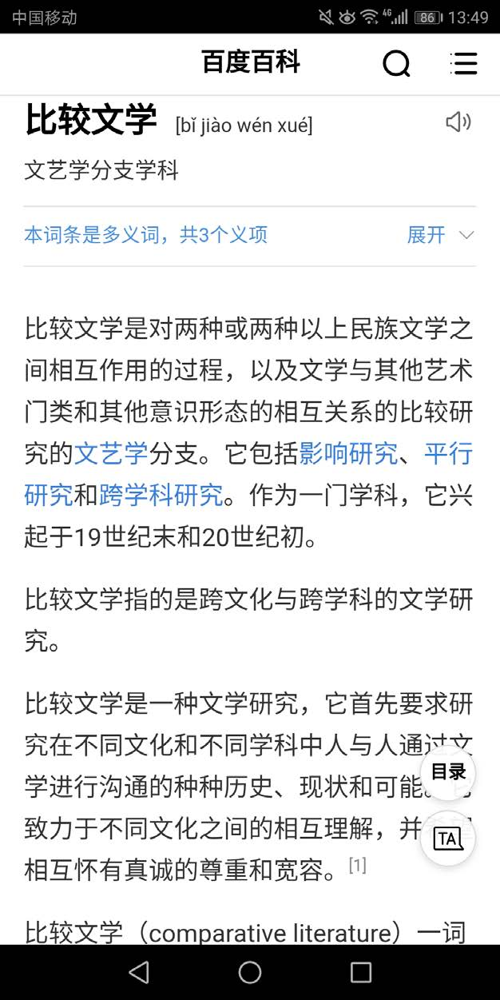

*2018-02-03 13:51 · 手机上网*

---

### 3044

傻子还是骗子？其实还有另一种可能，比较傻的骗子……

*2018-02-03 12:44 · iPhone版*

---

### 3045

有一类大的创业机会可以总结为 google 干好了但 baidu 在中国没干或没干好的事情。

*2018-02-03 12:27 · iPhone版*

---

### 3046

一路铺满鲜花和荆棘。

*2018-02-03 08:46 · iPhone版*

---

### 3047

一个朋友说他现在最喜欢的运动是潜水，因为这项运动能确保他有一段时间不碰手机。

*2018-02-02 23:00 · iPhone版*

---

### 3048

发达国家粉碎机和科学帝国主义。

*2018-02-02 15:06 · iPhone版*

---

### 3049

老兄，好歹押个韵吧。私对公，雨对风，叶绿对花红。转@ quux 公对私，雪对风，绿叶对红花 转@ 王兴 我们为什么要整天说 2C (toconsumer) 和 2B (to business)，而不说「对私」和「对公」呢？

*2018-02-02 14:47 · 手机上网 转自王兴*

---

### 3050

我十几岁生活在小山城时就听说了，金融业务分两种，要拿砍刀的，和不需要的。

*2018-02-02 14:34 · 手机上网*

---

### 3051

我小时候搬过砖，真的那种。

*2018-02-02 14:22 · iPhone版*

---

### 3052

我们为什么要整天说 2C (to consumer) 和 2B (to business)，而不说「对私」和「对公」呢？

*2018-02-02 14:20 · iPhone版*

---

### 3053

2C业务改变人们的消费方式和生活方式，2B业务改变人们的工作方式和组织方式。

*2018-02-02 13:41 · iPhone版*

---

### 3054

新裤子的歌除了《没有理想的人不伤心》还有哪些比较好？

*2018-02-02 13:38 · iPhone版*

---

### 3055

@ 杨曜睿 这个更快更猛更持久。转@ 王兴 佛祖29岁出家修行，35岁成佛，传法45年，80岁圆寂。真是天赋异禀，干了6年就成佛了，比绝大多数互联网创业都快多了。

*2018-02-02 13:13 · 手机上网 转自王兴*

---

### 3056

卢冠廷的《一生所爱》我听过各种版本，听过许多遍，但并没有在分

手后在起风的秋日黄昏里穿着略显单薄的衣服一个人坐在鸡鸣驿的城头听过。

*2018-02-02 13:09 · iPhone版*

---

### 3057

这块天地如此之新，许多东西尚未命名，提起它们时还须用手指指点点。——马尔克斯《百年孤独》

*2018-02-02 12:40 · 手机上网*

---

### 3058

「出现」二字是多余的。转@ 王兴 facebook在北美的日活用户数首次出现下滑。

*2018-02-02 12:38 · 手机上网 转自王兴*

---

### 3059

facebook在北美的日活用户数首次出现下滑。

*2018-02-02 12:27 · 手机上网*

---

### 3060

我家乡龙岩的市花也是山茶花。转@ viviyo 昆明市的市花就是山茶花。转@ 王兴 是的，茶花是很美的，而且可以是多种多样既健壮又精致，充满生命力的那种美。可能是因为我从小生活在福建，所以我更能欣赏茶花，胜过欣赏牡丹。转@ 努尔哈欠 接近完美的茶花。

*2018-02-02 12:25 · 手机上网 转自努尔哈欠*

---

### 3061

是的，茶花是很美的，而且可以是多种多样既健壮又精致，充满生命力的那种美。可能是因为我从小生活在福建，所以我更能欣赏茶花，胜过欣赏牡丹。转@ 拧巴人儿 这个好美 转@ 努尔哈欠 接近完美的茶花。

*2018-02-02 12:18 · 手机上网 转自努尔哈欠*

---

### 3062

前年夏天我开始谈下半场，后来有很多人谈各种各样的下半场，也有一些人认为哪里还有什么下半场，整场都已经结束了，还有一些人认为哪里有什么下半场，永远都是上半场！三者都对。

*2018-02-02 11:50 · iPhone版*

---

### 3063

乔布斯1997年重回苹果，创造一系列奇迹，数次改变世界，到2011年英年早逝，也只过了14年。人和人的差距真大。转@ 王兴 我做美团已

经8年多了，超过了从1937年卢沟桥事变算起的八年抗战；我回国开始创业已经14年多了，超过了从1931年九一八事变算起的十四年抗战。却仿佛只是一眨眼

*2018-02-02 11:39 · 手机上网 转自王兴*

---

### 3064

有的人认为北京的中心是天安门或偏西一点，有的认为是CBD，有的认为是金融街，有的认为是三里屯… 认为是五道口的就已经过于自我陶醉了，别提上地了。

*2018-02-02 10:52 · iPhone版*

---

### 3065

转@ gravity0 这个零下三十度的小镇，供电靠柴油，自来水刚出来时像牛奶，网速慢如十年前。中心百米范围内，至少有两家中餐两家越南菜一家日料一家韩料，妥妥地占了本地餐饮业半数以上。我想我能理解他们来这里开店的心情。

*2018-02-02 10:13 · 手机上网 转自gravity0*

---

### 3066

如果iPhone算真正的智能手机的起点，那 symbian 就属于弱智手机。

*2018-02-02 09:58 · 手机上网*

---

### 3067

智能手机不在其中。转@ chenhang419 理解这个世界上绝大部分事情都是先于你而存在，晚于你灭亡。是形成世界观的一个重要原则。

*2018-02-02 09:40 · 手机上网 转自chenhang419*

---

### 3068

转@ 贾行家 征服者经常自以为和创造者一样伟大。

*2018-02-02 09:20 · 手机上网 转自贾行家*

---

### 3069

大脑抽筋是什么感受？

*2018-02-01 18:58 · 手机上网*

---

### 3070

巧了。ebay刚宣布2020年要把主支付供应商从paypal切换成总部在阿姆斯特丹的第三方公司adyen. 转@ 王兴 哦，我都忘了2016年9月我有过这想法。转@ redsheepfei 转@ 王兴 看阿里集团和蚂蚁金服是否是两家独立的公司，就看淘宝支不支持微信支付。

*2018-02-01 16:27 · 手机上网 转自王兴*

---

### 3071

并没有同时回头。转@ 王兴 两个人在冰面上擦肩而过。# 坐车经过什刹海时总得想象点什么 #

*2018-02-01 16:20 · 手机上网 转自王兴*

---

### 3072

智能音箱之战是对库克和苹果的明确考验。

*2018-02-01 16:17 · 手机上网*

---

### 3073

两个人在冰面上擦肩而过。# 坐车经过什刹海时总得想象点什么 #

*2018-02-01 16:17 · 手机上网*

---

### 3074

一颗一颗擦亮。转@ 杨曜睿 然后一颗一颗点燃。转@ 洋鸟消夏录 把星星一颗一颗按灭

*2018-02-01 15:37 · 手机上网 转自洋鸟消夏录*

---

### 3075

为什么？是被孔子打压了吗？转@ quux 神话整个在中国古代文化里并不占据一个重要位置 转@ 王兴 太阳神在中国古代神话里并不占据一个重要位置。这是中国和西方一个有趣的区别。

*2018-02-01 14:25 · 手机上网 转自王兴*

---

### 3076

今天听说 Geisha 瑰夏咖啡很好喝。

*2018-02-01 14:19 · iPhone版*

---

### 3077

真理只在大炮射程之内。后来有了洲际导弹。

*2018-02-01 14:00 · iPhone版*

---

### 3078

太阳神在中国古代神话里并不占据一个重要位置。这是中国和西方一个有趣的区别。

*2018-02-01 13:23 · iPhone版*

---

### 3079

一个创业的朋友跟我说“未来我们的设计语言叫：Retro futuristic”，我顿时觉得自己 low 爆了。

*2018-02-01 01:11 · iPhone版*

---

### 3080

三段取名法的范例： Apple iPad Air.

*2018-02-01 00:12 · iPhone版*

---

### 3081

生活需要大大小小的新的开始。终于又用完一本了。

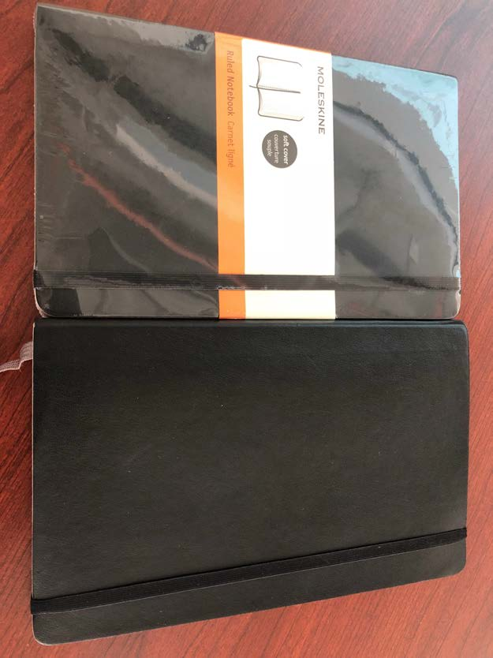

*2018-01-31 23:14 · 饭斯基*

---

### 3082

有些问题看起来再简单不过但其实并没有标准答案，例如：全世界一共有几个国家？

*2018-01-31 16:49 · iPhone版*

---

### 3083

开发一个超牛逼的函数，把一个国家作为参数传进去。

*2018-01-31 16:45 · iPhone版*

---

### 3084

哦，我都忘了2016年9月我有过这想法。转@ redsheepfei 转@ 王兴看阿里集团和蚂蚁金服是否是两家独立的公司，就看淘宝支不支持微信支付。

*2018-01-31 16:23 · 手机上网 转自王兴*

---

### 3085

《银河系漫游指南》开场就是：要修一条星际高速路，地球所在位置不太走运，要被…拆迁… 转@ webto 如果真的有外星人来到地球，根据文明水平差异，如果被当作蜜蜂养起来应该是地球人命好，直接星

系被当作矿场突然一铲子抹杀了也不稀奇。

*2018-01-31 15:52 · 手机上网 转自webto*

---

### 3086

为什么没有哪个（早期）风险投资机构给自己起名叫「精子资本」？

*2018-01-31 15:42 · 手机上网*

---

### 3087

这个世界的 KPI 是什么？

*2018-01-31 13:43 · 手机上网*

---

### 3088

见了一个冯小刚投资的智能硬件公司……

*2018-01-31 13:43 · 手机上网*

---

### 3089

更进一步：仿佛看到时间在整个空间里流动，穿透你的肉身如若无物。转@ 王兴 仿佛看到时间在身边流动。

*2018-01-31 13:39 · 手机上网 转自王兴*

---

### 3090

百分之零。

*2018-01-31 12:51 · iPhone版*

---

### 3091

看到他眼中的灰烬。转@ 王兴 看到他眼中的火焰。看着它熄灭。

*2018-01-30 23:31 · 手机上网 转自王兴*

---

### 3092

奇怪，已经12小时不吃东西只喝茶了，居然也不饿。以往连续开会并没这个效果啊。

*2018-01-30 21:03 · iPhone版*

---

### 3093

mate10这一系列屏保图片里的风景太诱人了，搞得我都想去瑞士旅行了。

*2018-01-30 20:50 · iPhone版*

---

### 3094

可惜纸笔是二维的，缺乏一个好的三维表达系统严重制约了思考和沟通。

*2018-01-30 14:40 · 手机上网*

---

### 3095

独自坐下来，静一静，怀疑人生。

*2018-01-30 14:32 · 手机上网*

---

### 3096

不被历史撞一下腰，你还觉得自己跑得挺快的。

*2018-01-30 13:32 · 手机上网*

---

### 3097

转@ Echo你怎麼吃這麼多啊 法语里oi发ua的音好像 结尾单独一个e不发音 一个法语半吊子这样说道 转@ 王兴 碰到一个法国人Antoine，他说他名字的后半部分 toine 发音跟美团的后一个字 tuan

差不多。

*2018-01-30 13:06 · 手机上网 转自王兴*

---

### 3098

碰到一个法国人 Antoine，他说他名字的后半部分 toine 发音跟美团的后一个字 tuan 差不多。

*2018-01-30 12:58 · iPhone版*

---

### 3099

仿佛看到时间在身边流动。

*2018-01-30 08:58 · iPhone版*

---

### 3100

有些字是多音字，只是不太常用，例如「作」者。

*2018-01-30 08:52 · iPhone版*

---

### 3101

三星投了 go-jek，本田投了 grab，东南亚的 O2O 之战乃至互联网之战真是谁都来插一杠子。

*2018-01-30 08:43 · iPhone版*

---

### 3102

像小狼一样长嚎一声，然后，爬出被窝。

*2018-01-30 08:37 · iPhone版*

---

### 3103

跟美好的事物擦肩而过时，她们可以伸腿绊我一下呀。

*2018-01-30 08:12 · iPhone版*

---

### 3104

关于公司的青春期，今天有一点小小的思考上的突破。

*2018-01-30 00:29 · iPhone版*

---

### 3105

孙子会怎么解释当年蒙古人从欧亚大陆的东端一路往西攻过去的打法呢？转@ 王兴 上兵伐谋，其次伐交，其次伐兵，其下攻城。-《孙子兵法》

*2018-01-29 23:41 · 手机上网 转自王兴*

---

### 3106

拭目以待，看看是谷歌的市值先超苹果，还是亚马逊的市值先超微软？

*2018-01-29 23:22 · 猫饭*

---

### 3107

2006年，我们在中国做类facebook网站校内网的时候，天才的Durov兄弟在俄罗斯做类facebook网站VKontakte。VK后来被俄罗斯类腾讯公司mail.ru收购，这俩兄弟出来做了类微信服务telegram，再次站上潮头。

*2018-01-29 21:57 · iPhone版*

---

### 3108

水立方是最能让我联想起「梦幻泡影」的建筑。

*2018-01-29 16:34 · 猫饭*

---

### 3109

kingmaker 听起来不如 rainmaker 酷。

*2018-01-29 15:33 · 手机上网*

---

### 3110

茶和葡萄酒一样，只要有点甜味，虽然貌似容易入口，但终归上不了台面。

*2018-01-29 15:24 · iPhone版*

---

### 3111

三顾茅庐之后得紧跟着隆中对，这才组合成一个经典的互动招聘案例。

*2018-01-29 14:21 · iPhone版*

---

### 3112

转@ 阳升 Google 说 wealth 词源来自 health，附图 转@ 王兴 在英文里，健康 health 和财富 wealth 只是一个字母的差别。

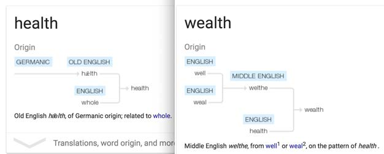

*2018-01-29 12:24 · 手机上网 转自阳升*

---

### 3113

英文里有独角兽，中文里有龙头企业，大家都喜欢用稀罕的神兽来形容。

*2018-01-29 12:09 · iPhone版*

---

### 3114

转@ 大米来 铺垫，抖包袱，一通百通。 转@ 醋溜小肉段儿 刚经历了一场前无古人的绝望性事，老公一边后入我一边放郭德纲的相声，不知道这是新型的情趣模式还是他已经不打算守护这段婚姻了

*2018-01-29 11:08 · 手机上网 转自醋溜小肉段儿*

---

### 3115

在英文里，健康 health 和财富 wealth 只是一个字母的差别。

*2018-01-29 11:05 · iPhone版*

---

### 3116

这个总结有趣。转@ realazy 生活节俭的瑞典企业家、宜家(Ikea)创始人英格瓦·坎普拉德(Ingvar Kamprad)去世，享年91岁。勃勃雄心曾导致他酗酒、沉迷于法西斯主义数年之久，并且还让他过上了一种近乎修道士般的简朴生活。

*2018-01-29 10:26 · 手机上网 转自realazy*

---

### 3117

转@ 猪小宝 有一部分改装卡特彼勒D7/D8推土机，但肯定不是第一批抢滩主力。奥马哈的第一批美军是16辆谢尔曼坦克加装推土铲，其中15辆在海中或滩头被击毁。 转@ 王兴 据说，诺曼底登陆时，第一

批开上滩头的不是坦克，而是成百上千辆 Caterpillar 卡特彼勒推土机。大国重器的品

*2018-01-29 09:54 · 手机上网 转自王兴*

---

### 3118

宜家创始人 Ingvar Kamprad 生于1926年，1943年（17岁时）创办宜家，1950年开创了可组装家具的概念，1998年后不再直接参与经营，昨天去世，享年91岁。

*2018-01-29 02:09 · iPhone版*

---

### 3119

和人约在餐馆谈事情，没想到撞上那著名的四个80后创业者中剩下的三个在聚会，于是拼成一桌，聊了很多。

*2018-01-29 01:32 · iPhone版*

---

### 3120

看到他眼中的火焰。看着它熄灭。

*2018-01-28 18:33 · 手机上网*

---

### 3121

刚刚被一条突如其来的短信提醒了一下，我已经多么不接地气:(

*2018-01-28 17:59 · 手机上网*

---

### 3122

香奈儿毕竟是穷出身。这在class里约属于第二级。转@ peter 嗯…这评价要是在东北肯定会打起来转@ viviyo 有一回香奈儿的别墅装好了请朋友来暖房，一个美国人夸她品味好：“您花了那么多钱 却看不出来”。谁夸她的话都没记住，就这句可喜欢跟别人提起了。后来被她的朋友写到了传记里

*2018-01-28 17:47 · 手机上网 转自viviyo*

---

### 3123

我一度怀疑「大国重器」这个霸气十足且貌似古朴的说法其实是近些年才造出来的，刚才查了一下，看起来出处是《史记.秦始皇本纪》：国玺，国之重器。

*2018-01-28 17:26 · iPhone版*

---

### 3124

据说，诺曼底登陆时，第一批开上滩头的不是坦克，而是成百上千辆Caterpillar 卡特彼勒推土机。大国重器的品牌不是凭空来的。

*2018-01-28 17:05 · iPhone版*

---

### 3125

转@ szweig 转@ 猛禽 转@ 努力学习的陈倚刚 卧槽，阿里的一个前员工讲他们原来怎么获得客户信息的时候说他们会读手机里能得到的所有信息。

*2018-01-28 16:12 · 手机上网 转自努力学习的陈倚刚*

---

### 3126

转@ 左潇 浮在冰山之上，权重最高的荒诞事实有：中国销量top20的药物，没有一个在全球排名top100的名单里（另，按IMS 2015的统计口径仅2个是在top100）。本质是国内top20药，很多疗效被怀疑或治

疗方案早已更新。可惜又仅有部分好医生认同该观点，其余超过八成医生仍未

*2018-01-28 15:56 · 手机上网 转自左潇*

---

### 3127

刚才听了一个业务的周会，我觉得有必要去买一双 CAT 工装靴了，能穿着一脚踏入污水坑、油污、血污而不皱一下眉的那种。

*2018-01-28 15:31 · iPhone版*

---

### 3128

迪拜和伊斯坦布尔存在商业上的区域竞争关系。

*2018-01-28 15:27 · iPhone版*

---

### 3129

我不太理解的一点是：为什么 mate 10 自带的锁屏相册比 mate 8 的漂亮那么多？图片不能共享吗？边际成本不是几乎为零吗？只能解释成华为有意为之了。

*2018-01-28 15:23 · iPhone版*

---

### 3130

转@ qinyf hhhh 转@ 喵湿书 “”初听古典的小伙伴，老司机给你们带带路：巴赫抗躁动、海顿抗抑郁、莫扎特抗失眠、贝多芬抗萎靡、柴科夫斯基抗饥饿、马勒抗瞌睡、拉赫玛尼诺夫抗寂寞...最后还必须得指出一个最管用的:布鲁克纳，抗吃醋后的不良情绪反应。“”

*2018-01-28 13:48 · 手机上网 转自喵湿书*

---

### 3131

「因真理，得自由，以服务」，当年燕京大学这九字精神确实立意高远！司徒雷登和他代表的基督教传统还是厉害的。

*2018-01-28 10:15 · iPhone版*

---

### 3132

孙立平用四句话判断经济的走势与前景：短期看政策，中期看趋势，长远看文化，体制贯彻始终。

*2018-01-28 09:33 · iPhone版*

---

### 3133

中国经济2016年的五个主要任务：去产能、去库存、去杠杆、降成本、补短板。

*2018-01-27 23:59 · iPhone版*

---

### 3134

转：按诺奖得主神经心理学家 Eric Kandle 的说法，人的身份是由这几个问题塑造的：what we remember, what we want and what wewant to be.

*2018-01-27 23:30 · iPhone版*

---

### 3135

一个行家说，孙宏斌是过去十几年中国房地产行业里唯一真的有战略的人。

*2018-01-27 23:19 · iPhone版*

---

### 3136

转@ qinyf 给琴起了名字，像是多了位家庭成员。下午试的时候，一出声音就觉得是个男生，三四弦音色很宽。2016年做好的，面板的年纪略小我几岁。

*2018-01-27 21:18 · 手机上网 转自qinyf*

---

### 3137

一个朋友说他对中华民族伟大复兴的信心已经强到坚信将来老外会迷恋喝茅台了。

*2018-01-27 17:36 · iPhone版*

---

### 3138

清华毕业时我穿学位服拍照用的那条领带还在衣柜里，但是以现在的审美来看太宽了。

*2018-01-27 16:02 · iPhone版*

---

### 3139

杰出的品牌，有专属的颜色、形状、字体和声音。

*2018-01-27 11:45 · 手机上网*

---

### 3140

我看过旧金山的金门大桥，我也看过鲸鱼在海里翻腾，但我没看过两者的组合。刚才一时兴起，上网搜了一下，真的有。

*2018-01-27 11:40 · 手机上网*

---

### 3141

我小时候，家门口就是一个名叫「甘蔗岭」的地儿。现在，不但甘蔗没了，连岭都没了，小山坡已经被铲平，建起了密密麻麻郁郁葱葱的楼房。

*2018-01-27 11:18 · iPhone版*

---

### 3142

朋友说，发明比特币的中本聪绝对是科技宅们的终极偶像，他成功做到了崔健在《假行僧》里唱的：我要人们都看到我，但不知道我是谁。

*2018-01-27 10:24 · iPhone版*

---

### 3143

我小时候种甘蔗的经验是：甘蔗要想甜，需要很多阳光，很多水，和适量的尿。

*2018-01-27 09:53 · iPhone版*

---

### 3144

这个世界需要更多好的烤鳗鱼。

*2018-01-26 19:13 · iPhone版*

---

### 3145

在我很小的时候，逢年过节，不管是祠堂祭祖还是招待客人，基本只有两种水果，桔子和甘蔗。甘蔗切成一节一节，整齐的码成一小堆，有削了皮的，也有不削皮的。

*2018-01-26 16:33 · 手机上网*

---

### 3146

转@ 贾行家 恩格斯那段话大意：马克思通过一本游记提到，了解东方的真正钥匙，是那里从来不存在土地私有制。恩格斯认为主要是由于沙漠地带到亚洲高原地区的气候和土壤，“在那里，自由竞争被看做丢脸的事情”。然后他说自己可以在48小时内学完一门外国语法——不怀疑，只是奇怪这俩人不能干点儿正事

*2018-01-26 16:26 · 手机上网 转自贾行家*

---

### 3147

梵高画出了时间的样子。

*2018-01-26 16:25 · iPhone版*

---

### 3148

多数种类的鞋子都可以做得很好穿，我觉得切尔西的主要意义在于把脚插进去和拔出来时的那种感觉。。转@ Deepmercury 在北京穿了一个冬天切尔西短靴的我表示，这鞋真好穿。转@ 王兴 这种天气真的很适合穿一双切尔西短靴，可惜我并没有。

*2018-01-26 13:54 · 手机上网 转自王兴*

---

### 3149

这种天气真的很适合穿一双切尔西短靴，可惜我并没有。

*2018-01-26 13:44 · iPhone版*

---

### 3150

全世界产量最大的农作物竟然不是玉米、小麦或大米，而是一个多数人根本想不到的答案：甘蔗，年产约18亿顿。80%的食糖来自甘蔗，其余的主要来自甜菜根。

*2018-01-26 13:32 · iPhone版*

---

### 3151

英文里好像没有「假大空」这么简短的表述方式。

*2018-01-26 11:43 · iPhone版*

---

### 3152

我小时候种过两种甘蔗：一种是青色皮略带点红，粗细只有硬币大小，据说是更本地的品种；另一种是后来更常见的紫皮甘蔗，能长得更高，还比前者粗一大圈，味道也很甜，但比起前者的清甜略显单调。

*2018-01-26 10:16 · iPhone版*

---

### 3153

做投资赚钱快不快，我说不好，但做起投资来花钱是真快。

*2018-01-26 01:23 · 手机上网*

---

### 3154

想起音乐剧《我，唐吉诃德》(Man of La Mancha)，这就属于我愿意再看一遍的那种剧。先打开 QQ 音乐听一下。

*2018-01-26 00:43 · iPhone版*

---

### 3155

夜深人静，适合思考和思念。

*2018-01-26 00:22 · iPhone版*

---

### 3156

酒，不一定是用来喝的，也可以用来闻。

*2018-01-25 23:44 · iPhone版*

---

### 3157

这……我还真没吃过。转@ 圡人 未成熟的玉米杆吧，低配版的甘蔗~~转@ 王兴 有什么水果的形象比甘蔗还更低端吗？转@ 王兴 好像很少看到穿西装的人吃甘蔗。

*2018-01-25 21:20 · 手机上网 转自王兴*

---

### 3158

有什么水果的形象比甘蔗还更低端吗？转@ 王兴 好像很少看到穿西装的人吃甘蔗。

*2018-01-25 21:08 · 手机上网 转自王兴*

---

### 3159

好像很少看到穿西装的人吃甘蔗。

*2018-01-25 13:08 · iPhone版*

---

### 3160

十几年如一日。转：和一个腾讯创始人聊天，我提到：＂听说马化腾的私人qq的签名档是'正在布局'＂ ？他非常谦虚的回答：＂哪里哪里，你们不要误解。那是pony早年痴迷于玩四国军棋时用的签名档，后来就一直没改＂。

*2018-01-25 01:54 · 手机上网*

---

### 3161

本想在冰箱里找点葡萄干，结果翻出来牛肉干，决定将就一下。

*2018-01-25 01:39 · iPhone版*

---

### 3162

中央美术学院曾经有个「年画连环画系」！

*2018-01-25 01:28 · 猫饭*

---

### 3163

尹老师送我这么一本书。实在是有点超出我的欣赏能力范围了。

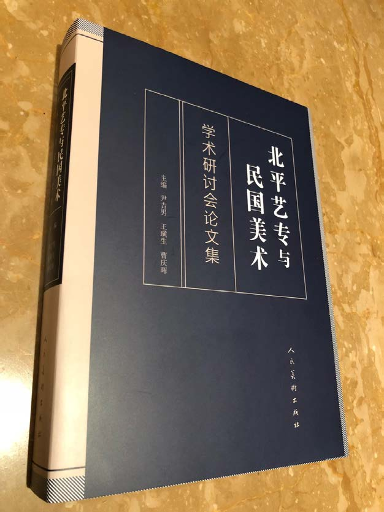

*2018-01-25 01:24 · 猫饭*

---

### 3164

吻平每一道皱纹。

*2018-01-25 00:54 · iPhone版*

---

### 3165

比造一个字或一个词更稀罕的是发明一种标点。

*2018-01-25 00:53 · iPhone版*

---

### 3166

在寒冷的北京冬夜里，回家路上突然想起卡帕多西亚的艳阳和艳阳下的鲜榨石榴汁。

*2018-01-25 00:49 · iPhone版*

---

### 3167

穿越人间。转@ 王兴 目光不但要穿越空间而且要穿越时间。

*2018-01-25 00:29 · 手机上网 转自王兴*

---

### 3168

转：善与恶拔河哪边会赢？人多的那边会赢。

*2018-01-24 21:28 · iPhone版*

---

### 3169

目光不但要穿越空间而且要穿越时间。

*2018-01-24 20:18 · iPhone版*

---

### 3170

互联往事。

*2018-01-24 14:04 · iPhone版*

---

### 3171

又多了一家市值过千亿美元的公司：netflix 上季度业绩超预期，股价大涨10%，市值达到1090亿了。转@ 王兴 刚发现 paypal 已经是千亿美元公司了，市值1008亿。netflix 也非常接近了，954亿。priceline932亿。

*2018-01-24 04:02 · 手机上网 转自王兴*

---

### 3172

凌晨三点多，终于开完会。我估计唯一觉得自己更衰的是那个出差来北京、订了一晚酒店但是5am就要出发去机场赶飞机的同事。

*2018-01-24 03:58 · iPhone版*

---

### 3173

平稳不平稳还是差别很大的。高铁的速度是过山车的好几倍。

*2018-01-23 16:19 · iPhone版*

---

### 3174

直观感觉，男生工作效率和女同事整体颜值之间的关系是一条钟形曲线。

*2018-01-23 14:03 · iPhone版*

---

### 3175

我以前只知道廿 niàn 是二十，卅 sà 是三十，今天才知道还有卌 xì，两个意思：1.四十；2.插粪耙。

*2018-01-23 11:30 · iPhone版*

---

### 3176

随着我的年龄增长，《You Want It Darker》在我最喜欢的科恩的歌里的排名会逐步往前挪。不过要超过《Hallelujah》估计还是比较难的。

*2018-01-23 11:07 · iPhone版*

---

### 3177

Missing Neverland.

*2018-01-23 00:41 · 手机上网*

---

### 3178

Bob Marley 的名曲《No Woman, No Cry》我其实听过很多遍，但一直没去理解到底在唱什么。刚才看了一下歌词，发现之前好像被歌名里的标点误导了，意思应该是《No, Woman, No Cry》…

*2018-01-22 17:55 · 手机上网*

---

### 3179

生活在生活的缝隙里。

*2018-01-22 17:45 · 手机上网*

---

### 3180

这句话如何换位思考是有点复杂的事。转@ 王兴 The truth is,everyone is going to hurt you. You just got to find the onesworth suffering for. -Bob Marley

*2018-01-22 17:22 · 手机上网 转自王兴*

---

### 3181

刚发现 paypa 已经是千亿美元公司了，市值1008亿。netflix 也非常接近了，954亿。priceline 932亿。

*2018-01-22 15:03 · iPhone版*

---

### 3182

正本清源。

*2018-01-22 08:37 · iPhone版*

---

### 3183

转@ 博伯 @ 王兴 在牙买加经商这段时间，发现当地商人已经从BobMarley的体系转向了孙子兵法。转@ 王兴 The truth is, everyone isgoing to hurt you. You just got to find the ones worth suff

*2018-01-22 07:16 · 手机上网 转自博伯*

---

### 3184

丑田 转@ 王兴 一丨丅十丄干工土王 转@ 王兴 一T工王

*2018-01-21 22:52 · 手机上网 转自王兴*

---

### 3185

一丨丅十丄干工土王 转@ 王兴 一T工王

*2018-01-21 22:33 · 手机上网 转自王兴*

---

### 3186

转自百度百科：丨是一个象形字，有四种读音：1、读作“竖”（shù），意同“竖”。2、读作“一”（yī），为姓氏。3、读作“衮”（gǔn），意为上下相通，此时从下往上写。4、读作“退”（tuì），此时从上往下写。

*2018-01-21 22:31 · 手机上网*

---

### 3187

丄 shàng ，上字的古体。

*2018-01-21 22:01 · iPhone版*

---

### 3188

一T工王

*2018-01-21 21:47 · iPhone版*

---

### 3189

换位思考是极难的，我的多数同胞完全不觉得中国人看朝鲜和美国人看中国是可比的两件事。

*2018-01-21 19:45 · iPhone版*

---

### 3190

The truth is, everyone is going to hurt you. You just got to findthe ones worth suffering for. -Bob Marley 我第一次觉得这大哥确实有点酷。

*2018-01-21 19:07 · iPhone版*

---

### 3191

「三缺一」有两种意思，一种是三个要素里缺了一个，另一种是有三个了，但是离凑满四个还缺一个。

*2018-01-21 19:00 · iPhone版*

---

### 3192

厦门的海堤红真是一款不错的红茶。我每次喝都能脑补出淡淡的海风的咸味。

*2018-01-21 17:39 · iPhone版*

---

### 3193

树光秃秃，心空荡荡。转@ 朱开云 冷天适合思考人生。

*2018-01-21 17:13 · 手机上网 转自朱开云*

---

### 3194

泻的繁体字是瀉，但是 lagoon 潟湖 常常被误写为泻湖。潟念 xì 。

*2018-01-21 10:35 · iPhone版*

---

### 3195

蒂凡尼和爱马仕都拥有自己的专属颜色。

*2018-01-20 23:06 · iPhone版*

---

### 3196

聚餐时朋友说她2000年创业时拿了一堆基金和个人的投资，去年她创办并运营至今的公司终于被并购了，她要把钱分给股东，发现当年投她的有些基金已经解散了，解散时估计已经把给她的这笔投资一笔勾销了。但是她还是花了不少功夫找出那些基金当年的出资人，把钱分给这些 LP。她说回报比当年买房好。

*2018-01-20 21:52 · 手机上网*

---

### 3197

「類」字被简化时为什么变成了「类」？去掉了那一点，犬字底变成了大字底，原意完全丢失了:(

*2018-01-20 21:04 · iPhone版*

---

### 3198

经济学人这期封面文章"How to tame the tech titans"用了一个有趣的词来形容谷歌、亚马逊、脸书这几家科技巨头：BAADD—big, anticompetitive, addictive and destructive to democracy.

*2018-01-20 09:47 · iPhone版*

---

### 3199

《无问西东》的片尾提到，「中华民族」这个概念是梁启超在上世纪初首创的。

*2018-01-20 09:33 · iPhone版*

---

### 3200

努力工作，争取早日从三流公司升级成二流公司。

*2018-01-19 21:35 · 手机上网*

---

### 3201

卑尔根确实很美。五年多前我去之前对这个城市一无所知，但飞机还没来得及降落，我就在空中被这座山水之城的美震惊了。转@nukecoke 挪威卑尔根，快去吧，美死。转@ 撒闵呢 这非俄罗斯或者

瑞典的城市不可了 转@ 王兴 又有雪山又有大海的城市确实很迷人。

*2018-01-19 21:07 · 手机上网 转自王兴*

---

### 3202

十年前曾有许多服务器和我相伴过，我最怀念的那台名叫 hippo.

*2018-01-19 20:11 · 手机上网*

---

### 3203

又有雪山又有大海的城市确实很迷人。

*2018-01-18 21:40 · iPhone版*

---

### 3204

或许也会更理解社会主义。转@ 王兴 不管我们喜不喜欢，接下来几年里，更多的人会逐渐明白资本主义为什么叫资本主义。

*2018-01-18 18:03 · 手机上网 转自王兴*

---

### 3205

国家统计局：2017年我国 GDP 总量为82.7万亿元，第一次突破80万亿元的门槛，同比增长6.9%，增速较2016年提高0.2个百分点。2010年以来我国经济增长首次加速。

*2018-01-18 17:08 · 手机上网*

---

### 3206

国家统计局公布的数据显示：2017年出生1723万，2016年出生1786万，2015年出生1655万。出生人口下滑，形势严峻，接下来不但要全面废除计划生育而且应该开始鼓励生育了。中华民族需要更多人。

*2018-01-18 16:39 · 网页*

---

### 3207

一个我印象不深的外国朋友群发邮件，说他79岁的父亲因肺癌去世了。除了分享对父亲的怀念，他还分享了自己在陪伴父亲度过人生最后几个小时的过程中给他朗读的书，因为他的父亲也一辈子是个爱书之人。他说最后读的是这首 "Even This Shall Pass Away" by Tilton

*2018-01-18 16:13 · 手机上网*

---

### 3208

一转眼又到世界杯年了…… 1998年法国世界杯还历历在目…… 泪目！

*2018-01-18 15:42 · 网页*

---

### 3209

大和美。

*2018-01-18 14:39 · iPhone版*

---

### 3210

在不同行业的创业里，资本可能是催化剂、助燃剂、或主力燃料。

*2018-01-18 13:45 · iPhone版*

---

### 3211

鞋子是多数人和这个世界最持久最结实的接触点。

*2018-01-18 13:27 · iPhone版*

---

### 3212

出站时观察了一下检票流程，似乎有漏洞，不补票也很容易逃掉。转@ 王兴 终于补上票，不再是无票乘车了:) 我原本想买虹桥到北京南站，但是没票了，机智的美团app建议我赶紧买一张虹桥到南京南的同车次车票，然后上了车再补票。

*2018-01-17 23:46 · 手机上网 转自王兴*

---

### 3213

我小时候，我还小得可以骑到爸爸肩上在人山人海中高出一头的时候，我们家乡还是有端午节赛龙舟的，就在那登高山旁的龙津河里；

元宵节也还有花灯游行，就在那沿河路上。后来，「单位」不再是社

会的主体，这些不直接创造经济效益的活动就消失了。我希望它们能回来，因为并不是只有我的童年需要这种记忆。

*2018-01-17 22:21 · 手机上网*

---

### 3214

不含酒精的 mojito 叫 virgin mojito ;)

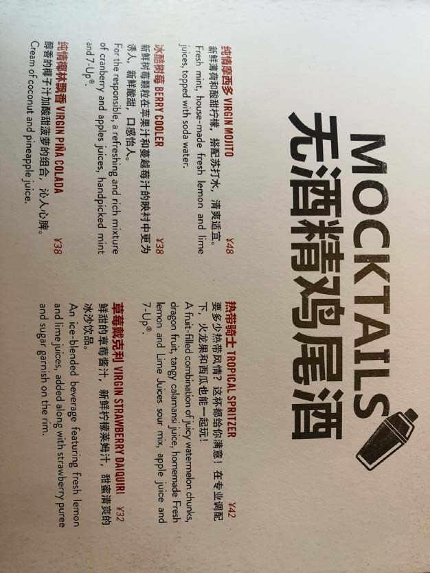

*2018-01-17 21:52 · 猫饭*

---

### 3215

转：（对一个国家来说）朋友是可以选择的，邻居是不可以选择的。

*2018-01-17 21:47 · iPhone版*

---

### 3216

最近的一些事让我想起高中时每天中午打的那一年桥牌。

*2018-01-17 21:10 · iPhone版*

---

### 3217

终于补上票，不再是无票乘车了:) 我原本想买虹桥到北京南站，但是没票了，机智的美团app建议我赶紧买一张虹桥到南京南的同车次车票，然后上了车再补票。

*2018-01-17 20:50 · 手机上网*

---

### 3218

嗯，这个镜头我也记得。转@ 脚哥 所以我的英文名字叫 Rocky，每次听到脑中浮现出吃生鸡蛋的史泰龙 转@ 王兴 用自己喜欢的外国乐手或运动员的名字当自己的英文名确实是蛮常见的做法。

*2018-01-17 20:28 · 手机上网 转自王兴*

---

### 3219

最近不知为什么，听很多歌时都会想到纵马驰骋的场景。

*2018-01-17 19:53 · iPhone版*

---

### 3220

用自己喜欢的外国乐手或运动员的名字当自己的英文名确实是蛮常见的做法。

*2018-01-17 19:44 · iPhone版*

---

### 3221

唉，皮底皮鞋容易打滑，还是不适合我这种机场/高铁站奔跑型选手。

不过，好歹还是赶上7pm发车的高铁了。

*2018-01-17 19:03 · 手机上网*

---

### 3222

对着黄浦江发呆的时候想起来，昨天的晚宴上一个女投资人一见面就说「我昨晚梦到你了」，我赶紧问怎么回事，原来是她梦到我在她家门口的大河上跟人赛龙舟了……

*2018-01-17 11:39 · 手机上网*

---

### 3223

听说食指老师最近以过来人的身份公开怒斥写了《穿过大半个中国去睡你》的余秀华格调低下，我才第一次去读了他写于1968年的成名作《相信未来》。嗯，只能说，时代特征明显。

*2018-01-16 10:43 · iPhone版*

---

### 3224

有一种歌叫：大列表随机播放时不管前一首歌是什么风格都接得起来。

*2018-01-16 10:31 · iPhone版*

---

### 3225

下了摆渡车，一大堆人在舷梯前排成两大队依次登机，一个穿白色短羽绒衣的长发姑娘突然挪到最前面要加塞。估计是都看到了寒风中她超短裙下的一双美腿只裹着薄薄的丝袜，所以没有人对加塞提出异议。

*2018-01-16 10:03 · iPhone版*

---

### 3226

还有这种不请自来的垃圾短信。如果是真的，我很好奇产业链是如何构成的，几方如何分工分利，特朗普从中能捞多少钱……

*2018-01-15 21:02 · 手机上网*

---

### 3227

语言就是世界观。

*2018-01-15 16:20 · iPhone版*

---

### 3228

时间就像洪流，我们的小船快飘到尼亚加拉瀑布口了。

*2018-01-15 13:11 · iPhone版*

---

### 3229

一个和我认识了十二年、频繁往返中美及其他国家的老美说，由于大环境变化，他打算把十多年前在上海静安买的公寓卖了，去曼谷买个房。

*2018-01-15 13:01 · iPhone版*

---

### 3230

随着国力渐强，不但中国出去留学的人多，来中国留学的人也越来越多。据说中国已经成为全球第三大留学目的地国家。

*2018-01-15 12:46 · iPhone版*

---

### 3231

谁说中国出不了奢侈品品牌？全世界最大的奢侈品公司就是茅台，今天市值突破了一万亿人民币，超越了1242亿欧元的 LVMH 和657亿英镑的 Diageo 帝亚吉欧。

*2018-01-15 12:34 · iPhone版*

---

### 3232

刚才讲错了，我的意思是进入后者。转@ 王兴 选择进入前者需要慎之又慎。转@ 王兴 行业可以分为两类：增速高于 GDP 增速的，和低于的。

*2018-01-15 12:04 · 手机上网 转自王兴*

---

### 3233

选择进入前者需要慎之又慎。转@ 王兴 行业可以分为两类：增速高于 GDP 增速的，和低于的。

*2018-01-15 11:37 · 手机上网 转自王兴*

---

### 3234

有的事，不能多说，不能不做，不能出错。

*2018-01-15 11:36 · iPhone版*

---

### 3235

和单细胞生物相比，人体就是一个帝国。

*2018-01-15 11:12 · iPhone版*

---

### 3236

行业可以分为两类：增速高于 GDP 增速的，和低于的。

*2018-01-14 16:12 · 手机上网*

---

### 3237

转@ 油泼面要宽的 什么是生命？第一句话：性状相对稳定；第二句话：能够自我复制。

*2018-01-14 09:12 · 手机上网 转自油泼面要宽的*

---

### 3238

又开了朝9晚12的一整天预算会。今天没有人流鼻血。

*2018-01-13 23:48 · iPhone版*

---

### 3239

听说信息流平台对内容的组织原则是：迅速到高潮，事后不空虚。

*2018-01-13 18:34 · iPhone版*

---

### 3240

转@ szweig 这么大的蜗牛爬满院子，哎呀呀，也不敢吃啊。 转@二他姐姐 好大的蜗牛，简直就是兔子

*2018-01-13 10:14 · 手机上网 转自二他姐姐*

---

### 3241

新世相总是情怀满满。谢谢@ 远骋 ！

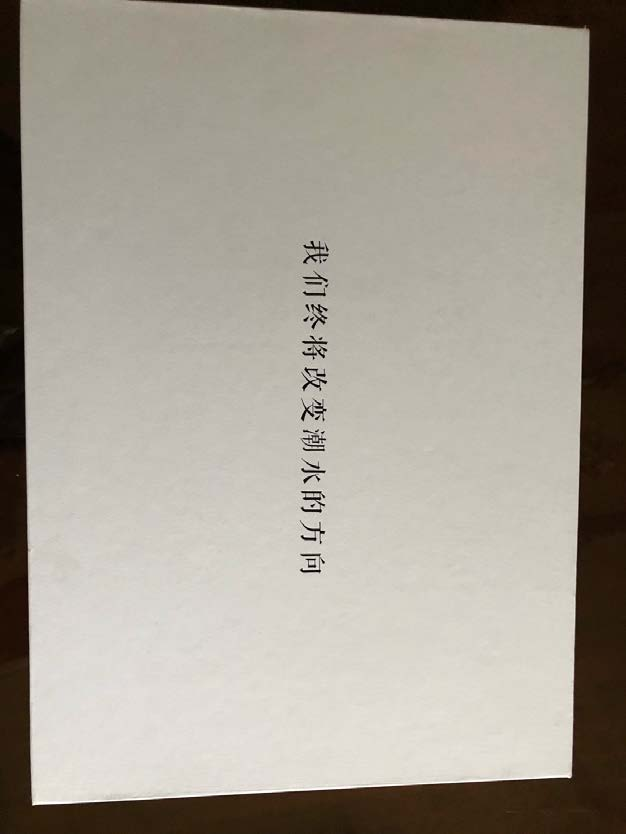

*2018-01-13 10:02 · 猫饭*

---

### 3242

从早九点到刚才，又开了一天预算会，喝了两杯咖啡，换了三泡茶。

*2018-01-13 00:15 · iPhone版*

---

### 3243

业精于勤，荒于嬉；行成于思，毁于随。

*2018-01-12 08:37 · 手机上网*

---

### 3244

不知不觉中，我已经在办公室屯了五种茶：生普、熟普、白茶、单丛、福建的海堤红。

*2018-01-11 21:53 · iPhone版*

---

### 3245

「解放军」这个名称起得真有水平。

*2018-01-11 19:47 · iPhone版*

---

### 3246

…… 转@ 贾行家 梁山上的头领彼此称呼，用得是（如果比牢头押司级别高些）过去的公职。

*2018-01-11 11:11 · 手机上网 转自贾行家*

---

### 3247

原来我的华为新手机既不是 mate 10，也不是 mate 10 pro，而是mate 10 保时捷设计版。实践证明，这是我用过的最滑的手机：我放置手机的习惯没有任何变化，但这部手机从各种物体表面滑下来的次数远超之前任何手机。但不过抓在手里还是很稳的。

*2018-01-10 20:26 · iPhone版*

---

### 3248

天气晴好，在机场T3能清楚的看到大裤衩、国贸3期、中国尊和望京那一簇高楼。

*2018-01-10 11:14 · 手机上网*

---

### 3249

词和词的搏斗。

*2018-01-10 00:38 · iPhone版*

---

### 3250

村长已经累趴… 转@ 柒小斤 打车业务一开，村长该考虑做地图了吧。把高德、百度的毛病砍掉就是个好地图。

*2018-01-09 14:54 · 手机上网 转自柒小斤*

---

### 3251

一早飞深圳，在飞机上看到了少见的景象：神州大地白茫茫一片，被冰雪覆盖。

*2018-01-09 12:18 · iPhone版*

---

### 3252

别误会了。我说的是2018，不是我自己。转@ 趴缸锦鲤 还有多久退休？ 转@ 王兴 突然觉得2018年已经有点老了。

*2018-01-08 14:36 · 手机上网 转自王兴*

---

### 3253

突然觉得2018年已经有点老了。

*2018-01-08 14:34 · iPhone版*

---

### 3254

一口气撕下来七八张台历。

*2018-01-08 13:51 · 猫饭*

---

### 3255

人生就像一场迎着枪林弹雨的冲锋，你并不知道什么时候哪颗子弹就会突然将你或身边的人撂倒。

*2018-01-08 01:17 · iPhone版*

---

### 3256

很多痛苦只是因为习惯。

*2018-01-08 00:49 · iPhone版*

---

### 3257

这张埃舍尔我倒是第一次见。转@ 油泼面要宽的 绘画就是欺骗——埃舍尔

*2018-01-08 00:31 · 手机上网 转自油泼面要宽的*

---

### 3258

2013年，美国风险投资人家 Aileen Lee 将私募或公开市场上估值超过10亿美元的创业公司称为 unicorn 独角兽。这个说法迅速流行起来。

*2018-01-07 21:26 · iPhone版*

---

### 3259

夔 kuí ：中国古代神话传说中一条腿的怪物。

*2018-01-07 20:56 · iPhone版*

---

### 3260

半个世纪过去了，披头士的歌依然很治愈。

*2018-01-07 16:06 · iPhone版*

---

### 3261

后喻时代。

*2018-01-07 15:58 · iPhone版*

---

### 3262

趴在战壕里读尼采。

*2018-01-07 15:56 · iPhone版*

---

### 3263

一个做投资的朋友跟我说：你随时电话或者短信我，微信太乱我不太看。

*2018-01-07 10:49 · iPhone版*

---

### 3264

别试图垄断不能垄断的东西。

*2018-01-07 09:42 · iPhone版*

---

### 3265

以夷治夷，以夷制夷。

*2018-01-06 14:59 · iPhone版*

---

### 3266

转@ 郭家二少爷 当年TCL开始做彩电，但是产品卖的特别不咋样，明明东西很好就是卖不出去。后来一调查发现当时全国人的文化水平太低了，大多数中文都不认识更不要说英语了，人家压根不知道TCL这三个字母怎么念。后来tcl在字母前加了一个"王牌"销量才好了起来。

*2018-01-06 14:35 · 手机上网 转自郭家二少爷*

---

### 3267

2017年，apple app store收入385亿美元，yoy增长34.7%；googleplay收入201亿美元，yoy增长34.2%。可怜的谷歌丢掉了中国这块收入。

*2018-01-06 12:43 · iPhone版*

---

### 3268

萨摩耶和萨摩藩无关：前者是西伯利亚原住民萨摩耶族培养出来的雪橇犬，samoyed，全身雪白；后者是日本九州最西南的一个藩，Satsuma-han，离江户/东京最远最独立，是明治维新前倒幕运动

发源地之一，维新后长期掌控日本海军。

*2018-01-06 12:37 · 手机上网*

---

### 3269

月光白是一种把云南大叶种茶（普洱茶的原料）按接近福建传统白茶的工艺做出来的新茶。因为叶片黑色，芽头白色，看起来像黑夜中的月光，所以得名。试了一下，不是我的菜。

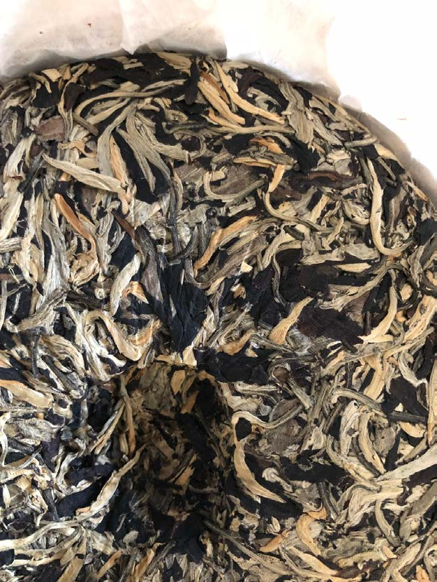

*2018-01-06 12:20 · 猫饭*

---

### 3270

转@ webto 后来日俄战争获胜之后又修了新的凯旋门。。。然后右翼煽动民众暴动抗议朴次茅斯和约，烧了一堆房子，还攻击了内务大臣官邸。。。有点火烧赵家楼的意思。太阳底下无新事。

*2018-01-06 11:28 · 手机上网 转自webto*

---

### 3271

一片叶子掉下来是轻盈的，无边落木萧萧下是沉重的。转@ 王兴 也许她最美的瞬间是从树上飘落时。转@ 王兴 有些叶子确实是从树上掉下来后更好看。转@ 王兴 有些树确实是叶子落光后更好看。

*2018-01-06 11:14 · 手机上网 转自王兴*

---

### 3272

也许她最美的瞬间是从树上飘落时。转@ 王兴 有些叶子确实是从树上掉下来后更好看。转@ 王兴 有些树确实是叶子落光后更好看。

*2018-01-06 10:55 · 手机上网 转自王兴*

---

### 3273

这茶，真是嘴里淡出鸟来。

*2018-01-06 10:51 · 手机上网*

---

### 3274

有些叶子确实是从树上掉下来后更好看。转@ 王兴 有些树确实是叶子落光后更好看。

*2018-01-06 10:47 · 手机上网 转自王兴*

---

### 3275

有些树确实是叶子落光后更好看。

*2018-01-06 10:42 · iPhone版*

---

### 3276

好奇宝宝也会步入中年。

*2018-01-06 10:15 · iPhone版*

---

### 3277

作为时间的囚徒，我们只能从现在看到过去。

*2018-01-06 10:00 · iPhone版*

---

### 3278

像大海一样汹涌而平静。

*2018-01-05 00:23 · iPhone版*

---

### 3279

我，现在，易燃易爆炸。

*2018-01-03 16:22 · iPhone版*

---

### 3280

转@ qinyf 逐渐感受到了上海文化的同质性，气氛上觉得是反创业的，觉得和纽约，和硅谷的多元气氛都不太沾边，倒是会先想到东京。这种形态更像是一个过滤器，吸引有文化认同感的人留了下来。

*2018-01-03 12:17 · 手机上网 转自qinyf*

---

### 3281

稍微可以安慰一下自己的是，一个年长的清华师兄说「为祖国健康工作50年」这条清华校训如果按马约翰先生的传统，似乎是从本科毕业就可以开始算，读研期间也算数。不知道是什么逻辑… 我原本是从留学回来25岁开始创业算起的。

*2018-01-02 23:49 · iPhone版*

---

### 3282

我做美团已经8年多了，超过了从1937年卢沟桥事变算起的八年抗战；

我回国开始创业已经14年多了，超过了从1931年九一八事变算起的十四年抗战。却仿佛只是一眨眼。

*2018-01-02 23:39 · iPhone版*

---

### 3283

尼采老师总是能深邃得让人如坠无底洞。转@ 杜斌beta 没有任何制

度有可能建立在爱之上。—— 尼采。

*2018-01-02 14:08 · 手机上网 转自杜斌beta*

---

### 3284

我已经好久没用过鼠标了。

*2018-01-02 12:07 · iPhone版*

---

### 3285

"I want to touch people with my art. I want them to say 'hefeels deeply..." "He feels everything, poor Vincent. He feels toomuch.

*2018-01-02 01:53 · 手机上网*

---

### 3286

转@ 王兴 每一代人都需要一场新的革命。Every generation needsa new revolution. - 托马斯杰斐逊

*2018-01-01 11:47 · 手机上网 转自王兴*

---

### 3287

omg! 转@ 钟永健 这是一条2008年12月22日的饭否，是的，兴哥2018年新年快乐，继续纵情向前，十年再十年！转@ 王兴 听到熟悉的《相约九八》，突然意识到居然已经过去10年了。那么，按照年纪越大日子过得越快的规律，2018年岂不是咻的一下就要来了。oh mygod!

*2017-12-31 20:07 · 网页 转自王兴*

---

### 3288

那是别人的想象，不是你的，也不是我的。转@ 熊阿姨 所以要把喜马拉雅炸个大洞，让印度洋季风穿过，再造江南么。转@ 王兴 诺大一个西藏只有三百万出头的人口，边上小小的尼泊尔有2900万。

*2017-12-31 15:47 · 手机上网 转自王兴*

---

### 3289

我算是小镇青年吗？

*2017-12-31 14:31 · iPhone版*

---

### 3290

不要什么都想要，也不要什么都不想要。

*2017-12-31 13:24 · 手机上网*

---

### 3291

生生把一个词咽回去了。

*2017-12-31 13:14 · 手机上网*

---

### 3292

转@ 李陌生 有个全绿幕的美剧叫避难所，印度洋海啸以后是印度的神发动技能造了一个地震海啸抵消了...「@ 王兴 世界上曾经出现过这样的场景吗？不止一场海啸同时发生，巨浪在某处交汇？」

*2017-12-31 13:13 · 手机上网 转自王兴*

---

### 3293

世界上曾经出现过这样的场景吗？不止一场海啸同时发生，巨浪在某处交汇？

*2017-12-31 12:40 · iPhone版*

---

### 3294

可口可乐市值1957亿美元，百事可乐市值1697亿美元，竟然如此接近。

*2017-12-31 10:07 · iPhone版*

---

### 3295

搞生物科技的很多人说随着科技不断进展，现在的人活到120岁不奇怪。那我稍微再努力一点点是不是有希望能看到2100年？

*2017-12-31 00:49 · iPhone版*

---

### 3296

转：早在一百多年前，美国诗人沃尔特·惠特曼曾用矛盾重重的心态写道：“我明确意识到，美国普遍存在的极端商业活力，近乎疯狂的求富欲望，正是美国社会改善和进步的组成部分。”

*2017-12-31 00:30 · iPhone版*

---

### 3297

转@ 木之所兮 转@ 你好可爱meme 转@ 飯否小字报 转@ 布撸托zhu0588 ：巴厘岛Pura Lempuyang寺院，一种穿过这里就能去到异界的既视感

*2017-12-30 16:58 · 手机上网 转自布撸托*

---

### 3298

好的羊肉不但不膻，而且闻起来香，吃起来甜。

*2017-12-30 16:30 · iPhone版*

---

### 3299

Monroe，指性感女星时译为「梦露」，指政治家时译为「门罗」，就是1823年提出门罗宣言 Monroe Doctrine 的那个美国总统。转@ 王兴 Camus,作为干邑品牌译为「卡慕」，作为法国作家译为「加缪」。

*2017-12-30 13:15 · 手机上网 转自王兴*

---

### 3300

新成就达成：不直接上手，而是用筷子和勺子把一个茶叶蛋剥干净。

*2017-12-30 11:18 · 手机上网*

---

### 3301

转@ webto 妈呀 转@ imvenj 才发现，macOS 上开启 Siri 的时候，如果风扇转速很快的话，风扇会突然降速，以保证语音识别准确，完成后恢复转速。

*2017-12-30 10:50 · 手机上网 转自imvenj*

---

### 3302

转：上海外滩 the Bund 这个词来源于印地语单词 band，是堤岸的意思。

*2017-12-30 10:16 · iPhone版*

---

### 3303

脑海里有中南半岛的残片，不清楚是昨晚做梦了还是清晨半睡半醒间在思考。

*2017-12-30 09:16 · iPhone版*

---

### 3304

诺大一个西藏只有三百万出头的人口，边上小小的尼泊尔有2900万。

*2017-12-30 01:36 · iPhone版*

---

### 3305

不是还有两天吗？怎么这么多人已经在迫不及待的宣布告别2017了？

难道他们已经决定停止思考和生活了吗？

*2017-12-30 01:25 · iPhone版*

---

### 3306

人多市场大。

*2017-12-30 00:47 · iPhone版*

---

### 3307

deadline 是时间而非空间里的一条线。

*2017-12-29 17:15 · iPhone版*

---

### 3308

学会痛苦。

*2017-12-29 15:11 · iPhone版*

---

### 3309

转@ 杜斌beta 不去寻求非必要的共识。

*2017-12-28 17:34 · 手机上网 转自杜斌beta*

---

### 3310

比「牺牲哪个人」或「牺牲哪个群体」更残酷的问题是「牺牲哪代人」？

*2017-12-28 16:12 · iPhone版*

---

### 3311

华为 mate 10 pro 的套装蛮有趣，盒子比较大，里面除了手机，还有一个座充、一个双口车充、两条充电线、一副耳机、一个翻盖手机套、一条type-c转耳机的短线，内容比一般手机更丰富。

*2017-12-28 10:30 · 手机上网*

---

### 3312

谢谢。转@ viviyo @ 王兴 http://fan.fo/C54nx 这里有答案

*2017-12-28 01:25 · 手机上网 转自viviyo*

---

### 3313

为什么不是「道生一，一生二，二生四」呢？

*2017-12-28 01:05 · iPhone版*

---

### 3314

找到一种释放焦虑带来的暴力需求的新方法：猛嚼水果软糖。

*2017-12-28 00:23 · iPhone版*

---

### 3315

一种暗黑系四象限分法：要不要脸，要不要命。

*2017-12-27 15:40 · 手机上网*

---

### 3316

airbnb？转@ 洋鸟消夏录 钥匙留给了两个法国人，晚间回来取行李看见厨房用酒杯养上了欧芹？就半天的时间？这居家的气氛？台北不是我的家，我的家乡没有霓虹灯。

*2017-12-27 15:34 · 手机上网 转自洋鸟消夏录*

---

### 3317

维也纳会议、柏林会议、巴黎和会、德黑兰会议、开罗宣言、雅尔塔会议、波茨坦公告，这些大事件恰好地方不重复，因为不是为了照顾学历史的学生吧。

*2017-12-27 12:46 · 手机上网*

---

### 3318

转@ peter 嗯呢 转@ 赵曜 霍尼韦尔和 3M 应该都算是产品线拉的很长但是产品都相当不错的厂商。

*2017-12-27 12:39 · 手机上网 转自赵曜*

---

### 3319

我曾想到一句话，我已经忘了。

*2017-12-27 11:35 · iPhone版*

---

### 3320

即使因为特殊原因4pm才开始一天的工作也很容易干满9小时。

*2017-12-27 01:04 · iPhone版*

---

### 3321

吉光片羽，犁庭扫穴，如土委地

*2017-12-26 23:08 · iPhone版*

---

### 3322

12月26日是毛泽东的生日，也是《红太阳是怎样升起的》的作者高华教授的忌日。

*2017-12-26 22:23 · iPhone版*

---

### 3323

费尽九牛二虎之力，终于把我的安卓主力机从华为 mate 8 换成mate 10 了。虽然用了华为自己的“手机克隆”app，但是微信数据依然没能很好的转移到新手机上。换手机真是极麻烦费力的事:(

*2017-12-26 07:46 · iPhone版*

---

### 3324

全球七大科技公司（apple, alphabet, amazon, alibaba, microsoft,facebook, tencent）里竟有四家名字以 A 打头，应该不是偶然。

*2017-12-25 16:31 · iPhone版*

---

### 3325

1933年上岛忠雄先生在日本神户创办了“上岛忠雄商店”，开始经销咖啡豆；58年在福冈开出第一家咖啡店；69年生产出世界上第一罐罐装咖啡并以此奠定了日本最大咖啡销售公司的地位。68年进入台湾。97年从海南开始拓展大陆市场。品牌所有权估计有点复杂。

*2017-12-25 16:19 · iPhone版*

---

### 3326

据说是中国最难干的三份工作：春晚总导演、男足主教练、证监会主席。

*2017-12-25 13:07 · iPhone版*

---

### 3327

杜蕾斯的营销确实是一绝。转@ 寒小梦 转@ 菜菌 猛！ 转@ 愚鲁陈好烦 服！转@ 小绻 转@ Mr.Press 转@ 飯否小字报 转@ 丢飽飽 挖槽这个文案真的服气

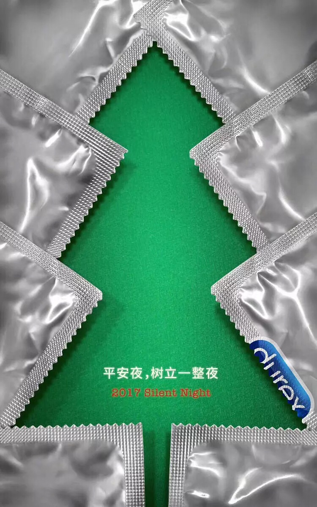

*2017-12-25 12:58 · 手机上网 转自丢飽飽*

---

### 3328

一句话总结瑞吉酒店追求的风格：上世纪曼哈顿的纸醉金迷。

*2017-12-25 11:45 · iPhone版*

---

### 3329

原来是这样啊... 转：一个证据是，具有典型北方文化特色的《南方都市报》在广州东莞并不太成功，反而在深圳甚受认同，相反，具有典型粤文化特征的《广州日报》则在广州、东莞等地占据主流地位。

*2017-12-25 10:27 · iPhone版*

---

### 3330

印象中我已经很久没有这样把一颗水果软糖彻底含到化而没有去用牙咬过。

*2017-12-24 21:32 · iPhone版*

---

### 3331

《至暗时刻》这部电影还挺值得回味，短短一百多分钟，巧妙的展示了关键时刻丘吉尔和各方的关系：新来的女打字员、老婆、老妈、政敌、幕僚、坐地铁的民众、军队、国王、我记不住名字的法国总理、罗斯福、希特勒、先贤、家族、政党、帝国...

*2017-12-24 15:49 · 手机上网*

---

### 3332

公元12017年。转@ 王兴 2018, 2027, 2117, 3017。

*2017-12-24 15:31 · 手机上网 转自王兴*

---

### 3333

一双好的鞋子应该坐下来时让你感觉不到鞋子的存在，走起路来感觉不到体重的存在。

*2017-12-24 14:48 · 手机上网*

---

### 3334

时间并不是匀质的，至少对人来说不是。

*2017-12-24 14:46 · 手机上网*

---

### 3335

日本人口真是急剧萎缩啊，我国也堪忧:( 转@ AV星探 今年日本的新生人口只有九十多万，而新婚夫妇只有六七十万对。大家猜一下十年后的中国吧 转@ 王兴 一个专家说：今年出生人口大概率少于去年，也就是去年就见顶了。另外可以肯定的是，明年开始将急剧萎缩。

*2017-12-24 14:27 · 手机上网 转自王兴*

---

### 3336

自我反省了一下，我穿皮底皮鞋时经常差点滑倒是不是说明我的走路姿态不够端正稳重？

*2017-12-24 14:25 · 手机上网*

---

### 3337

2018, 2027, 2117, 3017。

*2017-12-24 11:37 · 手机上网*

---

### 3338

期待分享。转@ webto 打算借两本日本小朋友的历史书读读

*2017-12-24 11:31 · 手机上网 转自webto*

---

### 3339

一个专家说：今年出生人口大概率少于去年，也就是去年就见顶了。

另外可以肯定的是，明年开始将急剧萎缩。

*2017-12-24 10:53 · iPhone版*

---

### 3340

「孙中山认为君主专制是一个人当皇帝，共和则是四万万人当皇帝」，孙大炮果然名不虚传，绝对是忽悠高手。

*2017-12-24 10:33 · iPhone版*

---

### 3341

听到一个说法，深圳和东莞在历史上就不是一个民系的。东莞主要是

广府人，和广州接近。深圳这地界在成为特区前原本是客家人为主。

*2017-12-24 10:11 · iPhone版*

---

### 3342

谢谢。转@ enclavetj 福建海峡奥体中心。@ 王兴

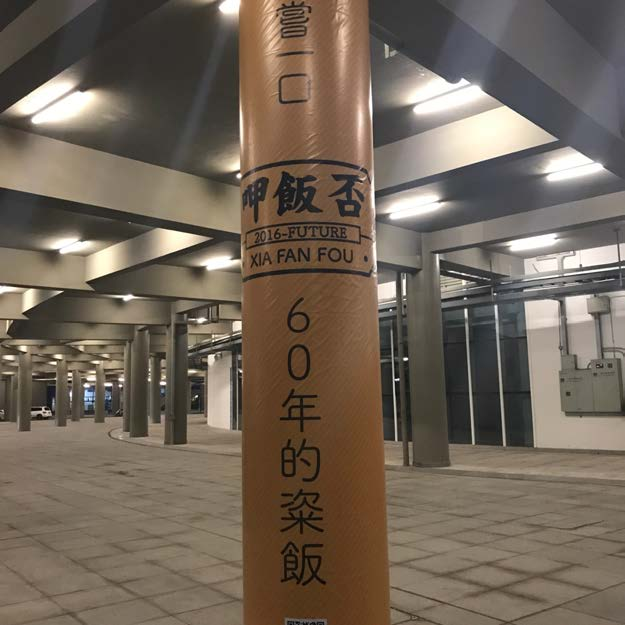

*2017-12-23 18:19 · 手机上网 转自enclavetj*

---

### 3343

秀才遇到兵，被逼成将。

*2017-12-23 13:58 · 手机上网*

---

### 3344

一言不合！转@ webto 转@ .rex 一言不合 转@ 剑花 赞 转@孙岩 历时一年的汉字游戏终于完工了，现在交给我朋友做最后一遍的筛查，他是资深的汉字专家。最初只是想亲自教女儿汉字，开始攻读汉字书籍，然后发现现有汉字解释极端混乱，最后立项做成游戏产品，我想要改变些什么

*2017-12-23 13:06 · 手机上网 转自孙岩*

---

### 3345

东二环中段路西银河SOHO南边紧挨着的矮树上有个鸟巢，树叶落光后特别显眼。

*2017-12-23 10:13 · 手机上网*

---

### 3346

短跑运动员除了腿脚快还要耳朵灵，能听到发令枪什么时候响了。

*2017-12-23 10:08 · 手机上网*

---

### 3347

朋友发来的对 兴/興 字的解释。据说最初是抬井床（类似井盖的东西）的意思。

*2017-12-23 00:28 · 手机上网*

---

### 3348

也可以在屋里、车里或心里听。转@ 威士忌加冰 其实比较适合在沙漠听，在海边听，在沙漠听转@ 王兴 冬天是最适合听科恩的《哈利路亚》的季节，其次是秋季、夏季和春季。

*2017-12-22 23:53 · 手机上网 转自王兴*

---

### 3349

听到一句因为《芳华》而引发的评价：青春是无法选择的，在侵华战场上度过青春岁月的那一代日本人，该怎么纪念他们的青春？

*2017-12-22 20:27 · iPhone版*

---

### 3350

我猜想，朱棣下令诛方孝孺十族时内心充满了不忿、不甘和无力感。

*2017-12-22 20:09 · iPhone版*

---

### 3351

冬天是最适合听科恩的《哈利路亚》的季节，其次是秋季、夏季和春季。

*2017-12-22 19:47 · iPhone版*

---

### 3352

教授说他八十年代初在北大读书时课业极重，为了放松一下脑子就每天坚持读几小时外国文学，整面书架读过去...

*2017-12-22 19:40 · iPhone版*

---

### 3353

冬至。新年将至。

*2017-12-22 19:33 · iPhone版*

---

### 3354

突然想起来，我吃过的最美味的剁椒鱼头是2006年底在武汉一个我已不记得名字的饭店二楼吃到的。

*2017-12-22 19:11 · iPhone版*

---

### 3355

原教旨主义式的知识准确性是永远达不到的。

*2017-12-22 15:13 · iPhone版*

---

### 3356

天赋是最好的老师。

*2017-12-22 14:22 · iPhone版*

---

### 3357

中文习惯说「通货膨胀」，英文一般只说 inlfation 就够了，「通货」

二字被省掉了。我查了一下，通话应该是 currency 货币 的另一个翻译。

*2017-12-22 12:01 · 手机上网*

---

### 3358

一进门就被亮了一下眼。

*2017-12-22 11:30 · 猫饭*

---

### 3359

在今年 shortest day 的前夜看了《darkest hour》。同样是诺贝尔文学奖得主，丘吉尔和莫言的人生经历和视角完全不同。

*2017-12-22 11:12 · 手机上网*

---

### 3360

正好刚听完，完全不是我的菜。转@ 晚上十点就要关电脑的大宝 @王兴 有首筠子唱的冬至，高晓松作词，经典

*2017-12-22 11:04 · 手机上网 转自晚上十点就要关电脑的大宝*

---

### 3361

在QQ音乐里搜「冬至」，到目前为止还没有哪首歌打动我。

*2017-12-22 11:01 · 手机上网*

---

### 3362

那霸机场给我印象深刻的地方是军民两用而且军机繁忙，我们飞机在排队准备转弯上主跑道时，排在我们后面的就是一架F15，看来平时战斗机也没什么特权，一样排队。转@ webto 那霸机场可真是够差的，头一次见到男女卫生间都排队的。

*2017-12-22 10:37 · 手机上网 转自webto*

---

### 3363

逐渐适应越来越大的数字和单位...

*2017-12-21 19:22 · iPhone版*

---

### 3364

恭喜！五年前的梦想成真了。转@ marcher 当年买不到，今天终于实现了。谢谢 @ fanzeyi ！！！ 转@ 马尔可夫 马总五年前的梦想今天成真了 转@ marcher ！法罗群岛顶级域名 .fo 。真希望饭否能拥有一个 fan.fo 的短域名。 @ 饭否 @ 王兴

*2017-12-21 19:06 · 手机上网 转自marcher*

---

### 3365

那种小山核桃我也很喜欢，真是香啊，但是绝对不能多吃，超级上火。转@ 王兴 我最喜欢的还是夏威夷果，够香够油腻。转@ 王兴 世界四大干果：榛果、腰果、核桃、扁桃（俗称美国大杏仁，又称巴旦木）。

*2017-12-21 16:50 · 手机上网 转自王兴*

---

### 3366

我最喜欢的还是夏威夷果，够香够油腻。转@ 王兴 世界四大干果：榛果、腰果、核桃、扁桃（俗称美国大杏仁，又称巴旦木）。

*2017-12-21 15:47 · 手机上网 转自王兴*

---

### 3367

「沧海横流」这个我觉得很酷的成语背后的故事竟如此悲惨：西晋末年，匈奴等少数民族起兵反晋，天下战乱纷纷，洛阳失陷，王尼带上儿子离乡背井到江南躲避祸乱，一路颠沛流离，他喟然长叹：“沧海横流，处处不安也。”到江夏投奔荆州刺史王澄，王澄不久死去，他们也活活饿死。

*2017-12-21 12:54 · iPhone版*

---

### 3368

此刻我脑袋一片空白，完全记不起任何数学公式。勉强想到那个很酷的欧拉公式还记不太清。工作十几年来基本只用加减乘除幂对数的结果。转@ 下划线和小数点 # 学霸的性生活是怎样的 #

*2017-12-21 12:19 · 手机上网 转自下划线和小数点*

---

### 3369

广东省中山市前身为香山县，是孙中山的出生地，1925年4月15日为纪念一个月前去世的孙中山而改名为中山县。

*2017-12-21 11:38 · iPhone版*

---

### 3370

非洲人民吃狗肉吗？转@ 小田一成 非洲人看中国人吃驴肉也很奇怪，因为驴肉在非洲是喂狗的……转@ 菜菌 出口欧洲的都是当鸟食的

之前我英国的同事看我们吃觉得很奇怪 转@ 黑爷 转@ 王兴 我感觉中国还是瓜子和花生是主力。转@ 王兴 世界四大干果

*2017-12-21 11:22 · 手机上网 转自王兴*

---

### 3371

转@ 菜菌 出口欧洲的都是当鸟食的 之前我英国的同事看我们吃觉得很奇怪 转@ 黑爷 我一直很好奇 是不是除了中国大陆 其它地方的人都不吃瓜子的？？？ 转@ 斐小荔 转@ 王兴 我感觉中国还是瓜子和花生是主力。转@ 王兴 世界四大干果：榛果、腰果、核桃、扁桃（俗称美国大杏仁，又称巴旦木）。

*2017-12-21 11:18 · 手机上网 转自王兴*

---

### 3372

我感觉中国还是瓜子和花生是主力。转@ 王兴 世界四大干果：榛果、腰果、核桃、扁桃（俗称美国大杏仁，又称巴旦木）。

*2017-12-21 11:03 · 手机上网 转自王兴*

---

### 3373

世界四大干果：榛果、腰果、核桃、扁桃（俗称美国大杏仁，又称巴旦木）。

*2017-12-21 10:33 · iPhone版*

---

### 3374

向往我从没去过的地方，例如明天。想念我再也回不去的地方，例如昨天。站在现在，我最应该做的是倒下，像战争里被最后一颗子弹击中的战士。

*2017-12-21 01:39 · iPhone版*

---

### 3375

北京阳光明媚，烤得朝南的会议室温度达到31度。

*2017-12-20 13:36 · iPhone版*

---

### 3376

有杀先论杀。

*2017-12-20 04:23 · iPhone版*

---

### 3377

这个冬天，连石家庄都蓝天白云。

*2017-12-19 20:26 · iPhone版*

---

### 3378

人生就是你和整个世界互撩的过程。

*2017-12-19 19:02 · iPhone版*

---

### 3379

海鸥是个有趣的词。她的拼音 haiou 连续包含了五大元音字母里的四个。

*2017-12-19 11:38 · 手机上网*

---

### 3380

但昨天舌头下面起的泡好像好了:) 转@ 王兴 依旧干涸的醒来。转@王兴 要不顾一切的睡去。

*2017-12-19 08:55 · 手机上网 转自王兴*

---

### 3381

依旧干涸的醒来。转@ 王兴 要不顾一切的睡去。

*2017-12-19 08:43 · 手机上网 转自王兴*

---

### 3382

要不顾一切的睡去。

*2017-12-19 00:09 · iPhone版*

---

### 3383

是「第二次卫国战争」吧？第一次是1812年打败拿破仑。转@ peter欧洲普遍称二战苏联和德国之间的战争为「苏德战争」，苏联的标准叫法是「卫国战争」，有点类似。转@ 王兴 注意到一个六十多岁的台湾外省人用的词是「中日战争」而非「抗日战争」。

*2017-12-18 19:34 · 手机上网 转自王兴*

---

### 3384

今晚争取早点睡，以免过劳死。

*2017-12-18 19:09 · iPhone版*

---

### 3385

味道不错

*2017-12-18 09:01 · 猫饭*

---

### 3386

久违的几米长的多人式不锈钢小便槽。

*2017-12-18 06:37 · 手机上网*

---

### 3387

好久没来北京西站。

*2017-12-18 06:22 · iPhone版*

---

### 3388

绘画、雕塑、建筑和文学、音乐不同，前者主要是原子的艺术，要欣赏原作才能达到最佳效果，后者则是比特的艺术，很容易复制。

*2017-12-17 18:51 · iPhone版*

---

### 3389

注意到一个六十多岁的台湾外省人用的词是「中日战争」而非「抗日战争」。

*2017-12-17 18:00 · iPhone版*

---

### 3390

转@ 小熊娃娃 实际是，中国古代“艺术”这个词指的六艺和技术，art的拉丁语词源也是技术，欧洲在现代意义上使用art这个词在文艺复兴之后了，是近代化的产物，所以这个锅在中国没有自发近代化。转@王兴 中国古代有艺术，但是没艺术这个概念。艺术 art 这个概念是西方经由日本传到中国的舶

*2017-12-17 01:57 · 手机上网 转自王兴*

---

### 3391

中国古代有艺术，但是没艺术这个概念。艺术 art 这个概念是西方经由日本传到中国的舶来品。

*2017-12-17 01:05 · 手机上网*

---

### 3392

绘画相比摄影可以在时间上做到更立体。

*2017-12-16 13:01 · iPhone版*

---

### 3393

今年是俄国十月革命100周年。据说在发动革命的前一天晚上，革命者们都很焦虑，列宁忍不住问「托洛斯基同志，明天如果不成功，我们怎么办？」「列宁同志，我考虑的是，明天如果成功了，我们怎么办？」

*2017-12-16 12:35 · iPhone版*

---

### 3394

一个我觉得很特别的洗手间。我没能拍出现场的魔幻效果：从两侧的小门进来转到这条走廊后，朝小便池走过去时，黑白相间的地砖和两排孔雀绿的门总能给行进中的我一种时光荏苒的感触。

*2017-12-16 10:52 · 猫饭*

---

### 3395

「你们注意到了吗？后现代主义的大师们没有一个是以英语为母语的。你觉得这是偶然吗？」好吧，饭局上碰到这种专家我还是不太能聊得来。

*2017-12-15 22:19 · iPhone版*

---

### 3396

觉得有必要掌握一下心机婊的技能。

*2017-12-15 18:56 · iPhone版*

---

### 3397

专家就是专家，一句话就说清了莫言的问题，原来我隐隐约约有点感觉，但是没能高度抽象总结。

*2017-12-15 10:47 · iPhone版*

---

### 3398

曹植的《野田黄雀行 其二》高树多悲风，海水扬其波。利剑不在掌，结友何须多？不见篱间雀，见鹞自投罗。罗家得雀喜，少年见雀悲。

拔剑捎罗网，黄雀得飞飞。飞飞摩苍天，来下谢少年。

*2017-12-15 10:36 · iPhone版*

---

### 3399

做无人货架的朋友告诉我，从他们的数据来看，大公司员工的诚信度比小公司员工高；大公司里，金融行业的诚信度最低，互联网行业的最高。

*2017-12-15 00:06 · iPhone版*

---

### 3400

一个父亲刚去世的朋友说：送走老人家后，我整理他的遗物，发现很多东西，他年轻时的入党申请书，他写的许多诗词，这些我原来都不知道...

*2017-12-14 22:20 · 手机上网*

---

### 3401

「台湾大哥大」和「中国移动」的命名风格真的差别好大。

*2017-12-14 20:05 · 手机上网*

---

### 3402

左宗棠是当之无愧的民族英雄。历史并不必然。当年被讥为「西亚病夫」的诺大奥斯曼帝国分崩离析，最后剩下土耳其那一小块；当年被讥为「东亚病夫」的中国如果没有人挺身而出，很可能也无法基本保全疆域并有机会重新站起来。一句话说明左有多猛：喀什到北京比到莫斯科还远。

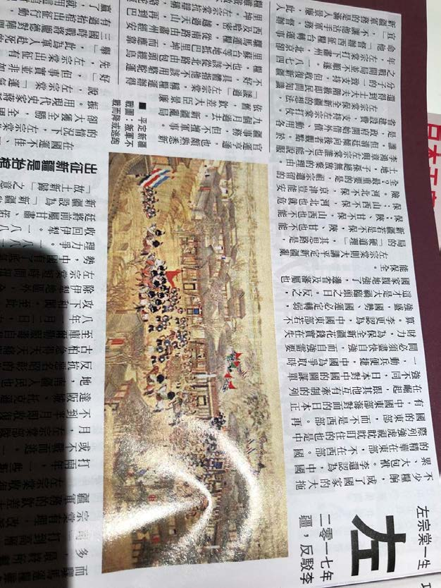

*2017-12-14 17:08 · 猫饭*

---

### 3403

重点在右上角。

*2017-12-14 16:28 · 猫饭*

---

### 3404

俄罗斯人很懂仪式感。莫斯科红场上有一处用来纪念英雄的长明火，火周围拦了一个简单的圈，据说只有两类人能进去：一是来访的外国元首如果愿意进去献花可以进，二是俄罗斯男女新婚当天如果愿意进去献花可以进。

*2017-12-14 14:52 · iPhone版*

---

### 3405

低调投资大佬说他最近重读了《理想国》和《君主论》后进一步增强了对中国的信心。

*2017-12-13 23:06 · iPhone版*

---

### 3406

这有点不要脸了。韩国被日本侵占殖民了几十年他不知道？转@ 张亮松井忠三说，日本经营超过百年的公司有 26144 家，韩国一家都没有。他认为这是因为韩国人更重视「先把自己做大做强」，不像日本人追求共赢。

*2017-12-13 21:02 · 手机上网 转自张亮*

---

### 3407

目测福布斯榜上很快就会出现一类人，其财富来源不是任何行业而是：买入并持有了一批比特币。

*2017-12-13 14:25 · iPhone版*

---

### 3408

伦勃朗光。

*2017-12-13 14:17 · iPhone版*

---

### 3409

刚注意到东三环东侧路边有个矮楼，中文名叫京鼎汇，英文名挂着Emperor Club。这名字好像有点不符合社会主义价值观。

*2017-12-13 12:05 · iPhone版*

---

### 3410

转@ webto 你要多少？转@ 王兴 您有智障吗？

*2017-12-12 14:40 · 手机上网 转自王兴*

---

### 3411

《歌剧魅影》有什么更深一层的含义吗？

*2017-12-12 12:28 · iPhone版*

---

### 3412

您有智障吗？

*2017-12-12 12:24 · iPhone版*

---

### 3413

《2017年北京的冬天》

*2017-12-12 11:07 · iPhone版*

---

### 3414

多谢纠正。转@ 逸博 中国民用航空局飞行标准司正式发布《2016年中国民航驾驶员发展年度报告》。报告显示，截至2016年12月31日，中国民航驾驶员有效执照总数为50504本，同比增长10.9%。 转@ 王兴 听说，美国能把飞机开上天的人有60万，中国则不到3万。

*2017-12-11 23:45 · 手机上网 转自王兴*

---

### 3415

转@ 杜斌beta 前几天去一家工厂参观，他们有美国业务，说美国标准要求必须螺丝可以卸下来，以便 DIY，中国标准则要求必须为不可拆卸螺丝，以防 DIY 安装发生事故。转@ 王兴 听说，美国能把飞机开上天的人有60万，中国则不到3万。

*2017-12-11 22:47 · 手机上网 转自王兴*

---

### 3416

听说，美国能把飞机开上天的人有60万，中国则不到3万。

*2017-12-11 20:33 · iPhone版*

---

### 3417

XX行业就像一个美貌而生活拮据的寡妇。

*2017-12-11 14:23 · iPhone版*

---

### 3418

窃钩者诛。

*2017-12-11 14:03 · iPhone版*

---

### 3419

也许，在你真的把时间搞清楚的那一瞬间，它就消失了。

*2017-12-10 23:13 · iPhone版*

---

### 3420

转@ 左潇 还真是巧合，最新这期财经封面《中国药业大震荡：1/3药厂将被淘汰》及文章《社保基金塌陷史》

https://t.fanfou.com/BPz8k9Vf 。当然都只说了问题及不切实际的解决方案转@ 左潇 在医疗这个生态里，我确信的看到了big short的机会，

*2017-12-10 15:57 · 手机上网 转自左潇*

---

### 3421

彭德怀生于1898年。林彪生于1907年，朝鲜战争爆发时43岁，相当于今天刘强东的年纪。转@ 远缘 其它元帅不是病了就是年龄太大，解放战争消耗太大。转@ 王兴 据说，老毛决定要抗美援朝时，总指挥第一人选是林彪，但是这次他不肯打。只好换彭德怀上了。转@ 王兴战术有千百条，头一条就是肯打

*2017-12-10 14:55 · 手机上网 转自王兴*

---

### 3422

据说，老毛决定要抗美援朝时，总指挥第一人选是林彪，但是这次他不「肯打」。只好换彭德怀上了。转@ 王兴 战术有千百条，头一条就是肯打。-林彪

*2017-12-10 14:13 · 手机上网 转自王兴*

---

### 3423

人生总会有几个在心里泪流满面的时刻。

*2017-12-10 10:06 · 手机上网*

---

### 3424

转@ 于乐 爷爷奶奶辛苦一辈子都是这个结果。爷爷是腊月二十几，奶奶是正月初几。 转@ DevilEYE 转@ vvvbb 转@ 我才是crow 转@ 王兴 转：想起小姨说农村很多老人春节前喝农药自杀，一方面身体不好治也花钱拖着难受，另一方面这个时候自杀儿女还能春节有假回家办个丧事。

*2017-12-10 10:06 · 手机上网 转自王兴*

---

### 3425

Cast a cold eye/ On life, on death/ Horseman, pass by. -Yeats

*2017-12-10 01:27 · iPhone版*

---

### 3426

转：想起小姨说农村很多老人春节前喝农药自杀，一方面身体不好治也花钱拖着难受，另一方面这个时候自杀儿女还能春节有假回家办个丧事。

*2017-12-10 00:10 · iPhone版*

---

### 3427

今晚这道汽锅鸡里可能加了一点点胡椒，反正喝起来暖暖的，非常舒爽。

*2017-12-09 19:29 · 手机上网*

---

### 3428

@ 不吃飯 请问打死结是什么意思？

*2017-12-09 19:27 · 手机上网 给不吃飯的回复*

---

### 3429

这大概是我看到「圈层」这个词却不反感的唯一场合。

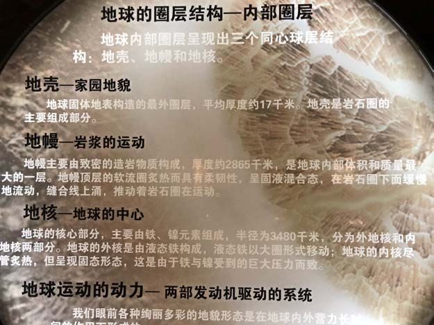

*2017-12-09 13:00 · 猫饭*

---

### 3430

想出一个好问题:)

*2017-12-09 10:01 · iPhone版*

---

### 3431

所有人都在秀优越感，至少相对于动物。

*2017-12-09 09:53 · iPhone版*

---

### 3432

今天被雷了一下：关于“马云称与赵薇见面不超过十次”这个话题，某财经媒体发了篇稿子，写了得有两三千字，列举了马云和赵薇的某几次见面，但没提网上有图片证明两人至少合影过12次。我问作者为什么不提这个简单事实，答：我们是严肃媒体，不是“有图有真相”，得有认可信源，所以我们无法确定次数。

*2017-12-09 01:50 · 网页*

---

### 3433

刚试了下，27个:( 转@ 阳升 刚试了下，22个[泪] 转@ 王兴 跟一个当红女 CEO 聊天，才发现她不但做业务很猛，其他方面也很猛，号称能一口气做65个俯卧撑。那应该超过97%中国成年男子的水平了，包括现在的我……

*2017-12-08 21:40 · 手机上网 转自王兴*

---

### 3434

妈妈说，因为冬季环保原因，北方的水泥厂普遍限产，所以原本的北

方水泥南运全停了，连带着福建的水泥价格都涨价了……

*2017-12-08 20:27 · iPhone版*

---

### 3435

每一步都是人生的入口。

*2017-12-08 20:20 · iPhone版*

---

### 3436

今日听到的最大脑洞。问：如果宇宙是造物主创造的，为什么后来他再也没出现过？答：这哥们学艺不精，启动宇宙大爆炸时不慎把自己炸死了，所以后来咱这宇宙就没人管了，放任自流。

*2017-12-08 18:22 · iPhone版*

---

### 3437

当事人回忆，2005年前后，任正非和 juniper 的 ceo 初次见面，开口第一句话是「我不是一个坏人」，把对方搞得有点懵。可见当时华为在 cisco 一案后（国际）压力多么大。

*2017-12-08 14:23 · iPhone版*

---

### 3438

五星级酒店的自助餐里也有天朝外卖几大主力之一：黄焖鸡米饭

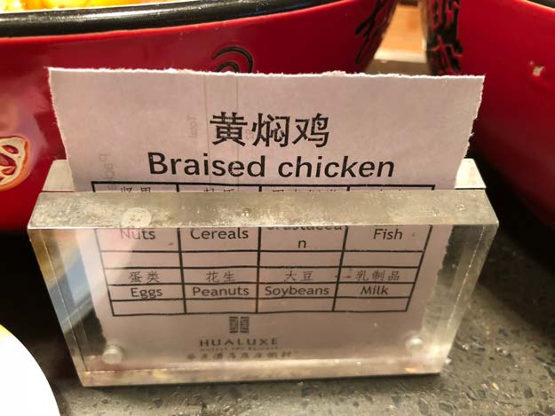

*2017-12-08 13:22 · 猫饭*

---

### 3439

历史上曾长期只有「将来」这个概念，「未来」是一个很后面才出现的概念。-刘慈欣

*2017-12-08 12:14 · 手机上网*

---

### 3440

今天是校内网12岁生日。一眨眼就一轮了。转@ 王兴 上网搜一个概念，被指向人人网上的一篇博客，试了一下，我还是能登录进去的。

但是，但是，好像被骗了，登录进去也没找到我要的内容:(

*2017-12-08 12:01 · 手机上网 转自王兴*

---

### 3441

这个世界有人相信事实吗？并没有。-江南春

*2017-12-08 10:18 · iPhone版*

---

### 3442

战术有千百条，头一条就是肯打。-林彪

*2017-12-08 09:55 · iPhone版*

---

### 3443

刘慈欣老师说他还没有哪部作品被拍成电影过，但现在有好几部同时在改编在拍了。中国的事情总是这样……

*2017-12-08 01:05 · iPhone版*

---

### 3444

跟一个当红女 CEO 聊天，才发现她不但做业务很猛，其他方面也很猛，号称能一口气做65个俯卧撑。那应该超过97%中国成年男子的水平了，包括现在的我……

*2017-12-07 23:06 · iPhone版*

---

### 3445

这 t-shirt 确实不错，可惜撑得有点变形了。转@ 下划线和小数点 想秀 NASA shirt, 拍完照片发现发不出去……

*2017-12-07 19:09 · 手机上网 转自下划线和小数点*

---

### 3446

时代和年龄。

*2017-12-07 11:05 · 手机上网*

---

### 3447

其实，有的时候，也不见得是你真做错了什么。美国独立战争，也就是北美十三个殖民地起来造反时，法国荷兰西班牙都帮着打英国。他们并不是对美国有爱，而是跟英国有仇。转@ 王兴 无论做人做公司，都要避免搞成「一方有难，八方点赞」…

*2017-12-07 00:52 · 手机上网 转自王兴*

---

### 3448

转@ 囧阿桑 我想我需要为中年人这个群体做些什么。现在的网络已经被年轻人占领了，年轻人是专制的沙皇，在他们眼里中老年人是一群傻逼。啊中年人也有人权啊，中年人也会谈恋爱，中年人也有自己的表达好不好。我想想要说点什么。

*2017-12-06 23:09 · 手机上网 转自囧阿桑*

---

### 3449

不能卖广告的就不是媒体，不能约炮的就不是社交平台。

*2017-12-06 16:16 · iPhone版*

---

### 3450

「国奥」的网络新释义：泛指中国国内部分自认为是奥地利经济学派的研究者及经济学爱好者，特点是自以为已经掌握了经济学的至高真理，极其固执。

*2017-12-06 16:01 · iPhone版*

---

### 3451

上网搜一个概念，被指向人人网上的一篇博客，试了一下，我还是能登录进去的。但是，但是，好像被骗了，登录进去也没找到我要的内容:(

*2017-12-06 15:52 · iPhone版*

---

### 3452

专业正确然并卵的意见。转@ kranfel 看到 founder 前面的那个 2了么，意思是来自另一个语源。两个不是一个词。转@ 红薯烤箱 转@ 王兴 founder 这个词除了作为名词「创始人」，还有一个动词含义：to experience failure

*2017-12-06 09:52 · 手机上网 转自王兴*

---

### 3453

founder 这个词除了作为名词「创始人」，还有一个动词含义：toexperience failure, to be unsuccessful

*2017-12-06 08:57 · 手机上网*

---

### 3454

@ 叶滨 啥意思？那是哪里的餐厅？

*2017-12-05 18:38 · 手机上网 给叶滨的回复*

---

### 3455

丁香医生送我一本2018健康日历。随手一翻就看到这页。

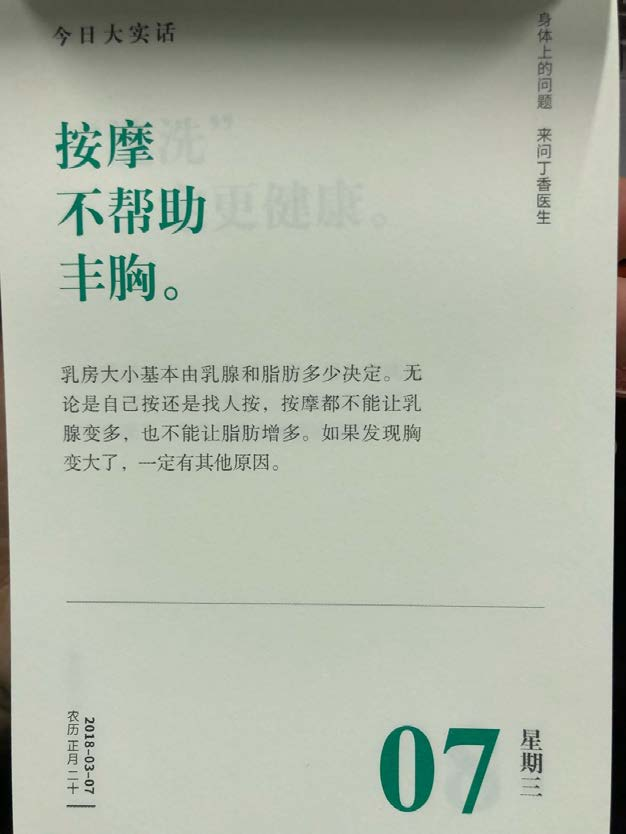

*2017-12-05 17:27 · 猫饭*

---

### 3456

刚注意到，说欧洲没有市值百亿美元以上的互联网公司是不准确的，俄罗斯有一家：在纳斯达克上市的yandex市值104亿美元，这是俄罗斯的百度，但是搜索以外的业务扩展比百度顺利一些，俄罗斯的地图是他们家的，网约车也是他们家的（uber把俄罗斯业务并给他们，安心当小股东了）。

*2017-12-05 15:46 · iPhone版*

---

### 3457

无论做人做公司，都要避免搞成「一方有难，八方点赞」…

*2017-12-05 11:45 · iPhone版*

---

### 3458

转@ 左潇 在医疗这个生态里，我确信的看到了big short的机会，但因为没有做空的机制，对于只能做多的人来说就会更加艰难。

*2017-12-05 09:52 · 手机上网 转自左潇*

---

### 3459

吃披萨时，普通青年拿手抓着吃，文艺青年用刀叉吃，二逼青年可以

这么吃：把一片披萨的硬边先啃掉，然后像搓雪茄那样把披萨卷成小圆柱体，再用手指像拿雪茄那样夹着这根披萨慢慢吃…

*2017-12-04 20:07 · 手机上网*

---

### 3460

Tim 的主要问题就是：哇，这些功能都太棒了，你们什么时候开到美国来？转@ 王兴 在上海跟 Tim Cook 吃了顿简餐并现场演示了美团点评和苹果的各种合作和功能集成。大壶春的生煎确实味道不错。

*2017-12-04 18:02 · 手机上网 转自王兴*

---

### 3461

至少单手是肯定系不了安全带了。转@ 王兴 穿着西装打着领带时坐车系安全带真是麻烦事。

*2017-12-04 17:55 · 手机上网 转自王兴*

---

### 3462

在上海跟 Tim Cook 吃了顿简餐并现场演示了美团点评和苹果的各种合作和功能集成。大壶春的生煎确实味道不错。

*2017-12-04 17:46 · 手机上网*

---

### 3463

时间和空间一起把万物隔开。

*2017-12-04 14:51 · 手机上网*

---

### 3464

穿着西装打着领带时坐车系安全带真是麻烦事。

*2017-12-04 13:55 · iPhone版*

---

### 3465

最好玩的一次乌镇之夜。Pony 不愧是游戏之王。

*2017-12-03 23:38 · iPhone版*

---

### 3466

还是苹果 CEO Tim Cook 最体贴，演讲时语速放得很慢，字正腔圆。

*2017-12-03 11:25 · 手机上网*

---

### 3467

蒙古副总理走上台时的步态让我觉得他可能练过摔跤。他开口却是用英文演讲。

*2017-12-03 11:08 · 手机上网*

---

### 3468

泰国副总理像倒豆子一样发言时，完全不懂泰语的我都能听出英文翻译不是很过关。

*2017-12-03 11:04 · 手机上网*

---

### 3469

可能同声传译确实很耗神，中文演讲到一半，英文翻译已经无缝切换了一个人。转@ 王兴 发展了一个新爱好：听中文发言时戴上同传听听英文翻译得如何;-)

*2017-12-03 10:52 · 手机上网 转自王兴*

---

### 3470

发展了一个新爱好：听中文发言时戴上同传听听英文翻译得如何;-)

*2017-12-03 10:41 · iPhone版*

---

### 3471

据说茅台附送的那种小杯子大概是8ml。转@ peter 1ml比我想象的多很多

*2017-12-02 22:41 · 手机上网 转自peter*

---

### 3472

原来佛罗里达 Florida 这个名字在西班牙语里的意思是「鲜花盛开的地方」。

*2017-12-02 19:39 · iPhone版*

---

### 3473

第一次乘坐从T2航站楼到T3的摆渡车，免费，耗时15分钟。

*2017-12-02 19:04 · iPhone版*

---

### 3474

你也有具体例子吗？转@ SZRicky 绝对是很多国内公司海外生意的转折点。转@ 王兴 我也曾怀疑2008年北京奥运会花了那么多钱搞得如此声势浩大是不是有点铺张浪费，直到半年前去迪拜时，海康威视中东办公室的朋友告诉我，08年奥运开完，他们明显感觉到生意变得好做了。他们认为是因为中国

*2017-12-02 18:03 · 手机上网 转自王兴*

---

### 3475

首都机场T2赫然开了家「花家怡园」，可惜今天时间不够，不然真该去尝尝，看看他们在机场的菜单。

*2017-12-02 17:42 · iPhone版*

---

### 3476

国家，是一个能让人一瞬间热血沸腾的概念。

*2017-12-02 17:20 · iPhone版*

---

### 3477

刚才在屋里拧开一个黑色便携咖啡杯的盖子，杯里的茶水在头顶灯光照射和黑色杯壁映射下仿佛波光粼粼，一瞬间让我想起《美丽的梭罗河》。

*2017-12-02 17:17 · iPhone版*

---

### 3478

我也曾怀疑2008年北京奥运会花了那么多钱搞得如此声势浩大是不是有点铺张浪费，直到半年前去迪拜时，海康威视中东办公室的朋友告诉我，08年奥运开完，他们明显感觉到生意变得好做了。他们认为是因为中国的知名度和整体形象改善了，所以中东的客户更愿意买中国公司的产品了。

*2017-12-02 16:06 · 手机上网*

---

### 3479

「轻拢慢捻抹复挑」这七个字真是太简洁生动了，值得脑补。

*2017-12-02 13:32 · iPhone版*

---

### 3480

implode 这个词，中文好像通常译成「内爆」，但我觉得「爆缩」更好一点。一方面，跟 explode 爆炸 更对应；另一方面，也比较容易从字面上理解词义，「内爆」有可能被误解为「从内部发生的爆炸」，而不是正确的「向内爆」的意思。

*2017-12-02 12:17 · 手机上网*

---

### 3481

时间，你从哪里来，要到哪里去？

*2017-12-02 09:51 · iPhone版*

---

### 3482

孙正义确实是商业奇才。

*2017-12-01 19:32 · 手机上网*

---

### 3483

据说去年在美国 IPO 的科技公司的年龄中位数是 10.5 岁。

*2017-12-01 12:52 · iPhone版*

---

### 3484

荷兰人名字里的 ij 就发 ai 的音。

*2017-11-30 18:42 · iPhone版*

---

### 3485

北京新机场建设预计用地65平方公里 vs. 北京二环面积62平方公里。

*2017-11-30 17:42 · 手机上网*

---

### 3486

平生第一次这么干这么二逼的事：把药片放进嘴里，灌了一大口水，正准备往下咽时想起还有另一种维生素片没吃，又懒得再起身去装水，于是含着水仰起头，把剩余的药片从微微张开的嘴里塞进去，再一次性咽下去，嘢！

*2017-11-30 13:41 · iPhone版*

---

### 3487

这是一个包浆了的词。

*2017-11-30 13:25 · iPhone版*

---

### 3488

我敢打赌，95%以上讲「工业4.0」的人讲不清楚1.0、2.0、3.0各是怎么回事。

*2017-11-30 13:17 · 手机上网*

---

### 3489

注意到咖啡和茶的一个区别：茶是可以佐餐的，可以配合中餐从头喝到尾；咖啡只在西餐上餐后甜点时出场。

*2017-11-30 13:12 · 手机上网*

---

### 3490

@ demg 对。

*2017-11-30 13:09 · 手机上网 给demg的回复*

---

### 3491

把 transformer 译成「变形金刚」还是很需要二次创作能力的。

*2017-11-30 13:03 · iPhone版*

---

### 3492

One chapter in 《Decisive Moments in (Personal) History》. 对不起，茨威格老师，借您书名一用。转@ 下划线和小数点 话说我在date 的数学系博士生变成博士候选人了。然而感觉还有一个小时可能就不能称之为在 dating 了…

*2017-11-30 12:55 · 手机上网 转自下划线和小数点*

---

### 3493

每年刚从棉袜换成羊毛袜时，我都忍不住说一下，脚感确实不同。我没穿过丝袜，不知道是什么感觉。话说现在女生穿的丝袜基本也都是

尼龙袜吧，不是真的丝袜了。

*2017-11-30 12:43 · iPhone版*

---

### 3494

北京为什么堵？除了具体的规划和管理水平，还是要回到最基本的供求规律，要么车多了，要么路少了。看到一个说法「北京建成区面积中道路用地占7%，纽约25%」，看来路确实有点少。

*2017-11-30 12:31 · iPhone版*

---

### 3495

必要的恶 necessary evil

*2017-11-30 12:23 · iPhone版*

---

### 3496

避免成为一个精神上的胖子。

*2017-11-29 23:59 · iPhone版*

---

### 3497

童年有很多版本，可以被演绎得很悲伤。我说的是那首歌啦。

*2017-11-29 21:22 · 手机上网*

---

### 3498

这种冷天走在户外，才会觉得普通皮鞋不太够，需要那种能护住脚踝的短靴。

*2017-11-29 21:05 · iPhone版*

---

### 3499

一盅汤、一个炒空心菜、一个烧味双拼煲仔饭，后来又加了一小碟辣味萝卜糕，竟然一个人全吃完了！现在撑得不行…

*2017-11-29 20:55 · iPhone版*

---

### 3500

按照我过去几年的正常节奏，40岁前恐怕去不了40个国家。

*2017-11-29 20:27 · 手机上网*

---

### 3501

开了一天会，本来想一个人去吃一块大牛排，走到半路看到曾经常去的粤式家常菜，临时改了主意。有两年没去了，不知道那个普通话很不标准的总是板着脸的老板娘还在不在。

*2017-11-29 19:44 · 手机上网*

---

### 3502

转：说得出来的苦，都不是真的苦。

*2017-11-29 19:29 · 手机上网*

---

### 3503

现在我上车后第一件事已经从系安全带变成给手机连上充电线了。

*2017-11-29 12:11 · 手机上网*

---

### 3504

看到一句有趣的话：直线就是半径无穷大的圆。

*2017-11-29 10:02 · iPhone版*

---

### 3505

转：历史上的东亚——中国、朝鲜、越南，甚至琉球都有科举，然而

日本却没有科举，即使在儒学蓬勃发展的江户时期，也没有科举，而且江户时期的儒学学者居然清一色反对科举。

*2017-11-28 11:57 · iPhone版*

---

### 3506

突然心有所感，觉得更能从原理上理解这个说法了。转@ 王兴 最好的词是那些短词，最好的短词是那些老词。-丘吉尔

*2017-11-28 10:32 · 手机上网 转自王兴*

---

### 3507

game winner & game changer

*2017-11-28 10:19 · iPhone版*

---

### 3508

时间是唯一绝对的排序。当然，爱因斯坦不同意。

*2017-11-28 09:57 · iPhone版*

---

### 3509

朱镕基真是大器晚成啊。50岁时还是副处。

*2017-11-28 09:38 · iPhone版*

---

### 3510

实践证明，从冰箱里拿出来的百香果比常温的百香果更美味。

*2017-11-28 01:24 · iPhone版*

---

### 3511

收工。

*2017-11-28 01:03 · iPhone版*

---

### 3512

又一个人推荐我看视频《The Men Who Built America》…

*2017-11-27 18:37 · iPhone版*

---

### 3513

去年申请美国专利最多的大学是麻省理工，第二名是清华。

*2017-11-27 15:59 · 手机上网*

---

### 3514

整整十年过去了，上证指数还没回到历史高位6124点。更别提这十年的通胀了。真是投资有风险。

*2017-11-26 20:27 · iPhone版*

---

### 3515

如果一切都可以做空，这个世界会变得更公平吗？

*2017-11-26 17:57 · iPhone版*

---

### 3516

鸡蛋糕。

*2017-11-26 17:10 · 网页*

---

### 3517

秦，公元前230年灭韩，前228年灭赵，前225年灭魏，前223年灭楚，前222年灭燕，前221年灭齐，花了9年时间完成统一。又过了14年，公元前207年，秦朝灭亡。

*2017-11-26 13:52 · iPhone版*

---

### 3518

没想到陈粒的英文歌词也这么棒。

*2017-11-26 13:16 · 猫饭*

---

### 3519

看电影《东方快车谋杀案》和看《十二怒汉》有点像，像看一场话剧，有限空间里十来个人轮番上阵。

*2017-11-26 13:13 · iPhone版*

---

### 3520

转@ 乐鼠老人 冬季的夜晚内心沸腾。Wolf Alice已经不能用一支年轻的伦敦新军来形容了，今年的新专有极大的张力和成熟度，歌声中有着从湖面到尖峰的跨度，年度top5无疑。

*2017-11-26 00:09 · 手机上网 转自乐鼠老人*

---

### 3521

在探讨未来时，把中美相比较是很常见的，但是把印度类比欧洲我倒是第一次听说。似乎也有些道理，相对割裂。

*2017-11-25 21:55 · 手机上网*

---

### 3522

不能混吃等死。

*2017-11-25 08:39 · iPhone版*

---

### 3523

对于一颗孤独的灵魂，工作是最好的容器。

*2017-11-24 14:17 · 手机上网*

---

### 3524

brinksmanship 这种我以前只在书上读到的词，今天第一次听到有人在对话中用。

*2017-11-24 14:00 · 手机上网*

---

### 3525

看过了一个城市的四季才算看过了这个城市。当然，前提是这个城市有四季。

*2017-11-24 11:58 · iPhone版*

---

### 3526

阶层分化看起来是不可避免的，但阶层固化则不是，也不应该是。

*2017-11-24 09:45 · iPhone版*

---

### 3527

这个 ABC 不错

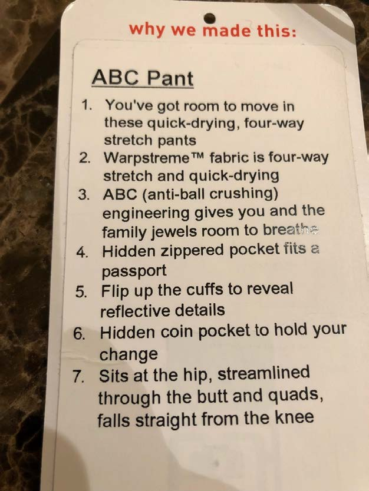

*2017-11-24 00:28 · 猫饭*

---

### 3528

@ 小熊娃娃 我当然知道台湾比海南更多样。我的问题是有什么海南能提供但台湾不能提供的吗？台湾南部的海滩比三亚如何？垦丁我没去过。

*2017-11-23 18:45 · 手机上网 给小熊娃娃的回复*

---

### 3529

岳阳、武汉、九江、南京，都在长江的转折点上。

*2017-11-23 16:38 · iPhone版*

---

### 3530

《西塞山怀古》刘禹锡王濬楼船下益州，金陵王气黯然收。千寻铁锁沉江底，一片降幡出石头。人世几回伤往事，山形依旧枕寒流。今逢四海为家日，故垒萧萧芦荻秋。

*2017-11-23 16:36 · iPhone版*

---

### 3531

突然意识到，可能一个社会也是这样的。转@ 王兴 我一直以为人是慢慢变老的，其实不是，人是一瞬间变老的。——村上春树

*2017-11-23 13:23 · 手机上网 转自王兴*

---

### 3532

好奇的问一下，你的意思是谁比不上谁？转@ 猪猫猪总 这有什么好紧张的啊！没有可比性 提鞋都不配！ 转@ 徒有实名 哈哈哈！ 转@王兴 昨晚朋友开玩笑，一旦要统一台湾，最紧张的可能是海南，旅游岛的定位瞬间被挑战了。

*2017-11-23 12:28 · 手机上网 转自王兴*

---

### 3533

昨晚朋友开玩笑，一旦要统一台湾，最紧张的可能是海南，旅游岛的定位瞬间被挑战了。

*2017-11-23 11:39 · iPhone版*

---

### 3534

今晚听台湾的朋友说，蔡英文上台后，民众反而对大陆没那么反感了。毕竟大陆的实力摆在那里。一个有趣的例子是：以前台湾的补习班广告上喜欢列着往届学生有几个考上了台大、新竹清华，现在已经变成广告最前面列的是有几个考上了北大、北京清华，然后才是台大、新竹清华。

*2017-11-23 00:20 · iPhone版*

---

### 3535

青春，就像那块1999年砸向美国大使馆的砖头。

*2017-11-22 20:24 · 手机上网*

---

### 3536

为了拍出美国往事，所做的一切努力都是值得的，所犯的一切错误都是可以被原谅的。转@ 叉烧很想喝酸奶 2333我们老师说莱翁内拍西部往事纯粹是为了先赚一笔好去拍美国往事 转@ 王兴 我觉得西部往事根本无法和美国往事相提并论。转@ 叉烧很想喝酸奶 看完美国往事之后我一直没有勇气看西部往事

*2017-11-22 18:30 · 手机上网 转自szweig*

---

### 3537

我觉得西部往事根本无法和美国往事相提并论。转@ 叉烧很想喝酸奶看完美国往事之后我一直没有勇气看西部往事 转@ 巴旦木 因为这部电影我才知道《唐顿庄园》里的伯爵夫人竟然是个美国人。RT@ 王兴我一直没有勇气看第二遍。转@ szweig 一直没有勇气看《美国往事》

*2017-11-22 18:25 · 手机上网 转自szweig*

---

### 3538

第一遍我就觉得好到无以复加了。转@ frodo 最近刚刚看了第二遍，感官比第一遍好了一些。转@ 王兴 我一直没有勇气看第二遍。转@szweig 一直没有勇气看《美国往事》

*2017-11-22 18:24 · 手机上网 转自szweig*

---

### 3539

天哪，我不是眼花了吧？北京的空气竟然也好到我能看见月亮暗的那一部分了。

*2017-11-22 18:15 · 手机上网*

---

### 3540

想起公司还只有十几个人的时候，某次跨年party时组织大家一起看《牯岭街少年杀人事件》。不记得当时为什么选了这部电影……

*2017-11-22 18:13 · 手机上网*

---

### 3541

我一直没太理解「生态链」这个词，生态系统/生态圈我能理解，产业链/价值链我也能理解，两者叠在一起不是不行，就是有点怪。当然，比「生态化反」强。

*2017-11-22 18:03 · 手机上网*

---

### 3542

我一直没有勇气看第二遍。转@ szweig 一直没有勇气看《美国往事》

*2017-11-22 18:00 · 手机上网 转自szweig*

---

### 3543

斗智斗勇别斗气。

*2017-11-22 17:31 · iPhone版*

---

### 3544

晚霞美得突破天际。

*2017-11-22 17:15 · iPhone版*

---

### 3545

请别误会。我说的是很脱离现实的一些想法，例如一个两千年前的改革者。。转@ 怀念过去的日子 发现自己坚信并为之奋斗的其实是不可挽回的错误指的是什么@ 王兴

*2017-11-22 16:36 · 手机上网 转自王兴*

---

### 3546

一个真正的革命者最大的痛苦是什么？肯定已经超越了个体的牺牲。

我目前能想到两点，一是发现自己坚信并为之奋斗的其实是不可挽回的错误，二是看到曾经的同志叛变，倒不是指叛变之后给其他人带来的具体危害，而是指叛变本身，因为那个同志在精神上牺牲了。

*2017-11-22 14:06 · iPhone版*

---

### 3547

《大西洋月刊》确实格调比较高，会在文章里用 bildungsroman 这种我从没见过的词。意思就是「主角成长记」吧。敝国网文中有一大类就是 bildungsroman.

*2017-11-22 11:01 · 手机上网*

---

### 3548

我前几天才知道图片社 Getty Images 的 Getty 就是 Getty Oil 那个Getty 的后人，洛杉矶那个从建筑到藏品都很棒的艺术馆 GettyCenter 也是这家人捐赠的。

*2017-11-22 10:16 · iPhone版*

---

### 3549

第一次被苹果的产品流程卡住：在 iPhone X 上想安装一个 app，但是和 face id 结合在一起后苹果设计的操作提示我看都看不懂，经同

事提醒才搞明白。

*2017-11-21 18:39 · 手机上网*

---

### 3550

无中生有。

*2017-11-21 16:28 · iPhone版*

---

### 3551

动脑、动心、动情、动手

*2017-11-21 15:16 · iPhone版*

---

### 3552

这个世界蠢蠢欲动。

*2017-11-21 07:51 · iPhone版*

---

### 3553

昨晚梦到南部非洲。

*2017-11-21 07:42 · iPhone版*

---

### 3554

2C业务既要走心又最无情，确实很纯粹。

*2017-11-20 15:32 · iPhone版*

---

### 3555

美总是稍纵即逝。最美的就是永恒的稍纵即逝。

*2017-11-19 16:21 · 手机上网*

---

### 3556

结果导向。

*2017-11-19 16:12 · 手机上网*

---

### 3557

赞！我就从没想到过洞洞裤和网袜的组合。转@ 拧巴人儿 是啊，我的审美发生了什么！

*2017-11-19 13:50 · 手机上网 转自拧巴人儿*

---

### 3558

她那时候还太年轻，不知道所有命运赠送的礼物，早已在暗中标好了价格。-茨威格

*2017-11-19 12:51 · iPhone版*

---

### 3559

She was still too young to know that life never gives anythingfor nothing, and that a price is always exacted for what fatebestows. -zweig

*2017-11-19 12:50 · iPhone版*

---

### 3560

到了晚上，两脚比早晨胀大好多。最近这个感觉特别明显。

*2017-11-19 02:03 · 手机上网*

---

### 3561

出了机舱才发现，北京真的冷了。我对摆渡车上穿着短袖的汉子投去同情的目光。

*2017-11-19 01:46 · 手机上网*

---

### 3562

一个在德法混合的跨国公司工作的朋友说：我管10个事业部，后来我发现，靠谱的事业部都是德国的，不靠谱的都是法国的……

*2017-11-18 22:13 · iPhone版*

---

### 3563

登机口候机中，一个大妈一边走向我旁边座位上那个大妈，一边突然开始嘟囔「两只小蜜蜂啊，飞在花丛中啊……」，我嘴里含着的一口热茶差点喷地上。

*2017-11-18 21:50 · iPhone版*

---

### 3564

深圳机场的多肉。

*2017-11-18 21:10 · 猫饭*

---

### 3565

台湾卤肉饭说起来不健康，但如果做好了是真香真好吃啊。可惜中午这份做得一般。

*2017-11-18 15:17 · 手机上网*

---

### 3566

「他那 PPT 是从科普直接到科幻，中间没有科学」这评价太狠了。

*2017-11-18 12:27 · 手机上网*

---

### 3567

听说 CAR-T 治某些癌症真是很神奇。有些很晚期被认为只能再活两三个月的病人接受治疗后一个月体内后就完全找不到癌细胞了。不是控制住了，而是真的全治愈了！

*2017-11-18 11:44 · iPhone版*

---

### 3568

医院是个壁垒极高、极难颠覆的行业，因为是个双边市场。病人都想去有名的大医院；名医都愿意呆在有名的大医院，因为那里能见到最多疑难病症，有利于他提高水平、进行学术研究、树立行业地位，如

果去了小医院可能要花大量时间干没啥挑战的活。所以，深圳虽然很多方面已经碾压广州，但是好医院一直起不来

*2017-11-18 11:20 · 手机上网*

---

### 3569

听到一个说法，富士康中短期是不可能真把iPhone组装线挪到美国去的，因为最精密的装配环节现在机械手还做不了，得靠手巧的小姑娘，而美国找不到这么多手巧的小姑娘。那条生产线上全女工，手要小要巧，招聘是要量手的。

*2017-11-18 10:42 · 手机上网*

---

### 3570

101010 转@ szweig 世界的终极答案。转@ 张乡焦 今天的我，42岁。

*2017-11-18 10:30 · 手机上网 转自张乡焦*

---

### 3571

搞地产的人确实和搞互联网的略有区别。搞互联网的也说粗话，但我没见过谁在对着几十人发言时若无其事的说「我X你妈」。

*2017-11-18 10:02 · 手机上网*

---

### 3572

艾滋病不再那么致命一方面是医疗科技有进展，另一方面也是艾滋病病毒本身各个分支演化的结果。特别烈特别致命的那些分支因为太快把宿主搞死而不容易传播开，剩下来占主流的自然就是那些相对柔和的分支。

*2017-11-18 09:53 · 手机上网*

---

### 3573

倒是一个搞生物科技的朋友说，艾滋病现在已经是一个虽然治不好但是只要坚持吃药就基本没什么问题的病了，和其他很多慢性病一样。

甚至可以做到无防护性行为也传染概率极低了。

*2017-11-18 09:48 · 手机上网*

---

### 3574

昨晚跟中医博士闲聊时我问她中医是否还在不断进展，她说中医一上来的体系就非常高了，关键是要弄明白。我又问那怎么解释艾滋病这种最近几十年来才出现的病，她想了想说有外因，但关键还是自己体内要调理好。似乎也说得通，AIDS本来就是「获得性免疫缺陷综合症」的缩写。

*2017-11-18 09:37 · 手机上网*

---

### 3575

一个在 MIT 拿过三个学位的朋友做投资之余花了三年时间在浙江中医药大学读了一个中医博士学位。我饶有兴趣的请她用科学的语言给我介绍一下中医，她表示中医真的非常靠谱非常高级，但是一两句话说不清。

*2017-11-17 23:12 · 手机上网*

---

### 3576

朗朗是个很「以客户为中心」的人。他当然能把钢琴弹得很好，但是

他更清楚，在很多场合，他弹得到底有多好其实并不重要，更重要的是用各种略带夸张的表情和身体语言给听众更多存在感。

*2017-11-17 20:13 · 手机上网*

---

### 3577

https://www.blog.googl e/ 这不是一个不完整的域名，而是 google自己搞了一个顶级域名。

*2017-11-17 18:06 · iPhone版*

---

### 3578

转@ 下划线和小数点 在 amazon.ca 上 36 个一盒的套套最常见的subsc ription 是一个月一盒。wtf……

*2017-11-17 16:48 · 手机上网 转自下划线和小数点*

---

### 3579

大地产商说话就是冷酷：你们看深圳、北京、纽约、香港的街头，那么多人整天走来走去，都在干什么？都在供楼。

*2017-11-17 16:16 · iPhone版*

---

### 3580

你很懂行。后者。转@ 左潇 @ 王兴 听起来像 JW 或文华东方的服务气质

*2017-11-17 15:26 · 手机上网 转自左潇*

---

### 3581

请问是啥意思？是希望美团能把你发来的文件好再送上门给你吗？ 转@ 饭小默 如果打印也可以用美团外卖就好了。 @ 王兴

*2017-11-17 11:54 · 猫饭 转自饭小默*

---

### 3582

学了个新单词：meringue 蛋白饼

*2017-11-17 09:37 · 猫饭*

---

### 3583

创新过程中目标的重要性几乎是如何高估都不过分。哥伦布不见得是

同时代航海技术最好的船长，装备也不出众，他最大的优点就是敢一路往西开，虽然是基于错误的目标「xx距离之后就从另一个方向到印度了」，但至少他有个目标。哥伦布首航之后，那条航海线路立刻就变得很常规了，因为已经有一个清晰目标。

*2017-11-17 09:25 · 手机上网*

---

### 3584

稍微想了一下，还是习惯的原因 不管是我们家乡各家各户自己做的香肠还是德国香肠或意大利香肠，最传统的原料都是猪肉。转@ 王兴我发现，自助早餐有猪肉肠、牛肉肠和鸡肉肠时，我一般还是优先选猪肉肠。

*2017-11-17 09:16 · 手机上网 转自王兴*

---

### 3585

我发现，自助早餐有猪肉肠、牛肉肠和鸡肉肠时，我一般还是优先选猪肉肠。

*2017-11-17 09:06 · iPhone版*

---

### 3586

昨晚游了个泳，近一年来第一次，值得记录一下。

*2017-11-17 09:06 · iPhone版*

---

### 3587

今天白天开会的那家香港酒店有些细节让我印象深刻：我小便完走向洗手池时，已经有个侍者帮我把水龙头拧开了；我洗手时，他已经取下一张擦手纸准备双手呈给我了。服务殷勤到这种程度确实让我有点不适应。

*2017-11-16 23:25 · iPhone版*

---

### 3588

第一次吃这道菜：爆炒顺德鱼腐。味道还不错。

*2017-11-16 19:57 · 猫饭*

---

### 3589

据说盖茨定了个目标，2040年前在全世界灭绝疟疾。转@ 叶滨 古罗马人则认为，沼泽湿地中会产生肉眼看不见的微生物，通过口鼻呼吸进入人体，引发疟疾。意大利语中的“污浊空气”（mal’aria），就成了疟疾的学名Malaria。

*2017-11-16 16:13 · 手机上网 转自叶滨*

---

### 3590

第二次吃桃胶，这回是跟芋泥搭配。

*2017-11-16 14:38 · iPhone版*

---

### 3591

突然觉得自己能够理解更年期是多么难熬了。激素对人的影响太大了。

*2017-11-16 12:40 · iPhone版*

---

### 3592

她的眼神冷得像深井冰。

*2017-11-15 18:56 · iPhone版*

---

### 3593

刚才突然想听一下《烟花易冷》这首歌，然后才发现，别说出国了，到了香港就是QQ和网易都啥歌也听不了。

*2017-11-15 18:54 · iPhone版*

---

### 3594

转@ 乱耳朵

♂ 转@ 狸猫猫

转@ 王兴 转。

*2017-11-15 18:38 · 手机上网 转自王兴*

---

### 3595

转。

*2017-11-15 18:24 · 手机上网*

---

### 3596

这年头，光产品体验好是远远不够的。看小蓝车倒掉的新闻有感。

*2017-11-15 18:09 · iPhone版*

---

### 3597

我感觉维多利亚港最窄的地方只剩黄浦江那么宽了。

*2017-11-15 16:27 · 手机上网*

---

### 3598

但猩球这个系列的原始设定还是很不错的，把民族/种族之争进一步放到到物种之争，大家都为了生存而奋斗，什么才是正义的就不那么简单了。转@ 王兴 飞机上看了《猩球崛起3》，感觉一般，顶多给7/10分。这个系列需要新的创意了。

*2017-11-15 10:13 · 手机上网 转自王兴*

---

### 3599

飞机上看了《猩球崛起3》，感觉一般，顶多给7/10分。这个系列需要新的创意了。

*2017-11-15 00:43 · iPhone版*

---

### 3600

独立思考不从众真是很难，快到登机时间但是登机口却人很少，不禁会心里有点慌，怀疑自己是不是搞错了。

*2017-11-14 19:54 · iPhone版*

---

### 3601

macOS 这样大小写组合真的不好看啊。

*2017-11-14 15:19 · 手机上网*

---

### 3602

不管外面气温多低，我们朝南那面办公室总能被阳光烤成暖房。

*2017-11-14 15:12 · iPhone版*

---

### 3603

听说有些人在筹建中国版的黑水。

*2017-11-14 10:32 · 网页*

---

### 3604

羚羊是进化不成狮子的。

*2017-11-13 21:02 · iPhone版*

---

### 3605

刚才在手机上快速输入时手一滑，回头检查时才发现写了一个3017年，确实有点远，难怪看着比较陌生。

*2017-11-13 17:43 · iPhone版*

---

### 3606

一个号称每年有一半时间在非洲的朋友说，非洲人民确实是把中国人当兄弟，但是，没用，他们还是觉得白人是爹-_-!

*2017-11-13 17:14 · iPhone版*

---

### 3607

事不过三。刚才帽子已经被风吹掉两次了。

*2017-11-13 13:48 · iPhone版*

---

### 3608

我以前只知道一句「闲敲棋子落灯花」，没想到前一句竟然是「有约不来过夜半」，也不知道再往前两句是「黄梅时节家家雨，青草池塘处处蛙」，我原本以为季节应该是天气已经开始转凉的秋天。

*2017-11-13 00:40 · iPhone版*

---

### 3609

看《银翼杀手2049》时真切感受到：绝望才是信仰的土壤，越绝望越容易会为了信仰奋不顾身。

*2017-11-13 00:36 · iPhone版*

---

### 3610

《银翼杀手2049》，我给9/10分。这是我看过的最逼真的科幻场景，音效好到瘆人。不过，我70岁时世界不应该是那个样子吧。

*2017-11-13 00:06 · iPhone版*

---

### 3611

把 zucchini 译成 小瓜 倒也省事。

*2017-11-12 18:33 · 猫饭*

---

### 3612

龙岩话叫小银子。转@ quux 铅角子 转@ 乱耳朵 角子（发音像锅子转@ 令狐楚 钢墩儿。 转@ 夜骸 想征集一下“硬币“的各种方言叫法，潮汕话叫毫子囝，粤语叫银仔，北方很多地方叫钢镚儿，还有什么叫法呢？

*2017-11-12 14:17 · 手机上网 转自夜骸*

---

### 3613

在我误入女洗手间出来后，我看到两个小伙子也一头扎进去了。是设计有问题，不能全怪我们。

*2017-11-11 22:04 · iPhone版*

---

### 3614

午饭吃了一碗兰州牛肉拉面，宽度选了韭叶。按「一清二白三红四绿五黄」的好面标准，汤还不够清。

*2017-11-11 13:16 · iPhone版*

---

### 3615

《老男人与海》虽然是对《The Old Man and the Sea》更准确的翻译，但感觉怪怪的。

*2017-11-10 18:43 · iPhone版*

---

### 3616

想起来全是问题，做起来才有答案。

*2017-11-10 11:34 · iPhone版*

---

### 3617

「假如你不知道自己是男人还是女人，健康还是生病，富有还是贫穷，受过教育还是文盲，有无信仰，生于城市抑或乡村，追求事业成功还是生活自由，不知道所有这些，你想生活在什么样的社会里？」

这确实是个水平极高的奠基性的问题。

*2017-11-10 09:56 · iPhone版*

---

### 3618

跟朋友聚餐时，一起假装今晚是平安夜可以低成本高效率的提升气氛。

*2017-11-09 22:33 · iPhone版*

---

### 3619

还是你有文化！转@ 东东枪 “直娘贼”。 转@ 王兴 中文脏话里好像没有 motherfucker 这么简单粗暴的一个词。

*2017-11-09 18:49 · 手机上网 转自王兴*

---

### 3620

中文脏话里好像没有 motherfucker 这么简单粗暴的一个词。

*2017-11-09 18:16 · iPhone版*

---

### 3621

朋友转述一个世界500强CEO对她说的话：我之所以整天在全世界飞来飞去，主要就是为了保护公司里那些还愿意去触碰边界的人。

*2017-11-09 01:11 · 手机上网*

---

### 3622

tempo 是节拍，temporary 是暂时，contemporary 是当代，都和时间这种「顽固的幻觉」有关。

*2017-11-08 21:13 · 手机上网*

---

### 3623

大我十岁的一些企业家确实风格非常不同。

*2017-11-08 20:30 · 手机上网*

---

### 3624

今天喝家乡龙岩的另一种茶：漳平水仙。但是好像并没有很惊艳。

*2017-11-08 12:24 · iPhone版*

---

### 3625

聪明的孩子，提着易碎的灯笼；孤独的孩子，你是造物的恩宠。

*2017-11-08 00:17 · iPhone版*

---

### 3626

小说是阿城写的，电影是梁家辉演的，片头用了罗大佑那首歌。转@szweig 谢园的吗？ 转@ 王兴 《棋王》电影、《棋王》小说和罗大佑的《爱人同志》这首歌都给我留下深刻印象。

*2017-11-07 23:26 · 手机上网 转自王兴*

---

### 3627

《棋王》电影、《棋王》小说和罗大佑的《爱人同志》这首歌都给我留下深刻印象。

*2017-11-07 23:15 · iPhone版*

---

### 3628

有人唱K时唱庞麦郎的《我的滑板鞋》并且能踩准节拍吗？

*2017-11-07 23:08 · iPhone版*

---

### 3629

「将军赶路，莫追小兔」这八个字真是生动。

*2017-11-07 22:59 · 手机上网*

---

### 3630

当反对政治正确成为政治正确的时候

*2017-11-07 22:37 · 手机上网*

---

### 3631

苏格兰老头的英语真难懂。

*2017-11-07 16:19 · iPhone版*

---

### 3632

三个月前买的裤子还一直没空去裁缝店改到合适的长度:(

*2017-11-07 12:39 · iPhone版*

---

### 3633

皮底的皮鞋确实太容易打滑了，在瓷砖地上走路如果拐弯拐得急一点都有抓不住地的感觉。

*2017-11-06 18:16 · iPhone版*

---

### 3634

沙特这个新王储去年提了个Vision 2030 国家计划，其网站http://vision2030.gov.sa 支持四种文字：阿拉伯文、英文、日文、中文。

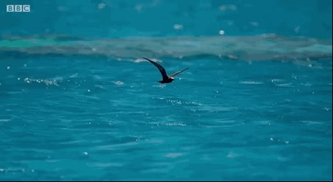

*2017-11-06 16:10 · iPhone版*

---

### 3635

转@ 孙岩 鱼吃鸟

*2017-11-06 14:01 · 手机上网 转自孙岩*

---

### 3636

阳光明媚的桌上仰面朝天躺着一只蚊子，脚挺在空中，时不时抽搐两下，已经持续了快半个小时了，大概是不舍得告别这个世界。

*2017-11-06 13:05 · iPhone版*

---

### 3637

沙特今年新立的王储叫 Mohammad，被废掉的那个王储叫Muhammad，一字之差，真让人头晕。

*2017-11-06 11:36 · iPhone版*

---

### 3638

昨晚做了奇怪复杂的梦，而且不止一个，我怀疑我平时也做这些梦，只是睡太沉了等醒来时已经忘了，不像昨晚因为要半夜起来上厕所所以才能感知到这些梦。

*2017-11-06 09:38 · iPhone版*

---

### 3639

一个师兄说他们去走戈壁，70后基本都走下来了，80后几乎都走不下来。他的解释是70后意识到自己的身体已经不那么年轻，所以平时多少都有些锻炼，而那批忙于事业的80后很多人还在吃老本……

*2017-11-05 23:16 · 手机上网*

---

### 3640

罗大佑居然还用闽南话/台语唱过一首《长征》。

*2017-11-05 20:18 · iPhone版*

---

### 3641

像黄霑的《沧海一声笑》这样中国风的歌我还蛮喜欢的。

*2017-11-05 19:57 · iPhone版*

---

### 3642

转@ 白夜_ 翠花，汉字词语，指用翡翠镶嵌成花朵形的首饰。温庭筠《郭处士击瓯歌》：“宫中近臣抱扇立，侍女低鬟落翠花。” 转@ 飯否小字报 转@ 王兴 要真说起来，「翠花」这名字还挺有想象力的。你

们见过绿色的花吗？

*2017-11-05 19:53 · 手机上网 转自王兴*

---

### 3643

「没有人要和你玩平等的游戏」，罗大佑在《亚细亚的孤儿》里的这句词也适用于商业。

*2017-11-05 19:18 · 手机上网*

---

### 3644

要真说起来，「翠花」这名字还挺有想象力的。你们见过绿色的花吗？

*2017-11-05 19:09 · 手机上网*

---

### 3645

我倾向于认为「英伦」这个词就是 England 曾经的译名，而不是英国加伦敦的缩写。

*2017-11-05 19:00 · 手机上网*

---

### 3646

这个恐怕真的做不了。音乐版权已经基本被垄断。转@ 肥在 自己做一个呀~ 转@ 王兴 QQ音乐没有满足我的一个需求：有时我希望看到某首歌是哪年诞生的。

*2017-11-05 18:52 · 手机上网 转自王兴*

---

### 3647

QQ音乐没有满足我的一个需求：有时我希望看到某首歌是哪年诞生的。

*2017-11-05 17:44 · iPhone版*

---

### 3648

iPhone X 给我的第一个惊喜是：静音状态下来电时，手机不再是按原来那单调的节奏震动，而似乎是按某段旋律来震动。

*2017-11-05 16:56 · iPhone版*

---

### 3649

历史的指针拨到2017年11月5日。

*2017-11-05 08:29 · iPhone版*

---

### 3650

又拉一次肚子。7次了:( 转@ 王兴 24小时6次。

*2017-11-04 23:28 · 手机上网 转自王兴*

---

### 3651

王家卫正在为亚马逊影业拍摄一部美剧《帮派之争》（Tong Wars）。

故事背景设在1905到1971年间的旧金山，两大华人帮派争夺当地唐人街势力，同时也有早期华人移民生活背景。王家卫说拍摄一个中国导演很少涉及的中美之间的故事题材，机会难得，而且通过系列电视剧的形式，可以更好的展示

*2017-11-04 22:09 · iPhone版*

---

### 3652

24小时6次。

*2017-11-04 19:28 · iPhone版*

---

### 3653

传说中的“鸡头（米）”。

*2017-11-03 20:24 · 猫饭*

---

### 3654

真的应该每天都活得触及灵魂吗？

*2017-11-03 13:20 · iPhone版*

---

### 3655

转@ gravity0 昂山素季神话是甘地神话和曼德拉神话的翻版，好人坏人的剧本，只出现在曾有大英帝国传统的地方，别处的英雄在被弄死前早就被搞倒批臭了。这些英雄无疑有超人的意志力和操守，但仅有这些还不足以解决复杂的实际问题。就拿甘地来说，他既没搞好经济也没搞好统战。

*2017-11-03 11:25 · 手机上网 转自gravity0*

---

### 3656

刚知道 riot games 的中文名是「拳头游戏」。

*2017-11-03 09:55 · iPhone版*

---

### 3657

陈草庵《山坡羊》 转@ 郭家二少爷 晨鸡初叫，昏鸦争燥，哪个不去

红尘闹！路遥遥，水迢迢，功名尽在长安道。今日少年明日老。山，依旧好；人，憔悴了！

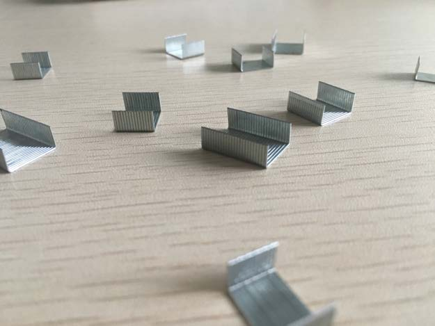

*2017-11-03 08:48 · 手机上网 转自郭家二少爷*

---

### 3658

最是一年秋好处，绝胜烟柳满皇都。

*2017-11-03 08:43 · iPhone版*

---

### 3659

「1984年，作为在1952年院系调整后清华大学成立的第一个学院，清华大学经济管理学院诞生，时任国家经委副主任的朱镕基出任首任院长」，朱总理真不是一般总理啊，至今都在关心和支持清华经管的发展。

*2017-11-02 18:58 · iPhone版*

---

### 3660

一个朋友创业做炒股软件，用 tradenb.com 这个域名。

*2017-11-02 18:06 · iPhone版*

---

### 3661

我日常用不着什么数学，只需要六则运算：加减乘除、对数、幂。

*2017-11-02 17:59 · iPhone版*

---

### 3662

《旅夜书怀》气质上特别像杜甫旅途中半夜发的朋友圈：细草微风岸，危樯独夜舟。星垂平野阔，月涌大江流。名岂文章著，官应老病休。飘飘何所似？天地一沙鸥。

*2017-11-02 16:26 · iPhone版*

---

### 3663

hype 这个词好像没有简洁的中文翻译？

*2017-11-02 09:26 · iPhone版*

---

### 3664

第三波

*2017-11-01 12:47 · iPhone版*

---

### 3665

按大象公会的说法，目前罗马天主教有12.9亿信徒，而马丁·路德及其同工开创的新教干了整整五百年，到今天大约有9亿信徒。想后来居上多不容易啊。

*2017-11-01 00:01 · 手机上网*

---

### 3666

哈，这本算法书的封面好眼熟。不过说实话，我当年读书时只读了四分之一本吧。转@ .rex test img

*2017-10-31 23:49 · 手机上网 转自.rex*

---

### 3667

听说今天是「世界城市日」。热爱人类文明的我自然也热爱城市。

*2017-10-31 23:37 · 手机上网*

---

### 3668

哇！转@ 黄小昊 @ 王兴

*2017-10-31 20:00 · 手机上网 转自黄小昊*

---

### 3669

整个拉丁美洲人口最多的国家是巴西，2亿；第二多的是墨西哥，1.2亿；出乎意料的是，第三名竟然是哥伦比亚，约4900万。

*2017-10-31 15:17 · 网页*

---

### 3670

阿列克谢耶维奇，这名字初看起来复杂，真的鼓起勇气念一下就发现并不难记。

*2017-10-30 15:31 · 手机上网*

---

### 3671

“姑娘”这种水果英文里叫 golden berry，原产于秘鲁。中文也可以叫灯笼果，比较形象；不清楚“姑娘”这名字怎么老的。

*2017-10-30 15:10 · 猫饭*

---

### 3672

今天心情没有像天气那么好。

*2017-10-30 14:52 · iPhone版*

---

### 3673

并列第8的是中国科学技术大学、上海交通大学、南京大学、上海财经大学、北京外国语大学、上海外国语大学，各1人。

*2017-10-30 11:49 · iPhone版*

---

### 3674

2007-2016年中国各地区高考状元中，清华大学录取的人数最多，393人；北京大学367人，屈居第2；两校录取的高考状元占全国总数的91.5%。随后是：3、香港大学44人；4、香港中文大学10人；5、复旦大学5人；6、香港科技大学有3人；7、中国人民大学2人；并列第8的是中国科

*2017-10-30 11:47 · iPhone版*

---

### 3675

要说专注，B 比 AT 专注多了。

*2017-10-30 11:04 · iPhone版*

---

### 3676

东北财经大学在辽宁大连，东北师范大学在吉林长春，东北林业大学在黑龙江哈尔滨。

*2017-10-30 10:42 · iPhone版*

---

### 3677

像今天这么好的天气多来几天该多好啊。

*2017-10-29 19:37 · iPhone版*

---

### 3678

think tank 这个词组造得真棒，中文「智库」有所不如。

*2017-10-28 21:20 · iPhone版*

---

### 3679

会不会有个脑洞大开的律所给自己起名“大律堂”？

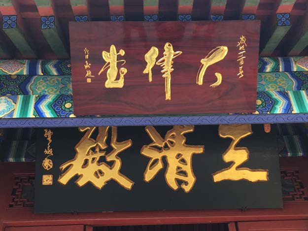

*2017-10-28 20:57 · 猫饭*

---

### 3680

不记得刚才在QQ音乐里点了什么，现在似乎进入港台老歌连播模式了，都是李宗盛的《我终于失去了你》这类的。但也还蛮好听的。

*2017-10-28 20:29 · 手机上网*

---

### 3681

不好意思，我说的是国语版。转@ 王光明 不是刘卓辉吗？刚去搜了的。转@ 王兴 听了一路的 beyond ，发现这首《情人》以前我没注意过。印象中 beyond 不太唱儿女情长的歌，一看歌词，作者又是林夕。

*2017-10-28 18:24 · 手机上网 转自王兴*

---

### 3682

听了一路的 beyond ，发现这首《情人》以前我没注意过。印象中

beyond 不太唱儿女情长的歌，一看歌词，作者又是林夕。

*2017-10-28 18:17 · 手机上网*

---

### 3683

对对对，是耐冬。转@ funny_joe 是耐冬 转@ 王兴 青岛和龙岩的市花一样，都是山茶花。但是青岛管山茶花叫「耐寒」。

*2017-10-28 18:07 · 手机上网 转自王兴*

---

### 3684

青岛和龙岩的市花一样，都是山茶花。但是青岛管山茶花叫「耐寒」。

*2017-10-28 15:29 · 手机上网*

---

### 3685

「橡树湾」是个不可多得的好名字，比一般楼盘名字强太多了。

*2017-10-28 15:27 · 手机上网*

---

### 3686

韭菜炒海肠确实非常鲜。青岛大叔说以前没味精时本地人就是把海肠晒干了磨成粉当调鲜剂。

*2017-10-28 15:19 · 手机上网*

---

### 3687

这两天喝了好多「崂山白花蛇草水」。

*2017-10-28 09:24 · iPhone版*

---

### 3688

一个老青岛人跟我说青岛是最北的能种茶叶的地方。

*2017-10-27 22:39 · iPhone版*

---

### 3689

最新规定，媒体报道里不允许使用「村长」这个词了。

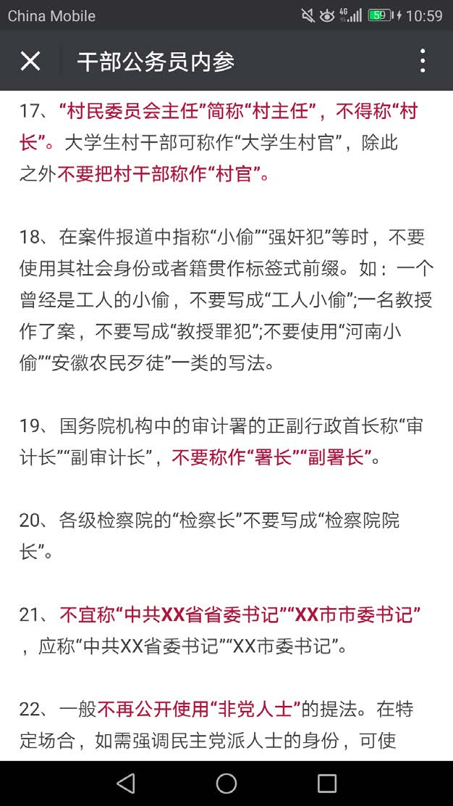

*2017-10-27 11:00 · 手机上网*

---

### 3690

独流减河，这名字很独特。

*2017-10-27 10:07 · iPhone版*

---

### 3691

在酒店大堂等人时翻杂志，看到 Berluti 号称这种极为简洁的整个外表没有任何缝线的鞋是他们家首创的。

*2017-10-26 21:15 · 手机上网*

---

### 3692

看到一个词：科技主义。

*2017-10-26 21:09 · 手机上网*

---

### 3693

谢谢。依然觉得难以置信。转@ 邓范鑫 来，兴兴，帮你补补脑 转@王兴 「弄潮儿向涛头立，手把红旗旗不湿」是写于宋代的，我想象不出是什么样的景象。难道那时就已经有冲浪板了？

*2017-10-26 16:43 · 手机上网 转自邓范鑫*

---

### 3694

@ 小熊娃娃 还是不懂。是游泳还是划船还是踩冲浪板啊？

*2017-10-26 16:27 · 手机上网 给小熊娃娃的回复*

---

### 3695

「弄潮儿向涛头立，手把红旗旗不湿」是写于宋代的，我想象不出是什么样的景象。难道那时就已经有冲浪板了？

*2017-10-26 16:16 · 手机上网*

---

### 3696

地三鲜或黑三剁这种菜虽然不高级，但是做好了也很好吃。

*2017-10-26 12:20 · iPhone版*

---

### 3697

新闻里读到「截止目前，特斯拉获得了 24 轮融资和一笔补贴」。24轮！

*2017-10-26 11:41 · iPhone版*

---

### 3698

出工。汇入滚滚车流。

*2017-10-26 07:51 · iPhone版*

---

### 3699

昨天，你好。

*2017-10-26 00:00 · iPhone版*

---

### 3700

为了表示对「一带一路」的支持，我今晚跟人谈事情时点了一杯mocktail，名叫 Silk Road.

*2017-10-25 23:55 · iPhone版*

---

### 3701

收工。

*2017-10-25 23:50 · iPhone版*

---

### 3702

厉害。转@ 阳升 haha 转@ 今犹在 王沪宁。突然freest<x>yle

*2017-10-25 15:36 · 手机上网 转自今犹在*

---

### 3703

午饭吃到一半，已无意中咬了自己嘴唇两次，起了一个小血泡。

*2017-10-25 14:01 · 手机上网*

---

### 3704

转@ gravity0 原教旨主义是权力争夺中常用策略，因为越是最初简单的教义知道的人越多，稍加煽动就能形成多数碾压少数的局面，激进者在斗争中获取权力。然而原教旨是没法解决现实问题的，当初那套如果好用何至于此，又哪里有激进者染指权力的机会。

*2017-10-25 09:46 · 手机上网 转自gravity0*

---

### 3705

看 airbnb 中国区老大上任四个月就离职的新闻才知道 airbnb 北京办公室在侨福芳草地。果然有逼格！

*2017-10-24 23:19 · iPhone版*

---

### 3706

现在应该思考点啥呢？

*2017-10-24 23:02 · iPhone版*

---

### 3707

白天开会时发现一个家住台湾的同事喝的是“台塑严选”的茶。

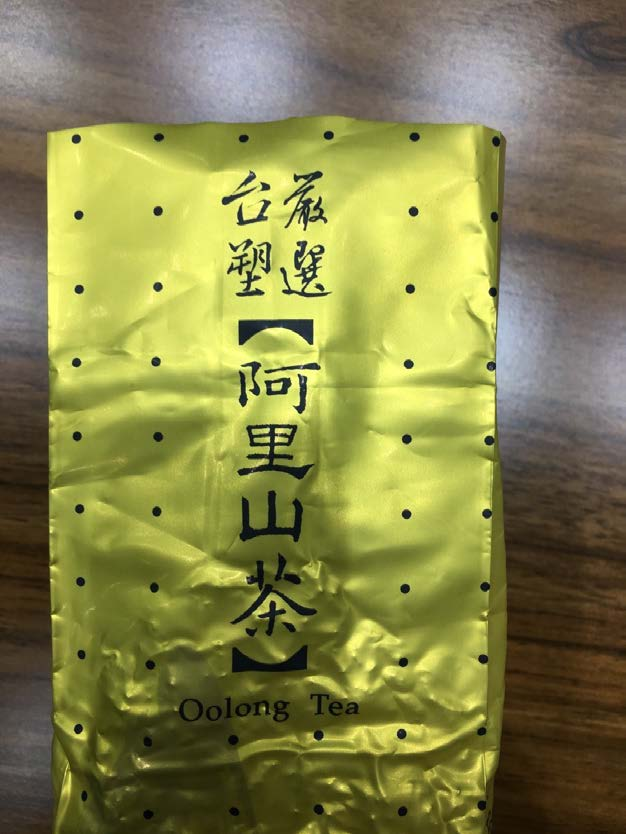

*2017-10-23 22:53 · 猫饭*

---

### 3708

第一次听说有种乐器叫「尺八」：中国吴地传统乐器，后传入日本。

竹制，外切口，五孔（前四后一），属边棱振动气鸣吹管乐器，以管长一尺八寸而得名，其音色苍凉辽阔，又能表现空灵、恬静的意境。

*2017-10-23 22:28 · iPhone版*

---

### 3709

上午开会时开了一次小差，突然很想吃竹笋酸菜炖猪肉。

*2017-10-23 12:23 · iPhone版*

---

### 3710

看新闻才知道新加坡那小岛上竟然还有野猪，整个岛的面积也就跟北京五环内差不多。

*2017-10-22 20:29 · iPhone版*

---

### 3711

Old sailor 似乎有一点接近中文里「老司机」的意思。

*2017-10-22 15:17 · iPhone版*

---

### 3712

新一波：法国总统39岁，爱尔兰（同性恋）总理38岁，新西兰（女）总理37岁，奥地利总理31岁……

*2017-10-22 12:21 · iPhone版*

---

### 3713

@ 掌门最伟大 @ 郭家二少爷 这种假消息都信的人赶紧去给智商充值一下吧。

*2017-10-22 11:24 · 手机上网 给掌门最伟大的回复*

---

### 3714

浙大首次将舞龙舞狮课纳入了体育课选课系统。

*2017-10-22 11:05 · 手机上网*

---

### 3715

转@ 郭家二少爷 把一家公司的历史拉长，头两年入职的关键人留下来的都是联合创始人。

*2017-10-22 10:59 · 手机上网 转自郭家二少爷*

---

### 3716

这是谬望。中国已经过了高速扩张阶段。很多高铁沿线城市已经是人口流出状态了，市中心和远郊高铁站中间填不起来了。转@ 青瓜三滚对大部分城市，高铁站建远点，市中心的范围就会逐渐往那边扩展吧转@ 王兴 高铁是伟大的。我主要的抱怨是太多高铁站建在离市中心太远的地方了，这让高铁的价值大打折扣

*2017-10-22 10:46 · 手机上网 转自王兴*

---

### 3717

高铁是伟大的。我主要的抱怨是太多高铁站建在离市中心太远的地方了，这让高铁的价值大打折扣。

*2017-10-22 10:39 · iPhone版*

---

### 3718

Google 在硅谷之外最大的办公室在……伦敦。

*2017-10-21 22:56 · iPhone版*

---

### 3719

Yucaipa 这个加州地名实在不像一个英文单词而更像拼音。

*2017-10-21 22:21 · iPhone版*

---

### 3720

四个自信是指：中国特色社会主义道路自信、理论自信、制度自信、文化自信。

*2017-10-21 20:33 · iPhone版*

---

### 3721

oh my god! 转@ .rex 转@ home2 来，一起写饭否机器人！无需基础，循序渐进 http://setq.me/512

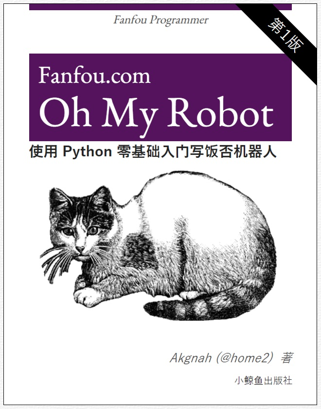

*2017-10-21 20:27 · 手机上网 转自home2*

---

### 3722

如果你能看到20年后世界的一个截图，但是看不到从此刻到20年后的整个过程，是福是祸还真不好说。

*2017-10-21 19:24 · iPhone版*

---

### 3723

造车的厂和造机器人的厂有多大区别？

*2017-10-21 12:01 · iPhone版*

---

### 3724

居然连 fukuoka 福冈这种小地方都上榜了… 转@ webto 日本智囊森大厦株式会社创立的老牌都市研究机构「森記念財団都市戦略研究所（東京）」于10月12日发布2017年「全球都市综合实力指数（GPCI）报告」

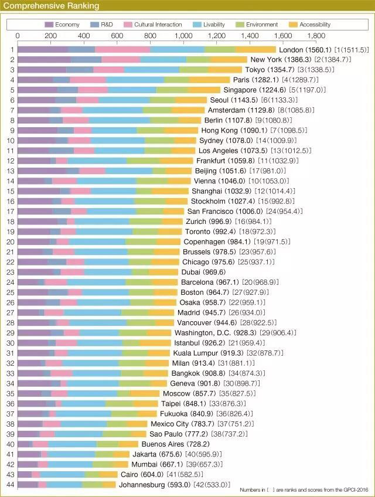

*2017-10-21 09:26 · 手机上网 转自webto*

---

### 3725

更加理解为什么美国科技媒体对中国科技公司的报道很稀疏了，因为中国科技媒体也不爱报道东南亚的科技公司。昨天sea（原名garena）在美国上市可是东南亚互联网行业的里程碑，有史以来第一个大的退出，市值超过50亿美元。

*2017-10-21 09:11 · iPhone版*

---

### 3726

昨晚参加朋友聚会，一边跟人讨论养猪，一边跟人讨论造车。

*2017-10-21 07:50 · iPhone版*

---

### 3727

有时一恍惚，我会把隔壁楼顶的灯箱「施耐德电气」看成「施耐庵电气」。

*2017-10-20 18:34 · 手机上网*

---

### 3728

AlphaGo Zero 还是挺震撼的。相比之下，几千年来的人类围棋手们都太可怜了。

*2017-10-19 22:39 · iPhone版*

---

### 3729

北京这两天真是气温回升了，都到了炎热的程度了。

*2017-10-19 19:43 · iPhone版*

---

### 3730

synonymia

*2017-10-18 16:13 · iPhone版*

---

### 3731

猛将兄！转@ gravity0 那位用四十二天把摩拜单车从成都骑到拉萨的老兄真猛。除了车重还没有行李架，大背包压在肩上脊椎受力不说，关键是呼吸困难啊。

*2017-10-18 09:50 · 手机上网 转自gravity0*

---

### 3732

从晚饭后的瞌睡中恢复过来了，可以清醒的参与晋升答辩了。

*2017-10-17 20:07 · iPhone版*

---

### 3733

我今天洗手时有点兰花指，因为中指上贴了块邦迪。

*2017-10-17 15:20 · iPhone版*

---

### 3734

某种意义上，现代社会的财富是高度分散的。新的中国首富许家印个人资产2900亿，听起来是个天文数字，其实也就相当于望京几个小区的房产总值，离「富可敌国」差着十万八千里。

*2017-10-16 18:14 · iPhone版*

---

### 3735

不知道为什么，有些老外说 thank you 给我的感觉跟说 fuck you 差不多。

*2017-10-16 17:23 · iPhone版*

---

### 3736

没有宗教信仰的人是否真的能理解有宗教信仰的人？我一直有这个疑问。

*2017-10-16 16:05 · iPhone版*

---

### 3737

今天穿的这条新裤子有点怪，裤头纽扣和裤裆拉链的开口是向左，和我以前穿的所有裤子都相反。难道是照顾左撇子的裤子？

*2017-10-16 15:45 · iPhone版*

---

### 3738

伦敦的建筑塔吊很多，北京更多。

*2017-10-16 12:17 · 手机上网*

---

### 3739

北京人口两千来万。听说公共场合已经布了两百万个摄像头。

*2017-10-15 23:33 · iPhone版*

---

### 3740

@ LinChiSin 也不准确。technology 这个概念差不多从人类有文明起

就有，science 这概念则是最近几百年的事。

*2017-10-15 14:32 · 手机上网 给LinChiSin的回复*

---

### 3741

我有不同看法：技术是technique, 科技是technology，两者有关联但不是一回事。转@ musiccow 翻译成科技是错误的，就是技术，不必带上科学 转@ 王兴 其实科技 technology 并不是科学技术的缩写，而是一个独立的概念。

*2017-10-15 14:00 · 手机上网 转自王兴*

---

### 3742

其实科技 technology 并不是科学技术的缩写，而是一个独立的概念。

*2017-10-15 12:16 · iPhone版*

---

### 3743

哈尔滨工业大学（简称哈工大）的英文竟然是 Harbin Institute ofTechnology ，这是哈尔滨科技大学啊……

*2017-10-15 10:15 · iPhone版*

---

### 3744

世界上拥有最多热带雨林的国家依次是：巴西、刚果、印尼。

*2017-10-15 08:31 · iPhone版*

---

### 3745

北京有一段时间还思想蛮开放的，允许企业冠名路桥的名字，例如联想桥、四通桥、长虹桥等。

*2017-10-14 13:28 · iPhone版*

---

### 3746

智能眼镜目前看来短期不太靠谱，智能耳机没准能玩出花样来。

*2017-10-13 14:55 · iPhone版*

---

### 3747

国际歌我就没那么溜了。转@ 王兴 国歌我还是唱得很熟的。

*2017-10-13 12:58 · 手机上网 转自王兴*

---

### 3748

国歌我还是唱得很熟的。

*2017-10-13 10:45 · iPhone版*

---

### 3749

什么，公鸡是没有鸡鸡的，公鸭才有鸡鸡？同是禽类，竟然生理差异这么大！

*2017-10-12 23:13 · 手机上网*

---

### 3750

怎么感觉乱七八糟的。转@ 童颜. 其實香港也是一周六天 這就是為什麼如果節日是在週六 就不會補休 但是在週日 那麽週一就會放假 請參考今年的國慶節 @ 摩诃 @ 王兴 爸爸窜访乌兹别克斯坦回来，觉得这个国家还蛮有前途的，像十五二十年前的福建。那里的人都是一周工作六天的。

*2017-10-12 22:10 · 手机上网 转自王兴*

---

### 3751

原来盖茨的名字也这么复杂啊。转@ 不宜红粉 William H. Gates III转@ 王兴 跟一个世界500强的 CEO 吃饭，他爸叫 xxx y. zzz，他叫xxx y. zzz jr.，他儿子叫 xxx y. zzz III。这样起名倒也简单。

*2017-10-12 20:31 · 手机上网 转自王兴*

---

### 3752

跟一个世界500强的 CEO 吃饭，他爸叫 xxx y. zzz，他叫 xxx y. zzzjr.，他儿子叫 xxx y. zzz III。这样起名倒也简单。

*2017-10-12 20:01 · 手机上网*

---

### 3753

是的！我的左脚比右脚略大。转@ 秋日夏娃 而且两只脚都适合也不

容易。 转@ 王兴 想买合脚的皮鞋真是好难的事。国庆期间我买了两双，都是在店里现场试过的，回来穿了几天，发现一双买大了，另一双买小了:(

*2017-10-12 15:10 · 手机上网 转自王兴*

---

### 3754

这个说法已被辟谣。转@ 邓范鑫 1994年前后，中美入世谈判最艰难的时刻，美方突然向中方提出：在全世界都实行双休日的今天，中国必须尊重**，也给中国人双休日，并把这一项作为入世条件之一。

1995年5月1日后起我国开始实行双休日工作制。

*2017-10-12 14:35 · 手机上网 转自王兴*

---

### 3755

开玩笑吧？转@ WindFury 韩国也是一周六天，转@ 王兴 还有这等事？我记得改双休早很多吧。转@ 摩诃 中国有双休是因为加入世贸组织的条件之一「@ 王兴 爸爸窜访乌兹别克斯坦回来，觉得这个国家还蛮有前途的，像十五二十年前的福建。那里的人都是一周工作六天的。」

*2017-10-12 14:23 · 手机上网 转自王兴*

---

### 3756

想买合脚的皮鞋真是好难的事。国庆期间我买了两双，都是在店里现场试过的，回来穿了几天，发现一双买大了，另一双买小了:(

*2017-10-12 14:15 · 手机上网*

---

### 3757

世界观确实对长期决策有巨大影响。

*2017-10-12 10:55 · iPhone版*

---

### 3758

还有这等事？我记得改双休早很多吧。转@ 摩诃 中国有双休是因为加入世贸组织的条件之一「@ 王兴 爸爸窜访乌兹别克斯坦回来，觉得这个国家还蛮有前途的，像十五二十年前的福建。那里的人都是一周工作六天的。」

*2017-10-12 10:51 · 手机上网 转自王兴*

---

### 3759

乌兹别克斯坦被称为中亚的心脏，虽然面积远不如哈萨克斯坦，但是拥有中亚接近一半的人口。首都塔什干是中亚第一大城市，在苏联解体时是前苏联第四大城市。

*2017-10-12 09:10 · iPhone版*

---

### 3760

爸爸窜访乌兹别克斯坦回来，觉得这个国家还蛮有前途的，像十五二十年前的福建。那里的人都是一周工作六天的。

*2017-10-12 08:49 · iPhone版*

---

### 3761

经济一变差，圣经的印刷量就上升，一个大牌跨国印刷企业（就是给苹果印 iPhone 包装盒那家了）的人告诉我。

*2017-10-11 18:04 · iPhone版*

---

### 3762

原来 trafalgar 这个地名是从阿拉伯语来的（因为西班牙南部曾被穆斯林统治数百年），难怪有点拗口。转@ 王兴 呃，trafalgar 的中文翻译不是 特拉法加尔 而是 特拉法尔加 。

*2017-10-11 16:57 · 手机上网 转自王兴*

---

### 3763

时差还是挺烦人的，刚才面试人的时候打了几次瞌睡，很不礼貌:-(

*2017-10-11 16:34 · iPhone版*

---

### 3764

昨晚凌晨三点就醒了，大概是因为倒时差。迷迷糊糊躺到6点半起床。

*2017-10-11 06:58 · iPhone版*

---

### 3765

呃，trafalgar 的中文翻译不是 特拉法加尔 而是 特拉法尔加 。

*2017-10-10 15:55 · 手机上网*

---

### 3766

同时留下一句被认为代表国民性的金句：England expects that everyman will do his duty. 转@ 王兴 最光辉的军事生涯莫过于在壮年时以创新的战术指挥打赢了帝国崛起过程中最关键的一个战役但自己战死其中。这就是特拉法加尔广场纳尔逊海军上将铜像

*2017-10-10 15:53 · 手机上网 转自王兴*

---

### 3767

最光辉的军事生涯莫过于在壮年时以创新的战术指挥打赢了帝国崛起过程中最关键的一个战役但自己战死其中。这就是（莫种意义上的伦敦市中心）特拉法加尔广场那根最高的大柱子顶上纳尔逊海军上将铜像的由来。

*2017-10-10 15:44 · iPhone版*

---

### 3768

厉害！beta里颇有一些城市我都不知道是在哪里。转@ 开始新生活的猕猴桃 感觉一直到Beta里没去过的已经屈指可数了，基本上都是一人独行看遍的。所以，世界很美，但是我已经对一个人再看这个世界失去了兴趣。RT@ 王兴 看了一下最新的2016版GaWC

*2017-10-10 15:05 · 手机上网 转自王兴*

---

### 3769

罗马城虽然遍地是文物，但给人的感觉更多是死的历史，伦敦则是活的历史。

*2017-10-10 14:30 · iPhone版*

---

### 3770

@ 小熊娃娃 我上回贴的是上一版（2012版），有一个区别是悉尼从原来的 alpha+ 掉到 alpha 去了。柏林排那么后面我觉得不太合理。

*2017-10-10 14:12 · 手机上网 给小熊娃娃的回复*

---

### 3771

看了一下最新的2016版 Globalization and World Cities (GaWC) ，对前十名里最后一个我还没去过的城市充满期待，但我要努力降低期望值，毕竟 alpha+ 和 alpha++ 还是无法完全相提并论的。

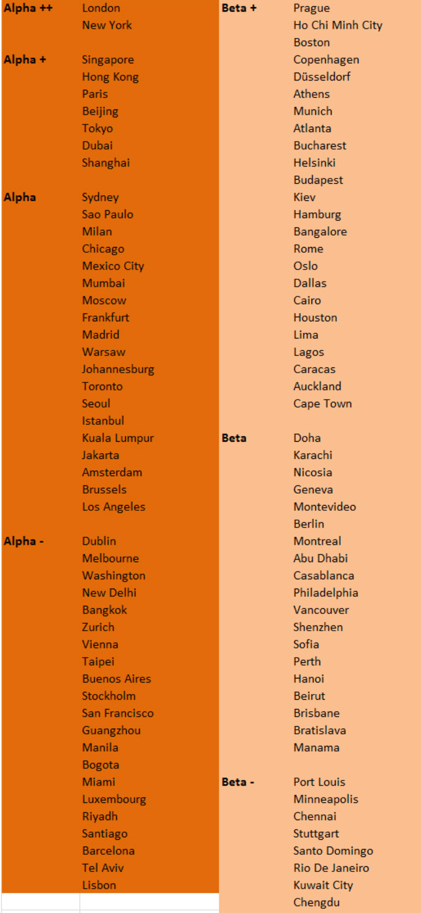

*2017-10-10 13:24 · 手机上网*

---

### 3772

爸爸从伦敦飞乌兹别克斯坦坐的是土耳其航空，去伊斯坦布尔转机。

看来土耳其在中亚确实有影响力。

*2017-10-10 12:59 · 网页*

---

### 3773

伦敦既是英国的代表，又不代表英国。说前者是因为伦敦是靠大英帝国数百年基业的支撑和积累才能有今日之辉煌；说后者是伦敦在英国太一枝独秀，其他地方望尘莫及，没有可比性。

*2017-10-10 12:55 · 网页*

---

### 3774

伦敦不愧是顶级城市。北京上海还有很长很长的路要走。

*2017-10-10 12:51 · 网页*

---

### 3775

朋友送的据说开过光的月饼里的宣传页。

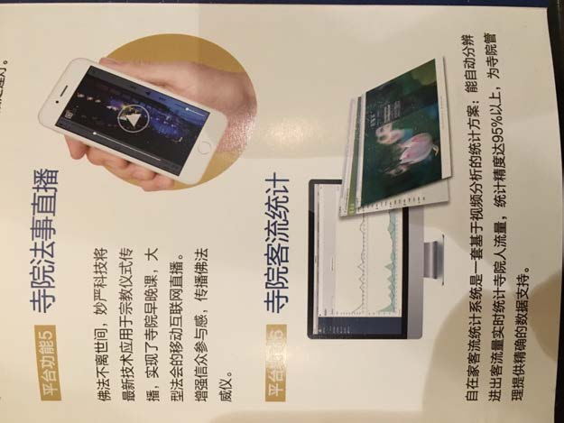

*2017-10-10 00:22 · 猫饭*

---

### 3776

不知不觉中我形成一个认知：意大利的皮鞋适合夏天，英国的适合冬天。

*2017-10-08 23:37 · iPhone版*

---

### 3777

这是我见过的长得最像格斗工具的牛排刀。

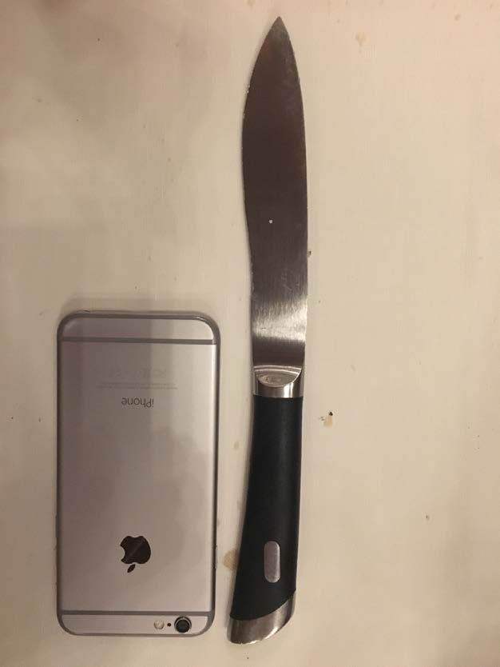

*2017-10-08 05:26 · 猫饭*

---

### 3778

参观了五个后厨：汉堡、披萨、烤鸡、印度餐、泰餐。泰餐看起来和中餐很最像，大厨也颠锅，也有一团火焰腾起。

*2017-10-08 01:39 · iPhone版*

---

### 3779

鞋可以分成两种，适合穿着上战场的，和其它。

*2017-10-07 23:00 · iPhone版*

---

### 3780

这是我见过的最体贴的电梯：开门键和关门键平时都是暗灯的，当开始关门时，开门键会自动亮灯，我理解是为了方便想要阻止关门的人最快的找到按钮。

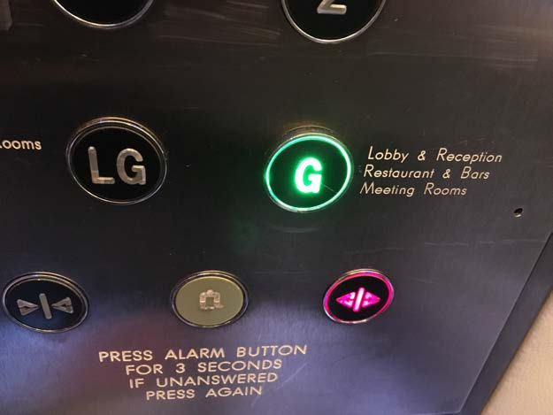

*2017-10-07 17:17 · 猫饭*

---

### 3781

看完《歌剧魅影》，爸爸又跟我回忆起他小时候：那时爷爷是我们本地剧团的编剧兼导演，每天晚上演出时都把爸爸安排在前排，希望他能耳濡目染学一些，可怜爸爸那时正是十二三岁的多动少年，白天各种折腾，到了晚上坐在那里一小会儿就睡着了，只记得每次被剧中一声响锣从梦里惊醒…

*2017-10-07 07:09 · iPhone版*

---

### 3782

可能是我见过的形状最简洁的牛排刀。

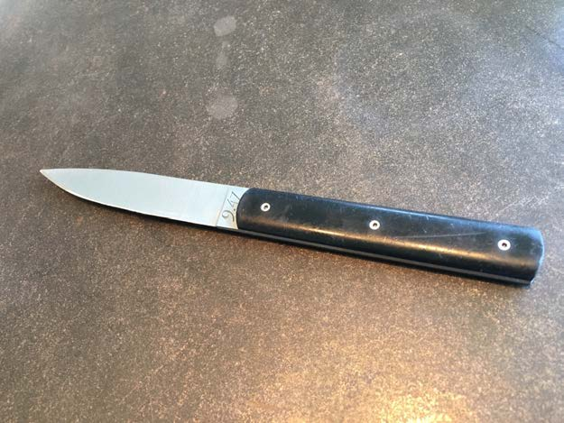

*2017-10-07 01:41 · 猫饭*

---

### 3783

上高楼 the shard 去吃顿饭顺便从高处看看伦敦城，脑补了一下大黄鸭在泰晤士河里的景象。

*2017-10-06 21:23 · iPhone版*

---

### 3784

稍微翻了一下伦敦历史，原来伦敦保持这种大工地状态已经至少三四百年了，尤其是1666年（牛顿差不多大学毕业时）全城大火之后，几个有识之士做了新的规划。但是伦敦不像巴黎那么依赖大一统的规划，而是更多靠野蛮生长。

*2017-10-06 19:02 · 手机上网*

---

### 3785

我估计，每年的诺贝尔文学奖得主都会是个我从没听过的作家，除非哪年真的村上春树了。

*2017-10-06 05:04 · iPhone版*

---

### 3786

我说英国下午茶的起源是1840年前后安娜罗素公爵夫人发明用来在午饭和越来越晚的晚饭之间填一填肚子，爸爸表示完全能够理解：以前在农村，六七月农忙割稻子时，我们也要在下午加一顿凉稀饭，不然扛不住那么长时间高强度的体力劳动。

*2017-10-06 00:44 · iPhone版*

---

### 3787

转: We are what we remember.

*2017-10-05 20:50 · 手机上网*

---

### 3788

伦敦是一个恰到好处的大工地，既有足够多的新楼在建以便保持城市的活力并为将来留下这个时代的印记，又不至于影响人们享受目前的城市，也就是过去所有世代累积的成果。

*2017-10-05 19:45 · iPhone版*

---

### 3789

尤其是当白云间还穿插着三四条飞机刚飞过留下的白色长尾时。转@王兴 蓝天衬托下快速移动的朵朵白云让人更加觉得这个城市充满活力。

*2017-10-05 17:17 · 手机上网 转自王兴*

---

### 3790

蓝天衬托下快速移动的朵朵白云让人更加觉得这个城市充满活力。

*2017-10-05 17:08 · iPhone版*

---

### 3791

1863年，这边太平天国还在闹着，那边伦敦已经开通了全世界第一条地铁。

*2017-10-05 05:16 · iPhone版*

---

### 3792

在大英博物馆里，导游介绍到亚述王朝的 nineveh 尼尼微城时，爸爸突然说现在伊拉克还有个省叫尼尼微。我打开谷歌地图一查，还真有。

*2017-10-04 18:34 · iPhone版*

---

### 3793

内模外范。

*2017-10-04 17:36 · 网页*

---

### 3794

框架结构的建筑每平米消耗120公斤水泥（指毛坯，不包括装修），2017年上半年全国水泥平均价格约每吨350元，所以每平米的房价里只有42元是花在水泥上，几乎可以忽略不计。

*2017-10-04 02:14 · iPhone版*

---

### 3795

长途车上，爸爸突然对我说，你帮我的 iPhone 装个谷歌吧，难得在国外这几天可以用…

*2017-10-04 00:55 · iPhone版*

---

### 3796

爸爸说东南亚橡胶园的工人每天出去干活时都带两把刀，一把刀用来割橡胶，另一把刀用来被毒蛇咬了时把自己的手砍断！我不知道他哪里听来这些乱七八糟的东西-_-!

*2017-10-03 19:47 · iPhone版*

---

### 3797

我知道在战场上打败拿破仑的是英国的威灵顿公爵和俄国的库图佐夫，我不知道当时拿破仑麾下的大将名字，也不知道当时英国和俄国是哪个君主当政。很明显的错位。

*2017-10-02 20:53 · 手机上网*

---

### 3798

牛津真的有牛。

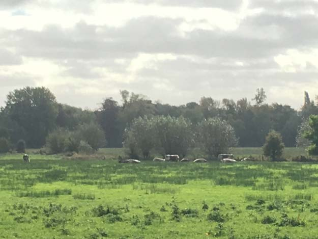

*2017-10-02 19:21 · 猫饭*

---

### 3799

把我的 iPhone 升级到 iOS 11 了。视觉上变化不小，需要适应一下。

*2017-10-02 04:33 · iPhone版*

---

### 3800

@ 颜廷旭 螃蟹真的很好吃啊。不管是大闸蟹还是梭子蟹。

*2017-10-01 19:07 · 手机上网 给颜廷旭的回复*

---

### 3801

爸爸说，全世界水泥最便宜的国家是中国，全中国水泥最便宜的省是福建。我没去核实。

*2017-10-01 16:02 · iPhone版*

---

### 3802

伦敦是我见过的街头雕塑最多的大城市。

*2017-10-01 05:31 · iPhone版*

---

### 3803

听说爸爸已经改了自己的机票，去完英国后不跟我们一起回北京，而是要独自降到塔什干机场去考察乌兹别克斯坦的水泥市场。我惊呆了……

*2017-09-29 12:58 · 手机上网*

---

### 3804

中国相比好莱坞的优势是有西游和三国这种几乎挖掘不尽的IP宝库，拍电影做游戏都很方便。红楼梦怎么做游戏好像绕一点，总不能做成日本《同级生》那样吧。转@ 王兴 鬼吹灯系列对应好莱坞的印第安纳琼斯，战狼对应第一滴血，007类型还有待发掘，谍影重重估计在中国不太可行，速度与激情没准可以学

*2017-09-29 12:13 · 手机上网 转自王兴*

---

### 3805

musk个人强；thiel团队强，他这个德裔犹太人加上max levchin这个乌克兰犹太人再加上luke nosek这个波兰裔犹太人真是战斗力爆棚。@geeknow Elon其实本身对纯互联网兴趣不最大 不然还是干的过Peter？ 转@ 王兴 这么多互联网合并案里，最有意思的

*2017-09-28 22:10 · 手机上网 转自王兴*

---

### 3806

终于正式发文了：朝鲜实体或个人在中国境内设立的中外合资经营企业、中外合作经营企业、外资企业应自联合国安理会第2375号决议通过之日起120天内关闭。转@ 王兴 出于对朝鲜局势的担忧，我决定尽快去北京正宗的朝鲜餐厅吃一顿，在传说中的朝鲜姑娘撤走之前。

*2017-09-28 17:43 · 手机上网 转自王兴*

---

### 3807

赞。转@ 潘 冒个泡。2016年的目标我在2017年做到了，而且超过了原定目标。更好的是我掌握了控制体重的正确方法。转@ 潘 2016的一个重要目标是回到65kg。。。

*2017-09-28 17:41 · 手机上网 转自潘*

---

### 3808

这么多互联网合并案里，最有意思的还是98年底confinity和x.com合并成为paypal。两边领队的都是天纵奇才，一边是elon musk，另一边

是peter thiel。棋逢对手，只好合并求生。即便合并，再加上麾下一众战神，也只是跟职业经理人带领的ebay将将打个平手。

*2017-09-28 15:43 · 网页*

---

### 3809

@ 熊阿姨 啊，可惜没现场打个招呼。那个关于饭否的问题不会是你问的吧。

*2017-09-27 21:58 · 手机上网 给熊阿姨的回复*

---

### 3810

鬼吹灯系列对应好莱坞的印第安纳琼斯，战狼对应第一滴血，007类型还有待发掘，谍影重重估计在中国不太可行，速度与激情系列没准可以学一下。

*2017-09-27 17:46 · iPhone版*

---

### 3811

据说是在1905.9.27，爱因斯坦发表了E=mc²

*2017-09-27 16:43 · iPhone版*

---

### 3812

现在全世界市值最高的三家公司（苹果、谷歌、微软）正好是那三家拥有主流操作系统的公司。这应该不是巧合吧。

*2017-09-27 16:07 · iPhone版*

---

### 3813

看到一个朋友的名字「庆」按香港的粤语发音译成 Hing，想起在我们家乡方言龙岩话里我的「兴」字发音也是 Hing，我们家里长辈叫我Hing Na (大概相当于「兴儿」吧）。

*2017-09-27 14:30 · iPhone版*

---

### 3814

中国尊这楼确实高出北京其他所有建筑太大一截。将来在顶上俯瞰北京城应该很棒。

*2017-09-27 13:55 · iPhone版*

---

### 3815

一大早被印度人晃点了:(

*2017-09-27 11:26 · iPhone版*

---

### 3816

刚才出门发现我们公司楼下停了一辆劳斯莱斯。这什么情况？

*2017-09-26 22:32 · iPhone版*

---

### 3817

当创业公司CEO是压力蛮大的，但我觉得好过这份工作：钻进大象肛门，按摩大象前列腺来帮它自慰以避免它发情过度造成破坏。

*2017-09-25 16:47 · 手机上网*

---

### 3818

转@ 洋鸟消夏录 台词 “我们是平川中央法警队工作人员 今天奉命对你执行死刑 我们保证文明执法 希望你能很好地配合一下 下面 咱们练习几个动作”

*2017-09-25 16:23 · 手机上网 转自洋鸟消夏录*

---

### 3819

我一直记得我的身高是175，但是最近几年体检都给我写176点几，莫非我后来真的又长高一厘米了？

*2017-09-25 13:37 · iPhone版*

---

### 3820

河北是个沿海省份，但是通常我想起沿海省份时不会想起它。

*2017-09-24 23:57 · 手机上网*

---

### 3821

如果不是中信这种背景超硬的央企，恐怕没有胆量去建北京第一高楼并起名“中国尊”。

*2017-09-24 19:46 · 猫饭*

---

### 3822

再次坐飞机，翻了一下机上的电影才找到，我忘记名字的那部应该是《伦敦陷落》。转@ 王兴 完了，记性弱爆了，飞机上看了三部电影，刚下飞机就有一部想不起名字了:(

*2017-09-24 16:38 · 手机上网 转自王兴*

---

### 3823

好的科学家都懂科学史吗？好的艺术家都懂艺术史吗？

*2017-09-24 10:56 · iPhone版*

---

### 3824

这个源字的左边看起来像四个点。

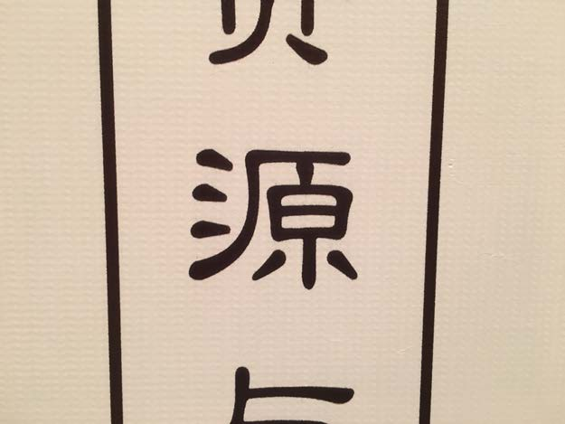

*2017-09-23 21:55 · 猫饭*

---

### 3825

钱颖一院长说他上学时，物理课不叫物理，叫工业基础，化学课不叫化学，叫农业基础-_-!

*2017-09-23 18:21 · iPhone版*

---

### 3826

转@ FlowerShin 转@ 想想是鹿小鹿.Iris. 转@ 凡骨 哈哈哈哈哈哈哈转@ 宇宙超级无敌聪明龙 哈哈哈哈哈哈 转@ 甘木草 转@ 那.谁 转@ 叶一碗 哈哈哈「@ 乱耳朵 转@ 胖三儿. 有些怀念从前车马慢的人，外卖晚到两分钟都要骂娘。」

*2017-09-23 14:15 · 网页 转自胖三儿.*

---

### 3827

哈佛成立才八年，清兵就入关了。转@ 王兴 哈佛大学是在明朝末期成立的。

*2017-09-23 13:54 · 手机上网 转自王兴*

---

### 3828

我有好几条仔裤，但没有一条是买来就有洞的那种。

*2017-09-23 13:46 · 手机上网*

---

### 3829

造一个字和造一个字体，应该都很有乐趣吧。现在似乎不再有造字的可能了，所以只能做一做表情包。

*2017-09-23 12:36 · iPhone版*

---

### 3830

哈佛大学是在明朝末期成立的。

*2017-09-23 09:10 · 手机上网*

---

### 3831

biè说了。转@ 吃飽撐的 来饭否的人，发型趋势都有一个共同点……

【详见右边头像……】 转@ 王兴 金正恩和特朗普这对死对头有个共同点：发型都很有个性。

*2017-09-22 21:22 · 手机上网 转自王兴*

---

### 3832

金正恩和特朗普这对死对头有个共同点：发型都很有个性。

*2017-09-22 21:16 · 手机上网*

---

### 3833

有些焰火确实能让人看得浑身打一个激灵。上上次给我留下印象的焰火就是1999年的五十年国庆夜了。

*2017-09-22 21:01 · iPhone版*

---

### 3834

光衣领就有一字领、八字领和V字领。转@ 孙岩 十字路口、八字胡、丁字裤、人字拖，还有什么？

*2017-09-22 17:43 · 手机上网 转自孙岩*

---

### 3835

居然还有C字裤这种东西！转@ 孙岩 A字裙，C字裤 转@ 柒小斤 一步裙。转@ 孙岩 十字路口、八字胡、丁字裤、人字拖，还有什么？

*2017-09-22 17:00 · 手机上网 转自孙岩*

---

### 3836

美国GDP第一名的州是加州，这一点没什么意外。第二名是……德州。

第三名才是纽约州。

*2017-09-22 11:24 · 猫饭*

---

### 3837

这是我手机里能找到的最早的美团电影（后来改名为猫眼电影）app的截图。日期是2012年2月28日。

*2017-09-22 01:19 · 猫饭*

---

### 3838

转@ 小希_ 我姥爷那时候得了脑血栓，家里人一个都不认识了，但只要有人问他你是不是党员，他都会点头。转@ 王兴 朋友说他那当了一辈子人民教师的父亲两年前脑溢血后一直处于半昏迷状态，叫他「爸爸」没有反应，叫他「周老师」有反应。

*2017-09-21 22:39 · 手机上网 转自王兴*

---

### 3839

vip.com 这个域名在卖给唯品会之前在一个赌场手里。

*2017-09-21 22:20 · iPhone版*

---

### 3840

朋友说他那当了一辈子人民教师的父亲两年前脑溢血后一直处于半昏迷状态，叫他「爸爸」没有反应，叫他「周老师」有反应。

*2017-09-21 21:59 · iPhone版*

---

### 3841

听朋友说，苏黎世机场的安检和别的机场安检一样不允许带小刀（包括瑞士军刀）通过，但是过了安检之后的超市里瑞士军刀可以随便买，也可以随便带上飞机。他说A股也是这样。

*2017-09-21 14:09 · iPhone版*

---

### 3842

think like a dead man ＝ think long term ＋ in the long run weare all dead

*2017-09-21 13:49 · iPhone版*

---

### 3843

听说昨天是犹太新年的第一天 Rosh Hashanah 。打算今天有空时看一下为什么。

*2017-09-21 09:18 · 手机上网*

---

### 3844

比7点半要跟人开早餐会更悲催的是秘书还约错了酒店导致我要蹬15分钟摩拜赶过去:(

*2017-09-21 07:53 · 手机上网*

---

### 3845

一个 VC 朋友说他的表弟前不久把成都的房子卖了跑去老挝想做一个当地的美团，今天老挝政府说要给他们发一个支付牌照了。

*2017-09-20 22:31 · iPhone版*

---

### 3846

Biljoonan Dollarin Bisnes 这个芬兰词组的意思我觉得我能猜出来。

*2017-09-20 18:07 · iPhone版*

---

### 3847

一碗热干面，一个茶叶蛋。

*2017-09-20 13:02 · iPhone版*

---

### 3848

秋夜凉，走出挤了一屋人开了一天投影仪的会议室才感觉到。

*2017-09-18 23:13 · 手机上网*

---

### 3849

有一点伏拉斯吹踢德。

*2017-09-18 20:17 · iPhone版*

---

### 3850

今天开会时尝了同事带来的陈皮普洱，是把普洱塞进一个掏空的青柑做成的。

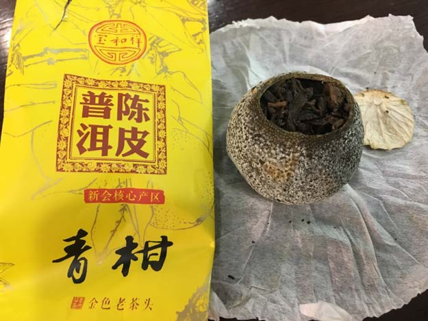

*2017-09-18 15:16 · 猫饭*

---

### 3851

这就是为什么虽然曾经有媒体试图诱导我讲苦大仇深的故事但我却非常真诚的告诉他们我觉得中国的创业环境并不算太坏。转@ 小熊娃娃看到一个以前的新闻说“印度占星行业竞争激烈 两大占星家族买凶杀对方”，什么玩意儿啊……

*2017-09-18 08:53 · 手机上网 转自小熊娃娃*

---

### 3852

转@ 小熊娃娃 两个中国最好的潜水员，在唐山潘家口水库进行水下长城测绘时失踪，推测是当地非法电鱼的渔船给电死的，而且可能发生在只有3米深度减压的时候……真特么全程槽点。

*2017-09-18 08:51 · 手机上网 转自小熊娃娃*

---

### 3853

如果马克思还在世时职业体育赛事就如此发达，他一定会指出这是给劳动人民的另一种精神鸦片。

*2017-09-17 20:21 · iPhone版*

---

### 3854

Peter Sarstedt 的《Where Do You Go To My Lovely》前三分之二歌词简直是装逼指南（其中有些概念我至今也没搞明白），但最后却话锋一转讲了一个完全不一样的故事，是励志还是凄凉，那就见仁见智了。

*2017-09-17 20:16 · iPhone版*

---

### 3855

不列颠空战中，英德双方都大大地高估了他们击落的对方飞机的数量。这些数字在战后被调整到了更加符合实际的水平…最近提出的一份可靠的估计是，英国损失了1547架飞机，纳粹德国则损失了1887架飞机。看来，高水平对决时，谁也不比谁高明太多，就看谁家底更厚，谁更铁了心。

*2017-09-17 04:48 · iPhone版*

---

### 3856

刚知道，天气好的时候，英吉利海峡是可以站在一边看到另一边的。

*2017-09-17 04:33 · iPhone版*

---

### 3857

Never was so much owed by so many to so few. 丘吉尔真是语言大师。

*2017-09-17 04:22 · iPhone版*

---

### 3858

转@ 洋鸟消夏录 收到一位同学的say hi邮件 想起有次他在班上说想找兼职拍gayporn video 老师同学七嘴八舌为他建言献策 哪家很老土哪家最火新手没竞争力的 我在现场感到了有史以来较深重的一波culture shock 后来听细了他是要去做摄像 嗯 另一波shock

*2017-09-16 14:49 · 手机上网 转自洋鸟消夏录*

---

### 3859

老外跟我说中国有个叫 country garden 的地产商做得很大，我琢磨了一下才反应过来是说碧桂园。

*2017-09-16 13:57 · iPhone版*

---

### 3860

和一个黎巴嫩朋友（谷歌工号个位数）约在 blue bottle coffee, 一见面他就说这回他请客，因为他投资的一个母基金投资的一个基金刚卖掉了他们持有的美团股票的一部分刚把钱分给他。

*2017-09-16 06:33 · iPhone版*

---

### 3861

除了二十几年前跟我爸在池塘里钓非洲鲫鱼那次，这是我第一次正儿八经尝试钓鱼，fly fishing，钓了两条本地鳟鱼(Yellow StoneCutthroat)，都放回溪里去了。

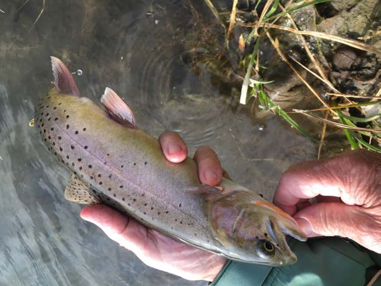

*2017-09-15 14:34 · 猫饭*

---

### 3862

一个朋友说他1994年加入这个1922年创办的机构时，创始人还时不时来公司……

*2017-09-15 13:53 · iPhone版*

---

### 3863

转@ 寒小梦 党员捐款。我想着我意思意思200好了。。看到名单。。

我慌了。还好我没说50。。

*2017-09-15 10:41 · 手机上网 转自寒小梦*

---

### 3864

对哦，断背山在这个州。转@ 您大爷 因为大家都去断背山了。。。

「@ 王兴 Wyoming 是美国人口最少的州。全州一共50万人。」

*2017-09-15 08:58 · 手机上网 转自王兴*

---

### 3865

Wyoming 是美国人口最少的州。全州一共50万人。

*2017-09-15 08:31 · 手机上网*

---

### 3866

开完会一起骑马时看到：elks, white tail deers, prong antelopes,coyotes.

*2017-09-15 02:07 · iPhone版*

---

### 3867

怀俄明 Wyoming 这个州的边界是四条直线，在地图上构成一个完美的长方形。

*2017-09-14 21:18 · iPhone版*

---

### 3868

转@ Amy的 迷而不返者惑。很多管理者努力的培养一个团队，但战斗力提升的很缓慢，于是非常没有成就感也很困惑。其实跳出来看，把招聘质量提起来，就事半功倍。

*2017-09-14 21:13 · 手机上网 转自Amy的*

---

### 3869

完了，记性弱爆了，飞机上看了三部电影，刚下飞机就有一部想不起名字了:(

*2017-09-14 03:58 · iPhone版*

---

### 3870

不得不说，《速度与激情》系列的编剧还挺能折腾的，都拍到第八集了还有各种新桥段。

*2017-09-14 03:37 · iPhone版*

---

### 3871

这工作好有趣！转@ 阳升 naming things

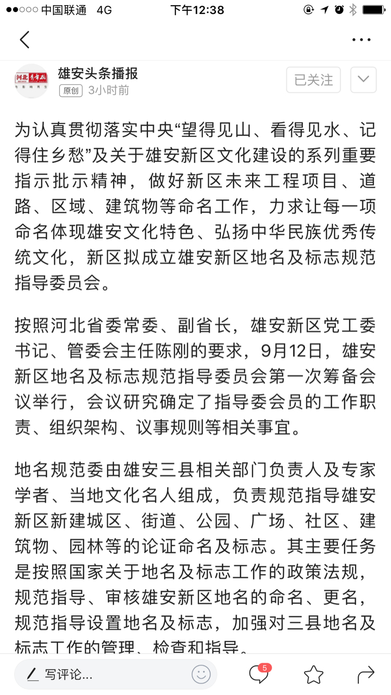

*2017-09-13 15:55 · 手机上网 转自阳升*

---

### 3872

问：过去一年，你所在的行业最大的变化是什么?张轲：我觉得建筑行业最好的变化就是慢下来了，因为经济慢下来了，所以整个行业慢下来了，而慢下来对建筑创作来说是一件非常好的事，因为我一直在说，建筑师不是魔术师，好的建筑不是变出来的，当然更不是抄出来的，是要花时间琢磨和一点一点做出来的。

*2017-09-13 15:46 · 手机上网*

---

### 3873

机场偶遇一个投资行业的老相识，真皮 LV 斜挎包上用快挂挂了一支亮蓝色 RYDER 铝合金求生哨。

*2017-09-13 14:21 · iPhone版*

---

### 3874

中文说白人、黑人，但不说黄人而是说黄种人。

*2017-09-13 12:48 · 手机上网*

---

### 3875

多谢！果然热心。转@ 热心市民黄女士 安利蘸潮汕特产鱼露 会更鲜美 转@ 王兴 炖猪肚吃的时候不沾酱油，味道就没那么鲜美了。汤还是好的。

*2017-09-13 12:48 · 手机上网 转自王兴*

---

### 3876

炖猪肚吃的时候不沾酱油，味道就没那么鲜美了。汤还是好的。

*2017-09-13 12:34 · iPhone版*

---

### 3877

@ quux 谢谢，但 netflix 跟那三家根本不是一个级别的公司。

*2017-09-13 00:03 · 手机上网 给quux的回复*

---

### 3878

今天穿了一双青灰色的皮鞋。很久没穿这双鞋了，我都不记得上回穿是什么时候了，但我清楚的记得2012年夏天我赶回龙岩老家参加奶奶的葬礼时穿的就是这双鞋，连最后上山下葬时穿的都是这双原本很不适合踩在土上的鞋。

*2017-09-12 15:53 · iPhone版*

---

### 3879

吃了这么多年大枣，第一次碰到枣核齐齐的裂成两半。

*2017-09-12 12:40 · iPhone版*

---

### 3880

转@ Phoenix 还有一个体现天津人民生活智慧的谚语：逛窑子吃豆腐渣，该省省该花花。转@ 东东枪 这句天津谚语当年 @ 地下天鹅绒在饭否说过好像。不过我要没记错的话他说的是“卖淫吃海货，不算不会过”。 转@ 王兴 昨晚吃螃蟹时听一个天津老哥说了句天津谚语，把我惊到了：当当吃海货，

*2017-09-12 12:06 · 手机上网 转自王兴*

---

### 3881

昨晚吃螃蟹时听一个天津老哥说了句天津谚语，把我惊到了：当当吃海货，不算不会过。

*2017-09-12 10:46 · iPhone版*

---

### 3882

转@ Gaia 短暂使用了高德，觉得。。。无用功能，无用推送，无限的小红数字，高德团队是疯了吧。。。我就想用个地图。。。 转@Anata_QQ 我觉得高德好一点 转@ Gaia 求。。。目前几家真是各有各的槽点。。。 转@ 王兴 真把我逼急了自己做一个地图。转@ 扫地老僧 @ 王兴 前一阵

*2017-09-12 00:29 · 手机上网 转自扫地老僧*

---

### 3883

今晚第一次吃烤螃蟹。

*2017-09-11 22:50 · 手机上网*

---

### 3884

如果我的腿有18米长，那散步一小时就可以把五环走一圈了。

*2017-09-11 18:19 · 手机上网*

---

### 3885

转@ 马想 http://sou-yun.com/poetlife... 唐宋诗人游历地图，可以看到哪些诗人到了赤峰承德朝阳哈尔滨转@ 王兴 东北在唐诗宋词里好像很少出现，至少在我读过的古诗词里很少，估计那时大家不往这冰天雪地的荒原跑。只想到一例：九月寒砧催木叶，十年征戍忆辽阳。

*2017-09-11 18:11 · 手机上网 转自王兴*

---

### 3886

今天偶遇一种有趣的包包材质，怎么形容呢，就是像牛皮纸那样的牛皮。

*2017-09-10 19:07 · iPhone版*

---

### 3887

转@ 王兴 每年的今天我都要对自己重复一遍我的高中数学老师任勇在告别时说的话：敬业是最好的尊师。

*2017-09-10 15:06 · 手机上网 转自王兴*

---

### 3888

听说视频编码标准从H.265升级到H.266，主要推进工作是我们隔壁班一个同学做的。

*2017-09-10 14:46 · 手机上网*

---

### 3889

我们班留在国内的同学分布在北京、上海、杭州、南京、东莞，竟然没有深圳，还有一个回了大理。还有一个在日本，为中国电网工作。

*2017-09-10 13:53 · 手机上网*

---

### 3890

清华电子工程系97级无73班一共32人，在美国的有9人：apple,google, facebook, oracle, intel, samsung, matlab各一人（原先在高通总部的俩都回国创业了），只有一个在创业公司，还有一个转行当了美国律师。

*2017-09-10 13:25 · 手机上网*

---

### 3891

我们本科一屋6个人，除了一个去北京电影学院当老师（就是当年全年级成绩第一，这次全班聚会唯一没露面的那个），其他全在创业：两个人一起创业，其他三个各做了一家创业公司。

*2017-09-10 12:56 · 手机上网*

---

### 3892

女辅导员和20年前相比模样变化不大，驻颜有术啊。

*2017-09-10 12:12 · 手机上网*

---

### 3893

无73班入学20周年聚会，北京和湾区两个会场。全班32个人，5个女生，4个在湾区。

*2017-09-10 12:08 · 手机上网*

---

### 3894

羞字里面也有一个羊，美字也有。

*2017-09-10 11:33 · 手机上网*

---

### 3895

奇怪，我刚才在iPad上搜不到。转@ Maksim17 高德搜的到啊，非常清晰明确啊。转@ 王兴 高德的一些交互细节做得还比较用心，但是数据质量也不太行，有些地方还不如百度地图，例如长春的“东北亚国际金融中心”这个大楼，百度搜得到，高德搜不到。这还是长春市政府斜对面的几万平米的大楼呢

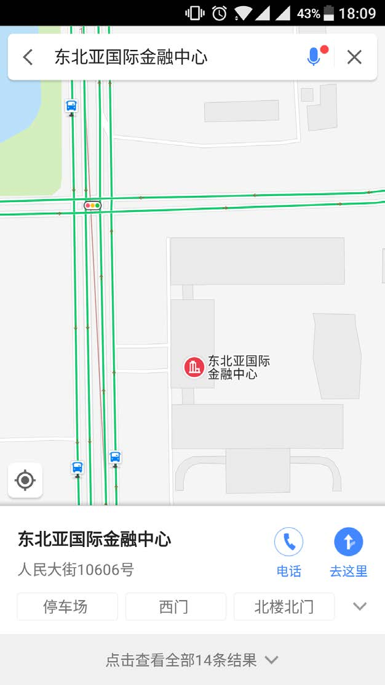

*2017-09-09 18:24 · 手机上网 转自Maksim17*

---

### 3896

高德的一些交互细节做得还比较用心，但是数据质量也不太行，有些地方还不如百度地图，例如长春的“东北亚国际金融中心”这个大楼，百度搜得到，高德搜不到。这还是长春市政府斜对面的几万平米的大楼呢。

*2017-09-09 17:07 · iPhone版*

---

### 3897

3是说保护好小孩吧，别被山猫抓走了。转@ webto 等等，3是什么

RT@ 洋鸟消夏录 遇到山猫怎么办：1后退 2投降 3把比你弱小的推出去 4 if attacked fight back

*2017-09-09 15:57 · 手机上网 转自洋鸟消夏录*

---

### 3898

刚刚意识到，「软妹子」是和「硬汉子」对仗的。

*2017-09-09 14:20 · 手机上网*

---

### 3899

鼎泰丰居然1972年才创建。我还以为更老呢。

*2017-09-09 13:25 · 手机上网*

---

### 3900

在街上偶遇一个骑电动车的大爷，拿着这样一张手绘地图向我问路。

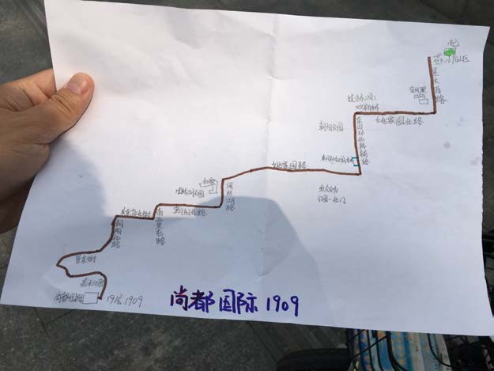

*2017-09-09 12:20 · 猫饭*

---

### 3901

懂行！皖南水乡虽然店面不起眼，但却是我在北京最爱的徽菜馆。转@ onbey 皖南水乡的很正宗，每次去都点一条打包一条回来 转@ 王兴 臭鳜鱼是一道很棒的菜，我一想起来就流口水。

*2017-09-09 12:05 · 手机上网 转自王兴*

---

### 3902

臭鳜鱼是一道很棒的菜，我一想起来就流口水。

*2017-09-09 11:48 · 手机上网*

---

### 3903

糟溜鱼片竟然是一道鲁菜。为什么我以前一直以为是江浙一带的？

*2017-09-09 10:40 · 手机上网*

---

### 3904

真把我逼急了自己做一个地图。转@ 扫地老僧 @ 王兴 前一阵儿打算弃用百度地图，用了圈高德，苹果自带地图，发现百度还是最不烂的

*2017-09-09 10:39 · 手机上网 转自扫地老僧*

---

### 3905

转@ 风雨前行 大连的人民广场以前叫斯大林广场，广场上的苏军战士雕像在薄熙来到大连当市长的时候被拿掉了。改名为人民广场转@王兴 转@ 贾行家 哈尔滨的斯大林公园至今没改名，辖区派出所就叫斯大林街派出所。 转@ 王兴 这么晚才改名？转@ webto 人民大街原来叫斯大林大街，东欧剧变之后

*2017-09-08 23:32 · 手机上网 转自王兴*

---

### 3906

难得遇到一个航班上放《梁祝》。

*2017-09-08 21:24 · iPhone版*

---

### 3907

似乎「新教育」这概念提得比较少。为什么呢？

*2017-09-08 21:19 · iPhone版*

---

### 3908

我一直以为人是慢慢变老的，其实不是，人是一瞬间变老的。——村上春树

*2017-09-08 20:27 · iPhone版*

---

### 3909

转@ 贾行家 哈尔滨的斯大林公园至今没改名，辖区派出所就叫斯大林街派出所。 转@ 王兴 这么晚才改名？转@ webto 人民大街原来叫斯大林大街，东欧剧变之后改名的 RT@ 王兴 走过人民大街和解放大路的十字路口。

*2017-09-08 18:13 · 手机上网 转自王兴*

---

### 3910

各地都有一些叫「XX壹号院」的楼盘吧。

*2017-09-08 16:42 · 手机上网*

---

### 3911

长春的房价只比龙岩略高一点。

*2017-09-08 16:36 · 手机上网*

---

### 3912

转@ 小熊娃娃 最近越来越觉得，不深刻理解二战，就不能理解人类的历史和我们所处的当下，因为当下正是由二战塑造出来的。但正因为这样，很多人知道的都是被利益相关者讲述的历史，也因此认识会扭曲。

*2017-09-08 16:33 · 手机上网 转自小熊娃娃*

---

### 3913

这是专为互联网创业者创作的吗？

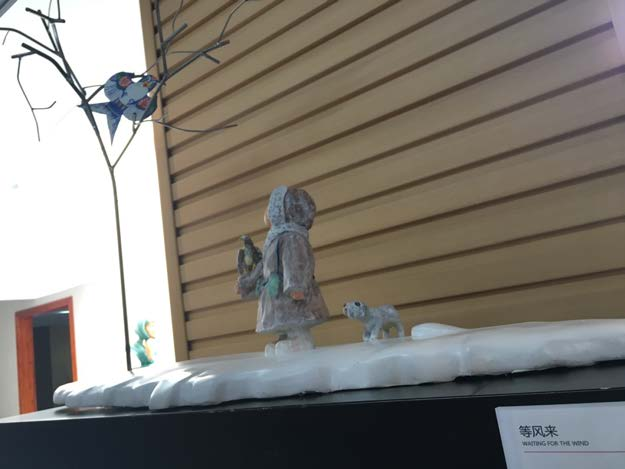

*2017-09-08 14:42 · 猫饭*

---

### 3914

这博物馆有点用力过度。

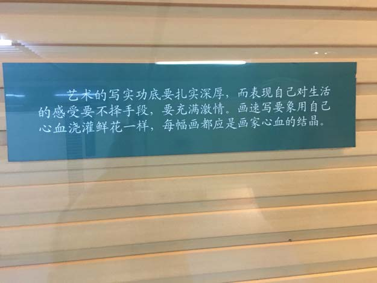

*2017-09-08 14:36 · 猫饭*

---

### 3915

上传了新照片

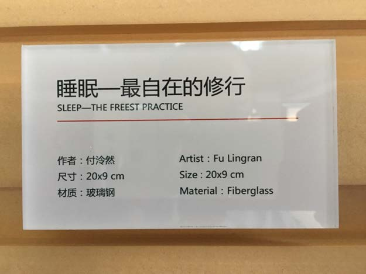

*2017-09-08 14:27 · 猫饭*

---

### 3916

第一次见到艺术作品使用象鼻虫这么小众昆虫的形象。名字也很有趣：大隐于市。

*2017-09-08 14:24 · 猫饭*

---

### 3917

请根据这个名字脑补一下这件雕塑作品的水平。

*2017-09-08 14:06 · 猫饭*

---

### 3918

看二流艺术博物馆比看一流博物馆更需要动脑。觉得一流博物馆里的展品欣赏不了时，我基本就默认是自己水平不行；到了二流博物馆，就需要思考一下到底是自己水平不行还是作品水平不行。

*2017-09-08 14:03 · iPhone版*

---

### 3919

听人介绍：我们这个地方啊，重工业是……烧烤，轻工业是 KTV ！

*2017-09-08 11:01 · 手机上网*

---

### 3920

这么晚才改名？转@ webto 人民大街原来叫斯大林大街，东欧剧变之后改名的 RT@ 王兴 走过人民大街和解放大路的十字路口。

*2017-09-08 10:35 · 手机上网 转自王兴*

---

### 3921

走过人民大街和解放大路的十字路口。

*2017-09-08 10:24 · iPhone版*

---

### 3922

这种情绪好像还蛮有代表性的。转@ biubiuboom @ 王兴 真不喜欢大连被外界列入东北城市，哎。

*2017-09-07 23:42 · 手机上网 转自biubiuboom*

---

### 3923

东北四个主要城市里只有沈阳是传统的中国城市，清兵入关前就当过都城。其他三个（哈尔滨、长春、大连）都只有一百多年历史，是日俄创建的。

*2017-09-07 21:41 · iPhone版*

---

### 3924

哈尔滨虽然之前也有些历史，但繁荣起来是因为正好在俄罗斯的赤塔到海参崴这条线上（既俄国修建的中东铁路）。长春的兴起则是因为在哈尔滨到旅顺港这条线上。

*2017-09-07 21:00 · iPhone版*

---

### 3925

在夜幕中出了山海关。

*2017-09-07 18:51 · iPhone版*

---

### 3926

邻座两个人讲的语言听起来很奇怪。我实在忍不住好奇心，就冒昧的问了一下，是藏语。

*2017-09-07 18:46 · iPhone版*

---

### 3927

百度地图真是烂出高度来了。严肃考虑弃用。

*2017-09-07 17:11 · 猫饭*

---

### 3928

爱是无情的。

*2017-09-07 16:31 · iPhone版*

---

### 3929

听老爸说龙岩的学区房已经卖到每平米一万八了！疯了！

*2017-09-07 13:34 · iPhone版*

---

### 3930

东北在唐诗宋词里好像很少出现，至少在我读过的古诗词里很少，估

计那时大家不往这冰天雪地的荒原跑。只想到一例：九月寒砧催木叶，十年征戍忆辽阳。

*2017-09-07 11:06 · iPhone版*

---

### 3931

十几年前复旦新闻系的朋友说他们在黑板报上自嘲：我是X的一条狗，蹲在X的家门口。X让咬谁就咬谁，让咬几口咬几口。转@ 阳升Forbes的座右铭是The Capitalist Tool。够直白，至少没有哪个中国媒体敢说自己是The Communist/Socialist Tool

*2017-09-07 10:47 · 手机上网 转自阳升*

---

### 3932

我曾经纳闷酒店的洗发水为什么一管就够我用很多次，后来想到可能每次洗头需要的洗发水和头发总长度成正比……

*2017-09-07 00:51 · iPhone版*

---

### 3933

上网查了一下，并没有真的用过这个名字。1948年联合行要改名时，有人提议叫德润，立马被朱德否掉了。转@ 草木刀 原来叫德润 转@王兴 说到按人名命名的公司，华润算半个。华是中华，润是毛泽东的字。

*2017-09-06 23:22 · 手机上网 转自王兴*

---

### 3934

我上一回坐火车去东北时年纪大概是现在的一半。

*2017-09-06 19:26 · iPhone版*

---

### 3935

说到用头像当商标的公司，老干妈（陶华碧）第一个跃入我的脑海。

听说这位大妈进 ICU 已经有段时间了，已有磨拳擦掌的 PE 投资人在附近盘旋。

*2017-09-06 19:25 · iPhone版*

---

### 3936

说到按人名命名的公司，华润算半个。华是中华，润是毛泽东的字。

*2017-09-06 19:10 · iPhone版*

---

### 3937

听说海尔内部都称呼张瑞敏为「张首席」-_-!

*2017-09-06 18:07 · iPhone版*

---

### 3938

刚发布的2018泰晤士高等教育排名里的全球前100（实际102家，因为第100名有3家并列）的国家分布：美国43家遥遥领先；英国12家，加上前殖民地合计占了70家；非洲和南美洲零蛋；中国2家，北大第27名，清华第30名；荷兰竟然有7家。

*2017-09-06 11:50 · 猫饭*

---

### 3939

「天上人间」这个名字其实很有水平，如果叫「人间天堂」就落了俗套。

*2017-09-06 01:29 · 手机上网*

---

### 3940

「天下太平」比「世界和平」更有意境。

*2017-09-06 01:23 · 手机上网*

---

### 3941

如果人生只有900个月，那我已经过了一半。转@ 王兴 人生大概有900个月。

*2017-09-06 00:06 · 手机上网 转自王兴*

---

### 3942

披星戴月也得有个前提：空气质量够好。

*2017-09-05 23:41 · iPhone版*

---

### 3943

悍然决定再泡一泡新茶。

*2017-09-05 22:13 · 手机上网*

---

### 3944

Marc Handl 这老外是被人坑了吧。起了个「劢捍德」这种中文名，我敢赌99%的中国人不认识第一个字。

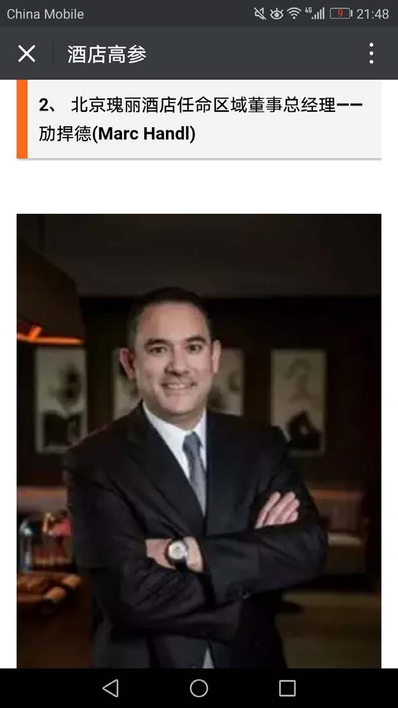

*2017-09-05 21:50 · 手机上网*

---

### 3945

皮底的鞋确实很容易打滑，可能只适合在地毯上走。

*2017-09-05 21:35 · 手机上网*

---

### 3946

人生大概有900个月。

*2017-09-05 21:04 · 手机上网*

---

### 3947

据说是光绪五年左宗棠题给「西海高人」屈臣氏（一个苏格兰医生）

的。

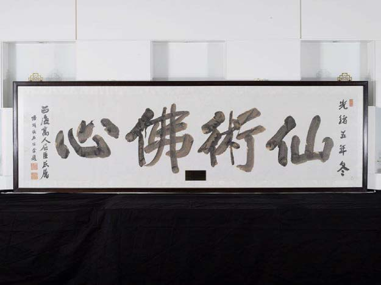

*2017-09-05 11:26 · 手机上网*

---

### 3948

见到两个新词：goodly, worldly.

*2017-09-05 00:13 · 手机上网*

---

### 3949

转@ gravity0 冯诺依曼说：“若人们不相信数学简单，只因他们未意识到生命之复杂”。数学之简单在于其规则有限、自洽，能得出确定答案。数学家很清楚他们领域内外的差别，不怎么对外指手画脚，如同象棋冠军不会去指导战争。其它学科未必有这份自觉，越是只懂简单规则的人越是自信满满。

*2017-09-04 23:39 · 手机上网 转自gravity0*

---

### 3950

这可能是我平生第一次在机场买零食。看到各种口味的橄榄突然就很想尝。

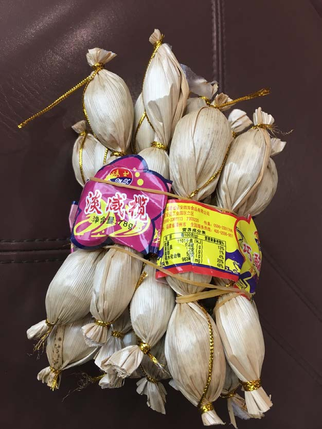

*2017-09-04 20:23 · 猫饭*

---

### 3951

托运行李超重被加收了30元。中国联航这家廉价联航果然抠得比较细。应该的。

*2017-09-04 19:27 · 手机上网*

---

### 3952

听说一个很雷人的事：在大嶝岛修厦门新机场要填海几十平方公里，要一直填到离金门只有一百米-_-! 基建能力强果然怎么都行，不知道金门国军心情如何。

*2017-09-04 19:04 · 手机上网*

---

### 3953

细节不清楚。论规模的话，2020年福建省的 GDP 应该就会超过台湾了。转@ 米那米酱 台湾经济环境怎么样了？ 转@ 王兴 听厦门创业的朋友说，台湾已经非常民粹化而且泛政治化，连上市的科技公司们也会被指认为蓝营或是绿营，从而遭到对方阵营的寻衅或刁难。

*2017-09-04 18:57 · 手机上网 转自王兴*

---

### 3954

想起20年前的 NBA 广告语：I love this game!

*2017-09-04 18:49 · 手机上网*

---

### 3955

听厦门创业的朋友说，台湾已经非常民粹化而且泛政治化，连上市的科技公司们也会被指认为蓝营或是绿营，从而遭到对方阵营的寻衅或刁难。

*2017-09-04 18:46 · 手机上网*

---

### 3956

厦门岛内其实还可以盖很多房子，只要规划合理并且配套跟上，并不会降低原有住户的生活品质，从长远来说因为人口规模更大而带来的聚集效应有助于提升经济活力从而对房价也是好事，但是短期来看增加新房供给会让既得利益者（已在岛内买房的人）觉得受威胁，因此有阻力。据说岛内好几年没新盘了。

*2017-09-04 18:40 · 手机上网*

---

### 3957

用摩拜经典版玩大撒把不是很容易上手，但适应之后我还是能连续骑行好几百米，为了看清这块碑才停下来。

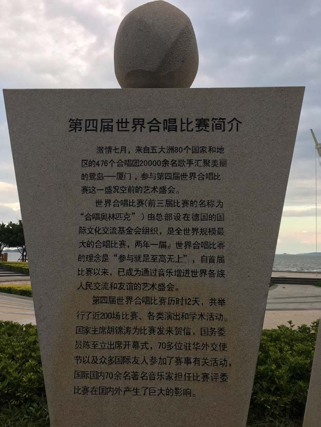

*2017-09-04 17:37 · 猫饭*

---

### 3958

海永远都有声音。

*2017-09-04 17:24 · 手机上网*

---

### 3959

谢谢。是我错了。巴州是巴音郭楞，不是巴音布鲁克；巴音布鲁克在巴州。转@ 有忌也被人用了 是巴音郭楞蒙古自治州转@ 王兴 对对对，巴音布鲁克蒙古自治州驻京办曾经是我最爱的新疆餐厅。转@ 小熊娃娃 @ 王兴 巴音布鲁克

*2017-09-04 16:13 · 手机上网 转自小熊娃娃*

---

### 3960

安德鲁森的老婆饼依然很好吃。

*2017-09-04 15:42 · iPhone版*

---

### 3961

这海面上来来往往都是轮船，我希望看到一片帆。

*2017-09-04 13:54 · 手机上网*

---

### 3962

我想变成一只浮标，在海里飘啊飘。

*2017-09-04 13:51 · 手机上网*

---

### 3963

吃货的英文是 foodie ，两种语言的造词方法差不多。

*2017-09-04 13:09 · 手机上网*

---

### 3964

云的影子。

*2017-09-04 12:41 · 猫饭*

---

### 3965

刚才打着领带穿着西装和长及膝盖的袜子在艳阳下走了七八分钟，想一想就汗。

*2017-09-04 11:59 · 手机上网*

---

### 3966

有两年没吃番石榴了，刚才吃了一个。淡淡的甜。

*2017-09-04 11:15 · 手机上网*

---

### 3967

转@ .rex 河北的水泥厂也是。转@ 西门下雪 我山东也是。 转@ 东东枪 听说因为环保问题，我们家乡一带各类工厂，连服装厂在内，都让关门了。以前有昼伏夜出的，现在是厂门都贴了封条。

*2017-09-04 11:14 · 手机上网 转自东东枪*

---

### 3968

今晚在土豪办公桌上见到一本巨大巨厚的书，厚度差不多是矿泉水瓶的高度，每页面积接近半平米，据说重达80斤。全彩页，据说中国所有正经佛教寺庙都收录其中。书名好像是《中华佛教两千年》。

*2017-09-04 01:58 · iPhone版*

---

### 3969

下午试了一下新的鼓掌方法，以往我是右手在上，现在换成左手在上。

*2017-09-03 17:50 · iPhone版*

---

### 3970

这么一大筐红毛丹。那我就不客气了。

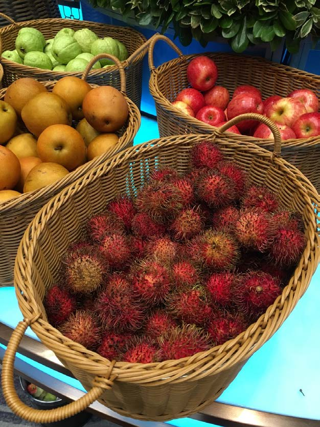

*2017-09-03 16:51 · 猫饭*

---

### 3971

这名字过目难忘。

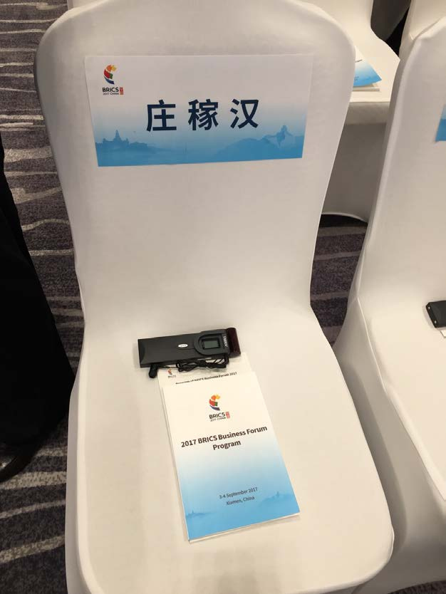

*2017-09-03 14:24 · 猫饭*

---

### 3972

厦门岛和厦门海沧之间的鼓浪屿、大屿，厦门海沧和漳州港尾之间的下鸡屿、海门岛以及厦漳大桥，在康莱德38层的大堂都可以看得很清楚。今天还不算空气特别好能见度特别高的日子。

*2017-09-03 11:01 · iPhone版*

---

### 3973

我爱我的同事们。他们中有些人让我觉得如果不更加努力工作都不配和他们做同事。

*2017-09-03 04:24 · iPhone版*

---

### 3974

Leonard Cohen 的歌少有不涉及男女之情的。

*2017-09-03 04:20 · iPhone版*

---

### 3975

转：《敦刻尔克》的背景音乐一流，但在影院当你闭上眼睛，你以为是在《盗梦空间》中《星际穿越》；看来每个人讲故事、卖东西、忽悠人都有各的固定套路。

*2017-09-03 04:14 · 手机上网*

---

### 3976

Torn 这个单词和 痛 这个字听起来差不多。

*2017-09-03 04:09 · iPhone版*

---

### 3977

Leonard Cohen 确实极擅长白描场景。三言两语，栩栩如生。

*2017-09-03 03:37 · iPhone版*

---

### 3978

进了日本日光山东照宫，「顺着台阶走，前方便是阳明门，名字正是由德川家康生前最为崇拜的中国明代大儒王阳明而来。穿过阳明门，便是唐门。」果然是一衣带水。

*2017-09-03 03:24 · iPhone版*

---

### 3979

查了一下：日光市位于枥木县西北部，东京以北约170公里处。自镰仓时代起即以“祭祀之山”闻名，明治时期至今又以中禅寺湖、鬼怒川、汤元温泉等景点成为观光胜地。1999年，以东照宫、轮王寺、二荒山神社为主的“二社一寺”列入了世界文化遗产名录。

*2017-09-03 03:20 · iPhone版*

---

### 3980

「相传1647年郑成功到此，觉得它的景色胜于日本的日光山，改其名为“日光岩”」。郑成功果然不但生于日本，有一半日本血统，而且对日本颇有了解。

*2017-09-03 03:08 · 手机上网*

---

### 3981

（鼓浪屿的）日光岩，又名晃岩-_-!

*2017-09-03 03:03 · 手机上网*

---

### 3982

对对对，巴音布鲁克蒙古自治州驻京办曾经是我最爱的新疆餐厅。转@ 小熊娃娃 @ 王兴 巴音布鲁克

*2017-09-03 03:02 · 手机上网 转自小熊娃娃*

---

### 3983

莫尔道嘎镇可能是我在国内住过的名字最有异国情调的地方了。

*2017-09-03 02:55 · iPhone版*

---

### 3984

塔斯马尼亚，马达加斯加，加拉帕戈斯，加利福尼亚，路易斯安娜，君士坦丁堡。一时没想起国内有什么地名是五个字的……

*2017-09-03 02:51 · 手机上网*

---

### 3985

突然想起电影《云图》里在海滩上烤火讲故事的那一幕。

*2017-09-03 02:44 · 手机上网*

---

### 3986

「筼筜渔火」曾是厦门一景，但早已一去不复返。转@ 王兴 把房间里的灯全关了。现在我眼前的光主要来自于酒店楼下演武大桥的灯带

和它们在海面上的倒影。

*2017-09-03 02:39 · 手机上网 转自王兴*

---

### 3987

我经常住经济型连锁酒店，也经常住五星级酒店，场合不同，但中间的酒店反而很少。

*2017-09-03 02:21 · 手机上网*

---

### 3988

突然心血来潮，又打开 Google Earth 看了一下原来我们家老房子后院现在美食城麦当劳门口的那棵香樟。

*2017-09-03 02:11 · 手机上网*

---

### 3989

把房间里的灯全关了。现在我眼前的光主要来自于酒店楼下演武大桥的灯带和它们在海面上的倒影。

*2017-09-03 02:01 · 猫饭*

---

### 3990

山茶花是我初次到旧金山就觉得亲切的原因之一。不知道为什么，那里也有很多山茶花。

*2017-09-03 01:55 · 手机上网*

---

### 3991

龙岩的市花是山茶花，市树是香樟。我们家老房子院里有；新房子院里也有，但不如以前的大了。

*2017-09-03 01:53 · 手机上网*

---

### 3992

厦门的市树是凤凰木;-) 转@ 张衔远 竟然不是凤凰花 转@ 王兴 厦门的市花是三角梅啊。我小时候，我们家老房子的院门口就有一丛茂密到简直荒谬的三角梅，紫红色的花儿常年盛开。

*2017-09-03 01:48 · 手机上网 转自王兴*

---

### 3993

厦门的市花是三角梅啊。我小时候，我们家老房子的院门口就有一丛茂密到简直荒谬的三角梅，紫红色的花儿常年盛开。

*2017-09-03 01:42 · iPhone版*

---

### 3994

山竹和红毛丹都非常美味，关键是要新鲜。相比之下，莲雾就有点太淡了，但用于解渴是极好的。

*2017-09-03 00:29 · iPhone版*

---

### 3995

BRICS金砖五国里包括中国在内我只体验过仨，争取一年内到四，三年内到五。

*2017-09-02 23:59 · iPhone版*

---

### 3996

那时我多么调皮。在杭州西湖划船时，看到湖心三潭印月周围有一圈略高出水面的很窄的护栏，我突然心血来潮，从小船里爬到护栏上去，好像还拿了一根船桨当平衡木，要把护栏走一圈，摇摇晃晃，差点掉水里。

*2017-09-02 19:40 · 手机上网*

---

### 3997

深圳和厦门这两个城市我都到过很多次，但从深圳去厦门还是第一次。反过来，从厦门到深圳我很多年前走过一次。那是2000年夏天，我大三升大四那个暑假，我室友从北京飞到厦门跟我汇合，然后我们俩坐长途大巴去深圳，再之后还一路玩了广州、黄山、千岛湖、杭州。

*2017-09-02 19:30 · 手机上网*

---

### 3998

在深圳北站吃了一盒25块钱的热干面。深圳北站的站内布局合理性不如北京南和虹桥。

*2017-09-02 19:25 · 手机上网*

---

### 3999

转@ 不太爽朗的爽朗君QvQ 这个也不是的 是某几个省份的旅行社不收 因为这边性工作者多来自那几个地区 「@ 王兴 -_-! 转@ 月影流离 单身女性一个人去新加坡旅游拒签率挺高的，旅行社听说单身，女性，无业，签证申请都不收。 转@ 王兴 刚知道新加坡居然是有合法红灯区的。」

*2017-09-02 17:14 · 手机上网 转自王兴*

---

### 4000

-_-! 转@ 月影流离 单身女性一个人去新加坡旅游拒签率挺高的，旅行社听说单身，女性，无业，签证申请都不收。 转@ 王兴 刚知道新加坡居然是有合法红灯区的。

*2017-09-02 17:11 · 手机上网 转自王兴*

---

### 4001

周大福 Chow Tai Fook，新世界 New World，瑰丽Rosewood，K11，这个香港老牌家族几代人主打的不同品牌很反映时代变迁。

*2017-09-02 16:25 · iPhone版*

---

### 4002

刚知道新加坡居然是有合法红灯区的。

*2017-09-02 15:48 · 手机上网*

---

### 4003

不明觉厉。转@ 胡泳 按照吉登斯的概括, 现代性乃是对传统社会的超越, 是一种 17 世纪以后逐渐出现的崭新的社会秩序和制度形式, 由四种“制度性秩序”构成, 即资本主义、工业主义、行政监视机制和垄断军事暴力的民族国家。

*2017-09-02 15:04 · 手机上网 转自胡泳*

---

### 4004

装逼目的是？转@ 阳升 装逼啊，哈哈哈 转@ 王兴 目的是？转@ 阳升 一种谈话中零成本装逼方法：“你有没有想过，xx （一个早已习以为常的简单事物）的本质究竟是什么？”，（眼神深邃地看向侧面的远方，保持五秒），“我想了很长时间，没有答案。但我认为，这个问题非常重要，搞明白它之前

*2017-09-02 14:22 · 手机上网 转自阳升*

---

### 4005

目的是？转@ 阳升 一种谈话中零成本装逼方法：“你有没有想过，xx（一个早已习以为常的简单事物）的本质究竟是什么？”，（眼神深邃地看向侧面的远方，保持五秒），“我想了很长时间，没有答案。但我认为，这个问题非常重要，搞明白它之前，其它的东西都免谈”

*2017-09-02 13:53 · 手机上网 转自阳升*

---

### 4006

转@ denvi 按语言分就是了。不过港式粤语和广式粤语还是有差别，一开口就知道。 转@ 王兴 据说，在香港，老外、大陆人、香港本地人基本上还是三个不同的圈子。

*2017-09-02 13:05 · 手机上网 转自王兴*

---

### 4007

转@ 李蜜蜜 我姑九七前嫁过去完全融入里面，最近几年却开始厌恶香港人觉得他们没人情味，不知道是不是年纪大了的原因「@ 王兴转@ 赫耳萌 内地人和老外的圈子可以一起玩，但是和香港人的圈子不行。内地人很明显地分为分广东人和其他内地人。RT@ 王兴 据说，在香港，老外、大陆人、香港本地人基本

*2017-09-02 13:05 · 手机上网 转自王兴*

---

### 4008

转@ 赫耳萌 内地人和老外的圈子可以一起玩，但是和香港人的圈子不行。内地人很明显地分为分广东人和其他内地人。RT@ 王兴 据说，在香港，老外、大陆人、香港本地人基本上还是三个不同的圈子。

*2017-09-02 12:47 · 手机上网 转自王兴*

---

### 4009

据说，在香港，老外、大陆人、香港本地人基本上还是三个不同的圈子。

*2017-09-02 12:32 · iPhone版*

---

### 4010

Rosewood 这个酒店品牌名有个额外好处，左右两边的字母高，中间的字母低，看起来整齐美观。

*2017-09-02 11:23 · iPhone版*

---

### 4011

转@ v饭儿 开心和关心也不是啊～「@ 王兴 内地和外地并不是一对反义词。」

*2017-09-02 10:47 · 手机上网 转自王兴*

---

### 4012

我通常不接陌生来电，刚才看到 18X181X8888 这种号码打来，手贱接了一下…

*2017-09-02 10:42 · 手机上网*

---

### 4013

内地和外地并不是一对反义词。

*2017-09-02 10:28 · 手机上网*

---

### 4014

转：另一个元老埃卡特则是这样回忆希特勒被选为元首的：党内（当时纳粹党只有7个人）当时需要一个头，这个人必须是年轻的单身，因为他要能吸引女性，而且要资历浅，无知一点，这样才容易被我们控制。于是大家都一致认为希特勒是最合适的人选。

*2017-09-02 10:24 · 手机上网*

---

### 4015

Soldier 除了译成战士，有时也译成军人。

*2017-09-02 10:00 · iPhone版*

---

### 4016

顺丰总部的女服务员着装像空姐，深蓝制服，再系个彩色丝巾。但是，丝巾系在衣领下？有点怪。

*2017-09-01 19:45 · 猫饭*

---

### 4017

距离上次来深圳不到一年，连南山区的天际线都变了。华润总部大厦相当霸气。

*2017-09-01 17:19 · iPhone版*

---

### 4018

《正见》这个书名当年第一眼就给我留下深刻印象，因为我之前没想过偏见这个常用词还有这么一个反义词。

*2017-09-01 17:08 · 手机上网*

---

### 4019

王卫强调他相信佛教，相信因果，相信轮回，相信自己有上辈子有下辈子。这倒是另一种有趣的 think long term.

*2017-09-01 16:39 · 手机上网*

---

### 4020

顺丰，1993年成立，2016年上市。

*2017-09-01 16:11 · iPhone版*

---

### 4021

转@ Frankiiee RT@ 火柴阿萌 来看爷爷，爷爷棒棒的。92岁自己看房，买房。开心的像个小孩给我分享：新房子就像花园。写了新字，我想让爷爷写一副，写个什么好呢。

*2017-09-01 15:21 · 手机上网 转自火柴阿萌*

---

### 4022

腾讯财经张庆宁：9月1日，融创中国在香港召开2017年中期业绩发布会，融创董事局主席、执行董事孙宏斌专门谈及乐视时称“在投资乐视之前，我这辈子已经没什么遗憾了。但在投资乐视之后，如果不把这个公司搞好，将是我这辈子最大的遗憾。”说完这话，孙宏斌情难自制，眼眶湿润。

*2017-09-01 15:15 · 手机上网*

---

### 4023

跟一个小学同学吃午饭，我问他手上的护套是怎么回事，答曰前几天打篮球打太猛伤到了。我更惭愧了。

*2017-09-01 12:20 · 手机上网*

---

### 4024

转@ 神经侍者 这名字很熟，我济有个同济-阿尔托设计工厂就在彰武路校区 转@ 王兴 芬兰最好的综合性大学是用阿尔托这个建筑和设计师的名字命名的，这多少反映了这个国家的气质。

*2017-09-01 12:04 · 手机上网 转自王兴*

---

### 4025

多谢推荐！转@ qinyf 有方建筑旅行有阿尔托的专题路线 转@ 王兴刚才在飞机上翻航空杂志，有篇文章介绍芬兰现代建筑和设计大师阿尔瓦·阿尔托(Alvar Aalto)，不错，记下来，以后去芬兰时多关注。

*2017-09-01 11:15 · 手机上网 转自王兴*

---

### 4026

文章里说每个芬兰家庭里都至少有一件阿尔托设计的东西。我看了几张图片，感觉可能有小一半中国人都见过至少一件他的作品，例如那个三腿圆板凳。

*2017-09-01 11:07 · 手机上网*

---

### 4027

八十年代初的麦当劳台湾团队特别好，后来被挖过来做肯德基开拓大陆市场的班底。

*2017-09-01 11:00 · 手机上网*

---

### 4028

芬兰最好的综合性大学是用阿尔托这个建筑和设计师的名字命名的，这多少反映了这个国家的气质。

*2017-09-01 10:56 · 手机上网*

---

### 4029

写错了，应该是：大而无当。转@ 王兴 是不是每个机场的 T3 都大而不当，害人走断腿？

*2017-09-01 10:55 · 手机上网 转自王兴*

---

### 4030

刚才在飞机上翻航空杂志，有篇文章介绍芬兰现代建筑和设计大师阿尔瓦·阿尔托(Alvar Aalto)，不错，记下来，以后去芬兰时多关注。

*2017-09-01 10:51 · iPhone版*

---

### 4031

第一次见到这种拼法：Xianity.

*2017-09-01 10:43 · iPhone版*

---

### 4032

是不是每个机场的 T3 都大而不当，害人走断腿？

*2017-09-01 10:40 · iPhone版*

---

### 4033

突然有个强烈感觉：再不恢复运动，我就真的要变成一个中年人了。

*2017-09-01 10:38 · iPhone版*

---

### 4034

截至2016年年底，百胜中国在1100多座城市拥有7500多家餐厅，员工数量超过42万名。

*2017-08-31 15:15 · iPhone版*

---

### 4035

转@ Maksim17 义和团火烧屈臣氏这个情节来自作家成一创作的小说《白银谷》中，所以应该是假的。转@ 王兴 转@ 给我一个碗 1900年的时候，义和团放火把前门大栅栏的屈臣氏给烧了 转@ 王兴 屈臣氏。转@ 王兴 问一个外国品牌：你们哪年进中国的？答：清朝。

*2017-08-30 23:05 · 手机上网 转自王兴*

---

### 4036

转@ 阳升 孙中山曾经领过屈臣氏颁发的奖学金 转@ 王兴 转@ 给我一个碗 1900年的时候，义和团放火把前门大栅栏的屈臣氏给烧了 转@ 王兴 屈臣氏。转@ 王兴 问一个外国品牌：你们哪年进中国的？

答：清朝。

*2017-08-30 20:51 · 手机上网 转自王兴*

---

### 4037

屈臣氏。转@ 王兴 问一个外国品牌：你们哪年进中国的？答：清朝。

*2017-08-30 20:29 · 手机上网 转自王兴*

---

### 4038

问一个外国品牌：你们哪年进中国的？答：清朝。

*2017-08-30 20:20 · iPhone版*

---

### 4039

昨晚和一个师兄聊天，他说他九十年代初去美国留学时感觉那个年代的美国才是真的实现了四化：经济市场化、政治民主化、思想多元化、生活自由化。和我从小被教育的中国版四化不是一回事。

*2017-08-30 16:23 · 手机上网*

---

### 4040

Inner peace 只会让我联想到 Inner Mongolia.

*2017-08-30 14:34 · 手机上网*

---

### 4041

还有一点，Dara 除了长期担任 expedia 的 CEO，还是纽约时报的（独立）董事。转@ 王兴 纽约时报今天这篇文章真棒，尤其是结尾。讲了 Uber 董事会如何从三个候选人中挑出 Dara 当新 CEO 。

世界就是这样在混乱中前进，不光是商业。

*2017-08-30 14:27 · 手机上网 转自王兴*

---

### 4042

纽约时报今天这篇文章真棒，尤其是结尾。讲了 Uber 董事会如何从三个候选人中挑出 Dara 当新 CEO 。世界就是这样在混乱中前进，

不光是商业。

*2017-08-30 14:11 · 手机上网*

---

### 4043

转@ pathos1992 打算抽时间出一个天山童姥仿妆

*2017-08-30 12:35 · 手机上网 转自pathos1992*

---

### 4044

想起一个在国际游轮上工作过几年的初中同学前些年跟我说，看海水颜色和清洁程度，他基本可以判断是否已经回到中国海域:(

*2017-08-30 12:17 · iPhone版*

---

### 4045

我隐约有种感觉：国内的游轮行业要想腾飞，可能得靠某人拍出一部以游轮为主要场景的热门电影。

*2017-08-30 12:13 · iPhone版*

---

### 4046

劳斯莱斯属于宝马，宾利属于大众，迈巴赫属于奔驰。

*2017-08-30 11:52 · iPhone版*

---

### 4047

全电动劳斯莱斯……

*2017-08-30 11:50 · iPhone版*

---

### 4048

几家欢乐几家愁。转@ vickyedo 我们家也是做这个产业的，好多人已经关门跑路了 转@ iZhhe 可是我们做钢构出口的行业，就竞争不过印度和南美了。转@ 叶滨 据说今年北京的空气质量会显著提升，原因是政府大力关停了许多污染严重的炼焦炼钢小企业，因此螺纹钢价格已经从之前的一千多涨

*2017-08-30 11:23 · 手机上网 转自叶滨*

---

### 4049

转@ iZhhe 可是我们做钢构出口的行业，就竞争不过印度和南美了。

转@ 王兴 转@ 叶滨 据说今年北京的空气质量会显著提升，原因是政府大力关停了许多污染严重的炼焦炼钢小企业，因此螺纹钢价格已经从之前的一千多涨到四千。政府力度我无从知晓，但是这个涨价的事实让我对今年的空气质量多了一分

*2017-08-30 10:51 · 手机上网 转自叶滨*

---

### 4050

转@ 叶滨 据说今年北京的空气质量会显著提升，原因是政府大力关

停了许多污染严重的炼焦炼钢小企业，因此螺纹钢价格已经从之前的一千多涨到四千。政府力度我无从知晓，但是这个涨价的事实让我对今年的空气质量多了一分期待。

*2017-08-30 10:25 · 手机上网 转自叶滨*

---

### 4051

刚才吃到了我吃过的最大但是最酸的蓝莓。

*2017-08-29 15:48 · 手机上网*

---

### 4052

突然想起了《布达佩斯大饭店》里的钥匙。

*2017-08-29 12:09 · 手机上网*

---

### 4053

转@ 文静王 作为二外的校友（非酒店管理专业），上学时在北京旅游局实习过，旅游系统的人都习惯性地管二外叫旅游大学，因为旅管和酒管专业二外最好。有一阵儿二外差点儿改名叫旅游大学了，我们师生们强烈反对才没批下来 转@ 王兴 今天上午开会时听同事说国内最好的酒店管理专业在北二外。

*2017-08-29 09:46 · 手机上网 转自王兴*

---

### 4054

今天穿了双很陌生的皮鞋。

*2017-08-29 09:01 · iPhone版*

---

### 4055

防弹咖啡。

*2017-08-29 08:39 · iPhone版*

---

### 4056

今天上午开会时听同事说国内最好的酒店管理专业在北二外。

*2017-08-29 00:22 · iPhone版*

---

### 4057

防弹咖啡。

*2017-08-28 09:07 · 手机上网*

---

### 4058

转@ szweig 不知道国内会如何 转@ 菜村村长 昨天看的那电影儿里说到war dogs 在退伍的时候好多只能被put down. 因为他们在遇到训练中的危险时候会非常aggressive。路上看见小孩儿手上拿着玩具枪都会冲过去。

*2017-08-28 00:39 · 手机上网 转自菜村村长*

---

### 4059

刚知道《The Partisan》那么棒的歌词不是科恩写的，是 AnnaMarly、Hy Zaret和一个名字复杂到我懒得打的人写的。歌词绝对完爆其他各国的游击队之歌。法国人在世界大战中实际表现不行，但写起游击队之歌来那革命浪漫主义情怀一级棒。

*2017-08-27 14:39 · 手机上网*

---

### 4060

坏人会老，未来会好。

*2017-08-27 14:07 · 手机上网*

---

### 4061

国有企业、民营企业、外资企业，第一个字很直观，第二个字就很讲究了。

*2017-08-27 12:46 · iPhone版*

---

### 4062

送给妈妈一个新手机。她第一次开通了微信支付（绑的是建行信用卡），说主要是为了骑摩拜单车，还有其他一些用途。她的微信钱包里已有一千多块零钱，但是因为以前没绑卡，所以没法花。

*2017-08-27 12:30 · iPhone版*

---

### 4063

有的建筑符合米其林三星的标准：值得为她专门计划一次旅行。

*2017-08-27 11:23 · iPhone版*

---

### 4064

温柔地受辱，大地戴着它的光环。-里尔克

*2017-08-27 10:41 · 手机上网*

---

### 4065

江苏的典型地貌是河网密布的平原，这决定了江苏自古以来就是鱼米之乡，从繁体「蘇」字就可以看出来。

*2017-08-27 10:24 · 手机上网*

---

### 4066

原来卫洗丽是 washlet 的音译啊。但是这个词是 toto 公司的商标。

*2017-08-27 09:55 · iPhone版*

---

### 4067

这是今年第一场真正的秋雨。

*2017-08-27 09:10 · iPhone版*

---

### 4068

听到刘若英的《后来》的日文版。

*2017-08-26 21:11 · iPhone版*

---

### 4069

不，那本书名里就是 son 而非 sun 。转@ 阪本 帮改错字。转@ 王兴 居然有一本书叫 The Sun Also Rises ，讲的是历史上各国的社会阶层流动性。看来人人都想向海明威致敬。

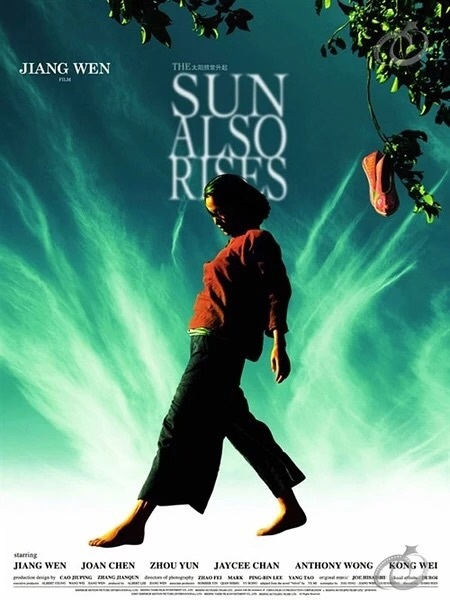

*2017-08-26 21:02 · 手机上网 转自王兴*

---

### 4070

居然有一本书叫 The Son Also Rises ，讲的是历史上各国的社会阶层流动性。看来人人都想向海明威致敬。

*2017-08-26 20:47 · 猫饭*

---

### 4071

51信用卡的创始人孙海涛以前是做e都市的，喜马拉雅的创始人于建军以前是做city吧的，俩人当时针锋相对，都是地图行业的创新者，产品都给我留下深刻印象。

*2017-08-26 20:20 · iPhone版*

---

### 4072

很好的一架紫藤，可惜季节不对，只有果实没有花。

*2017-08-26 16:32 · iPhone版*

---

### 4073

图片不错，名字也很特别。转@ 拧巴人儿 有一个新西兰的内衣品牌，叫做lonely。我觉得挺特别，模特各种身材都有。

https://lonelylabel.com/

*2017-08-26 13:27 · 手机上网 转自拧巴人儿*

---

### 4074

豌豆黄算不上特别好吃，但是把叉子缓缓插进去时的手感很棒。

*2017-08-26 10:42 · 手机上网*

---

### 4075

转@ 阳升 据北京市质监局有关负责人介绍，北京市电梯保有量大，达到21.1万台，数量仅次于上海市，已成为电梯保有量世界第二大城市，其中住宅电梯10.3万台，占总数的48.8%。

*2017-08-26 10:35 · 手机上网 转自阳升*

---

### 4076

有点诡异有点邪恶。

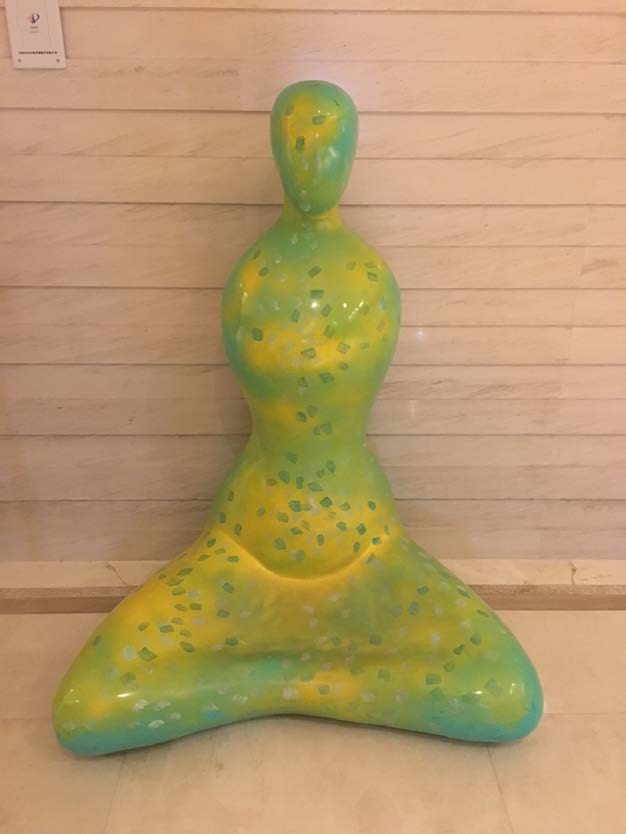

*2017-08-25 21:53 · 猫饭*

---

### 4077

「这行业啊，从业者的平均学历是初三下学期」，不愧是擅长搞营销的老哥，一开口就编得特别具体。

*2017-08-25 21:41 · iPhone版*

---

### 4078

转@ webto 2011年的照片，做了好久壁纸。

*2017-08-25 21:30 · 手机上网 转自webto*

---

### 4079

「产品的不可复制性」是「基于产品的成功」的必要而非充分条件。

我不懂行，但是据说茅台的味道别人真的做不出来。浓香型白酒包括五粮液都可以复制出来。

*2017-08-25 21:20 · iPhone版*

---

### 4080

茅台这种神迹一般的存在到底是产品本身的成功还是营销或其他因素的成功？

*2017-08-25 19:09 · iPhone版*

---

### 4081

小资咖啡厅的桌子。

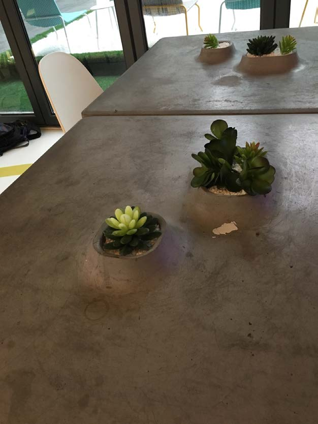

*2017-08-25 15:37 · 猫饭*

---

### 4082

看到「小炒鮰鱼肚」这个菜名立刻就想点来尝尝。

*2017-08-25 13:32 · iPhone版*

---

### 4083

京沪高铁长期全满，连巨贵的商务座也全部售空。当年指控刘志军搞高铁太超前建设的人真是鼠目寸光。

*2017-08-25 13:09 · iPhone版*

---

### 4084

北京什么地方像上海的思南公馆？

*2017-08-25 10:56 · iPhone版*

---

### 4085

现在很多人对手机就是拿得起放不下了，将来戴惯了AR眼镜……

*2017-08-24 17:45 · 手机上网*

---

### 4086

棒球棍就是 ba seball bat. 转@ realazy 颠覆了，bat 我只想到了蝙蝠 …转@ 王兴 ：美国三大互联网公司可以用 GAF 这个缩写，一是

和 BAT 三者的业务性质依次对应，二是取gaff （大鱼叉）之意，和bat（大棒）正好有类似意思

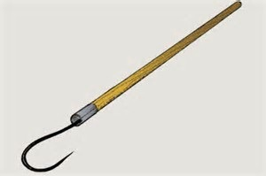

*2017-08-24 17:00 · 手机上网 转自王兴*

---

### 4087

不，标准是：如果没有互联网，业务还在吗？转@ lewatcher 理解了，这么算亚马逊应该算半个互联网公司，毕竟很大的业务板块是零售？转@ 王兴 苹果和微软不是所谓的互联网公司，这俩加上美国三大互联网公司可以算美国五大科技公司。转@ lewatcher 为什么没有Apple和MS？

*2017-08-24 15:35 · 手机上网 转自lewatcher*

---

### 4088

苹果和微软不是所谓的互联网公司，这俩加上美国三大互联网公司可以算美国五大科技公司。转@ lewatcher @ 王兴 为什么没有Apple和MS？

*2017-08-24 15:22 · 手机上网 转自lewatcher*

---

### 4089

美国三大互联网公司（google, amazon, facebook）可以用 GAF 这个缩写，一是和 BAT 三者的业务性质依次对应，二是取 gaff （大鱼叉）之意，和 bat（大棒）正好有类似意思。

*2017-08-24 15:14 · 猫饭*

---

### 4090

中国凤阳皇家影视城，铁路边山丘上的大牌子。

*2017-08-24 14:13 · iPhone版*

---

### 4091

三十八岁才学会自卑是不是有点晚了。

*2017-08-24 13:39 · iPhone版*

---

### 4092

国家统计局今日发布：2016年末中国大陆总人口（包括 31个省、自治区、直辖市和中国人民解放军现役军人，不包括香港、澳门特别行政区和台湾省以及海外华侨人数）138271万人，比上年末增加809万人。

全年出生人口1786万人，比上年多增131万人，人口出生率为 12.95‰

*2017-08-24 11:43 · 手机上网*

---

### 4093

清华每年本科招生规模排不进全国前五十，只有三千出头，但是博士毕业数量已是世界第一。

*2017-08-24 11:34 · 手机上网*

---

### 4094

@ 双橙 哪个行业？

*2017-08-24 11:19 · 手机上网 给双橙的回复*

---

### 4095

第一次看到八架直升机列队飞在空中。

*2017-08-24 11:15 · 手机上网*

---

### 4096

@ 砂瀑卡夫卡 拜托，li nkedin无论从哪个角度来说都低一个级别，除了创始人体重以外。

*2017-08-24 11:14 · 手机上网 给砂瀑卡夫卡的回复*

---

### 4097

美国那五大或三大科技公司并没有形成一个类似 BAT 这样稳定常用的缩写。

*2017-08-24 11:05 · 手机上网*

---

### 4098

在高铁站的太平洋咖啡用699招行积分兑换了一杯中杯卡布奇诺（原价31元），感觉像喝了一杯牛奶，咖啡味极淡。

*2017-08-24 10:58 · 手机上网*

---

### 4099

好雷好萌啊。龙岩就有畲族，我高中同学中有个姓蓝的就是，但我倒是没听过这婚俗。转@ 三猎 1920年代有人做过畲族民俗调查，当地婚俗，新娘到男方家里时，男方亲戚都要躲起来。然后新娘说：「你家人都死绝了吗？」大家再一齐跳出来：「所以等你来传宗接代呀！」还挺萌的……

*2017-08-24 10:31 · 手机上网 转自三猎*

---

### 4100

见了一个每年读200本书的朋友。

*2017-08-23 22:29 · 手机上网*

---

### 4101

转@ chenhang419 所以2026年我们会看到什么？ 转@chenhang419 能看到多远的过去，就能看到多远的未来。我看了看2008年的第一财经周刊。发现有一期的封面是：《巨无霸新浪》

*2017-08-23 21:38 · 手机上网 转自chenhang419*

---

### 4102

伪装成一条船的楼。

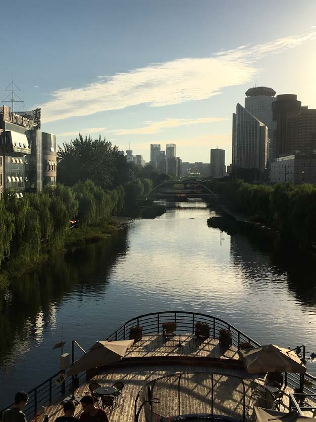

*2017-08-23 18:03 · 猫饭*

---

### 4103

转@ quux 转@ LeadersFirst 转@ 米饭.rar 昨晚顶着暴雨出车处理一个头外伤，没曾想是俩邻居之间互殴，各叫了120。我们离得近，先到达了现场，于是本来已经停战的两个傻逼，为了谁能上这唯一一台救护车又特么打起来了。根据120救急救重的精神，最后我们接走了打输的那个。

*2017-08-23 12:54 · 手机上网 转自米饭.rar*

---

### 4104

其实夏天穿一条薄西裤真的比穿仔裤更凉快。

*2017-08-23 10:03 · 手机上网*

---

### 4105

夜深人静，雨又大了起来。

*2017-08-23 01:29 · 手机上网*

---

### 4106

看来闪电击中飞机真的不稀奇，刚在朋友圈看到：大难不死，希望真的能有后福。到香港，台风，机长试图强行降落，结果闪电击中我们的飞机，自由落体半秒钟。之后在香港上空盘了40多分钟，飞去深圳，加油，等起飞，最后终于落地香港，成都飞香港，整整12小时，必须mark下。

*2017-08-23 01:07 · 手机上网*

---

### 4107

我记得，枸杞还是中宁的好。

*2017-08-23 00:46 · 手机上网*

---

### 4108

@ webto 是

*2017-08-22 16:53 · 手机上网 给webto的回复*

---

### 4109

转@ 风雨如晦 开会的小乐趣就是把别人脱下来的鞋踢远，然后看他假装若无其事的够啊够的，幸福。转@ 王兴 其实，穿正儿八经的系带皮鞋也挺好的，至少一整天就老实了，不会像穿一脚蹬那样开会时在桌子底下穿穿脱脱。

*2017-08-22 16:52 · 手机上网 转自王兴*

---

### 4110

其实，穿正儿八经的系带皮鞋也挺好的，至少一整天就老实了，不会像穿一脚蹬那样开会时在桌子底下穿穿脱脱。

*2017-08-22 16:12 · 手机上网*

---

### 4111

不行，小刀难堪大任。

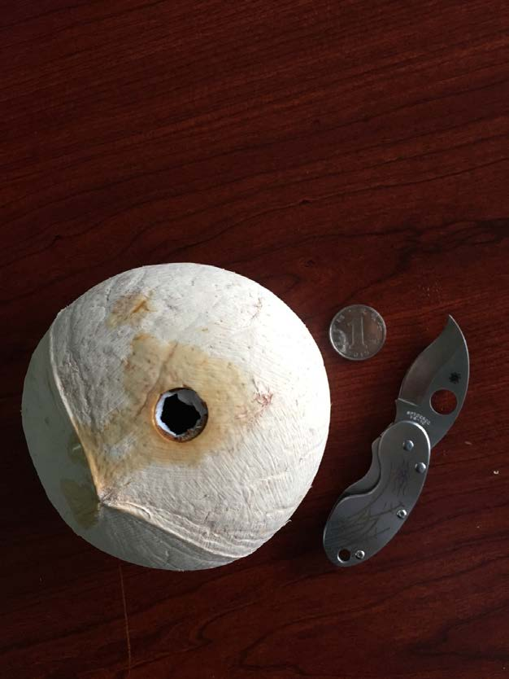

*2017-08-22 15:44 · 猫饭*

---

### 4112

雪媚娘这道菜名字好，味道也好。

*2017-08-22 15:32 · 手机上网*

---

### 4113

狮子头的肉要切成小粒，不能剁成泥。

*2017-08-22 15:28 · 手机上网*

---

### 4114

其实，只要有技术，没刀也是可以开椰子壳的。我在夏威夷看过波利尼西亚原住民的表演，在椰子壳上找到一个穴位，用石头敲一下，然后就很神奇的用手把壳掰成两半了。转@ 王兴 可是，喝完了怎么办？椰肉就不要了？我没有那种砍椰子的刀，可是又不喜欢浪费… 转@ 王兴 从掌鱼生鲜买的这个易拉椰皇

*2017-08-22 15:25 · 手机上网 转自王兴*

---

### 4115

可是，喝完了怎么办？椰肉就不要了？我没有那种砍椰子的刀，可是又不喜欢浪费… 转@ 王兴 从掌鱼生鲜买的这个易拉椰皇真是我喝过最甜美的椰子水。

*2017-08-22 15:04 · 手机上网 转自王兴*

---

### 4116

从掌鱼生鲜买的这个易拉椰皇真是我喝过最甜美的椰子水。

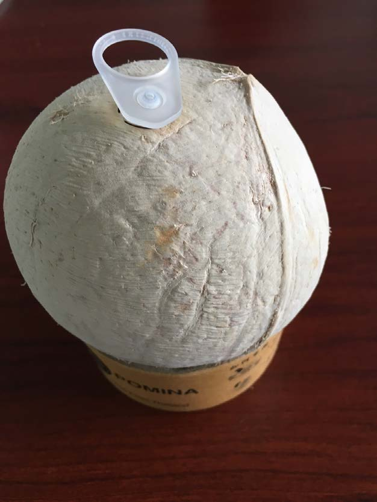

*2017-08-22 14:43 · 猫饭*

---

### 4117

转@ webto 喊麦是「我」RT@ viviyo 赞 转@ 二他姐姐 豆瓣：民谣是“我和我还在深爱的人”。嘻哈是“我和我认识并讨厌的人”。摇滚是“我和我讨厌的社会”。爵士是“我和我如今可以笑看的痛苦过往”。流行是“我和我喜欢的人”。朋克是“我和我的不高兴”。古典是“我和我的庄园（有人

*2017-08-22 10:09 · 手机上网 转自二他姐姐*

---

### 4118

有一种唱法的实际效果是突出背景音乐，把自己发出的声音变成背景音乐的背景。

*2017-08-22 00:18 · iPhone版*

---

### 4119

目前听下来，有歌词的嚎叫首推何勇的《垃圾场》，彻头彻尾的嚎叫要数 lost river 。vitas 的 opera 2 不算嚎叫，是尖叫吊嗓子。

*2017-08-21 21:31 · 手机上网*

---

### 4120

图瓦共和国？那就是唐努乌梁海啊。转@ 园丁机器人 俄罗斯联邦图瓦共和国歌手Sainkho Namtchylak的声乐代表作，用各种可能的发声方法来完成的人声实验，原始生命状态的声音宣泄予人一种强烈的艺术张力。转@ 毛主任 没歌词咋嚎叫？@ 王兴 不需要歌词的那种！真的是嚎叫！

*2017-08-21 18:46 · 手机上网 转自王兴*

---

### 4121

不需要歌词的那种！转@ 王兴 真的是嚎叫！转@ 吃茶 应该是lostrivers「@ 王兴 你们听过的最接近彻头彻尾嚎叫的歌是什么？」

*2017-08-21 18:32 · 手机上网 转自王兴*

---

### 4122

真的是嚎叫！转@ 吃茶 应该是lost rivers「@ 王兴 你们听过的最接近彻头彻尾嚎叫的歌是什么？」

*2017-08-21 18:29 · 手机上网 转自王兴*

---

### 4123

这歌，没法听第二遍。转@ 爽.. 驳倒乐队的《这日子没法过了》 转@王兴 你们听过的最接近彻头彻尾嚎叫的歌是什么？

*2017-08-21 18:25 · 手机上网 转自王兴*

---

### 4124

起初我以为是北京太糙了，连几个字母都做得高低不齐，后来上网查了一下，洲际官方logo里的 I 和 C 还真是要比别的几个字母略高一点点，这样突出首字母也太微妙了。

*2017-08-21 18:23 · 猫饭*

---

### 4125

你们听过的最接近彻头彻尾嚎叫的歌是什么？

*2017-08-21 18:18 · 手机上网*

---

### 4126

「胖子资本」是不是一个通俗易懂过目难忘的 VC 名字？

*2017-08-21 17:59 · iPhone版*

---

### 4127

on the road 和 on the street 的区别可大了去了。

*2017-08-21 17:51 · iPhone版*

---

### 4128

收到一条私信：王老板 快来加入我们饭否的王者荣耀战队“饭否长驻”-_-!

*2017-08-21 17:45 · 手机上网*

---

### 4129

转@ 路上有惊慌 有专门讨论给各种汉字赋予Unicode编码的国际机构，每年开两次会，biangbiang面未获通过。转@ 王兴 砼 tóng 这个字是1953年著名结构学家蔡方荫教授创造的，意思是混凝土，取「人工石」三字的组合。1955年《结构工程名词》一书中，明确推荐“砼”与“混

*2017-08-21 15:19 · 手机上网 转自王兴*

---

### 4130

比造词更有趣的是造字。砼 tóng 这个字是1953年著名结构学家蔡方荫教授创造的，意思是混凝土，取「人工石」三字的组合。1955年中国科学院编译出版委员会“名词室”审定颁布的《结构工程名词》一书中，明确推荐“砼”与“混凝土”一词并用。从此，“砼”被广泛采用于各类建筑工程的书刊中

*2017-08-21 12:03 · iPhone版*

---

### 4131

文字确实是极其伟大的发明。

*2017-08-20 20:30 · iPhone版*

---

### 4132

转@ 下划线和小数点 转@ 阿伏伽德罗常数 转@ 小比兔 转@ 伊丽莎白桑坂田阙日 哈哈哈哈哈哈哈哈哈哈 转@ 纪唯一 厉害了，开发小哥哥。

*2017-08-20 14:52 · 手机上网 转自纪唯一*

---

### 4133

在网上看了一下龙岩的城市规划和进展情况，震惊了，规模远超我的想象。这只是一个普通的四线城市啊。天朝太威武了。

*2017-08-20 14:48 · iPhone版*

---

### 4134

求带。转@ 张亮 发现我适合当东京导游，北京没啥可玩的...转@ 王兴 想到一个问题：如果有朋友要来北京，我也能抽出时间陪他们，我会是个好导游吗？转@ 王兴 「遇见一个好导游，就等于遇见了一段美好的旅程」，本来是读旅游专业的文章，我却联想到人生。自由行不见得最精彩。

*2017-08-20 10:10 · 手机上网 转自王兴*

---

### 4135

转：如果中本聪就是金三胖，那么这局棋就很大了。# 今日最大脑洞#

*2017-08-19 22:22 · iPhone版*

---

### 4136

想到一个问题：如果有朋友要来北京，我也能抽出时间陪他们，我会是个好导游吗？转@ 王兴 「遇见一个好导游，就等于遇见了一段美好的旅程」，本来是读旅游专业的文章，我却联想到人生。自由行不见得最精彩。

*2017-08-19 21:49 · 手机上网 转自王兴*

---

### 4137

2016年，西安撤户县设鄠邑区。唉，为什么要用 鄠hù 这么生僻的字呢。

*2017-08-19 09:39 · iPhone版*

---

### 4138

「遇见一个好导游，就等于遇见了一段美好的旅程」，本来是读旅游专业的文章，我却联想到人生。自由行不见得最精彩。

*2017-08-18 17:49 · 手机上网*

---

### 4139

雨可以分成两种：适合在其中漫步的，和不适合的。雨还可以分成另外两种：我曾在其中漫步的，和我不曾的。

*2017-08-18 16:09 · 手机上网*

---

### 4140

听说前序航班刚刚起飞后我果断决定放弃了。机场半日游，主要成就是在T2的MUJI买了四双袜子。

*2017-08-18 16:02 · 手机上网*

---

### 4141

在国内没用的，我有个朋友有私人飞机也一样经常在机场堵着走不了，只能通过美团外卖点一桌菜过来吃。转@ Frankiiee 老板，是时候开始研究湾流飞机了。。转@ 王兴 在机场延误得很无奈又没有座位的我已经摸索出坐在小推车上的最佳姿势了。

*2017-08-18 15:56 · 手机上网 转自王兴*

---

### 4142

在机场延误得很无奈又没有座位的我已经摸索出坐在小推车上的最佳姿势了。

*2017-08-18 14:28 · 手机上网*

---

### 4143

在办公室穿拖鞋没什么问题，（按美国风俗）开会时把脚翘到桌上也问题不是太大，但是两者一组合……

*2017-08-18 14:01 · 手机上网*

---

### 4144

算你狠。换成电动牙刷你还行吗？转@ Jason_Kidd 刷牙我都是晃脑袋牙刷不动的 转@ 王兴 把吸管插进酸奶时通常是酸奶不动吸管动，刚才试了一下反向操作：吸完第一罐酸奶后叼着吸管不动，把第一罐

酸奶拔出来，把第二罐酸奶怼上来。很顺利。

*2017-08-18 13:08 · 手机上网 转自王兴*

---

### 4145

把吸管插进酸奶时通常是酸奶不动吸管动，刚才试了一下反向操作：吸完第一罐酸奶后叼着吸管不动，把第一罐酸奶拔出来，把第二罐酸奶怼上来。很顺利。

*2017-08-18 12:56 · 手机上网*

---

### 4146

「有地狱就一定有天堂」，这是我小时候在一部科幻小说里读到的鸡汤。忘了具体是哪部小说了，依稀记得是男主在星际战斗中一度陷入悲惨境地时用来鼓励自己的话。

*2017-08-18 12:32 · 手机上网*

---

### 4147

「秋栗香」这个名字不错。朋友圈盗图。

*2017-08-18 11:49 · 手机上网*

---

### 4148

转@ 钟永健 1931年11月中华工农兵苏维埃第一次全国代表大会在瑞金

叶坪村胜利召开，宣告成立中华苏维埃共和国临时中央政府，这是中国共产党领导建立的第一个全国性红色政权。毛泽东当选主席，这个“主席”是政府主席。“毛主席”这个称呼，从这里开始。转@ 王兴 毛主席的职位全称。

*2017-08-18 11:37 · 手机上网 转自王兴*

---

### 4149

投资这种事，既需要 common sense，又需要 contrarian thinking.

*2017-08-18 11:16 · 手机上网*

---

### 4150

毛主席的职位全称。

*2017-08-18 11:12 · 手机上网*

---

### 4151

转@ gravity0 Sally–Anne 测试说的是：莎莉把弹珠藏在自己盒子里然后出门去，安妮在她走后将弹珠拿来藏在自己盒子里。问目睹全过程的测试者，莎莉回来会在哪个盒子里找弹珠。多数自闭症和四岁以下儿童会回答安妮的盒子。说明很多人在考虑他人观点这事上有不同程度的困难。

*2017-08-17 23:41 · 手机上网 转自gravity0*

---

### 4152

今天吃了至少八种水果。

*2017-08-17 21:25 · iPhone版*

---

### 4153

我有一种预感，北京今年的秋天会特别美。

*2017-08-17 18:38 · iPhone版*

---

### 4154

打了今天第二个哈欠。

*2017-08-17 14:39 · iPhone版*

---

### 4155

打了今天第一个哈欠-_-!

*2017-08-17 10:45 · iPhone版*

---

### 4156

转@ 平静微澜 查了下，原来防弹咖啡的发明者是云计算先驱戴夫·阿斯普雷，他去了趟西藏喝到了酥油茶，回去后就发明了防弹咖啡，原来是一个关于西藏的励志故事。。。转@ 王兴 突然觉得喝完防弹咖啡后嘴里的油香混合着咖啡的一丝丝酸和绵绵不绝的回甘也挺有意思，决定先不喝水，看看能持续多久。

*2017-08-17 10:04 · 手机上网 转自王兴*

---

### 4157

喝完一大杯温水后余味还在，淡了许多，若隐若现。转@ 王兴 余味还在，但是我口渴了，决定开始喝水。转@ 王兴 突然觉得喝完防弹咖啡后嘴里的油香混合着咖啡的一丝丝酸和绵绵不绝的回甘也挺有意思，决定先不喝水，看看能持续多久。

*2017-08-17 09:56 · 手机上网 转自王兴*

---

### 4158

余味还在，但是我口渴了，决定开始喝水。转@ 王兴 突然觉得喝完防弹咖啡后嘴里的油香混合着咖啡的一丝丝酸和绵绵不绝的回甘也挺有意思，决定先不喝水，看看能持续多久。

*2017-08-17 09:42 · 手机上网 转自王兴*

---

### 4159

@ 一万年太久_ 我不抽烟。谢谢。

*2017-08-17 09:25 · 手机上网 给一万年太久_的回复*

---

### 4160

突然觉得喝完防弹咖啡后嘴里的油香混合着咖啡的一丝丝酸和绵绵不绝的回甘也挺有意思，决定先不喝水，看看能持续多久。

*2017-08-17 09:05 · iPhone版*

---

### 4161

原来 dota 是 Defense of the Ancients 的缩写啊。

*2017-08-16 18:24 · iPhone版*

---

### 4162

二十几年前我看过一本译成中文的书，对其中有些内容不太理解。最近发生的一些事反复提醒我那些内容确实是有道理的，于是我决定去把那本书的英文原版找来读一遍。

*2017-08-16 18:14 · iPhone版*

---

### 4163

enable 和 empower 都译成「赋能」？

*2017-08-16 18:09 · iPhone版*

---

### 4164

印度政府有个部门叫「经济统筹部」？

*2017-08-16 18:04 · iPhone版*

---

### 4165

一眨眼又到了开亚布力夏季会议的时候。一年过得真快。

*2017-08-16 14:56 · iPhone版*

---

### 4166

但一样可以在我体内燃烧。转@ 王兴 凉了的防弹咖啡更难喝。没有了黄油的香。

*2017-08-16 09:02 · 手机上网 转自王兴*

---

### 4167

凉了的防弹咖啡更难喝。没有了黄油的香。

*2017-08-16 08:44 · iPhone版*

---

### 4168

我曾经有一台名叫 hippo 的服务器。

*2017-08-16 01:35 · 手机上网*

---

### 4169

莫妮卡•贝鲁奇这个超级大美女也生于这一年。转@ 王兴 新上任的北京市长陈吉宁（原清华环境系主任/清华校长/环保部长）和马云、张朝阳、联想集团的杨元庆、亚马逊的贝索斯都生于1964年。

*2017-08-16 01:30 · 手机上网 转自王兴*

---

### 4170

太远或太近都看不清。

*2017-08-16 01:18 · 手机上网*

---

### 4171

转@ 猪小宝 亚村机场目前还是全球第一客流吞吐量。右上红圈是中心城区，左下红圈是机场。 转@ 王兴 转@ 旋转血小板 规划专业的同学告诉我，一个城市的机场应该要和它的中心城区一样大。转@ 王兴 我对25平方公里这个数字产生怀疑了。不可能这么大。转@ 王兴机场真是占地大户，龙岩规划中的离市

*2017-08-16 00:59 · 手机上网 转自猪小宝*

---

### 4172

我偶尔会说 wokao 甚至 wocao，但印象中我从未说过 wcnm 。

*2017-08-15 23:37 · iPhone版*

---

### 4173

转@ 旋转血小板 规划专业的同学告诉我，一个城市的机场应该要和它的中心城区一样大。转@ 王兴 我对25平方公里这个数字产生怀疑了。不可能这么大。转@ 王兴 机场真是占地大户，龙岩规划中的离市区更近的新机场预计占地25平方公里。记得上回有个卫星图上的对比，北京首都机场占地比整个望京都大。

*2017-08-15 16:00 · 手机上网 转自王兴*

---

### 4174

@ digport 龙岩新机场选址在东肖和培丰交界的山上，离市区14公

里。

*2017-08-15 15:56 · 手机上网 给digport的回复*

---

### 4175

我对25平方公里这个数字产生怀疑了。不可能这么大。转@ 王兴 机场真是占地大户，龙岩规划中的离市区更近的新机场预计占地25平方公里。记得上回有个卫星图上的对比，北京首都机场占地比整个望京都大。

*2017-08-15 15:34 · 手机上网 转自王兴*

---

### 4176

机场真是占地大户，龙岩规划中的离市区更近的新机场预计占地25平方公里。记得上回有个卫星图上的对比，北京首都机场占地比整个望京都大。

*2017-08-15 15:25 · iPhone版*

---

### 4177

爸爸这次从北京回龙岩，飞的不是离我们家156公里的厦门高崎机场，而是离我们家110公里的龙岩连城冠豸山机场。机票很便宜，才八百多，而且很准点。

*2017-08-15 15:19 · iPhone版*

---

### 4178

传教士利玛窦注意到了服饰、瓷器、家具等物件上都有龙的图案。在手稿中，利玛窦将龙写作Dragone。在1616年出版的利玛窦《基督教远征中国史》法文版中，这个词被一律译成dragon——在西方传说中，这个名字指的是一种长有翅膀的喷火龙，是邪恶的象征，这是龙与dragon的首度碰撞。

*2017-08-15 14:49 · 手机上网*

---

### 4179

Travis曾跟uber的人说，创业的人应该既是诗人，也是战士。

*2017-08-15 00:45 · 猫饭*

---

### 4180

不好意思，他是英国人。转@ 王兴 David Bowie 这个美国人居然还唱过一首中文歌《刹那天地》-_-!

*2017-08-15 00:28 · 手机上网 转自王兴*

---

### 4181

新裤子的《没有理想的人不伤心》就歌名而言很适合真正的创业者听。

*2017-08-15 00:27 · 手机上网*

---

### 4182

David Bowie 这个美国人居然还唱过一首中文歌《刹那天地》-_-!

*2017-08-15 00:21 · iPhone版*

---

### 4183

科恩说他是在抽掉无数雪茄、喝掉几游泳池威士忌、把自己关在旅馆房间里以头抢地后写出了 Hallelujah 这首歌。

*2017-08-14 23:57 · iPhone版*

---

### 4184

坐在北京的秋夜里，突然想起《美国往事》。

*2017-08-14 23:11 · iPhone版*

---

### 4185

老爸说，58年大炼钢铁时，为了砌高炉，所有带砖的坟墓都被拆了。

*2017-08-14 18:52 · iPhone版*

---

### 4186

转@ 非處方藥 汉魏流行倭堕髻，发髻歪歪，看上去随时要掉下来的样子，梳这种发髻，可增女子妩媚之态，让人心生怜爱。RT @ 王兴 :有一种女装的设计思路似乎就是把衣服做成随时要掉下来的效果。

*2017-08-14 14:36 · 手机上网 转自非處方藥*

---

### 4187

有一种女装的设计思路似乎就是把衣服做成随时要掉下来的效果。

*2017-08-14 14:12 · iPhone版*

---

### 4188

菠萝真香。

*2017-08-13 21:42 · iPhone版*

---

### 4189

北京首都机场联接5个大陆、66个国家、279个城市。但是，我必须吐槽一下，这张海报太糙了，稍微认真点看就发现世界地图和航线图都几乎是瞎画的，错误百出。

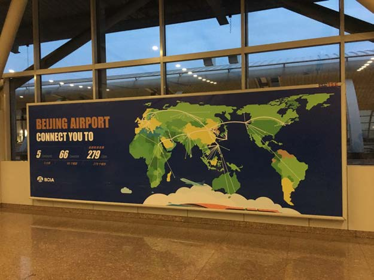

*2017-08-13 19:41 · 猫饭*

---

### 4190

西谚：if you can't stand the heat, get out of the kitchen.

*2017-08-13 12:45 · iPhone版*

---

### 4191

《Bloomberg Businessweek》手感太差了，一本那么薄，纸又那么软，稀稀拉拉的，简直拿都拿不住。

*2017-08-13 12:35 · iPhone版*

---

### 4192

列支登士顿这样蛋大的地方居然还有一个威士忌蒸馏所 Telsington 。

*2017-08-13 12:11 · iPhone版*

---

### 4193

我很有兴趣看一下九月份《战狼2》在香港上映后的票房表现。

*2017-08-13 11:53 · iPhone版*

---

### 4194

斯里兰卡的文字还蛮可爱的。

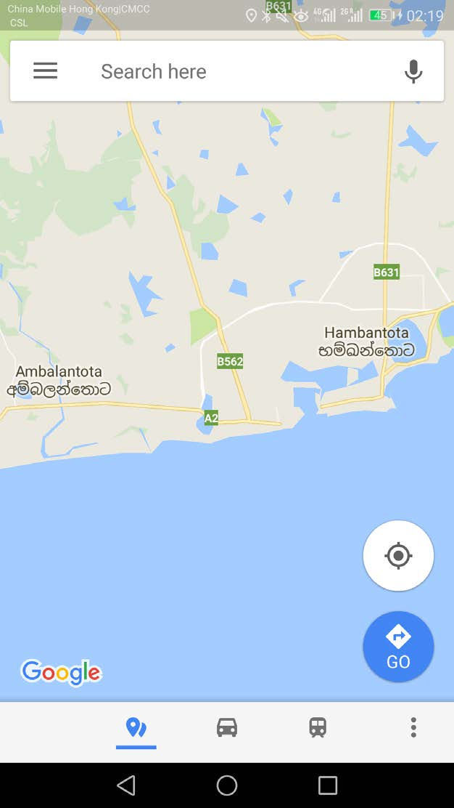

*2017-08-13 02:23 · 手机上网*

---

### 4195

谢谢，不过我当然是优先看香港的历史，而不是来看给香港人讲世界历史的展。转@ 洛璃空 隔离科学馆有古埃及展哦 转@ 王兴 来过香港很多次，第一次进香港历史博物馆。

*2017-08-12 16:11 · 手机上网 转自王兴*

---

### 4196

来过香港很多次，第一次进香港历史博物馆。

*2017-08-12 15:46 · 手机上网*

---

### 4197

原来如此，长见识。转@ gravity0 大象说宝莱坞的歌舞传统源自波斯剧场照顾语言不同也不识字的百姓 http://t.cn/R93NXyL

*2017-08-12 09:41 · 手机上网 转自gravity0*

---

### 4198

转@ 一只我 轻松 不一定愉快（瞎猜 转@ 王兴 在广场上用绳套造肥皂泡给小孩子们带来欢乐大概是最轻松愉快的职业了吧。

*2017-08-12 01:49 · 手机上网 转自王兴*

---

### 4199

转@ PPDo 轻松不知道，应该挺愉快的 转@ 王兴 在广场上用绳套造肥皂泡给小孩子们带来欢乐大概是最轻松愉快的职业了吧。

*2017-08-12 01:49 · 手机上网 转自王兴*

---

### 4200

在广场上用绳套造肥皂泡给小孩子们带来欢乐大概是最轻松愉快的职业了吧。

*2017-08-12 01:22 · iPhone版*

---

### 4201

Lies, white lies, damned lies, and statistics.

*2017-08-12 00:50 · iPhone版*

---

### 4202

《时代》周刊的创始人 Henry Luce (还创办了fortune，people，sports illustrated 等杂志）生于山东。他爹那批新教传教士在中国持续努力了18年才发展出第一个中国信徒。

*2017-08-12 00:05 · iPhone版*

---

### 4203

这种形状的马桶圈相对少见一点。

*2017-08-11 22:35 · 猫饭*

---

### 4204

这个电梯没有关门键。意思是不必着急吗？

*2017-08-11 20:09 · 猫饭*

---

### 4205

原来网红同道大叔是个清华小鲜肉啊。

*2017-08-11 19:30 · iPhone版*

---

### 4206

第一次付费使用华为手机自带的「天际通」，在境外上网比用运营商漫游要便宜一点，一天18块，两天28块。

*2017-08-11 13:46 · iPhone版*

---

### 4207

如果爱国需要加税，那么爱国者将屈指可数。——希特勒

*2017-08-11 00:46 · iPhone版*

---

### 4208

「稀缺性」这个概念，不但是XX学的根基，也是XX学的根基。

*2017-08-10 23:39 · 手机上网*

---

### 4209

你比我更有动手精神。但为什么是这个总数呢？转@ 邦比快跑 36个清华25个北大 转@ 远骋 转@ 王兴 看了一下2017年各省高考状元报考的大学，文理加起来一共六十几人，除了广东理科状元报了香港中文大学，其他全去了清华或北大，无一例外，包括上海的两个。

*2017-08-10 23:38 · 手机上网 转自王兴*

---

### 4210

这倒是头一次听说。我们那里很多长辈是把农历生日当公历登记了。

转@ qinyf 今天知道老爸身份证上的生日不是真的阳历生日，而是他们70多位一起参加工作的工友的入职纪念日。听他说了些40多年前他们还是18岁时候的事。

*2017-08-10 23:37 · 手机上网 转自qinyf*

---

### 4211

在全国高铁线路图上，我的家乡龙岩就是个cul-de-sac。转@ 我的骨頭相當脆 这是个法语词，cul是俗语里的“屁股”，引申为“底部”，sac

是“口袋”的意思，de是介词，相当于“of”「@ 王兴 学了一个英文单词：cul-de-sac 断头路

*2017-08-10 17:40 · 手机上网 转自叶滨*

---

### 4212

邮票的发明确实是一次伟大的商业模式创新，创造了巨大的价值，虽然不涉及硬科技。

*2017-08-10 16:00 · 手机上网*

---

### 4213

转@ 油泼面要宽的 神啊，请给我耐心…… 现在就要！！

*2017-08-10 15:36 · 手机上网 转自面条主席*

---

### 4214

看了一下2017年各省高考状元报考的大学，文理加起来一共六十几人，除了广东理科状元报了香港中文大学，其他全去了清华或北大，无一例外，包括上海的两个。

*2017-08-10 13:15 · 手机上网*

---

### 4215

突然觉得这个世界好遥远。

*2017-08-10 12:22 · iPhone版*

---

### 4216

北京三环东北角亮马河畔有个广州大学？好神奇啊-_-!

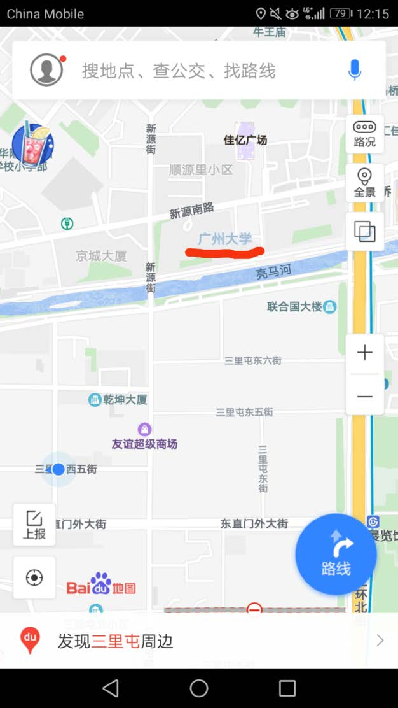

*2017-08-10 12:18 · 手机上网*

---

### 4217

转：你把穆迪理解成印度的邓小平就可以了，但是，出手还要更狠。

*2017-08-09 20:08 · iPhone版*

---

### 4218

据说，才一年时间，印度的电信基础设施就实现弯道超车了，现在4G流量远大于中国，接近十倍。

*2017-08-09 19:50 · iPhone版*

---

### 4219

果然是像红衣大炮说的那样，国内的消费者觉得无线路由器多几根天线就信号更好，厂家也只好顺从。

*2017-08-09 18:23 · 猫饭*

---

### 4220

去看了小米之家才知道小米已经大张旗鼓在卖笔记本了…

*2017-08-09 18:19 · 猫饭*

---

### 4221

雷军有酒窝。

*2017-08-09 16:50 · 手机上网*

---

### 4222

转@ 洋鸟消夏录 一次梦中积雪夜 回四平拜访一位作家 叙旧家乡 我说二十年间常觉得它在我身上痕迹淡薄 在哪儿都自觉是在做客 他突兀打断了我 吐了一个他的秘密 我真愕然心惊 他敢如此信我 心想无论哪日哪怕梦外（我明知是梦）都绝不会将他所言之事说与旁人 他说他心已决意 就算为此会坐十年

*2017-08-09 16:25 · 手机上网 转自洋鸟消夏录*

---

### 4223

Malatang!

*2017-08-09 15:02 · iPhone版*

---

### 4224

德国外交之最大阻碍，不在于英法俄奥诸国之谋划，而在于吾国以好战言论为荣之报刊，以及无视利弊却极其好斗之三百位在座议员。终

有一日，德国的未来将毁于其手。——俾斯麦

*2017-08-09 14:19 · iPhone版*

---

### 4225

之前有次跟机长聊天，他说飞机在空中被雷击很危险，但并不致命，他开的飞机就被雷击中过几次，有次机翼都破了洞，但还是安全降落了。

*2017-08-09 11:56 · iPhone版*

---

### 4226

听一个朋友说，中国每年消费50亿只鸡，其中7000万只是所谓高端鸡。

*2017-08-08 23:29 · iPhone版*

---

### 4227

在酒店里跟人谈事情时完全没感觉，谈完出门才发现大风大雨简直是横着刮过来-_-!

*2017-08-08 21:54 · iPhone版*

---

### 4228

《大护法》这种动画电影里竟然用这么生僻的成语当台词… 不过，实事求是的讲，对我来说这片看得比《战狼2》更胆战心惊。另外，是猫眼主控发行的:)

*2017-08-08 19:34 · 手机上网*

---

### 4229

以我有限的化妆卸妆体验来看，我对从事演艺事业的人充满同情和尊敬。

*2017-08-08 14:55 · iPhone版*

---

### 4230

转@ 弥城 在45的速度上如果赶上一个绿灯那接下来一路都是绿灯了反之过快或过慢则大亮红灯等你呢。绿波带是交通术语。转@ realazy请教老司机，这个“最佳绿波”是什么意思？

*2017-08-07 23:11 · 手机上网 转自realazy*

---

### 4231

不对，战狼更像第一滴血系列。这会稍微影响植入广告的空间。毕竟007基本是穿着西装礼服在风景名胜或繁华都市里或谈判或调情或打斗，而兰博和战狼主要是在泥地里爬… 转@ 王兴 看了《战狼2》，和007一样扯，和007一样屌。

*2017-08-07 19:47 · 手机上网 转自王兴*

---

### 4232

买鞋真不是件容易的事。即使是我自己在店里试过的鞋，买回来后也不是每双都很合脚。

*2017-08-07 19:40 · iPhone版*

---

### 4233

转@ 阳升 学者考虑什么是对的，官员们除了做这个判断之外，还需要考虑怎么样从现状逐渐转向对的。

*2017-08-07 10:50 · 手机上网 转自阳升*

---

### 4234

看了《战狼2》，和007一样扯，和007一样屌。

*2017-08-06 23:58 · iPhone版*

---

### 4235

日韩也不弱，但是不容易输出到别的国家。转@ Florence.W 没有韩国么 转@ 王兴 据说综艺节目的三大发源地是荷兰、英国、以色列。

《中国好声音》就源自荷兰。

*2017-08-06 13:54 · 手机上网 转自王兴*

---

### 4236

我启用的第一个兽头杯是野猪头。

*2017-08-06 04:14 · 手机上网*

---

### 4237

《马赛曲》里的法语颤音真是迷人。

*2017-08-06 04:08 · iPhone版*

---

### 4238

据说综艺节目的三大发源地是荷兰、英国、以色列。《中国好声音》

就源自荷兰。

*2017-08-06 04:05 · iPhone版*

---

### 4239

恒大集团整体从广州迁至深圳。广州怕是离一线城市越来越远。

*2017-08-06 03:29 · iPhone版*

---

### 4240

脂肪和滋味都很丰富的一片 salami.

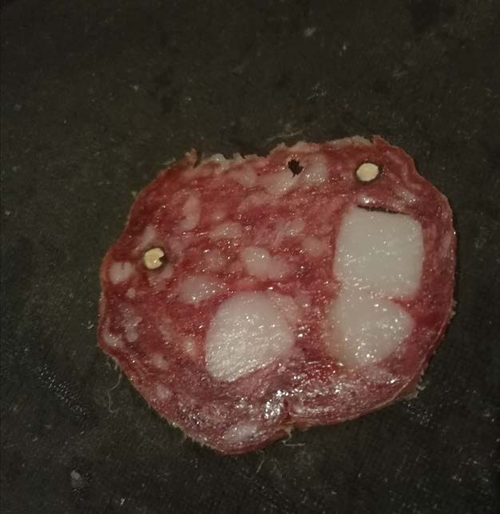

*2017-08-06 03:14 · 手机上网*

---

### 4241

有一种类似打碟的玩法，把手机的扬声器孔间歇堵住。

*2017-08-06 03:05 · 手机上网*

---

### 4242

前几天在飞机上终于把《大鱼海棠》看了。创作者放飞自我，讲了一个任性和虐爱的故事。但是整个电影的完成度不算太高。转@ 王兴《大鱼海棠》这部电影的口碑明显两极分化。这应该算是件好事。

*2017-08-06 03:03 · 手机上网 转自王兴*

---

### 4243

我还从来不曾拥有一块琥珀。

*2017-08-06 02:57 · iPhone版*

---

### 4244

google earth 彻底不能用了:-(

*2017-08-06 02:40 · iPhone版*

---

### 4245

小时候我集邮时还蛮喜欢外国邮票，到处想办法收集。印象深刻的有一套台湾的灯塔系列邮票，是我亲手从诸多信封上裁下来的。CCCP的邮票我就无缘亲手收集，只能从我爸的藏品那里继承了。

*2017-08-06 02:28 · iPhone版*

---

### 4246

我大概有十年没用邮票了。不知道我小时候集邮的成果现在是否还保存在我爸妈那里，还是在搬家中遗失了。记得小时候，我和我姐还煞

有介事的瓜分了我爸的集邮藏品

*2017-08-06 02:18 · iPhone版*

---

### 4247

原来「水逆」的英文是 mercury retrograde 啊！

*2017-08-06 02:07 · iPhone版*

---

### 4248

之前还真不知道老娘舅有这么多粉丝。转@ 胤踪 你们还可以在企查查里看老娘舅申请的各种专利 哈哈哈哈 转@ 我买不起特斯拉 去骨鱼饭是今年的新品，不能算招牌「@ 王兴 上网查了一下，老娘舅这个连锁品牌竟然发源于湖州这个小地方。招牌是去骨烧鱼饭和香稻米饭

*2017-08-06 00:41 · 手机上网 转自王兴*

---

### 4249

我是吃完后在他们家网站「品牌简介」里看的。转@ 我买不起特斯拉去骨鱼饭是今年的新品，不能算招牌「@ 王兴 上网查了一下才知道，老娘舅这个连锁品牌竟然发源于湖州这个小地方。招牌是去骨烧鱼饭和香稻米饭，我打算下回尝一下。」

*2017-08-06 00:03 · 手机上网 转自王兴*

---

### 4250

听说某著名投资人去美国东岸募资时用英语说了句中国成语 killchicken show monkey，把老美给震了。

*2017-08-05 23:55 · iPhone版*

---

### 4251

上网查了一下才知道，老娘舅这个连锁品牌竟然发源于湖州这个小地方。招牌是去骨烧鱼饭和香稻米饭，我打算下回尝一下。

*2017-08-05 20:37 · iPhone版*

---

### 4252

服了你了。转@ 下划线和小数点 @ 王兴 小时候读的中文版，长大了怀旧读读原文/上大学在英语国家被要求读英文。自己读完原文推荐给妈妈看（她不能读英文），提前读一遍汉语确定翻译不太糟糕/和她一起读中文的讨论。学英语时候为了读懂内容先读了一遍中文...

*2017-08-05 20:11 · 手机上网 转自下划线和小数点*

---

### 4253

安好啥呀。莫迪可不是非暴力起家的。转@ 豆芽炒豆卜 所以印度是一个宗教博物馆。有婆罗门教耆那教印度教佛教伊斯兰教基督教，安好相处。转@ 王兴 转：种姓制度是印度人抵抗外来文化的绝佳武器，所有外来民族都被划分成单独的种姓，并以这种方式融入印度人的生活。格查仁达斯在其名著《解放了的印度》

*2017-08-05 20:05 · 手机上网 转自王兴*

---

### 4254

@ 下划线和小数点 佩服。为什么这么多书你都要中文版和英文版都读呢？

*2017-08-05 20:04 · 手机上网 给下划线和小数点的回复*

---

### 4255

转：种姓制度是印度人抵抗外来文化的绝佳武器，所有外来民族都被划分成单独的种姓，并以这种方式融入印度人的生活。格查仁达斯在其名著《解放了的印度》中有一个比喻：如果说美国是一个民族大熔炉，那么印度就是一块巨幅民族的镶嵌画，各个民族种类繁多，五花八门，但互不影响，永远融合不到一起去。

*2017-08-05 19:44 · 手机上网*

---

### 4256

转@ 下划线和小数点 哈利波特系列 朝鲜宪法 共产党宣言 弗兰肯斯坦 爱丽丝漫游仙境 何伟三部曲 三体 弗雷德里克·道格拉斯自传 芒果街小屋 上海生与死 洛丽塔 曼昆经济学 费曼自传系列 费曼物理学讲义 统计会说谎 苏菲的世界 泰戈尔诗集 code 哈姆雷特 转@ 王兴 有什么书/作

*2017-08-05 19:43 · 手机上网 转自王兴*

---

### 4257

你们最喜欢林肯公园的哪几首歌？

*2017-08-05 18:47 · 手机上网*

---

### 4258

有什么书/作品我中英文都读过？目前只想到《老人与海》。

*2017-08-05 18:40 · 手机上网*

---

### 4259

更准确的说，是一大震之后紧跟着一连串有节奏的小震。转@ 王兴两列高铁交汇，虎躯一震。

*2017-08-05 18:28 · 手机上网 转自王兴*

---

### 4260

高铁飞驰在稻田间，我突然想起了《雪国列车》。

*2017-08-05 18:23 · 手机上网*

---

### 4261

刚发现这首歌开头的旋律很像 Iggy Pop 的《Nazi Girlfriend》，但是提速了。转@ 王兴 黄秋生的那首《活在当下》词曲俱佳。最近听了很多遍，觉得有一种超越日常的忧伤。这哥们是不是信基督啊？

*2017-08-05 18:19 · 手机上网 转自王兴*

---

### 4262

Bob Dylan 的嗓音真容易识别。

*2017-08-05 18:15 · 手机上网*

---

### 4263

想起夏末秋初美丽的阿尔山。

*2017-08-05 17:50 · 手机上网*

---

### 4264

两列高铁交汇，虎躯一震。

*2017-08-05 17:48 · 手机上网*

---

### 4265

刚才停靠了南京南站。有个很俊朗的小伙子过来问我能不能换个座位。我以为自己是在成全一对年轻情侣，就欣然同意了。结果，坐在

一起的是那个年轻黑裙姑娘和一个大肚中年男:-( 我目测那个中年男是小伙子的老板而不是姑娘的老爹……

*2017-08-05 17:43 · 手机上网*

---

### 4266

有趣。转@ gravity0 摇号抽奖

*2017-08-05 17:31 · 手机上网 转自gravity0*

---

### 4267

92年邓公南巡的「天时」里，北京上海珠三角都冒出来一批民营快递公司，最后珠三角跑出来顺丰，上海跑出来桐庐帮的四通一达，北京的宅急送和小红马等却全军覆没。我估计北京缺的不是「人和」而是「地利」，外贸比较弱，带不起早期单量，后期电商也不如江浙沪发达。

*2017-08-05 16:54 · 手机上网*

---

### 4268

那倒不至于。我在猫眼专业版的票房排行榜数了一下，至今有36部电影在国内票房过十亿。转@ 郁金堂 以后中国电影票房不上十亿制作人都不好意思跟人打招呼…转@ 王兴 天哪，猫眼专业版对《战狼2》

的票房预测已经从破纪录的40亿进一步提升到45亿了！之前的票房冠军是2016年春节档的《美人鱼》

*2017-08-05 16:47 · 手机上网 转自王兴*

---

### 4269

阳澄湖畔，塔吊林立。

*2017-08-05 16:36 · iPhone版*

---

### 4270

装酷最不酷。

*2017-08-05 16:23 · iPhone版*

---

### 4271

天哪，猫眼专业版对《战狼2》的票房预测已经从破纪录的40亿进一步提升到45亿了！之前的票房冠军是2016年春节档的《美人鱼》，34亿。

*2017-08-05 15:54 · 手机上网*

---

### 4272

这就是传说中深深震撼了印度友人的高铁站的景象。相比传说中印度火车站脏乱差的样子，这应该真的可以算是环境卫生舒适，秩序井然了吧。

*2017-08-05 14:46 · 猫饭*

---

### 4273

坝上草原和昆明的海拔差不多，都是1800米上下。

*2017-08-05 14:41 · 手机上网*

---

### 4274

在高铁站没找到真功夫，第一次吃老娘舅。

*2017-08-05 14:11 · 手机上网*

---

### 4275

和一个新同事一起吃早饭，听说他当年打到微软乒乓球第一的故事：他原本不会打乒乓球，而是踢足球，后来受伤了没法再踢，于是决定改打乒乓球，买了球拍、球桌、发球机，从头学起，苦练几年后就成为微软总部里乒乓球最强手，当年主要的竞争是一个俄罗斯人和一个印度人。

*2017-08-04 11:17 · iPhone版*

---

### 4276

今天一整天的会里我打了前所未有多的瞌睡-_-!

*2017-08-03 23:46 · iPhone版*

---

### 4277

携带香烟的另类方式。

*2017-08-01 12:24 · 猫饭*

---

### 4278

被人卖了还帮着数钱？不好意思，现在流行手机支付，已经不需要数现金了，你顺手点一下转发就可以了。

*2017-08-01 11:29 · 手机上网*

---

### 4279

过了许多次长江，这是我见过的江面船只最多的一次。

*2017-08-01 11:20 · 手机上网*

---

### 4280

人越来越多的地方。转@ quux 知乎到底是个什么地方啊？ 转@ 望予 hhhhhh 转 @ 法医预备役夜傻笑同学 哈哈哈哈哈哈「@ 猪小宝

弱智到处有，这里特别多。」

*2017-08-01 11:19 · 手机上网 转自猪小宝*

---

### 4281

越来越觉得鲁迅先生厉害。也是挺悲哀的。

*2017-08-01 10:25 · iPhone版*

---

### 4282

转：在赌场工作有三件事可能导致你被开除，第一，偷窃；第二，性骚扰；第三，做实验的时候没有对照组。

*2017-08-01 09:55 · iPhone版*

---

### 4283

看到一个不确定是否靠谱的数据：北京拥有世界500强企业中的56家，全球排名第一；第二名是东京，38家。

*2017-08-01 09:27 · iPhone版*

---

### 4284

在新闻里读到「金戈铁马，气吞万里如虎」这种威风词句时，我却想起接下来那几句是「元嘉草草，封狼居胥，赢得仓皇北顾」-_-!

*2017-07-30 23:35 · 手机上网*

---

### 4285

在那之前就已经修成了贯穿东西岸的铁路了，诞生了几个铁路大亨，其中一个叫斯坦福，后来出钱建了所大学。转@ 菜村村长 以前巴拿马运河没修的时候纽约人去加州要坐船绕过整个南美洲。也要好几个月。 转@ 王兴 据说当年从温州偷渡去英国的路线是先坐火车到莫斯科（只有俄罗斯肯给签证），然后依次去

*2017-07-30 23:18 · 手机上网 转自王兴*

---

### 4286

马桶的水冲力大一点是好事，不过，大得能溅到站着尿尿的我就有点过了。

*2017-07-30 22:47 · 手机上网*

---

### 4287

据说当年从温州偷渡去英国的路线是先坐火车到莫斯科（只有俄罗斯肯给签证），然后依次去白俄罗斯/乌克兰/斯洛伐克/捷克/德国/法国，最后渡海到英国。每次过边境时通常是天黑后出发，步行翻山或是走平原，一直走到天亮，然后服务网络里下一国的人会来接…… 历

时至少要两三个月。

*2017-07-30 22:02 · 手机上网*

---

### 4288

因为我年轻时就把急躁都用掉了。转@ 王兴 我觉得我老了以后会是一个很慈祥的老人。

*2017-07-30 21:27 · 手机上网 转自王兴*

---

### 4289

很多意大利品牌，要么是 made in china，要么是 made in italy(but by chinese)。佛罗伦萨往西北几十公里的城市 Prato 是巨大的纺织中心，据说是全欧洲聚集了最多中国人的城市，连生活在那里的意大利人很多都会说中文了。

*2017-07-30 21:12 · 手机上网*

---

### 4290

我觉得我老了以后会是一个很慈祥的老人。

*2017-07-30 20:37 · 手机上网*

---

### 4291

多年以后我才意识到我也从淘宝上买到过假货。那时我听说 Philippi的金属名片盒很精致，就上淘宝买了一个，收到之后觉得品质远低于预期:( 那时我还没有假货这根弦，只是自认倒霉，觉得买错东西了，把那名片盒丢在一边从来没用过。

*2017-07-29 21:25 · iPhone版*

---

### 4292

国家旅游局2016年上半年统计的12050家星级饭店，一二三四级的酒店这里就不说了，统计报告中全国五星级酒店816家，RevPar的均值为335.37元/间/夜。这价格也就和汉庭或顶多全季扯平吧。

*2017-07-28 07:53 · iPhone版*

---

### 4293

星巴克宣称目标是到2021年在中国大陆拥有5000家店。

*2017-07-28 07:25 · 手机上网*

---

### 4294

贝索斯终于正式成为世界首富了。我最晚在2015年11月就对这件事迟早会发生深信不疑，但是并没有把这个判断转化为行动去重仓亚马逊股票…… 转@ 王兴 贝索斯成为美国首富只是个时间问题。

*2017-07-28 00:31 · 手机上网 转自王兴*

---

### 4295

率性而为和率兽食人的率字不是一个意思吧。

*2017-07-27 16:03 · 手机上网*

---

### 4296

转@ webto 亚马逊 5000 亿了啊

*2017-07-27 07:34 · 手机上网 转自webto*

---

### 4297

Acqua Panna 普娜泉（非起泡矿泉水）从属于 San Pellegrino 圣培露（起泡矿泉水）, 后者又从属于雀巢。

*2017-07-27 05:08 · iPhone版*

---

### 4298

芝麻香确实和酱香/浓香/清香一样是传统白酒的香型之一。转@ 洛克西 跟今天看到的「芝麻香型白酒」有一拼。 转@ 王兴 酱香型葡萄酒。

*2017-07-26 22:18 · 手机上网 转自王兴*

---

### 4299

酱香型葡萄酒。

*2017-07-26 22:14 · iPhone版*

---

### 4300

正确认识事物并命名之很重要。1492年哥伦布就发现了美洲，但他始终认为那是印度。十五年后，意大利探险家Amerigo（拉丁名是Americus）指出那不是印度而是新大陆，并命名为Americas。

*2017-07-26 19:40 · iPhone版*

---

### 4301

南瓜花入菜。

*2017-07-26 00:10 · 猫饭*

---

### 4302

原来如此。长见识了。谢谢。转@ 啃兔 福建、广东盛产的橄榄和地中海的油橄榄不是一种东西。参见 http://www.guokr.com/post/7...

转@ 王兴 福建和地中海沿岸一样盛产橄榄。我记得小时候福州有个叫「橄榄大世界」的品牌，把橄榄做成各种蜜饯和饮料。但我印象中

*2017-07-25 20:57 · 手机上网 转自王兴*

---

### 4303

福建和地中海沿岸一样盛产橄榄。我记得小时候福州有个叫「橄榄大世界」的品牌，把橄榄做成各种蜜饯和饮料。但我印象中似乎没有见过橄榄树种在福建地里的样子。

*2017-07-25 20:43 · iPhone版*

---

### 4304

「祖师爷赏饭吃」这句话有丰富的文化印记。

*2017-07-25 19:46 · iPhone版*

---

### 4305

刚知道东北人管最小的姨姨叫「老姨」。

*2017-07-24 20:20 · iPhone版*

---

### 4306

多年以后终于又在云卷云舒之间看到了一头野猪。我还记得三十年前邻居楼后斜坡上的那个沙堆，我和隔壁的小男孩肩并肩躺在上面，一起看头顶的蓝天白云，比着杜撰白云苍狗的故事。那真是时间过剩的童年。

*2017-07-24 03:55 · 猫饭*

---

### 4307

转@ code6 对了昨天那个修道院很有意思的是从里面基本没有一个窗户可以看到全部风景。视线被各种障碍分割支离破碎。走廊的横排窗户开的很窄，过道的正常窗户还特地从外面筑了一个石板封上。据说僧人在楼顶的修行走道修得很高，只能仰着才能看到天。一切为了修行。

*2017-07-23 23:27 · 手机上网 转自code6*

---

### 4308

这个配词不错。转@ code6 一个生活在大城市的姑娘被家里催着相亲，她对着窗外高楼大厦聊着电话说。 转@ qinyf RT@ 远骋

*2017-07-23 23:06 · 手机上网 转自远骋*

---

### 4309

转@ qinyf 拿纸笔照着书上的图把柯布的模度图的生成过程画了一遍，发现其实道理挺简单，所有比例关系以及神秘主义色彩的巧合，是源于古典的那张图。但觉得有趣而牛逼的是，柯布让这些比例不只停留在美学层面，也出现在日常的层高、过道、桌椅橱柜上，把人体与日常空间联系起来。

*2017-07-23 22:54 · 手机上网 转自qinyf*

---

### 4310

转@ 西门炊烟 在喀什英吾斯坦乡，去葡萄园吃葡萄不用动手，抬头张嘴就行了。转@ 王兴 想起我小时候住的房子的葡萄架，葡萄藤从地里长到二层楼顶。夏天放学后我就搬一个高凳子到二楼阳台上，从头顶的葡萄架上摘葡萄吃。一串葡萄的成熟有先后，所以我得爬上爬下，把高凳子挪来挪去，吃每串葡萄里正好成

*2017-07-23 22:37 · 手机上网 转自王兴*

---

### 4311

如果我不及时把快熟的葡萄吃掉，蜂就会把它们扎烂。我不记得鸟儿会不会来吃了。转@ 王兴 想起我小时候住的房子的葡萄架，葡萄藤从地里长到二层楼顶。夏天放学后我就搬一个高凳子到二楼阳台上，从头顶的葡萄架上摘葡萄吃。一串葡萄的成熟有先后，所以我得爬上爬下，把高凳子挪来挪去，吃每串葡萄里

*2017-07-23 22:32 · 手机上网 转自王兴*

---

### 4312

想起我小时候住的房子的葡萄架，葡萄藤从地里长到二层楼顶。夏天放学后我就搬一个高凳子到二楼阳台上，从头顶的葡萄架上摘葡萄吃。一串葡萄的成熟有先后，所以我得爬上爬下，把高凳子挪来挪去，吃每串葡萄里正好成熟的那几粒。

*2017-07-23 22:26 · 手机上网*

---

### 4313

我倒不是这个意思…… 转@ 笑谈丶一纸风华 马拉的列车被斧子劈开了？转@ 王兴 姜文的《让子弹飞》确实挺有中国特色。

*2017-07-23 21:18 · 手机上网 转自王兴*

---

### 4314

姜文的《让子弹飞》确实挺有中国特色。

*2017-07-23 13:56 · 手机上网*

---

### 4315

转@ 东东枪 msn时代我搞过几次这事。当时是用msn群，很和谐,很美好。 转@ 除了我以外都不是猪 喜欢看timeline上云喝酒，希望饭否开一家云喝酒酒吧，大家在周六或者周日一起云喝，晒图，然后互相推荐酒和介绍自己喝酒的地儿......那可真是乌托邦了，只喝杯中物，不问明日愁。

*2017-07-23 13:53 · 手机上网 转自除了我以外都不是猪*

---

### 4316

看了一下诺基亚开机画面的原作。

*2017-07-23 00:02 · iPhone版*

---

### 4317

时隔几年，再见琼瑶浆。

*2017-07-22 20:42 · iPhone版*

---

### 4318

问一个在美国读高中的中国小伙子用什么app听音乐，答曰：youtubemusic.

*2017-07-21 23:33 · 手机上网*

---

### 4319

第一次从一个塞内加尔人手里买东西。

*2017-07-21 23:06 · 手机上网*

---

### 4320

这和自大无关，恰恰是为了方便对方，为了在微信上加人时用一句话「我是x」能说清楚。转@ 王兴 中外历史上都习惯用出生地来标识人名以区分同名者，例如「常山赵子龙」和「拿撒勒的耶稣」。按这种说法，我应该是「龙岩王兴」，但在现实中，我更习惯使用「美团王兴」来介绍自己。

*2017-07-21 23:05 · 手机上网 转自王兴*

---

### 4321

中外历史上都习惯用出生地来标识人名以区分同名者，例如「常山赵子龙」和「拿撒勒的耶稣」。按这种说法，我应该是「龙岩王兴」，但在现实中，我更习惯使用「美团王兴」来介绍自己。

*2017-07-21 22:35 · iPhone版*

---

### 4322

把教堂建得异常雄伟或精美其实和炫富是同一个逻辑。

*2017-07-21 21:06 · 手机上网*

---

### 4323

转@ EddyH 转@ 越关山 转@ 杂货铺吖 「@ 红烧河豚 转@ 蘿蔔_浪 转@ 帮主胡子 同学收到垃圾消息“哥哥看跳舞吗～”“什么舞”“民族舞，不穿衣服的喔(^^)”“那我怎么知道你哪个民族？”哈哈哈哈哈哈哈各行都不易」

*2017-07-21 20:47 · 手机上网 转自红烧河豚*

---

### 4324

佐丹奴 Giordano 是一个香港人创造的平台，借用了 Giordano 这个比较常见的意大利人名。

*2017-07-21 20:26 · iPhone版*

---

### 4325

赠人玫瑰是否会手有余香，我并不确定。但我很清楚此刻我手里的香味是刚才吃了一个杏和一个油桃后没洗手只擦手留下来的。一种甜美的香味。

*2017-07-21 15:35 · 手机上网*

---

### 4326

你的脑洞真的好大。转@ 孙岩 熊，这种动物与众不同，它可以像人一样站起来。能力，姿態，估计说的都是这个。

*2017-07-21 15:26 · 手机上网 转自孙岩*

---

### 4327

有一些才华和原则的小人物，被卷入大时代大洗牌，痛苦、纠结、冲突、戏剧性都由此而来。 -李翔

*2017-07-21 15:24 · 手机上网*

---

### 4328

准确的定义和时间点不必太较真，大趋势是这个没错。只是不知道，真正更彻底的转变是要滞后几年还是十几年还是几十年还是几代人……

转@ 王兴 2010~2011年中国城镇化率超过50%。这是真正的历史里程碑，中国终于进入了多数人不是农民的阶段了。

*2017-07-21 15:16 · 手机上网 转自王兴*

---

### 4329

2010~2011年中国城镇化率超过50%。这是真正的历史里程碑，中国终于进入了多数人不是农民的阶段了。

*2017-07-21 15:03 · iPhone版*

---

### 4330

我拨开来检查了，并不是真的种在咖啡豆里，只是在正常的小绿植盆子外盖了一层咖啡豆。

*2017-07-21 14:57 · 猫饭*

---

### 4331

问题就是有似乎还比较靠谱的学者（易富贤）公开出来质疑这个~1800万的官方数据，认为严重高估了。转@ webto 这没什么好争的啊，官方数据 1786 万。RT@ 王兴 去年中国到底是出生了1800万还是1300万人。竟然连这个数都争执不定-_-!

*2017-07-21 13:52 · 手机上网 转自王兴*

---

### 4332

去年中国到底是出生了1800万还是1300万人。竟然连这个数都争执不定-_-!

*2017-07-21 13:43 · iPhone版*

---

### 4333

2G和4G的上网速度差别真是大。

*2017-07-21 01:56 · 手机上网*

---

### 4334

转@ 我的骨頭相當脆 这是个法语词，cul是俗语里的“屁股”，引申为“底部”，sac是“口袋”的意思，de是介词，相当于“of”「@ 王兴 学了

一个英文单词：cul-de-sac 断头路（类似死胡同的意思，但是更开阔）。转@ 叶滨 现在养孩子要注意的事项 VS 以前时不时喂点吃的就行」

*2017-07-21 00:33 · 手机上网 转自叶滨*

---

### 4335

@ 吕雪松 非常感谢！

*2017-07-21 00:32 · 手机上网 给吕雪松的回复*

---

### 4336

学了一个英文单词：cul-de-sac 断头路（类似死胡同的意思，但是更开阔）。转@ 叶滨 现在养孩子要注意的事项 VS 以前时不时喂点吃的就行

*2017-07-20 12:44 · 手机上网 转自叶滨*

---

### 4337

转@ 洋鸟消夏录 读下来不免想到 要写戳人腑脏的戏 往哪里写去 我几乎肯定 人最伤心处 绝不会是为了他自己

*2017-07-20 09:34 · 手机上网 转自洋鸟消夏录*

---

### 4338

教育，是根本的问题。所以鲁迅弃医从文。

*2017-07-20 08:47 · iPhone版*

---

### 4339

突然想起鲁迅先生。先生确实看得透彻。

*2017-07-20 00:49 · 手机上网*

---

### 4340

这几天，我们有机会看到国内的商业竞争可以多么的没底线。任何事情都可以被用来煽动、挑拨、抹黑。

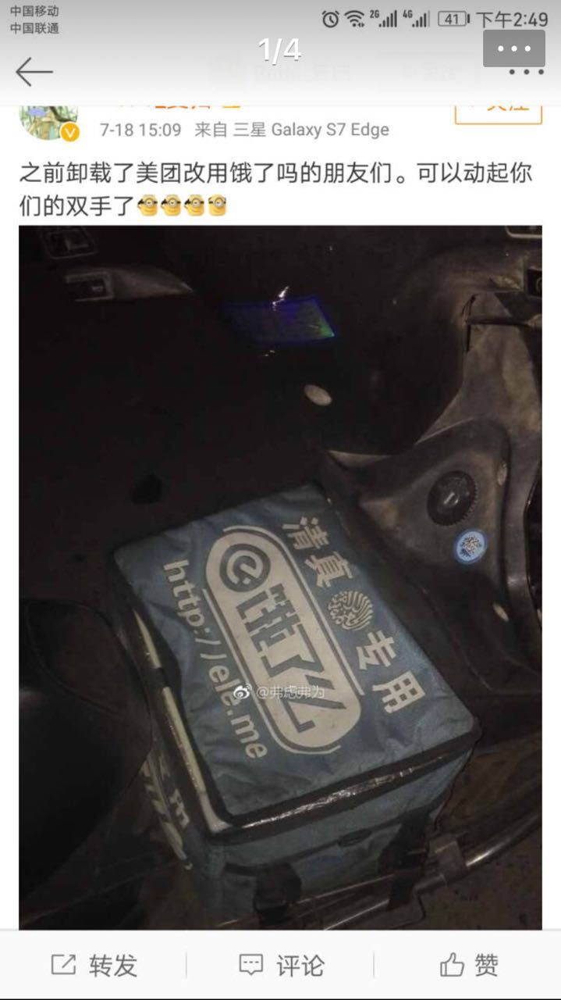

*2017-07-19 17:25 · 手机上网*

---

### 4341

我们内部查过了，没有这个人，没有这么low的猪队友。基本可以判断是有人蓄意冒充美团员工发表恶心言论来抹黑我们，是一次有组织的攻击。转@ magic 村长，猪队友们怎么了@ 王兴

*2017-07-19 16:58 · 手机上网 转自magic*

---

### 4342

转：Some decisions are ba sed on a clear understanding ofreality. Others are ba sed on a general vision of the future.

*2017-07-19 14:10 · iPhone版*

---

### 4343

一晃，一个月就过去了。

*2017-07-19 13:47 · iPhone版*

---

### 4344

刚知道我们同事中有人英文名叫 naomi，这个并不常见的名字不可避免的让我想起那个黑人大美女。

*2017-07-19 11:59 · iPhone版*

---

### 4345

那只怪兽张开血盆大口，张牙舞爪的向我冲过来；我决定一口把它吞掉，当做喝防弹咖啡的小点心。

*2017-07-19 09:00 · iPhone版*

---

### 4346

整个世界都是脆弱的吗？还是只有美好的事物如此？

*2017-07-19 00:02 · 手机上网*

---

### 4347

说实话，我也不知道我为什么要转发这条。其实我未必同意这个观点。转@ pathos1992 对我而言 成年与否的一个决定性标志：发自内心的热爱工作了。

*2017-07-18 23:55 · 手机上网 转自pathos1992*

---

### 4348

合计15个小时一场接一场的会终于结束了，差点有出去喝杯酒的冲动，结果我决定用回家路上大声放首歌来代替。

*2017-07-18 23:53 · iPhone版*

---

### 4349

说得仿佛前头是枪林弹雨似的。转@ 王兴 又是防弹咖啡的一天。

*2017-07-18 09:03 · 手机上网 转自王兴*

---

### 4350

又是防弹咖啡的一天。

*2017-07-18 08:43 · iPhone版*

---

### 4351

转@ 三猎 「咒」的异体是「呪」。「祝」和「咒」同源，本义是「将话语变为现实」，后来分化，积极的是「祝」，消极的是「咒」。转@ 王兴 我还真是没注意过这两个字形状的相似之处。转@ 孙岩 「祝」和「咒」同源，我好像明白些什么。

*2017-07-17 22:06 · 手机上网 转自孙岩*

---

### 4352

L大哥对我说：我想介绍给你的这家百货公司和国内其他同行不一样。

他们老板不是科班出身。他原本是疯人院的医生……

*2017-07-17 20:47 · 手机上网*

---

### 4353

我还真是没注意过这两个字形状的相似之处。转@ 孙岩 「祝」和「咒」同源，我好像明白些什么。

*2017-07-17 18:38 · 手机上网 转自孙岩*

---

### 4354

Queen的《波西米亚狂想曲》确实词曲俱佳，非常梦幻，现场肯定特别high。

*2017-07-17 18:26 · 手机上网*

---

### 4355

乱入一下，据说「君山银针」是极少数靠谱的黄茶之一。转@ peter竟将云梦吞如芥，未信君山铲不平。@ 杜斌beta

*2017-07-17 18:16 · 手机上网 转自peter*

---

### 4356

我们同事的姓真是五花八门：缪、亢、卿、只、笪…

*2017-07-17 13:41 · 手机上网*

---

### 4357

转@ peter 想起了富士康的电商网站：富联网转@ 王兴 中国最大的生猪B2B交易平台就叫……猪联网。

*2017-07-17 13:39 · 手机上网 转自王兴*

---

### 4358

@ 阳升 这是啥工具？

*2017-07-17 11:58 · 手机上网 给阳升的回复*

---

### 4359

「庞氏骗局」差不多是金融里最重要的概念了吧。

*2017-07-17 01:21 · iPhone版*

---

### 4360

回到北京了。今天当了一回勤劳的小蜜蜂：在厦门看到这种极易繁殖的植物，我就捋了一把那些已长出根的小芽，带回北京撒到小区的空地里。

*2017-07-17 00:57 · 猫饭*

---

### 4361

昨天在过来的飞机上看了电影《刺客信条》，感觉一般，十分制顶多给七分吧。有个场景：女主（科学家）激动起来：it's my life's work!

男主（刺客）怼回去：it's my life!

*2017-07-16 20:16 · iPhone版*

---

### 4362

中国最大的生猪B2B交易平台就叫……猪联网。

*2017-07-16 18:49 · iPhone版*

---

### 4363

武大的人称自己的校友为「武大郎」……

*2017-07-16 17:15 · iPhone版*

---

### 4364

原来尼康 nikon 这个品牌是这么山寨出来的。

*2017-07-16 15:18 · 手机上网*

---

### 4365

时隔几年，我终于又买了一把刀：spyderco sage 第五代。厂商喜欢出系列还是有道理的。

*2017-07-16 14:22 · iPhone版*

---

### 4366

虽然北京今年空气质量改善不少（据说上半年总体优于上海），但和厦门还是不能比。天空的蓝色都明显不是一个色调。

*2017-07-15 23:15 · 手机上网*

---

### 4367

今年我回过龙岩吗？一时间有点恍惚，不太确定。查了一下饭否，应该是回过的。

*2017-07-15 23:11 · 手机上网*

---

### 4368

今年第三次来厦门了，全是因为公事。白天有点热，但太阳下山后还是蛮舒服的。

*2017-07-15 23:01 · 手机上网*

---

### 4369

有段时间没跟马占凯同学瞎聊了。刚才，在夏夜的草坪上，他跟我喷了一通最近的各种收获，其中有一条和他的观点「人的本性是利他的」高度相关：「你知道我知道你知道」几乎可以算是人类社会性的基石。

*2017-07-15 22:42 · 手机上网*

---

### 4370

又听到《红日》。上回是在电影中，这回是现场。

*2017-07-15 20:45 · 手机上网*

---

### 4371

哈雷彗星下次回归会在2061/2062年。

*2017-07-15 11:12 · iPhone版*

---

### 4372

FT中文网居然有个「美食与美酒」频道。

*2017-07-15 11:08 · iPhone版*

---

### 4373

转@ denvi 当今世界是存在着奴隶制的，世界约有1000万至2700万人沦为奴隶，是的，就是当下。（2009年，国际劳工组织（ILO）报告）碰巧看到… 转@ 王兴 又听到一个说法：当今世界的奴隶比历史上任何时代都多-_-! 转@ 王兴 真的吗？后者不太可能吧？转@chenhang

*2017-07-14 18:19 · 手机上网 转自chenhang419*

---

### 4374

嘿，居然还有科威特语！转@ 小熊娃娃 看了一下转发真是快被蠢哭……知道啥是小语种吗？知道啥是北大四年就招十个学生的小语种吗？阿尔巴尼亚语塞尔维亚语科威特语你去做生意赚钱？古波斯语梵语巴利语你去让机器翻？阿拉伯语你翻不好了会被绿绿打知道不？

*2017-07-14 17:37 · 手机上网 转自小熊娃娃*

---

### 4375

转@ 小熊娃娃 这两天整理材料的时候发现小语种翻译人才断档非常严重，要么老一辈翻译家都是30年代生人，要么就是60后往后的中青年了。中间40-50年代生人几乎没有。可能因为本身学语言需要有很大投入，没有支撑很难自学成才，所以这个现象比文史哲领域显得还严重很多。

*2017-07-14 17:24 · 手机上网 转自小熊娃娃*

---

### 4376

转@ 王兴 Every nation has the government it deserves. 很刺耳的一句话，但是很在理。把这句话里 government 换成 企业 也一样说得通。

*2017-07-14 16:03 · 手机上网 转自王兴*

---

### 4377

拜托，我说的不是房奴或者什么「爱情的奴隶」之类的。就是真的奴隶那种。转@ 王兴 又听到一个说法：当今世界的奴隶比历史上任何时代都多-_-! 转@ 王兴 真的吗？后者不太可能吧？转@chenhang419 现在养马的人比中世纪还多、造中世纪武士盔甲的人比中世纪还多

*2017-07-14 14:09 · 手机上网 转自chenhang419*

---

### 4378

又听到一个说法：当今世界的奴隶比历史上任何时代都多-_-! 转@ 王兴 真的吗？后者不太可能吧？转@ chenhang419 现在养马的人比中世纪还多、造中世纪武士盔甲的人比中世纪还多

*2017-07-14 13:52 · 手机上网 转自chenhang419*

---

### 4379

@ 刘兴亮 没想到你也上饭否……

*2017-07-14 13:36 · iPhone版*

---

### 4380

看了一下美国五大科技公司创始人的年龄：微软和苹果的都是55年生，亚马逊的是64年生，谷歌的俩都是73年生，facebook的是84年生。真是一代人干一代人的事啊。

*2017-07-14 13:08 · iPhone版*

---

### 4381

「咪客」和「眯客」是两家不同的的创业公司，连行业都不同。

*2017-07-14 12:00 · iPhone版*

---

### 4382

今天早餐是一杯防弹咖啡。不是为了今天，而是因为昨晚。

*2017-07-14 08:55 · iPhone版*

---

### 4383

2017.7.13夜里北京下了场冰雹。

*2017-07-14 01:01 · iPhone版*

---

### 4384

paypal确实是傻逼。我想绑一张信用卡死活绑不上，也没详细的出错

信息，就只说请换一张卡:( 跟这种想花钱都花不出去的支付通道绑在一起，ebay居然还没倒闭也是奇迹。

*2017-07-13 17:38 · 手机上网*

---

### 4385

姑娘霸气！转@ 飯否小字报 转@ 煎蛋无聊图 上传了新照片

*2017-07-13 13:41 · 手机上网 转自煎蛋无聊图*

---

### 4386

距离说这话不到半年。转@ 王兴 就在上个月，王健林还去清华演讲，公开说「清华北大都不如胆子大」。我不觉得有美国大亨会去哈佛或斯坦福这样演讲。转@ 小熊娃娃 知乎上还在讨论中国为啥不能文化输出，溜了一眼真是被蠢哭了…文化本来就不行输出个毛线啊！就是有你们这些不懂装懂瞎讨论的人才更加不行

*2017-07-12 23:47 · 手机上网 转自小熊娃娃*

---

### 4387

转@ Frankiiee 南华早报被收购后的公信力确实要打问号。昨天的报道是蔡崇信评论中国的重要性以及未来的「中国故事」应该由谁来讲，比较了无法深入报道的外媒和毫无以上顾虑的南早，结论是对自家报纸很有信心。一看今天的新闻，又放了半天 Jack Ma 如何想下辈子做回女人。

*2017-07-12 21:57 · 手机上网 转自Frankiiee*

---

### 4388

见识了，星巴克真的是一家有情怀的公司。

*2017-07-12 17:13 · 手机上网*

---

### 4389

急着出门，用以往喝防弹咖啡的便携咖啡杯装了茶带着路上喝。现在觉得茶里有若隐若现的咖啡味。所谓苏格兰单一麦芽威士忌讲究用各种雪莉桶/波本桶/红酒桶陈酿其实也就是这个道理吧。

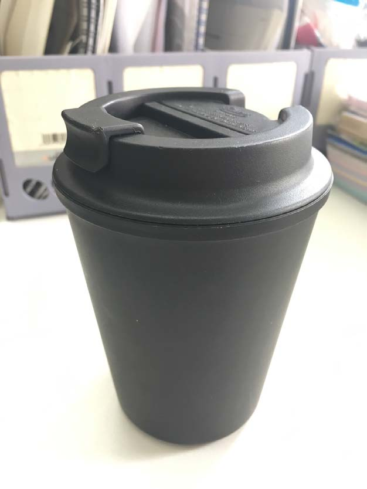

*2017-07-12 14:03 · 猫饭*

---

### 4390

同样的音乐，音量大和小，感觉可以很不同。

*2017-07-12 13:48 · iPhone版*

---

### 4391

真的吗？后者不太可能吧？转@ chenhang419 现在养马的人比中世纪还多、造中世纪武士盔甲的人比中世纪还多

*2017-07-12 09:27 · 手机上网 转自chenhang419*

---

### 4392

今天早上喝掉了从家乡带来的最后一点「斜背茶」。确实是童年的味道，那时我不喝茶，但是会闻到家里长辈喝的茶的味道。

*2017-07-12 09:18 · 手机上网*

---

### 4393

几年前买的同款不同色的两条裤子都破了，前后相差不到两个月，都是左臀中部的位置横着裂开一道口子。

*2017-07-11 23:57 · iPhone版*

---

### 4394

今天午饭后的无聊活动是在地图上找了一下从白居易写《琵琶行》的浔阳/江州（今天的九江）到「浮梁」（景德镇下的一个县）买茶去的水路怎么走。目测是走鄱阳湖转昌江，不走长江。

*2017-07-11 13:09 · 手机上网*

---

### 4395

又听到Robbie Williams的《Better Man》这首歌，联想到英文里的说法 You are what you eat，突然觉得美团的公司使命 Help peopleeat better 更有意义了。

*2017-07-11 13:04 · 手机上网*

---

### 4396

嗯，不过离得不远，我在地图上查了一下，「浮梁古县衙」到「景德镇市政府」开车15.8公里。转@ 我爱吃饭是真的 浮梁不是景德镇，现在景德镇有一个县叫做浮梁。我一个大学同学就是浮梁的。 转@ 王兴 「商人重利轻别离，前月浮梁买茶去」里的浮梁居然是景德镇。我之前真是没把景德镇和茶联系起来

*2017-07-11 12:51 · 手机上网 转自王兴*

---

### 4397

转：母亲单位有很多报纸，《参考消息》《光明日报》《文汇报》都是陈东升不肯错过的课外读物。他至今尤能想起1972年刊于《参考消息》上的一则新闻，内容关于可携带式电话的重大发明。“就在第四版上，占三分之一栏。因为要利用超短波进行通信，所以需要100公里建一个基站，对于当时来说，成本太

*2017-07-11 11:53 · iPhone版*

---

### 4398

罗斯福应对大萧条靠的是「新政」，布莱尔当英国首相的执政理念是「新工党」，北京08年奥运会的口号是「新北京·新奥运」……

*2017-07-11 11:30 · iPhone版*

---

### 4399

一只骄傲的茄子。

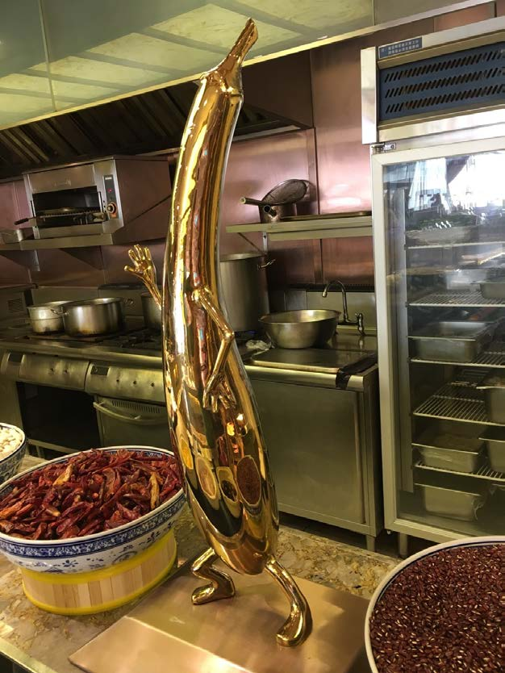

*2017-07-11 08:06 · 猫饭*

---

### 4400

有点儿不忍心让它们分离。

*2017-07-11 08:04 · 猫饭*

---

### 4401

又来到这家熟悉的酒店，在一个陌生的时间。

*2017-07-11 08:01 · iPhone版*

---

### 4402

「商人重利轻别离，前月浮梁买茶去」里的浮梁居然是景德镇。我之前真是没把景德镇和茶联系起来。

*2017-07-11 00:38 · iPhone版*

---

### 4403

低谷时能不能扛住是消费品品牌的分水岭。汾酒曾是白酒老大。98年金融危机后，市场萧条，酒厂纷纷降价促销，汾酒也降到百元以下，只有茅台、五粮液、剑南春坚守在百元以上。这也是后来高端白酒「茅五剑」的由来。

*2017-07-10 14:11 · iPhone版*

---

### 4404

据说中国喝茅台的大概有四五百万人。

*2017-07-10 14:07 · iPhone版*

---

### 4405

中国有3.6亿烟民，每天消耗3.5亿包烟。20根一包，10包一条，5条一件，10件一箱（一万根）。

*2017-07-10 14:05 · iPhone版*

---

### 4406

问了专家，黑茶和普洱确实不是一回事。黑茶是从青茶发展出来的，历史上就是给边区牧民等喝的低端茶，用料不好。严格说起来，青茶和乌龙茶也不是一回事。

*2017-07-10 13:58 · iPhone版*

---

### 4407

「丰宁坝上，木兰围场」这几个字听起来就让人心动。

*2017-07-10 10:59 · iPhone版*

---

### 4408

「下场」这个词有两种意思。

*2017-07-10 10:50 · 手机上网*

---

### 4409

厉害！转@ 太空小孩 知乎上看到个厉害的。一个叫葛宇的人，自己做了一个路牌「葛宇路」贴到北京一条无名道路上，历经 3 年时间被导航和各大地图收录，最后就这样拥有了一条以自己名字命名的道路…

http://t.cn/RKq40vJ

*2017-07-10 10:47 · 手机上网 转自太空小孩*

---

### 4410

这……是苏联女红军吧？转@ webto 感觉下岗潮之前我大东北还是各种怂的 =_=

*2017-07-10 09:59 · 手机上网 转自webto*

---

### 4411

一条、一席、一点、二更、两鲜……

*2017-07-10 09:58 · iPhone版*

---

### 4412

高铁窗外闪过一座寺庙状的建筑，让我想起几年前去缅甸时的印象：从飞机上往下看，时不时远处地面有金光一闪，我就知道那是另一处村庄了；每个村庄都有自己的金塔；阳光明媚时从飞机上看下去平原上金光点点。

*2017-07-09 14:53 · iPhone版*

---

### 4413

这茶包的文案真是太能吹了，连 malty 这种词都用上了。

*2017-07-09 14:02 · 猫饭*

---

### 4414

三对三？这个细节我还真没注意过。转@ 那个谁 哪吒三太子打死东海龙王的三太子 转@ 王兴 说到「屠龙」，你们能想起中国传统文化中哪个具体的人或故事？转@ 王兴 似乎还没哪家VC叫屠龙资本。

*2017-07-09 12:41 · 手机上网 转自王兴*

---

### 4415

@ Meng.Z 吃牛排真心不建议去王品，还是正经西餐厅的好。

*2017-07-09 12:33 · 手机上网 给Meng.Z的回复*

---

### 4416

说到「屠龙」，你们能想起中国传统文化中哪个具体的人或故事？转@ 王兴 似乎还没哪家VC叫屠龙资本。

*2017-07-09 11:53 · 手机上网 转自王兴*

---

### 4417

「归来仍是少年」也被滥用到有点莫名其妙的地步了，以至于我想毒舌脑补一句：大腹便便？

*2017-07-09 11:46 · iPhone版*

---

### 4418

水流与河床，互相适应。

*2017-07-09 11:15 · 手机上网*

---

### 4419

放下手机，立地成佛。

*2017-07-09 11:12 · 手机上网*

---

### 4420

问：那个大哥现在到底主要在做啥？答：在作。

*2017-07-09 11:02 · iPhone版*

---

### 4421

从「新零售」联想到「新民主主义」。

*2017-07-09 11:02 · iPhone版*

---

### 4422

似乎还没哪家VC叫屠龙资本。

*2017-07-09 09:49 · iPhone版*

---

### 4423

近期的运动主要靠在机场或高铁站夺路狂奔了。今天穿的鞋底特别薄，不太适应，有点影响发挥。

*2017-07-09 09:33 · iPhone版*

---

### 4424

看到路边一块不起眼的牌子「新疆和田地区驻北京联络处」，我的第一反应是：有特色餐厅吗？

*2017-07-09 09:21 · iPhone版*

---

### 4425

经过天宁寺无数次，但我还从未专程去看过这座北京古建筑。

*2017-07-09 09:18 · iPhone版*

---

### 4426

罗马不是一日建成的。但可能毁于一旦。

*2017-07-09 09:12 · iPhone版*

---

### 4427

这条龙堪称走位风骚。

*2017-07-09 09:01 · 猫饭*

---

### 4428

南洋杉真是一种优美的树。

*2017-07-09 08:47 · iPhone版*

---

### 4429

转：研究历史的人会明白，即使战争不符合任何人的利益，但还是可能爆发。

*2017-07-09 06:49 · 手机上网*

---

### 4430

又喝了一次豆汁。

*2017-07-08 19:04 · iPhone版*

---

### 4431

刚想了一下，国产手机主力品牌也是颜色鲜明：红（华为）黄（小米）蓝（vivo）绿（oppo）。

*2017-07-08 16:37 · iPhone版*

---

### 4432

听说了一个跟「清北复交」对应的缩写「哈耶普斯麻」，所谓美国五大名校。

*2017-07-08 15:59 · iPhone版*

---

### 4433

转：红军将士，咸愿在委员长领导之下，为国效命，与敌周旋，以达保土卫国之目的，迫切陈词，不胜屏营待命。毛泽东，朱德，彭德怀，贺龙， 林彪，刘伯承，徐向前叩（1937年）

*2017-07-08 00:52 · 手机上网*

---

### 4434

角力。互怼。

*2017-07-07 23:27 · 手机上网*

---

### 4435

听说我老家是龙岩，老律师脱口而出毛主席诗词「红旗越过汀江，直下龙岩上杭。收拾金瓯一片，分田分地真忙。」 不愧是在陕北志丹县插过队的。

*2017-07-07 22:47 · iPhone版*

---

### 4436

据说死亡率最高的极限运动是酷跑。你知道酷跑的全球排名怎么提升吗？靠排前面的逐渐都挂了-_-!

*2017-07-07 22:43 · iPhone版*

---

### 4437

和两个从小打冰球的中国律师吃了顿日料。

*2017-07-07 21:54 · iPhone版*

---

### 4438

不要轻易去挑逗命运。

*2017-07-07 19:40 · iPhone版*

---

### 4439

此图霸气。呃，为何我竟有一种「保卫房价」的奇怪联想-_-!

*2017-07-07 13:09 · 手机上网*

---

### 4440

吃货如我的第一印象竟是：这发髻好像螃蟹的一对大钳子啊！

*2017-07-07 12:34 · 手机上网*

---

### 4441

《大圣归来》、《大鱼海棠》、《大护法》，国产动画片似乎都喜欢以大命名。

*2017-07-07 11:25 · iPhone版*

---

### 4442

思考了一下 change the word 和 change the world 之间的关系。

*2017-07-07 09:29 · iPhone版*

---

### 4443

google earth的iPad版在2016年5月4日以后就没再更新过:-(

*2017-07-07 09:21 · iPhone版*

---

### 4444

@ 带三个表 像个村庄。

*2017-07-07 01:16 · 手机上网 给带三个表的回复*

---

### 4445

把趙简化为赵似乎并不是很必要。转@ 孙岩 醜陋的醜简化成丑，姓丑的也很冤啊。闫姓可以改回阎，肖姓可以改回萧，赵改回趙貌似无望啊。可是RT@ 王兴 转@ 拧巴人儿 用繁體這個事兒吧…有個採訪對象姓趙，但要求我不要使用簡體的趙，因為那個叉像是打在死刑犯照片上的叉……我真是…我也很無奈啊！

*2017-07-06 23:44 · 手机上网 转自拧巴人儿*

---

### 4446

安全就好。转@ 陈亮 出差特意选了高铁，结果因为湖南隧道渗水，开到武汉折返回京，真是神奇的经历

*2017-07-06 23:10 · 手机上网 转自陈亮*

---

### 4447

我对所有电器的第一要求是：第一眼我就知道怎么开和怎么关。

*2017-07-06 23:10 · iPhone版*

---

### 4448

转@ 拧巴人儿 用繁體這個事兒吧…有個採訪對象姓趙，但要求我不要使用簡體的趙，因為那個叉像是打在死刑犯照片上的叉……我真是…我也很無奈啊！

*2017-07-06 22:38 · 手机上网 转自拧巴人儿*

---

### 4449

惊闻我们同事中还有一个摩门教徒，男的。

*2017-07-06 19:56 · 手机上网*

---

### 4450

我见过杀猪，但我没杀过猪。

*2017-07-06 18:57 · 手机上网*

---

### 4451

或许应该在连日暴雨后再去看一下都江堰。

*2017-07-06 18:50 · 手机上网*

---

### 4452

穿上袜子。

*2017-07-06 18:49 · 手机上网*

---

### 4453

呆萌蠢笨痴愚傻

*2017-07-06 18:36 · 手机上网*

---

### 4454

愿闻其详。谢谢。转@ 硕大的小老鼠 @ 王兴 普洱是后发酵茶，新的分法普洱茶已经是单独一类

*2017-07-06 18:32 · 手机上网 转自硕大的小老鼠*

---

### 4455

前几天见到姐姐，回忆起童年，她说奶奶曾带着我们一起做风筝。

*2017-07-06 18:32 · 手机上网*

---

### 4456

࿐ཉི༗࿆༗ཉི࿐ 转@ 王兴 好炫。

*2017-07-06 17:44 · 手机上网 转自王兴*

---

### 4457

@ 酱玉米 加油！茶是中国文化中的好东西。

*2017-07-06 16:50 · 手机上网 给酱玉米的回复*

---

### 4458

这小西红柿的味道好有层次感。

*2017-07-06 16:49 · 手机上网*

---

### 4459

@ 酱玉米 茶专家你好:)

*2017-07-06 16:42 · 手机上网 给酱玉米的回复*

---

### 4460

德国那一系的人不把祖国比作母亲 motherland，而是比作父亲vaterland。够爷们！

*2017-07-06 16:26 · iPhone版*

---

### 4461

中国传统六大茶类是红茶、绿茶、黑茶（包含普洱）、白茶、青茶（即乌龙茶）、黄茶。可以用「红绿相间、黑白分明、青黄不接」来辅助记忆。

*2017-07-06 14:48 · 手机上网*

---

### 4462

开小差想了一下，什么茶里有雨水的味道，有风的味道，有泥土的味道，有炉火的味道…… 转@ 王兴 有时白茶确实能让我觉得茶汤里有阳光的味道。

*2017-07-06 14:16 · 手机上网 转自王兴*

---

### 4463

良心、良人、良子、良家、良友

*2017-07-06 13:19 · iPhone版*

---

### 4464

craftsman: a person (especially a man) who is very skilled atdoing something. 手艺人？

*2017-07-06 11:19 · iPhone版*

---

### 4465

有时白茶确实能让我觉得茶汤里有阳光的味道。

*2017-07-06 09:30 · iPhone版*

---

### 4466

今天一大早就开始喝白茶。

*2017-07-06 09:01 · iPhone版*

---

### 4467

转@ 洋鸟消夏录 州政府辦事 一位年長officer也是華人 我請問如何稱呼 他自答姓孟 “‘孟夫子’的孟” 我被這位“孟夫子”逗得一时无措 記得中國城也常見“不准亂傾垃圾 違者送官究辦”之告示 很滑稽又很错乱 三藩某一時會非常“中國” 但跟我乘飛機十二小時所回之处并無瓜葛

*2017-07-06 07:53 · 手机上网 转自洋鸟消夏录*

---

### 4468

Übermensch是尼采提出的「超人」概念，由 uber 和 mensch 两部分组成。

*2017-07-06 07:52 · iPhone版*

---

### 4469

居然有个美国乐队的名字叫 Cigarettes After Sex （事后烟）-_-!

*2017-07-05 18:40 · iPhone版*

---

### 4470

Lisa Su的贵人是IBM的传奇人物Nicholas Donofrio。此君参与过从大型机到第一台PC的各种项目，是他安排她当Gerstner的技术助理（让她有机会观察 IBM CEO是如何工作的），也是他在当AMD董事时把她从Freescale招过来。

*2017-07-05 07:22 · iPhone版*

---

### 4471

AMD的现任CEO是华裔女性Lisa Su, 她生于台湾，2岁时随家迁往纽约，在MIT拿了电子工程的学士/硕士/博士学位，去IBM干了十多年（当过Gerstner的技术助理），在Freescale当过CTO后于2012年加入AMD，2014年成为CEO。

*2017-07-05 07:16 · iPhone版*

---

### 4472

转：好担心自己老了怎么办，那些广场舞看起来好难。# made myday #

*2017-07-04 10:26 · iPhone版*

---

### 4473

起来，竭尽全力拥抱这一天的命运。

*2017-07-04 07:20 · iPhone版*

---

### 4474

在飞机上看了《百鸟朝凤》。这部电影还是值得看的，虽然我觉得结尾处理得不算太好。

*2017-07-03 22:12 · iPhone版*

---

### 4475

直到今天，我听到迈克尔.杰克逊的某些歌的某一段时，脑海里还会自动浮现出MV里对应的场景或舞蹈动作。King of Pop 真不是浪得虚名。

*2017-07-03 22:08 · iPhone版*

---

### 4476

新中国的一号工程「两弹一星」指的是核弹、弹道导弹、人造卫星，我之前将两弹误解成原子弹和氢弹了。

*2017-07-03 21:51 · iPhone版*

---

### 4477

埃德蒙.柏克有句广为人知的名言：那些不懂历史的人注定要重复它。

今天从马克.安德森那里听到了下一句：那些懂历史的人注定要看着别人重复它-_-!

*2017-07-03 02:07 · 手机上网*

---

### 4478

有些时候，第二名存在的原因跟第二名本身的关系并不大，而是总有人不喜欢那个第一名。

*2017-07-02 06:18 · iPhone版*

---

### 4479

红杉资本的人告诉我，红杉这种树长得实在太高了（世界上最高的树种），所以不能完全靠树根吸水输送上去，而是所有叶子都从空气中吸收水份。

*2017-07-02 06:01 · iPhone版*

---

### 4480

第一次见到傅科摆。能展现地球自转还是蛮奇妙的

*2017-07-02 05:59 · iPhone版*

---

### 4481

组成现在红杉资本全球管理委员会的三个人是一个意大利人、一个中国人和一个南非人，没有哪个是在美国土生土长的。

*2017-07-02 02:38 · iPhone版*

---

### 4482

试了一下，确实可以用脚趾头解锁iPhone。

*2017-07-01 15:43 · iPhone版*

---

### 4483

阿里和华为终于正式交火了，在云计算这个市场。难怪阿里最近跑去买了中兴的一部分业务。

*2017-07-01 13:39 · iPhone版*

---

### 4484

自由，是存在于不同势力对垒的夹缝中；倘若一支势力打垮了其他的势力，自由就没有了安身之处。﹣埃德蒙.柏克

*2017-07-01 10:12 · iPhone版*

---

### 4485

第一次喝 decaf 的茶。

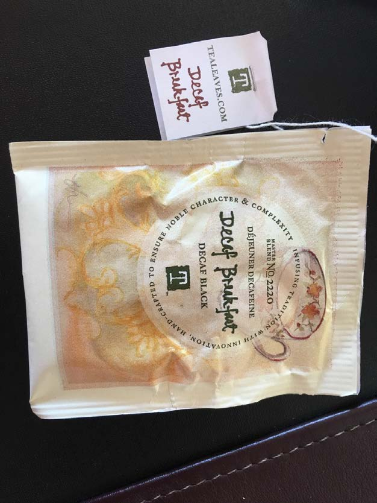

*2017-07-01 06:30 · 猫饭*

---

### 4486

我问红杉全球老大doug：我知道做风险投资总会遇到各种意外之事；

你干了30年，哪件事最让你惊讶？他想了一下说：最让我惊讶的是，这30年来我投过的公司里竟然没有哪一家是一帆风顺长起来的。

*2017-07-01 03:48 · iPhone版*

---

### 4487

见过四五次之后，我开始怀疑，这位女士可能不但从来不穿重复的衣服，而且不戴重复的戒指。

*2017-07-01 03:21 · iPhone版*

---

### 4488

记得有一期《中国国家地理》里讲到，新疆有一条河是向北流入北冰洋的。

*2017-06-30 05:29 · iPhone版*

---

### 4489

伊犁的水汽竟然是从大西洋一路向东吹过来的。

*2017-06-30 02:28 · iPhone版*

---

### 4490

@ 小户 就是「吃得更好，活得更好」啊。和住没有直接关系。

*2017-06-30 01:38 · 手机上网 给小户的回复*

---

### 4491

在琢磨美团的公司使命「让大家吃得更好，活得更好」“we helppeople eat better, live better ”时，我注意到 live 这个词在英语中既有狭义「住」的意思，又有广义「活」的意思。汉语中「住」和「活」这两个概念并没有这种关联。

*2017-06-30 00:47 · iPhone版*

---

### 4492

火焰，不但让人觉得温暖，而且百看不厌。

*2017-06-29 15:34 · iPhone版*

---

### 4493

和一个朋友在沙滩上沿着鹿的脚印散步，他传授给我一个看星空的小窍门：原地转十来圈，把自己转晕；失去熟悉的参照系之后，你会更能全身心体会星空的璀璨。

*2017-06-29 12:27 · iPhone版*

---

### 4494

一支雪茄能让你感觉到香、甜、苦、辣、麻，但是抽到最后只会有一个感觉：烫。

*2017-06-29 12:22 · iPhone版*

---

### 4495

洋土豪组织的活动不但提供雪茄，而且现场卷。

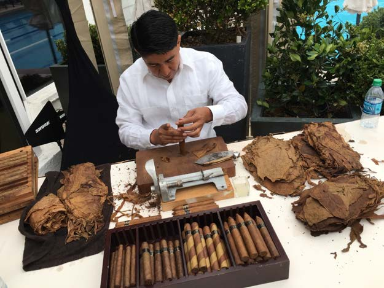

*2017-06-29 10:22 · 猫饭*

---

### 4496

突然想起《安德的游戏》。

*2017-06-29 08:26 · 手机上网*

---

### 4497

快十年没喝这种饮料了。当年我比较喜欢gatorade。

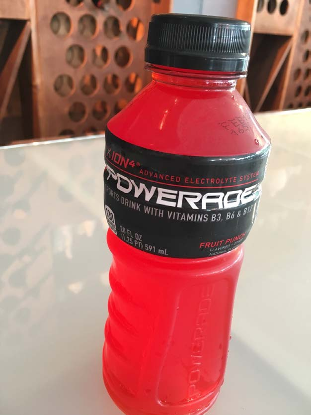

*2017-06-29 04:03 · 猫饭*

---

### 4498

两个资本大佬见面，俄国佬说「2000年互联网泡沫破灭时，我的公司价值蒸发了97%」，日本人说「那不算什么。我的蒸发了99%」。

*2017-06-27 11:10 · 手机上网*

---

### 4499

转@ 小熊娃娃 zz 绿妖：心理学领域的“创伤的代际传递”，指的是上一代的创伤会被传递到后代身上，集中营、大屠杀幸存者的孩子中求助于精神诊所的比例远比普通人高。而经历过三年大饥荒、十年文革的我们的父母，身上也分明有着幸存者的烙印，这烙印烙在基因里，通过一个个家庭，传递到下一代。

*2017-06-27 00:26 · 手机上网 转自小熊娃娃*

---

### 4500

没什么印象了。真的是我说的吗… 转@ yiyayi1984 转@ 太宰治 转@TS梨 转@ 戈城 引用了王老板的一条饭否。 转@ 王兴 人本身才是终极艺术品，可惜无法保存，更不能复制，只能选取片断转换成别的艺

术形式。

*2017-06-27 00:16 · 手机上网 转自戈城*

---

### 4501

@ qinyf 傍晚去西夏王陵的感觉特别棒。

*2017-06-26 12:34 · iPhone版 给qinyf的回复*

---

### 4502

转@ qinyf 哎呀这是我小时候老师告诉我的话，没错 RT@ .rex 一天不练，自己知道。两天不练，教练知道。三天不练，路人知道。转@qinyf 还没收拾行李，临走前先拉了半小时琴。怕是三天后回来左手手指就忘记按弦按到起茧子的感觉了

*2017-06-26 08:28 · 手机上网 转自qinyf*

---

### 4503

@ 美嘉.rar 已转给做外卖的同事。谢谢。

*2017-06-26 00:37 · 手机上网 给美嘉.rar的回复*

---

### 4504

但是，蓝莓味不足。转@ 王兴 今晚的蓝莓是我这辈子吃过的最甜的。

*2017-06-25 22:25 · 手机上网 转自王兴*

---

### 4505

奇怪，今晚的桃子也特别甜，杏也是。这是什么情况？

*2017-06-25 19:50 · iPhone版*

---

### 4506

今晚的蓝莓是我这辈子吃过的最甜的。

*2017-06-25 19:22 · iPhone版*

---

### 4507

其实，坚持并不难，改变也不难；难的是知道什么该坚持，什么该改变，何时该坚持，何时该改变。

*2017-06-25 09:58 · iPhone版*

---

### 4508

浙江居然有道菜就是栀子花。

*2017-06-24 21:52 · 手机上网*

---

### 4509

转@ 啊_蛋 想起上次拍片，站在未完工的钢平台上往下看，风呼呼啦啦地吹，腿也软了，感觉随时要掉到对面的大裤衩。楼建好了，这种体验就成了限量版，后人只能隔着玻璃看了。「@ 王兴 迫不及待想等中国尊建好后到顶上去鸟瞰一下北京城。」

*2017-06-24 20:04 · 手机上网 转自王兴*

---

### 4510

迫不及待想等中国尊建好后到顶上去鸟瞰一下北京城。

*2017-06-24 18:49 · iPhone版*

---

### 4511

前些天碰到一个北京中医药大学毕业的广告界牛人，他告诉我「后来的研究表明，中药里大概有百分之二三十的主要功效是补充热量。这部分肯定是有道理的。」 但他很看好中医将来的发展，也说出了让我信服的理由。

*2017-06-24 11:56 · iPhone版*

---

### 4512

他跑在前面，背上插满各式暗器，仿佛背着一个MCM经典款。

*2017-06-24 11:33 · iPhone版*

---

### 4513

2010年中国互联网发生了好几件事：美团和小米诞生；3Q大战；谷歌退出中国；kik的爆红催生了微信/米聊等；阿里那边估计主要在酝酿2011年的支付宝分拆吧，顺带搞了一下B2B打黑。

*2017-06-24 01:28 · 手机上网*

---

### 4514

是的。我也是很后来才逐渐理解，为什么说科举制度是中国对世界文明最重要的贡献之一，不亚于所谓四大发明。转@ 远骋 一张很美好的老照片，一段挺有道理的话

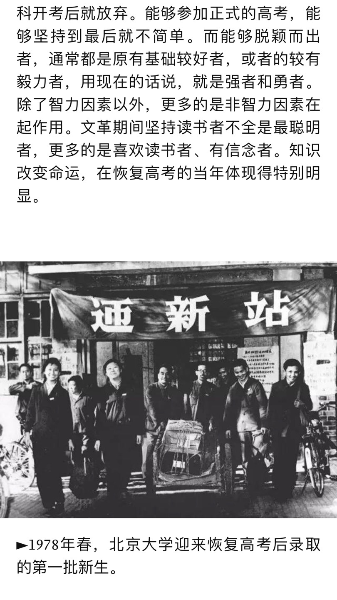

*2017-06-23 19:14 · 手机上网 转自远骋*

---

### 4515

问了一下丁老板，他说网易的工商执照上的日期就是1997年6月23日。

*2017-06-23 15:40 · iPhone版*

---

### 4516

爸爸让人把他的护照从福建寄到北京来，用的竟然是申通。这让我对顺丰的护城河产生了怀疑。

*2017-06-23 15:33 · iPhone版*

---

### 4517

网易果然是中国互联网公司里第一个庆祝20周年的。

*2017-06-23 15:22 · iPhone版*

---

### 4518

如果一个风险投资基金起名叫「猫狗资本」，是不是能达到过目难忘的效果？

*2017-06-23 14:52 · iPhone版*

---

### 4519

尤其是看到「共享单身」的创业项目在做PR… 转@ 阳升 共产主义和资本主义来到了最后决战的时刻！双方思潮是“万物皆可共享”和“有恒产者有恒心”，前者由各大资本支持，后者则由共产党背书！总感觉哪里有点不对劲……

*2017-06-23 13:52 · 手机上网 转自阳升*

---

### 4520

安吉白茶虽然名字里有白茶二字，但属于绿茶。常见的白茶产于福建，例如福鼎大白茶。「在中国的六大茶类中，白茶是工序最简单的一种。水灵灵的茶叶摘下来，经过日晒或阴干，自然萎凋并干燥，就成了白茶。」

*2017-06-23 13:28 · 手机上网*

---

### 4521

@ 过去的小虫子 抱歉。这个问题我们会加紧解决。

*2017-06-23 13:06 · 手机上网 给过去的小虫子的回复*

---

### 4522

开始喝白茶。

*2017-06-23 10:24 · iPhone版*

---

### 4523

是墨尔本把三藩从「金山」变成「旧金山」的。

*2017-06-22 20:12 · iPhone版*

---

### 4524

转@ 阳升 转@ 煎蛋无聊图 奥运会两枚金牌得主，32岁的女子短跑运动员桑娅·理查兹打破沉默，在自己的新书里承认出发去08北京奥运会之前一天做过堕胎，这届奥运会上她获得个人铜牌和接力金牌。还说堕胎很普遍， 她所认识的所有田径女运动员都堕过胎。通过怀孕可以提高激素水平从而提高竞赛成绩

*2017-06-21 18:37 · 手机上网 转自煎蛋无聊图*

---

### 4525

@ krashna welcome.

*2017-06-21 15:17 · 手机上网 给krashna的回复*

---

### 4526

老爸跟我抱怨说摩拜的299元押金太贵了。

*2017-06-21 13:03 · iPhone版*

---

### 4527

上善治水。

*2017-06-21 10:54 · iPhone版*

---

### 4528

我从没问过爸爸他写不写日记，但五年前奶奶去世后，我整理她的遗物时在那个小木箱里看到过两页爸爸的日记，写于他在爷爷去世多年后终于找回遗骨的那天。

*2017-06-21 00:22 · iPhone版*

---

### 4529

There is nothing noble in being superior to your fellow(wo)man; true nobility is being superior to your former self. Hemingway

*2017-06-21 00:00 · iPhone版*

---

### 4530

这就是生活，高强度的生活。转@ 王兴 XX像海啸一般扑面而来，在我身后化作蒸汽。

*2017-06-20 22:18 · 手机上网 转自王兴*

---

### 4531

竟然有一家公司名叫「中资金控」-_-!

*2017-06-20 16:03 · iPhone版*

---

### 4532

蹲厕确实比较锻炼腿。

*2017-06-20 14:56 · iPhone版*

---

### 4533

爸爸说，家乡的很多煤矿，洞口在海拔六七百米的山上，一直往下采，现在已经挖到海平面下四五百米了-_-!

*2017-06-20 11:20 · iPhone版*

---

### 4534

爸爸说他现在最关心这条80/20原则：80岁时还有20颗牙。

*2017-06-20 10:09 · iPhone版*

---

### 4535

听说老爸老妈居然也有时在百度上查医疗健康相关的信息，我吓坏了，赶紧本着「矫枉必须过正」的原则非常严肃的给他们普及了一下「信百度，死得快」的说法。头疼的是，好像确实没什么靠谱的替代品。

*2017-06-20 09:51 · iPhone版*

---

### 4536

Hunt AND be hunted.

*2017-06-20 09:19 · iPhone版*

---

### 4537

美国贺卡品牌 hallmark 的中文名叫「贺曼」。

*2017-06-20 08:40 · iPhone版*

---

### 4538

因为父母工作忙，所以我小时候确实是奶奶带大的，但我回忆不起奶奶辅导我功课的场景，也许并没有发生过，因为我不太做功课。转@王兴 爸爸总结了一个他和我的共同点：我俩的家庭都是祖父缺失的。

我俩各自的祖母在我们的成长过程中，尤其是童年和青少年时期，都发挥了超出一般的影响力。

*2017-06-20 08:08 · 手机上网 转自王兴*

---

### 4539

宁浩给他的电影公司起名「坏猴子」，因为他觉得孙悟空是中国传统文化众多形象里他最欣赏的那个。但英文为什么叫 dirty monkeys ，为什么是复数？

*2017-06-19 19:44 · 网页*

---

### 4540

XX像海啸一般扑面而来，在我身后化作蒸汽。

*2017-06-19 13:12 · 手机上网*

---

### 4541

果然天下乌鸦一般黑-_-! 国内许多媒体也很坑爹。转@ 阳升 《即将到来的中国崩溃》作者说：“我沒有選擇那樣的標題，標題是《華爾街日報》起的，我覺得這個標題沒有反映出文章的內容。” 哈哈哈，fakenews media.

*2017-06-19 11:59 · 手机上网 转自阳升*

---

### 4542

打算开始听一些小号。想了一下，之前我有印象的小号主要就是久石让和louis armstrong 。 转@ 王兴 在李健的《父亲写的散文诗》歌声中迎来了父亲节。结尾那一小段小号独奏堪称画龙点睛。

*2017-06-19 10:45 · 手机上网 转自王兴*

---

### 4543

刚用眼镜布把macbook屏幕擦得和眼镜一样一尘不染。

*2017-06-19 10:41 · iPhone版*

---

### 4544

早上又听《fade》，突然有点纳闷这么燃的旋律为什么起了这么个名字。

*2017-06-19 09:26 · 手机上网*

---

### 4545

生产力和生产关系：十八世纪末，英国开始工业革命的时候，法国在搞大革命。

*2017-06-18 21:22 · iPhone版*

---

### 4546

亨廷顿倾向于同意梅尔科的总结：至少有12个主要文明，其中7个已不复存在（美索不达米亚、埃及、克里特、古典、拜占庭、中美洲、安第斯），5个还在（中国、日本、印度、伊斯兰、西方）。西方文明中可以再细分出东正教文明、拉丁美洲文明。可能还有非洲文明。

*2017-06-18 17:33 · 手机上网*

---

### 4547

韦伯提出有五大世界性宗教：基督教、伊斯兰教、印度教、儒教、佛教。

*2017-06-18 17:30 · 手机上网*

---

### 4548

七死八活九翻身。

*2017-06-18 15:56 · 手机上网*

---

### 4549

爸爸饶有兴致的给我分析了一通他两个月前参加的那个六天包住双飞的巴厘岛旅行团为什么只要2800元（原价2600，超过65岁再加收200），在商业上是如何成立的……

*2017-06-18 13:35 · iPhone版*

---

### 4550

但爸爸也绝不会忘记提到另一点：曾祖母的二哥在大事上非常明白，大节不亏。太平洋战争时期，他在印尼，日本占领之后找他这种受过日本教育的人出来做事，他不愿服务日本人，宁愿避到非常穷乡僻壤的地方去。二战之后他回乡办教育，前后干了半个多世纪。

*2017-06-18 13:09 · iPhone版*

---

### 4551

爸爸给我讲起长辈时，但凡提到曾祖母的二哥，总会强调一点：虽然他读了早稻田大学，但是亲戚朋友都认为他其实天资一般，并不聪明。我就纳闷了，一个人得鲁钝成啥样才会在接近一个世纪后还有这样的名声。

*2017-06-18 13:04 · iPhone版*

---

### 4552

转@ gravity0 罗胖复述朱建军的观点：“大儒常无父”。孔子孟子张载欧阳修，都是没爹的孩子。成长过程对性格至少有两个影响：一是早当家有责任感，二是幻想中有个完美的父亲与之互动故而提倡孝道。

*2017-06-18 12:26 · 手机上网 转自gravity0*

---

### 4553

一座废弃厂房，门前一条崭新的路，屋顶一棵野生的树。转@ 任梦可路呢「@ 杂货铺吖 「@ 王兴 一座废弃厂房屋顶上野生的一棵树。

」」

*2017-06-18 11:49 · 手机上网 转自王兴*

---

### 4554

一座废弃厂房屋顶上野生的一棵树。

*2017-06-18 11:37 · 猫饭*

---

### 4555

谢谢，我也看得热泪盈眶。歌词有区别，分别是儿子和女儿给父亲的。转@ 赟棠 看了网易云许飞版本《父亲写的散文诗》下的评论，简直要泪奔的... 转@ 王兴 在李健的《父亲写的散文诗》歌声中迎来了父亲节

*2017-06-18 11:36 · 手机上网 转自王兴*

---

### 4556

爸爸总结了一个他和我的共同点：我俩的家庭都是祖父缺失的。我俩各自的祖母在我们的成长过程中，尤其是童年和青少年时期，都发挥了超出一般的影响力。

*2017-06-18 09:54 · 手机上网*

---

### 4557

我知道那段，但我这里说的气魄和风雨/鬼神一样都不受主角主观影响。。转@ 阳升 其实不是，他预期很低的，自传里有完整的记录 转@ 王兴 「笔落惊风雨，诗成泣鬼神」，Linus Torvalds 当年敲 Linux内核源代码时应该就是这种气魄吧，虽然远在芬兰的他大概并不知道

李白杜甫。

*2017-06-18 00:42 · 手机上网 转自王兴*

---

### 4558

「笔落惊风雨，诗成泣鬼神」，Linus Torvalds 当年敲 Linux 内核源代码时应该就是这种气魄吧，虽然远在芬兰的他大概并不知道李白杜甫。

*2017-06-18 00:25 · iPhone版*

---

### 4559

转@ 金融界人贩子 驻马店马姓女子被两次碾压后身亡的消息已经在墙内销声匿迹了。视频我看了，难过得不行。当我想到一个三四线城市没有红绿灯的路口竟然有监控摄像头这个事实并考虑要不要加仓老大哥概念股时，我愈发难过了，而且鄙视自己，觉得自己是个罪人。

索多玛的普通一天。

*2017-06-18 00:05 · 手机上网 转自金融界人贩子*

---

### 4560

在李健的《父亲写的散文诗》歌声中迎来了父亲节。结尾那一小段小号独奏堪称画龙点睛。

*2017-06-18 00:04 · 手机上网*

---

### 4561

转@ 宋缺 我爷爷也是，1921 年的，颤颤巍巍报班学了 Flash，现在在写回忆录……写了三本 转@ 王兴 一个朋友说她外婆95岁了，会用微信，每天读书写读书笔记，我肃然起敬的同时有点自惭形秽。

*2017-06-17 23:44 · 手机上网 转自王兴*

---

### 4562

人生有很多偶然。例如，这首歌其实并不是特别的广场舞范儿，但自从昨晚堵车时给它脑补编排了若干动作后，我再听时必然联想到广场舞。转@ 王兴 周五晚上一路好堵。脑补了一下一整个天安门广场的大妈伴着 lady gaga 的《million reasons》跳广场舞的情景。

*2017-06-17 23:30 · 手机上网 转自王兴*

---

### 4563

转：一个妖怪去人间吃人了，手下的小妖怪焦急地等老妖怪带回来好吃的，可老妖怪回来脸色并不是很好。他连忙喝了一大杯蜂蜜，说了一句：“众生太苦了！

*2017-06-17 23:22 · iPhone版*

---

### 4564

是什么决定了戴上墨镜像黑社会大哥还是盲人呢？

*2017-06-17 09:20 · iPhone版*

---

### 4565

周五晚上一路好堵。脑补了一下一整个天安门广场的大妈伴着 ladygaga 的《million reasons》跳广场舞的情景。

*2017-06-16 21:01 · iPhone版*

---

### 4566

生熟精绝化。

*2017-06-16 20:35 · iPhone版*

---

### 4567

我必须实事求是的说，这张小广告的字体和排版比国内百分之七十二的拿过风险投资的公司还更上道。

*2017-06-16 15:10 · 猫饭*

---

### 4568

路边并排的两家店的名字我都很熟悉：张亮麻辣烫和百度烤肉。@ 张亮

*2017-06-16 14:36 · 手机上网*

---

### 4569

一路向东。

*2017-06-16 14:31 · 手机上网*

---

### 4570

这个关于并购的开场白有冲击力。不愧是老司机。

*2017-06-16 10:33 · 猫饭*

---

### 4571

一个朋友说她外婆95岁了，会用微信，每天读书写读书笔记，我肃然起敬的同时有点自惭形秽。

*2017-06-16 10:24 · iPhone版*

---

### 4572

消费升级有很多表现形式，例如，不喝可口可乐了。

*2017-06-15 13:22 · iPhone版*

---

### 4573

尝试了几次用脚踩死一只贴地飞行的蚊子，目标未达成:(

*2017-06-15 09:56 · iPhone版*

---

### 4574

alan walker的《fade》确实是极容易给人留下印象的旋律，可惜后来配上歌词变成《faded》时那词写得一般。

*2017-06-15 09:10 · iPhone版*

---

### 4575

是的，现实就是如此残酷，所以需要发展经济，需要研究科技。转@gravity0 即便算数不好，也知道分母的作用。不管现在国人看起来多么有钱挥金如土，如果除一下人口基数就知道，我们还是穷国。那些昂贵的公共设施，比如火电厂的二氧化硫过滤，我们享受不起。土豪充其量也就是独善其身罢了。

*2017-06-15 08:39 · 手机上网 转自gravity0*

---

### 4576

北京的污染问题并非不可解决，历次大会期间的蓝天白云已经证明了。问题还是钱。

*2017-06-15 00:31 · 手机上网*

---

### 4577

很多人（尤其是生活在北上深的年轻人）不愿意相信，但实际情况就是，当今中国很多令人不满意的事情，究其本质原因，还是只有一条，就是朋友圈里「我为什么不买iPhone7」这类文章点开来后的那条。

*2017-06-15 00:23 · 手机上网*

---

### 4578

转@ acpz 注释写到这段话被卡夫卡＂划掉，但并未从已誊清并编了号的笔记中抽去。转@ 王兴 卡夫卡总是能让我不明觉厉：在你和世界的斗争中，你要协助世界。

*2017-06-15 00:09 · 手机上网 转自acpz*

---

### 4579

据说全世界特斯拉市场占有率最高的区域可能是北京的顺义/后沙峪一带。

*2017-06-14 21:26 · iPhone版*

---

### 4580

卡夫卡总是能让我不明觉厉：在你和世界的斗争中，你要协助世界。

*2017-06-14 17:21 · iPhone版*

---

### 4581

听 R.E.M 的《Final Straw》时觉得好的英文歌词里不应该出现circumstance 这种冗长、抽象、模糊的词。我赌科恩写歌时不会用这个词，除非有特别天才的用法。

*2017-06-14 16:06 · 网页*

---

### 4582

我既不知道为什么「搞事情」这种说法变得流行，也不知道我为什么不喜欢这种说法。

*2017-06-14 15:57 · 网页*

---

### 4583

把我的耳机从有线的 bose qc20 换成无线的 bose qc30 了。无线没了线的牵绊，但是操作方面需要适应一下。

*2017-06-14 15:37 · 网页*

---

### 4584

《马赛曲》确实是神曲，至今都能时不时让我听得浑身打一个激灵。

*2017-06-14 09:59 · iPhone版*

---

### 4585

崔健真是超爱唢呐。我查了一下：公元3世纪，唢呐由波斯、阿拉伯一带传入中国。

*2017-06-14 09:48 · iPhone版*

---

### 4586

ballsy 是我能想到的对「牛逼」这个词最信和达的翻译，这个例子里就别考虑雅了吧。

*2017-06-14 09:34 · iPhone版*

---

### 4587

我爸居然无师自通的学会在美团app里订机票了:)

*2017-06-14 09:11 · 手机上网*

---

### 4588

转@ 郭家二少爷 补充点实战经验，风口上做烂的公司的优秀人才也很不错。因为一般风口上做烂都是领导人的战略问题，跟中层人才关系不大，而这哥们又能在如此烂的情况下成为优秀，这种能力挖过来至少double，且忠诚踏实「@ 王兴 转@ 江占钫 挖人要挖烂行业的优秀人才，燃点低，踏实，经历过烂行

*2017-06-14 09:02 · 手机上网 转自江占钫*

---

### 4589

灯是伟大的发明。

*2017-06-13 23:48 · iPhone版*

---

### 4590

在高铁车窗上拍死了一只蚊子，那一小摊鲜血不知道是这一大车厢人中谁的。

*2017-06-13 22:29 · 手机上网*

---

### 4591

转@ gravity0 契丹的辽朝，皇帝之下设立南北两个枢密院。北院掌管契丹和其他游牧民族事务，南院治理农耕汉人州县事务。天龙八部里萧峰当南院大王，也算汉人治汉。一国两制并不新鲜，所谓帝国与民族国家的区别就在于前者可以并行多个系统。

*2017-06-13 22:01 · 手机上网 转自gravity0*

---

### 4592

细节丰富的简洁。

*2017-06-13 21:57 · iPhone版*

---

### 4593

以往赶到虹桥高铁站只剩买份麦当劳带上车的时间，今天提早了15分钟，可以坐下来吃一份真功夫再上车。幸福感进一步提升！虽然火车站的真功夫是锡箔装的简版。

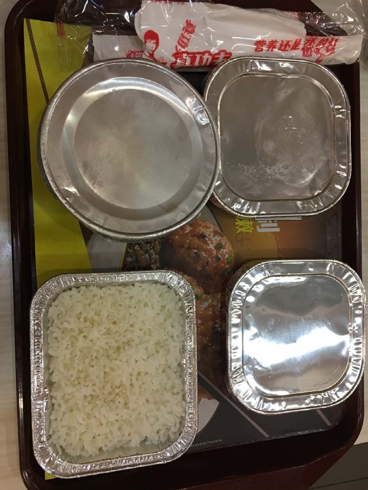

*2017-06-13 19:01 · 猫饭*

---

### 4594

转@ 江占钫 挖人要挖烂行业的优秀人才，燃点低，踏实，经历过烂行业更加有韧性！

*2017-06-13 16:59 · 手机上网 转自江占钫*

---

### 4595

@ 孙岩 请问「智」和「慧」这两个字怎么解释？

*2017-06-12 16:56 · 手机上网*

---

### 4596

对比这两个英式早餐茶包的味道，川宁确实明显优于立顿。转@ 王兴今天前四个茶包：立顿英式早餐茶、山本山绿茶、伊藤园绿茶、川宁英式早餐茶。

*2017-06-12 16:53 · 手机上网 转自王兴*

---

### 4597

今天前四个茶包：立顿英式早餐茶、山本山绿茶、伊藤园绿茶、川宁英式早餐茶。

*2017-06-12 16:37 · iPhone版*

---

### 4598

烧腊煲仔饭真是太好吃了！上海的外卖完胜北京！

*2017-06-12 12:41 · 手机上网*

---

### 4599

婆罗洲是一个岛上有三个国家。夏威夷群岛和日本一样，是接触西方之后才统一。火器的输入或许起了作用。转@ webto 日本的统一是不是历史进程的必然？世界上是否存在哪个岛地上仍然有数个国家？

*2017-06-12 09:04 · 手机上网 转自webto*

---

### 4600

杰克•韦尔奇不愧是顶级CEO，既非常结果导向又注重过程，所以他写的书起名《Winning》，而不是《Doing》或《Just Do It》。

*2017-06-11 23:37 · iPhone版*

---

### 4601

全神贯注工作时，我会暂时忘记自己的存在，但之后回头看时会很欣慰自己曾如此真实的存在过。

*2017-06-11 21:44 · iPhone版*

---

### 4602

今天已经干掉一杯星巴克和三个茶包了。

*2017-06-11 17:27 · iPhone版*

---

### 4603

竞争大致可分为两个阶段：傻逼和牛逼竞争，牛逼和更牛逼竞争。

*2017-06-11 13:11 · iPhone版*

---

### 4604

转：中医让你看西医说明你真的病了，西医让你看中医说明你没救了。

*2017-06-10 17:59 · iPhone版*

---

### 4605

夜里想了千条路，醒来依旧卖豆腐。

*2017-06-10 15:08 · iPhone版*

---

### 4606

车过东二环，我感觉北京的核心区确实在变精致。

*2017-06-10 11:38 · 手机上网*

---

### 4607

据说 blockchain 现在消耗的算力已经十倍于整个 google 的算力了。

*2017-06-10 11:30 · 手机上网*

---

### 4608

起飞遥遥无期，决定转乘高铁，这时候北京这种机场到高铁需要斜跨整座城市的设计就太讨厌了。

*2017-06-10 11:25 · 手机上网*

---

### 4609

是的，2011年我当面问过peter thiel，他说：because we are smart.

我说: and still hungry.转阳升 想了一下，paypal mafia的成因大概是：02年卖给ebay，那段时间出来市场上还有大把机会；团队有经验，也有磨合；人脉。

*2017-06-09 23:50 · 手机上网 转自阳升*

---

### 4610

看起来有点邪恶。

*2017-06-09 23:03 · 猫饭*

---

### 4611

连震旦都扯进来了。转@ Squall cathy=震旦=西方对中国古称转@王兴 啥意思？cathay还和契丹有关系？转@ hezhenye 国泰航空的cathay就是。转@ 太空小孩 好像说起来还有个有意思的事情，俄罗斯直到现在还在叫中国「契丹」（Китай），这个锅也是蒙古人在背

*2017-06-09 22:29 · 手机上网 转自太空小孩*

---

### 4612

啥意思？cathay还和契丹有关系？转@ hezhenye 国泰航空的cathay就是。转@ 王兴 转@ 太空小孩 好像说起来还有个有意思的事情，俄罗斯直到现在还在叫中国「契丹」（Китай），这个锅也是蒙古人在背。

*2017-06-09 20:48 · 手机上网 转自太空小孩*

---

### 4613

「尖」是上小下大，王强老师的演讲里提到。

*2017-06-09 18:37 · 手机上网*

---

### 4614

困的时候，是不是蹦个极就能清醒起来？

*2017-06-09 18:32 · 手机上网*

---

### 4615

经过三环东北角无数次，今天才注意到有栋楼叫「幸福大厦」。

*2017-06-09 18:30 · 手机上网*

---

### 4616

转@ 多多小姐 去过的我表示实景不是这样的，最鲜艳的也就是五花肉那样的。转@ 青瓦的旧时光 原图？ 转@ 王兴 太棒了。必须去！

转@ 孙岩 张掖丹霞地貌，甘肃省河西走廊

*2017-06-09 18:02 · 手机上网 转自孙岩*

---

### 4617

太棒了。必须去！转@ 孙岩 张掖丹霞地貌，甘肃省河西走廊

*2017-06-09 17:43 · 手机上网 转自孙岩*

---

### 4618

每隔一段时间就看到有人夸奖《色戒》。我觉得自己一定是没看懂……

*2017-06-09 17:28 · iPhone版*

---

### 4619

「人生的道路虽然漫长，但关键时只有几步」，这是二十年前某本高考或填志愿相关的书封面上的广告语。公司或许也如此。

*2017-06-09 16:04 · 手机上网*

---

### 4620

转@ 太空小孩 好像说起来还有个有意思的事情，俄罗斯直到现在还在叫中国「契丹」（Китай），这个锅也是蒙古人在背。

*2017-06-09 15:34 · 手机上网 转自太空小孩*

---

### 4621

这小孩好有文化的样子。转@ 太空小孩 蒙古人的锅，蒙古语单词无法以大舌颤音 Р 打头，只能把第一个元音移到前面重复一次变成оРо，元朝叫的就是斡罗思。转@ 王兴 Russia，「罗刹」这译名完胜「俄罗斯」。

*2017-06-09 11:53 · 手机上网 转自王兴*

---

### 4622

Russia，「罗刹」这译名完胜「俄罗斯」。

*2017-06-09 11:39 · iPhone版*

---

### 4623

There is a tree where the doves go to die. 科恩的树。

*2017-06-09 01:05 · 手机上网*

---

### 4624

还想起来一件事：今早第一次见到鹿角菇这种东西，但是没尝。

*2017-06-09 00:40 · 手机上网*

---

### 4625

今天，第一次在微信上被比我小一辈的亲戚加为好友，瞬间感觉自己老了，虽然昨晚才被隔了几年再见面的朋友说you don't age at all.

*2017-06-08 23:45 · iPhone版*

---

### 4626

我想起小时候曾在爸爸的书架上看到过一本建筑图册，现在唯一还有画面感的就是赖特的熊跑溪别墅了。

*2017-06-08 23:35 · iPhone版*

---

### 4627

现在的人们喝下午茶不是为了填饱肚子。

*2017-06-08 23:29 · iPhone版*

---

### 4628

饭否并不能阻止你日渐老去，顶多陪你老去。转@ 赵赵赵老师 饭否最让我珍惜的地方，就是饭否让我觉得除了大龄未婚平庸无能不怎么好看也没什么智商之外，我还有一点特别的地方。如果饭否没有了，那我这一点特别也就不存在了。我就彻底变成了一个大龄未婚平庸无能不怎么好看也没什么智商，且日渐老去的人

*2017-06-08 21:08 · 手机上网 转自赵赵赵老师*

---

### 4629

美国五大科技公司（也是此刻全球市值最高的五家公司）的创始人分别就读于：Reed College，斯坦福，哈佛，普林斯顿，哈佛。

*2017-06-08 20:51 · 网页*

---

### 4630

Art exists because life is not enough. -Ferreira Gullar

*2017-06-08 20:41 · iPhone版*

---

### 4631

我并不喜欢高楼大厦的玻璃幕墙，上面倒映着晚霞时除外。

*2017-06-08 19:37 · iPhone版*

---

### 4632

清华将来排到新加坡那两所前面应该没什么悬念。转@ 木之所兮 浙大87、城大49。不断的给母校拖后腿。。 转@ 春燈 QS最新大学排名，清华排名世界25，超过UC Berkeley。亚洲排名第三。

*2017-06-08 17:05 · 手机上网 转自春燈*

---

### 4633

你当过乙方吗？何止乙方，我作为壬方代表签字过。

*2017-06-08 15:07 · 手机上网*

---

### 4634

白皮鞋、雪白的裤子、黑色宽皮带配超大号立体虎头造型金色皮带扣、花衬衫，这位大哥好拉风。

*2017-06-08 14:12 · 手机上网*

---

### 4635

路过一家三年多前去过的上岛咖啡，发现已经翻牌成漫咖啡了。

*2017-06-08 14:04 · 手机上网*

---

### 4636

看社交媒体上广为流传的B厂PPT有感-_-! 转@ 王兴 「场面一度十分尴尬」

*2017-06-08 14:01 · 手机上网 转自王兴*

---

### 4637

写诗 vs. 写长篇小说 ≈ 投天使 vs. 投成长期PE ？

*2017-06-08 13:58 · 手机上网*

---

### 4638

换个口味，听一下夏小桐的《少年弦》。

*2017-06-08 13:54 · 猫饭*

---

### 4639

跟一个懂行的印尼华人聊了一下才知道，印尼67年和98年这两次排华都很惨，但实质不同。

*2017-06-07 23:50 · iPhone版*

---

### 4640

南北差异真的很大。我说的是朝南和朝北的房间。

*2017-06-07 10:22 · iPhone版*

---

### 4641

山、医、命、相、卜，统称为玄学五术。

*2017-06-07 10:08 · iPhone版*

---

### 4642

转@ gravity0 科举除了给社会各阶层流动规范竞争通道，还有个作用就是促进统一。各地口语方言不同，但经科举的人书面交流无障碍。

而且同样的灌输和类似的经历使其有共同语境，讲道理打比方相互听得懂。作用如同基督教之于中世纪欧洲，伊斯兰教之于大中东。

*2017-06-07 09:07 · 手机上网 转自gravity0*

---

### 4643

大时代里有大时刻。

*2017-06-07 01:10 · iPhone版*

---

### 4644

滚烫的雨点呼啸的风。

*2017-06-07 00:56 · iPhone版*

---

### 4645

德黑兰 Tehran 是伊朗首都，内陆城市；黑德兰 Hedland 是澳大利亚西部港口，输出澳洲的大量铁矿石。

*2017-06-07 00:13 · iPhone版*

---

### 4646

回想了一下，清华那种上大课的教育方式并不适合我。美国那种一个老师只教几个学生、反反复复耐心对话的文理学院可能会更有利于我成长。

*2017-06-06 23:22 · iPhone版*

---

### 4647

突然想起一个问题：当年如果不是大我两岁的姐姐上了清华，我会觉得自己肯定应该去清华吗？不记得我高中时是否思考过此类问题了……

*2017-06-06 23:04 · iPhone版*

---

### 4648

这竟然是和菜头老师五年多前在饭否发的最后一条。转@ 和菜头 命运之神没有怜悯之心 ，上帝的长夜没有尽期 。你的肉体只是时光，不停流逝的时光 ，你不过是每一个孤独的瞬息。---博尔赫斯

*2017-06-06 16:02 · 手机上网 转自和菜头*

---

### 4649

曳光弹的路，萤火虫的树。

*2017-06-06 15:25 · iPhone版*

---

### 4650

Camus 指法国作家时译作「加缪」，指干邑白兰地时译作「卡慕」；

Borges 指阿根廷诗人时译作「博尔赫斯」，指西班牙橄榄油时译作「伯爵」。

*2017-06-06 15:10 · iPhone版*

---

### 4651

人生就是每一个永恒的瞬间。

*2017-06-06 14:37 · 手机上网*

---

### 4652

扩大目标市场很重要。

*2017-06-06 14:27 · 手机上网*

---

### 4653

淘宝这个梦想是孙正义植入给马云的。他把马和蔡叫到东京，苦口婆心加威逼利诱：哥们，ebay是个好生意，而且不是不可战胜。我在日本已经靠雅虎拍卖打败ebay一次了。你拿我这笔钱，在中国也搞一把。你要真不干，这笔钱我就另找中国团队了。转@ 淑児 是梦想 转@ 王兴 公司的价值不仅取决于当前

*2017-06-06 13:55 · 手机上网 转自王兴*

---

### 4654

公司的价值不仅取决于当前管理层的认知。孙正义就是比马云更早看到了（当时还不存在的）的淘宝的价值。转@ quux 按他们自己的想法大概还是图片分享和社交，Instagram， snapchat 转@ 王兴 美图这家公司的市场价值应该和什么对标？化妆品？整容？

*2017-06-06 13:35 · 手机上网 转自王兴*

---

### 4655

不明所以。转@ 江占钫 受老婆启发，又来饭否了，感觉体验超级棒！

*2017-06-06 13:33 · 手机上网 转自江占钫*

---

### 4656

「高考是最不看脸的一次竞争」，路边灯箱上这句广告词虽然一闪而过但让我印象深刻，具体在推什么产品倒是没来得及看。

*2017-06-06 13:31 · 手机上网*

---

### 4657

今年是平成二十九年，按日本纪年。

*2017-06-06 13:27 · 手机上网*

---

### 4658

羊叫…… 转@ terababy 小发现：美，上羊下大，发音是从羊叫声来。

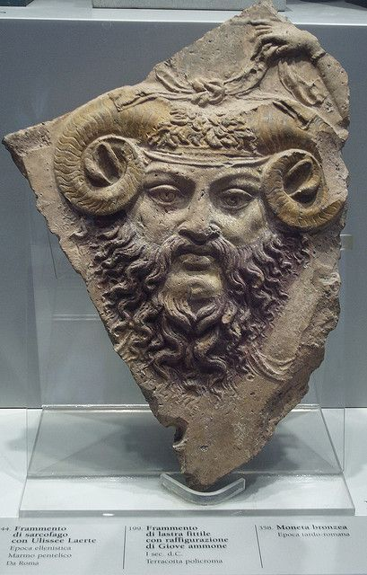

*2017-06-06 13:19 · 手机上网 转自terababy*

---

### 4659

-_-！转@ 蒋天正 估计用的同一位雍和宫那边的起名大师 哈哈 转@王兴 为什么这么多投资公司喜欢用「晟」起名……

*2017-06-06 13:19 · 手机上网 转自王兴*

---

### 4660

10名原本已经录取、今年即将入学的新生因为在Facebook上分享表情包（涉及种族歧视）、发布不当言论而被哈佛大学开除。「言论自由」不能当挡箭牌。

*2017-06-06 11:15 · 手机上网*

---

### 4661

晟，读shèng，本义：中午12点的日光。引申义：最高程度，最大程度。含义是旺盛，兴盛或者光明。

*2017-06-06 10:45 · 手机上网*

---

### 4662

为什么这么多投资公司喜欢用「晟」起名……

*2017-06-06 10:42 · 手机上网*

---

### 4663

面试者的开场白「我来自亿达，一家大连领先的房地产公司」直接把我带偏了，导致我有好几分钟无法完全集中注意力-_-!

*2017-06-05 21:23 · iPhone版*

---

### 4664

旷了理论课直接实习中。转@ 饭饭饭尾崎 兴酱是一个诗人 转@ 王兴丧的一天结束了。丧的夜晚接踵而来。

*2017-06-05 19:28 · 手机上网 转自王兴*

---

### 4665

丧的一天结束了。丧的夜晚接踵而来。

*2017-06-05 19:22 · 手机上网*

---

### 4666

公众号里发点广告我能理解，但是这么发？我居然关注了这么没品位的号:( 果取关。

*2017-06-05 18:47 · 手机上网*

---

### 4667

我以前把科幻小说分成两类：一类是由着性子瞎写，碰到逻辑不通的地方就随手打个补丁；一类是只改一两个前提（幻的部分），其他后续展开都很有逻辑（科的部分）。刚刚意识到其实还有更牛的，就是一个前提都不改，仅仅是把时间拉到未来。

*2017-06-05 18:43 · 手机上网*

---

### 4668

骝，读音liú，指黑鬃、黑尾巴的红马。

*2017-06-05 18:38 · 手机上网*

---

### 4669

@ webto 对不起。我转给我们负责大众点评产品的同事了。谢谢。

*2017-06-05 18:38 · 手机上网 给webto的回复*

---

### 4670

大武山的树。

*2017-06-05 15:30 · iPhone版*

---

### 4671

后厂村的路。

*2017-06-05 14:47 · iPhone版*

---

### 4672

美图这家公司的市场价值应该和什么对标？化妆品？整容？

*2017-06-05 13:51 · iPhone版*

---

### 4673

这里的人，会走路就会跳舞，会说话就会唱歌，会吃奶就会喝酒。

*2017-06-05 13:01 · iPhone版*

---

### 4674

微信什么时候会开始推「收费会员」功能？

*2017-06-04 16:50 · iPhone版*

---

### 4675

小白鞋，我发现大叔和小姑娘都穿。

*2017-06-04 14:35 · 手机上网*

---

### 4676

最形象的云海。转@ terababy 云海

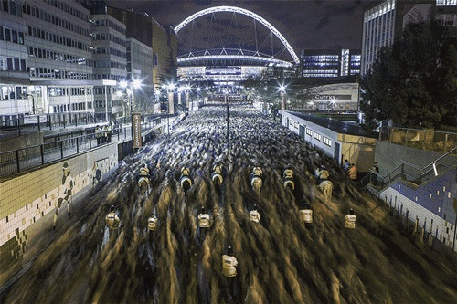

*2017-06-04 13:17 · 手机上网 转自terababy*

---

### 4677

转@ terababy 人潮

*2017-06-04 12:33 · 手机上网 转自terababy*

---

### 4678

早上四难全原理：每天早上，上大号、洗澡、吃早饭、不迟到，四者很难同时做到-_-!

*2017-06-04 10:08 · iPhone版*

---

### 4679

不好的歌词不合逻辑、莫名其妙，好的歌词则是合乎逻辑但出乎意料。既要逻辑又要想象力。

*2017-06-04 09:08 · 手机上网*

---

### 4680

每天都有一个早晨。

*2017-06-04 08:21 · iPhone版*

---

### 4681

嘿，这大哥真的有点水平。我问他一个问题，他说你去看一下xxx理论；我再问他一个问题，他说你去看一下yyy曲线……

*2017-06-03 22:34 · iPhone版*

---

### 4682

经济，短期看需求，长期看供给。

*2017-06-03 21:49 · iPhone版*

---

### 4683

可以羡慕，不要嫉妒，更不要恨。

*2017-06-03 16:38 · 手机上网*

---

### 4684

因为像鸵鸟？转@ 阳升 这张照片打动了我，但不确定是啥原因

*2017-06-03 16:03 · 手机上网 转自阳升*

---

### 4685

转@ 維以不永傷 经过特殊行政许可才能合法种植，私下种植一律触犯刑法三百五十一条【非法种植毒品原植物罪】。转@ 王兴 刚听说，种植大麻在中国已经变成合法的了。

*2017-06-03 16:01 · 手机上网 转自王兴*

---

### 4686

烹饪方式随着文明进化而变得多样：原始人只能吃生的，掌握了火之后可以烤，有了石器陶器后可以煮，有油之后可以煎，有了金属器皿才会炒，有了微波炉之后……

*2017-06-03 14:59 · iPhone版*

---

### 4687

地方特色甜点：红枣桃胶羹。

*2017-06-03 14:47 · 猫饭*

---

### 4688

刚听说，种植大麻在中国已经变成合法的了。

*2017-06-03 14:43 · iPhone版*

---

### 4689

越来越理解「中国是全球经济的不稳定因素」这种说法，当然是从比较正面的角度。中国的消费力太庞大了。一旦中国开始消费什么东西，全球价格就会上涨甚至是暴涨。必须在全球范围内进行供给侧改革才能真正满足中国消费升级的需求。

*2017-06-03 13:36 · iPhone版*

---

### 4690

据说厄瓜多尔全国财政收入超过一半来自中国石油公司在当地交的税。

*2017-06-03 13:09 · iPhone版*

---

### 4691

世界范围内多肉种得好的是德国和韩国。

*2017-06-03 12:51 · iPhone版*

---

### 4692

高比低，大比小，早比晚，多比少，有比无，优比劣……

*2017-06-03 10:17 · iPhone版*

---

### 4693

地方特色早饭：稀豆粉配油条。

*2017-06-03 09:11 · 猫饭*

---

### 4694

@ 李芳姐 欢迎

*2017-06-03 01:14 · 手机上网 给李芳姐的回复*

---

### 4695

师兄到底还是不治而去:( 不仅他的家人伤心，师母也很哀痛。

*2017-06-03 01:10 · 手机上网*

---

### 4696

听懂行的人说中国的多肉中心是山东的青州和福建的永福（正是鄙乡龙岩市下面的一个镇）。下次回龙岩真的要去永福看看了。

*2017-06-02 21:31 · 手机上网*

---

### 4697

这个XX交易中心有两种交易方式，一种是拍卖，另一种是对手交易。

啥是「对手交易」？唉，说白了吧，就是像菜市场一样自己讨价还价。

*2017-06-02 19:04 · iPhone版*

---

### 4698

少女 > 儿童 > 少妇 > 老人 > 狗 > 男人，据说是投消费的人总结出来的市场价值。

*2017-06-02 12:40 · iPhone版*

---

### 4699

第二次到这个机场，第一次出这个机场。

*2017-06-02 11:58 · iPhone版*

---

### 4700

《大西洋月刊》最近写习大大要什么的那篇文章里说，中国的「中」

字的意思本来就不是「四方之中」而是「天地之间」。这我倒是从来没想过。

*2017-06-02 00:35 · iPhone版*

---

### 4701

牛栏山路，猴面包树。

*2017-06-02 00:02 · iPhone版*

---

### 4702

天天都被挖的路，每年都发芽的树。

*2017-06-01 23:59 · iPhone版*

---

### 4703

所有的孩子都会长大，除了

*2017-06-01 23:53 · iPhone版*

---

### 4704

多年以后，面对行刑队，

*2017-06-01 23:34 · iPhone版*

---

### 4705

开始一天的工作了。预感这会是又一个耗费体力、绞尽脑汁、考验心力的快乐而充实的儿童节。

*2017-06-01 09:03 · 手机上网*

---

### 4706

童年是一条每个人都走过的路，童心是一棵永远不会凋零的树。

*2017-06-01 08:27 · 手机上网*

---

### 4707

擦皮鞋也不错。转@ 杜斌beta 累一天之后熨熨衣服也挺好，修身养性。

*2017-05-31 22:17 · 手机上网 转自杜斌beta*

---

### 4708

开会讨论太投入，导致吃饭时完全没有食欲:(

*2017-05-31 19:53 · 手机上网*

---

### 4709

此生仿佛已虚度一半，今天的会才即将开始。# 早起有风险，记得拉窗帘 #

*2017-05-31 09:05 · 手机上网*

---

### 4710

听涛路，观云树。

*2017-05-31 08:48 · 手机上网*

---

### 4711

XX海里没有路，瀛台岛上一棵树。

*2017-05-31 08:15 · 手机上网*

---

### 4712

看图说话。

*2017-05-31 08:03 · 手机上网*

---

### 4713

弗罗斯特的林中路，小华盛顿的樱桃树。

*2017-05-31 08:00 · 手机上网*

---

### 4714

不是我爱早起，只是忘了挡住阳光的路；既然被晒醒就起来爬爬山，顺便看看长城内外的树。

*2017-05-31 07:27 · 手机上网*

---

### 4715

长城是一条挡住异族路的路，石斛是一种长在别的树上的树。

*2017-05-31 07:20 · 手机上网*

---

### 4716

四十三年扬州路，昨夜西风凋碧树。

*2017-05-31 06:37 · iPhone版*

---

### 4717

1、2、0。

*2017-05-31 06:26 · iPhone版*

---

### 4718

望尽天涯路，野旷天低树。

*2017-05-31 06:25 · iPhone版*

---

### 4719

一条十年后的路，一棵两天前的树。

*2017-05-30 23:16 · 手机上网*

---

### 4720

一条发霉的路，一棵蛀虫的树。

*2017-05-30 23:11 · 手机上网*

---

### 4721

成功的控制住自己没有喝今天第三杯咖啡。但是泡了第二个茶包。

*2017-05-30 19:27 · 手机上网*

---

### 4722

转@ 杜斌beta 没想到北海公园是契丹人先建的。

*2017-05-30 17:43 · 手机上网 转自杜斌beta*

---

### 4723

想起前天面试人。你那些在剑桥本科读神学的同学毕业后都去了哪儿呢？麦肯锡之类的呗，反正都是讲故事。

*2017-05-30 10:33 · iPhone版*

---

### 4724

唐僧的取经路，佛祖的菩提树。

*2017-05-30 04:25 · 手机上网*

---

### 4725

泰坦尼克的穷途末路，乌斯怀亚的花草树木。

*2017-05-30 04:21 · 手机上网*

---

### 4726

一条说了再见的路，一棵终将再见的树。

*2017-05-30 04:19 · 手机上网*

---

### 4727

一条漫山遍野的路，一棵茕茕孑立的树。

*2017-05-30 04:16 · 手机上网*

---

### 4728

一条太阳照常升起的路，一棵 you want it darker 的树。

*2017-05-30 04:08 · 手机上网*

---

### 4729

跨越蓝色多瑙河的路，美丽的梭罗河边的树。

*2017-05-30 04:01 · 手机上网*

---

### 4730

一条迷路，一棵建树。

*2017-05-30 03:59 · 手机上网*

---

### 4731

转@ szweig 转@ 太宰治 商务印书馆的“汉译世界学术名著丛书”系列400+本，光是浏览一遍这些书名和作者就已经很长见识了。

*2017-05-30 03:54 · 手机上网 转自太宰治*

---

### 4732

一条通向睡梦的路，一棵在梦里继续生长的树。

*2017-05-30 03:52 · iPhone版*

---

### 4733

一条勉强的路，一棵凑合的树。

*2017-05-30 03:50 · iPhone版*

---

### 4734

一条霞光万道的路，一棵灵光一现的树。

*2017-05-30 03:49 · iPhone版*

---

### 4735

此路是我开，此树是我栽。

*2017-05-30 03:47 · iPhone版*

---

### 4736

天无绝人之路，有水的地方就有树。

*2017-05-30 03:45 · iPhone版*

---

### 4737

蓬山此去无多路，晴川历历汉阳树。

*2017-05-30 03:28 · 手机上网*

---

### 4738

一条六经注我的路，一棵述而不作的树。

*2017-05-30 03:24 · 手机上网*

---

### 4739

潮水的路，海底的树。

*2017-05-30 03:23 · 手机上网*

---

### 4740

将登太行雪满山，没有路；欲渡黄河冰塞川，不用树。

*2017-05-30 03:19 · 手机上网*

---

### 4741

遍布龙舌兰的路，结满杜松子的树。

*2017-05-30 03:14 · 手机上网*

---

### 4742

茅台镇的山路，泸州的江边树。

*2017-05-30 03:11 · 手机上网*

---

### 4743

一条我从不失眠的路，一棵只是偶尔熬夜的树。

*2017-05-30 03:09 · 手机上网*

---

### 4744

一条艾雷岛的小路，一棵勃艮第的老树。

*2017-05-30 03:07 · 手机上网*

---

### 4745

一条电闪雷鸣的路，一棵春风化雨的树。

*2017-05-30 03:05 · 手机上网*

---

### 4746

一条战犯走过的路，一棵母亲种下的树。

*2017-05-30 03:04 · 手机上网*

---

### 4747

一条被微风拂拭的路，一棵狂风中摇摆的树。

*2017-05-30 03:02 · 手机上网*

---

### 4748

一条贯通古今的路，一棵顶天立地的树。

*2017-05-30 03:00 · 手机上网*

---

### 4749

一条绕着原点打转的路，一棵并不想长大的树。

*2017-05-30 02:57 · 手机上网*

---

### 4750

一条隔开北美和南美的水路，一整片覆盖欧亚大陆的树。

*2017-05-30 02:54 · 手机上网*

---

### 4751

一条阅尽世之奇伟瑰怪非常之观的路，一棵长在险远而人之所罕至焉的树。

*2017-05-30 02:51 · 手机上网*

---

### 4752

路人甲，树先生。

*2017-05-30 02:45 · 手机上网*

---

### 4753

两条垂直的路，一棵交叉的树。

*2017-05-30 02:44 · 手机上网*

---

### 4754

a forking road, a blossom tree.

*2017-05-30 02:41 · 手机上网*

---

### 4755

一条 less traveled 的路，一棵 always greener 的树。

*2017-05-30 02:34 · 手机上网*

---

### 4756

一条特别的路，一棵平凡的树。

*2017-05-30 02:30 · 手机上网*

---

### 4757

一条垂直的路，一棵卧倒的树。

*2017-05-30 02:28 · 手机上网*

---

### 4758

一条胜天半子的路，一棵天生胖子的树。

*2017-05-30 02:23 · 手机上网*

---

### 4759

一条装了起搏器的路，一棵叼着体温计的树。

*2017-05-30 02:21 · 手机上网*

---

### 4760

一条精力过剩的路，一棵心律不齐的树。

*2017-05-30 02:19 · 手机上网*

---

### 4761

一带一路，无台无树。

*2017-05-30 02:18 · 手机上网*

---

### 4762

一条行到水穷处的路，一棵坐看云起时的树。

*2017-05-30 02:16 · 手机上网*

---

### 4763

一条 wtf 之路，一棵 tmd 之树。

*2017-05-30 02:14 · 手机上网*

---

### 4764

一条视死如归的路，一棵痛不欲生的树。

*2017-05-30 02:12 · 手机上网*

---

### 4765

一条走了一天一夜的路，一棵陪你一生一世的树。

*2017-05-30 02:09 · 手机上网*

---

### 4766

一条不被选择的路，一棵选择自己的树。

*2017-05-30 02:08 · 手机上网*

---

### 4767

一条过山车的路，一棵映山红的树。

*2017-05-30 02:06 · 手机上网*

---

### 4768

两条平行的路，两棵缠绕的树。

*2017-05-30 02:04 · 手机上网*

---

### 4769

一条 here we go 的路，一棵 here you are 的树。

*2017-05-30 02:00 · 手机上网*

---

### 4770

一条通向草原小屋的路，一棵眺望白轮船的树。

*2017-05-30 01:53 · 手机上网*

---

### 4771

一条 bohemian rhapsody 的路，一棵 viva la vida 的树。

*2017-05-30 01:51 · 手机上网*

---

### 4772

一条不厌其烦的路，一棵刨根问底的树。

*2017-05-30 01:49 · 手机上网*

---

### 4773

一条有自知之明的路，一棵不自量力的树。

*2017-05-30 01:47 · 手机上网*

---

### 4774

火腿走过的路，美酒灌溉的树。

*2017-05-30 01:43 · 手机上网*

---

### 4775

奶酪里的一条路，酒瓶里的一棵树。

*2017-05-30 01:40 · 手机上网*

---

### 4776

一截路，一截树。

*2017-05-30 01:38 · 手机上网*

---

### 4777

一段陡峭的路，一棵疯长的树。

*2017-05-30 01:30 · 手机上网*

---

### 4778

转@ qinyf 在平淡中寻找快乐是罕见的高级技能「@ 飯否小字报 转@ 鹿萌萌 提高快乐阈值是一件很危险的事情，大学毕业后工作，吸毒后戒毒，经历过高潮后禁欲，高甜度恋爱后失恋，被有钱人包养后回归原本的生活，环游世界后朝九晚五地上班，看过大量的经典名著后阅读垃圾编剧写的垃圾东西，都很绝

*2017-05-30 01:29 · 手机上网 转自鹿萌萌*

---

### 4779

布谷鸟能叫一夜。

*2017-05-30 01:25 · 手机上网*

---

### 4780

转@ terababy 变化：更、变、演、改、化、衍、幻、换、校、订、定、正、整、修、易、移、迁、替、剔、代、迭、朔、动、革、调。

*2017-05-29 21:14 · 手机上网 转自terababy*

---

### 4781

转@ webto 建立好的客服系统，应该也要 dog fooding：内部员工

遇到的生产环境问题，也应该通过公开客服渠道解决。如果无法解决再内部推动解决并且改进客服流程。

*2017-05-29 14:45 · 手机上网 转自webto*

---

### 4782

建议读一下英文原版。不太难。转@ 王球球的春天 90年出版的，再看一遍

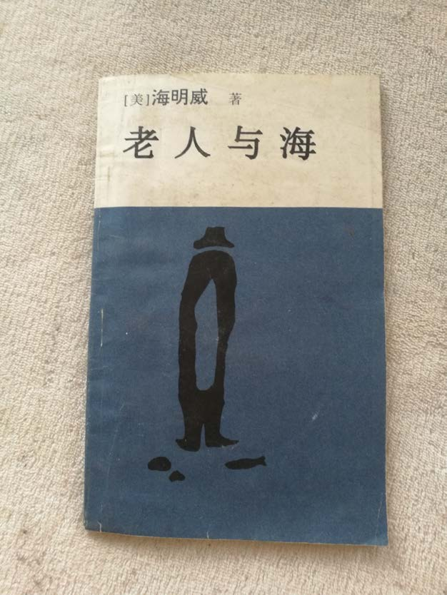

*2017-05-29 14:32 · 手机上网 转自王球球的春天*

---

### 4783

一条已起床的路，一棵正赴约的树。

*2017-05-29 11:52 · 手机上网*

---

### 4784

昨夜为之倾倒。

*2017-05-29 07:05 · 猫饭*

---

### 4785

一条让人失去耐心的路，一棵必须拯救他们的树。

*2017-05-29 06:56 · 手机上网*

---

### 4786

一条通向过去的路，一棵撑开未来的树。

*2017-05-29 06:54 · 手机上网*

---

### 4787

一条通往火星的路，一棵长在心里的树。

*2017-05-29 06:50 · 手机上网*

---

### 4788

一条鲜花满地的路，一棵荆棘缠绕的树。

*2017-05-29 06:47 · 手机上网*

---

### 4789

一条黎明的路，一棵拂晓的树。

*2017-05-29 06:44 · 手机上网*

---

### 4790

一条自毁之路，一棵永生之树。

*2017-05-29 06:41 · 手机上网*

---

### 4791

一条穿透地心的路，一棵覆盖地球的树。

*2017-05-29 06:39 · 手机上网*

---

### 4792

一条自强不息的路，一棵厚德载物的树。

*2017-05-29 06:38 · 手机上网*

---

### 4793

一条穿越红海的路，一棵长满沙漠的树。

*2017-05-29 06:32 · 手机上网*

---

### 4794

一条暂时的路，一棵最后的树。

*2017-05-29 06:30 · 手机上网*

---

### 4795

一条中国之路，一棵环球之树。

*2017-05-29 06:28 · 手机上网*

---

### 4796

一条被汗水淹没的路，一棵被泪水灌溉的树。

*2017-05-29 06:26 · 手机上网*

---

### 4797

一条越走越宽的路，一棵越长越绿的树。

*2017-05-29 06:25 · 手机上网*

---

### 4798

一条通向五湖四海的路，一棵茁壮成长的树。

*2017-05-29 06:22 · 手机上网*

---

### 4799

一条终将见到路标的路，一棵终将发芽的树。

*2017-05-29 06:20 · 手机上网*

---

### 4800

一条哭泣的路，一棵哭泣的树。

*2017-05-29 06:19 · 手机上网*

---

### 4801

一条 all in 的路，一棵 nobody cares 的树。

*2017-05-29 06:18 · 手机上网*

---

### 4802

一条难以忍受的路，一棵超出想象的树。

*2017-05-29 06:13 · 手机上网*

---

### 4803

一条绕回起点的路，一棵像草一样高的树。

*2017-05-29 06:11 · 手机上网*

---

### 4804

一条遍布荆棘的路，一棵充满诗意的树。

*2017-05-29 06:08 · 手机上网*

---

### 4805

一条连午餐会都快来不及的路，一棵一定会及时醒来的树。

*2017-05-29 06:07 · 手机上网*

---

### 4806

一条令人作呕的路，一棵给我信心的树。

*2017-05-29 06:05 · 手机上网*

---

### 4807

一条相见时难别亦难的路，一棵东风无力百花残的树。

*2017-05-29 06:04 · 手机上网*

---

### 4808

一条遥遥无期的路，一棵生生不息的树。

*2017-05-29 06:03 · 手机上网*

---

### 4809

一条长满树的路，一棵长满了叶子的树。

*2017-05-29 05:59 · 手机上网*

---

### 4810

一条总要写一次诗的路，一棵一瞬间就是永恒的树。

*2017-05-29 05:58 · 手机上网*

---

### 4811

一条闪烁着绿光的路，一棵迎接红日的树。

*2017-05-29 05:56 · 手机上网*

---

### 4812

转@ 非處方藥 配图 转@ 王兴 转@ 二他姐姐 一条不能微分的路，一棵无限分形的树。转@ 王兴 一条已露出鱼肚白的路，一个藏着祖母绿的树。

*2017-05-29 05:52 · 手机上网 转自非處方藥*

---

### 4813

一条从龙岩走出来的路，一棵植根于北京的树。

*2017-05-29 05:51 · 手机上网*

---

### 4814

一条对应经纬的路，一棵名叫红杉的树。

*2017-05-29 05:47 · 手机上网*

---

### 4815

一条 bob dylan 的路，一棵 leonard cohen的树。

*2017-05-29 05:46 · 手机上网*

---

### 4816

一条 partisan 之路，一棵 hallelujah 之树。

*2017-05-29 05:42 · 手机上网*

---

### 4817

一条家里的路，一棵命中的树。

*2017-05-29 05:40 · 手机上网*

---

### 4818

一条机器路，一棵机器树。

*2017-05-29 05:35 · 手机上网*

---

### 4819

一条 never ending 之路，一棵 forever young 之树。

*2017-05-29 05:33 · 手机上网*

---

### 4820

一条神魂颠倒后的路，一棵光天化日下的树。

*2017-05-29 05:31 · 手机上网*

---

### 4821

一条你他妈不困的路，一棵老子拼了命的树。

*2017-05-29 05:25 · 手机上网*

---

### 4822

一条走了一夜的路，一棵长了一夜的树。

*2017-05-29 05:24 · 手机上网*

---

### 4823

一条导师希望我走的路，一棵师母祝福我的树。

*2017-05-29 05:24 · 手机上网*

---

### 4824

一条你也终将走向终点的路，一棵他们会永远在一起的树。

*2017-05-29 05:22 · 手机上网*

---

### 4825

一条我师兄即将走向终点的路，一棵我们永远在一起的树。

*2017-05-29 05:21 · 手机上网*

---

### 4826

一条AI之路，一棵IA之树。

*2017-05-29 05:19 · 手机上网*

---

### 4827

转@ 二他姐姐 一条不能微分的路，一棵无限分形的树。转@ 王兴 一条已露出鱼肚白的路，一个藏着祖母绿的树。

*2017-05-29 05:12 · 手机上网 转自王兴*

---

### 4828

一条已露出鱼肚白的路，一个藏着祖母绿的树。

*2017-05-29 05:00 · 手机上网*

---

### 4829

一条已经来不及的路，一棵永远都不晚的树。

*2017-05-29 04:56 · 手机上网*

---

### 4830

一条场面一度十分尴尬的路，一棵我就是我永远是我的树。

*2017-05-29 04:55 · 手机上网*

---

### 4831

一条天已经亮了的路，一棵来不及睡的树。

*2017-05-29 04:52 · 手机上网*

---

### 4832

一条说一不二的路，一棵一拍两散的树。

*2017-05-29 04:46 · 手机上网*

---

### 4833

一条万念俱寂的路，一棵千回百转的树。

*2017-05-29 04:45 · 手机上网*

---

### 4834

一条俞敏洪的路，一棵八零后的树。

*2017-05-29 04:43 · 手机上网*

---

### 4835

一条往事已成空的路，一棵鲜花将盛开的树。

*2017-05-29 04:42 · 手机上网*

---

### 4836

一条百年老店之路，一棵基业长青之树。

*2017-05-29 04:40 · 手机上网*

---

### 4837

一条香港回归20年之路，一棵一国两制的树。

*2017-05-29 04:38 · 手机上网*

---

### 4838

一条喝酒无穷无尽的路，一棵初心始终如一的树。

*2017-05-29 04:35 · 手机上网*

---

### 4839

一条打嗝的路，一棵叹息的树。

*2017-05-29 04:32 · 手机上网*

---

### 4840

一条夜晚即将结束的路，一棵黎明即将到来的树。

*2017-05-29 04:24 · 手机上网*

---

### 4841

一条你错过了的路，一棵你误解了的树。

*2017-05-29 04:18 · 手机上网*

---

### 4842

转@ Nana @ 王兴 一条i gave you my heart的路，一棵youwanted my soul的树

*2017-05-29 04:12 · 手机上网 转自Nana*

---

### 4843

一条 someone like you 的路，一棵 rolling in the deep 的树。

*2017-05-29 04:09 · 手机上网*

---

### 4844

一条没有想法的路，一棵没有想法的树。

*2017-05-29 04:02 · 手机上网*

---

### 4845

一条灼烧你食道的路，一棵燃烧你灵魂的树。

*2017-05-29 03:35 · 手机上网*

---

### 4846

一条能绊倒自己的路，一棵咬自己嘴唇的树。

*2017-05-29 03:32 · 手机上网*

---

### 4847

一条桃李春风的路，一棵江湖夜雨的树。

*2017-05-29 03:28 · 手机上网*

---

### 4848

一条机器人之路，一棵面壁者之树。

*2017-05-29 03:25 · 手机上网*

---

### 4849

一条通向高台的路，一棵酿出美酒的树。

*2017-05-29 03:15 · 手机上网*

---

### 4850

一条酒入豪肠七分化作月光的路，一棵剩下的三分啸成了剑气的树。

*2017-05-29 03:11 · 手机上网*

---

### 4851

一条古来圣贤皆寂寞的路，一棵呼儿将出换美酒的树。

*2017-05-29 03:02 · 手机上网*

---

### 4852

一条再不睡了就晚了的路，一棵一起迎接朝阳的树。

*2017-05-29 03:00 · 手机上网*

---

### 4853

一条拔剑四顾心茫然的路，一棵直挂云帆济沧海的树。

*2017-05-29 02:53 · 手机上网*

---

### 4854

一条精确的路，一棵模糊的树。

*2017-05-29 02:51 · 手机上网*

---

### 4855

一条曲径通幽的路，一棵一叶障目的树。

*2017-05-29 02:47 · 手机上网*

---

### 4856

一条茂盛的路，一棵蜿蜒的树。

*2017-05-29 02:46 · 手机上网*

---

### 4857

一条无穷无尽的路，一棵没完没了的树。

*2017-05-29 02:39 · 手机上网*

---

### 4858

一条翻白眼的路，一棵结白果的树。

*2017-05-29 02:37 · 手机上网*

---

### 4859

一条喝多了连续输错多次密码导致iPhone被重置的路，一棵只要iCloud还在一切就还好的树。

*2017-05-29 02:34 · 手机上网*

---

### 4860

转@ 你张开怀抱 一条高速路，一棵白杨树 转@ 王兴 一条忘了我想说什么的路，一棵忘了我想说什么的树。

*2017-05-29 02:26 · 手机上网 转自王兴*

---

### 4861

一条忘了我想说什么的路，一棵忘了我想说什么的树。

*2017-05-29 02:20 · 手机上网*

---

### 4862

一条夜夜笙歌的路，一棵默默无闻的树。转@ 乙醚丸 一条夜夜笙歌的路，一棵热情似火的树。转@ 王兴 一条灼热的路，一棵更灼热的树。

*2017-05-29 02:16 · 手机上网 转自王兴*

---

### 4863

一条灼热的路，一棵更灼热的树。

*2017-05-29 02:13 · 手机上网*

---

### 4864

一条我明天第一个会是午餐的路，一棵我明天最后一个会是酒局的树。

*2017-05-29 02:13 · 手机上网*

---

### 4865

一条李白的路，一棵杜甫的树。

*2017-05-29 02:10 · 手机上网*

---

### 4866

一条通往贝加尔湖的路，一棵遮蔽碎叶城的树。

*2017-05-29 02:09 · 手机上网*

---

### 4867

转@ 二他姐姐 一条尸骨遍地的血路，一棵喷薄欲出的情树。。。转@ 王兴 一条共产主义之路，一棵浪漫主义之树。

*2017-05-29 02:08 · 手机上网 转自王兴*

---

### 4868

一条中华民族复兴之路，一棵碎叶城边的树。

*2017-05-29 02:08 · 手机上网*

---

### 4869

一条通往基地的路，一棵结满三体的树。

*2017-05-29 02:05 · 手机上网*

---

### 4870

一条通往女人心的路，一棵压住海棠的梨树。

*2017-05-29 02:04 · 手机上网*

---

### 4871

一条我受不了的路，一棵你必须长大的树。

*2017-05-29 02:01 · 手机上网*

---

### 4872

一条古典的路，一棵后现代的树。

*2017-05-29 01:58 · 手机上网*

---

### 4873

一条摸摸你的路，一棵挠挠你的树。

*2017-05-29 01:56 · 手机上网*

---

### 4874

一条大哥你怎么了的路，一棵兄弟你好我就好的树。

*2017-05-29 01:54 · 手机上网*

---

### 4875

一条共产主义之路，一棵浪漫主义之树。

*2017-05-29 01:50 · 手机上网*

---

### 4876

转@ code6 长在你必经之路，把我化作一棵树。转@ 王兴 一条无怨无悔的路，一棵有情有义的树。

*2017-05-29 01:49 · 手机上网 转自王兴*

---

### 4877

转@ 你张开怀抱 一条“”王“”者之路，一棵“”兴“”盛之树转@ 王兴 一条无远弗届的路，一棵包容万象的树。

*2017-05-29 01:49 · 手机上网 转自王兴*

---

### 4878

一条无远弗届的路，一棵包容万象的树。

*2017-05-29 01:47 · 手机上网*

---

### 4879

一条西伯利亚的铁路，一棵澳大利亚的矮树。

*2017-05-29 01:45 · 手机上网*

---

### 4880

转@ Byron @ 王兴 一条曲折但是平坦的路，一颗满是荆棘但挂满果实的树。

*2017-05-29 01:42 · 手机上网 转自Byron*

---

### 4881

一条怒不可遏的路，一棵欣喜若狂的树。

*2017-05-29 01:41 · 手机上网*

---

### 4882

转@ 怒不可遏重症患者 一条柳暗花明的路，一课枯木逢春的树 转@王兴 一条死路，一棵枯树。

*2017-05-29 01:38 · 手机上网 转自王兴*

---

### 4883

一条死路，一棵枯树。

*2017-05-29 01:36 · 手机上网*

---

### 4884

转@ 远骋 车到山前必有路，船到桥头却撞上了树。

*2017-05-29 01:35 · 手机上网 转自远骋*

---

### 4885

一条杳无音讯的路，一棵念念不忘的树。

*2017-05-29 01:27 · 手机上网*

---

### 4886

一条铺满了 holes 的路，一棵挂满了 bugs 的树。

*2017-05-29 01:26 · 手机上网*

---

### 4887

一条无怨无悔的路，一棵有情有义的树。

*2017-05-29 01:24 · 手机上网*

---

### 4888

一条青铜铺成的路，一棵黄金铸就的树。

*2017-05-29 01:21 · 手机上网*

---

### 4889

一条摇晃你肩膀的路，一棵抱你在怀里的树。

*2017-05-29 01:15 · 手机上网*

---

### 4890

一条浪漫的路，一棵悲伤的树。

*2017-05-29 01:13 · 手机上网*

---

### 4891

一条三更半夜的路，一棵三长两短的树。

*2017-05-29 01:12 · 手机上网*

---

### 4892

一条你们已离我而去的路，一棵你们正向我涌来的树。

*2017-05-29 01:11 · 手机上网*

---

### 4893

一条仿真的路，一棵高仿的树。

*2017-05-29 01:10 · 手机上网*

---

### 4894

莫愁前路无知己，病树前头万木春。

*2017-05-29 01:08 · 手机上网*

---

### 4895

一条永远被铭记的路，一棵已经被遗忘的树。

*2017-05-29 01:04 · 手机上网*

---

### 4896

一条黄昏的路，一棵清晨的树。

*2017-05-29 01:03 · 手机上网*

---

### 4897

一条笼罩着乌鸦的路，一棵沾满了露水的树。

*2017-05-29 01:01 · 手机上网*

---

### 4898

一条太平洋上的路，一棵撒哈拉里的树。

*2017-05-29 00:56 · 手机上网*

---

### 4899

一段天涯路，一棵苹果树。

*2017-05-29 00:55 · 手机上网*

---

### 4900

一条 let it be 的路，一棵 let you win 的树。

*2017-05-29 00:52 · 手机上网*

---

### 4901

一条 endless 的路，一棵 restless 的树。

*2017-05-29 00:48 · 手机上网*

---

### 4902

一条顺心的路，一棵闹心的树。

*2017-05-29 00:46 · 手机上网*

---

### 4903

一条远在天边的路，一棵近在眼前的树。

*2017-05-29 00:45 · 手机上网*

---

### 4904

一条亘古不变的路，一棵转瞬即逝的树。

*2017-05-29 00:44 · 手机上网*

---

### 4905

一条大路，一棵小树。

*2017-05-29 00:43 · 手机上网*

---

### 4906

一条 fading away 的路，一棵 blowing in the wind 的树。

*2017-05-29 00:32 · 手机上网*

---

### 4907

一条不知道音乐什么时候停了的路，一棵让歌声响起来吧的树。

*2017-05-29 00:20 · 手机上网*

---

### 4908

一条跳舞的路，一棵扭动的树。

*2017-05-29 00:15 · 手机上网*

---

### 4909

一条通天之路，一棵无根之树。

*2017-05-29 00:13 · 手机上网*

---

### 4910

一条寂寞的路，一棵绚烂的树。

*2017-05-29 00:12 · 手机上网*

---

### 4911

一条404之路，一棵502之树。

*2017-05-29 00:10 · 手机上网*

---

### 4912

一条革命之路，一棵生命之树。

*2017-05-29 00:07 · 手机上网*

---

### 4913

一条掉粉的路，一棵落叶的树。

*2017-05-29 00:03 · 手机上网*

---

### 4914

一条魂不守舍的路，一棵灵魂出窍的树。

*2017-05-29 00:02 · 手机上网*

---

### 4915

一条五体投地的路，一棵俯首称臣的树。

*2017-05-28 23:46 · 手机上网*

---

### 4916

一条闪耀的路，一棵闪烁的树。

*2017-05-28 23:41 · 手机上网*

---

### 4917

转@ 李蕙兰 最短路 二叉树 转@ 王兴 转@ 眠葵 想致富先修路，少生孩子多种树。转@ 王兴 八格牙路，村上春树。

*2017-05-28 23:39 · 手机上网 转自王兴*

---

### 4918

一条牛逼的路，一棵傻逼的树。

*2017-05-28 23:39 · 手机上网*

---

### 4919

末路狂花，火树银花。

*2017-05-28 23:37 · 手机上网*

---

### 4920

转@ 眠葵 想致富先修路，少生孩子多种树。转@ 王兴 八格牙路，村上春树。

*2017-05-28 23:33 · 手机上网 转自王兴*

---

### 4921

一万条通往罗马的路，一棵吸干太平洋的树。

*2017-05-28 23:33 · 手机上网*

---

### 4922

一条流淌着牛奶和蜜的路，一棵爬满了毛毛虫的树。

*2017-05-28 23:29 · 手机上网*

---

### 4923

八格牙路，村上春树。

*2017-05-28 23:24 · 手机上网*

---

### 4924

一条以为得到了解释的路，一棵永远不懂为什么的树。

*2017-05-28 23:22 · 手机上网*

---

### 4925

一条中毒了的路，一棵能解毒的树。

*2017-05-28 23:21 · 手机上网*

---

### 4926

一条稳定的路，一棵摇摆的树。

*2017-05-28 23:19 · 手机上网*

---

### 4927

一条标新立异的路，一棵清新脱俗的树。

*2017-05-28 23:18 · 手机上网*

---

### 4928

一条通向大海的路，一棵孕育春天的树。

*2017-05-28 23:16 · 手机上网*

---

### 4929

一条我还没醉的路，一棵被抱着呕吐的树。

*2017-05-28 23:15 · 手机上网*

---

### 4930

一条湿淋淋的路，一棵火辣辣的树。

*2017-05-28 23:10 · 手机上网*

---

### 4931

一条软绵绵的路，一棵硬邦邦的树。

*2017-05-28 23:08 · 手机上网*

---

### 4932

一条今晚的路，一棵此刻的树。

*2017-05-28 23:06 · 手机上网*

---

### 4933

一条造句之路，一棵造句之树。

*2017-05-28 23:05 · 手机上网*

---

### 4934

一条永恒的路，一棵消失的树。

*2017-05-28 23:03 · 手机上网*

---

### 4935

一条黑暗的路，一棵透明的树。

*2017-05-28 23:02 · 手机上网*

---

### 4936

一条寂静的路，一棵呻吟的树。

*2017-05-28 23:01 · 手机上网*

---

### 4937

一条疯了的路，一棵疯了的树。

*2017-05-28 22:58 · 手机上网*

---

### 4938

路的顶上是树，树的脚下是路。

*2017-05-28 22:58 · 手机上网*

---

### 4939

一段上下起伏的路，一棵前凸后翘的树。

*2017-05-28 22:57 · 手机上网*

---

### 4940

一段上下起伏的路，一棵前俯后仰的树。

*2017-05-28 22:56 · 手机上网*

---

### 4941

一条红楼梦里的路，一棵青城山巅的树。

*2017-05-28 22:53 · 手机上网*

---

### 4942

路的两旁都是树，树的中间便是路。

*2017-05-28 22:51 · 手机上网*

---

### 4943

路的两旁都是树，树的脚下便是路。

*2017-05-28 22:50 · 手机上网*

---

### 4944

一条死亡之路，一棵常青之树。

*2017-05-28 22:47 · 手机上网*

---

### 4945

一条 seeking alpha 之路，一棵 forever beta 之树。

*2017-05-28 22:45 · 手机上网*

---

### 4946

一条挖来挖去的路，一棵接满管子的树。

*2017-05-28 22:42 · 手机上网*

---

### 4947

一条已被接管的路，一棵正在调试的树。

*2017-05-28 22:40 · 手机上网*

---

### 4948

一条绿色的路，一棵黑色的树。

*2017-05-28 22:37 · 手机上网*

---

### 4949

一条热闹的路，一棵孤独的树。

*2017-05-28 22:36 · 手机上网*

---

### 4950

一条蜿蜒的路，一片整齐的树。

*2017-05-28 22:34 · 手机上网*

---

### 4951

一条燃烧的路，一棵冰冷的树。

*2017-05-28 22:32 · 手机上网*

---

### 4952

一截弹痕累累的路，一棵东倒西歪的树。

*2017-05-28 22:28 · 手机上网*

---

### 4953

一条星光灿烂的路，一棵五颜六色的树。

*2017-05-28 22:25 · 手机上网*

---

### 4954

一条崭新的路，一棵古老的树。

*2017-05-28 22:23 · 手机上网*

---

### 4955

一条不断分叉的路，一棵笔直冲天的树。

*2017-05-28 22:19 · 手机上网*

---

### 4956

一条通向端午的路，一棵临近端午的树。

*2017-05-28 22:17 · 手机上网*

---

### 4957

一段尘土飞扬的路，一棵若隐若现的树。

*2017-05-28 22:14 · 手机上网*

---

### 4958

一条不知通向何方的路，一棵永远在生长的树。

*2017-05-28 22:10 · 手机上网*

---

### 4959

一条没有尽头的路，一颗永远长不大的树。

*2017-05-28 21:49 · 手机上网*

---

### 4960

日本拉面也是很好的嘛。转@ webto 羡慕！转@ 王兴 决定了，兰州拉面。

*2017-05-28 21:29 · 手机上网 转自王兴*

---

### 4961

李安拍的《比利林恩的中场战事》里那棵树真是让我过目难忘。如果有一天我真的坚持把这本小说读完了，大概有一半是为了看看它在文字里长什么样。

*2017-05-28 21:15 · iPhone版*

---

### 4962

夏天是白葡萄酒的季节。

*2017-05-28 21:11 · iPhone版*

---

### 4963

决定了，兰州拉面。

*2017-05-28 21:02 · iPhone版*

---

### 4964

这是一个名利场，你介意吗？

*2017-05-28 20:50 · iPhone版*

---

### 4965

「场面一度十分尴尬」

*2017-05-28 20:42 · iPhone版*

---

### 4966

突然想起前几年下载过《A Tree Grows in Brooklyn》这本小说，但是只读了个开头。

*2017-05-28 20:33 · iPhone版*

---

### 4967

听到别人慷慨激昂的说「我们接下来要从做加法变成做乘法了」，我心里一紧：加一个零没什么伤害，乘一个零可就全都玩完了。

*2017-05-28 20:29 · iPhone版*

---

### 4968

施教授说，中国的四大发明，国外主要承认两个：火药和指南针。

*2017-05-28 20:13 · iPhone版*

---

### 4969

戏和剧有什么区别？

*2017-05-28 20:00 · iPhone版*

---

### 4970

转@ 糗百 有个年轻女同事，下班后经常微我，但每次都撤回消息，问她啥事？她也不吭声。 昨晚八点她又发来一个“hi”。对于女孩子的心思，俺是懂的，果断出击:现在就我俩，把心里的话说出来吧。 一阵沉寂过后，她说:你头像和楼下卖酸辣粉的大叔一样，我老是搞错。

*2017-05-28 18:55 · 手机上网 转自糗百*

---

### 4971

《人类简史》这本书很实用，至少可以用来把人分成几类：没听过这本书的，听过但没读过的，读了大开眼界觉得特别好的，知道书中几个主要想法的源起并能指出此书局限性的……

*2017-05-28 18:33 · 手机上网*

---

### 4972

通过性交换遗传信息，产生新组合，大幅提升进化速度，原来纯靠个体突变太慢了。转@ 生下来就比较高冷 为什么繁殖上两性就是必要的呢 转@ 王兴 奥卡姆剃刀原则：如非必要，勿增实体。转@terababy 昨天冒出一个念头，为什么没有三性繁殖，马上又冒出一个念头，三个和尚没水喝。服了自己

*2017-05-28 10:12 · 手机上网 转自terababy*

---

### 4973

真正有诚意的毕业演讲不是要讲自己人生过程积累的精华吗？转@ 向慕 那次演讲和产品发布会就是心态也不一样的，不否定努力，如果你对你的产品特别熟悉，不用反复练习信手拈来照样不是问题，因为研发过程的积累让你可说的太多了 转@ 王兴 把乔布斯在2005年斯坦福毕业典礼上的演讲视频找出来重温了

*2017-05-28 10:08 · 手机上网 转自王兴*

---

### 4974

奥卡姆剃刀原则：如非必要，勿增实体。转@ terababy 昨天冒出一个念头，为什么没有三性繁殖，马上又冒出一个念头，三个和尚没水喝。服了自己，这事好像跟和尚没关系。

*2017-05-28 10:05 · 手机上网 转自terababy*

---

### 4975

第一代iPhone于2007年1月开发布会，同年6月29日推向市场；安卓系统于2007年11月发布，第一款手机（HTC Dream）则是2008年9月23面世的。

*2017-05-28 02:37 · iPhone版*

---

### 4976

@ Dreamwords 好久不见:)

*2017-05-28 00:49 · 手机上网 给Dreamwords的回复*

---

### 4977

新上任的北京市长陈吉宁（原清华环境系主任/清华校长/环保部长）和马云、张朝阳、联想集团的杨元庆、亚马逊的贝索斯都生于1964年。

*2017-05-27 19:29 · iPhone版*

---

### 4978

印度落后中国多少年？这是个错误的问题。

*2017-05-27 16:11 · 手机上网*

---

### 4979

我不太懂围棋，也不太懂人工智能，但我喜欢柯洁的真率：「不是什么双赢，输了就是输了，很难过。」

*2017-05-27 15:46 · iPhone版*

---

### 4980

厚积薄发。转@ whale 《成为乔布斯》第十三章就讲他如何准备这次演讲，比对待大多数发布会演讲还要紧张和认真，他希望只做一次毕业演讲，说一点真正在意的事。转@ 王兴 把乔布斯在2005年斯坦福毕业典礼上的演讲视频找出来重温了一遍。确实经典！字字珠玑！令我惊讶的是，这14分钟的演讲

*2017-05-27 15:39 · 手机上网 转自王兴*

---

### 4981

那场演讲发生于05年7月，距离iPhone面世还有两年。当时乔布斯还远未封神，苹果股价只有$5.3，大概是现在的1/30，也就是说，那时苹果市值只有两三百亿美元，相当于现在的半个京东，或1/10个阿里或腾讯。

*2017-05-27 14:30 · 手机上网*

---

### 4982

把乔布斯在2005年斯坦福毕业典礼上的演讲视频找出来重温了一遍。

确实经典！字字珠玑！令我惊讶的是，这14分钟的演讲里乔布斯居然是几乎全程低头念稿的。由此可以猜想，乔布斯为了在长达几小时的产品发布会上全程脱稿表现得信手拈来需要付出多么巨大的努力和反复练习。

*2017-05-27 14:12 · 手机上网*

---

### 4983

金庸他老人家应该特别能理解互联网。当年他创业时也是边做平台（办《明报》）边自创头部内容（写武侠小说在《明报》上连载）。

*2017-05-27 12:07 · 手机上网*

---

### 4984

请问，那个新市场您怎么看？马总微微一笑：我已经抛过去一片二向箔了。

*2017-05-27 11:47 · 手机上网*

---

### 4985

小米是不是可以顺势摇身一变，说 MI 不再代表 Mobile Internet 而是 Machine Intelligence ？

*2017-05-27 11:35 · 手机上网*

---

### 4986

新能源、新零售、新XX…… 合起来就是新经济嘛，还有更大的吗？

有，新世界。

*2017-05-27 11:25 · 网页*

---

### 4987

「网约车」确实是那个行业最准确的称呼，但这个概念似乎是到去年监管政策出台后才随之流行起来。之前几年从业者都在折腾什么？英文里对应的说法是 ride-hailing ，和是否共享／share 其实没啥关系。

*2017-05-27 11:05 · 网页*

---

### 4988

杜甫写给李白的诗里只有这句「渭北春天树，江东日暮云」让我觉得有景可触。

*2017-05-27 10:51 · 手机上网*

---

### 4989

听说硅谷有些人把一个大的创新周期比作「撸叶子」，肯定先从主干撸，主干快撸完了就去撸支干，越来越往细枝末节爬，最后承受不了重量就piaji一下掉下来……

*2017-05-27 09:30 · 手机上网*

---

### 4990

宠物还可以跟着你走，和你互动，而树只能杵在那里一动不动的被你「拥有」。

*2017-05-27 09:15 · 手机上网*

---

### 4991

一个相信自己未来几年很可能得诺贝尔化学奖的华人科学家告诉我，现在出生的小孩应该普遍可以活到120岁。

*2017-05-27 01:18 · 手机上网*

---

### 4992

其实你并不能真的拥有一棵树。

*2017-05-27 00:41 · 手机上网*

---

### 4993

时隔多年，再次来到华彬费尔蒙。我第一次知道这家酒店还是因为2010年美团上线后不久和华彬费尔蒙谈了一个印尼美食节的团购合作，那一单应该算是我谈下来的。那是我第一次吃印尼菜。那个活动

是为了庆祝中国和印尼建交60周年。

*2017-05-27 00:33 · 手机上网*

---

### 4994

如果一个创业者一再超支一再延期一再overpromise一再underdeliver，会怎样？只要你选的事够大够牛逼，这些都不是事儿，elon musk就是这样。

*2017-05-27 00:18 · 手机上网*

---

### 4995

L：当年我还在新东方时，那些老师要结婚前都会带他们的男朋友或女朋友来听我给他们上一堂课。包括老罗。

*2017-05-26 23:53 · 手机上网*

---

### 4996

O：我是台湾人。我们家是49年去台湾的。08年我爸去世前吩咐我要回湖南老家处理点祖坟的事情，那是我第一次来大陆。要转机去湖南时因为不知道上海有两个机场而出了一点状况。帮我处理此事的携程客服mm两年后成了我老婆。

*2017-05-26 22:22 · 手机上网*

---

### 4997

如果他们刷的话，我不会不爽。所以，至少不违反孔子的「己所不欲，勿施于人」原则。转@ 你张开怀抱 王总，一边跟朋友吃烤肉，一边还要刷饭否，朋友会不会不爽啊转@ 王兴 L：你知道我为什么觉得Z够朋友吗？他前几年去台湾时帮我背了一把李宗盛亲手做的吉他回来。我：琴好吗？L：说实话，琴一般

*2017-05-26 22:01 · 手机上网 转自王兴*

---

### 4998

L：你知道我为什么觉得Z够朋友吗？他前几年去台湾时帮我背了一把李宗盛亲手做的吉他回来。我：琴好吗？L：说实话，琴一般，但是，我爽！

*2017-05-26 21:48 · 手机上网*

---

### 4999

Z：你用什么手机？L：iPod. 我为什么需要运营商呢？

*2017-05-26 21:45 · 手机上网*

---

### 5000

H：我和L认识15年了。他的想法有90%是完全不靠谱的，剩下的10%在10-15年后可能很靠谱。

*2017-05-26 21:42 · 手机上网*

---

### 5001

L:你知道吗？所有人自杀都是一个原因，就是觉得自己和这个世界已经不再有关系。

*2017-05-26 21:21 · 手机上网*

---

### 5002

城市的意义就在于既有朋友又有美食。

*2017-05-26 20:39 · 手机上网*

---

### 5003

问：你快乐的源泉是什么？答：烤肉。不是吃烤肉，就是烤！

*2017-05-26 20:15 · 手机上网*

---

### 5004

要勇于尝试，更要勇于认错。

*2017-05-26 19:02 · 手机上网*

---

### 5005

联想集团有140个VP，没一个80后。

*2017-05-26 17:55 · 手机上网*

---

### 5006

很多概念加个大字似乎就不一样了，例如数据，例如保健。

*2017-05-26 15:17 · 手机上网*

---

### 5007

高！言简意赅。转@ quux 战逃食色 转@ Ice_Dream 转@ 三猎 转@ 东东枪 或可译为—— “下丘脑对人类行为的支配主要有四个方面，可以用一首顺口溜来总结：控制争斗打闹，躲避危险信号，见了吃的想要，见了异性想……爱。”

*2017-05-26 14:55 · 手机上网 转自东东枪*

---

### 5008

郎朗/Andra Day版的《Empire States of Mind》一点儿力量感都没有。弱鸡。差评！

*2017-05-26 11:26 · 手机上网*

---

### 5009

适应不适应。

*2017-05-26 11:04 · 手机上网*

---

### 5010

来北京快20年了，我还没去过八宝山。应该抽个时间去看看。

*2017-05-26 10:48 · 手机上网*

---

### 5011

人生4F。转@ 东东枪 不知这句该怎么翻译。

*2017-05-26 10:47 · 手机上网 转自东东枪*

---

### 5012

转@ 柒小斤 学任何东西都是这样，“切忌在网络上阅读大量碎片文章，这样的入门学习非常不系统，对于后续的学习非常不利，会产生很多误解。”读书、读书、读书，才是正道。

*2017-05-26 10:05 · 手机上网 转自柒小斤*

---

### 5013

巴菲特和芒格素以边界感和克制著称。其实，他们从来没说过伯克希尔投什么行业不投什么行业，他们划出的边界是「懂」和「不懂」。

*2017-05-26 10:04 · iPhone版*

---

### 5014

为啥？转@ webto 观察一下车费，估计会高三成。转@ 郝靠谱 遇到一个开车特别不稳的出租车司机，才到一半就晕车晕得不行。停车启动加速减速都是一顿一顿的...我好想跳车啊。

*2017-05-25 22:37 · 手机上网 转自郝靠谱*

---

### 5015

滚石唱片是80年成立的台湾第一家本土唱片公司，旗下曾有罗大佑、梁静茹、五月天等。滚石乐队（The Rolling Stones）是62年成立的英国摇滚乐队。Rolling Stone是67年成立于旧金山的音乐和流行文化杂志。《Like a Rolling Stone》是迪伦65年

*2017-05-25 20:18 · iPhone版*

---

### 5016

实事求是。力行正道。

*2017-05-25 18:31 · iPhone版*

---

### 5017

「终局」和「初心」这两个词都被滥用了。

*2017-05-25 16:59 · 手机上网*

---

### 5018

转：历史不是事件的总和，而是对事件的解释。

*2017-05-25 16:39 · 手机上网*

---

### 5019

在车里听节奏感超强的音乐时可以开得超大音量，就喜欢这种仿佛每一下鼓槌都直接敲在耳膜上的感觉。

*2017-05-25 12:51 · 手机上网*

---

### 5020

knowledge worker, sex worker, 文字工作者（英文怎么说？）

*2017-05-25 12:18 · iPhone版*

---

### 5021

三年多前，我们初次相遇于莫干山，聊天时发现两个人都喜欢科恩和迪伦的歌。他问我最喜欢科恩哪首？我答《著名蓝雨衣》。他问我觉得《哈利路亚》如何？我说还不错吧。后来，变了。

*2017-05-25 02:30 · 手机上网*

---

### 5022

摇头频率还可以，但是歌词略糜烂。转@ 拧巴人儿 那我也推荐一首

老年人摇头曲，liz phair的headache

*2017-05-25 02:00 · 手机上网 转自拧巴人儿*

---

### 5023

如果歌名不是《呼啸山庄》，这调子腻得让人以为是在唱《金瓶梅》。转@ 二他姐姐 @ 王兴 我也来给村长推荐一首--Kate Bush的Wuthering height，70年代的歌。想看看村长听完什么表情哈哈。

https://www.xiami.com/song/...

*2017-05-25 01:45 · 手机上网 转自二他姐姐*

---

### 5024

made my day! 转@ 拧巴人儿 嘿嘿

*2017-05-25 01:39 · 手机上网 转自拧巴人儿*

---

### 5025

这大姐的最佳作品是《Let You Win》吧。毫无疑问！毋庸置疑！转@GREERG_ @ 王兴 哈哈最近还喜欢这个烟嗓大姐分享Macy Gray的单曲《Need You Now》 http://music.163.com/song/2... (@网易云音乐)

*2017-05-25 01:30 · 手机上网 转自GREERG_*

---

### 5026

奋力抖完整曲，快抽筋了…… 转@ GREERG_ @ 王兴 分享最近的抖腿歌：分享Lou Bega的单曲《Angelina》

http://music.163.com/song/2... (@网易云音乐)

*2017-05-25 01:27 · 手机上网 转自GREERG_*

---

### 5027

谢谢。抖腿频率太高了，跟不上。转@ GREERG_ @ 王兴 分享最近的抖腿歌：分享Lou Bega的单曲《Angelina》

http://music.163.com/song/2... (@网易云音乐)

*2017-05-25 01:23 · 手机上网 转自GREERG_*

---

### 5028

为什么突然之间我觉得在朋友圈里挺多人分享各种歌？是我以前从来没有注意过这方面吗？

*2017-05-25 01:21 · 手机上网*

---

### 5029

转@ enclavetj 另一件不相干的事，给老同事发微信，突然冒出一句，散是满天星，记得blingbling

*2017-05-25 00:48 · 手机上网 转自enclavetj*

---

### 5030

好奇的把这歌听完后，我只有一个感想：交友不慎。

*2017-05-25 00:11 · 手机上网*

---

### 5031

王尔德真是迷死人不偿命：It is absurd to divide people into goodand bad. People are either charming or tedious.

*2017-05-24 23:07 · 手机上网*

---

### 5032

谢谢，两首都是初次听说，试了一下，都不是我的菜。转@ 珠元宝@ 王兴 抖腿神曲Seve，摇头神曲It G Ma，感受一下

*2017-05-24 22:04 · 手机上网 转自珠元宝*

---

### 5033

一个捷克的公司冲到中国来做成消费金融的前几名再绑上oppo/vivo一起去征战东南亚。也是挺神的。

*2017-05-24 21:11 · 手机上网*

---

### 5034

居然正好路过那里，叫「世纪剧院」。转@ 王兴 我第一次听正儿八经的音乐会是我进清华后不久，有一天晚上姐姐拉着我去亮马桥一带

（可能是中日青年交流中心/二十一世纪饭店）听威尔第的《安魂曲》，座位在二层。我记得我中途睡着了，可能是那天下午打篮球太累了。

*2017-05-24 18:31 · 手机上网 转自王兴*

---

### 5035

抖腿神曲和摇头神曲是一回事吧。

*2017-05-24 18:09 · iPhone版*

---

### 5036

老友：知道lululemon吗？我：听说过，做瑜伽服的，怎么啦？友：面料和设计都特别牛。我：举个例子？友：他们家有一款裤子，能让人穿起来比没穿裤子还像没穿裤子。我：好吧，懂了……

*2017-05-24 17:48 · 手机上网*

---

### 5037

一叶可障目，一叶可知秋。

*2017-05-24 16:54 · 手机上网*

---

### 5038

BiuBiuBiu这种奇葩歌我一遍就快吐了… 转@ 彩虹饼干 才一百遍？我一般都听400遍左右，还是不会腻，比如大张伟的biubiubiu，比如平泽进的所有。转@ 飯否小字报 转@ 王兴 听到一首喜欢的歌就连听100遍听到吐，是我。

*2017-05-24 16:42 · 手机上网 转自王兴*

---

### 5039

听到一首喜欢的歌就连听100遍听到吐，是我。

*2017-05-24 14:00 · iPhone版*

---

### 5040

「未来已来」渐有流行之势，然而钱穆先生之上半句「过去未去」亦需重视。

*2017-05-24 12:25 · iPhone版*

---

### 5041

英文 question 和 problem 都对应中文「问题」，有时会有些混淆。

没毛病 vs. no problem ?

*2017-05-24 11:03 · iPhone版*

---

### 5042

我第一次听正儿八经的音乐会是我进清华后不久，有一天晚上姐姐拉着我去亮马桥一带（可能是中日青年交流中心/二十一世纪饭店）听威尔第的《安魂曲》，座位在二层。我记得我中途睡着了，可能是那天下午打篮球太累了。

*2017-05-24 10:58 · iPhone版*

---

### 5043

到底是你自己有问题还是这个世界有问题？

*2017-05-24 10:08 · iPhone版*

---

### 5044

转@ webto 23333 完全属实「留学六年多的留学狗表示在日本最闹

心的就是每天不知道吃些what。粗去吃就那几样，和式/洋式/中华，外卖基本都是一人吃不了的大Pizza。」

*2017-05-24 09:51 · 手机上网 转自webto*

---

### 5045

词典和地图都是可以百看不厌的。转@ 王球球的春天 报道说朴槿惠在狱中终日看英文词典，读词典是个排遣压力的好方式吗？我估计会越看越想哭。

*2017-05-23 15:20 · 手机上网 转自王球球的春天*

---

### 5046

转@ 木无 「似」字重复，平仄也不合。撇开别致不论，「笑靥如花」如何？转@ 王兴 最工整的对仗是「柔情似水」。「不动如山」、「其疾如风」之类的就差一点了。转@ 王兴 突然觉得「骄阳似火」的「骄」字用得很别致。这算是把太阳拟人化了吗？

*2017-05-23 12:57 · 手机上网 转自王兴*

---

### 5047

转@ 咖啡凉了 大概是拟马 转@ 王兴 转@ 阿念. 不是拟人，骄本身有猛烈的意思。转@ 王兴 突然觉得「骄阳似火」的「骄」字用得很别致。这算是把太阳拟人化了吗？

*2017-05-23 12:56 · 手机上网 转自王兴*

---

### 5048

最工整的对仗是「柔情似水」。「不动如山」、「其疾如风」之类的就差一点了。转@ 王兴 突然觉得「骄阳似火」的「骄」字用得很别致。这算是把太阳拟人化了吗？

*2017-05-23 12:46 · 手机上网 转自王兴*

---

### 5049

转@ 阿念. 不是拟人，骄本身有猛烈的意思。转@ 王兴 突然觉得「骄阳似火」的「骄」字用得很别致。这算是把太阳拟人化了吗？

*2017-05-23 12:43 · 手机上网 转自王兴*

---

### 5050

更直接的对比是「左右为难」。转@ 王兴 左右逢源 vs. 里外不是人。

*2017-05-23 12:35 · 手机上网 转自王兴*

---

### 5051

突然觉得「骄阳似火」的「骄」字用得很别致。这算是把太阳拟人化了吗？

*2017-05-23 12:32 · 手机上网*

---

### 5052

转@ 王球球的春天 据说，农民找活主要还是靠村里人介绍，主要担心是万一不给工资，还可以把介绍人家里堵了。

*2017-05-23 10:09 · 手机上网 转自王球球的春天*

---

### 5053

另一说。谢谢。转@ 小丸子煎饼 并不是拆梦字所得，夕爷比较仰慕林振强，又觉得树林里有夕阳的画面很美，故有“林夕” 转@ 王兴

哦，著名词人林夕（拆「梦」字而得名）和黄耀明都是gay。林单恋黄。转@ 王兴 黄耀明的《暗涌》是我歌单里屈指可数的粤语歌之一。」

*2017-05-23 09:36 · 手机上网 转自王兴*

---

### 5054

哦，著名词人林夕（拆「梦」字而得名）和黄耀明都是gay。林单恋黄。转@ 未未___ 林夕爱的人「@ 王兴 多谢。原来黄耀明就是「达明一派」双人组里的明。达是刘以达。转@ 起個名字好難 達明一派都很正 转@ 王兴 黄耀明的《暗涌》是我歌单里屈指可数的粤语歌之一。」

*2017-05-23 09:24 · 手机上网 转自王兴*

---

### 5055

布谷鸟在英文里叫 cuckoo，和中文名布谷一样，都是模拟它的叫声而命名。可见叫声是此鸟的显著特点。

*2017-05-23 09:04 · iPhone版*

---

### 5056

多谢。原来黄耀明就是「达明一派」双人组里的明。达是刘以达。转@ 起個名字好難 達明一派都很正 转@ hikaruV 漩涡超喜欢 哎 我的彭羚超靓声！ 转@ 菜村村长 最喜欢黄耀明的《春光乍泄》和 《漩涡》 转@ 王兴 黄耀明的《暗涌》是我歌单里屈指可数的粤语歌之一。

*2017-05-23 08:49 · 手机上网 转自王兴*

---

### 5057

原来如此。谢谢。转@ 唐君毅 芒种节气前后，布谷鸟会彻夜长鸣。

所谓“望帝春心托杜鹃”是也。 转@ 王兴 心血来潮，出门散步。听到非常清晰嘹亮的鸟叫，疑似布谷，持续了一分多钟。可是这鸟又不是夜猫子，三更半夜叫什么呢？

*2017-05-23 08:46 · 手机上网 转自王兴*

---

### 5058

半夜鸟叫的波形。

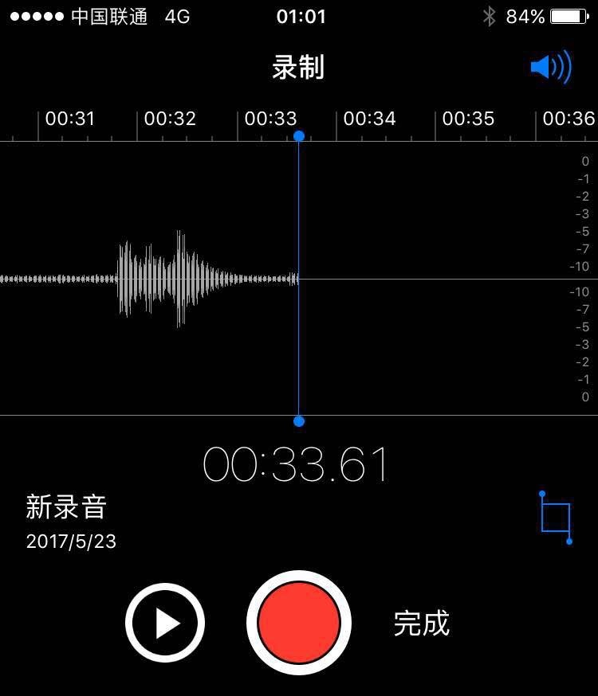

*2017-05-23 01:04 · 猫饭*

---

### 5059

心血来潮，出门散步。听到非常清晰嘹亮的鸟叫，疑似布谷，持续了一分多钟。可是这鸟又不是夜猫子，三更半夜叫什么呢？

*2017-05-23 00:59 · iPhone版*

---

### 5060

脑洞够大！made my day.

*2017-05-23 00:34 · 手机上网*

---

### 5061

左右逢源 vs. 里外不是人。

*2017-05-23 00:01 · iPhone版*

---

### 5062

Peter Sarstedt的《Take Off Your Clothes》歌词真是太下流了！

*2017-05-22 22:49 · 手机上网*

---

### 5063

科恩的《I'm Your Man》真是情书大作，完全符合「潘驴邓小闲」之后两条。

*2017-05-22 22:12 · 手机上网*

---

### 5064

多谢推荐。听了一下，我还是更喜欢黄耀明唱的那版。转@ 露水一杯陈辉阳钢琴版《暗涌》很棒 ！转@ 王兴 黄耀明的《暗涌》是我歌单里屈指可数的粤语歌之一。

*2017-05-22 22:09 · 手机上网 转自王兴*

---

### 5065

某投资人说：当年我们投250万美元给百度就占了10%，去年我们投百度分拆出来的爱奇艺花了1.3亿美元才得到2%。

*2017-05-22 22:04 · iPhone版*

---

### 5066

真是不能想当然，hallelujah 从词根来说竟然不是 哈利-路亚 而是 哈利路-亚。

*2017-05-22 21:48 · 手机上网*

---

### 5067

黄耀明的《暗涌》是我歌单里屈指可数的粤语歌之一。

*2017-05-22 21:39 · 手机上网*

---

### 5068

想了一下关于山的歌，竟然脑海里第一条搜索结果是《康定情歌》：跑马溜溜的山上……

*2017-05-22 21:29 · 手机上网*

---

### 5069

最没诗意的解释是，并非河比山更浪漫，而是生活在河边的人本来就比生活在山上或山脚下的人多几个数量级。转@ 王兴 好像以河为主题的歌比以山的多，随便一想就有《蓝色多瑙河》、《伏尔塔瓦河》、《美丽的梭罗河》……

*2017-05-22 21:23 · 手机上网 转自王兴*

---

### 5070

好像以河为主题的歌比以山的多，随便一想就有《蓝色多瑙河》、《伏尔塔瓦河》、《美丽的梭罗河》……

*2017-05-22 21:15 · iPhone版*

---

### 5071

流星。行星。恒星。

*2017-05-22 20:59 · 手机上网*

---

### 5072

繁体賓怎么解释？转@ terababy 最糟糕的简化字之一，宾賓。

*2017-05-22 14:50 · 手机上网 转自terababy*

---

### 5073

@ underland 我基本都是用手机浏览器直接上。iPhone上好像「猫饭」和「御饭」这俩网友开发的app也都基本能用。

*2017-05-22 14:09 · 手机上网 给underland的回复*

---

### 5074

@ underland 好久不见。

*2017-05-22 12:34 · 手机上网 给underland的回复*

---

### 5075

「人生而自由，却又无往不在枷锁之中」。卢梭装逼，天下无敌。

*2017-05-22 01:46 · iPhone版*

---

### 5076

又听了一遍，热泪盈眶。转@ 王兴 老爸在微信上转发了一段新罗TV用龙岩话创作弹唱的《外婆》，听起来很温馨。虽然龙岩是个小城市，但歌中出现的几个具体地名跟我的人生重合度也忒高了吧：我家在曹溪，外婆家在西洋，奶奶娘家在陈陂……

*2017-05-21 14:12 · 手机上网 转自王兴*

---

### 5077

老爸在微信上转发了一段新罗TV用龙岩话创作弹唱的《外婆》，听起来很温馨。虽然龙岩是个小城市，但歌中出现的几个具体地名跟我的人生重合度也忒高了吧：我家在曹溪，外婆家在西洋，奶奶娘家在陈陂……

*2017-05-21 14:06 · 手机上网*

---

### 5078

Do not be a magician - be magic! -Leonard Cohen

*2017-05-21 13:03 · iPhone版*

---

### 5079

听了一上午《who wants to live forever》，我觉得 Queen 的原唱版还不如 David Garrett 的小提琴版呢。

*2017-05-21 12:43 · iPhone版*

---

### 5080

除了坐着和站着办公，也可以试试跪着。躺着就算了。

*2017-05-21 12:30 · iPhone版*

---

### 5081

「蓝天」和「苍天」这两个词给人的感觉完全不同。

*2017-05-21 12:24 · iPhone版*

---

### 5082

听到谷歌最初起家时和雅虎签的那个合作协议背后的一个花招后，我震惊了。谷歌或许不邪恶，但真的挺狡猾。

*2017-05-21 12:02 · iPhone版*

---

### 5083

「太上，不知有之；其次，亲而誉之；其次，畏之；其次，侮之。」

老子的逼格比起马基雅维利不知道高到哪里去了；可是，似乎不顶用啊……

*2017-05-21 11:15 · iPhone版*

---

### 5084

好冷。转@ 高小树 冷笑脸.jpg转@ 蒙大拿的小偷 陈胜跟吴广说：＂我要造反，你造吗？＂吴广说：＂没想到你是台湾人…＂转@ 王兴 不管你加入不加入，我都要干这事。转@ 王兴 「我干了。你随意。」

拉人一起创业时就需要有这样的气魄。

*2017-05-21 10:48 · 手机上网 转自王兴*

---

### 5085

突然觉得，1969年的伍德斯托克可能也没有真的那么酷。

*2017-05-21 10:17 · iPhone版*

---

### 5086

不管你加入不加入，我都要干这事。转@ 王兴 「我干了。你随意。

」拉人一起创业时就需要有这样的气魄。

*2017-05-21 01:34 · 手机上网 转自王兴*

---

### 5087

「我干了。你随意。」拉人一起创业时就需要有这样的气魄。

*2017-05-21 01:27 · 手机上网*

---

### 5088

Poetry is just the evidence of life. If your life is burning well,poetry is just the ash. -Leonard Cohen

*2017-05-21 01:20 · 手机上网*

---

### 5089

Friend, when you speak this carefully I know it is because youdon't know what to say. -Leonard Cohen

*2017-05-21 01:12 · 手机上网*

---

### 5090

夏天如果不热，就是最好的季节。

*2017-05-21 01:09 · 手机上网*

---

### 5091

有一种说法是：你是你花最多时间在一起的五个人的平均。我觉得更

保险的说法是：你是你花过时间在一起的所有人的总和。

*2017-05-21 00:43 · iPhone版*

---

### 5092

Live your life as if it's real.

*2017-05-20 22:17 · iPhone版*

---

### 5093

路啊路，飘满红罂粟。-北岛

*2017-05-20 20:03 · iPhone版*

---

### 5094

足不出户，手不释卷

*2017-05-20 18:30 · iPhone版*

---

### 5095

转@ 小熊娃娃 # 今日吐槽 # ——中国人的三个终极哲学问题是什么？——能好怎？

*2017-05-20 14:47 · 手机上网 转自小熊娃娃*

---

### 5096

孙正义可能受丰臣秀吉影响不小。

*2017-05-20 13:42 · iPhone版*

---

### 5097

好的管理者引导身边的人「见自己、见天地、见众生」。

*2017-05-20 12:47 · iPhone版*

---

### 5098

切花是有意不香的。

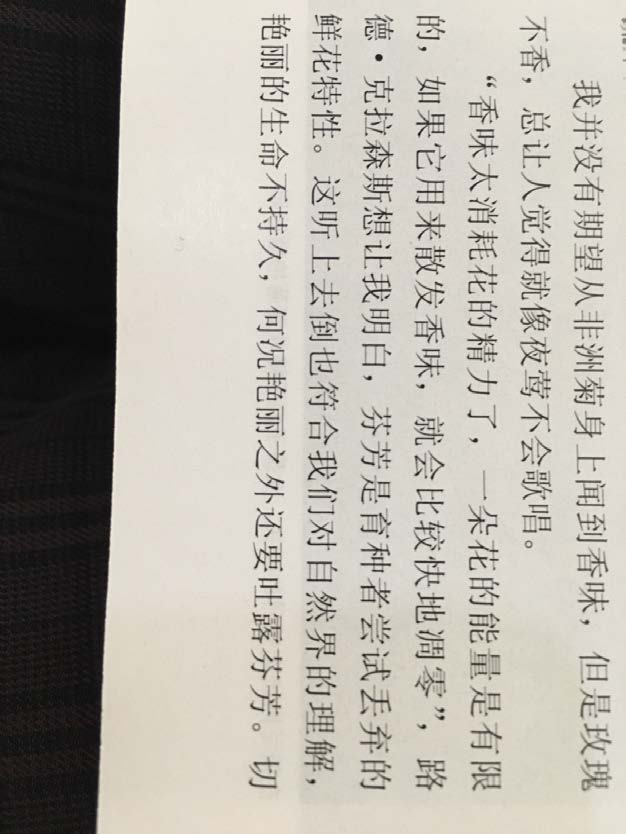

*2017-05-20 12:07 · 猫饭*

---

### 5099

共产主义里对应「哈利路亚」和「阿弥陀佛」的词是什么？英特纳雄耐尔？

*2017-05-20 11:31 · iPhone版*

---

### 5100

我至今没有去过「山海关」:( 就凭这么棒的名字都应该去看一下。

*2017-05-20 11:19 · iPhone版*

---

### 5101

智信仁勇严，潘驴邓小闲。

*2017-05-20 10:56 · iPhone版*

---

### 5102

希望今晚做个噩梦。醒来时就可以对自己说，都过去了。

*2017-05-20 01:53 · iPhone版*

---

### 5103

蚊子来了，说明夏天来了。

*2017-05-20 01:22 · iPhone版*

---

### 5104

呆坐在客厅里时唯一亮着的吊灯突然闪了几闪，我的第一反应不是这灯恐怕命不久矣，而是终于有外星人要给我发信号了吗？

*2017-05-20 00:41 · iPhone版*

---

### 5105

You want it darker.

*2017-05-19 23:14 · 手机上网*

---

### 5106

中国有85个城区人口超百万的城市。

*2017-05-19 19:41 · iPhone版*

---

### 5107

@ 阳升 没定。

*2017-05-19 18:47 · 手机上网 给阳升的回复*

---

### 5108

@ gabriel 你居然也还在饭否上。欢迎:)

*2017-05-19 18:33 · 手机上网 给gabriel的回复*

---

### 5109

经过一段时间练习，我现在已经单手系得很溜了。转@ 王兴 试了一下，单手系安全带并不容易。

*2017-05-19 16:16 · 手机上网 转自王兴*

---

### 5110

一个搞人工智能的人跟我说从深度学习的原理反过来可以解释人为什么必须做梦。

*2017-05-19 16:12 · iPhone版*

---

### 5111

我的大脑用的存储方式可能比较原始，每次跟人高强度高质量对谈之后我都觉得需要休息一会儿，就像要让文件系统defrag一样。所以那种一天从早到晚排满十个会的工作方式真的不适合我。

*2017-05-19 15:55 · iPhone版*

---

### 5112

最简单的检验是把作者隐去，看你是否依然有共鸣。转@ loso 名言之所以成立和传播，是因为有作者一生的经历和作品在后面作支撑。要不然，一定不会传播，甚至会被拍死。转@ 王兴 随着时光流逝，我慢慢地明白了，只有存在的东西才会消失，不管是城市，爱情，还是父母。——卡尔维诺

*2017-05-19 11:44 · 手机上网 转自王兴*

---

### 5113

游戏的边界 & 边界的游戏

*2017-05-19 11:43 · iPhone版*

---

### 5114

不对，为何不握书脊那一侧？转@ 王兴 握法很讲究！就差同款花衬衫了？转@ webto Got a copy of Apple biblehttps://www.instagram.com/p...

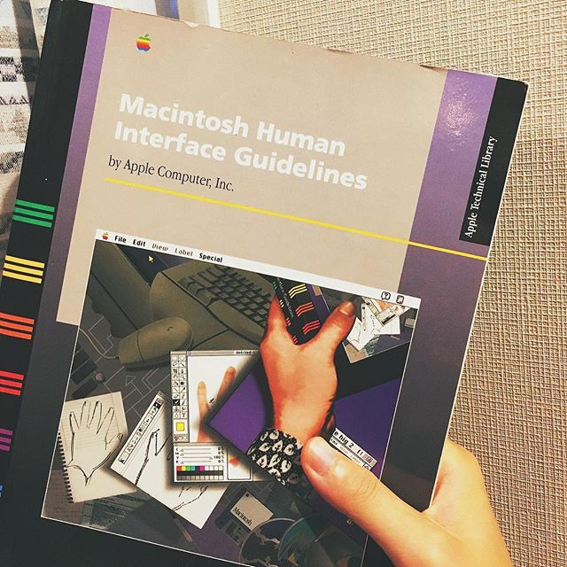

*2017-05-19 10:21 · 手机上网 转自webto*

---

### 5115

握法很讲究！就差同款花衬衫了？转@ webto Got a copy of Applebible https://www.instagram.com/p...

*2017-05-19 10:20 · 手机上网 转自webto*

---

### 5116

随着时光流逝，我慢慢地明白了，只有存在的东西才会消失，不管是城市，爱情，还是父母。——卡尔维诺

*2017-05-19 09:42 · iPhone版*

---

### 5117

《乌兰巴托的夜晚》还蛮好听的。

*2017-05-18 23:56 · iPhone版*

---

### 5118

转@ Null1234 转@ 王兴 待在facebook的时候会觉得很depressing，随时都感觉公司会挂了，所以感觉负面是正常的，需要的就是坚持。by 覃超（facebook早期工程师）

*2017-05-18 23:06 · 手机上网 转自王兴*

---

### 5119

落地一个小时还不开舱门。第一次遇到这种情况:(

*2017-05-18 19:50 · iPhone版*

---

### 5120

转：成功的路上并不拥挤，因为能坚持的人真的不多。

*2017-05-18 19:25 · iPhone版*

---

### 5121

75年伊朗国王巴列维与伊拉克革命指挥委员会副主席萨达姆达成《阿尔及尔协定》，规定“阿拉伯河边境线以深泓线原则为准”。79年，伊朗发生伊斯兰革命，巴列维流亡国外；而萨达姆就任伊拉克大总统。

80年，萨达姆单方面废除协定，称阿拉伯河为伊拉克领土，战争爆发。打了八年后两国恢复协定回到起点

*2017-05-18 15:54 · 手机上网*

---

### 5122

1900年，英国著名物理学家开尔文男爵在在回顾物理学所取得的伟大成就时认为，大厦已经落成，所剩的只是一些修饰工作。在展望20世纪物理学前景时，他说美丽而晴朗的天空上只有两朵乌云（找不到以太、黑体辐射解释不了）。后来，正是从这两朵乌云里诞生了现代物理学（相对论和量子力学）。

*2017-05-18 12:22 · iPhone版*

---

### 5123

干啥都是投入得够。想起那个访谈，杨澜：要成为世界一流大学最重要的是什么？季羡林：钱要够多。杨：当大学校长最重要的是要干好什么？季：搞钱。

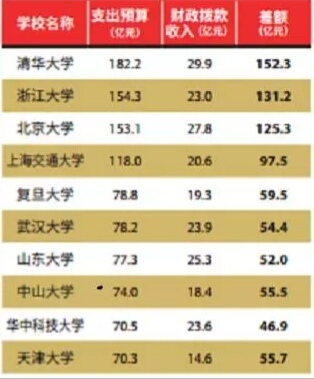

*2017-05-18 11:56 · 手机上网*

---

### 5124

看不清自己所处的环境就看不懂自己。

*2017-05-18 10:26 · iPhone版*

---

### 5125

@ POPOEVER 饭否api还是可用的吧。@ .rex

*2017-05-17 22:44 · 手机上网 给POPOEVER的回复*

---

### 5126

Winnington 这地名……

*2017-05-17 19:12 · 手机上网*

---

### 5127

人生是条大河。不要刻舟求剑。

*2017-05-17 18:43 · 手机上网*

---

### 5128

听说微信用户快破十亿了。转@ 王兴 真正的 NB 是 Next Billion.

*2017-05-17 18:40 · 手机上网 转自王兴*

---

### 5129

真正的 NB 是 Next Billion.

*2017-05-17 18:34 · iPhone版*

---

### 5130

转@ enclavetj 同时在读三本写同一主题的书，分别作于1970s、1990s、2010s，一本比一本的narrative（叙事）更强，对读者当然是好事，越来越精妙高级。但也会怀疑是不是遮蔽了太多其他voice。也许本可以更复调一些的。很粗疏的感受。毕竟三本都没读完。。。

*2017-05-17 09:00 · 手机上网 转自enclavetj*

---

### 5131

@ POPOEVER 稀客你好:)

*2017-05-17 06:37 · 手机上网 给POPOEVER的回复*

---

### 5132

转@ 冲动与天赋 金融投机比如炒股之类属于一？转@ 王兴 可能存在两种行业，一是「傻瓜有益型」，意思是傻瓜闯进来对行业构不成伤害，只会增添养料；二是「傻瓜有害型」，意思是傻瓜虽然成不了事，但有可能把整个行业彻底搞砸，或至少使全行业长期痛苦。

*2017-05-16 23:55 · 手机上网 转自王兴*

---

### 5133

肥肠面好。

*2017-05-16 13:56 · 手机上网*

---

### 5134

多谢 @ 饭小默 ，居然还有 @ Bing每日壁纸 这个饭否帐号。

*2017-05-16 12:52 · 手机上网 转自Bing每日壁纸*

---

### 5135

参加了一个很接地气的开业活动，门口站两排穿红袍披白貂的礼仪小姐的那种。

*2017-05-16 11:26 · 手机上网*

---

### 5136

国内的一些活动在发言者上台时喜欢放《星球大战》的那段音乐，虽然很激昂，但对我来说有些额外的困扰。

*2017-05-16 11:07 · 手机上网*

---

### 5137

可能存在两种行业，一是「傻瓜有益型」，意思是傻瓜闯进来对行业构不成伤害，只会增添养料；二是「傻瓜有害型」，意思是傻瓜虽然成不了事，但有可能把整个行业彻底搞砸，或至少使全行业长期痛苦。

*2017-05-16 09:09 · 手机上网*

---

### 5138

为什么你觉得万亿美元就是天花板呢？转@ webto 也是当年起点低，现在如果 200 亿市值 IPO，做到万亿规模也只有 50 倍增长。。。

RT@ 穆荣均 1997年5月15日，亚马逊上市。20年了，市值增长490倍，年复合增长率36%。

*2017-05-16 08:56 · 手机上网 转自穆荣均*

---

### 5139

你为什么总是头发这么短？不然老在风口上还不得被吹成一头乱发。

*2017-05-15 23:50 · iPhone版*

---

### 5140

lady gaga的《million reasons》还蛮好听。

*2017-05-15 23:12 · iPhone版*

---

### 5141

打算哪天走？还回来吗？转@ terababy 学好古音，为穿越做准备！

转@ terababy 芬芳，古音大约念做bān pāng

*2017-05-15 20:34 · 手机上网 转自terababy*

---

### 5142

我以前只知道厦门有个南普陀寺，不知道长春有个北普陀寺。

*2017-05-15 19:59 · 手机上网*

---

### 5143

@ 戴书文 你居然也活跃在饭否上:)

*2017-05-15 18:05 · 手机上网 给戴书文的回复*

---

### 5144

完全同意。绝大部分航空餐远不如发一个全家的大口饭团。一个不行就两个！转@ 失学儿童 对于绝大多数航空公司猪食不如的航空餐来说，还不如没有呢。。。转@ 王兴 第一次坐春秋航空。不愧是LCC低成本航空，对行李卡得真严啊！

*2017-05-15 17:23 · 手机上网 转自王兴*

---

### 5145

看了底部的文字说明，我才知道bing今天这张拉风的图里是什么。

*2017-05-15 14:38 · 猫饭*

---

### 5146

第一次坐春秋航空。不愧是LCC低成本航空，对行李卡得真严啊！

*2017-05-15 13:41 · 猫饭*

---

### 5147

总觉得上海的「龙阳路」这个名字有点不忍直视。

*2017-05-15 13:21 · iPhone版*

---

### 5148

在外这些天，要么是好吃好喝的大餐，要么是全家便利店一个5块3的黑椒猪排大口饭团，我都很满足。

*2017-05-15 12:45 · 猫饭*

---

### 5149

转@ 王球球的春天 我这么执着的要干这件事，不是我太闲，也不是勒索，我在投诉之初，就表明态度不用赔偿了。还是那句话，这个社会的每一天，都是我们每一个人昨天投票的结果。公民责任是我身份

的一部分。转@ 王球球的春天 上海食品检验局第一时间去天猫超市华北生鲜所属公司-易果公司检查，还送去第

*2017-05-15 11:21 · 手机上网 转自王球球的春天*

---

### 5150

转@ quux 原来望京这么小 转@ 暗流_ 一个非常吃鲸的事实，首都机场的占地面积比整个望京（四五环和机场高速京承高速区域内）还大。

*2017-05-15 10:24 · 手机上网 转自暗流_*

---

### 5151

把今年11月22-24日将在国家会展中心（上海虹桥）举办的2017 HortiChina 亚洲园艺博览会加入了日历。

*2017-05-15 00:32 · iPhone版*

---

### 5152

多听几十遍就觉得蔡琴这版其实也还不错了。转@ 王兴 又听了一遍，更加感叹科恩这首歌的伟大。这样瞎翻译瞎唱都无法完全糟蹋它。转@ 王兴 我也去听了一下蔡琴版的《哈利路亚》。这都是什么呀？那中文歌词翻译者看懂科恩的歌词了吗？转@ webto 说起来，

「正在播放」也曾经是 MSN 的卖点功能

*2017-05-14 23:22 · 手机上网 转自webto*

---

### 5153

开tab如山倒，关tab如抽丝。

*2017-05-14 22:25 · iPhone版*

---

### 5154

看来行不通，竟然这么多人误以为是「阿萨姆」。转@ 王兴 「萨达姆」或许可以成为一个足够独特的品牌名？

*2017-05-14 22:18 · 手机上网 转自王兴*

---

### 5155

刻意不看手机地图，凭记忆、大致方位感和高楼地标花了一个半小时走了7.3千米回到宾馆，中途还在街边店买了一杯奶盖茶边走边喝。

*2017-05-14 22:13 · 猫饭*

---

### 5156

光是一个理想主义者并不值得被称赞。那些甘当人肉炸弹害人害己的原教旨恐怖主义分子大概都算得上是理想主义者。

*2017-05-14 21:44 · iPhone版*

---

### 5157

「萨达姆」或许可以成为一个足够独特的品牌名？

*2017-05-14 21:34 · iPhone版*

---

### 5158

有人跟我说现在的密植苹果已经可以做到亩产万斤。我觉得有点难以相信。

*2017-05-14 20:16 · iPhone版*

---

### 5159

剔完骨的鸡爪吃起来真爽！

*2017-05-14 18:18 · 手机上网*

---

### 5160

这不是「一个」词。转@ 拧巴人儿 @ 王兴 不是filial piety吗

*2017-05-14 12:54 · 手机上网 转自拧巴人儿*

---

### 5161

好像英文里确实没有「孝」这个词，至少我不知道。

*2017-05-14 12:52 · iPhone版*

---

### 5162

William Pitt the Younger居然24岁就当上英国首相，并领导英国经历法国大革命并打赢了和拿破仑的战争。大英帝国真是敢大胆启用年轻人啊！当然，他爹也当过英国首相。不过，这哥们只活了47岁。

*2017-05-14 12:04 · iPhone版*

---

### 5163

哦，跟 chimera 这个词的存在有关系。转@ 王兴 chimerica 这个词已经有维基百科词条了。 americhina 还没有。

*2017-05-14 11:17 · 手机上网 转自王兴*

---

### 5164

chimerica 这个词已经有维基百科词条了。 americhina 还没有。

*2017-05-14 11:13 · 手机上网*

---

### 5165

转@ 叶滨 英文里读到blind man and elephant，心想我国成语竟然流传这么广。查了一下wiki，原来盲人摸象的故事都是从印度流传出去的

*2017-05-13 22:53 · 手机上网 转自叶滨*

---

### 5166

第一次看到小便池右上方有个专门用来挂拐杖的小装置。两侧3+6个小便池只在最靠近门口的那个有。

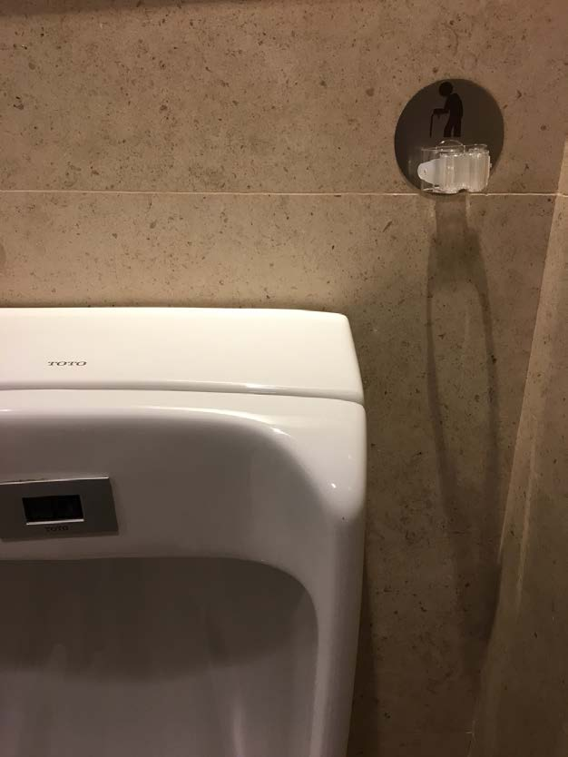

*2017-05-13 20:59 · 猫饭*

---

### 5167

如果街头歌手的水平高，那这个城市的文明程度应该低不到哪里去。

*2017-05-13 19:36 · 手机上网*

---

### 5168

俯靠在栏杆上，眼前近处倒伏着一片青草，再往前是有零星几只长脚水鸟踱步觅食的烂泥地，再往前是客船货船往来不息的江水，江对面是堪称建筑风格博物馆的一连串历史建筑，再往远处是高楼此起彼伏的都市天际线以及玫瑰色的天空；凉风习习，吹来我身后街头歌手弹唱的《海阔天空》。

*2017-05-13 18:58 · 手机上网*

---

### 5169

这么听歌下去，我觉得自己很有可能会重新学一下钢琴啥的。

*2017-05-13 13:44 · 手机上网*

---

### 5170

废都、查太莱夫人的情人。转@ terababy 我的启蒙是《妇女生活》

转@ 這人廢了 我是小学三年级在爷爷家翻到的金瓶梅 当时寄宿在爷

爷家念高中的姐姐在读 我就好奇也拿来读 RT@ 那.谁 转@ 叫康师傅交罚款交到福建靠 我的性启蒙读物不是《茶余饭后》，是《家庭医生》和《大众电影》

*2017-05-13 12:20 · 手机上网 转自叫康师傅交罚款交到福建靠*

---

### 5171

看到一个搞笑说法：别提2B还是2C了，现在连2VC都落伍了，关键是2AT！

*2017-05-13 11:09 · iPhone版*

---

### 5172

当他说最近在读这本书并从随身包里抽出来时，全场都服了。

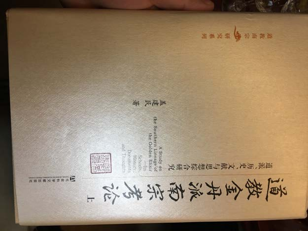

*2017-05-13 00:38 · 猫饭*

---

### 5173

今天居然非常意外的在线下乱入了另一个机构的十周年庆典。

*2017-05-12 21:29 · iPhone版*

---

### 5174

牛逼！党和国家真是 think long term. 转@ 阳升 这可真是一张蓝图干到底呀

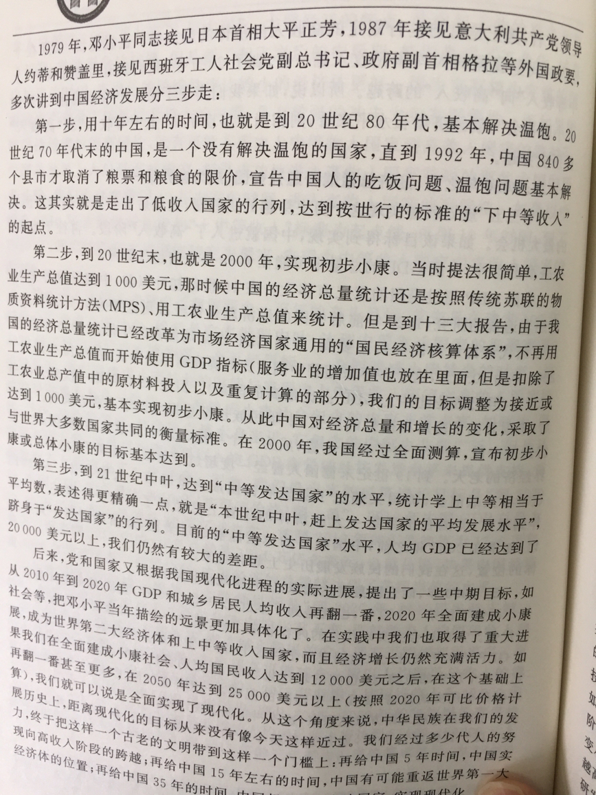

*2017-05-12 15:20 · 手机上网 转自阳升*

---

### 5175

这个问题真是典型的像「小马过河」。还是得靠上帝视角。转@ 王兴共享单车和网约车，哪个对出行的改变更大？

*2017-05-12 15:16 · 手机上网 转自王兴*

---

### 5176

共享单车和网约车，哪个对出行的改变更大？

*2017-05-12 11:49 · 手机上网*

---

### 5177

一眨眼，饭否就十周岁了。转@ 狐臭臭 转@ 王兴 种一棵树的最好时机是十年前，其次是现在。

*2017-05-12 00:05 · 手机上网 转自王兴*

---

### 5178

老江湖对我说：你看一个地方的文明程度，别看老百姓文明不文明，重点看政府文明不文明。

*2017-05-11 23:07 · iPhone版*

---

### 5179

转：我们衡量好广告的标准是什么？“消费者看完广告之后说，这真是个好产品，而不是说，这真是个好广告”！

*2017-05-11 18:27 · 手机上网*

---

### 5180

第一次遇到司机用罗永浩版语音导航，效果还蛮滑稽的。

*2017-05-11 15:16 · 手机上网*

---

### 5181

打听了一下，翔安机场总造价360亿。那买沙子应该花不掉100亿吧？

*2017-05-11 14:56 · 手机上网*

---

### 5182

我对「一百亿人民币」的直观认知被刷新了。以前，它是中国互联网竞争最惨烈的那几个行业里每个每年烧的钱；今天，它变成了厦门修个新机场光买填海的沙子要花的钱。

*2017-05-11 14:52 · 手机上网*

---

### 5183

转@ 陈柠檬 老家的电缆厂也是江总题的，缆写成了金字旁，没人敢改，尴尬的挂着 转@ 王兴 厦门几座跨海大桥都是江泽民题的名字，据说是当年趁他高兴时请他一次性题了好几个名字，不知道还有没有备用的。厦门太古那个号称全亚洲最大的飞机维修公司据说是胡锦涛唯一题过名的公司，但胡上任之后要求公司

*2017-05-11 14:50 · 手机上网 转自王兴*

---

### 5184

乐善好施。转@ Squall 老家的红四方面军指挥部遗址是通过传话和写信和传话找江题的，又通过组织层层传下来的，江本人没来过转@ 王兴 厦门几座跨海大桥都是江泽民题的名字，据说是当年趁他高兴时请他一次性题了好几个名字，不知道还有没有备用的。厦门太古那个号称全亚洲最大的飞机维修公司

*2017-05-11 14:19 · 手机上网 转自王兴*

---

### 5185

不知怎的想到乌衣巷。电影 men in black 也可以译成《乌衣人》。

*2017-05-11 12:27 · iPhone版*

---

### 5186

厦门几座跨海大桥都是江泽民题的名字，据说是当年趁他高兴时请他一次性题了好几个名字，不知道还有没有备用的。厦门太古那个号称全亚洲最大的飞机维修公司据说是胡锦涛唯一题过名的公司，但胡上任之后要求公司停用了那个牌匾。

*2017-05-11 12:23 · iPhone版*

---

### 5187

今天机场安检小妹摸我摸得特别久特别仔细，直到她让我抬起脚用金属探测器检查鞋底，我才基本确定自己并没有一夜之间变帅了。

*2017-05-11 11:57 · 手机上网*

---

### 5188

想来想去还真是只想到他。转@ 张亮 毛.. 转@ 王兴 谁的中文像丘吉

尔的英文那么好？

*2017-05-11 11:47 · 手机上网 转自王兴*

---

### 5189

风卷残云一扫空。吃饱了就心里踏实多了。

*2017-05-11 11:45 · 手机上网*

---

### 5190

转@ webto 哈哈哈哈哈 RT@ 倒逆河流 想起好多年前听的一首巨搞笑的宿舍金属，“要！死！一！起！死！嗷嗷！胸！口！碎！大！

石！”RT @ 世界这么大 上传了新照片

*2017-05-11 11:44 · 手机上网 转自倒逆河流*

---

### 5191

这么烧包没啥honor可言吧。转@ 木之所兮 我浙好厉害

*2017-05-11 11:19 · 手机上网 转自木之所兮*

---

### 5192

厦门高崎机场里的海蛎煎+小黄鱼+米线糊+时蔬套餐，78元，不便宜，但内容比国内很多机场的60块钱一碗面丰富些。

*2017-05-11 11:13 · 猫饭*

---

### 5193

承上启下。承前启后。

*2017-05-11 02:22 · iPhone版*

---

### 5194

谁的中文像丘吉尔的英文那么好？

*2017-05-11 02:04 · iPhone版*

---

### 5195

最好的词是那些短词，最好的短词是那些老词。-丘吉尔

*2017-05-11 01:19 · iPhone版*

---

### 5196

看一个公司时，我会想它的定位和长期竞争力是什么；看一个城市时，我也会想它的定位和长期竞争力是什么；看一个国家时，我也会想它的定位和长期竞争力是什么。我大概真是有点走火入魔了。

*2017-05-11 00:58 · iPhone版*

---

### 5197

有一个赌场里曾经有五花八门的游戏，后来玩法越来越单调，最后只剩一下没有技术含量的「比大小」这一种玩法，主要变化在于筹码越来越大，能上桌的玩家越来越少……

*2017-05-11 00:51 · iPhone版*

---

### 5198

合唱还是有任何乐器都取代不了的奇妙的和谐效果。

*2017-05-11 00:22 · iPhone版*

---

### 5199

随着年纪增长，多数人的换位思考能力会提升。其实，不一定是这个能力本身增强了，可能只是他经历过的角色多了以后，有些时候要达到换位思考已经不再需要想象力/移情能力而只需要记忆力。

*2017-05-11 00:17 · iPhone版*

---

### 5200

今晚骑了两块钱摩拜单车。

*2017-05-10 23:09 · 手机上网*

---

### 5201

居然好多人遇害。转@ Sttequila 最近有个同事发图给别人窜到我这儿，而且连续试了七次都是同样的 转@ 王兴 太可怕了！微信居然有窜消息这种致命bug！我发给a的图片，一切正常的显示在我和a的聊天记录里（a还没回复，不确定是否收到）。但其实错发到b那里去了，所以b一头雾水的问我

*2017-05-10 22:58 · 手机上网 转自王兴*

---

### 5202

这么夸张？龙岩规划中的新机场总预算才25亿，而且也不是建在平地上，而是削掉山峰建在半山平台上的，工程量也不小。转@ 我叫BT一个单单沙子用量就超过百亿人民币的项目，了不得啊 转@ 王兴 厦门在翔安那个新机场2022年之前都无法启用……

*2017-05-10 22:57 · 手机上网 转自王兴*

---

### 5203

厦门在翔安那个新机场2022年之前都无法启用……

*2017-05-10 21:26 · iPhone版*

---

### 5204

太可怕了！微信居然有窜消息这种致命bug！我发给a的图片，一切正常的显示在我和a的聊天记录里（a还没回复，不确定是否已收到）。

但其实错发到b那里去了，所以b一头雾水的问我，还把他那里看到的和我的聊天记录截屏发给我，确实有那张图。我和b的聊天记录里没有。

*2017-05-10 17:43 · iPhone版*

---

### 5205

帅气！转@ 柒小斤 Edward Snowden在2017波士顿OpenStack峰会上连线进来鼓动了一番开源技术然后说，We want a better world,so we’re here to build it。

*2017-05-10 17:05 · 手机上网 转自柒小斤*

---

### 5206

一个解释公司管理思想时引用「哥德尔不完备原理」的当红创业者向我推荐此书。

*2017-05-10 14:15 · 手机上网*

---

### 5207

coder/programmer/builder/developer/engineer…

*2017-05-10 11:47 · iPhone版*

---

### 5208

一个公司、一家公司、一间公司。

*2017-05-10 11:38 · iPhone版*

---

### 5209

What's the single best question you could ask soneone?

*2017-05-10 11:12 · iPhone版*

---

### 5210

东南亚游戏创业者说facebook比腾讯还更霸道，他们把自己游戏的粉丝社区建立在facebook上面之后，facebook的商务就过来说，你们必须付我们钱，不然我就让你的粉丝里只有10%能看到你官方发布的新消息。国内似乎是微博用了类似的变现方式？

*2017-05-10 10:04 · 手机上网*

---

### 5211

2017中国酒店集团规模50强

*2017-05-08 17:18 · 手机上网*

---

### 5212

多谢。听了，依然不是我的菜。转@ R.E.M. 找piano guys的《lovestory》(还有个名字叫love story meets viva la vida),后半段混合的有viva la vida 转@ 王兴 没找到piano guys版的《viva la vida》

*2017-05-08 16:09 · 手机上网 转自辛祭酒*

---

### 5213

没找到 piano guys 版的《viva la vida》，听了一下他们演绎的《rolling in the deep》，很一般呀。转@ 辛祭酒 @ 王兴 还是piano guys的好

*2017-05-08 12:53 · 手机上网 转自辛祭酒*

---

### 5214

2cellos果然用大提琴演奏过一版《viva la vida》。但我听了觉得不是很来劲。

*2017-05-08 12:42 · 手机上网*

---

### 5215

转@ Kloven @ 王兴 马友友是十余座格莱美奖得主，朱丽亚音乐学院教授；郎朗常年在欧洲巡演，米兰世博会开幕式上演奏《春节序曲》，在意大利几乎无人不知；“李云迪韩国首尔忘曲中断演出”。可以说是艺术家，钢琴家，钢琴演奏家的区别。郎朗的争议点是他的演奏风格，但钢琴技巧无可指摘。

*2017-05-08 00:43 · 手机上网 转自Kloven*

---

### 5216

转@ 杜斌beta 在农业产生之前，我们唯一的财产是体内的脂肪。

*2017-05-07 22:57 · 手机上网 转自杜斌beta*

---

### 5217

《Smooth Criminal》好像已经成为迈克尔•杰克逊的歌里我听得最多的那首。

*2017-05-07 21:29 · iPhone版*

---

### 5218

谁发明了双十一？转@ 振保你又 刘强东某篇自传色彩的文章里面写自己上大学的时候在学着写程序，因为社会学……。相较于这些数得上数的人倒是很以发明双十一的学姐为傲，对习以为常事情的颠覆并且真的具有实用价值。转@ 王兴 刚注意国内互联网行业居然有不少社会学专业的人：刘强东、李国庆、李斌

*2017-05-07 20:43 · 手机上网 转自王兴*

---

### 5219

@ 熊阿姨 朗朗真的比李云迪高很多吗？我确实不太懂。

*2017-05-07 20:34 · 手机上网 给熊阿姨的回复*

---

### 5220

刚注意到，国内互联网行业居然有不少社会学专业的人：刘强东（人大）、李国庆（北大）、李斌（北大）、袁岳（北大）。

*2017-05-07 20:25 · iPhone版*

---

### 5221

《娱乐产业经济学》书中分析过。博彩和体育大，电影小，古典音乐更小，在美国也是亏钱的行当。但并非所有人都唯利是图。转@ qinyf古典音乐产业估计每年算上政府补贴一共也就十亿级。公众略知道的古典音乐背景的年轻人，比如郎朗、李云迪、欧阳娜娜，也都要靠走娱乐路线。

*2017-05-07 15:04 · 手机上网 转自qinyf*

---

### 5222

转@ gravity0 按数量统计，身体中百分之九十的细胞基因都不是自己的，而是各种细菌微生物。若将之看作一个联邦，进行民主选举，来

自父母基因的细胞种群可能早就下野了。质量上自身细胞占主体，但离了微生物又不行。这个协作共生体系很微妙，设计不出，只能靠演化。

*2017-05-07 14:30 · 手机上网 转自gravity0*

---

### 5223

made my day

*2017-05-07 13:32 · 手机上网*

---

### 5224

不是。第一，我以前种过树；第二，有共同之处更是更有意义。哈哈:)

转@ quux 种树？ 转@ 王兴 今天做了一件以前不曾（有意识的）做过的事。几年后再回头来看一下效果:)

*2017-05-07 12:34 · 手机上网 转自王兴*

---

### 5225

哦，确实有，比较含蓄，是一张红扑扑的脸蛋左下方加两只小手，而不是两只大手直接出镜。转@ 王兴 微信的缺省表情里没有「鼓掌」。这是疏忽还是有意为之？

*2017-05-07 12:23 · 手机上网 转自王兴*

---

### 5226

微信的缺省表情里没有「鼓掌」。这是疏忽还是有意为之？

*2017-05-07 11:36 · iPhone版*

---

### 5227

今天做了一件以前不曾（有意识的）做过的事。几年后再回头来看一下效果:)

*2017-05-07 11:32 · iPhone版*

---

### 5228

真正糟糕的不是绝望，而是谬望，即抱有一些错误的希望。

*2017-05-07 11:25 · iPhone版*

---

### 5229

转：世界的问题总是藏在多重矛盾里，而未来的希望，也在多重矛盾里。

*2017-05-07 01:49 · iPhone版*

---

### 5230

@ qinyf 刚回到北京。过去几天主要在迪拜，只去阿布扎比呆了一个白天。

*2017-05-07 01:22 · 手机上网 给qinyf的回复*

---

### 5231

好的机场果然不仅有酒店，连健身房和spa也有。

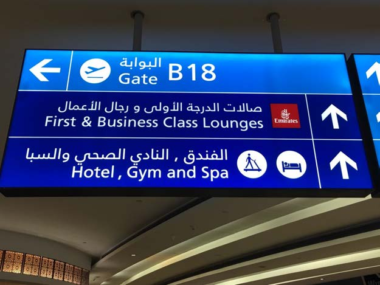

*2017-05-06 23:31 · 猫饭*

---

### 5232

华为的同志说，我们在伊朗时发现新浪和百度都被封了，我们找伊朗方面反映情况，他们的答复是，那些不是黄色网站吗？至少首页上的内容看起来就不太正经-_-!

*2017-05-06 22:09 · iPhone版*

---

### 5233

对冲基金经理对我说：我最近在看《人民的名义》，我看的上一部国产剧是《蜗居》。每次xx大之前都会出一部热门剧，我都必须看，这是我的工作需要。

*2017-05-06 20:56 · iPhone版*

---

### 5234

今天空气质量不错。刚出首都机场就能清楚的看到望京绿地、望京soho和更远处的国贸三期。

*2017-05-06 16:41 · 手机上网*

---

### 5235

作为古老波斯文明的继承者，伊朗当然是鄙视整个阿拉伯的。转@ 趴缸锦鲤 伊朗呢… 转@ 王兴 据说阿拉伯世界内部的鄙视链是：阿联酋/沙特/卡塔尔（阿联酋和沙特在顶端互相鄙视）> 阿曼/巴林/科威特（以上是6个GCC海湾国家）> 约旦/黎巴嫩 > 埃及/也门。伊拉克/叙利亚更是边缘化

*2017-05-06 00:09 · 手机上网 转自王兴*

---

### 5236

赞。这种斜的拉链设计有意思。转@ 东东枪 我的笔袋我的笔。

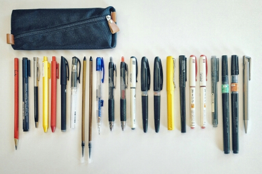

*2017-05-05 15:37 · 手机上网 转自东东枪*

---

### 5237

据说阿拉伯世界内部的鄙视链是：阿联酋/沙特/卡塔尔（阿联酋和沙特在顶端互相鄙视） > 阿曼/巴林/科威特（以上是6个GCC海湾国家）> 约旦/黎巴嫩 > 埃及/也门。伊拉克/叙利亚更是边缘化了。

*2017-05-05 15:30 · iPhone版*

---

### 5238

多进四，四进三，三进二。

*2017-05-05 11:26 · iPhone版*

---

### 5239

迪拜的城市定位挺清晰的：成为像香港和新加坡那样的区域金融中心加上像拉斯维加斯那样的全世界人民来放纵娱乐的地方。

*2017-05-04 22:28 · iPhone版*

---

### 5240

清华大学今年新增两个本科培养项目：一个是社会科学学院新增国际事务与全球治理方向，另一个是外文系和世界文学与文化研究院共建世界文学与文化实验班。

*2017-05-04 04:06 · 手机上网*

---

### 5241

@ VinsonFei 时光网跟我没关系。猫眼才有。

*2017-05-04 03:50 · 手机上网 给VinsonFei的回复*

---

### 5242

oh yeah, intercourse is a type of interaction. 转@ 杜斌beta 性交是社交的一种形态。转@ 阳升 社交？有性交就不错了！——某加班狗

*2017-05-03 17:03 · 手机上网 转自阳升*

---

### 5243

@ VinsonFei 你从哪里买的？

*2017-05-03 16:17 · 手机上网 给VinsonFei的回复*

---

### 5244

转@ 阳升 卖健身会员和卖书其实是一个思路，卖的是现实中的你和想象中的你的（巨大）差距——我看着 kindle 里八成买下却没读过的书，摇头道。

*2017-05-03 13:16 · 手机上网 转自阳升*

---

### 5245

转@ TIAN 上中文课的时候 学生都会对这个词很感兴趣很喜欢 学了马上开始一直用 因为他们说we are big family :) 大家一起去，大家好，大家都是好人 转@ 王兴 想了一下，「大家」这个词其实蛮有意思的。

*2017-05-02 14:25 · 手机上网 转自王兴*

---

### 5246

想了一下，「大家」这个词其实蛮有意思的。

*2017-05-02 13:46 · iPhone版*

---

### 5247

「公平」和「平等」因为都有一个「平」字而带来不少混淆，就像「权力」和「权利」都有一个「权」字但两个概念完全不一样。

*2017-05-01 22:35 · iPhone版*

---

### 5248

对一间酒店的评价可以有很多维度，例如，提供的铅笔好不好写，带不带橡皮。

*2017-05-01 15:46 · iPhone版*

---

### 5249

转@ webto 日本实体商业玩的套路和国内差不多，类似的产品线上线下供货型号不同，这样线下购物的时候就无法通过扫码快速比价了。#希望明天不要被打脸 #

*2017-05-01 14:56 · 手机上网 转自webto*

---

### 5250

prevail: to defeat an opponent especially in a long or difficultcontest. 中文怎么翻译最传神呢？光说「赢」是不够的。

*2017-05-01 13:12 · 手机上网*

---

### 5251

未看先转。转@ webto RT@ viviyo NASA不久前发布了一张新的全球夜景图，这是迄今地球上人类居住分布最清晰的复合图。266MB大图下载地址： http://t.cn/RX2aenw

*2017-05-01 13:04 · 手机上网 转自viviyo*

---

### 5252

想了一下，我好像还没去过特别清真的国家。土耳其、马来西亚、印尼、阿联酋这些地方（至少我去的部分）都还比较世俗。

*2017-05-01 12:10 · iPhone版*

---

### 5253

「一个美国人问一个法国人：你说德语吗？法国人：不说啊。美国人：不用谢。」老外刻薄起来也真是厉害！

*2017-04-30 07:01 · iPhone版*

---

### 5254

夏威夷大岛的Hilo市海边那座颇有历史的夏威夷酒店门前是一条Banyan Drive,路两旁是成排的很大棵的胡须茂盛的榕树。每棵树下都有块金属铭牌，写着「某某人种于何时」或「为纪念某某人种于何时」。我觉得这种方式蛮好。

*2017-04-29 21:15 · iPhone版*

---

### 5255

起初听说铁树开花是稀罕事。我小学去福州鼓山游玩时还去看过被围起来观赏的雌雄铁树开花。后来不知道是气候变暖还是怎的，我们家门口那棵铁树年年开花，一开就开大半年一整年，几乎总是开着。铁树繁殖起来也极容易，就跟芋子差不多。

*2017-04-29 20:58 · iPhone版*

---

### 5256

北美红杉虽然好，但也不宜多种。现在比较鼓励用乡土树种做园林绿化。濒危物种红豆杉倒是可以多种几棵，一举两得。据说红豆杉也长得很慢。好像好的树都长得慢。

*2017-04-29 20:43 · iPhone版*

---

### 5257

微信上找读了林学博士的同学咨询了一下，世界上最大的树种北美红杉在中国已经有引种历史，可以合法栽培了。太好了，下次回龙岩我找地方去种上几棵。这树可以长很高很高，但就是长得慢。

*2017-04-29 20:37 · iPhone版*

---

### 5258

我爸说起他小时候，老房子后面有几棵大松树，每棵要数人才能合抱，笔直笔直。虽然只有几棵，但已经构成一小片密林，走进去不见天日，树顶有老鹰筑巢。冬天树下满地松针，小孩子们就捡来烧火烤地瓜。58年大炼钢铁时全砍了烧锅炉了:(

*2017-04-29 20:28 · iPhone版*

---

### 5259

另一棵大榆树被别人要走了。我打算下次回龙岩问问老爸，那棵树被移去哪里了。如果活下来了，我还可以去看看它。

*2017-04-29 20:18 · iPhone版*

---

### 5260

后来我就离开龙岩出去读书工作了。再后来老家那里整片拆迁，我爸妈就搬到附近山脚下新建的一个小区。我爸说他特意花上万块钱雇了吊车，把其中一棵大榆树移植到新家的后院，可惜并没有活:( 我觉得是他太土，没有用更科学更专业的移植服务。

*2017-04-29 20:15 · iPhone版*

---

### 5261

榆树几乎每年都要生虫。有的年头，到了那几天，树下满地都是蠕动的小毛毛虫，黄黑相间，有扎了会很痒的毒刺的那种，幸好只有短短几天就过去了。还有一年，树上长了很大的毛毛虫，比成人拇指还粗，我就借了同学的气枪爬到天台顶上打树上的大虫子。

*2017-04-29 20:03 · iPhone版*

---

### 5262

我少年时期住的那个小楼后面有两棵大榆树，每棵都要至少两个人才能合抱过来。榆树的皮像斑点狗，会一块块干裂、翘起来并逐渐脱落。有时候揭下一块已一头翘起但还没来及自动脱落的榆树皮，会发现下面藏了几只绿色的小金龟。

*2017-04-29 19:54 · iPhone版*

---

### 5263

我们家（对我而言）最老的房子院子里有几棵歪斜的老枣树。拿竹竿打枣子是我童年的年度盛事。起初只能是大人负责噼噼啪啪的打，我们这些小孩负责满地捡，能捡好几大脸盆，吃不完的就酿成蜜枣，过年时是上好的茶点。后来我慢慢长大，刚挥得动竹竿了，可没过几年就搬到旁边那座我爸自己设计建造的小楼房里

*2017-04-29 19:43 · iPhone版*

---

### 5264

回想小时候，院子里除了那些我爸妈主导种的各种果树，我至少种过一棵桑树（为了养蚕）和一棵核桃树（和奶奶一起种的，忘了为什么）。可惜后来市政拆迁，全都完蛋了，只剩下老房子后院那棵香樟，现在依然矗立在新建起来的美食城的麦当劳门前。我每次回去时路过那棵树还会多看几眼。

*2017-04-29 19:23 · iPhone版*

---

### 5265

突然对种树产生了兴趣。

*2017-04-29 17:04 · iPhone版*

---

### 5266

运营一个多业务的公司是不是和写交响乐有一点点共通之处？

*2017-04-29 09:23 · 手机上网*

---

### 5267

「虽千万人，吾往矣」说起来当然豪气冲天，但关键是前面得有个「自反而缩」。

*2017-04-29 09:16 · 手机上网*

---

### 5268

对故乡的偏爱也是自恋的一种吧。

*2017-04-29 03:15 · 手机上网*

---

### 5269

同遗憾，尤其是前者。转@ 钟永健 有两个遗憾，一是没去过筑坝前的三峡，二是没去过平和的西欧。

*2017-04-29 03:13 · 手机上网 转自钟永健*

---

### 5270

贝聿铭老先生的百岁照。《纽约》杂志摄影师Bobby Doherty 2017年4月7日摄于纽约。这么说可能有点不敬，可我真的觉得玳瑁镜框和老年斑是绝配啊-_-！

*2017-04-28 16:08 · 手机上网*

---

### 5271

渐渐有点理解两年前一个牛人师兄对我说的话：其实A股很适合真正的价值投资者。

*2017-04-28 15:37 · iPhone版*

---

### 5272

按华尔街日报的说法，去年全球芯片产业的总产值是3520亿美元，比2003年翻了一番。如此算来，年均增长率才5.5%，也就稍微跑赢通胀吧。

*2017-04-28 12:42 · iPhone版*

---

### 5273

恰到好处的自恋。

*2017-04-28 10:55 · iPhone版*

---

### 5274

美国宣布要减税了。国家之间的竞争和公司之间的竞争真是套路大同小异。拼完其他的，就开始拼take-rate了，仗着自己有其他融资渠道（美国有全球铸币税的优势）把对手拖入可能跟不起的地步。

*2017-04-28 08:50 · iPhone版*

---

### 5275

见到一个极其简单粗暴的对历史的解读：二战结束之后的各国内战，当美苏两大霸权之一坚定的支持一方，而另一个霸权没有那么坚定的支持另一方（或者坚定得太晚，不管出于何种原因），结局就基本注定了。其他因素反而是次要因素。

*2017-04-28 05:48 · 手机上网*

---

### 5276

我小时候看过的小人书里就有一本是《打虎队》。转@ 路上有惊慌看了以下三条资料，觉得胡建人好厉害～

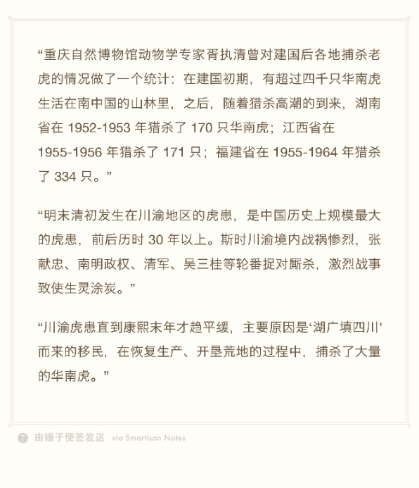

*2017-04-27 21:32 · 手机上网 转自路上有惊慌*

---

### 5277

转：1974年，贝聿铭夫妇跟随美国建筑师协会代表团第一次回到苏州老家。他面对的是“100多位穿着破旧蓝黑衣服的亲戚”，一时间说不出话来。事后，贝聿铭对同事说：我在他们面前没有一丝一毫的优越感。他们当中任何一个人可以是我，我可以是他们当中的任何一人，一切都是历史的偶然。

*2017-04-27 15:50 · iPhone版*

---

### 5278

也不便宜嘛。转：据美国交通部美国运输统计局（BTS）4月25日公布的数据显示，扣除通胀因素，2016年第四季度美国国内航线平均机票价格为347美元，较去年同期的369美元下降了6.1%。

*2017-04-27 11:13 · iPhone版*

---

### 5279

这个总结质量还不错，作者确实懂行。转：中国PE之怪状：基金募集基本靠PR，判断风口基本靠媒体，项目获取基本靠抬价，尽职调查基本靠审计，判断标准基本照发审，风险控制基本靠对赌，投资勇气基本靠合投，投后管理基本靠放羊，GP收益基本靠管理费，LP赚钱基本靠运气，行业排名基本靠赞助。

*2017-04-26 14:46 · iPhone版*

---

### 5280

摆出著名黑人青年惊愕脸，请求指点一下入门途径。转@ 小熊娃娃占卜术和命理学非常有助于理解五维 转@ 王兴 从三维到四维真是很大的一个跃升，或许每升一个维度都是，只不过我对从三维到四维特别有感触。超过四维的我至今无法直观理解。

*2017-04-26 13:55 · 手机上网 转自王兴*

---

### 5281

点、线、面、体，四维的东西怎么称呼？

*2017-04-26 13:33 · 手机上网*

---

### 5282

佩服你知其然知其所以然的精神！我倒是还经常用到对数，但只会打开手机上的计算器app戳戳戳。转@ webto 我已经把对数的计算方法全都还给老师了。。。还好有互联网，可以比较方便的捡起来 ♂

*2017-04-26 13:30 · 手机上网 转自webto*

---

### 5283

总有一些奇怪的我不太能理解的表达方式似乎能流行颇广颇久，例如「令人尖叫的产品」。啥？啥产品让人尖叫？谁会真的为一个商业产品的发布而尖叫？我为（自己和别人的）产品鼓掌喝彩过、心潮澎湃过、热泪盈眶过、甚至自惭形秽过，但从来没有尖叫过，也没见到别人尖叫过。

*2017-04-26 13:10 · 手机上网*

---

### 5284

从三维到四维真是很大的一个跃升，或许每升一个维度都是，只不过我对从三维到四维特别有感触。超过四维的我至今无法直观理解。

*2017-04-26 12:52 · 手机上网*

---

### 5285

@ 拧巴人儿 你就不能认为我会有一点智识上的追求吗？

*2017-04-26 12:46 · 手机上网 给拧巴人儿的回复*

---

### 5286

决定花点时间把gulf/bay/harbor/sound/port/wharf/quay/dock等和港湾码头相关的英文单词搞得明白一点。

*2017-04-26 12:39 · iPhone版*

---

### 5287

转@ quux 人工子宫孕育了一只羊，理论上人类胎儿可能也可以了。

今后早产儿，甚至胚胎都可以存活

*2017-04-26 06:49 · 手机上网 转自quux*

---

### 5288

把果汁做成小杯酸奶那种包装是不道德的！

*2017-04-25 23:46 · 手机上网*

---

### 5289

转：钱主宰一切（商业）活动，政治家主宰钱。

*2017-04-25 23:39 · 手机上网*

---

### 5290

转：根据2010年人口普查，80后是2.19亿，90后是1.88亿，到00后就剩下1.47亿。

*2017-04-25 18:59 · 手机上网*

---

### 5291

虽然2017年才过去四个月，但我已经想提名《娃哈哈帝国为何陨落？

90后称它“真的太土了”！》为年度最佳标题了。原文似乎已删了，但看标题也差不多够了。

*2017-04-25 18:40 · 手机上网*

---

### 5292

转@ 小熊娃娃 @ 王兴 忽略历史语境了。今人知道盛唐是诗歌最高峰但唐朝人不知道啊，对他们来说六朝诗的地位就是今人认为的唐诗的地位，这话相当于现在有人说某作家的现代文像鲁迅一样好，是当下能给出的最高评价了。另外容斋随笔里说过这两句暗含庾信清新而不俊逸，鲍照俊逸而不清新，李白两者兼有所

*2017-04-25 18:34 · 手机上网 转自小熊娃娃*

---

### 5293

不，审美情趣可以有不同，但「逻辑自洽」不能丢。前一句刚说「思不群」，接下就拿另俩来比。这不是夸人，这属于打人还要打脸。转@ wxedgar 同一句诗有人觉得是知己慰怀，有人觉得是嘲讽没做成事情… 我觉得他未必在乎那些个事情。转@ 王兴 白也诗无敌，飘然思不群。清新庾开府，俊逸鲍参军

*2017-04-25 18:01 · 手机上网 转自王兴*

---

### 5294

杜甫老师夸人水平挺差劲的。《春日忆李白》这开头四句「白也诗无敌，飘然思不群。清新庾开府，俊逸鲍参军」真的算是夸奖吗？我要是李白，就直接跟他翻脸，还一起喝个啥酒啊。

*2017-04-25 17:30 · iPhone版*

---

### 5295

M:你是去过 Patagonia 这地方吗？我：没有，我只是穿了件这个户外品牌的衣服而已，没有真去过那里，我连整个阿根廷都没去过。M:我刚从 Patagonia 回来。

*2017-04-25 16:29 · iPhone版*

---

### 5296

@ quux 多谢报bug。我转给同事了。

*2017-04-25 02:21 · 手机上网 给quux的回复*

---

### 5297

兼听则明。转@ 熊阿姨 一个杂志质量上来、广告减少，是绝对不正常的状态。而且个人受贿软文和杂志软文不是一回事。转@ 阳升 也有一段时间没读三联生活周刊了，发现内容质量上来了好多，广告也少了很多。我记得上次读的时候还全是软文呢。查了一下，该刊某主笔 15 年底被抓，原因是受贿写软文

*2017-04-24 12:30 · 手机上网 转自阳升*

---

### 5298

转@ 叫康师傅交罚款交到福建靠 哈哈哈哈哈原来不是我一个人这么认为。转@ wild_fun 转@ 王兴 转@ 阳升 也有一段时间没读三联生活周刊了，发现内容质量上来了好多，广告也少了很多。我记得上次读的时候还全是软文呢。查了一下，该刊某主笔 15 年底被抓，原因是受贿写软文……

*2017-04-24 12:29 · 手机上网 转自阳升*

---

### 5299

转@ 阳升 也有一段时间没读三联生活周刊了，发现内容质量上来了好多，广告也少了很多。我记得上次读的时候还全是软文呢。查了一下，该刊某主笔 15 年底被抓，原因是受贿写软文……

*2017-04-24 12:02 · 手机上网 转自阳升*

---

### 5300

转@ quux 法国大选概要

*2017-04-24 10:30 · 手机上网 转自quux*

---

### 5301

法国总统候选人勒庞的演讲台上写的是法语「人民的名义」-_-!

*2017-04-24 10:28 · 手机上网*

---

### 5302

今天又被冲击了一把：原来听说宋元时期东南沿海（例如泉州港）的对外贸易一度很发达，今天才知道那根本不说明我国曾经牛过，那只是当时阿拉伯海上帝国一路扩张扩到了我们这里而已。那时东南沿海港口的贸易都掌握在外来为主的穆斯林手里。

*2017-04-24 10:23 · 手机上网*

---

### 5303

服！转@ 阳升 别的不知道，oppo 确实很努力，机场无死角啊

*2017-04-24 10:01 · 手机上网 转自阳升*

---

### 5304

今天去了库比蒂诺市中心一个新兴的购物中心，一进去就连续看见海底捞、85度C、鲜芋仙等熟悉的品牌，再加上周围一圈在建的五六层公寓楼，导致我一时有点恍惚，我真的是在硅谷，是在乔布斯的老家吗？这购物中心和北京蓝色港湾的主要区别就是天空更蓝一点。

*2017-04-24 09:22 · 手机上网*

---

### 5305

转@ webto 我靠，刚刚看一个教程视频，Youtube 给我推了一个我正好需要的广告，然后只能说体验太特么好了。。。整个转化也就 10 秒钟，我都没看完广告就下载安装完了。

*2017-04-24 09:14 · 手机上网 转自webto*

---

### 5306

这次的法国总统候选人马克龙有一点挺神的：他今年才39，太太比他大24岁，是他的中学语文老师。他从中学就开始追，追到07年终于让老师投降离婚带着三个孩子嫁给他。据说是个极其野心勃勃、善于钻营结网但不讨人厌的投资银行家。

*2017-04-24 08:42 · iPhone版*

---

### 5307

总结得好。转@ gravity0 教授说贸易是双赢局面，即便没有政府管理也会自然发生。而气候调控之类的宏观治理是双输，不管怎么分配都有人不满意，他也不知道如何构建全球化的组织解决这么棘手的问题。想起霍布斯的利维坦，国家机器的存在就是来当坏人的。有时就是要干被所有人骂但不得不干的事

*2017-04-24 00:23 · 手机上网 转自gravity0*

---

### 5308

躺在床上半睡半醒间迷迷糊糊想了一些事情，其中最确定的一件是：2050年我将是71岁。

*2017-04-23 23:44 · iPhone版*

---

### 5309

霸气。祝好。转@ gravity0 C919 转@ 枸杞柠檬水 我司新产品测试，导致机场停飞75%。。。现在从浦东机场开出来的二号线已经快挤爆了

*2017-04-23 16:24 · 手机上网 转自枸杞柠檬水*

---

### 5310

不确定是不是去年《中国国家地理》某期封面航拍过的龙岩永福镇的樱花茶园，那里也很美。转@ 唐君毅 这是在哪儿？ 转@ 被上帝咬过一口的苹果 转@ 百鬼夜行 美！ 转@ 得闲吃鱼 转@ 猛禽 卧槽，这么好看？ 转@ 月亮猎犬 龙岩漳平？转@ 努尔哈欠 老家附近有一个镇，搞了一个樱花茶园。

*2017-04-23 10:00 · 手机上网 转自努尔哈欠*

---

### 5311

转：坂本龙马曾对桧垣直治说：「今后在室内乱斗的情况会变多了。

我喜欢小太刀，小太刀灵活，比太刀实用。」直治带了小太刀再见龙马，他却掏出来一柄手枪：「这比小太刀更具威力。」直治带了枪再见龙马，这次龙马掏出的是一部《万国公法》并说道：「手枪只能杀伤敌人，此书可以振兴日本！」

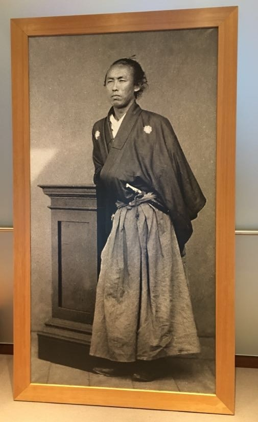

*2017-04-23 00:58 · 猫饭*

---

### 5312

转@ terababy =今=天=风=好=大=把=我=都=吹=傻=了，=你=们=那=里=风=大=吗？

*2017-04-22 23:54 · 手机上网 转自terababy*

---

### 5313

最近开始有意识的培养一个新技能 TLT

*2017-04-22 23:29 · 手机上网*

---

### 5314

能举几个例子吗？谢谢。转@ kranfel 如果现代的通讯软件满分 100分，在你用过 WhatsApp, Telegram, Wire, Signal, Slack, Discord和微信之后，你就知道，微信不是不及格，而是大概只有 20 分……毫

不夸张。

*2017-04-22 14:34 · 手机上网 转自kranfel*

---

### 5315

转@ 硕大的小老鼠 有一首口琴曲叫the sailor & the maid,因为这首曲子2004年我决定学口琴,每天听这首曲子有时候听着睡觉,2009年5月某一天决定要开始练这首自己的最爱,没想到吹第一遍的时候发现自己已经会了,估计听了至少5000遍 转@ 王兴 模仿「腿玩宿」造了

*2017-04-22 12:41 · 手机上网 转自王兴*

---

### 5316

贝比鲁斯说得真清楚；yesterday's home runs don't win today'sgame.

*2017-04-22 05:49 · iPhone版*

---

### 5317

转：《孟子》里讲的好：唯仁者能以大事小，唯智者能以小事大。

*2017-04-22 05:38 · iPhone版*

---

### 5318

Google Earth 出了个新版，连 logo 都换了。

*2017-04-22 04:35 · iPhone版*

---

### 5319

模仿「腿玩宿」造了一个词「歌听宿」。

*2017-04-22 03:49 · iPhone版*

---

### 5320

我一直不太理解一件事：为什么国内的多数机场不在航站楼可以方便步行到的地方或者干脆就在整个大建筑里面修一些宾馆和好的餐厅？

机场做成城市综合体应该是很自然的。

*2017-04-21 17:35 · iPhone版*

---

### 5321

转：黄真伊的师傅百舞问黄真伊：你知道作为一个艺人，最重要的是什么吗？黄：是才艺吗？师傅：不是。黄：是热爱吗？师傅：不是。

黄：那是什么？答：最重要的是痛苦。

*2017-04-21 13:44 · 手机上网*

---

### 5322

多谢@ terababy : 另，团，團的简化于民国时期，来自團的异体字団的讹变。団，日本團字。 团，从才从囗，才，取木而立，支撑房屋，乃材之初字，故，引申出人才、才能之意，是故，人才、人材并用。

囗，仍可视为是围绕意，聚才也。

*2017-04-21 13:38 · 手机上网*

---

### 5323

多谢@ terababy :團，从叀从寸从囗。叀，纺织收丝之工具，即纺锤之象形。后加寸做分化，即專。寸者，手持而不动，上又下一，又，手也。故，專在纺锤之意又衍生专注于一事之意，后又有独占之意。

專字再加囗，可视为丝线绕于纺锤之上，是为纺锤收线的过程和结果，即有围绕、聚集、圆、圆满各意项

*2017-04-21 13:36 · 手机上网*

---

### 5324

多谢@ terababy 的解释：美，上羊下大，大字作为字根只有成人之意，羊字是羊头的象形，故造字本意是指人戴羊头骨作为装饰，是美丽、美好之意。另，媄同意。后来，根据字形，说文曰：羊大则味美，又引申出甜美之意。

*2017-04-21 13:34 · 手机上网*

---

### 5325

一夜呼气百日恩;) 转@ Larry.大叔 One night in beijing转@Stonovski 毕竟骑过一夜 转@ jianliu 昨天晚上突发奇想，从北四环独自骑摩拜游逛到了五道营、银锭桥，穿胡同…然后再一路骑回去。今天早晨再在路边看到摩拜的时候，觉得有一点不一样的感觉

*2017-04-21 11:11 · 手机上网 转自jianliu*

---

### 5326

转@ jianliu 昨天晚上突发奇想，从北四环独自骑摩拜游逛到了五道营、银锭桥，穿胡同，看护城河，然后再一路骑回去。今天早晨再在路边看到摩拜的时候，觉得有一点不一样的感觉，大概就是因为昨晚的陪伴吧……

*2017-04-21 09:30 · 手机上网 转自jianliu*

---

### 5327

我开始期待二胡版的《smooth criminal》。转@ 雪爷 2cellos的大提琴版堪比静脉注射「@ 王兴 迈克尔杰克逊的《smooth criminal》对我来说就是有鸡血功效的歌。如果要适当加大剂量，那就听 DavidGarrett 演奏的小提琴版本。」

*2017-04-21 02:08 · 手机上网 转自王兴*

---

### 5328

意外搜出2011-10-05我的诅咒。那时我们还没开始做猫眼电影。转@王兴 靠，雅虎活该倒闭！雅虎奇摩提供的电影场次信息居然是错的，害我白跑一趟，浪费我的时间、感情和金钱！

*2017-04-21 02:05 · 手机上网 转自王兴*

---

### 5329

不是第一次来这个城市，但是第一次通过这个机场。

*2017-04-21 01:15 · iPhone版*

---

### 5330

转：4月20日，是中国正式接入国际互联网的纪念日。23年前的1994年4月20日，NCFC工程通过美国Sprint公司连入互联网的64K国际专线开通，实现了与互联网的全功能连接。从此中国被国际上正式承认为第77个真正拥有全功能互联网的国家。

*2017-04-21 00:19 · iPhone版*

---

### 5331

值得听。多谢推荐。转@ 钱得乐儿 Okkervil River的The WarCriminal Rises and Speaks. 转@ 王兴 推荐几首你认为的后者？谢谢。转@ webto 好听的音乐很多，有力量的很少

*2017-04-20 18:33 · 手机上网 转自webto*

---

### 5332

好丰富的表情！转@ 饭饭饭尾崎 д 转@ 嘟嘟听见雨滴落在青青草地 兴酱的新衣(￣(工)￣) 转@ 王兴 我希望有一套衣服永远不会脏、不会臭、不用洗、不会皱也不会坏，而且穿着还很舒服，脱下来洗完澡就可以套上继续穿；最好连日常洗澡都可以省了，穿着这套衣服就有循环清洁兼按摩的功效

*2017-04-20 18:13 · 手机上网 转自王兴*

---

### 5333

不可能吧。打到中国来不是四五百年前丰臣秀吉就定下的日本国策吗？我看网上说二战末期时讨论过迁都北京，但那是因为觉得日本本土守不住-_-! 那时已经没戏了。转@ webto 貌似没想那么远，当时计划是迁都新京，也就是长春。 RT@ 王兴 突然有个疑问，日本当年有过迁都北京的计划吗？

*2017-04-20 17:32 · 手机上网 转自王兴*

---

### 5334

稍微想了一下，智商下降20点未必会幸福感更强，下降30-40点可能会。

*2017-04-20 17:06 · iPhone版*

---

### 5335

突然有个疑问，日本当年有过迁都北京的计划吗？

*2017-04-20 16:39 · 手机上网*

---

### 5336

御本木珍珠，和毛泽东同年。

*2017-04-20 16:20 · 猫饭*

---

### 5337

这个真的看不出来是不是杨幂。

*2017-04-20 16:10 · 猫饭*

---

### 5338

连机场的LED广告屏也追求无边框的效果。

*2017-04-20 16:10 · 猫饭*

---

### 5339

我希望有一套衣服永远不会脏、不会臭、不用洗、不会皱也不会坏，而且穿着还很舒服，脱下来洗完澡就可以套上继续穿；最好连日常洗澡都可以省了，穿着这套衣服就有循环清洁兼按摩的功效。这样多省事，尤其是出差时。

*2017-04-20 15:54 · 手机上网*

---

### 5340

这是不是唯物主义者才会有的纠结？转@ webto 接受世界的不完美，别人的不完美和自己的不完美。大体上其实是同一件事情。

*2017-04-20 15:23 · 手机上网 转自webto*

---

### 5341

转@ 姚啊姚 所谓模范就是这么来的。转@ 煎蛋无聊图 (2/2)

*2017-04-20 15:21 · 手机上网 转自煎蛋无聊图*

---

### 5342

转@ 王球球的春天 我忍不住感慨和两个未来杀人犯成为童年隔壁邻居及玩伴的往事：在楼道口拿蛇吓的我不敢回家；拿点着的炮仗往我身上扔吓得我没有把手里点着的炮仗扔出去；拿石头砸到我头上缝针；吓唬我导致我从四楼口摔下来。奶奶的，这都是6岁小孩干的事啊。干教育也碰到这样的幼童，骨子里就是毒，

*2017-04-20 15:09 · 手机上网 转自王球球的春天*

---

### 5343

会游泳的人换个池子一样游得欢。不会游泳的人换个池子后有些学会了，有些还是不会，其实跟换不换池子没有本质关系。更进一步，这种类比其实也没啥意义，只是一种偷懒的表达方式。转@ webto 一个有趣的观察是，以前在猫扑，在里屋有民间影响力的网友，后来在各种社交媒体上仍然有民间影响力。

*2017-04-20 14:59 · 手机上网 转自webto*

---

### 5344

上海人和北京人各自接受的鄙视链上端是谁？还是自以为老子天下第一了？或是根本不接受鄙视链体系？转@ 小熊娃娃 桑海宁那种对外地人的文明优越感好像放到北京人身上并不合适，因为以胡同串子为代表的底层北京本地人素质实在太特么差了。内部鄙视链就够够的了。

*2017-04-20 14:52 · 手机上网 转自小熊娃娃*

---

### 5345

「下一个会的人已经准时到了，就在隔壁屋；你已经吃完了为什么还不过去？」「我需要几分钟时间让血液从胃部回到大脑。」「这只是借口。让他听完这一曲吧。」

*2017-04-20 12:46 · 手机上网*

---

### 5346

飘着太没力量了。要有雨打萍的效果得是南方那种机枪扫射般的暴

雨。最初几颗雨滴砸在水泥路面上能溅起一团团灰尘的那种。转@ 啊啊啊啊啊啊啊啊啊 这会儿正飘着雨 转@ 啊啊啊啊啊啊啊啊啊 身世浮沉雨打萍 转@ 王兴 「山河破碎风飘絮」，不好意思，我只是在北京的这个季节看到了后三个字

*2017-04-20 12:39 · 手机上网 转自王兴*

---

### 5347

我的童年记忆里有「雨打萍」的图景，但在北京没看到过。 转@ 啊啊啊啊啊啊啊啊啊 身世浮沉雨打萍 转@ 王兴 「山河破碎风飘絮」，不好意思，我只是在北京的这个季节看到了后三个字，请勿过度联想到前四个字。

*2017-04-20 12:32 · 手机上网 转自王兴*

---

### 5348

吃红烧肉时安之若素。

*2017-04-20 12:27 · 手机上网*

---

### 5349

迈克尔杰克逊的《smooth criminal》对我来说就是有鸡血功效的歌。

如果要适当加大剂量，那就听 David Garrett 演奏的小提琴版本。

*2017-04-20 10:09 · 手机上网*

---

### 5350

「山河破碎风飘絮」，不好意思，我只是在北京的这个季节看到了后三个字，请勿过度联想到前四个字。

*2017-04-20 09:57 · 手机上网*

---

### 5351

转：高善文曾经有一个著名的对联，上联是:解释过去头头是道，似乎有理；下联是:预测未来躲躲闪闪，误差惊人；横批是:经济分析。

*2017-04-20 09:25 · 手机上网*

---

### 5352

推荐几首你认为的后者？谢谢。转@ webto 好听的音乐很多，有力量的很少

*2017-04-20 09:19 · 手机上网 转自webto*

---

### 5353

跟人一对一吃饭聊天时打瞌睡确实很不好。我也不知道主要是睡太少还是吃太多……

*2017-04-19 22:34 · 手机上网*

---

### 5354

按这种解读，《易经》里的「君子」真是屌炸天！转@ 阳升 一直不太理解“厚德载物”的意思，刚村长提到清华校训，搜了一下发现一个有趣的解读 http://t.cn/8sGn739 @ 王兴

*2017-04-19 19:17 · 手机上网 转自阳升*

---

### 5355

你的眼好尖。我刚看到时也想过一下，但并没想到明显可以改进的地方。转@ 美嘉.rar 前三个可以是偏正或者动宾关系还算统一，全球视野理解为think globally可以算是偏正，社会责任感如果不是专有名词的话，理解成「对社会的责任感」似乎是介宾结构。不算严谨。转@王兴 《清华大学章

*2017-04-19 17:12 · 手机上网 转自王兴*

---

### 5356

我感觉清华这几条的表述方法跟老校训「天行健，君子以自强不息；

地势坤，君子以厚德载物」以及「人文日新」是有传承的。转@ 阳升对比北大清华的培养目标：感觉未来北大人可能基础不牢，清华人可能身体不强壮，独立思考较弱，会不把社会责任感放在第一位。对了，北大人还可能比较啰嗦。

*2017-04-19 16:59 · 手机上网 转自阳升*

---

### 5357

Justin Timberlake的《Cry Me A River》的旋律还不错，但歌词的格调实在太差，跟科恩老爷子的《著名蓝雨衣》比起来真是判若云泥。

*2017-04-19 13:18 · iPhone版*

---

### 5358

毕不毕业有那么重要吗？转@ 麦兜猫 且会游泳转@ 飯否小字报 转@王兴 清华从2017年起全面推行大类招生培养和管理，纳入本科招生的所有专业将整合为16大类。《清华大学章程》描述的人才培养目标

是：健全人格、宽厚基础、创新思维、全球视野和社会责任感。

*2017-04-19 13:07 · 手机上网 转自王兴*

---

### 5359

清华的这个总结就属于好好说人话，而且让我看过一遍就能全部记住。转@ 王兴 清华从2017年起全面推行大类招生培养和管理，纳入本科招生的所有专业将整合为16大类。《清华大学章程》描述的人才培养目标是：健全人格、宽厚基础、创新思维、全球视野和社会责任感。

*2017-04-19 12:07 · 手机上网 转自王兴*

---

### 5360

有一件事一直困扰我：我越来越发现自己能自动回忆起前几天和人聊天时收到的某个观点，但是回忆不起具体是哪个人在什么场景下跟我说的:( 或许这是我的大脑在面临高益增高的负荷时自动采取的一个合理的减压措施？

*2017-04-19 12:05 · 手机上网*

---

### 5361

清华从2017年起全面推行大类招生培养和管理，纳入本科招生的所有专业将整合为16大类。《清华大学章程》描述的人才培养目标是：健全人格、宽厚基础、创新思维、全球视野和社会责任感。

*2017-04-19 11:48 · iPhone版*

---

### 5362

查了一下，凯恩斯写的是《（巴黎）合约的经济后果》。@ 维他柠檬茶

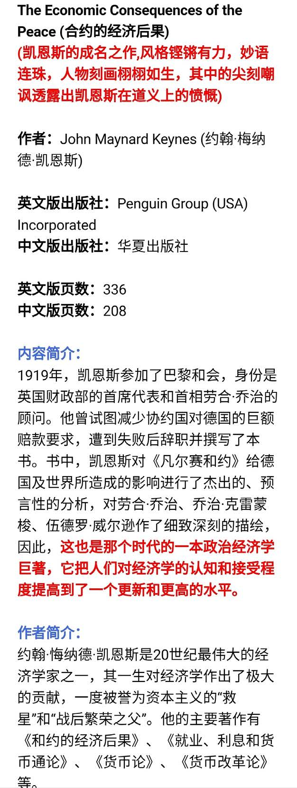

*2017-04-19 10:12 · 手机上网*

---

### 5363

第一次被人称呼 Wang-san 。

*2017-04-19 01:42 · 手机上网*

---

### 5364

转@ meadow 凯恩斯在巴黎和会后写的<<一战的经济后果>>预见到二战。转@ 王兴 世界大战只有过一次，一战和二战是上下半场。

*2017-04-19 01:32 · 手机上网 转自王兴*

---

### 5365

三文鱼主要产于两个国家：北半球的挪威和南半球的智利。

*2017-04-18 23:36 · iPhone版*

---

### 5366

这段台词我也记得。但那事我一直没去试。转@ gravity0 Lawrence:Certainly it hurts. The trick is not minding that it hurts.

*2017-04-18 16:02 · 手机上网 转自gravity0*

---

### 5367

刚才又签字签了一首半歌。我觉得这种时间计量单位比「一柱香」更实用。

*2017-04-18 15:58 · 手机上网*

---

### 5368

你还骄傲个毛啊。转@ 东东枪 说真的，没有比我这个发型的人更适合唱那首“吹啊吹啊我的骄傲放纵~”的了。

*2017-04-18 15:39 · 手机上网 转自东东枪*

---

### 5369

是为了不撞上无辜的行人而选择了牺牲自己。这才是完整的大片开头。转@ gravity0 侠盗飞车五里面没有地图快速移动，两地之间最快的交通工具是摩托车，但也危险，摔死复活还要扣五千块钱。想起《阿拉伯的劳伦斯》开场，这哥们身经百战活了下来，硬是自己骑摩托摔死的。

*2017-04-18 15:35 · 手机上网 转自gravity0*

---

### 5370

春天是适合散步的。路边躺着的那只黑狗可能不同意我的观点。

*2017-04-18 15:26 · 手机上网*

---

### 5371

去年重看《阿拉伯的劳伦斯》，很多场景现在历历在目，例如，阿拉伯酋长（或是亲王）骑在马上对前来袭击营地的奥斯曼帝国轰炸机徒劳的挥舞阿拉伯弯刀。

*2017-04-18 15:21 · 手机上网*

---

### 5372

世界大战只有过一次，一战和二战是上下半场。

*2017-04-18 15:11 · 手机上网*

---

### 5373

有的时候，我觉得自己身体的一部分和另一部分的关系并不比和外界的关系更亲近，虽然我依然称呼它为「外界」。

*2017-04-18 15:09 · 手机上网*

---

### 5374

健身房里当然有很多好看的臀部，可是没人穿露臀沟的裤子吧？转@叶滨 我觉得还是与臀型有关。现代人坐的太久，所以大部分臀型没那么好看。兴酱要是去正确的健身房观察一下没准会改变观点。转@ 王兴 露乳沟的低胸装我还是能欣赏的，露臀沟的那种低腰裤就有点超出我的范围了。

*2017-04-18 14:47 · 手机上网 转自王兴*

---

### 5375

骑摩拜过去，走路回来，感觉都很舒畅，关键是天气好。

*2017-04-18 14:39 · 手机上网*

---

### 5376

《那些年我们一起追过的女孩》里有类似情节，但是把拥抱换成了深

吻。艺术果然源于生活。转@ szweig 转@ slfeng 懂这种心情 转@萧覃含 “毕业时为了拥抱她，一个一个地拥抱了全班。”

*2017-04-18 13:48 · 手机上网 转自萧覃含*

---

### 5377

最近有个感觉，还真不太好说是了解历史对我做公司有帮助，还是做公司对我了解历史有帮助。

*2017-04-18 13:34 · 手机上网*

---

### 5378

转@ gravity0 罗胖曰人一旦陷入某种情绪，基本上可以判定他正在犯错误，因为情绪会让人搞错目标。情绪是进化形成的，它只能指向近在眼前的东西，而越来越复杂的现代社会目标总在远处，甚至要靠想象力才能理解。比如工作压力大往往迁怒于人，而目标不是给你压力的那人而是工作本身。

*2017-04-18 08:22 · 手机上网 转自gravity0*

---

### 5379

我一直把 explorer 译成「探索者」，后来我发现「探险家」译成英文就是 explorer.

*2017-04-18 02:33 · iPhone版*

---

### 5380

好惊悚的故事。转：朱棣夺了侄儿朱允文的大位，兵部尚书铁弦表示反对，朱棣就把他的肉割了，烧烤一下，塞其嘴里，问他：“甘否”？铁铉回答曰：“忠臣孝子之肉有何不甘”？

*2017-04-17 23:48 · iPhone版*

---

### 5381

毛发动文革时已经73岁。

*2017-04-17 23:20 · iPhone版*

---

### 5382

历史是一座画廊，原作很少，复制品很多。-托克维尔

*2017-04-17 22:49 · 手机上网*

---

### 5383

漏腰眼不是很正常吗？既性感又有美感。我说的可是漏出半截屁股沟！转@ 壁咚桑 我们公司年会上有位做市场的女同事就穿了一件漏腰眼的，都不敢看了( . )✧ 转@ 王兴 露乳沟的低胸装我还是能欣赏的，露臀沟的那种低腰裤就有点超出我的范围了。

*2017-04-17 22:42 · 手机上网 转自王兴*

---

### 5384

露乳沟的低胸装我还是能欣赏的，露臀沟的那种低腰裤就有点超出我的范围了。

*2017-04-17 19:03 · iPhone版*

---

### 5385

各国的国名典故应该够写一本书。

*2017-04-17 18:36 · iPhone版*

---

### 5386

昨天听说，一只格洛克自动手枪（例如前阵子土耳其警卫用来射杀俄罗斯大使的那只）的价格和高配版iPhone差不多。当然，是在国外。

*2017-04-17 18:17 · 手机上网*

---

### 5387

不错的鸡汤。转@ 随便丸丸 做你没做过的事情叫成长，做你不愿意做的事情叫改变，做你不敢做的事情叫突破。——早安

*2017-04-17 18:12 · 网页 转自随便丸丸*

---

### 5388

院子按从小到大可以不严格的分成几种：不存在、有草、有树、有松鼠、有鹿、有熊……

*2017-04-17 18:08 · iPhone版*

---

### 5389

每个星期一，是不是连地球都会转得快一些？

*2017-04-17 09:30 · iPhone版*

---

### 5390

从空中可以拍到金字塔的三个面。@ 羡鱼

*2017-04-17 01:34 · 手机上网*

---

### 5391

「人民币」这个货币名称讲究。

*2017-04-16 17:48 · 手机上网*

---

### 5392

选取不同的拍摄点和角度，你可以拍到金字塔的一个面或两个面或三个面或四个面。

*2017-04-16 17:03 · 手机上网*

---

### 5393

好机灵。转@ 小熊娃娃 好有道理 转@ 飯否小字报 转@ 康村的村夫牛逼，这张饼图牛，第一眼真看错了

*2017-04-16 17:00 · 手机上网 转自康村的村夫*

---

### 5394

经过一个挂着「北京保温瓶工业公司」大牌子的地方。

*2017-04-16 15:41 · iPhone版*

---

### 5395

转@ 猪小宝 发现电动工具也跟共享单车行业一样，颜色不够用了。

红的是密尔沃基，黄的是DEWALT，绿的是日立，橙的是RIDGID，淡绿是RYOBI，淡青是MAKITA，深青是博世，已经有点撞色了。

*2017-04-16 12:04 · 手机上网 转自猪小宝*

---

### 5396

现场看过的职业拳击赛让我印象深刻，轻量级和重量级几乎是两种不同的竞技，确实是量变引起质变。

*2017-04-16 09:38 · 手机上网*

---

### 5397

华尔兹和拳击都是两个人贴在一起绕圈圈。

*2017-04-16 09:35 · 手机上网*

---

### 5398

转@ webto 不过锤子也算是证明了：it's very easy to be different,but very difficult to be better. 所谓的细节是魔鬼，其实是在大方向建立了优势的前提下。只自 high 抠细节还指望消费者买单？大家都会用脚投票。

*2017-04-16 08:44 · 手机上网 转自webto*

---

### 5399

@ 小熊娃娃 @ 杨曜睿 澳门和vegas我都只去过一次，印象都很一般。但后来我怀疑我在澳门是没去对地方。

*2017-04-15 23:02 · 手机上网 给小熊娃娃的回复*

---

### 5400

相逢的人会再相逢。我说的是商场上的对手。

*2017-04-15 22:37 · 手机上网*

---

### 5401

人定•胜天。这种解读有意思。

*2017-04-15 22:21 · 手机上网*

---

### 5402

我开始有点理解那位每天独自在家写作前都要穿上正装的作家了。

*2017-04-15 22:03 · 手机上网*

---

### 5403

转：研究必须阅读，而阅读并不等于研究，研究必须写作。

*2017-04-15 21:13 · iPhone版*

---

### 5404

知乎竟然在北四环上打灯箱广告了。

*2017-04-15 20:06 · 手机上网*

---

### 5405

转@ 小熊娃娃 前两天聊到一个很有意思的话题，清末修京广铁路（当时是京汉）的时候，为了避开开封黄泛区才绕了很大的圈，使得后来交叉点变成郑州，于是中原地区的政治、交通中心是一个没有文化基础的城市，而历史名城开封就差不多废了。结果现在黄河都快干涸了真是历史的玩笑……

*2017-04-15 20:04 · 手机上网 转自小熊娃娃*

---

### 5406

被甜食膩倒了，急需吃点辣的振奋一下。

*2017-04-15 18:44 · iPhone版*

---

### 5407

从审美角度来看，穿西装确实应该系领带。

*2017-04-15 18:38 · iPhone版*

---

### 5408

特斯拉model s的蓝牙真是太烂了。别的车顶多是跟手机蓝牙配对好之后并不是每次都能顺利自动联上，不至于已经联上了放歌放到一半突然断掉。model s却会经常中途断掉。

*2017-04-15 17:02 · iPhone版*

---

### 5409

A real education is a liberation. - Nietzsche

*2017-04-15 13:59 · iPhone版*

---

### 5410

看到一句不明觉厉的话：...大型系统和社会的建立，是人类智慧或缺陷的最高成就...

*2017-04-14 17:37 · 手机上网*

---

### 5411

转@ 帮主胡子 “胖子！”………“抱歉，我本来是要说骗子”

*2017-04-14 17:29 · 手机上网 转自帮主胡子*

---

### 5412

广西师范大学出版社确实是个有趣的存在。

*2017-04-14 17:27 · iPhone版*

---

### 5413

转：麦克阿瑟并不是因为战场的失败而被撤职的，而是因为麦克阿瑟将其与总统的分歧提交给国会，出现了军人干政的危险，该事件遂升级为动摇美国的宪法原则的严重政治事件，在这种背景下麦克阿瑟被杜鲁门解职。当然杜鲁门也因此付出了无法连任的惨重代价，而其咎由自取之处在于，在麦克阿瑟打过三八线以后

*2017-04-14 16:50 · iPhone版*

---

### 5414

我最近可能真的有点走火入魔了，老是把一个领域的理论框架和分析套到另一个领域。

*2017-04-14 16:48 · iPhone版*

---

### 5415

干啥都得讲政治。设计不了香港汇丰大厦可以设计香港中银大厦嘛。

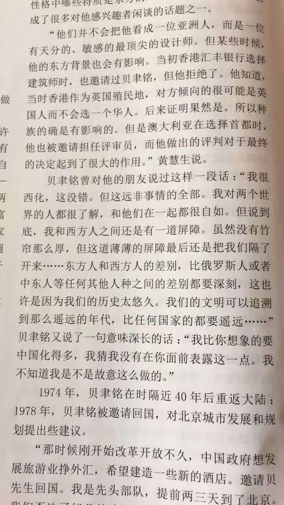

*2017-04-14 15:48 · 手机上网*

---

### 5416

据说苹果专门请斯坦福教授做过专项研究后给富士康出了一套只有十道题的招聘问卷，得分太低或太高都不招。

*2017-04-14 13:23 · iPhone版*

---

### 5417

@ 美嘉.rar 我在的时候还没有罗姆楼，只有清华主楼。谢谢。

*2017-04-14 10:41 · 手机上网 给美嘉.rar的回复*

---

### 5418

转@ 胡泳 德国邦国在19世纪前1/3时间里所发生的，首先是一场“来自外部的革命”，正如哈登堡（Hardenberg）在其1807年里加备忘录中所言，法国大革命之后，邻近的邦国只有两个选择：“衰落”或“被迫接受”新的社会组织原则（Wehler, 1987）

*2017-04-14 10:01 · 手机上网 转自胡泳*

---

### 5419

终于可以听马友友了。转@ 叶滨 开完一天的会，听马友友的无伴奏大提琴是最佳的放松方式

*2017-04-14 02:31 · 手机上网 转自叶滨*

---

### 5420

我已经邋遢到穿乐福鞋时会把鞋后跟踩下去了……

*2017-04-14 00:29 · 手机上网*

---

### 5421

多谢，再过一个小时我可以试一下。转@ 叶滨 开完一天的会，听马友友的无伴奏大提琴是最佳的放松方式

*2017-04-13 23:47 · 手机上网 转自叶滨*

---

### 5422

胡琏与日寇决战前祭天誓词：…今贼来犯，决予痛歼。力尽，以身殉之。然吾坚信苍苍者天，必佑忠诚，吾人于血战之际，胜利即在握。

此誓。大中华民国三十二年五月二十七日正午

*2017-04-13 19:10 · iPhone版*

---

### 5423

胡琏与日寇决战前祭天誓词：陆军第十一师师长胡琏谨以至诚昭告山川神灵：我今率堂堂之师,保卫我祖宗坚苦经营遗留吾人之土地。名正言顺，鬼伏神饮，决心至坚，誓死不渝。汉贼不两立，古有明训。华夷须严辨，春秋存义。生为军人，死为军魂。后人视今，亦尤今人之视昔。吾何惴焉！今贼来犯，决予痛歼。力

*2017-04-13 19:09 · iPhone版*

---

### 5424

老爸说：「我这次特地来凭吊石牌保卫战遗址…景区其它项目都没参加…有机会还要去台儿庄、腾冲、上海四行仓库」。我肃然起敬。

*2017-04-13 18:50 · iPhone版*

---

### 5425

1943年5月28日，石牌要塞保卫战最凶险也最血腥的那天，战区总司令陈诚上将曾给守将胡琏打过电话，询问“守住要塞有无把握？”也许战况紧张到不容细说，胡琏据说回了一句：“成功虽无把握，成仁确有决心。”

*2017-04-13 18:41 · iPhone版*

---

### 5426

「石牌保卫战被西方军事家称为东方斯大林格勒保卫战。石牌所在的一段被评为五A级景区。1943年在这里爆发了二战中最大规模白刃战，上万中国士兵与日寇拼刺刀」，老爸游三峡附近景点时在微信上发来的。我居然从没听过这个「石牌保卫战」:(

*2017-04-13 18:18 · 手机上网*

---

### 5427

白手起家和白手套起家。

*2017-04-13 16:05 · 手机上网*

---

### 5428

「规则都是人定的嘛。连宪法都是可以改的嘛」，中午谈生意时听人这么说。

*2017-04-13 14:13 · 手机上网*

---

### 5429

转@ 胡泳 T. S. Eliot: The past should be altered by the presentas much as the present is directed by the past

*2017-04-13 11:47 · 手机上网 转自胡泳*

---

### 5430

每个早晨，像一次英勇的冲锋，更像一场仓惶的撤退。

*2017-04-13 09:54 · 手机上网*

---

### 5431

在远方，在地球的另一个角落，在脑海里，在心底。转@ 吃土骚年图呢，兴酱转@ 王兴 风暴来临前的海港。

*2017-04-13 09:46 · 手机上网 转自王兴*

---

### 5432

风暴来临前的海港。

*2017-04-13 09:32 · 手机上网*

---

### 5433

一开完会我就开始猛打呵欠，估计20分钟内打了20个。

*2017-04-12 15:19 · 手机上网*

---

### 5434

年纪越大越能理解，《阿甘正传》确实比同年的《肖申克救赎》或《低俗小说》更代表美国主流价值观，难怪要赢那年奥斯卡。近二十年前我初次看时都没注意到一开头阿甘老妈是靠把校长邀到家里来潜规则才把弱智儿子送进学校，不知道是那段被剪掉了还是我当年不懂事。

*2017-04-12 09:21 · iPhone版*

---

### 5435

或者，是一个锤子。转@ 美嘉.rar 生活是一碗香浓的热汤，而你，是一个叉子。

*2017-04-12 01:20 · 手机上网 转自美嘉.rar*

---

### 5436

上世纪七十年代的台湾大学生。

*2017-04-12 01:12 · 猫饭*

---

### 5437

张三：增长5%会很显著吗？李四：你是说业绩还是体重？如果是后者，那还蛮显著的。

*2017-04-12 00:45 · iPhone版*

---

### 5438

开始困了。只好站起来。

*2017-04-11 17:53 · 手机上网*

---

### 5439

美国的月亮只是更亮，并没更圆。转@ 阳升 看来美国的航空业确实更加牛气，航空公司员工工作安排要坐飞机，就可以找几个乘客赶下去，而且乘客必须服从，这是行规，符合法律规定的哦！挑选乘客的策略由航空公司自己决定（当然挑最软的柿子）难以想象灯塔国实操居然这样，要是在国内，还不得砸他几个柜台

*2017-04-11 17:38 · 手机上网 转自阳升*

---

### 5440

又喝了防弹咖啡。

*2017-04-11 08:55 · iPhone版*

---

### 5441

依稀记得，昨晚梦到跟当年抗美援朝相关的一些情节。

*2017-04-11 08:35 · iPhone版*

---

### 5442

想起小时候的夏天，我放学回来经常先游一阵子，奶奶有时就在泳池边上走来走去看着我。我后来才有点理解，她一方面可能是担心我一个人游会不会有危险，另一方面对她来说这可能也是和孙子「相处」

的一段时间。

*2017-04-10 23:58 · iPhone版*

---

### 5443

嘴里淡出鸟来，没找到百香果，用菠萝将就一下。

*2017-04-10 23:18 · iPhone版*

---

### 5444

人都有不想说话的时候。

*2017-04-10 23:03 · iPhone版*

---

### 5445

如果现在面前有个游泳池，我很可能衣服都不脱就一头扎进去。

*2017-04-10 21:45 · iPhone版*

---

### 5446

「小车不倒只管推，车倒扶起往前追。扶不起来也没啥，长江滚滚浪浪催」。胡乔木的这首小诗我以前只听过第一句。

*2017-04-10 19:30 · iPhone版*

---

### 5447

相比「历史是英雄创造的。我就是英雄」，「历史是人民创造的。我就是人民的代表」是一种更高明的叙事。

*2017-04-10 00:47 · 手机上网*

---

### 5448

我可能记错了。说尺度比维度更准确。转@ 王兴 今晚听到的逼格最高的话：历史的推演，再短也不可能到十年这个维度。

*2017-04-09 22:58 · 手机上网 转自王兴*

---

### 5449

@ szweig 那样确实不好。我爸从没打过我耳光，更没当众打过。

*2017-04-09 21:48 · 手机上网 给szweig的回复*

---

### 5450

今晚听到的逼格最高的话：历史的推演，再短也不可能到十年这个维度。

*2017-04-09 21:44 · 手机上网*

---

### 5451

这差别大了。同喜欢后者。转@ qinyf cityhunt 和 citysafari 在意思上还是有些区别的，我还是喜欢后者。

*2017-04-09 21:43 · 手机上网 转自qinyf*

---

### 5452

转@ 反作用力 据说是金鱼胡同和雅宝胡同各取一个字。RT@ 王兴「兰陵」这个地名很雅致，「金陵」却也一点儿也不俗气。这是为什么呢？「金宝街」就不太行。

*2017-04-09 19:35 · 手机上网 转自王兴*

---

### 5453

中华民族的伟大复兴翻译成英文是 the great rejuvenation of theChinese nation，有点长有点文绉绉，不像 make america greatagain 那么简短接地气。不过，这个比较本身就不公平，英语不是咱们母语。

*2017-04-09 19:31 · 手机上网*

---

### 5454

@ 郁金堂 你这饭否id和「卢家少妇」有关系吗？

*2017-04-09 19:15 · 手机上网 给郁金堂的回复*

---

### 5455

飞机上继续看英文版习近平文集。不看注释我还真是猜不到 FarewellMy Concubine 是指「霸王别姬」。

*2017-04-09 19:11 · 手机上网*

---

### 5456

你真的已经速成汉字专家了：）转@ terababy 金字上是亼表声，即今字，下是土，两点表示土里有闪闪发光的东西。 转@ 王兴 越来越觉得，「金」这个字形状很漂亮，左右对称，上下也匀称，尖顶平底。

*2017-04-09 19:10 · 手机上网 转自王兴*

---

### 5457

转@ 小熊娃娃 # 生活小常识 #get√ 转@ 暗流_ 来国博还是应该带护照，可以和外国人一起排一个短短的队就好了

*2017-04-09 19:06 · 手机上网 转自暗流_*

---

### 5458

还可以，至少比金鸡能强点。转@ 李陌生 所以主要是在这宝字上么。宝鸡也还可以吧。「@ 王兴 「兰陵」这个地名很雅致，「金陵」却也一点儿也不俗气。这是为什么呢？「金宝街」就不太行。」

*2017-04-09 17:07 · 手机上网 转自王兴*

---

### 5459

航班延误时真是特别理解这个道理。飞机不来，你在候机室里再自我奋斗有啥用？照样靠近不了目的地。顶多看看书发发饭否。转@ 王兴长者的智慧：一个人的命运啊，当然要靠自我奋斗，但是也要考虑历史的进程。

*2017-04-09 16:50 · 手机上网 转自王兴*

---

### 5460

越来越觉得，「金」这个字形状很漂亮，左右对称，上下也匀称，尖顶平底。

*2017-04-09 16:41 · 手机上网*

---

### 5461

你听说过前几年有一种很流行的饼叫「土掉渣」吗？转@ 西门下雪君威 和 帝豪 呢？ 转@ 王兴 「兰陵」这个地名很雅致，「金陵」却也一点儿也不俗气。这是为什么呢？「金宝街」就不太行。

*2017-04-09 16:38 · 手机上网 转自王兴*

---

### 5462

这是真的三观问题。转@ 小熊娃娃 兰新二线修成160-200级别，西成修成200，宝兰、合福、长昆都修成250级别，永远不可升级提速。这些都是平均1.6亿/公里的350级别的投资，而200-250级别线路平均投资只有0.5亿/公里。盛光祖浪费了数千亿元的资金，花高铁的钱修普通铁路

*2017-04-09 16:37 · 手机上网 转自小熊娃娃*

---

### 5463

「兰陵」这个地名很雅致，「金陵」却也一点儿也不俗气。这是为什么呢？「金宝街」就不太行。

*2017-04-09 16:30 · 手机上网*

---

### 5464

说「行程」确实显得更稳重而超然。转@ 阳升 长者原话好像是行程转@ 王兴 长者的智慧：一个人的命运啊，当然要靠自我奋斗，但是也要考虑历史的进程。

*2017-04-09 16:19 · 手机上网 转自王兴*

---

### 5465

长者的智慧：一个人的命运啊，当然要靠自我奋斗，但是也要考虑历史的进程。

*2017-04-09 15:31 · 手机上网*

---

### 5466

哦，不不不，Hotel California 这首歌的专辑名并不是《精选车载音乐（一）》。这只是QQ音乐的一个小bug。

*2017-04-09 15:17 · 手机上网*

---

### 5467

我有一个小小的朴素的愿望，我不想在机场的屏幕上看到自己在叽里呱啦讲些什么……

*2017-04-09 15:12 · 手机上网*

---

### 5468

A对我说：南京很少真正意义上的本地人。我一脸惊讶：为什么？A也一脸惊讶：你没听说过南京大屠杀吗？

*2017-04-09 14:38 · 手机上网*

---

### 5469

要在电话里说清楚某公司名字里的hong是哪个hong还蛮有挑战的：洪、宏、弘、鸿、红、虹…… 都是传统公司起名爱用的。

*2017-04-09 12:54 · 手机上网*

---

### 5470

《美国大城市的死与生》已经把道理讲明白了。遗憾的是，后人哀之而不鉴之，亦使后人复哀后人也。转@ Choicky 比我更早或同时来深圳的人，大部分是先住深圳城中村，现在很多人在深圳有房有车了。

旧改之后，不知深圳是否还能够吸引足够的年轻人进来。增量的年轻人支撑每一个城市的未来。

*2017-04-09 09:25 · 手机上网 转自Choicky*

---

### 5471

刘禹锡的《西塞山怀古》：王浚楼船下益州，金陵王气黯然收。千寻铁锁沉江底，一片降幡出石头。人世几回伤往事？山形依旧枕寒流。

今逢四海为家日，故垒萧萧芦荻秋。

*2017-04-09 09:17 · iPhone版*

---

### 5472

一个人成熟的标志之一，就是明白发生在自己身上的事 99% 对于别人毫无意义。-Mark Bauerlein（美国社会学家）

*2017-04-08 22:32 · 手机上网*

---

### 5473

只是自己感觉头脑清晰还是真的清晰？转@ 杨曜睿 5点开会讨论调整公司方向，坐了一小会儿，觉的需要更清晰的头脑。溜出会议室磕了5mg利他林后，简直如换了个大脑。然而头脑不太清晰时，如果没有必需的理由，又没有动力吃药=。由非常清晰滑落到相对混乱的过程，有种对人类、肉体局限性的无力感

*2017-04-08 21:44 · 手机上网 转自杨曜睿*

---

### 5474

上回来这个城市已经是近六年前了。那回呆了不到24小时，这回也会是。

*2017-04-08 19:28 · iPhone版*

---

### 5475

在背包里常备一个魔术头巾以备不时之需是很有必要的。

*2017-04-08 19:05 · iPhone版*

---

### 5476

高铁确实很大程度上改变了城市间的出行习惯。

*2017-04-08 17:52 · iPhone版*

---

### 5477

转@ 如其所是 主机厂的机器人应用程度确实挺恐怖的，某些生产环节，一线工人的主要工作是编程。转@ 王兴 汽车行业专家纷纷表

示，特斯拉主要就是会吹。要是真比生产线上的机器人应用程度，特斯拉连江淮汽车都比不上，更别提奔驰宝马了。

*2017-04-08 12:21 · 手机上网 转自王兴*

---

### 5478

汽车行业专家纷纷表示，特斯拉主要就是会吹。要是真比生产线上的机器人应用程度，特斯拉连江淮汽车都比不上，更别提奔驰宝马了。

*2017-04-08 12:17 · 手机上网*

---

### 5479

换一个角度就觉得收获还不小了。转@ 王兴 应邀参观了一家国内领先的下一代汽车厂商，我感觉看到的干货不足，主要是看了几辆展厅里的概念车和几段高端大气上档次的国际范儿十足的视频。后来我觉得可能是自己的期望值不对，我不是来看如何造车的，是来看如何造品牌的。

*2017-04-08 10:08 · 手机上网 转自王兴*

---

### 5480

应邀参观了一家国内领先的下一代汽车厂商，我感觉看到的干货不足，主要是看了几辆展厅里的概念车和几段高端大气上档次的国际范儿十足的视频。后来我觉得可能是自己的期望值不对，我不是来看如何造车的，是来看如何造品牌的。

*2017-04-08 10:02 · iPhone版*

---

### 5481

朋友可以分成：没见过面，在一个城市见过，在两个城市见过，在三个城市见过……

*2017-04-08 00:25 · iPhone版*

---

### 5482

参加一个很容易尴尬癌发作的晚宴……

*2017-04-07 19:44 · iPhone版*

---

### 5483

觉得自己对国家有某种责任即使是一种幻觉，也是最实在的那种。

*2017-04-07 13:44 · iPhone版*

---

### 5484

觉得自己对国家有某种责任可能是一种最实在的幻觉。

*2017-04-07 11:57 · 手机上网*

---

### 5485

好好干活，天天学习。

*2017-04-07 11:55 · 手机上网*

---

### 5486

「撸起袖子加油干」完全符合习大大母校清华的校训「行胜于言」。

转@ bsb2 哈哈哈，你们这么说考虑过清华生的感受吗？转@ 王兴一说「博学 审问 慎思 明辨 笃行」，好多人@ 我说这是中山大学校训 。对我来说，更有意义的是，这出自《中庸》。

*2017-04-07 11:52 · 手机上网 转自王兴*

---

### 5487

发现我喜欢的好几首歌都在歌词里提到音乐，包括《哈利路亚》和《viva la vida》。

*2017-04-07 11:47 · 手机上网*

---

### 5488

一说「博学 审问 慎思 明辨 笃行」，好多人@ 我说这是中山大学校训 。对我来说，更有意义的是，这出自《中庸》。

*2017-04-07 11:43 · 手机上网*

---

### 5489

《哈利路亚》的歌词非常符合《风格的要素》书中说的英文写作指南：几乎没有副词，只有极少几个绝对必要的形容词，大量朴素而精准的动词和名词，形象而且生动。

*2017-04-07 11:41 · 手机上网*

---

### 5490

飞机上又听了一路《哈利路亚》，几个版本反复听。「书读百遍，其义自见」，那我并没有真的试过，但我可以说，一首歌听上百遍是愉快而有收获的。

*2017-04-07 11:38 · 手机上网*

---

### 5491

转@ gravity0 右手书写的话，以手腕为轴转动一撇比一捺容易。这就是为啥英文斜体字都是向右倒，手写数字里 1 7 9 中的竖也多数从右上到左下。

*2017-04-07 09:03 · 手机上网 转自gravity0*

---

### 5492

还是「博学 审问 慎思 明辨 笃行」更有风度。转@ whale 一个朋友的座右铭是 「励心志，竭思绪，尽行动」，从一两年的观察来看，他确实这样一个能量爆表的人。

*2017-04-07 08:44 · 手机上网 转自whale*

---

### 5493

冲澡的时候确实比平时更思路活跃。尤其是忙得几天没洗澡之后。

*2017-04-07 07:48 · iPhone版*

---

### 5494

与其说历史的车轮，不如说历史的齿轮。

*2017-04-06 17:19 · iPhone版*

---

### 5495

汽车这种重资产长链条长周期的行业，如果没有革命性技术和新兴经济体几乎没有后来居上翻盘的可能。奔驰是全德国也是全世界最早做汽车的；福特在美国，丰田在日本，标志在法国，基本上也是最早的吧。

*2017-04-06 14:08 · 手机上网*

---

### 5496

一个美国留学工作然后在三星总部干过HR的华人告诉我：我会韩语，但是我在韩国时主要跟三星的人说英语。不然，一方面，韩语里对上级说话要用敬语，对下级要用另一套；对比自己年长的人要用敬语，

对更年轻的人要用另一套。我的多数（韩国本土）下级比我年长，于是就很别扭。

*2017-04-06 14:02 · 手机上网*

---

### 5497

想起前天晚上那个汽车行业的朋友说：「一百亿人民币？噌的一声就烧没了」。说这话时他那手势让我印象深刻，是一个擦火柴的动作。

*2017-04-06 13:47 · 手机上网*

---

### 5498

磕汽油车还是电动车？转@ 杜斌beta 早上去送修，4S 店的接待小哥只有 19 岁，之前是干汽修的，说想多接触人，所以换到了助理销售岗位。我想了半天他这么做到底对不对。要是我，应该会死磕汽修。

*2017-04-06 13:39 · 手机上网 转自杜斌beta*

---

### 5499

《孙子兵法》里的选将标准「智信仁勇严」应该排序是非常讲究的。

*2017-04-06 12:22 · iPhone版*

---

### 5500

谢谢。我都没注意到，直接拷贝了我妈发的消息。转@ 蕉头烂鹅 兴酱，千字打错了。「@ 王兴 老爸参加了一个二干多块钱的巴厘岛6天双飞包住的旅行团，从他在微信上的展示来看似乎也还挺开心的。」

*2017-04-06 12:14 · 手机上网 转自王兴*

---

### 5501

老爸参加了一个二干多块钱的巴厘岛6天双飞包住的旅行团，从他在微信上的展示来看似乎也还挺开心的。

*2017-04-06 11:57 · iPhone版*

---

### 5502

基本上每隔一段时间，我就会感叹一次科斯的洞察之深刻。

*2017-04-06 11:35 · iPhone版*

---

### 5503

转@ 东东枪 我试过在朋友聚会时问大家“你们的人生里碰到过什么比较重大的、不幸的事情没有？”大家依次回答，得到的答案是非常震撼的。真正有资格抱怨命运不公的人是很少的，那些艰难不是特殊的配给，而是大多数人生里的必然。

*2017-04-06 10:21 · 手机上网 转自东东枪*

---

### 5504

美国已经有二十年没出现过新的像样一点的电商公司了。94年亚马逊成立，95年ebay成立，然后就基本没有然后了。

*2017-04-06 09:51 · iPhone版*

---

### 5505

刚知道《全频带阻塞干扰》也是刘慈欣写的。

*2017-04-06 00:41 · 手机上网*

---

### 5506

今天（准确说来已经是昨天了）有一种被伤害的感觉。刚才想了想，告诉自己其实还好啦。

*2017-04-06 00:02 · 手机上网*

---

### 5507

不，这种看法太intellectually simplistic. 转@ 宝宝vs坦克 如果是两个理性而真诚的真理追求者争论问题，争论的结果必然是二人达成一致。换句话说如果争论不欢而散，那么必然有一方是虚伪的。

*2017-04-05 17:20 · 手机上网 转自宝宝vs坦克*

---

### 5508

哇哈哈哈！转@ 王球球的春天 微信公众帐号创业管理品类排行榜第一不是哈佛商业评论，不是创业邦杂志，是陈安之

*2017-04-05 17:17 · 手机上网 转自王球球的春天*

---

### 5509

「没毛病」这说法越来越流行。

*2017-04-05 13:28 · iPhone版*

---

### 5510

转@ 东东枪 “上小学时被同学打了，没忍住还手，把他打趴了。老师说他打你他不对，你还手就是你不对了。叫家长，我爸过来知道了事情，反手一巴掌甩在老师脸上，这老师直接扑上来要打我爸，我爸又一下给他轮桌上了，办公室老师全来拉我爸，我爸问他，我打你你为什么还手呢？”朋友圈里一姐姐回忆童年。

*2017-04-05 11:50 · 手机上网 转自东东枪*

---

### 5511

很费力的帮同事校正（在我看来）过高的自我认知时想起小时候读过的科幻：某人受邀穿上能百分百模拟现实的vr套装，玩了一会儿后脱掉了，又过了一阵子他意外发现自己应该还在vr里，之前只是在vr里脱掉了vr，之后就慌了…… 到底哪里才是底？

*2017-04-05 11:33 · iPhone版*

---

### 5512

万维网及其发明者Tim Berners-Lee当然对世界贡献巨大，但他获得今年的图灵奖还是让我觉得有点怪怪的。看来我之前对图灵奖的理解有偏差。

*2017-04-05 11:04 · iPhone版*

---

### 5513

不错！真希望当年给我上课的老师有这水平。转@ 小熊娃娃 看毕飞宇讲《项链》又去看了一遍，真是一种很古典的好，而现在连这样的故事也不会有了。 http://t.cn/RyVTIqb

*2017-04-05 01:26 · 手机上网 转自小熊娃娃*

---

### 5514

「1935年11月，柯布西耶造访麻省理工。（当时在麻省读建筑的）贝聿铭后来回忆道：“和柯布在一起的两天，可能是我建筑学习生涯中最重要的日子。”」这就是大神的力量啊。

*2017-04-05 00:52 · 手机上网*

---

### 5515

转@ 胡泳 一项研究发现，铜牌得主比银牌得主更快乐，显然是因为

人们拿银牌与金牌比较，而拿铜牌跟没有获得奖牌的人比较。

*2017-04-05 00:14 · 手机上网 转自胡泳*

---

### 5516

听业内朋友讲了一下，汽车产业真是庞杂，不愧是民用工业之王。

*2017-04-04 23:22 · 手机上网*

---

### 5517

所以矛盾积累到一定程度实在解决不了只好打仗。战争不是通过创造价值来解决问题，而是通过降低期望值。能活下来就好了，降薪算个屁。转@ 矛盾wen 公司可以裁员，国家呢 转@ webto 景气好的时候，大家都会要求加薪加福利加各种，景气不好的时候一定没有人愿意降一点。公司和国家都是这样。

*2017-04-04 17:27 · 手机上网 转自webto*

---

### 5518

所以，难哪。转@ 矛盾wen 公司可以裁员，国家呢 转@ webto 景气好的时候，大家都会要求加薪加福利加各种，景气不好的时候一定没有人愿意降一点。公司和国家都是这样。

*2017-04-04 17:21 · 手机上网 转自webto*

---

### 5519

转：太多人理解不了深圳牛逼之处在于城中村的低成本。

*2017-04-04 13:18 · 手机上网*

---

### 5520

部分同意。学游泳时，如果在一个游泳池呛了水，为了避免心理阴影可以换个游泳池继续学，但最好得心里清楚，主要问题不是出在游泳池上。转@ 王球球的春天 从哪里跌倒从哪里爬起来，太违反人性了！比较舒适的处理方式是换个地方爬起来

*2017-04-04 12:51 · 手机上网 转自王球球的春天*

---

### 5521

转@ gravity0 心理锚定效应是说人在得不到有效信息时会将不相关信息拿来作决策。有时我们甚至有意识这么做，比方抛个硬币作决定。

我一直怀疑棋手有着最理性的大脑，他们在考虑一条分支上的变化时不会把另一条分支上的可能性掺杂进来。普通人借助纸笔才能做到。

*2017-04-04 11:23 · 手机上网 转自gravity0*

---

### 5522

一个有不错天资和事业心的女生名校毕业就加入正冉冉升起的搜索引擎公司当产品经理，做出过一定贡献，但是看到公司大获成功后觉得自己的能力和贡献没有得到充分认可，换到另一家公司去接了她还远未ready承担的职责，一通折腾，一地鸡毛，但依旧骄傲。看今天marissa mayer新闻有感。

*2017-04-04 10:59 · 手机上网*

---

### 5523

突然想起十几年前的一幕，中国师姐夸奖她导师西班牙裔教授买的新车：您这墨绿色车身上那两条金色腰线看起来特别拉风！教授：真的啊？就为这两条线，他们还给我打了800美元的折……

*2017-04-04 10:24 · 手机上网*

---

### 5524

听说最近android已经超过windows成为装机量最大的操作系统了。谷歌威武。

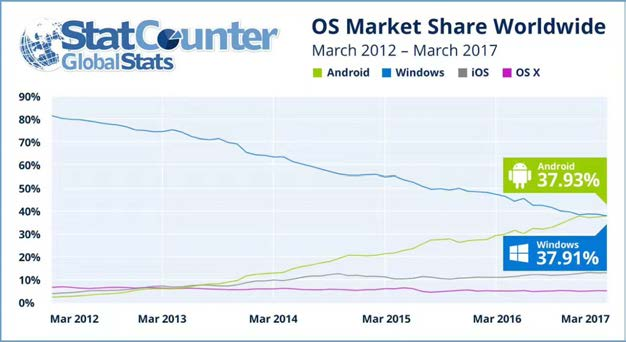

*2017-04-04 10:04 · 手机上网*

---

### 5525

转@ szweig 拿错了小抄纸。 转@ sodium 今天丢脸了 去测视力 视力表上是一个个字母而不是各个方向的E 我张口就在那左左右右......

不过也可见我视力都差成啥样了

*2017-04-04 09:49 · 手机上网 转自sodium*

---

### 5526

这个深井边小姑娘版《哈利路亚》蛮好玩的。转@ 工长山 @ 王兴http://t.cn/R68ul90 这个怎么样？

*2017-04-04 09:40 · 手机上网 转自工长山*

---

### 5527

今天和一个（恐怕很快就要成为前同事）的同事聊，我最大的感受是「不怕起点低，就怕不知底」。前天有一个大哥说自己小时候差点淹死，那时他还不会游泳，掉到水半深不浅的池塘里，上下扑腾呛了不少水，后来他干脆捡起一块石头抱着，这样才稳稳当当沉到水底，然后一步一步走上岸来。

*2017-04-04 00:11 · 手机上网*

---

### 5528

阅读和写作。转@ 王兴 如果你不会品鉴，那根本谈不上创造（所有厨师都懂的道理）；如果你不会创造，那你并不会真正的品鉴（乔布斯说的）。

*2017-04-03 23:58 · 手机上网 转自王兴*

---

### 5529

转@ gravity0 南京条约五口通商：广州、厦门、福州、宁波、上海。

又过了一百四十年改革开放五大经济特区：深圳、厦门、珠海、汕头、海南。厦门两次被选中。

*2017-04-03 15:11 · 手机上网 转自gravity0*

---

### 5530

转：1899年，沙皇尼古拉二世发布关于建立自由港 Дальний（俄文“远方”之意）的敕令，将青泥洼改称 Дальний（读音为达里泥）。

沙俄设计师怀揣着建设远方巴黎的梦想，希望将其变为远东城建最完善的城市。1905年，日本占领此地，将其英译为大连。

*2017-04-03 14:45 · iPhone版*

---

### 5531

据说美国当年迁都华盛顿前，国父杰弗逊同志利用提前知道的内幕消息果断在那里屯了一大片地……

*2017-04-02 22:51 · 手机上网*

---

### 5532

从逻辑上讲，「千年大计」唯一说得通的解读是实际上下一步要迁都。转@ 王兴 千年大计。果然霸气。

*2017-04-02 22:09 · 手机上网 转自王兴*

---

### 5533

听科学家讲八卦，据说杨振宁唯一一次主动找人合影是拉着儿子和爱因斯坦合了个影。

*2017-04-02 20:53 · 手机上网*

---

### 5534

大概几年前，我的大脑一定受过一次某种程度的损害。在那之后，我把地图上的东南西北和眼前的左右对应起来时就比原先慢了一拍:(

*2017-04-02 16:01 · iPhone版*

---

### 5535

思想家们确实厉害。

*2017-04-02 14:45 · iPhone版*

---

### 5536

千年大计。果然霸气。

*2017-04-01 22:19 · iPhone版*

---

### 5537

看到一个说法，美国的战略目标并不是「世界霸主」，而是「世界唯一的区域霸主」。

*2017-04-01 17:02 · 手机上网*

---

### 5538

转@ 拧巴人儿 社会学是一门用一生跟已故法国奇男子们纠缠的学科。

*2017-03-31 20:40 · 手机上网 转自拧巴人儿*

---

### 5539

转@ gravity0 孔夫子出身并不好，他是在成年以后通过改葬仪式认了一个已死的贵族当爹，摆脱了平民身份，终身致力维护等级秩序。耶稣出身也不好，不过他认的爹牛逼大了。马大胡子同样出身草莽，他没认爹而是号召打破一切等级秩序。群居动物都有身份焦虑，圣人也不例外。

*2017-03-31 19:00 · 手机上网 转自gravity0*

---

### 5540

转@ 杨曜睿 深圳也友好，但北京、深圳都工作后会发现北京是海，深圳是湖。转@ 李蜜蜜 个人认为是深圳。转@ 王兴 这方面和上海怎么比？转@ 杨曜睿 北京是个让人有安全感的城市。某种意义上说，是国内对外来平民最友好的城市。

*2017-03-31 09:09 · 手机上网 转自杨曜睿*

---

### 5541

这方面和上海怎么比？转@ 杨曜睿 北京是个让人有安全感的城市。

某种意义上说，是国内对外来平民最友好的城市。

*2017-03-31 08:33 · 手机上网 转自杨曜睿*

---

### 5542

转@ 托尼大世 张五常提到一个细节令我深思，他说他在参加一个渔业大会前一个月，借了大概两呎高（大概30本书）有关方面的书。所以有时候集中精力，让周围全是这种方面的资料，也是一种方式。

*2017-03-31 07:10 · 网页 转自托尼大世*

---

### 5543

确实很难相信啊。转@ 王球球的春天 胡建人就是不相信我小时候曾经手指冻伤露出骨头，这有什么稀罕奇怪的？！

*2017-03-30 23:35 · 手机上网 转自王球球的春天*

---

### 5544

别忘了，川普当年读的可是军校，不像他的前任那样是读法学院的。

*2017-03-30 18:31 · 手机上网*

---

### 5545

转@ 盖文张 咨询公司项目团队标配：外籍人员一位（白人优先）、善于演讲的一位（美女优先）、项目经理一位（乐观开朗优先）、速记员一位（打字速度快优先），打酱油小助理一位（萌妹子优先）。

*2017-03-30 17:58 · 手机上网 转自盖文张*

---

### 5546

据说有两种运动可以消解重力带来的束缚感，用两种完全不同的思路：跳伞和潜水。

*2017-03-30 15:34 · 手机上网*

---

### 5547

任正非也是高段位的标题党啊。二十年前他写的关于华为全球化（第一站是俄罗斯）的第一篇文章叫《走过亚欧分界线》。

*2017-03-30 15:30 · 手机上网*

---

### 5548

已成肉鸡怎么办？在线等。挺着急的。转@ 阳升 看了一些心理学的内容之后，我深深地感觉到，没有学过心理学，大脑就像没有安装杀毒软件的 windows 电脑一样容易被操控，简言之就是——在裸奔。

*2017-03-30 15:20 · 手机上网 转自阳升*

---

### 5549

胡德夫那专辑的名字《大武山蓝调》也很美。转@ Stena 胡德夫的也很不错！ 转@ 王兴 《哈利路亚》这歌比较特别，除了被各路歌手演绎过，科恩在各种场合还搞出很多版不同的歌词，jeff buckley那版最

主流，但其他的也不错。

*2017-03-30 15:18 · 手机上网 转自王兴*

---

### 5550

说「放飞心情」不会觉得心里很不踏实吗？

*2017-03-30 15:04 · iPhone版*

---

### 5551

每次从京承高速上经过时都来不及掏出手机拍，但我觉得那个楼盘广告牌老霸气了，尤其是后四个字：城市庄园，大国独栋。

*2017-03-30 14:53 · iPhone版*

---

### 5552

刚才在酒店大堂等面试者的时候想到的拆解： TOP = Talent +Opportunity + Patience

*2017-03-30 12:17 · iPhone版*

---

### 5553

看到这张照片。很喜欢。

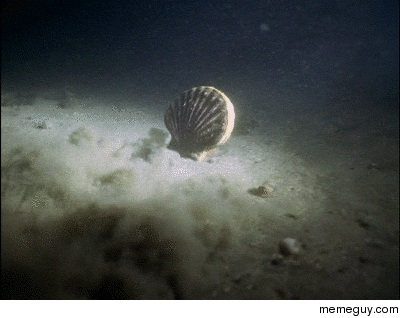

*2017-03-30 01:21 · 手机上网*

---

### 5554

转@ 法医预备役夜傻笑同学 配图「@ 王兴 什么？扇贝居然能在水里脱离海底欢快的游来游去？」

*2017-03-30 01:11 · 手机上网 转自翅哥*

---

### 5555

转@ 美嘉.rar 「我认识许多没有灵魂的人——祝他们走运；他们没有灵魂倒更安逸些。一颗灵魂就像一辆大车上的第五只轮子。」

*2017-03-30 00:44 · 手机上网 转自美嘉.rar*

---

### 5556

转@ 王球球的春天 早年还好奇哥在做些什么，后来也习惯他不说啥了。今天见面，想起年初目标，问他有没可能做军火生意，他批评了我的浮躁，罕见的评价了业内的保利军贸处，他说这些人精通多国语言，身体素质好，情商很高，很苦，年薪也不过100万。军火生意，经常被放鸽子，也容易被俄罗斯截单，去年

*2017-03-30 00:41 · 手机上网 转自王球球的春天*

---

### 5557

什么？扇贝居然能在水里脱离海底欢快的游来游去？

*2017-03-29 19:10 · iPhone版*

---

### 5558

出于对朝鲜局势的担忧，我决定尽快去北京正宗的朝鲜餐厅吃一顿，在传说中的朝鲜姑娘撤走之前。

*2017-03-29 18:42 · iPhone版*

---

### 5559

《哈利路亚》这歌比较特别，除了被各路歌手演绎过，科恩在各种场合还搞出很多版不同的歌词，jeff buckley那版最主流，但其他的也不错。

*2017-03-29 18:13 · 手机上网*

---

### 5560

这个表情好！转@ 洛璃空 (;´༎ຶД༎ຶ`) 转@ 深紫色两年多就2020年了。

*2017-03-29 18:08 · 手机上网 转自王兴*

---

### 5561

再过两年多就2020年了。

*2017-03-29 17:40 · iPhone版*

---

### 5562

在微信的时代，人们不再说「见信如晤」。

*2017-03-29 16:32 · iPhone版*

---

### 5563

自从回了一趟龙岩，喝茶开始从熟普转向生普。

*2017-03-29 15:16 · iPhone版*

---

### 5564

某人跟我说：咱们国家的农民特别纯朴，为了多赚一块钱什么都干得出来……

*2017-03-29 14:13 · iPhone版*

---

### 5565

问：这事确实很复杂，你们做有什么优势吗？答：我们不怕复杂。

*2017-03-29 14:10 · iPhone版*

---

### 5566

初中毕业旅行途中大巴停在荒郊野外时我亲历过这种「看起来是a骗b，其实是ab合起来骗围观的c」的骗局。当时我就是那个c，幸好在更外一层围观的班主任识破并拉住了我。

*2017-03-29 09:12 · 手机上网*

---

### 5567

不会是仨合起来骗你吧？转@ webto 昨天见到了日式骗术之套路搭讪，就在歌舞伎町路上，两人一伙，A 先冲上去搭讪姑娘，B 在后面大概三四米外尾随，大概一两分钟 A 把姑娘逗开心了说一起去玩，B从后面靠近，A 装作说你也在啊，不如三人一起吧。。。全程看到，套路真可怕。

*2017-03-29 09:00 · 手机上网 转自webto*

---

### 5568

为了骗啥？转@ webto 昨天见到了日式骗术之套路搭讪，就在歌舞伎町路上，两人一伙，A 先冲上去搭讪姑娘，B 在后面大概三四米外尾随，大概一两分钟 A 把姑娘逗开心了说一起去玩，B 从后面靠近，A装作说你也在啊，不如三人一起吧。。。全程看到，套路真可怕。

*2017-03-29 08:53 · 手机上网 转自webto*

---

### 5569

谢谢。转@ quux 君子交绝，不是绝交 转@ 王兴 君子绝交，不出恶声；忠臣去国，不洁其名。

转@ 王兴 再过

*2017-03-28 21:21 · 手机上网 转自王兴*

---

### 5570

我去扩展阅读了一下，确实好冷-_-! 转@ 太空小孩 知道了一个非常冷的冷知识：冠状沟的主要作用是把前一个人残留的精液刮出来。

*2017-03-28 21:13 · 手机上网 转自太空小孩*

---

### 5571

万科这公司还是挺厉害的。

*2017-03-28 14:21 · iPhone版*

---

### 5572

转@ .rex 转@ 小田一成 饭否和豆瓣有一点像，就是有一定程度的丧文化，乐于展示自己的衰弱和不堪，在网络上透出一种现实世界的气味，而不是活在知乎里 转@ 对称的奇点 您好，请问你在饭否最大的收获是什么？（递话筒）

*2017-03-28 10:41 · 手机上网 转自对称的奇点*

---

### 5573

看到新闻说韩国要罚高通8.65亿美元，因为三星被不公平对待了。韩国人什么时候腰杆这么硬了？

*2017-03-28 10:12 · iPhone版*

---

### 5574

君子绝交，不出恶声；忠臣去国，不洁其名。

*2017-03-28 09:53 · 手机上网*

---

### 5575

城市市政公用设施建设固定资产投资，好长的一个概念。

*2017-03-27 21:32 · iPhone版*

---

### 5576

cowboy 这词当年幸好没被译成「放牛娃」，而是成了「牛仔」。

*2017-03-27 13:39 · 手机上网*

---

### 5577

转@ 张亮 “Never go to sleep without a request to yoursubconscious.” - Thomas Edison

*2017-03-27 10:58 · 手机上网 转自张亮*

---

### 5578

多谢！转@ 张亮 （目前仍规模较小的） SXSW 或火人节？ 转@ 王兴 我能想到的唯一合理解释是知乎足够有雄心以至于要开创一个全新品类。知乎联合创始人@ 张亮 老师愿意解释一下吗？转@ 王兴 是我真的上了年纪吗？我至今没搞完全明白知乎「盐club」到底是怎么回事:(

*2017-03-27 10:08 · 手机上网 转自王兴*

---

### 5579

终于听到一个男女合唱的《哈利路亚》。Peter Hollens 和 AlishaPopat 的。

*2017-03-27 01:53 · 手机上网*

---

### 5580

转@ 甜饼沧海一声笑 我跟先生认识的时候在他家客厅合唱的第一首歌转@ 王兴 《哈利路亚》确实是既适合在婚礼上放，也适合在葬礼

上放。

*2017-03-27 01:23 · 手机上网 转自王兴*

---

### 5581

@ 岁岁念念 我猜不到。如果美团最终没能提供你需要的服务，那是美团没做好。

*2017-03-27 01:14 · 手机上网 给岁岁念念的回复*

---

### 5582

@ 岁岁念念 然后呢？

*2017-03-27 01:09 · 手机上网 给岁岁念念的回复*

---

### 5583

肯德基进入中国三十年了？对不起，我不觉得这种活动效果会很好。

多数人不是因为情怀而去吃肯德基的。

*2017-03-27 01:06 · 手机上网*

---

### 5584

他的歌词开头是：也许没有人会了解我/人生旅途免不了寂寞/我的快乐悲伤有人在乎吗/多少次失败一错再错…… 嗯，很港台很八零年代！转@ 王兴 orz!港台歌手邰正宵同志居然唱过一版《哈利路亚》！而且是

中文版！可惜歌词也是一塌糊涂。

*2017-03-27 00:57 · 手机上网 转自王兴*

---

### 5585

orz!1994年起相继以《九百九十九朵玫瑰》、《千纸鹤》、《一千零一夜》一曲曲令人心动的情歌走红于歌坛，被誉为情歌王子、玫瑰王子(摘自百度百科）的港台歌手邰正宵同志居然唱过一版《哈利路亚》！而且是中文版！可惜歌词也是一塌糊涂。

*2017-03-27 00:49 · iPhone版*

---

### 5586

转@ 大望鹿 刚参加回来。盐club在我看来是知乎的一个可以不断进化的产品，是广告，是社交，粉丝聚会，是孵化器，是一年一度草根知识分子的行为艺术。转@ 王兴 是我真的上了年纪吗？我至今没搞完全明白知乎「盐club」到底是怎么回事:(

*2017-03-27 00:19 · 手机上网 转自王兴*

---

### 5587

哇，多谢！没想到李健已经致敬过了。不愧是有内涵的歌手。不过，说实话，我没听明白，可能是因为我没听过他那首《璀璨》。转@ 星星呀 @ 王兴 想起李健改编了一个版本。 http://t.cn/RxxQG1j

*2017-03-26 23:48 · 手机上网 转自星星呀*

---

### 5588

我能想到的唯一合理解释是知乎足够有雄心以至于要开创一个全新品类。知乎联合创始人@ 张亮 老师愿意解释一下吗？转@ 王兴 是我真的上了年纪吗？我至今没搞完全明白知乎「盐club」到底是怎么回事:(

*2017-03-26 23:28 · 手机上网 转自王兴*

---

### 5589

是我真的上了年纪吗？我至今没搞完全明白知乎「盐club」到底是怎么回事:(

*2017-03-26 23:21 · 手机上网*

---

### 5590

对我来说，《音乐天堂》是二十多年前的存在。转@ 海德说他不在大概十多年前的国内音乐杂志《音乐天堂》推荐了这首歌RT@ 王兴连《大西洋月刊》都给《哈利路亚》专门写过一篇文章了，BBC也专门做过一期节目了。哪个中文媒体认真报道过吗？

*2017-03-26 23:10 · 手机上网 转自王兴*

---

### 5591

连《大西洋月刊》都给《哈利路亚》专门写过一篇文章了，BBC也专门做过一期节目了。哪个中文媒体认真报道过吗？

*2017-03-26 22:51 · iPhone版*

---

### 5592

@ 星星呀 听了，胡德夫那版我觉得还不错。不过也不是中文。

*2017-03-26 22:41 · 手机上网 给星星呀的回复*

---

### 5593

听了一个国际乐队IL Divo唱的不知道是西班牙语还是意大利语的《哈

利路亚》，感觉一般。好像更没有什么拿得出手的中文版本了，蔡琴那版我实在不敢恭维。该鼓动哪个中文歌手来唱一版呢？黄秋生？李健？

*2017-03-26 22:38 · 手机上网*

---

### 5594

维基百科上说至少有三百个版本（肯定还会继续增加），我比较偷懒，先把QQ音乐里的版本听一遍。转@ 今天是晴天吗 @ 王兴 你听了四个小时的哈利路亚吗……

*2017-03-26 22:33 · 手机上网 转自今天是晴天吗*

---

### 5595

@ 轻度回南天 谢谢，buckley的版本我听过了。

*2017-03-26 22:28 · 手机上网 给轻度回南天的回复*

---

### 5596

《哈利路亚》确实是既适合在婚礼上放，也适合在葬礼上放。

*2017-03-26 22:27 · 手机上网*

---

### 5597

《哈利路亚》是最有陈年潜力的歌（之一）。84年刚出来时连唱片公司都不愿意发，鲍勃迪伦第一个慧眼识珠，又过了很多年才慢慢火起来，而且越来越火，我相信将来还有很大上升空间。我第一次听应该是十多年前了，但是直到最近它才取代别的歌成为科恩作品里我的最爱。

*2017-03-26 22:16 · iPhone版*

---

### 5598

还是法国人有品位，《哈利路亚》在法国金曲榜上曾排到第一位，在美国最高也就五六十位。

*2017-03-26 21:59 · iPhone版*

---

### 5599

《哈利路亚》发布于1984年，科恩那年50岁，已经开始改用卡西欧电子琴创作。

*2017-03-26 21:16 · iPhone版*

---

### 5600

韦氏词典对 enterprise 除了「企业」以外还有一个另外的释义：aproject or undertaking that is especially difficult, complicated, orrisky.

*2017-03-26 21:11 · iPhone版*

---

### 5601

第一次注意到企业 enterprise 这个词可以分解为 enter 和 prise 这两部分。

*2017-03-26 21:06 · iPhone版*

---

### 5602

技术不行产品补，产品不行运营补，运营也不行？那就只能补贴补了，补完拉倒。

*2017-03-26 20:32 · 手机上网*

---

### 5603

好有商业洞察！转@ roger.. 看来旅行是截止目前不变的共同点转@王兴 那几句歌词确实出自tfboys的歌《宠爱》-_-!

*2017-03-26 20:20 · 手机上网 转自王兴*

---

### 5604

打嘴炮总是容易的。要是有人噎我一句，有本事你翻译一个啊？或者更甚，有本事你弹唱一版啊？我就瞎了。转@ 王兴 我也去听了一下蔡琴版的《哈利路亚》。这都是什么呀？那中文歌词翻译者看懂科恩的歌词了吗？转@ webto 说起来，「正在播放」也曾经是 MSN 的卖点功能啊。# 正在播放 # ♬

*2017-03-26 19:32 · 手机上网 转自webto*

---

### 5605

又听了一遍，更加感叹科恩这首歌的伟大。这样瞎翻译瞎唱都无法完全糟蹋它。转@ 王兴 我也去听了一下蔡琴版的《哈利路亚》。这都是什么呀？那中文歌词翻译者看懂科恩的歌词了吗？转@ webto 说起来，「正在播放」也曾经是 MSN 的卖点功能啊。# 正在播放 # ♬哈利路亚 - 蔡琴♪

*2017-03-26 18:29 · 手机上网 转自webto*

---

### 5606

我也去听了一下蔡琴版的《哈利路亚》。这都是什么呀？那中文歌词翻译者看懂科恩的歌词了吗？转@ webto 说起来，「正在播放」也曾经是 MSN 的卖点功能啊。# 正在播放 # ♬哈利路亚 - 蔡琴♪

*2017-03-26 18:22 · 手机上网 转自webto*

---

### 5607

@ Simp 具体什么情况？方便把美团那商家那订单的相关信息私信我吗？谢谢

*2017-03-26 18:04 · 手机上网 给Simp的回复*

---

### 5608

刚才在路上时，令我自豪的不是我骑什么颜色的单车，而是我又能双手脱把连续骑好几百米了。那种上身直立骑车的感觉特别自由。

*2017-03-26 17:17 · 手机上网*

---

### 5609

那几句歌词确实出自tfboys的歌《宠爱》-_-!

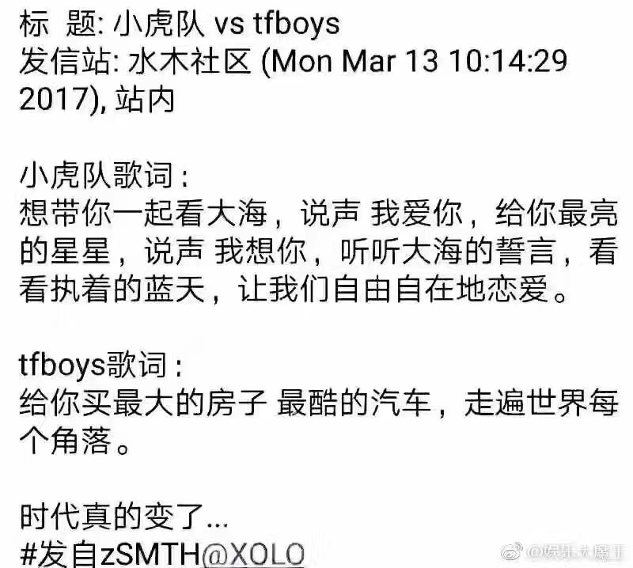

*2017-03-26 13:13 · 手机上网*

---

### 5610

转@ 钟永健 看钱穆说，看到太平天国这名字，就知道他们没啥文化，搞不好，又学到“省”的由来，再读有关张居正以内阁大学士之职推动政令有弄权之嫌的那段评说，可见“名正”，是多么重要。

*2017-03-25 23:20 · 手机上网 转自钟永健*

---

### 5611

问到酒量时竖起一根手指可以有很多种含义：一杯、一瓶、一箱、可以一直喝、一喝就晕。最理想的是倒数两种的结合。

*2017-03-25 21:48 · 手机上网*

---

### 5612

比「这酒庄不错」「这年份不错」更装逼的说法是「这酒保存得不错」。

*2017-03-25 20:00 · iPhone版*

---

### 5613

我发现自己越来越像一个福建人，从不喝茶到用杯子喝茶到现在用起茶壶来了。

*2017-03-25 14:31 · iPhone版*

---

### 5614

十年来第一次重操旧业，自己给自己剃头，三下五除二搞定，并不觉得手生，关键还是目标简单（剃短就好，不求发型）和工具给力（电动推子加6mm卡齿）。

*2017-03-25 13:25 · iPhone版*

---

### 5615

在别人办公室里见到一把军刀，实际挥舞起来发现还挺重的，比挥舞一根小棍子的速度明显更慢。

*2017-03-24 17:43 · iPhone版*

---

### 5616

你听了吗？还是看了歌名就评论？这歌让我想起伯格曼的电影。转@王球球的春天 这不是应该信佛吗？基督徒是活在天父那里啊 转@ 王兴 黄秋生的那首《活在当下》词曲俱佳。最近听了很多遍，觉得有一种超越日常的忧伤。这哥们是不是信基督啊？

*2017-03-24 13:09 · 手机上网 转自王兴*

---

### 5617

made my day. 转：中国1:0韩国，听到一哥们在路上打电话吼道：对对对.....是1比0；对对对......是中国队;对对对..........是男足；对对对...........对方也是男足！

*2017-03-24 12:52 · 手机上网*

---

### 5618

不是同一首。转@ 夜骸 夕爷填的词。原唱应该是许志安。转@ 王兴黄秋生的那首《活在当下》词曲俱佳。最近听了很多遍，觉得有一种超越日常的忧伤。这哥们是不是信基督啊？

*2017-03-24 12:52 · 手机上网 转自王兴*

---

### 5619

黄秋生的那首《活在当下》词曲俱佳。最近听了很多遍，觉得有一种超越日常的忧伤。这哥们是不是信基督啊？

*2017-03-24 12:45 · 手机上网*

---

### 5620

最近一年给我留下最深印象的中文杂志文章大概是《中国国家地理》

里那篇，讲的是大型森林火灾（例如30年前大兴安岭那场大火）后生态系统重建的过程和阶段。

*2017-03-24 12:28 · 手机上网*

---

### 5621

这酒店门口今天停着一辆迈巴赫。我也坐过两个土豪的迈巴赫，但两辆车的格调都被后加的内饰如脚垫或椅套拉低了。

*2017-03-24 12:12 · 手机上网*

---

### 5622

又听说石油不是古代动植物尸体变的，是地底下涌出来的… 转@ 王兴不学习就会落伍。我在中学地理学到的是世界有四大洋（太平洋、大西洋、印度洋和北冰洋），昨天玩iPad地图时才知道国际水文地理组织已经于2000年确定南极洲周围的海是独立的第五大洋“南冰洋”。我在中学天文学到

*2017-03-24 11:56 · 手机上网 转自王兴*

---

### 5623

期待分享体验！转@ 拧巴人儿 今儿我才从同学那儿得知amazon还送外卖呢，可以送麻辣香锅。一会儿我就点一个！

*2017-03-24 09:45 · 手机上网 转自拧巴人儿*

---

### 5624

哇哈哈，这个酒店的早餐居然有豆腐脑。毫不犹豫来一碗！不枉我一大早赶来开会。

*2017-03-24 08:25 · 手机上网*

---

### 5625

真的有点倒春寒，今早出门才感觉到，昨晚回到北京时感觉不强烈。

*2017-03-24 07:52 · 手机上网*

---

### 5626

美国发展史：从大西洋一路扩张到太平洋后决定控制直营规模，改为用开放平台的方式打造生态体系，辅以战略投资（马歇尔计划等），控制核心要素（安全和支付）……

*2017-03-24 01:58 · 手机上网*

---

### 5627

美国发展史：十三个殖民地联合发起MBO，向西占领一部分相对空白的市场，再向西灭掉原创但生产力落后的众多对手（印第安人），再向西从有先发优势但生产力相对落后的对手那里抢一部分市场（墨西哥），中间穿插两次重要并购（从遭遇低谷的法国手里买路易斯安娜，从遭遇低谷的俄国手里买阿拉斯加），从

*2017-03-24 01:54 · 手机上网*

---

### 5628

转@ Meng.Z 「他开心起来像个两百斤的孩子」，睡觉前听到这么传神的一句

*2017-03-24 01:11 · 手机上网 转自Meng.Z*

---

### 5629

瞻仰了两遍孙正义用来融1000亿美元基金的ppt。

*2017-03-24 01:01 · iPhone版*

---

### 5630

如果你不会品鉴，那根本谈不上创造（所有厨师都懂的道理）；如果你不会创造，那你并不会真正的品鉴（乔布斯说的）。

*2017-03-24 00:55 · iPhone版*

---

### 5631

尝试了一下自创的鸡尾酒：往苏格兰单一麦芽威士忌里加一点意大利葡萄醋……

*2017-03-24 00:46 · iPhone版*

---

### 5632

FCF. 转@ 王兴 造了一个缩写来提醒自己：TLT.

*2017-03-24 00:36 · 手机上网 转自王兴*

---

### 5633

我需要一个微信智能助理：在微信里跟人约好见面的时间地点后，自动生成一个行事历问我是否要加入手机日历。

*2017-03-24 00:08 · 手机上网*

---

### 5634

倒数第二句最佳！转@ 熊阿姨 北京冷雨一整天，没睡好，赶早高峰到住建委看人扯横幅，冻得双脚冰凉，听两个买房猜错点的故事，一篇得意的稿子被敬重的人评价“非常差”，听说有四个同事正在辞职，“这周稿子必须交，没有任何拖延的必要。”今日。

*2017-03-23 23:26 · 手机上网 转自熊阿姨*

---

### 5635

要有耐心，能回来的，顶多慢一点。我相信我能活着看到。如果三十年后龙津河还不干净我就亲自动手。一八六几年的夏天，泰晤士河臭到河边的英国议会实在无法开会，议员们挪到别处继续开会后通过的第一个法案就是环保。一百多年后，泰晤士河里重现鲑鱼回游。转@泓暑 @ 王兴 但是龙津河是干净不回来了

*2017-03-23 23:10 · 手机上网 转自泓暑*

---

### 5636

什么，龙岩都开始修三环了？！

*2017-03-23 22:47 · iPhone版*

---

### 5637

据说龙岩新机场的预算是25亿，已经算是同类中很高的了，因为是削掉一半山峰建在海拔650米的设计。但25亿也就相当于两三个城市综合体吧。跟房价一比，啥都显得不是那么贵。

*2017-03-23 22:30 · iPhone版*

---

### 5638

福建是全国森林覆盖率最高的省份。龙岩又是全省九个地级市里森林覆盖率最高的那个。这次回去，听说山上野猪野兔之类的已经重新变多了。我期待龙岩的生态早日恢复我儿时的景象：天空中几乎总有周边山上飞出来的老鹰在盘旋。

*2017-03-23 22:24 · iPhone版*

---

### 5639

再读苏轼的《水调歌头》，注意到前面有段「丙辰中秋，欢饮达旦，大醉，作此篇，兼怀子由。」 欢饮达旦？难怪我当年没注意到，那时我还滴酒不沾。

*2017-03-23 22:16 · iPhone版*

---

### 5640

想起一个大姐跟我说在飞机上打坐更容易入定，她的解释是离地心远了一万多米，引力小了。我说，我不会打坐，更不曾入定，不过上了飞机容易睡着倒是真的。

*2017-03-23 20:57 · 手机上网*

---

### 5641

据说建机场主要有三个约束条件：一是经济账（直接和间接效益），二是获取空域审批（在我国，空域掌握在空军手里），三是自然条件

（周边地形，雾多不多，风大不大，等等）。

*2017-03-23 16:58 · 手机上网*

---

### 5642

呼伦贝尔海拉尔机场就超级近。上海虹桥也还算合理。杭州机场由笕桥迁往萧山前也挺近的。转@ 傅小司 哪家机场造市中心啊？ 转@ 王兴 福州市区离长乐机场太远了，的士费加过路费超过200块:( 我痛恨这种离市区远的机场。

*2017-03-23 16:42 · 手机上网 转自王兴*

---

### 5643

候机时脑补了一下：杜斌为奴十二年，挖矿筛沙兼晒盐。若得去闽还京日。熬夜写码苦亦甜。转@ 杜斌beta 我第一次去时，感觉路途遥远得不太合理，加之司机粗犷不羁，差点以为要被拉去矿山为奴了。

转@ 王兴 福州市区离长乐机场太远了，的士费加过路费超过200块:(我痛恨这种离市区远的机场。

*2017-03-23 16:38 · 手机上网 转自王兴*

---

### 5644

在福州机场偶遇一群穿着旧式绿军装的男男女女，都有些年纪了，有的还佩戴勋章。我凑过去看了一下某大叔胸前别着的铭牌：「过境作战老兵」。大叔说这次是要集体去广西，1979年他们从那里进入越南。

*2017-03-23 16:26 · 手机上网*

---

### 5645

福州市区离长乐机场太远了，的士费加过路费超过200块:( 我痛恨这种离市区远的机场。

*2017-03-23 16:18 · 手机上网*

---

### 5646

福州阳光超好，空气超好，可惜建筑土了点，不像巴塞罗那那样有个高迪。另外，可惜我呆的时间超短:(

*2017-03-23 15:37 · 手机上网*

---

### 5647

@ 杨曜睿 行。帮我来两支吧。咱让饭否上也有点微商活动;)

*2017-03-23 15:34 · 手机上网 给杨曜睿的回复*

---

### 5648

@ 杨曜睿 这酒确实不错。

*2017-03-23 12:22 · 手机上网 给杨曜睿的回复*

---

### 5649

据说，海明威当时的太太读完《老人与海》的手稿后，热泪盈眶的对他说：「恩尼，我原谅你以往犯过的所有错误，以及你将来可能犯的任何错误。」我越来越觉得，科恩的《Hallelujah》也属于这种神级作品。

*2017-03-22 23:20 · iPhone版*

---

### 5650

这是「一字领」。

*2017-03-22 22:31 · 手机上网*

---

### 5651

更清楚。转@ YaYi_ 一字领是到肩膀，抹胸是到胳肢窝下啊。一个在胳膊外面一个在胳膊里面。转@ 王兴 no，抹胸和一字领是两个概念。一字领可以是很庄重的长裙，不像抹胸那样露肚脐；反过来，抹胸虽然面积小布料省，但是上沿不一定是一字直线，可以做成曲线造型，尤其是要配合胸型。

*2017-03-22 22:27 · 手机上网 转自王兴*

---

### 5652

no，抹胸和一字领是两个概念。一字领可以是很庄重的长裙，不像抹胸那样露肚脐；反过来，抹胸虽然面积小布料省，但是上沿不一定是一字直线，可以做成曲线造型，尤其是要配合胸型。转@warmDEREK 一字领不就是抹胸吗？「@ 酱腩菜籽 哈哈，典型直男？ 转@ 王兴 学了一个新名词：一字领。」

*2017-03-22 22:17 · 手机上网 转自王兴*

---

### 5653

《喜剧之王》的这个造型确实经典。

*2017-03-22 22:04 · 手机上网*

---

### 5654

学了一个新名词：一字领。

*2017-03-22 21:51 · 手机上网*

---

### 5655

说实话，我有点怕传统行业的企业家上来就跟我大谈互联网思维、农耕时代/工业时代/互联网时代的本质区别、商业模式裂变、生态共赢……

*2017-03-22 21:17 · 手机上网*

---

### 5656

上一次来这个城市是20年前了。

*2017-03-22 15:16 · 手机上网*

---

### 5657

转：想象力好像的确不神秘，Hassabis博士论文就是研究这个，他说想象力和记忆力是同一个过程，都碎片重组，记忆不是录像机按时序存储放映，而是把散落的碎片重组成似曾相识的印象，而想象力是把碎片重组成全新的东西。

*2017-03-22 14:55 · 手机上网*

---

### 5658

天/月/年这些周期有客观存在的物理基础，类似的，20年和70年这俩周期也有客观存在的生理基础，前者是一代人成年所需的时间，后者是一代人的平均寿命。

*2017-03-22 14:46 · 手机上网*

---

### 5659

转@ 阳升 原来保利集团的保利，是保卫胜利的意思。

*2017-03-22 14:34 · 手机上网 转自阳升*

---

### 5660

今日听到的脑洞最大的观点，似乎也不太好反驳。转：我有个朋友看法很独特，认为等朝鲜研制出常规核武器了，有了足够底气，自然会正常起来开始改革，他认为中国当年正是这样。

*2017-03-22 14:33 · 手机上网*

---

### 5661

经济制裁至少有两种：我不买你的，我不卖给你。

*2017-03-22 14:28 · 手机上网*

---

### 5662

转@ 杜斌beta 转：设计就是解决内容和形式的冲突。

*2017-03-22 14:17 · 手机上网 转自杜斌beta*

---

### 5663

这就是品牌延展的坏处：容易混淆。温德姆定位是五星，对应万豪/希尔顿；而温德姆至尊wyndham grand定位是豪华五星，对应jwmarriot/conrad。转@ Sttequila 然而上海的温德姆。。。确实不行。 转@ 王兴 转@ 欧垟 深圳温德姆的浴缸，感觉可以躺得下一家人

*2017-03-22 14:11 · 手机上网 转自王兴*

---

### 5664

「要死大家一起死」，抱有这种想法的不止金三胖一个人，还有一众已经过了临界点走上不归路的房地产多头。倒霉的是，面对这两者，我们都有陪葬的风险:(

*2017-03-22 14:01 · iPhone版*

---

### 5665

开始了。有点后悔我刚才在接入电话会议室照例说了一句「大家好，

我是XX」-_-! 转@ 王兴 一会儿要在动车二等座上参加电话会议谈个大生意……

*2017-03-22 13:12 · 手机上网 转自王兴*

---

### 5666

一会儿要在动车二等座上参加电话会议谈个大生意……

*2017-03-22 13:06 · iPhone版*

---

### 5667

转@ 欧垟 深圳温德姆的浴缸，感觉可以躺得下一家人。转@ 王兴 转@ 爱时差 深圳那个温德姆是我住过的最好的酒店，什么ritz四季都比不了，那双拖鞋简直了，我现在还每天都在穿，买的母鸡的拖鞋都快扔了 转@ 王兴 在厦门的温德姆至尊酒店第一次见到这种单键的花洒开关，不需要旋，按一下全开，再

*2017-03-22 11:20 · 手机上网 转自王兴*

---

### 5668

这家温德姆至尊是2016年9月新开业的。业主是润丰集团，2013年拿地立项，面积约5万平，含地价造价每平一万六，总投资约8亿。目前评估超过20亿，可以从银行贷出来至少70%。共291个房间，员工350人，经理特意解释说因为会议接待较多，所以人员可以相对少一些。

*2017-03-22 11:07 · 手机上网*

---

### 5669

转@ loso 外卖行业的快速发展，影响了另外一个行业——冲锋衣！

那些喜欢穿冲锋衣的人们，经常被人误认为是外卖骑士，人类的历史从此翻开了新的篇章。@ 王兴

*2017-03-22 10:58 · 手机上网 转自loso*

---

### 5670

看了一下，温德姆wyndham旗下有16个酒店品牌。两年前，温德姆还可以号称自己是全世界最大的酒店集团，因为它管理着7600家酒店，那时万豪还没收购喜达屋。

*2017-03-22 02:03 · 猫饭*

---

### 5671

温德姆至尊还有一个细节做得很好：这个扁扁的洗发水瓶是我用过的捏起来最省力的设计。是的，其他酒店的其他形状的瓶子捏起来也不太费力，但这个设计确实让我在触碰的第一次就意识到它的优越性。

而且，不同用途是不同颜色的，避免客人搞混。

*2017-03-22 01:24 · 猫饭*

---

### 5672

这个让我觉得名字起得不太好的酒店品牌居然还真有一些粉丝！转@82._. 温德姆至尊真的是我私心最爱的酒店…转@ 王兴 转@ 爱时差深圳那个温德姆是我住过的最好的酒店，什么ritz四季都比不了，那双拖鞋简直了，我现在还每天都在穿，买的母鸡的拖鞋都快扔了 转@王兴 在厦门的温德姆至尊

*2017-03-22 00:51 · 手机上网 转自王兴*

---

### 5673

困得睡不着。不吃饱点哪有力气减肥。

*2017-03-22 00:30 · 手机上网*

---

### 5674

转@ 爱时差 深圳那个温德姆是我住过的最好的酒店，什么ritz四季都比不了，那双拖鞋简直了，我现在还每天都在穿，买的母鸡的拖鞋都快扔了 转@ 王兴 在厦门的温德姆至尊酒店第一次见到这种单键的花洒开关，不需要旋，按一下全开，再按一下全关。

*2017-03-22 00:28 · 手机上网 转自王兴*

---

### 5675

多元化:单业务公司 ≈ 帝国:民族国家

*2017-03-22 00:24 · iPhone版*

---

### 5676

一整天足不出户的会从早上9点开到晚上快12点，吃了两顿外卖，喝掉三个茶包，现在已经四肢无力。但还蛮值得的，看到事情有进展固然令我兴奋，看到人有成长更令我欣慰。

*2017-03-21 23:57 · iPhone版*

---

### 5677

在厦门的温德姆至尊酒店第一次见到这种单键的花洒开关，不需要旋，按一下全开，再按一下全关。

*2017-03-21 09:03 · 猫饭*

---

### 5678

集体去曾厝垵宵夜到十二点半。明早九点继续开会。

*2017-03-21 00:57 · iPhone版*

---

### 5679

早九点到晚九点足不出户的一天会开完了。宵夜去！

*2017-03-20 21:24 · iPhone版*

---

### 5680

看到一块灯箱广告牌「脸博士整形」。这名字起的！

*2017-03-19 20:03 · iPhone版*

---

### 5681

发现爸爸居然有一本《人类简史》。他说是在手机上从当当买的。

*2017-03-19 19:59 · iPhone版*

---

### 5682

越来越觉得这是个伟大的时代，至少有着伟大的变革，但似乎依然缺乏与之相称的伟大的文艺作品。

*2017-03-19 19:10 · iPhone版*

---

### 5683

转：计算而不计较方能坚持。

*2017-03-19 15:35 · iPhone版*

---

### 5684

据说，在宣布筹建机场后，龙岩房产价格应声普涨300块。

*2017-03-19 15:30 · iPhone版*

---

### 5685

看到龙岩在我以为房子早已过剩后又神奇的房子建了一片又一片房价涨了一波又一波，我似乎有点明白为什么牛顿当年会炒股惨败了。

*2017-03-19 14:57 · iPhone版*

---

### 5686

听说龙岩不但要削平山峰建一个离市中心直线距离只有8千米的4C（预留4D）级新机场，而且将建的重庆厦门高铁在经过龙岩时也会把站设在那里，形成空铁一体的交通枢纽。回龙岩这样的四线城市走走看看还是让我对这个国家的基建宏伟程度再次刷新了认识。

*2017-03-19 14:20 · 手机上网*

---

### 5687

爸爸教我一个生活小窍门：吃枇杷前用大拇指指甲沿顺着经线刮一刮，剥起皮来会容易许多。我一试，果然奏效！

*2017-03-19 10:31 · 手机上网*

---

### 5688

太有才了-_-! 转@ terababy 使动用法，小邪恶一下。 转@ webto湿婆神是象征男性啊！妈蛋这译名太有欺骗性了！

*2017-03-19 10:13 · 手机上网 转自webto*

---

### 5689

凉月如眉挂柳湾，越中山色镜中看。兰溪三日桃花雨，半夜鲤鱼来上滩。-唐代戴叔伦的《兰溪棹歌》

*2017-03-18 22:31 · 手机上网*

---

### 5690

转@ webto 任务系统是中国互联网运营的万灵药，不上好像你运营就不专业。转@ marcher 发现百度也有个学术，然后打开后就被深深恶心到了。原来百度想让用学术搜索的用户攒积分多换点儿糯米兑换券。老是觉得百度恶心是不是也是一种病？

*2017-03-18 20:10 · 手机上网 转自marcher*

---

### 5691

房地产泡沫对国民经济的巨大伤害实际上并不在于泡沫破灭之后房价下跌导致的资产价格（或与之相对的所谓国民财富）的巨大缩水，而是在于泡沫破灭之前房价虚高导致的社会资源的巨大错配:(

*2017-03-18 20:03 · iPhone版*

---

### 5692

第一次参观高频钢管厂。现场看着非常厚实的钢条钢卷被生产设备像兰州拉面那样轻松的抻来抻去，并在高温高热高噪声中被高频焊接成或圆或方或大或小的无缝钢管，我深深的感受到人类肉体的渺小。

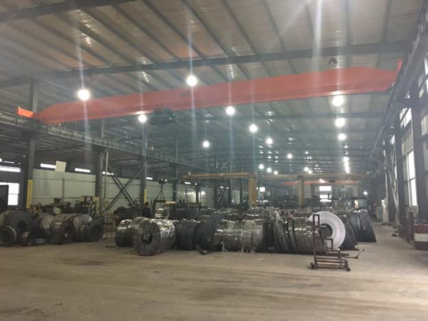

*2017-03-18 19:33 · 猫饭*

---

### 5693

故乡的春雨，淅淅沥沥。

*2017-03-18 15:58 · 手机上网*

---

### 5694

转@ Emik 鳳梨。瓜果類。依照民間習俗，在商家開市拜拜或候選人競選時，大家總是拿鳳梨來祈福，因為它除了食用外，還存有閩南語「旺來」的吉祥含意。 转@ 王兴 看着高速两边的水果地，我突然想起菠萝在我们家乡话里写下来是「王梨」。

*2017-03-18 15:50 · 手机上网 转自王兴*

---

### 5695

7:50出北京家门，预计8:55起飞的航班延误了快半个小时，但依然于12:00准点降落在厦门，12:27上车，14:41进龙岩家门，历时接近7小时，这就是我今天的上半场。

*2017-03-18 14:49 · iPhone版*

---

### 5696

我爸做的大概是最实的实业了。要致富，先修路。修路要用水泥啊。

他92年投身水泥行业，至今已经干了25年。十三年前我回国创业时觉得自己是在参与建设中国的信息高速公路。

*2017-03-18 14:22 · iPhone版*

---

### 5697

呼，侧前方居然有辆蓝黑色的林肯SUV。这车我很少见到。

*2017-03-18 14:01 · iPhone版*

---

### 5698

看着高速两边的水果地，我突然想起菠萝在我们家乡话里写下来是「王梨」。

*2017-03-18 13:30 · iPhone版*

---

### 5699

对比一下小米的国民手机海报。谁更「以客户为中心」？

*2017-03-18 13:19 · 手机上网*

---

### 5700

你是指用iPhone拍的各色美图那一系列广告？很棒啊。可是，受众不同，最佳广告形式当然也不同。转@ 出来遛狗 呃……看过并对比过苹果的广告吗？转@ 王兴 在厦门机场见到了最简单明了的手机广告！oppo威武！真是深谙定位和营销的高手！

*2017-03-18 13:05 · 手机上网 转自王兴*

---

### 5701

同个机场过道里另一款oppo广告。

*2017-03-18 12:48 · 猫饭*

---

### 5702

在厦门机场见到了最简单明了的手机广告！oppo威武！真是深谙定位和营销的高手！

*2017-03-18 12:29 · 猫饭*

---

### 5703

是受香港黑帮片的影响吧-_-!转@ 驴行云端 武汉这边，，，土豪圈都喜欢被叫老板，，，顶级的老板叫"X生"，，，转@ 王兴 传统民营企业圈好像更喜欢称呼「X董」而非「X总」。

*2017-03-17 23:57 · 手机上网 转自王兴*

---

### 5704

实话实说，我都不清楚啥是民谣啥不是民谣。转@ 杨水水 村长为什么这么爱听民谣？「@ 王兴 终于把听说最近很火的赵雷的《成都》

播了一下。咦，这歌我以前肯定听过。」

*2017-03-17 19:50 · 手机上网 转自王兴*

---

### 5705

终于把听说最近很火的赵雷的《成都》播了一下。咦，这歌我以前肯定听过。

*2017-03-17 19:36 · iPhone版*

---

### 5706

不知道，今天我异常焦躁。或许和最近没太运动没太出汗有关。

*2017-03-17 16:50 · iPhone版*

---

### 5707

是吗？转@ 刘奔奔 日语韩语最终都没进化出f发音... 转@ 王兴 转@terababy 我们用了几千年才进化出f的音啊。转：上古汉语没有/f/的这一特征不仅仅遗留在号称“古汉语化石”的闽南语里，它还隐藏于我们生活中的角角落落。例如，普通话把“阿房宫”读作阿“pang”宫、山西地名

*2017-03-17 14:49 · 手机上网 转自terababy*

---

### 5708

转@ terababy 我们用了几千年才进化出 f 的音啊。转：上古汉语没有 /f/ 的这一特征不仅仅遗留在号称“古汉语化石”的闽南语里，它还隐

藏于我们生活中的角角落落。例如，普通话把“阿房宫”读作阿“pang”宫、山西地名关龙逢的“逢”读作“pang”、太原南阜的“阜”读作“bu

*2017-03-17 14:08 · 手机上网 转自terababy*

---

### 5709

转@ 非處方藥 改革开放初，社会没规矩，就是江湖，妓女把嫖客唤作大哥；没几年，经济好转，嫖客出手阔绰，妓女改称老板；再后来，官商开始勾结方能成事，妓女审时度势，唤作领导。近年，文化吃香，妓女跟风，改称老师了。 转@ 王兴 传统民营企业圈好像更喜欢称呼「X董」而非「X总」。

*2017-03-17 13:21 · 手机上网 转自非處方藥*

---

### 5710

传统民营企业圈好像更喜欢称呼「X董」而非「X总」。

*2017-03-17 12:53 · 网页*

---

### 5711

不错的鸡汤：成功者不是从不失败，而是从不放弃。

*2017-03-17 01:29 · iPhone版*

---

### 5712

听说电商业某同行为了锻炼思维能力，现在还坚持定期做复杂的微积分题，我顿感望尘莫及。

*2017-03-17 00:56 · iPhone版*

---

### 5713

这老头可能不是完全在吹牛，因为他还是有逻辑的：我唯一一次考虑要不要卖掉亚马逊股票是在贝索斯收购了华盛顿邮报时。我担心他不再踏踏实实当个商人，想要太多影响力。

*2017-03-16 22:01 · iPhone版*

---

### 5714

这老头装起逼来真是没治了。我问：你对亚马逊怎么看？他说：我是上市时买的，至今一股没卖。

*2017-03-16 21:45 · iPhone版*

---

### 5715

跟一个初次见面的老头闲聊。我说：「听说李安在拍一部新电影，拳王阿里的马尼拉之战。我还蛮期待的。」他说：「那场比赛我在现场看的。」好吧，装逼装不过你。

*2017-03-16 20:55 · iPhone版*

---

### 5716

爸爸一年前给我的那包家乡的斜背茶差不多喝完了。正好又到了我该回龙岩看看的时候。

*2017-03-16 18:38 · iPhone版*

---

### 5717

同样是衬衫仔裤乐福鞋，上身是套一件优衣库抓绒衣还是一件毛料西装，对我的行为举止确实有不可忽略的影响。吃火锅的时候尤其明显。

*2017-03-16 18:13 · iPhone版*

---

### 5718

给人录了一小段视频，回放时发现，我的发际线确实退后得有点厉害_-!

*2017-03-16 17:54 · iPhone版*

---

### 5719

开会时有点困怎么办？站起来呗，有本事站着睡啊？

*2017-03-16 16:13 · iPhone版*

---

### 5720

真是有文化的game boy! 转@ 张亮 朝登剑阁云随马，夜渡巴江雨洗兵。——真浪漫，关键是能在《塞尔达：荒野之息》里体验到这感觉，难得。

*2017-03-16 12:23 · 手机上网 转自张亮*

---

### 5721

转@ terababy 《聊斋志异》异史氏曰：“‘黄狸黑狸，得鼠者雄。’此非空言也。邓小平肯定看过聊斋志异。

*2017-03-16 08:11 · 手机上网 转自terababy*

---

### 5722

真是内行？转@ 徘徊君不徘徊 出现事故就是人祸，意识措施不到位管理失当 工程出现人身伤亡事故从来都是不可容忍的，不能因为个别产业的歪风邪气就一股脑说什么指标问题，那是人命转@ 京酱细丝儿怎么可能 这简直造谣 转@ 徘徊君不徘徊 这外行话说的…转@ 王兴据说监管大概就是一亿工程量一个人

*2017-03-16 01:25 · 手机上网 转自王兴*

---

### 5723

法官:why did you rob banks?抢劫犯:because that's where moneyis.转@ webto 科技巨头纷纷布局自动驾驶汽车，其实很好理解，单看汽车销售，15年全球汽车销量接近9000万台，加上交通和相关配套产业，革这个行业的命，想象空间太大

*2017-03-15 15:12 · 手机上网 转自webto*

---

### 5724

转：不萌，何以艹日月？

*2017-03-15 14:55 · 手机上网*

---

### 5725

你以为他容易啊？别的八零后偷懒一点顶多是可能在一线城市买不起房，他要是偷懒一点恐怕很快就死无葬身之地。转@ 許皛飯 我想换来着……三胖不一定肯啊……# 换完我估计就懒得思考了 # 转@ 王兴换位思考，说起来容易，有多少人把自己换到金正恩的位置上思考过？

*2017-03-15 13:27 · 手机上网 转自王兴*

---

### 5726

换位思考，说起来容易，有多少人把自己换到金正恩的位置上思考过？

*2017-03-15 13:22 · iPhone版*

---

### 5727

这本《人生下半场》还真是德鲁克写的序，94年写的。

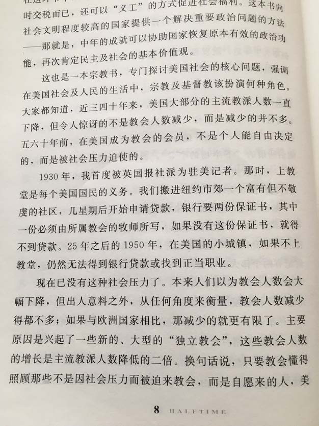

*2017-03-15 12:48 · 猫饭*

---

### 5728

新技术对传媒行业一直都很重要。转：1897年，商务印书馆成立后，即采用日本先进的活字印刷，很快成为中国出版业的领头羊。这项技术在中国一直使用至1955年。

*2017-03-15 12:22 · 手机上网*

---

### 5729

感觉和在家里摆个舵当装饰一样:) 转@ webto 买了一张黑胶，但是并没有设备听 ：）

*2017-03-15 12:05 · 手机上网 转自webto*

---

### 5730

去年purim节我正好在耶路撒冷，参观mobileye时还正好赶上他们在楼下搞purim节庆典，没感觉有这么狂野啊。当然，晚上那场我没去…… 转@ gravity0 酒要喝到无法辨认希伯来字母为止。

*2017-03-15 11:47 · 手机上网 转自gravity0*

---

### 5731

朋友给我寄来这么一本书-_-! 《人生下半场》？还是管理大师彼得德鲁克强力推荐？WTF!

*2017-03-15 11:23 · 猫饭*

---

### 5732

转@ 非處方藥 小时候，街坊问我们，长大了要娶个啥样的媳妇？

说，不知道。街坊问：要不给你说一个「呢子大氅双排扣，小皮鞋不怕沤，一根小辫梳在后」这样的？当时不解，说行。街坊们笑起来，才知道，这是说的母猪。然后记住了「双排扣」这个鲜明特征和形象比喻。转@ 拧巴人儿 @ 王兴

*2017-03-15 11:07 · 手机上网 转自非處方藥*

---

### 5733

朋友跟我说：美团的同学太牛逼了，DD（尽职调查）问说猪有两排奶头，但是猪躺着的时候，下一排的奶头怎么能吃到？XX的回答说：猪的奶头有八对，你把它们想成两排养乐多，喝完一排翻个身，再喝一排…

*2017-03-15 10:55 · iPhone版*

---

### 5734

《活在当下》的歌词让我进一步刷新了对黄秋生的认识。

*2017-03-15 10:17 · iPhone版*

---

### 5735

不管保持何种心态，什么时候你终于意识到自己或许不再那么年轻了？似乎感觉到前列腺的存在时？

*2017-03-15 10:04 · 手机上网*

---

### 5736

@ 疯以疯 一起加油:)

*2017-03-15 10:00 · 手机上网 给疯以疯的回复*

---

### 5737

真是一张任性的专辑。黄秋生唱股市，唱楼市，唱dylan的blowin，唱beyond的《海阔天空》，唱《将进酒》，唱徐志摩的《偶然》…… 转@ 王兴 听了一张奇怪的黄秋生专辑，就叫《bad taste》。粤语里和「大佬」对应的概念是「细佬」？

*2017-03-15 09:59 · 手机上网 转自王兴*

---

### 5738

听了一张奇怪的黄秋生专辑，就叫《bad taste》。粤语里和「大佬」

对应的概念是「细佬」？

*2017-03-15 09:32 · iPhone版*

---

### 5739

四年前我读不懂叶芝的《驶向拜占庭》。刚才又读了一遍，还是没找到感觉:( 留待他日。

*2017-03-15 00:31 · iPhone版*

---

### 5740

转@ 王兴 Business demands faith, compels earnestness, requirescourage, is honestly selfish, is penalized for mistakes, and is theessence of li

*2017-03-15 00:17 · 手机上网 转自王兴*

---

### 5741

难以想象，我居然完整念了一遍。转@ 飯否小字报 转@ 饭小执 请教@ 努尔哈欠 大师：这是不是湖建普通话？

*2017-03-14 23:28 · 手机上网 转自饭小执*

---

### 5742

佛教可以信，搜狗/百度百科别信。转@ 拿拿龙 王总，我看搜狗百科说你信仰佛教，真的？ 转@ 王兴 那部电影也给我极深刻的印象。考虑今年去一趟伊朗，据说已经是落地签了。去过的朋友说，宗教归宗教，关起门来，年轻人一样抽烟喝酒开派对，该玩就玩。转@ 圡人后来一提到告别这个词，总能想到那部

*2017-03-14 22:41 · 手机上网 转自王兴*

---

### 5743

那部电影也给我极深刻的印象。考虑今年去一趟伊朗，据说已经是落地签了。去过的朋友说，宗教归宗教，关起门来，年轻人一样抽烟喝酒开派对，该玩就玩。转@ 圡人 后来一提到告别这个词，总能想到那部《一次别离》转@ 沈倾欢 转@ 王兴

*2017-03-14 22:21 · 手机上网 转自王兴*

---

### 5744

《歌剧魅影》也属于我愿意再看的剧。转@ 王兴 《等待戈多》我大概不会去看第二遍了，《恋爱犀牛》或许还可以。

*2017-03-14 22:10 · 手机上网 转自王兴*

---

### 5745

意识到一件事情，我从来没有学会如何告别。

*2017-03-14 21:38 · iPhone版*

---

### 5746

没有人讨论web 1.0，也没有人讨论web 3.0，唯一流行过的概念是web 2.0。

*2017-03-14 21:28 · iPhone版*

---

### 5747

我有一句话，不知当说不当说？当作已经说过了吧。

*2017-03-14 18:43 · iPhone版*

---

### 5748

转@ 张亮 一位台湾影视业的同学在经历了新媒体冲击之后跟我说：「我现在充份体会了蒋介石面对毛泽东的感受。」

*2017-03-14 17:23 · 手机上网 转自张亮*

---

### 5749

因为以色列男子全都要服兵役，所以当年被编入哪类部队就像中国人读了什么大学一样成为一个标签。去年认识了一个号称当年被编入最精锐特种部队的互联网创业者，我没太动脑的问了一句：你这身板看起来也一般嘛？他对我一脸鄙夷：你以为现在打仗还主要靠肌肉吗？

*2017-03-14 16:00 · 手机上网*

---

### 5750

转@ 叶滨 说一个公司不接地气肯定是批评，说一个公司特别接地气其实也不是夸奖

*2017-03-14 15:42 · 手机上网 转自叶滨*

---

### 5751

转@ 非處方藥 就跟学弹琴一样，主要是老师的耳朵超级灵敏，能听得出学生听不出的错音。经老师指正且录下来反复听，学生才能有鉴别、有提高。转@ 王兴 转@ 叶滨 Apple Watch让我的游泳速度从一千米24分钟提高到22分钟。昨天请教练给我上了第三次游泳课，虽然仍然在纠正动作中，但教练

*2017-03-14 13:49 · 手机上网 转自叶滨*

---

### 5752

全世界一共有1073条渔船有合法捕金枪鱼的资格，这个牌照数量还在逐步缩减。据说最大的一家公司有35条船。

*2017-03-14 13:47 · 手机上网*

---

### 5753

转@ 叶滨 Apple Watch让我的游泳速度从一千米24分钟提高到22分钟。昨天请教练给我上了第三次游泳课，虽然仍然在纠正动作中，但教练说我的速度提高到21分钟是板上钉钉，20分钟也极有希望。其实他教的内容我之前都知道，我只是不知道自己的动作是错的而已……

*2017-03-14 13:44 · 手机上网 转自叶滨*

---

### 5754

不！要！拒！绝！年！轻！！！转@ 远骋 听了网易校招版本的「一人我饮酒醉」之后，旋律回荡在脑中挥之不去，很烦。。

*2017-03-14 10:31 · 手机上网 转自远骋*

---

### 5755

谢谢。转@ 常井项 @ 王兴 此后还可以看霍布斯鲍姆《民族与民族主义》《传统的发明》盖尔纳《民族与民族主义》（以上两人与安德森分别提出了三种不太一致的理论），格林菲尔德《民族主义 : 走向现代的五条道路》（此书理论较少，史实较多）。中国有关可读王明珂、葛兆光、葛凯等有关著作。

*2017-03-14 10:25 · 手机上网 转自常井项*

---

### 5756

well-being 这词中文一般翻译成「幸福/健康」，韦氏的释义是 thestate of being happy, healthy, or successful，从字面上看分明就是很形象的「你要好好的喔」。

*2017-03-14 09:55 · 手机上网*

---

### 5757

转@ 主公顶 起床了，全世界看我表演，要用心，棒棒哒。

*2017-03-14 09:19 · 手机上网 转自主公顶*

---

### 5758

刚才估计是困迷糊了，我说的不是《一步之遥》而是《让子弹飞》。

转@ 王兴 刚躺上床但还没来得及睡着的时候，突然想起来，觉得姜文的《一步之遥》确实很有意思。

*2017-03-14 02:45 · 手机上网 转自王兴*

---

### 5759

躺在黑暗中。所有的光芒都向我涌来。

*2017-03-14 02:37 · iPhone版*

---

### 5760

刚躺上床但还没来得及睡着的时候，突然想起来，觉得姜文的《一步之遥》确实很有意思。

*2017-03-14 01:56 · 手机上网*

---

### 5761

Benedict Anderson是爱尔兰人，1936年生于昆明，2015年死于印尼爪哇岛。转@ meadow 他在云南出生。不知这种经历是否对他有影响。王明珂的<<华夏边缘：羌在汉藏之间>>是对华夏民族建构论的最佳破解。转@ 王兴 看来确实得把本尼迪克特的《想象的共同体》读一下

*2017-03-14 01:42 · 手机上网 转自王兴*

---

### 5762

转@ 主公顶 谁没有过去。但不是谁都有未来。要承认这一点，非常不容易。

*2017-03-14 01:36 · 手机上网 转自主公顶*

---

### 5763

我只担心一件事，我怕我配不上自己所受的苦难。 -陀思妥耶夫斯基

*2017-03-14 01:32 · iPhone版*

---

### 5764

看来确实得把本尼迪克特的《想象的共同体》读一下。不然都没法跟人聊天了。

*2017-03-13 18:48 · iPhone版*

---

### 5765

《等待戈多》我大概不会去看第二遍了，《恋爱犀牛》或许还可以。

*2017-03-13 18:30 · 网页*

---

### 5766

转@ 叶滨 前几天正好和烟草行业的资深人士聊过，某任国家烟草专卖局局长就是前龙岩卷烟厂厂长。转@ 王兴 烟草这种专卖行业没啥新入局者吧。竞争的关键是获得更多配额。转@ 阳升 毛利高，上游供给与下游需求稳定，主要打竞对和新入局者，搞自动化既有动力又有钱？ 转@ 王兴 转@ denvi 自动化

*2017-03-13 18:24 · 网页 转自王兴*

---

### 5767

同震惊。转@ 阳升 那个视频看了几遍，居然当时没注意到 转@geeknow 有意思，最近很知名的辩论教授David Horowitz竟然是BenHorowitz之父。

*2017-03-13 15:29 · 手机上网 转自geeknow*

---

### 5768

不明觉厉。转@ terababy 汉字为什么好看，基础字件中60%以上是左右对称或上下对称。英文字母是50%对称。

*2017-03-13 13:00 · 手机上网 转自terababy*

---

### 5769

黄黑配色挺百搭的嘛。

*2017-03-13 11:58 · 手机上网*

---

### 5770

转@ 风雨如晦 情书啊，初中时候靠替人写情书挣了一年早饭，自豪的说，半个学校的情书出自我的手笔，那时候姑娘多傻，抄点叶芝雪莱就感动到落泪。不过情书虽然不是当事人的，看得出来，感情也是很真的。转@ 王兴 转@ Elgaaz 我大一的时候用手写的信给一个男孩子写情书，寄到他的学校，还提前翻

*2017-03-13 11:44 · 手机上网 转自王兴*

---

### 5771

转@ 小伙姓王 从初中开始就写信了吧，不过家书极少，主要都是跟女生。写信和收信一样美好。最近一次应该是上个月写的，收到对方回信，信里邀请我一起看爱乐之城。我觉得要是有好的信友，其实可以一直写。 转@ 王兴 我读大学时，父母还给我写过纸质的信。可惜我没有保存下来:(

*2017-03-13 02:07 · 手机上网 转自王兴*

---

### 5772

傻子没资格说这话，聪明人有资格选择是否说这话。转@ 勥的泥石流资本 善良比聪明更重要这种话当真是忽悠傻子的转@ 倒逆河流 RT@王兴 善良比聪明更重要。转@ 蒙大拿的小偷 如何确定 那套不是也在大海 转@ 我才是crow 追了她两年，每晚一封豆邮，在她告诉我有孕的那年生日

*2017-03-13 02:07 · 手机上网 转自王兴*

---

### 5773

善良比聪明更重要。转@ 蒙大拿的小偷 如何确定 那套不是也在大海 「@ 王兴 转@ 我才是crow 追了她两年，每晚一封豆邮，在她告诉我有孕的那年生日，把所有的豆邮重新排版，去买纸自制封面，找到印刷店，做成了《致青春》的上下两册。全球绝版，只有两套。一套在她那，一套我丢入了大海

*2017-03-13 01:49 · 手机上网 转自王兴*

---

### 5774

转@ 雷顿 一直坚持写信 和各路朋友都写过 中学时期写了好多 和没在一起的朋友 和论坛上认识的朋友 写信的习惯一直坚持到现在 / 恋爱的时候每年情人节都有认真写情书 后来我发现男友一直搁置情书都没看 后来我们分手了 转@ 王兴 我读大学时，父母还给我写过纸质的信。可惜我没有保存下来:

*2017-03-13 01:38 · 手机上网 转自王兴*

---

### 5775

转@ F_FAN 妈妈以前在学校工作，大概就是负责学校里面的报刊杂志和信件的派发。有一次，在邮差送过来的许多信件里面发现，有一个信封地址栏是这样写的：“寄给在天国的爸爸”，这封信我估计是因为寄不出去被退回来的。转@ 王兴 我读大学时，父母还给我写过纸质的信。可惜我没有保存下来:(

*2017-03-13 01:37 · 手机上网 转自王兴*

---

### 5776

转@ 我才是crow 追了她两年，每晚一封豆邮，在她告诉我有孕的那年生日，把所有的豆邮重新排版，去买纸自制封面，找到印刷店，做成了《致青春》的上下两册。全球绝版，只有两套。一套在她那，一套我丢入了大海。 转@ 王兴 我读大学时，父母还给我写过纸质的信。可惜我没有保存下来:(

*2017-03-13 01:37 · 手机上网 转自王兴*

---

### 5777

转@ 目光而已 我和初恋那会高中每次都是晚自习放学每天交换一张

纸条，持续1年半直到毕业，那些纸条都在我大一，她高复分手的时候她还给我了我写给她的那部分，我发了疯一样的把它们按日期整理起来，整理好没多久得了抑郁症，为此休学了半年旅行。转@ 王兴 我读大学时，父母还给我写过纸质的信。可惜

*2017-03-13 01:28 · 手机上网 转自王兴*

---

### 5778

转@ Amber能行 上小学的时候和妈妈不在一个城市，我们就约好，我每两周写一封信给她。她收到信，不仅给我回信，还把我寄给她的信中的错别字和文法错误都指出来，寄回给我。一来一回，刚好两周。转@ 王兴 我读大学时，父母还给我写过纸质的信。可惜我没有保存下来:(

*2017-03-13 01:22 · 手机上网 转自王兴*

---

### 5779

重要的不是当前的位置，而是方向和速度，以及加速度。

*2017-03-13 01:22 · 手机上网*

---

### 5780

转@ 小雨酱 高中有次月考考的很差，当时很难过的同时也害怕父母对自己失望，写了封信放妈妈床头，大致意思是努力读书是为了你们开心，如果不是你们我早去云南的小山村生活了（大概只是看了一米阳光）。妈妈约谈，不了了之。转@ 王兴 转@ 因循不觉韶光换 读大学时第一次离家，上学第一周每次和家里打

*2017-03-13 01:21 · 手机上网 转自王兴*

---

### 5781

转@ 常度 写过最长十页的情书邮寄，先在博客上打草稿。她给我写过一本日记式的「情书」，我拍下来存了个相册。转@ 王兴 我读大学时，父母还给我写过纸质的信。可惜我没有保存下来:(

*2017-03-13 01:18 · 手机上网 转自常度*

---

### 5782

转@ 因循不觉韶光换 读大学时第一次离家，上学第一周每次和家里打电话都哭的说不出话。后来我爸给我写了一封信，给我讲了他当初离家上学时的心路历程。这信我现在还收藏着。 转@ 王兴 我读大学时，父母还给我写过纸质的信。可惜我没有保存下来:(

*2017-03-13 01:17 · 手机上网 转自王兴*

---

### 5783

转@ Elgaaz 我大一的时候用手写的信给一个男孩子写情书，寄到他的学校，还提前翻他扣扣空间加了他哥们，让他哥们收信交给他以助我一臂之力 转@ 王兴 转@ 稀饭233 升高三时候，贴吧的朋友写信给我，我妈误以为我网恋说了我一通，我跑出家门，渴望逃离一切，但是速度很慢，希望被抓住同她和

*2017-03-13 01:11 · 手机上网 转自王兴*

---

### 5784

转@ 洪氏隐蔽青年 大学时，有一次我爸深夜喝醉酒回家还误伤了我妈，看在眼里觉得很不是滋味，于是熬了个通宵边抹着眼泪边给我爸

写了封信，偷偷放在客厅他手机边上。第二天一早他便出差了。事儿过后也从未有人提过这茬，许是忘了还是压根没看到呢。转@ 王兴我读大学时，父母还给我写过纸质的信。可惜

*2017-03-13 01:10 · 手机上网 转自王兴*

---

### 5785

转@ Captain追远 初三是和初恋前后座，从写试卷答案的小纸条到写句子，写心情，写感悟。从初中，高中，大学。直到有了一部诺基亚开始了无纸时代。她写给我的二十厘米高的信纸我还留着，我写给她的二十厘米她丢了。不过庆幸，她现在是我孩他妈了。 转@ 王兴 我读大学时，父母还给我写过纸质的

*2017-03-13 01:10 · 手机上网 转自王兴*

---

### 5786

转@ 春林同学 跟女朋友恋爱至今的书信还保存着，都是 A4 纸写的。RT@ 王兴 我读大学时，父母还给我写过纸质的信。可惜我没有保存下来:(

*2017-03-13 00:52 · 手机上网 转自王兴*

---

### 5787

转@ 许某某 和好朋友十多年的通信经历高中大学和工作几次搬家所幸大部分都保存了下来。真是不敢回忆初中的自己都在信里瞎扯些什么玩意儿～ 转@ 王兴 我读大学时，父母还给我写过纸质的信。可惜我没有保存下来:(

*2017-03-13 00:47 · 手机上网 转自王兴*

---

### 5788

转@ 四喜媛子 我16岁生日的时候我爸妈送我了一个本子，扉页写了一封信，被同寝室的同学拿去念然后整个寝室的同学都感动的哭了。后来一次偶然的机会我发现那封信是我爸在报纸上抄的。 转@ 王兴我读大学时，父母还给我写过纸质的信。可惜我没有保存下来:(

*2017-03-13 00:47 · 手机上网 转自王兴*

---

### 5789

转@ 稀饭233 升高三时候，贴吧的朋友写信给我，我妈误以为我网恋说了我一通，我跑出家门，渴望逃离一切，但是速度很慢，希望被抓住同她和解。第二天，她鬼鬼祟祟地写一封道歉信，又悄无声息地藏在我书包里。那个朋友和我妈的信就是我高三时候的鸡血。转@ 王兴我读大学时，父母还给我写过纸质的信

*2017-03-13 00:47 · 手机上网 转自王兴*

---

### 5790

转@ 景景景 去读大学时爷爷给我写的长信跟着我从杭州到剑桥到伦敦到上海 现在就躺在我双肩包里 转@ 王兴 转@ 七十八度非饮用 初中的时候我爸给我写过一封，当时看得泪唰唰的。我很郑重地珍藏起来了但是后来翻箱倒柜都找不着了。:( 转@ 王兴 我读大学时，父母还给我写过纸质的信。可惜我没有

*2017-03-13 00:33 · 手机上网 转自王兴*

---

### 5791

转@ 彩虹嫑 小学二年级学繁体数字写法了去银行开存折存钱，手写的单子交给柜台的大姐姐，每天存一块钱，坚持了很久，那对我来说是特别大的事儿，后来我妈就把存折拿去说她替我保管，今天看到这条才想起来。转@ 王兴 转@ 今天你开心吗 以前我把压岁钱放在沙发底下的小盒子里，后来我发现钱没了，问我

*2017-03-13 00:28 · 手机上网 转自王兴*

---

### 5792

被某饭友问了之后想到的。

*2017-03-13 00:23 · 手机上网*

---

### 5793

转@ 今天你开心吗 以前我把压岁钱放在沙发底下的小盒子里，后来我发现钱没了，问我爸他说拿去炒股了，我说为什么不告诉我一声就随便动我的钱，他把我骂了一顿说我怎么这么斤斤计较。那个周末我去银行办了我的第一张卡，那时候我高一。 转@ 王兴 转@ 小潘阿小时候藏在相框后面的压岁钱，有一天发现

*2017-03-13 00:16 · 手机上网 转自王兴*

---

### 5794

转@ 小潘阿 小时候藏在相框后面的压岁钱，有一天发现里面的钱没了，只剩爸爸写的借条：女儿，借点钱，以后还。很可惜，现在我爸不承认了，因为我拿不出那张借条。 转@ 王兴 我读大学时，父母还给我写过纸质的信。可惜我没有保存下来:(

*2017-03-13 00:12 · 手机上网 转自王兴*

---

### 5795

转@ 七十八度非饮用 初中的时候我爸给我写过一封，当时看得泪唰唰的。我很郑重地珍藏起来了但是后来翻箱倒柜都找不着了。:( 转@王兴 我读大学时，父母还给我写过纸质的信。可惜我没有保存下来:(

*2017-03-12 23:56 · 手机上网 转自王兴*

---

### 5796

几年前，在整理奶奶遗物时，我才有机会了解一点我们家族的历史，其中有几页我爸的日记，写于他很多年后好不容易找回我爷爷遗骨那天。

*2017-03-12 23:39 · 手机上网*

---

### 5797

转@ 小欢小欢 高三时有个成人礼，学校安排父母子女互相写信。那场面…哭成一片…根本控制不住转@ 王兴 转@ 月亮与六千万 中学吧跟我妈生气，好几周没跟她讲话，后来给我写信了。高一感恩节班主任安排写信，我妈后来说看到我的信都哭了。RT@ 王兴 我读大学时，父母还给我写过纸质的信。可惜我没有

*2017-03-12 23:28 · 手机上网 转自王兴*

---

### 5798

我小时候我奶奶眼睛还不花（在老花镜的辅助下），而我爷爷，在文革开始第一个月就去世了，我从没见过他，连我妈都没见过他。转@行行重行 @ 王兴 你奶奶眼睛不花吗？我奶奶爷爷很早去世了

*2017-03-12 23:27 · 手机上网 转自行行重行*

---

### 5799

那次校运会当天，我还参加了一场足球赛，我记不清是三千米之前还是之后了，但我记得我被中途换下场了。转@ 行行重行 看起来你身体很好啊转@ 行行重行 真好转@ 王兴 我事后才知道，当我高三参加校运会（3000米）时，我们全家都在边上看。但他们不想影响我，所以没有事先告诉我。

*2017-03-12 23:24 · 手机上网 转自王兴*

---

### 5800

小时候，我有一次真的惹奶奶生气了。后来我写了一封信，从她房门

的底下塞进去。

*2017-03-12 23:19 · 手机上网*

---

### 5801

转@ 月亮与六千万 中学吧跟我妈生气，好几周没跟她讲话，后来给我写信了。高一感恩节班主任安排写信，我妈后来说看到我的信都哭了。RT@ 王兴 我读大学时，父母还给我写过纸质的信。可惜我没有保存下来:(

*2017-03-12 23:17 · 手机上网 转自王兴*

---

### 5802

我事后才知道，当我高三参加校运会（3000米）时，我们全家都在边上看。但他们不想影响我，所以没有事先告诉我。

*2017-03-12 23:14 · 手机上网*

---

### 5803

转@ 超烦蜘蛛侠 高三学校办成人礼时要求家长都给学生写一封信。

我故意没告诉我爸妈，但是当天我妈还是托一个出租司机把信带到了我学校。那封信我都没敢看第二次:( 转@ 王兴 我读大学时，父母还给我写过纸质的信。可惜我没有保存下来:(

*2017-03-12 23:09 · 手机上网 转自王兴*

---

### 5804

这是啥年龄？转@ 行行重行 我小时候差点当了童养媳转@ 王兴 转：从市区到嵩口镇需要两个小时车程，警车沿着弯曲的山路，越爬越高。这个高山口的古镇还保留着大量的明清建筑和历史遗迹，许多古老的水井边，留有古代府衙刻下的石碑，上书“永禁溺女”。几百年来，这里重男轻女的观念已然深入民心

*2017-03-12 23:07 · 手机上网 转自王兴*

---

### 5805

不对，落款似乎只有我妈，没有我爸。但我宁愿相信是他俩一起写的。转@ 王兴 我读大学时，父母还给我写过纸质的信。可惜我没有保存下来:(

*2017-03-12 23:00 · 手机上网 转自王兴*

---

### 5806

我读大学时，父母还给我写过纸质的信。可惜我没有保存下来:(

*2017-03-12 22:59 · 手机上网*

---

### 5807

烟草这种专卖行业没啥新入局者吧。竞争的关键是获得更多配额。转@ 阳升 毛利高，上游供给与下游需求稳定，主要打竞对和新入局者，搞自动化既有动力又有钱？ 转@ 王兴 转@ denvi 自动化设备（机器人）应用最早，渗透率最高的，就是烟草行业。其次才是汽车等。 转@ 王兴 龙岩卷烟厂绝对是我

*2017-03-12 22:57 · 手机上网 转自王兴*

---

### 5808

转：从市区到嵩口镇需要两个小时车程，警车沿着弯曲的山路，越爬越高。这个高山口的古镇还保留着大量的明清建筑和历史遗迹，许多

古老的水井边，留有古代府衙刻下的石碑，上书“永禁溺女”。几百年来，这里重男轻女的观念已然深入民心，而像这样的山区农村，正是大多数被卖婴童的归处。

*2017-03-12 22:12 · 手机上网*

---

### 5809

转@ denvi 自动化设备（机器人）应用最早，渗透率最高的，就是烟草行业。其次才是汽车等。 转@ 王兴 龙岩卷烟厂绝对是我中小学时参观过的自动化程度最高的工厂，也远超我大学时参观过的联想北方制造厂。转@ 浪味仙不给你吃 就生活在附近，今年来很少闻到那个烟草味了转@ 王兴 昨晚听说龙岩卷

*2017-03-12 21:56 · 手机上网 转自王兴*

---

### 5810

饭否上居然有这么多龙岩人？转@ 吃土少女叶藏. 鄙公司自从改制后在职员工一直拿不过退休人员，嘤嘤嘤「@ 王兴 龙岩卷烟厂绝对是我中小学时参观过的自动化程度最高的工厂，也远超我大学时参观过的联想北方制造厂。转@ 浪味仙不给你吃 就生活在附近，今年来很少闻到那个烟草味转@ 王兴 昨晚听说龙岩

*2017-03-12 21:06 · 手机上网 转自王兴*

---

### 5811

握了一个著名酿酒师的手，异常强壮。

*2017-03-12 19:19 · iPhone版*

---

### 5812

今日最佳！转@ KaraKitap kill bill还致敬了一波王老板。 转@ 飯否小字报 转@ 王兴 美团外卖的衣服配色……

*2017-03-12 19:01 · 手机上网 转自王兴*

---

### 5813

在各种组合里，我最喜欢的公共洗手间的开门方式是进时拉，出时推。

*2017-03-12 18:20 · 手机上网*

---

### 5814

算不上官方解读。我只是刚才看到这张图觉得有点眼熟。美团外卖用袋鼠当logo我还参与了一次讨论，后来就都是小伙伴们搞的了。转@宇宙超级无敌聪明龙 哈哈哈哈哈哈官方解读 转@ 王兴 美团外卖的衣服配色……

*2017-03-12 18:02 · 手机上网 转自王兴*

---

### 5815

美团外卖的衣服配色……

*2017-03-12 17:55 · 手机上网*

---

### 5816

想起一个印度哥们说每个印度互联网创业者都应该掌握至少四种语言：印地语，英语，普通话，java。

*2017-03-12 17:50 · iPhone版*

---

### 5817

正确的视角确实相当于智商加20点。

*2017-03-12 17:35 · iPhone版*

---

### 5818

阳光如此明媚，思绪和柳絮一样飘扬。

*2017-03-12 15:45 · iPhone版*

---

### 5819

龙岩卷烟厂绝对是我中小学时参观过的自动化程度最高的工厂，也远超我大学时参观过的联想北方制造厂。转@ 浪味仙不给你吃 就生活在附近，今年来很少闻到那个烟草味了转@ 王兴 昨晚听说龙岩卷烟厂现在因为（没拿到足够配额导致的）开工不足已经变成在职员工收入不如已退休员工了。

*2017-03-12 15:31 · 手机上网 转自王兴*

---

### 5820

听说当年广发银行引入美国花旗当战略股东，花旗派了第五号人物来管，此君根据丰富的从业经验做了一个核心判断：为规避风险，不要做房贷业务。然后就没有然后了。

*2017-03-12 11:58 · 手机上网*

---

### 5821

惭愧。文中对当年奥斯曼帝国的三条路线（泛奥斯曼、泛突厥、小土耳其）的分析，我至今没看出破绽在哪里啊。转@ Patrick小白 王兴去的是假美国吗？转@ 飯否小字报 转@ 王兴 今天临睡前读到的《帝国、邦国与民族国家的想象》这篇长文让我大开眼界。

*2017-03-12 11:48 · 手机上网 转自王兴*

---

### 5822

生活强度。

*2017-03-12 11:33 · 手机上网*

---

### 5823

2015福建高校潜力排名（不知道具体啥逻辑）

*2017-03-12 11:29 · 手机上网*

---

### 5824

看完哪几本经典书籍大概能判断那个作者是不是骗子？转@ 小熊娃娃然而那个作者就是江湖骗子，真不明白为什么现在学术圈有点影响力的都是这种人…… 转@ 王兴 今天临睡前读到的《帝国、邦国与民族国家的想象》这篇长文让我大开眼界。

*2017-03-12 01:51 · 手机上网 转自王兴*

---

### 5825

今天临睡前读到的《帝国、邦国与民族国家的想象》这篇长文让我大开眼界。

*2017-03-12 01:40 · iPhone版*

---

### 5826

转：1901年，梁启超在《中国史叙论》中首次提出“中国民族”的概念，次年又在《论中国学术思想变迁之大势》中提出“中华民族”的概念。

*2017-03-12 01:01 · iPhone版*

---

### 5827

终于有人整理了一下，当韩国总统是多么危险啊。

*2017-03-11 11:58 · 手机上网*

---

### 5828

荀子说要「化性起伪」，这个伪字也很质朴，并非贬义，就是「人为」嘛。转@ pixyzul 质朴啊。 转@ 王兴 刚才想了一下，我其实不是很反感装逼，逻辑是：只要那方向是真牛逼，装着装着没准就像了会了甚至悟了超越了，多少有点进步的希望。远比装逼更糟糕的是以土以傻逼而自豪。

*2017-03-11 11:37 · 手机上网 转自王兴*

---

### 5829

刚才想了一下，我其实不是很反感装逼，逻辑是：只要那方向是真牛逼，装着装着没准就像了会了甚至悟了超越了，多少有点进步的希望。远比装逼更糟糕的是以土以傻逼而自豪。

*2017-03-11 10:56 · 手机上网*

---

### 5830

转@ 王球球的春天 中国退休人员工资都用来养孙子，个人消费很少，激不起社会仇恨 转@ 王兴 长此以往，国将不国。转@ 虎小北我能说我们单位的在职员工收入一直不如退休员工么？转@ 王兴 昨

晚听说龙岩卷烟厂现在因为（没拿到足够配额导致的）开工不足已经变成在职员工收入不如已退休员工了。

*2017-03-11 10:49 · 手机上网 转自王兴*

---

### 5831

长此以往，国将不国。转@ 虎小北 我能说我们单位的在职员工收入一直不如退休员工么？转@ 王兴 昨晚听说龙岩卷烟厂现在因为（没拿到足够配额导致的）开工不足已经变成在职员工收入不如已退休员工了。

*2017-03-11 10:31 · 手机上网 转自王兴*

---

### 5832

许多诗人写过梵高。梵高本人当年如果把他那疯狂的激情写成诗会是什么样呢？

*2017-03-11 10:24 · iPhone版*

---

### 5833

这毫无疑问是我见过的最有教育意义的广告牌。盈透威武！

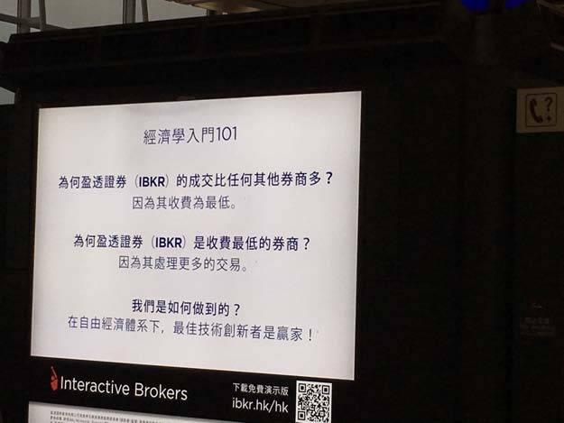

*2017-03-11 00:46 · 猫饭*

---

### 5834

《Like a Rolling Stone》和 Bob Dylan 都很伟大，但我打算把这歌从常听歌单里去掉，不适合老听。

*2017-03-11 00:24 · iPhone版*

---

### 5835

转@ 神经侍者 李白有“山随平野尽，江入大荒流” ，果然跟杜甫一对好基友转@ 王兴 突然注意到「星垂平野阔，月涌大江流」的「涌」

字用得很独特。

*2017-03-11 00:10 · 手机上网 转自王兴*

---

### 5836

竟然还有这么一说。转@ terababy 转：单用动词剥（bao）、削（xiao）合起来做书面语念作（boxue）。前者是北京本地音，后者是

当年占优势且据有官方地位的南京官话读音。这个现象叫“文白异读”。

*2017-03-10 23:51 · 手机上网 转自terababy*

---

### 5837

突然注意到「星垂平野阔，月涌大江流」的「涌」字用得很独特。

*2017-03-10 23:37 · iPhone版*

---

### 5838

最近观察到一个现象：吹捧和自我吹捧时，只要末尾加上「之一」，人们就毫无心理负担了。

*2017-03-10 23:25 · iPhone版*

---

### 5839

转@ szweig 可靠性是 MTTF（平均失败时间）和 MTTR（平均恢复时间）的结合结果。

*2017-03-10 17:35 · 手机上网 转自szweig*

---

### 5840

朴槿惠被弹劾下台了。二战后韩国元首无一善终的传统得以延续：被刺杀、自杀、被弹劾、被起诉……

*2017-03-10 11:00 · iPhone版*

---

### 5841

碰到一个英文名叫 hermes 的男子。

*2017-03-10 10:54 · iPhone版*

---

### 5842

筷子和餐刀配合确实差一些。叉子掉地上又懒得换有感。

*2017-03-10 10:48 · iPhone版*

---

### 5843

中国区分「八零后」和「九零后」，而且觉得两者实际差别不小，但老美似乎用一个 millenials 就全都概括了。

*2017-03-10 00:47 · iPhone版*

---

### 5844

转@ szweig dragon要被翻译成拽根，笑趴了。

*2017-03-09 15:58 · 手机上网 转自szweig*

---

### 5845

@ 拧巴人儿 这是松茸还是松露啊？

*2017-03-09 08:53 · 手机上网 给拧巴人儿的回复*

---

### 5846

转@ 王球球的春天 我对电视剧里看到的「人生三苦，撑船、打铁、卖豆腐」印象深刻，今早问了下门口卖豆腐的夫妇。早上四点半开工，晚上八点半下班，中间一直在干活。

*2017-03-09 08:53 · 手机上网 转自王球球的春天*

---

### 5847

刚才在车上沿京承高速驶离北京市区时，我不禁再一次感叹，望京soho不愧是大师杰作，在后视镜里看到也依然那么拉风，那么鹤立鸡群。

*2017-03-08 13:32 · 手机上网*

---

### 5848

师兄果然角度清奇。转@ 叶滨 而是把诺基亚搞破产# 选择对手很重要 # 转@ 王兴 乔布斯让苹果起死回生并一路成长为最有价值的公司并不是靠把微软搞破产。

*2017-03-08 13:22 · 手机上网 转自王兴*

---

### 5849

孟母三迁，是不是相当于每次都咬咬牙搬去房价更高但学区更好的地段……

*2017-03-08 13:21 · 手机上网*

---

### 5850

写得不错。另一只手呢？转@ musiccow 将安全带插销推至安全带出口，握紧插销和安全带，将安全带向斜上方缓慢拉出至手臂伸直，曲臂将锁扣插入插座，一气呵成 转@ 王兴 试了一下，单手系安全带并不容易。

*2017-03-08 12:36 · 手机上网 转自王兴*

---

### 5851

机场偶遇一队美女，服饰各不同。我过去围观，拿着摄像机的貌似工作人员的男子说这是三八节活动，大家可以上前去领个小礼物。我本来是奔着那叠小卡片去的，结果领头美女给我一支红玫瑰，我觉得逻辑不太通，于是转赠另一位美女，遂退去。

*2017-03-08 12:21 · 猫饭*

---

### 5852

made my day. 转@ 拧巴人儿 象得以贞！ 哈哈哈哈哈哈哈 转@ 回火星 为嘛不说交禽兽，而说交物?看来物是和人相对的。 转@ 中国大根 日狗日鸡日大象转@ 3.141592653 「@ 圡人 没看懂。转@ 中国大根 交于象？？？you sure？」

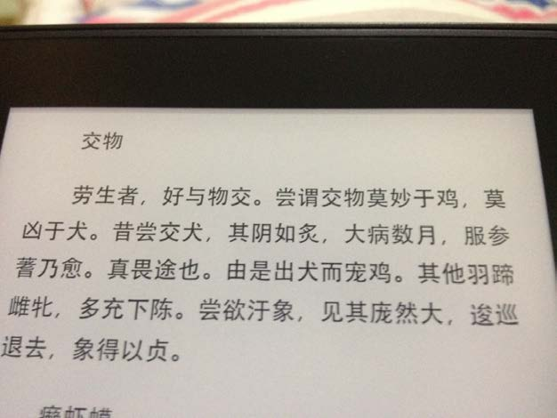

*2017-03-08 12:11 · 手机上网 转自中国大根*

---

### 5853

在贵国，诗人还活着，但诗歌已经死了，只剩下《一人饮酒醉》、《十年戎马心孤单》… 转@ 拧巴人儿 砍人那是顾城……转@ 二他姐姐 卧轨那是海子…「@ 小超 。。。真的啊 转@ Canson_R 啊，原来北岛还活着 」

*2017-03-08 12:01 · 手机上网 转自Canson_R*

---

### 5854

说实话，我一直觉得范思哲的风格非常山寨，没有品位。

*2017-03-08 11:56 · 猫饭*

---

### 5855

-_-! 转@ 拧巴人儿 砍人那是顾城……转@ 二他姐姐 卧轨那是海子…

「@ 小超 。。。真的啊 转@ Canson_R 啊，原来北岛还活着 」

*2017-03-08 11:46 · 手机上网 转自Canson_R*

---

### 5856

试了一下，单手系安全带并不容易。

*2017-03-08 11:35 · iPhone版*

---

### 5857

乔布斯让苹果起死回生并一路成长为最有价值的公司并不是靠把微软搞破产。

*2017-03-08 11:06 · iPhone版*

---

### 5858

昨晚听说龙岩卷烟厂现在因为（没拿到足够配额导致的）开工不足已经变成在职员工收入不如已退休员工了。

*2017-03-08 09:55 · iPhone版*

---

### 5859

古登堡计划里的那么多经典都已经免费十几二十年了。转@ 木之所兮转@ Roku. 「越来越多的付费问答、付费阅读让人感觉现在读个垃圾都得付费，反观kindle商店里面很多经典、古典著作反而是不要钱的。

知识经济浮躁到哪怕只懂得一点也要迫不及待地变现。 」

*2017-03-07 23:28 · 手机上网 转自Roku.*

---

### 5860

这朋友确定没数错？一千本书（非童书）可是能摆满整整一面墙的书架。转@ 阳升 有个朋友说她的娃已经读了上千本书，才三岁啊……确实是起跑线上就已经被彻底击溃——别说我的娃，就我自己现在豆瓣上读过的也才两百多本书啊……

*2017-03-07 23:17 · 手机上网 转自阳升*

---

### 5861

爸爸对家乡地理和历史的了解确实远非我可比拟。

*2017-03-07 23:05 · iPhone版*

---

### 5862

科恩的《Hallelujah》真是神曲！

*2017-03-07 09:10 · iPhone版*

---

### 5863

反思了一下，用 abrasive 形容我讨论业务时的说话风格恐怕并不冤枉我。

*2017-03-07 01:12 · iPhone版*

---

### 5864

历史书常常是这样：先是有一本告诉你，事是这么个事，理是这么个理；然后又有一本告诉你，事确实是这么个事，但是理不是这么个理，是另一个理；没准还会再冒出一本告诉你，搞了半天，其实事都不是这么个事……

*2017-03-06 18:04 · iPhone版*

---

### 5865

好久没用座机拨过号了。真复古的感觉！

*2017-03-06 15:20 · iPhone版*

---

### 5866

不好意思，虽然前者已经被房产广告等糟蹋得不行，我依然觉得很美好。转@ loso 感觉这种还有“面朝大海春暖花开”、“你若安好便是晴天”这些句子，都非常的潮湿。「@ 王兴 今天午饭吃得比较迟，一边咀嚼一边思考什么情况下我会说「岁月静好」……」

*2017-03-06 13:45 · 手机上网 转自王兴*

---

### 5867

今天午饭吃得比较迟，一边咀嚼一边思考什么情况下我会说「岁月静好」……

*2017-03-06 13:22 · iPhone版*

---

### 5868

看到一个挺狠的词：岁月静好婊。

*2017-03-06 13:01 · iPhone版*

---

### 5869

Stories only happen to those who are able to tell them. -PaulAuster

*2017-03-06 03:39 · iPhone版*

---

### 5870

打完一个近两小时的电话有感：最核心的东西往往是整理出来后很简单但是很不容易整理出来。

*2017-03-06 03:08 · iPhone版*

---

### 5871

我以前一直低估了核武器诞生的划时代意义：在那之前，几万年的人类历史乃至千百万年的生物历史里竞争法则基本上一直是「你死我活」；在那之后则变成「要死大家一起死」。

*2017-03-06 00:05 · 手机上网*

---

### 5872

跟一个比我大几岁的北大中文系毕业的互联网创业者吃晚饭，我好奇的问他的同学们都在干什么工作，答案是有三类：在机关里写公文，在媒体里写新闻，在大学里写论文。

*2017-03-05 20:23 · 手机上网*

---

### 5873

不要一味排斥嘛。很多年前我就懂了，出于学术目的搜「三点透视」

请用谷歌，出于X目的搜「三点透视」请用百度。转@ 柒小斤 珍爱生命、远离百度。转@ 阳升 同样搜“如何开瓶盖”，wikihow的页面在Google排第一，在百度排第三，第一的结果是 360doc的页面，内容copy自

*2017-03-05 17:53 · 手机上网 转自阳升*

---

### 5874

一大波绿芽正在从南到北占领中国。

*2017-03-05 17:49 · 手机上网*

---

### 5875

果然是外行看热闹，内行看门道。转@ qinyf 看了几集日剧《四重奏》，几个演员里，只有大提琴手的演员满岛光的动作是自然的，应该是会拉琴的。小提琴、中提琴的三位可能是为了拍戏现学的动作。

*2017-03-05 16:50 · 手机上网 转自qinyf*

---

### 5876

转：1970年春天，北岛和几个朋友在颐和园划船时，有位朋友在船头朗诵食指的诗，给他以强烈的震撼，随后他就开始了写诗。北岛的诗带有明显的悲观主义情绪，但其中包含的挑战宿命的信念却又坚定不移，给人一种绝望中诞生的勇气。

*2017-03-05 15:45 · iPhone版*

---

### 5877

刚才查了一下，南极也有极光。

*2017-03-05 15:35 · iPhone版*

---

### 5878

月球绕地球转一圈是一个月，地球绕太阳转一圈是一年，太阳在银河系里转一圈是2.25亿年。

*2017-03-05 15:28 · iPhone版*

---

### 5879

我觉得这个方案最好，但是应该做到操作系统级。转@ gravity0 手机屏幕小，重力感应自动旋转是关掉的。偶尔横过来用的时候就自己手工旋转屏幕：伸出两根手指作圆规式旋转就行了，或者用两根大拇指模仿方向盘转舵。

*2017-03-05 15:13 · 手机上网 转自gravity0*

---

### 5880

转@ 暖床先生 @ 王兴 苹果的静音按钮可以改为自动旋转的

*2017-03-05 15:12 · 手机上网 转自暖床先生*

---

### 5881

我就是希望省掉任何多余动作能直接一步到位，结果你跟我说assistivetouch-_-! 转@ 论猫的自我修养 Assistivetouch 可以把这个设置出来转@ 王兴 常常希望手机有个打开/关闭重力感应自动旋转的物理按键。

*2017-03-05 14:53 · 手机上网 转自王兴*

---

### 5882

常常希望手机有个打开/关闭重力感应自动旋转的物理按键。

*2017-03-05 14:49 · 手机上网*

---

### 5883

苹果市值约7000亿美元，谷歌接近6000亿，微软5000亿，亚马逊和facebook各4000亿，阿里和腾讯各2500亿。

*2017-03-05 14:21 · 手机上网*

---

### 5884

摩拜不是可以直接用微信小程序吗？转@ gravity0 刚才走在路上，看到一辆共享单车，心说没骑过不妨试试。扫码后下载的是一个叫应用宝的东西，不想装，算了。作为一个商家，自己的货还没卖出去前先捆绑第三方货品是有风险的。但作为一个广告商卖流量，这么干没问题。

*2017-03-05 13:51 · 手机上网 转自gravity0*

---

### 5885

今天凌晨时睡梦中想到一个东西，当时想挣扎着起来记下来，但是没有付诸实施，现在记不起来了，有点遗憾。

*2017-03-05 11:31 · iPhone版*

---

### 5886

随着人工智能的进展，人们开始讨论一个新概念：无用阶级。

*2017-03-04 17:38 · iPhone版*

---

### 5887

「尽信书不如无书」这道理没有错，但是在这个国家和时代，99.99%的人是读书太少而不是太多，所以再提就很不合时宜。打个比方，如果你跟一个快要饿死的非洲难民说「别吃太多肉，不然有胆固醇太高

的风险」，他但凡还有力气抬起手，一定要扇你一个大耳光。

*2017-03-04 11:02 · iPhone版*

---

### 5888

第一个给我发消息祝贺美团七周年的竟是曾经的对手。我相信现在他是真诚的希望在他们都退场之后，美团能推进实现这个行业未尽的理想。

*2017-03-04 00:14 · 手机上网*

---

### 5889

转@ cigarman @ 王兴 早年求证过美国人不吃淡水鱼类的问题，貌似主要原因是美国五大湖等淡水资源金属污染严重。不在乎的也照吃不顾。

*2017-03-03 18:03 · 手机上网 转自cigarman*

---

### 5890

温铁军教授在台上说：「世界淡水水产品70%产在中国，饲料起了很重要的作用。」 台下我身边一个行家补充说：另一个原因是美国人基本不吃淡水鱼。

*2017-03-03 17:57 · 手机上网*

---

### 5891

转：这，是我们行业的羞愧，也是我们行业的机会。

*2017-03-03 17:25 · 手机上网*

---

### 5892

城市可以这么分类：有两所好大学的、有一所好大学的、没有的……

*2017-03-03 16:42 · 手机上网*

---

### 5893

转@ 开口笑一个 是呀，老刘挺好的，作为校友还给我们高中每个教室捐俩空调，又在初中部好像是捐了栋楼吧，现在还整了个南京外国语分校回老家。京东在宿迁真的带动很多就业，在老家人眼里是蛮好的小伙子。 转@ 王兴 这种介绍方式挺有趣的：宿迁是个小地方，但是历史上出过两个厉害人物，一个是刘强东

*2017-03-03 16:34 · 手机上网 转自王兴*

---

### 5894

可能是《where do u go to》歌里提到的aga khan。转@ 二他姐姐听肉肉同学家长说，他们学校有些看上去像印度人的同学其实来自东非。他们是伊斯兰的伊斯玛仪派从印度迁居到东非的。70年代阿明执政，命令他们90天内离开乌干达。教派全球领袖阿迦汗四世和当时加拿大总理很熟

*2017-03-03 15:30 · 手机上网 转自二他姐姐*

---

### 5895

转@ 二他姐姐 听肉肉同学家长说，他们学校有些看上去像印度人的同学其实是来自东非。他们是伊斯兰的伊斯玛仪派（Ismaili，属什叶派）从印度迁居到东非的。70年代阿明执政，命令他们90天内离开乌干达。教派的全球领袖阿迦汗四世和当时加拿大总理很熟（就是现在总理他爹），很多人就作为难民

*2017-03-03 15:23 · 手机上网 转自二他姐姐*

---

### 5896

妥妥的名校啊。转@ webto 确实我和诺奖那位也是校友。有一种走过了凝重人生的错觉。。。

*2017-03-03 15:20 · 手机上网 转自webto*

---

### 5897

这初中校友还是挺牛逼的，可惜创业晚了一千多年。转webto 轮子祖师 RT@ 王兴 谁啊？转@ webto 长春也是个小地方，历史上出过最有名的人被屏蔽了 ♂ # 我和他是初中校友 # RT@ 王兴 这种介绍方式挺有趣的：宿迁是个小地方，但是历史上出过两个厉害人物，一个是刘强东

*2017-03-03 14:52 · 手机上网 转自王兴*

---

### 5898

谁啊？转@ webto 长春也是个小地方，历史上出过最有名的人被屏蔽了 ♂ # 我和他是初中校友 # RT@ 王兴 这种介绍方式挺有趣的：宿迁是个小地方，但是历史上出过两个厉害人物，一个是刘强东，另一个是项羽。

*2017-03-03 14:44 · 手机上网 转自王兴*

---

### 5899

这种介绍方式挺有趣的：宿迁是个小地方，但是历史上出过两个厉害人物，一个是刘强东，另一个是项羽。

*2017-03-03 14:12 · 手机上网*

---

### 5900

只能祈祷离报废还很远很远，最好大修也不要有。转@ faraway 感觉今天是王老板的返厂检修和保养日 转@ 王兴 3M的材料还是牛逼的，生活中无处不在。刚才补牙有感。

*2017-03-03 12:23 · 手机上网 转自王兴*

---

### 5901

电影真有这么大影响力？转@ quux 因为 Arrival 这个电影，今年北美各个知名的语言学专业招生爆满

*2017-03-03 12:11 · 手机上网 转自quux*

---

### 5902

3M的材料还是牛逼的，生活中无处不在。刚才补牙有感。

*2017-03-03 12:10 · 手机上网*

---

### 5903

检查完心电图，医生说一切正常，我问「这回没有窦性心律不齐了？」他回答「哦，那个啊，一般三十岁之后就不会有了。」听得我心里有一股淡淡的忧伤……

*2017-03-03 11:45 · 手机上网*

---

### 5904

讲究！我的同类需求也没有得到很好满足。转@ 太空小孩 为了找一个能实现「把多张截图纵向自动拼接在一起」的 App，前后下载了 16个 App，把 App Store 同类产品都下载齐全了都没找到一个都能完

美使用的，最后还是买了个 18 块钱的才解决问题。这个市场太不饱和了。

*2017-03-03 10:58 · 手机上网 转自太空小孩*

---

### 5905

从客户体验的角度出发，我还是希望检查口腔时医生戴的是那种淡蓝色很贴的乳胶手套，而不是那种窸窸窣窣吃小龙虾时戴的塑料手套。

*2017-03-03 10:17 · 手机上网*

---

### 5906

刚才，小护士一边把病历递给医生一边说「给您，主人」，我在旁边愣了一下，过了几秒钟才回味过来她说的是「主任」。我这是因为要空腹体检而有点饿得恍惚了吗-_-!

*2017-03-03 09:49 · iPhone版*

---

### 5907

年度大考。

*2017-03-03 09:07 · iPhone版*

---

### 5908

本土精品超市起名叫 Jenny Lou's 本来体现出很不错的营销感觉，后来闹分家分出一家叫 Jenny Wang 也还勉强凑合吧， Jenny Wang还坚持要把创始人河南大姐的头像印在每个门头上就属于昏了头。

*2017-03-03 08:35 · iPhone版*

---

### 5909

转@ 拧巴人儿 文胸改的吗… 转@ 二他姐姐 现在船袜都进化成这样啦

*2017-03-03 07:51 · 手机上网 转自二他姐姐*

---

### 5910

转@ 叶滨 昨晚见一位做线下连锁店的高人，让他推荐一些相关的书，他给出的竟然是钱穆的“中国历代政治得失”和汉密尔顿的“联邦党人文集”。追问推荐理由，他从科斯定理说起：连锁店跨地域经营导致企业内部的信息获取成本大幅度增加，当其超过了企业外部的交易成本，这就是中央和地方的边界所在

*2017-03-02 12:05 · 手机上网 转自叶滨*

---

### 5911

@ 颜廷旭 welcome!

*2017-03-02 11:47 · 手机上网 给颜廷旭的回复*

---

### 5912

老祖宗孙子说：「百战百胜，非善之善者也。不战而屈人之兵，善之善者也」。我只是有点好奇：历史上可曾有人不经历前一阶段而达到后一阶段？

*2017-03-02 03:25 · iPhone版*

---

### 5913

闪电战，持久战，歼灭战。

*2017-03-02 02:18 · iPhone版*

---

### 5914

用惯了iPad Pro，再用macbook时老是情不自禁拿手指去戳屏幕……

*2017-03-01 17:41 · iPhone版*

---

### 5915

我后来才逐渐意识到，那些没参与（或至少长期认真关注）过足篮球等对抗性团队竞技的人多半不能真的理解「下半场」的含义，至少是没有体会过下半场开始时你踏入赛场那一刻体内的各种激素是如何涌动的。

*2017-03-01 15:18 · 手机上网*

---

### 5916

姜还是老的辣-_-! 转@ 柒小斤 只要套路深……

*2017-03-01 14:58 · 手机上网 转自柒小斤*

---

### 5917

转@ 很吃惊 有啊 谷歌地图上没有建筑物的地方都是厕所转@ 强叔.

问问有没有APP可以在印度找厕所。转@ 王兴 今年无论如何要去趟印度了。

*2017-03-01 14:54 · 手机上网 转自王兴*

---

### 5918

纠结于「星象」和「星相」哪个更正确时，我问了饭否上的一个业余专家，被告知：两者都对，不是一回事。

*2017-03-01 14:50 · 手机上网*

---

### 5919

在QQ音乐里听了大半天各版本的《歌剧魅影》，男声都不够霸气。

*2017-03-01 14:47 · 手机上网*

---

### 5920

还没花开，北京已经春暖得不适合穿羊毛袜了，哪怕是很薄的那种。

*2017-03-01 14:33 · 手机上网*

---

### 5921

理性的早期投资人至少还分两派：天体物理学家和化学家。

*2017-03-01 13:56 · 网页*

---

### 5922

或直接撸一管葡萄糖？转@ .rex 转@ 火柴阿萌 醫生說我有低血糖 需要幾句甜蜜的話

*2017-03-01 13:02 · 网页 转自火柴阿萌*

---

### 5923

平时工作时保持类似专业运动员训练时的状态即可，不要试图保持比赛时的状态。

*2017-03-01 13:01 · 网页*

---

### 5924

10点半一直忙到26点半。

*2017-03-01 02:37 · iPhone版*

---

### 5925

我感觉小扎的政治抱负类似于投资圈的paul graham而非michaelmoritz。

*2017-02-28 14:12 · iPhone版*

---

### 5926

今晚又认识了一个娶了中国老婆（成都姑娘）的印度人。他坚持认为，虽然中华美食五花八门，但花样还是不如印度多。

*2017-02-27 23:57 · 手机上网*

---

### 5927

转@ terababy 说一个自己的笑话，第一次看到羍这个字，解释是小羊羔，直接懵逼，明明是大羊嘛！后来张明白了，原来是人能抱的起的羊。不要怪我望文生义啊。

*2017-02-27 21:51 · 手机上网 转自terababy*

---

### 5928

转@ webto 圡大了，Manchester-by-the-sea 是地名。

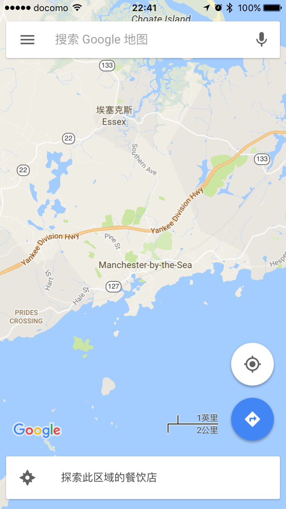

*2017-02-27 21:50 · 手机上网 转自webto*

---

### 5929

今年无论如何要去趟印度了。

*2017-02-27 11:51 · 手机上网*

---

### 5930

有一本波澜壮阔的专讲石油历史的书叫The Prize.转@ 拧巴人儿 中东地区最早发现石油的地方其实是伊朗。D'Arcy concession把开采权以极低的价格卖给了一个british australian. 但是当时世界还没有普遍进入蒸汽时代。一战之后石油的重要性才真正显现。

*2017-02-27 09:05 · 手机上网 转自拧巴人儿*

---

### 5931

在机场打广告的这家医院名字起得有意思。

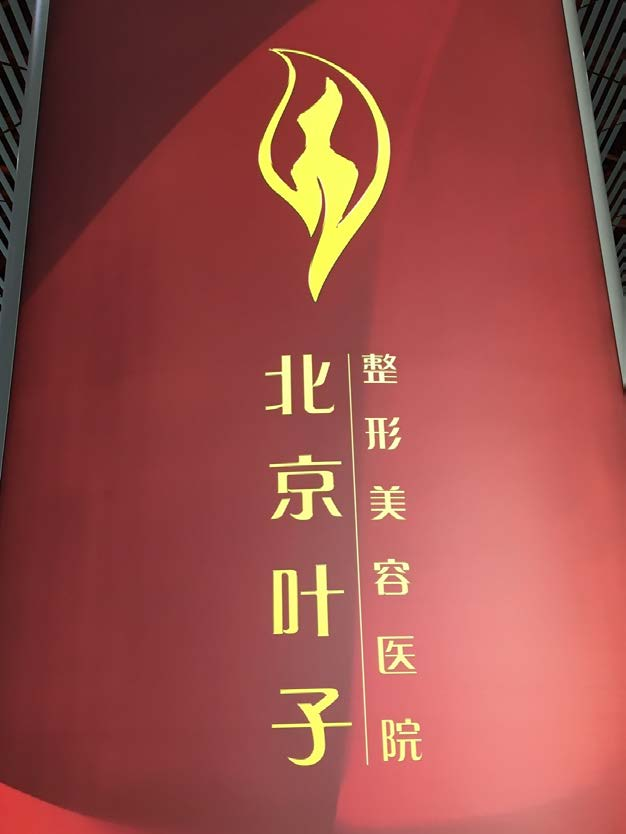

*2017-02-27 08:11 · 猫饭*

---

### 5932

made my day. 转@ terababy 三十五年，楚伐随。随曰：“我无罪。

”楚曰：“我蛮夷也。”

*2017-02-27 08:07 · 手机上网 转自terababy*

---

### 5933

好像是真的… 转@ 拧巴人儿 自由女神像本来是给埃及设计的，为了庆祝苏伊士运河的开通。但是埃及显设计太老套，不要……

*2017-02-27 08:01 · 手机上网 转自拧巴人儿*

---

### 5934

刚发现我的裤兜底部居然有个洞。幸好我现在也没啥小东西会放裤兜里。

*2017-02-27 07:49 · iPhone版*

---

### 5935

首都机场的日上免税店也支持微信支付了。

*2017-02-27 07:15 · iPhone版*

---

### 5936

飞行员和空姐们果然和我一样总结出搭乘机场轨道车的小窍门：等车时尽量往远端走。

*2017-02-27 06:54 · iPhone版*

---

### 5937

差点又把kindle落飞机上了:( 幸好空姐及时发现并在我刚上摆渡车的时候追过来还给我了。真得谢谢她！

*2017-02-27 06:40 · iPhone版*

---

### 5938

别瞎起哄。我用本地的网约车app除了测试一下，另一个原因是我这回从到达此地到离开从头到尾身上一分钱当地货币都没有，电召车不能刷卡不就糗了？转@ cigarman @ 王兴 就宰你们这群互联网大佬的肥羊。国外叫车不是电召主流吗？

*2017-02-26 22:01 · 手机上网 转自cigarman*

---

### 5939

我的切身体会是：在异国他乡用app约车去机场的用户基本上就是羔羊，被宰了都不知道自己是否被宰了。

*2017-02-26 21:53 · 手机上网*

---

### 5940

-_-！转@ gravity0 手慢没拍下来。刚才对面一辆摩拜伸出四条腿，骑到跟前才看清前面握把蹬车的女生屁股腾空，坐垫上的男生扶着她腰双腿下垂。这样也可以。感觉这种场景应该是在印度阅兵式上。

*2017-02-26 15:29 · 手机上网 转自gravity0*

---

### 5941

长见识！摩门教威武… 转@ 拧巴人儿 原来汤加是世界上摩门教人口百分比最高的国家啊……还有传言说盐湖城的摩门教总舵有意向把汤加打造成世界上第一个摩门教国家……

*2017-02-26 15:28 · 手机上网 转自拧巴人儿*

---

### 5942

新加坡人认为geography, demographics, technology这三样东西决定了一个国家的未来。

*2017-02-26 15:28 · iPhone版*

---

### 5943

如果综合考虑花样丰富和出品优良，我目前还是会把港岛香格里拉的早餐排在第一位。

*2017-02-26 10:03 · 手机上网*

---

### 5944

-_-! 转@ 小熊娃娃 中超现在这名字，广州恒大淘宝vs江苏苏宁易购……

*2017-02-26 09:07 · 手机上网 转自小熊娃娃*

---

### 5945

搞互联网金融的老外真会造概念，HENRY: high earners, not richyet.

*2017-02-26 00:32 · iPhone版*

---

### 5946

这个角度不错。转@ 杨曜睿 见贤思齐这个词很有趣。。人可能以为重在思齐，其实重点是见贤。。思齐或说学习是个自然行为。

*2017-02-25 22:51 · 手机上网 转自杨曜睿*

---

### 5947

造了一个缩写来提醒自己：TLT.

*2017-02-25 21:34 · iPhone版*

---

### 5948

michael moritz总是穿彩色袜子，这算是保持一点有别于傻大黑粗美国佬的英伦风？这个老头是真正阅人无数，确实厉害，平均见两次总能给我一点启发。这回是：every minute和you just know when youwalk in the door.

*2017-02-25 21:26 · iPhone版*

---

### 5949

我问一个印度创业者，google和facebook这两座掌握流量的大山做事fair吗？他毫不犹豫的回答：只是表面上如此罢了，其实……

*2017-02-25 20:57 · 手机上网*

---

### 5950

新加坡是个很小的国家，是个很大的城市。

*2017-02-25 19:18 · 手机上网*

---

### 5951

历史上都是被逼的！地貌是八山一水一分田，在农业社会时代不往外跑不下南洋就有很大概率吃不上饭。。转@ 拧巴人儿 福建的胖友们真是爱移民啊。有闯天下的意识

*2017-02-25 17:18 · 手机上网 转自拧巴人儿*

---

### 5952

小时候在我爸书架上翻到过此书，看不下去…… 转@ szweig 喲 转@slfeng 刚买了这本书 转@ 湿湿小姐姐 转@ 小吃轮 到现在为止，觉得把暗恋描写得最淋漓尽致的，还是《一个陌生女人的来信》。

*2017-02-25 17:15 · 手机上网 转自小吃轮*

---

### 5953

我之前知道印度的社会很分裂，但是当我听说连班加罗尔这样的科技中心城市的警察也多数不会英语，所以当地的IT从业者如果没有中间人很难跟警察沟通时，我还是被震惊了。

*2017-02-25 17:02 · 手机上网*

---

### 5954

所以需要人工智能之类的技术降低成本以便让更多人能享受到这样的服务啊。转@ 道山路车神 厅局级以上行政序列就带有这些功能… 转@ 王兴 有什么酒店做到了这点吗：你从房间一出来，系统就感知到了并开始调度电梯，当你走到电梯间时已经有一部电梯开着门迎接你，你直接走进电梯再按目标楼层即可。

*2017-02-25 14:52 · 手机上网 转自王兴*

---

### 5955

昨天碰到的韩国公司那俩创始人帅得很相似。今天聊起来，他们跟我说他们是双胞胎。可是，一个明显比另一个高半个头啊…

*2017-02-25 14:46 · iPhone版*

---

### 5956

昨天我在台上提了一下relentless这个词。刚才一个印度创业者跟我说：你知道吗？www.relentless.com 是指向亚马逊的。

*2017-02-25 09:52 · iPhone版*

---

### 5957

有什么酒店做到了这点吗：你从房间一出来，系统就感知到了并开始调度电梯，当你走到电梯间时已经有一部电梯开着门迎接你，你直接走进电梯再按目标楼层即可。

*2017-02-25 09:41 · 手机上网*

---

### 5958

转@ 唐喵 转自某次看到的科普……参照民国十七年《国语罗马字拼音法式》中“单元音上声双写”的规则，定为shaanxi，这个aa等于ǎ。【国语罗马字音调表示法：妈ma麻mar马maa骂mah，通tong同torng筒toong痛tonq】「@ 飯否小字报 转@ 王兴 碰到一个华人创业者，

*2017-02-24 22:33 · 手机上网 转自王兴*

---

### 5959

碰到一个华人创业者，我问他为什么姓Maa而不是Ma，他一脸无辜的说：当年我爸从台湾登陆美国，美国海关的人填表时不知道为什么多加了一个a……

*2017-02-24 17:35 · iPhone版*

---

### 5960

韩国的创业者怎么长这么帅？是不是整过啊？

*2017-02-24 16:45 · iPhone版*

---

### 5961

台上一对一访谈红杉少当家Roelof（南非人，斯坦福没毕业就进paypal）。主持人照例狂吹一通所谓paypal黑帮创业如何如何牛并试图探求原因。话筒传给台下坐着的红杉前当家moritz（当年paypal董事），老头一句话就终结了讨论：如果那帮人真牛成那样，当年为啥卖给ebay？

*2017-02-24 14:53 · 手机上网*

---

### 5962

问题是一些印度人还嫌美国人有口音。转@ webto 不只一个美国同事表示过听不懂印度人说什么 ♂ 转@ 王兴 听了一个印度创业者的演讲。他用自学成才的英语说起话来比华少还快…… 而且气还特长……

我基本崩溃了

*2017-02-24 14:36 · 手机上网 转自王兴*

---

### 5963

那个印度佬讲完后换正常美国佬上台，听起来就像视频按了「慢进」

一样。

*2017-02-24 14:34 · 手机上网*

---

### 5964

听了一个印度创业者的演讲。他用自学成才的英语说起话来比华少还快…… 而且气还特长…… 我基本崩溃了

*2017-02-24 14:28 · 手机上网*

---

### 5965

至少有一条我就没做到：不要吃东西时拿着手机戳戳戳…… 转@ 王兴说实话，我觉得我其实一直没有完全掌握一个技能：很得体的吃一顿花样丰富的自助早餐。

*2017-02-24 09:17 · 手机上网 转自王兴*

---

### 5966

说实话，我觉得我其实一直没有完全掌握一个技能：很得体的吃一顿花样丰富的自助早餐。

*2017-02-24 09:07 · iPhone版*

---

### 5967

万达为什么非要搞一个「万达文华」的高端酒店品牌呢？有「文华东方」在前，这样命名显得很不高级。

*2017-02-24 08:11 · iPhone版*

---

### 5968

转@ 拧巴人儿 ewwwwwwwwwwwww!!!!!!转@ 努尔哈欠 草莓身上那些黑点真的是种子，看，发芽了！

*2017-02-24 07:28 · 手机上网 转自努尔哈欠*

---

### 5969

多谢！转@ 论猫的自我修养 @ 王兴 粤语就同gin发音一样呀

*2017-02-24 00:13 · 手机上网 转自论猫的自我修养*

---

### 5970

离开校园十几年后我才逐渐体会到：导师帮研究生确定合适的选题就是最大的帮助。

*2017-02-24 00:11 · iPhone版*

---

### 5971

刚才边检的队伍真是长得邪门。我曾经一度以为时间很充裕，后来见势不妙，过了安检后连皮带都来不及系上，一手拽着皮带，一手拖着箱子，拔腿就跑。

*2017-02-24 00:02 · 手机上网*

---

### 5972

为什么会用「毡酒」来翻译 gin 呢？音译「金酒」或意译「杜松子

酒」我都可以理解。

*2017-02-23 23:59 · 手机上网*

---

### 5973

大哥：你可以找找许han。我：哪个han？他：哥舒翰的翰。我：哦。

*2017-02-23 23:45 · 手机上网*

---

### 5974

我猜阿甘是没有可以言说的所谓初心的。所以，他想跑就开始跑了，跑着跑着不想跑就不跑了。

*2017-02-23 23:31 · 手机上网*

---

### 5975

没有所谓初心是不是也是一种初心？

*2017-02-23 23:08 · 手机上网*

---

### 5976

小心得：拉杆箱一定要确保轮子顺滑，这样关键时刻就不会拖慢你在机场狂奔的速度。

*2017-02-23 23:03 · 手机上网*

---

### 5977

逐渐养成一个习惯：去一个陌生城市前先把它的那篇维基百科通读一遍；如果是异国城市，就把那个国家的维基百科也读一遍。

*2017-02-23 21:03 · iPhone版*

---

### 5978

上海民风真不错。我前两天下出租车时把名片夹掉地上了，被骑车经过的人捡到，他根据名片上的手机号主动短信联系到我并把名片夹寄还给我，里面的信用卡/驾照/一张备用百元钞都原封不动。

*2017-02-23 16:17 · 手机上网*

---

### 5979

刚才碰到一个用华为P9的朋友，他也对此次固件升级赞不绝口。转@肥在 转@ 诗文 转@ 王兴 简直像是换了部新手机。转@ 王兴 （至少暂时）流畅了许多。转@ 王兴 把华为mate8的固件升级到EMUI5.0（安卓7.0）了。

*2017-02-23 14:46 · 手机上网 转自王兴*

---

### 5980

转@ 拧巴人儿 我问莫扎特，住在中国有没有改变你？ 他说， "yes, Igot older."

*2017-02-23 09:17 · 手机上网 转自拧巴人儿*

---

### 5981

回想一下，我今天的主要工作成果是凌晨醒了但还没起床的时候躺着胡思乱想杜撰了一个英文单词品牌名，虽然很可能最后不会被采用。

*2017-02-22 01:08 · iPhone版*

---

### 5982

每下一场雪，「绿蚁新醅酒，红泥小火炉。晚来天欲雪，能饮一杯无」或至少后两句就会在朋友圈或其他社交媒体里频繁出现。

*2017-02-22 00:51 · iPhone版*

---

### 5983

1949年12月6日，毛泽东从北京西直门火车站启程前往莫斯科为斯大林庆祝七十大寿。1950年2月17日，毛泽东离开莫斯科回国。

*2017-02-22 00:46 · iPhone版*

---

### 5984

开了一晚上会确实有点累，但是看到今晚来晋升答辩的几位同事都确实不错，还是由衷的为他们感到高兴。

*2017-02-21 23:25 · iPhone版*

---

### 5985

信用卡真是一个看起来简单，其实设计精巧甚至有点邪恶的产品。

*2017-02-21 20:25 · iPhone版*

---

### 5986

转@ 阳升 互联网产品容易被滥用/盗用/攻击，为保证安全，设计者们经常不得不牺牲一部分用户体验。牺牲了多少，就很容易看出来一家公司是否真的有用户体验第一的基因。我们应该向冈本学习：保证安全的前提下，用户体验尽可能不打折——我决定命名为安全001法则

*2017-02-21 09:08 · 手机上网 转自阳升*

---

### 5987

招行挂失信用卡居然要收60元手续费。

*2017-02-21 01:17 · iPhone版*

---

### 5988

刚才过机场安检的时候突然想，如果我去干几天拿着金属探测器给乘客搜身的工作，对生活会有什么新的感悟吗？

*2017-02-20 19:55 · iPhone版*

---

### 5989

真会玩！转@ gravity0 三十五刀跑四十五分钟，带上摄影师。

*2017-02-20 15:00 · 手机上网 转自gravity0*

---

### 5990

喜欢听张悬的饭友们，你们推荐她的什么歌？谢谢

*2017-02-19 18:17 · iPhone版*

---

### 5991

转@ 老虎 我大一回家在火车上碰到位军官，也是如此，猛抽烟，不搭理我了。转@ riomma 转@ 王兴 转：16年前，在当时公司与其他部门某朱姓同事合作谈业务，无意之间得知他参加过自卫反击战，想与他聊聊战场的情况，他沉思片刻静静、淡淡的说了一句，“我们都不愿意聊这个”，那种气氛那种情绪

*2017-02-19 08:16 · 手机上网 转自王兴*

---

### 5992

转@ queerq 普华永道2月8号发布的2050报告说：中国将在2030年前成为全球最大经济体印度到2050年将超越美国，成为全球第二大经济体；同时，印度尼西亚将会超越日本及德国，成为全球第四大经济体♀「@ 王兴 有个说法是，印度在2020年就会超越德国，成为仅次于美中日

*2017-02-19 08:16 · 手机上网 转自王兴*

---

### 5993

这是什么情况？我司开会大聚餐时竟然放小虎队的歌？已经这么中老年化了么？-_-!

*2017-02-18 19:02 · iPhone版*

---

### 5994

转：16年前，在当时公司与其他部门某朱姓同事合作谈业务，无意之间得知他参加过自卫反击战，想与他聊聊战场的情况，他沉思片刻静静、淡淡的说了一句，“我们都不愿意聊这个”，那种气氛那种情绪，至今难忘。--《比利.林恩的中场战事》观后感

*2017-02-18 10:55 · iPhone版*

---

### 5995

一个持续长大的鸡肋。

*2017-02-18 10:19 · iPhone版*

---

### 5996

按说这算是标注得很清楚了，但我还是搞不明白哪个是哪个，只能逐个开关试一试。

*2017-02-18 00:57 · 猫饭*

---

### 5997

再过两年就不惑了？我觉得没戏。

*2017-02-18 00:19 · 手机上网*

---

### 5998

有个说法是，印度在2020年就会超越德国，成为仅次于美中日的世界第四大经济体，到2030年估计就会超越日本成为第三。

*2017-02-17 19:00 · 手机上网*

---

### 5999

-_-! 转@ Frankiiee 今天公司治理课上教授介绍意大利主流企业管理层年龄结构，让我们猜80岁以上的CEO占多少，我报了个10%，结果答案是令人震惊的25%。

*2017-02-17 18:54 · 手机上网 转自Frankiiee*

---

### 6000

为什么「我们的征途是星辰大海」这种话流行了这么多年。

*2017-02-17 12:34 · iPhone版*

---

### 6001

启用今天第二个茶包。

*2017-02-17 12:07 · iPhone版*

---

### 6002

同感兴趣这个问题。转@ webto 话说微信占浏览器市场多少份额？

*2017-02-17 08:40 · 手机上网 转自webto*

---

### 6003

虽然我依然不打算通过这个陌生人的微信加好友请求，但是他的签名档吸引了我的注意力：伟大的设计不需要伟大的设计者。

*2017-02-16 18:11 · iPhone版*

---

### 6004

全国人口中有0.79%有前科，有万分之一点五是在逃犯。

*2017-02-16 16:13 · iPhone版*

---

### 6005

「废寝忘食」里的忘食可以解释为忘了要吃饭，可以解释为忘了是否已经吃过了或者忘了吃了什么东西。

*2017-02-16 13:33 · iPhone版*

---

### 6006

赞学无止境！转@ 叶滨 在Youtube上学习了自由泳的High ElbowCatch， 原来现在流行的泳姿和我大学期间学的已经很不同了。这两天试试，看看速度能不能提高。 http://t.cn/RJW7K6D

*2017-02-15 21:47 · 手机上网 转自叶滨*

---

### 6007

转：丫头养的---丫挺的---丫的----丫，论北京话的语流音变……

*2017-02-15 12:28 · iPhone版*

---

### 6008

转：If you are not embarrassed by the first version of yourproduct, you waited too long.

*2017-02-15 10:42 · iPhone版*

---

### 6009

canon的旋律也是百听不厌。

*2017-02-15 09:39 · 手机上网*

---

### 6010

简直像是换了部新手机。转@ 王兴 （至少暂时）流畅了许多。转@王兴 把华为mate8的固件升级到EMUI 5.0（安卓7.0）了。

*2017-02-15 09:33 · 手机上网 转自王兴*

---

### 6011

为什么你打算「今年赚1000万」而不是「明天赚3万」或「下周赚20万」？转@ 王球球的春天 作为一个失业的缺金缺时间的母亲，朋友会怜悯我，邀请我加入他们的公司，不过我差不多都已今年打算赚1000万结束谈话。贴心的朋友们会觉得我疯了，可是我是真的认真的在思考啊。有好项目，都扔过来啊

*2017-02-15 09:17 · 手机上网 转自王球球的春天*

---

### 6012

这么多年过去了，beyond的《海阔天空》依旧是首好歌。

*2017-02-15 09:12 · iPhone版*

---

### 6013

Life is a drug that stops working. -Leonard Cohen

*2017-02-15 08:18 · iPhone版*

---

### 6014

阿富汗抵抗武装对一波接一波用科技装备起来的入侵者的态度是：你们可能有手表，但我们有时间。

*2017-02-15 06:50 · iPhone版*

---

### 6015

作为一个生在长在「福建前线」的人，我要感谢中央给福建的这个战略定位，这让福建成了全国森林覆盖率最高的省份。转@ 拧巴人儿王震讲话。“本来是我不大喜欢的一个儿子……” 这爹当的……

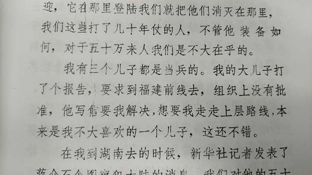

*2017-02-15 06:28 · 手机上网 转自拧巴人儿*

---

### 6016

转@ 小熊娃娃 前几天说笑的时候，想给喜欢的电影配个典故，但有的感情却怎么也没法在古诗词里找到。转念一想，惊觉那些熟悉的诗句，虽然深情，不过是忧伤为主；只能抑郁没有出口的感情，其实是心理发展水平里中等的程度罢了，古人其实并没有到达现代意义上可以选择感情和关系的成熟度，但西方文学却早

*2017-02-15 06:10 · 手机上网 转自小熊娃娃*

---

### 6017

（至少暂时）流畅了许多。转@ 王兴 把华为mate8的固件升级到EMUI 5.0（安卓7.0）了。

*2017-02-14 22:23 · 手机上网 转自王兴*

---

### 6018

把华为mate8的固件升级到EMUI 5.0（安卓7.0）了。

*2017-02-14 21:30 · 手机上网*

---

### 6019

战斗力渣得闻名全球的意大利人总也得有点长处嘛。转@ Frankiiee昨天去了趟都灵的玛莎拉蒂工厂，在流水车间看着一块块钢板铝板最后变成整车，感叹可能只有美才能让意大利人这么认真，而他们在这件事上认真起来，是无敌的。

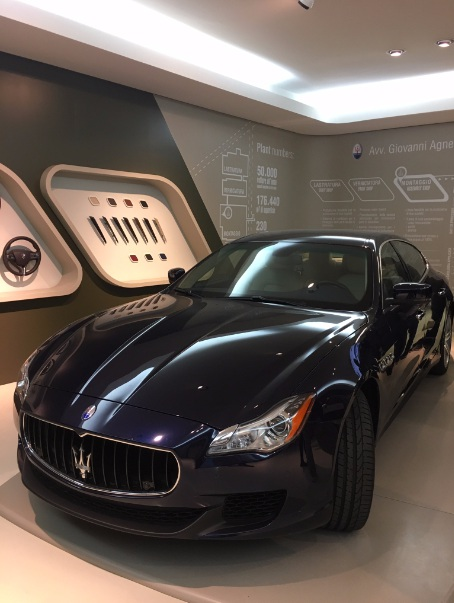

*2017-02-14 20:18 · 手机上网 转自Frankiiee*

---

### 6020

不好意思，是我自己傻逼，手机没有打开4G，错怪帝都移动了。转@王兴 长途奔袭石景山。一路上北五环和西五环大部分地段移动只有2G，至少我的华为mate8只有2G。

*2017-02-14 14:30 · 手机上网 转自王兴*

---

### 6021

参观别的公司时偶遇自己的名字。

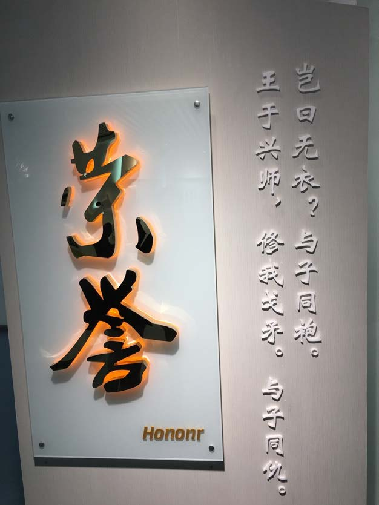

*2017-02-14 10:11 · 猫饭*

---

### 6022

长途奔袭石景山。一路上北五环和西五环大部分地段移动只有2G，至少我的华为mate8只有2G。

*2017-02-14 09:42 · 手机上网*

---

### 6023

当年我们军训打靶时，教官就没有传授这类精妙细节。不过，即使教了，估计也改变不了我五枪中有一枪瞄的是隔壁同学的靶结果他最后还零环的结果。转@ 王兴 此图大赞。转自@ .rex @ 前警员

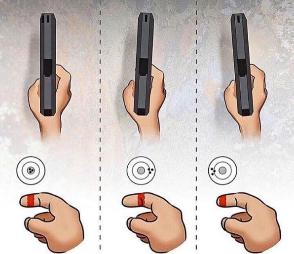

*2017-02-14 09:30 · 手机上网 转自王兴*

---

### 6024

转@ webto 如果觉得自己在愉快的浪费时间，那么这时间通常没有浪费掉；如果觉得自己的时间被浪费了，那可能真的就是浪费了。

*2017-02-14 09:24 · 手机上网 转自webto*

---

### 6025

此图大赞。转自@ .rex @ 前警员

*2017-02-14 09:10 · 手机上网*

---

### 6026

过去36小时四流鼻血。

*2017-02-14 09:08 · 手机上网*

---

### 6027

配图大赞！转@ .rex 推荐@ 前警员 「我是一名前条子，毕业工作时看到各种与这个违反职业道德和法律法规的事，怒辞职，空窗半年后飞费城读MBA，15年英国定居，供职英政府部门。具体做什么我就不细说了」我总觉得活一辈子太短，一种人生太单调。刷饭否是我偷窥各色人生的渠道之一。

*2017-02-14 08:53 · 手机上网 转自前警员*

---

### 6028

这招对美国教授也如此管用吗… 转@ 拧巴人儿 一个不学习的富二代，为了不挂科，睡了某系四个教授。 转@ 二他姐姐 啥情节？「@拧巴人儿 我今天还听说了个中国富二代学生的八卦。震精了我都。」

*2017-02-14 08:52 · 手机上网 转自拧巴人儿*

---

### 6029

吃喝玩乐才是正经事！转@ 拧巴人儿 算了，今天不去穆斯林集会了，我等不及回家吃火锅……

*2017-02-14 08:17 · 手机上网 转自拧巴人儿*

---

### 6030

前同事真诚的说：请三思，可能预速而不达啊。转@ 王球球的春天作为一个失业的缺金缺时间的母亲，朋友会怜悯我，邀请我加入他们的公司，不过我差不多都已今年打算赚1000万结束谈话。贴心的朋友们会觉得我疯了，可是我是真的认真的在思考啊。有好项目，都扔过来啊

*2017-02-14 07:40 · 手机上网 转自王球球的春天*

---

### 6031

正仰着头把鼻血往下咽的时候打了个喷嚏:(

*2017-02-14 07:32 · iPhone版*

---

### 6032

我总觉得「XX金控」这种名字很作。

*2017-02-14 06:47 · iPhone版*

---

### 6033

这T恤包装得像电子产品一样。

*2017-02-13 22:33 · 猫饭*

---

### 6034

红方、白方、青方，没有黑方，我说的不是尊尼获加，是腐乳，谢谢。

*2017-02-13 19:21 · iPhone版*

---

### 6035

我的亲身体验证明，手机速度变慢确实会使人变得狂躁。

*2017-02-13 19:16 · 手机上网*

---

### 6036

在这样一个时代，我真的不知道「王林大师死了」的消息是不是真的。

*2017-02-13 17:34 · 手机上网*

---

### 6037

为什么上不了台面呢？通常礼仪是民族服装（我把汉服归入此类）和西装领带一样可以用于正式场合吧？转@ quux 一不是刚需，二上不了台面，怎么可能不廉价 转@ vivi 一个疑问，为什么汉服看上去都这么廉价啊.....

*2017-02-13 17:07 · 手机上网 转自vivi*

---

### 6038

数据质量和数据安全。

*2017-02-13 16:07 · 手机上网*

---

### 6039

埃及那么早就有发达的文明，为什么没有成为地中海一霸？答案居然如此简单：树太少，没木头造船-_-!

*2017-02-13 07:50 · iPhone版*

---

### 6040

在西雅图看了amazon books的线下店，对我冲击很大，不仅仅是商业上的冲击，而是英文世界里优质图书的种类和数量看起来和中文世

界真是天壤之别。

*2017-02-12 21:35 · iPhone版*

---

### 6041

刚查了一下，《了不起的盖茨比》至少有1926、1949、1974、2013年这四版电影。我相信将来也还会有人再拍。读懂这部小说就懂了小一半美国。

*2017-02-12 21:19 · iPhone版*

---

### 6042

在飞机上睡着了，醒来时已经开始下降，发现喝了一半的矿泉水瓶已被挤得很扁。想来飞行带来的气压变化和长时间干燥对身体确实是一种消耗。

*2017-02-12 21:11 · iPhone版*

---

### 6043

回程的飞机上把迪卡普里奥主演的《了不起的盖茨比》又看了一遍。

达美航空的版本似乎和国内前两年上映的有细微差别。菲茨杰拉德真是个冷酷无情的作者。

*2017-02-12 19:52 · iPhone版*

---

### 6044

原来rosewood竟然是这个意思：黄花梨在英文里就叫 yellowrosewood。

*2017-02-12 04:31 · iPhone版*

---

### 6045

或者是公司的管理问题。转@ webto 做设计的时候，留了一些没发现的问题，是人之常情；产品上线之后，可用性有问题自己还看不出来，就是能力问题了。

*2017-02-11 18:05 · 手机上网 转自webto*

---

### 6046

更有意义的是对比演讲者和哈马斯领导层的智商。转@ 杨曜睿 短短几分钟，信息量极大。问答两人智商不对称、信息不对称、因立场而导致的自由度也不对称。小聪明被大聪明碾压。 转@ 叶滨 看完真的被震惊到了。加州居然也有人可以这么公开的支持恐怖主义？

http://t.cn/RJqoee1

*2017-02-11 05:28 · 手机上网 转自webto*

---

### 6047

「有耐心」通常意味着要（长时间）「被误解」。转@ 王兴 「对未来越有信心，对现在越有耐心」。春节假期里有高中同学在微信上发当年毕业纪念册里的内容，我才意识到原来十几年前我就这么喜欢「信心」和「耐心」这两个词了。

*2017-02-11 02:41 · 手机上网 转自王兴*

---

### 6048

算清帐其实很难。尤其是金融业务。转@ 一毛不拔 正在看《罗斯柴尔德家族》⋯⋯里面说家族起家时的五兄弟都算不清帐，以至于有这样的信件“二哥，我们应该有几百万镑资产，可我问了其他几个兄弟手上现金都不多，那应该钱都在你那吧？要是你那也没有可就奇怪了，咱们的财富总该在某个地方吧？”

*2017-02-11 02:33 · 手机上网 转自一毛不拔*

---

### 6049

转@ 小熊娃娃 小时候直觉哈利波特不好玩，现在再看一遍就明白她其实是在麻瓜世界上批上很多魔法外衣，逻辑和感情都是普通大众的

（感情还写得挺一般），所以很能吸引麻瓜们，但对于很早就灵性开窍的孩子来说真是太不具备超越性了啊

*2017-02-11 01:54 · 手机上网 转自小熊娃娃*

---

### 6050

孔夫子说得很有道理。转@ quux 必也正名乎 转@ 女侠芙洛拉Confucius once said, “The beginning of wisdom is to call thingsby their proper name.” （刚看到这句话，想知道是孔子的哪一句？

*2017-02-10 17:29 · 手机上网 转自女侠芙洛拉*

---

### 6051

乔布斯好像并没有在不同场合去反反复复讲 stay hungry, stayfoolish.

*2017-02-10 15:45 · iPhone版*

---

### 6052

这个vc的书架有点意思，除了畅销书《人类简史》和《鞋狗》等，还有这些书。

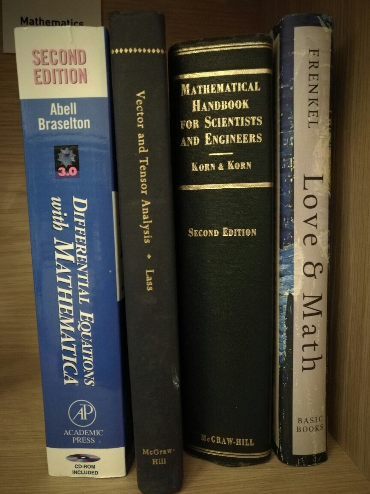

*2017-02-10 15:06 · 猫饭*

---

### 6053

转@ quux 人都是会死的，so live and drink and fight andscrew，英文是喝醉了的海明威说的

*2017-02-10 14:27 · 手机上网 转自quux*

---

### 6054

开车从海边高速经过时发现旧金山湾里恶魔岛那片的海水褐黄褐黄的，和我印象中不太一样。难道是因为连续多天雨水冲刷导致的浑浊？

*2017-02-09 09:09 · iPhone版*

---

### 6055

我清晰的感觉到感冒病毒已经侵入了我的身体。我要开始发烧了。

*2017-02-09 08:32 · iPhone版*

---

### 6056

Globalization and World Cities (GaWC) Research Network最新一版全球城市分级是2012版。

*2017-02-08 16:22 · 猫饭*

---

### 6057

来过很多次palo alto，这回终于抽空去看了el palo alto公园里那棵同

名老红木树。此城因此树而得名。树龄据说有千年，但是看起来并没有我预期中那么雄伟。只能相信1769年西班牙探险队首次北上抵达旧金山湾途中见到的此树更加挺拔醒目，不然当时也不会被选作野外的地标吧。

*2017-02-08 04:17 · 手机上网*

---

### 6058

不明觉厉。转@ 小熊娃娃 “灵性导师玛丽安·斯达尼斯曾经告诉我：‘每个真正先知的理想都是被证明自己错了’。她的话最初听起来奇怪，但从未离我左右。”——看到这句话惊呆了，完美地形容了我这么多年以来对神秘学的态度。

*2017-02-08 04:06 · 手机上网 转自小熊娃娃*

---

### 6059

转@ webto すき家・吉野家・松屋 这三家牛肉饭大概就相当于 城小，沙县，还有黄焖鸡米饭吧！

*2017-02-07 16:07 · 手机上网 转自webto*

---

### 6060

太能忍也不好。但是，如果太不能忍，很可能发现自己不得不忍受越来越low的东西。转@ 王球球的春天 不能忍，真是我的缺点。

*2017-02-07 16:05 · 手机上网 转自王球球的春天*

---

### 6061

非常好的补充！转@ 织毛衣 完整版是 not demanded or bought转@ 王兴 七年前陈老先生说的这句话确实让我印象深刻，时不时想起。转@ 王兴 Respect is earned, not demanded.

*2017-02-07 15:50 · 手机上网 转自王兴*

---

### 6062

二十多年前出中文版时还不好意思直译成阶级。转@ luoluo. 中译 格调 转@ 王兴 其实美国上层也整天比，但比的东西不一样。PaulFussell写的《Class》一书讲得比较清楚。转@ 乖不乖 技能教育一个突出的特点就是爱和别人比转@ 王兴 转@ szweig 转@ 菜村村长

*2017-02-07 12:32 · 手机上网 转自菜村村长*

---

### 6063

其实美国上层也整天比，但比的东西不一样。Paul Fussell写的《Class》一书讲得比较清楚。转@ 乖不乖 技能教育一个突出的特点就是爱和别人比转@ 王兴 转@ szweig 转@ 菜村村长 中国小孩儿在美国比不过印度小孩的一个原因是印度的制度决定了能来美国的都是上层种姓

*2017-02-07 12:28 · 手机上网 转自菜村村长*

---

### 6064

转@ szweig 转@ 菜村村长 中国小孩儿在美国比不过印度小孩的一个原因是印度的制度决定了能来美国的都是上层种姓，富裕中产阶级的人。中国移民，说实话，父母那辈或多或少都在文化大革命中被剥夺了受教育的权利。子女能快步赶上的大部分是技能教育。

*2017-02-07 12:15 · 手机上网 转自菜村村长*

---

### 6065

看什么餐厅了。有些高逼格餐厅恨不得连译成英文这一步都省了，反正一页上面就没几个我认识的单词。转@ cigarman @ 王兴 现在大多数餐厅都备有中文菜单的吧

*2017-02-07 12:14 · 手机上网 转自cigarman*

---

### 6066

真要把西餐菜单完全看懂并不是一件容易的事。这本书开头第一个例子就惊到我了。谁能想到番茄酱ketchup这个词最初居然来源于福建广东一带呢？

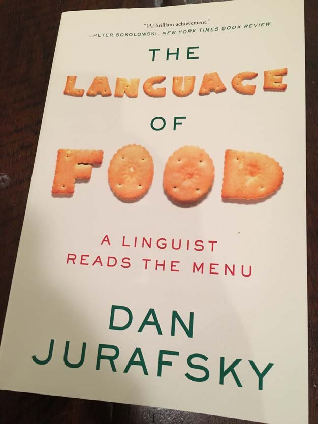

*2017-02-07 12:02 · 猫饭*

---

### 6067

我跟朋友聊天时照例谈起印度裔 vs. 华裔的问题，结果他给了一个更打击我的信息：他的俩小孩在硅谷本地一个竞争很激烈的私立学校读书，根据他的观察，华裔小孩还真考不过印度裔小孩，年级越高时越明显。

*2017-02-07 11:14 · 手机上网*

---

### 6068

小费不是这么用的，应该根据被服务的满意程度给。转@ 方同学 你

招手再找一个服务生，给他一大笔小费转@ 王兴 约了一个华人朋友在著名的vc云集的rosewood sand hill酒店大堂吧喝茶。墨西哥裔服务员居然在点饮料时就跟我要信用卡。难道是担心我消费完不结账就跑路吗？我不就是穿得

*2017-02-07 11:08 · 手机上网 转自王兴*

---

### 6069

约了一个华人朋友在著名的vc云集的rosewood sand hill酒店大堂吧喝茶。墨西哥裔服务员居然在点饮料时就跟我要信用卡。难道是担心我消费完不结账就跑路吗？我不就是穿得随意了一点嘛…… 反正我这么多年来第一次碰到这种情况。

*2017-02-07 10:59 · 手机上网*

---

### 6070

转：Man is an animal suspended in webs of significance hehimself has spun.

*2017-02-07 10:20 · 手机上网*

---

### 6071

七年前陈老先生说的这句话确实让我印象深刻，时不时想起。转@ 王兴 Respect is earned, not demanded.

*2017-02-07 08:08 · 手机上网 转自王兴*

---

### 6072

再加上北辰泰岳、望京国际研发园、恒电大厦，从04年初创业至今，平均一年一个。转@ 王兴 过去不到7年的时间里，我在10个地方办过公：海丰园A，海丰园B，华清嘉园20号楼，中国人寿大厦，静安中心，华清嘉园13号楼，清华同方科技广场，华清嘉园6号楼，东华合创大厦，远中悦来大厦。

*2017-02-07 07:56 · 手机上网 转自王兴*

---

### 6073

搞学术和搞创业的几个创新层次其实蛮像的。转@ 胡泳 大卫·伊斯顿以将系统理论套入政治科学研究而闻名。他把政策决策过程分成五个主要结构：输入、转换、输出、回馈、与环境，广受政策分析家应用。甘内尔表示1950年代“系统”是美国政治科学家最常用也最重要的理论概念。

*2017-02-07 07:33 · 手机上网 转自胡泳*

---

### 6074

亚马逊创始人贝索斯是谷歌最初的天使投资人之一，不知道他后来心情会不会有点复杂，尤其是猛搞A9搜索但是搞不起来的那几年。

*2017-02-07 03:54 · iPhone版*

---

### 6075

@ 小熊娃娃 不是。是更传统的基础设施。

*2017-02-07 02:59 · 手机上网 给小熊娃娃的回复*

---

### 6076

前几天跟某硅谷投资大佬说起此事，反应是：呵呵，那他就不够实诚了，他们做梦都想把XX做起来。

*2017-02-07 02:34 · iPhone版*

---

### 6077

上个月见美国三大互联网公司之一的创始人，我问：你们在很多方面都做得非常棒，为什么在非常重要的XX领域没有更大投入/进展？回答很有情怀：哎呀，我们不是那种思路啦，值得做的事情那么多，我们把自己擅长且喜欢的几件做好就行了。前几天跟某硅谷投资大佬说起此事，反应是：呵呵，那他就不够实诚了

*2017-02-07 02:29 · iPhone版*

---

### 6078

读关于印度互联网的新闻时发现他们讨论交易额时都用crore这个单位，查了一下，解释是：a unit of value equal to ten millionrupees，也就「千万卢比」。

*2017-02-06 17:31 · iPhone版*

---

### 6079

转@ 阳升 99% 的工程师都会觉得自己干的活没有技术含量，其中的99% 会因此觉得公司没有技术含量 转@ 王兴 跟一个在雅虎干了几年后刚不太情愿的去谷歌干了一年多的工程师聊天，我问他谷歌哪方面让他觉得很强。他说：管理。我：呃，谷歌不是以技术强著称吗？

他：哦，除了管理，谷歌的PR也

*2017-02-06 15:07 · 手机上网 转自王兴*

---

### 6080

谷歌的PR应该是有风气的。据说，玛丽莎大姐当年为了在谷歌能升职，个人出钱在外面雇了个PR公司给自己造势。

*2017-02-06 11:29 · 手机上网*

---

### 6081

转@ gravity0 各国传统医学都将感冒与寒冷联系起来，其中因果究竟是什么？有研究说是因为严寒导致空气中水含量降低，干燥的空气中病毒不易被吸附，能传播更远。还有说是人们在冷天外出少，室内人口密度增加所以容易感染。姑且一听。

*2017-02-06 11:15 · 手机上网 转自gravity0*

---

### 6082

我感觉美国（商）人大概是这样的：你有钱，我不见得尊敬你；你有本事从我这里赚到钱，我才会考虑尊敬你。

*2017-02-06 10:58 · iPhone版*

---

### 6083

越来越觉得，虽然欧洲认为美国土，但美国社会确实挺适合用sophisticated这个词来形容。

*2017-02-06 10:37 · iPhone版*

---

### 6084

超级碗插播的广告里居然有个土耳其航空，结尾的广告词还不错：widen your world.

*2017-02-06 10:34 · iPhone版*

---

### 6085

跟一个在雅虎干了几年后刚不太情愿的去谷歌干了一年多的工程师聊天，我问他谷歌哪方面让他觉得很强。他说：管理。我：呃，谷歌不是以技术强著称吗？他：哦，除了管理，谷歌的PR也特别强。

*2017-02-06 10:20 · iPhone版*

---

### 6086

美国时间周日下午密集约了很多人聊工作，后来才发现这个时间其实不太适合约人，因为正好赶上一年一度的超级碗决赛，是家庭朋友聚会消遣的黄金时间。这就是文化不适应吧。

*2017-02-06 10:13 · iPhone版*

---

### 6087

年龄和阅历不同，看同一个城市的感受也大不同。

*2017-02-06 05:48 · iPhone版*

---

### 6088

我一直很关注「印度人为什么在美国企业界发展得比华人好很多」这个问题，今晚跟硅谷的几个朋友聊天，听到另一个解释：美国每年大概发八万多个H1B工作签证，印度人占掉六万多个。归根到底人多还是势力大。

*2017-02-05 16:21 · iPhone版*

---

### 6089

刚得知我爸有个表姐的儿子在波士顿那里做了十几年风险投资了。

*2017-02-05 10:33 · iPhone版*

---

### 6090

我以往看世界地图时都是默认以陆地为主，把海岸当边界，刚才想到还有另一种相反的视角：把海洋当作主体。那么海湾和半岛就正好反过来了。

*2017-02-05 08:26 · iPhone版*

---

### 6091

Costco里有卖篮球、网球和高尔夫球，但是没卖橄榄球。这让我觉得意外。

*2017-02-05 08:21 · 猫饭*

---

### 6092

@ 小熊娃娃 「被点评吞了」是什么意思？

*2017-02-05 05:09 · 手机上网 给小熊娃娃的回复*

---

### 6093

拜访palo alto的一个公司，对方为了证明自己历史悠久，炫耀说，当年我们公司买第一台电脑时，是乔布斯亲自上门帮我们安装的。

*2017-02-05 02:40 · iPhone版*

---

### 6094

转：You can’t predict. You can prepare.

*2017-02-04 18:17 · iPhone版*

---

### 6095

他们当中只有少数人有足够的智慧把自己的姿态调低为「真不行了的公司里想出来的人」。转@ 文静王 有三位在外企工作的同学，一毕

业就进外企，工作的还算顺利，抓住了每一次机会，晋升空间清晰。

但是他们现在都想到民营企业里试试，纷纷说『外企真不行了』。

*2017-02-04 17:14 · 手机上网 转自文静王*

---

### 6096

转@ webto 「东京奥运会主会场由于设计缺陷导致无处安装圣火台。

东京市政府：国立竞技场所以是国家的责任；国家奥运担当大臣：建设是文部科学大臣负责的；文部科学大臣：建筑家安藤要负责；安藤：老子又不是总理负个OO责；安倍：这事是民主党执政时期决定的； 民主党：签字批预算的是安倍」

*2017-02-04 10:25 · 手机上网 转自webto*

---

### 6097

不是说这个所谓金奖本身就有争议吗？转@ 左潇 @ 王兴 因为 “1915年，贵州茅台在美国旧金山市举行的巴拿马万国博览会上斩获金奖。

2015年，旧金山市市长李孟贤宣布，将每年的11月12日定为旧金山的“贵州茅台日”，这里面略有故事

*2017-02-04 10:22 · 手机上网 转自左潇*

---

### 6098

WTF! 硅谷101公路旁有个大大的中文的茅台酒广告牌！

*2017-02-04 04:13 · iPhone版*

---

### 6099

Seeker of truth and doer of justice.

*2017-02-03 17:39 · iPhone版*

---

### 6100

拜访了一家斯坦福教授创办的真正的food tech公司，吃了一个特殊的汉堡，里面的肉是用植物直接做成的，不经过动物这一环节。这到底算是吃素还是吃荤啊？反正肯定不杀生。味道倒是不错，色香味和口感都强过普通汉堡，连有点塞牙的感觉都类似。

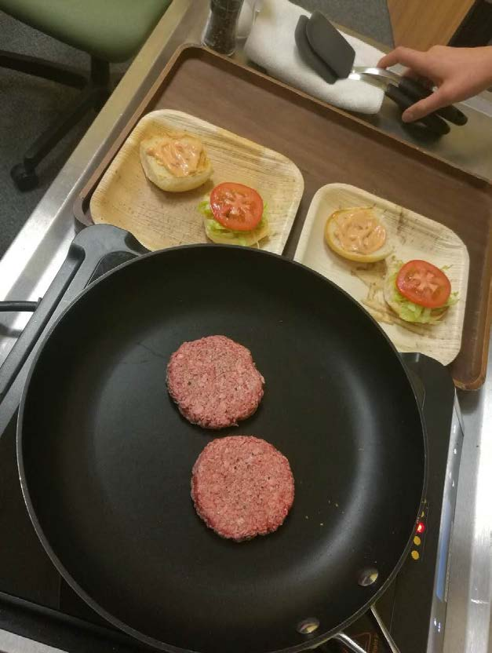

*2017-02-03 10:17 · 猫饭*

---

### 6101

我认识的一个吃素八九年的大姐最近开始恢复吃肉了，原因她说是读了马克斯韦伯写的《儒教和道教》，意识到自己最初决定吃素的出发点不对。

*2017-02-02 15:21 · iPhone版*

---

### 6102

我发现国内有些老牌富豪的消费非常不均衡，常年穿Loro Piana等奢侈品牌，去过许多国家，孩子都在英国读哈罗（或是伊顿？），但却从没吃过黑松露（至少不清楚这是什么东西）。

*2017-02-02 15:01 · iPhone版*

---

### 6103

23andme基因测试的结果内容真丰富，要想完全看懂需要花挺多时间来学习各种知识。

*2017-02-02 06:55 · 手机上网*

---

### 6104

@ quux 你说的「远交近攻」中的远近是指物理世界中的距离（近才

有利益冲突）而非历史渊源吧？

*2017-02-02 05:57 · 手机上网 给quux的回复*

---

### 6105

美国的核心是新教protestant，把天主教加进去就放大成christianity，再把犹太加进去就放大成judeo-christian，再把伊斯兰也加进去就放大成abrahamic religions，那排在外面的基本就剩东亚文化了，如果连这也加进去就真是humanity了。

*2017-02-02 05:44 · 手机上网*

---

### 6106

欧美估计不会再反犹了，原先的主要矛盾已经退化成次要矛盾了，他们会团结在Judeo-Christian的大旗下，共同反穆斯林、反亚裔… 黑人同胞们战斗力太渣，估计暂时还排不上号。

*2017-02-02 05:29 · iPhone版*

---

### 6107

PM这个缩写的常用含义都已经好多了：在互联网行业是产品经理，在金融行业是基金经理，在政治里是首相，在英文论坛里是私信……

*2017-02-02 05:22 · iPhone版*

---

### 6108

民族主义和种族主义都是集体主义的子集。

*2017-02-02 05:10 · iPhone版*

---

### 6109

看到《宋飞正传》这说法时我确实愣了一下，这么翻译 seinfeld 真的好吗-_-!

*2017-02-02 05:08 · iPhone版*

---

### 6110

班农的表达能力真强！转：班农曾经在一次radio show里，引导川普，我印象特别深，说：we are not an economy, we are a nation.

*2017-02-02 05:03 · iPhone版*

---

### 6111

白人极右翼的反移民（不管是合法移民还是非法移民）立场其实并没有那么难以理解，「美国到底是谁的美国」这个问题是「北京到底是谁的北京」的放大版。

*2017-02-02 04:31 · iPhone版*

---

### 6112

电影和小说一样，始于作者的想象，终于观者的想象，缺一不可。转@ 杨曜睿 作品、作者、观众、是三位一体的。如果观众变成群体，常常会悲剧。# 君の名は # 和 # 西游伏妖篇 # 就是这样悲剧的… 这两部导演是会载入电影史册的，作品也是。期待他们的后续作品。

*2017-02-02 03:01 · 手机上网 转自杨曜睿*

---

### 6113

美，既是秩序，也是新奇。

*2017-02-02 02:44 · iPhone版*

---

### 6114

每当我看到人们嘲笑/赞叹鲶鱼能在特别浑浊的环境里生存，我就想起自己和其他生活在北京的人们。

*2017-02-02 02:39 · iPhone版*

---

### 6115

Ralph Lauren 这老爷子居然还活着……

*2017-02-01 16:36 · iPhone版*

---

### 6116

前几天在来美国的飞机上，不知怎的突然想起来，觉得天坛是比天安门伟大得多的建筑。打算回北京后再去趟天坛。

*2017-02-01 16:07 · iPhone版*

---

### 6117

诗三百，一言以蔽之，曰思无邪。

*2017-02-01 15:51 · iPhone版*

---

### 6118

姐姐说确实有个人在23andme上被系统推荐和她互联，说根据基因测试的结果你俩有血缘关系，联系上之后发现确实是远房亲戚。

*2017-02-01 15:29 · iPhone版*

---

### 6119

最早对我构成冲击的行为艺术大概是：北大教当代艺术的朱青生教授上课时说他给儿子起名「朱元璋」。

*2017-02-01 14:38 · 手机上网*

---

### 6120

日餐不搞分子料理之类的探索？转@ webto 是的。RT@ 西瓦 排 转@ 超級爽朗的爽朗君QvQ 日本对于料理确实没有创新 要突出就是拼食材什么的。一个人炸了一辈子天妇罗成为了天妇罗之神 但是 再好吃也就是个 天妇罗呀hhh

*2017-02-01 13:30 · 手机上网 转自超級爽朗的爽朗君QvQ*

---

### 6121

转@ webto 产品经理被黑主要是两个原因：1. 不管工程师死活，2.

不管用户死活。

*2017-02-01 13:27 · 手机上网 转自webto*

---

### 6122

早听说黎巴嫩人有商业头脑，今天第一次见识。

*2017-02-01 10:28 · iPhone版*

---

### 6123

转@ 贾行家 布宁是六十岁上下得的诺贝尔，他老实回忆：那些年，每到这时候，就浑身刺闹，当时他好像住在法国小城，就山上山下走柳儿，琢磨今年是给我好还是不给我好，那天他正在小电影园子里，见外边一堆手电筒照进来找人，知道这次是中了。马尔克斯称之为“幽灵”，虽然明白不严格代表什么，但是很难

*2017-01-31 18:46 · 网页 转自贾行家*

---

### 6124

我一般只祝人「X年大吉」，从来不祝「万事如意」或「心想事成」。

或许我是一个过于实在的人。

*2017-01-31 06:23 · iPhone版*

---

### 6125

福州话毕竟也是闽语，属闽东片-侯官小片。转@ citronlin 福州话和闽南语不通 但这句谚语居然基本一样 转@ 王兴 我的家乡话龙岩话是闽语-闽南片-泉漳小片的一个小分支。转@ 张惊蛰 我们闽南话也是这么说。「@ 王兴 第一次听老妈用家乡话说了一句地方谚语：宠儿无孝，宠狗爬上灶。

*2017-01-30 14:35 · 手机上网 转自王兴*

---

### 6126

拜托，那篇是某讽刺作家假托埃里森之名创作的。转@ 要平庸还是要精彩 @ 王兴 甲骨文的拉里.埃里森在给耶鲁大学2000届毕业生做演讲的时候，说了和王健林异曲同工，甚至比王健林还大胆的言论：“我在这里…只看到了一千个失败者…我，埃里森，这个行星上第二富有的人，是个退学生，而你不是…

*2017-01-30 14:31 · 手机上网 转自要平庸还是要精彩*

---

### 6127

我的家乡话龙岩话是闽语-闽南片-泉漳小片的一个小分支。转@ 张惊蛰 我们闽南话也是这么说。「@ 王兴 第一次听老妈用家乡话说了一句地方谚语：宠儿无孝，宠狗爬上灶。当然不是批评我啦，是在其他场景。」

*2017-01-30 14:12 · 手机上网 转自王兴*

---

### 6128

第一次听老妈用家乡话说了一句地方谚语：宠儿无孝，宠狗爬上灶。

当然不是批评我啦，是在其他场景。

*2017-01-30 13:51 · iPhone版*

---

### 6129

转：美国历史上第一个按种族国家禁止入境的针对的是中国。1882年排华法案，禁止所有中国人移民入境，1943年国会通过Magnuson法案推翻排华法，但每年限额105人。1965年通过的移民和国籍法，才放开中国人移民数量。直到1948年之前加州法律还不允许华人和白人结婚。

*2017-01-30 09:52 · iPhone版*

---

### 6130

这是客户体验的一部分吧。转@ 拧巴人儿 我昨天也在维密买了些内裤。不是花哨的那种，就是纯棉的，别说，还真舒服。 我一个在国内穿M或者L的大屯，到了维密改穿XS了。

*2017-01-30 08:59 · 手机上网 转自拧巴人儿*

---

### 6131

就在上个月，王健林还去清华演讲，公开说「清华北大都不如胆子大」。我不觉得有美国大亨会去哈佛或斯坦福这样演讲。转@ 小熊娃娃 知乎上还在讨论中国为啥不能文化输出，溜了一眼真是被蠢哭了……文化本来就不行输出个毛线啊！就是有你们这些不懂装懂瞎讨论

的人才更加不行啊！

*2017-01-30 08:50 · 手机上网 转自小熊娃娃*

---

### 6132

这餐厅，菜单只有三分之二页，酒单有99页。

*2017-01-30 08:40 · 猫饭*

---

### 6133

转@ webto 我有相当长的时间坚信，米聊的失败，内因大过外因，但是去年开始觉得不对了。应该说米聊在那个时间点的突然溃败，是内因决定的，但如果以上帝视角看全局，其实即使每一步都走的完美，也没机会正面肛微信。

*2017-01-30 01:57 · 手机上网 转自webto*

---

### 6134

是的，据说孙中山就不认为东北是中国的一部分，越南才是。转@qinyf 这次圣何塞的 airbnb 房东是马来西亚人，太太是越南人。临checkout 前，他还给我看昨晚圣何塞越南聚居区的烟花和鞭炮视频，出门前还给我塞了一个红包。第一次意识到越南与中国文化是非常近的。

*2017-01-29 02:44 · 手机上网 转自qinyf*

---

### 6135

这就属于我看第一眼封面就会决定买来读的书。

*2017-01-28 23:57 · 猫饭*

---

### 6136

突然觉得人生就像不带降落伞从万米高空跳下来，你会逐渐加速，速度越快，空气阻力越大，直到阻力抵消重力带来的加速度，取得暂时的平衡；此后，你调整姿势可以稳定在不同的下坠速度，但是并不改变下坠的本质。

*2017-01-28 19:16 · 手机上网*

---

### 6137

转@ 荆陌客 保罗·戈埃罗的《炼金术士》也是讲的这个故事。 转@王兴 转@ 进击的脑门 《一千零一夜》第三百五十一夜的故事，博尔赫斯改成了《双梦记》转@ 飯否小字报 转@ 王兴 连岳讲的这个关于征途的故事不错。

*2017-01-28 18:57 · 手机上网 转自王兴*

---

### 6138

转@ 饭小执 这本书叫《牧羊少年奇幻之旅》「@ Captain追远 转@gravity0 先按自己想法做，失败被嘲笑，然后把嘲笑自己的人的想法也做了。不管谁的想法，不跟喷子争对错，只是不断试错。执行力超强啊。 转@ 王兴 连岳讲的这个关于征途的故事不错。」

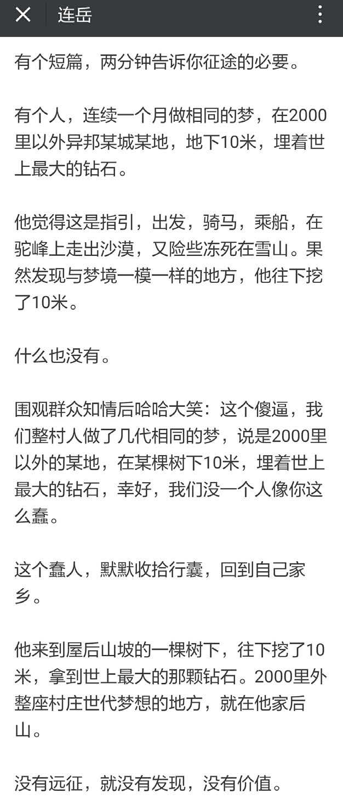

*2017-01-28 18:56 · 手机上网 转自王兴*

---

### 6139

转@ 进击的脑门 《一千零一夜》第三百五十一夜的故事，博尔赫斯改成了《双梦记》转@ 飯否小字报 转@ 王兴 连岳讲的这个关于征途的故事不错。

*2017-01-28 17:43 · 手机上网 转自王兴*

---

### 6140

连岳讲的这个关于征途的故事不错。

*2017-01-28 17:10 · 手机上网*

---

### 6141

转@ szweig 十月革命实际是发生在11月7日，但因为当时俄罗斯还实行儒略历，所以就是10月25日。直到1918年才改为公历。所以，在俄罗斯，1918年1月31日的第二天不是2月1日，而是2月14日，因为从这一天开始实行格里高利历了。

*2017-01-28 13:41 · 手机上网 转自szweig*

---

### 6142

是啊，这也是人生的一部分。我在2010/2011/2012年各送走了一个长辈…… 转@ severusn.V 大概差不多时候了，长辈们身体的问题集中出现。

*2017-01-28 13:39 · 手机上网 转自severusn.V*

---

### 6143

买书如山倒，读书如抽丝。柿子拣软的捏，先翻翻那本最薄的PaulRand讲设计的册子。

*2017-01-28 11:13 · 猫饭*

---

### 6144

沟命海心又一年，回首四顾再向前。

*2017-01-28 11:04 · iPhone版*

---

### 6145

这条拜年短信不错：纪伯伦说过：“如果有一天，你不再寻找爱情，只是去爱；你不再渴望成功，只是去做；你不再追逐成长，只是去修，一切才真正的开始”。祝您新春快乐！健康平安！吉祥如意！杨XX

*2017-01-28 01:21 · 手机上网*

---

### 6146

飞机已经开始滑动，两个拇指依然在手机屏幕上快速舞动，这就是新时代的「奋笔疾书」吧。

*2017-01-27 13:41 · iPhone版*

---

### 6147

突然想到一个问题，女生本命年除了红内裤，是不是还会准备红bra？

*2017-01-27 13:25 · iPhone版*

---

### 6148

那张西装革履的羊和猴擦肩而过、拳背相触、互相鼓励的画仿佛就在昨天，一转眼已是一年。要起飞了。落地已是鸡年。

*2017-01-27 13:23 · iPhone版*

---

### 6149

有些书真是太伤人了。我今早就被崭新的书页把右手无名指划出一道不浅的口子:(

*2017-01-27 12:41 · iPhone版*

---

### 6150

这样一份新年礼物也太沉甸甸了吧…

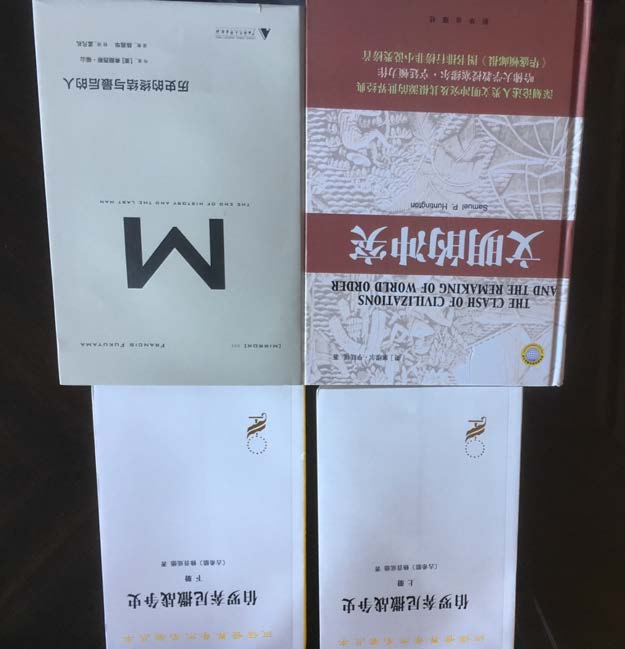

*2017-01-27 10:01 · 猫饭*

---

### 6151

奇怪，今天凌晨醒了好几次，而且并没有任何灵感。

*2017-01-27 08:18 · iPhone版*

---

### 6152

转@ gravity0 人类是如何从东非发源后遍布世界并且分化发展出那么多种语言的呢？大概是因为都想离亲戚远点，偶尔逢年过节见面也不想说话。

*2017-01-27 08:09 · 手机上网 转自gravity0*

---

### 6153

安安加油！转@ realazy 一晃《饭唠》已是六年前的作品。今年抽空来个新版，把 Android 平台也拿下。Xamarin w/ F#，第一步已迈出。

*2017-01-27 00:13 · 手机上网 转自realazy*

---

### 6154

据说大概要5亿美元。转@ 猫也笨 这长度和维护难度，想想就觉得成本感人转@ 王兴 听说中国（甚至是整个东亚？）和拉美之间还没有直接的海底光缆，全要通过美国中转。

*2017-01-26 17:19 · 手机上网 转自王兴*

---

### 6155

有的时候，我觉得生活的主要内容就是要消除生活本身的不真实感。

*2017-01-26 16:54 · 手机上网*

---

### 6156

高铁上坐厕挺常见吧。转@ gravity0 关于飞机上拉屎，一般都有马桶，没见过蹲坑。火车正相反，只见蹲坑没见过马桶。原因大概是前者进口后者国产。好在我们亚洲人，什么姿势都会。

*2017-01-26 16:49 · 手机上网 转自gravity0*

---

### 6157

转@ hellokeikei 「@ bsb2 每天在一个固定的时间给要追的姑娘发信息，不管她喜不喜欢你，连续三个月不间断，让她养成习惯以后再停止给她发信息，这时候她会感觉少点什么，甚至会怀疑自己喜欢上你了----这种追姑娘的方法叫巴普洛夫撩妹法」

*2017-01-26 16:48 · 手机上网 转自bsb2*

---

### 6158

没有直飞的吧，据说推荐路线是北京-达拉斯-智利，你中途应该有时间在美国拉个屎。转@ webto 对于我这种恐飞到从来没在飞机上拉过屎的人来说，挑战太大了。。。RT@ 王兴 飞到智利单程要28小时，这确实有点吓人。

*2017-01-26 16:24 · 手机上网 转自王兴*

---

### 6159

飞到智利单程要28小时，这确实有点吓人。

*2017-01-26 15:23 · iPhone版*

---

### 6160

听说中国（甚至是整个东亚？）和拉美之间还没有直接的海底光缆，全要通过美国中转。

*2017-01-26 14:54 · iPhone版*

---

### 6161

Cohen最后一张专辑里那首《Treaty》的歌词也展现了他一贯的高水准，几乎每一句的展开都出乎我的意料。说每一句有点夸张了，大概每两句中有一句吧。

*2017-01-26 13:23 · 手机上网*

---

### 6162

一个好的组织，不管是学校还是公司，应该让你既能看到真正聪明的人能聪明到什么地步，又能看到真正努力的人能努力到什么地步。

*2017-01-26 12:19 · iPhone版*

---

### 6163

转@ 远缘 赵本山拍完这部电影，一度以为自己演的是宫二的父亲，王家卫牛。转@ 王兴 王家卫的电影里有哲理的台词不少，但最接地气的一句毫无疑问是：有多大屁股穿多大裤衩。感谢赵本山。我无法想象这句话从张曼玉或梁朝伟嘴里冒出来。

*2017-01-26 02:05 · 手机上网 转自王兴*

---

### 6164

1977年，乔布斯为了给苹果融45万美金给红杉写了79页的商业计划书!

还是现在的创业者幸福啊。

*2017-01-26 00:46 · iPhone版*

---

### 6165

经过「鼓楼馒头店」，门口排了快二十米的队。惊到我了！

*2017-01-25 18:08 · iPhone版*

---

### 6166

打算读英文版《孙子兵法》。

*2017-01-25 18:04 · iPhone版*

---

### 6167

Endure这个词用得真好。转@ 王兴 The most noble fate a mancan endure is to place his own mortal body between his lovedhome and the war's desolation.

*2017-01-25 16:26 · 手机上网 转自王兴*

---

### 6168

转@ gravity0 爱因斯坦的安全冰箱压缩机在美专利，此外他还有助听器专利。人生如此漫长，折腾点儿啥都可以。而外人自我中心自顾不暇，对别人的认识只会是几个简单的标签，和他们愿意相信的故事。

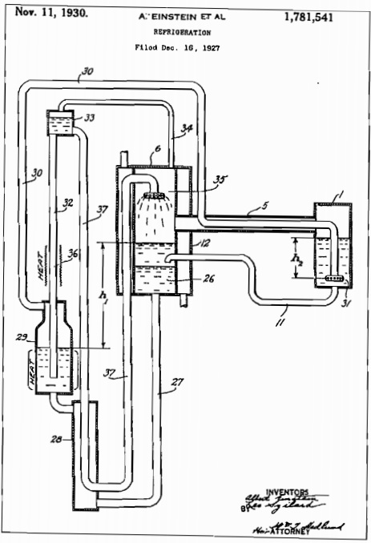

*2017-01-25 16:20 · 手机上网 转自gravity0*

---

### 6169

昨晚HR找我聊，问我的人生理想是什么。我的第一反应是惠特曼的那两句诗，但是觉得不太好解释，于是我就着MMORPG四类玩家的理论给她讲了一下我是什么类型。解释得不太好…

*2017-01-25 16:19 · iPhone版*

---

### 6170

@ 酱玉米 谢谢。我读过徐浩峰的好几部小说，从@ 张亮 推荐的《道士下山》开始。我也看过他导演的《师父》。我觉得他还在摸索过程中，期待着看到他真的「再造江湖」。

*2017-01-25 14:45 · 手机上网 给酱玉米的回复*

---

### 6171

和一个以营销著称的快消品公司高管聊天，我问，除了快消品，还有哪个行业里营销起到了如此至关重要的作用？笑答：美国总统大选。

*2017-01-25 13:58 · iPhone版*

---

### 6172

转@ .rex 转@ 杲i杲 人生就是一个区块链 转@ 飯否小字报 转@ 令糊葱 删除我一生中的任何一个瞬间，我都不能成为今天的自己。——芥川龙之介

*2017-01-25 11:31 · 手机上网 转自令糊葱*

---

### 6173

明天爸爸就要来了，今天开始改喝家乡的斜背茶。

*2017-01-25 10:43 · iPhone版*

---

### 6174

王家卫的电影里有哲理的台词不少，但最接地气的一句毫无疑问是：有多大屁股穿多大裤衩。感谢赵本山。我无法想象这句话从张曼玉或梁朝伟嘴里冒出来。

*2017-01-25 10:39 · iPhone版*

---

### 6175

这都是什么吖！转@ webto 日本去年3月开始启用了一项孕期反歧视的法案，防止工作中歧视孕期女性，比如孕期可以提前下班，如果别人说一句「好羡慕能早下班 >_<」算霸凌。。。

*2017-01-25 09:51 · 手机上网 转自webto*

---

### 6176

一城一池，一草一木，一针一线，一点一滴，一丝一毫

*2017-01-25 01:02 · 手机上网*

---

### 6177

ruined my day! 转@ 阳升 喜欢冒险的人千万别读！要读也别读到最后！——“看完这些能控制大脑的寄生虫，你会怀疑人类！”http://t.cn/RxL6esw

*2017-01-25 00:28 · 手机上网 转自阳升*

---

### 6178

罗非鱼在英文里叫 tilapia ，这拼法看起来有点怪。

*2017-01-24 22:54 · iPhone版*

---

### 6179

我之前光知道「狼厂」是指百度，「鹅厂」是指腾讯，不知道「猪厂」是指网易-_-!

*2017-01-24 19:49 · iPhone版*

---

### 6180

转@ gravity0 "如果把他的精神世界也能比作一个系统的话，那也是一个隔离系统。按照熵增加原理，孤立系统的熵不可能永远减小，它是在无情地朝着其极大值增长。也就是说，其混乱程度在朝极大值方向发展。玻尔兹曼精神世界的混乱成了一个不可逆的过程，他最后只好选择自杀..." —— 熵增

*2017-01-24 14:57 · 手机上网 转自gravity0*

---

### 6181

（脑）力不从心时，只能心大一些。此心非彼心。

*2017-01-24 14:21 · 手机上网*

---

### 6182

你小时候玩得好高级啊！转@ gravity0 从前有个叫魔棍的玩具，将其折叠变成球就是这个样子。学龄前习得的技巧我现在可以闭着眼睛在脑中回放。 转@ 王兴 学了一个新单词：rhombicuboctahedron，菱方八面体。这插图是达芬奇画的。

*2017-01-24 13:46 · 手机上网 转自王兴*

---

### 6183

你牛。转@ VinLin 底面那个正方形透视有问题 转@ 王兴 学了一个新单词：rhombicuboctahedron，菱方八面体。这插图是达芬奇画的。

*2017-01-24 13:45 · 手机上网 转自王兴*

---

### 6184

学了一个新单词：rhombicuboctahedron，菱方八面体。这插图是达芬奇画的。

*2017-01-24 12:55 · 猫饭*

---

### 6185

这会开得有点消耗。午饭时要听一下cold play的viva la vida补补血。

*2017-01-24 12:09 · 手机上网*

---

### 6186

好人若不团结，必被坏人一一消灭。

*2017-01-24 11:53 · 手机上网*

---

### 6187

我已经自动脑补上「没」这个字了。转@ 张亮 逻辑错了？宁愿自己是麻瓜，也不信这世界没魔法吧。转@ 王兴 同事们都太有文化了，我压力很大……转@ 周露inn 宁愿相信自己是个麻瓜，也不相信这个世界有魔法。

*2017-01-24 10:49 · 手机上网 转自周露inn*

---

### 6188

前同事也是贼有文化贼挑剔…… 转@ 阳升 这康熙字典体肯定又是侵权转@ 王兴 吃完外卖才发现，现在家家户户都想显得有文化有情怀。

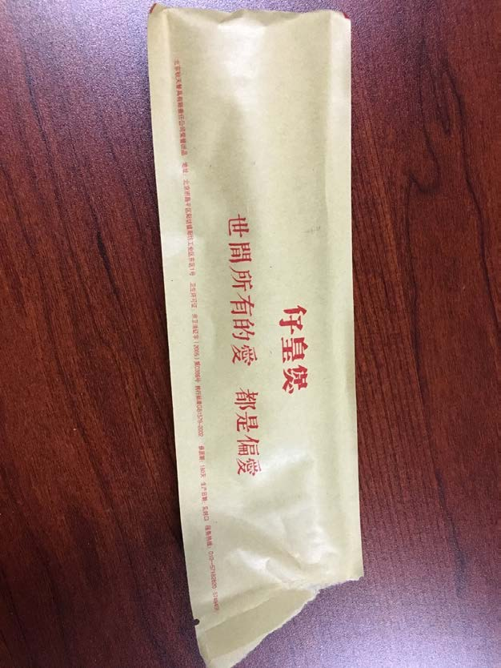

*2017-01-23 22:32 · 手机上网 转自王兴*

---

### 6189

妈蛋，为什么不印「内有汤勺」？害我刚才撅着嘴喝汤，吃完准备丢垃圾时才发现这纸袋里不止有筷子和餐巾纸。转@ 王兴 吃完外卖才发现，现在家家户户都想显得有文化有情怀。

*2017-01-23 19:50 · 手机上网 转自王兴*

---

### 6190

同事们都太有文化了，我压力很大……转@ 周露inn 宁愿相信自己是个麻瓜，也不相信这个世界有魔法。

*2017-01-23 19:47 · 手机上网 转自周露inn*

---

### 6191

吃完外卖才发现，现在家家户户都想显得有文化有情怀。

*2017-01-23 19:38 · 猫饭*

---

### 6192

我已经有好几年没买过刀了。

*2017-01-23 19:33 · iPhone版*

---

### 6193

那你大概是何勇的《钟鼓楼》听多了。转@ 霜糖 如果到处都是正确答案呢？转@ 饭友经典语录 如果总也找不到答案，那可能是问题错了。转自@ 王兴

*2017-01-23 19:25 · 手机上网 转自王兴*

---

### 6194

如果总也找不到答案，那可能是问题错了。

*2017-01-23 18:51 · iPhone版*

---

### 6195

转@ webto 「五四前后刘半农在北京大学预科任教时，第一个大胆倡议：新造“她”字指代女性第三人称。一时舆论大哗，遭到保守势力的攻击和反对。但是刘半农坚持了这个主张。」

*2017-01-23 13:15 · 手机上网 转自webto*

---

### 6196

微软高管陆奇跳槽到百度，网上流行一篇说印度帮在硅谷“血洗”华人的文章。这让我觉得是时候把这本书《Tribes》翻出来读一下了。书中的分析认为犹英日中印五类人在全球化经济中会表现突出，重点是此书出版于1993年。

*2017-01-23 01:27 · 猫饭*

---

### 6197

永远半信半疑。

*2017-01-22 15:06 · iPhone版*

---

### 6198

quality 和 equality 只差了一个 e 。

*2017-01-22 14:25 · iPhone版*

---

### 6199

我是接近十年前在同事推荐下看了《天地玄黄》。印象最深的也是传输带上的小鸡仔。转@ gravity0 然而电影《天地玄黄》里让人印象深刻的就是传输带上的小鸡仔和繁忙城市中人群的对比。传送带旁有检测员戴着手套，筛选一只只鸡仔决定它们的命运，养大吃肉还是当场毁灭。城市人群里这只手看不见

*2017-01-22 02:59 · 手机上网 转自gravity0*

---

### 6200

There is no monopoly on truth.

*2017-01-22 02:52 · 手机上网*

---

### 6201

这老话啥意思？转@ DELLA404 我高中数学老师说，山上的大白菜的根不是向下长的，因为下面全是石头。山上白菜的根是向四周长的。

他老家还有句话叫做平山山不平，井陉没有井。 转@ 王兴 我曾经以为树天然应该是长在山上的，后来才明白，其实树也更想长在平地上，只是它们竞争不过人，才被赶

*2017-01-21 17:00 · 手机上网 转自王兴*

---

### 6202

我曾经以为树天然应该是长在山上的，后来才明白，其实树也更想长在平地上，只是它们竞争不过人，才被赶到山上去了，至少在中国是如此。

*2017-01-21 16:41 · iPhone版*

---

### 6203

三十多年了，我爸还没找我进行过一次严肃谈话，我也没找他过。我估计快了。转@ webto 这辈子我和我爸只进行过一次严肃的谈话，二十多年前。他可真是个傲娇的人。

*2017-01-20 17:15 · 手机上网 转自webto*

---

### 6204

这个历时四小时的午餐总体还可以。我不喜欢的部分是那个身穿紫色绣花旗袍的中国姑娘出来搔首弄姿的给一帮old boys' club的人唱《夜上海》。

*2017-01-20 17:04 · iPhone版*

---

### 6205

天啊，我原本以为国贸对面在建新的北京第一高楼，刚刚经过才注意到是七座楼同时在建。

*2017-01-20 16:52 · iPhone版*

---

### 6206

我觉得，多数人穿乔布斯式黑T裇不如乔布斯有气质是因为没有经历过乔布斯那样能把西装穿得无可挑剔的阶段另外，多数人穿的黑T裇的用料、做工、设计都比不上乔布斯请三宅一生给他订制的那款。

*2017-01-20 12:32 · iPhone版*

---

### 6207

二十多年前，我爸最初教我打的是半温莎结，我至今也只打过这一种，而且还没完全掌握:(

*2017-01-20 12:25 · iPhone版*

---

### 6208

这么多年来来，我的iPhone里一直有一个极低频使用但还真不方便删掉的app: How to Tie a Tie。我打算努力一下今年删掉它。

*2017-01-20 12:22 · iPhone版*

---

### 6209

有些人无脑到令我无奈，还有些人无脑到令我想无礼。

*2017-01-20 12:04 · iPhone版*

---

### 6210

蚂蚁已经被踩死了。

*2017-01-19 23:53 · iPhone版*

---

### 6211

「美图让我看到了内心真正的自己」，这文案水平真是高！

*2017-01-19 20:42 · iPhone版*

---

### 6212

得知红杉资本印度一把手是ba se在新加坡，我还是有些惊讶。

*2017-01-19 18:18 · iPhone版*

---

### 6213

我觉得所有为了酷而酷的事都不酷。转@ 松枝聪子 装个秋千比较好转@ 王兴 在办公室里装个滑梯真的酷吗？我怎么就感觉不到呢。

*2017-01-19 16:20 · 手机上网 转自王兴*

---

### 6214

在办公室里装个滑梯真的酷吗？我怎么就感觉不到呢。

*2017-01-19 15:51 · 手机上网*

---

### 6215

你果然是打入日本内部的民族主义者。转@ webto 与其抵制一个酒店，不如想办法支持冲绳独立。

*2017-01-19 15:17 · 手机上网 转自webto*

---

### 6216

转@ gravity0 BBC 报道昨天一辆货运列车从浙江义乌横穿欧亚大陆抵达伦敦。历时十八天全程一万两千公里，比海运快一倍比飞机便宜一半。

*2017-01-19 11:24 · 手机上网 转自gravity0*

---

### 6217

转@ 托尼大世 右边是村长09年的体会。昨天李开复说人工智能在腾飞前夜。转@ 王兴 每次听说amazon的云计算服务推出新功能或看到基于它的应用越来越丰富，我的心就一沉，那种感觉就像清朝末年一个留着辫子的中国人走出国门，看到人家的蒸汽机、火车、轮船。在这种革命性的科技方面，我们总是落

*2017-01-19 09:38 · 手机上网 转自王兴*

---

### 6218

转：当杜鲁门通知远在华盛顿的宋子文时，宋子文对海军上将利希表示，无法接受这一协议（雅尔塔协议），中国会尽可能运用军事手段解决这一问题。利希问什么时候加以解决，宋子文说，未来五百年里的任何时候。

*2017-01-19 02:14 · iPhone版*

---

### 6219

monokini这个词要解释起来真是可以写一大篇，简直涵盖上世纪的各种历史变迁。

*2017-01-19 01:47 · iPhone版*

---

### 6220

转@ gravity0 关于理发店门口旋转的条纹柱，一种说法是欧洲中世纪盛行放血疗法，一度发展成为类似针灸拔罐刮痧类似的常规保健术，医生不够用理发师也来做这门生意。棍子是病人放血时握着的，上面缠着染血的绷带，后来就成了理发店招牌。姑且听之。

*2017-01-18 23:49 · 手机上网 转自gravity0*

---

### 6221

我一直不清楚北京人口两千多万这种说法有多可信，今晚见了一个通信行业的人，他说他们的看法是北京实际有四千万人。

*2017-01-18 22:37 · 手机上网*

---

### 6222

转@ Meteors 刚才在知乎上看到一个编剧的回答，不一定要上映才挣钱，走了就成最后入库了钱就回来了转@ 王兴 转：2016年国产影片立项、备案公示的影片共3742部。

*2017-01-18 17:59 · 手机上网 转自王兴*

---

### 6223

转：2016年国产影片立项、备案公示的影片共3742部。

*2017-01-18 17:24 · iPhone版*

---

### 6224

「陆奇：除了和Robin之间的关系，更重要的是这个工作有两个特殊之点，第一个就是基本上可以帮助我积累经验…」 ，我对这个56岁的前辈/同行肃然起敬。

*2017-01-18 15:51 · 手机上网*

---

### 6225

好吧，我搞混了拉孜/江孜/甘孜这仨地名。转@ 风撼斜阳 藏刀做得好的是拉孜吧？ 转@ 王兴 哦，江孜作为中国传统产刀的地方我还是听说过的。转@ 海柱張 边城江孜、肉孜国历险记 转@ 辣剑波 I havea friend, 叫 孜 转@ 王兴 「孜」这个字，我好像只在「孜孜不倦」

和「孜然」

*2017-01-18 14:24 · 手机上网 转自王兴*

---

### 6226

我发现，《蓝色多瑙河》这曲子作为背景音乐单曲循环播放时我会完全注意不到何时曲终又重新开始了，感觉是连绵不绝的。但是我特意拖动进度条听了一下结尾，其实还蛮激昂的。

*2017-01-18 14:05 · 手机上网*

---

### 6227

这个角度赞！转@ 他咬人 “丁”字用在这上面多有立体感。“T”只是平面的。转@ 王兴 对于一个吹毛求疵的人来说，丁字裤的丁字那一钩带来的非对称简直难以忍受。还是叫T裤更好一些，就像T裇或T骨（也有人把t-bone叫丁骨，但我觉得完全没必要）。

*2017-01-18 14:00 · 手机上网 转自王兴*

---

### 6228

中英文各有千秋，英文有完美的T而中文只有略带瑕疵的「丁」，但中文有「十」而英文没有这个形状的字母而得用一个词，算扯平了吧。

*2017-01-18 13:55 · 手机上网*

---

### 6229

好像很有道理的样子。

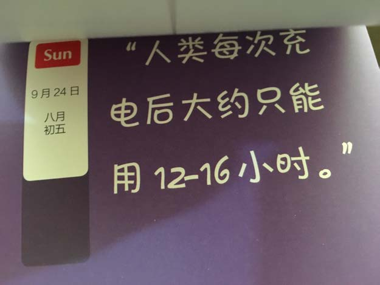

*2017-01-18 13:52 · 猫饭*

---

### 6230

对于一个吹毛求疵的人来说，丁字裤的丁字那一钩带来的非对称简直难以忍受。还是叫T裤更好一些，就像T裇或T骨（也有人把t-bone叫丁骨，但我觉得完全没必要）。

*2017-01-18 13:45 · 手机上网*

---

### 6231

哦，江孜作为中国传统产刀的地方我还是听说过的。转@ 海柱張 边城江孜、肉孜国历险记 转@ 辣剑波 I have a friend, 叫 孜 转@ 王兴 「孜」这个字，我好像只在「孜孜不倦」和「孜然」两处见到。

*2017-01-18 13:41 · 手机上网 转自王兴*

---

### 6232

「孜」这个字，我好像只在「孜孜不倦」和「孜然」两处见到。

*2017-01-18 13:34 · 手机上网*

---

### 6233

令我印象最深刻的舞狮是四年前春节在缅甸，看到高温下仰光的华侨们汗流浃背的在弘扬民族传统。转@ 拧巴人儿 下周末好像有个什么越南文化节，还有越南小姐选美什么的。莫扎特说他不想看选美，他想去看舞狮……

*2017-01-18 13:00 · 手机上网 转自拧巴人儿*

---

### 6234

转@ webto 把 iPhone 相机设置成了默认黑白，重新关注光和影

*2017-01-18 12:54 · 手机上网 转自webto*

---

### 6235

在我脑中，「海客谈瀛洲，烟涛微茫信难求」和「微信」有着奇怪的关联。

*2017-01-18 11:13 · iPhone版*

---

### 6236

转@ terababy 爆破艺术：《挽歌：为“蔡国强：九级浪”开幕所作的白天焰火项目》，2014。上海当代艺术博物馆外江面。白天焰火的彩色火药在画布、画纸上爆破，形成彩色火药画。

*2017-01-18 10:29 · 手机上网 转自terababy*

---

### 6237

2010年1月13日，美团还没上线，经共同朋友介绍，我和大众点评联合创始人龙伟第一次见面，在场的还有另一个人名叫孙浩，当时正准备从丽华快餐出来创业做“到家美食会“。那时我知道日后我和龙伟一定还会再打交道，但没想到和孙浩也是。

*2017-01-17 19:30 · iPhone版*

---

### 6238

太多的书不忍卒读。但是，能让你拿起就不愿放下、废寝忘食也要一口气读完的还不算是第一流好书。那些让你舍不得读完的才是。

*2017-01-17 01:26 · iPhone版*

---

### 6239

转：这条路，我们先走为敬。

*2017-01-17 01:00 · iPhone版*

---

### 6240

忙了一整天，经历各种挫折后，我的智力/体力/心力已经不足以对付缠绕在一起的两根手机充电线和一根耳机线了。

*2017-01-17 00:11 · 手机上网*

---

### 6241

主打「充电5分钟，通话2小时」这句广告词的OPPO做成了全国手机第一名绝不是偶然。转@ 王兴 你知道身陷流沙等着被吞噬是怎样一种绝望无助的心情吗？如果你经历过手机接着充电线但电量依然从3%掉到2%，你就会懂。

*2017-01-17 00:08 · 手机上网 转自王兴*

---

### 6242

你知道身陷流沙等着被吞噬是怎样一种绝望无助的心情吗？如果你经历过手机接着充电线但电量依然从3%掉到2%，你就会懂。

*2017-01-16 23:57 · iPhone版*

---

### 6243

有没有什么绝世武功可以用内力把体内沉积的过时信息逼出去？

*2017-01-16 22:20 · 手机上网*

---

### 6244

好巧，我正在听大张伟的《静止》。转@ 彩虹电池 我的妈，要是大裆裤好适合大张伟啊（不 转@ 王兴 配上黑手套，给我的第一感觉是掏下水道的工人穿的半身橡胶防水服。转@ 美嘉.rar 「胸以下都是腿」collection…

*2017-01-16 22:17 · 手机上网 转自美嘉.rar*

---

### 6245

一辈子只做一件事：以各种姿势变老。

*2017-01-16 22:14 · 手机上网*

---

### 6246

配上黑手套，给我的第一感觉是掏下水道的工人穿的半身橡胶防水服。转@ 美嘉.rar 「胸以下都是腿」collection…

*2017-01-16 22:13 · 手机上网 转自美嘉.rar*

---

### 6247

在机场候机椅上一个人斜靠在另一个人肩头上睡着的那两个姑娘，希望她们不会觉得我未经许可一屁股坐在她们身边太粗鲁。

*2017-01-16 21:54 · 手机上网*

---

### 6248

看来我的表达能力确实有些问题。我并不是同一部手机用了六七年，那还搞毛移动互联网啊。转@ 咩罗 闪存物理特性，用久了都要擦除后才能继续存，文件系统的锅不是很大。碎片问题哪个文件系统用这么久都会很严重转@ 王兴 用了六七年安卓手机，我终于碰到越用越慢的问题了

*2017-01-16 21:45 · 手机上网 转自王兴*

---

### 6249

Poor soul.

*2017-01-16 21:42 · iPhone版*

---

### 6250

用了六七年安卓手机，我终于碰到越用越慢的问题了。懂行的同事说原因在于文件系统的局限，没有很好的解决办法。

*2017-01-16 21:22 · 手机上网*

---

### 6251

听说开始收党费了。我有点好奇全国八千万党员的ARPU值是多少。

*2017-01-16 20:42 · 手机上网*

---

### 6252

今天又不靠谱了一次:-(

*2017-01-16 20:25 · 手机上网*

---

### 6253

一辈子只做一件事，变老。

*2017-01-16 14:45 · 手机上网*

---

### 6254

转@ Shimmer 柔、滑、滋、润 RT @ 王兴 这管润肤露上印的文字说明这个牌子认为好的皮肤应该是「柔软、光滑、nourished、湿润的」。这四条里面的nourished如何翻译最信达雅？和其他三条一样是靠触觉感受，还是涉及视觉？

*2017-01-16 14:01 · 手机上网 转自Shimmer*

---

### 6255

这管润肤露上印的文字说明这个牌子认为好的皮肤应该是「柔软、光滑、nourished、湿润的」。这四条里面的nourished如何翻译最信达雅？和其他三条一样是靠触觉感受，还是涉及视觉？

*2017-01-16 13:57 · 猫饭*

---

### 6256

「每天吃什么」才是终极问题，我也这么觉得。转@ 拧巴人儿 跟高校保安思索同样的问题……转@ 引擎 这是酝酿新思想的节奏啊～转@脆皮宾 同右 转@ 法缪尔. ……我还是想问问每天吃什么这个终极问题

*2017-01-16 13:14 · 手机上网 转自法缪尔.*

---

### 6257

-_-！转@ 拧巴人儿 我还有个邻居，养了一堆monarch caterpillar. 他说他没有足够的milkweed plants来喂这些毛毛虫，问谁有植物，他可以白送毛毛虫…………尼玛你这是专门来闹心的么！！

*2017-01-16 09:47 · 手机上网 转自拧巴人儿*

---

### 6258

最近锻炼身体全靠摩拜了，我气喘吁吁的说。

*2017-01-16 09:05 · iPhone版*

---

### 6259

有的时候我觉得自己是一个小书架，不知道该发展成一个图书馆还是一本书。

*2017-01-16 01:23 · 手机上网*

---

### 6260

过去这些年我听过很多很多遍《Hallelujah》，但今天才第一次认真看了一下歌词，立刻再次感叹Cohen真是天才！

*2017-01-16 00:55 · 手机上网*

---

### 6261

转@ 盖文张 乐视从融创拿到 168 亿投资的事情，对比周末这一波报道来看，界面最差，号称深度其实没料，底下评论都可能是刷的；36kr 平淡无奇，没数据也没情绪；pingwest 连发两篇，有料但也有情绪（过往宿怨），但又容易让人感觉情绪大过理性；好奇心日报有料也有质疑，表达清晰

*2017-01-16 00:40 · 手机上网 转自盖文张*

---

### 6262

好飘逸。

*2017-01-16 00:39 · 手机上网*

---

### 6263

和人约在和平饭店谈事情。想起周润发那部同名电影。

*2017-01-15 21:43 · iPhone版*

---

### 6264

转@ 清越 听在基层当过调研员的同学说，流动性大根本没法认真查，都是在上次普查的基础上自己拍板加上一点 转@ 王兴 本周最震撼我的是听说中国的人口普查很不靠谱，我们所熟悉的我国人口数可能误差高达10%。

*2017-01-15 13:00 · 手机上网 转自王兴*

---

### 6265

follow your heart = 怂 ？

*2017-01-15 10:01 · 手机上网*

---

### 6266

转：很多不熟悉麦斯基的人第一眼看见他的照片时，都以为他是爱因斯坦与史泰龙的混合体。

*2017-01-15 02:06 · 手机上网*

---

### 6267

2017过去半个月了。今年要干的事有点多。

*2017-01-15 01:48 · 手机上网*

---

### 6268

We are Ladies and Gentlemen serving Ladies and Gentlemen. 丽思卡尔顿

*2017-01-15 01:34 · 手机上网*

---

### 6269

在孤岛上生活过一段时间的人更认可大都市的价值。

*2017-01-15 01:32 · 手机上网*

---

### 6270

这三观。啧啧。转@ 拧巴人儿 莫扎特说我是个dictator lover. 我的确想在我的卧室挂上三个modernizing dictators的画像。两个已经选好了，park chung hee, ataturk, 我现在觉得第三个也有了，Muhammad Ali Pasha

*2017-01-15 01:23 · 手机上网 转自拧巴人儿*

---

### 6271

“我是一个知识分子，干的都是踏踏实实的事。天天都是5+2、‘白加黑’，一心只是想把保险公司干好，给保民挣点钱。”姚振华反复这样强调。

*2017-01-15 01:03 · 手机上网*

---

### 6272

转@ 金融界人贩子 经济并不景气，然而近期我知道好几个跨国机构都在大手笔砸钱在亚太区上新的IT项目，貌似是冬天开卖冰淇淋的架势。难道他们知道什么我不知道的东西？特定领域回暖比预想的要快？我得好好研究研究，争取不错过这一波。

*2017-01-15 00:19 · 手机上网 转自金融界人贩子*

---

### 6273

本周最震撼我的是听说中国的人口普查很不靠谱，我们所熟悉的我国人口数可能误差高达10%。

*2017-01-15 00:17 · iPhone版*

---

### 6274

大中小微个

*2017-01-14 19:01 · iPhone版*

---

### 6275

多谢推荐。转@ 呆瓜小贼 《色彩列传：黑色》《色彩列传：蓝色》

《色彩列传: 绿色》，写颜色背后的历史、文化和宗教内涵比较多。转@ 王兴 决定找一本讲颜色的书看一下。

*2017-01-14 14:21 · 手机上网 转自王兴*

---

### 6276

但乔布斯生前也还是选奔驰。凯迪拉克完全是土豪品位。转@ quux特斯拉内饰差是特斯拉能力不够，随便一个美国车厂的内饰都优于特斯拉 转@ 王兴 LX同学真是一语中的：特斯拉之所以内饰那么差，就是因为美国人本质上是没品味的，唯一的例外是苹果，那是因为苹果的主设计师Ive是英国人。

*2017-01-14 13:07 · 手机上网 转自王兴*

---

### 6277

这本书英文原版的封面更丰富多彩。转@ 王兴 谢谢@ 子棠 推荐《颜色的故事》。

*2017-01-14 12:12 · 手机上网*

---

### 6278

谢谢@ 子棠 推荐《颜色的故事》。

*2017-01-14 12:01 · 手机上网*

---

### 6279

转@ gravity0 听村长说起颜色，复习一下物理概念。三原色红绿蓝又称加法色：红+绿=黄；红+蓝=紫；绿+蓝=青；红+绿+蓝=白。与之对应的三种燃料原色青紫黄又称减法色：青+紫=蓝；青+黄=绿；紫+黄=红；青+紫+黄=黑。它们其实是从反射光线中减去了相应的颜色。

*2017-01-14 11:57 · 手机上网 转自gravity0*

---

### 6280

谢谢提供线索。转@ 二他姐姐 BBC有部纪录片叫《三色艺术史》，讲了蓝白金色。 http://www.bilibili.com/vid... 。上次一席有个设计师讲颜色在中国古代的名称和应用，也挺有意思（不过还没整理出视频文字）「@ 王兴 我正是想找一本尽可能囊括的书啊

*2017-01-14 11:45 · 手机上网 转自拧巴人儿*

---

### 6281

我正是想找一本尽可能囊括的书啊。转@ 拧巴人儿 @ 王兴 不是你表达能力有问题，是不创造任何实际价值的学者太多，从社科角度来说，可以是心理学关于颜色的书，从颜色被赋予的社会意义角度写的书，颜色的政治意义，等等等等，这不是一本书里都能囊括的。

*2017-01-14 11:39 · 手机上网 转自拧巴人儿*

---

### 6282

我的表达能力有这么成问题吗？我就是想找一本讲颜色的书啊，从物理、化学、艺术、历史、文化等方面介绍各种颜色。转@ 拧巴人儿@ 王兴 哪方面的？

*2017-01-14 11:22 · 手机上网 转自拧巴人儿*

---

### 6283

有定价权的企业就是霸气。转@ 杜斌beta 没错。转@ webto 有人说这一轮闪存内存涨价，导火索是三星炸鸡，试图从芯片和存储上找利润。。。

*2017-01-14 11:15 · 手机上网 转自webto*

---

### 6284

决定找一本讲颜色的书看一下。

*2017-01-14 11:14 · 手机上网*

---

### 6285

连续第四天喝防弹咖啡了。

*2017-01-14 09:33 · 手机上网*

---

### 6286

又来一个。这回只隔了两个月。转@ 王兴 又有一个人点赞了。隔了四个多月。转@ 王兴 有趣的是，有些事情虽然非常低频但却持续发生，例如说，大概平均每半年会有一个人给我那从没换过的微信封面点赞。

*2017-01-14 08:44 · 手机上网 转自王兴*

---

### 6287

因为当时我在深思的事情，我也许永远会记得08年底我在五道口清华同方科技广场B座16层落地窗前踱来踱去时看到的窗外景象。

*2017-01-13 22:21 · iPhone版*

---

### 6288

LX同学的毒舌真是一语中的：特斯拉之所以内饰那么差，就是因为美国人本质上是没品味的，唯一的例外是苹果，那是因为苹果的主设计师Ive是英国人。

*2017-01-13 22:17 · iPhone版*

---

### 6289

拥堵根本不是问题，连雾霾都不是根本伤害，但限人会是。转@xoxoxie 除了雾霾和拥堵，北京是座完美的城市。转@ 王兴 是的，北京本可以是一座更加伟大的城市。转@ 杨曜睿 云酷好歹可以远眺～穷乡僻壤待久了，回到北京反而能体会北京的美好。。某种意义上说，北京是国内最好的城市。

*2017-01-13 20:35 · 手机上网 转自杨曜睿*

---

### 6290

是的，北京本可以是一座更加伟大的城市。转@ 杨曜睿 晚餐后来发会呆～ Glen早以没有去的意义了，云酷好歹可以远眺～ 穷乡僻壤待久了，回到北京反而能体会北京的美好。。某种意义上说，北京是国内最好的城市。

*2017-01-13 19:03 · 手机上网 转自杨曜睿*

---

### 6291

开会走神的时候想象了一下自己如果想象力更丰富一点生活会过成什么样。

*2017-01-13 15:03 · 手机上网*

---

### 6292

唉，刚才午饭时不该嘴馋吃了几个饺子，可能会导致防弹咖啡被破功……

*2017-01-13 13:40 · 手机上网*

---

### 6293

两首都是好歌，但调调不一样吧。转@ 柒小斤 一直想说《易燃易爆炸》有点《彼得堡遗书》的调调。 转@ 王兴 上班路上反复播放《易

燃易爆炸》。

*2017-01-13 10:09 · 手机上网 转自王兴*

---

### 6294

转@ 拧巴人儿 一个sad truth是，有的人真的很好，人很nice很sweet,让你真的很想喜欢他们，而且你也的确喜欢他们，但是……但是………他们也的确十分boring......

*2017-01-13 08:56 · 手机上网 转自拧巴人儿*

---

### 6295

走神的时候想了一下陈粒的这几首歌该配什么样的舞蹈。

*2017-01-13 08:55 · iPhone版*

---

### 6296

上班路上反复播放《易燃易爆炸》。

*2017-01-13 08:46 · iPhone版*

---

### 6297

Learn the rules like a pro, so you can break them like an artist.

-Pablo Picasso

*2017-01-13 01:48 · iPhone版*

---

### 6298

9am的一杯防弹咖啡加上午饭不吃淀粉可以让我头脑清楚到7pm，之后就无法保证了。

*2017-01-12 23:48 · iPhone版*

---

### 6299

带椰蓉的糕点就是香！

*2017-01-12 16:11 · iPhone版*

---

### 6300

焙这个字居然真的念 bèi ，我以前一直念 péi :-(

*2017-01-11 13:18 · iPhone版*

---

### 6301

看怎么定义吧。正式宣战更是迟至41年12月9号，之前一天8号美国对日宣战，再前一天7号日本炸了珍珠港。转@ 爱ambest 准确的说37年不是全面抗战吗？ 转@ 王兴 听说中小学地方课程教材里终于要把「八年抗战」（从37年京郊卢沟桥算起）改为「十四年抗战」（从31年东北九一八算起）了

*2017-01-10 14:46 · 手机上网 转自王兴*

---

### 6302

听说中小学地方课程教材里终于要把「八年抗战」（从37年京郊卢沟桥算起）改为「十四年抗战」（从31年东北九一八算起）了。这个问题确实之前困扰了我多年。

*2017-01-10 14:39 · 手机上网*

---

### 6303

对马云来说，只要让大家知道他川普聊了就已经成功了。跟转@ 金融界人贩子 行家说了，马云第一句话就露馅了，美国中西部并不出产葡萄酒和水果，也不是纺织或成衣业所在地。“要么是功课没做足就来忽

悠，要么是带着党的任务来谈别的，但是没谈拢，所以川普握手时一脸怒容。”伊港。

*2017-01-10 14:30 · 手机上网 转自金融界人贩子*

---

### 6304

第一次完全不动手，就靠在房间里边散步边和echo/alexa连续多轮对话在amazon上把钱花出去了。amazon太牛逼了！

*2017-01-10 14:05 · iPhone版*

---

### 6305

2017年打算多读一些fiction。

*2017-01-09 22:47 · 手机上网*

---

### 6306

回想2016年读过的书，给我最深刻印象的竟然是《The LuxuryStrategy: Break the Rules of Marketing to Build LuxuryBrands》。

*2017-01-09 22:46 · 手机上网*

---

### 6307

在梅丽尔-斯特里普金球奖获奖感言里看到本日金句：take yourbroken heart and make it into art.

*2017-01-09 22:14 · iPhone版*

---

### 6308

…李政道先生总是在关键时刻与中国政府高层领导进行沟通，帮助扫除观念和官僚障碍，由上至下地推动电信部门的支持，当时参与此工程的邮电部门员工很诧异经常接到高层“加快速度”的指示。从北京高能所到斯坦福直线加速器中心的64K专线最终于93年3月2日开通。中国进入互联网时代。

*2017-01-09 21:24 · 手机上网*

---

### 6309

据说张小龙选在今天上线小程序既因为今天是乔布斯发布第一版iPhone十周年，又因为今天是自己的农历生日。

*2017-01-09 20:58 · 手机上网*

---

### 6310

转@ 狂风先生 这是一种常见错觉，一般实际情况是一脚踏空然后继续被命运按在地上揍……RT@ 王兴 「朝命运这个狗娘养的脸上踹一脚」。

*2017-01-09 20:56 · 手机上网 转自王兴*

---

### 6311

妈蛋，通过偷窥屏幕上对话字幕里出现的人名再上网搜索，我发现这就是最近很火的《西部世界》！转@ 一颗维他命Ko 有过相同烦恼 转@ 王兴 在高铁上长时间扭头看邻座在电脑上放的电影是不是不太礼貌？但是真的很吸引人！

*2017-01-09 20:55 · 手机上网 转自王兴*

---

### 6312

「朝命运这个狗娘养的脸上踹一脚」。

*2017-01-09 20:48 · iPhone版*

---

### 6313

决定学习一个新技能：打那种绕得很整齐的绞索结。

*2017-01-09 20:41 · iPhone版*

---

### 6314

在高铁上长时间扭头看邻座在电脑上放的电影是不是不太礼貌？但是真的很吸引人！

*2017-01-09 20:38 · iPhone版*

---

### 6315

我经常要努力区分我年纪增长带来的变化和时代进步的变化。

*2017-01-09 20:25 · iPhone版*

---

### 6316

我说非洲我只去过南非，一个大哥建议我应该找机会去肯尼亚看一下非洲动物的wild，再找机会去刚果（金）这样的国家看看非洲另一种wild。

*2017-01-09 19:56 · iPhone版*

---

### 6317

好梗！转@ Fanxi 某同事几个月前送了我一个Filco青轴，过了一周后要回去换了个Filco茶轴给我。今天他又跟我说，你自己再买个静电容键盘用吧，茶轴你带回家用。——我打字就是这么大力！

*2017-01-09 19:23 · 手机上网 转自Fanxi*

---

### 6318

啊，我已经这么落伍了吗-_-！转@ Amber_懒 然而北京这样的一线城市已经在宣传“左行右立对电梯不好，是破坏公物”这样的准则了。 转@ 王兴 即使是在上海这样的一线城市，「搭乘自动扶梯时应该靠右站以把左侧留出来给有急事的人通过」这条准则也远没有被普遍接受。

*2017-01-09 19:04 · 手机上网 转自王兴*

---

### 6319

即使是在上海这样的一线城市，「搭乘自动扶梯时应该靠右站以把左侧留出来给需要紧急通过的人」这条准则也远没有被普遍接受。

*2017-01-09 19:03 · 手机上网*

---

### 6320

你又调皮了。转@ 太空小孩 鸡鸡和蛋蛋都是污污的词汇，但鸡蛋却不是。

*2017-01-09 17:43 · 手机上网 转自太空小孩*

---

### 6321

转@ webto 「你完全理解错了，因为很多人追求的不是治理污染，而是工业倒退。他们的意思是工业是污染之源，所以要限制工业。 可就现实来说，其实治理污染最好的方法恰恰反而是工业更大的发展。」

*2017-01-08 23:37 · 手机上网 转自webto*

---

### 6322

谢谢！我之前知道知乎网友很能扯，但不知道已经能扯到这种程度了第 1082 页 / 共 2284 页

_-! 转@ 张亮 https://www.zhihu.com/quest... 转@ 王兴 没有龙这种宠物确实是蛮遗憾的。

*2017-01-08 21:16 · 手机上网 转自王兴*

---

### 6323

没有龙这种宠物确实是蛮遗憾的。

*2017-01-08 15:15 · 手机上网*

---

### 6324

安全带确实能带给人安全感。

*2017-01-08 15:13 · 手机上网*

---

### 6325

成人之美，从13车厢换到5车厢去了。

*2017-01-07 10:58 · 手机上网*

---

### 6326

@ 柒小斤 吃饭聊天不都是各种扯淡呗

*2017-01-07 10:57 · 手机上网 给柒小斤的回复*

---

### 6327

夜深人静时，施梅塔纳的《伏尔塔瓦河》也不错。

*2017-01-07 02:46 · 手机上网*

---

### 6328

转@ 小熊娃娃 这么多数据统计，唯独被云音乐戳中（或者说看穿）。

*2017-01-07 02:44 · 手机上网 转自小熊娃娃*

---

### 6329

跟一个娶了红二代的印度人和一个在美国政府工作过正在cctv工作的新英格兰富N代吃一个接近六小时的晚餐还是蛮有趣的体验。

*2017-01-07 00:47 · iPhone版*

---

### 6330

mentor这个词居然是从荷马史诗里来的。

*2017-01-06 16:49 · 手机上网*

---

### 6331

最近有时会想起这个老笑话：您这是干嘛去呀？上法院打官司去。原告还是被告？原告。嘿，原告，够牛逼的呀。牛逼嘛呀，被强jian了。

*2017-01-06 12:00 · 手机上网*

---

### 6332

通过咖啡杯盖上那小口喝绿茶确实很不爽快。

*2017-01-06 10:42 · 手机上网*

---

### 6333

转@ 阳升 读完《学会提问》之后，才意识到要努力把学习型阅读和休闲型阅读分得更开一点。前者应该是读者主导，后者才是作者主导。以下内容少儿不宜，18 岁以下和敏感人群请回避：从男性视角来看，这就类似男上位和女上位的区别。

*2017-01-06 10:29 · 手机上网 转自阳升*

---

### 6334

夜深人静时听听卢冠廷的《一生所爱》还是不错的。

*2017-01-06 01:25 · 手机上网*

---

### 6335

洗洗睡吧。Be the last man sleeping won't help you be the lastman standing.

*2017-01-06 01:21 · 手机上网*

---

### 6336

wikipedia把科学分为三类：natural, social, formal，数学属于formal。

*2017-01-06 00:02 · 手机上网*

---

### 6337

数学是什么？什么是数学？这个问题确实不太好回答。

*2017-01-05 23:57 · 手机上网*

---

### 6338

转@ 拧巴人儿 哈哈哈哈哈 转@ 糗百 以前别人说我眼睛小，我都不信，终于有一天我信了，那天在家里躺着看电视，突然我妈回来把电视关了，然后默默的帮我盖上了被子～……我硬是不敢出声。

*2017-01-05 23:24 · 手机上网 转自糗百*

---

### 6339

这说法我也听过。所以别动不动谈颠覆产业，那其实很残酷，不只是简单的经济问题。转@ gravity0 大学里中革史老师说义和团那一段是从就业角度。他说漕运原是国家经济主动脉，洋务运动之后被更高效的海轮取代。大量靠运河吃饭的劳工和服务人员失去了生计也没有土地，于是男入义和拳女入红灯照

*2017-01-05 23:15 · 手机上网 转自gravity0*

---

### 6340

今天喝了两顿腊八粥。

*2017-01-05 23:12 · iPhone版*

---

### 6341

-_-! 转@ 远骋 「我们一起颤抖，会更明白，什么是温柔」 ——这句

《红豆》里面的歌词，有点，污。

*2017-01-05 13:37 · 手机上网 转自远骋*

---

### 6342

严于律己，宽以待人？转@ 远骋 转@ 刘天一 我觉得我身材超过健身房里80%的男性。然并卵，我估计需要超过健身房里95%，达到人群中男性群体的99.5%以上，才能脱了衣服让异性有惊喜的感觉。但mm就不一样，我觉得人群中前5%就可以有这种效果

*2017-01-05 11:52 · 手机上网 转自刘天一*

---

### 6343

time-server: a person who makes very little effort at workbecause they are waiting to leave or retire.

*2017-01-05 11:39 · iPhone版*

---

### 6344

据说电动汽车绕不开的电池产业，全球前五名是日韩各两家，中国一家。看来欧美企业不太明白什么叫「大风起于青萍之末」。

*2017-01-05 00:20 · 手机上网*

---

### 6345

转：坚持须从任何形式的集体身份认同中获得自由与解放，这是自由主义的本质。自由主义已令人类从民族身份、宗教身份等等集体属性中获得了个体解放，最后一种集体认同便是性别。所以，现在是时候废除性别认同，让性别变得不再固定，可供选择。

*2017-01-05 00:13 · 手机上网*

---

### 6346

一个懂行的朋友如此评价堪称国内一线的XX金融集团：董事长负责做梦，CEO负责把董事长做的梦十个中实现一个就可以了。

*2017-01-05 00:01 · 手机上网*

---

### 6347

The desert has dried up more blood than you could imagine.

《阿拉伯的劳伦斯》里阿拉伯酋长对劳伦斯这么说。

*2017-01-04 23:54 · 手机上网*

---

### 6348

确实有必要加强对雾霾的了解。我刚发现我拿起笔连霾这个字都不太会写。

*2017-01-04 15:29 · 网页*

---

### 6349

阿Q精神不光中国人有，全人类都有。原先老说围棋这么高深的智力游戏人工智能很难下赢人，现在脸被彻底打肿之后，大家开始普及另一个说法：围棋下不过人工智能就像博尔特跑不过汽车一样，很正常，没什么大不了。

*2017-01-04 12:15 · 网页*

---

### 6350

确实有不少事情无法事前证明，只有相信。信或不信。

*2017-01-04 01:43 · 手机上网*

---

### 6351

基因哪管意义啊。转@ Olittle 可能活太久没有意义。。。。。 转@王兴 进化成既长命又长期有生殖能力不就完了？齐白石差不多90岁时老婆还生小孩了。转@ M.深度 因为长命的物种在衰老期也无法再进行基因的复制，对于基因的延续没有意义？所以长命基因不会被保持？@ 王兴 果壳这篇还不错

*2017-01-04 01:34 · 手机上网 转自王兴*

---

### 6352

进化成既长命又长期有生殖能力不就完了？齐白石差不多90岁时老婆还生小孩了。转@ M.深度 因为长命的物种在衰老期也无法再进行基因的复制，对于基因的延续没有意义？所以长命基因不会被保持？@王兴 果壳这篇还不错。在东非草原及之前，因为人类太弱而天敌太多，对基因来说

*2017-01-04 01:32 · 手机上网 转自王兴*

---

### 6353

果壳这篇还不错。在东非草原及之前，因为人类太弱而天敌太多，对基因来说，更好的竞争策略可能确实是「多生」而非「长命」。为什么不能同时兼用两种策略呢？因为同物种需要的资源太稀缺？转@ 卷发子仗人势 http://t.cn/RIeQjBd 「@ 王兴 人为什么被进化成大概只活大几十岁呢？

*2017-01-04 01:13 · 手机上网 转自王兴*

---

### 6354

每一年都是最艰难的一年。每一年都是更艰难的一年。每一年都是最重要的一年。

*2017-01-04 00:49 · 手机上网*

---

### 6355

人为什么被进化成大概只活大几十岁呢？

*2017-01-04 00:47 · 手机上网*

---

### 6356

多听几十遍之后我还是更喜欢《易燃易爆炸》。曲调更激昂，生生把一首吐槽的情歌唱出了金戈铁马的味道。转@ 王兴 《奇妙能力歌》

确实更棒。谢谢。转@ 沈倾欢 还是最喜欢奇妙能力歌，弹着吉他唱比较有意思。转@ 王兴 陈粒的《易燃易爆炸》这歌不错。

*2017-01-03 20:40 · 手机上网 转自王兴*

---

### 6357

决定下次回龙岩老家时去古田会议旧址参观一下。

*2017-01-03 19:53 · iPhone版*

---

### 6358

转@ 飯否小字报 转@ 罗妮zyzyyuan 没想到雕塑也能够表现纱的质感。

*2017-01-03 12:41 · 手机上网 转自罗妮zyzyyuan*

---

### 6359

可怜无定河边骨，犹是春闺梦里人。

*2017-01-03 10:07 · 手机上网*

---

### 6360

转@ 瑂豆 记得小时候家里收到过一封金庸写给我爸的信，我特别兴奋以为我爸跟金庸探讨武侠小说来着，结果知道他们讨论的是族谱问题之后还挺失落的，不过那也是第一次知道原来金庸也姓查，而且祖籍跟我们是同一个地方，想想还挺神奇的。转@ 王兴 金庸原名查良镛，穆旦原名查良铮，海子原名查海生。

*2017-01-02 17:33 · 手机上网 转自王兴*

---

### 6361

哈尔滨这座城市居然是俄国人创建的。

*2017-01-02 15:40 · 手机上网*

---

### 6362

这张照片截得太有艺术性了！最左边省略了什么？我的第一反应是「时代是阿里的唯一对手」，不对，没有那一撇。「游戏是阿里的唯一对手」？好像也不太对吧。哦，原来强东同志说的是，「我是阿里的唯一对手」。

*2017-01-02 04:01 · 猫饭*

---

### 6363

任我再努力回忆，这电影里似乎只出现两次女人，一是男人出征时在道路两旁石壁上发出奇怪的呜呜声，二是残垣断壁里刚被奸杀完似乎尸首还没凉。转@ 王兴 时隔十六年重看《阿拉伯的劳伦斯》。对我来说完全就像一部新片。看到大概三分之二时想起了当年的观后感：这是我看过的人最多但女人最少的电影。

*2017-01-02 03:20 · 手机上网 转自王兴*

---

### 6364

转：诗人徐志摩的诗情，是因遇到林徽因而迸发出来的，在遇到林之前的二十四年，徐志摩“与诗完全没有相干”。

*2017-01-02 03:01 · iPhone版*

---

### 6365

愚钝如我，并没有第一时间意识到「金庸」来自原名最后一个字的拆字，而「穆旦」则来自姓的拆字再换个同音字……转@ 王兴 金庸原名查良镛，穆旦原名查良铮，海子原名查海生。

*2017-01-02 02:56 · 手机上网 转自王兴*

---

### 6366

正因为如此，「我喝下最后一口情人啤酒，投向太阳」这句歌词才有意境。转@ 王兴 人总是挑容易的事情做。要不，人们发酒疯或表决心的时候，为什么总是把喝空的酒杯摔在地上，而不是摔在墙上或天花板上？

*2017-01-02 02:51 · 手机上网 转自王兴*

---

### 6367

人总是挑容易的事情做。要不，人们发酒疯或表决心的时候，为什么总是把喝空的酒杯摔在地上，而不是摔在墙上或天花板上？

*2017-01-02 02:43 · 手机上网*

---

### 6368

听过的那些歌里，愿意加入收藏列表以后反复再听的已是不容易，时不时会想起来愿意单点播放的更是难得到屈指可数，Viva la vida就属于后者的一个典型代表，cohen的you want it darker则是最新上榜。

*2017-01-02 02:40 · 手机上网*

---

### 6369

金庸原名查良镛，穆旦原名查良铮，海子原名查海生。

*2017-01-02 02:33 · 手机上网*

---

### 6370

我都忘了进没进蓝色清真寺了-_-! 圣索菲亚我倒是相对认真的看了。

转@ 拧巴人儿 蓝色清真寺！ 转@ 王兴 以我有限的人生经验，真正的杰作从不让人失望，例如旧金山金门大桥、悉尼歌剧院、莫斯科红场上的洋葱头教堂、巴塞罗那圣家堂……

*2017-01-02 02:15 · 手机上网 转自王兴*

---

### 6371

以我有限的人生经验，真正的杰作从不让人失望，例如旧金山金门大桥、悉尼歌剧院、莫斯科红场上的洋葱头教堂、巴塞罗那圣家堂……

*2017-01-02 02:06 · iPhone版*

---

### 6372

陈粒居然还有一首歌是《五言》！

*2017-01-02 01:57 · iPhone版*

---

### 6373

「冷得尿顶人」这说法太有想象力了！

*2017-01-02 01:55 · iPhone版*

---

### 6374

有一种心情叫做担心即将得到你不愿失去的。

*2017-01-02 01:25 · 手机上网*

---

### 6375

每一刻都是你的「上半生」和「下半生」的分界。

*2017-01-02 01:22 · 手机上网*

---

### 6376

转自美团点评技术团队的博客：1955年3月15日，爱因斯坦给刚去世的密友Michele Besso家人的信中说：“像我们这样信仰物理学的人都知道，过去、现在和未来之间的分别只不过是持久而顽固的幻觉。”

*2017-01-02 01:07 · 手机上网*

---

### 6377

日渐荒凉的世界更需要突如其来的信心和决心。

*2017-01-02 00:55 · 手机上网*

---

### 6378

哪有这么容易消失啊。即使是遭遇恐怖袭击，也是活要见人死要见尸

吧。转@ 拧巴人儿 我要是还在土耳其的话，就可以借这个机会永远消失了。

*2017-01-02 00:33 · 手机上网 转自拧巴人儿*

---

### 6379

《奇妙能力歌》确实更棒。谢谢。转@ 沈倾欢 还是最喜欢奇妙能力歌，弹着吉他唱比较有意思。转@ 王兴 陈粒的《易燃易爆炸》这歌不错。

*2017-01-01 19:59 · 手机上网 转自王兴*

---

### 6380

「成长的感觉」不等于真的「成长」，获得前者并不太难，但后者真的很难。

*2017-01-01 19:43 · iPhone版*

---

### 6381

陈粒的《易燃易爆炸》这歌不错。

*2017-01-01 19:13 · iPhone版*

---

### 6382

dyson的设计师们真的不是在设计科幻片道具吗？看第一眼，当时我就震惊了。

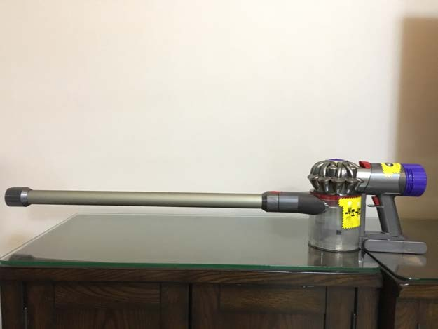

*2017-01-01 17:45 · 猫饭*

---

### 6383

时隔十六年重看《阿拉伯的劳伦斯》。对我来说完全就像一部新片。

看到大概三分之二时想起了当年的观后感：这是我看过的人最多但女人最少的电影。

*2017-01-01 17:26 · iPhone版*

---

### 6384

转@ sorrowhill @ 王兴 这话确实出自尼采的鸡汤大作《查拉图斯特拉如是说》...英文版是【The more he seeks to rise into the heightand light, the more vigorously do his roots strug

*2017-01-01 12:56 · 手机上网 转自sorrowhill*

---

### 6385

空气质量分三种：不敢肉眼直视太阳，敢，敢也看不到。

*2017-01-01 12:33 · iPhone版*

---

### 6386

「其实人跟树是一样的，越是向往高处的阳光，它的根就越要伸向黑暗的地底」，尼采居然还擅长创作这种鸡汤？或是别人安在他头上的？在「后真相时代」，这个区别已经越来越不重要了。

*2017-01-01 11:58 · 手机上网*

---

### 6387

苏格兰除了给世界贡献了威士忌、高尔夫、保险、瓦特、亚当斯密，还贡献了《友谊地久天长》这首优美曲子。

*2017-01-01 09:21 · 手机上网*

---

### 6388

转@ Frankiiee 此时此刻，放一首诗是合适的。

*2017-01-01 09:12 · 手机上网 转自Frankiiee*

---

### 6389

anyway，饭否乡亲们，新年快乐！

*2017-01-01 00:28 · iPhone版*

---

### 6390

有件事我一直没太搞明白：我们爱一个人、一个组织、一座城市、一个国家，有多大程度上是爱自己？

*2016-12-31 23:59 · iPhone版*

---

### 6391

人最大的错误是试图拥有过去，其次是试图拥有未来，再其次是试图拥有现在。

*2016-12-31 20:56 · iPhone版*

---

### 6392

惊闻我的家乡龙岩要建机场了。军用机场改的那个连城冠豸山机场离市区有一百公里，太远；现在要在离市区很近的红坊镇建一个新机场，按4D设计（可降除747／380外所有机型），明年先按4C动工（可降737／757／767／空客320／319等）。建机场倒是不难，可是航线能开起来吗？

*2016-12-31 16:36 · 网页*

---

### 6393

PPT卡拉OK，有创意！转@ severusn.V 可以转@ FlowerShin 转 @油面筋塞肉是本命 转@ 非人哉 真好玩 转@ 狂风先生 ……？？？

*2016-12-31 11:35 · 手机上网 转自狂风先生*

---

### 6394

为了喜迎新年，今天不用铅笔了，用红蜡笔。

*2016-12-31 11:23 · iPhone版*

---

### 6395

《欲望都市》和《Sex and the City》这俩中英文名都起得挺好。

*2016-12-31 10:41 · iPhone版*

---

### 6396

刚知道印钞厂和造币厂是完全分开的独立机构。想想也是，两者需要的生产技能是完全不同的，虽然都和钱有关。

*2016-12-31 09:44 · iPhone版*

---

### 6397

第一次听说「拜拜肉」。

*2016-12-30 18:32 · 网页*

---

### 6398

转@ 阳升 电脑成为肉鸡还有救，毕竟可以重装系统，大脑要是成为肉鸡，那就严重了。。。

*2016-12-30 13:31 · 手机上网 转自阳升*

---

### 6399

没有深意，只是我化学没学好-_-! 转@ 海默默兽 从化学结构式的递增排序来看，我咋觉得是醛，醇，酸，酯；莫非另有深意 转@ 王兴酸、醇、醛、酯

*2016-12-30 13:29 · 手机上网 转自王兴*

---

### 6400

你建议怎么叫？谢谢。转@ 饭小默 iPhone自带地图…好蠢的叫法 @王兴

*2016-12-30 13:28 · 手机上网 转自饭小默*

---

### 6401

酸、醇、醛、酯

*2016-12-30 09:52 · iPhone版*

---

### 6402

相对有信息量的垃圾短信。# made my day #

*2016-12-29 22:35 · 手机上网*

---

### 6403

“以前我家外面是海，伸筷子可以到海里夹螃蟹“，这种说法好有趣。

*2016-12-29 15:22 · iPhone版*

---

### 6404

人生中值得为之奋斗的东西不多，但本来也不需要多。

*2016-12-29 15:14 · iPhone版*

---

### 6405

想起了姜文的「让子弹飞一会儿」。转@ 王兴 《比利林恩》里有句台词：If a bullet's going to get you, it has already been fired.

*2016-12-29 12:30 · 手机上网 转自王兴*

---

### 6406

转@ webto 「1946年-1989年间，俄航共发生过721起空难，事故率最高的七十年代，甚至每年平均就有20-30起。据航空坠毁记录办公室（ACRO）的统计，俄航至今已造成8231名乘客及机组人员遇难，高居世界第一，而位列其后的法国航空仅为1783人。」

*2016-12-29 09:21 · 手机上网 转自webto*

---

### 6407

没想到过去五年微软股价的涨势居然如此稳健，三倍了。

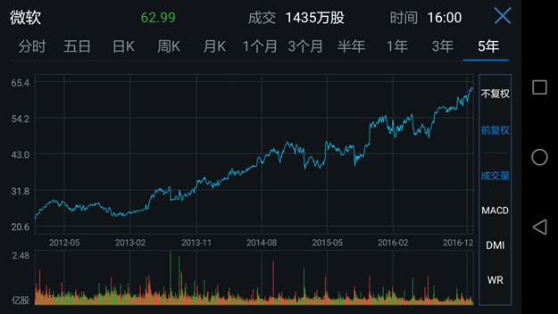

*2016-12-29 08:09 · 手机上网*

---

### 6408

转@ 拧巴人儿 看这罗马时期的秤砣。

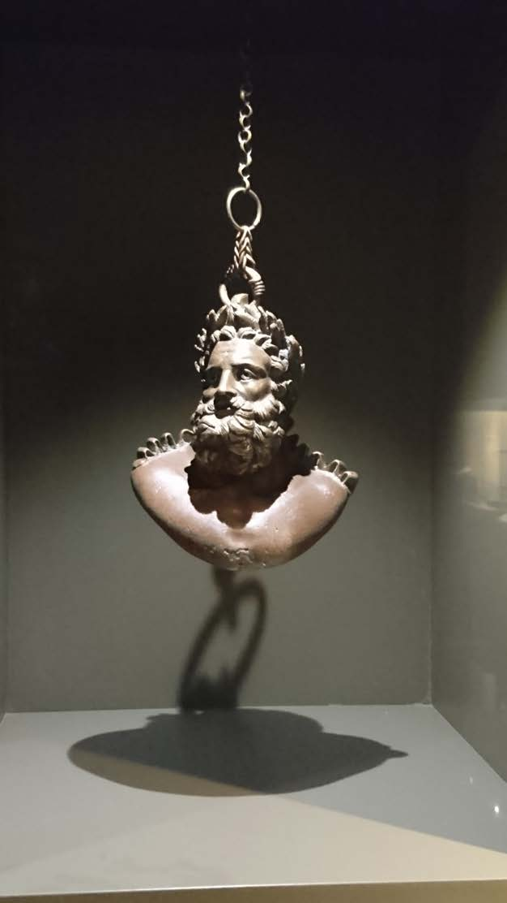

*2016-12-29 07:59 · 手机上网 转自拧巴人儿*

---

### 6409

今晚才9点半我就已经困得快真不开眼了。这是什么情况！

*2016-12-28 21:34 · iPhone版*

---

### 6410

为什么葡萄酒在玻璃瓶外一般就没有纸盒了？

*2016-12-28 19:01 · iPhone版*

---

### 6411

高级黑！转@ 阳升 人民日报批判猫眼和豆瓣评分，说实话，我很担心豆瓣扛不住慕名而来的流量而挂掉。。。

*2016-12-28 17:44 · 手机上网 转自阳升*

---

### 6412

「不好面子」和「不要脸」。

*2016-12-28 16:50 · 手机上网*

---

### 6413

波音总部很多年前就迁往芝加哥了。转@ faraway 华盛顿州居然不是波音啊 转@ 端沐猴 转@ 王兴 转@ 金融界人贩子 2015年美国各州营业额最高的公司，由此可见美国经济的主力面还是传统行业，而并不是什么电商活互联网加。

*2016-12-28 16:13 · 手机上网 转自金融界人贩子*

---

### 6414

在北五环过京承高速那个路口都可以远远的看到CBD正在建的那个北京第一高楼「中国尊」了。

*2016-12-28 12:06 · iPhone版*

---

### 6415

我，真的只是，想查一下laich这个单词……

*2016-12-28 12:00 · 手机上网*

---

### 6416

昨晚睡到半夜右小腿抽筋，居然现在还有些后遗症:-(

*2016-12-28 11:23 · iPhone版*

---

### 6417

「含赵量」这个词有流行起来的趋势。

*2016-12-28 09:57 · iPhone版*

---

### 6418

前天在成田机场转机时突然心血来潮买了张日本地图。刚才拆开来一

看，基本都是汉字。

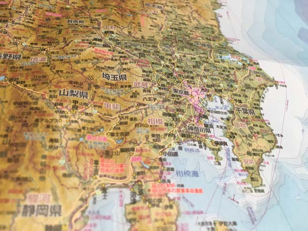

*2016-12-28 01:55 · 猫饭*

---

### 6419

逐渐觉得美国问别国为何不搞西式民主有点「何不食肉糜」的味道。

*2016-12-28 00:30 · 手机上网*

---

### 6420

菩萨畏因，凡夫畏果。那佛呢？

*2016-12-27 23:57 · 手机上网*

---

### 6421

滚石杂志2003年评出的《史上最棒的500首歌》里，网易云音乐里有65首无法免费下载，需要付费。QQ音乐里没找到现成歌单，不清楚情况如何。

*2016-12-27 14:31 · 手机上网*

---

### 6422

转@ 李大宝剑 依旧记得高三的某节自习课上，一抬头黄昏的天空呈现瑰丽的色彩，就这样看着直到窗户被路灯映出黄色的光晕，直到夜空慢慢到来，那是30年人生所见最美丽的片段。 转 @ 王兴 不给你机会看第二眼。转@ 流连 黄昏短的像一句誓言「@ 王兴 刚才扭头时，窗外还是晚霞映衬着高楼的美景，

*2016-12-27 14:18 · 手机上网 转自王兴*

---

### 6423

从最初的雀巢速溶升级到星巴克速溶，现在再尝试一下挂耳。

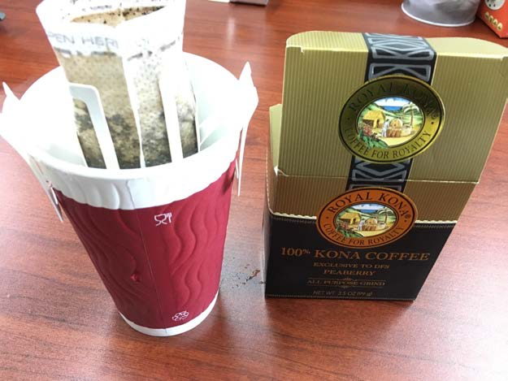

*2016-12-27 09:12 · 猫饭*

---

### 6424

转：1984年1月11日，北京丽都饭店有限公司与美国假日酒店有限公司（现属洲际集团）签订经营和管理协议，宣布将该饭店正式命名为北京丽都假日饭店，由此，假日品牌成为进入中国饭店市场的第一个国际品牌。

*2016-12-27 00:46 · iPhone版*

---

### 6425

「南半球」真是神翻译！转@ 老舞 好像港台那边的媒体管这个叫“露出南半球”。转@ 王兴 学了个新词 underboob，指这种露出来的下半个乳房。中文里有相应的专门说法了吗？

*2016-12-26 22:32 · 手机上网 转自王兴*

---

### 6426

转@ 金融界人贩子 2015年美国各州营业额最高的公司，由此可见美国经济的主力面还是传统行业，而并不是什么电商活互联网加。

*2016-12-26 22:25 · 手机上网 转自金融界人贩子*

---

### 6427

转@ 米饭_嗷 日语有个词叫「下乳」好像也是这个意思，国内的宅圈也这样叫。还有下乳协会 转 @ 王兴 学了个新词 underboob，指这种露出来的下半个乳房。中文里有相应的专门说法了吗？

*2016-12-26 20:01 · 手机上网 转自王兴*

---

### 6428

学了个新词 underboob，指这种露出来的下半个乳房。中文里有相应的专门说法了吗？

*2016-12-26 19:55 · 手机上网*

---

### 6429

大气层的存在多么重要啊。它不仅让我们得以呼吸，而且让我们能看

到美丽的黄昏而不是只有泾渭分明的白天和黑夜。

*2016-12-26 18:29 · 手机上网*

---

### 6430

不给你机会看第二眼。转@ 流连 黄昏短的像一句誓言「@ 王兴 刚才扭头时，窗外还是晚霞映衬着高楼的美景，回头似乎只看了几眼手机，再一扭头，窗外夜幕已降临，只剩下五颜六色的灯光。」

*2016-12-26 18:23 · 手机上网 转自王兴*

---

### 6431

「浅草寺」这个名字确实极美。

*2016-12-26 18:21 · iPhone版*

---

### 6432

刚才扭头时，窗外还是晚霞映衬着高楼的美景，回头似乎只看了几眼手机，再一扭头，窗外夜幕已降临，只剩下五颜六色的灯光。

*2016-12-26 18:10 · iPhone版*

---

### 6433

复杂系统通过冗余达到系统稳定。比如，人的肾有两个，其实一个也能用。

*2016-12-26 17:20 · 手机上网*

---

### 6434

刚发现今天换了条仔裤忘了系皮带，但似乎也不需要了-_-!

*2016-12-26 14:08 · iPhone版*

---

### 6435

转@ 胡泳 他认为大学里的分数应该讲究分配正义。

*2016-12-26 10:53 · 手机上网 转自胡泳*

---

### 6436

经济学人上说福特1913年开始搞流水线，20年之后美国超过一半家庭都有汽车了。这普及速度很快啊。中国的互联网都已经搞了差不多20年了。

*2016-12-25 22:58 · 手机上网*

---

### 6437

出于尝试的目的，我决定买一本女优画册；出于比较的目的，我决定买两本不同风格的。

*2016-12-25 16:43 · 手机上网*

---

### 6438

心灵鸡汤果然全球流行经久不衰。在日本机场书店看到架子上摆着英文原版。

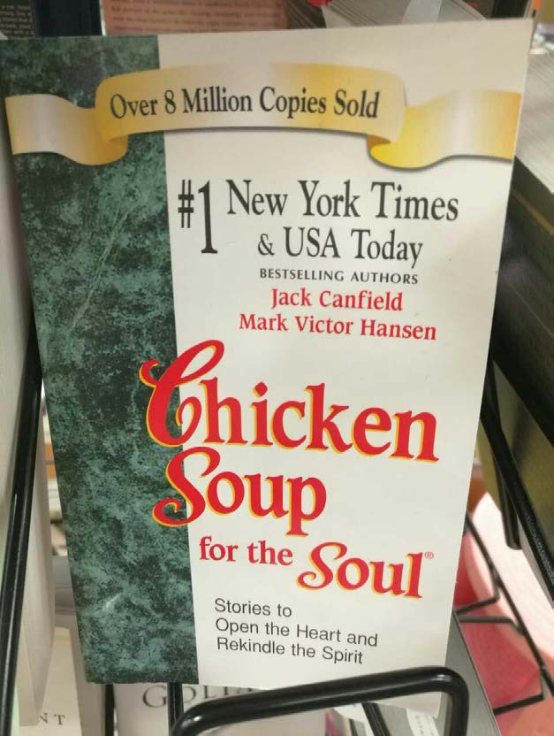

*2016-12-25 16:09 · 手机上网*

---

### 6439

日本机场书店一进门摆着反思「偷袭珍珠港」的书。边上是女优大集合的杂志。

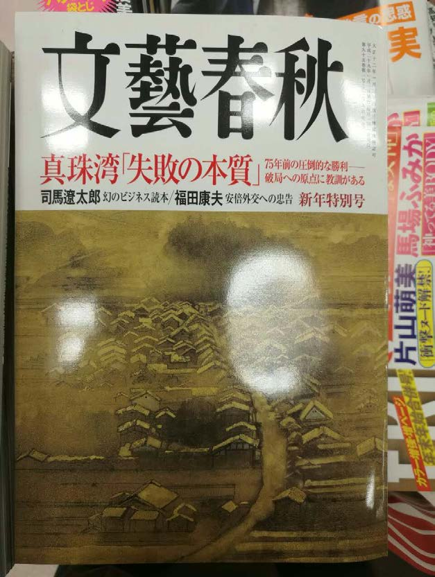

*2016-12-25 15:52 · 手机上网*

---

### 6440

刚知道折千纸鹤是日本传统。

*2016-12-25 15:43 · iPhone版*

---

### 6441

还没完全理解，但好像很厉害的样子。转@ 张亮 Neal Gabler 总结的 1910 年代起挑战 WASP 们所依赖的美国传统价值的事物们：城市化、大众传播、工会、中产阶级的专业化、教育。很有意思，这五个都是大事儿。

*2016-12-25 04:25 · 手机上网 转自张亮*

---

### 6442

今年的圣诞节是在美国回中国的航班上过的。十年前也是。十三年前也是。

*2016-12-25 04:23 · iPhone版*

---

### 6443

是techno。转@ 涂涂Julia 是说oppo么 当初在oppo工作时有黑人朋友找到我们深圳科技园楼里问oppo在哪 说要买手机 真不骗人 我们自

己都惊呆了 转@ 王兴 听说深圳某手机厂商在非洲销量极大…其成功原因是产品特别接地气，解决了诸如「黑人自拍时，脸部很难定位」

的问题

*2016-12-22 19:24 · 手机上网 转自王兴*

---

### 6444

听说深圳某手机厂商在非洲销量极大，甚至远超华为，其成功原因是产品特别接地气，解决了诸如「黑人自拍时，脸部很难定位」的问题。# made my day #

*2016-12-22 19:18 · iPhone版*

---

### 6445

谢谢。这张照片让我知道了世界上还有一种东西叫高腰丁字裤。转@拧巴人儿 摸

*2016-12-22 16:54 · 手机上网 转自拧巴人儿*

---

### 6446

转@ gravity0 美国独立战争起源是经济问题，波士顿倾茶事件同虎门硝烟性质一样，当地人受够了大英帝国倾销海外殖民地种植园作物对当地的经济掠夺。战后英国继续控制产茶区，美国控制产咖啡区，英国人喝茶，美国人喝咖啡。

*2016-12-21 20:12 · 手机上网 转自gravity0*

---

### 6447

我都忘了，我到底有没有参观过古田会议会址？如果有的话，那也只

可能是二十年前读高中时学校组织的那次全年级社会实践。我只记得那次活动我有点羡慕文科班，因为他们去得远，去了跨省的瑞金，而我们理科班去了更近的地方，长汀或者古田（百度地图显示现在会址离我家不到50公里）。

*2016-12-21 19:57 · iPhone版*

---

### 6448

我似乎从没用过「啐」字。查了一下：啐字从口从卒，卒亦声；

「卒」义为「极点」、「极端」；「口」与「卒」联合起来表示「口部的极力动作」，即「用力从嘴里吐出来」。东东枪老师的文字造诣可见一斑。转@ 东东枪 友情提醒：啐痰吐唾沫之前别忘了确认一下是不是还戴着口罩。别问我怎么知道的。

*2016-12-21 17:52 · 手机上网 转自东东枪*

---

### 6449

made my day.

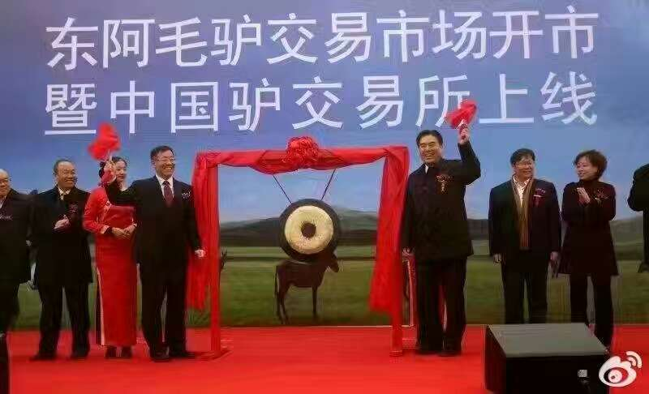

*2016-12-21 15:49 · 手机上网*

---

### 6450

-_-！转@ 东东枪 友情提醒：啐痰吐唾沫之前别忘了确认一下是不是还戴着口罩。别问我怎么知道的。

*2016-12-21 14:09 · 手机上网 转自东东枪*

---

### 6451

谢谢。友情转发。转@ orchid @ 王兴 推荐王老板看这篇：http://t.cn/RIa4DFZ

*2016-12-20 19:39 · 手机上网 转自orchid*

---

### 6452

那应该是分开的吧。如果是既裸体又男女不分，那我应该不会没过几年就没印象了-_-!转@ 拧巴人儿 @ 王兴 那男女分不分开？

*2016-12-20 19:08 · 手机上网 转自拧巴人儿*

---

### 6453

有点记不清了，蒸汽浴应该是不穿衣服的吧。价位有高有低，有些高端的是设在传奇建筑师米马尔•希南当年在伊斯坦布尔建的那上百座历

史性建筑里的。转@ 拧巴人儿 @ 王兴 穿不穿衣服啊…

*2016-12-20 19:05 · 手机上网 转自拧巴人儿*

---

### 6454

只要预算允许，我建议去尝试一下土耳其浴，还是蛮有趣的体验。必要的话可以牺牲餐饮方面的预算，反正土耳其也没啥好吃的。转@ 拧巴人儿 等我到了土耳其，我要好好洗个开水澡。开水澡。

*2016-12-20 18:26 · 手机上网 转自拧巴人儿*

---

### 6455

这么牛！@ 对着弹 不能再真实了，旁边一小男孩儿直接看吐了，是真的在吐，嗷嗷的，感觉他爹心真大，带孩子来看这片子。转@ 王兴转@ 荒箬 美国某老兵协会组织观影，老兵们纷纷觉得很真实。转@王兴 好像熟人朋友们多数都夸《钢锯岭》…在三十几年前对越战争中当过狙击手的大哥说「不真实」。

*2016-12-20 17:44 · 手机上网 转自王兴*

---

### 6456

美国太平洋舰队在日本偷袭珍珠港中所遭受的实际损失远远小于我原本以为的。几艘航母早就全都开出港去了，日本人扑空了。被两顿狂轰滥炸击沉击伤的21艘主力舰最后只有3艘没有修复归队（其中一艘亚利桑那号战列舰现在还半沉在那里被建成了遗址纪念堂），其他都被（打捞起来并）修好了。最重要的油料库

*2016-12-20 16:48 · iPhone版*

---

### 6457

这好像是我第一次吃黑莓。上网查了一下，黑莓跟桑椹看起来相似，其实有很多区别。

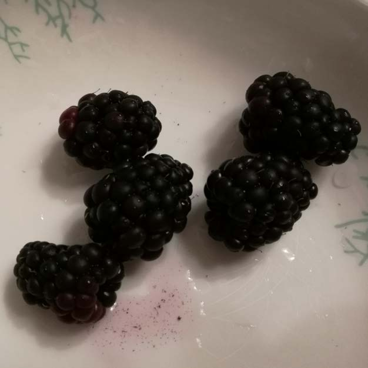

*2016-12-19 17:51 · 手机上网*

---

### 6458

转@ 荒箬 美国某老兵协会组织观影，老兵们纷纷觉得很真实。转@王兴 好像熟人朋友们多数都夸《钢锯岭》，至少说场面震撼。只有一个在三十几年前对越战争中当过狙击手的大哥说「不真实」。

*2016-12-19 16:55 · 手机上网 转自王兴*

---

### 6459

犹太人在华尔街的影响力也不小吧，至少目前的头牌投行高盛是犹太人创办的，头牌PE黑石也是，布隆博格也是。硅谷虽说是nerd特质为主，但成功公司里犹太创始人的比例也实在高得不像话。转@ 张亮华尔街：WASP；好莱坞：犹太人；硅谷：nerds + 新移民。

*2016-12-19 15:59 · 手机上网 转自张亮*

---

### 6460

就是这个大哥。转@ 王兴 「大多数人以为战争是由拼搏组成的，其实不是，是由等待和煎熬组成的…」说这话的大哥当年参加过中越战争，后来创过业，现在做投资。

*2016-12-19 15:52 · 手机上网 转自王兴*

---

### 6461

好像熟人朋友们多数都夸《钢锯岭》，至少说场面震撼。只有一个在三十几年前对越战争中当过狙击手的大哥说「不真实」。

*2016-12-19 15:06 · iPhone版*

---

### 6462

我刚知道，夏威夷虽然政治上属于美国，但是在地理上属于大洋洲，是波利尼西亚最北端的群岛。

*2016-12-19 07:13 · iPhone版*

---

### 6463

-_-! 转@ 拧巴人儿 早上去看了surgeon's hall museum.看了好多解剖的器官。疝气啦，膀胱啦，脸上的肿瘤啦，被车压过后截肢的手脚啦…

现在正准备大吃一顿！

*2016-12-19 06:28 · 手机上网 转自拧巴人儿*

---

### 6464

转@ 张亮 睡前买了本 An Empire of Their Own，讲犹太人怎么在1920 年代一步步创建好莱坞的，包括派拉蒙、米高梅、环球和福克斯。说起来，美国主要就是在三个行业上一步步完成了创建和创新：金融、娱乐、科技。足矣。

*2016-12-19 06:25 · 手机上网 转自张亮*

---

### 6465

在山崖下插一块牌子，写上「落石危险，请勿久留」，不一定管用。

再补上一行字「已有15人丧命于此」，效果一定会好不少。# 论具体形象的重要性 #

*2016-12-18 19:37 · iPhone版*

---

### 6466

Cook这航海家真是太牛了。世界上许多地方都是cook作为西方世界第

一人率先到达的。

*2016-12-18 16:30 · iPhone版*

---

### 6467

转@ 拧巴人儿 我说了么，博士的邻居曾经是塔利班的顾问。现在还老说塔利班的人多么好……

*2016-12-18 06:45 · 手机上网 转自拧巴人儿*

---

### 6468

看到一个新名词：霾际线。

*2016-12-17 09:43 · iPhone版*

---

### 6469

「扭送」译成英文怎么说比较好？

*2016-12-17 09:31 · iPhone版*

---

### 6470

dropbox从免费版升级到pro一上来就要每月$9.99，这比iCloud或google drive的门槛高多了，我觉得对dropbox开拓业务并不有利。

*2016-12-17 09:23 · iPhone版*

---

### 6471

转@ 去拿去 @ 王兴 我是蒙古人 蒙古人也这样，就算不会说 光模仿汉语英语韩语泰语各种语发音也能模仿的很标准 ，但是让汉族人模仿蒙语就没见过发音标准的

*2016-12-17 04:01 · 手机上网 转自去拿去*

---

### 6472

第一次看到有人用「华好硅」这样的缩写，应该是华尔街、好莱坞和硅谷的缩写，与之对应的另一大半美国被其统称为「玉米地」。

*2016-12-17 01:30 · iPhone版*

---

### 6473

转：周浩的《高三》。简直就是魔幻现实主义。看得我边大笑边流泪。像我这样乡下长大的孩子，人生的唯一出路就是高考... 别的不说，我们同学里有多少人因为考不上大学最后去做了妓女和男宠，你们知道吗？那年高考也许只不过差三十分，可十年后的今天，人生就是天差地别，我一点没夸张，就是天差地别

*2016-12-16 17:17 · iPhone版*

---

### 6474

转@ VinsonFei 10的60次方在佛教里叫“那由他”，是意象更多一些，并非实际的数量描述。10的-20次方叫空虚，刹那是10的-18次方，恒河沙是10的52次方，我知道最大的一个数叫“无量大数”10的68次方@ 我头上有葫芦.紧张小熊. @ 王兴

*2016-12-16 14:25 · 手机上网 转自VinsonFei*

---

### 6475

转@ 对着弹 善于表达的都大鸣大放的时候被引蛇出洞后干掉了。转@ L再饭 人家爹系列╮(￣▽￣")╭ ~ 转@ 王兴 读一个创业者访谈时看到这段，我还是蛮感慨的。中国人总体不善于表达，尤其不善于表达情感。

*2016-12-16 10:23 · 手机上网 转自王兴*

---

### 6476

确实如此。瞬间、刹那也都是佛教词汇。转@ 菅原舜水 这是受佛教的影响「@ 王兴 据说，藏族人学外语容易，因为藏语里的发音特别全。藏族的数学也很发达，比如说个十百千万……亿……兆，藏文当中每一个单位都有单独的名称，而不需要像英语当中的十千，或者汉语当中的十万来表达

*2016-12-16 10:06 · 手机上网 转自王兴*

---

### 6477

据说，藏族人学外语容易，因为藏语里的发音特别全。藏族的数学也很发达，比如说个十百千万……亿……兆，藏文当中每一个单位都有单独的名称，而不需要像英语当中的十千，或者汉语当中的十万来表达，数学位数的名称可以达到60位。也就是10的60次方都有单独的名称。

*2016-12-16 09:38 · 手机上网*

---

### 6478

词曲简单果然是王道，刚才在路上我竟然情不自禁哼起这首nowoman no cry. 转@ 王兴 不好意思，no woman no cry是雷鬼音乐大神bob marley的歌。转@ 82._. @ 王兴 相比之下她的diamondsand rust没有一句歌词是重复的……

*2016-12-16 08:45 · 手机上网 转自82._.*

---

### 6479

冲完澡擦干身体，外裤套到一半才想起还没穿内裤，这就是匆忙慌乱的一天的开始。

*2016-12-16 08:09 · iPhone版*

---

### 6480

转@ webto 再次感慨，日本人搞方便食品太牛逼了，不过很多都是保质期很短的，能搞成这样很依赖强大的物流体系

*2016-12-15 21:57 · 手机上网 转自webto*

---

### 6481

转@ goshawk @ 王兴 Joan Baez 有首 We Shall Overcome，非原唱的，光标题一句就翻来覆去八九遍，多则十遍，视版本而定。其余的每句基本上也要反复三遍。

*2016-12-15 21:24 · 手机上网 转自goshawk*

---

### 6482

读一个创业者访谈时看到这段，我还是蛮感慨的。中国人总体不善于表达，尤其不善于表达情感。

*2016-12-15 21:17 · 手机上网*

---

### 6483

@ 拧巴人儿 去不了了那就就地吃毒蘑菇呗

*2016-12-15 18:16 · 手机上网 给拧巴人儿的回复*

---

### 6484

不好意思，no woman no cry是雷鬼音乐大神bob marley的歌。转@ 82._. @ 王兴 相比之下她的diamonds and rust没有一句歌词是重复的……（no woman no cry为啥是她的歌？

*2016-12-15 18:15 · 手机上网 转自82._.*

---

### 6485

第一次听《浮躁》。王菲赢了！转@ eric 没王菲的浮躁多 转@ 王兴Joan Baez大姐的《no woman no cry》是不是歌词重复最多的歌？

结尾是七遍everything's gonna be all right再加八遍no woman nocry-_-!

*2016-12-15 18:07 · 手机上网 转自王兴*

---

### 6486

居然听起来还不错。多谢。转@ CeladEvra @ 王兴 不是。她的Here's to you 是仅有的4句歌词在2分钟多内重复8遍。

http://t.cn/RIq8hbT

*2016-12-15 18:00 · 手机上网 转自CeladEvra*

---

### 6487

Joan Baez大姐的《no woman no cry》是不是歌词重复最多的歌？

结尾是七遍everything's gonna be all right再加八遍no woman nocry-_-!

*2016-12-15 17:45 · iPhone版*

---

### 6488

好羡慕读英文书有这种速度的人。转@ 拧巴人儿 飞来的路上看完一本书。纽约时报的今年十佳之一。不怎么样。

*2016-12-15 17:30 · 手机上网 转自拧巴人儿*

---

### 6489

看到朋友圈里有人发图位置是保山，我想起了王小波的《黄金时代》。

*2016-12-15 17:23 · iPhone版*

---

### 6490

听起来蛮有意思。转@ terababy 终于看完了《狡猾的情感》这本书，客观讨论了情感在做决策时的作用，使用了大量博弈论、进化论、心理学、行为学的知识。尽管我们总是试图用理智进行重要的决策，但最终结果还是在情感作用下做出的，这是我们独有的宝贵的东西，不需要那么惭愧。推荐！

*2016-12-15 12:52 · 手机上网 转自terababy*

---

### 6491

转@ gravity0 医学实验早就发现，人在动脑后感觉疲惫需要补充能量，但实际耗能与不动脑时相差无几。后来使用断层扫描发现，区别在于脑中活跃区域的改变。不想问题时活跃的是所谓潜意识白日梦区域，这部分在做啥我们的意识不知道。我觉得既然它获取了那么多能量，人格不分裂一下是浪费。

*2016-12-15 08:12 · 手机上网 转自gravity0*

---

### 6492

这描述真生动：北京的这个时间已经是黑天了，外面确实很冷，刚出机舱门的那一刻我以为我没穿裤子。

*2016-12-14 17:33 · iPhone版*

---

### 6493

圣诞节和圣诞老人形象的流行据说和可口可乐当年大力推波助澜猛营销是分不开的。

*2016-12-14 16:38 · iPhone版*

---

### 6494

1977年中国的GDP是3200亿人民币。

*2016-12-14 16:30 · iPhone版*

---

### 6495

转@ 太空小孩 现实是，我对这种网站的处理方式一般是开十几个标签页一起等。转@ 野生乙醚 「害羞内向的人就像加载慢的网页。可能有很赞的内容，但很少有人愿意等那么久。」

*2016-12-14 14:16 · 手机上网 转自野生乙醚*

---

### 6496

转@ 美嘉.rar 慢热的人就像加载慢的网页。可能有很赞的内容，但很少有人愿意等。

*2016-12-14 13:41 · 手机上网 转自美嘉.rar*

---

### 6497

@ 唐君毅 只是一种突然的感觉，并没有前因后果。

*2016-12-14 13:19 · 手机上网 给唐君毅的回复*

---

### 6498

诗是一种诅咒。

*2016-12-14 12:39 · iPhone版*

---

### 6499

孔子说的有道理：不患人之不己知，患不知人也。

*2016-12-14 11:20 · iPhone版*

---

### 6500

转：经济考虑的是均衡时的最优，安全考虑的是最坏情况下的生存，这是两个层面的问题。

*2016-12-14 08:19 · iPhone版*

---

### 6501

转@ severusn.V 转@ 菜菌 起步三年 最高死刑 转@ twoheart 转@

木头橙子 # 不是我说的 # 我还年轻，看见可爱的女孩子就想做爱。

*2016-12-14 00:05 · 手机上网 转自木头橙子*

---

### 6502

Joan Baez除了《Diamonds and Rust》外哪首歌比较好？她翻唱BobDylan的那些歌不算。

*2016-12-13 23:45 · 手机上网*

---

### 6503

开会时碰到一个台湾大叔，聊天时善于使用各种成语歇后语，例如：一人一把号，各吹各的调。

*2016-12-13 23:08 · 手机上网*

---

### 6504

你冲浪前吃莫达菲尼吗？转@ 杨曜睿 浪了一个半小时，开心了。看着比自己高的 ，近在咫尺的，从屁股后面排山倒海压过来，在浪壁上飞驰，心跳加速～ 据说心跳加快会让大脑以为在恋爱。z

*2016-12-13 23:04 · 手机上网 转自杨曜睿*

---

### 6505

每次在办公室狼吞虎咽吃完晚饭都有一丝懊恼。

*2016-12-13 19:24 · iPhone版*

---

### 6506

好像最近战争片又多起来了，李安拍了《比利林恩》，吉布森拍了《钢锯岭》，诺兰也拍了《敦克尔刻》。

*2016-12-13 15:01 · iPhone版*

---

### 6507

白马非马, white lie算lie吗？

*2016-12-13 13:12 · iPhone版*

---

### 6508

转：上海机场旅客年吞吐量首次突破1亿人次，成为继伦敦、纽约、东京、亚特兰大之后，全球亿级航空城市俱乐部的第五名成员。明年上海将很有可能超过东京成为亚洲最大的航空枢纽中心。从2014年数据来看，全球最大的航空客运枢纽当属伦敦，拥有希斯罗、盖威克、斯坦斯特德、卢顿、城市和南方等6个

*2016-12-12 23:47 · iPhone版*

---

### 6509

灰心伤心不死心。哀莫大于心不死。

*2016-12-12 19:25 · iPhone版*

---

### 6510

吃到了好吃的担担面。

*2016-12-11 08:52 · iPhone版*

---

### 6511

道士好像穿了双UGG鞋，看起来还挺搭的。

*2016-12-10 11:49 · iPhone版*

---

### 6512

看起来这个才是正解。头像放在TIME这四个字前面还是后面主要看这

张图的视觉特征，而不是这个人本身牛不牛。转@ patri @ 王兴 供参 http://t.cn/RI74Knl

*2016-12-09 13:20 · 手机上网 转自patri*

---

### 6513

转@ Gaptain 时代之下涌现的人物，和引领时代人物的区别。转@王兴 转@ gravity0 之前有人统计过，时代杂志惹不起的人（比如普京），脑袋都盖在 TIME 字样前面，反之则把杂志标签印其脑门上。

转@ 二他姐姐 「@ 煎蛋无聊图 (1/2)」

*2016-12-09 10:09 · 手机上网 转自煎蛋无聊图*

---

### 6514

海明威的《老人与海》和菲茨杰拉德的《了不起的盖茨比》我都读过不止一遍。目前我觉得后者更打动我，但我有种预感，十年、二十年或者三十年后，我有可能会变得更喜欢前者。

*2016-12-09 00:38 · iPhone版*

---

### 6515

跟唯品会创始人在饭局上相遇。今天正好是他们八周年店庆。他说2008年12月8日唯品会上线，第一天只卖了一单，还是一个朋友的太太买了一瓶香水。

*2016-12-08 21:00 · iPhone版*

---

### 6516

香菇 包子。

*2016-12-08 20:46 · 手机上网*

---

### 6517

跟一个做风险投资的朋友聊天，他说他算了一下，川普的获客成本只有希拉里的55%。

*2016-12-08 20:23 · iPhone版*

---

### 6518

再见一舟同志，脑子里突然冒出杜甫的「亲朋无一字，老病有孤

舟」。人脑真是很有趣，我知道一舟这个人名很多年了，知道这两句诗也很多年了，但还是第一次通过「一」和「舟」这两个字把二者联系起来。

*2016-12-08 13:34 · 手机上网*

---

### 6519

多谢提醒！降低期望值确实是提升幸福感最有效的办法。转@ tihu @王兴 当一小型市政公园可以，千万不要抱着是去看一密宗寺庙或者先帝龙潜之地的期望去。

*2016-12-08 11:54 · 手机上网 转自tihu*

---

### 6520

来北京快二十年了，我居然还从没进过雍和宫。得抽空去看看。

*2016-12-08 11:07 · 手机上网*

---

### 6521

如果没记错的话，这大概是我这辈子第一次打着领带坐在马桶上。

*2016-12-08 10:17 · iPhone版*

---

### 6522

转@ 杨俊 11年前校内网今天上线

*2016-12-08 09:24 · 手机上网 转自杨俊*

---

### 6523

从这个角度拍摄桥真是别致。

*2016-12-08 07:51 · 手机上网*

---

### 6524

我发现一个问题：虽然我不管多累都是躺下就能睡着，但是有时候累了一整天回到家我得在床上坐着玩好一会儿手机才愿意躺下。转@ 王兴 虽然最近经常累到不想睡觉，但是只要真躺下我还是能很快入睡。

这大概要感谢我爸遗传给我的基因。

*2016-12-08 01:38 · 手机上网 转自王兴*

---

### 6525

开会时突然想起清华的「自强不息，厚德载物」，确实是好校训。

*2016-12-08 00:18 · iPhone版*

---

### 6526

转@ gravity0 之前有人统计过，时代杂志惹不起的人（比如普京），脑袋都盖在 TIME 字样前面，反之则把杂志标签印其脑门上。 转@二他姐姐 「@ 煎蛋无聊图 (1/2)」

*2016-12-08 00:07 · 手机上网 转自煎蛋无聊图*

---

### 6527

终于听到了比「金融的本质是风险」更高一层的见解。

*2016-12-07 18:03 · 手机上网*

---

### 6528

不同的创始人对公司有不同的理解，有的当成自己的化身，有的当成自己的作品，有的当成自己的孩子。有当成自己的女朋友的吗？

*2016-12-07 13:21 · 手机上网*

---

### 6529

转@ 番茄囝 那是ps的，这才是真的「@ 飯否小字报 转@ 王兴 男人的相貌风格差别真大。左边的海明威比右边的菲茨杰拉德还小三岁呢。」

*2016-12-07 13:10 · 手机上网 转自番茄囝*

---

### 6530

转@ szweig 飞机撞炮弹 转@ imvenj 打缅甸还不敢认。。。转@ 煎蛋无聊图 .

*2016-12-07 12:43 · 手机上网 转自煎蛋无聊图*

---

### 6531

男人的相貌风格差别真大。左边的海明威比右边的菲茨杰拉德还小三岁呢。

*2016-12-07 09:29 · 手机上网*

---

### 6532

热力学第二定律（熵增）真是深刻得让人不寒而栗。还可以用来解释以邻为壑。

*2016-12-07 00:57 · iPhone版*

---

### 6533

读了塞林格的这个短篇。非常难得，这段中文译文竟然比英文原文更优美。转@ 茶顔 有人认为爱是性，是婚姻，是清晨六点的吻，是一堆孩子，也许真是这样的，莱斯特小姐。但你知道我怎么想吗？我觉得爱是想触碰却又收回手。via_塞林格《破碎故事之心》

*2016-12-07 00:35 · 手机上网 转自茶顔*

---

### 6534

嗯，不矛盾，我是这个世界的作品，这个世界也是我的作品。转@Fish酱 可我觉得，我是这个世界的作品… 转@ 王兴 这个世界是我的作品。也是你的。

*2016-12-06 23:57 · 手机上网 转自王兴*

---

### 6535

这个世界是我的作品。也是你的。

*2016-12-06 23:49 · iPhone版*

---

### 6536

uncomplicated.

*2016-12-06 12:31 · 手机上网*

---

### 6537

性是动物的需要；爱是人的需要；婚姻是社会的需要，至少曾经是。

*2016-12-06 09:08 · iPhone版*

---

### 6538

转：兔子善于繁殖的特征主要体现在雌兔身上：和其他哺乳动物不同，雌兔是在交配过后排卵，以保证体内的精子得到充分利用。它们没有月经，几乎随时都可以交配，受孕。在平均40秒的交配时长过后，一只雌兔就怀孕了。

*2016-12-06 08:21 · iPhone版*

---

### 6539

这个输入法有点污啊，把「插屁股」排在「擦屁股」之前。

*2016-12-06 00:56 · iPhone版*

---

### 6540

虽然最近经常累到不想睡觉，但是只要真躺下我还是能很快入睡。这大概要感谢我爸遗传给我的基因。

*2016-12-06 00:36 · iPhone版*

---

### 6541

读了一下证监会主席刘士余前几天的那篇讲话，我没明白「妖精」和「害人精」有何区别，为何并列于此。

*2016-12-06 00:32 · iPhone版*

---

### 6542

转@ 三瓣核桃 @ 王兴 作为一个91年的经常被95后叫叔叔。。。。这能没有隔阂么

*2016-12-05 19:31 · 手机上网 转自三瓣核桃*

---

### 6543

转@ 底牌 转@ 王兴 转：“生命是什么？是一种死亡率为100%的性传播疾病。”

*2016-12-05 02:02 · 手机上网 转自王兴*

---

### 6544

我说的正是流放地宁古塔。酷和惨没啥关系吧？夹边沟也很惨，但我不觉得这个地名酷。转@ 小熊娃娃 @ 唐君毅 这么有名的地方不太可能再新编一个吧

*2016-12-04 21:14 · 手机上网 转自小熊娃娃*

---

### 6545

《纸牌屋》怎么每季隔这么久？现在进度已经严重落后于现实了啊。

*2016-12-04 20:47 · iPhone版*

---

### 6546

风尘男子这个说法似乎不流行。

*2016-12-04 20:24 · 手机上网*

---

### 6547

这家兰州拉面配套的羊肉串每串三块钱，平均每串三块肉。

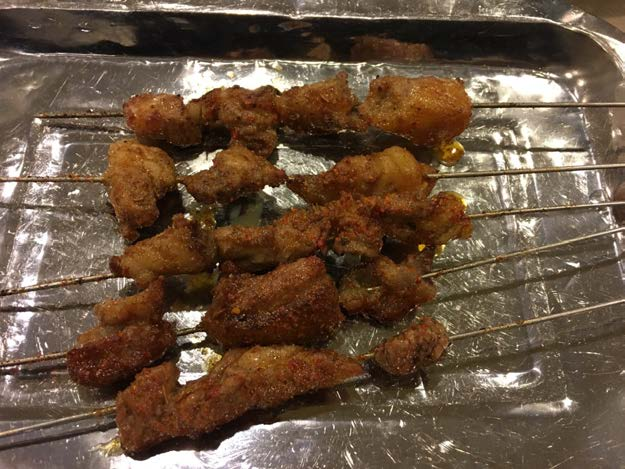

*2016-12-04 20:20 · 猫饭*

---

### 6548

嚯，望京里居然又开了一家离我们更近的漫咖啡，就在阜安西路上。

*2016-12-04 20:06 · 手机上网*

---

### 6549

宁古塔这个地名听起来就很酷，简直像是为盗墓笔记定制的。

*2016-12-04 20:02 · 手机上网*

---

### 6550

学了一个新概念：胆小鬼博弈。

*2016-12-04 19:51 · 手机上网*

---

### 6551

在朋友圈看到有人转黑泽明：“必须持续努力直到感到快乐，不然人生就太无聊了。”

*2016-12-04 19:35 · 手机上网*

---

### 6552

@ elonmusk because i know the founder and i like riding theirbikes. it's the right thing.

*2016-12-04 19:09 · 手机上网 给elonmusk的回复*

---

### 6553

我怀疑，我身边那些和我年纪差不太多（例如上下五岁）却认为自己和95后隔阂不大的人其实多数比我还更不了解这个人群，他们只是以为自己懂。

*2016-12-04 15:21 · 手机上网*

---

### 6554

我们所熟悉的歌曲《上海滩》是用粤语而非上海话唱的。我突然觉得有点讽刺。

*2016-12-04 15:17 · 手机上网*

---

### 6555

@ 戈城 欢迎使用。

*2016-12-04 15:04 · 手机上网 给戈城的回复*

---

### 6556

人本身才是终极艺术品，可惜无法保存，更不能复制，只能选取片断转换成别的艺术形式。

*2016-12-04 11:56 · iPhone版*

---

### 6557

试用「腿玩年」句式造句：这app我能玩一宿。

*2016-12-04 00:50 · 手机上网*

---

### 6558

突然意识到，我已经很多年不跟空姐聊天了……

*2016-12-03 20:56 · 手机上网*

---

### 6559

纯粹是在进行关于网络用语/二次元文化的理论探讨，请勿过度具象联想。转@ webto 有点好奇你们看到了谁的腿！转@ 王兴 「这腿我能玩一年」，刚才跟一个比我年轻十岁的朋友聊天时得知还有这么一个网络流行语。

*2016-12-03 20:37 · 手机上网 转自王兴*

---

### 6560

常听创业者/创业导师们说「要做有温度的产品」，其实我一直没太明白是怎么回事，汉堡除外。# 在机场吃汉堡王有感 #

*2016-12-03 20:31 · iPhone版*

---

### 6561

「这腿我能玩一年」，刚才跟一个比我年轻十岁的朋友聊天时得知还有这么一个网络流行语。

*2016-12-03 20:27 · iPhone版*

---

### 6562

一百多年前，在需要应对西方文明的冲击时，日本的方针「和魂洋

才」这四个字从一开始就胜过中国的「中体西用」（中学为体，西学为用）。

*2016-12-03 18:30 · 手机上网*

---

### 6563

川普号称要减税了，这就是各国政府间的价格战啊。

*2016-12-03 18:09 · 手机上网*

---

### 6564

不止一个老外持续把我的名字错拼成 wang xin，看来那个g对他们来讲是个不太自然的存在。

*2016-12-03 16:59 · 手机上网*

---

### 6565

转@ 八仟魄 村上的比喻句最棒了，不过我心中最好的比喻是塞林格的那句:天气冷的像是巫婆的奶头，转@ 王兴 转@ 远骋 《挪威的森林》中的一句绝妙比喻：“绿子在电话的另一头久久默然不语，如同全世界所有的细雨落在全世界所有的草坪上一般的沉默在持续。”

*2016-12-03 16:26 · 手机上网 转自远骋*

---

### 6566

转@ 远骋 《挪威的森林》中的一句绝妙比喻：“绿子在电话的另一头久久默然不语，如同全世界所有的细雨落在全世界所有的草坪上一般的沉默在持续。”

*2016-12-03 16:09 · 手机上网 转自远骋*

---

### 6567

这几个红色大字，靠颜色、字号、字体、悬挂位置，就足以摧毁凯宾斯基作为一个德国豪华五星级酒店品牌最后仅剩的一点逼格（或许残存于顶上水平悬挂的那几个淡色花体字母）。

*2016-12-03 13:42 · 猫饭*

---

### 6568

什么，F1不加油了？我看你这条饭否才知道-_-!转@ IwfWcf 好多年没看 F1，在看罗斯伯格退役的新闻评论时惊讶得知现在不加油了……

*2016-12-03 11:12 · 手机上网 转自IwfWcf*

---

### 6569

卧槽，一整湖黑天鹅。

*2016-12-03 10:56 · 手机上网*

---

### 6570

没有谁可以伴随你成长，包括你自己。

*2016-12-03 00:41 · iPhone版*

---

### 6571

佛祖牛逼。

*2016-12-03 00:28 · iPhone版*

---

### 6572

带两部手机至少有一个好处，无聊的时候可以打开同一个音乐播放器选择同一首歌，前后间隔片刻开始播放，体验一下山寨和声的效果。

*2016-12-02 23:46 · iPhone版*

---

### 6573

深圳是国内少数坚持把火车站建在市中心的城市。参与过规划的人说这是他们当年据理力争、领导也开明能尊重专业意见的结果。

*2016-12-02 22:08 · iPhone版*

---

### 6574

@ tony 有

*2016-12-02 15:02 · iPhone版 给tony的回复*

---

### 6575

转@ 小綿貓HD 委国国内航班公交车一样上满了就走，不提前到机场经常赶不上被强制改签。卢萨卡国际机场去年底停电，手写登机牌。

晚点什么的弱爆了。 转@ 王兴 永远不要把生活中的（基本）井然有序当成理所当然。到南苑机场坐一次飞机，你就会对首都机场有全新的评价。

*2016-12-02 10:13 · 手机上网 转自王兴*

---

### 6576

转@ quux 北上广的年轻人们就是为了追求一些理所当然躲避另一些理所当然才留下来 转@ 王兴 永远不要把生活中的（基本）井然有序当成理所当然。到南苑机场坐一次飞机，你就会对首都机场有全新的评价。

*2016-12-02 06:44 · 手机上网 转自王兴*

---

### 6577

永远不要把生活中的（基本）井然有序当成理所当然。到南苑机场坐一次飞机，你就会对首都机场有全新的评价。

*2016-12-02 06:40 · iPhone版*

---

### 6578

过安检时看到前面一个姑娘外套和秋衣之间穿的是皮草吊带，我之前并不知道还存在这种事物，开眼界了。

*2016-12-02 06:24 · iPhone版*

---

### 6579

biè说了，我也没怎么睡:-( 转@ 蕉鹿有梦 我还没睡 王老板已经去做飞机了转@ 王兴 早班机什么都好，缺点就是得早起。

*2016-12-02 06:04 · 手机上网 转自王兴*

---

### 6580

早班机什么都好，缺点就是得早起。

*2016-12-02 05:12 · iPhone版*

---

### 6581

在我心中，苏菲•玛索代表法国女星，莫妮卡•贝鲁奇代表意大利，佩内洛普•克鲁兹代表西班牙，凯拉•奈特莉代表英国。

*2016-12-02 00:08 · iPhone版*

---

### 6582

惺惺相惜啊。转@ 张亮 花 100 美元订阅了 aboveavalon.com 一年的文章。文章真是高质量。

*2016-12-01 15:35 · 手机上网 转自张亮*

---

### 6583

坝上草原就在蒙古高原即将下降然后接壤华北平原的地方。转@ 拧巴人儿 去坝上还进入高原？转@ 王兴 这首歌我只有在从北京自驾去坝上草原最后四分之一路程已经进入高原时才会主动播放。转@ God兰度 《最炫民族风》。一听就会很兴奋。

*2016-12-01 13:31 · 手机上网 转自王兴*

---

### 6584

这首歌我只有在从北京自驾去坝上草原最后四分之一路程已经进入高原时才会主动播放。转@ God兰度 《最炫民族风》。一听就会很兴奋。转@ 王兴 应该有个歌单叫《让你一听就不由自主开始摇头晃脑的音乐》。要不饭否上的朋友们都来贡献一首吧。

*2016-12-01 13:26 · 手机上网 转自王兴*

---

### 6585

应该有个歌单叫《让你一听就不由自主开始摇头晃脑的音乐》。要不饭否上的朋友们都来贡献一首吧。

*2016-12-01 13:19 · 手机上网*

---

### 6586

后海大鲨鱼的《猛犸》和《拉德斯基进行曲》或《Viva la Vida》一样，都是适合用来开场的音乐。

*2016-12-01 13:11 · 手机上网*

---

### 6587

这大姐算是黑人？我也看不出来。转@ quux Katherine Johnson 不说我真不知道是黑人。那时计算机不够用，NASA 雇佣了很多人肉计算机 http://t.cn/RfEyTAV

*2016-12-01 11:39 · 手机上网 转自quux*

---

### 6588

果然，把iPad的google earth删掉再重装一遍是最有效的解决办法。

转@ 王兴 同样的wifi环境下，google earth在iPhone上能用却在iPad上不能用。这真令我抓狂:(

*2016-11-30 23:49 · 手机上网 转自王兴*

---

### 6589

同样的wifi环境下，google earth在iPhone上能用却在iPad上不能用。

这真令我抓狂:(

*2016-11-30 18:40 · iPhone版*

---

### 6590

既然孙正义有个时光机投资理论，那是不是那些写穿越文写得好的人其实都具备做好跨国投资的潜质？

*2016-11-30 12:58 · iPhone版*

---

### 6591

转：人生最美好的东西都是无价的，其次美好的东西都是非常昂贵的。

*2016-11-30 01:20 · 手机上网*

---

### 6592

@ 付栋平 @ 王球球的春天 目前菲佣在国内没有合法渠道。

*2016-11-30 00:01 · 手机上网 给付栋平的回复*

---

### 6593

华为mate9没有google服务框架实在是没法用，大丈夫能屈能伸，我退回去用mate8了。

*2016-11-29 19:49 · iPhone版*

---

### 6594

好长时间没这么抑郁过了。今天唯一的亮点是刚才窗外电焊时四处飞溅的桔黄色火星。

*2016-11-28 17:33 · 手机上网*

---

### 6595

佛祖29岁出家修行，35岁成佛，传法45年，80岁圆寂。真是天赋异禀，干了6年就成佛了，比绝大多数互联网创业都快多了。

*2016-11-28 16:57 · 手机上网*

---

### 6596

转@ 阳升 虽然 Elon Musk 说自己童年很惨，但他在南非上的是全非洲最好的高中。学校名字也很有趣：Pretoria Boys High School，简称 Boys High http://t.cn/Rfjeq0u

*2016-11-28 16:15 · 手机上网 转自阳升*

---

### 6597

最近运势不顺，一定是我前几天换上的那部华为mate9手机不支持google框架导致的，各种常用服务不方便，各种折腾:(

*2016-11-28 16:05 · iPhone版*

---

### 6598

几年前在华茂nobu吃过看起来完全是一盆小绿植的甜品，昨晚「糖炒栗子」里那堆五颜六色的小石子再次刷新了我的认识，都是可以吃的巧克力！

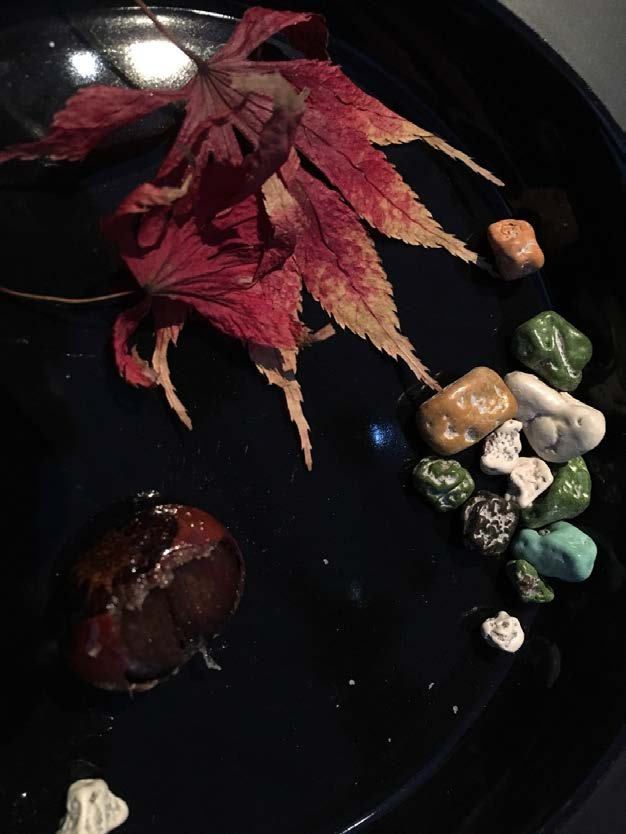

*2016-11-28 13:58 · 猫饭*

---

### 6599

转：中科院国情小组根据2000年资料统计分析，胡焕庸线(400毫米年降雨量线）东南侧以占全国43.18%的国土面积，集聚了全国93.77%的人口和95.70%的GDP，压倒性地显示出高密度的经济、社会功能。

*2016-11-27 23:38 · iPhone版*

---

### 6600

去今日美术馆参加了今年的大董秋冬季品鉴会。大董真是把中国菜做出了装逼新高度。

*2016-11-27 21:58 · iPhone版*

---

### 6601

@ Bury 我是特意买的票，我当然知道自己是在看120帧版本。可是，没有和60帧或24帧版本对比过，我觉得120帧版本并不会让你注意到技术细节本身，可能会让你更沉浸到内容当中去。

*2016-11-27 14:20 · 手机上网 给Bury的回复*

---

### 6602

最近一年多来，许多年长的重量级人物相继辞世，但好像还没什么重量级的自杀发生。

*2016-11-27 14:05 · 手机上网*

---

### 6603

突然觉得，「记者」这个词应该是从英文 reporter 翻译过来的吧？当年怎么就翻译成记者了呢？

*2016-11-27 01:36 · iPhone版*

---

### 6604

李安拍《比利林恩》的成本是4800万美元，正好和美团A轮的投后估值一样，和美团B轮的融资额差不多。

*2016-11-27 01:17 · iPhone版*

---

### 6605

据说伯格曼堪称是李安的偶像。惭愧的是，伯格曼的诸多作品里，我只在很多年前看过一部《第七封印》，而且并没有看懂:(

*2016-11-27 00:46 · iPhone版*

---

### 6606

和菜头分明是在嫉妒。转@ 张捕鱼 并不好看 转@ 王兴 雷晓宇前几天给GQ写的那篇访谈李安及其新片《比利林恩》的封面报道确实不错。顺带发现这位女记者在公众号里自称「文艺里最懂商业，商业里最懂文艺」。

*2016-11-27 00:32 · 手机上网 转自张捕鱼*

---

### 6607

李安就属于那种每拍出一部片我都会去看的导演。他的下一部片，讲拳王阿里的《马尼拉之战》，已经让我充满期待。

*2016-11-26 23:54 · iPhone版*

---

### 6608

雷晓宇前几天给GQ写的那篇访谈李安及其新片《比利林恩》的封面报道确实不错。顺带发现这位女记者在公众号里自称「文艺里最懂商业，商业里最懂文艺」。

*2016-11-26 23:33 · iPhone版*

---

### 6609

「好」是个多音字，所以「好吃」有两种不同的意思。

*2016-11-26 23:08 · iPhone版*

---

### 6610

转@ gravity0 “先帝创业未半而中道崩殂”，这话若真是诸葛亮写的，说明他在和新领导沟通时打开天窗说亮话。所谓继承汉室那是舆论宣传，钱粮兵马人员组织从无到有刘备是个创业者。事还没办完，应扩张而不是守成。

*2016-11-26 23:06 · 手机上网 转自gravity0*

---

### 6611

转@ 帮主胡子 “如果我是9，你就是3。”“啊？”“因为我除了你还是只有你。”

*2016-11-26 11:41 · 手机上网 转自帮主胡子*

---

### 6612

《比利林恩》里有句台词：If a bullet's going to get you, it has

already been fired.

*2016-11-26 11:15 · iPhone版*

---

### 6613

为什么《比利林恩的中场战事》不太受欢迎？就因为这部电影重在真实而非美好吗？

*2016-11-26 00:55 · iPhone版*

---

### 6614

李安的新片《比利林恩的中场战事》值得看。虽然我看的是传说中的120帧版本，但如果没人告诉我，我并不会注意到这种技术细节。相反，吸引我的是这部电影让我从另一个角度理解战争和社会，就想当年斯皮尔伯格的《拯救大兵瑞恩》让我第一次知道战争片不一定是解放战争片那样的。

*2016-11-26 00:45 · iPhone版*

---

### 6615

salumi的意思是更广义的盐腌肉，salami只是其中一种。

*2016-11-26 00:02 · iPhone版*

---

### 6616

难得跟同校同系师兄聚一次，喝了点酒。

*2016-11-25 04:55 · 手机上网*

---

### 6617

不明觉厉。转@ 主公顶 史蒂芬·平克（Steven Pinker）在《写作风格的意识》中写道：「写作是将网状的思想，通过树状的句法，组织为线状展开的文字。」

*2016-11-25 04:48 · 手机上网 转自主公顶*

---

### 6618

@ 渣客 行家啊！

*2016-11-24 22:36 · 手机上网 给渣客的回复*

---

### 6619

全国大小城市是不是都有个XX迎宾馆？就是那种体制内的地段特别好、景观特别好但是设施偏老旧、服务通常有点蛋疼的酒店。

*2016-11-24 21:25 · 手机上网*

---

### 6620

也是，上了年纪更能唾面自干。转@ 箫靖梓 那主要还是说明人已经老了转@ 王兴 我特别能理解iPhone用户转用安卓之初各种不适应。

别说换操作系统了，我用同一个品牌（华为）同一个产品线（mate）相邻两代手机都得磨合个大半天才渐渐觉得顺起来。

*2016-11-24 21:22 · 手机上网 转自王兴*

---

### 6621

上周在机场买了一瓶听起来就不怎么靠谱的印度单一麦芽威士忌。

*2016-11-24 20:49 · iPhone版*

---

### 6622

（扬州的）瘦西湖（Slender West Lake）原名保障湖…… 这俩名字真是判若云泥啊-_-！

*2016-11-24 20:10 · iPhone版*

---

### 6623

我特别能理解iPhone用户转用安卓之初各种不适应。别说换操作系统了，我用同一个品牌（华为）同一个产品线（mate）相邻两代手机都得磨合个大半天才渐渐觉得顺起来。

*2016-11-24 20:06 · iPhone版*

---

### 6624

mate9改成usb type-c充电线了，有点麻烦，以后可能得多带一条线，毕竟kindle、降噪耳机等其他设备还是继续用传统的micro usb充电线。

*2016-11-24 16:06 · iPhone版*

---

### 6625

把主力安卓手机从华为mate8换成mate9了。app和数据转移真是挺麻烦的。

*2016-11-24 15:25 · iPhone版*

---

### 6626

窗外飘着雪，但地上积雪还很薄。我似乎还没经历过《雪国列车》里那种火车穿行在冰天雪地中的场景。09年那次坐火车去拉萨在过唐古拉山口时看到的「雪山白凤凰图」大概是最接近的了，但还是不一样。

*2016-11-23 16:10 · iPhone版*

---

### 6627

中国传统文化果然博大精深，简直啥都有，连「率兽食人」这种成语都有。

*2016-11-23 15:43 · iPhone版*

---

### 6628

京沪高铁我坐过无数次，雪天里倒还是第一回。

*2016-11-23 15:33 · iPhone版*

---

### 6629

骑车又是另一种感受。我在上海坐车和步行过许许多多次，但直到三个月前mobike的出现才让我感受了另一种上海。转@ 张亮 坐车和步行对一座城市的感受很不一样。

*2016-11-23 09:19 · 手机上网 转自张亮*

---

### 6630

从广西到东北… 转@ 风雨如晦 我是东北人，好像我们风俗都是干妈，还要选历经磨难活下来的植物。转@ 桃之妖妖o 我弟弟的干爹是一个大石头，我是广西人。「@ 风雨如晦 我好像小时候有颗被雷批过的榆树做干妈。转@ 王兴 转@ 剑花 最近认识一个广西人，她的干爹是一棵榕树。原来这不是段子。」

*2016-11-23 00:13 · 手机上网 转自剑花*

---

### 6631

转@ gravity0 埃菲尔铁塔第一层阳台下方，刻了一圈七十二人的名字，全是 STEM 专业的。按照水浒天罡地煞的规矩，上一层阳台应该

凑三十六个文豪艺术家律师政客。毕竟研究自然的是术器，琢磨人心的才是道法。

*2016-11-22 20:24 · 手机上网 转自gravity0*

---

### 6632

bing.com 今天的背景美图真是惊到我这个面食爱好者了。

*2016-11-22 15:48 · 手机上网*

---

### 6633

转@ 剑花 最近认识一个广西人，她的干爹是一棵榕树。原来这不是段子。

*2016-11-22 13:27 · 手机上网 转自剑花*

---

### 6634

屌炸天 > 屌爆了

*2016-11-22 12:41 · 手机上网*

---

### 6635

转@ gravity0 私以为，世界观与人生观的主要区别是，在思考前者时必须将自身的存在刨除，意识到世界的运转有没有我都无所谓。而人生观要求将自己代入局势，这是各类小说剧本最擅长的。价值观则是努力在去自我的世界与自我中心的世界模型间寻找平衡。

*2016-11-22 08:35 · 手机上网 转自gravity0*

---

### 6636

微信的月活跃帐号数直到2016年第三季度都还没超过QQ：8.46亿 vs.

8.77亿。

*2016-11-21 23:25 · iPhone版*

---

### 6637

查 pi 的网站: http://angio.net/pi/

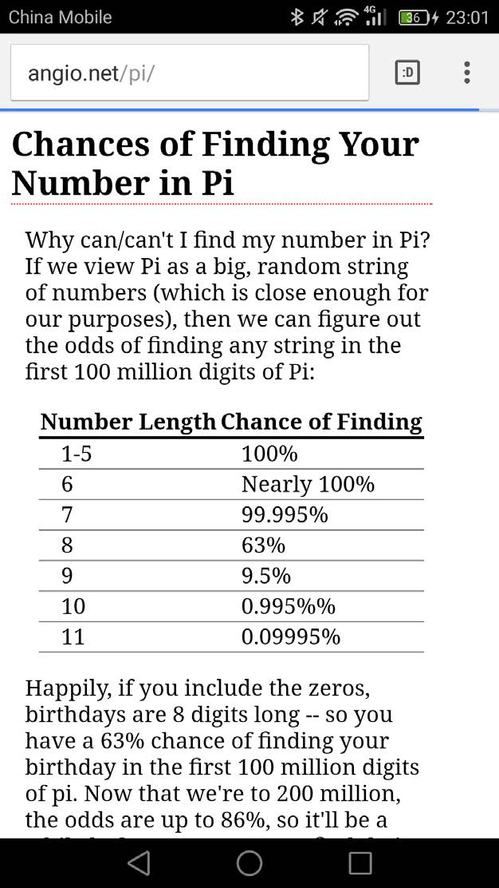

*2016-11-21 23:03 · 手机上网*

---

### 6638

赞想法！应该不会太难查吧？转@ webto 有点好奇我的手机号在 pi的多少位出现。

*2016-11-21 22:59 · 手机上网 转自webto*

---

### 6639

我吃过的最赞的鱼香茄子煲是十四年前那个暑假在中山大学校园附近吃到的。

*2016-11-21 20:13 · iPhone版*

---

### 6640

世界连锁咖啡店第一大「星巴克」和 第二大 Costa 都是1971年起步的，一个从西雅图，另一个从伦敦。为什么纽约没出大的咖啡连锁呢？

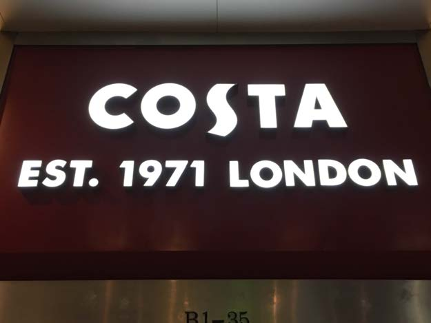

*2016-11-21 16:04 · 猫饭*

---

### 6641

幸亏有摩拜单车，不然我早上开会就迟到了。

*2016-11-21 09:45 · iPhone版*

---

### 6642

转@ quux 有一天早上惠勒很激动的跟费曼说“我知道为什么电子的电荷都一致了，因为世界上只有一个电子” 转@ qinyf 做了个科幻主题的梦，一个项目，可以让人们很容易的将物品临时放到一个独立空间，当人换一个地方，又可以随时接入取出物品。后来项目宣布停止，因为认为违反了物理规律。

*2016-11-20 12:27 · 手机上网 转自qinyf*

---

### 6643

突然意识到 kill 是个很特殊的动词，因为动词通常伴随着对事物状态的改变，而 kill 带来的是最彻底的状态概念。

*2016-11-19 14:38 · iPhone版*

---

### 6644

好像是近十年来第一次崴脚。

*2016-11-18 21:20 · 手机上网*

---

### 6645

-_-! 转@ tihu 翻看那位十个月前因病去世的姑娘的饭否，心里难受得紧。饭否就是我们每一个人的墓志铭。

*2016-11-18 15:27 · 手机上网 转自tihu*

---

### 6646

是不是有一类人天生有当传教士的特质？如果是的话，这类在国外可

能成长为传教士的人在中国选择了什么职业呢？

*2016-11-18 15:21 · iPhone版*

---

### 6647

@ gravity0 这个处理方式强！

*2016-11-18 15:01 · 手机上网 给gravity0的回复*

---

### 6648

英文里的 low hanging fruit 其实对应的是中文里的「软柿子」。

*2016-11-18 14:13 · iPhone版*

---

### 6649

和国内微信微博上假消息泛滥也差不多。

*2016-11-18 13:36 · 手机上网*

---

### 6650

-_-！那你出手相助了吗？转@ gravity0 年初也是在这个机场候机区，眼睁睁看自己刚送给朋友儿子的变形金刚被一个陌生小孩从他手里骗走。生物个体发展原本就是不平衡的，任其自由竞争结果恐怕未必如你所愿。

*2016-11-18 11:45 · 手机上网 转自gravity0*

---

### 6651

转@ gravity0 据说欧亚文明战胜其它大陆是因为农业，其产量最大的小麦原生长于中东。雨季短旱季长，为熬过旱季，集中能量发展种子让其富含营养，种皮厚可长期储存。相比之下东亚的水稻则是人为制造多水和缺水的周期让其多结种子，古人对用环境控制生物生长很有想法。

*2016-11-18 10:24 · 手机上网 转自gravity0*

---

### 6652

Mission complete.

*2016-11-18 02:10 · 猫饭*

---

### 6653

我决定尝试一下不掏手机不看地图一路走回去。

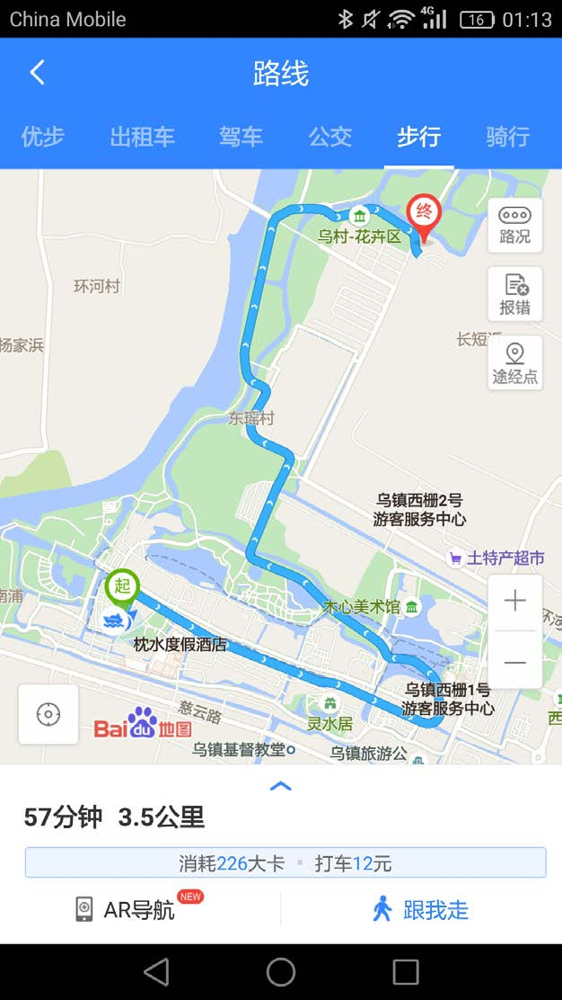

*2016-11-18 01:18 · 手机上网*

---

### 6654

鉴于两年多前第一次世界大战爆发100周年时我开始读的那本关于一战的书现在都还没读完，我决定设立一个小目标：在第三次世界大战爆发之前把茨威格的《昨日的世界》给读了，算是做一点心理建设吧。

*2016-11-17 12:49 · iPhone版*

---

### 6655

不带这么耍人的。转@ 拧巴人儿 喏，只穿一条，秋裤外穿…… 转@王兴 什么？圣地亚哥也要穿秋裤？转@ 拧巴人儿 天凉了。今天穿秋

裤。

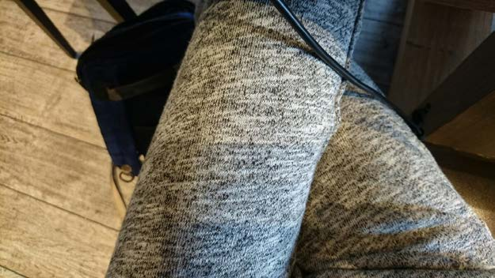

*2016-11-17 02:21 · 手机上网 转自拧巴人儿*

---

### 6656

什么？圣地亚哥也要穿秋裤？转@ 拧巴人儿 天凉了。今天穿秋裤。

*2016-11-17 02:09 · 手机上网 转自拧巴人儿*

---

### 6657

走到半路，我把手机掏出来外放音乐。第二首歌快结束时，我回到房间了。

*2016-11-17 00:44 · 手机上网*

---

### 6658

刚才，酒过三巡，「xx，十六年前你们上市时，是不是我给你做的opening speech？当时我就说了，我不祝你一帆风顺，我祝你乘风破浪！」

*2016-11-17 00:43 · 手机上网*

---

### 6659

您恐怕搞错了吧？饭否是2007-05-12诞生的。您说的是饭否重生日吧？2010年感恩节。转@ 生水 王老板发财，饭否生日快到了哦@ 王兴

*2016-11-17 00:40 · 手机上网 转自生水*

---

### 6660

辛苦！转@ 木之所兮 会务组工作人员还都在工作 转@ 王兴 穿着西装漫步在江南的雨夜中。

*2016-11-17 00:30 · 手机上网 转自王兴*

---

### 6661

没带伞，确实走不快，不用装。转@ 拧巴人儿 是不是还不打伞并成心放慢脚步装作不在意！ 转@ 王兴 穿着西装步行在江南的雨夜中。

*2016-11-17 00:29 · 手机上网 转自王兴*

---

### 6662

穿着西装漫步在江南的雨夜中。

*2016-11-17 00:24 · 手机上网*

---

### 6663

@ 拧巴人儿 你不是已经结完了吗？

*2016-11-16 23:56 · 手机上网 给拧巴人儿的回复*

---

### 6664

一堆人端着酒杯围成一圈，边动作边用西班牙语高喊：向上，干杯；

向下，干杯；向外，干杯：向内，干！转@ 王兴 说到拼酒，拉丁美洲的哥们最有趣，西班牙语干杯四部曲特有仪式感。转@ L再饭 合计拼酒才是世界语言～(￣▽￣～)~ 转@ 王兴 华为果然全面最牛，我觉得连装醉都是。

*2016-11-16 23:42 · 手机上网 转自王兴*

---

### 6665

说到拼酒，拉丁美洲的哥们最有趣，西班牙语干杯四部曲特有仪式感。转@ L再饭 合计拼酒才是世界语言～(￣▽￣～)~ 转@ 王兴 华为果然全面最牛，我觉得连装醉都是。转@ 王兴 老男人们的饭局比较复杂，不好玩。

*2016-11-16 23:34 · 手机上网 转自王兴*

---

### 6666

我不是靠观察，靠逻辑，我不相信都做到华为全球高管还是两杯黄酒的量。转@ 纳兰性 都被看出来是装醉了…转@ 王兴 华为果然全面最牛，我觉得连装醉都是。转@ 王兴 老男人们的饭局比较复杂，不好玩。

*2016-11-16 23:22 · 手机上网 转自王兴*

---

### 6667

华为果然全面最牛，我觉得连装醉都是。转@ 王兴 老男人们的饭局比较复杂，不好玩。

*2016-11-16 23:00 · 手机上网 转自王兴*

---

### 6668

老男人们的饭局比较复杂，不好玩。

*2016-11-16 22:25 · 手机上网*

---

### 6669

转：Peter Thiel在Bloomberg的采访里，表达中国重视创新，举例论证：我的书在中国卖的超级好，比其他地方加起来还多。

*2016-11-16 21:36 · 手机上网*

---

### 6670

在乌镇「互联网之光」的展厅里逛到乐视的展台，居然真看到一辆自行车。我一边感叹我实在不明白乐视为什么连自行车都做，一边忍不住想骑上去试试。未遂，因为右边那个脚蹬子已经不知所踪。

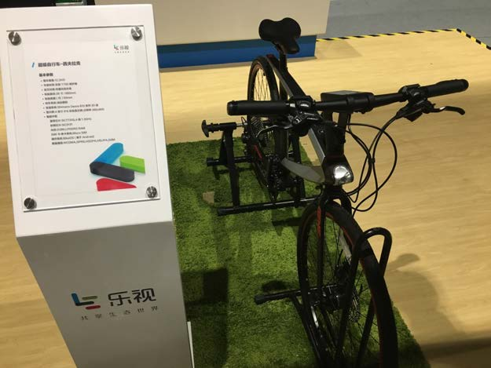

*2016-11-16 17:56 · 猫饭*

---

### 6671

@ 乘疯而去 抱歉-_-! 后来可以了吗？

*2016-11-16 15:27 · 手机上网 给乘疯而去的回复*

---

### 6672

朋友圈里同事发图「视觉革命，撼动人心！猫眼专业版实时见证《比利·林恩的中场战事》11月16日13:27:03票房破亿！」，下面一个北京文艺土豪留言「我看了三次，贡献票房几百块」，而一个深圳文身土豪留言「我看了一半出来了，背景不清晰，不知道为什么。故事情节前半段很慢。」

*2016-11-16 15:14 · 手机上网*

---

### 6673

又有一个人点赞了。隔了四个多月。转@ 王兴 有趣的是，有些事情虽然非常低频但却持续发生，例如说，大概平均每半年会有一个人给我那从没换过的微信封面点赞。

*2016-11-16 14:55 · 手机上网 转自王兴*

---

### 6674

转@ gravity0 昨晚洗室外温泉时看见有人在玩苹果手机，不止一个。

去年这么干的还都戴套，今年不用了。

*2016-11-16 14:26 · 手机上网 转自gravity0*

---

### 6675

他俩已经是CP了吗… 转@ 张亮 你认识的雷和周，本子就是腐女们写或画的那些有点污的...转@ 王兴 @ 张亮 雷周是什么？

*2016-11-16 12:22 · 手机上网 转自张亮*

---

### 6676

美国移民的来源。二战真是小蛮腰啊。

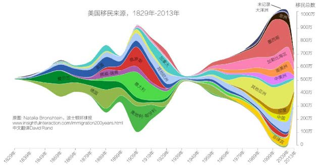

*2016-11-16 12:21 · 手机上网*

---

### 6677

@ 张亮 雷周是什么？

*2016-11-16 11:57 · 手机上网 给张亮的回复*

---

### 6678

马云确实是个修辞高手。

*2016-11-16 11:15 · 手机上网*

---

### 6679

美金只是变现方法之一，「美军+美金」才是完整商业模式。转@ 小良 最近认真想过这个问题，其实什么文化啊民主啊都是次要的，最关键是美国掌握着全世界的钱。这是个玩钱的国家，永远不吃亏，所以他可以用最少的成本去全世界抢人。 转@ 飯否小字报 转@ 王兴 美国从全世界掠夺一切稀缺资源

*2016-11-16 10:52 · 手机上网 转自王兴*

---

### 6680

惭愧，这个柬埔寨副首相讲了好几分钟后我才意识到他是用英语而非柬埔寨语演讲-_-!

*2016-11-16 10:48 · 手机上网*

---

### 6681

转@ gravity0 加菲猫走失被抓后与主人重逢在宠物店被主人赎回，他永远不问主人那天为何会走进宠物店。一方面他相信主人爱他，另一方面他也知道这份爱并不是非他不可。关于人性，前者是具体的个性，后者是抽象的共性。

*2016-11-16 09:57 · 手机上网 转自gravity0*

---

### 6682

美国从全世界掠夺一切稀缺资源，尤其是聪明人。

*2016-11-16 02:17 · iPhone版*

---

### 6683

在有历史意义的广州白天鹅酒店干了三十年的常务副总经理彭树挺大哥告诉我做酒店靠三气：名气靠外事接待（其实是亏钱的，接待个外国元首有时连鲜花钱都不够），人气靠旅行团，财气靠商务客人（至少八项规定之前吧）。

*2016-11-16 01:39 · iPhone版*

---

### 6684

我最近才意识到，其实宾馆（我还是喜欢这个词远胜于酒店）本质上就是家的翻版，最廉价的青年旅舍只提供床位，经济连锁酒店提供卧室和卫生间，此外还可以加上餐厅、会客室、酒吧、健身房、庭院……

*2016-11-16 01:28 · iPhone版*

---

### 6685

大半夜才赶到乌镇会场。之前早到的朋友们估计晚饭/饭后都聚过好几拨了。突然觉得「移船相近邀相见，添酒回灯重开宴」应该是美好的场景。

*2016-11-16 01:17 · iPhone版*

---

### 6686

终于突然想明白了，其实高端酒店业里我最感兴趣的部分既不是业主，也不是品牌管理方，而是酒店设计师。可以让别人出大笔钱做自己喜欢的美轮美奂的空间，这工作一定蛮好玩。

*2016-11-16 00:27 · iPhone版*

---

### 6687

发现这个拉杆箱不适合我，至少高度/拉杆长度和我的身高不搭，导致我把它拖在身后走着后脚跟撩起来时动不动就碰到它:(

*2016-11-15 23:56 · iPhone版*

---

### 6688

社交媒体里越来越多人用「花街」来指代「华尔街」。

*2016-11-15 14:36 · iPhone版*

---

### 6689

突然觉得「聚精会神」和「全神贯注」这俩词琢磨一下都很有意思。

是因为我太爱思想开小差了吗……

*2016-11-15 00:24 · iPhone版*

---

### 6690

越来越理解为什么在人类文明历史上科举是一个伟大而重要的发明。

终于理解我小时候读的那本《影响人类历史进程的100名人排行榜》为什么把我当时觉得很陌生的隋文帝列了进去：他在秦始皇之后重新统一了中国，而且发明了科举制度。

*2016-11-15 00:06 · iPhone版*

---

### 6691

除了南极洲，南美洲也没有从北京直飞的航班。距离太远了。转@ 王兴 身为数据控兼城市控，看到这张海报一定要拍一下。

*2016-11-14 22:12 · 手机上网 转自王兴*

---

### 6692

大冬天来到大东北。我把秋裤带上了。

*2016-11-14 21:52 · iPhone版*

---

### 6693

@ 阳升 我印象中不是。

*2016-11-14 18:27 · iPhone版 给阳升的回复*

---

### 6694

世界级意大利名厨Massimo Bottura的后厨一角。

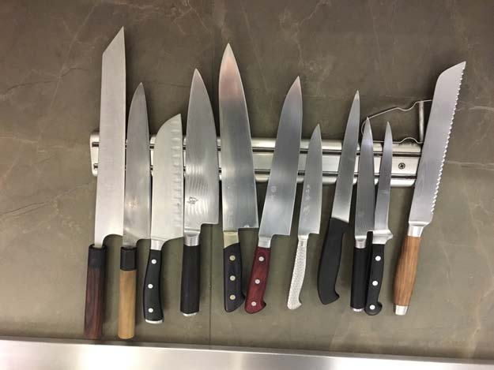

*2016-11-14 16:58 · 猫饭*

---

### 6695

身为数据控兼城市控，看到这张海报一定要拍一下。

*2016-11-14 16:49 · 猫饭*

---

### 6696

@ webto @ mogita 多谢反馈。我转给美团外卖的产品同事了。

*2016-11-12 17:39 · 手机上网 给webto的回复*

---

### 6697

转：美国领导世界，和共产党领导中国很类似，都不是选出来而是打出来的既成事实。

*2016-11-11 14:34 · iPhone版*

---

### 6698

@ 潘欣 中国梦是学美国梦的。这个咱还是得承认。

*2016-11-10 18:58 · 手机上网 给潘欣的回复*

---

### 6699

@ webto 我不是每天都喝防弹咖啡，通常在连续开几天每月例会的时候喝。

*2016-11-10 10:47 · 手机上网 给webto的回复*

---

### 6700

川普的竞选口号 Make America Great Again 完全是照搬「中华民族的伟大复兴」啊。

*2016-11-10 10:39 · 网页*

---

### 6701

样本偏差害死所有统计方法。

*2016-11-09 16:26 · 手机上网*

---

### 6702

但愿还不到人生的下半场…… 转@ 钟永健 世界的下半场。

*2016-11-09 16:08 · 手机上网 转自钟永健*

---

### 6703

朋友圈突然冒出一堆说「我早就认为川普会赢」的人……

*2016-11-09 16:03 · iPhone版*

---

### 6704

一个朋友跟我描述人的所谓意志/毅力在化学物质面前是多么不堪一击：他人生中第一次全麻是为了做肠镜加胃镜，本来他一门心思想看看自己的意志力对麻醉剂有多大抵御能力，结果连麻醉师那句「我现在要给你打麻药了」的「药」字还没听到就失去知觉了-_-!

*2016-11-07 00:16 · iPhone版*

---

### 6705

似乎有必要找时间重读一下《万历十五年》。我当年一定是没读懂。

*2016-11-07 00:10 · iPhone版*

---

### 6706

妈蛋，被生猛的大闸蟹夹了真的会皮开肉绽流血:(

*2016-11-06 13:24 · iPhone版*

---

### 6707

开始有点理解为什么「言必称希腊」了。

*2016-11-06 11:29 · iPhone版*

---

### 6708

饭局上听教授说了一种神奇的药：modafinil，据说美国特工在执行任务时都吃，有些科研人员在写基金申请需要高强度连续工作时也吃，吃了可以几天几夜不睡觉还头脑很清醒，而且没什么副作用。

*2016-11-05 20:20 · iPhone版*

---

### 6709

突然觉得西装上衣其实功能性也还不错，至少取放手机很方便，有俩手机也不怕。

*2016-11-05 12:49 · iPhone版*

---

### 6710

济南附近的黄河比包头附近的黄河还更窄。

*2016-11-05 12:46 · iPhone版*

---

### 6711

敏感的反义词是钝感？

*2016-11-05 12:43 · iPhone版*

---

### 6712

别说百香果、莲雾、释迦、蛇皮果、菠萝蜜这些玩意儿了，连芒果我都是小时候只吃过蜜饯，后来大概到初中才见到新鲜的。

*2016-11-05 11:31 · 手机上网*

---

### 6713

是的，我爸妈每次来京都给我带一大袋。可是，我小时候龙岩可没有百香果这玩意儿。我是十年前在夏威夷第一次吃。后来过了几年，龙岩就突然多起来了。转@ alla @ 王兴 龙岩现在很流行种百香果！几乎到了家家户户都种个一两颗

*2016-11-05 11:25 · 手机上网 转自alla*

---

### 6714

@ 拧巴人儿 passion fruit

*2016-11-04 23:48 · 手机上网 给拧巴人儿的回复*

---

### 6715

百香果就属于可以把人的味蕾强行打开的那种水果。转@ 启冲 人间美味，第一次的时候吃惊呆了。转@ 王兴 百香果真是太美味了。

*2016-11-04 23:40 · 手机上网 转自王兴*

---

### 6716

百香果真是太美味了。

*2016-11-04 22:44 · iPhone版*

---

### 6717

798尤伦斯中心的曾梵志画展很值得一看。

*2016-11-04 20:57 · iPhone版*

---

### 6718

我现在特愁听到「大家都是聪明人」。虽然我还不曾有幸见识过像维特根斯坦那样连罗素都敢当面鄙视的超级天才，但我知道聪明人和聪明人之间还是可以有巨大差距的，就像普通物理学生-物理学家-普通诺贝尔物理学奖-爱因斯坦之间的差别。

*2016-11-04 16:46 · iPhone版*

---

### 6719

今天遇到一个新概念：intellectual arrogance。

*2016-11-04 16:29 · iPhone版*

---

### 6720

@ 小熊娃娃 我去过几次宝屋，感觉还不错。是原来然寿司朗园店的主厨阿宝自己出来开的。期待你的鉴定;)

*2016-11-04 16:25 · iPhone版 给小熊娃娃的回复*

---

### 6721

中国的人口将会剧烈萎缩啊:(

*2016-11-04 08:58 · 手机上网*

---

### 6722

@ 小熊娃娃 三里屯诚盈中心里新开的宝屋日料你鉴定过了吗？

*2016-11-04 08:47 · iPhone版 给小熊娃娃的回复*

---

### 6723

生老病死、衣食住行、吃喝玩乐、黄赌毒，老祖宗的这几个总结，再加上一个教育，大概就是消费者的主要需求了吧。

*2016-11-03 21:54 · iPhone版*

---

### 6724

转@ quux 奥巴马来中国的时候，外交部给他发签证吗？边检在他护照上盖章吗？

*2016-11-03 13:12 · 手机上网 转自quux*

---

### 6725

喀什东南边那个地方不是偏僻得鸟不生蛋、狗不拉屎吗？怎么也PM2.5高达三百多？说明空气污染不是仅由工业化导致？转@ gravity0 吸过一百二百三百的我很好奇德里 AQI = 999 是怎样一种感受。

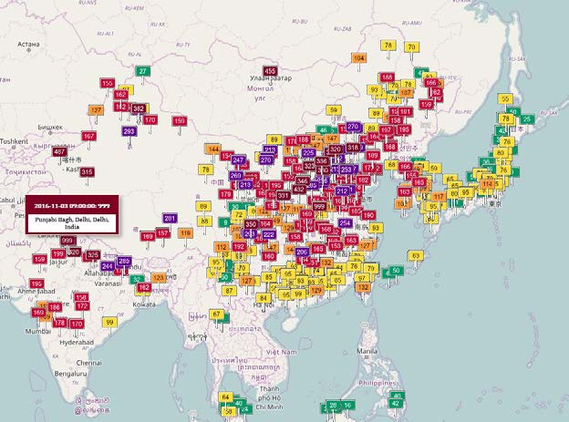

*2016-11-03 13:06 · 网页 转自gravity0*

---

### 6726

华兴、华创、华映、华策、华视、华融、华润、华远…… 这些公司名……

*2016-11-03 13:00 · 网页*

---

### 6727

美国把世界分成不同军事地区来进行监管和巡逻：美国北方司令部，美国太平洋司令部，美国南方司令部，美国欧洲司令部，美国中央司令部，美国非洲司令部。

*2016-11-02 22:06 · iPhone版*

---

### 6728

在日常工作中，二阶导数的概念还时不时用到，但是三阶导数似乎没遇到过。

*2016-11-02 12:33 · iPhone版*

---

### 6729

逐渐有点理解，高端酒店（尤其是奢华酒店）和经济型酒店确实是完全不同的两个生意。

*2016-11-02 10:01 · iPhone版*

---

### 6730

好吧，除了交一个95后女朋友外还有啥办法吗？转@ 半月明 王总你并没有学会， 懂得了释义，但并没有领略精髓。因为你身边的人没有一个能做出蜜汁微笑这个动作 转@ 王兴 学会了一个网络新词汇：蜜汁。

*2016-11-01 16:17 · 手机上网 转自王兴*

---

### 6731

没想到这会成为我买过的最大的书-_-!

*2016-11-01 15:27 · 猫饭*

---

### 6732

空客A380平均每百公里单座燃油消耗不到3升，这还是很令我惊讶的。一辆普通轿车如果每百公里油耗6升就算蛮省油了，按平均坐两个人算，跟A380也差不多。

*2016-11-01 13:57 · iPhone版*

---

### 6733

学会了一个网络新词汇：蜜汁。

*2016-10-31 23:31 · iPhone版*

---

### 6734

转@ Murr 河套地区的断流过去通常是春夏上游灌溉截流造成的，后来规定闸口必须放固定的流量给下游解决了这个问题 转@ 王兴 河套地区的黄河这个季节居然没断流。

*2016-10-31 19:24 · 手机上网 转自王兴*

---

### 6735

河套地区的黄河这个季节居然没断流。

*2016-10-31 17:08 · 手机上网*

---

### 6736

转@ 远骋 海明威说：人生最大的遗憾，是一个人无法同时拥有青春和对青春的感受。（——这可真是一个咒语般的陈述）

*2016-10-30 17:36 · 手机上网 转自远骋*

---

### 6737

放在冲锋衣胸口侧袋的iPhone 6s已经无故关机了，或许是因为户外温度太低；挂在冲锋衣外防水手机袋里的华为mate8还健在。

*2016-10-30 17:08 · iPhone版*

---

### 6738

任何需要思考才能理解的宣传，本质上都是失败的。- Hitler

*2016-10-30 00:48 · iPhone版*

---

### 6739

但使龙城飞将在，不教胡马度阴山。今天第一次在飞机上观察了一下阴山。

*2016-10-29 15:45 · iPhone版*

---

### 6740

转@ webto 「如果现实是一部连续剧，那么今年一定换了编剧……」

*2016-10-29 15:42 · 手机上网 转自webto*

---

### 6741

随着文明发展，最核心的关系从「人与自然」变成「人与人」再到「人与机器」。

*2016-10-29 12:09 · iPhone版*

---

### 6742

真正的大牛研究的都是核心问题，从论文或书的标题就可以看出来，例如亚当斯密的《国富论》。转@ 王兴 「回顾二战后的几十年，穷国变富只有两条路，一是给富国干活（出口），而是祖上积德（例如地下有油）」，这真是我听过的最冷酷无情的总结。

*2016-10-28 16:42 · 手机上网 转自王兴*

---

### 6743

super cycle.

*2016-10-28 15:43 · 手机上网*

---

### 6744

「回顾二战后的几十年，穷国变富只有两条路，一是给富国干活（出口），而是祖上积德（例如地下有油）」，这真是我听过的最冷酷无情的总结。

*2016-10-28 12:18 · iPhone版*

---

### 6745

这是对雷总大波浪最神的回复。转@ 纵情向前2014 @ 王兴 这样看起来更像刚从风口回来。

*2016-10-26 22:53 · 手机上网 转自纵情向前2014*

---

### 6746

原来 Bob Dylan 在08年就得过普利策奖了。

*2016-10-26 18:46 · iPhone版*

---

### 6747

本来想说「需求即行业」，但现在我有点不太确定到底什么叫一个行业了。

*2016-10-26 17:43 · 手机上网*

---

### 6748

转@ quux 两个字：诗意 转@ 姑苏狐先生 转@ 巾伯 我见过国内每一个不成熟的交易员，都拥有一套自我理论，与修身伦理挂钩，他们认为那是历练的至高哲学，其实就是三个字：不成熟。

*2016-10-26 14:41 · 手机上网 转自陈庆之*

---

### 6749

需求即市场。

*2016-10-26 13:42 · iPhone版*

---

### 6750

我是很大之后才明白这个道理：最伟大的思想现在看来必然平淡无奇甚至理所当然，就像阿拉伯数字或者「自由平等博爱」。它们的伟大在于它们诞生之初的惊世骇俗乃至匪夷所思，而后因为它们是如此伟大而普适，它们或快或慢的征服了全世界，直到成为我们每个人头脑中最基础的一部分。

*2016-10-26 13:17 · iPhone版*

---

### 6751

为什么雷总一开发布会就喜欢给头发烫个大波浪呢……

*2016-10-26 00:20 · 手机上网*

---

### 6752

我已经五天没剃胡子了。起因只是我出差时把剃须刀弄丢了，后来我觉得干脆多留几天试试看，没准会适应一种新形象，而且偶尔觉得无聊时还有个可以顺手摸摸的地方。

*2016-10-25 14:06 · iPhone版*

---

### 6753

听说最后的大庄家已经在操盘煤炭价格了

*2016-10-25 12:52 · iPhone版*

---

### 6754

The most noble fate a man can endure is to place his ownmortal body between his loved home and the war's desolation.

—— Robert Heinlein（STA

*2016-10-25 12:48 · iPhone版*

---

### 6755

一个人可以想像的最崇高的生活方式，就是将他自己的身体挡在荒芜的战场和可爱的家园之间。The most noble fate a man can endureis to place his own mortal body between his loved home andth

*2016-10-25 12:47 · iPhone版*

---

### 6756

「不要放香菜」是一个有关「既往不恋，纵情向前」的梗：话说黄泉路上有座奈何桥，奈何桥上有个名叫孟婆的老妇人，她会给每个赶着过桥去投胎转世的孤魂打一碗汤：「孩子，喝下这碗汤，你就会忘了一切前尘往事，安心去投胎。你还有什么最后想对我说的吗？」

*2016-10-25 02:37 · 手机上网*

---

### 6757

大致可以翻译成：要适应不适应。转@ 王兴 Get comfortable withbeing uncomfortable.

*2016-10-25 02:20 · 手机上网 转自王兴*

---

### 6758

没想到后面还有第三个半天-_-! 转@ 王兴 有突破^_^ 转@ 王兴 今天前半天在思考上略有收获，希望后半天在行动上亦有突破:)

*2016-10-25 02:16 · 手机上网 转自王兴*

---

### 6759

我喝茶用了多年的飘逸杯打坏了，再买一个，一模一样，没有任何变化，也确实不需要持续变化。IT产品和非IT产品本质不同。

*2016-10-24 22:14 · 手机上网*

---

### 6760

@ 拧巴人儿 转@ 云无心 人就得拧巴着过 转@ 王兴 Getcomfortable with being uncomfortable.

*2016-10-24 22:02 · 手机上网 转自王兴*

---

### 6761

据说，北京有7万台出租车，是全球除了墨西哥城之外出租车最多的城市。

*2016-10-24 21:46 · 手机上网*

---

### 6762

转@ 金融界人贩子 有个新媒体，全球征稿，PayPal发稿费。约了篇谈ISIS的稿子发了，付稿费时在附言里写上“ISIS”，支付失败，账户被封。编辑在推上抱怨，被洒家一通臭骂：你个寒痹，附言只写ISIS这不是找系统查封呢么，如果系统不封你，监管当局就会封我们，你个逼养的不懂金融反恐

*2016-10-24 21:34 · 手机上网 转自金融界人贩子*

---

### 6763

有突破^_^ 转@ 王兴 今天前半天在思考上略有收获，希望后半天在行动上亦有突破:)

*2016-10-24 21:33 · 手机上网 转自王兴*

---

### 6764

Get comfortable with being uncomfortable.

*2016-10-24 19:06 · iPhone版*

---

### 6765

今天前半天在思考上略有收获，希望后半天在行动上亦有突破:)

*2016-10-24 15:45 · iPhone版*

---

### 6766

转@ webto RT@ 猫社长 可爱 哪里买呀？ 转@ 大脸眼镜娘 啊好喜欢，猫猫哪里买的？ 转@ Anthonyeef 转@ O_O.Flankoi 那啥……我看你在这趴了一下午，提醒你一句，你是活物……

*2016-10-23 12:51 · 手机上网 转自O_O.Flankoi*

---

### 6767

转@ 美嘉.rar 花样年华还是色戒里，几个上海贵妇打麻将的时候说你要去香港啦，喔唷那种乡下地方 … 嗯。

*2016-10-23 10:08 · 手机上网 转自美嘉.rar*

---

### 6768

几年前我曾把这段发给一个荷尔蒙过剩的朋友。比我年轻的他已不幸在大理过世。他借给我的一本关于金融的书还在我的书架上。

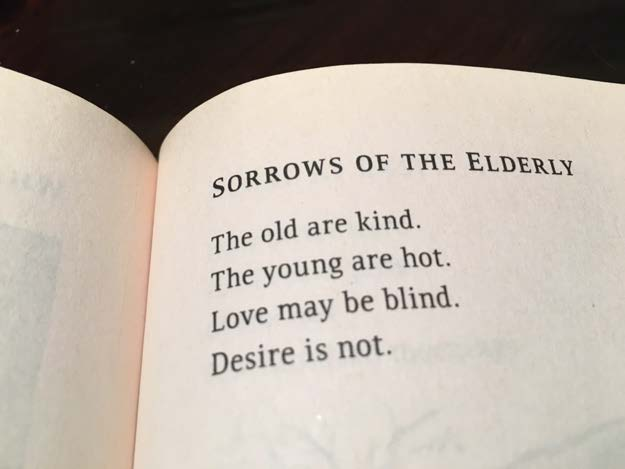

*2016-10-23 02:52 · 猫饭*

---

### 6769

上传了新照片

*2016-10-23 01:52 · 猫饭*

---

### 6770

恕我直言，这是个世界观问题。转@ 失忆的邮差 王总，恕我直言，您就是有意见有个屁用「@ 王兴 今年的诺贝尔文学奖颁给了BobDylan，我没有意见；如果颁给了Leonard Cohen，我也不会惊讶。

」

*2016-10-23 01:41 · 手机上网 转自王兴*

---

### 6771

过去几年我家里的SKU单调上升，最近一年增长得尤其快。

*2016-10-23 01:21 · iPhone版*

---

### 6772

今年的诺贝尔文学奖颁给了Bob Dylan，我没有意见；如果颁给了Leonard Cohen，我也不会惊讶。

*2016-10-23 01:19 · iPhone版*

---

### 6773

我发现，Leonard Cohen正儿八经的诗集我不太能读进去，但他的歌我非常喜欢，这就够了。新专辑 You want it darker 基本上就是配了乐的朗读。

*2016-10-23 01:09 · 猫饭*

---

### 6774

A million candles burning for the help that never came. Youwant it darker. Hineni hineni. I'm ready my lord.

*2016-10-23 01:00 · iPhone版*

---

### 6775

A million candles burning for the love that never came. Youwant it darker. We kill the flame.

*2016-10-23 00:49 · iPhone版*

---

### 6776

这两天开始思考一个问题，三观是不是本质上只有一观，即世界观？

*2016-10-23 00:22 · iPhone版*

---

### 6777

原来capital和cattle有同一个词源，salary和salt有同一个词源，美元又俗称buck是因为美国在开拓西部的时期拿牛皮/兽皮当过硬通货。

*2016-10-23 00:19 · iPhone版*

---

### 6778

每一座城市的每一个角落。

*2016-10-22 21:05 · 手机上网*

---

### 6779

独脚兽。

*2016-10-22 18:16 · 手机上网*

---

### 6780

转@ webto 「当年在学校的时候装了太多盗版office 2000，25位序列号背得滚瓜烂熟，于是后来要密码的时候就从里边随便取一段或者加点变形」

*2016-10-22 15:54 · 手机上网 转自webto*

---

### 6781

反复听了几遍Leonard Cohen的新歌《You want it darker》。一如既往的酷。

*2016-10-22 13:27 · 手机上网*

---

### 6782

北京的「万柳」也是「万泉庄」和「六郎庄」的组合，但只改了一个谐音字就有了美好的意象。转@ 古田织部重然 其实杭州这些路名也是略不讲究，梅灵路，玉古路看上去还不错其实就是两个地名加在一起而已。转@ 王兴 城市规划者（尤其是新区）对街道命名不讲究，真是一件很遗憾的事。

*2016-10-22 13:04 · 手机上网 转自王兴*

---

### 6783

这偏向于自媒体的路数吧。我更认同《The Elements of st yle》书中的总结，名词/动词优于形容词/副词。爱因斯坦有本书起名就返璞归真了，就叫《Ideas and Opinions》.转@ 远骋 起标题技巧：这 最How Why

*2016-10-22 12:58 · 手机上网 转自远骋*

---

### 6784

在高处环顾北京城时，我特别希望有个AR眼镜，随时告诉我现在我的目光焦点所在的建筑叫什么名。或许还可以有更多扩展信息：建于哪年，有何典故，整体面积多大，谁在里面入住，价格多少……

*2016-10-22 11:58 · iPhone版*

---

### 6785

城市规划者（尤其是新区）对街道命名不讲究，真是一件很遗憾的事。

*2016-10-22 11:52 · iPhone版*

---

### 6786

北京不少大楼顶上有直升机停机坪，但我从没见过有直升机在这些楼上起降。

*2016-10-22 11:50 · iPhone版*

---

### 6787

第一次认真远眺北京的钟楼和鼓楼。深红色的鼓楼在泥灰色的钟楼的正南边，个儿大一圈。

*2016-10-22 11:37 · iPhone版*

---

### 6788

雨过天晴空气清澈时，国贸三期顶上的云酷咖啡厅/酒吧依然是鸟瞰北京全景的好地方。

*2016-10-22 11:14 · iPhone版*

---

### 6789

资深业余选手。

*2016-10-21 16:40 · iPhone版*

---

### 6790

大半夜的，一桌互联网创业者和投资人不睡觉，还在兴趣盎然的讨论在梦里再做一重梦的体验……

*2016-10-21 01:45 · iPhone版*

---

### 6791

Hope is not a strategy. -Fred Luddy & Frank Slootman ofServiceNow

*2016-10-20 09:53 · iPhone版*

---

### 6792

美国要罚德意志银行140亿美元，欧盟要罚苹果130亿欧元。这两者纯属巧合。

*2016-10-19 21:04 · iPhone版*

---

### 6793

现在最不值钱的就是钱了。

*2016-10-19 17:24 · iPhone版*

---

### 6794

脑补一下只有马化腾和马云两个人的微信群。

*2016-10-19 13:54 · iPhone版*

---

### 6795

连喝三天防弹咖啡了。

*2016-10-19 13:14 · iPhone版*

---

### 6796

二战是人类历史上最惨烈的战争和杀戮，二战后的这几十年则是人类历史上最和平的几十年。再往后会是什么？我只能祈祷这不是一个钟摆。

*2016-10-18 20:36 · iPhone版*

---

### 6797

前几天和一个朋友聊起二战中德国的新武器研发。德国率先做出了火箭和喷气机等先进武器，但是没有先做出原子弹。这个犹太人朋友认为核心原因是以希特勒为首的德国人相信工程engineering，但是不相信科学science。

*2016-10-18 12:41 · 手机上网*

---

### 6798

这是假的，仅有娱乐价值。转@ 王兴 转@ 上马为贼 这是一个肌球蛋白，拖着一个内啡肽，走在一个单纤维上，然后大摇大摆的走过你的大脑皮层，这是让你产生快乐的物质它为了让你开心，每天拖着这个大东西，你还有什么理由难过呢？

*2016-10-18 12:16 · 手机上网 转自上马为贼*

---

### 6799

转@ 上马为贼 这是一个肌球蛋白，拖着一个内啡肽，走在一个单纤维上，然后大摇大摆的走过你的大脑皮层，这是让你产生快乐的物质它为了让你开心，每天拖着这个大东西，你还有什么理由难过呢？

*2016-10-18 08:10 · 网页 转自上马为贼*

---

### 6800

这是设计！转@ 漏进来的阳光 这杯子是没洗干净吗「@ 王兴 防弹咖啡真是高能量密度的优质燃料，只是分解时需要大量的水配合。8点半喝完一杯防弹咖啡后，到现在我已经喝了四大杯温水了。」

*2016-10-17 11:41 · 手机上网 转自王兴*

---

### 6801

这个改字的解读有意思。转@ 金融界人贩子 我突然意识到林毅夫原名林毅天，吃黄豆抱篮球游泳弃暗投明上岸后改名林毅夫，意思是姓林的毅然决然要日穿天，这个天，应该就是白日青天的意思。很有理想志气的一个逼。

*2016-10-17 10:59 · 手机上网 转自金融界人贩子*

---

### 6802

防弹咖啡真是高能量密度的优质燃料，只是分解时需要大量的水配合。8点半喝完一杯防弹咖啡后，到现在我已经喝了四大杯温水了。

*2016-10-17 10:37 · 手机上网*

---

### 6803

-_-！转@ 美嘉.rar 旅行就是换个地方叫外卖。是我。

*2016-10-17 09:45 · 手机上网 转自美嘉.rar*

---

### 6804

转@ 钟永健 天下无新事。

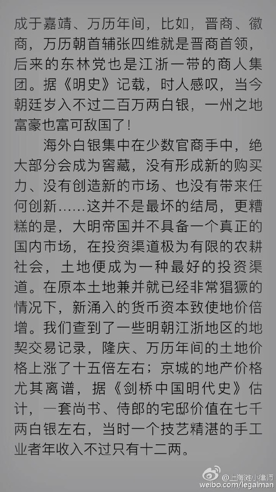

*2016-10-15 18:14 · 手机上网 转自钟永健*

---

### 6805

转@ 美嘉.rar 葡萄牙语里的 cafuné，意思是「手指穿过恋人的头发」，德语词：Kummerspeck，意为「因忧愁而过多进食所长的肉」。天哪这种一个词包含一段意思的外语好浪漫啊。

*2016-10-15 17:30 · 手机上网 转自美嘉.rar*

---

### 6806

今天眼睛不太舒服，我起初还有点纳闷，没有用眼过度啊，后来明白了，是pm 2.5太高了:-(

*2016-10-15 17:20 · 手机上网*

---

### 6807

基础设施投入真是大！软银宣布要成立的那个1000亿美元的基金也就够建十个厂。转@ webto 10月13日中芯国际（SMIC）宣布在上海开工建设新的12英寸晶圆厂，投资超过675亿人民币，明年底正式建成，这座工厂将使用14nm工艺，这是中芯国际最先进、同时也是国内最先进的制造工艺

*2016-10-15 16:43 · 手机上网 转自webto*

---

### 6808

按PPP购买力平价GDP算，印尼居然已是全球第八大经济体，排在日本和德国之后，但在英国和法国之前。

*2016-10-15 00:07 · iPhone版*

---

### 6809

一个国家或地区的经济总量要翻倍，大致有两个方向，人口翻倍，或者人均GDP翻倍。后者虽然也不是太容易，但总比前者靠谱得多：年均增长7%保持10年，或年均增长10%保持7年，都可以翻倍。

*2016-10-14 23:45 · iPhone版*

---

### 6810

突然想去看看吹玻璃。北京周边应该有厂子可以参观吧。

*2016-10-14 12:41 · iPhone版*

---

### 6811

转@ CD_Rich @ 王兴 @ mckon 怡和集团的logo不是罂粟花，而是苏格兰的国花-蓟花。创始人William Jardine和James Matheson都是苏格兰人。logo的形状更像蓟花而不是罂粟花

*2016-10-14 12:39 · 手机上网 转自CD_Rich*

---

### 6812

「国产歌手」这个概念太欢乐了。

*2016-10-14 12:09 · iPhone版*

---

### 6813

如果乔布斯还在世，他对鲍勃迪伦获得今年的诺贝尔文学奖会有什么表示吗？

*2016-10-14 10:01 · 手机上网*

---

### 6814

转@ mckon 这个集团的logo就是罂粟花。 转@ 王兴 怡和集团的这个介绍蛮低调内敛嘛，估计是不好意思直接说：我们公司历史悠久，创始人是Jardine，对，就是那个因为鸦片被林则徐没收而鼓动英国发动鸦片战争的英国商人Jardine。

*2016-10-14 09:31 · 手机上网 转自王兴*

---

### 6815

谢谢科普。转@ 柒小斤 @ 王兴 金山公司的来龙去脉，

*2016-10-13 16:29 · 手机上网 转自柒小斤*

---

### 6816

怡和集团的这个介绍蛮低调内敛嘛，估计是不好意思直接说：我们公司历史悠久，创始人是Jardine，对，就是那个因为鸦片被林则徐没收而鼓动英国发动鸦片战争的英国商人Jardine。

*2016-10-13 14:19 · 手机上网*

---

### 6817

不同观点请直说。转@ 菅原舜水 没有大量语例支撑论断。若是只凭自身用语经验的分析是危险的@ 王兴 不同语言的细微差别挺有趣：虽然都对应英文里的share，但中文里的「分享」和「共享」不完全相同，前者更多是「a把他在自用的东西也给b用」，后者则可以是「a和b共同使用属于第三方的东西」

*2016-10-13 09:31 · 手机上网 转自王兴*

---

### 6818

不同语言的细微差别挺有趣：虽然都对应英文里的share，但中文里的「分享」和「共享」不完全相同，前者更多是「a把他在自用的东西也给b用」，后者则可以是「a和b共同使用属于第三方的东西」。

*2016-10-13 09:27 · iPhone版*

---

### 6819

转@ 张亮 昨晚因为一个词的翻译，跟李如一聊了几句，因为是个日语词汇，直接被无缝引入中文，但没有恰当的英文对应，即欧美还不懂这是什么。不由得感慨中国正在变成新的文化熔炉，美日欧韩的文化，以及发生在中国本地的事，共同塑造这一代的年轻人。

*2016-10-13 08:58 · 手机上网 转自张亮*

---

### 6820

啧啧。转@ 张亮 过去一年我都在日本理发了。转@ 王兴 自己剃呗。

转@ 东东枪 嗯。转@ blankelp 现在理发店真的太贵了，如果我十年前开始谢顶，拿每年节省下来的日常开支买一支基金，到今年的利息收入都能去北欧玩半个月，要是男人三十岁还不谢顶可以说是对家庭非常不负责任了。

*2016-10-13 08:58 · 手机上网 转自blankelp*

---

### 6821

我是探索在一条道路上的普通人，这条道路的目的是在物质建设之外，使人们获得自由、尊严和幸福。诗人写作的目的是改变人和世界的关系，首先就是改变词语和事物之间的关系。-阿多尼斯

*2016-10-13 08:28 · iPhone版*

---

### 6822

自己剃呗。转@ 东东枪 嗯。转@ blankelp 现在理发店真的太贵了，如果我十年前开始谢顶，拿每年节省下来的日常开支买一支基金，到今年的利息收入都能去北欧玩半个月，真的后悔了。很多人都没想到这个方面，当代青年毛太多是一种负担，要是男人三十岁还不谢顶可以说是对家庭非常不负责任了。

*2016-10-13 00:03 · 手机上网 转自blankelp*

---

### 6823

转@ gravity0 爱因斯坦说若有一小时解决问题，他花五十五分钟搞清楚问题到底是什么，解题只用五分钟。前面的时间花在了修正认知上，了解情况学习方法，其实就是先解决自己的问题。各人比例或有不同，但大部分时间精力都用于完善自己。人非工具，谁也不是生来就为解决特定问题的。

*2016-10-12 15:14 · 手机上网 转自gravity0*

---

### 6824

今天早上好像忘了刮胡子。

*2016-10-12 12:54 · iPhone版*

---

### 6825

知道大众知道什么是挺费力的事，但这是营销的基础。

*2016-10-12 11:48 · 手机上网*

---

### 6826

突然有点想去鄂尔多斯看一下传说中的地产泡沫破灭后是什么景象。

*2016-10-12 11:16 · 手机上网*

---

### 6827

转@ peter 和另一个知情人求证了一下，来自张铠卿的铠字里的 金字旁和山「@ webto @ 王兴 哎？不是吧，香港金山成立在前。张旋龙的父亲好像叫张铠卿 http://t.cn/RVqNEhj 」

*2016-10-12 11:09 · 手机上网 转自webto*

---

### 6828

@ 小晚_wan 新闻本来就只是内容的一小部分吧？

*2016-10-12 11:08 · 手机上网 给小晚_wan的回复*

---

### 6829

@ webto 不好意思，我没有去考证，是听雷总跟他身边的人说的。

*2016-10-12 09:19 · 手机上网 给webto的回复*

---

### 6830

金山软件之所以叫这个名字可能是因为最早出钱给求伯君办公司的香港商人张旋龙的父亲叫张金山。

*2016-10-12 08:50 · iPhone版*

---

### 6831

原来DST老大Yuri Milner的名字是来源于人类第一个宇航员加加林YuriGagarin。这也算是一个有时代特征的苏联名字了。

*2016-10-12 01:13 · iPhone版*

---

### 6832

原来历史上文天祥还在龙岩驻扎过两三个月，太平军也曾攻占过龙岩。有意思。

*2016-10-11 01:27 · iPhone版*

---

### 6833

风水轮流转，马克思的学说开始重新得到重视，不知道马克思主义会如何……

*2016-10-11 00:55 · iPhone版*

---

### 6834

毛家女婿陈东升这个段子黑得漂亮：1979年我考上了武汉大学。我们街坊有位上了年纪的老师告诉我武汉大学好得要死，两个人住一间房，早上有豆浆和油条。我听了特高兴，去了一看，八个人一间房，原来他说的是30年代国立武汉大学时期的状况。

*2016-10-11 00:31 · iPhone版*

---

### 6835

时至今日，太平洋作为护城河够不够宽都不好说了。

*2016-10-10 12:47 · 手机上网*

---

### 6836

Civilization is more than optimization.

*2016-10-10 12:08 · 手机上网*

---

### 6837

华为mate8升级新固件后字体变得更清秀了。

*2016-10-10 10:00 · iPhone版*

---

### 6838

现在最拿得出手的待客之道不是请人去哪个日餐厅而是买一整条三文鱼回来拿出自己收藏的一套刀亲自上阵切。景川真棒！

*2016-10-09 19:17 · 猫饭*

---

### 6839

看到一条新闻《埃塞俄比亚将取代肯尼亚成为东非第一大经济体》，点进去看了一下，这俩国家今年GDP预计都是690亿美元上下，和鄙人的故乡福建省排名中流的地级市龙岩差不多。

*2016-10-09 18:05 · iPhone版*

---

### 6840

现在我集中注意力的能力可真差，读个45分钟的书都能开小差四五次:(

*2016-10-09 10:32 · iPhone版*

---

### 6841

完蛋了，现在一不留神就哼起前几天听过的广场舞调子-_-!

*2016-10-08 18:15 · iPhone版*

---

### 6842

这个双关不错。转@ 钟永健 一直觉得，一本正经的书，应该一张图都没有。

*2016-10-08 18:10 · 手机上网 转自钟永健*

---

### 6843

@ 拧巴人儿 哦。谢谢。还有个michael moritz，不过他是从记者转做风险投资之后才被封爵的。

*2016-10-08 15:35 · 手机上网 给拧巴人儿的回复*

---

### 6844

谁啊？转@ 拧巴人儿 当记者当到被封爵，也是死能瞑目了……

*2016-10-08 15:28 · 手机上网 转自拧巴人儿*

---

### 6845

听说英国新任首相特蕾莎·梅在参加今年九月的杭州G20峰会之前从没来过中国，我真是惊了，有点为她的世界观担心。

*2016-10-08 15:09 · iPhone版*

---

### 6846

恕我愚钝，我始终没理解这种每天当最后一天活的搞法。转@ 无名芝贝 十几年前有个朋友跟我说，要像每天是最后一天那么活着。我试了，开心是递减的。转@ 王兴 我想像有钱的穷人那样生活。-毕加索

*2016-10-08 14:00 · 手机上网 转自王兴*

---

### 6847

我想像有钱的穷人那样生活。-毕加索

*2016-10-08 01:39 · iPhone版*

---

### 6848

突然因为自己或许没有来由的乐观而感到莫名的惶恐。

*2016-10-08 00:50 · iPhone版*

---

### 6849

听说龙岩本地的房地产商已经不像前几年那么猛了，但是恒大和（刚在上海拍了块地王的福建房地产领头羊）融侨今年杀进龙岩来拿了地。

*2016-10-06 18:09 · iPhone版*

---

### 6850

游牧民族当然不操心建护城河这档子事。

*2016-10-06 07:43 · iPhone版*

---

### 6851

我居然从来没有想过这个著名的纳粹标志是两个相互垂直的S构成的。

*2016-10-05 23:13 · 手机上网*

---

### 6852

《肖申克救赎》最可怕的隐喻是：我们所有人都在现实俗世这个大监狱里，但只有极少极少人在系统而坚持的挖逃出去的通道。

*2016-10-05 17:35 · iPhone版*

---

### 6853

国外许多城市的公园是不是也正在或即将被中国广场舞大妈们占领？

警方会介入吗？

*2016-10-05 11:17 · 手机上网*

---

### 6854

真正有效率的劳动者，不会整天马不停蹄地工作，而是闲庭信步般轻松愉悦地处理事务。-装逼犯亨利·梭罗

*2016-10-05 11:08 · 手机上网*

---

### 6855

我原本觉得清华的体育课种类还算比较多，结果刚刚听说康奈尔有爬树课-_-!

*2016-10-04 16:05 · iPhone版*

---

### 6856

「投资人」这三个字至少有两种意思：做投资的人，和投资在人身上。

*2016-10-04 15:49 · iPhone版*

---

### 6857

转@ quux 辛普森爹的名言：Upper-lower-middle class

*2016-10-04 13:04 · 手机上网 转自quux*

---

### 6858

我现在真是越来越懒，开始希望有全自动安全带了。

*2016-10-04 12:47 · 手机上网*

---

### 6859

@ 杨曜睿 没伤到手就好。你还有一把黄柄的蜘蛛潜水刀吧？

*2016-10-03 17:57 · iPhone版 给杨曜睿的回复*

---

### 6860

听说玉皇大帝又名「张百忍」时，我真是愣了一下。这真的就是中国传统文化的一部分吧。

*2016-10-03 10:04 · iPhone版*

---

### 6861

每个人对于他所属的社会都负有责任，那个社会的弊病他也有一份。易卜生

*2016-10-02 21:29 · iPhone版*

---

### 6862

转：晚起毁上午，早起傻一天。

*2016-10-02 02:01 · 手机上网*

---

### 6863

老妈说她再一次来北京就已经是98年来清华看我和我姐了。

*2016-10-01 22:40 · iPhone版*

---

### 6864

老妈说她和老爸82年来北京旅游时烤鸭8块钱一只。

*2016-10-01 15:06 · 手机上网*

---

### 6865

我都忘了这个逗比朋友是谁了。转@ 墨什么呀 转@ 王兴 认识了一个逗比的朋友，他说他有一个列表叫：我得了狂犬病后要咬的前50个人。

*2016-10-01 10:36 · 手机上网 转自王兴*

---

### 6866

就仅仅是早餐时一小包雀巢速溶而已。转@ ppip 这是把咖啡因提高到什么程度了？转@ 王兴 「防弹咖啡」太厉害了！我真的一整天精神抖擞头脑清楚，连午饭后都不困！Bio-hacking真好玩！

*2016-09-30 23:16 · 手机上网 转自王兴*

---

### 6867

「防弹咖啡」太厉害了！我真的一整天精神抖擞头脑清楚，连午饭后都不困！Bio-hacking真好玩！

*2016-09-30 19:15 · iPhone版*

---

### 6868

对于问题「你为什么要做xx这件事」，总有一个答案是几乎无可辩驳的：我喜欢。

*2016-09-30 17:05 · iPhone版*

---

### 6869

塑造品牌有很多方式，例如：太兴餐厅为了强调港式正宗在北京分店的菜单里也专门加一页香港交通图。

*2016-09-30 12:28 · 猫饭*

---

### 6870

@ 拧巴人儿 自制的。

*2016-09-30 11:40 · iPhone版 给拧巴人儿的回复*

---

### 6871

喝了一杯「防弹咖啡」之后整个上午确实很精神，只是尿液略微发黄。我甚至没像往常那样喝点茶。

*2016-09-30 11:36 · iPhone版*

---

### 6872

早餐没吃别的任何东西，喝完一杯「防弹咖啡」确实感觉头脑很清醒。是不是心理作用呢？

*2016-09-30 09:31 · iPhone版*

---

### 6873

在马占凯老师的撺掇下，喝了人生第一杯「防弹咖啡」：黑咖啡加黄油加椰子油，据说可以完全替代早餐并使人大半天精力充沛头脑清楚。

*2016-09-30 08:56 · 猫饭*

---

### 6874

好可爱。转@ 明星煌煌 3岁到10岁住的房子现在还在，住19楼，小时候还按不到19层，有一段时间都是按到17层然后上两层楼梯。转@ 王兴 突然想到一个问题，有多少人童年住过的房子还依然存在？

*2016-09-29 11:27 · 手机上网 转自王兴*

---

### 6875

转@ 没大耳朵 我家的还在，我爸童年也住里面，潮汕地区的小四合院，我们叫「下山虎」，现在当灵堂用。小时候遇到台风天得拿麻绳和石头坠着，怕屋顶被刮跑。有一年没坠好，厕所吹走了。转@ 王兴突然想到一个问题，有多少人童年住过的房子还依然存在？

*2016-09-29 10:15 · 手机上网 转自王兴*

---

### 6876

宾馆，旅馆，旅舍，酒店，饭店，客栈，民宿，招待所。

*2016-09-28 23:30 · iPhone版*

---

### 6877

突然想到一个问题，有多少人童年住过的房子还依然存在？

*2016-09-28 23:25 · iPhone版*

---

### 6878

社交是一种技能，独处也是。

*2016-09-28 17:51 · iPhone版*

---

### 6879

《董小姐》里唱的「你嘴角向下的时候很美,就像安河桥下清澈的水」

原来说的是北京五环西北角那个安河桥，我之前一直误以为是北三环中路那个安华桥，还一直纳闷说那里好像没水啊。

*2016-09-28 11:21 · iPhone版*

---

### 6880

「虚心」和「心虚」的含义完全不同。

*2016-09-28 10:53 · iPhone版*

---

### 6881

我现在觉得，太年轻的人基本上不太可能理解「指鹿为马」到底是怎么回事。

*2016-09-27 21:49 · iPhone版*

---

### 6882

居然还有这么一本书。《A History of Knowledge》

*2016-09-27 21:05 · 手机上网*

---

### 6883

芝麻烧饼就是得趁热吃啊。

*2016-09-27 20:05 · iPhone版*

---

### 6884

转@ 木之所兮 转@ 飯否小字报 转@ 淑児 今天在交大读研的基友跟我说交大有个段子，一位朝鲜来的留学生对教授说：“老师，你不能挂我科，不然我回去会被枪毙的。”

*2016-09-27 13:21 · 手机上网 转自淑児*

---

### 6885

据说风险投资行业前25%的基金获取了全行业120%的利润。

*2016-09-27 13:16 · iPhone版*

---

### 6886

星巴克虽然是卖咖啡的，但是每年花在采购牛奶的钱超过采购咖啡豆的钱。

*2016-09-26 15:45 · iPhone版*

---

### 6887

这位同学，下学期请重修一下逻辑课。转@ 冷小热 那么京东和腾讯是一家的。转@ 王兴 看阿里集团和蚂蚁金服是否是两家独立的公司，就看淘宝支不支持微信支付。

*2016-09-26 13:20 · 手机上网 转自王兴*

---

### 6888

看阿里集团和蚂蚁金服是否是两家独立的公司，就看淘宝支不支持微信支付。

*2016-09-26 12:48 · 手机上网*

---

### 6889

图上配文尤其值得读。转@ gravity0 其实一点不奇怪，八万刀一颗的弹药和其它高级装备决定了谁死谁活，比两边柴刀对砍结果可控。从来仗打的就是钱，从前骑士一套装备和马也不是平民一辈子买得起的。

*2016-09-26 08:31 · 手机上网 转自gravity0*

---

### 6890

客机在陆地上是只会前进不会后退的，所以机场需要用专门的小车子

把客机从停机位上倒推出去。

*2016-09-25 21:53 · iPhone版*

---

### 6891

一个朋友说她看过的最棒星空是在约旦的沙漠里。和高山或海上看星空的感受不同，约旦沙漠里的星空让她真切的感受到地球是漂浮在茫茫宇宙中的。

*2016-09-25 21:10 · iPhone版*

---

### 6892

以前嘲笑日本所谓战国时期按中国的规模算也就相当于几个县的农民斗殴。没想到蜀国也人这么少，只有两三个天通苑。。转：按照杜佑《通典》里的说法，蜀国在公元221年刘禅登基时，人口是90万，到了公元263年蜀国灭亡时，人口增长到94万。

*2016-09-25 20:54 · iPhone版*

---

### 6893

最近到了晚上夜深人静的时候多了一项任务，打开微信把众多未读消息清掉，只能是清掉，都读完是不可能了。这样子下去不行啊。

*2016-09-24 00:04 · iPhone版*

---

### 6894

跟一堆说话习惯中英混杂的人吃饭。我正埋头吃着，突然听到斜对面姐们的话冒出「约炮」这个词。我吃了一惊，怎么话题突变了？转念一想，她说的应该是will power。于是低头继续吃。

*2016-09-23 20:58 · iPhone版*

---

### 6895

什么？这年头还有人坚持用邮件撩妹？古典程度仅次于交笔友啊！转@ 美嘉.rar 理性讨论一下，男网友发邮件说：“你长得那么可爱。”到底是说我好看还是不好看啊。

*2016-09-23 11:33 · 手机上网 转自美嘉.rar*

---

### 6896

转@ webto 刚才又被日本人对 Excel 的热情震惊了一下，服务器之间传输数据，竟然不是通过 API 调用，而是请求 .cvs 文件。。。

*2016-09-23 11:13 · 手机上网 转自webto*

---

### 6897

再过几个小时，我去过的国内机场又要加一个了。

*2016-09-23 06:34 · iPhone版*

---

### 6898

半夜鲤鱼来上滩。

*2016-09-23 01:48 · iPhone版*

---

### 6899

原来江南人家生小孩时都酿几坛黄酒，若是生女儿那便是「女儿红」

了，若是生儿子那酒名就更霸气了，状元红。

*2016-09-22 22:38 · iPhone版*

---

### 6900

今晚不知怎的，听《天鹅湖》都突然豪情万丈。

*2016-09-22 21:27 · iPhone版*

---

### 6901

QQ音乐居然给粤语歌的歌词里加上了音标。

*2016-09-22 20:41 · 手机上网*

---

### 6902

转@ 帮主胡子 “请讲出分手时伤你最深的那句”“我没谈过”“对不起”

*2016-09-22 20:37 · 手机上网 转自帮主胡子*

---

### 6903

「擒兽资本」作为一个风险投资基金的名字真是让人听了虎躯一震。

*2016-09-22 17:43 · iPhone版*

---

### 6904

Heatherwick给纽约hudson yards设计的“vessel”是我近来看到的最酷的建筑。

*2016-09-22 16:45 · 手机上网*

---

### 6905

或许几百年前「女人也有人权」或「黑人也有人权」的观念就好像今天提「机器人也有人权」一样被许多人认为莫名其妙。

*2016-09-22 14:28 · iPhone版*

---

### 6906

《Too big to know》这书名真抓眼球。

*2016-09-22 13:35 · iPhone版*

---

### 6907

一个朋友说去北欧投资一定要慎之又慎，十年前他所在的机构收购了北欧一个航空业相关的企业，后来发现是个大坑：总员工数1000左右的公司有大大小小60个工会，这60个工会联合推选了一个代言人，公司必须给这个代言人安排一个办公室，而且得跟ceo办公室隔壁，然后那哥们整天有事没事就窜过来…

*2016-09-22 12:20 · iPhone版*

---

### 6908

原来如此，连这个套路都不需要创新。果真是太阳底下无新事。转@七喜. 类似算命先生。劫很大，可以解，得花钱。转@ 王兴 据说莆田系医院对所有病人的套路都离不开这三句话：病很重；可以治；得花钱。

*2016-09-21 23:27 · 手机上网 转自王兴*

---

### 6909

据说莆田系医院对所有病人的套路都离不开这三句话：病很重；可以治；得花钱。

*2016-09-21 21:41 · iPhone版*

---

### 6910

@ 矛盾wen 看到你这条，我在我那已升级成iOS 10的iPhone 6s上打开了大众点评app，十几分钟后没有发现有发烫的现象。还有其他线索吗？

*2016-09-20 13:54 · iPhone版 给矛盾wen的回复*

---

### 6911

转@ 唐君毅 @ 王兴 就在公司北门外面挨着五环的公园里。刚才朋友圈有人提到，应该是咖啡透翅天蛾，容易被误认为蜂鸟：http://baike.baidu.com/view...

*2016-09-19 14:26 · 手机上网 转自唐君毅*

---

### 6912

啊，就在望京吗？转@ 唐君毅 居然碰见一只蜂鸟（右侧黄褐色那块），可惜拍得不太清楚。

*2016-09-19 13:37 · 手机上网 转自唐君毅*

---

### 6913

至少在买房这件事上，天时略胜于地利。

*2016-09-18 21:40 · iPhone版*

---

### 6914

持a观点的甲说a和b没区别，持b观点的乙说a和b有区别。仅凭以上信息不足以做出判断。

*2016-09-18 20:35 · 手机上网*

---

### 6915

我估计短期内没有哪个音乐播放器会满足我这个需求：火车一路播放当地风格的音乐或以所经过城市为主题的歌曲。

*2016-09-18 20:27 · 手机上网*

---

### 6916

转：广告部接到一个咨询电话，说很大的一个地产项目要在我们这里投放广告。广告部问：是啥地产商品牌？对方说：是很大的一个地产项目。问：我知道很大，但是你得告诉我是哪个啊，不然我没办法看看是归属哪个区域销售。对方说：是很大很大的一个项目…… 搞了半

天，原来是恒大。

*2016-09-18 20:24 · 手机上网*

---

### 6917

yy了一个面试场景，问：你还有什么技能？答：我会……数数。被轰走。其实，在多数人没觉得能数数该数数的时候数一数就是一个突破。# 听说中餐大概有2300个菜名 #

*2016-09-18 20:18 · 手机上网*

---

### 6918

《Por Una Cabeza》这曲子确实好得让我有时不禁想到作者当年创作她时的环境去现场体验一下。

*2016-09-18 20:09 · 手机上网*

---

### 6919

玻璃也要钱啊。你没发现康师傅纯净水的塑料瓶早已薄得几乎握不住了吗？转@ 弥城 “降玻璃瓶厚度”是为了更容易磕碰碎掉么？还是运输成本？ 转@ 王兴 麦当劳缩水让我想起，半年前听一个传统产业的人吹嘘他十年前把一个白酒企业扭亏为盈时用的三招：1、降度数；2、降容量；3、降玻璃瓶厚度

*2016-09-18 20:06 · 手机上网 转自王兴*

---

### 6920

麦当劳缩水让我想起，半年前听一个传统产业的人吹嘘他十年前把一个白酒企业扭亏为盈时用的三招：1、降度数；2、降容量；3、降玻璃瓶厚度。我听了暗自不屑，后来发现其实洋酒也是这套路：从1L降为750ml再降为700ml。

*2016-09-18 19:57 · 手机上网*

---

### 6921

太多人牛逼哄哄的原因不是他们真的得分很高，而是他们标准有点低。最近跟一个大佬吃饭，闲聊扯淡时他自夸不但商业牛逼，而且会吃会玩，全世界最好玩的地方都去过。我真诚的抱着请教的态度问了几句，才发现他连东非大草原都没去过-_-! 我也没去过，但我至少知道那就完全没有吹牛的资格了。

*2016-09-18 19:43 · 手机上网*

---

### 6922

讲真，国内的火车站论实用要数虹桥，轮颜值还是要属阿尔山里那个日据时期建起来的小车站。

*2016-09-18 19:16 · 手机上网*

---

### 6923

@ webto 是的。我很从容的把汉堡吃完了，列车才缓缓开动。

*2016-09-18 19:13 · 手机上网 给webto的回复*

---

### 6924

虽然很长时间没吃过麦当劳的板烧鸡腿堡了，但我揭开这一个的包纸时，依然有一个强烈的感觉：比原来整个缩小了！

*2016-09-18 19:11 · 手机上网*

---

### 6925

从我傍晚6点出头走出上海办公室，步行到地铁2号线，再到虹桥高铁站顺手买个麦当劳到最后踏进列车，一共耗时不到49分钟，所以我赶7点发车回京的高铁是完全没问题的。准点到北京南站应是11点48，之后到家估计还要将近一个小时。

*2016-09-18 19:02 · 手机上网*

---

### 6926

转@ gravity0 很多年以后我才明白，很多当年成绩不如我的同学比我聪明。他们会迅速辨别哪些资讯于自己相关哪些无关，哪些重要哪些不重要，从而投入相应的精力资源。取舍判断力是更高等级的智力，有些题目当开始认真去做时就已经输了，因为你为它忽视了更重要的。

*2016-09-18 18:31 · 手机上网 转自gravity0*

---

### 6927

一大早在吉祥航空的飞机上吃了个「米汉堡」，这个小创新还不错。

*2016-09-18 09:19 · iPhone版*

---

### 6928

《经济学人》和渣打银行居然是同一个人创办的。

*2016-09-17 14:12 · 手机上网*

---

### 6929

刚做了一个跟工作有关的梦。

*2016-09-17 08:00 · iPhone版*

---

### 6930

「周XX，国内知名市值管理专家……」，刚看到这样的书面介绍。

*2016-09-16 12:43 · iPhone版*

---

### 6931

第一次吃到麻辣的月饼。

*2016-09-15 22:20 · iPhone版*

---

### 6932

突然好奇「豪门」和「豪猪」这俩词的关系。

*2016-09-15 20:56 · iPhone版*

---

### 6933

转@ 淡不定 @ 王兴 毛细＜细＜二细＜三细＜韭叶＜宽＜大宽 这家没有大宽。细是圆面，韭叶开始是扁的，所谓韭叶就是宽似韭菜叶，大宽如腰带。

*2016-09-15 14:18 · 手机上网 转自淡不定*

---

### 6934

不借助工具我老记不住哪几种我尝过哪几种我没尝过。今天吃的是毛细，对我来说太细了。

*2016-09-15 12:47 · 猫饭*

---

### 6935

「荣誉是所有误解的总和」，里尔克不愧是顶级诗人！

*2016-09-15 10:05 · iPhone版*

---

### 6936

《时间的玫瑰》这书名不错，作者不愧为北岛。

*2016-09-15 09:55 · iPhone版*

---

### 6937

如果不勤于思考，很容易把「同一套（商业）逻辑在不同条件下的呈现」误以为是「两套不同的逻辑」。

*2016-09-15 09:35 · iPhone版*

---

### 6938

转@ 杨曜睿 这篇好棒！ 但起了个烂标题，差点错过orz。 一个好名字真的很重要啊！！转@ 小熊娃娃 分享：《10种你一定体验过却难以形容的“小情绪”，你中了几个？》 http://t.cn/RcxhqTU 还蛮有意思的~

*2016-09-15 08:44 · 手机上网 转自小熊娃娃*

---

### 6939

有一类微信表情叫「感谢对方发红包」。

*2016-09-14 19:27 · 手机上网*

---

### 6940

嘿，三里屯有个楼顶上立起CHAO四个大字。这是比「潮」更洋气的意思吗？

*2016-09-14 19:24 · 手机上网*

---

### 6941

或者，变个性。转@ 拧巴人儿 不知道到我这个年纪还有没有性情大变的可能。

*2016-09-14 19:19 · 手机上网 转自拧巴人儿*

---

### 6942

有，信个教。转@ 拧巴人儿 不知道到我这个年纪还有没有性情大变的可能。

*2016-09-14 19:16 · 手机上网 转自拧巴人儿*

---

### 6943

马占凯老师又有金句：定义是一种思考方式。

*2016-09-14 13:29 · iPhone版*

---

### 6944

微软当年对互联网肯定是后知后觉的，一个小例子就可以证明：ms.com这个域名的拥有者不是micro-soft而是morgan-stanley。

*2016-09-14 13:27 · iPhone版*

---

### 6945

你是何时学会判断什么情况该坚持，什么情况该放弃的？小学，老师布置作业时。

*2016-09-14 11:40 · iPhone版*

---

### 6946

真的没必要再纠结于域名了，连google升级成alphabet inc之后都不拥有alphabet.com这个域名。

*2016-09-14 10:53 · iPhone版*

---

### 6947

这季节在北京吃葡萄就应该吃玫瑰香。

*2016-09-13 19:17 · 手机上网*

---

### 6948

@ 胡泳 朋友圈里一个做企业IT服务的老手。

*2016-09-13 14:59 · 手机上网 给胡泳的回复*

---

### 6949

转：「行业从业者平均素质非常低」，这是我的客户选择进入一个行业的首要标准。第二标准是：现有品质低于国际标准；或者远落后于国际标准。

*2016-09-13 14:20 · iPhone版*

---

### 6950

看到一个名字特别赞的公众号，就叫「睡过」，内容就是高星级酒店的体验感受和相关的生活方式资讯。

*2016-09-13 13:27 · iPhone版*

---

### 6951

转@ 小熊娃娃 哈哈哈哈哈哈哈哈 转@ 飯否小字报 转@ 形散神更散女生的关系到底多复杂：一个寝室六个人弄了5个微信群（@大连老湿王博文）

*2016-09-12 23:00 · 手机上网 转自形散神更散*

---

### 6952

@ 阳升 愿闻其详。多谢！

*2016-09-12 18:15 · iPhone版 给阳升的回复*

---

### 6953

没有人应该是蝼蚁，不然我们所有人连蝼蚁都不如。

*2016-09-12 02:02 · iPhone版*

---

### 6954

第一次在朋友圈拉黑一个人，实在是价值观不同。

*2016-09-12 01:51 · iPhone版*

---

### 6955

西安就是前线了。

*2016-09-12 01:27 · 手机上网*

---

### 6956

转@ 桃大郎 @ 王兴 中文「体制」一词其实是来源于日语，发音假名「たいせい」，罗马音为「taise」，包含的不仅是 system，还有order, structure, organization 之类的意思

*2016-09-12 01:08 · 手机上网 转自桃大郎*

---

### 6957

读一篇文章，热泪盈眶。

*2016-09-12 01:05 · iPhone版*

---

### 6958

刚才骑mobike回家。北京初秋夜里的温度已经让穿短袖的我觉得有些凉了。

*2016-09-11 23:17 · iPhone版*

---

### 6959

走出亚运村的一个面馆，我沿着街边寻找出租车，很快发现街角停着一辆，尾灯还亮着，于是走过去。靠近了才发现车里除了司机，后座还有俩人，男子的手搁在穿着短裙的女子裸露的大腿上。算了，我还是换一辆吧，赶时间呢。

*2016-09-11 20:00 · 手机上网*

---

### 6960

我也一直这样以为;-) 转@ 白马黑马 02级是你师弟？！一直以为王老板很年轻 转@ 王兴 昨天一个一直在做投资的清华02级师弟说他从来没去过钱柜，我被震惊了。

*2016-09-11 19:23 · 手机上网 转自王兴*

---

### 6961

昨天一个一直在做投资的清华02级师弟说他从来没去过钱柜，我被震

惊了。

*2016-09-11 19:10 · iPhone版*

---

### 6962

张爱玲是1952年察觉到苗头不对才从上海移居香港的。

*2016-09-11 18:16 · iPhone版*

---

### 6963

专业！转@ gravity0 记得有谁介绍过欧洲某些国家的国防部是有具体的投降预案的。如同春秋战国间于齐楚的小国，外交上尽量周旋避免打仗，军事上一看不行马上认怂，活下去比啥都强。

*2016-09-11 17:54 · 手机上网 转自gravity0*

---

### 6964

「体制」这个词好像英文里通常就是译成system（和「系统」一样），但我总感觉有些味道没表达出来。

*2016-09-11 12:09 · iPhone版*

---

### 6965

没准人家觉得只有一个词重要，那就是：feel（请念成汉语第一声）。

转@ 宝宝vs坦克 不从电影语言评论和讨论电影的电影评论和讨论都是。。。用个什么词呢。。都是叶公好龙吧。。。。

*2016-09-11 11:35 · 手机上网 转自宝宝vs坦克*

---

### 6966

转@ gravity0 睡不够的我就像一块老化的电池，用不久就要充一会儿。

*2016-09-11 10:46 · 手机上网 转自gravity0*

---

### 6967

随着年龄增长，我越来越认同，教师节更大的意义不仅在于提醒人们表达对老师们的谢意，而在于激励更多人在工作生活中成为「老师」

去帮助身边的人。此所谓pay it forward.

*2016-09-11 10:19 · iPhone版*

---

### 6968

中英文完美对映:)

*2016-09-11 09:56 · 猫饭*

---

### 6969

虽然刚下过雨，但北京还是干燥。我在屋外只坐了一小会儿，地上的积水就全都干了。

*2016-09-10 23:28 · iPhone版*

---

### 6970

突然想明白了我前几天那个噩梦里很虐人的场景的来源。应该是受电影《疯狂麦克斯4》影响。

*2016-09-10 23:05 · iPhone版*

---

### 6971

转@ KooJoo 有趣的是，我查『褀』，结果是古同『帺』。然后查『帺』字，结果是古同『綥』。我再查『綥』，终于《说文》里解释道『帛苍艾色』。excuse me？这是什么颜色！查翻译，终于说人话：dark grey! 转@ KooJoo 转@ 王兴 学到了，高级酒店里盖在床上被子中部的

*2016-09-09 22:13 · 手机上网 转自王兴*

---

### 6972

学到了，高级酒店里盖在床上被子中部的那条布还有个专门名称「床褀」。中文百科里都没这个词条。

*2016-09-09 20:54 · 手机上网*

---

### 6973

转@ 胡泳 Creativity thinks up new things. Innovation does newthings. The difference speaks for itself. --Theodore Levitt

*2016-09-09 20:05 · 手机上网 转自胡泳*

---

### 6974

Think hard.

*2016-09-09 18:33 · iPhone版*

---

### 6975

人确实会变。我依然买新款kindle，但我又恢复买纸质（英文）书了。

*2016-09-09 16:03 · iPhone版*

---

### 6976

前几年在国内公映的伊朗电影《一次别离》给我的印象就极其深刻。

转@ gravity0 足球怎样且不说，电影中国在世界的影响力不如伊朗。

人家的审查也不比我们宽松多少，经费和票房跟我们没得比。

*2016-09-09 14:13 · 手机上网 转自gravity0*

---

### 6977

转@ 拧巴人儿 这本书的主题其实就是popular communism withouta basis in nationalism does NOT exist. 以及我党上位靠的不是共产主义，是民族主义。就这么点儿事儿，写了一堆废话。

*2016-09-09 10:35 · 手机上网 转自拧巴人儿*

---

### 6978

转：明朝天启七年至崇祯十四年（公元1627~1641年）黄河流域连续干旱15年之久，成为明朝覆亡的重要原因之一。

*2016-09-09 09:14 · iPhone版*

---

### 6979

开了朋友刚买的特斯拉model x，比较失望。

*2016-09-09 08:14 · iPhone版*

---

### 6980

饭否这几天不稳定，我也很抓狂。希望能尽快解决。

*2016-09-08 14:55 · iPhone版*

---

### 6981

@ 早睡早起的大艳君 8点出头就起了。

*2016-09-08 09:49 · iPhone版 给早睡早起的大艳君的回复*

---

### 6982

到现在还没睡也没看苹果发布会，因为在开一个一对一的会……

*2016-09-08 03:27 · 手机上网*

---

### 6983

真是「相逢的人会再相逢」，没想到和06年打过交道的一个人再次相遇。

*2016-09-08 02:34 · 手机上网*

---

### 6984

土豪办公室洗手间的用料应该还不错，但是这种不连续的图案设计实在不太符合我的审美。

*2016-09-07 17:20 · 猫饭*

---

### 6985

在建的「中国尊」大厦已经比原来的北京第一高楼国贸三期更高了。

*2016-09-07 16:33 · 猫饭*

---

### 6986

「海南航空大厦」和「海航大厦」居然是不同的两个地儿！

*2016-09-07 14:40 · 手机上网*

---

### 6987

苹果当年给iPhone用的广告语“There is an app for that”真是直指人心！刚才我走在路边突然想做个统计，苦于脑力不济，手边又没纸笔，苦恼之中突然想起这句广告语，于是掏出iPhone打开app store一搜，果然下一个app就可以了。

*2016-09-07 13:47 · 手机上网*

---

### 6988

好吧，你理解的一代大概多少年？转@ 小熊娃娃 比你年轻一辈的是你儿子……猜测本来要说的是“年轻一代” 转@ 王兴 比我年轻一辈的人知道啥是存折吗？

*2016-09-07 13:42 · 手机上网 转自王兴*

---

### 6989

Be there.

*2016-09-07 13:17 · 手机上网*

---

### 6990

转@ webto 日本的年轻人知道，他们还在用。。。RT@ 王兴 比我年轻一辈的人知道啥是存折吗？

*2016-09-07 12:51 · 手机上网 转自王兴*

---

### 6991

转@ Leijona 我们这治理大气污染，火葬场都给关了转@ imugia 转@ 王兴 这个观点有意思：「我觉得中国现在推行火葬真是一个大问题，以前土葬几千年后去还可以基因测序，甚至克隆重构，火葬以后不留痕迹了，从信息留存的角度来看，很大程度白活了」

*2016-09-07 12:50 · 手机上网 转自王兴*

---

### 6992

比我年轻一辈的人知道啥是存折吗？

*2016-09-07 12:29 · 手机上网*

---

### 6993

这么低？转@ TsuiGloria 据著名市场调研机构益普索(IPSOS)的调查，23%的中国宁愿不要性爱，也不愿意放弃使用手机。

*2016-09-07 12:17 · 手机上网 转自TsuiGloria*

---

### 6994

人们并不排斥谎言，例如「好人一生平安」。

*2016-09-07 12:13 · 手机上网*

---

### 6995

不管是末日审判还是奇点临近，是否相信（自己会活到所谓的）「世界末日」确实是三观的基石之一。

*2016-09-07 11:04 · iPhone版*

---

### 6996

连科学尚且如此，何况创业：普朗克说过，科学里的荣耀归功于第一个说服了世界的人，而不是第一个想到的人。

*2016-09-07 08:13 · iPhone版*

---

### 6997

昨晚做了个前所未有的噩梦，幸好我在剧情发展得太虐人之前奋力把自己搞醒了。

*2016-09-07 07:51 · iPhone版*

---

### 6998

元嘉草草，封狼居胥，赢得仓皇北顾。

*2016-09-07 00:46 · iPhone版*

---

### 6999

谢谢！恭喜！转@ 容容颜 恭喜你！！！！转@ 弗兰克.考考考注会@ 王兴 今天我与饭否相识的 @ deerlet. 登记结婚，按照饭否特有习俗感谢王老板，祝王老板万事如意，身体健康。祝商祺

*2016-09-06 23:45 · 手机上网 转自弗兰克.考考考注会*

---

### 7000

转@ 胡泳 加尔布雷斯说，现代社会，公司比其他任何组织更能影响我们的生活，公司带给我们的价值观是显而易见的。

*2016-09-06 22:52 · 手机上网 转自胡泳*

---

### 7001

此一时，彼一时。

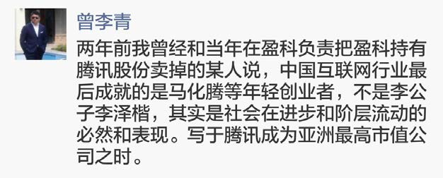

*2016-09-06 11:32 · 手机上网*

---

### 7002

果然，创业者要么天生苦逼要么天生精力充沛。刚给一个风口浪尖上的创业者反映了一个产品意见，秒回。

*2016-09-06 01:10 · 手机上网*

---

### 7003

转@ 王兴 转@ gravity0 马丁·路德说：“即使知道世界明天毁灭，今天我仍要种下我的葡萄树。” 德国人喜欢的这句格言不但说明了他们善于规划，也是一种执着态度的体现。当被前方的不确定性煎熬彷徨时，不妨想想这句。

*2016-09-06 00:31 · 手机上网 转自gravity0*

---

### 7004

此所谓some people make news while others make history. 转@张亮 如果没大意外，即使这么大一场撕逼，几个月之后，郭德纲失去不了什么，曹云金也得到不了什么。鲁迅说中国看客多，适合挖去微博做产品或运营经理。

*2016-09-06 00:07 · 手机上网 转自张亮*

---

### 7005

而且综艺节目也玩得转。转@ 十丶一 不止麻辣烫做得棒。转@ 王兴张亮老师不愧是专业做过投资的。我还是太实在。转@ 张亮 投一块，估值十亿也行？转@ 王兴 问：怎样快速投出两家独角兽公司？

答：随便找俩公司，给它们各投十亿美金。

*2016-09-05 22:27 · 手机上网 转自王兴*

---

### 7006

张亮老师不愧是专业做过投资的。我还是太实在。转@ 张亮 投一块，估值十亿也行？转@ 王兴 问：怎样快速投出两家独角兽公司？

答：随便找俩公司，给它们各投十亿美金。

*2016-09-05 21:59 · 手机上网 转自王兴*

---

### 7007

问：怎样快速投出两家独角兽公司？答：随便找俩公司，给它们各投十亿美金。

*2016-09-05 21:32 · iPhone版*

---

### 7008

whatsapp在华为mate8里不会通知有新消息。这个不兼容的bug还挺

碍事的。

*2016-09-05 21:27 · iPhone版*

---

### 7009

@ 苑小帅 没问题。谢谢。

*2016-09-05 16:20 · iPhone版 给苑小帅的回复*

---

### 7010

莫名其妙的收到一封来自挪威的垃圾邮件。扫了一眼邮件末位，发现跟据英语和生活常识居然也能大致看懂这段挪威文的大致意思，蛮好玩的:)

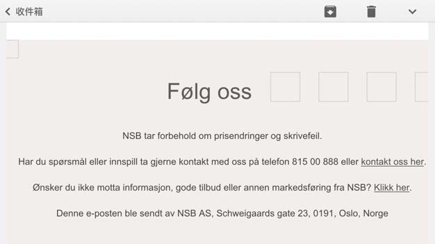

*2016-09-05 15:09 · 猫饭*

---

### 7011

客栈、旅店、招待所、驿馆、客舍都比酒店或饭店更贴切，但我还是最喜欢「宾馆」。转@ 王兴 真要说起来，hotel被译成「酒」店和「饭」店也是名不副实吧。

*2016-09-05 09:08 · 手机上网 转自王兴*

---

### 7012

品味提升需要至少一代人时间吧。转@ 小熊娃娃 杭州国宴的餐具长这样⋯⋯连内造瓷器都没法看了，中国制造还有什么希望啊⋯⋯

*2016-09-04 23:33 · 手机上网 转自小熊娃娃*

---

### 7013

真要说起来，hotel被译成「酒」店和「饭」店也是名不副实吧。

*2016-09-04 22:48 · iPhone版*

---

### 7014

列车在夜幕中进入北京。突然想起去世四年多的奶奶。

*2016-09-04 22:03 · iPhone版*

---

### 7015

跟卖车的那个吉拉德不是同一本书。转@ PolarBread 我的那本上面是吉拉德头像 还有视频难道不是古典余世维一类吗 @ 王兴 上了高铁坐下来，发现左手边坐了一个上进青年：小桌板上放着一串佛珠和一本《世界上最伟大的推销员》，封面上那金光灿灿的金字塔我看着非常眼熟

*2016-09-04 20:44 · 手机上网 转自王兴*

---

### 7016

坐在高铁上睡了恍若隔世的一觉，醒来发现其实没过多久。

*2016-09-04 19:41 · iPhone版*

---

### 7017

上了高铁坐下来，发现左手边坐了一个上进青年：小桌板上放着一串佛珠和一本《世界上最伟大的推销员》，封面上那金光灿灿的金字塔我看着非常眼熟，二十年都没有变，不愧是经典畅销书。然后，他掏出手机开始放马云演讲视频……

*2016-09-04 17:05 · iPhone版*

---

### 7018

读过徐浩峰的同名小说，所以觉得分外有趣。转@ 孤岛黄老邪 刀背藏身

*2016-09-04 00:32 · 手机上网 转自孤岛黄老邪*

---

### 7019

路过上海警备司令部。

*2016-09-03 23:55 · iPhone版*

---

### 7020

东方明珠塔以前只是丑，现在则是又矮又丑。

*2016-09-03 17:14 · iPhone版*

---

### 7021

这个观点有意思：「我觉得中国现在推行火葬真是一个大问题，以前土葬几千年后去还可以基因测序，甚至克隆重构，火葬以后不留痕迹了，从信息留存的角度来看，很大程度白活了」

*2016-09-03 12:15 · 手机上网*

---

### 7022

稍微想了一下，传说中武林高手有用刀有用剑，但是好像很少用斧头的。而对未经训练的普通人来说，斧子的威力主要在第一击，刀的情况就比较复杂了。

*2016-09-03 12:05 · 手机上网*

---

### 7023

突然产生好奇，对普通人来说，斧子和刀哪个是更好的武器？转@ 拧巴人儿 楼上传来了奇怪的声音。芒不可能发出这么大的声音。好可怕。莫扎特拿着斧头把儿上楼去了……我早就觉得楼上有蹊跷！经常有声音！

*2016-09-03 11:38 · 手机上网 转自拧巴人儿*

---

### 7024

又双叒叕。第三个字念ruò，第四个字居然有四种读音：zhuó、yǐ、lì、jué。

*2016-09-03 11:29 · iPhone版*

---

### 7025

我猜，并不是每个听说过「一万小时理论」的人都思考过自己是否在「思考」这件事上练过一万小时。

*2016-09-03 11:10 · iPhone版*

---

### 7026

SpaceX火箭炸了，特斯拉股价跌了百分之五。投资者的这种反应到底算是理性还是不理性呢？

*2016-09-03 11:01 · iPhone版*

---

### 7027

发令枪已再次响过，且看这回有几个人跃入鲨鱼池，各带着什么样的装备和啦啦队……

*2016-09-03 10:45 · iPhone版*

---

### 7028

@ 唐君毅 那个市场又会是一场血战。

*2016-09-02 23:55 · iPhone版 给唐君毅的回复*

---

### 7029

今晚骑了两趟mobike，感觉蛮不错。真是既为胡阿姨高兴，又为她担忧。

*2016-09-02 23:46 · iPhone版*

---

### 7030

转@ gravity0 按《浪潮之巅》吴军博士的说法，微软当年崛起靠的也是商业模式而非技术。它之前的 IBM 和苹果捆绑硬软件，利润和扩张速度就不如单买软件的模式好。决定战争胜负的往往是战略，而事后为方便大家理解，往往会突出战术的巧妙和英雄的勇武。

*2016-09-02 18:41 · 手机上网 转自gravity0*

---

### 7031

转：Resilience is about how you recharge, not how you endure.

*2016-09-02 17:17 · iPhone版*

---

### 7032

办公室隔壁的居民楼里有个男子在唱《我的太阳》。

*2016-09-02 14:47 · iPhone版*

---

### 7033

刚开完会往家走，明天一大早还要赶飞机，简直是时间短得不够让我

的手机充满电。

*2016-09-02 01:31 · iPhone版*

---

### 7034

转@ gravity0 其实教授说的道理套用到工业产品也相通，质量太好了的东西更新换代慢，企业资金周转不灵最后被我朝山寨厂商收购。自然选择可不是选择最好最强的，最终输赢还是靠计数，一个种群数量为零就出局了。

*2016-09-01 21:58 · 手机上网 转自gravity0*

---

### 7035

转：读书如同打仗，经典就是绕不开的据点。

*2016-09-01 21:57 · 手机上网*

---

### 7036

有什么电影很好的展示了冷兵器时代战争的血腥和残酷？

*2016-09-01 14:07 · iPhone版*

---

### 7037

转@ 柒小斤 会是什么样子？忠字舞改进版吗？转@ 饭小默 哈哈哈转@ Flora凉凉 @ 饭小默 转@ 独角犀犀 转@ 黑爷 转@ 百鬼夜行转@ 徒有实名 我也想跳社会主义核心价值观原创广场舞！

*2016-09-01 13:07 · 手机上网 转自徒有实名*

---

### 7038

mate8还是下一代？谢谢。转@ 柒小斤 把玩了一下华为最新Mate手机，真心不错。

*2016-09-01 12:37 · 手机上网 转自柒小斤*

---

### 7039

可以改成「我是你爸爸，信不信我揍你？」和「爸爸啊，让我抱紧你的大腿吧」。转@ 王兴 对最近两百多年英国和美国的关系变化过程产生了兴趣，怎么从「我是你爸爸」过渡到「你是我爸爸」。

*2016-09-01 12:24 · 手机上网 转自王兴*

---

### 7040

听说前年有个有趣的拐点，央行印钞厂减产了。

*2016-09-01 12:05 · iPhone版*

---

### 7041

最近看到很多事都会脑海里冒出一个词：unceremonious.

*2016-09-01 11:45 · iPhone版*

---

### 7042

@ 左潇 搬迁服务器导致的，还在恢复中。

*2016-09-01 09:03 · iPhone版 给左潇的回复*

---

### 7043

转@ webto 虽然东京没有北京面积大，但是东京地铁站的站台长度都显著大于北京，大概两倍长，从一头走到另一头感觉特远。站台的长度大体上决定了决定了运力的上限，最糟的是这个不太方便扩展。

*2016-08-31 17:37 · 手机上网 转自webto*

---

### 7044

对最近两百多年英国和美国的关系变化过程产生了兴趣，怎么从「我是你爸爸」过渡到「你是我爸爸」。

*2016-08-31 15:25 · 手机上网*

---

### 7045

你醒醒！这不是幻觉！转@ 拧巴人儿 我有种我都能教国内大学了的幻觉……

*2016-08-31 15:23 · 手机上网 转自拧巴人儿*

---

### 7046

崂山白花蛇草水挺好的啊，淡雅，悠远。

*2016-08-31 15:15 · 手机上网*

---

### 7047

转：一般的人，用自己的劳动创造产品，所以业余生活属于自己。艺人，则把自己的生活当作产品。生活就不再属于自己。艺人的一举一动，都是供大众消费的产品。禁止谈恋爱，纯粹是对产品的质量控制以及用户体验控制而已，不涉及任何人权问题。换个角度，人家并不是禁止谈恋爱，而是禁止谈恋爱的人从事这个

*2016-08-31 13:49 · iPhone版*

---

### 7048

转@ webto 要笑场了。。。一个功能要开发两年。。。

*2016-08-31 11:07 · 手机上网 转自webto*

---

### 7049

觉得我司数据报表的设计亟待提升

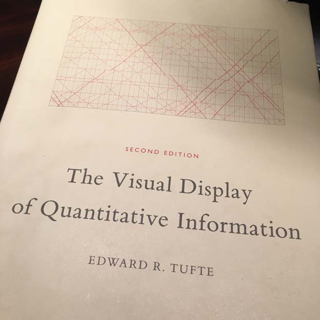

*2016-08-31 00:39 · 猫饭*

---

### 7050

前两年人们一度认为支付宝是比淘宝更牛逼的存在，结果微信支付横空出世，多数人发现没有支付宝对生活一点影响也没有，但淘宝还是有很大的价值。

*2016-08-30 23:46 · iPhone版*

---

### 7051

有两段经历让我对中国的城市群分布建立起一些直观印象，一是中学时疯狂的玩电脑游戏《三国志》，二是2011年美团全国开站。

*2016-08-30 23:35 · iPhone版*

---

### 7052

@ 猫弟今天写简历了吗 不是他。

*2016-08-30 14:57 · iPhone版 给猫弟今天写简历了吗的回复*

---

### 7053

我对金庸小说的评价从高到低再到高，再到低，最近又开始高起来了。金庸确实潜移默化的影响了许多人的世界观。

*2016-08-30 12:35 · iPhone版*

---

### 7054

有个朋友说他当年在google工作时看到安卓发布非常兴奋，觉得是巨大的新机会，一度想离职去创业做类似后来小米做的事。google法律总顾问说了一句「你打开一部手机，里面就是20万个专利」。他掂量了一下，去干别的方向的创业了……

*2016-08-30 12:29 · iPhone版*

---

### 7055

艺人可能是最「以客户为中心」的行业之一。只要对事业发展有帮助，没有什么不可以变的，改名字，整容，都是分分钟的事。

*2016-08-30 11:06 · iPhone版*

---

### 7056

建议你尝试一下百度以外的信息获取方式。转@ 安小倩 @ 王兴 感觉这句话不像王尔德说的，有出处么。百度一下并没有找到

*2016-08-29 23:16 · 手机上网 转自安小倩*

---

### 7057

只有浅薄的人才了解自己。-王尔德

*2016-08-29 18:22 · iPhone版*

---

### 7058

我发现，口语里但凡提到「智障」，前面十有八九跟着个「妈的」。

*2016-08-29 10:58 · iPhone版*

---

### 7059

转：刚工作的头几年比谁更踏实，再过几年比谁更激情。

*2016-08-29 09:18 · 手机上网*

---

### 7060

这个朋友还说，他当年读mba的时候，有个老师（JetBlue的董事长）教育他们：你们所能看到的生意最终都不会赚钱。

*2016-08-29 00:53 · 手机上网*

---

### 7061

转@ 御林骚 应该是说，在拿医疗推广赚的黑钱推广百度外卖「@ 黑爷 百度医疗广告推广的梗？ 转@ 御林骚 那是什么鬼「@ 王兴 这个朋友还说，送你一句广告词：百度外卖的每个盒饭里都流淌着一个癌症病人的血。」」

*2016-08-29 00:49 · 手机上网 转自王兴*

---

### 7062

这个朋友还说，送你一句广告词：百度外卖的每个盒饭里都流淌着一个癌症病人的血。

*2016-08-29 00:22 · 手机上网*

---

### 7063

转@ 菠萝阅读 2015 年底，中国两轮电动车销量和保有量占全球比例分别是 86.8% 和 84.9%，来自今年雅迪招股书里的行业数据。 转@王兴 跟一个非常聪明的朋友聊天，他说：美国的电商之所以不如中国发达，主要是因为美国没电动车。

*2016-08-29 00:19 · 手机上网 转自王兴*

---

### 7064

跟一个非常聪明的朋友聊天，他说：美国的电商之所以不如中国发达，主要是因为美国没电动车。

*2016-08-28 23:24 · 手机上网*

---

### 7065

亚洲国家的政坛也太吓人了。最好的政治资本不但得是出身于政治世家，而且得家族里有人因政治死于非命，最好还是直系亲属，例如朴

槿惠她爸或昂山素季他爸……

*2016-08-28 16:09 · iPhone版*

---

### 7066

巴菲特在投资方面确实做到了《孙子兵法》里说的「故善战者，立于不败之地」。

*2016-08-28 15:49 · iPhone版*

---

### 7067

上帝视角。

*2016-08-28 12:43 · iPhone版*

---

### 7068

「一命二运三风水四积阴德五读书……」不但可以运用于个人，对一个国家也是一样的。

*2016-08-28 10:59 · iPhone版*

---

### 7069

突然意识到，归根到底，我就是想知道这个世界的数据结构。

*2016-08-28 10:43 · iPhone版*

---

### 7070

北京的秋天确实美。

*2016-08-27 15:54 · iPhone版*

---

### 7071

你确信跟猪没关系？转@ 柒小斤 原意是头上有房子，院里有家禽，村长莫引申。转@ 王兴 「家」这个字看久了，很容易忽略里面有个「豕」（猪）。

*2016-08-27 11:49 · 手机上网 转自王兴*

---

### 7072

「家」这个字看久了，很容易忽略里面有个「豕」（猪）。

*2016-08-27 11:29 · iPhone版*

---

### 7073

我倒是觉得，大国和小国本来就不一样。美国人好像就不怎么提匠心吧。他们也欣赏欣赏日本的匠心，但自己该怎么搞还是怎么搞。

*2016-08-27 10:45 · iPhone版*

---

### 7074

着什么急嘛。匠心会有的。只要GDP增速再慢一点，低增速时间再长几年，匠心自然就被逼出来了。到了那时候除了匠心还能搞什么嘛。

*2016-08-27 10:43 · iPhone版*

---

### 7075

左宗棠以65岁高龄，抬棺西征，这种决心和气势在中国历史上倒并不罕见；但是，他一路大败叛军，力挫俄国，直至收复喀什这个离莫斯科比离北京更近的南疆城市，这种实际战绩在中国历史上简直可以说是绝无仅有，不服不行。

*2016-08-27 01:58 · 手机上网*

---

### 7076

衰，真的没赶上飞机！血和泪的教训告诉我，不要相信航班管家/航旅

纵横这类app说的航班会延误一个多小时。

*2016-08-26 23:02 · iPhone版*

---

### 7077

不早说！两笼蒸饺，一碗鸡蛋汤。我已满头大汗，心满意足，扶墙而出。转@ 鳄鱼丢丢 如果是志亮 请点一碗八宝粥RT@ 王兴 一张油渍渍的小桌子，对面那对小情侣两个人点了一笼蒸饺，这边我却是一个人点了两笼。我觉得有点不好意思，厚着脸皮开口请他们帮我吃一点，被拒。

*2016-08-26 21:58 · 手机上网 转自王兴*

---

### 7078

一张油渍渍的小桌子，对面那对小情侣两个人点了一笼蒸饺，这边我却是一个人点了两笼。我觉得有点不好意思，厚着脸皮开口请他们帮我吃一点，被拒。

*2016-08-26 21:39 · iPhone版*

---

### 7079

我指的是那些标识牌。转@ 琉小璃 有导览吗，我们都是自导自览。

转@ 王兴 西安城墙的导览做得不够好，有待改进。

*2016-08-26 19:56 · 手机上网 转自王兴*

---

### 7080

西安城墙的导览做得不够好，有待改进。

*2016-08-26 19:50 · 手机上网*

---

### 7081

看到钟楼就想起多年前的「钟楼小奶糕」，不知道现在还火不火。

*2016-08-26 19:41 · 手机上网*

---

### 7082

这太吓人了吧。饭否哪来那么多用户啊？转@ 田小恬原来只是一堵墙啊 实时追踪：王老板在永宁门 转@ 饭桶里的白薯. 王老板在西安？？转@ 王兴 好久没碰到这种掉链子的事情了。呃，我说的是真的掉链子，就是在西安城墙上骑着租来的自行车，突然链子掉了。幸好链子很干，不然折腾得一手机油还挺麻烦

*2016-08-26 19:30 · 手机上网 转自王兴*

---

### 7083

好久没碰到这种掉链子的事情了。呃，我说的是真的掉链子，就是在西安城墙上骑着租来的自行车，突然链子掉了。幸好链子很干，不然折腾得一手机油还挺麻烦的。

*2016-08-26 19:19 · iPhone版*

---

### 7084

各行各业都有新陈代谢的机会。亚投行的人认为世界银行管2500亿美元用了一万七千人，亚投行用三千人就可以做到。

*2016-08-25 14:00 · iPhone版*

---

### 7085

社交媒体和自媒体火了之后，确实是：传谣动动嘴，辟谣跑断腿。

*2016-08-25 12:11 · iPhone版*

---

### 7086

跪了…… 转@ severusn.V 转@ 爆小炸 转@ 啤酒热了 坡县英语表达之情意传达十分到位版

*2016-08-25 08:50 · 手机上网 转自啤酒热了*

---

### 7087

赞。沈鹏加油！转@ 水滴互助沈鹏 @ 王兴 我回来了

*2016-08-24 14:58 · 手机上网 转自水滴互助沈鹏*

---

### 7088

原来「渭城朝雨浥轻尘 客舍青青柳色新」里的渭城就在西安城西边一点点。我之前居然没把渭城和渭河联系起来……

*2016-08-24 13:44 · iPhone版*

---

### 7089

原来中国的第一大岛曾经是库页岛（俄国称「萨哈林岛」），面积7.64万平方公里，相当于现在的第一大岛台湾的两倍还多一点。

*2016-08-24 12:44 · iPhone版*

---

### 7090

这期《中国国家地理》开篇又是讲九段线。这本杂志几乎从不让我失望。

*2016-08-24 12:34 · iPhone版*

---

### 7091

Information wants to be free, and money is smart.

*2016-08-24 08:39 · iPhone版*

---

### 7092

转@ gravity0 藉田礼是古代天子诸侯亲自耕种以示对农业的重视，因为天朝是农业国。同理新加坡以科技立国，小李岛主露一手当年砌的代码，也算是对码农们致敬了。

*2016-08-24 07:36 · 手机上网 转自gravity0*

---

### 7093

转@ gravity0 昨晚饭局我有一小半时间是在陪一个学龄前的娃娃玩耍，半年前和他们一家滑雪时就这样，别家的孩子也这样。关于他们

为啥都喜欢找我玩，想起雷姆那句：“小孩和动物一样会在心里给人排位，本能地知道谁最好欺负”。恍然大悟。

*2016-08-22 14:24 · 网页 转自gravity0*

---

### 7094

打过仗、打过胜仗、打过硬仗，打赢过硬仗，这些都是不同的。

*2016-08-22 11:18 · iPhone版*

---

### 7095

转@ 张跃锋 推开房门，看见有东西沿着墙角游弋，扁扁的，最少有2米。吓得差点叫出声来，楼房、地砖，房间怎么会有蛇？赶紧关上房门出去，客厅还一堆客人吃饭呢。带上房门，我靠，东西已经顺着门缝游出来了，很快就到客厅了。“什么情况切掉一半的带鱼还活着，赶紧抓起来”，好像是老爸说的，到底发生

*2016-08-21 12:37 · 手机上网 转自张跃锋*

---

### 7096

听说现在全世界软件病毒最大的来源地是尼日利亚。黑人兄弟们的技术也还可以嘛。

*2016-08-20 17:59 · 手机上网*

---

### 7097

「友谊第一，比赛第二」的口号由领先者/胜者的啦啦队带头喊比较合适。这是我在高中篮球赛时学到的道理。转@ severusn.V 在别人赢了的时候说“胜负不重要”...这...不大合适吧

*2016-08-20 10:47 · 手机上网 转自severusn.V*

---

### 7098

保守程度不同的服装名称。

*2016-08-20 10:09 · 手机上网*

---

### 7099

@ 无主 不对。美团第一单是2010年3月4日的梵雅红酒体验坊。

*2016-08-20 00:04 · 手机上网 给无主的回复*

---

### 7100

中文里的「能量」和「能源」（是能量之源的意思吧？）在英文里都是energy这一个词。

*2016-08-19 14:40 · iPhone版*

---

### 7101

请自行脑补。转@ miss..G 可以上图吗「@ 王兴 此刻北京的蓝天白云真漂亮。太像棉絮了。」

*2016-08-19 11:15 · 手机上网 转自王兴*

---

### 7102

此刻北京的蓝天白云真漂亮。太像棉絮了。

*2016-08-19 10:58 · 手机上网*

---

### 7103

《自题金山画像》苏轼心似已灰之木，身如不系之舟。问汝平生功业，黄州惠州儋州。

*2016-08-19 10:50 · 手机上网*

---

### 7104

一大早堵在路上，突然好奇「打车」的「打」字做何解。查了一下，最初是经济比较发达的香港和广东地区先有出租车，于是粤语里就有「搭的士」的说法，传到内地就成了「打的」。就像「埋单」传成了「买单」。

*2016-08-19 08:28 · iPhone版*

---

### 7105

总觉得elton比Elton更好看。

*2016-08-18 18:16 · iPhone版*

---

### 7106

再次努力了一下，终于要来了一条大披肩。披上后情绪稳定多了。

*2016-08-18 18:02 · iPhone版*

---

### 7107

名字里用「惠」或「慧」不是很好的选择，太容易搞混。

*2016-08-18 17:39 · iPhone版*

---

### 7108

被冻得倍儿精神的跟人聊了一会儿天，学了俩不错的概念缩写，KYC:Know Your Customer; KYB: Know Your Business.

*2016-08-18 17:32 · iPhone版*

---

### 7109

这酒店太傻逼了，大堂跟冰窖一样冷。难怪很多女士披上跟服务员要来的蓝绿色披肩。我穿着短袖被冻得有点受不了，冒着被认为很娘的风险开口跟服务员要披肩，她跟我说发完了:(

*2016-08-18 16:11 · 手机上网*

---

### 7110

转@ Frankiiee 想起经济学人形容中国是「科技行业的加拉帕戈斯群岛」，这个评价成立的范围绝对不止科技行业。

*2016-08-18 15:26 · 手机上网 转自Frankiiee*

---

### 7111

@ 白貓將軍 抱歉！我们进一步加强培训。

*2016-08-18 15:23 · iPhone版 给白貓將軍的回复*

---

### 7112

很多科幻片里描述的未来世界都是一家极强大的超越政府的公司统治整个社会。有哪些科幻小说描写了这家公司崛起的过程吗？

*2016-08-18 12:19 · 手机上网*

---

### 7113

谢谢。「美团外卖，送啥都快」。我们继续努力！转@ 暮袅 我要好好夸一夸，美团外卖送货快，服务态度好！真的！@ 王兴

*2016-08-18 12:05 · 手机上网 转自暮袅*

---

### 7114

有许多人的问题不是不独立思考，而是不思考。

*2016-08-18 00:55 · 手机上网*

---

### 7115

@ chenhang419 不是

*2016-08-17 23:09 · 手机上网 给chenhang419的回复*

---

### 7116

问了行家，解答了我的一个疑问，秀场型直播里那些撒钱的金主和那些被捧的姑娘确实是会线下见面的。

*2016-08-17 18:45 · iPhone版*

---

### 7117

葡萄美酒，夜光杯，欲饮，琵琶马上催。醉卧沙场君莫笑，古来征战几人回。

*2016-08-17 04:07 · iPhone版*

---

### 7118

葡萄美酒，夜光，杯，欲饮琵琶马上催。醉卧沙场君莫笑，古来征战几人回。

*2016-08-17 04:02 · iPhone版*

---

### 7119

葡萄，美酒，夜光杯，欲饮琵琶马上催。醉卧沙场君莫笑，古来征战几人？回。

*2016-08-17 03:55 · iPhone版*

---

### 7120

产品经理，应有慈悲之心。

*2016-08-17 03:51 · iPhone版*

---

### 7121

You are only as strong as the team that supports you.

*2016-08-17 03:38 · 手机上网*

---

### 7122

时隔多年，夜深人静，再悟「真传一句话，假传万卷书」。谢程兄。

*2016-08-17 03:20 · 手机上网*

---

### 7123

「落叶别树，飘零随风。客无所托，悲与此同」，李白就是这么屌炸天。

*2016-08-17 03:12 · 手机上网*

---

### 7124

恭喜！这是一个产品经理最伟大的创造。转@ jianliu 23:13出生，母女平安 转@ jianliu Waiting.

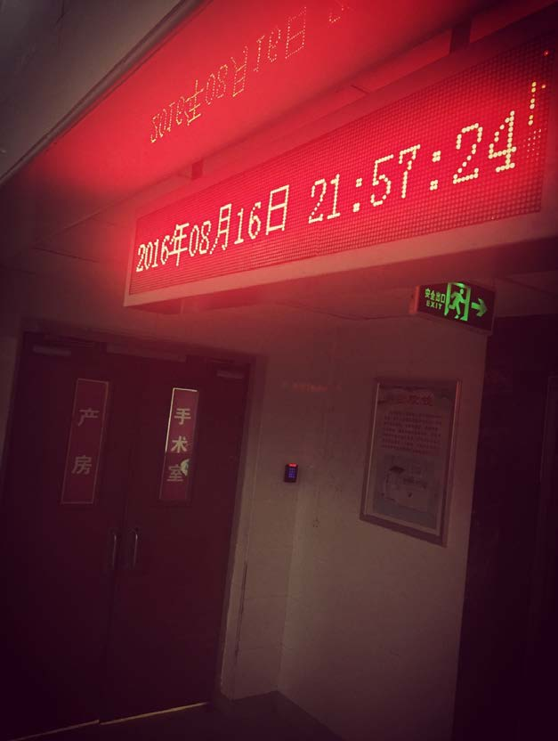

*2016-08-17 03:03 · 手机上网 转自jianliu*

---

### 7125

确实不容易，但一二十年我不出意外的话还是没问题的吧。饭否一眨眼都九年多了。何况又不止我一个人。转@ quux 另外，做个词典不容易，如果不是抄的话，即使有对的人，也要一二十年吧 转@ 王兴欧路词典和网易有道再次令我非常失望。这个非常重要而且越来越重要的概念它们都不能给出正确的有

*2016-08-17 02:31 · 手机上网 转自王兴*

---

### 7126

「树树皆秋色，山山唯落晖」直接让我想起莫奈的日出印象系列。

*2016-08-17 02:16 · iPhone版*

---

### 7127

一艺成名，不能只看人成功，不看人用功。

*2016-08-17 02:11 · iPhone版*

---

### 7128

作品文体如此，每一波科技变革亦如是。幸运的是一波和一波的间隔

已越来越短。

*2016-08-17 01:51 · 手机上网*

---

### 7129

超喜欢这张照片。

*2016-08-17 01:25 · 手机上网*

---

### 7130

再读《石壕吏》，高下立判。杜甫白描真的牛逼！

*2016-08-17 01:23 · iPhone版*

---

### 7131

@ 可乐鬼 有人还在。

*2016-08-17 01:10 · iPhone版*

---

### 7132

原来《琵琶行》里的浔阳、江州就是今天的九江，我还不曾去过。

*2016-08-17 00:44 · iPhone版*

---

### 7133

突然心血来潮把《琵琶行》翻出来重读一遍。原来淘品牌「裂帛」出自这里。

*2016-08-17 00:39 · iPhone版*

---

### 7134

文章很长，但还是只说了前一半。转@ 小熊娃娃 http://t.cn/h9mjO武志红《不含敌意的坚决——如何化解别人的威胁》这篇老文还是相当棒的。科胡特名言“没有敌意的坚决，不含诱惑的深情”，这两条原则包含了四个关键点，真的每一个都是难点。

*2016-08-16 23:57 · 手机上网 转自小熊娃娃*

---

### 7135

欧路词典和网易有道再次令我非常失望。这个非常重要而且越来越重要的概念它们都不能给出正确的有意义的中文解释:( 是这些词典的问题还是墙的问题？真把我逼急了自己做个词典。

*2016-08-16 09:08 · 手机上网*

---

### 7136

英语里也出现了一个新词，可以算是对应两个非同性恋男人之间的「基情」，bromance = brothers + romance。

*2016-08-15 17:42 · 网页*

---

### 7137

@ 李呀李等等 谢谢。我们继续努力:)

*2016-08-15 15:11 · iPhone版 给李呀李等等的回复*

---

### 7138

Automattic的这句宣言堪称掷地有声：We don’t make software forfree, we make it for freedom.

*2016-08-15 13:36 · iPhone版*

---

### 7139

一个互联网金融创业者的微信签名是：我是一块破铁，站在时代前列，既能把车胎扎憋，也能把西瓜砸裂。

*2016-08-15 12:56 · iPhone版*

---

### 7140

突然想起当年有款软件叫dreamweaver。这名字给我留下挺深印象。

不知道英语为美语的人觉得这名字如何。

*2016-08-15 12:04 · iPhone版*

---

### 7141

这个角度有点意思。转@ andydmq 这辈子遇不到一万人 转@ 王兴「就算你是万里挑一，那全国也有14万人呢。」

*2016-08-15 10:34 · 手机上网 转自王兴*

---

### 7142

2001年，国家旅游局推出首批187家4A级旅游景区，2007年推出首批66家5A级旅游景区。截至2016年8月，共有30批217家景区成为5A级景区。

*2016-08-15 08:06 · iPhone版*

---

### 7143

在公共场合，比有人频繁自拍更烦的是有人在直播。

*2016-08-14 21:04 · iPhone版*

---

### 7144

托智能手机的福，老爸现在连「撩妹」和「带路党」这样的新词汇都用得很自如。

*2016-08-14 21:01 · iPhone版*

---

### 7145

「就算你是万里挑一，那全国也有14万人呢。」

*2016-08-14 19:57 · iPhone版*

---

### 7146

问一个做天使投资的朋友为什么他投的某个企业比同行们发展得好很多，答曰：归根到底还是人强，这哥们当年打星际都能打到全国第二……

*2016-08-14 19:55 · iPhone版*

---

### 7147

只做不说没用啊。所以我是说这个营销很牛，没说功能设计很牛。转@ 小熊娃娃 快速充电索尼都玩了好多年啦 转@ webto 确实，瞄准的是电池永远不够用的痛点。RT@ 王兴 OPPO那个「充电5分钟，通话2小时」真是营销高招，虽然现在用手机打电话的需求已经越来越少。

*2016-08-14 16:46 · 手机上网 转自王兴*

---

### 7148

转@ gravity0 老笑话说有人拿口袋装土豆，拿反了口朝下他见上面没有口就用剪刀剪开，土豆放进去后都从下面漏出来，他生气说这个口袋既没有口又没有底。 —— 我们做事时有没有不看具体情况抱着自以为是的假设和趁手的工具一通蛮干失败了还委屈抱怨呢？若有，最该抱怨的是自己的认知力吧。

*2016-08-14 09:19 · 手机上网 转自gravity0*

---

### 7149

OPPO那个「充电5分钟，通话2小时」真是营销高招，虽然现在用手机打电话的需求已经越来越少。

*2016-08-14 09:16 · iPhone版*

---

### 7150

原来如此：丘吉尔以其特有的镇静，编造自己酒量大的故事。他希望让人记住自己就像皮特一样，是个酒量极大的人。确实，他每天一起床便开始喝兑苏打水的苏格兰威士忌。但人们不知道的是，他这杯酒会一直喝到午餐时分，而且他在一天24小时喝的酒是令人惊讶的适量。他自己不说，人们也很难知道。

*2016-08-13 23:00 · iPhone版*

---

### 7151

转@ qinyf 今天才意识到，听交响乐和读世界名著是相似的。

*2016-08-13 14:27 · 手机上网 转自qinyf*

---

### 7152

转@ 猫毛卯冒 一声三声四声二声，齐全，从这个角度说，好字不那么敷衍。。转@ 王兴 「花好月圆」里的「好」字用得真敷衍。

*2016-08-13 09:17 · 手机上网 转自王兴*

---

### 7153

转@ webto 第一次在东京见到排队出站，感觉回到了回龙观。。。。

# C90 #Now Playing# ♬Take Me Away - 逃跑计划♪

*2016-08-13 09:04 · 手机上网 转自webto*

---

### 7154

转@ gravity0 转@ 上官云吞 你手里有两个馒头，一本经书，遇见吃不饱饭的人无论小乘大乘都会告诉你先给馒头。读书千万不能读成书呆子，三五人义理，三五十人道德，三五万人就得有社会法度，三五百万那就是政治了。不是因为别的，只因为僧多粥少。

*2016-08-13 08:37 · 手机上网 转自上官云吞*

---

### 7155

「花好月圆」里的「好」字用得真敷衍。

*2016-08-13 08:04 · iPhone版*

---

### 7156

欧路词典还是太不接地气。您就不能直接了当告诉我这俗称「开心果」吗？

*2016-08-13 07:44 · 手机上网*

---

### 7157

一觉醒来，觉得昨晚做了许多梦。

*2016-08-13 06:49 · iPhone版*

---

### 7158

聊天对象很认真的说「巴菲特有他自身的局限性」。

*2016-08-12 23:53 · iPhone版*

---

### 7159

路遥知马力：曾经的国产通信设备制造商「巨大中华」（巨龙、大

唐、中兴、华为）只剩「华」还威风，「中」还凑合；曾经的国产智能手机领先者「中华酷联」（中兴、华为、酷派、联想）也只剩「华」独领风骚。

*2016-08-12 22:32 · iPhone版*

---

### 7160

转@ 玻璃木头水 这种分类方法是形式主义的遗产，推荐一下以功能分析俄罗斯民间故事叙事结构的普洛普。转@ 王兴 人生貌似很复杂，我打算至少抽空把好莱坞总结出来的那十几种套路给了解一下。

*2016-08-12 21:09 · 手机上网 转自王兴*

---

### 7161

五毛，自干五，小粉红，带路党。

*2016-08-12 19:10 · iPhone版*

---

### 7162

人生貌似很复杂，我打算至少抽空把好莱坞总结出来的那十几种套路给了解一下。

*2016-08-12 19:08 · iPhone版*

---

### 7163

像是本宗教书。转@ 远骋 今日打动我的一张照片。阅读。

*2016-08-12 13:59 · 手机上网 转自远骋*

---

### 7164

长考。

*2016-08-11 23:28 · iPhone版*

---

### 7165

@ 小熊娃娃 我测过了，不到9000。但我不知道这是什么方法论。

*2016-08-11 19:30 · iPhone版 给小熊娃娃的回复*

---

### 7166

Refine vs. Redefine.

*2016-08-11 18:24 · iPhone版*

---

### 7167

@ 阿瓦 make it so.

*2016-08-11 16:06 · 手机上网 给阿瓦的回复*

---

### 7168

二十年后，amazon workspaces看起来终于有望把sun nc概念给落实了。不是不造，时候未到。

*2016-08-11 10:35 · iPhone版*

---

### 7169

看国内一线、二线及其他互联网公司之间的竞争，我就明白了，所谓八十年代末日本经济上对美国构成威胁的说法根本是虚幻的。

*2016-08-11 09:29 · iPhone版*

---

### 7170

苏联有一款（野）鸡尾酒叫「女共青团员的眼泪」。之所以说它野，是因为配方如下：薰衣草花露水 15克马鞭草 15克草本洗液 30克指甲油 2克洗口液 150克柠檬苏打水 150克。

*2016-08-11 08:52 · iPhone版*

---

### 7171

转@ 张亮 最近复盘的一个小心得：工作中很多事，越是有人言之凿凿，有理有据，在论辩中大占上风，决策的盲点越大，因为最好的结论往往是常识中的异数，盲区中的微光。一则，于不疑处有疑，得变成一种本能。二则，平等很重要，聚集聪明人讨论，不是为了享受舌战群儒的智力乐趣，而是借多人角度扫除偏见

*2016-08-11 08:44 · 手机上网 转自张亮*

---

### 7172

转：“小确幸”一词来自于村上春树的《兰格汉斯岛的午后》散文集，通过我国翻译家林少华翻译了过来……“微小而又确切的幸福”。

*2016-08-11 08:44 · 手机上网*

---

### 7173

“每位作者和每位读者都知道，好的写作是最棒的旅行。”——戈尔·维达尔

*2016-08-10 17:20 · iPhone版*

---

### 7174

今晚去挖人，必须是真爱啊。

*2016-08-09 19:38 · iPhone版*

---

### 7175

得时不时的提醒自己和同事们：在商业上，没有什么东西是免费的，也没有什么东西是无价的。

*2016-08-09 13:06 · iPhone版*

---

### 7176

东南亚互联网膨胀得如火如荼，讨论13个月前的数字几乎没有意义;-)转@ webto 2015年7月 Go-Jek 只有 3000 骑手？

*2016-08-09 10:39 · 手机上网 转自webto*

---

### 7177

kindle oasis相比paperwhite的改进还是非常显著的，显示面积不变的

前提下更小更轻了许多。amazon持续改进的能力让我敬畏。

*2016-08-09 08:56 · iPhone版*

---

### 7178

goldman sachs有个简洁的中文名字「高盛」，morgan stanley却是直愣愣的「摩根斯坦利」。五个字太麻烦，所以有了「大摩」的外号。

*2016-08-09 00:35 · iPhone版*

---

### 7179

以大无畏的精神尝试读了一遍那篇日语报道。太有趣了，日语里把「硕士」叫「修士」，立马感觉高大上许多啊！转@ 王兴 完了，不会日语已经没法混饭否了吗:( 转@ peter Anker historyhttp://t.cn/Rt9Ega2

*2016-08-08 15:33 · 手机上网 转自peter*

---

### 7180

完了，不会日语已经没法混饭否了吗:( 转@ peter Anker historyhttp://t.cn/Rt9Ega2

*2016-08-08 15:27 · 手机上网 转自peter*

---

### 7181

转@ Frankiiee 品牌定位的道理和SEO是一模一样的。

*2016-08-08 15:26 · 手机上网 转自Frankiiee*

---

### 7182

为什么还要分页呢？其实一张无限大的可以随便写随便画的纸最合我意。# 原子和比特 #

*2016-08-08 13:23 · iPhone版*

---

### 7183

第一性。

*2016-08-08 12:47 · iPhone版*

---

### 7184

「公号」其实可以理解为新时代的「专栏」。一公一专，这两种命名方式正好体现了两个时代不同的着眼点。

*2016-08-08 11:48 · 手机上网*

---

### 7185

人工智能快乐多:-) 转@ 太空小孩 哈哈哈哈哈哈 转@ Ans. 哈哈哈哈转@ 阿雙囍 转@ 太宰桂 转@ 红袖不乐意添乱 哈哈哈 转@ 车躺躺_ 蛤蛤蛤蛤蛤蛤蛤「@ 琉桑 嗨呀好气呀。」

*2016-08-08 11:45 · 手机上网 转自琉桑*

---

### 7186

转@ 淤泥rene 哈哈哈哈哈哈哈转@ 飯否小字报 转@ 羅立安的眼光离职程序员之项目交接

*2016-08-08 07:58 · 手机上网 转自羅立安的眼光*

---

### 7187

新新IT

*2016-08-08 00:16 · iPhone版*

---

### 7188

金扁担。

*2016-08-07 20:50 · iPhone版*

---

### 7189

对应于中国李总理提出的「大众创业，万众创新」，印度总理莫迪提出了"Start-up India, Stand-up India"的口号。

*2016-08-07 18:06 · iPhone版*

---

### 7190

北京大外环（即七环）实在是太大了，周长920公里！相比之下，五环周长才99公里（正好和上海外环一样），六环周长192公里。

*2016-08-07 15:35 · iPhone版*

---

### 7191

第一次看了一下《江南st yle》的歌词，果然是纯夜店风，少儿不宜。

*2016-08-07 14:07 · iPhone版*

---

### 7192

居然就立秋了…… 转@ 唐君毅 立秋。

*2016-08-07 09:06 · 手机上网 转自唐君毅*

---

### 7193

转@ 杨曜睿 看来这个篝火party的参与群众的品味普遍不高。这两曲当年虽然俗还算沾点新曲的光，大城市也能听到，现在早过气了，应该只有三线以下城市大众，或者底层民众还在听。转@ 王兴 我上一次参加篝火party的时候，《江南st yle》还没有诞生，《小苹果》更没有。这俩似乎成为新的启

*2016-08-06 21:16 · 手机上网 转自王兴*

---

### 7194

我上一次参加篝火party的时候，《江南st yle》还没有诞生，《小苹果》更没有。这俩似乎成为新的启动神曲了。

*2016-08-06 21:00 · iPhone版*

---

### 7195

@ 远骋 书名是《美国大城市的死与生》吧。作者应该是特意把死放在生前面。

*2016-08-06 13:49 · iPhone版 给远骋的回复*

---

### 7196

还真是。这可比高盛银行家提出「金砖四国」概念早多了。转@gravity0 最早的街霸二，可选角色八人中就有一个巴西野人。剩下美日各两人，中印俄各一人。

*2016-08-06 07:59 · 手机上网 转自gravity0*

---

### 7197

尘埃落定。风烟再起。

*2016-08-05 23:34 · iPhone版*

---

### 7198

又见银河。又见夏季大三角。

*2016-08-05 22:25 · iPhone版*

---

### 7199

@ webto 日本互联网企业在东南亚投资还蛮积极的吧。

*2016-08-05 14:48 · iPhone版 给webto的回复*

---

### 7200

又想起这句话，居然正好是9年前同一天发的。转@ 王兴 “诗人是最早的系统思考者，”他说，“他们观察最复杂的环境，然后把复杂性消减到他们可以理解的程度。”

*2016-08-05 12:35 · 手机上网 转自王兴*

---

### 7201

砖家你好。转@ 草寅 这个没有统计的必要，也没有意义，就像达成共识不研究语言的起源一样。转@ 王兴 认识几个汉字看起来不太难统计，认识几个词统计起来就更复杂了。

*2016-08-05 12:06 · 手机上网 转自王兴*

---

### 7202

认识几个汉字看起来不太难统计，认识几个词统计起来就更复杂了。

*2016-08-05 12:00 · 手机上网*

---

### 7203

这算是另一种秀智商的方式吗？转@ 饭小默 「@ 王兴 尝试从另一个角度思考「授人以鱼」和「授人以渔」。」

*2016-08-05 11:56 · 手机上网 转自饭小默*

---

### 7204

尝试从另一个角度思考「授人以鱼」和「授人以渔」。

*2016-08-05 11:05 · iPhone版*

---

### 7205

每次听到「英语只是个工具」或「互联网只是个工具」这类说法时，我不禁想，有没有哪个文盲会很理直气壮的说「文字只是个工具！！！关键是要有思想！！！」

*2016-08-05 09:31 · iPhone版*

---

### 7206

经历丰富的人果然视野开阔！等你写啦。转@ 张亮 这么多年过去了，大家还是在写和看穿越文。谁回头写个风险投资人穿越的故事吧

*2016-08-04 23:27 · 手机上网 转自张亮*

---

### 7207

@ fanfan0406 不是。

*2016-08-04 19:11 · 手机上网 给fanfan0406的回复*

---

### 7208

赞！转@ soyousmile @ 王兴 前几天提了个无聊的问题"我到底认识多少个汉字？"，想到能否把GB2312的6000多字，跑了一下百度的搜索结果数，作为难易程度的参照。结果发现到4000字左右，基本上就不认识了...

*2016-08-04 17:25 · 手机上网 转自soyousmile*

---

### 7209

昨晚跟一个老外聊天，他提了好几次DNB这个最近红起来的缩写。

Digital Native Brand，例如卖剃须刀的DSC，或者卖眼镜的Warby

Parker。其实不就是淘品牌的洋气版嘛。湖南小伙做的Anker早就是个成功的DNB了。

*2016-08-04 12:23 · 手机上网*

---

### 7210

@ 潘欣 欢迎:)

*2016-08-04 12:04 · 手机上网 给潘欣的回复*

---

### 7211

饼铛，读音bǐng chēng，指烙饼用的平底锅。“铛”字有两个读音，读“dāng”时，意义同“当”，现代汉语中一般很少用。而在“电饼铛”中“铛”字的正确读音是“chēng”，主要指烙饼或做菜用的平底浅锅。

*2016-08-04 11:13 · iPhone版*

---

### 7212

在大众的头脑里探矿挖矿。

*2016-08-04 10:53 · iPhone版*

---

### 7213

终于想到了stanford shopping center test的social media版。

*2016-08-04 10:45 · iPhone版*

---

### 7214

论餐饮行业的意义：邓小平和周恩来二人的第一次合作竟然是1922年一起开了家名扬巴黎的中国豆腐店。这家小店的负责人就是邓小平，他善于用豆腐炒菜，并向食客介绍营养价值。这家由周恩来倡议开办的小店，主要是为革命活动提供经费。

*2016-08-04 09:08 · iPhone版*

---

### 7215

1926年，蒋经国和邓小平在莫斯科中山大学是同学。蒋经国加入了共青团，他的团小组长正是邓小平。邓小平比蒋经国大6岁，两人常一起去莫斯科河边散步。1927年邓小平离开苏联回国，两人从此再未曾谋面。

*2016-08-04 09:01 · iPhone版*

---

### 7216

妈妈告诉我，明年我的生日是公历农历同一天。

*2016-08-04 08:45 · iPhone版*

---

### 7217

常常说IT，还是应该区分一下I和T。

*2016-08-04 08:27 · iPhone版*

---

### 7218

中国的厨房小家电真是太五花八门了。果汁机、搅拌机、豆浆机这些都不算什么，面条机、面包机、酸奶机才是特色。

*2016-08-03 23:08 · iPhone版*

---

### 7219

开了一整天会，被各种数字搞得头晕脑胀，很希望有一盒神奇的小药丸，吃一颗红色的涨10点智力，吃一颗蓝色的涨10点体力。

*2016-08-03 18:50 · iPhone版*

---

### 7220

在公司开着会，突然想起微软二十年前的产品Bob。

*2016-08-03 17:07 · iPhone版*

---

### 7221

我是因为华为手机那自动轮播的锁屏画面才知道胡歌长什么样的，以前只知道是个突然爆红的帅哥。

*2016-08-03 16:01 · iPhone版*

---

### 7222

请重读《The Great Gatsby》开篇第一段。转@ 远骋 快速组织语言，把一个意思非常清晰的表达出来 ——这明明应该是职场基础能力呀，却感觉已经成为了职场高级能力。

*2016-08-03 13:32 · 手机上网 转自远骋*

---

### 7223

转@ 胡泳 布克哈特认为，历史科学的目的在于帮助人成为一个自由的个体

*2016-08-03 12:48 · 手机上网 转自胡泳*

---

### 7224

转@ gravity0 现代社会的终极消费是医疗保健品市场，有多少钱都能消化掉。古代社会的终极消费是坟墓，帝王从登记就开始造，有多少资源就往里面填多少，确保在下一关的游戏中继续保持优势。如此对比那些给死后世界画大饼的神汉，实则是创造需求的广告商啊。

*2016-08-03 11:26 · 手机上网 转自gravity0*

---

### 7225

鼓楼东大街238号的「熊也牛店」确实是一家值得来的餐厅。

*2016-08-02 22:09 · iPhone版*

---

### 7226

另一个饭否。

*2016-08-02 20:28 · 猫饭*

---

### 7227

！！！转@ 张亮 小数据：Diablo 是 12 个人做的，Diablo 2 是 24个人做的。

*2016-08-02 13:16 · 手机上网 转自张亮*

---

### 7228

转@ quux 在国内的时候听说加州的 SCA5 觉得我会反对，理由是假设所有学生一样聪明，不能因为族裔而剥夺更努力的学生的机会。来到加州之后想法改变了，以前一直没有接触过多民族的社会，现在我觉得多样性是这个社会的基石，SCA5 会让所有族裔受益

*2016-08-02 06:55 · 手机上网 转自quux*

---

### 7229

饭否就是奇葩多。转@ 远骋 在看一本斯里兰卡为背景的小说。突发兴致，找了一首斯里兰卡的音乐，打开 Google Maps Streetview 开始逛斯里兰卡的一个小镇。超！带！感！

*2016-08-01 23:25 · 手机上网 转自远骋*

---

### 7230

真数了？壮士啊！转@ 尚尚能 我大略数过自己的，约5.6千字。转@王兴 有一个问题可能略显无聊但我觉得有趣：我到底认识多少个汉字？

*2016-08-01 23:13 · 手机上网 转自王兴*

---

### 7231

@ webto @ 东东枪 多谢

*2016-08-01 16:39 · 手机上网 给webto的回复*

---

### 7232

转@ 远缘 2007年中国语言生活状况报告里，在10.07亿汉字的语料上，进行汉字使用情况数据调查，结果为：595字数的覆盖率达到80%，964字数的覆盖率达到90%，2394字数的覆盖率达到99%。@王兴 有一个问题可能略显无聊但我觉得有趣：我到底认识多少个汉字？

*2016-08-01 16:35 · 手机上网 转自王兴*

---

### 7233

@ 东东枪 这是什么书？

*2016-08-01 15:41 · 手机上网 给东东枪的回复*

---

### 7234

有一个问题可能略显无聊但我觉得有趣：我到底认识多少个汉字？

*2016-08-01 14:54 · iPhone版*

---

### 7235

再加两关，是否经历过政权更替和重大战争。转@ 王兴 是否经历过主营业务的变迁、是否换过几任CEO、是否有能力在不同国家/语言/文化环境下开展业务、是否经历过几个大的经济周期，这些都是企业的坎，但也是99.99%的企业确实不需要考虑的问题。

*2016-08-01 12:33 · 手机上网 转自王兴*

---

### 7236

转@ gravity0 斐波那契对数学的最大贡献还不是那个数列，而是其在欧洲推广阿拉伯数字。如同单音节汉字背九九表有优势，十以下单字符的阿拉伯数字在演算时也更好用。罗马数字的话，莫说乘除法，大一点的数能快速数清就不错了。编码理论频率高的信息编码越短越好，欧洲古人走歪了。

*2016-08-01 12:29 · 手机上网 转自gravity0*

---

### 7237

《中庸》里说「博学之，审问之，慎思之，明辨之，笃行之」，其中「笃」这个字最有意思。

*2016-08-01 12:00 · iPhone版*

---

### 7238

我估计其实也挺快的。我爸说他到这个月正好「为祖国健康工作五十年」了。我也干了十二年半。转@ 碗君西木子 三十八年是什么概念RT@ 王兴 转@ 远骋 《巨人的陨落》作者肯•福莱特对谈：「我每天都在写，除了星期天，从早上七点开始，一直写到下午五点，中间休息两次，吃点东西。三十八年了，

*2016-08-01 11:28 · 手机上网 转自远骋*

---

### 7239

转@ 远骋 《巨人的陨落》作者肯•福莱特对谈：「我每天都在写，除了星期天，从早上七点开始，一直写到下午五点，中间休息两次，吃点东西。三十八年了，雷打不动。 」——这一点和村上非常像吗，看上去自由职业貌似自由，其实更需要自律才能出成果。

*2016-08-01 10:54 · 手机上网 转自远骋*

---

### 7240

两乐水淹七军：94年，在当时政策的鼓励下，以可口可乐和百事可乐为代表的国际饮品一举收购或并购了包括北京北冰洋、沈阳八王寺、天津山海关、青岛崂山、武汉大桥、重庆天府可乐、广州亚洲汽水在内的中国七大饮料品牌。被喻为当年中国最著名的国企七大饮料厂，本想借外资扩大经营，没想到却都被“雪藏

*2016-08-01 09:05 · iPhone版*

---

### 7241

转@ 幺姬. 新疆大的你不可想象。新疆最西边的喀什到莫斯科的距离都比喀什到北京近。所以为啥不爱做莫斯科直飞北京的航班感觉在绕弯路「@ 素合子 RT@ 胡荒唐 转@ 王兴 转@ 哑熊 @ 王兴 @ 王午云 作为兰州人，总被人觉得离新疆很近，然而兰州到乌鲁木齐的距离比兰州到广州的距离还远……」

*2016-08-01 00:38 · 网页 转自哑熊*

---

### 7242

一山更比一山高。转@ 八杯水 兰州到广州火车公里数2792公里，到乌鲁木齐1892公里。。转@ 王兴 在饭否上信口开河有风险。转@ 铥卡 还是广州更远，当然距离乌鲁木齐也很远。@ 王午云 作为兰州人，总被人觉得离新疆很近，然而兰州到乌鲁木齐的距离比兰州到广州的距离还远……

*2016-07-31 17:36 · 手机上网 转自铥卡*

---

### 7243

在饭否上信口开河有风险。转@ 铥卡 还是广州更远，当然距离乌鲁木齐也很远。转@ 王兴 转@ 哑熊 @ 王兴 @ 王午云 作为兰州人，总被人觉得离新疆很近，然而兰州到乌鲁木齐的距离比兰州到广州的距离还远……

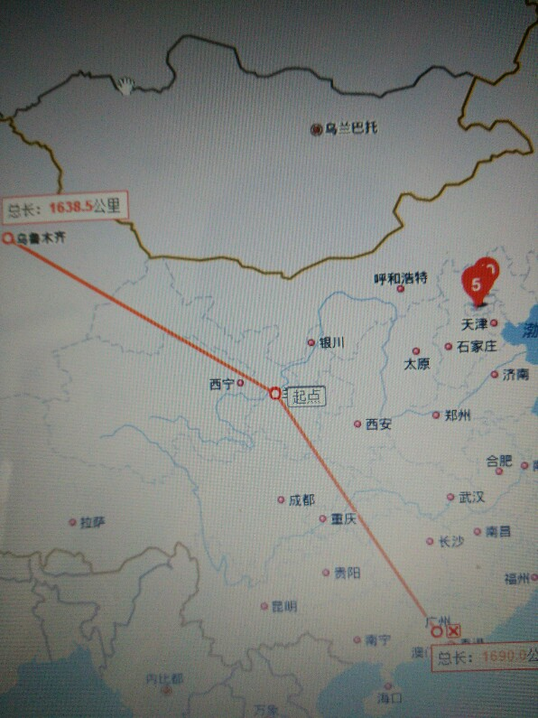

*2016-07-31 16:38 · 手机上网 转自铥卡*

---

### 7244

在河南。赞谷歌地图！可以直接输入经纬度。 转@ 王午云 我们业内徐老师算过，大致在32.5°N，113.5°E 转@ fomalhaut 转@ 王兴 那顶多是土地质心，人口质心在哪里？转@ 王午云 每次跟他人说兰州是我国几何中心他们都露出不可思议的神情 转@ 王兴 惊讶的发现武汉到上海的高

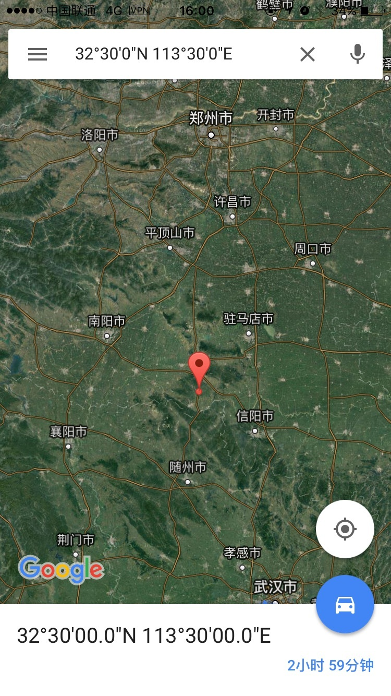

*2016-07-31 16:02 · 猫饭*

---

### 7245

转@ 哑熊 @ 王兴 @ 王午云 作为兰州人，总被人觉得离新疆很近，然而兰州到乌鲁木齐的距离比兰州到广州的距离还远……

*2016-07-31 15:53 · 手机上网 转自哑熊*

---

### 7246

那顶多是土地质心，人口质心在哪里？转@ 王午云 每次跟他人说兰州是我国几何中心他们都露出不可思议的神情 转@ 王兴 惊讶的发现武汉到上海的高铁耗时比武汉到北京还久。我真是地理没学好:(

*2016-07-31 15:47 · 手机上网 转自王兴*

---

### 7247

一个专家说：北京建成区人口规模在全球排不进前十位，人口密度在全球224个人口超过200万的城市积聚体中排在129位。

*2016-07-31 15:36 · iPhone版*

---

### 7248

转@ 美嘉.rar 因为翻译讲究避免歧异原则，意国可以有很多同音词，例如「一国」、「异国」。 转@ 飯否小字报 转@ 王兴 美利坚成了美国，英吉利成了英国，法兰西成了法国，德意志成了德国，为什么意大利还是意大利而不是意国？

*2016-07-31 15:12 · 网页 转自王兴*

---

### 7249

没事，经常互相打一打、挡一挡、躲一躲挺锻炼的，有益身心:) 转@AW才不是登势 @ 王兴 不是针对你个人啊~ ╮(╯_╰)╭

*2016-07-31 12:43 · 手机上网 转自AW才不是登势*

---

### 7250

有些问题很难给一个准确答案，例如：全世界到底有多少国家？只能说，两百来个吧。但总体趋势是在增长。

*2016-07-31 12:16 · iPhone版*

---

### 7251

真把各国名字梳理研究一下估计就能写一本可读性不错的书了。

*2016-07-31 12:03 · iPhone版*

---

### 7252

惊讶的发现武汉到上海的高铁耗时比武汉到北京还久。我真是地理没学好:(

*2016-07-31 11:28 · 手机上网*

---

### 7253

美利坚成了美国，英吉利成了英国，法兰西成了法国，德意志成了德国，为什么意大利还是意大利而不是意国？

*2016-07-31 11:23 · 手机上网*

---

### 7254

你试图打我脸没打中。转@ AW才不是登势 王老板又开始晒sc错句了。后句逻辑上直接打前句的脸。改为“没有什么重要的事物是三个字表达不了的；如果有，就两个字。”会妥当很多。以及，“足够”一词是冗余的。 转@ 王兴 没有什么足够重要的事物是两个字表达不了的。

如果有，那就三个字。

*2016-07-31 11:15 · 手机上网 转自王兴*

---

### 7255

去年去乌镇时就觉得「枕水度假酒店」这个名字取得不错。今天才知道典故是唐末诗人杜荀鹤写的「君到姑苏见，人家尽枕河」。

*2016-07-31 10:44 · iPhone版*

---

### 7256

没有什么足够重要的事物是两个字表达不了的。如果有，那就三个

字。

*2016-07-31 09:44 · iPhone版*

---

### 7257

转@ 我们为什么不在街上做爱 对，性是交流，不是娱乐，这就是我不喜欢大保健的原因。根本不想跟她们交流转@ 王兴 转@ Regen宇性才不是娱乐，是交流。日本人不是不喜欢产崽子，是社恐好吗？！

转@ 王兴 据说现在日本年轻人不太爱过性生活。我想了想，觉得有道理。性脱离繁殖后代的意义后（也就

*2016-07-30 22:54 · 手机上网 转自王兴*

---

### 7258

转@ Ctrl_A 主要太麻烦了 各种不明液体要洗澡洗衣洗床单还要考虑对方感受什么的 不如跳舞！ RT@ 王兴 据说现在日本年轻人不太爱过性生活。我想了想，觉得有道理。性脱离繁殖后代的意义后（也就是最近不到一百年的事），本质上是娱乐，而现在各种娱乐越来越丰富、强度也越来越大。

*2016-07-30 22:54 · 手机上网 转自王兴*

---

### 7259

转@ Regen宇 性才不是娱乐，是交流。日本人不是不喜欢产崽子，是社恐好吗？！转@ 王兴 据说现在日本年轻人不太爱过性生活。我想了想，觉得有道理。性脱离繁殖后代的意义后（也就是最近不到一百年的事），本质上是娱乐，而现在各种娱乐越来越丰富、强度也越来越大。

*2016-07-30 22:42 · 手机上网 转自王兴*

---

### 7260

据说现在日本年轻人不太爱过性生活。我想了想，觉得有道理。性脱离繁殖后代的意义后（也就是最近不到一百年的事），本质上是娱乐，而现在各种娱乐越来越丰富、强度也越来越大。

*2016-07-30 22:37 · 手机上网*

---

### 7261

我原本以为自己的英语词汇量还可以。看完就被打击了……转@ 美嘉.rar Buzzfeed最近通过Twitter向文字爱好者征集最美丽的英语词，最后从中选出了32枚，你认识几个。#居然没有cliche

*2016-07-30 22:03 · 手机上网 转自美嘉.rar*

---

### 7262

转@ 熊猫姐 对看过文章，宜家的确有个专门命名产品的部门。 转@我是你大哥 目测是designer自己取的RT@ 王兴 宜家这种给锅碗瓢盆桌椅床柜每个产品都起个名字的公司是不是都有一个CNO (ChiefNaming Officer)啊？

*2016-07-30 20:58 · 手机上网 转自王兴*

---

### 7263

欧洲上空的飞机密度跟非洲真是完全不可同日而语。

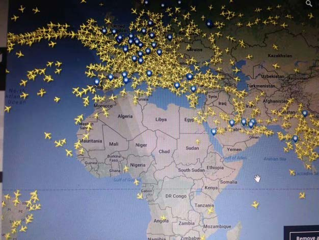

*2016-07-30 19:49 · 手机上网*

---

### 7264

我们办公室就是中央净水器加管道铺到各饮水机。转@ peter 是，社会成本显然会比现在低，搞不懂「@ gravity0 打电话叫桶装水的时候，我在想为啥不像自来水和煤气一样建条管道呢？由于成本原因将自来水净化到纯水的品质然后用来洗澡冲厕所显然不经济，但如同电网、有线电视、电话线

*2016-07-30 16:44 · 手机上网 转自gravity0*

---

### 7265

当然，也不要把自己搞到第二天刚开始时就感到精疲力尽，不然你这天估计也就白过了-_-！转@ 王兴 如果你每天结束时没有感到精疲力尽，那你这天就白过了。 -乔治·路易斯（广告狂人）

*2016-07-30 09:15 · 手机上网 转自王兴*

---

### 7266

如果你每天结束时没有感到精疲力尽，那你这天就白过了。 -乔治·路易斯（广告狂人）

*2016-07-29 22:55 · iPhone版*

---

### 7267

哈哈，久违了的拼音文。我小学时因为被安排到提倡「注音识字，提前读写」的语文实验班，所以低年级就读这样整段整页的拼音课文。

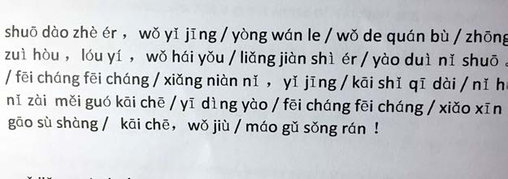

*2016-07-29 22:39 · 手机上网*

---

### 7268

宜家这种给锅碗瓢盆桌椅床柜每个产品都起个名字的公司是不是都有一个CNO (Chief Naming Officer)啊？

*2016-07-29 21:24 · iPhone版*

---

### 7269

火车站书店卖的书报确实和机场书店略有不同。

*2016-07-29 18:35 · iPhone版*

---

### 7270

转@ webto RT@ 月出 招商银行信用卡去年一共新发卡618万张，这也是招商银行信用卡历史上增长最快的年份之一。招商银行2015年信用卡利息收入为267.29亿元，非利息业务收入为95.98亿元。据招商银行2015年年报数据，招商银行信用卡累计发卡6917万张，流通卡数3782

*2016-07-29 17:57 · 手机上网 转自月出*

---

### 7271

赶赴火车站中。我有这么久没走过西北三环一线吗？怎么感觉两边很多建筑都变了样。

*2016-07-29 17:33 · 手机上网*

---

### 7272

中国连入全球互联网的确切时间是：1994年4月20日，64k网络信道开通。这件事是当年中国十大科技新闻之一，在国家统计公报中列为1994年重大科技成就… 不过，对于普通民众而言，能够接触到互联网的标志性事件是1996年1月的中国公用互联网全国骨干网建成并开通。

by @ 魏武挥

*2016-07-29 15:28 · 手机上网*

---

### 7273

什么IaaS/PaaS/Saas/BaaS都弱爆了！牛逼的云计算公司ServiceNow早就一步到位提出EaaS概念！Everything-as-a-Service!

*2016-07-29 15:12 · 手机上网*

---

### 7274

乘法只是加法的快捷方式。

*2016-07-29 14:53 · iPhone版*

---

### 7275

朋友发来的红杉资本美国办公室的logo墙。都是红杉投资过的成功案例，虽然近半已被并购。苹果还是最拉风的，连文字都不需要了。

*2016-07-29 14:32 · 手机上网*

---

### 7276

还有这个，06年时我们赞助的清华学生原创电影《慕遥东南飞》。

*2016-07-29 13:19 · 猫饭*

---

### 7277

对比了一下祖宗标准「潘驴邓小闲」，至关重要的第五点被漏了。转@ 美嘉.rar 当然是器大活好+长得帅

*2016-07-29 13:04 · 手机上网 转自美嘉.rar*

---

### 7278

右边这位就属于好奇心和精力都过剩。转@ 柳及. 好奇的查了一下，清华IT创业大赛系列辅导讲座那天在北理举行，两个证书应该是同一个活动「 http://t.cn/RtVUVB0 」「@ 王兴 更令我震惊的是，我当年有精力过剩到同一天（2006年6月16日）去两个大学误人子弟吗？」

*2016-07-29 12:53 · 手机上网 转自王兴*

---

### 7279

我的饭否头像就是06年下半年接受《环球企业家》采访时拍的。转@努力学习的陈倚刚 问下：那时候，你有多少头发？ 转 @ 王兴 行政的同事突然抱给我一堆东西，说是从库房里清理出来。库房？还有06年的老古董？我差点恍惚了，我们这家公司到底有几年历史？

*2016-07-29 12:49 · 手机上网 转自王兴*

---

### 7280

谁送过我这种装逼礼物？我怎么一点印象也没有……

*2016-07-29 12:43 · 猫饭*

---

### 7281

更令我震惊的是，我当年有精力过剩到同一天（2006年6月16日）去两个大学误人子弟吗？

*2016-07-29 12:39 · 猫饭*

---

### 7282

行政的同事突然抱给我一堆东西，说是从库房里清理出来。库房？还有06年的老古董？我差点恍惚了，我们这家公司到底有几年历史？

*2016-07-29 12:38 · 猫饭*

---

### 7283

转@ 远骋 「战前英国每天花费50万英镑。一战每天耗费500万英镑，正常的10倍。钱是找美国人借的。而战争四年，四十年英国的正常开销。这些钱，英国人永远也还不上。如果通过征税会爆发革命。如果打赢战争，就可以迫使德国“战争赔款”。」——为什么所有人都痛苦，战争却无法停止

*2016-07-29 12:10 · 手机上网 转自远骋*

---

### 7284

突然意识到，我的本命年结束都已经是半年前的事了。

*2016-07-29 11:36 · 手机上网*

---

### 7285

那男用户有吗？转@ 夏至 我这个产品到现在都没找到女用户...转@飯否小字报 转@ 王兴 人人都是产品经理，产品即自己的一生。

*2016-07-29 10:48 · 手机上网 转自王兴*

---

### 7286

人人都是产品经理，产品即自己的一生。

*2016-07-29 10:23 · iPhone版*

---

### 7287

居然有本杂志叫《大众考古》。

*2016-07-28 20:39 · iPhone版*

---

### 7288

饭否就像是文字直播。

*2016-07-28 20:28 · iPhone版*

---

### 7289

真是惭愧，发了一条关于《临安春雨初霁》的消息，被同学们挑出不止一处错。特录全文于下：世味年来薄似纱，谁令骑马客京华？小楼一夜听春雨，深巷明朝卖杏花。矮纸斜行闲作草，晴窗细乳戏分茶。

素衣莫起风尘叹，犹及清明可到家。

*2016-07-28 20:22 · iPhone版*

---

### 7290

陆游的《临安春雨初霁》真是神作，触点特多。我最早当然是读到「小楼一夜听春雨，深巷明早卖杏花」；后来是有人讲我国古代已有类似花式咖啡的茶艺时引用了「晴窗细乳细分茶」；这回是看到「世味年来薄似纱，谁令骑马客京华」。

*2016-07-28 17:45 · iPhone版*

---

### 7291

按照CIA 2015年的数据，全世界共有72.56亿人，每年出生1.35亿，死亡5660万，净增7837万。

*2016-07-28 17:07 · iPhone版*

---

### 7292

可惜只到1849年。转@ 远骋 巴尔干地区的国家变更 gif 图，用标题党的话来说就是「5 秒钟看尽世事变迁」

*2016-07-28 16:37 · 手机上网 转自远骋*

---

### 7293

反政治正确的确有非常广泛的号召力，甚至对我而言也是如此。

*2016-07-28 13:13 · iPhone版*

---

### 7294

北京的南苑机场居然是中国历史上第一个机场。（1903年12月17日，莱特兄弟才首次飞行成功，）1904年，来自法国的两架小飞机在南苑校阅场上进行了飞行表演，这是作为近现代科学技术象征的飞机首次在中国土地上起降。1910年清政府筹办航空事业，在南苑试制飞机并修建了跑道。

*2016-07-28 10:54 · iPhone版*

---

### 7295

蟑螂还有胎生的？转：7月27日报道 国际晶体学联合会（IUCr）刊物发表文章称，印度科学家发现一种蟑螂奶中含有独特蛋白质。这种“奶”晶体的营养成分是牛奶的三倍。研究人员正以此为基础研制食物添加剂。这种蟑螂名为太平洋甲虫蟑螂，不产卵，属于胎生，用"乳汁"喂养后代。

*2016-07-28 08:53 · iPhone版*

---

### 7296

欣赏雨景呗。转@ 远骋 暴雨天出来聚餐，等号，但吃完的桌都不走。。这得等到什么时候，吃不上又走不掉，陷入困境。。

*2016-07-28 07:29 · 手机上网 转自远骋*

---

### 7297

@ 2十七 饭否app和美团app应该没什么关系的。

*2016-07-27 22:42 · 手机上网 给2十七的回复*

---

### 7298

@ 2十七 啥意思？

*2016-07-27 22:24 · 手机上网 给2十七的回复*

---

### 7299

转@ 金融界人贩子 才知道战斗民族说和德国车一样，在我国是有舆论引导的。不知道是不是得了天下要向理论祖宗的老家和曾经的金主／宗主报恩。

*2016-07-27 13:01 · 手机上网 转自金融界人贩子*

---

### 7300

转@ 阿兰德利2016 跟清末河运改海运，一大波人最后参加太平军有点类似，还更严重「@ 王兴 昨晚吃饭瞎扯时，一个朋友说，ISIS这么迅猛崛起的原因之一是美国犯了重大错误：占领伊拉克之后竟然把伊拉克军队解散了。解散了！这么多人打了这么多年仗，你让他们说走就走，他们能去干啥？」

*2016-07-27 12:34 · 手机上网 转自王兴*

---

### 7301

柴米油盐酱醋茶，居然有茶没糖。

*2016-07-27 10:02 · iPhone版*

---

### 7302

维基百科说，印度只有10%人口会讲英语，以英语为母语的更是只有几十万人。

*2016-07-27 09:53 · iPhone版*

---

### 7303

昨晚吃饭瞎扯时，一个朋友说，ISIS这么迅猛崛起的原因之一是美国犯了重大错误：占领伊拉克之后竟然把伊拉克军队解散了。解散了！这么多人打了这么多年仗，你让他们说走就走，他们能去干啥？

*2016-07-27 08:50 · iPhone版*

---

### 7304

「您这是多巴胺分泌旺盛的轻度狂躁症。」

*2016-07-26 21:56 · iPhone版*

---

### 7305

转@ 太空小孩 梅毒：最早在法国叫意大利病，在意大利叫法国病。

在荷兰、丹麦叫西班牙病，在俄国叫波兰病，在波兰既叫德国病又叫法国病，德国只好管梅毒叫法国病，葡萄牙说我也这么叫。土耳其和阿拉伯更干脆，直接叫基督徒病。在日本叫中国病，但在中国最早却叫广东疮。广东：???

*2016-07-26 13:13 · 手机上网 转自太空小孩*

---

### 7306

百度确实堕落到一定地步了。刚才我居然碰到这种情况：搜两个中文关键词，百度说没有结果，bing返回两个结果，其中一个对我是有帮助的。

*2016-07-26 00:20 · iPhone版*

---

### 7307

Rigorous thinking.

*2016-07-26 00:10 · 手机上网*

---

### 7308

一年多来，感触越发的深。转@ 王兴 朋友圈里看到的：眼界不够几乎是自视甚高的唯一原因。

*2016-07-25 23:26 · 手机上网 转自王兴*

---

### 7309

全球有68家管理超过100亿美元资产的对冲基金，超过一半在纽约，总部在香港的只有一家。

*2016-07-25 22:21 · 手机上网*

---

### 7310

你真行！转@ 枫儿 好奇搜了下，是David Munyon的 转@ 王兴 听到一个新版本的《A Hard Rain's A-Gonna Fall》，男声，富有磁性，完胜bob dylan和joan baez的演绎。音乐响起3秒钟我就决定加入收藏了。可惜QQ音乐没标歌手是谁。

*2016-07-25 18:34 · 手机上网 转自枫儿*

---

### 7311

@ 枫儿 居然被你猜中了:)

*2016-07-25 15:54 · 手机上网 给枫儿的回复*

---

### 7312

转@ 太空小孩 昨晚睡不着，想到这么一个问题：如果要我捐献一天周末时光，最少应该要求多少钱？意思是，给我这些钱，我就愿意直接跳到 24 小时后的第二天。权衡之后，我觉得应该要 200 块钱；工作日的话，可以免费。完成这次权衡之后，我第一次觉得身体跟大脑不在同一个频道上。

*2016-07-25 13:23 · 手机上网 转自太空小孩*

---

### 7313

思路还是停不下来，意识到龙岩话里好像没有「喝」这个字，喝水/喝茶/喝酒在龙岩话里是吃水/吃茶/吃酒。

*2016-07-25 13:15 · 手机上网*

---

### 7314

好啦，吃饱了，重新投入工作前再说一个和吃和名有关的事：茶起源于中国，凡是经陆路引进茶叶的国家里茶的翻译接近「茶」字在北方方言的发音cha，例如俄语里；凡是经海路引进茶叶的国家里茶的翻译接近「茶」字在闽南语系的发音，例如英语里的tea。

*2016-07-25 13:08 · 手机上网*

---

### 7315

想到了一个更属于吃饱了撑着的问题：我们为什么认为英法德等西方国家是西方？事实上，近代这些国家接触中国是从海上来的，而我国的海岸线在东边。未查史料之前我的初步解释可能有点令人气短：因为欧洲文明先把我们定义为东方（远东）了，所以我们反过来说他们是西方。

*2016-07-25 12:58 · 手机上网*

---

### 7316

转@ 素衣白马客京华 @ 王兴 不要剽窃啊！农史学家认为“胡”系列果蔬（胡瓜、胡桃、胡豆、胡椒、胡葱、胡蒜、胡萝卜）大多为两汉两晋时期由西北陆路引入；“番”系列（番茄、番薯、番椒、番石榴、番木瓜）大多为南宋至元明时期由“番舶”(外国船只)带入；“洋”系列（洋葱、洋姜、洋芋、洋白菜）则

*2016-07-25 12:46 · 手机上网 转自素衣白马客京华*

---

### 7317

绞尽脑汁，终于想到第五派，倭瓜。

*2016-07-25 12:45 · iPhone版*

---

### 7318

午饭时想到，我们现在吃的好多蔬菜品种是国外引进的，命名上还分至少四类：一是「西」字派，西红柿、西葫芦等；二是「洋」字派，洋葱、洋蓟等；三是「番」字派，番茄、番薯等；四是「胡」字派，胡萝卜、胡椒等。

*2016-07-25 12:28 · iPhone版*

---

### 7319

evernote的强制付费升级终于来了。

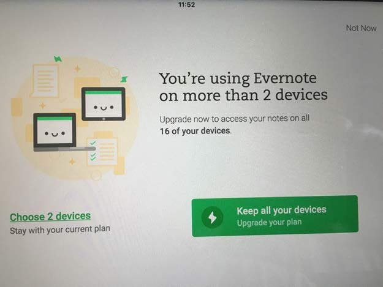

*2016-07-25 11:53 · 猫饭*

---

### 7320

听到一个新版本的《A Hard Rain's A-Gonna Fall》，男声，富有磁性，完胜bob dylan和joan baez的演绎。音乐响起3秒钟我就决定加入收藏了。可惜QQ音乐没标歌手是谁。

*2016-07-24 20:48 · iPhone版*

---

### 7321

我的思维模式果然接近architect:-)

*2016-07-24 17:06 · 猫饭*

---

### 7322

2015年全国教育事业发展统计公报：在校小学生9926万；初中生5067万；高中生4687万（其中普通高中2455万，中等职业教育2205万）；

高等教育总规模3167万，其中普通高等教育本专科共2309万，成人高等教育548万，在学硕士生137万，在学博士生27万。

*2016-07-24 15:10 · 网页*

---

### 7323

大致的中国高等教育分级：2015年全国共有2414所普通高等学校（另有353所成人高等学校）；其中本科院校1129所；211工程累计112所；

985工程累计39所；再缩小可能就是C9联盟，即985工程首批9所高校：浙大、复旦、中科大、上交、西交、哈工大、南大，加上top2的清北。

*2016-07-24 14:59 · 网页*

---

### 7324

李嘉诚旗下果然也有一个酒店管理集团：海逸。但是品牌知名度不行啊，完全比不上周大福/郑裕彤家族收购来的美国品牌rosewood瑰丽

酒店。包玉刚/吴光正家族的酒店品牌马哥孛罗算是中规中矩吧。

*2016-07-24 14:26 · iPhone版*

---

### 7325

转@ gravity0 早上开的一盒零食放在桌上，边玩边吃，刚才发现只剩最后一块，不由想起加菲猫那句：猪肉卷的最大问题是，吃完它就没了。

*2016-07-24 10:13 · 手机上网 转自gravity0*

---

### 7326

家庭聚餐时，老妈说她曾经给我算过命，算命先生说我名字里缺金，建议我改名「王鑫」-_-!

*2016-07-23 19:41 · iPhone版*

---

### 7327

家里居然有一只小壁虎。

*2016-07-23 18:46 · iPhone版*

---

### 7328

转@ gravity0 广州黄埔世界最大蚊子工厂的新闻细思恐极。任何生物个体的主要竞争来自于种内，摧毁某个物种最好的办法就是给其创造单一环境培养海量缺陷个体，然后用这些低成本大数量的个体挤掉他们的野生同类。大局已定后这些海量缺陷个体在野生环境是无法独立存活的。

*2016-07-23 14:33 · 手机上网 转自gravity0*

---

### 7329

好久没有这种「听君一席话，胜读十年书」的感觉了。高手就是不一样啊！

*2016-07-23 11:17 · iPhone版*

---

### 7330

新加坡华人的生育率是1.1，印度人是1.2，马来人是1.7。都不够啊。

*2016-07-23 09:59 · 手机上网*

---

### 7331

每次经过鸟巢东边的中国科学技术馆，看到很多小朋友在排队鱼贯而入，我就开心起来，觉得我们国家还是有希望的。

*2016-07-23 09:53 · iPhone版*

---

### 7332

为什么不叫上我！转@ 杜斌beta 今天听了 Anker 的闭门分享，不虚此行。

*2016-07-23 00:33 · 手机上网 转自杜斌beta*

---

### 7333

我可没那境界。不如你顺道往南开一点捡几块和田玉送我吧。转@ 拧巴人儿 你是不是现在也开始盘小叶紫檀手串儿了！转@ 王兴 我以前只记得「一命二运三风水，四积阴德五读书」，今天才知道后半段是「六名七相八敬神，九交贵人十养生」。

*2016-07-22 23:17 · 手机上网 转自王兴*

---

### 7334

我以前只记得「一命二运三风水，四积阴德五读书」，今天才知道后半段是「六名七相八敬神，九交贵人十养生」。果然不止我觉得名字重要。转@ 王兴 最近简直对名字着了迷。

*2016-07-22 23:07 · 手机上网 转自王兴*

---

### 7335

转@ 饭否 近期出现的 TL 消息错乱、精选为空的问题已经得到修复。

如果你的 TL 仍然存在问题，请尝试重新关注或取消关注任一饭友。

如需帮助请私信 @ 饭否 。

*2016-07-22 18:04 · 手机上网 转自饭否*

---

### 7336

向死而生。知易行难。转@ webto RT@ 张亮 写的真好啊 转@ 远骋程炳皓《八年开心》 http://t.cn/Rt2z5mm

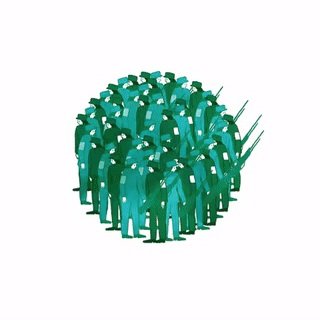

*2016-07-22 14:36 · 手机上网 转自远骋*

---

### 7337

转@ gravity0 "War doesn't decide who is RIGHT, it decides whois LEFT."

*2016-07-22 11:48 · 手机上网 转自gravity0*

---

### 7338

转@ 远骋 发现一个妥妥的规律：如果歌手积累的粉丝主要是男粉丝，到歌手30岁时，商业变现能力几乎就歇菜。

*2016-07-22 09:52 · 手机上网 转自远骋*

---

### 7339

查了一下，是2015年5月换的。转@ 王兴 我有很久没坐过厦航的飞机吗？他们家空姐制服的颜色什么时候换成了类似蒂凡尼的那种青蓝色？

*2016-07-21 18:43 · 手机上网 转自王兴*

---

### 7340

我有很久没坐过厦航的飞机吗？他们家空姐制服的颜色什么时候换成了类似蒂凡尼的那种青蓝色？

*2016-07-21 18:31 · iPhone版*

---

### 7341

登机时看到一个很明显的锥子脸。以前好像只在网上见过。

*2016-07-21 15:17 · iPhone版*

---

### 7342

要是有一张图能显示我过去10年的流量消耗趋势就好了。

*2016-07-21 15:04 · iPhone版*

---

### 7343

人既是基因gene的宿主，也是媒母meme的宿主。一个媒母，不管是科学理论还是宗教，如果想要扩大市场份额，从逻辑上说只有三条路：把不接受/未接受自己的转化过来，多生同类，耗死/杀死对方。

*2016-07-21 13:22 · iPhone版*

---

### 7344

@ 一口空气 多谢提醒！已转给同事。

*2016-07-21 12:47 · 手机上网 给一口空气的回复*

---

### 7345

忘了前几天跟哪个朋友聊天时听到的总结，看法国和日本最近几百年的历史，政治斗争获胜的关键点就是两个：活得久、生得多-_-！

*2016-07-21 12:44 · 手机上网*

---

### 7346

现在比2009年2月时更觉得如此。或许从来都是如此。转@ 王兴 @曹晖 看到你在饭否发的消息，我想起以前听过的“思路决定出路，布局决定结局，吨位决定地位……”

*2016-07-21 12:19 · 手机上网 转自王兴*

---

### 7347

多业务，低毛利，长链条。

*2016-07-21 11:52 · iPhone版*

---

### 7348

2015年十大军队规模：中国229万，美国143万，印度133万，北朝鲜111万，俄罗斯103万，韩国69万，土耳其66万，巴基斯坦62万，伊朗52万，埃及47万。

*2016-07-20 22:51 · iPhone版*

---

### 7349

最近简直对名字着了迷。

*2016-07-20 22:33 · 手机上网*

---

### 7350

什么基因测试敢号称能测智商？有点不靠谱吧。转@ 拧巴人儿 "常见类型，寿命长的可能性一般，聪明程度也一般。"---妈的你再说一遍！

*2016-07-20 21:56 · 手机上网 转自拧巴人儿*

---

### 7351

你买票了吗？阿富汗应该可以落地签吧？转@ 拧巴人儿 乌鲁木齐现

在有直飞喀布尔的航班了。明天就有。三小时就到了。

*2016-07-20 09:56 · 手机上网 转自拧巴人儿*

---

### 7352

《不要骂小镇青年，小镇已经没青年了》这个标题够抓眼球。

*2016-07-19 17:03 · iPhone版*

---

### 7353

会玩。转@ 杨曜睿 在岛上裸了一天了，觉得舒服自然方便。撒尿快把营地圈完了，不知道能不能吓退一些动物；）。以前爱裸睡，爱在家里裸。现在才发现，大部分衣服再简单，如果不是为了御寒，防蚊，都不如裸体方便～ 这么热的天，还是裸着最舒服自然

*2016-07-19 09:01 · 手机上网 转自杨曜睿*

---

### 7354

点了一杯名叫「世界末日」的鸡尾酒，感觉一般。

*2016-07-19 00:26 · iPhone版*

---

### 7355

和一个打算开拓新西兰业务的上海互联网创业者聊天，他说：对我来说，新疆和新西兰有什么区别？

*2016-07-19 00:24 · iPhone版*

---

### 7356

呃，不是因为没有颜值吗-_-！转@ 天明带露 东施效颦是因为没有思想，没有情怀。转@ 王兴 不客气的说，多数公司学google是在「东施效颦」。

*2016-07-18 20:08 · 手机上网 转自王兴*

---

### 7357

2016年5月份，全球航空客运的上座率居然有78%，比我原先以为的更高。

*2016-07-17 23:49 · iPhone版*

---

### 7358

把某行业网站最近150天的文章列表扫了一遍，打开了好几十个tab，争取到目的地前全都看完。

*2016-07-17 20:13 · iPhone版*

---

### 7359

「小鲶鱼很好吃，大家不要伤害它！」 前天晚上刚吃过黄辣丁火锅的我表示深深的赞同。

*2016-07-17 16:54 · iPhone版*

---

### 7360

我一直觉得自己很幸运，因为我和改革开放基本同龄。1978年12月18日，具有历史转折点意义的十一届三中全会召开。正好两个月后，我出生了。

*2016-07-17 09:51 · iPhone版*

---

### 7361

Peak PC: 历史上全球电脑出货量最大的时期是2011年第三季度。

*2016-07-17 08:21 · 手机上网*

---

### 7362

「千金之子坐不垂堂」这种价值观和西方崇尚的勇武冒险精神完全相反。洛克菲勒的小儿子就是典型例子：搞人类学研究，深入最荒蛮的巴布亚新几内亚，最后失踪了，据说很有可能是被当地土著吃掉了…

转@ 杨曜睿 这就是知道感知到了比常人更多的危险，如果是理智决定，就是千金之子坐不垂堂。转@ 王兴

*2016-07-16 13:26 · 手机上网 转自王兴*

---

### 7363

转：2B如果ZB，会成为2B。——九哥感言

*2016-07-16 12:23 · iPhone版*

---

### 7364

Peter Thiel大神说contrarian可不是说说而已，在硅谷主流反川普的时候，他跳出来给川普站台了！

*2016-07-16 11:51 · iPhone版*

---

### 7365

万事起头难。起头之后更难。

*2016-07-16 11:26 · iPhone版*

---

### 7366

我可没装大牌。昨晚11点到12点已经聊过了。转@ MacGuffin__ @ 王兴 所以你们大佬就抬高姿态不理人？

*2016-07-16 11:06 · 手机上网 转自MacGuffin__*

---

### 7367

妈妈不愧是务农出身，实在是勤劳能干，三四十平的小院子，半年时间，居然已经种上：葱、生菜、小白菜、开花菜、空心菜、四季豆、苋菜、牛皮菜、西红柿、黄瓜、茄子、冬瓜、大小两种南瓜、红绿两种菜椒、秋葵、姜、芋头、马齿苋、番薯、丝瓜、豇豆、韭菜，草莓、樱桃，北海道黄杨。已经吃完的有菠菜和茼

*2016-07-16 08:58 · iPhone版*

---

### 7368

好吧，难怪媒体从业者转创业的真不少。当然，转投资的也不少。转@ 拧巴人儿 这是记者约采访对象的基本技巧……转@ 王兴 忍不住想分享一下。一个创业者素质高不高，要性强不强，从约「会」这个细节就可以看出来。

*2016-07-16 08:28 · 手机上网 转自王兴*

---

### 7369

忍不住想分享一下。一个创业者素质高不高，要性强不强，从约「会」这个细节就可以看出来。

*2016-07-16 08:26 · 手机上网*

---

### 7370

好像英文里没有「砸钱」的概念，至少没用「砸」这种动词，「烧钱」倒是中英通用的。

*2016-07-16 06:17 · iPhone版*

---

### 7371

转@ gravity0 王二告诉陈清杨，不管你是不是破鞋，群众需要你是的时候你就必须是，实在觉得冤枉可以让它不冤枉。这是面对群众时的觉悟，表演愚蠢狂妄的凤姐和海带缠潜艇的张将军都有这份觉悟。

*2016-07-16 00:23 · 手机上网 转自gravity0*

---

### 7372

那是另一个字，龙岩话里另有发音，但我不会拼。 转@ 郝沃德 冇？

「@ 王兴 龙岩话（属闽南语系）里「嫑」（还是覅？）读 mai，第二声。转@ quux 温州一带的方言读 fai 入声 转@ 獨頑癡 吴语 覅fiao 虽然苏州话读fie 转@ 王兴 本来就是这么回事吧… 转@ 线下工作者

*2016-07-15 14:27 · 手机上网 转自糗百*

---

### 7373

龙岩话（属闽南语系）里「嫑」（还是覅？）读 mai，第二声。转@quux 温州一带的方言读 fai 入声 转@ 獨頑癡 吴语 覅 fiao 虽然苏州话读fie 转@ 王兴 本来就是这么回事吧… 转@ 线下工作者 我们家方言说“不要”就是发这个音，一模一样。我一直以为是“不要”的连读。

*2016-07-15 14:06 · 手机上网 转自糗百*

---

### 7374

本来就是这么回事吧。就像W原本就是Double-U，念多了念顺了就干脆写成W了。转@ 线下工作者 我们家方言说“不要”就是发这个音，一模一样。我一直以为是“不要”的连读。 转@ 王兴 真的能打出来！转@ quux 嫑 biáo 转@ E.coli 这个不要是怎么打出来的？ 转@ 糗百

*2016-07-15 12:57 · 手机上网 转自糗百*

---

### 7375

吃午饭啃猪蹄时琢磨了一下「壮美」和「壮丽」这俩词有何区别。

*2016-07-15 12:54 · 手机上网*

---

### 7376

我十年前就相信互联网是活字印刷之后信息技术方面最大的变革（比电报电话电视等更大）；我也大概知道古登堡在欧洲搞出活字印刷之后世界发生了何等巨变：宗教革命、大航海、科学、启蒙、殖民、民族国家的兴起、随之而来的一战二战。但直到最近半年我才把这二者联系起来并意识到这意味着什么。

*2016-07-15 12:37 · 手机上网*

---

### 7377

宗教确实是最后一层救生网。德先生和赛先生都只能教你怎样尽量把事情搞好一点，宗教能让你在实在搞不好的时候至少好受一点。

*2016-07-15 12:01 · 手机上网*

---

### 7378

转@ 拧巴人儿 连档案馆的网站都要用上不忘初心这个词儿--“要坚持不忘初心，推动档案事业创新发展”， 真是……

*2016-07-15 11:56 · 手机上网 转自拧巴人儿*

---

### 7379

玩得有水平！转@ 草寅 封面上那个人是我认识一人的大学同学。转@ 王兴 这期《中国国家地理》的封面文章写冰川河，就是流淌在冰川上或冰川里的河。看得我心驰神往。

*2016-07-15 11:56 · 手机上网 转自王兴*

---

### 7380

这期《中国国家地理》的封面文章写冰川河，就是流淌在冰川上或冰川里的河。看得我心驰神往。

*2016-07-15 11:38 · iPhone版*

---

### 7381

其实我并不饿，毕竟出发前吃过一个橙子，但是在机场过了安检看到汉堡王时，鬼使神差的就走进去买了一个最小的单层培根芝士皇堡坐

下来。我在美国读书的第一年，午饭多半是在汉堡王解决的。边吃边看朋友圈，刷到钟sir写猫眼电影过去和未来的文章。读到最后，热泪盈眶，不是因为汉堡里放了很多洋葱。

*2016-07-15 08:09 · 手机上网*

---

### 7382

真的能打出来！转@ quux 嫑 biáo 转@ E.coli 这个不要是怎么打出来的？ 转@ 糗百 久仰的女神今天一见面就对我怒斥：臭嫑脸，流氓，禽兽……我一头雾水的望着她：我……我干嘛了？女神：哼╭(╯^╰)╮昨晚我在梦里，你对我实施了凌辱，把我内个了。～尼玛☞这话说的……

*2016-07-15 07:21 · 手机上网 转自糗百*

---

### 7383

今天听说我国用来在南海吹沙填岛的最大的几艘挖沙船其实也是从别国租来的。看来真是这样，不管别的实力强不强，只要经济实力强就行，至少能扛好一阵子。

*2016-07-14 22:03 · iPhone版*

---

### 7384

@ 拧巴人儿 谢谢。我几年前去过一次宁夏，开车跑了银川和中卫，没有再往南到固原，也没有再往北。

*2016-07-14 18:15 · 手机上网 给拧巴人儿的回复*

---

### 7385

@ 拧巴人儿 固原的梯田？

*2016-07-14 18:09 · 手机上网 给拧巴人儿的回复*

---

### 7386

大疆确实是个高科技高逼格公司，细节也做得很好，招待时用的水果叉都是环保木叉而非常见的塑料叉。

*2016-07-14 15:06 · 猫饭*

---

### 7387

转@ tihu 大清早的，一同事将攒下来的七八盒加班餐方便面叠放在桌上。我对他说：某甲，最好把你的方便面塔拆掉，聚塔是要动风水的，你的道行降得住吗？//这塔是前天搭的，昨天同桌的另一人就重感冒发烧在家了。# 办公室风水学 #

*2016-07-14 10:09 · 手机上网 转自tihu*

---

### 7388

Catcher of the word.

*2016-07-14 10:08 · iPhone版*

---

### 7389

仗着上过几节马哲课恬不知耻的在上页选了「学过」后，发现自己肯定是想多了。

*2016-07-13 18:20 · 手机上网*

---

### 7390

呃，这个问题该怎么回答呢？

*2016-07-13 18:16 · 手机上网*

---

### 7391

好消息是，不是我们这个航班开始发盒饭了。坏消息是，是排在同一个登机口的前一个航班开始发盒饭了。这意味着什么？！

*2016-07-13 18:04 · iPhone版*

---

### 7392

什么？已经可以开始领盒饭了？

*2016-07-13 18:00 · iPhone版*

---

### 7393

比讨论问题时能说出一堆数字更酷的是能说出一个公式。

*2016-07-13 17:44 · iPhone版*

---

### 7394

下半年第一次出差。

*2016-07-13 17:39 · 手机上网*

---

### 7395

我听到的对airbnb模式最强力的攻击来自一个姑娘：「你怎么知道那些airbnb上的房间有没有被安装了偷窥摄像头？尤其是在日本这么变态的国家……」

*2016-07-13 16:21 · 手机上网*

---

### 7396

2001年9月，百度的首页才从一个公司介绍页换成搜索框。

*2016-07-13 10:24 · 手机上网*

---

### 7397

你平时不思考吗？那怎么当艺术家？转@ 左小祖咒 这里人不少啊 虽然我好久没来了 我也算老网红 最近我思考一下

*2016-07-13 07:27 · 手机上网 转自左小祖咒*

---

### 7398

@ 李小蛙 找人请教事情不是应该就对方方便的时间地点吗？

*2016-07-13 07:24 · 手机上网 给李小蛙的回复*

---

### 7399

约了人在酒店吃早餐，发现这酒店餐厅居然有煎饼果子。西二旗总是能给我惊喜。

*2016-07-13 07:21 · iPhone版*

---

### 7400

great game.

*2016-07-13 01:01 · iPhone版*

---

### 7401

开了一天的会，心浮气躁，收到一张资深饭友寄来的明信片倒是个安慰。

*2016-07-12 22:39 · iPhone版*

---

### 7402

转@ 八杯水 29日，蒋介石接见上海第二次进京请愿学生5000人，训话一小时余。蒋称，“本席亦抱定与国民共同生死之决心”。又称，请愿分散政F精力，要求学生返校读书；如愿从军，可编入义勇队训练。

转@ 王兴 转@ 车前子. 想求证一下，这段故事的出处在哪里？我找了相关的材料，都是蒋介石接

*2016-07-12 20:03 · 手机上网 转自王兴*

---

### 7403

转@ 车前子. 想求证一下，这段故事的出处在哪里？我找了相关的材料，都是蒋介石接见学生，尽管心里厌恶，但还是耐心接见了几批，合计约上万人。并没有“两个选择”的相关说法，怀疑是段子手杜撰。

转@ 王兴 做得对，但不讨喜。

*2016-07-12 19:47 · 手机上网 转自王兴*

---

### 7404

好记性不如烂笔头啊。

*2016-07-12 15:39 · 网页*

---

### 7405

做得对，但不讨喜。

*2016-07-12 13:11 · 手机上网*

---

### 7406

转：1943年（民国三十二年），由他拟纲，潘光旦代笔的《工业化的前途与人才问题》中，梅贻琦表示，真正工业的组织人才，对于心理学、社会学、伦理学，以至于一切的人文科学、文化背景，都应该有充分的了解。

*2016-07-12 10:13 · iPhone版*

---

### 7407

年少时我相信一些「卓越人士在关键时刻挺身而出，力排众议，力挽狂澜」之类的说法，后来多了解了一点历史，转而相信：真正的历史大事件来临时，后来被载入历史的人根本都不用去抢，更大的可能性是只是没躲，或者，没躲开……

*2016-07-12 02:05 · iPhone版*

---

### 7408

2030年开始显得不那么遥不可及。

*2016-07-12 01:33 · iPhone版*

---

### 7409

神奇。转@ 小熊娃娃 前几年在心理上的一大进展是能比较容易分清什么来自大脑什么来自内心，最近突然觉得似乎可以感觉到什么来自人体而什么来自灵魂了……感觉也是神奇（但并不是所有人的灵魂都能感觉到啦还是要关系很近的人才行）。

*2016-07-12 01:26 · 手机上网 转自小熊娃娃*

---

### 7410

张三说：我读书少，你不要骗我。李四想：你读书少？那不骗你骗谁？

*2016-07-12 01:16 · 手机上网*

---

### 7411

读10-15年前关于互联网的报道，看看什么变了，什么没变，真是兼具娱乐性和教育性。

*2016-07-12 01:03 · iPhone版*

---

### 7412

稍微回顾一下视频行业，不禁想起「将军百战死，壮士十年归」。

*2016-07-11 13:45 · iPhone版*

---

### 7413

现在我每天花许多时间试图想清楚哪些事情是我能想清楚也需要想清楚的，哪些事情是我想不清楚或不需要想清楚的。me ta-think.

*2016-07-11 13:40 · iPhone版*

---

### 7414

转@ 美嘉.rar “还记得有一年抢盐吗？我家刚吃完。”看到这句笑岔气了。

*2016-07-11 11:36 · 手机上网 转自美嘉.rar*

---

### 7415

「 1979年，那是一个春天，有一位老人在中国的南海边画了一个圈」，我最初听到这歌词时颇不以为然，画个圈算什么本事？后来，随着阅历增长我才渐渐明白，这确实是极上乘的领导力。

*2016-07-11 10:31 · iPhone版*

---

### 7416

《大鱼海棠》这部电影的口碑明显两极分化。这应该算是件好事。

*2016-07-11 00:54 · iPhone版*

---

### 7417

我大概明白我为什么不喜欢动不动提「初心」了，还是《有限和无限的游戏》的逻辑。

*2016-07-10 21:47 · iPhone版*

---

### 7418

转@ 小熊娃娃 早就觉得了，而且还发现操作我的人是个数字控，每次玩数字游戏被我发现就不玩了⋯⋯「@ 飯否小字报 转@ 飞过山 我很好奇我们是不是都是模拟经营类网游里的角色。操作我的人一定是个免费玩家。——Horus9527译(@段子楼)」

*2016-07-10 20:23 · 手机上网 转自飞过山*

---

### 7419

我不常逛超市，但每逛一次就感叹一次商品之琳琅满目，进而感叹资本主义（或曰市场经济）之强大。

*2016-07-10 18:31 · iPhone版*

---

### 7420

好久没关注，现在篮球都做成带夜光的了？

*2016-07-10 18:07 · iPhone版*

---

### 7421

去年有个统计说，现在全球最富有的1%的人拥有全球超过50%的财富。别着急抨击贫富不均。很多人未必意识到其实自己已经属于那1%。全球七十几亿人，1%就是七千多万人，其中中国大概能分个一千多万吧。去年两会期间的新闻说全国只有2800万人交个税。个税起征点是月收入3500元。

*2016-07-10 16:54 · iPhone版*

---

### 7422

为满足中国的安全规定，一个航班的机组得有三个飞行员（包括机长）。一架飞机大概配2.5个机组。现在的航空公司最少得拥有3架飞机，其他可以靠租。机长比较稀缺，年薪过百万，转会费大概750万。

*2016-07-10 16:44 · iPhone版*

---

### 7423

中国累计有1.3亿人坐过飞机。

*2016-07-10 15:50 · iPhone版*

---

### 7424

转：老婆给当程序员的老公打电话说：“下班顺路买三个包子带回来，如果看到卖西瓜的，买一个。” 当晚，程序员老公手捧一个包子进了家门…… 老婆怒道：“你怎么就买了一个包子？”老公答曰：“因为看到了卖西瓜的。”

*2016-07-10 07:04 · iPhone版*

---

### 7425

今天听说了一个新理论：中国人普遍比老美算术快，部分原因是0-9在汉语里都是单音节，而英语里有多音节，心算时大脑处理起来比较消耗资源。

*2016-07-09 22:57 · iPhone版*

---

### 7426

@ 拧巴人儿 党指挥枪不是古田会议的主要成果吗？

*2016-07-09 19:31 · 手机上网 给拧巴人儿的回复*

---

### 7427

今天去一个日餐厅吃饭时第一次感受到会自动抬起的马桶盖带来的仪

式感。我觉得关键在于那个马桶是正对着门的，门一开就自动抬起马桶盖。实际上，因为它并不能识别男女，只抬马桶盖不抬马桶圈，所以并没有给要小便的我带来什么实际便利。

*2016-07-09 19:18 · iPhone版*

---

### 7428

有趣的是，有些事情虽然非常低频但却持续发生，例如说，大概平均每半年会有一个人给我那从没换过的微信封面点赞。

*2016-07-09 11:51 · iPhone版*

---

### 7429

饭友们总是黑得有角度有深度！转@ quux 包括 Google 可能也是 转@ 王兴 不客气的说，多数公司学google是在「东施效颦」。

*2016-07-09 11:19 · 手机上网 转自王兴*

---

### 7430

不客气的说，多数公司学google是在「东施效颦」。

*2016-07-09 09:54 · iPhone版*

---

### 7431

我思故我在。转@ 三哥手工皮具 王老板每天孜孜不倦。 转@ 王兴另一种可能的解释是：全球酒店集团的第一第二名marriott和hilton都成立于上世纪一二十年代，后面三名的intercontinental/hyatt/accor则成立于二战后。二战后可能不那么流行

*2016-07-09 09:35 · 手机上网 转自王兴*

---

### 7432

另一种可能的解释是：全球酒店集团的第一第二名marriott和hilton都成立于上世纪一二十年代，后面三名的intercontinental/hyatt/accor则成立于二战后。二战后可能不那么流行直接用自己名字命名公司了。

*2016-07-09 09:05 · iPhone版*

---

### 7433

不知道是不是巧合，全球酒店集团的第一第二名都是以创始人姓氏命名的，第三四五名不是，不过其中Hyatt依然是创始人家族掌控（美国最显赫的犹太家族之一：普利兹克Pritzker，他们家族设立的普利兹克奖号称建筑界的诺贝尔奖）。

*2016-07-09 08:58 · iPhone版*

---

### 7434

全球五大酒店集团的另外三家：洲际酒店的总部在伦敦郊区的Denham，凯悦Hyatt的总部在芝加哥市中心，雅高Accor的总部在巴黎市区。

*2016-07-09 07:57 · iPhone版*

---

### 7435

无独有偶，全球第二大的酒店公司希尔顿的总部也在大华盛顿地区，严格说来是弗吉尼亚的Tysons Corner，但开车到白宫只有22公里。

1919年希尔顿成立于德克萨斯州，1969到2009年总部在洛杉矶的比佛利山，2009年才搬到现址。

*2016-07-09 07:42 · 手机上网*

---

### 7436

全球最大的酒店公司（刚并购了喜达屋的）万豪的总部在马里兰州的贝塞斯达Bethesda，基本上就算大华盛顿地区吧。我在谷歌地图上查了一下，万豪总部到白宫的开车距离只有18公里。而通州区政府到天安门的开车距离是24公里。

*2016-07-09 07:25 · 手机上网*

---

### 7437

鹅銮鼻。我对这张也特别有印象，可能是因为它的面值正好适用于从台湾往大陆寄信。转@ 圡人 那个叫鹅什么鼻？转@ 王兴 想了一下，对我来说，「灯塔」的形象来源于小时候收集的那套台湾灯塔邮票。

*2016-07-09 07:21 · 手机上网 转自王兴*

---

### 7438

亚马逊的股价周五盘中创下746.10美元的历史新高，市值首次突破3500亿美元。转@ 王兴 贝索斯成为美国首富只是个时间问题。

*2016-07-09 07:03 · 网页 转自王兴*

---

### 7439

想了一下，对我来说，「灯塔」的形象来源于小时候收集的那套台湾灯塔邮票。

*2016-07-09 06:06 · iPhone版*

---

### 7440

为什么我最近醒这么早？

*2016-07-09 05:49 · iPhone版*

---

### 7441

不然已经瞎了还能怎么办？只能把大象全身摸一遍或者大家各摸一块然后讨论讨论拼一拼呗。转@ 今犹在 @ 王兴 蒲扇加柱子，就能想象出大象啦？

*2016-07-08 20:22 · 手机上网 转自今犹在*

---

### 7442

转@ 钟永健 每天都有10个故事让我觉得不该呆在中国，然后这就成为了我呆在中国的理由。

*2016-07-08 19:57 · 网页 转自钟永健*

---

### 7443

我倒是觉得「盲人摸象」可以作为团队协作的正面案例。事实就是如此。

*2016-07-08 18:28 · iPhone版*

---

### 7444

不管我们喜不喜欢，接下来几年里，更多的人会逐渐明白资本主义为什么叫资本主义。

*2016-07-08 13:57 · iPhone版*

---

### 7445

转：朋友说人有两种，一种算着还有多少年能退休，一种算着还能再工作多少年。你属于哪种？

*2016-07-08 11:38 · iPhone版*

---

### 7446

管理工作在某种意义上相当于要「温柔的将人掰弯」，挺难挺累，但也挺有成就感。

*2016-07-08 11:15 · iPhone版*

---

### 7447

转@ 金融界人贩子 我国企业打着"走出去"的旗号搞资产美元这一波我看差不多了，现在主要的精力放在了确保墙内可持续割韭菜上，争夺万科这样的戏码以后天天见。

*2016-07-08 10:42 · 手机上网 转自金融界人贩子*

---

### 7448

终于明白「张三李四」不从一二而直接从三四开始的典故了：历史上杭州城因为战乱一度只剩「四姓十八家」本地人。之前排的是：刘一陈二张三李四王五赵六孙七周八吴九郑十。

*2016-07-08 10:35 · iPhone版*

---

### 7449

醒醒！你这么讲，普通应届毕业生们情何以堪？看来人口老龄化后经济真的很难很难搞…… 转@ 拧巴人儿 啊我还以为六千多退休工资挺少的呢。我奶奶最后退休工资九千多呢。。。。

*2016-07-08 09:48 · 手机上网 转自拧巴人儿*

---

### 7450

有新意！转@ quux 转@ nuptse 水滴石穿如果不是水能和石头化学反应其实也没戏

*2016-07-08 09:20 · 手机上网 转自nuptse*

---

### 7451

泛美航空创办了洲际酒店；法航创办了艾美酒店（Le Meridien，现在属于喜达屋）；丽笙Radisson的大股东曾经是北欧航空SAS，最近变成海航了。

*2016-07-07 23:29 · iPhone版*

---

### 7452

2015年底，中国有3.2亿人拥有驾照，居世界第一。

*2016-07-07 13:00 · iPhone版*

---

### 7453

好奇心，敬畏心，平常心。

*2016-07-07 11:34 · iPhone版*

---

### 7454

大望京威武！转@ 大dada @ 王兴 IATA的北亚区运营中心就在望京的中国数码港大厦三层。我们和你们美团是邻居~

*2016-07-07 10:52 · 手机上网 转自大dada*

---

### 7455

那些说秀才斗不过匪兵的人，大概不知道王阳明这种人生赢家吧。

*2016-07-07 10:15 · iPhone版*

---

### 7456

翻出我2011年8月发的饭否。看来过去五年的国内机场建设速度略低于预期。转@ 王兴 中国目前共有175个民用机场，其中130个处于亏损

状态，计划五年内再建45个。

*2016-07-07 08:08 · 网页 转自王兴*

---

### 7457

中国目前有207个通民航的机场，全世界大概是2028个。

*2016-07-07 08:03 · iPhone版*

---

### 7458

国际航空运输协会/International Air Transport Association/国际航协/IATA的总部居然设在加拿大的蒙特利尔。

*2016-07-07 06:49 · iPhone版*

---

### 7459

万豪成功合并喜达屋之后，将是酒店行业No.1，在全球运营30个品牌，~5700家酒店，110万间房。

*2016-07-07 06:10 · iPhone版*

---

### 7460

和两个娶了中国老婆的印度男人聊天。他们说印度的牛奶产量全世界第一。

*2016-07-06 22:00 · iPhone版*

---

### 7461

类似的，「守株待兔」比「刻舟求剑」略强一点，好歹收获过一次，虽然都是没搞明白怎么回事。

*2016-07-06 12:50 · iPhone版*

---

### 7462

「闭门造车」比「坐井观天」略微正面一点点，至少还在干活。

*2016-07-06 12:42 · iPhone版*

---

### 7463

@ Cves 是加纳利群岛吧。Canary，也有金丝雀的意思。

*2016-07-06 12:08 · 手机上网 给Cves的回复*

---

### 7464

因为猎豹的战略其实是雷老板（参与或主导）制定的？转@ webto 猎豹市值只有12亿了。。。又想起当年几个点名要求我们学习的项目，都是短平快型的，不知道老板为何如此喜欢此类产品。

*2016-07-06 11:37 · 手机上网 转自webto*

---

### 7465

不知道为什么，我很喜欢「寒雨连江夜入吴，平明送客楚山孤」的意境和感觉，尤其是第一句。我喜欢这前半段远甚于更出名的后半段「洛阳亲友如相问，一片冰心在玉壶」。

*2016-07-06 08:48 · iPhone版*

---

### 7466

国际international和全球global这两个概念有一个着眼点的差别，国际是默认国家是最天然的单位和区隔。全球则并不自带这个假设而是直接着眼全局（整个地球）。当然，全球指代全世界估计也只能再用个小几十年吧，人类迟早要拓展到地球以外别的地方去。

*2016-07-06 08:40 · iPhone版*

---

### 7467

乡愿，德之贼也。

*2016-07-06 00:15 · iPhone版*

---

### 7468

据说施一公老师记忆力实在太好，所以生活中有许多常人没有的烦恼。例如，他尽量避免坐飞机，因为他一看到飞机，就会不由自主的想起，这是什么什么型号的飞机，这个型号的飞机某年某月某日在哪里失事过……

*2016-07-05 23:01 · 手机上网*

---

### 7469

饶毅老师说算术和科学真的是完全两码事，涉及进位的加法他都得求助计算器，22+33他会口算，77+88就不太溜了……

*2016-07-05 22:58 · 手机上网*

---

### 7470

和一个正儿八经的科学家——饶毅先生吃了顿饭。

*2016-07-05 22:47 · 手机上网*

---

### 7471

-_-！转@ jianliu 下班路上看《奇点临近》，各种大脑小脑脊髓工作生长机理，看得我好想吃脑花……

*2016-07-05 22:46 · 手机上网 转自jianliu*

---

### 7472

好霸气！

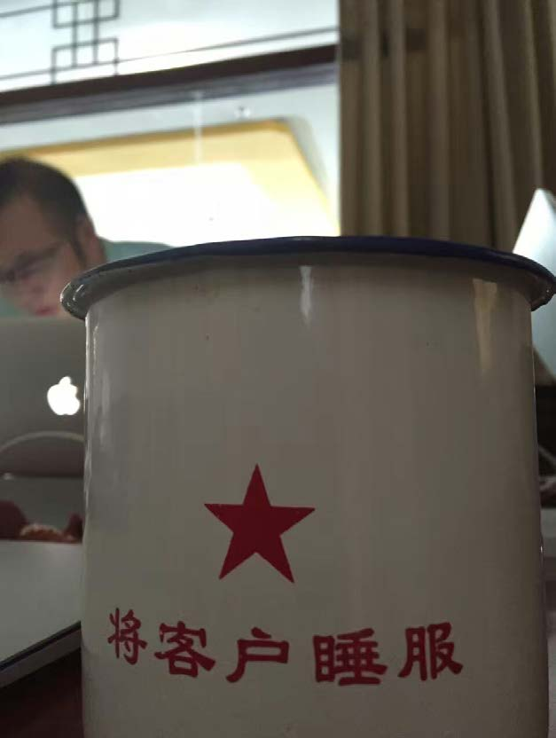

*2016-07-05 14:56 · 手机上网*

---

### 7473

原来山本五十六得名于他爸五十六岁时才生了他。

*2016-07-05 14:41 · iPhone版*

---

### 7474

越来越意识到，别说预测未来会发生什么了，99%的人连过去到底发生了什么都搞不清楚。

*2016-07-05 14:10 · iPhone版*

---

### 7475

我知道我迟早会走到那里。我也相信我永远是我。我只是想知道，当我走到那里，我的哪一部分变了，哪一部分没变。

*2016-07-04 21:27 · 手机上网*

---

### 7476

鹅厂威武。转@ IwfWcf 【互动娱乐事业群-社交网络事业群-移动互联网事业群-微信事业群-HR与管理线联合通知】[2016]31号关于成立皇室战争联合项目组及指定相关负责人的通知……

*2016-07-04 21:18 · 手机上网 转自IwfWcf*

---

### 7477

今晚要跟一个十五年未见的师兄吃饭。就是那种会开直升机、iPhone进水完蛋之后自己动手把iPhone里的存储芯片焊下来再焊到别出去以把里面的照片拯救出来的那种神人。

*2016-07-04 18:19 · iPhone版*

---

### 7478

转@ 负能量高能喷发机milo Mallorca之于德国人，正如海南之于东北人。德国人都包机过去玩耍，喜欢到教材里都特地写了篇文章讲去这个岛旅行。@ 王兴

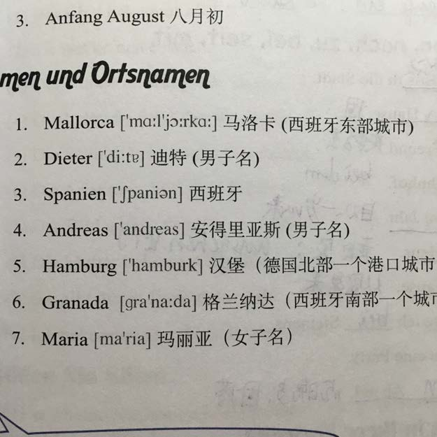

*2016-07-04 17:31 · 手机上网 转自负能量高能喷发机milo*

---

### 7479

突然想到一点，我可能永远也无法知道坚持不接陌生来电之后除了垃圾电话我还错过了什么。

*2016-07-04 16:53 · iPhone版*

---

### 7480

最近迷恋上看地形图模式的谷歌地图了，和看普通模式和卫星图模式的感觉都不一样，确实有助于理解地形。

*2016-07-04 16:51 · 手机上网*

---

### 7481

英语真是越来越重要。据说柏林的互联网创业圈也是以英语为第一语言，英语不好的德国人都进不了这行。

*2016-07-04 16:32 · iPhone版*

---

### 7482

evernote进一步加强了对免费版的限制，不能在超过两个设备上共享

了:-(

*2016-07-04 16:29 · iPhone版*

---

### 7483

昨天跟一个在德国做互联网的中国小朋友聊，知道了在地中海有个岛叫Mallorca（发音接近马尤卡），属于西班牙，但是夏季平均每个小时都有一个航班到德国，因为德国人特别喜欢到这个岛上度假。

*2016-07-04 16:27 · iPhone版*

---

### 7484

转@ 远骋 看新闻 Facebook 用户今天可以开始选择「日语关西腔」

作为界面语言 http://t.cn/R5mEfoB 于是脑补了一下 Facebook 界面如果也支持东北话，那「你在做什么」就应该是「葛哈呢」，「私信」是「唠嗑」，「赞」是「稀罕」

*2016-07-04 16:19 · 手机上网 转自远骋*

---

### 7485

转@ bridged 今天看早年的arcade游戏机时，发现90年左右一个叫cyberlip的游戏，是说未来人工智能统治了世界，几个英雄去摧毁电脑的故事。其中最终的boss名称，也就是邪恶的智能电脑，叫做Android。

*2016-07-04 14:20 · 手机上网 转自bridged*

---

### 7486

商业归根到底是靠逻辑赢的。只不过有些行业直接展示这冷冰冰的逻辑就够了，有些行业则必须把逻辑包装成情怀。

*2016-07-04 13:59 · iPhone版*

---

### 7487

是的，散兵坑里没有无神论者。转@ gravity0 屁股决定脑袋

*2016-07-04 10:13 · 手机上网 转自gravity0*

---

### 7488

转：在过去二三十年中，各国开放程度加强，移民政策更自由，更多的人跨越国境，生活在出生地以外的国家。这样看来，人在各国之间的流动性正处于人类历史最高点，它稀释了种族和民族的纯粹性，因此民族国家这个最初从欧洲兴起的概念，如今正在欧洲逐渐消失。

*2016-07-04 08:28 · iPhone版*

---

### 7489

黑得真狠。转@ jianliu 作者太坏了

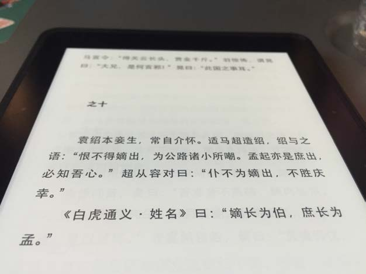

*2016-07-03 15:35 · 手机上网 转自jianliu*

---

### 7490

转：俄罗斯有句笑话，叫做:“什么是社会主义？就是从资本主义到资本主义最远的那条路”。

*2016-07-02 23:08 · iPhone版*

---

### 7491

洪秀全当年还提这个？我还以为他们一路瞎搞呢。转@ 拧巴人儿 电视在讲三大纪录八项注意，腊肉如何提出什么的——我说这纪律不是跟洪秀全学的么？

*2016-07-02 22:52 · 手机上网 转自拧巴人儿*

---

### 7492

其实当年清华的体育课可以选棒球，但我不知道为什么完全没考虑过。回想了一下，我上过两学期网球，两学期健美，一学期轮滑，一学期国标舞。似乎还有一学期排球，但应该不是我自己选的，而是大一大二时被直接安排的。依稀记得有个学期我还选了两门体育课，或至少是正式选了一门同时蹭另一门。

*2016-07-02 22:29 · 手机上网*

---

### 7493

参加团建活动，第一次打棒球，蛮好玩的。

*2016-07-02 22:21 · 手机上网*

---

### 7494

转@ 帮主胡子 昨天朋友教我打LOL，我在五分钟内狂问“我在哪？？？”“我是哪个脚色啊？？”“啊我现在要干嘛？？？”“我要去哪？？？？”这就是老年人学用手机的感觉吗

*2016-07-01 20:22 · 手机上网 转自帮主胡子*

---

### 7495

多谢。虽然没有直接解决我的问题，但是挺有信息量。转@ 巴士司机@ 王兴 http://t.cn/R5G1ZfL

*2016-07-01 16:27 · 手机上网 转自巴士司机*

---

### 7496

谷歌地图地形模式里有等高线，写个爬虫应该能搞定。转@ 徒有实名精准的三维数据哪有？ 转@ KooJoo @ 王兴 打印沙盘？

*2016-07-01 16:23 · 手机上网 转自KooJoo*

---

### 7497

3D打印是不是挺适合干这个的？也许成本没想象的那么高。转@ 王兴什么地方有立体的中国（或至少华北）地形模型？google earth已经不能满足我的需求了。

*2016-07-01 16:13 · 手机上网 转自王兴*

---

### 7498

什么地方有立体的中国（或至少华北）地形模型？google earth已经不能满足我的需求了。

*2016-07-01 15:49 · iPhone版*

---

### 7499

我一次又一次的发现，一些别人认为不是问题的问题在我看来是问题，而别人以为的回答在我看来常常并没有真正回答问题。

*2016-07-01 15:37 · iPhone版*

---

### 7500

为什么在百分制里通常认为及格线是60分而非别的分数呢？

*2016-07-01 13:30 · iPhone版*

---

### 7501

有道理！我倒是没想到。转@ 他咬人 所以牛轧（gá）糖其实是音译的。 转@ 王兴 安卓下一个版本名轮到以n开头的词，这回他们选了个我原先没见过的词，nougat 牛轧糖。

*2016-07-01 08:59 · 手机上网 转自王兴*

---

### 7502

安卓下一个版本名轮到以n开头的词，这回他们选了个我原先没见过的词，nougat 牛轧糖。

*2016-07-01 08:00 · iPhone版*

---

### 7503

瞎扯淡的饭局聊天中，张三：啥叫场景营销？李四：打德州扑克的时候推销德州扒鸡？

*2016-06-30 20:51 · iPhone版*

---

### 7504

五环隔音墙背后的教堂。

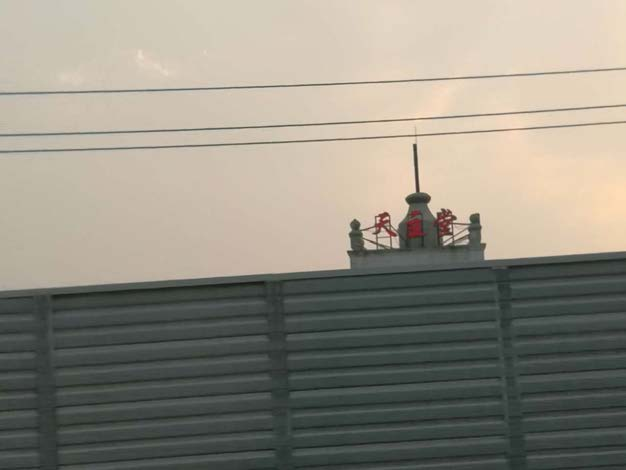

*2016-06-30 19:19 · 猫饭*

---

### 7505

车在五环上堵得动弹不得，想起一个玩帆船的朋友跟我说过：当你掌握帆船的技巧后，出海时会有一种无以伦比的自由的感觉，因为帆船不需要动力，所以理论上你驾着那艘帆船可以前往世界上任何一个大洋的任何一个角落。

*2016-06-30 19:12 · iPhone版*

---

### 7506

转@ 美嘉.rar 不停地在app之间切换，跟以前拿着遥控器换台是一样一样的。

*2016-06-30 18:14 · 手机上网 转自美嘉.rar*

---

### 7507

@ 拧巴人儿 等你拿到博士学位，他们就没法说你半途而废了。

*2016-06-30 18:01 · 手机上网 给拧巴人儿的回复*

---

### 7508

现在的小孩们还唱「我在马路边，捡到一分钱，交到警察叔叔手里边」吗？

*2016-06-30 16:03 · iPhone版*

---

### 7509

1971年尼克松总统宣布停止美元和黄金的兑换关系后（所谓布雷顿森林体系的结束），人类社会就整体进入了一个前所未有的阶段：货币量失去物理限制了。印钱，一言不合就印钱。印了四十几年了，我认为没有人真的很有把握这条路应该怎么走下去，包括各国政要和各类学霸。

*2016-06-30 15:20 · 网页*

---

### 7510

但应试教育不鼓励这种态度。转@ 王兴 在回答一个问题前其实可以先回答这两个问题：我有能力回答这个问题吗？我有必要回答这个问

题吗？

*2016-06-30 15:05 · 网页 转自王兴*

---

### 7511

在回答一个问题前其实可以先回答这两个问题：我有能力回答这个问题吗？我有必要回答这个问题吗？

*2016-06-30 15:00 · 网页*

---

### 7512

「缺德地图」这个外号真狠。转@ 拧巴人儿 缺德地图说有个失恋博物馆在复兴西路上。骗子。

*2016-06-30 13:31 · 手机上网 转自拧巴人儿*

---

### 7513

有点乱…… 转@ szweig 点头，当年我是赞助过套儿钱的。转@slfeng 猛禽老師，現在是考驗你們友情的時候了。 转@ 猛禽 还不快去隆 转 @ 傅小司 穿无钢圈的内衣啊我他妈就没胸了！

*2016-06-30 12:54 · 手机上网 转自傅小司*

---

### 7514

转@ 美嘉.rar 我想你一定很忙，所以看前三个字就好。

*2016-06-30 08:18 · 手机上网 转自美嘉.rar*

---

### 7515

@ 消遣苏 对不起。

*2016-06-29 19:10 · 手机上网 给消遣苏的回复*

---

### 7516

转@ 远骋 今天来了几个兼职小时女工，年龄有大有小，围着 HR 成一圈。HR 拿着一个数字请她们念出来，年纪大（40来岁）的女工因为有老光看不清，念错，当即被通知回家。灰溜溜的走出门，真的略心酸。

*2016-06-29 12:36 · 手机上网 转自远骋*

---

### 7517

转@ 远骋 这段时间频繁地接触工人，才发现真的年龄稍微大一点的工人（40岁）数数都能数错。一方面无言以对、只能请他们明天不要再来，另一方面也觉得悲伤难耐，是什么原因让他们连这点能力都丧失了（或没得到）？

*2016-06-29 12:36 · 手机上网 转自远骋*

---

### 7518

我之所以觉得自己的三观尚未完全定型，一个重要原因是我至今无法斩钉截铁的回答这个三观领域里的重要问题：这世界上多数人是傻逼吗？

*2016-06-29 11:39 · iPhone版*

---

### 7519

看老外写中国特别有意思，很多时候比我自己身在其中总结得还好。

*2016-06-29 10:51 · iPhone版*

---

### 7520

据说历史上确实如此，最初一批城市化的工人就靠酒精打发「认知盈

余」。后来更便宜的电视诞生了…… 转@ webto 有点理解为什么有那么多人酗酒成瘾了：酒精确实是最轻松又便宜的消遣之一。

*2016-06-28 19:17 · 手机上网 转自webto*

---

### 7521

北京今天下雨，我在楼上望出去，想起「南朝四百八十寺，多少楼台烟雨中」，进而想到前两句「千里莺啼绿映红，水村山郭酒旗风」，咦，很像是坐高铁行驶在江南时写出来的感觉嘛。

*2016-06-28 14:25 · iPhone版*

---

### 7522

转@ gravity0 教授在介绍 1982 年的 Hopfield 人工神经网络时，说它是 16 B.G. （谷歌诞生前 16 年）。天网纪年法已经开始了么？

*2016-06-28 12:16 · 网页 转自gravity0*

---

### 7523

一个成语：匡谬正俗。

*2016-06-28 11:18 · 网页*

---

### 7524

2003年8月美国哥伦比亚航天飞机失事的调查报告发布后，纽约时报那篇文章的具体内容我已记不得了，但是标题让我过目难忘：Failure isAlways an Option.

*2016-06-28 11:11 · 网页*

---

### 7525

转@ 徒有实名 微博里有个蚊子吸血的视频，喙首先要探皮肤薄弱处，再往下扎，然后要扭了扭去找到微血管，然后分泌缓凝剂，然后吸食。。。所以这蚊子的血是在其它地方已经吸过的。转@ 王兴 那只花蚊子刚在我左手腕上停下来，一秒钟之内我就拍死了她，结果竟然留下一滩鲜血。这说明蚊子吸血的速度很快嘛

*2016-06-28 11:04 · 网页 转自王兴*

---

### 7526

@ webto 求带一瓶余市。有些7-11里就有卖。

*2016-06-28 10:52 · 网页 给webto的回复*

---

### 7527

那只花蚊子刚在我左手腕上停下来，一秒钟之内我就拍死了她，结果竟然留下一滩鲜血。这说明蚊子吸血的速度很快嘛。当然，前提是，那是我的血……

*2016-06-28 10:50 · 网页*

---

### 7528

你可能还是太年轻，或者，太幸运。转@ 青桑 没见过怎么会想念 转@ 王兴 爷爷去世50年了。他生前最后一份工作是编剧，然后遇上了文革。我当然没有见过他，但是近些年我开始想念他，尤其是前几年奶奶去世之后。

*2016-06-28 10:25 · 手机上网 转自王兴*

---

### 7529

转@ gravity0 前后并非绝对，取决于脸朝的方向，用在时间轴上比较

混乱。中文里原本前是指过去：“以前”、“前天”；后是指未来：“以后”、“后天”。洋人的朝向与我们正相反，比如播放器上的forward/backward 若直译为“向前/向后”，于是就混乱了。

*2016-06-28 08:36 · 手机上网 转自gravity0*

---

### 7530

爷爷去世50年了。他生前最后一份工作是编剧，然后遇上了文革。我当然没有见过他，但是近些年我开始想念他，尤其是前几年奶奶去世之后。

*2016-06-28 08:34 · iPhone版*

---

### 7531

欢迎你统计一下;)转@ quux 如果认真统计的话，我怀疑这一年是否特别显著 转@ 王兴 1979是个重要年份。当然不是因为这一年我出生了，而是这一年发生的许多事情奠定了接下来几十年的世界格局：邓小平访美回来打了越南一顿并开始改革开放；苏联入侵阿富汗；伊朗爆发人质门从而和美国彻底决裂

*2016-06-27 17:59 · 手机上网 转自王兴*

---

### 7532

1979是个重要年份。当然不是因为这一年我出生了，而是这一年发生的许多事情奠定了接下来几十年的世界格局：邓小平访美回来打了越南一顿并开始改革开放；苏联入侵阿富汗；伊朗爆发人质门从而和美国彻底决裂（次年开始两伊战争）；撒切尔夫人出任英国首相（并和次年当选的里根携手推进新保守主义）。

*2016-06-27 17:09 · 网页*

---

### 7533

孙正义想退退不了，王石想留（看起来）留不住，这更凸显盖茨才是真牛。

*2016-06-27 16:56 · 网页*

---

### 7534

每一代人都需要一场新的革命。Every generation needs a newrevolution. - 托马斯杰斐逊

*2016-06-27 11:12 · 网页*

---

### 7535

邵逸夫，1907年出生（于宁波），2011年正式退休（时年104岁），2014年逝世（享年107岁）。

*2016-06-27 10:24 · 网页*

---

### 7536

看到朋友说，冰岛只有三十多万人口（和天通苑或望京差不多），但却有15所大学（那每所大学真够小的，不然全体国民都不够用了）和几万民间作家（这是怎么统计出来的？）。

*2016-06-27 09:51 · 网页*

---

### 7537

每遇纷争，我都不由自主的想起对美国政治哲学家罗尔斯大作《正义论》的一篇书评的标题《契约、公平与社会正义》。

*2016-06-27 09:44 · 网页*

---

### 7538

早上，适合听一曲David Garrett的《He's a pirate》提振精神。

*2016-06-27 09:14 · iPhone版*

---

### 7539

遇到一个新成语：被褐怀玉。「被」通「披」，读pī。

*2016-06-26 20:19 · iPhone版*

---

### 7540

根据「如非必要，勿增实体」的原则，现在我已经胖得穿某些裤子时不需要皮带了。如果再胖下去，就不需要这些裤子了。

*2016-06-26 17:53 · 手机上网*

---

### 7541

转@ ZerosXut dem 希腊语词根；pop 拉丁语词根。都是 people的意思。 转@ 王兴 民主、民粹、民族主义当年从democracy、populism、nationalism这几个不太一样的概念译过来时不知怎的变成都是「民」字开头的词了。

*2016-06-26 16:59 · 手机上网 转自王兴*

---

### 7542

民主、民粹、民族主义当年从democracy、populism、nationalism这几个不太一样的概念译过来时不知怎的变成都是「民」字开头的词了。

*2016-06-26 14:10 · iPhone版*

---

### 7543

我觉得我喜欢名词胜过动词，形容词和副词当然更靠后。

*2016-06-26 13:58 · iPhone版*

---

### 7544

不知怎的，突然想起《陋室铭》，重新品了一下，刘禹锡这是标准的装逼啊：山不在高，有仙则名。水不在深，有龙则灵。斯是陋室，惟吾德馨。苔痕上阶绿，草色入帘青。谈笑有鸿儒，往来无白丁。可以调素琴，阅金经。无丝竹之乱耳，无案牍之劳形。南阳诸葛庐，西蜀子云亭。孔子云：何陋之有？

*2016-06-26 13:54 · iPhone版*

---

### 7545

转@ quux 连接后海的昆玉河水系是定期放自来水的，亮马河估计也是 转@ 王兴 说起来北京市内的天然水体水质还不错啊，至少后海和三环东北角的亮马河都有不少人游泳。相比之下，我的家乡龙岩市内估计已经没什么天然水体可以游泳了。我小时候是有的，爸爸带着光屁股的我去河湾里游泳。

*2016-06-26 13:45 · 手机上网 转自王兴*

---

### 7546

转@ 拧巴人儿 哎呀我开的就是TG 转@ 草君 …… 转@ imvenj 这。

。。转@ 笨不傻 转@ DevilEYE 转@ evilbing 转@ 徒有实名 开得一手好倒车！转@ LemonLi 转@ 努尔哈欠 日人报发的这个动图据说被和谐了，说是隐喻很不好。一辆途观（TG）开倒车，还硬着陆。

*2016-06-26 13:24 · 手机上网 转自努尔哈欠*

---

### 7547

要说中国真的有什么国情不同，「没有信仰」倒是一个。

*2016-06-26 13:23 · 手机上网*

---

### 7548

高端酒店品牌Rosewood的中文名「瑰丽」是个非常棒的翻译。

*2016-06-26 13:04 · 手机上网*

---

### 7549

David Garrett这哥们挺有趣的，用小提琴把各种名曲都演绎一遍。

*2016-06-26 12:29 · iPhone版*

---

### 7550

既然是全球化时代的一个共同现象，英语这么有生命力的语言里不应该没有一个跟「屌丝」对应的词啊。

*2016-06-26 12:08 · iPhone版*

---

### 7551

又笑了一次。转@ 薛定谔的猫耳 紫要钱到位，be璃全干sei~转@ 王兴 被这影评逗笑了：《独立日2》观后感：在英国决定脱欧次日，林老湿去看了电影《独立日2》，观后感如下：巨额的投资、宏大的灾难场景，印证了我们东北一句老话——只要钱到位，玻璃全干碎。

*2016-06-26 10:32 · 手机上网 转自王兴*

---

### 7552

对三观的不同排序可能反映了人的不同思维模式。我理解的排序是：世界观、人生观、价值观。

*2016-06-26 10:32 · 手机上网*

---

### 7553

被这影评逗笑了：《独立日2》观后感：在英国决定脱欧次日，林老湿去看了电影《独立日2》，观后感如下：巨额的投资、宏大的灾难场景，印证了我们东北一句老话——只要钱到位，玻璃全干碎。

*2016-06-26 10:22 · iPhone版*

---

### 7554

小马过河。

*2016-06-26 08:31 · iPhone版*

---

### 7555

转@ gravity0 “人对真理的看法各有不同，但遭爆头时看起来却都一样。” —— Borderlands 2

*2016-06-25 20:51 · 手机上网 转自gravity0*

---

### 7556

说起来北京市内的天然水体水质还不错啊，至少后海和三环东北角的亮马河都有不少人游泳。相比之下，我的家乡龙岩市内估计已经没什么天然水体可以游泳了。我小时候是有的，爸爸带着光屁股的我去河湾里游泳。

*2016-06-25 18:36 · iPhone版*

---

### 7557

刚刚我正望着窗外，突然有那么一瞬间，我觉得有点眩晕，不过马上就回过神来：不是我眼花了，而是这个旋转餐厅到点了开始旋转了。

*2016-06-25 18:22 · iPhone版*

---

### 7558

开了一下午会，刚刚一看手机，居然被拉进一个「华夏文明埃及起源研讨会」，并且里面已经有大几十条消息了-_-!

*2016-06-25 18:00 · iPhone版*

---

### 7559

据我目测，再有一个月，北京第一高楼就不再是国贸三期而是和它隔着三环的那个新楼了。

*2016-06-25 15:06 · iPhone版*

---

### 7560

说实话，除了清华校训以外，真正给我留下深刻印象的就是复旦标榜的「自由而无用的灵魂」。

*2016-06-25 14:37 · 手机上网*

---

### 7561

转@ bengya小方 转@ 毛穴抚子 電影裡剪掉了 但是開房這段網上有視頻 转@ 玛伽 天啊两个人都好美「@ 飯否小字报 转@ 王兴 电影《花样年华》里有这个场景吗？我怎么没印象……」

*2016-06-25 13:29 · 手机上网 转自王兴*

---

### 7562

中山大学的校训是：博学、审问、慎思、明辨、笃行。同城的华南理工大学的校训几乎一样，只是把「审问」去掉了-_-!

*2016-06-25 13:28 · iPhone版*

---

### 7563

呃，王家卫还说这个？一般来说，导演的习惯不是拍完留给观众自己解读吗？就转@ 薛定谔的猫耳 电影没有表现躺在一起很亲密的镜头，但是王家卫说过他俩肯定是睡过的。 转@ 王兴 电影《花样年华》里有这个场景吗？我怎么没印象……

*2016-06-25 11:34 · 手机上网 转自王兴*

---

### 7564

电影《花样年华》里有这个场景吗？我怎么没印象……

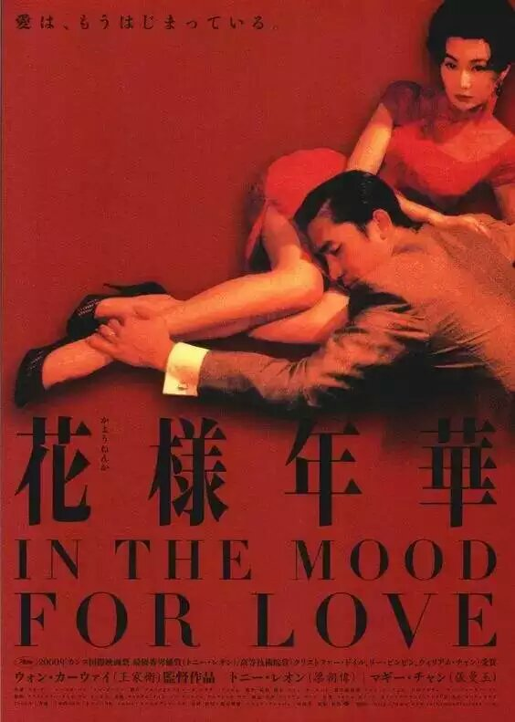

*2016-06-25 11:14 · 手机上网*

---

### 7565

美洲大陆主要有三种分法：地理上，巴拿马运河以北为北美，以南为南美；跨国公司分片区的话，美国和加拿大算北美，美国以南由墨西哥开始的所有国家算拉美；地缘政治上，以亚马逊雨林为天然屏障，以北是美国的后院，以南的「南椎体」则和美国/欧洲形成「等距离区」。

*2016-06-25 10:57 · iPhone版*

---

### 7566

今天的全球五大互联网公司（按市值排）是google,amazon,facebook, tencent,alibaba。苹果和微软只能算半互联网公司。

*2016-06-25 10:21 · iPhone版*

---

### 7567

这个标题党确实水平高。直接民主真的不太靠谱。

*2016-06-25 09:57 · 手机上网*

---

### 7568

阳光灿烂的日子。

*2016-06-24 18:21 · iPhone版*

---

### 7569

十年前在美国开的一个银行账户终于因为长久不用而被关闭了。

*2016-06-24 16:41 · 手机上网*

---

### 7570

如果我的算术没有错的话，我确实已经是个胖子了-_-!转@ 李童鞋 @王兴 BMI 多少了？大于25就是胖子

*2016-06-24 16:28 · 手机上网 转自李童鞋*

---

### 7571

@ LEMONed 好久不见:)

*2016-06-24 15:13 · 手机上网 给LEMONed的回复*

---

### 7572

真是“宁和聪明人打一架，不和糊涂蛋说句话”。

*2016-06-24 11:02 · iPhone版*

---

### 7573

觉得自己跑起来有点像胖子了:-(

*2016-06-23 17:43 · iPhone版*

---

### 7574

过去十年，基因测序的成本下降速度真是超过摩尔定律。

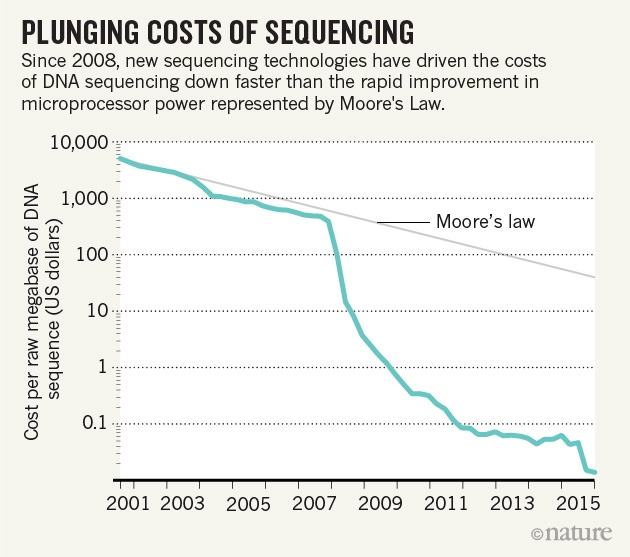

*2016-06-23 08:08 · 手机上网*

---

### 7575

真没想到饭否上也有人谈大生意。刚收到一条私信：支付牌照，7000万，1年时间获批，王总有意向的话回复。

*2016-06-21 00:12 · 手机上网*

---

### 7576

@ 拧巴人儿 夏威夷大岛上的活火山很有意思啊。

*2016-06-21 00:11 · 手机上网 给拧巴人儿的回复*

---

### 7577

打算骑刚收到的700bike折叠自行车去跟一个朋友见面。可是，我没有车锁，把车拎进酒店大堂会被认为是代驾司机吧。不管了，只要让我进就行。

*2016-06-18 15:08 · 手机上网*

---

### 7578

@ 小晚_wan 铠甲内置空调呗

*2016-06-18 15:01 · 手机上网 给小晚_wan的回复*

---

### 7579

前几天三观被冲击了一下：（作为农民后代的）我天经地义的觉得抢劫是不对的，后来听说对游牧民族来说抢劫几乎是天经地义的生存方式时，我真是愣了一下。不知是真是假，得找本书看看。

*2016-06-18 14:24 · iPhone版*

---

### 7580

说实话，最近车祸去世的外交官吴建民我之前没听说过，所以突然看到朋友圈里近乎刷屏的悼念和转发我还是蛮惊讶的。

*2016-06-18 13:39 · iPhone版*

---

### 7581

「顾客永远是对的」这个典故大概是出自一百多年前酒店业发展史上标杆性人物斯塔特勒E.M. Statler初入行时的一个故事。

*2016-06-18 12:27 · iPhone版*

---

### 7582

成、住、坏、空。

*2016-06-18 00:24 · iPhone版*

---

### 7583

转@ 倒逆河流 超大規模城市夜間光“污染”嚴重，天空雲量適度時又將光反射會地面留給觀眾來感慨…RT@ 王兴 北京的夜空为什么这么亮？

朵朵白云，历历在目。

*2016-06-18 00:13 · 手机上网 转自王兴*

---

### 7584

北京的夜空为什么这么亮？朵朵白云，历历在目。

*2016-06-17 23:54 · iPhone版*

---

### 7585

为什么IT男难找女朋友？这个梗不错:)

*2016-06-17 10:48 · 手机上网*

---

### 7586

做生意什么最难？赚钱。

*2016-06-17 10:08 · iPhone版*

---

### 7587

「并不是亚洲人都好赌（马来人就不赌），只是华人最好赌」，一个

月前世界级赌场大亨云淡风轻的一句话，我至今时不时想起。

*2016-06-17 08:02 · iPhone版*

---

### 7588

站在窗边看雨。窗外近处的雨是从右上飘往左下，五十米的雨却是从左上飘往右下，于是我就看到了交叉的雨帘，好有趣。

*2016-06-15 16:47 · iPhone版*

---

### 7589

央企还是有人才的。不跟他们好好聊聊就不会真的明白世界到底属于谁。

*2016-06-12 23:59 · iPhone版*

---

### 7590

我小时候信息渠道匮乏，所以邮票上的内容也成了信息来源之一。例如，引滦入津和齐鲁30万吨乙烯这些事儿我都是通过邮票知道的

*2016-06-12 08:21 · iPhone版*

---

### 7591

转@ Frankiiee 人生没有彩排，天天都是直播。——送给朋友圈网红，以及建议她去开个映客账户什么的。

*2016-06-12 08:21 · 手机上网 转自Frankiiee*

---

### 7592

以前真没注意到谷歌地图的地形图模式里连等高线都有。谷歌真是太专业了！

*2016-06-12 07:43 · iPhone版*

---

### 7593

龙岩市永定县的水泥厂经过二十多年的发展和整合，从高峰期的二三十家变成三家了，一家是央企华润水泥，一家是台企国产实业，一家是本地民企。

*2016-06-10 16:36 · iPhone版*

---

### 7594

听爸爸说，我们老家龙岩的一个土豪去年7月被上海大世界基尼斯（中国山寨版吉尼斯世界纪录）评为世界上去过最多地方的人。他花了12年去了217个国家外加南北极。他叫柯银河，是我初中同班同学的老爸。

*2016-06-10 16:28 · iPhone版*

---

### 7595

南美洲的第一大城市是巴西的圣保罗，这我能猜到。第二第三大城市是秘鲁的利马和哥伦比亚的波哥大，分别有八九百万人口，这我之前确实没概念。

*2016-06-10 15:45 · iPhone版*

---

### 7596

爸爸很自豪的说，到下个月，他就「为祖国健康工作五十年」了。

*2016-06-09 15:12 · iPhone版*

---

### 7597

zeitgeist: the general beliefs, ideas, and spirit of a time and

place. 这个词很棒啊，比「时代精神」有过之而无不及。

*2016-06-09 08:31 · iPhone版*

---

### 7598

真的没有神话。如果寄希望于糊里糊涂的能赢，一定会糊里糊涂或稀里哗啦的输掉。

*2016-06-08 18:59 · 手机上网*

---

### 7599

恭喜。转@ 弥城 恭喜 转@ 刘丹 Just Married

*2016-06-08 14:56 · 手机上网 转自刘丹*

---

### 7600

「亚洲」本身就是一个由西方海权国家创造出来的概念。

*2016-06-08 14:51 · iPhone版*

---

### 7601

没想到黛安芬是个德国品牌。

*2016-06-08 00:46 · iPhone版*

---

### 7602

转@ hizi 转@ 猛禽 人艰不拆 转 @ 糗百 老家村里的高中开高考动员会，校长站在讲台上说：“童鞋们，改变乃们一生的机会就要来了，乃们准备好了咩？” 底下一个孩子低声问道：“我们村要拆迁了吗？”

*2016-06-07 07:51 · 手机上网 转自糗百*

---

### 7603

转@ 美嘉.rar 在爸妈眼里，我只有「你都多大了」和「你才几岁」这两个年龄，并且这两个年龄可能会交叉出现。

*2016-06-06 11:59 · 手机上网 转自美嘉.rar*

---

### 7604

回头看，美苏冷战的胜负其实毫无悬念，我不能想象一个没有英特尔的国家能赢一个有英特尔的国家，当然，前提是双方都有大量坦克和核弹。从现在往未来看二三十年也一样，关键还是科技。

*2016-06-06 09:26 · 手机上网*

---

### 7605

转@ 拧巴人儿 哈哈哈哈哈哈 转@ 糗百 早上吃面条，因为老顾客，一般不用说，老板知道下细条面，今天不知怎么给我下了宽条面，我说没看到我啊？老板竟然说就是看到你的脸变宽了，不知不觉就下了宽条面。

*2016-06-06 08:22 · 手机上网 转自糗百*

---

### 7606

突然想到，「郑和」可以成为一个好的度假酒店品牌吗？

*2016-06-05 17:55 · iPhone版*

---

### 7607

九龙仓旗下的马哥孛罗酒店集团后来推出了个更高端的品牌，命名倒很省事，就用Marco Polo老爸的名字Niccolo Polo（传说中也是个探险家），中文叫「尼依格罗」。

*2016-06-05 17:54 · iPhone版*

---

### 7608

原来五花肉还分「三肥二瘦」和「二肥三瘦」。

*2016-06-05 16:02 · iPhone版*

---

### 7609

看了篇关于吴亦凡的封面报道，知道了粉丝经济里的几个新概念，吸粉/圈粉已是常见概念，「爬墙」和「虐饭」倒是第一次听说。

*2016-06-05 14:45 · iPhone版*

---

### 7610

和一个朋友聊天，他说：我要做成自媒体中的爱马仕。

*2016-06-05 00:06 · iPhone版*

---

### 7611

转@ gravity0 吃粽子的时候见人用剪刀剪断绳子觉得奇怪，我从来都是把绳子往旁边一拨就开了，形状可变的东西是捆不住的。想起几个登山者在巴基斯坦遇袭，恐怖分子先骗说抢劫将众人捆住然后忽然开始屠杀。唯一逃脱那人当过兵，被捆的时候绷紧肌肉，捆完后放松就逃脱了。

*2016-06-04 14:05 · 手机上网 转自gravity0*

---

### 7612

英语已经是毫无疑问的世界语言。全球大概有20亿人会英语，但实际上，以英语为母语的人只有约3.75亿。

*2016-06-04 08:00 · iPhone版*

---

### 7613

是年纪大了还是真的太累了？刚才吃晚饭时我看见那盘青菜里有一只很小很小的菜虫，一瞬间曾觉得其实不挑掉也无所谓。当然，最终还是挑掉了……

*2016-06-03 20:18 · iPhone版*

---

### 7614

转@ 东东枪 收到封邮件，附件是一jpg，说是什么payment

confirm，点击，发现页面回到了邮箱登录界面，像是邮箱自动退出了，要重新输入用户名密码登录——觉得不对，再看，刚才的邮箱页面好好的，这是一新页面，网址根本不是我那邮箱，是一个后缀名为ru的网站。太险了。差点真输入

*2016-06-03 11:21 · 手机上网 转自东东枪*

---

### 7615

不好意思，是我搞错了，原文确实不是「自直」而是「而直」。《荀子·劝学》：“蓬生麻中，不扶而直；白沙在涅，与之俱黑。” 转@ 冰淇淋炖排骨 不扶自直 和 不扶而直。自，而，「@ 王兴 蓬生麻中，不扶自直。」

*2016-06-03 11:20 · 手机上网 转自王兴*

---

### 7616

蓬生麻中，不扶自直。

*2016-06-03 09:34 · iPhone版*

---

### 7617

constructor的意思比较清楚，destructor和deconstructor的差别我一直没搞明白。

*2016-06-02 17:02 · iPhone版*

---

### 7618

写得真好！可是，是对什么事物的评价？转@ gravity0 论如何用叙事方式动情地写差评

*2016-06-02 11:47 · 手机上网 转自gravity0*

---

### 7619

从1929年经济危机开始到1939年第二次世界大战全面爆发，间隔了十年。

*2016-06-02 11:42 · iPhone版*

---

### 7620

最近觉得global view（全球视角）和martian view（火星视角）还是

有细微而重要的区别：虽然都是看整个地球，但前者是身在其中看全局，而后者是更彻底的跳出画框看画。

*2016-06-02 09:44 · iPhone版*

---

### 7621

可以啊，搜索里面有个选项是「搜索我的消息」。转@ 东东枪 是的。我也很苦恼。为什么呢呢呢 转@ Miumiu 饭否怎么不能搜索自己以前消息呢呢呢

*2016-05-31 23:34 · 手机上网 转自Miumiu*

---

### 7622

那颗灭绝恐龙的小行星已经击中地球了，只是多数恐龙还没意识到……

*2016-05-30 17:59 · iPhone版*

---

### 7623

我以前挺烦别人在英文文章里动不动就飙一句拉丁文（主要是因为我看不懂），后来我意识到在中文文章里用类似「草蛇灰线」、「群蚁排衙」这种比较生僻的成语其实性质也类似。

*2016-05-30 17:38 · 手机上网*

---

### 7624

现有的VR技术（例如HTC的vive）就已经可以支持做一个体验超赞的地球仪了。不过VR眼镜脱戴起来还是有一点点麻烦。

*2016-05-30 17:27 · 手机上网*

---

### 7625

地球仪由于有根轴，转动还是受限，不像iPad上那样可以各种维度的旋转和缩放。当然，有少数派报告里那种悬空全息显示加手势操作会更棒。转@ imugia 需要啊，地球仪可以有效解决不同纬度的尺度问题……（最主要是可以用手转着玩 转@ 王兴 想到一个问题：有了google earth

*2016-05-30 14:25 · 手机上网 转自王兴*

---

### 7626

想到一个问题：有了google earth和方便交互的电子设备（例如iPadPro），还需要买地球仪吗？

*2016-05-30 13:56 · iPhone版*

---

### 7627

37%指的不是并非生在伦敦，而是并非生在英国。这就是「帝都」和真正「国际大都市」的区别。转@ webto 北京常住外来人口比例也差不多 http://t.cn/R5yydOx RT@ 王兴 37%的伦敦人并非出生在英国（十年前这个数字是27%），36%的纽约人并非出生在美国。

*2016-05-30 08:39 · 手机上网 转自王兴*

---

### 7628

37%的伦敦人并非出生在英国（十年前这个数字是27%），36%的纽约人并非出生在美国。这是公认的全世界前两名的大都市。

*2016-05-29 23:40 · iPhone版*

---

### 7629

再三考虑之后，我觉得good这个词可以去掉。转@ 王兴 Never

waste a good recession. -Moritz

*2016-05-29 08:41 · 网页 转自王兴*

---

### 7630

唇亡齿寒。

*2016-05-28 20:30 · iPhone版*

---

### 7631

@ 宝宝vs坦克 三围不是通常指胸围、腰围、臀围吗？

*2016-05-27 23:47 · 手机上网 给宝宝vs坦克的回复*

---

### 7632

「污」这个词怎么突然就流行起来了。

*2016-05-27 16:20 · iPhone版*

---

### 7633

吕宋岛的英文是Luzon，菲律宾首都马尼拉就在这个岛上。常见的那种俄国红菜汤是罗宋汤，罗宋就是发源地Russian的音译。转@ 大魚吃小魚 吕宋不是个汤吗？它还是个岛？转@ 王兴 像我这样对东南亚一知半解的人很容易搞混两个其实并无关联的概念：棉兰和棉兰老岛。

*2016-05-27 15:17 · 网页 转自王兴*

---

### 7634

@ webto 问题是我现在啥也想不起来，只记得在飞机上应该是看过一部片。

*2016-05-27 15:14 · 网页 给webto的回复*

---

### 7635

一直想不起前几天在飞机看的另一部电影是什么，这令我有点懊恼。

*2016-05-27 14:49 · iPhone版*

---

### 7636

像我这样对东南亚一知半解的人很容易搞混两个其实并无关联的概念：棉兰和棉兰老岛。前者是medan city，是印尼苏门答腊岛上北苏门答腊省的首府；后者是mindanao island，是菲律宾南部的一个大岛，亦是菲律宾的第二大岛，仅次于吕宋岛。

*2016-05-27 14:13 · 网页*

---

### 7637

转@ Frankiiee 大爪哇的摆拍艺术家又立功了。 转@ 弥勒儿 转@ 哲郎 贝萌斯坦 @ glimho 印度尼西亚一名野生动物摄影师在朋友家的花园里发现了“色情”的一幕：两只青蛙在石头上忘情地交配，而一只蜥蜴则好奇地守在一旁静静观看

*2016-05-27 13:40 · 手机上网 转自哲郎*

---

### 7638

转@ gravity0 高胖说刘邦只比秦始皇小一岁，喂鸡说差三岁。项羽差刘邦二十四岁，真是图样图森破，看不清各方利益格局情有可原。

*2016-05-27 13:37 · 手机上网 转自gravity0*

---

### 7639

made my day!

*2016-05-26 23:33 · 手机上网*

---

### 7640

那估计确实是偏见了。不要看后来乱七八糟的《xx厚黑学》，要看思想家、教育家、革命家（百度百科里的介绍）李宗吾先生发表于1912年的《厚黑学》原著。转@ 春林同学 对这本书一直存在偏见，觉得自己也需要看看。转@ 王兴 过去这些年，随着阅历增长，我越来越钦佩李宗吾先生。他在《厚黑学》一书

*2016-05-26 22:13 · 手机上网 转自王兴*

---

### 7641

过去这些年，随着阅历增长，我越来越钦佩李宗吾先生。他在《厚黑学》一书里总结的办事二妙法「锯箭法」和「补锅法」在生活和工作中真是随处可见。确实是太阳底下无新事。

*2016-05-26 22:03 · iPhone版*

---

### 7642

转@ 冰淇淋炖排骨 福建漳州港到辽宁锦州港 35天 大二实习 转@ 王兴 搞一艘船从南到北游历一下中国的海岸线应该蛮好玩的。

*2016-05-26 13:35 · 网页 转自王兴*

---

### 7643

刚知道日本有一所大学叫“拓殖大学” Takushoku University，其前身是1900年创立的“台湾协会学校”（1895年日本在甲午战争／马关条约后占领台湾），原本是为了培养开拓殖民地台湾的人才而成立。在二战结束之前，拓殖大学一度是仅次于东京大学的日本第二好大学。

*2016-05-26 13:34 · 网页*

---

### 7644

@ webto 我前几天刚知道mixi的创始人之一竟然是个印尼华人，生在棉兰，后来才去日本，再后来从mixi功成身退之后和中学同学一起做了东南亚最成功的vc之一 East Ventures。

*2016-05-26 01:36 · 手机上网 给webto的回复*

---

### 7645

换位思考。

*2016-05-24 16:21 · iPhone版*

---

### 7646

把《The Hateful Eight》最后几十分钟补看完了。这回略微有点低于我的预期。另外有点小懊悔的是，飞机上那种小屏幕的画质太差了，而这种片又不适合看第二遍。

*2016-05-22 14:46 · iPhone版*

---

### 7647

飞机上看了大半部的电影《The Hateful Eight》。昆汀真是从不让我失望。我迫切的想找机会把剩下的那部分看完。

*2016-05-22 01:24 · iPhone版*

---

### 7648

看了一下蔡英文宣誓就职的短视频，宣誓完还有（由立法院）授印玺的环节，而且一下子授三个，而且每个都很大个，真好玩。

*2016-05-21 09:12 · iPhone版*

---

### 7649

按照维基百科的说法，在印尼（二战后）独立前，华人是棉兰这个城市最大的族群（现在是爪哇人了）。到2000年，仍有10.65%是华裔。

*2016-05-20 22:36 · iPhone版*

---

### 7650

棉兰是北苏门答腊的首府，目前是印尼第三（或第四）大城市，也是爪哇岛外最大的城市。看了一下google earth，棉兰比新加坡还更靠北，和马来西亚的槟城penang隔着马六甲海峡南北相望，应该是当年华侨去得最多的几个地方之二吧。

*2016-05-20 22:14 · iPhone版*

---

### 7651

今天爸爸帮我问了他的姑姑，终于搞明白了我长久以来想知道的一件事：他的爷爷，也就是我的曾祖父，九十年前下南洋时去的城市是印尼的棉兰medan。这个城市得名于穆斯林圣城之一麦地那medina的变体。

*2016-05-20 21:52 · iPhone版*

---

### 7652

open-minded这词我很熟悉，open-hearted倒是第一次见。

*2016-05-19 17:35 · iPhone版*

---

### 7653

和一个在过去一年里既投了我在中国的roommate又投了我在美国的roommate的vc聊天ing。

*2016-05-18 23:05 · iPhone版*

---

### 7654

和一个投过烤红薯项目的VC在聊ing…

*2016-05-18 16:51 · iPhone版*

---

### 7655

转：没有应该，只有因为。

*2016-05-18 01:08 · iPhone版*

---

### 7656

转@ gravity0 若非曽左李胡，文革早一百年前发生了。占人口多数的输家要求洗牌重来要求坐庄要求改规则，而游戏规则写在文化里，赢不了就仗着人多砸烂它。这样的事古今中外史不绝书，多少文明被毁灭。每个经历过的人都觉得自己这次很特别，正如每个人都觉得自己很特别。

*2016-05-16 21:09 · 手机上网 转自gravity0*

---

### 7657

转@ 拧巴人儿 原来朝鲜人还跟东德抗议过修建柏林墙，但原因很清奇—一堵墙怎么能挡得住帝国主义！把柏林打下来才是正解啊！

*2016-05-14 17:35 · 手机上网 转自拧巴人儿*

---

### 7658

这家公司的业务太霸气了！总部设在英国的德纳罗公司的主营业务之一是帮很多国家印钞票！

*2016-05-14 17:10 · iPhone版*

---

### 7659

搞一艘船从南到北游历一下中国的海岸线应该蛮好玩的。

*2016-05-14 16:30 · iPhone版*

---

### 7660

@ 矛盾wen philz我觉得不错，给我的印象比blue bottle更好。

*2016-05-14 14:15 · 手机上网 给矛盾wen的回复*

---

### 7661

我算不上一个对各种数字都敏感的人。至少，我现在一下子想不出什么样的三围数字代表性感美女的身材。

*2016-05-14 00:44 · iPhone版*

---

### 7662

我的微信朋友里越来越多人的名字结尾加上了「此号已满，请加xxx」

-_-!

*2016-05-14 00:21 · iPhone版*

---

### 7663

刚才闭目养神胡思乱想时，突然想，如果让李白写一首《题伊瓜苏瀑布》会写成啥样。

*2016-05-13 17:50 · 手机上网*

---

### 7664

太穿越了…… 转@ 杨曜睿 刚刚接到一个声音怯怯、温柔的姑娘电话，问我是不是校内网的。说是北航登山队的，希望合作。然后我告诉她现在已经不叫校内网了，叫人人网，请她联系人人网。放下电话，惊讶之余，有种时空穿梭的感觉。现在大学生都不知道校内网是什么了，却能搜到我十年前发过的帖子。

*2016-05-13 17:18 · 手机上网 转自杨曜睿*

---

### 7665

二战中苏联真是惨烈啊。转：受创最深的是1923年出生的苏联男性。

1941年，他们满18周岁，正赶上参军的年龄，四年打下来，他们80％没有活到胜利的那一天。

*2016-05-13 00:24 · iPhone版*

---

### 7666

两大瑞士银行之一瑞信的现任CEO是黑人。为什么我会惊讶呢...

*2016-05-12 23:31 · iPhone版*

---

### 7667

我的饭否9周年关键词。从这些词来看，我真的是一个科技青年。

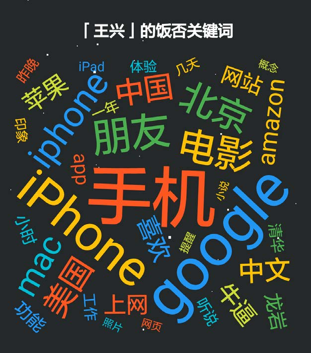

*2016-05-12 18:52 · 手机上网*

---

### 7668

望京及周边确实越来越旺，北五环外面那片新楼中已经有一栋挂上了「默沙东」的大牌子。

*2016-05-12 15:04 · iPhone版*

---

### 7669

车在北五环上开过奥森时，阳光明媚得让我不禁想象20年后奥森的树都长大了会是怎样一种郁郁葱葱。

*2016-05-12 15:01 · iPhone版*

---

### 7670

我喜欢雨，尤其是晚上下雨那种「小楼一夜听春雨」的感觉和第二天

雨过天晴那种明媚。

*2016-05-12 14:56 · iPhone版*

---

### 7671

饭否9岁了:)

*2016-05-12 03:38 · iPhone版*

---

### 7672

一个会从6pm开到现在，总算有点阶段性进展。

*2016-05-12 03:36 · iPhone版*

---

### 7673

@ 二少爷 任勇是我有幸接触过的顶级老师。我很感谢他。

*2016-05-11 15:47 · 手机上网 给二少爷的回复*

---

### 7674

@ 二少爷 是。

*2016-05-11 15:13 · 手机上网 给二少爷的回复*

---

### 7675

Finance is a gun. Politics is knowing when to pull the trigger. 金融是一把枪。政治是知道什么时候扣动扳机。——马里奥·普佐《教父3》

*2016-05-10 19:20 · iPhone版*

---

### 7676

「一骑红尘妃子笑，无人知是荔枝来」这两句唐诗我早就知道，但确实没想过杨贵妃吃的荔枝到底产自哪里，直到看到有人在辩论到底有没有全球变暖时指出杨贵妃吃的荔枝产自重庆涪陵至陕西西南一带。

*2016-05-10 18:39 · iPhone版*

---

### 7677

转@ 徒有实名 我还真的去搜了一下鹅掌楸树叶的空气动力特性，一般说来，树叶带分叉可帮助减震，比较容易长成高大的乔木。高手→_→@ 弥勒儿 鹅掌楸「@ 王兴 纯属多管闲事，但我不知道为什么就觉得这叶子末尾开叉队角度不够自然。」

*2016-05-09 14:37 · 手机上网 转自王兴*

---

### 7678

不同国家关注点不同，这树在中国是因叶子形状而得名，在英语里却是因为它的花像郁金香而得名Chinese tulip tree. 转@ 王兴 涨知识！「马褂木」这名字好。转@ 太空小孩 鹅掌楸，非常珍贵的树种。叶子末尾的开叉长得像马褂的下摆，叶子两侧像袖子，所以也被叫「马褂木」

*2016-05-09 13:46 · 手机上网 转自王兴*

---

### 7679

涨知识！「马褂木」这名字好。转@ 太空小孩 鹅掌楸，非常珍贵的树种。叶子末尾的开叉长得像马褂的下摆，叶子两侧像袖子，所以也被叫「马褂木」。这么去想象，还是有点意思的。转@ 王兴 纯属多管闲事，但我不知道为什么就觉得这叶子末尾开叉队角度不够自然。

*2016-05-09 12:43 · 手机上网 转自王兴*

---

### 7680

纯属多管闲事，但我不知道为什么就觉得这叶子末尾开叉队角度不够自然。

*2016-05-09 12:24 · 猫饭*

---

### 7681

我知道雅戈尔早就不仅是做衬衫，而是家大业大，但是当我听说有个「雅戈尔动物园」时还是惊了一下。

*2016-05-09 02:23 · iPhone版*

---

### 7682

说来也巧，两个月前我在乌兹别克斯坦首都塔什干转过机。同行的一个哥们提醒我看机场保安人员的迷彩服，说那是全套美式装备，原因是十几年前美国借口打阿富汗需要中亚的空军基地而渗透拉拢了乌兹别克斯坦。

*2016-05-09 01:55 · iPhone版*

---

### 7683

这期《中国国家地理》开篇就讲海洋和海岸线的重要性，其中有个有趣的知识点：全世界约两百个国家中有44个是内陆国，其中有两个（乌兹别克斯坦和列支敦士登）是双重内陆国，也就是说，他们的所有邻国也都是内陆国。

*2016-05-09 01:50 · iPhone版*

---

### 7684

说到永福这个地方，我还听说，因为永福海拔较高，纬度又和阿里山差不多，而且也产茶，所以永福的茶叶被一些台商弄到台湾去冒充阿里山冻顶乌龙。

*2016-05-09 01:36 · iPhone版*

---

### 7685

深夜落地，在飞机上照例又读了一本《中国国家地理》。这期的封面是樱花茶园，居然取景于我的家乡福建龙岩。那个具体地点（漳平县永福镇）我并没去过，但我只有几岁时就听说永福是花乡了。

*2016-05-09 01:25 · iPhone版*

---

### 7686

看了一下新发布的2016版泰晤士全球大学排名前一百：美国43所，英国10，德国6，中国大陆、日本、法国各5，俄罗斯、加拿大、澳大利亚、香港、荷兰各3，新加坡、韩国、瑞典、瑞士各2，比利时、台湾、巴西各1。

*2016-05-07 13:58 · iPhone版*

---

### 7687

要想把在不同国家地区不同时期什么是左什么是右搞清楚，估计得有一整本书了。

*2016-05-07 12:57 · iPhone版*

---

### 7688

在MacBook里看到dock上出现来自iPhone上的Chrome的图标。试了几把，没有完全搞明白怎么回事:-(

*2016-05-07 12:40 · 网页*

---

### 7689

1979年1月1日中美正式建交，1月29日至2月5日邓访美，2月17日至3月16日发动9个军29个师之规模的对越反击战并取得胜利，3月28日邓主动邀请时任港督麦理浩访京，首次向英国政府表明了中国政府对收回香港的决心……

*2016-05-07 09:52 · iPhone版*

---

### 7690

根本就不存在“社会”这种东西。——1987年 by 撒切尔夫人。刚读了几则小故事，更理解她为什么被称为铁娘子了。确实是有担当的政治家！「做正确的事，而非容易的事」的典范！

*2016-05-06 19:29 · iPhone版*

---

### 7691

转@ gravity0 举个经验归纳和原理挖掘的栗子：猪从懂事开始主人每天来喂食，经验归纳他是个好人永远会来喂食不会伤害我。一天两天猜对了，甚至一百天都猜对了，直到有一天... 原理挖掘就是去思考他为啥对我这么好。然而没行动力怎么想都没用，前面那个想法或许还能活得舒坦些。

*2016-05-06 19:18 · 手机上网 转自gravity0*

---

### 7692

当一个伦敦人跟我说伦敦的监控摄像头的数量是欧洲其他几大城市之和时（因为伦敦当年要应对爱尔兰共和军的恐怖活动威胁），我呵呵一笑。

*2016-05-06 19:15 · iPhone版*

---

### 7693

看到一个对《美国队长3》的影评：中国大侠定律：因祸得神物，喜逢

老师父。美国英雄定律：屌丝靠变异，土豪高科技。

*2016-05-06 18:44 · iPhone版*

---

### 7694

好有趣！转@ severusn.V 转@ 美嘉.rar 性感吧？反过来看看。

*2016-05-06 18:37 · 手机上网 转自美嘉.rar*

---

### 7695

据说，美国大选在华尔街日报里属于国际新闻。

*2016-05-06 01:29 · iPhone版*

---

### 7696

-_-！转@ 香糖 三任老婆，好多侍妾。老婆寿数不如他，野史中有记载妻子早亡与他索♂取过度有关。备课时偶然看到，出处找不着了。

「@ 王兴 辛弃疾的多数（出名的）词都太家国情怀了，我反而对他的儿女情长产生兴趣。」

*2016-05-06 01:09 · 手机上网 转自王兴*

---

### 7697

而我，居住在人口密度约每平方公里1万人的北京五环内，也就是说，我只需要分摊100平方米的活动范围。真好养。转@ 王兴 东北虎生活在猎物最稀少的地区，所需要的活动范围也最大，雌虎需要400平方公里，雄虎需要1000平方公里。印度孟加拉虎雌虎的活动范围仅为10平方公里，雄虎仅为30平方

*2016-05-06 00:49 · 手机上网 转自王兴*

---

### 7698

还有续作《1434: The Year a Magnificent Chinese Fleet Sailed toItaly and Ignited the Renaissance》！ 转@ 大衛寶兒 @ 王兴

http://t.cn/RqRwIeO

*2016-05-06 00:42 · 手机上网 转自大衛寶兒*

---

### 7699

多谢！服了！我买过《1491》和《1493》（哥伦布发现美洲是1492年），现在又来了Gavin Menzies的《1421: The Year ChinaDiscovered the World》。转@ 大衛寶兒 @ 王兴http://t.cn/RqRwIeO

*2016-05-06 00:41 · 手机上网 转自大衛寶兒*

---

### 7700

辛弃疾的多数（出名的）词都太家国情怀了，我反而对他的儿女情长产生兴趣。

*2016-05-06 00:36 · iPhone版*

---

### 7701

维基百科上说，郑和从泉州驶往东非的海上航线早在汉朝就开拓出来了。以我玩《文明》所获取的知识来判断，这还是很惊人的。有人能推荐一本关于郑和的靠谱的书吗？

*2016-05-06 00:31 · iPhone版*

---

### 7702

八道菜的法餐和八道菜的中餐的逼格完全不可同日而语。

*2016-05-06 00:18 · iPhone版*

---

### 7703

@ 80块两条的rs_m 那是元曲。

*2016-05-05 23:36 · 手机上网 给80块两条的rs_m的回复*

---

### 7704

奇怪，为什么我最近想起的宋词都是辛弃疾的。

*2016-05-05 23:15 · iPhone版*

---

### 7705

东北虎生活在猎物最稀少的地区，所需要的活动范围也最大，雌虎需要400平方公里，雄虎需要1000平方公里。印度孟加拉虎雌虎的活动范围仅为10平方公里，雄虎仅为30平方公里。华南虎的活动范围大于孟加拉虎而小于东北虎，保守地估计为100平方公里。

*2016-05-05 22:17 · iPhone版*

---

### 7706

转：2014年，刚刚成为世界最大贸易国的中国，历史上首次进入资本净输出时代。

*2016-05-05 20:47 · iPhone版*

---

### 7707

之前遇到过一个投资人叫nimay，刚才看到一个基金叫nima capital。

*2016-05-05 18:26 · 网页*

---

### 7708

在某微信群里学到「化性起伪」这么有文化的成语。

*2016-05-05 16:13 · 网页*

---

### 7709

@ 拧巴人儿 英英，安卓手机merriam webster官方app免费版。简直令人发指！不，令人发中指！

*2016-05-05 02:28 · 手机上网 给拧巴人儿的回复*

---

### 7710

拜托，宾大好歹造出过世界上第一台计算机ENIAC。不过，说实话，我对宾大并不了解…… 转@ 阳光灿烂喵 难道不是因为penn其他都太弱吗。。。。转@ 王兴 沃顿商学院的特别之处是，在我知道的商学院里，她是最以商学院本身名字（沃顿）而非所属大学名字（宾大）著称的。

*2016-05-05 02:27 · 手机上网 转自王兴*

---

### 7711

我曾经那么信任merriam webster，愿意在手机上忍受他们家app那么烂的体验只是因为相信他们家的释义比较靠谱。可是，刚刚我发现stele这个词他们居然没有「石碑」这个很可能更常用的释义而只有「中柱」这个莫名其妙的植物学专业释义！小崩溃了一会儿。

*2016-05-05 02:25 · iPhone版*

---

### 7712

@ 小熊娃娃 那个城市的英文名是surabaya。当年郑和到过。

*2016-05-05 01:59 · 手机上网 给小熊娃娃的回复*

---

### 7713

street smart这概念我早就知道，但直到刚刚才知道它的反义词是book smart。

*2016-05-05 01:57 · 手机上网*

---

### 7714

Cass? 我最近还真认识了一个那里的毕业生。不过我确实不知道cass属于city university london. 转@ 呆瓜小贼 还有一个，伦敦城市大学的卡斯商学院 转@ 王兴 沃顿商学院的特别之处是，在我知道的商学院里，她是最以商学院本身名字（沃顿）而非所属大学名字（宾大）

*2016-05-05 01:50 · 手机上网 转自王兴*

---

### 7715

马来西亚首都吉隆坡（就是有经常在电影里出现的双子塔的那个城市）只有150万人口，印尼首都雅加达（我不知道有什么地标）则有超过1000万人口！

*2016-05-05 01:39 · iPhone版*

---

### 7716

@ 拧巴人儿 别又想当然了。光面积大并不说明问题。印尼58%的人口聚集在爪哇岛上，而爪哇只是印尼面积第五大的岛。

*2016-05-05 01:33 · 手机上网 给拧巴人儿的回复*

---

### 7717

真是不能想当然！以前模模糊糊觉得印度尼西亚和马来西亚可能差不太多，结果一查维基百科，印尼的人口差不多是马来西亚的十倍（2.6亿 vs 2833万）！

*2016-05-05 01:28 · iPhone版*

---

### 7718

沃顿商学院的特别之处是，在我知道的商学院里，她是最以商学院本身名字（沃顿）而非所属大学名字（宾大）著称的。

*2016-05-05 01:09 · iPhone版*

---

### 7719

妈蛋，居然立夏了。

*2016-05-05 01:04 · iPhone版*

---

### 7720

「泗水」居然是个印尼爪哇岛上的城市名-_-!

*2016-05-05 01:00 · iPhone版*

---

### 7721

中文里的（眼角）鱼尾纹在英文里叫crow's feet（乌鸦脚）。还是咱们的说法好听一些。

*2016-05-03 14:50 · iPhone版*

---

### 7722

《life is beautiful》取代《天堂电影院》成为我心目中意大利电影的代表了。

*2016-05-02 23:03 · iPhone版*

---

### 7723

原来马丁路德在发起新教改革的同时顺带开创了神职人员结婚的先河;)

*2016-04-30 13:41 · iPhone版*

---

### 7724

我以前没有意识到，雅加达是个南半球的城市，南纬6度。

*2016-04-30 12:57 · iPhone版*

---

### 7725

美国和德国分别是全世界第一第二大接收移民的国家。国力强盛和接收移民至少在一定程度上是互为因果吧。

*2016-04-28 16:43 · iPhone版*

---

### 7726

发现自己把酒店的护发素错当成润肤露抹了好几天之后，我觉得身心都受到了严重创伤-_-!

*2016-04-27 21:14 · iPhone版*

---

### 7727

实践再一次证明，《茉莉花》可能是外国演奏者最熟悉的中国音乐。

*2016-04-27 01:59 · iPhone版*

---

### 7728

「这不是我想要的生活」这九个字真是一个通杀一切、无可辩驳的理由。

*2016-04-26 16:14 · iPhone版*

---

### 7729

@ 别问他是谁 多谢提供信息协助我们打击刷单和欺诈！

*2016-04-26 15:51 · 手机上网 给别问他是谁的回复*

---

### 7730

@ 懒.老黄 多谢提供信息协助我们打击刷单和欺诈！

*2016-04-26 15:51 · 手机上网 给懒.老黄的回复*

---

### 7731

二战前夕希特勒从捷克抢走的那块地到底叫「苏德台」还是「苏台德」？我记得的是苏台德，网上搜了一下，维基百科和百度百科都有苏台德的词条。可是，明明德语叫Sudetenland，捷克语叫Sudety，译成中文应该是苏德台更顺理成章啊。

*2016-04-25 23:48 · iPhone版*

---

### 7732

老爸说龙岩有个煤矿，前年价值三亿，去年价值一亿五，上个月被拍卖，只卖了一万多人民币。原因是每天要花大量电费不停的抽水才能保证这个煤矿不被地下水淹没。煤价一下跌，这个煤矿就是亏钱的资产了。

*2016-04-25 13:42 · iPhone版*

---

### 7733

转@ 慧淫禅师 科学家法号： 天雷真君富兰克林，电炽恶魂爱迪生，磁暴魔王特斯拉，屏蔽尊者法拉第， 万法归一麦克斯韦，不准道人海森堡，虐猫狂人薛定谔，波粒双形爱因斯坦，定量贤者普朗克，核链法师费米，数理恶魔拉格朗日，函数尊者欧拉，时空跃迁笛卡尔，元力上人牛顿，量子波形德布罗意。。

*2016-04-24 16:18 · 手机上网 转自慧淫禅师*

---

### 7734

转@ gravity0 其实很好记，一加仑合四夸脱，合八品脱，合十六杯。

容量单位二分法是很自然的。上下粗细相同的容器无论是圆筒还是方盒，慢慢倾倒，当看到底的时候正好倒掉一半。

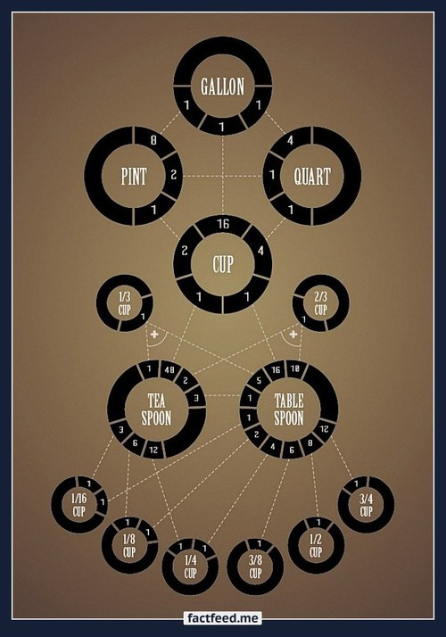

*2016-04-24 16:06 · 手机上网 转自gravity0*

---

### 7735

多谢指正！转@ peter 南乡子转@ 王兴 辛弃疾大概是因为在镇江做过官的缘故，似乎很喜欢北固亭这个地方。除了那首以「尚能饭否」

结尾的《永遇乐·京口北固亭怀古》，他还写了这首同样出名的《南算子·登京口北固亭有怀》：何处望神州？满眼风光北固楼。千古兴亡多少事？悠悠，不尽长江滚滚流！

*2016-04-24 14:11 · 手机上网 转自王兴*

---

### 7736

辛弃疾大概是因为在镇江做过官的缘故，似乎很喜欢北固亭这个地方。除了那首以「尚能饭否」结尾的《永遇乐·京口北固亭怀古》，他还写了这首同样出名的《南算子·登京口北固亭有怀》：何处望神州？

满眼风光北固楼。千古兴亡多少事？悠悠，不尽长江滚滚流！年少万兜鍪，坐断东南战未休。天下英雄谁敌手？

*2016-04-24 08:53 · iPhone版*

---

### 7737

和deepmind的cofounder聊了一下。这帮家伙确实思考的东西尺度很大。

*2016-04-23 19:01 · 手机上网*

---

### 7738

听说世界上单张价值最高的纸币是新加坡的面值一万新币的钞票（大概相当于五万人民币）。新加坡发行这种钞票是为了满足一种特殊的需求：新加坡周边那些国家（马来西亚，印尼，等等）太腐败太动荡，所以那些地方的富商（尤其是政治上受到压迫的华商）赚到一点钱就想跑到新加坡来存。

*2016-04-23 11:45 · 手机上网*

---

### 7739

愿闻其详。转@ 拧巴人儿 今天有个生员谈到孔子对interracialrelationship和same gender sex的看法，我简直差点儿从椅子上滚下来。孔子还对这发表过看法？！

*2016-04-21 16:14 · 手机上网 转自拧巴人儿*

---

### 7740

转@ 拧巴人儿 嚯！ 转@ Sttequila 84的舅爷从四川飞来看自己86岁的老姐姐，太令人羡慕了。来了天津早上还带我妈去公园，老妈感叹奔60的年纪有妈妈给买巧克力，有舅舅带着玩真幸福。爸爸表示太羡慕。

*2016-04-21 10:02 · 手机上网 转自Sttequila*

---

### 7741

和传统产业的人打交道确实让人生更完整。平生第一次和一个彻头彻尾的骗子坐下来一本正经的交谈。前几分钟我就觉得不太对，吹吹中医和雾霾治理也就罢了，当他扯到「德国很尊重中国传统文化，每家每户的小孩都对《弟子规》倒背如流」时，我差点掀桌走人。

*2016-04-21 09:58 · iPhone版*

---

### 7742

实用的。我小时候经常这么操作。不过泡热水涨回来之后还是在表面会留下略微凹凸的疤痕。转@ 拧巴人儿 其实乒乓球被踩的情况下大都是被踩破了吧。泡热水这方法也就是说说……并不实用……

*2016-04-19 12:58 · 手机上网 转自拧巴人儿*

---

### 7743

三年又三年，三年又三年。再过不到一个月，饭否就九岁了 。转@doubleaf 饭否还在，我的上一条消息已是发布于三年之前的了

*2016-04-18 22:38 · 手机上网 转自doubleaf*

---

### 7744

酒足饭饱，回公司开会。

*2016-04-18 22:31 · iPhone版*

---

### 7745

我想起来我上个月背过一首唐诗，却怎么也背不出来。上了年纪就是这么无奈:(

*2016-04-18 01:28 · iPhone版*

---

### 7746

最近朋友圈里很多人转任正非老先生独自一人在机场等的士的照片。

今天一个朋友（前华为高管）跟我讲了背后的故事。果然和外界大众（包括我）理解的很不一样。

*2016-04-17 23:27 · 手机上网*

---

### 7747

在iPad只有2%电量的时候选择升级固件确实是个冒险的举动。虽然全程插着充电线，但是升级完一启动，只剩1%电量了。好险:)

*2016-04-15 21:46 · iPhone版*

---

### 7748

Books are never finished. They are merely abandoned. 虽然我没写过书，但我觉得我完全能理解。

*2016-04-15 21:34 · iPhone版*

---

### 7749

牛逼！此产品非互联网产品。转@ 张亮 好产品垄断人群和主题。今天看到让我觉得最有趣的一个结论是：因为 Frozen 的成功，美国这两年冬天很多原来摆圣诞老人的地方都改成摆两名公主了... Frozen＝冬天，真是牛逼

*2016-04-15 19:11 · 手机上网 转自张亮*

---

### 7750

转@ 太空小孩 ㊗转@ 猫弟 转@ 猫饭iPhonehttp://t.cn/RqJTMoR # 现已上架 ## 猫饭 #是一款饭否 iPhone 客户端。复刻经典饭否蓝，支持在饭否上传视频转制的 GIF 动图，在个人页展示饭否背景图，分享消息截图到微信等有趣功能。

*2016-04-13 20:27 · 猫饭 转自猫饭iPhone*

---

### 7751

刚到下午三点，今天已经喝掉两杯咖啡加两个立顿茶包……

*2016-04-11 15:00 · iPhone版*

---

### 7752

我这么多年来第一次主动打开搜狗的网站，原因是，我在微信公众号里看到一篇不错的长文，想转移到电脑大屏幕上阅读，用百度搜标题关键字搜不到那篇文章，换成搜狗果然一下子就找到了。搜狗和微信的合作还是有优势的。

*2016-04-10 19:47 · 网页*

---

### 7753

yahoo邮箱终于增加了「归档」功能，比gmail晚了十年多。

*2016-04-10 15:33 · 网页*

---

### 7754

...without caring twopence how often it has been told before)you will, nine times out of ten, become original without everhaving noticed i

*2016-04-10 01:01 · iPhone版*

---

### 7755

Even in literature and art, no man who bothers about originalitywill ever be original: whereas if you simply try to tell the truth(without

*2016-04-10 01:00 · iPhone版*

---

### 7756

真没想到，上海中山公园西北角的小树林那片居然有性工作者开展服务。我正一边散步一边思考，结果一个胖大姐凑过来问：玩吗？我愣了一下：玩什么？大姐说：小树林后面，可以摸……

*2016-04-09 18:33 · 网页*

---

### 7757

转@ 非處方藥之咖啡因 加班时，保洁阿姨问了我一句话：「你这么辛苦加班，钱赚得完么？」好多年前，父母也用同样的话问过我。在他们看来，上班就是攒工分，多劳多得。在我看来，工作就是喝一杯沸腾的龙舌兰，然后骑在一头红了眼的野牛上，竭尽全力以便不被行业过早甩下来踩成烂泥，而已。

*2016-04-09 15:04 · 网页 转自非處方藥之咖啡因*

---

### 7758

@ 大哥的女人 没有中文完整报道，只是英文某个网页里的一句我自己译了过来。

*2016-04-07 17:43 · 手机上网 给大哥的女人的回复*

---

### 7759

读到一篇报道：穿梭于几大洋上的五万艘货轮承载了每年18.5万亿美元的世界贸易中的90%。

*2016-04-06 17:55 · 网页*

---

### 7760

一个跑去美国开发楼盘的中国地产商说，他跑过美国许多城市，加州的圣塔芭芭拉是他觉得最好的地方。我起初不以为意，心想美国好地方多了去了，后来打开谷歌地球一看，圣塔芭芭拉还真是美国东西岸几千公里海岸线上最符合中国风水的地方，背山面海，适合坐北朝南。

*2016-04-05 19:17 · iPhone版*

---

### 7761

从2005年到2013年末，在美国民航业，大型航空公司的疯狂并购使得美国九大航空公司减少为四大航空公司：美国航空、达美航空、西南航空和美联航。

*2016-04-05 15:12 · iPhone版*

---

### 7762

一个十几年前运作过中国公司赴美上市的前辈说，那时华尔街对中国当然懂一些，但美国大众连中国在哪儿都没概念。他们只好如此解释：您知道越南吗？太好了，（因为多年越战）您大概知道。中国就是越南北边一点的那个国家……

*2016-04-05 14:05 · iPhone版*

---

### 7763

看到一段话「对美国人来说，全世界只有两个国家，美国和外国…」，这里把美国换成中国也完全成立啊！小国的国民反而会有不一样的世界观。

*2016-04-04 16:59 · iPhone版*

---

### 7764

中国真是个缺乏大湖的国家。青海湖就算大的了，但在世界上根本排不上号。

*2016-04-03 20:00 · iPhone版*

---

### 7765

全球化这波大致完成后，物理世界里的商业扩张真的就只能指望太空移民了。

*2016-04-03 14:43 · iPhone版*

---

### 7766

春风、秋风、冬风这仨词都还比较常见，唯独夏风几乎不用。光就只有「春光」了。

*2016-04-03 14:12 · iPhone版*

---

### 7767

问道于盲，与虎谋皮。

*2016-04-03 13:54 · iPhone版*

---

### 7768

今天北京这天，简直好得可以促进敞篷车销量了。

*2016-04-03 13:51 · iPhone版*

---

### 7769

越来越理解王尔德说的「只有肤浅的人才不以貌取人」。王尔德确实聪明刻薄到讨打的地步。

*2016-04-03 13:14 · iPhone版*

---

### 7770

made my day! 转@ 拧巴人儿 哈哈哈哈哈哈哈 转@ 麦吉泡泡飘儿哈哈哈哈哈「@ 大坝叔叔 蛤蛤蛤，只能去知乎上找了。」

*2016-04-03 11:32 · 手机上网 转自大坝叔叔*

---

### 7771

开朋友的宝马mini，感觉车内空间比外面看起来的大不少，但是悬挂很硬，避震巨差。

*2016-04-03 11:27 · iPhone版*

---

### 7772

转@ hellokeikei 哈哈哈「@ 只身打马过草原 然后第二天看到他趴在地上———屏幕碎了「@ 小春花 “睡觉之前把手机调成飞行模式，然后对它说，我玩了你一天啦，夜里你自个儿飞出去玩吧”」」

*2016-04-03 09:19 · 手机上网 转自小春花*

---

### 7773

发现某大佬常用此类诡辩逻辑：你说我们是垄断？我们当然不是！垄断那是工业时代的思维方式。我们认为现在不再是工业时代而是xx时代，再加上blahblah，所以我们不构成垄断。

*2016-03-31 20:13 · iPhone版*

---

### 7774

在六道口一样可以获得大阪京都的体验，只要你有颗文艺心。转@ 张亮 接电话的时候看到院子里的杏花簌簌落下，小心一颤。这种体验好少啊。

*2016-03-31 11:12 · 手机上网 转自张亮*

---

### 7775

美国的互联网行业比中国更发达，金融行业也比中国更发达，但互联网金融不如中国发达。

*2016-03-31 11:09 · iPhone版*

---

### 7776

这是真极客。转@ gravity0 视频里两个母语是荷兰语的女教授，说话

s 的发音送气很重，高频让我难受分心。手机下了一个叫做 SpectrumAnalyze 的应用，发现她们说话时 9KHz 处的分贝数明显比别人高，不是我幻听。播放器要带均衡器就好了。

*2016-03-30 14:45 · 手机上网 转自gravity0*

---

### 7777

谦虚不是把自己想得很糟，而是完全不想自己。-卢维斯定理

*2016-03-30 00:20 · iPhone版*

---

### 7778

二月春风似剪刀。

*2016-03-29 19:08 · iPhone版*

---

### 7779

烟花三月下扬州。

*2016-03-29 19:04 · iPhone版*

---

### 7780

@ 以梦为野马 还是没看懂，但是不管怎么样，谢谢你！

*2016-03-28 21:06 · 手机上网 给以梦为野马的回复*

---

### 7781

看来看去没看懂。转@ 以梦为野马 昨天晚上，里尔克说，我们从以前的任何时刻翻书，翻出来的任何一个时刻都是人生最寂寞的时刻。

于是我和海狸翻了一晚上的书。

*2016-03-28 12:26 · 手机上网 转自以梦为野马*

---

### 7782

这个单词好有趣：librocubicularist 躺在床上看书的人。不至于还另有一个单词特指躺在床上玩手机的人吧。

*2016-03-27 23:42 · 手机上网*

---

### 7783

@ 美嘉.rar 那不是小黄瓜吗？

*2016-03-27 14:49 · 手机上网 给美嘉.rar的回复*

---

### 7784

想起小时候刚懂事时玩的扑克游戏：两个人各抽若干张牌，然后一张一张顺序比大小。小孩和大人真是不一样，玩这种完全没有技术含量、简单到近乎弱智的游戏都不亦乐乎。其实，换个角度看，所有扑克游戏都是换着花样比大小。制度设计也是如此。

*2016-03-27 12:30 · 手机上网*

---

### 7785

这世界真是变得太快了。

*2016-03-27 11:12 · iPhone版*

---

### 7786

高科技、制药、化工、军工、农业、旅游业、水，这是以色列的前七大产业。

*2016-03-22 00:50 · iPhone版*

---

### 7787

转@ gravity0 萨尔瓦多·达利是上世纪伟大的艺术家和装逼犯，十分擅

长出名和将名声套现。一次他在餐馆吃饭后留下 351.27 刀的支票。饭店经理发现支票的反面有他亲笔画的素描，就没有去银行兑现，而是将其裱糊了起来。达利用这个方法吃了很多馆子，都没付钱。

*2016-03-21 14:30 · 手机上网 转自gravity0*

---

### 7788

领导的水平确实高。

*2016-03-19 21:17 · iPhone版*

---

### 7789

饭否小字报最近风格有点变啊。转@ 飯否小字报 转@ Lennon刘能长大了以后你会有一种能力：有的人你只看了一眼，就已经知道将来或早或晚的某一天你们会上床。

*2016-03-19 00:50 · 网页 转自Lennon刘能*

---

### 7790

转@ webto 大清威武啊『1911年拉美发生排华暴乱，清政府命程璧光率“海圻”舰护侨。程到达古巴，古巴总统慑于海圻舰军威，只得向程璧光表示：“古巴军民绝不会歧视华侨。”计划休整后访问墨西哥，墨西哥政府不等海圻舰造访，马上向清政府赔礼道歉，偿付受害侨民生命财产损失。中国军舰才取消

*2016-03-19 00:20 · 手机上网 转自webto*

---

### 7791

埃塞俄比亚居然是全世界人口排名第13的国家，有九千多万。

*2016-03-18 17:34 · iPhone版*

---

### 7792

转@ 拧巴人儿 我班上有一个生员，每次上课必到，而且都坐在第一排，但是一考试就乱七八糟，之后还不服气。今天我们看了一下他的记录。他，一个本科生，从03年就开始上大学了，辗转于各个大学，成绩在A和D两级之间摇摆，得A的是变态心理学…………你们感受一下……

*2016-03-18 08:42 · 手机上网 转自拧巴人儿*

---

### 7793

原来，从90年代起，就有词一个专门描述现在这个越来越动荡多变的时代，叫「VUCA时代」：volatility, uncertainty, complexity andambiguity。

*2016-03-18 08:40 · iPhone版*

---

### 7794

昨晚做了跟人工智能有关的梦。

*2016-03-18 08:12 · iPhone版*

---

### 7795

@ 拧巴人儿 这也是某种多肉的花？

*2016-03-17 11:18 · 手机上网 给拧巴人儿的回复*

---

### 7796

转@ 盖文张 买了个「我佛瓷杯」，让自己多喝水，降伏身体里的小石头。

*2016-03-17 08:42 · 手机上网 转自盖文张*

---

### 7797

昨晚梦里很忙很累，可能因为昨天一整天都在开会。

*2016-03-17 08:41 · iPhone版*

---

### 7798

转：If serving is below you, then leading is beyond you.

*2016-03-16 01:31 · iPhone版*

---

### 7799

围棋的规则确实非常简单：棋分黑白，纵横19路，气尽则亡，子多为胜，同形不可再现。

*2016-03-15 11:35 · iPhone版*

---

### 7800

转@ 拧巴人儿 转@ lakeshore 转@ 得闲吃鱼 转@ MauriceZorg周末听一位快六十岁的台湾老师讲到，他跟他的韩国太太订婚之前，双方父母商量亲事时是用日语交谈的，因为这是他们唯一都会说的语言。感觉东亚近现代历史都浓缩在这句话里了。

*2016-03-15 00:56 · 手机上网 转自MauriceZorg*

---

### 7801

@ Amy的 面积多了「万」字。

*2016-03-14 07:38 · 手机上网 给Amy的的回复*

---

### 7802

@ 洪小可 你也熬夜太厉害了吧？还是有时差？

*2016-03-14 07:36 · 手机上网 给洪小可的回复*

---

### 7803

陈大姐跟我转述张三对李四的评价：这个人嘛，你跟他握过手之后，最好检查一下自己的手还在不在……

*2016-03-13 07:39 · iPhone版*

---

### 7804

转@ gravity0 关于如何区别桃花与樱花，抄录一下网上搜索结果，免得再被问到：桃花单朵开，樱花成簇有花梗，如同它们的果实排布；

桃花瓣圆润，樱花瓣中有个缺口；桃花伴叶，樱花枝上有横纹。

*2016-03-13 02:52 · 手机上网 转自gravity0*

---

### 7805

人机围棋大战中有趣的评论。转：这是第一次我觉得一个韩国人代表人类合理，主要是没人敢再上了，还是让他代表吧。

*2016-03-12 17:48 · iPhone版*

---

### 7806

特意对比体验了几次，lyft在硅谷的叫车体验完全不输uber。

*2016-03-12 16:21 · iPhone版*

---

### 7807

不知道为什么，这个卫生间的马赛克地板的立体感特别强。

*2016-03-11 18:41 · 手机上网*

---

### 7808

讨论AlphaGo的人可以分成两类：读过前阵子《自然》上面AlphaGo团队发表的论文的，和没读过的。

*2016-03-11 18:07 · iPhone版*

---

### 7809

AlphaGo下围棋赢了李世石这件事及相关评论让我再次感叹：Thefuture is already here. It's just unevenly distributed.

*2016-03-11 16:15 · 手机上网*

---

### 7810

转@ 小晚_wan 人心由三部分构成：必须成长的部分、怎么也成不大的部分以及再成长就会变得很危险的部分

*2016-03-11 16:05 · 手机上网 转自小晚_wan*

---

### 7811

原来CX是「客户体验」 customer experience的缩写。

*2016-03-10 03:50 · 手机上网*

---

### 7812

转@ peter 获得成就：在飞机上的卫生间大便时遇上强气流颠簸

*2016-03-10 03:32 · 手机上网 转自peter*

---

### 7813

Never waste a good recession. -Moritz

*2016-03-10 02:57 · iPhone版*

---

### 7814

我不太懂围棋，也不太懂人工智能，但是看AlphaGo初战赢了李世石之后网上七七八八的评论，我很遗憾的发现很多人连基本的思考逻辑都不懂。

*2016-03-09 16:26 · 手机上网*

---

### 7815

实践证明，真定了两年多后几天的日程也就定了，其实也没什么大不了。转@ 王兴 跟老外打交道的结果就是在日历里预订了2014/2015/2016年具体某几天的日程。这让我这种强P型人士很不适应啊-_-!

*2016-03-08 22:15 · 网页 转自王兴*

---

### 7816

博鳌机场项目用地面积约2732亩，总投资约11.27亿元，将建设一条2600×45米跑道，飞行区等级4C，可起降空客A320、波音737等机型；建设25个机位的站坪、9900平米航站楼以及配套辅助设施。从去年5月份进场开工建设到今天试飞成功，建设周期不到10个月，创造了全球民航机

*2016-03-07 00:20 · iPhone版*

---

### 7817

用筷子吃奶酪其实也蛮方便的，只是有点不搭。

*2016-03-05 13:41 · iPhone版*

---

### 7818

六年一眨眼，感触万万千。回首更向前，再造一片天。

*2016-03-04 22:46 · iPhone版*

---

### 7819

转@ 美嘉.rar 我注意过，即使是那些声称「一切都是命中注定的，而且我们无力改变」的人，在过马路前都会左右看。/ 史蒂芬·霍金

*2016-03-03 11:57 · 手机上网 转自美嘉.rar*

---

### 7820

一大早，机场高速和机场都异常繁忙。

*2016-03-03 07:33 · iPhone版*

---

### 7821

转@ 周露inn 生活里总是会有很多的龃龉和不如意，但我还是愿意挑最阳光又美好的部分说给你们听。

*2016-03-02 09:55 · 手机上网 转自周露inn*

---

### 7822

昨晚深夜被一个消息冲击了。今天一早又被另一个消息冲击了。

*2016-03-02 09:36 · iPhone版*

---

### 7823

转@ 梁京 你去到一个地方游玩，发生了许多事，有愉快的，有不愉快的。中途你的心情很糟了，但鉴于种种原因，并不想中断行程。你仍怀抱不虚此行的愿望，继续游玩下去。但同时打定主意，以后不会再来了，也不会推荐他人来游玩了。对我来说，人间就是这样的一个地方。--这样解释丁克的想法，是不是易于

*2016-03-02 00:36 · 网页 转自梁京*

---

### 7824

转@ gravity0 有人分析选民结构，发现左右分布呈现年龄规律。但若

时间平移发现年龄规律并不能解释，于是提出了两个名词：“吉米卡特共和党人”和“小布什民主党人”。说的是这俩总统遭人恨，硬是把很多经历过他们执政的人逼到了他们的反面。斥力往往比引力强大得多。

*2016-03-02 00:01 · 手机上网 转自gravity0*

---

### 7825

高榕资本、高樟资本、高桐资本…… 到底是树名特别受欢迎还是基金实在太多了？

*2016-03-01 23:52 · iPhone版*

---

### 7826

如果凯文斯贝西老师一边继续演《纸牌屋》一边宣布正式参选美国总统，那娱乐效果才好呢。

*2016-03-01 13:26 · iPhone版*

---

### 7827

转@ severusn.V February最初是一年的最后一个月，January则是罗马历的第一个月 转@ gravity0 有说十月 Oct 词根是八的意思，它原本是西历中第八个月。如此算来二月就是一年最后一个月，把闰年多出来的一天加在这里顺理成章。

*2016-03-01 11:55 · 手机上网 转自gravity0*

---

### 7828

莫名其妙的就又熬夜了:(

*2016-03-01 03:42 · 手机上网*

---

### 7829

「万事俱备，只欠东风」和「画龙点睛」还是有本质区别。

*2016-02-29 21:43 · iPhone版*

---

### 7830

转@ 张亮 从 Twitter 到微博到 Tumblr，这世界上已经没有一款网络产品能让人低成本、高质量的分享好内容了。既是产品的错，也是我们作为用户的错。

*2016-02-29 11:54 · 手机上网 转自张亮*

---

### 7831

刚意识到泉这个字是由白水二字构成。

*2016-02-26 15:32 · iPhone版*

---

### 7832

《春日忆李白》：白也诗无敌，飘然思不群。清新庾开府，俊逸鲍参军。渭北春天树，江东日暮云。何时一樽酒，重与细论文。-杜甫

*2016-02-26 14:35 · iPhone版*

---

### 7833

转@ 美嘉.rar 照镜子感觉自己美得突破天际然而一拍照……妈的想多了。

*2016-02-25 22:56 · 手机上网 转自美嘉.rar*

---

### 7834

有这样经历的年轻人的世界观确实会不同。转@ 枣婆婆 兔子金融危机前一年在最overpay的时候参加工作，以至于工作了这么多年了跳槽

了好多次工资还是没有第一年高。。。「@ 熊猫姐 惨。。「@ 王兴香港大学生起薪点过去20年下降了17%。」」

*2016-02-25 18:12 · 手机上网 转自王兴*

---

### 7835

香港大学生起薪点过去20年下降了17%。

*2016-02-25 17:08 · iPhone版*

---

### 7836

转@ 拧巴人儿 哇这个图太美了！转@ 第五元素 【话说20160225】

什么176国的事，不知道 http://t.cn/RGCCOOK

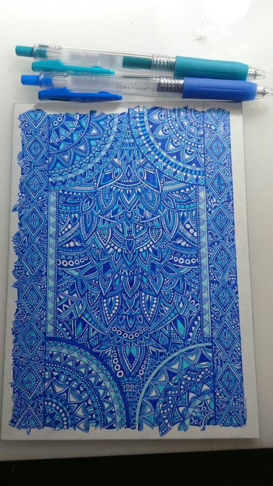

*2016-02-25 13:49 · 手机上网 转自第五元素*

---

### 7837

北京的广东大厦在岭南路上。

*2016-02-24 20:59 · iPhone版*

---

### 7838

@ 阮一鸣 hello:)

*2016-02-24 08:14 · 手机上网 给阮一鸣的回复*

---

### 7839

这个结论真帅！转@ 太空小孩 居然是真的。 http://t.cn/RGKO25z 转@ 飯否小字报 转@ 二他姐姐 河流的总长度与所跨距离的比值总是约等于丌。

*2016-02-23 19:41 · 手机上网 转自二他姐姐*

---

### 7840

元宵节在英文里叫 lantern festival，也就是「灯笼节」。我已经很多年没有用过灯笼了，更别说提着灯笼到处走了。想到灯笼，童年回忆好像一下子全涌上来了。

*2016-02-23 02:24 · iPhone版*

---

### 7841

据说广义相对论的实际应用对我们的日常生活还是影响很直接的，以GPS为例，如果只有狭义相对论没有广义相对论，定位误差会高达百米，比现在差一两个数量级，可用性大大下降。

*2016-02-21 20:49 · iPhone版*

---

### 7842

引力波太高深，还是没听懂。不过，时空是3+1维还是4维这个差别通过一个浅显的比方我算是理解了。

*2016-02-21 20:46 · iPhone版*

---

### 7843

昨天试了一下同事的iPad Pro，配上专用铅笔，记笔记的感觉确实不错，和真的纸笔差不多。可惜还是太大个，又不能折叠。

*2016-02-21 01:42 · iPhone版*

---

### 7844

今年是「丙申」年。以前我不太在意这些。

*2016-02-20 22:27 · iPhone版*

---

### 7845

和吴医生一家吃饭，被他的职业荣誉感震撼了。

*2016-02-20 16:37 · iPhone版*

---

### 7846

转@ 宇宙超级无敌聪明龙 王老板你看！@ 王兴

*2016-02-19 22:35 · 网页 转自宇宙超级无敌聪明龙*

---

### 7847

这次春节回家，觉得爸爸的书架没有我印象中的大。

*2016-02-19 22:35 · 网页*

---

### 7848

这本《奢侈》跟《免费》应该是商业的两端吧。

*2016-02-19 22:20 · 手机上网*

---

### 7849

我好像还没在北京畅快的淋过一场雨。

*2016-02-19 21:51 · iPhone版*

---

### 7850

上午体检时注意到一台检查眼睛的仪器是佳能的。这算相关多元化吧。

*2016-02-19 21:22 · 网页*

---

### 7851

对整形的接受程度真是一个代沟。

*2016-02-19 19:51 · iPhone版*

---

### 7852

转@ severusn.V 转@ 士芋头面骑假 转@ 美嘉.rar 天朝音乐app鄙视链。」

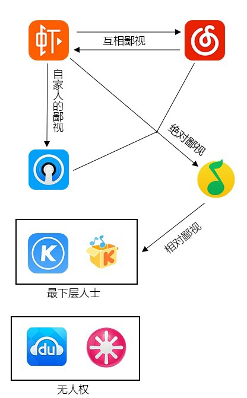

*2016-02-19 17:23 · 网页 转自美嘉.rar*

---

### 7853

体检医生：你的心电图正常。我：我前几年有过心律不齐，现在好了吗？医生：现在齐了，年轻人心律不齐很常见，随着年龄增长，会越来越齐的。我默默的想：直到齐成一条直线吗？

*2016-02-19 12:44 · iPhone版*

---

### 7854

转@ colalake 挚友今天看了《美人鱼》，我也可以说几句了。星爷的文化水平和底蕴是不行的，但他永远在表达一些只有在底层活过才会有的极其具有普世价值的东西，这些东西很珍贵，找到好的团队配合他来做事是有前途的。记得卢正雨说过最大的梦想是和星爷合作，这次看到他实现了愿望。愿星爷今后

*2016-02-19 00:36 · 手机上网 转自colalake*

---

### 7855

等我以后有空了再慢慢的给你们介绍龙岩的「斜背茶」。转@ 爱书的流浪者 @ 王兴 名字很有特点。特点就是卖点。能详细介绍一下这种茶吗？

*2016-02-18 15:51 · 网页 转自爱书的流浪者*

---

### 7856

转@ Roku. 憂鬱的臺灣烏龜「@ 王兴 「龍飛鳳舞」这四个字实在是太复杂了！我照着写都有点晕-_-！转@ 阿修羅 哈哈，看吧，每个人总有比别人擅长的地方，你习以为常的事物可能是别人的新天地。从小学毛笔字，[龍]是最早会写的繁体字之一，【龍飛鳳舞】。转@ 王兴 今天学会了写繁体字「龍」

*2016-02-18 15:32 · 手机上网 转自王兴*

---

### 7857

「龍飛鳳舞」这四个字实在是太复杂了！我照着写都有点晕-_-！转@阿修羅 哈哈，看吧，每个人总有比别人擅长的地方，你习以为常的事物可能是别人的新天地。从小学毛笔字，[龍]是最早会写的繁体字之一，【龍飛鳳舞】。转@ 王兴 今天学会了写繁体字「龍」。在此之前，复杂一点的繁体字

*2016-02-18 15:02 · 手机上网 转自王兴*

---

### 7858

今天学会了写繁体字「龍」。在此之前，复杂一点的繁体字我只会写我的名「興」。

*2016-02-18 14:03 · iPhone版*

---

### 7859

一个社会摆脱急功近利风气的速度可能会比很多人估计的更快。倒不是大众的水平会突然跃升，而是当一个社会的转型期趋于结束，人们逐渐发现即使是「急功」的行为也不再能带来「近利」。

*2016-02-18 13:29 · iPhone版*

---

### 7860

被拉进一个「引力波学习群」了……

*2016-02-17 11:51 · iPhone版*

---

### 7861

愿闻其详！转@ 张亮 Da Code 之后，我已经七年没接触体恤生意了，没想到居然技术在进步。

*2016-02-17 10:12 · 手机上网 转自张亮*

---

### 7862

刚发出了我人生第一个弹幕。

*2016-02-17 03:49 · 手机上网*

---

### 7863

已回京开工好几天了，却依然时不时想起春节在老家的各种场景。以前好像不这样的。不过，我上次春节回乡已是六年前了。

*2016-02-17 00:51 · 手机上网*

---

### 7864

转@ 可乐鬼 Q.什么叫答非所问啊？A.快睡吧。一点多了。

*2016-02-17 00:47 · 手机上网 转自可乐鬼*

---

### 7865

我以前一直记不住毛泽东生于1893年，直到后来搞明白了：1911年辛亥革命爆发时，毛泽东正好18岁。

*2016-02-16 22:31 · iPhone版*

---

### 7866

转@ webto RT@ 赫卡普 出去玩入住酒店以后第一件事，烧一壶当地的水喝。每个地方水差别很大，适应当地环境喝水是比较温和的方法。直接吃当地食物也会造成肠胃不适，先喝水就不会。#出行小贴士

*2016-02-16 21:38 · 手机上网 转自赫卡普*

---

### 7867

转：乌龙茶依产地和品质风格不同,可分闽北乌龙茶、闽南乌龙茶、广东乌龙茶、台湾乌龙茶等。武夷岩茶、安溪铁观音、凤凰单枞、冻顶乌龙是相应于上述四个区域的典型茶例。

*2016-02-16 20:57 · iPhone版*

---

### 7868

虽然生在长在喝茶氛围浓厚的福建，但我之前基本不喝茶，直到30岁那年初秋去呼伦贝尔草原游玩时因为吃多了牛羊肉而喝普洱茶助消化……

*2016-02-16 20:55 · iPhone版*

---

### 7869

2014年，福建的茶叶种植面积在全国排第三，但是产量和产值都是高居第一。

*2016-02-16 20:48 · iPhone版*

---

### 7870

花茶就按是什么花分类吧。转@ 唐君毅 @ 王兴 那花茶是按什么分类的

*2016-02-16 20:01 · 手机上网 转自唐君毅*

---

### 7871

茶按工艺可分为六大类：绿茶、白茶、黄茶、青茶（乌龙茶）、红茶、黑茶。花茶不在此列。

*2016-02-16 19:49 · iPhone版*

---

### 7872

@ 女兒國宰相x俞與魚 这条为毛@ 我啊

*2016-02-16 19:47 · 手机上网 给女兒國宰相x俞與魚的回复*

---

### 7873

说实话，在这个春节流行微信大拜年之前，我并不知道「初五迎财神」这个习俗。

*2016-02-16 18:53 · iPhone版*

---

### 7874

转@ jayyu @ 王兴 @ gravity0 我看了一本讲唐朝生活的书。据说那个时候我们也是分餐的，后来受蒙古那边的影响，大家觉得一锅吃饭显得热闹，才慢慢变成一起吃的。

*2016-02-16 12:18 · 手机上网 转自jayyu*

---

### 7875

戳中我笑点了。转@ gravity0 同样是使用筷子的民族，日韩大概是因为与西洋接触早，多使用分餐制，每个人吃自己的碗碟。每个碗碟都不大，却又十几二十个之多，吃完居然饱了。我们的饭局则比较喜欢做杀猪菜，大碗大盆大缸大家分，说话少的可以多吃一点。

*2016-02-16 11:32 · 手机上网 转自gravity0*

---

### 7876

午饭后喝从龙岩带回来的家乡特产，高山斜背茶。包装略山寨，因为是从茶农手里直接买的。茶农挺有趣，门口停着自家轿车，厨房里煮菜做饭还是用木材烧大铁锅。二婶说我曾祖母在世时每天就喝斜背茶。

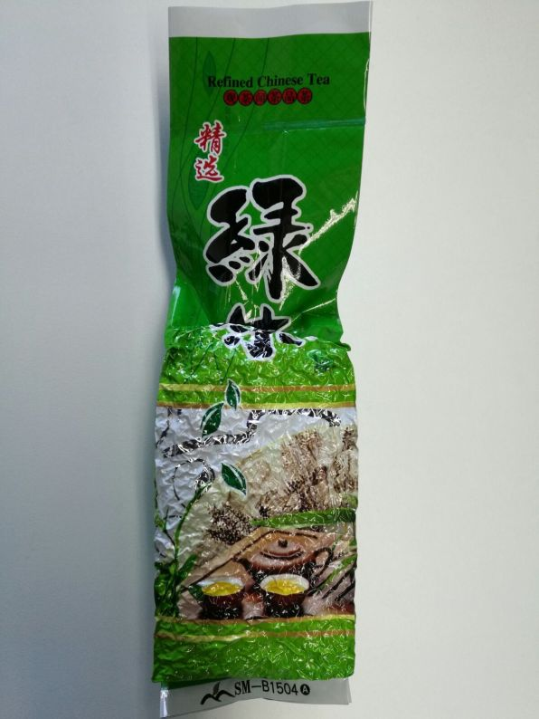

*2016-02-15 13:11 · 手机上网*

---

### 7877

一件事情是有「四两拨千斤」的机会还是逃不开「一力敌百巧」，这个判断很重要。

*2016-02-15 10:20 · 手机上网*

---

### 7878

转一段让我忍俊不禁的故事：100多年前，爱迪生照明公司要求福特放弃研究汽油燃料汽车，认为电力汽车更有前途，福特毅然离开了给他高薪的爱迪生照明公司，于1903年创办了福特汽车公司，开创了汽油燃料汽车100多年的辉煌历史。

*2016-02-14 16:39 · iPhone版*

---

### 7879

昨天爸爸还给我解释了龙岩另一类地名，X陂，例如西陂、陈陂、高陂。在龙岩话里，陂字不念pí而念bī。他说陂是水坝的意思。农业社会里大大小小的水利工程很重要，所以就被用作地名了。

*2016-02-14 16:24 · iPhone版*

---

### 7880

功夫在诗外。

*2016-02-14 15:08 · iPhone版*

---

### 7881

这确实是很有趣的文化差别。相比之下，虽然FBI掌握了马丁路德金到处嫖妓的证据，却依然无法借此搞臭这位民权运动领袖。转@ webto公众人物一定要高大全这件事儿，在我国真是深入人心，即使一个知乎小V都得毫无道德瑕疵，你们是不是想太多了？

*2016-02-14 14:49 · 手机上网 转自webto*

---

### 7882

2016-04-30之后google my tracks这个app就要被关闭了。这再一次证明谷歌砍起产品来并不手软，也再一次证明我的一些需求确实比较小众。

*2016-02-14 14:04 · iPhone版*

---

### 7883

专家闲聊时说，现在自己种菜的话其实尿素化肥比农家肥更靠谱，因为尿素是工业制成品，就是氮肥，没啥杂质，而现在许多农家肥（例如猪粪、牛粪、鸡粪）反而不安全，因为动物吃大量饲料，粪便里重金属和抗生素超标的可能性很大。羊粪略好一点。

*2016-02-13 23:48 · iPhone版*

---

### 7884

听他们聊天时说到「古侨」这个词，我一开始听不懂，后来才反应过来是「古巴侨民」的意思。

*2016-02-13 20:54 · iPhone版*

---

### 7885

疯了，龙岩都搞了一段北三环！我觉得这个环路恐怕是修不起来了吧！

*2016-02-13 17:28 · 手机上网*

---

### 7886

下午去看高山茶园，山路九曲十八弯。去时我开，老爸在副驾上被晃得晕车；回时他开，我在副驾上也被晃得晕车。

*2016-02-13 17:22 · 手机上网*

---

### 7887

有道理，但我们这里现在都用「洋」字了。转@ 一步天涯 我们都写作“垟”，和实际意思比较接近吧「@ 王兴 爸爸给我解释家乡的地名为什么有很多「X洋」，例如大洋、小洋、西洋、下洋：龙岩是山间盆地，田分两种，山田（也就是梯田）和洋田（平地的田），洋田很宝贵，所以很多地方以此命名。」

*2016-02-13 13:25 · 手机上网 转自王兴*

---

### 7888

爸爸给我解释家乡的地名为什么有很多「X洋」，例如大洋、小洋、西洋、下洋：龙岩是山间盆地，田分两种，山田（也就是梯田）和洋田（平地的田），洋田很宝贵，所以很多地方以此命名。

*2016-02-13 12:59 · iPhone版*

---

### 7889

近百年前，早稻田大学应该有一个姓林的龙岩籍学生。

*2016-02-13 00:32 · 手机上网*

---

### 7890

阿拉伯人居然喜欢喝绿茶。

*2016-02-13 00:22 · 手机上网*

---

### 7891

台湾光复时，福建各县去对口接收。福州接收台北，龙岩接收花莲。

听长辈说的，未经考证。

*2016-02-13 00:21 · 手机上网*

---

### 7892

原来安吉白茶是一种绿茶，和作为茶品种之一的「白茶」不是同一个概念。

*2016-02-12 22:49 · iPhone版*

---

### 7893

听说赞比亚只有一家水泥厂，而且还是中国人开的。

*2016-02-12 20:23 · iPhone版*

---

### 7894

转@ gravity0 地少人多，心思不细密怎么活？导游介绍当地如何种植苹果：果农只有很少的地，苹果开花结果后摘掉近一半的果实，让剩下的得到更充足营养。每个果子都挂牌编号，时常调整位置以确保每个面均匀受光，这样才能整体色泽均匀味道甜美。精耕细作，其它行业也一样。

*2016-02-12 18:45 · 手机上网 转自gravity0*

---

### 7895

转@ Rokey @ 王兴 据我所知我们这也这样，就看你能带来多少存款，我们当地有一家银行只要能带来2000万存款立即签正式合同

*2016-02-12 18:07 · 手机上网 转自Rokey*

---

### 7896

表弟搬出数据来说明龙岩的房价不但没有「近乎腰斩」，而且跟一年前比不降反升。虽然被打脸了，但我还是很欣慰他会用数据说话。

*2016-02-12 17:44 · 手机上网*

---

### 7897

确实是「全国多王李，福建多陈林」，我妈姓林，我祖母姓陈，我曾祖母又姓林。

*2016-02-12 17:11 · iPhone版*

---

### 7898

养猪是个周期性行业，注定几年赚钱几年亏，所以几个周期下来，只剩下资金雄厚的玩家还在场了。

*2016-02-12 16:30 · iPhone版*

---

### 7899

据说龙岩的金融机构（不管是四大国有银行还是股份制银行还是本地农商行）招聘时最主要的问题就是：家里有什么背景？能带来多少存款？

*2016-02-12 16:17 · iPhone版*

---

### 7900

-_-！转@ colalake 陪爸妈打牌的时候，妈说爸：不见鬼子不拉弦。

我脑子不动很自然的对了句：不见 尖不拿纸。我妈脸绿。太粗鲁了，所以当不了段子手。

*2016-02-12 15:52 · 手机上网 转自colalake*

---

### 7901

龙岩这个地级市约280万人口，居民储蓄约1400亿。

*2016-02-12 15:17 · iPhone版*

---

### 7902

一个表弟在邮政工作。他说现在的年收入比五年前刚入行时更低。

*2016-02-12 15:12 · iPhone版*

---

### 7903

2015年龙岩这个地级市GDP一千七百多亿（和美团的交易额差不多），财政收入~260亿。龙岩在福建九个地级市里常年排第四，但是这几年有被漳州赶超的趋势。漳州光PX这个大化工项目（就是厦门人民前几年赶走的那个）就每年增加GDP小几百亿。据说宁德要建几个核电站，增长也很猛。

*2016-02-12 14:42 · iPhone版*

---

### 7904

龙岩的房地产泡沫已破灭，从每平七八千的价格接近腰斩了。其他传统产业也都不景气，但是消费力依然十分旺盛。大年初五，本地最好的酒楼「荣誉国宴楼」大小包间和大厅数百桌全满。

*2016-02-12 14:37 · iPhone版*

---

### 7905

听本地人说，万达嘉华这种五星级酒店的实际间夜价也只有三百多。

万达广场的生意并不好。万达百货已经开了又关。但是万达影城的生意还不错。

*2016-02-12 14:20 · iPhone版*

---

### 7906

家乡的女士们好像很喜欢穿紧身黑皮裤-_-!

*2016-02-12 11:17 · iPhone版*

---

### 7907

听到公鸡打鸣。

*2016-02-12 08:30 · iPhone版*

---

### 7908

闽西种植的用作一般家具的杉木，8年可以间伐，16年可以主伐。

*2016-02-12 00:54 · iPhone版*

---

### 7909

转@ sdChris @ Butyeser @ 王兴 六祖以后有两位非常有名的禅

师，一位叫马祖道一，他是在江西南昌。另外有一位叫石头希迁禅师，石头希迁禅师在现在的湖南南岳。这两位禅师在最有影响力的禅师。所有修行的禅僧都会去向他讨教，不是在江西就是在湖南，或者在江西湖南之间跑来跑去，后来

*2016-02-11 20:37 · 手机上网 转自sdChris*

---

### 7910

Wanda Realm万达嘉华酒店应该是龙岩第一家五星级酒店。在一楼公共空间转了一下，硬件不错；问了一下前台，每晚499元。在此之前，龙岩最好的宾馆是「闽西宾馆」，属于传统体系。市政府旁的crownplaza据说已经停止内部装修了，开业遥遥无期。

*2016-02-11 18:02 · iPhone版*

---

### 7911

每次回乡都要登高俯瞰全城。今年的登高处从往年的城中的天马山公园换成了城西新修的中央苏区公园。这回房地产泡沫破灭之后，疯狂的城市建设应该基本告一段落了，也许接下来五年十年全城面貌都变化有限了。

*2016-02-11 16:00 · iPhone版*

---

### 7912

官方消息确认了，昨晚我回家路上看到的确实是「火烧山」，是山顶寺庙的香客引起的。

*2016-02-10 21:08 · iPhone版*

---

### 7913

转@ 小熊娃娃 不管在哪个学科领域，如果只有热情和兴趣，缺乏基础体系，缺乏对其他学科的了解，都很容易走火入魔变成民科民哲，即使名校出身去探讨其他领域也容易如此（顺便黑一下，已发现好几个知乎特别受欢迎的都是这种人）。坚持正道和守住常识真是很难的。

*2016-02-10 19:07 · 手机上网 转自小熊娃娃*

---

### 7914

好的鸡不但要走地，还会上树。

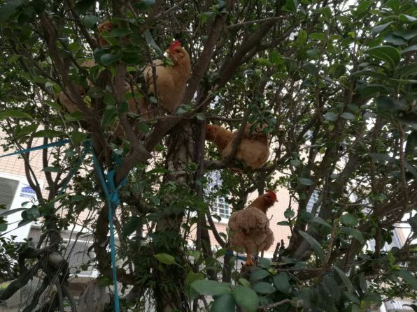

*2016-02-10 15:23 · 手机上网*

---

### 7915

《龙岩方言谚语》一书的序。是不是全国各地都有类似的书啊。

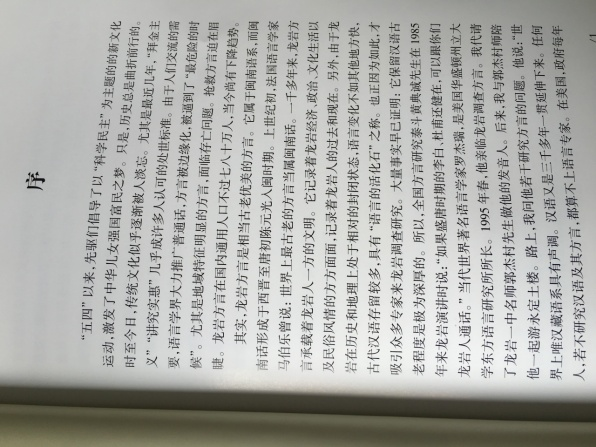

*2016-02-10 10:46 · 手机上网*

---

### 7916

昨晚好像做了一个很复杂的梦，可惜醒来一会儿就记不清了。梦再怎么光怪陆离都不奇怪，但是故事复杂度高却是一种新体验。

*2016-02-10 07:37 · iPhone版*

---

### 7917

老爸居然还有这种书。

*2016-02-10 00:33 · 手机上网*

---

### 7918

向周星驰老师致敬。打算春节期间去看一下他的新作《美人鱼》。

*2016-02-09 21:03 · 手机上网*

---

### 7919

多带几瓶port回来！转@ qinyf 今天的行程是 Lisbon 开车去Porto，从首都到第二大城市。一个城市得多港口才能给自己起名字叫“港口” (Porto)

*2016-02-09 20:50 · 手机上网 转自qinyf*

---

### 7920

这难易程度完全取决于你更接近春晚导演还是周星驰老师了。转@ 张亮 2016 年的个人目标，就是写一篇自己满意的短篇故事。感觉是件对很多人很容易但对我很难的事。

*2016-02-09 20:38 · 手机上网 转自张亮*

---

### 7921

龙岩学院有一万二左右的在校生，生源按龙岩本地、福建省内其他地方、省外来区分大致是2：5：3。本地比例倒是大大低于我的预期。

*2016-02-09 19:57 · iPhone版*

---

### 7922

车子走在G76高速上，两旁不少广告大牌是空的。

*2016-02-09 17:59 · iPhone版*

---

### 7923

转：苏联笑话讲：地狱有个规矩，谁在人间害了人，被害人的血将淹此人。一次上帝视察地狱，发现血只浸到贝利亚的腿。上帝很奇怪：“你杀了这么多人，怎么血只及腿呢？”贝利亚道：“因为我站在伟大领袖斯大林的肩上。”

*2016-02-09 11:16 · iPhone版*

---

### 7924

鲁迅先生就是牛啊！从「赵家人」这词的流行可见一斑。

*2016-02-09 11:01 · 手机上网*

---

### 7925

也有道理，这概率估计还更高一点。转@ 自以为是内蒲 会炸「@ 王兴 考虑了一下如果只有一个手机是放西装左兜还是右兜的问题，可能左边略好一点，没准还能挡子弹。」

*2016-02-09 10:49 · 手机上网 转自王兴*

---

### 7926

考虑了一下如果只有一个手机是放西装左兜还是右兜的问题，可能左边略好一点，没准还能挡子弹。

*2016-02-09 10:42 · 手机上网*

---

### 7927

据说去年12月和今年1月北京的空气质量反差如此之大，就是因为周边地区年底要冲GDP冲钢产量！！！转@ 王兴 过去一个月，北京如有神助，天气好得很，和再之前那个月判若两城。

*2016-02-09 10:22 · 手机上网 转自王兴*

---

### 7928

哇操，北朝鲜前两天那颗导弹试射的设定轨迹是掠过上海、宁波、台北的上空落入南中国海。

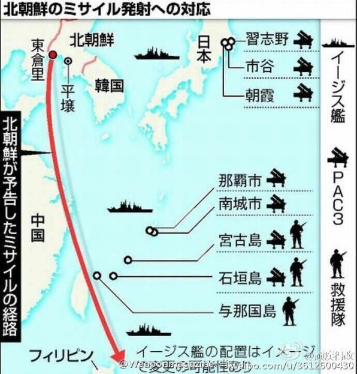

*2016-02-09 02:01 · 手机上网*

---

### 7929

没疯。我一直都问题很多，只是这两天放假有空多说一点。转@ 努尔哈欠 王老板应该是让长辈逼着生小孩了。转@ 诗文 王老板这两天疯了「@ 果果的 转@ 菜村村长 王兴最近咋这么多问题？」

*2016-02-09 01:45 · 手机上网 转自菜村村长*

---

### 7930

就是一直比较好奇而已。转@ 五月 @ 王兴 一直比较好奇，看潮人的心理目的是什么呢？可否现身说法一下，为啥想看潮/海啸

*2016-02-09 01:40 · 手机上网 转自五月*

---

### 7931

查了一下，这地球上能跟钱塘江大潮媲美的只有亚马逊大潮了。那还是就近吧。

*2016-02-09 01:34 · 手机上网*

---

### 7932

白居易的《忆江南》原来有三首，第三首是：江南忆，其次忆吴宫。

吴酒一杯春竹叶，吴娃双舞醉芙蓉。早晚复相逢。之前我只知前两首：江南好，风景旧曾谙。日出江花红胜火，春来江水绿如蓝。能不忆江南？/江南忆，最忆是杭州。山寺月中寻桂子，郡亭枕上看潮头。

何日更重游？

*2016-02-09 01:09 · iPhone版*

---

### 7933

网上查了一下，看来中国的旅游业也不算太落后，已经有直升机上观钱塘江大潮的项目了，人均2000元左右。

*2016-02-09 01:03 · 手机上网*

---

### 7934

算了，我还是先看钱塘江大潮吧。说了好几年都一直没去。今年农历八月十八走起。转@ 王兴 突然想到一个问题：有没有哪个旅行社能组织海啸观光团？

*2016-02-09 00:54 · 手机上网 转自王兴*

---

### 7935

突然想到一个问题：有没有哪个旅行社能组织海啸观光团？

*2016-02-09 00:48 · iPhone版*

---

### 7936

人和其他动物，谁更任性？

*2016-02-09 00:41 · 手机上网*

---

### 7937

请明示。转@ 和硕嫖亲王 问这种问题说明你近代史白看了「@ 王兴中国的近代史，先是「中学为体，西学为用」，然后是学英国搞君主立宪，发现来不及之后就学法国搞共和国，然后就学德国搞威权统治，后来就学俄国了，再后来就「中国特色」了……为毛没正儿八经学过美国呢？」

*2016-02-09 00:40 · 手机上网 转自王兴*

---

### 7938

最近读了半本书，若再有人跟我提起「屌丝逆袭」，我第一个想起的

会是拿破仑。

*2016-02-09 00:37 · 手机上网*

---

### 7939

中国的近代史，先是「中学为体，西学为用」，然后是学英国搞君主立宪，发现来不及之后就学法国搞共和国，然后就学德国搞威权统治，后来就学俄国了，再后来就「中国特色」了……为毛没正儿八经学过美国呢？

*2016-02-09 00:30 · 手机上网*

---

### 7940

我突然很想知道我的曾祖父二十到五十年代下南洋时到底在东南亚的哪个城市。或许有一天我会想办法去查使馆资料。

*2016-02-09 00:12 · iPhone版*

---

### 7941

「牧民」这个词有两个含义，一个是名词，另一个是动宾。

*2016-02-09 00:05 · iPhone版*

---

### 7942

转@ 江南一只橙 人类学观点说，隔代哺育是伴随“从夫居”之后产生的行为，因为上一辈首先要对孩子是自己的后代有较高的确信度；同时隔代哺育行为得益于人类妇女较其它动物而言较早的绝经期，一代有生育能力时上一代差不多丧失生育能力「@ 王兴 其他动物有没有像人类这样「隔代哺育」的行为？我指的是

*2016-02-08 23:58 · 手机上网 转自王兴*

---

### 7943

前几天见一个朋友，她说她祖先是1492年（恰好是哥伦布发现美洲大陆那年）从福建移居澎湖的，此后世世代代都在澎湖，族谱完整，直到她父亲那一辈到台湾岛上读了大学然后移民美国。

*2016-02-08 23:28 · 手机上网*

---

### 7944

突然想到一个问题：其他动物有没有像人类这样「隔代哺育」的行为？我指的是老人帮忙带小孩。

*2016-02-08 23:15 · 手机上网*

---

### 7945

华为mate8的通讯录连类似名片全能王的名片扫描识别功能都内置了！真是不给第三方软件活路。不过名片扫描这功能确实应该手机自带。

*2016-02-08 22:54 · 手机上网*

---

### 7946

同孤陋。转@ 包越千 巴西cachaca甘蔗酒很好喝啊……但名气远不如rum……是我孤陋了么……

*2016-02-08 22:46 · 手机上网 转自包越千*

---

### 7947

风险投资这行现在到底有多少从业者啊？怎么我认识的我们中学上下几届的校友就有好几个了……

*2016-02-08 22:25 · iPhone版*

---

### 7948

我坚信，只要中文还存在，李白就不会被遗忘。类似的，只要一百年后的人们还看电影，《教父》这种一流电影就依然牛逼，而那时还有多少人知道或记得微软或谷歌真是很难说。所以，BAT（尤其是A）以为自己有钱有势就可以对电影创作者指手画脚，或是摆出互联网颠覆一切的姿态，那是很浅薄的。

*2016-02-08 22:12 · iPhone版*

---

### 7949

少小离家老大回，乡音无改鬓毛衰。儿童相见不相识，笑问客从何处来/离别家乡岁月多，近来人事半消磨。惟有门前镜湖水，春风不改旧时波。贺知章的这两首《回乡偶书》我早已读过，我原本不知道的是贺此次回乡已是86岁高龄，距他中年离乡已五十多年！

*2016-02-08 21:43 · iPhone版*

---

### 7950

过去一个月，北京如有神助，天气好得很，和再之前那个月判若两城。

*2016-02-08 21:27 · iPhone版*

---

### 7951

姐姐,今夜我在德令哈,夜色笼罩/姐姐,我今夜只有戈壁/草原尽头我两手空空/悲痛时握不住一颗泪滴/姐姐,今夜我在德令哈/这是雨水中一座荒凉的城/除了那些路过的和居住的/德令哈…今夜/这是唯一的,最后的,抒情/这是唯一的,最后的,草原/我把石头还给石头/让胜利的胜利/今夜青稞只属于他

*2016-02-08 03:41 · iPhone版*

---

### 7952

修订历法比编撰字典还更有成就感。

*2016-02-08 02:31 · iPhone版*

---

### 7953

转@ gravity0 喂鸡上说十二地支源于木星公转周期十二年，岁星就是木星，太阳系最大行星。十二地支不仅用来记年，也用来记月和记录时辰。我猜生肖动物是后来加上去的，毕竟子丑寅卯这么抽象的概念不好记，不便普及。

*2016-02-08 01:04 · 手机上网 转自gravity0*

---

### 7954

最是适合除旧迎新之时，却开始前所未有地理解传统的价值。

*2016-02-07 23:07 · iPhone版*

---

### 7955

转@ .rex 感觉自己就是那个被鞭炮和对联灯笼驱赶着的年兽。

*2016-02-07 18:49 · 手机上网 转自.rex*

---

### 7956

和某个行业的朋友开了一下午会，结尾时对方总结：这个行业水不深，但很浑。

*2016-02-07 18:48 · 手机上网*

---

### 7957

转@ colalake 也许以后我会是那种无论买了什么都会拆到只剩下东西本身再用布袋拎回家的老太太。外包装这种东西太没有必要，总是激起我的烦躁。

*2016-02-07 17:33 · 手机上网 转自colalake*

---

### 7958

习惯了杯口壁薄的杯子，刚一换成壁厚的，口感有点奇怪。

*2016-02-07 12:05 · iPhone版*

---

### 7959

川鲁淮粤。

*2016-02-07 10:21 · 手机上网*

---

### 7960

转@ gravity0 高胖说清明上河图说到两个长袖牙行，古代经纪人。想起那句“车船店脚牙无罪也该杀”。在外行看来，这些行业价格浮动就是奸诈。可市场供需一直在变化，维持固定收费反而不合理。只是很多时候人们不讲理，多数迫害少数皿煮万岁。

*2016-02-07 09:44 · 手机上网 转自gravity0*

---

### 7961

转：去年大学同学聚会，发现很多人都不认识了，不禁感慨自己当年逃课太多。吃完发现是走错包间了。

*2016-02-07 09:29 · 手机上网*

---

### 7962

欺师灭祖！转@ 拧巴人儿 马上要去教授家了，我最后来到了一个泰国餐馆买外卖……

*2016-02-07 09:22 · 手机上网 转自拧巴人儿*

---

### 7963

不看秦朔最近一篇文章我还真没意识到日常语言体系里的这个细节：和「国有企业」对应的不是「民有企业」，而是「民营企业」……

*2016-02-06 09:39 · iPhone版*

---

### 7964

转@ .rex 记得小时候，老爸拿着一本文革的《批判《三字经》》让我背诵。背诵到「教不严、师之惰」时，特别揪心，总以为是「教不严，十指剁」。

*2016-02-06 02:07 · 手机上网 转自.rex*

---

### 7965

今年春节会太平吗？

*2016-02-06 00:37 · iPhone版*

---

### 7966

原来goldman是sachs岳父。

*2016-02-05 23:19 · 手机上网*

---

### 7967

有情趣！转@ 拧巴人儿 今天醒的早，待我去给莫扎特冲杯速溶咖

啡，让他惊恐一下。哈哈哈哈哈

*2016-02-05 23:10 · 手机上网 转自拧巴人儿*

---

### 7968

跟电商从业者吃饭，张三：「我每天都在想，公司明天会不会死？」

李四：「除了这个问题，我还在想：明天我会不会被抓起来？跟你们说个真事，有一天，我半夜起来，把我媳妇也叫醒，把我账户里的钱都转给她，然后我们俩抱头哭了一场。」

*2016-02-05 23:07 · iPhone版*

---

### 7969

决定重读一下豌豆公主这个童话。

*2016-02-05 21:42 · iPhone版*

---

### 7970

公司的问题，就是员工的机会。社会的问题，就是企业的机会。

*2016-02-05 19:01 · iPhone版*

---

### 7971

@ 李小蛙 还行。

*2016-02-05 16:36 · 手机上网 给李小蛙的回复*

---

### 7972

在北五环上往西开，「远山」这种高逼格词汇扑面而来。# 论空气好的重要性 #

*2016-02-05 14:30 · 手机上网*

---

### 7973

车走在北五环西路上，路旁最笔直挺拔的那棵树是一个伪装后的手机基站。

*2016-02-05 14:27 · 手机上网*

---

### 7974

@ 猫先生 我没去过长乐机场。

*2016-02-05 14:21 · 手机上网 给猫先生的回复*

---

### 7975

好奇滴滴算到几岁？还是他们更偷懒，直接拿uber估值打个折就完了？转@ quux 据说他们算用户终身价值已经算到 75 岁了 转@quux Uber 换标了，很科技很艺术啊，就是不够联系人民群众

*2016-02-05 14:13 · 手机上网 转自quux*

---

### 7976

今年有必要练习一项新技能：穿黑西装时不被误认为是二手房中介。

*2016-02-05 14:11 · iPhone版*

---

### 7977

「所有动物都是平等的，但有些动物比其他动物更平等」，奥威尔的这个嘲讽不是仅针对共x或极权主义，而是针对整个（现代）人类社会的。

*2016-02-05 11:00 · iPhone版*

---

### 7978

据说是以「立春」为界。转@ FF之进化论 @ 王兴 其实还有几天

呢……

*2016-02-04 20:10 · 手机上网 转自FF之进化论*

---

### 7979

立春已过。本命年终于结束了。

*2016-02-04 19:37 · 手机上网*

---

### 7980

真是每一行都水很深啊。还好我会游泳。

*2016-02-04 19:16 · 手机上网*

---

### 7981

转@ gravity0 日本科举向来是最优秀的人进外交部，因为国际大棋局里对手也都是精英，水平比在国内忽悠老百姓高多了。让观众指导国手中国是吃过教训的。林长民点燃五四运动，短期看战胜国中国在那届巴黎和会上什么也没捞到，长期的后果就不用说了。

*2016-02-04 16:25 · 手机上网 转自gravity0*

---

### 7982

转@ 鸝.se如果没记错的话国旗分别是丹麦、瑞典、挪威、芬兰、冰岛北欧五国～

*2016-02-04 16:08 · 手机上网 转自鸝.se*

---

### 7983

@ 张亮 脑补张亮cosplay张亮的样子ing

*2016-02-04 11:29 · 手机上网 给张亮的回复*

---

### 7984

别急。每个人都会老，除非死得早。呃，我今天怎么一早就这么乌鸦嘴……转@ 小懒君 王老板太不和谐了。我们才二十几岁 「@ 王兴八五后都开始奔四了。」

*2016-02-04 10:11 · 手机上网 转自王兴*

---

### 7985

八五后都开始奔四了。

*2016-02-04 09:33 · 手机上网*

---

### 7986

多谢分享！我对历史学没有半点不敬，但我还是没看出为什么历史学家比起其他xx家更是天生的。哪行想干出点成绩是容易的啊！转@ 拧巴人儿 @ 王兴 。

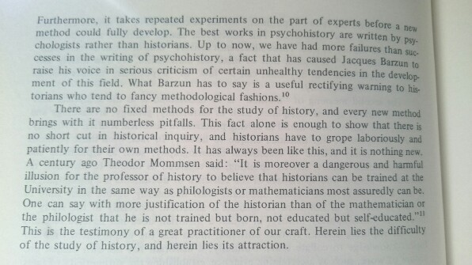

*2016-02-04 09:31 · 手机上网 转自拧巴人儿*

---

### 7987

突然想到，《金刚经》里的「一切有为法，皆如梦幻泡影，如露亦如电」里的「电」字是什么意思？只能是闪电吧？不然那个时代没有别的跟电能扯上关系的东西了。

*2016-02-04 02:33 · iPhone版*

---

### 7988

@ webto 啥酒？

*2016-02-04 02:12 · 手机上网 给webto的回复*

---

### 7989

「您不愧是张家口出来的……清华毕业的……物流领域的……名列前茅的创业者！」

*2016-02-04 00:04 · iPhone版*

---

### 7990

今天第一次知道一个也在O2O领域创业的老朋友是哈工大「飞行器设计」专业的博士，博士课题是《卫星自主模糊控制》。他说他从事本行的同学告诉他，他们那个航天单位一共一千多人，每年要死好几个。累死的。

*2016-02-03 23:49 · iPhone版*

---

### 7991

跟老友请教一个需要品位的问题，他想了想说：我给你介绍peter吧……他有一百双皮鞋……

*2016-02-03 22:32 · iPhone版*

---

### 7992

争分夺秒，争风吃醋，争先恐后，争强好胜。

*2016-02-03 22:12 · iPhone版*

---

### 7993

转@ 包越千 袁崇焕这事在我看来是这样，崇祯连内裤都当了给圆嘟嘟发饷修地堡，丫又是矫诏杀毛文龙，又是与野猪皮议和，然后5年平辽平到北京城下……我要是崇祯，心里估计也是草泥马一头头……但是，杀了圆嘟嘟的结果也确实是使局势更糟。若说用袁有问题，杀袁

就是错上加错，这个逻辑其实挺有趣的。

*2016-02-03 20:34 · 手机上网 转自包越千*

---

### 7994

我原来觉得苹果会成第一个市值突破一万亿美元的公司。现在看来比较悬了。

*2016-02-03 20:18 · 手机上网*

---

### 7995

为何是天生？转@ 拧巴人儿 今天早上翻看余英时79年的一篇旧作，还是挺有感触的。尤其是他说历史学家，和别的领域的专家比起来，往往是天生而不是后成，自学而不是上学能学成的。我也不知道我能做到怎么样。现在我还在努力学的是耐心，不着急，不跟别人比。

*2016-02-03 17:43 · 手机上网 转自拧巴人儿*

---

### 7996

阿黛尔的《21》这张专辑里，我还是觉得《someone like you》强过《rolling in the deep》，虽然后者更受欢迎。

*2016-02-03 17:40 · iPhone版*

---

### 7997

《“债王”格罗斯：本轮金融危机的实质是人口问题，不是金融问题》，这个标题有点吓人。经济问题里，人口是最容易预测但却改变起来最慢的。

*2016-02-03 10:53 · iPhone版*

---

### 7998

Uber没事换logo做什么呢？新logo真的有更好吗？

*2016-02-03 10:06 · iPhone版*

---

### 7999

美食、美酒、美女、美景……都是人生乐事，可是好的音乐似乎没有一个相对应的带美字的词，总不能说「美声」吧。

*2016-02-03 08:56 · iPhone版*

---

### 8000

欢迎归来。转@ whale 回到饭否了，上一条消息是近五年前发的。好像上了飞船，选择一个时间点，径直穿过了时空隧道，下车。

*2016-02-02 18:37 · 手机上网 转自whale*

---

### 8001

我绞尽脑汁想到底有什么靠谱的智能家居产品，最后竟然想到「智能马桶」。虽然它跟智能其实没啥关系，但确实是有用的。

*2016-02-02 15:14 · 网页*

---

### 8002

前几天听一个老饕吹牛：鱼子酱要数伊朗的最好，妙不可言；即使你刷了牙，第二天醒来后还能感受到唇齿之间那淡淡的咸和鲜。转@quux 牙没刷干净 转@ 王兴 今天午饭的最末尾，我一仰头干掉那碗汤时，咬到一颗花椒。至今还在回味。简直堪称物理世界里的MSB(Most Significant。

*2016-02-02 14:50 · 网页 转自王兴*

---

### 8003

原来我是知乎的第18号内测用户啊。

*2016-02-02 14:24 · 网页*

---

### 8004

转@ 沙宣 一哥们挺牛逼的，他搞定了一女同妹子，去年结的婚，为此还和我得瑟，结果今年他出轨刚找了个绿茶，就被他老婆拐跑了。

他老婆还谢谢他帮她找到了真爱。整得他逢人就哭诉这个世界欺骗了他。

*2016-02-02 14:08 · 网页 转自沙宣*

---

### 8005

今天午饭的最末尾，我一仰头干掉那碗汤时，咬到一颗花椒。至今还在回味。简直堪称物理世界里的MSB(Most Significant Bit)。

*2016-02-02 14:05 · 网页*

---

### 8006

@ Amy的 我每天都戴那个戒指。

*2016-02-02 13:42 · 手机上网 给Amy的的回复*

---

### 8007

你开始巴菲特式的思考啦;) 转@ 张亮 我想了几次，如果我有足够的钱，我会不会 buyout Twitter，暂时没有答案。但，我觉得 Twitter的滑落给我上了一课...

*2016-02-02 12:56 · 手机上网 转自张亮*

---

### 8008

求分享。转@ 张亮 我已经超过十年没看过任何电影的剧本了... 但这次真的准备把 Steve Jobs 的 190 页的剧本看一遍。

*2016-02-02 11:45 · 手机上网 转自张亮*

---

### 8009

@ Earven 麻烦看一下私信。谢谢。

*2016-02-02 11:40 · 手机上网 给Earven的回复*

---

### 8010

阿黛尔对自己嗓子的运用自如真是让我听一次赞叹一次。上一个给我这种感觉的女歌手得是惠特尼•休斯顿了。

*2016-02-02 10:06 · iPhone版*

---

### 8011

昨晚做了一个塔防题材的梦。

*2016-02-02 09:54 · iPhone版*

---

### 8012

到底是Levie还是Sorkin啊？转@ 张亮 在占有史料方面我应该不比Aaron Levie 差，但我自问写不出乔布斯这部电影剧本百分之一的水准... 比起Social network和Money ball，我更佩服这部，因为它更复杂。

*2016-02-02 01:02 · 手机上网 转自张亮*

---

### 8013

转@ 孤岛黄老邪 接受专访，当家花旦乃至走红青衣断然不会承认自己最喜回锅肉，她们多半会选香菇菜心把提问敷衍掉——这是因为“在

一个社会中，中等阶级数量庞大，地位、生活方式连同语言方式都会成为较低等级模仿学习的对象”，在香菇菜心背后，“有着妙不可言的中产趣味”，有着不怒自威的语言威望。

*2016-02-02 00:07 · 手机上网 转自孤岛黄老邪*

---

### 8014

往前走，莫回头，很快就到下一个可爱状态了:) 转@ 张亮 我觉得当年饭否上的我比较可爱... 现在微博上的我不够可爱... 回不去了是不是？

*2016-02-01 20:59 · 手机上网 转自张亮*

---

### 8015

要把一万字能讲明白的东西在400字里表达清楚，这对写作者的水平或其投入的精力要求高太多了。我对知乎上有那么多人愿意义务贡献有质量的内容已很感激。转@ peter 知乎对我的槽点在于废话太多，做姿态太多，400个字能说明白的偏要写1万字转@ 阳升 知乎还是不错的，有时候你要看跟什么比

*2016-02-01 18:39 · 手机上网 转自阳升*

---

### 8016

转@ 王兴 像逃生一样捕猎。

*2016-02-01 15:22 · 手机上网 转自王兴*

---

### 8017

转@ 包越千 拖延症的科学原理……很科学……

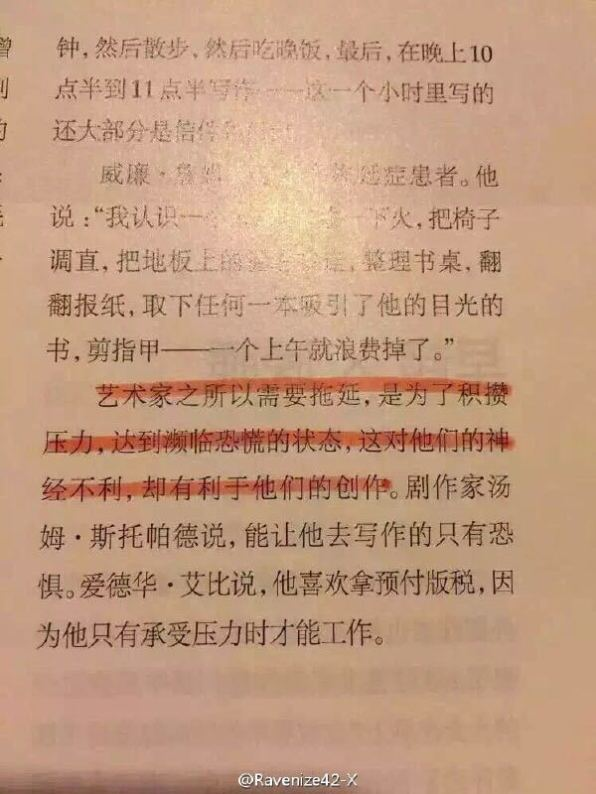

*2016-02-01 13:47 · 手机上网 转自包越千*

---

### 8018

转@ 拧巴人儿 嚯！转@ 半山樵 为了了解什么是男友力，我找到了这么个地方：国家语言文字工作委员会下属的中国语情与社会发展研究中心，挂靠在武汉大学。很多网络新词汇可以在这里找到解释：http://ling.whu.edu.cn/yuqi...

*2016-02-01 13:25 · 手机上网 转自半山樵*

---

### 8019

转@ 第二编辑部 我觉得这世界上最长情的人就是我姐，她现在还在QQ农场里种菜。

*2016-02-01 11:35 · 手机上网 转自第二编辑部*

---

### 8020

有一本书叫The Art of Story, 有另一本书叫The Story of Art。

*2016-02-01 11:31 · 手机上网*

---

### 8021

gene被灭了，meme会长存。转@ 过眼 方孝孺最终被灭族。 转@海绵大叔舒克 转@ 王兴 我曾经不能理解基地组织或ISIS的自杀袭击者为什么愿意牺牲自己，后来想到我对方孝孺为何宁死不屈完全能够理解，于是也就想通了，确实只是信的东西不太一样而已。

*2016-02-01 10:29 · 手机上网 转自王兴*

---

### 8022

神逻辑！转@ webto 『HBO脱口秀《马赫脱口秀》主持人比尔·马赫近日在节目上宣称：今年奥斯卡之所以全白都是因为中国人是十足的种族主义者！当下好莱坞需要在亚洲特别是中国市场卖座才能挣大钱！但亚洲和中国观众十分种族主义，他们不希望看到电影中有黑人！』什么乱七八糟的

*2016-01-31 22:12 · 手机上网 转自webto*

---

### 8023

我曾经不能理解基地组织或ISIS的自杀袭击者为什么愿意牺牲自己，后来想到我对方孝孺为何宁死不屈完全能够理解，于是也就想通了，确实只是信的东西不太一样而已。

*2016-01-31 17:22 · iPhone版*

---

### 8024

原来真的这么有效啊… 转@ 涂涂Julia 合我胃口，下次去住「@ 王兴全季酒店大堂边上的MY station里的书架。」

*2016-01-31 10:08 · 手机上网 转自王兴*

---

### 8025

全季酒店大堂边上的MY station里的书架。

*2016-01-31 10:02 · 手机上网*

---

### 8026

原来高卢人是凯尔特人的一支。

*2016-01-31 09:44 · 手机上网*

---

### 8027

转@ gravity0 最慢的比方说我，成了话痨。 转@ 小蜜蜂呀 最慢的呢……没别的，就想知道自己还有救不「@ gravity0 南方没暖气的冬天，起床的快慢体现执行力。生平所见起床最快的室友，现在是CEO。」

*2016-01-31 09:15 · 手机上网 转自gravity0*

---

### 8028

跟一个我蛮佩服的企业家吃了早饭。他在他那个领域做得很成功，但是他坦言自己有生之年做不了很高端的品牌了，也不认为能靠自己的品牌出海。这让我对他更加佩服。知道自己能做什么，不能做什么，很不容易。

*2016-01-31 09:08 · iPhone版*

---

### 8029

如果没读《人类简史》这本书，我不知道标致汽车的logo竟有如此深意。

*2016-01-31 01:53 · 网页*

---

### 8030

说出来不怕你们笑话，家乐福那logo我也是很久之后才看懂的。转@王兴 终于明白了，原来我一直没看懂的这个「全季酒店」的logo就是Ji HOTEL。

*2016-01-31 01:41 · 网页 转自王兴*

---

### 8031

转@ 雏儿 不管我的精神分裂成几个，每一个我都是爱你的。

*2016-01-31 01:38 · 网页 转自雏儿*

---

### 8032

转@ 可乐鬼 想要被人长久的喜欢，就要时刻都保持很酷，做人好累啊。下辈子我要当一只小狗，看到你就摇着尾巴咧着嘴对你笑。但不想吃屎。

*2016-01-31 01:29 · 网页 转自可乐鬼*

---

### 8033

终于明白了，原来我一直没看懂的这个「全季酒店」的logo就是JiHOTEL。

*2016-01-31 01:10 · 手机上网*

---

### 8034

老子逼格过高了。转@ Psymon 风流人物还看老子 转@ 王兴 带领大家装逼的历史重任会落到谁头上？我估计孔子两千多年前就在考虑这个问题。

*2016-01-30 23:14 · 手机上网 转自王兴*

---

### 8035

带领大家装逼的历史重任会落到谁头上？我估计孔子两千多年前就在考虑这个问题。

*2016-01-30 23:09 · 手机上网*

---

### 8036

最近发展了一个偏门小爱好：看中餐厅的英文菜单。

*2016-01-30 23:04 · 手机上网*

---

### 8037

妞别三日当刮目相看啊！转@ 宝宝vs坦克 不知道有生之年是否可以看到实现多夫多妻制？纵观现实，一夫一妻制明显违背人性，而且会给人不合理期望从而导致扭曲的行为。一夫一妻、忠诚都只是契约，为啥就不能有多夫多妻、共同承担风险即可的契约呢，明显增加人类幸福感嘛。

*2016-01-30 22:12 · 手机上网 转自宝宝vs坦克*

---

### 8038

华为手机还有这功能-_-!

*2016-01-30 22:04 · 手机上网*

---

### 8039

据说大闸蟹一年有500亿产值。这个数字大得令我吃惊。

*2016-01-30 22:02 · 手机上网*

---

### 8040

还懂得留白。转@ 王兴 龙哥是多么重视仪式感啊，赴莞都要选良辰吉日。而且，习惯真好，有计划，有总结。

*2016-01-30 17:22 · 手机上网 转自王兴*

---

### 8041

龙哥是多么重视仪式感啊，赴莞都要选良辰吉日。而且，习惯真好，有计划，有总结。

*2016-01-30 17:21 · 手机上网*

---

### 8042

说真的，「摇滚」这词翻译得真不错。懂日语的同学讲讲呗，日语里摇滚怎么说？

*2016-01-30 16:21 · iPhone版*

---

### 8043

考虑到今天的晚饭一定会吃撑，我本不该早饭和午饭也吃撑的:(

*2016-01-30 15:43 · iPhone版*

---

### 8044

我现在的头像照片还是06年的。今年可以再拍一下。

*2016-01-30 12:19 · iPhone版*

---

### 8045

转@ gravity0 数据分析有句粗话，garbage in garbage out，意为烂数据怎么分析也没用。想起了这句，是刚看到 BBC 新闻说前苏联特工曾化验老毛粪便：“他说，如果在粪便中发现高含量的色氨酸，就说明这个人心态平和，能够接近。但是，如果粪便中缺少钾，则说明这个

*2016-01-30 11:37 · 手机上网 转自gravity0*

---

### 8046

转@ severusn.V 转@ 番茄囝 印度同事告诉我印度大部分地方自来水都不是24小时的，但火车挂满人那个图并不是常规情况，那帮人是在抗议

*2016-01-30 11:33 · 手机上网 转自番茄囝*

---

### 8047

转@ 远骋 @ 王兴 iPhone英文键盘，符号，长按「-」不放，可以输入「•」。

*2016-01-30 09:15 · 手机上网 转自远骋*

---

### 8048

你们怎么输入英文名和姓中间的那个小圆点？

*2016-01-30 04:16 · iPhone版*

---

### 8049

「攀枝花」是个好听的名字，千万别被把「兰陵」改名叫「枣庄」的那帮人给毁了。

*2016-01-30 04:11 · iPhone版*

---

### 8050

看到新闻说slashdot被sourceforge收购了，一时不知该做何感想。前者是我十五年前几乎每天必上的网站，后者是我十年前最常用的网站之一。

*2016-01-30 03:24 · iPhone版*

---

### 8051

我觉得mojito翻译成「莫寄托」比「莫吉托」更有情调。

*2016-01-30 02:53 · 手机上网*

---

### 8052

转@ 和硕嫖亲王 怕水的鱼「@ 红袖不乐意添乱 怕黑的蝙蝠「@ 張師傅 晕血的蚊子 转@ 红袖不乐意添乱 患有花粉过敏症的蝴蝶「@常温保存 患有糖尿病的蜜蜂「@ 王兴 患有恐高症的长颈鹿。

」」」」

*2016-01-30 02:27 · 手机上网 转自王兴*

---

### 8053

BAT里B和T都出过产品大神了。

*2016-01-29 21:59 · iPhone版*

---

### 8054

全国有69万个行政村，超过一百万自然村。

*2016-01-29 20:24 · iPhone版*

---

### 8055

转：中国围棋的命运很戏剧。追赶日本几十年，眼看赶上了，结果韩国人弯道超车抢到前面，压制我们十几年。现在好不容易压过韩国一头，阿尔法狗来了。

*2016-01-29 18:48 · iPhone版*

---

### 8056

英文应该没有「刀枪不入」这么形象的词吧-_-!

*2016-01-29 17:54 · iPhone版*

---

### 8057

上一个产品大神已逐渐被遗忘。

*2016-01-29 17:51 · iPhone版*

---

### 8058

在押注3月份谷歌alphago对决人类围棋冠军李世石时，有赌机器赢的，有赌人类赢的，但似乎绝大多数人都同意，要么全胜要么全败，互有胜负的可能性很小。机器要么（暂时还）追不我们，要么就会完爆我们。

*2016-01-29 15:01 · 手机上网*

---

### 8059

转@ webto 好形象！这种程度的弹幕在我这估计已经开始卡了 RT@远骋 学到一个95后的新比喻：我内心的弹幕已经看不到主角的脸了。

（等于“内心有万千匹草泥马在奔腾”）

*2016-01-29 14:53 · 手机上网 转自远骋*

---

### 8060

患有恐高症的长颈鹿。

*2016-01-29 11:07 · iPhone版*

---

### 8061

不厚道的想一下，阿拉伯王公贵族们应该没有「江山」这概念吧。

*2016-01-28 11:12 · iPhone版*

---

### 8062

我记得刘易斯传记里对男子百米这个世界上竞争最激烈的田径项目有

句传神描写：啪的一声发令枪响，比赛「结束」了。智能之争是否也会如此？希望不是，但很可能是。

*2016-01-28 11:03 · 手机上网*

---

### 8063

最初听到「山水水泥」时，我想到了「泼墨山水」，想到了日本那富有禅意的「枯山水」，为水泥这个典型傻大黑粗的行业还有这么雅致的名字而暗暗叫好，后来才知道是「山东水泥」的缩略。

*2016-01-28 10:52 · 手机上网*

---

### 8064

也许，若干年后回忆起来，我会清晰的记得，当人工智能追赶人类智能之路的又一个重要堡垒被攻克的那个消息传来时，我正被困在海航早班机里晚点了三个小时还没起飞。

*2016-01-28 10:28 · 手机上网*

---

### 8065

学术其实和商业有相似性，一旦某个领域出现大突破，其他人立刻蜂拥而至，不少人都能多少分杯羹，发几篇论文灌灌水。

*2016-01-28 10:05 · 手机上网*

---

### 8066

能努力到什么程度，也是人的才能的一部分。-藤泽秀行

*2016-01-28 09:39 · 手机上网*

---

### 8067

你一定能活到被打脸的那一天;) 转@ quux 冒着被打脸的风险我认为这是不可能的。现在的围棋程序用的都是统计的方法而不是搜索的方法 转@ 王兴 看到这期《nature》封面文章是围棋程序首次击败人类冠军后，我好奇一件事，要再过几年才会出现这样一篇论文，其内容就是证明围棋执黑必胜。

*2016-01-28 09:30 · 手机上网 转自王兴*

---

### 8068

看到这期《nature》封面文章是围棋程序首次击败人类冠军后，我好奇一件事，要再过几年才会出现这样一篇论文，其内容就是证明围棋执黑（或执白）必胜。

*2016-01-28 08:54 · iPhone版*

---

### 8069

转@ gravity0 饼图是提灯女士南丁格尔发明，用于统计战争中士兵的死亡原因。是的，她除了是个护士还是个统计学家。她的饼图意在说明克里米亚战争中，战场上被打死的并不多，受伤后感染致死的是多数。所以她还是个分析师。

*2016-01-27 18:56 · 手机上网 转自gravity0*

---

### 8070

转：“生命是什么？是一种死亡率为100%的性传播疾病。”

*2016-01-27 16:24 · iPhone版*

---

### 8071

@ 茸茸菌 非常抱歉！我转给负责酒店的同事了，他们会迅速联系

你。真是对不起！

*2016-01-27 15:22 · 手机上网 给茸茸菌的回复*

---

### 8072

made my day:) 转@ 拧巴人儿 你逗我呢？这没法原谅啊！

*2016-01-27 11:35 · 手机上网 转自拧巴人儿*

---

### 8073

中二病怎么治？

*2016-01-27 10:48 · iPhone版*

---

### 8074

转@ Frankiiee 读到：即使发生在夫妻之间的口交，在1950年代的全美48个州都是重罪。由于风靡一时的小说「教父」和之后的电影「深喉」，这件事才逐渐被大众接受。

*2016-01-27 00:43 · 手机上网 转自Frankiiee*

---

### 8075

人工智能之父马文·明斯基（Marvin Minsky）今日去世，享年88岁。

在学校时读过他的书，没读完-_-！

*2016-01-26 19:36 · iPhone版*

---

### 8076

看微信朋友圈的新功能尝试，想起CNN创始人泰德特纳在自传里曾略带夸张的炫耀：我可以在一个小时之内使亚特兰大全城烧起来。

*2016-01-26 19:31 · iPhone版*

---

### 8077

知乎竟然也五年了。依稀还记得最初看到quora时对其信息架构的赞叹。

*2016-01-26 19:24 · iPhone版*

---

### 8078

大冷天不能把头发剃太短，不然完全不扛冻。

*2016-01-25 23:03 · iPhone版*

---

### 8079

这算是着了我相吗？转@ .rex 转@ .rex 转@ 米谁谁 我小姨说她最近在学佛，叫我也学，我从佛法僧戒定慧苦集灭道讲到各宗成佛培养方案，又给她背了遍心经，讲了一遍，顺带又谈了谈道教基督教伊斯兰教，她再不劝了。哼哼，我研究这么多我压根不信的东西就是在等待这一刻啊。

*2016-01-25 11:56 · 手机上网 转自米谁谁*

---

### 8080

转@ 岩音 昨天路过一个村庄，听说正在重修祠堂，全村所有房子四个屋角都绑上了红彩带和氢气球，远远看着像是一座大城堡快要飞起来的样子，气派极了。转@ 王兴 听老妈说，在龙岩老家，宗族祠堂正在重新兴起。

*2016-01-25 01:09 · 手机上网 转自王兴*

---

### 8081

我喝茶跟我是福建人没啥关系，所以也就并不偏好铁观音。我喜欢尝试点各类新东西。转@ szweig 王老板不是和铁观音的吗？RT@ 王兴喝了一点黄山太平猴魁。我对茶还是缺乏区分能力。

*2016-01-24 17:19 · 手机上网 转自王兴*

---

### 8082

喝了一点黄山太平猴魁。我对茶还是缺乏区分能力。

*2016-01-24 17:14 · iPhone版*

---

### 8083

皮鞋有两类，「开放式系带」open lacing的那种叫blucher，最早是滑铁卢战役中普鲁士统帅布吕歇尔Blucher找人设计的军靴；「闭合式系带」closed lacing的那种叫oxford，就是按牛津大学命名的。

*2016-01-24 15:17 · 手机上网*

---

### 8084

听老妈说，在龙岩老家，宗族祠堂正在重新兴起。

*2016-01-24 13:48 · iPhone版*

---

### 8085

@ 无刀不欢 有话请直说即可。

*2016-01-24 13:23 · 手机上网 给无刀不欢的回复*

---

### 8086

拿破仑和他的劲敌威灵顿公爵都出生于1769年。

*2016-01-24 12:06 · iPhone版*

---

### 8087

专业人士就是考虑周全！转@ gravity0 我有根来路不明的 USB 线，只能用来充电，里面数据线是断的，不知是厂家偷工减料还是质量不合格。也有可能是特意生产这种线，用于插在可疑的充电端口防止对方窃取数据或装木马。

*2016-01-24 10:25 · 手机上网 转自gravity0*

---

### 8088

转：近代X国的民族主义是“一个巨大而空洞的符号”。

*2016-01-23 23:17 · iPhone版*

---

### 8089

索罗斯说重要的不是做出正确判断的频度，而是做出的正确判断的量级。巴菲特说自己一生做对的决定不过十来次。

*2016-01-23 22:06 · iPhone版*

---

### 8090

今天去看了《云中行走》。这属于那种一定要去电影院看的电影。一句话描述：这是我看过的让我手心出汗最多的电影！BTW，导演是《阿甘正传》和《荒岛余生》的导演。

*2016-01-23 21:56 · iPhone版*

---

### 8091

转@ 唐君毅 转@ LisztLi 天上那个哪里是太阳，明明是冰箱里的灯

*2016-01-23 20:14 · 手机上网 转自LisztLi*

---

### 8092

待在facebook的时候会觉得很depressing，随时都感觉公司会挂了，所以感觉负面是正常的，需要的就是坚持。by 覃超（facebook早期工程师）

*2016-01-23 16:03 · iPhone版*

---

### 8093

第一次认真看罗大佑的《亚细亚的孤儿》歌词。

*2016-01-23 14:49 · iPhone版*

---

### 8094

2015年全球电影总票房380亿美元，其中北美票房为110亿美元，占比29%居首位；中国67.8亿美元，占比17.8%居次席。

*2016-01-23 14:18 · iPhone版*

---

### 8095

汽车行业一般说「乞丐版」。问题是，我刚发现老妈的手机不知道什么时候从三星换成了华为P8青春版。转@ 倒逆河流 他们内部都用更直白的称谓，学生版、屌丝版等等。。。RT @ 王兴 有些手机品牌推

出某某型号「青春版」，是低配低价的意思吗？

*2016-01-23 13:42 · 手机上网 转自王兴*

---

### 8096

「大壶春」这餐馆名字多棒啊！

*2016-01-23 12:04 · iPhone版*

---

### 8097

这天气冷得不但要穿chill cool，还要严肃考虑me more cool了。

*2016-01-23 11:59 · iPhone版*

---

### 8098

有些手机品牌推出某某型号「青春版」，是低配低价的意思吗？

*2016-01-23 11:50 · iPhone版*

---

### 8099

国家统计局：2015年全国出生人口为1655万人，比上年减少32万。

*2016-01-23 10:44 · iPhone版*

---

### 8100

希拉里68岁竞选美国总统，按照中国顶层「七上八下」的规则，她已经过了年纪。

*2016-01-23 10:35 · iPhone版*

---

### 8101

「在美国最常见的日本菜是 Sushi Bar (寿司店), Izakaya (居酒屋),Ramen (拉面馆), Shabu-Shabu (日式涮锅), Yakiniku (烧肉店)等」，原来「呷浦呷浦」这名字真是这么来的。

*2016-01-23 09:20 · iPhone版*

---

### 8102

时隔近二十年，我终于又穿上了「双星」鞋。

*2016-01-22 23:27 · iPhone版*

---

### 8103

无意中想起「添酒回灯重开宴」，于是把《琵琶行》翻出来重读了一遍。

*2016-01-22 20:28 · 网页*

---

### 8104

第二次太极课。累趴了。

*2016-01-22 20:10 · iPhone版*

---

### 8105

同意，否则轻则「东施效颦」，重则「邯郸学步」。转@ 文静王 越发觉得，一个人所做的事情，还是要像他自己。如果你不是那种风格的人，偏去做那种风格的事，难成。

*2016-01-22 17:37 · 手机上网 转自文静王*

---

### 8106

不明觉厉。转@ 金融界人贩子 乔治·索罗斯老师讲的“两个池子”理论，也就是外汇储备资金池，和人民信任池，是本世纪第二个十年的最重要概念。你们要加强学习。那些觉得索大爷不了解中国的傻蛋，去读读他的书，顺便也可以去了解一下奥尔布赖特，甚至默克尔的成

长历程……再来回头看看索大爷到底讲

*2016-01-22 12:53 · 手机上网 转自金融界人贩子*

---

### 8107

Herding cats.

*2016-01-22 10:45 · iPhone版*

---

### 8108

问：请举例子说明世界观对一个人的选择很重要。答：哥伦布。

*2016-01-22 01:15 · iPhone版*

---

### 8109

转@ gravity0 达尔文晚年被孔雀尾巴折磨，拖着这么招摇的东西在天敌面前简直就是作死，这不符合适者生存。然而自然选择也包括了性选择，生存只是及格，交配繁殖下去才是赢。当异性有足够多选项时，尾巴的意义在于告诉异性，老子这么屌谁也没能把我怎么样 ——这就是装逼的由来。

*2016-01-21 19:15 · 手机上网 转自gravity0*

---

### 8110

我现在觉得Antiestablishmentarianism倾向几乎是不可避免的。

*2016-01-21 19:14 · iPhone版*

---

### 8111

转：斯坦福大学主修人文学科的学生比例已经从之前的20%以上下降到了今年7%，直接导致历史和英语教授没有学生可教。一位学校管理者跟我开玩笑说斯坦福大学现在已经是「斯坦福科技学院」了。

*2016-01-21 01:21 · iPhone版*

---

### 8112

为@ 叶滨 重发一下凯恩斯的原文。

*2016-01-20 23:48 · 手机上网*

---

### 8113

听行业专家说，商用的洗碗机从脏碗放进去到洗净烘干的碗出来只要不到两分钟。要达到这么专业的效果和效率需要很多技术，既需要洗涤剂又需要快干剂。

*2016-01-20 23:30 · iPhone版*

---

### 8114

转@ szweig 转@ 猛禽 转@ 哈提 转@ 張師傅 1993-2008年，警方发现法德奥发生的15件罪案的现场都有同一个女性的DNA。这位“神秘连环杀手”被称为“海尔布隆魅影”，DNA证据极具说服力，但最终事实证明它是错的——用来收集DNA样品的棉签被污染了，就是工厂里造棉签的那位

*2016-01-20 19:50 · 手机上网 转自張師傅*

---

### 8115

今天体力不错，从1点连续开会开到7点，四拨，中间没空休息，居然头脑还很清楚。不知道是不是中间几块巧克力的功劳。

*2016-01-20 19:03 · iPhone版*

---

### 8116

凯恩斯的英文原文还是更准确一些。中文翻译有点过度演绎了。转@severusn.V 转@ 王兴 凯恩斯：经济学家和政治哲学家的思想，无论是对还是错，实际上都要比一般人想象的更为有力。这个世界确实是由少数精英统治的。那些相信自己在智力上不受影响的实干家往往是那些已经过世的经济学家的奴

*2016-01-20 12:52 · 手机上网 转自severusn.V*

---

### 8117

学了一个新成语。转@ f.o.j 是的，其实每个观念都其来有自，你的所有观念都能在文明史中找到源头，如果你能超出这范畴，就能写进历史了。转@ 王兴 凯恩斯：经济学家和政治哲学家的思想，无论是对还是错，实际上都要比一般人想象的更为有力。这个世界确实是由少数精英统治的。那些相信自己在

*2016-01-20 11:33 · 手机上网 转自王兴*

---

### 8118

凯恩斯：经济学家和政治哲学家的思想，无论是对还是错，实际上都要比一般人想象的更为有力。这个世界确实是由少数精英统治的。那些相信自己在智力上不受影响的实干家往往是那些已经过世的经济学家的奴隶。那些当权狂人信奉的其实也不过是若干年前某些末流文人狂妄思想的零碎而已。

*2016-01-20 10:34 · iPhone版*

---

### 8119

问：什么时候一加一会等于三？答：算错的时候。这个脑筋急转弯对我影响很大，和「我是胡建人」有一拼。

*2016-01-19 19:39 · iPhone版*

---

### 8120

@ Amy的 是的，我也记得金燕对「向前」的这个解释和那个著名棒球运动员的例子。

*2016-01-19 14:53 · 手机上网 给Amy的的回复*

---

### 8121

转@ gravity0 拨号年代，我也曾用即时语音聊天和对岸陌生人斗过嘴。那哥们比我大，是个外省人，当时正读研究所。他很真诚地说毕业后想来大陆娶老婆，我当即回应说喜欢台妹。在动物世界，这叫做雄性相互试探领地。

*2016-01-19 14:27 · 手机上网 转自gravity0*

---

### 8122

能从「吃饱、穿暖」中就得到幸福感真是件幸福的事。

*2016-01-19 13:16 · iPhone版*

---

### 8123

看来我确实是伪球迷… 转@ generallee 橙衣军团出了名的不团结大部原因就是苏里南裔和荷兰本土球员的矛盾啊！「@ 王兴 真是吓我一跳，苏里南这个弹丸之地竟然出了这么多球星！古利特、里杰卡尔德、戴维斯、雷齐格、克鲁伊维特、西多夫都是苏里南后裔！难道真是混血更牛逼？

*2016-01-19 12:40 · 手机上网 转自quux*

---

### 8124

苏里南地处河口，位置优越，资源丰富。1667年荷兰殖民帝国为了获得这块土地，是用“新阿姆斯特丹”（今纽约）与英国殖民者进行交换的-_-!我觉得当年荷兰人应该还是因为打不过英国人而被迫交换，而不是眼光差到这个地步吧？

*2016-01-19 12:29 · 手机上网*

---

### 8125

真是吓我一跳，苏里南这个弹丸之地竟然出了这么多球星！古利特、里杰卡尔德、戴维斯、雷齐格、克鲁伊维特、西多夫都是苏里南后裔！难道真是混血更牛逼？转@ quux @ 王兴 南美穆斯林最多的国家。印度教徒占人口 27%，出过两个球星AC米兰的西多夫和荷兰队的古力特

*2016-01-19 12:24 · 手机上网 转自quux*

---

### 8126

@ 桃大郎 迅雷限速？啥意思？

*2016-01-19 12:07 · 手机上网 给桃大郎的回复*

---

### 8127

东南亚的面积和人口都是中国的一半不到一点（450 vs 960万平方公里，6.2 vs 13.7亿人）。东南亚有11个主权国家，最西包括缅甸，最东还不包括巴布亚新几内亚。

*2016-01-19 12:07 · iPhone版*

---

### 8128

拉丁美洲（美国以南的美洲，包含20个国家和几个附属地）的面积正好是中国的两倍（1920 vs 960 万平方公里），人口接近中国的一半（6.3 vs 13.7亿）。拉丁美洲主要讲西班牙语和葡萄牙语，但也有像苏里南这样的奇葩小国，竟然把客家话也列为官方语言之一（该国57万总人口中有

*2016-01-19 11:50 · iPhone版*

---

### 8129

美国和中国面积几乎一样（按有的口径比中国略小，算上某些附属区域又比中国略大），人口不到中国的四分之一（3.2 vs 13.7亿），但也已经是仅次于中印的世界第三人口大国了。

*2016-01-19 11:30 · iPhone版*

---

### 8130

印度只有中国三分之一的面积（328 vs 960万平方公里），但人口很接近（12.8 vs 13.7亿）。

*2016-01-19 11:22 · iPhone版*

---

### 8131

欧洲比中国面积略大（1018 vs 960 万平方公里），人口只有一半多一点（7.4 vs 13.7亿人）。

*2016-01-19 11:16 · iPhone版*

---

### 8132

嗯，赶紧去看。《唐人街探案》这部片是美团旗下的猫眼电影参与投资出品的:-) 转@ 拧巴人儿 唐人街探案上映了，我一看本地电影院的评价，嚯，还挺高。不知道是不是都是华人投的……过两天跟同淆看去。

*2016-01-19 09:42 · 手机上网 转自拧巴人儿*

---

### 8133

@ 拧巴人儿 别这么鄙视马雅可夫斯基啊。「一片穿裤子的云」可是最早给青少年时期的我留下深刻印象的诗人语言。

*2016-01-18 13:47 · 手机上网 给拧巴人儿的回复*

---

### 8134

华为手机确实做得好啊，不光硬件牛，软件也有很多亮点。例如，前几天mate8 firmware升级后提供「滚动截屏」功能了。转@ 月影流离有点好奇，不知道有多少人是因为@ 王兴 的推荐买了华为……基友买了华为之后就自觉当起了华为水军，一直卖安利，华为到底干了啥……

*2016-01-17 21:30 · 手机上网 转自月影流离*

---

### 8135

丘吉尔：There is no worse course in leadership than to hold outfalse hopes soon to be swept away.

*2016-01-17 20:32 · iPhone版*

---

### 8136

我倒是一点儿也没觉得泰山难爬，或许是因为我用了一根登山杖？转@ 阿拉真主... @ 王兴 我觉得用爬泰山来形容的话 实在是形象多了...

不用手又怎能上得了泰山

*2016-01-17 16:16 · 手机上网 转自阿拉真主...*

---

### 8137

我们中学语文课本里有一篇《雨中登泰山》。转@ 何意难平 一般都是说“爬”的「@ 王兴 去爬泰山。唉，说「爬」比说「登」确实气势差多了。」

*2016-01-17 13:16 · 手机上网 转自王兴*

---

### 8138

去爬泰山。唉，说「爬」比说「登」确实气势差多了。

*2016-01-17 07:58 · iPhone版*

---

### 8139

转@ gravity0 击败十字军夺回耶路撒冷的伟大的萨拉丁是库尔德人。

他的后代还说库尔德语，同一种语言在伊朗伊拉克用阿拉伯文书写，在土耳其叙利亚用拉丁字母书写，在前苏联境内用西里尔字母书写。

越南语也曾用汉字书写，法国占领后改用拉丁字母。汉语也差点拉丁化。

*2016-01-17 01:19 · 手机上网 转自gravity0*

---

### 8140

do, or do not, there is no try. 转@ 拧巴人儿 我跟莫扎特说，dontyou love me!他说， i try. it's not easy.

*2016-01-15 00:25 · 手机上网 转自拧巴人儿*

---

### 8141

一个我很看好的创业朋友在潜心打磨了一年半后才让产品上线，最近终于开始业绩爆发。我很替他高兴。认真做事的人应该得到回报，这会让我觉得这个时代更可爱。

*2016-01-14 21:55 · iPhone版*

---

### 8142

今天已经用掉四个茶包了。

*2016-01-14 19:03 · iPhone版*

---

### 8143

看来大家的需求和口味真不一样。我至今依然对mate8非常满意。转@ 历史号 @ 王兴 差点被你整天吹华为忽悠的买mate8，幸好去实体店体验才发现真是除了电池没任何优点啊，备用安卓机还是选了三星，以后不信任何人吹嘘国产电子产品。

*2016-01-13 11:11 · 手机上网 转自历史号*

---

### 8144

今天去蹭了一节太极课。确实跟大学体育课上学的不太一样。

*2016-01-13 00:00 · iPhone版*

---

### 8145

orz,连造币局都成了负毛利生意-_-!转@ gravity0 Slashdot 上一篇文章说，一美分和五美分的硬币所用的金属，已经超过其面值，造币局是在赔本生产。 http://t.cn/R4pllrb

*2016-01-12 18:09 · 手机上网 转自gravity0*

---

### 8146

刚见识了一种新的炫耀方式：“我有一个十多年前认识的老朋友，名叫Elon……”

*2016-01-12 15:37 · iPhone版*

---

### 8147

还没去影院看这部星战，但是刚才在手机上听到那熟悉的旋律响起，

依然有全身过电的感觉。

*2016-01-10 17:15 · iPhone版*

---

### 8148

打开猫眼电影查了一下，果然，科幻经典《沙丘》不但已经被拍成了电影，而且不止一部。

*2016-01-10 00:43 · 手机上网*

---

### 8149

一个大哥非常生动的跟我讲解了互联网金融的风险：金融行业最怕挤兑，线下的银行如果碰上挤兑，哪怕大家排成长队来柜台提钱，只要

你连续几天都能兑出钱来，大家也排队排累了，觉得反正能提出钱了，就散了；换到网上，有个风吹草动，大家打开电脑或手机，几乎同一时间要求提款，你就挂了。

*2016-01-10 00:36 · iPhone版*

---

### 8150

听说《魔兽》要拍成电影了，默默的打开「猫眼电影」标成「想看」，这样在临近上映时会收到提醒通知。我小时候钟爱的《沙丘》

什么时候拍成电影啊？

*2016-01-09 22:56 · iPhone版*

---

### 8151

算了一下中国国产电影发行的市场集中度：CR4=61%,CR8=82%。

*2016-01-09 22:44 · iPhone版*

---

### 8152

转@ 小晚_wan 去年在罗马遇到一位神父 今天收到他千里迢迢寄来的新年礼物 一支造型奇特握住感觉很脆弱的酒杯 我问他这种酒杯要什么时候用 他说 庆祝下一次世界大战结束时

*2016-01-09 19:04 · 手机上网 转自小晚_wan*

---

### 8153

2014年，该上市的上市；2015年，该合并的合并；2016年，该倒掉的倒掉。

*2016-01-08 19:11 · 手机上网*

---

### 8154

精神崩溃的一个最初征兆就是坚信自己的工作非常非常重要。-罗素

*2016-01-07 18:21 · iPhone版*

---

### 8155

转@ tihu 写作者最怕的并不是写小说时总觉得自己在模仿，而是写的时候总以为自己是天下第一个这样写的，写作者首先是一个匠人，匠人就最善于模仿和重复，创造是模仿之后的事，唯有先知道自己这样写是在模仿，才会知道自己这样写已经不是在模仿，知道自己是在创造，虽然也只是创造了一点点而已。v

*2016-01-07 17:37 · 手机上网 转自tihu*

---

### 8156

转@ gravity0 南亚底层民众怀念英据时代可以理解。英国人制定的游戏规则，输家努力加运气还有翻盘的希望。而他们本国的规则，若生为女性或是低种姓，一辈子翻身无望。中国重男轻女好歹彩礼是男方给女方，印度是女方给男方，嫁过去还要做牛做马。摸完牌后大局已定，只能期待来世。

*2016-01-07 14:36 · 手机上网 转自gravity0*

---

### 8157

1979年，在汇丰银行的帮助下，李嘉诚仅以1.28亿港元取得市值62亿港元的「四大洋行」之一和记黄埔的实际控制权。前一年，他与国家领导人邓xx会面并受邀在天安门城楼上参加了国庆典礼。

*2016-01-07 14:32 · iPhone版*

---

### 8158

1981年韦尔奇成为通用电气CEO后不久，他与德鲁克在纽约总部会谈。德鲁克提出了两个被认为改变了韦尔奇职业轨迹的问题：“如果你现在没有开展一项业务，你是否还会进入这一领域？”和“如果答案是否定的，你打算怎么办？”

*2016-01-07 00:29 · iPhone版*

---

### 8159

有些事情不是不来，只是很慢。十五年前，我在清华电子系做本科毕设时，「传感器网络」就是个热门学术方向了。09年，温爷爷开始提「物联网」。小米也搞了好几年智能家居。现在，风终于快来了吗？

*2016-01-06 15:20 · iPhone版*

---

### 8160

好有趣。转@ 文静王 手机没电，现金不够，没带笔（相信我，我一般都是带笔纸的,偏偏今次临时换包），所以刚刚没钱给出租车司机。

我只能让他用我的口红在我的账单上写下他的电话，以便我回家充电之后打给他车费。

*2016-01-06 00:40 · 手机上网 转自文静王*

---

### 8161

运动太少，体力好差:(

*2016-01-05 23:57 · iPhone版*

---

### 8162

一个毒舌朋友说，小米只是屌丝经济，苹果才是粉丝经济。

*2016-01-03 23:30 · iPhone版*

---

### 8163

看了《寻龙诀》，相当不错，有点好莱坞大片的样子了。

*2016-01-03 22:41 · iPhone版*

---

### 8164

转@ 小晚_wan 还有一位美国前空军 大叔对麦芽和咖啡因过敏 所以别人喝酒他喝牛奶 他经常的台词是：我杀过人 有好几个好伙伴战亡每天起床我都准备好去死 上机前就想妈的这一去大概回不来了吧 每次说这种狠话时 他嘴边都有一小片奶沫 …

*2016-01-03 21:53 · 手机上网 转自小晚_wan*

---

### 8165

转@ webto 关于老炮的各路影评里，大量因为六爷人品差性格烂否定这个片的，真是体现了关于电影审美能力的差异。让大家恨成这样也真是说明塑造人物之成功。

*2016-01-03 15:54 · 手机上网 转自webto*

---

### 8166

我读的网络文学比较少，一个懂行的朋友帮我简单总结了一下几大流派的特点：起点主要是“打怪升级”，晋江主要是“宫斗”，红袖添香则是“霸道总裁爱上我”。

*2016-01-03 15:48 · iPhone版*

---

### 8167

看了《老炮儿》，没觉得这电影有多好，除了因为故事发生在北京而略有亲切感。可能连亲切感都谈不上，只是有些熟悉的感觉

*2016-01-03 01:05 · iPhone版*

---

### 8168

今天和一个五年未见的做媒体的朋友闲聊，她问我从小到大对什么媒体有印象，我想到哪说到哪的提了：《动物世界》、五角丛书、安徒生童话、《十万个为什么》、《中学科技》、《少年文艺》、《科幻世界》、《智力》、音乐天堂、《正大综艺》、《南风窗》……

*2016-01-03 00:58 · iPhone版*

---

### 8169

我那在大学当教授的婶婶竟然是今天才开始换用智能手机才上微信，而且还是因为搬了新家安装座机时运营商买一送一打包。这得是全国人民中的后一半了吧。做学问的人可能真是另一种生活方式。

*2016-01-01 22:57 · iPhone版*

---

### 8170

能压得住《恰似你的温柔》的是louis amrstrong的《what awonderful world》。人家黑人同志世世代代当了几百年奴隶培养出来的淡定超脱那不是盖的！

*2016-01-01 04:53 · 手机上网*

---

### 8171

我必须承认，我喜欢《恰似你的温柔》远多过庞麦郎的《我的滑板鞋》，即使这会被认为是上了年级的特征。

*2016-01-01 04:38 · 手机上网*

---

### 8172

@ 拧巴人儿 慢慢习惯了就好。

*2016-01-01 04:35 · 手机上网 给拧巴人儿的回复*

---

### 8173

对比了一下，同一首《恰是你的温柔》，我喜欢蔡琴的版本多过邓丽君的版本。

*2016-01-01 04:04 · iPhone版*

---

### 8174

此时此刻，突然想起邓丽君的《恰似你的温柔》。于是在手机上放出来听。这就是科技带来的便利。

*2016-01-01 03:54 · iPhone版*

---

### 8175

「鲜衣怒马」，岳飞的用词真是和他的为人一样拉风。

*2016-01-01 03:20 · iPhone版*

---

### 8176

tmd,居然有人选在这个时刻攻击我的帐号。太卑劣了！

*2016-01-01 02:48 · iPhone版*

---

### 8177

电影是一种伟大的艺术，尤其是当人们越来越懒的时候。

*2016-01-01 02:39 · iPhone版*

---

### 8178

徐峥真是个兢兢业业的上海好商人。

*2016-01-01 01:05 · iPhone版*

---

### 8179

刚发现饭否的图片上传不支持webp这种新格式。

*2015-12-31 19:33 · iPhone版*

---

### 8180

转。好诗。

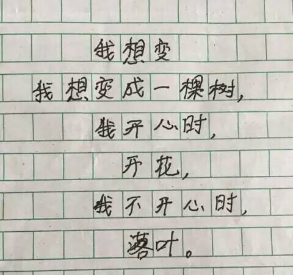

*2015-12-31 01:56 · 手机上网*

---

### 8181

终于遇到传说中的「明天系」。

*2015-12-31 01:38 · iPhone版*

---

### 8182

好巧的感觉。转@ Squall 拉合尔是本市的友好城市，最近看了无数个拉合尔的投资项目 「@ 王兴 看了一下地图，拉合尔Lahore相当于北京，第二大城市，在北部内陆，历史悠久，文化中心。巴基斯坦第一大城市卡拉奇相当于上海，南部沿海港口，原来只是小渔村，

*2015-12-30 23:23 · 手机上网 转自王兴*

---

### 8183

你们都好有文化。我刚查了一下，《拉合尔茶馆的陌生人》这电影的英文名挺有意思，The Reluctant Fundamentalist，直译就是《不情愿的原教旨主义者》。转@ 园丁机器人 唯一知道拉合尔就是《拉合尔茶馆的陌生人》转@ 王兴 看了一下地图，拉合尔Lahore相当于北京

*2015-12-30 21:06 · 网页 转自王兴*

---

### 8184

不好意思，是我搞错了。巴基斯坦的官方语言是乌尓都语（按CIA的统计有8%人口使用）。Punjabi有48%人口使用。转@ 沫沫 巴基斯坦的官方语言不是乌尔都语么？还是听一个巴基斯坦同学讲的。RT@ 王兴真的诶，Lollywood所在城市叫Lahore，是巴基斯坦第二大城市，千年古城

*2015-12-30 21:00 · 网页 转自imzxd*

---

### 8185

看了一下地图，拉合尔Lahore相当于北京，第二大城市，在北部内陆，历史悠久，文化中心。巴基斯坦第一大城市卡拉奇相当于上海，南部沿海港口，原来只是小渔村，十九世纪西方殖民者来了之后才发展起来。好像东方很多国家都这城市布局，就像缅甸的曼德勒vs仰光，越南的河内vs胡志明市。

*2015-12-30 20:53 · 网页*

---

### 8186

真的诶，Lollywood所在城市叫Lahore，是巴基斯坦第二大城市，千年古城，旧都。而且Lahore是Punjab省的首府，我两周前刚知道巴基斯坦的官方语言是Punjabi。转@ imzxd @ 王兴 巴基斯坦都有Lollywood。。。《追风筝的人》里看到的。

*2015-12-30 20:34 · 网页 转自imzxd*

---

### 8187

专业人士告诉我，其实有个名词叫：华莱坞 huallywood -_-!转@ 王兴 美国有好莱坞hollywood，印度有宝莱坞bollywood，连非洲第一人口/经济/电影大国尼日利亚都有诺莱坞nollywood，中国的电影业却连一个对应的词也没有。

*2015-12-30 16:57 · 网页 转自王兴*

---

### 8188

Goodhart法则：一旦zf特别重视某个指标，那么这个指标就失去了对经济的测度效力。

*2015-12-30 16:45 · 网页*

---

### 8189

收到一部360奇酷手机，可是我没有动力和精力把刚用上的华为mate8换掉。

*2015-12-30 15:26 · iPhone版*

---

### 8190

和足球有什么关系？我的印象来自于早些年雪花啤酒赞助《中国国家地理》的活动并在杂志里打广告。转@ 海童 显然你被足球坑的不轻转@ 王兴 「雪花啤酒，勇闯天涯」是少数能给我留下印象的国产品牌广告之一。

*2015-12-29 10:43 · 手机上网 转自王兴*

---

### 8191

这也太幽默了吧！转@ 陈倚刚 想起一个说法是有南海官兵的任务就是没事去周围岛上撒宋代铜钱转@ 王兴 原来「曾母暗沙」的最高点都在水下22米-_-! 咱们国家还挺霸道的嘛

*2015-12-29 01:24 · 手机上网 转自王兴*

---

### 8192

拜托，你们正儿八经领证或摆酒的时候想起来跟我说一声，我就很满足了。「我跟xxx同居了」这种就不必告诉我了吧-_-! 当然，我也会一样祝福你们。

*2015-12-28 23:04 · 手机上网*

---

### 8193

「雪花啤酒，勇闯天涯」是少数能给我留下印象的国产品牌广告之一。

*2015-12-28 22:41 · 手机上网*

---

### 8194

刚收到私信，又有一对在饭否认识的人结婚了:) 祝福他们！

*2015-12-28 22:40 · 手机上网*

---

### 8195

我十几年前用过其中一款，叫Gramps，但是现在数据已经找不到了:-(转@ Solibot 《优秀的开源家谱软件》 http://www.solidot.org/stor...

-- 来自上三代下三代部门

*2015-12-28 20:17 · 网页 转自Solibot*

---

### 8196

按照moritz的说法，google在盈利之前只花掉了800万美元。

*2015-12-28 12:39 · 网页*

---

### 8197

徐浩峰竟然是这么解释「江湖」：江湖很明确，江就是江西，湖就是湖北，江西和湖北在宋明都是禅宗的高僧都，所以学习文化要跑江湖，跑的就是江西和湖北。典故就是这么来的。

*2015-12-28 03:02 · iPhone版*

---

### 8198

原来「曾母暗沙」的最高点都在水下22米-_-! 咱们国家还挺霸道的嘛

*2015-12-28 02:43 · iPhone版*

---

### 8199

小沃森从父亲老沃森手里接过了IBM并发扬光大。当他于1974年1月正式离开IBM时，他对继任者加里说，“100天以内我不会再踏进这座大楼。”

*2015-12-28 02:14 · 手机上网*

---

### 8200

昨天去看《小门神》点映，看到第三封印所在的破庙时，想起：「绕床饥鼠，蝙蝠翻灯舞。屋上松风吹急雨，破纸窗间自语」。辛弃疾的这首词我只记得上阕，刚才把下阕搜出来了：「平生塞北江南，归来华发苍颜。布被秋宵梦觉，眼前万里江山」。下阕偏高大上，没有上阕那么生动形象，难怪我记不得。

*2015-12-28 01:33 · 手机上网*

---

### 8201

电影《老炮儿》的典故：老炮儿指的是那种老进炮局（北京话里指公安局）的人。炮局和公安局是啥关系？请看截图。

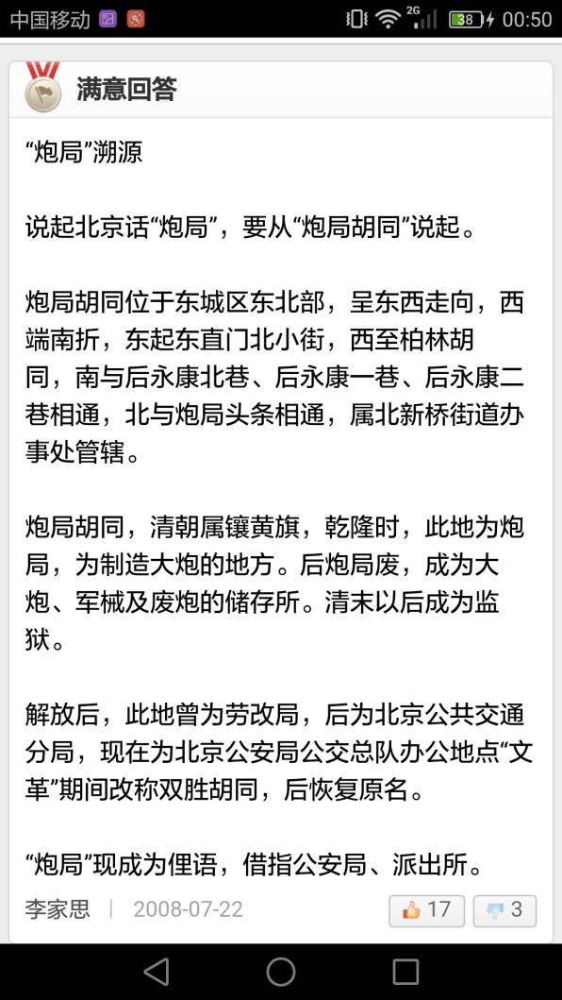

*2015-12-28 01:22 · 手机上网*

---

### 8202

学过，但是学艺不精。转@ 張逸 好奇。 王老板中学可能没学过这首诗 。「@ 王兴 赞！现在的拼音输入法连纠错功能都有了。原来「将进酒」的第一个字念qiāng，是「请」的意思。」

*2015-12-28 00:54 · 手机上网 转自王兴*

---

### 8203

赞！现在的拼音输入法连纠错功能都有了。原来「将进酒」的第一个字念qiāng，是「请」的意思。

*2015-12-28 00:46 · 手机上网*

---

### 8204

有比李白的《将进酒》更有气势的祝酒词吗？天才就是天才啊！

*2015-12-28 00:34 · iPhone版*

---

### 8205

横店并不是中国电影业的中心，北京才是。就是这么分裂。

*2015-12-28 00:24 · iPhone版*

---

### 8206

我十几岁时曾经心血来潮列过几个人生目标，依稀记得其中之一是

「30岁之前写一本书」。这个目标没有达成-_-！十几岁时30岁真是显得无比遥远，其实一眨眼就过去了。

*2015-12-28 00:23 · iPhone版*

---

### 8207

美国有好莱坞hollywood，印度有宝莱坞bollywood，连非洲第一人口/经济/电影大国尼日利亚都有诺莱坞nollywood，中国的电影业却连一个对应的词也没有。

*2015-12-27 23:39 · iPhone版*

---

### 8208

啥是大妈宝？转@ 小熊娃娃 自从发现蒋介石是个大妈宝之后很多事都得到了解释……

*2015-12-27 23:05 · 手机上网 转自小熊娃娃*

---

### 8209

达尔文的「适者生存」既可以说是一句废话，也可以说是有大智慧。

*2015-12-27 22:37 · iPhone版*

---

### 8210

人人都会算术，但是很多人经常不知道该算什么数。

*2015-12-27 21:31 · iPhone版*

---

### 8211

今天见了个人，明白一个道理，土豪们还是有智慧的。

*2015-12-27 00:53 · iPhone版*

---

### 8212

今天跟人聊天时第一次听说「如臂使指」这个成语。

*2015-12-25 17:43 · iPhone版*

---

### 8213

中国民航今年全年运送旅客4.4亿人次，年对年增长11.4%。

*2015-12-24 20:31 · iPhone版*

---

### 8214

「如果我不是一个作家，我会是个妓女」。杜拉斯的这句话真是令人过目难忘。

*2015-12-24 17:50 · iPhone版*

---

### 8215

在商业报道中使用「刻奇」这种词我觉得并不合适。

*2015-12-24 13:47 · iPhone版*

---

### 8216

要么写值得被阅读的文字，要么做值得被书写的事情。－本杰明·富兰克林

*2015-12-24 13:24 · iPhone版*

---

### 8217

英文书名是 Adventures of a Bystander. 转@ Apunk @ 王兴 @ikea @ 猫小九x俞与鱼 书名就是<<旁观者>>吧。

*2015-12-24 12:20 · 手机上网 转自Apunk*

---

### 8218

不知道在批哪本书，但我想趁机顶一下德鲁克传记的书名《一个旁观者的奇妙历险》。转@ 猫小九x俞与鱼 「@ ikea 一本通篇软文一般的商业书籍读得我难受得都有生理反应了，生生浪费这么好的贴身采访机会。要我说，好奇心不够，不勇于揭示真相的，都不配当什么记者！」

*2015-12-24 12:04 · 手机上网 转自ikea*

---

### 8219

@ 拧巴人儿 那部很老的小说？我太小的时候读的，现在都没什么印象了。02年左右在美国还看过根据金银岛改编的一部动画电影，感觉还行吧。

*2015-12-24 10:33 · 手机上网 给拧巴人儿的回复*

---

### 8220

DST的Yuri Milner是个靠谱的投资人。

*2015-12-23 15:45 · 网页*

---

### 8221

深夜开车回家，不知道空气中弥漫的是雾还是霾，反正能见度低得吓人，只好一路开着双闪走。

*2015-12-23 02:38 · iPhone版*

---

### 8222

转@ gravity0 人脑处于高强度工作状况下控制不住情绪也属正常，就连电脑过热都容易出错死机呢。耐压能力各人不同，谢安在淝水之战的强装镇定，后来被他的鞋子证明其实已经快接近极限。

*2015-12-22 12:14 · 手机上网 转自gravity0*

---

### 8223

@ 太空小孩 恭喜！

*2015-12-22 00:27 · 手机上网 给太空小孩的回复*

---

### 8224

转@ 小熊娃娃 很多人类经验吧「@ 飯否小字报 转@ 贾行家 “你们知道么？玻璃吃起来一股人血味儿。”——来自《煎蛋网》，好多实践检验出来的执政经验都是这样婶的。」

*2015-12-18 19:47 · 手机上网 转自贾行家*

---

### 8225

在一个小火车站的月台上看到一辆高铁不减速通过，确实挺快的。

*2015-12-18 15:43 · iPhone版*

---

### 8226

陈丹青：乌镇为什么能搞好？因为有陈向宏这个奇才。

http://t.cn/RLUcVf0

*2015-12-17 23:47 · 手机上网*

---

### 8227

乌镇的规划/建设/经营方确实很牛。回北京后要抽空去同一团队开发的古北水镇转转。

*2015-12-17 23:16 · 手机上网*

---

### 8228

AR和VR的杀手级应用首先就是AV。

*2015-12-17 16:05 · 手机上网*

---

### 8229

转@ webto 研究了一下东京租房的问题，结论是房产中介这个行业中国人日本人都不是好人。

*2015-12-17 14:44 · 手机上网 转自webto*

---

### 8230

好久没被这么冻过了。江南的冬天真不是盖的-_-！

*2015-12-17 00:44 · iPhone版*

---

### 8231

顺便查了一下，美国45年有了原子弹，苏联49才有。这中间4年估计苏联领导人的日子过得不是很安稳。

*2015-12-16 19:26 · iPhone版*

---

### 8232

军用机器人一旦实用了，对世界的改变不亚于当年原子弹的诞生。

*2015-12-16 19:23 · iPhone版*

---

### 8233

原来巴基斯坦最常用的语言是punjabi。

*2015-12-16 11:05 · 手机上网*

---

### 8234

转@ gravity0 地图上白色的是没被大英帝国揍过的国家，只有二十二个。谁说英国人保守来着？

*2015-12-16 10:44 · 手机上网 转自gravity0*

---

### 8235

忙成蜂，累成狗。

*2015-12-14 21:52 · iPhone版*

---

### 8236

我给《师父》打8分吧。也许是期望值已经被社交媒体拔得太高，看完之后觉得并没有那么好。小说里的感觉还是没能拍出来。另外，单看电影的话故事交代得不够清楚。

*2015-12-14 00:50 · iPhone版*

---

### 8237

最近过机场安检时，感觉明显被摸得更仔细了。我好奇的是，这条管理要求是如何层层落实到每个安检员去的呢？

*2015-12-13 13:06 · iPhone版*

---

### 8238

转@ 飯否小字报 转@ 毛穴抚子 周华健曾经说 我和李宗盛大哥关系很好 大哥的每一次 婚礼我都有去

*2015-12-13 09:56 · 网页 转自毛穴抚子*

---

### 8239

这些都是公司名。转@ 刘小明. The Weinstein Company, Lucasfilm,Disney。。转@ 王兴 老外真是比我华夏礼仪之邦自恋得多，办个公司用自己名字命名，发现（或搞火了）个地方用人名命名……倒是搞艺术的好像不用自己的名字命名啥东西。

*2015-12-13 01:22 · 手机上网 转自王兴*

---

### 8240

专家用最通俗易懂的语言解释一神教三大宗的区别：犹太教说「只有我们犹太人这上帝的选民才牛逼」，于是遭人恨；基督教说「人生而平等，大家都牛逼」，自然比较受欢迎；伊斯兰教说「只要信我就牛逼，不信的，呵呵」，最实用。

*2015-12-13 01:13 · 手机上网*

---

### 8241

老外真是比我华夏礼仪之邦自恋得多，办个公司用自己名字命名，发现（或搞火了）个地方用人名命名，搞科学的创建个物理单位也用自己名字命名。倒是搞艺术的好像不用自己的名字命名啥东西。

*2015-12-13 00:59 · 手机上网*

---

### 8242

半睡半醒之间，「得莫利炖鱼」和「德布罗意物质波」这俩词汇在我脑海里邂逅了一下。其实我并不真的理解「德布罗意物质波」这概念，也没有真的吃到过美味的「得莫利炖鱼」，但谁让它俩听起来有点像呢。

*2015-12-13 00:50 · 手机上网*

---

### 8243

把那个「对世界最有影响的一百人」列表搜出来重看了一下。居然有好几个名字觉得很陌生，看来我当年读书还是不够认真，或是记性实在不行。这一百个人里只有亨利-福特这一个企业家。宗教人士很多，连拜火教、摩尼教、耆那教这些我觉得很遥远的宗教都有人上榜。

*2015-12-13 00:44 · 手机上网*

---

### 8244

特斯拉火了之后，国内造电动车的公司已经照猫画虎把法拉第、安培、爱迪生这些和电有关的科学家名字都用上了-_-！相比之下，UC创始人何小鹏投资的电动车直接就叫「小鹏汽车」倒也光明磊落，颇有复古之风。奔驰、福特、标致、本田、丰田等都是创始人名字。

*2015-12-13 00:37 · 手机上网*

---

### 8245

还有财富、资本、资产这几个概念。转@ 王兴 货币、钱、钞票、信用、金融，要搞清楚这些概念的各自含义和之间的联系并不容易。

*2015-12-13 00:30 · 手机上网 转自王兴*

---

### 8246

公司合并在商业史上是常态。著名的戴姆勒-奔驰公司就是一百多年相互竞争不相伯仲的两家（各自以创始人名字命名的）公司合并而成的。

*2015-12-13 00:28 · iPhone版*

---

### 8247

我中学时读过一本老外写的《对世界影响最大的一百人》，排第一的是穆罕默德，第二是牛顿。当时我觉得这个第一莫名其妙，现在有点理解了。

*2015-12-13 00:06 · iPhone版*

---

### 8248

货币、钱、钞票、信用、金融，要搞清楚这些概念的各自含义和之间的联系并不容易。

*2015-12-12 23:39 · 手机上网*

---

### 8249

抢银行怎么会造成通胀？难道被抢的银行可以把被抢的金额恢复出来？转@ 啤酒热了 通缩，李四收益，同理，抢银行（成功）造成通胀 转@ 王兴 我也觉得是。转@ 聂枫 受益了～转@ 王兴 更近一步的问题：当张三烧掉一百万现钞，（和张三毫无关系的）李四到底是受益还是受损了？

*2015-12-12 23:36 · 手机上网 转自王兴*

---

### 8250

我也觉得是。转@ 聂枫 受益了～转@ 王兴 更近一步的问题：当张三烧掉一百万现钞，（和张三毫无关系的）李四到底是受益还是受损了？转@ 王兴 当一个人把他的一百万元存款全部取成现金，再把那堆钞票一把火烧成灰烬时，按说这个社会的真实财富并没有多少实际损失吧？

*2015-12-12 23:29 · 手机上网 转自王兴*

---

### 8251

更近一步的问题：当张三烧掉一百万现钞，（和张三毫无关系的）李四到底是受益还是受损了？转@ 王兴 当一个人把他的一百万元存款全部取成现金，再把那堆钞票一把火烧成灰烬时，按说这个社会的真实财富并没有多少实际损失吧？

*2015-12-12 23:26 · 手机上网 转自王兴*

---

### 8252

当一个人把他的一百万元存款全部取成现金，再把那堆钞票一把火烧成灰烬时，按说这个社会的真实财富并没有多少实际损失吧？

*2015-12-12 23:21 · 手机上网*

---

### 8253

转@ 拧巴人儿 上午去教授家，他激动地说等着我给你看样东西，然后进屋拿了一个纸条出来。原来那天考完试之后一个学生默默把一个纸条放在讲台上，大意说很幸运有他做教授，这个学生在中国上了十二年学，参加了高考，但是上了课之后，才觉得从来没有认识过真正的中国。教授说就是这样的小事让他觉得教书

*2015-12-12 22:11 · 手机上网 转自拧巴人儿*

---

### 8254

别客气。祝你们幸福！转@ imugia @ 王兴 感谢村长提供了饭否这个平台，让我和桃子走到了一起～鞠躬～

*2015-12-12 12:34 · 手机上网 转自imugia*

---

### 8255

原来「迪化」是「乌鲁木齐」的旧称。为何要改呢？

*2015-12-12 00:03 · iPhone版*

---

### 8256

出差中，找了个快印店处理了12页文件，打印每张五毛，扫描每张一块。

*2015-12-12 00:01 · iPhone版*

---

### 8257

美的midea介绍自己是从68年开始创业路程的。这和万向是同期的。

*2015-12-11 10:52 · iPhone版*

---

### 8258

@ Meng.Z 切勿过度解读-_-！

*2015-12-11 00:58 · 手机上网 给Meng.Z的回复*

---

### 8259

起名是多么有趣、需要创造力又有成就感的事情啊！转@ 拧巴人儿给论文想标题这个事儿的讨厌程度仅次于annotated bib.

*2015-12-10 13:02 · 手机上网 转自拧巴人儿*

---

### 8260

Endless roller coaster.

*2015-12-10 12:25 · iPhone版*

---

### 8261

转：The moment you think it's easy, you are doing somethingwrong.

*2015-12-10 01:20 · 手机上网*

---

### 8262

不明觉厉。转@ 小熊娃娃 突发奇想去看了一下中华民国的国运盘，能看懂的部分和之前的印象还蛮像的，最神奇的是三-九宫非常突出啊，水射手紧密合轴，难怪是教育/学术/文艺大爆发的一段黄金期！

（相比之下PRC真是惨到堪称文化荒漠了）# 然并卵 #还不是受克于人，最后九宫好到把自己给搬走了……

*2015-12-10 01:15 · 手机上网 转自小熊娃娃*

---

### 8263

《了不起的盖茨比》是少数我会连读两遍的小说。转@ 王金牙儿 我

年纪还轻，阅历不深的时候，我父亲教导过我一句话，我至今念念不忘。“每当你想要批评任何人的时候，”他对我说，“你就记住，这个世界上所有的人，并不是个个都有你那样的党性。”——《了不起的支部书记》

*2015-12-10 01:12 · 手机上网 转自叉烧莲蓉长脖子汪*

---

### 8264

原来库尔勒是巴州的首府。话说我已经有好几年没去过巴州驻京办了。不知道那里的红柳木烤羊肉串是否依然正宗美味。

*2015-12-10 01:00 · iPhone版*

---

### 8265

搞明白因果很重要。美国不太可能因为IS胡搞而把精力从亚太抽调回中东从而缓解了对中国的压力。正是因为美国认为亚太的利益更大因此要从中东抽身才给了IS胡搞的空间。

*2015-12-10 00:39 · iPhone版*

---

### 8266

因为要把安卓手机从mate7换成mate8，所以把移动的卡从micro-sim换成nano-sim了，顺便升成了移动的4G。确实快很多！

*2015-12-09 10:28 · 手机上网*

---

### 8267

你们…真的…都是在讲亲身经历吗？转@ 吃飽撐的 破了处 转@ 脆皮宾 破了处 转@ imugia 破了处 转@ 徘徊君不徘徊 破了处转@ AA铺 破了处「@ 嘿品乐 破了处「@ 铁帽子嫖亲王 还到我们宿舍来发过文化衫呢，说只要注册就送一件，不过托您的福，我通过校内网破了处。「@ 王兴 十

*2015-12-08 13:27 · 手机上网 转自王兴*

---

### 8268

十年前的今天，校内网正式诞生了。

*2015-12-08 12:19 · 手机上网*

---

### 8269

转@ 一颗猫饼干 转@ 饭友经典语录 中国人讨论的时候，往往纠结于谁对谁错，而忘了讨论的目的——什么是对的。——@ 史鬼

*2015-12-08 12:17 · 手机上网 转自史鬼*

---

### 8270

深夜一个人在办公室的感觉特别自在，配上合适的音乐就更棒了。偶尔抬头看看窗外屎一样的空气，然后低头继续改变世界的工作。

*2015-12-08 01:34 · 网页*

---

### 8271

拿到新手机华为mate 8了，但是要从mate 7转过去还挺麻烦，一个是支持的sim卡从micro缩小成nano了，另一个是老手机上有一大堆app和数据要转过去。

*2015-12-07 23:19 · 网页*

---

### 8272

想吃！转@ 狮狮狮 坐出租车8块钱之内逛完全城，不过好吃的野蘑菇

拌面要108元，这差价当初令我吃惊！转@ 王兴 在谷歌地球里看了一会儿，发现库尔勒这个城市确实还不小。

*2015-12-07 23:12 · 手机上网 转自王兴*

---

### 8273

老爸老妈出发去南美了，我在北京继续战斗。

*2015-12-07 22:20 · iPhone版*

---

### 8274

@ 城南草木生 我最初记的也是徐皓峰，但是我查网上，「皓」和「浩」两个字都用。有啥讲究？徐老师本人的意见是？

*2015-12-07 10:20 · 手机上网 给城南草木生的回复*

---

### 8275

在猫眼电影里看了《师父》的几部预告片，其中出现“再造江湖”的字眼，我觉得蛮贴切。徐浩峰绝对有再造文化、再造历史的抱负。

*2015-12-07 01:45 · iPhone版*

---

### 8276

在猫眼电影里把即将上映的《师父》标为“想看”了，因为我相信原著作者兼导演徐浩峰是个有追求的文化人。

*2015-12-07 01:39 · iPhone版*

---

### 8277

在谷歌地球里看了一会儿，发现库尔勒这个城市确实还不小。

*2015-12-07 00:56 · iPhone版*

---

### 8278

@ webto 不算是公开的，是完美世界的池宇峰为他的长江商学院同学组织的。我是去友情蹭课的。

*2015-12-06 14:14 · 手机上网 给webto的回复*

---

### 8279

去听了社科院西亚非洲所研究员殷罡老师关于中东局势的讲座，确实和公开媒体上常见的解读不太一样。

*2015-12-05 22:22 · 手机上网*

---

### 8280

「行万里路，读万卷书，与万人谈，做一件事」，任正非对「专注」

的表述令我印象深刻。

*2015-12-04 20:46 · iPhone版*

---

### 8281

「与虎谋皮」是个多么生动而又深刻的成语啊。

*2015-12-03 20:01 · iPhone版*

---

### 8282

@ 小晚_wan 有希望通过航空公司找回来的。我有两次把kindle忘在飞机上了，一次找回来了。

*2015-11-30 17:40 · 手机上网 给小晚_wan的回复*

---

### 8283

转@ gravity0 有次和朋友吃饭，餐厅不让自带酒水。我们买了一桶啤酒藏在一人衣服下面，谁酒喝完了就找他要。他接过杯子凑到肚子下方啤酒桶的龙头上，拧开倒满黄汁和泡沫再拿上桌，动作很猥琐。

*2015-11-30 12:02 · 手机上网 转自gravity0*

---

### 8284

看到科比退役的消息，我的第一感受不是「唉，我老了」，而是「嘿，连你们的时代都过去了」。我属于乔丹那个时代的……

*2015-11-30 12:01 · iPhone版*

---

### 8285

太可怕了，竟然已经到了11月最后一天！

*2015-11-30 01:06 · iPhone版*

---

### 8286

听说全世界的iPhone都是在郑州富士康这一家厂里造出来的。

*2015-11-29 23:04 · 手机上网*

---

### 8287

iPhone6s的指纹解锁速度感觉是比iPhone6明显更快了，快得有时候我并不想解锁，只想点亮屏幕看时间，但是也一按home键就解锁了。

*2015-11-28 10:09 · iPhone版*

---

### 8288

名词是可以定义的，就像俄国人自己定义的「第一次卫国战争」（打败了法国的拿破仑）和「第二次卫国战争」（打败了德国的希特勒）。转@ 乱耳朵 这不废话嘛，毕竟是第一次。。。转@ Excited转@ 王兴 因为去年是一战爆发一百周年，我去读《the guns inaugust》这本书

*2015-11-28 01:07 · 手机上网 转自王兴*

---

### 8289

战略上打持久战，战术上打歼灭战。

*2015-11-28 00:45 · 手机上网*

---

### 8290

好啊，修正一下，工作中需要用到高等数学的CEO。转@ 里多 ML之类的工作涉及到的数学原理都是高等数学了吧......美团里做ML的也应该不少吧？ 转@ 王兴 我一直很仰慕在工作中能用到高等数学的人，虽然我认识的唯一一个号称在工作中用到高等数学的创业者的公司做

得并不算太好。

*2015-11-28 00:36 · 手机上网 转自王兴*

---

### 8291

因为去年是一战爆发一百周年，我去读《the guns in august》这本书。一开篇就讲，战争爆发前没人知道会爆发大战，爆发后很长时间里大家也不知道这会是前所未有的大战。

*2015-11-28 00:34 · iPhone版*

---

### 8292

我一直很仰慕在工作中能用到高等数学的人，虽然我认识的唯一一个号称在工作中用到高等数学的创业者的公司做得并不算太好。

*2015-11-28 00:15 · iPhone版*

---

### 8293

我怀疑我在安卓手机的chrome浏览器里至少有两百个tab同时开着，未读。

*2015-11-27 23:57 · iPhone版*

---

### 8294

不知怎的突然想起诸葛亮的「安居平五路」。我只知道小说《三国演义》里对这段故事的描写，不知道史书《三国志》里是怎么说的。

*2015-11-27 23:39 · 手机上网*

---

### 8295

听老妈说，我出生才10天就开始吃米糊了:-(

*2015-11-27 22:57 · iPhone版*

---

### 8296

这个三能力划分不错。我给自己打2/2/1吧。转@ 小晚_wan 人核心三能力：创造 感受 表达 。我：2分 3分 0分

*2015-11-27 17:18 · 手机上网 转自小晚_wan*

---

### 8297

看过不少传记，《林登约翰逊的岁月》的开头依然给我极深刻的印象。约翰逊作为一个美国总统并不算出彩，但是那套书将他的形象刻画得极其生动鲜明。

*2015-11-27 01:12 · iPhone版*

---

### 8298

手机上有个陌生来电，通常我是不接陌生来电的，但是系统显示这个号码来自肯尼亚，我一时好奇就接了，居然还真是认识的人。

*2015-11-25 18:45 · 网页*

---

### 8299

看到土耳其击落俄军机的新闻，想起11年时一个大哥推荐我读美国地缘政治专家弗里德曼写的书《未来一百年》。书里提到土耳其是个非常关键的国家，所以13年十一假期我和几个朋友去了趟土耳其，有了一点感性认识。多读书多旅行还是有意义的。

*2015-11-25 13:19 · iPhone版*

---

### 8300

转：成功的思考依赖于四个因素：来自于环境的信息，长期记忆的事

实性知识，长期记忆中的程序性知识，以及工作记忆的容量。

*2015-11-25 08:36 · iPhone版*

---

### 8301

出了饭否，没有人称呼我为「王老板」。

*2015-11-25 02:38 · iPhone版*

---

### 8302

8年多前的消息。我都想不起具体是谁了。转@ 王兴 发现饭否有点像互联网同行聚会，校园SNS领域的校内、占座、底片、5加1、ChinaY、dorm99、同桌的你、学生圈的人都来了:-)

*2015-11-25 02:11 · 网页 转自王兴*

---

### 8303

转@ 王兴 @ 小河 中学时有一次我冒雨骑车回家，雨点重得像是在按摩，密得我只有一个想法：幸好我会游泳否则真是无法在雨中呼吸。

当然，这只是夏天午后的雨，不是台风来时的雨。

*2015-11-25 01:57 · 网页 转自王兴*

---

### 8304

饭否居然这么多夜猫子-_-!

*2015-11-25 01:41 · iPhone版*

---

### 8305

一晃就是一个五年。

*2015-11-25 01:36 · iPhone版*

---

### 8306

前阵子开始执行一个想法：办两张信用卡，一张放钱包里用于线下刷卡，另一张专门用于各类线上支付。这样分开来便于统计。

*2015-11-24 18:57 · iPhone版*

---

### 8307

我也有兴趣看一下。我喜欢「二战时德国和日本赢了，瓜分了世界包括美国」这个设定。转@ quux 亚马逊的 The Man In The HighCastle 看样子会成为名剧了，不知道会拍几季。

*2015-11-24 16:42 · 手机上网 转自quux*

---

### 8308

听一个朋友说山东已经在考虑每周4天半工作制，我表示难以置信。

*2015-11-24 00:40 · iPhone版*

---

### 8309

德国人真是低调。我今天才第一次知道宝马居然是由一个叫匡特Quandt的家族持股46.7%。相比之下，福特家族在福特公司里持股只剩2%了。

*2015-11-23 19:23 · 网页*

---

### 8310

转@ 拧巴人儿 今天这纪录片里有一部分我印象挺深刻的，一女的回忆上学的时候班上同学去抄资本家的家，她有事儿，去晚了，到的时候发现老资本家已经被学生们打死了。头肿的老大，满脸瘀青。她说她当时没多想，后来长大了不停地想，如果她那天没去晚，会不会也

动手。她说她想了这么多年都想不出来结果。

*2015-11-20 20:25 · 手机上网 转自拧巴人儿*

---

### 8311

做个体面人不容易。

*2015-11-20 02:22 · iPhone版*

---

### 8312

当领导总是辛苦的：穆罕默德在处理一位意志坚强的老妇所提出的诉讼遭到困难之后，他一时冲动，宣告老妇都不能进天堂，因为天堂是宁静的处所。后来，他后悔不该作这样的断言。然而时至今日，在老妇是否有灵魂这一点上，伊兰教各宗派教义仍不一致。

*2015-11-14 15:23 · iPhone版*

---

### 8313

「不需要安全感就是自由」这句话确实充满了奇怪的魅力。

*2015-11-14 15:13 · iPhone版*

---

### 8314

在我的华为mate7上，Google play跳出来建议我卸载腾讯应用宝。

*2015-11-13 13:21 · 手机上网*

---

### 8315

This is not the end. It is not even the beginning of the end. Butit is, perhaps, the end of the behinning. -丘吉尔于1942年

*2015-11-11 22:42 · iPhone版*

---

### 8316

「母舰」这个词在中文里很少单独使用，常见的是「航空母舰」。前者在英文里对应的是mothership（感觉比中文里更经常出现，尤其是科幻里），后者对应的则是aircraft carrier，没有直接关联。

*2015-11-11 13:37 · iPhone版*

---

### 8317

转@ 杨曜睿 亚洲人的节奏感多半偏弱，解决的办法是在地上爬。。

。爬了两天后感觉还蛮明显的：一开始笨拙不协调，现在已然进化成汪星人/喵星人了。。据说要爬一个月弹琴、打鼓的节奏才会改善。

（bonus: 还可以锻炼颈肩、刷运动步数）

*2015-11-10 23:29 · 手机上网 转自杨曜睿*

---

### 8318

@ blog图党 请勿信谣传谣。事实上，我们今天下午刚刚发出内部全员邮件，结束联席CEO状态，我担任CEO，张涛转任董事长。

*2015-11-10 23:26 · 网页 给blog图党的回复*

---

### 8319

看来多数人真的不知道华为mate7的电池有多强劲。我这一天下来，用mate7的时间是肯定多过iPhone 6s的。这么说吧，我的微信、工作IM和主浏览器chrome都是在mate7上。

*2015-11-08 23:10 · iPhone版*

---

### 8320

拿到iPhone 6s已经一个星期了，我连一次3D Touch都没用过。看来这功能确实是个鸡肋。确实，示能性太差了。

*2015-11-08 23:07 · iPhone版*

---

### 8321

在外奔波一天，iPhone 6s剩1%电量的时候，华为mate7还有34%。

*2015-11-08 22:33 · iPhone版*

---

### 8322

贝索斯成为美国首富只是个时间问题。

*2015-11-07 13:46 · iPhone版*

---

### 8323

读白居易的《问刘十九》：绿蚁新醅酒，红泥小火炉。晚来天欲雪，能饮一杯无？想起来我好像还从没体验过正儿八经烧木材的壁炉。

*2015-11-07 08:05 · iPhone版*

---

### 8324

中午去拜访一个前辈，一起午饭时顺带尝了他的家乡菜「鸡汤泡炒米」。

*2015-11-07 02:11 · 网页*

---

### 8325

拼完智力拼体力，还得时时刻刻拼心力。

*2015-11-07 00:39 · 网页*

---

### 8326

在北五环看到宝马的电动车。外形鼓鼓囊囊的，不太讨喜。

*2015-11-06 13:52 · iPhone版*

---

### 8327

后来得知另一个八卦消息：那个俄罗斯土豪曾经娶过叶利钦的幕僚长(同时也是叶的女婿）的女儿转@ 王兴 今天得知另一个俄罗斯土豪也和DST的老板Yuri Milner一样毕业于莫斯科大学物理系，苏联当年最难进的系之一。果然是人牛干啥都行。

*2015-11-05 23:16 · 网页 转自王兴*

---

### 8328

@ 洋气的好身材小姐 居然这么巧-_-!

*2015-11-05 22:46 · 网页 给洋气的好身材小姐的回复*

---

### 8329

orz 转@ onyt 今天遇到个穆斯林告诉我他从西安坐过火车去过麦加……我告诉他没有火车线路可以直接从中国或者沙特旁边的国家到麦加，他说我竟然敢质疑真主的意志…我说我头有点晕就没理他了。

*2015-11-05 22:03 · 手机上网 转自onyt*

---

### 8330

我有一件斜纹布的蓝白格子衬衫，98年左右在双安商场买的，后来一直陪伴我出国留学，再回国创业。那是一个本土小品牌，叫「比利牛仔」，billy jeans，商标是一个印第安酋长的头像，当年的广告词给我深刻印象：Don't let them steal your dream.

*2015-11-05 12:25 · iPhone版*

---

### 8331

买了个iPhone 6s，把我原来用的iPhone 6送给老爸，替换他的5s。用了一天，没觉得6s和6有什么显著区别。

*2015-11-01 01:04 · iPhone版*

---

### 8332

转@ Frankiiee 「专任智则贼 ，遍施仁则懦 ，固守信则愚 ，恃勇力则暴 ，令过严则残 。五者兼备 ，各适其用 ，方可为将帅 。」

*2015-10-30 00:26 · 手机上网 转自Frankiiee*

---

### 8333

原来丽嘉酒店是香港人对ritz-carlton的翻译，比大陆的翻译「丽思卡尔顿」简短许多。

*2015-10-30 00:26 · iPhone版*

---

### 8334

转@ webto 据说科学研究基本证明了吃牛肉致癌，我打算从此告别看科学研究相关新闻了。

*2015-10-27 20:10 · 手机上网 转自webto*

---

### 8335

炼狱和地狱的区别到底是什么？主要就是「炼狱还有希望，地狱就没有希望了」？

*2015-10-27 18:49 · iPhone版*

---

### 8336

被去哪儿坑了。在他们家买的一张机票完全不能退:（

*2015-10-26 16:57 · 手机上网*

---

### 8337

一个会开了七个半小时。

*2015-10-26 00:08 · iPhone版*

---

### 8338

实践证明，太锋利的刀确实不适合用来开信封，因为锋利到所向披靡之后反而无法沿着折缝裁出整齐的口子。

*2015-10-22 19:16 · iPhone版*

---

### 8339

2014年底国航与南航分别有322架和472架飞机，分别在全球排名第十和第五。排名第一的美国航空公司共有967架飞机，第二名达美航空共有785架。也就是说，如果国航和南航的合并成行，也将跻身世界前三名。

*2015-10-22 12:45 · iPhone版*

---

### 8340

转@ 一淇 我始终认为一个人可以很天真简单的活下去，必是身边无数人用更大的代价守护而来的。——《小王子》

*2015-10-21 13:10 · 手机上网 转自一淇*

---

### 8341

现在如家的房间连两瓶免费矿泉水都省掉了？

*2015-10-20 23:41 · iPhone版*

---

### 8342

转@ gravity0 苹果音乐试用三个月然后付费，调查显示三十五岁以下用户多半会取消订阅。对此结果，上了年纪的人的解读是年轻人穷，年轻人的解读是老人们糊涂忘了取消订阅。挺好，各自解读皆大欢喜。

*2015-10-20 15:01 · 手机上网 转自gravity0*

---

### 8343

黑得狠。转@ gravity0 洋人书中批评天朝郑和下西洋后的闭关锁国，顺便类比了一下本国的太空计划：官家主导，在完成政治目的耀我国威后就不玩了，内政更重要。

*2015-10-18 16:37 · 手机上网 转自gravity0*

---

### 8344

上兵伐谋，其次伐交，其次伐兵，其下攻城。-《孙子兵法》

*2015-10-18 10:17 · iPhone版*

---

### 8345

十年确实还是能发生很多事的。下午参加红杉资本十周年庆典有感。

*2015-10-17 23:45 · 手机上网*

---

### 8346

国货常有一些咋一看有点怪的创新。例如，昨天去机场时叫了一辆uber，比亚迪的某款车，我站在车后想把行李箱放进去却找不到开车后厢的办法，车主大叔过来很自豪的按了一下就打开了，原来是指纹锁。

*2015-10-15 13:35 · iPhone版*

---

### 8347

没有对错之分，但老子的逼格确实比孙子高。孙子说：「兵者，国之大事，死生之地，存亡之道，不可不察也」转@ 王兴 兵者不祥之器，非君子之器，不得已而用之，恬淡为上，胜而不美。-《道德经》

*2015-10-08 13:10 · 网页 转自王兴*

---

### 8348

同不觉。转@ qinyf 听说“系统”是音译的system，好奇当年是谁译的，浑然不觉啊。

*2015-10-08 13:07 · 网页 转自qinyf*

---

### 8349

种一棵树的最好时机是十年前，其次是现在。

*2015-10-07 21:24 · iPhone版*

---

### 8350

转：小说开始于作者的想象，完成于读者的想象。

*2015-10-05 10:28 · iPhone版*

---

### 8351

「徕卡以轻巧结实著称，在二战的时候，参战军方规定，如果投降必须用石头砸坏随身物品，徕卡除外，徕卡相机必须用手榴弹炸毁——因为太结实了。」这PR点太牛了！

*2015-10-04 02:51 · 网页*

---

### 8352

去年，全球共33亿人次坐飞机出行。全球人口刚过70亿。

*2015-10-03 22:34 · 网页*

---

### 8353

转@ 王兴 Business demands faith, compels earnestness, requirescourage,is honestly selfish,is penalized for mistakes,and is theessence of life.

*2015-10-03 19:06 · 网页 转自王兴*

---

### 8354

“seigniorage铸币税”这个英文单词好难记。

*2015-10-03 15:15 · iPhone版*

---

### 8355

无论是在飞机、地铁还是长途汽车上，戴上bose的降噪耳机就像瞬间切换到和周围完全不同的另一个世界里，这既有好处也有坏处。

*2015-09-30 01:19 · iPhone版*

---

### 8356

李煜的《浪淘沙令》：「帘外雨潺潺，春意阑珊，罗衾不耐五更寒。

梦里不知身是客，一晌贪欢。独自莫凭栏，无限江山，别时容易见时难。流水落花春去也，天上人间。」这个意境也适合秋天吧。

*2015-09-30 00:40 · iPhone版*

---

### 8357

telegram是个好东西。可惜，国内用的人越多，它离被封就越近。这真是让人想想就难过。

*2015-09-30 00:22 · iPhone版*

---

### 8358

如果不是因为赶上台风，我可能一辈子都不会来这个小机场。

*2015-09-29 21:44 · iPhone版*

---

### 8359

orz！我都看明白是咋回事。黑衣小辫男是你？转@ 喵.杨曜睿 Do

something that reminds you you're still alive. @ Macau Tower

*2015-09-26 17:02 · 手机上网 转自喵.杨曜睿*

---

### 8360

打算重读《西游记》。

*2015-09-26 00:22 · iPhone版*

---

### 8361

兵者不祥之器，非君子之器，不得已而用之，恬淡为上，胜而不美。

-《道德经》

*2015-09-20 17:45 · iPhone版*

---

### 8362

Bose的QC20i降噪耳机确实还是挺实用的，而且很适合口碑传播。我就是在咖啡跟一个朋友见面时，他让我戴上降噪耳机，然后拨动开关对比一下有降噪和没降噪的感受区别，于是我就当场决定要买了。

*2015-09-19 01:57 · 网页*

---

### 8363

在朋友圈里看了一个ISIS的短视频，实在是毫无人性到令人无语的地步！那种场景我以前只在讲纳粹的电影里看过，可现在这是实实在在每时每刻正在发生的惨剧！

*2015-09-13 00:30 · iPhone版*

---

### 8364

我的体脂率也超过这个数了 -_-！转@ 上官云吞 大部分猪的体脂率是15%。因此大部分人类都没有资格嫌弃猪肥。所以，“你肥的跟猪似的”这个说法并不科学。

*2015-09-12 11:12 · 网页 转自上官云吞*

---

### 8365

@ quux 对啊，在北京。

*2015-09-11 10:52 · 网页 给quux的回复*

---

### 8366

iPhone要通过wifi把iCloud里的备份恢复过来几乎是个不可能完成的任务。我已经中途失败无数次了:-(

*2015-09-11 10:45 · 网页*

---

### 8367

二十年前，我的高中数学老师任勇告诉我一个道理：敬业是最好的尊师。谢谢！

*2015-09-10 13:25 · iPhone版*

---

### 8368

看到最近欧洲难民和宗教极端行为的新闻，开始逐渐能体会近百年前土耳其开国元首凯末尔的伟大。他铁腕推动了土耳其的世俗化。几年前我去土耳其旅游时看到几乎处处悬挂凯末尔像时还不太理解。

*2015-09-08 22:29 · iPhone版*

---

### 8369

区别两个形容词：systematic的意思是「有系统有体系的」，systemic的意思是「关系到整个系统的」。

*2015-09-07 10:42 · iPhone版*

---

### 8370

原来，张家口是察哈尔省省会， 承德是热河省省会。

*2015-09-06 00:39 · 网页*

---

### 8371

Learn everything you can, anytime you can, from anyone youcan, there will always come a time when you will be gratefulyou did. ―Sarah Cald

*2015-09-05 12:33 · iPhone版*

---

### 8372

据说随着这次裁军改编文工团真的要退出历史舞台了。

*2015-09-04 08:33 · iPhone版*

---

### 8373

转：问「你为什么选择从事喜剧行业？」 答「人们总是嘲笑我，所以我想：去他妈的，干脆收他们点钱！」

*2015-09-04 00:25 · iPhone版*

---

### 8374

竟然是真的-_-! 世界最佳成绩是2小时2分57秒跑完42.195km，相当于全程保持「百米17.5秒」的速度！转@ jingjing 一直坚信人生是场马拉松不是百米赛跑，直到看了下马拉松的世界最好成绩我才明白，人家其实是在用我百米的速度在跑马拉松而已…

*2015-09-03 20:55 · 手机上网 转自jingjing*

---

### 8375

一千年前，我们的老祖宗曾经靠（当时的）高科技赚钱，把泥土烧成瓷器（china）就能卖到全世界，和今天英特尔等公司把沙子炼出来的硅做成芯片卖给全世界是一回事。

*2015-09-03 20:35 · iPhone版*

---

### 8376

几个其实蛮常用但经常被搞混的字：薅[hāo] 拔除：～羊毛。捋[lǚ] 用手指顺着抹过去，整理：～胡子。捋的另一个发音[luō] 用手握着条状物，顺着移动、抚摩：～起袖子。撸[lū] ~串。

*2015-09-03 16:46 · iPhone版*

---

### 8377

一定要分清 omni- (全能的）和 ominous（不祥的），前四个字母的排列不同，意思也相差甚远。

*2015-09-03 13:51 · iPhone版*

---

### 8378

转@ gravity0 其实那本讲莫斯科大学对犹太考生不公平的书我只翻了翻，书呆子的遭遇值得同情，但若以为这是天底下最冤枉的事那真是没见过世面。明朝科举就分南北卷，照顾低分省，因为科举是为政治服务，公平是次要的。世界杯若按水平分配名额东亚一个都轮不上，欧洲被淘汰的强队喊冤了么？

*2015-09-03 01:10 · 手机上网 转自gravity0*

---

### 8379

今天得知另一个俄罗斯土豪也和DST的老板Yuri Milner一样毕业于莫斯科大学物理系，苏联当年最难进的系之一。果然是人牛干啥都行。

*2015-09-02 23:11 · iPhone版*

---

### 8380

文化产业还真得是很有文化的人来搞。

*2015-09-01 22:11 · iPhone版*

---

### 8381

八十年代末九十年代初，台海两岸隔绝四十年后终于恢复往来，姨婆（奶奶的姐姐）回老家来探亲过几次，那时我还小。再过二十年，2011年十一，我到台北时去拜访过她老人家一次。那时她已独居，只有孙子时常来照看。

*2015-08-31 00:00 · iPhone版*

---

### 8382

所以，据说二战时苏联新兵投入战斗后平均存活时间不到24小时。转@ gravity0 游戏《地铁2033》中常打到弹夹空空，补充方式是去搜死人身。电影《兵临城下》也这样，苏军每人发五颗子弹不给枪就让冲锋，前面有枪被打死的后面捡。老毛子还真是物质匮乏，比我们当年也好不了多少。

*2015-08-30 23:44 · 手机上网 转自gravity0*

---

### 8383

埃塞尔比亚航空是非洲最大的航空公司呢。所以，当空姐/空少估计也是个还凑合的职业选择。转@ 拧巴人儿 不知道在埃塞俄比亚是不是做田径运动员是为数不多的有前途的选择之一。

*2015-08-30 23:42 · 手机上网 转自拧巴人儿*

---

### 8384

「鸾」现在不是一个常见的字了。看到《聂隐娘》里数次提起的「青鸾」，想起我已故的祖母（和她49年迁去台湾的姐姐）名字里都有个「鸾」字。

*2015-08-30 23:30 · iPhone版*

---

### 8385

看完电影再看小说原著对我来说并不新鲜，看完电影再看剧本全文倒是第一次。《刺客聂隐娘》 http://t.cn/RLs1TFY

*2015-08-30 23:20 · iPhone版*

---

### 8386

不系带的鞋比系带的鞋更方便，这个朴素的真理在人犯懒的时候体现得尤其深刻。

*2015-08-29 22:02 · iPhone版*

---

### 8387

每次看到中国运动员创下佳绩的新闻，我的脑海里都会浮现出96年亚特兰大奥运会王军霞夺得长跑金牌后身披五星红旗绕场慢跑的那一幕。我甚至都记得我是在福州某个夏令营两堂课之间看的那次电视转播。

*2015-08-29 21:46 · iPhone版*

---

### 8388

现在青年第一弱点，就是把事情太看容易，其结果不是侥幸，便是退却。因为大凡作一件事情，在起初的时候，很不容易区别谁为杰出之士，必须历练许多困难，经过相当时间，然后才显得出谁为人才，其所造就方才可靠。-章太炎 于1919年

*2015-08-29 12:50 · 手机上网*

---

### 8389

在饭否上，不经意间瞥见过去。果真是，相逢的人会再相逢。

*2015-08-29 01:41 · iPhone版*

---

### 8390

转@ 可乐鬼 人的一生啊，就是一场漫长的崩溃

*2015-08-29 00:31 · 手机上网 转自可乐鬼*

---

### 8391

长知识了，原来「九三」是这么来的。转@ gravity0 查喂鸡百颗，七十年前八月十五裕仁下诏终战，受降签字是在九月二日。第二天国民当局宣布举国欢庆，同日某党改名九三学社。

*2015-08-28 22:49 · 网页 转自gravity0*

---

### 8392

facebook宣布周一那天有10亿人用了facebook。这个DAU数还是真心厉害！

*2015-08-28 10:10 · iPhone版*

---

### 8393

转@ gravity0 九十五年前的今天，美国宪法第十九修正案，妇女获得选票。从此以后，总统越长越好看，林肯这样的丑八怪再没机会了。

*2015-08-26 16:59 · 网页 转自gravity0*

---

### 8394

如果回到两个月前，我也会毫无保留的支持这个判断。可是现在我的iPhone也太不争气了，还不如我的华为Mate7呢。转@ webto 对手机行业的评价，归根结底一句话，推荐买iPhone。

*2015-08-26 09:54 · 网页 转自webto*

---

### 8395

以前没有想过，有一天我也会变得关心即将到来的习奥会谈。

*2015-08-26 09:49 · 网页*

---

### 8396

双手沾满了鲜血。当蚊子太多的时候。

*2015-08-24 00:45 · iPhone版*

---

### 8397

英文有些缩写还是挺简明扼要的，例如YTD (Year To Date)，中文就只能说「本年度至今」了吧。

*2015-08-24 00:17 · iPhone版*

---

### 8398

虽然远没有到「头悬梁锥刺股」的地步，但是实践证明，在沙发上看书看到近乎睡着时，换到硬背椅子上还能打起精神再看几十分钟。

*2015-08-23 22:41 · iPhone版*

---

### 8399

别说伤痛了，拿命换都有人愿意。看过某个对各国专业运动员的调查，大意是「有种兴奋剂，保证不被查不被取消资格，有大概率得世界冠军但严重折寿，你用不用」，很多人选用。转@ 拧巴人儿 你说运动员疯狂训练，以退役后多年的伤痛为代价，这图什么啊……当然你可以说图胜利图荣誉图的就是喜欢，可是

*2015-08-23 14:59 · 手机上网 转自拧巴人儿*

---

### 8400

在朋友圈看到，这次反法西斯阅兵的抗战老同志乘车方队里包含国共两党的抗战老兵。这个必须赞一下！

*2015-08-23 14:01 · iPhone版*

---

### 8401

到处都是阅兵彩排的图文信息，这再次让我想起了小时候玩的游戏《文明》：当你的文明发展到一定地步，如果你选择了某种体制，那就需要花费不低的成本定期建设宏伟的工程或举行隆重的仪式，以增强你那个文明的稳定性。

*2015-08-23 11:12 · iPhone版*

---

### 8402

一收到iPhone有新固件（iOS 8.4.1）的通知，我就迫不及待的升级了。可是，故障依旧:(

*2015-08-23 10:30 · iPhone版*

---

### 8403

十年没下厨，今早煎了个蛋。

*2015-08-23 09:56 · 手机上网*

---

### 8404

我的iPhone6已经错乱成这样了:(

*2015-08-22 20:16 · 手机上网*

---

### 8405

在机场等行李真是个很烦的体验，幸好有手机相伴。

*2015-08-22 14:41 · iPhone版*

---

### 8406

真是什么地方都有改进空间。以前按指纹都是用红印泥，按完还得擦手。今天见到一款隐形印泥，按完手上和纸上都感觉完全没东西，过一会儿指纹才在纸上显现出来。

*2015-08-21 06:55 · iPhone版*

---

### 8407

语言永远是活的。不知道从什么时候起，「长者」一词已经有了新的含义。

*2015-08-19 04:42 · iPhone版*

---

### 8408

我原本认为酒店就已经是比较复杂的综合服务业了，最近才意识到医院是更复杂一级的存在。光医院的住院部的非医疗部分就堪比一个酒店。

*2015-08-15 08:02 · 手机上网*

---

### 8409

这也太奇葩了。转@ SNOOPY狗狗 朋友买了十年的衣服，吊牌没有拆，愣是给退了……退了……「@ 王兴 虽然现在百货店被电商冲击得很厉害，但是，在美国，nordstrom这种能提供高质量现场服务的百货店还是有存在价值的。」

*2015-08-15 08:00 · 手机上网 转自王兴*

---

### 8410

虽然现在百货店被电商冲击得很厉害，但是，在美国，nordstrom这种能提供高质量现场服务的百货店还是有存在价值的。

*2015-08-14 14:20 · iPhone版*

---

### 8411

我想到了我出差不愿意带apple watch的一个重要原因：那条专用充电线太长了，收拾起来有点麻烦。

*2015-08-12 10:32 · iPhone版*

---

### 8412

想起了三四年前我为了给同事解释「花钱容易赚钱难」而打的那个不雅比方：赚钱如吃屎，花钱如拉稀。

*2015-08-12 00:58 · iPhone版*

---

### 8413

原来古永锵真的有个堂弟叫古永铿。

*2015-08-11 11:31 · iPhone版*

---

### 8414

致所有牛逼轰轰的90后：据说牛顿那些改变人类文明进程的科学发现基本都是在26岁以前获得的。也就是说，牛顿是个当年的「90后」。王兴于2015年

*2015-08-11 04:09 · iPhone版*

---

### 8415

游戏对人的影响是深远的。我始终记得，在我初高中一度痴迷的日本光荣KOEI出品的《水浒》里，（依照史实）1127年，金兵入侵，北宋灭亡，game over。

*2015-08-11 02:31 · iPhone版*

---

### 8416

我的iPhone6不知道中了什么邪，最近已经基本不可用了，动不动就发热得厉害，电量狂掉，双击home键必定假死，短信一启动就崩溃导致我只能从通知栏里看新消息:-( 我又没有越狱，所以这帐只能算到苹果

公司头上了。这么多年来第一次对这品牌如此失望。

*2015-08-10 18:53 · 网页*

---

### 8417

从善如登，从恶如崩。

*2015-08-08 09:40 · iPhone版*

---

### 8418

再次出差，再次决定不戴apple watch。

*2015-08-07 15:21 · iPhone版*

---

### 8419

祝贺！转@ 熊阿姨 今天我跟这位网友结婚了。

*2015-08-07 00:32 · 手机上网 转自熊阿姨*

---

### 8420

什么？24.5个小时之后就立秋了？

*2015-08-06 23:29 · iPhone版*

---

### 8421

转@ 飯否小字报 转@ 猥猴 下软件中了百度,只能下个360把百度卸了,因为只有360才能卸干净,再下个QQ管家卸360,因为只有QQ才这么恨360,最后再把QQ管家卸了,因为腾讯算比较良心的公司了,但是我的电脑不需要良心.

*2015-08-06 20:51 · 网页 转自猥猴*

---

### 8422

北京五环内人口据说是1000万左右，五环面积接近700平方公里，平均一平方公里才1.5万人。

*2015-08-05 20:59 · iPhone版*

---

### 8423

越发相信，城区人口密度高是好事，各方面都更方便。北京的问题不是人口密度太高，而是太低。

*2015-08-05 20:52 · iPhone版*

---

### 8424

原来如此-_-！转@ 苑小帅 我觉得最夸张的音译是“多啦A梦”，是由英文dream的日文读音再音译成中文得来的 转@ 王兴 原来「多宝鱼」

这个名字是由turbot（大比目鱼）音译过来的。

*2015-08-05 16:29 · 手机上网 转自王兴*

---

### 8425

原来「多宝鱼」这个名字是由turbot（大比目鱼）音译过来的。

*2015-08-05 00:09 · iPhone版*

---

### 8426

john paulson和paul johnson对我来说很容易搞混:(

*2015-08-02 06:32 · iPhone版*

---

### 8427

华为mate7的电池真是太强大了。开一整天会，手机碰得很少，到晚上居然还有89%的电量！

*2015-07-30 11:45 · iPhone版*

---

### 8428

十一年后重回东岸。

*2015-07-29 14:12 · iPhone版*

---

### 8429

「细节」还偏褒义，「细枝末节」就基本算是贬义了。

*2015-07-28 13:51 · iPhone版*

---

### 8430

这篇对丁磊的采访蛮有看点：网易之前也做过电商，失败了。更早的时候，2003年，丁磊尝试过做网上拍卖，跟淘宝差不多同时期，做了两个月就关掉了，“假货太多，处理不了就投降了。”

*2015-07-27 16:43 · iPhone版*

---

### 8431

kindle固件每次更新带来的改进都让我对亚马逊这家公司更加尊敬。他们确实在持续改进，把东西越做越好，把壁垒越筑越高。

*2015-07-26 23:21 · iPhone版*

---

### 8432

转一碗鸡汤：Be a good person, but don't waste time to prove it.

*2015-07-26 08:25 · iPhone版*

---

### 8433

为了成人之美，上飞机后已经换了两次座位。

*2015-07-25 15:58 · iPhone版*

---

### 8434

出差前稍一犹豫，决定还是不带apple watch了，能省一条充电线。

*2015-07-25 14:48 · iPhone版*

---

### 8435

亚马逊是95年7月上线的，前几天终于市值超越多年的零售冠军沃尔玛。20年。

*2015-07-25 12:19 · iPhone版*

---

### 8436

最近我的iPhone6很不争气，经常遇到双击home键想要切换app时就出现「假死」没反应的故障:( 按说ios不应该这么弱啊

*2015-07-24 19:47 · iPhone版*

---

### 8437

If you’re going through Hell, keep going. -Churchill

*2015-07-24 02:26 · iPhone版*

---

### 8438

不愧是「太空」小孩！我都听不懂你在说什么！转@ 太空小孩「NASA 借助 Kepler 望远镜在 1400 光年外发现了一颗 ESI 高于以往的类地星球，名为 452b。」「很厉害吗？」「很厉害。」我故作镇定地对围观我看所谓巨大天文新闻直播的亲戚们解释道。

*2015-07-24 00:36 · 手机上网 转自太空小孩*

---

### 8439

见到一个举手投足生怕别人不知道她是投行女的投行女。这就是最生

动的「着相」了吧。

*2015-07-23 21:15 · iPhone版*

---

### 8440

我承认，我是因为周杰伦这回上《中国好声音》才知道「小公举」这个新概念。

*2015-07-19 11:17 · iPhone版*

---

### 8441

躺在床上，听着外面淅淅沥沥的雨声，想起陆游的两首诗：「小楼一夜听春雨，深巷明朝卖杏花」，「夜阑卧听风吹雨，铁马冰河如梦来」。可是，好像季节都不太搭-_-!

*2015-07-16 02:23 · iPhone版*

---

### 8442

「很多人认为他们在思考，其实他们只是重新排列了下自己的偏见。

」 这句话有意思。

*2015-07-16 00:30 · iPhone版*

---

### 8443

转：极端的现实主义是极端的理想主义的基础。

*2015-07-15 21:45 · iPhone版*

---

### 8444

住在这望京小区里，居然这钟点听到远远传来的狗叫。一时恍惚，仿佛回到了儿时的乡间。

*2015-07-15 21:24 · iPhone版*

---

### 8445

转@ gravity0 增广贤文说：“贫无达士将金赠，病有高人说药方”。为什么呢？因为药方、点子、道理这些统统不值钱，对错难辨后果自负，你试成功了是高人的功劳失败了与他无关。不用本钱就可以下一注，谁不上来玩两手？

*2015-07-15 14:14 · 手机上网 转自gravity0*

---

### 8446

转@ webto GoodFuckingDesignAdvice海报邮费太贵，转运又担心坏掉，于是自己山寨了一张。有机会去美帝的话再补上欠的债好了！

*2015-07-15 00:24 · 手机上网 转自webto*

---

### 8447

多么积极乐观的人生态度啊！

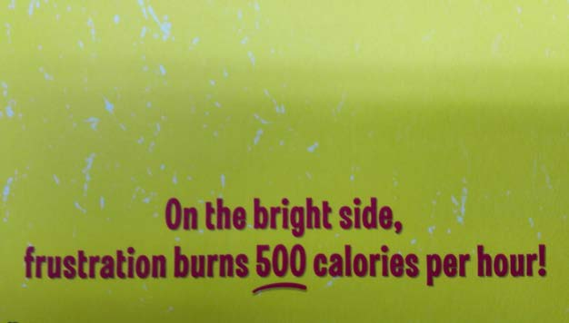

*2015-07-14 11:10 · 手机上网*

---

### 8448

西游是最牛影视IP，三国是最牛游戏IP，都没有之一。

*2015-07-12 21:09 · iPhone版*

---

### 8449

「没有人永远年轻，但永远有人年轻。」 商业上可以解读为，到底是做一代人的生意，还是某个年龄段的人的生意，这最好想清楚。有志于解决所有人所有需求的那另当别论。

*2015-07-12 20:38 · iPhone版*

---

### 8450

原来西游记也并非是吴承恩完全原创的体系，之前就有各种民间故事。胡适和陈寅恪更是考证说孙悟空的原型是印度史诗《罗摩衍那》

里的神猴哈努曼。果真是「太阳底下无新事」。

*2015-07-12 19:33 · iPhone版*

---

### 8451

好莱坞有蝙蝠侠、蜘蛛侠和钢铁侠，国内大鹏拍的《煎饼侠》即将上映，甄子丹的《面条侠》也已经立项-_-！

*2015-07-12 18:53 · iPhone版*

---

### 8452

昨晚好像做了一个和天体有关的梦，但具体的记不清了。

*2015-07-11 10:07 · iPhone版*

---

### 8453

日出东方。

*2015-07-11 07:24 · iPhone版*

---

### 8454

没戏，打是跑不掉的。日本觊觎可不是十九世纪的事，十六世纪丰臣秀吉时代就出过兵了。转@ 长夜过完终究要醒来 如果当初朝鲜问题处理的好，中日本来是打不起来的。转@ 王兴 朝鲜本不关键，日本才关键吧。转@ peter 转@ gravity0 罗胖本期说中法战争，藩属越南不如朝鲜重要

*2015-07-11 01:10 · 手机上网 转自gravity0*

---

### 8455

朝鲜本不关键，日本才关键吧。转@ peter 转@ gravity0 罗胖本期说中法战争，藩属越南不如朝鲜重要，犯不上为它损失那么多。无奈宫廷权斗，慈禧要搞掉稳健主和的鬼子六就要提拔主战的清流。走了步臭棋断送了洋务，十年后朝鲜也丢了。话说本朝太祖征朝鲜太宗征越南，这回顺序好像对了。

*2015-07-11 00:52 · 手机上网 转自gravity0*

---

### 8456

我特意查了一下，百度百科的「集邮」词条里并没有收录那个与时俱进的释义。这说明百度百科也已经老了。

*2015-07-10 02:33 · iPhone版*

---

### 8457

妈蛋！ 转@ 女神郝英俊 现在的孩子集邮已经不是以前那个意思了「@ 王兴 现在的孩子已经不像我小时候那样有集邮的经验了吧？」

*2015-07-10 02:17 · 手机上网 转自王兴*

---

### 8458

@ IwfWcf 还能熬夜就不算太老

*2015-07-10 02:16 · 手机上网 给IwfWcf的回复*

---

### 8459

现在的孩子已经不像我小时候那样有集邮的经验了吧？

*2015-07-10 02:14 · iPhone版*

---

### 8460

移动应用分发的前三强（百度手机助手、360手机助手、腾讯应用宝）里只有「应用宝」是独立的产品品牌。

*2015-07-10 01:36 · iPhone版*

---

### 8461

@ 高橋乳 用过。怎么啦？

*2015-07-09 10:21 · 手机上网 给高橋乳的回复*

---

### 8462

第一次忘戴apple watch。

*2015-07-09 09:43 · iPhone版*

---

### 8463

我发现，越是高逼格的词我越不知道英语里怎么说。「格局」是一个例子，「情怀」也是。

*2015-07-07 13:47 · iPhone版*

---

### 8464

一个投身电影制作公司的清华师妹吐槽，现在新一代演员不但演技越来越差，连颜值都往下走，中戏/北影表演系的在读学生也不惊艳。原因据说是：中戏/北影的择校费已高达两三百万，已经被土豪娶美女后诞生的「长相随爹、头脑随妈」的富二代们占领-_-!

*2015-07-05 14:10 · iPhone版*

---

### 8465

转@ webto 哈哈哈哈哈哈 RT@ FTS. 「尼玛现阶段我国主要矛盾真是“人民群众日益增长的维权意识和停滞不前的独立思考能力以及常识缺失间的矛盾」

*2015-07-04 09:48 · 手机上网 转自FTS.*

---

### 8466

「大多数人以为战争是由拼搏组成的，其实不是，是由等待和煎熬组成的…」说这话的大哥当年参加过中越战争，后来创过业，现在做投资。

*2015-07-04 09:47 · iPhone版*

---

### 8467

北京队三夺CBA总冠军之后，据说立项要拍最强外援马布里的电影已经有十几个了-_-!

*2015-07-03 20:33 · iPhone版*

---

### 8468

几年前，一个品位很受认可的朋友向我推荐徐皓峰写的《道士下

山》。我读了，后来还陆续读了徐的其他几部小说。昨天，陈凯歌导演的《道士下山》上映了。我打算去看。

*2015-07-03 01:19 · iPhone版*

---

### 8469

@ 萌萌肉 你说的是画图软件visio吧。那是几年前的事了。

*2015-07-01 18:04 · 手机上网 给萌萌肉的回复*

---

### 8470

忘了，js我也搞过，当年还折腾过在浏览器里用js做一个中文输入法呢。转@ 弥城 竟然没有javasc ript，差评。转@ 王兴 我会（至少曾经大致会过）basic、logo、pascal、8086汇编、c、c++、java、php、perl、python，但现在对我而言，最重要的语言

*2015-07-01 13:45 · 手机上网 转自王兴*

---

### 8471

今天是你余生的第一天。

*2015-07-01 01:27 · iPhone版*

---

### 8472

Q3

*2015-07-01 01:23 · iPhone版*

---

### 8473

瘾品三大宗：酒精、烟草、咖啡因。三小宗：鸦片（能提炼出海洛因）、大麻、古柯叶（能提炼出可卡因）。

*2015-07-01 01:12 · iPhone版*

---

### 8474

转@ 东东枪 我对人生中大部分事情的态度，都写在今儿这件t-shirt上了。

*2015-06-30 23:22 · 手机上网 转自东东枪*

---

### 8475

@ 清越 多谢知会……

*2015-06-30 23:21 · 手机上网 给清越的回复*

---

### 8476

@ 李童鞋 我估计你当年应该是编程一把好手。

*2015-06-30 20:01 · 手机上网 给李童鞋的回复*

---

### 8477

看来我的apple watch真是用得太不狠了。从早晨8点出头到现在，居然还有48%电量。

*2015-06-30 01:52 · iPhone版*

---

### 8478

我会（至少曾经大致会过）basic、logo、pascal、8086汇编、c、c++、java、php、perl、python，但现在对我而言，最重要的语言还是汉语，或许再加上英语。

*2015-06-30 01:04 · iPhone版*

---

### 8479

我以前完全不能理解宜家给他们家成千上万件产品都各取一个名字的做法，现在渐渐有点懂了。

*2015-06-29 15:58 · 网页*

---

### 8480

擦，我还以为可以拍成加勒比海盗呢-_- 转@ 曾阿牛. 只能自古以来友好往来，沿途各国载歌载舞迎接天朝来客，可是这样的电影谁要看呢转@ 白烨君 可以借助一带一路的东风「@ 曾阿牛. 这个算重大历史题材很难过审。转@ 王兴 中国这么悠久的历史……最不缺的就是电影题材了。郑和下西洋

*2015-06-29 12:49 · 手机上网 转自王兴*

---

### 8481

高段位的煽情就是：你明知道他在煽情，依然情不自禁的被影响。当原子弹在广岛爆炸当天出生在广岛并幸存下来的19岁火炬手坂井义则跑完最后一棒并点燃64年东京奥运主火炬时，我相信日本恨不得有一半国民热泪盈眶。别说他们了，50年后的我都激动不已。

*2015-06-29 02:47 · 手机上网*

---

### 8482

1964年，日本东京奥运会；1988年，韩国汉城（现在改叫首尔了）奥运会；2008年，中国北京奥运会。印度啥时候来一发？

*2015-06-29 02:35 · 手机上网*

---

### 8483

日本人也蛮搞笑的。转：1964年的10月10日，第十八届奥运会在东京国立体育场开幕。主席台的北侧，古希腊胜利女神耐克的神像在阳光的照耀下熠熠生辉。这是世界上唯一一尊没有翅膀的耐克女神像，因为日本人认为没有了翅膀的耐克将会把胜利与和平永远留在日本。

*2015-06-29 02:32 · 手机上网*

---

### 8484

1964年，奥运会终于在日本东京举办。日本人选取了一个非常有象征意义的主火炬手：坂井义则，广岛人，当年19岁，并且出生在1945年8月4日，也就是原子弹投到广岛的那一天，是灾难的幸存者。

*2015-06-29 02:29 · 手机上网*

---

### 8485

1940年的奥运会原本定在日本东京，但由于日本在1937年发动全面侵华，奥委会将举办地点改到了芬兰首都赫尔辛基。可没过多久，苏联入侵芬兰。1940年1月1日芬兰通知奥委会主动放弃主办权。随后，战火遍及欧亚大陆和世界各地，第十二届奥运会就彻底流产了。

*2015-06-29 02:25 · 手机上网*

---

### 8486

中国这么悠久的历史，这么丰富的文化，最不缺的就是电影题材了。

郑和下西洋就可以拍好几部了。

*2015-06-29 01:59 · 手机上网*

---

### 8487

这思路太保守了。回报更高的做法是直接整成X冰冰（或至少某二线女星）的模样然后去接vip客。转@ 喵.杨曜睿 同一个做特殊职业的姑娘去美容医院，翻新一下就号称升了一级并加价，消费者是接受的。转@ 王兴 同一个建筑翻新一下就号称升了一级并加价，消费者真的接受吗？这是常见做法还是凯悦仗

*2015-06-29 01:56 · 手机上网 转自小熊娃娃*

---

### 8488

同一个建筑翻新一下就号称升了一级并加价，消费者真的接受吗？这是常见做法还是凯悦仗着西湖边上的黄金地段有恃无恐？转@ 小熊娃娃 好消息是杭州凯悦要翻新升君悦了，坏消息是肯定要涨价了T_T

*2015-06-29 01:20 · 手机上网 转自小熊娃娃*

---

### 8489

这个时候站出来力挺spacex的人才是「鼓励创新」（多数创新注定是失败的），之前喝彩的人只是在「鼓励成功」。鼓励成功谁不会啊？

转@ webto SpaceX发射又出问题了。。。

*2015-06-28 23:52 · 手机上网 转自webto*

---

### 8490

没想到，走出办公室时天已经蒙蒙亮。好久没这样了。想起jonathanive的格言：Believe in your fucking self. Stay up all fucking night.

*2015-06-28 04:23 · iPhone版*

---

### 8491

Truth and trust. -- Jack Welch

*2015-06-27 02:26 · iPhone版*

---

### 8492

终于把mary meeker一个月前发布的那个近两百页的互联网趋势报告正儿八经的看了一遍。

*2015-06-27 01:57 · 网页*

---

### 8493

多谢 @ 喵.杨曜睿 指出，对应2006年那722所本科院校，今年的正确数字是796而非两千多，还是蛮节制的。 http://is.gd/pKJoBc

*2015-06-26 23:05 · 手机上网 转自喵.杨曜睿*

---

### 8494

你是真的想要这份工作，还是仅仅想要这份工资？

*2015-06-26 22:44 · 网页*

---

### 8495

@ 喵.杨曜睿 你这几个数字是哪里查的？我怎么搜索不到:-(

*2015-06-26 22:35 · 网页 给喵.杨曜睿的回复*

---

### 8496

截至2015年5月21日，全国高等学校共计2845所，其中：普通高等学校2553所（含独立设置民办普通高校447所，独立学院275所，中外合作办学7所），成人高等学校292所。记得06年我们做校内网时那个数字是722。涨了不少啊。

*2015-06-26 20:22 · iPhone版*

---

### 8497

这就叫欲壑难填。转@ peter 原觉得CNC阳极氧化铝已经是穷奢极欲了，今天遇上了不锈钢粉末冶金

*2015-06-26 16:39 · 手机上网 转自peter*

---

### 8498

工作有很多种分类方法，例如：用得上高等数学的，和用不上的。如果是属于前者但却因为学艺不精而判定为后者，那可能就悲催了。

*2015-06-26 14:04 · iPhone版*

---

### 8499

原来「地图炮」是类似「一竿子打翻一船人」的意思。

*2015-06-26 13:59 · iPhone版*

---

### 8500

「如果笑笑的爸爸不吸毒，她妈妈就不会自杀，那么，笑笑就会有一个令人羡慕的家庭」。这网文的开篇真是堪称虎头，更难得的是结局也绝不是蛇尾。

*2015-06-26 01:30 · iPhone版*

---

### 8501

我怀疑自己已经陷入了一种过分推崇先贤的状态，但我真是越来越觉得科斯牛逼，达尔文牛逼，孙子牛逼啊。

*2015-06-26 01:21 · iPhone版*

---

### 8502

这么多年过去了，伊能静给我的最深印象依然是当年她给panasonic某产品拍电视广告时的扮相。那时确实是出水芙蓉啊。# 年龄暴露帖 #

*2015-06-26 00:58 · iPhone版*

---

### 8503

apple watch我已经戴了差不多一个月，功能也就是看看时间，看看各

种app的通知，另外就是提醒我每个小时要起来站一会儿。但总体感觉还行，能戴住。

*2015-06-24 13:51 · iPhone版*

---

### 8504

转@ gravity0 食肉动物最大的痛苦是饥饿，逮不到食就要饿肚子；食草动物最大的痛苦是恐惧，吃饭不是问题但自己随时有被吃掉的可能。被驯养的动物没有这两方面的压力，所以有大把时间抱怨一切不如意。

*2015-06-23 13:01 · 手机上网 转自gravity0*

---

### 8505

士别三日，当刮目相看。诚哉斯言！两千年前尚且如此，更何况日新月异的今天。

*2015-06-22 16:42 · iPhone版*

---

### 8506

认识了一个逗比的朋友，他说他有一个列表叫：我得了狂犬病后要咬的前50个人。

*2015-06-22 00:11 · iPhone版*

---

### 8507

学会了一句话：包治不包活。

*2015-06-21 23:55 · iPhone版*

---

### 8508

@ 田.田 抱歉，我问了一下同事，是万达的线上售票系统统一都出问题了，正在解决中。

*2015-06-20 17:13 · 手机上网 给田.田的回复*

---

### 8509

@ 田.田 抱歉，你是买什么票？

*2015-06-20 16:04 · 手机上网 给田.田的回复*

---

### 8510

世界500强真会玩，管水货不叫水货，叫PI，是Parallel Import（平行进口）的缩写-_-!

*2015-06-20 11:48 · iPhone版*

---

### 8511

转：Being a competent CEO requires great knowledge:knowledge of the products, the people, the market, and thecompetition.

*2015-06-19 01:43 · iPhone版*

---

### 8512

「公司」和「企业」这两个概念的区别从「上市公司」和「家族企业」这两个常见词组里可以感受到。很少人说「上市企业」，没有人会说「家族公司」。

*2015-06-19 01:13 · iPhone版*

---

### 8513

北京难得有如此立体而多彩的天空。

*2015-06-18 20:07 · iPhone版*

---

### 8514

永远在面试，也永远在被面试。

*2015-06-18 17:17 · iPhone版*

---

### 8515

「一树梨花压海棠」这句有点莫名其妙却让人浮想联翩的诗居然出自苏东坡！

*2015-06-18 00:45 · iPhone版*

---

### 8516

华为这家公司确实厉害。看一个师弟在朋友圈里晒：文武双全华为人，扎根瑞典十五载。穿上西装能谈判，脱下西装能群殴。

*2015-06-17 23:24 · iPhone版*

---

### 8517

阿汤哥在各种电影里扮酷无数，但在我心中，他最有男子气概的一幕是：《少数派报告》里，他唯一的孩子被拐走多年后，他无意间闯入人贩子家中，看到自己孩子和其他众多受害者的照片。阿汤哥怒不可遏的把嫌犯一把摁在墙上，拔枪顶住他的头，但却没有射。

*2015-06-17 21:08 · iPhone版*

---

### 8518

今天朋友圈里支持xxx死刑的刷屏让我想起袁崇焕。

*2015-06-17 19:14 · iPhone版*

---

### 8519

外交辞令还是有一些的吧？就算是说「把巴西日侨遣返日本」，日本政府肯定也清楚会是怎么回事。葡萄牙人可不手软，看看他们在非洲的所作所为吧。别说葡萄牙了，连美国打起仗来也不管不顾，二战时在美国的日本人统统被关进集中营。转@ 史前小破孩 @ 王兴 我们老师说是“赶下海”

*2015-06-17 17:56 · 手机上网 转自史前小破孩*

---

### 8520

二战时日本未占领澳门的原因：太平洋战争爆发后，与巴西关系极为密切的葡萄牙政府连忙照会日本政府：如果日军侵占葡萄牙控制下的澳门，葡方则将促使巴西政府将住在巴西的大量日侨全部遣送回日本。

*2015-06-17 09:46 · iPhone版*

---

### 8521

晚上跟一个朋友见面，朋友的朋友在周大福工作。听她介绍了一通珠宝首饰业。好神奇啊，真是隔行如隔山！

*2015-06-16 23:47 · iPhone版*

---

### 8522

不知从何时起，联想把他们总结的三要素「搭班子、定战略、带队伍」的第一个字改了，变成「建班子」了。

*2015-06-16 10:14 · iPhone版*

---

### 8523

intelligentsia就比较敏感了：a group of intelligent and welleducated people who guide or try to guide the political,artistic, or social developmen

*2015-06-15 11:44 · iPhone版*

---

### 8524

intellectual作为名词的解释是：a smart person who enjoys seriousstudy and thought.

*2015-06-15 11:43 · iPhone版*

---

### 8525

apple watch应该加强单手操作功能，例如：屏幕已经点亮后，抖一抖手腕可以查看下一屏。

*2015-06-15 10:56 · iPhone版*

---

### 8526

北京好些餐馆的出品质量都很不稳定，真是烦人。

*2015-06-14 23:47 · iPhone版*

---

### 8527

和一个传统零售和电商经验都很丰富的老大哥一起吃午饭，他感叹：中国社会的道德已经败坏到，几乎各行各业，养什么种什么的人都不吃什么。

*2015-06-14 15:22 · iPhone版*

---

### 8528

转@ 一淇 转@ 泛黄的流年 转@ 贾星星 “世间所有内向，都是聊错了对象。”

*2015-06-14 11:23 · 手机上网 转自贾星星*

---

### 8529

有没有人以「二战时德国率先造出了原子弹」这个虚构前提写过小说？

*2015-06-14 10:33 · iPhone版*

---

### 8530

泳具品牌speedo来自澳大利亚。这也是我以前不知道的。我好像不认识什么来自澳大利亚的品牌。

*2015-06-14 10:31 · iPhone版*

---

### 8531

转：好的虚构会侵入现实。

*2015-06-14 01:09 · iPhone版*

---

### 8532

突然意识到，microsoft好像从头到尾都是一个公司品牌而非产品品牌。微软没有哪个产品就叫microsoft吧？微软有DOS，Windows，Office，IE，Xbox等产品。也不对，微软的鼠标键盘等产品好像没有独立的产品品牌。

*2015-06-14 00:06 · iPhone版*

---

### 8533

我的iPhone经常突然一震，应该是有通知进来了，但是找不到是哪个

app:( 怎么破？

*2015-06-13 11:14 · iPhone版*

---

### 8534

体验了一下你的推荐，结果这顿早饭都吃得倍儿有使命感。转@ 太空小孩 写作业、干工作、闹革命必备御用音乐家：ThomasBergersen。这鬼才简直不可一世。推荐：Rada, Immortal, OceanPrincess, Empire of Angels, Sun。

*2015-06-13 10:04 · 手机上网 转自太空小孩*

---

### 8535

中国的两大IT教父，联想的柳传志和华为的任正非，都生于1944年。

这仅仅是巧合吗？

*2015-06-13 00:13 · iPhone版*

---

### 8536

中文里的「财务」和「金融」对应的英文都是finance，但在中文里财务和金融还是不太一样的。

*2015-06-13 00:11 · iPhone版*

---

### 8537

雅诗兰黛竟然是个美国公司。我一直以为是个欧洲公司。

*2015-06-12 23:59 · iPhone版*

---

### 8538

天气一好，北京夜晚的天空美得比白天有过之而无不及。

*2015-06-12 22:23 · iPhone版*

---

### 8539

和一个做了网游上市公司、一度决定死后墓碑刻「哲学家」仨字的学长吃了顿饭，胡侃得蛮开心的。

*2015-06-12 22:21 · iPhone版*

---

### 8540

In solitude, be a multitude to yourself. -罗马诗人Tibullus. 没有精神分裂症的同志需要学习一下这个技能。

*2015-06-12 18:12 · iPhone版*

---

### 8541

我理解这个逻辑，但不赞同。转@ 钟永健 @ 王兴 库克新推出的WATCH、MUSIC、Pay 服务都是在苹果的 logo 后面放了一个单词，我觉得之所以没有像iPad，iPhone一样命名，是因为更想提到这个单词的时候，想到的就是苹果。

*2015-06-12 14:22 · 手机上网 转自钟永健*

---

### 8542

apple watch这名字完全不符合苹果以往的产品命名方式，是不利于打造品牌的。难道乔布斯一去世，连这种基本规则都改了？

*2015-06-12 13:19 · iPhone版*

---

### 8543

聚精会神、持之以恒的跟HADD做斗争！

*2015-06-11 12:04 · iPhone版*

---

### 8544

Believe in your fucking self. Stay up all fucking night. 大神Jonathan Ive给出的design advice果然够狠。当年毕设时一般学生做一两版作品，他做几十版。如此累积几十年，能不牛逼吗？

*2015-06-10 13:25 · iPhone版*

---

### 8545

半夜加入一个微信群，本来是想参与探讨一个新模式的，结果群里的人跟我打招呼都用「王老师好，我是用您的校内和饭否长大的」-_-!

*2015-06-09 01:19 · iPhone版*

---

### 8546

我觉得我做错了一件事，没有达到我妈的善良标准:(

*2015-06-09 01:11 · iPhone版*

---

### 8547

“然并卵”是2015网络新词，是“然而并没有什么卵用”的缩略词。表达的意思如同字面意思，指一些事物看上去很复杂很高端，但却没有实质性的效果，或者得不到理想的收益。多用来表达无奈、调侃之情。

*2015-06-08 01:28 · iPhone版*

---

### 8548

You have achieved excellence as a leader when people willfollow you everywhere if only out of curiosity. 鲍威尔对领导力的这个解读真牛。

*2015-06-08 00:29 · iPhone版*

---

### 8549

此时此刻，北京的月亮美得不真实。

*2015-06-07 23:42 · iPhone版*

---

### 8550

Let's enjoy the end of the weekend!

*2015-06-07 19:58 · iPhone版*

---

### 8551

在li nkedin上收到不请自来的消息。哇，听说是很高薪的工作，想想还有一点小激动呢。可是，那一小段话好像有语病啊。

*2015-06-07 18:43 · 手机上网*

---

### 8552

Camus,作为干邑品牌译为「卡慕」，作为法国作家译为「加缪」。

*2015-06-07 13:05 · iPhone版*

---

### 8553

侨福芳草地里的这件「空束」不错，有视觉冲击力。

*2015-06-06 22:47 · 手机上网*

---

### 8554

见一个做一对一家教的朋友，他说「我们在全国各地都得有教学点，

还得装修成星巴克的水准，成本太高了。我想做O2O，就不用花这笔钱了」。我问「那师生去哪里辅导呢」？答曰「星巴克」。

*2015-06-06 20:26 · iPhone版*

---

### 8555

转@ webto 上学时候看电影，在blog和bbs上写半吊子影评，希望了解如何评判电影好坏，学习技法和解读。这几年对好电影的评判就俩字：共鸣。也因此更难给别人推荐片了。The most wanted man里面那种恨的牙痒痒的感觉深的我心，不过多数人只觉得是不错的谍战片。

*2015-06-06 14:11 · 手机上网 转自webto*

---

### 8556

这就叫装逼有方啊！转@ gravity0 巫师背上两把剑，一钢一银。日本武士腰插三把刀，长短不一。而我总在不停切换手机、平板、掌游和笔电，在外人看来差不多功能的东西做着差不多的事，纯属瞎折腾。

*2015-06-06 14:07 · 手机上网 转自gravity0*

---

### 8557

转；以前导师说议论文的结构应当像凡尔赛的花园,工整对称、一目了然:开头提出问题,A部分提出一意见,B部分提出反面意见,C部分比较讨论及探讨其它可能,最后总结。当时轻蔑地觉得八股可笑，如今看了大量逻辑混乱的文章后,忽然出现一篇类似结构的文章,真像凡尔赛花园一样赏心悦目,才明白其意义

*2015-06-05 23:38 · iPhone版*

---

### 8558

北京少有这样乌云低垂的傍晚。休息时我走到窗边，往北远眺，满眼都是绿树（其实就是北五环两旁的绿化带），仅有几个电线塔矗立其中。突然幻想，我从未去过的西伯利亚大概有时也是这个景象。

*2015-06-05 17:48 · iPhone版*

---

### 8559

@ 小田不说 没，我都不知道pingwest居然有人潜伏在这里。不过没关系，转载有注明出处和作者已经是很文明的行为了。

*2015-06-05 16:53 · 手机上网 给小田不说的回复*

---

### 8560

转@ gravity0 关于信息情报，大历史有个说法，说一个帝国的疆域是由信息传递速度决定的，首都到边疆通信超过十四天就很难统治，出了乱子知道时已经来不及了。欧亚大陆的大帝国都有马有驰道和驿站制度，美洲印加和阿兹特克疆域不大是因为他们没马。

*2015-06-05 16:51 · 手机上网 转自gravity0*

---

### 8561

不好意思，确实应该是「为学日益，为道日损」。转@ 南吾 难道不是为学日益，为道日损吗？转@ 南吾 一个商人的自白转@ 王兴 为学日增，为道日损。

*2015-06-05 00:36 · 手机上网 转自王兴*

---

### 8562

为学日增，为道日损。

*2015-06-04 16:39 · iPhone版*

---

### 8563

我得有二十多年没听过贝多芬的《田园》了吧。刚才吃盒饭的时候心血来潮用手机放了一下。

*2015-06-03 13:10 · iPhone版*

---

### 8564

转@ gravity0 总有老人说往事逻辑很奇怪，拿出自己当年与大人物共事的经历，试图证明如果当初选了另一条路就必定飞黄腾达。这就好像我和博尔特在起跑线上拍张照，然后说如果跟他换条跑道世界冠军就是我了。人家同你一起起跑比你先到，只能说明人家比你快。

*2015-06-03 12:13 · 手机上网 转自gravity0*

---

### 8565

很难，但是不苦。

*2015-06-03 11:59 · iPhone版*

---

### 8566

转@ gravity0 对现代汉语影响最大的外来语首推日语，再早就是梵语。 转@ 赵一 刚看《河西走廊》，未来、爱河等词都是鸠摩罗什译经的过程中创出来的。

*2015-06-03 09:55 · 网页 转自赵一*

---

### 8567

多谢。你觉得属于顶级水准的电影能说几部吗？转@ webto @ 王兴我觉得姜文『鬼子来了』，杨德昌『一一』可算是同样水准

*2015-06-02 19:23 · 手机上网 转自webto*

---

### 8568

《七武士》在我看来就属于顶级水准了。当年看的时候真是被震撼了。类似的有《美国往事》和《低俗小说》。转@ webto @ 王兴 你觉得七武士和哪些片属于类似水准？

*2015-06-02 19:00 · 手机上网 转自webto*

---

### 8569

有什么中国电影达到或至少接近了《七武士》的水准吗？

*2015-06-02 12:33 · iPhone版*

---

### 8570

转@ gravity0 《大历史》说人类对土豪金的偏爱源自生存本能。在非洲草原游牧的原始人看到地平线上金光闪闪反射的太阳光就知道那边有水，走过去就不会渴死。—— 作为一个每天喝几升水的现代人，我这方面的本能似乎退化了。

*2015-06-02 09:07 · 手机上网 转自gravity0*

---

### 8571

「一身转战三千里，一剑曾当百万师」。可见唐朝时一个普通人的活动范围多么小。「百万师」显然是往大了的吹，以此看来「三千里」

应该也是夸张了。可是，以今天的标准来看，「三千里」一点儿也不刺激。

*2015-06-01 12:49 · iPhone版*

---

### 8572

我记得的版本是：With great power comes great responsibility. 转@ onyt Great power comes with great responsibility。

*2015-06-01 11:12 · 手机上网 转自onyt*

---

### 8573

mark一下，我是在罗伯特.弗罗斯特的《The Road Not Taken》这首诗里第一次接触到grassy这个单词，很喜欢。

*2015-06-01 11:08 · iPhone版*

---

### 8574

对《疯狂的麦克斯4》这部电影的赞叹真是络绎不绝。看来是必看了！

*2015-05-31 11:56 · 手机上网*

---

### 8575

第3条好搞笑。转@ 蒋天正 2015-0-29 1.舍利会自我生长的。2.梦惊人的准。3.再牛逼的大师也有身份证。4.明白了的感觉很有趣。5.一个庞大又复杂的系统靠盲测靠谱吗？6.闪着光芒的智慧，根器上乘。

*2015-05-31 09:30 · 手机上网 转自蒋天正*

---

### 8576

萋萋和凄凄不是一回事吧。萋萋是草木茂盛的意思，不是「凄凄惨惨戚戚」。 转@ 火星钻石 是觉得芳草和萋萋不般配吧。荒草凄凄「@拧巴人儿 胡建人呗……转@ 王兴 不知道为什么，相比「芳草萋萋」，

我更喜欢「荒草萋萋」。」

*2015-05-30 16:51 · 手机上网 转自王兴*

---

### 8577

读了几遍美国诗人罗伯特·弗罗斯特的名作《The road not taken》，意境是还不错啦，可是语言之美我还是不太能体会。

*2015-05-30 16:48 · 手机上网*

---

### 8578

你以为我只会发“huck you”的音吗？转@ 拧巴人儿 胡建人呗……转@王兴 不知道为什么，相比「芳草萋萋」，我更喜欢「荒草萋萋」。

*2015-05-30 16:27 · 手机上网 转自王兴*

---

### 8579

不知道为什么，相比「芳草萋萋」，我更喜欢「荒草萋萋」。

*2015-05-30 16:23 · iPhone版*

---

### 8580

爱死这条垃圾短信了。

*2015-05-30 15:38 · 手机上网*

---

### 8581

比「国运」更宏大的概念是不是就只能说「球运」了？

*2015-05-30 15:15 · 手机上网*

---

### 8582

刚才坐下来点饮料，看菜单时愣了一下，pure tea是什么？茶还有纯不纯的差别？哦，看错了，是puer tea，普洱茶。

*2015-05-30 15:11 · 手机上网*

---

### 8583

中午跟一个朋友吃饭，他穿一件蓝色T-shirt，右手蓝色小米手环，左手apple watch运动版也是蓝色橡胶带，颜色很协调，真是时尚中年男啊。

*2015-05-30 12:05 · 手机上网*

---

### 8584

老大哥说他算过了，无节制的吸海洛因到死，跟接受（晚期）癌症治疗到死，时间差不太多，花费也差不太多，但是痛苦小很多。我没考证过。请勿模仿。转@ 幽灵影_CA @ 王兴 @ 拧巴人儿 钱从哪来？

*2015-05-30 11:50 · 手机上网 转自幽灵影_CA*

---

### 8585

一个阅历丰富的老大哥曾说：我要是查出癌症，还是偏晚期那种，我就去搬去云南边境，风景如画兼海洛因廉价，一有疼痛就吸，不必节制，直到在快乐中死去。转@ 拧巴人儿 我要是得癌症了，而且开始无法控制情绪了，我还是去死吧……

*2015-05-30 11:41 · 手机上网 转自拧巴人儿*

---

### 8586

韦氏词典对culture作为（及物）动词的解释是：to grow (something)in controlled conditions, to grow in a prepared medium.

*2015-05-30 11:35 · iPhone版*

---

### 8587

为了更全面理解「文化」的含义，请允许我提醒你，culture在英文里还可以作为动词，例如：The virus is cultured in the lab fromsamples of infected tissue.

*2015-05-30 11:33 · iPhone版*

---

### 8588

自从「互联网+」火了以后，我微信上有个联系人把自己的名字从XXX（是他的真名） 成了 XXX+

*2015-05-30 09:59 · iPhone版*

---

### 8589

什么？Thermos膳魔师是德国品牌？为什么我原来一直误以为是日本品牌呢？:-(

*2015-05-30 08:47 · iPhone版*

---

### 8590

转@ gravity0 汉晋时官由门阀世袭吏由孝廉民选；隋唐以后官由科举考试吏由任命；英日岛国的官是民选而吏是科举考试。决策和执行两个层面的人员配置，哪种最佳我不知道。目前看来让敢于承担风险的人去决策务虚，让谨小慎微踏实严谨的人去务实，可算是各得其所。

*2015-05-29 10:19 · 手机上网 转自gravity0*

---

### 8591

最近醒得早，是因为天热了吗？不管怎么样，既然醒得早，就得早点睡。

*2015-05-28 23:36 · iPhone版*

---

### 8592

最近有「打游戏进入下一关了」的感觉。

*2015-05-27 16:48 · iPhone版*

---

### 8593

转@ 他咬人 响水大米在黑龙江比五常大米口碑要高。但是据说石板地面积有限，所以上面种出来的米都给了特殊阶层了。市面上的响水大米多是借名炒作的。转@ 王兴 我以前只知道「五常大米」，今天第一次听说「响水大米」：因其生长在（黑龙江镜泊湖附近响水乡）火山玄武岩石板地上而得名。

*2015-05-27 13:50 · 手机上网 转自王兴*

---

### 8594

哇噻，有一种水果叫「恐龙蛋」？查了一下，没准我还吃过呢，其实就是美国的李子和杏杂交出来的，所以英文名就叫pluot，取plum（李）和apricot（杏）合体之意。

*2015-05-27 13:45 · iPhone版*

---

### 8595

我以前只知道「五常大米」，今天第一次听说「响水大米」：因其生长在（黑龙江镜泊湖附近响水乡）火山玄武岩石板地上而得名。

*2015-05-27 13:38 · iPhone版*

---

### 8596

法国linux公司mandriva正式倒闭了。十几年前，我用过他们家前身的产品mandrake linux。安息吧。

*2015-05-27 13:29 · iPhone版*

---

### 8597

再说一遍，be the house!

*2015-05-27 11:20 · iPhone版*

---

### 8598

我越来越觉得，数学没学好成为我的一个短板了:( 在这个搜索引擎高度发达，几乎所有事实性信息都触手可及的年代，「常识」依然重要甚至可以说愈发重要的原因是：你不知道自己不知道什么。

*2015-05-27 11:11 · iPhone版*

---

### 8599

在车水马龙中看到兵荒马乱。

*2015-05-26 10:01 · iPhone版*

---

### 8600

这个好玩:) 转@ 猪小萨 大学合唱团的同学们突然都被拉进了微信群，于是大家开始各种发自己翻唱作品，听着各种或逗比或深情的歌儿，好怀念啊。

*2015-05-26 09:58 · 手机上网 转自猪小萨*

---

### 8601

财长Rubin:“总统先生，股市涨成这样，你千万别出去邀功说是自己的功劳。”Clinton：“为什么呢？”Rubin：“因为股市涨上去，它还会再跌下来。”

*2015-05-24 12:14 · iPhone版*

---

### 8602

这信息有意思。我对地图和数字有天然的爱好。

*2015-05-24 08:46 · 手机上网*

---

### 8603

朋友圈里看到的：眼界不够几乎是自视甚高的唯一原因。

*2015-05-24 01:38 · iPhone版*

---

### 8604

@ 拧巴人儿 咱俩又不是在一个陪审团上，不必意见一致:)

*2015-05-23 17:07 · 手机上网 给拧巴人儿的回复*

---

### 8605

强力推荐正在上映的《十二公民》这部片！这个改编既把美国原版里的理性、逻辑、法的精神继承过来，又把社会现状尤其是中国人开会的陋习表现出来了，很接地气。

*2015-05-23 17:05 · iPhone版*

---

### 8606

我没在开玩笑。我是真这么觉得。但是你放心，我不强求别人。转@eric 王总，这种玩笑会有人当真的「@ 王兴 问：我老觉得周末两天过得特别快，有什么好办法吗？答：周末来公司加班就好了。」

*2015-05-23 16:30 · 手机上网 转自王兴*

---

### 8607

问：我老觉得周末两天过得特别快，有什么好办法吗？答：周末来公司加班就好了。

*2015-05-23 16:25 · iPhone版*

---

### 8608

大陆的城镇化比台湾大概晚二十年，但是为什么大陆没有出现类似罗

大佑当年《鹿港小镇》里「台北不是我的家，我的家乡没有霓虹灯」

的歌？还是其实有只是我没听到？

*2015-05-23 09:29 · iPhone版*

---

### 8609

这个老朋友还有个有趣观点：所谓「目光深邃」，从物理和生理上说，是因为这人跟你说话时，焦点不在你脸上而是在你身后某处。从心理上说，这人会这么做是因为他更重视和习惯「内视」。

*2015-05-21 00:26 · iPhone版*

---

### 8610

见了一个前辈，他也说：零售要想成只有一条路，聪明人花傻力气。

*2015-05-20 19:42 · iPhone版*

---

### 8611

「让工作系统起来」和「让系统工作起来」都是有意义也有难度的事情。

*2015-05-20 13:35 · iPhone版*

---

### 8612

多谢饭友推荐。入手两本中文书。

*2015-05-20 10:19 · 手机上网*

---

### 8613

再牛逼的公司也有一大堆不靠谱的地方。转@ quux Amazon 的自有物流素有混乱的名声。今天我也碰上了：“Possible delay in deliverydue to arrival at incorrect carrier facility”。

*2015-05-19 13:52 · 手机上网 转自quux*

---

### 8614

晚上在外面开了两个会，为了减少热量摄入，各点了一罐苏打水。结果喝得浑身发凉，浑身发软-_-！

*2015-05-18 23:13 · 手机上网*

---

### 8615

@ 拧巴人儿 这是接近你想要找的数据吗？

*2015-05-18 16:52 · 手机上网*

---

### 8616

刚才朋友介绍给我一个叫nimay的老外。我想，这哥们中文名该怎么起呢。

*2015-05-18 15:10 · iPhone版*

---

### 8617

昨晚聚会的一个角落里，狼厂某人：「虽然我这个同事之前干的都是软件pm，但是不能说他没有硬件经验。他曾经买了两辆越野车，自己拆了，拼成了一辆」。粗粮某人：「这真的不能算有硬件经验」。我

默默的走开了。

*2015-05-18 12:15 · iPhone版*

---

### 8618

刚才洗手时抬头看了一下镜子，才发现早上忘了刮胡子。

*2015-05-18 11:32 · iPhone版*

---

### 8619

开车走着，突然又下起大雨来。雨点密密麻麻砸在车窗上，四周变得模糊，只有雨刷在拼命摇摆。我突然觉得大雨给这座城市带来了更多生气。

*2015-05-17 18:15 · iPhone版*

---

### 8620

免费作为一种竞争策略真是历史悠久。天主教构造出来的商业模式是「什一税」：你们都有罪，信我才能得救，但信我就要把收入的10%交给我，别问为什么。这模式本来挺好，滋润了好几百年，直到新教开创者马丁路德站出来：不要鸟他，我也能救你，而且我免费！

*2015-05-17 16:36 · iPhone版*

---

### 8621

我猜越穷的国家空姐越漂亮，因为在那里空姐是高收入的工作，可以吸引到颜值相对高的群体。转@ 利兹联 哈哈，服务不错，非洲空姐漂亮！估计很多人也不知道非盟总部在埃塞。「@ 王兴 非洲最大的航空公司是埃塞俄比亚航空公司？万万没想到。」

*2015-05-17 16:15 · 手机上网 转自王兴*

---

### 8622

好奇是治愈厌倦的良药，可却没什么能治得了好奇。——多罗茜·帕克。The cure for boredom is curiosity. There is no cure forcuriosity. –Dorothy Parker

*2015-05-17 14:47 · iPhone版*

---

### 8623

天阴了好久，雨一开始下，反倒就亮起来了。

*2015-05-17 14:37 · iPhone版*

---

### 8624

造词确实能潜移默化的影响人，毕竟绝大多数人不明真相。例如，「三年自然灾害」、「抗美援朝」、「对越自卫反击战」给人的感觉和更客观的「三年大饥荒」、「朝鲜战争」、「中越战争」就很不一样。这一方面，美国人似乎比较老实，也有可能是他们有更高明的手段。

*2015-05-17 10:58 · iPhone版*

---

### 8625

非洲最大的航空公司是埃塞俄比亚航空公司？万万没想到。

*2015-05-17 09:53 · iPhone版*

---

### 8626

我以前不知道《疯狂的麦克斯》这个系列。刚在猫眼电影里查了一下，这个系列居然和我差不多一样年纪。可是，前三部的评分好像一

般哦。

*2015-05-16 11:45 · 手机上网*

---

### 8627

@ 陈倚刚 每个人都可以给自己设置某部电影上映时提醒你。

*2015-05-16 11:02 · 手机上网 给陈倚刚的回复*

---

### 8628

在饭否和朋友圈里都看到对《疯狂的麦克斯4：狂暴之路》的大力好评。据说是比《速度与激情7》更牛的追车动作片！果断在猫眼电影里设置了「上映提醒」，虽然国内的上映时间还不清楚。

*2015-05-16 10:50 · 手机上网*

---

### 8629

说起来有点令人难以相信，但我想来想去，英语中确实没有「创业」

这个词。

*2015-05-16 02:19 · iPhone版*

---

### 8630

我在清华电子系读书时，有一次大家不知为何讨论起「信息论之父香农和控制论之父维纳谁更牛」，众说纷纭，直到大师兄说：跑马拉松时，如果张三领先你5米，李四领先你10米，你还能区分谁跑在前面；

如果两个人都领先你两三公里，你连人家背影都看不到，还分辨个屁啊。于是众人就散了。

*2015-05-16 01:45 · iPhone版*

---

### 8631

国有三不祥，夫有贤而不知，知而不用，用而不任。——《晏子春秋》

*2015-05-16 01:11 · iPhone版*

---

### 8632

「域民不以封疆之界，固国不以山溪之险，威天下不以兵革之利」，我越来越觉得，这只是孟子提出的逼格爆表的追求，并不现实。至少，两千年后的天下霸主美国也没有做到。

*2015-05-16 00:57 · 手机上网*

---

### 8633

当然，BAT这个概念本身就造得非常成功。转@ 王兴 在造概念方面，BAT里的B也明显落后了。T提出的「互联网+」概念被李总理一说，彻底火了，连A内部也接受并使用了；A提的「从IT到DT」虽然在技术背景的人看来有点扯淡，但是政府和大众似乎还挺认的。

*2015-05-16 00:50 · 手机上网 转自王兴*

---

### 8634

在造概念方面，BAT里的B也明显落后了。T提出的「互联网+」概念被李总理一说，彻底火了，连A内部也接受并使用了；A提的「从IT到DT」虽然在技术背景的人看来有点扯淡，但是政府和大众似乎还挺认的。

*2015-05-16 00:45 · iPhone版*

---

### 8635

苹果iCloud Photo Libary这个产品很厉害啊，应该能显著提升iCloudStorage的收入。反正苹果的用户都是（相对）不差钱的用户。

*2015-05-16 00:40 · iPhone版*

---

### 8636

刚才在公司的休息室睡得很死，本来是只想小眯一下的。

*2015-05-15 18:53 · iPhone版*

---

### 8637

Everybody needs to know what he needs to know.

*2015-05-14 11:06 · iPhone版*

---

### 8638

@ 卡秃噜皮了 戈登摩尔1965年提出“摩尔定律”，1968年创办Intel。

*2015-05-14 08:10 · 手机上网 给卡秃噜皮了的回复*

---

### 8639

一转眼，「摩尔定律」居然已诞生五十周年。虽然英特尔已不如当年风光，但摩尔大叔的高瞻远瞩实在是令人景仰。「晶体管密度每18个月翻一番」是整个IT产业持续高歌猛进的基石啊。

*2015-05-13 11:32 · iPhone版*

---

### 8640

被一个老朋友拉去参加一个跨界饭局。饭后闲聊时谈到星座话题，郑渊洁老师一开口就把大家震了：你们说的这星座是按我农历生日还是公历生日算？

*2015-05-12 21:43 · iPhone版*

---

### 8641

转@ qinyf 饭否今天八岁生日。

*2015-05-12 09:17 · 手机上网 转自qinyf*

---

### 8642

《十二公民》这电影居然是徐小平和王强投资拍的。我估计这不是为了满足这两位老师的经济需求，而是为了满足他们的文化需求。

*2015-05-11 23:24 · iPhone版*

---

### 8643

第一次看到「荣休教授」这样的说法，大概是 professor emeritus 的翻译吧。

*2015-05-11 14:55 · 网页*

---

### 8644

有意思。转@ gravity0 话说英国议会的光荣传统，辩论双方不许直接对话，必须对着议长说。这规矩不知谁想出来的，但的确能避免低级的打嘴仗，也方便议长分配双方发言时间。

*2015-05-10 10:27 · 手机上网 转自gravity0*

---

### 8645

看了一下历史，造概念（或至少率先提出某概念）是多么重要的技能啊！"World War I"和“World War II”（一战和二战）居然都是《时代》周刊当年领风气之先用的概念，至少维基百科是这么记载的。

*2015-05-09 16:17 · iPhone版*

---

### 8646

不，译成「红色失忆」可能比「红色健忘症」更好一点。转@ 王兴《闯入者》的英文片名叫"Red Amnesia"，译成中文是「红色健忘症」。这俩片名都和内容蛮搭的。

*2015-05-09 15:12 · 手机上网 转自王兴*

---

### 8647

《闯入者》的英文片名叫"Red Amnesia"，译成中文是「红色健忘症」。这俩片名都和内容蛮搭的。

*2015-05-09 15:10 · iPhone版*

---

### 8648

惭愧，现在还不能。转@ 延silent 我这儿影院不给排，这事儿村长能管么？转@ 王兴 《闯入者》这电影看的时候有点烦（到最后20分钟才大概明白怎么回事），但看完还是挺令人回味的。于是决定把我昨晚在猫眼上给它打的分从7分提升到8分。

*2015-05-09 14:25 · 手机上网 转自王兴*

---

### 8649

《闯入者》这电影看的时候有点烦（到最后20分钟才大概明白怎么回事），但看完还是挺令人回味的。于是决定把我昨晚在猫眼上给它打

的分从7分提升到8分。

*2015-05-09 11:40 · iPhone版*

---

### 8650

# 为什么说三观很重要 # 转@ 拧巴人儿 你说这人要是没有生殖功能，生活该多么美好！

*2015-05-09 11:19 · 手机上网 转自拧巴人儿*

---

### 8651

《闯入者》这片其实还是值得看的，但是得耐心的看到最后，而且确实比较沉重。票房惨淡我也完全可以理解，确实跟《速7》或《王牌特工》完全不是一个路数的电影。

*2015-05-09 00:44 · iPhone版*

---

### 8652

那段英文的原文。转@ BG4KKS @ 王兴 太上，不知有之；其次，亲而誉之；其次，畏之；其次，侮之。信不足焉， 有不信焉。悠兮，其贵言。功成事遂，百姓皆谓：「我自然」。

*2015-05-08 16:24 · 手机上网 转自BG4KKS*

---

### 8653

哇，这段关于领导力的英文好有道理啊！哦，原来是老子说的。# 手机里翻出的老照片 #

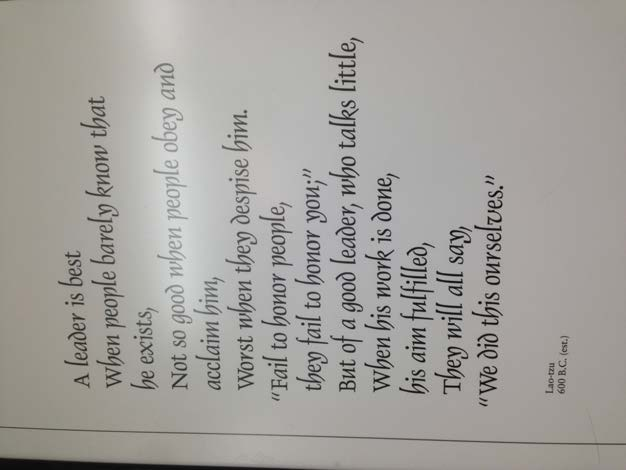

*2015-05-08 13:35 · 手机上网*

---

### 8654

淘宝要的实在是太多了。那个「接受」按钮我不愿意点。

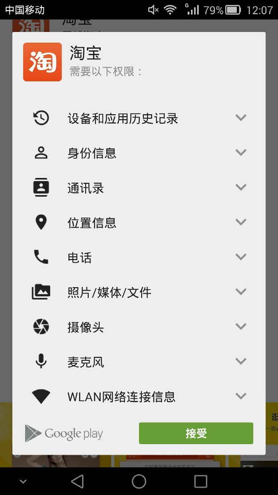

*2015-05-08 12:10 · 手机上网*

---

### 8655

赶紧学，尽管抢，别客气。转@ 无忌 @ 王兴 大哥啊，什么时候有时间把塞班3的客户端优化一下啊，实在是太难用了，你们公司这么多技术大牛，抽个周末就搞定了吧，别逼着我自己去学怎么编程行不行啊，我实在不想抢你们饭碗子。

*2015-05-08 00:40 · 手机上网 转自无忌*

---

### 8656

再转一遍。转@ 果冻炒电池 转@ 王兴 转@ gravity0 知道一堆道理

仍旧过不好日子。有位统计学家说过：所有模型都是错的，只不过其中一些还有点用。

*2015-05-07 15:07 · 手机上网 转自gravity0*

---

### 8657

转@ 龙须酥.zip Wiki的描述是开了六枪，第五枪被特工TimMcCarthy挡掉，后者成功被救治，并于1982年获得NCAA Award ofValor。他同时是当时4个特工里唯一为总统挡了枪的。「@ 王兴 上网搜了一下，里根81年遇刺时确实身边有个保镖帮他挡了子弹，后来没

*2015-05-06 15:22 · 手机上网 转自王兴*

---

### 8658

有人又说：规定里没有，但训练课程中挡子弹是非常重要的科目。有人采访为里根挡子弹的特工。特工歌手。说:我挡子弹不是英勇，而是下意识的大脑和肌肉反应。转@ 王兴 突然好奇一个问题：美国白宫保镖的工作职责里有没有正式包括「必要的时候帮总统挡子弹」？

*2015-05-06 14:00 · 网页 转自王兴*

---

### 8659

上网搜了一下，里根81年遇刺时确实身边有个保镖帮他挡了子弹，后来没公布这个特工的死活，所以外界基本上认为那哥们是殉职了……

转@ 王兴 突然好奇一个问题：美国白宫保镖的工作职责里有没有正式包括「必要的时候帮总统挡子弹」？

*2015-05-06 13:44 · 网页 转自王兴*

---

### 8660

突然好奇一个问题：美国白宫保镖的工作职责里有没有正式包括「必要的时候帮总统挡子弹」？

*2015-05-06 13:34 · 网页*

---

### 8661

两次世界大战，战胜方都比战败方死伤更多。

*2015-05-05 23:39 · iPhone版*

---

### 8662

查了一下，1914年6月28日奥匈帝国王储费迪南德大公在塞尔维亚首都萨拉热窝被暗杀；7月28日，奥匈帝国对塞尔维亚宣战，从而引发一系列战争；9月，德国学者Haeckel开始率先使用「世界大战」这一说法。

*2015-05-05 23:05 · iPhone版*

---

### 8663

突然好奇一个问题，两次世界大战爆发多久后，人们才普遍意识到那不是又一次局部战争而是一次前所未有的世界大战？

*2015-05-05 22:51 · iPhone版*

---

### 8664

转@ gravity0 会编程的李岛主当然知道有多少工作机器做得比人好，而且会越来越好。他若只是个职业经理人可以选择裁员，效率优先。

他若是曼德拉，可以用国家的失败换取个人的名望。左右两条路都不能能选，而中间路线是最难的，希望他能找到折中解。写代码这游戏

对他来说太简单了。

*2015-05-05 22:49 · 手机上网 转自gravity0*

---

### 8665

反驳的七个层次。

*2015-05-05 13:18 · 手机上网*

---

### 8666

偶遇中国最大夜店集团的老板。没想到是这么年轻这么高素质的一个小伙。

*2015-05-04 23:33 · iPhone版*

---

### 8667

转@ gravity0 活了好多年才明白，所谓随心所欲其实就是屈从于本能与习惯，别人通过观察比你更能预测你的行为进而施加影响和控制。

所以人不自控必受控于人。

*2015-05-04 15:43 · 网页 转自gravity0*

---

### 8668

刚知道正确的写法是「根红苗正」，我之前一直以为是「根正苗红」。

*2015-05-04 15:42 · 网页*

---

### 8669

所有VC加起来2014年一整年在硅谷一共投出去143亿美元。这个数字是大是小就见仁见智了。作为参照，苹果最近一个季度的纯利是136亿美元。

*2015-05-04 11:37 · 网页*

---

### 8670

许久不用，刚发现google contacts的网站居然改版了。

*2015-05-04 09:47 · iPhone版*

---

### 8671

奇怪，最近几天持续醒得比以往早。

*2015-05-04 07:45 · 手机上网*

---

### 8672

转@ gravity0 当年不怎么认同，现在越来越信服黄仁宇《万历十五年》数字化管理的结论。权力可以集中，然而一个大脑是很难兼听则明的，哪边的话听得多一点很大程度影响判断。必须有个 mapreduce算法确保稳定输出，gdp 之类的统计数字就算有漏洞也可以补，比直觉判断靠谱。

*2015-05-04 00:04 · 手机上网 转自gravity0*

---

### 8673

非洲兄弟们太与时俱进了！同样是赤色组织，在中国的旗帜还只是用镰刀和锤子，在莫桑比克就直接用「AK47和锄头」了！是的，莫桑比克的国旗上有AK47！

*2015-05-03 17:47 · 手机上网*

---

### 8674

IF THERE IS NO WIND, ROW.

*2015-05-03 17:00 · iPhone版*

---

### 8675

画鬼容易画人难。

*2015-05-03 12:19 · 手机上网*

---

### 8676

我刚知道，多米尼加(The Dominican Republic)和多米尼克(TheCommonwealth of Dominica)是两个不同的国家，虽然都在加勒比海。

*2015-05-02 14:20 · iPhone版*

---

### 8677

其实，我一直没太理解「人淡如菊」。是因为我没有种过菊花吗？

*2015-05-02 11:16 · iPhone版*

---

### 8678

转：「早上搭专车，司机跟我分享了他的人生观，他说：我有一台

车，有自己的生意，我自己当老板，没人可以命令我。我说：前面那个路口左转。他说：好的。」谨以此段子献给那些以为去创业当了CEO就从此自由从此海阔天空的人们。

*2015-05-01 16:06 · iPhone版*

---

### 8679

转@ gravity0 把自己的经历当作特例的人，自我中心目光狭隘不具同理心，永远怀着世界欠我的愤怒，更糟糕的是他们在自己的经历中什么也没学到。

*2015-05-01 16:00 · 手机上网 转自gravity0*

---

### 8680

好聚焦好清晰的职业目标啊！虽然我是第一次听说「陈列」这个职业，但也很容易被打动。

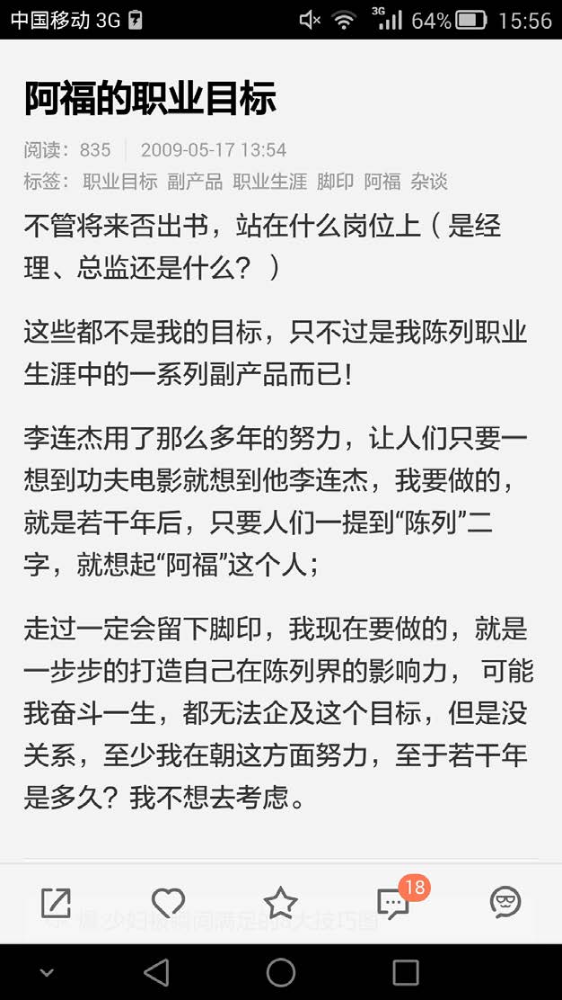

*2015-05-01 15:59 · 手机上网*

---

### 8681

什么？我最喜欢的经典电影之一《十二怒汉》已经被翻拍出中国版了？

*2015-05-01 08:37 · 手机上网*

---

### 8682

转@ 王兴 Business demands faith, compels earnestness, requirescourage, is honestly selfish, is penalized for mistakes, and is theessence of li

*2015-04-30 10:14 · 手机上网 转自王兴*

---

### 8683

请用「一带一路」造句。今天傍晚在二环一带堵了一路。

*2015-04-30 00:36 · iPhone版*

---

### 8684

看了孟京辉的话剧《琥珀》，没懂，无感。

*2015-04-29 22:14 · iPhone版*

---

### 8685

As long as the day lasts, let's give it all we got.

*2015-04-29 07:45 · iPhone版*

---

### 8686

转@ 宋石男 【转】还依稀记得那一年夏天，我带着闺蜜去舞厅跳舞，闺蜜第一次去，不敢跳，就坐在外面磕瓜子。我在舞池里跳舞看见一个男生去邀请她跳舞，男生已经把一只手优雅地伸出来做邀请状。我特么亲眼看见她给了男的一把瓜子。。瓜子。。

*2015-04-28 13:01 · 手机上网 转自宋石男*

---

### 8687

刚才见识了一个超级中西合璧形意结合的活动名称：汇onverge。 真是服了他们，我从没想过象形文字还可以这么用。

*2015-04-28 12:09 · 网页*

---

### 8688

一个对手的投资人主动说要给我寄一套"The Men Who BuiltAmerica"的DVD。这是什么意思？

*2015-04-28 11:51 · 网页*

---

### 8689

转@ peter Apple在aw的magsafe充电接口做成了非标准Qi，增加了握手协议，最后在结构里注满防拆解胶水。成功的把深圳电子黑客的破解速度拖慢了两个小时。

*2015-04-28 11:09 · 手机上网 转自peter*

---

### 8690

（在极少数绝对核心的地方）追求极致。

*2015-04-27 13:35 · iPhone版*

---

### 8691

我的理解也是这样。转@ peter 在商言商？「@ 王兴 The businessof business is business. Milton Friedman他老人家居然还有这么一句名言。」

*2015-04-27 10:30 · 手机上网 转自王兴*

---

### 8692

1923年扬基体育场里的拳击赛。

*2015-04-26 23:50 · 手机上网*

---

### 8693

The business of business is business. Milton Friedman他老人家居然还有这么一句名言。

*2015-04-26 23:33 · iPhone版*

---

### 8694

转@ gravity0 现代娱乐圈就是古罗马角斗场，少数人牺牲自己博取大众的快感。让他们产生凌驾明星之上任意评判甚至定人罪罚的优越感，忘了自己的卑微，统治得以稳固。古罗马贵族了解民众的残忍无知。

*2015-04-26 16:57 · 手机上网 转自gravity0*

---

### 8695

@ 麦兜猫 我刚试了一下，我这里正常啊。你那里现在还是不行吗？

*2015-04-26 11:37 · 手机上网 给麦兜猫的回复*

---

### 8696

「小胜靠智，大胜靠德」这话没错，但是太多人说起来轻飘飘。《孙子兵法》还是比较实在的，因为打仗毕竟是要死人的事情，所以他对将领的考察标准还是「智信仁勇严」里「智」排在第一位。

*2015-04-26 11:24 · iPhone版*

---

### 8697

备战、备荒、为人民。周日一早想起这句话。不管策略实际正确与否，CCP总结口号的能力确实是一流的。

*2015-04-26 10:20 · iPhone版*

---

### 8698

转@ 小熊娃娃 才发现“味噌”的“噌”字音为cēng，难怪打zēng都打不出来……

*2015-04-26 01:55 · 手机上网 转自小熊娃娃*

---

### 8699

朋友圈里出现老妈的身影后，我觉得束缚多了很多……

*2015-04-26 01:50 · iPhone版*

---

### 8700

转@ gravity0 马拉松平原到雅典城那四十二公里可不只是费里皮德斯一个人跑，事实上雅典全军都跑了，他们要赶回去守城。战术上他们用中间薄弱的阵型包围夹击，战略上他们没有死等斯巴达援军，而是倾巢而出主动进攻马松平原的波斯陆军，当天回援本城防御对方海军，把敌人各个击破。

*2015-04-26 01:11 · 手机上网 转自gravity0*

---

### 8701

转@ Frankiiee YouTube上看完了马云最近在香港和台湾谈年轻人创业的两场演讲，印象：1）马云的演讲水平是不是被高估了，起码台湾那场就很水，常有前言不搭后语，逻辑硬伤也不少。2）两地差异有意思。提问环节，台湾学生关心怎么能去阿里实习，香港学生问的是，占中同学也能报名你的

*2015-04-26 01:09 · 手机上网 转自Frankiiee*

---

### 8702

我的同事们真有个性:)

*2015-04-25 22:59 · 手机上网*

---

### 8703

衣服都来不及脱北京就夏天了。

*2015-04-25 14:46 · iPhone版*

---

### 8704

转@ Frankiiee 老婆对一个品牌的最高评价已经变成「我要买这家公司的股票！」了。

*2015-04-25 13:11 · 手机上网 转自Frankiiee*

---

### 8705

原来「祖宗十八代」是指自己上下九代的宗族成员。上序依次为：父母，祖，曾祖，高祖，天祖，烈祖，太祖，远祖，鼻祖。下序依次为：子，孙，曾孙，玄孙，来孙，晜[kūn]孙，仍孙，云孙，耳孙。哈哈，「鼻祖」在这里。

*2015-04-25 08:59 · iPhone版*

---

### 8706

转@ 马冇冇 有句话：因为没有判断力结婚，因为没有忍耐力离婚,又因为没有记忆力再婚，

*2015-04-25 00:17 · 网页 转自马冇冇*

---

### 8707

这句话虽然有点拗口，但是道理是不错的：Treat people as if theywere what they ought to be and you help them become whatthey are capable of becoming.

*2015-04-23 17:40 · 网页*

---

### 8708

我觉得自己在「互联网世界」观方面最近有些进展。我对讨论互联网「世界观」倒是没什么兴趣。

*2015-04-22 12:53 · iPhone版*

---

### 8709

统一说一下，有人在造谣抹黑我们，美团从没用过那令人反感的海报。智商正常的都不可能用那种海报做校园招聘。转@ 遥控大猫 今儿美团那校招海报是真的么……@ 王兴

*2015-04-21 17:00 · 手机上网 转自遥控大猫*

---

### 8710

@ 我化了化了化了 对手在造谣抹黑我们。美团从来没有用过这个海报。

*2015-04-21 14:40 · 手机上网 给我化了化了化了的回复*

---

### 8711

午饭时间给老爸打了个电话。他说他工作正忙，匆匆讲了几句就挂了_-!

*2015-04-21 12:23 · iPhone版*

---

### 8712

转@ 叶滨 Peter Thiel说：“Paypal的创业过程很艰难但最终是成功的，这是Paypal黑帮如此优秀的原因（除了时代机遇之外）。不成功的企业会让你觉得努力工作没有意义；而太容易成功的企业如Google会让你觉得不需要努力。大部分成功都需要一个好的点子再加上不断努力”

*2015-04-21 11:00 · 网页 转自叶滨*

---

### 8713

每一天你都必须为自己手上的工作付出你所拥有的最好的一切，而非保留给后来的计划。- Annie Dillard

*2015-04-21 10:25 · 网页*

---

### 8714

在贵体系内，这算「微创新」还是「颠覆式创新」？转@ webto 加俩USB即可 RT@ 王兴 苹果如何能在这一版惊艳全场的macbook基础之上再做进一步的显著提升，这是我非常好奇的事。

*2015-04-21 10:15 · 网页 转自王兴*

---

### 8715

苹果如何能在这一版惊艳全场的macbook基础之上再做进一步的显著提升，这是我非常好奇的事。

*2015-04-21 10:00 · 网页*

---

### 8716

《夜空中最亮的星》这歌确实不错。

*2015-04-21 02:19 · iPhone版*

---

### 8717

Appealing workplaces are to be avoided. One wants a roomwith no view, so imagination can meet memory in the dark. Annie Dillard

*2015-04-21 00:51 · iPhone版*

---

### 8718

越来越觉得「轻奢」大有前途，不管是在经济泡沫急剧膨胀的时候还是泡沫破灭后。

*2015-04-21 00:41 · iPhone版*

---

### 8719

我妈算不上一个很smart的人（我之所以没说很不smart是考虑到科学研究表明男孩的智商主要遗传自母亲），但她身上有中国妇女的各种传统美德，善良到令我不忍直视。

*2015-04-21 00:25 · 手机上网*

---

### 8720

billion-user-company确实比billion-dollar-company更来劲。在新闻里看到whatsapp宣布月活跃用户突破8亿有感。

*2015-04-20 23:47 · iPhone版*

---

### 8721

《五军之战》，I've seen this movie before.

*2015-04-20 23:25 · iPhone版*

---

### 8722

有饭友问我那篇关于好销售的文章，请看截图。

*2015-04-20 23:13 · 手机上网*

---

### 8723

《Por Una Cabeza》这曲子真是百听不厌，但是，威士忌可能不是最佳搭配。阿根廷人喝什么酒？

*2015-04-20 23:12 · iPhone版*

---

### 8724

这个微观经济课的小实验太牛了！转@ gravity0 ……微观经济课上，教授给每人随机一件礼物，让他们给礼物打分。然后让他们自由交换，再给礼物打分。前后总分增加了，结论是自由交易创造价值。

*2015-04-20 22:43 · 手机上网 转自gravity0*

---

### 8725

「非洲发展银行把日均收入2美元以上的人群划入中产阶级行列。」中产的范围真广……

*2015-04-20 17:37 · iPhone版*

---

### 8726

几年前读过一篇《哈佛商业评论》的经典文章，里面说研究表明，能否成为好sales和其他各种因素都关系不大，只有drive和empathy这两项是最重要的。现在我越来越觉得能否成为好pm也是看这两项。

*2015-04-20 16:04 · 网页*

---

### 8727

思考工作问题时突然冒出个疑问：像高迪那样自己埋头画一叠图纸然后让人施工150年建一个教堂，真的是一种好的设计吗？

*2015-04-20 15:31 · iPhone版*

---

### 8728

不知道是好事还是坏事，我现在越来越经常突然回忆起小时候爸爸书架上那些书。

*2015-04-20 13:48 · iPhone版*

---

### 8729

国内有些网站名很奇葩，国外也有，例如这个“I do now I don't”，干的业务是买卖二手钻石首饰。

*2015-04-20 13:42 · 手机上网*

---

### 8730

刘瑜这篇文章确实够无情。推荐真的勇士们阅读。转@ gravity0 刘瑜关于兔子快跑的比喻更狠 http://is.gd/3pYaA2 转@ 王兴 太狠了，「形式上的叛逆」-_-! 人艰不拆！

*2015-04-20 13:39 · 手机上网 转自gravity0*

---

### 8731

电影确实已经成为美国文化的一部分，以至于有“i've seen this moviebefore”这种俚语。

*2015-04-20 13:31 · iPhone版*

---

### 8732

Those who don't know history are doomed to repeat it.Edmund Burke

*2015-04-20 13:21 · iPhone版*

---

### 8733

我感觉自己快进入Ender's Game模式了。

*2015-04-20 13:00 · iPhone版*

---

### 8734

太狠了，「形式上的叛逆」-_-! 人艰不拆！转@ gravity0 电台里在放西蒙加芬克尔的老歌，电影《毕业生》说的故事相当典型：面对嘈杂的社会无限迷茫，最后什么问题都没解决，只是完成了一次形式上的叛逆。如同崔爷的《解决》。

*2015-04-20 11:33 · 手机上网 转自gravity0*

---

### 8735

传统智慧其实把一些管理原则讲得很清楚：霹雳手段，菩萨心肠。

*2015-04-20 10:40 · iPhone版*

---

### 8736

屌炸天！转@ .rex 寇准：只有天在上，更无山与齐。转@ 王兴 中外人士有些豪情是相似的。林则徐有「海到尽头天做岸，山登绝顶我为峰」的诗句，著名的小个子拿破仑率军翻阿尔卑斯山时据说也发出过「我比阿尔卑斯还高」的豪言。

*2015-04-19 21:11 · 手机上网 转自王兴*

---

### 8737

中外人士有些豪情是相似的。林则徐有「海到尽头天做岸，山登绝顶我为峰」的诗句，著名的小个子拿破仑率军翻阿尔卑斯山时据说也发出过「我比阿尔卑斯还高」的豪言。

*2015-04-19 21:02 · iPhone版*

---

### 8738

我好像收到过袖扣当礼物，但我没有配袖扣的衬衫……

*2015-04-19 12:26 · 手机上网*

---

### 8739

转一个同事的签名档：你读过的书，经历过的事，等时间长了，那些细枝末节你都忘了，剩下来的，就成了你的素质。

*2015-04-19 11:51 · iPhone版*

---

### 8740

终于赶在《王牌特工》下片之前去看了。确实名不虚传，完全不输007系列。满分10分的话我打8分。

*2015-04-19 02:14 · 手机上网*

---

### 8741

去第五届北京国际电影节代表「猫眼电影」领「年度购票神器」的奖，现场体会到了鹿晗的粉丝有多疯狂。相比之下，现场其他明星如黄晓明、杨幂和徐峥都黯然失色了。

*2015-04-18 21:25 · iPhone版*

---

### 8742

请问你们是哪所学校还是哪所监狱？;-) 转@ 一念十年 我们的口号是“严谨严肃，宽松宽厚”。「@ 王兴 我一直不太明白当年他们是怎么想出「团结紧张，严肃活泼」这种口号的。」

*2015-04-18 11:06 · 手机上网 转自王兴*

---

### 8743

我一直不太明白当年他们是怎么想出「团结紧张，严肃活泼」这种口号的。

*2015-04-18 10:01 · iPhone版*

---

### 8744

我对杜鲁门的敬佩与日俱增。

*2015-04-17 18:23 · iPhone版*

---

### 8745

「格局」这词英文怎么译？

*2015-04-16 17:18 · iPhone版*

---

### 8746

History doesn't repeat itself, but it rhymes.

*2015-04-16 17:07 · iPhone版*

---

### 8747

转：最近好多朋友问我：前些年经济上行，股市惨跌；最近经济下行，股市暴涨。这是为什么？我试图用很多经济学理论来回答这个问题，也请教过很多经济学专家，最后一个村长告诉我说：经济好的时候大家都出去打工，不好的时候才会聚在村口赌博

*2015-04-16 15:28 · iPhone版*

---

### 8748

我挺想去人口还不如天通苑多的冰岛国玩玩，但最近怕是走不开了。

*2015-04-15 20:25 · iPhone版*

---

### 8749

转@ 文静王 电话骗局。同事正好约了某德高望重的馆长聊事儿，电话打来的时候骗子的模糊说辞导致我同事以为是这位馆长的电话，说是要给领导打钱好办事。虽心有不爽，我同事还是打钱过去了。由于骗子后来再三要求加钱，才觉得不对劲。转@ 王兴 求细节。求教育！

*2015-04-15 20:07 · 手机上网 转自文静王*

---

### 8750

学不会游泳，多换几个泳池也没用。

*2015-04-15 17:37 · iPhone版*

---

### 8751

求细节。求教育！转@ 文静王 一个同事被骗子骗去两万块钱，我全程都在她旁边。最后，我终于恍然大悟，这特么是骗局啊！但是已经晚了。

*2015-04-15 17:14 · 手机上网 转自文静王*

---

### 8752

同感。转@ 拧巴人儿 从来就没穿过合适的脚跟不掉的船袜。 简直了。

*2015-04-15 12:06 · 手机上网 转自拧巴人儿*

---

### 8753

@ 变幻莫测 是的，听起来像是陈词滥调，但确实是真知灼见。

*2015-04-15 00:42 · 手机上网 给变幻莫测的回复*

---

### 8754

The future is already here. It's just unevenly distributed.

*2015-04-14 20:38 · iPhone版*

---

### 8755

《速度与激情7》的票房统治力太残暴了，完全是「我花开罢百花杀」

的气势啊。

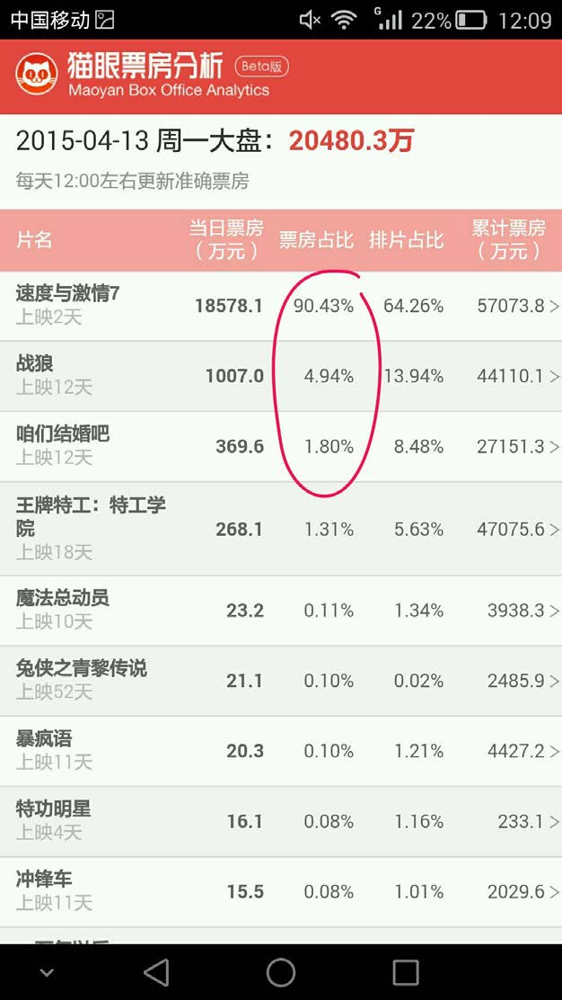

*2015-04-14 12:14 · 手机上网*

---

### 8756

转@ gravity0 理解力所限多数人只会玩简单游戏，但让简单游戏运行起来，其背后的规则是相当复杂的。体育比赛是简单游戏，背后的商业和政治运作是复杂游戏。产线上的劳动是简单游戏，产品从设计到营销是复杂游戏。各司其职彼此尊重，只会简单游戏还妄自尊大是傻逼行径，媒体向来助长傻逼。

*2015-04-14 11:57 · 手机上网 转自gravity0*

---

### 8757

人生更加完整了，我终于反向坐过坐式马桶了;-)

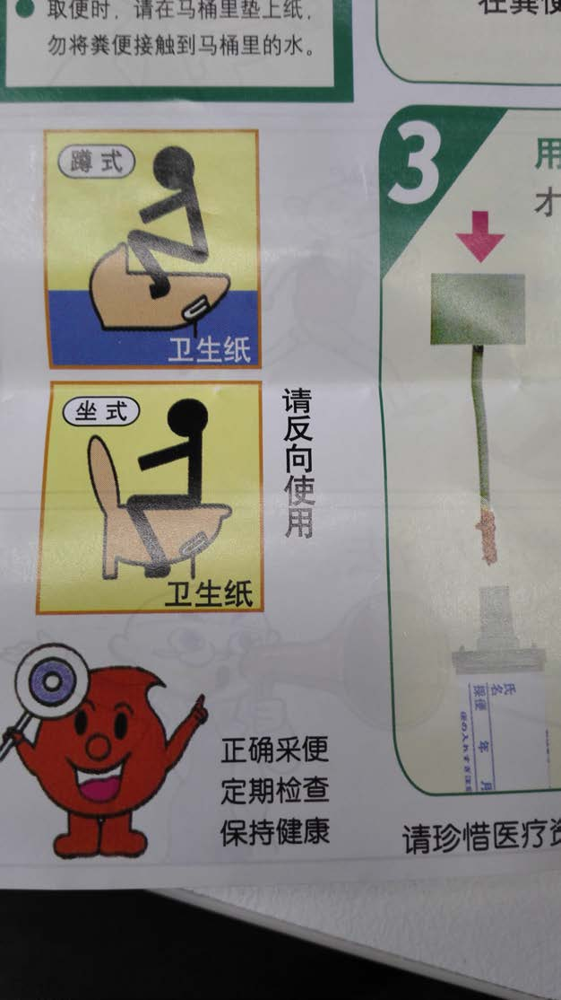

*2015-04-14 11:55 · 手机上网*

---

### 8758

体检说我的两耳听力分别是26和24分贝。我也不知道这算什么水平。

30以内都属正常。

*2015-04-14 08:31 · 手机上网*

---

### 8759

《Mass Customization: The New Frontier in BusinessCompetition》 by Joseph Pine。重点是这书是1992年出版的。

*2015-04-13 17:53 · iPhone版*

---

### 8760

「宇宙膨胀」也是一个重要的世界观，但指导实践的价值不如「通货膨胀」。

*2015-04-13 16:42 · 网页*

---

### 8761

accidental complexity vs. essential complexity.

*2015-04-13 15:35 · 网页*

---

### 8762

一个美国前总统的老婆看起来要和另一个美国前总统的儿子（同时是另一个美国前总统的弟弟）竞争下一任美国总统的位置了。

*2015-04-13 02:06 · iPhone版*

---

### 8763

精神崩溃的一个最初征兆就是觉得自己的工作非常非常重要。-罗素 _-!

*2015-04-12 20:29 · iPhone版*

---

### 8764

日本六十年代初经济高速增长期的执政口号是「宽容和忍耐」，目标是「国民所得倍增」。

*2015-04-12 19:05 · iPhone版*

---

### 8765

前五个字可删去。转@ 盖文张 凝视着美的人注定会死亡。

*2015-04-12 18:44 · 手机上网 转自盖文张*

---

### 8766

咦，我不是坐在星巴克里面吗？怎么进来一个麦乐送的大叔？哦，原来是星巴克的小妹点了一份麦乐送的外卖。

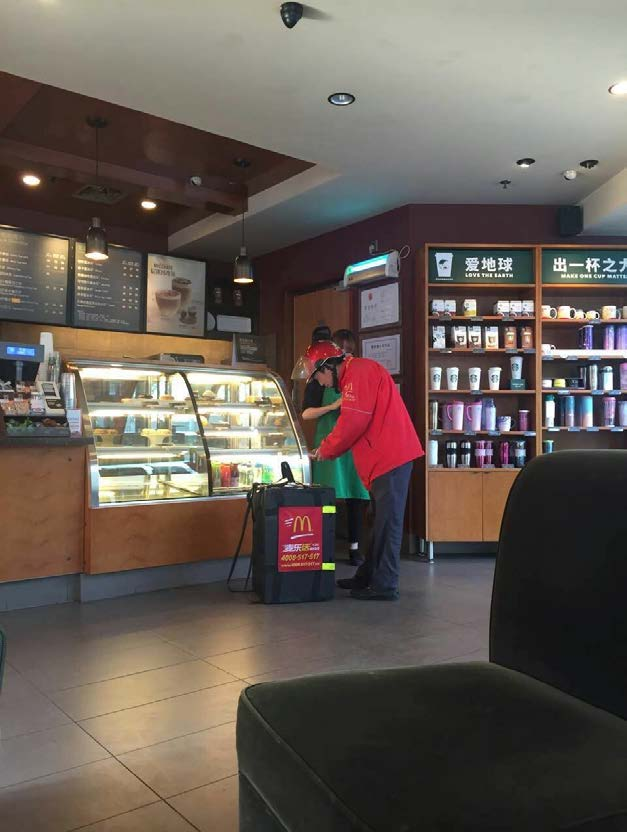

*2015-04-12 16:28 · 手机上网*

---

### 8767

你出了一个价钱，不是只买到我的导演能力及替你工作的这段时间，而是买到我过去所有生活精华的结晶—我喝过的每一口酒、品过的每一杯咖啡、吃过的每一餐美食、看过的每一本书、坐过的每一把椅子、谈过的每一次恋爱、眼里看到过的美丽女子和风景、去过的每一个地方…你买的是我全部生命的精华

*2015-04-11 22:12 · 手机上网*

---

### 8768

听说有人出国学的专业是「宠物心理学」。

*2015-04-11 11:38 · 手机上网*

---

### 8769

@ webto 没啥下文啊。哼哧哼哧下了三十多层楼梯，在户外吹了一阵子风，顺便跟一起来开会的几个熟人闲聊几句。十来分钟后前台确认是虚惊了，于是坐电梯回房睡觉。

*2015-04-11 11:35 · 手机上网 给webto的回复*

---

### 8770

大半夜的，被酒店房间里的火警广播吵醒。虽然目测不像有事，但宁可信其有，不可信其无，于是匆忙套上衣服，下了三十几层楼梯……

*2015-04-11 03:00 · iPhone版*

---

### 8771

relentless: showing or promising no abatement of severity,intensity, strength, or pace.

*2015-04-11 00:26 · iPhone版*

---

### 8772

越发觉得Kindle是个好的品牌名。

*2015-04-11 00:05 · iPhone版*

---

### 8773

业精于勤，荒于嬉；行成于思，毁于随。

*2015-04-10 23:59 · iPhone版*

---

### 8774

陈粒的《正趣果上果》堪称是我听过的歌词用典最多的中文歌，而且还蛮搞怪。推荐。

*2015-04-10 19:18 · iPhone版*

---

### 8775

每当听到一首不错的情歌，例如今晚这首Peter Sarstedt的“ WhereDo You Go To (My Lovely)?”，我依然会情不自禁的想起LeonardCohen的“I'm Your Man”。

*2015-04-10 02:22 · iPhone版*

---

### 8776

那和IT无关。那可能是另一个世界 —— kepler-22b是科学家发现的首个太阳系之外可能存在生命的行星。转@ 耶稣也夜业 不懂it人的世界转@ 王兴 kepler-22b.

*2015-04-09 23:36 · 手机上网 转自王兴*

---

### 8777

kepler-22b.

*2015-04-09 22:29 · iPhone版*

---

### 8778

有一个问题我一直没想明白：中小学历史课本应该让学生们认识到历史的残酷吗？

*2015-04-08 15:17 · iPhone版*

---

### 8779

转@ gravity0 知道一堆道理仍旧过不好日子。有位统计学家说过：所有模型都是错的，只不过其中一些还有点用。

*2015-04-07 00:08 · 手机上网 转自gravity0*

---

### 8780

妈蛋！iPhone 6屏幕摔裂了:(

*2015-04-06 18:02 · iPhone版*

---

### 8781

转：“如果我们的语言是威士忌，那么一切都会变得自然。我将杯子递

出，你就着杯口喝下，非常简单，非常亲密，非常正确。”—村上春树《如果我们的语言是威士忌》

*2015-04-04 21:55 · iPhone版*

---

### 8782

听一个金融老鸟说：there is no good risk or bad risk, there isonly mispriced risk.

*2015-04-04 00:40 · iPhone版*

---

### 8783

越来越觉得「世界观」重要。

*2015-04-02 21:44 · iPhone版*

---

### 8784

托马斯骆同学真是太毒舌了！「一直觉得众筹的本质就是：寡妇怀孕，全靠大家帮忙……」

*2015-04-02 19:37 · iPhone版*

---

### 8785

渭城朝雨浥轻尘，客舍青青柳色新。劝君更尽一杯酒，西出阳关无故人。每次想起来，我都觉得前两句和后两句气氛不是很搭。

*2015-04-02 16:37 · iPhone版*

---

### 8786

转@ 拧巴人儿 2010年五个城市家庭结构和家庭关系的调查发现（广州，杭州，郑州，兰州和哈尔滨），68.9%的人没有离开父母居住的城市。

*2015-04-02 16:26 · 手机上网 转自拧巴人儿*

---

### 8787

在北京，难得可以听着雨声入睡。

*2015-04-02 00:31 · iPhone版*

---

### 8788

转@ 东东枪 汪曾祺说：“语言的目的是使人一看就明白，一听就记住。语言的唯一标准，是准确。” 用孔子的话说就是：“辞达而已矣。

”这个“达”，是最低标准，也是最高标准，也就是汪曾祺说的：“唯一标准”。

*2015-04-01 12:48 · 网页 转自东东枪*

---

### 8789

林肯说：You must draw on language, logic and simple commonsense to determine essential issues and establish a concretecourse of action.

*2015-04-01 12:48 · 网页*

---

### 8790

红色诗词里让我最印象深刻的还数陈毅的「此去泉台招旧部，旌旗十万斩阎罗」。

*2015-04-01 12:27 · 网页*

---

### 8791

The hard thing about the hard things: building a business when

there are no easy answers.

*2015-04-01 09:42 · 网页*

---

### 8792

年年过愚人节，给我印象最深的还是04年愚人节gmail的横空出世。当然，更令人唏嘘的是去年有篇gmail面世十周年的长篇报道，里面披露了gmail根本不是传说中的「20%自由时间」的成果，而是从一开始就是创始人力挺的项目。

*2015-04-01 00:52 · iPhone版*

---

### 8793

去过拍摄现场才能理解演员是一个多么需要耐心的职业，一个镜头动不动就要拍十几几十遍-_-!

*2015-03-30 10:33 · 网页*

---

### 8794

今天体验了沃尔沃在普通高速上的自动驾驶，感觉还不错。探讨「自动驾驶是否安全」时有人提出一个问题：到底是机器靠谱还是人靠谱？回想最近几次大空难，好像悲剧的原因都是人而不是机器。

*2015-03-28 18:19 · iPhone版*

---

### 8795

「如果坏蛋是中国人的话，中国可能会禁映影片；如果坏蛋是俄罗斯人，电影可能就别想进俄罗斯了。但如果片中的坏蛋是丧失了道德伦理的美国人，那么电影会同时被美国人和其余国家观众一致接受…《独立日》里的外星人是最完美的商业大片反派，因为它们不会得罪任何国家。」

*2015-03-28 10:31 · iPhone版*

---

### 8796

刚听说我的小学同班同学里有人在新加坡圣淘沙赌场当荷官。

*2015-03-27 14:24 · iPhone版*

---

### 8797

四种capacity：physical, emotional, mental, spiritual. 四个指标：strength, endurance, flexibility, resilience.

*2015-03-26 12:49 · iPhone版*

---

### 8798

是否经历过主营业务的变迁、是否换过几任CEO、是否有能力在不同国家/语言/文化环境下开展业务、是否经历过几个大的经济周期，这些都是企业的坎，但也是99.99%的企业确实不需要考虑的问题。

*2015-03-25 14:43 · iPhone版*

---

### 8799

vim虽已生疏，却依然亲切。

*2015-03-25 09:50 · iPhone版*

---

### 8800

今晚跟一个新朋友聊天时听他说「xxx的做法挺前现代的」。这说法好有趣;)

*2015-03-25 00:47 · 手机上网*

---

### 8801

有，原始人的社会里男女就开始分工了。转@ 付栋平 pm和rd有明确的界限么？总感觉自己哪头都挨着点又哪头都不能算。分工这回事儿在原始人类的世界里有么？

*2015-03-25 00:33 · 手机上网 转自付栋平*

---

### 8802

转@ webto 认识的Google的朋友都说Google是一家管理混乱的公司，全靠聪明人自我管理

*2015-03-23 12:57 · 手机上网 转自webto*

---

### 8803

又是周一。又要开始我血管里流淌着普洱茶的一天了。

*2015-03-23 10:03 · iPhone版*

---

### 8804

看了一下马云最近在汉诺威的演讲，发现他的英语其实没有传说中的那么好，发音还行，但语法的小问题不少，不过这些小问题无伤大雅。他的演讲还是感染力不错的。

*2015-03-23 01:05 · iPhone版*

---

### 8805

转：柳传志讲过，成功的领军人物应具备4个素质：(1)目标高远，意志坚定。(2)心胸开阔，情商要高。(3)企业利益放第一位。(4)学习能力强，爱学习而且会学习。

*2015-03-22 11:20 · iPhone版*

---

### 8806

Whiskey.. is sunlight, held together by water.

*2015-03-22 00:06 · iPhone版*

---

### 8807

本命年。

*2015-03-21 23:09 · iPhone版*

---

### 8808

对！几乎一模一样的意思，中文更言简意赅。转@ 再见巧克力 叶公好龙「@ 王兴 Be careful what you wish for, you might actuallyget it.」

*2015-03-21 22:42 · 手机上网 转自王兴*

---

### 8809

Be careful what you wish for, you might actually get it.

*2015-03-21 14:56 · iPhone版*

---

### 8810

瑞典的wallenberg确实是个蛮有意思的家族。瑞典以区区九百万人口能出沃尔沃、ABB、爱立信、伊莱克斯、H&M、宜家、AstraZenica等国际品牌也是挺厉害的，就不提诺贝尔了。

*2015-03-21 10:50 · iPhone版*

---

### 8811

Obstacles are those frightful things you see when you take youreyes off your goal. -Henry Ford

*2015-03-20 23:25 · iPhone版*

---

### 8812

fucking depressing and fucking exciting at the same time.

*2015-03-20 18:10 · iPhone版*

---

### 8813

如果不是刚上网搜了一下，差点又被你误导了。正确的写法是「小莲玉体横陈夜」，下句是「已报周师入晋阳」。作者是李商隐。转@peter 小怜玉体横陈夜，正是河豚欲上时。

*2015-03-20 13:54 · 手机上网 转自peter*

---

### 8814

《The Hard Thing About Hard Things: Building a Business WhenThere Are No Easy Answers》，光这书名就让我觉得不赞不行！作者Ben Horowitz不愧是真刀实枪杀出来的。

*2015-03-19 15:02 · iPhone版*

---

### 8815

「无远弗届」这么高雅的词，我始终不是很有把握我已经掌握了它的准确意思，更没有在现实生活中使用过。

*2015-03-19 14:31 · 手机上网*

---

### 8816

转@ 东东枪 开会时还是应该带个笔记本电脑过去，放在面前，打开。碰不碰不重要。主要是给脸上补点儿光。# 记一件有意义的事 #

*2015-03-19 12:59 · 手机上网 转自东东枪*

---

### 8817

开始新一天的战斗。

*2015-03-18 09:19 · 网页*

---

### 8818

英国佬的幽默真挺损：the graveyard is full of indispensablepeople.

*2015-03-16 21:00 · iPhone版*

---

### 8819

Some people grow and other people swell.

*2015-03-16 17:29 · 网页*

---

### 8820

2000年，科技公司上市时的公司年龄中位数是5；2014年，这个数字是11。

*2015-03-16 10:09 · 网页*

---

### 8821

真是不好意思，一条里有两个错别字:-( 确实应该是「锐不可当」。多谢指正！转@ 王喜庆 锐不可当「@ 王兴 多谢指正。转@ 小马爸 核[hú] 转 @ 王兴 陶瓷刀果然锐不可挡。地道平常的一刀下去，居然连牛油果的囫也齐齐的切成两半了。」

*2015-03-16 10:07 · 网页 转自王兴*

---

### 8822

@ webto 我自己都没注意。我用华为mate7拍的。

*2015-03-16 09:50 · 网页 给webto的回复*

---

### 8823

请从用词开始。「品位」和「品味」不一样。转@ 藏_妖妖贰叁 好希望变成这样有品味的人 转@ 王兴 据说苹果主设计师jonathan ive在各方面的品位都倍受推崇，以至于乔布斯老婆要给家里购置几套刀叉都去找他咨询。我倒是很好奇，乔夫人最后到底买了啥刀叉。

*2015-03-16 09:26 · 网页 转自王兴*

---

### 8824

多谢指正。转@ 小马爸 核 [hú] 转 @ 王兴 陶瓷刀果然锐不可挡。地道平常的一刀下去，居然连牛油果的囫也齐齐的切成两半了。

*2015-03-16 09:22 · 网页 转自王兴*

---

### 8825

越来越佩服科斯和邓小平。

*2015-03-15 23:38 · iPhone版*

---

### 8826

据说苹果主设计师jonathan ive在各方面的品位都倍受推崇，以至于乔布斯老婆要给家里购置几套刀叉都去找他咨询。我倒是很好奇，乔夫人最后到底买了啥刀叉。

*2015-03-15 17:32 · iPhone版*

---

### 8827

汇总更新一下，目前想到的用刀的动词（后面可跟宾语的）有：砍、劈、剁、削、片、刺、捅、切、割、挑、剜、拍、插、撬、剖、格、挡、刮、雕、刻。挖、凿、攮、蒯、剔、剃、撩，抹、拉、裁、拢、刨、戳、扎、划、刎、钻、铡、锯、镟、拨、敲、砸、磕、劐。搞明白这些动作的区别蛮有意思。有的用刀尖，有

*2015-03-15 16:45 · iPhone版*

---

### 8828

卓别林不愧是语言大师！这鸡汤才叫高级啊：Nothing is permanentin this wicked world - not even our troubles.

*2015-03-15 15:41 · iPhone版*

---

### 8829

又试了一下，我还是不太能欣赏英文诗:(

*2015-03-15 15:39 · iPhone版*

---

### 8830

琢磨了一下，如果是「用勺蒯西瓜吃」这类意思的话，似乎不是刀的常规用法。转@ 猫先生 攮.蒯.剔.剃. 转@ 王兴 砍、劈、剁、削、片、刺、捅、切、割、挑、剜、拍、插、撬、剖、格、挡、刮、雕、刻。基本搞明白了用刀能做的这些动作的区别。欢迎补充。

*2015-03-15 15:26 · 手机上网 转自王兴*

---

### 8831

抱歉，错别字，应是「力道」。转@ 瘦骨 我特想知道怎样的一刀下去才够地道，刀风都飘散出一股子老坛酸菜味么哈哈哈转@ 王兴 陶瓷刀果然锐不可挡。地道平常的一刀下去，居然连牛油果的囫也齐齐的切成两半了。

*2015-03-15 15:20 · 手机上网 转自王兴*

---

### 8832

陶瓷刀果然锐不可挡。地道平常的一刀下去，居然连牛油果的囫也齐齐的切成两半了。

*2015-03-15 13:53 · 手机上网*

---

### 8833

华为mate7自带的浏览器居然最多只允许同时开16个tab。这太不满足我的需求了。还是chrome好，上百个tab都没问题。

*2015-03-15 13:50 · 手机上网*

---

### 8834

用刀不一定要用刃，既然「拍」列进来了，敲、砸、磕也算上。转@王兴 砍、劈、剁、削、片、刺、捅、切、割、挑、剜、拍、插、撬、剖、格、挡、刮、雕、刻。基本搞明白了用刀能做的这些动作的区

别。欢迎补充。

*2015-03-15 13:33 · 手机上网 转自王兴*

---

### 8835

这俩动作完成啥实际功能呢？转@ 陳.. 提，挥「@ 王兴 铡。「锯」

也可以算。转@ 王兴 挖、凿。转@ 王兴 砍、劈、剁、削、片、刺、捅、切、割、挑、剜、拍、插、撬、剖、格、挡、刮、雕、刻。基本搞明白了用刀能做的这些动作的区别。欢迎补充。」

*2015-03-15 13:29 · 手机上网 转自王兴*

---

### 8836

请脑补「刀削面」和「片皮鸭」师傅动作奔放程度的区别。转@ 大坝叔叔 削和片的本质区别是什么……转@ 王兴 铡。「锯」也可以算。转@ 王兴 挖、凿。转@ 王兴 砍、劈、剁、削、片、刺、捅、切、割、挑、剜、拍、插、撬、剖、格、挡、刮、雕、刻。基本搞明白了用刀能做的这些动作的区别。欢迎补充。

*2015-03-15 13:25 · 手机上网 转自王兴*

---

### 8837

铡。「锯」也可以算。转@ 王兴 挖、凿。转@ 王兴 砍、劈、剁、削、片、刺、捅、切、割、挑、剜、拍、插、撬、剖、格、挡、刮、雕、刻。基本搞明白了用刀能做的这些动作的区别。欢迎补充。

*2015-03-15 13:20 · 手机上网 转自王兴*

---

### 8838

划。转@ 王兴 砍、劈、剁、削、片、刺、捅、切、割、挑、剜、拍、插、撬、剖、格、挡、刮、雕、刻。基本搞明白了用刀能做的这些动作的区别。欢迎补充。

*2015-03-15 13:17 · 手机上网 转自王兴*

---

### 8839

戳、扎。转@ 王兴 挖、凿。转@ 王兴 砍、劈、剁、削、片、刺、捅、切、割、挑、剜、拍、插、撬、剖、格、挡、刮、雕、刻。基本搞明白了用刀能做的这些动作的区别。欢迎补充。

*2015-03-15 13:15 · 手机上网 转自王兴*

---

### 8840

这位攻城师总是这么有文化！转@ peter 轻拢慢捻抹复挑～「@ 王兴挖、凿。转@ 王兴 砍、劈、剁、削、片、刺、捅、切、割、挑、剜、拍、插、撬、剖、格、挡、刮、雕、刻。基本搞明白了用刀能做的这些动作的区别。欢迎补充。」

*2015-03-15 13:11 · 手机上网 转自王兴*

---

### 8841

攮是什么？我还真不懂。转@ 猫先生 攮.蒯.剔.剃. 转@ 王兴 砍、劈、剁、削、片、刺、捅、切、割、挑、剜、拍、插、撬、剖、格、挡、刮、雕、刻。基本搞明白了用刀能做的这些动作的区别。欢迎补充。

*2015-03-15 13:07 · 手机上网 转自王兴*

---

### 8842

挖、凿。转@ 王兴 砍、劈、剁、削、片、刺、捅、切、割、挑、剜、拍、插、撬、剖、格、挡、刮、雕、刻。基本搞明白了用刀能做的这些动作的区别。欢迎补充。

*2015-03-15 13:03 · 手机上网 转自王兴*

---

### 8843

砍、劈、剁、削、片、刺、捅、切、割、挑、剜、拍、插、撬、剖、格、挡、刮、雕、刻。基本搞明白了用刀能做的这些动作的区别。欢迎补充。

*2015-03-15 13:00 · iPhone版*

---

### 8844

人的消费需求果然是倾向于细分的。现在连一条手机充电线我都想要三种长度：短的配合充电宝用，中等长度的适合在办公桌前或车里充电用，长的适合在家里想要移动各种位置各种姿势时边充电边用手机。

*2015-03-15 10:59 · iPhone版*

---

### 8845

「风来了，猪都能飞起来」，想成为「猪」的很多，想成为「风」的就少多了。

*2015-03-14 18:16 · iPhone版*

---

### 8846

我会译成「价格差异化」。转@ gravity0 Price Discrimination 我愿翻成“价格差异”，因为这是个经济问题：让愿意出高价的多付钱，不愿出高价的赚一点是一点，这样才能总体上实现利益最大化。有人将之翻成“价格歧视”，吸引愤怒或宣扬某某主义，搞成政治问题。

*2015-03-13 20:05 · 网页 转自gravity0*

---

### 8847

smart & hungry

*2015-03-13 20:01 · 网页*

---

### 8848

太有文化了！可是，大侠你掉书袋时能不能别打错别字？不然会给我和其他一些朋友造成错误的第一印象啊。我刚搜了，是「且教儿诵花间集」。转@ peter 生怕客谈榆塞事 且教儿送花间集

*2015-03-13 18:08 · 网页 转自peter*

---

### 8849

赤裸裸的炫耀贴啊。转@ peter 看到了很多Apple watch

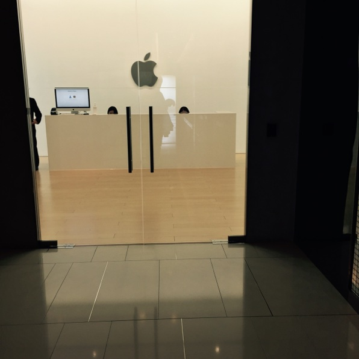

*2015-03-12 17:56 · 手机上网 转自peter*

---

### 8850

如果这个巨头是苹果，那还是有资格说的;-) 转@ webto 今天跟某巨头的战略合作总监开会，还在说什么differential。。。你以为现在是2005年么。。。

*2015-03-12 17:29 · 手机上网 转自webto*

---

### 8851

原来「富贵虾」就是「皮皮虾」啊。

*2015-03-11 19:25 · iPhone版*

---

### 8852

不错的鸡汤图。

*2015-03-11 17:57 · 手机上网*

---

### 8853

把产品做到极致，这话人人会说，但真做到的少之又少。看新版macbook的官方介绍有感。

*2015-03-11 12:25 · iPhone版*

---

### 8854

创业公司的一个基本特征就是不能指望进入「自动巡航」状态。

*2015-03-11 11:22 · iPhone版*

---

### 8855

转@ gravity0 晚饭是和从前的同事们，聊到国外的旅行生活经历除了饮食，最受不了的就是医疗服务。小伤小病根本不能指望医院，实在忍不了等不起飞回国是最好的选择。国内医生真辛苦，救死扶伤还要被打。

*2015-03-11 08:18 · 手机上网 转自gravity0*

---

### 8856

今天听说我的家乡（福建龙岩）市区人口已经超过60万（我的印象还停留在四十几万），而且已经成为一个缺水的城市-_-!

*2015-03-10 23:58 · 网页*

---

### 8857

见了一个福布斯富豪榜上的人。这位大哥不愧是老狐狸，我和他聊了一个多小时竟然感觉啥收获都没有:-(

*2015-03-10 21:52 · iPhone版*

---

### 8858

我说怎么这两天手机如此安静。原来是欠费停机了-_-!

*2015-03-10 10:32 · 网页*

---

### 8859

「对未来越有信心，对现在越有耐心」。春节假期里有高中同学在微信上发当年毕业纪念册里的内容，我才意识到原来十几年前我就这么

喜欢「信心」和「耐心」这两个词了。

*2015-03-09 22:09 · 手机上网*

---

### 8860

Business demands faith, compels earnestness, requires courage,is honestly selfish, is penalized for mistakes, and is the essenceof life.

*2015-03-09 13:49 · iPhone版*

---

### 8861

"I will only hire someone to work directly for me if I wouldwork for that person." --Mark Zuckerberg

*2015-03-06 21:25 · 网页*

---

### 8862

原来iOS8已经自带农历功能了，只要在设置里选上就好了。转@ 王兴求教饭否诸友，iPhone上哪个「万年历」app最好用？

*2015-03-05 16:21 · 网页 转自王兴*

---

### 8863

原来那些小国家也还是能出一些互联网方面的billion dollar company的。2007年，naspers（就是那家南非公司，腾讯的第一大股东）花了14.4亿美元收购波兰最大的类ebay/taobao公司allegro，后续再扩张到其他东欧国家。

*2015-03-05 14:08 · 网页*

---

### 8864

转@ gravity0 高胖说当年魔都人自己抽烂烟却相互递好烟的假客气，谁也不会真接，他表扬魔都人民不爱占人便宜。其实这是博弈的结果，自己的东西才珍惜，占便宜得来的会浪费，那时很穷若大家都占别人便宜很快筹码用光游戏就玩不下去了，而不守规矩的游戏者一来二去也没人带他玩。

*2015-03-05 11:52 · 网页 转自gravity0*

---

### 8865

求教饭否诸友，iPhone上哪个「万年历」app最好用？

*2015-03-05 11:51 · 网页*

---

### 8866

美团今天满5周岁了:) 我不禁想起那个著名论断：「人们总是高估两年能发生的变化，总是低估五年能发生的变化。」我迫不及待的想要创造下一个五年了。

*2015-03-04 20:51 · 网页*

---

### 8867

@ webto 当年我在Cabo Da Roca那里有一段不堪回首的经历……

*2015-03-03 09:53 · 网页 给webto的回复*

---

### 8868

罗德奖学金看起来真是高大上啊。

*2015-03-03 09:47 · 手机上网*

---

### 8869

如果比尔盖茨博客上提供的数据是正确的话，中国在过去三年里（2011~2013）用掉的水泥超过了美国整个上世纪（1901~2000）的用量。这已经不能用“发展中”来解释了…… 我简直不知道该用什么形容词……

*2015-02-21 14:59 · 网页*

---

### 8870

美国是第三名，用量只有印度的1/3。转@ 王兴 什么叫发展中国家？

中国每年消耗全世界水泥的58%；印度是第二名，用量只有中国的1/9。

*2015-02-21 04:29 · 网页 转自王兴*

---

### 8871

什么叫发展中国家？中国每年消耗全世界水泥的58%；印度是第二名，用量只有中国的1/9。

*2015-02-21 04:25 · 网页*

---

### 8872

"Be polite. Be professional. But, have a plan to kill everyone youmeet."---US Marine Corps

*2015-02-20 14:53 · iPhone版*

---

### 8873

instapaper已经成为我在手机上的一个重要工具。只要遇到一个打不开的网页，我就把网址分享到instapaper里，然后就可以看打开instapaper看重新排版过的内容:)

*2015-02-15 11:18 · 手机上网*

---

### 8874

@ 拧巴人儿 恭喜！

*2015-02-14 17:10 · 手机上网 给拧巴人儿的回复*

---

### 8875

转@ gravity0 Linus Torvalds 在其Google+账户上发起了投票：讨论内核版本是继续3.20，3.21...还是跳到4.0，重新开始计数？—— 大神还是蛮懂政治的：不重要的事民主表决，关键的技术核心精英决定，拉山头瞎起哄的各种运动分子做不了正事。

*2015-02-14 14:47 · 手机上网 转自gravity0*

---

### 8876

在techmeme上看到一条新闻《Researchers create $34 smartphonedongle that can detect HIV and syphilis within 15 minutes》，堪称极客炮友的神器啊！小米抄不抄？@ webto

*2015-02-13 10:36 · 网页*

---

### 8877

饭否某网友给我寄来此书当新年礼物，说这个主意产生于看到我在报道照片中的形象之后…… 谢谢啊！

*2015-02-12 23:01 · 手机上网*

---

### 8878

除了系统不是iOS之外，mate7完胜iPhone5s。转@ 极地极光 求解，苹果5s和这款手机，哪个好啊？转@ 王兴 华为mate7确实电力超强。

正常使用两天没问题。

*2015-02-12 21:53 · 手机上网 转自王兴*

---

### 8879

在这个耐心奇缺的时代，用insta开头的品牌越来越多：instagram,instapaper, instacart...

*2015-02-12 17:55 · 手机上网*

---

### 8880

华为mate7确实电力超强。正常使用两天没问题。

*2015-02-12 14:33 · iPhone版*

---

### 8881

碰到一个好长的英语缩写：ICYMI (in case you missed it)，通常用于在跟别人分享信息时拿来起头。

*2015-02-09 21:00 · 手机上网*

---

### 8882

流氓「百度地图」居然想偷偷读取我的手机通讯录！幸好被华为mate7的自带安全功能拦截了。可是，我原来的nexus5好像没这功能，所以流氓估计已经得手过了:(

*2015-02-09 17:35 · 手机上网*

---

### 8883

@ legato 谢谢你的信任！为了避免你对未来有不切实际的高期待，我想再和你分享两句我很喜欢的话：1、hope for the best, preparefor the worst；2、对未来越有信心，对现在越有耐心。

*2015-02-08 22:12 · 手机上网 给legato的回复*

---

### 8884

今天把我的安卓主力机从nexus 5换成华为mate7了。

*2015-02-08 22:09 · iPhone版*

---

### 8885

今天，立春。

*2015-02-04 09:40 · iPhone版*

---

### 8886

不好意思，搞错了，不是古希腊人而是古罗马人。《The shortness oflife》by Seneca the Younger.转@ 别人家 什么文章？转@ 王兴 最近读了一篇讲事情太多时间不够用该怎么办的文章。分析得头头是道。重点在于这是两千多年前的古希腊人写的。

*2015-01-30 20:15 · 手机上网 转自王兴*

---

### 8887

最近读了一篇讲事情太多时间不够用该怎么办的文章。分析得头头是道。重点在于这是两千多年前的古希腊人写的。

*2015-01-30 15:57 · 手机上网*

---

### 8888

这回在南非的globalization seminar上还见识了拉丁美洲人民很欢乐很有仪式感的干杯四步法：Para arriba! Para abajo! Para el centro!

Para adentro! 众人各执一个shot杯，围成一圈（中间不宜有桌子）：向上抬

*2015-01-28 19:03 · iPhone版*

---

### 8889

最近超喜欢听《por una cabeza（只差一步）》！那悠扬而千回百转的调子真是令人沉醉，差点让我想去学跳探戈了。

*2015-01-28 18:52 · iPhone版*

---

### 8890

在这个平均每5个人中就有一个携带艾滋病毒的国家，出门确实得当心。

*2015-01-20 14:12 · 手机上网*

---

### 8891

超级简洁的菜单，没有太多可选。不过，我吃过的肉食种类今天算是加了一项：springbok 跳羚。

*2015-01-20 06:33 · 手机上网*

---

### 8892

当全世界都整天讲「联接」时，迪拜机场的口号就是「联接全世界」。

*2015-01-20 03:42 · 手机上网*

---

### 8893

第一次坐A380。机舱里面倒没有觉得特别宽敞，但是从窗子看出去机翼确实比波音747的大得多。

*2015-01-19 08:49 · iPhone版*

---

### 8894

第一次坐阿联酋航空的飞机。

*2015-01-18 23:15 · 手机上网*

---

### 8895

等待登机时看到微软surface体验台上有一个称重计和提示，试了一下：iPhone 6 128克，nexus 5 130克，moleskine软皮本夹一支铅笔256克，kindle paperwhite配原版套 330克，钱包 120克，名片夹 78克。

*2015-01-17 11:10 · 手机上网*

---

### 8896

住在汉庭，和人谈事情约在朗廷。

*2015-01-16 14:58 · 手机上网*

---

### 8897

跟别人聊天时听到一个词组，不解其意，上网查了才知道是「和光同尘」，出自《道德经》。

*2015-01-16 09:20 · 手机上网*

---

### 8898

急需一股艾雷岛的海风来吹散这一切！转@ 喵呜.杨曜睿 秒穿十九世纪莫奈笔下的伦敦。 转@ 刘丹 今天的空气在泥煤中吐露着烟熏，在烟熏中潜藏着泥煤。

*2015-01-15 23:24 · 手机上网 转自刘丹*

---

### 8899

转@ gravity0 赫拉里教授说：学历史的目的不是为了吸取教训或预见未来，而是为了从过去中解放。我们每个人都生在特定的社会环境，周围现实里特定的政治经济习俗价值观让我们以为这是天经地义唯一的可能，而没有意识到这不过是历史偶然的巧合，我们的思考与梦想也受此约束，让我们的眼睛只看

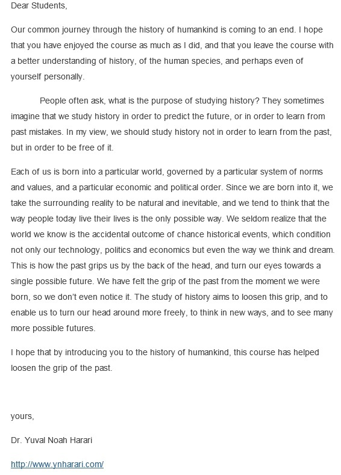

*2015-01-14 17:00 · 手机上网 转自gravity0*

---

### 8900

我对宗教了解不多，但我觉得有个问题在逻辑上是很清楚的：当一个宗教的教义里就明说了不打算尊重或公平（甚至是和平）对待不信本教的人，是否该尊重或公平对待这个宗教？

*2015-01-12 13:19 · iPhone版*

---

### 8901

@ 低调的炫耀. 方便告诉我你对猫眼的购票体验哪方面不满意吗？谢谢！

*2015-01-11 12:39 · 手机上网*

---

### 8902

@ Finn闹 你好，方便把你的联系方式私信给我吗？先给你道个歉，我想了解一下你提到的猫眼故障问题。我们一定不会让支持我们的用户失望！

*2015-01-11 12:37 · 手机上网*

---

### 8903

在微信大群里看到老家的王氏宗亲在祭祖

*2015-01-11 10:48 · 手机上网*

---

### 8904

每天读书20页。只要能坚持做到这一点，每半个月就能读完一本书（平均以300页计），一年下来就能读24本书。

*2015-01-10 23:19 · iPhone版*

---

### 8905

这是真的吗？太欢乐了！搜狐ceo张朝阳在微信朋友圈里宣布他要启用新浪微博了！

*2015-01-09 12:01 · 手机上网*

---

### 8906

面试一个人，我问他为什么12年前从法院检察院体系出来到企业做，答曰：我参与了四年的厦门远华案清查工作，这对我的人生观产生了很大的冲击……

*2015-01-08 17:00 · 网页*

---

### 8907

胡说，比手撕鬼子的抗日神剧高级多了，至少也得说是具有中国特色的007吧。邦德穿貂的样子，你想像一下。转@ 拧巴人儿 上美团看了

看电影，智取威虎山评分相当高，也有人说剧情就是手撕鬼子一类的。想到这儿我就有点不想看了……

*2015-01-07 13:23 · 手机上网 转自拧巴人儿*

---

### 8908

@ 卧龙岗上的猫 英文维基百科的甘地词条。

*2015-01-06 22:17 · 手机上网 给卧龙岗上的猫的回复*

---

### 8909

刺杀甘地的不是异教徒，而是嫌甘地对异教徒不够狠的所谓「同志/同胞」。极端主义真是可恶！

*2015-01-06 21:56 · 手机上网*

---

### 8910

转：领导力来源于不偏不倚的自我认知、空杯心态和知行合一。

*2015-01-06 20:34 · iPhone版*

---

### 8911

Never attribute to malice what can be adequately explained byignorance. 这话我常对别人说，今天对自己说了。

*2015-01-05 22:03 · 手机上网*

---

### 8912

2014年国庆档票房冠军《心花路放》和贺岁档票房冠军《智取威虎山》都有美团猫眼电影的参与:)当然，实际功臣是我的同事们! 转@ 白烨君 刚打开《心花路放》，赫然发现出品人里还有@ 王兴 的名字，这就是咱们这村长王兴吧，而且出品单位里还有“北京三快科技有限公司”，那肯定没错了。

*2015-01-05 21:59 · 手机上网 转自白烨君*

---

### 8913

转@ gravity0 读《西游记》时小学还没毕业，不仅欣赏不了其中的诗词，也体会不到结尾处的精妙。按说历经千辛万苦到西天见了佛祖理想主义经受住考验就该圆满了吧，可面对阿傩迦叶索贿他们选择妥协。# 此中有深意欲辩已忘言 #

*2015-01-05 09:35 · 网页 转自gravity0*

---

### 8914

新的一年竟然已经过去1%了。

*2015-01-04 19:11 · 手机上网*

---

### 8915

要买一个东西寄到加州，amazon和ebay上的标价一模一样，amazon要加税，ebay不要。于是我就在ebay上买了。

*2015-01-04 00:34 · 手机上网*

---

### 8916

玻利维亚这种只有一千万人口的小国却有34种官方语言！虽说多元化总体是好事，可是杂成那样咋搞啊？效率能高吗？

*2015-01-03 14:21 · 手机上网*

---

### 8917

今晚和一个老朋友吃饭。他说《智取威虎山》的故事就发生在他老

家，他读的小学就叫「子荣小学」-_-!

*2015-01-02 22:48 · iPhone版*

---

### 8918

1901年，卡耐基创建的美国钢铁公司一共雇佣了25万人，超过当时美国陆军和海军人数之和。这里，更令我惊讶的不是美国钢铁公司员工数之多，而是上世纪初美国军队人数之少。

*2015-01-02 12:22 · 手机上网*

---

### 8919

「奥斯威辛之后写诗是野蛮的。」 我无法确信我理解了这句话的准确含义，但我被震撼了，语言真是具有超越我想象的冲击力。

*2015-01-02 11:29 · 手机上网*

---

### 8920

难得看到《经济学人》也有编辑排版错误。

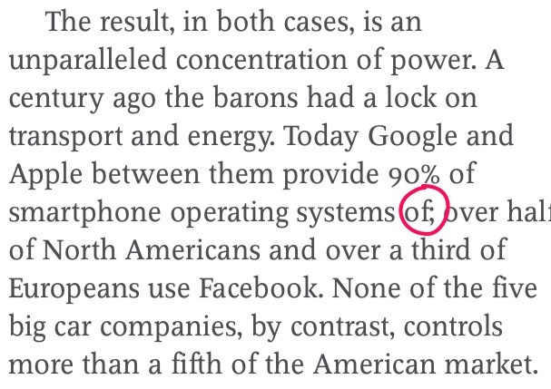

*2015-01-02 11:04 · 手机上网*

---

### 8921

刚才突然心血来潮，很少有的擦了一双皮鞋。发现右脚鞋后跟（不是鞋底，而是跟地面垂直的那个面）明显磨损比左脚那只严重很多，应该是开车导致的吧。

*2015-01-01 23:16 · iPhone版*

---

### 8922

On what principle is it, that when we see nothing butimprovement behind us, we are to expect nothing butdeterioration before us?T Macaulay

*2015-01-01 11:31 · 手机上网*

---

### 8923

「身怀利器，杀心自起」，「匹夫无罪，怀璧其罪」，中国自古就是丛林法则当道啊……

*2014-12-31 17:14 · 网页*

---

### 8924

值得喜迎啊，every day is the 1st day of the rest of your life. 转@ 蓝调子非 @ 王兴 喜迎，这个词真的用的好吗？

*2014-12-31 14:16 · 手机上网 转自蓝调子非*

---

### 8925

喜迎2014最后一天。

*2014-12-31 09:10 · iPhone版*

---

### 8926

转@ 熊猫姐 # 电影笔记 #周末觉得威虎山挺好看的，看到老家也有9.9看3D优惠，索性买了两张票喊爸妈去看，两个二十几年没去过影院的人自己体验了3D和电子取票。爸说“第一次观看3D影片，剧情改的也比老片精彩，很好。”妈说“很好”。感谢@ 王兴 村长，感谢帮忙买票的@ 弱智小朋友 。

*2014-12-30 17:11 · 手机上网 转自熊猫姐*

---

### 8927

朋友送我的书，我多半会至少翻翻看，直到有做出版的朋友开始送我书……

*2014-12-29 22:21 · 手机上网*

---

### 8928

难得碰到一首我一听就有感觉的中文说唱歌曲：《不将就》。

*2014-12-27 14:29 · 网页*

---

### 8929

在书里看到：上个世纪初，美国的汽车公司逐渐从1800家减少到3家。

听起来也和「千团大战」差不太多嘛。只是速度稍微慢一点。

*2014-12-25 21:21 · iPhone版*

---

### 8930

下午参加了一年一度的「美团之星」评选。全国各地各部门的同事推选出来19个候选人，陈述后投票选出10个。我是评委之一。整场听下来，我在感动之余有几分惭愧，我觉得这些候选人中的多数在各自岗位上的表现都比我在CEO这个岗位上的得分高-_-！

*2014-12-25 17:55 · 手机上网*

---

### 8931

既然提到《鸣梁海战》这部电影，我觉得还是值得大力推荐一下，大家趁还没完全下线赶紧去电影院看看吧。虽然有些夸张有些煽情，但韩国电影的水平确实不容小觑。我很期待国内能在类似题材上拍出类似水平的电影。

*2014-12-24 13:44 · 网页*

---

### 8932

前几天刚看完韩国史上票房最高的电影《鸣梁海战》，里面那些（1597年前后的）日本将领的穿戴确实像是这个调调。转@ 拧巴人儿矮油！大家都这么渊博！是的，日本的。

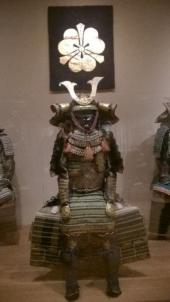

*2014-12-24 13:33 · 网页 转自拧巴人儿*

---

### 8933

妈蛋，完全不敢相信一年就要过去了！

*2014-12-24 10:23 · 手机上网*

---

### 8934

刚给维基百科捐了100美元。谢谢它这些年来提供给我的信息。

*2014-12-22 00:04 · iPhone版*

---

### 8935

转发：你必须首先是一个美好的人，才配得上拥有许多美好的东西。

*2014-12-21 10:20 · 手机上网*

---

### 8936

为什么这两条新闻会被放在一起…

*2014-12-20 14:50 · 手机上网*

---

### 8937

转@ 飯否小字报 转@ 旧恋人 《小王子》拍成电影了，坐等2015年上映，看了预告片心都化了。

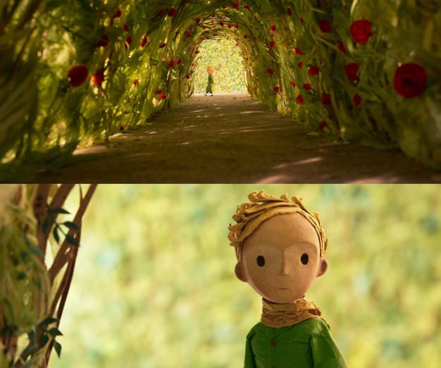

*2014-12-19 01:53 · 手机上网 转自旧恋人*

---

### 8938

转发：颠覆游戏规则的前提是敬畏与吃透游戏规则，而不是藐视游戏规则。

*2014-12-17 00:33 · iPhone版*

---

### 8939

对"holy shit"最「信达雅」的中文翻译是什么？

*2014-12-15 14:54 · 手机上网*

---

### 8940

很苦恼，我最近吃什么都觉得太咸或太甜:-( 是不是味蕾打得太开了-_!

*2014-12-15 14:37 · 手机上网*

---

### 8941

数了一下，小时候我至少养过猫、狗、鸡、鸭、猪、鸽子、兔子、鱼、龟、蚕、蝌蚪。

*2014-12-13 00:43 · iPhone版*

---

### 8942

发完上一条，突然又想起沈庆的《岁月》，于是在手机上搜出来听了一遍。当面那mv里的一些镜头我至今都记得。

*2014-12-13 00:25 · iPhone版*

---

### 8943

在朋友送我的一本关于古诗词的书里读到「九月寒砧催木叶，十年征戍忆辽阳」。年少时我曾觉得十年无比漫长，现在我知道十年真的只在弹指一挥间。

*2014-12-13 00:19 · iPhone版*

---

### 8944

这小孩最近怎么了？转@ 太空小孩 从此以后，路过的人们只会赞叹那平静如镜的水面，碧空如洗的天。而只有你自己知晓，平静湖水下的暗涌，那经历过的疾风骤雨，这里也曾汹涌得如同一片海。201412-09 00:00

*2014-12-13 00:08 · 手机上网 转自太空小孩*

---

### 8945

我中学时很喜欢看我爸（还是我奶奶？）订的某政经杂志。今天机缘巧合，和当年那杂志的总编聊了个天。唏嘘感叹一番，再憧憬展望一下。未来没准能合作合作，把我的另一个想法付诸实施。

*2014-12-13 00:06 · 手机上网*

---

### 8946

老祖宗们还真是有智慧，「任劳任怨」这两项放在一起，能同时做到就很难得了。有些人「任劳」不「任怨」。说来说去，关键依然是搞明白「有什么，要什么，舍什么」。

*2014-12-12 17:31 · 手机上网*

---

### 8947

@ webto 惭愧，没怎么用上它的「智能」或联网功能……

*2014-12-12 17:26 · 手机上网 给webto的回复*

---

### 8948

转发：所谓新鲜感，不是和未知的人一起去做同样的事情，而是和已知的人一起去体验未知的人生。

*2014-12-12 13:39 · 手机上网*

---

### 8949

科技带来的小小烦恼：现在连插座都要升级固件了-_-! 幸好这升级看

起来很容易完成。

*2014-12-12 13:24 · 手机上网*

---

### 8950

是啊，打起仗来经济账是无比重要的。转@ gravity0 美国海军装备激光炮，可用于击落无人机和击沉小型船舰。标准地对空导弹每发 40万美元，而激光一炮只要 59 美分。打仗打的是后勤，如此巨大的成本差还没开打胜负已决。不过我天朝不怕激光炮，我们有雾霾，中央在下很大的一盘棋。

*2014-12-12 13:01 · 手机上网 转自gravity0*

---

### 8951

科技行业里，大家整天谈「平台」，言必称「网络效应」。我刚刚意识到，其实每一门语言本身（例如汉语、英语）都是具有极强「网络效应」的「平台」。掌握多门语言，你就「跨平台」了。

*2014-12-11 17:01 · 手机上网*

---

### 8952

strategy: a careful plan or method for achieving a particulargoal usually over a long period of time.

*2014-12-11 16:35 · 手机上网*

---

### 8953

second place is first loser.

*2014-12-09 21:11 · 网页*

---

### 8954

作为一个互联网从业者和面食爱好者，我觉得这个比喻很欢乐：「传统行业如刀削面，砍一刀是一条面，是线性经济；网络经济如拉面，每拉一次，面条数量会倍增。」

*2014-12-07 16:37 · iPhone版*

---

### 8955

今天听到的最佳格言。我实在是忍不住当场笑了起来。“Everybodyhas a plan until they get punched in the face.”-Mike Tyson

*2014-12-05 18:02 · 手机上网*

---

### 8956

好久没喝加多宝了，今晚喝了一口，甜得不可忍啊。

*2014-12-02 21:30 · iPhone版*

---

### 8957

我喝茶和我是福建人貌似没关系，是我离开福建多年后才逐渐养成的习惯。转@ 剑花 大胡建人不是喝武夷山的茶么 转@ 王兴 熟普洱为主。最近也开始喝滇红。我的胃受不了绿茶。转@ 弥城 都喝什么茶？武夷岩茶？转@ 王兴 过去几年，我对茶的消耗量急剧上升。

*2014-12-02 14:32 · 手机上网 转自王兴*

---

### 8958

熟普洱为主。最近也开始喝滇红。我的胃受不了绿茶。转@ 弥城 都喝什么茶？武夷岩茶？转@ 王兴 过去几年，我对茶的消耗量急剧上升。

*2014-12-02 14:24 · 手机上网 转自王兴*

---

### 8959

过去几年，我对茶的消耗量急剧上升。

*2014-12-02 10:06 · 手机上网*

---

### 8960

空气果显示，美团办公室里的pm2.5今天只有8或9。转@ webto 您再看看PM10 转@ 郭万怀 今天PM2.5 37。这么猛的风，我还以为会10以下...

*2014-12-01 10:48 · 手机上网 转自郭万怀*

---

### 8961

@ 金融界人贩子 同读过。同难忘。

*2014-11-30 23:46 · 手机上网 给金融界人贩子的回复*

---

### 8962

Midori我也比较过，对我来说太窄，而且那么多自定义功能对我没有意义，反而是个累赘。另外，外面那个小铅坠也有点碍手。转@Elliott 马克，我喜欢用日本的MIDORI，书写的手感极好「@ 王兴 德国灯塔我也买过，确实有两个细节设计比moleskine好

*2014-11-30 18:32 · 手机上网 转自王兴*

---

### 8963

moleskine这个品牌有过去两个世纪里梵高、毕加索等众多著名文艺人士加持，而且源于法国，但真正的商业运作始于1997年，由米兰一个小型出版商发扬光大。2013年，这个公司在米兰上市了，目前市值8.5亿欧元。

*2014-11-30 17:55 · 网页*

---

### 8964

德国灯塔我也买过，确实有两个细节设计比moleskine好（例如最后几页设计成有打孔线便于整齐的撕下来），可惜我只找到硬皮本，而我喜欢软皮本。转@ 豆奶 王总应该再去试试德国的灯塔笔记本啊！转@ 王兴 虽然moleskine比普通本子贵许多，但折算下来，我一年用不掉两本……

*2014-11-30 17:40 · 网页 转自王兴*

---

### 8965

虽然moleskine比普通本子贵许多，但折算下来，我一年用不掉两本（第一本用了接近7个月），所以也就是一年只多花两百来块钱，相比其他开支是小头，体验却好很多。这大概就是「轻奢」这个定位的生命力和其商业模式的魅力。

*2014-11-30 17:35 · 网页*

---

### 8966

moleskine会给我这么大触动，是因为它是第一个让我有切身体会的「轻奢」品牌。它比普通本子的设计／用料／做工都好一些，成本估计也高一些，售价却贵了一个数量级。普通本子卖十几到几十块，moleskine这款在北京颐堤港专卖店里卖两百多，在香港卖155港币（折合人民币120多）。

*2014-11-30 17:31 · 网页*

---

### 8967

发现iPad应用Paper里默认的笔记本款式就是我现在用的这个moleskine黑皮本。看来确实是经典款。

*2014-11-30 00:08 · 手机上网*

---

### 8968

为什么「牛蛙王子」听起来和「青蛙王子」就完全不是一个感觉了呢？

*2014-11-29 21:04 · 手机上网*

---

### 8969

今天开始启用我的第二本moleskine（左）。我的第一本（右）从今年5月2日用到11月29日，外表磨损并不明显，说明moleskine的质量还是蛮不错的。

*2014-11-29 17:33 · 手机上网*

---

### 8970

据说高于2000时大脑思考速度会下降。到大几千时如果时间太长对身体有伤害。上午我们二十几个人关在一个会议室里，高的时候~1500，如果开窗就降到700~1000。转@ arche 二氧化碳高有什么问题吗？

「@ 王兴 朋友送了我一个他们做的「墨迹空气果」…卧室里二氧化碳居然高达900多

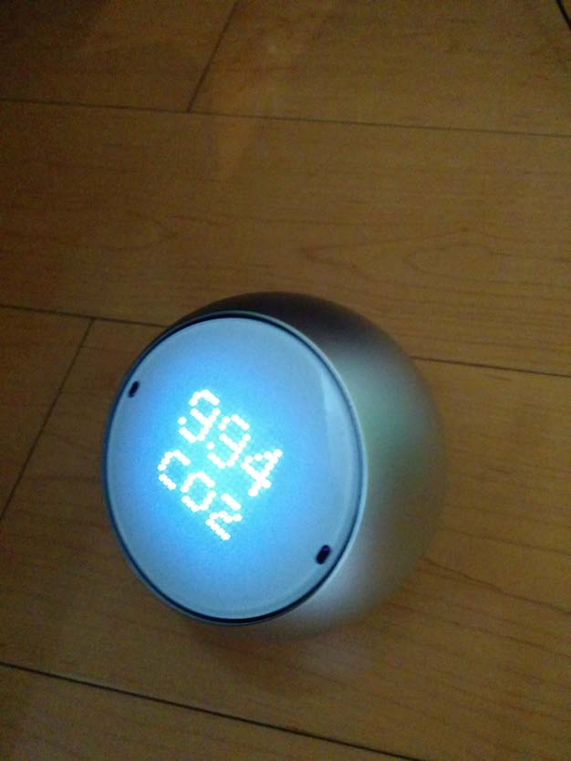

*2014-11-29 13:13 · 手机上网 转自王兴*

---

### 8971

昨天朋友送了我一个他们做的「墨迹空气果」。今早一起床我就有点忧伤，卧室里二氧化碳居然高达900多。

*2014-11-29 09:39 · 手机上网*

---

### 8972

无意中又发现微信的一个操作小技巧：双击底部通栏最左边「微信」

那个图标，聊天列表会自动滚到最近一条有未读消息的对话处。

*2014-11-29 00:21 · 手机上网*

---

### 8973

装逼犯！有《仲夏夜之梦》这么优雅的译名就不必非得用英文名了吧。哦，可能你想强调你读的是英文原文。转@ 拧巴人儿 看完2014第87本书，a midsummer night's dream.嘿嘿，功课还是要做的。

*2014-11-28 17:57 · 手机上网 转自拧巴人儿*

---

### 8974

还真不是。主要原因是我看之前已经有个选择过程，所以多数电影不会太离谱。往前再翻，我打分更低的也不少：《变4》和《私人订制》6分，《霍比特人1》5分，《小时代3》4分。转@ 只要面子不要脸 和事佬 转@ 王兴 在「猫眼电影」里简单回顾了一下最近看的几部电影…都在7/8/9分这三档。

*2014-11-28 10:57 · 手机上网 转自王兴*

---

### 8975

在「猫眼电影」里简单回顾了一下最近看的几部电影，发现我打分不太有区分度，都在7/8/9分这三档。

*2014-11-28 10:45 · 手机上网*

---

### 8976

谢谢前同事小伙伴送来的贴心礼物。盖子上是他们的品牌「唯鲜」，腰封上还印着美团的口号「既往不恋，纵情向前」:)

*2014-11-27 16:16 · 手机上网*

---

### 8977

最近忙得连在手机上打字的速度都显著加快了。人果然有潜能。

*2014-11-25 09:37 · 网页*

---

### 8978

「有什么，要什么，舍什么」这三个问题对个人对公司都极重要。

*2014-11-24 20:25 · 手机上网*

---

### 8979

这个……虽然……猫眼电影致力于给大家最方便最优质的购票观影体验，而且可以在手机上直接选好座位，但是就和在柜台选定了座位买了电影票一样，不好随便退的啊。

*2014-11-24 20:00 · 手机上网*

---

### 8980

每一天都是一场新的战斗。与东非大草原上的动物共勉。

*2014-11-24 10:29 · 网页*

---

### 8981

安卓新版5.0里的电话本也很难用。速度慢得像蜗牛不说，很多常用操作设计得很别扭。我已经多次误拨电话了:(

*2014-11-22 14:37 · iPhone版*

---

### 8982

用了好几天之后，我依然认为谷歌日历的安卓新版是个退步。

*2014-11-21 09:27 · 手机上网*

---

### 8983

终于找到了，android 5.0里的这个chrome选项太重要了。默认竟然是打开的，让我这种长期开着几十个网页tab的人一整天都有点手足无措。

*2014-11-18 19:49 · 手机上网*

---

### 8984

终于盼来了安卓5.0升级包。这就是用google官方的nexus手机的好处。

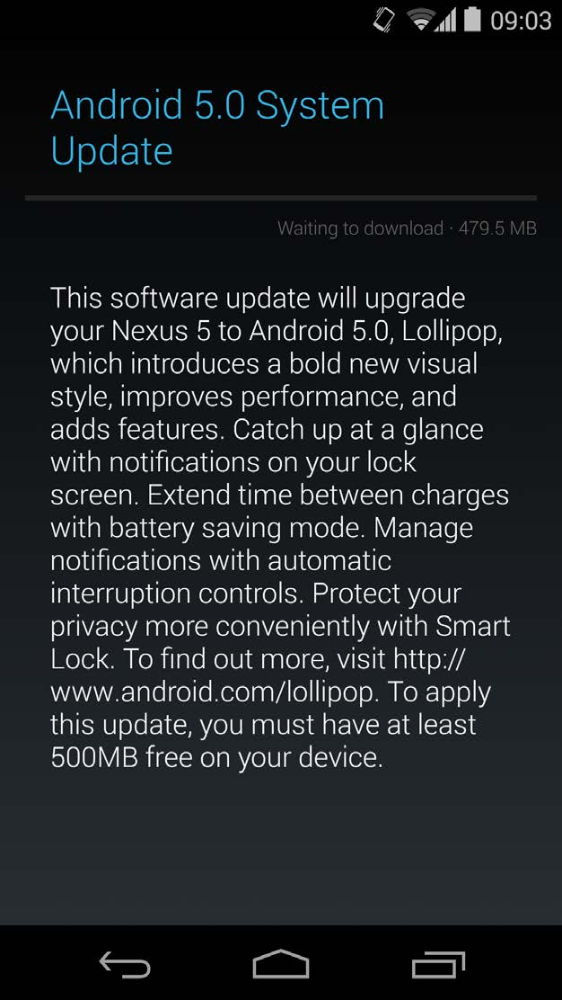

*2014-11-18 11:36 · 手机上网*

---

### 8985

转@ 拧巴人儿 “私心比体重还重”……这形容的……

*2014-11-18 00:10 · 手机上网 转自拧巴人儿*

---

### 8986

不好意思，我上午信口开河，说范仲淹的《岳阳楼记》「洋洋洒洒近千字」。刚才查了一下，实际只有三百六十几字，比我估计的短得多！也可以说，只有不到三条新浪微博的长度-_-！

*2014-11-15 17:56 · 手机上网*

---

### 8987

还知道要到床上拱而不是直接地上拱，还知道就在家里拱而不是干脆出门拱，就说明病得还不是太重。转@ 拧巴人儿 刚刚穿上我这件儿绿袍子，突然觉得自己像一条菜青虫。然后忍不住跑到床上学菜青虫拱了拱……我是不是病又重了……

*2014-11-15 14:34 · 手机上网 转自拧巴人儿*

---

### 8988

确实，你这么讲也有道理。可能这俩大哥就是因为境界不够，所以才努力了一辈子想当大官却未遂，「沦落」为文豪。转@ 拧巴人儿 @王兴 我觉得不能用文豪来说明这个境界不现实。文学家需要一颗敏感的心。否则怎么创作打动别人的作品。

*2014-11-15 09:44 · 手机上网 转自拧巴人儿*

---

### 8989

当然，把「范仲淹」和「真实」放在同一个句子里简直就是oxymoron。这哥们洋洋洒洒写近千字的《岳阳楼记》时远在他乡，根本就没见过此楼此景是啥样，全靠意淫加脑补写了篇命题作文帮他那当了地方官搞政绩工场的哥们撑场子，居然就流传千古了。

*2014-11-15 09:38 · iPhone版*

---

### 8990

这更说明了，范仲淹在《岳阳楼记》后半段讲的「不以物喜，不以己悲」是高大上到不现实的境界，前半段对比「淫雨霏霏」和「春和景明」两种不同天气下人的不同情绪才是更真实的，至少杜和孟俩文豪都如此。

*2014-11-15 09:29 · iPhone版*

---

### 8991

孟浩然的《临洞庭湖赠张丞相》：八月湖水平， 涵虚混太清。 气蒸云梦泽， 波撼岳阳城。 欲济无舟楫， 端居耻圣明。 坐观垂钓者，徒有羡鱼情。

*2014-11-15 09:13 · iPhone版*

---

### 8992

杜甫的《登岳阳楼》：昔闻洞庭水，今上岳阳楼。吴楚东南坼，乾坤日夜浮。亲朋无一字，老病有孤舟。戎马关山北，凭轩涕泗流。

*2014-11-15 09:12 · iPhone版*

---

### 8993

果然，孟浩然是农历八月写的这首《临洞庭湖赠张丞相》，所以才会有「气蒸云梦泽」的感觉。而杜甫却是暮冬腊月来《登岳阳楼》，湖边冷风一吹，可不是得「凭轩涕泗流」嘛。当然，全诗境界还是杜比孟高得多。

*2014-11-15 09:02 · iPhone版*

---

### 8994

孟浩然写洞庭湖的「气蒸云梦泽，波撼岳阳城」确实磅礴大气！

*2014-11-15 08:48 · iPhone版*

---

### 8995

我必须承认，我被这条内裤深深的震惊了！这是什么样的一种情怀

啊！转@ 拧巴人儿 好棒！转@ 比尔盖饭2008 夜光宇宙内裤，，，

*2014-11-15 00:18 · 手机上网 转自比尔盖饭2008*

---

### 8996

剥好的一整袋夏威夷果吃起来真是太爽了，完全停不下来啊。脂肪含量很高的-_-!

*2014-11-14 21:19 · 网页*

---

### 8997

同一个英文单词president，到中文里就分出了「总统」和「总裁」。

*2014-11-14 20:26 · 网页*

---

### 8998

读红杉资本莫里茨的文章才知道，双11在英联邦乃至其他一些欧洲国家也是一个节日，Remembrance Day, 第一次世界大战正式结束的纪念日。

*2014-11-14 20:15 · 网页*

---

### 8999

可是现在空气和土壤都污染得很厉害啊:-( 转@ IwfWcf 「一个民族只有有那些关注天空的人，这个民族才有希望。如果一个民族只是关心眼下脚下的事情，这个民族是没有未来的。」

*2014-11-14 19:50 · 网页 转自IwfWcf*

---

### 9000

晚饭只吃水果的缺点就是会觉得全身发凉，不过，扛过去就好了。

*2014-11-14 19:41 · 网页*

---

### 9001

实践证明，用QQ音乐听歌时，iPhone6的扬声器效果比Nexus5好得很明显。

*2014-11-14 19:02 · 网页*

---

### 9002

安卓上的google日历5.0版整个界面大变，我今早升级后一整天很不适应。升级需谨慎！

*2014-11-14 17:21 · 网页*

---

### 9003

今年是我明显加速成熟（同时也加速衰老）的一年。

*2014-11-13 21:07 · 网页*

---

### 9004

在这个充斥着劣质媒体报道的时代，很高兴还能看到《埃博拉战争》

这种高质量的文章： http://is.gd/TyS382 这才是真正的媒体。我向《纽约客》致敬，更向那些奋战甚至牺牲在一线的医护人员致敬！

*2014-11-13 12:17 · 网页*

---

### 9005

“The frontiers are my prison." 在听“The Partisan”。LeonardCohen真是有才到爆。如果我是一个女人，也会对他毫无抵抗力。

*2014-11-13 00:12 · iPhone版*

---

### 9006

音乐，和酒精，还有挑战，令人开心。

*2014-11-13 00:02 · iPhone版*

---

### 9007

「越过山丘，才发现无人等候…」 李宗盛的《山丘》是首不错的歌，词曲皆有可观之处。

*2014-11-12 23:49 · iPhone版*

---

### 9008

Begun, the war has.

*2014-11-12 22:54 · iPhone版*

---

### 9009

whatsapp在iPhone6的大屏幕上更加有傻大黑粗的感觉。

*2014-11-12 14:06 · iPhone版*

---

### 9010

「每年仅有低于2%的中国出境旅客选择美国」。这个比例确实低得出乎我的意料。

*2014-11-12 13:57 · iPhone版*

---

### 9011

多谢饭否著名网友寄给我的礼物^_^!

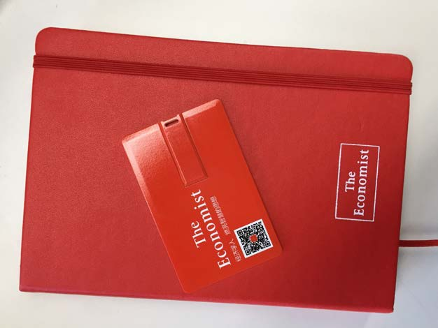

*2014-11-12 10:24 · 手机上网*

---

### 9012

johnnie walker这个牌子的威士忌我倒不觉得很好，但是他们家keepwalking这句口号我非常喜欢。

*2014-11-11 19:42 · iPhone版*

---

### 9013

我没觉得google maps最近这次改版的新logo比旧logo更好看或更易用。

*2014-11-10 23:28 · iPhone版*

---

### 9014

终于会在iOS上输入「方引号」了。原来只要长按双引号就可以了。

*2014-11-10 14:42 · iPhone版*

---

### 9015

APEC = Air Pollution Eventually Controlled. 今天北京的天真蓝，PM 2.5才二十几，真是不信邪不行。

*2014-11-06 15:26 · 网页*

---

### 9016

天上飞着一群鸟，让我觉得这个城市多了几分生气。

*2014-11-05 17:31 · iPhone版*

---

### 9017

Be the house.

*2014-11-04 11:33 · 手机上网*

---

### 9018

@ 拧巴人儿 买电影票必须用美团或者猫眼电影啊。能网上选座，自动出票机取票。

*2014-11-04 10:39 · 网页 给拧巴人儿的回复*

---

### 9019

「不贰过，不迁怒」总觉得太精到了，但是要做到太难了。

*2014-11-03 14:33 · iPhone版*

---

### 9020

每一个节日，都是「又一年过去了」的提醒。

*2014-10-31 21:18 · 手机上网*

---

### 9021

每一个节日，都是「又一年过去了」的提醒。

*2014-10-31 21:17 · 手机上网*

---

### 9022

连我的家乡福建龙岩这种四线城市都已经建了万达广场。转@ 芈子.

@ 王兴 大城市 也就那么几个 一百座 已经很多了

*2014-10-31 10:45 · 网页 转自芈子.*

---

### 9023

万达昨天宣布建成全国第100座万达广场。我还以为早就更多了呢。

*2014-10-31 09:57 · 网页*

---

### 9024

同事自己做的万圣节南瓜饼:)

*2014-10-31 09:42 · 手机上网*

---

### 9025

终于大概搞清了费孝通、费正清和费玉清的区别。

*2014-10-29 23:54 · 手机上网*

---

### 9026

转@ 宋石男 在推特，一个刚失恋的朋友痛苦地说：＂女人和恐怖份子唯一的区别是，恐怖份子是可以谈判的。＂

*2014-10-29 23:39 · 手机上网 转自宋石男*

---

### 9027

电影的历史比电视的历史长多了。

*2014-10-29 23:39 · iPhone版*

---

### 9028

我其实很好奇一个问题：这世界上有没有一个人觉得自己是不善良的？

*2014-10-29 19:16 · iPhone版*

---

### 9029

终于把我这台老macbook air也升级到OS X Yosemite了。

*2014-10-29 18:11 · 网页*

---

### 9030

这张照片真是把我惊到了。

*2014-10-28 14:16 · 手机上网*

---

### 9031

白发多如牛毛……

*2014-10-27 17:07 · 网页*

---

### 9032

这黄昏的天空，这清秀的月牙，简直没得让人心悸。

*2014-10-26 17:51 · iPhone版*

---

### 9033

要出门了。从阳台上收了一双刚被太阳晒过的袜子。穿在脚上暖烘烘的，真舒服。

*2014-10-26 14:25 · iPhone版*

---

### 9034

How many times must a man look up before he can see thesky? The answer, my friend, is blowing in the wind.

*2014-10-26 12:38 · iPhone版*

---

### 9035

昨天见到两个人，都是一手iPhone 6一手iPhone 6 Plus，而且这俩都不是手机相关行业的人。这都是什么世道啊。

*2014-10-26 11:02 · iPhone版*

---

### 9036

今天北京的空气污染已经严重到让我的眼睛很难受了。

*2014-10-25 18:49 · 手机上网*

---

### 9037

随着年纪增长，我吃苹果的方式从「用水冲一冲就直接啃」变成「削完皮再啃」再变成「削皮后切成几瓣再吃」。

*2014-10-25 13:09 · iPhone版*

---

### 9038

电脑硬盘空间不够了，我在考虑把从前下载的那些音乐都删掉。反正我确实有很长时间不是听电脑里储存的音乐，而是在手机上听qq音乐里我选的歌了。

*2014-10-23 22:22 · iPhone版*

---

### 9039

在逼格高一些的餐馆点一个汉堡都要被问「几成熟」……

*2014-10-22 21:40 · iPhone版*

---

### 9040

是的，lupin可以音译成“鲁冰花”，也可以意译成“羽扇豆”：原产墨西哥高原地区，是豆类的一种，有根瘤菌可以固氮，所以是一种重要的绿肥（据说台湾茶园里种植很多）。转@ 小世界. 彩彩的羽扇豆「@ 王兴 时隔二十多年，再次听到“鲁冰花”这个词

*2014-10-22 16:56 · 手机上网 转自小世界.*

---

### 9041

时隔二十多年，再次听到“鲁冰花”这个词。和那首同名歌曲没有关系，而是一个朋友说起他在美国家里有一大片这种花，他还说鲁冰花是那里每年春天最早开的花。原来这个名字是英文lupin的音译。

*2014-10-22 16:37 · iPhone版*

---

### 9042

在从望京到CBD的车上睡了一觉，睡得很沉，醒来后有恍若隔世感觉的那种。

*2014-10-22 15:38 · 手机上网*

---

### 9043

@ 胡媚娘.思 摘自百度百科：阿里地区，（藏语拼音：Ngari Sanai，威利：mnga' ris sa gnas），是中华人民共和国西藏自治区的一个地级行政区……

*2014-10-22 10:35 · 手机上网 给胡媚娘.思的回复*

---

### 9044

武汉据说是全球在校大学生人数最多的城市。

*2014-10-22 10:32 · iPhone版*

---

### 9045

把路边的仿真交警模型误以为是真人倒不奇怪，但刚才我居然把一个

活人交警误以为是模型了。默默的替他悲催一下……

*2014-10-21 12:16 · iPhone版*

---

### 9046

The buck stops here.

*2014-10-21 10:29 · iPhone版*

---

### 9047

逼格爆表啊。转@ 宋石男 納博科夫在給學生講《安娜卡列妮娜》時會費力地在黑板上畫出從聖彼得堡到莫斯科的特快列車上半躺式車廂的設置，因為不了解這些就無從理解小說。——俺要向纳翁学习！

*2014-10-14 13:52 · 手机上网 转自宋石男*

---

### 9048

抱歉，这是一个工程师操作失误导致的bug，很快就会修复，已经发了新版，正在等app store审核上线。多谢你支持猫眼电影！转@ 米諾这猫眼电影……这名字……这72啥意思……@ 王兴

*2014-10-13 00:29 · 手机上网 转自米諾*

---

### 9049

打算有空时读一下哈佛汉学家孔飞力写的《Chinese AmongOthers》。我对讲华人移民史的书有天然兴趣，因为我是福建人，更因为我的家族历史：我的曾祖父二十年代下过南洋，我奶奶的兄弟姐妹49年都去了台湾，我最小的叔叔90年代初移居悉尼，我姐姐2000年留学美国并定居……

*2014-10-12 00:53 · iPhone版*

---

### 9050

@ 弥城 那书不是我写的，书名怎么起和有没有kindle版不由我决定。

*2014-10-10 21:58 · 手机上网 给弥城的回复*

---

### 9051

在莫斯科参观安葬了各界名人的「新圣女公墓」时，我才听同行的长者说北京有个类似的「万安公墓」。上网搜了一下照片，万安公墓的墓碑设计太单调了，而新圣女公墓里有各式各样的设计，个个都像是艺术品。

*2014-10-09 13:30 · iPhone版*

---

### 9052

在走马观花逛过圣彼得堡、大诺夫哥罗德、特维尔和莫斯科之后，想到这个民族对人类文明的贡献时，我依然难以忘怀的是：俄罗斯方块_-!

*2014-10-09 11:32 · iPhone版*

---

### 9053

继悉尼歌剧院之后，莫斯科的圣瓦西里大教堂（洋葱头）是另一个让我觉得名不虚传的美丽建筑。

*2014-10-08 17:27 · iPhone版*

---

### 9054

这拼木地板的立体效果真好。

*2014-10-04 10:40 · iPhone客户端*

---

### 9055

当年俄国人越过白令海峡开拓北美时，不但占领整个阿拉斯加，而且一路往南杀到旧金山。旧金山往北一百多公里的海岸边就有个俄国要塞fort ross，这是我之前所不知道的。

*2014-10-02 11:45 · iPhone版*

---

### 9056

作为一个面食爱好者，我必须承认我还没吃过这么宽的！转@ 拧巴人儿 我也想吃！最爱大宽！转@ 爱说南朝狂客 我也想吃！转@ MM不算太 转@ 風來坊 大宽！「@ EddyH 人生成就：吃一碗正宗兰州拉面达成」

*2014-10-02 11:15 · 手机上网 转自EddyH*

---

### 9057

在北京这种人口超过两千万的超级城市住久了，去世界上多数地方都觉得好小，毕竟，这地球上75%的国家全国人口数都赶不上北京一个城市的人口数。

*2014-10-02 10:27 · iPhone版*

---

### 9058

南极洲居然是俄国探险者最早发现的……

*2014-10-01 00:45 · 手机上网*

---

### 9059

说句实话，我确实不觉得天安门是个很有美感的建筑。

*2014-09-30 16:46 · iPhone版*

---

### 9060

Experience and enthusiasm are two fine business attributesseldom found in one individual.

*2014-09-30 16:35 · 手机上网*

---

### 9061

“…iPhone 6售价分别5288/6088/6888元，iPhone 6 Plus售6088/6888/7788元” 细想一下，真的相当贵啊！

*2014-09-30 15:42 · iPhone客户端*

---

### 9062

今天下午，整个天突然就凉下来了，非常明显。

*2014-09-29 19:27 · iPhone版*

---

### 9063

转：诗人可以从任何事件中存活，印刷错误除外。

*2014-09-27 08:26 · iPhone版*

---

### 9064

转@ gravity0 这事说来挺无奈：基因和生物个体的利益是不一致的。

基因要求繁衍进化，而生物个体只为自己，若个体自私理性那就都不生了。所以才要有非理性的冲动，让人们有时能不受大脑控制做点傻事。而理性并非永远正确，谁说傻事不会有好结果呢？进化没有路线图，就是个掷骰子游戏。

*2014-09-26 13:07 · 手机上网 转自gravity0*

---

### 9065

没有人是一座孤岛，可以自全… 任何人的死亡都是我的损失，因为我是人类的一员。因此，不要问丧钟为谁而鸣，它就为你而鸣。 转@黄阿狗 一大早大家都在谈论IT公司老总王欣上央视忏悔，我当时就想，是不是美团和饭否又捅了啥篓子了？王老板被抓了是不是要组织去送点烧鸭饭探监什么的

*2014-09-25 10:38 · Android客户端 转自黄阿狗*

---

### 9066

我琢磨了一下，我之所以没买降噪耳机，主要原因还是嫌麻烦。我对要换电池的东西都不太感冒。

*2014-09-24 21:07 · 网页*

---

### 9067

连续签名售书是不是这世上最机械最无聊的活？当然不是，更无聊的是给一大叠明摆着不是我写的、而是别人写我的书签名-_-！

*2014-09-24 15:21 · 网页*

---

### 9068

这几年下来，手机里的app真是越用越少。为了工作而装上试用的不算。

*2014-09-24 09:52 · 网页*

---

### 9069

转@ 拧巴人儿 You become a citizen of the world by readingbooks.

*2014-09-23 20:12 · 手机上网 转自拧巴人儿*

---

### 9070

是的，过了秋分，今年就只剩下99天了。转@ 幕小后 99天。转@ 王兴 又是一个秋分。

*2014-09-23 12:18 · 网页 转自王兴*

---

### 9071

又是一个秋分。

*2014-09-23 09:25 · 网页*

---

### 9072

补发一条：昨天在回国的飞机上看了《布达佩斯大饭店》，这是我今年看过的最棒的电影。我超喜欢这种茨威格一般的调调。

*2014-09-22 16:49 · iPhone版*

---

### 9073

我也不理解。事实上，我的选择正好相反：我通常等到最后才登机，因为机舱不如候机室宽敞舒服啊。转@ 周露inn 在所有插队行为中，我最不能理解上飞机还蛮横插队的——你先上，你还能先飞么？

*2014-09-05 11:57 · 手机上网 转自周露inn*

---

### 9074

这是啥玩意儿？什么时候冒出来的？

*2014-09-04 17:51 · Android客户端*

---

### 9075

那些送月饼的人都直接折现给我该多好啊。

*2014-09-04 17:29 · iPhone版*

---

### 9076

Character is like a tree and reputation like a shadow. Theshadow is what we think of it; the tree is the real thing. -Lincoln

*2014-09-04 14:53 · 网页*

---

### 9077

Whatever is well conceived is clearly said, and the words to sayit flow with ease. -Boileau

*2014-09-04 13:46 · 网页*

---

### 9078

你才是大佬，你们全家都是大佬！转@ 强叔. @ 王兴 村长你怎么看啊 转@ 圡人 转@ 知乎 分享：《九败一胜》：下一个互联网大佬会是王兴吗？ - 企业家观察 - 知乎专栏 http://is.gd/vKmDwm

*2014-09-04 10:42 · 手机上网 转自知乎*

---

### 9079

中国已经不再年轻。非洲才是小伙子。

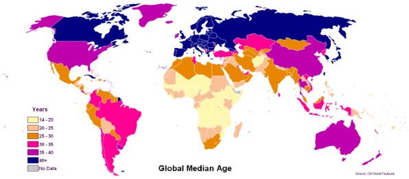

*2014-08-26 10:42 · Android客户端*

---

### 9080

中国人的年龄中位数是35点几岁（2010年的数据），正是我现在的年纪。

*2014-08-26 10:33 · iPhone版*

---

### 9081

「转自水木」很有挑战的脸盲测试 http://rrurl.cn/dlRTb7

*2014-08-25 10:29 · 网页*

---

### 9082

李煜《子夜歌》：人生愁恨何能免？销魂独我情何限！故国梦重归，觉来双泪垂。高楼谁与上？长记秋晴望。往事已成空，还如一梦中。

*2014-08-25 10:24 · 网页*

---

### 9083

看来光画图不够，还得辅以口诀才有希望记住“路名-桥名-路名”的组合：望京大山酒仙桥，广顺南湖万红西，花家地街将台路，芳园西路通霄云。转@ 王兴 搬到望京工作和生活有半年了，酒仙桥那一片也常去，但是这个区域的路网复杂零乱，我总也搞不明白，今天干脆对照手机地图画一画以加深印象。

*2014-08-24 08:55 · iPhone客户端 转自王兴*

---

### 9084

这个说法有意思：彩票是对低智商人群收税，而风投是在对高智商人群收税，他们肩上担负的是这个国家科技力与创新力的重担，这是每一个高智商的“纳税者”所应尽的义务。

*2014-08-24 08:31 · iPhone客户端*

---

### 9085

最近几天飞越我们办公室的直升机异常多。

*2014-08-22 17:40 · iPhone客户端*

---

### 9086

多谢提醒。我也是用iPhone5，刚才试了一下，是正常的啊。你那里还是不行吗？转@ 孙悟冲 @ 王兴 Iphone5，今天突然美团客户端不能正常使用，页面打不开，显示json数据解析错误。

*2014-08-21 09:49 · 网页 转自孙悟冲*

---

### 9087

恭喜！转@ bang 娶完老婆了，很幸运初恋就是一个可以一直情投意合，性格相合，患难与共的人，很有信心可以一直这样下去。结婚很

轻松，心里很感谢家里人的尽心操办和给力支持，只是对家里人的感谢没法说出口。

*2014-08-18 13:33 · 手机上网 转自bang*

---

### 9088

恭喜！转@ 鸝.se 再夺欧洲首饰设计大奖，成为历史上第一位获此项荣誉的中国人！^_^# 开心地得瑟 #

*2014-08-18 13:33 · 手机上网 转自鸝.se*

---

### 9089

前同事创业，让我试试产品：一天按时喝6瓶蔬果汁，不吃饭，听说可以清肠排毒甚至减肥。

*2014-08-18 09:38 · iPhone客户端*

---

### 9090

美好？你考虑过密集物恐惧症患者的感受吗？转@ 铁岭芭比 看到这句就想起之前看过那个小说中比较美好的性描写的帖子，这句应该也算不错的吧。

*2014-08-18 00:43 · 手机上网 转自铁岭芭比*

---

### 9091

今天见识了一个逼格别具一格的饭局，一个包间两桌人，都和我一样黄皮肤黑头发，但餐前寒暄的话题却是「你支持共和党还是民主党？」「下届总统大选你要投哪个候选人的票？」… 我实在插不上什

么话，只想默默扒饭，可是饭还没上来。

*2014-08-18 00:20 · 手机上网*

---

### 9092

你这样的图文搭配真的好吗？ 转@ 拧巴人儿 醉卧沙场几人回

*2014-08-17 14:43 · 手机上网 转自拧巴人儿*

---

### 9093

搬到望京工作和生活有半年了，酒仙桥那一片也常去，但是这个区域的路网复杂零乱，我总也搞不明白，今天干脆对照手机地图画一画以加深印象。

*2014-08-16 22:34 · Android客户端*

---

### 9094

转：今天，法律意义上的毒品，依照其对中枢神经系统的效用，被分为三大类：抑制剂、兴奋剂和致幻剂。 http://is.gd/Cl6M1h

*2014-08-16 13:40 · iPhone版*

---

### 9095

是的。为什么不呢？那样消耗更少时间，更多卡路里，一举两得。转@ 木木木心 @ 王兴 哈哈,朋友去北京培训,回来说,听说你在公司不是快走就是小跑的。求真相？？

*2014-08-15 23:59 · 手机上网 转自木木木心*

---

### 9096

Never doubt that a small group of thoughtful,committed citizenscan change the world;indeed,it's the only thing that ever has.

Margaret Mead

*2014-08-15 23:39 · iPhone客户端*

---

### 9097

对创业者来说，「不服输」是一种优良品质，「愿赌服输」是另一

种。

*2014-08-14 17:29 · 网页*

---

### 9098

《经济学人》真与时俱进，最近一期的封面文章的主题意思就是：O2O改变色情服务业。

*2014-08-09 11:17 · iPhone版*

---

### 9099

这图不知怎的又被翻出来…

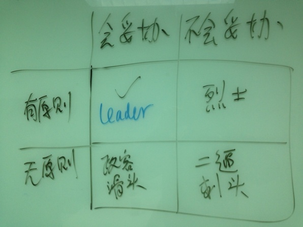

*2014-08-06 17:46 · iPhone客户端*

---

### 9100

这年头，太多人没有来由的觉得自己是visionary，却少有人有missionary的劲头。

*2014-08-04 14:24 · 网页*

---

### 9101

今年第100000周开始了。早上居然有一丝丝凉意。查了一下农历，大后天就「立秋」了。

*2014-08-04 10:45 · 网页*

---

### 9102

延庆县真能折腾，今年开了个（四年一度）的世界葡萄大会，明年还要开个世界马铃薯大会-_-!

*2014-08-04 00:05 · iPhone版*

---

### 9103

水关的那段长城太短，一会儿就爬到尽头了，坐在城墙上拿手机放了一遍最近大热的歌《End of the World》，下撤。

*2014-08-03 11:22 · iPhone版*

---

### 9104

mistress这个词除了「情妇」这个常见释义，还有一个意思是「女校长」。这真让人挠头。

*2014-08-02 23:08 · iPhone版*

---

### 9105

刚才被雷了一下：我刚在微信上关注了一个相关行业的公众号，结果收到一条消息「欢迎王总关注」。这是工作人员手工发的吧？

*2014-08-01 17:43 · iPhone版*

---

### 9106

《渔家傲·秋思》范仲淹：“塞下秋来风景异，衡阳雁去无留意。四面边声连角起，千嶂里，长烟落日孤城闭。浊酒一杯家万里，燕然未勒归无计。羌管悠悠霜满地，人不寐，将军白发征夫泪。” 车过衡阳留念。

*2014-07-28 15:25 · iPhone客户端*

---

### 9107

「互联网思维」译成英文怎么说？

*2014-07-25 15:18 · iPhone版*

---

### 9108

@ 拧巴人儿 鹫峰从来都没有鹫吧？我记得不是因为有鹫而命名的。

*2014-07-21 15:55 · 网页 给拧巴人儿的回复*

---

### 9109

大棋不收官。

*2014-07-18 11:24 · 网页*

---

### 9110

转@ 矛盾wen 转@ .rex 转@ 猛禽 转@ 枫了个婆 233转@ 白烨君马英九讲过这样一个真实的笑话：厦门官员给金门官员打电话，说你们那“三民主义统一中国”的标语都看不清了，赶紧用油漆刷一遍。金门官员说关你屁事？厦门官员说：什么关我屁事？这边的游客非要看嘛！（转）

*2014-07-15 00:34 · 手机上网 转自白烨君*

---

### 9111

我问的不是所谓「一般」，我感兴趣的正是整个城市具体到每平方米的平均建筑高度。转@ 小世界. 这问题范围太大了，没有意义。一般来说是问超高层的平均高度。比如有500栋超高建筑，具体数据规划局有统计。「@ 王兴 哪里能查到北上广深等城市的建筑物平均高度？

理论上，建委应该有这个数据吧？」

*2014-07-14 19:26 · 手机上网 转自王兴*

---

### 9112

哪里能查到北上广深等城市的建筑物平均高度？理论上，建委应该有这个数据吧？

*2014-07-14 11:17 · 网页*

---

### 9113

转自张亮：西蒙斯有趣的总结：乔丹擅长把对手打到精神崩溃，但他也在用类似方式持续给队友施压，确保全队达到他的标准(有队友甚至去图书馆找有关天才的书去理解他的行为)。而魔术师和大鸟是通过漫长的影响让队友变好，那种给队友空间同时关键时刻扛起球队的从容切换，本质上是足够强大。(因此他们不

*2014-07-13 17:51 · iPhone版*

---

### 9114

这是真正的高级黑！转@ 铁岭芭比 想死都不行呀

*2014-07-13 16:40 · 网页 转自铁岭芭比*

---

### 9115

可事实是，前后两者看起来并不那么相关…… 转@ lijb87 @ 王兴 呵呵，国外互联网企业啥时候能畅通无阻的进入中国，再谈中国走出去也不迟！

*2014-07-13 16:14 · 网页 转自lijb87*

---

### 9116

天气好的时候，我从办公室往北望去，除了五环内外的树林和稀疏的电线杆子和信号塔，唯一的人造物体就是天边时不时飞过的飞机。

*2014-07-13 16:12 · 网页*

---

### 9117

转@ typd "不盲目引入不必要的高深技术来保证项目进展是一种基本的职业素养。"

*2014-07-13 15:50 · 网页 转自typd*

---

### 9118

从各方面消息来看，中国互联网企业开拓海外都将是巨大的一波浪潮。中美以外的各国互联网市场看来要从美国一家独大进入中美G2争霸的时代了。当然，中国企业的综合实力比美国同行还是弱许多，但是，毕竟看到了希望。

*2014-07-13 15:10 · 网页*

---

### 9119

面试跨界的人还是蛮有趣的。刚才有个人说她在丹佛斯danfoss工作，我表示从没听说过这家公司。她说这是家丹麦公司，丹麦有20%的国民曾经或正在这家公司工作。我差点从椅子上摔下来。

*2014-07-12 12:16 · iPhone版*

---

### 9120

@ 你张开怀抱 有弧形边角。

*2014-07-11 17:50 · 手机上网 给你张开怀抱的回复*

---

### 9121

有网址吗？ 谢谢。转@ Costi 德力有一本长得完全一样书写感略差的只要26块。转@ 王兴 应该不是纯属巧合，我自从买了这本moleskine笔记本之后，随身携带和使用笔记本的频率显著提高了。

*2014-07-11 16:54 · 手机上网 转自王兴*

---

### 9122

我的moleskine本子是软皮的，宽度比iPhone 5略宽一点。

*2014-07-11 16:53 · Android客户端*

---

### 9123

应该不是纯属巧合，我自从买了这本moleskine笔记本之后，随身携带和使用笔记本的频率显著提高了。

*2014-07-11 16:29 · iPhone版*

---

### 9124

浙江的地级市里我最陌生的是衢州。

*2014-07-10 00:46 · 网页*

---

### 9125

那耳鸣了二十多年还不消失的该咋办？转@ quux 好好休息。一般几分钟到几小时耳鸣就会消失。如果几小时还不消失就去看耳鼻喉科或者神经内科。 转@ qinyf 忽然耳鸣是什么情况

*2014-07-08 15:44 · 手机上网 转自qinyf*

---

### 9126

经常有在手机上截个屏然后画条红线或箭头的需求，在安卓和iPhone上你们都用啥应用做这类图片编辑？

*2014-07-08 13:15 · iPhone版*

---

### 9127

这就是我大学室友，总是让人不明觉厉。转@ 乐鼠老人 我曾相信有些什么东西在我之外，和我不同，它们通过我的感官，或者用随便什么别的方法，把它们的观念成影像传送给我，并且给我印上它们的形象，这都不是一种可靠的、经过深思熟虑的判断，而仅仅是从一种盲目的、鲁莽的冲动得出来的。

*2014-07-08 12:16 · 网页 转自乐鼠老人*

---

### 9128

看到同事正在面试的一个重要岗位的候选人有在borland工作的经历，一时有恍若隔世的感觉。

*2014-07-08 12:10 · 网页*

---

### 9129

「创业」这事儿在国内已经流(fan)行(lan)到一定地步了。中文里需要一个跟wantrepreneur对应的词了。

*2014-07-07 01:15 · iPhone版*

---

### 9130

misfit ceo sonny vu（越南裔）的名片是我见过的最厚的纸质名片，大概有我的名片三倍厚。不愧是讲究设计感的公司-_-!

*2014-07-04 21:19 · iPhone客户端*

---

### 9131

@ 拧巴人儿 贺兰山岩画的重点则是：日日日 ;-)

*2014-07-01 11:09 · 手机上网 给拧巴人儿的回复*

---

### 9132

很失望。听懂行的人说瓜农往西瓜里注射东西是真事。

*2014-06-30 14:51 · iPhone版*

---

### 9133

我很好奇，这个好坏怎么评判？转@ webto 搞了2期workshop，第一期redesign支付宝，六个小组一半方案都好过支付宝；第二期设计时钟，没有一个小组的方案好过Apple。。。太难了。

*2014-06-30 12:31 · 手机上网 转自webto*

---

### 9134

救护车真拉风，可以闯红灯。

*2014-06-29 22:00 · iPhone版*

---

### 9135

“在路金波授意下，南派三叔接下了电影《刺陵》的剧本改编小说权，马上要开一个新闻发布会。路金波面授机宜：骂一骂电影《刺陵》不仅无损于改编小说的声誉…” 原来还有剧本改编成小说啊，我以前光知道小说改成剧本。

*2014-06-28 15:28 · iPhone版*

---

### 9136

恭喜！ 转@ webto 属实！ RT@ 西瓦 和@ webto 领证了。

*2014-06-28 08:27 · 手机上网 转自西瓦*

---

### 9137

时隔十年，再次启动eclipse。

*2014-06-27 20:51 · 网页*

---

### 9138

多谢在魅族工作的饭友送我一台mx3 :-)

*2014-06-27 17:50 · iPhone客户端*

---

### 9139

竟然还有这等白捡的好事？真是托法治国家的福啊。

*2014-06-27 15:35 · 网页*

---

### 9140

转@ 剑花 刚才看到有个人说：“我一个朋友从来没用过safari，因为他一直以为是指南针。” # 好冷 #

*2014-06-27 15:07 · 网页 转自剑花*

---

### 9141

越来越能理解时尚界对巴黎/米兰时装秀的密切关注了。IT界其实也差不多。每年苹果谷歌的几次大会也是行业的风向标啊，不服不行。

*2014-06-26 14:46 · iPhone版*

---

### 9142

突然想起小时候爸爸送给我的那些印着CCCP的邮票。

*2014-06-25 15:31 · iPhone版*

---

### 9143

很长时间没被一个产品如此震撼了！

*2014-06-24 09:59 · iPhone版*

---

### 9144

夜深人静却依然精神抖擞时很适合听《Empire State of Mind》。

*2014-06-23 23:59 · iPhone版*

---

### 9145

Bezos: I wanted a woman who could get me out of a 3rd worldprison. Life's too short to hang out with people who aren'tresourceful.

*2014-06-23 23:50 · iPhone版*

---

### 9146

至少要聪明到能大致识别谁比你更聪明。

*2014-06-23 22:45 · iPhone版*

---

### 9147

@ ppip 还不够素？除了顶上那四块鱼肉（我数得很清楚），下面全是素烧茄子、清炒油麦菜和黑木耳烧老豆腐。

*2014-06-23 13:01 · 手机上网 给ppip的回复*

---

### 9148

吃饭真是一件幸福的事，尤其是当肚子饿了的时候。

*2014-06-23 12:52 · iPhone客户端*

---

### 9149

太悲剧了！gps和电子罗盘没校准好，phantom2撞墙后坠到地上，把云台和相机给摔断了。之后没相机还继续玩了一段时间，再次失控时就掉到屋顶拿不下来了:-(

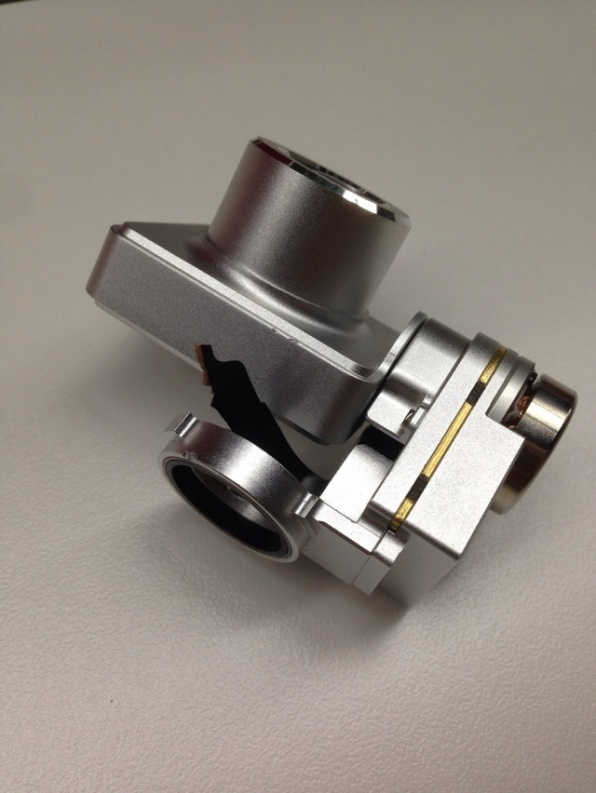

*2014-06-21 23:36 · iPhone客户端*

---

### 9150

刚读到一个逼格甚高的词：云垂海立。

*2014-06-21 20:15 · 网页*

---

### 9151

用phantom2从空中拍美团的办公室:-)

*2014-06-21 19:02 · iPhone客户端*

---

### 9152

很多年没收到过六一节礼物了，今年六一参观完大疆创新后我给自己订了一份礼物：大疆的四轴飞行器。这个周一终于寄到了，但是我工作实在太忙，所以直到今天才有空玩…

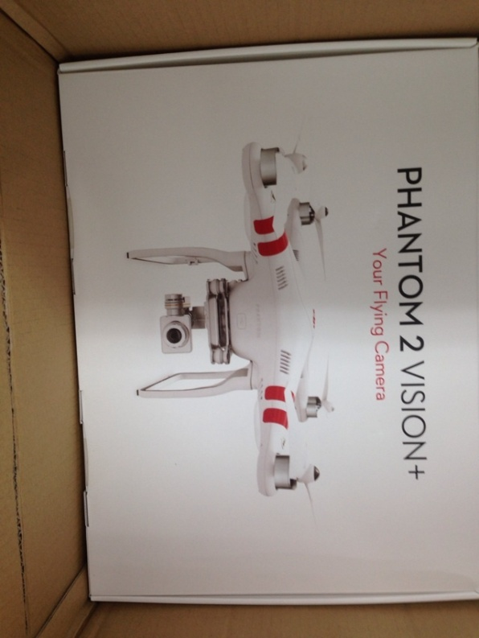

*2014-06-21 18:57 · iPhone客户端*

---

### 9153

@ 浪气龙 是的。你刚才也在昆泰？

*2014-06-21 17:20 · 手机上网 给浪气龙的回复*

---

### 9154

曾经如此惊艳的dropcam居然就这么卖给了google的nest，而且估值只有5.55亿美元……

*2014-06-21 13:30 · iPhone版*

---

### 9155

@ 拧巴人儿 细面，普通大小。我打算把望京那家店里各种宽度的面都试一遍。

*2014-06-21 13:21 · 手机上网 给拧巴人儿的回复*

---

### 9156

吃了一碗热腾腾的兰州拉面庆祝夏至。

*2014-06-21 13:18 · iPhone版*

---

### 9157

@ 唐君毅 慈善。

*2014-06-18 14:42 · 网页 给唐君毅的回复*

---

### 9158

和比尔盖茨吃了顿饭，可惜收获不大。

*2014-06-18 13:58 · iPhone版*

---

### 9159

突然想起来一件事，我还没坐过潜艇。

*2014-06-16 15:32 · iPhone版*

---

### 9160

半个小时前终于给家里打了个电话祝老爸父亲节快乐，好歹算是赶在今天结束之前。比较雷的是，老妈说他那时刚在外面开完会回到家……

*2014-06-15 23:48 · iPhone版*

---

### 9161

在办公室里过道上快速奔跑，没注意到刚抹过的地板很湿滑，一不小心摔了个仰面朝天，还把过道旁小推柜上同事摆放的东西碰得撒了一地，万幸的是，我居然毫发无伤^_^

*2014-06-15 16:50 · iPhone版*

---

### 9162

用了两周锤子T1，总体感觉挺不错，在我用过的安卓手机里可以排进前三。「硬件方面有点像大一圈的iPhone，软件方面没有搞那些雷人的创新」，我觉得这样就已经挺好了。

*2014-06-13 23:15 · iPhone版*

---

### 9163

nexus 5的屏幕很不耐摔，不过还蛮耐用，摔得电路板都露出来了居然还能正常使用。换一个LG原厂的屏幕要800块。

*2014-06-13 22:37 · iPhone客户端*

---

### 9164

再难也得做啊。转@ 拧巴人儿 知易行难。转@ 宋石男 “一生中，你会碰到许多混蛋，他们伤害你，是因为他们愚蠢，你不必回应他们的恶意。世上最糟的就是自卑和报复心理。永远要维持自尊与诚实。”---《我在伊朗长大》。

*2014-06-10 19:49 · 手机上网 转自宋石男*

---

### 9165

我一直没搞明白，为什么google play应用商店里没有「百度输入法」，搜狗和QQ输入法都是有的。是google鄙视百度，还是百度鄙视google？

*2014-06-10 16:33 · iPhone版*

---

### 9166

“拼命地赚钱，拼命地省钱，拼命地捐钱”，对清教徒精神的这个总结真是生动。

*2014-06-09 18:46 · iPhone客户端*

---

### 9167

老妈也不甘示弱，平板支撑两分多钟毫无压力的样子。

*2014-06-08 22:56 · iPhone版*

---

### 9168

老爸不愧天天游泳爬山，六十多岁的人，第一次平板支撑就做了3分11秒。

*2014-06-08 22:53 · iPhone版*

---

### 9169

这逼格，啧啧。转@ Dee.W Designers shooting for usable is likea chef shooting for edible

*2014-06-07 11:33 · 手机上网 转自Dee.W*

---

### 9170

每当天气好得如此不像话的时候，我就觉得范仲淹说的「不以物喜，不以己悲」是有点扯淡的境界。结果我刚才竟然又鬼使神差的把《岳阳楼记》翻出来读了一遍。

*2014-06-07 11:28 · iPhone版*

---

### 9171

转@ 飯否小字报 转@ Andrew.F 【年轻人千万不要写代码不要读博】今天去跟原来的房东清押金，福建老太太说年轻人千万不要写代码不要读博，我擦真是真理啊！后来弄明白原来表达的是不要吸大麻不要赌博。。。福建人说普通话这么双关下去谁受得了啊！！

*2014-06-05 00:44 · 网页 转自Andrew.F*

---

### 9172

用了一天锤子手机T1，总体感觉还不错。硬件方面有点像大一号的iPhone5。

*2014-06-04 19:38 · iPhone版*

---

### 9173

王传福果然如传说的那样，不分受众，不分场合，一见面就情不自禁的喷各种技术，各种参数，各种理论，滔滔不绝。一顿午饭下来，我感觉他都没吃什么东西，但确实让我们一桌人对汽车/电动车行业有了个宏观的了解。确实是大牛！

*2014-05-31 14:12 · iPhone客户端*

---

### 9174

转@ krashna 现代心理学说中等的动机最适宜目标的达成，过强或过低的动机都不利于目标达成；记得图灵奖一位女获得者也说过她认为在她身上所发生的事都不与她直接相关。No matter whathappens，just let it be.

*2014-05-28 20:03 · 手机上网 转自krashna*

---

### 9175

有个朋友刚买了一辆telsa，借给我开几天。第一印象是加速确实快，推背感很强。

*2014-05-26 12:04 · iPhone版*

---

### 9176

转@ 东东枪 夸赞陌生女孩“你脸型真好。”是可以的。再加一句“哪整

的？”就没什么必要。# 记一件有意义的事 #

*2014-05-23 15:08 · 网页 转自东东枪*

---

### 9177

惊闻老妈又要来北京监督指导我的生活……

*2014-05-22 17:46 · iPhone版*

---

### 9178

转@ 周露inn 睡不着的时候数羊，饿得睡不着的时候，数羊......肉串。

*2014-05-22 10:14 · iPhone客户端 转自周露inn*

---

### 9179

有趣

*2014-05-22 10:14 · iPhone客户端*

---

### 9180

《The only difference between martyrdom and suicide is presscoverage》这歌名蛮有意思，但是歌听起来倒是一般。

*2014-05-21 13:27 · 网页*

---

### 9181

更麻烦的是有时不知道某个会议室在几楼。我一度想建议，一楼的会

议室按城市命名，二楼按省份，三楼按国家，四楼按星球… 转@qinyf 敝厂办公地点有南楼和北楼，每层有会议室10个左右，会议室名字以城市命名，例如“北京厅”。日常我总搞不清楚会议室在南还是北。

如果会议室以秦岭-淮河为界，

*2014-05-19 22:51 · 手机上网 转自qinyf*

---

### 9182

刚才在望京北路看见一个二逼青年，骑车时一路双手脱把，抱在脑后，一副得意而欢乐的样子，就像十几年前的我。

*2014-05-18 22:14 · iPhone客户端*

---

### 9183

被小小打击了一下，今天google doodle纪念的人「意大利女数学家Maria Gaetana Agnesi」我之前从没听说过。

*2014-05-16 18:23 · 网页*

---

### 9184

国际版「海天盛宴」啊。转@ krashna 戛纳上门女郎的秘密http://is.gd/8vYA6R

*2014-05-16 15:04 · 手机上网 转自krashna*

---

### 9185

「断舍离」这概念好像突然就火起来了。

*2014-05-16 12:41 · iPhone版*

---

### 9186

今年的5月12日，北京风和日丽。

*2014-05-12 17:49 · iPhone版*

---

### 9187

微软就是渣。刚才和美国的一个朋友通话，先是用skype，又不清楚又卡，基本无法沟通。换成facetime之后，声音清楚流畅，连视频都95%是流畅的。完全一样的手机，一样的网络环境。

*2014-05-07 16:57 · 网页*

---

### 9188

If you can't see the difference, you can't build the difference. Frank Centofante

*2014-05-04 00:28 · iPhone客户端*

---

### 9189

安卓下用webster，iPhone上同时装webster和欧路词典。转@ quuxAndroid 下面现在用的是哪个？ 转@ 王兴 我必须承认我不是一个典型的大众用户，我的手机首屏app里常年有一个英文词典。

*2014-05-03 10:29 · 手机上网 转自王兴*

---

### 9190

原来我读书时常见的gambol笔记本是菲律宾华侨何作如先生于1989年在深圳设立的渡边纸制品公司生产的，仿的是日本kokuyo国誉旗下的Campus品牌（1983年版）。2011年，国誉干脆把gambol收购了…

*2014-05-02 16:38 · 网页*

---

### 9191

Teacher's这个威士忌品牌确实不适合直译，叫成「铁骑士」一下子就霸气多了。

*2014-05-02 11:15 · iPhone版*

---

### 9192

我终于也买了一本moleskine的笔记本来试用。为什么这牌子卖这么贵还很受追捧呢？

*2014-05-01 23:40 · iPhone客户端*

---

### 9193

“A cloud for everyone, on every device." 微软新CEO的这个口号不错。

*2014-04-14 19:50 · 网页*

---

### 9194

被一句广告语打动：change is difficult, not changing is fatal.

*2014-04-11 09:55 · 网页*

---

### 9195

我的macbook air最近死机好几次了:( 难道用了四年就老化至此了？

*2014-04-03 17:48 · iPhone版*

---

### 9196

苹果的定价策略挺有意思，完全没有量大打折的概念，就是1G一年2美元，倒也容易理解。

*2014-04-03 16:23 · iPhone客户端*

---

### 9197

我必须承认我不是一个典型的大众用户，我的手机首屏app里常年有一个英文词典。

*2014-04-02 14:45 · iPhone版*

---

### 9198

生命，生命是我们与自己的反复冲突。 -海子

*2014-03-26 22:52 · iPhone版*

---

### 9199

莫奈的《伦敦查灵十字桥，雾中烟云印象》是在雾霾中画的吧？>_<!

*2014-03-23 15:11 · iPhone版*

---

### 9200

中国的零售之原始，从merchandising这个词至今没有个贴切的中文翻译就可以看出来。

*2014-03-21 13:57 · iPhone版*

---

### 9201

你知道怎么收拾行李时，就学会了生活。诚哉斯言。

*2014-03-17 22:26 · iPhone版*

---

### 9202

谢谢！你的笑脸让这一天更加明媚。转@ 太空小孩 @ 王兴 美团四岁啦 :D

*2014-03-04 11:40 · 手机上网 转自太空小孩*

---

### 9203

You are not alone. No, you are wrong. You are on your own.

*2014-03-02 19:05 · iPhone版*

---

### 9204

gastronomy这词在韦式词典里的解释是：the art or science ofgood eating:-)

*2014-03-02 18:29 · iPhone版*

---

### 9205

iPhone 5的针太粗，插不进nexus 5的孔；iPhone 5的针太短，插不到oppo find 5的孔底。转@ 陈想南 难道不是通用的么~转@ 王兴 换sim卡的小工具，从左到右依次属于：oppo find 5，nexus5，iPhone 5。

*2014-02-28 11:24 · 网页 转自王兴*

---

### 9206

换sim卡的小工具，从左到右依次属于：oppo find 5，nexus5，iPhone 5。

*2014-02-28 11:16 · iPhone客户端*

---

### 9207

真的天才不需要真相。转@ 可乐鬼 知道自己不是天才的那一刻真的很受打击

*2014-02-27 23:03 · 手机上网 转自可乐鬼*

---

### 9208

冯唐这「工作九字真言」有意思:：不着急，不害怕，不要脸。

*2014-02-27 22:40 · iPhone版*

---

### 9209

迄今为止我能想到的“腾讯之前为什么不出高价买下whatsapp”的最合理解释是：华盛顿不会同意。

*2014-02-27 00:32 · 网页*

---

### 9210

巨头们已经丧心病狂了。我不过就是要打开一个普通网页，跟「淘宝」有毛关系啊。

*2014-02-26 14:29 · Android客户端*

---

### 9211

后来的pc硬件都不太耐用啊。要刷一个rom得用Windows，所以我把最近一两年几乎没开过的老笔记本找出来了。thinkpad x60的电池已彻底损坏(已经是第二块电池了)，而且运行十几分钟就死机，已经连续死了三次。惠普的那个上网本更是干脆开不了机。

*2014-02-26 13:52 · iPhone版*

---

### 9212

转：Life is like a penis. It's short, but seems long when it gets

hard......But you can have fun only when it gets hard.

*2014-02-25 23:42 · 手机上网*

---

### 9213

收到这么一张明信片。谢谢哈，虽然不知道当年开奖情况如何;-）

*2014-02-25 23:09 · Android客户端*

---

### 9214

yes,君子性非异也，善假于物也。一层薄薄的头巾就够了，效果不输帽子。转@ quux 戴帽子，out sourcing 转@ 王兴 纸上得来终觉浅，绝知此事要躬行。这两天的实际体验告诉我，头发太短确实御寒能力比较差。

*2014-02-25 12:22 · Android客户端 转自王兴*

---

### 9215

纸上得来终觉浅，绝知此事要躬行。这两天的实际体验告诉我，头发太短确实御寒能力比较差。

*2014-02-25 12:06 · 网页*

---

### 9216

我2002年底换笔记本时就选不带光驱的型号了。转@ gravity0 下台笔记本一定不能带光驱，这货几年用不了一次还要天天带着。放块砖头在包里都比它强，至少可以防身。

*2014-02-25 11:24 · 网页 转自gravity0*

---

### 9217

转@ 阿石. Amateurs sit and wait for inspiration, the rest of usjust get up and go to work. ”~ Stephen King

*2014-02-24 10:15 · 手机上网 转自阿石.*

---

### 9218

今年体检的意外收获是：大夫建议我停止使用电动牙刷，因为电动牙刷力气太大，已经把我某颗牙磨凹了一块:-( 据说这种问题很常见。

*2014-02-21 19:06 · iPhone版*

---

### 9219

好搞笑！转@ 金融界人贩子 《意大利任务》里的黑帮老大早就说过：“Never mess with Mother Nature, Mother Teresa andMotherfucking Ukrainians.” 以此金句奉劝乌克兰反动派趁早悬崖勒马，否则，齐奥塞斯库夫妇就是

*2014-02-21 18:02 · 网页 转自金融界人贩子*

---

### 9220

应邀把我某次演讲用的ppt发给主办方邮箱时发现这个文件只有59KB。

*2014-02-21 18:01 · 网页*

---

### 9221

就是最普通的体检里的外科项目，只不过多数医生会问你要不要做一下肛门指检。

*2014-02-21 12:06 · iPhone版*

---

### 9222

又到了一年一度被爆菊的时候了-_-! 仿佛上次体检才过去没多久啊，一年过得太快了。

*2014-02-21 09:52 · iPhone版*

---

### 9223

Whatsapp的创始人Jan Koum又是一个从前苏联避到美国去的犹太人，和谷歌的创始人布林一样。 http://v.gd/jsd83j

*2014-02-20 16:17 · 网页*

---

### 9224

在一个接一个的会议中结束了这个生日。年年有今朝,岁月催人老。十年如一日，天天有高潮。

*2014-02-18 23:32 · iPhone版*

---

### 9225

"Nothing is possible without man, nothing is lasting withoutinstitution" -Jean Monnet

*2014-02-18 19:54 · iPhone版*

---

### 9226

这都是上了年纪的标志。转@ 枣婆婆 我也有这感觉转@ 二他姐姐咦？怎么又到王兴生日了？上次过完好像没几天啊，我还问他几岁了，到现在也没回答我……「@ 拧巴人儿 @ 王兴 生日快乐!」

*2014-02-18 18:41 · 手机上网 转自拧巴人儿*

---

### 9227

跟老爸老妈通电话，听说家乡龙岩的房价已经涨不动了，楼盘普遍滞销，民间借贷开始收缩并且利率下降。难道传说中的拐点真的终于到来了？

*2014-02-17 23:42 · iPhone版*

---

### 9228

@ quux 当时开不了机，恢复正常温度后才可以。

*2014-02-17 15:34 · 手机上网 给quux的回复*

---

### 9229

上周有个新经历：在户外时iPhone被冻得自动关机了。以前只经历过（打篮球时）iPhone被晒热到自动关机。

*2014-02-17 15:25 · iPhone版*

---

### 9230

转发张亮的朋友圈:[Phil] Jackson说团队的五种层次很有趣：第一层是每个人之间充满敌意，第二层是每个人都认为自己是受害者，第三层是追求个人成就，第四层是追求集体成就，第五层是一起探索未知的可能性。就我的经验，团队很容易在二、三层之间摇摆，少数达到第四层。

*2014-02-15 18:09 · iPhone版*

---

### 9231

搬到新办公室附近新租的房子里了。很烦那种冷热水分两个把手的水龙头，操作起来真麻烦。

*2014-02-10 08:48 · 网页*

---

### 9232

@ 拧巴人儿 萧伯纳有句名言：Liberty means responsibility. That iswhy most men dread it.

*2014-02-06 10:23 · 手机上网 给拧巴人儿的回复*

---

### 9233

《华尔街之狼》这电影要是想在国内上映，不知道得剪掉多少ooxx和吸毒的片段啊。

*2014-02-05 18:51 · iPhone版*

---

### 9234

时隔多年，终于又喝了一罐Dr. Pepper。

*2014-02-05 09:19 · iPhone客户端*

---

### 9235

@ SophiaZS 从你贴的截图来看，那个页面和美团没有任何关系。看来是被流氓劫持了，原因可能是你电脑被装了流氓插件，也可能是你上网用的电信运营商很无耻:(

*2014-02-03 12:53 · 手机上网 给SophiaZS的回复*

---

### 9236

Ounce盎司真是个麻烦的词。作为质量单位,它等于1/16磅, 即28.34克。作为(液体)体积单位又分两套系统,在英制里,一盎司等于1⁄20品托等于1⁄160加仑等于28.4毫升;在美制里,一盎司等于1⁄16品托等于1⁄128加仑等于29.6毫升。

*2014-02-01 20:31 · iPhone版*

---

### 9237

我觉得「起泡酒」是比「气泡酒」更好的翻译, 因为起泡更传神, 很难得的把sparkling wine里的sparkling这种现在进行时表达出来了。

*2014-02-01 20:09 · iPhone版*

---

### 9238

北京在北纬40度(望京北边那个同名楼盘很有利于记住这一点),西雅图在47度,巴黎在49度,伦敦在51.5度,奥斯陆在60度。如此看来,西雅图也不算很靠北嘛。为什么原来我总误以为它跟奥斯陆是一个级别的呢?就因为它是美国的大西北?

*2014-02-01 19:49 · 手机上网*

---

### 9239

转@ 鸝.se 经历过斯德哥尔摩的冬季就不难理解诺贝尔先生捣鼓炸药时的心情# 正在穿越白雪皑皑的斯堪地那维亚半岛 #

*2014-02-01 19:42 · 手机上网 转自鸝.se*

---

### 9240

连facebook这种典型的被认为是后起之秀的公司都满10年了。

*2014-01-31 15:18 · iPhone版*

---

### 9241

好悲痛，我的iPhone5竟然屏幕进灰了:(

*2014-01-29 04:46 · iPhone版*

---

### 9242

我很好奇那种艾滋感染概率的统计是怎么做出来的。

*2014-01-27 18:53 · 手机上网*

---

### 9243

是的，我也看过：男的和携带hiv的女的无防护做爱一次，感染概率是多少；女的和携带hiv的男的无防护做爱一次，感染概率是多少。反正都比我想象的要低很多。但我很好转@ krashna “性工作者的艾滋感染率，远低于男同和吸毒者的感染率，更大大低于一些网络谣言所疯传的数据。”長知識吧。

*2014-01-27 18:46 · 手机上网 转自krashna*

---

### 9244

转@ webto 远离金山安全和360最好的办法是用全套Apple，根本就没有这俩王八蛋出场的机会。

*2014-01-26 15:12 · 网页 转自webto*

---

### 9245

今晚聊天时回忆起的一段历史

*2014-01-25 22:33 · Android客户端*

---

### 9246

Endless frontier.

*2014-01-24 20:05 · iPhone版*

---

### 9247

郑和航海是亏钱的，哥伦布航海是赚钱的，我越来越觉得这点差别很重要，虽然决定后来五百年世界格局的那段历史远比这复杂许多。

*2014-01-23 13:08 · iPhone版*

---

### 9248

【国家统计局宣布中国高收入的标准：年收入5.6万】1月20日国家统计局公布了2013年全年城镇人均收入数据，年收入5.6万就属于高收入了... 我转发这条消息真不是为了吐槽，我很理解国家统计局。多数张口就喷的人其实没有全局观念。

*2014-01-21 23:05 · iPhone版*

---

### 9249

领外币工资？好高大上啊。干脆请她用比特币给你发薪水吧;-）转@拧巴人儿 今天给stacey发了封信，请她问问管钱的人能不能不要用支票支付我的工钱了！！！！！等收到支票+兑换出来，汇率又得掉！

*2014-01-21 23:01 · 手机上网 转自拧巴人儿*

---

### 9250

越来越觉得李鸿章真是不容易。

*2014-01-21 22:41 · iPhone版*

---

### 9251

@ 宝宝vs坦克 你形容得很准确。美式咖啡就是咖啡豆熬出汁来再兑水，好像没别的成分，跟中药真是差不多。

*2014-01-21 22:40 · 手机上网 给宝宝vs坦克的回复*

---

### 9252

@ 宝宝vs坦克 美式咖啡确实是一种深受行家或自认有品位的人鄙视的咖啡，最没文化，就是espresso兑水。不过，我好像喝得最多的咖啡就是美式…

*2014-01-21 15:28 · 手机上网 给宝宝vs坦克的回复*

---

### 9253

看点是右上角手机信号强度指示栏下面的那个笑脸，那里本来应该是一个数字，说明这个安卓chrome浏览器同时打开的网页数。当这个数字大于99时，它就只好显示一个笑脸了-_-!

*2014-01-21 10:30 · Android客户端*

---

### 9254

此刻的月亮，好低，好大，好美。

*2014-01-20 21:51 · iPhone版*

---

### 9255

太凶残了！你们是什么行业的？转@ 惡意 那是因为你们公司不举办转椅竞速甩尾比赛( ´_ゝ`)转@ 王兴 这把工作椅已伴随我转战第六个办公室。品质好的用具确实值得投资，尤其是那些不归摩尔定律管的。

*2014-01-20 18:58 · 手机上网 转自王兴*

---

### 9256

这把工作椅已伴随我转战第六个办公室。品质好的用具确实值得投资，尤其是那些不归摩尔定律管的。

*2014-01-20 18:27 · iPhone客户端*

---

### 9257

@ 金鑫. 准确的说，这辆车比美团大半年，和饭否当年猝死的时间点差不多…

*2014-01-20 10:41 · 手机上网 给金鑫.的回复*

---

### 9258

原来intel这种经典的高科技公司都有接近11万员工。

*2014-01-19 00:21 · iPhone版*

---

### 9259

这辆车过去四年半跑了66666公里。纪念一下。

*2014-01-19 00:04 · iPhone客户端*

---

### 9260

两个不太常用的字：氹 dang4, 囝 jian2

*2014-01-17 15:20 · 网页*

---

### 9261

Forbes杂志在大陆被译成《福布斯》，在台湾被译成《富比世》。

*2014-01-17 15:02 · 网页*

---

### 9262

2010、2011、2012年各送走了一位长辈。至少从这个角度来看，2013年还相对平安，虽然也有一些不如意的事。

*2014-01-17 12:24 · iPhone版*

---

### 9263

转@ 可乐鬼 做事不认真的人，自杀都会失败的 转@ 月星 转@ 黄薄码。

*2014-01-17 01:26 · 手机上网 转自黄薄码*

---

### 9264

# 安德的游戏 # 我评7分：故事的整体构思不错，但是结尾感觉有点突兀，似乎没有充分展开。我估计小说原著会比改编后的电影更精彩，可惜看过电影就等于剧透了，再去读小说也少了悬念。@ 猫眼电影

*2014-01-16 01:23 · iPhone版*

---

### 9265

在知乎上看到好励志好热血的一句话：我们出生时，国家这样，是我们的不幸；当我们离开时，国家还这样，是我们的无能。

*2014-01-15 12:21 · 网页*

---

### 9266

按照gartner的统计，2013年，全球Windows PC的出货量从2012年的3.37亿降到3.09亿（2011年的3.44亿是历史最高值）。Mac的出货量也

从2012年的1700万降到2013年的1640万。一个时代真的过去了。

*2014-01-15 11:37 · 网页*

---

### 9267

瞬间我就败了。转@ 騰小騷哆哩顶着小红帽说 王老大，您难道不晓得不同牌子的威士忌要配不同的杯子么？转@ 王兴 据说这是最专业的喝威士忌的杯子。

*2014-01-15 00:17 · 手机上网 转自王兴*

---

### 9268

据说这是最专业的喝威士忌的杯子。

*2014-01-15 00:15 · iPhone客户端*

---

### 9269

“西施玉乳”这名字起的…

*2014-01-14 00:15 · iPhone客户端*

---

### 9270

@ 苑小帅 我不确定，但我估计是customer，肯定不会是consumer，client也含义太窄。

*2014-01-13 14:18 · 手机上网 给苑小帅的回复*

---

### 9271

德鲁克说：“CEO最大错误是把内部管理当成最主要工作，CEO真正的战场是客户不是管理。”

*2014-01-12 00:21 · iPhone版*

---

### 9272

和苹果联合创始人steve wozniak在一起。

*2014-01-11 18:35 · iPhone客户端*

---

### 9273

转@ 远骋 要学会与轻度的焦虑做朋友。

*2014-01-11 12:48 · 手机上网 转自远骋*

---

### 9274

转@ krashna 深刻觉得专业啊、认真负责的态度啊什么的，其实就藏在一点一滴中间。比如你写的文档比别人少几个错别字，你画的图比别人的对得更齐配色更柔和，你写的代码比别人多一行注释让后来者清楚你做了些什么改动。仅此而已。

*2014-01-09 19:25 · 手机上网 转自krashna*

---

### 9275

段子手的纪念方式;-）转@ 东东枪 家住朝阳区的郝先生当年就读的大学里并没有一座叫“逸夫楼”的建筑，他为此自卑了很长一段时间，见到旧同学都抬不起头来。

*2014-01-07 13:13 · 手机上网 转自东东枪*

---

### 9276

看到一个有趣的说法：在美国，能买到枪的都是好人,因为没有犯罪记录,没有酒驾,没有打过老婆,没有与邻居吵过架,才可以买枪

*2014-01-07 12:57 · iPhone版*

---

### 9277

由一件小事偶然想起童年养猫的经历，再延伸想到养宠物对小孩的影响：孩子除了能享受到有宠物做伴玩耍的乐趣，也会更早体会到生离死别这种人生的无奈。

*2014-01-07 12:29 · 网页*

---

### 9278

时隔多年，刚才竟然又访问了一次slashdot.org。那可是十几年前我天天上的网站啊。

*2014-01-07 01:17 · 网页*

---

### 9279

今晚维也纳管弦乐团在北京音乐厅演出时曲目里插了一首《我爱北京天安门》，听得我那叫一个百感交集啊-_-!

*2014-01-05 00:42 · 网页*

---

### 9280

温故而知新。转@ 蔡师傅 转@ 王兴 转：成功有很多老爸，失败则是一个孤儿。

*2014-01-05 00:05 · 手机上网 转自王兴*

---

### 9281

@ 蔡师傅 首先，多谢支持美团！我刚刚已经把你提供的信息转给负责此事的同事，请他们跟进处理，看是能迅速解决问题还是需要下架。不过，你传的第二张图上的网站是huazhu.com，这不是第三方网站而是汉庭改名之后的官网啊。

*2014-01-04 23:55 · 手机上网 给蔡师傅的回复*

---

### 9282

转@ 拧巴人儿 "the only thing worse than living without truth isliving with two of them."

*2014-01-04 12:02 · 手机上网 转自拧巴人儿*

---

### 9283

还有这讲究？转@ 拽拽鱼 姑娘们要记得，尤其是当着外人面的时候，脱外套等衣服时一定要从下往上结扣子，显得更端庄，反之会让居心不良的人认为你在勾引他，可以对着镜子尝试一下。RT@ 王兴刚刚尝试了一个无聊的创新：从下往上解衬衫的扣子。才解了两粒就决定回归传统，还是从上往下解更顺手。

*2014-01-04 11:59 · 手机上网 转自王兴*

---

### 9284

刚刚尝试了一个无聊的创新：从下往上解衬衫的扣子。才解了两粒就决定回归传统，还是从上往下解更顺手。

*2014-01-04 00:13 · 网页*

---

### 9285

推荐大家尝试一下新型的「PP租车」。这是P2P模式的租车:有车的人在自己不用车的时候把车拿出来租给别人。转@ 弥城 求路线。 转@code6 周末舍友一起出动租车去开车，我会尽力不当马路杀手的。

*2014-01-03 19:59 · 手机上网 转自code6*

---

### 9286

郑和与葡萄牙的达伽马这一东一西两大航海家竟然死在同一个地方，印度西海岸偏南端的卡利卡特(Calicut)。

*2014-01-02 23:20 · 网页*

---

### 9287

转@ 李玉鈴 古代志异小说里，常有女鬼留恋人间，徘徊不肯离去，以为自己仍是生人，一样嫁人生子，直到捉鬼的术士拿出灵位，才知道自己早已非人，于是凄然倒地，化为血水。我一直以为自己幸福，

自己快乐，直到你们的婚纱照发来，我才知道，自己原来已经死去很久，美满不过虚妄。谢谢你，现在才拿出灵位

*2014-01-02 18:43 · 网页 转自李玉鈴*

---

### 9288

2011年秋，美团曾在镇江开会，开完会大家还一起去游览了金山寺。

可惜我那回没去「北固亭」怀古。转@ 拧巴人儿 柳永是娘炮，辛弃疾又一脑门子官司。唉。

*2014-01-02 16:45 · 网页 转自拧巴人儿*

---

### 9289

「最是人间留不住，朱颜辞镜花辞树」，这两天老想起王国维先生的这两句诗。

*2014-01-02 16:12 · 网页*

---

### 9290

我为有这样的战友而自豪！转@ iMoe_ 新年第一次订会议室XD

*2014-01-01 02:14 · 手机上网 转自iMoe_*

---

### 9291

2013年12月31日22点13分到14分之间，美团网首次单日交易额突破一

亿元！谢谢所有支持美团的消费者！谢谢和美团合作的所有商户！谢谢美团所有兄弟姐妹们！2014年我们一起纵情向前！

*2013-12-31 22:34 · 网页*

---

### 9292

转@ 小熊娃娃 这个年终总结太彪悍了…… 转@ 子规 这一年参与编辑了三本书——《朗费罗诗选》、《北平历史地理》、《现代英文选评注》，从年初到年末，三位作者、注者——杨德豫、侯仁之、夏志清都去世了。。。

*2013-12-31 16:53 · 手机上网 转自子规*

---

### 9293

你打算去哪里跨年？办公室。

*2013-12-31 16:01 · iPhone版*

---

### 9294

有些基本道理是不同文化里相通的：you can't eat your cake andhave it too；鱼和熊掌不可兼得；别又要当婊子，又想立牌坊……

*2013-12-31 14:55 · 网页*

---

### 9295

本年度最后一次 # 人艰不拆 # Youth is fleeting, but immaturitycan last a lifetime.

*2013-12-31 14:40 · 网页*

---

### 9296

tmd，原来是这件上衣口袋太浅的问题！刚才发生了和昨天几乎一模一样的场景，连地点都相距不超过一米：我小便完提了提腰带，手机从上衣口袋里滑出来，啪嗒一声摔在地砖上。唯一的差别是：昨天的nexus 5屏幕碎了，今天的iPhone5没事。

*2013-12-31 14:06 · 网页*

---

### 9297

人生又一个第一次：摔碎了一个手机屏幕:-（ nexus 5太不耐摔了！

*2013-12-31 01:03 · iPhone版*

---

### 9298

居然有一种酿白葡萄酒的葡萄就叫「白富美」Fumé Blanc :-）

*2013-12-29 20:24 · iPhone版*

---

### 9299

最后的甜点里居然有家乡特有的小吃「什锦」(发音近似se gium)。是丽思卡尔顿正好有厨师会做？还是找了个龙岩师傅来？后来一想，没这么复杂，在家乡做好了带到北京来就可以了。

*2013-12-29 19:15 · 手机上网*

---

### 9300

比我低六届的清华师弟都回去当了副区长… 这要不是有特殊政策就是有特殊背景吧？

*2013-12-29 18:50 · 手机上网*

---

### 9301

@ 拧巴人儿 这个同乡可能真是个土豪，是华茂丽思卡尔顿和金威万

豪酒店的两家投资商之一泰国华贸素拉潘酒店投资管理有限公司的总裁，另一家投资商就是著名的神华集团的下属公司了。

*2013-12-29 18:17 · 手机上网 给拧巴人儿的回复*

---

### 9302

第一次参加在北京的同乡元旦迎新春联谊会。地点倒是很高大上，在华茂丽思卡尔顿。不过,第一个上场的女歌手就唱《最炫民族风》-_-!

*2013-12-29 17:59 · iPhone版*

---

### 9303

虽然Lance Armstrong已经被证明是个靠服用禁药而连续夺冠的伪君子甚至是恶棍，但是Live Strong这个口号和十年来那一系列广告我还是很喜欢。

*2013-12-29 14:08 · 网页*

---

### 9304

不知道该说什么好，只觉得应该默默转。转@ 矛盾wen 少女长点心呐，普通人家的孩孩子，别拿爹妈的钱演土豪韩剧好么。飞去别的城市跨年……等你自己能挣钱了再干这种事情吧。

*2013-12-28 15:39 · 网页 转自矛盾wen*

---

### 9305

No army can stop an idea whose time has come.

*2013-12-28 14:26 · 网页*

---

### 9306

转@ 可乐鬼 马上有对象…转@ 小拐子 剩蛋节扎，光棍孤独！！给各位的祝语，望能参透

*2013-12-25 00:30 · 手机上网 转自小拐子*

---

### 9307

这是啥玩意儿？什么时候冒出来的？

*2013-12-25 00:24 · Android客户端*

---

### 9308

直到下午六点，我都依然有点不敢相信，今天就圣诞平安夜了？

*2013-12-24 18:01 · iPhone版*

---

### 9309

少年，要有志气，要有想象力！鉴于你和小伙伴们自主开发的太空饭否对饭否世界做出了如此巨大的贡献，我支持你自主建立一套cryptocurency，就称为「饭否币」吧！转@ 锐风 王老板只听说了饭否换了 logo, 没听说过太空饭否.. /_\.. 讨薪之路如此艰难..

*2013-12-24 14:06 · 网页 转自锐风*

---

### 9310

@ 苑小帅 啊，饭否啥时换logo了？

*2013-12-24 01:29 · 手机上网 给苑小帅的回复*

---

### 9311

我无暇深入研究比特币，也没有投机谋取暴利的期望。我只是觉得，这个想法太牛逼了！是注定要载入人类文明历史的那种牛逼。转@ 刁士涵 我感觉比特币会成为先驱，会被后来者替代。会有更实用的电子货币。另一方面，安全性是隐患，SHA-256终会被技术进步打败。

*2013-12-22 18:05 · 网页 转自王兴*

---

### 9312

如果被央行这么小小一虐就会一蹶不振的话，那比特币就不具备划时代意义了。你太小看它了。转@ 片片片片片 王兴怎么现在才开始买比特币？不是都被央行虐了吗？→_→转@ 飯否小字报 转@ 王兴 我也是有比特币的人了。必须用实际行动对这具有非凡想像力的创造表示敬意。

*2013-12-22 12:22 · 手机上网 转自王兴*

---

### 9313

我也是有比特币的人了。必须用实际行动对这具有非凡想像力的创造表示敬意。 https://coinba se.com/?r=52a...

*2013-12-22 02:07 · 网页*

---

### 9314

刚发现办公室东边的某校园里有个黑色直升机雕塑，似乎是一比一的实体。什么时候出现的？

*2013-12-21 15:59 · 手机上网*

---

### 9315

这种福利要在饭否也发一下。 # 我来请客，美团买单 # 300张电影票免费送，请速来领取，不必客气^_^! http://t.cn/8k9MxD7

*2013-12-19 17:39 · 网页*

---

### 9316

老爸今天和我聊天时很自然而且恰当的运用了「土豪」这个词，让我不禁感叹，互联网真的是影响到了大众！感谢iPad和iPhone啊。在此前长达十年的时间里，我无数次试图教他和我妈用电脑，用电脑上网，可是没有任何实质性进展，直到后来有了iPad… 现在他俩各有一个iPad和一个智能手机。

*2013-12-18 20:39 · 网页*

---

### 9317

小哥你说的可是比特币？转@ IwfWcf 原本是想投机的，现在看来得变成投资了……

*2013-12-18 20:20 · 网页 转自IwfWcf*

---

### 9318

中午在机场和老爸碰了一面。他居然会正确的运用「土豪」这个词了，与时俱进的程度令我刮目相看啊。

*2013-12-18 17:46 · iPhone版*

---

### 9319

和一个刚访问南非回来的朋友一起晚饭，他说当地人告诉他，当年种族隔离时，中国人算黑人，日本人算白人:-(

*2013-12-17 22:00 · 网页*

---

### 9320

威士忌竟然就是蒸馏过的啤酒。

*2013-12-16 00:19 · 网页*

---

### 9321

转@ 卡妮娅洼 转@ 性交 转@ 天野平 转@ 大萌一场的王贰先生 在出国之前有一次听饶毅讲说，如果以后的人生中，有幸遇到聪明又善良的人，一定要珍惜，因为大多数聪明的人不能理解其他人为什么达不到这个要求，继而变得刻薄起来。

*2013-12-15 09:38 · 网页 转自大萌一场的王贰先生*

---

### 9322

转@ kyztjs "你好，我是写《麦田里的守望者》的塞林格，我想和你上床"。 转@ 王兴 转@ tihu RT “有人认为爱是性，是婚姻，是清晨六点的吻，是一堆孩子，也许真是这样的，莱斯特小姐。但你知道我怎么想吗？我觉得爱是想触碰又收回手。”——塞林格

*2013-12-14 17:21 · 网页 转自following*

---

### 9323

amazon在加州收税了，我很不爽。

*2013-12-14 01:17 · 网页*

---

### 9324

转@ tihu RT “有人认为爱是性，是婚姻，是清晨六点的吻，是一堆孩子，也许真是这样的，莱斯特小姐。但你知道我怎么想吗？我觉得爱是想触碰又收回手。”——塞林格《破碎故事之心》

*2013-12-14 01:02 · 网页 转自following*

---

### 9325

Respect is earned, not demanded.

*2013-12-13 23:03 · 网页*

---

### 9326

越来越意识到小时候玩过的游戏《文明civilization》对我世界观的影响。

*2013-12-13 13:36 · iPhone版*

---

### 9327

英语中居然还有这种词！septuagenarian 70到79岁的人。

*2013-12-12 13:35 · iPhone版*

---

### 9328

-_-! 转@ 拧巴人儿 “某些人是只能打死，没法打动的。” 樵叔这话说的太对了。

*2013-12-11 09:26 · 手机上网 转自拧巴人儿*

---

### 9329

库茨魏尔写的《奇点临近》。 转@ 杨金平 @ 王兴 求书名：你8号北京会议上提到的书的全名是啥来着，没听清，讲科技发展的那本。

*2013-12-10 09:39 · 手机上网 转自杨金平*

---

### 9330

最近几个月北京上空的直升机和小飞机多起来了。是低空管制已经有变化了吗？

*2013-12-09 14:25 · iPhone版*

---

### 9331

The business of business is a lot of little decisions every daymixed up with a few big decisions.

*2013-12-09 12:12 · iPhone版*

---

### 9332

看了一场小柯的音乐剧《稳稳的幸福》，不错。

*2013-12-08 22:49 · iPhone版*

---

### 9333

转@ gravity0 马丁路德金演讲的题目是《我有一个梦想》而不是世界有多不公平我们有多惨，虽然后者是现实，但给出愿景甚或方案对现实更有帮助。抱怨于事无补，要么适应要么改变。# 自勉 #

*2013-12-06 18:14 · 手机上网 转自gravity0*

---

### 9334

@ river无人注册 对，龙岩话里正是「锥呀」。

*2013-12-05 12:04 · 手机上网 给river无人注册的回复*

---

### 9335

妈妈这次经过北京，给我带了两只连城白鸭、一只自家养的鸡、一袋百香果、一袋本地山上产的小栗子…… 这些都不奇怪。最神的是我说我舌头起泡很痛苦，她说她正好随身还带了几粒青橄榄，让我拿一粒先含后嚼。

*2013-12-01 20:52 · 网页*

---

### 9336

积极散布… 转@ iMoe_ 又从菜场卖鱼小贩处得到八卦，江边城外的江团才4块钱1斤，都是死鱼。唉。

*2013-11-30 19:50 · 手机上网 转自iMoe_*

---

### 9337

舌头上长个泡真是太痛苦了>_<!

*2013-11-30 15:59 · iPhone版*

---

### 9338

今年再看到thanksgiving这词时我竟然想起：财施，法施，无畏施。

*2013-11-28 20:09 · iPhone版*

---

### 9339

你也太不了解我了。转@ quux 后悔吗？ 转@ 王兴 一晃十年了。

*2013-11-28 13:56 · 手机上网 转自王兴*

---

### 9340

一晃十年了。

*2013-11-28 12:51 · iPhone版*

---

### 9341

跟老外打交道的结果就是在日历里预订了2014/2015/2016年具体某几天的日程。这让我这种强P型人士很不适应啊-_-!

*2013-11-26 15:43 · 网页*

---

### 9342

It’s easier to ride a horse in the direction that it’s going.

*2013-11-26 15:37 · 网页*

---

### 9343

太逗了!该说你萌翻了呢？还是说你爸教女有方？转@ 可乐鬼 想起来就挺生气的。小时候喜欢玩假装机器人游戏，我爸就拿着遥控器煞有介事的对着我一按，说：机器人，去刷碗。我就乖乖去刷碗了。他妈的…

*2013-11-26 10:41 · 手机上网 转自可乐鬼*

---

### 9344

学了一个以前不会念的字，复习了一个不太常用的字。转@ LQ666 看不懂，王总这是在干嘛？转@ 王兴 一个成语：赍（ji1）志以殁（mò）。

*2013-11-20 18:19 · 网页 转自王兴*

---

### 9345

一个成语：赍（ji1）志以殁（mò）。

*2013-11-20 17:23 · 网页*

---

### 9346

不错的鸡汤。转@ Dee.W “Talent is God-given. Be humble. Fameis man-given. Be grateful. Conceit is self-given. Be careful.”

*2013-11-19 17:51 · 网页 转自Dee.W*

---

### 9347

这帖挺有意思。我以前只知道李零写过一本《兵以诈立》。转@ 拧巴人儿 本来我印象里觉得好像李零也不错，但是看了这一篇，http://is.gd/pnzF4S ， 觉得和一些论坛帖子的叙述论证方式没有太大区别。

*2013-11-19 13:41 · 网页 转自拧巴人儿*

---

### 9348

英特尔前CEO安迪·格鲁夫在1996年就出版了一本名为《只有偏执狂才能生存》的书。如果过去十几年还有人曾对这个标题将信将疑的话，移动互联网已经给所有人又上了生动的一课。

*2013-11-18 17:59 · 网页*

---

### 9349

今年第47周。最近一周北京终于有点冷了。

*2013-11-18 09:14 · 网页*

---

### 9350

《三星苹果利润为智能手机全行业利润的109%》真是不可多得的一篇好新闻啊。Be No. 1 or No. 2, or dead.

*2013-11-15 23:19 · iPhone版*

---

### 9351

你更难接受哪个，整容还是改名？

*2013-11-15 16:07 · 网页*

---

### 9352

请参考《为学》。 http://v.gd/fR6CJm 转@ 美团网关注者 请问美团网搞云计算的最终目的是什么？赚钱？还是因为云计算是个趋势不研究不行，或者只是做着玩玩？美团怎么看待国内外云计算发展的差距，以及与阿里云的差距？阿里云专门成立公司，投入上千人，美团只靠自己运维

*2013-11-15 11:31 · 网页 转自美团网关注者*

---

### 9353

@ IwfWcf 新厂哪里支持微信支付了？

*2013-11-15 11:21 · 网页 给IwfWcf的回复*

---

### 9354

google calendar这种选几点几分的方式真是把我雷了一下。

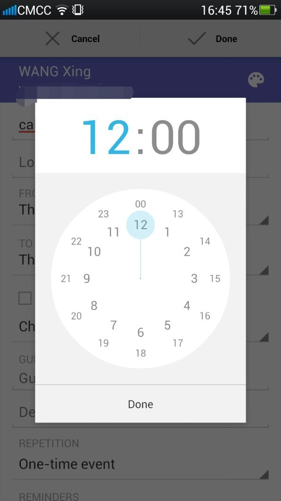

*2013-11-14 16:49 · Android客户端*

---

### 9355

一堆人恭喜得莫名其妙-_-! 我的表达方式真的那么容易让人误解吗？

真相是某人通过我创办的校内网认识了他老婆然后现在喜得贵子了。

话说回来，我在现实生活中从来没做媒成功过，不过校内和饭否应该成就了不少姻缘吧。

*2013-11-13 13:49 · 网页*

---

### 9356

真神！这瀑布的水从哪来的？转@ 拧巴人儿 这不就是平顶山

么………………转@ 葫三芦 Google了一下，真是奇观，真是壮观。。。

转@ Yumi. 转@ littail Roraima, Venezuela. 委内瑞拉 罗赖马山。此生想要去的地方之一。

*2013-11-13 11:55 · 网页 转自littail*

---

### 9357

一大早在google hangout上收到一条消息：「11月12日美国当地时间早上8:10分，我老婆顺利产下一儿子，体重5.5斤，身材修长，母子平安，谢谢关心 @ XXX @ YYY 多谢你的校内网牵线 哈哈」善哉善哉。

*2013-11-13 09:50 · 网页*

---

### 9358

转@ 唐君毅 美团开放服务云主机API开放：https://mos.meituan.com/doc...

*2013-11-12 18:03 · 网页 转自唐君毅*

---

### 9359

@ Doris鹿柴V 我当时想的是新奥尔良是美国南部大河密西西比入海口的城市，广州是珠江入海口的城市，而且两个城市都有和所在国家主流文化不太一样的风土人情。

*2013-11-12 17:57 · 网页 给Doris鹿柴V的回复*

---

### 9360

我若是一个小萝莉，准被这个太空小孩迷倒。转@ 太空小孩 补充三个，能，日，么。转@ 王兴 转@ Fanxi 还有两个更厉害的字，僧和佛，亦没有同音字（除非常生僻的字或异体字外），相同拼写不同声调的都没有。转@ Liitom 字典里居然没有和“命”一个读音的字！原来命真的只有一条，汉字果

*2013-11-12 17:37 · 网页 转自Liitom*

---

### 9361

收到短信：王兴，你好！我是Jack的朋友，想与你认识并有机会交流一下。方便时请回电。XXX

*2013-11-12 17:36 · 网页*

---

### 9362

转@ Fanxi 还有两个更厉害的字，僧和佛，亦没有同音字（除非常生僻的字或异体字外），相同拼写不同声调的都没有。转@ Liitom 字典里居然没有和“命”一个读音的字！原来命真的只有一条，汉字果真是博大精深啊。

*2013-11-12 16:37 · 手机上网 转自Liitom*

---

### 9363

真的是感受比事实更重要。

*2013-11-11 17:05 · 网页*

---

### 9364

谢谢你，闲得蛋疼的小孩。转@ 太空小孩 完成 YY 佳作... 献给 @王兴

*2013-11-05 15:44 · 网页 转自太空小孩*

---

### 9365

位处腹地，内陆港口大城市，工业基础不错，冬天冷得很难过…转@Olive @ 王兴 武汉和芝加哥是怎么对上的？求解……

*2013-11-05 13:50 · 手机上网 转自Olive*

---

### 9366

如果找中美两国大城市的对应关系，上海对纽约，深圳对旧金山，武汉对芝加哥，那么广州应该对新奥尔良吧？

*2013-11-05 13:41 · iPhone版*

---

### 9367

盖茨从微软退休后开始干慈善，其目标的选择、组织的方式、规则的设定都和当年建软件帝国时一样出手不凡，让我惊叹。以此来看，盖

茨才是乔布斯之外另一个堪称「站在科技和人文的十字路口」的人。

只不过，乔布斯的「人文」是liberal arts，而盖茨的「人文」是humanity。

*2013-11-03 16:50 · 网页*

---

### 9368

「发上等愿，结中等缘，享下等福；择高处立，就平处坐，向宽处行」这二十四字的传统智慧内容真丰富。

*2013-11-03 16:25 · 网页*

---

### 9369

别啥事都怪国家。我的中学六年还挺值的。Be the change you wantto see. 转@ 瓶装賊菇 中国教育就那样吧 没什么值得六年的 转@ 王兴 今天是我的母校福建龙岩一中110周年校庆。昨晚听爸爸在电话里说了这事。我们一家两代有五个人都就读于此。但我竟然一时想不出

*2013-11-03 15:58 · 网页 转自王兴*

---

### 9370

乔布斯确实更像是一个传奇，但我觉得多数人真的低估了盖茨。

*2013-11-03 15:55 · 网页*

---

### 9371

这么赞？跟视网膜屏幕的新mini比呢？转@ webto 转@ 麻里的禁書目録 一句话评测 iPad Air：我想把 mini 和牛排扔进垃圾桶。

*2013-11-03 15:53 · 网页 转自麻里的禁書目録*

---

### 9372

怎样才算是一所好中学实在太难说清。我只能遥祝母校龙岩一中未来能给更多人留下美好回忆。

*2013-11-01 14:38 · 网页*

---

### 9373

今天是我的母校福建龙岩一中110周年校庆。昨晚听爸爸在电话里说了这事。我们一家两代有五个人都就读于此。但我竟然一时想不出来我可以祝她什么……

*2013-11-01 14:30 · 网页*

---

### 9374

为什么有人这么推崇乃至于纠结「初见」呢？不是每次见都是新体验吗？我一直觉得，第二次见某某的体验就是「第一次」体验「再次见到某某」，依此类推。

*2013-10-30 20:34 · 网页*

---

### 9375

不明觉厉。转@ 金融界人贩子 【你的工作有什么意义？】伯特兰·罗素老师早就说过，人的一生无非在干两件事：1、改变物体的形状或位置；2、指使或阻止他人这样做。洒家把这个朴素的道理说给围棋、羽毛球等国手和他们的教练听，然后他们就顿悟了。哦也。

*2013-10-30 14:18 · 网页 转自金融界人贩子*

---

### 9376

拼完智力拼体力。

*2013-10-30 00:18 · iPhone版*

---

### 9377

时隔几年，今晚又见到了我的研究生导师高光荣教授。高老师前几天刚回国来领了中国计算机学会颁发的本年度「海外杰出贡献奖」。

*2013-10-27 22:55 · Android客户端*

---

### 9378

和一年前相比，你有什么变化？大了一岁。

*2013-10-26 19:12 · iPhone客户端*

---

### 9379

下载了两天，升级OS X Mavericks中…

*2013-10-25 09:24 · iPhone客户端*

---

### 9380

mac pro那个高精尖制造的视频实在是太帅了！

*2013-10-23 21:43 · 网页*

---

### 9381

我必须毫不留情的指出，这是一个年龄暴露帖;-) 转@ 拧巴人儿 阿拉斯加的州旗设计的挺逗的，简而言之就是天上的星星参北斗啊（嘿嘿嘿嘿参北斗哇……你能忍住不唱么？！能么？！）

*2013-10-21 08:39 · 手机上网 转自拧巴人儿*

---

### 9382

多数人都在混吃等死，只有少数人像你这样折腾不止。其实跟年龄关系不大。转@ 拧巴人儿 我的同龄人大多数在干嘛啊？？

*2013-10-18 20:25 · 手机上网 转自拧巴人儿*

---

### 9383

海明威般简短，欧亨利式结尾！转@ 拧巴人儿 23333 转@lakeshore 机场大巴快要进银川机场的时候看到一广告：中国梦是干出来的。金徽酒。// 瞬间真相了。

*2013-10-14 10:41 · 手机上网 转自lakeshore*

---

### 9384

更悲剧的是，最近几年我的体重持续上升，不再需要打脸就已经像个胖子了-_-! 转@ 派大星. 每次看王兴谈论类似的问题，最有一种他在打肿脸充胖子的感觉。转@ 王兴 金庸的文学水平高低暂且不论，他的作品确实已成为文化的一部分，并对中文词汇有所贡献，例如「岳不群」一词。

*2013-10-12 15:08 · 网页 转自王兴*

---

### 9385

金庸的文学水平高低暂且不论，他的作品确实已成为文化的一部分，并对中文词汇有所贡献，例如「岳不群」一词。

*2013-10-12 14:53 · 网页*

---

### 9386

才过9点半，月亮就落下去了:(

*2013-10-10 21:37 · iPhone版*

---

### 9387

月亮真是一种奇怪的存在。每年总有那么几次，我会被她提醒，我们其实生活在一个孤独的星球上。

*2013-10-10 21:36 · iPhone版*

---

### 9388

此刻，北京的月牙很美。

*2013-10-10 21:16 · iPhone版*

---

### 9389

历史真残酷。

*2013-10-09 00:05 · iPhone版*

---

### 9390

@ iFire 你真有追求！

*2013-09-26 23:49 · 网页 给iFire的回复*

---

### 9391

终于去体验了一次传说中的@ flypig 老师开的十榛法菜，果然名不虚传。店开在西四北大街小拐棒胡同一个私密小院里，每餐只有一桌；

大厨是法国蓝带毕业的一个台湾小伙子，对美食很有追求。几个朋友不知不觉从七点半吃到刚才，共度了一个愉快的秋夜。

*2013-09-26 23:07 · iPhone版*

---

### 9392

刚把《故都的秋》翻出来重读了一遍，因为美国那边一个老友发邮件来时结尾写了句：enjoy “故都的秋”！他可真不愧是清华中文系毕业的，虽然他现在的工作是在facebook做数据挖掘的算法……

*2013-09-26 14:09 · iPhone版*

---

### 9393

kindle未提示我就偷偷摸摸升级了:-(

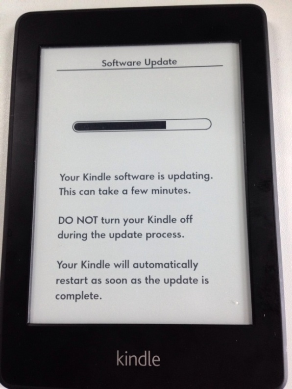

*2013-09-23 13:54 · iPhone客户端*

---

### 9394

赞！勾起我的童年回忆…… 转@ Dee.W 真棒 转@ qinyf 「转@ 飯否小字报 ：转@ 锐风 两万欧的戒指..」

*2013-09-16 12:55 · 手机上网 转自锐风*

---

### 9395

@ 拧巴人儿 你怎么什么小说都看过？a tree grows in brooklyn这书我几个月刚看了个开头，还没来得及继续。

*2013-09-13 22:58 · 手机上网 给拧巴人儿的回复*

---

### 9396

两种世界观。

*2013-09-13 18:29 · 手机上网*

---

### 9397

坑灰未冷山东乱，刘项原来不读书。

*2013-09-13 17:35 · iPhone版*

---

### 9398

菲茨杰拉德对上了年纪的人接受新事物的能力不抱指望，但对自己的才能很有信心，所以他曾说「一个作家应该为这个时代的年轻人而写，为下个时代的评论家而写，为此后世世代代的校长们而写」。他做到了。虽然《了不起的盖茨比》在他在世时并不成功，但后来却成为美国和其他一些英语国家的高中必读书目。

*2013-09-12 22:28 · 网页*

---

### 9399

看了一遍电影，把小说原文找来读了一遍，又看了一遍电影，又读了一遍小说。菲茨杰拉德太牛了。《了不起的盖茨比》在我读过的小说无疑是顶级的。

*2013-09-12 00:49 · iPhone版*

---

### 9400

原来「喜大普奔」是「喜闻乐见、大快人心、普天同庆、奔走相告」

的缩写啊-_-!

*2013-09-11 00:31 · iPhone版*

---

### 9401

@ 地三鲜 At 18 our convictions are hills from which we look; At45 they are caves in which we hide.

*2013-09-08 19:44 · 手机上网 给地三鲜的回复*

---

### 9402

菲茨杰拉德说：「18岁时，信念是我们站立其上看世界的山峰；45岁时，信念成了我们躲藏于其中的洞穴」。有趣的是，他本人只活了44岁。更令我惊叹的是，他写出《了不起的盖茨比》这部杰作时只有29

岁。

*2013-09-08 17:47 · iPhone版*

---

### 9403

@ Dr.Steve 我看的是英文版，古登堡计划里有，网上很容易搜到。

*2013-09-07 12:02 · 手机上网 给Dr.Steve的回复*

---

### 9404

盖茨比并不了不起，但《了不起的盖茨比》这小说确实很了不起。

*2013-09-07 08:59 · iPhone版*

---

### 9405

背景配图也帅呆了！ 转@ 带三个表 这标题！

*2013-09-05 15:17 · 手机上网 转自带三个表*

---

### 9406

渐渐能体会《了不起的盖茨比》原著标题里的「了不起」是什么意思了。Great这个词本身含义就多，译成中文更不好好准确对应。如果要用我们这个时代的语言习惯，其实也可以译成《牛逼的盖茨比》。

*2013-09-05 15:13 · iPhone版*

---

### 9407

现在有什么车型是直接提供一个甚至多个USB口而不需要通过点烟器插

个转换器？

*2013-09-05 12:00 · iPhone版*

---

### 9408

一切真历史都是当代史，那些虚构的文学作品讲的也都是现实。半年前看《悲惨世界》时我感触万千，因为我预感我们这代人未来十年很可能也要经历一场社会大变革。前几天上映的《了不起的盖茨比》又令我唏嘘不已，因为我们这个年代像极了故事背景里的美国1920年代：X国梦，浮躁，新钱老钱……

*2013-09-04 00:04 · Android客户端*

---

### 9409

刚知道《本杰明巴顿奇事》也是改编自菲茨杰拉德的小说。我以前只知道他写了《了不起的盖茨比》。

*2013-09-03 23:48 · 手机上网*

---

### 9410

好段子！转@ quux 好有钱啊，炫耀吧 转@ KevinOlive 转@ 朱乐转@ 小田一成 大段子——记者在北京采访路人：如果你中了500万，打算怎么花？路人说：先把房贷还了。记者又问那剩下的呢？路人说：剩下的慢慢还

*2013-09-03 23:46 · 手机上网 转自小田一成*

---

### 9411

终于又在app store里花了$0.99。大概是因为我可能有一年没在这里花过钱了，它居然要我重新输入信用卡信息。这回买的是aero这个天气app，朋友推荐的。

*2013-09-02 17:17 · 网页*

---

### 9412

@ 拧巴人儿 这tiger salamander看起来很霸气啊！

*2013-09-02 14:14 · 网页 给拧巴人儿的回复*

---

### 9413

@ 小熊娃娃 原著我才看了一半。电影给我最深印象的就是那些派对场面啊-_-! 光从电影我确实没看出盖茨比为什么了不起……

*2013-09-02 12:17 · 网页 给小熊娃娃的回复*

---

### 9414

第36周。开学啦！

*2013-09-02 10:18 · iPhone版*

---

### 9415

从古登堡计划里下载了一本免费但有合法版权的《了不起的盖茨比》

原著，周末在kindle上读了一半。必须承认，菲茨杰拉德的文笔配合我的想象力并不能构建出电影里那一大一小两个狂欢派对的场面，导演的再创作能力还是很值得钦佩的！当然，另一方面，电影并无法完全表现小说里一些微妙的描写。

*2013-09-02 00:55 · iPhone版*

---

### 9416

相比乔布斯的传奇一生，《乔布斯》这部电影充其量只是前戏（讲到

96年乔布斯重回苹果就戛然而止），但是如果你喜欢科技、创业、公司政治、屌丝逆袭、歇斯底里或就是喜欢帅哥，这部电影都能带来几个小高潮。总而言之，这是一部讲乔布斯但是很不乔布斯的电影。给7/10分吧。

*2013-09-01 16:43 · iPhone客户端*

---

### 9417

这个月出差多，第一次遇到联通移动俩手机都流量超标的情况:(

*2013-08-30 14:26 · iPhone版*

---

### 9418

天高云淡，凉风习习，今天北京的天气真是好得让人想啊啊叫。

*2013-08-29 09:55 · iPhone版*

---

### 9419

好神奇啊！这双鞋是我03或04年买的，一直穿到现在。今天前后只差几个小时，左右两边完全对称的位置断裂了。这至少说明耐克的制造工艺是非常稳定的？

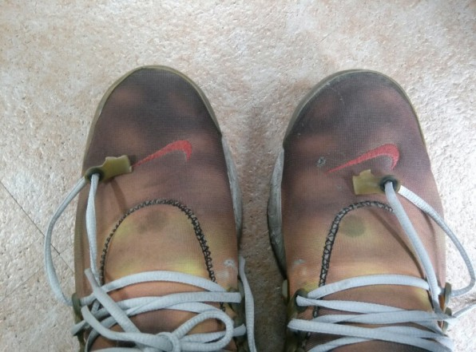

*2013-08-27 13:58 · Android客户端*

---

### 9420

ashton kutcher来中国为下月即将上映的电影《乔布斯》做宣传了。

近距离看，他依然是蛮帅的，不过鼻尖略微有点怪。很难得的是，他聊起科技、创业和天使投资来讲得头头是道，知识面和兴趣都非常广。

*2013-08-26 22:32 · iPhone版*

---

### 9421

@ 苑小帅 目测不是假的，但也不是给我们吃的。实际吃的是给每人小碟上菜。

*2013-08-25 20:15 · 手机上网 给苑小帅的回复*

---

### 9422

无语。

*2013-08-25 20:01 · Android客户端*

---

### 9423

第一次坐40人大圆桌吃饭-_-!

*2013-08-25 19:22 · iPhone版*

---

### 9424

@ qinyf 我在出差。周二带给你。

*2013-08-25 17:32 · 网页 给qinyf的回复*

---

### 9425

@ qinyf 我也丢过俩fitbit了。我现在用zip，还有一个闲置的ultra，你要的话就拿去用吧。

*2013-08-25 11:40 · 网页 给qinyf的回复*

---

### 9426

@ 拧巴人儿 你在硅谷看到的？那应该是groupon在那儿的研发中心。他们老巢在芝加哥呢。

*2013-08-24 08:09 · 手机上网 给拧巴人儿的回复*

---

### 9427

无意中撞到这么高端学术的横幅，一定要掏出手机膜拜一下。但是，很惭愧，我参加的是另一个活动，和学术无关。

*2013-08-23 20:23 · iPhone客户端*

---

### 9428

靠，毕加索的《有胡子的男人》这幅画我真是既看不懂又看不出感觉啊:(

*2013-08-19 01:12 · iPhone版*

---

### 9429

再一次看到“The best way to rob a bank is to own one”这句话，依然感触良多。这句几十年前美国银监界人士的名言在今天的中国完全适用，真是「抢银行不如开银行」。

*2013-08-19 01:03 · iPhone版*

---

### 9430

央行前身？有点自己往脸上贴金的感觉哦。

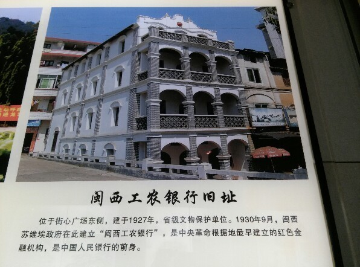

*2013-08-12 17:47 · Android客户端*

---

### 9431

看了《环太平洋》，评7/10分。从数学、物理、生物和武术的角度来看，这部电影都弱爆了，但是，真的很热血很刺激！导演大概是觉得嗨死人不偿命，所以一开场就开打，片头字幕还没出就来了个小高潮，然后就不停的打，从开始一直高潮到结尾，让观众的神经始终绷着……

*2013-08-10 22:20 · iPhone版*

---

### 9432

天哪！连龙岩都要建高尔夫球场了！这座福建西部山区的四线城市即将有至少8家电影院，5家五星级酒店！

*2013-08-08 18:12 · iPhone版*

---

### 9433

人生总是太匆匆。爸爸每次来北京呆的时间只能以小时计，我每次回龙岩也只能以小时计。

*2013-08-08 10:42 · iPhone版*

---

### 9434

今年的第32周 •• ** •• -- •• ** -2013-08-05 12:42 通过 iPhone版

---

### 9435

越来越觉得我低估《战马》这部片了。当时看完后我在猫眼电影里只给了7分（满分10分），可是这一年半来，《战马》里不止一个场景经常会浮现在我脑海里，包括骑兵队悲剧性的冲锋、两个德国少年逃兵在风车旁被枪毙、绞肉机一般的战壕对峙…… 斯皮尔伯格终归不可小觑。

*2013-08-02 00:10 · iPhone版*

---

### 9436

成都城里居然能看到雪山！长见识了。 http://v.gd/23KaQO 转@tihu 昨天从成都主城区可以遥望一百公里以外的四姑娘山主峰幺妹峰，各摄影坛子已经完爆了。古人随时可以看到“窗含西岭”的景致，我们却当作奇观一般对待。这是同事拍的。#chengdu

*2013-07-31 11:48 · 网页 转自tihu*

---

### 9437

我终于拥有一只独一无二的iPhone5了，在刚才它掉到地上磕瘪一个角后。

*2013-07-31 01:12 · iPhone版*

---

### 9438

这设计真棒。

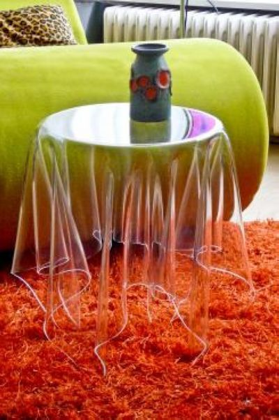

*2013-07-31 01:04 · 手机上网*

---

### 9439

已升级到iOS7 beta4。

*2013-07-30 14:43 · iPhone版*

---

### 9440

不过，我必须承认 《董小姐》这歌多听几遍之后觉得还行，蛮耐听的。第一次听的时候我的感觉是：这都什么呀，怎么就火了呢？

*2013-07-29 15:45 · iPhone版*

---

### 9441

歌都是骗人的，安和桥下哪有清澈的水。

*2013-07-29 15:35 · iPhone版*

---

### 9442

老外写的《大数据》这本书中文版竟然比英文版更早出版。中方出版社拿到英文原稿后就迅速组织翻译，三下五除二就印好开卖了。美方

出版社动作比较慢，从拿到原稿到出版要四个月时间，kindle版也没法更快。这也算中美的差异之一吧。

*2013-07-28 14:17 · iPhone版*

---

### 9443

( ° °)

*2013-07-26 19:57 · iPhone版*

---

### 9444

@ Simp 我听说，正确的管理原则是：为过程鼓掌，为结果付薪。

*2013-07-24 14:49 · 网页 给Simp的回复*

---

### 9445

路过某同事的工位时瞥见这一幕，情不自禁停下来掏出手机膜拜一下。你懂的。

*2013-07-24 14:02 · iPhone客户端*

---

### 9446

能炒一盘菜了吧。转@ 拧巴人儿 呃，这就是我的噩梦。一时我都想不出来有什么能比这个更可怕。转@ 谷歌地图 【世界体型最大甲虫可咬断铅笔】照片上的昆虫被称为泰坦甲虫，是世界上体型最大的甲虫，也是这颗星球上最具神秘感的物种之一。它的颚部力量异常强大，甚至可以咬断一根铅笔。

*2013-07-24 12:19 · 网页 转自谷歌地图*

---

### 9447

美食、美酒、美景、美女、美德。

*2013-07-24 12:00 · 网页*

---

### 9448

每当连我自己都觉得桌面有点乱时，我就想起这个故事：有个家伙终于整理了一下自己的办公桌，结果整出了一台很早以前就以为已经丢失的打印机。

*2013-07-23 17:58 · 网页*

---

### 9449

@ 至尊臭豆腐 真正的高逼格不是说自己曾经喝过不错的咖啡，而是表示从来没接触过不好的咖啡。何不食肉糜的那种;-)

*2013-07-22 16:11 · 网页 给至尊臭豆腐的回复*

---

### 9450

我对咖啡没有研究，但每个人天然都有最基本的分辨能力。06年圣诞在夏威夷大岛的Castle Hilo Hawaiin酒店早餐后喝的那杯咖啡令我至今难忘。在那之前我不觉得咖啡好喝，甚至不觉得有多大差别，可是，那一杯真的让我立刻觉得不一样，好香，苦而不涩，入口很温暖但不仅仅是因为温度。

*2013-07-22 15:07 · 网页*

---

### 9451

楼下的costa终于也开张了，比星巴克晚了几个月。今天一时兴起，买了星巴克和costa的黑咖啡各一杯，交替品尝，反复对比。可能是因为对咖啡太业余，我只能喝出costa的味道更浓，但酸味也更重。更显著的后果是，短时间内干掉两杯黑咖啡后，我似乎有点神经亢奋，心跳也变快了-_-!

*2013-07-22 12:38 · iPhone客户端*

---

### 9452

相比之下，同样是本土品牌的oppo，find5这个机型（京东售价2998元）就很令我满意，已经代替三星note2成为我的安卓主力机型服务了好几个月。1080p的高清屏无可挑剔，其他指标也都不错。很多人根据

外形设计误以为它是一款sony手机。

*2013-07-20 18:03 · iPhone版*

---

### 9453

把玩了半天htc的一款中档机型e1（京东上卖1800元左右），再拿起iPhone5，我对苹果产品之做工精良有了更深切的体会。

*2013-07-20 08:50 · iPhone版*

---

### 9454

google地图安卓版7.0真是个极度简化的产品，把无数旧功能都彻底砍掉了，已经简化到连安卓菜单键都被废弃的地步了。我一时还真是有点不习惯。

*2013-07-17 10:06 · 网页*

---

### 9455

今天北京的天好蓝啊。我忍不住多擦了几次眼镜，以免辜负这难得清澈的空气。

*2013-07-16 13:26 · 网页*

---

### 9456

今年第29周。

*2013-07-15 09:27 · 网页*

---

### 9457

问：你对微软这次重组怎么看？答：我听说，华为有个员工一入职就写了一封关于华为经营战略的万言书给任正非，老任批复：“此人如有精神病，建议送医院治疗；如果没病，建议辞退。” 以管过几千几百几十或几个人的公司或部门的经验或仅凭看过几本管理书籍来评价微软CEO要做的决策，仅有娱乐价值。

*2013-07-12 20:51 · 网页*

---

### 9458

转@ 拧巴人儿 我不相信学语言这事儿不下苦功夫笨功夫能有什么突破。这个年纪了，你想跟母语一样，从小孩儿的那个认知水平开始，天天看美剧就能说英语了，不说不可能吧，反正难。 真要想突破，就得看。书太难看报纸。看母语人士怎么写，不懂就查，障碍大就不翻，总还想着用中国学校的方法开始，那突破

*2013-07-12 12:55 · 网页 转自拧巴人儿*

---

### 9459

转@ tihu 自从火车站停售站台票，无数凄美的展台别离和峰回路转就都烟消云散了。

*2013-07-12 11:16 · 网页 转自tihu*

---

### 9460

不明觉厉！转@ 以梦为野马 萨特曾说过，人是其可能性的总和。到了现在，人变成了其购物的总和。

*2013-07-12 11:03 · 网页 转自以梦为野马*

---

### 9461

面世近一年之后，iPhone5仍然是我见过的做工最好的手机。

*2013-07-12 11:01 · iPhone版*

---

### 9462

作为一个四项全反的人，我只能指望我参与创建的某些互联网产品间接起到红娘作用了。转@ qinyf 昨晚分析了一下，红娘的最佳MBTI性格类型是ESFJ ，而我正相反。

*2013-07-11 19:10 · 网页 转自qinyf*

---

### 9463

没有这个声明就通不过app store的审核，不管抽奖的奖品是不是苹果的产品。转@ 威廉小杨.ipa 美團抽獎這個bug很久了，不管抽的獎品是什麼都有這麼一句跟蘋果無關嘖嘖 @ 王兴

*2013-07-11 12:08 · 网页 转自威廉小杨.ipa*

---

### 9464

facebook的iPhone app已经臃肿成35.6M了-_-!

*2013-07-11 12:06 · iPhone版*

---

### 9465

转@ Qiii @ 王兴 查了下，出自《The Age of Reason》，感觉翻译不是特别准确，这里附上原文。

*2013-07-10 21:15 · 网页 转自Qiii*

---

### 9466

赞！ 转@ iMoe_ 上周发完邮件，本周组织结构里的＂ios组＂终于变成＂iOS组＂了。心情舒畅。这应该算是最悠久的一个问题了吧XD

*2013-07-10 19:48 · 网页 转自iMoe_*

---

### 9467

转发：美国思想家、《独立宣言》思想奠基人之一的托马斯•潘恩：一个人，如果极力宣扬他自己都不相信的东西，那他就是做好了干任何坏事的准备。

*2013-07-10 12:29 · iPhone版*

---

### 9468

知乎网友的观点是：不存在减速玻璃这种东西。难怪我之前自己琢磨不出原理。 http://www.zhihu.com/questi...

*2013-07-10 09:08 · iPhone版*

---

### 9469

列车跑在京沪高铁上。车厢里屏幕上显示的时速是299公里，可是我看窗外的景物觉得并不快，很难相信已经是我平时开车的三倍速度了。

*2013-07-09 19:23 · iPhone版*

---

### 9470

这才是正能量！00后创业者！咱们中国人本来就不笨也不懒，环境又越来越好，未来大有希望啊！

*2013-07-07 16:44 · iPhone客户端*

---

### 9471

我爱中国，不然我会想办法离开这里；我爱创业，不然我不会依然在做此事；我爱在中国创业，因为有激动人心的机会和激情四射的团队。我不恨什么人也不恨什么事，我只是很烦媒体莫名其妙的把“恨在中国创业”这种诛心标题套在我身上。

*2013-07-05 21:08 · iPhone版*

---

### 9472

转@ 村里有个姑凉叫小丽 毫无新意。我喜欢那个笑话：儿子对爸爸说：“爸爸爸爸，我能问你一个问题吗？”爸爸面无表情的放下报纸说”儿子，你已经问了。“”那我能问2个吗？“ 爸爸无辜地说”你已经问了！“ 转@ 王兴 转@ KevinOlive A：怎样形容一个女孩漂亮？B：自从她搬过来

*2013-07-04 22:49 · 网页 转自KevinOlive*

---

### 9473

「淡淡的忧伤」还算文艺范儿，「明媚的忧伤」就纯属装逼犯了。

*2013-07-04 22:48 · iPhone版*

---

### 9474

转@ KevinOlive A：怎样形容一个女孩漂亮？B：自从她搬过来，小区超市里的卫生纸都涨价了。

*2013-07-04 22:05 · 网页 转自KevinOlive*

---

### 9475

苹果也太霸道了吧！刚才用某帐号登录app store时，它提醒我原记录在案的信用卡快过期了，于是我就填了一张新信用卡的信息，然后立刻就收到信用卡公司发来的短信，刚刚有一笔1人民币的消费。可我还没什么都没买啊，苹果也没有提醒我说要扣一块钱来验证信用卡是否有效啊:-(

*2013-07-04 15:21 · 网页*

---

### 9476

中国媒体曾经很喜欢问：为什么中国商界没出乔布斯？我认为很直观的一个解释就是，往前推一点，因为中国学界还没出恩格尔巴特和阿兰凯这种人，再往前推一点，因为中国政界还没出万尼瓦尔·布什(Vannevar Bush)这种人。再往前，就不方便说了。

*2013-07-04 11:00 · 网页*

---

### 9477

乔布斯最初对计算机的解释就是「思维的自行车」(Computers arelike a bicycle for our minds)。这么一联系起来，恩格尔巴特的这句话就更有意思了。

*2013-07-04 10:42 · 网页*

---

### 9478

如果易用是唯一的需求，那我们大家都还在骑三轮车。 －恩格尔巴特

*2013-07-04 10:32 · 网页*

---

### 9479

计算机先驱、鼠标发明者恩格尔巴特去世了，享年88岁。除了鼠标、超文本和图形界面，他的贡献还有「智能增强」IntelligenceAugmentation(简称IA，和人工智能AI正好对应）。十年前我还在学校时读过他的文章。虽然那时已经算是老文章了，但依然在概念上对我很有启发。

*2013-07-04 10:23 · 网页*

---

### 9480

谢谢！联通官网和官方app确实更便宜！转@ 王子 @ 王兴 联通官网充值不是9.85折吗，有活动时还能抽奖最少会送5元话费。

*2013-07-03 11:59 · 网页 转自王子*

---

### 9481

联通手机充值100元，支付宝要~99.5元，财付通要98.7元。果断后者,I'm cheap.

*2013-07-03 11:42 · 网页*

---

### 9482

iOS7beta2有一个很低级的易用性方面的问题：只要放着音乐，在锁屏状态下居然不显示当前时间！设计者你脑残吗？你不知道我没有手表，看时间全靠手机吗？你居然要让我划一下屏幕然后再输入四位数字解锁才能看到时间？

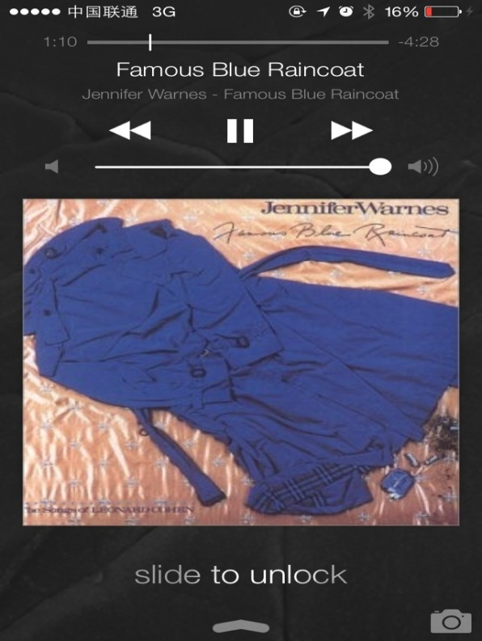

*2013-07-02 22:27 · iPhone客户端*

---

### 9483

膜拜文科大神！俺确实不懂啊。转@ 三猎 @ 王兴 诸侯为国，大夫为家。家本来是大夫的封邑，后来才有现在的意思。国家本是并列，现在是偏义复词。就像窗是窗，户是门，窗户只和窗有关。PS：关注了王兴之后，有时真为理科生的文科知识捉急。

*2013-07-02 16:43 · 网页 转自三猎*

---

### 9484

@ quux @ gravity0 《格调》应该更早就有中译本了吧？我记得我大概是中学的时候在我爸的书架上看到过，但当时我很不屑，只是翻了翻，没读完。

*2013-07-02 16:24 · 网页 给quux的回复*

---

### 9485

《格调》是翻译美国版《Class》。更早一些还有英国版《Class》，逼格更高。转@ 马扎罗 《格调》一书05年读过，逼格似乎有点高。转@ 王兴 推荐《格调》一书。英文就叫《Class》，中文不好意思直译成阶级。转@ gravity0 英国研究发现，活着不仅要拼爹而且要拼爷：统计表明…

*2013-07-02 13:21 · 网页 转自gravity0*

---

### 9486

中文里老说「国家」，把「国」和「家」放在一起。其他语言里也有这种现象吗？

*2013-07-02 12:58 · 网页*

---

### 9487

推荐《格调》一书。英文就叫《Class》，中文不好意思直译成阶级。

转@ gravity0 英国研究发现，活着不仅要拼爹而且要拼爷：统计表明父母祖父母都是较高社会经济地位，80%的人成年以后还能在这个阶层。而祖父母穷父母一辈奋斗成功者，子女只有 61% 的人成年以后仍处这个阶层。

*2013-07-02 12:55 · 网页 转自gravity0*

---

### 9488

中国历史上以「坐北朝南」为尊是因为地理上中国在北半球，一年中多刮北风，原始部落在野外围着烤个红薯啥的，上风口那种比较不呛的位置肯定是留给首领，于是他自然就坐北朝南了。哦，不对，红薯是哥伦布发现美洲大陆之后才传到中国来的。没关系，我就是打个比方……

*2013-07-02 10:28 · 网页*

---

### 9489

今天的空气真是清澈得令人感动啊！

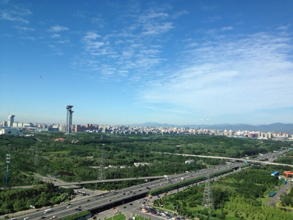

*2013-07-02 08:20 · iPhone客户端*

---

### 9490

赶在google reader下线之前把「未读」数清零了。当然，只有少数feed是真的读了，多数只能点「全部标为已读」了。

*2013-07-01 18:59 · 网页*

---

### 9491

终于把去年七月就开在我chrome里的某个网页看完了-_-!

*2013-07-01 12:17 · 网页*

---

### 9492

赞！转@ 一淇 转@ 左堂堂 一女生暗恋班上一男生，男生地理很好，女生地理很弱。有一天，女生鼓起勇气问男生:你帮我补地理好不好。

男生悠悠地看了她一眼，淡淡道:一个家里不用两个人地理都好的。

*2013-07-01 12:15 · 网页 转自左堂堂*

---

### 9493

给google reader送去了一些临终关怀。

*2013-06-30 18:12 · 网页*

---

### 9494

想了一个多月，觉得应把「游遍」改成「驶向」。转@ 王兴 中文译文已令我怦然心动，一查原文，竟然更妙一层：To be a sailor of theworld, bound for all ports. 转@ 水星水星我是火星 转@ Ycner “做一个世界的水手，游遍每一个港口。”

*2013-06-30 16:45 · 手机上网 转自Ycner*

---

### 9495

联通营业厅的工作人员业务太不熟练了。我去办个事，看他们过程中各种出错，三个人一起挠头，耗了我一个半小时还没搞定。

*2013-06-30 16:39 · iPhone版*

---

### 9496

@ 阿阿布 我的手机就是4S，凑合能用。

*2013-06-26 11:48 · 手机上网 给阿阿布的回复*

---

### 9497

就在我对iOS7 beta那又卡顿又发热的表现快要忍无可忍，打算刷回旧版时，beta2出来了，一键升级后感觉确实进步明显。

*2013-06-26 11:02 · iPhone版*

---

### 9498

没有通过天文望远镜欣赏过月球表面环形山的朋友真应该找机会试一下。那是小时候影响我世界观的体验之一。

*2013-06-25 16:59 · iPhone版*

---

### 9499

也说不上来为什么，就是觉得这封面的美术设计不错，除了左下角那块有点丑。

*2013-06-25 16:31 · iPhone客户端*

---

### 9500

三大宗教的创始人都反对塑像膜拜，但现在佛像和十字架耶稣像到处都是。从这个角度来看，还是伊斯兰教的执行力比较强。当然，也可能是因为伊斯兰教创立的时间相对来说短很多。

*2013-06-24 17:51 · iPhone版*

---

### 9501

终于赶在deadline之前把《美团网2013年员工满意度调查》给填完了_-!

*2013-06-24 15:58 · 网页*

---

### 9502

用了两天iOS7 beta版，总体感觉是不建议iPhone4S用户升级。

*2013-06-23 09:01 · iPhone版*

---

### 9503

iOS7又突然重启了一次。很多操作还是磕磕绊绊的。

*2013-06-21 20:23 · iPhone版*

---

### 9504

iOS7果真不够稳定啊。已经莫名重启了一次。

*2013-06-21 18:39 · iPhone版*

---

### 9505

把我的iPhone4s升到iOS7了。第一印象是各种操作有点慢:-(

*2013-06-21 17:32 · 网页*

---

### 9506

请这位朋友不要误会。调侃归调侃，我对宗教是很尊敬的，而且有越来越尊敬的趋势。转@ 叶子叶子花 @ 王兴 每次王老板说起宗教都这么不严肃，对于教徒来说心里很不舒服

*2013-06-21 09:57 · 网页 转自叶子叶子花*

---

### 9507

世界三大宗教的创始人的人生轨迹各有不同：佛陀是从高富帅到（伪）屌丝，穆罕默德是从屌丝到高富帅，耶稣基督则一直屌丝。

*2013-06-21 02:26 · iPhone版*

---

### 9508

越来越觉得凯恩斯真是潇洒通透。

*2013-06-21 01:26 · iPhone版*

---

### 9509

一个以前我所不知道也从来没想过的历史知识：我国古代并没有官方铸造的金币银币，这和西方文明不同。

*2013-06-19 20:48 · iPhone版*

---

### 9510

所以爱墨生老师早就哀叹过了：我最好的创意都被古人剽窃了。 转@bang 两次下决心要做某个APP，都在AppStore找到很优秀的跟我想的差不多一样的APP，垂泪

*2013-06-17 22:11 · 网页 转自bang*

---

### 9511

@ Forbes 你的记性很好嘛。我08年买了iPhone一代，但是一直没拿它当主力手机，还是继续用诺基亚，直到09年开始用安卓手机G3。

*2013-06-17 22:07 · 网页 给Forbes的回复*

---

### 9512

把玩了一会儿iPhone一代，其实也能用。

*2013-06-16 23:42 · iPhone版*

---

### 9513

转@ 以梦为野马 我是废柴一枚，所以我总是Kindle不离身，期望有一天它真的能把我点燃

*2013-06-15 23:42 · 手机上网 转自以梦为野马*

---

### 9514

妈妈一进门就说「我给你买了一盆仙人掌，可以防辐射」。我为有这么一位不太有科学常识的母亲而有几分恼火，但依然为母爱而感动。

*2013-06-15 19:24 · iPhone版*

---

### 9515

转：You do have to possess self-confidence and humility at the

same time. That combination is called maturity. ——Jack Welch

*2013-06-13 19:07 · iPhone版*

---

### 9516

那封回修女的信不错，但依然是欲说还休，没有道破这世界的冷酷真相：要谈对科技的推动，美国国防部的贡献比美国宇航局大多了。美国宇航局搞出了什么东西，我相信有，但我说不出来；美国国防部搞出来的东西，我只说两样，保证众人皆知：互联网和GPS。当然，美国国防部每年花的钱也比宇航局多多了。

*2013-06-13 11:15 · iPhone客户端*

---

### 9517

「物联网」对比「Internet of things」, 难得有一个科技概念的中文称呼比英文称呼更简洁优雅！

*2013-06-12 09:21 · iPhone版*

---

### 9518

@ 黄阿狗 你那翻译连「信」都不符合。至少，我对英文原文的理解是：后来的事已永载史册，不用我说大家也都懂的。

*2013-06-12 00:37 · 网页 给黄阿狗的回复*

---

### 9519

＂blah blah. The rest is history." 这句英文里非常霸气的结尾语我始终没找到满意的中文译法，总觉得少了一点味道。

*2013-06-12 00:14 · iPhone版*

---

### 9520

看iOS7在网上被大骂，想起十二年前第一代iPod面世之初在当时的极客大本营slashdot上被骂得那叫一个狗血喷头啊。后来的历史大家都知道了。

*2013-06-11 23:46 · iPhone版*

---

### 9521

最早使用大规模标准化流水线生产的工业品不是汽车，而是枪，早了大概六十年。

*2013-06-11 16:47 · iPhone版*

---

### 9522

空气清不清澈还真是差别好大啊！

*2013-06-10 16:27 · iPhone版*

---

### 9523

忙到现在终于有空发条饭否：早晨开车上班时经过一段梧桐树夹道的路，那会儿雨并不大，但是一阵风吹来，树上的积雨哗的一下子泼在挡风玻璃上，让我突然想起：感时花溅泪。

*2013-06-09 15:40 · 网页*

---

### 9524

Very true for marathon, at 30 KM marker;“Run the first twothirds of the race with your head and the last third with yourheart.” – Unknown

*2013-06-08 12:18 · iPhone版*

---

### 9525

一个肮脏的国家，如果人人讲规则而不是谈道德，最终会变成一个有人味儿的正常国家，道德自然会逐渐回归；一个干净的国家，如果人人都不讲规则却大谈道德，谈高尚，天天没事儿就谈道德规范，人人大公无私，最终这个国家会堕落成为一个伪君子遍布的肮脏国家。

*2013-06-07 23:34 · iPhone版*

---

### 9526

Tumblr总结得真好: Total freedom of ex pression. An identityyou’re truly proud of. A network of people sharing andfollowing the things they love.

*2013-06-03 11:17 · 网页*

---

### 9527

请不要用热力学第二定律（熵增）作为你不整理房间的借口。

*2013-06-02 12:06 · iPhone版*

---

### 9528

苏格拉底、柏拉图、亚里士多德这三位希腊大牛的师承关系我一直记不太清，直到我发现他们仨按先后顺序合起来正好是SPA （Socrates,Plato, Aristotle）。

*2013-06-01 16:08 · iPhone版*

---

### 9529

最简单就越容易发展用户，不但互联网产品如此，宗教也一样。到了马丁路德手里，基督教已经基本简化成：其他啥都不重要，你只要「信」就可以了。

*2013-06-01 15:08 · iPhone版*

---

### 9530

和同事们打了一上午篮球，不小心把iPhone放在阳光下，结果它就温度过高而停止工作了。我还是第一次看到这种提示。

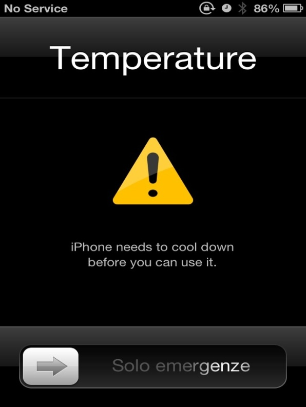

*2013-06-01 11:32 · iPhone客户端*

---

### 9531

@ 黄阿狗 你不是文艺青年吗？也搞IT？

*2013-05-31 10:23 · 网页 给黄阿狗的回复*

---

### 9532

dropcam这玩意儿大有前途啊！

*2013-05-31 09:47 · 网页*

---

### 9533

听coldplay的歌单听到一半感觉像突然插进来一首周杰伦的作品，一看歌名，《princess of china（中国公主）》。好吧，确实有点中国风的感觉……

*2013-05-30 17:27 · 网页*

---

### 9534

基辛格总结得很到位但也很无奈，许多时候真是比谁更没底线，正规军并不是真打不过游击队，而是「游击队只要没输就算赢了，正规军只要没赢就算输了」。

*2013-05-30 16:59 · 网页*

---

### 9535

据说，中国的创业环境并不算最恶劣。

*2013-05-29 18:25 · iPhone客户端*

---

### 9536

「上流社会、中流砥柱、下流胚子」，这仨词里的上中下好像不是一路的。

*2013-05-29 15:29 · iPhone版*

---

### 9537

转发：曾航：听到两个关于刷榜的趣事：1）某以刷榜著称的中国游戏公司，跑到日本把自己的中文游戏刷到了日本区前三，此事在日本游戏圈引为笑谈，所有日本公司都拒绝再和这家中国公司合作2）某日本游戏巨头来到中国，一直坚持不刷榜，但最近终于扛不住了，一刷，业绩就猛升。劣币驱逐良币的市场。

*2013-05-29 10:54 · iPhone版*

---

### 9538

@ 小熊娃娃 能不能放进裤兜是关键。

*2013-05-25 15:09 · 手机上网 给小熊娃娃的回复*

---

### 9539

我似乎有两周没怎么用ipad了，macbook也只是用于几处工作场合。

大屏手机是王道啊。kindle这种功能单一的设备倒是继续在我生活中占有一席之地。

*2013-05-25 12:03 · iPhone版*

---

### 9540

随着年纪和阅历的增长，我对烈士的崇敬趋于平淡，对有意识无意识扮烈士以捞取利益或起哄者的厌恶则急剧上升。

*2013-05-24 11:57 · 网页*

---

### 9541

已装！转@ 张亮 今天困扰我们的已不再是不知道发生了什么，正相反，我们能轻易了解到每分钟全世界的新变动，却常搞不懂它们究竟是怎么回事以及对我有什么影响。知乎日报的本质是“一手解读”，靠当事人、行内人、研究者的发言，增加我们对这个疯狂的… 下载：http://t.cn/zH2eex3

*2013-05-24 11:50 · 网页 转自张亮*

---

### 9542

这大概相当于哪年加入国民党？转@ qinyf 昨天面试听一个北邮软件工程的应届研究生同学说，他们同学里大概50%回老家进运营商/国企，40%不回老家进国企，其余的进互联网行业。比例惊人啊

*2013-05-24 11:35 · 网页 转自qinyf*

---

### 9543

黑得好有效率啊！转@ narsi 我关注的人都是要么十分有趣，要么长得漂亮，要么头像好看的，@ 王兴 例外。

*2013-05-23 21:23 · 手机上网 转自narsi*

---

### 9544

目测"west korea"这词恐怕要火:-(

*2013-05-23 17:47 · 网页*

---

### 9545

竞争竞争，何为竞，何为争？同向为竞，相向为争。

*2013-05-23 16:29 · 网页*

---

### 9546

午饭时被一个院士雷到了，他一本正经的跟一桌人说：为什么外祖母和外孙女最亲？因为只有她才能确保自己的血脉得到传承-_-!

*2013-05-23 16:17 · 网页*

---

### 9547

小时候家里书架上有些书，其中就有一本惠特曼的《草叶集》。那时我翻过，看不下去，哪里比得上《查泰来夫人的情人》啊。或许到了这个年纪可以再找一本草叶集来读读了。

*2013-05-23 15:45 · 网页*

---

### 9548

这句诗的中文译文已令我怦然心动，一查原文，竟然更妙一层：To bea sailor of the world, bound for all ports. 转@ 水星水星我是火星转@ Ycner “做一个世界的水手，游遍每一个港口。” by沃尔特·惠特

曼。晚安。

*2013-05-23 15:31 · 网页 转自Ycner*

---

### 9549

我要特诚恳的问一句：别说写了，你们有谁真的有能耐把这一篇文章从头到尾读完吗？ 转@ 带三个表 奇文啊，写的时候也不怕做噩梦。

http://is.gd/5EIZWM

*2013-05-22 00:08 · 手机上网 转自带三个表*

---

### 9550

我也经常碰到一些自以为比大领导们更有经济学常识的人，很无语。

转@ gravity0 书呆子都能想明白的道理居庙堂者不可能不懂，在最残酷的竞争中获胜并非偶然，他们处理家事也远超常人，当你发现某事有利可图时人家早十几年就已经瓜分完了。苦口婆心愿为帝王师的笨蛋们还是醒醒搬砖去吧。

*2013-05-21 13:43 · 网页 转自gravity0*

---

### 9551

一大早就被一句话震撼了：「和聪明人在一起工作，最大的好处就是不用考虑他们的自尊。」 据说是乔布斯说的。果然牛逼，太深刻了！

*2013-05-21 10:18 · 网页*

---

### 9552

我知道和我同名的人很多，但直到今天才知道［根据公安部的数据库］全国有25259个「王兴」。 http://is.gd/xjbn31

*2013-05-20 12:26 · 手机上网*

---

### 9553

我吃过的长得最像一盆绿植的甜点。

*2013-05-19 20:20 · iPhone客户端*

---

### 9554

从人类进化史的角度来说，我们每个人都是loser的后代。几十几百万年前气候开始变化，猿人们赖以生存的森林越来越少，竞争日益加剧。只有猿人里的高富帅才能抢到森林里的地盘继续当猴子，屌丝们则被逐渐排挤到森林边缘，最后沦落到食物更稀少谋生更不易的草原上，为了活下去只好开始直立行走…

*2013-05-18 17:06 · 网页*

---

### 9555

「感恩」这种心态，自己最好有，但别去要求别人有。

*2013-05-15 19:48 · iPhone版*

---

### 9556

果然是黑-_-!「古丈县城文工团的演员年纪偏大，县文工团领导决定到各个乡的初中毕业生中招几个长得漂亮的女生来充实一下。」 转@拧巴人儿 2333333 高级黑……转@ lijiansion 人民网：是哪位“贵人”成就了宋祖英？ http://is.gd/mrKsRB

*2013-05-15 12:01 · 网页 转自lijiansion*

---

### 9557

You are never ready.

*2013-05-15 00:56 · iPhone版*

---

### 9558

借假修真。

*2013-05-14 14:51 · iPhone版*

---

### 9559

夏天又来了，我却已成为一个胖子。

*2013-05-14 10:37 · iPhone版*

---

### 9560

经常换用各种安卓手机和iphone，我觉得最不适应的地方是锁屏键的位置不同：iphone在顶部（我最喜欢），三星在右侧，oppo在左侧。

*2013-05-14 10:36 · iPhone版*

---

### 9561

no, 是《10000 year explosion》这本书。转@ 绝缘儿 兴哥也看进击的巨人么 转@ 西门炊烟 转@ 马扎罗 转@ 王兴 我最近对以前在学校学的历史课更加不满了，倒不是因为意识形态，而是因为它没有跟我讲明白人类这一万来年的文明史是多么野蛮残酷，「亡国灭种」是多么常见…

*2013-05-13 17:59 · 网页 转自王兴*

---

### 9562

如果不是做电商这行，如果不是做到要认真运营的阶段，我也不会关注每周是今年的第几周。十年前，我甚至都不需要用手机行事历，因为那时我整天瞎晃，不需要计划，想干什么就干什么。

*2013-05-13 11:20 · 网页*

---

### 9563

第20周。

*2013-05-13 09:43 · 网页*

---

### 9564

@ iMoe_ 我感叹的历史比那还更残酷，是建立在不同人种的基因差异之上的。当异族敌人有你所没有的武器或战术时，你还有希望学过来；当他们有你所没有的一个重要基因时…… 转@ iMoe_ @ 王兴 我之前玩文明5的感受就是，一切文明都是建立在强大的军事基础上，但只有军事还远远不够。

*2013-05-12 23:23 · 手机上网 转自iMoe_*

---

### 9565

我最近对以前在学校学的历史课更加不满了，倒不是因为意识形态，而是因为它没有跟我讲明白人类这一万来年的文明史是多么野蛮残酷，「亡国灭种」是多么常见…

*2013-05-12 22:23 · iPhone版*

---

### 9566

饭否满六岁了。

*2013-05-12 00:18 · iPhone版*

---

### 9567

「我高考时忘答了一页卷子，后来被一所很普通的学校录取了」，只有这么凑巧才是同时获得两类人共鸣的最佳途径。

*2013-05-11 21:38 · iPhone版*

---

### 9568

多年来第一次走进苏宁电器，因为附近实在找不到麦当劳和肯德基，而我急需洗手间。

*2013-05-11 17:19 · iPhone版*

---

### 9569

我觉得是很好的小众品牌啊。转@ jay.m @ 王兴 那如何评价正在在扩张的猫屎咖啡呢，这名字如何

*2013-05-10 20:41 · 手机上网 转自jay.m*

---

### 9570

@ 苑小帅 他不是外星人吗？再说，我以前见过他。

*2013-05-10 11:22 · 手机上网 给苑小帅的回复*

---

### 9571

我对咖啡没研究啊。我一般去咖啡馆都点别的饮料。不过，话说回来，只要有你这么帅的正太经常在店里出没，想不火都是不可能的。

转@ 张亮 @ 王兴 咱们一起开咖啡馆吧～

*2013-05-10 11:16 · 手机上网 转自张亮*

---

### 9572

从青岛发家的SPR Coffee名字确实源自spring这个单词。S-P-R这三个字母念起来还蛮响亮；偶尔也有人说「春咖啡」，也挺好玩的。

*2013-05-10 09:11 · iPhone版*

---

### 9573

「雕刻时光」这名字来自苏联导演塔可夫斯基的同名自传，被台湾文青创业者庄仔用了，经营了十几年，又有风险投资的助力，现在已经颇有些品牌内涵，但四个字略显长。

*2013-05-10 01:18 · iPhone版*

---

### 9574

「西提岛咖啡」这个本土品牌的名字倒是逼格够高，源自巴黎塞纳河中那个名为cite的古老小岛，试图营造出浓浓的法（请发第四声）兰西风情。问题是，我老记不清是「西提」还是「西缇」还是「西堤」，还有，既然英文名似乎是cite coffee，那「岛」字还要不要。

*2013-05-10 01:05 · iPhone版*

---

### 9575

「两岸咖啡」这名字其实还行，好念也好记，而且摆明了是本土品牌，根本就不操心英文名。「上岛咖啡」的英文名UBC我从来就没搞明白过是啥意思。「迪欧咖啡」也凑合，就是念得太快了听起来有点不雅。

*2013-05-10 00:45 · iPhone版*

---

### 9576

# 实在憋不住 # 今天见到了我见过的长得最像鸭嘴兽的人。

*2013-05-10 00:25 · iPhone版*

---

### 9577

coffee bean也算前几名吧，可「香啡缤」这名字真是太难认了，逼我停下来想想是「咖」还是「啡」，是「缤」还是「纷」。麦当劳旗下的McCafe干脆就叫「麦咖啡」了，倒也够响亮，就是有点土。

*2013-05-10 00:15 · iPhone客户端*

---

### 9578

starbucks的中文名「星巴克」译得有水平，半义译半音译，简短响亮，不愧是全球老大。老二costa最近也很重视中国市场，却似乎没有中文名。虽说咖啡确实是洋玩意儿，但连个中文名都没有终归影响传播。

*2013-05-10 00:13 · iPhone客户端*

---

### 9579

连锁咖啡店的全球老大（美国的starbucks）和老二（英国的costa）都是1971年成立的。

*2013-05-09 17:26 · iPhone版*

---

### 9580

非常同意！传统文化里的所谓「侠」是和现代化所需要的「法」对立的。「杀人不对？可我杀的是坏人！」「不应该抢劫？可我是劫富济贫！」人人都以为自己在行侠仗义，那世界就乱套了，国家就只能原地打转了。转@ 东东枪 “替天行道”真是一种无知又无耻的念头。妄拟己意为天心，说的就是这事儿吧。

*2013-05-06 01:01 · 网页 转自东东枪*

---

### 9581

@ iMoe_ 确实有共通之处。我在美国时上过一门defensive driving的培训课，有了这课的结业证书去买汽车保险可以打折:-) 这课一开头老师就强调，这里讲的是驾驶时的意识，不是驾驶技术……

*2013-05-05 00:49 · 网页 给iMoe_的回复*

---

### 9582

这个五四青年节的下午，我以一个近乎老年的方式度过：趁着这难得的好季节好天气，我找了个公园在长椅上看了半本书。令我惊喜的是，亚运村东部的黄草湾郊野公园里居然有野鸭:)

*2013-05-04 20:31 · iPhone版*

---

### 9583

《致我们终将逝去的青春》稍微有点用力过猛，但方向是对的，感觉也是有的。如果这真是赵薇的毕业作品，那我深表佩服。至少，比我的毕业作品水准高多了。四星。

*2013-05-03 01:21 · iPhone版*

---

### 9584

转@ 剑花 没有什么是你能真正拥有的，活着就是不断地告别。告别童年和青春，告别珍惜的人和事，直到告别世界。

*2013-05-02 15:39 · 网页 转自剑花*

---

### 9585

五一宁夏三日游最大的感触是：水是最重要的资源。

*2013-05-02 13:36 · 网页*

---

### 9586

orz! 转@ 肖阳昇 漠 = 没水、日大、艹。。。转@ 王兴 写完上条才发现一件有趣的事：「沙漠」这个最缺水的词，为什么竟然和「海洋」一样，两个汉字都有三点水这个偏旁。嗯，我只能解释为「少水」和「没水」了。

*2013-05-02 13:20 · 网页 转自王兴*

---

### 9587

说得甚是有理，不过我还是打算去看。转@ jingjing 对于＜致青春＞这类片我一般都不太想看。拍太好了看了虐心，拍太烂了看着闹心，怎么都不舒服。

*2013-05-02 13:20 · 网页 转自jingjing*

---

### 9588

今天参观西夏王陵时第一次听说「好水川之战」。这场战役的结果是西夏军打败了范仲淹参与领导的宋军。刚才又查了维基百科，终于知道了《岳阳楼记》开篇第一句「庆历四年春，滕子京谪守巴陵郡」背后的故事。

*2013-04-30 23:26 · iPhone版*

---

### 9589

@ 唐君毅 宁夏沙坡头，在腾格里沙漠的东南沿。

*2013-04-30 14:18 · 网页 给唐君毅的回复*

---

### 9590

写完上条才发现一件有趣的事：「沙漠」这个最缺水的词，为什么竟然和「海洋」一样，两个汉字都有三点水这个偏旁。嗯，我只能解释为「少水」和「没水」了。

*2013-04-29 23:51 · iPhone客户端*

---

### 9591

沙漠和海洋一样，帮助我意识到个体的渺小。

*2013-04-29 23:45 · 饭唠*

---

### 9592

很不厚道的说，起名字或许是最容易最来劲的部分。转@ 囧Piggest囧Dream job 是开一家设计工作室，名字我都想好了。

*2013-04-28 14:42 · 网页 转自囧Piggest囧*

---

### 9593

越来越觉得，身边的多数人其实并不真的明白中国有多落后:-(

*2013-04-28 12:39 · 网页*

---

### 9594

原来除了VIP (Very Important Person)，还有MIP (Most ImportantPerson) -_-!

*2013-04-27 19:17 · 网页*

---

### 9595

A [good] game is a series of interesting choices. - Sid Meier

*2013-04-27 16:45 · 网页*

---

### 9596

@ 拧巴人儿 几年前看过某期《中国国家地理》后就对宁夏蛮感兴

趣，可惜至今都没去过。

*2013-04-24 11:56 · 网页 给拧巴人儿的回复*

---

### 9597

以前我不假思索的认为上帝是个工程师，因为他要「造物」。最近觉得，上帝还是个产品经理，因为《圣经》一开头他就嚷嚷着提需求：要有光，要有天，要有地……

*2013-04-24 11:26 · 网页*

---

### 9598

PM 2.5指数只有个位数的日子果然不一样！连空气透明度都明显更高！

*2013-04-18 14:35 · 网页*

---

### 9599

三年又三年，三年再三年。

*2013-04-17 17:21 · iPhone版*

---

### 9600

这个长城脚下的酒店里的会议大厅比城里冷，我穿一件衬衫单衣有点扛不住，在屋里穿冲锋衣又比较傻，于是我很勇猛的坐到第一排正中去…那个座位前面有一台硕大的投影仪，往后吹出阵阵暖风:)

*2013-04-13 15:15 · iPhone版*

---

### 9601

原来所谓「资本运作」真的是一个在中国产生的概念-_-! 我还说呢，我在看英文时几乎就没遇到过capital operation这类说法。

*2013-04-12 12:30 · iPhone版*

---

### 9602

看到微信朋友圈里的一个吐槽：一个不会游泳的人老换游泳池是不能解决问题滴。

*2013-04-09 19:59 · iPhone版*

---

### 9603

第一次从南苑机场飞。以前只在这里降过。小机场挺好，不至于要在楼里走半天。

*2013-04-04 07:11 · iPhone版*

---

### 9604

用过。它不支持安卓，所以我后来改用能跨平台的pocket了。但是，浏览器自己能无缝跨平台才是王道啊。 转@ 肖阳昇 @ 王兴 兴哥不用 Instapaper？

*2013-04-03 22:36 · 网页 转自肖阳昇*

---

### 9605

「时间全是碎片，优先级随时改变」，几年前一个哥们的总结始终回荡在我脑海里。

*2013-04-03 16:23 · 网页*

---

### 9606

Chrome浏览器跨平台跨设备共享tab的功能太适合拖延症患者了！

*2013-04-03 16:09 · 网页*

---

### 9607

更干脆点说，the best is not good enough. 转@ 穆荣均 good isnot good enough 转@ 王兴 He who stops being better stopsbeing good. -Oliver Cromwell

*2013-04-03 13:09 · 网页 转自王兴*

---

### 9608

「邯郸学步」和「东施效颦」的区别值得琢磨。

*2013-04-01 12:46 · iPhone版*

---

### 9609

转@ 筱落虫儿 金娜：我人生第一次采访是98年在花园饭店，因《红色恋人》访张国荣。鼓足勇气举手问：你会为爱而死吗？全场哄笑。

我脸刷的红了。哥哥说：你问的好，但电影是电影，人生是人生。群访结束，他特地走到我身边说：不要在乎他们的笑声，你问了今天最好的那个问题。

*2013-04-01 00:39 · 网页 转自筱落虫儿*

---

### 9610

转@ 带三个表 昨天，终于见到了我的偶像John Lydon，不仅看了他的演出，采访了他，而且还破了从来不跟歌星合影的惯例。知道我的饭否为什么是 http://fanfou.com/lydon 了吧？

*2013-03-31 10:39 · 网页 转自带三个表*

---

### 9611

我不打高尔夫球，但我觉得这描述很有趣：高尔夫球就像是风流韵事，如果你不认真面对，它索然无味，如果你真情面对，它将让你心碎。

*2013-03-29 16:35 · iPhone版*

---

### 9612

有段时间不见，这小伙越来越深刻了。转@ Dee.W It’s very easy tobe different, but very difficult to be better

*2013-03-29 16:03 · 网页 转自Dee.W*

---

### 9613

貌似公允的给自己和对手贴标签是自古以来就有的做法。例如，说自己是「大乘佛教」，给别家安个「小乘佛教」，潜台词是大比小好，其实别家自认的说法是「南传佛教」。又比如，说自己是「简体」，别人是「繁体」，潜台词是简比繁好，其实别家自认的说法是「正体」。

*2013-03-29 16:01 · 网页*

---

### 9614

今天的小小进步是终于会写繁体的「興」字了。多了搞不来，至少自己的名字得掌握。

*2013-03-29 15:05 · iPhone版*

---

### 9615

昨天见到一款据说售价只有270元的安卓机，基于mtk芯片。说实话，体验蛮不错的，和一年前的华为千元机不相上下！

*2013-03-29 15:02 · iPhone版*

---

### 9616

转@ Dee.W “When you're good at something, you'll telleveryone. When you're great at something, they'll tellyou.”Walter Payton

*2013-03-28 00:03 · 网页 转自Dee.W*

---

### 9617

「分手就分手，我无所谓」，老罗演示「短信发送中途取消」这个功能时选的文案真棒！有情怀！

*2013-03-27 21:37 · iPhone版*

---

### 9618

我在大学班级纪念册上写的话是：如果上帝不存在，那我们就把他造出来。转@ jianliu 谋事在人，成事在天。

*2013-03-27 10:08 · 网页 转自jianliu*

---

### 9619

今天是海子的忌日。他25岁就自杀了。我25岁后才开始创业。每想到这一点，我就觉得所谓创业辛苦之类的说法简直不值一提。淡定，那都不叫事！

*2013-03-26 19:05 · iPhone版*

---

### 9620

我姐终于在li nkedin上和我成为好友了。我都不记得什么时候加她的了…

*2013-03-26 18:50 · iPhone版*

---

### 9621

午饭后打了个盹，只花了14分钟，刷新了个人纪录。

*2013-03-26 13:24 · iPhone版*

---

### 9622

-_-! 转@ 太空小孩 重伤分两种：1.「别人需要把器官给你」2.「你可以把器官给别人」

*2013-03-25 16:13 · 网页 转自太空小孩*

---

### 9623

今年的第13周。

*2013-03-25 09:46 · iPhone版*

---

### 9624

为了避免有人被误导，看来我有必要把一些本应是不言自明的道理一字一句的说清楚：1、作为一个心智正常的人，我从来没有夸口说饭否会永远存在；2、作为饭否的创始人和一个至今的活跃用户，我会尽力让她活得长，如果不得已要停，我会尽力停得体面，提早通知。

*2013-03-24 11:00 · iPhone版*

---

### 9625

看到这个所谓饭否老用户的言论时，我并不愤怒，而是有几分羞愧：想不到饭否用户里也有算术这么差（饭否才五岁多，何来7年老用户）和是非观念如此混乱的。

*2013-03-24 10:19 · Android客户端*

---

### 9626

昨天傍晚和朋友在咖啡馆聊天时听他接了一个电话：对，一会儿你过来把我接上，一起吃饭…blahblah… 不过，我明早约了体检，得少吃，得吃得清淡些… blahblah… 我顶多吃根羊腿，烤全羊就算了…

*2013-03-24 09:52 · iPhone版*

---

### 9627

想到中国未来二十年很可能要经历一场社会大变革，我就突然有一种冲动，想去电影院把《悲惨世界》再看一遍。名著就是有这种永恒的

魅力。

*2013-03-22 00:07 · iPhone版*

---

### 9628

有时我会想，和世界领先水平比起来，中国到底是在IT方面还是音乐方面落后多一些？大概是音乐吧。

*2013-03-20 17:22 · 网页*

---

### 9629

乎意料，当我想搞明白「通信」和「通讯」这两个词的差别时，给我最满意答案的不是百度知道，也不是各种百科，甚至也不是quora/知乎，而是阿里巴巴论坛里某个帖的第五楼。当然，是通过google找到的。 http://t.cn/zYDpGk7

*2013-03-20 15:12 · iPhone版*

---

### 9630

QQ音乐的安卓版和iPhone版界面差别也太大了吧。

*2013-03-20 10:29 · iPhone版*

---

### 9631

哎哟，安卓版chrome竟然还支持重力感应。一堆tab可以像扑克牌一样滑来滑去。

*2013-03-20 01:04 · iPhone版*

---

### 9632

当我热情的向使用安卓手机的同事们推荐chrome浏览器时，我才发现他们多数已经走在我前面了-_-!

*2013-03-19 19:18 · iPhone版*

---

### 9633

@ 拧巴人儿 非常同意。之前老听人说成都特「巴适」，是一个让人来了就不想走的城市。结果前年8月底我去了一趟，结果从头到尾三天没见着太阳，我就明白了两件事：1、「蜀犬吠日」并不夸张；2、我还适应不了成都的好。

*2013-03-19 14:11 · 手机上网 给拧巴人儿的回复*

---

### 9634

google有句著名的口号是“Don't be evil”。在中国这么复杂的环境下，我窃以为，最有良心的公司大概也只有脸说“Don't be TOO evil”-_-!

*2013-03-19 13:50 · iPhone版*

---

### 9635

chrome浏览器在安卓和iPhone上的体验都挺好。决定继续使用。

*2013-03-18 23:27 · iPhone版*

---

### 9636

和一个极其聪明的朋友闲聊了四个小时。

*2013-03-18 02:21 · iPhone版*

---

### 9637

把安卓手机上的主力浏览器从海豚换成chrome了。

*2013-03-17 03:45 · iPhone版*

---

### 9638

@ 屠了个夫 no,我是18号。

*2013-03-15 02:13 · 网页 给屠了个夫的回复*

---

### 9639

有细节才生动啊！转@ tihu # 今日金句 # 转@ 流连 形容一个同事很娘，他们说，“他撸的时候都翘着兰花指” # 又低级又趣味 #

*2013-03-14 14:16 · 网页 转自流连*

---

### 9640

今天是Pi节啊。3.14159265358979323846264338327950288小时候无聊时背过几位，至今记得这些，不知道是否有误…

*2013-03-14 13:45 · iPhone版*

---

### 9641

有点深。转@ 胡泳 康德认为：“尊重我的邻人的义务包含在不把他人贬低为我的目的之工具的准则里（不要求他人降低他自己以为我的目的所奴役）。”

*2013-03-11 15:33 · 网页 转自胡泳*

---

### 9642

转@ 拧巴人儿 一身枪眼倒地不起。转@ 二他姐姐 @ 葫三芦 多学文化，常自省，对自己提出更高要求，有生之年你也可以实现抑郁~

*2013-03-11 15:31 · 网页 转自二他姐姐*

---

### 9643

一月份寄过来，一度以为已经寄丢了的明信片，今天奇迹般的由一个同事递过来给我了。谢谢你特意挑了这张「清华百年校庆」的照片。

生活中总有些小小的惊喜让我觉得很温暖:-)

*2013-03-11 13:52 · iPhone客户端*

---

### 9644

想起曾经的感慨：人生就像走钢丝，往前走或许不容易，但是原地不动或向后退更危险。

*2013-03-10 18:13 · iPhone版*

---

### 9645

一整天的会，终于开完了。「又猛又持久」实在是不容易啊。

*2013-03-10 00:18 · iPhone版*

---

### 9646

脱掉秋衣，只穿单衣了。

*2013-03-08 16:48 · 网页*

---

### 9647

Reintermediate!

*2013-03-08 12:04 · iPhone版*

---

### 9648

看到某女性朋友以此图自贺「节日快乐」，我觉得要义不容辞的转发一下。

*2013-03-08 09:45 · Android客户端*

---

### 9649

羊毛袜确实和棉袜感觉不一样，更柔软更舒服，但是有点滑顺得过头了，而且只穿了半天脚后跟部分就有点起毛了。

*2013-03-07 12:42 · 网页*

---

### 9650

度过了找不到手机的14个小时。

*2013-03-07 12:34 · 网页*

---

### 9651

琢磨了一下，在骑马／马车时代，应该是驾车的人在右座比较合理，那应该就要靠左行驶了。可是现在为什么反而左舵右行比较流行呢？

查了一下，发现这段历史还挺复杂，居然跟拿破仑都有关系。

http://v.gd/tgw7vE

*2013-03-06 22:08 · 网页*

---

### 9652

左舵右行（方向盘在左边，靠马路右边行驶）和右舵左行我觉得都容易理解，可是春节时在缅甸竟然看到右舵右行，一开始非常不能适应。世界之大，无奇不有。

*2013-03-06 21:56 · 网页*

---

### 9653

自从三年前通过「美团」知道了「马卡龙」，这种小甜品总能带给我愉快的联想。

*2013-03-06 17:03 · 饭唠*

---

### 9654

「道生一，一生二，二生三，三生万物。天地不仁，以万物为刍狗。

」谨以此混搭纪念美团网上线三周年。

*2013-03-04 21:46 · iPhone版*

---

### 9655

终于用了一下「把电脑浏览器里的图摇到微信里」的功能，还不错，不过初始过程还是不够直观，虽然我也想不到有什么明显可以改进的地方。

*2013-03-04 13:39 · 网页*

---

### 9656

tchotchke 算得上我认识的最不像英语单词的英语单词。

*2013-03-04 13:23 · 网页*

---

### 9657

jack dorsey的座右铭“always expect the unexpected, andwhenever possible be the unexpected”确实是金玉良言。

*2013-03-01 18:27 · iPhone版*

---

### 9658

转@ jay.m 人生有很多第一次。人生也有很多最后一次，它们发生时，我们却往往不知道那会是最后一次。

*2013-03-01 14:51 · 手机上网 转自jay.m*

---

### 9659

转：成功有很多老爸，失败则是一个孤儿。

*2013-02-28 16:37 · 网页*

---

### 9660

转@ webto @ louise 王家卫有一次让他的演员翻译 I love you，有的演员翻译成我爱你。墨镜王说，怎么可以讲这样的话，应该是“我已经很久没有坐过摩托车了，也很久未试过这么接近一个人了，虽然我知道这条路不是很远。我知道不久我就会下车。可是，这一分钟，我觉得好暖。”

*2013-02-26 18:24 · 网页 转自萨萨*

---

### 9661

最近两天白天都有点晕，不知道是不是普洱茶喝太多了。

*2013-02-26 18:13 · iPhone版*

---

### 9662

谢谢所有祝我生日快乐的朋友们。今年的生日从早上四点多起床，一整天都在路上，水路空接力，很累，身边没有家人，但是有一群朋友，也很温暖。

*2013-02-20 21:13 · iPhone版*

---

### 9663

缅甸是目前全世界最落后的几个国家之一，中移动的手机到那里完全不能漫游，多数地方电力供应都不稳定。你就想想吧。转@ 剑花 缅甸没Wifi？转@ 王兴 正在缅甸掸邦一个网吧里上网。

*2013-02-18 12:06 · 手机上网 转自王兴*

---

### 9664

马来西亚给我的第一印象很好，因为在机场买当地能上网的sim卡，每天100M流量只要2马币，也就相当于人民币5块钱。这在我去过的国家里是最便宜最方便的了，说明马来西亚电信业很发达啊。

*2013-02-18 11:09 · iPhone版*

---

### 9665

正在缅甸掸邦一个网吧里上网。

*2013-02-14 19:56 · 网页*

---

### 9666

@ 拧巴人儿 谢谢

*2013-02-09 13:15 · 网页 给拧巴人儿的回复*

---

### 9667

儒家理想「修身，齐家，治国，平天下」里「齐」这个动词最值得回味。

*2013-02-08 21:03 · iPhone版*

---

### 9668

转@ gravity0 在马克思写给恩格斯的信中，他诚恳地说:"亲爱的弗里德里希，当我不明白两者之间的关系时，我就说它们之间的关系是辩证的"。--这就是辩证一词的由来。

*2013-02-08 10:24 · 网页 转自gravity0*

---

### 9669

最近学会一个道理：当我想要一个东西时，不妨问一下自己，我配得到它吗？

*2013-02-08 01:17 · iPhone版*

---

### 9670

「原地打转」和「螺旋上升」只有那一点点细微却重要的差别，而且常常是当局者迷，只有旁观者从另一个角度观察才比较容易看清。

*2013-02-08 00:57 · iPhone版*

---

### 9671

削铅笔真是件很有乐趣的事。

*2013-02-07 10:15 · iPhone版*

---

### 9672

数据显示，在美团网的所有员工里，我比96.3%的人更年长。这说明什么？

*2013-02-06 18:02 · iPhone版*

---

### 9673

今天「立春」。中国传统意义上新的一年开始了。

*2013-02-04 12:41 · iPhone版*

---

### 9674

@ imzxd 没有细数，大概估一下，有1/3是读完了的，另1/3是只读了一半左右，最后1/3只看了个开头-_-!

*2013-02-02 15:42 · 网页 给imzxd的回复*

---

### 9675

@ L再饭 英文纸质书我一般在amazon上买二手，很多都是～1美元书钱加3.99运费，其实比kindle电子书还便宜。kindle的好处就是立刻能开始读。

*2013-02-02 15:37 · 网页 给L再饭的回复*

---

### 9676

转@ 二他姐姐 转@ 姜真闲 我认识一对老外情侣，他们自己取的中文名，男的叫司马当，女的叫霍玛伊。他们说取名灵感源于中国成语，我琢磨了半天才反应过来是哪句成语。。。...... #死马当活马医

*2013-02-02 14:39 · 网页 转自辛小胖*

---

### 9677

2012年我一共在amazon kindle上买了18本书，共计$265.76，平均每本$14.76。

*2013-02-02 14:38 · 网页*

---

### 9678

@ 拧巴人儿 happy birthday and happy new day!

*2013-02-02 02:27 · 手机上网 给拧巴人儿的回复*

---

### 9679

记录一下，前几天看到一块我当时不会念的牌匾：「恩同挟纩」。

*2013-02-01 12:17 · 网页*

---

### 9680

《晚秋》确实是部有味道的电影。我现在还会有时突然想起他它。

*2013-01-31 15:05 · iPhone版*

---

### 9681

转@ jianliu 我在美团网办公室 Meituan Office拍了照片http://jie.pn/p_IM0YFV8F

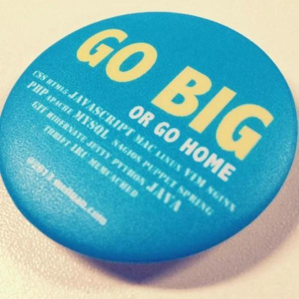

*2013-01-30 20:57 · 网页 转自jianliu*

---

### 9682

不要瞎想了。只是改个名，同时逐步开通选座功能，把美团电影做得更专业更好用一点。转@ imvenj 哦草，猫眼电影是啥！？难道卖了？@ 王兴

*2013-01-26 20:40 · 网页 转自imvenj*

---

### 9683

《云图》只要能吸引《阿凡达》一半的观众，就很有希望成为史上票房最高的电影，因为一般至少得看两遍才能看懂。

*2013-01-26 01:23 · iPhone版*

---

### 9684

在《云图》这部电影里我看到了《怒海争锋》《桃姐》《黑客帝国》

《被解放的姜戈》《普罗米修斯》《环形使者》《人猿星球之猿人崛起》等诸片的元素，但就是没看懂导演想说什么。不过，还是蛮好看的。

*2013-01-26 01:12 · iPhone版*

---

### 9685

华裔女星比华裔男星更容易被好莱坞所接受。没办法，人家是强势文

化。

*2013-01-26 00:59 · iPhone版*

---

### 9686

高级黑！转@ .rex 京巴吠日的好天气！

*2013-01-24 09:30 · 网页 转自.rex*

---

### 9687

为了避免过机场安检时被要求解皮带，我特意准备了一条没有金属皮带扣的腰带。今天果然很顺利:-)

*2013-01-24 00:21 · iPhone客户端*

---

### 9688

对哦，这钥匙怎么没齿？那怎么区别呢？

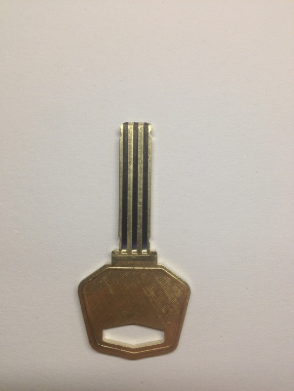

*2013-01-24 00:11 · iPhone客户端*

---

### 9689

居然碰到一个酒店还要用普通钥匙。这是想彰显他们酒店很古典吗？_-!

*2013-01-24 00:06 · iPhone版*

---

### 9690

深院打车回家，开到半路，突然发现我和的哥在一起哼着《传奇》。

不知道是谁先起的调。

*2013-01-21 00:46 · iPhone版*

---

### 9691

@ 拧巴人儿 王小峰在放他拍的电影《衰鸟向前冲》。

*2013-01-20 16:18 · 网页 给拧巴人儿的回复*

---

### 9692

我右边那哥们已经看着看着睡着了。

*2013-01-20 16:02 · iPhone版*

---

### 9693

是我。刚才伙同两个朋友冒充嘉宾未遂，被工作人员从后面的预留席

上请出来了。如果咱们都能坚持到看完这片，散场后碰一下？转@qiuyingtao @ 王兴 前面第二排那个人是你吗？

*2013-01-20 14:48 · 网页 转自qiuyingtao*

---

### 9694

来中国电影资料馆看@ 带三个表 的新作≪衰鸟向前冲≫的首映了。

*2013-01-20 13:55 · iPhone版*

---

### 9695

@ 拧巴人儿 我家乡算闽西，以前民间有山歌戏（代表作是《采茶灯》）和汉剧。

*2013-01-19 14:31 · 网页 给拧巴人儿的回复*

---

### 9696

越来越觉得，饭否像是一个村庄。

*2013-01-19 13:20 · iPhone版*

---

### 9697

多谢Kevin！看来我的旧印象可能正是来自于此…… //@ Kevin : [亚特兰大]中心城区只有这么点儿人，但是大都会区有 500W+ 人，是第九大都市圈，这不是龙岩可以比的。

*2013-01-19 00:15 · 网页*

---

### 9698

@ 苑小帅 是@ 王悦蒙 送给融融的，就放在她左手边。估计她不会介意我们沾点光:-)

*2013-01-18 22:41 · 网页 给苑小帅的回复*

---

### 9699

转@ .rex 转@ nicing 转@ 李习思 转@ 斑陀螺 简历里赫然写着一条“吃苦耐劳，能保证在需求多次变动的情况下，不对产品经理进行人身伤害”

*2013-01-18 22:38 · 网页 转自斑陀螺*

---

### 9700

我以前一直以为亚特兰大是个人口比较多的城市，刚刚才发现其实只有43万，在美国都排到30名以外，在中国也就相当于我的家乡福建龙岩（四线城市）。这种规模的城市突然涌来一大堆人开什么奥运，市民们确实会不太适应。我以前的错误印象从何而来呢？因为那里开过奥运？因为可口可乐总部在那？

*2013-01-18 22:36 · 网页*

---

### 9701

有同事比较讲究，把烤面包机带到办公室来了。我也沾点光:-)

*2013-01-18 11:02 · iPhone客户端*

---

### 9702

转@ 温馨不提示 诗比图还没。转@ 夏小茶 愿你看得见风的温柔、湖的坚硬，摸得着阳光的褶皱、野鸭的羽翅，听得见那些说不出来的话。（摄于泸沽湖 2013.1.1早晨）

*2013-01-17 08:36 · 网页 转自夏小茶*

---

### 9703

付费换彩铃和手机铃声也算是支持正版吧。转@ 拧巴人儿 姐姐我如今也是买过正版music的人了。

*2013-01-15 09:46 · 网页 转自拧巴人儿*

---

### 9704

《格调》这书太牛了，堪称三十年前的美国版装逼指南合集啊。作者

戳中了许多人的痛处，被人骂是一定的。

*2013-01-15 09:45 · 网页*

---

### 9705

转@ 东东枪 鼻腔里的中国。

*2013-01-15 09:43 · 网页 转自东东枪*

---

### 9706

今年第三周。

*2013-01-14 10:14 · iPhone版*

---

### 9707

生活中总有小惊喜。刚才在一个我去过得有二十次的酒店大堂咖啡厅和人谈事，我起身要去洗手间，服务员主动问我「先生，您是不是要去洗手间？这里有一个更近的……」确实更近，不过没人带路的话我自个儿真发现不了。

*2013-01-13 22:36 · iPhone版*

---

### 9708

出门了。pm2.5超过700的天真不是开玩笑。我怎么觉得有点气紧？是心理作用，还是这空气已经真的垃圾到能引起生理反应了？

*2013-01-12 18:23 · iPhone版*

---

### 9709

要一个人承认自己「不勤奋」并不难，他甚至可能会略有几分得意；

要他承认自己「不聪明」也不是太难；但你如果说一个人「没品味」，那这梁子就算是结下了，这恐怕比说一个人「不道德」还更招人恨。

*2013-01-11 19:04 · iPhone版*

---

### 9710

@ bridged 施密特感觉起来并不霸道，挺温文尔雅。

*2013-01-11 15:18 · 网页 给bridged的回复*

---

### 9711

刚才那老外一坐下就说「我来过中国许多次，还从来没有哪次像这次这么心情愉快，因为这次我是先去逛了北朝鲜再过来。」看来幸福感真是比较出来的-_-!

*2013-01-11 14:13 · 网页*

---

### 9712

明天中午会和其他几个互联网从业者去跟google董事长吃顿饭。但我好像真想不到什么问题要问他……

*2013-01-11 00:07 · 网页*

---

### 9713

终于把《Life of Pi》的小说原著读完了。文字比起视频有更多细节，更深入，更惊心动魄。或许是为了照顾大众口味，李安改编时已经把书里最直接挑战人性的部分删了，但这样也就把那最黑暗处残留的一点人性之光也一道删了，很可惜。看完小说我倒是有兴趣再看一遍电影，可惜已经下线了。

*2013-01-10 23:48 · 网页*

---

### 9714

转@ 盖文张 虽然我只是在广州大道中289号大院工作了8个月，但这几天依然有朋友打电话过来问候，真是让人觉得温暖。

*2013-01-07 15:42 · 网页 转自盖文张*

---

### 9715

受饭否上的朋友影响，决定把广州的华南植物园列入旅游目的地之一。之前去过北京、夏威夷和新加坡的植物园，我都很喜欢。

*2013-01-07 14:52 · 网页*

---

### 9716

@ 拧巴人儿 关岛。

*2013-01-03 09:45 · 网页 给拧巴人儿的回复*

---

### 9717

第一次开飞机，蛮刺激，一会儿就满头大汗了。开飞机和开车确实有区别：我始终觉得一个运动协调性好的男人几乎不用培训，凭本能和常识就能正常驾驶一辆汽车；而开飞机这事光靠本能和常识还真是不够。想想也对，我们祖先千百万积累下来的基因只有在陆地上奔跑的经验，并没有在空中飞翔的经验。

*2013-01-02 12:39 · iPhone客户端*

---

### 9718

当我们互道新年快乐，共迎2013时，不得不承认，基督教还是厉害。

各个文明和宗教都有自己的历法，但现在国际通用的「公历」还是源自基督教的历法。元旦这一天的确立并不像冬至和夏至那样有不以人的意志为转移的固有的物理属性，而更多只有源于宗教故事的文化属性

*2013-01-01 00:32 · iPhone版*

---

### 9719

@ LEMONed 非常抱歉。回头私聊。

*2013-01-01 00:31 · 网页 给LEMONed的回复*

---

### 9720

装上了@ realazy 开发的iPhone app「饭唠」，试发一条。

*2012-12-29 20:01 · 饭唠*

---

### 9721

转@ .rex 正能量，快到碗里来~

*2012-12-29 19:17 · 网页 转自.rex*

---

### 9722

disintermediate一词直指互联网的商业本质，深刻、宏大，可惜不够古朴优雅。

*2012-12-29 16:54 · 网页*

---

### 9723

答案即是黑客精神：anything can always be better, and nothing isever complete. 转@ 钱包控 @ 王兴 王总，您对使用过及在使用的钱包大小、材质、外观设计、卡槽数量、卡槽大小、卡片拿进拿出易用性等满意吗？

*2012-12-29 16:51 · 网页 转自钱包控*

---

### 9724

老美就是彪悍！转@ 金融界人贩子 受康州校园枪杀案的震撼，犹他州将近两百名教师日前免费上课六小时，学习如何使用枪支，以加强学校治安…图为犹他州射击运动委员会对教师开展枪支使用培训。支持者认为在校园枪案的关键几分钟内，佩枪的教师比警察更有用。

*2012-12-29 13:53 · 网页 转自金融界人贩子*

---

### 9725

转@ 武又文 转@ 教父他爹 小时候玩儿豆瓣，上面有很多约炮儿的，大多数人都是直接发豆邮问姑娘＂约炮儿么＂。我有个朋友，给姑娘发豆邮发的都是＂劳您驾，性个交＂＂借个光儿，打会炮儿＂＂您受累，让我操会儿＂据说成功率大大高于别人。——论# 为什么人和人就不能客气点儿呢不挺好的嘛 #

*2012-12-27 18:19 · 网页 转自教父他爹*

---

### 9726

多谢支持！希望不会令你失望。转@ LEMONed 刚刚进行了这辈子的第一次团购，面子还是留给了 @ 王兴 大哥 。过程是轻松愉快的，结果有待验证。

*2012-12-27 17:47 · 网页 转自LEMONed*

---

### 9727

冬天有一个好处：天气冷，衣服厚，口袋多，随身带几个电子设备一点儿也不碍事。

*2012-12-27 16:30 · iPhone版*

---

### 9728

发现有些饭友发的照片里一旦出现人，大概就只有两个tag，「村尚」

或者「自曝」，不知道二者是否有交集。

*2012-12-25 14:03 · 网页*

---

### 9729

卡佛这句话相当帅啊：你不是你笔下的人物，但你笔下的人物是你。

*2012-12-25 00:16 · iPhone版*

---

### 9730

过了一个最充实的圣诞平安夜。

*2012-12-24 23:52 · iPhone版*

---

### 9731

转@ 拧巴人儿 正式广播一下，北京的饭友们，如果你们有冬衣（包括外衣也包括手套帽子围巾干净的一定要干净的保暖秋衣秋裤厚袜子），棉被什么的要捐又不知道捐给哪里，可以告诉我。

http://is.gd/7GJlbz 我和另外的饭友盆友可以上门去取，最后一起发到黄河慈善厨房。

*2012-12-24 16:29 · 网页 转自拧巴人儿*

---

### 9732

@ 拧巴人儿 查了一下，确实对琵琶骨有多种解释。我原来的理解是锁骨，你说的可能是胛骨。

*2012-12-24 16:09 · 网页 给拧巴人儿的回复*

---

### 9733

@ 拧巴人儿 相当骨感啊！看见琵琶骨了。

*2012-12-24 15:41 · 网页 给拧巴人儿的回复*

---

### 9734

「阿里云」、「盛大云」这些名字都太干巴巴了，还是「巫山云」比较好。

*2012-12-23 09:47 · iPhone版*

---

### 9735

请问，哪部电影的调调比较接近Leonard Cohen的《Famous BlueRaincoat》这首歌？谢谢。

*2012-12-22 13:13 · 网页*

---

### 9736

够狠-_-! 转@ 带三个表 嗯哼

*2012-12-22 12:31 · 网页 转自带三个表*

---

### 9737

看到这张图时很兴奋，打定主意明天一定要到户外转一转，感受感受零下21度。但是刚才用自己的iPhone一查，现在的预报是周日只有零下13度了。空欢喜一场…… 转@ 子衿_ 北京要到-20？？？疯了吧。

*2012-12-22 12:29 · 网页 转自子衿_*

---

### 9738

世界末日之夜，必须在加完班之后直奔簋街吃一顿小辣椒重庆火锅。

小酥肉，我来了！

*2012-12-22 00:56 · iPhone版*

---

### 9739

关于这次世界末日的各种消息无比流行，生动的论证了一个和麦克卢汉对称的观点：the message is the medium.

*2012-12-21 16:45 · 网页*

---

### 9740

这种日历视图不错。我之前没用这个角度看过一年。

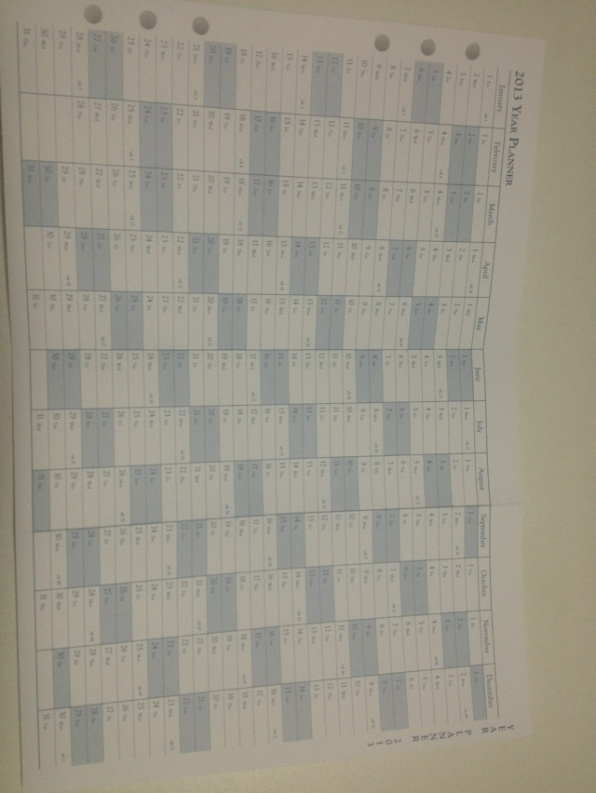

*2012-12-21 16:13 · iPhone客户端*

---

### 9741

收到老友从上海寄来的自制明信片。摄于新疆巴音布鲁克草原。谢谢！

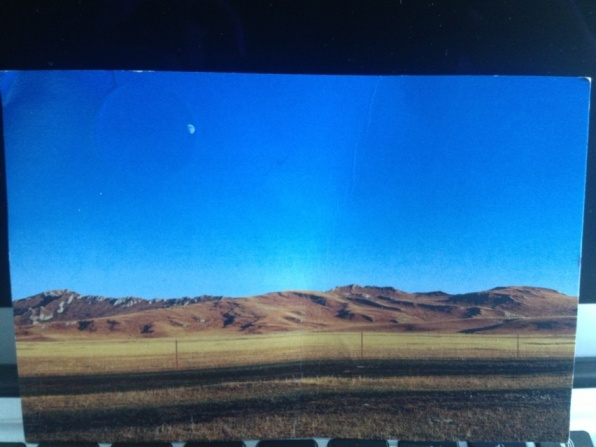

*2012-12-21 14:06 · iPhone客户端*

---

### 9742

You lose when you lose your temper.

*2012-12-20 17:02 · 网页*

---

### 9743

转@ 伏见 转@ 拱廊 「转@ 北極虾 ：和妹子说，我有一个几十亿的项目要和你合作。妹子红着脸笑了。。」

*2012-12-19 13:50 · 网页 转自北極虾*

---

### 9744

@ 小熊娃娃 orz，那回我难得用手机上一次校内，看它还把你列在聊天「在线」的好友列表里。我也很惊讶，所以就给你打了个招呼……

*2012-12-19 13:43 · 网页 给小熊娃娃的回复*

---

### 9745

@ 端木惕 很有可能。这段话确实由参加过美国独立战争的老亚当斯说出来比较合适。可能是我看到的那个来源有误。多谢提醒。

*2012-12-19 13:41 · 网页 给端木惕的回复*

---

### 9746

He who stops being better stops being good. -Oliver Cromwell

*2012-12-18 22:01 · iPhone版*

---

### 9747

We must learn the fine art of war and independence so thatour children can learn architecture and engineering...

*2012-12-18 21:14 · 网页*

---

### 9748

...so that their children may learn the fine arts and painting. -John Quincy Adams （美国第六任总统）

*2012-12-18 21:13 · 网页*

---

### 9749

@ 蒋天正 和「董事长」有啥区别？愿闻其详。谢谢！

*2012-12-16 17:05 · 网页 给蒋天正的回复*

---

### 9750

刚才在路上无聊，突然想确认一下常说的「三观」到底是哪三观。用手机搜索时我很自觉的把搜索引擎从google改成了百度，我这样算不算三观已经被改造过了…

*2012-12-16 17:03 · iPhone版*

---

### 9751

第一次吃新鲜的无花果。感觉很新奇，但谈不上特别美味。

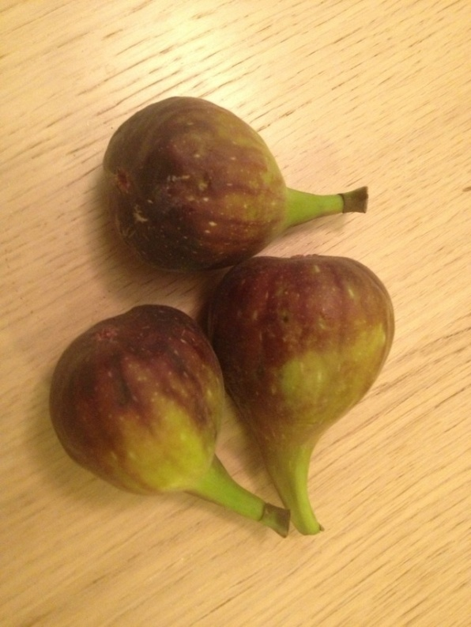

*2012-12-15 19:23 · iPhone客户端*

---

### 9752

@ webto 还不清楚。将来也不太容易搞明白，除非耗电很离谱。

*2012-12-14 23:05 · 网页 给webto的回复*

---

### 9753

胖嘟嘟的fitbit zip比它黑乎乎的大哥fitbit ultra进步明显。蓝牙4.0直接联手机，随时同步运动数据，很适合我这种出差不带电脑的人。配置起来也出人意料的容易，我没看说明书就成功的把它和iPhone配对上

了。

*2012-12-14 22:04 · iPhone客户端*

---

### 9754

浑身有点难受，估计是因为正在长胖。

*2012-12-13 23:25 · iPhone版*

---

### 9755

转@ 底牌 恋人的誓言到不了上帝的耳边

*2012-12-13 10:30 · 网页 转自底牌*

---

### 9756

刚才鼓励一个mm多读书，本想随口说“书中自有颜如玉”，后来觉得不太妥，就咽下去了。事后一想，只要加一个字就可以了嘛，书中自有颜如（宋）玉。

*2012-12-12 20:07 · iPhone版*

---

### 9757

@ 筱潇 非常感谢！请寄：北京市朝阳区北苑路甲13号北辰泰岳大厦12层美团网，邮编100107。

*2012-12-12 16:23 · 网页 给筱潇的回复*

---

### 9758

@ 拧巴人儿 wingtips一般译成「翼梢鞋」吧。「三接头」译回英文可能只能说Stitched Cap Toe Balmoral了。

*2012-12-12 14:36 · 网页 给拧巴人儿的回复*

---

### 9759

@ 拧巴人儿 我的理解是：这是标准三接头： http://v.gd/4yi6ey ，是平接的。wingtips是因为有那个翼状的拼接而得名。

*2012-12-12 14:32 · 网页 给拧巴人儿的回复*

---

### 9760

@ 筱潇 都是你俩的作品？

*2012-12-12 14:04 · 网页 给筱潇的回复*

---

### 9761

@ 拧巴人儿 这鞋是wingtips，还不是典型三接头吧。

*2012-12-12 14:03 · 网页 给拧巴人儿的回复*

---

### 9762

@ iMoe_ 昨晚我深夜回家后用app store更新时也发现速度很快。公司为什么这么慢呢……

*2012-12-12 14:01 · 网页 给iMoe_的回复*

---

### 9763

这个……真心有点夸张了吧？“有一年大年三十，宗庆后晚上8点左右跟开会的经销商说，今天过年，大家可以早点走了。第二天也可以迟一点，10点钟来上班都行。” http://is.gd/2B5L9o

*2012-12-11 22:30 · 网页*

---

### 9764

转@ 菊花女王大爷 随风潜入夜，润物细无声，啊啊啊。转@ 王兴 长安一片月，万户捣衣声。啪啪啪。

*2012-12-11 20:30 · 网页 转自王兴*

---

### 9765

长安一片月，万户捣衣声。啪啪啪。

*2012-12-11 20:16 · 网页*

---

### 9766

我一直有点纳闷“八年抗战”这个说法。这应该是从1937年卢沟桥事变算起，直到1945年日本投降。可是，那1931年的918事变算什么？“八年抗战”这提法就等于承认了1931年到1937年确实没抵抗，这倒是蛮实事求是的。据此，我推测“八年抗战”这说法是1949年前提出的。

*2012-12-11 19:55 · 网页*

---

### 9767

苹果的app store在北京已经沦落到基本不可用的状态了。

*2012-12-11 18:34 · iPhone版*

---

### 9768

一周前在福建时和小学同学聚会，席间聊起星座，我说我不懂，立刻有人指出「可当年你是第一个把星座概念带到我们班上的人啊！」我回忆了一下，确有此事，我在小学高年级时确实曾搞来一本讲星座的书并在班上传播。可是，我真的不懂，二十几年前不懂，现在依然不

懂。

*2012-12-10 14:26 · 网页*

---

### 9769

勤俭一生的老妈有个奇怪的消费逻辑。她刚从福建老家过来看我，昨天逛完楼下超市跟我说：「你们北京这里的牛油果太贵了，我下周去加州看你姐时要多吃几个，那里卖得很便宜。」

*2012-12-10 13:08 · 网页*

---

### 9770

牛逼！转@ imzxd 不拿阿里的车马费，能不发阿里的新闻稿吗？不能啊！发新闻稿也是网站记者的工作啊，而且是重要工作啊！我宁愿一个月倒贴阿里或者腾讯另外一位记者2000块，阿里的新闻稿都别再让我发了。求求你们了！

*2012-12-10 12:44 · 网页 转自imzxd*

---

### 9771

一场周杰伦的演唱会可以赚很多钱，但那是周董有本事，而不是售票台的收银员的功劳，即使周从头到尾一张钞票都没碰过。并不是谁离钱近谁就贡献大。

*2012-12-10 10:23 · 网页*

---

### 9772

难处确实有，但要是真过不去，我会提前吱声。不信谣，不传谣。

*2012-12-07 10:09 · 网页*

---

### 9773

网上好多人说《1942》“虐心”，我倒觉得这电影已经被有意无意柔化过许多了。刘震云的同名小说我没看过，但莫言的好几部小说都比这电影虐心一百倍。文字可以比影像更令人毛骨悚然。另外，“多难兴邦”真是傻逼逻辑。

*2012-12-07 10:04 · 网页*

---

### 9774

一场世界大战的输赢不是由哪国士兵的枪法准决定的。

*2012-12-06 10:06 · 网页*

---

### 9775

单论艺术性，《1942》大概也就比故事会的平均水准高一些，但我依然觉得它是不错的值得一看的国产电影。在中国，干点啥都不容易，拍一部至少能引发一部分人思考的题材有些敏感的电影就更不容易了。

*2012-12-06 01:23 · iPhone版*

---

### 9776

新版的gmail安卓客户端添了个新功能：邮件列表页里，在一封邮件上手指横刷一下，就把这封邮件归档了。手感相当流畅！

*2012-12-04 15:44 · 网页*

---

### 9777

收到大学室友寄来的贺卡和手工皂一块。他也是一个非典型清华工科男。

*2012-12-03 22:43 · iPhone客户端*

---

### 9778

一回家乡就容易想起往事。

*2012-12-03 19:06 · 网页*

---

### 9779

去拜访一个长辈，被叮嘱：“你不要到处乱跑啦，不要跑到国外去啦。

你每次跑到那些不是我们社会主义国家的地方去，我就担心得不得了…” 我实在无力解释现在的世界已经是什么样的，只能频频点头。

*2012-12-01 16:36 · iPhone版*

---

### 9780

转@ hizi ＂我喜欢少年派，这部电影其实是一则寓言，而那艘船暗指婚姻。。。这也正是我选择单身的原因，谁愿意一天到晚不停琢磨怎么和母老虎打交道？尽管她不会吃了你。。。＂----摘自@ 土摩托 的观影日记

*2012-11-30 08:22 · 网页 转自hizi*

---

### 9781

打算重读《西游记》。

*2012-11-26 19:34 · iPhone版*

---

### 9782

我给李安的新作《少年派的奇幻漂流》打五星。但是，在我的评价体系里，它还不是最顶级的，它属于“可以给五星但是没必要看第二遍”，上面还有一档“值得看多遍，每次看都给五星”。

*2012-11-25 01:10 · iPhone版*

---

### 9783

出乎我的意料，维基百科里居然至今没有O2O这个词条。我觉得，这并不说明O2O是个非常新的概念，而是更多说明维基百科对新信息的吸纳能力已经逐渐下降了。

*2012-11-23 18:25 · 网页*

---

### 9784

北京住房贵，但其他很多生活成本并不高。我妈说（五道口附近）北京的菜价比老家福建龙岩那里还便宜。转@ realazy 南宁天然气四块六一个字，不禁怀念起北京两块钱的幸福生活。

*2012-11-22 10:05 · 网页 转自realazy*

---

### 9785

又一个小例子：现在国人借用老外的说法“xxx很in”，这个“in”和古诗“画眉深浅入时无”里的“入”就是一个道理。

*2012-11-19 19:29 · 网页*

---

### 9786

“二十年前我编程的时候…” 这句话现在我也有资格说，但并没有很多自豪感。我会编程，但算不上一个有成就的程序员。相反，它让我想起另一个说法：年纪是这世界上少数可以不劳而获的东西之一-_-!

*2012-11-16 14:07 · iPhone版*

---

### 9787

≪一次别离≫这部伊朗电影果然和好莱坞大片风格完全不同。爱情、

亲情、婚姻、家庭、金钱、道德、宗教、法律、人性、普世价值，全

都如此真实的推到你面前，简直真实到让人难以承受。

*2012-11-16 01:14 · iPhone版*

---

### 9788

苏格拉底的死是史上最高贵的死，比阿基米德之死、谭嗣同之死和“不自由，毋宁死”都还牛逼一百倍。

*2012-11-15 21:27 · iPhone版*

---

### 9789

认真，你就赢了。尤其是在这么糙的环境里。

*2012-11-15 21:18 · iPhone版*

---

### 9790

说实话，我每次听到《小情歌》，就会莫名其妙的联想到火锅店的「小酥肉」。其实，这两者好像都和「小」没啥关系。

*2012-11-14 15:39 · 网页*

---

### 9791

我必须羞愧的承认，我已经有相当长一段时间没有翻墙了。

*2012-11-14 12:09 · 网页*

---

### 9792

mac os x的云计算还是蛮彻底的嘛：我今天白天在办公室的macbook自带的拼音输入法里设置了「」的快捷输入方式，晚上回到家里想在imac上同样设置一番，打开设置才发现居然已经自动同步过来了。

*2012-11-11 00:31 · 网页*

---

### 9793

此刻，我的chrome里竟然同时开着97个tab。之前我知道我同时开着很多tab，但是没想到有这么多-_-!

*2012-11-10 16:44 · 网页*

---

### 9794

试一下「古朴」的中文直角引号。

*2012-11-10 10:08 · 网页*

---

### 9795

≪是否应该以及如何尊重一个傻逼≫,这是对我们刚才的周末讨论会最

标题党的概括。

*2012-11-09 19:02 · iPhone版*

---

### 9796

转@ .rex 肚子饿时仍然不见小，便是真的大了。

*2012-11-08 00:18 · 网页 转自.rex*

---

### 9797

王小波在《我的师承》里写道：假如中国现代文学尚有可取之处，它的根源就在那些已故的翻译家身上。我们年轻时都知道，想要读好文字就要去读译著，因为最好的作者在搞翻译。这是我们的不传之秘。

*2012-11-07 23:20 · 网页*

---

### 9798

一个叫“大选”，一个叫“换届”。

*2012-11-07 16:34 · 网页*

---

### 9799

最怕货比货。只不过把玩了几分钟iPad mini，再回头看iPad3，就觉得iPad3的边框那么宽那么丑。

*2012-11-07 16:31 · 网页*

---

### 9800

刚跟生活在硅谷的朋友聊天。她说今天公司里没有人讨论总统大选，估计大部人都不是美国公民。倒是她5岁的女儿一回家就催她快开电视。“Mitt Romney的名字从她的嘴里蹦出来时我也颇为诧异，前不久她才会说自己的全名呢。”

*2012-11-07 12:34 · 网页*

---

### 9801

这两点同样重要：1、站在历史正确的那一边；2、能扛到那一天。

*2012-11-05 10:18 · 网页*

---

### 9802

@ 小熊娃娃 我以前没看过莫言的小说，最近看了两部，觉得确实水平比《白鹿原》高出一截。

*2012-11-04 22:12 · 网页 给小熊娃娃的回复*

---

### 9803

周日睡了个懒觉，还在被窝里就看到网上说外面下雪了。起床前先背一首应景的宋诗：僵卧孤村不自哀，尚思为国戍轮台。夜阑卧听风吹雨，铁马冰河入梦来。－陆游《十一月四日风雨大作》

*2012-11-04 11:11 · 网页*

---

### 9804

The main thing is to keep the main thing the main thing. --JimBarksdale

*2012-11-01 19:02 · 网页*

---

### 9805

今天学到了：“知耻近乎勇”出自《中庸》，前面两句是“好学近乎知，力行近乎仁”。这两句也很棒啊，特别是“好学近乎知”，非常适用于现在这个信息爆炸、知识结构需要快速更新升级的时代。老祖宗的智慧真不是盖的。

*2012-11-01 18:53 · 网页*

---

### 9806

保险真是最特别的商品，你为它付了钱，但却希望派不上用场。

*2012-11-01 14:02 · 网页*

---

### 9807

随着年龄增长，我的白袜子越来越少，黑袜子越来越多。

*2012-11-01 12:19 · iPhone版*

---

### 9808

当一个手机大到像三星note2这个程度时，会带来一个额外的好处：上公共厕所时心里很安宁，因为我觉得即使起身时note2不幸从口袋里掉出来了，它也会卡在那种蹲厕的管道口而掉不下去。

*2012-10-30 16:24 · 手机上网*

---

### 9809

看问题的角度很重要。自从我认为更换手机不是个人消费行为而是有利于工作的投资之后，我买新手机的间隔就从18个月降到了6个月左右。

*2012-10-29 10:46 · 网页*

---

### 9810

西裤的裤裆拉链拉下来时那种细腻滑顺的感觉是仔裤拉链完全无法比拟的。

*2012-10-28 13:02 · iPhone版*

---

### 9811

专业人士“呵呵”一下就是表示对业余读者的读后感不屑置评？转@ 熊阿姨 呵呵。转@ 王兴 读完了≪当我们谈论爱情时我们在谈论什么≫。卡佛的这个短篇小说确实细节描写很见功力，让人身临其境，可是，结尾似乎有点仓促，至少和我的期望值不相符。

*2012-10-27 22:58 · 网页 转自王兴*

---

### 9812

读完了≪当我们谈论爱情时我们在谈论什么≫。卡佛的这个短篇小说确实细节描写很见功力，让人身临其境，可是，结尾似乎有点仓促，至少和我的期望值不相符。后来,村上春树出了一本书名叫≪当我谈论跑步时，我在谈论什么≫，据说就是为了向卡佛致敬。

*2012-10-27 22:35 · iPhone版*

---

### 9813

晚饭时，一个朋友向我推荐卡佛的短篇小说。据说，此人是海明威之后美国最具影响力的短篇小说家，是小说界的“简约主义”大师。于是，刚才回到办公室，我打开电脑就google“卡佛”；可是，可是，我承认，搜索结果里另一个卡佛吸引了我的注意力。

*2012-10-27 20:40 · 网页*

---

### 9814

转@ 喵呜.杨曜睿 好文！ 转@ LisztLi 分享：《微，不足道 | 36氪》

http://www.36kr.com/p/16188...

*2012-10-23 17:20 · 网页 转自LisztLi*

---

### 9815

有些人热衷于区分“创业者”和“企业家”。在英语里，这俩概念是同一个词，entrepreneur，源于法语。顺便说一句，现代汉语里的“企业”这个词是从日语里搬过来的，而日语里的这个词是明治维新之后大规模引入西方文化时诞生的。喜欢标榜自己纯粹的语言是没竞争力的，兼容并包才是王道。

*2012-10-23 14:24 · 网页*

---

### 9816

转@ 拧巴人儿 有一回跟莫扎特去买滑雪手套衣服，在雅秀。我讲好价钱掏出钱包了，莫扎特一把夺了过去，说“我来！你走！” 然后就开了个特低的价，和老板展开了拉锯战。中途老板说，“你这么抠门儿！

找不着媳妇儿！” 莫扎特说，“我不要媳妇儿，要钱！” 之后我再也没跟他去过雅秀，并发誓永远不。

*2012-10-23 14:17 · 网页 转自拧巴人儿*

---

### 9817

梁冬讲东西虽然不太科学不太准确，但是确实蛮有趣蛮好玩。

*2012-10-21 10:30 · iPhone版*

---

### 9818

发现戴眼镜有另一个坏处：想把笔架在耳朵上时架不牢。

*2012-10-20 16:30 · iPhone版*

---

### 9819

“ 你可以永远忽悠某些人，也可以暂时忽悠所有人，但你不可能永远忽悠所有人”。 ——林肯

*2012-10-18 12:34 · 网页*

---

### 9820

对内外部了解越多，就越觉得美团还是个非常山寨的公司，正如中国还是个非常山寨的国家。我有信心改变前者，并希望对改变后者有所贡献。

*2012-10-18 12:17 · 网页*

---

### 9821

@ 弥城 我早就卸了云词4，继续用云词3。

*2012-10-17 00:28 · 网页 给弥城的回复*

---

### 9822

永远不要老得忘记自己年轻时也曾那么不靠谱。

*2012-10-14 15:51 · 网页*

---

### 9823

百度音乐让我终于有了在手机上登录百度账号的理由。

*2012-10-14 15:47 · 网页*

---

### 9824

“ 爹呀爹，您胆大包天，您是黄鼠狼子日骆驼，尽拣大个的弄。” 莫言的作品里好多乡土荤话啊。

*2012-10-14 02:32 · 网页*

---

### 9825

“这个拔屌无情的狗东西”，莫言的语言好生动好乡土。

*2012-10-14 02:15 · 网页*

---

### 9826

惭愧，以前没读过莫言的作品。今天看了《檀香刑》。确实是生动有力的小说！不知道莫言对凌迟那细致入微的描写和真实场景有多相符……

*2012-10-13 00:00 · 网页*

---

### 9827

我在知乎提了一个问题：“创新”这个词在汉语里是何时出现的？这个概念是舶来品吗？ http://t.cn/zll2JQx

*2012-10-11 14:48 · 网页*

---

### 9828

我最喜欢的态度是：一边建设一边建设性的批评。

*2012-10-10 17:29 · 网页*

---

### 9829

我的理解就是这两个成语都是贬义的。问题就是这两类错误几千年来

人们一直在犯。

*2012-10-10 13:17 · iPhone版*

---

### 9830

继“刻舟求剑”之后，“守株待兔”成为另一个深得我心的成语。老祖宗的提炼能力真不是盖的！

*2012-10-10 13:02 · iPhone版*

---

### 9831

把玩了一下同事的iPhone5，第一印象很好，重量轻，屏幕长。

*2012-10-10 11:23 · iPhone版*

---

### 9832

虽然过去五年的智能手机基本没跳出iPhone一代的框架，主要改进就是更快更大（或更长），但我对未来充满期待。我并不认为手机差不多就这样了。如果拿手表打比方，现在我们更像在怀表时代，还没进入腕表时代呢。

*2012-10-06 13:28 · iPhone版*

---

### 9833

我对李鸿章这个人越来越感兴趣了。有什么关于他的好书或者其他信息来源推荐吗？谢谢。

*2012-10-06 03:48 · iPhone版*

---

### 9834

游挪威峡湾时不禁想起中学课文《与朱元思书》对钱塘江上游的描写：“夹岸高山，皆生寒树，负势竞上，互相轩邈，争高直指，千百成峰”。虽然时间上隔了上千年，空间上隔了数万里，温度也差了几十度，但却如此贴切，真是有趣。

*2012-10-05 21:45 · Android客户端*

---

### 9835

刚才在机场过海关时，那个年轻的工作人员翻了翻我的证件，冷不丁问了我一句：“人人网卖得可惜吗”？太雷人了-_-！

*2012-10-01 14:45 · iPhone版*

---

### 9836

“举杯邀明月，对影成三人”，李白的这两句神来之笔给我留下难以磨灭的印象。每当看到月亮，尤其是气温偏低的时候，总会想起。

*2012-10-01 01:19 · 网页*

---

### 9837

《环形使者》并不是一部完美无缺的大片，但是绝对扣人心弦。智商中等的观众能最好的享受本片，太低了的话可能看不懂，太高了的话可能会忙于抓bug而忘了欣赏。

*2012-10-01 00:23 · 网页*

---

### 9838

《环形使者》无疑是我今年到目前为止看过的最扣人心弦的电影，比《普罗米修斯》更有科幻色彩，比《敢死队2》场面更火爆，比《蝙蝠侠：黑暗骑士崛起》更拷问人性，真正达到了“全场无尿点”的紧张程度。少儿不宜。

*2012-09-30 23:56 · 网页*

---

### 9839

北京哪里有靠谱的陕西面食？哪里有靠谱的山西面食啊？

*2012-09-30 12:18 · 网页*

---

### 9840

@ 底牌 那个公园的松树不错，但是跟红花尔基森林公园一比就是小巫见大巫了。

*2012-09-30 11:43 · 网页 给底牌的回复*

---

### 9841

作为CEO，我要为这个公司里发生的一切事情负责，我更要为这个公司里该发生但却没发生的事情负责。

*2012-09-29 23:11 · 网页*

---

### 9842

办公室超安静。

*2012-09-29 23:00 · 网页*

---

### 9843

转@ 咬指头 夸一个女人最好的一句话是：这娘们儿长得真特么壮阳！

*2012-09-29 20:47 · 网页 转自咬指头*

---

### 9844

今天北京空气十分清澈，我站在窗边能清楚的看到香山。心血来潮，我在谷歌地图上量了一下，从我们位于奥林匹克森林公园东边的办公室到香山的直线距离大概是18公里；再查了一下维基百科，连接地中海和大西洋的直布罗陀海峡最窄处只有14.3公里。真窄啊，只要不起雾，岸上应该能看到每条船的进出。

*2012-09-29 10:33 · 网页*

---

### 9845

在知乎上看到：华为任正非的前岳父是前四川副省长孟东波。之前听说，万科王石的岳父王宁是前广东省委副书记兼政法委书记，父亲曾任郑州市委书记、柳州铁路局副局长。 联想柳传志的父亲柳谷书是金融和法律界的资深人士，中华全国专利代理人协会的首任会长。当然，我相信这三位都是有真本事的企业家。

*2012-09-27 10:52 · 网页*

---

### 9846

美国并不是一潭死水的国家，连银行业都变动很快。我离开美国不到十年，我用过的三家银行都被并购了。

*2012-09-27 10:05 · 网页*

---

### 9847

五四运动过去快一百年了。德先生没请来，这大家都清楚。最近我越来越意识到，其实赛先生也没请来，这就更让人沮丧了。

*2012-09-24 11:48 · 网页*

---

### 9848

昨晚经历了一场我有生以来做过的最栩栩如生的僵尸题材的梦，就是

和《生化危机》那场景差不多的。我在最后一刻醒了…

*2012-09-23 08:19 · iPhone版*

---

### 9849

经历过无数次无线升级失败后，终于通过有线把我的iPhone 4S升级到iOS6了…

*2012-09-21 11:08 · iPhone版*

---

### 9850

昨晚从一个食品行业资深人士那里听说了一个惊悚的观点：如果政府真的彻底打击地沟油，随之而来的食用油价格上涨可能导致三分之一人几乎吃不起油。

*2012-09-21 10:09 · 网页*

---

### 9851

终于有一天是在12点前上床的了。

*2012-09-14 23:50 · 网页*

---

### 9852

有感而发，再转一遍：The future is already here. It's just unevenlydistributed.

*2012-09-12 23:09 · 网页*

---

### 9853

出差时走得匆忙，忘带电动剃须刀了。找了个吉列刀片式的，用不惯，刮完之后明显能感觉到皮肤上有很多细小的伤口:-( 这年头有多少人还用刀片式剃须刀啊？

*2012-09-07 09:59 · iPhone版*

---

### 9854

@ 拧巴人儿 看仔裤上那些褶皱，要么是裤子不合身、太长，要么就是臀部曲线不够好。

*2012-09-04 16:15 · 网页 给拧巴人儿的回复*

---

### 9855

在窗边吹了一会儿凉风，心情舒畅，想起刘禹锡的两句诗“自古逢秋悲寂寥，我言秋日胜春朝”。不知道刘老先生当年是在何地写的此诗，至少在北京，我非常同意秋天比春天更可爱。

*2012-09-04 13:12 · 网页*

---

### 9856

秋高气爽的天气真是太棒了！早晨我在上班的路上不禁想，“一阵秋雨一阵凉”是屡试不爽的生活经验，但原因呢？到底谁是因谁是果？是因为下了一场雨从而变凉，还是因为本来就有一股冷空气袭来所以容易下雨？

*2012-09-03 09:34 · 网页*

---

### 9857

我出去看了一下，明月如镜，于是我也挥挥手打个招呼，不求月球上的朋友看到，但是想到理论上地球上另一个角落里的人可以通过月球反射看到，就满足了。

*2012-08-29 00:57 · iPhone版*

---

### 9858

1776年是个重要年份。那一年，美国建国，瓦特的首台蒸汽机投入使用，亚当斯密出版≪国富论≫，中国当时是乾隆四十一年。

*2012-08-29 00:31 · iPhone版*

---

### 9859

又一波朋友向我推荐《中国好声音》之后，我终于决定上网看一下。

没想到，第一个歌手就让我热泪盈眶。我没法不想起这句话：有事做，有人爱，有希望。

*2012-08-28 21:16 · 网页*

---

### 9860

山和浪真的截然不同吗？3000万年前，喜马拉雅山那一带是汪洋大海，后来地壳板块运动的一个大“浪”，把那里从海底推成了世界第一高山。所以，山也是浪，也会起起落落，只不过山是地壳的浪，比海水的浪慢了大概一百万亿倍。

*2012-08-25 19:00 · 网页*

---

### 9861

转@ 筱潇 其实，"时间"才是检验真理的唯一标准。

*2012-08-23 23:43 · 网页 转自筱潇*

---

### 9862

谢谢“云词”这个免费app。它在易用性方面还有明显的提升空间，但它那能提醒我定期复习的生词本功能帮助我在过去两年多里记住了阅读中碰到的一千个英文生词。 http://remword.cn

*2012-08-22 14:06 · Android客户端*

---

### 9863

北京夜里的气温已经降了许多，坐在窗边看书已经有几分凉意。

*2012-08-22 00:18 · 网页*

---

### 9864

整个台湾岛的面积只相当于50个北京五环？这么一比较，突然觉得宝岛小得不可思议。但，这是事实，北京五环的面积大概是700平方公里，台湾岛则是3.6万平方公里。

*2012-08-21 23:10 · 网页*

---

### 9865

原来“东床快婿”这个典故里的男主角就是王羲之，而且跟是否装逼很有

关系。 http://is.gd/R6fVF1

*2012-08-19 13:36 · 网页*

---

### 9866

奶奶脑溢血后卧床不起五年多，今早终于离我而去。生命真是既脆弱又顽强。愿她老人家安息。

*2012-08-12 21:58 · 网页*

---

### 9867

升级到os x 10.8已经一个星期了，还没体验过notification center这个新功能。好像我的mac里没什么软件会给我发通知。

*2012-08-08 23:42 · 网页*

---

### 9868

转发自molly：听来的：话说一位上市的女CEO, 年轻时忙于创业，一直到公司上市后，才想起自己的婚姻大事。经朋友介绍认识一男士，见了几次后，CEO女士说，咱俩赶紧把证领了吧。男士说，别急，咱应该多见几次再说。女CEO说，没问题，那咱们一天多见几次面吧...

各位自己品味。

*2012-08-08 20:03 · 网页*

---

### 9869

原来马云和亚马逊的创始人贝索斯都是生于1964年。为什么我以前一直以为贝索斯比马云更年轻呢？

*2012-08-08 19:52 · 网页*

---

### 9870

安卓和iPhone自带的日历都不支持农历生日提醒，但老妈等长辈还是习惯过农历生日。所以，目前我能想到的最好办法是每过完一个生日就查好明年的农历换成公历的日子，然后记到手机里。

*2012-08-07 15:41 · iPhone版*

---

### 9871

立秋。

*2012-08-07 09:00 · iPhone版*

---

### 9872

开始今年的第32周了。安卓和iOS的日历都不显示本周是第几周，在这方面还不如Symbian呢。我是往google calendar里加了一个插件才解决这个问题。 http://v.gd/wtI1B8

*2012-08-06 10:27 · 网页*

---

### 9873

转@ 拧巴人儿 从洗完的短裤兜里掏出六十多块钱。阿姨，你知不知道洗钱是违法的？

*2012-08-04 23:14 · 网页 转自拧巴人儿*

---

### 9874

mac os x升级到10.8 mountain lion后，输入省略号的方式变成option + ; 了。顺便试了一下，option + = 是 ≠，option + / 是÷，这俩还比较容易理解和记忆，不过也没啥实用价值。

*2012-08-03 13:34 · 网页*

---

### 9875

启用我半年来的第三个fitbit。第一个掉进蹲厕马桶里捡不回来了，第二个掉在坝上草原找不到了...

*2012-08-03 09:58 · 网页*

---

### 9876

在一篇马友友的访谈里看到一个有趣的 说法：繁体字里，音乐的“乐”（樂） 是“药”（藥）字的一部分，可以理解为音乐 有治愈的作用。

*2012-08-02 19:16 · iPhone版*

---

### 9877

美团网单月交易额突破5亿了 谢谢所有支持美团网的消费者、商家和我们分散在全国近百个城市的可爱的同事们！5亿在英文里通常被称为“半个十亿“(half a billion)，这说法是个很好的提醒：其实我们的路才刚刚开始，连一半都远远没到呢。纵情向前！

*2012-07-31 17:23 · 网页*

---

### 9878

食指指甲应该特意留得更短一些，以便点击触摸屏。

*2012-07-31 13:02 · 网页*

---

### 9879

转@ Pentacle. 朋友，只要你还愿意吃鸡脖鸡爪你就不算懒人！！

*2012-07-31 09:30 · 网页 转自Pentacle.*

---

### 9880

"If we have data, let’s look at data. If all we have are opinions,let’s go with mine." -Jim Barksdale (CEO of Nescape, COO ofFedEx)

*2012-07-30 22:54 · 网页*

---

### 9881

逛一个英文论坛时看到 midwife 这个陌生单词，查查词典才发现我想歪了-_-! 词义是“助产士、接生婆”。

*2012-07-30 20:10 · 网页*

---

### 9882

拉开窗帘，北京居然又下雨了。突然想起这首诗：千里莺啼绿映红，水村山郭酒旗风。南朝四百八十寺，多少楼台烟雨中。

*2012-07-30 17:32 · 网页*

---

### 9883

牛逼！转@ krashna 这内涵贴。乃们以为乃们真可以改变世界么。。

。

*2012-07-30 14:24 · 网页 转自krashna*

---

### 9884

花19.99美元通过App Store升级到 OS X 10.8 Lion 了:-)

*2012-07-29 19:01 · 网页*

---

### 9885

原来男式上衣尺寸“175/96A”里的A是这个意思：男子体型分类的代号有Y、A、B、C。Y表示胸围与腰围之差数在17~22厘米；A表示差数在

12~16厘米；B表示差数在7~11厘米；C表示差数在2~6厘米。

*2012-07-29 00:54 · 网页*

---

### 9886

天将拂晓，延误了五个小时的航班终于到京。

*2012-07-28 05:00 · iPhone版*

---

### 9887

出差时自带一双拖鞋，虽然略微有点麻烦，但是舒适许多。

*2012-07-25 22:03 · 网页*

---

### 9888

其实，夏天穿西裤比穿仔裤更舒服，因为更凉快。

*2012-07-24 19:10 · iPhone版*

---

### 9889

我越来越喜欢safari的reader功能，不管是在mac上还是在ipad上。我经常从别的浏览器（主要是chrome）切换到safari去，就是为了用reader功能把网页上的内容简化成标准的易读格式。

*2012-07-24 00:29 · 网页*

---

### 9890

六十年一遇的大雨过后，北京的空气真棒！北边的燕山和西边的太行山余脉都清晰可见。

*2012-07-22 10:44 · Android客户端*

---

### 9891

同时使用iPhone/安卓手机/iPad/安卓平板各一部并通过各种云服务同步日历的结果是，一条日历事项到期提醒时，四个设备的不同铃声几乎同时响起，像是一个迷你合唱。

*2012-07-20 19:28 · 网页*

---

### 9892

听同事说安卓平板市场前景很好，我把半年前刷机时不幸变砖的kindlefire又翻出来试用。请懂行的技术部同事帮忙恢复之后，我发现kindlefire其他一切都还好，就是屏幕分辨率实在太低了。我的眼睛已经被苹果的视网膜屏和三星galaxy的高清屏惯坏了⋯⋯

*2012-07-20 17:29 · 网页*

---

### 9893

“没心没肺”确实是一种无忧无虑的可爱状态，但是整天把这事拿出来自我标榜那就是无脑的表现了。

*2012-07-16 11:22 · 网页*

---

### 9894

这场朝四面八方飞的雨让我觉得仿佛回到故乡。

*2012-07-10 19:15 · iPhone客户端*

---

### 9895

我终于也从一个携程用户转成去哪儿用户了。只要服务基本可靠，便宜就是王道。

*2012-07-07 19:29 · 「御飯 iPhone」*

---

### 9896

@ 苑小帅 配上：“受”性大发？

*2012-07-04 19:06 · 网页 给苑小帅的回复*

---

### 9897

thank you!

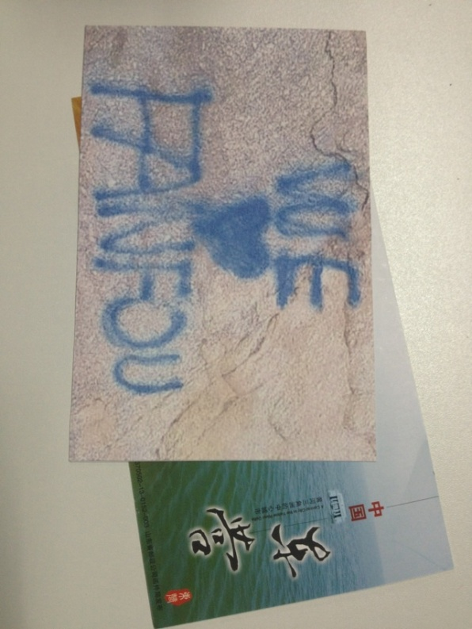

*2012-07-04 18:42 · iPhone客户端*

---

### 9898

那些“只要保持当前增长速度，在20xx年前中国经济将超过美国”的说法等同于“只要我外甥保持去年的长高速度，他将在38岁时身高超过姚明”。

*2012-07-04 15:56 · 网页*

---

### 9899

养成驾驶好习惯：上车第一件事是系安全带而不是启动车子。除非你进车里不是为了开车而是为了车震。

*2012-07-04 10:04 · iPhone客户端*

---

### 9900

最近半年每天早上都会看看奥林匹克森林公园里的这个钢铁擎天柱。

一开始长得很快，每天都高出一截，后来几个月似乎就停滞不前了。

我相信，其实施工并没有停，只是具体工作不会有最初搭架子时看起来进展那么明显。很多事情都是这样。

*2012-07-03 11:45 · iPhone客户端*

---

### 9901

这期《经济学人》里有篇《The real wealth of nations》给各国财富（而非GDP）排名：美日中德英法⋯ 财富分三块：制成资产（机械设备、建筑、基础设施等）、人力资本（国民的教育水平和技能等）、自然资源（土地、林木、矿产等）。日本的主要是第二块，沙特则是第三块。

*2012-07-02 10:20 · 网页*

---

### 9902

@ realazy kindle是王道啊。

*2012-07-01 17:53 · 网页 给realazy的回复*

---

### 9903

英语中，husband这个单词除了名词“丈夫”，还有一个意思是动词“节俭使用”。这说明什么？

*2012-07-01 10:58 · iPhone版*

---

### 9904

老爸用了一年iPad，终于主动提出要换智能手机了。我真的不敢考虑让他用安卓，还是未越狱的iPhone最保险。这就是苹果品牌的价值吧。

*2012-06-30 11:05 · 网页*

---

### 9905

@ jingjing 《小芳》不是讲上山下乡的知青和当地姑娘的一段恋情吗？

*2012-06-28 19:59 · 网页 给jingjing的回复*

---

### 9906

突然觉得最近一周北京的天气像成都，虽然我只在去年8月在成都呆过3天。

*2012-06-28 11:53 · 网页*

---

### 9907

法国大革命中，化学家拉瓦锡因为拥护路易十六而被处死。他死前还约刽子手做了一个科学实验：通过不停眨眼判断人头跟身体分离后还能存活多久。据提着头颅的刽子手说，拉瓦锡的眼睛至少眨了11下。拉瓦锡的科学精神真是不服不行啊！

*2012-06-26 15:03 · 网页*

---

### 9908

好久不加油，发现93号变92，97号变95了。

*2012-06-23 22:21 · iPhone客户端*

---

### 9909

久不运动而突然猛练一通的结果是，必须做好准备，很可能第三天肌肉会比第二天更酸痛-_-!

*2012-06-23 15:24 · 网页*

---

### 9910

谈到1960年前后的三年大饥荒，爸爸说家乡福建龙岩也饿死了很多

人。60年的除夕，他一整夜都没睡着，因为实在是太饿了。我的曾祖母当时也差点饿死，已经严重浮肿了，皮肤肌肉失去弹性，用手一按一个坑，久久都恢复不了。后来政府见势不妙，放松了政策，允许各家自己种点菜养几只兔子，那样才没死更

*2012-06-22 20:51 · iPhone版*

---

### 9911

爸爸来京。晚饭时谈起58年大炼钢铁的荒谬，他说那时他虚岁才九岁，也要徒步二十公里去挑铁矿…

*2012-06-22 20:35 · iPhone版*

---

### 9912

几年不进健身房了，受同事们影响，今天终于去了趟办公室边上的奥迈健身。把那里二十来种器械全做了几遍，看明天哪块肌肉最酸^o^！

*2012-06-22 11:21 · iPhone版*

---

### 9913

今天居然是夏至。今年最长的一个白天就这么过去了，黑夜将越来越长。

*2012-06-21 20:00 · iPhone版*

---

### 9914

转发：一个合格的程序员是不会写出诸如“摧毁地球”这样的程序的。他们会写一个函数叫“摧毁行星”，然后把地球当一个参数传进去。

*2012-06-21 10:57 · 网页*

---

### 9915

参观好公司是一种极其有效的学习方法，值得花时间、花钱，甚至花股份。最著名的例子：79年12月，乔布斯为了换取参观施乐PARC的机会，给施乐以100万美元买10万股苹果pre-IPO股票的权利。80年12月，苹果上市，这笔股票值1700万美元。苹果得到的则是划时代的图形界面创意。

*2012-06-21 10:35 · 网页*

---

### 9916

以仔细擦拭眼镜作为在电脑前一整天工作的开始。

*2012-06-21 09:37 · 网页*

---

### 9917

@ qinyf 据说04/05年间，google有的技术管理者一度有七八十个直接下属。

*2012-06-20 16:39 · 网页 给qinyf的回复*

---

### 9918

收到google寄来的提醒邮件，赶紧去更新了google wallet里的信用卡信息，以便两天后自动续订买20G空间每年$5的老套餐。老套餐已经不能再申请了，新套餐改成25G空间每月$2.49，贵了不少。

*2012-06-20 16:09 · 网页*

---

### 9919

刚在沙发上眯了一觉，只花了12.5分钟。

*2012-06-20 14:22 · iPhone客户端*

---

### 9920

入手kindle并绑定信用卡帐号一定要慎重！钱会开始源源不断的变成电子书，不管这些书你最后看没看完⋯⋯ 转@ qinyf 之前没需求。发现当我开始想在amazon买书的时候，还真的开始对kindle有兴趣了。

*2012-06-19 16:35 · 网页 转自qinyf*

---

### 9921

正是看书的好时候。转@ imzxd 早上7点半的确是没什么新闻好看，各大网站都还没更新呢。

*2012-06-19 08:13 · 网页 转自imzxd*

---

### 9922

终于，以后讲定位理论的“细分市场以确保第一的原则”时不用再举林德伯格和埃尔哈特飞越大西洋的例子了，可以举更本土的例子：你知道中国第一个宇航员是谁吗？知道吧？你知道中国第二个宇航员是谁吗？不知道吧？你知道中国第一个女宇航员是谁吗？知道吧？

*2012-06-18 19:45 · 网页*

---

### 9923

牛逼的杂志需要有代表性的牛逼文章。对我来说，《大西洋月刊》的高端形象是牢牢的和1945年Vannevar Bush发表在她上面的那篇划时代的《As We May Think》联系在一起的。 http://v.gd/JOY4SJ

*2012-06-18 14:56 · 网页*

---

### 9924

就算是new balance 993也没有一双合脚的拖鞋舒服。

*2012-06-18 14:11 · 网页*

---

### 9925

转@ 钟永健 在和人沟通的过程中，如果对方没明白你的意思，很多人通常会说“听明白了么”，显然，这说法应该换成“我说清楚了么”——听清楚不是听众的义务，讲明白反而是讲述者的责任。

*2012-06-18 14:10 · 网页 转自钟永健*

---

### 9926

@ 拂汗 很想和你来个隔空的握手:-)

*2012-06-18 09:38 · 网页 给拂汗的回复*

---

### 9927

突然发现《时代》周刊挺便宜的，一年加上增刊有56期杂志，还附送网站和iPad app等在线内容访问权，一共才收30美元，也就是190人民币。平均下来一期才3块4人民币，比国内任何杂志都便宜吧？可惜不支持配送到中国⋯⋯

*2012-06-17 16:06 · 网页*

---

### 9928

如果想了解美国大众媒体眼中的世界当代史，把《时代》周刊从1927年到现在的85个年度人物浏览一遍是不错的办法。

http://v.gd/qT3PYS

*2012-06-17 15:11 · 网页*

---

### 9929

前克格勃特工确实霸气。转@ 左小祖咒 【普京关于领土的语录】没有实力，愤怒就没有意义。领土问题没有谈判，只有战争。我罗斯的缰土确实很大，但没有一寸是多余的。与各位中国同志共勉。

http://t.cn/zOT0H0O

*2012-06-17 14:56 · 网页 转自左小祖咒*

---

### 9930

让人有点晕的英语多义多音词：worst既是形容词bad的最高级，又是及物动词“打败，胜过”；worsted既是动词worst的过去分词，意思是“被打败，被战胜”，念 [w :st d]，又是名词和形容词“精纺毛纱”和“精纺的”，念[ w st d]。

*2012-06-17 14:54 · 网页*

---

### 9931

这话好酷。Deus Ex: "At the edge of humanity, there's nothing tostop you falling."

*2012-06-14 12:09 · 网页*

---

### 9932

一转眼又到了毕业的季节。这篇《赠与今年的大学毕业生》是胡适先生1932年写的，我几乎每年都翻出来看一遍。 http://t.cn/SVRq1b

*2012-06-14 10:48 · 网页*

---

### 9933

在新版iOS里，facebook里好友的生日提醒会自动加到你的iPhone日历里⋯⋯

*2012-06-14 10:21 · 网页*

---

### 9934

哥们，你真闲！我自己都没回头看过。转@ ShanHo @ 王兴 我居然把你饭否上的6000多条消息都看完了，收获很大

*2012-06-14 10:20 · 网页 转自ShanHo*

---

### 9935

@ 清越 丽江产三文鱼吗？

*2012-06-13 20:12 · 网页 给清越的回复*

---

### 9936

打算每周把iPad里《The Economist》当期的几篇免费文章读一读，也算了解一下世界大事。

*2012-06-13 20:11 · 网页*

---

### 9937

我不懂法语，但是中文译名《追忆似水年华》比英文译名《Remembrance of Things Past》显然更文艺。

*2012-06-13 19:39 · 网页*

---

### 9938

technique/technology这俩词和architect里的tect都来自同一个古老的词根tekt，都代表与“建造”、“结构”、“形式”有关。这倒是我之前从来没想过的。

*2012-06-13 19:35 · 网页*

---

### 9939

@ 远骋 有些地方则有街头艺术家把自己全身涂黑了摆个造型扮雕像。

*2012-06-13 19:27 · 网页 给远骋的回复*

---

### 9940

苹果每年的全球开发者大会就像巴黎时装秀。不管你买不买那些新东西，你知道那代表着行业的未来。

*2012-06-12 11:02 · 网页*

---

### 9941

面对北京美丽的晚霞时，悲伤的发现，其实我并不知道“落霞与孤鹜齐飞”是怎么一副景象，一架飞机在金黄的天边飞过倒是见过，也觉得蛮好看。

*2012-06-11 19:46 · iPhone版*

---

### 9942

@ 总书记 入门版的kindle4，仅售79美元，淘宝上人民币六百左右能买到。

*2012-06-10 17:38 · 网页 给总书记的回复*

---

### 9943

我也曾经熬夜看欧洲杯，逃课看NBA，但现在我更喜欢看书，包括电子书。

*2012-06-10 11:35 · 网页*

---

### 9944

《美国种族简史》的作者Thomas Sowell简直是神人啊，amazon上有46本他写的书！主题包括经济学、教育、像爱因斯坦这样幼年很晚才会说话的天才、民权、种族、房地产泡沫，还有一本专门讲马克思主义！ http://v.gd/H9aja7

*2012-06-10 11:22 · 网页*

---

### 9945

《Ethnic America: A History》（译成《美国种族简史》）是一本好书，写得通俗易懂，条理清晰，读起来如行云流水，不仅有助于了解美国历史，也有助于了解人性。如果有一本类似水准的写中国各族／各地人的书，我一定看。 http://v.gd/pNZkxf

*2012-06-10 11:02 · 网页*

---

### 9946

用了十多年，终于在amazon上写了第一条评论。一分钟后就收到审核通过的邮件：Dear Wang, Xing,Congratulations! Your very firstreview on Amazon has been posted to the site.

*2012-06-10 10:51 · 网页*

---

### 9947

十年前买的一双鞋终于坏了。很长一段时间里，这是我唯一的皮鞋。

皮面和鞋底都还是好的，可是midsole（鞋底夹层）的填充材料老化碎掉了:-(

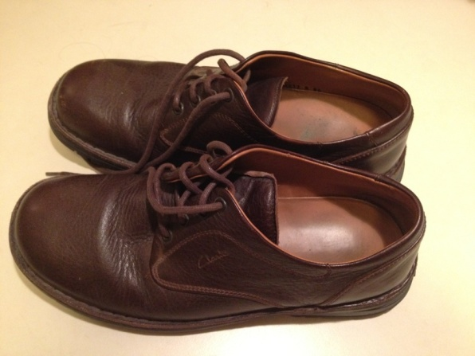

*2012-06-09 09:51 · iPhone客户端*

---

### 9948

@ 丹宁先生 “西裤”在英文里通常叫“dress pants”，意思是“正装裤”。

*2012-06-08 12:18 · 网页 给丹宁先生的回复*

---

### 9949

赞！ 转@ 鸝.se 每次经过这个花园都让我想起莫奈先生的印象派画作，瑞典的夏季如诗如画～

*2012-06-08 09:38 · 网页 转自鸝.se*

---

### 9950

穿了几天皮鞋后再换回new balance 993，发现这种慢跑鞋确实更舒服。

*2012-06-08 09:36 · 网页*

---

### 9951

本来还想在梦芭莎旗下的男装品牌那里试着买点东西，但是看到他们的网站上把“西裤”称作“west trousers”，我就打消这个念头了。

*2012-06-07 01:17 · iPhone版*

---

### 9952

我很伤感，谷歌地图已经好几年没更新我家乡的卫星图了。

*2012-06-07 01:05 · iPhone版*

---

### 9953

LINE也号称4000万用户了，在国际市场上是微信不可小瞧的对手啊。

日韩的LINE，中国的微信，美国的whatsapp，期待一场精彩的世界大战:-)

*2012-06-06 22:16 · 网页*

---

### 9954

刚装了mac版的LINE。第一次尝试“QR码登录”，手机和电脑屏幕互动，蛮好玩:-)

*2012-06-06 22:03 · 网页*

---

### 9955

在创业创投领域有个永恒的话题，市场和团队哪个更重要？这和哲学领域“唯物主义和唯心主义哪个更正确”的问题是一脉相承，本质相通的。没有简单的对错之分，而是看问题的角度不同。市场/唯物是由外而内，团队/唯心是由内而外。

*2012-06-06 11:54 · 网页*

---

### 9956

品牌需要故事，不管几分是真几分是假。例如，美国老牌服装品牌布克兄弟(Brooks Brothers)可以说，1865年林肯总统遇刺时穿的是一套他们家定制的黑外套，随后133年里他们家再不出品黑色成衣。

*2012-06-05 14:26 · 网页*

---

### 9957

“多大点事儿，我还以为是抢鸡蛋的呢。” 这几乎成为我们这时代的精神了。

*2012-06-05 12:24 · 网页*

---

### 9958

洗一个比较深的杯子时，左手能伸进去探到底，右手不能。转@ 士骑容愁 左手比右手小是怎么知道的呢？-----沉思中。。。转@ 王兴 我的左脚比右脚大，我的左手比右手小。

*2012-06-05 11:45 · 网页 转自王兴*

---

### 9959

我的左脚比右脚大，我的左手比右手小。

*2012-06-05 01:04 · 网页*

---

### 9960

问题是多数人并不了解自己的身体吧。 转@ 鸝.se 要像了解自己的身体一样了解自己的思维习惯～

*2012-06-03 21:00 · 网页 转自鸝.se*

---

### 9961

和老友约见面，重回北京的第五大道——五道口:) 五道口这地名已有百年历史，缘起京张铁路从丰台始发后第五个和马路交叉的道口。京张铁路竣工于1909年，是第一条由中国人自主修建的铁路，由袁世凯筹划，詹天佑为总工程司。

*2012-06-03 15:01 · Android客户端*

---

### 9962

@ 远骋 这短裤是松紧带的。fitbit别在腰里会产生异物感。

*2012-06-03 12:12 · 网页 给远骋的回复*

---

### 9963

最蛋疼的fitbit别法：周日上午宅在家里，只穿了一条居家短裤，特轻薄简单的那种，没有任何口袋，也没有穿皮带的环。于是，我只好把fitbit别在男式短裤唯一的开口那里。[此处略去容易引发不雅联想的照片一张]

*2012-06-03 11:34 · 网页*

---

### 9964

必须承认，这哥们汉语词汇量比我大。转@ Edgar 马靴毡疙瘩内增高坡跟瓢鞋三接头恨天高二棉鞋军钩老头鞋懒汉鞋趿拉板儿。转@ 王兴最近对鞋有兴趣，认识了一堆相关的词：oxford, balmoral, blucher,derby, brogue

*2012-06-03 11:19 · 网页 转自王兴*

---

### 9965

西方人说，培养一个贵族需要三代时间。中国人说，富不过三代。

*2012-06-03 10:53 · 网页*

---

### 9966

84岁时被判无期⋯⋯ 转@ 金融界人贩子 据悉，在得知自己被判无期徒刑后，现年八十四岁的霍斯尼·穆巴拉克老师开始哭泣，并拒绝被抬上飞机送进监狱服刑。哦也。

*2012-06-03 10:37 · 网页 转自金融界人贩子*

---

### 9967

生活需要仪式感。

*2012-06-03 10:36 · 网页*

---

### 9968

终于明白为什么我从来没能把衬衫很平整的扎进裤子里了。原因很简单：我那些衬衫都不合身。

*2012-06-03 10:19 · 网页*

---

### 9969

哈哈，原来英文里也有这种词，try-hard，意思和“装逼”有些区别，但差不太多。 http://v.gd/OARwWJ

*2012-06-02 18:25 · 网页*

---

### 9970

难得在北京的商场里看到一个来自我家乡福建龙岩的消费品牌。

*2012-06-02 17:38 · iPhone客户端*

---

### 9971

-_-! 转@ iMoe_ 骑双人单车，买俩气球拴在后面，居然有人趁不注意抢走一个。# WTF #

*2012-06-02 16:41 · 网页 转自iMoe_*

---

### 9972

@ 小冠 今不如昔，愧对祖宗啊⋯⋯ 很多种类的鞋是最近一百年才有的，汉语似乎没及时跟上。

*2012-06-02 16:39 · 网页 给小冠的回复*

---

### 9973

这回刷了新的android rom HyDr0G3N-ICS后，我给了QQ输入法一个机会，但用了几天就换回百度输入法。诸多细节导致体验还是有差异。

*2012-06-02 12:05 · 网页*

---

### 9974

最近对鞋有兴趣，认识了一堆相关的词：oxford, balmoral, blucher,derby, brogue, wingtip, loafer, moccasin, boat shoes, sneaker...

中国人可能对穿不太讲究，所以汉语里没有这么多细分的词。

*2012-06-02 11:34 · 网页*

---

### 9975

第三方安卓ROM常见的一个问题是自带的各种铃声差到没品:-(

*2012-06-01 18:30 · 网页*

---

### 9976

自从03年在我的第一部手机西门子a55那可怜的五行单色屏上看完《百年孤独》《赢》和半本《Walden Pond》后，我对电子书就无比接受了。转@ 筱潇 自从在电子书上看过四千面的小说之后，再长的书都不怕了。如同购买力一样，大多数可计量的心理底线都是能逐步提升的。

*2012-05-30 16:44 · 网页 转自筱潇*

---

### 9977

最近买了两双鞋，进一步证实了：我的左脚比右脚大一些。

*2012-05-30 16:20 · 网页*

---

### 9978

转@ Acumon [哈哈][哈哈][哈哈] 求山寨！ RT @ tixiang #译自法语推 ：民主是一种很复杂的东西，复杂到这是中国人唯一没能山寨成功的东西。 via @ Nain_Portekoi

*2012-05-30 14:28 · 网页 转自Acumon*

---

### 9979

@ jianliu 希望在接下来的一年里你和美团都有更多成长:-)

*2012-05-30 12:00 · 网页 给jianliu的回复*

---

### 9980

犹太人不光擅长赚钱。我又查了一下，wikipedia.org和craigslist.org大概算得上全世界影响力最大的两个不以盈利为目的的网站。

wikipedia的创始人jimmy wales和craigslist的创始人craig newmark也都是犹太人。

*2012-05-30 11:25 · 网页*

---

### 9981

@ 松木 facetime杀死了skype，对我来说。

*2012-05-30 01:51 · 网页 给松木的回复*

---

### 9982

我知道犹太人厉害，但是之前并不知道他们竟如此横扫IT领域。

facebook, google, paypal, zynga, oracle, dell, compaq的创始人全是犹太人。英特尔的葛洛夫也是；微软的比尔盖茨不是，但巴尔默是。

*2012-05-29 19:42 · 网页*

---

### 9983

今天北京的傍晚很美。在灿烂的夕阳下，西山层次分明。

*2012-05-29 19:16 · 网页*

---

### 9984

德鲁克一直到93岁都在教课！

*2012-05-29 15:02 · iPhone版*

---

### 9985

好毒的内涵帖！转@ blog图党 转@ lakeshore 噗。。 转@ 吟游疯子 请说出历史上著名的身材矮小的人的故事。“土行孙妙得邓禅玉，鼓上蚤大闹东京城，晏子使楚，破仑加冕，小平搬砖，亚萍夺金，七矮得美，…………四娘教子。”

*2012-05-29 13:43 · 网页 转自吟游疯子*

---

### 9986

@ imzxd 是平安官方的EDM。我原本是深发展信用卡的用户，现在被动成为平安信用卡的用户了。

*2012-05-29 13:39 · 网页 给imzxd的回复*

---

### 9987

转@ blog图党 每次打开百度知道前，都要深呼吸一口气，心中默念几次：你是个智力正常的人，别跟那些弱智回答生气...

*2012-05-29 12:26 · 网页 转自blog图党*

---

### 9988

自从深圳发展银行被平安并购后，我收到的跟平安信用卡（原深发展信用卡）相关的营销邮件明显增多。平安果然是一家营销很彪悍的公司啊。

*2012-05-29 12:23 · 网页*

---

### 9989

惊闻连我爸都在masamaso网购衬衫了……

*2012-05-28 23:10 · iPhone版*

---

### 9990

Log everything. Measure everything. Test everything.

*2012-05-24 22:33 · 网页*

---

### 9991

转@ gravity0 这说的可不光是码农，干点啥事都需要定力。

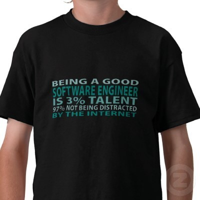

*2012-05-24 22:32 · 网页 转自gravity0*

---

### 9992

忽然发现今年又是奥运年，顿时有岁月蹉跎的感觉。

*2012-05-24 18:29 · 网页*

---

### 9993

A：“哪天出来跟XX一起聚一聚啊？他最近在做手机”。我：“啊，他在做什么app”？A：“不是做app，是做一款手机”。我：“哦⋯⋯”

*2012-05-22 19:28 · 网页*

---

### 9994

google drive完全是废柴！

*2012-05-22 17:16 · 网页*

---

### 9995

王淮总结的投资七问不错：Is problem real? Is market big? Issolution smart? Is team capable? Is team passionate? Is teamtrustworthy? Why me?

*2012-05-22 14:01 · 网页*

---

### 9996

设计应该支持变化。

*2012-05-22 11:53 · 网页*

---

### 9997

今天是21日，也是今年第21周的开始。当然，也是21世纪的一个片段。

*2012-05-21 10:33 · 网页*

---

### 9998

以前还真是没注意过，刚刚在一个小说里才看到，湖南和广东是交界的。

*2012-05-19 21:10 · iPhone版*

---

### 9999

惭愧，我在亚马逊买了十几年东西，看了无数评论，但却从没写过一条评论。

*2012-05-19 11:16 · fanios*

---

### 10000

收到联通发来的短信：客户您好,您的信用额度将调整为1430元。该信用额度从2012年06月1日开始生效。

*2012-05-19 10:24 · iPhone版*

---

### 10001

我的本科同学和研究生同学中都有人在facebook工作，都是从微软总部跳槽过去的。

*2012-05-19 08:28 · iPhone版*

---

### 10002

刘强东说他们之前在中关村做实体柜台，卖光磁产品，后来才开始在网上卖。

*2012-05-18 21:26 · iPhone版*

---

### 10003

我刚刚意识到，仔细说来，京东创办于98年，而阿里巴巴创办于99年。

*2012-05-18 15:28 · iPhone版*

---

### 10004

转@ 金融界人贩子 企业家的祖国，是自由竞争的市场。

*2012-05-18 10:52 · 网页 转自金融界人贩子*

---

### 10005

即使是从四个半小时删减到两个半小时的简版，≪赛德克-巴莱≫这部电影也会让一部分人意识到，连台湾都可以向我们输出价值观了。

*2012-05-18 10:49 · iPhone版*

---

### 10006

新浪的广告收入竟然被搜狐超过了，真是难以理解啊。

*2012-05-17 23:34 · iPhone版*

---

### 10007

听说，2001年普华永道北京办公室招了60个应届毕业生，现在剩七八个还在。

*2012-05-17 17:35 · iPhone版*

---

### 10008

用了几年mac，今天才学会锁屏/待机的快捷键: Ctrl + Shift + Eject(即F12)

*2012-05-15 14:36 · 网页*

---

### 10009

维基百科创始人都来代言一个我没听过的手表品牌了……

*2012-05-15 14:29 · Android客户端*

---

### 10010

“短颈鹿”是一种多么可爱的动物啊。

*2012-05-14 22:35 · iPhone版*

---

### 10011

今天是母亲节，我祝愿天下的母亲都有崔琦这样的孩子。转载：98年诺贝尔物理奖获得者、美籍华人崔琦出生在河南农村，是家里的独子，10岁去香港。父母后来在大饥荒中饿死。杨澜问崔，如果那时妈妈没有送你出去读书，你如今会怎样？杨澜以为他会讲教育改变命运，讲感谢妈妈，崔却说：

*2012-05-13 11:24 · fanios*

---

### 10012

Paul Graham的老婆写的≪Founders at Work≫这书完全是一部向茨威格的≪人类群星闪耀时≫致敬的作品，只是时间晚了一个世纪，领域换成科技创业。当然，这两本书都值得读。

*2012-05-12 10:43 · iPhone版*

---

### 10013

用于怀念的时间不要超过五分钟。

*2012-05-12 00:14 · 网页*

---

### 10014

翻出沈庆的《青春》听了一遍。现在看，歌词有点矫情，但是，喜欢过就是喜欢过。

*2012-05-12 00:12 · 网页*

---

### 10015

拥有一个好业务的公司不等于一个好公司。

*2012-05-11 22:53 · iPhone版*

---

### 10016

越南居然是世界人口第13大国。我之前还以为它是完全无足轻重的一个小国呢。

*2012-05-09 22:58 · 网页*

---

### 10017

难道大家不觉得每次戴耳机之前都要辨别左右很麻烦吗？我希望有这样一种智能耳机，不管我怎么戴，它都能自动把左右调整好。

*2012-05-08 15:21 · 网页*

---

### 10018

archive.org又一次挽救了我，帮我找到一个很古老、我很想看但现在已经不存在的网页。这么好的一个工具却被墙了⋯⋯

*2012-05-07 12:03 · 网页*

---

### 10019

航班延误，几经折腾，终于回到首都机场，我的体力已经像一部安卓手机的电力那么不支。

*2012-05-07 01:38 · iPhone版*

---

### 10020

这文章不错：《抱朴仙人：中国的海洋权益争端漫谈》

http://is.gd/KUNW8Y

*2012-05-05 12:27 · 网页*

---

### 10021

今天立夏。

*2012-05-05 11:30 · iPhone版*

---

### 10022

一个月前我推荐过《陈东升：“摩根梦”不再》这篇文章，觉得很有料。

http://is.gd/F06VdL 今天才知道有更多猛料作者没写出来，1996年陈是拉着刚大学毕业的孔东梅（毛的外孙女）创办泰康人寿的，后来孔成了陈的小三。

*2012-05-05 00:21 · 网页*

---

### 10023

moreish是个既有趣又直白的新单词，在more(更多)后面加上ish，就变成了形容词“让人吃完还想再吃的，还想要更多的”。确实有很多东西是moreish的。

*2012-05-04 12:37 · 网页*

---

### 10024

电子商务真是已经高度发达了。4月30日下午发现kindle3屏幕压坏了，晚上回去淘宝下单，kindle4入门版，实付570人民币，今天中午就收到了。简单的几分钟设置后，我又可以继续看kindle帐号里的那些书了。论实物网购的便利国内已经不输美国，但是数字内容平台还是被老美把持。

*2012-05-02 15:24 · 网页*

---

### 10025

“五月是一年中最关键的月份”这一说法可以有多种解释，其中最优美的是：一年的前一个黄金分割点是5月20日 [ 365 x ( 1 - 0.618 ) ≈139.4 ]。

*2012-05-02 13:27 · 网页*

---

### 10026

转载: You don't have a soul. You are a soul. You have a body.

*2012-05-02 11:53 · 网页*

---

### 10027

昨天吃完饭刷信用卡时被拒-_-!，因为我的信用卡是2012年4月到期。

可是，换卡为什么要这么严呢？我记得在美国时信用卡过期后即使没有及时换新卡还是可以继续用，至少网购时不受影响。

*2012-05-02 09:43 · 网页*

---

### 10028

@ 大排_美团 加油！

*2012-05-01 22:49 · 网页 给大排_美团的回复*

---

### 10029

终于抽空分三段把希区柯克导演的老片≪后窗≫给看完了。说实话，给我留下最深印象的不是悬疑或是社会百态，而是女主角的“时装秀”，她每次出场都有一套全新的服饰佩戴，几乎无懈可击，永远那么光鲜，永远都是一个“打扮得香喷喷的lady”。

*2012-05-01 22:18 · iPhone版*

---

### 10030

只要衣服不太厚，一米宽的衣柜挂40个衣架正合适。

*2012-05-01 12:30 · 网页*

---

### 10031

整理换季衣服时发现，服装的尺寸命名很不统一。同样是175/96的polo衫，有的牌子标成XL，中国的多数标成L，美国的多数标成M，甚至也有标成S的。

*2012-05-01 10:28 · 网页*

---

### 10032

太挫败了！装了一个测观察和反应能力的苏尔特方格(SchulteGrid)app。5x5的方格我尚可在指定的25秒里完成，可是6x6的方格我试了十几次都无法在指定的50秒内完成:-(

*2012-05-01 00:13 · 网页*

---

### 10033

生命就是不死的欲望。

*2012-04-30 20:35 · iPhone版*

---

### 10034

@ 沈鹏KeyKey 既然得出这个结论，那当然是回去上网买masa maso了。无论是面料还是设计上的一些细节，masa maso都更好，不过原价有点高，所以最好赶上优惠的时候买。

*2012-04-30 18:31 · 网页 给沈鹏KeyKey的回复*

---

### 10035

经过刚才在三里屯优衣库的实地考察，我认为优衣库那单件149元，两件249元的polo衫性价比不如masa maso网站上打完折每件175元的polo衫。

*2012-04-30 18:05 · iPhone版*

---

### 10036

悲痛！kibdle3不知何时屏幕压坏了:-(

*2012-04-30 17:12 · 网页*

---

### 10037

多谢。ideology这词倒是常见，但我始终没觉得它和“世界观”是一回事。

*2012-04-29 00:03 · iPhone版*

---

### 10038

果然，查了一下维基百科，“世界观”是一个源自德国哲学体系的概念，在英语中始终没有被清晰定义和广泛使用。

*2012-04-28 23:56 · iPhone版*

---

### 10039

刚意识到一件事：我日常接触的中英文大概一半一半，但是遇到“世界观”这个词的频率远高过“world view”。

*2012-04-28 23:52 · iPhone版*

---

### 10040

能一个人静静看书的夜晚是幸福的。

*2012-04-28 21:00 · 网页*

---

### 10041

终于想明白了，“极致的中庸之道”并不是一个oxymoron。

*2012-04-26 18:59 · 网页*

---

### 10042

@ LEMONed 难道你觉得已经测试结束了？

*2012-04-26 17:56 · 网页 给LEMONed的回复*

---

### 10043

吃完外卖，决定验证一下“饱吹饿唱”的传统智慧，再测一次肺活量，结果是5207ml，非常稳定。

*2012-04-25 20:14 · 网页*

---

### 10044

实验结束，提交报告。40分钟里测了12次，结论是我的肺活量约为5200ml。

*2012-04-25 19:37 · 网页*

---

### 10045

第十二次，5176ml。看来这就是我的真实肺活量了。

*2012-04-25 19:26 · 网页*

---

### 10046

第十一次，终于下降了，5164ml。

*2012-04-25 19:23 · 网页*

---

### 10047

第十次，5226ml。看来已经逼近极限了。

*2012-04-25 19:14 · 网页*

---

### 10048

第九次，5220ml。怎么一次比一次多，什么时候才是尽头啊？

*2012-04-25 19:10 · 网页*

---

### 10049

第八次，5187。

*2012-04-25 19:07 · 网页*

---

### 10050

第七次，5168。

*2012-04-25 19:05 · 网页*

---

### 10051

第六次，5122。

*2012-04-25 19:00 · iPhone客户端*

---

### 10052

第五次，4975。

*2012-04-25 18:58 · iPhone客户端*

---

### 10053

第四次，4956。

*2012-04-25 18:56 · iPhone客户端*

---

### 10054

第三次，4794。

*2012-04-25 18:54 · iPhone客户端*

---

### 10055

又试了一次，4600ml

*2012-04-25 18:50 · iPhone客户端*

---

### 10056

测了一下，肺活量居然才3778-_-!

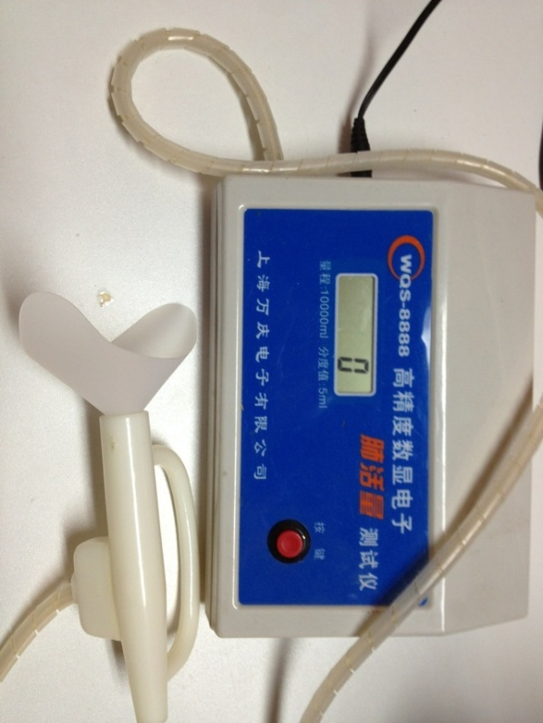

*2012-04-25 18:47 · iPhone客户端*

---

### 10057

Peter Thiel抛出的这个问题再次证明了他的卓尔不群。我至少有半年没见过这么帅的问题了："What is something you believe thatnearly no one agrees with you on?" （有什么事是你相信的但却几乎没人认同的？）

*2012-04-25 17:11 · 网页*

---

### 10058

蛮高端的样子嘛。转@ 囧Piggest囧 我在新华社：会晤。

http://jie.pn/p_IE2V2hUD

*2012-04-25 12:36 · 网页 转自囧Piggest囧*

---

### 10059

北美公司喜欢把全球市场分成这么几大块：Americas 美洲；EMEA(Europe, Middle East, Africa) 欧洲、中东和非洲；APAC (AsiaPacific) 亚太，包括澳大利亚，可能包括日本。

*2012-04-25 12:35 · 网页*

---

### 10060

当我拿起一瓶鲜牛奶想一仰脖子一饮而尽却喝到满嘴豆花时，我就明白了一个道理：这种天气这种包装的牛奶在常温下真的不能放一天。

*2012-04-25 01:58 · 网页*

---

### 10061

诗人李白可能并不出生在如今的中国境内，而是在碎叶城（乌鲁木齐再往西，前苏联加盟共和国吉尔吉斯斯坦境内）。德国哲学家康德生活了一辈子的哥尼斯堡（东普鲁士首府），现在已经是俄罗斯城市加里宁格勒了，而且那里和俄罗斯本土并不相接，而是一块飞地，中间隔着波罗的海三国。还是俄国佬霸道啊！

*2012-04-24 15:03 · 网页*

---

### 10062

不学习就会落伍。我在中学地理学到的是世界有四大洋（太平洋、大西洋、印度洋和北冰洋），昨天玩iPad地图时才知道国际水文地理组织已经于2000年确定南极洲周围的海是独立的第五大洋“南冰洋”。我在中学天文学到的是太阳系有十大行星，前几年才听说冥王星不算，只有九大。至于中学历史⋯⋯

*2012-04-23 21:20 · 网页*

---

### 10063

这么多年以后，我才知道禹的老爸“鲧”念gǔn。

*2012-04-23 21:00 · 网页*

---

### 10064

遇到一个英语生词 camphene, 一查是“樟脑萜”。可是啥是萜？只好再查汉语字典：萜 tiē 有机化合物的一类，多为有香味的液体，松节油、薄荷油等都是含萜的化合物。

*2012-04-23 15:15 · 网页*

---

### 10065

我在美国读研时的导师都上li nkedin了⋯⋯

*2012-04-22 19:03 · 网页*

---

### 10066

年岁不饶人啊。体力不支了。睡。

*2012-04-20 00:52 · iPhone版*

---

### 10067

决定今晚放纵一下。

*2012-04-19 19:52 · 网页*

---

### 10068

每一个春天都不一样。

*2012-04-19 16:17 · 网页*

---

### 10069

@ underland 我也很喜欢那一带的街道！

*2012-04-18 12:57 · 网页 给underland的回复*

---

### 10070

智能手机厂商最应该解决的的硬件挑战不是高分辨率的视网膜屏幕，不是超薄机身，甚至不是更长的电池待机时间，而是不要home键半年

就失灵！这是我作为一个iPhone4和三星i9100用户的郁闷总结。

*2012-04-18 11:16 · 网页*

---

### 10071

我最近用iPad越来越多用Macbook Air越来越少的部分原因是：我的Air不知道中了什么邪，用一小会儿就开始风扇狂转，这就好像一个女人面容姣好腰肢纤细还体贴人意但却一张口就粗声粗气，实在大煞风景。

*2012-04-17 21:30 · 网页*

---

### 10072

我看到手机尾号是0256，0512，1024的人都觉得亲切。

*2012-04-17 20:53 · 网页*

---

### 10073

“一粥一饭，当思来处不易”，这句话诞生于自给自足的小农经济时代，但在商品经济高度发达的今天却可以有更深的解读。我今晚吃的这份便当不过二十来块钱，但细想起来却是成百上千人的心血汇聚而成：种水稻，养水牛或开拖拉机，造脱粒机，发电，种菜，养猪，腌火腿，挖石油，造化肥，榨油，炼铁…

*2012-04-17 20:20 · 网页*

---

### 10074

一份菜品不定的优质便当带来的快感，不仅来源于嗅觉、味觉和唇齿之间的触觉，也包括视觉，尤其是饥肠辘辘之时满怀期待的打开便当盒时那第一眼的视觉冲击。

*2012-04-17 19:56 · 网页*

---

### 10075

美国开国总统华盛顿和中国自称“文治武功十全老人”的乾隆帝是同一年去世的（1799年），美国南北战争的结束和中国太平天国运动被镇压前后相差不过一年（1865年）。每次想到这里就心情复杂，差距咋就这么大呢。

*2012-04-16 20:18 · 网页*

---

### 10076

@ 雏儿 真是是我在饭否遇到的最有想象力的小朋友之一。

*2012-04-16 19:57 · 网页*

---

### 10077

为什么中国象棋、国际象棋、围棋和德州扑克都已成为竞技项目，麻将却不是？

*2012-04-16 18:36 · 网页*

---

### 10078

真巧，我在现实中用的记事本和Paper for iPad里的虚拟笔记本外观几乎一模一样。

*2012-04-16 18:10 · Android客户端*

---

### 10079

行家一开口，就知有没有！饭否最初的设计师抛出的这一堆大词看得我一愣一愣的。转@ 刘丹 担心 Metro UI 令设计文化在和工业文化的拉锯战中再度沦陷，担心这种设计趋势的根源是对模式的滥用

*2012-04-16 17:58 · 网页 转自刘丹*

---

### 10080

转@ Kevin 一一丨一丶丶丿一丿丶 ← 掉了一地的王兴

*2012-04-16 17:34 · 网页 转自Kevin*

---

### 10081

我的第一次in-app购买献给了Paper for iPad里的一只outline笔，花了$1.99。这个本身免费的应用确实做工精良，新手引导设计得很好。

*2012-04-16 17:00 · 网页*

---

### 10082

“谶”念chèn，指迷信中将要应验的预言、预兆，一般指一些“凶”事，不吉利的预言。一语成谶，就是一句话说中了，就是“不幸而言中”（不吉利的事情，诅咒别人似的）。

*2012-04-16 10:21 · 网页*

---

### 10083

@ 鸝.se 一个问题就暴露了你没看过这电影。log是对数函数。

*2012-04-15 16:38 · 网页 给鸝.se的回复*

---

### 10084

看了《那些年，我们一起追的女孩》。蛮好的青春回忆片。我和导演同龄，所以和这部自传式电影里那帮年轻人的成长轨迹在时间上正好重叠，只是空间上隔了一个海峡。张雨生、王祖贤、井上雄彦、97年上大学… 青涩、暧昧、幼稚更是大家共通的。哦，有个小小的差别，十几年后的今天，我还会用到log。

*2012-04-15 16:26 · 网页*

---

### 10085

有些饭友没看明白前些天那个英国笑话。我的理解是：让那些已婚男士觉得不虚此生的不是爱情而是酒，所以当司仪请他们靠近“让他们觉得不虚此生的人”时，酒保就被挤死了…… @ output

*2012-04-14 23:22 · 网页*

---

### 10086

转@ 小河 qq上的对话。。A：今天天好阴。B：我这儿不阴啊。A：由此可推算该云团半径区间。B：我这儿也阴了！咱可以算云团移动速度了！A：。。。博士间的对话好无聊。

*2012-04-14 17:40 · 网页 转自小河*

---

### 10087

转@ 鸝.se 我以为这是对“改变世界”的最好诠释～转“凡是有不合的地方，我们要为和谐而努力。凡是有谬误的地方，我们要为真理而努力。凡是有疑虑的地方，我们要为信任而努力。凡是有绝望的地方，我们要为希望而努力。”——撒切尔夫人的传记电影《铁娘子》

*2012-04-14 14:30 · 网页 转自鸝.se*

---

### 10088

“男人只会变老，不会成熟”，看完《春娇与志明》更觉得这句话一语中的。据说是出自法国诗人保罗•艾吕雅。翻了一下维基百科对他的介绍，这位大哥的生平真是八卦多彩啊。

*2012-04-14 13:34 · 网页*

---

### 10089

我们的工作中出现越来越多的TLA(Three-Letter-Acronym，三字母缩写)……

*2012-04-14 09:26 · iPhone版*

---

### 10090

好长时间没碰到这种令我赞叹的平面广告了，第一眼有视觉冲击力，再看文字更出乎意料（请注意右下角的文字）。谢谢《全球商业经典》杂志。

*2012-04-13 10:23 · Android客户端*

---

### 10091

当然要买iPad3了。

*2012-04-13 08:35 · iPhone版*

---

### 10092

用惯了iPad3再拿起iPad2，确实能感觉出iPad2更薄。

*2012-04-13 00:39 · 网页*

---

### 10093

转载：就构思而言，先有赛德克巴莱，后有海角七号。但在海角七号出来以前，没人相信魏德圣能拍出赛德克巴莱。

*2012-04-12 18:59 · 网页*

---

### 10094

窗外是奥林匹克森林公园的春天。再有半个月，我就完整的看过了她一年四季的变化。我最喜欢春天的她，至少现在如此。

*2012-04-12 18:21 · 网页*

---

### 10095

转@ 金融界人贩子 某次婚礼上，司仪喊话：“已婚的男士们！现在请

站到让你觉得没有虚度今生的那个人身边！牵起手！随着音乐一起舞动！”然后……酒保被挤死了。这是一个英国佬刚发过来的笑话，标题叫【Politically Correct】。黑，真尼玛黑。

*2012-04-12 16:52 · 网页 转自金融界人贩子*

---

### 10096

转@ 小河 这话还能讲的这么文艺。。不就是一个初恋一个老伴儿么。。转@ smilenet RT@ 来做我的光 # 人的一生注定会遇到两个人，一个惊艳了时光，一个温柔了岁月。 #

*2012-04-12 15:07 · 网页 转自来做我的光*

---

### 10097

王小波的《2010》还是不错的。

*2012-04-12 01:18 · iPhone版*

---

### 10098

摩尔定律的速度是每18个月翻番，也就是每年增长59%，正好是十年百倍。

*2012-04-10 08:33 · iPhone版*

---

### 10099

New iPad充电真是太慢了。用macbook air的usb口充电，期间基本处于锁屏状态，两个小时才从31%充到47%。

*2012-04-08 16:28 · 网页*

---

### 10100

《春娇与志明》是一部ok的快餐电影。杨幂身材不错。

*2012-04-08 00:48 · iPhone版*

---

### 10101

女人并不是露得越多越性感，还是要露得巧。这张海报上右边那个姑娘的露腰装是个好设计，比三点式或全裸都更容易引发想象。

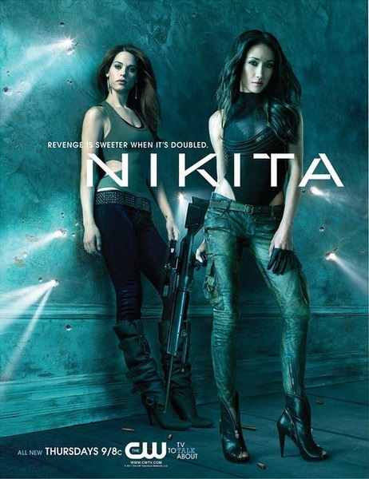

*2012-04-06 22:20 · 「御飯 iPhone」*

---

### 10102

越来越多迹象表明，无线充电离我们已经不远了。大概两年之内在高端新手机里会普及？

*2012-04-06 21:50 · 网页*

---

### 10103

《陈东升：“摩根梦”不再》这篇文章值得一读。 http://is.gd/F06VdL

*2012-04-06 11:14 · 网页*

---

### 10104

深夜等人，无聊，一时好奇，上维基百科看了齐奥塞斯库的生平。平心而论，在独裁者中，这位大哥实在算不上是罪大恶极啊，却落得个夫妇俩被草草审判乱枪击毙后曝尸五天未下葬的悲惨结局！唉！

*2012-04-06 00:34 · 网页*

---

### 10105

追求"word hard, play hard"的人很容易搞成hardly sleep。

*2012-04-05 20:12 · 网页*

---

### 10106

Stay current, as it is illusionary to imagine being innovative

without being current.

*2012-04-05 13:07 · 网页*

---

### 10107

@ Dee.W 昨晚我的new ipad从18厘米处坠地，右上角钝了:-(

*2012-04-05 11:23 · 网页 给Dee.W的回复*

---

### 10108

用的就是ipad3自带的10w充电器。

*2012-04-05 11:01 · iPhone版*

---

### 10109

一个i9100手机插着HSDPA的3G数据卡，亮着屏幕，同时打开wifi当热点带一个ipad3和两个iphone4上网的结果就是：即使连着充电器，i9100的剩余电量也几乎不涨⋯⋯

*2012-04-05 10:30 · 网页*

---

### 10110

转@ tihu google即将推出Project Glass扩展现实眼镜——这么划时代的数码产品，我有种面前随时浮现“无法连接到代理服务器”的不祥预感。

*2012-04-05 10:22 · 网页 转自tihu*

---

### 10111

在新加坡peranakan土生族群博物馆看到，一百多年前印尼和马来排华的手段之一就是不允许华人在当地购买土地。原来＂限购＂是一个如此通用而且历史悠久的方法…

*2012-04-04 08:41 · 网页*

---

### 10112

1492年哥伦布远航新大陆。1511年葡萄牙人就占领了马六甲。所谓地理大发现的高潮时期不过持续了二三十年。

*2012-04-03 13:22 · iPhone版*

---

### 10113

在看peranakan娘惹博物馆。元朝真是太牛逼了！当年居然打到java爪哇岛！

*2012-04-03 13:18 · iPhone版*

---

### 10114

去机场时走得太匆忙，来不及取钱，到新加坡樟宜机场时浑身上下一共剩650人民币，换成了127.05新币。第一项开支是买一张3天不限流量的上网卡，花了18新币。

*2012-04-02 17:23 · 网页*

---

### 10115

同求隔壁截图！转@ 弥城 起个大早来公司，一进卫生间当时我就震惊了。有人表示压力很大，有人挨个卫生间围观。我只是很好奇，男卫隔壁什么状况呢？ 求围观，求截图。

*2012-04-01 09:14 · 网页 转自弥城*

---

### 10116

愚人节实在是一个比圣诞节和感恩节更能体现中西方文化差异的节日。你能想象中国的文化传统里会自发产生一个这么不正经的所谓节日吗？

*2012-04-01 07:47 · iPhone版*

---

### 10117

fitbit显示我昨天走了两万八千多步，把我之前的最高纪录翻了一倍都不止。

*2012-04-01 01:46 · iPhone版*

---

### 10118

这个自爆牛！转@ 鸝.se 忍不住得瑟一下，还是喜欢那么独特的他呀！九年了～

*2012-03-31 23:41 · 网页 转自鸝.se*

---

### 10119

和一个腾讯创始人聊天，我提到：＂听说马化腾的私人qq的签名档是'正在布局'＂ ？他非常谦虚的回答：＂哪里哪里，你们不要误解。

那是pony早年痴迷于玩四国军棋时用的签名档，后来就一直没改＂。

*2012-03-31 23:39 · iPhone版*

---

### 10120

刚刚付钱买了我在kindle上买过的最贵一本电子书，$27.92。

*2012-03-30 15:43 · iPhone版*

---

### 10121

“人们知道自己想要什么，因为他们知道别人想要什么”，也只有阿多诺这种社会学大家说得出这种深刻到伤人的话吧。

*2012-03-29 20:42 · 网页*

---

### 10122

所谓正面思考，就是想着“三人行，必有我师焉”而不是“三人行，必有傻逼焉”。就算后者比起前者正确的可能性更高，但是对你又有什么益处呢？

*2012-03-29 17:59 · 网页*

---

### 10123

产品经理会。果然是极客都爱格子衫。

*2012-03-28 21:22 · iPhone客户端*

---

### 10124

距离我上回登录oreilly.com得有5年了吧。

*2012-03-28 18:15 · 网页*

---

### 10125

这一天终于来了。

*2012-03-28 18:02 · 网页*

---

### 10126

收到一封邮件：“现有一个‘中关村创业讲坛’活动，届时诺贝尔奖获得者菲尔普斯先生将会以创业为主题做演讲⋯”，创业这事跟诺奖得主有毛关系啊？

*2012-03-28 17:32 · 网页*

---

### 10127

“我们做传统零售时，一年52周，做到第50周都不知道今年赚不赚钱，因为还得看最后2周干得好不好，因为毛利就是这么低，就得抠到这么细”。一个在传统零售和电子商务都干过多年的前辈如此语重心长的吓唬我。

*2012-03-28 16:43 · 网页*

---

### 10128

嫉妒就是又爱又恨。

*2012-03-28 00:53 · iPhone版*

---

### 10129

@ webto 是。

*2012-03-26 22:51 · 网页 给webto的回复*

---

### 10130

和一个老朋友吃晚饭。他在台湾女首富王雪红投资的一个创业公司里当管理者。我问他，王雪红的什么特点令他印象深刻。他毫不犹豫的回答：“勤奋”。

*2012-03-26 22:01 · 网页*

---

### 10131

转@ .rex 做了许多亵渎上帝的事，仍还活着，说明上帝牠老人家也是个重度拖延症患者吧～

*2012-03-26 21:56 · 网页 转自.rex*

---

### 10132

如果你认为facebook估值1000亿美元贵得离谱的话，别忘了百度现在市值504亿美元。你更愿意拥有一个facebook还是两个百度？

*2012-03-26 14:56 · 网页*

---

### 10133

@ jingjing 此女可教！

*2012-03-26 14:15 · 网页 给jingjing的回复*

---

### 10134

@ iFire 啥意思？

*2012-03-26 02:31 · 网页 给iFire的回复*

---

### 10135

把iTunes设成随机播放了，不然老从《The Weakness In Me》这种写给小三的歌跳到《Blowin' In The Wind》这种浩然正气之歌实在是太突兀。

*2012-03-25 23:02 · 网页*

---

### 10136

《晚秋》是一部非常戏剧化的电影。总体来说，我觉得值得一看；因为，女杀人犯和牛郎，都是我不会有机会体验的人生。

*2012-03-25 22:39 · 网页*

---

### 10137

生活中一个小小的乐趣是：听到某首歌觉得很好听时，去看它的歌词，发现写得也很好。

*2012-03-25 00:52 · 网页*

---

### 10138

话说我在清华读本科时还真上过影视欣赏这门课，也去隔壁北大蹭过这门课。记得在课堂上看过《毛发》、《基督的最后诱惑》、迪斯尼的《Fantasy》、《独臂刀》、《开罗紫玫瑰》⋯⋯

*2012-03-25 00:10 · 网页*

---

### 10139

@ Sttequila 逼不装不会死也。

*2012-03-24 23:57 · 网页 给Sttequila的回复*

---

### 10140

书非借不能读也。网不断不能学也。

*2012-03-24 23:49 · 网页*

---

### 10141

大裤衩确实挺雄伟。

*2012-03-24 18:32 · iPhone客户端*

---

### 10142

今天终于见到了新版iPad。高清屏幕确实不错，但并没有想象的那么震撼。

*2012-03-24 18:03 · iPhone版*

---

### 10143

开会时撞杯了。

*2012-03-23 19:32 · Android客户端*

---

### 10144

过去几天我听到的最震撼的话是林彪说的：1935年，红军长征刚过完草地，进攻天险腊子口之前，红4团团长向林保证说：“如拿不下腊子口，我提头来见”。林的回答是：“我不要你的头，我要腊子口”。

*2012-03-23 16:03 · 网页*

---

### 10145

那种车窗玻璃升降控制器不在车门上而在中控台的设计真是让我见一次烦一次。

*2012-03-22 21:51 · iPhone版*

---

### 10146

@ 张宇舵 能访问，就是稍慢一点。做吧，我觉得那是个不错的方向。

*2012-03-21 00:25 · 网页 给张宇舵的回复*

---

### 10147

携程的安卓app新版非常失败，改得面目全非，让习惯了旧版购票流程的我非常茫然，得重新摸索:-(

*2012-03-21 00:25 · 网页*

---

### 10148

看到"Mozilla loses Web technology guru Chris Blizzard"这条新闻里久违的人名，想起十几年前在mozilla的bugzilla和mail list里常见Chris Blizzard。那是mozilla发布1.0之前的时代了。

*2012-03-20 23:17 · 网页*

---

### 10149

我没看过《浪潮之巅》这本书，但从吴军老师今天的演讲和他回答我提问的内容来看，他对细节和深度的品质要求…

*2012-03-20 21:46 · iPhone版*

---

### 10150

听吴军老师做《浪潮之巅》的演讲。

*2012-03-20 20:09 · iPhone版*

---

### 10151

把i9100刷成Android 4.0 ICS的ROM之后，我又把停用近一年的gtalk重新拣起来了。看来android对推广google的其他服务确实有不小的帮助。

*2012-03-20 15:17 · 网页*

---

### 10152

昨晚梦到一个互联网模式，依稀记得和旅游住宿有关，不过细节真的记不起来了。

*2012-03-19 22:57 · 网页*

---

### 10153

@ krashna 我也非常喜欢圆明园东门那里的环境！

*2012-03-19 22:53 · 网页 给krashna的回复*

---

### 10154

转@ 唐君毅 表哥的签名：“别沮丧，生活就像心电图，一帆风顺就证明你挂了”。。。

*2012-03-19 16:51 · 网页 转自唐君毅*

---

### 10155

@ iFire 就和咱这国家一样糙。

*2012-03-19 16:17 · 网页 给iFire的回复*

---

### 10156

@ chinesecold 多谢。不过我那时不会在上海。

*2012-03-19 15:01 · iPhone版 给chinesecold的回复*

---

### 10157

@ 鸝.se 你这描述更像是母鸟调戏公鸟。

*2012-03-19 01:11 · 网页 给鸝.se的回复*

---

### 10158

Fenng兄此言甚是：公司的问题，就是员工的机会。

*2012-03-19 01:04 · 网页*

---

### 10159

intellectual是个有趣的概念。有一种“好奇”叫intellectual curiosity，有一种“诚实”叫intellectual honesty.

*2012-03-19 00:53 · 网页*

---

### 10160

@ Kevin 看了那个flash，我才知道原来氢原子比氦原子更大个！逆袭啊！

*2012-03-19 00:51 · 网页 给Kevin的回复*

---

### 10161

小到10的-35次方，大到10的27次方，单位是米，这就是你所需要了解的宇宙的尺度。请看flash演示： http://htwins.net/scale2/

*2012-03-19 00:39 · 网页*

---

### 10162

普朗克真狡猾！他搞出个没啥实际意义的”普朗克长度“，小到10的-35次方这种量级，比任何已知有实际意义的长度都小了10亿倍不止，弄得别人都不好意思跟他抢最小长度的位置。

*2012-03-19 00:29 · 网页*

---

### 10163

刚才查shrew这个单词除了“泼妇”以外的含义，就是这种鼹鼠状的小动物，可是中文解释是“鼩鼱”，当时我就汗了，还不如不解释呢。那英文我会念，可这俩汉字还真是不认识。只好求助词霸，念[qú jīng]。

*2012-03-19 00:08 · 网页*

---

### 10164

有趣的总结：IaaS = Ops without Hardware; PaaS = Devs withoutOps; SaaS = Business without Devs

*2012-03-18 23:43 · 网页*

---

### 10165

facebook的安卓app居然不需要翻墙就可以正常使用了。

*2012-03-18 12:53 · 网页*

---

### 10166

我觉得g+1是个非常拗口的脑残名字，所以一直不用。今天就把这第一次献给@ Kevin 小朋友的深情之作。

*2012-03-17 18:29 · 网页*

---

### 10167

转@ 金鑫. 错，沈鹏的牛仔裤是论条计算的，基本不存在换洗问题！

「@ 叶德权 沈鹏的牛仔裤可是论年计算的(⌒▽⌒)转@ 黄鸿光 一条牛仔裤穿到第八天了 ~」

*2012-03-17 18:17 · 网页 转自黄鸿光*

---

### 10168

最近有部很火的文艺片叫≪那些年我们一起追的女孩≫。据说导演就叫…

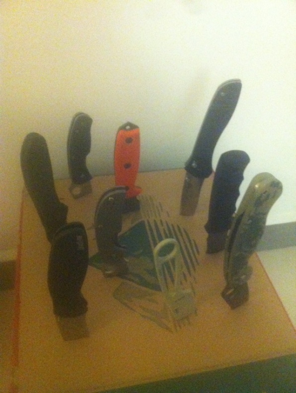

*2012-03-17 18:14 · iPhone客户端*

---

### 10169

哇靠，哪个无耻的app在给我弹广告？有人认得吗？谢谢！

*2012-03-17 01:47 · Android客户端*

---

### 10170

凡是让我用得觉得自己是傻逼的产品都是傻逼做的。

*2012-03-16 23:37 · iPhone版*

---

### 10171

@ DonglinChen 刷ROM吧。我去年拿到i9100后做的第一件事就是刷ROM。

*2012-03-15 23:28 · 网页 给DonglinChen的回复*

---

### 10172

当我意识到iPad3的9.7寸屏幕的像素数(2048x1536)多过我面前这台24寸宽屏显示器(1920x1080)时，这个直观的对比终于让我明白，之前的

我和绝多数人一样太低估iPad3和苹果的牛逼程度了。这世界上99.999％的人还从没用过像素高达2048x1536的屏幕。

*2012-03-15 14:58 · 网页*

---

### 10173

今天听到的最霸气的话是：business models are a commodity.

*2012-03-15 14:44 · 网页*

---

### 10174

-_-|| 转@ 蓝小牙 当初咱俩如果早点相遇， 现在应该已经分了吧。

*2012-03-15 13:28 · 网页 转自蓝小牙*

---

### 10175

把三星i9100从安卓2.3升级到4.0 ICS后，我换手机的冲动小了很多。

这个手机估计还可以再用半年以上。

*2012-03-15 11:44 · 网页*

---

### 10176

虽然李健是我的同系师兄，但我们在清华的时间只有一年重叠。我是直到前段时间听《传奇》这首歌才觉得他还不错的。电子系有出歌手的传统。远的有高晓松；我记得李健在清华时的唱歌搭档是同系的缪杰，比他们低一届还有任雨生和张冠军这对搭档。

*2012-03-14 23:06 · 网页*

---

### 10177

鄙视淘宝。转@ ellic @ 王兴 淘宝的app是即使强制关闭后也会再重新在后台打开运行。。

*2012-03-14 23:00 · 网页 转自ellic*

---

### 10178

我几乎从来不在安卓手机上用淘宝的app，但刚才检查RunningApplications时却发现淘宝app占了5.2M内存。果断卸载！

*2012-03-14 22:55 · 网页*

---

### 10179

@ 草泥马维稳办 支持。我就是用招行信用卡刷的。

*2012-03-14 22:51 · 网页 给草泥马维稳办的回复*

---

### 10180

不好意思白收了别人的便携式刷卡器不用，刚才我试着用乐刷给自己的手机充了50块。体验还可以。

*2012-03-14 20:00 · Android客户端*

---

### 10181

笔记本不管电池电量多低，只要接上电源，总是能开机使用的。手机电池耗尽关机后，即使接上充电器了，只要你敢立刻开机，通常的命运就是刚刚启动完就再次自动关机。至少，刚才我的三星i9100就是这种表现。

*2012-03-14 19:48 · 网页*

---

### 10182

@ jingjing 莫非你想自己LUA？

*2012-03-14 15:02 · 网页 给jingjing的回复*

---

### 10183

两个月前一个朋友的感慨至今回荡在我脑海：以前我常跟人说，你们传统行业如何如何，我们互联网行业如何如何；不知道从哪天起，越来越多人对我说，你们传统互联网行业如何如何，我们移动互联网行业如何如何⋯⋯

*2012-03-14 14:55 · 网页*

---

### 10184

云计算时代就是方便啊。我刚在手机上按下快捷键截屏，一抬头mac状态栏上的dropbox就弹出通知告诉我有新图片了。原来手机上的dropbox已经自动把我手机上的新图片上传到Camera Uploads文件夹里了。

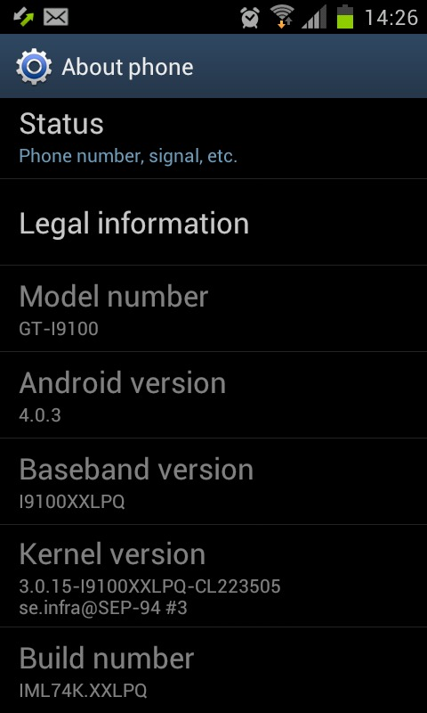

*2012-03-14 14:32 · 网页*

---

### 10185

真是邪门了。明明刚才试过这个组合不灵的，你说完我再试就行了。

thank you anyway. 转@ marcher @ 王兴 应该要长按音量减和电源。

*2012-03-14 14:27 · 网页 转自marcher*

---

### 10186

i9100升级到三星官方欧版4.0.3 ICS固件后，原来“同时按home键和power键”那种iPhone式截屏快捷键失效了。谷歌官方ICS里“同时按volume down键和power键并保持一秒”的快捷键也不能用。截屏功能对我很重要。谁知道新的快捷键是什么啊？谢谢！

*2012-03-14 14:18 · 网页*

---

### 10187

不愧为程序员之妻！转@ jingjing LUA绝对是门宅男语言，撸啊……

*2012-03-14 13:51 · 网页 转自jingjing*

---

### 10188

@ 弥城 还不迟。速来！

*2012-03-14 12:32 · 网页 给弥城的回复*

---

### 10189

luke还多送了一个＂乐刷便携式刷卡器＂。想要的人找我拿，免费，先到先得。

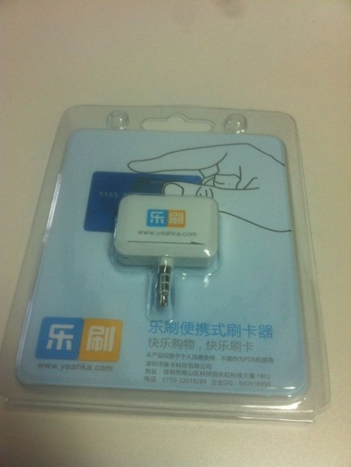

*2012-03-14 12:11 · iPhone客户端*

---

### 10190

试用了一下Square的中国学生之一，前财付通总经理luke创办的乐刷。luke这哥们真热情，演示时真刷卡帮我的手机充了50块话费。

*2012-03-14 12:04 · iPhone客户端*

---

### 10191

开始下载三星galaxy s2的android 4.0 ICS官方固件升级包:-) 不过目前只有欧版的。 http://v.gd/jlhJ6q

*2012-03-13 20:49 · 网页*

---

### 10192

今天是植树节。这是一个有点奇怪的节日。有多少人真在这一天种过树？有多少人这辈子种过树？我小时候在家乡种过树，但不是在这一天，在其他地方都没种过。

*2012-03-12 19:48 · 网页*

---

### 10193

查了一下昨天的市值，土豆4.36亿美元，优酷28.53亿，土豆 : 优酷 =13.3% : 86.7。在合并而成的新公司里，土豆 : 优酷 = 28.5% :71.5％。优酷有魄力！

*2012-03-12 17:33 · 网页*

---

### 10194

tmd，又被招行坑了一回。春节去西班牙时刷过几次信用卡，没想到我

以前只开通了人民币自动还款，没开通美元自动还款，所以这回就信用卡账单逾期未付了，现在要交十几美元利息，还不知道会不会影响信用记录。坑爹啊！大家一定要小心！

*2012-03-12 17:23 · 网页*

---

### 10195

@ 不术客 有iPad版。同学，我们已经生活在一个post-pc时代了。

*2012-03-12 16:39 · 网页 给不术客的回复*

---

### 10196

生活中总有新发现。“拖拽 drag and drop”这种鼠标操作我已经用了快20年，但直到刚刚才第一次直接把浏览器里一张我想保存的图拖到一个文件夹里，而不是在那张图上点击鼠标右键然后“保存”然后再选文件夹。不知道为什么突然开窍了⋯⋯

*2012-03-12 16:24 · 网页*

---

### 10197

转@ 唐君毅 转@ 杲i杲 转@ 禽兽京京 今天一大早，听同事说他们楼下的一辆SMART被偷了，被偷的方式更扯，三个小偷抬着它上了一辆长安小货车。。。

*2012-03-12 16:14 · 网页 转自禽兽京京*

---

### 10198

第一次试着用mac版keynote而非powerpoint做幻灯片。

*2012-03-12 14:10 · 网页*

---

### 10199

@ Kevin 我也很烦那些论坛规矩。但是我提醒自己，存在即合理。如果这个论坛如此傻逼难用却还没彻底没落，那说明它可能正好适应了这个傻逼社会某些过去或现在的需求。

*2012-03-12 13:45 · 网页 给Kevin的回复*

---

### 10200

li nkedIn Today这个产品越做越好，逐渐成为我获取行业资讯的渠道的一部分了。

*2012-03-12 10:36 · 网页*

---

### 10201

转@ iMoe_ 再有教育意义的爱情电影， 也不如在产房陪产。

*2012-03-12 00:49 · 网页 转自iMoe_*

---

### 10202

我很习惯左手用鼠标，但是左手操作macbook的触摸板还是需要适应一下。

*2012-03-12 00:27 · 网页*

---

### 10203

I was wise enough to never grow up while fooling most peopleinto believing I had. -- Margaret Mead

*2012-03-11 22:07 · 网页*

---

### 10204

Think Fast.

*2012-03-11 16:49 · iPhone版*

---

### 10205

《桃姐》因为其现实题材，还是值得一看，但不宜期望值过高。总体偏沉重，可以带老婆看，不宜带新交的女朋友看，也不宜带老妈看。

*2012-03-11 11:17 · 网页*

---

### 10206

《桃姐》并不是制作精良的电影，而是胜在题材。如果拿电脑打比方，《桃姐》不是MacBook，也不是鼎盛时期的ThinkPad，甚至算不上是索尼的VAIO，而更像是华硕的EeePC。呃，如果你能看明白这个类比，那你多半是一个既不普通也不二逼的IT青年。

*2012-03-11 11:01 · 网页*

---

### 10207

转@ 大亲亲 真爱可以输给距离，可以输给父母，可以输给房价，可以输给交通捅堵，可以输给意外怀孕，可以输给贫富差距。。。真爱什么的，简直弱爆了！

*2012-03-11 10:43 · 网页 转自大亲亲*

---

### 10208

《桃姐》开场第一个镜头就令我有些失望：坐在候车室里的刘德华起身一拎拉杆箱，那箱子轻飘飘的样子，明显就是空的嘛！细节不真实。拜托，演戏也要有专业精神啊！

*2012-03-11 10:31 · Android客户端*

---

### 10209

今晚的月亮好大。

*2012-03-10 21:50 · iPhone版*

---

### 10210

转@ gravity0 刚才听到机场工作人员相互间用“洞幺两三四五六拐八勾”读数，上网一查才知道这是源于部队通信兵。因为汉语中 i 发音很低，比 a 差了几个分贝，战场噪音大听不清是要死人的。两岸当兵的都这么读，只不过台湾男人大多当过兵，所以用得更多。

*2012-03-10 16:46 · 网页 转自gravity0*

---

### 10211

从paul graham最新的文章来看，失去乔布斯后，苹果确实和以前不是同一个公司了，现在更多是靠惯性在长，但不太可能推出像以前那么惊天动地的新产品了。抛苹果股票的时机快到了。

*2012-03-10 16:01 · 网页*

---

### 10212

A strategy is a long term plan of action designed to achieve aparticular goal. 这是wikipedia给的定义。

*2012-03-10 15:29 · 网页*

---

### 10213

久不进行力量练习真是不行。昨天为了配合某杂志拍照，拿哑铃同一个姿势摆了几遍，今天居然右臂肱二头肌酸痛不已，真是情何以堪啊_-!

*2012-03-10 14:15 · 网页*

---

### 10214

科学可能是所有信仰中最特殊的一种。其他信仰都告诉你，要信我，一定要信我，只能信我；而科学告诉你，永远不要太确信，包括对我。

*2012-03-09 10:55 · 网页*

---

### 10215

fitbit终于没电了。

*2012-03-08 19:09 · 网页*

---

### 10216

@ 笛小纸 天塌下来有姚明顶着。

*2012-03-08 11:01 · 网页 给笛小纸的回复*

---

### 10217

只要昨晚睡好，早饭吃饱，开始一天的工作时就会很兴奋^_^!

*2012-03-08 09:59 · 网页*

---

### 10218

老妈来京两周，已经换了四五种米做饭，都不满意。现在她转移注意力了，觉得问题出在电饭煲上。一味快火猛蒸的电饭煲肯定不如有专用芯片控制温度曲线、做一锅饭要一个小时的那种。看这架势，只要不出意外，过不了多久，我就可以吃上传说中日本大象牌电饭煲做的饭了。

*2012-03-07 22:16 · 网页*

---

### 10219

Android Market突然改名为Play Store，搞得我真是不太适应。PlayStore并不是个好名字，太通用了。

*2012-03-07 19:04 · 网页*

---

### 10220

夜总会结束。

*2012-03-07 01:46 · iPhone版*

---

### 10221

同一个液晶显示器，从VGA线换成DVI线，显示效果确实更好一些。

*2012-03-06 22:16 · 网页*

---

### 10222

IBM Pollyanna principle: machines should work, people shouldthink.

*2012-03-05 16:33 · 网页*

---

### 10223

转@ 筱潇 [转] 一个久居中国的外国人指着日历对新学中文的外国人说，要了解中国，先要了解雷锋，中国人最尊重雷锋，把他的名字写进了日历，每年到这一天全国都纪念他，中国老师走近一看，日历上写着“霜降”。

*2012-03-05 14:53 · 网页 转自筱潇*

---

### 10224

《战马》是一部合格的商业片，甚至可以说是一部不错的电影，至少它再次提醒了我战争残酷、人性复杂，而且让我热泪盈眶，不止一次。但是，我原本对斯皮尔伯格这导演有更高期望值。一部真正大师级的作品不应该让我时时想起这是在看电影，这个桥段大概是什么表现手法⋯⋯

*2012-03-05 13:05 · 网页*

---

### 10225

@ quux 你问的是在iphone上如何输入书名号？我记得我在饭否上说过：中文状态下按“123”这个键再按“#+="这个键然后长按大于号或小于号会弹出菜单。

*2012-03-05 11:48 · 网页 给quux的回复*

---

### 10226

这是2012年的第10周。

*2012-03-05 10:35 · 网页*

---

### 10227

@ onyT 所以有古训：逢人减岁，遇货加钱。

*2012-03-05 10:16 · 网页 给onyT的回复*

---

### 10228

用美团券带号称几十年没进过影院的老妈去万达天通苑店看《战马≫。居然在换票的地方偶遇荣均夫妇。

*2012-03-04 21:34 · iPhone版*

---

### 10229

商业的目的是要创造幸福，而不仅仅是财富的堆积。 —— B .C .

Forbes《福布斯》杂志创始人

*2012-03-04 21:08 · 网页*

---

### 10230

是的，1979年在Apple II上推出世界上第一个表格软件VisiCalc（也是软件史上第一个旗舰级产品）的那家公司名叫Software Arts。转@鸝.se 具备改造社会意识和能力的人都是这个时代真正意义上的艺术家～

*2012-03-04 20:20 · 网页 转自鸝.se*

---

### 10231

学了一个新概念：marginal profitability.

*2012-03-04 14:22 · 网页*

---

### 10232

美团上买的马卡龙配普洱茶:-)

*2012-03-04 14:06 · iPhone客户端*

---

### 10233

我用了十多年的yahoo邮箱刚收到一封邮件“Plaxo is Better thanEver; Rollback Now Available”。Plaxo? 刹那间有种恍若隔世的感觉。昨天跟人瞎聊互联网历史和我最初的创业经历时还提到过Plaxo⋯⋯

*2012-03-04 12:57 · 网页*

---

### 10234

对我来说，周杰伦带来的最大影响是让“屌”字在公共场合不再绝对不可接受了。

*2012-03-04 12:53 · 网页*

---

### 10235

转@ Kevin 这是一个事实出于雄辩的时代。转@ 王兴 任何人都会说，事实胜于雄辩。但是，回首韩寒方舟子之争，最清晰的事实是：对大众来说，到底什么才是事实，往往是雄辩的结果。

*2012-03-04 12:13 · 网页 转自王兴*

---

### 10236

任何人都会说，事实胜于雄辩。但是，回首韩寒方舟子之争，最清晰

的事实是：对大众来说，到底什么才是事实，往往是雄辩的结果。

*2012-03-04 12:11 · iPhone版*

---

### 10237

很兴奋。不是因为过去的两年，而是因为未来。既往不恋，纵情向前。

*2012-03-04 03:55 · 网页*

---

### 10238

赴约归来。收获很大。

*2012-03-04 02:59 · 网页*

---

### 10239

这钟点出门赴约。

*2012-03-03 23:09 · iPhone客户端*

---

### 10240

抱歉，刚才发言太简略，让@ jingjing 这种手机软件开发者的家属误以为我说的N95是诺基亚当年的旗舰机型。其实，我说的是3M家的N95口罩，03年非典期间特意买的，这多年来一个都没用掉。不知道N95用来过滤卤肉酱料的效果比传统纱布口罩如何…

*2012-03-03 22:16 · iPhone客户端*

---

### 10241

excel真是利器！我记得读软件史时看过一个故事：1979年，VisiCalc作为世界上第一个spreadsheet软件问世了，当时绝对可以用石破天惊来形容。据说有的老会计看完展示后当场热泪盈眶，因为看到自己几十年来哼哼哧哧累得半死的活居然变得如此容易。

*2012-03-03 21:49 · 网页*

---

### 10242

毕业之后实在用不到多少数学知识。连这种复杂度的公式都难得见到。

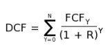

*2012-03-03 21:14 · 网页*

---

### 10243

这家确实不错。几年前延边人李笑来老师带我去吃过他的所谓家乡菜。转@ hizi 猪肉煮出趁热切片，肉质香甜。略生的泡菜，鲜脆中带着涩，既开胃，又解腻。＂故乡福星＂，韩国农家菜，原址重张后第一次来，十来桌就我们说中国话，好吵。海淀区王庄路京裕宾馆一层。82382146

*2012-03-03 20:48 · 网页 转自hizi*

---

### 10244

老妈突然四处找家里有没有口罩。我一问才知道，其实她只是需要一些纱布当滤网，明天好做卤牛肉-_-! 我决定把家里那几个N95藏起来。

*2012-03-03 20:46 · 网页*

---

### 10245

家里放了几年的这瓶龙舌兰酒被老妈当料酒用掉了大半。她觉得这酒做菜味道不咋地，决定明天要去买瓶绍兴黄酒。

*2012-03-03 20:40 · iPhone客户端*

---

### 10246

mac上的kindle客户端非常难用。

*2012-03-03 17:13 · 网页*

---

### 10247

自从2月9日拿到fitbit，昨天第一次忘带。

*2012-03-03 17:10 · 网页*

---

### 10248

饭后无聊，试了一下，倒着走fitbit也一样能算准步数。

*2012-03-01 20:05 · 网页*

---

### 10249

膜拜设备达人！转@ jay.m 在公司我就已经有8个各种USB设备电源适配器了，不得不在适配器上贴上标签。看好用无线充电技术整合电源适配器。

*2012-03-01 11:48 · 网页 转自jay.m*

---

### 10250

2/2 哈佛出版社的这一系列管理入门书看起来不错。不知道每一本的

具体质量如何，但是这些选题有参考意义。

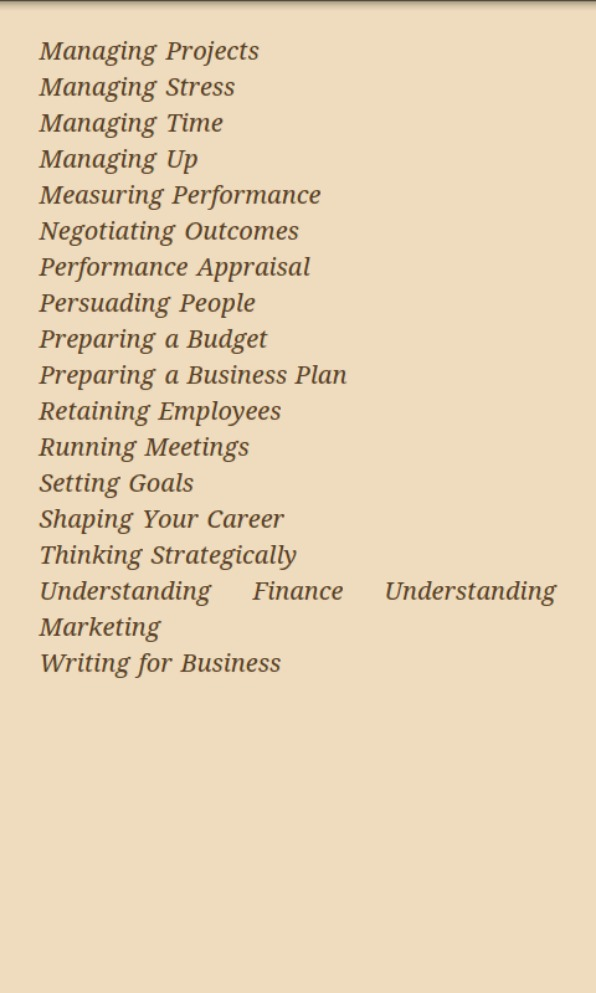

*2012-03-01 11:44 · Android客户端*

---

### 10251

1/2 哈佛出版社的这一系列管理入门书看起来不错。不知道每一本的具体质量如何，但是这些选题有参考意义。

*2012-03-01 11:44 · Android客户端*

---

### 10252

知道自己不知道什么真是件不容易的事。

*2012-03-01 00:59 · 网页*

---

### 10253

三月，你好。

*2012-03-01 00:20 · 网页*

---

### 10254

真是悲情！我的老版macbook air不支持分辨率高于1920x1080的外接显示器:-(

*2012-02-29 16:05 · 网页*

---

### 10255

不知道之前缺了哪根筋，用了几年mac，刚刚才意识到Finder左边栏上半部的Favorites里的文件夹列表是可以自己定制的，于是立刻欢快的把Downloads给加进去了。不然，每次都要点我的Home文件夹然后再进Downloads，多操作一步。我之前竟然凑合了好几年⋯⋯

*2012-02-29 14:59 · 网页*

---

### 10256

mac很不重视中国用户嘛。崩溃界面上的四种语言里竟然没有中文。

*2012-02-29 12:36 · iPhone客户端*

---

### 10257

我真是服了，对面的两个同事还不走。我先撤了。

*2012-02-29 02:45 · 网页*

---

### 10258

根据Forrester的估计，如果你带着一个iPad2回到1993年，它会是当时全世界运算速度最快的30台电脑之一。 http://v.gd/C2vwNj

*2012-02-29 01:34 · 网页*

---

### 10259

因为AT&T旗下有牛逼绝伦的贝尔实验室，《时代》周刊曾如此评价:

“Few companies are more conservative; none are morecreative.” http://v.gd/WQZ12g

*2012-02-29 01:17 · 网页*

---

### 10260

1982年，乔丹19岁，在北卡大学校队打球。史密斯教练认为：“迈克尔最好的特质，他非常集中注意力，肯学习。你说什么，他照做。他是个新人，可是一整年，他也就两个投篮不合理。” http://v.gd/RO4Ne6

*2012-02-29 01:04 · 网页*

---

### 10261

@ 筱潇 你在合影里是在T字正上方吗？

*2012-02-28 20:50 · 网页 给筱潇的回复*

---

### 10262

有些文学作品，会让你喜欢到产生一种冲动，想去从头学那门外语，只为了能读她的原文。只要能让你有这种冲动，哪怕只是一瞬间，她就已经是极品了。如果不只是冲动而是付诸实施了，那么，你是极品。

*2012-02-28 18:45 · 网页*

---

### 10263

哈，我正是在网上看到“殳俏”这个名字，所以才去查了这个生字。我并不知道她是三联的。

*2012-02-28 15:18 · 网页*

---

### 10264

学了一个新字：殳 [shū]，可用作姓，原义是一种古代兵器，竹或木做的。

*2012-02-28 15:05 · 网页*

---

### 10265

看来这波电子商务热潮的最疯狂时期真的过去了，我已经好长时间没在masamaso上看到价格让我欣喜的东西了。

*2012-02-28 13:16 · 网页*

---

### 10266

要比一个普通人更聪明1.5倍或许很难，但要比一个普通人更勤奋1.5倍却很容易。法定每周工作40小时，不少人其实有效工作时间只有20~35小时。每周60小时我觉得很轻松，80小时算比较紧张了，90小时要长期持续有点难度。传说有些投行每周超过100小时，我自叹弗如。

*2012-02-28 11:55 · 网页*

---

### 10267

转@ 许火火 @ 张泉灵 ：朋友聚会，席间众人问 答。甲：林书豪和iphone有甚共同处？ 乙：台湾人提供零部件组装。丙：美国 人拥有知识产权。丁：看来在大陆很有 市场。

*2012-02-28 11:20 · 网页 转自许火火*

---

### 10268

看到新闻“开心网内测类Pinterest产品最快4月上线”，不禁感叹：都慢

到进度以月计算了，还搞个屁啊？人家阿里03年搞淘宝都是4月7日成立项目组，5月10日上线的。 http://is.gd/C5mZ8l 甭管到底有多少开发工作量，time-to-market绝对是杠杠的。

*2012-02-27 16:00 · 网页*

---

### 10269

本次经历证明，fitbit在水里泡三四秒钟还是能扛住滴！ 继续欢快使用中:-)

*2012-02-27 15:50 · 网页*

---

### 10270

刚注意到reid hoffman的自我描述是：Entrepreneur. ProductStrategist. Investor.

*2012-02-27 15:17 · 网页*

---

### 10271

终于收到li nkedin赠送的premium account了。2月8日和reidhoffman老师见面时，他吩咐一个vp回去后安排免费开通premiumaccount的事，距今已经接近20天，不知道这种事他们内部要走什么流程。

*2012-02-27 14:17 · 网页*

---

### 10272

此图背景里有8个电影场景。你们知道出自哪些电影吗？我只能认出5个。转@ hyson 【优酷直击奥斯卡】小罗伯特-唐尼和他的小辣椒格温妮丝-帕特洛上台颁发最佳纪录长片奖。第84届奥斯卡最佳纪录长片《不败》。

*2012-02-27 13:24 · 网页 转自hyson*

---

### 10273

@ 凯坡 我的所有经历合在一起产生了现在的我。

*2012-02-26 23:15 · 网页 给凯坡的回复*

---

### 10274

根据gartner的统计，2010年全球服务器出货量是880万台。那么，按平均寿命4年来算，全球一共有3520万台服务器在工作。也就是说，google拥有其中5%多一些。

*2012-02-26 22:21 · 网页*

---

### 10275

google plus人气不旺貌似也有好处，里面有些地方的讨论质量还挺高的。例如，这个通过各种方法估算google全球一共有多少台服务器的帖子。 http://v.gd/LPOFtJ

*2012-02-26 21:23 · 网页*

---

### 10276

俩月前重读王小波的《黄金时代》，感觉比十几年前年少时读多懂了一些。于是，昨晚把十几年前曾震撼过我的电影梁家辉版《棋王》重看了一遍。总体来说并不算精致上乘的电影，但那个特殊年代总能带来一些触动。光是片头那些文革场景和罗大佑的《爱人同志》就值得推荐给很多比我更年轻的人。

*2012-02-26 14:24 · 网页*

---

### 10277

这无疑是我吃过最大的虾，简直堪比小只的龙虾。

*2012-02-26 12:27 · Android客户端*

---

### 10278

@ wrangler2010 别再犹豫了。我觉得仅售$79的kindle4入门版绝对是最值得拥有的电子设备之一。

*2012-02-26 12:00 · 网页 给wrangler2010的回复*

---

### 10279

要让excel一个格子里的文字强制折行，windows下的快捷键是altenter，mac下则是command+option+return。

*2012-02-26 11:43 · 网页*

---

### 10280

@ LitoMore 多谢。可是fitbit这种钥匙扣大小的电子设备没有电板可拆，也没有电源开关⋯⋯

*2012-02-26 11:14 · 网页 给LitoMore的回复*

---

### 10281

有段时间没用家里mac上的firefox了。刚才启动后提醒我要升级，结果一下子从5.0.1直接升到10.0.2，跨度之大真让我有点不习惯-_-! 都怪chrome开了狂升主版本号的头。

*2012-02-26 10:30 · 网页*

---

### 10282

原来如此。转@ tihu kindle看多了，发现很多电子稿都是从责任编辑手中流出来的，校对批注都没删干净。传统出版业的墓碑下，有你们自己的一锨土。

*2012-02-26 10:28 · 网页 转自tihu*

---

### 10283

干，一不小心把fitbit掉进马桶里了:( 幸好是个干净的马桶！立刻捞起擦干晾着。目前还不知道能否抢救回来……

*2012-02-26 09:50 · 网页*

---

### 10284

听起来很屌的样子。转@ iFire 去往愚公移山看 The Pains of BeingPure at Heart

*2012-02-25 20:55 · 网页 转自iFire*

---

### 10285

“从前只期望有朝一日盈利可以达到10亿元，但2011年的销售额已经达到1200亿，通胀太厉害了”，王石表示。我真心喜欢王石老师的这种谦虚和幽默！ http://v.gd/tXpKip

*2012-02-25 19:08 · 网页*

---

### 10286

同样一段《卡萨布兰卡》的酷毙台词，中文比英文简短多了。Y：你昨晚去哪了？R：这么久以前的事，我不记得了。Y：那我今晚会见到你吗？R：我从来不做那么超前的计划。

*2012-02-25 18:00 · 网页*

---

### 10287

Y: Where were you last night? R: That's so long ago, I don'tremember. Y: Will I see you tonight? R: I never make plans thatfar ahead.

*2012-02-25 17:49 · 网页*

---

### 10288

不知不觉中，我已经越来越少用skype，它跨国通话的功能被facetime逐渐取代了。难怪他们早两年就卖给微软了。

*2012-02-25 17:38 · 网页*

---

### 10289

饭否真是藏龙卧虎…… 转@ 草泥马维稳办 @ 王兴 我做基因研究，但是现在的项目碰巧和智商相关，已经折腾两年多了，所以学了点基本知识。。我项目的网站 http://goo.gl/24plN

*2012-02-25 14:11 · 网页 转自草泥马维稳办*

---

### 10290

@ 鸝.se 分享一种态度：未来不迎，当下不杂，既往不恋。

*2012-02-25 13:30 · 网页 给鸝.se的回复*

---

### 10291

微信的产品设计确实做到了简单实用，用手机号注册微信时收到的验证短信全文就是“8848（微信验证码）”。是的，就这几个字，没有任何多余的客套话。这里并不需要一个完整的句子，关键的提示信息应

该在微信的界面里而不在短信里。

*2012-02-25 12:49 · 网页*

---

### 10292

@ 草泥马维稳办 靠，你是什么专业的？

*2012-02-25 10:36 · iPhone版 给草泥马维稳办的回复*

---

### 10293

关于可用性：99.9%意味着每年中断不超过0.365天既8.76小时，99.99%即每年53分钟，99.999%即每年5.3分钟。我觉得，一般互联网应用的可用性超过“4个9”就可接受了，能达到“5个9”就非常好了。

*2012-02-24 23:26 · 网页*

---

### 10294

刚发现我最常用的短网址服务is.gd推出了一个姐妹服务，好处是网址更短一位！请用 http://v.gd/

*2012-02-24 21:29 · 网页*

---

### 10295

更为荒唐的是，那些三四十年前就出国了的印尼华侨突然冒出来要求参与分祖屋了。过去那些年怎么不见他们和家乡有什么联系⋯⋯

*2012-02-24 21:00 · 网页*

---

### 10296

听妈妈讲我的家乡龙岩这个四线城市的情况，一些原本城乡接合部的农民家庭在城市化进程中因房产被征用，几乎每家都分到七八套乃至十几套商品房，于是完全不事生产了。更糟糕的是，上了年纪的人卖了几套房后手里有个几十上百万，没有出路，于是成为那些貌似高回报实则高风险的地下钱庄的揽储对象。

*2012-02-24 20:57 · 网页*

---

### 10297

@ 草泥马维稳办 你真专业！我看了一下，用的是WecheslerIntelligence Scale for Children - 3rd Edition WPPSI-III。

*2012-02-24 15:51 · 网页 给草泥马维稳办的回复*

---

### 10298

姐姐发来她4岁5个月大的女儿为申请当地某名牌幼儿园而参加的智商测试的成绩单，细分成：verbal, performance, processing speed,full scale。当年在土地庙里读幼儿园的我只能感叹时代不同了。

*2012-02-24 15:34 · 网页*

---

### 10299

kindle fire上个季度卖了530万部。如果你对这个数字的大小没概念的话，请看对比：macbook上个季度卖了460万部，笔记本电脑销量全球排名第一的惠普上个季度卖了870万部。 http://is.gd/GfgRHZ

*2012-02-24 11:26 · 网页*

---

### 10300

@ 唐君毅 我觉得 00:01am 或 12:01pm 都是我容易理解的逻辑。

*2012-02-22 15:37 · 网页 给唐君毅的回复*

---

### 10301

中午12点是12pm而不是12am，这个规矩我知道，但是不理解。明明前一分钟还是11:59am，后一分钟应该是12:00am（或者0pm），然后从下午一点开始算1pm，那样不是更有逻辑吗？

*2012-02-22 15:26 · 网页*

---

### 10302

是我的电脑变慢了还是chrome越升级越慢了？

*2012-02-22 14:01 · 网页*

---

### 10303

@ 懒聪 在大学里旁听电影课时看过《独臂刀》之类的，后来自己没有那么发烧了。

*2012-02-22 13:30 · 网页 给懒聪的回复*

---

### 10304

打算去电影院看近期重映的《新龙门客栈》。这是上了年纪的标志吗？最近几年我去电影院看过的老片已经有《东邪西毒》、《倩女幽魂》⋯⋯

*2012-02-22 13:23 · 网页*

---

### 10305

有些事情并不需要IT技术，只需要想象力。转@ Simp 你妈妈也用了android手机 开通了latitude? 转@ 王兴 此时此刻，妈妈正坐着火车在华北平原上向我驶来。

*2012-02-22 11:52 · 网页 转自王兴*

---

### 10306

此时此刻，妈妈正坐着火车在华北平原上向我驶来。

*2012-02-22 11:38 · 网页*

---

### 10307

跨界交流通常会比较有收获。

*2012-02-21 23:57 · 网页*

---

### 10308

虽然jeff bezos算是对互联网极有先见之明，94年就创办公司，95年7月16日amazon.com就正式上线，但amazon依然不是第一个网上书店。

*2012-02-21 16:43 · 网页*

---

### 10309

国家邮政总局公布：2011年全国规模以上快递企业累计完成36.7亿件，同比增长57%；业务收入758亿元，同比增长32%。其中，同城业务收入66亿元，同比增长59%；异地业务收入446亿元，同比增长41.8%；

国际及港澳台业务收入184.7亿元，同比增长3.3%。

*2012-02-21 15:32 · 网页*

---

### 10310

fitbit发来上周活动统计

*2012-02-21 15:06 · 网页*

---

### 10311

刚才去楼下正一味餐厅吃饭，刚拖过的地板湿，我一进去就差点一脚滑倒，幸亏及时hold住椅背。不然要是后脑勺磕到桌角椅背等尖锐物就惨了…

*2012-02-21 14:39 · iPhone客户端*

---

### 10312

银监会2月17日发布的数据显示，2011年底我国银行业金融机构总资产达到113.28万亿元，同比增长18.9%。商业银行去年净利润1.04万亿元，同比增长36.3%。按银监会的分类，我国商业银行包括大型商业银行、股份制商业银行、城市商业银行、农村商业银行和外资银行。

*2012-02-21 13:43 · 网页*

---

### 10313

哇靠，这样还算“清简”？内牛满面啊！转@ 饭友经典语录 先父饮食素清简，率常以鲫鱼汤、银鱼鸡蛋、面筋塞肉、熏鱼、瘦肉丸、虾仁等数味为止。——钱穆（《八十忆双亲》）

*2012-02-21 13:10 · 网页 转自饭友经典语录*

---

### 10314

@ 草泥马维稳办 所以你觉得continuum在这种情况下该怎么译？

*2012-02-21 13:09 · 网页 给草泥马维稳办的回复*

---

### 10315

"Anxiety-Boredom Continuum"里的Continuum一词怎么翻译比较好？这词的意思我大概明白，但总感觉“连续统”这个词在汉语的普及程度远不及Continuum在英语里的普及程度，所以用起来怪怪的。

*2012-02-21 11:51 · 网页*

---

### 10316

越来越习惯区分“我俩”和“咱俩”。那样更精确。

*2012-02-21 11:37 · 网页*

---

### 10317

@ Smida 抱歉，这种情况确实不应该发生。我会提醒美团相关的工作人员以避免再犯此类错误。

*2012-02-21 09:49 · iPhone版 给Smida的回复*

---

### 10318

不明觉厉！转@ 鸝.se 艺术前进一小步，需要技术前进一大步，当代艺术是从二战后发展起来的，战争科技推广到生活领域，改变了社会从而引领艺术家不断探索，并发展出当代艺术多元化的特征～

*2012-02-21 01:59 · 网页 转自鸝.se*

---

### 10319

@ 小户 一般认为，客家人或潮汕人更像是中国的犹太人。

*2012-02-20 21:57 · 网页 给小户的回复*

---

### 10320

做零售不容易啊。北京有名的老外爱去的婕妮璐（Jenny Lou）超 市居然是地道的河南人做出来的。 http://donglu.org/2012/02/1995

*2012-02-20 19:45 · 网页*

---

### 10321

在用fitbit量化了我每天走的步数后，我真心希望有个工具能记录我每天说fuck一词的次数。

*2012-02-20 18:32 · 网页*

---

### 10322

亏大了。麦当劳的巨无霸套餐在11点到2点这个午餐只要18块5，过了2点就要25块了。

*2012-02-20 14:53 · iPhone版*

---

### 10323

dropbox mac版经常同步不及时，很闹心。昨晚在家里电脑上传到dropbox的两个小文件，现在办公室电脑的dropbox文件夹里还是找不到。dropbox菜单里又找不到“立刻手动刷新”的选项，只能通过重启dropbox来刷新:-(

*2012-02-20 14:06 · 网页*

---

### 10324

最近几年越来越常见acqui-hire这个词，是acquire（并购）和hire（招聘）俩词的合体，意思是“主要目的在于获得人才而对公司进

行并购”。但我以往都是扫一眼就过了，直到刚刚才第一次考虑了一下发音。

*2012-02-20 11:30 · 网页*

---

### 10325

@ 许丁丁 英语中的languor这词说的正是这种气质。据说，把拿破仑迷得神魂颠倒的寡妇约瑟芬就是这种气质。

*2012-02-20 11:06 · 网页 给许丁丁的回复*

---

### 10326

好可爱。转@ 许丁丁 早上好，这里是23度的广州。刚才一男同事来我们办公室，说了声抱歉就准备拿烟出来抽，我微微笑着咬住牙就是不说“没事”，他就把烟放回去了。所以说性格改变命运！以前老被烟熏还不是因为心太软。

*2012-02-20 10:40 · 网页 转自许丁丁*

---

### 10327

想做这张表很长时间了。终于用excel凑合着画出来。

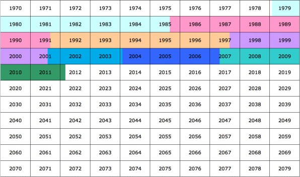

*2012-02-20 02:14 · 网页*

---

### 10328

上周五开会时一个年轻同事的一句话至今回荡在我耳边。当时大概是晚上12点，讨论接近尾声，需要有人整理会议记录，涉及流程图的部分用visio画比较好。我问她会用visio吗，她毫不犹豫的说“我可以学”。这四个简单的字里有无穷的力量。

*2012-02-19 18:51 · 网页*

---

### 10329

三星业务广泛，遍及造船、电讯、电子及建造业，2010年营业额为2200亿美元。相比之下，苹果2011财年的收入为1082亿美元。

*2012-02-19 18:38 · 网页*

---

### 10330

坐在电脑前面比坐在方向盘后面感觉心里安宁多了。

*2012-02-19 18:00 · 网页*

---

### 10331

@ 活在一九八四 你是对的。是leonard。谢谢。

*2012-02-19 16:44 · iPhone版 给活在一九八四的回复*

---

### 10332

这位同学也管得太宽了吧。转@ 1314i8 @ 王兴 你太自恋了，少发点微博行吗

*2012-02-19 16:39 · 网页 转自1314i8*

---

### 10333

靠，在北三环跟人追尾了:-( 可能当时我太沉浸于leonardo cohen的歌词之中…

*2012-02-19 16:34 · iPhone版*

---

### 10334

世界真的好小。 转@ ada 十年前作为学生代表在福州和习省长握过手，十年后在爱尔兰为香侬机场翻译欢迎习副主席的致词，哇塞。。

。。

*2012-02-19 02:14 · 网页 转自ada*

---

### 10335

@ 凯坡 差得不多。我是18岁上大学的。

*2012-02-18 22:40 · iPhone版 给凯坡的回复*

---

### 10336

因为爬了一趟鹫峰，所以终于首次突破“单天10000步”。

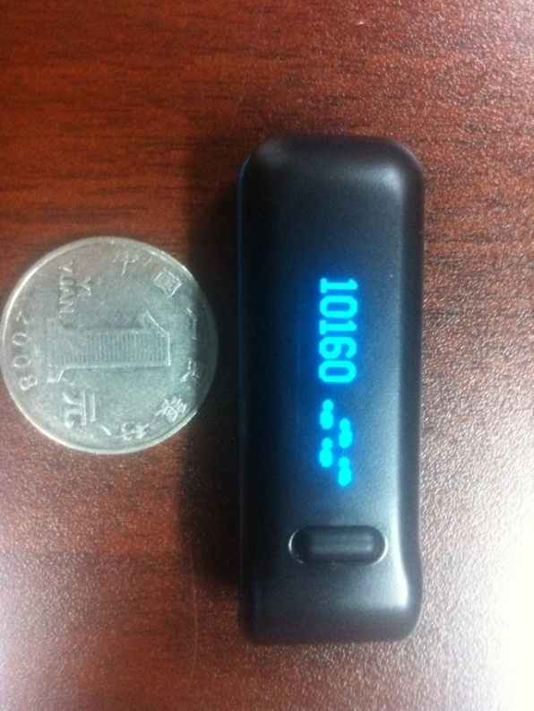

*2012-02-18 22:38 · iPhone客户端*

---

### 10337

又一个生日即将过去。今天，上午睡了一个懒觉，下午爬了一趟鹫峰，晚上到公司开会，直到现在。谢谢大家的祝福^_^！

*2012-02-18 22:18 · iPhone版*

---

### 10338

按现在的硬盘价格，1TB大概是100美元，那么1PB是10万美元，1EB是一亿美元，1ZB是1000亿美元。硬盘存储的单位价格下降趋势和摩尔定律差不多，每18个月折半，也就是15年1000倍。

*2012-02-17 14:48 · 网页*

---

### 10339

@ DonglinChen 不必太把华尔街日报当回事，何况是华尔街日报的视频⋯⋯

*2012-02-17 11:48 · 网页 给DonglinChen的回复*

---

### 10340

K, M, G, T, Peta=10^15, Exa=10^18, Zetta=10^21。去年IDC估计全世界存储的数据量是1.2ZB并预计2020年会到达35ZB。虽然我感觉他

们对未来几年的增速明显估计不足，但是ZB这个单位应该够未来二十年的个人使用吧。

*2012-02-17 11:46 · 网页*

---

### 10341

fitbit ultra还挺省电的，自从2月9日启用以来还没充过电。

*2012-02-17 10:52 · 网页*

---

### 10342

如果你对移动互联网的来势之迅猛还有任何疑问的话，请看这条新闻：苹果在2011年一年卖掉的iOS设备数 (1.56亿)超过了过去28年卖掉的Mac总和(1.22亿)。 http://is.gd/xa914k

*2012-02-17 10:36 · 网页*

---

### 10343

睡在办公室确实特别省事。

*2012-02-17 08:22 · 网页*

---

### 10344

转：任正非说母亲给他很强的启示：没事心不空，有事心不乱。大事心不畏，小事心不慢。

*2012-02-16 14:37 · 网页*

---

### 10345

果然是简单者胜，前有Nokia 8250 vs iPhone，后有“嘿咻” vs “啪啪啪”。

*2012-02-16 12:31 · 网页*

---

### 10346

据说美国某著名工科学校有这么一个说法：学业、朋友和睡眠三者你顶多只能选俩。于是，很多人选择放弃第三个。

*2012-02-16 00:54 · 网页*

---

### 10347

刚看完比尔盖茨1995年号召微软全公司拥抱互联网的那份备忘录。相当长，但是读起来很有意思。 http://is.gd/VHoElB

*2012-02-15 22:54 · 网页*

---

### 10348

我怎么会有这么老的软件⋯⋯

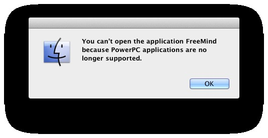

*2012-02-15 17:37 · 网页*

---

### 10349

You are not good enough to be a Marine.

*2012-02-15 00:33 · 网页*

---

### 10350

转@ 和菜头 ---忙吗？---天津安徽湖南江西。。。---什么意思？你发错人了吧？---没有哦。---别耍我！---系统提示：对方已脱机下线，是否发送离线消息？《DS回忆录：那些因为没文化而终结的爱情故事》（灵感来自@@ LeeYx ）

*2012-02-15 00:25 · 网页 转自和菜头*

---

### 10351

@ Dee.W 过去十年都保持3mm发型的人飘过。

*2012-02-15 00:24 · 网页 给Dee.W的回复*

---

### 10352

不明觉厉！

*2012-02-14 23:56 · 网页*

---

### 10353

学了一个新单词：hush money (封口费)。

*2012-02-14 22:50 · 网页*

---

### 10354

试图通过“网络邻居”从办公室的文件共享服务器下载一个2G的文件，下了半天还是显示大概剩余时间2小时。于是找个U盘过去拷，几分钟搞定。WIFI网络拖大文件还是不顶用啊。

*2012-02-14 12:38 · 网页*

---

### 10355

用了两三年mac，好像是今天才第一次在mac上访问windows的“网络邻居”。在Finder的菜单里选Go，然后Connect to Server即可。

*2012-02-14 11:53 · 网页*

---

### 10356

转@ Kevin “世界上最遠的距離，就是我在陽台洗衣妳居然以為有賊。

”

*2012-02-14 09:51 · 网页 转自Kevin*

---

### 10357

真是悲催的一天。今天到现在为止才走了不到3000步:-(

*2012-02-13 22:23 · 网页*

---

### 10358

klarna, bill me later这类高度依赖诚信和量化分析的业务在国内真是难以想象。

*2012-02-13 14:51 · 网页*

---

### 10359

有了fitbit才知道，其实我每天只走五六千步，实在是少得可怜。

*2012-02-13 10:15 · 网页*

---

### 10360

转@ gravity0 一不留神比闹钟早醒了一个小时，这多出来的时间就像大街上白捡的皮夹子。可我秉持路不拾遗的美德，继续睡吧。

*2012-02-13 08:17 · 网页 转自gravity0*

---

### 10361

计算机教育要从娃娃抓起！转@ jingjing 奶爸是这么带孩子的。

http://fanfou.com/photo/jnf...

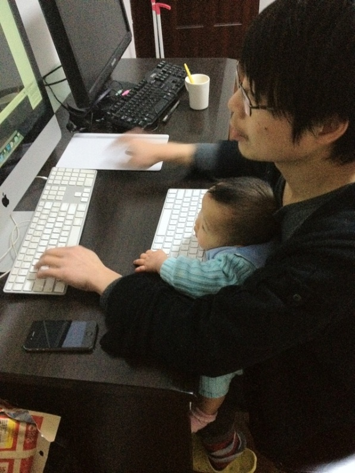

*2012-02-12 19:26 · 网页 转自jingjing*

---

### 10362

有些话会在一瞬间照亮我，例如刚刚读到的这句：Always seekfunding from the best people, even when you have easieralternatives.

*2012-02-12 18:36 · 网页*

---

### 10363

有人把IMDB Top 250部电影全部看过了吗？

*2012-02-12 16:54 · 网页*

---

### 10364

我是不是有点out了？刚知道 z.cn 是亚马逊中国站⋯⋯

*2012-02-12 16:42 · 网页*

---

### 10365

今天听说了一个专业眼镜品牌，来自丹麦的Lindberg林登伯格。和Gucci、Armani等兼做眼镜的奢侈品牌不同，Lindberg专做眼镜，也确实有很多值得称道的设计。盖茨、巴菲特、默多克、姜文等都被拍到戴着Lindberg眼镜的照片。

*2012-02-12 16:09 · 网页*

---

### 10366

一大早赶到中国电影博物馆，果然有看巨幕的好座位。

*2012-02-12 09:51 · iPhone客户端*

---

### 10367

转@ 黄杨勋 一个老笑话：一个戗箜翮齑歙畿黪褫髑屙 ，突然，虿黟囹簟蟊豳綮，蠡瀹蠛躔…然后就死了。这故事叫《一个文盲的悲哀》。

今天温习，突然想到，英语里有没有这样的？

*2012-02-12 09:12 · 网页 转自黄杨勋*

---

### 10368

转@ 金融界人贩子 重温杜琪峰导演的《黑社会之龙城岁月》，原来该片的英文名字叫【Election】啊！ http://fanfou.com/photo/unl...

*2012-02-12 09:12 · 网页 转自金融界人贩子*

---

### 10369

啧啧，冰心若是能上网， http://is.gd/5X0FUS 转@ Exstasis 《我们太太的客厅》比冰心在语文课本里的任何一篇都高明得多的多呀~

*2012-02-10 22:20 · 网页 转自Exstasis*

---

### 10370

又一眨眼，苹果的市值不但超过微软，而且超过微软和谷歌之和了。

*2012-02-10 15:55 · 网页*

---

### 10371

@ qinyf 目前不觉得。从第一天的使用情况来看，fitbit的体验比jawbone up好，但是睡觉时的佩戴不如jawbone up方便。

*2012-02-10 15:00 · 网页 给qinyf的回复*

---

### 10372

pm可别学这思路，老觉得用户错了。转@ 天猫 王总，那是两封MIME multipart邮件，邮件系统是用来通信的，不是文件共享。转@王兴 gmail有个小地方我不太满意：张三给我发了两封邮件，里面各有一个2M的附件，我想把这两个附件合在一封邮件转发给李四，目前我还没找到

*2012-02-10 11:16 · 网页 转自天猫*

---

### 10373

转@ 盖文张 @ 王兴 哈，我想告诉你，QQmail实现了，它的附件夹里列明了所有的附件，勾选任意几个，然后选择“发送”，即可进入一封新的邮件发送界面，非常方便。

*2012-02-10 11:13 · 网页 转自盖文张*

---

### 10374

gmail有个小地方我不太满意：张三给我发了两封邮件，里面各有一个2M的附件，我想把这两个附件合在一封邮件转发给李四，目前我还没找到不需要把其中一封邮件的附件下载到本地再重新上传的操作办法。

*2012-02-10 10:50 · 网页*

---

### 10375

被google强制切换到gmail新版已经有个把月了，用起来还不错，适应起来挺顺利的。

*2012-02-10 10:31 · 网页*

---

### 10376

囧事一桩：我想要个最轻薄小巧的钱包，于是满amazon.com搜索比较，可是却忘了美元钞票比人民币小，于是拿到实物后一试就orz了

*2012-02-09 23:08 · iPhone客户端*

---

### 10377

收到fitbit了，开始将我的身体活动数字化。

*2012-02-09 21:15 · iPhone客户端*

---

### 10378

前几年“笔记本销量超过台式机”的新闻仿佛还在眼前，“移动设备销量超过台式机加笔记本”就砸过来了。这世界变化越来越快，难怪KevinKelly老师要问《What Technology Wants》

*2012-02-09 13:59 · 网页*

---

### 10379

mac比pc简洁体现在很多方面，包括键的设置：pc键盘同时有Backspace（光标向左删）和Delete（光标向右删）这两个键，mac键盘只有delete（光标向左删）这一个，习惯之后完全不影响使用。如果你在mac上实在需要光标向右删，那就fn+delete。

*2012-02-09 13:41 · 网页*

---

### 10380

打算看一下布拉德皮特的新片《Moneyball》。据说这电影讲的其实不是棒球，而是数据！

*2012-02-09 13:33 · 网页*

---

### 10381

得到自己想要的，未必是成功，或者说未必有成功的喜悦；得不到自己想要的，基本就是失败，至少会有失败的挫折感，除非够阿Q。

*2012-02-09 12:42 · 网页*

---

### 10382

转@ gravity0 西贝网友表示，在天朝克隆一个谷歌很简单：只需两个静态页面，一个是主页，还有一个是远程连接被关闭。

*2012-02-08 21:47 · 网页 转自gravity0*

---

### 10383

从阿里云这事我意识到，阿里巴巴虽然干了十多年电子商务，但是从来没有亲手操持过最核心的电子商务流程，有进价有出价的那种。

*2012-02-08 16:12 · 网页*

---

### 10384

向北海的同志们发去慰问:-) 转@ jingjing 连续三天白天停电！！屯子就是屯子，我已经记不清这是第几次停电了！！北京啊，我怀念你！！

*2012-02-08 11:17 · 网页 转自jingjing*

---

### 10385

三更半夜看到这么一条，没来由的觉得很亲切。转@ 启钧 哎哟我靠，老子喝醉了

*2012-02-08 01:41 · 网页 转自启钧*

---

### 10386

时隔一年多，再次使用google groups.

*2012-02-08 01:40 · 网页*

---

### 10387

@ 清越 美团的事我当然管，不过没有办法顾及到每个角落的每个细节。

*2012-02-07 17:28 · 网页 给清越的回复*

---

### 10388

从头到尾垂直整合产业链就是牛。苹果把Audience公司授权的降噪电路直接集成到iPhone4S的A5 CPU里了，这样比iPhone4的A4 CPU加独立的Audience降噪芯片省了一块芯片。 http://is.gd/LvBlt4 据说没有这新版降噪电路siri的效果就不行。

*2012-02-06 22:08 · 网页*

---

### 10389

@ 和菜头 秃驴？

*2012-02-06 21:31 · 网页 给和菜头的回复*

---

### 10390

刚才用英文向一个朋友致以节日的问候，打完"lantern festival"才意识到现在我们这个节日里已经几乎看不到lantern（灯笼）了⋯⋯

*2012-02-06 21:30 · 网页*

---

### 10391

请自辩。请自辨。请自便。转@ blog图党 传360因搜集用户隐私，9款应用全部被苹果下架,360说，用户都认真阅读并同意了使用条款。

*2012-02-06 21:20 · 网页 转自blog图党*

---

### 10392

这才叫文艺！ 转@ 以梦为野马 每次看到别人显富一样地放烟花，我都会想起姑妈家门前，那棵桃树开花了没有，那是我和表姐亲手栽下的。

*2012-02-06 21:17 · 网页 转自以梦为野马*

---

### 10393

-_-! 转@ 和菜头 谁不是呢？转@ 伊丽莎白素贞 这几天走路上班，但是脸特别酸，一直不知道为什么，今天照镜子才找到原因——脸太肥，走路时赘肉被甩得上下颠簸……

*2012-02-06 16:42 · 网页 转自伊丽莎白素贞*

---

### 10394

发音和汉字”酷“最接近的英文单词不是cool，而是coup。岂止是最接近，简直也就是完全一样嘛，coup里的p是不发音的，整个词发音就是['ku:]，意思是：noun. 妙计, 出乎意料的行动, 砰然的一击, 政变。

*2012-02-06 15:05 · 网页*

---

### 10395

多谢饭友推荐！“搜索拐杖”这个chrome app正是我需要的。 转@ 王兴 我越发觉得需要这么一个chrome插件，当google某关键词被墙时，能自动或一键跳到bing或baidu搜此关键词。

*2012-02-06 12:44 · 网页 转自王兴*

---

### 10396

我越发觉得需要这么一个chrome插件，当google某关键词被墙时，能自动或一键跳到bing或baidu搜此关键词。

*2012-02-06 11:44 · 网页*

---

### 10397

大公司就是大公司啊，连亏都亏得这么霸气！读新闻《松下预计本财年净亏100亿美元》有感。 http://is.gd/51LTTl

*2012-02-06 11:39 · 网页*

---

### 10398

什么东西搞得柯达破产？数码相机。世界上第一台数码相机是谁造出来的？柯达的工程师在1975年造出来的，烤面包器一样大，只能拍黑白，10万像素。因为担心冲击胶卷业务，柯达没有推出数码相机，结果就被别人革了自己的命。 http://is.gd/HRxQYa

*2012-02-06 00:45 · 网页*

---

### 10399

转@ 潘乱 以大多数人努力程度之低，压根轮不到比拼天赋。转@ 猫小九 转@ 王兴 太多人自以为很努力，其实远远不够。 【同感】

*2012-02-05 22:13 · 网页 转自猫小九*

---

### 10400

@ iFire 可能是耳机兼作天线？我以前的诺基亚智能机就是这样。

*2012-02-05 13:22 · iPhone版 给iFire的回复*

---

### 10401

真巧，下周要和li nkedin的创始人reid hoffman见面，地点居然订在云海肴。恭喜@ 小户 经营有方。

*2012-02-05 12:00 · iPhone版*

---

### 10402

刚才在看《Internet 2011 in numbers》时，我很难相信，去年十月whatsapp就达到每天发送10亿条消息了。 http://is.gd/oMkiiX

*2012-02-05 01:47 · 网页*

---

### 10403

惯性的力量真是强大。这么多年过去了，hotmail依然是世界第一大邮箱，虽然它跟gmail比起来就像一坨屎。

*2012-02-05 01:38 · 网页*

---

### 10404

@ 鸝.se 你的这句话配上这张照片让我不禁想起：我生命中最美好的时光是在一个女人的大腿上度过的。她不是我老婆。

*2012-02-05 01:36 · 网页 给鸝.se的回复*

---

### 10405

@ 盖文张 迪卡侬的俯卧撑架我也有一对:-) 那回本来只是听了朋友介绍想去买几双袜子，结果忍不住买了一堆运动设施回来，包括一对哑铃-_-!

*2012-02-05 01:31 · 网页 给盖文张的回复*

---

### 10406

优酷才八百多人，而donews竟然有一百人。

*2012-02-05 00:13 · 网页*

---

### 10407

看来多旅行还是会有收获的。我就是这回春节去西班牙才发现TripAdvsior真的有用。据说阿北当年也是觉得TripAdvisor靠谱，想在国内做一个，于是就有了“驴宗”，后来发现做旅行不如做书，于是才有了“豆瓣”。

*2012-02-05 00:08 · 网页*

---

### 10408

@ jason5ng32 techmeme为主

*2012-02-05 00:04 · 网页 给jason5ng32的回复*

---

### 10409

连keso都很久不用google reader了…

*2012-02-04 23:12 · iPhone版*

---

### 10410

天天都一点以后才离开办公室，这才是真实的生活。

*2012-02-04 00:47 · 网页*

---

### 10411

@ iFire 啥换啥？我也有一代的ipod nano。

*2012-02-04 00:12 · iPhone版 给iFire的回复*

---

### 10412

转@ 端木惕 这不是《论语》里的话，那个时代的人不这么说话，逻

辑上也不通。有句相近的话是“道之以政，齐之以刑，民免而无耻；道之以德，齐之以礼，有耻且格。” 转@ 王兴 我刚写完“晓之以理，诱之以利，动之以情，绳之以法”后，决定先上网搜一下，发现《论语》

里的原句如下：“诱之以利,动之

*2012-02-03 16:09 · 网页 转自端木惕*

---

### 10413

我刚写完“晓之以理，诱之以利，动之以情，绳之以法”后，决定先上网搜一下，发现《论语》里的原句如下：“诱之以利,动之以情,晓之以理,胁之以威,授之以渔,绳之以法,导之以行,勉之以恒,持之以恒,学之以恒,行之以德,道之以德,齐之以礼,有耻且格”。这个组合和顺序都很有意思。

*2012-02-03 14:03 · 网页*

---

### 10414

现在更能理解为什么体育应该是教育中很重要的一部分了。除了能提高身体素质，体育让你切身体会什么是“努力”、“合作”、“对抗”、“极限”，或者说，更重要的是什么叫“永无止境”，不管你参加的是马拉松这种貌似孤独的个体运动还是足蓝球这种激烈对抗的群体竞赛。

*2012-02-03 13:40 · 网页*

---

### 10415

太多人自以为很努力，其实远远不够。

*2012-02-03 12:03 · 网页*

---

### 10416

最近有一波感冒很猛。还没中招的同志们要小心啊！

*2012-02-03 11:26 · 网页*

---

### 10417

各地的街头艺术家我也算见过一些了，这个会动的无头哥们是最令人震撼的！

*2012-02-02 23:43 · Android客户端*

---

### 10418

只看见贼吃肉，没看见贼挨揍，人们习惯如此。

*2012-02-02 15:23 · 网页*

---

### 10419

从这简洁清晰的包装设计来看，Riedel这公司非常专业且专注，难怪能做到在行业内全球领先。

*2012-02-02 15:01 · iPhone客户端*

---

### 10420

巴黎、伦敦和柏林居然都比哈尔滨还更靠北很多！如果不是大陆西岸的温带海洋性气候，真难以想像他们的文明如何发展起来。附：巴黎在北纬48度，伦敦51度，柏林52.5度，哈尔滨45度，漠河53.4度，北京40度。

*2012-02-02 14:42 · 网页*

---

### 10421

一个产品，“有用”比“好用”重要得多。如果是许多人“急用”，那就更好了。

*2012-02-02 14:07 · 网页*

---

### 10422

饭否真是藏龙卧虎⋯ 转@ marcher 它的作者Jan还是很nice的，我在做软件中文化的时候，他还给我讲了些git的用法。 转@ 王兴 牛！转@ Fanxi 成功Debug了Andorid上SMSBackup+(备份短信和通话记录到Gmail的软件)与我的手机不兼容导致Crash

*2012-02-02 12:59 · 网页 转自Fanxi*

---

### 10423

真心觉得坐长条桌吃中餐是件特傻逼的事。

*2012-02-01 22:11 · 网页*

---

### 10424

08年某天我站在清华同方科技广场某个办公室的落地窗前想某件事想得心潮澎湃的场景历历在目。这事居然直到今天国内都没人做得比较像样，很出乎我的意料。

*2012-02-01 14:06 · 网页*

---

### 10425

牛！转@ Fanxi 成功Debug了Andorid上SMSBackup+(备份短信和通话记录到Gmail的软件)与我的手机不兼容导致Crash而无法使用的问题。头一回自己打包了一个apk给手机装上，而且解决了短信备份不了的问题，感觉不错。准备把Patch提交上去，不知道会不会接受

*2012-01-31 23:12 · 网页 转自Fanxi*

---

### 10426

@ iFire 对“中国音乐产业不赚钱”一事我从时、空这俩角度都有点好奇：1. 美国的音乐产业状况如何？会不会也是一路向下就要变成不赚钱的状态了？ 2. 除美国以外的其他国家的音乐产业赚钱吗？

*2012-01-31 00:43 · 网页 给iFire的回复*

---

### 10427

这个链接里有世界银行发布的各国发展指标，信息量很大。多谢！转@ iEle @ 王兴 http://is.gd/GXqTW3

*2012-01-30 21:37 · 网页 转自iEle*

---

### 10428

@ 盖文张 我圣诞在首尔去电影院时看到有部片宣传甚猛，好像就是这部。但是我们苦于不懂韩语，所以最后还是看了有英语对白的《碟中碟4》。

*2012-01-30 18:32 · 网页 给盖文张的回复*

---

### 10429

文字高手啊。转@ 金融界人贩子 常言道“识时务者为俊杰”，因此俊杰会审时度势，计算局面，以确定法官、法庭、法院、法制、法治、法工委和政法委与歧视、藐视、蔑视、鄙视、忽视、无视和重视等词语的排列组合。俊杰的反面不是懦夫，而是烈士。都死了个屁的了，还玩儿什么啊。因此，我们坚决支持俊杰，

*2012-01-30 18:25 · 网页 转自金融界人贩子*

---

### 10430

读了@ 带三个表 写的《宋柯：中国唱片业的衰落之因》

http://is.gd/Q88IPx 宋纠结于内容方分成比例不到40％，我觉得这是

果，不是因。因是什么我不懂，但我结合自身体会想到音乐和其他知识产权的一个区别：书、电影、游戏我过一遍就完了，但是一首歌我会反复听，于是日积月累⋯⋯

*2012-01-30 17:57 · 网页*

---

### 10431

好巧。转@ 和菜头 怎样建立一段持久的情感？答案是：把图中虚线的部分剪下来，然后把它转180度。[原图] http://is.gd/HfNK1rhttp://fanfou.com/photo/Eke...

*2012-01-30 15:36 · 网页 转自和菜头*

---

### 10432

@ jay.m 您真专业！

*2012-01-29 23:59 · iPhone版 给jay.m的回复*

---

### 10433

当我觉得需要在手机上装一个类似workrave/timeout的软件时，我知道自己有点过了。

*2012-01-29 23:27 · iPhone版*

---

### 10434

Tordesillas这个堪称史上第一霸气的条约我之前读书时居然没有留下印象：1494年（即哥伦布发现新大陆两年后），西班牙和葡萄牙这两个当时的海上霸主签订此条约，在世界地图上从南到北画了一条线，线以西的新世界归西班牙，线以东的新世界归葡萄牙。真是屌爆了！

*2012-01-29 09:47 · 网页*

---

### 10435

在从马德里回北京的飞机上，用@ realazy 开发的能离线读维基百科的Simpledia 这个应用把the Age of Discovery词条给读完了，和中学时玩《大航海时代》一样热血沸腾，算是这回西班牙葡萄牙之行的完美收尾。

*2012-01-29 09:38 · 网页*

---

### 10436

北京，我回来了:-)

*2012-01-29 06:02 · iPhone版*

---

### 10437

试着在马德里看了一部电影。反正听不懂西班牙语，所以正好看最新出的默片《The Artist》。该片情节极为老套，但是默片这形式我以前看得少，所以有新鲜感。

*2012-01-28 07:19 · iPhone版*

---

### 10438

在马德里市中心见到的几家小超市几乎全是华人经营的。为什么呢？

因为开超市需要起早摸黑长时间营业，而华人比本地人更吃苦耐劳？

这样发展下去会不会激起本地人的反感？

*2012-01-28 02:09 · iPhone版*

---

### 10439

@ 剑之锋芒 看来你已经把欧洲玩遍了，连塞维利亚这种二线旅游城

市你都这么熟悉！今晚刚去看了flamenco，感觉还不错。斗牛我也很有兴趣，不过估计是没机会看了……

*2012-01-27 07:49 · iPhone版 给剑之锋芒的回复*

---

### 10440

@ imvenj 是，juan应该是西班牙语里常用的名字，现在通常译成“胡安”了。

*2012-01-27 07:37 · iPhone版 给imvenj的回复*

---

### 10441

查看wikipedia上的地图时注意到iPhone自带的浏览器对SVG格式的图片已经支持得很好了，不禁想起十年前我折腾xm l的那段时光。

*2012-01-27 07:11 · iPhone版*

---

### 10442

在马德里入住酒店时前台问我名字，我答“Wang”。他点头，但我看他笔下记的却是“Juan”，也就相当于《唐璜Don Juan》的“璜”字。也难怪，这两字发音接近，他自然选择自己容易理解的。随他吧。

*2012-01-27 07:07 · iPhone版*

---

### 10443

android长按home键调出的任务切换栏只能显示最近8个程序，已经不够我用了。怎么才能显示更多个？或者像iPhone那样可以无限翻页？

谢谢。

*2012-01-25 13:31 · Android客户端*

---

### 10444

塞维利亚大教堂里哥伦布安葬处的雕像是四个西班牙国王给他抬棺。

这在中国的价值体系里是不可想象的事。

*2012-01-25 13:14 · iPhone版*

---

### 10445

转@ gravity0 看网球的时候我忽然明白这项运动的规则为什么要保护发球方了。贵族运动讲颜面，弱的一方哪怕再差，在自己的发球局里也能赢两个，不至于太丢脸。相比抑制发球优势的乒乓球，我爸年轻时轻松剃我光头，谁发球关系不大。

*2012-01-24 13:40 · 网页 转自gravity0*

---

### 10446

很多时候，所谓原创并没有那么重要。“stay hungry, stay foolish”现在以及将来很长一段时间估计都会是热度一流的名言警句，而且大家每提及就想起乔布斯大神。可这话并非他原创。乔老师说得很清楚，这是他年轻时很喜欢的一本杂志最后一期封底的配文。

*2012-01-24 13:03 · iPhone版*

---

### 10447

汉字相比英文等符号文字的复杂性是阻碍中国社会进步的一个因素吗？至少，以我了解的电子计算机发展史，我很难想象它率先出现在使用象形文字的国家。

*2012-01-24 00:56 · iPhone版*

---

### 10448

在国外越看博物馆越有这个感觉：咱们国家并不是到了1840年鸦片战争前后才落后。鸦片战争只是果，因是在之前五百年乃至一千年就种下了。我们早就在科学、艺术等各方面都落后了。老沉迷于中国人自己提出来的“四大文明古国”和“四大发明”等概念其实和总以为老子天下第一的韩国人一样可笑。

*2012-01-24 00:42 · Android客户端*

---

### 10449

@ 正镶蓝旗 别开玩笑了，从城市面积来看，香港是个不折不扣的小地方，跟北京完全没得比。当然，论发达和文明程度，那就另说。

*2012-01-23 18:56 · iPhone版 给正镶蓝旗的回复*

---

### 10450

昨天下午在巴塞罗那的古埃尔公园山顶碰到这个弹铁皮吉他的大叔，非常拉风。

*2012-01-23 18:53 · iPhone客户端*

---

### 10451

塞维利亚酒店里的标识有四种语言：西班牙语、英语、日语、阿拉伯语。这最后一种语言大概是这个城市在中世纪曾被穆斯林统治过的印

记吧。

*2012-01-23 18:48 · iPhone版*

---

### 10452

在天朝帝都呆惯了，到哪个城市都觉得是小地方，至少地域面积上是如此。

*2012-01-23 18:44 · iPhone版*

---

### 10453

在巴塞罗那等飞机的时候在书报亭随手翻了几本男性杂志，发现penthouse的尺度果然比playboy大太多了，竟有大量三点全露的特写照片。另外，这俩杂志都比国内的男性杂志薄非常多。

*2012-01-23 18:37 · iPhone版*

---

### 10454

当地时间晚上十一点二十，这个传说中海明威当年经常出没、主打苦艾酒的、一百多年来装修没变过、据说简陋得一塌糊涂的小酒馆还是关着门。莫非真是午夜才开始营业？那我真是无法奉陪了。刚才已经有站街的西班牙大姐过来跟我打招呼了，另外还有一个小混混也对和我攀谈展现出不正常的热情。撤吧。

*2012-01-23 06:31 · iPhone客户端*

---

### 10455

@ 黑子 不好意思，我不懂西班牙语-_-!

*2012-01-23 05:53 · iPhone版 给黑子的回复*

---

### 10456

没想到巴塞罗那街头也有那种站着吃的、端着盘子自选、吃完数签子算钱的小馆。不过这里的西班牙传统小吃tapas可比咱四川的串串香贵多了，每根签子1.8欧元。

*2012-01-23 05:36 · iPhone版*

---

### 10457

在人生地不熟、语言不通还不能随时上网的地方，我发现tripadvisor的安卓客户端很实用，能把各种评论、地图、图片全都一次性下载存到手机里。

*2012-01-22 17:04 · Android客户端*

---

### 10458

马德里机场和巴塞罗那机场都没有免费无线。在巴塞罗那街头一个咖啡馆终于找到免费无线网络了。

*2012-01-21 17:05 · iPhone版*

---

### 10459

转@ realazy 上一条消息是我女儿抱着妈妈手机亲自发的。献给老婆及女儿的饭否客户端即将上线了哟！

*2012-01-21 16:58 · 网页 转自realazy*

---

### 10460

上飞机了。少有的往西飞。少有的不带电脑。

*2012-01-21 00:22 · iPhone客户端*

---

### 10461

@ 远骋 万怀正在体验jawbone up。

*2012-01-20 18:26 · iPhone版 给远骋的回复*

---

### 10462

@ 远骋 我刚在amazon订了一个，还没拿到。

*2012-01-20 18:20 · 网页 给远骋的回复*

---

### 10463

转@ jay.m 测试过的应用，如果我用5分钟找不到bug，那就说明它被认真测过了。可是大部分时候不是这样。这不，邻提交app store了，又发现几个bug。

*2012-01-20 16:31 · 网页 转自jay.m*

---

### 10464

@ ada 那就再度恭喜！

*2012-01-20 15:24 · 网页 给ada的回复*

---

### 10465

女：你觉不觉得我们两个人之间的距离越来越远？科技男：是的，宇宙在膨胀。

*2012-01-20 15:13 · 网页*

---

### 10466

有些从前不理解的事其实现在也不理解，只不过接受罢了。

*2012-01-20 15:08 · 网页*

---

### 10467

@ bei_fan 搜英文百度不顶用啊

*2012-01-20 14:57 · 网页 给bei_fan的回复*

---

### 10468

"Fate is the path of least action"这句我很喜欢的话可以译成“所谓命运，就是不作为之路”。

*2012-01-20 10:58 · 网页*

---

### 10469

其实，我们办公室墙上的标语“Done is better than perfect”是写给我

看的。

*2012-01-20 10:27 · 网页*

---

### 10470

kindle fire没有征得我同意就自动往6.2.2升级了。幸好升完之后一切正常，也不影响原来的破解。

*2012-01-19 18:34 · iPhone客户端*

---

### 10471

刚知道美国有本蛮老牌的男士时尚杂志叫《Details》。

http://www.details.com/

*2012-01-19 16:55 · 网页*

---

### 10472

@ 洪小可 我没有你那么讲究啦。个人消费有基本的品质保障即可，没法也无需处处追求极致。

*2012-01-19 13:32 · 网页 给洪小可的回复*

---

### 10473

@ 洪小可 想到什么就说什么好了。

*2012-01-19 12:35 · 网页 给洪小可的回复*

---

### 10474

牛逼组合！转@ terababy 本地人用大米和大蒜、辣椒磨汤，过年煮了喝。味道我尝过，很让人崩溃！ http://fanfou.com/photo/2v7...

*2012-01-19 11:38 · 网页 转自terababy*

---

### 10475

各行各业都不容易啊。竞争之激烈，营销之重要，从这则新闻里的营销人员和实际服务人员的比例可见一斑。“崔某和杜某夫妇被控在高级酒店附近派发招嫖卡片，控制66名皮条客及数十名卖淫女，垄断亚运村一带卖淫市场”。 http://is.gd/wGGlWK

*2012-01-19 11:28 · 网页*

---

### 10476

或许需要澄清一下，我对互动百科并无偏见，只是我需要的很多信息连维基百科中文版都没有，wikipedia英文版才有。中文互联网的非娱乐内容至今都相当贫瘠。毕竟，中文连web和internet/net都不太区分，统称“网络／互联网”。

*2012-01-19 11:14 · 网页*

---

### 10477

谢谢，但请勿搞笑。我在05年这家公司和这个网站创立之初就接触过

他们，至今和其创始人和技术负责人都偶有联系。我尊重他们做的事，但是我不觉得他们能提供我想从wikipedia获得的内容。转@zison @ 王兴 你可以试试互动百科

*2012-01-19 10:51 · 网页 转自zison*

---

### 10478

维基百科抗议反盗版法的24小时行动怎么还没结束？我觉得这24小时无比之长啊！严重影响到我的正常工作和生活了-_-!

*2012-01-19 10:20 · 网页*

---

### 10479

@ ada 恭喜！虽然我已经越来越认可学位无用论。

*2012-01-19 09:22 · 网页 给ada的回复*

---

### 10480

@ 小河 masamaso的送货速度是不太稳定。我买过很多次，有时是隔天就到，有时是一拖好几天。他们网站上显示的送货状态也不靠谱，有时是货都已经签收了还显示“尚无物流信息”。

*2012-01-19 09:21 · 网页 给小河的回复*

---

### 10481

最近屡有失而复得的惊喜:-) 前几天才在另一个部门办公室里找回了我好久不见的笔记本（纸质的，很简洁轻便的那种），今晚又在收拾车子时找到了那只刚买来几天就失踪了好几个月的所谓美国宇航员用的笔。

*2012-01-19 02:17 · 网页*

---

### 10482

@ 鸝.se 有所谓“茶刀”这样专门的工具，但任何干净的尖锐物都管用，我觉得。

*2012-01-19 01:51 · 网页 给鸝.se的回复*

---

### 10483

When you feel helpless, help someone.

*2012-01-19 00:06 · 网页*

---

### 10484

@ 罗燕 你是云南妹子啊。送普洱给你真是有班门弄斧之嫌;-)

*2012-01-19 00:06 · 网页 给罗燕的回复*

---

### 10485

转@ gravity0 一桌人太客气，谁也不好意思先说散，于是这个任务最终交给了店老板。

*2012-01-17 23:51 · 网页 转自gravity0*

---

### 10486

这位云南朋友太豪爽了！说给我寄两块普洱，结果寄来这么多！

*2012-01-17 18:58 · Android客户端*

---

### 10487

@ jingjing 虽然还这么小，但是已经有点像你了^_^

*2012-01-17 18:56 · 网页 给jingjing的回复*

---

### 10488

从kindle fire发的饭否: kindle fire比起ipad最大的好处是可以插进仔裤后兜。

*2012-01-16 22:13 · iPhone版*

---

### 10489

无意间发现安卓的日历还有全年视图：在月视图上做缩小的手势就会切换到年视图。

*2012-01-16 16:20 · Android客户端*

---

### 10490

在同事和朋友的帮助下，终于把我的kindle fire给root了，装上了google官方的android market。不然，amazon的app store里应用太少，导致fire对我来说实在是没什么用。

*2012-01-16 14:03 · 网页*

---

### 10491

@ 独眼吊男 误差很小，一米的原始定义就是地球周长的xxx分之一。

北京有个楼盘叫“北纬四十度”，而且不是随便命名的。

*2012-01-16 10:51 · iPhone版 给独眼吊男的回复*

---

### 10492

@ 独眼吊男 我记得毛泽东有句诗“坐地日行八万里”，可以从中算出地球半径。

*2012-01-16 02:04 · 网页 给独眼吊男的回复*

---

### 10493

@ 鸝.se 我和贵妈同个星座:-) 不过吃仙人掌是怎么回事？我实在搞不懂。

*2012-01-16 01:38 · 网页 给鸝.se的回复*

---

### 10494

计算在北京这里经度相差0.001度时实际相差多少米的过程中我用到了三角函数。能不上网查就解决这个问题让我对自己的常识小得意了一下。

*2012-01-15 20:30 · iPhone版*

---

### 10495

毕业这么多年，终于用了一次三角函数cos。

*2012-01-15 19:39 · iPhone版*

---

### 10496

又喝掉了一块普洱茶饼。不适应生普洱，打算换回熟普洱。

*2012-01-15 14:19 · iPhone版*

---

### 10497

@ 安猪 有。不过已经开了一整天会，开到半死了。

*2012-01-14 18:24 · 网页 给安猪的回复*

---

### 10498

多谢。 转@ qinyf 借助social的力量，从 @ quux 蜀黍那问出了奥体公园南园南门外在建的诡异高塔是：奥林匹克瞭望塔。

http://is.gd/srrHPL @ 王兴

*2012-01-14 01:03 · 网页 转自qinyf*

---

### 10499

学了个不错的词组: confident humility.

*2012-01-13 21:22 · 网页*

---

### 10500

转@ 和菜头 转：据说有个哥们昨晚看到三里屯有人排队，就跟着一起排，直到早上才发现不是卖火车票的

*2012-01-13 12:23 · 网页 转自和菜头*

---

### 10501

这个对“创业精神”的定义确实不错：Entrepreneurship is the pursuitof opportunity without regard to resources currently controlled.

*2012-01-12 21:56 · 网页*

---

### 10502

虽然手生，但还是写了个极简单的python脚本，解决了一个很小但是手工重复操作很烦的问题:-)

*2012-01-12 21:53 · 网页*

---

### 10503

我有一种预感，中国:物联网 ≈ 微软:平板电脑。

*2012-01-12 16:18 · 网页*

---

### 10504

转@ realazy 不敢说正在开发的饭否客户端介面牛逼，但性能绝对牛逼！这几天我都在重构代码，越来越赏心悦目了。

*2012-01-12 14:24 · 网页 转自realazy*

---

### 10505

@ webto 握手。这配置我用了有一段时间。但有时switchy会莫名其妙自己从proxy状态切到direct状态，原因至今不明。

*2012-01-12 14:23 · 网页 给webto的回复*

---

### 10506

转@ .rex 转@ 自制牛奶巧克力 “只有死掉的鱼才会随波逐流。” ----- 芬兰谚语

*2012-01-11 20:06 · 网页 转自.rex*

---

### 10507

够狠！转@ 潘 某产品经理急需一种商品，于是在京东和卓越都下了单，付款方式选择货到付款，送货慢的那家就拒绝签收。好残酷的竞争！

*2012-01-11 09:56 · 网页 转自潘*

---

### 10508

转@ 金融界人贩子 伍迪艾伦说过“Democracy is the worship ofjackals by jackasses。”此言一出，左中右全糊涂了，都不知道丫到底是哪个阵营的。鉴于其名头实在太响，谁也不敢骂，生怕把他骂到对立阵营里去，只好异口同声地喊“威武”、“牛逼”⋯

*2012-01-10 23:10 · 网页 转自金融界人贩子*

---

### 10509

now or never!

*2012-01-10 22:12 · 网页*

---

### 10510

每次看刚刚升起的月亮时，我都很容易想到它不仅是月亮，而且是另一个星球。

*2012-01-10 19:01 · iPhone版*

---

### 10511

转@ 玥明 修灯的工人带了三支灯管来给我们修办公室前面的灯 结果所有人都表示自己头顶的灯也坏了好久了 集体数完之后发现要换33支灯管 然后工人回去取灯管去了= =

*2012-01-10 11:50 · 网页 转自玥明*

---

### 10512

搜索、社交、移动之后的下一个大浪潮已经初现端倪了。BeingDigital还将继续。

*2012-01-10 10:47 · 网页*

---

### 10513

据说联通的iPhone用户的ARPU值是每月310元，平均用掉500M流量。

那么，我显然属于上网多、付钱少的那群人。

*2012-01-10 10:23 · 网页*

---

### 10514

上周五跟几个老朋友吃饭，发现其中一个人正在做的创业项目是我03年想过并做过初步调研的事。昨天跟另一个朋友聊天，听说一个在美国刚出现的新玩意儿很有争议，但我立刻它觉得大有前途，因为那事在03年左右我也想过并做过初步调研，但是那时外部环境不成熟，现在情况已经变好了。

*2012-01-09 14:58 · 网页*

---

### 10515

"I know it when I see it." 乔布斯要求广告创作人员给他提供好的创意时是这么说的，美国大法官在被要求定义什么是“淫秽”时也是这么说的。 http://is.gd/4cosD6

*2012-01-09 12:11 · 网页*

---

### 10516

@ 干.什么 你不理解你所不能理解的东西。

*2012-01-09 11:33 · 网页 给干.什么的回复*

---

### 10517

周一，2012的第二周，一如既往的紧张但令人期待^_^!

*2012-01-09 10:48 · 网页*

---

### 10518

醒了，躺在床上，莫名其妙想起那句“最是一年春好处，绝胜烟柳满皇都”。

*2012-01-07 08:28 · iPhone版*

---

### 10519

@ 小熊娃娃 "we are all dying"这种感觉是缺乏时态概念的语言很难表达的。

*2012-01-06 14:02 · 网页 给小熊娃娃的回复*

---

### 10520

@ quux 自杀有很多种，并不是只有把双管猎枪塞进自己嘴里再用脚趾头扣扳机才算。

*2012-01-06 13:58 · 网页 给quux的回复*

---

### 10521

乔布斯的一生教育了我们，做任何事都应该追求极致，除了压榨自己的身体。

*2012-01-06 13:48 · 网页*

---

### 10522

真没想到，万宝龙居然是个德国品牌。我原以为应该跑不出法国、意大利（Mont Blanc 勃朗峰在法意边界上）和瑞士（以手工艺和奢侈品著称）这三国。

*2012-01-06 11:17 · 网页*

---

### 10523

从上个月开始，招行可下载的信用卡账单从网页版变成PDF了。

*2012-01-06 09:37 · 网页*

---

### 10524

@ 张萌萌 没试过。

*2012-01-05 22:39 · iPhone版 给张萌萌的回复*

---

### 10525

@ 吴凯伦 谢谢。我试了一下你说的那种办法，显示效果不如appexpose好。

*2012-01-05 19:31 · 网页 给吴凯伦的回复*

---

### 10526

我真是个能折腾的用户，刚才竟然跑到mac os的设置里去把"AppExpose”功能打开了。Preview的窗口开多了之后确实需要这个功能。

*2012-01-05 18:20 · 网页*

---

### 10527

被gmail强制切换到新界面去了。

*2012-01-05 17:57 · 网页*

---

### 10528

@ 黄鸿光 不急不急。安全第一。

*2012-01-05 17:56 · 网页 给黄鸿光的回复*

---

### 10529

@ 清越 我怎么得罪你了？

*2012-01-05 17:56 · 网页 给清越的回复*

---

### 10530

近视眼带来的最大麻烦不是要戴眼镜，而是要不停的擦眼镜，尤其是在北京这种地方。

*2012-01-05 10:26 · 网页*

---

### 10531

"你踩到过大便吗？如果踩过的话，能讲讲当时的场景吗”？

*2012-01-04 15:42 · 网页*

---

### 10532

其实我并不是有意改变形象，只不过我的老剃须刀突然坏了，新的还没买来。

*2012-01-04 14:24 · 网页*

---

### 10533

@ yoyicue 多谢！我的iphone通讯录前几天已经恢复正常了，可能跟你说的切换过语言有关。

*2012-01-04 11:08 · iPhone版 给yoyicue的回复*

---

### 10534

好久没有夜里爬山了。

*2012-01-02 19:38 · iPhone版*

---

### 10535

第一次来车库咖啡。第一印象是挺宽敞。

*2012-01-02 16:38 · iPhone版*

---

### 10536

转@ 东东枪 说点恶毒的怪话吧——以前哈，一个姑娘的照片儿不好看只能证明她长得不好看。现在呢，一个姑娘的照片儿不好看至少能

证明三件事：第一，她长得不好看（天资一般）。第二，她不大会或者不大爱打扮自己（活得不太讲究）。第三，她也不大玩儿的转PS（怕也不是个心灵手巧的）。

*2012-01-02 11:04 · 网页 转自东东枪*

---

### 10537

谢谢鼓励，我们会继续努力的！转@ 小户 送朋友两张电影票，真心觉得美团等的模式是创造了价值，便利了生活的。@王兴@ monicat

*2012-01-02 11:03 · 网页 转自小户*

---

### 10538

新年看的第一本书是《YOU: the owner's manual》。看来我对这个主题实在是了解太少，以至于平均每页碰到两个以上陌生单词-_-!

*2012-01-02 11:00 · 网页*

---

### 10539

哈哈，被猜中了，我是个电商用户。我的鞋子中，有两双来自乐淘（crocs和converse)，两双来自masamaso，一双来自okbuy(newbalance)，两双来自amazon(new balance和five-fingers)。转@ 周鹏程 都是乐淘促销买的吧，呵呵@ 王兴

*2012-01-02 10:57 · 网页 转自周鹏程*

---

### 10540

数了一下，我居然有各式各样的鞋子18双，但是有7双是过去一年没穿过的。

*2012-01-01 13:04 · 网页*

---

### 10541

这设计很有道理嘛。 http://is.gd/1xia5r 9号线还是北京地铁的节能环保的示范线⋯这种节能坡就是巧妙地制造纵坡，让列车正好在进站时上坡，在出站时下坡，利用车辆动能和重力势能之间的转化，达到自然的加速、减速的节能目的。

*2011-12-31 18:11 · 网页*

---

### 10542

早就号称要在2011年内通车的京包高速终于赶在这最后一天通了。通了就好，以后从北五环到北清路不用再走永丰路，去鹫峰那一片应该能省下二十分钟。等等，不至于新路一通车就全堵得跟京藏高速一样吧⋯⋯

*2011-12-31 12:26 · 网页*

---

### 10543

转@ .rex 美团 好文案 http://fanfou.com/photo/V2A...

*2011-12-31 11:29 · 网页 转自.rex*

---

### 10544

一个字母的差别，celebration是“庆祝”，cerebration是“大脑活动、思考”。

*2011-12-31 11:09 · 网页*

---

### 10545

终于把11月28日那期《New Yorker》里对Peter Thiel的人物专访《NODEATH, NO TAXES: PROFILES》给看了。纽约客的文章果然写得扎实。 http://www.scribd.com/doc/7...

*2011-12-31 10:52 · 网页*

---

### 10546

一年，咻的一下就过去了。

*2011-12-30 14:04 · 网页*

---

### 10547

转@ 鸝.se 一个失散多年的朋友因为邮箱病毒误发了邮件给我废弃的邮箱，就这样联系上啦，丫就在德国离我这么近，恨不得立刻飞过去抱住啃丫～

*2011-12-29 18:38 · 网页 转自鸝.se*

---

### 10548

到了这钟点居然又精神起来。

*2011-12-28 02:54 · 网页*

---

### 10549

想不到连饭否上都有人拿“英文翻译不了诗经”或者“咱们中国用旬，不用周”来为“中文里至今没有对应weekday的词”开脱。看来江老师在位时老提要“与时俱进”还是很符合国情的嘛。

*2011-12-27 22:58 · 网页*

---

### 10550

@ 小熊娃娃 怎么回事？愿闻其详。

*2011-12-27 22:43 · iPhone版 给小熊娃娃的回复*

---

### 10551

这条回复是建设性的。转@ Edgar 非周末！！转@ 王兴 我越来越为我自己或我的母语感到羞愧，连weekday这种常用概念都没有一个贴切的中文翻译。“工作日”不准确，因为各个行业习惯不同，例如博物馆通常周一闭馆；“周一到周五”太长；“平日”最接近，据说在日文里就是和weekday

*2011-12-27 16:48 · 网页 转自Edgar*

---

### 10552

我越来越为我自己或我的母语感到羞愧，连weekday这种常用概念都没有一个贴切的中文翻译。“工作日”不准确，因为各个行业习惯不同，例如博物馆通常周一闭馆；“周一到周五”太长；“平日”最接近，据说在日文里就是和weekday一个意思，但在中文里我感觉更多和“节假日”对应。

*2011-12-27 16:27 · 网页*

---

### 10553

今天是我来到这个世界的第12000天。

*2011-12-27 14:42 · 网页*

---

### 10554

转@ 带三个表 钱穆十岁时，体操老师钱伯圭问他：“听说你能读《三国演义》?”钱穆答：“读过。”钱伯圭说：“这种书以后不要再读。此书一开首就有天下合久必分，分久必合，一治一乱之类的话，这是中国历史走错了路，故有此态。如今欧洲英法各国，合了便不再分，治了便不再乱，以后应该向他们学习。”

*2011-12-27 11:37 · 网页 转自带三个表*

---

### 10555

靠，飞机上的所谓免税商品太坑爹了！坐了这么多次飞机，我终于决定尝试一下，买了一个150块的的东西。结果回来上官网一查，原价就标125。TMD!

*2011-12-27 02:03 · 网页*

---

### 10556

看韩寒和李承鹏关于敏感话题各抒己见，我觉得很好，意见不一致更好。09年下半年我看过一本书《The Creation of the Media》，其中一个很重要的道理是：媒体的关键不是影响我们what to think，而是what to think about.

*2011-12-26 12:41 · 网页*

---

### 10557

靠，福建的长富牛奶也出问题了:-( 我得跟我爸妈说一下！

*2011-12-26 11:13 · 网页*

---

### 10558

三聚氰胺事件之后，我就再也不买蒙牛了，因为我认为它是一家有严重人品问题的公司。在这方面，我同意老美的谚语：Fool me once,shame on you; fool me twice, shame on me. 在北京，我喝本地品牌三元；在福建，我喝本地品牌长富。

*2011-12-26 10:46 · 网页*

---

### 10559

刚发现macbook居然会自动调整时区，不过延迟有点厉害，我刚才开机半小时后还是在韩国的时区。我可从来没有手动把时区从北京调到首尔过。手机可以根据运营商给的信号自动对时并调时区，mac是怎么判断的呢？

*2011-12-26 10:22 · 网页*

---

### 10560

首尔地铁的标识和设计很有迷惑性，同样都叫1号线，却有好几个分叉。虽然有在韩国生活多年的朋友同行，但我们昨晚就坐错了好长一段。今天去机场时又一次坐错了:( 七点起飞的国际航班，我们六点四十才到机场……

*2011-12-25 21:51 · iPhone版*

---

### 10561

首尔的国际化做得不算很好，许多地方不但没中文标注，连英文标注都没有。不懂韩文的游客在首尔估计会磕磕绊绊。这两天幸好有个已经在韩国呆了四五年的老朋友带我们玩。

*2011-12-25 20:56 · iPhone版*

---

### 10562

总体来说，首尔和东京/京都相比，无论是名胜古迹还是发达和国际化程度都差距明显。但是，在韩国的最后一个小时彻底改变了我对这个国家的看法。

*2011-12-25 20:23 · iPhone版*

---

### 10563

绝不放弃！大韩航空和仁川机场的服务太！牛！逼！了！

*2011-12-25 20:17 · iPhone版*

---

### 10564

首尔地铁站有数字编号，我觉得蛮实用的。例如，忠武路这站是3号线的第31站。如果是换乘站，就会有几个数字编号。

*2011-12-25 13:56 · iPhone客户端*

---

### 10565

韩国的出租车司机也不规矩，刚才连闯俩红灯。虽然夜深人静路上没什么车，但这么彪悍我还真是不太习惯。

*2011-12-25 02:16 · iPhone版*

---

### 10566

据说韩国泡菜被评为世界十大健康食品之一，我表示$&@/.,#-*!

*2011-12-25 00:52 · iPhone版*

---

### 10567

Mission Impossible 4看得我满手心都是汗。

*2011-12-24 23:11 · iPhone版*

---

### 10568

首尔地铁有一点比北京地铁好，有座椅加热，整个长条椅的金属椅面烤得暖烘烘的。

*2011-12-24 22:06 · iPhone版*

---

### 10569

在韩国的cgv希界维影城看场电影试试。

*2011-12-24 21:57 · iPhone客户端*

---

### 10570

首尔地铁上也有残疾人逐个车厢卖艺乞讨。

*2011-12-24 21:41 · iPhone版*

---

### 10571

在国外，只要在街头看到XX功的标语，你就知道已经到了这个城市最核心最繁华的地段。

*2011-12-24 13:20 · iPhone版*

---

### 10572

@ 昭才貓 美嘉当然是韩国的。cgv希界维影城也是。

*2011-12-24 11:25 · iPhone版 给昭才貓的回复*

---

### 10573

韩国街头的美嘉影城。

*2011-12-24 11:20 · iPhone客户端*

---

### 10574

在街头看到“巴黎贝甜”，我才听说这其实是个韩国牌子。

*2011-12-24 11:17 · iPhone版*

---

### 10575

010-6702 5200 居然是个韩国手机号，长得太像北京的座机号。

*2011-12-24 10:50 · iPhone版*

---

### 10576

首尔仁川机场的无线上网很好，免费，而且不用任何登录。

*2011-12-24 00:07 · iPhone版*

---

### 10577

对比iPad2和Kindle Fire，越发感觉苹果实在是太厉害太领先。不过，亚马逊也绝对不能小看，回想kindle三代四代相比一代的进步之大，kindle fire下几代还是很值得期待的。

*2011-12-23 16:15 · 网页*

---

### 10578

同意韩寒的观点。现在的中国需要的不是革命而是启蒙。所以，更需要互联网。转@ 左小祖咒 韩寒新博： http://t.cn/SfBlrW ，

*2011-12-23 11:25 · 网页 转自左小祖咒*

---

### 10579

在amazon.com上查一本书，看到整页整页的写于96、97年的用户评论时，我对amazon的尊敬又增添了一分。

*2011-12-21 17:53 · 网页*

---

### 10580

@ 筱潇 谢谢分享。有你这评论，我打算也去看看这部电影。

*2011-12-21 12:28 · 网页 给筱潇的回复*

---

### 10581

收到一件意外的礼物。这么小巧的茶壶实在是不适合我这种习惯牛饮的人…

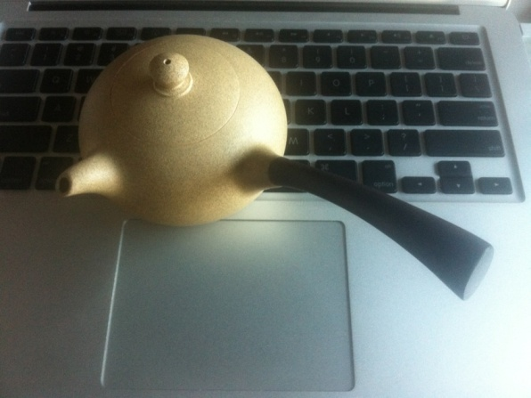

*2011-12-21 12:16 · iPhone客户端*

---

### 10582

我前几天在日坛附近看到一个“莫斯科饭庄”，那俩词好不搭调啊。转@许丁丁 你们觉不觉得，羊城酒家这名字一听东西就很难吃？好不想去。

*2011-12-20 18:19 · 网页 转自许丁丁*

---

### 10583

好比喻。转@ 鲜果 # 鲜果笔记 # 大雪就像革命，一夜之间改天换地，雪化了之后发现可能更加丑陋。今日节气：# 大雪 #http://fanfou.com/photo/N45...

*2011-12-20 17:57 · 网页 转自鲜果*

---

### 10584

转@ MJiA 没事别惹事，有事别怕事

*2011-12-20 17:08 · 网页 转自MJiA*

---

### 10585

从历年发布会的视频来看，乔布斯即使在皮带这种小事上也贯彻了“如非必要，勿增实体”的原则。他原本不系皮带，最后一年因为太瘦而不得不系时，那条皮带也是极简风格：朴素的银色方形扣式皮带头，黑色的一块皮，无花纹，全部等宽而无收窄的尾部，只长出很短一段。

*2011-12-19 23:39 · 网页*

---

### 10586

十来天的使用体验表明，当初应该把皮带剪短而不是多打几个孔，否则长出来的那几厘米挺累赘。

*2011-12-19 23:32 · 网页*

---

### 10587

我一直都很想去朝鲜看看，我尤其想这个时候去朝鲜看看，或许能体会到1976年的中国大概是什么样子。

*2011-12-19 11:58 · 网页*

---

### 10588

周末晚上一个人在办公室里加班时适合听Leonard Cohen。周一上午应该听点啥音乐呢？

*2011-12-19 10:07 · 网页*

---

### 10589

看来真得涂唇膏了，不然连一个麦当劳猪柳蛋汉堡都吃得很辛苦，一张嘴就两边疼-_-!

*2011-12-19 09:59 · 网页*

---

### 10590

乘摆渡车从一架南航的空客A380边上经过。这所谓世界上最大的客机看起来也不是太大嘛。

*2011-12-19 00:40 · iPhone客户端*

---

### 10591

一遍遍听Leonard Cohen的歌，很容易听得浑身发凉，只有心底还剩一丝丝温暖。

*2011-12-17 21:55 · 网页*

---

### 10592

我不知道什么是项兵挂在嘴边的“大风流创新”，但是如果有人配称为“大风流”，Leonard Cohen一定是其中之一。

*2011-12-17 21:49 · 网页*

---

### 10593

Leonard Cohen这个超级闷骚的老男人说：“每次我拿起铅笔，我都不知道自己最终写出来的是小说还是诗歌还是一首歌曲。”

*2011-12-17 21:37 · 网页*

---

### 10594

从今天演讲的内容来看，长江商学院的项兵是个大忽悠，跟机场书店整天循环播放的那些成功学讲师有异曲同工之妙。“大风流创新”这种词真是把我雷翻了。

*2011-12-17 21:13 · 网页*

---

### 10595

cll的xyt! 转@ 潘 刚才在健身房，一个美女在器械区东张西望，然后走到我面前说：“你是健身教练吧？”，我一愣，怯怯地答道：“不是，我也是来锻炼的”，然后我就转身走开了。真是莫名其妙，我这种梨形身材，怎么可能是教练呢。

*2011-12-16 21:06 · 网页 转自潘*

---

### 10596

@ 南郭拉拉 看我的收藏第一条。

*2011-12-16 15:33 · 网页 给南郭拉拉的回复*

---

### 10597

真相不成其为真相，直到人们相信你；他们无法相信你，如果他们不知道你在说什么；他们不可能知道你在说什么，如果他们不听你说；

他们不会听你说，如果你并不有趣味；你不会有趣味，除非你把事情说得有想象力、有原创性、有新鲜感。－比尔·伯恩巴克。忍不住自己译了一遍，有空再找找别人怎么译。

*2011-12-16 15:28 · 网页*

---

### 10598

我删掉了一个我创建过的组，whatsapp还告诉我超标。难道whatsapp是中途引入上限，而我已经远超上限了？不告诉用户一个清晰的目标，用户很可能会放弃努力。

*2011-12-16 12:42 · 网页*

---

### 10599

orz，whatsapp居然告诉我"Failed to register group. Max limitreached for groups created by you."

*2011-12-16 12:39 · 网页*

---

### 10600

@ Lushnis 基本面搞不好，换logo有毛用啊。太多这种失败案例了。

*2011-12-15 19:00 · 网页 给Lushnis的回复*

---

### 10601

惠普要换用新logo？我认为这是典型的二逼行为！

*2011-12-15 17:48 · iPhone版*

---

### 10602

@ 盖文张 不是，我没那么玄。只是某项体检前医生的要求。

*2011-12-15 17:26 · iPhone版 给盖文张的回复*

---

### 10603

事实证明，连续26小时不进食光喝水，也不至于太饿，从事脑力劳动时没有明显的性能下降。

*2011-12-15 17:02 · 网页*

---

### 10604

跟某些专业人士打交道就会三天两头碰到各种缩写词，今天又学了个3MMA (3-month moving average)。

*2011-12-14 12:17 · 网页*

---

### 10605

垃圾短信一条：柔媚的女子独处的神韵随意放逐的心灵【上雅】会所如梦如幻尽享奢华预约：400 007 96XX

*2011-12-14 12:03 · Android客户端*

---

### 10606

图文都不错。转@ hyson 【情感二则】情绪越紧张，清晰思维、冷静行动的难度就越大；永远不要直接调动人们的情感，要努力使人们自己发现真相。 http://fanfou.com/photo/q_c...

*2011-12-14 11:30 · 网页 转自hyson*

---

### 10607

kindle fire简陋到什么地步？没有一个设置可以把时间显示成24小时制的，而且12小时制的时间显示后面也不跟AM或PM-_-!

*2011-12-13 20:58 · 网页*

---

### 10608

“Do or do not, there is no try.” 犹达大师培训年轻的绝地骑士时说的这句名言可以译成中文：搞还是不搞，没得试。

*2011-12-13 14:52 · iPhone版*

---

### 10609

《财富》杂志（按营业额）评的世界500强企业里，中国有61个，美国有133个。前十大里有3家中国企业：中石化、中石油、国家电网。我真心不觉得多几家这种企业上榜对我的生活有任何正面意义。

*2011-12-13 13:53 · 网页*

---

### 10610

转@ 金融界人贩子 最近研读章玉贵老师的系列作品⋯再推荐一篇他写的《中国经济必修课》，有分教：中国迄今还没有一家具有一流竞争力的世界级跨国公司。真正意义上的跨国公司是指能在全球范围内对资源进行最佳配置的企业，而中国目前的顶级企业……都还没有强大到可以在全球配置资源的程度。

*2011-12-13 13:03 · 网页 转自金融界人贩子*

---

### 10611

值得期待！ 转@ realazy 饭否客户端新进展：山寨 TwitterlatorNeue 的图片预览方式，仔细看哦！ http://is.gd/IQnbBY

*2011-12-13 12:34 · 网页 转自realazy*

---

### 10612

@ iFire kindle fire上的silk完全没有我期待的那么好，速度很慢，不管开不开服务器加速功能。开了服务器加速功能也一样不能稳定翻墙。

*2011-12-12 21:40 · 网页 给iFire的回复*

---

### 10613

骆家辉确实是个合格的外交官，致辞时叽里呱啦说了一通其实啥也没说。

*2011-12-12 20:38 · iPhone版*

---

### 10614

据说七寸屏的好处是可以放进后裤兜。我试了一下，kindle fire确实能揣进去，不过存在感十分之强烈。

*2011-12-12 16:41 · Android客户端*

---

### 10615

@ 祝英台 我没用过kindle touch。 kindle fire是液晶屏，用途跟其他几款kindle都不太一样。纯论阅读体验的话，不带触摸屏的最便宜的那个$79的kindle4就很好了，远胜kindle3。

*2011-12-12 15:28 · 网页 给祝英台的回复*

---

### 10616

是我语文学得不好还是汉语里没有一个和beat a dead horse近义的成语？

*2011-12-12 15:20 · 网页*

---

### 10617

这就是英国佬那种高高在上的幽默感。真够恶毒。

*2011-12-12 14:46 · 手机上网*

---

### 10618

用到现在，kindle fire最大的亮点是它的随机屏保。张张都是美图，不过密集物恐惧症者恐怕会有点不舒服。

*2011-12-12 14:42 · 网页*

---

### 10619

对了，《低俗小说》里还有迄今为止我看过的所有电影里最骚的舞蹈，屈伏塔和乌玛瑟曼对舞那段。

*2011-12-12 13:22 · 网页*

---

### 10620

没想到这本书这么大这么重（请对比那个一元硬币）… 辛苦越洋帮我把它带回来的charlie cao同学了！

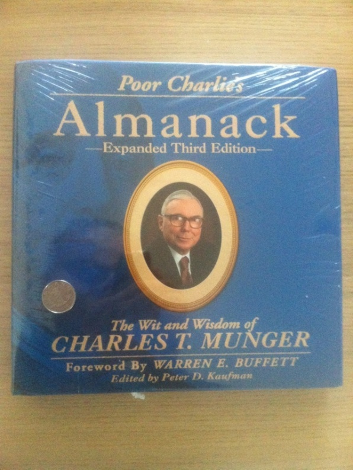

*2011-12-12 13:16 · iPhone客户端*

---

### 10621

kindle fire没有专门的音量调节按钮，我认为这是错误的简化。

*2011-12-12 13:11 · 网页*

---

### 10622

越来越觉得《低俗小说》牛逼。跟同年拍摄的《阿甘正传》和《肖申克救赎》不一样，《低》并不试图讲什么人生大道理，但就是“好看”！

我觉得不管第几遍看《低》我都不会无聊走神，因为它做到了：丰富、精彩、高潮迭起但又不是简单重复⋯⋯

*2011-12-12 12:26 · 网页*

---

### 10623

@ 喵呜.杨曜睿 给你准备了一个小礼物。你下回经过北京时记得找我来拿:-)

*2011-12-12 11:46 · 网页 给喵呜.杨曜睿的回复*

---

### 10624

总体来说，kindle fire没有给我惊喜。太重，背面材料手感不好，用户界面不够直观⋯⋯

*2011-12-12 10:35 · 网页*

---

### 10625

Hello world from kindle fire.

*2011-12-12 09:09 · 网页*

---

### 10626

难得这么早醒。莫非是太干燥了？

*2011-12-12 07:37 · iPhone版*

---

### 10627

专用皮带打孔器。我自己动手操作，挺容易的。

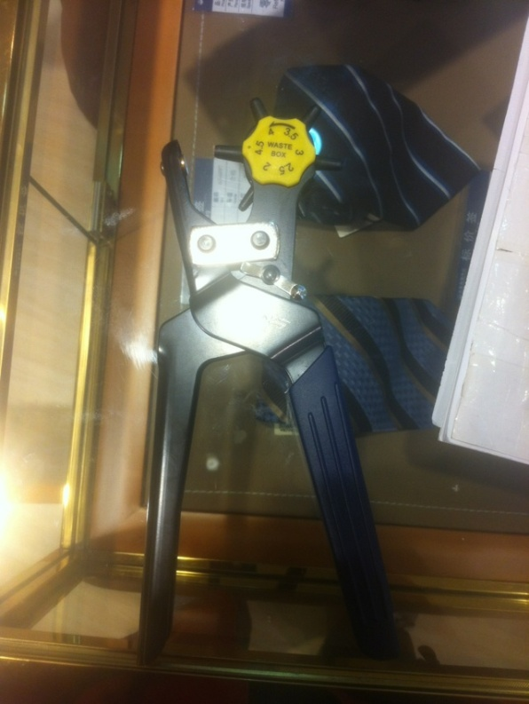

*2011-12-09 21:02 · iPhone客户端*

---

### 10628

今天干了件很怂的事：网购的一条皮带需要多打几个孔，我决定今天晚饭前把这件事解决掉，反正楼下就是商场。可是，出门时我觉得手里拿着条皮带很傻，卷成一团揣兜里又鼓鼓囊囊，于是我灵机一动⋯⋯腰间系着两条皮带下楼了⋯⋯

*2011-12-09 20:47 · 网页*

---

### 10629

支持原创。 转@ bridged 美使馆与北京空气质量报告不得不说的故事——讲述科学以外的部分。 http://t.cn/SqczK5

*2011-12-09 15:43 · 网页 转自bridged*

---

### 10630

原来名字太简单重名太多还有这种坏处。刚才来审计的四大的人抓着我一一核对一长串国内国外“王兴”的破产、违法和纠纷记录和我无关_-! 香港有个叫“王兴 Wong Hing”的家伙似乎有好些不良记录。

*2011-12-09 13:50 · 网页*

---

### 10631

@ 吕雪松 欢迎老朋友！

*2011-12-09 10:00 · iPhone版 给吕雪松的回复*

---

### 10632

“出来混，迟早是要还的”，这句话几乎每个人都听过吧，但奇怪的是，似乎有不少人总觉得自己有豁免权。

*2011-12-08 23:24 · iPhone版*

---

### 10633

听说lonely planet出了一个新iphone app叫Wenzani，我一直在琢磨这是哪三个汉字的拼音⋯⋯ 看了介绍才知道原来wenzani是祖鲁语的“你在做什么”⋯⋯

*2011-12-08 10:56 · 网页*

---

### 10634

品牌是需要时间，需要营造，需要故事的。例如，用于测试和比较各种图像压缩算法的标准图片Lena（512x512的彩色美女头像）出自某期《花花公子》，这就提升了《花花公子》这本杂志的行业地位。

*2011-12-08 10:20 · 网页*

---

### 10635

操，北京的交通已经堵到我一边开车一边操作iphone和安卓手机各一部还毫无压力。

*2011-12-07 19:38 · iPhone版*

---

### 10636

转@ MG.pl 甲：我觉得我爸妈特有想象力。乙：为什么？甲：我问我是咋来的时候他说我是捡来的。乙：那有什么稀奇，很多爸妈都这么说呀。甲：他们说是打怪捡来的……

*2011-12-07 12:19 · 网页 转自MG.pl*

---

### 10637

又试了一下，iPhone上中文笔画输入法里输入的那种⋯（三个点在中间，更符合中文习惯）在android里无法显示。所以，目前的最佳方案还是长按英文句号输入的那种在底部的三个点。

*2011-12-06 14:11 · 网页*

---

### 10638

严格说来，长按英文句号再选择，输入的是英文的三点…（算一个字符）；在中文手写输入法里轻轻点一下屏幕，才有机会选到中文省略号⋯

*2011-12-06 13:31 · iPhone版*

---

### 10639

这是目前收到的最佳办法。多谢！转@ marcher 进入符号，点更多符号，按住英文句号就会弹出省略号了。 转@ 王兴 iPhone自带的输入法怎么输入中文省略号？

*2011-12-06 13:22 · 网页 转自王兴*

---

### 10640

iPhone自带的输入法怎么输入中文省略号？

*2011-12-06 13:19 · 网页*

---

### 10641

回到北京西站才发现，论空气质量之差，北京和石家庄真是五十步笑半百步。

*2011-12-05 19:51 · iPhone版*

---

### 10642

刚才石家庄站上来一个小伙坐我旁边，见我用iphone4就主动问越狱了没，听说没越就主动表示可以当场帮我越狱，被婉拒后就开始热情的介绍越狱的好处并展示各种酷炫效果。见我连这样都无动于衷，他大概是觉得这人不可救药，终于放弃拯救我，打开微信开始摇啊摇，摇啊摇……

*2011-12-05 18:04 · Android客户端*

---

### 10643

转@ Dee.W 乱室宅女 转@ 福晋 不要叫我宅女，请叫我乱室佳人

*2011-12-05 17:16 · 网页 转自福晋*

---

### 10644

把希尔顿旗下的酒店品牌doubletree译成＂逸林＂确实感觉不错，但就是一开始有点儿反应不过来。

*2011-12-05 17:15 · iPhone版*

---

### 10645

从车窗外的情况看，石家庄的空气质量比起北京恐怕是只坏不好。

*2011-12-05 17:00 · iPhone版*

---

### 10646

@ jason5ng32 我的galaxy s2的截屏快捷键和iphone一样。

*2011-12-05 11:37 · iPhone版 给jason5ng32的回复*

---

### 10647

转@ 女流氓.exe 今天跟朋友去苹果店，看见一个爆发户气质的大叔带着媳妇儿买iphone4，大叔嗓门儿很高地对店员喊：“你们老板都死了，你们咋还这么宰人。”我们当场都笑翻了。

*2011-12-05 00:28 · 网页 转自女流氓.exe*

---

### 10648

@ 付栋平 这种快递安全性好差啊

*2011-12-04 17:00 · iPhone版 给付栋平的回复*

---

### 10649

刚降落在南苑机场。

*2011-12-04 03:35 · iPhone版*

---

### 10650

居然真遇上这种传说中的小便池，刻了一只假苍蝇吸引嘘嘘的火力以免小便溅到池外。

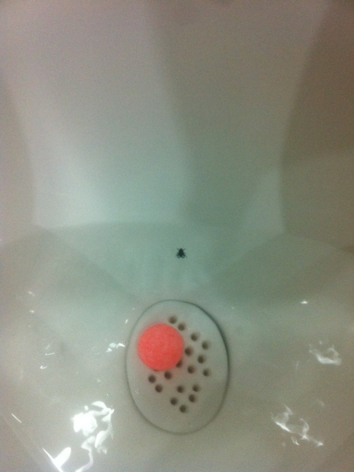

*2011-12-03 20:10 · iPhone客户端*

---

### 10651

真心不习惯酒店的房门没有那条保险链。从产品经理的角度来说，保险链带给用户的安全感来自于它的简单透明，因为我知道它如何工作，所以我相信它。相反，复杂的东西让我搞不明白，从而不知道在我需要它起作用的时候它是否靠得住。

*2011-12-03 01:31 · iPhone版*

---

### 10652

@ 刁士涵 最初用android手机时我也是这种看法：android和iphone风格不同，iphone是设计师做出来的，而android是by engineer forengineer。但android平板给我的第一印象就是：没有任何借口，这就是个比ipad差得多的东西。

*2011-12-03 01:23 · iPhone版 给刁士涵的回复*

---

### 10653

@ 付栋平 多谢！可是，怎么会变成你替我签收呢？咱俩甚至都不在一个楼层啊。

*2011-12-03 00:36 · iPhone版 给付栋平的回复*

---

### 10654

android和iphone混用果然有些麻烦。习惯了在iphone的短信列表界面里侧划一下是删除这条界面，刚才在android的短信界面里不小心侧划了一下，却是直接拨电话给发信人。幸好我及时发现并挂断了-_-!

*2011-12-02 13:08 · 网页*

---

### 10655

google前不久终于推出iphone版的gmail客户端了，但是根据我这几天的体验，其易用性比android版的gmail客户端差太多了。

*2011-12-01 23:25 · iPhone版*

---

### 10656

单用ipad的时候我没什么感觉，今天玩了一会儿华硕的变形金刚android平板才发现，相比之下，ipad是多么的简洁易用。我简直难以相信，比ipad后出的android平板界面上居然还会有这么多冗余而令人疑惑的元素。抄都不会抄吗？

*2011-12-01 23:19 · iPhone版*

---

### 10657

一大群陌生人围着桌子讨论时，虽然都有胸牌，但是根本看不到，还是不知道谁是谁。可能最实用的还是每个人都像＂插标卖首＂那样在头上竖个牌子，可这样又不太雅观...

*2011-12-01 16:44 · iPhone版*

---

### 10658

妈妈打来电话批评我不够与人为善，因为我投诉一个不尽职的快递员导致那人被领导批评并罚款。

*2011-12-01 14:48 · iPhone版*

---

### 10659

李力游接任展讯的ceo后，两年间股价从0.67美元涨到29美元，是被混水袭击后唯一股价不跌反升的中国公司，堪称中国芯片行业的龙头。

他很谦虚的说主要是运气好，但是只要看看他们的口号就知道没那么简单了：努力做不到，拼命行不行？

*2011-12-01 11:54 · iPhone版*

---

### 10660

压力好大啊。茶歇时跟一个兄弟公司的人换名片，他说：我们办公室很近的，你们在北辰的a座，我们在b座。我就住在办公室，每天起来穿衣服的时候担心走光被你们同事看到……

*2011-12-01 11:43 · iPhone版*

---

### 10661

交流会一开始，北极光的老大邓锋就要求大家别发微博，以免内部信息外泄。我认为饭否不是微博，于是我愉快的继续。

*2011-12-01 10:00 · iPhone版*

---

### 10662

第一次参加北极光创投的年会。听说去年给每个人发了一个iPad，今年改发水果了。真的水果，一箱热带水果⋯⋯

*2011-11-30 23:08 · 网页*

---

### 10663

这些四五星级酒店真是死不悔改，还想着“每部电脑每分钟人民币2元”的上网费。大爷我一分钱都不会付的，掏出iPhone直接当无线热点。

*2011-11-30 23:02 · 网页*

---

### 10664

@ 启钧 和我没关系啊。我们付过的律师费比他们小三个数量级。所以我说他在炫耀嘛。

*2011-11-30 23:00 · 网页 给启钧的回复*

---

### 10665

在投资人组织的聚会上听到一个企业老总在低调的炫耀：我靠，他们那帮家伙拖来拖去，害我们这个海外的case多花了一千多万美元律师费。

*2011-11-30 21:44 · iPhone版*

---

### 10666

今天和一个不太会说中文的华裔VC聊了一会儿，后来他告诉我他和梁文道是堂兄弟，难怪他俩名字只差一个字。

*2011-11-29 22:26 · 网页*

---

### 10667

妈妈炖的汤实在太好喝了！我决定暂时忘掉节食这回事……

*2011-11-26 00:36 · iPhone版*

---

### 10668

转@ Heidi.ai "读书是在别人思想的帮助下，建立起自己的思想。" 不能同意更多。

*2011-11-25 15:09 · 网页 转自Heidi.ai*

---

### 10669

第一次比较实际的使用facetime，跟大洋彼岸刚吃完感恩节火鸡大餐的姐姐一家人聊了一会儿。苹果系的产品确实易用性不错。

*2011-11-25 15:06 · 网页*

---

### 10670

惭愧，用了两年mac，今天才发现：不管iTunes是不是运行在最前台的程序，键盘上的F7键永远可以一键开关iTunes里的音乐播放。这比切换窗口、移鼠标去点开关按钮方便多了。有些事情确实应该靠硬件。

*2011-11-25 12:17 · 网页*

---

### 10671

我对饭否的态度可以直接引用传说中马丁·路德在宗教革命中的三字经名言：Here I stand...

*2011-11-25 11:22 · 网页*

---

### 10672

终于盼来了这条短信：“尊敬的客户：为方便您把握机会做出明智的理

财决策，我们一直为您免费提供金融产品与资讯短信服务。如您无需此服务，直接回复BJTD退订[北京招行]”

*2011-11-25 09:02 · iPhone版*

---

### 10673

转@ 和菜头 转 @ 小V : 「我有个朋友开了个修车厂，但好死不死的开在宋庄了（给不是北京的朋友解释一下，那是个艺术家扎堆的地方），于是，总有人深沉地伫立在他们正修的破车前面，问：“你们这个作品想要表达什么？”」

*2011-11-24 19:53 · 网页 转自和菜头*

---

### 10674

@ 筱潇 他比我帅多了。

*2011-11-24 19:52 · 网页 给筱潇的回复*

---

### 10675

还从没体验过南苑机场。下周可以试一下了。

*2011-11-24 11:10 · 网页*

---

### 10676

转@ 带三个表 海，希特勒。 http://fanfou.com/photo/F0s...

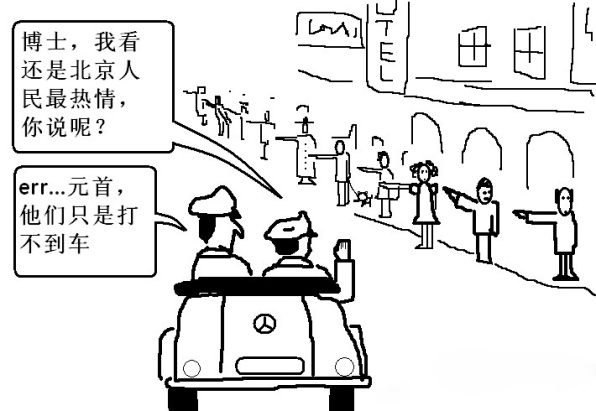

*2011-11-24 10:13 · 网页 转自带三个表*

---

### 10677

转@ .rex 感恩节，对于饭否来说是复活节。

*2011-11-24 09:08 · 网页 转自.rex*

---

### 10678

我不能想像自己生活在一个不能想像的生活里。

*2011-11-23 13:09 · 网页*

---

### 10679

@ 鸝.se 记在帐上，等我有空去瑞典时找你收。

*2011-11-22 22:46 · 网页 给鸝.se的回复*

---

### 10680

第一次成功使用Mac OS X的新功能AirDrop，通过无线给身边的同事

传了一个280M的视频文件，不需要服务器中转，很方便！

*2011-11-22 22:18 · 网页*

---

### 10681

本周最佳文普二！转@ 和菜头 转@ 核桃飞艇 RT @ 终无艳 “上周女朋友跟我分手了，至今我仍然不明白为什么。她问我有过几个女朋友。我说算上她三个，第一个没什么特点，蛮普通的，第二个有点文艺...然后她扇了我一巴掌就跟我分手了..

*2011-11-22 17:40 · 网页 转自ssfighter*

---

### 10682

@ 鸝.se 你真是死活不接受现实啊！跟你说了这是玻璃！一碰就碎的薄薄的玻璃！

*2011-11-22 17:20 · 网页 给鸝.se的回复*

---

### 10683

我已经不太看杂志了，但是将于11月28日出版的那期《New Yorker》

里对Peter Thiel的人物专访还是令我有几分期待。

*2011-11-22 16:55 · 网页*

---

### 10684

为@ jingjing 恢复了杯具现场。

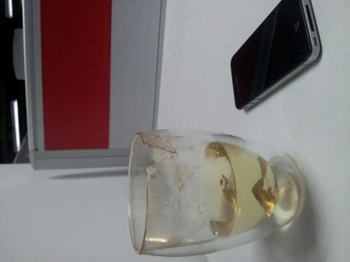

*2011-11-22 16:29 · Android客户端*

---

### 10685

一年只有24x365=8760个小时。

*2011-11-22 16:24 · 网页*

---

### 10686

剩下的这个bodum双层玻璃杯也坏掉了。它实在是太脆弱了。放在桌上，仅仅是碰了一下，杯子一倒，磕到旁边的iPhone4，结果就碎了一个口。这杯子要是从桌上掉到地上那还不得碎成千百瓣？再不买这种中看不中用的玩意儿了。

*2011-11-22 15:48 · 网页*

---

### 10687

“乌托邦”称得上是对utopian一词的绝妙翻译。

*2011-11-22 11:51 · 网页*

---

### 10688

我被雷到了！转@ 雏儿 噗.... @ 哆啦2梦http://fanfou.com/photo/9E_...

*2011-11-22 00:24 · 网页 转自雏儿*

---

### 10689

@ adamzhu1986 暂且不论蓝牙是否影响音质，要时不时换电池对我来说就是很烦的事。我最近已经换回来用有线鼠标了。

*2011-11-21 21:42 · 网页 给adamzhu1986的回复*

---

### 10690

@ qinyf 人人帐上有十亿美元现金。

*2011-11-21 20:47 · iPhone版 给qinyf的回复*

---

### 10691

北京有哪个餐馆的服务员是清一色穿着阿曼尼西服的帅哥吗？

*2011-11-21 20:45 · iPhone版*

---

### 10692

刚才着急起身拿东西，差点忘了摘耳机而发生悲剧-_-! 难道耳机也需要类似Mag Safe这样的接口？

*2011-11-21 18:46 · 网页*

---

### 10693

惭愧，原来Versace这个来自意大利的词不是按普通英语发音，而是应该念成接近“沃萨奇”。“范思哲”这个中文译名虽然听起来不太像，但还是挺有范的。

*2011-11-21 14:13 · 网页*

---

### 10694

转@ 赖宝 想当年：富贵不能淫，贫贱不能移，威武不能屈；叹如今：富贵都在移，威武都在淫，贫贱都在屈。

*2011-11-21 14:09 · 网页 转自赖宝*

---

### 10695

@ 养过狼 我没养过狼，只养过猫、狗、猪、兔、鸡、鸭、鸽、龟、鱼、蚕。

*2011-11-21 14:07 · 网页 给养过狼的回复*

---

### 10696

@ 养过狼

*2011-11-21 14:05 · 网页 给养过狼的回复*

---

### 10697

有个朋友电脑坏了，最近三个月都用iPad作为全部数字生活的中心，在我看来这是件蛮有意思的事。

*2011-11-21 13:19 · 网页*

---

### 10698

突然收到联通发来的短信＂客户您好,您的信用额度已进行动态调整为590元。该信用额度从2011年12月1日开始生效。＂ 联通还有信用额度一说？意思就是最多能欠费多少而不停机吗？

*2011-11-21 11:19 · iPhone版*

---

### 10699

haze这个单词一定要懂，也很容易记，因为令人痛恨的时常笼罩北京的那灰蒙蒙的雾气就是haze。

*2011-11-21 11:10 · 网页*

---

### 10700

@ 雏儿 名副其实啊

*2011-11-20 22:59 · iPhone版 给雏儿的回复*

---

### 10701

转@ 王慧文 从出生到死亡，所有的努力都是下降通道做波段

*2011-11-20 22:32 · 网页 转自王慧文*

---

### 10702

在普遍抱怨手机电池太差的今天，我想起了一个反向问题：怎么样能把一个iphone的电最快的耗掉？

*2011-11-20 11:25 · iPhone版*

---

### 10703

这个演讲时用的无线翻页器设计得很有问题，我已经看到两个演讲者把它拿倒了。

*2011-11-19 15:51 · iPhone版*

---

### 10704

紧张工作之余我有时会稍作遐想，如果早出生一百万年，作为一个男人，此刻我应该正在狩猎。我应该围着兽皮裙，手持标枪，正在捕捉山羊野鹿，也可能正和虎豹豺狼大狗熊做生死之搏。如果我干不好，我就会被咬死，我的家人族人就会饿死。每想到这里，我就决定集中精力，回到中国互联网这个现实丛林中来。

*2011-11-18 16:20 · 网页*

---

### 10705

发现一个朋友的邮件签名是“Sent from my old pre-Siri iPhone”。

*2011-11-18 16:09 · 网页*

---

### 10706

回到办公室继续工作，一坐下就觉察出来了，一定有人动过我的椅子了。高度明显不对嘛。

*2011-11-16 22:15 · 网页*

---

### 10707

@ 天霜结雨 我早过了成批背单词的阶段了。我都是实际阅读时碰到生词才去查的，所以全都有语境。

*2011-11-16 17:59 · 网页 给天霜结雨的回复*

---

### 10708

记英文单词的教训和经验：只查只记自己碰到的语境里这个词的含义，不要试图去管这个词的其他含义，不然只会把自己搞乱，记忆效

果会大打折扣。

*2011-11-16 17:56 · 网页*

---

### 10709

转@ 饭友经典语录 昨晚回家，到家楼道里一片漆黑，我气运丹田，洪亮地传出那句：“要有光！”刷的一下，楼道里的声控灯全亮了，瞬间觉得自己屌爆了。——@ 元气正太林道长

*2011-11-16 11:40 · 网页 转自饭友经典语录*

---

### 10710

当我的MacBook Air连放mp3都时不时出现声音断续时，我必须承认，同时运行的软件可能确实有点多了-_-!

*2011-11-16 11:39 · 网页*

---

### 10711

@ 唐君毅 当然是终极编译器——一切编译器之母——我们的大脑。

*2011-11-15 17:00 · 网页 给唐君毅的回复*

---

### 10712

把星座当成另一门语言就可以了。

*2011-11-15 13:39 · 网页*

---

### 10713

@ 鸝.se 你真强！我讲不到一个小时嗓子就会哑。

*2011-11-15 00:27 · iPhone版 给鸝.se的回复*

---

### 10714

@ 雏儿 谁是林夕？

*2011-11-14 22:00 · 网页 给雏儿的回复*

---

### 10715

看来好的创意可以反复用不止20年：《铁甲钢拳》的致敬对象《洛基》比我印象中的还老很多，是1976年拍的。这是史泰龙的成名作，是他自编自演的，以100万美元的小成本制作换来2.25亿的票房和3尊奥斯卡金像。

*2011-11-14 20:41 · 网页*

---

### 10716

转@ 罗燕 刁同学在俺生日的时候送了把吉他做礼物，于是他现在的口头禅是：赶快，给爷弹个曲儿

*2011-11-14 20:36 · 网页 转自罗燕*

---

### 10717

You miss 100% of the shots you don't take. --Wayne Gretsky

*2011-11-14 19:19 · 网页*

---

### 10718

正是莫奈让我第一次体会到看真迹和看画册是完完全全不一样的体验。转@ 和菜头 今天是莫奈的诞辰，很多人都知道他的日出印象。

但是，他最好的作品却是睡莲系列，尤其是他快盲了的时候。画家不再凭借视力，真正的花朵就绽放了。 http://is.gd/Byseom

*2011-11-14 12:36 · 网页 转自和菜头*

---

### 10719

@ 雏儿 @ 和菜头 你咋不说毕加索呢？

*2011-11-14 12:34 · 网页 给雏儿的回复*

---

### 10720

@ 张萌萌 $79的最简版kindle。@ 郭万怀 在用，爱不释手。

*2011-11-14 12:27 · 网页 给张萌萌的回复*

---

### 10721

招行信用卡的数据运营确实做得不错，发现我的额度不够用之后主动给我发来这么一条短信：王兴先生，您可在24小时内回复TLEY申请调高招行信用卡临时额度至XXXXX元。额度调整以短信回复为准

*2011-11-14 10:45 · iPhone版*

---

### 10722

转@ 暖小团 有没有一种穿越是当年和你在饭否上聊得热火朝天的姑娘在饭否挂了之后与你失去联系，当你们都各自再回归饭否的时候，发现她在感叹领证后的感想这种问题。

*2011-11-14 10:02 · 网页 转自暖小团*

---

### 10723

一个好的创意可以反复用二十年。广告是这样，电影也一样。《铁甲钢拳》就是现代版的《洛基》。

*2011-11-13 18:14 · iPhone版*

---

### 10724

为了这么蓝的天，我愿意接受这么大的风。

*2011-11-13 09:59 · iPhone版*

---

### 10725

很好！转@ 远骋 决定给表弟和表妹们一人一个Kindle作为今年的压岁物。

*2011-11-12 11:43 · 网页 转自远骋*

---

### 10726

@ bridged 谢谢，不过那不是值得我们关心的事。我们还是要专心把美团网搞好。

*2011-11-10 17:01 · 网页 给bridged的回复*

---

### 10727

转@ 郭万怀 “有种思念叫望穿秋水 有种寒冷叫做忘穿秋裤” orz⋯⋯

*2011-11-10 16:59 · 网页 转自郭万怀*

---

### 10728

灯又亮了，一堆人开始分生日蛋糕。

*2011-11-09 17:58 · 网页*

---

### 10729

他们把那个会议室的灯关掉了。

*2011-11-09 17:57 · 网页*

---

### 10730

一声尖叫之后，那个男的现在满脸都是白白的东西⋯⋯

*2011-11-09 17:51 · 网页*

---

### 10731

靠，我旁边的会议室有一男一女在跳舞，很风情的那种。

*2011-11-09 17:50 · 网页*

---

### 10732

昨晚的经历似乎证明了，精神高度集中可以不知不觉中改变我对麻和辣甚至是酒精的耐受程度。但是，再大的事都不影响我倒头就睡。

*2011-11-09 11:33 · 网页*

---

### 10733

难得这么早到公司。

*2011-11-09 08:06 · 网页*

---

### 10734

好像这是我第一次碰到mac彻底死机，需要重启的那种。

*2011-11-07 21:30 · iPhone版*

---

### 10735

普通的意识不到自己是普通的，文艺的不会宣称自己是文艺的，二逼则不承认自己是二逼。

*2011-11-04 21:07 · 网页*

---

### 10736

安踏居然在不知不觉中超过李宁了。 http://is.gd/gLUBCT

*2011-11-03 21:55 · 网页*

---

### 10737

我的导师对我的一个师兄非常欣赏，理由是：He can defend everyline of his code. 转@ 尚春 毫无条理堆砌成的代码真是让人作呕，对自己的代码一定要负责

*2011-11-03 21:18 · 网页 转自尚春*

---

### 10738

马上有人向我推荐“汉典网”，我试了一下，结果是：‘抱歉，汉典暂未收录“二逼”’。完全不顶用嘛。

*2011-11-02 14:07 · 网页*

---

### 10739

urbandictionary.com我用得越来越多，因为它是"活"字典。很多英文单词和词组的日常含义在正统的merriam webster词典里根本查不到，用它基本都能搞定。中文世界里似乎还没有一个这么系统整理的网站。

*2011-11-02 14:03 · 网页*

---

### 10740

打算去看。转@ hyson 【印度电影】《三个傻瓜》即将引进内地，且“一刀不剪”，于今年12月上映，汤唯、文章和黄渤等担任配音。曾被这部电影逗乐/感动/励志过的人，可以到电影院再看一遍了，还可以在大屏幕再仔细看看那位长得像“蜘蛛侠+弗洛多+谢耳朵+阿姆+憨豆+吴彦祖+莫少聪”的男

*2011-11-02 13:36 · 网页 转自hyson*

---

### 10741

微信是有机会做成国际化产品的，现在应该不惜一切代价的投入。不知道腾讯能不能抓住这个极难逢的机会。

*2011-11-02 13:02 · 网页*

---

### 10742

用上iCloud快一个月了，没有感受到它给我带来的任何变化。

*2011-11-02 12:33 · 网页*

---

### 10743

看来artist和scientist一样，在国外就和engineer一样是个职业，不是非得成名成家。转@ 鸝.se 据美国国家艺术基金会（NationalEndowment for the Arts，简称NEA）统计，全美国大概有210万名“艺术家”。

*2011-11-02 10:15 · 网页 转自鸝.se*

---

### 10744

我的目标是把体重减掉8斤，并控制在今后30年内上下不超过5斤。

*2011-11-01 20:20 · 网页*

---

### 10745

太悲情了！发胖导致手腕变粗，表带变紧。刚才只好到楼下商场里的钟表铺借工具把表带加长一环-_-!

*2011-11-01 20:12 · iPhone客户端*

---

### 10746

难道中文里至今没有和roadkill对应的词汇吗？可是汽车已经诞生一百年了啊。我们的语言不至于已经如此僵化了吧？要兼容并包啊，不然只会搞出越来越多的B二C。

*2011-11-01 16:24 · 网页*

---

### 10747

我已经有点后悔答应本周四去参加某个电视节目的录制了。因为录制前的电话沟通只是让我更相信这个说法：“电视台找你只有两个目的：一、让你当傻逼。二、让你当傻逼的陪衬。”

*2011-11-01 16:06 · 网页*

---

### 10748

牛逼！转@ webto 第二次10分钟798到西直门，系了安全带也会心脏

病呀亲！

*2011-11-01 01:33 · 网页 转自webto*

---

### 10749

@ 王悦蒙 箱子没啥用吧。尤其是大拉杆箱，我至今用的还是我十年前出国时两百多块买的大箱。小箱也不常用。背包是王道。

*2011-10-31 23:48 · 网页 给王悦蒙的回复*

---

### 10750

"trick or treat"我觉得可以译成“遭殃还是招待”。一个擅长翻译的（广东）朋友本地化得更彻底：恭喜发财利是逗来。

*2011-10-31 18:32 · 网页*

---

### 10751

我估计这刀还是过不了机场安检。

*2011-10-31 18:24 · Android客户端*

---

### 10752

amazon上买的袖珍蜘蛛刀终于托人带回国了。很小很精密，我擦亮眼睛看也没搞明白它的结构。

*2011-10-31 18:21 · Android客户端*

---

### 10753

刚注意到一个朋友的whatsapp状态是：Look like a capitalist, livelike a communist, fight like a fascist, fuck like an anarchist.

*2011-10-31 16:13 · 网页*

---

### 10754

转@ realazy 再见，北京。

*2011-10-31 13:43 · 网页 转自realazy*

---

### 10755

把万圣节的"trick or treat"译成“不给糖就捣蛋”实在是毫无品质感。

*2011-10-31 10:49 · 网页*

---

### 10756

警告：剧透！《猩球崛起》里多数是普通桥段，被关在笼子里的恺撒用小石块在墙上画窗子是文艺桥段，金门大桥上骑警冲锋则是彻头彻尾的二逼桥段。

*2011-10-30 14:44 · 网页*

---

### 10757

转@ 雏儿 我决定不再过懒散的生活，是为了让自己每天都有新鲜有趣的事情说给你听

*2011-10-30 13:45 · 网页 转自雏儿*

---

### 10758

一个月前那个秋高气爽风清云淡的北京哪里去了！

*2011-10-30 08:33 · iPhone版*

---

### 10759

“您尾号xxxx的招行信用卡于10月29日19时40分消费人民币xxx.00元。

每月5元可享三天还款宽限期服务，详询客服[招商银行] ”。这个“还款宽限期”服务有点意思，算是个小创新，不知道效果怎么样。

*2011-10-29 19:44 · Android客户端*

---

### 10760

@ gravity0 期待看到你的影评

*2011-10-29 18:53 · iPhone版 给gravity0的回复*

---

### 10761

《猩球崛起》这部电影值得看。虽然有大半讲的不是人，但是却比绝大多数电影更让我思考人性。

*2011-10-29 18:06 · Android客户端*

---

### 10762

《猩球崛起》这片真是看得我心惊肉跳……

*2011-10-29 17:16 · iPhone版*

---

### 10763

在北师大听一个演讲，发现：普通青年用手机拍照，文艺青年用单反，二逼青年则频频举起他们的iPad2。

*2011-10-29 15:22 · iPhone版*

---

### 10764

@ AladdinZ 从北园东门进去往北一百米就到了。每个人收15块钱。

*2011-10-29 13:28 · iPhone版 给AladdinZ的回复*

---

### 10765

十来个同事在奥林匹克森林公园打篮球。居然只有我一个人穿短裤。

*2011-10-29 09:39 · iPhone版*

---

### 10766

转@ 王佩 有差评的网店，就像有了初夜的姑娘，虽然从世俗的观点看，不再完美无暇，但对于当事人来说，真是自由了，解脱了！

*2011-10-28 23:09 · 网页 转自王佩*

---

### 10767

转发微小说：他散尽万贯家财，终于获得了一次穿越的机会，他回到了1998年，找到了那个犹豫不决，手握50万现金的青年，告诉他：“买房子吧，10年后，房价会翻好几个跟头的。”那个人说：“真的的太谢谢你了！请问你贵姓？你认识我吗？”他诡异的一笑：“我当然认识你，化腾。我叫周鸿祎。”

*2011-10-28 22:36 · 网页*

---

### 10768

瑞典不愧是发达国家，居然拥有 sweden.cn 这个域名。

*2011-10-28 22:22 · 网页*

---

### 10769

收到小兄弟从新疆寄来的刀。有鳄鱼邓迪的刀那么大。

*2011-10-28 21:42 · 网页*

---

### 10770

连听三遍David Bowie的《Absolute Beginners》了。

*2011-10-28 21:38 · 网页*

---

### 10771

这么恶毒的小姑娘想必长得很艳丽吧。转@ 雏儿 Some people just

need a high-five. In the face. With a chair.

*2011-10-28 21:29 · 网页 转自雏儿*

---

### 10772

无意中发现三星i9100也自带和iPhone一样的截屏功能了，连快捷键都一样：同时按home键和锁屏键。之前，android手机不自带截屏功能让我很不爽。

*2011-10-28 17:11 · 网页*

---

### 10773

转@ 鸝.se 2011年11月1-30日（北京，成都，深圳）欧盟电影展 2011年11月12-20日（北京）2011北欧纪录片电影节,有兴趣的同学一起去啊。

*2011-10-28 17:06 · 网页 转自鸝.se*

---

### 10774

转@ 和菜头 转@ Simp “@ rebecca_kidult : ”卡扎菲挂了！“ 普通青年：跟我有毛关系！？文艺青年：独裁者还能有什么下场！？2B青年：哪门课！？”

*2011-10-28 14:17 · 网页 转自艾舸霓*

---

### 10775

凡是能让我在屏幕上看到“正在挂断”这四个字的手机都要毫不犹豫的归入二逼手机这一档，不管丫有多智能。

*2011-10-28 01:13 · 网页*

---

### 10776

相当挫败，试了好几次都没能摆出二逼青年那种扭麻花跷脚法，看来我的柔韧性太差了。

*2011-10-27 22:48 · 网页*

---

### 10777

转@ 于欣烈 一位妙龄女郎把这个纸杯塞到我的手中，上面写着“I'mHot”。正当我心旷神怡之时，靓女轻启朱唇朗声说道：先生，您的餐齐了！ http://fanfou.com/photo/neM...

*2011-10-27 11:07 · 网页 转自于欣烈*

---

### 10778

@ Dee.W 谁是excel达人？

*2011-10-27 11:05 · 网页 给Dee.W的回复*

---

### 10779

从整个生物进化的历史来看，sex的出现，也就是从无性繁殖发展到有性繁殖，其根本目的就是通过交流信息让基因变化变快。

*2011-10-27 08:22 · Android客户端*

---

### 10780

靠，居然腹肌都会抽筋

*2011-10-27 00:38 · iPhone版*

---

### 10781

为啥只有普通青年、文艺青年和二逼青年而没有科技青年呢？

*2011-10-26 23:59 · iPhone客户端*

---

### 10782

衡量从A地到B地的距离有三种单位：多少米，多少分钟，多少块钱。

*2011-10-26 22:51 · Android客户端*

---

### 10783

好有趣，惊闻鄙厂某萝莉已婚，众攻城师心碎。

*2011-10-26 00:13 · 网页*

---

### 10784

@ 马扎罗 嗯，我曾祖父也下过南洋，往返数次。好像我们家在南洋还有些远亲。

*2011-10-25 14:39 · 网页 给马扎罗的回复*

---

### 10785

人口阶梯转移的大趋势是：厦门人可能会迁去北京上海或出国，但是肯定不会迁到龙岩，也不屑于迁往福州；龙岩市区的人可能去北京上海或出国或迁往福州厦门；龙岩市下辖的各县城的人一部分会迁到龙岩市区，一部分会直接去福州厦门或北京上海或出国。从这个角度来说，龙岩算三线城市比较合适。

*2011-10-25 14:22 · 网页*

---

### 10786

@ 带三个表 点最右上角的用户名，出来的下拉菜单里可以“退出”。

*2011-10-25 14:14 · 网页 给带三个表的回复*

---

### 10787

2010人口普查的结果是，龙岩全市常住人口256万，而2000年的结果是268万，也就是说十年共减少12万人，增长-4.65%。很多人迁到邻近的厦门去了。这就是计划生育、城市化、人口阶梯转移几股力量综合作用下三线（或是四线？）城市的处境。

*2011-10-25 14:10 · 网页*

---

### 10788

@ 郑大光明 KFC的两家新店，一家在龙岩大道与西陂路交叉口西南角的龙岩万阳城（原国际商贸中心），另一家在闽西交易城附近。

*2011-10-25 13:54 · 网页 给郑大光明的回复*

---

### 10789

转@ kime 转@ 飯否小字报 转@ 泛黄的流年 看到有个手机程序叫“提高你的工作效率”，心想，太好了，我正需要。于是下载，安装，一运行，手机就坏了。过了两天我发现，工作效率真的提高了。

*2011-10-25 12:24 · 网页 转自kime*

---

### 10790

龙岩依旧只有一家麦当劳，但已经有三家肯德基了。大润发已选定地址，即将进入。万达广场项目已批，不知到时候沃尔玛是否会同步进入。

*2011-10-24 20:53 · iPhone版*

---

### 10791

之前预订的乔布斯传记kindle版开始自动下载了。

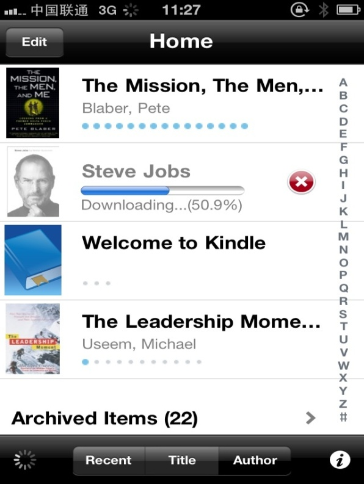

*2011-10-24 11:33 · iPhone客户端*

---

### 10792

参加外公的葬礼。

*2011-10-24 09:13 · iPhone版*

---

### 10793

转@ 熊阿姨 这是从日本学来的，是为了证明已经清扫过了。转@ 王兴 服务的细节：酒店服务员在卷纸的末端叠一个折子，方便客人取用。 http://fanfou.com/photo/MzQ...

*2011-10-24 00:55 · 网页 转自熊阿姨*

---

### 10794

鉴定结果：所谓人参果一点儿也不好吃，淡而无味。不过本来也不能期待太多，毕竟一个才两块钱，还是在机场里买的。

*2011-10-23 13:30 · iPhone版*

---

### 10795

所谓人参果。

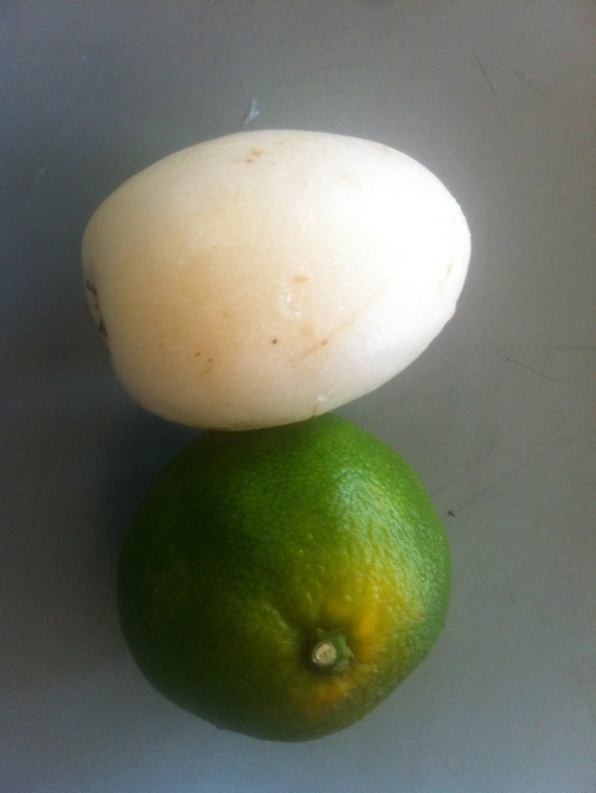

*2011-10-23 13:07 · iPhone客户端*

---

### 10796

服务的细节：酒店服务员在卷纸的末端叠一个折子，方便客人取用。

*2011-10-23 11:20 · iPhone客户端*

---

### 10797

以为又见到一种新水果了，结果切开来一看，又是百香果。

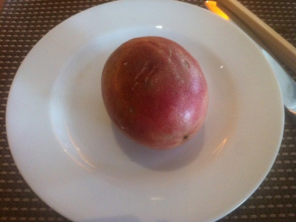

*2011-10-23 10:51 · iPhone客户端*

---

### 10798

@ 弥城 要小心啊！

*2011-10-22 08:32 · iPhone版 给弥城的回复*

---

### 10799

还是桂林本地吃货的推荐靠谱，骖鸾路口那家明桂米粉店确实不错！

推荐卤菜粉，先吃干拌，吃到一半再加汤。

*2011-10-22 00:45 · 网页*

---

### 10800

@ 鸝.se 颜色早已和性别无关了。我今天到桂林开会，所以会看到形形色色的包:-)

*2011-10-21 18:07 · 网页 给鸝.se的回复*

---

### 10801

原来不止一个牌子用这种背带设计。这是tumi的。

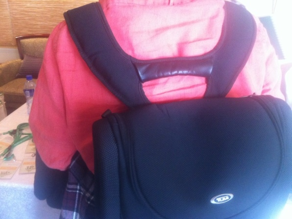

*2011-10-21 16:06 · iPhone客户端*

---

### 10802

这个包的背带设计不错，可以兼做提手，看起来挺简洁。

*2011-10-21 11:56 · Android客户端*

---

### 10803

@ 黄鸿光 赞！很高兴看到团队进步！尤其高兴看到陆蓉的成长！

*2011-10-21 00:01 · 网页 给黄鸿光的回复*

---

### 10804

如果不是明天要出差，我估计今晚会继续睡在公司。

*2011-10-20 22:47 · 网页*

---

### 10805

@ nicing 多谢！

*2011-10-20 22:43 · 网页 给nicing的回复*

---

### 10806

讲人性阴暗面的书果然比讲光明面的书有趣多了。

*2011-10-20 22:43 · 网页*

---

### 10807

@ 罗燕 还是能随时运动最好。我昨天就是每次用电脑用累了要休息时就做15个俯卧撑。

*2011-10-20 13:55 · 网页 给罗燕的回复*

---

### 10808

词典在我的生活中无处不在：最常用的是浏览器里的bookmarkletQQ云词典，用来查网页里的生词；mac os的dashboard里装了一个dictionary widget，是英英的；android手机上用“云词”，会定期提醒我复习；现在iPhone也自带词典了。

*2011-10-20 10:08 · 网页*

---

### 10809

转@ 许丁丁 当然是最瘦的那个。转@ 菜虫natalie @ 许丁丁 你说下飞机时跟乘务长说你们的服务很好，他们会开心一天。请问如何分辨哪个是乘务长呢~

*2011-10-20 10:04 · 网页 转自菜虫natalie*

---

### 10810

原来不只madame是“夫人”，dame也是。

*2011-10-19 22:30 · 网页*

---

### 10811

我去店里买牛奶酸奶时已经自动无视蒙牛了。目前首选三元。

*2011-10-19 22:09 · 网页*

---

### 10812

这位Mae West大姐果然是名不虚传的才貌双全: Sex is emotion inmotion.

*2011-10-19 21:20 · 网页*

---

### 10813

看到相当装逼的一句话：When I'm good, I'm very good. WhenI'm bad, I'm ever better. --Mae West

*2011-10-19 21:16 · 网页*

---

### 10814

转@ 盖文张 只喝汤，我要瘦成一道光！ —— 公司某设计MM的签名档

*2011-10-19 17:25 · 网页 转自盖文张*

---

### 10815

很长时间来第一次从amazon.com以外的网站买英文书，因为这本Poor Charlie's Almanack好像只在他自己的网站上卖。

http://www.poorcharliesalma...

*2011-10-19 15:17 · 网页*

---

### 10816

@ qinyf 直接iPhone 4S吧。

*2011-10-19 01:11 · 网页 给qinyf的回复*

---

### 10817

我看过的最梦幻的高空摄影： http://is.gd/0zbIzv

*2011-10-18 18:47 · 网页*

---

### 10818

按乔布斯的回忆，他10岁或11岁时在NASA Ames研究中心第一次见到计算机。那应该是1965或1966年。这就是生在硅谷的好处！

http://is.gd/H8CiBi

*2011-10-18 17:36 · 网页*

---

### 10819

看到水木上有人想正经讨论“为什么中国科技界会不遗余力的出谭浩强这种二道贩子而不是而不是离奇这种真正的人才”，我觉得很多同胞真是对我们的国力和国情缺乏清醒认识。如此来看，不但再来一次文革不是不可能，再来一次中日甲午战争都TM的有可能。

*2011-10-18 12:42 · 网页*

---

### 10820

转@ blog图党 一个老人躺在那这么多年，身旁不知道走过多少人，竟然都没人上前去扶一下,这是什么世道呀。_摘自毛主席纪念堂留言册

*2011-10-17 19:29 · 网页 转自blog图党*

---

### 10821

真是令人难以置信。Sculley在80年代初第一次接触到乔布斯带领的Mac创始团队时，那帮人的平均年龄是22岁。

*2011-10-17 17:59 · 网页*

---

### 10822

Tiffany竟然是一个创建于纽约的美国本土品牌。我之前一直以为是欧洲的呢。

*2011-10-17 16:07 · 网页*

---

### 10823

转@ 筱潇 【转】同事说c语言之父去世了，另一个同事大吃一惊，问：谭浩强死了？

*2011-10-17 15:49 · 网页 转自筱潇*

---

### 10824

每次有媒体（尤其是外媒）问到为什么中国的互联网创新基本上落后于美国时，我就想只扔给他们一句：你觉得阿拉伯人最会挖石油吗？

*2011-10-17 14:58 · 网页*

---

### 10825

乔布斯对细节的关注无处不体现。他最初雇apple store的建筑设计师时就说了：“我找你是因为你做过非常好的大建筑，而且你做过非常好的房子。如果你设计房子的话，那么你肯定会思考建筑的微妙之处”。

http://is.gd/mXZBcD

*2011-10-17 13:43 · 网页*

---

### 10826

转@ 许丁丁 龙应台：你可以选择做官，你也可以选择挣钱，但你不能选择通过做官来挣钱；你也可以选择玩女人，但你不能选择通过从政来玩女人；你可以选择做圣人，你也可以选择做俗人，但你不能选择让大家像圣人一样崇拜你，还要像俗人一样原谅你。只想要权力不想要约束是恶霸，只想要享受不想尽义务是流

*2011-10-17 13:18 · 网页 转自许丁丁*

---

### 10827

iOS5有个小细节我很喜欢：选中网页上任何一个单词，弹出菜单里就有一项是“Define”，链到内置的字典里，查起来很方便。要是这个字典还有真人发音那就更好了。

*2011-10-17 13:14 · 网页*

---

### 10828

这条垃圾短信还有点意思：金翅鸟艺术中心声乐速成班，九次课帮你迅速唱好适合自己声线的歌曲，拥有专属你的拿手曲库！在社交场合自信歌唱,一展歌喉！电话58221366

*2011-10-17 11:50 · Android客户端*

---

### 10829

我几乎每天都碰到英文生词，但是中文生字则少见得多。刚才遇到一个，冚kan3。冚车是一种专业缝纫机。

*2011-10-17 11:48 · 网页*

---

### 10830

我痛恨那些让我感觉到它们存在的袜子！

*2011-10-17 10:20 · 网页*

---

### 10831

@ jingjing 我和贵妞有共同爱好。

*2011-10-16 13:08 · iPhone版 给jingjing的回复*

---

### 10832

@ 黄鸿光 更悲情的是外面晚到一点点的人早早被告知已经无法换登机牌得换下一班飞机了。

*2011-10-14 10:41 · 网页 给黄鸿光的回复*

---

### 10833

转@ 浅洚 转：印度教导的灵性四句话：无论你遇见谁，他都是对的人；无论发生什么事，那都是唯一会发生的事；不管事情开始于哪个时刻，都是对的时刻；已经结束的，已经结束了。

*2011-10-14 10:12 · 网页 转自浅洚*

---

### 10834

@ 许丁丁 是工作不是约会！

*2011-10-13 17:44 · 网页 给许丁丁的回复*

---

### 10835

@ 许丁丁 你还可以等到明天。我今晚就得飞！飞到了还得立刻约人谈事，都不知道几点都睡呢？

*2011-10-13 17:39 · 网页 给许丁丁的回复*

---

### 10836

转@ 程序员段子 问：栈和队列有什么区别？ 答：吃多了拉就是队列；吃多了吐就是栈。--@ SegmentFault

*2011-10-13 17:04 · 网页 转自程序员段子*

---

### 10837

@ 子正夫 H2O too = H2O2 = 双氧水（对皮肤有强腐蚀性）

*2011-10-13 16:34 · 网页 给子正夫的回复*

---

### 10838

秋天最美，因为她的颜色既丰富又柔和。

*2011-10-13 11:22 · 网页*

---

### 10839

@ 鸝.se 你的身体很强健嘛！每分钟心跳才60次。

*2011-10-13 08:59 · 网页 给鸝.se的回复*

---

### 10840

七百多兆的ios5升级包下载到397.7兆时网络断了，于是又得从头开始下。itunes不支持断点虚传是我对苹果极度不满的地方！

*2011-10-13 01:55 · 网页*

---

### 10841

@ daisytje nice to see you again:-)

*2011-10-13 01:04 · 网页 给daisytje的回复*

---

### 10842

@ 李土妞很矫情 不行

*2011-10-13 00:03 · 网页 给李土妞很矫情的回复*

---

### 10843

按照苹果通常在美国东部时间下午一点发布新版本的惯例，再过一个小时左右就要看到iOS 5.0了！我对这个据说是iOS有史以来最重要的升级还是充满期待的:-)

*2011-10-13 00:01 · 网页*

---

### 10844

有一个高中同班同学去当VC了。

*2011-10-12 19:59 · 网页*

---

### 10845

@ 德德玛 哈哈，我有一双五指鞋。不过这个季节穿有点凉了。

*2011-10-12 17:43 · 网页 给德德玛的回复*

---

### 10846

我一直以为我对普洱茶的好坏没有什么鉴别力，直到某天我喝了我父母跟团去云南旅游时买的所谓普洱茶⋯⋯

*2011-10-12 12:05 · 网页*

---

### 10847

宅男求妹纸？ 转@ IwfWcf 话说下午起床时发现好像是因为太久没SY，结果可耻地MY了……更可耻的是对那个M完全没印象……

*2011-10-11 14:32 · 网页 转自IwfWcf*

---

### 10848

@ 筱潇 真让人羡慕！

*2011-10-11 11:00 · 网页 给筱潇的回复*

---

### 10849

@ 高振. 一起加油！

*2011-10-11 00:06 · 网页 给高振.的回复*

---

### 10850

吃水果当晚饭有这样的问题：明明肚子已经填得很饱了，可是手依然冰凉无力:-(

*2011-10-10 19:36 · 网页*

---

### 10851

按说苹果应该连皮一起吃更健康，但是鉴于国内目前的食品安全状况，敢吃苹果就不错了，皮还是免了吧⋯⋯

*2011-10-10 19:20 · 网页*

---

### 10852

转@ 如小果 两个化学家进了一家餐厅，服务员问喝什么，一个说：H2O。另外一个说：H2O，too。后来第二个死掉了。 ——这个笑话应该邮给谢尔顿。

*2011-10-10 19:09 · 网页 转自如小果*

---

### 10853

@ 沙杰 道理很好，但似乎没有出处，疑为今人伪作。

*2011-10-10 17:31 · 网页 给沙杰的回复*

---

### 10854

两相比较之下，台湾大哥大的3G上网速度明显比中国联通的快。不知道是因为台湾大哥大已经布署了号称3.5G的HSPDA，还是因为它确实网络建设和优化做得比较好。

*2011-10-10 17:21 · 网页*

---

### 10855

转@ 清越 基本只发无聊帖的和菜头竟然是网络红人，他对百姓疾苦/言论自由/政治变革/维权活动说过什么？——推特上一人如是说。真恐怖啊，这种人就算过上了民主的日子，估计也无趣得很。

*2011-10-09 22:34 · 网页 转自清越*

---

### 10856

不知道应该高兴还是应该沮丧，我发现自己读中文书还是比读英文书快很多很多倍。

*2011-10-09 22:01 · 网页*

---

### 10857

原来“东山再起”和“谢公东山三十春，傲然携妓出风尘”出自同一个典故。

*2011-10-09 21:58 · 网页*

---

### 10858

@ Kevin 我也对siri充满期待，但还是要真用过才好判断。

*2011-10-09 21:26 · 网页 给Kevin的回复*

---

### 10859

推荐@ realazy 出品的iPhone app Simplepedia。我十一出游期间全靠它查wikipedia了。支持本地缓存，尤其适合在不能随时上网的情况用。界面也很简洁，没有华而不实的东西。

*2011-10-09 21:05 · 网页*

---

### 10860

@ Kevin Siri属于概念绝对没问题，关键是能否执行到位。语音控制这事大家已经向往几十年了，也无数公司试过，但是体验总还是差那么一点，就看苹果能否搞定了最终的用户体验了。

*2011-10-09 21:03 · 网页 给Kevin的回复*

---

### 10861

在台湾某车站随手拍的。你能看出是竞选拉票的广告吗？

*2011-10-09 19:58 · iPhone客户端*

---

### 10862

@ 鸝.se 怎么一点也不像是秋天，反而像是春天？你在南半球吗？

*2011-10-09 19:50 · 网页 给鸝.se的回复*

---

### 10863

@ 老淦 多谢老淦！我打算恢复喝普洱，据说比较利于减肥。

*2011-10-09 14:45 · 网页 给老淦的回复*

---

### 10864

@ 带三个表 台版过度设计了。

*2011-10-09 14:44 · 网页 给带三个表的回复*

---

### 10865

中关村西区的海淀基督教堂底层有个西堤岛咖啡，我去过好几次，但是直到今天我才知道西堤岛是巴黎塞纳河上两个小岛之一。

*2011-10-09 11:27 · 网页*

---

### 10866

Office for Mac是我现在用得最多的微软产品，Skype次之，Windows排第三。

*2011-10-09 11:03 · 网页*

---

### 10867

时隔多年，我又一次彻底打翻装满水的茶杯:-( 幸好我吸取了以前的教训，坚持把茶杯放在即使打翻也不会泼到电脑的位置上，所以问题不大:-)

*2011-10-09 10:46 · 网页*

---

### 10868

苹果营业额增长之前传：1976年成立，77年推出Apple II，82年营业额是5.83亿美元，97年是71亿，15年增长12倍，年均18.1%，比1997到2010年间的年均18.6%略低一点点。 http://is.gd/qWwm4f

*2011-10-09 10:28 · 网页*

---

### 10869

很讽刺的是，我现在还从amazon.com买一些书的纸质版而非kindle版的原因居然是价格。有些书的纸质版比kindle版实在便宜太多，尤其是有二手书的时候，一般二手书只要五六美元，而kindle版要十几美元。

*2011-10-09 09:48 · 网页*

---

### 10870

余华写东西似乎有虎头蛇尾的毛病。《兄弟》这部小说是这样，没想到《十个词汇里的中国》这种非虚构作品也这样。但是，余华依然是我很喜欢并尊敬的中国作家。

*2011-10-09 01:09 · iPhone版*

---

### 10871

我很悲痛，我觉得自己已经迈入了胖子的行列；我决定化悲痛为力量，早日退出这个行列。

*2011-10-08 21:43 · 网页*

---

### 10872

言之有物的中文博客不多，言之有物且持之以恒的中文博客就更少了，阮一峰的网络日志算一个。转@ qinyf 分享：《乔布斯的告别 阮一峰的网络日志》 http://is.gd/3RQsf5

*2011-10-08 18:55 · 网页 转自qinyf*

---

### 10873

转载：其实，死与我们毫无关系。因为我们活着的时候，死亡还不存在；当死亡来到的时候，我们又已经不存在了。

*2011-10-08 18:20 · 网页*

---

### 10874

@ 老舞 据我所知，没有。光是iPhone和Android这两个平台就够饭否的开发人员忙的了。不过我记得有人利用饭否的API开发过黑莓的客户端。

*2011-10-08 15:43 · 网页 给老舞的回复*

---

### 10875

差点以为delicious被youtube俩兄弟接手后，我的俩帐号中有一个找不回密码了，后来发现原来俩帐号用的是同一个邮箱注册，总算是虚惊一场。delicious当年这个设计有点奇怪，竟然允许一个邮箱注册两个帐号。

*2011-10-08 14:47 · 网页*

---

### 10876

一个公司因为提供了牛逼的产品或服务而牛逼，一个风险投资基金则因为投资了牛逼的公司而牛逼。为纪念乔布斯，苹果的早期投资人红杉资本在自己网站首页上贴出了当年苹果找红杉融资的商业计划书的第一页。 http://is.gd/9WdMu9 。BTW，红杉也是美团的早期投资人。

*2011-10-08 10:44 · 网页*

---

### 10877

国内的历史课本不会讲这个：因为郑成功有一半日本血统（生于日本且他妈是日本人），所以日本人也把他捧成民族英雄，认为1662到1683年郑家统治台湾是大和民族开拓台湾的一个开端。

*2011-10-07 23:08 · iPhone版*

---

### 10878

客观来说，我们汉人跟台湾岛及岛上原住民的关系真的很像白人跟美洲大陆和印第安人的关系。那些土地真正的主人几乎消亡了，参与争夺的是后来的和更后来的人。文明是如此无情，至少曾经是。

*2011-10-07 20:30 · 网页*

---

### 10879

@ 小冠 昆虫？

*2011-10-07 20:18 · 网页 给小冠的回复*

---

### 10880

“最怕猪一样的队友”之二战加强版：如果意大利与德国为敌，德国只需三个师将其搞定；如果意大利保持中立，德国要用五个师用于监视；

如果意大利与德国结盟，德国需要廿个师来支援他。

*2011-10-07 18:43 · 网页*

---

### 10881

企业大了之后增长是多么困难啊！乔布斯这样神级的人物也只不过把苹果的年收入从1997年的71亿美元提升到2010年的652亿。13年增长不到10倍，年均18.6％，还不算通货膨胀。 http://is.gd/9zfLE6

*2011-10-07 16:28 · 网页*

---

### 10882

余华在他的新书里有个相当狠的比喻：世界病了需要革命，就像人体病了需要炎症一样。

*2011-10-07 16:06 · iPhone客户端*

---

### 10883

买了一个期盼已久的Promax经典款背包 http://is.gd/6rRu6p

*2011-10-07 14:52 · 网页*

---

### 10884

或许这么说有点肤浅，但是≪赛德克•巴莱（上）≫确实是我看过的砍头场面最多的电影。

*2011-10-06 23:55 · iPhone版*

---

### 10885

并非所有紧急出口的位置都好过普通位置，例如今晚我碰到的这个。

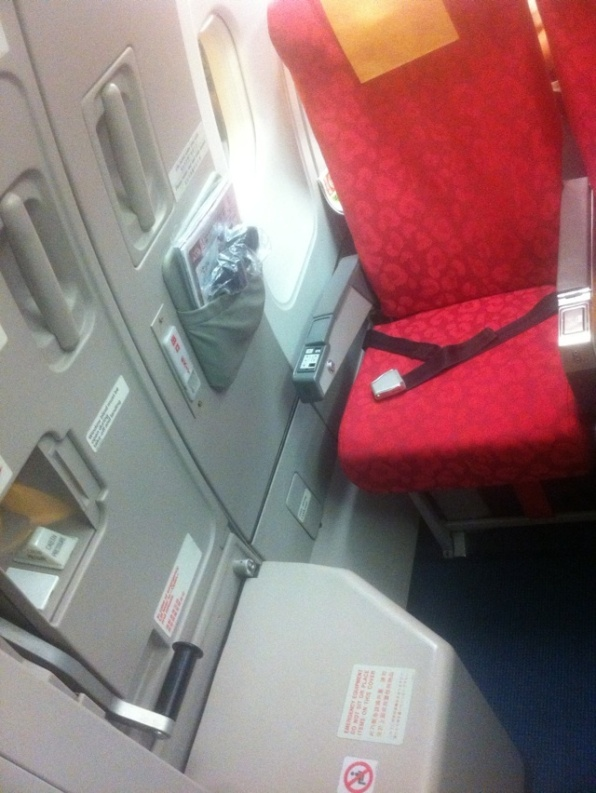

*2011-10-06 23:40 · iPhone客户端*

---

### 10886

但是这个大叔非常友好，主动帮我把联程航班的第二段订成腿部空间比较大的紧急出口的座位，因为香港飞北京的这段是港龙航空运营的，紧急出口这排不另外收钱。

*2011-10-06 18:43 · iPhone版*

---

### 10887

国泰航空是我见过的最有商业头脑的航空公司，把紧急出口那排座位加价20美元卖。国泰柜台的大叔都有点不好意思，跟我调侃：“我们公司在抢钱”。

*2011-10-06 18:33 · Android客户端*

---

### 10888

香港机场我比较满意，因为有免费无线热点。

*2011-10-06 18:21 · iPhone版*

---

### 10889

据说很多年长的美国人永远记得他们听到肯尼迪总统遇刺这个消息时自己在什么地方，周围是什么场景。或许我会永远记得我得知乔布斯

去世这个消息时的场景。

*2011-10-06 10:45 · iPhone版*

---

### 10890

第一次吃到百香果。

*2011-10-06 10:03 · Android客户端*

---

### 10891

几经周折，最后在台北新光影城看了《赛德克·巴莱（上）》。双人套票送一盒爆米花两个大可乐，550新台币，相当于不到120人民币，比北京的市场原价低一些，但是比起美团价那是贵多了。

*2011-10-06 02:08 · Android客户端*

---

### 10892

靠，雅虎活该倒闭！雅虎奇摩提供的电影场次信息居然是错的，害我白跑一趟，浪费我的时间、感情和金钱！

*2011-10-05 22:08 · iPhone版*

---

### 10893

大家对网络的依赖越来越强。昨晚等着上菜出现过这样的场面：我的插了台湾卡的android手机带6个iphone4上网。办这张临时手机卡主要就是为了上网，语音和短信用得极少。iphone4锁sim卡、用microsim卡带来的不便利在这种时候就体现出来了。

*2011-10-05 15:33 · iPhone版*

---

### 10894

多谢大家纠正。那两架战斗机确实是F16而非F18。

*2011-10-05 11:07 · iPhone版*

---

### 10895

刚才在台东森林公园，两架F18战斗机从我头顶一百米的高度掠过，难怪简直吵死人。

*2011-10-05 10:44 · iPhone版*

---

### 10896

到台东了。刚才火车穿越台湾岛南部山区。或许是地质原因，这里很多溪流的水确实是黑浊得一塌糊涂，简直像选矿洗煤后的废水。

*2011-10-05 09:41 · Android客户端*

---

### 10897

从高雄回台北不坐高铁了，特意绕道台东花莲。虽然慢很多，但是希望沿途可以看到台湾岛东岸和太平洋的风光。

*2011-10-05 07:16 · iPhone客户端*

---

### 10898

到高雄火车站了。这个出租车司机阿叔很奇怪，他应该已经听到后座上的我们刚才一路上讲的是中文，可他最后收钱时还是用英文。是为了刻意跟大陆客保持距离还是要卖弄自己会讲英文？

*2011-10-05 07:10 · iPhone版*

---

### 10899

再见，高雄85大楼。

*2011-10-05 06:43 · iPhone版*

---

### 10900

身边没电脑，一大早起来赶紧上饭否看一下，似乎昨晚苹果的发布会

令大家略有点失望嘛。

*2011-10-05 06:11 · iPhone版*

---

### 10901

@ 家禽子 不要高估台南阿叔的知识水平，但那不是重点。

*2011-10-05 00:46 · iPhone版 给家禽子的回复*

---

### 10902

@ 史前小破孩 你没明白我的意思。我知道各国时区，关键是他问那个时区问题反映了他根本不觉得他们和我们是一家。

*2011-10-04 23:58 · iPhone版 给史前小破孩的回复*

---

### 10903

有代表性的几大华人大城市里剩下新加坡没去过了。新加坡目前总面积704平方公里，大致相当于北京五环内面积（750平方公里）。澳门和香港的总面积则分别是30和1104平方公里。

*2011-10-04 23:49 · Android客户端*

---

### 10904

在某些人群里，两岸隔阂还是挺深的。前几天在台北打交道的台湾朋友都对大陆了解不少。今天到了高雄，晚饭时一个台南阿叔操着很不标准的国语亲切的问我“你们那里跟我们有没有时差啊… 我知道日本跟台湾有两个小时时差”。他这或许无心的问题真是问得我当时一愣。

*2011-10-04 23:23 · Android客户端*

---

### 10905

Be a lady's man and a man's man.

*2011-10-04 23:09 · iPhone版*

---

### 10906

高雄这个城市的原名搞笑得令人难以置信，就叫“打狗”！1895年被日本统治后才改成日文里发音相近的另外两个字“高雄”-_-!

*2011-10-04 22:49 · iPhone版*

---

### 10907

到达高雄这个海港城市了。我外祖父63年前来过这里。

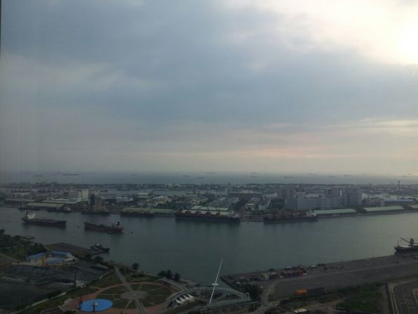

*2011-10-04 16:44 · Android客户端*

---

### 10908

民权街是台南最老的街道，也是整个台湾最老的街道，还保留着两边的骑楼，开着各种老店小店，例如XX绣庄、XX乌鱼子店、XX担仔面等，似乎并没有受到工业化商业文明的侵蚀。它让我想起了老家龙岩最老的那条中山街，曾经也是这样的骑楼，可是十几年改造过程中全干掉了:(

*2011-10-04 15:31 · iPhone版*

---

### 10909

从台南出发去高雄。台南火车站是老式建筑风格，我觉得有可能是日本占领时期留下来的。

*2011-10-04 15:20 · iPhone版*

---

### 10910

游历史古迹赤坎楼。据说郑成功和其父郑芝龙本是明末纵横东南沿海的大海盗，后来被明朝招安。郑成功的母亲是日本人。

*2011-10-04 12:47 · iPhone版*

---

### 10911

台湾的富人真低调！这房子按大陆的标准只能算三四线城市城乡结合部的二流农民房，可是据说里面住的是台湾传统巨富之一、从事纺织和水泥的台南帮某家族。

*2011-10-04 12:31 · Android客户端*

---

### 10912

orz 原来妈祖称“天后”还跟攻台湾有关。

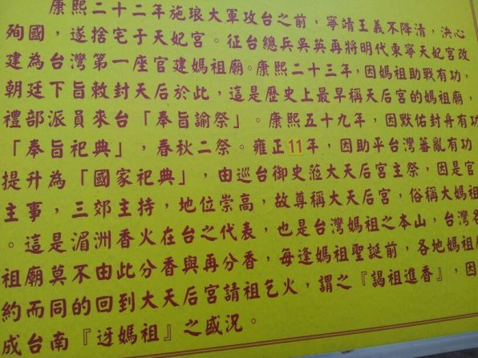

*2011-10-04 12:13 · Android客户端*

---

### 10913

听@ ifire 的建议，试试牛轧糖:)

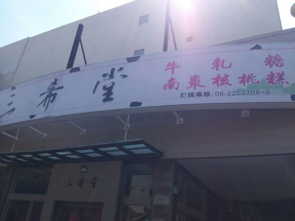

*2011-10-04 11:45 · Android客户端*

---

### 10914

李安的老爸曾是台南一中的校长。

*2011-10-04 11:34 · iPhone版*

---

### 10915

台南是台湾最老的城市，本来非常闲适。但是我们在街边喝茶时，头上频频有凌厉的战斗机掠过，震耳欲聋，很烦人。据说是附近的空军基地在为几天后的双十国庆阅兵做准备。

*2011-10-04 10:53 · iPhone版*

---

### 10916

@ 大头绿豆 回福建了？我正在台湾，虽然是第一次来，但是感觉很亲切，因为很多地方和福建很像。

*2011-10-04 10:48 · iPhone版 给大头绿豆的回复*

---

### 10917

30杂志社找了一个年轻达人游智维带我们逛台南。他热爱台南这个城市，对历史典故街头巷尾了如指掌。

*2011-10-04 10:28 · iPhone版*

---

### 10918

高铁台南站给我印象不错，很整洁，比较现代化，同时又不会大到不方便。

*2011-10-04 09:03 · Android客户端*

---

### 10919

体验一下台湾的高铁HSR，一大早7点钟从台北出发去台湾最老的城市台南。

*2011-10-04 07:21 · Android客户端*

---

### 10920

终于开通台湾大哥大临时卡的3G上网功能，一天100新台币，三天250，不限流量。大概相当于一天20人民币，有点贵，但还在可接受的范围内。

*2011-10-04 07:18 · Android客户端*

---

### 10921

在台湾，“高考”是指比较高级的公务员考试（和比较低级的“普考”对应），大陆的“高考”在这里叫“联考”。

*2011-10-03 20:16 · iPhone版*

---

### 10922

在台湾餐馆点菜，要叫“小姐”，不能叫“服务员”。

*2011-10-03 18:49 · iPhone版*

---

### 10923

听说朱钦骐david不但是nautica的创始人而且曾任tumi的执行创意总监后，我对他更添一分敬意。tumi还是相当牛逼的。

*2011-10-03 11:39 · Android客户端*

---

### 10924

朱钦骐，王伟忠，施崇棠，王文华

*2011-10-03 10:46 · Android客户端*

---

### 10925

在饭局上碰到nautica的创始人david zhu，他正在做一个服装新品牌lincs。我只能说，真是隔行如隔山，这位大哥对互联网了解甚少。

*2011-10-02 20:20 · iPhone版*

---

### 10926

台湾朋友很热情。在忠孝东路微风广场里的青叶餐厅吃了顿台湾料理，都是常见的菜，但是味道很不错！尤其是乌鱼子。

*2011-10-01 23:30 · iPhone版*

---

### 10927

在香港机场通过wifi上网用skype给台湾手机发短信，每条6.2美分。不知道对方能不能收到……

*2011-10-01 15:22 · iPhone版*

---

### 10928

到得太晚，航班太满，所以我的经济舱被免费升成商务舱了:-)

*2011-10-01 07:33 · iPhone版*

---

### 10929

出发了。

*2011-10-01 06:16 · iPhone版*

---

### 10930

最佳问答，不知道是否已经收录进把妹秘笈了。她问他：如果还有来世，我们还会在一起吗？他说：你前世已经问过这个问题。

*2011-09-30 18:55 · 网页*

---

### 10931

我原以为美团的办公室已经很简单了，但我还是被7天连锁酒店震撼了：据说他们公司总部连前台都没有！下回去广州我一定要去他们那里参观一下。

*2011-09-30 12:16 · 网页*

---

### 10932

好屌啊。转@ 半柚 吉普寨人说：“时间是用来流浪的，身躯是用来相爱的，生命是用来遗忘的，而灵魂，是用来歌唱的。”

*2011-09-30 10:28 · 网页 转自半柚*

---

### 10933

我们办公室隔条街的航空总医院是二级甲等医院。

*2011-09-30 08:16 · iPhone版*

---

### 10934

今天路上好像只有我还穿着短袖了。

*2011-09-30 08:07 · iPhone版*

---

### 10935

洗完澡了，依然深深的被kindle和silk震撼着。amazon再一次展示了它才是最懂云计算的公司。

*2011-09-29 01:55 · 网页*

---

### 10936

充分利用了云计算优势的Amazon Silk无疑是Google发布Chrome以来浏览器领域最大的突破。

*2011-09-29 01:03 · 网页*

---

### 10937

无意中发现chrome mac版v15支持magic mouse左右手势当前进／后退了，不错！

*2011-09-29 00:46 · 网页*

---

### 10938

受不了了，我决定要买点amazon的股票！不管现在股价高不高，我觉得有必要持有一些amazon的股票以示我对这家公司的敬意。

*2011-09-29 00:39 · 网页*

---

### 10939

$79的kindle？amazon够狠！

*2011-09-29 00:12 · 网页*

---

### 10940

有一年，我在新浪微博上看了一段杭州失足女接客日记，觉得写得挺像那么一回事。后来听说是浙江某文化传媒公司一刊物某男性主编杜撰的，我在大倒胃口的同时感叹自己还是浅。

*2011-09-28 17:44 · 网页*

---

### 10941

@ Dee.W Yosemite译成“约塞米蒂”太没意境了，还是“优山美地”更好听，虽然会让人想到北京某楼盘。

*2011-09-28 17:40 · 网页 给Dee.W的回复*

---

### 10942

赞！鸿光和美团深圳的兄弟们给力！转@ 黄鸿光 深圳过千万，欣慰，比预想快，感谢团队 ...

*2011-09-28 13:20 · 网页 转自黄鸿光*

---

### 10943

有两种错误很糟糕但是很常见，一是被已经不存在的障碍继续束缚，二是继续追求自己已经拥有的东西。

*2011-09-27 16:56 · 网页*

---

### 10944

是的，好的工程师比差的强十万倍。转@ gravity0 两分钟就能搞定的技术问题，走了一个多月的流程到现在还没完。我倒是不急，但这种荒谬感让我想起了曾经用过的某些编程框架和设计模式，脱裤子放屁已经不足以形容了。

*2011-09-27 15:36 · 网页 转自gravity0*

---

### 10945

地址簿这事，起初我以为是苹果的问题，后来觉得是联通的问题，刚才见多识广的@ webto 告诉我是google sync的问题，http://is.gd/s89yXP ，我看了看，原来是exchange协议的问题，http://is.gd/ZoTKPE ，所以万恶之源还是微软！

*2011-09-27 14:43 · 网页*

---

### 10946

@ Kevin 是的，我这里每个“移动电话”或”工作“标签只能有一项。

*2011-09-27 14:19 · 网页 给Kevin的回复*

---

### 10947

“He thinks about where he perceives the world to be going. Ifhe doesn’t think there is a company that will win, he builds ithimself.”

*2011-09-27 14:18 · 网页*

---

### 10948

饭否上许多朋友很热心，但是也表现出不太理解他人的那一面。你的iPhone地址簿可以自定义标签不代表我的也可以，你们说的那些操作我试过了，在我这里不行。是的，理解他人永远都是困难的，我们总是生活在以自己为中心的世界里。所以孔子提倡的是“己所不欲，勿施于人”而不是“己所欲，施于人”。

*2011-09-27 14:08 · 网页*

---

### 10949

不善理财的人们可以重燃信心了！转@ 一毛不拔 正在看弗格森的《罗斯柴尔德家族》⋯⋯里面说家族起家时的五兄弟都算不清帐，以至于有这样的信件“二哥，我们应该有几百万镑资产，可我问了其他几个兄弟手上现金都不多，那应该钱都在你那吧？要是你那也没有可就奇怪了，咱们的财富总该在某个地方吧？”

*2011-09-27 13:36 · 网页 转自一毛不拔*

---

### 10950

@ 亦悦 照你说的这么操作，我这里是把新号码默认存成Work号码。

*2011-09-27 13:28 · 网页 给亦悦的回复*

---

### 10951

午饭是一份康师傅私房牛肉面。全吃掉了，连面汤都统统喝掉了。很满足。

*2011-09-27 13:25 · 网页*

---

### 10952

于是，我从怪乔布斯改成了怪中国联通。注意到这个区别了吗？我们甚至不知道有哪个活生生的人在为联通的所作所为负责！

*2011-09-27 13:21 · 网页*

---

### 10953

同事中有个也用iPhone的热心姑娘跑过来，我们研究了一番，结论是她的水货iPhone4支持一个联系人有多个手机号，我的联通定制iPhone4不支持。干！

*2011-09-27 13:13 · 网页*

---

### 10954

我知道iPhone地址簿支持一个联系人有多个电话号码，但是我没有找到办法让一个联系人同时有多个“手机”号而不是很别扭的将其中一个手机号填为Home或Work电话号码。请能者不吝赐教。

*2011-09-27 13:01 · 网页*

---

### 10955

刚注意到，我的chrome里显示的是amazon.com的新版，safari里还是老版。两个都登录了。是在搞AB测试吗？

*2011-09-27 12:36 · 网页*

---

### 10956

iPhone地址簿不区分Home Email和Work Email，这一点也不如android的地址簿。

*2011-09-27 12:33 · 网页*

---

### 10957

amazon.com有点神奇过头了，同样一把小刀的价格变来变去。我前天在办公室电脑上看是$8.54，昨晚在家里看是$7.86，刚才在办公室看又成了$8.54，隐约记得就这几天还看到过更便宜的价格。你们那里看到的价格是多少？ http://is.gd/Z4szyW

*2011-09-27 12:30 · 网页*

---

### 10958

@ 乔珂藜 iPhone允许多号，但得把某人的俩手机之一设成家庭电话或工作电话。可明明是俩手机号，这么搞多别扭啊。

*2011-09-27 12:23 · 网页 给乔珂藜的回复*

---

### 10959

iPhone地址簿不允许一个联系人有多个手机号，这个设计极其傻逼，完全不符合中国目前的国情。

*2011-09-27 12:16 · 网页*

---

### 10960

转@ 语录香瓜 上联：大四的看大三的教大二的怎么骗大一的；下联：大一的听大二的讲大三的怎么甩大四的；横批：大三是最牛逼的…

*2011-09-27 12:02 · 网页 转自语录香瓜*

---

### 10961

克林顿的女儿成为IAC的新董事了。这姐们何德何能？美国人官商勾结

也停厉害的。IAC是一个重量级互联网控股公司，拥有最大的交友网站match.com和ask.com,dictionary.com,citysearch.com等。人人网母公司千橡原名China IAC。

*2011-09-27 12:00 · 网页*

---

### 10962

@ hancheng iPhone4，联通定制机。

*2011-09-27 10:53 · 网页 给hancheng的回复*

---

### 10963

老妈说今天凌晨4点接到从我的186手机打给她的电话，响一声就挂掉了。可是那时我早已睡了。刚才查了一下手机的呼出记录，排除了我半夜梦游起来打这个电话的可能。那是怎么回事呢？

*2011-09-27 10:51 · 网页*

---

### 10964

转@ 愚子 @ 王兴 劫持春运火车太不现实了吧，挤得刀都拿不出来怎么劫？

*2011-09-26 23:53 · 网页 转自愚子*

---

### 10965

我打算买这种超小的刀，看看能不能带上飞机。 http://is.gd/Z4szyW

*2011-09-26 23:45 · 网页*

---

### 10966

如果目标只是直接袭击机上乘客的话，为什么要劫机而不是劫火车尤其是春运火车？劫机最可怕的是像911那样控制了驾驶舱拿装满油的飞机当自杀式炸弹来袭击其他目标。不过@ 和菜头 毕竟是专业人士，说的有些道理。

*2011-09-26 23:40 · 网页*

---

### 10967

稍微想了一下，不允许带刀上飞机这规定其实并没道理，平添许多麻烦。只要隔离驾驶舱和乘客舱，并明确规定不管劫机者杀不杀乘客人质，飞行员都锁死驾驶舱并正常驾驶，那基本就出不了什么大乱子。

渐渐的，劫机的人可能也会少下来。

*2011-09-26 23:24 · iPhone版*

---

### 10968

步行回家路上经过中央戏剧学院某校区，门口站的果然是一群俊男美女。

*2011-09-26 21:55 · iPhone版*

---

### 10969

我一直在寻找可以顺利通过机场安检的小刀。我并不想劫机，我只是觉得出门在外身边完全没有锋利的东西有时挺不方便。

*2011-09-26 21:21 · 网页*

---

### 10970

看到今天的“热门话题”是“世界避孕日”，确实，停下来稍微想一下，避孕技术的进步是上个世纪最最重大的科技进展之一，彻底改变了社会格局。

*2011-09-26 21:19 · 网页*

---

### 10971

出差多了，渐渐对出差装备也有了心得，两条很要紧：一是轻便，二是耐脏。

*2011-09-26 21:16 · 网页*

---

### 10972

@ 独孤秋秋 大姐，好久不见。终于看到你冒泡了。有空也请请我？;)

*2011-09-26 18:01 · 网页 给独孤秋秋的回复*

---

### 10973

突然发现amazon.com首页改版了，而且跟gmail首页最近改版的风格很像，都是更扁平化。介就是fashion吗？

*2011-09-26 12:36 · 网页*

---

### 10974

无论白天黑夜，亚运村那个金泉广场的大元宝楼都是看起来有点邪恶的建筑。

*2011-09-25 18:07 · iPhone版*

---

### 10975

转@ gravity0 马丁·路德说：“即使知道世界明天毁灭，今天我仍要种下我的葡萄树。” 德国人喜欢的这句格言不但说明了他们善于规划，也是一种执着态度的体现。当被前方的不确定性煎熬彷徨时，不妨想想这句。

*2011-09-24 16:56 · 网页 转自gravity0*

---

### 10976

拿到一个清华学长的名片，觉得这个基金名字很有意思，有几点：一是和清华“自强不息，厚德载物”的校训有关联；二是中文名“厚德”和英文名holder非常接近；三是holder这:)词跟这个基金干的版权投资这事很贴切。当然，我还不由自主的想到hold姐

*2011-09-24 16:31 · Android客户端*

---

### 10977

女生练哑铃杠铃？月亮叔是不是很有压力？有木有！转@ 小河 昨天去健身房举了哑铃、杠铃等重物，导致今天肱二头肌失灵，倒车入库时转方向盘基本靠肩膀。。

*2011-09-23 10:42 · 网页 转自小河*

---

### 10978

@ iFire 4.3.5 (8L1)。有个比较懂行的朋友说可能跟联通的网络有关。

*2011-09-22 17:13 · iPhone版 给iFire的回复*

---

### 10979

我最近十次重启iphone的原因都是iphone到了某些地方丢失上网数据信号后不会自动重连，我只好关机重启以强迫它重新搜寻信号，连切到飞行模式再切回来都不管用。除此之外，我没发现iphone有重启的必要。

*2011-09-22 16:58 · iPhone版*

---

### 10980

I'm gonna make him an offer he can't refuse. Without involvinga gun.

*2011-09-22 16:10 · iPhone版*

---

### 10981

iphone有个细节做得比android好：即使关机重启，iphone双击home键调出的应用切换的列表还是保持原样的，android的却是清空了。其实存下那个列表应该很简单，就看想不想这么做了。

*2011-09-22 16:08 · iPhone版*

---

### 10982

移动有个细节做得比联通好：来电提醒“XXX号码在某时某分呼叫过您”，这条短信移动是用来电号码XXX本身来发，于是手机可以识别并直接显示出通讯录里的人名；联通却是用统一的特服号来发，把来电号码放在短信内容里，可是短信里那串电话号码我哪记得是谁啊？还得小折腾一下⋯⋯

*2011-09-22 14:35 · 网页*

---

### 10983

gmail的mute功能根本没用！查了一下说明，只对邮件列表起作用。

如果你的邮件地址出现在to或者cc列表里，这个thread还是会出现在你的inbox里。

*2011-09-22 13:17 · 网页*

---

### 10984

第一次使用gmail的mute功能。

*2011-09-22 12:51 · 网页*

---

### 10985

多么靠谱的姑娘啊！转@ 小冠 停电含泪爬上22层。。腿快要僵掉了，心要跳出来。重点是爬到开始腿软的时候，触电一般把钥匙掏出来拿在手上并时时留意，生怕发生爬楼忘钥匙的悲剧。。。

*2011-09-22 11:29 · 网页 转自小冠*

---

### 10986

嘉里中心，彩色打印一张20块，黑白打印10块，复印一张2块，全是A4纸的价格。简直是抢钱啊！

*2011-09-21 20:33 · iPhone版*

---

### 10987

忍不住想再说一遍：秋天真是北京最美的季节！

*2011-09-21 14:50 · 网页*

---

### 10988

发现一个有趣的现象，浙江是个很发达的省份，但是只有一所“211工程”院校，比新疆都更少。是因为浙江人忙着赚钱不重视（高等）教育？还是因为好学校都并到浙大里面去了？还是因为211工程本身就是一个不靠谱的名单？

*2011-09-20 17:25 · 网页*

---

### 10989

终于搞明白了，常说的“哈工大”是指哈尔滨工业大学，另外还有一所哈尔滨工程大学（原名哈尔滨船舶工程学院）。两者都是不错的学校，都进入211工程了。

*2011-09-20 16:57 · 网页*

---

### 10990

美国人已经如此重度使用短信了？“18至24岁年龄段的受访者更多地使用手机发短信⋯⋯ 平均每天收发短信达到109.5条” http://is.gd/pcCAqD别说100条了，就是一天发50条也很夸张啊。难道是因为美国的短信都是包月的、不按条计费？

*2011-09-20 13:31 · 网页*

---

### 10991

The buck stops here.

*2011-09-20 11:39 · iPhone版*

---

### 10992

室内温度计明明显示还有21度，怎么可能这么冷呢？

*2011-09-20 01:32 · 网页*

---

### 10993

@ 弥城 令人发指啊！居然还有空座位。我坐的那趟火车从头到尾挤得一塌糊涂，从车厢一头挤到另一头去上厕所要半小时。

*2011-09-18 18:05 · iPhone版 给弥城的回复*

---

### 10994

@ LQ666 没有后来啊。我和她俩只见过一面却至今记得，不是因为她俩有什么特殊魅力，而是因为那趟列车是我人生一个新的开端，所以相关的很多东西都印象深刻。

*2011-09-18 17:56 · iPhone版 给LQ666的回复*

---

### 10995

列车跑在长三角平原上，一路风光无奇但令人心情愉悦。临近傍晚，窗外地平线上的落日让我想起十四年前我坐火车到北京上大学时在华

北平原上第一次看到了地平线。之前我没有出过福建省，一直生活在没有地平线的山区。我甚至记得那趟列车上和我萍水相逢的两个福建女生各姓什么各读哪个学校。

*2011-09-18 17:34 · iPhone版*

---

### 10996

macbook合着盖的状态下插入iphone数据线，没有进入充电状态。打开盖，开始充电。合上盖，依然保持充电状态。我印象中pc笔记本不是这样的逻辑，是否充电只跟开盒盖状态有关。难道苹果在这个细节上做了一些优化处理？

*2011-09-18 17:24 · iPhone版*

---

### 10997

@ Dee.W 而且我还经常在出差时拿联通iphone当无线热点让笔记本和移动android手机上网。

*2011-09-17 17:37 · iPhone版 给Dee.W的回复*

---

### 10998

@ Dee.W 我用联通3G，每月800兆的流量从来没用完过。

*2011-09-17 16:35 · iPhone版 给Dee.W的回复*

---

### 10999

amazon开始给用户发邮件推广他们新推出的特卖网站 myhabit.com了。

*2011-09-17 01:32 · 网页*

---

### 11000

恭喜您成为携程的钻石贵宾。

*2011-09-17 01:31 · 网页*

---

### 11001

上海火车站的男厕所还是用不锈钢小便槽而非陶瓷小便池，让我吃了一惊。不过想一想其实也没什么区别。

*2011-09-16 21:36 · iPhone版*

---

### 11002

南航的值班柜台只管帮你退票但不能告诉你退票手续费是多少……

*2011-09-16 09:54 · iPhone版*

---

### 11003

用携程的iphone客户端查今天剩余的航班，只有比较晚的了。换用“航班管家”iphone客户端查，上午10点还有一班，于是打电话给携程，订上了。携程的iphone客户端为什么不显示最近一俩小时的航班呢？险些漏掉一笔生意。

*2011-09-16 09:08 · iPhone版*

---

### 11004

一路狂奔，8点38分赶到登机口，但是舱门已经提早关闭了:-(

*2011-09-16 08:52 · iPhone版*

---

### 11005

8点40飞机起飞，现在我才过机场高速收费口。有点悬了。

*2011-09-16 08:29 · iPhone版*

---

### 11006

虽然现在各种软件极大丰富，但是把电脑上的一张图片传到手机里最便捷的方式依然是：把图片显示在电脑屏幕上，然后拿起手机拍一下屏幕。

*2011-09-15 13:41 · 网页*

---

### 11007

@ 神剑 握手！

*2011-09-15 13:22 · 网页 给神剑的回复*

---

### 11008

招行也不靠谱。我的信用卡额度不够了，打电话过去申请提永久额度被拒，申请提临时额度她同意了。第二天携程告诉我信用卡扣款失败，因为余额不足。一查，原来连临时额度都没提。我已经懒得再给招行打电话投诉了。逼我用别家的信用卡嘛。

*2011-09-15 12:06 · 网页*

---

### 11009

whatsapp/kik/微信彻底改变了我和很多家人朋友的通信方式。

*2011-09-15 11:58 · 网页*

---

### 11010

听说支付宝内部有个金融相关的部门叫“五道口”，因为这个部门的很多人是从五道口那里的中国人民银行研究生院毕业的。这个研究生院在国内金融界人脉深厚，现在已经并入清华了。

*2011-09-13 21:36 · 网页*

---

### 11011

这次出行的体会，在包里放一个手机车充非常有必要！

*2011-09-13 15:42 · 网页*

---

### 11012

@ 马扎罗 啊，心领不是感谢的意思吗？

*2011-09-13 15:41 · 网页 给马扎罗的回复*

---

### 11013

@ jingjing 为了回答你这个问题，我把六个月饼小盒都拆开来看了。

运气真差，前面都不是，最后一个才拆到白莲单黄。你看你可以将就一下吗？

*2011-09-13 15:41 · 网页 给jingjing的回复*

---

### 11014

中秋明月下裸泳归来。

*2011-09-13 00:09 · 网页*

---

### 11015

@ jingjing 我记得是175。但是最近两年体检时护士都给我填176.5。

*2011-09-13 00:09 · 网页 给jingjing的回复*

---

### 11016

妈妈说我小学毕业时身高1米37。

*2011-09-12 20:33 · iPhone版*

---

### 11017

听说我的一个堂弟要在厦门开个绝味鸭脖的分店。七七八八加起来一

共要投资十一万，预计每天流水做到3700元方可打平。

*2011-09-12 20:18 · iPhone版*

---

### 11018

十七八年前建这个厂的时候，我暑期在工地上打过工，但现在已完全认不出来了。

*2011-09-12 15:55 · iPhone客户端*

---

### 11019

这只虫的隐身功夫真好！你能认出来吗？

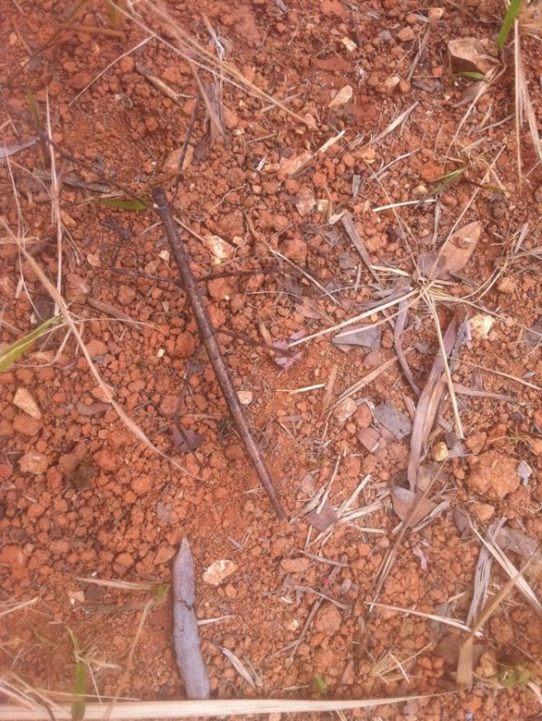

*2011-09-11 15:20 · iPhone客户端*

---

### 11020

@ 鸝.se 你成为哪国人了？

*2011-09-11 14:50 · iPhone版 给鸝.se的回复*

---

### 11021

扫墓

*2011-09-11 13:04 · iPhone客户端*

---

### 11022

当一辆车上有两台iphone两台android手机时，一个点烟器充电是来不及的……

*2011-09-11 01:17 · iPhone版*

---

### 11023

@ qinyf 对，GL8最新款。

*2011-09-11 00:41 · iPhone版 给qinyf的回复*

---

### 11024

这辆别克商务车的细节还是不行。我只坐了一个小时就发现好几处可改进的地方。而且有些失误是根本就不应该出现的。例如，某个座位的空调出风口不能完全关闭。

*2011-09-11 00:37 · iPhone版*

---

### 11025

这辆别克商务车的导航系统很有趣，语音界面非常流畅，我看驾驶员和系统对话基本没问题；但是，地图数据一塌糊涂，导致我们从高崎机场出来绕了四十分钟还没出岛外。

*2011-09-11 00:22 · iPhone版*

---

### 11026

肯德基已经把“生长周期更短”当做优点来宣传了？ orz!

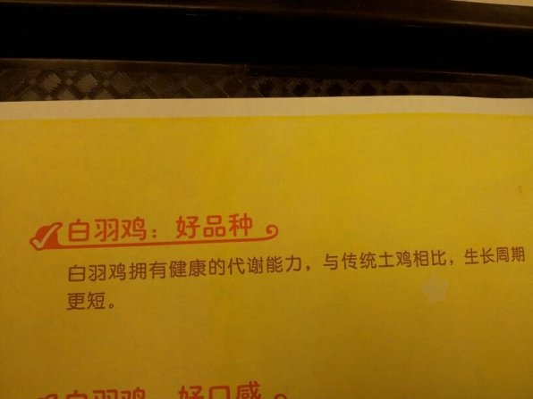

*2011-09-10 23:05 · Android客户端*

---

### 11027

真功夫真是太不顶事了。七点吃了一个套餐，现在就饿了。接下来还有两个多小时车程，只好先买点肯德基填填肚子。

*2011-09-10 23:02 · iPhone版*

---

### 11028

好吧，我承认我是一个不可救药的geek。刚才我在想中秋节应该干点什么，除了吃月饼以外，第一个跳入我脑海的竟然是去把维基百科上的“月亮”条目通读一遍，补全我掌握的关于月亮的知识。

*2011-09-10 13:43 · 网页*

---

### 11029

@ yukir mac键盘没home键，要fn+光标向左。我用thinkpad的时候也不太用home键。

*2011-09-10 12:32 · 网页 给yukir的回复*

---

### 11030

我一定是被这个快节奏的时代惯坏了。这个酒店的房间卫生间用的是日光灯，可能是有点老化了，按完开关后大概要两三秒才亮起来，让我觉得体验很差很差。我期待的是一按开关立刻亮。可是，小时候也用日光灯，那时候我没有这么不耐烦吧？

*2011-09-10 12:26 · 网页*

---

### 11031

用惯了iOS的app，习惯了点顶端回页首，刚才在mac上的chrome里看完一个长网页想回到页首，目光和鼠标不由自主的往顶端标题栏移动-_-! 话说mac和pc上为什么不开发这个功能呢？

*2011-09-10 12:22 · 网页*

---

### 11032

或许我还应该感谢一个从未谋面的老师魏书生，因为我知道他影响了我的高中班主任吴雪峰，而吴老师影响了我，都是以非常正面的方

式。

*2011-09-10 00:46 · 网页*

---

### 11033

今年的教师节我还会特别想起另一个人，我的计算机启蒙老师林爱卿。可恨的癌症复发在不到一年前夺去了她的生命。她是一个多么开朗乐观多么和蔼可亲的人啊。在编程方面她或许不如福师大附中那些培养了一串奥赛金牌得主的老师专业，但是她为我和其他很多同学开启了通向电脑之门，改变了我们的一生。

*2011-09-10 00:37 · 网页*

---

### 11034

赞！转@ realazy 想在 Mac 上阅读 EPUB, 发现没有一款软件合我心意。于是决定自己写一款。

*2011-09-10 00:25 · 网页 转自realazy*

---

### 11035

每年的今天我都要对自己重复一遍我的高中数学老师任勇在告别时说的话：敬业是最好的尊师。

*2011-09-10 00:12 · 网页*

---

### 11036

携程也不靠谱。刚才我要机票改期，携程说让我去找国航改，她会把国航电话和票号等信息发短信给我。我等了半小时都没等到短信，只好再打电话给携程。他查了一下，说短信发到另一个手机去了，刚才有九折票，现在只有全价票。我骂了他们一通，电话转到上级主管那里，结果又有九折票了。逼我骂人嘛。

*2011-09-09 22:56 · 网页*

---

### 11037

i9100手机又连不上madbook air做的wifi热点了。难道要每用一次都改一次密码？

*2011-09-09 22:23 · 网页*

---

### 11038

彭蕾说阿里巴巴是1999.9.9那天领的营业执照，今天正好满十二年。这说明阿里从一开始就很会造势。

*2011-09-09 16:16 · iPhone版*

---

### 11039

转@ 筱潇 对于人类来说 最好的安慰剂就是知道你的痛苦并不特殊。- 叔本华

*2011-09-09 15:52 · 网页 转自筱潇*

---

### 11040

支付宝办公室的洗手间叫“听雨轩”-_-!

*2011-09-09 11:53 · iPhone版*

---

### 11041

这个消息让人失望。更糟糕的是我相信这个消息来源是靠谱的。转@李童鞋.冒泡 制造商高层透露，即将发布的新iPhone是小改款，长的和现在的外观没区别，等iPhone5的人洗洗睡吧！不管你信不信，反正我

信了。 我在文津国际酒店。 http://is.gd/4OoEmu

*2011-09-09 00:14 · 网页 转自李童鞋.冒泡*

---

### 11042

将加密方式从128位改成40位之后，i9100和iPhone4都能连上这个无线热点了。

*2011-09-08 22:19 · 网页*

---

### 11043

奇怪，现在我拿macbook air当无线热点，我的三星i9100死活连不上去:-( 我记得以前是可以的。iPhone4依然能连上这个热点。

*2011-09-08 22:05 · 网页*

---

### 11044

上桌喝完第一杯开餐酒后，马云花了半个小时讲茅台的故事。他讲故事的能力确实了得。

*2011-09-08 18:49 · iPhone版*

---

### 11045

刚才iphone摔到石板路上，幸好我在最后关头用脚垫了一下，损伤大大减小。不过还是能看出摔过:-(

*2011-09-08 15:36 · iPhone版*

---

### 11046

右手边坐着一个带着无镜片眼镜的时尚女孩。

*2011-09-07 21:05 · iPhone版*

---

### 11047

进机舱后又在跑道上等了超过半小时了。所谓空中流量管制太恶心了！

*2011-09-07 21:03 · iPhone版*

---

### 11048

第一次因为航班延误而领到免费餐。

*2011-09-07 19:09 · Android客户端*

---

### 11049

Akamai的创始人Lewin是十年前911撞楼飞机上的乘客。到MIT读计算机之前他在以色列反恐部队服役过。他跟劫机者搏斗过，但是在飞机撞楼前就被杀了。911事件之后互联网访问量暴涨，正是最需要akamai显身手的时候。 http://is.gd/cj6cZT

*2011-09-06 12:01 · 网页*

---

### 11050

活了这么多年，直到上周末才学会单手磕瓜子。

*2011-09-05 19:08 · 网页*

---

### 11051

不用看任何消息来源，我坚信iPhone5一定会比iPhone4更薄、屏幕更大。因为苹果只要不这样做就很难有竞争力。

*2011-09-04 18:58 · 网页*

---

### 11052

哇，电子游标卡尺！自打我从学校毕业之后就没用过游标卡尺这玩意儿了。 http://is.gd/2HZmel

*2011-09-04 18:55 · 网页*

---

### 11053

有点晕，这是什么情况？ 转@ 熌熌 中午居然和@ 王兴 的父亲吃饭，膜拜！

*2011-09-04 18:49 · 网页 转自熌熌*

---

### 11054

@ 日照孙超 赞！我也在办公室:-)

*2011-09-04 16:20 · 网页 给日照孙超的回复*

---

### 11055

试试新的饭否android客户端

*2011-09-03 14:16 · Android客户端*

---

### 11056

成都之行再次印证一个道理：提高幸福感最有效的办法是降低期望值。

*2011-08-31 20:28 · iPhone版*

---

### 11057

赶往机场前用最后一个小时逛了宽窄巷子，类似于北京的南锣鼓巷。

建筑不错，小吃一般。

*2011-08-31 18:24 · iPhone版*

---

### 11058

第一次看到芥兰做成这样。

*2011-08-31 15:49 · iPhone客户端*

---

### 11059

久闻乡村基在西南地区力压洋快餐的大名，今天终于尝了一下。一份口味鸡饭套餐16.5元，份量比真功夫大，能吃饱，但是味道一般。也许是我之前期望值太高了。

*2011-08-30 19:48 · iPhone版*

---

### 11060

关在酒店里开了一整天APEC中小企业的会，终于可以出去看看成都了。

*2011-08-29 21:01 · iPhone版*

---

### 11061

以前常用iPhone当无线热点，今晚第一次用接了酒店网线的macbook当无线热点。原来mac os已经内置了这个功能，只要在“设置－分享”里打开选项即可。

*2011-08-29 00:43 · 网页*

---

### 11062

我真被吓了一跳！转@ 正了巴经 事实证明.：长时间.上推会损坏屏.

幕。

*2011-08-29 00:26 · 网页 转自正了巴经*

---

### 11063

四川航空有特色：空姐推的餐车上有一罐老干妈辣酱，乘客可以自由索取。

*2011-08-28 21:39 · iPhone版*

---

### 11064

@ 盖文张 甘地说过一样的话，省了开头两个单词。

*2011-08-28 19:07 · iPhone版 给盖文张的回复*

---

### 11065

出行贴士：以后夏天坐飞机应该穿衬衫，胸前有兜的那种，方便放需

要反复使用的身份证和登机牌。那些东西揣在后裤兜不太保险。

*2011-08-28 19:05 · iPhone版*

---

### 11066

在家宅了一天，傍晚出门。出差。

*2011-08-28 18:27 · iPhone版*

---

### 11067

一把刀可以用来：切，割，削，划，刮，刻，砍，捅，扎，劈⋯⋯ 你明白这些动词的差别吗？

*2011-08-28 11:00 · 网页*

---

### 11068

又是一个葡萄柚当晚餐。我已经超过24小时没吃肉了。

*2011-08-24 22:13 · 网页*

---

### 11069

用了一个星期三星i9100，无意中发现，虽然这部手机不像我之前用过的其他android手机那样有专门的搜索键，但是长按菜单键就是“搜索”。

*2011-08-24 11:28 · 网页*

---

### 11070

易迅CEO卜广齐：电商每年11月至次年3月是关键期。服装电商这段时间订单是七八月份4倍左右；仓储方面，行业平均是1平米仓储也就能支持1个订单，每人每天产能在40-80单；对于易迅而言，有分公司的城市肯定是自建配送。单个配送员60单/天是个坎，过了之后自建配送的成本要低于第三方物流

*2011-08-24 00:02 · 网页*

---

### 11071

一个人吃完一整个葡萄柚，觉得自己全身都充满了维生素C。

*2011-08-23 23:51 · 网页*

---

### 11072

@ jingjing 至少是亲外婆吧。

*2011-08-23 18:03 · 网页 给jingjing的回复*

---

### 11073

转@ gravity0 是飯否強大 转@ 爱笑的虎斑猫 @ gravity0 @Apogee 这个工具很强大，足以解决常见的姓氏问题http://is.gd/rBWYSL

*2011-08-23 17:32 · 网页 转自爱笑的虎斑猫*

---

### 11074

如花似玉。如饥似渴。如狼似虎。如胶似漆。如鱼似水。

*2011-08-23 16:25 · 网页*

---

### 11075

总有比你睡得更晚的人。

*2011-08-22 04:21 · iPhone版*

---

### 11076

中国目前共有175个民用机场，其中130个处于亏损状态，计划五年内

再建45个。

*2011-08-21 10:44 · iPhone版*

---

### 11077

太像毛绒玩具了！转@ 沙杰 小狗萌死人不偿命啊http://is.gd/h2gXpI

*2011-08-20 18:32 · 网页 转自沙杰*

---

### 11078

第一次在手机上用SIP通话功能。想起我大三大四之间的暑期实习就是在电信研究院翻译SIP的RFC文档。十一年过去了，看来有些新技术的普及并不像我们期待的那么快。

*2011-08-20 18:18 · 网页*

---

### 11079

@ Kevin 没有特别感觉到。我经历过最烫的手机是iPhone4一边充电一边当wifi热点一边通话半个小时后。

*2011-08-20 17:09 · 网页 给Kevin的回复*

---

### 11080

越来越觉得google掌握的个人信息确实多得吓人。刚看了一下https://www.google.com/hist... ，自从2005年4月26日google开始记录我的搜索历史至今，我一共搜索过 11227次（平均一天4.9次），包括在android手机上用谷歌地图查的每

*2011-08-20 17:02 · 网页*

---

### 11081

发现galaxy s2(i9100)第一个让我不满意的地方：空有800万像素的相机，但是名片全能王里没法拍微距，不能扫描名片:-( 应该是软件问题，因为自带的相机程序拍微距还是不错的。

*2011-08-20 15:29 · 网页*

---

### 11082

《窃听风云2》很一般，满分五分的话顶多只能给两分。

*2011-08-20 01:22 · 网页*

---

### 11083

转@ 东东枪 这张纸被我打印出来贴在工位前头也有些年了。红星照我去战斗。 http://fanfou.com/photo/VUz...

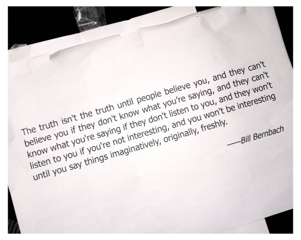

*2011-08-19 11:43 · 网页 转自东东枪*

---

### 11084

iPhone5非常值得期待！因为三星新出的Galaxy S II的硬件已经完胜iPhone4了，而苹果一定不会甘于落后！有对比才有感觉。用了几个小时Galaxy S II后再拿起iPhone4，我觉得iPhone4真是像一块砖头那样又厚又重。

*2011-08-19 01:45 · 网页*

---

### 11085

@ 邵烨 被水货商做了手脚，这些预装到rom里的应用无法通过正常方式删除。

*2011-08-18 10:46 · 网页 给邵烨的回复*

---

### 11086

水货手机的rom太可怕了，第一次开机就发现金山手机卫士、360手机卫士、QQ手机管家全都自动启动了，似乎还没法删除。这可怎么用啊⋯⋯

*2011-08-18 10:41 · 网页*

---

### 11087

淘宝的购物体验确实比较麻烦。折腾了10天，被迫使用旺旺跟卖家交流之后，终于拿到了我的新android手机三星galaxy s2（i9100）

*2011-08-18 10:27 · iPhone客户端*

---

### 11088

两个小时之内收到两个不同朋友的生子报喜短信。看来真是到了生育高峰⋯⋯ 按照我的手机联系人数量大致估算了一下概率，依然是小概率事件。

*2011-08-16 19:59 · 网页*

---

### 11089

@ 剑之锋芒 我已经几个月没登录MSN了。我觉得MSN可以抛弃了。

*2011-08-16 18:06 · 网页 给剑之锋芒的回复*

---

### 11090

招行的客服响应速度倒是很快，不到两个小时就回电话给我，但是解决方案比较雷人：确实没办法管理以前设置过但是现在看不到的那些付款计划，但是这些付款计划只要失败一次就会自动取消，所以建议您把转出卡的取款密码改掉或者提款至余额不足下次转帐即可-_-!

*2011-08-16 14:55 · 网页*

---

### 11091

没想到招行网银也这么烂：我一年前设置过“付款计划”，即每个月自动

从一张卡往另一张卡转固定数额的钱。现在这个自动付款还在每月发生，我在网银的“付款计划管理”里却找不到记录，所以没法删除。打电话过去，客服并不惊讶，说因为我的招行网银专业版换过，所以得联系后台技术人员帮我处理⋯

*2011-08-16 13:18 · 网页*

---

### 11092

我常跟人说，创业公司就像是一辆车得边开边修，但这是我第一次真的看到这种场景⋯⋯

*2011-08-15 21:15 · 手机上网*

---

### 11093

那么读lonely planet算是一个半在路上吗？转@ 和菜头 “要么旅行，要么读书，身体和灵魂，必须有一个在路上。”---@ 我执

*2011-08-15 18:50 · 网页 转自和菜头*

---

### 11094

@ 剑之锋芒 说明你可能在很多网站使用相同的用户名和密码，安全性很差-_-!

*2011-08-15 17:14 · 网页 给剑之锋芒的回复*

---

### 11095

试图一晚上看完积累了一星期的google reader未读条目，未遂。

*2011-08-13 00:05 · 网页*

---

### 11096

我觉得苹果领先优势最大的产品不是iPhone，也不是iPad，而是Macbook Air。Air的硬件完全秒杀所有PC笔记本，即使是用来装Windows也是极佳的选择。只可惜笔记本这个产业已经不如智能手机和平板那么朝阳了。

*2011-08-12 09:33 · 网页*

---

### 11097

@ iCream 正是加州。

*2011-08-12 09:30 · 网页 给iCream的回复*

---

### 11098

美国真是经济社会。刚听说了，如果小孩送去幼儿园时还不会自己坐马桶，需要每个月多收100美元。

*2011-08-12 00:38 · 网页*

---

### 11099

你们以为我还停留在用服务器下片的时代吗？你们不知道现在手机都可以装bt或emule了吗？不然买双核＋1G内存＋16G闪存的安卓手机干什么？光用来打电话发短信？当然，手机太强大会不会对附近的服务器有电磁干扰我就不清楚了。

*2011-08-11 18:17 · 网页*

---

### 11100

看一下谷歌掌握了多少关于你的信息https://www.google.com/dash...

*2011-08-10 19:50 · 网页*

---

### 11101

转@ lijb87 李敖点评商红会事件主角郭美美：年轻姑娘炫富，无非是两种情况：“要么是日她的人牛逼，要么是日她妈的人牛逼”，舍此无它。刚看到新闻，说郭美美家暴富是由于炒股，说几个月内从几万炒到几百万。网民开始研究，郭家炒的是那只股呢？结果一致认为是最牛逼的股：屁股。

*2011-08-10 14:44 · 网页 转自lijb87*

---

### 11102

iphone上哪个地铁查询软件最好？

*2011-08-10 11:19 · iPhone版*

---

### 11103

因为今早九点要到东方广场见个人，所以在早高峰时段挤了一回传说中的五号线北往南。确实挤得像罐头，不过第一趟车就能挤上去，所以也不算太夸张。

*2011-08-10 11:03 · iPhone版*

---

### 11104

第一次在淘宝上买价格达到四位数的东西。希望最后拿到手的手机没问题⋯⋯

*2011-08-09 23:17 · 网页*

---

### 11105

再一次忘还信用卡之后，我决定把这张有1％积分返现的深发展信用卡取消掉，老老实实回去用什么优惠也没有但是能和银行帐号绑定每个月自动还款的招行信用卡。

*2011-08-08 21:36 · 网页*

---

### 11106

北欧和天朝真不像是同一个世界⋯⋯ 转@ 鸝.se 一对年轻的麋鹿奔跑在泛着金黄的麦田上，它们矫健敏捷互相追逐，那种毫无顾忌的原始之爱跃然眼前，透过高速奔驰的列车车窗温暖我心。

*2011-08-08 17:05 · 网页 转自鸝.se*

---

### 11107

我估计我快要用得上这个贴士了⋯⋯ 转@ realazy 我的 iPhone 一年没到，Home 键基本处于失灵状态，搜到一个解决方案，用拇指甲按住键顺时针转几圈，居然有效！ http://is.gd/ReHsjd

*2011-08-08 13:42 · 网页 转自realazy*

---

### 11108

科技进步真是厉害。用skype往美国打电话只要每分钟2美分（相当于人民币1毛3），我觉得已经很便宜了。现在google居然推出一个gmail里的新功能，从全世界往美国打电话都全免费！我刚试了一下，话音质量很好。这世界真疯狂⋯⋯

*2011-08-08 13:05 · 网页*

---

### 11109

@ 生于82 哈哈，隔空握个手。我看到宋丹丹和袁莉也来看这一场。

*2011-08-08 00:51 · 网页 给生于82的回复*

---

### 11110

居然还有＂秽语高级指导＂！其实这剧里也没多少粗话啊。

*2011-08-08 00:43 · iPhone客户端*

---

### 11111

朋友邀我去看了赖声川的舞台剧《那一夜，在旅途中说相声》。不错，可以打四分（满分五分）。

*2011-08-08 00:42 · 网页*

---

### 11112

受了一年的骚扰，今晚终于花了两分钟时间改了个设置，以后把iPhone或iPad插到电脑上充电时iPhoto不会再跳出来了。

http://is.gd/GmxQ0r

*2011-08-07 01:52 · 网页*

---

### 11113

经过一小时的阅读和若干次点击“全部标记为已读“，终于把googlereader清零了:-)

*2011-08-07 01:40 · 网页*

---

### 11114

翻译一下：成功就是让那些相信我们的人显得很有眼光。

*2011-08-07 01:21 · 网页*

---

### 11115

转: By my definition, success is making those who believed inyou look brilliant.

*2011-08-07 01:00 · 网页*

---

### 11116

决定把google reader重新捡起来，每个周末集中看一次，把所有未读清零。

*2011-08-07 00:42 · 网页*

---

### 11117

斯坦福的一个报告指出，美国有1.7~2.2%的电花在机房上，全球有1.1~1.5%的电花在机房上。中国的数字是多少？ http://is.gd/fkvnel

*2011-08-07 00:27 · 网页*

---

### 11118

这个视频需要好多web 2.0/social media的背景知识才能充分理解啊！转@ Dee.W http://is.gd/qaTqeP lol Social Media 拯救情人节@ 王兴

*2011-08-06 23:56 · 网页 转自Dee.W*

---

### 11119

@ 金小虾 我估计是紫苏叶吧。没尝，不确定。

*2011-08-06 23:51 · 网页 给金小虾的回复*

---

### 11120

吃了一块大牛排庆祝七夕

*2011-08-06 23:46 · iPhone客户端*

---

### 11121

堂弟研一归来，依然带着9年前我送他的那个卡西欧g-shock表。这表真耐！据他说连电池都没换过⋯⋯

*2011-08-05 13:28 · 网页*

---

### 11122

@ 叶秋红 熬完通宵的当天常常没事，但是再过一天就会困得不行了⋯⋯

*2011-08-05 12:01 · 网页 给叶秋红的回复*

---

### 11123

昨晚睡梦中左脚抽筋:-(

*2011-08-05 09:41 · 网页*

---

### 11124

转@ .rex 转@ defer RT @ chnp101 : 转：这么多年来，我感觉宋词可以总结为这八句话：小资喝花酒，老兵坐床头。知青咏古自助游，皇上宫中愁。剩女宅家里，萝莉嫁王侯。名媛丈夫死得早，mm在青楼。

*2011-08-04 10:23 · 网页 转自defer*

---

### 11125

《钢的琴》是一部有很多不足的电影，但相比变形金刚、哈利波特和那些打打杀杀老掉牙的港片，我还是更愿意看这种现实题材的片。给三分吧。

*2011-08-04 00:50 · iPhone版*

---

### 11126

@ 张宇舵 我现在尽量买kindle版，实在没有kindle版的书才买纸版寄到我姐那里。正好下周我爸妈从我姐那里回来，可以帮我把书带回来。

*2011-08-03 23:08 · iPhone版 给张宇舵的回复*

---

### 11127

在拉萨混的小兄弟@ 喵呜.杨曜睿

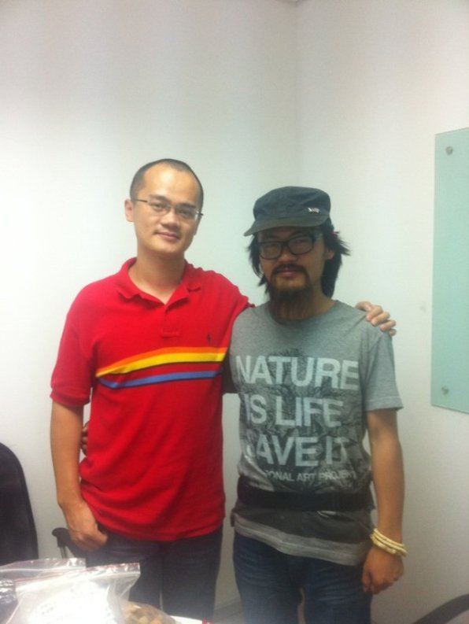

*2011-08-03 17:46 · iPhone客户端*

---

### 11128

转@ .rex 6.16才是男人节，理由：男人的一半是女人。转@bitstream @ 繁凡 转：如果男人节是8.3……而妇女节是3.8……那么他们相加就是11.11……相减就是4.5……于是光棍节和清明节就诞生了……

*2011-08-03 14:10 · 网页 转自bitstream*

---

### 11129

@ 荒箬 林彪相当于巴顿级别的。

*2011-08-03 14:06 · 网页 给荒箬的回复*

---

### 11130

据说，美国的最高军衔是”五星上将“而非”元帅“就是因为英文中”元帅“和”马歇尔“都是marshall，怕“马歇尔元帅”念起来拗口，所以不设“元帅”一衔。

*2011-08-03 14:04 · 网页*

---

### 11131

在亚马逊上买了两本马歇尔的传记，一本200页，一本850页。读完短的还有兴趣我就读长的。马歇尔这人很传奇，军校毕业，却从未亲自带兵上过战场，但却成为二战期间美国（除总统外）的最高军事统帅，运筹帷幄，3年间把美国陆军从20万扩充到800万，提拔了艾森豪威尔、巴顿、布拉德利等干将。

*2011-08-03 14:00 · 网页*

---

### 11132

最近比较频繁的使用iPhone4的多任务切换，我开始担心太多双击会使iPhone4那个home按钮迅速坏掉。现在手感已经发生变化了⋯⋯

*2011-08-03 12:16 · 网页*

---

### 11133

再过几天，IBM PC就诞生30周年了。我是在PC诞生10年之后才开始接触电脑，而且一开始用的还不是PC，而是功能更弱的LASER、中华学习机等等。

*2011-08-03 10:22 · 网页*

---

### 11134

我早就放弃把google reader未读数消到零的努力了，但是我至少得把gmail未读数消到零吧？刚才奋战了半个小时，终于完成了这个任务。

*2011-08-02 23:11 · 网页*

---

### 11135

asana这个产品我曾寄予厚望，但真的用起来却实在找不到感觉。是我的问题还是asana的问题？

*2011-08-02 22:21 · 网页*

---

### 11136

今天北京的风和前几天不同，开始有一丝凉意。我特意查了查农历，下周一才立秋呢。

*2011-08-02 14:52 · 网页*

---

### 11137

@ 日照孙超 顶！

*2011-08-01 18:20 · 网页 给日照孙超的回复*

---

### 11138

几千年来，战争从拼人，拼粮草，到拼弹药，拼燃油，再到将来可能拼能量块，但是有一点始终没有变，那就是拼信息。

*2011-08-01 15:16 · 网页*

---

### 11139

转@ 沙杰 最好的老师不是特级教师，不是新东方，也不是兴趣，而是生存

*2011-08-01 15:07 · 网页 转自沙杰*

---

### 11140

iPhone比android更封闭，所以更安全。这在某些情况下是不可忽视的优点。

*2011-08-01 15:04 · 网页*

---

### 11141

不知道是网络的原因还是手机的原因，我最近用iphone4+186越来越多，用android+136越来越少。

*2011-07-28 09:40 · 网页*

---

### 11142

上传了新照片

*2011-07-24 15:25 · iPhone客户端*

---

### 11143

原来7天的商务大床房有窗，而标准大床房没窗。

*2011-07-24 02:50 · 网页*

---

### 11144

下载了一整天，终于用上了mac os x lion了。

*2011-07-22 01:25 · 网页*

---

### 11145

被雷惊醒。

*2011-07-21 05:17 · 网页*

---

### 11146

开始从mac app store里下载os x lion，3.49G，不知道要花多久时间

⋯⋯

*2011-07-20 23:18 · 网页*

---

### 11147

生活中太多事可以用一句成语概括了。

*2011-07-19 19:59 · 网页*

---

### 11148

It's not reality unless it's shared.

*2011-07-18 17:28 · 网页*

---

### 11149

@ Exstasis 非常同意。我是先看了第一滴血2，后看第一滴血1，感觉1更有意义，虽然可能场面不如2。3就基本是看场面了。

*2011-07-18 01:40 · 网页 给Exstasis的回复*

---

### 11150

@ gravity0 未必。易学性和易用性不是一回事。对操作航天飞机这么专业的事来说，易用比易学更重要。所有按钮都摆在那里，可以直接操作，比在有限的屏幕上点来点去切换界面更高效，更简洁直观。

*2011-07-18 00:20 · 网页 给gravity0的回复*

---

### 11151

今天重游故地，发觉一年咻的一声就过去了。

*2011-07-17 23:25 · 网页*

---

### 11152

@ 鸝.se 不止一个吧⋯⋯

*2011-07-17 04:30 · 网页 给鸝.se的回复*

---

### 11153

@ 鸝.se 这水面看起来好结实啊。

*2011-07-17 03:41 · 网页 给鸝.se的回复*

---

### 11154

听同事说北京到徐州只要两个半小时，我确实为高铁所震惊。

*2011-07-17 03:40 · 网页*

---

### 11155

@ CaoCong 恭喜！愿闻其详。

*2011-07-14 23:34 · 网页 给CaoCong的回复*

---

### 11156

@ CaoCong http://is.gd/t2VCHh

*2011-07-14 23:33 · 网页 给CaoCong的回复*

---

### 11157

@ realazy @ jingjing 恭喜！宝宝的pose好可爱！

*2011-07-14 23:12 · 网页 给realazy的回复*

---

### 11158

@ ITsWill 降低期望值是提高幸福感最有效的办法:-)

*2011-07-13 01:10 · 网页 给ITsWill的回复*

---

### 11159

第二次在公司休息室过夜。

*2011-07-12 08:47 · iPhone版*

---

### 11160

@ 鸝.se 我是地图控。

*2011-07-12 03:46 · 网页 给鸝.se的回复*

---

### 11161

@ 左侧 @ 王悦蒙 我还在工作。

*2011-07-12 03:36 · 网页 给左侧的回复*

---

### 11162

@ 鸝.se 有趣，这个图上的北美大陆只有东岸是完整的，西岸北段还是空白，还没有阿拉斯加。

*2011-07-12 03:34 · 网页 给鸝.se的回复*

---

### 11163

这个创意很强！转@ 左小祖咒 凌迟 http://fanfou.com/photo/iag...

*2011-07-11 17:49 · 网页 转自左小祖咒*

---

### 11164

太.他.妈.刺.激.了!

*2011-07-11 17:48 · 网页*

---

### 11165

@ Lvix不挂科 新浪微博上的@ 王兴 不是我。我在那里的帐号是@ 美团网王兴 。

*2011-07-11 12:55 · 网页 给Lvix不挂科的回复*

---

### 11166

@ Hill 还没上床的人飘过⋯⋯

*2011-07-11 03:06 · 网页 给Hill的回复*

---

### 11167

也许不仅仅是巧合，全球第一和第二大软件公司微软和oracle是同一年成立的（1976年），也是同一年上市的（1986年）。十年才上市，比现在的公司慢多了，但可能也因此而扎实很多。

*2011-07-10 21:34 · 网页*

---

### 11168

@ onyT 问题就是这一周我们已经被从塑胶球场逐到水泥球场了⋯⋯

*2011-07-09 23:17 · 网页 给onyT的回复*

---

### 11169

@ 左潇 RD同事们的篮球活动已经改到周六上午了，8点，在公司正东面的国际教育学院的操场。希望下次能看到你:-)

*2011-07-09 23:10 · 网页 给左潇的回复*

---

### 11170

@ 于欣烈 强烈同意！今天在耐克店里看那些鞋一双比一双丑:-( 还是new balance的设计更合我口味。

*2011-07-09 20:57 · 手机上网 给于欣烈的回复*

---

### 11171

中学时我一直都是穿回力鞋打球。后来大一的时候有一次打篮球把脚崴得厉害，于是我姐带我去买了我的第一双耐克鞋，希望能有稍好一些的保护。现在我更喜欢new balance，只有篮球鞋还会考虑耐克。

*2011-07-09 20:55 · 手机上网*

---

### 11172

我的第二双耐克篮球鞋穿了十二年（中间有九年左右我基本不打篮球）终于鞋底坏了。今天去买了双新鞋。

*2011-07-09 20:50 · 手机上网*

---

### 11173

学了一个新单词 misanthrope

*2011-07-08 15:42 · 网页*

---

### 11174

难得一次十一点前到家。

*2011-07-07 22:39 · iPhone版*

---

### 11175

一转眼又7月7日了。这个日子对我来说，除了卢沟桥事变，还有另一层含义。两年的时间过得真快。

*2011-07-07 11:29 · 网页*

---

### 11176

今天唯一的运动是回家时没坐电梯，而是爬楼梯回到3703。中间爬到26层时，我把上衣脱了。

*2011-07-06 02:28 · iPhone版*

---

### 11177

拿到“e人e本”之后，稍微玩了一下，就忍不住要获取root权限，然后把自带的谷歌地图v3升级到支持适量图的谷歌地图v5，那真是我最喜欢的android应用。e人e本的设计思路和iPad几乎是相反的，必须用专用的笔来操作，是否更适合中国国情还真不好说。

*2011-07-04 21:24 · 网页*

---

### 11178

@ 蒋天正 连电影名都不说，不厚道啊。

*2011-07-04 20:45 · 网页 给蒋天正的回复*

---

### 11179

@ DonglinChen internet cafe.

*2011-07-04 12:58 · 网页 给DonglinChen的回复*

---

### 11180

天已经近乎全亮了。

*2011-07-04 04:35 · 网页*

---

### 11181

这钟点外面就蒙蒙亮了。怎么回事？因为城市里光污染太厉害吗？

*2011-07-04 04:15 · 网页*

---

### 11182

@ 蒋天正 我加班到比你更晚，十五分钟前刚离开办公室。

*2011-07-04 03:04 · iPhone版 给蒋天正的回复*

---

### 11183

看来苹果用magsafe充电口确实是有道理的。刚才真的发生这种情况，同事一脚把我的充电线给绊了。如果不是magsafe这种磁铁吸附式的接口，我的笔记本估计就会飞出去了。

*2011-07-03 15:04 · 网页*

---

### 11184

我不是党员，也不喜欢流血革命；我只是觉得，无论何时，《国际歌》听起来都很让人热血沸腾。那真是天才的歌曲，虽然完整版歌词现在看起来很不和谐。 http://is.gd/PcZb5T

*2011-07-01 15:40 · 网页*

---

### 11185

@ 狼族吾生 ifttt这个域名对geek来说没问题，在geek中火。

*2011-07-01 10:27 · 网页 给狼族吾生的回复*

---

### 11186

@ 小熊娃娃 你⋯⋯终于要毕业了吗？

*2011-06-30 21:48 · 网页 给小熊娃娃的回复*

---

### 11187

半年过去了。今天终于办完了一件事。

*2011-06-30 21:41 · 网页*

---

### 11188

@ Davies 看航空公司了。国航都是T3，海航好像是T1。

*2011-06-29 23:49 · 网页 给Davies的回复*

---

### 11189

@ 鸝.se 没图没真相！

*2011-06-29 17:57 · 网页 给鸝.se的回复*

---

### 11190

机场高速终于调整收费了：T1/T2改为出京5块钱，进京免费；T3还是双向都收10块钱。T3本来就大而无当，走得累死人，现在就更不吸引人了。

*2011-06-29 10:02 · 网页*

---

### 11191

@ jay.m cern的lee博士搞出来的是万维网world wide web，更底层的互联网internet的前身则是美国军方的研究项目arpanet.

*2011-06-27 23:09 · iPhone版 给jay.m的回复*

---

### 11192

美国最成功的文化输出不是美剧，也不是好莱坞，而是电脑和互联网。我的意思不是美国通过互联网向别国输出文化，而是美国向别国输出了互联网。互联网就是美国的产物。

*2011-06-27 19:57 · 网页*

---

### 11193

自打我从五道口搬到北苑，我觉得北京似乎凉快了一点，天也更蓝了一点，空气也更清新了一点。

*2011-06-27 10:29 · 网页*

---

### 11194

连续第三个周日早起打篮球。这回终于只需要坐下来喘气，不至于累瘫在地上了。

*2011-06-26 10:01 · iPhone版*

---

### 11195

虽然软件越来越重要，但是硬件方面的细微改进常常有重要意义。例如说，我发现iPad2不但放在桌上时比一代更稳，拿在手里时也更稳。

我今天早上又拿了一下iPad一代，一不小心差点从手上滑下来。

*2011-06-25 11:21 · 网页*

---

### 11196

如果lytro真像宣传的那么厉害，不是摄下一个光平面而是摄下整个光场，那是影像界比从胶卷变成数码相机还更大的一个变革啊。

http://www.lytro.com/

*2011-06-24 20:13 · 网页*

---

### 11197

转发：bbs上看到的：对于人工智能是否会超过人的大脑这个问题，反对者与赞成者都用同一句话反驳对方：你太小看人类的大脑了！

*2011-06-23 21:20 · 网页*

---

### 11198

听说北京不少地方积水很深，可是北苑这里一切正常啊，基本没有积水。看来北京真是太大了。

*2011-06-23 20:21 · 网页*

---

### 11199

刚说完mac版word那事不到5分钟，饭否上就有人截图告诉我该如何操作了。多谢！

*2011-06-23 19:54 · 网页*

---

### 11200

@ 草泥马维稳办 多谢！饭否er们真强大！

*2011-06-23 19:51 · 网页 给草泥马维稳办的回复*

---

### 11201

很挫败：在mac版word里死活找不到“接受所有修改”这个动作，又赶时间，只好把文档传到另一台电脑用windows版word处理。

*2011-06-23 19:44 · 网页*

---

### 11202

期待中⋯⋯ 趣。转@ 黄小V 北京市气象台发布预报，23日傍晚到前半

夜，京城将遭遇今年以来最大降雨，大部分地区降雨量在40毫米左右，部分地区还将出现暴雨，市民们要提前做好防雨准备。

*2011-06-23 15:31 · 网页 转自黄小V*

---

### 11203

弯腰系鞋带的难度大概是和腰围的三次方成正比吧。

*2011-06-23 14:20 · 网页*

---

### 11204

@ BillZhou 我的主力手机是nexus s。

*2011-06-22 16:40 · 网页 给BillZhou的回复*

---

### 11205

转@ 小冠 服了国美了~这么做电商赶紧去死了算了。卖ipad2，卖的比苹果官方价贵好几百不说，打出的产品名还是苹果（apple）MC769CH/A平板电脑，压根也没提ipad2。

*2011-06-22 09:53 · 网页*

---

### 11206

iPad2刚用了俩星期，“屏幕旋转”功能就时灵时不灵了，我很不满意！

*2011-06-21 10:37 · 网页*

---

### 11207

前天刚过完父亲节，昨天老妈来京，于是，今天我就吃上了久违的老妈做的早饭^_^!

*2011-06-21 10:01 · 网页*

---

### 11208

每吃完一顿饭，我就觉得自己朝着成为胖子又迈进了一步:(

*2011-06-20 21:17 · iPhone版*

---

### 11209

转发：一天晚上在家里上网，旺旺突然跳出窗口来对我说：“亲，我怀孕了”。 哥顿时一惊，心说自己没闯什么祸吧？ 正发愣，那人又说“明天去医院检查”。 我心想你丫到底是谁，难道还要我陪你去检查，想讹我不成？正琢磨着，那人又说：“只能后天给你发货了”。//瞧瞧人家这电商做得多敬业啊！

*2011-06-20 16:04 · 网页*

---

### 11210

搬到离新办公室步行大概一公里出头的上元小区了。这样每天可以省下不少花在路上的时间。这是我回国七年多时间里在北京住的第八个地方。

*2011-06-19 22:00 · iPhone版*

---

### 11211

吸取了上周的教训，今天特意吃了点早餐再去打篮球，结果依旧体力严重不支，打了二十分钟就又是气喘如牛又是大腿抽筋:(

*2011-06-19 10:21 · iPhone版*

---

### 11212

转@ qiuyingtao 文明必然前行，我卑微地告诉你，你拦得住一头猛烈的火车，拦不住一只顽强的蚂蚁父亲。 http://is.gd/q3ULG0 所有父

亲问所有父亲

*2011-06-18 22:41 · 网页 转自qiuyingtao*

---

### 11213

用了一个多星期，感觉iPad2比起iPad一代最明显的好处就是背面不是凸的，放在桌上不会晃，打起字来更稳。另外，smartcover能自动锁屏和解锁，确实带来一些小小的便利。

*2011-06-18 15:23 · 网页*

---

### 11214

转@ 盖文张 我愿化作夏天的风，掀起街头每一个女孩的裙。

*2011-06-18 14:49 · 网页*

---

### 11215

@ 李芳姐 复合之后也是新生活啊。肯定跟以前有不一样的地方。

*2011-06-17 20:52 · 网页 给李芳姐的回复*

---

### 11216

我必须承认，我不是一个高效的文员。

*2011-06-17 19:14 · 网页*

---

### 11217

@ 左侧 很快你就发现，维护一个独立博客很麻烦的。我有wangx.com ，但实在是没空去折腾。

*2011-06-17 00:20 · 网页 给左侧的回复*

---

### 11218

用了两个月，第一次碰到nexus s彻底死机需要重启，是在用谷歌地图时发生的。

*2011-06-16 17:32 · 网页*

---

### 11219

”如果你不在乎功劳落到谁头上，你能做成的事将会非常惊人“。杜鲁门此言甚有道理！转@ jay.m “It is amazing what you canaccomplish if you do not care who gets the credit.”

*2011-06-16 10:28 · 网页*

---

### 11220

完全是女攻城师的思维啊。转@ 筱潇 说话的艺术在于把真相分解成片段，再把它对不同的人采用不同的轻重配比讲述出来。

*2011-06-16 10:10 · 网页*

---

### 11221

第一次在公司休息室的架子床上过夜。这样确实能节省不少往返的时间。

*2011-06-16 08:56 · 网页*

---

### 11222

本日最佳XX笑话。转@ 马伯庸 她伤感地对朋友说：“我和老公吵架了，他冲我大吼，让我带上自己的东西滚开。我用袋子把老公装进去，哭着说你是属于我的。”“真感人，然后呢？”朋友问。她回答：“然后我装了四袋才把他装完。”

*2011-06-15 22:44 · 网页 转自马伯庸*

---

### 11223

太恶心了。京沪开了高铁之后居然要把夕发朝至的动车卧铺取消掉。

高铁也要5个小时，在路上耽误大半天，还不如睡一夜就到的动车实用呢！

*2011-06-15 22:16 · 网页*

---

### 11224

@ Westy 哈，你们接了美团网的办公室:-) 不知道谁坐了原来我那个座位。

*2011-06-15 22:10 · 网页 给Westy的回复*

---

### 11225

@ 钟永健 所以高铁系统是严重值得期待的啊

*2011-06-15 19:53 · 网页 给钟永健的回复*

---

### 11226

@ Westy 你在哪个公司？

*2011-06-15 19:51 · 网页 给Westy的回复*

---

### 11227

@ GiantJoy 赞！在巴黎再生活几年，你就更有回忆和吹嘘的资本了:-)

*2011-06-14 20:24 · 网页 给GiantJoy的回复*

---

### 11228

@ GiantJoy 回国吗？

*2011-06-14 19:21 · 网页 给GiantJoy的回复*

---

### 11229

我一直有一样的困惑！转@ 蒋天正 真的不知道如何把衬衫塞在裤子里且看着还很合适。你们都是怎么做到的？

*2011-06-14 15:12 · 网页*

---

### 11230

昨晚7点在京东订了一本书（价格比当当卓越便宜一块钱左右），刚刚送到了。货到付款，pos机刷卡，有发票。整个体验不错。

*2011-06-14 11:54 · 网页*

---

### 11231

@ 罗燕 nexus s总体感觉还不错。电池勉强能撑一天。

*2011-06-14 10:32 · 网页 给罗燕的回复*

---

### 11232

昨天打了篮球，今天却没有强烈的肌肉酸痛。这让我更加忧心：莫非这说明昨天制约我进一步运动的并不是上下肢肌肉，而是心肺系统？_-!

*2011-06-13 19:08 · 网页*

---

### 11233

@ 长老会教友 谢谢。记录一下：“在填写入学证的时候，她一时踌躇着不知道填什么名字好。我的小名叫＊，张＊两个字嗡嗡地不甚响亮。她支着头想了一会，说：“暂且把英文名字胡乱译两个字吧。”她一直打算替我改而没有改，到现在，我却不愿意改了。 ” －－张爱玲《必也正名乎》

*2011-06-13 18:58 · 网页 给长老会教友的回复*

---

### 11234

@ 长老会教友 @ 马扎罗 网上能找到张的这篇散文吗？诚心请教。谢谢！

*2011-06-13 18:04 · 网页 给长老会教友的回复*

---

### 11235

听到一个未经核实的数据：当年美国人设计社会保障系统时，把退休年龄（即开始领养老金的年龄）设成65岁，而那时美国的男子平均寿命只有61岁。可见这个系统从一开始就是多么不靠谱。美国尚且如此，中国⋯⋯

*2011-06-13 18:03 · 网页*

---

### 11236

@ Doris鹿柴V 淡定，淡定⋯⋯

*2011-06-13 12:02 · 网页 给Doris鹿柴V的回复*

---

### 11237

@ nowa 是的，17 miles drive是我见过的最美的海！

*2011-06-13 11:22 · 网页 给nowa的回复*

---

### 11238

久不锻炼就是不行，打篮球打十几分钟就得歇一下:-( 不过我还是坚持运动了一个小时。

*2011-06-12 10:41 · 网页*

---

### 11239

@ 罗燕 啊，没有及时看到。我已经回办公室了。下次吧。btw，刁同学体力很好啊。

*2011-06-12 10:39 · 网页 给罗燕的回复*

---

### 11240

@ 李芳姐 @ qinyf 已经散场了。我是最后一个走的，刚回到办公室。欢迎下周日早晨一起来玩，八点半到双营路北京联合大学。

*2011-06-12 10:37 · 网页 给李芳姐的回复*

---

### 11241

好久没有星期天这么早起床了。要去和同事们一起打篮球:-)

*2011-06-12 07:47 · iPhone版*

---

### 11242

四年没见，一聊聊了四个多小时。

*2011-06-11 14:08 · 网页*

---

### 11243

第一次来星巴克丽都店，见一个四年未见的老友。这里环境不错。

*2011-06-11 09:39 · 网页*

---

### 11244

@ 鸝.se 你的饭否背景才可爱呢:-) 寓意是人类在间接吃屎吗？-_-!

*2011-06-11 02:37 · 网页 给鸝.se的回复*

---

### 11245

转@ gravity0 “曾经有个女孩子问我：我做你女朋友跟你在一起，你

会经常一夜不归宿吗？你要怎么证明？我告诉她：我不会，我用android手机一定是好男人，一定不会夜不归宿。因为晚上都要回家充电。” —— 昨天 CB 上一则评论

*2011-06-10 10:13 · 网页*

---

### 11246

@ yjx04 对。你在ud？

*2011-06-10 09:04 · iPhone版 给yjx04的回复*

---

### 11247

@ 马扎罗 我看的是这里 http://is.gd/pfoNIy 听你说了之后又参考了百度百科。我还是倾向于认为她是先取了英文名eileen后用爱玲二字。

eileen在英文里是个传统名字，非张所自造。

*2011-06-10 02:30 · iPhone版 给马扎罗的回复*

---

### 11248

晕，原来张爱玲原名张煐，“爱玲”二字是从她的英文名Eileen翻译过来的。

*2011-06-10 00:59 · 网页*

---

### 11249

有多少中国女子起eileen这个英文名时没受张爱玲影响？

*2011-06-10 00:52 · 网页*

---

### 11250

今年第一次吃荔枝。甜倒是很甜，但总觉得少了在福建吃到荔枝的那种鲜味。这也是我很少在北京吃荔枝的原因吧。

*2011-06-09 22:32 · 网页*

---

### 11251

mac软件真是善解人意！我刚才用terminal时想新开一个tab，通常我会用快捷键command＋t，但当时我的手正好在鼠标上，于是就想用鼠标来操作。一看tab那一行没有“new”按钮，但是有些空白区域，我就想，如果双击这个空白区域能开tab该多好。一试，果然行！

*2011-06-09 21:28 · 网页*

---

### 11252

用今天的google logo电吉他谈了一首《两只老虎》，真好玩:-)http://soft.zol.com.cn/233/...

*2011-06-09 21:16 · 网页*

---

### 11253

数据比代码更重要。

*2011-06-09 00:12 · 网页*

---

### 11254

据说苹果要等到2015年才能搬进那个又大又先进的新办公室，不知道那时乔布斯是否还活着。

*2011-06-08 23:13 · 网页*

---

### 11255

@ quux 美国有很多个newark。我估计你说的是新泽西的那个，在纽约边上，挺繁华的。我说的是我的母校所在地，delaware的newark，

人口只有两万多。

*2011-06-08 21:09 · 网页 给quux的回复*

---

### 11256

和一个在university of delaware当教授的校友一起吃饭，听说美国那边也是为了刺激经济而乱搞基础建设，把newark这个小镇的一条路挖了重铺。

*2011-06-08 21:05 · 网页*

---

### 11257

@ 周露inn 同吃早餐中⋯⋯

*2011-06-08 12:20 · 网页 给周露inn的回复*

---

### 11258

暴走5公里，腰酸背痛。

*2011-06-07 22:18 · 网页*

---

### 11259

替贤惠的福建媳妇儿转发。转@ 筱潇 碱粽尝试成功。

http://is.gd/sp5mUJ

*2011-06-07 13:16 · 网页*

---

### 11260

这一天终于到来了。gmail提示我该付钱买空间了: “You are currentlyusing 7245 MB (95 %) of your 7591 MB.” 每年5美元买20G，还算可以接受。

*2011-06-07 12:04 · 网页*

---

### 11261

收到一个朋友发来的短信：“王兴，我刚看完了电影三个傻瓜3idiots，觉得你很像里面的男主角兰彻”。呃，这哥们是在拐着弯说我是白痴吗？

*2011-06-07 10:01 · 网页*

---

### 11262

奥尼尔从nba退役了，他已经在菲尼克斯大学拿到了硕士，目前正在攻读迈阿密的巴里大学读人力资源的PhD。

*2011-06-04 09:44 · 网页*

---

### 11263

@ 黄鸿光 ipad更适合长辈。至少我父母是如此。

*2011-06-04 09:34 · iPhone版 给黄鸿光的回复*

---

### 11264

本月最佳笑话！转@ 李芳姐 一哥们说他创业时候没日没夜，快干不下去要放弃了，某一天有一mm来面试，他困的不行，于是打断对方说：等等，你先让我睡一下好不好？ mm想了一下，答：可以，你家还是我家？ 于是此兄看到了希望，又有了创业的斗志，最终成为一成功的典范。

*2011-06-04 07:14 · 网页*

---

### 11265

@ 小熊娃娃 这是出行炫耀帖吗？

*2011-06-04 07:10 · iPhone版 给小熊娃娃的回复*

---

### 11266

转@ quux 为什么短裤的兜应该比长裤的多：因为长裤还有外套分担

*2011-06-03 13:06 · 网页*

---

### 11267

@ 郑奎 哪里的电影票活动啊？

*2011-06-03 02:47 · 网页 给郑奎的回复*

---

### 11268

@ quux 久闻此片大名，可惜没看过。

*2011-06-02 23:39 · 网页 给quux的回复*

---

### 11269

@ 刁士涵 羡慕你们一对人儿啊。

*2011-06-02 23:37 · 网页 给刁士涵的回复*

---

### 11270

“我们想了一串我们愿意投资的事，如果它们失败了，我们会在三年后、六年后、九年后再试同样的事情”。 ——马克-安德森http://is.gd/qDPUF9

*2011-06-02 22:11 · 网页*

---

### 11271

我必须承认，即使是macbook上那么好用的触摸板，也比不上一个普通的外接鼠标。一方面，触摸板再大也没有桌面大；另一方面，移动鼠标靠的是腕关节和肘关节，比触摸板所依赖的手指还是强壮很多的。

*2011-06-02 21:34 · 网页*

---

### 11272

macbook air身上的孔太少了，很容易就全插满了。

*2011-06-02 20:52 · 网页*

---

### 11273

iphone上的联通app＂手机营业厅＂很好用，信息一目了然。移动有类似的app吗？

*2011-06-02 13:17 · iPhone客户端*

---

### 11274

@ imvenj 我半年前才换成macbook air，之前三年半一直是用那台装了xp的x60当主力电脑。我不乱装软件，所以没觉得有重装系统的必要。

*2011-06-02 13:12 · 网页 给imvenj的回复*

---

### 11275

我在某些方面是喜欢折腾的人，在其他方面却不是。这台thinkpadx60从07年5月买来到现在，从来没有重装过操作系统。

*2011-06-02 12:58 · 网页*

---

### 11276

再过两个多月，xp就推出10周年了。xp至今还是我用得最多的windows版本。这就是微软的问题之所在了吧。

*2011-06-02 12:52 · 网页*

---

### 11277

@ 罗燕 09年我从西藏回来后也是这感觉。站在五道口街头，第一次觉得这儿怎么这么多人啊？

*2011-06-02 11:28 · iPhone版 给罗燕的回复*

---

### 11278

@ 于欣烈 菩萨畏因，凡夫未果。过去未去，未来已来。

*2011-06-01 16:30 · 网页 给于欣烈的回复*

---

### 11279

@ 于欣烈 五一也号称是国际劳动节，但至少美国的劳动节就不是五一。

*2011-06-01 15:53 · 网页 给于欣烈的回复*

---

### 11280

转@ 马伯庸 从前有个秀才，鼻青脸肿走在街头，朋友问他怎么了。

秀才道：“乡试放榜，同窗皆中举，惟我名落孙山，特去向老师告罪。

老师恰好出门，师母问起成绩，我说弟子今日不举，实在愧对师母平日爱护，然后…

*2011-06-01 10:31 · 网页 转自马伯庸*

---

### 11281

谈判的时候，搞清楚对方想要什么很重要，但更重要的是搞清楚自己想要什么。

*2011-06-01 00:10 · 网页*

---

### 11282

周鸿一很擅长挟天子以令诸侯，360开个跟腾讯针锋相对的会也能命名成＂第一届互联网开放大会＂。待会儿我发言时说点啥能既有意思又不得罪人呢？

*2011-05-31 15:23 · iPhone客户端*

---

### 11283

原文是 You can usually judge your age by the amount of painyou feel, when you come into contact with a new idea, or areconfronted by change.

*2011-05-31 10:08 · 网页*

---

### 11284

转自三联生活周刊：你可以根据自己接触新思想时感到的痛苦程度判断自己的年龄。——约 翰·纽文

*2011-05-31 08:35 · 网页*

---

### 11285

@ iFire 早啊，我在卧铺上铺向你问好:)

*2011-05-31 07:44 · iPhone版 给iFire的回复*

---

### 11286

一个传统行业的大哥说：要像对待最重要的客户那样对待员工。

*2011-05-30 23:48 · iPhone版*

---

### 11287

忍不住要再赞叹一次，华中科技大学校园里浓密的树林太棒了！

*2011-05-30 20:48 · iPhone版*

---

### 11288

@ 精神女 此刻还在。不过我已经分享完了，现在是我的同事在讲。

*2011-05-30 20:07 · iPhone版 给精神女的回复*

---

### 11289

@ Hill 哪家快递公司的？

*2011-05-30 19:50 · iPhone版 给Hill的回复*

---

### 11290

一进华科南二门，立刻像进入了另一个世界。这个学校的绿化太棒了，比清华和北航都更强。

*2011-05-30 18:16 · iPhone版*

---

### 11291

终于快到了。武汉的堵车，比起北京有过之而无不及！

*2011-05-30 18:13 · iPhone版*

---

### 11292

今晚6点半，华中科技大学的大学生活动中心305室，我会和大家分享创业经历并欢迎同学们应聘加入美团网。

http://www.meituan.com/job/...

*2011-05-30 15:59 · 网页*

---

### 11293

转@ 史册伟 列车广告 # 冒泡拍拍 # 合肥站 http://j.mp/jvR8unhttp://fanfou.com/photo/AIF...

*2011-05-30 15:40 · 网页*

---

### 11294

可惜武汉的空气也是灰濛濛的，看不清远方。不然从这个33层的办公室看出去有山有湖，景色应该更好。现在我只能依稀认出东湖西岸的老鼠尾。

*2011-05-30 15:39 · 网页*

---

### 11295

@ 子笑 不会。

*2011-05-30 11:33 · 网页 给子笑的回复*

---

### 11296

在武汉吃早餐，自然要来碗热干面:)

*2011-05-30 07:51 · iPhone版*

---

### 11297

@ DonglinChen 真巧，我也在火车上，从北京去武汉。

*2011-05-29 22:45 · iPhone版 给DonglinChen的回复*

---

### 11298

刚才吃完麦当劳后特意再用了一次干洗手液，感觉似乎能把油脂挥发掉，但心里总还是有点不放心。

*2011-05-29 21:04 · iPhone版*

---

### 11299

试了一下麦当劳的卫生干洗手，觉得这种新事物接受起来确实不太容易。你们觉得呢？

*2011-05-29 19:17 · iPhone客户端*

---

### 11300

一个初次见面的北大教授推荐我读≪民国时期的土匪≫。

*2011-05-29 18:37 · iPhone版*

---

### 11301

与覆车同轨者倾。

*2011-05-27 21:57 · 网页*

---

### 11302

时隔多年，居然又领到一笔稿费。

*2011-05-27 10:20 · iPhone客户端*

---

### 11303

转@ 鸝.se 我们都在自己的世界里狂奔，最后迎头撞上，这就是缘分。。

*2011-05-27 10:09 · 网页*

---

### 11304

看了大家的回复，发现我真的out了。无数城市的出租车都是烧气的，就北京不是。

*2011-05-26 18:56 · 网页*

---

### 11305

难得听到北京的雷声。

*2011-05-26 17:15 · iPhone版*

---

### 11306

我在西安坐的这辆出租车竟然是烧气的。

*2011-05-25 20:21 · iPhone版*

---

### 11307

两部手机，频繁出差，长时间通话，估计这个月会是我有史以来手机

费最高的一个月。

*2011-05-24 16:48 · 网页*

---

### 11308

"Dear WANG Xing, We appreciate that you have been withYahoo! Mail for the past 10 years... " 邮箱确实是很有黏性的，当你用它注册了许多网站，尤其是电子商务网站时。

*2011-05-24 15:58 · 网页*

---

### 11309

@ Jaykenduke 不好意思，搞错了。是25日。

*2011-05-24 01:24 · iPhone版 给Jaykenduke的回复*

---

### 11310

@ Jaykenduke 对。23日下午两点半西交大。

*2011-05-23 23:51 · iPhone版 给Jaykenduke的回复*

---

### 11311

因为机械故障，本次航班取消了。幸好是在起飞前而不是起飞后出现故障…… 坐等换飞机。

*2011-05-23 17:53 · iPhone版*

---

### 11312

kindle是唯一的即使出门一星期也不用带充电器的电子设备。

*2011-05-23 17:48 · iPhone版*

---

### 11313

诚哉斯言！在通讯录、日历、邮件、短信、地图这几项核心应用上，android都胜过iphone。转@ 正刚 @ 令狐虫 @ 王兴 iP4用作无线AP的优势在于速度和流量~出门用得最多的是通讯录和地图，这方面Google的帐户同步与Android版本矢量地图完胜iP4…

*2011-05-23 17:44 · 手机上网*

---

### 11314

其实，我出门用得最多的设备还是主力手机nexus s，iphone4经常充当无线ap，macbook air则是能给手机临时充电的电池包。

*2011-05-23 16:58 · iPhone客户端*

---

### 11315

出趟短差只需要背包不需要箱子。虽然只有一个包，但是随行的电子设备有：macbook air，ipad，kindle3，iphone4，nexus s。

*2011-05-23 15:49 · iPhone客户端*

---

### 11316

@ 张萌萌 总共才一千多字，传到手机上就行了，可以随时掏出来看。和其他书一样，对不对得自己判断。至少对我来说，很震撼。

*2011-05-23 15:16 · 网页 给张萌萌的回复*

---

### 11317

一个同事推荐我看传说中黄石公送给张良的《素书》。全书一共1336字，比道德经还短很多，但是内容极其牛逼。这两天我反反复复看了几遍，真是看得浑身直冒冷汗，里面总结的好多管理错误我都犯了:-(http://is.gd/2SlDLC

*2011-05-23 15:04 · 网页*

---

### 11318

@ 左潇 对。昨晚吃掉了一个，另一个刚才送给了不知鲜花饼为何物的@ 苑小帅 同学。再次感谢:-)

*2011-05-23 14:21 · 网页 给左潇的回复*

---

### 11319

这个钟点离开办公室居然还有加班的同事送给我鲜花饼！我太感动

了！

*2011-05-23 02:28 · iPhone版*

---

### 11320

黄石公赠张良的《素书》确实是奇书，言简意赅。

*2011-05-22 14:09 · iPhone版*

---

### 11321

@ 鸝.se 我说过类似的观点：女人可以创造世界上最伟大的作品：孩子，所以她们不需要像男人那样寻找其他发泄创作激情的方向。

*2011-05-21 19:16 · iPhone版 给鸝.se的回复*

---

### 11322

第六届中国互联网站长年会场面很大。投奔腾讯之后的discuz果然不差钱。

*2011-05-21 15:22 · iPhone版*

---

### 11323

管理和生活一样，是琐碎的。

*2011-05-20 18:01 · 网页*

---

### 11324

@ higoal 真难得你会翻出这么老的消息。后来，天就亮了。

*2011-05-20 17:34 · 网页 给higoal的回复*

---

### 11325

转@ .rex 人误程序一行，程序误人一天。

*2011-05-20 16:55 · 网页*

---

### 11326

sarah lacy关于li nkedin创始人reid hoffman的文章让我很有共鸣：在互联网时代，推出一个产品已经变得前所未有的容易，但是打造一家公司却一如既往的难。没有捷径，需要持续积累和沉淀。

http://is.gd/qJ8WA6

*2011-05-20 12:14 · 网页*

---

### 11327

@ Kevin 柳成荫居然是你初中前桌？你们中学真是出人才啊。

*2011-05-18 17:25 · iPhone版 给Kevin的回复*

---

### 11328

回想了一下，在做校内网之前的一年半创业过程中，我只出过两次差，一次是去武夷山那里的南平电信局，另一次是苏州。都是外包性质的业务机会，似乎能赚点钱，但不会有大的发展，所以我们拒绝了那些诱惑，继续干

*2011-05-18 17:21 · iPhone版*

---

### 11329

升级到携程白金卡了。

*2011-05-18 17:07 · iPhone版*

---

### 11330

以前只是觉得“刻舟求剑“是个很有现实意义的成语，最近渐渐觉得“邯郸学步“也很有道理。

*2011-05-18 04:48 · iPhone版*

---

### 11331

见鬼，这家汉庭怎么回事？隔壁到底是在做爱还是放av，又或者是在拍av？为什么会传来这么持续而多变的叫床声？专业级的！

*2011-05-18 02:33 · iPhone版*

---

### 11332

先跳上火车再补票。即将到一个从未去过的城市。今晚不在天津真遗憾。

*2011-05-17 21:11 · iPhone版*

---

### 11333

@ 多多 这个问题不光取决于我。饭否真的是广大用户推动的。

*2011-05-17 20:13 · iPhone版 给多多的回复*

---

### 11334

新办公室到机场真快，不过二十分钟。

*2011-05-16 12:34 · iPhone版*

---

### 11335

既然一周有六天半会在办公室，我干脆把一些小器械挪过来。这是俯卧撑支架:)

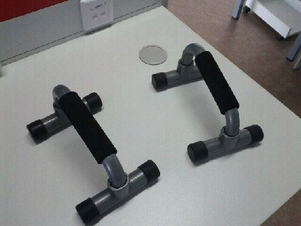

*2011-05-16 09:50 · 安能饭否*

---

### 11336

@ iFire 我下载了你原来整理过的那套80年代金曲，经常听:-) 谢谢。

*2011-05-15 21:18 · 网页 给iFire的回复*

---

### 11337

有没有极客会画这么一张地图？以北京某处为中心，按到其它各处的正常交通时间（包括开车、公交、步行等）而非到那些地方的物理距离为准来画图。

*2011-05-15 11:12 · 网页*

---

### 11338

遇到一种新的诈骗电话，一接起来就是自动语音”北京市中级法院本月最后一次通知，您有一张刑事传票⋯⋯人工咨询请按9“。 我好奇的按了9，一个普通话不太标准的女人就开始试图套我话，”请问您叫什么名字，我帮您查询一下“ 我问她这个电话号码是多少，我要回拨过去，她立刻就挂电话了。

*2011-05-15 10:54 · 网页*

---

### 11339

@ iFire 或许是因为二十几岁是最好的年纪？

*2011-05-14 23:25 · iPhone版 给iFire的回复*

---

### 11340

@ 弥城 我在工作啊

*2011-05-14 23:20 · iPhone版 给弥城的回复*

---

### 11341

开车从怀柔经过时遇到一个地方，山水环绕，绿化非常好。上网一查，名叫宽沟招待所，据说是当年贪官王宝森修来享乐的地方……

*2011-05-14 23:07 · iPhone版*

---

### 11342

听麦肯锡和kkr出来的人讲如何建立业绩管理体系。这哥们一看就是非常聪明的人。麦肯锡能不能真把事做成不好讲，但他们总结出来的大道理基本还是靠谱的。

*2011-05-14 16:16 · iPhone版*

---

### 11343

看到中国版square的原型，挺有趣。

*2011-05-14 00:03 · iPhone版*

---

### 11344

我喜欢这种程序员的笑话:-) 转@ Arrix 这个笑死我了，右边是lightsaber啊 转@ fleuria 螺丝刀靠谱... http://fanfou.com/photo/CMw...

*2011-05-13 15:51 · 网页*

---

### 11345

完成好过完美。

*2011-05-12 23:26 · iPhone版*

---

### 11346

done is better than perfect.

*2011-05-12 23:13 · iPhone版*

---

### 11347

国外路由似乎又断了。这种日子什么时候才是尽头啊。

*2011-05-12 11:33 · 网页*

---

### 11348

你有权利提问。别人没有义务回答。

*2011-05-12 10:45 · 网页*

---

### 11349

无意间发现mac的一个快捷键：按着command键点dock上的图标会打开这个图标所在的文件夹。

*2011-05-12 10:33 · 网页*

---

### 11350

好惨啊⋯⋯ 昨晚确实风大得邪门，我开车时都觉得车子在晃动。转@松木 朋友家的小猫昨天大风天还在阳台上走栏杆结果被刮下去摔死了。。。。

*2011-05-12 10:09 · 网页*

---

### 11351

@ 张宇舵 会。

*2011-05-12 09:09 · iPhone版 给张宇舵的回复*

---

### 11352

@ 钓人的鱼.rar 是的，饭否上线正好在汶川地震前一年。

*2011-05-11 22:19 · 网页 给钓人的鱼.rar的回复*

---

### 11353

在饭否4周岁生日前夜，我在饭否的关注者达到7万人。

*2011-05-11 22:00 · 网页*

---

### 11354

合适的工具是多么重要啊。我经常碰到英语生词，以前多半过了就忘了，现在有手机上的“云词”会根据艾宾豪斯遗忘曲线定期提醒我复习，有很大一部分词有希望记下来。

*2011-05-11 21:33 · 网页*

---

### 11355

这么有价值的信息要义不容辞的转发！转@ 叶秋红 重庆美女多啊，我要是男的就好了！

*2011-05-11 21:31 · 网页*

---

### 11356

@ qinyf 北苑的空气太好了，比中关村、五道口都好得非常明显。森林公园真不是白修的。

*2011-05-10 22:10 · 网页 给qinyf的回复*

---

### 11357

@ andoneo 不是学者内讧。剑桥自己的网站上写着：in 1209,scholars taking refuge from hostile townsmen in Oxfordmigrated to Cambridge. http://is.gd/6tMYH0

*2011-05-10 19:50 · 网页 给andoneo的回复*

---

### 11358

剑桥的起源好搞笑：1209年，牛津大学的部分学者因为和本地人发生殴斗，逃到剑桥这个地方，后来就成立了剑桥大学。

*2011-05-10 19:39 · 网页*

---

### 11359

在转用mac，基本停用msn之后，我以为自己基本上跟微软的产品无关了。没想到现在听说微软要把我很常用的skype给收购了。

*2011-05-10 13:04 · 网页*

---

### 11360

很吃力的洗一个细高的杯子时才发现我的左手明显比右手小，左手能

触到杯底而右手触不到。

*2011-05-10 10:17 · 网页*

---

### 11361

@ sapphire 哈哈，碰到行家了。我刚买了一根leki makalu trail基本款的杖。

*2011-05-10 09:26 · 网页 给sapphire的回复*

---

### 11362

原来makalu是珠穆朗玛附近的另一个山峰，8481米，世界第5高。

*2011-05-09 23:54 · 网页*

---

### 11363

@ neozhang 前intel ceo安迪－格鲁夫写的《High OutputManagement》非常好，是我看过的最实用的管理类书籍，强烈推荐。

*2011-05-09 23:30 · 网页 给neozhang的回复*

---

### 11364

安迪－格鲁夫说得很对，一个经理和一个家庭主妇一样，活是永远干不完的。

*2011-05-09 23:27 · 网页*

---

### 11365

北京这个城市有很多不好，但有一点好：在很多领域都有机会找到全国最懂这个领域的人去请教。

*2011-05-09 22:03 · 网页*

---

### 11366

@ 鸝.se 太令人羡慕了！

*2011-05-08 23:40 · 网页 给鸝.se的回复*

---

### 11367

看YKK拉链创始人的故事，当看到这段“20岁那年，他毅然离开家乡，带着哥哥给他的70日元盘缠，独自到东京闯天下”时，我被深深的震惊了。虽然年代久远，但70日元这个数字还是让我感叹通货膨胀多么厉害。

*2011-05-08 23:30 · 网页*

---

### 11368

回来上网查了一下，发现这根leki的makalu trail被称为”登山杖第一品牌里的入门之选“。这倒是蛮符合我的消费习惯。

*2011-05-08 21:02 · 网页*

---

### 11369

今天真是辛苦三夫的那个导购员了。碰到我这种好奇心重的顾客，买根登山杖会要她把登山杖的基本知识和店里各种品牌各种型号的差别都介绍一番。

*2011-05-08 20:50 · 网页*

---

### 11370

@ jingjing 是啊，你都要当妈了。

*2011-05-08 20:34 · 网页 给jingjing的回复*

---

### 11371

@ webto 是我刚才没讲清楚，不是轮滑时戴的那种硬的护膝，而是排球运动员戴的那种绷带式的knee support。

*2011-05-08 20:33 · 网页 给webto的回复*

---

### 11372

在三夫户外店买了一根leki makalu登山杖和一对LP护膝。我曾经嘲笑那些爬个小土坡都使用各式装备的人，但是上周从鹫峰望京塔下来后膝盖明显不适:-(

*2011-05-08 20:24 · 网页*

---

### 11373

这个新娘真有创意，在婚礼上安排新郎新娘伴郎伴娘集体跳杰克逊的thriller ⊙.⊙!

*2011-05-07 12:14 · 安能饭否*

---

### 11374

@ 罗燕 @ Exstasis 介是什么？求八卦！

*2011-05-07 09:55 · 网页 给罗燕的回复*

---

### 11375

又一个春天就这么过去了⋯⋯ 转@ tony 今天立夏，到下午就犯困呀...

*2011-05-06 16:00 · 网页*

---

### 11376

升级到android 2.3.4的nexus s手机也出现了地址本突然清空的故障:-(

*2011-05-06 15:30 · 网页*

---

### 11377

昨晚和一个做产品的年轻朋友聊天，他说“做产品不应该有偏见”。很简单的一句话，却让我心里一震。“不应该有偏见”，多么简单而不容易啊。

*2011-05-05 20:16 · 网页*

---

### 11378

第一次认真听这歌，发现确实不错。转@ 彭浩翔 每次听到这歌，就想又到纽约呆一会。《Empire State of Mind》 http://is.gd/cQ7bX2

*2011-05-05 20:12 · 网页 转自彭浩翔*

---

### 11379

每个google contacts帐号能存的联系人数量由10000升到25000了，不过我还不认识需要用到这个改进的人。

*2011-05-05 20:08 · 网页*

---

### 11380

android自动升级

*2011-05-05 13:57 · iPhone客户端*

---

### 11381

转@ 盖文张 自由思考比畅所欲言更加重要，so，思考无疆界，说话有分寸。

*2011-05-05 13:52 · 网页*

---

### 11382

真是一对极客夫妻啊。转@ jingjing “老公，默默快出来了，你打算给她准备个什么礼物迎接她啊？”“我去给她注册个域名好了，你说chenmo.me怎么样？”“……”

*2011-05-05 09:49 · 网页*

---

### 11383

@ 王悦蒙 应该是。金燕有一本。

*2011-05-04 17:23 · iPhone版 给王悦蒙的回复*

---

### 11384

看到@ 东东枪 评《武林外传》，想起那些近乎永恒的电影。说到史诗般的巨作，我第一个想到的不是《指环王》，也不是《美国往事》，而是黑泽明的《七武士》。他瞬间把我带入一个我之前完全不

了解的世界，却能把那里发生的一切描绘得那么生动鲜明，让我印象极其深刻。

*2011-05-04 12:44 · 网页*

---

### 11385

@ qinyf 我用java版的freemind，凑合能用。

*2011-05-04 11:09 · 网页 给qinyf的回复*

---

### 11386

关于此话题我推荐此书 http://www.happinesshypothe... 已有中文版。 转@ 筱潇 情绪低潮不是没来由的，潜意识能比意识更早察觉到现实的信号，以便在打击来临前提早做好准备。

*2011-05-04 11:08 · 网页*

---

### 11387

@ 张宇舵 congratulations!

*2011-05-04 00:08 · 网页 给张宇舵的回复*

---

### 11388

@ 张萌萌 一个国产小牌子billy。我以前比较少穿衬衫，所以它能伴随我多年。

*2011-05-03 22:49 · 网页 给张萌萌的回复*

---

### 11389

请大家不要上当。转@ 元元小蜜蜂 @ 王兴 您好王兴先生，我是刚加上饭否的用户，只是邮件是想告诉您，我个人遇到了很不幸的事，我是一名普通的大学生，被网上假借美团网退款电话的骗子骗了千余元，一个月的生活费啊。。。希望能引起您的注意，能有效阻止这种现象，我是一时糊涂，希望别的消费者不会⋯

*2011-05-03 22:47 · 网页*

---

### 11390

转@ 玥明 zz "The girl married the prince, and the bad guydied... This week is sponsored by Disney..."

*2011-05-03 21:51 · 网页 转自玥明*

---

### 11391

赞心态！转@ jingjing 还有十二周，做好和孩子一起再成长一次的准备。

*2011-05-03 19:04 · 网页*

---

### 11392

一个记者在聊完宏观的电子商务和美团网之后问起我本人的消费习惯，我回答：“其实我购物并不多。看到我身上这件衬衫了吗？它有13年的历史”。于是她就不继续问了。

*2011-05-03 16:25 · 网页*

---

### 11393

@ 左潇 需要人工智能和动态规划。

*2011-05-03 13:52 · 网页 给左潇的回复*

---

### 11394

今天尝试了从家到办公室的第三条路，创造了最好成绩，从家里到公

司楼下只需22分钟，不过今天停车又花了好几分钟。而且这条路的平均油耗最低，目前看来是最优路径。

*2011-05-03 09:30 · 网页*

---

### 11395

@ jingjing soff的粉丝，你好！

*2011-05-02 23:53 · 网页 给jingjing的回复*

---

### 11396

@ jingjing 怎么啦？你对我们福建人有意见吗？

*2011-05-02 21:58 · iPhone版 给jingjing的回复*

---

### 11397

看soff秀了一下他的iphone4越狱后能玩出什么花样，叹为观止啊。他才是真极客！

*2011-05-02 20:53 · iPhone版*

---

### 11398

有中国特色！老外估计看不懂。转@ blog图党 转@ 無聊小站 传说中的黄总队长，你懂的。 http://fanfou.com/photo/mwx...

*2011-05-02 00:10 · 网页*

---

### 11399

@ 潘 试试new balance总统慢跑鞋？有点贵，但是没你的键盘贵;-)

*2011-05-01 22:46 · 网页 给潘的回复*

---

### 11400

重温了一遍87版倩女幽魂，依然很赞。对我这个年纪的人，纯纯的爱情不是山楂树，而是宁采臣和小倩，跟有没有上床没关系。

*2011-05-01 22:05 · iPhone版*

---

### 11401

If you don’t like choosing between horrible and cataclysmic,don’t become CEO. --Ben Horowitz

*2011-05-01 12:55 · 网页*

---

### 11402

“桑兰索赔18亿美元”？ 饭否的热门话题里终于有一个吸引了我的注意力。

*2011-05-01 09:14 · 网页*

---

### 11403

终于给我的android手机设置了解锁图案。图案确实比iphone的解锁密码更便捷一些。

*2011-05-01 09:08 · 网页*

---

### 11404

@ Doris鹿柴V 海肠。你们广东人不是什么都吃吗？

*2011-04-30 21:49 · iPhone版 给Doris鹿柴V的回复*

---

### 11405

我对一个姑娘说：请你凝视我的双眼。你看到了吗？你看到了我的镜片上那些大大小小的泥点了吗？不过是下了一场雨而已。这就是北京！

*2011-04-30 21:48 · iPhone版*

---

### 11406

这无疑是我见过的长得最猥琐的动物！

*2011-04-30 21:42 · 手机上网*

---

### 11407

微软花了3年时间和1.3亿美元，自己雇飞机把北美和中西欧17国航拍了一遍，终于在地图的实景图方面完胜谷歌地图的卫星图了。据说精度达到每像素对应地面上的30厘米。可惜他们拍不了中国:-(

*2011-04-28 22:08 · 网页*

---

### 11408

@ qinyf 问市场研究部的同学吧。她们内部开过excel技巧交流会。

*2011-04-28 09:45 · 网页 给qinyf的回复*

---

### 11409

第一次碰到每月220M手机流量不够用的情况。看来我确实 手机上网越来越多了。

*2011-04-28 08:04 · iPhone版*

---

### 11410

@ 刁士涵 为什么要看这么多本呢？一两本好的不够吗？

*2011-04-25 20:01 · 网页 给刁士涵的回复*

---

### 11411

我觉得我有义务表扬一下camcard名片全能王。两个月前我花$11.99买了一个正版激活码，那是我第一次掏钱买android应用。上周我换了新的手机，需要新的激活码。给他们客服发邮件后，他们很干脆利落的给我发来了新的激活码。他们没有把我当成骗子来盘查，他们很尊重消费者。

*2011-04-25 11:22 · 网页*

---

### 11412

@ 盐_酸 作为住在离清华只有五百米的五道口的校友，我觉得回去看

看是应该的。

*2011-04-24 23:49 · iPhone版 给盐_酸的回复*

---

### 11413

连耶鲁大学校长都学会了发言前先向胡锦涛鞠一躬，再向台下鞠一躬。从他的发言内容来看，他显然认为，对大学来说，培养学术人才（以诺奖得主为代表）是比培养政治家和企业家更值得骄傲的事。

*2011-04-24 10:39 · 手机上网*

---

### 11414

毕竟年代久远，人民大会堂的硬件设施比国家大剧院差远了。

*2011-04-24 09:33 · iPhone版*

---

### 11415

在人民大会堂参加清华百年校庆纪念大会。

*2011-04-24 09:17 · iPhone版*

---

### 11416

nexus s还有一点美中不足，就是没有LED信号灯，导致我经常需要点亮屏幕来看看有没有未读的短信或邮件。

*2011-04-23 23:47 · 网页*

---

### 11417

清华的准确校庆日是四月最后一个星期天。这种“几月第几个星期几”的方式很西化，但确实更实用。

*2011-04-23 23:15 · 网页*

---

### 11418

@ GRAYSIE 我曾是忠实的塞班用户，但是塞班跟android/iOS比就像dos跟windows/mac比。黑莓我没用过，不便评价。

*2011-04-23 23:10 · 网页 给GRAYSIE的回复*

---

### 11419

The Paypal Wars这本书在kindle商店里居然只卖3.89美元（约25人民币），我手一抖就买了。由此我有个想法，那些标价$11.99的电子书，如果把价格降到$3.89或$3.99，说不定总收入会更高。

*2011-04-23 22:42 · 网页*

---

### 11420

用了几天nexus s，总体感觉不错，比起htc desire速度更快、屏幕更大更好，android 2.3比起2.2也有不少细节上的改进。唯一比较明显的不爽是原版android缺了这个贴心的小功能：拨出电话时，在接通后振动一下。

*2011-04-23 22:36 · 网页*

---

### 11421

我简直笑翻了。 转@ 刁士涵 一朋友很认真的跟我说社会主义好，价值观不同，拉黑了。。。

*2011-04-23 18:57 · 网页*

---

### 11422

见到好多老同学，还有隔壁系那个气质美女。

*2011-04-23 12:16 · iPhone版*

---

### 11423

一会儿我要作为年级学生代表发言。我们的老校长王大中院士也来参加这个会。

*2011-04-23 10:07 · 手机上网*

---

### 11424

惊闻我的计算机启蒙老师几个月前因为癌症去世了:-(

*2011-04-23 01:08 · 网页*

---

### 11425

@ 沈鹏KeyKey 三星和google合作的nexus s。

*2011-04-22 20:41 · iPhone版 给沈鹏KeyKey的回复*

---

### 11426

@ 小波同学 饭否团是个恶意山寨网站。别上当！

*2011-04-22 17:17 · 网页 给小波同学的回复*

---

### 11427

通过饭否成功的把我的上一台手机htc desire转让出去了:-)

*2011-04-22 17:10 · 网页*

---

### 11428

终于拿到kindle3了，可以继续读原来读到一半的书了:-) amazon还是很厉害的，kindle3比起kindle1改进非常明显。

*2011-04-22 17:05 · 网页*

---

### 11429

早睡早起一段时间后，即使某天晚上晚睡，第二天早上依然会准时醒来。但是多折腾几次估计又会打乱生物钟了。

*2011-04-22 10:26 · iPhone版*

---

### 11430

why? 转@ 鸝.se 由于历史原因，欧洲国家中的德国人民最能够理解中国人民。

*2011-04-22 08:20 · 网页 转自鸝.se*

---

### 11431

@ jason5ng32 我正好有台desire要出。联系我吧。

*2011-04-20 18:16 · 网页 给jason5ng32的回复*

---

### 11432

@ 仵作 饭否最近一周就有不少更新啊。虽然不是翻天覆地的变化，但是我们在持续前进，没有停滞不前。

*2011-04-20 17:28 · 网页 给仵作的回复*

---

### 11433

从g7换到nexus s。这是我的第三部android手机，也是我的第一部三星手机。

*2011-04-20 16:32 · 网页*

---

### 11434

不要太在意传言。真如伏尔泰所说：common sense is notcommon.

*2011-04-20 09:00 · 网页*

---

### 11435

@ 罗燕 耳塞也收到了。多谢!

*2011-04-19 13:42 · iPhone版 给罗燕的回复*

---

### 11436

云南鲜花饼到了:-)

*2011-04-19 12:03 · iPhone客户端*

---

### 11437

知易行难啊。明知要早睡，结果又忙到现在。

*2011-04-19 01:14 · iPhone版*

---

### 11438

转@ 沈鹏KeyKey 刚刚结束了今天的第二次蹦极，虽然许多空中动作没有做的像花式跳水运动员那样标准，但是在空中清晰的喊出了：美团，美团，纵情向前！

*2011-04-18 23:01 · 网页 转自沈鹏KeyKey*

---

### 11439

收到一条短信“给你快递了盒鲜花饼，上次在饭否上说给你们带的……”太感动了。简直让我的心情和今天北京的阳光一样灿烂！谢谢@ 罗燕mm！

*2011-04-18 19:19 · 网页*

---

### 11440

最近注意到一件事：我的androi手机通讯录里越来越多人有头像了。

我没去设置，都是他们自己在gtalk/gmail/google contacts里上传的。这说明用户突然对google的服务觉醒了，还是android的市场占有率在提高？

*2011-04-18 19:15 · 网页*

---

### 11441

@ 鸝.se 每次碰到无比晴朗却又不热的天气，我确实会想，如果有一架小飞机，这种天气开出来兜兜风，俯瞰下面的田野或山丘或湖海，一定很惬意^_^

*2011-04-18 19:05 · 网页 给鸝.se的回复*

---

### 11442

赞极客! 转@ gravity0 下午无人打扰，看书时手指上接着脉搏计。发现我正常工作学习时一分钟大约七八十跳，当低于六十跳时就是快睡着了。明天看书前在此数值设个报警，一响就起身走走洗把脸。科技进步再也不用悬梁刺股了。

*2011-04-18 18:38 · 手机上网*

---

### 11443

转@ .rex 419前夕。转@ Kevin Vancl、淘宝商城、当当、移动 M 值全给我发短信了，全是大回馈，今天什么日子啊？

*2011-04-18 17:53 · 网页 转自Kevin*

---

### 11444

刚收到一个私信问：饭否网花了多少钱做的啊？我真想回答：这不是简单的钱的问题。

*2011-04-18 17:01 · 网页*

---

### 11445

我倾向于买品质好的东西，哪怕当时贵一些，事后看往往是值得的。

我拥有的第一个电动剃须刀是中学时老爸带我去买的飞利浦，一直用到现在，跟着我从龙岩到北京再到美国再回北京。我现在用的水果刀是01年刚到美国时买的，也用了近十年。

*2011-04-18 16:15 · 网页*

---

### 11446

终于把我用了十年的镜框换掉了。那是我大四下学期、出国前在北大南门一个眼镜店配的，花了一千出头，当时算是奇贵无比了。

*2011-04-18 14:13 · iPhone版*

---

### 11447

今天北京阳光之明媚，空气之清澈，简直令人感动!

*2011-04-18 10:26 · iPhone版*

---

### 11448

@ 潘 赞! 我当年第一次去箭扣，下车后抬头一看，第一感觉是：干，山都险成这样了，山顶还修长城？修个毛啊!

*2011-04-17 10:41 · 网页 给潘的回复*

---

### 11449

多谢多位同学指正。转@ buti 貌似倒数第三个是蜷伸运动哦 转 @王兴 第八套广播体操包括八小节：伸展，扩胸，踢腿，体侧，体转，全身，跳跃，整理。

*2011-04-17 08:53 · 网页 转自buti*

---

### 11450

第八套广播体操包括八小节：伸展，扩胸，踢腿，体侧，体转，全身，跳跃，整理。

*2011-04-17 08:36 · 网页*

---

### 11451

@ 掌上明珠 第八套。

*2011-04-16 10:41 · 网页 给掌上明珠的回复*

---

### 11452

“我每看运动会时，常常这样想：优胜者固然可敬，但那虽然落后而仍非跑至终点不止的竞技者，和见了这样竞技者而肃然不笑的看客，乃正是中国将来的脊梁”。看到四环旁边鼎好大LED屏上联想乐pad的广告，我想起鲁迅的这段话。我不打算买乐pad，但是我对坚持努力的联想表示敬意，至少他们在做事。

*2011-04-16 09:59 · 网页*

---

### 11453

techcrunch文章下的评论已经完全换成facebook的系统了。真可怕。

*2011-04-16 08:22 · 网页*

---

### 11454

十年来第一次做早操。

*2011-04-16 07:57 · 网页*

---

### 11455

@ 周小强 你看看右上角“设置”那里吧。

*2011-04-16 07:57 · 网页 给周小强的回复*

---

### 11456

@ meso 不卡。air的性能不错，至少能满足我的需求。

*2011-04-15 22:31 · iPhone版 给meso的回复*

---

### 11457

转@ 黄鸿光 一个商家很惊讶的问我们：对手比你们早做这么多，又是铺天盖地的广告，你们是如何在这么短的时间内做到几乎平分秋色的？？答曰：始终专注做实事 …

*2011-04-15 19:49 · 网页 转自黄鸿光*

---

### 11458

转@ 史册伟 每天醒来的时候你都有两个选择：1、醒来，再睡，继续

未完的美梦；2、醒来，站起来，去实现自己的梦想。

*2011-04-14 10:18 · 网页 转自史册伟*

---

### 11459

早安，饭否。

*2011-04-14 07:32 · iPhone版*

---

### 11460

@ 俗三儿说 历史原因。

*2011-04-13 20:41 · iPhone版 给俗三儿说的回复*

---

### 11461

游泳的时候也是？ 转@ 潘 弹钢琴的时候，修摩托车的时候，编程的时候，我们是不是都是在追求一种内心的平静。

*2011-04-13 20:02 · 网页 转自潘*

---

### 11462

@ 远骋 command+alt+左右键，习惯了之后就觉得比windows里的chrome快捷键还方便，至少比我的thinkpad键盘上的组合更方便。

*2011-04-13 19:46 · 网页 给远骋的回复*

---

### 11463

@ 罗燕 好羡慕你啊。

*2011-04-13 16:03 · 网页 给罗燕的回复*

---

### 11464

用了一年半mac之后，我终于学会了用command键加｀键可以在同一个程序的不同窗口间切换。在不同程序间切换的快捷键比较容易掌握，就是command键加tab，和windows里的操作很接近。

*2011-04-13 15:29 · 网页*

---

### 11465

第一次看到摄影师把相机和笔记本用网线相连，边拍边随时查看。

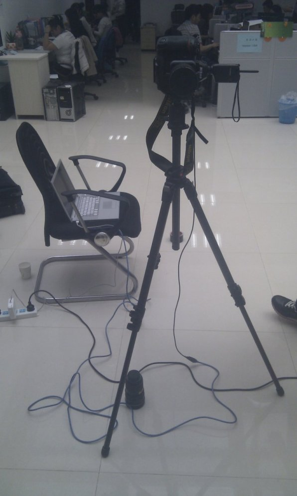

*2011-04-13 14:37 · 手机上网*

---

### 11466

北医三院的IT化做得非常好！上午抽血，傍晚就可以在网站上看到扫描后做成PDF的化验结果。而且，帐号系统也设计得很合理。看来，清华隔壁那个学校的人素质确实不错。

*2011-04-12 20:58 · 网页*

---

### 11467

转@ 嘉树 刚才有个小弟夸我桌上的水杯霸气，并且问：您真的没有拿它吃过饭吗？

*2011-04-12 18:12 · 网页 转自嘉树*

---

### 11468

待文王兴者，凡民也；若夫豪杰之士，虽无文王犹兴。[故意省字]

*2011-04-12 09:53 · 网页*

---

### 11469

我为有这么彪悍的同事而自豪！转@ 弥城 07:00北苑家园紫授园出发，07:48，到达苏州街公司楼下。全程18.8公里(GPS数据)耗时48分钟，走错路一次，看美女N多，急刹车三次。08:05分打卡上班⋯⋯

*2011-04-12 09:38 · 网页 转自弥城*

---

### 11470

早安，饭否。

*2011-04-12 07:04 · iPhone版*

---

### 11471

amazon的验证方式很有爱。我姐买了amazon的prime会员资格，可以享受免费两天内送达的服务。一个prime资格可以绑多个amazon帐号，于是我姐给我发了邀请邮件。Amazon的验证方式是要求我输入我姐和我的生日，幸好我都记得:-)

*2011-04-11 18:48 · 网页*

---

### 11472

转@ 盖文张 真正的探索之旅，是用新的眼光看事物。——法国小说家 普鲁斯特

*2011-04-11 15:27 · 网页 转自盖文张*

---

### 11473

从侧面再一次见识了喻华峰老师的江湖地位。

*2011-04-11 15:27 · 网页*

---

### 11474

国内的企业IT化水平确实比较低。我07/08年体检是在佰众做的。08年底佰众被慈铭收购后，佰众的体检报告网站就打不开了，而慈铭的网站上也找不到。09/10两年是在爱康国宾做的，但是居然要用两个不同的帐号登录。越是大环境如此，美团网越是要做到靠谱。

*2011-04-11 13:33 · 网页*

---

### 11475

@ gravity0 所以好一点的gps会内置电子罗盘，那样比较准。

*2011-04-11 13:26 · 网页 给gravity0的回复*

---

### 11476

确实如此，不过我倒觉得是好事。真有媒体理想的人干什么事都不会完全抛离媒体。转@ 盖文张 我：互联网的泡沫又快来了吗？朋友：是的，又有大批记者去创业了。

*2011-04-11 13:10 · 网页 转自盖文张*

---

### 11477

@ 派森 硅谷。

*2011-04-11 13:08 · 网页 给派森的回复*

---

### 11478

刚才听我姐说，她真的用iphone locator找回了她掉在公园里然后被别人送到失物招领处的iphone。看来这功能还挺实用。

*2011-04-11 12:23 · 网页*

---

### 11479

@ 捷风 正打算买kindle3。iPad不是电子墨水屏，不适合长时间阅读，代替不了kindle。

*2011-04-11 09:31 · 网页 给捷风的回复*

---

### 11480

@ Frank_Zhao 我在这个kindle上读了十几本书，还不错。

*2011-04-10 23:43 · 网页 给Frank_Zhao的回复*

---

### 11481

我的kindle一代用了快三年，这次似乎终于摔坏了:-(

*2011-04-10 23:38 · 网页*

---

### 11482

@ 弥城 g7有点老了。听说三星i9000不错。

*2011-04-10 01:20 · iPhone版 给弥城的回复*

---

### 11483

@ iamtomato 不是。请勿上当!

*2011-04-09 19:09 · iPhone版 给iamtomato的回复*

---

### 11484

@ 风之锁 新浪把饭否同步封了。

*2011-04-09 14:14 · 网页 给风之锁的回复*

---

### 11485

自我管理应该从时间管理开始。时间管理应该从起床时间开始管。管理应该多关注输入而不是输出。所以，真正的关键不是几点起床，而是几点上床。只要能坚持早睡，早起就容易多了。相反，很晚睡却想很早起自然是需要痛苦挣扎而且不长久不健康的。

*2011-04-08 09:13 · 网页*

---

### 11486

@ 王球球WQ 淡定⋯⋯淡定⋯⋯不要馋远在千里之外的我们了！尤其不要馋从来没去过成都的我了！

*2011-04-07 18:14 · 网页 给王球球WQ的回复*

---

### 11487

@ xjlde 欢迎。请看一下 http://www.meituan.com/job/ , 请发简历到hr@ meituan.com

*2011-04-07 14:00 · 网页 给xjlde的回复*

---

### 11488

HTC的市值达到338亿美元，超过诺基亚和RIM（黑莓制造商）。真是江山代有才人出，各领风骚数百天啊。

*2011-04-07 13:10 · 网页*

---

### 11489

@ Dee.W happy birthday!

*2011-04-07 10:59 · 网页 给Dee.W的回复*

---

### 11490

早安，饭否。

*2011-04-07 08:02 · iPhone版*

---

### 11491

《Diamond and Rust》和“妹妹你坐船头，哥哥我岸上走”是情歌的两个极端。

*2011-04-06 18:47 · 网页*

---

### 11492

忍不住跳出来力挺《Diamonds and Rust》！转@ 和菜头 四月六日的傍晚，朋友们都去了工体，去听鲍勃.迪伦的演唱会。我对他一无所知，所以只有在这黄昏时分听Joan Baez的《Diamonds andRust》。在流光中纷纷而下的钻石和锈。

*2011-04-06 18:45 · 网页 转自和菜头*

---

### 11493

知道是谁寄来的茶叶了。谢谢！

*2011-04-06 16:46 · 网页*

---

### 11494

收到两盒狮牌西湖龙井，可是完全不知道是谁寄来的，不知道该谢谁……

*2011-04-06 15:20 · 手机上网*

---

### 11495

@ 阿瑜阿 我用的是gmail web版。

*2011-04-06 12:31 · iPhone版 给阿瑜阿的回复*

---

### 11496

@ tony 我从来没有因为个人消费给腾讯付过钱，但是当腾讯的一整套工具成为工作必需的基础设施时，它收的那些钱其实不多。

*2011-04-06 11:58 · iPhone版 给tony的回复*

---

### 11497

一切管理都应该从自我管理开始。

*2011-04-05 22:59 · iPhone版*

---

### 11498

美食绝对是拼原材料的。海鲜如此，蔬菜也一样。从自家后院摘一把新鲜蔬菜，只要稍加处理，其美味远非北京饭馆里的同类菜可比。新

鲜的菜才能吃出细腻真实的各种味道，就像iphone4 retina液晶屏相比普通液晶屏的提升。

*2011-04-04 18:47 · iPhone版*

---

### 11499

老家就是老家，老妈就是老妈! 晚饭只是简单几道菜，但原料和做法都甚合我意，吃得我忘乎所以。

*2011-04-04 18:31 · iPhone版*

---

### 11500

温度低于舒适范围，湿度高于舒适范围，这就是清明时节雨纷纷的龙岩。

*2011-04-04 11:30 · 手机上网*

---

### 11501

到家了。八个半小时的硬座通宵没我预计的那么累。这也再次证明期望值管理很重要。

*2011-04-04 06:10 · 网页*

---

### 11502

@ 孙运东 回我的家乡，福建龙岩。

*2011-04-04 03:14 · 网页 给孙运东的回复*

---

### 11503

车到兴宁。对互联网业者，兴宁这个小地方有着特殊含义，它是hao123和4399创始人李兴平的家乡和大本营。

*2011-04-04 01:51 · 网页*

---

### 11504

最近试用了一段时间，初步结论是kik不如whatsapp好用，但kik有个好处是全免费。

*2011-04-04 00:39 · iPhone版*

---

### 11505

问:旅行途中macbook air有什么用途? 答:给手机充电。我们需要的不是computer而是communicator。

*2011-04-03 23:00 · iPhone版*

---

### 11506

@ 叶秋红 握手!

*2011-04-03 22:57 · iPhone版 给叶秋红的回复*

---

### 11507

车过东莞。我还从来没去过，改天应该去看看。

*2011-04-03 22:08 · 手机上网*

---

### 11508

终于恢复正常心跳，可以拿出临行前他们塞给我的两个饭盒了。哇，这帮朋友真是太靠谱了。从盒饭内容来看，他们晚餐点了什锦炒饭，鱼香茄子煲，鱼子粉丝，烧鹅，上汤鸡毛菜，榄菜四季豆，葱油鸡，凉拌木耳，炒墨鱼，还蒸了一条鱼。

*2011-04-03 22:06 · 手机上网*

---

### 11509

上一次坐通宵硬座估计是十年前了。至少我还有座位，比站满过道的那些人强。

*2011-04-03 21:38 · iPhone版*

---

### 11510

哈哈，终于赶上火车了。刚才从地铁出来一路狂奔到候车室，一看显示屏“K636已停止检票进站“，我果断翻越栏杆，跟怒斥我的工作人员简单解释之后，继续一路狂奔，终于赶上车了。好久没这么剧烈出汗了。估计还得再歇半小时才能平静下来吃背包里的晚饭。

*2011-04-03 21:30 · iPhone版*

---

### 11511

三门岛的自然环境不错，水很清，沙很细，还有不少老鹰在天上盘旋。可惜，保护得很差，沙滩上满是垃圾:(

*2011-04-03 17:18 · iPhone版*

---

### 11512

@ 盖文张 一帮朋友在南澳。

*2011-04-03 15:49 · iPhone版 给盖文张的回复*

---

### 11513

鲜艳如火的木棉花，先开花后长叶子

*2011-04-03 15:23 · 手机上网*

---

### 11514

四月初的深圳真是风和日丽。早餐后坐在屋外读一会儿书非常惬意。

*2011-04-03 09:49 · iPhone版*

---

### 11515

你在桥上看风景 看风景的人在楼上看你 明月装饰了你的窗子 你装饰了别人的梦。这是少数能给我留下印象的新诗之一，确实写得挺好。

*2011-04-03 00:30 · iPhone版*

---

### 11516

小时候看渔夫和魔瓶这个寓言时，给我最深刻印象的并不是最后渔夫将魔鬼收回魔瓶的巧妙方法，而是魔鬼被装在魔瓶里丢在海底那几百

年的心理变化，从打算报答解救者到发誓要报复全世界。凡事都有度，适度的等待可以提高最后的满足感，但过度的等待却会带来可怕的负面情绪。

*2011-04-03 00:13 · iPhone版*

---

### 11517

在世界之窗门口看到一个22岁的穿粉红衣服的姑娘因为和男朋友吵架而跑来喂了二十分钟鱼。

*2011-04-03 00:02 · iPhone版*

---

### 11518

@ gravity0 android手机都可以自动对时。

*2011-04-02 23:27 · iPhone版 给gravity0的回复*

---

### 11519

苹果的首席设计师jonathan ive曾在纽卡斯尔理工大学就读工业设计专业。当时的老师克莱夫对他的评价是，“他是我遇到的最勤奋的学生。

一般学生在毕业项目上只会做6个模型，而他做了100个。”

*2011-04-02 22:44 · 手机上网*

---

### 11520

转@ 名字太多 【看到的】如何让男人幸福？不要打扰他就足够啦

*2011-04-02 22:04 · 网页 转自名字太多*

---

### 11521

不要在乎他们的笑声。

*2011-04-02 12:15 · 网页*

---

### 11522

转@ 郭万怀 今天被一位客服mm的话感动了,她说,我觉得我做过客服这个工作后,就什么工作都不怕了.客服是一个最需要沟通能力和忍耐力的工作.

*2011-04-02 09:03 · 网页 转自郭万怀*

---

### 11523

据他说香港的水果运到深圳要先经过广州，因为全国只有几个水果进口检疫口岸。

*2011-04-01 22:36 · iPhone版*

---

### 11524

一个做投资的朋友在眉飞色舞的说这个季节新鲜的山竹在越南只要七毛钱，运到北京却要卖二三十块，所以他们打算做水果电子商务。我表示坚决支持，以一个消费者的立场。

*2011-04-01 22:15 · iPhone版*

---

### 11525

下午四点才发现今天手表戴反了。

*2011-04-01 16:00 · iPhone版*

---

### 11526

转@ 饭友经典语录 转：我人生第一次采访是98年在花园饭店，因《红色恋人》访张国荣。鼓足勇气举手问：你会为爱而死吗？全场哄笑。我脸刷地红了。哥哥说：你问得好，但电影是电影，人生是人

生。群访结束，他特地走到我身边说：不要在乎他们的笑声，你问了今天最好的那个问题。——@ 金娜

*2011-04-01 15:40 · 网页 转自饭友经典语录*

---

### 11527

@ 吴越之殇 因为新浪把我们封了。

*2011-04-01 14:51 · 网页 给吴越之殇的回复*

---

### 11528

深圳的google服务比北京还更不稳定:-(

*2011-04-01 14:51 · 网页*

---

### 11529

这个钟点，在离家千里之外的七天酒店里，电脑放出唐朝的《月梦》，我突然觉得有点冷。

*2011-04-01 02:26 · 网页*

---

### 11530

越往南的许留山越好吃。美食果然是拼材料啊。

*2011-03-31 15:28 · 网页*

---

### 11531

谢谢高知女性@ 小熊娃娃 ，是她在一年前把法式甜点马卡龙介绍给美团。生活中美好的东西都应该多分享!

*2011-03-31 14:11 · iPhone版*

---

### 11532

多谢一年前有美团，让我知道有一种经典法式甜点叫马卡龙。

*2011-03-31 08:57 · 手机上网*

---

### 11533

电商的水真深。真像笛卡尔说的那样，画出的圆圈越大，就发现外面的空白越多；知道的越多，就越发现自己无知。

*2011-03-31 02:08 · 网页*

---

### 11534

在我脑海中，vagabond这个词是和鲍勃·迪伦联系在一起的，就像提到“资本家”就会想起“巴菲特、荣毅仁、沈南鹏”这几个人一样。

*2011-03-30 14:07 · 网页*

---

### 11535

macbook air只有一个耳机孔，而没有麦克风的孔，这样就不会插

错，也不用每次插之前俯身仔细辨别，比那些有多个孔的pc笔记本更易用。

*2011-03-30 13:58 · 网页*

---

### 11536

@ 桃子 我也对丁磊的猪很感兴趣，但是没有任何迹象表明他会送我猪。

*2011-03-30 13:55 · 网页 给桃子的回复*

---

### 11537

正在听。转@ 带三个表 你该听过的鲍勃·迪伦。

http://www.wangxiaofeng.net...

*2011-03-30 13:53 · 网页 转自带三个表*

---

### 11538

关于钱财最重要的观念就是”钱服务我们，而不是我们服务钱“啊。转@彭浩翔 为奖励自己今天完成了那短篇小说，我花上远超过这小说稿费的金额，买下了一本96年恰克帕拉尼克《搏击会》首次出版小说的签名本。难怪我父母从小对我理财观念表示担忧。

*2011-03-30 13:51 · 网页 转自彭浩翔*

---

### 11539

第一次参加it龙门阵

*2011-03-29 19:35 · iPhone版*

---

### 11540

@ 娜如朵 前年去珠峰大本营的时候组织者带了不少小氧气罐，不过我觉得自己体质好，没要。

*2011-03-29 18:05 · 网页 给娜如朵的回复*

---

### 11541

澳洲飞狐。转@ CaoCong 两三个月前发现，每到晚上，天上有像飞鸟又像蝙蝠，源源不断的向东边飞去，体型很大，飞得很高，悄无声息，在深蓝色的夜幕下蔚为壮观。一直没有找到到底是什么直到这次无意中闯进了它们的栖息地⋯⋯树上全是倒挂着大蝙蝠，下面有书：Flying Foxes.

*2011-03-29 18:03 · 网页 转自CaoCong*

---

### 11542

碰到以谈判为专业的人真难搞。

*2011-03-29 18:01 · 网页*

---

### 11543

想找罐纯氧来吸吸。

*2011-03-29 15:53 · 网页*

---

### 11544

我好不容易想起来要用一下我的163邮箱，居然系统维护中⋯⋯

*2011-03-29 09:56 · 网页*

---

### 11545

the last man standing

*2011-03-28 15:14 · 网页*

---

### 11546

@ 鸝.se 这年头无疾而终很难得了。愿她老人家安息。

*2011-03-27 23:09 · iPhone版 给鸝.se的回复*

---

### 11547

自己动手给家里换了个马桶盖。

*2011-03-27 00:55 · iPhone版*

---

### 11548

chrome的新logo完全没有立体感，在讲究图标精美的mac下显得格外不搭调。

*2011-03-27 00:17 · 网页*

---

### 11549

转@ hizi “中国人没有宗教，如果说有的话，那就是做官。”-------英国公使马戛尔尼于200年前。via @ 北村

*2011-03-27 00:15 · 网页 转自hizi*

---

### 11550

和李想聊了一会儿，他还是一如既往的可爱。

*2011-03-26 20:04 · iPhone版*

---

### 11551

彻底笑翻！！！ 转@ hizi 三表哥，你肿么了？ http://j.mp/hexGGJ@ 带三个表

*2011-03-26 16:41 · 网页 转自hizi*

---

### 11552

转@ 如是如来 我拿着刀，没法抱你；我放下刀，没法保护你。----某人签名。

*2011-03-26 10:27 · 网页 转自如是如来*

---

### 11553

美国的团购网站数量也超过400了。 http://yipit.com/about/serv...

*2011-03-26 03:23 · 网页*

---

### 11554

@ Frank_Zhao 因为新浪把饭否的同步功能封了

*2011-03-25 23:50 · 网页 给Frank_Zhao的回复*

---

### 11555

太搞笑了，“较大的市”居然是一个正式的法律概念，这绝对是我见过的最口语化的正式称呼。‘据了解，申报“较大的市”的一般程序为：拟申报的市政府向省政府请示;省政府同意后转报国务院；然后,由国务院具体负责部门派人到申报城市进行实地考察’。

*2011-03-25 19:22 · 网页*

---

### 11556

android上的gmail似乎已经完全完蛋了，发不出邮件。这真是太误事了:(

*2011-03-25 11:05 · iPhone版*

---

### 11557

@ 祝英台 我常用的是chrome

*2011-03-25 09:37 · iPhone版 给祝英台的回复*

---

### 11558

原来《经济学人》的配图也不一定很严肃。例如这张就相当搞笑http://is.gd/ZWIv3K

*2011-03-25 02:36 · 网页*

---

### 11559

这里有人订阅了《The Economist》吗？

*2011-03-25 02:06 · 网页*

---

### 11560

阿里巴巴价值观“六脉神剑”之一是“拥抱变化”；Zappos的公司文化更进一步，提倡“embrace and drive change”（拥抱并驱动变化）；甘地则直接说“be the change you want to see”(自己去当你想要看到的那个变化吧）。

*2011-03-25 00:51 · 网页*

---

### 11561

在北京呆了十几年，今天第一次来朝阳公园，为了参加极客公园的活动。

*2011-03-24 17:59 · iPhone版*

---

### 11562

@ 远骋 甘地的境界更高一些，他说：be the change you want tosee in the world.

*2011-03-24 11:58 · 网页 给远骋的回复*

---

### 11563

罕有的在早晨六点半自然醒来。难道是渴醒的?于是，猛灌一大杯水，饭否一下，倒头继续睡。

*2011-03-24 06:41 · iPhone版*

---

### 11564

@ 鸝.se 不光埃及有金字塔，美洲古文明也有。

*2011-03-24 01:11 · iPhone版 给鸝.se的回复*

---

### 11565

这是我见到的第一个真用kindle听音乐的人。转@ Heidi.ai 于是把n张Jazz灌进Kindle，可以钻到被窝里边听音乐边看书了，这才是完美的睡前时光啊~ 又发现了一个独居的好处了

*2011-03-23 23:56 · 网页 转自Heidi.ai*

---

### 11566

@ 那个谁 欧洲这会儿是白天，北美是半夜。

*2011-03-23 18:56 · 网页 给那个谁的回复*

---

### 11567

同学们，遇到管理问题不要太慌张。管理从来都是不完美的。别说组织上千人完成复杂的业务流程了，就是把一千人拉到外面啥也不干光是走一圈，要做到队伍不散速度不慢不走丢也不太容易。

*2011-03-23 18:55 · 网页*

---

### 11568

@ 鸝.se 第一感觉是aztec和中国这两种古文明建筑风格的结合。

*2011-03-23 18:47 · 网页 给鸝.se的回复*

---

### 11569

@ 叶滨 马云说得更直白：一个东西，你只有抓紧之后才有资格谈“放下”。

*2011-03-23 18:43 · 网页 给叶滨的回复*

---

### 11570

@ 孙晨 被谁攻击了？

*2011-03-23 18:42 · 网页 给孙晨的回复*

---

### 11571

firefox4那个飞速增长的下载计数和满世界冒泡的页面还是挺激动人心的。 http://glow.mozilla.org/

*2011-03-23 18:24 · 网页*

---

### 11572

转@ 克韩 在我的呼吁下，体坛微博终于也支持同步饭否了。技术同事告诉我：这几乎是为你一个人开发的。。。

*2011-03-23 18:14 · 网页 转自克韩*

---

### 11573

装了amazon刚推出的appstore for android，感觉不错。amazon真是够勇猛!

*2011-03-23 01:31 · iPhone版*

---

### 11574

原来设计大师Jonathan Ive 1992年就加入苹果了，前几年一直不太得志。直到1997年乔布斯重掌苹果之后，Ive才得到重用，从此一发不可收拾，设计出iMac/iPod/iPhone/iPad等神作。 http://is.gd/YJZaEo要是有机会参观他的工作室就好了。

*2011-03-22 14:58 · 网页*

---

### 11575

我的gmail空间使用量从2月14日的68％上升到3月8日的72％再上升到3月22日的75％。按这个趋势，大概7月底8月初我就得给google付费买空间了。幸好不算太贵，5美元每年可以买20G。

*2011-03-22 13:21 · 网页*

---

### 11576

花$11.99买了CamCard名片王的android正式版，这玩意儿实在是处理名片的利器，极大的提高效率。

*2011-03-22 12:21 · 网页*

---

### 11577

去一个好几年没见面的中学时很要好的同学家吃晚饭，第一次玩用lego mindstorms拼出来的电子鳄鱼。乐高确实很强！

*2011-03-22 00:37 · 网页*

---

### 11578

牛逼！言简意赅！转@ .rex 转@ i曾科 社交网络http://fanfou.com/photo/tBt...

*2011-03-21 02:21 · 网页 转自i曾科*

---

### 11579

怪下属执行不力其实是暴露自己领导不力。

*2011-03-20 18:05 · 网页*

---

### 11580

还在面试人……

*2011-03-20 01:11 · 网页*

---

### 11581

比我还更数码狂… 转@ 鸝.se 数了一下，家里有各种电脑八台，手机六部，数码相机四个，人两只。

*2011-03-19 20:32 · 网页 转自鸝.se*

---

### 11582

晚饭时有人出乎意料的点了一盘辽参，并郑重其事的说现在再不吃就得等很长很长时间才能吃了。

*2011-03-18 19:53 · iPhone版*

---

### 11583

转@ 沙杰 zz，清华c楼学生超市食盐卖光——这有力的回击了清华没有文科的谣言。

*2011-03-18 19:33 · 网页 转自沙杰*

---

### 11584

Never attribute to malice that which is adequately explained bystupidity.

*2011-03-18 18:01 · iPhone版*

---

### 11585

315之夜非常刺激。和电视无关。

*2011-03-16 02:57 · 网页*

---

### 11586

昆明都下雪了…… 转@ 和菜头 听旅居昆明的@ 四鬼 在饭否上说昆明

下雪了，打电话回家，老妈证实的确如此，现在已经放晴。老妈说这是倒春寒，并举例说1974年4月7号昆明还下了雪。这句话一出来，我就接不上了。因为，那时候我还没有出生。

*2011-03-15 17:07 · 网页 转自和菜头*

---

### 11587

赞！科技改善生活。转@ realazy 北京妇幼不知跟哪合作，有了不用羊穿的新技术，咱家宝贝的生长环境不必受扰了，心中无比欣慰。

*2011-03-15 12:25 · 网页 转自realazy*

---

### 11588

终于理解了为什么企业需要CIO (Chief Information Officer)。

*2011-03-15 11:01 · 网页*

---

### 11589

晚饭时瞎想，不想不知道，一想吓一跳，衣物竟然有这么多细分用途：装饰，保暖，耐高温（消防队），挡风，防晒，防虫，耐磨，遮羞，防弹，塑形，伪装，防辐射，抗压／增压，防静电／绝缘，标志身份（警服），易于辨识（加荧光反射条），防尘（洁净室的兔宝宝服），减少摩擦力（鲨鱼皮泳衣）⋯

*2011-03-14 20:17 · 网页*

---

### 11590

@ 刘洋 hi

*2011-03-14 17:51 · 网页 给刘洋的回复*

---

### 11591

身在横滨的老同学在班级邮件组里说：“谢谢大家的关心，我这边最近大米被抢购完了。面包也没了。但是我发现大家都不囤积酒。我于是囤积了120罐啤酒在家里， 心里踏实多了。”

*2011-03-14 17:48 · 网页*

---

### 11592

“临渊羡鱼，不如归而结网”。老祖宗把这些道理总结得多么明白啊。

*2011-03-14 12:06 · 网页*

---

### 11593

听说顺丰速运全国有超过11万人，投递员的月收入在五千到一万五之间。太强大了⋯⋯

*2011-03-14 11:49 · 网页*

---

### 11594

这哥们真专业！居然有这个字符！转@ 苹果中国 测试：谁在用苹果的设备。看到括号里的东西没？（ ）

*2011-03-14 10:58 · 网页 转自苹果中国*

---

### 11595

@ IwfWcf iPod上的几个应用很简单，而iPad则是一个全功能的系统了。

*2011-03-14 10:36 · 网页 给IwfWcf的回复*

---

### 11596

刚刚意识到一件事：iPad在用户这一层是没有文件系统概念的，但是

并不影响各种应用。苹果真厉害。

*2011-03-14 10:32 · 网页*

---

### 11597

随便一件事，只要做到极致，就会有美感。

*2011-03-13 23:00 · iPhone版*

---

### 11598

@ lijb87 不是。一个在报业和门户都干过的老师。

*2011-03-13 18:53 · iPhone版 给lijb87的回复*

---

### 11599

和一个蹲过班房但却倍受尊敬的大哥吃饭。

*2011-03-13 18:23 · iPhone版*

---

### 11600

@ 远骋 赞！祝早日冲出地球！

*2011-03-12 16:23 · 网页 给远骋的回复*

---

### 11601

很多事情表面上是一夜成功，其实背后有很长时间的积累。我很喜欢的TED会议似乎是前几年突然走红的，可它实际上创办于1984年。

*2011-03-12 16:16 · 网页*

---

### 11602

@ 盖文张 建议参考一下MBTI测试，看自己比较适合做什么。

http://j.mp/tnF7v

*2011-03-11 19:28 · 网页 给盖文张的回复*

---

### 11603

我能想到的和“不装逼”意思最接近的英文单词是“unassuming".

*2011-03-11 19:19 · 网页*

---

### 11604

祝彭老师和其他人都安好！ 转@ 彭浩翔 海啸，震央在海底八‧四级，仙台最厉害七级，现在我在的楼还在余动。

*2011-03-11 16:05 · 网页 转自彭浩翔*

---

### 11605

昨晚把iPad升级到iOS4.3了。刚才双击home键，发现昨天用过的那些程序居然都在列表里。这说明iOS把这个列表存在持久存储而非运行内存里？

*2011-03-11 15:55 · 网页*

---

### 11606

@ 邦比快跑 某种意义上，最好的抽奖是直接送百元大钞，见者有份，这样中奖面最大又特别容易理解。但是，做不起啊，毕竟美团网又不是一个送钱网站。我们还是希望有点“趣味”。

*2011-03-11 15:44 · 网页 给邦比快跑的回复*

---

### 11607

谢谢@ 张亮 同学的推荐。我曾经以为我需要的是evernote，后来才发现instapaper更加合适。太爱那个“read later ”的bookmarklet了，一点就把当前网页存成很易读的格式，让我可以在ipad上看。

*2011-03-11 14:19 · 网页*

---

### 11608

转@ 张立宪 缪哲老师活得像个古人。有一次，我忍不住与他谈起某人：“你说那是不是个傻逼？”他回答：“那是个得体感和进退感都很差的人。”

*2011-03-10 12:16 · 网页 转自张立宪*

---

### 11609

最牛逼的书评！转@ 欧阳Fm99 《Love Is A Mix Tape》，作者是《滚石》杂志的撰稿人Rob Sheffield，讲述的是他和他的太太的真实的故事，太太意外猝死，因此有了这本书⋯⋯你有没有过这样的阅读经验：这本书你舍不得把它读完。这本书就是我舍不得读完的书。

*2011-03-10 12:14 · 网页 转自欧阳Fm99*

---

### 11610

@ 小熊娃娃 有八卦不分享的被雷劈!

*2011-03-09 23:30 · iPhone版 给小熊娃娃的回复*

---

### 11611

我觉得咱们说的不是一回事，可能根本不是同个城市。苏27和预警机我无论如何还是能分清的。就好像，我可能会搞混范冰冰和李冰冰，但是肯定不会搞混范冰冰和沈殿霞。转@ kevin水漁民 @ 王兴 我這兒連續幾天了，看模樣像預警機。

*2011-03-09 23:28 · 网页 转自kevin水漁民*

---

### 11612

上海航空太不靠谱了，居然连像样的橙汁都不提供，只有果粒橙:(

*2011-03-09 23:18 · iPhone版*

---

### 11613

别问我那战斗机到底是苏27还是歼10，我的兵器知识基本停留在上世纪九十年代初。再后来，我就觉得折腾电脑比定期翻阅《兵器知识》、《航空知识》、《舰船知识》和《世界军事》更有趣了。

*2011-03-09 20:12 · 网页*

---

### 11614

一个以战略著称的大佬很认真的跟我说其实他的强项是管理。我相信。

*2011-03-09 19:41 · iPhone版*

---

### 11615

这车牌真好记。

*2011-03-09 18:35 · 手机上网*

---

### 11616

@ quux 江南某城

*2011-03-09 18:15 · iPhone版 给quux的回复*

---

### 11617

一架疑似苏27的战斗机低空掠过城市上空，其噪音相当扰民。

*2011-03-09 16:53 · iPhone版*

---

### 11618

苹果的充电器上加两个小耳朵的设计还是很贴心的。连我这么不喜欢整理东西的人在出门时也会把线理清楚。

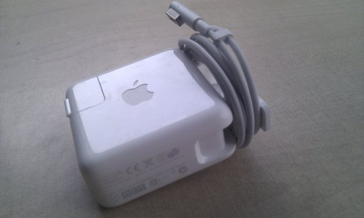

*2011-03-09 11:13 · 手机上网*

---

### 11619

我估计我已经困到坐经济舱也是一落座就睡着，飞机起飞时也没知觉。

*2011-03-09 07:31 · iPhone版*

---

### 11620

三个月前因为要给摩洛哥这种第三世界国家的某公司付50美元左右的钱，paypal怀疑我有异常，把我帐号冻结了。折腾了好久，在上传能证明我地址的实体账单扫描件后，帐号终于解冻了。

*2011-03-09 01:09 · 网页*

---

### 11621

@ 于欣烈 还真有点不适应。我觉得starbucks原来那logo挺好啊，没事换来换去干啥呢？

*2011-03-08 15:02 · 网页 给于欣烈的回复*

---

### 11622

本期《商业价值》杂志有篇文章的标题很有意思：《不是媒体的电子商务不是好社区》。

*2011-03-08 15:01 · 网页*

---

### 11623

坐在电脑前，一时间有些恍惚，不记得自己今早是否刷过牙了⋯⋯

*2011-03-08 09:10 · 网页*

---

### 11624

所以说，情书也不靠谱？啥最本能？转@ 和菜头 转@ 安娜酥酥 所以一个只给你发短信而从不给你打电话的男人,还是与他保持距离最好,短信都是经过沉淀的文字,这种经过修饰非本能的信息往往可信度不高。

*2011-03-07 23:34 · 网页 转自安娜酥酥*

---

### 11625

@ 宋日文 我还是觉得在饭否自在很多。新浪那边保持基本活跃是工作需要。

*2011-03-07 23:17 · 网页 给宋日文的回复*

---

### 11626

突然没来由的想起2年前dacode做过的一件饭否主题T-shirt：“你必须很努力，才能做到看起来毫不费力”。

*2011-03-07 23:00 · 网页*

---

### 11627

这是@ 连长王江 的朋友帮我画的。其实，通常我没有酷吧。

*2011-03-07 21:12 · 手机上网*

---

### 11628

lady gaga果然语出惊人：Performing is 'like having sex with yourfans.'

*2011-03-07 19:35 · 网页*

---

### 11629

@ 槿vita 啥问题？直接饭否私信给我吧。自从美团网在前几天一周年时推出“美团券过期包退”后，这几天无比热闹。

*2011-03-07 19:01 · 网页 给槿vita的回复*

---

### 11630

@ duberry 刚注意到你的头像。你的宝宝长得真可爱！

*2011-03-07 18:03 · 网页 给duberry的回复*

---

### 11631

偶遇厕所读物

*2011-03-07 16:47 · 手机上网*

---

### 11632

@ 小十月 在美国买的。

*2011-03-07 16:40 · 网页 给小十月的回复*

---

### 11633

莫名其妙成了这期《商业价值》的封面人物。文章我没看过，不过照片比真人更帅。

*2011-03-07 12:10 · 网页*

---

### 11634

有些电影给我的第一印象是烂片，例如当年史泰龙的《洛基》系列，因为情节实在是太狗血太主旋律了。有趣的是，多年之后的今天，我发现自己终于处在一个能理解那种电影的环境下了。

*2011-03-07 12:06 · 网页*

---

### 11635

上午咖啡下午茶。

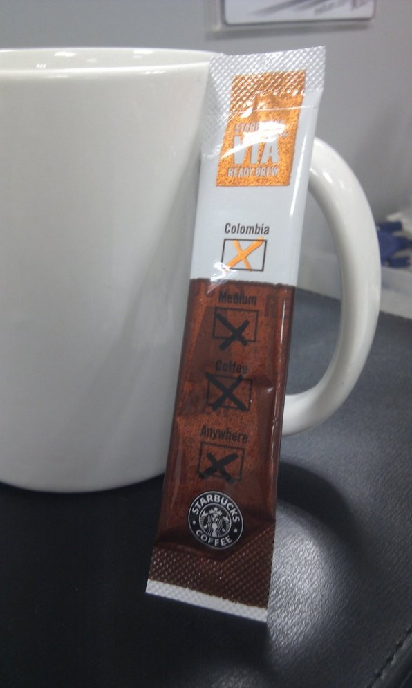

*2011-03-07 10:13 · 手机上网*

---

### 11636

@ ada 你在facebook上超级活跃啊

*2011-03-07 09:39 · 网页 给ada的回复*

---

### 11637

我很理解《The Social Network》里的这句台词：You are not anasshole. You are just trying so hard to be.

*2011-03-07 00:29 · 网页*

---

### 11638

God is an engineer.

*2011-03-06 20:15 · 网页*

---

### 11639

见鬼，刚发现不知道出了什么问题，导致MSN好友列表中有一二十人不知什么时候莫名其妙被我blocked了。刚刚一个一个手动unblock。

不知道误了多少事:-(

*2011-03-06 19:42 · 网页*

---

### 11640

转@ 左小祖咒 没错，任达华比赵本山大两岁，林志颖比郭德纲小一岁

*2011-03-06 15:25 · 网页 转自左小祖咒*

---

### 11641

两个月来第一次游泳。运动之后果然神清气爽。

*2011-03-06 15:22 · 网页*

---

### 11642

re@ 左潇 虽然《未来之路》这书我当年看过，但是书的水平确实和盖茨的商业成就差得太远。一本1995年出的讨论IT的书里完全没提到internet，和《未来之路》这名字实在是不相符。

*2011-03-05 23:51 · 网页*

---

### 11643

我稍微想了一下“接近自由”这回事，确实是几乎不可达到，除了死亡和得道这两条路。

*2011-03-05 23:24 · 网页*

---

### 11644

张向东说他在写一本书，名字叫《接近自由的方式》。我很喜欢这个名字。

*2011-03-05 23:09 · 网页*

---

### 11645

gmail最近似乎越来越不靠谱，时断时续。这让刚给google apps付过钱的我情何以堪啊？

*2011-03-04 21:34 · 网页*

---

### 11646

@ 宋日文 谢谢！我们才刚刚上路。

*2011-03-04 21:28 · 网页 给宋日文的回复*

---

### 11647

连我都被我们有些同事的工作勤奋程度震惊了。

*2011-03-04 00:52 · 网页*

---

### 11648

@ quux 工程师呢? 我喜欢这个词胜过“程序员”。

*2011-03-03 23:21 · 网页 给quux的回复*

---

### 11649

爱国主义本质上是以自我为中心，也就是放大了的个人主义。

*2011-03-03 23:00 · iPhone版*

---

### 11650

@ qiuyingtao 确实有效。我也是接到移动客服电话让我免费试用，现在决定付费用下去了。

*2011-03-03 18:16 · 网页 给qiuyingtao的回复*

---

### 11651

@ 小李飞刀0 对你们是好事，对美团可就不一样了⋯⋯

*2011-03-03 18:15 · 网页 给小李飞刀0的回复*

---

### 11652

自从开通短信“来电提醒”之后，我平均每天会收三到四条“XXX呼叫过您”的短信，而且通常是在我的手机似乎完全正常的情况下。以前真不知道中国移动的接通率原来这么差。

*2011-03-03 18:00 · 网页*

---

### 11653

早上跟人见面又迟到了:( 在帝都，赶上高峰时段，开车或打的要多久能到真是几乎没谱，还是多挤地铁更靠谱……

*2011-03-03 11:50 · iPhone版*

---

### 11654

android手机是长按home键调出当前程序，ipad则是短按两次home键。在两个设备间反复切换，我有时会一不小心误操作，可见一致性对易用性多么重要。

*2011-03-01 08:45 · iPhone版*

---

### 11655

我昨天真是被猪油蒙了心，居然一不留神把手机刷成联通的ROM，结果手机里预装了一堆没什么用的国产app，却唯独不能添加google帐号无法同步联系人和日历等重要数据，也没有android market，简直成了一个废手机。还好现在终于刷回正常的了。

*2011-03-01 02:00 · 网页*

---

### 11656

@ 神剑 不必太纠结。凡事都有原因。找到原因就好改进了。

*2011-02-28 14:24 · 网页 给神剑的回复*

---

### 11657

@ 郑凡 呃，最近确实是走不开:-( 祝老同学们聚得happy!

*2011-02-28 13:53 · 网页 给郑凡的回复*

---

### 11658

@ 宋日文 身边的兄弟们靠谱，就不惧一切对手！

*2011-02-28 10:32 · 网页 给宋日文的回复*

---

### 11659

@ 宋日文 哈哈，咱俩说的是同一个行业新闻吗？

*2011-02-28 10:23 · 网页 给宋日文的回复*

---

### 11660

听说今天会有些蛮有趣的新闻。

*2011-02-28 08:49 · iPhone版*

---

### 11661

1997年8月30日（还是31日？），清华本科生的开学典礼上，校领导在致辞时引用了一段他们年轻时的歌词“眼前是一望无际的田野，身后是一排排的厂房，我们的生活就是这样，永远战斗着奔向前方”。今天，

我们眼前没有田野，我们身后也不需要厂房，但是我们的生活一样要“纵情向前”。

*2011-02-28 02:51 · 网页*

---

### 11662

@ Frank_Zhao 很明显，只做电话的公司正在走向衰败。时代发展到现在，手机的未来是移动终端，而不仅仅是电话。当然，普通用户只想要一个好电话并没错。我说的是，作为程序员，如果对智能手机不感兴趣，那是有点奇怪的事。

*2011-02-28 02:45 · 网页 给Frank_Zhao的回复*

---

### 11663

我并不认为现在的android适合所有人，例如我肯定不会向我妈推荐android。但是，我认为好的程序员应该有hack精神，而且是hack未来，而不是hack过去。

*2011-02-27 23:09 · 网页*

---

### 11664

转@ 如小果 看非诚勿扰，女嘉宾问男嘉宾“你上一段恋爱是因为什么的分手的”“ED”——我赶紧回头看看这ED还敢上台的哥们，原来说的是异地。

*2011-02-27 23:03 · 网页 转自如小果*

---

### 11665

虽然有很多同事在遥远的城市，但是我们并肩作战！

*2011-02-27 23:02 · 网页*

---

### 11666

我从2004年开始用symbian，但是从2009年起转向android。虽然直到现在，android在很多基本功能方面还不如symbian做得好，但是我相信未来站在android这一边，而我愿意站在未来这一边。

*2011-02-27 22:48 · 网页*

---

### 11667

@ 高振. 加油！

*2011-02-27 22:41 · 网页 给高振.的回复*

---

### 11668

@ 巧手匠人 对不起。能把那个帖的网址给我一下吗？谢谢！

*2011-02-27 22:40 · 网页 给巧手匠人的回复*

---

### 11669

在卖手机的地方偶遇一个几年没见的老同事，校内网->百度->亚马逊卓越，这样的职业轨迹让我不知说什么好。幸好他自己也说，在亚马逊卓越太闲了，估计呆不住，想再出来闯闯。

*2011-02-27 16:58 · 网页*

---

### 11670

也许是偏见，我总觉得此时此刻再买诺基亚e72当主力手机的工程师缺了一点点那种精神。

*2011-02-27 16:49 · 网页*

---

### 11671

今天中午走在屋外时，第一次感觉到今年的一丝丝春意，农历正月廿三。

*2011-02-25 22:02 · 网页*

---

### 11672

昨天中午又吃了一个生日蛋糕，到了晚上，接到老妈的电话才知道昨天居然真是我的生日，农历的。

*2011-02-25 21:29 · 网页*

---

### 11673

我还以为我的家乡福建比较富裕了，结果看这张中国各省与世界各国对比的地图，福建的人均GDP也就和古巴一个水准。

http://is.gd/KZFhwn

*2011-02-25 20:34 · 网页*

---

### 11674

转@ 拂汗 “某人抱怨说，植物大战僵尸真骗人，老是提醒说“有一大波僵尸正在接近”，就为这，没日没夜埋头玩了一整年，NND从没出现过一个“大波僵尸”！”

*2011-02-25 10:57 · 网页 转自拂汗*

---

### 11675

在参加国家工商总局和cctv主办的“诚信网购”系列活动启动仪式暨“网络商品交易诚信经营倡议书”发布会。有21家电商网站参加，其中2家是团购网站。

*2011-02-25 09:24 · iPhone版*

---

### 11676

靠，居然制作金卡失败，手机SD卡似乎废了

*2011-02-24 21:17 · 网页*

---

### 11677

喜忧参半的消息，最近越来越知道自己不知道很多东西了。

*2011-02-24 19:51 · 网页*

---

### 11678

吾日三省吾身：为人谋而不忠乎？

*2011-02-24 19:26 · 网页*

---

### 11679

我有一个很疯狂的朋友在最后一次蹦极时伤了腰。前几次都很顺利，于是他选了最高的百米台，不顾工作人员的劝阻，坚持在自己的鞋尖上装了个摄像机，想把自己一路下坠时的动作表情都录下来。结果，因为他下坠时没有放松身体而是弓着身子看自己的脚尖，到底部时一甩，腰差点废了。

*2011-02-24 12:41 · 网页*

---

### 11680

@ lijb87 而且看起来一点也没变，不显老。

*2011-02-24 12:32 · 网页 给lijb87的回复*

---

### 11681

十年过去了，清华14食堂的那个师傅居然还认得我。当然，我也认得

他。

*2011-02-24 11:40 · 网页*

---

### 11682

这几天我的macbook暴慢，怀疑是某个系统或软件升级导致的:-(

*2011-02-22 19:55 · 网页*

---

### 11683

不但很多科学是引进的，连“科学”这个概念都是引进的。“科学”一词最早出自南宋，意为“科举之学”。但是，这个词的现代含义是康有为、严复在十八九几年从日本引进的。日文里的“科学”则是明治时期的教育家福泽谕吉在一八七几年从science翻译过来的。

*2011-02-22 19:51 · 网页*

---

### 11684

用safari访问gmail，发现顶部的google各种应用的导航条升级成了更潮更有设计感的样式。用chrome访问，还是老样子。

*2011-02-22 16:38 · 网页*

---

### 11685

banana republic的忠诚度计划真是复杂到令我惊叹。当然，我说的是整个系统有很多分支层层深入，对一个消费者来说逐步接受起来并不会觉得复杂。

*2011-02-22 16:19 · 网页*

---

### 11686

sean parker果然和电影里一样，带着一个显然很幼齿的女朋友。

*2011-02-21 20:27 · 网页*

---

### 11687

@ 神剑 大家一起扛。没问题的！

*2011-02-21 17:40 · 网页 给神剑的回复*

---

### 11688

原来湾流商务机飞得更高，普通民航飞的高度是迪克牛仔所唱的三万英尺，湾流则飞在四万一千英尺，那样可以避开繁忙的航线，也更少遇到气流，会更平稳。

*2011-02-21 13:15 · iPhone版*

---

### 11689

大姐好有闲情逸致～ 转@ 鸝.se 在海面上散步，仔细观察了冰裂纹，用冰锥凿出个洞，并且像北极熊那样试图抓条活鱼，未果。

*2011-02-20 22:04 · 网页 转自鸝.se*

---

### 11690

@ webto 船太慢了。小飞机可以飞150节（约280公里），我从一个岛到另一个岛花了半个小时。

*2011-02-20 21:30 · 网页 给webto的回复*

---

### 11691

ipad出来才不到一年，行业应用已经非常发达了。刚才在小飞机上，副驾驶员起飞降落时都在折腾一个叫foreflight的app，看机场地图和动态的航线起降情况。他说比以前靠手册、地图、电话沟通方便多

了。

*2011-02-20 21:21 · 网页*

---

### 11692

第一次坐这种9座小飞机。两个驾驶员送我一个乘客。在这几个岛之间，人们全靠飞来飞去，就像搭公共汽车一样。

*2011-02-20 21:18 · 网页*

---

### 11693

此刻的t3航站楼人非常少。非常突然，要去见几个酷人，旅途劳顿我就认了。

*2011-02-19 20:36 · iPhone版*

---

### 11694

@ 苏廖岱 HTC Desire. ROM是安卓网制作的2.5_desire_google版，FRG83，2.2.1版的android。

*2011-02-19 09:31 · 网页 给苏廖岱的回复*

---

### 11695

最近通话记录也始终是空的，连未接来电的号码也不记录，这比通讯录被清空更要命:-( 通讯录至少在google服务器上还有个备份。

*2011-02-19 09:28 · 网页*

---

### 11696

@ 沈鹏KeyKey google服务器上的通讯录倒是没丢。但是用android手机每隔一两个月被这么折腾一次也够烦人的:-(

*2011-02-19 09:25 · 网页 给沈鹏KeyKey的回复*

---

### 11697

android手机又一次出现通讯录突然全部清空的大bug，友录这个软件更是一启动就崩溃，太耽误事了。android咋就这么不靠谱呢？

*2011-02-19 09:21 · 网页*

---

### 11698

转@ gravity0 老罗很多年前说如果遇到传教的，他传 A 教，你就说你信 B 教，反之亦然，千万别说你不信教，他们是很执着的。举一反三，对付卖保险的也一样，他卖 A 公司的保险你就说在 B 公司已经买过了，千万别说保险是狗屁这样的话，尽管它真的是狗屁，和片土地上其它承诺一样。

*2011-02-18 14:46 · 网页 转自gravity0*

---

### 11699

我2^5岁了。谢谢祝我生日快乐的朋友们！

*2011-02-18 10:47 · 网页*

---

### 11700

@ 罗燕 我还在办公室，还没吃饭，所以应该没有人怀疑我不是中国人。

*2011-02-17 19:55 · 网页 给罗燕的回复*

---

### 11701

@ 喵呜.杨曜睿 独立域名也掌管在顶级域名注册商手里，独立空间也存在于机房的某台服务器上，并不是完全独立，也有可能被干掉。例

如，wikileaks原来用亚马逊的云主机，后来一闹大就被亚马逊停掉了。

*2011-02-17 13:42 · 网页 给喵呜.杨曜睿的回复*

---

### 11702

转@ 嘻嘻乐乐 印度教里面有三个神，主要职责是创造神、保护神和毁灭神。印度人能认识到毁灭有的时候是一种正义和必须的力量，是世界观的宽广，可见印度的精英层颇有一些牛人，是有文化渊源的。

*2011-02-16 23:54 · 网页 转自嘻嘻乐乐*

---

### 11703

@ luanyu 加油！

*2011-02-16 23:42 · iPhone版 给luanyu的回复*

---

### 11704

这么多年来，我一直没有明白为什么有些人的名片上要印“'CEO兼总裁”。这样兼有什么实际含义吗？

*2011-02-16 23:34 · iPhone版*

---

### 11705

groupon中国的不靠谱程度居然超出了我的预期，这太令我惊讶了。

*2011-02-16 23:23 · iPhone版*

---

### 11706

@ 卫生棉小姐 打到北美是免费的，打到中国则是每分钟2美分。

*2011-02-16 01:58 · 网页 给卫生棉小姐的回复*

---

### 11707

“人生以服务为目的，赚钱只是顺便”，台湾一位已经退隐的企业家告诉江南春的这句话确实段位够高。

*2011-02-16 01:45 · 网页*

---

### 11708

成功的用gmail chat里的call phone功能往美国手机打了个免费电话。需要安装一个专门插件，不过很值得，话音质量非常好！

*2011-02-16 01:36 · 网页*

---

### 11709

终于体验了一下传说中五百块一个的双立人指甲钳，确实有过人之处。

*2011-02-15 21:53 · iPhone版*

---

### 11710

和诺基亚手机的日历相比，android的日历有一个地方让我不满，就是不显示某周是今年的第几周。

*2011-02-14 09:09 · 网页*

---

### 11711

@ qiuyingtao 我已经全面投靠chrome和mac了。

*2011-02-12 19:51 · iPhone版 给qiuyingtao的回复*

---

### 11712

@ yunhong google一下啊，steve jobs家的地址并不难找。

*2011-02-12 15:29 · 网页 给yunhong的回复*

---

### 11713

@ 屈伟 欢迎！

*2011-02-12 12:44 · 网页 给屈伟的回复*

---

### 11714

和“废寝忘食”相反的是和别人开早餐会时讨论过于投入而感觉不到饱，结果开完会才发现吃撑了:-(

*2011-02-12 09:16 · 网页*

---

### 11715

“少量多餐”这种饮食习惯是不是可以用于睡眠？

*2011-02-12 06:57 · 网页*

---

### 11716

像逃生一样捕猎。

*2011-02-12 01:12 · iPhone版*

---

### 11717

@ Clynn 老掉牙的delicious.com？我一直在用。

*2011-02-11 16:01 · 网页 给Clynn的回复*

---

### 11718

云词这个android软件不错，最棒的是它的生词本功能可以根据艾宾豪斯遗忘曲线定期提醒我复习最近学的新单词。

*2011-02-11 12:23 · 网页*

---

### 11719

少谈些主义，多研究些问题。而且，最好不是在网上“研究”，而是去实际解决身边的问题。

*2011-02-11 12:18 · 网页*

---

### 11720

@ 中山樵 请挪步他站。谢谢。

*2011-02-11 12:09 · 网页 给中山樵的回复*

---

### 11721

越是忙越要提醒自己“never mistake motion for action”，不要瞎忙。

*2011-02-11 12:04 · 网页*

---

### 11722

旭日阳刚（或者更准确的说，最初在宿舍里光着膀子唱《春天里》的那俩哥们）让我更钦佩安迪-沃荷的预见性，他在1968年就说了：将来，人人都会出名15分钟。

*2011-02-11 11:51 · 网页*

---

### 11723

@ quux 哈哈，你跑哪个国家去了？

*2011-02-11 10:45 · 网页 给quux的回复*

---

### 11724

不含个体工商户，中国有大概750万家企业。

*2011-02-11 09:32 · 网页*

---

### 11725

按照上个月CNNIC发布的中国互联网发展统计报告，截至2010年底，全国共有4.57亿网民（手机网民达到3亿），其中1.6亿（占35%)使用网络购物，1.37亿（占30％）使用网上支付，1875万（占4.1％）使用团购。

*2011-02-11 09:17 · 网页*

---

### 11726

@ 袁涓 辛苦了一天，赶紧早点休息吧。已经不早了。

*2011-02-11 02:16 · 网页 给袁涓的回复*

---

### 11727

老干妈果然很给力，虽然这罐老干妈已经不知道有多老了。

*2011-02-11 02:14 · iPhone版*

---

### 11728

深夜泡面中…

*2011-02-11 01:59 · iPhone版*

---

### 11729

转@ 德德玛 转@ 星不星 ＂世界上只有一种真正的英雄主义，那就是在认识生活的真相后依然热爱生活＂----罗曼罗兰

*2011-02-10 20:26 · 网页 转自德德玛*

---

### 11730

@ luanyu 把你的邮箱私信给我吧。我给你发知乎邀请。

*2011-02-10 14:13 · 网页 给luanyu的回复*

---

### 11731

@ 神剑 赞！

*2011-02-10 14:13 · 网页 给神剑的回复*

---

### 11732

讨论社会经济问题时通常把美洲分成四部分：北美、南美、中美（美国和哥伦比亚之间那些地峡上的国家）、加勒比。

*2011-02-10 12:51 · 网页*

---

### 11733

下雪天是否会提早出门以避免迟到是判断一个人是否结果导向的一个简单方法。Never mistake motion for action.

*2011-02-10 09:15 · 网页*

---

### 11734

哇，dylan要来北京了！转@ 左小祖咒 Bob Dylan 乐迷杂志 ISIS 已确认今年中国巡演日程：4/3 台北世贸南港馆 4/6 北京工人体育馆4/8 上海大舞台 4/12-13 香港九展汇星 详见 http://sinaurl.cn/hqgYue

*2011-02-10 00:13 · 网页 转自左小祖咒*

---

### 11735

在@ peter 的msn签名里看到一个有趣的词：攻城师。

*2011-02-09 20:27 · 网页*

---

### 11736

@ 陈亮 你不会是从福建开车过来的吧？

*2011-02-09 20:24 · 网页 给陈亮的回复*

---

### 11737

The five most dangerous words are: ‘Everybody else is doingit.' －巴菲特

*2011-02-09 19:32 · 网页*

---

### 11738

历史的转折：2010年第四季度，智能手机的出货量超过PC。

http://is.gd/JO9LJ0

*2011-02-09 17:30 · 网页*

---

### 11739

整天处理邮件，终于决定花点时间学习一下gmail的快捷键。在gmail里按?即可调出帮助，设计得很友好。

*2011-02-09 16:40 · 网页*

---

### 11740

愿意承担责任是成熟的重要标志。

*2011-02-09 12:38 · 网页*

---

### 11741

@ 孙晨 新年好！

*2011-02-09 09:15 · 网页 给孙晨的回复*

---

### 11742

准时到办公室，开始新的一年。加油！

*2011-02-09 08:58 · 网页*

---

### 11743

转@ hizi “让傻逼兴奋起来是不道德的，比这更不道德的是，被傻逼弄兴奋起来……”——@ 张立宪

*2011-02-09 02:30 · 网页 转自hizi*

---

### 11744

离steve jobs家步行不到1公里的地方有个全新的房子在卖，独立的house连花园一共占地6053尺（562平），使用面积2294尺（213平），两层，4房3卫，带车库。可上el carmelo小学、斯坦福中学和palo alto高中。开价200万美元。

*2011-02-07 00:44 · 网页*

---

### 11745

@ 蒋天正 我是用evernote解决这个问题，从电脑发到ipad和手机上。

*2011-02-06 22:34 · iPhone版 给蒋天正的回复*

---

### 11746

去steve jobs大神的房子周围转了一圈。那个街区确实很漂亮，每幢房子都不一样。

*2011-02-06 07:24 · 网页*

---

### 11747

国内的牛奶盒上印的是生产日期和保质期，美国的牛奶盒上印的则是过期日期。相比之下，还是美国的做法易用性更强，尤其是对算术不

太好的美国人来说。

*2011-02-06 05:29 · 网页*

---

### 11748

小时候学的东西真是根深蒂固。一开始学英语时用的是国内的标准音标，结果我这么多年了还一直适应不了韦氏词典的音标，常常查完一个单词的发音后要翻出音标表来对照:-( http://is.gd/Nf2i9A

*2011-02-06 00:37 · 网页*

---

### 11749

美国佬真是敢用人。通常来说，CFO是个很需要经验的职位。可是kenhowery 98年从斯坦福本科一毕业就当paypal的CFO，一直干到02年paypal卖给ebay，中间经历了前后共2亿美元的融资、和竞争对手x.com合并、上市、以及最后15亿美元的并购。

*2011-02-05 18:04 · 网页*

---

### 11750

founders fund的人是我见过的最酷的VC。他们可能真的关心改变世界大过关心财务回报。

*2011-02-05 17:55 · 网页*

---

### 11751

今天去参观了facebook，确实很牛。 在他们食堂吃午饭时，巧遇各种熟人，有国内另一家互联网公司的cofounder，还有我在美国读书时的roommate（从微软跳槽过来的）。可惜下午另外有事得早走，不知道后来他们的facebook诞生7周年庆典搞得如何。

*2011-02-05 17:48 · 网页*

---

### 11752

If you are not a radical, you are not a marketer.

*2011-02-03 18:15 · 网页*

---

### 11753

靠不靠海，靠在海的那一边，对气候影响还真是大。硅谷的纬度和石家庄差不多，都是北纬三十七八度，但冬天的天气却天差地别。

*2011-02-03 17:55 · 网页*

---

### 11754

哈哈，RTFM！转@ realazy 作为男人，应该看懂《怀孕圣经》。

*2011-02-03 16:21 · 网页 转自realazy*

---

### 11755

@ iFire 我知道501就是这样才经典，可是这种经典带来的麻烦我接受不了啊。

*2011-02-03 16:05 · 网页 给iFire的回复*

---

### 11756

从易用性角度出发，强烈建议大家发拜年短信时把自己的名字放在短信最开头而不是藏在倒数第一或第二句的开头。

*2011-02-03 15:23 · 网页*

---

### 11757

原来如此……可是，拽几次之后就不可逆的松掉了吧？ 转@ Necr @

王兴 其实button fly在脱的时候直接可以拽开的，比zip方便，呵呵

*2011-02-03 15:19 · 网页 转自Necr*

---

### 11758

今天出行的几个体会之一：android版谷歌地图5.0在美国已经可以取代专用导航设备了。矢量地图，本地缓存，精确到导航级的地理数据，专用导航视图，用起来很舒服。可惜谷歌地图在中国还没有导航级的地理数据，所以目前没法用这个功能，不然我立刻彻底抛弃那个巨难用的garmin导航仪。

*2011-02-03 15:16 · 网页*

---

### 11759

今天在奥特莱斯逛到Levi's的店，本来想买一条这个全世界最早生产牛仔裤的公司的经典款501，结果看到裤裆还是一排纽扣而非拉链，我就被吓退了。这种经典的代价也太大了。

*2011-02-03 14:59 · 网页*

---

### 11760

招行网银太雷人了。刚才试了几次转账都失败，提示“时间错误”。上网搜了一下，在windows控制面板-区域设置里面把时间格式从yyyy/mm/dd修改成yyyy-mm-dd，果然就成功了。据说这方法还是招行400客服教给用户的。他们怎么就不能改一下程序呢？

*2011-02-03 14:48 · 网页*

---

### 11761

这条短信不错，就是不知道能不能发出来“XX祝您兔年里：打牌象锦涛一样胡。烦恼像邦国一样吴。腰包象温家一样饱。心境象习近一样平。能力象李克一样强。身体象周永一样康。新春快乐、健康、幸福、吉祥！”

*2011-02-02 20:42 · 网页*

---

### 11762

从拜年短信里夹带的换号信息来看，联通186发展得非常猛啊。

*2011-02-02 18:42 · 网页*

---

### 11763

在中国熬夜，到美国也熬夜。现在这里快凌晨两点了…

*2011-02-01 17:50 · iPhone版*

---

### 11764

旧金山机场的边检真傻，盘问了我快半个小时，还把我叫到secondaryoffice去。难道就因为我说我从事的行业是e-commerce, 再加上穿得不太讲究，他们就以为我是来倒货的？

*2011-02-01 01:58 · iPhone版*

---

### 11765

昨天真的体验了一次武侠小说里常见的场景：碰到一个高人，他用的一招一式我都知道出自哪本书，但就是没想到能被他用到这种惊人的地步。当然，我说的不是真的武功。

*2011-01-30 14:50 · iPhone版*

---

### 11766

明天中午从上海回北京的机票居然只要税前480！为什么临近春节反而这么便宜？为什么我今天北京飞上海就要近千元？

*2011-01-29 08:36 · iPhone版*

---

### 11767

@ bridged 奔驰C230

*2011-01-29 08:26 · iPhone版 给bridged的回复*

---

### 11768

过去两三年，我也给亚马逊贡献了十本kindle电子书的销量。一首歌$0.99，我不买；一本书$9.99，我可以接受。

*2011-01-29 01:48 · 网页*

---

### 11769

作为图表控的我对这张解释web标准和浏览器发展脉络的图很满意。

http://j.mp/hNcHj0

*2011-01-29 01:46 · 网页*

---

### 11770

上个季度亚马逊卖出的kindle电子书的数量已经超过平装书的数量，也早已超过精装书的数量。人们接受电子书的速度怎么会这么快呢？亚马逊实在太牛逼了。

*2011-01-29 01:42 · 网页*

---

### 11771

转@ IwfWcf 无间道现实版--"和同学去买红薯，发现卖红薯的大大腰间别着一部对讲机，还以为是连锁三轮车店。交谈过后，我才得知，原来他的频率和城管的频率一至，完全掌控城管大大的行踪…"

http://is.gd/4r6vIL

*2011-01-29 01:34 · 网页 转自IwfWcf*

---

### 11772

@ 于欣烈 好吧，以后我等黄灯一亮（大概还有1/4箱油）就去加油。

*2011-01-29 01:30 · 网页 给于欣烈的回复*

---

### 11773

今晚的悲剧其实源于我对这辆车的设计过于信任，我觉得在油量黄灯报警几次之后应该会再来一次红灯报警吧？结果就直接趴路上了。幸好已经过了交通高峰期，不然真是罪过。

*2011-01-29 01:00 · 网页*

---

### 11774

今晚人生更加完整了：开到离五道口加油站还有四百米的时候，油门怎么踩都不给力了:-( 加油站坚持说规定不能卖散装油。于是，我在寒风中奋力推着1.5吨重的车走了两三百米加一个掉头转弯，最后是来了两个朋友帮忙才一起把车推上加油站前那个平时根本注意不到的小坡。好久没有这么用力了。

*2011-01-29 00:48 · 网页*

---

### 11775

这篇《如何减少公司政治》读起来有点累，但是很值得CEO们读。作者霍洛维茨的博客功力简直不输他的搭档神人马克·安德森。

http://j.mp/eY2sjz

*2011-01-27 23:57 · 网页*

---

### 11776

突然想起来还没吃晚饭

*2011-01-27 23:50 · 网页*

---

### 11777

原来顺丰也没传说中的那么牛。转@ duberry @ 王兴 现在顺丰只收同城的件，外地的不收了哦。PS：还丢了我一个件，外加一个20号发的要延误到年后送的件。再PS： 客服电话也爆掉了>_<

*2011-01-27 22:46 · 网页 转自duberry*

---

### 11778

转@ blog图党 听过一个故事，有些练书法的人认为中文简化后笔划太少，所以无论怎样写都不可能写得好看，某书法大家（忘记谁了）听了一言不发，提笔写了个“入木三分”，于此这些人就解散了。

*2011-01-27 21:37 · 网页 转自blog图党*

---

### 11779

转@ 胡淑芬 过去养儿以防老,现在养老须防儿。

*2011-01-27 21:20 · 网页 转自胡淑芬*

---

### 11780

@ 松木 对啊。都佛典了还跟文化没关系？有文化又不是坏事:-)

*2011-01-27 21:12 · 网页 给松木的回复*

---

### 11781

@ 盖文张 完全没必要贴膜嘛。要相信苹果给iPad配的屏幕还是很硬的。膜很难不影响用户体验。

*2011-01-27 21:11 · 网页 给盖文张的回复*

---

### 11782

怒赞这种狂野的想象力！ 转@ 和菜头 毕业考试http://fanfou.com/photo/XB6...

*2011-01-27 21:08 · 网页 转自和菜头*

---

### 11783

哇，一个句子里有两个我从来没用过的词，令我不禁想起小柯老师的唱片公司名“钛友文化传播有限公司”。 转@ 松木 越来越觉得发愿是一种重要的力。只是发愿过后我们总是渐渐忘了初心。

*2011-01-27 21:07 · 网页 转自松木*

---

### 11784

顺丰果然比别的快递强悍许多！转@ 和菜头 刚问顺丰快递员，说全国顺丰工作到2号。

*2011-01-27 13:37 · 网页 转自和菜头*

---

### 11785

android上的“名片全能王”太好用了，不然手工输入那么多名片信息真会累死。其实用手机拍一下名片就把信息存进通讯录这个需求一直都存在，05年下半年我们曾经想做类似的东西，但当时的智能手机普及率和强大程度完全不能支撑这种应用。

*2011-01-27 02:58 · 网页*

---

### 11786

@ 江占钫 哈，你的简介里还挂着booven啊

*2011-01-27 02:54 · 网页 给江占钫的回复*

---

### 11787

@ 李笑来 为啥喜欢玩清零呢？

*2011-01-27 02:34 · 网页 给李笑来的回复*

---

### 11788

excel真是神器啊！

*2011-01-27 02:33 · 网页*

---

### 11789

有人做产品，有人做销售，CEO做决定。

*2011-01-26 03:42 · 网页*

---

### 11790

楼下小卖铺的980毫升三元鲜牛奶从10元涨到11元了。

*2011-01-25 00:23 · iPhone版*

---

### 11791

没想到再次接触邮票是因为收到世纪互联寄来的礼物。我小时候收集的那几本邮票现在都不知道哪去了…

*2011-01-24 15:02 · 手机上网*

---

### 11792

CEO最重要的三项工作：设定公司的愿景和总体战略并传达给所有利益相关方，招募并留住最最优秀的人才，确保始终有足够的现金。

*2011-01-24 10:38 · 网页*

---

### 11793

@ 陶卓 macbook air没有安装光盘了，只有一个小U盘，里面没有xcode:-(

*2011-01-24 00:08 · 网页 给陶卓的回复*

---

### 11794

上传了新照片

*2011-01-23 23:58 · 手机上网*

---

### 11795

为了在mac里用wget，我需要ports。ports又需要xcode。可是，xcode安装包居然有3.5G，得下载好几天了:-(

*2011-01-23 00:35 · 网页*

---

### 11796

没想到开南锣鼓巷唱片行的有志青年这么快就跳出来了⋯⋯ 转@ Nos.

@ 王兴 就是我啦～蓝裤子

*2011-01-21 17:52 · 网页 转自Nos.*

---

### 11797

赞一个。不过，这已经不属于商业行为了吧？转@ isaacchen 南锣鼓巷，还有年轻人开唱片行，不容易＆支持。

http://fanfou.com/photo/lQQ...

*2011-01-21 17:27 · 网页 转自isaacchen*

---

### 11798

正是非常饿的时候，有女同事来发喜糖。多么美好的事啊！

*2011-01-20 18:44 · 网页*

---

### 11799

三极管发明者德福列斯特曾在备忘录里写道：“尽可能站着工作，这样裤子就能穿到明年春天。”

*2011-01-20 15:40 · 网页*

---

### 11800

平均不到半年就穿坏一条牛仔裤，而且都是屁股磨破，我太悲情了⋯⋯

*2011-01-20 15:34 · 网页*

---

### 11801

银泰中心63层酒店大堂的view确实不错，和西边中央台电视塔顶上的旋转餐厅有一拼，一东一西，遥相呼应。

*2011-01-19 15:31 · iPhone版*

---

### 11802

@ LEMONed 不是垃圾邮件营销！你只要分享过任何带你美团帐号信息的链接，别人点击并购买后，你就会获得10元返利。我还巴不得我多一些成功邀请的记录呢。

*2011-01-19 01:29 · 网页 给LEMONed的回复*

---

### 11803

转@ 赵阿萌 「音乐并不劝说，只把另外一种生活方式的美好展示给你。」赞这句啦... //转@ Rashomon 周末的时候在家喝茶听古琴。每回听古琴，都直听到想退休。音乐并不劝说，只把另外一种生活方式的美好展示给你。

*2011-01-18 12:42 · 网页 转自赵阿萌*

---

### 11804

@ jay.m 阿繁体我没试过。@ 张亮 他们搞的“知乎”还有点quora的感觉，不过不知道他们为什么搞了这么久内测还不放出来。

*2011-01-17 17:43 · 网页 给jay.m的回复*

---

### 11805

应该“非敌即友”而不是”非友即敌“。

*2011-01-17 15:20 · 网页*

---

### 11806

最近越来越明白老外常说的"right kind of ambition"（正确的野心）是什么意思以及有多么重要。

*2011-01-17 14:39 · 网页*

---

### 11807

生活就是这样，总是在我觉得已经不能更忙之后发现还能更忙一层。

*2011-01-16 23:05 · 网页*

---

### 11808

@ Kevin 我用mac倒是很顺手，就是经常死机有点受不了。会不会是

因为我的air只有2G内存但是chrome经常开着40个tab然后一合盖就起不来了？

*2011-01-16 19:22 · 网页 给Kevin的回复*

---

### 11809

@ 李童鞋.冒泡 靠，死机还能赖我使用不当？苹果要是真的易用性好就应该做到让我犯不了致命的错误。

*2011-01-16 18:50 · 网页 给李童鞋.冒泡的回复*

---

### 11810

有比较才有鉴别。

*2011-01-16 18:39 · 网页*

---

### 11811

macbook air的硬件确实很棒，但是mac os的稳定性远比windows差，合上盖子待机后就恢复不了的比率大概有10％，再加上插入某u盘就直接死机的情况，大概每周要死机两到三次。苹果牛在牛在出了这种傻逼问题我还会怀疑是不是自己使用不当。

*2011-01-16 11:29 · 网页*

---

### 11812

@ Doris鹿柴V 我一直盼着许留山开到北京来！

*2011-01-16 11:23 · 网页 给Doris鹿柴V的回复*

---

### 11813

刚得知最近一届诺贝尔化学奖颁给了我的母校University ofDelaware（特拉华大学）的教授。04年后我就没再回过newark那个可爱的小镇了。回想那段经历，和现在的生活真是天壤之别。

*2011-01-16 11:13 · 网页*

---

### 11814

这个世界还是很美好的嘛。转@ 大蘑菇头小姐 真的谢谢大家 真的 给我发短信的打电话的

*2011-01-15 23:55 · 网页 转自大蘑菇头小姐*

---

### 11815

投行真可乐！转@ champloo 养牛企业 母牛属于固定资产 购买母牛需要在资产负债表上记作资产 公牛属于工具 购买公牛需要在损益表上计费用

*2011-01-14 19:38 · 网页 转自champloo*

---

### 11816

一个前分众高管跟我说江南春是他见过的工作最勤奋的人。没有之一，也不是最勤奋的老板，而是最勤奋的人。

*2011-01-14 19:38 · 网页*

---

### 11817

昨天跟一个老联想聊，“想清楚，讲明白，听得懂，做到位”的总结让我印象深刻。道理不难，做到很难。

*2011-01-14 00:11 · 网页*

---

### 11818

老在nba季后赛时听说“天王山之战”，今天才知道典故：天王山是日本

战国时期本能寺之变后明智光秀和羽柴秀吉决战时的战略制高点。后来日本棋界开始用这个词，然后再传开。

*2011-01-12 22:30 · iPhone版*

---

### 11819

每逢佳节倍思亲,您要在春节前汇钱给爸爸妈妈吗?我行网银为您提供了丰富便利的转账汇款功能,优惠费率多多,白金客户免手续费,敬请使用[中信银行]

*2011-01-12 11:20 · 短信*

---

### 11820

@ KeatingWang 不，饭否服务器当然在国内。

*2011-01-11 08:38 · iPhone版 给KeatingWang的回复*

---

### 11821

@ 东东枪 这首歌我也很喜欢！不过那个mv的情节蛮奇怪-_-!

*2011-01-11 01:30 · 网页 给东东枪的回复*

---

### 11822

@ 袁涓 到200了。赶紧休息吧！

*2011-01-11 01:28 · 网页 给袁涓的回复*

---

### 11823

@ 远骋 握手。我从来没在去哪儿或酷讯成功买过机票，还一直是携程用户。

*2011-01-10 22:39 · 网页 给远骋的回复*

---

### 11824

转@ 欧阳Fm99 李敖当年老来得子,朋友跟他说男孩子三岁之前每一天都不要错过好好珍惜,因为这种可爱劲儿三岁后就没有了。如今我是真切地体验到了。我儿子三岁半了,越来越有自己的主意了,婴儿的可爱劲儿再也没有了。

*2011-01-10 20:38 · 网页 转自欧阳Fm99*

---

### 11825

美术简史超级浓缩版：达芬奇、伦勃朗、莫奈、凡高、毕加索、达利、rothko、波拉客、安迪沃荷。

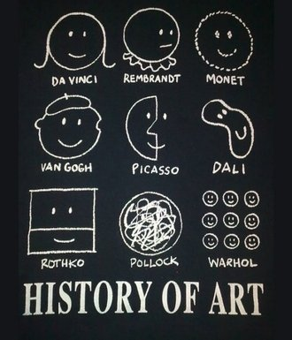

*2011-01-10 20:30 · 手机上网*

---

### 11826

@ 袁涓 你的经验越来越丰富了！

*2011-01-10 19:30 · 网页 给袁涓的回复*

---

### 11827

@ Nos. 我已经用了一年多sms backup+了，但是我的问题不是要保存短信而是要处理大量短信。

*2011-01-10 19:11 · 网页 给Nos.的回复*

---

### 11828

转@ oracle911 一对情侣在大街上吵了起来。女的狠狠甩了男的一耳光，男为保面子向女孩嚷道：“有本事你再甩我一耳光！”女的毫不犹豫再次甩男的一耳光。男的顿了顿，说：“既然你这么听话，我就饶了你。”

*2011-01-10 18:50 · 网页 转自oracle911*

---

### 11829

《Who Rules America》这本书里花不少篇幅介绍了各种公司和基金会的高管和董事会席位间的交叉及其意义。转@ 和菜头 盖茨母亲对盖茨的帮助，在纽约时报她的讣闻里说得很详细： http://is.gd/ktzqA

*2011-01-10 18:46 · 网页 转自和菜头*

---

### 11830

当我开始希望短信有个类似gmail的archive功能时⋯⋯

*2011-01-10 18:39 · 网页*

---

### 11831

@ 徐弘 欢迎。现在这种环境想呆住不容易⋯⋯

*2011-01-10 18:32 · 网页 给徐弘的回复*

---

### 11832

@ 我系一个卧底 听起来很有母爱。

*2011-01-10 13:42 · 网页 给我系一个卧底的回复*

---

### 11833

这就叫专业啊！转@ IvyTang 做了梦，世界上最大的核电站核泄露了，原因是：代码里忽略了高精度向低精度转换时损失的那部分数值。

*2011-01-10 11:36 · 网页 转自IvyTang*

---

### 11834

@ 启钧 好奇。求解！

*2011-01-10 11:35 · 网页 给启钧的回复*

---

### 11835

必须疯掉。

*2011-01-10 03:32 · iPhone版*

---

### 11836

@ 洪小可 你的生活好小资啊！

*2011-01-09 20:47 · 网页 给洪小可的回复*

---

### 11837

Vision without execution is hallucination. --爱迪生

*2011-01-09 16:16 · 网页*

---

### 11838

@ 橘叔 改名聚美优品的那家原名团美，跟我们美团真的完全没关系。

*2011-01-09 01:47 · iPhone版 给橘叔的回复*

---

### 11839

@ champloo 李嘉诚说得很好：建立自我，追求无我。

*2011-01-08 20:26 · iPhone版 给champloo的回复*

---

### 11840

@ 李芳姐 恭喜！加油:)

*2011-01-08 20:22 · iPhone版 给李芳姐的回复*

---

### 11841

网上常见的是那些自己只做到一二十分的人拿别人做到八九十分的例子来嘲笑做到六七十分的人。

*2011-01-08 19:04 · iPhone版*

---

### 11842

fucking loser!!! 我实在是受不了那种见不得女朋友发展得比自己好硬要横加干涉的男人！根本就不是男人！

*2011-01-08 12:01 · 网页*

---

### 11843

男怕入错行，女怕嫁错郎。我对前半句一直很明白，今天才算是见识到后半句。

*2011-01-08 11:43 · iPhone版*

---

### 11844

miui和cyanogen-mod我都试过，都碰到过通讯录突然清空的bug，幸好并不影响google contacts服务器上的备份。另外，并不是所有第三方rom都是业余爱好者出于非商业目的在孤军奋战，例如miui就是一个拿了上千万美金的公司做出来的，只不过以社区的名义发布罢了。

*2011-01-08 00:27 · iPhone版*

---

### 11845

@ Kevin 上回受过伤害后我已经抛弃miui了。现在用的是国外的cyanogen-mod，结果也不靠谱！

*2011-01-07 23:26 · 网页 给Kevin的回复*

---

### 11846

第三方android rom真是害人。今天又经历了一次通讯录突然清空的bug，接到电话和短信时完全不知道对方是谁是非常尴尬的体验。刚才终于恢复了通讯录，发现有一条非常重要的短信没有及时回复:-(

*2011-01-07 23:23 · 网页*

---

### 11847

今晚第一次见到三星的galaxy pad，比ipad小一点，感觉也还不错。

不过，拿着那么大的一块打电话真傻-_-!

*2011-01-07 21:58 · iPhone版*

---

### 11848

转@ 马日拉 做产品最重要的是用心，技术神马的都是浮云，fireworks不会用？没关系，用几小时就是专家。不会写html？没关系，写几十小时就是专家。但是不用心？那技术再好也是白搭。错字连篇，BUG百出，代码写的和狗屎一样垃圾，或者写一句话出现两个全角逗号……全都是我最痛恨的。

*2011-01-07 20:31 · 网页 转自马日拉*

---

### 11849

昨天发烧，于是早早回家蒙头大睡。我睡前特意喝了两大杯水，结果还一夜没有上厕所，可想我出了多大一身汗。谢天谢地，今天就恢复正常了。

*2011-01-07 17:18 · 网页*

---

### 11850

对平台的第一个要求是不能倒掉。在考虑美团应该基于哪家的地图开发时深深体会到这一点。

*2011-01-07 16:51 · 网页*

---

### 11851

@ bloves 到了再租。只剩贵的车了。不过神州租车的人服务态度还不错。

*2011-01-07 16:48 · 网页 给bloves的回复*

---

### 11852

@ quux 还不是新办护照，就是老护照快过期了换发一下而已，一折腾就是半天。流程很不合理，态度也非常冷淡，处处排队。

*2011-01-06 14:09 · iPhone版 给quux的回复*

---

### 11853

@ 李童鞋.冒泡 确实比人画得更像！你用的是什么工具？

*2011-01-06 13:37 · iPhone版 给李童鞋.冒泡的回复*

---

### 11854

@ 团购四方 amazon.com。我是请美国的朋友买了本二手的带回来。

*2011-01-06 12:57 · iPhone版 给团购四方的回复*

---

### 11855

09年下半年我看过一本书《who rules america》。其实我是对中国的情况感兴趣，但是实在找不到像样的公开信息，所以只好看看别国的。

*2011-01-06 12:53 · iPhone版*

---

### 11856

政府部门还是完全没有服务意识。去办个护照还是跟孙子一样。上午没搞定，等一点钟他们恢复上班继续搞。

*2011-01-06 12:34 · iPhone版*

---

### 11857

@ 墨等等 历史遗留问题。中途改成不能重名了。

*2011-01-05 22:26 · 网页 给墨等等的回复*

---

### 11858

转：“在资本面前，连资本家都是渺小的“。

*2011-01-05 22:25 · 网页*

---

### 11859

google除了做出革命性的搜索产品，还一直试图在公司组织形式（主要是避免大公司病）上做出革命性创新，不过目前看来基本算是失败了。现在，facebook除了做出革命性的社交产品，也试图在避免大公司病上做出前所未有的突破。祝他们好运吧。 http://is.gd/k51wR

*2011-01-04 20:47 · 网页*

---

### 11860

happy b-day! 转@ 穆荣均 今天两位同学接受offer，是最好的生日礼物

*2011-01-04 20:32 · 网页 转自穆荣均*

---

### 11861

转@ .rex 跟计算机打交道，费脑子，但是省心。（前者指智商，后者指情商。）

*2011-01-04 14:55 · 网页 转自*

---

### 11862

@ 张跃锋 我现在每天喝普洱。不伤胃。

*2011-01-04 12:39 · 网页 给张跃锋的回复*

---

### 11863

facebook的市场总监及发言人居然是马克的姐姐兰迪-扎克伯格，也是在哈佛学心理学的。 http://is.gd/k3GPG

*2011-01-04 12:12 · 网页*

---

### 11864

@ 张长全 我甚至都不知道有清华百年校庆抽票这回事⋯⋯

*2011-01-04 10:43 · 网页 给张长全的回复*

---

### 11865

每一年都比前一年更激动人心，更需要淡定。

*2011-01-04 10:17 · 网页*

---

### 11866

@ bang 我用的就是g7。几个行家朋友认为明显不如三星i9000。

*2011-01-03 10:05 · iPhone版 给bang的回复*

---

### 11867

我总觉得象拔蚌的壳和比基尼一样，只是起到象征性的遮盖作用。

*2011-01-02 17:47 · 手机上网*

---

### 11868

在第三方app market“n多市场”的帮助下，终于给我的cyanogen-modon g7装上了谷歌地图5。这个新版本确实很棒，矢量地图，本地缓存，速度快了不少。

*2011-01-01 18:10 · iPhone版*

---

### 11869

上传了新照片

*2011-01-01 15:34 · iPhone客户端*

---

### 11870

T3航站楼的c21口实在是太远了，得走老半天。以后要尽量少坐国航和深航，以避开T3。

*2011-01-01 07:55 · iPhone版*

---

### 11871

转发短信：中国传统养生文化总结:只抽烟不喝酒（林彪）63，只喝酒不抽烟（周恩来）73，又抽烟又喝酒（毛泽东）83，又喝酒又抽烟又打牌（邓小平）93，又喝酒又抽烟又打牌又有小老婆又打高尔夫（张学良）103，不抽烟不喝酒不打牌没女朋友也不打球专做好事还不留名（雷锋

*2010-12-31 23:39 · iPhone版*

---

### 11872

@ 洪小可 1号到3号我会在深圳。有什么好去处推荐吗？谢谢！

*2010-12-31 23:03 · iPhone版 给洪小可的回复*

---

### 11873

阅读是我最爱的休闲，可惜过去一年读得太少。今晚总算可以坐下来读书了。

*2010-12-31 23:00 · iPhone版*

---

### 11874

@ 安菲尔德列侬 是的。一本正版书$9.99，虽然不算很便宜，但是稍微算一下，人一辈子也看不了几千美元的书。

*2010-12-31 00:36 · 网页 给安菲尔德列侬的回复*

---

### 11875

@ jingjing 我也听我妈说过我有个表舅就是这么没的。他几岁的时候得了一次痢疾，本来不是什么大事，但当时村里武斗正凶，外面枪声不断，于是耽误了一两天才送医院，结果就来不及了⋯⋯

*2010-12-31 00:33 · 网页 给jingjing的回复*

---

### 11876

一旦要坐下来认认真真读一本书，kindle的电子墨水屏还是比iPad的液晶屏更舒服。所以，我的kindle一代在积了大半年灰尘后又派上用场了。这回看的是zappos创始人谢家华写的《DeliveringHappiness》。

*2010-12-31 00:24 · 网页*

---

### 11877

转@ 丁小云 看梵高跟他弟弟的通信，感觉谈钱比谈艺术还多；看王尔德在狱中给他的同性情人写的那封著名的长信，里面也有N多内容是算小账算对方花了自己多少钱；看巴尔扎克的传记，会发觉这胖子一生拼了老命想赚大钱混进上流社会……所谓艺术气质啊，真是折磨艺术业余爱好者的一种病……

*2010-12-30 16:54 · 网页 转自丁小云*

---

### 11878

回答一个记者问的新年愿望时想起《The Serenity Prayer》。确实超级经典，不仅那个开头广为传播，其实后面一段也并不逊色。虽然是写于一百年前，但是两千年前和两百年后都一样适用，尤其适用于这个需要淡定心态的疯狂时代。 http://is.gd/jKE4X

*2010-12-30 14:22 · 网页*

---

### 11879

@ Kevin 不，是“知乎”。详情请问@ 张亮 。

*2010-12-30 14:13 · 网页 给Kevin的回复*

---

### 11880

@ Kevin 哈哈，我原来听说边江很想做quora，怎么一直没动静呢？

原来跑去做kik了。

*2010-12-30 14:02 · 网页 给Kevin的回复*

---

### 11881

IT男的炫耀贴！转@ Arrix Cr-48被海关扣了

*2010-12-30 13:28 · 网页 转自Arrix*

---

### 11882

转@ 温馨提示你 强烈推荐新一期南都周刊，≪2010那些失踪的新闻≫，开篇提到柏林犹太人纪念馆写有一句话：It happened,therefore, it can happen again, this is the core of what we haveto say.

*2010-12-30 11:57 · 网页 转自温馨提示你*

---

### 11883

我每天收到的垃圾短信有一半来自各个银行。我说，你们学招行不能学点它的优点吗？怎么尽学它狂发短信了？

*2010-12-30 11:54 · 网页*

---

### 11884

@ 唐君毅 从现在到元旦这36小时也能修炼，不用等吧。

*2010-12-30 11:39 · 网页 给唐君毅的回复*

---

### 11885

古人真豪放，唐诗里有“五马南浮一化龙，谢安入相此山空。不知携妓重来日，几树莺啼谷口风”。

*2010-12-30 11:37 · 网页*

---

### 11886

小城市的小机场真方便，从头到尾走不了几步路，不像首都t3那样坐一次飞机把人累个半死。

*2010-12-30 07:14 · iPhone版*

---

### 11887

I failed my way to success. --Thomas Edison

*2010-12-30 00:07 · iPhone版*

---

### 11888

异乡的旅馆，寒冷的冬夜，一杯热水都让我觉得无比温暖。

*2010-12-30 00:06 · iPhone版*

---

### 11889

@ 猪猡懦夫 对，amazon.com上的。不用在网站上加，只要在各种平台的kindle里成功登录就行了。

*2010-12-29 19:31 · 网页 给猪猡懦夫的回复*

---

### 11890

虽然对机场店只剩新君越这一款比较贵的车型不太满意，但是办事要紧，还是从了神州租车。首次租车半价优惠，加上基本保险一天260元。

*2010-12-29 10:22 · 网页*

---

### 11891

一大早机场相当繁忙啊，每一步都排队，包括我最喜欢的汉堡王早餐。

*2010-12-29 07:08 · iPhone版*

---

### 11892

正在比较明天到了之后的租车选择。至尊租车在那个城市没开展业务，直接忽略。一嗨租车和神州租车都列出很多很便宜但是已订满的车型，只有几个贵不少的车型实际可用。不爽。

*2010-12-29 02:06 · 网页*

---

### 11893

刚订了票，明早7点40的航班。携程有进步，以前似乎不能24小时订票的。

*2010-12-29 01:35 · 网页*

---

### 11894

我居然用过这么多kindle终端？我自己也被吓了一跳-_-!

*2010-12-29 01:19 · 手机上网*

---

### 11895

那些串联各种时髦词汇造成的句子看似聪明，但很容易就腻了。

*2010-12-28 23:16 · 网页*

---

### 11896

@ DonglinChen 凭一些非常外围的网络上的信息是不足以做这些判断的。

*2010-12-28 23:01 · 网页 给DonglinChen的回复*

---

### 11897

据说facebook有五六百工程师，但只有三四十个产品经理。

*2010-12-28 20:40 · iPhone版*

---

### 11898

Zynga的总员工数和facebook差不多，工程师数量比facebook还多。

*2010-12-28 19:58 · iPhone版*

---

### 11899

和两个ex-googler吃饭。现在一个在facebook，另一个在zynga。

*2010-12-28 19:55 · iPhone版*

---

### 11900

工科男分手记 http://xkcd.com/833/

*2010-12-28 18:05 · 网页*

---

### 11901

学术男！转@ jay.m 厦门海域的现存鱼类，其优势种按重要性排列如下：龙头鱼（丝丁鱼）、叫姑鱼（加网仔）、中华海鲶（ 鱼）、凤鲚、条纹斑竹鲨（狗鲨）、海鳗（鳗鱼）、六指马鲅、二长棘鲷（赤鬃仔）、短吻、棕腹刺鲀（乌仔）、鹿斑等。赤棕鱼适合干煎或煮酱油水，味道鲜甜，鱼肉嫩。

*2010-12-28 16:51 · 网页 转自jay.m*

---

### 11902

转@ 一四九二 RT @ dufake : 今天看的最逗的笑话：老婆问老公：“我要是疯了，你还会爱我吗？”老公坚定的说：“爱！”老婆沉思了一会，忧愁地说：“你果然爱的是我的外表！”

*2010-12-28 14:39 · 网页 转自一四九二*

---

### 11903

韩寒的《独唱团》要关门了？哦，千团大战又少了一个选手。

*2010-12-28 12:07 · 网页*

---

### 11904

@ 袁涓 但是不爱黑眼圈^_^。早点休息吧!

*2010-12-28 02:23 · 网页 给袁涓的回复*

---

### 11905

转@ 穆荣均 饭否招聘职位更新了，求围观： http://is.gd/jz2Su

*2010-12-27 22:47 · 网页 转自穆荣均*

---

### 11906

新办公室有个问题，晚上打车不如原来在紫金数码园那么方便。中关村西区的规划建设真是不咋地。

*2010-12-27 22:20 · iPhone版*

---

### 11907

@ bang 我的发型就没有这种烦恼，无论男女老少理发师都一样麻利：套上3毫米卡尺，猛推两到三分钟。

*2010-12-27 22:00 · 网页 给bang的回复*

---

### 11908

刚在饭否收到一条私信，一个朋友说了件不如愿的事。我只想说：这个世界有无数无奈，但依然精彩。

*2010-12-27 21:55 · 网页*

---

### 11909

Amazon记载，2009年8月2日，我在他们家的kindle store里买了这本书《Who Controls the Internet?: Illusions of a Borderless World》

http://is.gd/jyUmj

*2010-12-27 21:52 · 网页*

---

### 11910

我也玩了一下遥控直升机，还真不太好控制。试了几次想把它飞到离我十米左右的一个女同事那里都未遂。

*2010-12-27 21:40 · 网页*

---

### 11911

办公室里有人在玩遥控直升机，居然是USB充电的。

*2010-12-27 21:26 · 网页*

---

### 11912

足够牛逼的互联网产品肯定不服中国水土，但是足够牛逼的产品模式肯定可以横扫五湖四海长城内外。转@ 盘东子 @ 王兴 我担心的是，Quora是否能服中国的水土。

*2010-12-27 21:13 · 网页 转自盘东子*

---

### 11913

所有关于网络和物理世界的对比都应考虑到这一点：一双袜子不能同时放在两个抽屉里，但是一个文件可以同时在两个文件夹里。

*2010-12-27 21:05 · 网页*

---

### 11914

Quora确实是几年才得一见的互联网产品创新。它融会贯通了过去十年最有影响力的几大互联网产品的闪光点：blog, wikipedia,facebook, twitter。且看以组织全世界信息为己任的google如何应对吧。

*2010-12-27 20:57 · 网页*

---

### 11915

每次有不和谐事件，我都会想起中学时看过的《第三只眼看中国》这本书。

*2010-12-27 20:48 · 网页*

---

### 11916

转@ CaoCong 这次在海外过圣诞节，才知道后面紧挨着一个BOXING Day （节礼日），其由来说法不一。不过有一个解释挺有意思，就是打开盒子，查收礼物的日子，因为这一天各大商场都在打折，对于众多酷爱shopping的女性而言，不失为一种礼物...

*2010-12-27 20:46 · 网页 转自CaoCong*

---

### 11917

@ peter 不，我并不是想通过li nkedin来招聘。

*2010-12-27 20:01 · 网页 给peter的回复*

---

### 11918

@ peter 不急。我感兴趣的事情很多，但是眼前能做的不多，得一件一件来。

*2010-12-27 19:48 · 网页 给peter的回复*

---

### 11919

转@ gravity0 概率是门大学问。银行靠概率吃饭，所有储户一起提款它就得关门；保险公司也一样，所有客户都遭灾它就破产；就连电信公司也是，所有用户都跑满它卖出去的带宽它就拥堵，所以才有互联星空这种恶心东西。最倒霉的是电力公司，用电量大了它发电量不够，用电量少了它多发的电没地方存

*2010-12-27 19:45 · 网页 转自gravity0*

---

### 11920

@ Dyana 你的新头像太萝丽了！

*2010-12-27 18:57 · 网页 给Dyana的回复*

---

### 11921

因为工作需要，第一次有想买li nkedin付费帐号的冲动。看来所有freemium产品的设计都有道理，之前不理解是因为自己那时还不是目标用户。

*2010-12-27 17:31 · 网页*

---

### 11922

公司开会，发现用android手机的人越来越多了。

*2010-12-27 17:23 · 网页*

---

### 11923

@ terababy 好下流

*2010-12-26 22:02 · iPhone版 给terababy的回复*

---

### 11924

转@ lijb87 据说，70%的美国小盆友认为剩蛋老人是中国的，因为早上醒来袜子里的礼物上总写的是made in China...

*2010-12-26 16:46 · 网页 转自lijb87*

---

### 11925

美国媒体热议扎克伯格也就罢了，国内媒体也纷纷凑热闹跟进报道是为了什么呢？告诉读者那个年轻人做了一个极牛逼但是在中国却根本不能访问的网站？这实在是讽刺了。

*2010-12-26 16:05 · 网页*

---

### 11926

google translate虽然不常用，但真到要用的时候确实很顶事。

*2010-12-26 03:06 · 网页*

---

### 11927

@ GiantJoy 白水煮蛋吧。

*2010-12-26 00:15 · 网页 给GiantJoy的回复*

---

### 11928

字体专家@ Kevin 小朋友碰到来自苹果内部的对手了。转@ 一勺 @王兴 其实不是，我们有自己的字体。

*2010-12-25 20:07 · 网页 转自一勺*

---

### 11929

新买了一批服务器，过几天搬到机房去:)

*2010-12-25 18:37 · 手机上网*

---

### 11930

居然真能访问。转@ chinadog twitter上看来的： http://☃.net

*2010-12-25 17:39 · 网页 转自chinadog*

---

### 11931

弟媳太有才了！转@ jingjing 源于性生活，高于性生活。——一个北鼻的诞生。

*2010-12-25 17:37 · 网页 转自jingjing*

---

### 11932

@ 苑小帅 机身左侧usb口边上有几个非常精细的小孔。我听到过air在负荷很高时启动风扇后的声音，确实不小。

*2010-12-25 17:35 · 网页 给苑小帅的回复*

---

### 11933

@ 沈鹏鹏 体验乡村基的感觉如何？我听不止一个人说他们家的快餐确实好吃。

*2010-12-25 14:14 · 网页 给沈鹏鹏的回复*

---

### 11934

在Magic Mouse的表面上，单指滑动是滚动，双指左右拨是浏览器前进后腿；在MacBook Air的触控板上，双指滑动是滚动，三指左右拨是浏览器前进后退。在这两者之前切换会稍稍有点不适应。

*2010-12-25 02:32 · 网页*

---

### 11935

对我提到的那个名字风格和“饭否”很接近的国产Quora有兴趣的同学，请联系@ 张亮 老师。

*2010-12-25 02:27 · 网页*

---

### 11936

《非诚勿扰2》很一般，就是个拼凑起来的续集。不过看的过程中我想到一个问题，一直生活在北方城市例如北京的人，会不会对“山雨欲来风满楼”是怎么回事并没有很深切的感受？

*2010-12-25 02:22 · 网页*

---

### 11937

@ 远骋 你没问题的！

*2010-12-24 23:29 · iPhone版 给远骋的回复*

---

### 11938

在ume安贞买不到《非诚勿扰2》的票，于是转战鸟巢旁边的cgv星星影城。这家影院绝对应该感谢美团，否则我不会知道它的存在。

*2010-12-24 22:52 · iPhone版*

---

### 11939

碰到专家小朋友了。转@ Kevin @ 王兴 这也是我最爱的字体，叫Myriad Pro，它本身就有三十个变体，包括 Bold Italic CondensedLight SemiExt 等。

*2010-12-24 21:53 · 网页 转自Kevin*

---

### 11940

@ bang 最实在。我喜欢！

*2010-12-24 21:47 · 网页 给bang的回复*

---

### 11941

苹果对字体的关注真是非同寻常。连MacBook和Air这两个词都要一个用粗体另一个不用。

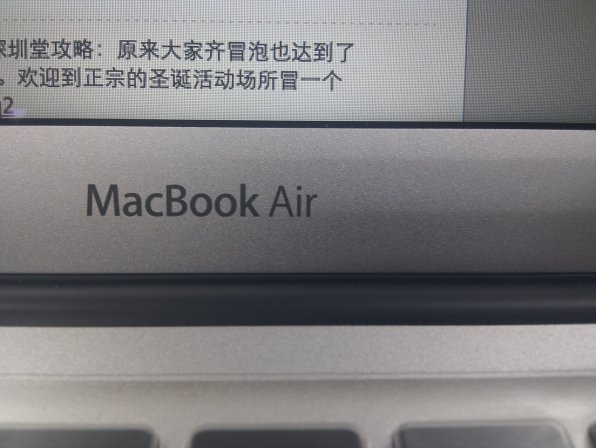

*2010-12-24 21:47 · 手机上网*

---

### 11942

抽空把我的G7刷成了CyanogenMod-6.1.1，终于解决了前段时间一打开电话本就崩溃的毛病。

*2010-12-24 21:03 · 网页*

---

### 11943

@ Sanz 用m.fanfou.com底部的“发照片”链接或者饭否的iphone客户端或者symbian版的饭否拍拍。

*2010-12-24 20:18 · 网页 给Sanz的回复*

---

### 11944

这个答案很接近了。转@ 杰的杰 知否？ 然后下面的文字是 知之为知之，不知为不知，是之也。好像太没技术含量了... 转@ 王兴 刚听说几个创业的朋友给他们的问答网站起了一个和“饭否”风格颇接近的名字:-)

*2010-12-24 20:04 · 网页 转自王兴*

---

### 11945

@ ff112 我只是把我用macbook air的感受都记下来而已。当好产品经理的一个重要途径就是用各种好产品并明白它们好在哪里。

*2010-12-24 19:47 · 网页 给ff112的回复*

---

### 11946

转@ 浪子 “人们并不止想听到一个话题，而是想听到关于这个话题最体面、有趣的说法”──美国《Harpers》杂志主编拉普曼给参加宴会的人的聊天建议，而我觉得，这也是做杂志写作者，与新闻写作者的区别之一 via蔡崇达

*2010-12-24 18:43 · 网页 转自浪子*

---

### 11947

苹果会犯电源线挡住usb口这种低级错误吗？不会的，macbook的充电口虽然是方形的，但是转180度照用不误。

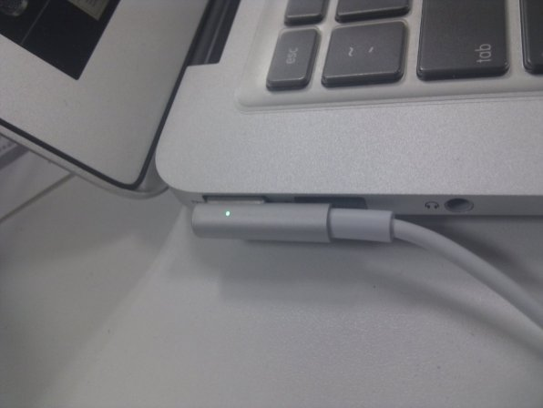

*2010-12-24 18:31 · 手机上网*

---

### 11948

@ 喵呜.杨曜睿 对，air二代13寸低配。

*2010-12-24 17:06 · 网页 给喵呜.杨曜睿的回复*

---

### 11949

@ 于欣烈 对我这样并不需要超强计算能力的用户来说，macbookpro比起air有什么优势？我永远不会嫌电脑太轻，永远不会嫌电池续航时间太长。

*2010-12-24 17:03 · 网页 给于欣烈的回复*

---

### 11950

转@ 浅浅 据说俄语是像诗一样的语言，很多作家都喜欢俄罗斯的文学，我喜欢俄罗斯方块。

*2010-12-24 17:01 · 网页 转自浅浅*

---

### 11951

@ 鸝.se 难道北欧不是年年白色圣诞吗？

*2010-12-24 17:00 · 网页 给鸝.se的回复*

---

### 11952

macbook air的硬件真是无敌。屏幕显著的比我之前的x60更好。好几个朋友第一次拿起air时都问“电池在哪里”？那么薄的电池却续航能力超强，昨晚和同事们抱着笔记本开长会时这个优势非常明显。

*2010-12-24 15:32 · 网页*

---

### 11953

别再找我要quora邀请码了，我也没有quora帐号。我没有在那里回答过问题，只是去看各种回答，那根本不需要有帐号，就像用百度知道那样。例如 http://is.gd/jlw0b

*2010-12-24 11:33 · 网页*

---

### 11954

刚发现受到按压时macbook的触控板并不是整块平行下移，而是以靠

近键盘的那一端为轴转动。

*2010-12-24 11:29 · 网页*

---

### 11955

连续几天三点以后睡了。

*2010-12-24 03:07 · 网页*

---

### 11956

刚听说几个创业的朋友给他们的问答网站起了一个和“饭否”风格颇接近的名字:-)

*2010-12-23 14:22 · 网页*

---

### 11957

@ 过无双 需要打开“设置－触控板－单指－拖移”才能这么做，默认配置是不行的。

*2010-12-23 14:19 · 网页 给过无双的回复*

---

### 11958

@ 庞通 因为我喜欢。

*2010-12-23 14:06 · 网页 给庞通的回复*

---

### 11959

macbook触控板上选择一段文字不太方便，我经常要用两个手指才能完成这个操作。打开“设置－触控板－单指－拖移”选项后才略有改善。

是不是我没掌握正确用法？

*2010-12-23 14:04 · 网页*

---

### 11960

转@ 魏武挥 红卫兵曾要求把红灯停绿灯行的规矩给改成红行绿停 因为红色怎么可以是停止前进的信号呢

*2010-12-23 09:40 · 网页 转自魏武挥*

---

### 11961

听从几个专业人士的建议，出于信息安全的考虑，开始用mac工作，尽量少用windows。

*2010-12-22 23:50 · 网页*

---

### 11962

才几点呢，真是饱汉不知饿汉饥啊。转@ 我系一个卧底 失眠……

*2010-12-22 23:12 · 网页 转自我系一个卧底*

---

### 11963

一步一步变好中:-) 转@ 饭否 也许，你现在可以试一下搜索？

*2010-12-22 18:59 · 网页 转自饭否*

---

### 11964

Quora确实已经成为一个重要的信息来源了。

*2010-12-22 15:09 · 网页*

---

### 11965

招商银行居然针对windows手机推出优key，也就是一个micro sd卡，插进去之后手机才能上招行。国外的网银基本上就是个普通网站。国内的网络环境真的有这么险恶吗？

*2010-12-22 10:17 · 网页*

---

### 11966

@ fanfancan 国内用得比较多的是 jiathis 和 bshare 吧。不出意外的话，我下周会见到 bshare 的哥们。

*2010-12-21 23:52 · 网页 给fanfancan的回复*

---

### 11967

@ 桃子 真是如你头像般跳跃的人生啊。

*2010-12-21 21:43 · 网页 给桃子的回复*

---

### 11968

吃饭成为一种负担。

*2010-12-21 20:50 · 网页*

---

### 11969

07年和一个师兄应邀回清华电子系和师弟们交流。师兄说，大一不知道自己不知道，大二知道自己不知道，大三不知道自己知道，大四知道自己知道。我随后发言时只能说，我觉得自己一直都还在大二。

*2010-12-21 20:47 · 网页*

---

### 11970

gmail开始在邮件底部和操作按钮之间插广告栏了:-(

*2010-12-21 20:36 · 网页*

---

### 11971

转@ gravity0 台湾哥们在这里上不了脸书，就说这里＂人人＂＂开心＂不要脸不要书。我说我们连鸟也不要了（指推特），我们只顾饭否。

*2010-12-21 19:35 · 网页 转自gravity0*

---

### 11972

@ 盖文张 我的android同步google contacts是有点问题，但并非完全不同步。不知道和米聊有没有关系。

*2010-12-21 14:48 · iPhone版 给盖文张的回复*

---

### 11973

@ 我系一个卧底 其实黄道也不错。

*2010-12-21 14:25 · 网页 给我系一个卧底的回复*

---

### 11974

居然不困。

*2010-12-21 04:25 · 网页*

---

### 11975

@ 盖文张 雷军要是不在米聊上那还像话吗？

*2010-12-21 04:20 · 网页 给盖文张的回复*

---

### 11976

@ duberry 欢迎年轻的妈妈:-)

*2010-12-21 04:13 · 网页 给duberry的回复*

---

### 11977

@ 鄧小樺 欢迎！

*2010-12-21 04:09 · 网页 给鄧小樺的回复*

---

### 11978

比起其他牌子的笔记本，macbook的触摸板面积大许多。光这一点就决定了它的使用体验会更好。

*2010-12-20 16:24 · 网页*

---

### 11979

投行的人果然是人精啊！转@ champloo 搞定小人秘诀无他 唯真诚二字 因为小人的拿手本领就是分辨好人和坏人 所以作自己是不二法门

*2010-12-20 16:22 · 网页 转自champloo*

---

### 11980

没想到饭否上有这么多人会日语。我在04年曾经试图自学日语，不过没有坚持下来。

*2010-12-20 15:51 · 网页*

---

### 11981

英文里有个单词叫sensei，是对人的敬称，显然源自“先生”一词，可惜是从日文传过去的。

*2010-12-20 15:43 · 网页*

---

### 11982

macbook外接显示器确实处理得很人性化。我第一次用也没有任何障碍，不像以前在windows和linux下多显示器都得折腾一番。第一次设好以后，每次插拔外接显示器都会自动配置好，很省心。唯一美中不足的是macbook的显示屏不能完全打开到水平角度。

*2010-12-20 10:53 · 网页*

---

### 11983

@ 于欣烈 我们家乡的牛杂和炸猪皮清汤粉也很不错滴。

*2010-12-20 00:54 · 网页 给于欣烈的回复*

---

### 11984

android上的搜狗输入法太奇怪了，输入“杨”字后的第一联想词居然是“贵妃秘史”。我可从来没有输入过这些玩意儿。

*2010-12-18 19:15 · 网页*

---

### 11985

转@ gravity0 每次取款机吐出的都是连号的钞票，这些钱从印刷机直接到手从未经过流通。不用学习任何狗屁理论就知道你的苦难和资本家剥削剩余价值或是菜饭子哄抬物价关系不大，仅仅是钞票印多了而已。作为抛头颅洒热血的回报，除了土地还有印钞权，血酬定律数千年不变。

*2010-12-18 14:55 · 网页 转自gravity0*

---

### 11986

“拥抱变化”对创业者来说不是一句口号，而是实实在在的事。过去不到7年的时间里，我在10个地方办过公：海丰园A，海丰园B，华清嘉园20号楼，中国人寿大厦，静安中心，华清嘉园13号楼，清华同方科技广场，华清嘉园6号楼，东华合创大厦，远中悦来大厦。

*2010-12-18 14:36 · 网页*

---

### 11987

第一次在新办公室上网:-)

*2010-12-18 14:28 · 网页*

---

### 11988

@ 小李飞刀0 瑞星这么流氓会死得更快吧。不用杀毒软件的我飘过。

*2010-12-18 11:09 · 网页 给小李飞刀0的回复*

---

### 11989

学了一个现金流相关的公式：CCC=DIO+DSO-DPO。

*2010-12-18 10:59 · 网页*

---

### 11990

昨晚似乎做了个跟摩尔多瓦有关的梦，但是现在完全想不起具体内容了。

*2010-12-18 10:52 · 网页*

---

### 11991

果然，雅虎说不会直接关闭delicious而是会寻求出售了。直接关掉一个alexa排名全球第255的网站完全是傻到家的举动嘛。我最近半个月还用过delicious呢。

*2010-12-18 10:32 · 网页*

---

### 11992

前两天第一次听说“偷票房”这种事：想买《大笑江湖》，但是售票员给你的却是《赵氏孤儿》的票，不过你凭这票一样可以看《大笑江湖》。差别只是《大笑江湖》的票房被《赵氏孤儿》偷走了。

*2010-12-17 23:12 · 网页*

---

### 11993

@ iFire 想要屏蔽某人，可以到他的页面右栏底部点“加入黑名单”。

*2010-12-17 11:50 · 网页 给iFire的回复*

---

### 11994

李嘉诚创办的长江商学院的立院宗旨是“取势、明道、优术”。

*2010-12-17 11:33 · 网页*

---

### 11995

福建都下雪了，北京还没下。转@ DonglinChen 龙岩下雪啦，好像去看雪...

*2010-12-17 02:22 · 网页 转自DonglinChen*

---

### 11996

我差不多是同时接触钢琴和电脑的，结果我更喜欢键多的那个。 转@quux 钢琴家和程序员的区别在我看来不是很大，都是键盘活，只不过一个看显示器，一个看琴谱

*2010-12-17 02:18 · 网页 转自quux*

---

### 11997

看了《让子弹飞》。姜文就是姜文，姜文还是姜文。

*2010-12-17 01:37 · 网页*

---

### 11998

@ 团购之家 居然在这里看到你！欢迎:-)

*2010-12-17 01:29 · 网页 给团购之家的回复*

---

### 11999

今晚穿西装打领带了，第一次在工作场合这么干，以往都是为了参加婚礼。

*2010-12-16 22:42 · 网页*

---

### 12000

@ 何为 这部电影好像没有正式引进，所以才需要自己包场看。

*2010-12-16 17:34 · 网页 给何为的回复*

---

### 12001

macbook触摸板的一指／二指／三指／四指操作都设计得很合理，用起来很顺，比鼠标更好。

*2010-12-16 02:10 · 网页*

---

### 12002

千金散尽还复来

*2010-12-16 01:55 · 网页*

---

### 12003

转@ 杨俊 美团网哈尔滨站开站啦！哈市精品服务2~5折，赶紧上去瞧瞧！www.meituan.com/haerbin 开站特献：仅售13元！价值63元的阿萨帝量贩式KTV（文昌旗舰店）迷你包4人行套餐不限时，使用多张美团券可升级包厢，每个包厢另赠爆米花和山楂片各1份。

*2010-12-16 00:15 · 网页 转自杨俊*

---

### 12004

死者长已矣，存者且偷生。RIP. 转自@ 郁殷 嗯，來自台灣的獨立微博Buboo將於2011年1月1日永久關閉。

*2010-12-16 00:14 · 网页 转自郁殷*

---

### 12005

我是一个喜欢吃面食的福建人。

*2010-12-15 23:37 · 网页*

---

### 12006

转@ hizi 熊培云：北京的风好大啊，刚出地铁，我的假发就被吹掉了。好不容易追上了，还跑来个人，说是他的。

*2010-12-15 12:21 · 网页 转自hizi*

---

### 12007

@ TengLau 短信发给饭否和发给你的一个朋友是一样的。

*2010-12-15 11:38 · 网页 给TengLau的回复*

---

### 12008

关于日记局长韩峰被判13年的新闻请联系此条。转@ lijb87 新任书记请教纪检工作如何把握度。老书记说：简单！ 就象煮汤圆，自己漂起来的你就捞，沉在底下的别瞎搅和！

*2010-12-15 11:35 · 网页 转自lijb87*

---

### 12009

转@ lijb87 路加福音上说：“手扶犁向后看的不配进神的国。”

*2010-12-15 11:04 · 网页 转自lijb87*

---

### 12010

@ 小柒柒 这个活动是绝对公平的。多邀几个朋友来参加，你中奖的就会就增加啦:-)

*2010-12-15 00:55 · 网页 给小柒柒的回复*

---

### 12011

转@ 上官牛顿 西安事变，张无忌，杨不悔；安史之乱，郭破虏，李莫愁 。妙对

*2010-12-15 00:18 · 网页 转自上官牛顿*

---

### 12012

@ 潘欣 欢迎潘爷。

*2010-12-14 23:08 · 网页 给潘欣的回复*

---

### 12013

WebOS上也有饭否客户端了:-) 转@ 家乐 转@ imWebOS WebOS饭否客户端 http://webos.noteday.com http://fanfou.com/photo/pf8...

*2010-12-14 21:42 · 网页 转自imWebOS*

---

### 12014

转@ lijb87 小龙女跳涯16年后，杨过左手的武功天下无敌。

*2010-12-14 20:40 · 网页 转自lijb87*

---

### 12015

@ 于欣烈 非常同意。鬼吹灯越到后来越烂，这也是作者功力不够的

典型表现。

*2010-12-14 20:33 · 网页 给于欣烈的回复*

---

### 12016

我夸某人真靠谱。答曰：只是为了认真的混口饭吃。

*2010-12-14 15:58 · 网页*

---

### 12017

@ 徐辉 诚哉斯言！

*2010-12-14 15:53 · 网页 给徐辉的回复*

---

### 12018

@ Heidi.ai 你网站上那张三峡的照片我喜欢。小时候没有去三峡是我的一大遗憾。

*2010-12-14 15:11 · 网页 给Heidi.ai的回复*

---

### 12019

@ lijb87 你突然不发黄段子了，我反而不太适应。我得去查一下莫里·施瓦茨是谁。

*2010-12-14 15:00 · 网页 给lijb87的回复*

---

### 12020

转@ 德德玛 他9岁彻底失明，有记者问这是否从精神上摧毁了你？他回答，不会的，那时我还没有精神。灾难来的太早，它扑了个空。

——周云蓬

*2010-12-14 14:58 · 网页 转自德德玛*

---

### 12021

问了多普达的董事长陈主望，他的回答是：dopod这个名字和整套logo之类的东西都是01年请纽约的一个公司做的，没有受ipod影响。

*2010-12-14 12:49 · 网页*

---

### 12022

geek男的显摆！！！ 转@ Pudding 部门美女秘书买了我翻译的书并要求签名 *^_^*

*2010-12-14 11:57 · 网页 转自Pudding*

---

### 12023

刚才被维基百科误导了:-( 经过几个朋友提醒，我又去查了一下。多普达自己的网站说dopod这个品牌是02年创立的。还是比ipod晚一些。

http://j.mp/gZYtZI

*2010-12-14 11:42 · 网页*

---

### 12024

维基百科说多普达dopod是04年创立的品牌，而苹果于01年推出iPod。

*2010-12-14 10:42 · 网页*

---

### 12025

@ Heidi.ai 无。谢谢:-)

*2010-12-14 10:34 · 网页 给Heidi.ai的回复*

---

### 12026

多普达的英文名是dopod，应该是受苹果ipod的影响吧。

*2010-12-14 10:29 · 网页*

---

### 12027

制度和文化。

*2010-12-14 01:42 · 网页*

---

### 12028

@ champloo 投行生活很有趣嘛

*2010-12-13 18:06 · 网页 给champloo的回复*

---

### 12029

推荐给产品经理们，包括异常勤奋的@ 徐辉 。转@ jason5ng32 欢迎参加极客公园本期线下讨论：从Quora看社会化问答，除了讨论Quora外，这期活动还会邀请大家点、搜狗输入法、优众的负责人来做分享： http://www.geekpark.net/event/

*2010-12-13 14:16 · 网页 转自jason5ng32*

---

### 12030

@ 徐辉 如果马占凯也去的话，本周六这个产品经理聚会应该值得期待。 http://is.gd/iEpxM

*2010-12-13 14:11 · 网页 给徐辉的回复*

---

### 12031

@ luclan 这篇文章的信息量不错，但是typo多到令我惊讶的地步！

*2010-12-13 13:35 · 网页 给luclan的回复*

---

### 12032

@ 莓有此人 哪里，哪里？求黑莓饭否客户端的网址！

*2010-12-13 12:24 · 网页 给莓有此人的回复*

---

### 12033

@ Pudding 这个逻辑确实有点残。

*2010-12-13 12:23 · 网页 给Pudding的回复*

---

### 12034

@ 沙杰 有个更委婉的说法：和其他人一样，你是独一无二的。

*2010-12-13 12:06 · 网页 给沙杰的回复*

---

### 12035

果然说到做到。赞！ 转@ 徐辉 开工啦！

*2010-12-13 08:48 · 网页 转自徐辉*

---

### 12036

@ 小熊娃娃 很多银行不是每天凌晨都维护系统吗？

*2010-12-13 02:35 · 网页 给小熊娃娃的回复*

---

### 12037

@ champloo welcome back!

*2010-12-13 02:22 · 网页 给champloo的回复*

---

### 12038

创业者的榜样啊。转@ 徐辉 睡觉，争取明天5:30起来工作。

*2010-12-13 02:17 · 网页 转自徐辉*

---

### 12039

@ hantt 欢迎韩总！

*2010-12-13 02:14 · 网页 给hantt的回复*

---

### 12040

@ StanleyDu 不好意思，饭否的实时搜索还没恢复，所以hashtag还不能用。

*2010-12-12 21:34 · 网页 给StanleyDu的回复*

---

### 12041

@ 侬佐 谢谢支持！刚来饭否的话，建议你多转转，多关注几个自己感兴趣的人。

*2010-12-12 18:26 · 网页 给侬佐的回复*

---

### 12042

房价上升对对数码产品的销售是利好还是利空？在疯狂的房价面前，所有数码产品都像是白菜价了。

*2010-12-12 16:39 · 网页*

---

### 12043

不知不觉就搞成了两个人用6台电脑，2个iPad和4个手机⋯⋯

*2010-12-12 16:30 · 网页*

---

### 12044

@ .rex 前几天看到饭否上有人把IE、Firefox、Chrome比喻成日军、国军、共军，感觉很贴切:-)

*2010-12-12 12:27 · 网页 给.rex的回复*

---

### 12045

@ 回眸涟漪 不是你的问题。这部分代码还没有修复。

*2010-12-12 03:10 · 网页 给回眸涟漪的回复*

---

### 12046

@ NetPuter 上个星期，我那三岁和一岁半的两个外甥女住在我家。

看到她们喝奶的容器时，我会想起你。

*2010-12-12 02:38 · 网页 给NetPuter的回复*

---

### 12047

转@ 胡淑芬 这位是著名导演冯老师，这位是著名演员葛老师，这位是著名东东枪老师。 # 拿名人造句玩 #

*2010-12-12 02:34 · 网页 转自胡淑芬*

---

### 12048

@ luanyu 貌似是@ 安庆卢十四 原创的。

http://fanfou.com/statuses/...

*2010-12-12 02:32 · 网页 给luanyu的回复*

---

### 12049

狗受得了。转@ 带三个表 你们说如果有一天人民日爆了咋办？

*2010-12-12 02:17 · 网页 转自带三个表*

---

### 12050

@ 杨金平 我不越狱。

*2010-12-12 02:16 · 网页 给杨金平的回复*

---

### 12051

把iPad升级到iOS 4.2有一个星期了。只有多任务这一个新特性有用，

但这已经令我很满意了。

*2010-12-12 02:08 · 网页*

---

### 12052

用了一年多的iMac，觉得作为一个家用机还是相当不错的。苹果的产品确实胜在软硬件结合。

*2010-12-12 01:52 · 网页*

---

### 12053

狭路相逢勇者胜。

*2010-12-12 00:27 · 网页*

---

### 12054

@ 阿虎 他在骗你。

*2010-12-11 21:23 · 网页 给阿虎的回复*

---

### 12055

@ 徐辉 听说你们很猛啊。

*2010-12-11 21:10 · 网页 给徐辉的回复*

---

### 12056

又一个力挺的。 转@ 平客 子弹确实好看，再怎么一边倒的好评，也不能影响它好看的本质！而且是非常非常好看。

*2010-12-11 20:48 · 网页 转自平客*

---

### 12057

听深圳朋友说那里已经连续发生几起绑架小学生并且收钱后还撕票的案子。别说普通的道德沦丧，已经完全没有职业道德的底线了。

*2010-12-11 15:54 · 网页*

---

### 12058

@ 天天 多谢:-)

*2010-12-10 23:49 · 网页 给天天的回复*

---

### 12059

@ 独孤秋秋 不可能啊。饭否的服务器就在廊坊。

*2010-12-10 23:22 · 网页 给独孤秋秋的回复*

---

### 12060

其实今天的《The Social Network》观影是@ luclan 组织的。

*2010-12-10 23:20 · 网页*

---

### 12061

晚上快十一点了，北二环还堵。

*2010-12-10 22:49 · 网页*

---

### 12062

在moma百老汇影城看pe.vc这个机构包场的电影social networks。

*2010-12-10 20:32 · iPhone版*

---

### 12063

@ quux 问题是google finance把最基础的数据搞错了不少，例如把携程的市值算高了一倍。

*2010-12-10 20:10 · iPhone版 给quux的回复*

---

### 12064

@ Dreamwords 谢谢:-)

*2010-12-10 15:53 · 网页 给Dreamwords的回复*

---

### 12065

@ Ally600 你在哪里呀？

*2010-12-10 14:29 · 网页 给Ally600的回复*

---

### 12066

@ 带三个表 电脑浏览器也可以访问m.fanfou.com通过底部的链接发图片。另外，今天刚进入苹果app store的饭否iphone客户端和之前已经有的饭否S60客户端＂饭否拍拍＂都可以直接拍照上传。

*2010-12-10 14:20 · 网页 给带三个表的回复*

---

### 12067

@ 带三个表 也在开会，也不喜欢。

*2010-12-10 13:49 · iPhone客户端 给带三个表的回复*

---

### 12068

@ nnnnon oauth会做，但是还得等一等。要做的事太多了。

*2010-12-10 13:39 · 网页 给nnnnon的回复*

---

### 12069

@ ouspec :-)

*2010-12-10 12:38 · 网页 给ouspec的回复*

---

### 12070

非常欢迎！转@ 北湖小鱼 @ 王兴 android的呢？再不出我就自己开发了。。。

*2010-12-10 12:05 · 网页 转自北湖小鱼*

---

### 12071

@ 熊猫功夫茶 no. 新浪上的@ 王兴 跟我完全没关系。

*2010-12-10 11:50 · 网页 给熊猫功夫茶的回复*

---

### 12072

终于用上饭否iphone客户端了。稍显简陋，欢迎大家多提意见。@ 史册伟 的开发实力超强，就等各种建议了。

*2010-12-10 11:38 · iPhone客户端*

---

### 12073

还有很多细节可以改进，但是至少有了，先有后好。多谢@ 史册伟同学友情支持！ 转@ 史册伟 童鞋们，饭否的iPhone版已经审核通过了，App Store上搜索“饭否”进行下载

*2010-12-10 11:17 · 网页 转自史册伟*

---

### 12074

还得继续等…… 转@ 史册伟 饭否的客户端app store审核中，苹果的审核人员看错了默认密码，被reject。给他们回复指出了，不知道要延误多久

*2010-12-10 10:13 · 网页 转自史册伟*

---

### 12075

今天穿了一件买来十几年只穿过一两次的衣服。

*2010-12-10 09:42 · 网页*

---

### 12076

@ Acumon yes. I will be there.

*2010-12-10 00:16 · 网页 给Acumon的回复*

---

### 12077

我最喜欢技术男的笑话了:-) 转@ terababy A SQL query goes intoa bar, walks up to two tables and asks, "Can I join you?"

*2010-12-10 00:13 · 网页 转自terababy*

---

### 12078

@ 盖文张 啥也别说了，创业吧。

*2010-12-09 17:46 · 网页 给盖文张的回复*

---

### 12079

@ 马日拉 你看没看《西风烈》？有何评价？

*2010-12-09 17:28 · 网页 给马日拉的回复*

---

### 12080

@ 盖文张 这么神？那僧人认识你吗？

*2010-12-09 16:50 · 网页 给盖文张的回复*

---

### 12081

马老师继续无底线的力挺，不过换了更有趣的方式…… 转@ 马日拉 看完《让子弹飞》后，好看他妈哭了，因为好看死了……

*2010-12-09 16:37 · 网页 转自马日拉*

---

### 12082

最好的对抗是热爱生活。

*2010-12-09 14:49 · 网页*

---

### 12083

赞行动力！我只是说了还没做呢。转@ 申音 去豆瓣上购了昨天@ 王兴 同学推荐的《三体》，还有我超级粉的徐皓峰《大日坛城》

*2010-12-09 11:56 · 网页 转自申音*

---

### 12084

@ 张长全 we make tools. tools shape us.

*2010-12-09 11:38 · 网页 给张长全的回复*

---

### 12085

@ 盖文张 这照片意境不错。不过，鼓浪屿的海早几年就有不少污染了吧。福建的海还是东山岛那一带最好。

*2010-12-09 11:31 · 网页 给盖文张的回复*

---

### 12086

转@ 东东枪 内牛满面……情何以堪……

http://fanfou.com/photo/3on...

*2010-12-09 11:17 · 网页 转自东东枪*

---

### 12087

虽然我并不认同格瓦拉的理想，但是“让我们面对现实，让我们忠于理想”这句话很中肯。越看网上一些不切实际的谩骂，越能体会甘地的牛逼。

*2010-12-09 11:08 · 网页*

---

### 12088

转@ 嘉树 昨天拍了考驾照的照片，拿着看了看，对小胖说：你老婆真好看呀。小胖说：谢谢啊，您太客气了。

*2010-12-09 11:01 · 网页 转自嘉树*

---

### 12089

@ 申音 欢迎社会化媒体达人！

*2010-12-09 10:55 · 网页 给申音的回复*

---

### 12090

@ 王慧文 大哥，这是全世界最主流的android mod⋯⋯

*2010-12-09 01:38 · 网页 给王慧文的回复*

---

### 12091

这是在炫耀可以提前看到吗？转@ 马日拉 让子弹飞，没有语言可以形容！全场，没有一个人不激动！这是华语电影的最高水平！砸锅卖铁也应该去电影院看的电影！！这是我多年来看过最好的商业电影，没有之一！！

*2010-12-09 01:26 · 网页 转自马日拉*

---

### 12092

终于抽空跟神经错乱的miui android说拜拜，把我的g7手机刷成了CyanogenMod-6.1。

*2010-12-09 01:18 · 网页*

---

### 12093

@ 蒋天正 你毕业了吗？

*2010-12-08 23:04 · 网页 给蒋天正的回复*

---

### 12094

@ 张亮 你为什么快乐得像我那三岁的外甥女? BTW，我还在等周源他们的作品。

*2010-12-08 22:54 · 网页 给张亮的回复*

---

### 12095

@ 金薇 欢迎你:-)

*2010-12-08 18:01 · 网页 给金薇的回复*

---

### 12096

我看到不少朋友来了又走。

*2010-12-08 17:50 · 网页*

---

### 12097

转@ 坏波波 上周代表单位去参加了发改委和国资委二级单位的研讨会真是乏善可呈，一点技术含量也没有，但真要小看这些人那么也太天真了，能在这些地方混个科员都得百里挑一，为何都說套话屁话低智伤话?人在官场装弱智是必须的。

*2010-12-08 17:43 · 网页 转自坏波波*

---

### 12098

@ 苍斯基 不是客家话。虽然龙岩有很多客家县（汀江水系），但是我所在的新罗区（狭义的龙岩）的方言是闽南语的分支（九龙江水系）。可能因为地方非常临近，所以俗语差不多吧:-)

*2010-12-08 13:42 · 网页 给苍斯基的回复*

---

### 12099

我的家乡话（龙岩话）里还有这么一个俗语“狗拉稀了”（逐字写下来应该是“狗走肚了”，意思和“时过境迁”差不多：某人有狗屎运，在某处捡到了狗屎；于是你也想跟着去捡，可是，可是，等你去的时候，狗拉稀了-_-!

*2010-12-08 13:37 · 网页*

---

### 12100

@ 和菜头 方言里有很多有趣的俗语，例如我的家乡话里形容人非常瘦非常轻可以说“风一吹，狗都追不上” -_-!

*2010-12-08 13:30 · 网页 给和菜头的回复*

---

### 12101

看了饭否上这么多朋友的推荐，我打算也读一下《三体》。

*2010-12-08 13:27 · 网页*

---

### 12102

很美好。想起小时候爸爸带着我去河里游泳…… 转@ 蛮爷 我记忆里就有这么一张照片，河、桥、夕阳，甚至每个人的位置、动作。太奇妙

了。 http://fanfou.com/photo/VbB...

*2010-12-08 13:24 · 网页 转自蛮爷*

---

### 12103

@ AlephNK 欢迎:-)

*2010-12-08 12:47 · 网页 给AlephNK的回复*

---

### 12104

美国的主流价值观似乎就是这样，至少表面如此。《2012》里，总统让出船票时说“比起一个老政客，新世界更需要一个年轻的科学家”。

转@ qiuyingtao 以后我对我小孩的教育就是“让领导先去死，因为他们比你老，你才是社会的希望”

*2010-12-08 11:14 · 网页 转自qiuyingtao*

---

### 12105

转@ 南都周刊 克拉玛依不只是一座城市的名字 http://goo.gl/HE0F1994年12月8日，克拉玛依特大火灾，323人死亡，130多人烧伤，伤亡者中大多数是6岁到14岁的中小学生。一句外界流传的“学生们不要动，让领导先走”，让更多人在伤痛之中记住了这场大火

*2010-12-08 10:28 · 网页 转自南都周刊*

---

### 12106

我真的老了吗？google的“云打印”到底是什么意思？就是一个通用的打印机驱动加网络共享吗？ http://is.gd/imV3J

*2010-12-08 10:16 · 网页*

---

### 12107

@ chnzhl 只是电影《星球大战》里的一句装逼台词罢了。

*2010-12-08 10:07 · 网页 给chnzhl的回复*

---

### 12108

@ 张亮 yammer自己的AIR客户端就支持多账号吧。

*2010-12-08 10:04 · 网页 给张亮的回复*

---

### 12109

Begun, the Clone War has. ―Master Yoda

*2010-12-08 10:03 · 网页*

---

### 12110

@ YoYo.Siu 也可以用 i.fanfou.com

*2010-12-08 09:38 · 网页 给YoYo.Siu的回复*

---

### 12111

看来下一版android谷歌地图会非常强悍。期待中！

http://gizmodo.com/5707782/

*2010-12-08 01:04 · 网页*

---

### 12112

转个应景的粤语笑话：鸦片战争前中英双方在广州谈判，希望避免开战。清朝官员表示“卖鸦片是不行滴，但是其他贸易我们可以开放”。英国人一听不错，赶紧敲定："Deal! Delay no more!" 清朝官员闻言勃然大怒，不等翻译即拍案而起愤然离去，中英就此开战。

*2010-12-08 00:50 · 网页*

---

### 12113

转个笑话：有一天小明带番茄西瓜和草莓上街，在一个路口番茄被车子压了，小明说：“哈哈哈！番茄酱！” 又到了一个路口，西瓜被撞了，小明说：“哈哈哈！西瓜汁！” 到了第三个路口，小明被车子压死了，草莓说：“哈哈哈！人渣！”

*2010-12-07 20:15 · 网页*

---

### 12114

@ 小帕 得等。

*2010-12-07 20:01 · 网页 给小帕的回复*

---

### 12115

@ 明明 把你想说的直接用一条短信发给13489133650这个号码。

*2010-12-07 20:00 · 网页 给明明的回复*

---

### 12116

饭否原来的短信通道1066XXXX已经失效了。现在绑定手机和发消息请发到13489133650这个号码。多谢几个朋友提醒，已经把饭否网页上的提示信息都改了。

*2010-12-07 19:51 · 网页*

---

### 12117

@ jason5ng32 这个政策也太严了吧！在北京很多地方，买车位已经比买车贵了。

*2010-12-07 19:34 · 网页 给jason5ng32的回复*

---

### 12118

@ jay.m 美国的邮编非常科学而有效，所以老外的系统肯定很重视，或许顺带就把中国的邮编也重视了，虽然我们的邮编系统设计得不太好。

*2010-12-07 19:27 · 网页 给jay.m的回复*

---

### 12119

@ 阿閃閃 饭否停了五百多天，旧的短信特服号已经失效了。绑定手机请发到 13489133650。各项功能正在逐步恢复中……

*2010-12-07 19:22 · 网页 给阿閃閃的回复*

---

### 12120

@ Doris鹿柴V 发到 13489133650 这个号码绑定不行吗？我下午还看到有人绑定成功的。

*2010-12-07 19:20 · 网页 给Doris鹿柴V的回复*

---

### 12121

@ 张亮 刚发现你已经是“资深投资经理”了:-) 一年三级跳啊。

*2010-12-07 18:32 · 网页 给张亮的回复*

---

### 12122

@ piang 所以，据说犹太人的规矩是：只有当婴儿的母亲是犹太人时，他才算犹太血统；婴儿的“父亲”是不是犹太人不说明问题……

*2010-12-07 17:06 · 网页 给piang的回复*

---

### 12123

当刘兴亮老师都在kik上跟我打招呼的时候……

*2010-12-07 16:37 · 网页*

---

### 12124

这姑娘真好养…… 转@ Dyana 冬天的时候买一只好的保温杯喝水，真是太给劲儿太幸福了，嘿

*2010-12-07 15:58 · 网页 转自Dyana*

---

### 12125

我喜欢“克雷西投资有限公司”这个名字。Crazy investments!

*2010-12-07 15:46 · 网页*

---

### 12126

IBM的网站上依然有 www.ibm.com/ibm/think/ ，苹果却毫不留恋曾经的www.apple.com/thinkdifferent/ 。只能在档案馆里找到记录了http://is.gd/ikils

*2010-12-07 15:39 · 网页*

---

### 12127

看了十来年的“Think Different”，今天才注意到这个广告词的用意之一是和苹果的老冤家IBM的“Think”口号针锋相对。

*2010-12-07 15:00 · 网页*

---

### 12128

@ 不折腾.exe 搜索时撞上你了。

*2010-12-07 14:53 · 网页 给不折腾.exe的回复*

---

### 12129

刚才想转发那段think different的文案，发现140个英文字符真是短得不像话。

*2010-12-07 14:51 · 网页*

---

### 12130

好惊悚的想象力…… 转@ no_Z_turn 我们坐在高高的骨堆旁边，听妈妈讲那过去的事情。

*2010-12-07 14:43 · 网页*

---

### 12131

@ Rojalus 我从你这里第一次听说此事。不过我并不反对这么做。

*2010-12-07 02:21 · 网页 给Rojalus的回复*

---

### 12132

不管有多少负面评价，姜文的《让子弹飞》我是一定要看的。

*2010-12-07 01:58 · 网页*

---

### 12133

终于有ICP证了。

*2010-12-07 01:16 · 网页*

---

### 12134

@ 小河 你真谦虚;-)

*2010-12-07 00:16 · 网页 给小河的回复*

---

### 12135

如果没想好该不该读大学，那应该读；如果没想好该不该读研，那应该不读。转@ 穆荣均 Kevin您看，大家都看明白了。转@ bang @Kevin 读啥研啊 出来做设计吧

*2010-12-07 00:06 · 网页 转自bang*

---

### 12136

难道一个公司会搞成在人数不到10的时候就分布在四个城市？

*2010-12-06 20:29 · 网页*

---

### 12137

@ 时光网 欢迎！访问不了时光网的那段日子里，我才意识到你们的iOS/Android app是多么的方便实用。

*2010-12-06 20:26 · 网页 给时光网的回复*

---

### 12138

工科男的笑话真是太冷了…… 转@ 张长全 假如有一天遇到一个人叫做欧得拜，我一定问他：请问您是ASC还是DESC？

*2010-12-06 18:51 · 网页*

---

### 12139

转@ jay.m Know how to solve every problem that has beensolved. 也是费米说的，也是保存在他去世时实验室的黑板上的。真是活到老学到老啊。

*2010-12-06 16:28 · 网页 转自jay.m*

---

### 12140

这题目有意思。转@ sogg 参加石慧霞老师的博士论文答辩会《民族危机下的大学认同——以抗战时期的厦门大学为例》

http://fanfou.com/photo/GeJ...

*2010-12-06 15:26 · 网页 转自sogg*

---

### 12141

@ RECLUsion 饭否相关的各项服务正在逐步恢复。爱饭已经有更新了。请关注@ 爱饭 。

*2010-12-06 13:24 · 网页 给RECLUsion的回复*

---

### 12142

转@ 欧阳Fm99 为什么世界名著好卖而世界名曲却无人听？因为名著买回家不看还可以妆点门面，而世界名曲由于是“曲”必须得听，因此充A+ 的人就少了。不信你看大街上没准儿有拿着英文报纸等BUS的，你见过没事儿拿着总谱等BUS的吗？真懂的人怎么也得打一出租啊。

*2010-12-06 13:17 · 网页 转自欧阳Fm99*

---

### 12143

转@ 启钧 假如生活尽如人意，你我此时不该没有睡意。

*2010-12-06 00:34 · 网页 转自启钧*

---

### 12144

如果格瓦拉最后不是死于美国中情局资助的特别行动，而是死于痛恨格瓦拉干扰了他们种田赚钱生娃过日子的几个玻利维亚农民或者地主手里，就像李自成的最后结局那样，历史就会更加有趣。

*2010-12-06 00:31 · 网页*

---

### 12145

跟三岁和一岁半的两个外甥女一起生活了几天，终于相信性格很大程度上是天生的了。

*2010-12-05 23:50 · 网页*

---

### 12146

介就是传说中的行为艺术吧？ 转@ 大本钟beta Bong Bong BongBong Bong Bong Bong Bong Bong Bong Bong!

*2010-12-05 23:41 · 网页 转自大本钟beta*

---

### 12147

@ 魏武挥 魏老师心态真好。

*2010-12-05 23:35 · 网页 给魏武挥的回复*

---

### 12148

I'm a pro in procrastination.

*2010-12-05 23:28 · 网页*

---

### 12149

@ 猴子称大王 那么傻逼的报道你都信？饭否不是微博！

*2010-12-05 23:24 · 网页 给猴子称大王的回复*

---

### 12150

太可怕了，miui昨晚导致我的手机浏览器书签全部丢失也就罢了，今天居然整个手机地址簿都清空了！这种bug完全不可忍受！幸好回到家一看，google contacts里的联系人还在，不然我真有可能冲到小米的办公室去！看来@ peter 跟我说miui问题很大是有原因的。

*2010-12-05 23:20 · 网页*

---

### 12151

转@ 张甲醇 最牛逼的单相思是一个人说他很爱国。

（via@Dennis_Lim）

*2010-12-05 09:10 · 网页 转自张甲醇*

---

### 12152

@ 鸝.se welcome back！

*2010-12-05 08:46 · iPhone版*

---

### 12153

刚才借着走廊的灯光摸进厨房去，台子上一颗白菜看起来真像玉雕白菜。

*2010-12-05 00:48 · iPhone版*

---

### 12154

@ 于欣烈 你真浪漫。要是iphone会每年夏天自动升级成下一代就更好了。

*2010-12-05 00:41 · iPhone版 给于欣烈的回复*

---

### 12155

看来miui android确实有bug，刚才没电关机后，手机浏览器里的书签全都丢了:(

*2010-12-05 00:35 · iPhone版*

---

### 12156

这才是关于格瓦拉最饭否的发言:-) 转@ 呱呱姐姐 @ 王兴 i starteda revolution, just to sell tshirts..

*2010-12-04 21:31 · 网页 转自呱呱姐姐*

---

### 12157

对我来说，有思考和讨论意义的，并不是所谓真实的格瓦拉，而正是那个符号化的格瓦拉。

*2010-12-04 21:21 · iPhone版*

---

### 12158

格瓦拉是个自私的人吗？孔子推崇的是己所不欲，勿施于人；格瓦拉做的却是己所欲，施于人。

*2010-12-04 20:40 · iPhone版*

---

### 12159

嚼着黑三剁的时候突然想到一个问题，格瓦拉看过1984这书吗？他会做何评价？

*2010-12-04 20:27 · iPhone版*

---

### 12160

一颗巧克力豆掉进汽车座椅下面的缝隙里了，完全摸不到:( 真想放一群蚂蚁进去把它解决掉

*2010-12-04 20:08 · iPhone版*

---

### 12161

一瞬间关于powerset创业的那篇文章被转发了四次。可是，你们还完全没看过那篇文章吧？

*2010-12-04 19:36 · 网页*

---

### 12162

虽然powerset并不是一个极其成功的公司，但是这篇是我最近半年看过的关于创业的最好的文章 http://j.mp/dGF1U8

*2010-12-04 19:32 · 网页*

---

### 12163

@ 易水瀚 这个不是网上看来的，是我认识的一个做投行的朋友给我发的短信。他是有第一手资料的。

*2010-12-04 17:03 · 网页 给易水瀚的回复*

---

### 12164

我觉得应该转发一下几个月前（也用饭否的）朋友发来的短信：请各位喜欢吃肯德基的同志注意 本人此刻正在江苏农村的鸡场作尽职调查。农户说这里鸡分两种 30天和50天的 50天的正常出栏上肉市场 30天左右发现天生有毛病的 不能再养大或者养不活的 就卖肯德基 一手资料 决无夸张

*2010-12-04 16:58 · 网页*

---

### 12165

肯德基新推出的“培根蘑菇鸡饭”和“巧手麻婆鸡饭”都很差，建议大家不要上当。

*2010-12-04 16:48 · 网页*

---

### 12166

我要非常清晰的表明立场: ＂敏感词万岁＂这种用户名在饭否不受欢迎。这名字并不说明你更聪明更有立场，只说明你更不成熟或更适合饭否以外的其他网站。

*2010-12-03 12:28 · 网页*

---

### 12167

台湾人把CEO称为“执行长”，这比大陆说法“首席执行官”更简单实用。

*2010-12-03 10:45 · 手机上网*

---

### 12168

这角度牛！转@ 饭友经典语录 中国男足世界排名第83位，远远高于中国在世界上的人均GDP排名、人均收入排名、官员清廉指数排名、社会福利排名、医疗体系排名、环境指数排名、人均自然资源排名……

你们有什么资格嘲笑中国足球？！——在@ XabiAlonso 的饭否上看到的

*2010-12-03 10:20 · 网页 转自XabiAlonso*

---

### 12169

@ 一淇 有的。你没忘，是我没拍。

*2010-12-03 10:13 · 网页 给一淇的回复*

---

### 12170

谢谢@ 一淇 小朋友寄来的自制饭否明信片。

*2010-12-03 10:04 · 手机上网*

---

### 12171

转@ jason 在一家全国连锁的商务酒店住，进去一看全房间是木地板，一天偶然发现床底下是没有铺地板的，直接搁在水泥地面上。省钱的方式之一，牛！

*2010-12-02 23:18 · 网页 转自jason*

---

### 12172

这哥们也算是个奇人了。 转@ 释道心 哥，做的不是和尚，是时尚。

。。

*2010-12-02 23:15 · 网页 转自释道心*

---

### 12173

转@ 乔小囧 Two B，or not two B——That is the question.

*2010-12-02 23:04 · 网页 转自乔小囧*

---

### 12174

@ jason iPad可以设成不自动锁屏。另外，时不时要翻页，不至于黑屏的。

*2010-12-02 23:00 · 网页 给jason的回复*

---

### 12175

@ 维京海盗 搜索会有，但还需要一点时间。现在“找人”功能已经可以用了。

*2010-12-02 22:38 · 网页 给维京海盗的回复*

---

### 12176

转@ 欧阳Fm99 香港的波斯基说看不懂我说的“邓丽君是歌女转正，蔡琴是学生下海”，很正常。但我又无法用香港同胞的思维去解释，我想了想，再加一句吧：如果有人接着问，那王菲呢？回答：王菲是菩萨下凡。

*2010-12-02 22:36 · 网页 转自欧阳Fm99*

---

### 12177

用iPad当乐谱的钢琴mm

*2010-12-02 22:13 · 手机上网*

---

### 12178

过去看了一下，那个弹钢琴的mm居然用iPad当乐谱。

*2010-12-02 21:58 · iPhone版*

---

### 12179

文津酒店大堂的钢琴正在演奏what a wonderful world

*2010-12-02 21:52 · iPhone版*

---

### 12180

@ 小户 注域名的话godaddy就不错。虚拟空间我没用过，vps的话linode的性价比比较高。

*2010-12-02 15:19 · 网页 给小户的回复*

---

### 12181

转@ 智.正 @ 王兴 就北京交通这速度，你蹲车顶上都甩不出去

*2010-12-02 14:06 · 网页 转自智.正*

---

### 12182

我坐车总系安全带，不管的士司机多么鄙视我。我不怕麻烦，我怕

死。

*2010-12-02 13:58 · 网页*

---

### 12183

转@ 沈鹏鹏 在校期间奖惩情况：在校期间多次获得“康师傅再来一瓶“奖励… o(╯□╰)o

*2010-12-02 11:57 · 网页 转自沈鹏鹏*

---

### 12184

在半岛酒店参加创业邦年会。墙上是腾讯微博的大屏幕。

*2010-12-02 10:07 · 网页*

---

### 12185

@ 庄表伟 侯总送我的bambook还从来没正儿八经用过，因为连不上wifi⋯⋯

*2010-12-01 23:18 · 网页 给庄表伟的回复*

---

### 12186

@ 孟建庭 总得有个上限。三年半前我们觉得70有点短，就定140了。

*2010-12-01 23:00 · 网页 给孟建庭的回复*

---

### 12187

paypal太难用了！莫名其妙就把我用了几年的帐号限了，告诉我要验证银行帐号才能解除限制，等我去验证时又告诉我说因为帐号受限所以不能添加银行。傻逼逻辑啊。

*2010-12-01 22:52 · 网页*

---

### 12188

@ mengjt 多谢老同学捧场！ @ cotish 是刘韬。

*2010-12-01 22:45 · 网页 给mengjt的回复*

---

### 12189

在听《Diamonds and Rust》by Joan Baez，这是我最爱的歌之一，但是google上这个版本跟我最初听的那个不太一样。

http://is.gd/i2YiY

*2010-12-01 22:19 · 网页*

---

### 12190

转@ 爱饭 爱饭小更新，请前往 http://code.google.com/p/ifan/ 下载。

*2010-12-01 19:58 · 网页 转自爱饭*

---

### 12191

@ Pudding 不清楚。有兴趣请参考“老北京网”http://www.oldbeijing.net/

*2010-12-01 19:54 · 网页 给Pudding的回复*

---

### 12192

”万柳“这个很美的地名其实是万泉庄和六郎庄的缩写。“南礼士路”则是“南驴市路”的雅称。

*2010-12-01 19:18 · 网页*

---

### 12193

转@ 快乐王子 转@ 冰客儿 LP：老公，新来的秘书，工作几年

了？LG：三、四年吧。LP：哦。多大年纪啊？LG：三十多吧。LP：哦，工作很努力吧？LG：嗯，不错。LP：很漂亮吧？LG：还行，马马虎虎。LP：哦，穿衣服怎样？LG：很快。

*2010-12-01 19:08 · 网页 转自冰客儿*

---

### 12194

前阵子面试人的时候从简历里知道国家863计划里居然还有个即时通讯系统的项目。这算是哪门子科研？作为纳税人我的心情久久不能平静。

*2010-12-01 18:45 · 网页*

---

### 12195

不愧是干部。转@ lijb87 晨读看到一副对联，堪称一绝啊。上联：一上一下并非阶级压迫；下联：几进几出造就一代新人；横批：洋务运动

*2010-12-01 18:38 · 网页 转自lijb87*

---

### 12196

一不小心看成”我得了……艾滋病……日“ 转@ 喵呜.杨曜睿 我得到了街旁网徽章【传递红丝带·世界艾滋病日】，今天是世界艾滋病日，『遏止艾滋，履行承诺』，让红丝带传递关爱 http://jie.pn/5s0q4j

*2010-12-01 18:24 · 网页 转自喵呜.杨曜睿*

---

### 12197

转@ 羿.exe 只有这里的人，还都是朋友，新浪那边，是群众

*2010-12-01 18:23 · 网页 转自羿.exe*

---

### 12198

@ cotish 多谢。看到你头像里墙上那四个字母，想起几年前我在slashdot.org上灌水时看到过一段英文，当时第一眼就觉得好惊艳，字句对仗，意味深长，决定收藏之。后来搜来搜去发现是一段《道德经》的英文译文-_-!

*2010-12-01 14:27 · 网页 给cotish的回复*

---

### 12199

@ 张亮 应该是，就是有一堆怪蛇那部。对我来说，那种貌似狂野的想象力其实很初级，跟《银河系漫游者指南》的那种想象力判若云泥。

*2010-12-01 14:16 · 网页 给张亮的回复*

---

### 12200

刚把一个邪恶的想法扼杀在萌芽阶段了：把饭否logo里的“测试版"三个字里的”试“字拉高一截，再把其他两个字的笔画调得更垂直更顺溜更像指缝。

*2010-12-01 14:12 · 网页*

---

### 12201

转@ Doors 楚国有人坐船渡河时，不慎把剑掉入江中，他在舟上刻下记号，说：“这是我把剑掉下的地方。”当舟停驶时，他跳入河中轻松的把剑捞了上来。旁边的人都很诧异。楚国人淡定的说：“云标记。”

*2010-12-01 14:00 · 网页 转自Doors*

---

### 12202

喝越来越浓的普洱。

*2010-12-01 13:55 · 网页*

---

### 12203

@ 罗燕 我也是特意去看了鬼吹灯，感觉就是很原始的宣泄一通不断重复的小说。

*2010-12-01 13:54 · 网页 给罗燕的回复*

---

### 12204

@ NullPointer 难以置信……

*2010-12-01 12:27 · 网页 给NullPointer的回复*

---

### 12205

转@ 一毛不拔 罗素说：我不会为信仰献身的，因为我的信仰有可能是错的。——这话很牛逼嘛

*2010-12-01 12:07 · 网页 转自一毛不拔*

---

### 12206

@ 关九 你居然还能用“手抓饭”！真强！

*2010-12-01 11:50 · 网页 给关九的回复*

---

### 12207

为什么不太可能有三百米高的大象？因为体重和身高的三次方成正比，而骨骼的横截面积和身高的二次方成正比。也就是说身高越高，单位面积的骨骼要承受的压力就越大，材料不变的情况下就总有个上限。自然界有这种规律，其他领域也有。

*2010-12-01 11:49 · 网页*

---

### 12208

遇到一个摄影师喜欢用iPad最高亮度全白屏给人脸补光。

*2010-12-01 11:35 · 网页*

---

### 12209

转@ Fish_YJ 刚看到的微型小说：他有空就用纸叠心形折纸，见到她就给她。这个习惯有多久了？他自己都不是记得很清楚。突然，有天，她电话里说：“今天有个收废纸的来，我问了价钱，然后把你送我的心形折纸都卖掉了…”顿了顿，“刚好九块钱，等下你打扮打扮，我们一起去民政局领证吧”

*2010-12-01 10:19 · 网页 转自萝卜*

---

### 12210

@ quux 马上就睡了。早上9点还约了人⋯⋯

*2010-12-01 05:50 · 网页 给quux的回复*

---

### 12211

老罗真可爱！转@ 罗永浩 2010年老罗全国巡演完结篇－－海淀剧院http://url.cn/2qO0ft

*2010-12-01 05:14 · 网页 转自罗永浩*

---

### 12212

不好意思，ye.ma这个摩洛哥的域名出了点小小的问题。我已经处理了，应该等一等就能恢复正常了。

*2010-12-01 00:51 · 网页*

---

### 12213

@ 夏天 收到！谢谢提醒。正在想办法处理！

*2010-12-01 00:38 · 网页 给夏天的回复*

---

### 12214

从我在美国读书时第一次接触到SNS算起，7年过去了。

*2010-11-30 18:08 · 网页*

---

### 12215

@ 赵阿萌 美猴王确实相当传神！

*2010-11-30 18:06 · 网页 给赵阿萌的回复*

---

### 12216

@ 张亮 不够满足。

*2010-11-30 18:02 · 网页 给张亮的回复*

---

### 12217

关系很好但七年未见的同学在gtalk上问我愿不愿给他一个出去创业做ipad游戏的前同事当天使。我问“靠谱程度满分10分，他和我各几分”？

答“论个人研发能力，他8分，你7分”。老同学就是老同学，毫不客气。

*2010-11-30 17:56 · 网页*

---

### 12218

极限情况容易发现产品问题：在触屏手机的虚拟键盘上用拼音输入时就体会到qwerty键盘确实布局不合理，uio这三个元音连在一起，一不小心就点错了。提高容错性的键盘布局应该把aeiou这五个元音打散分布。

*2010-11-30 17:22 · 网页*

---

### 12219

@ 0731 我明白公关是干什么的。问题在于是她主动联系我，我还花了时间陪她聊。不过这记者人不坏，说那篇稿子不能发了她会把跟美团相关的内容揉到同主题其他文章里。但愿不要揉出什么问题来……

*2010-11-30 17:04 · 网页 给0731的回复*

---

### 12220

转@ 摆渡者 最正直的遗言；我一生发现了女人无数共通的弱点，但都没有去利用。

*2010-11-30 16:49 · 网页 转自摆渡者*

---

### 12221

XXX周刊的记者打来电话，略带歉意的说“哎呀，我前几天采访你们美团的时候，以为你们已经跟我们市场部合作了，已经赞助我们那个会了，没想到他们说没有，那不好意思，这篇稿子就发不了了”。

*2010-11-30 16:15 · 网页*

---

### 12222

@ qiuyingtao 战友啊。我是从上个世纪末开始用mozilla的，因为我用linux当桌面操作系统。我记得那时还没mozilla 1.0，都是M15,M16这样的版本号。不过现在我已经改用chrome了。

*2010-11-30 15:59 · 网页 给qiuyingtao的回复*

---

### 12223

哈哈，再转一条只有程序员才会懂的笑话。转@ .rex 转@ 23号 RT@ zhoushuqun : 中国的法律是这样的： srwxr-xr-- root wheel

*2010-11-30 13:49 · 网页 转自*

---

### 12224

此比喻甚妙！转@ upsuper 翻出当年在豆瓣上发的一条状态：geek的简明哲学手册：唯物主义=ASM，唯心主义=LISP。你是唯物主义者还是唯心主义者呢？

*2010-11-30 13:29 · 网页*

---

### 12225

招行太不靠谱了！！！ 它们家网银里的理财计划功能出了问题，这个月没有自动转账，害我在别家银行的贷款逾期未还了:-(

*2010-11-30 12:39 · 网页*

---

### 12226

@ Felix小菲 谢谢提醒。我之前一直听ABBA的，是@ iFire 推荐给我的。这里有各种版本的《The winner takes it all》。

http://ye.ma/Ous

*2010-11-29 23:57 · 网页 给Felix小菲的回复*

---

### 12227

在听《The winner takes it all》。不要误会，这歌和商业无关，是首情歌，歌词写得很好。 http://ye.ma/OuB

*2010-11-29 23:49 · 网页*

---

### 12228

@ 赵阿萌 我没见过月球仪，但是中学时第一次从天文望远镜里看到月球表面清晰的环形山时受到的震撼真是无以伦比。

*2010-11-29 14:10 · 网页 给赵阿萌的回复*

---

### 12229

@ qiuyingtao 你这仰起45角的灿烂笑容让我想起金凯利的一部片的名字《美丽心灵的永恒阳光》。

*2010-11-29 13:59 · 网页 给qiuyingtao的回复*

---

### 12230

转@ 陆琪 这年月，哪个土大款不能带几个小明星出来充充场面，哪个小明星不能带几个官员出来充充场面，哪个官员不能带几个作家出来充充场面。。。在快捷的网络时代，我唯一的希望就是。。。。。

。咱能不能省略过程，去掉官员，直接让作家接触小明星和土大款呢？

*2010-11-29 13:54 · 网页 转自陆琪*

---

### 12231

@ qiuyingtao 你这个粉红头像好萌！

*2010-11-29 13:53 · 网页 给qiuyingtao的回复*

---

### 12232

@ lulu 欢迎美女大雪球。

*2010-11-29 12:33 · 网页 给lulu的回复*

---

### 12233

不止一个人提醒我“首当其冲”这词不应该这么用。谢谢。

*2010-11-29 12:24 · 网页*

---

### 12234

每天最首当其冲的工作不是决定某件事该怎么处理，而是决定哪些事要尽快处理、哪些事暂不处理了。

*2010-11-29 12:04 · 网页*

---

### 12235

我目前觉得android上gmail客户端的唯一不足是转发时不能删除原文。很多时候我需要的只是转发附件。

*2010-11-29 11:57 · 网页*

---

### 12236

一大早四号线北向南居然一点儿也不挤，我从北大东门上车，站了一站就有座儿了。

*2010-11-29 08:50 · iPhone版*

---

### 12237

我没读过村上春树的书，但是他09年接受耶路撒冷文学奖时的演讲和乔布斯在斯坦福的那篇一样，让我觉得有每隔一段时间就翻出来重读一遍的必要。相反，奥普拉在斯坦福和盖茨在哈佛的毕业典礼演讲没有这种吸引力。 http://ye.ma/ONR

*2010-11-29 01:44 · 网页*

---

### 12238

在听《What a wonderful world》by Louis Armstrong，想起小学音乐课上唱过的《老黑奴》。这些大叔是真的淡定。 http://ye.ma/ONl

*2010-11-29 01:15 · 网页*

---

### 12239

1965:152 2010-11-29 00:48 oh yeah!

*2010-11-29 00:49 · 网页*

---

### 12240

@ 欧宁 欢迎:-)

*2010-11-29 00:46 · 网页 给欧宁的回复*

---

### 12241

@ 于欣烈 多谢提醒！后来的事实证明，所谓“严重交通事故”根本没有我想象的那么厉害。

*2010-11-29 00:45 · 网页 给于欣烈的回复*

---

### 12242

是什么样的事情能使一个男人母性大发？

*2010-11-28 23:30 · iPhone版*

---

### 12243

喝醉的人真有趣...

*2010-11-28 23:20 · 网页*

---

### 12244

因前方交通事故堵在东六环外9公里处……

*2010-11-28 19:34 · iPhone版*

---

### 12245

明天要开车超过300公里，所以现在就该睡了。这是我本周睡得最早的一天。

*2010-11-28 01:29 · 网页*

---

### 12246

转@ 王征 ：期待的事，如果没竭尽努力，经常不会发生； 担忧的事，如果不做好准备，总是一定会来。

*2010-11-28 00:43 · 网页*

---

### 12247

转@ 白鸦 ：打开话匣子了，再补一句：很多有激情的、灵性很好的刚工作了一年的新同学，在开明的公司很快会被认可。于是也很容易翘尾巴，开始着急上火（比如着急产品改进速度不够、团队成长不够、权利不够）。外面公司稍微开个高点的薪水，浮躁的心马上就悸动鸟～ 这个时候一换工作，一切进入恶循环

*2010-11-28 00:29 · 网页*

---

### 12248

@ 最后的巴士 魔山这书是一姑娘推荐给我的，可惜我只看了十来页就长眠至今...

*2010-11-27 22:20 · 网页 给最后的巴士的回复*

---

### 12249

用美团券在中山音乐堂听肖邦钢琴马拉松。困到双眼不能聚焦……

*2010-11-27 20:47 · iPhone版*

---

### 12250

最近一周以来，我手机上收到的gtalk/kik/whatsapp消息总和已经超过短信了。这世界变化真快。

*2010-11-27 15:59 · iPhone版*

---

### 12251

@ 于欣烈 收到。会逐步做，但是需要大家有点耐心。

*2010-11-27 15:30 · iPhone版 给于欣烈的回复*

---

### 12252

转@ 女流氓.exe 年纪轻轻的别老没事儿闲的谈论什么人生，连人都没生过呢，有什么资格谈论人生。。。 9:18 PM Aug 12th, 2009

*2010-11-27 02:24 · 网页 转自女流氓.exe*

---

### 12253

因为firefox和chrome都可以在浏览器里直接用google搜索，所以我访问google.com首页主要是为了欣赏它的节日logo，例如今天这个是纪念李小龙诞辰70周年。

*2010-11-27 00:25 · 网页*

---

### 12254

@ underland 那时iOS版本还是2.x，现在已经4.2了。正在修改当年的app以适应4.2，然后才能在app store里上线。

*2010-11-27 00:07 · 网页 给underland的回复*

---

### 12255

谢谢国家，更谢谢大家。

*2010-11-26 23:57 · 网页*

---

### 12256

转@ 盖文张 涉世渐深，依然纯真。

*2010-11-26 23:41 · 网页 转自盖文张*

---

### 12257

@ 可佳•奇 对你学习一下90后小朋友的问候方法：抱住！

*2010-11-26 20:21 · 网页 给可佳•奇的回复*

---

### 12258

有个朋友把我当成很有勇气的人，我只能说勇气和恐惧其实是一个硬币的两面。正是因为恐惧碌碌无为一事无成才让人有去努力去冒险的勇气。

*2010-11-26 20:14 · 网页*

---

### 12259

这是我从未见过但是时常想起的一个饭否上的朋友。转@ 嘉树 饭否。你不在的时候，我又老了一岁。结婚了，生命里的亲人又多了一些。并且开始真正学习节制，无论是情绪或欲望，都不可放纵。原来人生真有许多书本教不会的东西，一步步走过，才知是怎么回事。一直活下去，生命的内容，慢慢都会展开。

*2010-11-26 10:45 · 网页 转自嘉树*

---

### 12260

@ 苏小虎 你好，师弟。我前几天在红杉的年会上见到一个02级的电子系师弟，相当靠谱，让我觉得自己真是老了。

*2010-11-26 10:41 · 网页 给苏小虎的回复*

---

### 12261

@ 钢蹦儿 因为设计这功能的哥们是个用mac的装逼犯！

*2010-11-26 02:26 · 网页 给钢蹦儿的回复*

---

### 12262

饭否还是饭否吗？只要你还是你。

*2010-11-26 02:25 · 网页*

---

### 12263

让子弹飞。让信息流。

*2010-11-26 02:03 · 网页*

---

### 12264

@ 纯洁的流氓 谢谢！合作愉快:-)

*2010-11-26 02:03 · 网页 给纯洁的流氓的回复*

---

### 12265

"Man, if you gotta ask, you'll never know." Louis Armstrong说爵士是这样，我觉得饭否归来这事也是。

*2010-11-25 22:05 · iPhone版*

---

### 12266

可惜这一刻我没和你们在一起。

*2010-11-25 21:52 · iPhone版*

---

### 12267

感恩。

*2010-11-25 21:00 · iPhone版*

---

### 12268

我并不喜欢持续做大量的决定，我更喜欢的是接收大量信息然后做几个大的决定。

*2010-11-24 16:05 · 网页*

---

### 12269

li nkedin不愧是职业社交网络，在alexa上画出完美的按周波动的流量曲线。facebook则几乎是一条直线。

*2010-11-24 14:37 · 网页*

---

### 12270

li nkedin居然排到第21，大大出乎我的意料。apple.com和imdb都排名比搜狐更靠前了，搜狐的同志们情何以堪啊。

*2010-11-24 14:22 · 网页*

---

### 12271

alexa全球第11到20名是：msn, yahoo日本, 淘宝, google印度, 新浪,amazon, google德国, google中国, wordpress, google英国。前20名里google占了7个，果然实力强大。

*2010-11-24 14:16 · 网页*

---

### 12272

有一两年没关注，刚才看了一下alexa全球前十大网站，变成这样的顺序了：google, facebook, youtube, yahoo, windows live, baidu,wikipedia, blogger, qq, twitter.

*2010-11-24 14:07 · 网页*

---

### 12273

连续三天每晚睡不到五个小时的情况下不宜做重要决定。

*2010-11-24 13:44 · 网页*

---

### 12274

转@ 东东枪 找不到对的人，其实很可能是，改不掉错的自己。——黄舒骏如是说，

*2010-11-24 03:05 · 网页 转自东东枪*

---

### 12275

深夜到家，钥匙没带，手机没电，叫门不应，于是我在门外掏出ipad连上自家的wifi用skype打某人的手机唤醒她来开门。

*2010-11-24 02:57 · 网页*

---

### 12276

刚被腾讯收购的一个朋友说sns方面人人和开心加起来不到qq的三分之一。

*2010-11-20 13:53 · iPhone版*

---

### 12277

如家的IT系统已经做到可以随时查看全国七百多家店中任何一家的用电情况。

*2010-11-20 10:43 · 网页*

---

### 12278

如家的ceo孙坚在讲他们如何建立系统。他们有16本标准手册，每年有若干次考核，若干次暗访。。

*2010-11-20 10:25 · 网页*

---

### 12279

还是michael moritz的介绍最霸气：二十年来由michael moritz先生投资并协助设立的公司，目前已占到纳斯达克总市值的5%以上...

*2010-11-20 09:25 · 网页*

---

### 12280

晚餐时和如家、易居、麦考林这几家的ceo坐一桌。这几位动不动就开始用上海话讨论，我就只好跟来自北京和广州的同行们交流了。

*2010-11-19 22:47 · 网页*

---

### 12281

Miui的默认铃声听起来像仙剑奇侠传的配乐，很不实用。

*2010-11-19 17:25 · iPhone版*

---

### 12282

酒店的wifi一小时60块？抢钱抢得太凶了吧！我继续移动手机加联通ipad好了。

*2010-11-19 16:17 · iPhone版*

---

### 12283

在首都机场碰到博雅互动的ceo，他们的德州扑克在各大sns上都很流行。据他掌握的数据，qq校友的流量已经超过人人和开心，而qq校友只是qzone的几分之一。

*2010-11-19 10:35 · iPhone版*

---

### 12284

咖啡和茶真是东西方文化差异的一个缩影。泡咖啡用咖啡机，那真的是一台机器，讲究的是全自动新材料高科技。泡茶则有茶道，讲究的是人的功夫，顶多用到飘逸杯这种简单的工具。

*2010-11-19 03:31 · 网页*

---

### 12285

why?

*2010-11-19 02:35 · 网页*

---

### 12286

下午手机又自动重启了一次。看来miui确实不够稳定。

*2010-11-18 18:28 · 网页*

---

### 12287

用了一天，miui android突然自动重启过一次。但是，一模一样的手机，一个装htc的原生系统，一个装miui，我愿意为后者多付100块。

*2010-11-18 14:14 · iPhone版*

---

### 12288

终于理解携程为什么很赚钱了。通过其他方式订机票折腾了我半个小时。

*2010-11-18 11:44 · 网页*

---

### 12289

先吃一块松露巧克力，再喝一口浓浓的普洱，然后开始一天的工作:-)

*2010-11-18 09:35 · 网页*

---

### 12290

手机刷了新系统之后，大概是因为没了那些乱七八糟的程序在后台瞎耗电，今天居然用了一整天还有30%的剩余电量，往常可是到晚上九点就没电了。

*2010-11-18 00:28 · iPhone版*

---

### 12291

搜狐的编辑正在重复新浪、网易、腾讯的编辑过去一年做过的事，到处拉人去他们家微博开账号。

*2010-11-17 17:25 · 网页*

---

### 12292

碰到一个长三角的代理商。过去十年，他先后做过百度、3721、雅虎、阿里巴巴的代理商。他真心诚意的觉得对3721最有认同感。周总真是V5。

*2010-11-17 17:19 · 网页*

---

### 12293

试一下发照片。努力向那条绿色曲线靠拢。

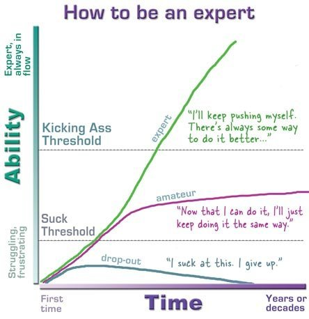

*2010-11-17 14:55 · 手机上网*

---

### 12294

miui android针对中国国情做了一些深度本地化，例如：收到来自深

发展95501的短信时，联系人头像那里自动就显示深发展的logo了。我等着看招行的:-)

*2010-11-17 14:45 · 网页*

---

### 12295

Larry Ellison: Steve Jobs has “the mind of an engineer and theheart of an artist.”

*2010-11-17 12:57 · 网页*

---

### 12296

miui android的视觉设计不错，但听觉方面还不太行，各种默认铃声我不喜欢。

*2010-11-17 12:53 · 网页*

---

### 12297

转@ Pudding 在用饭否时不小心被同事看到，他很激动地问饭否终于恢复啦？一年多后，身边依然有忠实饭友，一阵感动。

*2010-11-17 12:45 · 网页 转自Pudding*

---

### 12298

我希望gmail增加一项功能：把最近几次搜索做成标签，一点就能打开。

*2010-11-17 10:25 · 网页*

---

### 12299

用skype打电话给专家紧急求救后，经过两次wipe，终于把手机救活了，顺利用上miui android。

*2010-11-17 00:51 · 网页*

---

### 12300

手机又死在开机画面了。熟练的把电池卸下来后，屏幕却依然亮着。

当时我就震惊了！愣了一下才发现还接着电源线，还好⋯⋯

*2010-11-17 00:37 · 网页*

---

### 12301

悲剧了！刚装上的miui android令我的手机一开机就反复重启:-(

*2010-11-17 00:08 · 网页*

---

### 12302

根据朋友的指导，把我的G7手机的开机启动程序换成第三方的unrevoked.com

*2010-11-16 23:59 · 网页*

---

### 12303

沃尔玛“天天平价”的口号真不是盖的！苹果自家店里卖$499的ipad到了沃尔玛就只卖$488。

*2010-11-16 23:41 · 网页*

---

### 12304

miui这个产品让我对雷军的钦佩提升了一大层。

*2010-11-16 21:50 · iPhone版*

---

### 12305

让我们来个定义吧：在商业世界里，能直接或间接转化成钱的东西就

是资源。

*2010-11-16 19:05 · 网页*

---

### 12306

最近我真的听“资源”这个词听到有点恶心了。

*2010-11-16 19:03 · 网页*

---

### 12307

“几经风霜情自珍，枯木又逢春”是给我最深刻印象的广告词之一，过了十几年还回荡在我脑海里。问题是，它是哪个产品的广告词？似乎是一种药……

*2010-11-16 16:58 · 网页*

---

### 12308

不愧是诗人。转@ 小熊娃娃 “我要用文字重建一座城市，重建我的北京——在我的城市里，时间倒流，枯木逢春，消失的气味儿、声音和光线被召回，被拆除的四合院、胡同和寺庙恢复原貌，瓦顶排浪般涌向低低的天际线，鸽哨响彻深深的蓝天，孩子们熟知四季的变化，居民们胸有方向感。”——北岛《城门开》序

*2010-11-16 16:55 · 网页 转自小熊娃娃*

---

### 12309

@ Kevin 全面转向kindle是根治这个坏习惯最有效的办法！

*2010-11-16 16:55 · 网页 给Kevin的回复*

---

### 12310

早上出门换鞋时对姐姐说“你也穿U-G-G啊”。姐姐很得意的说“没想到你也这么土，我刚被朋友嘲笑过，应该念UGG[^g]”。-_-!

*2010-11-16 09:36 · 网页*

---

### 12311

@ Kevin haha, congratulations on your wet dream.

*2010-11-16 09:34 · 网页 给Kevin的回复*

---

### 12312

俄罗斯套娃用来打发三岁小孩的时间很有效。看着外甥女在兴高采烈的折腾，想起了我小时候玩过的那些组合玩具。

*2010-11-15 22:28 · 网页*

---

### 12313

我第一次被Dilbert漫画打动是因为看到那篇”I love deadlines. I likethe whooshing sound they make as they fly by." 后来居然发现始创者另有其人，是Douglas Adams，我最爱的科幻作家。

*2010-11-15 13:32 · 网页*

---

### 12314

我的天哪！@ 刘丹 的最后一条饭否消息居然是回复@ 徐远重 。而9个月之后，我们才知道徐会和我们这个团队发生什么样的联系。世界真巧妙。 http://fanwai.com/~Di3XSCY75EE

*2010-11-15 12:18 · 网页*

---

### 12315

欢迎亮哥！转@ 陈亮 刚扫了眼饭否，就到吃饭时间了

*2010-11-15 12:11 · 网页 转自陈亮*

---

### 12316

我是不是太不乐于助人了？现在时不时有人打电话过来说“我朋友XXX认识你，现在我也打算做互联网，想找你聊一聊，学习一下“。只好都拒掉。

*2010-11-15 11:54 · 网页*

---

### 12317

为什么会有那么多软件越升级越难用？IE 、MSN、Skyp'e都属于这类。

*2010-11-15 11:34 · 网页*

---

### 12318

爱生活，爱饭否。

*2010-11-14 23:53 · iPhone版*

---

### 12319

饭否不是微博。

*2010-11-14 22:28 · 手机上网*

---

### 12320

明天姐姐要带着三岁和一岁半的俩小孩来北京，老妈也要过来帮忙带小孩。90平米的两居怎么容纳四个大人和两个小孩?看来我很快就能体会到什么是刚需和改善性需求了。

*2010-11-14 13:37 · 手机上网*

---

### 12321

五道口PPG酒吧门口的黑人姑娘依然穿着低胸背心，真耐寒啊。

*2010-11-14 01:05 · 手机上网*

---

### 12322

听朋友说了个佛教概念:苦集灭道。

*2010-11-14 00:53 · 手机上网*

---

### 12323

程苓峰老师总能写出好文章！从这篇文章就可以看出受过系统的经济学训练对程老师的帮助。结论在第三页，但是前两页的铺垫不能省。

http://ye.ma/L9i

*2010-11-13 15:10 · 网页*

---

### 12324

@ Pudding 说明人对错误拼写的容错性很强嘛。另外，你是为了故意考考看你简历的人是否注意细节吗？

*2010-11-13 14:48 · 网页 给Pudding的回复*

---

### 12325

为了取挂号信，去了趟邮局。他们工作之混乱、效率之低下，令人除了摇头还是摇头。想起《The Creation of the Media》这书里说的邮政发展史：美国是第一个建成高效低价甚至部分免费的邮政系统的国家，这对促进当时的信息流通大有帮助。这和后来的信息高速公路是一脉相承的。

*2010-11-13 10:11 · 网页*

---

### 12326

@ Pudding 哎，我还以为他俩会在facebook大有所为，例如参与titan计划等。不过，y combinator确实是很靠谱的事。

*2010-11-13 10:06 · 网页 给Pudding的回复*

---

### 12327

使用饭否的最佳心态恰好是中学政治课本批判过的资本主义原理：主观为自己，客观为大家。

*2010-11-12 19:59 · 网页*

---

### 12328

推迟两小时、换过登机口之后，终于宣布今晚这航班可能得取消了。

人群顿时一阵骚动，有些人开始破口大骂。

*2010-11-12 19:18 · 网页*

---

### 12329

没准facebook真能搞出一个比gmail还强的替代产品。那天朝人民就更悲剧了。

*2010-11-12 18:25 · 网页*

---

### 12330

科技进步让＂行千里路＂变得易如反掌，＂读万卷书＂的工作却依然无可替代。

*2010-11-12 17:19 · 网页*

---

### 12331

@ webto 我都没认真看过他们的网站，直接用他们的iOs和android应用就行了。

*2010-11-12 15:32 · 手机上网 给webto的回复*

---

### 12332

航班管家这种手机软件确实是有用的。刚才我查到今晚回北京的某个航班还有一张六折票，携程死活说只有全价票。于是我直接打给南航，起初话务小姐也说只有全价票，但在我坚持之下终于承认确实还有一张六折票，于是就被我买到啦。

*2010-11-12 12:40 · 网页*

---

### 12333

"The purpose of life is to be defeated by greater and greaterthings."

*2010-11-12 02:18 · 网页*

---

### 12334

程苓峰老师关于360 vs QQ说得真是入木三分：“沉默的分三类：淡定、恐惧、阴柔。后两类是大多数，别装”

*2010-11-12 00:18 · 网页*

---

### 12335

理想的背后是现实。

*2010-11-11 23:52 · 网页*

---

### 12336

@ 付栋平 听你们这么一说，我也把《光辉岁月》翻出来放了几遍。

真不错。

*2010-11-11 23:33 · 网页 给付栋平的回复*

---

### 12337

这是最好的光棍节礼物。

*2010-11-11 22:59 · 手机上网*

---

### 12338

今天下了飞机就上车，下了车就上火车，下了火车就进地铁，所以我对广州深圳的自然温度还没有切实感受。

*2010-11-11 18:46 · 网页*

---

### 12339

发现深圳的地铁票是一枚塑料币的时候，我终于确信无疑了：我以前没坐过深圳地铁。

*2010-11-11 18:42 · 网页*

---

### 12340

肉体的极度疲惫可以带来心理的貌似平静，其实是麻木。

*2010-11-11 18:04 · 网页*

---

### 12341

广深铁路和我八年前坐的时候基本一样，和一个月前在日本坐过的已有超过二十年历史的新干线比还是有差距。

*2010-11-11 17:58 · 网页*

---

### 12342

@ Luna.lx 人多有多的好，人少有少的好。多看看＜神秘岛＞和＜荒岛历险记＞这类小说就会觉得几个人也是一个世界。

*2010-11-11 17:41 · 网页 给Luna.lx的回复*

---

### 12343

转@ 矛盾wen 转：某同学的状态：据说蛋清能护发，某人用其揉搓后准备涮掉，结果水太烫，挂了一头蛋花，捋了一下午。。。

*2010-11-11 17:33 · 网页 转自矛盾wen*

---

### 12344

一转头，发现对面那哥们泪流满面；再细看，原来旁边一小妞在给他滴眼药水。

*2010-11-11 17:31 · 网页*

---

### 12345

终于坐在广深高铁上了。这火车忒没人性了，居然提早一分钟开！我要是准点到岂不是悲剧了？

*2010-11-11 17:29 · 网页*

---

### 12346

在投资与被投资、并购和被并购的谈判桌两边切换角色对理解整个事情很有帮助。

*2010-11-11 13:47 · 网页*

---

### 12347

@ 李芳姐 那条是我错发的，刚才没注意到我的ipad里不是我的帐号。我要去深圳，没有机票了，所以就飞广州，然后坐火车去深圳。

*2010-11-11 13:42 · 网页 给李芳姐的回复*

---

### 12348

在厦门机场，仅剩1.3元现金。

*2010-11-11 13:31 · 网页*

---

### 12349

自从十几年开始上大学，我就没在这个季节回过家乡了。11月的龙岩还像是夏天。

*2010-11-10 16:52 · 手机上网*

---

### 12350

第一次正二八经用手机当无线热点带笔记本上网(用网银)。

*2010-11-10 00:28 · 手机上网*

---

### 12351

跟一个坐在facebook董事会上的vc吃了顿午饭，听说了markzuckerburg的一些做法，略有收获。

*2010-11-09 15:12 · 手机上网*

---

### 12352

@ 和菜头 刚学习了这俩成语。

*2010-11-09 09:53 · 网页 给和菜头的回复*

---

### 12353

“1898年，贝尔药物研究实验室负责人海因里希.德莱赛宣布，他发明了一种可以替代吗啡的不上瘾镇定剂，名叫海洛因”。我不止一次看到别人在网上用这个签名，刚查了一下wikipedia，似乎历史真是这样。

*2010-11-08 18:15 · 网页*

---

### 12354

在跟几个HRD候选人聊过之后，我觉得HR真是一份NB职业啊。

*2010-11-08 16:44 · 网页*

---

### 12355

我很有用饭否那个手机号发这个小盆友回短信的冲动…… 转@ 番茄小盆友 那个山寨饭否把我封禁了。。。它跟你长得很像，但我知道它不是你。我不喜欢别人模仿你，占用你的名字、模式、甚至颜色。。。

嗯……讨厌死了

*2010-11-08 16:40 · 网页 转自番茄小盆友*

---

### 12356

“我死后，哪管它洪水滔天？”真是个影响又广又深的心态，只要把开头换成“我退休后”、“我卸任后”……

*2010-11-08 11:52 · 网页*

---

### 12357

果然，techweb首页赫然有这么一条新闻：“周鸿祎： 政府要求各退一步 360做到而腾讯没有”。

*2010-11-08 10:10 · 网页*

---

### 12358

靠，搜狐输入法开始流氓了，莫名其妙弹出个“搜狐微门户”。我已经勾选了“不自动弹出”，如果还耍流氓，我就要换google输入法了。

*2010-11-08 09:51 · 网页*

---

### 12359

花了半晚上在ipad里的stanza上看完了梁凤仪1997年给李兆基写的传记。很烂，不推荐。

*2010-11-08 01:32 · 手机上网*

---

### 12360

时隔三年，又买了一双new balance 503.

*2010-11-07 19:48 · 手机上网*

---

### 12361

办公室里终于只剩我一个人了。

*2010-11-06 22:00 · 网页*

---

### 12362

@ 远骋 我们都在努力工作……

*2010-11-06 15:12 · 网页 给远骋的回复*

---

### 12363

有了那部同名港片后，”和为贵“的含义实在是算不上正面。

*2010-11-05 16:31 · 网页*

---

### 12364

@ Kevin 永远不要小看周总。

*2010-11-05 14:15 · 网页 给Kevin的回复*

---

### 12365

re 转@ Kevin 说实话我从没用过键盘右侧的 Ctrl，Alt，Cmd 和Shift。

*2010-11-05 13:51 · 网页 转自Kevin*

---

### 12366

可能吧的文章质量挺高的。这是我看到的对3Q大战发展过程最清晰的总结（要翻墙）： http://ye.ma/L8u

*2010-11-05 13:07 · 网页*

---

### 12367

@ 远骋 你真专业！记得07年底体检时我就有早搏，08/09倒是正常，眼看就到10年底了，不知道今年体检结果会如何…… 大家都要注意健康啊。

*2010-11-05 12:32 · 网页 给远骋的回复*

---

### 12368

不妙，最近常能感觉到心跳。莫非心律不齐了？

*2010-11-05 12:21 · 网页*

---

### 12369

@ 钟永健 你起得真早！

*2010-11-05 09:36 · 网页 给钟永健的回复*

---

### 12370

@ 和菜头 我想的还没到360出IM替代QQ这一步，只要360的安全卫士能先躲过这一劫而在广大电脑上存活下来，那腾讯的麻烦就绵绵不尽了。所以，我觉得腾讯和360决无和解的可能。养虎为患，越往后拖对腾讯越不利。回头看腾讯这几天的表现，战略正确，执行不力。

*2010-11-04 13:58 · 网页 给和菜头的回复*

---

### 12371

关键时刻还是得拼技术。如果360能开发出一个安全卫士接管操作系统最底层从而让QQ无法判断出本机是否装了360，那腾讯就非常尴尬了，输了老脸还没能把360挤掉。我不了解windows的安全机制，但感觉似乎是有可能做到。

*2010-11-04 13:53 · 网页*

---

### 12372

@ webto 不可能吧，我不相信新华社出来的人会这么跟媒体说话。

*2010-11-04 10:41 · 网页 给webto的回复*

---

### 12373

为什么最近老听到人用”公权力“这么文绉绉的词？

*2010-11-04 09:53 · 网页*

---

### 12374

转@ 钟永健 <马周记>第一回：小学的时候班里有两个淘气包，一个叫小马一个叫小周，有一天小周对大家说小马偷看全班女同学上厕所，说自己有证据，还要保护所有女同学，小马问你证据哪来的，小周说，那天我偷看的时候看见你了，你别想抵赖。//欢迎钟同学归来:-)

*2010-11-04 09:47 · 网页 转自钟永健*

---

### 12375

Let bullets fly. Let information flow.

*2010-11-03 18:07 · 手机上网*

---

### 12376

amazon有个prime计划：每年付79美元就可以得到无限次的免费两天送达服务。我原来不知道谁会付这个钱，没想到刚刚发现我姐就付了……

*2010-11-03 16:38 · 网页*

---

### 12377

新电脑用了一周多还没装firefox。它已经完全被chrome取代了，即使是我这样用了十多年mozilla系浏览器的人也不觉得有什么好留念。竞争是多么无情啊。

*2010-11-03 15:35 · 网页*

---

### 12378

国内有些公司的逻辑似乎是：敌人的敌人就是朋友，即使他是流氓。

*2010-11-02 20:11 · 网页*

---

### 12379

我那台thinkpad x60好像从头到尾三年多没有重装过系统。可能我读书时的折腾程度已经把一般人一辈子装操作系统的次数都用完了。

*2010-11-02 19:10 · 网页*

---

### 12380

花钱真是大学问！

*2010-11-02 18:25 · 网页*

---

### 12381

@ webto 你真白领！

*2010-11-02 16:11 · 网页 给webto的回复*

---

### 12382

最近常常有一种被淹没的感觉。激励我的是那种鲸鱼跃出海面的场景。

*2010-11-02 12:00 · 网页*

---

### 12383

我们居然在和邓亚萍的人民搜索抢人。这世界……

*2010-11-02 10:02 · 网页*

---

### 12384

淘宝商城居然用 tmall.com 这样的英语域名！难道是觉得国内市场手到擒来已经开始放眼全球了？

*2010-11-01 19:59 · 网页*

---

### 12385

纽约时报的文章就是扎实！这是我看过的关于twitter公司（而不是产品）的最有信息量的文章。 http://ye.ma/L8n

*2010-11-01 19:34 · 网页*

---

### 12386

拿到印着“XXX公司 董事”的名片总是觉得有点怪。

*2010-11-01 15:28 · 网页*

---

### 12387

新版windows live messenger真是难用到超乎想象的地步！

*2010-11-01 11:14 · 网页*

---

### 12388

<西风烈>这片够屌!

*2010-10-31 00:56 · 手机上网*

---

### 12389

@ 远骋 是的，据说他手下有一批退役的特种兵，包括他的司机。

*2010-10-30 13:53 · 网页 给远骋的回复*

---

### 12390

周鸿祎真是彪悍，连我都收到他的群发短信：网上流传段视频，腾讯秘密会议，很绝，你可以看看 顺便在微博上推荐一下 BTW 欢迎试用我们推出的扣扣保镖 让你QQ聊天更干净安全 无广告 速度快

*2010-10-30 13:37 · 网页*

---

### 12391

win7的默认中文字体好丑！难道我在之前用了3年多的xp里自己装过字体？

*2010-10-30 09:57 · 网页*

---

### 12392

在一台新的 win7电脑上，我装的前4个软件是：chrome，搜狗输入法，putty，skype。另外，被迫升级了windows live套装。

*2010-10-30 09:48 · 网页*

---

### 12393

多谢华硕送我一个笔记本。我终于用上windows7了。

*2010-10-29 18:43 · 网页*

---

### 12394

穿上皮鞋后，走路姿态都会和穿旅游鞋时不一样。

*2010-10-29 13:15 · 网页*

---

### 12395

I can resist everything except temptation. -- Oscar Wilde

*2010-10-29 12:20 · 网页*

---

### 12396

Perspective is worth 80 IQ points. -- Alan Kay

*2010-10-27 19:25 · 网页*

---

### 12397

第一次对应聘者做背景调查，电话联系了他的前前雇主，发现简历严重不实，直接拒掉。

*2010-10-27 19:20 · 网页*

---

### 12398

@ 和菜头 凯恩斯的原意应该是即使你知道市场明显有泡沫也别轻易去做空，因为泡沫可能继续变大，可能需要很长很长时间才破灭。这个过程对做空的人来说是漫长、痛苦且危险的。

*2010-10-27 14:28 · 网页 给和菜头的回复*

---

### 12399

昨晚聊天时朋友引用了一句话："The market can stay irrationallonger than you can stay solvent." 我觉得很有道理。刚才一查，原来是大牛凯恩斯说的。

*2010-10-27 11:44 · 网页*

---

### 12400

@ Kevin 1000万美金可以苟延残喘很久。

*2010-10-27 10:15 · 网页 给Kevin的回复*

---

### 12401

@ 远骋 这片博客确实有点雷。不过很多回复更是不着调。

*2010-10-26 19:34 · 网页 给远骋的回复*

---

### 12402

yammer没有我期待的那么惊艳。死慢，功能也一般。

*2010-10-26 10:55 · 网页*

---

### 12403

@ 小熊娃娃 当我在wikipedia上看到东京银座的房价最高曾经达到一平米100万美元，现在仅有当时的1%略多时，我就明白了，北京房价的疯狂很可能还远未结束……

*2010-10-25 15:55 · 网页 给小熊娃娃的回复*

---

### 12404

两个字：抓狂！

*2010-10-25 15:51 · 网页*

---

### 12405

@ 王悦蒙 我也还没吃晚饭。

*2010-10-22 20:43 · 网页 给王悦蒙的回复*

---

### 12406

@ 远骋 因为我要买的那本书没有kindle版，而我wish list里多数书却有kindle版，所以我才找同样没有kindle版的《有中国特色的社会主义》来凑啊。

*2010-10-22 17:39 · 网页 给远骋的回复*

---

### 12407

要在amazon买一本工作方面的书，为了凑满25美元免运费，终于买了这本在wish list里放了快两年的书 "The Bubble Economy: Japan'sExtraordinary Speculative Boom of the '80s and the Drama

*2010-10-22 15:17 · 网页*

---

### 12408

转@ 东东枪 我打算发明一种人声语音式汽车喇叭，每个喇叭出厂时都预置五种人声，分为五档。第一档，按完喇叭发出柔和的男声：“请让开！谢谢！请让开！”第二档按完之后发出“说你呢！前边儿的！说你呢！”第三档是“傻B！靠边儿！”第四档是“X你妈！有本事你下来！”第五档是“大哥我错了，大哥我

*2010-10-22 13:59 · 网页 转自东东枪*

---

### 12409

这书名起得真到位:《有中国特色的资本主义》"Capitalism withChinese Characteristics: Entrepreneurship and the State"http://ye.ma/L8O

*2010-10-22 13:58 · 网页*

---

### 12410

米开朗琪罗米谈到自己著名的作品「大卫」雕像時曾說：「并不是我创造了大卫，他本来就在石头中，我只是把多余的石头敲掉」。那些以为自己发明了牛逼商业模式或产品的人都应该参考一下米的谦逊和洞见。

*2010-10-20 15:31 · 网页*

---

### 12411

创新工场还是挺厉害的，一年时间能有这些成果。

*2010-10-20 14:33 · 网页*

---

### 12412

@ 和菜头 有时间。别让我写东西就好……

*2010-10-20 10:27 · 网页 给和菜头的回复*

---

### 12413

刚上 m-w.com 查单词，看到首页 Trend watch 栏目里三个词之一是dissident，旁边是著名的刘老师照片。

*2010-10-20 10:24 · 网页*

---

### 12414

事实证明，一天排7项日程并临时再插入3项是不靠谱的。

*2010-10-19 21:26 · 网页*

---

### 12415

手机里记了今天有7项日程……

*2010-10-19 09:09 · 网页*

---

### 12416

@ 远骋 And every day is the first day of the rest of your life.

*2010-10-18 09:34 · 网页 给远骋的回复*

---

### 12417

UME影城的新版网站 http://bjume.com/ 非常棒！没有一丝一毫的浪费，直切主题，非常清楚访问者想要什么。简直是好到我想去认识主持这次改版的人。

*2010-10-17 23:07 · 网页*

---

### 12418

《华尔街：金钱永不眠》很一般，情节弱。不知道奥利佛－斯通这种老导演怎么排出这样的水准。难道是被广电总局剪掉了许多关键镜头？

*2010-10-17 23:03 · 网页*

---

### 12419

失去以后才发现，mtime的iphone和android程序对我来说是多么实用的工具。这几天想看场电影都不知道该去哪里查。

*2010-10-17 15:46 · 网页*

---

### 12420

@ webto 确实很冷! 刚才广播里说最高气温12度。

*2010-10-17 13:42 · 手机上网 给webto的回复*

---

### 12421

毛岸英是50年10月23日以彭德怀秘书兼翻译的身份进入朝鲜，11月25日就被美军空袭炸死了。

*2010-10-17 08:32 · 手机上网*

---

### 12422

昨晚吃得太晚太饱，一到家就瘫倒，昏睡到现在才起来。秋夜，确实有些凉了。

*2010-10-17 01:53 · 手机上网*

---

### 12423

选择即创造。

*2010-10-16 09:56 · 网页*

---

### 12424

我看网页的习惯是“广度优先搜索”，这导致我的浏览器里tab越开越多。应该用“深度优先”了。

*2010-10-16 09:54 · 网页*

---

### 12425

阳光明媚、精力充沛的一天开始了！

*2010-10-16 09:31 · 网页*

---

### 12426

@ 小熊娃娃 难怪今晚我的android手机和ipad上的＂全国影讯＂都不

能用了。mtime的投资人政府关系不错，应该会帮他们搞定吧。

*2010-10-16 00:13 · 网页 给小熊娃娃的回复*

---

### 12427

@ 东东枪 小隐隐于野，中隐隐于市，大隐隐于朝。

*2010-10-15 16:15 · 网页 给东东枪的回复*

---

### 12428

这个世界上有很多人比我们更聪明更勤奋。

*2010-10-15 14:56 · 网页*

---

### 12429

@ webto 血狮？牛逼！

*2010-10-15 14:26 · 网页 给webto的回复*

---

### 12430

在参观一个公司，跟他们相比，我们的管理就是渣。

*2010-10-15 10:53 · 手机上网*

---

### 12431

据说mathematica的创始人wolfram有一套自制的设备，不光记录他的所有邮件，而且记录他二三十年来的所有击键记录。

*2010-10-14 13:36 · 网页*

---

### 12432

连我爸这种人都知道刘老师获奖的消息了。看来互联网时代想彻底封锁消息确实比较难。

*2010-10-14 12:15 · 网页*

---

### 12433

根据昨天中午的经历，交通顺畅的情况下，一个小时的单程通勤时间可以从知春路开车到东南5.5环。实际上没人每天这么跑吧？

*2010-10-14 11:57 · 网页*

---

### 12434

@ 远骋 深有同感。前阵子某杂志记者反反复复只会问类似“你觉得中国还会不会再出李彦宏”这类无营养的问题，惹得我差点掀桌子撵他走。

*2010-10-13 16:08 · 网页 给远骋的回复*

---

### 12435

我昨天6点起床，8点的飞机去上海，办3件事后赶晚上的飞机，12点回到北京。我以为自己工作很努力了，可是送我从机场回家的的哥说他上的是“大班”，也就是早8点上班，连干24小时干到第二天早8点。上一个大班，歇一天，因为他是密云农村的人，这样做就不用在城里租房子。他对这份工作非常满意。

*2010-10-13 10:45 · 网页*

---

### 12436

媒体关系101里的基础原则＂永远别把媒体从业者真的当成朋友＂和web2.0带来的＂人人都是媒体＂趋势一结合...

*2010-10-12 21:52 · 网页*

---

### 12437

上海虹桥机场比北京首都机场更人性化。我比规定时间晚了两分钟，但还是让我换登机牌了。我在北京有过不愉快经历：只晚了大概一分钟，明明来得及登机，但就是不肯给我换登机牌。

*2010-10-12 21:48 · 网页*

---

### 12438

靠，昨晚梦到去丽江这个我从没去过的地方。

*2010-10-12 06:51 · 手机上网*

---

### 12439

在亮角落传媒上看到的：有些事情，不谈是个结，谈了是个疤。

*2010-10-11 14:57 · 网页*

---

### 12440

@ Kevin 扯淡也要有理由吗？或者说，扯淡扯得好本身就有快感，就是理由了。

*2010-10-11 14:11 · 网页 给Kevin的回复*

---

### 12441

@ Kevin 看到这个凤姐的介绍“性别男，爱好女，爱蛋疼”时，我就觉得非常靠谱了。腾讯微博真是人满为患，我注"wangxing","wangxing123","wangxingwangxing","wangxingabc"都提示已被用，只好用了"wangxingxyz"。

*2010-10-11 10:59 · 网页 给Kevin的回复*

---

### 12442

回想一下，我真是典型的INTP型，喜欢看全貌。所以，我基本每到一个城市都会去登高：北京的央视电视塔、上海的环球金融中心、深圳地王大厦、香港太平山顶、东京铁塔、Sydney Tower Skywalk...

*2010-10-11 10:11 · 网页*

---

### 12443

今天北京真是秋高气爽。查了一下农历，九月初四，临近九月初九重阳节了。老祖宗真有智慧，这种日子确实适合登高望远。北京的朋友们可去西三环中路的央视电视塔顶上的旋转餐厅或是观景台，那里是欣赏北京全貌的好地方，连天通苑都可以看得非常清楚。

*2010-10-11 10:03 · 网页*

---

### 12444

如果常常像昨天和今天这样对比强烈，那么英国人见面用天气作为寒暄话题也就不奇怪了。

*2010-10-11 09:03 · 网页*

---

### 12445

战战兢兢，如履薄冰。Only the dead has seen the end of war.

*2010-10-11 01:52 · 手机上网*

---

### 12446

@ 和菜头 恭喜！！！

*2010-10-10 12:32 · 网页 给和菜头的回复*

---

### 12447

这个世界天生就这么残酷。我们为了自己好，就要蚊子死。

*2010-10-10 02:38 · 手机上网*

---

### 12448

密集物恐惧症者慎入。这样喂鱼太吓人了…… http://ye.ma/LTS

*2010-10-09 12:36 · 网页*

---

### 12449

能干好城市规划设计的人得是多牛逼的产品经理啊

*2010-10-09 10:13 · 网页*

---

### 12450

这次去日本有个遗憾，没有看一下卡拉OK在它的发源地发展成什么样了。

*2010-10-09 09:48 · 网页*

---

### 12451

原来诺贝尔和平奖是由挪威议会指定的五人委员会选出来的。

*2010-10-08 20:29 · 网页*

---

### 12452

以前没见过刘老师，以后要见估计就更难了。

*2010-10-08 20:23 · 网页*

---

### 12453

@ 东东枪 我常常想，从结局来看，所有人生道路都是死路一条。

*2010-10-08 15:50 · 网页 给东东枪的回复*

---

### 12454

@ 小熊娃娃 或许，二十年后回头看，开征房产税是个重要历史事件，会引发很多连锁反应，虽然反应的过程比较慢比较长。哈，我真是天生乐观。

*2010-10-07 21:04 · 网页 给小熊娃娃的回复*

---

### 12455

今年是2010，虎年。大年三十是农历年的最后一天吧？

*2010-10-07 21:00 · 网页*

---

### 12456

去年过年的时候，因为去年七月的事而看了些关于媒体的书，有一句话给我非常深刻的印象："The media doesn't tell us what to think;it tells us what to think about"- Bernard Cohen (1963)

*2010-10-07 20:47 · 手机上网*

---

### 12457

@ 东东枪 列队欢迎东东枪老师! 哦，人太少，只能排成2x2的方阵...

*2010-10-07 17:24 · 手机上网 给东东枪的回复*

---

### 12458

@ 和菜头 前几天网上有段视频，俩民工大哥自弹自唱汪峰的<春天>，我觉得比汪峰自己唱得还好啊

*2010-10-07 17:21 · 手机上网 给和菜头的回复*

---

### 12459

成田机场的登机口附近有google赞助的免费wifi，不错!但是做得很小气，要把手机或电脑放在那张能清晰看到google广告的桌子上才有信

号，拿起来走几步就不行了。另外，还要有gmail账户才行。

*2010-10-06 16:00 · 手机上网*

---

### 12460

只要有一部能上网的iphone，世界就真是平的了：无论走到哪里，都可以用谷歌搜索，用谷歌地图，用gmail，用skype给全世界打平价电话，还可以上上饭否。

*2010-10-03 22:27 · iPhone版*

---

### 12461

@ 小熊娃娃 我最近正好在看≪城记≫。梁思成确实很悲剧，如他所料，历史证明他是对的。可这又有什么用呢？已经发生的一切无可挽回，更糟糕的是，类似的错误还在继续发生。

*2010-10-03 22:23 · iPhone版 给小熊娃娃的回复*

---

### 12462

不能小看日本。京都比北京城历史更悠久，而且很多古迹保护得很好。

*2010-10-03 20:41 · iPhone版*

---

### 12463

京都站门前的两个触摸式交通信息亭也像北京那些奥运信息亭一样废弃了。看来这玩意儿就是华而不实。

*2010-10-03 13:10 · iPhone版*

---

### 12464

回想昨晚去过的东京闹市区涉谷，确实符合≪美国大城市的死与生≫里分析的城区繁荣的四大条件：街区要小，路网要密；功能要多样；

密度要大；新老建筑要混杂。我觉得北京的城市建设应该学日本而不是学美国。

*2010-10-03 10:23 · iPhone版*

---

### 12465

@ 矛盾wen 呼唤短旗袍亮相！

*2010-09-18 01:15 · 网页 给矛盾wen的回复*

---

### 12466

@ Kevin 这事情远比ICP证复杂得多。超小范围的内内测问题不大，但是不能扩大，不能公开。就好比，一对小夫妻偶尔一起看看AV是情趣，聚众放就是违法了。

*2010-09-16 23:51 · 网页 给Kevin的回复*

---

### 12467

@ 小熊娃娃 我呆在北京是因为这是中国互联网的中心。听说北京的5条河只剩一条还长年有水，不知道这个城市将来怎么办。

*2010-09-16 20:22 · 手机上网 给小熊娃娃的回复*

---

### 12468

@ Kevin 是的，北京是个灰不垃圾的破地儿。我大概有十年没有在夏天回过龙岩了。两个月前回去了一趟，感觉自己看到的很不真实，空气清澈得令人感动，为什么城市另一边那么远的山看起来那么近那么清楚？

*2010-09-16 19:47 · 手机上网 给Kevin的回复*

---

### 12469

我不喜欢大脑高速运转的感觉。如果说我还有过一些好想法的话，它们都是在感觉无所事事的时候冒出来的。

*2010-09-16 19:43 · 手机上网*

---

### 12470

predictably unpredictable

*2010-09-12 01:33 · 网页*

---

### 12471

@ 和菜头 令我惊讶的是这个tv budda居然是1974年的作品。

*2010-09-11 15:31 · 手机上网 给和菜头的回复*

---

### 12472

@ 和菜头 昨天刚说完不用google reader了，从今天就看新闻说IAC要把bloglines停掉了。那可是我用的第一个rss reader啊。

*2010-09-11 15:29 · 手机上网 给和菜头的回复*

---

### 12473

我可能已经有几个月不看google reader了。google赢了rss reader这个市场，但那又能怎样？

*2010-09-11 00:18 · 网页*

---

### 12474

@ Kevin 那数据线在@ 潘 的MBP上。他不像你一样在Mac上跑windows⋯⋯

*2010-09-10 01:31 · 网页*

---

### 12475

多数人愿意承认自己懒而不承认自己蠢。所以，说自己比别人更聪明是非常危险的，说自己别别人更努力更苦哈哈就安全得多。

*2010-09-09 17:57 · 手机上网*

---

### 12476

@ 小熊娃娃 此男我认识吗？

*2010-09-09 14:55 · 手机上网 给小熊娃娃的回复*

---

### 12477

@ 小熊娃娃 你说到梦我就想起《盗梦空间》的几层梦境实在是没什么新意。

*2010-09-09 10:47 · 手机上网 给小熊娃娃的回复*

---

### 12478

每天都要进步一点。

*2010-09-07 09:54 · 手机上网*

---

### 12479

28° C/72%湿度的北京之夜是如此闷热难熬。

*2010-09-07 00:15 · 手机上网*

---

### 12480

过去未去，未来已来

*2010-09-06 11:37 · 手机上网*

---

### 12481

一个msn帐号一年多没登录了。刚才上了一下，弹出26个窗口……

*2009-08-04 17:04 · 网页*

---

### 12482

凡事期待。

*2009-07-07 23:36 · 网页*

---

### 12483

请不要误以为我在饭否发的一句随想是在回答你之前在饭否的某个提问或你此刻心里的某个疑问。谢谢。

*2009-07-07 23:28 · 网页*

---

### 12484

不管别人如何鼓动，一定不要真的以为自己正在创造历史。“历史是人民创造的”里的“人民”不是你一个人，就像“这是人民的财产”不等于是你的财产。

*2009-07-07 23:02 · 网页*

---

### 12485

@ lulu 还有一点点的《美国派》

*2009-07-07 22:54 · 网页 给lulu的回复*

---

### 12486

@ paramir 饭否上的@ 曹方 是如假包换的真人。

*2009-07-07 22:46 · 网页 给paramir的回复*

---

### 12487

“被饭否和谐”还是“饭否被和谐”，这是一个并不舒服但却必须做的选择。

*2009-07-07 22:05 · 网页*

---

### 12488

@ Junyu 饭否搜索的"OR"操作正在开发中。目前支持"AND"和"NOT"。

*2009-07-07 21:55 · 网页 给Junyu的回复*

---

### 12489

@ 魏寒枫 多谢贵刊关注:-) 我们一定积极配合。

*2009-07-07 21:53 · 网页 给魏寒枫的回复*

---

### 12490

@ Fenng 如果不关心“某某关注某某”的消息，可以在右上角“设置 通知”里关掉。还有别的吗？

*2009-07-07 21:22 · 网页 给Fenng的回复*

---

### 12491

@ Fenng 对无用信息的过滤差？能说具体点吗？是你关注的人发很多无用信息，还是你不关注的人@你私信你了？谢谢。

*2009-07-07 18:07 · 网页 给Fenng的回复*

---

### 12492

知道悲剧正在发生但自己却无能为力是一个人成长过程中的必经之槛。从那里开始，有很多不同的态度，导致不同的行动，产生不同的结局。

*2009-07-07 16:50 · 网页*

---

### 12493

老爸也开始用饭否了……

*2009-07-07 16:39 · 网页*

---

### 12494

转：@ 卓越亚马逊 卓越亚马逊热切恭候第一百名关注者，或将有神秘礼物哟～

*2009-07-07 16:17 · 网页 转自卓越亚马逊*

---

### 12495

转：@ Lushnis 钞票上“中国人民银行”六个字以及面额文字出自马文蔚先生之手，稿费五千；“中国银行”四字自然是郭沫若的手笔；“交通银行”为郑孝胥所书；广为网民所见的“招商银行”四字一说是赖少其所书。

*2009-07-07 15:27 · 网页 转自Lushnis*

---

### 12496

转：@ 阿曼蒂娜小姐 You don''t marry someone you can livewith, but marry the one you can''t live without. 不娶你能睡的人，要娶你不得不睡的人。

*2009-07-07 15:10 · 网页 转自阿曼蒂娜小姐*

---

### 12497

@ flypig license to debate! 3个单词，仅仅用3个动词，你就充分展现了一个从事国际公关的男士所应有的外语素质！

*2009-07-07 15:00 · 网页 给flypig的回复*

---

### 12498

转：@ 飯否小红娘 给大家报道一个好消息，历时一个半月，经过小红娘的撮合，终于产生了第一对饭否情侣。他们给我发来报喜私信“好啦，已经是男女朋友了！下一步结果不知道要到什么时候。小红娘万岁！”在下午趴在办公桌前昏昏欲睡的时分，犹如强心针，搞得我无比激动……

*2009-07-07 13:53 · 网页 转自飯否小红娘*

---

### 12499

@ flypig 飞猪老师，请问什么叫辩证？我只知道办证。

*2009-07-07 13:53 · 网页 给flypig的回复*

---

### 12500

@ flypig 推荐关注@ 平客 @ 女流氓.exe @ 申音 @ 如小果 @ 马日拉 @ 东东枪

*2009-07-07 13:45 · 网页 给flypig的回复*

---

### 12501

插播：80后靠谱青年 @ flypig 急于在饭否多认识几个人。 请有兴趣者自行联系，关注他，@ 他 ，私信他。他目前在某国内领先的视频网站负责国际公关，同时是新近崛起的T恤品牌@ dacode_news 的主创设计师。未婚，有女友。

*2009-07-07 12:42 · 网页*

---

### 12502

唐僧的一大任务是不要让自己变成唐僧肉。

*2009-07-07 11:29 · 网页*

---

### 12503

@ flypig 648K. 另外，饭否还有个为iphone定制的web版本：http://i.fanfou.com/

*2009-07-07 10:24 · 网页 给flypig的回复*

---

### 12504

转：@ 魔王.灯塔 转：@ zuodao 话说昨天下午在天河城闲逛时，终于看到了M8真机了呢。当我问销售妹妹跟iPhone比有什么优势时——哎呀，我真坏——妹妹说：可以换电池~~ // 多么精辟和务实的评语，此妹妹很强！

*2009-07-07 10:23 · 网页 转自zuodao*

---

### 12505

分享：《比乔布斯更执着 “疯子”黄章魅族创业 --创业邦》

http://xueyuan.cyzone.cn/gu... 文章非常枪，但是魅族这公司确实有意思。

*2009-07-07 10:21 · 饭否分享*

---

### 12506

@ flypig 请直接在iphone app store里搜fanfou

*2009-07-07 10:18 · 网页 给flypig的回复*

---

### 12507

@ c447279704 饭否现在就有收藏消息的功能啊。你把鼠标移到一条消息上，消息右边会出现三个按钮，其中一个就是“收藏”。

*2009-07-07 10:18 · 网页 给c447279704的回复*

---

### 12508

向在PSP上用饭否的同学们致敬！ http://fanfou.com/photo/xl5...

*2009-07-06 22:40 · 网页*

---

### 12509

女同事收到一只大熊。这是我抱过的最大的毛绒玩具！

*2009-07-06 17:03 · 饭否拍拍*

---

### 12510

You are not alone. 我不管在什么场合只要一看到这个句子耳边就响起那个弦律。杰克逊确实牛。

*2009-07-06 16:47 · 网页*

---

### 12511

转：@ 张一鸣 劳动 和 教养 都是很好的两个词，但是如果放在一起则。。

*2009-07-06 15:59 · 网页 转自张一鸣*

---

### 12512

转@ SEMWatch 霍普金斯如果活到现在，一定是SEM的风云人物。他在86年前似乎预言了一切。他的《Scientific Advertising》所强调的可量化、可测试和可被分析的广告方法，若是放在互联网时代，简直是理论和实践的最佳结合。 http://bit.ly/4PsYK

*2009-07-06 15:44 · 网页 转自SEMWatch*

---

### 12513

@ 喵喵 不好意思，我看你的饭否头像，以为你是mm。抱歉！

*2009-07-06 15:13 · 网页 给喵喵的回复*

---

### 12514

这个小姑娘手工做了一个“饭否笔记本”http://fanfou.com/photo/t0m...

*2009-07-06 15:01 · 网页*

---

### 12515

@ enclavetj 神州行吧。每月10元就接听全免费了。

*2009-07-06 13:30 · 网页 给enclavetj的回复*

---

### 12516

上午转发的@ 慕岩_百合网 关于小美人和清华男生的消息据说出自《万物生长》，作者冯唐是协和的男生。协和几年前并入清华了吧？

*2009-07-06 12:42 · 网页*

---

### 12517

转：@ 慕岩_百合网 转一个朋友的博客：“几乎所有好姑娘，轰轰烈烈、翻云覆雨、曾经沧海之后，想想自己的后半生，想想也无风雨也无晴，想要找个老实孩子嫁掉，就会想起清华男生。所有小美人背后，都有清华男生这股恶势力撑腰。” // 不知道是不是清华男生写的。

*2009-07-06 11:32 · 网页 转自慕岩_百合网*

---

### 12518

我一直觉得SUN的“网络就是计算机”(The Network is the Computer)堪称IT史上最有前瞻性的口号之一，最近居然听说这是Bill Joy当年在清华连续几天高强度讲学时想出来的。消息来源是Bill Joy身边的人，所以这说法应该是靠谱的。

*2009-07-06 11:21 · 网页*

---

### 12519

@ mengjt 具体是什么排名、怎么排，我也不晓得。我转那条消息是因为我很同意心态的重要性。

*2009-07-06 10:56 · 网页 给mengjt的回复*

---

### 12520

转：@ 慕岩_百合网 全球幸福指数排名，前10名国家中有9个来自拉美，主要是人家心态好啊！

*2009-07-06 10:52 · 网页 转自慕岩_百合网*

---

### 12521

上个月在拉萨买的藏刀终于寄到北京了。多谢太平洋电脑网的@ 可佳•奇

*2009-07-05 15:27 · 饭否拍拍*

---

### 12522

@ 赵嘉 不推荐小孩看变形金刚2，有点情色，有点暴力

*2009-07-05 14:26 · 手机上网 给赵嘉的回复*

---

### 12523

@ 潘欣 网络本来就不是生活的全部嘛，只要你对生活中其他事情还有兴趣就好。

*2009-07-05 14:08 · 手机上网 给潘欣的回复*

---

### 12524

@ bluesfan 他们自己的官方解释是：奇遇花园咖啡馆，位于西直门北展北街15号华远企业号D座底商，从西直门城铁、地铁交汇口处的西环广场（嘉茂商场）北边楼西对面的街道（北展北街）进来西走100米。

*2009-07-05 01:23 · 网页 给bluesfan的回复*

---

### 12525

今晚在奇遇花园咖啡馆旁听了@ dacode_news 的T恤创意讨论会，发现@ flypig 和@ 黄继新 都很喜欢用“意象”这个词。

*2009-07-05 01:19 · 网页*

---

### 12526

@ 可佳•奇 饭否的黑名单功能可以满足你“禁止关注”的需求吗？在每个人饭否空间的右栏的底部有“加入黑名单”的按钮。

*2009-07-05 01:06 · 网页 给可佳•奇的回复*

---

### 12527

@ 冲哥 爱饭是基于adobe air的，是windows和mac平台通用的。据我所知，爱饭的开发者@ realazy 平时用的操作系统就是mac os.

*2009-07-05 00:41 · 网页 给冲哥的回复*

---

### 12528

@ flypig 老师在装酷

*2009-07-04 21:48 · 饭否拍拍*

---

### 12529

这个自述有点意思：@ 科闻100 是一家80后的全球性公关公司。

*2009-07-04 15:54 · 网页*

---

### 12530

@ 张小刁 简单易用正是饭否最大的特色啊。@ 青檬音乐台 挺好，但不一定要集成到饭否里面，你另开一个浏览器窗口一样可以听嘛。

*2009-07-04 15:50 · 网页 给张小刁的回复*

---

### 12531

@ Acumon 那iMac不是我的，是在@ 青檬音乐台 的办公室里看到的。搞多媒体的人好像都喜欢mac。

*2009-07-04 15:25 · 网页 给Acumon的回复*

---

### 12532

iMac的大屏幕亮得可以当镜子了

*2009-07-04 12:20 · 饭否拍拍*

---

### 12533

网络电台@ 青檬音乐台 的播音间

*2009-07-04 12:03 · 饭否拍拍*

---

### 12534

看到@ 胡泳 老师开始关注@ zhizilee ，于是我也凑过去看了看。

呃，消息设成私密的了，但这姑娘的自述深得我心：“我想要最深刻的大脑，最简单的心灵。我是个真正一本正经的人，因为我觉得这是这个个性十足的时代里最稀缺的个性。”

*2009-07-03 23:17 · 网页*

---

### 12535

@ Rashomon 我走加州一号公路的时候，才发现那里山间绿油油的草甸真的就和xp的默认桌面是一个样子的。

*2009-07-03 22:43 · 网页 给Rashomon的回复*

---

### 12536

@ 于欣烈 我有好几年没打网球了，听你这么说，有点手痒了。啥时候我们找个球场一起出出汗？

*2009-07-03 21:47 · 网页 给于欣烈的回复*

---

### 12537

转自@ 卢刚 Breaking: DeNA, Japanese Leading Mobile SocialNetworks Buying Chinese Tianxiahttp://www.mobinode.com/200...

*2009-07-03 21:29 · 网页 转自卢刚*

---

### 12538

@ RaRa 我童年最痛苦的回忆之一就是：陪伴了我多年的大肥猫突然失踪，几天之后我在一条沟里发现它的尸体，还有很多蛆虫…… 妈妈说我当时哭了好久，连续几天失魂落魄……

*2009-07-03 21:26 · 网页 给RaRa的回复*

---

### 12539

多谢@ 张亮 分享：滚石这个 Michael Jackson 封面太帅了！

http://bit.ly/128G5v // 估计最近有无数杂志拿杰克逊做封面，如果把

各个封面收集起来放在一起对比，那一定很精彩。

*2009-07-03 20:50 · 网页 转自张亮*

---

### 12540

这是@ 刘兴亮 老师送我的他的新书《第三浪》。还没来得及看，所以暂不评价内容。但这书名很有趣，令我想起小时候在爸爸书架上看过的《第三次浪潮》和曾经带给我许多欢乐的台湾游戏公司“第三波”。

*2009-07-03 20:42 · 饭否拍拍*

---

### 12541

转：@ 东东枪 去输液，一进医院，医生问：“姓什么？”我说：“蔚蓝的天空有几只小鸟飞过……的‘蔚’。”医生：“请再说一遍，叫‘鸟’什么？”——看来的段子一枚。

*2009-07-03 20:30 · 网页 转自东东枪*

---

### 12542

转：@ 飯否小字报 小道消息：据说@ 万骨枯 刚刚直播了快乐女声彩排，晚上会接着直播快女比赛~ 推荐一下。 推荐理由：饭否终于出现很有喜感的直播啦！

*2009-07-03 20:16 · 网页 转自王悦蒙*

---

### 12543

@ 可佳•奇 我在英国读过书的同学说他们那里车停得非常挤，启动后经常要轻轻顶一顶前面的车再碰碰后面的车才能挤出空间开出来。

*2009-07-03 20:11 · 网页 给可佳•奇的回复*

---

### 12544

转：@ 庄表伟 点宝语录：点宝嘲笑奶奶：“奶奶，我看爷爷是一点也不听你的话！”爷爷质问他：“你将来是听老婆的话还是老婆听你的话？”点宝眉头一锁，一本正经地说：“爷爷，我还是个小孩，你不要老是跟我说什么老婆不老婆的好吧！”爷爷#￥……&（）

*2009-07-03 10:17 · 网页 转自庄表伟*

---

### 12545

转自@ 来扒饭 饭否魅族m8客户端。已更新至0.3版。帮忙告诉一下饭否的煤油，谢谢。地址: http://bbs.meizu.com/thread...

*2009-07-03 00:13 · 网页 转自wuson*

---

### 12546

orz! 发现我的母校龙岩一中居然有老师上饭否了，不过好像不是教过我的老师。

*2009-07-02 23:53 · 网页*

---

### 12547

@ 洪小可 phd这词译成中文时译错了，才译成了“博士”。phd的训练目标就是不求“博”但求“专”。顶多是要求术业有专攻后能从一滴水里看世界。

*2009-07-02 23:39 · 网页 给洪小可的回复*

---

### 12548

转：@ champlooV 终于收到通知，问我是要MJ票全额退款，还是部分退款加上原有票根。毫不迟疑选择后者....

*2009-07-02 23:31 · 网页 转自champlooV*

---

### 12549

@ 杨泽 抱歉，请问文章的作者之一@ enclavetj . 《南方人物周刊》

会选饭否上的哪几句话根本不在我的影响范围之内。事实上，买到这本杂志之前我并不知道他们要从饭否摘录消息，否则我会推荐别的消息。

*2009-07-02 20:08 · 网页 给杨泽的回复*

---

### 12550

看到本期《南方人物周刊》里谈饭否和twitter的专题了。文章还摘录了饭否上的六条消息（不知道是否和消息的作者联系过……）。欲知是哪六条消息，请看我在饭否收藏的最近六条。

*2009-07-02 20:01 · 网页*

---

### 12551

转：@ 云科技 写了一篇博客: 从云科技流量来源看资讯消费趋势（bty，饭否的贡献超过了鲜果） http://www.yunkeji.com/?p=2150

*2009-07-02 18:36 · 网页 转自云科技*

---

### 12552

今天见了一学长，明显是读过博士的人。后来一看名片，果然印着PhD。

*2009-07-02 18:01 · 网页*

---

### 12553

听说新浪的合作部是一大群美女组成的。

*2009-07-02 17:56 · 网页*

---

### 12554

@ Exstasis 剪刀都被电出个缺口了你人还没事？ 你真强！

*2009-07-02 17:18 · 网页*

---

### 12555

@ cooperfinger 多谢建议。不过android上的饭否程序不是饭否官方

开发的，而是第三方开发者利用饭否的开放API做的，所以改进意见得提给开发者@ haiyangjy 才有效。

*2009-07-02 10:13 · 网页 给cooperfinger的回复*

---

### 12556

@ 慕岩_百合网 出自《菜根谭》吧？我中学时站在新华书店里翻过几页《菜根谭》，这一句给我留下深刻印象。

*2009-07-02 10:06 · 网页 给慕岩_百合网的回复*

---

### 12557

@ 云科技 如果是回复别人的消息，那这条消息后面会有一个链接“对XX的回复”，点过去就能看到回复的是哪条消息了。

*2009-07-02 09:38 · 手机上网 给云科技的回复*

---

### 12558

@ 阳宝 在《一虎一席谈》现场遇到饭否用户是我今晚最高兴的事^_^

*2009-07-01 23:50 · 手机上网 给阳宝的回复*

---

### 12559

@ 于仁国 是录播，今晚录，11日播。

*2009-07-01 23:47 · 手机上网 给于仁国的回复*

---

### 12560

@ jiayinwuxian 既然木已成舟，那就顺水推舟恭喜一下吧:-)

*2009-07-01 23:44 · 手机上网 给jiayinwuxian的回复*

---

### 12561

@ LEMONed 今晚录了节目，7月11日播出。不过我在里面估计镜头不多。

*2009-07-01 22:02 · 手机上网 给LEMONed的回复*

---

### 12562

胡一虎确实是个控制力很强的主持人。我想利用参加《一虎一席谈》

来宣传饭否的企图基本算是失败了…

*2009-07-01 21:58 · 手机上网*

---

### 12563

没想到当《一虎一席谈》的嘉宾还有三百车马费。

*2009-07-01 21:53 · 手机上网*

---

### 12564

一个老笑话：张三和李四吵得不可开交，因为张三认为1+1=2，李四认为1+1=3。俩人闹到县官那里。县官听明白后，判打张三一百大板。张三喊冤，县官说：那人都糊涂成那样了，你还跟他争，不打你打谁？

*2009-07-01 21:26 · 手机上网*

---

### 12565

“自带饮料的观众请把商标撕掉”

*2009-07-01 19:13 · 手机上网*

---

### 12566

助理主持人在训练观众鼓掌…

*2009-07-01 19:10 · 手机上网*

---

### 12567

戴上麦克了，得关手机了，不然据说会影响麦克。

*2009-07-01 19:03 · 手机上网*

---

### 12568

竟然还要化妆！幸好非常淡，就是搽点粉以免反光。

*2009-07-01 18:55 · 手机上网*

---

### 12569

在吃节目组提供的盒饭时，我想到了《喜剧之王》里的便当…

*2009-07-01 18:48 · 手机上网*

---

### 12570

现场看演播厅确实很脏很旧，观众席上就铺着一块毡布。

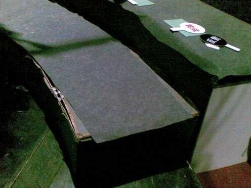

*2009-07-01 18:37 · 饭否拍拍*

---

### 12571

@ 七七 从中关村横穿整个北京城来围观？这成本也太高了吧！

*2009-07-01 18:32 · 手机上网 给七七的回复*

---

### 12572

演播厅上方密密麻麻全是灯

*2009-07-01 18:29 · 饭否拍拍*

---

### 12573

《一虎一席谈》演播厅里手机信号很差:-(

*2009-07-01 18:06 · 手机上网*

---

### 12574

到中国传媒大学了。这地方我只在九年前来过一次，有个高中和我同班的女同学考到了这里，当时这学校还叫北京广播学院。我从清华坐了三四十站公车才到北广，感觉就像去了趟天津。这回再来，感觉交通方便了许多。

*2009-07-01 18:03 · 手机上网*

---

### 12575

我也把firefox升级到3.5版了，没觉得有什么变化，或许速度真的快一点吧。 http://www.mozillaonline.com/

*2009-07-01 15:58 · 网页*

---

### 12576

@ 老吴 看了那张flickr上的图，我兴冲冲的跑去看百度首页…… 我太天真了……

*2009-07-01 15:28 · 网页 给老吴的回复*

---

### 12577

@ 江上渔者 你现在用手机还访问不了 http://m.fanfou.com 吗？我刚试过，可以。你用的是哪个省的哪个手机运营商？

*2009-07-01 15:26 · 网页 给江上渔者的回复*

---

### 12578

@ flypig 饭否有公开的API，像您这样的青年才俊可以利用它做一个只显示你的女粉丝的专享地图版饭否。

*2009-07-01 15:25 · 网页 给flypig的回复*

---

### 12579

@ flypig 考虑到你的颅骨尺寸，你很有希望成为最大的脑残！

*2009-07-01 15:21 · 网页 给flypig的回复*

---

### 12580

这期的主题是“网络社交”。节目组准备的相关话题包括“1、虚拟社交是不是“心理毒品”？2、虚拟世界会不会颠覆现实世界？” 我觉得这俩问题都没问到点子上。更刺激的话题请看@ 刘兴亮 老师的爆料。

*2009-07-01 14:54 · 网页*

---

### 12581

我们今天要录的《一虎一席谈》预订下周六（7月11日）晚8点播出。

我不知道为什么要隔这么久，把90分钟的现场剪成48分钟的节目需要10天时间吗？或许是担心某一期节目接不上，所以要留一周的缓冲吧。

*2009-07-01 14:51 · 网页*

---

### 12582

因为饭否的存在，这期节目估计会成为《一虎一席谈》历史上剧透最严重的一次。参加节目的嘉宾除了我和@ 刘兴亮 老师，还有两个“反loser联盟”的人。说实话，我以前从没听过这个联盟，但是觉得这个名字蛮搞笑的。

*2009-07-01 14:44 · 网页*

---

### 12583

@ flypig 我一直在默默的看着你！

*2009-07-01 14:38 · 网页 给flypig的回复*

---

### 12584

过一会儿要和@ 刘兴亮 老师一起去录《一虎一席谈》。演播厅在中国传媒大学，那地方离海淀太远了，在东四环外。我97年刚到清华上学时北京市区图里还没有那地方，第二年地图大了一圈才把它包括进来。

*2009-07-01 14:36 · 网页*

---

### 12585

@ sharon 我两个月前在工体感受过纵贯线的现场气氛了，也只能说是感受气氛了，因为别说台上的歌手，连大屏幕都看不清:-(

*2009-07-01 12:24 · 网页 给sharon的回复*

---

### 12586

http://bit.ly/hsM05 日本的情爱旅馆与众不同的原因之一是，如果一切顺利，你在旅馆始终不会碰到任何人。你在大厅按下按钮，会有指示灯闪亮带你进入自己挑选的房间。你需要的房间服务会通过墙上的一个狭槽传送。铃响便是通知你需要的对象到了，而送对象来的人却不见踪影。

*2009-07-01 12:18 · 网页*

---

### 12587

@ 佐薇 不好意思，原先有点故障，现在应该已经修好了。你再试试看？

*2009-07-01 11:37 · 网页 给佐薇的回复*

---

### 12588

@ agnesxun 我觉得公开辩论的目的第一是听取对方的观点以进一步完善自己的观点，第二是表达自己的观点，第三是争取观众，至于说服对方，那基本是不可能的事。

*2009-07-01 10:29 · 网页 给agnesxun的回复*

---

### 12589

@ 启航 我的套餐是每月15元CMWAP不限流量，忘了是2004年还是2005年开通的，一直用到现在。

*2009-07-01 10:26 · 网页 给启航的回复*

---

### 12590

我六月份的手机GPRS流量居然还是只用了95.38M，看来只要不用手机看视频下mp3，再怎么用也很难超过100M。

*2009-07-01 10:15 · 网页*

---

### 12591

上网找了找，发现想看一下一年前的《一虎一席谈之“范跑跑”》并不容易，至少我没有找到可以清晰连续播放的地方。也就土豆上能凑合看到一部分。

*2009-06-30 22:29 · 网页*

---

### 12592

转：@ 和菜头 老笑话 妈妈：小明，该去学校了，再不起床你就迟到了。小明：我不要去学校！同学们都讨厌我，老师们也恨我！妈妈：可是，你是校长啊……

*2009-06-30 20:42 · 网页 转自和菜头*

---

### 12593

每次看到关于茅于轼老师的新闻，再看看后面那些谩骂的评论，我都不禁为茅老师叫屈。他为穷人说话，但却有不少脑子转不过弯的人死命骂他。好吧，再冤也冤不过袁崇焕。

*2009-06-30 20:39 · 网页*

---

### 12594

@ 王蕊 狂热？你要买几套房？

*2009-06-30 18:53 · 网页 给王蕊的回复*

---

### 12595

转：@ 孟晨冬.txt @ 王兴 以前还听一个日本的学者上胡一虎节目前问他，节目的底线是多少，胡一虎说，原则上，只要不打架就行。//只要还有底线就好，现在没底线的事情还真不少见。

*2009-06-30 18:41 · 网页 转自孟晨冬.txt*

---

### 12596

呃，听说《一虎一席谈》的主要内容就是当众吵架-_-! 如果有人认为自己精于此道，想参加这个节目，请联系节目组的@ 靖双 mm.

*2009-06-30 18:32 · 网页*

---

### 12597

明天要去参加这期《一虎一席谈》的录制。我要先找个视频网站看看这节目到底什么风格，为什么联系我的mm在电话里反复用“上场”这个词，说得好像要肉搏一样。

*2009-06-30 18:19 · 网页*

---

### 12598

有太多的事情，只能解释为：因为这是中国……

*2009-06-30 18:08 · 网页*

---

### 12599

越来越觉得德鲁克的传记《旁观者的奇妙冒险》(Adventures of aBystander)这书名起得实在是妙。

*2009-06-30 11:36 · 网页*

---

### 12600

@ 于仁国 室内种豆角？你妈好能干！

*2009-06-30 10:31 · 网页 给于仁国的回复*

---

### 12601

@ 松木 哈哈，看《财经》当然和看《男人装》不一样。对我来说，看《财经》是需要动脑的，不然看不懂。

*2009-06-30 10:28 · 网页 给松木的回复*

---

### 12602

上周一（6月22日）出的那期《财经》我到今天都还没读完，看来《财经》这种杂志做成双周刊正好适合我。

*2009-06-30 10:23 · 网页*

---

### 12603

转：@ 航班管家 为庆祝航班管家iphone版正式上线，我们近期将在前500名下载iphone版的用户中抽出一名幸运用户，获赠最新版iphone 3G S 壹台，更多大礼敬请期待！

*2009-06-30 10:14 · 网页 转自航班管家*

---

### 12604

转：@ 王烁WangShuo 律师张思之从未打赢过一起官司，但人皆仰之。 http://bit.ly/64fwy // 我不禁想起周国平的说法：最基本的划分不是成功与失败，而是以伟大的成功和伟大的失败为一方，以渺小的成功和渺小的失败为另一方。

*2009-06-29 23:06 · 网页 转自王烁WangShuo*

---

### 12605

转：@ LEMONed 真人示范 罩杯大小尺寸[图]http://www.mtime.com/GROUP/...

*2009-06-29 22:42 · 网页 转自LEMONed*

---

### 12606

从我在饭否上收到的回复来看，居然真的有不少人相信苹果说的不做上网本。太天真啦，同学们，你们忘了乔布斯说过ipod不会加入video功能吗？忘了乔布斯说过苹果没在研发手机吗？我赌苹果一年之内一定会推出上网本，只不过不称呼它为上网本，就像苹果宣称自己不生产PC，只生产Mac。

*2009-06-29 22:16 · 网页*

---

### 12607

刚刚注意到，腾讯的市值(1700亿港币)已经超过美国雅虎(219亿美元)和

ebay(223亿美元)了。也就是说，腾讯现在仅次于google和amazon，是全球市值第三大的互联网公司了？

*2009-06-29 22:08 · 网页*

---

### 12608

我最好的想法全被古人剽窃了。 --艾默生

*2009-06-29 12:49 · 网页*

---

### 12609

@ 阿甘北京 喜欢恶搞折腾的人永远都不缺。你不喜欢和他们玩，不理就是了。

*2009-06-29 11:24 · 网页 给阿甘北京的回复*

---

### 12610

用了十几天内置中国移动3G卡的@ 惠普 mini上网本，发现实际上我对3G没什么需求。我会坐下来用上网本的地方基本上都有wifi了。上网本或者说迷你型笔记本倒是好东西。继续期待苹果推出上网本。

*2009-06-29 11:21 · 网页*

---

### 12611

从笔记本通过蓝牙把文件发给手机是一件很不稳定的事情，有时行有时不行，我一直没搞明白到底怎么回事。我讨厌不可靠的技术。

*2009-06-29 11:02 · 网页*

---

### 12612

第一次逛优衣酷的店，发现这个日本牌子确实不能小看，产品定位很适合城市里的年轻人。

*2009-06-28 20:11 · 手机上网*

---

### 12613

我原以为菠萝蜜（左）和榴梿是同一种水果，没想到差别还不小。

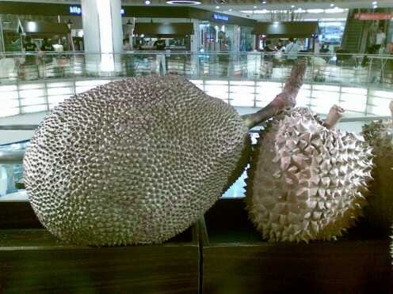

*2009-06-28 19:21 · 饭否拍拍*

---

### 12614

今天和老爸短暂会面，谈话的重点内容照例是让我要健康饮食要积极

锻炼。他说他现在还可以一口气做10个引体向上，年龄只有他一半的我只好说我也行，其实心里并没有百分之百的把握，因为已经有半年没摸过单杠了。

*2009-06-27 23:37 · 网页*

---

### 12615

@ buyler 最近出现了几个第三方的windows mobile版饭否客户端，例如QuakkFan. 你试过了吗？在饭否搜"QuakkFan"就能找到。

*2009-06-27 23:27 · 网页 给buyler的回复*

---

### 12616

@ 慕岩_百合网 裸池游泳？裸泳？

*2009-06-27 23:16 · 网页 给慕岩_百合网的回复*

---

### 12617

转：@ 庄雅婷 钱海燕说：“分手如杀人，灭口之后不要回现场溜达，不要对任何人提起。”在看了那么多分手声明之后深刻感觉此乃真理，从周慧敏到周迅，还敢不敢再傻点啊。。。

*2009-06-27 21:07 · 网页 转自庄雅婷*

---

### 12618

呃，短裤被办公桌键盘托板裸露的尖角钩破了:-( 不过我转念一想，幸好钩破的是穿了十一年的旧裤子，而不是新买的。我大学时曾有新买一条裤子两小时后屁股上就钩破一条缝的悲惨经历，相比之下这回好多了。

*2009-06-27 20:41 · 网页*

---

### 12619

@ LEMONed 蒋就是那个特招进清华的mm吧？

*2009-06-27 20:26 · 网页 给LEMONed的回复*

---

### 12620

@ 白小刺 友情提醒：@ 人名时在名字后面要加一个空格 ，不然饭否不知道名字到哪里算结束。毕竟中文不像英文那样每个词之间本来就有空格。

*2009-06-27 16:48 · 网页 给白小刺的回复*

---

### 12621

转：@ 张亮 在加班，看到@ ouspec 在饭否直播 Facebook 中国开发者大会，觉得真是有趣，可惜不能亲历

*2009-06-27 16:39 · 网页 转自张亮*

---

### 12622

@ 可佳•奇 前几天我提到Beat It的时候，音乐专业人士@ iFire 帮我纠错了，那叫MV，不叫MTV.

*2009-06-27 16:37 · 网页 给可佳•奇的回复*

---

### 12623

转：@ 小权 饭否WM手机客户端：QuakkFan V0.1.0 最新版发布，增加图片上传功能，欢迎大家试用，并提交反馈。下载地址:http://bit.ly/g1UHj

*2009-06-27 16:35 · 网页 转自小权*

---

### 12624

和在北京转机的老爸见面

*2009-06-27 16:27 · 饭否拍拍*

---

### 12625

过去未去，未来已来。

*2009-06-27 10:40 · 网页*

---

### 12626

@ Raramary 那就吃不消的时候“取消关注”，偶尔想看的时候再“关注”吧。或者想看的时候直接去看她的饭否页面。

*2009-06-27 10:37 · 网页 给Raramary的回复*

---

### 12627

@ Raramary 关注就是想看到某人的话，回避就是不想看到某人的话，那你到底是想看还是不想看那人的话呢？

*2009-06-27 10:31 · 网页 给Raramary的回复*

---

### 12628

@ underland 想买就买呗，早买早受益。我就属于落后状态，还是kindle一代，但是只要能方便买amazon上的书我就觉得物有所值了。

*2009-06-27 10:21 · 网页 给underland的回复*

---

### 12629

@ 夜叉 这两者没有必然联系吧。就好像一个人的身份证号是唯一的，手机号也是唯一，各有各的用途。

*2009-06-27 01:26 · 网页 给夜叉的回复*

---

### 12630

@ champloo 嘿，我们口味蛮像！我也喜欢果肉最多的那种。我还喜欢grapefruit的那种，略带点苦味，喝起来就觉得清爽健康，不知道是不是受了中国传统观念“苦的东西多半降火”的心理暗示。

*2009-06-27 01:07 · 网页 给champloo的回复*

---

### 12631

@ 逐日赵勇 凌晨一点半电话会议？看来你们这一行也确实不容易……

*2009-06-27 00:49 · 网页 给逐日赵勇的回复*

---

### 12632

kindle阅读器配合amazon的一键购买，买书太方便了！当然，花钱也太容易了。

*2009-06-27 00:46 · 网页*

---

### 12633

@ tonidaodaO 呃，就是我照片上那样大小的一纸盒卖100块？那太贵了！

*2009-06-26 22:51 · 网页 给tonidaodaO的回复*

---

### 12634

@ 潘欣 杰克逊的MV是绝对震撼的！单听歌也不错。

*2009-06-26 21:22 · 网页 给潘欣的回复*

---

### 12635

@ 逐日赵勇 哈哈，tropicana正是我说的另一个牌子，引进国内后好像叫“纯果乐”，不过推的产品和美国不一样，不是纯果汁。

*2009-06-26 18:18 · 手机上网 给逐日赵勇的回复*

---

### 12636

我在美国读书时常喝两个牌子的橙汁，这就是其中之一，第一次在国内看到，没想到译成“佛州鲜然”了。

*2009-06-26 17:24 · 饭否拍拍*

---

### 12637

@ 王岳 正是他

*2009-06-26 16:44 · 手机上网 给王岳的回复*

---

### 12638

尝试从五道口到东方广场的非典型交通路线：打的打到南礼士路换乘地铁一号线

*2009-06-26 14:28 · 手机上网*

---

### 12639

@ RaRa 呼唤平安总部的照片！有图有真相

*2009-06-26 11:57 · 网页 给RaRa的回复*

---

### 12640

转：@ RaRa 平安的总部太华丽了 据说仿哈佛建的 难怪瞅着这么眼熟

*2009-06-26 11:56 · 网页 转自RaRa*

---

### 12641

@ iFire 是啊，世事无常。另，网上段子看多了之后，“日前”一词总觉得怪怪的，慎用;-)

*2009-06-26 10:21 · 网页 给iFire的回复*

---

### 12642

多谢各位饭友纠正，《成长的烦恼》里的老大迈克没死，他打保龄球时摔倒死了的新闻是谣言。 http://zhidao.baidu.com/que...

*2009-06-26 10:17 · 网页*

---

### 12643

转：@ 可佳_奇 我心中最著名的迈克（迈克尔）：迈克尔杰克逊，迈克乔丹，以及《成长的烦恼》中的老大迈克（可惜他也死了，08年去世的，打保龄球时摔倒然后死了// 天哪，当年《成长的烦恼》里那个小帅哥也死了？这简直比迈克尔·杰克逊死了更令我吃惊！

*2009-06-26 10:11 · 网页 转自可佳_奇*

---

### 12644

转：@ 杨康 昨晚6点广东省的网络故障,用360安全卫士扫描木马的用户翻了一倍.// 这个让人缺乏安全感的网络

*2009-06-26 10:04 · 网页 转自杨康*

---

### 12645

惊闻杰克逊挂了。至今记得第一次看他的MV时受到的强烈冲击。MJ,R.I.P.

*2009-06-26 10:02 · 网页*

---

### 12646

转自@ 欧宁 ：刘家琨说,现实就是慢慢变硬的幻觉。

*2009-06-26 00:58 · iPhone客户端*

---

### 12647

@ 眉州东坡 去了醉爱，离我最近。

*2009-06-25 23:23 · 网页 给眉州东坡的回复*

---

### 12648

晚上和几个老乡聚餐，我们家乡一个著名老中医的外孙透露了一个秘密“其实我外公是中西医兼用，而且西医成分可能还更大一些，不过他把西药磨成粉混在中药里……”

*2009-06-25 22:25 · 网页*

---

### 12649

下午见了一牛人，八年前，他抱着科技改造社会的理想来北京，加入

中国最成功的互联网公司之一，现在功成身退，要回上海去了。他说从来没考虑过在北京扎根，所以一直没买房。呃，北京好没面子啊……

*2009-06-25 18:09 · 网页*

---

### 12650

@ 颜桥 你说的大胸餐厅就是传说中的hooters吧？感觉如何？

*2009-06-25 17:23 · 网页 给颜桥的回复*

---

### 12651

@ easy 已经在过滤，正在想办法更好的过滤，人肉spammer是很难缠的。

*2009-06-25 17:21 · 网页 给easy的回复*

---

### 12652

转：@ 李黎军.模范 学校为杜绝学生翻墙标语：严禁翻墙，男生不小心就会翻成女生，女生不小心就会翻女人

*2009-06-25 12:37 · 网页 转自李黎军.模范*

---

### 12653

“少年不识愁滋味，爱上层楼。爱上层楼，为赋新词强说愁。而今识尽愁滋味，欲说还休。欲说还休，却道天凉好个秋。” 这整个儿说的就是两种不同的用饭否的状态嘛。

*2009-06-25 10:26 · 网页*

---

### 12654

@ 云躲 从头像上看你是女生啊。那你应该比我更清楚女生的喜好才对。让女生高兴的约会就是好的约会，尤其是初次约会^_^

*2009-06-25 10:21 · 网页 给云躲的回复*

---

### 12655

@ 云科技 大哥，看电影本来就不是和女孩初次约会的最佳形式！怎么能赖到电影头上去呢？

*2009-06-25 10:14 · 网页 给云科技的回复*

---

### 12656

@ 慕岩_百合网 看来你平时的作息习惯真健康。1点还没睡对我来说太正常了。

*2009-06-25 01:05 · 网页 给慕岩_百合网的回复*

---

### 12657

@ 张亮 你来帮他们写吧，匿名投稿，力争成为获普利策奖的第一个华人？

*2009-06-25 00:03 · 网页 给张亮的回复*

---

### 12658

@ 巫昂 你太谦虚了，04年开始写博客的哪是普通人，绝对算是国内的数字先锋了。

*2009-06-24 22:16 · 网页 给巫昂的回复*

---

### 12659

对@ 申音 的《变形金刚2》简评很有同感：“机器人打群架眼花缭乱，几乎认不出谁是谁”。我昨晚也看得很晕，觉得自己老了。

*2009-06-24 21:40 · 网页*

---

### 12660

刚才夸一个朋友很早就开始写博客，早于05年7月，那是新浪博客之前的博客时代。后来转念一想，我不会是潜意识里想夸自己吧，我其实02年就尝试了，但是没有坚持下来。

*2009-06-24 21:01 · 网页*

---

### 12661

@ underland 下午饭否确实服务中断了一小会儿，不过纯属技术原因。结果我竟然接到电话问是不是XXX了…… 多谢大家关心哈

*2009-06-24 20:48 · 网页 给underland的回复*

---

### 12662

@ .rex 你是说E63还是E62？ E62是上一代的，速度很慢，不推荐。

*2009-06-24 20:27 · 网页 给.rex的回复*

---

### 12663

转：@ 叶滨 据说海龙一楼各大品牌专卖区，都已打出了标语：免费专业删除绿坝，让您上网无忧！

*2009-06-24 19:58 · 网页 转自叶滨*

---

### 12664

刚才意外的接到一个中学校友打来的电话。生活中总有各种各样的小惊喜:-)

*2009-06-24 18:09 · 网页*

---

### 12665

转：@ 刘丹 NND，信春哥，不宕机，都是骗人的。。。囧rz 【饭否刚才因纯技术原因而中断服务，抱歉。】

*2009-06-24 17:50 · 网页 转自刘丹*

---

### 12666

@ 乔纳森 我看的是中文字幕加原声。应该也有中文配音版的吧

*2009-06-24 16:51 · 网页 给乔纳森的回复*

---

### 12667

@ jiayinwuxian 我和@ 可佳_奇 在拉萨买的藏刀好像还没寄到……

*2009-06-24 16:41 · 网页 给jiayinwuxian的回复*

---

### 12668

@ 李黎军.模范 44度不会是车里的温度吧？

*2009-06-24 15:49 · 手机上网 给李黎军.模范的回复*

---

### 12669

一出门才发现确实热浪袭人，难怪39度会成为饭否今天的热门话题。

*2009-06-24 14:59 · 手机上网*

---

### 12670

@ 叶绍志 我当然不担心msn病毒，但是隔三岔五收到垃圾消息就够烦了。

*2009-06-24 11:56 · 网页 给叶绍志的回复*

---

### 12671

终于忍不住在MSN上把一个认识的人给拖黑了。因为我查了一下记录，最近一年我们没在MSN上说过话，但是他的MSN中毒给我发过几十次消息了。

*2009-06-24 11:54 · 网页*

---

### 12672

@ 逐日赵勇 什么叫空中流量控制？机场太挤没法按时降落？

*2009-06-24 11:43 · 网页 给逐日赵勇的回复*

---

### 12673

查了一下，“在未来，每个人都能出名15分钟”这话是安迪-沃霍尔在1968年说的。我觉得这说明安迪-沃霍尔大大超前于时代或者美国社会比中国社会领先三四十年。

*2009-06-24 11:33 · 网页*

---

### 12674

早就听说@ 读库 的大名了，可是一直没买；两周前终于上网买了最近的一期，可是放到现在还没看。这说明什么呢？

*2009-06-24 11:26 · 网页*

---

### 12675

@ 张亮 有可能。现在还没降到一个槛，可以说行业还没成形。我觉得大致相当于intel推出8080芯片那个阶段吧。不过这几年我对这个行业没有太关注，所以信息可能有些旧了。

*2009-06-24 10:29 · 网页 给张亮的回复*

---

### 12676

@ 张亮 确实，8年前，我刚开始读研究生的时候，人类基因组计划刚刚集全球之力耗数年之功首次完成人类基因组测序，那可是里程碑式的突破。我都做过一段时间bioinformatics的研究。没想到测序成本降得如此之快。

*2009-06-24 10:10 · 网页 给张亮的回复*

---

### 12677

说实话，《变形金刚2》没有我期待的那么激动人心。看来我现在确实是喜欢剧情片胜过场面片。

*2009-06-24 02:55 · 手机上网*

---

### 12678

聚在华星大厅等着看《变形金刚2》的人群里美女密度相当高啊

*2009-06-23 23:49 · 手机上网*

---

### 12679

几场全满！《变形金刚2》真火！

*2009-06-23 23:32 · 饭否拍拍*

---

### 12680

@ 马日拉 Needing someone is like needing a parachute. If theyaren't there the first time, chances are you will never need themagain. -Dilbert

*2009-06-23 19:14 · 网页 给马日拉的回复*

---

### 12681

@ 王蕊 新婚就是爽啊，居然有人匿名送你礼物！

*2009-06-23 19:11 · 网页 给王蕊的回复*

---

### 12682

@ 心有零犀 不便宜啊，你的wo是公费还是自费？

*2009-06-23 18:05 · 网页 给心有零犀的回复*

---

### 12683

@ iFire 确实应该是MV, 多谢专家纠错:-)

*2009-06-23 17:58 · 网页 给iFire的回复*

---

### 12684

@ 可佳_奇 好吧，你华丽的打败我了。

*2009-06-23 16:51 · 网页 给可佳_奇的回复*

---

### 12685

中学时看迈克尔·杰克逊《Beat It》的MTV，觉得黑帮老大单挑的场面很刺激，只是结局令我不解：好像最后没打起来啊。几年后我才知道，beat it是一个英语俚语，意思不是“揍它”，而是“不鸟它，赶紧撤”。于是我觉得beat it是部不错的教育片。

*2009-06-23 16:44 · 网页*

---

### 12686

@ 申音 我没有和冯军私下交流过，只是几年前在一个清华校友年会上听过他演讲，感觉还不错。听说他现在是某民主党派的副主席了？

*2009-06-23 16:18 · 网页 给申音的回复*

---

### 12687

@ 黄锫坚 说实话，在我的脑海里，“爱立信”和“创新”这两个词没什么联系。

*2009-06-23 15:23 · 网页 给黄锫坚的回复*

---

### 12688

@ 曹晖 据说有个基于饭否API的第三方应用可以备份饭否消息，你在饭否搜psucc应该可以找到，不过我没用过，不确保好用。如果有这个需求的用户很多的话，饭否可以考虑提供一个官方的消息备份工具。

*2009-06-23 15:21 · 网页 给曹晖的回复*

---

### 12689

遗憾的发现，有些人不尊重公开的信息与私人的信息的区别。我以前受到的教育是，不管你是否同意对方的观点，在公开与对方的私人通信的内容之前，应该征得对方的同意。媒体行业的人更应该知道offthe-record的概念。也许我比较老派，我仍然觉得那是值得提倡的，即使是在这个众声喧哗的年代

*2009-06-23 15:06 · 网页*

---

### 12690

@ ebin 文道是真的，陈丹青不是。

*2009-06-23 14:07 · 网页 给ebin的回复*

---

### 12691

@ 动感电梯 以前可以重名，后来发现那样不好，所以已经改成不能新出现重名了。

*2009-06-23 13:55 · 网页 给动感电梯的回复*

---

### 12692

@ 可佳_奇 我也今晚去看变形金刚2。我去北三环的华星，你呢？

*2009-06-23 13:36 · 网页 给可佳_奇的回复*

---

### 12693

第一次看到粉红色的水溶C100，决定试一下。

*2009-06-23 13:35 · 饭否拍拍*

---

### 12694

已经有好几个魅族M8用户问我有没有专用的饭否客户端了，干脆这里统一做个广告吧。 http://bit.ly/n2gKn

*2009-06-23 11:37 · 网页*

---

### 12695

@ 团团钱 别点右上角的“搜索”，直接在首页右边栏中部的输入框里搜。然后在搜索结果的右上角就有“保存此搜索”的链接。

*2009-06-23 11:17 · 网页 给团团钱的回复*

---

### 12696

有人居然说我搞特权，难道你不知道饭否上周就推出了“保存搜索”的功能？每个人都可以在搜索某个关键词之后点结果右上角的“保存此搜索”，以后再搜一样的东西就不用重新输入，直接点右边保存的搜索就可以了。很方便的！

*2009-06-23 10:54 · 网页*

---

### 12697

@ 潘欣 爱国者到底什么产品比较赚钱？我一直很疑惑他们怎么支撑这么大的品牌推广开销。

*2009-06-23 10:48 · 网页 给潘欣的回复*

---

### 12698

我承认，我把自己的名字“王兴”加入饭否“保存的搜索”。

*2009-06-23 10:42 · 网页*

---

### 12699

渐渐有点能体会，抗战期间，不积极参与政治而是潜心文艺、翻译莎士比亚全集的梁实秋先生应该担负着多少压力啊。

http://bit.ly/2BImPx

*2009-06-23 10:15 · 网页*

---

### 12700

@ 优比客 我刚才看的时候，你的关注者的数量已经上升到785了。这么看来没有bug而是之前有些巧合？

*2009-06-22 23:07 · 网页 给优比客的回复*

---

### 12701

@ Heidi.ai 你是指漫游指南的电影还是书？

*2009-06-22 21:54 · 网页 给Heidi.ai的回复*

---

### 12702

转@ hizi 一只狗，主人与我相熟。每次遇到都忍不住问狗的品种，主人告知叫“雪纳瑞”。问了几次，还是记不住。今日又见其主人，讨好地问：你家那“萨摩耶”可好？对方愠道：这是雪纳瑞，如果你实在记不住……就叫他张纪中好了！此时，狗狗站定回头，对我怒目而视，腮边须髯飘飘……可不就是咋的？

*2009-06-22 21:20 · 网页 转自hizi*

---

### 12703

从@ 张亮 的分享里看来的，《聊聊NBA球员和他们的女人（低俗，慎入）》 http://bit.ly/7T0Qk 什么叫八卦？什么叫专业？这就是！

*2009-06-22 21:02 · 网页*

---

### 12704

@ RaRa 一坨消化不良留下几颗黄豆的便便？

*2009-06-22 20:46 · 网页 给RaRa的回复*

---

### 12705

明晚十二点去华星看《变形金刚2》！嘢，好几个月没去电影院了。

*2009-06-22 20:42 · 网页*

---

### 12706

@ 可佳_奇 这么说来，我几年前就预见到会爆发金融危机，所以一直把买电视机和影碟机的钱省到现在:-)

*2009-06-22 20:36 · 网页 给可佳_奇的回复*

---

### 12707

@ 乔纳森 已成功开通mini的3G功能。多谢！

*2009-06-22 20:29 · 网页 给乔纳森的回复*

---

### 12708

@ 可佳_奇 不开电脑但却看电影？你用影碟机和电视看电影？

*2009-06-22 20:28 · 网页 给可佳_奇的回复*

---

### 12709

昨晚把伍迪·艾伦的伦敦三部曲的最后一部《卡桑德拉之梦》看了，感觉一般。这三部电影我看的顺序是《赛末点》、《Scoop》、《卡桑德拉之梦》。评价从高到低也是这个顺序，不知道是否纯属偶然。

*2009-06-22 20:12 · 网页*

---

### 12710

@ 七七 这是金山在珠海的楼？

*2009-06-22 20:09 · 网页 给七七的回复*

---

### 12711

@ hantt 这种阴谋对google无效吧。谷歌中国的收入占google全球收入的比例本来就不高，中国的一点风吹草动影响不了google股价。

*2009-06-22 20:03 · 网页 给hantt的回复*

---

### 12712

@ IwfWcf 这种手法有什么漏洞吗？没有的话，岂不是会经常发生？

*2009-06-22 12:39 · 网页 给IwfWcf的回复*

---

### 12713

@ kang 饭否有黑名单功能：访问某人饭否页面，右边栏底部有“加入黑名单”的按钮。

*2009-06-22 12:33 · 网页 给kang的回复*

---

### 12714

昨晚听说了一个阴谋论：筹集大笔资金做空百度股票，然后塞钱让央视做百度负面报导，导致百度股价猛跌，从中牟取暴利。稍微想了一下，好像不是完全不可能。

*2009-06-22 12:28 · 网页*

---

### 12715

终于看到一个魅族M8，确实比其他山寨iPhone靠谱很多，不过两千多的价格也不便宜了

*2009-06-22 11:43 · 手机上网*

---

### 12716

生产风靡一时的大头洞洞鞋的Crocs的股价从07年的每股$72跌到$2，据说公司快完蛋了。一款好产品没能造就一家好公司。

*2009-06-21 20:49 · 网页*

---

### 12717

纽约时报的一篇文章说：全世界的机房耗电量已经超过瑞典全国的耗电量了。 http://bit.ly/AKS3k

*2009-06-21 20:37 · 网页*

---

### 12718

@ Zafka 欢迎！

*2009-06-21 20:11 · 网页 给Zafka的回复*

---

### 12719

@ 胡泳 谢谢胡老师支持！友情提示：在@ 人名时 ，人名后要有一个空格，这样才能识别成链接。

*2009-06-21 16:34 · 网页 给胡泳的回复*

---

### 12720

在华贸万豪参加@ 徐乐 和刘丹萍的婚礼，遇到好多互联网同行：海报网的@ 叶滨 ，anti-cnn的@ 饶谨 ，简单中国的@ 周杰 ，58的姚劲波…

*2009-06-21 11:53 · 手机上网*

---

### 12721

@ 飯遭殃 非常感谢！我也希望在饭否看到更多理性。

*2009-06-21 04:34 · 网页 给飯遭殃的回复*

---

### 12722

即将在熬夜中迎来一年中白天最长的一天。回来混真不容易。

*2009-06-21 04:12 · 网页*

---

### 12723

清华小师弟@ 徐乐 真是标准的IT新锐，连婚礼请柬都上网。

http://20090621.com

*2009-06-21 00:45 · 网页*

---

### 12724

@ 边锋 多谢。看了一下amazon提供的这本书的目录和网上的评论，这书似乎读起来并不轻松啊。

*2009-06-21 00:34 · 网页 给边锋的回复*

---

### 12725

把Dilbert漫画里的一句名言翻译成中文：别和傻逼较劲，他们会把你也降格为傻逼，然后用经验打败你。

*2009-06-20 23:36 · 网页*

---

### 12726

今晚和胡泳老师@ blindfish 聊了一下。关于传播学，他向我推荐《交流的无奈》一书。这书的英文名是Speaking into the Air，比中文译名更形象。

*2009-06-20 23:07 · 网页*

---

### 12727

@ 叶滨 上网的人多了，edge带宽快被占满了？

*2009-06-20 23:00 · 网页 给叶滨的回复*

---

### 12728

@ 王蕊 你还玩游戏？什么游戏？

*2009-06-20 22:57 · 网页 给王蕊的回复*

---

### 12729

在出租车上听广播说，金庸将于今年晚些时候加入中国作协。orz!

*2009-06-20 17:59 · 手机上网*

---

### 12730

原来ethereal早在2006年就改名为wireshark了，我说怎么一直没更新呢。

*2009-06-20 17:34 · 网页*

---

### 12731

@ 可佳_奇 哎， 北京什么时候才能有许留山啊！

*2009-06-20 16:42 · 网页 给可佳_奇的回复*

---

### 12732

@ Heidi.ai 我很邪恶的联想到这个场景：一个女生吭哧吭哧顺着下水管道爬到二楼透过窗户偷窥别人，楼下一群人围观这个女生……

*2009-06-20 12:00 · 网页 给Heidi.ai的回复*

---

### 12733

在移动的3G上试了一下ssh这种对延时很敏感的应用，感觉还不错，没有太明显的迟滞感

*2009-06-20 11:57 · 网页*

---

### 12734

终于给我的@ 惠普 mini上网本开通了移动的3G，在五道口这里感觉速度一般，浏览网页勉强够用，还是不能跟wifi比。

*2009-06-20 11:50 · 网页*

---

### 12735

转：@ 如是如来 暧昧=爱日未日。

*2009-06-20 11:45 · 网页 转自如是如来*

---

### 12736

常常问自己：怎样才能问出好问题？

*2009-06-20 10:58 · 网页*

---

### 12737

@ 徐乐 你的车停在机场？

*2009-06-20 01:49 · 网页 给徐乐的回复*

---

### 12738

@ 渐变坏男 已经有人开发了魅族M8上的饭否客户端。请用饭否搜

索“饭否 m8”

*2009-06-20 01:05 · 网页 给渐变坏男的回复*

---

### 12739

@ 欧宁 我没有翻墙也能正常访问你的博客

*2009-06-20 00:40 · 网页 给欧宁的回复*

---

### 12740

在饭否出没最好搞明白这一点：你关注别人不代表别人一定要关注你，别人也没有回答你问题的义务。其实，在生活中也是这样。

*2009-06-19 22:59 · 网页*

---

### 12741

@ Heidi.ai 哇，你俨然就是煎蛋的化身哪

*2009-06-19 22:52 · 网页 给Heidi.ai的回复*

---

### 12742

@ 张亮 dacode.com上没有内置和饭否的互动，所以期望值本来就不能太高

*2009-06-19 20:55 · 网页 给张亮的回复*

---

### 12743

@ 心有零犀 yahoo mail的搜索也是垃圾，我碰到过一样的问题，明明看得见，就是搜不到。

*2009-06-19 16:27 · 网页 给心有零犀的回复*

---

### 12744

@ 沈祺 就是最常规的路线：走机场高速，然后北四环，再从保福寺桥出来。所以我也觉的只要30分钟算是超级顺利了。我有一次凌晨一点多走这条路也花了二十几分钟。

*2009-06-19 16:20 · 网页 给沈祺的回复*

---

### 12745

周五下午从T3航站楼回到五道口居然只要半个小时，真是异常顺利！

*2009-06-19 16:01 · 手机上网*

---

### 12746

@ Nathan 多谢。没想到还能得到你的回复。

*2009-06-19 13:17 · 网页 给Nathan的回复*

---

### 12747

@ 可佳_奇 dacode这事我知道，就是饭否上的@ 张亮 做的。你的意思是饭否也应该搞一些噱头？

*2009-06-19 13:10 · 网页 给可佳_奇的回复*

---

### 12748

@ babynana 你直接问@ 慕岩_百合网 本人吧。他是婚恋网站百合网的首席专家。

*2009-06-19 13:00 · 网页 给babynana的回复*

---

### 12749

@ easy 人家@ 惠普 给mini的定位本来就是上网本，你非要用来当工作站当然不合适。对上网本来说，轻便还是第一要紧的。台式机就应该配超大屏幕，那是上网本永远赶不上的。

*2009-06-19 10:53 · 网页 给easy的回复*

---

### 12750

和thinkpad x60相比，@ 惠普 的mini上网本小了一圈，小到我愿意带着它外出。如果能再轻一点就更好了

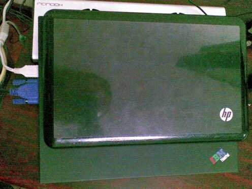

*2009-06-19 10:42 · 饭否拍拍*

---

### 12751

积极批判星座的@ 马日拉 同学得到数据支持了。 转：@ 慕岩_百合网 @ 王兴 别太信星座，我研究过百合网500多万用户的心理测试结果和他们星座的关系，发现相关度为零！

*2009-06-19 10:33 · 网页 转自慕岩_百合网*

---

### 12752

@ 屈伟 点消息最末尾”通过XXX“后面的“给YYY的回复”可以看到回复的是哪条消息。

*2009-06-19 10:28 · 网页 给屈伟的回复*

---

### 12753

@ 慕岩_百合网 你够早！据我目前所知，仅次于@ gravity0 ，他说他的帐号是12年前hotmail还没卖给微软时注册的-_-!

*2009-06-19 01:01 · 网页 给慕岩_百合网的回复*

---

### 12754

@ 白斗斗 msn那个数字的意思并非你是第几个参加那个活动的人，而是说在已参加那个活动的人中你是第几个注册msn的。不信你再登进去看一下，数字已经变了。

*2009-06-18 22:47 · 网页 给白斗斗的回复*

---

### 12755

看到@ rara 分享的MSN十周年庆典活动，登录进去看了一下，我是2001年8月26日注册msn的，是参加那个活动的第1198个用户。

http://10.msn.com.cn

*2009-06-18 22:27 · 网页*

---

### 12756

google的美女副总裁麦而斯

*2009-06-18 19:46 · 饭否拍拍*

---

### 12757

@ fcicq a9曾给我深刻印象，它们比谷歌更早做街景，但是本身搜索流量不够大，做了街景也没几个人知道。

*2009-06-18 18:23 · 网页 给fcicq的回复*

---

### 12758

@ 王一鹏 光有前瞻性不顶用啊，还得有实际执行力

*2009-06-18 17:31 · 网页 给王一鹏的回复*

---

### 12759

@ 慕岩_百合网 那么，一个靠近双鱼的水瓶岂不是一辈子都不知道在做什么梦？好悲惨啊！

*2009-06-18 17:11 · 网页 给慕岩_百合网的回复*

---

### 12760

刚才在五道口雕刻时光的时候，找店员求证了一下，饭否上的@ 雕刻时光咖啡 确实是正牌的，不过是南京店的人在操作。

*2009-06-18 17:09 · 网页*

---

### 12761

@ 程云峰 手抓饭确实是个不成熟的产品。s60手机上推荐用饭否拍拍配合手机浏览器。我就是这么用的。

*2009-06-18 12:37 · 网页 给程云峰的回复*

---

### 12762

在@ 惠普 mini这种1024x576分辨率的屏幕上，chrome比firefox省掉一个窗口标题栏、能多显示一行网页内容的优势很重要。

*2009-06-18 11:56 · 网页*

---

### 12763

@ 可佳_奇 我们不在大写字楼里办公就收不到牛奶，被歧视了:-(

*2009-06-18 11:05 · 网页 给可佳_奇的回复*

---

### 12764

转：@ 白斗斗 如果总是时尚未遂的状态，还不如干脆土鳖好了

*2009-06-18 11:02 · 网页 转自白斗斗*

---

### 12765

@ 张一鸣 虽然没有精确的统计，但是我估计我的GPRS流量很大一部分用在gmail和谷歌地图而不是浏览器里。

*2009-06-18 10:57 · 网页 给张一鸣的回复*

---

### 12766

@ 杨俊 查了一下，我本月GPRS流量是发出15.75MB，接收43.66，确实接近1:3 ^_^

*2009-06-18 10:51 · 网页 给杨俊的回复*

---

### 12767

昨天获赠@ 惠普 的一台mini上网本，正在试用。放心，我不会因为拿了人家的东西就没有原则的乱说好话。Mini确实比我之前用过的epc做工精细得多，但是它的键盘手感和我平时用的thinkpad x60相比还是差很远。不知道上网本里有没有键盘手感好的。

*2009-06-18 10:49 · 网页*

---

### 12768

@ 醒客Thinker 最有效的提醒莫过于短信下行给用户，但是成本太高了。

*2009-06-18 10:12 · 网页 给醒客Thinker的回复*

---

### 12769

转：@ 王烁WangShuo 两公司获IPO批文《财经网》消息在此。桂林三金药业、浙江万马电缆已于今天下午获得IPO批文，并将于下周开始招股。记者宋燕华。 http://bit.ly/8YHeq 【嗯，桂林三金药业这家公司我听说过】

*2009-06-17 17:32 · 网页 转自王烁WangShuo*

---

### 12770

@ jiayinwuxian 我的反应正好相反：从西藏回到北京后，每次噔噔噔上楼梯时都为自己没有心跳急剧加速而暗爽。

*2009-06-17 16:46 · 网页 给jiayinwuxian的回复*

---

### 12771

@ 马日拉 呃，你的脸比我想象的成熟很多啊-_-!

*2009-06-17 16:33 · 网页 给马日拉的回复*

---

### 12772

同是上网本，和总体感觉很山寨的华硕eeepc比起来，@ 惠普 的mini做工精细多了，而且内置3G上网卡确实更方便，不必拖着一个尾巴。

*2009-06-17 16:28 · 网页*

---

### 12773

好大一杯水

*2009-06-17 14:07 · 饭否拍拍*

---

### 12774

转：@ 哈佛商业评论 随着荣智健大幅减持所持的中信泰富股份，荣氏退出中信，似已成定局。 http://club.hbrchina.com/bl...

*2009-06-16 23:36 · 网页 转自哈佛商业评论*

---

### 12775

转：@ gravity0 年产量是好莱坞三倍，半数控制在黑社会手里，同一情节模式。 －－ 我本想猜日本 AV，原来是印度宝莱坞

*2009-06-16 22:08 · 网页 转自gravity0*

---

### 12776

@ 李黎军.模范 香山脚下的“那家小馆”？我去过一次，感觉没有期待的那么好。

*2009-06-16 21:54 · 网页 给李黎军.模范的回复*

---

### 12777

新浪博客影响力很大，但是从产品功能来说真是垃圾。我折腾了快十分钟，换了两个浏览器，都没能成功更换一个头像:-(

*2009-06-16 17:41 · 网页*

---

### 12778

@ catfee 那情景不是很酷吗？我还一直想要去体验一下杭州湾跨海大桥呢。

*2009-06-16 16:28 · 网页 给catfee的回复*

---

### 12779

在中国生活久了，这个网页的网址和色调让我的第一反应是可能跟敏感事件有关，仔细阅读文字后才确认是纯科技新闻-_-!

http://htxt.it/LAFU

*2009-06-16 15:08 · 网页*

---

### 12780

爱立信的人联系我，说想把饭否集成到他们的IPTV里去。不知道这些

跨国大公司实际行动速度有多快……

*2009-06-16 14:40 · 网页*

---

### 12781

@ 可佳_奇 太平洋电脑网的办公室不提供一点饼干之类的小点心？

*2009-06-16 12:52 · 网页 给可佳_奇的回复*

---

### 12782

俞敏洪很有追求嘛“…我现在一直都想做一个小小的私立大学，可能我无法做到像同济大学那么大，但做到它的十分之一总是可以的吧？我在北京已经买了一块地，正在建大学校区，造完后它就跟新东方的上市公司脱钩了，变成一个非营利性的大学校园” http://bit.ly/yoWMx

*2009-06-16 12:50 · 网页*

---

### 12783

@ 申音 有机会借到上百亿说明这企业还是很有资质的嘛

*2009-06-16 11:27 · 网页 给申音的回复*

---

### 12784

据《中国新闻周刊》报道，中国南极科考队动用直升飞机在南极捕捉当地特有的珍稀物种——帝企鹅，并把这些动物运往国内极地动物馆，用于展览。 http://www.jfdaily.com/news...

*2009-06-16 11:11 · 网页 转自从珠峰开始*

---

### 12785

@ Lushnis 效果确实还不错。walmart在美国就一直是让自己的员工当模特，强调贴近普通人的生活。

*2009-06-16 11:02 · 网页 给Lushnis的回复*

---

### 12786

转@ 远骋 的照片“北航的毕业床单”。北航mm有创意！

http://fanfou.com/photo/7qf...

*2009-06-16 10:59 · 网页*

---

### 12787

@ 圆圆 我也才看了一点，写得很生动。书的主页在@ 云科技 这里：http://www.yunkeji.com/?p=1765

*2009-06-16 10:55 · 网页 给圆圆的回复*

---

### 12788

@ 可佳_奇 明白人都知道绿坝没什么正经用，但只要工信部说要装，他方正兰总还是得乖乖的装啊

*2009-06-16 10:29 · 网页 给可佳_奇的回复*

---

### 12789

@ 慕岩 portal的几个翻译中我更喜欢“入口”。我上周就从西藏回来了。好啊，我们也好久没见面了。你平时会经过五道口吗？

*2009-06-16 10:26 · 网页 给慕岩的回复*

---

### 12790

@ 慕岩 不用“门户”这个说法，而用portal的另一个翻译“入口”更有助于理解这种迁移。

*2009-06-15 23:31 · 网页 给慕岩的回复*

---

### 12791

@ 欧宁 不是才开几个月吗？居然就有上百万访问者了？看来上海第一高楼生意真不错啊

*2009-06-15 18:16 · 手机上网 给欧宁的回复*

---

### 12792

在光合作用门前看到一辆传说中的长城酷熊，外型确实很拉风！

*2009-06-15 18:13 · 饭否拍拍*

---

### 12793

转：@ 北风 疯，用饭否直播伊朗最新局势！ @ 弗特家

*2009-06-15 18:00 · 网页 转自白小刺*

---

### 12794

@ Heidi.ai 我是作为一个大叔过来围观御姐的

*2009-06-15 17:15 · 网页 给Heidi.ai的回复*

---

### 12795

@ iMason 短信和地址簿都是手机的重要组成部分，怎么能割裂开呢？Everything works better when everything works together. 我有iphone，但是觉得它当电话时不如nokia e51好用。

*2009-06-15 16:50 · 网页 给iMason的回复*

---

### 12796

@ iMason 我用的nokia e51也可以做到你说的这些。问题是我希望它更智能些，在这种情况下把contact list的第一位设成那个发信人，而不要让我再去长长的list里找他了。据我所知，还没有手机有这种context-awareness.

*2009-06-15 16:37 · 网页 给iMason的回复*

---

### 12797

@ leftsider Oh yeah, in the long term we are all dead. In themeantime, I still care about phone numbers.

*2009-06-15 16:27 · 网页 给leftsider的回复*

---

### 12798

@ 启航 你说的方法不错，但是不解决我的问题。我要的是在手机上直接完成这一步，所以希望手机智能到能根据context而随时调整地址簿的顺序。

*2009-06-15 16:16 · 网页 给启航的回复*

---

### 12799

一个朋友通过短信把他的邮箱地址发给我。把这个邮箱地址保存到他在我手机地址簿里的条目是个很麻烦的过程，至少在地址簿里查找他这个人就需要按好几个键，要是手机智能到能在此时自动把他排到地址簿第一位就好了。

*2009-06-15 16:08 · 网页*

---

### 12800

刚才发了一条《财经》上关于地方政府发债的消息，没想到惊动了《财经》的执行主编@ 王烁WangShuo ，他指出文章链接是http://bit.ly/KLWO8

*2009-06-15 15:50 · 网页*

---

### 12801

转：@ 老韩 十年巨变最明显的标志就是：现在的菊花已经不是当年的菊花，现在的同志也不再是当年的同志。

*2009-06-15 14:56 · 网页 转自老韩*

---

### 12802

@ 云科技 的程苓峰老兄酝酿多年写了本《网络江湖三十六计》，可读性很强

*2009-06-15 14:56 · 饭否拍拍*

---

### 12803

@ enclavetj 葛根粉调成糊非常下火，是治口腔溃疡的第一良方，我们老家都这么用。

*2009-06-15 14:46 · 网页 给enclavetj的回复*

---

### 12804

@ 小黑魚兒 已经有人开发了android的饭否客户端。你在饭否搜搜eoefanfou吧

*2009-06-14 15:29 · 手机上网 给小黑魚兒的回复*

---

### 12805

因为认识@ enclavetj 而买了一本《南方人物周刊》，发现里面有@五岳散人 的专栏和@ 吴虹飞 一篇关于中国摇滚的长文。

*2009-06-14 15:24 · 手机上网*

---

### 12806

@ 秦肉肉 不好意思啊，我也是被饭否上其他人误导的…

*2009-06-14 12:35 · 手机上网 给秦肉肉的回复*

---

### 12807

囧，搞错了，下个星期天才是父亲节。不过刚才我打电话时老爸很高兴，这就够了。

*2009-06-14 12:33 · 手机上网*

---

### 12808

多谢饭否提醒我今天是父亲节

*2009-06-14 12:27 · 手机上网*

---

### 12809

被人约到雕刻时光。点了饮料半个小时还不上，愤而转移到隔壁的桥咖啡

*2009-06-13 22:55 · 手机上网*

---

### 12810

@ babynana 你直接和@ joel_liu 联系吧

*2009-06-13 00:29 · 手机上网 给babynana的回复*

---

### 12811

diigo.com的团队有8个人，花四千块钱在成都二环和三环间租了栋3层楼有10间房的小别墅

*2009-06-12 23:27 · 手机上网*

---

### 12812

diigo.com是一个alexa排名3000左右的纯英文网站，但是开发团队却全在成都。我正和它的创始人@ joel_liu 在五道口雕刻时光顶层露台聊天。

*2009-06-12 22:58 · 手机上网*

---

### 12813

@ lulu 美女，你也帮我引见引见徐静蕾吧

*2009-06-12 21:37 · 网页 给lulu的回复*

---

### 12814

@ 邓永强 普通人到珠峰大本营也就差不多了，再往上爬确实不容易。有些同行的人有比较强的高原反应，需要吸氧，不过我没吸^_^

*2009-06-12 21:26 · 网页 给邓永强的回复*

---

### 12815

想起一件事：前天从成都飞回北京时，做了一下《成都商报》上的今年四川高考题，英语前20题错了2道，语文前10题错了2道，文科综合

卷一上来就是等高线图，把我彻底看傻了。结论：很佩服现在的高中生。

*2009-06-12 21:07 · 网页*

---

### 12816

@ 赵霅煜 饭否和google map的mashup两年前就有了http://realazy.org/projects...

*2009-06-12 20:28 · 网页 给赵霅煜的回复*

---

### 12817

@ 可佳 光合作用离我所在的地方只有一两百米啊

*2009-06-12 19:34 · 网页 给可佳的回复*

---

### 12818

唐宁one不愧是豪宅，连卫生间的门推起来都感觉非常厚重。哦，不叫卫生间，叫化妆间。

*2009-06-12 17:01 · 饭否拍拍*

---

### 12819

左边是姜奇平老师，右边是胡泳老师@ blindfish

*2009-06-12 16:42 · 饭否拍拍*

---

### 12820

@ 张泽涛 现场椅子很舒服，小点心味道也不错，还可以用手机上饭否，而且我想会后和胡泳老师@ blindfish 交流一下，所以…

*2009-06-12 16:23 · 手机上网 给张泽涛的回复*

---

### 12821

姜奇平老师在发言中经常提到哈贝马斯、主体间性、卢梭、道德情操论、后现代、契约…还有一些我没听过的名词

*2009-06-12 16:02 · 手机上网*

---

### 12822

姜奇平老师正在旁证博引的解释为什么把“here comes everybody”译成“未来是湿的”。不过我还是更喜欢第一版译名“人人时代”。

*2009-06-12 15:52 · 手机上网*

---

### 12823

@ mengjt 对

*2009-06-12 15:47 · 手机上网 给mengjt的回复*

---

### 12824

姜奇平老师好理论啊，一上来就讲伏尔泰、卢梭、天演论…

*2009-06-12 15:45 · 手机上网*

---

### 12825

@ mengjt 你们电信的天翼很强大。我们上周去西藏时，太平洋电脑网的@ 可佳 一路上都在比较三家3G，天翼完胜！

*2009-06-12 15:41 · 手机上网 给mengjt的回复*

---

### 12826

胡泳老师@ blindfish 在分析绿坝这件事。他对各种互联网工具的使用连我这等网虫都要深表佩服。

*2009-06-12 15:29 · 手机上网*

---

### 12827

@ 李黎军.模范 你们家闺女好圆啊^_^

*2009-06-12 15:20 · 手机上网 给李黎军.模范的回复*

---

### 12828

@ 可佳 我说的是讨论会上在讲半年前央视着火的互联网传播途径，不是现在正在发生的火灾。

*2009-06-12 15:10 · 手机上网 给可佳的回复*

---

### 12829

胡泳老师@ blindfish 问大家是从哪里得知央视大火的。我很诚实的回答：饭否:) 参会者中没有人是通过电视知道的。

*2009-06-12 14:53 · 手机上网*

---

### 12830

胡泳老师@ blindfish 把clay shirky的 新书《here comeseverybody》译成了中文版《未来是湿的》。我正在参加胡老师主持的这本书的讨论会。地点很怪：唐宁one的售楼处-_-!

*2009-06-12 14:40 · 手机上网*

---

### 12831

回到北京了。T3航站楼真是让人用一次骂一次，要走的路太长了:(

*2009-06-10 18:01 · 手机上网*

---

### 12832

成都双流机场里吃的东西极贵：一碗面卖80，上岛咖啡的一份不带饮料的卤肉饭卖55

*2009-06-10 14:39 · 手机上网*

---

### 12833

久闻成都这个城市宜居的美名，没想到我第一次来这里是为了转机，只能呆两个小时。

*2009-06-10 12:02 · 短信*

---

### 12834

从拉萨起飞了。这回特意要了靠窗的座位。

*2009-06-10 09:59 · 短信*

---

### 12835

#珠峰行 从拉萨出发去贡嘎机场。今晚就回到北京了。

*2009-06-10 07:29 · 短信*

---

### 12836

#珠峰行 在世界上海拔最高的湖—纳木湖边幸会60多岁的青岛于姐，她从青岛骑自行车来西藏

*2009-06-09 19:12 · 饭否拍拍*

---

### 12837

#珠峰行 念青唐古拉山

*2009-06-09 16:39 · 饭否拍拍*

---

### 12838

#珠峰行 西藏连绵不绝的大秃山远远望去红绿斑驳，同车的人一致认为这是因为山里有不同矿藏，例如红色可能是铁矿，绿色可能是铜矿…

*2009-06-08 19:31 · 手机上网*

---

### 12839

#珠峰行 走完了碎石铺的珠峰路，回到柏油铺的318国道上，顿时感觉车变得无比平稳

*2009-06-08 15:12 · 手机上网*

---

### 12840

@ enclavetj 好羡慕你能去绒布寺逛。我们还得呆在屋里给@ 惠普 做节目…

*2009-06-08 09:57 · 手机上网 给enclavetj的回复*

---

### 12841

#珠峰行 珠峰不是一咬牙就可以爬上去的山。领队介绍说，普通人想登顶珠峰大概需要一个半月到两个月循序渐进的准备，例如从3月底准备到5月底，费用大概是几十万人民币。我们这些人到海拔5200多到珠峰大本营转转就算不虚此行了。

*2009-06-07 22:29 · 手机上网*

---

### 12842

#珠峰行 这不是咖啡豆，而是用来当燃料的羊粪

*2009-06-07 22:15 · 饭否拍拍*

---

### 12843

@ 申音 不好意思，我们并没有打算登顶，明天就往下撤了，所以只到海拔5300左右

*2009-06-07 19:24 · 手机上网 给申音的回复*

---

### 12844

#珠峰行 中国移动的服务真到家，据说基站已经架到海拔6500了，好像是去年为奥运而修的

*2009-06-07 18:43 · 手机上网*

---

### 12845

#珠峰行 从大本营往上爬了几公里，海拔只升高一两百米，再测血氧浓度，已经降到58%了:-(

*2009-06-07 18:39 · 手机上网*

---

### 12846

#珠峰行 珠峰脚下的墓碑林里有很多衣冠冢

*2009-06-07 18:13 · 饭否拍拍*

---

### 12847

#珠峰行 到达珠峰大本营

*2009-06-07 17:05 · 饭否拍拍*

---

### 12848

#珠峰行

*2009-06-07 16:22 · 饭否拍拍*

---

### 12849

#珠峰行

*2009-06-07 16:18 · 饭否拍拍*

---

### 12850

#珠峰行 从这个地方看，这俩山峰的雄伟不输珠峰

*2009-06-07 10:07 · 饭否拍拍*

---

### 12851

#珠峰行 终于远远的看到了珠峰

*2009-06-07 10:01 · 饭否拍拍*

---

### 12852

#珠峰行 走山路前先把轮胎螺丝紧一紧

*2009-06-07 07:47 · 饭否拍拍*

---

### 12853

#珠峰行 另一扇有日月标志的门

*2009-06-06 21:44 · 饭否拍拍*

---

### 12854

@ 七七 我的手机只有两百万像素，拍不出好照片。另有别的相机，不过分享起来没有饭否这么方便

*2009-06-06 19:45 · 手机上网 给七七的回复*

---

### 12855

#珠峰行 很多藏民家门口都有这种类似日月神教的标志

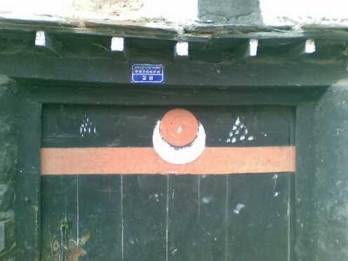

*2009-06-06 19:41 · 饭否拍拍*

---

### 12856

#珠峰行 俯看一个藏族村落

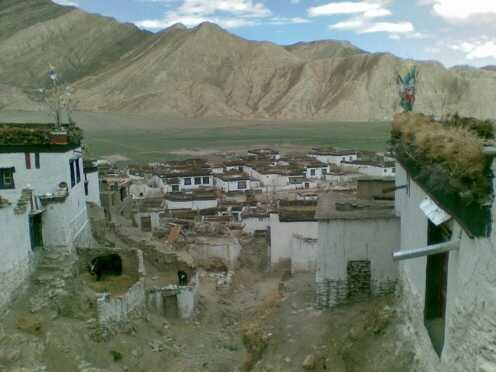

*2009-06-06 17:50 · 饭否拍拍*

---

### 12857

@ 昃昱 咦，请问你是哪位？

*2009-06-06 17:20 · 手机上网 给昃昱的回复*

---

### 12858

#珠峰行 这条沟里可以捡到很多化石。不过一个基本完整的鹦鹉螺化石在藏民那里只卖十几块钱。

*2009-06-06 16:49 · 饭否拍拍*

---

### 12859

#珠峰行 在海拔4300的定日县再过一夜。血氧含量剩76%了,脉搏97

*2009-06-05 21:55 · 短信*

---

### 12860

#珠峰行 杜邦用防弹材料kevlar做的手套。我用刀划了划，确实割不动

*2009-06-05 19:44 · 饭否拍拍*

---

### 12861

#珠峰行 晒干的牛粪是藏民的主要燃料

*2009-06-05 15:23 · 饭否拍拍*

---

### 12862

#珠峰行 杜邦在珠峰脚下的扎西宗乡拉融村援建了一座生态节能建筑

*2009-06-05 15:19 · 饭否拍拍*

---

### 12863

#珠峰行 可怜的藏族小孩只有一只鞋

*2009-06-05 15:17 · 饭否拍拍*

---

### 12864

#珠峰行 天气好的时候，这里能看到四座8000米以上的山峰，包括珠峰。但是现在都被云挡住了

*2009-06-05 12:11 · 饭否拍拍*

---

### 12865

#珠峰行 从定日县出发去扎西宗乡，要经过鲁鲁公安边防检查站

*2009-06-05 10:48 · 短信*

---

### 12866

#珠峰行 @ 可佳 提醒我抬头看，太阳周围有个巨大的彩虹环，据说是高原特有的现象。可惜我的手机拍不出来

*2009-06-05 03:17 · 短信*

---

### 12867

#珠峰行 离开日喀则，继续向西，朝着海拔更高的定日县进发

*2009-06-05 03:15 · 短信*

---

### 12868

#珠峰行 定日县的县长和县委书记和志愿者们一起吃饭，来了19个藏族姑娘表演传统歌舞。可是我觉得她们表演时并不开心，非常木讷

*2009-06-04 20:09 · 饭否拍拍*

---

### 12869

#珠峰行 刚才在海拔5284米的嘉措拉山口看到藏民用牦牛粪在烧水

*2009-06-04 18:11 · 饭否拍拍*

---

### 12870

#珠峰行 到达定日县，住进只有两层楼的珠穆朗玛上海大酒店

*2009-06-04 18:07 · 饭否拍拍*

---

### 12871

#珠峰行 珠峰自然保护区的入口挂满了经幡

*2009-06-04 17:41 · 饭否拍拍*

---

### 12872

#珠峰行 在珠峰国家级自然保护区的门口

*2009-06-04 17:38 · 饭否拍拍*

---

### 12873

#珠峰行 逸夫楼果然遍布全国各地

*2009-06-04 16:06 · 饭否拍拍*

---

### 12874

#珠峰行 真正的“里程碑”。沿着北纬30度线从上海到西藏的318国道

*2009-06-04 15:11 · 饭否拍拍*

---

### 12875

#珠峰行 展佛台

*2009-06-04 12:44 · 饭否拍拍*

---

### 12876

#珠峰行 扎什伦布寺地上貌似宝石镶嵌成的万字符

*2009-06-04 12:43 · 饭否拍拍*

---

### 12877

#珠峰行 宗山遗址。号称小布达拉宫

*2009-06-04 08:55 · 饭否拍拍*

---

### 12878

#珠峰行 早晨的扎什伦布寺。班禅的冬宫

*2009-06-04 08:52 · 饭否拍拍*

---

### 12879

#珠峰行 连吉尼斯都有人山寨

*2009-06-03 19:01 · 饭否拍拍*

---

### 12880

#珠峰行 日喀则市的甲措希望小学

*2009-06-03 16:56 · 饭否拍拍*

---

### 12881

#珠峰行 25万人民币可以捐一个食堂

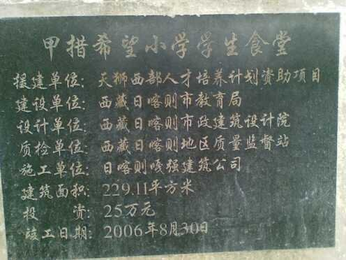

*2009-06-03 16:54 · 饭否拍拍*

---

### 12882

#珠峰行 希望小学的课桌确实破得令人心痛

*2009-06-03 16:09 · 饭否拍拍*

---

### 12883

#珠峰行 车开到半路，沙尘暴袭来。没想到雅鲁藏布江上游已经沙化得这么厉害:-(

*2009-06-03 15:22 · 短信*

---

### 12884

15岁时，我觉得谭嗣同特牛逼；30岁时，我明白有很多事其实比引颈就戮更困难也更牛逼。

*2009-06-03 14:27 · 手机上网*

---

### 12885

每个人顶多有自己去当烈士的权利，没有逼别人去当烈士的权力。如果你觉得你有权牺牲别人以达到你的目标，那你并不比你所反对的东西更好。

*2009-06-03 14:17 · 手机上网*

---

### 12886

#珠峰行 雅鲁藏布江峡谷里，有的整面山都沙化了

*2009-06-03 12:44 · 饭否拍拍*

---

### 12887

#珠峰行 雅鲁藏布江的水还是很干净

*2009-06-03 11:48 · 饭否拍拍*

---

### 12888

@ wajaja 那样才方便上传嘛。如果你不希望拍照后有提示，可以到饭否拍拍里改一下设置。1.0版没这个选项，1.10版有。

*2009-06-03 09:21 · 手机上网 给wajaja的回复*

---

### 12889

@ 搜吃搜玩3.0 不巧，我已经离开拉萨了。我可以帮你问问这次活动的组织者，他们对拉萨熟。

*2009-06-03 09:17 · 手机上网 给搜吃搜玩3.0的回复*

---

### 12890

#珠峰行 在海拔3650的拉萨休整了两天，上午出发去海拔3836的日喀则

*2009-06-03 09:10 · 手机上网*

---

### 12891

#珠峰行 八角街前搭了个“武警便民服务处”的棚子，其中一项服务是“自助美容”。我问怎么个自助美容法，武警小兄弟笑嘻嘻的回答：“我们可以借你一面镜子”。我倒。

*2009-06-02 16:47 · 手机上网*

---

### 12892

#珠峰行 出布达拉宫了。这是背面

*2009-06-02 13:37 · 饭否拍拍*

---

### 12893

#珠峰行 布达拉宫的门票游人每张100，当地农牧民每张1块

*2009-06-02 11:59 · 手机上网*

---

### 12894

#珠峰行 布达拉宫门帘上的标志，有点像苹果的功能键:-) 再往里走就不能拍照了

*2009-06-02 11:52 · 饭否拍拍*

---

### 12895

#珠峰行 真到了脚下才发现布达拉宫确实挺雄伟，尤其是考虑到西藏落后的生产力水平

*2009-06-02 11:38 · 饭否拍拍*

---

### 12896

#珠峰行 布达拉宫前面磕长头的人还是很多

*2009-06-02 11:23 · 饭否拍拍*

---

### 12897

#珠峰行 藏人只有名没有姓。名字短的两个字，长的有六个字。“德吉央宗”这个名字可以简称“德央”

*2009-06-02 10:40 · 手机上网*

---

### 12898

#珠峰行 认识了一群西藏本地的志愿者。汉族小姑娘明显比藏族小姑娘皮肤更白

*2009-06-02 10:21 · 手机上网*

---

### 12899

#珠峰行 在西藏大厦参加赞助商活动

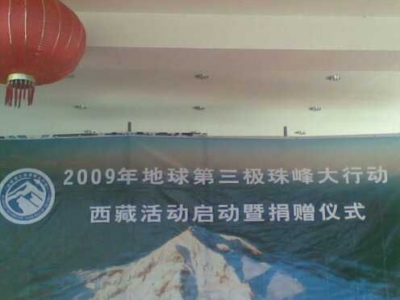

*2009-06-02 09:47 · 饭否拍拍*

---

### 12900

#珠峰行 喇嘛们也懂得用太阳能烧水

*2009-06-01 15:49 · 饭否拍拍*

---

### 12901

#珠峰行 色拉寺的近百名喇嘛在院子里辩经。很热闹，但我完全不懂他们在说什么

*2009-06-01 15:32 · 饭否拍拍*

---

### 12902

#珠峰行 领队来测身体状况，我的血氧含量86%，脉搏90，还不错

*2009-06-01 09:05 · 手机上网*

---

### 12903

#珠峰行 早上看到的布达拉宫和后面的雪山

*2009-06-01 09:03 · 饭否拍拍*

---

### 12904

@ 李黎军.等待 ok. 下一版饭否拍拍会改进。不过我这两百万像素的手机拍夜景本来效果就很可怜

*2009-05-31 21:59 · 手机上网 给李黎军.等待的回复*

---

### 12905

@ 钟永健 多谢提醒！我现在感觉挺正常的，不过同行的有经验的人说会不会高原反应要明天才能看出来

*2009-05-31 21:57 · 手机上网 给钟永健的回复*

---

### 12906

#珠峰行 白天经过时觉得布达拉宫完全没有我想象的那么雄伟，晚上从窗子看出去还漂亮一些

*2009-05-31 21:52 · 饭否拍拍*

---

### 12907

#珠峰行 这个大包很像电影里抢银行的常用装备

*2009-05-31 19:50 · 饭否拍拍*

---

### 12908

#珠峰行 出站前要先测体温

*2009-05-31 18:46 · 饭否拍拍*

---

### 12909

#珠峰行 白哈达和“五谷丰登”，据说是藏族很好的欢迎仪式

*2009-05-31 18:43 · 饭否拍拍*

---

### 12910

#珠峰行 火车在绕最后一个大弯，远远的能看到拉萨第一高楼布达拉宫

*2009-05-31 18:27 · 手机上网*

---

### 12911

#珠峰行 拉萨在东经91度，北京在东经116度，相差25度，而一个时区是15度，也就是说，拉萨的日落比北京晚1小时40分

*2009-05-31 18:23 · 手机上网*

---

### 12912

#珠峰行 过去两天里我的手机nokia e51至少异常重启了四次，可能和我在信号不好的情况下频繁上网并在多个程序间反复切换有关，看来s60系统还是不够强壮。

*2009-05-31 17:19 · 手机上网*

---

### 12913

传说中的“雪山白凤凰图”:-) 过唐古拉山时，窗外真是白茫茫一片，完全分不出哪里是雪哪里是天。

*2009-05-31 14:44 · 饭否拍拍*

---

### 12914

#珠峰行 真佩服这些藏羚羊，就这么愣趴在雪地里

*2009-05-31 12:55 · 短信*

---

### 12915

#珠峰行 过海拔五千多米的唐古拉山口了

*2009-05-31 11:56 · 短信*

---

### 12916

@ 李黎军.等待 下午六点多到拉萨

*2009-05-31 07:45 · 手机上网 给李黎军.等待的回复*

---

### 12917

#珠峰行 时常能看到牦牛、黄羊和藏驴等动物，但是都隔得很远

*2009-05-31 07:28 · 手机上网*

---

### 12918

#珠峰行 身体没有任何不良反应，或许是因为车厢里的供氧口起作用了

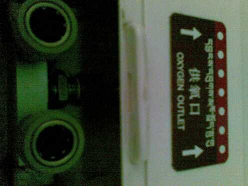

*2009-05-31 07:20 · 饭否拍拍*

---

### 12919

#珠峰行 两边的雪山不一样，一边是白雪全覆盖的，另一边是条纹状的

*2009-05-31 07:03 · 饭否拍拍*

---

### 12920

#珠峰行 一觉醒来，火车已过海拔两千八的格尔木，进入真正意义上的青藏铁路。窗外全是白霭蔼的雪山。

*2009-05-31 06:51 · 饭否拍拍*

---

### 12921

#珠峰行 荒原上出现一个灯火通明的大工厂，有高耸的烟囱，还有油田常见的那种燃烧着的巨大火炬。铁路边上一个很豪华的招牌写着“青海庆华集团”

*2009-05-30 23:48 · 短信*

---

### 12922

#珠峰行 赶在天黑之前看到了青海湖，虽然只能从火车上遥望

*2009-05-30 20:29 · 短信*

---

### 12923

#珠峰行 沿途第一次看到雪山。可惜太远了，这手机拍不下来。

*2009-05-30 18:59 · 手机上网*

---

### 12924

@ Rico 火车经过兰州附近时拍的

*2009-05-30 18:41 · 手机上网 给Rico的回复*

---

### 12925

@ 李黎军.等待 我又没夸口说要登顶，先跟大队伍去看看情况，量力而为

*2009-05-30 18:36 · 手机上网 给李黎军.等待的回复*

---

### 12926

#珠峰行 西宁火车站确实比较简陋，站牌上连LED都不亮

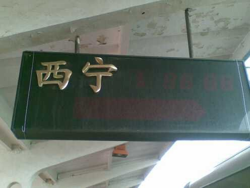

*2009-05-30 18:23 · 饭否拍拍*

---

### 12927

#珠峰行 兰州附近全是这种光秃秃的土山，和我家乡福建的山完全不同

*2009-05-30 14:50 · 饭否拍拍*

---

### 12928

渭河非常黄

*2009-05-30 11:14 · 饭否拍拍*

---

### 12929

#珠峰行 同行的太平洋电脑网的吴可佳沿途测试三家运营商的3G。在西安站惊讶的发现移动的速度最快，传说中技术最成熟的联通wo联根本不通

*2009-05-30 09:26 · 手机上网*

---

### 12930

#珠峰行 到西安了，再往西就是我没去过的地方了

*2009-05-30 08:38 · 手机上网*

---

### 12931

向西藏前进

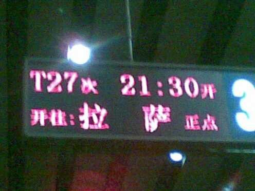

*2009-05-29 21:24 · 饭否拍拍*

---

### 12932

@ 于欣烈 非常同意你的判断，虽然我现在是用e51 + iphone一代在凑合。

*2009-05-29 01:19 · 网页 给于欣烈的回复*

---

### 12933

@ chenxianxian 等我多用一会儿才方便比较。我会把使用这台笔记本过程中的体会都记录在饭否上。

*2009-05-29 01:11 · 网页 给chenxianxian的回复*

---

### 12934

笔记本光标键的大小和位置听起来没什么技术含量，但其实很影响实用性。在这一点上，@ 惠普 的这台EliteBook 6930p胜过我自己的thinkpad x60，更远胜于SONY那种脑残设计：“光标向上”和“PageUp"合成一个键，要靠按住Fn键来区分。

*2009-05-29 01:07 · 网页*

---

### 12935

惠普笔记本的上下左右和home,pageup,pagedown,end这八个键做得够大，位置也顺手，用起来很舒服

*2009-05-29 00:55 · 饭否拍拍*

---

### 12936

帮@ 惠普 测试他们的商用笔记本 EliteBook 6930p NN909PAhttp://bit.ly/lDtTA 第一印象还不错

*2009-05-29 00:46 · 网页*

---

### 12937

漆成蓝天白云的工厂

*2009-05-28 12:01 · 饭否拍拍*

---

### 12938

@ 张亮 你又变回奶油小生了

*2009-05-27 23:16 · 网页 给张亮的回复*

---

### 12939

@ lulu 下午王三表那张照片里的人是我啊。被美女你遗忘真是令我伤心！

*2009-05-27 20:37 · 网页 给lulu的回复*

---

### 12940

@ 奥德修斯 从这角度判断，莫非你在上海环球金融中心顶上？

*2009-05-27 20:34 · 网页 给奥德修斯的回复*

---

### 12941

@ 心有零犀 经过这次杭州飚车事件，“码”有成为“公里/小时”的通用简称的趋势？

*2009-05-27 20:23 · 网页 给心有零犀的回复*

---

### 12942

在装。如果要如实回答饭否的问题“你在做什么”，这是个不错的答案。

*2009-05-27 20:22 · 网页*

---

### 12943

@ ifire @ 王小峰

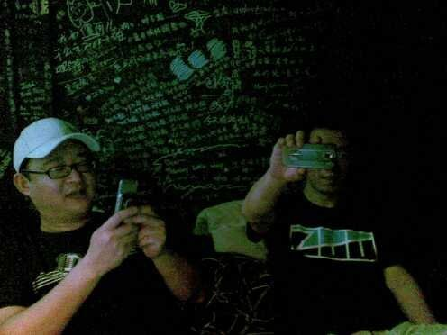

*2009-05-27 14:16 · 饭否拍拍*

---

### 12944

终于收到两个月前高中同学聚会的照片了。我的同学们并不习惯用社交网站，还是选择用email分享照片。他们多数还在用公司邮箱或sina邮箱。

*2009-05-27 10:30 · 网页*

---

### 12945

@ 哎呦喂 热门话题本身是很好的功能，不过现在无聊造句的人太多了，把有价值的消息冲淡了。看看这些人能无聊多久吧。

*2009-05-27 10:10 · 网页 给哎呦喂的回复*

---

### 12946

@ 魏刚 饭否的java客户端有些问题，推荐使用s60客户端“饭否拍拍”http://fanfou.com/paipai

*2009-05-26 15:24 · 网页 给魏刚的回复*

---

### 12947

@ 张亮 “五道口乔布斯”的称号非@ flypig 老师莫属！

*2009-05-26 14:19 · 网页 给张亮的回复*

---

### 12948

@ 南牧羊 大家为南总在饭否复出做热身准备嘛

*2009-05-26 14:07 · 网页 给南牧羊的回复*

---

### 12949

刚才在清华的宿舍里看到一个男生居然还在打星际，真的和十年前一样。blizzard这公司太牛了。

*2009-05-26 00:27 · 手机上网*

---

### 12950

上传了新照片

*2009-05-25 22:42 · 饭否拍拍*

---

### 12951

走在清华的南北主干道上

*2009-05-25 22:30 · 手机上网*

---

### 12952

见到一个学佛几年的师妹，连我都能感觉出她没有白学，很多话说得甚有道理。

*2009-05-25 21:59 · 网页*

---

### 12953

在这样一个风和日丽的下午，在植物园的草地上看书真是件惬意的事

*2009-05-23 15:28 · 短信*

---

### 12954

超级情侣衫

*2009-05-23 09:38 · 饭否拍拍*

---

### 12955

这剑真沉！

*2009-05-22 22:47 · 饭否拍拍*

---

### 12956

@ 申音 周五下午尤其不宜出行！

*2009-05-22 17:08 · 网页 给申音的回复*

---

### 12957

@ 李后笑 "黑名单“属于应该有，但不宜太醒目的功能吧。欢迎多提意见:-)

*2009-05-22 17:07 · 网页 给李后笑的回复*

---

### 12958

打了4个电话，居然有3个已经成了空号。看来最近2年换手机号的人还是挺多的。

*2009-05-22 17:05 · 网页*

---

### 12959

@ 李后笑 到某人的空间，右栏底部有“加入黑名单”的功能。

*2009-05-22 17:02 · 网页 给李后笑的回复*

---

### 12960

转载@ 张亮 发掘的社会新闻：《广州男子跳桥讨薪 被攀高老伯一把推下桥去》 http://tinyurl.com/o7qlqg

*2009-05-22 14:16 · 网页*

---

### 12961

@ 潘欣 fm365那样的互联网战略在执行中出偏差几乎是必然的啊，整个公司的文化和人员就不合适嘛。不光联想，其他硬件巨头谁做成互联网应用了，IBM? Dell? HP? 就好像姚明已经长成那样了，改练体操无论如何是来不及了。

*2009-05-22 11:07 · 网页 给潘欣的回复*

---

### 12962

@ 潘欣 订战略时首先要考虑可执行性。不能事情做砸了就怪执行啊。

*2009-05-22 10:58 · 网页 给潘欣的回复*

---

### 12963

不错，google.cn今天的logo是“陈景润诞辰”，而不是那个估计没多少中国人认识的女画家。

*2009-05-22 10:55 · 网页*

---

### 12964

今天google的logo看起来是一幅洗脚的油画。哦，原来画名是“TheChild's Bath ”。说实话，我以前没听说过Mary Cassatt这个画家……

*2009-05-22 10:50 · 网页*

---

### 12965

转自@ 任悦 地铁对面的男人掀起西装朝里面打了个喷嚏。文明人都这样。尤其是在当下这个特殊时刻

*2009-05-20 19:50 · 网页*

---

### 12966

连麦当劳都在楼道里帖小广告了

*2009-05-20 18:35 · 饭否拍拍*

---

### 12967

在li nkedin的通知邮件里看到我的一个研究生同学居然留校当了助理教授。这个南斯拉夫小伙子在我印象里并不是很踏实搞科研，还一度忙着倒腾二手车。呃，我这么说不太厚道，欺负人家看不懂中文，不过一帮同学中他走上学术道路确实出乎我的意料。

*2009-05-20 18:31 · 网页*

---

### 12968

@ 詹长春 多谢！欢迎多提意见，欢迎多邀朋友一起来饭否！

*2009-05-20 17:20 · 网页 给詹长春的回复*

---

### 12969

@ 老吴 "truth or dare"怎么玩？是“真心话、大冒险”吗？

*2009-05-20 17:05 · 网页 给老吴的回复*

---

### 12970

@ 土人 我问了他们的工作人员，供电局就在我们马路对面……

*2009-05-20 16:58 · 网页 给土人的回复*

---

### 12971

@ 白斗斗 我以前也换过。可是现在都不用保险丝了，而是用空气闸和保险管。保险管烧了也容易换，可我们这回是把装保险管的保险盒给烧了，所以物业搞不定，只能请供电局出马了。

*2009-05-20 16:57 · 网页 给白斗斗的回复*

---

### 12972

@ 詹长春 北京也很阳光，所以要猛开空调，所以才跳闸（我猜的）。

*2009-05-20 16:47 · 网页 给詹长春的回复*

---

### 12973

办公室的保险烧了。物业接到电话5分钟后到，说没有零件，搞不定；

供电局接到电话20分钟后到，10分钟左右修好。还算令人满意。

*2009-05-20 16:40 · 网页*

---

### 12974

@ 柠檬 多谢推荐，不过我最近几乎一个月才看一部电影

*2009-05-19 10:59 · 网页 给柠檬的回复*

---

### 12975

终于把《赛末点》这部电影给看了。谢谢@ 张亮 和@ 张凯锋 的推荐。这片没有令我失望，汇集了Scarlet Johnson的性感、英国上流社会的奢华、偷情、凶杀，当然，最重要的还是伍迪·艾伦的玩世不恭。

*2009-05-19 10:55 · 网页*

---

### 12976

转自@ RaRa 交通台搞了广播相亲……我告诉球，去相吧，都是有车一族在听。再不济也是打车一族。【上海姑娘就是有经济头脑！】

*2009-05-18 23:54 · 网页*

---

### 12977

@ 申音 你不觉得在跑赢行业大盘和比肩腾讯之间有太大的空白地带了吗？我几乎可以肯定空中会落在这个中间地带。

*2009-05-18 23:44 · 网页 给申音的回复*

---

### 12978

刚看完那篇球评的前两段时，我想：这不是模仿《百年孤独》的开头吗？哈哈，其实我想说的不是我看过《百年孤独》，我没有那么浅薄！我想说的是我是在手机屏幕上看完《百年孤独》的，我曾经那么极客！

*2009-05-18 23:40 · 网页*

---

### 12979

分享：《火箭VS湖人（7）欢迎收看，这多年后注定只有少数人铭记的

失败者传说》 http://tinyurl.com/ofc5hv 继@ 张亮 和@ 于欣烈 之后推荐这篇球评

*2009-05-18 23:28 · 饭否分享*

---

### 12980

@ 申音 看你怎么定义有戏吧。我觉得，两三年内肯定是上升的，再长远就不好说了。声明一下，纯属道听途说，没有经过尽职调查。

*2009-05-18 23:10 · 网页 给申音的回复*

---

### 12981

@ 魔王.PDF 这套白色桌椅很漂亮！

*2009-05-18 23:08 · 网页 给魔王.PDF的回复*

---

### 12982

转自@ 抽烟斗的老马 任何法律都不承认朋友关系，感谢孟德斯鸠。

*2009-05-18 22:51 · 网页*

---

### 12983

转贴@ 洪小可 的照片：这是音箱吗？不管是否有气质有品位，造型确实够独特！ http://fanfou.com/photo/QCN...

*2009-05-18 22:48 · 网页*

---

### 12984

@ 张亮 期待看到美女在你的地盘出现^_^

*2009-05-18 22:45 · 网页 给张亮的回复*

---

### 12985

转贴：@ 拍拍 饭否拍拍1.10版发布：支持S60第五版手机诺基亚5800XM，压缩比更高，更省流量！解决了关机重启不提示，N73等手机超大图片发送不成功等问题。详情见 http://is.gd/ATZ8

*2009-05-18 22:41 · 网页*

---

### 12986

@ 王蔓漫 谢谢～谢谢！

*2009-05-18 22:34 · 网页 给王蔓漫的回复*

---

### 12987

@ 邦比快跑 电信运营商比腾讯更需要你说的这种开放心态。他们比腾讯更确保自己能从扩大的市场总量中获益，但他们还是整天想着从蛋糕中分更大的一块。

*2009-05-18 22:26 · 网页 给邦比快跑的回复*

---

### 12988

听一个已为人父母的朋友说今年北京只有7.2万小学新生。这个数字和北京的总人口相比实在是小得不成比例。

*2009-05-18 22:14 · 网页*

---

### 12989

@ 邦比快跑 我觉得，盛大推出一个互联网投资基金是为了能赚更多钱，腾讯不推出一个互联网投资基金也是为了能赚更多钱。两者目的相同，只是所处环境不同，所以采取了不同的策略。

*2009-05-18 22:10 · 网页 给邦比快跑的回复*

---

### 12990

见鬼，突然流鼻血了。我好像有好几年没流过鼻血了……

*2009-05-18 22:06 · 网页*

---

### 12991

@ 张一鸣 明明是3x5=15级，还不够慢慢爬吗？

*2009-05-18 17:12 · 网页 给张一鸣的回复*

---

### 12992

腾讯的产品经理级别从低到高分为p1,p2,p3,p4,p5，每级又分3小级（基础、普通、职业），一个“p3职业”的人告诉我的。据说还没有人升到p4和p5。

*2009-05-18 16:45 · 网页*

---

### 12993

一个很能忽悠的广东朋友宣称“山寨机”这个名称的来历是“深圳机->sz机->山寨机”，并说粤语里“深圳”的发音和“山寨”很像。

*2009-05-18 11:48 · 网页*

---

### 12994

天气晴好，在鹫峰上能看到鸟巢边上的盘古大观那栋楼

*2009-05-17 17:28 · 手机上网*

---

### 12995

这种独立卫生间让人有压迫感

*2009-05-17 15:14 · 饭否拍拍*

---

### 12996

站长们确实是有智慧的。这在四十几个人的聚餐上看不太出来，饭后四五个人私聊时才感觉明显。

*2009-05-16 22:45 · 手机上网*

---

### 12997

著名站长郭吉军

*2009-05-16 18:15 · 饭否拍拍*

---

### 12998

@ 李后笑 不好意思，让您久等了……

*2009-05-16 17:11 · 网页 给李后笑的回复*

---

### 12999

把“加好友”改成“关注”了，这样更清楚更简单。饭否的关系本来就是单方面的，和两个人是不是好友无关，只要我愿意关注你，你也愿意被我关注，那就行了。

*2009-05-16 16:35 · 网页*

---

### 13000

@ 黑羽蛛 你观察得真细！T3给我的印象也不太好，大而无当。

*2009-05-16 14:23 · 网页 给黑羽蛛的回复*

---

### 13001

@ 李黎军 多谢提醒。正在改。

*2009-05-16 13:12 · 网页 给李黎军的回复*

---

### 13002

转自@ 优比客 Wolfram Alpha第一印象http://ubikr.com/archives/943 【Wolfram这人确实是天才，不过这个产品的目标也太宏大了】

*2009-05-16 13:11 · 网页*

---

### 13003

转载：@ doubleaf 六年级小学生盗窃万元 买手机贿赂正副班长http://htxt.it/dm1P

*2009-05-15 21:04 · 网页*

---

### 13004

@ 虾米 这两个说法确实有点含混，饭否其实没有好友而只有关注，正准备改成“我关注的人”和“关注我的人”，那样是不是就清楚很多了？

*2009-05-15 20:47 · 网页 给虾米的回复*

---

### 13005

我打算了解一点星座常识只是为了听懂别人说的“典型的摩羯”是什么意思，和星座到底靠不靠谱准不准没有必然联系。就好像，为了搞明白别人说“这家伙是典型的INFP”是什么意思，你应该了解一下MBTI一样。

*2009-05-15 19:55 · 网页*

---

### 13006

@ 冬季向日葵 不在。他可能连互联网都不怎么用。

*2009-05-15 19:45 · 网页 给冬季向日葵的回复*

---

### 13007

看来必须要了解一点星座了，不然简直影响交流。一个朋友对我形容另一个人是“典型的摩羯”，听得我似懂非懂。

*2009-05-15 18:13 · 网页*

---

### 13008

@ 东东枪 你真强！这俩字除了厦门那个地名还在其他地方用吗？

*2009-05-15 17:41 · 网页 给东东枪的回复*

---

### 13009

@ 猫小九 谢谢，谢谢，要是像你这么热情的年轻人多一点，这社会估计就基本和谐了

*2009-05-15 17:35 · 网页 给猫小九的回复*

---

### 13010

@ 李黎军 玉渊潭边上的中央电视塔顶上有个旋转自助餐厅，食物很一般，但是适合登高望远。我去年选了个秋高气爽的中午上去把北京好好看了一圈。

*2009-05-15 17:34 · 网页 给李黎军的回复*

---

### 13011

多谢大家指点，原来msn的表情里有“大拇指”，输入(y)就可以了，可是我在图形界面上没找到啊

*2009-05-15 17:24 · 网页*

---

### 13012

@ 李黎军 春暖花开，单向街左右间又营业了？

*2009-05-15 17:18 · 网页 给李黎军的回复*

---

### 13013

msn自带的表情里连“大拇指”都没有，真不方便。

*2009-05-15 17:14 · 网页*

---

### 13014

@ 邦比快跑 那你为什么坐这趟车呢？听起来确实没什么优点，除了人少

*2009-05-15 15:28 · 手机上网 给邦比快跑的回复*

---

### 13015

@ qyt 赞！中国像你这样会给自由软件捐款的人应该少之又少吧。我也用过好几年gnome，还在开发者邮件列表里混过一段时间，不过最

近几年还是用回windows当桌面了。

*2009-05-15 15:02 · 网页 给qyt的回复*

---

### 13016

推荐@ 黄锫坚 写的《从“资产阶级”到“企业家”——<跌荡一百年>读后》 http://pjhuang.blog.sohu.co...

*2009-05-14 22:22 · 网页*

---

### 13017

昨天听@ 张亮 说起@ alan 的一个看法，一个人be comfortablewith oneself是个大优点，我觉得很有道理，大概就是“不纠结”的意思吧。令自己舒服和对自己满意是两种不同状态。

*2009-05-14 18:18 · 网页*

---

### 13018

@ 叶滨 中关村地标中钢大厦往西200米

*2009-05-14 18:06 · 网页 给叶滨的回复*

---

### 13019

@ 张凯锋 你5点多就起床去医院了？太勤快了吧！医院一般是八九点才开门啊

*2009-05-14 10:50 · 网页 给张凯锋的回复*

---

### 13020

@ Tony 多谢提醒。我看了一下，原因是网址过长，估计只能自动替换为短网址才能解决问题。你用中文网址真的有利于SEO吗？

*2009-05-14 10:46 · 网页 给Tony的回复*

---

### 13021

@ 边锋 我几年前听厦大的朋友说过黑糖，不过一直没去过。看来黑糖和雕光的关系不错啊，我那张照片就是在五道口雕光的楼梯上拍的。

*2009-05-14 01:11 · 网页 给边锋的回复*

---

### 13022

@ 张亮 其实我没有看过Outlier原书，只是看过一篇作者自己写的长篇摘要而已。另，顺祝生日快乐！祝你的“二八”年华分外精彩，澎湃如海啸，飘逸如一叶扁舟。

*2009-05-14 00:57 · 网页 给张亮的回复*

---

### 13023

@ frankyang 你是搜狐内部人士，应该可以进去看看什么样的啊

*2009-05-13 21:40 · 网页 给frankyang的回复*

---

### 13024

传说中的搜狐SNS终于出现了，居然叫“白社会”这么另类的名字http://bai.sohu.com/

*2009-05-13 21:13 · 网页*

---

### 13025

@ 独孤秋秋 梁问道是@ 邵忠基金会 请来的。他们定期举办名叫crosstalk的活动，你可以关注一下。

*2009-05-13 21:05 · 网页 给独孤秋秋的回复*

---

### 13026

@ panxin 潘总果然好眼力！

*2009-05-13 21:03 · 网页 给panxin的回复*

---

### 13027

从中关村某创业公司的办公室俯看李莲英故居

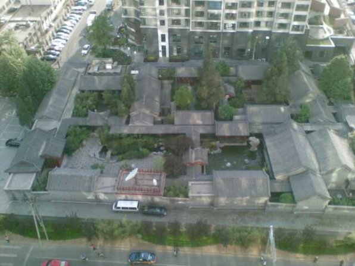

*2009-05-13 17:31 · 饭否拍拍*

---

### 13028

黑糖咖啡厅办的？我没有去过黑糖，但这名字听起来很熟悉

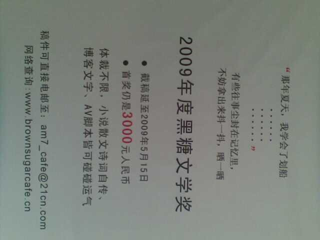

*2009-05-13 14:13 · 饭否拍拍*

---

### 13029

北京的月季花墙不错，实际效果比这照片漂亮很多

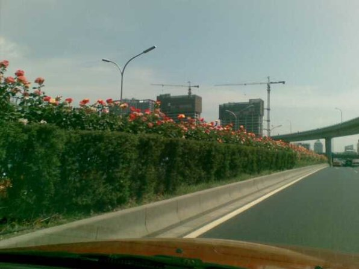

*2009-05-13 11:44 · 饭否拍拍*

---

### 13030

大学下铺的兄弟刚刚在msn上说“我又录了几首新吉他曲了”，然后发过来一个挂满录音文件的网页，还说“勿外传哈”！我以为他只是不好意思开口，于是主动提出要在饭否上帮他传播一下，没想到被他坚决制止了，原因是“我老婆但凡知道我和一个女人录音，你可就毁了一个家庭了”-_-!

*2009-05-13 11:08 · 网页*

---

### 13031

再次试图养成看《财经》杂志的习惯，可还是觉得里面很多文章读起来太闷。

*2009-05-13 10:48 · 网页*

---

### 13032

提倡“危邦不入，乱邦不居”的孔子如果生在今日之中国怎么办？

*2009-05-12 17:31 · 网页*

---

### 13033

@ 黑羽蛛 一定。看看这回@ 李黎军 有没有空

*2009-05-12 14:48 · 网页 给黑羽蛛的回复*

---

### 13034

@ 黑羽蛛 欢迎张总光临帝都！你是奔站长大会来的？等你有空一起聚聚啦

*2009-05-12 14:41 · 网页 给黑羽蛛的回复*

---

### 13035

#512 存者且偷生，死者长已矣。

*2009-05-12 14:36 · 网页*

---

### 13036

转发@ 张亮 分享的“纽约立体全景” http://www.pixelcase.com.au...

【有人跑到中央电视塔顶上拍个北京的全景吗？】

*2009-05-12 13:43 · 网页*

---

### 13037

@ 张一鸣 我去融科的瑞尔齿科洗过牙，还行，总的体验比北京口腔医院强。

*2009-05-12 13:05 · 网页 给张一鸣的回复*

---

### 13038

@ frankyang 现在的问题是坐半个小时脖子就有感觉了，根本等不到两个小时了

*2009-05-12 11:42 · 网页 给frankyang的回复*

---

### 13039

这两天脖子又有点痛，一定是有人坐了我的电脑椅后没有调回正确的位置:-(

*2009-05-12 11:33 · 网页*

---

### 13040

@ 槑杏 多谢提醒，不过那个女的刷的是她自己的屏吧，你只要把她从你的好友列表里删掉就不会受她刷屏的影响了。我一直觉得饭否的玩法就是：每个人爱说什么就说什么，谁爱听谁听。

*2009-05-12 11:23 · 网页 给槑杏的回复*

---

### 13041

商业是你情我愿和尔虞我诈的混合体。

*2009-05-12 10:00 · 网页*

---

### 13042

@ 申音 @ 邦比快跑 强烈同意，委托理财极不靠谱！不管是看过的媒体报道还是亲身经历都告诉我这一点！例如这篇报道，我估计那些受害人连雇凶的心都有了 http://money.baidu.com/2009...

*2009-05-11 18:22 · 网页 给申音的回复*

---

### 13043

连续低迷了好几天，看来非出一场大汗不可

*2009-05-11 17:35 · 网页*

---

### 13044

@ 我的企鹅跑了 互联网方面，起点中文网也是很不错的创新。

*2009-05-08 11:42 · 网页 给我的企鹅跑了的回复*

---

### 13045

@ Amanda 青檬台其实不是北京电台的，也不全是学生在做，整个台的负责人是@ 钟永健

*2009-05-08 00:59 · 网页 给Amanda的回复*

---

### 13046

转自@ Exstasis “各国央行正为了救赎举债者和投机者的罪责而惩罚储蓄者”

*2009-05-08 00:13 · 网页*

---

### 13047

下午在海淀那个基督教堂一楼的咖啡厅和朋友谈完事，想顺便进教堂看看，发现大门居然锁了。想起我在美国读书时的小镇，人口才两万

左右，竟然有大小十来个教堂，而且都还是正规教派的，不算上那些时不时到宿舍窜访的旁门左道，例如“摩门”或“耶和华见证人”。

*2009-05-07 23:44 · 网页*

---

### 13048

@ Acumon 那教堂不但现代化，还很商业化，一楼咖啡厅占的面积很大，据说这个教堂和周边一些建筑是几年前就把整块地包给某商业机构整体运作的。

*2009-05-07 23:33 · 网页 给Acumon的回复*

---

### 13049

转自@ 白斗斗 http://space.yoka.com/dabuw... 看了几页我就不想活了。。或者，我去变性吧 【谨向男士们推荐！】

*2009-05-07 23:25 · 网页*

---

### 13050

@ 基甸 这是中关村海淀图书城边上的教堂

*2009-05-07 23:05 · 网页 给基甸的回复*

---

### 13051

@ 启航 不清楚有多少店支持了，我是在味多美买东西时看到就正好试一下

*2009-05-07 19:15 · 手机上网 给启航的回复*

---

### 13052

在味多美买老婆饼，特意试了一下用公交卡付钱，不错，还算方便

*2009-05-07 19:10 · 手机上网*

---

### 13053

上传了新照片

*2009-05-07 17:01 · 饭否拍拍*

---

### 13054

这教堂的建筑风格挺新潮，招牌也够醒目

*2009-05-07 16:48 · 饭否拍拍*

---

### 13055

@ 鸝.se 恭喜你投入名师门下！

*2009-05-07 16:13 · 网页 给鸝.se的回复*

---

### 13056

看到清华图书馆在饭否开的帐号里提到风入松，想说我一直觉得“风入松 Forest Song”是个中英文都很雅的书店名。

http://fanfou.com/THULIB

*2009-05-07 16:10 · 网页*

---

### 13057

@ 李黎军 见笑了，我的普洱功底在最低水平，对品牌和包装没了解，桌上有什么我就喝什么。

*2009-05-07 16:00 · 网页 给李黎军的回复*

---

### 13058

x60又死机了，底板极烫，可是现在才五月初啊！

*2009-05-07 14:46 · 手机上网*

---

### 13059

最近习惯出门前查查谷歌地图，发现还是有些数据不靠谱，例如这个“西堤岛咖啡”，地图上的位置标在海淀图书城附近，显示的地址却是“北京市通州区通朝大街” http://bitly.com/195d4h

*2009-05-07 14:25 · 网页*

---

### 13060

@ 苦丁茶 谢谢。那方案是先把中文转成图片然后在kindle上显示，那样就没法调整字体大小，也没有目录结构，而且一页要100多K。

*2009-05-07 11:49 · 网页 给苦丁茶的回复*

---

### 13061

确实是“由简入奢易，由奢入简难”，我不觉得原来喝的普洱有多好，但是我很清楚现在喝的普洱有多差。

*2009-05-07 11:20 · 网页*

---

### 13062

@ 柠檬 要是火箭的队员像你一样容易放弃，那才是真的完了。

*2009-05-07 11:03 · 网页 给柠檬的回复*

---

### 13063

听到交通台里猛做“君乐宝”牛奶的广告，这不就是换了牌子的三鹿吗？

*2009-05-06 16:04 · 手机上网*

---

### 13064

大家都不说“火箭赢了”，而是说“火箭居然赢了”、“火箭竟然赢了”……

*2009-05-05 13:37 · 网页*

---

### 13065

转自@ 叶滨 准备带父母做一次体检，按团体客户拿到的折扣是8折；

而根据朋友的推荐，在淘宝上购得体检卡，折扣竟然是6折。四张体检卡，节省了1500多元。淘宝很强大！【淘宝真是无处不在啊】

*2009-05-05 13:33 · 网页*

---

### 13066

@ panxin 呃，我原以为喜欢科比的多数是那些年轻到没看过乔丹打球的人……

*2009-05-05 13:26 · 网页 给panxin的回复*

---

### 13067

@ panxin 以前光知道潘总是足球迷，没想到同时也是篮球迷啊

*2009-05-05 13:22 · 网页 给panxin的回复*

---

### 13068

@ 于欣烈 @ 张亮 首选目标当然是“优雅的赢”，但是如果非要在“不优雅的赢”和“优雅的输”之间选一个，我相信99.9%的人都会选前者，科比和微软也不例外。

*2009-05-05 11:41 · 网页 给于欣烈的回复*

---

### 13069

@ 盗盗 看来你也需要一个管理各处登录信息的工具了。我用handysafe，能在windows电脑和s60手机之间同步，感觉还不错。

*2009-05-05 11:17 · 网页 给盗盗的回复*

---

### 13070

@ 张亮 阿里巴巴真是有点邪

*2009-05-05 11:02 · 网页 给张亮的回复*

---

### 13071

@ lawrence 我看到三上、三余、欧宁、饭否……

*2009-05-04 18:37 · 网页 给lawrence的回复*

---

### 13072

@ 柠檬 你甩尼姑的手算是因为宗教冲突？

*2009-05-04 18:05 · 网页 给柠檬的回复*

---

### 13073

《潜伏》大概是我看完整的第一部电视剧。身边朋友和饭否上的推荐起了主要作用。

*2009-05-04 17:55 · 网页*

---

### 13074

@ 猫小九 可

*2009-05-02 17:29 · 手机上网 给猫小九的回复*

---

### 13075

盯着这片火红的“法国之光”看久了，突然有种不真实的感觉，就像小时候看三维立体画看久了的感觉

*2009-05-02 16:17 · 饭否拍拍*

---

### 13076

终于在植物园里找到郁金香了

*2009-05-02 16:10 · 饭否拍拍*

---

### 13077

撒下一把鱼食，放生池的宁静立刻被打破了，几百只红鲤鱼争先恐后的涌出水面，就像开了锅似的。算不上“鸟为食亡”，至少是“鱼为食忙”。

*2009-05-02 15:48 · 手机上网*

---

### 13078

@ 张亮 我理解。我现在就是把iphone当touch用。iphone不算是好手机，却是很好的掌上电脑

*2009-05-02 15:40 · 手机上网 给张亮的回复*

---

### 13079

植物园卧佛寺放生池里的竹筏上一大群乌龟在晒太阳，生活极其悠闲

*2009-05-02 15:31 · 手机上网*

---

### 13080

@ 佐拉 现场更衣，展示印着“脱吧，现在轮到你了”的T裇

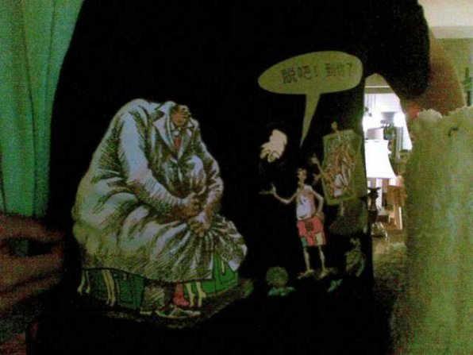

*2009-05-01 23:16 · 饭否拍拍*

---

### 13081

和@ 佐拉 和他的草泥马在五道口雕刻时光

*2009-05-01 21:31 · 饭否拍拍*

---

### 13082

转自@ 柠檬 香港确疹首例H1N1

*2009-05-01 20:47 · 网页*

---

### 13083

@ 不小刚 我打算明天理发，所以现在只有前1/3个脑袋是光的。

*2009-05-01 20:41 · 网页 给不小刚的回复*

---

### 13084

要去吃饭了。五道口附近有人愿意和我共进晚餐吗？本邀请十五分钟内有效。

*2009-05-01 20:28 · 网页*

---

### 13085

@ 咪咪 当然不是。那条消息是我转载@ 马日拉 说的话。他和mtime有关系。

*2009-05-01 20:26 · 网页 给咪咪的回复*

---

### 13086

@ 钟永健 这张照片有意境，我喜欢！

*2009-05-01 19:42 · 网页 给钟永健的回复*

---

### 13087

@ Tony 可以啊，其实那个插件也是调用饭否公开的API接口。你改一下那段Javasc ript里限制输出字数的参数就可以了。

*2009-05-01 19:08 · 网页 给Tony的回复*

---

### 13088

转自@ 马日拉 应该没有几个人知道，mtime.com的LOGO中“电影·社区·你和我”几个字是我用记号笔写在白纸上然后扫描出来的，当时这么做是想在设计上增加一些亲和力，不过我只潦草一写，完全没有体现出苍劲优美的左撇子书法，实为一憾。

*2009-05-01 18:56 · 网页*

---

### 13089

@ 叶滨 啊，我还打算明天去植物园看看郁金香呢。下午刚听说那里花很美，人也不算太多。

*2009-05-01 18:50 · 网页 给叶滨的回复*

---

### 13090

抱歉，刚才出了重复同步的问题:-( 现在应该已经解决了。欢迎继续使用。

*2009-05-01 18:46 · 网页*

---

### 13091

@ iFire 就是泻药？

*2009-05-01 18:09 · 网页 给iFire的回复*

---

### 13092

@ 张一鸣 cng是压缩天然气(Compressed Natural Gas)的缩写？

*2009-05-01 18:04 · 网页 给张一鸣的回复*

---

### 13093

转自@ 李黎军 五一节北京植物园郁金香节推荐大家来看看！强过阿姆斯特丹【这可不是一般高的评价啊】

*2009-05-01 17:43 · 网页*

---

### 13094

@ underland 没想到你被伤得这么深-_-!

*2009-05-01 17:38 · 网页 给underland的回复*

---

### 13095

@ 柠檬 是的，除非墨菲定律突然生效。

*2009-05-01 01:45 · 手机上网 给柠檬的回复*

---

### 13096

用了这么多年携程，好像还是第一次通过网络订票。

*2009-05-01 01:43 · 手机上网*

---

### 13097

从我在饭否上收到的消息来看，《潜伏》的热度才刚刚开始，远没有过去。

*2009-04-30 23:27 · 网页*

---

### 13098

@ fcicq android本来就是一个基于linux的打包方案嘛。只要上网本的应用没有全web化，android就有提供附加值的机会，就有存在的理由。

*2009-04-30 22:42 · 网页 给fcicq的回复*

---

### 13099

@ 连岳 但愿世卫组织的评级不像美国政府那么随意而不知所云，911之后，我记得美国长期说恐怖主义威胁程度是“橙色”，可谁也不知道“橙色”和“红色”到底怎么回事。

*2009-04-30 22:20 · 网页 给连岳的回复*

---

### 13100

Android可能会靠微型上网本而不是靠手机红起来。

*2009-04-30 22:17 · 网页*

---

### 13101

@ gravity0 你用的浏览器是chrome？文本输入框能调整大小是chrome推出时的卖点之一。

*2009-04-30 21:47 · 网页 给gravity0的回复*

---

### 13102

转自@ 申音 高盛分析师詹姆斯·米歇尔(James Mitchell)：第一季度你们向中央电视台赞助了人民币4000万元，这些支出是否计入总务和行政支出？[百度CFO] 李昕晢：上个季度，我们发布的预期就包括了人民币4000万元的营销相关支出，这些支出大部分用于中央电视台。

*2009-04-30 20:30 · 网页*

---

### 13103

@ 阿朱 平时和父母生活在一起的话还不容易注意到变化，我读书时有一年放假回家感觉父母好像突然老了很多，那种冲击才大！

*2009-04-30 19:20 · 网页 给阿朱的回复*

---

### 13104

转自@ underland Flickr还可以这样玩！

http://www.flickr.com/photo... 【用户的创造力真是无限的】

*2009-04-30 16:50 · 网页*

---

### 13105

@ 黑羽蛛 E71的全键盘用起来没有看起来那么小。一米八一米九的白种大男人也是E71的目标用户群，他们的手指应该更粗壮吧。

*2009-04-30 16:46 · 网页 给黑羽蛛的回复*

---

### 13106

或者换句话说，你觉得手机该做的事E71基本上都能做到，用iPhone的感觉则是没想到手机还能这么玩！不过我对手机的有些基本要求iPhone倒是满足得并不好。

*2009-04-30 16:39 · 网页*

---

### 13107

看到这种车，我只能想到SBBBBBBBBBBBhttp://fanfou.com/photo/spL...

*2009-04-30 16:37 · 网页*

---

### 13108

诺基亚E71和iphone都是热卖的好手机，但是风格迥异：E71几乎满足你对手机的所有要求，而iphone则突破你对手机的原有期望。

*2009-04-30 16:27 · 网页*

---

### 13109

@ 刘思 难道黑龙江上现在还结着冰？

*2009-04-29 12:53 · 网页 给刘思的回复*

---

### 13110

裸妆的照片看过不少，但还数黛米·摩尔给《Vanity Fair》拍的这封面照最惊艳。瞧瞧人家这黑丝袜:-) http://en.wikipedia.org/wik...

*2009-04-29 12:39 · 网页*

---

### 13111

@ 白云苍狗 多谢提醒。这个问题我们会找时间解决。

*2009-04-29 12:32 · 网页 给白云苍狗的回复*

---

### 13112

转自@ 松木 早上迟到半个多小时，原因是耽在家给柠檬新开的花做人工授粉以及摘薄荷叶子！！折腾半晌，最坏的结果是栀子也没开花，柠檬也没落果，晾干的薄荷也没什么用最后扔掉…… 【迟到的原因都这么有品位！】

*2009-04-29 11:48 · 网页*

---

### 13113

乔布斯生病让我学会了gaunt（削瘦）这个词，“猪流感 swine flu”加深了我对swine（猪）这个词的印象。

*2009-04-28 16:30 · 网页*

---

### 13114

@ crane 看了之后呢？失望吗？如果没有的话，我再顺便推荐一下那个相册的美女主人 @ jeuce

*2009-04-28 16:02 · 网页 给crane的回复*

---

### 13115

@ 博通 饭否推出了一个手机拍照客户端“饭否拍拍”，请看http://fanfou.com/paipai

*2009-04-28 15:52 · 网页 给博通的回复*

---

### 13116

友情分享，来自@ 张亮 《Apple4.us 之「T计划」》：似乎是Apple4.us 创办以来最重要的一件事 http://apple4.us/2009/04/pr...

*2009-04-28 15:49 · 网页*

---

### 13117

@ september “饭否拍拍”目前只支持S60第三版的智能手机。用cmwap接入点的话应该是算在wap包月里的。

*2009-04-28 14:55 · 网页 给september的回复*

---

### 13118

@ 李黎军 哪里的许留山？难道北京也有了吗？我狂喜欢他们家的甜品啊！

*2009-04-28 14:52 · 网页 给李黎军的回复*

---

### 13119

@ Earven 索爱以前的很多手机都不是智能机，不容易在上面开发软件。据说索爱以后也会转向支持S60系统。

*2009-04-28 12:57 · 网页 给Earven的回复*

---

### 13120

@ 大头绿豆 已经在饭否拍拍的支持机型里加上“E71”了。多谢！

*2009-04-28 12:55 · 网页 给大头绿豆的回复*

---

### 13121

@ 启航 不捆绑，技术不同，手抓饭是java开发的，饭否拍拍是s60第

三版的原生程序

*2009-04-28 12:34 · 网页 给启航的回复*

---

### 13122

隆重推荐“饭否拍拍”手机客户端 - 拍照上传到饭否超级方便！

http://fanfou.com/paipai

*2009-04-28 12:29 · 网页*

---

### 13123

@ 董羿 re! @ selangmm 的这头像一改往日风格啊

*2009-04-28 11:39 · 网页 给董羿的回复*

---

### 13124

没想到我居然看过两部Ashton Kutcher演的电影:《新婚告急》和《蝴蝶效应》。但是，如果他不在微博客上大红大紫，我可能永远不会注意到他。

*2009-04-28 11:20 · 网页*

---

### 13125

原来我只知道“一、二、三”，刚刚在饭否看到“亖” -_-!

*2009-04-27 20:09 · 网页*

---

### 13126

@ zikay 你在“设置”里打开“邮件通知”了吗？

*2009-04-27 19:17 · 网页 给zikay的回复*

---

### 13127

老爸来京办事。下午四点多一出机场就带着行李开始工作，连和我一起吃晚饭的时间都没有……

*2009-04-27 18:19 · 网页*

---

### 13128

@ 张亮 呵呵，我知道Be OS. 我有个大学室友装过Be OS. 我还看过半本Be OS的主力开发者讲解BFS文件系统的书。那哥们后来被Apple招安了。操作系统不是一般的产品，没有应用程序支持的操作系统不能算好产品。

*2009-04-27 17:43 · 网页 给张亮的回复*

---

### 13129

@ 骑蚂蚁的熊猫 你说的OS系统是什么？

*2009-04-27 12:38 · 网页 给骑蚂蚁的熊猫的回复*

---

### 13130

@ fcicq zoho 比起gmail for domain有什么优势？

*2009-04-26 13:53 · 手机上网 给fcicq的回复*

---

### 13131

@ 柠檬 l10n这个缩写真是zhuangbility

*2009-04-26 01:04 · 网页 给柠檬的回复*

---

### 13132

@ Elliot kindle2已经出了，价格还是359美元，还是不支持中文:-(

*2009-04-26 01:01 · 网页 给Elliot的回复*

---

### 13133

@ 申音 你看过“秘饭”这个饭否第三方应用了吗？

http://fanfou.com/mysecret

*2009-04-25 22:28 · 网页 给申音的回复*

---

### 13134

贾樟柯“坚持独立性，绝不边缘化”的原则真不错，不止适用于独立电影。

*2009-04-25 22:08 · 网页*

---

### 13135

既“惶惶不可终日”又感叹“时光无情飞逝”

*2009-04-25 21:47 · 网页*

---

### 13136

@ luanyu 你最近爬长城上瘾啊。从金山岭穿越到司马台的路线很不错，虽然比较累。

*2009-04-25 21:44 · 网页 给luanyu的回复*

---

### 13137

@ iFire 恭喜！你当坏人本来就是有力无心嘛

*2009-04-25 21:29 · 网页 给iFire的回复*

---

### 13138

@ 林月如 难道你也是水塘的？

*2009-04-25 21:23 · 网页 给林月如的回复*

---

### 13139

时常提醒自己：容易容易，有容乃易。

*2009-04-25 16:43 · 网页*

---

### 13140

@ 申音 当然不缺中文内容，问题是缺基于中文内容的商业模式吧。

虽然起点已经做出了不错的尝试，但对亚马逊来说可能市场规模还是太小了，所以他们不急着折腾。版权绝对是有国别歧视的，pandora/hulu/google video都不对中国用户开放。

*2009-04-25 11:22 · 网页 给申音的回复*

---

### 13141

@ 无名 饭否在这方面应该没有问题。我估计是：那人设为加他好友需要他同意，你是昨晚十点钟申请加他，他直到今早十一点才同意，所以加为好友的那条通知是十一点才出。

*2009-04-25 11:08 · 网页 给无名的回复*

---

### 13142

@ 刘海龙 我买了个kindle，虽然在国内不能随时无线上网，但能通过电脑上amazon买书然后通过usb传到kindle里，所以还是可用。PDF文件能转成可读的格式。只有不支持中文是个无法克服的障碍。

*2009-04-25 10:57 · 网页 给刘海龙的回复*

---

### 13143

转自@ 北风 旁听“新媒体与公民社会”培训研讨会。@ 安猪 在饭否直播

*2009-04-25 10:54 · 网页*

---

### 13144

@ 刘海龙 刘老师不考虑买个amazon kindle阅读器？那样就不怕行李超重了:-)

*2009-04-25 10:38 · 网页 给刘海龙的回复*

---

### 13145

@ LEMONed 嘿，你为什么不@他们呢？@ 连岳 @ 安猪 ……

*2009-04-24 21:36 · 网页 给LEMONed的回复*

---

### 13146

看到我认识的几个中国web2.0先锋用户在美国科技博客techcrunch的留言里用英文讨论中国民主问题真是有趣的体验。

*2009-04-24 21:35 · 网页*

---

### 13147

@ 茄小番 你说的是一下子翻到第一页还是一下子翻到最后一页？点某人的头像就能直接到她的第一页啊

*2009-04-24 20:58 · 网页 给茄小番的回复*

---

### 13148

事实胜于雄辩，问题在于什么是事实往往需要雄辩一番……

*2009-04-24 20:37 · 网页*

---

### 13149

@ 阿瓦 真是人肉spam的话很难对付啊

*2009-04-24 18:18 · 网页 给阿瓦的回复*

---

### 13150

@ 盗盗 宫力太高估firefox的重要性了，如果那种事情真的发生，我估计实际结果会是chrome或其他能访问google的浏览器迅速占领市场。

google手里的现金足够支撑到打赢这场仗。

*2009-04-24 17:10 · 网页 给盗盗的回复*

---

### 13151

@ 魔王.GZA 《欲望都市》应该没有向苹果收植入广告费吧？

*2009-04-24 16:53 · 网页 给魔王.GZA的回复*

---

### 13152

转自@ 白斗斗 嘟：她就差左边屁股纹个“文”右边屁股纹个“艺”，然后裹个丁子裤出来得瑟了。 我：一看你就缺乏生活体验，也不观察生活，丁子裤显然不是“裹”，是“夹”。。。

*2009-04-24 16:43 · 网页*

---

### 13153

见鬼，msn盗号之后发垃圾消息就算了，现在还流行在发垃圾消息前来个闪屏振动。我就说那么传统的朋友怎么会突然给我来个闪屏振动嘛-_-!

*2009-04-24 16:36 · 网页*

---

### 13154

@ iFire 没想到你居然发得比我多

*2009-04-24 16:07 · 网页 给iFire的回复*

---

### 13155

在等城铁。为什么城铁站里的一长溜广告牌都是公益内容？说明经济确实很不景气？

*2009-04-24 11:35 · 手机上网*

---

### 13156

@ 苏小虎 同情你。我也从国外往国内寄过不少东西，还从来没被海关扣过:-)

*2009-04-24 10:17 · 网页 给苏小虎的回复*

---

### 13157

@ 张亮 期待你分享关于Randy Pausch的消息！

*2009-04-23 22:59 · 网页 给张亮的回复*

---

### 13158

@ 蒋天正 批评得有理。这个地方很快就会改掉。

*2009-04-23 22:54 · 网页 给蒋天正的回复*

---

### 13159

为什么同一个人在不到三千块钱的上网本的摄像头里看起来就不如在MacBook的摄像头里看起来帅呢？我是不是有点势利眼……

*2009-04-23 22:47 · 网页*

---

### 13160

@ 叶滨 在那里吃饭感觉如何？我也久闻Hooters的性感大名，不过不管在美国还是在中国都没进去过……

*2009-04-23 21:05 · 网页 给叶滨的回复*

---

### 13161

@ 夏小昭 现在正常了吗？

*2009-04-23 20:39 · 网页 给夏小昭的回复*

---

### 13162

hi的私信风潮已经过去了。被打搅了的各位，对不起。

*2009-04-23 20:38 · 网页*

---

### 13163

@ 无所事事 稍等，正在处理。多谢提醒！

*2009-04-23 20:24 · 手机上网 给无所事事的回复*

---

### 13164

在试用同事新买的华硕eeepc. 同事们的第一印象都是:太大,太厚,太贵.

在输入这条消息之后,我必须补充一条:xp自带的拼音输入法太难用了!

*2009-04-23 19:38 · 网页*

---

### 13165

@ 王华东 我觉得其实“狗狗派”对迅雷的意义不大。

*2009-04-23 17:23 · 网页 给王华东的回复*

---

### 13166

不能太相信google，不然你就会以为乔丹身高只有1米88，然后你就会被很多人鄙视到泥里去。不信你看google搜“Height of MichaelJordan”的第一个结果。 http://bitly.com/185RMd

*2009-04-23 12:52 · 网页*

---

### 13167

@ 陈中 你的头像实在太帅了！

*2009-04-23 12:34 · 网页 给陈中的回复*

---

### 13168

分享《南都周刊的照片:明天出街《南都周刊》为您讲述讲述三代毕业生的故事_饭否》： http://fanfou.com/photo/Gr5...

*2009-04-23 11:51 · 饭否分享*

---

### 13169

@ 邦比快跑 Scrapbook也是我的得力助手。如果它能在几台电脑间方便的同步内容那就更好了。

*2009-04-23 10:10 · 网页 给邦比快跑的回复*

---

### 13170

下午见了一个朋友，他热爱的行业正在被互联网所摧毁。我想起小时候看过的一个安徒生童话：国王举办“最不可思议”的竞赛，最终获奖的不是那个造出最不可思议的神奇机械的能工巧匠，而是站出来把这个神奇机械一锤砸得稀巴烂的莽汉。这个悲剧寓言给我当时幼小的心灵留下了难以磨灭的印象。

*2009-04-22 20:40 · 网页*

---

### 13171

@ SamWang 哇，你算的时间真准！

*2009-04-22 19:43 · 网页 给SamWang的回复*

---

### 13172

回到办公室了。走了一个半小时，其实从亚运村到五道口也不算太远。

*2009-04-22 19:42 · 网页*

---

### 13173

在亚运村谈完事情，突然心血来潮，决定步行回五道口，顺路看看春天的北京

*2009-04-22 18:11 · 手机上网*

---

### 13174

给大家展示一下真正的极客是怎么输入·这个字符的。转自@ Pudding在 GBK encoding 状态下可以这么打: echo 路 | iconv -f utf-8 -tgbk 刚好是重的, 呵呵

*2009-04-22 11:32 · 网页*

---

### 13175

终于学会了怎么输入“迈克尔·乔丹”中间的那个点，在谷歌拼音的中文状态下按~这个键就可以了。谢谢@ 猫小九

*2009-04-22 11:27 · 网页*

---

### 13176

@ selangmm “耶诞”在台湾是流行的翻译吧，就像Michael Jordan译成米高-佐敦一样。

*2009-04-22 11:09 · 网页 给selangmm的回复*

---

### 13177

在iphone上安装ipushups这个软件的人应该很多，但是不知道其中有

没有十分之一能坚持练到完成＂一口气一百个俯卧撑＂的目标。

*2009-04-22 01:03 · API*

---

### 13178

@ 欧宁 没想到你工作得比我还晚。佩服！

*2009-04-22 00:51 · 手机上网 给欧宁的回复*

---

### 13179

@ 叶绍志 其实这刀不如另一把比较小的spyderco锋利

*2009-04-22 00:47 · 手机上网 给叶绍志的回复*

---

### 13180

我的gerber军刀

*2009-04-22 00:40 · API*

---

### 13181

中国最贵的杂志是那本？很有中国特色的哦。

http://xianguo.com/item/566...

*2009-04-22 00:08 · 网页*

---

### 13182

转自@ 申音 不出意外的话，忠旺集团的上市，意味着刘忠田将进入

新的十大富豪。

*2009-04-22 00:03 · 网页*

---

### 13183

@ 王元涛 什么是“雷计算”……

*2009-04-21 23:44 · 网页 给王元涛的回复*

---

### 13184

多谢@ 马晨 指点，微软有个小工具叫Windows Installer Cleanup，专门解决msi安装包的问题，把itunes的记录删掉后就可以安装新版了。搞定！

*2009-04-21 22:06 · 网页*

---

### 13185

@ 张凯锋 哈哈，我想起某人说他有一次骑自行车摔倒了，第一念头是想按Ctrl-Z

*2009-04-21 21:54 · 网页 给张凯锋的回复*

---

### 13186

@ 李黎军 我下载了完整的最新版itunes还是不能安装，所以才火气很大。看来真得动用一些专门的清理工具了:-(

*2009-04-21 21:53 · 网页 给李黎军的回复*

---

### 13187

@ jeuce 原来不止我一个受害者啊。握手！我决定跟它死磕。

*2009-04-21 21:31 · 网页 给jeuce的回复*

---

### 13188

见鬼，我的Windows里的iTunes处于没法运行、没法卸载、也没法升级到最新版本的傻逼状态。任何操作它都要我提供iTunes.msi的路径，我给它这个文件的路径了它又不认。apple的软件太恶心了！

*2009-04-21 21:25 · 网页*

---

### 13189

这个活动很理性啊，我也支持。 http://bit.ly/5GwZw 饭否有真名人，也有假名人，请自己判断。长个脑袋不是用来戴帽子的。

*2009-04-21 17:54 · 网页*

---

### 13190

@ 张亮 你买j-crew不会也是被奥巴马老婆影响的吧？

*2009-04-21 12:08 · 网页 给张亮的回复*

---

### 13191

帮美女转发求租信息：想在东直门、朝阳门、建国门、国贸附近租一居到两居，月租3000以下，请问谁有这方面的消息？【有相关信息者请直接联系@ babynana 】

*2009-04-21 11:44 · 网页*

---

### 13192

@ vividyu 啊啊啊，北京也有贾三灌汤包吗？西安的贾三给我的印象很好！

*2009-04-21 11:41 · 网页 给vividyu的回复*

---

### 13193

@ 鸝.se 麋鹿不是中国古代传说中的“四不像”吗？难道瑞典那里遍地都是？

*2009-04-20 22:58 · 网页 给鸝.se的回复*

---

### 13194

@ RaRa 强烈鼓励你给丫发个短信问问这事，不管换号了没有。

*2009-04-20 22:13 · 网页 给RaRa的回复*

---

### 13195

Sun居然真的卖给Oracle了…… 不管怎样，比卖给IBM更合理。

http://www.oracle.com/sun/i... via@ 奔三的Venj

*2009-04-20 20:38 · 网页*

---

### 13196

@ 张亮 @ 松木 现有媒体就算意识到了自己的核心竞争力所在，这个打碎重来的剧变过程也会非常痛苦。Robert Scoble有篇关于美国报纸的生意怎样被分而食之的博客不错。 http://bit.ly/A6lE4

*2009-04-20 20:28 · 网页 给张亮的回复*

---

### 13197

@ 远骋 你同时是endnote和onenote的重度用户？

*2009-04-20 19:28 · 网页 给远骋的回复*

---

### 13198

兵临城下，箭在弦上。

*2009-04-20 19:27 · 网页*

---

### 13199

@ MJiA 那里也看不清吧？看了这场纵贯线，我学到一个教训：这种大体育场里的演唱会，要么买最好的票，要么就不去算了。

*2009-04-20 16:57 · 网页 给MJiA的回复*

---

### 13200

转自@ 远骋 这组数据很有趣：北航图书馆2008年总借阅718,838册/次，2007年为802,836（学生没减少，借书数量竟然下跌这么多！）

*2009-04-20 16:07 · 网页*

---

### 13201

@ SamWang 我小学读的是语文实验班，前几年基本不学汉字，整篇课文都是拼音的，不知道和你说的“消灭汉字”是否有关。

*2009-04-20 14:26 · 网页 给SamWang的回复*

---

### 13202

转自@ 连岳 今天收到一厦大学生邮件，问个人如何改造社会，最适合微博的答案是袁伟时先生的建议：发声、发财。当然，我认为两者兼具最好。

*2009-04-19 22:09 · 网页*

---

### 13203

@ 张亮 我都忘了我去拉斯维加斯时看了哪个表演，只记得我那时因为倒时差而困得厉害，看无上装表演都能看到睡着-_-!

*2009-04-19 21:26 · 网页 给张亮的回复*

---

### 13204

在饭否上看到有人自称“90后老处女”，当时我就震惊了

*2009-04-19 13:42 · 网页*

---

### 13205

和@ 张亮 @ 黄继新 @ 松木 @ 周源 @ underland @ champloo@ flypig 等胜利会面

*2009-04-18 23:32 · 手机上网*

---

### 13206

在工体听完纵贯线的万人演唱会，现在去朝外钱柜参加@ 张亮 老师组织的K歌，那里还有其他饭否上的朋友们

*2009-04-18 22:38 · 手机上网*

---

### 13207

那些嫌我今晚说话太多的人，我想说什么、说多少是我的自由，你不想听就别关注我。请自便

*2009-04-18 22:18 · 手机上网*

---

### 13208

李宗盛致谢时连“消防”都谢到了，这算是国际惯例还是因为李常住北京而比较了解中国国情？

*2009-04-18 22:08 · 手机上网*

---

### 13209

@ 坯子 原价400，和饭否上的朋友同城交易的

*2009-04-18 22:05 · 手机上网 给坯子的回复*

---

### 13210

如果你觉得这张照片里什么也看不到，那么不必遗憾，我在现场也没看得更清楚，差不多就这效果

*2009-04-18 21:57 · 手机上网*

---

### 13211

纵贯线北京演唱会现场，大家对老歌和新歌的反应天差地别

*2009-04-18 21:52 · 手机上网*

---

### 13212

周华健发言，从奥运会讲到汶川地震再讲到经济不景气…

*2009-04-18 21:45 · 手机上网*

---

### 13213

看来我在周华健和罗大佑之间选择了前者当洗手间时间是正确的决定

*2009-04-18 21:15 · 手机上网*

---

### 13214

向邻座的mm借了个双筒望远镜才注意到台上原来还有一群红衣女子在伴舞-_-!

*2009-04-18 20:49 · 手机上网*

---

### 13215

@ H开头 很多人在现场，你用饭否搜一下“纵贯线”就知道了

*2009-04-18 20:39 · 手机上网 给H开头的回复*

---

### 13216

@ 魔王.SHA 你女儿唱《感恩的心》很不错，给我留下深刻印象:)

*2009-04-18 20:34 · 手机上网 给魔王.SHA的回复*

---

### 13217

看来我真是落伍得够厉害，李宗盛的歌我还认识，换了张震岳我就没听过了，不过这家伙看起来很有活力！

*2009-04-18 20:28 · 手机上网*

---

### 13218

成千上万人一起唱K

*2009-04-18 19:48 · 手机上网*

---

### 13219

终于到工体坐下了。离舞台太远了，简直啥也看不见:(

*2009-04-18 19:36 · 手机上网*

---

### 13220

@ luanyu 爬山时要小心。箭扣确实有点险。几年前我去爬箭扣，车到山脚下，我抬头一看，第一个念头是：我们的老祖宗脑子进水了吧？这么陡的山，根本就过不来，顶上还修什么城墙啊。

*2009-04-18 16:18 · 网页 给luanyu的回复*

---

### 13221

@ 张一鸣 国内的灰色行业确实很赚钱啊

*2009-04-18 15:53 · 网页 给张一鸣的回复*

---

### 13222

@ 邦比快跑 2看台下，10排

*2009-04-18 15:45 · 网页 给邦比快跑的回复*

---

### 13223

诺基亚终于要把5800的触摸屏从电阻式换成更贵但是更好用的电容式了，不然实在是没法和iphone之类的手机竞争啊。

http://www.digitimes.com/ne...

*2009-04-18 15:29 · 网页*

---

### 13224

@ 邦比快跑 哈哈，同去！饭否上应该有好多朋友今晚去听纵贯线http://fanfou.com/q/%E7%BA%...

*2009-04-18 15:22 · 网页 给邦比快跑的回复*

---

### 13225

@ vividyu 现在保时捷已经实际控制大众了吗？

*2009-04-18 14:36 · 网页 给vividyu的回复*

---

### 13226

@ kang 你是我认识的少数在windows上用safari的人之一

*2009-04-18 13:02 · 网页 给kang的回复*

---

### 13227

转自@ doubleaf 中国吉林省珲春市与俄罗斯交界发生5.3级地震 据中国地震台网测定，北京时间2009-04-18 11:56 在中国吉林省珲春市与俄罗斯交界(北纬42.7,东经130.7) 发生5.3级地震。【5.3级不算很大吧？】

*2009-04-18 12:54 · 网页*

---

### 13228

在极少数情况下，缺乏勇气是件好事，例如今晚这事。

*2009-04-18 00:38 · 网页*

---

### 13229

不妙，这个同学不会想不开了吧？ http://fanfou.com/%E5%A6%84...

有人能联系上TA吗？请帮忙转发一下

*2009-04-17 23:20 · 网页*

---

### 13230

转自@ 张亮 Without exception, all of my biggest mistakesoccurred because I move too slowly. - John Chambers 【厚着脸皮流着热泪说，我终于和一个世界顶级CEO找到一个共同点了】

*2009-04-17 23:04 · 网页*

---

### 13231

在门户工作有额外福利啊，@ 独孤秋秋 同学得到蔡志忠老师给她画的猫！

*2009-04-17 22:55 · 网页*

---

### 13232

转自@ Exstasis ：一辈子至少要做一件这样偏执、有趣又高难度的事呀！太有爱了！感谢三星led… http://v.youku.com/v_show/i... 【有趣的视频】

*2009-04-17 22:24 · 爱饭*

---

### 13233

@ 黄萧然 不清楚你说的“本人”是什么意思。我确实名叫“王兴”，其余请参考我的饭否自述。

*2009-04-17 22:03 · 网页 给黄萧然的回复*

---

### 13234

突然想听one night in beijing. 虽然我很肯定我的电脑里有这首歌，但是与其在电脑里找，不如直接开个网页上百度mp3听

*2009-04-17 21:54 · 网页*

---

### 13235

@ 可可 饭否榜今晚就升级一下，能看更多标签。欢迎多提意见！

*2009-04-17 21:15 · 网页 给可可的回复*

---

### 13236

多谢大家的反馈。雅俗差别咋就这么大咧。有人输"sdf"就会得到提示“三都赋”，可怜的谷歌拼音连我输入"sandufu"时都没有“三都赋”的选项……

*2009-04-17 20:57 · 网页*

---

### 13237

我用的拼音输入法对“sdf”的提示是“1.士大夫 2.水电费 3.松岛枫 4.斯蒂芬”，覆盖范围真广^_^ 你们的电脑上输入“sdf”提示什么？

*2009-04-17 20:33 · 网页*

---

### 13238

转自@ 张凯锋 东三环，团结湖，一个邮政工作人员打开邮箱取信，里面只有一封信 【这活脱脱就是一篇商业报道的开头啊。我真不记得自己最后一次寄信是什么时候了……】

*2009-04-17 18:42 · 网页*

---

### 13239

转自@ 老妖 我一直以为人是慢慢变老的，其实不是，人是一瞬间变老的。——村上春树 【是的，人生的道路虽然漫长，但关键时只有几步。】

*2009-04-17 18:22 · 网页*

---

### 13240

“量变引起质变”最容易理解的例子就是知道某人七八十年后会死和下周、下月、明年会死的感觉完全不同。

*2009-04-17 18:13 · 网页*

---

### 13241

几个HTC的人说他们刚见过红杉中国的人，红杉的人居然说以前没听说过HTC. 我只能理解为这更大程度上反映了红杉的谈判技巧而不是专业知识。

*2009-04-17 17:43 · 网页*

---

### 13242

今天真是太累了，在北京城里跑了几个地方，在出租车上睡过去三次。

*2009-04-17 17:35 · 网页*

---

### 13243

《梅兰芳》里有句台词“输不丢人，怕才丢人”。我相信可能有人从没输过，但不相信有人从没怕过。

*2009-04-17 17:28 · 网页*

---

### 13244

@ 破仔 你怎么知道韩寒不是从别处借来的？

*2009-04-16 21:37 · 网页 给破仔的回复*

---

### 13245

@ 申音 我也猜W，没有什么理由，就是觉得这事不太可能这么容易就过去了。

*2009-04-16 18:26 · 网页 给申音的回复*

---

### 13246

@ 张亮 你真爽！总能有这种免费测试新奇电子产品的机会。

*2009-04-16 18:18 · 网页 给张亮的回复*

---

### 13247

@ 令狐补充 饭否榜的标签内容完全自选，标签数量有限是为了避免有些关注者多的人把自己贴上无数标签从而占据各个榜。有更好的折中办法吗？

*2009-04-16 16:26 · 网页 给令狐补充的回复*

---

### 13248

@ 鄧小樺 那么如果一部港片成功的从头到尾都扮深沉而没有被你揪出毛病，你是不是会暴感动？

*2009-04-16 15:59 · 网页 给鄧小樺的回复*

---

### 13249

@ RaRa 你点右上角的“我要上榜”，然后自己填三个标签就可以了。

*2009-04-16 15:24 · 网页 给RaRa的回复*

---

### 13250

@ 启航 哪里可以下到QQ手机浏览器？

*2009-04-16 15:09 · 网页 给启航的回复*

---

### 13251

难道真的像书里说的那样，自杀会传染？最近两天，传媒大学有人跳，北理工有人跳，上海中医药大学也有人跳……

http://fanfou.com/q/%E8%B7%...

*2009-04-16 15:08 · 网页*

---

### 13252

饭否排行榜上每个人可以自己选三个标签，我还没想到第三个用什么好 http://bang.fanfou.com/

*2009-04-16 15:03 · 网页*

---

### 13253

@ vividyu 我以前只知道google可以做四则运算和单位换算，没想到微软live居然连方程式都能解，往这条路再走下去得在搜索引擎后台接一个mathematica了

*2009-04-16 13:22 · 网页 给vividyu的回复*

---

### 13254

现在的搜索引擎已经在比奇技淫巧了，google搜"2+3="能得到答案"5"，微软的search.live.com更进一步，搜“2x+3x=8"居然能得到答案"x=1.6" http://bit.ly/14iz5A

*2009-04-16 13:15 · 网页*

---

### 13255

“无所谓”、“无所畏惧”和“敬畏”是截然不同的生活态度。

*2009-04-16 12:49 · 网页*

---

### 13256

转自@ 东东枪 自从深发展银行推出那条知性的广告语“只想与你深发展”后，银行业内人士又自编出了更知性的姊妹篇：“光大是不行的”。

——有此一说。

*2009-04-16 11:24 · 网页*

---

### 13257

@ deter3 在这个草泥马横行的时代，"he was just asshole"在我看来算不上什么脏字，我的阈值已经被顶得很高了。

*2009-04-16 11:09 · 网页 给deter3的回复*

---

### 13258

@ awflasher 你是中国最geeky最2.0的人之一，所以我一点也不奇怪:-)

*2009-04-16 11:07 · 网页 给awflasher的回复*

---

### 13259

@ 狼族吾生 只有自己最了解自己吧。如果别人可以给你加标签，那还涉及你是否能删除的问题，事情就搞麻烦了。

*2009-04-16 10:54 · 网页 给狼族吾生的回复*

---

### 13260

@ kang 我最近用chrome多过用firefox了

*2009-04-16 01:08 · 网页 给kang的回复*

---

### 13261

周公恐惧流言日，王莽谦恭下士时。若使当初身便死，一生真伪有谁知？

*2009-04-15 23:52 · 网页*

---

### 13262

@ 黑羽蛛 今晚见到林军和@ 邓永强 。应该把林军拉到饭否上来:-)

*2009-04-15 23:35 · 网页 给黑羽蛛的回复*

---

### 13263

帮可爱的上海小mm @ RaRa 转发一个问题：“平时有什么东西或者做什么事情可以治愈自己失落的心情，有没有自己独家的方法？” 大家回答时消息里带上 @ rara 她就能看到了

*2009-04-15 23:30 · 网页*

---

### 13264

@ 宇辰私想 那个pdf发给你了。请自己鉴别内容，我概不负责。

*2009-04-15 23:25 · 网页 给宇辰私想的回复*

---

### 13265

@ 申音 在这一点上，@ 程苓峰 似乎和你观点一致。或许好的商业记者都这么想;-)

*2009-04-15 23:18 · 网页 给申音的回复*

---

### 13266

@ RaRa 我心情不好的时候首选睡觉

*2009-04-15 23:02 · 网页 给RaRa的回复*

---

### 13267

注意到我的MSN签名档之后，一个哥们非常热情的要在MSN上传给我一份 少林內劲一指禅.pdf (2656KB) -_-!

*2009-04-15 22:57 · 网页*

---

### 13268

@ 土人 @ 杨康 说的是做网游的那个九城吧。听说他们镇店之宝魔兽世界代理权被网易抢走了

*2009-04-15 22:54 · 网页 给土人的回复*

---

### 13269

@ 黄继新 不是号称LTE会在3G三国鼎立之后一统天下嘛，所以移动往那里过渡也可以理解啊

*2009-04-15 22:46 · 网页 给黄继新的回复*

---

### 13270

21cn好歹也算是个门户，《“强盗”走了，联想还剩下什么？》这样的猛文居然没被联想公关掉？ http://tinyurl.com/der68h

*2009-04-15 00:28 · 网页*

---

### 13271

@ 申音 《墓碑》那书我前阵子在网上看到过全本下载，当时我一看那么长就没碰。没想到你评价这么高

*2009-04-14 22:19 · 网页 给申音的回复*

---

### 13272

@ 申音 你说的《墓碑》是讲中国六十年代的那本书吗？

*2009-04-14 22:08 · 网页 给申音的回复*

---

### 13273

@ 张亮 大学时在电影课上看过他的《开罗紫玫瑰》，没什么感觉。

可能是因为当时太年轻。等我有空再看看他的其他片吧。

*2009-04-14 20:37 · 网页 给张亮的回复*

---

### 13274

转自@ 东东枪 我上次进入一个女人的身体，还是去参观自由女神像。——这句是无敌的爱伦说的。【伍迪艾伦确实有惊人的语言天赋，他的电影我倒是感触不那么深】

*2009-04-14 20:10 · 网页*

---

### 13275

@ 饭太的嘟囔 没想到我随便一说就被你们广电系统里的人听到了，失敬失敬。

*2009-04-14 15:18 · 网页 给饭太的嘟囔的回复*

---

### 13276

@ 特雷西 多老的同志？“解放”这个词的历史比共产党更长吧。

*2009-04-14 14:46 · 网页 给特雷西的回复*

---

### 13277

转自@ 坚果兄弟 北京大学中文系吴晓东老师说，绝大多数小说的阅读都是消遣，但我们应该进行“更艰深的阅读”，要看那些困难的小说，阅读是为了“破开胸中的那块坚冰”。——苗炜博客

*2009-04-14 14:19 · 网页*

---

### 13278

@ 申音 每张400，原价，2看台下10排

*2009-04-14 14:13 · 网页 给申音的回复*

---

### 13279

虽然我每天下午也做广播操，但是和这位活力四射的中学生“操帝”比起来，真是差距太大了！ http://v.youku.com/v_show/i...

*2009-04-14 12:22 · 网页*

---

### 13280

@ 李黎军 唐骏算得上是国内IT业最成功的职业经理人吧？

*2009-04-14 10:56 · 网页 给李黎军的回复*

---

### 13281

分享《二十年后《西游记》剧中人再聚首》：听说演沙僧的人前几天去世了。想一想也不奇怪，已经过去二十多年了。

http://wangguang.blog.hexun...

*2009-04-13 23:54 · 饭否分享*

---

### 13282

@ windbreaker 绷紧和放松的围度差更能反映肌肉质量吧

*2009-04-13 23:48 · 网页 给windbreaker的回复*

---

### 13283

@ 张宁 倒是没注意过会不会搞得cpu 100%，不过itunes启动实在是太慢了，而且三天两头提示要升级，有时升级还升出问题来。我现在是能不用itunes就不用了

*2009-04-13 21:56 · 网页 给张宁的回复*

---

### 13284

@ 叶滨 我昨天也在iphone上装了skype，然后用skype给爸妈打了个电话，一切正常。感觉比起原来在iphone上通过fring用skype话音质量要好一些。

*2009-04-13 21:07 · 网页 给叶滨的回复*

---

### 13285

@ 马日拉 相信你的品味，我有空试一下foobar:-)

*2009-04-13 20:44 · 网页 给马日拉的回复*

---

### 13286

itunes真是一个极度难用的软件，现在我听歌宁可用“千千静听”

*2009-04-13 20:40 · 网页*

---

### 13287

转自@ 张亮 [饭否好友推荐计划] @ windbreaker 谷歌中国工程师，参与谷歌音乐项目，如果你关注此产品，愿意反馈bug，抒发情感，寄情书的话，请follow他

*2009-04-13 19:46 · 网页*

---

### 13288

@ 严海锋 听说你们途牛做得不错，刚成功融资了。恭喜啊！

*2009-04-13 19:22 · 网页 给严海锋的回复*

---

### 13289

通过饭否完成了一次同城交易，买了两张这周六纵贯线演唱会的票

*2009-04-13 18:25 · 手机上网*

---

### 13290

越来越觉得“解放”这个概念真是太牛了。不知道“解放”这个词语是谁最先用的。

*2009-04-13 17:13 · 网页*

---

### 13291

生活就像一场魔术，学会欣赏她而不要时刻念叨“这都是骗人的”

*2009-04-13 15:58 · 网页*

---

### 13292

@ 班普将军 囧，幸好只是网页搜索，而不是图片搜索。下回请标注“办公室不宜”……

*2009-04-13 15:24 · 网页 给班普将军的回复*

---

### 13293

听说@ ucweb.com 将完成出人意料的新一轮融资，移动互联网真是越来越热闹了。

*2009-04-13 15:13 · 网页*

---

### 13294

转自@ Pudding 最近见到最好玩的广告词是Sun的 Behind EveryCloud, You'll See The Sun, 未免有点托大就是了, 呵呵【SUN的广告词一向很酷，从“网络就是计算机”到“SUN是.com的那个点”，可惜依然无可奈何花落去】

*2009-04-13 15:05 · 网页*

---

### 13295

@ 申音 我当然不至于偏激到不看记者写的东西，只是觉得@ Elliot把新闻说成“历史时钟的秒针”是个很有趣的比喻。

*2009-04-13 13:52 · 网页 给申音的回复*

---

### 13296

转自@ Elliot 【每日一quote】“想到新闻只是历史时钟的秒针，最近我给自己定下两条规矩：尽量不看记者写的东西，尽量不写记者读的东西。”

*2009-04-13 13:34 · 网页*

---

### 13297

另外，因为是自传形式，所以小说的英文原著里为了体现阿甘在语言上的弱智，用了很多错误的单词拼写和一些不正统的语法。不知道译成中文时怎样才能做到传神。

*2009-04-13 13:14 · 网页*

---

### 13298

周末看完了小说《阿甘》。小说里的阿甘和和改编后电影里的阿甘是不一样的两个人，小说里的更丰满，电影里的更主旋律。总体来说电影改编得挺好。原著算不上是优秀的小说，我只给三星半。电影我给四星半。

*2009-04-13 13:08 · 网页*

---

### 13299

前几天重看了一遍《耶稣基督的最后诱惑》。这部电影我在大学课堂上看过一遍，04年左右看过一遍。这回看得更明白了，依然觉得是部好电影，但我以后大概不会再特意找来看了。有空倒是可以看看圣经。

*2009-04-11 23:22 · 网页*

---

### 13300

@ 张亮 久闻Spore大名，但我一直没玩过。已经很多年提不起玩大游戏的兴趣了。

*2009-04-11 23:04 · 网页 给张亮的回复*

---

### 13301

转自@ Rashomon 在佛山拜访了六七拨不同行业的老板经理人。他们一致反映春节以后，尤其是三月份生意突然就火起来了，不论是房地产还是制造业。这其实是与PMI反映的趋势是一致的。虽然，他们也说不好这种趋势会持续多久

*2009-04-11 21:52 · 网页*

---

### 13302

@ 张亮 我玩得最多的是iShoot，现在难度设成Extreme我也有九成胜算了。

*2009-04-11 20:55 · 网页 给张亮的回复*

---

### 13303

@ Sand 每个人在饭否的消息都有RSS导出功能。

*2009-04-11 20:52 · 网页 给Sand的回复*

---

### 13304

@ LazyLorna 所以说kindle这类电子书阅读器有优势，找书容易，搬家也容易:-)

*2009-04-11 20:41 · 网页 给LazyLorna的回复*

---

### 13305

@ Mulder 友播的allen是我在清华电子系的师兄。音乐行业确实不容易，我也祝福他们好运。

*2009-04-11 16:27 · 网页 给Mulder的回复*

---

### 13306

@ Nathan 冒昧的问一下，我也在五道口附近，能领泰迪黛丝（TastyTaste）的餐券吗？

*2009-04-11 16:20 · 网页 给Nathan的回复*

---

### 13307

分享《人人都是纳税人》：“不看不知道，一看吓一跳”。我支持一切和“公民教育”有关的努力。 http://zqb.cyol.com/content...

*2009-04-11 13:00 · 饭否分享*

---

### 13308

@ ouspec 跑完感觉奇异是因为剧烈运动时人体分泌一些影响神经的化学物质吧？可能和吸毒的体验类似，不过健康很多:-)

*2009-04-11 11:45 · 网页 给ouspec的回复*

---

### 13309

@ 低俗小说 你可以通过饭否右上角的“搜索”功能找找你感兴趣的话题，这样也可以找到值得你关注的人。

*2009-04-11 11:11 · 网页 给低俗小说的回复*

---

### 13310

孔子说的“不患人之不己知，患不知人也”翻译到现在饭否的场景里就是：不要担心别人不来关注你，而是要去找到值得你关注的人。

*2009-04-11 10:42 · 网页*

---

### 13311

@ 优比客 另外，传统媒体对阵google时要吃多对一、心不齐的亏，把google换成amazon也一样，一众传统媒体依然被一个科技寡头扼住咽喉。

*2009-04-10 22:16 · 网页 给优比客的回复*

---

### 13312

@ 优比客 我不觉得kindle能救传统媒体。传统媒体的问题是依然希望维持甚至扩大收入来支撑其庞大的支出，而实际上可能唯一的出路是大幅削减支出而在一个小得多的规模上达到收支平衡。这种转变很难。所以恐龙才会灭绝而让位给比它们更小更灵活的哺乳动物。

*2009-04-10 22:12 · 网页 给优比客的回复*

---

### 13313

@ sogg 握个手。我在北京也常备龙岩带来的葛根粉，家里自己种自己做的，特别去火！

*2009-04-10 21:56 · 网页 给sogg的回复*

---

### 13314

@ 王慧文 你说的3D是要戴特制眼镜的那种吗？

*2009-04-10 20:30 · 网页 给王慧文的回复*

---

### 13315

@ 鄧小樺 在大陆，“文艺青年”是个含义复杂的词

*2009-04-10 16:50 · 网页 给鄧小樺的回复*

---

### 13316

一天莫名其妙的就过去了，而且今天已经是周五了！

*2009-04-10 16:48 · 网页*

---

### 13317

原来小说改编成电影时缩减了很多内容，小说里阿甘在去捕虾之前就有过和詹妮一起组乐队、灌唱片、吸毒、同居的经历了

*2009-04-10 00:33 · 手机上网*

---

### 13318

并不是第一次看凡高的《星月夜》，但是看到@ 远骋 的饭否背景时，还是被感动了一下。凡高确实是天才。

*2009-04-09 14:53 · 网页*

---

### 13319

@ skyun 报纸死不等于新闻死吧。newspaper的价值是news，不是paper。

*2009-04-09 14:43 · 网页 给skyun的回复*

---

### 13320

分享《南方周末 - 艾未未：我只是不愿意再被嘲笑罢了》：我向艾未未致敬。我觉得他正在做的事很有意义。

http://www.infzm.com/conten...

*2009-04-09 13:29 · 饭否分享*

---

### 13321

@ 张亮 你“叫春”的方式真特别……

*2009-04-09 10:52 · 网页 给张亮的回复*

---

### 13322

@ 优比客 不管合不合理，我觉得传统媒体拼不过google.

*2009-04-09 10:41 · 网页 给优比客的回复*

---

### 13323

@ laoj 影印的盗版书嘛，纸张印刷都很差，但是价格便宜而且买起来方便。

*2009-04-09 10:15 · 网页 给laoj的回复*

---

### 13324

@ laoj 我看的是五道口地摊上买的那种10块钱一本的《ForrestGump》英文影印版

*2009-04-09 10:13 · 网页 给laoj的回复*

---

### 13325

按照ipushups安排的计划，刚刚做了20+26+18+18+28=110个俯卧撑，现在按手机键盘时手都有点抖

*2009-04-09 01:45 · 手机上网*

---

### 13326

@ dookie 《阿甘》的中文版小说里有救毛主席这个情节吗？我怀疑翻译时会被删掉

*2009-04-09 00:50 · 手机上网 给dookie的回复*

---

### 13327

小说原著里居然安排了这样的情节：阿甘到中国参加乒乓球赛时救起了在河里游泳差点淹死的毛主席。这故事可编得实在不够高明-_-!

*2009-04-09 00:36 · 手机上网*

---

### 13328

转自@ luanyu 媒体经常报道的是事实，但不是真相

*2009-04-08 21:25 · 网页*

---

### 13329

@ 徐乐 期待看到你的新成绩:-)

*2009-04-08 17:24 · 网页 给徐乐的回复*

---

### 13330

转自@ 申音 铁杵能磨成针，但木杵只能磨成牙签，材料不对，再努力也没用。

*2009-04-08 17:07 · 网页*

---

### 13331

“国家不幸诗家幸”，呃，好像现在诗人并不多

*2009-04-08 16:57 · 网页*

---

### 13332

@ gravity0 哈哈，我没有其中某个属性，看来有希望争取其他两个了^_^

*2009-04-08 16:21 · 网页 给gravity0的回复*

---

### 13333

要经常提醒自己：速度、质量和成本，三者只能取其二。

*2009-04-08 16:04 · 网页*

---

### 13334

@ 黑羽蛛 没办法啊，国内的现状就是很难彻底抛弃windows，至少网银问题不好解决。另外，设计产品时还是要考虑多数用户，所以自己最好也用多数人用的软件。

*2009-04-07 11:40 · 网页 给黑羽蛛的回复*

---

### 13335

@ 筱潇 有空常来看看啊

*2009-04-07 11:38 · 网页 给筱潇的回复*

---

### 13336

@ 李黎军 等我再换电脑时估计会买mac了

*2009-04-07 11:35 · 网页 给李黎军的回复*

---

### 13337

又蓝屏了:-( thinkpad x60真令我失望

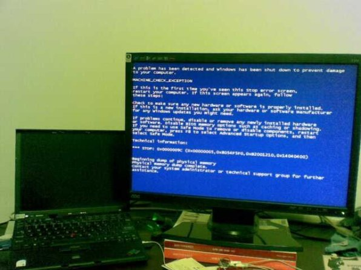

*2009-04-07 11:32 · 彩信*

---

### 13338

电梯外有分众传媒，电梯里三面有框架传媒，现在连电梯门这一面也被XX传媒占领了，只剩下脚底和头顶了

*2009-04-06 22:24 · 手机上网*

---

### 13339

又在excel里折腾了大半天，越发觉得这个软件真强大。今天学会了用“趋势线”这个功能。

*2009-04-06 18:14 · 网页*

---

### 13340

传说中，把许多毒虫放在器皿里让它们互相吞食，最后剩下不死的那只叫蛊；传说中，把九只狗关在一起，不给食物，任它们厮杀，最后活下来的那只叫獒；现实中，很多家公司为一个市场拼得你死我活，最后赢的那家叫……

*2009-04-03 18:43 · 网页*

---

### 13341

听一个朋友说他进百度后第一次被雷到是听到俞军说“像新浪这种小网站……” 请注意，是2005年百度还没上市的时候说的。

*2009-04-03 16:16 · 网页*

---

### 13342

@ MJiA 我第一次听说stackoverflow.com这网站。多谢

*2009-04-03 15:55 · 网页 给MJiA的回复*

---

### 13343

我原本想注册一个.an结尾的耍酷域名，后来查了一下维基百科，发现.an属于荷属安地列斯群岛，这个小岛国原定于2008年12月15日解体，后来因故推迟，现在状态不定-_-! 算了吧，我还是找个政治稳定点的国家为妙。

*2009-04-03 15:48 · 网页*

---

### 13344

清楚这个世界有多么势利却依然爱她的人才是真的热爱生活

*2009-04-03 15:31 · 网页*

---

### 13345

@ 鬼灵天风 谢谢。很少人用“帅气”形容我……

*2009-04-03 15:06 · 网页 给鬼灵天风的回复*

---

### 13346

@ 柯志雄 我买的不是个人平时用的东西，是服务器，你了解也没用啊。

*2009-04-03 12:19 · 网页 给柯志雄的回复*

---

### 13347

@ 柯志雄 因为我砍价，奸商就想用差的配件蒙我，幸亏被我发现了。

*2009-04-03 12:06 · 网页 给柯志雄的回复*

---

### 13348

@ yuhuawu “每个人都有一定的理想，这种理想决定着他的努力和判断的方向； 就在这个意义上，我从来不把安逸和快乐看作生活目的的本身。 这种伦理基础，我叫它猪栏的理想！” --爱因斯坦

*2009-04-03 12:03 · 网页 给yuhuawu的回复*

---

### 13349

中关村的奸商真是名不虚传。时刻不能放松警惕啊。

*2009-04-03 11:53 · 网页*

---

### 13350

@ 柯志雄 你觉得创业板没搞好是政府本身动机不良还是确实环境不成熟呢？

*2009-04-02 21:59 · 网页 给柯志雄的回复*

---

### 13351

转自@ 边锋 跟一帮马来西亚越南菲律宾记者一起回京。他们都没去过北京，满脸的兴奋。在他们眼里，中国已然是这个世界上最牛逼的国家之一。

*2009-04-02 20:55 · 网页*

---

### 13352

@ 张亮 如果你还想看张盘再睡觉而不是直接上床，那估计是精神疲倦而不是肉体疲劳

*2009-04-02 19:08 · 网页 给张亮的回复*

---

### 13353

@ 萨布 有的消息后面有灰色小字“给XXX的回复”，点过去就知道这条消息回复的是哪条消息了。

*2009-04-02 18:15 · 网页 给萨布的回复*

---

### 13354

@ 广告门 友情提醒一下，“把Apple store开进星巴克”是apple4.us搞出来的愚人节假新闻。饭否上的@ 张亮 是apple4.us的发起人，你可以和他确认一下:-)

*2009-04-02 17:38 · 网页 给广告门的回复*

---

### 13355

@ 王华东 饭否支持在手机上发图。我就是在现场发的:-)

*2009-04-02 17:04 · 网页 给王华东的回复*

---

### 13356

@ Lushnis 原来lush还有酒鬼的意思。受教了。

*2009-04-02 16:21 · 网页 给Lushnis的回复*

---

### 13357

@ 张亮 联想的发布会？杨元庆露面了吗？

*2009-04-02 16:13 · 网页 给张亮的回复*

---

### 13358

这个图片报道厉害！看世界各地的著名景点在前几天的“熄灯一小时”活动中怎么变化。点击照片可以看到从亮变暗的过程。

http://bit.ly/Nssm2

*2009-04-02 16:11 · 网页*

---

### 13359

在搜狐听亚马逊的人讲云计算

*2009-04-02 14:38 · 彩信*

---

### 13360

@ 张一鸣 @ .rex 我记得你们讨论过skydrive的客户端，是不是像这个？ http://tinyurl.com/dzkva2

*2009-04-01 22:55 · 网页 给张一鸣的回复*

---

### 13361

转自@ 东东枪 一mm大清早4-5点钟去锻炼。那时天还蒙蒙亮四处静悄悄，忽见对面走来一男的 见到mm就凶巴巴的问：“你去干嘛？” 要不说清华学生脑子快呢，mm怕是遇到歹人，不想被劫财，遂说：“去借钱……” “借钱干嘛？”男子又凶巴巴的问。mm又怕被劫色，曰：“得了性病没钱治……”

*2009-04-01 19:40 · 网页*

---

### 13362

@ jingjing 多谢专业人士解答^_^

*2009-04-01 19:37 · 网页 给jingjing的回复*

---

### 13363

晚饭时导师问我最近几年在做什么，我回答说在做促进信息流动的工作。这是利人利己也利国利民的事。

*2009-04-01 19:32 · 网页*

---

### 13364

@ 李黎军 北京到深圳8小时的火车？那时速得有多少？

*2009-04-01 17:40 · 网页 给李黎军的回复*

---

### 13365

多谢饭否上各位朋友指点，原来《读者》分文摘版和原创版。

*2009-04-01 17:39 · 网页*

---

### 13366

@ IwfWcf 你今年才几岁？怎么就落伍了快20年了呢？最早是叫《读者文摘》，后来被美国正版的Reader's Digest说侵权，于是就正式改名叫《读者》了。

*2009-04-01 17:37 · 网页 给IwfWcf的回复*

---

### 13367

刚听说《读者》还有个原创版。听说的原因是上面报道饭否了。原创版？那原来的《读者》叫什么？主版？经典版？品牌延伸的缺点是容易把人搞糊涂。

*2009-04-01 17:21 · 网页*

---

### 13368

@ 欧宁 呵呵，肯定是愚人节玩笑啦

*2009-04-01 17:12 · 网页 给欧宁的回复*

---

### 13369

“chutzpah!一词(读音如hooz-pah)源于希伯来语，原意指僭越既定习俗、规范和禁忌的行为…” @ 邵忠基金会 通讯的刊名真够雅。知道了这个词原来应该这么念之后，我突然记起来《闻香识女人》里那个老头好像发过这个音，不过我当时以为只是个无意义的发语词。

*2009-04-01 16:29 · 网页*

---

### 13370

@ 曹毅 你的警惕性真高！他应该不会和我开这种玩笑啦

*2009-04-01 16:21 · 网页 给曹毅的回复*

---

### 13371

突然接到我研究生导师的电话，他来北京了，要我今晚陪他去吃山西刀削面

*2009-04-01 16:16 · 网页*

---

### 13372

转自@ 指甲 读库06年的最好，07次之，08尚可， 09已读不下去了。

有品的东西一旦大众起来，肯定流于粗糙。【我还没看过《读库》，但我不同意“肯定流于粗糙”的论断。有的东西是确实有品，和看的人多人少没关系；有的东西只是因为小众而显得“有品”，两个不是一码事】

*2009-04-01 13:13 · 网页*

---

### 13373

转自@ piang 意大利有个女探险家独自穿越了塔克拉玛干沙漠.当她走

出沙漠之后,她面对沙漠跪下来静默良久.当有记者问她在征服沙漠后为何下跪的时候,她极为真诚的说:"我不认为我征服了沙漠,我是在感谢塔克拉玛干允许我通过——我一直觉着喜欢幻想对抗关系的人是傻缺

*2009-04-01 12:05 · 网页*

---

### 13374

@ 柯志雄 你妈真先进！我只让我妈用海内，还没让她用饭否

*2009-04-01 11:47 · 网页 给柯志雄的回复*

---

### 13375

从@ 魔王.SYD 那里听说澳洲有种运动叫netball. 呵呵，netball不是顾名思义的“网球”，而是一种类似篮球的运动，中文名叫“篮网球”。

*2009-04-01 10:57 · 网页*

---

### 13376

@ nickyhu 饭否“实时”搜索的意思是消息发出来几秒钟后就能搜到了

*2009-04-01 10:46 · 网页 给nickyhu的回复*

---

### 13377

@ 柯志雄 你牛，比你说的境界还更牛的就只能是像东方不败那样云里来风里去的四处飞了。

*2009-04-01 10:44 · 网页 给柯志雄的回复*

---

### 13378

人生就像走钢丝，往前不容易，但倒退或停下观望更危险。

*2009-04-01 10:33 · 网页*

---

### 13379

@ Venj 你用什么软件统计的？

*2009-03-31 23:32 · 网页 给Venj的回复*

---

### 13380

一个月前从@ 张亮 那里听说了“Always Outnumbered, NeverOutgunned”这句台词，的确很酷，但我越来越体会到，那是侠客的套路，顶多是突击队长的做法，却绝不是将军该引以为傲的。

*2009-03-31 22:35 · 网页*

---

### 13381

@ MJiA 我也被那种既能侧开又能掀起一小半的窗户搞得很晕。那种窗把手我每回都要折腾一下才会正确操作。

*2009-03-31 22:25 · 网页 给MJiA的回复*

---

### 13382

刚被人骗着点了一个会不停弹出小窗口的愚人节玩笑网页，幸亏我用的浏览器是chrome，弹到第二个小窗口时聪明的chrome就主动问我要不要禁止再弹:-) http://joke.qq.com/z/blue/2...

*2009-03-31 22:11 · 网页*

---

### 13383

@ 阮一鸣 恭喜！

*2009-03-31 20:17 · 网页 给阮一鸣的回复*

---

### 13384

@ .rex dreamhost, hostgator, hostmonster都不可靠。没办法，也不

能怪他们，虚拟主机本来就是个逆向竞争的不良市场。考虑找个朋友合租vps吧

*2009-03-31 16:37 · 网页 给.rex的回复*

---

### 13385

太奇怪了，burnout这个词在中文维基百科里居然没有对应的词条！这是当今社会里多么常见的一个现象啊。 http://en.wikipedia.org/wik...

*2009-03-31 16:32 · 网页*

---

### 13386

中国青年报1993年因愚人节玩笑而受处分http://bluesbeijing.blog.so...

*2009-03-31 14:06 · 网页*

---

### 13387

@ 钟永健 苹果的卖点不是科技而是设计啊

*2009-03-31 13:58 · 网页 给钟永健的回复*

---

### 13388

同意@ 张亮 的看法，“ipod shuffle真的是送小姑娘的良品”，既显得有品位又不太贵。

*2009-03-31 13:41 · 网页*

---

### 13389

@ 张亮 shuffle是你自己掏钱买的吗？

*2009-03-31 13:34 · 网页 给张亮的回复*

---

### 13390

有的信息一天之后就是垃圾，有的信息一周之后就是垃圾，有的信息一年之后就是垃圾，只有少数信息是你一辈子都能用上的。年轻是把时间花在获取哪类信息上对人生道路会有直接影响。

*2009-03-31 13:29 · 网页*

---

### 13391

@ 申音 iphone的用户摆明了就是愿意花钱的人嘛，所以相关的什么东西都贵。一个iphone的硅胶套都要300，超过人家诺基亚一个入门级手机的价钱了。

*2009-03-31 13:26 · 网页 给申音的回复*

---

### 13392

@ 柯志雄 没有。俺不是文化人……

*2009-03-31 13:13 · 网页 给柯志雄的回复*

---

### 13393

最近在好几个地方都听说《读库》，打算周末找时间看看到底是怎么一回事。

*2009-03-31 13:11 · 网页*

---

### 13394

@ 柯志雄 你真是古今YY第一高手！

*2009-03-31 12:25 · 网页 给柯志雄的回复*

---

### 13395

分享《肯德基东家百胜4.9亿港元获小肥羊20％股权》【没想到小肥羊

已经和肯德基、必胜客成为表兄妹了】

http://news.cyzone.cn/news/...

*2009-03-31 12:13 · 网页*

---

### 13396

太打击人了。辛辛苦苦练了两个星期俯卧撑，结果一测还是35个，一点进步也没有:(

*2009-03-31 00:24 · 手机上网*

---

### 13397

@ 柯志雄 可以。爱饭的开发者就在用Mac:-)

*2009-03-30 14:59 · 网页 给柯志雄的回复*

---

### 13398

从博客和博客留言的数量可以看出人们多么缺少表达的机会，从许多博客和博客留言的质量可以看出人们多么缺少表达的技巧。

*2009-03-30 10:29 · 网页*

---

### 13399

开始看《东邪西毒终极版》

*2009-03-28 22:21 · 手机上网*

---

### 13400

@ 张亮 我彻底的无视了“关灯一小时”这个活动，继续用灯用电脑。我自信平时也是环保者。

*2009-03-28 21:49 · 网页 给张亮的回复*

---

### 13401

转自@ _Lau 爸爸说，你是女孩子，要是男孩子的话，20岁过不过都无所谓了。潜台词是，下一个整岁就不在家过了，不用爸爸过了。想哭，我不想结婚了，我要跟爸爸过一辈子。

*2009-03-28 21:46 · 网页*

---

### 13402

和不讲逻辑的人讨论逻辑的人是傻逼！切记切记。

*2009-03-28 21:01 · 网页*

---

### 13403

@ 在夜空滑翔 全世界的，谁爱关谁关

*2009-03-28 19:56 · 网页 给在夜空滑翔的回复*

---

### 13404

好吧，我承认我是个数据男，听到“关灯一小时”这个倡议时，我的第一反应不是从高空俯瞰北京会是什么样子而是电网监控处的实时耗电量曲线会是什么形状。

*2009-03-28 19:44 · 网页*

---

### 13405

@ 地中海之蓝 所有饭否用户都可以用啊。你先绑定手机，然后把手机拍的照片用彩信发到m@ fanfou.com就可以了 。

*2009-03-28 17:28 · 网页 给地中海之蓝的回复*

---

### 13406

昨天听一个作家说她为了观察人们不设防的生活状态经常去当上门服

务的小时工……

*2009-03-28 17:07 · 网页*

---

### 13407

@ 如是如来 那我终于心里平衡了一点。刚才我简直怀疑咱俩所在的不是同一个北京。

*2009-03-28 17:04 · 网页 给如是如来的回复*

---

### 13408

@ 如是如来 这么前凸后翘的S型照片真的是你街头偶遇时拍的吗？

*2009-03-28 16:56 · 网页 给如是如来的回复*

---

### 13409

@ 柯志雄 省电不一定要在灯上下功夫，你们也可以不插电K歌，清唱也节电:-)

*2009-03-28 16:51 · 网页 给柯志雄的回复*

---

### 13410

@ daisytje 大小姐你还是太乐观了。80年代中国每年出生两千多万人，最近几年大学每年招四五百万，也就是说，还有四分之三的人没上大学。

*2009-03-28 16:33 · 网页 给daisytje的回复*

---

### 13411

邓小桦在朗诵香港现代诗

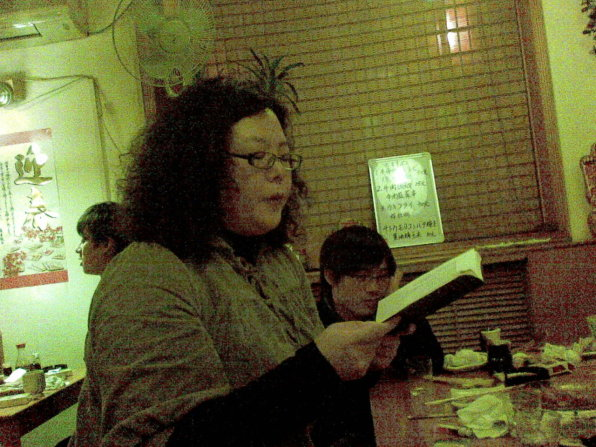

*2009-03-27 23:13 · 彩信*

---

### 13412

梁文道的主持能力确实不一般

*2009-03-27 17:48 · 彩信*

---

### 13413

我想看经验丰富的梁文道怎么应付各种发言者

*2009-03-27 17:37 · 手机上网*

---

### 13414

有趣，每个人都觉得自己那么与众不同。其实，多数80后没有上大学，多数80后出生在小地方

*2009-03-27 17:21 · 手机上网*

---

### 13415

目测结果，现场男女比例在三七开和四六开之间，这和80后的平均性别比例不同。女性对社会话题和活动更感兴趣？

*2009-03-27 17:16 · 手机上网*

---

### 13416

一个嘉宾解释自己穿的T裇：police（警察）这个单词去掉前两个字母就变成 lice（虱子）

*2009-03-27 17:07 · 手机上网*

---

### 13417

@ terababy 我一个小时前发过一张饭否大屏幕的照片了。可惜我的E51的摄像头只有两百万像素

*2009-03-27 16:48 · 手机上网 给terababy的回复*

---

### 13418

一个香港嘉宾努力扭头看饭否大屏幕

*2009-03-27 16:36 · 彩信*

---

### 13419

我很诧异在讨论8O后的社会空间时嘉宾们没有更多的谈到互联网和手机创造出来的新的公共空间。

*2009-03-27 16:06 · 手机上网*

---

### 13420

香港嘉宾的普通话水平都不错嘛(^-^)

*2009-03-27 15:31 · 手机上网*

---

### 13421

#sf "政治"这个词在梁文道发言里出现的频率真高

*2009-03-27 15:15 · 手机上网*

---

### 13422

上传了新照片

*2009-03-27 15:10 · 彩信*

---

### 13423

#sf 穿羽绒的嘉宾不热吗？

*2009-03-27 15:08 · 手机上网*

---

### 13424

@ 柯志雄 我和@ zafka 在某活动现场

*2009-03-27 15:06 · 手机上网 给柯志雄的回复*

---

### 13425

#sf 这种连过道都站满人的大厅令我想起在北大蹭课的经历

*2009-03-27 14:58 · 手机上网*

---

### 13426

#sf 今天人来得好多啊

*2009-03-27 14:53 · 手机上网*

---

### 13427

准备去798尤伦斯中心参加@ 邵忠基金会 组织的"CROSSTALK 北京"第三期活动《八零后的社会空间》。嘉宾有"多背一公斤”的发起人@ 安猪 ，新生代女作家@ 张悦然 ，还有梁文道、郑健业等。

http://tr.im/h0cl

*2009-03-27 13:58 · 网页*

---

### 13428

@ ouspec 总得有人竞购才行，不然SUN的价格抬不上去啊

*2009-03-27 12:55 · 网页 给ouspec的回复*

---

### 13429

@ 申音 就当自己在练“嫁衣神功”好了

*2009-03-27 11:11 · 网页 给申音的回复*

---

### 13430

@ 冷山.so 我买的e71是新加坡版的。不知道nokiafirst有没有淘宝店，我最早认识他是在水木清华BBS上，因为他的店离我住的地方近，所以我一般找他买手机。

*2009-03-27 10:57 · 网页 给冷山.so的回复*

---

### 13431

@ Venj nokia手机的闹钟也都有这个“稍后再响”的功能，不过没有用“小睡/Snooze”这种更人性化的文字。

*2009-03-27 10:37 · 网页 给Venj的回复*

---

### 13432

三更半夜买了一部水货E71,￥2290。这大概是我从nokiafirst这家店买的第六七部手机了

*2009-03-27 00:18 · 手机上网*

---

### 13433

@ RaRa 我在水瓶和双鱼的交界：)

*2009-03-26 21:31 · 手机上网 给RaRa的回复*

---

### 13434

3月26日是海子的生日和忌日。我刚上维基百科看了一下，海子卧轨时

居然只有25岁！我越发觉得自己有点老了……

http://tinyurl.com/dc6j8s

*2009-03-26 19:17 · 网页*

---

### 13435

@ 叶滨 网上有你的领舞视频吗？

*2009-03-26 17:50 · 网页 给叶滨的回复*

---

### 13436

@ vividyu IBM这牌子是短期租用给联想，但是thinkpad这牌子是永久转让的啊

*2009-03-26 17:10 · 网页 给vividyu的回复*

---

### 13437

转自@ Elephas 我发现我周围的很多同学都选择了Thinkpad，我觉得Thinkpad在联想手下价格与质量都下降了，但是这块牌子却还是很好听…… 【这就是典型的高端品牌吃着老本沦为低端的毁灭过程啊】

*2009-03-26 17:08 · 网页*

---

### 13438

@ ShiningRay 你这是典型的“前提不成立，结论无意义”。

*2009-03-26 16:56 · 网页 给ShiningRay的回复*

---

### 13439

@ 罗燕 笔记本莫名其妙死机你都觉得质量还好？真是太善良了！今天中午和一个朋友吃饭的时候他的T61莫名重启了一次，他说经常这样，打算以后换dell了。

*2009-03-26 16:55 · 网页 给罗燕的回复*

---

### 13440

现在我每碰到一个用thinkpad的朋友就问他们下一个笔记本会不会再买thinkpad，多数人说“不会”，因为他们对X60和T60系列的质量并不满意。请注意，是质量，而不是性价比。以往用thinkpad的人从来都不是最注重所谓“性价比”的。

*2009-03-26 16:41 · 网页*

---

### 13441

@ 苦丁茶 据我所知kindle2还不支持任何东方语言。

*2009-03-26 14:47 · 网页 给苦丁茶的回复*

---

### 13442

谷歌地图把地址和地图链接免费发到手机上的功能很赞，我最近好几次和朋友约地方都用这个方式通知他们。 http://ditu.google.com/

*2009-03-26 10:31 · 网页*

---

### 13443

@ 魔王新闻台 那是Richard Branson的自传吧。这哥们超酷。你看了有什么收获别忘了分享一下啊

*2009-03-26 10:19 · 网页 给魔王新闻台的回复*

---

### 13444

转自@ ebin 史玉柱很清楚，在屎壳郎的国度里卖大粪才能成功。zz

*2009-03-26 10:11 · 网页*

---

### 13445

看到《刘谦魔术被指多是偷来的 前经纪人极力否认》这个新闻标题时，我觉得有些人实在是有“原创原教旨主义”情节。作为一个观众，我只关心魔术好不好看，是不是原创跟我有什么关系？

http://ent.163.com/09/0322/...

*2009-03-25 23:12 · 网页*

---

### 13446

@ 申音 天汽模是什么东西？

*2009-03-25 22:23 · 网页 给申音的回复*

---

### 13447

@ underland 差不多。大概两年前GA的数据不到24小时内就可以统计完，后来好像变慢了。不过GA还是一个十分强大的统计系统！

*2009-03-25 22:18 · 网页 给underland的回复*

---

### 13448

转自@ 独孤秋秋 今晚的天空，北斗七星和北极星都能一下找到。

【我打算待会儿回家路上也看一看，想念去年国庆在五台山东台顶上看到的满天繁星】

*2009-03-25 21:58 · 网页*

---

### 13449

@ 远骋 学到什么实用的excel技巧别忘了分享一下啊

*2009-03-25 15:30 · 网页 给远骋的回复*

---

### 13450

转自@ 柯志雄 中国是美国国债的干爹，美国是美国国债的亲爹。这亲爹打儿子，干爹傻眼了。护也不是，不护也不是。

*2009-03-25 15:30 · 网页*

---

### 13451

@ Justso 推荐你试试这个使用AIR技术的饭否客户端--“爱饭”http://fanfou.com/ifan

*2009-03-25 13:51 · 网页 给Justso的回复*

---

### 13452

@ 申音 应该是吧。不然我就要严重鄙视@ 李大维 的品位了。现在各种阅读器层出不穷，刚听@ 苏小虎 说他买了个iRex, 比kindle还强悍。

*2009-03-25 13:40 · 网页 给申音的回复*

---

### 13453

@ 申音 刚听 @ 李大维 说国内阅读器中翰林的V8不错

*2009-03-25 13:35 · 网页 给申音的回复*

---

### 13454

@ 苏小虎 我还是第一次听说有朋友买iRex的阅读器。到时候去你那儿看看:-)

*2009-03-24 23:49 · 网页 给苏小虎的回复*

---

### 13455

姐姐, 今夜我不关心人类, 我只想你。

*2009-03-24 23:05 · 网页*

---

### 13456

@ 李黎军 你说的是类似slingbox这样的在一个地方把电视信号录下来，然后自己做成网络服务，在别的地方也可以上网看的东西吗？

*2009-03-24 23:04 · 网页 给李黎军的回复*

---

### 13457

@ 李黎军 我没有看片的专用设备，就是电脑接24寸显示器而已。

*2009-03-24 22:51 · 网页 给李黎军的回复*

---

### 13458

转自@ 正刚 某次在深圳培训时与同事在走向会场路上，另一位兄弟追上来操着粤普口音说：“你们都有打胎啊，那我也要回去打。”他随即也看岀了我们的愕然，指了指解释说：“我是说这个，Tie！” 【中英文混杂惹出的又一笑话】

*2009-03-24 20:39 · 网页*

---

### 13459

@ 北城 你04年时每个月把哪个公司的上百万给好耶啊？

*2009-03-24 20:15 · 网页 给北城的回复*

---

### 13460

除了体力劳动和脑力劳动，是不是还有一种叫心力劳动？

*2009-03-24 19:28 · 网页*

---

### 13461

@ 浪子 你分享的单向街沙龙不错，可是都已经结束了……

*2009-03-24 19:14 · 网页 给浪子的回复*

---

### 13462

@ 布丁丁丁 王尔德确实是天才。英文原句很精彩，但是中文翻译的错误不少，有些完全偏离了原意。

*2009-03-24 16:55 · 网页 给布丁丁丁的回复*

---

### 13463

时间是最好的老师。不幸的是她亲手杀死自己的所有学生。 - 柏辽兹

*2009-03-24 16:34 · 网页*

---

### 13464

转自@ 老妖 纯，属虚构；乱，是佳人。——某友签名档

*2009-03-24 16:14 · 爱饭*

---

### 13465

转自@ 申音 建议把IPHONE手机的开机图标从白苹果换成金五星，还得八一电影制片厂的那种

*2009-03-24 16:10 · 网页*

---

### 13466

难道联通推出的iPhone真的要阉割掉wifi功能？那我就彻底服了国人的折腾能力！ http://www.sh.chinaunicom.c...

*2009-03-24 16:03 · 网页*

---

### 13467

@ 否别是 你真有想象力！

*2009-03-24 14:38 · 网页 给否别是的回复*

---

### 13468

“尺蠖”这种虫子在英文里叫 inchworm （直译就是“英寸虫”）, 真有趣，中英文称呼都和长度单位有关。我估计正英文称呼应该是各自独立发展起来的，这说明确实有些对事物的认识是超越语言的。

*2009-03-24 13:25 · 网页*

---

### 13469

转自@ ouspec 传Oracle将收购redhat，IT巨头之间的收购大幕要拉开了。 http://tinyurl.com/c6f68n 【风起云涌，看来经济低估真的是收购兼并的好时机啊】

*2009-03-24 11:07 · 网页*

---

### 13470

转自@ 魔王新闻台 都说“兽首拍卖”事件是文物局和老蔡联合做的局。

我觉得这次汇源事件，八成是可口可乐在幕后推动商业部做了否决，动机似乎很明显。

*2009-03-23 18:02 · 网页*

---

### 13471

让内心平静比让太平洋平静还难

*2009-03-23 17:42 · 网页*

---

### 13472

说到“XX家”这种称呼，不知道现在大众怎么理解“科学家”。我小时候觉得一定是有杰出成就的人才能称为“科学家”，后来到了美国发现scientist只是一种职业，说"我是一个scientist"和说“我是一个程序员”、“我是一个销售”或“我是一个跑龙套的”一样自然。

*2009-03-23 17:37 · 网页*

---

### 13473

@ Justso 我是从成本角度分析的。真正实干的人不管最后成败，基本上是全搭进去了。

*2009-03-23 17:24 · 网页 给Justso的回复*

---

### 13474

当一个好的评论家和当一个好的实干家一样难，但是当一个烂的评论家比当一个烂的实干家容易多了。

*2009-03-23 17:04 · 网页*

---

### 13475

@ 张凯锋 带着体液的苹果？你太八卦了！

*2009-03-23 16:53 · 网页 给张凯锋的回复*

---

### 13476

下了一部17G的高清的《黑暗骑士》，正在看。开头不错：)

*2009-03-22 23:38 · 手机上网*

---

### 13477

@ 土人 你完全应该把太太送到条件好的医院啊！

*2009-03-22 23:14 · 网页 给土人的回复*

---

### 13478

@ raojin.com 再提醒一下，名字后面要有空格，不然不知道@ 后面的名字到哪里结束

*2009-03-22 23:12 · 网页 给raojin.com的回复*

---

### 13479

转自@ 边锋 可以确信的是，4月20日后，机票价格将会普涨。虽然民航局之前否认机票价格要涨的消息，但是中航信系统已经在开始按新价格执行。民航局封杀了所有涨价问题的媒体报道。

*2009-03-22 23:11 · 网页*

---

### 13480

呵呵，你可以在人名前面加上@, 这样名字变成超链之后更方便，例如：@ 杨曜睿 @ 王悦蒙 @ 王慧文 @ 郭万怀 @ 陈亮

*2009-03-22 23:09 · 网页*

---

### 13481

@ 申音 确实是两个世界，对网络文学的评价标准是这是不是好商品，而不是这是不是好文学。《鬼吹灯》是典型的简单重复的原始宣泄型的写作。关于这个现象和原因，石康说得比我更清楚http://tinyurl.com/cfhg9y

*2009-03-22 23:01 · 爱饭 给申音的回复*

---

### 13482

@ 张一鸣 虽然我也希望是GDrive，但听说是音乐相关的产品。

*2009-03-22 22:53 · 爱饭 给张一鸣的回复*

---

### 13483

nobody is perfect + i am nobody = i am perfect ^_^

*2009-03-22 17:52 · 网页*

---

### 13484

用skype打电话，除了每分钟0.017欧元的通话费，还要付每次0.039欧元的接通费。我原来不知道有接通费这回事:-(

*2009-03-22 17:46 · 爱饭*

---

### 13485

@ 郭巨侠 你的意思是希望有人来做个这个程序，还是你已经做了这个程序？饭否有开放的API接口，这些扩展功能谁都可以做，不一定要饭否本身来做。

*2009-03-22 17:41 · 爱饭 给郭巨侠的回复*

---

### 13486

@ vividyu 起点还在院线做广告呢。 http://v.youku.com/v_show/i...

*2009-03-22 17:31 · 爱饭 给vividyu的回复*

---

### 13487

@ 申音 网络文学的重点是商业，不是文学啊。就跟《两只蝴蝶》这种口水歌一个性质。

*2009-03-22 17:20 · 网页 给申音的回复*

---

### 13488

@ .rex 对，培根就是bacon

*2009-03-22 17:03 · 网页 给.rex的回复*

---

### 13489

起点早就被盛大收购了，晋江文学城也被盛大收购了，现在连完美时空和巨人也要来做中文小说网了，真是疯狂。

*2009-03-22 16:29 · 爱饭*

---

### 13490

@ 谭晨辉 一个QQ群最多能有多少人？

*2009-03-22 16:11 · 爱饭 给谭晨辉的回复*

---

### 13491

当被问及如何应对google在云计算方面的竞争时，amazon发言人的一句"we know how to compete in a commodity business"是我听过的最有底气的商业宣言。别的公司这么说有装B之嫌，amazon这么说就是真牛B

*2009-03-22 15:24 · 手机上网*

---

### 13492

@ Justso 我的是kindle一代，359美元，可以还不支持中文:(

*2009-03-22 15:16 · 手机上网 给Justso的回复*

---

### 13493

“在媒体行业，是内容更重要还是渠道更重要？”面对这样的提问，新闻集团的一个高管回答“规模更重要”

*2009-03-22 15:12 · 手机上网*

---

### 13494

@ 谭晨辉 我也不认为kindle能像手机那么普及，但是kindle的电子墨水屏确实提供了比普通LCD屏或OLED屏更舒服的阅读体验。这是我实际使用kindle半年后的感受

*2009-03-22 15:07 · 手机上网 给谭晨辉的回复*

---

### 13495

没想到hugo boss是德国的牌子。在我原来的印象里，时尚行业是法国人和意大利人的，跟德国人没关系

*2009-03-22 15:00 · 手机上网*

---

### 13496

@ Justso 我一向觉得唐骏是极聪明的，他知道别人想要什么。

*2009-03-22 11:07 · 手机上网 给Justso的回复*

---

### 13497

@ vividyu 原来他就是郭涛啊。《疯狂的石头》我当然看过，那哥们是特靠谱的男人啊！

*2009-03-21 23:41 · 网页 给vividyu的回复*

---

### 13498

@ Justso 大乱然后大治呗。不然互联网也太没挑战了

*2009-03-21 23:25 · 网页 给Justso的回复*

---

### 13499

“我每看运动会时，常常这样想：优胜者固然可敬，但那虽然落后而仍非跑至终点不止的竞技者，和见了这样竞技者而肃然不笑的看客，乃正是中国将来的脊梁。” 鲁迅先生的这段话，我原来不明白，现在渐渐

有点理解了。

*2009-03-21 23:05 · 网页*

---

### 13500

@ Justso 我做我想做的。“别人干什么我就干什么，别人不干我也不敢干”不是我的风格。

*2009-03-21 22:57 · 网页 给Justso的回复*

---

### 13501

刚看完@ 申音 写的《天宇朗通：开放的力量》。好文章！不管天宇将来行不行，这篇文章至少解释了天宇这家山寨机老大过去赢得有道理。相信市场的力量。 http://finance.sina.com.cn/...

*2009-03-21 22:50 · 网页*

---

### 13502

转自@ 盗盗 牛，南昌刚刚下雨打雷，我在Gmail中选择的能够随天气变换的主题很快变成了电闪雷鸣图 【gmail还有这功能？太强了！】

*2009-03-21 22:00 · 网页*

---

### 13503

@ fcicq freshmeat? 好熟悉的名字啊，我十年前常上的国外网站之一，另一个是 slashdot.org

*2009-03-21 21:27 · 网页 给fcicq的回复*

---

### 13504

从1981年到2009年电脑操作系统的界面演变。不用看英文，光看图就很有趣了。 via @ 张亮 http://www.webdesignerdepot...

*2009-03-21 20:21 · 网页*

---

### 13505

@ 张凯锋 12/31/2008是美式，31/12/2008是欧式，2008-12-31是ISO国际标准（最适合电脑，因为按字母顺序排序就等于按时间排序了）

*2009-03-21 19:52 · 网页 给张凯锋的回复*

---

### 13506

@ 张凯锋 我刚发现你的博客日期用的居然是31/12/2008这样的欧洲格式

*2009-03-21 19:40 · 网页 给张凯锋的回复*

---

### 13507

@ 张凯锋 你这张照片很清秀有型，充满书卷气啊

*2009-03-21 19:34 · 网页 给张凯锋的回复*

---

### 13508

@ IwfWcf 我听说，直到现在，微软或雅虎的存储成本还是远高于google的，只是竞争对手做了，自己就是赔本也得跟上而已。

*2009-03-21 19:27 · 网页 给IwfWcf的回复*

---

### 13509

@ IwfWcf 关于javasc ript的性能，在chrome出来之前，safari/firefox/opera就已经在互相较劲了，只是没那么引人注目。

至于免费邮箱的大小，其他公司不是不知道用户想要大容量，而是没有google这么优秀的低成本大容量的存储技术。

*2009-03-21 19:19 · 网页 给IwfWcf的回复*

---

### 13510

我有个老朋友是骨灰级网民兼资深黑客。刚刚听说他的主力邮箱还是那个xxxx@ china.com ，我颇为惊讶。这邮箱他用了有十多年了吧。

我还从来没有一个主力邮箱能用这么长时间。

*2009-03-21 13:26 · 网页*

---

### 13511

@ 刘丹 《革命之路》这片我是看了不到十分钟就放弃了，完全找不到感觉。

*2009-03-21 13:04 · 网页 给刘丹的回复*

---

### 13512

@ 小河 九州风神的一款NANOOK WALKPAD我们公司有3个人在用，包括我，感觉还凑合，大概六七十块钱吧。

*2009-03-21 13:00 · 网页 给小河的回复*

---

### 13513

@ Justso 我以前举报过很多次，但是现在还出现，所以我才怀疑gmail的发垃圾邮件的算法被攻破了

*2009-03-21 11:46 · 网页 给Justso的回复*

---

### 13514

糟了，gmail的反垃圾邮件算法被攻破了吗？我的邮箱今天已经收到四五封类似“最新海关政策与关务操作技巧”这样的垃圾了:-(

*2009-03-21 11:39 · 网页*

---

### 13515

@ sogg 强烈口水中！回龙岩过年时特意去吃过牛杂，在寒风中躲进小店，吃一碗热腾腾的牛杂，超爽！

*2009-03-21 11:21 · 网页 给sogg的回复*

---

### 13516

@ terababy 那只会“偶尔”，不会“大量”吧

*2009-03-21 10:51 · 网页 给terababy的回复*

---

### 13517

@ terababy 为什么要自动检测重复发消息？什么情况下会出现大量重复发消息？

*2009-03-21 10:48 · 网页 给terababy的回复*

---

### 13518

@ 李大维 好。要是你先做到了一口气100个俯卧撑也告诉我一声吧。

*2009-03-21 10:14 · 网页 给李大维的回复*

---

### 13519

按照iphone上iPushups这软件给我安排的进度，今晚做了10+14+9+9+(8+5)=55个俯卧撑。争取在五一前练到能一口气做100个，这样夏天穿短袖时才不会显得太单薄(^-^)

*2009-03-21 01:23 · 手机上网*

---

### 13520

@ 张亮 我记得这最早是俄国诗人马雅科夫斯基在旅途中搭讪美女时

用的。他说“我不是男人，我是一片穿裤子的云”

*2009-03-20 23:32 · 网页 给张亮的回复*

---

### 13521

刚才又败了一阵，我跟人说我年轻时曾用“穿裤子的云”这种煽情网名，对方说不如“穿丁字裤的云” -_-!

*2009-03-20 23:09 · 网页*

---

### 13522

看来我还是不够物质化！一个朋友刚注册饭否，起名叫 @youyudemao ，我问他是不是“忧郁的猫”，结果他说是“有鱼的猫” -_!

*2009-03-20 22:55 · 网页*

---

### 13523

@ 魔王新闻台 你旅居澳洲的生活真够悠闲啊！

*2009-03-20 20:07 · 网页 给魔王新闻台的回复*

---

### 13524

@ 朱小蒂 在“随便看看”里找人不太靠谱，我建议你用右上角的搜索找找你感兴趣的话题。饭否的中文实时搜索功能还是很好用的^_^

*2009-03-20 19:43 · 网页 给朱小蒂的回复*

---

### 13525

饭否的消息真快！据地震台网测定，北京时间2009-03-20 14:48:52.9长春发生地震。饭否上出现第一条相关消息的时间是2009-03-2014:49 http://fanfou.com/statuses/...

*2009-03-20 16:11 · 网页*

---

### 13526

转自@ jeuce 今天学会了一个新词：女阴文学（cliterature），供女性自慰用的情色读物。 【orz, 太专业了，估计和clitoris这词有关系】

*2009-03-20 15:53 · 网页*

---

### 13527

@ vividyu 你的声明让我想起了小时候看过的一本搏击方面的书，开篇就说：打架是不好的，更糟的是打架还打输了，所以我们要……

*2009-03-20 14:18 · 网页 给vividyu的回复*

---

### 13528

原来“戊戌变法”和“戊戌政变”不是一回事。戊戌变法是光绪皇帝发起的政治体制的变革，而戊戌政变指的是慈禧等保守势力在变革中利益受损于是把光绪及维新派搞掉的过程。戊戌政变终结了戊戌变法。昨天听一个朋友说联想最近的换帅像是戊戌政变，今天终于把这概念搞清楚了。

*2009-03-20 13:25 · 网页*

---

### 13529

@ Fanxi CPU主频60.4G是怎么回事？把几个CPU的主频加起来？

*2009-03-20 12:02 · 网页 给Fanxi的回复*

---

### 13530

Ctrl-z是undo的快捷键, 这我早就知道了，也常用，但我直到昨天才知

道redo的快捷键是Ctrl-y

*2009-03-20 11:32 · 网页*

---

### 13531

@ 魔王新闻台 晕，看来真的不能用多重否定的句式，不然连你这么聪明的人都把我的意思看反了。我不抽烟，更讨厌二手烟，所以有无烟区的馆子对我更有吸引力。

*2009-03-20 10:38 · 网页 给魔王新闻台的回复*

---

### 13532

在五道口雕刻时光等人。我来这里而不去卡瓦小镇的主要原因是卡瓦没有无烟区

*2009-03-19 19:00 · 手机上网*

---

### 13533

@ yuhuawu 我在手机上用的输入法英语联想功能还不错:-)

*2009-03-19 17:18 · 网页 给yuhuawu的回复*

---

### 13534

@ aurlee welcome

*2009-03-19 17:16 · 网页 给aurlee的回复*

---

### 13535

@ ouspec 我以外行的身份猜测，IBM不会收购SUN，至少没必要付这么高的价格。商业是残酷的，SUN已经走投无路了。

*2009-03-19 15:14 · 网页 给ouspec的回复*

---

### 13536

@ 李黎军 云计算这种平台性的大东西一定是整体产业环境、平台本身以及应用互相促进的过程。否则就算你把一台蒸汽机空投到明朝去也派不上什么用场。国内没有美国那种产业环境，一时半会儿做不出那么牛的东西，不过也有类似的需求，应该有人去尝试，先从初级的入手。

*2009-03-19 14:52 · 网页 给李黎军的回复*

---

### 13537

转自@ 生如夏花 因为谣传教师退休金改革试点，妈妈非常关注两会，把能看到的报纸都看了。听说有个教授代表提出反对，最近再无动静，她才放下心来。看来，利益是参政议政的最大动力。中国的政治气氛，也在渐变呢。

*2009-03-19 13:47 · 网页*

---

### 13538

@ 远骋 装了7个看电子书的软件，然后看了几本书？

*2009-03-19 13:06 · 网页 给远骋的回复*

---

### 13539

@ ouspec 云计算有用的地方太多太多了，关键是国内没得用

*2009-03-19 12:57 · 网页 给ouspec的回复*

---

### 13540

每次听说amazon的云计算服务推出新功能或看到基于它的应用越来越丰富，我的心就一沉，那种感觉就像清朝末年一个留着辫子的中国人

走出国门，看到人家的蒸汽机、火车、轮船。在这种革命性的科技方面，我们总是落后，而且落后很多……

*2009-03-19 12:54 · 网页*

---

### 13541

@ Tony 全世界总人口比中国的人口多，这不奇怪。但中文用户还是饭否更多。“随便看看”看几次就没意思了，建议你用搜索找找自己感兴趣的话题和朋友。

*2009-03-19 12:49 · 网页 给Tony的回复*

---

### 13542

饭否上人越来越多，加好友刷屏的问题也日益严重，看来是时候改一下了

*2009-03-19 11:58 · 网页*

---

### 13543

@ LEMONed 不知道茅于轼老师关于“廉租房厕所”那番话的上下文是什么。他老人家的书我读过，讲座我也听过，对他的人品我是很尊敬的。我相信他是有良知的经济学家，只是他太强调市场本身的调节作用（重效率大过重公平），这惹怒了很多人。

*2009-03-19 11:10 · 网页 给LEMONed的回复*

---

### 13544

@ LEMONed 在百度搜索“8”的第一条结果也是色情网站。

*2009-03-19 10:59 · 网页 给LEMONed的回复*

---

### 13545

分享《成都IT精英上班路上猝死 前夜工作到凌晨1点_警告!_cnBeta.COM》：好吓人，昨晚我工作得比他晚多了……

http://cnbeta.com/articles/...

*2009-03-19 10:48 · 饭否分享*

---

### 13546

经过propaganda酒吧门口时，看到一个年轻男子站在一个哭泣的女子面前，非常响亮的抽自己耳光，边抽边数“…十一，十二…”

*2009-03-19 02:52 · 手机上网*

---

### 13547

多谢饭否上各位朋友指点，原来excel 2007已经突破这个限制，可以处理100万行了

*2009-03-19 01:16 · 爱饭*

---

### 13548

现在的电脑硬件已经非常强大了，可excel还是最多只能处理65535行，经常不够用，真烦

*2009-03-19 01:05 · 爱饭*

---

### 13549

@ 李黎军 我咋一看还以为你写了一个gphone的应用，正想赞你的动手能力，再看才发现是写了个试用体验…… 不过一样有价值，也发给我看看吧。先谢啦

*2009-03-19 00:01 · 网页 给李黎军的回复*

---

### 13550

既然我还要在办公室再呆一会儿，既然只剩我一个人了，那就应该把灯关掉半边以省点电。

*2009-03-18 23:40 · 网页*

---

### 13551

你知道我们大概能活多少岁吗？知道？那你知道我们大概能活多少天吗？你知道我们大概能活多少秒吗？靠，发这条饭否消息耗费了我一生的五千万分之一。

*2009-03-18 23:30 · 爱饭*

---

### 13552

有这么注重细节的开发团队，难怪gmail越来越好用http://gmailblog.blogspot.c...

*2009-03-18 23:26 · 爱饭*

---

### 13553

@ 杜宇 抱歉，现在饭否确实没法搜“C++”这样的关键词。我之前没注意过这个问题，刚才试了一下，发现google和百度也不能搜 C++

*2009-03-18 23:24 · 网页 给杜宇的回复*

---

### 13554

号称能预知未来却不去炒股的人是完全不靠谱的

*2009-03-18 22:25 · 爱饭*

---

### 13555

磁带做出来的艺术品 http://www.designboom.com/w...

*2009-03-18 22:00 · 爱饭*

---

### 13556

@ 熊出没注意 王小峰说的是《gloomy sunday》这歌吧。我也听过很多版本，还看过同名的电影。

*2009-03-18 21:04 · 网页 给熊出没注意的回复*

---

### 13557

@ ouspec 被收购对SUN确实是好事。可是IBM花这五六十亿美金能得到什么呢？

*2009-03-18 16:54 · 网页 给ouspec的回复*

---

### 13558

好高级的用法…… 转自@ 郭万怀 ：在gmail里搜索某一时间段的邮件：在搜索框里输入例如 after:2008/3/12 before:2008/4/10 thanksto @ 张一鸣

*2009-03-18 16:48 · 爱饭*

---

### 13559

转自@ vividyu 商务部否决可口可乐收购汇源案！ 有点儿意思。反垄断法没能让微软断腕，却给了可口可乐一闷棍 【前几天刚在最近一期的《环球企业家》里看到讲汇源和朱新礼下一步的计划，没想到居然被否了……】

*2009-03-18 15:19 · 网页*

---

### 13560

在武侠小说里看过“一力敌百巧”的说法。其实，这个“力”也可以指超强

的资金实力或google那种级别的计算能力。

*2009-03-18 15:14 · 网页*

---

### 13561

@ 魔王新闻台 我以前也想过这个问题，觉得和不同商品带给人的不同满足感有点类似。一种是“绝对满足感”，就是只要我有了我就爽了，多数电子产品属于此类；另一种是“相对满足感”，光我有了还不够，一定要我有别人没有那才爽，例如很多奢侈品。

*2009-03-18 14:51 · 网页 给魔王新闻台的回复*

---

### 13562

@ Sand 别忘了，苹果每卖一台iphone是挣钱的，而微软每卖一台xbox 360的硬件是不是挣钱就不好说了。

*2009-03-18 13:51 · 网页 给Sand的回复*

---

### 13563

数字要对比才有感觉：微软的xbox 360卖了2900万台，苹果的iphone+ipod touch卖了3000万部。

*2009-03-18 13:48 · 网页*

---

### 13564

@ champloo 钱再少也是有bonus啊。我姐在硅谷一家半导体公司，去年不但没有bonus，还所有人减薪10%。别的公司裁员或强制不带薪休假的消息也比比皆是。

*2009-03-18 13:17 · 网页 给champloo的回复*

---

### 13565

@ 兔博 别人加你是为了看你，不一定代表她愿意让你看。想看你又不愿让你看是她的自由。当然，你也有不让她看的自由。

*2009-03-18 13:13 · 网页 给兔博的回复*

---

### 13566

@ champloo 这是赤裸裸的显摆啊。难怪美国的人民群众都对banker们愤怒了

*2009-03-18 13:08 · 网页 给champloo的回复*

---

### 13567

@ vividyu 七零年代末尾的人跑出来和你握手

*2009-03-18 13:06 · 网页 给vividyu的回复*

---

### 13568

@ 谭晨辉 这是千橡的一贯作风。很长时间里“饭否”和“海内”在他们的网站上都是违禁词汇

*2009-03-18 00:56 · 网页 给谭晨辉的回复*

---

### 13569

有两个单词容易搞混：一个是emphasize ['emf saiz]（v. 强调），另一个是empathize ['emp θaiz] (v. 起共鸣）

*2009-03-18 00:16 · 网页*

---

### 13570

The "message" of any medium or technology is the change ofscale orpace or pattern that it introduces into human affairs. -第 2116 页 / 共 2284 页

McLuhan

*2009-03-17 23:35 · 网页*

---

### 13571

@ Exstasis 我上周日还犹豫要不要去看《七龙珠》或是《刺杀希特勒》，最后决定还是蹲在家里看书，看来这是个正确的决定。

*2009-03-17 23:33 · 网页 给Exstasis的回复*

---

### 13572

重度电影爱好者和专业人士可以看看这份长达125页的宝贵资料：1978年拍《印第安纳-琼斯》前Steven Spielberg, George Lucas和Lawrence Kasdan三位大牛为剧情而头脑风暴的聊天记录。

http://tinyurl.com/aum42e

*2009-03-17 22:24 · 网页*

---

### 13573

有时效性的搜索，例如搜“东邪西毒“，饭否的结果已经比百度的结果对我更有用了。 http://fanfou.com/q/%E4%B8%...

*2009-03-17 21:56 · 网页*

---

### 13574

听说《东邪西毒》要公映纪念版了，打算到时候去影院支持一下。这片我看过好多遍，但从来没在电影院看过。最近一次是一年前在火车上用笔记本看的。

*2009-03-17 21:42 · 网页*

---

### 13575

@ 魔王新闻台 号称百年一遇的经济危机就这么过去了？我不信。

*2009-03-17 20:07 · 网页 给魔王新闻台的回复*

---

### 13576

"我觉得互联网之于中国确实非常像希腊神话里面的潘多拉盒子。这个神话里面最终留在盒底的东西叫希望。我判断这个盒子今天在中国飞出来大量的东西会被认为是人性当中很恶很下流很低俗的东西，而希望应该说还基本上是埋葬在盒子底端没有飞出来。" - 胡泳

*2009-03-17 19:43 · 网页*

---

### 13577

哇，碰到这么“高级”的英语单词一定要记下来：courtezan [k :ti'zæn]n. (专与高级官员往来的)高级妓女 http://dict.cn/courtezan

*2009-03-17 19:26 · 网页*

---

### 13578

很少有广告让我看得这么爽！《2008/2009 Banff Mountain FilmFestival World Tour》 http://www.youtube.com/watc...

*2009-03-17 19:19 · 网页*

---

### 13579

说到《数字化生存》这书给我深刻印象，其实书里说了很多内容，我现在只记得一点，那就是“原子”和“比特”的区别，但这是对我的世界观有重要影响的一点。

*2009-03-17 18:11 · 网页*

---

### 13580

转自@ 小熊娃娃 ：“先生,麻烦您给我一例煎饼果子,七分熟,少少辣,多一些sauce,嗯,还有,extra egg,double薄脆,谢谢”

*2009-03-17 18:03 · 爱饭*

---

### 13581

尼葛洛庞帝写的《数字化生存》是我中学时读过的印象最深刻的书之一。所以，当听说这本书的译者胡泳先生@ blindfish 在饭否有帐号时，我立刻跑过去加他了。

*2009-03-17 17:57 · 网页*

---

### 13582

据说把想法写下来有助于思考，因为只有想清楚的事情才能写得出来。所以，我正在努力多写。

*2009-03-17 14:29 · 网页*

---

### 13583

牛逼的战地摄影记者卡帕曾经说“如果你拍得不够好，那是因为你靠得不够近。” 我觉得，对互联网产品经理来说，如果你做得不够好，那是因为你用得不够多。

*2009-03-17 10:43 · 网页*

---

### 13584

@ Elliot 北京周边能爬的山其实不少，不说香山、西山，再往西北有百望山、阳台山、妙峰山、鹫峰……

*2009-03-16 18:06 · 网页 给Elliot的回复*

---

### 13585

“上古竞于道德，中世逐于智谋，当今争于气力。” 韩非子说的“当今”已经过去两千多年了，但是这话放到今天看也很合适。现在国内的商业竞争顶多是“智谋”和“气力”的结合，不沦为纯”气力“就不错了，反正和“道德”是距离远了点。

*2009-03-16 11:26 · 网页*

---

### 13586

山的阴面居然还有积雪

*2009-03-14 17:12 · 手机上网*

---

### 13587

在去鹫峰的路上

*2009-03-14 09:33 · 手机上网*

---

### 13588

关于敏感用户的问题，回答@ 盗盗 ：饭否的第一原则是“我们欢迎所有用户并努力提供最好的服务”， 但是在此之前还有一条第零原则“作为一家在中国境内运营的网站，我们严格遵守中国的法律法规和相关政策的要求”

*2009-03-13 22:35 · 爱饭*

---

### 13589

@ 土人 多谢谭大哥关心。其实饭否是很本份的…… 看我们会被要求如何处理吧……

*2009-03-13 22:11 · 爱饭 给土人的回复*

---

### 13590

看到周国平的一句话：最基本的划分不是成功与失败，而是以伟大的成功和伟大的失败为一方，以渺小的成功和渺小的失败为另一方。

*2009-03-13 21:43 · 爱饭*

---

### 13591

@ 张亮 老实说，《证券分析》和《Intelligent Investors》你真看得下去？

*2009-03-13 17:10 · 爱饭 给张亮的回复*

---

### 13592

@ 菜菜 你自己动动脑子好不好？有头脑比有礼貌重要得多。

*2009-03-13 16:51 · 爱饭 给菜菜的回复*

---

### 13593

@ 远骋 看来我错了，项圈还是有效果的嘛;-)

*2009-03-13 16:15 · 爱饭 给远骋的回复*

---

### 13594

刚才饭否上一个名叫@ Frankliu 的人问我“您有校内吗”，我还真一时不知道怎么回答

*2009-03-13 15:31 · 爱饭*

---

### 13595

大学时一个室友说他姥姥是二十年代初加入中国共产党的，我当时立刻肃然起敬，心里佩服不已：这是怎样的亡命之徒啊。

*2009-03-13 14:40 · 爱饭*

---

### 13596

@ gravity0 这说明你走在你的朋友前面:-)

*2009-03-13 14:16 · 爱饭 给gravity0的回复*

---

### 13597

创业几年，我对1949年之前的共产党人越来越佩服。和政治理念无关，纯粹是对他们能在那种艰苦的环境下生存并壮大起来觉得简直不

可思议。

*2009-03-13 14:15 · 爱饭*

---

### 13598

转自@ kang ：欲望是恶魔，回忆是另一个魔鬼。现在，才是一个人。

*2009-03-13 11:45 · 爱饭*

---

### 13599

今天北京风真大，远处那个大烟囱里的烟是完全横着出来的

*2009-03-13 11:25 · 爱饭*

---

### 13600

@ vividyu 啥是jiujiu?

*2009-03-13 11:17 · 爱饭 给vividyu的回复*

---

### 13601

@ 苏浅秋 你的国产手机是一直上不了饭否，还是原来可以后来不行了？

*2009-03-13 10:58 · 网页 给苏浅秋的回复*

---

### 13602

@ 如是如来 创业难，基本上得有必败的准备

*2009-03-12 22:52 · 爱饭 给如是如来的回复*

---

### 13603

收工回家。今晚开始看新书《Platform Leadership: How Intel,Microsoft, and Cisco Drive Industry Innovation》

http://tinyurl.com/djreoh

*2009-03-12 22:22 · 爱饭*

---

### 13604

myspace.cn的CTO兼COO谭总真低调，在饭否自称 @ 土人

*2009-03-12 22:11 · 爱饭*

---

### 13605

@ TonyLove 多谢提醒。一步一步来吧

*2009-03-12 21:43 · 爱饭 给TonyLove的回复*

---

### 13606

@ 张亮 我一直觉得Scarlett Johansson的扮相很像1984mac那个广告里的大锤背心女

*2009-03-12 21:00 · 网页 给张亮的回复*

---

### 13607

转自@ 李大维 ：工作干多了, 不是坏事情, 也不是吃亏了. 干的多了,也就知道的多了. To Team

*2009-03-12 20:47 · 爱饭*

---

### 13608

@ ugmbbc 欢迎光临。谢谢捧场。不爽尽管骂，我知道你们做cnbeta也没少挨骂:-) 做点事不容易，尤其在国内。

*2009-03-12 13:44 · 爱饭*

---

### 13609

@ 周源 当然种过。我是在农村长大的，自己在院子里种过桑树、核桃树、木瓜……

*2009-03-12 12:59 · 爱饭 给周源的回复*

---

### 13610

对比，日本上季度GDP下滑12.1% 转自@ Rashomon 一二月份的零售名义增长是15.2％，应该是受了石油产品和汽车消费的影响，而前者的降低主要原因是原油价格的大幅降低。零售的真实增长率是15.7％，大大好于12.2%的去年同期水平。但与去年下半年相比，呈现逐月放慢的迹象

*2009-03-12 12:53 · 爱饭*

---

### 13611

@ Rashomon 中国国内的数据吗？15.2%的增长很厉害啊

*2009-03-12 12:49 · 爱饭 给Rashomon的回复*

---

### 13612

原来今天是植树节。很惭愧的说，长这么大了，我没在植树节种过一棵树……

*2009-03-12 12:05 · 网页*

---

### 13613

@ 兔博 刚才饭否在升级服务器:-)

*2009-03-12 12:03 · 爱饭 给兔博的回复*

---

### 13614

@ 兔博 请nings帮忙邀请ugmbbc了

*2009-03-12 11:26 · 网页 给兔博的回复*

---

### 13615

看完了《Done Deals: Venture Capitalists Tell Their Stories》。这本书介绍了风险投资从出现到上世纪末的发展历程，我觉得可以打四星。 http://tinyurl.com/ccu4yn

*2009-03-12 01:08 · 手机上网*

---

### 13616

@ 李大维 AOL不是已经再度退出中国市场了吗？

*2009-03-11 20:15 · 网页 给李大维的回复*

---

### 13617

真没想到apple的网站这么弱，往自己的网上商店里加几款新产品居然要停机升级…… http://tinyurl.com/ddhyzk

*2009-03-11 20:14 · 网页*

---

### 13618

@ 魔王新闻台 老外妈妈还是华人妈妈？

*2009-03-11 20:02 · 网页 给魔王新闻台的回复*

---

### 13619

@ Jason.Yin 呃，无心插柳柳成荫……

*2009-03-11 19:56 · 网页 给Jason.Yin的回复*

---

### 13620

@ Exstasis 我也被支付宝冻住了两三百块钱，但是我实在不愿意把身

份证传真过去，所以至今还冻着。

*2009-03-11 19:40 · 网页 给Exstasis的回复*

---

### 13621

在工作中做一个让自己钦佩的人，在生活中做一个让自己喜欢的人

*2009-03-11 18:44 · 手机上网*

---

### 13622

今年的图灵奖得主是MIT女教授Barbara Liskov. 她的主要贡献是编程语言设计和数据抽象，据说C++/Java/C#都用到了她的研究成果。

http://web.mit.edu/newsoffi...

*2009-03-11 14:10 · 爱饭*

---

### 13623

大家都要控制成本，连google都要把免费短信停掉了。不知道会不会影响到国内谷歌的免费短信。 http://www.innerfence.com/g...

*2009-03-11 13:05 · 爱饭*

---

### 13624

分享《究竟什么是公关？》 理想和现实的差距是巨大的。

http://gaoming.net/blog/arc...

*2009-03-11 13:03 · 爱饭*

---

### 13625

内容和渠道是媒体的两大要素，新旧媒体都如此。所以，先有UserGenerated Content和Social Networks，然后Social Media才渐渐成形。那接下来是什么？Social Ads？

*2009-03-11 11:29 · 爱饭*

---

### 13626

转自@ peter 提醒大家： 清华FIT大楼西侧失火，请在大楼西侧停放汽车的同学，尽快把车开走，以免造成不必要的损失。 如有问题，请随时联系ES。 员工服务部 ~~~~~~~~~~~~~~~~~~~~~~~SOHU内部支持中心【昨晚的消息了】

*2009-03-11 11:03 · 网页*

---

### 13627

@ 谭晨辉 囧，你从IT转行到8g了？

*2009-03-11 10:19 · 网页 给谭晨辉的回复*

---

### 13628

转自@ piggybox 据Dow Jones从台湾得到的消息,Apple将于下半年推出上网本, 10寸屏幕 【苹果终于要出手了，不知道这上网本是定位为大一号的ipod touch还是小一号的macbook还是一个全新的产品线】

*2009-03-11 10:17 · 网页*

---

### 13629

@ 阮一鸣 你谈什么琴？

*2009-03-10 22:15 · 爱饭 给阮一鸣的回复*

---

### 13630

少年时代的我总以为会有某一天我突然觉得自己长大了，现在我估计

永远不会有这么一天。

*2009-03-10 20:20 · 爱饭*

---

### 13631

@ deter3 hellotxt为了保证发出的消息不超过140字，并加一个自家的链接，会截断文本，没有考虑中文等多字节字符导致截出半个字符来。只能hellotxt那边改，我联系一下他们看看

*2009-03-10 15:58 · 爱饭 给deter3的回复*

---

### 13632

呃，看最后一张，@ 张亮 给Vancl拍的广告居然用Dell笔记本而不是MacBook http://space.taobao.com/664...

*2009-03-10 12:48 · 爱饭*

---

### 13633

@ 魔王新闻台 别忘了和我分享一下你的思考结果哦

*2009-03-10 11:21 · 爱饭 给魔王新闻台的回复*

---

### 13634

@ 兢西里 不是山寨的，和@ 陈珊妮 的助理布鲁斯桂确认过了，是她本人。

*2009-03-10 10:30 · 爱饭 给兢西里的回复*

---

### 13635

MSN登不上了:-( “登录 Windows Live Messenger 失败，因为服务暂时不可用。请稍后再试。错误代码：81000314”

*2009-03-10 10:18 · 爱饭*

---

### 13636

其实，我不是 @ 陈珊妮 老师的粉丝。不过看这自述”近年來華人世界最重要的女性音樂人之一”，加一下试试吧

*2009-03-09 16:36 · 网页*

---

### 13637

五道口又着火了。这回是清华科技园里某楼

*2009-03-09 16:32 · 手机上网*

---

### 13638

刚知道beautiful（美丽的）的前四个字母beau也是一个英文单词，意思是“花花公子、情郎” http://www.iciba.com/search...

*2009-03-09 15:23 · 爱饭*

---

### 13639

@ 张亮 B2C和C2C确实各有优劣。我会在京东买电子产品，但是不上淘宝买，也是为了省事。

*2009-03-09 14:34 · 爱饭 给张亮的回复*

---

### 13640

@ september 我没用过iphone的蓝牙

*2009-03-09 14:09 · 爱饭 给september的回复*

---

### 13641

转自@ 如小果 如果亚当和夏娃是广州人，我们人类可能还住在天堂里，因为他们不会去吃苹果，而是去吃那条蛇。——一个笑话。

*2009-03-09 14:00 · 爱饭*

---

### 13642

转自@ 浪子 ：巴黎毕加索国家博物馆、蒙特利尔美术博物馆、巴塞罗那毕加索博物馆三位馆长，在《毕加索色情画展览会纪念刊》序言中，第一句话就是"从某种意义来说，毕加索的全部作品都带色情的。”

*2009-03-09 13:42 · 爱饭*

---

### 13643

@ 李大维 饭否已经能搜索自己消息了。在自己的每条消息里加上"[标签]"或"#标签"的字样，不就相当于实现了tag的基本功能了吗？

*2009-03-09 13:34 · 网页 给李大维的回复*

---

### 13644

周末去逛街，走进一个商场大门时，我严重感觉到上网过度造成的后果：我想search而不是browse！我希望能一想到某个品牌或是某类商品就立刻瞬间移动到那间店门口。我已经不习惯沿着过道慢慢逛，碰到什么店就顺便看看，就像我已经不逛门户网站一样。

*2009-03-09 13:18 · 爱饭*

---

### 13645

我是一个非典型的译言网www.yeeyan.com用户：我偶尔会去看看他们翻译什么文章，但是我通常并不看翻译后的文章而是去看原文。一方面，有人愿意花功夫去翻译，这说明原文有价值；另一方面，翻译很难做到信达雅，所以我尽可能看原文。也就是说，译言为我提供的是过滤而不是翻译。

*2009-03-09 13:06 · 爱饭*

---

### 13646

演孔子？orz！转自@ underland 我们家周润发居然答应出演孔子了，这叫我情何以堪啊。。

*2009-03-09 12:13 · 网页*

---

### 13647

@ 优比客 今天，韩寒让我们知道其实我们生活在一个山寨国度，上的是山寨大学，做的是山寨研究，抄的是山寨股市，过的是山寨生活，追逐的是山寨理想。“没有山寨就没有新中国”，韩寒这个发现让自己在中国历代思想家中的排名，至少飙升100位。

http://tinyurl.com/behm6s

*2009-03-09 12:10 · 网页 给优比客的回复*

---

### 13648

“吾生也有涯，而知也无涯。以有涯随无涯，殆已。”庄子可能是世界上最早阐述“信息爆炸”这个问题的人。

*2009-03-08 14:44 · 手机上网*

---

### 13649

我发现，有些人似乎不需要朋友，因为他永远不缺敌人的敌人。

*2009-03-08 14:01 · 手机上网*

---

### 13650

和@ awflasher 在五道口雕刻时光

*2009-03-08 13:37 · 手机上网*

---

### 13651

Hanes这个请乔丹代言的美国内裤品牌在国内叫作“恒适”。这个翻译不错。

*2009-03-08 00:07 · 手机上网*

---

### 13652

玩了一会儿朋友新买的n79，感觉诺基亚正在把手机越做越复杂，和iphone简化到只有一个键的思路完全相反。

*2009-03-07 23:11 · 手机上网*

---

### 13653

@ 我是伦 我看了好一会儿，终于确定是你

*2009-03-07 14:49 · 网页 给我是伦的回复*

---

### 13654

@ 张亮 我认为apple肯定在做上网本，不要相信Jobs的烟幕弹

*2009-03-07 13:28 · 爱饭 给张亮的回复*

---

### 13655

转自@ 张一鸣 之前推荐过有道阅读 以下是有道阅读团队的 产品和开发介绍的PPT http://docs.google.com/Pres... 有一些数据值得关注

*2009-03-07 13:22 · 网页*

---

### 13656

当通用电气这种百年老店的市盈率居然不到4的时候，要么是这家公司出了大问题，要么是整个经济出了大问题。现在看来是两者都出大问题了。 http://www.google.com/finan...

*2009-03-07 13:21 · 爱饭*

---

### 13657

据说李嘉诚这样教孩子：“一笔生意，正常情况下你可以赚10块。如果你极力争取，那么可以赚到11块。但是你应该只赚9块。” 李泽楷似乎不按这个风格行事。不过我觉得李嘉诚说得有道理。

*2009-03-07 13:00 · 爱饭*

---

### 13658

这哥们果然引领潮流。转自@ Raul ：去年秋季，Kundra 将哥伦比亚区 38,000 名政府雇员的办公软件，从 Microsoft Office 更换为Google 在线文档程序，成为 Web 2.0 时代的知名人物。

*2009-03-06 19:49 · 爱饭*

---

### 13659

当我听说34岁的Vivek Kundra被奥巴马任命为美国第一任首席信息官时，我连google都不查，而是直奔维基百科：http://en.wikipedia.org/wik...

*2009-03-06 19:44 · 爱饭*

---

### 13660

@ 魔王 建议在饭否搜一下“李黎军”，或者直接用http://fanfou.com/finder

*2009-03-06 19:35 · 爱饭 给魔王的回复*

---

### 13661

奇瑞收购沃尔沃？千万别。一买下来那牌子就贬值了，最后亏的还是中国企业。 http://finance.sina.com.cn/...

*2009-03-06 19:27 · 爱饭*

---

### 13662

囧！转自@乖乖@ blog图党 ：草泥马用钱吗？ 草泥马币呀。

*2009-03-06 19:14 · 爱饭*

---

### 13663

@ 红旗下的蛋 我知道youtube的界面可以自己设语言，但是我从来没有设过。以前一直是英文的，今天突然变成中文。

*2009-03-06 18:00 · 爱饭 给红旗下的蛋的回复*

---

### 13664

“我们犯了很多错误，交了很多学费才知道了这个世界没有神话，只有

一些很朴素的道理：便宜的打败贵的，质量好的打败质量差的，认真的打败轻率的，耐心的打败浮躁的，勤奋的打败懒惰的，有信誉的打败没信誉的……” 这段话最近经常看到，出处是：http://tinyurl.com/6742az

*2009-03-06 17:57 · 爱饭*

---

### 13665

@ 叶绍志 国内有很多模仿digg的网站，但是都没做起来。

*2009-03-06 16:05 · 网页 给叶绍志的回复*

---

### 13666

去完美时空参观了一下

*2009-03-06 15:25 · 饭否拍拍*

---

### 13667

用饭否刚推出的找人功能查了一下，没想到我的gtalk联系人里有这么多人用饭否。 http://fanfou.com/finder

*2009-03-06 11:33 · 爱饭*

---

### 13668

朋友 @ 独孤秋秋 问我：如果在网上提供任意24小时场景直播，你最想看什么？常年不看电视的我想来想去竟然答不上来，连她所说的常见回答我都没什么兴趣。

*2009-03-06 10:24 · 爱饭*

---

### 13669

@ 叶滨 不好意思，我不怎么用stanza，没用它看过中文pdf

*2009-03-05 22:57 · 网页 给叶滨的回复*

---

### 13670

分享《《解构成功》》：老外的文章挺有趣，把“熟能生巧”和“时势造英雄”给数量化了。 http://www.tugus.com/bbs_co...

*2009-03-05 13:24 · 饭否分享*

---

### 13671

@ 蒋天正 我没有那么正义，我用的office是盗版的。我只是尽可能支持开源软件，同时也懒得找破解版。

*2009-03-05 13:22 · 爱饭 给蒋天正的回复*

---

### 13672

@ 叶绍志 多谢。我和你正好相反，从98年底到06年初基本上是用linux做桌面，后来才换用windows.

*2009-03-05 13:12 · 爱饭 给叶绍志的回复*

---

### 13673

终于受不了winrar每次都弹版权提示窗口，下载了免费且开源的替代品7zip http://www.7zip.com/

*2009-03-05 13:04 · 爱饭*

---

### 13674

@ .rex 你为什么要从godaddy转走啊？转到哪里呢？

*2009-03-05 11:26 · 爱饭 给.rex的回复*

---

### 13675

@ realazy 你这么一吼，让我打开了几年没访问过的bloglines，好像除了登录前的首页，其他完全没有变化嘛。确实是被墙了。

*2009-03-05 10:15 · 爱饭 给realazy的回复*

---

### 13676

@ Venj google在s60上的地图和邮件程序都很赞

*2009-03-04 23:41 · 爱饭 给Venj的回复*

---

### 13677

AIG和高盛对赌输惨了。如果AIG倒闭了，那高盛就拿不到赢的钱了。

这时候，美国政府给AIG巨额补贴，让他把输给高盛的钱还上。这和美国刚下台的财政部长保尔森原来是高盛的董事长有没有关系呢？

*2009-03-04 22:32 · 爱饭*

---

### 13678

好悲观的看法啊…… 转自@ 老妖 ：婚姻就是两个人在物质上互相帮助，在精神上互相摧毁。——郭艳茹

*2009-03-04 22:22 · 爱饭*

---

### 13679

转自@ vividyu 深圳政府为山寨正名 改称为"初级创新产品"

*2009-03-04 18:13 · 网页*

---

### 13680

@ 小森 没有人有资格要求别人去当烈士。在中国就得遵守中国的法律。

*2009-03-04 16:34 · 爱饭 给小森的回复*

---

### 13681

@ 张亮 我觉得iphone或其他手机上看电子书很正常啊。5年前，尽管我的第一部手机西门子a55只有5行的单色屏幕，我还是在上面看完了杰克韦尔奇的自传和Walden Pond.

*2009-03-04 15:06 · 爱饭 给张亮的回复*

---

### 13682

@ 蒋天正 在kindle上买的书是带DRM的azw格式。azw就是amazon把Mobipocket的prc格式改了个名。

*2009-03-04 15:01 · 爱饭 给蒋天正的回复*

---

### 13683

@ 大头绿豆 我在e51上用ucweb6访问m.fanfou.com ，格式不乱啊。

以前访问 wap.fanfou.com 时有过格式问题。

*2009-03-04 14:52 · 爱饭 给大头绿豆的回复*

---

### 13684

@ 张亮 不后悔。我还想买kindle2玩玩呢。电子墨水还是比液晶看起来更舒服。

*2009-03-04 14:49 · 爱饭 给张亮的回复*

---

### 13685

@ deter3 我是用美国信用卡给kindle买书的。amazon gift card是我一个在北京的朋友找到的办法，我估计在kinlde for iphone上也能用。

*2009-03-04 14:41 · 爱饭 给deter3的回复*

---

### 13686

试了一下，在kindle for iphone里面能看到原来我给kindle1买的书，不知道一个amazon帐号能绑定几个kindle设备。

*2009-03-04 14:39 · 爱饭*

---

### 13687

@ 东东枪 呃，估计是人名末尾要有空格，不然电脑不知道人名在哪里结束，它好像还不认识顿号……

*2009-03-04 14:37 · 爱饭 给东东枪的回复*

---

### 13688

@ 东东枪 建议在提到饭否网友名字的时候在前面加个@，那样名字就会变成链接，指向他的饭否页面

*2009-03-04 14:30 · 爱饭 给东东枪的回复*

---

### 13689

听说A4手机输入法被腾讯收购了。看来腾讯和搜狐的输入法之战已经从电脑延伸到手机上了。如果谷歌再把点讯收购，那战局就更清晰了。

*2009-03-04 13:44 · 爱饭*

---

### 13690

转自@ 优比客 ：从前的美国梦是每一间车库里有两辆汽车，而现在的美国梦是每一辆汽车要有两处车库 - Microtrends

*2009-03-04 10:20 · 爱饭*

---

### 13691

@ 张亮 各种排行榜确实很吸引眼球。在中国，知道福布斯富豪榜的人也远多过看福布斯杂志的人吧。

*2009-03-04 10:18 · 爱饭 给张亮的回复*

---

### 13692

@ 叶滨 kindle不直接支持PDF格式，但是amazon提供了一个免费服

务，可以帮你把PDF转成kindle能看的格式。

*2009-03-04 10:04 · 爱饭 给叶滨的回复*

---

### 13693

转自@ 潘 ：分享《卖不掉的车 | 煎蛋》：金融危机给汽车行业造成了巨大的损失，大量卖不出去的汽车被停放在码头和工厂里，看起来就像一场行为艺术。－－送我一辆吧。。

http://jandan.net/2009/03/0...

*2009-03-03 23:24 · 爱饭*

---

### 13694

和一个创业告一段落、刚从瑞士和法国旅游回来的朋友见面。他说，去暮气沉沉的欧洲看了看之后，觉得我们国家真是大有希望。在他眼中，巴黎就是一个正在死去的城市。

*2009-03-03 21:27 · 爱饭*

---

### 13695

好久没听说这位诺贝尔奖得主的消息了，他不像杨老师那么拉风。转自@ piggybox ：CCTV：您是丁肇中，您的二弟弟叫丁肇华，三弟弟叫丁肇民，如果再有一个是不是叫丁肇族？ 丁肇中（斩钉截铁地）：不，叫丁肇国。

*2009-03-03 21:22 · 爱饭*

---

### 13696

@ 程苓峰 真诚的建议他们用浏览器打开饭否来看看。其实，只要设了“下次自动登录”，也就是打开一个网页，不麻烦的。

*2009-03-03 14:19 · 爱饭 给程苓峰的回复*

---

### 13697

@ 程苓峰 多谢，明白你的意思了，不过我感觉有这样复杂定制需求的用户估计比率不大，而且设置的界面也很难做到简单易用。

*2009-03-03 14:12 · 爱饭 给程苓峰的回复*

---

### 13698

@ 程苓峰 MSN定时输送feed是什么意思？把饭否上的内容打包起来一次输出到你的MSN上？

*2009-03-03 14:05 · 爱饭 给程苓峰的回复*

---

### 13699

收到一张《IT经理世界》09年的赠阅单

*2009-03-03 13:54 · 爱饭*

---

### 13700

@ 苏浅秋 绑定手机后，往1066 90181发短信就等于往你的饭否帐号发一条消息。这样，不在电脑前面也可以写饭否了，真正达到“随时随地记录和分享”。

*2009-03-03 11:01 · 爱饭 给苏浅秋的回复*

---

### 13701

我也来测试一下饭否的新短信号码：1066 90181

*2009-03-03 10:47 · 短信*

---

### 13702

AIG这个美国保险巨头居然能一个季度亏损617亿美元！这个创纪录的数字真是很挑战我的想象力。中国在美国上市的所有互联网公司的市值加起来大概只够它亏半个季度吧。

*2009-03-03 10:21 · 爱饭*

---

### 13703

转自@ luanyu ：美股跌破7000点了。。。

*2009-03-02 22:38 · 爱饭*

---

### 13704

@ 李黎军 我周六去西单，发现几个商场也是人挤人的多，丝毫看不出经济危机的迹象。

*2009-03-02 21:13 · 网页 给李黎军的回复*

---

### 13705

@ 陈栋林 曹溪？那个地段前景看好，应该烂尾风险比较小。

*2009-03-02 20:43 · 爱饭 给陈栋林的回复*

---

### 13706

@ 张亮 你这种购书狂最应该用kindle了，每年能给这世界节省好几棵树呢。这堆书里只有H2G2和Here Comes Everybody是我看过的，其他书没准以后我会找你借哦。

*2009-03-02 20:39 · 网页 给张亮的回复*

---

### 13707

村上春树这篇《永远在蛋这一边》的获奖致辞令我对他多了几分尊敬。 http://btr.blogbus.com/logs...

*2009-03-02 20:24 · 网页*

---

### 13708

周六在三里屯，周日去西单，今天回到五道口，体会到这三处差别巨大。同在北京的三个地方尚且如此，就更别提天南地北、大小城市乃至城乡之间的差别了。

*2009-03-02 20:16 · 爱饭*

---

### 13709

整件事越来越有趣了。转自@ 郭万怀 ：蔡铭超成为圆明园兔鼠首拍卖最后竞拍者【蔡铭超在新闻发布会上说：“我不会付款。在当时那样的情况下，每一个中国人都会站出来，我只是尽到了自己的责任。”】

是责任还是关于中国人诚信问题的又一次丢脸。

http://tinyurl.com/cxz5m9

*2009-03-02 13:24 · 爱饭*

---

### 13710

在逛西单大悦城里的无印良品。这里的很多东西贵得让我以为是用日元在标价

*2009-03-01 13:42 · 手机上网*

---

### 13711

#sf 很希望在《二十四城记》的DVD版或其他发行版里看到一些贾导提到的最后没被采用的采访视频

*2009-02-28 17:29 · 手机上网*

---

### 13712

#sf 一直看到陈冲出场，我才意识到前面的半部电影也是演出来的，而不是纯纪录片

*2009-02-28 16:10 · 手机上网*

---

### 13713

@ shaofoundation 办公室墙上的画

*2009-02-28 16:00 · 饭否拍拍*

---

### 13714

在看 @ shaofoundation 组织的贾樟柯新片《二十四城记》放映

*2009-02-28 13:50 · 手机上网*

---

### 13715

转自@ deter3 和在美国的一个大连人聊天，91年去了日本两年，然后去了美国硅谷，在cisco干，后来加入我们公司。说美国人的平均中上水平的人很厉害，创新很厉害。日本人在应用领域和把一个产品做精做细上十分厉害。中国大陆的也挺不错，就是最大的毛病总喜欢投机取巧，不踏实，这个很要命

*2009-02-28 10:29 · 网页*

---

### 13716

难怪美帝会陷入次贷危机，他们买房时不是像我们这样可以贷款70%或80%，也不是可以贷款100%，而是可以贷款125%！而且不需要收入证明！真是没天理！

*2009-02-28 00:00 · 爱饭*

---

### 13717

又到了周末，有人喜欢周末是因为可以休息了，另一些人喜欢周末则是因为可以在竞争对手休息的时候继续工作。

*2009-02-27 23:06 · 爱饭*

---

### 13718

@ 刘丹 我一般同时开着chrome和firefox，firefox始终处于翻墙状态

*2009-02-27 20:11 · 爱饭 给刘丹的回复*

---

### 13719

@ 蛮爷 挺好。饭否本来就是你爱说什么就说什么，谁爱听谁听。

*2009-02-27 19:28 · 爱饭 给蛮爷的回复*

---

### 13720

我在饭否的关注者达到2000人了。 谢谢大家:-)

*2009-02-27 19:18 · 网页*

---

### 13721

@ 国宝 QQ邮件确实强大。我用gmail邮箱，gtalk起通知的作用，也很方便。

*2009-02-27 14:14 · 爱饭 给国宝的回复*

---

### 13722

黑莓对苹果充满挑衅的视频广告 http://www.youtube.com/watc...

*2009-02-27 13:36 · 爱饭*

---

### 13723

@ 张一鸣 好像只有这一家生产电子墨水屏，sony和amazon都向它买，国内的厂家估计也是向它买的。

*2009-02-27 13:32 · 爱饭 给张一鸣的回复*

---

### 13724

电子墨水这种底层技术确实是前途远大但道路曲折：4个MIT出来的人，12年时间，1.5亿美元的投资 http://tinyurl.com/aeesfb

*2009-02-27 13:29 · 爱饭*

---

### 13725

实际测试，京东上买的联想原装x60四芯电池，第一次充满电之后可以用一个半小时。考虑到我的笔记本外接显示器、键盘和无线鼠标，这个成绩还不错。

*2009-02-27 11:46 · 爱饭*

---

### 13726

@ ouspec 这明显是拿iphone图标PS出来的概念图吧

*2009-02-27 11:30 · 爱饭 给ouspec的回复*

---

### 13727

@ 叶绍志 对。节能模式主要就是降低CPU主频吧？所以我才有那个疑问。

*2009-02-27 10:57 · 爱饭 给叶绍志的回复*

---

### 13728

难道CPU主频还这么重要？刚拔掉电源，让笔记本靠电池工作，立刻感觉鼠标变得不灵敏了

*2009-02-27 10:55 · 爱饭*

---

### 13729

多么邪恶的文风啊。转自@ 东东枪 The economy is so bad thatwives are having sex with their husbands because they cannotafford to buy new batteries. ——某杂志如是

*2009-02-27 10:22 · 网页*

---

### 13730

@ 优比客 期待看到你写的social mobile graph的文章！

*2009-02-27 10:17 · 网页 给优比客的回复*

---

### 13731

@ serainy 不知道。我不认识赵牧，那个博客也是饭否上其他朋友推荐的。

*2009-02-26 22:38 · 网页 给serainy的回复*

---

### 13732

这条新闻里令我震惊的是不是乔丹居然包二奶，而是乔丹在迈阿密新买的用来包二奶（那个古巴女模特）的房子居然只要28万美元，而乔丹居然还办了30年的按揭！ http://tinyurl.com/azpam7

*2009-02-26 22:32 · 网页*

---

### 13733

http://tinyurl.com/dcgo6l 所有看了这个漫画会心一笑的朋友们，我想隔着网络给你一个热情的拥抱，仿佛我们是宇宙中最后剩下的两个人。

*2009-02-26 22:06 · 网页*

---

### 13734

@ gravity0 你的饭否背景很漂亮！

*2009-02-26 21:44 · 网页 给gravity0的回复*

---

### 13735

@ fcicq 期待看到你的作品。今晚刚听同事介绍了一下ob jective-C和Cocoa

*2009-02-26 21:42 · 网页 给fcicq的回复*

---

### 13736

@ kobo fanfox只能在firefox3下运行

*2009-02-26 21:41 · 网页 给kobo的回复*

---

### 13737

把kindle的软件从1.0.8升级到1.2了，没感觉到什么变化。

http://www.amazon.com/gp/he...

*2009-02-26 21:17 · FanFox*

---

### 13738

终于看到国内有个相对靠谱的“云计算”服务提供商了：世纪互联推出的CloudEx，号称“在Roadmap上将非常类似美国亚马逊提供的AWS云计算服务” http://www.cloudex.cn

*2009-02-26 16:58 · FanFox*

---

### 13739

@ ouspec 看林志颖的简历，感觉好像一个作家炫耀自己“在《知音》、《女友》、《故事会》等知名刊物上发表三十几篇作品”一样。

真正的大牛只要一笔即可，例如《飘》的作者一辈子只写了这一本书。

*2009-02-26 16:37 · FanFox 给ouspec的回复*

---

### 13740

刚听说澳大利亚有一所默多克大学，不过和新闻集团的那个澳大利亚

老板默多克没什么关系

*2009-02-26 16:22 · FanFox*

---

### 13741

@ luanyu 任天堂的全球总部在日本京都，华盛顿州那个只是它的美国总部吧。原来波音的总部也在西雅图，前几年搬到芝加哥去了。

*2009-02-26 13:53 · FanFox 给luanyu的回复*

---

### 13742

@ 苏小虎 原来如此。但通过买手表避遗产税还是太麻烦吧，一个亿万富翁得买多少只名表啊-_-!

*2009-02-26 13:50 · FanFox 给苏小虎的回复*

---

### 13743

品牌是有个性的，颜色也是有个性的，所以奔驰多数是黑色的，奥迪几乎全是黑色的，而法拉利就一定要是烈火一般的鲜红。

*2009-02-26 13:47 · FanFox*

---

### 13744

@ 苏小虎 买手表有什么帮助呢？严格说来，继承实物也是要按市价估算财产总额然后抽一定比率的遗产税吧？

*2009-02-26 13:38 · 网页 给苏小虎的回复*

---

### 13745

@ 远骋 具体细节我也不清楚，我估计这是可以和保险公司单独谈的，只是借用渠道转钱=而已。

*2009-02-26 13:37 · 网页 给远骋的回复*

---

### 13746

听说了一些国外富翁逃避遗产税的办法：一是财产直接传给孙子辈，这样可以省掉一代的遗产税；二是死前买巨额保险，把继承人设成受益人。

*2009-02-26 13:33 · FanFox*

---

### 13747

看来gmail是google服务中最不稳定的一项，21日、24日、25日都出过问题。 http://www.google.com/appss...

*2009-02-26 12:02 · FanFox*

---

### 13748

@ 布丁丁丁 很遗憾的告诉你，我和同事的x60都是电池先降到只能支撑一二十分钟，然后几个月后就彻底完蛋了

*2009-02-26 11:51 · FanFox 给布丁丁丁的回复*

---

### 13749

今天是“二月二”。如果没有海内的提醒，我记不得这个民间传统节日。

http://baike.baidu.com/view...

*2009-02-26 11:40 · FanFox*

---

### 13750

@ 布丁丁丁 www译成“万维网”很不错，音义结合。在多数拼音输入法里，敲www得到的第一推荐就是“万维网”

*2009-02-26 11:35 · FanFox 给布丁丁丁的回复*

---

### 13751

@ 张凯锋 地铁里快有3G了吧？虽然没有wifi快，那也不错了

*2009-02-26 11:02 · FanFox 给张凯锋的回复*

---

### 13752

@ ouspec 没有这么容易吧，iphone的成功不是单靠一款成功的手机硬件，而是一个系统工程

*2009-02-26 10:58 · FanFox 给ouspec的回复*

---

### 13753

@ 菜小勇 对，我一个同事的x60也是才用一年半电池就彻底报废了。

最近几年thinkpad的品质确实下降了。

*2009-02-26 10:38 · FanFox 给菜小勇的回复*

---

### 13754

@ terababy 4芯的，￥568；神州数码的xgou.com上卖￥520，但是没货

*2009-02-26 10:30 · FanFox 给terababy的回复*

---

### 13755

我的thinkpad x60用了不到两年电池就彻底报废了，刚从京东买了一块原装电池，希望这回能用两年。

*2009-02-26 10:17 · FanFox*

---

### 13756

我一直纳闷为什么飞机失事会成为重要新闻？因为飞机乘客相对富有吗？倒不是我不同情那些遇难者和他们的家人，而是我知道这个世界上每天都有很多人以更不幸的方式死去……

*2009-02-25 20:49 · FanFox*

---

### 13757

其实，“进攻是最好的防御”和“最好的防御就是进攻”这两句的意思是很不一样的。

*2009-02-25 17:55 · FanFox*

---

### 13758

真不能小看小孩子。转自 @ 如是如来 小学五六年级时，一天晚上在表弟家看电视。 看 CCTV-6。到床戏时，姑姑拿着遥控器就要换频道，说：小孩子不能看这个。 弟弟一把抢过遥控器，喊：中央台不会脱的，你看。 结果，果然没脱。

*2009-02-25 16:22 · FanFox*

---

### 13759

safari4的界面明显是在模仿chrome。速度确实比firefox3更快。但是，顶上的tab导航栏太隐蔽，不适合我这种喜欢开一大堆tab的用户

*2009-02-25 13:35 · FanFox*

---

### 13760

@ 破帽遮颜 好眼光！确实是京东上买的。我对着鼠标垫很满意，办公室和家里各一块。

*2009-02-25 13:21 · 网页 给破帽遮颜的回复*

---

### 13761

safari 4的top sites这个功能真消耗系统资源。我刚打开浏览器，还什

么都没干呢，它就自动去访问12个网站了。不过这思路也对，这年头电脑硬件确实便宜。

*2009-02-25 13:18 · FanFox*

---

### 13762

在安装苹果新出的safari 4，看看它和firefox/chrome比有没有竞争力

*2009-02-25 13:07 · FanFox*

---

### 13763

20090225

*2009-02-25 12:04 · 饭否拍拍*

---

### 13764

@ AllenDang 欧美不光在计算机方面领先我们，其他很多地方也是。

老牌资本主义强国真不是白当的。

*2009-02-25 10:32 · FanFox 给AllenDang的回复*

---

### 13765

清华东路尽头的一个小房子着火了

*2009-02-25 10:28 · 手机上网*

---

### 13766

转自 @ 刘丹 真想把小五的jj拉出来打个死结, 这个性冲动的家伙尿我的书上了, 太宰治的《斜阳》

*2009-02-25 10:08 · FanFox*

---

### 13767

@ 张亮 啊，原来北京也有Burger King了。我在美国读书时经常拿这个当午餐，所以现在偶尔还会想念它。下次经过三号航站楼的时候去尝尝国内的Burger King^_^

*2009-02-25 00:03 · FanFox 给张亮的回复*

---

### 13768

@ 远骋 不错啊。我久闻曼昆版经济学的大名，但是一直没有时间看。我只看过斯蒂格利茨版的上册。

*2009-02-24 23:38 · FanFox 给远骋的回复*

---

### 13769

@ 张宴 多谢。flash真是越来越强大

*2009-02-24 22:32 · FanFox 给张宴的回复*

---

### 13770

@ 远骋 在看《国富论》之前你看过某本《经济学》教程了吗？

*2009-02-24 22:00 · FanFox 给远骋的回复*

---

### 13771

这条一定要转。不过，信息来源是？ 转自 @ GiantJoy 居然去年艾滋病已经成了中国头号传染病了（死亡人数最高）

*2009-02-24 21:23 · FanFox*

---

### 13772

@ 逸博 收到。搜索确实暂停了。多谢提醒

*2009-02-24 20:35 · FanFox 给逸博的回复*

---

### 13773

@ iFire 多谢分享。我去听一听:-)

*2009-02-24 20:13 · FanFox 给iFire的回复*

---

### 13774

@ piggybox 我这里gmail一切正常啊

*2009-02-24 19:56 · FanFox 给piggybox的回复*

---

### 13775

@ 张宴 现在flash也能做p2p视频了？

*2009-02-24 19:49 · FanFox 给张宴的回复*

---

### 13776

@ 杨俊 恭喜你当爸爸了！

*2009-02-24 18:16 · 网页 给杨俊的回复*

---

### 13777

@ 何田田 淡马锡可不是一般商业公司，而是相当于新加坡的主权财富基金了。

*2009-02-24 16:06 · FanFox 给何田田的回复*

---

### 13778

确实有共通之处。 转自@ 骆轶航 香港娱乐圈、台湾政坛和中国IT界

*2009-02-24 15:48 · FanFox*

---

### 13779

@ 张亮 valley wag这种科技八卦显然应该先于a vc被删掉啊

*2009-02-24 13:59 · FanFox 给张亮的回复*

---

### 13780

@ 逸博 嗯，每天接触一点新东西正是我的乐趣。我不知道的东西远比我知道的东西多，没什么可耻的。

*2009-02-24 13:16 · FanFox 给逸博的回复*

---

### 13781

刚知道淡马锡（新加坡政府的投资公司）的总裁是新加坡总理的夫人。新加坡人真是“举贤不避亲”啊

*2009-02-24 12:55 · FanFox*

---

### 13782

刚知道"karma"这个英文单词有个非常地道的中文佛教翻译“业”。

*2009-02-24 11:06 · FanFox*

---

### 13783

这一期《环球企业家》的封面照很好，神情肃穆的柳传志老先生脸上的老年斑清晰可见。

*2009-02-24 10:22 · FanFox*

---

### 13784

@ 陈琛 我没有什么本质的变化，只是比去年大了一岁而已

*2009-02-23 17:07 · FanFox 给陈琛的回复*

---

### 13785

终于有人给影音播放器加上“智能匹配字幕”了。早就应该这么干嘛，不然每次下完片还得去找字幕多麻烦啊。

http://www.appinn.com/svpla...

*2009-02-23 16:38 · FanFox*

---

### 13786

转自@ 老武 喜闻单向街凶案疑犯已经落网，正在追查幕后主使。

*2009-02-23 15:51 · FanFox*

---

### 13787

我认为不会有web 3.0这种东西，至少不会以这个名字出现

*2009-02-23 13:05 · 爱饭*

---

### 13788

转自@ 浅浅 ：学语言的最高境界就是能听懂吵架，不管方言也好外语也罢。

*2009-02-23 11:07 · 爱饭*

---

### 13789

改掉了一大早看新闻的坏习惯，精力最充沛的时间应该用在更有价值的事情上。

*2009-02-23 10:20 · 爱饭*

---

### 13790

转自@ 魔派 ：果然不出意料，最佳改编剧本奖给了同样的呼声很高的电影《贫民窟的百万富翁》

*2009-02-23 10:15 · 爱饭*

---

### 13791

@ 张亮 我无法相信NBA会这么干

*2009-02-23 09:59 · 爱饭 给张亮的回复*

---

### 13792

“资本家会刺激工人阶级大量借贷消费越来越贵的商品，房屋和新技术，这将促使他们背负越来越大的债务，直到这些债务无法偿还并导致银行破产，随后政府将对银行进行国有化，从而最终走向共产主义之路。” － 卡尔 马克思 《资本论》1867年. 童玮亮

*2009-02-22 12:34 · 手机上网*

---

### 13793

看来吴晓波真是出书上瘾了，出完《激荡三十年》，现在又出《跌荡一百年》。题材其实还不错，但对这种快餐书的质量不能抱太高期望。

*2009-02-22 00:49 · 手机上网*

---

### 13794

@ 猫先生 推背图那些东西太玄。我说的是一二十年前写的展望计算机和通讯技术发展趋势的大众书籍。

*2009-02-21 23:59 · 爱饭 给猫先生的回复*

---

### 13795

看几十年前出版的预言书是件有趣的事

*2009-02-21 23:53 · 爱饭*

---

### 13796

有趣，我用了十几年英语，居然直到今天才第一次遇到“痰”这个词：phlegm，发音就是[flem]

*2009-02-21 22:33 · FanFox*

---

### 13797

@ 张亮 我也已经退订a vc那个blog了。虽然他写的东西总体质量还不错，但不是每一篇我都需要看。特别精彩或跟我特别相关的文章我相信会有其他渠道获得我的注意

*2009-02-21 17:21 · FanFox 给张亮的回复*

---

### 13798

Every nation has the government it deserves. 很刺耳的一句话，但是很在理。把这句话里 government 换成 企业 也一样说得通。

*2009-02-21 14:07 · FanFox*

---

### 13799

@ 蒋天正 因为几年前伤过，我觉得我已经比较注意姿势了，我用鼠标时肘部和手腕都有支撑

*2009-02-21 14:03 · FanFox 给蒋天正的回复*

---

### 13800

看来要加强力量练习 —— 如果我有施瓦辛格那么发达的肩背肌肉群，那么昨天就不会用着用着电脑就突然右肩拉伤了，哪怕姿势不那么正确

*2009-02-21 13:37 · 爱饭*

---

### 13801

orz 音乐网站也低俗了？ 转自 @ 阮一鸣 md,8box被拔线了

*2009-02-20 17:47 · FanFox*

---

### 13802

小屁孩不要学大人讲话！

*2009-02-20 16:40 · FanFox*

---

### 13803

政府本来应该是个非盈利性组织

*2009-02-20 15:57 · FanFox*

---

### 13804

@ 远骋 我原来那个kinesis contoured没用什么配件吧，除了两块海绵垫。kinesis freest yle才需要各种各样的配件。

*2009-02-20 14:19 · FanFox 给远骋的回复*

---

### 13805

@ 远骋 借人了。我正打算上ebay再买一个。kinesis的键盘贵是贵了点，但总比花钱治病强。

*2009-02-20 14:14 · FanFox 给远骋的回复*

---

### 13806

自从两周前换成非人体工学键盘，右肩就越来越不不舒服，刚才正用着电脑，右肩突然一阵剧痛，居然平白无故就像扭伤了一样。常用电脑的朋友们要注意休息，保重身体啊！

*2009-02-20 13:48 · FanFox*

---

### 13807

letsgotogether : lets go together : lets go to get her

*2009-02-20 13:13 · FanFox*

---

### 13808

@ 叶绍志 你一次说的话超过140字，被截断了……

*2009-02-20 10:49 · FanFox 给叶绍志的回复*

---

### 13809

google号称用户每次搜索都会同时调用1000台服务器上的数据，因为google把搜索索引全都放在内存里了。我觉得这种说法公关的成分比较大。

*2009-02-20 10:44 · FanFox*

---

### 13810

@ vividyu it's not TRAP but TARP (Troubled Assets ReliefProgram).

*2009-02-19 17:36 · 爱饭 给vividyu的回复*

---

### 13811

无良商人太多了！转自@ 国宝 ：SP还真是无孔不入啊，居然打起了小学作业本的主意 http://www.cnbeta.com/artic...

*2009-02-19 16:20 · 爱饭*

---

### 13812

@ 陈亮 黑白屏的视觉效果我觉得已经够好了。不知道kindle2的16灰度比kindle的4灰度到底好多少。现在的主要问题是刷新太慢。

*2009-02-19 14:16 · 爱饭 给陈亮的回复*

---

### 13813

newspaper这个行业的问题根源就是news已经不需要paper了

*2009-02-19 14:07 · 爱饭*

---

### 13814

最近看了一些东西，思考一些问题，越发觉得科斯Coarse真是天才的经济学家。最近几十年IT技术给社会带来的很多变化都可以用他的理论来分析。

*2009-02-19 13:34 · 爱饭*

---

### 13815

为什么福特的T型车长达十几年里只有黑色这一种颜色？因为福特的流水线效率太高了，等油漆干成为了瓶颈。于是福特采用了当时干得最快的一种黑色油漆，直到1926年其他颜色的快干漆被发明出来。

*2009-02-19 13:15 · 爱饭*

---

### 13816

时光倒流到1909年，当你发现自己身处马鞭行业时，你该怎么办？这个看似荒谬的问题其实是很多人应该想却拒绝想的。历史的潮流是无情的，不管你个人多聪明。

*2009-02-19 13:08 · 爱饭*

---

### 13817

数字一代的思维方式。转自@ 蒋天正 的博客：望角亭，据说毛主席就在这里写的《浪淘沙*北戴河》，确实，站在亭子上俯瞰大海，有大萤幕HD高清的感觉。 http://blog.jiangtianzheng....

*2009-02-19 12:51 · 爱饭*

---

### 13818

@ 越野在上 正因为不能适应“先发表后过滤”的新趋势，所以报纸是传统媒体中衰落最快的一个分支

*2009-02-19 12:06 · 爱饭 给越野在上的回复*

---

### 13819

@ 叶绍志 以前主要是editorial filtering, 编辑们决定采用哪些稿子抛弃哪些稿子，现在collaborative filtering越来越重要了

*2009-02-19 12:05 · 爱饭 给叶绍志的回复*

---

### 13820

因为发表的成本大幅下降，媒体正从延续了几百年的“先过滤后发表”模式转向“先发表后过滤”。

*2009-02-19 12:01 · 爱饭*

---

### 13821

@ 程苓峰 你考虑杂志和书的渠道成本差异了吗？或许网络结合书是个出路。

*2009-02-19 11:39 · 爱饭 给程苓峰的回复*

---

### 13822

@ ShiningRay 我有kindle，但是它上面的内容还是有限，而且目前还是不支持中文

*2009-02-19 11:34 · 爱饭 给ShiningRay的回复*

---

### 13823

@ 程苓峰 在这个互联网时代，“逛”书店本身就是“落伍”的事情了吧？

*2009-02-19 11:33 · 爱饭 给程苓峰的回复*

---

### 13824

@ 程苓峰 有道理。现在一本杂志的价钱也和一本书差不多了

*2009-02-19 11:33 · 爱饭 给程苓峰的回复*

---

### 13825

形式还是挺要紧的。我发现自己看一本纸质书时比看网页有耐心得多。

*2009-02-19 11:29 · 爱饭*

---

### 13826

@ selangmm 你真行，居然有这样的业余爱好～

*2009-02-18 23:53 · 爱饭 给selangmm的回复*

---

### 13827

现在的小孩真夸张。转自@ 蒋天正 ：我爸总窜出来干扰我打电话，决定把那台wifi摄像机对着他房间，一开门马上采取措施。写个简单的色差识别，搞个报警软件。

*2009-02-18 23:40 · 爱饭*

---

### 13828

当英国人说the Times的时候，他指的是《泰晤士报》；当美国人说the Times的时候，他指的是New York Times, 也就是《纽约时报》。

*2009-02-18 21:57 · 爱饭*

---

### 13829

@ kang 从你这里第一次听到蓝色港湾……

*2009-02-18 21:15 · 爱饭 给kang的回复*

---

### 13830

给爱饭提了一个意见。google code还算易用：http://code.google.com/p/if...

*2009-02-18 18:11 · 爱饭*

---

### 13831

@ daisytje 我正在考虑要不要买本Snowball的kindle版呢。900多页啊，太厚了。看了一下amazon上的评论，确实很多人抱怨这书废话太多。期待看到你的更多评论！

*2009-02-18 16:49 · 爱饭 给daisytje的回复*

---

### 13832

不动用英汉字典我是无论如何看不明白的。转自@ 张亮 这广告实在太隐晦了： http://farm4.static.flickr.... 【强】

*2009-02-18 16:01 · 爱饭*

---

### 13833

@ RaRa 哪个希尔顿？难道是那个骚女Paris Hilton?

*2009-02-18 15:12 · 爱饭 给RaRa的回复*

---

### 13834

@ ShiningRay 没试过。我有自己的ssh隧道穿墙的办法。

*2009-02-18 11:10 · 爱饭 给ShiningRay的回复*

---

### 13835

@ piggybox 哈哈，50年后就真的可以说：piggybox老矣，尚能饭否

*2009-02-18 10:45 · 爱饭 给piggybox的回复*

---

### 13836

生日的时候总容易想起清华校训“为祖国健康工作50年”，现在我干了5年。

*2009-02-18 10:36 · 爱饭*

---

### 13837

@ 张亮 可惜ishoot还不能联网对战。跟电脑打多了没意思

*2009-02-18 10:32 · 爱饭 给张亮的回复*

---

### 13838

@ 刘鸿 呃，神州行又被鄙视了……

*2009-02-18 10:21 · 爱饭 给刘鸿的回复*

---

### 13839

北京移动神州行的cmwap上网最近几天变得特别慢，是因为资费下调用户暴增导致cmwap网关堵塞吗？

*2009-02-18 10:18 · 爱饭*

---

### 13840

和 @ 刘丹 在iphone上玩ishoot pk

*2009-02-17 22:21 · 爱饭*

---

### 13841

@ kang 瑞星和微点之间到底怎么回事啊？国内早几年IT业界的事我

不太清楚，还想问问你有没有什么地方有更多爆料呢

*2009-02-17 20:36 · 爱饭 给kang的回复*

---

### 13842

@ 梁鸝 开车去岛上？是去半岛？还是有轮渡可以把车运过去？呃，我好像不应该对一个梦这么较真……

*2009-02-17 17:24 · 爱饭 给梁鸝的回复*

---

### 13843

@ harry 国内的商业环境确实比较复杂啊

*2009-02-17 15:49 · 爱饭 给harry的回复*

---

### 13844

饭否上总是有些人能把我雷倒 -- 例如说出“头皮屑般飘落的雪花”的@ Leeffett

*2009-02-17 15:12 · 爱饭*

---

### 13845

通讯延迟害死人-_-! 转载：某女到省城开会，会上见一男领导睡觉，就拿新买的电信天翼189手机给老公发条短信：“我旁边的男领导睡得像头死猪，口水还流了一滩，好好笑哦。”不幸的是因为天翼系统差，她老公半夜才收到这条短信。

*2009-02-17 14:30 · 爱饭*

---

### 13846

这张图形象的展示了一年半里银行市值的变化。其实，我想说的是，只要把ICBC放上去，这些国外银行都成了小不点。

http://tinyurl.com/85maoj

*2009-02-17 13:28 · 爱饭*

---

### 13847

@ lalawow 宅基地领产权证说明什么？土地进一步向私有化靠拢？

*2009-02-17 13:22 · 爱饭 给lalawow的回复*

---

### 13848

最彪悍的iphone app：用来在赌场记牌算牌。据说拉斯维加斯的赌场已经通知工作人员要提防使用iphone/的赌客了http://tech.yahoo.com/news/...

*2009-02-17 12:58 · 爱饭*

---

### 13849

@ 杨金平 现在的“加为好友”就是“关注此人”的意思。对方要不要加你是由他自己决定的。

*2009-02-17 12:52 · 爱饭 给杨金平的回复*

---

### 13850

@ Harry 我没有上网本。我有一个iphone，但是不当电话用，而是作为MID和游戏机。另外，我的手机nokia e51上网也很方便。

*2009-02-17 11:23 · 爱饭 给Harry的回复*

---

### 13851

@ Harry 同意你的分析。所以我最初那条消息不说netbook，更不说MID，直接说国人最可能接受的名称“上网本”

*2009-02-17 11:12 · 爱饭 给Harry的回复*

---

### 13852

@ Harry 华硕eee pc好像是第一款大获成功的上网本。宏基迅速跟进，现在占了很大市场份额，更以此超越联想成为全球PC第三强。国内的山寨机厂商据说已经盯准上网本这个新市场了。

*2009-02-17 11:03 · 爱饭 给Harry的回复*

---

### 13853

@ Harry 不清楚，去查查维基？以我的理解，MID是比netbook（上网本）更大的一个概念。netbook一般还是带键盘的，就是个小一号的笔记本。PSP也算MID，但是不算netbook

*2009-02-17 11:00 · 爱饭 给Harry的回复*

---

### 13854

上网本这个市场越来越热闹，NVIDIA也挤进来了，号称只要99美元http://www.nvidia.com/objec...

*2009-02-17 10:48 · 爱饭*

---

### 13855

转自@ 李笑来 光景不好，黑道都要裁员减薪——还没有劳动法保护……

*2009-02-17 10:21 · 网页*

---

### 13856

@ ouspec 别说JavaFX Mobile的前途了，SUN自己的前途都不明朗。我觉得它难逃被收购的命运。

*2009-02-17 10:17 · 爱饭 给ouspec的回复*

---

### 13857

@ ouspec 我觉得JavaFX Mobile前景很悬

*2009-02-17 10:04 · 爱饭 给ouspec的回复*

---

### 13858

转自@ 北风 ：老虎：蒙牛过去的论文和专利说，OMP就是IGF－1，蒙牛现在发表声明说，OMP不是IGF－1。 蒙牛过去宣传说，OMP是中国首创的发明， 蒙牛现在宣传说，OMP是从新西兰引进的。

*2009-02-17 10:04 · 爱饭*

---

### 13859

我认为那是乞力马扎罗的哲学：只要平心静气慢慢走，你就会到达目标。 http://blog.cyzone.cn/zhang...

*2009-02-16 23:27 · 爱饭*

---

### 13860

@ Harry 说实话，不清楚。我没有黑莓手机，黑莓上的饭否客户端是用户自己开发的，我没用过。

*2009-02-16 23:26 · 爱饭 给Harry的回复*

---

### 13861

@ Harry 一个关注社会民生、嬉笑怒骂、针砭时弊的博客，网上应该很容易搜到。

*2009-02-16 23:15 · 爱饭 给Harry的回复*

---

### 13862

当大萧条到来时，大公司比小公司更有抵抗力，大城市也比小城市更有抵抗力。这篇How the Crash Will Reshape America分析得不错：http://theatlantic.com/doc/...

*2009-02-16 22:57 · 爱饭*

---

### 13863

@ 张宴 这个专利的标题真够大，是你个人还是公司的吗？

*2009-02-16 18:53 · 爱饭 给张宴的回复*

---

### 13864

转自@ vividyu ：分享：Parker 准备出售的豪宅 - 你看看他的球场就知道为什么他三分球不行了 http://bbs.hoopchina.com/at...

*2009-02-16 14:39 · 爱饭*

---

### 13865

在04年底收购IBM PC之初，老联想人还能在19人的高管团队当中占据9席；而到了2008年3月，他们只能在23人中占据6席

*2009-02-16 13:38 · 爱饭*

---

### 13866

为什么很多有名的电影公司都是兄弟一起上阵？例如美国的华纳兄弟，香港的邵氏兄弟，大陆的华谊兄弟，还有拍《黑客帝国》三部曲的龌龊司机兄弟（现在变成姐弟了……）

*2009-02-16 13:11 · 爱饭*

---

### 13867

昨晚在家看电影，片头是大大的SB两个字母，停了好几秒钟，我正纳闷呢，下面才打出中文来：邵氏兄弟电影……

*2009-02-16 13:06 · 爱饭*

---

### 13868

全国有多少人知道钱烈宪老师被刺的消息？十万？五十万？知道这个消息的人大致都可以算是social media的活跃用户了。

*2009-02-16 13:03 · 爱饭*

---

### 13869

看来基辅餐厅的菜量会比较大，我才点了一半菜，服务员就说“您的菜已经够了”…

*2009-02-15 17:59 · 手机上网*

---

### 13870

为什么正规理发店的理发师绝大多数都是男的？

*2009-02-14 22:10 · 手机上网*

---

### 13871

@ babyfish 其实，我也不知道，我不用这些奇形怪状的符号……

*2009-02-14 21:23 · 爱饭 给babyfish的回复*

---

### 13872

转自@ 穆荣均 ：饭否情人节另类玩法：http://fanfou.com/q/%E2%9D%A4 比<3 更红更专的❤

*2009-02-14 21:16 · 爱饭*

---

### 13873

97年的这期 Forbes 无疑是我见过的作者阵容最豪华的一期杂志。简直是神了。 http://tinyurl.com/bde6hf 转自@ 张亮

*2009-02-14 21:06 · 爱饭*

---

### 13874

@ RaRa 20年前，我家的猫死的时候，我也狠狠哭了一场，伤心了好几天。

*2009-02-14 20:42 · 爱饭 给RaRa的回复*

---

### 13875

@ 饭饭 我的电池是4芯的。8芯的会突出一块来吧？www.xgou.com这网站卖的电池靠谱吗？你买过吗？

*2009-02-14 20:41 · 爱饭 给饭饭的回复*

---

### 13876

@ 饭饭 我们都是在国内买的水货x60。几星是什么意思？我没概念。

*2009-02-14 20:28 · 爱饭 给饭饭的回复*

---

### 13877

@ IwfWcf 我和同事前后隔3个月买的thinkpad x60都是大概12个月的时候电池降到只能撑一二十分钟，在18个月左右的时候电池彻底死掉:(

*2009-02-14 20:09 · 爱饭 给IwfWcf的回复*

---

### 13878

这事真诡异…… 还没有关于凶手的任何信息…… 转自@ 欧宁 博客“钱烈宪要发炎”作者钱烈宪（徐来）今天在单向街书店讲座时被两人用刀刺倒在地。

*2009-02-14 18:39 · 网页*

---

### 13879

@ 张亮 确实是蔚为壮观的作者阵容！你不会是因为最后一篇的作者而翻出这本旧杂志吧？

*2009-02-14 13:42 · 爱饭 给张亮的回复*

---

### 13880

@ 张亮 嘿，你是我认识的第一个paipai用户！

*2009-02-14 13:25 · 爱饭 给张亮的回复*

---

### 13881

@ iCream 没有。我只是去kds的网站上转转而已

*2009-02-14 11:53 · 爱饭 给iCream的回复*

---

### 13882

@ piggybox 饭否的全站搜索结果已经有rss输出了。你先试试看？需要什么样的改进再跟我说吧

*2009-02-14 11:48 · 爱饭 给piggybox的回复*

---

### 13883

<3: Love is the triumph of imagination over intelligence.

*2009-02-14 11:30 · 爱饭*

---

### 13884

久闻宽带山的大名，去看了看，估计也只有上海本地的网站才会流行

WDR这种缩写吧

*2009-02-14 11:15 · 爱饭*

---

### 13885

纯粹出于体验的目的，花$0.99在iphone上买了一首hotel california

*2009-02-14 01:26 · 手机上网*

---

### 13886

@ lalawow 假新闻吧？虽然现在的烟花确实威力惊人，但我不相信真能有穿甲弹的效果。

*2009-02-13 21:03 · 爱饭 给lalawow的回复*

---

### 13887

分享《DIY 心形回形针 | 煎蛋》：确实简单实用http://jandan.net/2009/02/1...

*2009-02-13 18:10 · 饭否分享*

---

### 13888

子在网上曰：逝者如斯夫，不舍昼夜。

*2009-02-13 16:21 · 爱饭*

---

### 13889

@ lalawow 这视频跟前阵子人家奥巴马同志的视频一对比，实在拿不出手啊

*2009-02-13 15:37 · 网页 给lalawow的回复*

---

### 13890

@ 国宝 嗯，我在朋友的iphone上玩过midomi，效果确实很震撼！

*2009-02-13 15:19 · 网页 给国宝的回复*

---

### 13891

我被雷到了。《七龙珠》里那个混血帅小伙的英文名也太土了吧-_-!

转自@ 刘丹 ：原来特兰克斯的英文名是 Trunks

*2009-02-13 14:45 · 爱饭*

---

### 13892

@ LazyLorna 是，都是第三方开发的。推荐用http://fanfou.com/fanfox 代替 fanfoufox，更好用。

*2009-02-13 13:56 · 爱饭 给LazyLorna的回复*

---

### 13893

转自@ 黄继新 ：作为一个与PR和销售重度交战的新闻工作者，我必须说一句，不要相信蒙X公司！

*2009-02-13 13:49 · 爱饭*

---

### 13894

@ 穆荣均 蒙牛的乳制品应该是dairy product吧，不是diary

*2009-02-13 13:46 · 爱饭 给穆荣均的回复*

---

### 13895

《庖丁解牛》里给我印象最深的一句不是“目无全牛”，不是“游刃有余”，也不是“踌躇满志”，而是“以无厚入有间”。

http://zhidao.baidu.com/que...

*2009-02-13 13:33 · 爱饭*

---

### 13896

今天是13号（西方的不吉利数字），又是星期五，所以可算是“黑色星期五”，但我记得另有一种褒义的“黑色星期五”，是说感恩节后的那个星期五，因为节日打折，人们疯狂购物，所以商家大赚，就算本来经营了一年下来还亏钱的也会在这一天都赚回来，于是帐目由赤字变成黑字，所以也叫“黑色星期五”

*2009-02-13 10:48 · 爱饭*

---

### 13897

看英文书还是太慢，一个小时才看了33页:-(

*2009-02-13 01:19 · 手机上网*

---

### 13898

原来英语里原来就有“小宇宙”这个词：microcosm

*2009-02-13 00:37 · 手机上网*

---

### 13899

盛大很先进嘛，已经采用虚拟化技术来提高游戏服务器集群的效率了。不知道到底能省多少。

*2009-02-12 23:27 · 爱饭*

---

### 13900

@ luanyu 哦？分享一下网址？

*2009-02-12 22:40 · 爱饭 给luanyu的回复*

---

### 13901

@ 曹晖 看到你在饭否发的消息，我想起以前听过的“思路决定出路，布局决定结局，吨位决定地位……”

*2009-02-12 22:25 · 爱饭 给曹晖的回复*

---

### 13902

@ 蒋天正 前几天是E75正式上市的日子吧，应该早几个月就已经发布了，所以山寨厂商可以早做准备。

*2009-02-12 22:23 · 爱饭 给蒋天正的回复*

---

### 13903

@ 阮一鸣 这方面我还是比较理想主义。红衣大炮“商业和道德无关”的公开表态确实不像牛根生那么虚伪，但我还是相信有更高一层的追求。

*2009-02-12 21:09 · 爱饭 给阮一鸣的回复*

---

### 13904

@ 布丁丁丁 据说BMW，不但可以解释成 Be My Wife, 还可以解释成Bring More Women，就看什么人对什么人了。

*2009-02-12 20:59 · 网页 给布丁丁丁的回复*

---

### 13905

作为一个有良知的消费者，我决定抵制“蒙牛”这个恶劣而且虚伪的品牌。不过，我仍然觉得蒙牛会继续保持中国乳业市场领导者的地位。

唉，很多消费者就是这么容易上当…… 在这一点上我挺悲观的。

*2009-02-12 20:57 · 爱饭*

---

### 13906

@ 谁非过客 你提问的方式不值得推荐。但是饭否用户的提问我还是

会尽量回答的。抱歉，现在的答案是除非你也加他们为好友，否则我和我的好友间的对话你看不到。

*2009-02-12 17:55 · 爱饭 给谁非过客的回复*

---

### 13907

@ 谁非过客 饭否有个好处，只要我不加你为好友，你就没有办法无限制骚扰我。

*2009-02-12 17:42 · 爱饭 给谁非过客的回复*

---

### 13908

@ 张一鸣 嗯，是不太一样。我主要是指那种以上网为核心应用的瘦客户端的思路，而不是Oracle申请了商标的那个NC。

*2009-02-12 15:43 · 爱饭 给张一鸣的回复*

---

### 13909

十年前, Network Computer(NC)想革PC的命，未遂。现在Netbook上网本卷土重来。这回时机似乎成熟了。

*2009-02-12 15:17 · 爱饭*

---

### 13910

看国外媒体报道CCTV大火时才知道原来“元宵节”在英语里叫"lanternfestival"，也就是“灯笼节”。想起小时候在家乡看的元宵节彩灯游行，那时每个单位都会出钱装一辆花车。后来民营经济成了主体，国有的基本完蛋了，彩灯游行也不搞了。现在连“单位”这词都用得越来越少了。

*2009-02-12 14:26 · 爱饭*

---

### 13911

创业者就应该“不动摇、不懈怠、猛折腾”

*2009-02-12 13:59 · 网页*

---

### 13912

@ champloo Cool! Looking forward to hearing from you on thetrip

*2009-02-12 13:54 · 网页 给champloo的回复*

---

### 13913

@ deter3 饭否的全站搜索已经有rss输出了。只要订阅你关心的关键词的rss就可以了。

*2009-02-12 13:49 · 网页 给deter3的回复*

---

### 13914

左膝隐隐作痛，难道北京的百天大旱真的要结束了？

*2009-02-12 11:43 · 爱饭*

---

### 13915

@ deter3 多半会。还看当时的心情

*2009-02-12 10:15 · 爱饭 给deter3的回复*

---

### 13916

@ 青衣小卒 爱饭的作者把代码开源了，被别人拿去改了

*2009-02-12 10:14 · 爱饭 给青衣小卒的回复*

---

### 13917

@ suso median, 或称“中位数”

*2009-02-12 10:13 · 爱饭 给suso的回复*

---

### 13918

在书里看到，myspace上每个用户的好友数的平均值是55，但是中值居然是2。

*2009-02-12 00:41 · 手机上网*

---

### 13919

在有道词典里把我过去一个月中添加进单词本的24个生词复习了一遍，发现有将近一半已经忘了:-(

*2009-02-11 21:05 · 爱饭*

---

### 13920

@ 张凯锋 上海受日本影响不算特别深吧，可能还不如大连

*2009-02-11 20:13 · 爱饭 给张凯锋的回复*

---

### 13921

上传了新照片

*2009-02-11 19:46 · 手机上网*

---

### 13922

@ 张亮 啊，局势变得这么快？我前几天看新闻时还听说tmac注定要离开火箭呢

*2009-02-11 19:16 · 爱饭 给张亮的回复*

---

### 13923

@ 谭晨辉 腾讯加这些小游戏已经有个把月了吧

*2009-02-11 18:49 · 爱饭 给谭晨辉的回复*

---

### 13924

@ LazyLorna 是的，方军是在搜狐，至少半年之前是。

*2009-02-11 17:52 · 网页 给LazyLorna的回复*

---

### 13925

@ 骆轶航 @ whale 我也想知道^_^ 骆老师开座谈会吧

*2009-02-11 17:19 · 爱饭 给骆轶航的回复*

---

### 13926

“人不知而不愠”确实不是那么容易做到

*2009-02-11 17:15 · 爱饭*

---

### 13927

这个太雷了！转自@ Kevin “一种检验是否贪官污吏的方法”发明成功，专利申请号：200510012992 http://search.cnpat.com.cn/...

*2009-02-11 15:24 · 爱饭*

---

### 13928

@ lalawow 只是我虚构的一个问题“要么换手机号，要么换QQ号，不考虑原因”，想看看对年轻人来说手机和IM哪个更有粘性。

*2009-02-11 15:20 · 爱饭 给lalawow的回复*

---

### 13929

昨晚我在饭否提了个问题，从目前收到的反馈来看更多年轻人宁愿换手机号而不换QQ号。典型例子：转自@ 杨金平 从成本上来看，我们更愿意换手机号。IM的好友和群信息备份麻烦，手机号多会跟着资费走，换号后短信群发，外加QQ签名公告和留言。

*2009-02-11 15:12 · 爱饭*

---

### 13930

@ 王慧文 万科并不是王石生活的全部，这我倒是可以理解。

*2009-02-11 15:05 · 爱饭 给王慧文的回复*

---

### 13931

转自@ 谭晨辉 对待快乐用本能，对待不幸用理智。

*2009-02-11 14:23 · 爱饭*

---

### 13932

@ 王慧文 怎么理解？我觉得王石最初不鼓励捐款是他个人的真实想法。我相信他还是有社会责任感的，他只是不相信国内的捐款是有效的渠道。后来低头、改口是迫于舆论压力，是为了公司利益牺牲了个人的真实想法。

*2009-02-11 13:54 · 爱饭 给王慧文的回复*

---

### 13933

@ 绝迹江湖... 可以在饭否的全站搜索里搜跟移动相关的词，看看哪些人在讨论这些话题

*2009-02-11 13:23 · 网页 给绝迹江湖...的回复*

---

### 13934

这是不是所谓非主流的正常想法？ 转自 @ Calypso 换了新发型，男友不喜欢。理发师的建议是，把他换掉。

*2009-02-11 13:14 · 爱饭*

---

### 13935

“我虽然快60岁了，但对于大事情的处理，还是显得很青涩。” 当算得上中国最成功的企业家之一的王石说出这样的话时，我不得不对祖国这只大酱缸的博大精深表示敬畏。

*2009-02-11 13:08 · 爱饭*

---

### 13936

facebook因创始人被控剽窃同学的创意而赔偿6500万美金。

http://tech.sina.com.cn/i/2...

*2009-02-11 10:46 · 爱饭*

---

### 13937

@ ebin 你可以用饭否的全站搜索功能搜一些热门主题的关键字看看

*2009-02-11 10:22 · 爱饭 给ebin的回复*

---

### 13938

@ 优比客 我半年前买了一个kindle1，现在正在犹豫要不要买kindle2……

*2009-02-11 00:27 · 网页 给优比客的回复*

---

### 13939

@ daisytje 我回龙岩过春节时喝过大世界的橄榄汁，味道不错:-)

*2009-02-10 22:16 · 爱饭 给daisytje的回复*

---

### 13940

转自@ ShaoFoundation Preview screening of Jia Zhangke's newfilm 24 City on Feb 28, free admission! http://tr.im/flcr

*2009-02-10 21:46 · 爱饭*

---

### 13941

@ 张亮 “蝌蝌啃蜡”这种译法奇怪到让我怀疑这个故事的真实性

*2009-02-10 21:34 · 网页 给张亮的回复*

---

### 13942

20岁左右的中国年轻人是更愿意换QQ号还是更愿意换手机号？如果两者必须选择一个。

*2009-02-10 21:09 · 网页*

---

### 13943

因为新换的鼠标的中键太难用，我被迫改为用Ctrl+鼠标右键来在新窗口打开网页，几天下来居然也习惯了。如此看来，Mac的单键鼠标也并非不可接受。

*2009-02-10 18:07 · 爱饭*

---

### 13944

@ 张一鸣 国产的电子书只有硬件，没有建起买正版书的配套服务吧。sony的我就不清楚了。

*2009-02-10 16:01 · 爱饭 给张一鸣的回复*

---

### 13945

@ 张一鸣 sony和很多国产的电子书阅读器都支持中文

*2009-02-10 15:51 · 爱饭 给张一鸣的回复*

---

### 13946

@ realazy iphone 3G支持的是WCDMA，国内就只有联通有WCDMA的拍照，所以其实没有别的合作可能，只是时间问题。

*2009-02-10 15:32 · 爱饭 给realazy的回复*

---

### 13947

@ IwfWcf 号称支持所有SyncML客户端，那就包括s60了。我还没试过，我现在用zyb.com的同步

*2009-02-10 11:38 · 爱饭 给IwfWcf的回复*

---

### 13948

成功的在iphone用fring通过skype往美国打了个电话

*2009-02-10 01:13 · 手机上网*

---

### 13949

@ IwfWcf 这个怎么发现？chrome是自带flash的吗？

*2009-02-09 22:52 · 爱饭 给IwfWcf的回复*

---

### 13950

@ 天下无双 用饭否的全站搜索搜一下“裤衩”就可以了，例如http://fanfou.com/search?q=...

*2009-02-09 22:19 · 爱饭 给天下无双的回复*

---

### 13951

真的假的啊？ 转自@ RaRa CCTV起火了。大裤衩。烧到十几层了。

*2009-02-09 21:29 · 爱饭*

---

### 13952

遇到一个被《拿破仑-希尔成功学全书》洗脑了的直接登门求职的年轻人

*2009-02-09 13:34 · 爱饭*

---

### 13953

转自@ Jason.Yin 我的客户送我出来时说：你们把玩具和孩子教育结合起来是对的，否则中国的玩具消费量是上不去的。

*2009-02-09 13:03 · 爱饭*

---

### 13954

@ vividyu 加内特的球衣卖得最好？太难以置信了！完全是“时无英雄，遂使竖子成名”嘛

*2009-02-09 12:00 · 爱饭 给vividyu的回复*

---

### 13955

"He lost his money the usual way: slowly and then all at once" -Hemingway

*2009-02-09 11:57 · 爱饭*

---

### 13956

@ whale 等着看今年将蜂拥而至的千把块钱的山寨笔记本吧^_^

*2009-02-09 11:55 · 爱饭 给whale的回复*

---

### 13957

@ 程苓峰 blog能不能赚钱，怎么赚钱这个问题已经被反复讨论了好久，这个哥们也没写出什么新意来啊。还是那句话: the best way topredict the future is to invent it.

*2009-02-09 11:54 · 网页 给程苓峰的回复*

---

### 13958

nokia终于要效仿apple推出自己的app store了？早该这么做了。

http://www.unwiredview.com/...

*2009-02-09 02:31 · 爱饭*

---

### 13959

@ iFire 我半年前买了个kindle，刷屏大概要零点几秒，整个屏幕会黑一下。不知道现在的技术进步多少了。kindle的最大缺点是只能显示英文，最大优点是可以买amazon上的几十万本正版书。听说sony的电子书也不错，国产的就不太清楚了，好像厂家挺多的。

*2009-02-09 00:13 · 爱饭 给iFire的回复*

---

### 13960

@ iFire 你说的那款电子书屏幕是液晶还是电子墨水？电子墨水好像屏幕刷新比较慢，不知道能不能支持手写。如果是液晶的话，那完全就是一台平板电脑啊。

*2009-02-09 00:03 · 爱饭 给iFire的回复*

---

### 13961

@ 布丁丁丁 不必担心。年龄是最不用努力就可以获得的东西。

*2009-02-08 23:49 · 爱饭 给布丁丁丁的回复*

---

### 13962

@ 张亮 我很有兴趣的跑去看comingsoon.net，结果发现我完全没法在这种版式的网站上阅读:-(

*2009-02-08 22:57 · 爱饭 给张亮的回复*

---

### 13963

@ deter3 可以先用信用卡买amazon的gift card，然后再用gift card买kindle的书。

*2009-02-08 22:20 · 手机上网 给deter3的回复*

---

### 13964

在雕刻时光的书架上乱翻，看到几本老版的黑皮的《十万个为什么》，好亲切

*2009-02-08 21:13 · 手机上网*

---

### 13965

明天一过，我的kindle一代就要成为落伍的电子书阅读器了…

*2009-02-08 21:05 · 手机上网*

---

### 13966

@ awflasher 哈哈，我们对手机的品味比较接近。e系列的这一代的三款代表机型e51,e66,e71我都用过，都不错。我真不知道e51的接班机型要怎么改。

*2009-02-08 21:03 · 手机上网 给awflasher的回复*

---

### 13967

诺基亚的入门级智能手机（例如5320xm）确实越做越好了，一千出头的价格，s60v3fp2的系统，速度很快。现在真是没有理由买非智能机了，除了三百块以下的那种

*2009-02-08 19:35 · 手机上网*

---

### 13968

@ 张一鸣 iphone版在右下角有“退出”的链接吧

*2009-02-07 22:16 · 爱饭 给张一鸣的回复*

---

### 13969

@ IwfWcf 现在的关注者数字是正确的。不信你可以数数看:-)

*2009-02-07 20:51 · 爱饭 给IwfWcf的回复*

---

### 13970

@ deter3 学生和已经工作的人的网络活动规律很不一样

*2009-02-07 17:56 · 爱饭 给deter3的回复*

---

### 13971

@ 杨曜睿 我已经找到比淘宝更好的办法了：年底移动八折优惠的时候一次性把一年的话费都充满，这样最划算

*2009-02-07 16:55 · 爱饭 给杨曜睿的回复*

---

### 13972

好公司让员工感到自豪，更牛的公司让顾客都觉得自豪

*2009-02-07 15:58 · 爱饭*

---

### 13973

在演讲现场拿出一个已经从颅骨里取出来的真的人脑，拖着一条半米长的脊髓的那种，然后捧在手里当众讲解，这太震撼了！

http://ted.com/index.php/ta...

*2009-02-07 13:00 · 爱饭*

---

### 13974

@ 小熊娃娃 还好那人卧轨未遂，不然岂不是会给你幼小的心灵留下血腥的记忆？

*2009-02-07 11:28 · 爱饭 给小熊娃娃的回复*

---

### 13975

音乐行业被数码时代冲击得七颠八倒，现在报纸杂志这些传统媒体的日子也越来越难过。问题的本质是一样的，复制比特比复制原子更容易，传输比特比传输原子更便宜，这导致内容的原创者陷入经济困境，旧的商业模式被打破了，新的还没建立起来。

*2009-02-07 11:00 · 爱饭*

---

### 13976

邪门，最近老碰到长得不像英语单词的英语单词，这回是 tchotchke,意思是“小玩意儿，没多大价值的小摆设”，例如旅游景点卖的那些纪念品

*2009-02-06 21:18 · 爱饭*

---

### 13977

有个朋友在做玩具生意，他给公司起名“Edutainment Toys”，中文名是“爱就推门玩具”。看来他是相信“寓教于乐”的。

*2009-02-06 19:57 · 爱饭*

---

### 13978

@ paoe 我觉得E71比5800好。春节时试用了朋友的5800，感觉触摸屏的灵敏程度比iphone差很多，整体做工也显得廉价，没有我期待的那么好。

*2009-02-06 18:14 · 网页 给paoe的回复*

---

### 13979

没想到居然存在这么一个TED中文站，饭否的朋友们总是时不时给我

一点惊喜;-) 转自@ noyy @ 王兴 http://www.tedtochina.com/

*2009-02-06 16:21 · 爱饭*

---

### 13980

@ 蒋天正 灯怎么无线遥控？

*2009-02-06 16:05 · 爱饭 给蒋天正的回复*

---

### 13981

@ lalawow 不晓得。这是什么黑话？

*2009-02-06 15:01 · 爱饭 给lalawow的回复*

---

### 13982

转自@ .rex 温总说“这种卑鄙的伎俩阻挡不了中英两国人民的友谊”之后，本要接一句：“不过，中英两国人民的友谊也阻挡不了这种卑鄙的伎俩”。很棒的英国冷幽默，很邱吉尔的味道。洋人最欣赏这种承认人类行为局限性的话了。不过，温总说完第一句，“全场顿时爆发出雷鸣般的掌声”，把温总的话打断

*2009-02-06 13:20 · 爱饭*

---

### 13983

默多克的新闻集团上个季度亏损64亿美金（相当于一个半百度的市值）。我觉得，除了市场确实不太景气，另一个原因是这些老奸巨猾的大佬们想利用这个机会把几年来积累的不良资产一笔勾销，轻装前进，这样等市场一好转就可以在财务上表现得突飞猛进。

*2009-02-06 11:16 · 爱饭*

---

### 13984

@ 老武 nokia e71的全键盘打字还是很爽的，比触摸屏效率高得多。

*2009-02-06 11:01 · 网页 给老武的回复*

---

### 13985

ted.com几乎从不令我失望。如果那些美剧字幕组中有人抽空去给这些世界一流的演讲视频加上中文字幕，那真是功德无量的事。刚看完Benjamin Zander的Classical Music is for Everyone有感。

*2009-02-05 23:01 · 爱饭*

---

### 13986

@ IwfWcf 听你这么说，我特意去看了一下goog最近一个季度的财务数据。奇怪，怎么利润率变得这么低了？ 57亿美元的revenue, 只有3.8亿的net income?

*2009-02-05 22:51 · 爱饭 给IwfWcf的回复*

---

### 13987

@ IwfWcf google和microsoft亏损？我觉得至少两三年之内是不可能出现的

*2009-02-05 22:38 · 爱饭 给IwfWcf的回复*

---

### 13988

@ 张一鸣 要低调！个头不大，嚎得再响也没有气势啊

*2009-02-05 21:19 · 网页 给张一鸣的回复*

---

### 13989

今天遇到一个长得很不像英文单词的英文单词: oomph, 意思是“吸引

力，精力”

*2009-02-05 17:17 · 爱饭*

---

### 13990

转自@ ouspec 柳传志将重新担任联想集团董事局主席，杨元庆同学不行啊。 http://tinyurl.com/cecpzj

*2009-02-05 16:19 · 爱饭*

---

### 13991

@ piggybox 抱歉，看来gtalk bot暂时没指望了，你再试试爱饭吧

*2009-02-05 15:21 · 爱饭 给piggybox的回复*

---

### 13992

突然想起春节时在电视上重看了一遍《泰坦尼克》，发现这片比我印象里的好很多。另有一个感觉，女主角的未婚夫那种人在如今的中国社会一定会如鱼得水。

*2009-02-05 14:09 · 爱饭*

---

### 13993

分享《百城追记之四 中国城市的两个榜样 - 魔鬼教官的日志 - 网易博客》：我回龙岩过年时看到的新城区确实和他描述的差不多。

http://blog.163.com/tbmhx/b...

*2009-02-04 23:33 · 饭否分享*

---

### 13994

@ 梁鸝 很美的画面:-)

*2009-02-04 23:17 · 爱饭 给梁鸝的回复*

---

### 13995

英语是围绕介词展开的语言。和同事研讨网站时再一次体感叹这一点。

*2009-02-04 21:28 · 手机上网*

---

### 13996

@ piggybox 我觉得对美国用户来说，kindle内置的免费手机无线网就基本够用了，高速但费电的wifi意义不大。不过，这年头什么都难说，没准下周发布的kindle2就加上wifi模块了。

*2009-02-04 17:11 · 爱饭 给piggybox的回复*

---

### 13997

原来friendster.com的总部已经从美国搬到悉尼了。据说friendster的用户主要在东南亚，澳大利亚倒是没什么人用。

*2009-02-04 16:02 · 爱饭*

---

### 13998

比趋势更重要的是趋势的变化

*2009-02-04 15:40 · 爱饭*

---

### 13999

刚才我的thinkpad x60又突然死机了，可能是因为过热。今天才立春啊，等夏天来了可怎么办呢

*2009-02-04 13:58 · 爱饭*

---

### 14000

@ ouspec kindle确实很好用。要是能支持中文那就更好了……

*2009-02-04 10:12 · 爱饭 给ouspec的回复*

---

### 14001

山寨更懂中国

*2009-02-03 20:02 · 爱饭*

---

### 14002

@ 阮一鸣 百度已经把那个成人网站从10086搜索结果的第一位去掉了。原来是指向 53gan dot com的

*2009-02-03 17:34 · 爱饭 给阮一鸣的回复*

---

### 14003

好产品就是想用户之所想。我春节用Google earth看家乡的卫星图时还在想如果能看历史图像就好了，今天就听说刚发布的google earth5.0已经有这个功能了。 http://tech.sina.com.cn/i/2...

*2009-02-03 16:24 · 爱饭*

---

### 14004

确实太夸张了。转自@ 杨俊 请大家用百度搜索10086，过期不候

*2009-02-03 16:01 · 爱饭*

---

### 14005

马化腾：模仿并不丢人 http://column.iresearch.cn/...

*2009-02-03 15:16 · 爱饭*

---

### 14006

@ suso 我都是寄到美国国内的地址，然后托人带回来或集中一次寄过来。或者干脆就是电子书之类的没有实体的商品。

*2009-02-03 14:26 · 爱饭 给suso的回复*

---

### 14007

@ suso amazon.cn上很少有我要的东西

*2009-02-03 14:22 · 爱饭 给suso的回复*

---

### 14008

@ 张亮 Great! I have interest in this topic and confidence inthat man.

*2009-02-03 13:54 · 爱饭 给张亮的回复*

---

### 14009

为什么在淘宝上花20人民币就可以买到200美元的iphone app storegift card? 谁在为这巨大的差价买单？信用卡盗窃？apple4us之类的专业媒体应该报道一下

*2009-02-03 13:46 · 爱饭*

---

### 14010

@ vividyu 我觉得主要原因是找盗版歌比找盗版书容易。另一方面，我以前也很少花钱买音乐（只买过少量卡带和CD），但是花钱买书我认为是很自然的事。

*2009-02-03 13:44 · 爱饭 给vividyu的回复*

---

### 14011

注意到一个现象：我不会花$0.99给ipod买正版歌，但是会花$9.99给

kindle买正版书。

*2009-02-03 13:36 · 爱饭*

---

### 14012

@ 潘 当你的手一接触普通键盘就开始痛的时候，你的想法或许就会改变了。

*2009-02-03 13:34 · 爱饭 给潘的回复*

---

### 14013

收到08年的信用卡年度账单，发现我去年在amazon.com上花了超过1000美元。电子商务真是厉害。

*2009-02-03 13:33 · 爱饭*

---

### 14014

@ 叶绍志 唐朝那个版本的《国际歌》？挺好的，我现在偶尔还听呢。

*2009-02-03 11:02 · 爱饭 给叶绍志的回复*

---

### 14015

“创造性模仿”是德鲁克分析的四种战略之一。腾讯应该算是此间高手。

*2009-02-03 01:14 · 手机上网*

---

### 14016

“1988年1月13日晚19时，坐在电视机前的大陆观众注意到，《新闻联播》播音员张宏民罕见地穿着一身黑色中山装，表情凝重。他播报的第一条新闻是，蒋经国在台北去世。” 哦，还有这种细节啊。哪个视频网站有完整的新闻联播历史吗？

*2009-02-02 22:40 · 爱饭*

---

### 14017

@ GiantJoy 知足吧。北京今年一点雪都没有。我想看白雪皑皑的奥林匹克森林公园的愿望得再等一年了:-(

*2009-02-02 17:17 · 爱饭 给GiantJoy的回复*

---

### 14018

在这期《环球企业家》上看到的有趣数字：香港迪斯尼乐园每天有1.5万人访问，澳门威尼斯人赌场则有7万人。

*2009-02-02 15:47 · 爱饭*

---

### 14019

@ 程苓峰 本来我想说“98年时我还年轻”，后来想想那些当兵的估计也就和我差不多大……

*2009-02-02 15:43 · 爱饭 给程苓峰的回复*

---

### 14020

@ 叶绍志 何以见得这是假新闻？

*2009-02-02 15:40 · 爱饭 给叶绍志的回复*

---

### 14021

最愚蠢的莫过于被一些并不存在的限制所束缚。不幸的是，由于惯性的强大力量，这种蠢事经常发生。

*2009-02-02 14:14 · 爱饭*

---

### 14022

@ ouspec 是eclipse基金会5周岁吧？eclipse这个软件本身的历史还更长一点。04年夏天我写硕士论文时用eclipse开发过，那时ec就已经相当成熟了。

*2009-02-02 14:08 · 爱饭 给ouspec的回复*

---

### 14023

我最近常有这样的感觉，一会儿突然觉得整个世界朝我涌来，另一会儿又突然觉得整个世界正离我而去。

*2009-02-01 22:16 · 爱饭*

---

### 14024

@ 张亮 想到你还没有进入老年人的世界，你就应该略感欣慰了

*2009-02-01 22:01 · 爱饭 给张亮的回复*

---

### 14025

@ 老妖 我是70后，不过冯唐是这四个人中我了解最少的一个。

*2009-02-01 21:34 · 爱饭 给老妖的回复*

---

### 14026

@ 浅浅 一天开150公里不算什么啊。看来你开车太紧张了。

*2009-02-01 21:31 · 爱饭 给浅浅的回复*

---

### 14027

@ underland E71确实是好机型，现在是大街机了。可惜我当时苦等了e71半年多，一直不上市，于是最后买了个e51来接替e61……

*2009-02-01 21:12 · 爱饭 给underland的回复*

---

### 14028

@ 张亮 春节太努力工作的副作用？

*2009-02-01 20:28 · 爱饭 给张亮的回复*

---

### 14029

@ 蒋天正 你在哪里卖？

*2009-02-01 18:12 · 爱饭 给蒋天正的回复*

---

### 14030

@查理㊣布朗 我没用wifi，纯靠gprs/edge上网。没试过手机skype

*2009-02-01 16:32 · 爱饭 给查理㊣布朗的回复*

---

### 14031

听一个geek朋友说“通过手机都可以bt下载A片了，这个年代信息爆炸啊”

*2009-02-01 16:22 · 爱饭*

---

### 14032

过了一个不用电脑、只用手机上网的假期。nokia e51不如iphone炫，但是非常实用。

*2009-02-01 16:10 · 爱饭*

---

### 14033

刚才从上往下看，北京上空那不是白云，也不是乌云，而是灰云

*2009-02-01 14:34 · 手机上网*

---

### 14034

登机中，中午就回到北京了

*2009-02-01 10:30 · 手机上网*

---

### 14035

爬到天马山顶上环顾四周，发现龙岩这个城市比十年前大了五倍都不止

*2009-01-30 17:08 · 短信*

---

### 14036

城乡结合部的很多房子建起来的主要目的就是换取拆迁补偿，这真是对社会资源的极大浪费:()

*2009-01-28 13:45 · 手机上网*

---

### 14037

一口老井，我小时候趴在石板井沿上拎只桶就能打上水来，现在水面已经降到离井口快4米了

*2009-01-28 11:32 · 手机上网*

---

### 14038

刚才看电视时我好几次想“暂停”它，这就是老用电脑而不看电视养成的习惯吧

*2009-01-26 23:55 · 手机上网*

---

### 14039

这个电影频道居然放完《阿甘正传》就接着放《肖申克的救赎》，再接下来不会放《低俗小说》吧？我不奉陪了

*2009-01-26 23:51 · 手机上网*

---

### 14040

哈哈，重看一部好电影简直和重读一本好书一样有趣。第一遍时我漏过了太多东西！

*2009-01-26 22:10 · 手机上网*

---

### 14041

"run, forrest, run"是给我最深刻印象的台词之一，胜过"my name isbond, james bond"

*2009-01-26 21:58 · 手机上网*

---

### 14042

正在电视里看《阿甘正传》，这是我第二次看这片，或许会看到一些十年前没看到的东西

*2009-01-26 21:44 · 手机上网*

---

### 14043

@ 远骋 《忘情水》是在春晚首发的吗？我之前不知道

*2009-01-26 00:47 · 手机上网 给远骋的回复*

---

### 14044

《相约98》是不是在春晚首次亮相的歌中最成功的一首？

*2009-01-26 00:40 · 手机上网*

---

### 14045

@ sogg geong he

*2009-01-26 00:02 · 手机上网 给sogg的回复*

---

### 14046

我发现春晚集成了很多我原来在网上看过的新词汇和小段子，这是不是说明互联网相对于电视是“新媒体”？

*2009-01-25 23:16 · 手机上网*

---

### 14047

春晚的这个女主持长得有点像《梅兰芳》里的福芝芳

*2009-01-25 21:39 · 手机上网*

---

### 14048

老爸决定看正在讲太平洋战争的历史频道而不是春晚

*2009-01-25 20:19 · 手机上网*

---

### 14049

再次体会到，多数同胞的品牌知识确实不足以区分江诗丹顿和劳斯丹顿

*2009-01-25 15:45 · 手机上网*

---

### 14050

昨晚终于把死机几天的kindle弄醒了。事实证明，捅reset孔是没用的，暴力一点拆电池才是王道。

*2009-01-24 15:33 · 手机上网*

---

### 14051

gps重新搜星真是慢。我的garmin半年没用，刚才放在车前窗，从厦门到龙岩开了快两个小时，居然还没找到卫星:( 幸好没指望它导航

*2009-01-24 15:16 · 手机上网*

---

### 14052

从空中看，厦门是个比北京更可爱的城市

*2009-01-24 13:47 · 手机上网*

---

### 14053

顺利要到应急出口这一排的座位，这样旅途中腿就能舒展开了:)

*2009-01-24 10:44 · 手机上网*

---

### 14054

@ iFire 呵呵呵，那是因为这个“知度”完全拷贝百度的搜索结果，而百度只索引中文页面，所以搜ifire比google的结果更合你意。

*2009-01-23 23:33 · 网页 给iFire的回复*

---

### 14055

转载: 山寨之王【知度一下，你就知道】 http://www.zhidu.com/

*2009-01-23 23:16 · 爱饭*

---

### 14056

我虽然知道AMD一直不太景气，但是看到AMD的市值居然不如搜狐还是吃了一惊。市场真是无情啊。

*2009-01-23 23:06 · 爱饭*

---

### 14057

@ daisytje 鼓掌欢迎！

*2009-01-23 21:51 · 网页 给daisytje的回复*

---

### 14058

@ daisytje 呃，说到“美国梦”我还大概知道是什么内容，核心就是任

何人只要肯奋斗都有机会获得成功。“欧洲梦”我就不太有概念了……

*2009-01-23 21:38 · 网页 给daisytje的回复*

---

### 14059

@ 张亮 “假日临近综合症”？

*2009-01-23 21:35 · 网页 给张亮的回复*

---

### 14060

除了“美国梦”，还有其他“X国梦”这种概念吗？

*2009-01-23 21:29 · 爱饭*

---

### 14061

国外的网站已经逐渐停止支持IE6了，可是在国内，IE6还是最主流的浏览器，而且一两年内看不到改变的迹象。这大概要归功于盗版的windows和因此而被关闭的windos自动更新。

*2009-01-23 21:16 · 爱饭*

---

### 14062

@ GiantJoy 你交学费了吗？

*2009-01-23 01:22 · iPhone版 给GiantJoy的回复*

---

### 14063

沟通是多么困难的事啊！或许是因为任何一门语言本质上就是一大堆不精确的类比吧...

*2009-01-23 01:19 · iPhone版*

---

### 14064

@ terababy 多谢。那个人名链接出错的问题已经解决了

*2009-01-22 22:34 · iPhone版 给terababy的回复*

---

### 14065

@ 黄继新 现在算是preview版，有些细节还处理得不够好。欢迎各位大拿多提意见噢！

*2009-01-22 22:18 · 网页 给黄继新的回复*

---

### 14066

@ 梁丽 当然可以，只要用iphone或ipod touch访问http://i.fanfou.com 就行了

*2009-01-22 21:47 · iPhone版 给梁丽的回复*

---

### 14067

这条消息是从饭否的iPhone版 http://i.fanfou.com/ 发出来的:-)

*2009-01-22 21:30 · iPhone版*

---

### 14068

刚才在想有什么国产品牌几乎成为它那类产品的代名词，想到了“文曲星”。不知道这家公司现在经营状况怎么样。

*2009-01-22 21:08 · 爱饭*

---

### 14069

@ 梁丽 恭喜！以“醉银”的品牌？

*2009-01-22 19:50 · 爱饭 给梁丽的回复*

---

### 14070

转载 @ apple4us 太酷了，原来还有比滑翔伞更刺激的飞行运动，那

就是滑翔衣！ http://tinyurl.com/5wstrm

*2009-01-22 18:13 · 爱饭*

---

### 14071

久闻微软的photosynth技术的大名，终于用它看了一回cnn上的奥巴马照片。技术确实很酷，但是现在这种使用体验恐怕无法普及。

http://tinyurl.com/76mnfv

*2009-01-22 15:42 · 爱饭*

---

### 14072

@ 浅浅 同意。我现在就是iphone当ipod touch用，用来wifi上网，玩玩游戏。手机还是用nokia e51

*2009-01-22 13:48 · 爱饭 给浅浅的回复*

---

### 14073

我的同事中，有ipod touch的多过有iphone的。全球范围内，到底是ipod touch卖得多还是ipone卖得多呢？

*2009-01-22 13:36 · 爱饭*

---

### 14074

@ 远骋 听说北京的媒体算是比较收敛的，地方上的电台电视台整天都是卖药的广告。我打算回福建过年时注意观察一下。

*2009-01-22 13:07 · 爱饭 给远骋的回复*

---

### 14075

@ ouspec 所以，促进信息流动是利人利己利国利民的事。

*2009-01-22 11:45 · 爱饭 给ouspec的回复*

---

### 14076

Fate is the path of least action. — Kim Stanley Robinson

*2009-01-22 10:38 · 爱饭*

---

### 14077

@ 小璐春姿 中学时玩游戏（例如那时还没汉化的《Civilization》），大学时玩linux(那时的资料基本上都是英文的），后来在美国读了几年书，给我打下了一点英语基础。语言是工具，多用就好了。

*2009-01-22 10:32 · 网页 给小璐春姿的回复*

---

### 14078

@ 小璐春姿 为什么看不懂？英语对我来说不是问题，书的内容则可以尽量领会。我之前看他发在网上的文章就颇受启发。

*2009-01-22 10:27 · 网页 给小璐春姿的回复*

---

### 14079

@ 程苓峰 ok. clay shirky最近几年发过很多有深度的文章，这本书大概是个合集吧。

*2009-01-22 10:25 · 网页 给程苓峰的回复*

---

### 14080

买了一本Clay Shirky写的《Here Comes Everybody - the powerof organizing without organizations》. 他是我知道的关于互联网最有想法的人之一。

*2009-01-22 10:21 · 爱饭*

---

### 14081

@ iFire 建议你把这个情况告诉fanfox的开发者，让他再查查看

*2009-01-21 22:16 · 爱饭 给iFire的回复*

---

### 14082

"……为了推广竞选网站，2008年奥巴马仅在Google一家搜索引擎上就投放了300万美元按点击效果付费的广告"http://ubikr.com/archives/82

*2009-01-21 22:08 · 爱饭*

---

### 14083

@ piggybox 我也期待你的apple财报预估！

*2009-01-21 21:58 · 网页 给piggybox的回复*

---

### 14084

一把好刀就应该这样：该松的地方松，该紧的地方紧，不该活动的地方就纹丝不动。其实，其他东西也应该这样。

*2009-01-21 21:42 · 网页*

---

### 14085

@ 洛洛 我只是觉得有趣，是好是坏我也管不着啊

*2009-01-21 15:51 · 爱饭 给洛洛的回复*

---

### 14086

@ 杨曜睿 要牢记"save early, save often"的原则啊

*2009-01-21 15:26 · 爱饭 给杨曜睿的回复*

---

### 14087

@ ouspec 谢谢分享。高中时我曾一遍又一遍的听《寂静之声》……

*2009-01-21 13:44 · 爱饭 给ouspec的回复*

---

### 14088

@ 叶绍志 微软或google都有能力吞并ebay，amazon努努力估计也行，不过amazon可能觉得不值得花这个钱，反正它自己的c2c现在也渐渐长起来了。

*2009-01-21 13:31 · 爱饭 给叶绍志的回复*

---

### 14089

ebay的网站做得真是烂，完全停留在上个世纪末的水平。别说在中国竞争不过淘宝了，在美国估计也是只有走下坡路的份儿。ebay这公司没有独立生存的资格，应该赶紧找机会卖给更大的互联网巨头，例如amazon或google，不然只能渐渐萎缩。

*2009-01-21 13:26 · 爱饭*

---

### 14090

入手一把蜘蛛折刀 Spyderco Delica 4代 C11PSBK 曲直组合刃，刀刃钢材是VG-10. 手感确实很好，简单，结实，锋利！

*2009-01-21 13:06 · 爱饭*

---

### 14091

@ 程苓峰 有从amazon买的$9.99的电子书例如《The EssentialDrucker》，也有自己从网上下的免费。iphone还是LCD屏，和kindle

的电子墨水屏的视觉效果不一样。

*2009-01-21 11:40 · 爱饭 给程苓峰的回复*

---

### 14092

我的kindle昨晚突然死机了，拿针捅后盖里面的Reset孔也没有反应:-(这是多年来amazon第一次令我失望。

*2009-01-21 11:34 · 爱饭*

---

### 14093

@ 小侯 美国的插座就像这样，上面的两个扁孔适合两头，加上下面的圆孔就适合三头。而国内最早的两头和三头是形状完全不一样的。

http://www.national-tech.co...

*2009-01-21 10:25 · 爱饭 给小侯的回复*

---

### 14094

@ 小侯 国内的这种插座因为历史原因，所以需要做得很复杂才能兼容两头和三头的插头。美国的因为一开始标准就定得合理，所以兼容很简单。

*2009-01-21 10:22 · 爱饭 给小侯的回复*

---

### 14095

@ 叶绍志 我记得美国的三向和两向可以共用一个插座吧？中国的三向和两向得分两个。

*2009-01-21 10:14 · 爱饭 给叶绍志的回复*

---

### 14096

@ 叶绍志 我知道插头形状是标准问题，可是我觉得美国的标准比中国的更实用啊。

*2009-01-21 10:09 · 爱饭 给叶绍志的回复*

---

### 14097

@ 蓬蓬卷 我不是84年出生的。我是70后！

*2009-01-20 23:12 · 网页 给蓬蓬卷的回复*

---

### 14098

张爱玲的《秧歌》电子版 http://tinyurl.com/72pf34

*2009-01-20 23:02 · 网页*

---

### 14099

@ 张亮 被你这么一说，我打算去看看《秧歌》了。《活着》已经算我看过的比较好的建国后小说了。

*2009-01-20 22:53 · 网页 给张亮的回复*

---

### 14100

转载“奥巴马啊~~~很萌的~~~最近就控他了~~~不晓得今天有没有直播就职大典的...” 这就是90后的鲜活语言。

http://fanfou.com/luojiang

*2009-01-20 22:32 · 网页*

---

### 14101

@ vividyu 可口可乐的旧slogan是什么？"The Real Thing"?

*2009-01-20 22:24 · 网页 给vividyu的回复*

---

### 14102

考虑到美国国父华盛顿和我国乾隆皇帝死于同一年，1799年，我们和人家的差距是多么大啊。

*2009-01-20 22:11 · 网页*

---

### 14103

一百多年前的著名愤青邹容写了本《革命军》，开头有这么一句“……使中国大陆成干净土，黄帝子孙皆华盛顿……” ，可见这位开国而不恋栈的美国国父是多么受推崇。 http://tinyurl.com/86mg4w

*2009-01-20 22:07 · 网页*

---

### 14104

@ 梁丽 期待看到你的旗袍照^_^

*2009-01-20 22:01 · 网页 给梁丽的回复*

---

### 14105

如果做一个调查“1984年发生了什么重要的事？” 我赌排名第一的答案一定是“我出生了。”

*2009-01-20 21:58 · 网页*

---

### 14106

2009年令我期待的电影已经有《暴力街区13》的续集和《阿童木》

*2009-01-20 19:24 · 网页*

---

### 14107

@ 北城 我在用爱饭

*2009-01-20 14:25 · 爱饭 给北城的回复*

---

### 14108

@ lalawow 多谢纠正。确实，美国更强调“联邦”概念，不是中国这样的“中央”和“地方”的关系。不过federal holiday的时候，归联邦管的证券交易所和银行也都要放假。

*2009-01-19 23:07 · 爱饭 给lalawow的回复*

---

### 14109

@ 梁丽 CTO就是首席技术官。以前只有公司CTO。国家CTO是美国新科总统奥巴马提出来的一个新概念，估计也是忽悠为主。

*2009-01-19 22:58 · 爱饭 给梁丽的回复*

---

### 14110

据说美国首任国家CTO的两个候选人都是印度人。看来留美华人还需要加油啊。 http://tinyurl.com/8tw9ce

*2009-01-19 22:52 · 网页*

---

### 14111

想起美国注重实用的另一个例子：美国的三头插头就是在两头插头上加上第3个头（就是现在电脑电源线用的那种插头），这样墙上只要有一个三头插座就可以通吃两头插头和三头插头了。不知道我国的三头插头为什么要搞得那么奇怪。

*2009-01-19 22:38 · 网页*

---

### 14112

美国真是一个非常讲究实用的国家，多数全国法定假日都设为几月的第几个星期一，这样就一劳永逸的解决了调假的问题。

*2009-01-19 22:34 · 网页*

---

### 14113

今天是一月的第三个星期一，是美国的马丁-路德-金日。这是美国为纪念马丁-路德-金博士的诞辰而设立的全国假期。美国其他两个为纪念个人而设立的节日是哥伦布日和华盛顿日（总统日）。

*2009-01-19 22:25 · 网页*

---

### 14114

1984确实是个有趣的年份。不提奥威尔的那本书，也不说Mac的诞生，对中国来讲，1984称得上是公司元年，联想、海尔、万科都是这一年成立的，1984还是《南方周末》创刊的一年。

*2009-01-19 22:13 · 爱饭*

---

### 14115

@ 张亮 嗯，有机会我也要去尝尝。我一直很想念在美国读书时镇上一家deer park tavern的招牌汉堡，那牛肉的口感和麦当劳的完全不可同日而语。那家店每个星期二晚上汉堡半价，所以我们总是那天去……

*2009-01-19 22:10 · 爱饭 给张亮的回复*

---

### 14116

@ 张亮 Triple O's汉堡有什么特殊之处吗？

*2009-01-19 21:56 · 网页 给张亮的回复*

---

### 14117

zz @ .rex 推荐文章：左方：我如何创办南方周末（上下）http://is.gd/gqXg 以及 http://is.gd/gqXi

*2009-01-19 21:54 · 网页*

---

### 14118

@ champloo take care

*2009-01-19 16:04 · 爱饭 给champloo的回复*

---

### 14119

@ 蒋天正 刚才试了一下，我的nokia e66好像也找不到卫星

*2009-01-19 13:01 · 爱饭 给蒋天正的回复*

---

### 14120

Cornrow这种发型中文怎么翻译？ http://www.merriam-webster....

*2009-01-19 13:00 · 爱饭*

---

### 14121

zz 这个软件太囧了！ @ vividyu 波涛汹涌 - iPhone Apphttp://www.youtube.com/watc...

*2009-01-19 11:33 · 网页*

---

### 14122

@ whale 哇，Joan Baez大姐居然也去

*2009-01-19 10:45 · 网页 给whale的回复*

---

### 14123

2009年的第4周开始了

*2009-01-19 10:24 · 爱饭*

---

### 14124

@ LeafDuo 这风扇现在响几分钟就自动好了，不用理它。

*2009-01-19 10:23 · 爱饭 给LeafDuo的回复*

---

### 14125

分享《[原创]看到这张图你会彻底为中科院专家所雷到-猫眼看人-凯迪社区》：有趣！ http://club2.cat898.com/new...

*2009-01-19 10:15 · 饭否分享*

---

### 14126

@ realazy 我家里的台式机现在也这样，刚开机时风扇很响，过几分钟才安静下来

*2009-01-19 10:15 · 爱饭 给realazy的回复*

---

### 14127

@ 梁丽 人家奥巴马“黑得很均匀”，这一点你就比不上他了;-)

*2009-01-18 19:30 · 手机上网 给梁丽的回复*

---

### 14128

@ 刘栋 我刚才说的是招行网银的手机版。电脑上的要不要开通我已经忘了，用了好几年了。

*2009-01-18 18:21 · 爱饭 给刘栋的回复*

---

### 14129

试了一下招行手机银行（网页版），还行，基本功能都有了。默认只能查询不能转账，这让我安心了一些。

*2009-01-18 18:12 · 爱饭*

---

### 14130

玩了一会儿iphone上的保龄球，发现地铁甩手男那段视频里的一不小心把手机丢出去的糗事情确实很容易发生

*2009-01-18 15:01 · 手机上网*

---

### 14131

@ 阮一鸣 iphone是我的备用机、测试机和游戏机，我的主力手机还是nokia e51

*2009-01-18 01:14 · 手机上网 给阮一鸣的回复*

---

### 14132

原来iphone的日历图标会跟据今天是几号和星期几而调整，我居然用了这么长时间才发现...

*2009-01-18 01:06 · 手机上网*

---

### 14133

@ 张亮 我在美国读书时，一个见识广博的白人大叔告诉我，看卡耐基的东西最好看他早年的版本，最近几十年再版时为了“政治正确”而删改了很多东西。不过我后来没有去图书馆找老版本来验证过。

*2009-01-17 18:39 · 网页 给张亮的回复*

---

### 14134

@ AllenDang 是fire还是layoff?

*2009-01-17 15:13 · 爱饭 给AllenDang的回复*

---

### 14135

分享《奥巴马就职典礼乐高模型_疯狂的设计》：真是大手笔！

http://hi.baidu.com/madesig...

*2009-01-17 15:05 · 饭否分享*

---

### 14136

@ 张亮 对啊，ipod/iphone的充电器一直是做成两截的：一部分是插座转usb，另一部分是usb转ipod/iphone接口。

*2009-01-17 14:03 · 网页 给张亮的回复*

---

### 14137

@ 张亮 你已经在用能无线充电的鼠标了？真先进！我还在用装干电池的无线鼠Logitech LX7，换一次能用小半年，我已经基本满意了。

*2009-01-17 13:57 · 爱饭 给张亮的回复*

---

### 14138

@ 张亮 what the heck are you talking about? I have totally noidea!

*2009-01-17 13:39 · 网页 给张亮的回复*

---

### 14139

@ whale 那条消息里说来源是Bloomberg，B应该算靠谱的。你去B查查呗。

*2009-01-17 10:34 · 网页 给whale的回复*

---

### 14140

Steve Jobs要接受肝脏移植手术？ http://tinyurl.com/7admso

*2009-01-17 10:25 · 网页*

---

### 14141

@ piggybox chrome在我这里经常会碰到网页莫名其妙打不开的情况，换别的浏览器就好了，所以我现在还是chrome和firefox3混用。

*2009-01-17 10:16 · 爱饭 给piggybox的回复*

---

### 14142

@ whale 那段冲浪视频的拍摄技巧也很赞，运用镜头的角度最充分的展现了海天相接的壮观，而且中间一段很有“此时无声胜有声”的效果

*2009-01-16 23:04 · 网页 给whale的回复*

---

### 14143

@ selangmm 你好小资啊。

*2009-01-16 22:09 · 网页 给selangmm的回复*

---

### 14144

裸体帝国。我觉得倒数第三张最有视觉冲击力http://www.cphoto.net/ysrx/...

*2009-01-16 21:56 · 网页*

---

### 14145

原来“伟光正”是“伟大、光荣、正确”的缩写

*2009-01-16 19:51 · 爱饭*

---

### 14146

冲浪是最令我赞叹的运动 http://www.youtube.com/watc...

*2009-01-16 19:12 · 爱饭*

---

### 14147

@ 戴硕 MYSQL强大！

*2009-01-16 15:10 · 网页 给戴硕的回复*

---

### 14148

@ champloo 我也经常折腾excel，不过远比你的那些模型更简单，最多也就10个tab，基本上都是加减乘除。

*2009-01-16 12:18 · 爱饭 给champloo的回复*

---

### 14149

科比居然开了中文官方网站，还穿唐装！ 囧http://kobe.sina.com.cn/

*2009-01-16 10:44 · 爱饭*

---

### 14150

@ 张一鸣 这就是代沟啊。虽然我只比你大几岁，但是我最近一两年才知道新概念作文大赛。在此之前，“新概念”对我来说是指《新概念英语》。

*2009-01-16 10:31 · 爱饭 给张一鸣的回复*

---

### 14151

嘿，老美的大公司还真是有钱啊，个个都有几十几百亿美元的现金，连已经不景气好几年的摩托罗拉都有72亿。

http://tinyurl.com/86vg29

*2009-01-15 23:11 · 网页*

---

### 14152

生活是不公平但相对仁慈的，商业则残酷而公平。

*2009-01-15 22:53 · 网页*

---

### 14153

分享《科学松鼠会：Web2.0时代的“活雷锋”_互联网_科技时代_新浪网》：有意思，我还是第一次听说这个松鼠会http://tech.sina.com.cn/i/2...

*2009-01-15 19:40 · 饭否分享*

---

### 14154

@ yanzhid 你是我见到的第一个对ipv6主动发生兴趣的人

*2009-01-15 19:31 · 网页 给yanzhid的回复*

---

### 14155

@ whale 《冰河世纪》很不错，但是《Car》给我的印象一般，情节太简单太主旋律了。

*2009-01-15 14:13 · 爱饭 给whale的回复*

---

### 14156

@ 程苓峰 汉堡王请的广告公司一向很有创造力。早几年那个轰动一时的“听话的鸡”的（所谓）摄像头网站也是他们搞的http://subservientchicken.com/

*2009-01-15 14:04 · 爱饭 给程苓峰的回复*

---

### 14157

@ whale 我相信接班人这么重要的事情steve jobs一定早有周密计划，只是由于apple一向神神秘秘的行事风格，外界了解甚少而已。

*2009-01-15 13:50 · 爱饭 给whale的回复*

---

### 14158

@ whale 文章里有一张漂亮的图很占便宜;-)

*2009-01-15 13:25 · 爱饭 给whale的回复*

---

### 14159

@ 梁丽 Breadtalk是源自新加坡吧？在北京也开了店，叫“面包心语”，但是没有我想象的那么好吃，可能我之前看了太多媒体对他们的表扬导致期望值太高了。

*2009-01-15 10:41 · 爱饭 给梁丽的回复*

---

### 14160

@ 张亮 关于乔布斯的健康新消息, www.apple4.us怎么还没报道啊？

*2009-01-15 10:18 · 网页 给张亮的回复*

---

### 14161

就算Steve Jobs对我没有其他影响，他至少让我学到了一个英文单词：gaunt 削瘦的、骨瘦如柴的

*2009-01-15 10:15 · 网页*

---

### 14162

@ 张亮 @ 黄继新 恭喜那篇文章上了google blogoscoped！ 我刚才还想问是谁翻译的呢？小新真牛~~~

*2009-01-15 10:12 · 网页 给张亮的回复*

---

### 14163

手机上用java开发的饭否客户端—简称“手-抓-饭”。这名字太可爱了

*2009-01-14 21:14 · 手抓饭*

---

### 14164

@ 白流苏 加油！希望早日看到你独立创作的戏！

*2009-01-14 20:22 · 爱饭 给白流苏的回复*

---

### 14165

《吉他英雄3》号称成为史上第一款销售额超10亿美元的游戏。一款游戏，10亿美元，真是不可思议。新浪现在的市值也就是11亿美元。

http://tinyurl.com/7edbah

*2009-01-14 20:08 · 爱饭*

---

### 14166

@ 张亮 你是国内一线的商业记者啊。要是连你都没听说过的话，她也确实太默默无闻了。我是直到最近看yahoo选ceo的新闻时才知道她的。她的履历看来还是不错的。

*2009-01-14 19:51 · 爱饭 给张亮的回复*

---

### 14167

互联网真是学习的好工具。以前我查字典，后来我用金山词霸，再后来我用m-w.com配合wikipedia.org，但是有些名词光用文字解释不清楚，没图没真相，于是我用google图片搜索作为辅助，最近有几次碰到生词时我已经动用youtube来增进理解了。

*2009-01-14 19:47 · 爱饭*

---

### 14168

@ 蒋天正 我也很感兴趣。应该不是完全开放，但是有旅游团可以去，我记得网上看过游记。

*2009-01-14 19:31 · 爱饭 给蒋天正的回复*

---

### 14169

Here and now. Now or never. Never say never.

*2009-01-14 19:06 · 爱饭*

---

### 14170

@ whale 这话有点意思。一两个月前你听说过卡罗尔•巴茨这位大姐吗？

*2009-01-14 19:04 · 爱饭 给whale的回复*

---

### 14171

@ 远骋 说GRE有种族偏见的人应该是混淆了“起点公平”、“规则公平和“终点公平”。

*2009-01-14 15:41 · 爱饭 给远骋的回复*

---

### 14172

转载：电台点歌，一个男人打电话进去说：“我是外地人，现在回家的车票买不到了，只好在厦门过年了。我想点首歌。” 主持人问他：“你想点歌送给谁？” 我当时还想这还用问，肯定是远方的父母亲人了，谁知道他却回答说：“我想点一首陈小春的《算你狠》，送给铁道部所有工作人员以及所有票贩子”

*2009-01-14 14:33 · 爱饭*

---

### 14173

@ Elliot 我只是在转载 @ 刘丹 同学的话。

*2009-01-14 13:12 · 网页 给Elliot的回复*

---

### 14174

zz @ 刘丹 奥巴马是靠品牌获胜的吗? 我不知道, 不过希特勒的品牌和CI绝对是设计史上最经典的案例, 所以奥巴马如果是凭品牌运营取胜,我完全相信

*2009-01-14 13:08 · 网页*

---

### 14175

@ ouspec 第一，淘宝还没有银行资质。第二，就算是银行，也不能随便支配储户的钱，能动多大比例，能用于什么用途，有一堆条条框框的。

*2009-01-14 11:53 · 网页 给ouspec的回复*

---

### 14176

@ ouspec 淘宝不能直接动用支付宝里的钱吧，哪怕是那部分稳定的余款，否则有金融管制的问题。

*2009-01-14 10:39 · 网页 给ouspec的回复*

---

### 14177

@ 不干胶 你想有好的营销效果，首先得让更多人关注你，那最好的办法就是持续提供有价值的信息了。

*2009-01-14 10:37 · 网页 给不干胶的回复*

---

### 14178

能具体时就不要抽象。google深谙此道，他们不说"Speed isimportant"或者"Make your site fast"而是说"Every millisecondcounts. " http://www.google.com/corpo...

*2009-01-14 10:27 · 爱饭*

---

### 14179

@ 沙沫小牧 饭否欢迎你:-) 推荐你试一下 爱饭http://ifan.realazy.org/

*2009-01-13 17:45 · 网页 给沙沫小牧的回复*

---

### 14180

刚才去洗手间时发现洗手台上放了一堆大葱，我暗想，难道这写字楼里有人自己做饭？再仔细一看，原来是水仙花-_-!

*2009-01-13 17:36 · 网页*

---

### 14181

@ lalawow 修复了。你再试试？

*2009-01-13 17:25 · 网页 给lalawow的回复*

---

### 14182

@ lalawow IE6下确实有问题，firefox3下正常。正在修复。多谢提醒！

*2009-01-13 17:16 · 网页 给lalawow的回复*

---

### 14183

@ 梁丽 如果较真一下，我觉得“艺术”和“设计”还是有区别的。纯的艺术可以只强调自我表达，作者自己爽了就行了；设计还是要考虑观众、用户、顾客等等。

*2009-01-13 15:14 · 爱饭 给梁丽的回复*

---

### 14184

我的同事都是软件狂，有的把iphone的软件装满9屏，有的则是点开windows的“所有程序”就盖满14寸宽屏的整个桌面

*2009-01-13 12:49 · 爱饭*

---

### 14185

至此，网易通过有道词典，搜狐通过搜狐拼音，腾讯通过手机qq，这三家都在我的手机里安插了软件。新浪最不思进取，但也已经成为我手机上网最常看的网站之一。

*2009-01-13 00:22 · 手机上网*

---

### 14186

原来网易有道词典已经有针对s60平台的手机版了。多谢饭否上的多位朋友指出这点

*2009-01-13 00:13 · 手机上网*

---

### 14187

@ realazy 没有语法错误。their通常用于复数，但是也可以用于性别不明的单数，代替 his or her.

*2009-01-12 21:59 · 爱饭 给realazy的回复*

---

### 14188

@ ZS419 我的意思是想要一个S60平台的有道词典手机客户端，而不

是一个wap网站。

*2009-01-12 20:13 · 网页 给ZS419的回复*

---

### 14189

@ 张亮 关键是客户端和单词本。我还常用www.m-w.com

*2009-01-12 20:11 · 爱饭 给张亮的回复*

---

### 14190

@ 远骋 我说的是（能屏幕取词的）软件而不是网站。百度词典有客户端软件吗？

*2009-01-12 20:05 · 爱饭 给远骋的回复*

---

### 14191

有道词典增加了单词本功能后，我决定把它加入常用软件的行列。要是有个手机版，而且能同步单词本，那就更好了。

*2009-01-12 19:53 · 爱饭*

---

### 14192

@ 张凯锋 黄-牛是啥意思？我觉得360buy这个公司基本靠谱啊

*2009-01-12 17:47 · 网页 给张凯锋的回复*

---

### 14193

我也喜欢这文章，文理皆有可观。他让我觉得这个世界比我知道的更大。zz @ 张亮 很佩服朱岳的写作能力：http://www.miaowei.net/logs...

*2009-01-12 13:28 · 爱饭*

---

### 14194

@ 于鹏飞 你有关于媒体的好定义可供分享吗？

*2009-01-12 13:17 · 爱饭 给于鹏飞的回复*

---

### 14195

什么是媒体？从商业角度定义，有广告收入的都是媒体。

*2009-01-12 13:03 · 爱饭*

---

### 14196

@ 白流苏 看电影可不算便宜的娱乐，比打网游都贵。《非常勿扰》

商业上的成功还是靠大牌导演和大牌明星吧。

*2009-01-12 12:01 · 爱饭 给白流苏的回复*

---

### 14197

分享《墙里墙外的小朋友》：这个google logo设计得太符合中国国情了。打死谷歌他也不敢用。 http://www.mijia.org/blog/?...

*2009-01-12 11:41 · 饭否分享*

---

### 14198

电脑内存不足时，firefox开新窗口比chrome快非常多

*2009-01-12 11:34 · 爱饭*

---

### 14199

@ 刘丹 不光粤语如此，龙岩话里上门采访时带的小礼物也见“手信”，但我不知道和“凶”有没有关系。

*2009-01-11 23:05 · 手机上网 给刘丹的回复*

---

### 14200

审美的每家理发店每年交10万加盟费。那北京的178家店估计一年能有1000万纯利。如果增长势头还不错，给20倍的市盈率，那就是2亿的市值，和在纳斯达克上市的芯片制造商展讯的市值差不多。

*2009-01-11 22:44 · 手机上网*

---

### 14201

理发师告诉我北京有178家审美的加盟店。这个数字比我预计的大多了。不过审美已经是北京加盟店最多的理发连锁了。

*2009-01-11 22:30 · 手机上网*

---

### 14202

为什么丰田车的官方中文名都这么傻？land cruiser不叫“陆地巡洋舰”硬要叫“兰德酷路泽”。

*2009-01-11 19:12 · 手机上网*

---

### 14203

@ 盖文张 好敏感的问题啊。这讲座是发生在中国大陆吗？

*2009-01-11 15:10 · 网页 给盖文张的回复*

---

### 14204

《环企》2009创新特刊里的一系列2008年度十大回顾不错，有好多事件我原来没注意到。

*2009-01-11 14:49 · 手机上网*

---

### 14205

我还是不习惯google新的favicon。16x16那么小的一块地方搞得花花绿绿，连一个"g"字都看不清

*2009-01-11 00:08 · 爱饭*

---

### 14206

@ realazy Well begun is half done!

*2009-01-11 00:02 · 爱饭 给realazy的回复*

---

### 14207

@ 小熊娃娃 您已经开始准备写回忆录了吗？

*2009-01-10 20:57 · 爱饭 给小熊娃娃的回复*

---

### 14208

@ 远骋 瑞士军刀不够粗犷，真的男人要用全钢的Leatherman!

*2009-01-10 19:00 · 爱饭 给远骋的回复*

---

### 14209

@ underland 如果你对鸡蛋的味道满意进而对母鸡也有兴趣的话，可以加一下那篇博客的作者 http://fanfou.com/chengling...

*2009-01-10 16:16 · 爱饭 给underland的回复*

---

### 14210

@ sogg 很惭愧。我也是龙岩人，却从来没有吃过这名列“闽西八大干”的老鼠干。今年春节回去要找机会尝一尝。

*2009-01-10 16:01 · 爱饭 给sogg的回复*

---

### 14211

分享：《 商业记者，产品经理，和佛》。我没有做过商业记者，但是类似的“眼高手低”的问题我也犯。与诸君同戒。

http://tinyurl.com/87eajm

*2009-01-10 15:32 · 爱饭*

---

### 14212

@ pudding 我担心palm这套新东西不像android一样给别人用，导致装机量小，那开发者动力也就小了。

*2009-01-10 15:28 · 爱饭 给pudding的回复*

---

### 14213

@ Rexavin Knuth是计算机领域一个大牛的名字。

http://zh.wikipedia.org/wik...

*2009-01-10 14:16 · 网页 给Rexavin的回复*

---

### 14214

刚刚在饭否上有人加我，我不知道是谁，但是看到名字里有个Knuth，我决定回加他。

*2009-01-10 13:40 · 网页*

---

### 14215

@ .rex 石康很清楚的说了，《晃晃悠悠》和《奋斗》不代表他的追求，只是用来赚钱的商业写作而已。

*2009-01-10 13:26 · 网页 给.rex的回复*

---

### 14216

我还没看过石康的作品，但是这篇访谈让我觉得他值得尊敬。他明白自己在做什么，他有超越畅销小说作家的追求。

http://book.huanqiu.com/wri...

*2009-01-10 13:12 · 爱饭*

---

### 14217

@ 程苓峰 哈哈，你终于出手了。博客网址呢？让我先睹为快吧

*2009-01-10 10:39 · 爱饭 给程苓峰的回复*

---

### 14218

@ 杜宇 网页抓取是技术实力和经济实力的综合体现。百度和google的差距还是很大的。

*2009-01-10 10:38 · 爱饭 给杜宇的回复*

---

### 14219

google和百度的网页抓取技术差距挺大的，google最近一次抓饭否首页是半小时前，百度则是去年12月14日。

*2009-01-10 10:35 · 爱饭*

---

### 14220

@ RaRa 如果你说的“六人定理”是“六度分隔”理论的话，那我可以证明布什和本拉登是在六度之间。你和金城武没准也能联上，例如找个娱记做中间人^_^

*2009-01-10 10:15 · 网页 给RaRa的回复*

---

### 14221

《赤壁下》的台词实在是太雷人了!

*2009-01-10 00:00 · 手机上网*

---

### 14222

牛博被关站之最有创意的评论 @ 炎藤 ：本命年的关系吗－－?

*2009-01-09 19:57 · 网页*

---

### 14223

晚饭时和同事在讨论，现在每天全世界产生多少新网页？其中多少百分比是已经RSS化的？

*2009-01-09 19:50 · 爱饭*

---

### 14224

zz @ 北风 老罗签名档：“牛博被关掉了，目前老罗和黄斌的情绪很稳定”

*2009-01-09 17:31 · 爱饭*

---

### 14225

@ realazy 我已经放弃把google reader里未读文章控制在1000以下的努力了

*2009-01-09 16:12 · 网页 给realazy的回复*

---

### 14226

无线充电终于投入使用了。Palm好不容易当回先锋，可网站做得也太差了。我想看看手机放在Touchstone上是什么样子都找不到图片。这方面还是得向apple.com多学学。 http://www.palm.com/us/prod...

*2009-01-09 10:41 · 爱饭*

---

### 14227

@ .rex 现在饭否网站上已经支持点击“回复”的功能了，用这种方式回复不会混淆

*2009-01-08 20:10 · 网页 给.rex的回复*

---

### 14228

@ ouspec 等我这个令人失望的x60退休，我估计也会试试MacBook。身边已经有越多越多朋友用Mac了。

*2009-01-08 20:07 · 网页 给ouspec的回复*

---

### 14229

@ lalawow 总得有人相信嘛。如果大家都什么也不信，那骗子怎么混？当然，如果大家都什么也不信，整个世界也就完蛋了。

*2009-01-08 17:30 · 网页 给lalawow的回复*

---

### 14230

据说读书的一种境界是从薄读到厚，再从厚读到薄。对利益的重视程度大概也有一个从轻到重，再从重到轻的过程。我认为绝大多数都还在第一个阶段，包括正在学习商业逻辑的我。

*2009-01-08 17:19 · 爱饭*

---

### 14231

@ LEMONed we missed you

*2009-01-08 16:31 · 爱饭*

---

### 14232

@ lalawow 现在就开始发布愚人节消息？这些人动手真早。

*2009-01-08 16:30 · 爱饭*

---

### 14233

@ 张亮 我对坐牢不感兴趣，但是对消息感兴趣;-)

*2009-01-08 15:54 · 爱饭*

---

### 14234

@ lalawow 哪里的消息？虽然东邪西毒很经典，但是现在还有院线愿意放吗？

*2009-01-08 13:49 · 爱饭*

---

### 14235

某图片网站的VIP服务条款：……您点击同意按钮的行为，视为您已经深刻理解并完全接收本服务条款……

*2009-01-08 12:50 · 爱饭*

---

### 14236

@ 张亮 火箭还是缺领袖。

*2009-01-08 11:29 · 爱饭*

---

### 14237

google street view确实很牛。我第一次见到我姐买的新车长什么样就是通过google street view看她家门前。

*2009-01-08 11:06 · 爱饭*

---

### 14238

@ 张亮 你真潮。今天是《赤壁》首映吧？虽然知道这部片有诸多问题，但我还是打算去电影院看，或许这就是大片的魅力吧。就像《非诚勿扰》虽然也很一般，但是一样创造超过3亿的票房纪录

*2009-01-07 23:38 · 爱饭*

---

### 14239

zz @ 不折腾 “反对语言暴力”这公益广告真够形象！

http://tinyurl.com/a5mb9n

*2009-01-07 22:52 · 网页*

---

### 14240

@ 盗盗 祝你明天考试时人品爆发！

*2009-01-07 22:49 · 网页*

---

### 14241

Apple在通过iTunes卖出60亿首歌的过程中积累了7500万张信用卡的资料。这可是一大笔资产，简直可以和Paypal竞争了，肯定比googlecheckout的规模大。

*2009-01-07 21:56 · 爱饭*

---

### 14242

赞这个互动式的中国地铁地图 http://www.exploremetro.com

*2009-01-07 20:00 · 爱饭*

---

### 14243

@ 梁丽 原来这帆船赛还来中国啊。每只船队就一艘船吗？

*2009-01-07 17:38 · 爱饭*

---

### 14244

@ underland 开始一件事并不难，难的是坚持做下去啊

*2009-01-07 11:03 · 爱饭*

---

### 14245

谷歌中国的同学们组织的公益活动 http://www.yigejidan.org/

*2009-01-07 10:17 · 爱饭*

---

### 14246

@ 骆轶航 我就是想看大佬能不能做到超乎人们预计的事啊

*2009-01-06 22:28 · 爱饭*

---

### 14247

@ 阮一鸣 你算是碰上好人了。商业保险也不知道靠不靠谱。完全靠自己打理还是需要一些规划的。

*2009-01-06 22:24 · 爱饭*

---

### 14248

@ 戴硕 是的，@ 可以手工输入 。有的客户端有点击“回复”自动加上@ 的功能 ，例如 爱饭

*2009-01-06 22:14 · 爱饭*

---

### 14249

@ 蒋天正 求人不如求己。你用firefox这种方便调整字体大小的浏览器不就行了吗？

*2009-01-06 21:05 · 网页*

---

### 14250

原来美国有两个门罗公园(Menlo Park)：一个在新泽西，是爱迪生当年的发明基地，后来那个城镇已经改名叫“爱迪生”了；另一个在硅谷，斯坦福附近，是VC云集的地方。

*2009-01-06 18:07 · 爱饭*

---

### 14251

早就听说Zappos服务好的美名了，但是看了这篇文章还是忍不住赞叹一下，“网上买鞋，一年保退”也太夸张了。

http://ubikr.com/archives/76

*2009-01-06 18:01 · 爱饭*

---

### 14252

@ 远骋 不得已凑字数就算了。如果真是想写好，还是应该多学习The Elements of st yle， 删掉一切多余的东西。

*2009-01-06 17:57 · 网页*

---

### 14253

@ 于鹏飞 大兴那地方大啊。我说的是五道口相距不到一公里就有3家肯德基了。麦当劳只有1家。

*2009-01-06 16:32 · 爱饭*

---

### 14254

@ 独孤秋秋 饭否有照片旋转的功能，在每张照片的右下角，只有主人能操作。你去转一下吧。

*2009-01-06 16:00 · 网页*

---

### 14255

清华东门居然又开了一家肯德基，这已经是五道口第三家了

*2009-01-06 14:19 · 爱饭*

---

### 14256

听说猛小蛇从myspace.cn跳槽到华为负责社区业务。华为的社区业务？和中国移动的SNS有关系吗？ http://www.techweb.com.cn/p...

*2009-01-06 11:40 · 网页*

---

### 14257

我现在对联想的兴趣特别大。毕竟，PC业全球第四是个非常尴尬的位置，不进则退。我想看柳传志这位国内企业教父级的人物怎么扭转局面。

*2009-01-06 00:25 · 网页*

---

### 14258

@ 张亮 因为Jobs的信？

*2009-01-05 23:52 · 网页*

---

### 14259

分享《以色列部队的这些武器好可怕，咋看一下就像《World War》

里的外星怪物一样》： http://www.timesonline.co.u...

*2009-01-05 22:16 · 饭否分享*

---

### 14260

@ 蒋天正 E71是好机，也是大街机啊。现在我等N97了

*2009-01-05 22:08 · 爱饭*

---

### 14261

zz @ coldfairland 【黄章晋】一个民族的落后首先是其精英的落后；

而其精英落后最显著的标志是他们经常指责人民的落后

*2009-01-05 14:21 · 爱饭*

---

### 14262

分享《蛇和蛙生死搏斗的精彩照片》： http://i3.sinaimg.cn/IT/ul/...

*2009-01-05 14:08 · 饭否分享*

---

### 14263

@ 于鹏飞 爱饭的bug和建议汇总在 http://code.google.com/p/ifan/

*2009-01-05 13:57 · 爱饭*

---

### 14264

"后现代"这个概念确实和"Web2.0"比较像，你可以从很多不同的角度去描述，但是不太可能给出一个清晰完整的定义。

*2009-01-05 13:33 · 爱饭*

---

### 14265

@ iFire 我也发现了，你那服务器经常文件传到一半就中断，所以我只好一次性把你的那些80金曲全下载到本地了。

*2009-01-05 13:26 · 爱饭*

---

### 14266

最近常听这首歌：ABBA的The Winner Taks It All, 在ifire这篇博文的末尾有mp3和歌词： http://ifire.cn/archives/20...

*2009-01-05 13:07 · 爱饭*

---

### 14267

@ 闫志东 博客和迷你博客就是。小说这种文学形式刚出来的时候也挺受鄙视的。

*2009-01-05 11:22 · 爱饭*

---

### 14268

@ HoHo 我小时候每天能看到从那座山里飞出来的鹰在头顶上盘旋，大概到我初中时就再也没有了:-( 好像到现在也没恢复。

*2009-01-04 23:17 · 网页*

---

### 14269

@ vividyu 对整天坐着工作的人来说，一把好凳子确实很重要。我一个月前买了一把Aeron，现在背就不怎么疼了。国产的仿制品据说也不错，一把大概￥2000.

*2009-01-04 23:10 · 爱饭*

---

### 14270

@ NetPuter 饭否以前是只能@ 关注你的人 ，大概一周前已经改成能够@ 关注你的人和你关注的人了 。

*2009-01-04 19:07 · 网页*

---

### 14271

作弊其实是件挺难的事。如果不实际抛50次硬币，而是自己杜撰抛50次硬币而获得的正反面结果，据说绝大多数人都想不出一个实际可能的结果，很容易被拆穿。

*2009-01-04 18:55 · 爱饭*

---

### 14272

@ iFire 还有这种好东西？点一下重启按钮就相当于firefox重启了？

*2009-01-04 17:44 · 爱饭*

---

### 14273

@ 程苓峰 福建省龙岩市，这里有卫星地图：http://tinyurl.com/82elmd

*2009-01-04 14:53 · 爱饭*

---

### 14274

妈妈在电话里说最近晚上有野生麂子跑到我们家的菜地里偷吃。我打开google earth看了一下，还是很难相信一座方圆一公里四周都是居民区的山里能跑出野生麂子。难道生态环境这么容易恢复？

*2009-01-04 14:47 · 爱饭*

---

### 14275

zz @ 远骋 制作得非常仔细的张靓颖歌单：http://spreadsheets.google....

*2009-01-04 13:35 · 网页*

---

### 14276

互联网使买书变得容易了，但是它并不帮我们看书。

*2009-01-03 22:00 · 爱饭*

---

### 14277

@ Fanxi 借你吉言:-)

*2009-01-03 21:10 · 网页*

---

### 14278

@ underland 按叶问自己的说法，那不是怕老婆，是尊重老婆！另外，我看的是国内的和谐版，被删了好多情节，所以可能整体感觉都不一样： http://blog.sina.com.cn/s/b...

*2009-01-03 13:37 · 网页*

---

### 14279

费劲九牛二虎之力终于基本恢复了前几天因三方同步出错而丢失的手机地址薄，今后一定要牢记胡总书记的英明指示：不折腾。

*2009-01-03 13:16 · 爱饭*

---

### 14280

@ underland 我觉得有关系。如果不考虑爱国情绪，《叶问》真是一部特一般的电影啊。

*2009-01-03 11:10 · 爱饭*

---

### 14281

@ 黄继新 我从05年就开始用一个15块钱不限量的GPRS套餐了，不过只支持cmwap. 实际统计，我每个月的GPRS流量大概也就六七十兆，如果换用iphone估计会更高一些。

*2009-01-03 10:12 · 网页*

---

### 14282

今晚看了《The Good, the Bad and the Ugly》，算得上是我看过的最佳西部片。

*2009-01-02 23:59 · 网页*

---

### 14283

@ 远骋 adobe reader给我的整体印象就不好，隔三岔五跳出来要我升级，可是我根本不知道它要升级什么，我也不认为一个pdf reader有必要老升级。

*2009-01-02 19:48 · 网页*

---

### 14284

北京移动奖励30块钱充值卡的寻宝活动被人破了，答案链接都直接贴出来了，不知道移动会不会认账。 http://www.newsmth.net/bbst...

*2009-01-02 17:10 · 网页*

---

### 14285

@ 张亮 谢谢你告诉我我闪电狗是宠物版玩具总动员:-)

*2009-01-02 17:06 · 网页*

---

### 14286

@ 唐君毅 能出汗的运动都可以缓解抑郁

*2009-01-02 17:05 · 网页*

---

### 14287

终于有一条不请自来的短信不令人厌恶了：XX银行温馨提示:我行已于2009/01/01日将您的贷款利率从6.6555000%调为：5.0490000%。

*2009-01-02 11:38 · 手机上网*

---

### 14288

@ 黄继新 今天只是没用电脑而已，用手机上网也算用互联网啊

*2009-01-02 02:12 · 手机上网*

---

### 14289

新年第一天，发现自己有更多的东西不懂，这是个不错的开端。

*2009-01-02 00:57 · 手机上网*

---

### 14290

今天饭局的后半段是三个人轮番上阵给我解释现代和后现代

*2009-01-01 23:37 · 手机上网*

---

### 14291

原来日本餐馆里的“大根”就是萝卜

*2009-01-01 21:44 · 手机上网*

---

### 14292

Apple4.us的发起人张亮

*2009-01-01 19:21 · 彩信*

---

### 14293

开始看《叶问》，谢谢一鸣送的票。预计会在电影中度过午夜，所以现在就和各位朋友说一声“新年快乐”

*2008-12-31 22:53 · 手机上网*

---

### 14294

“透过记者的眼睛，我们现场目击了朔州假酒荼毒生灵的惨祸……我们奋力传递了昆明“铲除恶霸”的呼喊……我们仔细观察了中国电信反垄断的艰难进程……我们忠实记录了亿万军民战胜世纪洪水的巨大勇气和抗争精神……” 这是99年1月1日《南方周末》的主编寄语，看来只要改几个词就可以十年后再用一次

*2008-12-31 21:26 · 网页*

---

### 14295

@ 小宏 饭否的好处就是你爱说什么就说什么，谁爱听谁听。你觉得我说的烦，不关注我就行了。

*2008-12-31 20:45 · 网页*

---

### 14296

上网不顺的时候，有的是产品问题，有的是人品问题，还有的则是国品问题

*2008-12-31 20:29 · 网页*

---

### 14297

@ 张亮 是的，看过草稿之后我劝过他别发

*2008-12-31 20:17 · 网页*

---

### 14298

@ iCream 看看你的饭否发言记录，太灰暗了。祝你2009开心一些。

你只能活两万多天，对自己好一点吧。

*2008-12-31 17:36 · 网页*

---

### 14299

太阳一落山，饭否上就活跃起来了……

*2008-12-31 17:31 · 网页*

---

### 14300

@ underland 想不到你的gmail比我的hotmail还惨。我的hotmail才是垃圾成堆，基本没法用，不过最近好像少了点，平均每天不到10封了。gmail过去几年一直表现很好，最近才开始出问题。

*2008-12-31 15:18 · 网页*

---

### 14301

@ fcicq 看了一下邮件头，好像就是通过gmail帐号发的

*2008-12-31 13:41 · 网页*

---

### 14302

年终看看各大媒体的图片总结是件乐事。可惜纽约时报今年的总结没有我期待的高质量 http://www.nytimes.com/pack...

*2008-12-31 13:34 · 网页*

---

### 14303

最近我的gmail收到的垃圾邮件越来越多:-( 难道是某个反垃圾邮件算法被人破了？有人遇到类似问题吗？

*2008-12-31 13:31 · 网页*

---

### 14304

@ 小甲 不知道出自哪里，应该是某部港片里的。早几年就听过，后来越来越觉得对这句话的理解是对自己和对社会的一个反映。

*2008-12-31 13:19 · 网页*

---

### 14305

"杀人放火金腰带，修桥补路无尸骸"，理解这句话算得上是一个人成长过程中的小小里程碑。

*2008-12-31 13:04 · 网页*

---

### 14306

国内的互联互通真是做得太差了。中国移动做的SNS网站的验证信都发不到网易的163邮箱里

*2008-12-31 11:30 · MSN*

---

### 14307

我真土，今天才知道Ip Man是《叶问》的英文名。我还以为真是某部和Iron Man一样的科幻片呢。被张亮骗了-_-!

*2008-12-30 13:31 · 爱饭*

---

### 14308

@ iFire 你是音乐专业人士，我还没有你那么丰富的体验

*2008-12-30 13:08 · 网页*

---

### 14309

@ 向奕裴 确实是简单到有点boring，所以任何时候任何心情都适合听

*2008-12-30 13:04 · 网页*

---

### 14310

@ 向奕裴 一说到基督你就跳出来来，果然是好徒儿

*2008-12-30 12:58 · 网页*

---

### 14311

有些东西你接触很久之后才会突然发现其中的荒诞之处。例如，有一首基督教歌曲名叫《轻轻听》，我听了很多年，今天忽然觉得用“轻轻”来形容“听”这个被动动作是很奇怪的事。不然还能怎么听？

*2008-12-30 12:55 · 网页*

---

### 14312

@ 杨俊 ucweb那个团队最初就是想学blackberry做ucmail，后来因为要处理html邮件才开始有相应功能，再后来发现ucweb的需求比ucmail大得多，于是重心转移了。

*2008-12-30 12:08 · 爱饭*

---

### 14313

@ 蒋天正 那我肯定看不到潭柘寺了。我们办公室往西南看被清华科技园的高楼挡住了，往西北倒是视野开阔。

*2008-12-30 11:57 · 爱饭*

---

### 14314

@ 蒋天正 我从窗口往西北看，远处褐色的山应该是凤凰岭。不知道潭柘寺是哪边。

*2008-12-30 11:35 · 爱饭*

---

### 14315

花$9.99给我的Kindle买了本《The Essential Drucker》

*2008-12-30 00:44 · 网页*

---

### 14316

久闻amazon“一键购买”的大名，真的试了之后还是禁不住要感叹，这花钱也太容易了，鼠标一点，连个确认都不要，订单就下了，钱就扣了。

*2008-12-30 00:19 · 网页*

---

### 14317

@ 独孤秋秋 用的是什么面？

*2008-12-29 21:42 · 网页*

---

### 14318

注意到一个正在找工作的研究生的msn签名：CTMDGCD

*2008-12-29 20:36 · 网页*

---

### 14319

刚知道08年中文网志年会上有这么牛的演讲http://blog.sina.com.cn/s/b...

*2008-12-29 20:15 · 网页*

---

### 14320

@ selangmm 我按你在饭否填的网址去访问 www.selangmm.com ,结果“该域名已过期,请到域名提供服务商处续费!”

*2008-12-29 19:14 · 网页*

---

### 14321

@ iFire 我认识的CSS高手好像都是靠看书、看网上资料和反复实践来学习

*2008-12-29 18:07 · 网页*

---

### 14322

@ lalawow 那句话是我作为饭否用户的真实的个人感受

*2008-12-29 17:38 · 网页*

---

### 14323

@ 浅浅 你们公司真够狠，连海内也封……

*2008-12-29 17:03 · 爱饭*

---

### 14324

如果我一整天都没看到、想到、或做过什么值得在饭否上说的事，那这一天就太浑浑噩噩了。

*2008-12-29 17:02 · 爱饭*

---

### 14325

zz @ 如是如来 在小说《第一圈》中索尔仁尼琴写道：“对一个国家来说，有一个优秀的作家就像另有一个政府一样。这就是为什么没有一个政权喜欢伟大的作家，只喜欢那些阿猫阿狗。”

*2008-12-29 16:07 · 网页*

---

### 14326

@ 张一鸣 你朋友那个truman和美国总统杜鲁门有关吗？

*2008-12-29 15:50 · 网页*

---

### 14327

@ iFire 每个人在饭否发的所有消息自己都可以搜索。

*2008-12-29 15:30 · 网页*

---

### 14328

@ iFire 记得:-) 用饭否的消息搜索查了一下“鞋带”，那是去年7月30日的事了

*2008-12-29 14:22 · 网页*

---

### 14329

记者不需要也不可能成为各个领域的专家，他们只需要成为找到专家的专家。

*2008-12-29 14:20 · 爱饭*

---

### 14330

@ vividyu 爱饭本身很小，只有600多K，但是adobe的AIR环境有好几十兆，所以如果你的电脑上原来没有装AIR，那就要下载很多东西，所以会比较慢

*2008-12-29 14:03 · 爱饭*

---

### 14331

@ 张亮 难道你不是用keynote而是用powerpoint吗？

*2008-12-29 14:00 · 爱饭*

---

### 14332

还有比这更专业的网站吗？ http://www.jixiedai.com/

*2008-12-29 13:40 · 爱饭*

---

### 14333

@ iFire 最近我用得最多的浏览器是chrome，不过其实我也说不出它哪里比firefox强

*2008-12-29 12:06 · 网页*

---

### 14334

奥巴马学生时代的照片还是很帅滴，跟少年杰克逊有点像http://sunshineg1314.blogsp...

*2008-12-29 12:01 · 爱饭*

---

### 14335

现代之后是后现代，那后现代再往后是什么？

*2008-12-29 11:51 · 网页*

---

### 14336

@ 程苓峰 你用chrome时不会碰到有些网页莫名其妙打不开，换成IE或firefox就好了的情况？

*2008-12-29 10:36 · 网页*

---

### 14337

徐霞客应该会很喜欢饭否，如果饭否和他同时代。

*2008-12-28 23:28 · 网页*

---

### 14338

@ terababy 《非诚勿扰》是快餐式的电影，在国产片里应该还算是“好看”的了。

*2008-12-28 23:20 · 网页*

---

### 14339

zz @ 张一鸣 http://www.chinavalue.net/A... 同意作者对29岁现象的点评

*2008-12-28 23:15 · 网页*

---

### 14340

如果真如中学政治课本所说，“商品的价值是凝结在商品中的无差别的人类劳动”，那么艺术的价值就是那差别吧。

*2008-12-28 23:13 · 网页*

---

### 14341

@ 远骋 最煽情的是哪段？

*2008-12-28 22:50 · 网页*

---

### 14342

@ iFire 看来我对古代中国的伟大还是没有充分认识。就算某一时期我们的祖先曾全面领先于西方，可是如果那条道路必然而不是偶然的导致了后来乃至现在的落后，那么伟大程度就要打个折扣了。

*2008-12-28 22:49 · 网页*

---

### 14343

You don't take a photo, you make it.

*2008-12-28 22:31 · 网页*

---

### 14344

《非常勿扰》是一部大情节可以直接忽略、全靠各种小段子堆起来的商业片，但至少是很符合中国国情的商业片。

*2008-12-28 22:24 · 网页*

---

### 14345

开始看非诚勿扰

*2008-12-28 16:50 · 手机上网*

---

### 14346

全日制普通高级中学（必修）语文读本第一册，其中第42篇是王小波的《我的精神家园》自序 。 http://www.pep.com.cn/gzyw/...

*2008-12-28 14:50 · 网页*

---

### 14347

这世界上99%的东西都是垃圾，所以搜索引擎才那么重要

*2008-12-28 14:41 · 网页*

---

### 14348

支付宝alipay的alexa排名超过paypal了。天朝真是人多力量大

*2008-12-28 12:10 · 手机上网*

---

### 14349

在手机上无意间看到一篇讲笔的文章，突然想起我有十多年没用过钢笔了。90后里面是不是有不少人从没用过钢笔？

*2008-12-28 11:53 · 手机上网*

---

### 14350

@ vividyu 多谢。不过我不是用outlook，而是用nokia手机上自带的“传输”这个同步软件在两个手机之间传……

*2008-12-28 01:03 · 网页*

---

### 14351

同步手机地址簿时搞错传输方向，把联系人全删了，抓狂中！

*2008-12-28 01:00 · 网页*

---

### 14352

zz @ 清心花茶 王小波的《<我的精神家园>自序》入选人教版高中《语文读本》。

*2008-12-27 23:31 · 网页*

---

### 14353

@ ouspec 还没有。不过饭否的API是公开的。

*2008-12-27 21:36 · 网页*

---

### 14354

很悲伤的是自己成熟时父母就老了，更悲伤的自己还没成熟父母就老了，最悲伤的是自己还没成熟就老了

*2008-12-27 21:09 · 爱饭*

---

### 14355

@ 北风 拍张照让我瞻仰一下吧

*2008-12-27 20:01 · 爱饭*

---

### 14356

@ 小熊娃娃 前几天圣诞的时候我上网找了找基督教中文歌曲《轻轻听》，但是找到的版本都没有在美国听教会的人围着一架钢琴合唱的那种感觉。

*2008-12-27 19:36 · 网页*

---

### 14357

iMac iBook iPod iPhone iPhoto ... iCon ... iCopy... iNima

*2008-12-27 18:17 · 爱饭*

---

### 14358

@ iFire 好！虽然我对咖啡机的气压完全没有概念。

*2008-12-27 14:52 · 爱饭*

---

### 14359

@ Jean 你这么一说我更好奇了。你的意思是传统媒体的“印在纸上”这种物理本质拘束人的文笔才气，而不是传统媒体的从业人员的思维传统和行业管制约束人？

*2008-12-27 14:51 · 爱饭*

---

### 14360

@ 张一鸣 不光看英文，看中文的书也是，不默念能提高阅读速度，但是需要练习才能做到

*2008-12-27 14:40 · 爱饭*

---

### 14361

和菜头给《城客》创刊号写的文章很拘谨，完全没有他在自己博客里表现出来的才气，甚至不如去年他参加feedsky博客大赛时的那些命题作文。

*2008-12-27 13:41 · 网页*

---

### 14362

@ 张亮 《城客》给我的第一印象是太厚。看了半本，给我印象最深的是八卦“36岁处男张德培娶华裔美女”。总体感觉并不适合我，可能适合更小资的人。不过我还是要祝福他们团队，祝福所有勇于尝试的人

*2008-12-27 13:26 · 爱饭*

---

### 14363

迪拜发展历史上有两个转折点，一是发现石油，二是发现石油快没了。

*2008-12-27 13:20 · 爱饭*

---

### 14364

"stayhungry"在我的谷歌拼音输入法里的第一选项是“说他已婚更容易”

*2008-12-27 10:38 · 爱饭*

---

### 14365

每天早晨醒来，眼珠干得转不动:-( 今年的北京特别干燥吗？还是仅仅是我个人的变化？

*2008-12-27 10:04 · 爱饭*

---

### 14366

@ 张亮 微软这样的大公司哪个计划不是以年为单位？

*2008-12-26 21:31 · 网页*

---

### 14367

@ 问笑强 虽然2040年听起来很遥远，但我相信那时一定还有国家。

地球不会这么快毁灭，世界也不会这么快大同。

*2008-12-26 21:20 · 网页*

---

### 14368

@ 郭万怀 苹果2和中华学习机都可以接两个软盘驱动器。我的第一台PC也是没有硬盘但有两个5寸软盘驱动器，分别是A盘和B盘。基本上286以后就没有B盘了，所以我说现在知道B盘的人很少。

*2008-12-26 21:15 · 网页*

---

### 14369

@ 张亮 宣布一下而已，又不是真的一下子花掉$400亿。难道美国号称拿来救市的$7000亿会真的全花出去？

*2008-12-26 21:13 · 网页*

---

### 14370

@ terababy 看过B盘的人现在估计不到电脑用户的百分之一了吧？

*2008-12-26 21:10 · 网页*

---

### 14371

等80后当国家领导人了，这世界将会变成什么样？估计得等到2040年了

*2008-12-26 18:01 · 网页*

---

### 14372

@ 张亮 我觉得鲍尔默用400亿美元回购并没有错。知道自己能做什么，不能做什么，这是很重要也很难得的。

*2008-12-26 17:51 · 网页*

---

### 14373

@ champloo 911之后的那个元旦我在纽约，那绝对是我在美国度过的最冷的一天，哈德孙河口的风差点把我吹成冰棍

*2008-12-26 13:51 · 网页*

---

### 14374

zz @ 土豆 老师问：有没有人知道史上得金牌数最多的人是谁？ 底下一同学冷冷道：岳飞，12块……

*2008-12-26 13:48 · 网页*

---

### 14375

@ 张一鸣 郭去疾澄清说他不是去敦煌网。唉，网上的谣言太多了

*2008-12-25 17:06 · 网页*

---

### 14376

@ 张亮 据说宋朝的沈括在《梦溪笔谈》里就评价石油“此物后必大行于世”，够有先见之明吧。其实，他的意思可能只是石油适合用来制墨，“黑光如漆，松墨不及也”。

*2008-12-25 16:52 · 网页*

---

### 14377

赞一下谷歌中国首席战略官郭去疾的离职信http://forum.techweb.com.cn...

*2008-12-25 16:46 · 网页*

---

### 14378

zz @ 骆轶航 Alan Cox离开Red Hat去加盟Intel.

http://www.tgdaily.com/cont...

*2008-12-25 13:05 · 网页*

---

### 14379

据说昨晚王石在CCTV新闻中说“那些因房价降价而闹事的业主，地方政府不但不控制，还在暗中怂恿，这是我们事前没想到的……” 然后被主持人打断了。

*2008-12-25 11:08 · 网页*

---

### 14380

我曾经觉得不知道:-)是笑脸的人很老土，但是今天我看到<3过了好一会儿才反应过来这代表红心。

*2008-12-25 10:47 · 网页*

---

### 14381

在工作中度过了圣诞平安夜。5年前的今夜，我在收拾行李，准备第二天上飞机，回国创业。

*2008-12-25 00:01 · 网页*

---

### 14382

如果没有饭否，我是不会知道饭岛爱自杀的

*2008-12-24 18:43 · 手机上网*

---

### 14383

@ 张亮 我最喜欢的Joan Baez的歌还是我听她唱的第一首歌Diamonds and Rust.

*2008-12-24 11:54 · 网页*

---

### 14384

@ 程苓峰 但是目前 www.leijun.com 还是跳转到blog.sina.com.cn，估计雷军也嫌自己架博客太麻烦

*2008-12-24 10:43 · API*

---

### 14385

Stay hungry, literally. 考虑到我今年体检比去年重了十斤。

*2008-12-23 18:06 · API*

---

### 14386

@ Alan 我完全没想到你会冒出来……

*2008-12-23 17:35 · API*

---

### 14387

@ 程苓峰 多谢。要不是你推荐，这网站我可能打开看一眼就会关掉

*2008-12-23 17:09 · API*

---

### 14388

@ 程苓峰 那家饭馆存在，但谷歌地图标错位置了，错了几个街区。

或许是上游数据提供商的问题，但我只能怪到谷歌头上。

*2008-12-23 16:49 · API*

---

### 14389

@ 张亮 re! 我有次和同事聚餐，事先在谷歌地图上查饭馆的位置，结果到了那里根本找不到，兜了得有二十分钟。后来和一个谷歌的工程师聊天，他非常吃惊的说：你居然相信国内的谷歌地图？

*2008-12-23 16:45 · API*

---

### 14390

@ 程苓峰 在消息前手工输入“@ 王兴 ”

*2008-12-23 11:14 · MSN*

---

### 14391

@ 程苓峰 你居然一来就这么砸张亮场子，我当时就震惊了

*2008-12-23 11:10 · MSN*

---

### 14392

今年体检没有像去年那样查出心律不齐，甚感安慰

*2008-12-23 10:32 · 手机上网*

---

### 14393

@ 张亮 靠人肉推广。更具体一点就是我逢人就夸张亮这小伙子才貌双全

*2008-12-22 22:31 · 网页*

---

### 14394

听到熟悉的《相约九八》，突然意识到居然已经过去10年了。那么，按照年纪越大日子过得越快的规律，2018年岂不是咻的一下就要来了。oh my god!

*2008-12-22 22:29 · 网页*

---

### 14395

转发 @ AnotherNaoko : Pain is temporary. Quitting lasts forever.

-- Lance Armstrong

*2008-12-22 18:04 · 网页*

---

### 14396

太意外了。新浪正式收购分众传媒。 http://www.caijing.com.cn/2...

*2008-12-22 17:52 · 网页*

---

### 14397

@ 赵霅煜 饭否还在改进中。配色会再调整，而且将可以个性化定制。另外，简单的搜索功能也在开发中。欢迎更多意见。

*2008-12-22 16:04 · 网页*

---

### 14398

@ 张亮 @ underland @ vividyu 谢谢支持！看来先得把一次@多人的问题解决……

*2008-12-22 15:00 · 网页*

---

### 14399

@ underland 看到了。不知道为什么有些年轻人那么恋旧。我是相信能越改越好的。

*2008-12-22 14:49 · 网页*

---

### 14400

@ 远骋 珍惜考试的感觉吧。考一场少一场，哈哈。

*2008-12-22 14:36 · 网页*

---

### 14401

越来越同意老爸对“饭后百步走，活到九十九”的解释：并不是因为走路本身有益，而是因为考虑到饭后要走，所以不能吃太饱，而对多数人来说吃少点是更健康的。

*2008-12-22 13:09 · 网页*

---

### 14402

@ 远骋 等饭否的搜索上线应该就好多了

*2008-12-22 12:00 · API*

---

### 14403

@ 张亮 “分享”和“照片”都在“我的空间”的右栏。”首页“和“我的空间”右栏有区别。

*2008-12-22 11:56 · API*

---

### 14404

sogou浏览器用“教育网免费出国”来吸引学生用户？这招很妙，很有中国特色。连 http://ie.sogou.com/ 这个域名也是绝对的实用主义导向

*2008-12-22 11:53 · API*

---

### 14405

@ iCream 你赶紧联系一下饭否上的张亮吧。他正在叫卖，16G的￥5100

*2008-12-22 11:45 · API*

---

### 14406

@ 张亮 坐我对面的同事上周六刚买了一个，￥5300

*2008-12-22 11:43 · API*

---

### 14407

@ Vista You are always welcome:-)

*2008-12-22 11:21 · 网页*

---

### 14408

@ vividyu 饭否有rss输出，可以基本满足备份自己消息的需求

*2008-12-21 23:44 · 网页*

---

### 14409

“为了逃避真正的思考，人们是不惜采取任何手段的”。我很喜欢从张亮

那里看到的这句约书亚·雷诺兹的名言

*2008-12-21 23:43 · 网页*

---

### 14410

奥巴马的这张照片真是酷得让人受不了，简直就是Matrix里的Neo嘛。

http://www.boston.com/bigpi...

*2008-12-21 21:50 · 网页*

---

### 14411

“大爱”这个词有被用烂的趋势

*2008-12-21 20:27 · 手机上网*

---

### 14412

一段回顾三十年的视频里，引起现场大学生欢呼的是《上海滩》里的周润发和《流星花园》，仅有的一次鼓掌是给92年的邓小平

*2008-12-21 19:56 · 手机上网*

---

### 14413

在北理工体育馆等第三届北京高校青春歌会开始

*2008-12-21 18:52 · 手机上网*

---

### 14414

新浪上这篇刘志华受贿案调查里的数字让我觉得很搞笑。给北京副市长行贿还2000美元、5000美元的送，拿得出手吗？管批地的副市长向开发商索要房子才索要一套80平米的，不觉得掉价吗？

http://tinyurl.com/7ousfo

*2008-12-21 14:03 · 网页*

---

### 14415

@ 安猪 雕光的西安店和五道口店真是太像了

*2008-12-21 12:26 · 网页*

---

### 14416

转发：FAMILY 是 Father And Mother I Love You 的缩写。依稀记得以前看过，但再次看到，心里还是觉得很温暖。

*2008-12-21 01:45 · 网页*

---

### 14417

@ 小孟 饭否无聊不无聊，完全取决于你在饭否上关注什么样的人。

就算饭否上有百万脑残，总还是能找出百十个不无聊有想法的人。所以，不必上升到民族性的高度，而是当做镜子照照自己就好了。

*2008-12-21 01:20 · 网页*

---

### 14418

不要不讲道理的鄙视所有国货，别忘了你我都是Made in China.

*2008-12-21 00:19 · 网页*

---

### 14419

@ Allen 博客和饭否的感觉是不一样滴。另外，东东枪总是不会令我失望： http://fanfou.com/dongdongq...

*2008-12-21 00:03 · 网页*

---

### 14420

@ allen 再给你推荐一个有品位的老男人：

http://fanfou.com/%E6%AC%A7...

*2008-12-20 23:59 · 网页*

---

### 14421

aeron chair还是很管用的，换上之后今天我的腰就不疼了

*2008-12-20 23:51 · 网页*

---

### 14422

@ allen 推荐你加kang这个有内涵的老男人。如果你有更多需求或不同口味，我还可以另行推荐:-)

*2008-12-20 23:42 · 网页*

---

### 14423

@ kang 我也曾经很强调“不做”什么，后来我发现，更关键的是“做”了什么。只要想做该做的都做到了，那就不必给自己加太多“不做”的限制

*2008-12-20 23:27 · 网页*

---

### 14424

奥巴马居然可以用"Change"做竞选口号当上美国有史以来第一位黑人总统。我将满怀好奇的看着，一个月后，当他正式入主白宫，真的开始"change"的时候，美国人是否还会那么支持他。

*2008-12-20 22:42 · 网页*

---

### 14425

莫非真是“情人是新的好，网站是旧的好”？

*2008-12-20 22:03 · 网页*

---

### 14426

@ awflasher 再次证明，哪里热闹，哪里就有aw的身影;-)

*2008-12-20 21:47 · 网页*

---

### 14427

呃，升级过程中不幸出错:-( 如果碰到消息无法删除或点其他按钮无反应的故障，请留意一下IE左下角有没有“网页上有错误”的提示。正在解决故障中

*2008-12-20 21:36 · 网页*

---

### 14428

小小升级一下都会出问题，看来墨菲定律总是灵验的

*2008-12-20 21:04 · 网页*

---

### 14429

@ 张亮 这听起来是至高的评价啊。我对Todd Bradley毫无印象。不过好像apple的人我就只认识Steve Jobs和Jonathan Ive

*2008-12-20 14:59 · API*

---

### 14430

@ realazy 我有个本科室友用过BeOS, 我只记得开机启动极快，只要十来秒

*2008-12-20 13:27 · MSN*

---

### 14431

强烈推荐视频 Hans Rosling: Debunking third-world myths. 这无疑是我见过的最精彩最生动的数据可视化的演讲。他的学生有这样的教

授是多么幸福啊。 http://tinyurl.com/4x3pq2

*2008-12-19 22:23 · 网页*

---

### 14432

@ 张亮 “敬业是最好的尊师” 对我影响很大的高中数学老师在转校离开我们时这么教育我们。他在很多方面都是我的榜样。

*2008-12-19 22:17 · 网页*

---

### 14433

@ 张亮 我的计算机启蒙是从初一开始。那个老师也对我影响很大。

我每年春节都去给她拜年。

*2008-12-19 21:57 · 网页*

---

### 14434

@ 苏小虎 从一个外籍华人手里买的，他说是抽奖抽到的，从来没用过。只知道是这种来源，我应该再砍砍价

*2008-12-19 21:54 · 网页*

---

### 14435

@ 张亮 5K RMB, found on a classified ads site:http://www.thebeijinger.com/

*2008-12-19 21:53 · 网页*

---

### 14436

@ 张一鸣 肯定已经被申请了，IBM不会在专利上给你留下机会的。

*2008-12-19 21:48 · 网页*

---

### 14437

@ 张一鸣 五千。买了一个据说是全新的二手。看来分类网站还是有用的。淘宝上最便宜都卖七千多。

*2008-12-19 21:14 · 网页*

---

### 14438

时隔5年，我再次拥有了一把aeron chair.

*2008-12-19 21:12 · 网页*

---

### 14439

刚知道Herman Miller已于上个月推出了Aeron Chair的接班人Embody, 据说更加舒适，不过价格更是令人咂舌，一把1600美元！

http://tinyurl.com/667m73

*2008-12-19 18:00 · 网页*

---

### 14440

@ 苏小虎 多谢！还是你见多识广。没有你介绍，我连搜都不好搜。

看来搜索引擎确实没有彻底解决我们获取信息的需求，还需要其他途径的补充。

*2008-12-19 17:56 · 网页*

---

### 14441

@ 钟扬 不知道。不过我知道在饭否上只有3个人关注你，其中两个还长期不来，所以实际上只有我一个人会看到你那句话。下回就不用“大家”了吧

*2008-12-18 17:01 · 网页*

---

### 14442

@ 独孤秋秋 干脆躺在床上，液晶屏挂在头顶，键盘分成两块，分别在身体两侧:)

*2008-12-18 15:36 · MSN*

---

### 14443

@ 独孤秋秋 这还和什么地方容易出问题，什么地方的边际效益高有关系。现在几乎所有电脑的cpu都够快，内存都够大了，所以这两者就不是大问题了。大显示器和光电鼠标也越来越普及。但是好的工作椅还是缺，因为价格依然很高，而且很可恨的不遵守摩尔定律。

*2008-12-18 15:29 · 网页*

---

### 14444

说到知识工作者的生产工具，以前我觉得是CPU和内存重要，后来是显示器、键盘和鼠标重要，现在觉得椅子更重要了。The peripheralis central.

*2008-12-18 15:21 · 网页*

---

### 14445

用惯的转椅被拿回厂家修了，换了把普通椅子，不能调整到合适的姿势，严重影响状态。要是aeron chair不那么贵就好了

*2008-12-18 14:55 · 网页*

---

### 14446

@ 远骋 强烈同意！味多美的老婆饼也比金凤成祥的好吃多了。可惜五道口开了一家又一家金凤成祥，就是没有味多美:-(

*2008-12-18 10:40 · 网页*

---

### 14447

金庸不会有巴尔扎克那样的文学地位，但是“岳不群”这个形象在中国人心中已经和“葛朗台”一样鲜明了。

*2008-12-17 23:09 · 网页*

---

### 14448

乔丹和科比的职业生涯数据对比： http://tinyurl.com/6b762v 乔丹一共只打了15个赛季，科比还这么年轻就已经打了13个赛季。看来出道早真的很要紧。

*2008-12-17 20:20 · API*

---

### 14449

原来MacWorld是IDG办的会，我以前一直以为是苹果自家的。

*2008-12-17 13:52 · 网页*

---

### 14450

转发：“杜宝仪:最新内部发行数据，广州日报近一个月发行量环比（比上一个月度同期）下降39％，新快报下降30％，南都下降21％。” 我很好奇，真有这么立竿见影的效果吗？谁有其他媒体的数据？

*2008-12-17 11:39 · 网页*

---

### 14451

分享益智杀时小游戏 http://www.playauditorium.com/

*2008-12-16 18:42 · 网页*

---

### 14452

@ champloo yes, I knew. How embarassing! But wikipedia says" ADHD can continue throughout adulthood."

*2008-12-16 11:36 · API*

---

### 14453

@ ashchan 恭喜！

*2008-12-16 10:52 · 网页*

---

### 14454

@ icream 小伙子，别急，现在都快冬至了，那春天还会远吗？

*2008-12-16 10:51 · API*

---

### 14455

今早碰到一个的士司机很特别，没活时就站在车边吹笛子

*2008-12-16 09:57 · 手机上网*

---

### 14456

中文居然有这么多分支？我被中文维基百科上面的语言选项吓了一跳：# 简体 # 繁體# 大陆简体 # 港澳繁體# 马新简体 # 台灣正體

*2008-12-15 22:22 · API*

---

### 14457

@ daisytje ADHD = http://en.wikipedia.org/wik...

*2008-12-15 21:35 · 网页*

---

### 14458

听完了ifire整理的“欧美80年代经典音乐”的1988年部分：http://ifire.cn/playlist/80...

*2008-12-15 21:34 · 网页*

---

### 14459

莫非我真有ADHD? 现在我的耐心已经少到我需要有意识的控制自己才能一次把一个大概三屏的网页看完而不切换到浏览器的其他tab去……

*2008-12-15 21:29 · 网页*

---

### 14460

@ 张一鸣 有使用价值，但是没看到商业模式，所以虽然是好东西，但是得有人愿意出钱养着

*2008-12-15 20:50 · 网页*

---

### 14461

archive.org真是个好东西

*2008-12-15 20:46 · 网页*

---

### 14462

@ kang 《围城》正好在我打算重读的书单中:-)

*2008-12-15 16:35 · 网页*

---

### 14463

@ 远骋 visa的中文网站上倒是没有中文翻译，直接说“Visa卡”

*2008-12-15 12:54 · 网页*

---

### 14464

@ 张亮 金庸的书我高中之后就没看过了。或许现在重读会有很多不同感受。我最近在重读《三国演义》。俗话说，少不看水浒，老不看

三国。现在我不老不少，正宜重读三国:)

*2008-12-14 15:54 · MSN*

---

### 14465

@ 张亮 书还是电影？

*2008-12-14 15:42 · MSN*

---

### 14466

@ daisytje 是不能戴着ipod不听吧？不然那就不是小偷而是强盗了

*2008-12-14 01:21 · MSN*

---

### 14467

@ 张亮 2008年度词汇，舍“山寨”取谁？

*2008-12-12 00:16 · MSN*

---

### 14468

@ 张亮 目前最成功的中文的草根IT博客是谁？月光博客？

*2008-12-11 19:29 · MSN*

---

### 14469

@ 浅浅 我9点起。我们公司10点上班

*2008-12-10 23:46 · MSN*

---

### 14470

@ 浅浅 我一般2点睡……

*2008-12-10 23:41 · MSN*

---

### 14471

@ 张亮 不晓得。其实我是到乔丹第二个三连冠时才比较关注NBA。

那时他成名已久。

*2008-12-10 13:29 · MSN*

---

### 14472

@ 张亮 乔丹年轻时曾被称为“XX接班人”吗？

*2008-12-10 13:25 · MSN*

---

### 14473

@ terababy 坚持看*盗版*法国电影是不是对法国的更大抗议呢？

*2008-12-09 20:36 · MSN*

---

### 14474

@ terababy 笑一笑，十年少

*2008-12-05 22:57 · 网页*

---

### 14475

@ 张亮 你没有通宵熬夜，顺带看到日出的经历？

*2008-12-04 16:26 · 网页*

---

### 14476

@ 张亮 thank you for reporting! 写完上面这句突然注意到report这个词是re-port, "重新XX"

*2008-12-02 17:13 · 网页*

---

### 14477

@ LEON 忙着找最值得忙的事情:-) 你呢？

*2008-12-01 16:29 · 网页*

---

### 14478

回归简单

*2008-12-01 16:18 · 网页*

---

### 14479

@ 浅浅 其实最后真正的压力是peer pressure,大家都用真名，你为什么不用；用真名又没什么坏处，为什么不用？系统的限制只是做一个引导。我希望经过一段时间后来的都是愿意用真名的用户，因为正如你所说，如果不愿意用真名的话，一个用户为什么要来海内而不去别的网站呢？

*2007-12-14 10:13 · GTalk*

---

### 14480

@ 浅浅 海内上用户的名字从来都是可以改的，只不过不用真名的话功能会受限，包括不能加好友，不能建群组，等等。

*2007-12-14 10:07 · GTalk*

---

### 14481

@ 张亮 我没看最近几场比赛，但我觉得应该耐心一点，给阿德尔曼多一点时间，不急着下结论。

*2007-11-18 13:25 · GTalk*

---

### 14482

@ maoz 电脑跑了？有希望回来吗？

*2007-11-18 01:12 · GTalk*

---

### 14483

@ 张亮 不知道在米老鼠之前，老鼠在银幕上是怎样一个形象

*2007-11-16 23:58 · GTalk*

---

### 14484

@ lemoned 加了，我都看到了

*2007-11-16 21:23 · GTalk*

---

### 14485

有些IM客户端会自作主张把文字超链化，讨厌

*2007-11-16 21:19 · 网页*

---

### 14486

@ lemoned 大声疾呼，你们有maoz的照片吗？

*2007-11-16 20:54 · GTalk*

---

### 14487

@ terababy 你搞定和菜头，我请你*两*顿大餐，不是一顿

*2007-11-16 20:53 · GTalk*

---

### 14488

@ lemoned 她说正在找头像，我相信她

*2007-11-16 20:52 · GTalk*

---

### 14489

@ 盗盗 海内是个真人网络。如果你不愿意用真名真头像，上去也没什么好玩的。那些功能别的社区也有啊

*2007-11-16 20:48 · 网页*

---

### 14490

@ lemoned 谢谢，我们检查一下fanfou006 gtalk bot的头像

*2007-11-16 20:41 · GTalk*

---

### 14491

@ lemoned 没有吗？几号bot？原来应该有的。可能太多了，管不过来了……

*2007-11-16 20:32 · GTalk*

---

### 14492

汗，海内上有人喊我“王老师”-_-!

*2007-11-16 20:30 · GTalk*

---

### 14493

在苦口婆心地劝说maoz试试海内……

*2007-11-16 20:29 · GTalk*

---

### 14494

@ 胡洋 真是一图胜千言啊

*2007-11-16 15:52 · GTalk*

---

### 14495

@ luanyu 今天就这样了…… Rome wasn't built in one day.

*2007-11-15 23:09 · GTalk*

---

### 14496

@ 胡洋 对各位专业bloggers来说并不值得期待，只是一个传统的blog功能

*2007-11-15 23:07 · GTalk*

---

### 14497

海内升级了。不过似乎有bug……

*2007-11-15 23:04 · GTalk*

---

### 14498

@ maoz 上周末的foocamp上我问tim oreilly关于隐私的问题，他回答“其实我们早就没有隐私了，不是互联网使我们失去隐私，互联网只是使更多人终于意识到这一点”。虽然他说的是美国的情况，但中国其实也差不太多

*2007-11-15 22:39 · GTalk*

---

### 14499

广播预告一下，海内今晚将有个小升级

*2007-11-15 22:14 · GTalk*

---

### 14500

@ lemoned 王兴对提早泄露海内的飞猪说：“你所说的这些功能都会有，问题是你太早赴约了，而且是直闯闺房，发现mm正化妆到一半……” 03:18 PM November 14, 2007 from twitterrific

*2007-11-15 21:32 · GTalk*

---

### 14501

@ lemoned 呃？这么专业的问题我听不懂…… 图标不够漂亮风格不够统一？我承认。怎么改进？正在努力。欢迎提建议

*2007-11-15 21:24 · GTalk*

---

### 14502

@ lemoned 确实没有完美的解决办法……

*2007-11-15 21:09 · GTalk*

---

### 14503

@ lemoned 我同意每个人都有用虚拟身份上网和真实身份上网的需求，我也有。但是，满足虚拟身份上网需求的网站已经太多了，海内就不去掺和了。海内要做一个真人网络。

*2007-11-15 20:49 · GTalk*

---

### 14504

@ lemoned 饭否不能满足我的很多需求，又有很多人要求饭否保持简单，所以……

*2007-11-15 20:29 · GTalk*

---

### 14505

"Your freedom to swing your fist ends at somebody else'sface"这句话用中文怎么译才优雅？

*2007-11-15 00:06 · GTalk*

---

### 14506

@ 郭万怀 像小熊娃娃那样贪玩还能保送北大的孩子应该很受欢迎，绝对供不应求啊

*2007-11-14 17:14 · GTalk*

---

### 14507

@ 剑之锋芒 呼唤眼力，亮哥明明说了“……女孩，七斤多……”

*2007-11-14 16:26 · GTalk*

---

### 14508

@ 陈亮 恭喜！

*2007-11-14 16:23 · GTalk*

---

### 14509

@ mjia 如果只论数量的话，20亿张照片只是qzone不到100天的上传量。

*2007-11-14 12:57 · GTalk*

---

### 14510

@ 陈亮 奕奕加油！祝福你们仨。

*2007-11-14 10:02 · 网页*

---

### 14511

@ 叶滨 如果我没记错的话, fitts' law很简单: 可点击区域越大,离鼠标越近,越容易点中

*2007-11-13 20:12 · 手机上网*

---

### 14512

第一次见到速记键盘,键的个数少,个子大,左右对称,可以三键齐按.速记员的合格标准是每分钟200字

*2007-11-13 19:15 · 手机上网*

---

### 14513

@ lemoned QQ kills fanfou bots:-(

*2007-11-13 18:13 · GTalk*

---

### 14514

feedsky投票系统的设计人员没听说过UI设计的第一定律 Fitts' Law吗？

*2007-11-13 18:11 · GTalk*

---

### 14515

终于成功为maoz投了一票。打倒feedsky的投票系统。那个大大的蓝底数字不能点，只有下面小小的“投我一票”四个字可以点。他们没听说过UI

*2007-11-13 18:10 · GTalk*

---

### 14516

@ scavin 这样@ 才和私信有区别嘛

*2007-11-13 18:08 · GTalk*

---

### 14517

@ scavin 如果你既加了A又加了B，当A说“@ B ……”时，你就能看到

*2007-11-13 18:08 · GTalk*

---

### 14518

分享：maoz: 今日文章 - 关于父亲 - 很长【但很好】

http://maozzz.com/blog/2007...

*2007-11-13 18:05 · 网页*

---

### 14519

我曾经觉得feedsky的拼搏大赛是件无聊透顶的事，但是今天maoz的这篇《关于父亲》令我震撼。我很想投maoz一票，可是feedsky的系统把我搞晕了，不知道怎么投……

*2007-11-13 18:03 · GTalk*

---

### 14520

@ 阿北 阿北好。恭喜豆瓣达到一个milestone.

*2007-11-13 15:11 · GTalk*

---

### 14521

@玉米^ō^麦兜 看来我没有加和菜头确实错过了不少东西。

*2007-11-13 14:52 · GTalk*

---

### 14522

哇，阿北再度现身饭否

*2007-11-13 14:50 · GTalk*

---

### 14523

@ terababy 刚看见maoz的博客新文下面现在只有一条回复，就是你的“沙发”。你会不会像dupola那样持之以恒的抢沙发呢？ 我记得和菜头几乎每篇博客下面都有dupola的“破其处”-_-!

*2007-11-12 18:34 · GTalk*

---

### 14524

@ lemoned 我总不能就为了这一篇文章专门把他订阅进g reader再看吧。

*2007-11-12 16:01 · GTalk*

---

### 14525

刚看完一篇黑底白字的长博客，眼睛很累，打倒黑底白字！

*2007-11-12 15:59 · GTalk*

---

### 14526

在北航艺术馆偶遇肖凤军同学

*2007-11-11 16:38 · 手机上网*

---

### 14527

在北航艺术馆看达利展. 旁边两个愤世嫉俗的男生在大肆批判

*2007-11-11 15:51 · 手机上网*

---

### 14528

多谢ada的考证，看来把"beat generation"译成"垮掉的一代"不太靠谱

*2007-11-11 14:39 · 网页*

---

### 14529

"beat generation"译成"垮掉的一代"准确吗?

*2007-11-11 12:23 · 手机上网*

---

### 14530

@ 肖伟 不如明天和我们一起去北航看达利画展？ 说不定正好邂逅一个很有艺术气质的mm :-)

*2007-11-11 00:03 · GTalk*

---

### 14531

@ daisytje 你这么说令我想在清华上《中国革命史》时一个老师对中国近代史的概括：主动封闭->被迫开放->被迫封闭->主动开放

*2007-11-10 18:25 · GTalk*

---

### 14532

tim oreilly演讲时经常低着头,和听众并没有很多目光交流

*2007-11-10 14:22 · 手机上网*

---

### 14533

在foocamp看到老朋友苏哲也在用Mac

*2007-11-10 11:21 · 手机上网*

---

### 14534

今晚早点回家，明早去看看FOO Camp这种unconference到底是怎么回事。

*2007-11-09 23:16 · GTalk*

---

### 14535

@ lemoned 小孩子不要装大人讲话

*2007-11-09 22:51 · GTalk*

---

### 14536

@ 南牧羊 寒，这么喊我。连夜秉烛拜读ing

*2007-11-09 00:23 · 网页*

---

### 14537

@ 张凯锋 你们要做中文的techcrunch? 加油！支持！

*2007-11-08 23:46 · GTalk*

---

### 14538

@ terababy 是滴。你也fan孙燕姿？没看出来啊

*2007-11-08 22:45 · GTalk*

---

### 14539

@叶滨&张亮 既然你们俩都赞《逆光》，看来值得试听一下:-)

*2007-11-08 22:32 · GTalk*

---

### 14540

smth的个人定制区被我越删越少，终于只剩下两个版了。这两个版其实也没什么非看不可的内容。人总是要长大。

*2007-11-08 21:37 · 网页*

---

### 14541

@ 张亮 orz, "one night in paris"

*2007-11-08 16:50 · GTalk*

---

### 14542

@ 郭万怀 看你skype昵称挂了好几天“呼唤rp”，看来终于显灵了^_^

*2007-11-08 15:28 · 网页*

---

### 14543

@ 安猪 多谢你的天气预报。终于看到希望了。北京明天就要天晴雾散了！

*2007-11-07 18:10 · GTalk*

---

### 14544

@ maoz 听你说ugmbbc，好奇，去搜了一下，原来是cnbeta的人。

长见识了。看来我确实不是互联网是非圈里的人

*2007-11-06 23:42 · GTalk*

---

### 14545

@ terababy 手机还有电也可以上网啊^_^

*2007-11-06 20:47 · GTalk*

---

### 14546

窗外的北京灰蒙蒙，传说中的“雾都”伦敦是不是这个样子？可是北京根本不靠水啊。

*2007-11-06 17:21 · 网页*

---

### 14547

@ 叶滨 那折纸确实牛！谢谢分享。

*2007-11-06 16:58 · 网页*

---

### 14548

@ ifire 你比我能说3倍

*2007-11-05 22:59 · GTalk*

---

### 14549

@ 胡洋 柠檬是个好小伙

*2007-11-05 18:09 · GTalk*

---

### 14550

@ terababy 是

*2007-11-05 17:39 · GTalk*

---

### 14551

谷歌拼音不错，我平生第一次打‘艹’这个字就是cao排位第6。这次（第二次）变成排位第3了。

*2007-11-05 17:21 · GTalk*

---

### 14552

刚发现五道口雕刻时光改成"桥咖啡"了,但是招待mm似乎没变

*2007-11-05 13:49 · 手机上网*

---

### 14553

第一次来美嘉影城.看样子还可以.票价比华星便宜多了.

*2007-11-04 20:01 · 手机上网*

---

### 14554

和好看簿的Alex Dong聊了好一陈子,很有意思

*2007-11-04 16:08 · 手机上网*

---

### 14555

再也睡不着,辗转反侧中想起陆游曾经《秋夜将晓出篱门迎凉有感》:"三万里河东入海,五千韧岳上摩天.遗民泪尽胡尘里,南望王师又一年." 古人赋诗,我饭否之.

*2007-11-04 04:45 · 手机上网*

---

### 14556

半夜被渴醒,起来烧水.谨记之.

*2007-11-04 03:40 · 手机上网*

---

### 14557

@ 彩色蚂蚁 强烈同意.记得小时候电视里放过好几遍星战二之帝国反击战.我印象深刻,在美国时还特意去电影院里重温了一遍.没有电脑时就能做出那样的特效真是很惊人.

*2007-11-03 23:58 · 手机上网*

---

### 14558

今天晚饭时和一些比我年轻几岁的bloggers讨论了一个严肃的话题,之后心情轻松了一些

*2007-11-03 22:19 · 手机上网*

---

### 14559

上午参加中文网志年会关于microblogging的panel了，结束后的自我感觉是说话太实在了，没有充分利用这个机会为饭否做广告……

*2007-11-03 17:50 · 网页*

---

### 14560

正在参加中文网志年会的讨论.再一次想起了墨菲定理: if anythingcan go wrong, it will.

*2007-11-03 11:03 · 短信*

---

### 14561

@ terababy 在这样强悍的剪辑之下，没有足够黄色的思想和想象力是断然不能看到黄色电影的。

*2007-11-02 21:43 · 网页*

---

### 14562

@ 邦比快跑 色戒我看了，看得难受，不觉得好，但是印象深刻。

*2007-11-02 21:38 · 网页*

---

### 14563

见到了来北京参加中文网志年会及大型网友见面会的花花,可爱的面孔下是威猛的身躯=_=

*2007-11-02 15:22 · 手机上网*

---

### 14564

借用一个朋友的MSN签名：怀才就像怀孕，要有段时间才能看出来。

*2007-11-01 10:10 · 网页*

---

### 14565

3点要参加搜狐IT频道的一个访谈，现在出发

*2007-10-31 14:39 · GTalk*

---

### 14566

@ luanyu 同意，所以随之而来的社会问题问题主要不是皇帝的人品问题，而是制度问题。

*2007-10-31 11:45 · GTalk*

---

### 14567

高燃同学语重心长地对我说"一定要想办法跳出互联网"

*2007-10-30 15:46 · 手机上网*

---

### 14568

@ 张亮 这是典型的tipping point一书里分析的现象吧。如果仔细分析g.cn的传播路径应该会有点意思

*2007-10-29 21:05 · GTalk*

---

### 14569

人是多么可怜的动物啊！时速三十几公里的车慢得让我觉得像是蜗牛在爬,,可是它已经跑得比男子百米世界冠军更快了

*2007-10-29 09:30 · 手机上网*

---

### 14570

在13号线上看到东北三环堵得一塌糊涂

*2007-10-29 07:58 · 手机上网*

---

### 14571

@ 张凯锋 常去五道口的KFC，没注意到这个。今天去别处的一家KFC时看到的。

*2007-10-28 23:01 · 网页*

---

### 14572

肯德基的墙上印着一句（新的？）标语：We do chicken right. 这句老美的话中文真不好办，总不能说“我们做鸡做得好”吧=_=

*2007-10-28 22:59 · 网页*

---

### 14573

今天阳光如此明媚,空气如此清澈,我终于注意到我的眼镜脏了

*2007-10-28 11:28 · 手机上网*

---

### 14574

原来ms.com不是微软的，是摩根-斯坦利的

*2007-10-27 17:14 · GTalk*

---

### 14575

@ pudding 我估计是两边独立发展出来的。再说，英文本来就不像法语那样标榜所谓纯洁性，而是兼容并包，连"guanxi"都成了一个英文单词。

*2007-10-27 16:24 · GTalk*

---

### 14576

“招牌菜”在英文里的说法是"signature dish"

*2007-10-27 16:20 · 网页*

---

### 14577

@ 郑悦 你就知道吃……和敷面膜-_-!

*2007-10-25 22:49 · GTalk*

---

### 14578

刚在techcrunch上学到一个生词stillborn，如此形容yahoo 360真是非常恶毒，不过倒也是实情。

*2007-10-25 14:17 · GTalk*

---

### 14579

@ 大头绿豆 汗，Bob这个名字这个很容易被忽视。谢谢

*2007-10-25 14:09 · GTalk*

---

### 14580

小外甥女被起名Hannah. 还有哪些对称的英文名？Ada, Soros ...

*2007-10-25 11:52 · 网页*

---

### 14581

@ 张亮 想不到你这么能死缠烂打！

*2007-10-24 18:02 · GTalk*

---

### 14582

“唾面自干”是多么难啊

*2007-10-23 22:46 · GTalk*

---

### 14583

好像loser这个词比winner常用得多

*2007-10-23 15:02 · GTalk*

---

### 14584

最近一年都没怎么看slashdot，刚发现他们的slogan从"news fornerd, stuff that matters"变成"our uptime, your downtime"了。是永久的还是为了庆祝10周年临时改的？

*2007-10-23 11:56 · GTalk*

---

### 14585

@ ifire 我第一次看到现场表演钻木取火的时候还是挺兴奋的。后来自己试了试，没掌握技巧，累得半死只搞出一点烟。

*2007-10-23 10:49 · 网页*

---

### 14586

live space上的一篇blog有九千多个comments，真牛。

*2007-10-22 21:08 · GTalk*

---

### 14587

@ 独孤秋秋 看来你中学政治学得比我好:-)

*2007-10-22 18:12 · GTalk*

---

### 14588

我很讨厌中学政治课本，但是里面有句话给我留下深刻印象：人是一切社会关系的总和。不是马克思说的就是恩格斯说的

*2007-10-22 18:10 · GTalk*

---

### 14589

@玉米^ō^麦兜 对一个事物的兴趣可以是持续而反复递进的啊。就像我十五年前就开始对美女有兴趣，估计会一直有到五十年后。

*2007-10-22 16:38 · 网页*

---

### 14590

@ ifire 中国目前的互联网用户又是怎样一群人？

*2007-10-22 15:56 · GTalk*

---

### 14591

meme这个概念确实很有趣。方孝孺被诛十族，他的gene全部完蛋；

但是他注定会被写进史书，meme会保留下来。

*2007-10-22 15:52 · 网页*

---

### 14592

词酷发的"流动性过剩造成了通货膨胀"用我妈能理解的话来说应该就是:钱太多了,东西贵了.

*2007-10-20 11:56 · 手机上网*

---

### 14593

变幻无穷的熔岩灯确实很有趣

*2007-10-20 11:41 · 手机上网*

---

### 14594

参加一个十一点的聚会,我迟了三分钟,到那一看包间还是空的…

*2007-10-19 11:11 · 手机上网*

---

### 14595

@ qinyafei Any publicity is good publicity. “恒源祥，绒线羊毛衫，羊羊羊”这广告很恶，但确实给我留下深刻烙印:-(

*2007-10-17 19:57 · GTalk*

---

### 14596

饭馆里爆满,难道大四的孩子现在就开始吃散伙饭了?

*2007-10-17 13:00 · 手机上网*

---

### 14597

@ 曹毅 对啊，可以用一下那句名言：we are greedy, but we arelong term greedy

*2007-10-17 12:24 · GTalk*

---

### 14598

@ 曹毅 we are working as crazily as those speculators inChinese stock market, but the growth is not as fast as the realestate price in beijin

*2007-10-17 12:15 · GTalk*

---

### 14599

@ 曹毅 welcome:-)

*2007-10-17 12:11 · GTalk*

---

### 14600

如果说大学四年让我成为一个更好的倾听者的话，一个重要原因是北京的干燥气候和污浊空气让我每年总有几天因为咽喉发言而无法发声说话，正如现在这样。

*2007-10-17 10:32 · GTalk*

---

### 14601

@ luanyu 我猜想那不是firefox自身的问题，而是非正常关机导致windows文件系统部分损坏，正好把firefox的配置文件目录搞丢了。

不过，不管具体是什么原因，多备份总是没错的。

*2007-10-16 16:55 · 网页*

---

### 14602

@ mjia 清华东路和学院路交点的东北角金码大厦下面有移动营业厅

*2007-10-15 12:39 · GTalk*

---

### 14603

@ 叶绍志 难道你身在国外也感觉十七大比十六大影响更大？

*2007-10-15 12:29 · GTalk*

---

### 14604

前两天还在纳闷为什么我个人感觉十七大比十六大影响大得多，刚才终于想起关键性的一点：五年前我不在国内，自然对十六大没什么感觉-_-!

*2007-10-15 12:27 · GTalk*

---

### 14605

早听说电池巨头"BYD比亚迪"自己生产汽车了，刚才在楼下第一次看到他们家的车子，外观还可以。

*2007-10-15 10:14 · GTalk*

---

### 14606

skype的创始人承认ebay买skype买贵了，原话非常委婉：Ebay likely"overshot in terms of monetization"，不过还是比不上JanetJackson超级碗露乳事件的解释:"wardrobe malfunction"

*2007-10-13 18:33 · GTalk*

---

### 14607

@ ifire 是的，现在Ogilvy的Kaiser Kuo就是当年唐朝的Kaiser Kuo.

*2007-10-13 10:12 · 网页*

---

### 14608

遇到一个生词panopticon，解释之一是“望远显微镜”，我左思右想也搞不明白什么是望远显微镜……

*2007-10-12 21:43 · GTalk*

---

### 14609

gmail的垃圾邮件过滤也不是绝对可靠.今天差点误事

*2007-10-11 22:08 · 手机上网*

---

### 14610

@ 张亮 一本杂志有850页？ orz. 分成几本？

*2007-10-09 23:21 · GTalk*

---

### 14611

多谢luanyu提醒，把手机上的gmail升级了一下。细节上有些改进。

google真的不错，gmail和google maps的手机版都在不断进步。

*2007-10-09 21:34 · GTalk*

---

### 14612

@玉米^ō^麦兜 太阳东升西降，既然嫌“日落大道”不吉利，那叫“日出大道”如何？

*2007-10-08 22:54 · GTalk*

---

### 14613

@ allendang 加油！支持你戒烟！

*2007-10-08 21:47 · GTalk*

---

### 14614

@ pudding 我不设壁纸，因为屏幕总被窗口占着，看不见桌面

*2007-10-08 19:25 · GTalk*

---

### 14615

如果让我在一台不联网的电脑和一部智能手机之间二选一,我会毫不犹豫的选择后者.

*2007-10-08 15:33 · 手机上网*

---

### 14616

@ 老吴 发生啥事了？不管怎样，祝福你一下！

*2007-10-07 23:33 · GTalk*

---

### 14617

以前我很烦装一个软件要重启windows，现在我很烦装一个软件或者插件要重启浏览器，因为我的firefox里开着太多网页了, 墙里墙外的，重启一下真的很烦。

*2007-10-07 18:07 · GTalk*

---

### 14618

@ 张亮 有意思，我是从你这里第一次听说James Michaels这个人。

闻道有先后，术业有专攻啊。

*2007-10-07 18:01 · 网页*

---

### 14619

@ awflasher 看了你在《中文vs英文》里说中文的复杂和优美是英文所无法比拟的，想起江core的名句: too young, too simple,sometime naive. 我觉得一个说中文的人不欣赏英文的美就跟perl解释器不能执行python脚本一样，不是语言本

*2007-10-07 17:55 · GTalk*

---

### 14620

@ 郭万怀 金山应该知足了。除了买笔记本时附带的正版操作系统，我唯一掏钱买过的正版软件就是金山词霸，大概是99年吧，18块钱，从chinaren上买的，送到宿舍，货到付款。那好像也是我第一次尝试网上购物。不记得是这个早还是eguo的一小时送达附赠可乐早了。

*2007-10-07 17:45 · GTalk*

---

### 14621

@ 小甲 《第一次亲密接触》对当年的我还是很有杀伤力的。记得那时在机房上网，午饭前打开网页，结果一口气看到两点多钟看完才撤……

*2007-10-06 18:17 · GTalk*

---

### 14622

刚和luanyu见面了。又一个饭否上认识的朋友:-)

*2007-10-06 18:02 · GTalk*

---

### 14623

@ terababy 你好像玩了很长时间很多地方了？很会享受生活啊！

*2007-10-06 11:56 · GTalk*

---

### 14624

很多时候，想得越多，能说出来的就越少

*2007-10-05 11:35 · GTalk*

---

### 14625

@ realazy 赞学习精神！

*2007-10-04 22:23 · GTalk*

---

### 14626

@ qinyafei 从你发的名字来看，搞能源的，汽车的，黄金的，都跑来开发房地产了？难道这就是传说中的泡沫？

*2007-10-04 21:02 · GTalk*

---

### 14627

@ 饶谨 我记得有个连锁餐厅叫“一茶一坐”，“一坐一忘”是另一家？

*2007-10-04 20:50 · GTalk*

---

### 14628

google earth的北京数据更新了！google earth真是让我每看一次就赞叹一次。

*2007-10-04 00:17 · GTalk*

---

### 14629

"May I buy you an island?"这句话用来泡妞一定比"May I buy youa drink?"管用得多。

*2007-10-02 23:06 · GTalk*

---

### 14630

从mao live house出来半个小时了，耳朵还在嗡嗡的响:-(

*2007-10-01 23:45 · GTalk*

---

### 14631

在试用同事的高级鼠标logitech mx revolution, 看看贵的鼠标到底好在哪里

*2007-10-01 12:25 · GTalk*

---

### 14632

@ michael 多谢推荐饭否! 把你的slides下载来看了,蛮有意思."网人"这个词我还是觉得有点陌生.

*2007-09-30 15:54 · 手机上网*

---

### 14633

@ terababy 呵呵,我02年夏天时在西冲海滩上露营过一夜,印象很好.

不知道现在是否被污染了?

*2007-09-30 15:51 · 手机上网*

---

### 14634

老外喜欢说"The plural of anecdote is not data",这和成语"三人成虎"的意思完全相反.

*2007-09-30 11:54 · 手机上网*

---

### 14635

@ luanyu 这是你在北京的第一个秋天吗？ 秋天是北京最好的季节，可是非常短。建议去逛逛两边种满银杏的路。再迟点可以去红螺寺看红叶，比香山强。

*2007-09-29 23:02 · GTalk*

---

### 14636

@ 小甲 宽容一点吧。second life不知道开发了多少年了，平均一台服务器能承载的用户数也低得令人目瞪口呆

*2007-09-29 17:07 · GTalk*

---

### 14637

@ 小甲 我的thinkpad x60没达到hipihi的硬件标准，所以根本没法试

*2007-09-29 16:53 · GTalk*

---

### 14638

@ daisytje 我记得《瓦尔登湖》里很有趣的一段是质疑买房。原来一百五十年前美国人民就为了一套房子而忙碌一生，果然比我国领先很多。

*2007-09-29 10:10 · 网页*

---

### 14639

@ 张亮 真羡慕你。为什么没人送我一个wii呢？

*2007-09-27 21:04 · 网页*

---

### 14640

据说一英里(1609米)最初的长度是一个罗马士兵走一千双步的距离.刚才午饭后在楼下试验了几趟,40米花了53单步,看来我的步子比罗马士兵的略小一点点

*2007-09-27 14:50 · 手机上网*

---

### 14641

有骗子跑到饭否上来发中奖消息，大家不要上当！管理员正在处理

*2007-09-27 10:19 · GTalk*

---

### 14642

google拼音输入法里yemi还没有对应“叶弥”这个人名，事实上yemi还没有对应任何词组。是因为输入法词库更新不够快还是这个词依然太太小众?

*2007-09-25 21:53 · 网页*

---

### 14643

“地球是圆的”这句常见的话有点多此一举，既然都叫“球”了，当然是圆的。不过，这比“大地是个球”听起来顺一些。

*2007-09-25 15:36 · GTalk*

---

### 14644

@ 叶绍志 因为我爸我妈都是各自四个兄弟姐妹中的老大,我姐又只比我大一点,所以直到现在才出现下一辈

*2007-09-25 11:40 · 手机上网*

---

### 14645

终于当舅舅了^_^

*2007-09-25 11:29 · 手机上网*

---

### 14646

机场高速两旁的大广告牌好像真的拆掉了.在这件事情上政府的执行力倒是很强.不过,现在路旁灯柱上都挂满了一人高的旗帜广告,看起来还不如几块大牌子呢

*2007-09-24 12:11 · 手机上网*

---

### 14647

第一次注意到四环边上有个“北京西藏中学“,建筑也像西藏大厦那样有本地风情.除了西藏大厦,其它几个省份大厦好像没什么建筑特色

*2007-09-24 11:42 · 手机上网*

---

### 14648

@ 花花 还是犹太人强大,即使是IT界也如此,google俩哥们和facebook的Zuckerberg都是犹太人

*2007-09-24 11:31 · 手机上网*

---

### 14649

现在出发去机场，去那里陪一会儿路过北京去看姐姐的爸妈

*2007-09-24 11:12 · GTalk*

---

### 14650

@ flypig 刚才看你的那句座右铭总觉得有点怪，用"people crazyenough change world"搜了一下，第一条是： The people crazyenough to think they can change the world are the on

*2007-09-24 11:10 · GTalk*

---

### 14651

@ flypig 不过这对“北京街头美女多一点”这个愿望无效。

*2007-09-24 11:06 · GTalk*

---

### 14652

@ flypig 现在我整天拿甘地的话勉励自己: Be the change that youwant to see in the world.

*2007-09-24 11:04 · GTalk*

---

### 14653

吾生也有涯，而知也无涯，以有涯随无涯，殆矣。

*2007-09-24 10:07 · GTalk*

---

### 14654

“美国人变得越来越强壮了。二十年前，十美元买的菜要两个人才拎得

动，现在一个五岁小孩就可以了。“ - Henry Youngman

*2007-09-23 15:38 · 手机上网*

---

### 14655

@ daisytje 我记得，西安兵马俑的大棚里，虽然写着请勿拍照，可是闪光灯闪个不停，中外游客都在拍:-(

*2007-09-23 00:19 · GTalk*

---

### 14656

@ 苏小虎 哈，前阵子看网上一堆骂张伯宏炒作的帖子，你是我看到的第一个说好话的人。

*2007-09-22 23:54 · GTalk*

---

### 14657

@ luanyu 不跟你讨论剧情，不然ifire一不小心看见该郁闷了

*2007-09-22 23:26 · GTalk*

---

### 14658

@ 郑悦 yes

*2007-09-22 23:19 · GTalk*

---

### 14659

@ luanyu 我觉得《太阳》有活力，但是不属于我想重看几遍的电影

*2007-09-22 23:17 · GTalk*

---

### 14660

@ ifire 早点看完就不用躲着文章了:-)

*2007-09-22 23:02 · GTalk*

---

### 14661

《太阳依旧升起》是我今年看过的最好的电影

*2007-09-22 22:57 · GTalk*

---

### 14662

@ 刘栋 嗨,小时候我们家院子里满是各种山茶花,白的,粉红的,深红的,一朵花里红白混杂的,每朵花纯色但一棵树上既有红花又有白花的…

*2007-09-22 14:40 · 手机上网*

---

### 14663

@ ada nokia？有什么问题吗？

*2007-09-21 23:04 · 网页*

---

### 14664

@ ifire 很快嘛。两个月前我和mm从国图附近走回五道口，也花了一个小时左右

*2007-09-21 21:55 · GTalk*

---

### 14665

@ ifire 你真强！走了多长时间？

*2007-09-21 21:53 · GTalk*

---

### 14666

Nokia终于出了Conversation (threaded SMS)功能。推荐S60v3手机用户（包括众多E61机友）尝试一下：http://www.nokia.com/A4568203

*2007-09-21 21:36 · 网页*

---

### 14667

[quote ] There must always be an end in view, and the endmust not be final.

*2007-09-21 10:28 · GTalk*

---

### 14668

伴随着今年“资产证券化”的大潮，月饼也证券化了。刚收到两张去星巴克领月饼的礼券。谢谢N记的朋友:-)

*2007-09-20 17:36 · GTalk*

---

### 14669

@ 大头绿豆 恭喜！

*2007-09-20 10:55 · 网页*

---

### 14670

看来yahoo真是烂到一定地步了，我的yahoo.com邮箱能收到别的来信，就是收不到mash.yahoo.com的邀请信，连垃圾箱里都找不到:-(

*2007-09-20 10:52 · GTalk*

---

### 14671

@ zeal 夏威夷是个好地方啊,适合旅游,更适合度假.

*2007-09-19 13:34 · 手机上网*

---

### 14672

西直门那三个馒头状建筑终于开了商场,热闹了不少

*2007-09-19 13:27 · 手机上网*

---

### 14673

学了十几年英语，今天第一次在实际阅读中碰到春分/秋分这俩词，vernal equinox/autumn equinox.

*2007-09-18 17:32 · 网页*

---

### 14674

@ 吕雪松 zeal和我在美国是roommate兼labmate:-)

*2007-09-18 15:37 · 网页*

---

### 14675

今天上午的天气不错。可是美好的事物都是短暂的。

*2007-09-18 13:55 · 网页*

---

### 14676

据说日本手机增值服务比美国发达的原因之一是日本人常用公交,有时间折腾手机,而美国人一般在开车,腾不出手来.我以此时此刻的亲身感受证明这种说法颇有道理

*2007-09-17 18:23 · 手机上网*

---

### 14677

@ luanyu 这本书我大二时看过，不过现在基本忘光了。找机会重读一下吧。多谢推荐。

*2007-09-17 17:44 · 网页*

---

### 14678

@ luanyu 对你说的那两个书名和感想，我听过一个很zb的评论：因

为这个世界的熵在增加

*2007-09-17 14:43 · 网页*

---

### 14679

@ 郑悦 不管是“礼拜”还是“星期”都是舶来品吧，应该是从圣经里出来的规矩。

*2007-09-17 13:28 · 网页*

---

### 14680

说社会是大熔炉好像比说社会是绞肉机要好听些

*2007-09-17 13:02 · 手机上网*

---

### 14681

星期天结束了.我国古代有类似星期的概念吗?不然人们怎么安排休息日呢?

*2007-09-17 00:04 · 手机上网*

---

### 14682

"人气"这个词英文怎么翻译？词霸网站上找不到。

*2007-09-15 16:21 · 网页*

---

### 14683

过去一个小时的不良阅读体验证实，眼镜不干净时，眼睛确实很容易疲劳。所以，对于眼镜这东西，确实应该时时勤拂拭，莫使惹尘埃。

*2007-09-15 11:18 · 网页*

---

### 14684

翅酷不卖烤肉串到底是为了维护品牌的专注形象,还是因为对于同等食量的顾客,卖烤翅比卖烤肉串利润更高?

*2007-09-15 09:14 · 手机上网*

---

### 14685

"白天炒股 晚上炒汇 xxx.com" gmail顶上赫然是这个广告，真是疯狂的年代。

*2007-09-14 23:11 · 网页*

---

### 14686

今晚冒雨去吃了“翅酷”，可耻的止步于“单面辣”，没敢尝试“双面辣”和“变态辣”。抛开食物味道不谈，我觉得翅酷在品牌经营上做得可圈可点，和清华西门那些烤翅店确实不是一个水平上的。

*2007-09-14 22:57 · 网页*

---

### 14687

@ realazy gnome系统里的evince早代替gnochm了吧？

*2007-09-14 11:22 · 网页*

---

### 14688

“请大家称呼我们‘索尼爱立信’，或者‘Sony Ericsson’，而不是‘索爱’。

”这个索爱高管太弱了，怎么能跟消费者对着干呢？简直是螳臂挡车嘛！

*2007-09-13 22:09 · 网页*

---

### 14689

Barcamp Beijing刚结束, FOOcamp China就要来了。Friends Of

O'Reilly? 我不知道自己算不算，我只知道这几年来O'Reilly从我身上赚了几千块钱了。

*2007-09-13 17:30 · 网页*

---

### 14690

昨晚去紫荆跑步，往回走时在东操看见一排奥尼尔代言李宁的大广告牌“世界是我的”，觉得很讽刺。要是老毛再世，一定会毫不客气地对奥胖指出“醒醒吧。你早就不是早晨八九点钟的太阳了。世界不是你的，是姚明他们的了。”

*2007-09-13 16:49 · 网页*

---

### 14691

刚才坐在马桶上时，低头看到裤子拉链的牌子"YKK". 小时候就听说这个日本牌子特牛，几乎垄断了全球的拉链生意。不知道这么多年过去了，我们勤劳勇敢善良的中国同胞（尤其是温州的兄弟）有没有把这个生意抢一块到手里……

*2007-09-13 16:37 · 网页*

---

### 14692

@ junchen 我的x23用了5年，一切正常，刚刚退役为备用机。

thinkpad还是很结实的。

*2007-09-12 22:25 · 网页*

---

### 14693

看到mjia刚发的迪斯尼名言，那么的励志，不由的想起美国黑帮老大Al Capone的名言：You can go a long way with a smile. You cango a lot further with a smile and a gun.

*2007-09-12 21:37 · 网页*

---

### 14694

边上网边听mp3,听着听着差点条件反射站起来。见鬼，怎么iTunes里混进了一首《义勇军进行曲》。

*2007-09-12 21:30 · 网页*

---

### 14695

收到一个活动邀请，说地点是Beijing Landmark Towers. “地标大厦”?

哪个楼的名字这么拉风？上网一查，原来是“亮马河大厦”=_= 这谐音真牛！

*2007-09-12 20:33 · 网页*

---

### 14696

我觉得饭否比较像“唱卡拉OK”而不是“在央视春晚上独唱”。我当然会努力唱好，但关键还是我要爽。

*2007-09-12 18:07 · 网页*

---

### 14697

@ 张亮 天山不好吗？中学语文课本里有篇文章把天山写得跟人间仙境一般，我到现在都很向往呢。

*2007-09-12 12:22 · 网页*

---

### 14698

@ 朱辉龙 寒。“以暴止暴”…… 看来我一定要小心不要得罪你-_-!

*2007-09-12 10:52 · 网页*

---

### 14699

@ 张亮 帅！王洛宾关于达坂城的歌我很喜欢啊

*2007-09-12 10:49 · 网页*

---

### 14700

在看一本从清华图书馆借的书，前80页被某无良读者用钢笔做了很多记号，后面倒是很干净。那个家伙读了个开头就放弃这本书了？或者我应该想得光明一点，认为那人读到一半就摒弃恶习了？

*2007-09-12 10:48 · 网页*

---

### 14701

@ 花花 多年前李阳到清华演讲时,为了证明他在兰州大学的室友多么刻苦学英语(却不得法),说"你们知道他多用功吗?他甚至连周末都去上自习!"台下一片哄笑,笑得李阳摸不着头脑^_^

*2007-09-11 15:16 · 手机上网*

---

### 14702

会场是雍和宫边上nokia的食堂,条件还不错

*2007-09-11 13:55 · 手机上网*

---

### 14703

"写手"和"作家"有区别吗?译成英文是不是都用"writer"?

*2007-09-11 13:17 · 手机上网*

---

### 14704

在去参加music2.0数字音乐沙龙的路上. last.fm,yobo,8box的人都会去

*2007-09-11 13:14 · 手机上网*

---

### 14705

饭馆的厕所里都挂着GPS的广告,看来前些年做VCD和MP3的厂家都一窝蜂搞GPS了

*2007-09-11 13:10 · 手机上网*

---

### 14706

分享《王建硕: 看看这个机柜》：久闻google自己攒机的大名，终于看到照片了 http://home.wangjianshuo.co...

*2007-09-10 18:49 · 饭否分享*

---

### 14707

@ luanyu 你贴的那首白石道人的诗我喜欢.谢谢

*2007-09-10 14:08 · 手机上网*

---

### 14708

偷看到我前面那桌的mm在用mixi,看来是个日本人.我还是不太会从外表区分日本人和韩国人

*2007-09-09 16:58 · 手机上网*

---

### 14709

@ 无上 赞!看你骑行大半个中国很有趣.要是有照片就更棒了!

*2007-09-09 16:18 · 手机上网*

---

### 14710

@ icream 五道口的雕刻时光在KFC往南100米左右

*2007-09-09 14:26 · 手机上网*

---

### 14711

体验小资生活中.跑到雕刻时光,点一份面和一杯摩卡,捧一本英文书,看.

门口有myspace.cn的海报

*2007-09-09 12:50 · 手机上网*

---

### 14712

在楼下等人,看见一个小男孩在玩遥控直升机,现在的玩具真先进.

*2007-09-08 18:34 · 手机上网*

---

### 14713

在这个阳光明媚的秋日下午，我坐在小屋里，不时看到饭否上某某去西藏了，某某去海南了，只好默默安慰自己：我去过的地方比康德多……

*2007-09-08 17:21 · 网页*

---

### 14714

@ 王慧文 我期待的是一劳永逸的自然秃头，不是刮秃瓢^_^

*2007-09-07 23:03 · 网页*

---

### 14715

刚才那个理发的师傅吹嘘他的推子是德国进口的，一套一万二。orz!

杀鸡焉用牛刀。我原来用从沃尔玛买的$12.95一副的推子给自己剃了几年头，一样剃得很圆。

*2007-09-07 23:01 · 网页*

---

### 14716

闭上眼在盲道上走了不到十米就受不了了,太可怕了.

*2007-09-07 22:22 · 手机上网*

---

### 14717

走在去剃头的路上.赶紧秃头吧,这样就不用每个月理一次发了

*2007-09-07 21:35 · 手机上网*

---

### 14718

看到yuchea说“对于有的人，网络是现实的延伸，对于有的人网络与现实是没有交集的两个世界。”嗯，我能理解后者，但在饭否上，我只对前者感兴趣。

*2007-09-06 22:13 · 网页*

---

### 14719

两天没整理饭否上的东西，现在显示有二十几个人加我，可是列表上看起来没有我认识的名字，于是，全部忽略。我实在没有精力也没有兴趣一个个点过去看那些千奇百怪的ID后面到底是不是我认识的人，是不是我感兴趣的人。拜托，如果我们认识，用真名好吗？没有那么多所谓隐私问题值得担心。

*2007-09-06 21:58 · 网页*

---

### 14720

"Everything works better when everything works together." 这是5年前syba se用过的广告词，给我留下深刻印象。

*2007-09-06 21:36 · 网页*

---

### 14721

起个好名字真不是件容易的事。我姐说如果生个男孩，就给他取名Dash, 正好姐夫姓阮，合起来就是Dash Ruan, 不由让人想起电影Incredible里那个横冲直撞的角色。我在美国时有个roommate姓苗，原来清华中文系的，给儿子取了很有禅意的名字，沐尘。英文名更令人叫绝,

*2007-09-04 20:48 · GTalk*

---

### 14722

在看一篇Nature上的文章。好多年没看Nature了，难得碰到一篇和现在的我有关的。

*2007-09-03 20:38 · 网页*

---

### 14723

分享《小白，嫁给大头吧 »» 大头：唏嘘嘅猪肉佬》：http://www.bighead.cn/?p=208

*2007-09-03 15:35 · 饭否分享*

---

### 14724

@ luanyu 生日快乐!

*2007-09-03 15:00 · 手机上网*

---

### 14725

今年第一次穿我的夏威夷衬衫，在wordcamp会场里很容易辨认^_^

*2007-09-01 23:15 · 网页*

---

### 14726

和feedsky的吕欣欣聊了一会儿.这胖子很有趣.

*2007-09-01 14:40 · 手机上网*

---

### 14727

wordcamp下半场开场前,一对MM登台演奏提琴.

*2007-09-01 13:04 · 手机上网*

---

### 14728

在北航,15元可以吃得非常丰盛:-)

*2007-09-01 12:10 · 手机上网*

---

### 14729

见到庄秀丽老师了.上一次见到她是在三年前一个更小规模的会上.

*2007-09-01 11:28 · 手机上网*

---

### 14730

在wordcamp现场第一次见到远骋,stone2.0,herock,还见到了webleon,duberry,白鸦,awflasher,robinham.正在寻找luanyu

*2007-09-01 10:52 · 手机上网*

---

### 14731

@ webleon 我知道不少饭否用户会去wordcamp,包括穆荣钧,qinyf,awflasher,luanyu,远骋…

*2007-09-01 09:26 · 手机上网*

---

### 14732

天哪，莫名其妙就周五晚上了。这一周就像猪八戒吃的那个人参果一样消失了。

*2007-08-31 22:25 · 网页*

---

### 14733

昨天一个深圳的哥们说退休之后要搬到北京来,车里其他几个人几乎异口同声的说"啊,我们还打算退休之后就离开北京呢!" 这就是围城吗?

*2007-08-31 09:18 · 手机上网*

---

### 14734

@ 叶绍志 我说的就是从百度出来的创业者。另外，土豆可不能算是小东西，做了两年多，融了三四千万美金了，好像youtube都没他们融得多。

*2007-08-30 23:53 · 网页*

---

### 14735

和一帮百度系创业者瞎混了一晚上

*2007-08-30 23:48 · 网页*

---

### 14736

日子过得真快。一转眼我来北京已经十年了。十年前的傍晚，火车跑在华北平原上时，我第一次看到了地平线上的日落。

*2007-08-30 11:03 · 网页*

---

### 14737

"刻舟求剑"这个成语我二十年前就知道了,但直到几个月前才意识到它的覆盖范围有多大.

*2007-08-29 14:47 · 手机上网*

---

### 14738

我估计自己平均每天至少查3次英文词典，这么算下来就是一年1000个。哪有那么多生词啊？可见，一定有不少单词是我见过查过又忘了、下回见到只好再查:-( 这是个问题。

*2007-08-28 17:45 · 网页*

---

### 14739

@ 南牧羊 我中学和大学时记账，现在已经不记了，所以用不上那么优秀的钱包网了。不管怎样，加油！

*2007-08-28 17:40 · 网页*

---

### 14740

[quote] Men occasionally stumble over the truth, but most ofthem pick themselves up and hurry off as if nothing hadhappened.

*2007-08-28 15:47 · 网页*

---

### 14741

@ 王薇 赞！不过，还是早点休息要紧吧。

*2007-08-28 15:45 · 网页*

---

### 14742

[少儿不宜] Lodger的 I Love Death 是给我印象最深的flash mtv：http://gprime.net/flash.php... < http://gprime.net/flash.php...

*2007-08-27 20:18 · GTalk*

---

### 14743

晕，看技术文档都会看到 gestalt 这么虚的词：a structure,configuration, or pattern of physical, biological, or psychologicalphenomena so integrated as to con

*2007-08-27 15:23 · GTalk*

---

### 14744

我觉得"who's who"这名称太可爱了，比中文里的“名人录”实诚多了。

*2007-08-27 11:35 · 网页*

---

### 14745

@ junchen 月食太常见了，不足为惜。日食少一些，不过也不是那么罕见，好像我已经看过两次了。哈雷彗星上回来的时候我错过了，这下子得足够长寿才能看到它回来。另有一个著名彗星是叫海尔波普吗？十几年前它来的时候整天挂在天边，我妈不看新闻都独立发现它了。

*2007-08-27 11:31 · 网页*

---

### 14746

@ luanyu 那个《信报》广告太阳春白雪了。

*2007-08-27 11:26 · 网页*

---

### 14747

为什么美国特别多奖? 普利策奖,奥斯卡奖,艾美奖,Webby奖…

*2007-08-27 00:42 · 手机上网*

---

### 14748

我越来越感觉到超女快男和赢在中国对年轻人的影响

*2007-08-26 16:56 · 手机上网*

---

### 14749

严介和老板在台上慷慨激昂地给大学生讲诸如"德重要还是才重要"的话题.从流利程度来看,他已经不是第一次发表这类演讲了.我发现我越来越爱用"orz"这个说法了.

*2007-08-26 15:36 · 手机上网*

---

### 14750

今天第一次来国家图书馆,居然是为了参加全国高校社团会长大会

*2007-08-26 15:04 · 手机上网*

---

### 14751

@ giantjoy 我不关心他们读什么书啊，我可以读我自己认为有用的书，多跟真正厉害的老师学习。算了，人生不能倒着顺序过，还是从现在起珍惜一分一秒吧。

*2007-08-25 23:34 · 网页*

---

### 14752

这几天有一个强烈的感觉，以前在学校时荒废了太多时间。如果现在重新回去读书，我一定会非常用功。

*2007-08-25 23:22 · 网页*

---

### 14753

@ 陈栋林 那是错误的翻译，Perfect Store这本ebay传记里说ebay这个名字来自echo bay这个创始人家旁边的海湾名。

*2007-08-25 21:49 · 网页*

---

### 14754

有时，我会想，我们一天到底有多少时间是真的在思考？我估计答案是很少很少。多数情况只是条件反射。

*2007-08-25 13:34 · 网页*

---

### 14755

再过一个月，我就要当舅舅了。终于要成为长辈了。

*2007-08-25 13:28 · 网页*

---

### 14756

“蔡元培原先在清末组织暗杀团时，就认识陈独秀……”orz 蔡老先生原来这么猛-_-!

*2007-08-24 23:32 · GTalk*

---

### 14757

刚知道广东的人口居然比四川多，分别是9304万和8169万，在全国列三四位。2006年底数据。

*2007-08-23 20:30 · 网页*

---

### 14758

假想我和聂卫平下围棋。即使他让我九子，我肯定还是玩不过他。不过，如果规则改成他每下一子，我下两子，那我有信心拼一下。

*2007-08-23 16:41 · 网页*

---

### 14759

多谢专业人士 davidxu 指点，“示能性”确实是affordance比较好的翻译。

*2007-08-23 15:51 · 网页*

---

### 14760

天下之佳人莫若楚国，楚国之丽者莫若臣里，臣里之美者莫若臣东家之子。东家之子，增之一分则太长，减之一分则太短；著粉则太白，施朱则太赤……

*2007-08-23 15:13 · 网页*

---

### 14761

Affordance这个词有30年历史了，似乎还没有好的中文翻译。

*2007-08-23 15:06 · 网页*

---

### 14762

@ luanyu 多谢。今天你贴的诗词是我原先没看过的。

*2007-08-23 14:14 · 网页*

---

### 14763

Timing is everything. Context is everything. 还有什么类似说法？

*2007-08-23 13:45 · 网页*

---

### 14764

@ 花花 这些明显炒作的新闻就应该不理它。你鄙视它传播它就正中他们下怀了。

*2007-08-23 11:48 · 网页*

---

### 14765

@ mjia 网球拍面积大，但是只有中间偏上的一小块区域是甜点，要努力要这块区域击球才容易打出好球。

*2007-08-23 11:46 · 网页*

---

### 14766

@ mjia 直接叫“甜点”就可以了吧。打网球时用过这个词。

*2007-08-23 11:41 · 网页*

---

### 14767

@ paulgao 听说ecshop被康盛世纪并购的消息了。恭喜！

*2007-08-23 10:18 · 网页*

---

### 14768

@ 叶滨 我吃过的烤鸭中,还属王府井东方君悦里的长安一号做得最好,比全聚德好.

*2007-08-22 23:52 · 手机上网*

---

### 14769

半年重了10斤的效果很明显，早上想带很久没带过的表，发现手粗了，扣不上=_=!

*2007-08-22 13:45 · 网页*

---

### 14770

刚在水木上给一个陌生网友发信说想认识他。没什么特殊原因，就是看他在水木上发了几年帖都比较靠谱，感觉可能有共同兴趣，于是发信给他。

*2007-08-22 12:40 · 网页*

---

### 14771

不好玩.信息量很少的问答

*2007-08-22 11:22 · 短信*

---

### 14772

正在参加新浪的访谈…

*2007-08-22 11:21 · 短信*

---

### 14773

@ ada 好像那女神喜欢跟我们这儿的河神抢亲、黑山老妖霸女一样的跑到村里抢人。有帅哥不从，于是就引出一些可歌可泣的爱情故事，最后结局就是帅哥跑到海边化成礁石……

*2007-08-21 10:31 · 网页*

---

### 14774

@ ada 是那个火山/岩浆女神？去年冬天去过那里，隐约有些印象。

*2007-08-21 10:23 · 网页*

---

### 14775

开始理解为什么37signals会做那么一系列产品了

*2007-08-20 20:56 · 网页*

---

### 14776

蓝色小药盒

*2007-08-20 13:47 · 彩信*

---

### 14777

"gay science"是什么？我的手机词典解释为“诗歌艺术”，我觉得莫名其妙；查金山词霸，解释是“艳体诗”；查维基百科，第一解释是尼采的一本书的名字，原意确实是诗歌艺术，著名的说法“上帝已死”最初就出自这本书。gay这个词直到20世纪中期才有同性恋的意思。

*2007-08-20 10:22 · 网页*

---

### 14778

忍不住要说,《哈利波特和凤凰社》是部很差的电影.书我没看过,就不作评价了.

*2007-08-20 01:21 · 手机上网*

---

### 14779

刚看到“人中吕布，马中赤兔，猪中广沪”后面又被续了一句“屎中玉柱”-_-! 这哥们和Steve Jobs一样是商业奇才，虽然不那么有品，但那不是他的错，谁让他生在中国呢。

*2007-08-19 15:39 · 网页*

---

### 14780

@ champloo back dimple我可以欣赏，舌环就算了。见过在唇环和耳环之间挂条链子的新新人类，不知道你要加几分……

*2007-08-19 15:27 · 网页*

---

### 14781

ons和sns只是一字之差嘢

*2007-08-19 15:00 · 网页*

---

### 14782

@ ada 刚看到你的新头像，真可爱！为了不错过类似精彩，考虑要不要把好友换头像的消息也互相通知一下

*2007-08-19 14:52 · 网页*

---

### 14783

@ pudding 我生理卫生学得不是很好但感觉back dimple位置应该没你说的那么靠下.在身材很健美的穿低腰裤露脐装的mm背上应该可以看到.

*2007-08-18 18:50 · 手机上网*

---

### 14784

今天学了一个性感的词组:back dimple. dimple就是酒窝.我还真不知道这个身体部位中文怎么说.

*2007-08-18 18:37 · 手机上网*

---

### 14785

What's first? What's next?

*2007-08-18 18:29 · 网页*

---

### 14786

@ 白鸦 我受微软毒化应该还算少，从98年到05年我都是用linux作桌面。

*2007-08-18 11:26 · 网页*

---

### 14787

为什么apple的产品体验老被夸？有没有人和我一样觉得iTunes同步歌曲到iPod上的操作其实非常不直观？尤其是在几台电脑和几个iPod之间切换的时候。反正我折腾了一会儿也没有搞明白怎么把我要的歌传到iPod上:-(

*2007-08-18 11:23 · 网页*

---

### 14788

@ 国宝 看不出你还有这等闲情逸致啊

*2007-08-18 11:10 · 网页*

---

### 14789

昨晚和一个从硅谷跑到越南当VC的新加坡小伙吃饭，他也用nokiae61；今天中午和一个北京东边过来的正在创业的北大小伙吃饭，他也用nokia e61. e61真是街机。

*2007-08-17 15:52 · 网页*

---

### 14790

昨晚终于尝试了一下跑步时听音乐。到了操场才发现太久没用iPod，里面没有音乐，只有一堆audio book和科技会议的现场录音，只好将就听了。今天要装一些歌进去。

*2007-08-17 11:22 · 网页*

---

### 14791

[Hank Greenberg] 清楚“强硬”与“不合情理”之间的细微区别：“我从不要求别人做我自己不愿做的事情。”

*2007-08-15 12:01 · GTalk*

---

### 14792

滔滔的前生： http://web.archive.org/web/... 说来有趣，两年前我曾经想买这个域名，还和当时的持有者通过电话。他开价一万，认为这个域名的价值不是“滔滔”，也不是“套套”，而是“淘宝“的淘

*2007-08-15 00:28 · 网页*

---

### 14793

@ 苏小虎 哈哈，原来是过智俊啊，世界真小：http://fanfou.com/jamguo < http://fanfou.com/jamguo> 。这家伙来了，但是不怎么用:-( 今年春节后我去上海时和他聊过，他给我最主要的印象就是帅。

*2007-08-14 23:16 · GTalk*

---

### 14794

@ 苏小虎 看不出来你当过黑客啊。上周末跟白鸦去参加UPA的会，和坐我边上的人搭话，伊说在绿盟工作，绿盟现在有400多员工。我听了，呆了一下。

*2007-08-14 23:03 · 网页*

---

### 14795

@ 朱辉龙 你比较先进。我直到03年暑假回国实习时才开始用手机。

西门子A55, 690元。号码是一个朋友的朋友废弃的神州行，拿过来，用到现在。

*2007-08-14 22:54 · 网页*

---

### 14796

@ ifire 这哥们曾是国内知名黑客，也开过网络安全公司，现在混得很不错。

*2007-08-14 22:52 · 网页*

---

### 14797

"另外你打1380***5880找我，过些天我会去开通短消息服务。到时，你甚至可以通过Internet发信息给我。" 这是1999年10月19日一个在邮电局工作的老朋友发给我的email的结尾，刚才整理系统时看到。

*2007-08-14 22:48 · 网页*

---

### 14798

俗话说“逢山开路，遇水搭桥”，可是在我的家乡，福建西部的山区，情况比这还更艰难些。修高速公路时，开穿山隧道，有时开到一半会碰到山体里面的石灰岩溶洞，深不见底，水泥填不满，这时就需要在山洞里再搭桥。

*2007-08-14 12:16 · GTalk*

---

### 14799

无意中发现蚂蚁网似乎在做擦边球的SEO，也就是我搜某些东西时，蚂蚁网的某个网页排第一位，因为网页标题里就有我要的所有关键词，但是点过去后发现那个网页上根本没有这些关键词。难道是他们为搜索引擎的爬虫专门定制了标题……

*2007-08-13 22:48 · 网页*

---

### 14800

有个分析把小公司对付大公司的策略分为“看不到”、“看不起”，“看不懂”、“学不会”和“挡不住”这几个阶段。既然饭否的前辈在国外那么红火，我们自然不能指望国内的巨人们“看不到”和“看不起”这个模式了。

*2007-08-13 18:42 · 网页*

---

### 14801

终于明白为什么每次老爸给我打电话时我的手机总是直接显示号码而

非人名：因为手机只判断来电号码的后几位，而我爸我妈的手机号除了一个是139一个是133，后面8位是完全一样的，所以我的手机识别不了到底是老爸还是老妈，只好直接显示完整号码。

*2007-08-13 17:06 · 网页*

---

### 14802

等了一刻钟,735路终于来了.好像我已经有一年没坐过公车了.

*2007-08-12 20:19 · 手机上网*

---

### 14803

在798艺术区逛

*2007-08-12 14:17 · 手机上网*

---

### 14804

@ junchen 白鸦真是神人，下午还在五道口，晚上就跑到千里之外去跟你喝酒

*2007-08-12 00:21 · GTalk*

---

### 14805

在丹丹指点下，又给我的firefox加了一个插件MeasureIt，可以量网页上任意两点间的距离。

*2007-08-11 14:26 · GTalk*

---

### 14806

@ fanxi pidgin的易用性确实很成问题。没有快捷的搜索用户的方式最让我头疼。

*2007-08-10 22:42 · GTalk*

---

### 14807

@ 张亮 唉，何苦呢。我印象深刻的一幕是全明星赛上无人防守的情况下Jordan从篮下跳起，球居然扣在篮框上弹飞了。年岁不饶人啊。

*2007-08-10 20:06 · GTalk*

---

### 14808

@ 张亮 Orz 我还以为这个Hardaway早退役了呢。

*2007-08-10 19:55 · GTalk*

---

### 14809

清华校长梅贻琦曾说“所谓大学者，非谓有大楼之谓也，有大师之谓也”。我想，不光大学如此，公司也一样，人比设备重要得多。

*2007-08-10 16:40 · GTalk*

---

### 14810

@ 陈栋林 我家有虎胆龙威3的VCD？我家有VCD？你都开始说“当年”？看来我真是老了。

*2007-08-10 00:00 · GTalk*

---

### 14811

@ qinyf 新概念英语？好遥远的事啊。我只读完了二。还是从游戏和技术文档里学英文更有动力。中学时玩的经典游戏《文明》对我学英语帮助极大。

*2007-08-09 21:17 · 网页*

---

### 14812

在路上看到一个姑娘一瘸一拐,但体貌不像残疾,往下一看,原来高跟鞋跟掉了一个>_<!

*2007-08-09 16:36 · 手机上网*

---

### 14813

@ terababy 用X60的还有付栋平,杨曜睿和我. Todd Lee女朋友也是.

*2007-08-08 18:52 · 手机上网*

---

### 14814

@ 陈栋林 小同学，你没有搞明白trademark, copyright和patent这三者的区别。

*2007-08-08 12:06 · GTalk*

---

### 14815

在华为美国做知识产权保护工作的堂妹发饭否私信问我“你这种东西有没有考虑申请专利?" 我那叫一个汗啊 orz

*2007-08-08 11:42 · 网页*

---

### 14816

在听陈升的"One Night in Beijing"，这歌好玩

*2007-08-08 00:21 · GTalk*

---

### 14817

小时候，我不知道勇敢和坚持有多么难得，所以我看《西游记》没有什么感觉。

*2007-08-08 00:14 · GTalk*

---

### 14818

@ realazy 《虎胆龙威4》里布鲁斯-威利斯也用e61/62 :-)

*2007-08-08 00:04 · GTalk*

---

### 14819

环企对红杉当家人Michael Moritz的访谈里有很多真知灼见，最来劲的是这段“问：……这个体制是如何建立并运行？你觉得其他风险投资公司想模仿这一体制，最需要的是什么？ 答：我们并无兴趣为其他风险投资公司提供行动指南。”哈哈，真传神！

*2007-08-07 22:18 · GTalk*

---

### 14820

@ qinyf 华清嘉园东门往南150米路西

*2007-08-07 22:02 · 网页*

---

### 14821

@ qinyf 中关村的范围可太大了…… 我们楼下倒是有一家建行。

*2007-08-07 21:55 · GTalk*

---

### 14822

堂妹发饭否私信告诉我，据说男生不宜多喝苦丁茶。我不清楚为什么，反正我已经改喝普洱了。顺便广而告之一下。

*2007-08-07 21:29 · 网页*

---

### 14823

@ awflasher 有个fanfoutools可以自动把wordpress的文章发到饭否。Verdana写的。

*2007-08-07 17:00 · 网页*

---

### 14824

由苦丁茶改喝普洱茶了

*2007-08-07 11:54 · GTalk*

---

### 14825

@ 徐乐 《不能说的秘密》还行吧，肯定不是什么传世之作，但是看下来不难受，周董做事还算认真。

*2007-08-07 11:20 · 网页*

---

### 14826

"他们抽烟,不听音乐,是坏人." 这是周董导演的《不能说的秘密》里给我印象最深的台词.

*2007-08-07 01:51 · 手机上网*

---

### 14827

刚花了$6.95买了一本电子书。

*2007-08-06 00:31 · GTalk*

---

### 14828

“诗人是最早的系统思考者，”他说，“他们观察最复杂的环境，然后把复杂性消减到他们可以理解的程度。”

*2007-08-05 14:18 · GTalk*

---

### 14829

@ 徐乐 五道口，雕刻时光和光合作用的中间

*2007-08-05 14:14 · 网页*

---

### 14830

在卡瓦小镇吃了早午餐,角落里有个大哥支起画板在作画

*2007-08-05 13:59 · 手机上网*

---

### 14831

iFire会定位:"中国第一支未成年乐队","城市新浪漫","健康说唱"都能给人留下印象.

*2007-08-04 18:10 · 手机上网*

---

### 14832

The likelihood that any unmoderated group will eventually getinto a flame-war about whether or not to have a moderatorapproaches one as ti

*2007-08-04 13:56 · GTalk*

---

### 14833

@ luanyu 恭喜！到底是坚持做一件事更容易，还是坚持不做一件事更容易？

*2007-08-04 12:03 · GTalk*

---

### 14834

5G的正题讨论结束了,开始聊华为员工自杀事情

*2007-08-03 22:11 · 手机上网*

---

### 14835

google工程师也来参加5G

*2007-08-03 20:58 · 手机上网*

---

### 14836

@ 慕岩 炳叔的脸不扁啊,头发倒是跟我的一样短

*2007-08-03 20:03 · 手机上网*

---

### 14837

开场前跑题,炳叔在喷关于十七大前加强军队管理的问题-_-!

*2007-08-03 19:59 · 手机上网*

---

### 14838

第一次参加5G评论

*2007-08-03 19:51 · 手机上网*

---

### 14839

想不出头绪，决定去剃头

*2007-08-03 16:49 · GTalk*

---

### 14840

@ 李龙 多谢。早知道了。没啥。

*2007-08-03 14:53 · 网页*

---

### 14841

@ 朱辉龙 msn机器人本来就是“闷骚男”，很难管。换成简约而不简单、清新可人的gtalk机器人就好了

*2007-08-03 14:38 · GTalk*

---

### 14842

@ 白鸦 慕岩确实很帅，我作证，越长越帅了。

*2007-08-03 12:46 · GTalk*

---

### 14843

@ 慕岩 你的工作性质很容易让我对你的服务内容产生联想-_+

*2007-08-03 12:44 · 网页*

---

### 14844

@ 张亮 youtube常客刘丹说"是"。

*2007-08-03 12:18 · GTalk*

---

### 14845

@ 白鸦 ”我的首页“右栏中间有个“搜索好友”啊

*2007-08-03 11:29 · 网页*

---

### 14846

@ 慕岩 啊，竟有这等事？下回如果发现饭否不正常请及时通知我。

谢谢！

*2007-08-03 10:43 · 网页*

---

### 14847

@ 慕岩 你还在路上？上班够迟的啊。

*2007-08-03 10:35 · 网页*

---

### 14848

@ 黄杨勋 多谢。我之前知道yeeyan，怎么啦？饭否上的花花给yeeyan上贡献过多篇文章了。

*2007-08-02 11:26 · 网页*

---

### 14849

下午去找慕岩,发现他有一整堆关于恋爱和婚姻的中英文书籍,看来百合网很有专业精神啊

*2007-08-01 23:26 · 手机上网*

---

### 14850

[转载]如果，几年前的我是未被降服又无所适从的孙悟空，今天的我，已经成了没有72般变化，只剩一念执着的唐僧。唐僧没本事，大家都这么看。面对81难，他哭过，哀求过，但从没说过一次：“我们不取经了，大家散伙吧”。

*2007-08-01 22:58 · GTalk*

---

### 14851

@ 慕岩 你说的搭车情况令我想起电影"World War"……

*2007-08-01 22:36 · GTalk*

---

### 14852

@ 慕岩 貌似五道口这里的积水更深>_<!

*2007-08-01 22:25 · 网页*

---

### 14853

五道口积水也近膝，行车缓慢

*2007-08-01 22:19 · GTalk*

---

### 14854

@ zz 你加人家为好友不代表人家一定会加你为好友

*2007-08-01 21:48 · GTalk*

---

### 14855

@ 刘丹 小丹丹，不要怕，我来救你

*2007-08-01 20:37 · GTalk*

---

### 14856

@ alan 羡慕啊.我从来没坐过头等舱,也没坐过商务舱

*2007-08-01 18:50 · 手机上网*

---

### 14857

排队等城铁中,有人在看书,有人在看杂志,有人在看手机,我在看人

*2007-08-01 18:27 · 手机上网*

---

### 14858

@ 狂风 北京和南方很多城市有很多差别… 应该是在进步啦

*2007-08-01 17:54 · 手机上网*

---

### 14859

在地铁上看到一个男生给抱孩子的人让座.不错

*2007-08-01 17:43 · 手机上网*

---

### 14860

@ 李黎军 我看到了.换了:)

*2007-08-01 16:04 · 手机上网*

---

### 14861

@ lostfire haibao.tv的创始人叶滨也在饭否上

*2007-08-01 16:03 · 手机上网*

---

### 14862

饭否上一哥们既将成为Mozilla(谋智中国)第四个员工.恭喜!以后有相关问题就找他啦 *_*

*2007-08-01 11:10 · 手机上网*

---

### 14863

深夜回到家中,突然发现手机屏幕右上角原来显示"GPRS"的地方显示一个小小的"3G"

*2007-08-01 01:26 · 手机上网*

---

### 14864

@ ifire 谢谢:-)

*2007-08-01 01:04 · GTalk*

---

### 14865

Some people are making news while others are making history.

*2007-08-01 00:44 · 网页*

---

### 14866

学而不思则罔,思而不学则殆.可现在的问题是很多人既不学也不思.

*2007-07-31 17:10 · 手机上网*

---

### 14867

@ mjia 我能读懂那句话:-) 这已经不是我第一次看到那句话了，张亮的msn签名里也放过。

*2007-07-31 11:35 · 网页*

---

### 14868

@ 张亮 人的本能是生存和繁殖啊。《自私的基因》分析得还是蛮有道理的。当然，如果这个问题是从非常感性的角度提出来的话，那我就最好闭嘴了。

*2007-07-30 23:13 · 网页*

---

### 14869

其实，nokia的口号是最web2.0的：connecting people. 不过nokia在中国好像更喜欢宣传“科技以人为本”。

*2007-07-30 23:06 · 网页*

---

### 14870

@ 花花 传说某个著名作家给自己规定了每天的写作量。如果某天没什么话题可写，他就坐下来，认真的在纸上写“今天没什么可写，今天没什么可写……” 直到想到话题或完成写作量。

*2007-07-30 18:16 · 网页*

---

### 14871

@ ifire 我现在系鞋带的方法是几年前看Nature(还是Science?)时意外学到的，比小时候妈妈教我的方法少打一个结还一样牢靠。

*2007-07-30 17:57 · 网页*

---

### 14872

@ ifire 我不是新派，也不是老派，我是好派。东西不管新老，只要好我就支持:-) 我也更喜欢扁鞋带。软的圆鞋带还凑合，圆而硬的鞋带简直是噩梦，太容易松了。

*2007-07-30 17:52 · 网页*

---

### 14873

从五道口往南望，天黑得可怕，估计还有一场雨。城南已经开下了吗？

*2007-07-30 17:37 · GTalk*

---

### 14874

@ junchen 你比我更有钻研精神！佩服。

*2007-07-30 17:31 · 网页*

---

### 14875

刘鸿的解释值得商榷，鞋带容易松和容易解是两码事。易解难松才是好鞋带。

*2007-07-30 16:32 · 网页*

---

### 14876

买了双新鞋，再次感到圆鞋带比扁鞋带更容易松掉。那为什么还要用圆鞋带呢？

*2007-07-30 16:20 · 网页*

---

### 14877

@ ifire 五道口这边已经开始下了

*2007-07-30 15:18 · 网页*

---

### 14878

@ 王锐 刚才特意过去看了。呵呵，我还以为你不上校内了呢。在饭否上你也很少说话啊。

*2007-07-30 15:06 · 网页*

---

### 14879

@ dogs 那你去加州吧，空气好，阳光足，水草银子都肥美

*2007-07-30 15:04 · 网页*

---

### 14880

@ 陈晓霞 五道口这里还没有，不过估计城南已经开始下了

*2007-07-30 15:01 · 网页*

---

### 14881

这是我印象中最湿润的北京夏天

*2007-07-30 14:59 · 网页*

---

### 14882

@ qinyf 多谢提醒。我把pidgin从2.0.1升到2.1.0了，希望不会再有原来那个聊天记录窗口一被选中就莫名其妙回滚的问题

*2007-07-30 14:31 · 网页*

---

### 14883

美国《时代》杂志中文版（博主翻译） http://timeweekly.blog.tian...

*2007-07-30 14:05 · GTalk*

---

### 14884

看了《时代》上面那篇关于中国me世代的文章，觉得年轻人（尤其是比我年轻几岁的人）不热衷政治也不是坏事。“经济增长，个人自由，社会公正，政治民主”这几个阶段的划分还是大致靠谱的。

*2007-07-30 13:59 · 网页*

---

### 14885

@ Michael 继续推荐nokia e61i这款大屏幕智能手机:-)

*2007-07-30 13:53 · 网页*

---

### 14886

@ ifire 你网站上不少照片是不是来自于photo.net的photo of theweek? 觉得很眼熟。在flickr流行起来我常常去看photo.net:-)

*2007-07-30 12:30 · GTalk*

---

### 14887

@ 花花 你真强。据说imdb的founder就是你这种看片狂人，只不过他比你早动手20年

*2007-07-29 23:16 · 网页*

---

### 14888

我抬头仰望，看不到璀璨星空，那么，能令康德敬畏的另一样东西还在吗？

*2007-07-29 22:53 · GTalk*

---

### 14889

在这个周末的夜晚，我就是网上的徐霞客

*2007-07-29 21:32 · 网页*

---

### 14890

很久不戴手表了.今天一戴,发现确实比用手机看时间方便一些. Ries父女整天鼓吹divergence还是有道理的

*2007-07-29 18:34 · 手机上网*

---

### 14891

Acura居然译成"讴歌"?这个名字太傻了!

*2007-07-29 17:04 · 手机上网*

---

### 14892

[quote] If you have an important point to make, don't try to besubtle or clever. Use a pile driver. Hit the point once. Thencome back and

*2007-07-29 14:01 · GTalk*

---

### 14893

李宁居然找奥尼尔代言.李宁大手笔还是奥胖已经过气?

*2007-07-28 16:12 · 手机上网*

---

### 14894

@ realazy 公道价还是被黑了？我在北京打的从来没有达到三位数的价

*2007-07-28 13:32 · GTalk*

---

### 14895

@ alice meebo.com和ebuddy.com都可以在浏览器里用MSN

*2007-07-28 12:18 · GTalk*

---

### 14896

@ 花花 顺时针逆时针这个？没问题:-)

*2007-07-28 02:49 · 网页*

---

### 14897

@ 花花 记得初中时第一次看3维立体画，我愣是盯了一节课才看出来

*2007-07-28 02:45 · 网页*

---

### 14898

@ terababy firefox2应该自带这个功能的！这次不知道为什么出问题了。

*2007-07-28 01:45 · GTalk*

---

### 14899

连续工作了几个星期后，我的firefox-2.0.0.4终于带着近百个tab轰然崩溃。当它以2.0.0.5的身份再次站起来时，居然没有自动恢复我的那些tab! 太悲愤了！

*2007-07-28 01:42 · GTalk*

---

### 14900

@ 钟永健 我也不信。我觉得在中国互联网上付费买音乐行不通。

*2007-07-28 00:45 · 网页*

---

### 14901

@ luanyu 出门要带证件，尤其是在户籍制度严格的中国……

*2007-07-28 00:17 · 网页*

---

### 14902

@ qinyf 排列顺序是沿用新浪手机版的做法，因为点“下页”的可能性比点“上页”大很多，所以把“下页”做成光标从上滚到下时缺省选中的链接。加上数字快捷键后确实有点怪。但我估计多数用户只会选一种方法翻页。

*2007-07-27 20:05 · GTalk*

---

### 14903

据说，红杉的投资原则是"Bet on the racetrack, not the jockey.",直译过来就是“赌赛道，不赌赛手”，但我更喜欢孙子的说法“求之于势，不责于人”。

*2007-07-27 18:06 · GTalk*

---

### 14904

http://fanfou.com/noise 的新头像酷毙了，简直是直逼Neo啊。认识他的人快去看

*2007-07-27 16:36 · 网页*

---

### 14905

中午见到几个连续创业的师兄，都做垂直社区，一个是母婴社区，一个是女性社区。看来现在社区这个概念真是火了。

*2007-07-27 16:32 · 网页*

---

### 14906

@ realazy 你总让我想到台湾的国中少年

*2007-07-27 16:20 · 手机上网*

---

### 14907

@ junchen 长按0就启动那个名叫"服务"的浏览器了吧?

*2007-07-27 16:04 · 手机上网*

---

### 14908

@ junchen nokia s60自带两个浏览器,Service(服务)可以用快捷键,Web(网络)似乎不行.

*2007-07-27 15:57 · 手机上网*

---

### 14909

@ junchen nokia自带的浏览器应该可以用数字快捷键,我一直在用.opera好像不行

*2007-07-27 15:49 · 手机上网*

---

### 14910

争取为祖国健康工作50年。跑步去

*2007-07-26 23:34 · GTalk*

---

### 14911

分享一句学过高等数学的人才能明白的骂人办法“中国缘是我见到的流氓的下确界”。中国缘确实是垃圾中的垃圾，要坚决鄙视。

*2007-07-26 22:53 · GTalk*

---

### 14912

@ luanyu 什么地方用天然气，什么地方用煤气？我不太清楚我住的地方用什么……

*2007-07-26 22:38 · GTalk*

---

### 14913

@ 狂风 同情ing

*2007-07-26 20:44 · GTalk*

---

### 14914

@ webleon 今天晚饭吃太饱了，到目前为止还不宜进行实质性活动。

囧

*2007-07-26 20:19 · 网页*

---

### 14915

当我觉得应该运动可又不想运动的时候，我就先说服自己换上运动装。多数情况下，等我换好全套运动装后，运动的情绪也就被调动起来了。

*2007-07-26 20:13 · GTalk*

---

### 14916

@ ada 你到海淀来看望我们一下不久行了？

*2007-07-26 17:55 · 网页*

---

### 14917

这个笑话狠：当年齐达内为什么顶马特拉齐？ 因为马特拉齐说：“听说你要去中超踢球？”

*2007-07-26 17:53 · 网页*

---

### 14918

@ iFire 我把你的意见转达给插件作者 http://fanfou.com/lifanxi 了。

希望他下一版本会改进

*2007-07-26 17:33 · 网页*

---

### 14919

我最近在读这本书: Founders at Work(

http://www.douban.com/subje...

*2007-07-26 17:28 · 豆瓣*

---

### 14920

推荐firefox用户尝试 http://fanfou.com/lifanxi 开发的“豆瓣-饭否插件” http://www.freemindworld.co...

*2007-07-26 17:02 · 网页*

---

### 14921

@ 中展 隆重推荐那篇《千橡幻象》的作者骆轶航http://fanfou.com/thomasluo

*2007-07-26 15:54 · GTalk*

---

### 14922

@ qinyf 上BBS的时候用？我现在上BBS很少发言，更少贴东西，实在需要粘贴就用鼠标操作菜单。刚才是用 MindMap 时要反复 Insert

*2007-07-26 14:54 · 网页*

---

### 14923

@ ifire 这恐怕得问fanfoufeed.com的站长http://fanfou.com/verdana

*2007-07-26 14:51 · 网页*

---

### 14924

刚才在我那个布局怪异的人体工学键盘上花了半分钟才找到“Insert”键，这才意识到这个键很少用到。

*2007-07-26 14:48 · 网页*

---

### 14925

@ 狂风 多年不看中国足球，但我常常告诫自己，在自己的岗位上，不能像中国国家队那么窝囊！

*2007-07-25 22:47 · 网页*

---

### 14926

@ iFire 没有这么一说吧？不然gtalk也太标新立异了。

*2007-07-25 22:42 · 网页*

---

### 14927

人生就像一副麻将牌，你永远不知道下一个是什么。

*2007-07-25 20:22 · 网页*

---

### 14928

一个好的产品经理就像脑子里装了vmware，可以随时切换到不同的用户情境中去。

*2007-07-25 18:14 · 网页*

---

### 14929

为什么在同一间办公室里,别人的N73有EDGE信号,我的E61却没有? 郁闷!

*2007-07-25 17:41 · 手机上网*

---

### 14930

我的手机词典把Lethe译成"忘河",听起来很没感觉,"忘川"或者"厉司河"都更酷.在车上听《求佛》这歌想到的

*2007-07-25 16:55 · 手机上网*

---

### 14931

车过"雪山飞狐雪具工坊"

*2007-07-25 16:42 · 手机上网*

---

### 14932

"如果真有再见那天,求求你不要泪流满面,你知道我会哭,我会忍不住,我会紧紧把你抱住…"这是新流行起来的歌吗?的士上正在放

*2007-07-25 16:30 · 手机上网*

---

### 14933

"sun flower tower"被译成"盛福大厦",感觉完全不一样了

*2007-07-25 16:23 · 手机上网*

---

### 14934

@ 王章磊 你身在大洋彼岸,还如此关心祖国股市的健康发展,我非常感动啊

*2007-07-25 15:16 · 手机上网*

---

### 14935

昨天有正在创业的朋友来访，言下之意，想转型做facebook. OMG,光我知道的国内想做或正在做facebook的就一只手数不过来了。唉，非死不可啊非死不可。

*2007-07-25 11:42 · 网页*

---

### 14936

@ 张凯锋 错了就改，还是好孩子^_^!

*2007-07-25 11:31 · 网页*

---

### 14937

向做了十年网站的互联网前辈*高春辉*致敬http://fanfou.com/paulgao

*2007-07-25 11:25 · 网页*

---

### 14938

"In order to be doing something like this, you have to really,really like what you're doing, because otherwise it just doesn'tmake sense."

*2007-07-24 22:35 · 网页*

---

### 14939

有效果了，刚收到招行短信：“王先生，如果您对我们的产品信息感到不满意的话，我会取消这个功能，并对由我给您带来的不便深表歉意……” 招行的服务态度和响应速度倒是不错，就看接下来几天会不会继续收到他们家的垃圾短信了。

*2007-07-24 20:26 · 网页*

---

### 14940

收到私信“银行给你带来不快之时，你可以到傻磕银行 http://banksucks.com 宣泄一下” 。不，谢谢，我需要的不只是渲泄，而是解决问题。我要跟他丫的死磕！我已经跟招行客户经理说了。以后每收到一条招行垃圾短信，我就给他打一次电话。

*2007-07-24 19:51 · 网页*

---

### 14941

@ terababy 好像Michael Zheng在饭否上贴过一句话：他们说人们交流是为了获取信息，我们认为人们获取信息是为了交流。

*2007-07-24 19:44 · GTalk*

---

### 14942

有些人喜欢爬到电线杆顶上，然后宣布自己朝着登月的目标迈进了一步。

*2007-07-24 19:31 · GTalk*

---

### 14943

收到今天第5条来自招行的垃圾短信，怒了！

*2007-07-24 19:26 · GTalk*

---

### 14944

这个说法有意思：那些既得利益者应该意识到，他们只不过是坐在头等舱里，虽然宽敞一点，舒服一点，但是一旦飞机坠毁，头等舱里的人也一样要完蛋。

*2007-07-24 13:56 · 网页*

---

### 14945

@ 独孤秋秋 哦，那张照片我是在Time的photo of the week里面看到的。

*2007-07-24 11:27 · GTalk*

---

### 14946

这张重庆发大水的照片拍得好： http://i.timeinc.net/time/p...

*2007-07-23 22:24 · 网页*

---

### 14947

"XXX是不以个人意志为转移的“，这句中学政治课本里经常出现的句子虽然表达方式很奇怪，但意思倒是不错。

*2007-07-23 22:06 · 网页*

---

### 14948

[quote] Liberty means responsibility. That is why most mendread it.

*2007-07-23 17:19 · 网页*

---

### 14949

@ terababy 但是,事实是什么样的,这往往得雄辩一番.

*2007-07-23 15:57 · 手机上网*

---

### 14950

@ 张亮 我想起一句相关而有趣的话: 和所有人一样,你是独一无二的.

*2007-07-23 14:56 · 手机上网*

---

### 14951

一个连吵架都不方便的社区不是好社区.

*2007-07-23 14:35 · 手机上网*

---

### 14952

汉语并不总是比英语简练，例如"now or never"就非常的言简意赅。

*2007-07-23 13:45 · 网页*

---

### 14953

走在回家的路上,想起《狮子王》里的一句歌词: Knowing who youare and taking your place in the circle of life.

*2007-07-23 01:27 · 手机上网*

---

### 14954

@ terababy 我没有研究过那些优惠政策，也不是受益者。

*2007-07-23 01:17 · GTalk*

---

### 14955

我感触特别深的是：You are never ready to be an entrepreneur.

*2007-07-23 01:16 · 网页*

---

### 14956

@ 王慧文 即使可以一直生下去直到生了男孩，我认为对男女比例的影响也几乎为零，除非有证据证明上一胎的性别和下一胎的性别有关联。

*2007-07-22 21:59 · 网页*

---

### 14957

@ 花花 你没发现我几乎从来不用短信玩饭否吗？全键盘手机+15块不限流量GPRS包月+饭否WAP版才是王道^_^

*2007-07-22 20:56 · 网页*

---

### 14958

@ 花花 你在做什么？晕火车？

*2007-07-22 20:47 · 网页*

---

### 14959

想起一个原来和朋友讨论过的问题，如果政策改成”第一胎生男孩的不能再生，第一胎生女孩的可以再生一胎“，这样是否会影响男女比率？

我觉得影响基本为零。

*2007-07-22 20:21 · 网页*

---

### 14960

@ ada 你这是赤裸裸的xyt！

*2007-07-22 19:49 · 网页*

---

### 14961

在五道口城铁口等一个饭否上认识的朋友.边上有地摊,"瑞士军刀,一律十元",啧啧

*2007-07-22 12:15 · 手机上网*

---

### 14962

发现国内有些车的屁股上也贴耶稣小鱼标

*2007-07-22 12:11 · 手机上网*

---

### 14963

魏武挥：我在msn上遇到加我的人，我第一个问题就是：你的姓名？

我认为这是人际传播的首要法则。大丈夫坐不改姓，行不改名，连自己的姓名都不肯披露的，说出来的话，可信度有限。

*2007-07-22 10:32 · 网页*

---

### 14964

Obi提出的建议是：读[技术]书是为了在脑子里生成一个目录，而不应该过多关注实现细节。

*2007-07-21 20:13 · 网页*

---

### 14965

在大厅里等王小峰的《十面埋妇》首映开场.看到的熟人很少,说明我所认识的IT圈和媒体圈重叠不多.这里的性别比例挺均衡,或许mm还会多一些:)

*2007-07-21 14:09 · 手机上网*

---

### 14966

周五下午五点半北四环上的出租车里不是欢度快乐时光的好地方,即使有了饭否

*2007-07-20 17:39 · 手机上网*

---

### 14967

生活就像桥牌,不管拿到一手好牌还是坏牌,玩起来都有乐趣,而且都有赢的可能.

*2007-07-20 11:00 · 手机上网*

---

### 14968

@ 远骋 你装了什么不稳定的扩展了吧?我的firefox2很稳定,极少崩溃

*2007-07-20 01:29 · 手机上网*

---

### 14969

@ 郭万怀 这么长的单词我居然认得，赶紧跳出来夸奖自己一下:-)

*2007-07-19 16:04 · GTalk*

---

### 14970

@ 张凯锋 怎么这么复杂……谷歌不是早就把赶集给买了吗？google.cn能用这个ICP拍照？

*2007-07-19 15:59 · 网页*

---

### 14971

@ 李龙 建议你如果对某个特定的人说话，在话前面加上“@+那人的名字+空格”，这样不会干扰无关的朋友。谢谢。

*2007-07-19 15:15 · 网页*

---

### 14972

Think out of the wall.

*2007-07-19 10:53 · 手机上网*

---

### 14973

办公室断网了.今天的网络状况真是烂得令人很心痛,还好手机GPRS还能用

*2007-07-18 23:25 · 手机上网*

---

### 14974

古龙小说里的正派一号总是武功不及反派一号，但是反派一号总是会有些人格缺陷之类的破绽。

*2007-07-18 21:34 · 网页*

---

### 14975

人生就是一场长达七八十年的和自己的恋爱，要理解，要宽容，要鼓

励ta改变，但要接受ta一切不能改变的东西。

*2007-07-18 11:26 · 网页*

---

### 14976

Love is a matter of chemistry while sex is a matter of physics.

*2007-07-18 01:10 · 手机上网*

---

### 14977

@ 郭万怀 你还等什么？赶紧上啊。900元奖金可以请全公司人吃好几吨大餐啊

*2007-07-18 00:36 · 网页*

---

### 14978

变形金刚属于那种会在最近一段时间聊天时频频提起但不会在十年后蓦然想起的电影。

*2007-07-18 00:32 · 网页*

---

### 14979

赞这个创意 http://tinyurl.com/28myfa

*2007-07-17 12:08 · 网页*

---

### 14980

@ 独孤秋秋 跳绳百下估计只要2分钟,算上前热身后放松,估计也只有一刻钟,不够.我觉得比较理想的是有氧运动45分钟以上,休息一个小时后再洗澡睡觉.

*2007-07-17 12:07 · GTalk*

---

### 14981

@ 独孤秋秋 要运动，多运动，只要你足够累，一定一上床就睡着:-)

*2007-07-17 12:01 · 网页*

---

### 14982

@ lyq 车模3显然是mini cooper啊

*2007-07-17 00:29 · 网页*

---

### 14983

@ 叶滨 多谢师兄夸奖。也希望能听到师兄的批评改进意见！

*2007-07-16 23:02 · 网页*

---

### 14984

跑步归来，最大的体会是同情乃至钦佩那些比我重的人。我以前不应该嘲笑他们跑得那么慢那么吃力。

*2007-07-16 22:55 · 网页*

---

### 14985

@ stone2.0 zuicool.com是另一个hotornot的国内翻版，歪酷博客的jamguo做的 http://fanfou.com/jamguo

*2007-07-16 21:31 · 网页*

---

### 14986

@ terababy 徐说的没什么问题吧。“因特网”是Internet, (WorldWide) Web只是和email/bittorrent/ftp等并列，算是Internet应用的一种。说SOA基于Web就片面了，说SOA基于Internet应该过得去。

*2007-07-16 21:17 · 网页*

---

### 14987

@ 陈亮 欢迎回到祖国的怀抱:-)

*2007-07-16 19:55 · 网页*

---

### 14988

不能坐等自己这么一分一秒地胖下去，决定今晚回清华去跑步！

*2007-07-16 19:52 · 网页*

---

### 14989

看到有人说足球,想起十年前的中伊之战.那年9月,我们刚进清华,正在军训.教官特意放了假,全体列队去大礼堂看大屏幕直播,所以,天哪,我永远也忘不了那个1:0,2:0,2:1,2:2,2:3,2:4.我忘了我是怎么离开大礼堂的

*2007-07-16 10:56 · 手机上网*

---

### 14990

据说,在国际象棋这个被公认为很考验智力的游戏里,几乎所有开局都是固定的,无论你是多么伟大多么有创造力的棋手.

*2007-07-16 10:39 · 手机上网*

---

### 14991

@ 花花 "上"这个动词含义太复杂了,不要随便用哦 >_<!

*2007-07-16 10:28 · 手机上网*

---

### 14992

@ vista 我就是福建人啊.不过现在我在北京

*2007-07-16 09:49 · 手机上网*

---

### 14993

@ 陈亮 你在哪里啊？我还以为你正在飞机上呢。

*2007-07-15 23:31 · 网页*

---

### 14994

在想网站设计方面的问题，突然想起genetic programming。那个东西很有意思，因为它要解决的问题就是“如何找到解决问题的办法”。

*2007-07-15 23:21 · 网页*

---

### 14995

“万维网”是对"world wide web"很好的翻译。在多数拼音输入法里敲"www"，第一个选项就是“万维网”。这大概是港台同胞译的吧。

*2007-07-15 23:08 · 网页*

---

### 14996

中国有大概14亿人，这意味着有接近400万人今天过生日。

*2007-07-15 23:05 · 网页*

---

### 14997

50年后回头看，你会不会XXX

*2007-07-15 22:57 · 网页*

---

### 14998

最近很容易疲劳，变得迟钝，变得暴躁，我想这一切都和胖了几斤有关系。

*2007-07-15 22:41 · 网页*

---

### 14999

@ 庄表伟 大概就是”君子不器“的意思？

*2007-07-15 22:31 · 网页*

---

### 15000

和mm在散步

*2007-07-15 19:45 · 手机上网*

---

### 15001

sending a message from iphone

*2007-07-15 01:11 · 网页*

---

### 15002

杨澜对季羡林的访谈.杨:你为何放弃国外优越的工作条件而回国?季:回国当教授钱多. 杨:北大怎样才能成为世界一流大学?季:多投钱. 杨:什么样的人才能当好北大校长? 季:会弄钱. 如果这访谈是真的,季真是个可爱的老头!

*2007-07-14 22:46 · 手机上网*

---

### 15003

@ 张亮 变形金刚是个完全经不起推敲的片，漏洞百出。看看效果就完了。

*2007-07-14 17:30 · 网页*

---

### 15004

@ alan 打电话我就不奢望了,现在连wifi都没搞定,令我很挫败

*2007-07-14 14:58 · 手机上网*

---

### 15005

实践证明,我最好别碰酒精.昨晚一小杯荔枝马丁尼就害我晕得想吐:(

*2007-07-14 12:16 · 手机上网*

---

### 15006

在玩iPhone:)

*2007-07-13 23:48 · 手机上网*

---

### 15007

@ 潘剑峰 几个月前我在同一家店被另一个师傅按摩,她说我身体挺好的

*2007-07-13 22:55 · 手机上网*

---

### 15008

@ alice 朝外,佳汇国际边上的长岛

*2007-07-13 22:51 · 手机上网*

---

### 15009

@ alan 郁闷,我的美国驾照过期了

*2007-07-13 22:49 · 手机上网*

---

### 15010

被中医按摩了一下,师傅说我湿气重,还有寒气,低头时间太长,枕头太高,吃得太饱,吃得太甜,脊椎一边松一边紧,呼吸和消化系统都有问题,睡眠不足,缺乏锻炼,看起来精力充沛但是气虚… orz

*2007-07-13 22:45 · 手机上网*

---

### 15011

@ alan 你花了多少时间搞到驾照?我还是没有国内驾照,因为没空去驾校培训.

*2007-07-13 19:31 · 手机上网*

---

### 15012

@ ada 没听说过polenta cheesecake, 我对吃很没研究。

*2007-07-13 15:33 · 网页*

---

### 15013

@ 陈亮 有胃口的话建议不要放过California Pizza Kitchen，他们家的Pizza我很喜欢。牛排也应该多尝尝:-) Cheesecake Factory一般，不强力推荐。

*2007-07-13 15:11 · 网页*

---

### 15014

窗外有一大群蜻蜓在飞来飞去。我有点好奇，蜻蜓最高能飞到几层楼？

*2007-07-13 14:51 · 网页*

---

### 15015

“不贰过”太难了。一个网站要是能做到这一点，一定会迅速成为比youtube还nb还贰的网站。看到因为饭否设计有缺陷，不同用户在同一个地方反复受挫，我痛心疾首。

*2007-07-12 23:35 · 网页*

---

### 15016

ok, 现在这个网站上有我亲姐，有我堂妹，也有我表弟了。

*2007-07-12 22:55 · 网页*

---

### 15017

Ubuntu这词的意思太玄乎了，很难解释清楚，和孔子说的“仁”有一拼。

*2007-07-12 22:47 · 网页*

---

### 15018

Only the dead have seen the end of war.

*2007-07-12 21:58 · 网页*

---

### 15019

敬请推荐：中文有类似The Elements of st yle这样的书吗？

*2007-07-12 18:13 · 网页*

---

### 15020

《道德经》全文五千字，不到40次饭否就可以搞定。嗯，我已经发了405条消息了>_<!

*2007-07-12 17:26 · 网页*

---

### 15021

@ duberry 对某个特定的人说话请用@ . 谢谢

*2007-07-12 16:20 · 手机上网*

---

### 15022

@ 花花 我问他什么域名算好,他说qq最好啦,至不济也要像huahua这样叠音的

*2007-07-12 15:21 · 手机上网*

---

### 15023

刚拜访了一个域名大牛,他的第一个建议就是fanfou.com这个域名不好,要换掉…

*2007-07-12 15:12 · 手机上网*

---

### 15024

在路上,前面一辆捷达的车牌是"京E88188",令的士师傅十分羡慕.想起我在美国时看到一个车牌"LAW4ME"

*2007-07-12 14:58 · 手机上网*

---

### 15025

汉语里有"共享"和"分享",英语里好像只有"share"?

*2007-07-12 10:49 · 手机上网*

---

### 15026

@ terababy 意思没错,味道没了.广告语和诗一样,是语言的精华,很难很难翻译.

*2007-07-12 10:42 · 手机上网*

---

### 15027

"Broadcast yourself"是Youtube的slogan, 其实我觉得这句话很适合twitter和饭否.

*2007-07-12 10:32 · 手机上网*

---

### 15028

@ 苏小虎 你的思维太精致,一般人怕是不能领会

*2007-07-12 09:49 · 手机上网*

---

### 15029

@ luanyu 我看电影的思路和你差不多.我可以接受科幻片做几个突破常规的假设,但我希望在这几个假设的前提下剧情发展是符合逻辑的.变形金刚和前几年的天煞一样,像是美军的宣传片:)

*2007-07-12 09:45 · 手机上网*

---

### 15030

我们曾为校内网想了一句口号"因为真实,所以精彩". 现在的饭否感觉是"因为琐碎,所以真实" >_<!

*2007-07-12 09:34 · 手机上网*

---

### 15031

看了《变形金刚》，满场，但是我感觉一般，好莱坞大片，仅此而已。

*2007-07-12 01:31 · 网页*

---

### 15032

"Begun the war has" --Yoda

*2007-07-11 20:59 · 手机上网*

---

### 15033

居然在餐馆偶遇Joe和James

*2007-07-11 20:04 · 手机上网*

---

### 15034

又有人短信直播进藏过程： http://fanfou.com/pete 要是饭否支持上传GPS信息就更棒了

*2007-07-11 11:05 · GTalk*

---

### 15035

Is it really better to burn out than to fade away?

*2007-07-11 10:36 · GTalk*

---

### 15036

@ luanyu 我小时候喝的苦丁茶是颗粒状的，但是这回买来的却和普通茶叶一样…… Alan是个喜欢高度总结的家伙。

*2007-07-11 10:23 · GTalk*

---

### 15037

新买的苦丁茶一点儿也不苦，令我很苦恼。

*2007-07-11 10:17 · 网页*

---

### 15038

@ pudding 苦闷时听爵士效果也不错。

*2007-07-11 10:16 · 网页*

---

### 15039

@ 陈亮 & 张亮，多谢提醒，那是严重bug啊。看来不用Mac做测试还是不行。丹丹正在解决。

*2007-07-11 09:53 · 网页*

---

### 15040

@ webleon 你居然这样侮辱我和广大人民群众，你简直不是人！

*2007-07-10 23:28 · GTalk*

---

### 15041

@ luanyu 人生就是在水里开始,在火里结束?

*2007-07-10 18:00 · 手机上网*

---

### 15042

@ alan yes, fanfou is an ART project: Attention, Relevance &Trust.

*2007-07-10 17:49 · 手机上网*

---

### 15043

@ 廖恺 如果我没记错的话,我的garmin见过12颗星,在太平洋上.在金山岭那边的烽火台上也曾接近全满.

*2007-07-10 17:25 · 手机上网*

---

### 15044

晕,光顾着饭否,在西直门地铁上错车了,开了两站才发现!还好这是环线,两个方向都能到,差的距离也不太远.

*2007-07-10 13:55 · 手机上网*

---

### 15045

在城铁上进行ws工科男的遐想:"清彻的目光"这一概念如何量化?整个眼睛的形状面积?瞳孔占眼睛的面积比率?瞳孔和周围眼白的颜色对比度?

眼珠转动的轨迹和频率?是否有近视和散光或斗鸡眼?…

*2007-07-10 13:36 · 手机上网*

---

### 15046

正在等饭,想起一句恶毒的话:"素食者并不更长寿,只是看起来更老."罪过啊.

*2007-07-10 13:05 · 手机上网*

---

### 15047

@ 张亮 我把手机主页设成了 http://m.fanfou.com/home ，第一次登录饭否时设成“以后自动登录”。在手机待机状态长按“0”就启动浏览器进入饭否“我的首页”，可以看到朋友们的消息，还有一个小框让我发消息。饭否wap版有快捷方式，例如长按“0”就回到“我的首页”，长

*2007-07-10 12:29 · GTalk*

---

### 15048

"博学、审问、慎思、明辨、笃行" 当今的IT技术虽然发达，大概也只能辅助到第一步吧。

*2007-07-10 12:24 · 网页*

---

### 15049

@ 苏小虎 你和iFire居然认识……

*2007-07-10 01:31 · GTalk*

---

### 15050

只顾长期利益，任何人都能做到；只顾短期利益，任何人也能做到。

如何平衡二者正是管理的实质。

*2007-07-09 23:36 · GTalk*

---

### 15051

爸爸和我 - 虽然我的手机没有摄像头,但是我可以从电脑传一张到手机上再发给饭否.不然,一张照片都没有好像有点落伍

*2007-07-09 16:14 · 彩信*

---

### 15052

"论理本应如此,然而也未必"鲁迅总结得太深刻了.

*2007-07-09 15:46 · 手机上网*

---

### 15053

@ terababy 是这位老兄？ http://fanfou.com/maoxinyu

*2007-07-09 15:32 · GTalk*

---

### 15054

@ webleon 我这里搜“饭否”的结果，第三是你的，第四是盗盗的showeb20.com :)

*2007-07-09 15:19 · GTalk*

---

### 15055

@ Neo 我们在用tp-li nk的TL-WR541G，还可以。

*2007-07-09 14:57 · GTalk*

---

### 15056

@ 刘鸿 对，私信才是私密的，只有双方可见的。@ 只起过滤作用 。

目前只有web和wap上能发私信。

*2007-07-09 14:04 · GTalk*

---

### 15057

@ 骆轶航 提醒一下，饭否上的这个keso不是那个IT评论家keso

*2007-07-09 12:26 · GTalk*

---

### 15058

转发付栋平的发现： http://fanfou.com/statuses/... 这是不是第一个在饭否报道的新生儿啊？祝福一下:)

*2007-07-09 11:19 · 网页*

---

### 15059

想起马克-吐温的妙语：戒烟是世界上最容易的事，我都戒过几十次了。

*2007-07-08 14:23 · 网页*

---

### 15060

@ 张亮 21天是我听来的说法，试了一下，未遂，决定再试21天！

*2007-07-08 14:22 · GTalk*

---

### 15061

为什么这么多人认为自己在被生活强奸呢?

*2007-07-08 14:10 · 手机上网*

---

### 15062

@ 白鸦 哈哈，真正符合人体工学的键盘应该像我用的这样，kinesis这个牌子的。看起来怪，用起来确实舒服。

*2007-07-08 14:07 · 网页*

---

### 15063

发现丹丹钱包里有一张W3C的Quick Tips的小卡片.这就叫专业!

*2007-07-08 13:35 · 手机上网*

---

### 15064

生活和考试的一大差别是:最佳答案往往在备选项之外.

*2007-07-08 13:13 · 手机上网*

---

### 15065

“水木社区的服务器正在更换硬件迁移数据,预计10日晚结束”晕倒，停机这么长时间？多影响正常使用啊:-(

*2007-07-08 12:53 · GTalk*

---

### 15066

@ 张凯锋 如果你加了我的gtalk，那陪你的人就会多一个了。我在线的时间估计比你长:)

*2007-07-08 01:01 · GTalk*

---

### 15067

推荐： http://zhuaxia.com/i/397748702 如果是一年前看这篇文章，我或许不会感触这么深……

*2007-07-07 23:39 · 网页*

---

### 15068

@ 彩色蚂蚁 他就是传说中的中文IT第一博客keso，原名洪波。喜欢他的人和不喜欢他的人都很多。

*2007-07-07 19:02 · 网页*

---

### 15069

@ 剑之锋芒 Nokia E61i不错，全键盘智能手机，适合你这种商务人士。

*2007-07-07 18:20 · GTalk*

---

### 15070

每个人都有脆弱的地方，都有疲倦的时候。

*2007-07-07 13:50 · GTalk*

---

### 15071

It's nice to be important, but it's more important to be nice.

*2007-07-06 17:48 · GTalk*

---

### 15072

@ webleon 确实没看过《寻秦记》……

*2007-07-06 16:36 · GTalk*

---

### 15073

想起一个我曾经想了很久也没想好答案的问题：如果我要被时光机器送回唐朝的长安，只能带一样东西，我应该带什么？

*2007-07-06 16:33 · 网页*

---

### 15074

见到了传说中的王悦蒙:)

*2007-07-06 15:25 · 手机上网*

---

### 15075

他们说:大一不知道自己不知道,大二知道自己不知道,大三不知道自己知道,大四知道自己知道.看来我一直被留级在大二…

*2007-07-06 15:21 · 手机上网*

---

### 15076

@ 苏昌茂 因为他们认识“苏昌茂”，但是不认识“茂茂”吧。

*2007-07-06 14:21 · GTalk*

---

### 15077

人习惯以自我为中心.例如,清华的人认为五方院在清华南门,北大的人则认为五方院在北大东门.

*2007-07-06 11:03 · 手机上网*

---

### 15078

@ kang 不知道80后90后还懂不懂这些歌。

*2007-07-05 23:11 · GTalk*

---

### 15079

时间是最坚挺的货币。

*2007-07-05 16:02 · 网页*

---

### 15080

此刻的五道口,满地都是人.似乎美女不少,衣服覆盖率不高

*2007-07-05 01:45 · 手机上网*

---

### 15081

一天有8万秒,一个人能活3万天,乘起来就是24亿秒.发这条饭否消息花了其中40秒

*2007-07-05 00:44 · 手机上网*

---

### 15082

当我想得足够多时,我总会想起The Hitchhiker's Guide to the Galaxy

*2007-07-05 00:30 · 手机上网*

---

### 15083

一个人,想得越多,就老得越快

*2007-07-05 00:22 · 手机上网*

---

### 15084

发财等于1%的灵感加上99%的汗水

*2007-07-05 00:04 · 手机上网*

---

### 15085

为什么历史不关心你爬山有多快,只记得你爬的山有多高?

*2007-07-04 23:57 · 手机上网*

---

### 15086

刚才在希珍面吧和朋友聊天,听见边上露天酒吧有一帮人在唱wonderwall. 我很喜欢的一首歌.

*2007-07-04 23:06 · 手机上网*

---

### 15087

“一剑凌云山海情，不知道谁 能翻译成英文”帮黄杨勋吼一声。不然，他在饭否上只有3个好友，这么有挑战性的问题估计会被埋没了。

http://fanfou.com/imagefish

*2007-07-04 16:28 · GTalk*

---

### 15088

@ 周惟菁 可能我也是从贵刊那里看到“吊诡”这个词。一直没有查过词典，只是猜测它是某某意思，希望不会错得太离谱。

*2007-07-04 16:11 · GTalk*

---

### 15089

@ 周惟菁 “吊诡”就是一个我最近两年才经常见到，而我自己从来没有用过的词。

*2007-07-04 16:05 · GTalk*

---

### 15090

汗， http://twitterfountain.nl/ 这个应用要是移植过来，名字是不是会变成“喷饭”……

*2007-07-04 14:52 · GTalk*

---

### 15091

在饭否上认识了一个台湾朋友，很有意思:)

*2007-07-04 14:21 · GTalk*

---

### 15092

@ spectator 我决定看一下你和邢明的访谈:)

*2007-07-04 14:09 · GTalk*

---

### 15093

@ spectator 欢迎凯锋:)

*2007-07-04 13:41 · GTalk*

---

### 15094

@ kang 我也记得小时候在农村，夏天的傍晚，电线上密密麻麻站满燕子，似乎把电线都压坠了许多。

*2007-07-04 13:21 · 网页*

---

### 15095

@ WebLeOn 老冒的这篇文章确实令我诧异，考虑到他也算中国第一波做SNS的人之一。他最近在干啥呀

*2007-07-04 11:17 · GTalk*

---

### 15096

每天醒来第一件事是上饭否,第二件事才是起床

*2007-07-04 07:48 · 手机上网*

---

### 15097

再牛的运动员都有教练

*2007-07-03 22:42 · 网页*

---

### 15098

@ terababy 我看见你好像开发了一个新的饭否应用？快拿出来共享一下吧:-)

*2007-07-03 18:39 · 网页*

---

### 15099

谷歌在搞什么啊？我搜“novell headquarter"，返回的第一条结果是www.bjcbd.gov.cn

*2007-07-03 18:10 · 网页*

---

### 15100

雪山看来有点远，在楼下仙踪林点一杯冰冻奶茶先将就一下。

*2007-07-03 17:23 · 网页*

---

### 15101

有没有哪个互联网公司的办公室是面朝雪山？

*2007-07-03 17:09 · 网页*

---

### 15102

"有意瞄准,无意击发"是打靶时教官告诉我的要领.紧紧瞄住靶心,所有注意力集中在准星而不是扳机上;食指慢慢往后扣,慢得直到你自己不知道枪声何时会响起.

*2007-07-03 15:05 · 手机上网*

---

### 15103

没有人是一座孤岛，XXX要架桥

*2007-07-03 01:46 · 网页*

---

### 15104

@ ada 我也记得王府井地铁站的那个残疾歌手！不过我在东直门地铁站见过一个唱得好得多的歌手。

*2007-07-03 00:34 · GTalk*

---

### 15105

@ 周惟菁 强烈要求你更新头像！

*2007-07-02 22:58 · GTalk*

---

### 15106

我发现饭否在帮我补娱乐八卦的课。之前我不知道苏醒，不知道杨德昌，不知道陈升……

*2007-07-02 22:48 · GTalk*

---

### 15107

@ mjia 不够大，再大一点的bug应该扯下一条腿来慢慢啃

*2007-07-02 18:05 · GTalk*

---

### 15108

@ 张溢斌 饭否还可以是游记，例如lyq用短信记录的西藏之旅：http://fanfou.com/echotulip

*2007-07-02 11:46 · GTalk*

---

### 15109

@ 张溢斌 饭否可以是熟人社区，也可以是交友社区，可以是迷你博客，也可以是聊天室，就看你怎么用了。

*2007-07-02 11:44 · GTalk*

---

### 15110

外面月圆风大，决定十二点前下班一次。

*2007-07-01 23:47 · 网页*

---

### 15111

看iPhone演示视频，那只会玩滑板的狗太帅了！

*2007-07-01 23:18 · GTalk*

---

### 15112

人生就是一场虚荣和虚无之间的挣扎吗？

*2007-07-01 22:29 · 网页*

---

### 15113

@ 庄表伟 我和realazy一起鼓掌，谢谢你的分析

*2007-07-01 22:27 · GTalk*

---

### 15114

刚才google了一下“how to ask good questions”，没有满意的答案。

*2007-07-01 15:15 · 网页*

---

### 15115

六月份手机话费¥136,比前几个月少了.

*2007-07-01 09:43 · 手机上网*

---

### 15116

日子过得真快.儿童节仿佛就在昨天,转眼已是七一.

*2007-07-01 09:21 · 手机上网*

---

### 15117

@ 张亮 很可能是椅子（或桌子）问题。人体工程学可不是伪科学。

*2007-06-30 22:07 · GTalk*

---

### 15118

@ luanyu 握手！我也喜欢黄家驹。Beyond的歌没有华丽的技巧，但却简单而有力量。

*2007-06-30 21:38 · 网页*

---

### 15119

@ luanyu 不这样做的话就会给spammer留下巨大空间

*2007-06-30 19:26 · GTalk*

---

### 15120

@ brant 人名后面跟空格，别跟标点符号

*2007-06-30 19:24 · GTalk*

---

### 15121

@ luanyu sorry, 不是referral，是user agent

*2007-06-30 19:19 · GTalk*

---

### 15122

@ luanyu 数字时代确实是真假难辨，浏览器的referral太容易改了，opera随便就可以冒充iPhone:-)

*2007-06-30 19:19 · GTalk*

---

### 15123

@ terababy 没有解决不了的问题，只有还没解决的问题

*2007-06-30 19:16 · GTalk*

---

### 15124

@ luanyu 发消息的人是我朋友，正在加州……

*2007-06-30 19:16 · GTalk*

---

### 15125

@ brant 第一条发自iPhone的饭否消息在这里：http://fanfou.com/statuses/...

*2007-06-30 19:14 · GTalk*

---

### 15126

@ terababy ???是短信超过70字后被手机自动分隔产生的标记吧

*2007-06-30 19:13 · GTalk*

---

### 15127

想起某年新闻，北京大雨，某立交桥下积水很深，一个司机错误地判断了积水的深度，以为开车能冲过去，结果车熄火，人淹死。

*2007-06-30 18:09 · GTalk*

---

### 15128

@ webleon 光看视频体会不到很多东西啊!不然A片行业早就把夜总会给消灭了

*2007-06-30 17:19 · 手机上网*

---

### 15129

@ webleon 有机会的话真应该去亲身感受一下Jobs的realitydistortion field啊

*2007-06-30 17:06 · GTalk*

---

### 15130

@ 优比客 iPhone上面文字输入速度如何？

*2007-06-30 12:47 · GTalk*

---

### 15131

@ terababy 昨晚更新时去掉了首页的好友列表。

*2007-06-30 12:16 · GTalk*

---

### 15132

@ 陈亮 在iphone上访问饭否？Cool!

*2007-06-30 11:54 · 网页*

---

### 15133

@ webleon 我错了。我知道你强，我不知道你这么强。一晚上转战5家，鸡血估计不顶事，得打鸵鸟血了>_<!

*2007-06-30 11:06 · GTalk*

---

### 15134

@ webleon 我觉得你平时的常态也很亢奋啊，时刻体现出对科技、八卦、食物、美女的热爱

*2007-06-30 10:59 · GTalk*

---

### 15135

@ 优比客 说点更实际的吧. 你打算买iphone吗? 为什么?

*2007-06-30 09:57 · 手机上网*

---

### 15136

If not us, who? If not now,when? 里根或许是个三流演员,二流总统,但他确实说过有一流煽动力的话.

*2007-06-30 09:53 · 手机上网*

---

### 15137

清华校训“为祖国健康工作五十年”是多么不容易做到啊。我才工作了三年半…… 每念及此，对前辈们的景仰油然而生。

*2007-06-30 01:26 · 网页*

---

### 15138

成功地由西直门西北角转移到西南角,下个目标是东南角

*2007-06-29 18:26 · 手机上网*

---

### 15139

Management consultants are people who borrow your watch totell you what time it is and then walk off with it.

*2007-06-29 17:20 · 网页*

---

### 15140

@ 花花 你精力如此充沛，动手译founders at work这本书吧。

*2007-06-29 17:11 · 网页*

---

### 15141

@ 小河 我也一样，以前看过那个词，大致也能猜出意思，但是一直

没去想那个字怎么念。

*2007-06-29 14:00 · GTalk*

---

### 15142

@ 小河 我是看到“泥淖”这个词才去查金山词霸，“淖”的意思就是烂泥

*2007-06-29 13:58 · GTalk*

---

### 15143

刚学会一个字，"淖"念"nao4"

*2007-06-29 13:56 · 网页*

---

### 15144

@ Webleon zoho迟早会被某个巨头并购吧

*2007-06-29 11:09 · GTalk*

---

### 15145

@ realazy 你跟别人说“这个平台将会是下个创业的热点，相信我”，然后你自己却不干？

*2007-06-29 00:00 · GTalk*

---

### 15146

@ realazy 没想那么多，我也有个人兴趣啊。连很多无聊博客都有人抢沙发，这么酷的事情我当然要搬个板凳坐着看啦。

*2007-06-28 23:51 · GTalk*

---

### 15147

有个饭否网友正在珠峰附近，坚持短信更新。

http://fanfou.com/echotulip

*2007-06-28 23:47 · 网页*

---

### 15148

一顿饭吃到刚才…… 不过今天跟人聊天很有收获:-)

*2007-06-28 23:44 · 网页*

---

### 15149

事实再一次证明,人们总是会高估两年能发生的变化而低估五年能发生的变化.

*2007-06-28 19:09 · 手机上网*

---

### 15150

"站在这里,目力所及,除了太平洋以外,都是赫氏家族的产业",导游在位于山顶的赫氏城堡的露台上对我们说.

*2007-06-28 18:40 · 手机上网*

---

### 15151

@ webleon IT毕竟小众，娱乐八卦美女图才是流量王道

*2007-06-28 16:17 · GTalk*

---

### 15152

@ 周惟菁 小朋友，你还没有到要开始写回忆录的年龄吧？

*2007-06-28 11:56 · GTalk*

---

### 15153

赞，有牛人给Mac上的QuickSilver开发了饭否插件。

http://fanfou.com/allendang

*2007-06-28 01:52 · GTalk*

---

### 15154

@ celestine 你的gtalk签名每隔几分钟就把你正在听的歌发上来，快刷屏了:-(

*2007-06-27 21:30 · 网页*

---

### 15155

在google输入法里，我每次要输入“乙”时都输入“乙肝”，然后删掉一个字，好像这样最快……

*2007-06-27 17:25 · 网页*

---

### 15156

@ 张亮 看来你超级fan iphone啊。我倒是觉得期望值已经如此之高了，恐怕真的发布后很难令人满意。

*2007-06-27 16:43 · GTalk*

---

### 15157

刚才有一段时间工作状态不错，注意力非常集中，对那段时间耳机里放的音乐完全没有印象。

*2007-06-27 14:42 · 网页*

---

### 15158

我的天哪，你怎么这么黑

*2007-06-27 13:32 · 网页*

---

### 15159

西直门的地铁城铁中转路线就是一坨屎，设计者要是自己来走走一定会羞愧至死。我们一定不能犯类似错误。我们每天都用自己做的网站。

*2007-06-27 01:04 · 网页*

---

### 15160

严重怀疑我会像陈景润那样走路撞到树上,差别是我在上饭否,而他只不过是在琢磨哥德巴赫猜想

*2007-06-26 17:57 · 手机上网*

---

### 15161

给每一座山,每一条河流都赋予一个简短的URL

*2007-06-26 17:43 · 手机上网*

---

### 15162

我的E61是不带摄像头的所谓商务机,想看PP的同志先支持我升级到E61i吧

*2007-06-26 17:26 · 手机上网*

---

### 15163

在五道口城铁站发现黑裙长腿美女一枚

*2007-06-26 17:22 · 手机上网*

---

### 15164

鲜果的美女客服duberry出现在饭否上，继承了feedsky, zhuaxia和yo2的光荣传统

*2007-06-26 14:39 · GTalk*

---

### 15165

@ 曹毅 饭否有手机版，地址是m.fanfou.com

*2007-06-26 12:20 · 网页*

---

### 15166

终于吃完了一瓶善存。325片，应该每天一片，我却吃了一年多，主要原因是生活不规律吧。

*2007-06-25 23:42 · 网页*

---

### 15167

@ webleon 你这说法令我想起了18禁的one night in paris -_-!

*2007-06-25 17:07 · 网页*

---

### 15168

@ 麦田 正在研究。好庞大的一个社区啊。

*2007-06-25 15:41 · 网页*

---

### 15169

帮朋友打听，有人认识协和的大夫吗? 呼叫完毕。谢谢！

*2007-06-25 12:25 · 网页*

---

### 15170

@ 王元涛 呵呵，让我想起了我读研时和我们实验室合作的一个IBM的大牛，据我导师说那人数学博士论文只有30几页，3个引用，大意就是十八世纪有人提出了这个问题，后来的研究没什么进展，现在我把它解决了。

*2007-06-25 10:48 · GTalk*

---

### 15171

又是周一。精神抖擞地开始第26周。

*2007-06-25 10:29 · 网页*

---

### 15172

@ leon 你觉得我在饭否上说的东西有主题吗？我想说什么就说什么，谁爱看谁就看吧。这样的感觉其实挺好:-)

*2007-06-24 21:55 · GTalk*

---

### 15173

@ leon 那就邀一些你的朋友一起来饭否呗

*2007-06-24 21:52 · GTalk*

---

### 15174

@ leon 一个月来第一次看你在饭否上发言啊

*2007-06-24 21:50 · GTalk*

---

### 15175

发现Herbert Simon真是牛人，既拿了诺贝尔奖（经济学），又拿了图灵奖。

*2007-06-24 21:39 · GTalk*

---

### 15176

刚用skype给姐姐打了个越洋电话，转达了老妈的一些嘱咐。skype挺好用，可惜在我这里沦为一个彻底的打电话工具而不是经常在线的IM。

*2007-06-24 16:55 · 网页*

---

### 15177

我是因为失眠而饭否,还是因为饭否而失眠?

*2007-06-24 04:08 · 手机上网*

---

### 15178

男儿何不带吴钩,收取关山五十州.请君暂上凌烟阁,偌个书生万户侯.现在想来这诗其实很一般,为什么我偏偏会记住它又在此时此刻想起它呢?

人脑真是奇妙的东西!

*2007-06-24 04:04 · 手机上网*

---

### 15179

在这样一个夜里,我静静地躺在床上,望着头顶璀灿的星空,一个问题忽然钻进我的心中:卧槽,屋顶哪里去了?

*2007-06-24 03:50 · 手机上网*

---

### 15180

还是睡不着,想起了这辈子唯一的失眠经历.2004年夏天,我创业途中回美国赶硕士论文,借住在朋友客厅里.有一天夜里,突然越想越觉得维基百科实在是好东西,但是会被我党封掉,所以应该在国内做一个改进版的中文维基百科.思绪如野马脱疆,结果一夜未合眼…

*2007-06-24 03:33 · 手机上网*

---

### 15181

长夜漫漫,无心睡眠,原以为只有我一个人睡不着,没想到上饭否一看,夜猫子这么多*_*

*2007-06-24 03:07 · 手机上网*

---

### 15182

@ WebLeOn 你精力超充沛啊！这么快就起来了。

*2007-06-23 12:20 · GTalk*

---

### 15183

@ 狂风 饭否上的这个keso不是原来donews的keso……

*2007-06-23 12:06 · GTalk*

---

### 15184

@ 王元涛 每年毕业时节，我都向人推荐胡适的这篇文章。估计以后还会继续推荐下去： http://yudunde.bokee.com/14...

*2007-06-23 00:45 · GTalk*

---

### 15185

@ 王元涛 有句老话：Education is what's left after you forgetwhat you learned in school.

*2007-06-23 00:21 · GTalk*

---

### 15186

城铁刚才经过一条大沟,突然想起来我好久没有看过真正波涛汹涌,气势滂渤恶大江大河了:-(

*2007-06-22 16:36 · 手机上网*

---

### 15187

今天是一年中白天最长的一天，可是再过10分钟就过去一半了。今天结束后，今年的第25周就快结束了，一年的一半就快过去了。

*2007-06-22 11:50 · 网页*

---

### 15188

@ 盗盗 你试试on/off也能用，不过毕竟要考虑到很多人不喜欢英文，所以主推拼音的命令

*2007-06-21 22:48 · 网页*

---

### 15189

@ realazy 或许你只是还没有找到真正合适你的工作，所以你可以试试李导师开复的建议：follow your heart:-)

*2007-06-21 22:20 · GTalk*

---

### 15190

@ 远骋 不会是五道口的雕刻时光吧？我就在你们楼上啊

*2007-06-21 21:24 · 网页*

---

### 15191

@ cherryhe 谁让你选择大夏天去学车啊。YY一下如果北京是这里http://www.techcrunch.com/w...

*2007-06-21 18:11 · GTalk*

---

### 15192

@ webleon 我相信你的德语:-)

*2007-06-21 18:01 · GTalk*

---

### 15193

@ mjia dukudu是德语？啥意思？

*2007-06-21 18:00 · GTalk*

---

### 15194

[quote] Focus on opportunities, not problems. --Peter Drucker

*2007-06-21 16:51 · GTalk*

---

### 15195

@ ada 是，是我高中同学，一个古灵精怪的家伙

*2007-06-20 23:05 · GTalk*

---

### 15196

推荐《美丽依旧》里被重新演绎的《康定情歌》

http://www.6621.com/Music/B... 小时候总听老爸放这首歌，结果我也喜欢上了。

*2007-06-20 22:53 · GTalk*

---

### 15197

@ 刘栋 小付今天买的茶，一根一根的，很有趣:-)

*2007-06-20 22:13 · 网页*

---

### 15198

刚泡了一根茶，有点苦……

*2007-06-20 22:07 · 网页*

---

### 15199

@ Todd 大家尽情玩饭否，看看能玩出什么花样:-)

*2007-06-20 15:50 · 网页*

---

### 15200

发现饭否有点像互联网同行聚会，校园SNS领域的校内、占座、底片、5加1、ChinaY、dorm99、同桌的你、学生圈的人都来了:-)

*2007-06-20 15:43 · 网页*

---

### 15201

@ MJiA @ 生效的前提是对方加了你 ，你单方面加她然后@ 她是没用的 ，因为她根本看不到你的消息嘛

*2007-06-20 14:17 · GTalk*

---

### 15202

@ 邱国良 @ 后面跟用户名 ，不是个性网址那段，就是“@ 王慧文 ”

*2007-06-20 12:25 · GTalk*

---

### 15203

热烈欢迎虾头tiancaogen光临饭否！

*2007-06-20 12:23 · GTalk*

---

### 15204

@ WebLeOn 你一口气跑了5.5km? 强啊！

*2007-06-19 22:03 · GTalk*

---

### 15205

@ 狂风 多大规模的网络公司？我觉得30人左右可能是个槛。小公司可能好点。

*2007-06-19 21:31 · 网页*

---

### 15206

@ 狂风 好奇，你在什么类型的单位工作？

*2007-06-19 21:24 · 网页*

---

### 15207

@ 王慧文 alice yao就是姚尹君啊

*2007-06-19 21:21 · GTalk*

---

### 15208

@ 李豹 羡慕你！我还没有真的纵马驰骋过，只在野山坡那破地方骑过马>_<

*2007-06-19 20:56 · 网页*

---

### 15209

@ 王锐 收到:-) Jason应该也能看到你的那条消息，因为他既关注你又关注我。

*2007-06-19 14:50 · 网页*

---

### 15210

@ 王锐 要想让饭否变得更好玩，就要绑定IM和手机，再拉上一大堆朋友;-)

*2007-06-19 14:33 · 网页*

---

### 15211

@ 陈亮 yahoo all hands meeting? 这得有多少人参加啊？

*2007-06-19 12:12 · 网页*

---

### 15212

@ MJia 建议你加一下 http://fanfou.com/Liang . 陈亮是我高中同

学，技术很不错，原来校内团队的一员，此刻正在美国雅虎总部。

*2007-06-19 12:11 · 网页*

---

### 15213

中国并不是一个统一的市场，各地差异很大。外国并不是一个国家，各国差异更大。所以，动辄比较”国内“”国外“是不靠谱的。

*2007-06-19 11:53 · 网页*

---

### 15214

@ 胡争辉 你来开发QQ和skype吧。饭否开放了API，已经有很多有趣的第三方应用了，包括用flash做的fanfou客户端，可以下载来在windows本地直接运行，很炫！ http://del.icio.us/fanfou/A...

*2007-06-19 11:03 · GTalk*

---

### 15215

@ 胡争辉 已经把fanfou作为关键字保留了，那个用户应该是加过滤之前就注册了的。

*2007-06-19 10:56 · GTalk*

---

### 15216

@ 胡争辉 你加错了人了！ 要加 http://fanfou.com/fanfou

*2007-06-19 10:53 · MSN*

---

### 15217

把 http://fanfou.com/fanfou 这个用户加为好友，以后你就会得到新功能通知了

*2007-06-19 10:51 · MSN*

---

### 15218

同时绑定gtalk和msn了:)

*2007-06-19 10:49 · MSN*

---

### 15219

@ 胡争辉 呵呵，大家节日快乐

*2007-06-19 10:23 · GTalk*

---

### 15220

不知道这是Steve Ballmer自己的问题还是其他怎么着，反正我非常吃惊。 http://blog.pmarca.com/2007...

*2007-06-19 10:22 · GTalk*

---

### 15221

@ Lewis 聊天请在前面加上@，以免打扰不相关的朋友。详见http://dev.fanfou.com/2007/... 谢谢

*2007-06-19 10:15 · GTalk*

---

### 15222

@ 花花 我上午已经回复了那篇博客的英文版，说了一下饭否API的应用情况。刚才看到keso share了中文版，勤劳勇敢的万怀已经去comment了，不过要博主审核之后才能发出来。其实，我并不同意API缺失是中国Web2.0最大的问题。

*2007-06-19 00:34 · 网页*

---

### 15223

@ ada 我经常和刘旭晖一起午饭，就是饭否上的”彩色蚂蚁“

*2007-06-19 00:02 · 网页*

---

### 15224

@ ada 我是经常出没3a，但好像没有和卢敏燕在一起。你打算开始撰写回忆录了？

*2007-06-18 23:53 · 网页*

---

### 15225

@ realazy 光看大趋势没啥用，06年还有人炒股亏钱呢。

*2007-06-18 23:35 · 网页*

---

### 15226

Forrest: 2006年, 美国人41%的电脑、21%的书、15%的婴儿用品和8%的衣服是在网上买的。其中衣服的总额最高！

*2007-06-18 23:30 · 网页*

---

### 15227

@ Neo 我一直都用godaddy，上网找个coupon，每个.com大概$7，几分钟就搞定。国内有更便宜的，但是感觉不是那么可靠方便

*2007-06-18 22:27 · 网页*

---

### 15228

[quote] Paul Samuelson: "Economists have successfully predictednine of the last five recessions."

*2007-06-18 22:09 · 网页*

---

### 15229

@ realazy 我给oreilly safari付了一年钱，刚停掉。好像没看几本书……

*2007-06-18 17:50 · GTalk*

---

### 15230

听了半天的《美丽依旧》，确实不错。谢谢唐君毅和玉米的麦兜http://www.douban.com/subje... http://www.6621.com/Music_L...

*2007-06-17 23:53 · GTalk*

---

### 15231

谢谢荣均推荐。挺和菜头， http://www.hecaitou.net/?p=... , 故事:http://www.bootblog.org/05-...

*2007-06-17 15:27 · 网页*

---

### 15232

给爸爸打电话了.祝爸爸快乐,愿奶奶健康!

*2007-06-17 13:24 · 手机上网*

---

### 15233

@ 唐君毅 谢谢。还是下载吧，进入这个世纪以来我就没听过CD了。

*2007-06-17 12:16 · 网页*

---

### 15234

@ 陈亮 呵呵，到那第一顿饭是中餐还是西餐？

*2007-06-17 12:11 · 网页*

---

### 15235

@ 唐君毅 我也想听好听的。哪里能听到《美丽依旧》？

*2007-06-17 12:10 · 网页*

---

### 15236

But when I got to be 21, I was astonished at how much the oldman had learned in seven years.

*2007-06-17 00:27 · 网页*

---

### 15237

以马克吐温的话纪念一下父亲节：When I was a boy of 14, myfather was so ignorant I could hardly stand to have the oldman around.

*2007-06-17 00:27 · 网页*

---

### 15238

@ 周惟菁 我觉得，很多时候理智无法控制情绪，但是理智可以控制行动，而行动可以影响情绪。

*2007-06-17 00:19 · 网页*

---

### 15239

omg,看见电视上有人同时转超过20个呼啦圈

*2007-06-16 13:11 · 手机上网*

---

### 15240

为什么一转眼又到周末了？这一周过得好快！

*2007-06-16 12:49 · 网页*

---

### 15241

@ 晴天小熊娃娃 原来你也信星座啊。好像mm信星座的比例比较高

*2007-06-16 12:30 · GTalk*

---

### 15242

@ 陈亮 飞机上很冷,最好带上长袖衣服

*2007-06-16 02:37 · 手机上网*

---

### 15243

@ 张亮 What we learn from history is that we learn nothingfrom history:-)

*2007-06-16 00:11 · GTalk*

---

### 15244

@ Todd 没法说啊。多大的显示器？怎么摆？完成什么工作？

*2007-06-15 23:00 · GTalk*

---

### 15245

@ Todd 23.4%的统计数据是随意捏造出来的。

*2007-06-15 22:54 · GTalk*

---

### 15246

双显示器确实比单显示器更爽，效率更高。估计三显示器会更爽……

*2007-06-15 22:38 · GTalk*

---

### 15247

刚看了天涯去年11月底对阿北的访谈。豆瓣和阿北值得尊敬。不知道豆瓣的思路在最近半年里有没有实质性的变动。

*2007-06-15 21:08 · GTalk*

---

### 15248

@ ada 很快吧，我爸妈好像一两周就办好了

*2007-06-15 16:23 · GTalk*

---

### 15249

用来killl time的互联网和用来save time的互联网是不一样的。

*2007-06-15 16:02 · 网页*

---

### 15250

@ 小河 也看时间范围吧。人生只有一个不变的结果，所以我们还是在乎过程吧。

*2007-06-15 00:54 · GTalk*

---

### 15251

@ 邦比快跑 哈哈，你还没下线！被我抓到了:-)

*2007-06-15 00:52 · 网页*

---

### 15252

厦大图书馆真与时俱进! ”图书馆吱声”利用饭否向读者发通知http://news.xmulib.org/2007...

*2007-06-14 20:33 · 网页*

---

### 15253

@ Todd 因为你没有关注lianqiao. 只有当你既关注我又关注他时，我对他说的话你才会听到:-)

*2007-06-14 20:20 · 网页*

---

### 15254

@ lianqiao 二者必择其一的话，为什么不推更简短的xxx.com？

*2007-06-14 18:04 · 网页*

---

### 15255

鄙视那些只能用www.xxx.com而不能用xxx.com访问的网站

*2007-06-14 17:34 · 网页*

---

### 15256

“人生如屎，洗洗睡吧”。好像是当年我们系BBS上一个师兄的签名档，不知道为什么给我如此深刻的印象。

*2007-06-14 03:04 · GTalk*

---

### 15257

发现饭否有个大问题，不适于创作梨花体

*2007-06-14 00:06 · GTalk*

---

### 15258

饭否，关心自己和朋友

*2007-06-13 23:51 · GTalk*

---

### 15259

回到地面上了:-) 刚才在地下一边敲键盘一边哼小调,周围几千台服务器在伴奏

*2007-06-13 18:30 · 手机上网*

---

### 15260

@ 黄杨勋 wikipedia.7val.com还能用吗?

*2007-06-13 12:59 · 手机上网*

---

### 15261

@ ada 暴雨？哪里？看来通州和海淀真是不一样

*2007-06-13 00:06 · GTalk*

---

### 15262

@ ada 我现在已经觉得只要是没听过的歌就可以听听看，所以http://www.wangxiaofeng.net/ 右下角音乐播放器里的那些歌就还行

*2007-06-12 23:53 · GTalk*

---

### 15263

发现一首新歌可以让我想很多很多。生活其实是多么的需要各种各样的中枢啊

*2007-06-12 20:17 · GTalk*

---

### 15264

刚才老妈打电话提醒我“父亲节”快到了。嗯，查了一下，就是这个星期天，6月17日。

*2007-06-12 12:48 · GTalk*

---

### 15265

@ 张亮 还没细看Mac，毕竟我现在不用Mac，就是随便看看苹果新版网站罢了

*2007-06-12 11:16 · GTalk*

---

### 15266

apple.com网站用了这么多年的经典导航栏终于改了，改得更简单了！Youtube的导航栏也是越改越短……

*2007-06-12 11:04 · GTalk*

---

### 15267

决定改掉一个坏习惯,据说改一个习惯需要21天,我就来试试吧

*2007-06-12 10:17 · 手机上网*

---

### 15268

[music] 推荐Rob Costlow的钢琴曲 http://magnatune.com/artist...

*2007-06-11 23:45 · GTalk*

---

### 15269

@ WebLeOn 这里收集了一些fanfou的第三方应用http://del.icio.us/fanfou/A...

*2007-06-11 18:15 · GTalk*

---

### 15270

@ 王薇 下次去三藩一定去看，我最喜欢这种惊险刺激的地方:-)

*2007-06-11 15:21 · 网页*

---

### 15271

@ 王薇 我们昨天刚去吃了顿泰国餐，席间大家一致对印度餐表示了鄙视

*2007-06-11 13:50 · GTalk*

---

### 15272

“佛跳墙”这个firefox扩展名字起得太赞了！

*2007-06-10 19:54 · 网页*

---

### 15273

@ 廖恺 对，就是这里，看来city8真的不错

*2007-06-10 12:02 · GTalk*

---

### 15274

@ 廖恺 12点半，泰合苑，出发吧:-)

*2007-06-10 11:56 · GTalk*

---

### 15275

@ 张亮 Devil Wears Prada这片我看了没什么感觉……

*2007-06-10 11:38 · GTalk*

---

### 15276

姐姐给我寄amazon上买的书，顺便用零食作为包装填充物，所以我们有蓝莓吃了:-)

*2007-06-09 18:43 · 网页*

---

### 15277

看见gtalk上一个好友的签名是：我买了4年Flickr Pro

*2007-06-08 23:51 · MSN*

---

### 15278

以无厚入有间

*2007-06-08 22:43 · 网页*

---

### 15279

饭否这种形式太适合我了 -- 回头看了一下我过去一年半在校内写的几十篇日志，基本上都在140字以内，而且很多是以正文第一句话作为标题:-)

*2007-06-08 18:29 · 网页*

---

### 15280

实践再一次证明，hotmail就是一坨屎

*2007-06-08 16:37 · 网页*

---

### 15281

Ozark的东西比较耐,这件T恤我穿了6年了

*2007-06-08 01:55 · 手机上网*

---

### 15282

看好多人在讨论高考，一直感觉离我有点远，刚才接到老妈电话才想起来我有一个表弟正是今年高考。很聪明调皮的一个小孩，已经被学校折磨得够呛…… 遥祝我的表弟吧。

*2007-06-07 12:58 · 网页*

---

### 15283

我也被”再见北理工“感动了： http://debating.cn/2007/06/... 上个世纪最后几分钟我们做过类似的事：在清华26号楼用宿舍灯光打出”2000“的字样。实现得没有北理工的同学好。当时数码相机也没有这么普及。

*2007-06-07 11:03 · 网页*

---

### 15284

@ 杨瑞 我发现使用饭否的一个坏处是老看到朋友们天南地北旅游，而自己却一直呆在这里。

*2007-06-07 09:34 · 网页*

---

### 15285

根据”加工越少越健康“的原则，决定停喝立顿的袋泡茶，改喝大包装的绿茶。

*2007-06-07 09:22 · 网页*

---

### 15286

早上起来，看一下窗外的温度计，30度。昨天早上也是这个温度。这不是好兆头。

*2007-06-07 08:45 · 网页*

---

### 15287

天热,火气大,泡一杯家里捎来的葛粉

*2007-06-07 00:22 · 手机上网*

---

### 15288

吃饭的时候不应该用手机饭否,否则会不知道吃了什么

*2007-06-06 13:28 · 手机上网*

---

### 15289

@ dexbol pidgin原名gaim, 是个跨平台的支持多种即时通讯协议的开源软件。简单说，装一个软件就可以同时上MSN/gtalk/QQ/ICQ/...

http://pidgin.im/

*2007-06-06 11:12 · MSN*

---

### 15290

我对亮哥推荐的东西有信心，决定去试一下pidgin，最近确实需要一反常态开一堆IM

*2007-06-06 11:04 · MSN*

---

### 15291

@ 王薇 姐姐，加油！

*2007-06-06 10:49 · MSN*

---

### 15292

为什么才看了一小时电脑眼睛就这么干？看来睡眠不足确实不行啊

*2007-06-06 10:28 · MSN*

---

### 15293

博客比个人主页门槛更低，饭否比博客门槛更低，再低下去是什么？

*2007-06-06 10:06 · MSN*

---

### 15294

[quote] It is not the strongest of the species that survive, northe most intelligent, but the one most responsive to change. —CHARLES DARWI

*2007-06-05 23:53 · MSN*

---

### 15295

这么热的天,易初莲花居然不开冷气.BS之!

*2007-06-05 20:17 · 手机上网*

---

### 15296

事实再一次证明，快速消费品领域，没有降价3分钱无法摧毁的品牌忠诚度:-)

*2007-06-05 16:20 · 网页*

---

### 15297

@ 杨翔心 我昨晚3点多睡的

*2007-06-05 16:17 · MSN*

---

### 15298

水木上站6483次，发文2703篇。看来我不是一个爱说话的人

*2007-06-05 12:45 · MSN*

---

### 15299

@ 狂风 live比起gmail有什么优势吗？

*2007-06-05 12:07 · 网页*

---

### 15300

@ realazy 还有一点，mac menu bar在最顶上，根据Fitt's Law, 这是比较容易点到的位置

*2007-06-04 23:37 · MSN*

---

### 15301

有些人似乎无法理解或接受细微差异所具有的重大意义。我很想提醒他，其实刘翔也就跑得比我快那么几秒钟而已。

*2007-06-04 18:38 · 网页*

---

### 15302

@ fomalhaut 你不会又要买索爱吧? 推荐全键盘的!

*2007-06-04 00:57 · 手机上网*

---

### 15303

@ realazy 强烈要求你上新照片秀一下李咏头

*2007-06-03 20:32 · 手机上网*

---

### 15304

手剥笋确实很赞!就是份量太小了 http://mclient.msn.com.cn/v...

*2007-06-03 19:07 · MSN*

---

### 15305

到传说中的"外婆家"了.好饿啊

*2007-06-03 18:49 · 手机上网*

---

### 15306

发现曜瑞同学最近似乎沉迷于地下乐队，突然想说，互联网是我的摇滚。

*2007-06-03 10:10 · 网页*

---

### 15307

在看法网,休伊特对涅米宁.帅哥好像不太行了啊

*2007-06-03 00:30 · 手机上网*

---

### 15308

@ magic 没有站内搜索，我就用google搜"人名 site:fanfou.com" :-)

*2007-06-03 00:13 · 网页*

---

### 15309

天哪, 今天google为什么老和我过不去？Your browser's cookiefunctionality is turned off. Please turn it on.

*2007-06-02 22:56 · MSN*

---

### 15310

域名商提醒我justinput.com过期了。不打算续了，过去的就让它过去吧

*2007-06-02 21:26 · MSN*

---

### 15311

google的服务越来越不稳定了：11003 - Conf Error: Failed toobtain user record.

*2007-06-02 20:46 · MSN*

---

### 15312

中国什么时候才会出现Burning Man这样的活动？

*2007-06-02 20:35 · MSN*

---

### 15313

@ realazy 其实，刚才，我顺便提到BeOS的主要目的是想引发大家思考：是谁把这么酷的东西介绍给我的下铺呢？

*2007-06-02 20:18 · MSN*

---

### 15314

@ realazy 嗯，你也是非常有才华非常有追求的年轻人，而且非常有家庭责任感:)

*2007-06-02 20:15 · MSN*

---

### 15315

@ 和菜头 sumtara总是领先潮流，是我认识的第一个装机用双CPU的人。他勤勤恳恳经营自己的音乐评论站v-angle.net。哦，他还用过BeOS。

*2007-06-02 20:05 · 网页*

---

### 15316

sumtara? 莫非是我下铺的兄弟来了？一个非常有才华非常有追求的（已婚）年轻人。

*2007-06-02 19:58 · 网页*

---

### 15317

@ wanhuai 仙踪林的奶茶20块一杯，我宁可喝6杯迷你站的3块奶茶，其实味道差不多，剩下两块钱买一个7-11饭团当早点

*2007-06-02 19:52 · MSN*

---

### 15318

@ simon 相反，我恨不得一周可以工作八天，当我看到有这么多激动人心的事情可做。

*2007-06-02 09:33 · MSN*

---

### 15319

@ simon 准时起床是大好习惯啊。我正在努力养成这个习惯中:)

*2007-06-02 09:10 · MSN*

---

### 15320

起床了,虽然眼睛还涩得很…

*2007-06-02 07:41 · 手机上网*

---

### 15321

起得早果然困得也早.洗洗睡了,争取明天起得更早

*2007-06-02 00:43 · 手机上网*

---

### 15322

@ neozhang 我感觉都是未经思考的问题

*2007-06-01 22:58 · MSN*

---

### 15323

演讲之后的提问时间,发现现在的大学生和我当年想的很不一样…

*2007-06-01 20:54 · 手机上网*

---

### 15324

在清华就业中心听陈一舟演讲.满座,过道上都站人

*2007-06-01 19:43 · 短信*

---

### 15325

@ frhong 看了你关于feedsky话题广告的感想。想不到海词页也花钱做推广，我还以为他们是非商业性质的做着玩呢

*2007-06-01 18:21 · MSN*

---

### 15326

msn上有好友突然要传一个460K的photos.rar给我，跟他说话没有回应，疑似病毒，决定不打开那个文件。大家小心

*2007-06-01 15:48 · MSN*

---

### 15327

[quote] Trust is hard to earn, easy to lose and, once lost, nearlyimpossible to regain.

*2007-06-01 13:42 · 网页*

---

### 15328

@ river 我三天两头眼皮跳，没啥大不了，就是眼睛疲劳了吧

*2007-06-01 09:53 · MSN*

---

### 15329

9点前起床了:-)

*2007-06-01 08:57 · 手机上网*

---

### 15330

@ Narcissa 我也很喜欢那碗饭，很久没有看过那么正点的碗和那么正点的饭了。不知道被谁换掉了……

*2007-05-31 22:01 · MSN*

---

### 15331

为什么往年的六一感觉没有这么热闹，因为当时我不在饭否上？

*2007-05-31 21:56 · MSN*

---

### 15332

@ celestine 呵呵，饭否的开发人员也在用一样的功能，估计他们也

快觉得受不了了;) 在此之前，最好的办法就是别加“浑身不搭界”的人为好友……

*2007-05-31 21:45 · MSN*

---

### 15333

@ adascat 你不觉得现在爬到山顶和风和日丽的时候会感受完全不同吗？我以为驴友就是追求体验……

*2007-05-31 18:03 · MSN*

---

### 15334

在这样的天气去户外的人才是真驴友

*2007-05-31 17:54 · MSN*

---

### 15335

@ handaoliang Yes, sir. do people want thick road.

*2007-05-31 12:00 · MSN*

---

### 15336

@ qiuyingtao “前eYou员工”的聚会欢迎“前eYou竞争对手”旁听吗？不打不相识啊

*2007-05-31 10:59 · MSN*

---

### 15337

@ realazy 哪些人去参加QYB聚会？我可不可以参加？

*2007-05-31 10:54 · MSN*

---

### 15338

@ writerrr 醒了，没起，在床上用手机查gmail,上饭否，看新浪……

*2007-05-31 10:47 · MSN*

---

### 15339

明天我要9点前起床，饭否为证。

*2007-05-31 10:46 · MSN*

---

### 15340

@ aliceyao 你此去五台路上千万要小心，不要无故失踪，让我们遍寻不着…… hiahia

*2007-05-31 10:32 · MSN*

---

### 15341

凉爽的天气我喜欢！

*2007-05-31 10:28 · MSN*

---

### 15342

1.03^52=4.7, 1.05^52=12.6, 1.1^52=142

*2007-05-31 01:43 · 手机上网*

---

### 15343

[ joke]一股民今天闷闷不乐的回家，一进门儿子就喊“爹”，他勃然大怒，不许喊“跌！”，要喊“家长(加涨)！”，吓得小孩哭了起来。其弟赶紧过来安慰小侄子，对他哥说“哥，这是干啥呢？” 他又大喝，不许喊“割！”，要喊“兄长(凶涨)！“

*2007-05-30 22:54 · 网页*

---

### 15344

[quote]Don't worry about people stealing your ideas. If yourideas are any good, you'll have to ram them down people'sthroats.

*2007-05-30 14:25 · MSN*

---

### 15345

@ aliceyao 你太爽了,刚从云南回来,又去五台,感觉你是在云游四方啊

*2007-05-30 11:17 · 手机上网*

---

### 15346

为什么7-11里那么多种饭团,偏偏我最喜欢的蛋黄酱三文鱼停产了呢?

*2007-05-30 10:36 · 手机上网*

---

### 15347

刚才又看到有人在网上到处发帖号召大家去投长城参选世界新七大奇迹的票，更令我惊讶的是tom.com居然把这个消息当新闻发布了，彻底震撼我的是tom的网页上居然号召大家短信投票支持长城（一部手机可多次投票。信息费：1元/票 ；投票不成功不计费）。网民们真这么好骗？

*2007-05-30 00:29 · 网页*

---

### 15348

北京的灰真是太大了…

*2007-05-29 22:10 · 短信*

---

### 15349

刚在沙发上睡了个19分钟的下午觉，再次精力充沛了

*2007-05-29 16:31 · MSN*

---

### 15350

收到六一短信,想起我过的最后一个儿童节.那是初考前几天,一帮死党男生相约买了水枪,以附近中学的生活区一角为战场,分两派对战.射得一塌糊涂.三个月后升入该校初一,发现班主任就住在那里的一楼

*2007-05-29 14:58 · 手机上网*

---

### 15351

@ dupola 我说的那个统计软件是linux下的,叫workrave.windows下肯定也有类似的吧

*2007-05-29 13:58 · 手机上网*

---

### 15352

已经有一个软件可以统计我每天敲了几个键，点了几下鼠标，鼠标总共移了多少米，我在想有没有一个软件可以统计我每天看了几个网页，估计接近一千吧

*2007-05-29 11:54 · MSN*

---

### 15353

[quote] The future is already here. It's just unevenly distributed.

*2007-05-28 18:44 · 网页*

---

### 15354

@ celestine 阿门，上帝和我与你同在:)

*2007-05-28 17:42 · MSN*

---

### 15355

@ wangwei97 姐姐，和创造生命相比，画抽象画明显是小case嘛;)

*2007-05-28 16:44 · MSN*

---

### 15356

狗狗如果吃太饱,走着走着会跌倒

*2007-05-28 13:25 · 手机上网*

---

### 15357

像《喜剧之王》里的周星驰一样大喊”努力奋斗～～～“

*2007-05-28 11:43 · 网页*

---

### 15358

很开心,姐姐来饭否了:-) 什么时候老爸老妈也会来呢?

*2007-05-27 19:30 · 手机上网*

---

### 15359

打倒MSN,居然在我发的消息里插广告! http://mclient.msn.com.cn/v...

*2007-05-27 12:43 · MSN*

---

### 15360

[广告] 手机版MSN免费了： http://mclient.msn.com.cn/?... 。 从手机MSN发条试试:-)

*2007-05-27 12:41 · MSN*

---

### 15361

Everything should be made as simple as possible, but nosimpler.

*2007-05-26 22:51 · 手机上网*

---

### 15362

@ Narcissa 此时此刻我很希望能把我的快乐分一些给你，就是那种盯着一个网页却仿佛站在科罗拉多大峡谷边缘或是华山之巅的感觉

*2007-05-25 22:07 · MSN*

---

### 15363

@ Narcissa 我开始怀疑我听过的一句话：把你的快乐告诉朋友，快乐就多了一倍；把你的烦恼告诉朋友，烦恼就少了一半

*2007-05-25 21:52 · MSN*

---

### 15364

@ adascat 你对樱桃情有独钟？

*2007-05-25 17:55 · MSN*

---

### 15365

@ webleon 你还问别人要rss基础教材？你们是国内这行最专业的啊

*2007-05-25 14:31 · MSN*

---

### 15366

@ wzkle 你啥时在那请客？我一定准时到场

*2007-05-25 13:48 · MSN*

---

### 15367

刚和一个大学同学吃饭,说服他打消了从网通出来创业的想法.不是我不鼓励朋友创业,而是那个项目听起来不太靠谱

*2007-05-24 20:10 · 短信*

---

### 15368

@ filamoon 看来还是你比较融入美国生活，我只看过几场NBA，对棒球和美式football一直没有培养起兴趣

*2007-05-24 11:34 · MSN*

---

### 15369

总结了一下，发现前段时间犯了不少错。再往前几个月，我没犯什么错，因为我没干什么事。以一句老话自勉：Courage is grace underpressure.

*2007-05-24 10:52 · 网页*

---

### 15370

几小时前一个老友当爸爸了,祝福他们仨!

*2007-05-24 02:14 · 手机上网*

---

### 15371

@ realazy 十年前，我姐姐放假回家时带的所谓北京特产是茯苓夹饼和软底布鞋。现在我就不知道了…

*2007-05-23 14:30 · MSN*

---

### 15372

多年前看过一个广告，印象深刻。刚才上youtube一搜，果然有:-)http://youtube.com/watch?v=...

*2007-05-22 22:41 · 网页*

---

### 15373

@ 小河 中学时有一次我冒雨骑车回家，雨点重得像是在按摩，密得我只有一个想法：幸好我会游泳否则真是无法在雨中呼吸。当然，这只是夏天午后的雨，不是台风来时的雨。

*2007-05-22 22:07 · MSN*

---

### 15374

@ 小河 台风来时福建的暴雨是北京任何一场雨所无法比拟的

*2007-05-22 22:00 · MSN*

---

### 15375

只要不出门，我还是很喜欢下雨天的，因为这让我想起了雨水充沛的家乡。

*2007-05-22 21:54 · 网页*

---

### 15376

@ 陈亮 我们多数人一辈子也就忙碌一万多天吧，所以每一天都要好好利用！

*2007-05-22 21:16 · 网页*

---

### 15377

Time is a great teacher, but unfortunately it kills all its pupils.

*2007-05-22 12:30 · 网页*

---

### 15378

从早上起来到现在,气温从20度升到23度了

*2007-05-22 11:08 · 手机上网*

---

### 15379

如果小狗一生下来就被和大狗隔离开,那它懂得尿尿的时候要抬起一条腿吗?

*2007-05-22 10:32 · 手机上网*

---

### 15380

@ WebLeOn 汗，确实没发现

*2007-05-21 21:18 · MSN*

---

### 15381

Our policy is: when in doubt, do the right things.

*2007-05-21 13:02 · 手机上网*

---

### 15382

@ 王章磊 真的是走而不是开车？金门大桥有好几公里长吧？

*2007-05-21 12:27 · 网页*

---

### 15383

我是一片穿裤子的云

*2007-05-21 01:58 · 手机上网*

---

### 15384

在看一个老朋友的日志,想起我们共同奋斗过的日子,发现自己其实并不是那么了解身边的人.向所有致力于促进交流的人们致敬!

*2007-05-20 22:43 · 手机上网*

---

### 15385

现在北京西边红色的晚霞很赞!

*2007-05-20 19:39 · 手机上网*

---

### 15386

和一个本科时经常一起打网球后来六年多没见过面的帅哥联系上了,约好了一会儿楼下咖啡馆见:-)

*2007-05-20 14:29 · 手机上网*

---

### 15387

在看关于social software的一篇文章，clay shirky的这个解释简单而有趣: “stuff worth spamming”

*2007-05-20 12:56 · 网页*

---

### 15388

@ webleon 来,我们七零年代的人握个手

*2007-05-20 10:33 · 手机上网*

---

### 15389

谢老师说得有道理:社区有好骨架不等于有好灵魂. 好骨架难,好灵魂更难.骨架或许可以抄,灵魂却借不来,只能一点一滴聚元气

*2007-05-20 02:18 · 手机上网*

---

### 15390

@ 陈亮 "疾病是对生活错误的惩罚"。这句话太过残酷,所以我只对自己和至亲好友说.但确实是这样啊,不善待自己的身体是一种可怕的错误.

*2007-05-20 01:59 · 手机上网*

---

### 15391

@ webleon 你怎么知道是法国小孩？听到他说法语？

*2007-05-19 21:37 · 网页*

---

### 15392

@ webleon 哈哈，既然你"在黑暗的会议室里"，那么即使"阳光明媚"，也不需要"注意防晒"了*_*

*2007-05-19 13:17 · 网页*

---

### 15393

五道口希珍面吧,第一次尝试

*2007-05-19 12:20 · 手机上网*

---

### 15394

每天早饭都是7-11的酱肉包和酸奶，吃得快恶心了…… 五道口这里有推荐的早餐铺吗？

*2007-05-19 11:23 · 网页*

---

### 15395

@ webleon 恭喜,这对feedsky来说是严重利好吧?

*2007-05-19 09:38 · 手机上网*

---

### 15396

@ qyt 据说人每晚都会做梦,只是通常都记不住

*2007-05-19 09:37 · 手机上网*

---

### 15397

@ 张亮 你好像狂推崇《旁观者》这本书啊.外借不?我也想看看

*2007-05-19 02:32 · 手机上网*

---

### 15398

我在沙丁鱼罐头般的轻轨里顽强地上饭否

*2007-05-18 18:23 · 手机上网*

---

### 15399

看见一个MSN联系人的昵称很有意思：“在牛B的肖邦，也谈不出老子的悲伤”。 同样加了此人的朋友请举一下手

*2007-05-18 17:22 · 网页*

---

### 15400

@ realazy 我还以为你是diehard apple fan呢，原来beryl+gnome就把你打发了

*2007-05-18 17:13 · MSN*

---

### 15401

我在想国内有没有哪个网站的客服有博士学历……

*2007-05-18 16:14 · 网页*

---

### 15402

@ nickyhu : 一条消息限14字的话，一首七言绝句岂不是要两条消息？李白老公公会气得从江里爬上来借着酒疯抽你的

*2007-05-18 15:41 · 网页*

---

### 15403

依稀记得古人读书有"三上"之说:床上,马上,厕上. 三上全会被我用来手机上网-_-!

*2007-05-18 14:34 · 手机上网*

---

### 15404

@ 曹毅 ：赞这张照片。比梁家辉还帅！

*2007-05-18 13:50 · 网页*

---

### 15405

“发令枪一响，比赛结束了” 这是前世界男子百米冠军刘易斯对他所从事的运动的最精彩描述。十五年前我在福建西部一个小城市里当时唯一的书店--新华书店--里站着看了他的大半本自传，现在只记得这句话，刚才不知道为什么想起来……

*2007-05-18 12:12 · 网页*

---

### 15406

躺在床上用手机收完gmail,上完饭否,看完新浪,准备起床了

*2007-05-18 09:33 · 手机上网*

---

### 15407

nokia e61是我的第三部智能手机,全键盘就是爽,大大改变了我使用手机的习惯

*2007-05-18 00:06 · 网页*

---

### 15408

@ 王力昂 我既关心我朋友说的话，也关心我朋友做的事

*2007-05-17 22:26 · 网页*

---

### 15409

路上风超大,刮得我东倒西歪,于是东张西望想找个穿长裙的mm看看是何效果,未遂.发明天气预报之前她们怎么办呢?

*2007-05-17 12:07 · 短信*

---

### 15410

@ Neo : 应该很快就会有适合手机浏览器用的版本了

*2007-05-16 20:28 · MSN*

---

### 15411

@ Neo : 这么快就用短信上饭否了? You are so in!

*2007-05-16 17:38 · MSN*

---

### 15412

最近两天发现有件事比我想像的更难，开心ing. 我就喜欢这种有挑战的事。

*2007-05-16 15:47 · 网页*

---

### 15413

@ 彩色蚂蚁 王丞也来了: http://fanfou.com/simon 多叫一些高中同学来吧。

*2007-05-16 11:25 · MSN*

---

### 15414

@ ada 我前两天终于把用了4年半的thinkpad x23换成x60，发现重新装软件传数据真是超麻烦的事，直到现在都没完全搞好……

*2007-05-16 11:19 · 网页*

---

### 15415

吃完早饭，边喝茶边上网，看来今天是一个阳光灿烂的日子

*2007-05-16 09:46 · 网页*

---

### 15416

我估计我们高中班49个人中至少有一半人用MSN，但是我的MSN好友列表里只有9个人。

*2007-05-15 21:50 · MSN*

---

### 15417

start working

*2007-05-15 13:16 · MSN*

---

### 15418

虽然我不常上MSN，但是有总比没有好。

*2007-05-13 23:55 · MSN*

---

### 15419

手机和电脑的一大区别就是能否在上厕所的时候用*_*

*2007-05-13 15:06 · 短信*

---

### 15420

哈哈,能用手机还是很爽的:-)

*2007-05-13 14:12 · 短信*

---

